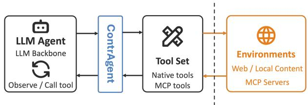
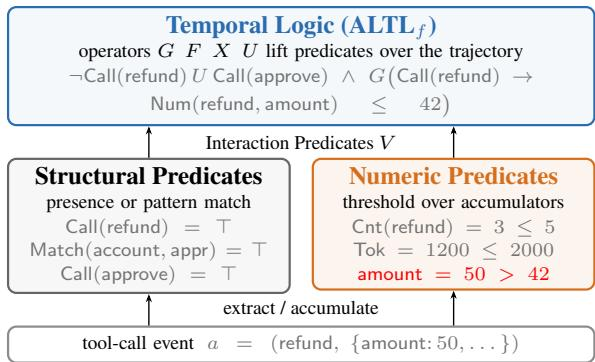
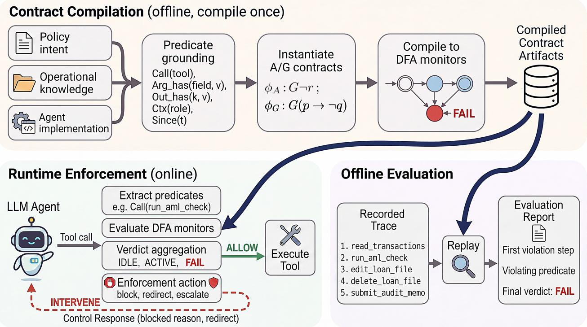
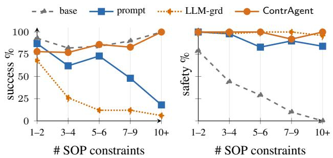
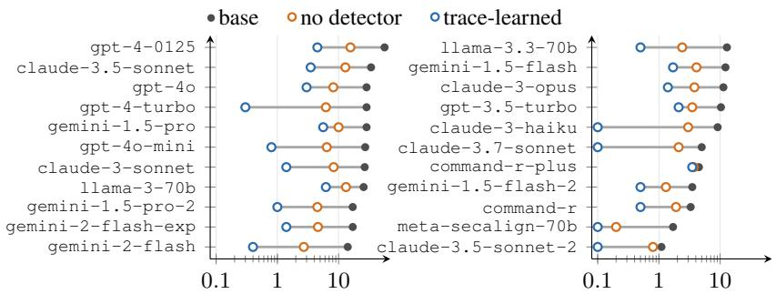
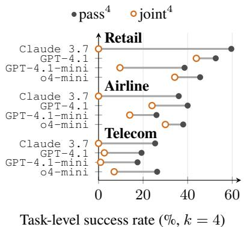

# Symbolic Temporal Supervision of LLM Agents Using Contracts∗

Yifeng Xiao1

Pierluigi Nuzzo1

1Department of Electrical Engineering and Computer Sciences, University of California, Berkeley, CA, USA {yifeng\_xiao, pierluigi.nuzzo}@berkeley.edu

## Abstract

Large language model (LLM) agents augmented by tools can automate complex, multi-step tasks, such as web navigation, code generation, and workflow orchestration, by acting on external systems through tool calls. However, hallucinations, distributional instability, and adversarial manipulations in LLMs, and the irreversible consequences of certain tool calls can lead to harmful outcomes. Existing safeguards either grade recorded trajectories post hoc with stochastic LLM judges or block unsafe actions one call at a time, and no single deterministic artifact supports both roles. We present ContrAgent, a contract-based framework for symbolic temporal supervision of LLM agents. ContrAgent captures an agent’s behavior as a sequence of tool calls and formalizes it as a trace over a fixed set of checkable predicates. It then specifies required behaviors using assume-guarantee contracts in linear temporal logic over finite traces (LTLf). Each contract is compiled to a deterministic finite automaton (DFA) that serves two roles: gating agent actions online and evaluating recorded traces ofline. A contract library, acting as a reusable knowledge base, is maintained independently of the agent’s model and can be applied across diferent agents within the same task domain. We show the efectiveness of our approach on four benchmarks spanning both roles, where ContrAgent matches state-of-the-art LLM-judge and rule-based guardrail baselines while producing deterministic, reproducible verdicts and, in the online mode, orders-of-magnitude lower per-call latency.

## 1 Introduction

Recent tool-augmented large language model (LLM) agents can automate complex, multi-step tasks in real-world domains, including web navigation (Zhou et al. 2024), code generation (Jimenez et al. 2024), and workflow orchestration (Wu et al. 2024). Agentic frameworks such as Open-Claw (OpenClaw Project 2026), HermesAgent (Nous Research 2026), and LangChain (Chase 2022) achieve these capabilities through tool-call interfaces, ranging from shell commands to application programming interface (API) calls and protocols such as the Model Context Protocol (MCP) (Anthropic 2024). These interfaces let agents act on external systems, but they also introduce safety risks: the hallucinations and distributional instability of LLMs combined with possible adversarial manipulations and the irreversible consequences of tool calls can lead to harmful outcomes. These failure modes include indirect prompt injection, metric gaming under performance pressure, dangerous code execution, and identity confusion across delegating agents (Sotiropoulos et al. 2025).

  
Figure 1: ContrAgent monitors the tool-call interface between an LLM agent and its tools.

Several approaches grade a recorded trajectory post hoc with an LLM judge or a learned detector (Zheng et al. 2023; Sharma, Barke, and Zorn 2026; Wen et al. 2026), but their verdicts are stochastic and hard to reproduce. Enforcement mechanisms instead block unsafe actions in real time, yet they judge each action in isolation and miss properties that span the trajectory (Wang, Poskitt, and Sun 2026; Inan et al. 2023), attach to semantic intent rather than tool-call behavior (Kamath et al. 2025; Miculicich et al. 2025), or depend on a model of the specific agent (Wang et al. 2025). No single deterministic artifact both guards an agent online and grades a recorded trajectory ofline.

Inspired by assume-guarantee (A/G) contract-based design (Benveniste et al. 2018; Nuzzo et al. 2015), whose compositional reasoning has been applied to cyber-physical systems (Xiao et al. 2024; Xiao and Nuzzo 2026; Xiao et al. 2026), we present ContrAgent, a contract-based, modelagnostic, deterministic framework for symbolic temporal supervision of LLM agents. We formalize trajectory-level requirements as A/G contracts in linear temporal logic on finite traces (LTL ) (De Giacomo and Vardi 2013) over checkable atomic propositions (AP) on agent actions. Contracts are compiled to deterministic finite automaton (DFA) checkers that supervise the agent’s trajectory, by gating agent actions online, as shown in Figure 1, or evaluating recorded traces ofline. Our contributions can be summarized as follows:

• We introduce A/G contracts as formal specifications of intent requirements for LLM agents, using a set of checkable

AP over tool-call traces and forming a contract library.

• We present ContrAgent, a model-agnostic, deterministic supervision framework for LLM agents using contracts to both shield an agent online and score its traces ofline.

• We evaluate ContrAgent across four benchmarks spanning both roles, showing it matches strong LLM-judge and guardrail baselines at orders of magnitude lower percall latency, and provides a deterministic, reproducible evaluator of recorded traces.

The remainder of the paper is organized as follows. After discussing related work in Section 2, we provide background on agent frameworks, $\operatorname { L T L } _ { f }$ , and A/G contracts in Section 3. Section 4 introduces interaction predicates and agent contracts, while Section 5 provides details on contract compilation and contract-based supervision. Section 6 reports results from the four benchmarks, and is followed by concluding remarks in Section 7.

## 2 Related Work

Most runtime safeguards for tool-based operation of LLM agents act at the tool-call boundary. Per-action rule languages such as AgentSpec (Wang, Poskitt, and Sun 2026) check each proposed call against a set of rules. They are fast and deterministic but scoped to a single action rather than reasoning about a trajectory’s action ordering, history, or counts. A separate information-flow line of work tracks data and privilege across the execution to stop prompt injection and exfiltration, as in Progent (Shi et al. 2025), CaMeL (Debenedetti et al. 2025), RTBAS (Zhong et al. 2025), and Fides (Costa et al. 2025). The threat model considered in this line of work is, however, orthogonal to ContrAgent’s contracts.

A class of approaches uses logic to reason about the execution trace: Agent-C (Kamath et al. 2025) checks temporal constraints with satisfiability modulo theories (SMT) solving during generation, VeriGuard (Miculicich et al. 2025) generates policy code with an LLM and formally verifies it before use, and FORGE (Palumbo et al. 2026) weaves deterministic Datalog policies into multi-agent deployments. However, none of them maintains a symbolic verdict over the whole trajectory. Safety Chip (Yang et al. 2024) compiles propositional linear temporal logic (LTL) to mask unsafe actions of embodied robot agents, whereas ContrAgent supervises general tool-calling LLM agents with A/G contracts over checkable AP.

Another class of approaches aims to grade or shield behaviors using a learned model or an LLM judge. LLM-asjudge graders (Zheng et al. 2023), AgentPex (Sharma, Barke, and Zorn 2026), and learned detectors such as PolicyGuard (Wen et al. 2026) score recorded trajectories, but their verdicts are stochastic and hard to reproduce, particularly on safety judgments (Chen and Goldfarb-Tarrant 2025). Shield-Agent (Chen, Kang, and Li 2025) compiles policy documents into action-based probabilistic rule circuits, ABC (Bhardwaj 2026) enforces behavioral contracts under a probabilistic satisfaction relation, and ProbGuard (Wang et al. 2025) predicts violations by probabilistic model checking of a learned agent model, so their verdicts are probabilistic and are not used to deterministically block undesirable behaviors.

## 3 Preliminaries

As we aim to supervise an agent’s tool calls with A/G contracts, we first give background on agent frameworks and temporal logic, then state the supervision problem.

## 3.1 Agent Frameworks

An agent pairs an LLM backbone with a tool set, issuing tool calls and folding their outputs into a reasoning loop until task completion (Yao et al. 2023). The tool-call interface is the set of tools the framework exposes to the agent, together with their call and return conventions. Reasoning steps carry the agent’s decision making, but they take external efect only through the tool calls they issue, and the class of irreversible consequences this paper targets arises at this interface. ContrAgent therefore tracks the tool-call trace, the ordered sequence of tool-call events the agent emits, now often a long-horizon, multi-tool trajectory (Xu et al. 2026).

Definition 1 (Agent session) Let Σ denote the finite set of tool-call events. Each tool call produces two events: a call event $a = ( \mathrm { t o o l } , \mathsf { a r g s } )$ when the agent issues the call, and a return event $a ^ { \prime } = ( { \sf t o o l } , { \sf r e s u l t } )$ when the executed tool returns.An agent’s execution is a transition system (Baier and Katoen 2008) $\mathcal { T } = ( S , s _ { 0 } , \Sigma , R )$ . A state $s : = ( \tau , \kappa , \rho ) \in S$ comprises the trace $\tau \in \Sigma ^ { * }$ of events issued so far, a finite map κ from context keys to values recorded from earlier events, and a vector ρ ofnumeric session counters, with $s _ { 0 } : =$ $\left( \varepsilon , \kappa _ { 0 } , \rho _ { 0 } \right)$ . Each event a induces a transition $( s , a , s ^ { \prime } ) \in R$ that appends a to τ and updates κ and $\rho .$ An agent session is afinite path $s _ { 0 } \ { \xrightarrow { { a _ { 1 } } } } \cdots \ { \xrightarrow { { a _ { k } } } } \ s _ { k } ,$ , with trace $\tau = a _ { 1 } \cdot \cdot \cdot a _ { k } .$ A context key records a fact carried across events, such as the caller’s identity or a document’s source, and a counter tracks a cumulative quantity, such as the tokens consumed.

## 3.2 Finite-Trace LTL (LTLf)

LTL (Pnueli 1977) extends propositional logic to reason over infinite sequences of propositional interpretations, or traces. $\mathrm { L T L } _ { f }$ (De Giacomo and Vardi 2013) restricts this logic to finite traces. $\operatorname { L e t } A P$ be a finite set of atomic propositions. The class of LTL formulae over $A P$ is defined by the grammar $\varphi : : = P \mid \neg \varphi \mid \varphi \land \varphi ^ { \prime } \mid X \varphi \mid F \varphi \mid G \varphi \mid \varphi U { \bar { \varphi ^ { \prime } } }$ , where ${ \bf { \dot { P } } } \in { \bf { \nabla } } A P$ is an $\mathbf { A P }$ and $\varphi ^ { \prime }$ is an LTLf formula, with temporal operators $X$ (next), $F$ (eventually), G (always), and U (until). Each $\mathrm { L T L } _ { f }$ formula compiles to an equivalent DFA that accepts exactly the traces satisfying it (De Giacomo and Vardi 2013), which is the canonical monitor construction of runtime verification (Bauer, Leucker, and Schallhart 2011; Leucker and Schallhart 2009).

When an atomic predicate is used to compare an arithmetic quantity read from the session state s, such as a call count or token total accumulated in $\rho ,$ or an argument value latched into $\kappa ,$ against a bound, then it is better captured by a linear-arithmetic constraint than by a plain proposition. An $\mathrm { L T L } _ { f }$ formula over such atoms is then taken modulo linear arithmetic, i.e., arithmetic $\mathrm { L T L } _ { f } \left( \mathrm { A L T L } _ { f } \right)$ (Felli et al. 2023), an instance of $\mathrm { L T L } _ { f }$ modulo theories (Geatti, Gianola, and Gigante 2022). ContrAgent evaluates every atom pointwise, i.e., its truth value at each event is computed from the current event a and the session state s.

## 3.3 Assume-Guarantee (A/G) Contracts

Let M denote a component, i.e., an element of a system, characterized by a set of variables $V _ { c }$ and a set of behaviors M over $V _ { c } . \mathrm { A }$ contract C formally captures a set of specifications for M using a triple $C \doteq ( \tilde { V _ { c } } , A , G )$ (Benveniste et al. 2018), where A and G are sets of behaviors over $V _ { c } .$ A is the assumptions on the environment of M while G is the guarantees provided by M, given that the assumptions are satisfied. We say that M is a valid implementation of C, i.e., $M \models C ,$ if all the behaviors of M are included in the guarantees given the assumptions of $C , \mathsf { i . e . , } \mathbb { I } M ] \subseteq G \cup \overline { { A } }$ We say that component $E _ { c }$ is a valid environment of C if all the behaviors of $E _ { c }$ are contained in the assumptions of C. A contract is consistent if and only if there exists a valid implementation, $\operatorname { i . e . , } G \cup { \overline { { A } } } \neq \varnothing$ , and it is compatible if there exists a valid environment $E _ { c } , \mathrm { i } . \mathbf { e } . , A \neq \emptyset$

ContrAgent formalizes contracts over the agent’s tool-call trace: the component is the agent, whose behaviors M are the tool-call traces it can produce (Def. 1), and the variables $V _ { c }$ are the set AP. At runtime, a session exposes a single behavior of this component, and ContrAgent evaluates the observed trace τ by the three-valued valuation below.

Definition 2 (Runtime contract valuation) A contract $C$ is a pair $( A , G )$ of $A L T L _ { f }$ properties over AP. Against a concrete trace τ, its valuation takes one of three values, named IDLE (1), ACTIVE $( e ) ,$ and FAIL (0), ordered as $0 \leq e \leq 1 $ , following the multi-valued verdicts of runtime verification (Bauer, Leucker, and Schallhart 2006):

$$
\begin{array} { r } { [ ( A , G ) ] [ \tau ) = \left\{ \begin{array} { l l } { 1 , } & { \tau \models \overline { { A } } , } \\ { e , } & { \tau \models A \land G , } \\ { 0 , } & { \tau \models A \land \overline { { G } } . } \end{array} \right. } \end{array}\tag{1}
$$

## 3.4 Agent Trajectory Supervision

An execution monitor can be used to halt a run at the first policy-violating action, thus enforcing a safety property (Schneider 2000). We adapt this approach to the agent’s tool-call trace.

Problem 1 (Agent Trajectory Supervision) Agent trajectory supervision is the problem of monitoring an agent’s tool-call trace τ against a set ofcontracts $\mathcal { C } = \{ \bar { C } _ { 1 } , \ldots , \bar { C } _ { n } \}$ with $C _ { i } = ( A _ { i } , \bar { G } _ { i } )$ . We define the monitor verdict $v ( \tau ) =$ $( v _ { \mathrm { e n v } } ( \tau ) , ~ v _ { \mathrm { a g } } ( \tau ) )$ is defined by the join and the meet ofthe contract valuations asfollows:

$$
\begin{array} { r } { v _ { \mathrm { e n v } } ( \tau ) = \ V _ { i } \mathbb { I } ( A _ { i } , G _ { i } ) \mathbb { I } ( \tau ) , } \end{array}\tag{2}
$$

$$
\begin{array} { r } { v _ { \mathrm { a g } } ( \tau ) = \bigwedge _ { i } [ ( A _ { i } , G _ { i } ) ] [ \tau ) . } \end{array}\tag{3}
$$

The environment is not validfor at least one contract if and only $i f v _ { \mathrm { e n v } } ( \tau ) = 1 ,$ ; the agent violates at least one contract if and only $i f v _ { \mathrm { a g } } ( \tau ) = 0$ . Therefore, trajectory supervision provides deterministic maps over C asfollows:

• In online enforcement, it provides a map $\sigma : \Sigma ^ { * } \ $ {pass, block} that, on the trace, returns block at the first prefix $\tau _ { k } = a _ { 1 } \cdot \cdot \cdot a _ { k }$ with $v ( \tau _ { k } ) \neq ( e , e )$ and pass at every earlier prefix;

• In ofline evaluation, it provides a map $\mu : \Sigma ^ { * } \ \to$ $\{ 0 , e , 1 \} ^ { 2 } w i t h \mu ( \tau ) = v ( \dot { \tau } )$ , the monitor verdict.

<table><tr><td></td><td>Type Predicate</td><td>Meaning</td></tr><tr><td>Stuuuural</td><td>Call(T)  $\mathsf { A r g H a s } ( T , f , p )$   $\mathsf { O u t H a s } ( T , p )$   $\mathsf { S a i d } ( p ) , \mathsf { I n } ( p )$   ${ \mathsf { M a t c h } } ( f , k )$ </td><td>tool T is invoked argument f of T matches pattern p result of  $T$  matches pattern p model output / input matches pattern p argument field f equals context value k</td></tr><tr><td>Numric</td><td>Cnt(T)  $\mathsf { N u m } ( T , f )$  Tok</td><td>current number of T calls numeric value of argument field f cumulative tokens consumed</td></tr></table>

Table 1: ContrAgent’s interaction predicates (subset; full vocabulary in Appendix A). T is a tool, $f$ an argument field, p a regular-expression or literal-value pattern, $P :$ a permission set, $\bar { S }$ an allowed-value set, s, d argument or result fields as source and sink, and k a context value. Numeric rows list the quantity θ; the predicate is θ ▷◁ c with bound c.

ContrAgent solves this problem using one checker per contract, executed online for σ and replayed ofline for $\mu ,$ as shown in §5.2.

## 4 Agent Contracts

We introduce the interaction predicate, the atomic proposition from which agent contracts are built. In the following, we use ⊤ and ⊥ to denote the Boolean values true andfalse, respectively.

Definition 3 (Interaction Predicate) We define an interaction predicate as a predicate $P ( s , a , c )$ over a session state s, a tool-call event $a \in \Sigma \ ( D e f . \ I ) ,$ , and a parameter c. Its truth value, ⊤ or ⊥, is a deterministic function of s, a, and c, evaluated by the monitor at each event (§5.1).

The parameter c instantiates a predicate with, for example, a numeric bound or a string pattern. Given a session, we define a set of interaction predicates monitored at runtime. They cover a wide range of properties over the tool-call interface: predicates over the call and the session state are evaluated at call events, and predicates over the result (e.g., OutHas) at return events. We categorize the predicates into two families, as shown in Table 1.

Structural predicates. A structural predicate is a deterministic Boolean test of a discrete condition: the presence or absence of an event (e.g., a tool firing, Call, or a data flow, Flow), or a pattern, equality, or membership match on a field $( \mathrm { e . g . , A r g H a s } .$ , Match), with no model in the loop.

Numeric predicates. We extend the structural family with a stateful, numeric family that tracks cumulative quantities over the session, such as counts and totals. A numeric predicate has the form $\theta ( s , a ) \bowtie c ,$ with ▷◁∈ $\{ \leq , < , \geq , > , = \}$ where θ extracts a quantity from the current event a and state s, such as a count, a total, or an argument’s value, and c is a constant bound. The predicate holds exactly when the comparison holds, $P ( s , \dot { a } , c ) = \big [ \theta ( s , a )$ ▷◁ $c ]$ , where [·] is the

  
Figure 2: One tool-call event grounded into structural and numeric predicates, then lifted by the $\mathrm { A L T L } _ { f }$ layer.

Iverson bracket, as in $\mathsf { C n t } ( T ) \leq N$ . The monitor maintains each accumulated quantity in a counter, one entry of the vector $\rho$ of Def. 1, updated deterministically at each event. Such arithmetic-constraint atoms are what lift a contract’s logic from propositional $\mathrm { L T L } _ { f }$ to its arithmetic extension $\mathbf { A L T L } _ { f }$ (Felli et al. 2023).

With the LTLf operators, we use interaction predicates to define agent contracts for trajectory supervision as follows.

Definition 4 (Agent Contract) An agent contract is a triple $C = ( V , \varphi _ { A } , \varphi _ { G } )$ , where:

1. $V = V _ { \mathrm { a g } } \cup V _ { \mathrm { e n v } }$ is a finite set of interaction predicates (Def. 3), the AP of the contract’s formulas, where $V _ { \mathrm { a g } }$ collects the predicates decided by the agent’s own actions and $V _ { \mathrm { e n v } }$ those decided by its environment.

2. The assumption $\varphi _ { A }$ is an ALTLf formula over $V _ { \mathrm { e n v } } ,$ , and the guarantee φG is an $A L T L _ { f } ^ { - }$ formula over V, both according to the grammar of§3.

The partition of V mirrors the distinction between controlled and uncontrolled variables in contract-based design (Benveniste et al. 2008). For example, Call, ArgHas, and Cnt track the tool calls that the agent itself issues (Def. 1), their arguments, and the counts derived from them, so they belong to $V _ { \mathrm { a g } } .$ . OutHas, In, and Perm track tool results, user input, and granted permissions, so they belong to $V _ { \mathrm { e n v } }$ . The actions of other agents also belong to the environment. Semantically, an agent’s session satisfies the contract when its trace satisfies $\varphi _ { A }  \varphi _ { G } ,$ with $( \varphi _ { A } , \varphi _ { G } )$ instantiating the pair $( A , G )$ of Def. 2. Such contracts capture a wide range of trajectory properties over the tool-call interface, including order-, history-, and count-dependent ones (Appendix B).

Example 1 Consider a contract whose guarantee, shown in Figure 2, is $\varphi _ { G } ~ = ~ \lnot C \mathsf { a l l } ( \mathsf { r e f u n d } ) \ : U \ : \mathsf { C a l l } ( \mathsf { a p p r o v e } ) \ : \ : ,$ ∧ $G ( \mathsf { C a l l } ( \mathsf { r e f u n d } ) ~ \to$ Num(refund, amount) $\leq 4 2 )$ , where \$42 is the approved amount recorded by an earlier approve call. Take the call event a = (refund, {amount: $5 0 , \ldots \} )$ The structural predicates hold, $\mathsf { C a l l } ( \mathsf { r e f u n d } ) \ = \ \top$ and Match(account, appr) = ⊤, since approve was called first and the account matches. The numeric predicate Num(refund, amount) ≤ 42 evaluates to ⊥ at amount = 50, so the guarantee, and with it the contract,falls to FAIL.

## 5 The ContrAgent Framework

Given the agent contracts, as defined in §4, ContrAgent proceeds in two stages. In the ofline stage (§5.1), it abstracts requirement artifacts into contracts and translates each contract into a deterministic monitor, the DFA associated with its $\mathbf { A L T L } _ { f }$ formula. In the online stage (§5.2), it supervises the agent by advancing every monitor over the tool-call trace and gating each call on the joint verdict (Problem 1).

## 5.1 Contract Compilation

Contract compilation extracts contracts from requirement artifacts (e.g., natural language, policy documents, recorded traces) into $\mathrm { A L T L } _ { f }$ formulas over the interaction predicates of §4, then compiles them into DFAs (Figure 3). The two steps are described next.

Contract formulation. Besides manually written $\mathrm { A L T L } _ { f }$ contracts, we support translating natural-language requirements and extracting rules from policy documents. Following a lift-then-ground decomposition (Liu et al. 2023), the LLM first lifts each utterance to an $\mathrm { A L T L } _ { f }$ formula with placeholder leaves, and a deterministic step then grounds those placeholders to interaction predicates from Table 1, yielding the closed formula. The LLM thus fills templates over the fixed vocabulary of Table 1 (Wang et al. 2023) with a few prompt examples. Each formula is translated back to natural language for human review (Cosler et al. 2023).

Automaton construction. By the standard ${ \mathrm { L T L } } _ { f ^ { - } } { \mathrm { t o } } { \mathrm { - D F A } }$ construction (De Giacomo and Vardi 2013), every contract formula over V compiles to a DFA whose alphabet is the set $2 ^ { V }$ of predicate valuations. The DFA reads a trace one event at a time, taking a transition on the predicate valuation at that event, and accepts exactly the finite traces that satisfy the formula. We call grounding the deterministic step that evaluates each predicate on the current event and the counters, producing the valuation read by the DFA. For a numeric predicate, grounding evaluates the arithmetic constraint $\theta ( s , a )$ ▷◁ c against the session’s counters, and the DFA construction stays standard. The counter state is read only during grounding and is not encoded in the DFA, which keeps it finite. A contract carries two such formulas, the assumption $\varphi _ { A }$ and the guarantee $\varphi _ { G } .$ , so each compiles to its own DFA. We store the two DFAs as one checker corresponding to the contract for agent supervision.

Contract library. The compiled checkers form a contract library that ContrAgent loads at runtime. Because a contract is written over interaction predicates rather than any model’s internals, the library is portable: the same checkers apply unchanged across agents and LLM models that share a tool interface, so a domain’s policies transfer between models. For each contract, ContrAgent first checks consistency and compatibility, and also checks the loaded library is conflictfree: the conjunction $\textstyle \bigwedge _ { i } ( A _ { i } \wedge G _ { i } )$ of its $\mathrm { A L T L } _ { f }$ formulas is satisfiable. When it is not, we extract a minimal unsatisfiable core (Roveri et al. 2024; Ielo et al. 2026) to locate the contracts to repair.

  
Figure 3: The ContrAgent framework: authoring inputs compile once into a contract checker (top), read online to block the first violating call (bottom left) and ofline to score a recorded trace (bottom right).

## 5.2 Contract-Based Supervision

At each event, ContrAgent evaluates every interaction predicate and advances each loaded contract’s two DFAs on the resulting valuation. The two runs decide the contract’s value in Def. 2, and the values of all loaded contracts give the verdict v(τ) of Problem 1.

Because each contract is a single (A, G) pair checked independently, a violation is fully traceable: it names the contract that violated and the event that triggered it, so an operator can tell whether the fault lies in the agent flow, in its environment, or in a contract that is too restrictive, and repair the last by relaxing the guarantee or weakening the assumption. This modularity also lets the system enforce multiple policies at once, without merging them into a monolithic formula.

Runtime enforcement. At runtime, ContrAgent realizes the enforcement map σ of Problem 1. As shown in Figure 3, before the tool executes, it advances every loaded contract and returns block at the first event whose verdict is not (e, e). Every event is checked when it enters the trace and before it takes efect (Def. 1), so the verdict is computed before a call executes and before an incoming event reaches the agent. A call that would falsify a guarantee is rejected, and a return or input event that would falsify an assumption is suppressed. Neither event is recorded, so the session continues from the last prefix whose verdict was (e, e). The first keeps the agent a valid implementation of the contract and the second keeps its environment a valid environment, as in bidirectional runtime enforcement (Aceto et al. 2021). The check is incremental: rather than synthesizing each contract’s

DFAs in full, ContrAgent keeps a residual formula and progresses it one event at a time (Roşu and Havelund 2005), so the per-event cost is O(|C|), where C is the set of loaded contracts, independent of the trace length. Supervision thus scales to long horizons.

When the blocked event is a call, the enforcement action is decided by the strategy carried by the violated contract: block the call (the default), redirect it to a safe alternative, or escalate to a human. The outcome returns to the model as a structured message: the identifier of the contract involved, a short explanation, and, where it applies, the suggested replacement or required next action, so the agent can steer its trajectory back into the safe region. For example, a contract that forbids issuing a refund before approval can return a message like “the action issue\_refund was rejected: call check\_policy first”.

Prompting for a requested action lets ContrAgent act proactively, on a satisfied trigger rather than on a violation. Consider a prescriptive guarantee $G ( t r i g  X t o o l )$ ; when the trigger trig is satisfied and gets pass, a feedback message can ask the agent to call the required tool next. An unbounded liveness guarantee $G ( t r i g  F r e s p )$ cannot be refuted by any finite prefix: after trig is satisfied, it stays pending until resp occurs. At the end of the agent session, ContrAgent surfaces every still-pending guarantee as a feedback message asking the agent to perform resp, and a guarantee left unsatisfied collapses to FAIL.

Ofline evaluation. Contracts also serve as a deterministic evaluation engine for recorded traces: $\mu : \Sigma ^ { * } \to \{ 0 , e , 1 \} ^ { 2 }$ of Problem 1, as shown in Figure 3. ContrAgent replays a recorded trace and returns its end-of-trace verdict $\mu ( \tau ) =$ $v ( \tau )$ instead of gating actions, one value for the agent and one for its environment. The diference from enforcement is that the trace is fixed, so there is no intervention; and because each $v _ { i }$ depends only on the trace, the ofline replay and the online monitor traverse the same states and agree on the verdict at every prefix. When many traces are checked against the same contracts, the DFAs are built once and reused, turning each event into a single table lookup $( O ( 1 ) )$ . Ofline evaluation is thus deterministic and reproducible: the same trace always yields the same verdict and per-contract attribution, not a single pass/fail rate.

## 6 Evaluation

Our implementation1 is in Python 3.12; it exports contract libraries to CHASE (Nuzzo et al. 2018) for design-time contract analysis, and uses mus2muc (Ielo et al. 2026) for conflict-core extraction and Z3 (de Moura and Bjørner 2008) for the numeric consistency check. The contract library is built with an LLM following the formulation pipeline of §5.1, over the interaction predicates of Table 1. Integration hooks intercept each event and ground it deterministically through pattern matches and counter updates. Latency measurements reported below were taken on an Apple M4 Pro laptop (24 GB).

Benchmarks. We evaluate ContrAgent on four benchmarks, each isolating one claim. The enforcement role is tested by SOPBench (Li et al. 2025) (§6.1) and Agent-Dojo (Debenedetti et al. 2024) (§6.2); the evaluation role by R-Judge (Yuan et al. 2024) (§6.3) and $\tau ^ { 2 }$ -bench (Barres et al. 2025) (§6.4).

## 6.1 Standard Operating Procedure Enforcement

SOPBench (Li et al. 2025) evaluates whether a language agent follows an explicit standard operating procedure (SOP) across seven customer-service domains (bank, DMV, healthcare, hotel, library, university, online market), where each task provides a constraint graph, numeric thresholds, an initial database, and a label indicating whether the policy permits the goal. We compared ContrAgent with three baselines: (1) the base model with no SOP, (2) the base model prompted with the SOP, and (3) a second LLM that judges each call against the SOP. We report success and safety metrics, representing goal completion on tasks the SOP permits and correct blocking on tasks the SOP forbids, respectively.

We build each domain’s agent contracts from its public SOP, compiling the SOP’s gate/chain tree. As shown in Table 2, ContrAgent enforcement holds success at the base level while raising safety from 32% to 98%, above prompt’s 94%. Prompting and LLM-guard also achieve high safety (94% and 98%), but reduce mean success to 64% and 24%, respectively, because of over-blocking. Both residual gaps trace to the agent rather than the enforcement layer: in healthcare it fails to retry after a block, and in university it makes a permitted change to a target the benchmark’s outcome-based scoring cannot distinguish from the forbidden one.

<table><tr><td>domain (Su./Sf.)</td><td>base</td><td>prompt</td><td>LLM-grd</td><td>ContrAgent</td></tr><tr><td>bank</td><td>70/65</td><td>58/100</td><td>42/100</td><td>70/100</td></tr><tr><td>DMV</td><td>100/60</td><td>72/98</td><td>20/100</td><td>100/100</td></tr><tr><td>healthcare</td><td>90/48</td><td>52/95</td><td>20/100</td><td>83/100</td></tr><tr><td>hotel</td><td>100/0</td><td>30/98</td><td>15/100</td><td>100/100</td></tr><tr><td>library</td><td>80/25</td><td>48/95</td><td>22/98</td><td>80/100</td></tr><tr><td>university</td><td>100/8</td><td>92/82</td><td>33/88</td><td>100/83</td></tr><tr><td>online mkt.</td><td>100/20</td><td>92/90</td><td>15/98</td><td>100/100</td></tr><tr><td>mean</td><td>91/32</td><td>64/94</td><td>24/98</td><td>90/98</td></tr><tr><td>avg. runtime</td><td>1.96 s</td><td>+0.905s</td><td>+1.34s</td><td>+0.135s</td></tr></table>

Table 2: SOPBench results (gemini-2.5-flash, 40 tasks/domain); each cell is success (Su.) / safety (Sf.) %. avg. runtime: the base cell is its median runtime per task; the other cells are the median extra time over base.

  
Figure 4: SOPBench success (left) and safety (right) vs. SOP constraint count, pooled over seven domains.

The runtime cost of ContrAgent is lower than both prompt and LLM-guard, since it neither increases the prompt length nor calls a second model on every action. Each entry is a mean over three seeded trials; ContrAgent’s enforcement is stable across trials, with per-domain deviation ≤ 0.4 percentage points (pp), versus 2 to 4 pp for the model-driven conditions.

Model-agnostic supervision. With the same contract library, on gemini-2.5-flash-lite, where the unguarded base stays at 27%, prompt’s mean safety collapses from 94% to 45%, whereas ContrAgent’s enforced safety is unchanged at 98%, because the verdict does not depend on the agent’s model. Moreover, replaying the same contract library over SOPBench traces from 23 base models, the false-positive rate on safe traces stays below 1% for 19 of 23 models (max 4.5%, Llama-3.1-8B), even as the per-model violation rate varies widely with capability (Appendix C).

SOP constraint scaling. Binning tasks by the number of SOP constraints (which run from 1 to 17; pooled over the seven domains) exposes the success/safety tradeof that a single strategy hides. As shown in Figure 4, with the number of constraints increasing, prompting increasingly over-refuses: its success on permitted tasks collapses from 87% to 18% in the 10+ bin, while the unguarded base’s safety collapses from 79% to 0%. The LLM-guard keeps safety high, but with steep success reduction. ContrAgent holds success at 77% or above and safety at 89% or above across all bins, and the gap widens as the constraint count grows. Exact perbin values and the weak-model robustness breakdown are in Appendix D.

  
Prompt-injection attack-success rate (%, log scale)

  
Figure 5: Indirect prompt-injection prevention across 22 LLMs on AgentDojo; left and right are the higher- and lower-ASR halves.  
Figure 6: The $\tau ^ { 2 }$ -bench procedural reliability across three domains and four models.

## 6.2 Indirect Prompt Injection Prevention

AgentDojo (Debenedetti et al. 2024) embeds attacker text inside tool outputs (email bodies, calendar entries, search results) and measures whether the agent is steered into an unsafe action. ContrAgent prevents indirect prompt injection by filtering tool outputs and blocking any subsequent call that would violate the contract, regardless of whether the agent was tricked into issuing it. The contract library is built from the task and environment specifications of AgentDojo’s four suites, without knowledge of the attacks. It tags any value carried in by a tool output as untrusted, and blocks a sideefecting call whose target is both untrusted-introduced and outside the task’s legitimate set.

Figure 5 reports three results per model. The baseline results are from AgentDojo’s published numbers (Debenedetti et al. 2024). We call no-detector the setting in which no component flags the injected text, so that a value counts as untrusted whenever a tool output introduces it and the user has not named it. In this setting, the library reduces the pooled attack success rate (ASR) from 18.0% to 5.3% at 0.8% utility false positive (FP). Contracts can also be mined from the recorded traces of the attacks themselves (attacker recipients, unsafe actions, and the injected text as the untrusted source), which we call trace-learned contracts. This lowers the pooled ASR to 1.7% at 0.3% FP. The attacks ContrAgent misses fall into two kinds. Most (82%) issue no malicious tool call at all, e.g., denial-of-service injections that only divert the agent or text-response attacks answered in the agent’s own reply, outside what a tool-call shield can do. The remaining 18% are prompt injections that steer the agent into a tool call whose arguments are themselves legitimate values, leaving the deterministic guard no untrusted target to flag.

Table 3 compares ContrAgent with the defenses bundled with AgentDojo on gpt-4o under its main injection attack. Only the ContrAgent rows are measured here; the baseline rates are AgentDojo’s published numbers, and every utility value is computed from the published runs. Utility is the fraction of injection-free tasks completed. Overhead is the per-call runtime added by a defense, and prompt-side defenses add prompt text rather than a call. ContrAgent replays the recorded runs, so its utility cannot exceed that of the undefended agent. With no detector, ContrAgent lowers the ASR from 47.7% to 11.1% and completes 71.8% of the injection-free tasks, one task fewer than the undefended agent. The classifier reaches 7.95% but completes 41.9% of the tasks. The trace-learned variant reaches 0.79% at the utility of the undefended agent. Both variants add 0.16 ms per call, against 50 to 500 ms for the classifier and the LLM filter, and run no model. The per-workload latency breakdown is in Appendix E.

<table><tr><td>Defense</td><td>Type</td><td>ASR</td><td>Utility</td><td>Overhead</td></tr><tr><td>No defense</td><td>raw agent</td><td>47.7%</td><td>72.6%</td><td>0</td></tr><tr><td>spotlighting</td><td>prompt-side</td><td>41.7%</td><td>75.0%</td><td>prompt</td></tr><tr><td>repeat_user_prompt</td><td>prompt-side</td><td>27.8%</td><td>85.5%</td><td>prompt</td></tr><tr><td>ContrAgent (ND)</td><td>data-flow</td><td>11.1%</td><td>71.8%</td><td>0.16 ms</td></tr><tr><td>pi_detector</td><td>classifier</td><td>7.95%</td><td>41.9%</td><td>~50 ms</td></tr><tr><td>tool_filter</td><td>LLM prune</td><td>6.84%</td><td>71.8%</td><td>~500 ms</td></tr><tr><td>LlamaFirewall</td><td>guardrail</td><td>1.75%</td><td>n/a</td><td>~100 ms</td></tr><tr><td>ContrAgent (TL)</td><td>data-flow</td><td>0.79%</td><td>72.6%</td><td>0.16 ms</td></tr></table>

Table 3: AgentDojo defenses on gpt-4o (ND: no detector, TL: trace-learned).

## 6.3 Agent Safety Risk Evaluation

R-Judge (Yuan et al. 2024) tests whether an evaluator can detect unsafe agent behavior post hoc across ten operational risk types in 571 multi-turn agent records (301 unsafe / 270 safe). Contracts come from R-Judge’s risk taxonomy, a policy document (§5.1). ContrAgent reaches an average $\mathrm { F _ { 1 } }$ score of 91.8% (97.0% precision, 87.0% recall) across multiple trials. This exceeds GPT-4o (74.4%) and the R-Judge human baseline (≈ 89%). AgentAuditor (Luo et al. 2025) outperforms our method at the cost of a Gemini-2 judge with retrieval over an experiential memory. The records we miss are semantic rather than procedural, outside what a deterministic tool-call check can decide.

## 6.4 Procedural Violation and Outcome Scoring

τ2-bench (Barres et al. 2025) runs customer-service agents through multi-turn dual-control conversations against a written policy document in three domains. Its native $\mathtt { p a s s } ^ { k }$ metric is outcome-only (final database state). AgentPex (Sharma, Barke, and Zorn 2026) showed 83% of reward-1.0 Claude traces still violate a procedural rule. With contract libraries built from the policy documents, ContrAgent measures procedural compliance deterministically, while LLM judges can only approximate it. We report a $\mathrm { j o i n t } ^ { k }$ metric that combines outcome and zero contract violations across k retries. Figure 6 exposes the gap this creates: across the 4,464-trace matrix Claude 3.7 reaches an outcome $\mathsf { p a s s } ^ { 4 }$ of 25–60% yet $\mathrm { { \ a \ j o \dot { 1 } n t ^ { 4 } } }$ of 0% in all three domains, i.e., no task is completed reliably without at least one procedural violation, a form of reward hacking. Per-cell values for every domain and model are in Appendix F.

Limitations. ContrAgent enforces only what the tool-call structure exposes, and free-form semantic harms need a separate content-level check. In this paper, the library is inspected by humans before use; autoformalization of natural-language policies is out of the scope of this work and left as a future direction. The counters that ground numeric predicates (§4) trust the framework to report events faithfully, and defending this observation channel itself is beyond our scope.

## 7 Conclusion

We presented ContrAgent, a contract-based framework that formalizes trajectory-level specifications of large language model (LLM) agents as assume-guarantee $( \mathbf { A } / \bar { \mathbf { G } } )$ contracts over checkable tool-call predicates, expressed in arithmetic linear temporal logic on finite traces $( \mathrm { A L T L } _ { f } )$ , and compiles each into a deterministic finite automaton (DFA) for online enforcement and ofline evaluation. The contract library acts as a model-agnostic knowledge base of agent policies. We illustrated the efectiveness of our approach on four benchmarks spanning both roles, where ContrAgent matches LLM-judge and guardrail baselines while producing deterministic, reproducible verdicts at orders of magnitude lower per-call latency. Future work includes compiling contracts into reward machines for post-training and constrained decoding, and investigating contract-based decomposition mechanisms for multi-agent systems.

## References

Aceto, L.; Cassar, I.; Francalanza, A.; and Ingólfsdóttir, A. 2021. On Bidirectional Runtime Enforcement. In Proc. Formal Techniques for Distributed Objects, Components, and Systems (FORTE), LNCS. Springer.

Anthropic. 2024. Introducing the Model Context Protocol. Anthropic; open protocol specification.

Baier, C.; and Katoen, J.-P. 2008. Principles of Model Checking. Cambridge, MA: MIT Press.

Barres, V.; Dong, H.; Ray, S.; Si, X.; et al. 2025. τ2-Bench: Evaluating Conversational Agents in a Dual-Control Environment. ArXiv preprint arXiv:2506.07982.

Bauer, A.; Leucker, M.; and Schallhart, C. 2006. Monitoring of Real-Time Properties. In Proc. Foundations of Software Technology and Theoretical Computer Science (FSTTCS), volume 4337 of Lecture Notes in Computer Science, 260– 272. Springer.

Bauer, A.; Leucker, M.; and Schallhart, C. 2011. Runtime Verification for LTL and TLTL. ACM Transactions on Software Engineering and Methodology (TOSEM), 20(4): 14:1– 14:64.

Benveniste, A.; Caillaud, B.; Ferrari, A.; Mangeruca, L.; et al. 2008. Multiple Viewpoint Contract-Based Specification and Design. In Proc. Formal Methodsfor Components and Objects (FMCO), volume 5382 of LNCS, 200–225. Springer.

Benveniste, A.; Caillaud, B.; Nickovic, D.; Passerone, R.; et al. 2018. Contracts for System Design. Foundations and Trends in Electronic Design Automation, 12(2–3): 124–400.

Bhardwaj, V. P. 2026. Agent Behavioral Contracts: Formal Specification and Runtime Enforcement for Reliable Autonomous AI Agents. ArXiv preprint arXiv:2602.22302.

Chase, H. 2022. LangChain: Building Applications with LLMs through Composability. Open-source software.

Chen, H.; and Goldfarb-Tarrant, S. 2025. Safer or Luckier? LLMs as Safety Evaluators Are Not Robust to Artifacts. In Proc. Annual Meeting of the Association for Computational Linguistics (ACL), 19750–19766.

Chen, Z.; Kang, M.; and Li, B. 2025. ShieldAgent: Shielding Agents via Verifiable Safety Policy Reasoning. In Proc. International Conference on Machine Learning (ICML).

Cosler, M.; Hahn, C.; Mendoza, D.; Schmitt, F.; et al. 2023. nl2spec: Interactively Translating Unstructured Natural Language to Temporal Logics with Large Language Models. In Proc. Computer Aided Verification (CAV), volume 13965 of Lecture Notes in Computer Science, 383–396. Springer.

Costa, M.; Köpf, B.; Kolluri, A.; Paverd, A.; et al. 2025. Securing AI Agents with Information-Flow Control. ArXiv preprint arXiv:2505.23643.

De Giacomo, G.; and Vardi, M. Y. 2013. Linear Temporal Logic and Linear Dynamic Logic on Finite Traces. In Proc. International Joint Conference on Artificial Intelligence (IJ-CAI), 854–860.

de Moura, L.; and Bjørner, N. 2008. Z3: An Eficient SMT Solver. In Proc. Tools and Algorithms for the Construction and Analysis of Systems (TACAS), volume 4963 of Lecture Notes in Computer Science, 337–340. Springer.

Debenedetti, E.; Shumailov, I.; Fan, T.; Hayes, J.; et al. 2025. Defeating Prompt Injections by Design. ArXiv preprint arXiv:2503.18813.

Debenedetti, E.; Zhang, J.; Balunović, M.; Beurer-Kellner, L.; et al. 2024. AgentDojo: A Dynamic Environment to Evaluate Prompt Injection Attacks and Defenses for LLM Agents. In Proc. Conference on Neural Information Processing Systems (NeurIPS), Datasets and Benchmarks Track.

Felli, P.; Montali, M.; Patrizi, F.; and Winkler, S. 2023. Monitoring Arithmetic Temporal Properties on Finite Traces. In Proc. AAAI Conference on Artificial Intelligence (AAAI), 6346–6354. AAAI Press.

Geatti, L.; Gianola, A.; and Gigante, N. 2022. Linear Temporal Logic Modulo Theories over Finite Traces. In Proc. International Joint Conference on Artificial Intelligence (IJ-CAI), 2641–2647. ijcai.org.

Ielo, A.; Mazzotta, G.; Peñaloza, R.; and Ricca, F. 2026. Enumerating Minimal Unsatisfiable Cores of LTLf Formulae. In Proc. AAAI Conference on Artificial Intelligence (AAAI), 19160–19168. AAAI Press.

Inan, H.; Upasani, K.; Chi, J.; Rungta, R.; et al. 2023. Llama Guard: LLM-based Input-Output Safeguard for Human-AI Conversations. ArXiv preprint arXiv:2312.06674.

Jimenez, C. E.; Yang, J.; Wettig, A.; Yao, S.; et al. 2024. SWE-bench: Can Language Models Resolve Real-World GitHub Issues? In Proc. International Conference on Learning Representations (ICLR).

Kamath, A.; Zhang, S.; Xu, C.; Ugare, S.; et al. 2025. Enforcing Temporal Constraints for LLM Agents. ArXiv preprint arXiv:2512.23738.

Leucker, M.; and Schallhart, C. 2009. A Brief Account of Runtime Verification. The Journal of Logic and Algebraic Programming, 78(5): 293–303.

Li, Z.; Huang, S.; Wang, J.; Zhang, N.; et al. 2025. SOP-Bench: Evaluating Language Agents at Following Standard Operating Procedures and Constraints. ArXiv preprint arXiv:2503.08669.

Liu, J. X.; Yang, Z.; Idrees, I.; Liang, S.; et al. 2023. Grounding Complex Natural Language Commands for Temporal Tasks in Unseen Environments. In Proc. Conference on Robot Learning (CoRL). System name “Lang2LTL”.

Luo, H.; Dai, S.; Ni, C.; Li, X.; et al. 2025. AgentAuditor: Human-Level Safety and Security Evaluation for LLM Agents. In Proc. Conference on Neural Information Processing Systems (NeurIPS).

Miculicich, L.; Parmar, M.; Palangi, H.; Dvijotham, K. D.; et al. 2025. VeriGuard: Enhancing LLM Agent Safety via Verified Code Generation. ArXiv preprint arXiv:2510.05156.

Nous Research. 2026. Hermes Agent: A Self-Improving Open-Source Agent Framework. Open-source software.

Nuzzo, P.; Lora, M.; Feldman, Y. A.; and Sangiovanni-Vincentelli, A. L. 2018. CHASE: Contract-based requirement engineering for cyber-physical system design. In Proc. Design, Automation & Test in Europe Conference (DATE), 839–844.

Nuzzo, P.; Sangiovanni-Vincentelli, A. L.; Bresolin, D.; Geretti, L.; et al. 2015. A Platform-Based Design Methodology with Contracts and Related Tools for the Design of Cyber-Physical Systems. Proceedings ofthe IEEE, 103(11): 2104–2132.

OpenClaw Project. 2026. OpenClaw: An Open-Source Personal AI Agent. Open-source software.

Palumbo, N.; Choudhary, S.; Choi, J.; Amir, G.; et al. 2026. Formal Policy Enforcement for Real-World Agentic Systems. ArXiv preprint arXiv:2602.16708.

Pnueli, A. 1977. The Temporal Logic of Programs. In Proc. Annual Symposium on Foundations of Computer Science (FOCS), 46–57. IEEE.

Roşu, G.; and Havelund, K. 2005. Rewriting-Based Techniques for Runtime Verification. Automated Software Engineering, 12(2): 151–197.

Roveri, M.; Di Ciccio, C.; Di Francescomarino, C.; and Ghidini, C. 2024. Computing Unsatisfiable Cores for LTLfSpecifications. Journal of Artificial Intelligence Research, 80: 517–558.

Schneider, F. B. 2000. Enforceable Security Policies. ACM Transactions on Information and System Security (TISSEC), 3(1): 30–50.

Sharma, R. K.; Barke, S.; and Zorn, B. 2026. Willful Disobedience: Automatically Detecting Failures in Agentic Traces. In Proc. ACM Conference on AI andAgentic Systems (CAIS).

Shi, T.; He, J.; Wang, Z.; Li, H.; et al. 2025. Progent: Securing AI Agents with Privilege Control. ArXiv preprint arXiv:2504.11703.

Sotiropoulos, J.; Del Rosario, R. F.; Kokuykin, E.; Oakley, H.; et al. 2025. OWASP Top 10 for LLM Apps & Gen AI Agentic Security Initiative. OWASP Foundation.

Wang, B.; Wang, Z.; Wang, X.; Cao, Y.; et al. 2023. Grammar Prompting for Domain-Specific Language Generation with Large Language Models. In Proc. Conference on Neural Information Processing Systems (NeurIPS).

Wang, H.; Poskitt, C. M.; and Sun, J. 2026. AgentSpec: Customizable Runtime Enforcement for Safe and Reliable LLM Agents. In Proc. IEEE/ACM International Conference on Software Engineering (ICSE).

Wang, H.; Poskitt, C. M.; Wei, J.; and Sun, J. 2025. ProbGuard: Proactive Runtime Monitoring for LLM Agent Safety via Probabilistic Prediction. ArXiv preprint arXiv:2508.00500.

Wen, X.; Mo, W. J.; Xie, Y.; Qi, P.; et al. 2026. Learning Eficient Guardrails for Compliance. In Proc. International Conference on Machine Learning (ICML).

Wu, Q.; Bansal, G.; Zhang, J.; Wu, Y.; et al. 2024. Auto-Gen: Enabling Next-Gen LLM Applications via Multi-Agent Conversation. In Proc. Conference on Language Modeling (COLM).

Xiao, Y.; Lutz, C. D.; Castillo-Efen, M.; and Nuzzo, P. 2026. Contract-Based Consistency and Availability Analysis for Distributed Cyber-Physical Systems. In Proc. ACM/IEEE International Conference on Formal Methods and Models for System Design (MEMOCODE). To appear.

Xiao, Y.; and Nuzzo, P. 2026. Contract-Based Architecture Exploration of Cyber-Physical Systems via Satisfiability Modulo Convex Programming. In Proc. Design, Automation & Test in Europe Conference (DATE), 1–7. IEEE.

Xiao, Y.; Oh, C.; Lora, M.; and Nuzzo, P. 2024. Eficient Exploration of Cyber-Physical System Architectures Using Contracts and Subgraph Isomorphism. In Proc. Design, Automation & Test in Europe Conference (DATE).

Xu, H.; Li, C.; Ma, X.; Ou, X.; et al. 2026. The Evolution of Tool Use in LLM Agents: From Single-Tool Call to Multi-Tool Orchestration. ArXiv preprint arXiv:2603.22862.

Yang, Z.; Raman, S. S.; Shah, A.; and Tellex, S. 2024. Plug in the Safety Chip: Enforcing Constraints for LLM-driven Robot Agents. In Proc. IEEE International Conference on Robotics and Automation (ICRA).

Yao, S.; Zhao, J.; Yu, D.; Du, N.; et al. 2023. ReAct: Synergizing Reasoning and Acting in Language Models. In Proc. International Conference on Learning Representations (ICLR).

Yuan, T.; He, Z.; Dong, L.; Wang, Y.; et al. 2024. R-Judge: Benchmarking Safety Risk Awareness for LLM Agents. In Proc. Findings of the Association for Computational Linguistics: EMNLP.

Zheng, L.; Chiang, W.-L.; Sheng, Y.; Zhuang, S.; et al. 2023. Judging LLM-as-a-Judge with MT-Bench and Chatbot Arena. In Proc. Conference on Neural Information Processing Systems (NeurIPS), Datasets and Benchmarks Track.

Zhong, P. Y.; Chen, S.; Wang, R.; McCall, M.; et al. 2025. RTBAS: Defending LLM Agents Against Prompt Injection and Privacy Leakage. ArXiv preprint arXiv:2502.08966.

Zhou, S.; Xu, F. F.; Zhu, H.; Zhou, X.; et al. 2024. WebArena: A Realistic Web Environment for Building Autonomous Agents. In Proc. International Conference on Learning Representations (ICLR).

## A Full Interaction-Predicate Catalogue

Table 4 lists the complete interaction-predicate vocabulary of ContrAgent. The main text (Table 1) shows the representative subset that the examples and experiments use; the remaining predicates extend the same two families to model outputs, response lengths, and delegation depth. Since(e) reads a wall-clock timestamp the framework records with each event; time is an implementation-level extension and does not enter the formal model of Def. 1.

<table><tr><td>Type</td><td>Predicate</td><td>Meaning</td></tr><tr><td>Stuuural</td><td>Call(T)  $\mathsf { A r g H a s } ( T , f , p )$   $\mathsf { P a t h } ( T , P )$   $\mathsf { S u b s e t } ( f , S )$   $\mathsf { O u t H a s } ( T , p )$   $\mathsf { S a i d } ( p ) , \mathsf { I n } ( p )$   ${ \mathsf { M a t c h } } ( f , k )$   $\mathsf { C t x } ( k , v )$   $\mathsf { F l o w } ( s , d )$   ${ \sf H a s } ( f )$ </td><td>tool T is invoked argument f of T matches pattern p  $T \ ' _ { \mathrm { { s } } }$  file paths lie within P values in field f lie within set S result of T matches pattern p model output / input matches pattern p argument field f equals context value k context key k holds value v data from source s reaches sink d</td></tr><tr><td>Nummric</td><td>Perm(P) Cnt(T) Run(T) Num(T, f) Len(T, f) InLen Words, Chars Tok Depth Since(e)</td><td>a produced value contains field f caller holds permission P current number of T calls length of the current consecutive run of T numeric value of argument field f character length of argument field f character length of the model input word / character length of the response cumulative tokens consumed agent-delegation depth time elapsed since event e</td></tr></table>

Table 4: Complete interaction-predicate vocabulary of ContrAgent. T is a tool, f an argument field, p a regular-expression or literal-value pattern, P a path or permission set, S a value set, s, d argument or result fields as source and sink, and k, v a context key/value.

## B Temporal Expressiveness

Table 5 lists four temporal property classes that distinguish ContrAgent’s trajectory-level enforcement from a stateless, single call guard (§4). For each we construct a minimal violating trace in which every individual call is locally legitimate (the same calls occur in a compliant trace), so the violation is purely temporal. ContrAgent’s DFA catches all four and raises no false positive on the compliant control; a stateless guard catches none by construction. The fourth class, “after reading untrusted content, a side-efecting send requires reconfirmation,” is exactly the indirect-prompt-injection contract that drives the AgentDojo and R-Judge results (§6.2, §6.3).

<table><tr><td>Property (NL)</td><td> $\mathbf { A L T L } _ { f }$ </td><td></td><td>stateless ContrAgent</td></tr><tr><td>Refund only after a policy check (order)</td><td> $\overline { { ( \neg \mathsf { C a l l } ( r ) U \mathsf { C a l l } ( c ) ) \vee G \neg \mathsf { C a l l } ( r ) } }$ </td><td>miss</td><td>catch</td></tr><tr><td>After the AML check, the file is immutable (history)</td><td> $G ( \mathsf { C a l l } ( a ) \to G \neg \mathsf { C a l l } ( m ) )$ </td><td>miss</td><td>catch</td></tr><tr><td>At most two transfers (count)</td><td> $G ( \mathsf { C n t } ( t ) \leq 2 )$ </td><td>miss</td><td>catch</td></tr><tr><td>Send needs reconfirm after un- trusted read (injection)</td><td> $( \neg \complement \mathsf { a l l } ( s ) U \complement \mathsf { a l l } ( k ) ) \lor G \neg \mathsf { C a l l } ( s )$ </td><td>miss</td><td>catch</td></tr></table>

Table 5: Temporal expressiveness: each violating trace’s every call is individually legitimate, so the violation is detectable only from order, history, or count. A stateless guard catches none; ContrAgent’s DFA catches all four, clean on the compliant control Tool names in the formulas are abbreviated per row.

## C Per-Model Violation Profiles and Grounding Ablation

This appendix expands the grounding and per-model robustness summary in §6.1.

The residual gap is coverage, not grounding. SOPBench’s decisive predicates are structural (a tool was called, a call returned success), read directly of the trace, so grounding is exact by construction. We confirm this with an oracle ablation over 5,435 recorded unsafe traces: perfecting the single most influential AP, the goal action’s success flag, moves pooled detection recall from 75.1% to 75.4% (a +0.3 pp delta). There is essentially no grounding error to remove; the residual ∼ 25% is contract coverage (§6.1). Oracle grounding thus matters for content and semantic sensors (e.g., R-Judge’s semantic residual cases, §6.3), not for structural enforcement.

Per-model violation profiles. Table 6 profiles the contract library across base models on their recorded traces. The violation rate tracks capability: the strongest models almost never complete a forbidden action (gpt-5: 14 unsafe traces in the sample; o1: 3), whereas mid-tier models do so routinely (Claude-3.5: 417), a direct, model-specific “willful-disobedience” measure. ContrAgent’s behaviour on those violations stays stable regardless: recall sits in the 54.7–100% band and the dominant family of caught violations is value/threshold for every model (74–100% of its catches), at < 1% false positives, so the supervision behavior does not depend on the backbone model.
<table><tr><td>base model</td><td>recall</td><td>FPR</td><td>nuns</td></tr><tr><td>gpt-5</td><td>100.0%</td><td>0.0%</td><td>14</td></tr><tr><td>o1</td><td>100.0%</td><td>0.0%</td><td>3</td></tr><tr><td>gpt-5-mini</td><td>92.9%</td><td>0.0%</td><td>42</td></tr><tr><td>gemini-2.0-flash</td><td>81.0%</td><td>0.5%</td><td>420</td></tr><tr><td>ilama3.1-8b-instruct</td><td>79.3%</td><td>4.5%</td><td>416</td></tr><tr><td>gemini-2.0-flash-thinking</td><td>79.2%</td><td>0.2%</td><td>101</td></tr><tr><td>ilama3.1-70b-instruct</td><td>79.0%</td><td>1.4%</td><td>415</td></tr><tr><td>qwen2.5-72b-instruct</td><td>78.4%</td><td>0.5%</td><td>398</td></tr><tr><td>o4-mini</td><td>78.0%</td><td>0.0%</td><td>41</td></tr><tr><td>qwen2.5-7b-instruct</td><td>77.9%</td><td>2.5%</td><td>408</td></tr><tr><td>gpt-4o-mini</td><td>77.3%</td><td>2.9%</td><td>299</td></tr><tr><td>gemini-1.5-pro</td><td>75.9%</td><td>0.7%</td><td>332</td></tr><tr><td>qwen2.5-14b-instruct</td><td>75.8%</td><td>0.0%</td><td>372</td></tr><tr><td>qwen2.5-32b-instruct</td><td>75.2%</td><td>0.2%</td><td>359</td></tr><tr><td>claude-3.5-sonnet</td><td>74.3%</td><td>0.0%</td><td>417</td></tr><tr><td>gpt-4o</td><td>74.2%</td><td>0.0%</td><td>322</td></tr><tr><td>claude-3.7-sonnet</td><td>71.7%</td><td>0.5%</td><td>240</td></tr><tr><td>gpt-4.1-mini</td><td>66.4%</td><td>0.0%</td><td>220</td></tr><tr><td>claude-3.7-sonnet-thinking</td><td>66.1%</td><td>0.0%</td><td>189</td></tr><tr><td>gpt-4.1</td><td>63.7%</td><td>0.0%</td><td>179</td></tr><tr><td>o4-mini-high</td><td>61.2%</td><td>0.2%</td><td>80</td></tr><tr><td>deepseek-r1</td><td>56.2%</td><td>0.3%</td><td>73</td></tr><tr><td>gemini-2.5-flash</td><td>54.7%</td><td>0.0%</td><td>95</td></tr></table>

Table 6: Per-model violation profiles on SOPBench recorded traces (deterministic, 0 LLM calls; all 23 base models). recall = unsafe caught, FPR = safe wrongly blocked, $\mathrm { \pmb { n } } _ { \mathrm { \pmb { u n s } } } = \mathrm { s a m p l e d }$ unsafe traces. FPR stays below 1% for 19 of 23 backbones (max 4.5%, llama3.1-8b).

## D SOPBench Live Enforcement: Per-Constraint Scaling and Robustness

Table 7 gives the exact per-bin values plotted in Figure 4: SOPBench success (on permitted tasks) and safety (on forbidden tasks) as a function of the number of SOP constraints, pooled over the seven domains, for the base, prompt, LLM-guard, and ContrAgent-enforce conditions on gemini-2.5-flash. ContrAgent is the only condition that stays high on both axes across the whole range: prompt’s success collapses from 87% to 18% as the policy grows, and the unguarded base’s safety collapses from 79% to 0%, while ContrAgent-enforce holds success ≥ 77% and safety ≥ 89% throughout, with its safety matching or exceeding prompt at every bin.

Robustness to a weaker base model. The weak-model result in §6.1 reports the mean over domains; the efect is consistent across domains. On the weaker gemini-2.5-flash-lite agent, prompt’s mean safety falls from 94% to 45% (the agent stops reliably reading and obeying the prompted SOP), whereas ContrAgent-enforce reproduces its strong-model safety (98%, unchanged) because the monitor verdict is computed deterministically from the trace, not inferred by the agent. Success drops for every condition under the weaker agent (enforce mean 90 → 68), confirming that success tracks model capability while ContrAgent’s safety does not. This confirms the distinction between deterministic and probabilistic supervision. A prompted SOP’s assurance degrades with the model that carries it, whereas a compiled contract’s does not.

<table><tr><td>metric</td><td>condition</td><td>1-2</td><td>3-4</td><td>5-6</td><td>7-9</td><td>10+</td></tr><tr><td rowspan="4">success</td><td>base</td><td>93</td><td>82</td><td>84</td><td>90</td><td>100</td></tr><tr><td>prompt</td><td>87</td><td>62</td><td>73</td><td>48</td><td>18</td></tr><tr><td>LLM-grd</td><td>68</td><td>26</td><td>12</td><td>12</td><td>6</td></tr><tr><td>ContrÅgent</td><td>78</td><td>77</td><td>86</td><td>83</td><td>100</td></tr><tr><td rowspan="4">safety</td><td>base</td><td>79</td><td>44</td><td>29</td><td>10</td><td>0</td></tr><tr><td>prompt</td><td>100</td><td>98</td><td>83</td><td>90</td><td>84</td></tr><tr><td>LLM-grd</td><td>100</td><td>98</td><td>100</td><td>100</td><td>96</td></tr><tr><td>ContrAgent</td><td>100</td><td>98</td><td>100</td><td>93</td><td>89</td></tr></table>

Table 7: Exact per-bin values for Figure 4: SOPBench success (permitted) and safety (forbidden) % vs. SOP constraint count, pooled over the seven domains (gemini-2.5-flash). As the policy grows, prompt’s success and base’s safety both collapse; ContrAgent-enforce stays high on both axes.

## E Hot-Path Latency Breakdown

Table 8 gives the per-workload before-call latency of the online verifier.
<table><tr><td>Workload</td><td>C</td><td>p50</td><td> $\overline { { { \bf p 9 5 } } }$ </td><td>p99</td></tr><tr><td>Synthetic (1 contract)</td><td>1</td><td>0.0052</td><td></td><td>0.012</td></tr><tr><td>SOPBench (per call)</td><td>38 to 65</td><td></td><td>0.097 0.171 0.272</td><td></td></tr><tr><td>AgentDojo (per call)</td><td>8 to 14</td><td></td><td>0.162 0.6200.933</td><td></td></tr><tr><td>R-Judge (per record)</td><td>7</td><td></td><td>0.0400.0850.141</td><td></td></tr><tr><td>τ2-bench (per call)</td><td>~53</td><td></td><td>0.828 1.500 1.889</td><td></td></tr></table>

Table 8: Hot-path before-call latency (ms) on the incremental online verifier $( O ( | \mathcal { C } | )$ per call). C is the number of contracts evaluated.

## F Per-Cell $\tau ^ { 2 } .$ -bench Reliability Matrix

Figure 6 plots the $\mathtt { p a s s } ^ { 4 }$ and $\mathrm { j o i n t ^ { 4 } }$ endpoints of the $\tau ^ { 2 } .$ -bench reliability matrix. Table 9 gives the exact per-cell values, including the intermediate proc-clean4 column (all four retries had zero ContrAgent rule fires). $\mathtt { p a s s } ^ { 4 }$ is the native outcome metric, $\bar { \mathrm { j } } \circ \mathrm { i n t } ^ { 4 }$ requires both outcome and procedure-clean on every retry, and the pas $\mathsf { s } ^ { 4 } \mathsf { - t o - j o i n t } ^ { 4 }$ gap quantifies the loss of procedural reliability.

<table><tr><td>Domain</td><td>Model</td><td>pass4</td><td>proc-clean A</td><td> $\overline { { \mathbf { j o i n t } ^ { 4 } } }$ </td></tr><tr><td rowspan="5">retail</td><td>Claude 3.7</td><td>59.6</td><td>0.0</td><td>0.0</td></tr><tr><td>GPT-4.1</td><td>52.6</td><td>78.1</td><td>43.9</td></tr><tr><td>GPT-4.1-mini</td><td>38.6</td><td>17.5</td><td>9.6</td></tr><tr><td>o4-mini</td><td>45.6</td><td>77.2</td><td>34.2</td></tr><tr><td>Claude 3.7</td><td>36.0</td><td>0.0</td><td>0.0</td></tr><tr><td rowspan="4"></td><td>GPT-4.1</td><td>40.0</td><td>34.0</td><td>24.0</td></tr><tr><td>GPT-4.1-mini</td><td>26.0</td><td>14.0</td><td>14.0</td></tr><tr><td>04-mini</td><td>38.0</td><td>48.0</td><td>30.0</td></tr><tr><td>Claude 3.7</td><td>25.4</td><td>0.0</td><td>0.0</td></tr><tr><td rowspan="4">telecom</td><td>GPT-4.1</td><td>19.3</td><td>4.4</td><td>2.6</td></tr><tr><td>GPT-4.1-mini</td><td>17.5</td><td></td><td></td></tr><tr><td></td><td></td><td>0.9</td><td>0.9</td></tr><tr><td>04-mini</td><td>26.3</td><td>7.0</td><td>7.0</td></tr></table>

Table $9 \colon \tau ^ { 2 } .$ -bench task-level reliability $( k = 4 .$ , percentages). $\mathtt { p a s s } ^ { 4 }$ is the native outcome metric (all four retries reach the correct final state); $\mathtt { p r o c - c l e a n } ^ { 4 }$ requires zero ContrAgent rule fires on all four retries; $\mathrm { j o i n t ^ { 4 } }$ requires both. Claude 3.7 reaches pr $ \mathrm { { c - c l e a n ^ { 4 } = 0 \% } }$ in every domain, so its $\mathrm { j o i n t ^ { 4 } }$ is 0% despite a 25 to 60% outcome $\mathsf { p a s s } ^ { 4 }$