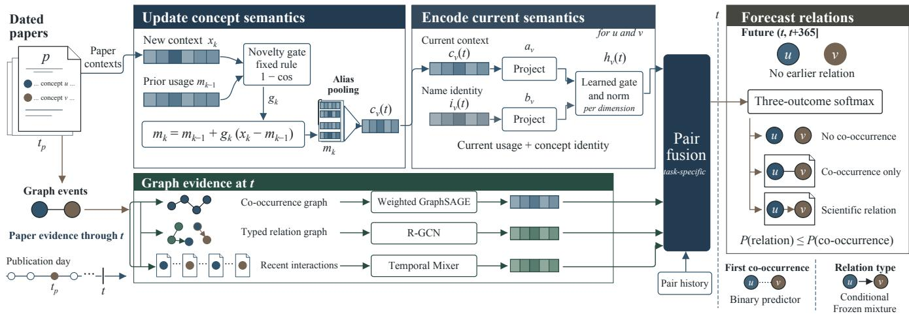
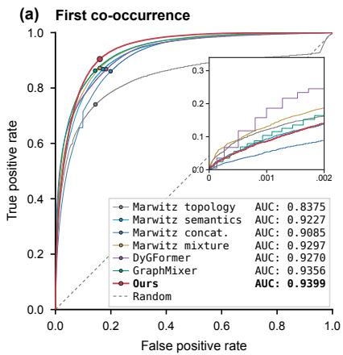
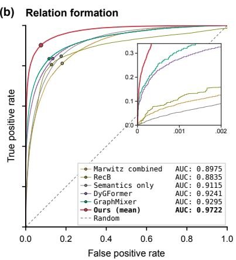
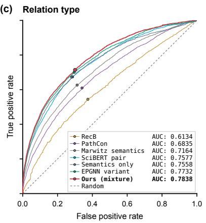

# TIME-ALIGNED EVOLVING CONCEPT GRAPHS FOR SCIENTIFIC RELATION FORECASTING

Fred Sun1,∗, Jingze Wang1,∗, Minkun Xu2, Shangqi Guo1,†

1Center for Brain-Inspired Computing Research, Department of Precision Instrument, Tsinghua University, Beijing, China 2Guangdong Institute of Intelligence Science and Technology, Zhuhai, China

## ABSTRACT

Forecasting scientific relations can guide discovery by identifying promising connections before they emerge. Existing approaches often model concept semantics and graph structure separately or summarize semantics over coarse historical snapshots, leaving semantic representations potentially misaligned with rapidly evolving graph evidence. We propose a time-aligned evolving concept graph framework that jointly models semantic and structural evolution. Its core idea is to treat dated papers as shared update events, reconstructing semantic and structural states from the same publication history through each prediction time. Pair-level fusion combines these states to forecast first co-occurrence, relation formation, and conditional relation type. Holding architecture and training fixed, refreshing context alongside graph updates improves mean relation AUPRC by 16.6% over frozen context. On a graph built from 187,848 papers with 270,687 concepts and 7.45 million co-occurrence links, the complete framework improves mean relation AUROC from 0.9290 for the strongest evaluated baseline to 0.9722, with mean populationweighted AUPRC 0.005778.

Index Terms— scientific relation forecasting, timealigned concept graphs, evolving semantics, temporal graphs

## 1. INTRODUCTION

Scientific advances often connect separate lines of work: a method enters a new application, techniques are combined, or evidence challenges an established approach. Forecasting these connections can reveal promising directions before findings appear. Concept-graph methods predict future cooccurrences from historical literature [1, 2, 3]. A scientific relation gives a connection a specific meaning, such as one method using, combining with, or replacing another. Codiscussion alone does not establish these roles. We therefore forecast both whether a scientific relation will form and its type. These forecasts draw on concept usage and observed connections. When a method enters a new application, its recent contexts and emerging graph neighborhood describe the same development. Combining earlier concept usage with newer graph events mixes different stages of that development. Both sources should therefore be reconstructed at the same prediction time.

Literature-based discovery and scientific embeddings provide evidence for unobserved connections [4, 5]. Marwitz et al. [3] average contextual embeddings across abstracts before a cutoff year and combine them with graph information for link prediction. Temporal graph models [6, 7, 8, 9] and text-attributed dynamic graphs [10] motivate the representation of evolving interactions. Diachronic embeddings [11] examine semantic change, while temporal knowledge-graph models forecast future relations [12].

We propose a time-aligned evolving concept graph framework (Fig. 1). Dated papers serve as shared update events for concept usage and graph connections. At each query, semantic and structural states are reconstructed through the same publication date, pairing current concept usage with its corresponding graph evidence. A context-sensitive update tracks usage; graph encoders and a recent-event pathway capture established connections and current activity. Pair-level fusion forecasts first co-occurrence, relation formation, and conditional relation type. With architecture and training held fixed, refreshing semantic context alongside graph updates improves mean relation AUPRC by 16.6% over frozen context. The complete framework improves relation population-AUPRC by 70.7% over the strongest evaluated baseline.

## 2. PROPOSED FRAMEWORK

## 2.1. Dated papers as shared update events

We extract concept mentions from abstracts and consolidate aliases through retrieval and verification. The concept inventory extends chronologically: newly observed names receive existing or new node IDs, while prior assignments remain fixed. A corpus-wide acronym-ambiguity check filters candidate merges. Each paper supplies contextual occurrences, co-occurrences, and full-text evidence for typed, directed relations: uses, combines, replaces, and contradicts. A generator–discriminator teacher pipeline distills local relation extractors. Student confidence is calibrated on the extractor development split. Trusted instances have teacher evidence, agreement of at least two student extractors, or confidence ≥ 0.95. Relation records retain the paper, date, type, direction, confidence, and supporting text. An expert audit of 10,000 accepted relation instances yielded 93.4% relation validity, 90.7% type correctness, and 89.9% direction correctness.

  
Fig. 1. Time-aligned evolving concept graphs. Dated papers provide contextual occurrences and graph events through query time t. Reconstructed semantic and structural states are fused at the concept-pair level to forecast first co-occurrence, relation formation, and conditional relation type.

For each query date t, reconstruction of semantic states and graph statistics uses no publications after that date. Only names observed by t are activated, and papers published on t are included. The co-occurrence graph aggregates supporting-paper counts; the relation graph preserves types, directions, and evidence strength. We filter paper events by the query date before accumulating edge weights and relation statistics.

We forecast a first trusted scientific relation during the following-year window (t, t + H]; H = 365 days for the test window. Eligible pairs have no prior scientific relation and involve only concepts observed by t; prior co-occurrence is allowed. A negative label indicates no observed relation during the window. Queries without complete future observation are excluded. First co-occurrence forecasting considers pairs never previously observed together. Relation type prediction classifies the first relation of a relation-positive pair. We merge replaces and contradicts and exclude conflicting first-day categories. The graph retains direction; formation and type targets are invariant to endpoint order. Within the window, relations entail co-occurrence; type is conditional on formation.

## 2.2. Reconstructing concept semantics

For each concept surface form in a paper, SciDeBERTa [13] provides contextual token representations. Averaging over the concept’s tokens and repeated mentions yields one 768- dimensional occurrence vector. The retained record contains the surface form, paper identifier, publication day, and vector.

To combine accumulated usage with recent adaptation, we initialize the state from the mean of earlier occurrences and sequentially update over the latest $K = 2 0$ visible occurrences. For histories of at most K occurrences, the first initializes the state and the remainder are replayed. Let $x _ { k }$ denote the k-th visible occurrence, with k counting the full history. Each replay step is

$$
\begin{array} { l } { m _ { k } = m _ { k - 1 } + g _ { k } ( x _ { k } - m _ { k - 1 } ) , } \\ { g _ { k } = \operatorname* { m a x } \{ 1 / k , \sigma ( \alpha [ 1 - \cos ( m _ { k - 1 } , x _ { k } ) ] + \beta ) \} . } \end{array}\tag{1}
$$

The $1 / k$ averaging rate provides a lower bound, emphasizing early observations while decreasing as history grows. The sigmoid term maintains a persistent response to new contexts, with $\beta$ setting the baseline and α controlling sensitivity to contextual discrepancy. We fix $\alpha = 4$ and $\beta = - 2 . 5 \colon$ the sigmoid rate is 0.076 at zero cosine discrepancy and 0.109 at similarity 0.9. Multiplication by $x _ { k } - m _ { k - 1 }$ makes updates small when observations already resemble the state, while departures from accumulated usage receive more weight.

The historical mean retains older evidence, while recent replay adapts to current usage with at most K sequential updates per surface form. At the test cutoff, 96.7% of surface forms with contextual observations have at most 20 occurrences, so their histories are replayed in full. Reconstructing the state at each query ties semantic adaptation to the graph’s publication cutoff.

We pool aliases observed by t using their mention counts through t, then normalize to obtain contextual semantics $c _ { v } ( t )$ . A separate 256-dimensional identity representation $i _ { v } ( t )$ averages embeddings of names observed by t. New contexts update usage, while new aliases can update identity.

## 2.3. Forecasting from time-aligned states

Contextual usage and concept identity. Let $a _ { v } = f _ { c } ( c _ { v } ( t ) )$ and $b _ { v } = f _ { i } ( i _ { v } ( t ) )$ be learned projections. A gate combines their dimensions into the semantic state:

$$
\begin{array} { r l } & { \gamma _ { v } = \sigma ( f _ { g } ( [ a _ { v } , b _ { v } ] ) ) , } \\ & { h _ { v } ( t ) = \mathrm { N o r m } \big ( \gamma _ { v } \odot a _ { v } + ( 1 - \gamma _ { v } ) \odot b _ { v } \big ) . } \end{array}\tag{2}
$$

The gate balances concept identity and current usage in each feature dimension. This semantic state enters pair-level fusion alongside graph evidence from the same query date.

Accumulated structure and recent interactions. Two layers of weighted GraphSAGE [14] encode co-occurrence neighborhoods. Two layers of basis-decomposed relational graph convolution [15] encode typed relation neighborhoods, retaining direction and relation-specific evidence.

Each endpoint also contributes its latest 20 co-occurrence and relation events. Tokens contain event type, age, intensity, and validity, with fixed time encodings. Two temporal MLP-Mixer layers [16, 8] summarize the sequence. This pathway describes recent activity alongside the accumulated neighborhoods.

Fusion and hierarchical outputs. For endpoint embeddings a, b, we use $[ a + b , | a - b | , a \odot b ]$ to form an orderinvariant pair representation. Task-specific gates combine semantic, graph, and event representations with pair-history statistics. The relation score contains a base prediction and gated ranking and interaction residuals. These contributions enter the relation logit before the three-outcome softmax:

$$
( p _ { \mathrm { n o n e } } , p _ { \mathrm { c o \ o n l y } } , p _ { \mathrm { r e l } } ) = \mathrm { s o f t m a x } ( 0 , z _ { \mathrm { c o } } , z _ { \mathrm { r e l } } ) ,\tag{3}
$$

$$
P ( \mathrm { c o - o c c u r r e n c e } ) = p _ { \mathrm { c o \ o n l y } } + p _ { \mathrm { r e l } } ,
$$

$$
P ( { \mathrm { r e l a t i o n } } ) = p _ { \mathrm { r e l } } \leq P ( { \mathrm { c o - o c c u r r e n c e } } ) .\tag{4}
$$

The outcomes describe no co-occurrence, co-occurrence without a relation, and relation formation within the target window. Here co-occurrence includes renewed co-occurrence of a previously observed pair; the inequality holds by construction.

First co-occurrence uses a direct binary output and a gated event correction. Relation type uses a conditional classifier mixing two frozen semantic-and-relation predictors selected for ROC and precision–recall, with a bounded semantic and graph residual. These task-specific outputs respect their different candidate sets.

## 2.4. Training for rare relation formation

For relation formation, training combines population samples, positives paired with broadly sampled negatives, and high-scoring difficult negatives. Inverse-probability weights correct the sampled label distribution. The objective combines weighted three-outcome negative log-likelihood, cooccurrence ranking, relation ranking, and conditional relation binary cross-entropy, with respective weights 1, 0.2, 0.8, and 0.1. The ranking loss uses softplus $( s ^ { - } - s ^ { + } )$ for positive– negative score pairs; gathering candidates across devices enlarges the ranking pool.

Table 1. Relation formation on the population-weighted test (mean ± sample SD, three seeds).
<table><tr><td>Model</td><td>AUROC</td><td> $\mathsf { A U P R C } ( \times 1 0 ^ { - 3 } )$ </td></tr><tr><td>Marwitz combined [3]</td><td> $0 . 8 9 8 2 \pm 0 . 0 0 6 4$ </td><td> $2 . 1 5 6 \pm 1 . 2 1 2$ </td></tr><tr><td>DyGFormer [9]</td><td> $0 . 9 2 3 8 \pm 0 . 0 0 1 6$ </td><td> $2 . 5 3 3 \pm 0 . 5 3 9$ </td></tr><tr><td>GraphMixer [8]</td><td> $0 . 9 2 9 0 \pm 0 . 0 0 2 9$ </td><td> $3 . 3 8 4 \pm 1 . 6 0 0$ </td></tr><tr><td>Ours (refreshed)</td><td> $\mathbf { 0 . 9 7 2 2 } \pm 0 . 0 0 0 4$ </td><td> ${ \bf 5 . 7 7 8 \pm 1 . 6 5 8 }$ </td></tr></table>

We train from random initialization and select checkpoints on validation. Within the Pareto frontier of AUROC and AUPRC, we retain the highest AUPRC subject to relation $\mathrm { A U R O C } \geq 0 . 9 7 0 0$ . The selected checkpoint is frozen before testing.

## 3. EXPERIMENTS

## 3.1. Data, protocol, and comparisons

The computer-vision corpus contains 187,848 papers from January 2017 to June 2026, 270,687 concepts, 7,452,716 cooccurrence pairs, and 580,615 distinct pairs with scientific relations. We train on the 2022–2023 and 2023–2024 windows, validate on 2024–2025, and test on 2025–2026, with June 25 cutoffs. The test query is June 25, 2025; all methods share the concept inventory and use names and paper evidence observed through that date.

At the test cutoff, the population comprises 24.90 billion eligible concept pairs, with relation prevalence $1 . 9 \times 1 0 ^ { - 6 }$ We form the test view from all target-window co-occurring pairs and uniformly sampled eligible pairs. From this view, we retain all 47,433 relation positives and uniformly sample 202,567 negatives. All models use this fixed 250,000-pair sample and inverse-probability weights accounting for both sampling stages. We report weighted AUROC and average precision (AUPRC). First co-occurrence uses its corresponding weighted view; relation type uses all 46,466 unambiguous relation-positive pairs and macro-averaged metrics.

Marwitz’s combined predictor [3] provides a scientificlink comparison; DyGFormer and GraphMixer provide temporal graph comparisons. Figure 2 also includes semantic and relational predictors, such as RecB [17] and SciBERT pair embeddings [18].

Our relation model uses hidden dimension 96, semantic and task widths 192, and dropout 0.2. AdamW runs for 1,600 steps with global batch size 24,576, learning rate $2 \times 1 0 ^ { - 4 }$

  
Fig. 2. ROC curves: (a,b) population weighted; (c) mean of three one-vs-rest curves. Our relation curve is the mean ROC from the three refreshed checkpoints in Tables 1 and 2; other curves show representative runs. Insets magnify low false-positive rates.

Table 2. Context-refresh ablation for relation formation (mean ± sample SD, three paired seeds). Refreshed uses the Ours checkpoints from Table 1.
<table><tr><td>Context</td><td>AUROC</td><td> $\mathsf { A U P R C } ( \times 1 0 ^ { - 3 } )$ </td></tr><tr><td>Frozen</td><td> $0 . 9 7 0 9 \pm 0 . 0 0 0 7$ </td><td> $4 . 9 5 5 \pm 1 . 1 7 4$ </td></tr><tr><td>Refreshed</td><td> $\mathbf { 0 . 9 7 2 2 } \pm 0 . 0 0 0 4$ </td><td> ${ \bf 5 . 7 7 8 \pm 1 . 6 5 8 }$ </td></tr></table>

120 warmup steps, cosine decay, and weight decay 0.01. Validation runs every 200 steps. Both tables report means and sample standard deviations over seeds 17/23/42. The main result and refreshed row reuse identical checkpoints; the frozen comparison pairs the same seeds and training schedule.

## 3.2. Forecasting scientific connections

The complete framework achieves relation AUPRC 0.005778 and AUROC 0.9722 (Table 1), improving AUPRC by 70.7% over GraphMixer, the strongest evaluated baseline. The gain in population-weighted AUPRC reflects improved retrieval of rare future relations among previously unrelated concepts.

Figure 2 compares ROC profiles across the three tasks. First co-occurrence achieves AUROC 0.9399. For relation type, the frozen teacher mixture selected on validation reaches macro-AUROC 0.7838 and macro-AUPRC 0.546491. These complementary tasks distinguish detecting new shared usage from identifying the scientific role of a connection once it forms.

## 3.3. The value of refreshing concept semantics

The refresh experiment tests whether updating concept semantics adds predictive value when graph evidence already follows the query date. The frozen variant retains each concept’s context from the first benchmark query at which the concept is available. The refreshed variant reconstructs it at each query from the newly available paper history. Identity, graph, and event inputs follow the query date in both variants.

Both variants use the same architecture, fixed semantic update rule, replay budget, trainable modules, and training schedule. Only access to subsequent contexts changes, isolating the value of keeping semantic evidence current as the graph evolves. All six checkpoints are selected on validation and locked before the common population-weighted test.

Refreshing context raises relation population-AUPRC from 0.004955 to 0.005778, a 16.6% improvement, and AU-ROC from 0.9709 to 0.9722 (Table 2). Both metrics improve in all three paired seeds. AUROC measures overall ranking; population-weighted AUPRC emphasizes precision when retrieving rare future relations. The frozen variant already receives new connections and recent interactions; refreshing context adds useful evidence about concept usage beyond these structural updates. The gain supports aligning concept usage with graph evidence at the prediction time.

## 4. CONCLUSION

We presented a time-aligned evolving concept graph framework that uses dated papers as shared update events for semantic and structural states. With architecture and training held fixed, refreshing context yields 16.6% higher AUPRC than frozen context, with both relation metrics improving across three paired seeds. Newly observed concept usage adds forecasting evidence beyond updated graph structure and recent interactions. The complete framework improves relation population-AUPRC by 70.7% over the strongest evaluated baseline.

## 5. REFERENCES

[1] Mario Krenn and Anton Zeilinger, “Predicting research trends with semantic and neural networks with an application in quantum physics,” Proceedings ofthe National Academy of Sciences, vol. 117, no. 4, pp. 1910–1916, 2020.

[2] Mario Krenn, Lorenzo Buffoni, Bruno Coutinho, Sagi Eppel, Jacob Gates Foster, Andrew Gritsevskiy, Harlin Lee, Yichao Lu, Joao P. Moutinho, Nima Sanjabi,˜ Rishi Sonthalia, Ngoc Mai Tran, Francisco Valente, Yangxinyu Xie, Rose Yu, and Michael Kopp, “Forecasting the future of artificial intelligence with machine learning-based link prediction in an exponentially growing knowledge network,” Nature Machine Intelligence, vol. 5, no. 11, pp. 1326–1335, 2023.

[3] Thomas Marwitz, Alexander Colsmann, Ben Breitung, et al., “Predicting new research directions in materials science using large language models and concept graphs,” Nature Machine Intelligence, vol. 8, pp. 535– 544, 2026.

[4] Don R. Swanson, “Undiscovered public knowledge,” The Library Quarterly, vol. 56, no. 2, pp. 103–118, 1986.

[5] Vahe Tshitoyan, John Dagdelen, Leigh Weston, Alexander Dunn, Ziqin Rong, Olga Kononova, Kristin A. Persson, Gerbrand Ceder, and Anubhav Jain, “Unsupervised word embeddings capture latent knowledge from materials science literature,” Nature, vol. 571, no. 7763, pp. 95–98, 2019.

[6] Emanuele Rossi, Ben Chamberlain, Fabrizio Frasca, Davide Eynard, Federico Monti, and Michael Bronstein, “Temporal graph networks for deep learning on dynamic graphs,” 2020.

[7] Da Xu, Chuanwei Ruan, Evren Korpeoglu, Sushant Kumar, and Kannan Achan, “Inductive representation learning on temporal graphs,” 2020.

[8] Weilin Cong, Si Zhang, Jian Kang, Baichuan Yuan, Hao Wu, Xin Zhou, Hanghang Tong, and Mehrdad Mahdavi, “Do we really need complicated model architectures for temporal networks?,” in International Conference on Learning Representations (ICLR), 2023.

[9] Le Yu, Leilei Sun, Bowen Du, and Weifeng Lv, “Towards better dynamic graph learning: New architecture and unified library,” in Advances in Neural Information Processing Systems (NeurIPS), 2023, vol. 36.

[10] Jiasheng Zhang, Jialin Chen, Menglin Yang, Aosong Feng, Shuang Liang, Jie Shao, and Rex Ying,

“DTGB: A comprehensive benchmark for dynamic textattributed graphs,” in Advances in Neural Information Processing Systems (NeurIPS), Datasets and Benchmarks Track, 2024, vol. 37.

[11] William L. Hamilton, Jure Leskovec, and Dan Jurafsky, “Diachronic word embeddings reveal statistical laws of semantic change,” in Proceedings of the 54th Annual Meeting of the Association for Computational Linguistics (Volume 1: Long Papers), Berlin, Germany, 2016, pp. 1489–1501, Association for Computational Linguistics.

[12] Woojeong Jin, Meng Qu, Xisen Jin, and Xiang Ren, “Recurrent event network: Autoregressive structure inference over temporal knowledge graphs,” in Proceedings of the 2020 Conference on Empirical Methods in Natural Language Processing (EMNLP), 2020, pp. 6669–6683.

[13] Yuna Jeong and Eunhui Kim, “SciDeBERTa: Learning DeBERTa for science technology documents and finetuning information extraction tasks,” IEEE Access, vol. 10, pp. 60805–60813, 2022.

[14] William L. Hamilton, Rex Ying, and Jure Leskovec, “Inductive representation learning on large graphs,” Advances in Neural Information Processing Systems (NeurIPS), vol. 30, pp. 1024–1034, 2017.

[15] Michael Schlichtkrull, Thomas N. Kipf, Peter Bloem, Rianne van den Berg, Ivan Titov, and Max Welling, “Modeling relational data with graph convolutional networks,” in The Semantic Web – ESWC 2018, 2018, pp. 593–607.

[16] Ilya O. Tolstikhin, Neil Houlsby, Alexander Kolesnikov, Lucas Beyer, Xiaohua Zhai, Thomas Unterthiner, Jessica Yung, Andreas Steiner, Daniel Keysers, Jakob Uszkoreit, Mario Lucic, and Alexey Dosovitskiy, “MLP-Mixer: An all-MLP architecture for vision,” in Advances in Neural Information Processing Systems (NeurIPS), 2021, vol. 34.

[17] Julia Gastinger, Christian Meilicke, Federico Errica, Timo Sztyler, Anett Schuelke, and Heiner Stuckenschmidt, “History repeats itself: A baseline for temporal knowledge graph forecasting,” in Proceedings of the Thirty-Third International Joint Conference on Artificial Intelligence (IJCAI), 2024, pp. 4016–4024.

[18] Iz Beltagy, Kyle Lo, and Arman Cohan, “SciBERT: A pretrained language model for scientific text,” in Proceedings ofthe 2019 Conference on Empirical Methods in Natural Language Processing (EMNLP-IJCNLP), 2019, pp. 3615–3620.