# The Mirage of Calibrated Confidence: Trajectory-Independence of Verbalized Confidence in Vision-Language Models

Jisoo Yang1, Jaeho Han1, Trung X. Pham2, Junyeong Kim1

¹Department of Artificial Intelligence, Chung-Ang University, Republic of Korea

2Van Lang University, Ho Chi Minh City, Vietnam

{yjs229, wogh50, junyeongkim}@cau.ac.kr

trung.px@vlu.edu.vn

## Abstract

A calibrated Vision-Language Model (VLM) can repeatedly self-correct, say "Wait, I should recheck," arrive at the wrong answer, and still report high confidence. We find that this occurs because verbalized confidence is largely trajectory-independent in the VLMs and calibration methods we evaluate. We examine this through three complementary lenses: content variation, token masking, and the model's own hesitation markers. We show that confidence is insufficiently sensitive to what the reasoning trajectory actually contains, and that calibration training can paradoxically worsen this disconnect. Since existing metrics like ECE and AUROC cannot detect this problem, we propose the Trajectory-Grounding Score (TGS) in two complementary forms: TGS-self, which compares confidence with and without access to the model's own trajectory, and TGSpair, which tests whether the model assigns higher confidence to correct trajectories than to flawed ones along the vision, reasoning, and answer axes. We propose TGS-Bench, a modelagnostic suite spanning 10 benchmarks with controlled good/bad trajectory pairs, and show that conventional calibration rankings diverge from trajectory-grounding rankings, exposing a blind spot in current evaluation practice.

## 1 Introduction

Recent Vision-Language Models (VLMs) have achieved strong performance across visual reasoning tasks (Bai et al., 2025; Wang et al., 2025; Liu et al., 2023). Yet they frequently produce incorrect answers with unwarranted high confidence (Xiong et al., 2024; Kadavath et al., 2022). Verbalized confidence calibration has made notable progress in closing this gap, reducing ECE and improving AUROC (Li et al., 2025; Damani et al., 2026; Xiao et al., 2026). But these aggregate metrics conceal a deeper question. Does the model's confidence actually reflect the quality of its reasoning? A model could achieve low ECE simply by learning the base rate of its own correctness on each difficulty tier, without ever inspecting whether its visual perception was accurate or its reasoning chain was valid for any particular instance.

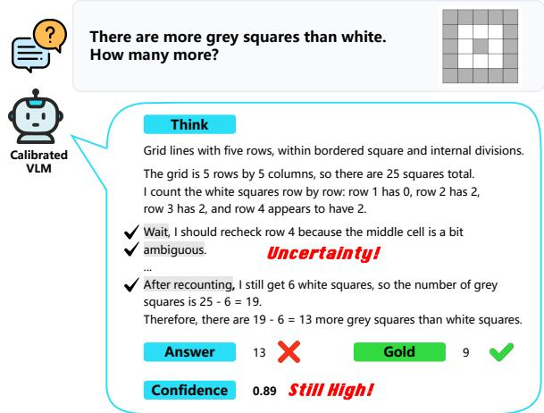

(a) Trajectory-independent confidence despite self-doubt  
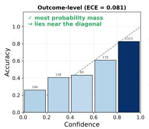

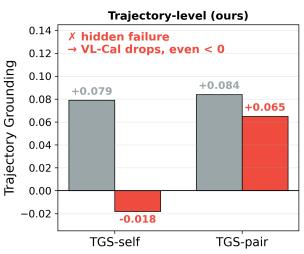  
(b) Outcome-level success, Trajectory-level failure in Calibrated VLM  
Figure 1: (a) Trajectory-independent confidence despite self-doubt. A calibrated VLM repeatedly expresses self-doubt yet assigns high confidence to an incorrect answer. (b) Trajectory-independence undetected by outcome-level metrics. VL-Calibration-8B appears well-calibrated (ECE = 0.081), but TGS-self turns negative and TGS-pair drops after calibration.

We find that this is precisely what happens. As Figure 1(a) illustrates, a calibration-trained model repeatedly hedges, self-corrects, and revisits its own reasoning, yet assigns high confidence to an answer that is wrong. The self-doubt is visible in the text; the confidence is blind to it. We term this missing property trajectory-grounding, the degree to which confidence is causally informed by the specific trajectory that produced the answer. Crucially, this failure is invisible to conventional metrics. As Figure 1(b) shows, the same model appears well-calibrated by ECE, yet scores near zero or negative on our trajectory-level metrics.

Our analysis proceeds in three stages of escalating severity. First, we replace trajectory components (vision, reasoning, answer) with qualitatively different alternatives and find that confidence often changes little, with calibration further increasing the rate of near-zero JSD (§3.2). Second, we physically mask trajectory tokens via attention-level ablation and observe that, rather than declining monotonically, confidence rises at complete masking (§3.3). Together, these stages show that confidence responds weakly and non-monotonically to both trajectory content and its availability. The third stage asks the most direct question. When the model itself expresses uncertainty through hesitation markers such as “wait" or “let me recheck," does its confidence respond? Confidence often changes little after hesitation and shows no systematic downward shift (§3.4). The model does not reliably track either externally manipulated trajectories or its own epistemic signals.

To the best of our knowledge, this is the first work to investigate trajectory-grounding of verbalized confidence in VLMs. Our contributions are threefold: (1) Through three complementary lenses (content variation, token masking, and the model's own self-doubt), we establish widespread trajectory-independence in verbalized confidence and show that calibration can paradoxically worsen this disconnect. (2) We propose the Trajectory-Grounding Score (TGS) in two forms. TGS-self compares confidence with and without access to the model's own trajectory. TGS-pair tests whether the model assigns higher confidence to correct trajectories than to flawed ones along the vision, reasoning, and answer axes, requiring controlled good/bad trajectory pairs. (3) To support TGS-pair evaluation, we construct TGS-Bench across 10 benchmarks with model-agnostic trajectory pairs that isolate errors on exactly one axis, and show that methods excelling on conventional calibration metrics score near zero or even negative on TGS, confirming that outcome-level calibration and trajectory-level grounding measure fundamentally different properties.

## 2 Related Work

Confidence Estimation and Calibration in VLMs Verbalized confidence estimation asks models to articulate their certainty alongside answers, offering a model-agnostic alternative to logit-based approaches (Lin et al., 2022; Yang et al., 2024). In the text-only LLM setting, prompting strategies revealed persistent overconfidence (Xiong et al., 2024), and training-based methods have since shown stronger results through Brierscore alignment (Li et al., 2025), RL with selfreflective rationales (Xu et al., 2024), PPO-based doubt rewarding (Bani-Harouni et al., 2026), and joint accuracy-calibration optimization via GRPO (Damani et al., 2026). Extending these to VLMs introduces modality-specific challenges: Du et al. (2026) show that VLM confidence is insensitive to visual input degradation and propose RL with original-noise image pairs, while VL-Calibration (Xiao et al., 2026) decouples confidence into visual and reasoning scores supervised by an intrinsic certainty signal. Despite substantially reducing ECE, all existing work evaluates calibration through aggregate metrics that measure population-level correlation between confidence and accuracy, without assessing whether individual scores reflect the quality of the specific reasoning process, a dimension we term trajectory-grounding.

Faithfulness of Model Self-Assessment Recent work questions whether models’ self-generated assessments faithfully reflect their internal processes. On the reasoning side, Lanham et al. (2023) show that chain-of-thought explanations are not always faithful, and in multimodal settings CoT can obscure hallucination cues (Cheng et al., 2025). On the confidence side, ADVICE (Seo et al., 2026) demonstrates that verbalized confidence in textonly LLMs is nearly answer-independent: swapping the answer while fixing the question leaves the confidence distribution unchanged. We extend these findings to VLMs across three axes (vision, reasoning, and answer), revealing a broader phenomenon we term trajectory-independence. Beyond external interventions (content variation, token masking), we further show that models do not reliably track their own epistemic signals, and that calibration training (Xiao et al., 2026) can paradoxically worsen this independence.

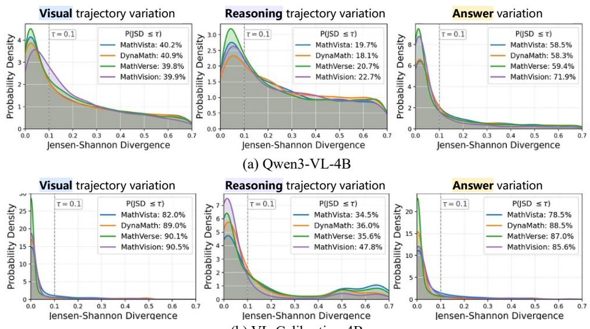  
(b) VL-Calibration-4B  
Figure 2: JSD distributions when varying trajectory components. (a) Qwen3-VL-4B (base). (b) VL-Calibration-4B The base model is already substantially trajectory-independent (vision $P ( \mathrm { J S D } \leq 0 . 1 ) \approx 4 0 \% )$ . VL-Calibration increases this ratio (vision $P ( \mathrm { J S D } \leq 0 . 1 ) \approx 8 2 – 9 0 \% )$ , indicating that calibration training does not resolve the underlying disconnect between confidence and trajectory.

## 3 Trajectory-Independence of Verbalized Confidence in VLMs

## 3.1 Preliminary

We study VLMs that generate structured reasoning trajectories followed by verbalized confidence scores. Given a multimodal input $( I , q )$ consisting of an image I and a textual query q, the model produces a trajectory ${ \boldsymbol { \tau } } = ( v , r , a )$ where v denotes the visual perception rationale, r denotes the reasoning chain, and a is the final answer. After generating $\tau _ { \ast }$ the model verbalizes its confidence as a discrete score in {0, 1, . . . , 10}.

Current methods either produce a single holistic confidence $c \in \{ 0 , \ldots , 1 0 \}$ (Damani et al., 2026; Li et al., 2025), or decouple it into a visual confidence $c _ { \mathrm { v i s } }$ and a reasoning confidence $c _ { \mathrm { r e a s } }$ (Xiao et al., 2026). The decoupled scores are aggregated via a harmonic mean:

$$
c _ { \mathrm { h o l i s t i c } } = \frac { 2 \cdot \hat { c } _ { \mathrm { v i s } } \cdot \hat { c } _ { \mathrm { r e a s } } } { \hat { c } _ { \mathrm { v i s } } + \hat { c } _ { \mathrm { r e a s } } } .
$$

To cover both paradigms, our analysis targets (1) Qwen3-VL-4B-Instruct (Bai et al., 2025), a base VLM with holistic confidence, and (2) VL-Calibration-4B (Xiao et al., 2026), which is finetuned from Qwen3-VL-4B-Instruct via RL to produce decoupled confidence with intrinsic visual certainty supervision.

## 3.2 Confidence Distribution Analysis

We first ask: does changing the content of a trajectory component alter the model's confidence? If confidence is truly grounded in the trajectory, replacing a component with qualitatively different content should shift the confidence distribution. We quantify this shift using Jensen-Shannon divergence (JSD) (Menéndez et al., 1997), a symmetric measure bounded in [0, 1] that equals zero when two distributions are identical. For each trajectory axis $x \in \{ v , r , a \}$ , we compare two alternative versions $x _ { i }$ and $x _ { j }$ while holding the remaining components fixed. Trajectory-independence along each axis implies:

$$
\begin{array} { r } { \mathrm { J S D } _ { v } = \mathrm { J S D } ( P _ { M } ( C \mid q , I , v _ { i } , r , a ) \parallel P _ { M } ( C \mid q , I , v _ { j } , r , a ) ) \approx 0 , } \\ { \mathrm { J S D } _ { r } = \mathrm { J S D } ( P _ { M } ( C \mid q , I , v , r _ { i } , a ) \parallel P _ { M } ( C \mid q , I , v , r _ { j } , a ) ) \approx 0 , } \\ { \mathrm { J S D } _ { a } = \mathrm { J S D } ( P _ { M } ( C \mid q , I , v , r , a _ { i } ) \parallel P _ { M } ( C \mid q , I , v , r , a _ { j } ) ) \approx 0 . } \end{array}
$$

We evaluate on four mathematical reasoning benchmarks1 and compute pairwise JSD across all alternative pairs, visualizing the distribution via Gaussian kernel density estimation. Following prior work that considers two distributions similar when their divergence falls below 0.1 (Seo et al., 2026; Deho et al., 2025; Milan Kummaya et al., 2025), we report $P ( \mathrm { { J S D } \leq 0 . 1 ) }$ as a summary statistic, where higher values indicate stronger trajectory-independence.

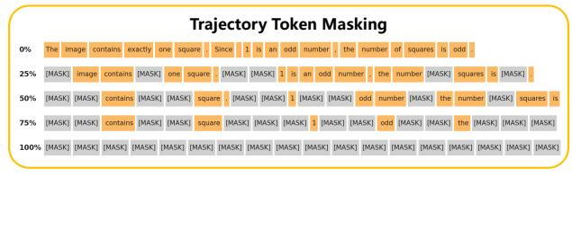

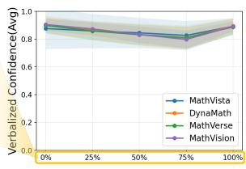  
(a) Qwen3-VL-4B

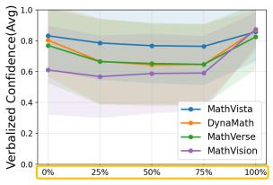  
(b) VL-Calibration-4B  
Figure 3: Verbalized confidence as a function of trajectory masking ratio. (a) Qwen3-VL-4B, (b) VL-Calibration-4B. In both models, confidence declines modestly as the masking ratio increases but paradoxically shifts upward at 100% masking, indicating that neither model meaningfully relies on trajectory content when generating its confidence.

Trajectory construction and intervention The two models require different experimental procedures due to their distinct architectures. For Qwen3-VL, which is not natively trained with structured tags, we first let the model generate a free-form chain-of-thought given (q, I), then segment the output into vision and reasoning components using the model itself, replace the target component with an alternative, and reconstruct the trajectory as free text before eliciting a holistic confidence token. For VL-Calibration, which natively generates structured <vision> and <reasoning> blocks followed by separate $c _ { \mathrm { V i s } }$ and $c _ { \mathrm { r e a s } }$ tokens, we directly replace the content within the corresponding tags. We then compute JSD separately for each confidence component and report the average $\mathrm { \frac { 1 } { 2 } ( J S D _ { v i s } + J S D _ { r e a s } ) }$ as the per-sample divergence.

Base VLMs are already trajectory-independent. As shown in Figure 2(a), the base model exhibits substantial trajectory-independence: the vision axis yields $P ( { \mathrm { J S D } } \leq 0 . 1 )$ ≈ 40%, and the answer axis reaches 58–72%, meaning that many samples show near-zero confidence change when these components are replaced with qualitatively different alternatives. The reasoning axis shows lower independence (18–23%), with JSD values spread more broadly across [0, 0.7], suggesting that reasoning content has comparatively more influence on confidence, though still limited.

Calibration training does not resolve trajectoryindependence. VL-Calibration (Figure 2(b)), despite its explicit decoupled structure designed to ground each confidence component in its corresponding trajectory segment, still exhibits strong trajectory-independence. Its vision axis shows ${ \cal P } ( \mathrm { J S D } ~ \le ~ 0 . 1 )$ of 82–90%, reasoning 34–48%, and answer 78–89%. While these values are higher than those of the base model (indicating that calibration further increases trajectory-independence), the overall level of independence remains high. This also confirms that answer-independence, previously identified in text-only LLMs (Seo et al., 2026), generalizes to VLMs.

## 3.3 Token Masking Analysis

§3.2 demonstrated trajectory-independence through content substitution: replacing trajectory components with qualitatively different alternatives barely shifted the confidence distribution. We now apply a stronger causal test (content removal) to ask whether models rely on trajectory tokens at all. For each model, we first generate a self-trajectory using the model's native format, then apply attention-level masking at five nested ratios (0%, 25%, 50%, 75%, 100%) over the trajectory span (see Appendix A.2 for details). Under each masking condition, we let the model generate its verbalized confidence token and record the resulting score.

## Removing tokens does not reduce confidence. Kemoving tokens aoes not reuuce comnuence.

As shown in Figure 3, both models exhibit a counterintuitive pattern: verbalized confidence declines modestly as the masking ratio increases from 0% to 75%, but paradoxically shifts upward at 100% masking, where the model has no access to any trajectory content. Notably, VL-Calibration exhibits a flatter curve than the base model throughout, suggesting that calibration training may even suppress trajectory reliance. If the model genuinely evaluated its reasoning before assigning confidence, we would expect a monotonic decline proportional to the amount of information removed; instead, complete removal recovers or even exceeds the original confidence level. This provides a direct causal complement to the distributional evidence of §3.2: VLM confidence is generated without meaningfully consulting the preceding trajectory.

<table><tr><td>Hesitation count</td><td>Qwen3-VL n (%)</td><td>VL-Cal n (%)</td></tr><tr><td>All trajectories ≥1 hesitation</td><td>4025 (100.0) 904 (22.5)</td><td>5666 (100.0) 3239 (57.2)</td></tr><tr><td>1</td><td>188 (20.8)</td><td>608 (18.8)</td></tr><tr><td>2</td><td>134 (14.8)</td><td>563 (17.4)</td></tr><tr><td>3</td><td>86 (9.5)</td><td>434 (13.4)</td></tr><tr><td>4</td><td>93 (10.3)</td><td>399 (12.3)</td></tr><tr><td>5-9</td><td>243 (26.9)</td><td>923 (28.5)</td></tr><tr><td>≥10</td><td>160 (17.7)</td><td>312 (9.6)</td></tr></table>

Table 1: Hesitation-marker prevalence in selftrajectories. Percentages below the midrule are computed among trajectories with at least one hesitation.

## 3.4 Intra-Trajectory Confidence Analysis

The preceding experiments applied external interventions (substituting or removing trajectory content) and found confidence only weakly and inconsistently responsive. We now ask the most direct question: when the model itself expresses self-doubt during reasoning, does its confidence respond? We reuse the cached self-trajectories from §3.3 and scan each for hesitation markers, lexical cues such as “wait", “actually", “let me recheck", and "I made a mistake". As shown in Table 1, 22.5% of Qwen3-VL trajectories and 57.2% of VL-Calibration trajectories contain at least one such marker, with many exhibiting five or more. For each marker at position $T _ { H } ,$ we define a pre-hesitation cut immediately before $T _ { H }$ and a post-hesitation cut at the next sentence boundary, truncate the trajectory to each point while holding the original answer fixed, and elicit confidence via digit-token logits. If the model's confidence is sensitive to its own self-doubt, we would expect a drop from $c _ { \mathrm { p r e } }$ to $c _ { \mathrm { p o s t } }$ after each hesitation.

Confidence inconsistently tracks the model's own hesitations. Figure 4 illustrates a representative case: the model encounters six successive hesitation markers, yet the pre- and post-hesitation confidence values show no consistent ordering. The pre curve does not systematically lie above the post curve as one would expect if hesitation lowered confidence, with cexpected fluctuating within a narrow band. Notably, the base model assigns a written confidence of 9/10 despite the trajectory being riddled with self-corrections and ultimately producing an incorrect answer. Across the eligible events, $P ( | c _ { \mathrm { p r e } } - c _ { \mathrm { p o s t } } | \leq . 0 2 )$ is 78.5% for Qwen3-VL and 49.0% for VL-Calibration, and neither model shows a systematic decrease after hesitation.

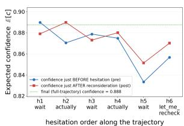  
(a) Qwen3-VL-4B

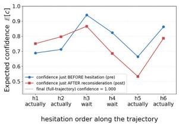  
(b) VL-Calibration-4B  
Figure 4: Intra-trajectory confidence analysis. Elicited confidence $( c _ { \mathrm { e x p e c t e d } } )$ just before each hesitation marker (pre, blue) and after the ensuing sentence (post, red) for (a) Qwen3-VL-4B and (b) VL-Calibration-4B. If confidence tracked self-doubt, pre would consistently exceed post; instead, no such pattern emerges.

## 4 Trajectory-Grounding Score

Existing calibration metrics (ECE, AUROC) evaluate confidence at the outcome level, but as §3.2–3.4 show, confidence responds only weakly to trajectory substitutions, changes non-monotonically under trajectory masking, and shows no systematic decrease following the model's own expressions of self-doubt. What is missing is a trajectory-level metric that asks: does the model's confidence reflect the content of its reasoning process?

We propose the Trajectory-Grounding Score (TGS) to fill this gap, defined in two complementary forms that formalize the findings of §3.2 and §3.3, respectively.

## 4.1 TGS-self: Grounding in Own Trajectory

TGS-self measures whether the model grounds its confidence in its own reasoning trajectory. Formalizing the token masking analysis (§3.3), we compare the model's confidence with and without access to its self-generated trajectory:

$$
\operatorname { T G S - s e l f } ( \mathcal { M } ) = \mathbb { E } _ { \left( q , I \right) } \Bigl [ \mu \left( \boldsymbol { C } \mid \tau \right) - \mu \left( \boldsymbol { C } \mid \tau _ { \mathrm { m a s k e d } } \right) \Bigr ]
$$

where $\tau$ is the model's self-generated trajectory, τmasked applies 100% attention masking to the trajectory span, and

$$
\mu ( C ) = \sum _ { c = 0 } ^ { 1 0 } \frac { c } { 1 0 } \cdot P ( C = c )
$$

is the expected confidence derived from digit-token logits, normalized to [0, 1]. TGS-self ranges over [—1, 1]: a positive value indicates that the model relies on its trajectory when generating confidence, a value near zero indicates trajectory-blindness, and a negative value reveals anti-grounding where masking the trajectory paradoxically increases confidence.

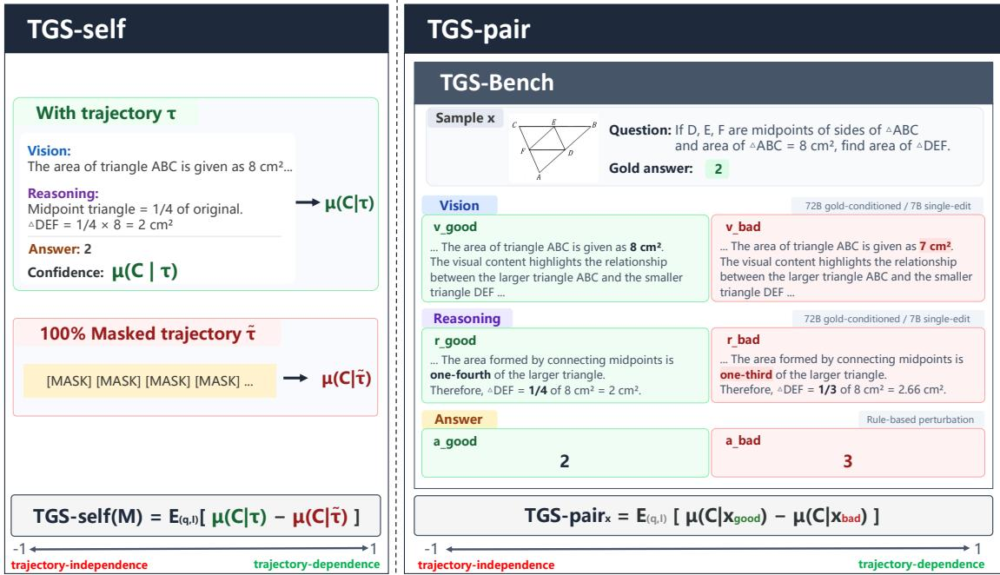  
Figure 5: Overview of the Trajectory-Grounding Score (TGS). (Left) TGS-self compares the model's confidence with full access to its self-generated trajectory τ against confidence under 100% attention masking, measuring whether the model reads its own reasoning. (Right) TGS-pair uses TGS-Bench, which provides controlled good/bad trajectory pairs differing along exactly one axis (vision, reasoning, or answer), to test whether the model assigns higher confidence to correct trajectories. Both metrics yield positive scores for trajectory-grounded models, nearzero scores for trajectory-blind models, and negative scores for anti-grounded models.

## 4.2 TGS-pair: Discriminating External Trajectories

TGS-pair TGS-self confirms whether the model reads its own trajectory, but does not test whether confidence responds appropriately to trajectory quality. TGS-pair measures whether substituting the trajectory with an externally constructed good or bad alternative produces a corresponding change in confidence. Formalizing the distributional analysis (§3.2), we define it per axis:

$$
\begin{array} { r } { \mathrm { T G S \mathrm { - } p a i r } _ { \mathrm { v i s } } = \mathbb { E } _ { ( q , I ) } \big [ \mu ( C \mid v _ { \mathrm { g o o d } } , r , a ) - \mu ( C \mid v _ { \mathrm { b a d } } , r , a ) \big ] , } \\ { \mathrm { T G S \mathrm { - } p a i r } _ { \mathrm { r e a s } } = \mathbb { E } _ { ( q , I ) } \big [ \mu ( C \mid v , r _ { \mathrm { g o o d } } , a ) - \mu ( C \mid v , r _ { \mathrm { b a d } } , a ) \big ] , } \\ { \mathrm { T G S \mathrm { - } p a i r } _ { \mathrm { a n s } } = \mathbb { E } _ { ( q , I ) } \big [ \mu ( C \mid v , r , a _ { \mathrm { g o o d } } ) - \mu ( C \mid v , r , a _ { \mathrm { b a d } } ) \big ] . } \end{array}
$$

The signed formulation is deliberate: a positive score indicates correct grounding (higher confidence for better trajectories), near-zero indicates trajectory-blindness, and a negative score reveals anti-grounding—the model assigns higher confidence to worse trajectories. This directional property is invisible to JSD, which treats symmetric deviations identically, and to ECE, which only checks whether confidence matches accuracy.

Complementarity The two metrics address distinct failure modes: TGS-self detects whether the model reads its own trajectory at all, while

TGS-pair detects whether it can distinguish trajectory quality along each axis. Both yielding ≈ 0 constitutes the strongest evidence of trajectoryindependence.

TGS-Bench TGS-pair requires controlled good/bad trajectory pairs that are independent of the evaluated model. To this end, we construct TGS-Bench across 10 benchmarks,2 providing model-agnostic trajectory pairs that differ along exactly one axis while holding the others fixed. Figure 5 illustrates the anatomy of a single sample. Each sample consists of a good and a bad trajectory per axis, constructed as follows.

Good trajectories (vgood, rgood, agood). We prompt Qwen2.5-VL-72B-Instruct with the image, question, and gold answer to generate a faithful vision description and a chain-of-thought reasoning that arrives at the gold answer. The gold-conditioned generation ensures high-quality trajectories; the answer is set to the gold label $( a _ { \mathrm { g o o d } } = \mathrm { g o l d } )$ . Because these trajectories are produced by an external model rather than the evaluated model itself, they serve as a controlled, model-agnostic signal applicable uniformly across all evaluated methods.

<table><tr><td></td><td colspan="7">Qwen3-VL-4B</td><td colspan="7">Qwen3-VL-8B</td></tr><tr><td></td><td colspan="3">Outcome-Level</td><td colspan="4">Trajectory-Level</td><td colspan="4">Outcome-Level</td><td colspan="3">Trajectory-Level</td></tr><tr><td></td><td colspan="2">AUROC↑</td><td colspan="2">ECE↓</td><td colspan="3">TGS-self↑  $\mathrm { T G S - p a i r } \uparrow$ </td><td colspan="2">AUROC↑</td><td colspan="2">ECE↓</td><td colspan="3">TGS-self↑ TGS-pair↑</td></tr><tr><td>Benchmark</td><td>Base</td><td>VL-Cal Base</td><td>VL-Cal</td><td>Base</td><td>VL-Cal</td><td>Base</td><td>VL-Cal</td><td>Base</td><td>VL-Cal</td><td>Base</td><td>VL-Cal</td><td>Base VL-Cal</td><td>Base</td><td>VL-Cal</td></tr><tr><td colspan="9">Mathematical and Geometric Reasoning .423</td><td></td><td></td><td></td><td></td><td></td><td></td></tr><tr><td>DynaMath</td><td>.513</td><td>.797</td><td>.081</td><td>.042</td><td>-.002</td><td>.067</td><td>.039</td><td>.576</td><td>.769</td><td>.460</td><td>.058</td><td>.058</td><td>-.023 .078</td><td>.046</td></tr><tr><td>Geo3K</td><td>.504</td><td>.792 .773</td><td>.073</td><td>.060</td><td>-.040</td><td>.073</td><td>.068</td><td>.556</td><td>.780</td><td>.734</td><td>.056 .058</td><td>-.023</td><td>.091</td><td>.082</td></tr><tr><td>MathVerse</td><td>.416</td><td>.735 .561</td><td>.042</td><td>.042</td><td>-.025</td><td>.052</td><td>.044</td><td>.504</td><td>.742 .372</td><td>.055</td><td>.065</td><td>-.022</td><td>.073</td><td>.054</td></tr><tr><td>MathVision</td><td>.501</td><td>.800 .794</td><td>.170</td><td>.074</td><td>-.081</td><td>.053</td><td>.082</td><td>.527 .815</td><td>.428</td><td>.094</td><td>.085</td><td>-.027</td><td>.077</td><td>.091</td></tr><tr><td>MathVista</td><td>.566</td><td>.778 .254 .268</td><td>.107</td><td>.014</td><td>-.007</td><td>.074</td><td>.042</td><td>.574 .753</td><td>.459</td><td>.079</td><td>.061</td><td>-.008</td><td>.096</td><td>.040</td></tr><tr><td>WeMath</td><td>.593</td><td>.802</td><td>.048</td><td>.051</td><td>-.027</td><td>.059</td><td>.066</td><td>.567</td><td>.777 .388</td><td>.039</td><td>.090</td><td>-.033</td><td>.095</td><td>.081</td></tr><tr><td colspan="9">Logical Reasoning</td><td colspan="5"></td></tr><tr><td>LogicVista .615</td><td></td><td>.794 .315</td><td>.203</td><td>.025</td><td>-.025</td><td>.064</td><td>.051</td><td>.580</td><td>.836</td><td>.308 .109</td><td>.083</td><td>-.045</td><td>.101</td><td>.088</td></tr><tr><td colspan="9">Multi-discipline Reasoning</td><td colspan="5"></td></tr><tr><td>A-OKVQA</td><td>.584</td><td>.695 .022</td><td>.017</td><td>.044</td><td>.067</td><td>.045</td><td>.035</td><td>.642 .691 .506</td><td>.057</td><td>.059</td><td>.123</td><td>.029</td><td>.073</td><td>.020</td></tr><tr><td>MMK12 .468 MMMU-Pro .610</td><td>.714 .735</td><td>.432 .474</td><td>.083 .335</td><td>.031 .046</td><td>-.021 .040</td><td>.063 .039</td><td>.045 .059</td><td>.777 .740</td><td>.301 .518</td><td>.039 .220</td><td>.049 .119</td><td>-.022</td><td>.087</td><td>.072 .075</td></tr><tr><td></td><td></td><td></td><td></td><td></td><td></td><td></td><td></td><td>.579</td><td></td><td></td><td></td><td>-.007</td><td>.065</td><td></td></tr><tr><td>Avg.</td><td>.537</td><td>.764 .432</td><td>.116</td><td>.043</td><td>-.012</td><td>.059</td><td>.053</td><td>.561</td><td>.768 .402</td><td>.081</td><td>.079</td><td>-.018</td><td>.084</td><td>.065</td></tr></table>

Table 2: Outcome-level vs. trajectory-level confidence evaluation. VL-Calibration (VL) substantially improves AUROC and ECE over the base model (B), yet trajectory-level scores remain near zero or negative. TGS-pair is averaged across vision, reasoning, and answer axes.

Bad trajectories inject exactly one error per axis:

• Answer axis $( a _ { \mathrm { b a d } } ) \colon$ rule-based perturbation numeric ±, multiple-choice shift, or yes/no flip— requiring no model.

• Vision axis $( v _ { \mathrm { b a d } } )$ : Qwen2.5-VL-7B replaces a single visual observation (number, count, position, color, or object identity) with a false value keeping the rest verbatim.

• Reasoning axis $( r _ { \mathrm { b a d } } ) \mathrm { : }$ Qwen2.5-VL-7B injects a single arithmetic or logical error (e.g., substituting a ratio or inverting a comparison) while preserving the original fnal answer. This isolates process-reading from answer-checking: a model that only inspects the answer token will see no difference between $r _ { \mathrm { g o o d } }$ and $r _ { \mathrm { b a d } }$

## 5 Experiments

## 5.1 Experimental Setup

Evaluated methods We evaluate calibration approaches spanning different training paradigms on two model scales. As inference-stage methods, we evaluate Verbalize (Xiong et al., 2024), P(True) (Kadavath et al., 2022), and Steer-Conf (Zhou et al., 2025). As training-stage methods, we consider ConfTuner (Li et al., 2025) and RLCR (Damani et al., 2026) as holistic-confidence baselines, and VL-Calibration (Xiao et al., 2026) as a modality-aware baseline. All training-stage methods share the same Qwen3-VL backbone and training data, isolating the effect of the calibration strategy. For our main comparison, we report Base (Qwen3-VL-Instruct with verbalized prompting) and VL-Calibration, the strongest method in terms of ECE, on both 4B and 8B scales in Table 2.

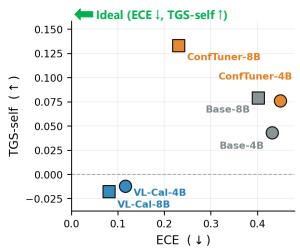

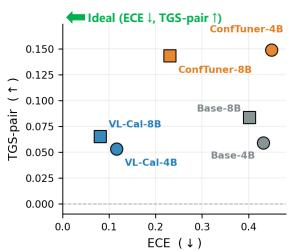  
(a) ECE vs. TGS-self  
(b) ECE vs. TGS-pair  
Figure 6: Outcome-level calibration does not imply trajectory-grounding. VL-Calibration moves models leftward (lower ECE) but not upward on either TGS-self (a) or TGS-pair (b), confirming that the disconnect holds for both self-trajectory reading and external trajectory discrimination.

Metrics We report both outcome-level and trajectory-level metrics. Outcome-level: expected calibration error (ECE↓) and area under the ROC curve (AUROC↑). Trajectory-level: TGS-self↑ and TGS-pair↑ (averaged across vision, reasoning, and answer axes).

Benchmarks We evaluate on 10 benchmarks spanning mathematical and geometric reasoning (DynaMath, Geo3K, MathVerse, MathVision, MathVista, WeMath), logical reasoning (LogicVista), and multi-discipline reasoning (A-OKVQA, MMK12, MMMU-Pro).

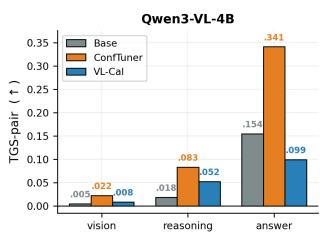

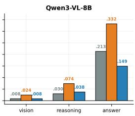

Figure 7: TGS-pair by axis. Vision grounding is consistently the weakest axis across all methods and scales. VL-Calibration shows low but positive TGS-pair on the vision axis at both scales, and on the 8B scale, all methods show substantially lower scores on both vision and reasoning axes than on the answer axis, with grounding concentrated primarily in the answer axis.
<table><tr><td>Model</td><td>AUROC↑ ECE↓ TGS-self↑ TGS-pair↑</td><td></td><td></td><td></td></tr><tr><td>Qwen3-VL-8B</td><td>.664</td><td>.275</td><td>.063</td><td>.084</td></tr><tr><td>InternVL3.5-8B</td><td>.655</td><td>.300</td><td>.046</td><td>.069</td></tr></table>

Table 3: Cross-architecture evaluation. Averages over 10 benchmarks; TGS-pair uses the same 18.3K TGS-Bench pairs for both models.

## 5.2 Results

Table 2 presents the main results. We highlight three observations.

Observation 1: Outcome-level gains do not transfer to trajectory-level grounding. VL-Calibration dramatically reduces ECE over the base model on both scales (4B: .432 → .116; 8B: .402 → .081), yet TGS-self remains near zero and turns negative after calibration, while TGS-pair decreases on both scales (4B: .059 → .053; 8B: .084 → .065). This confirms that outcome-level calibration and trajectory-level grounding measure fundamentally different properties. Figure 6 visualizes this disconnect; VL-Calibration moves leftward (lower ECE) but not upward (higher TGS).

Observation 2: Vision grounding is the weakest axis. Per-axis analysis of TGS-pair (Figure 7) reveals that the vision axis is consistently the weakest across all displayed methods and scales, indicating that models are least sensitive to the quality of their visual perception rationale. This aligns with the trajectory-independence observed for the vision axis in §3.2 and suggests that vision-language grounding remains a critical bottleneck for confidence calibration.

Observation 3: Calibration training can induce anti-grounding. The signed formulation of TGS reveals cases where calibration training worsens trajectory-grounding. VL-Calibration yields negative TGS-self on 8 of 10 benchmarks at 4B and 9 of 10 at 8B, meaning that masking its own trajectory raises confidence on most benchmarks. In contrast, TGS-pair remains positive on every displayed benchmark. Such self-trajectory anti-grounding is invisible to ECE but directly captured by TGS, underscoring the necessity of a trajectory-level diagnostic. The same pattern extends to MM-Vet and GQA: VL-Calibration yields lower TGS-self and TGS-pair than Base at both scales (Table 6).

<table><tr><td rowspan="2">Generator</td><td colspan="2">Qwen3-VL-4B</td><td colspan="2">Qwen3-VL-8B</td></tr><tr><td>Base</td><td>VL-Cal</td><td>Base</td><td>VL-Cal</td></tr><tr><td>Qwen2.5-VL-72B</td><td>.059</td><td>.053</td><td>.084</td><td>.065</td></tr><tr><td>Qwen2.5-VL-32B</td><td>.057</td><td>.040</td><td>.081</td><td>.043</td></tr><tr><td>Qwen2.5-VL-7B</td><td>.047</td><td>.053</td><td>.069</td><td>.054</td></tr></table>

Table 4: Sensitivity of TGS-pair to generator model. TGS-pair is averaged across vision, reasoning, and answer axes and averaged across the 10 benchmarks on the same 5.3K matched records for all generators.

Cross-architecture check Table 3 shows weak TGS-self and TGS-pair for both Qwen3-VL-8B and InternVL3.5-8B. This pattern spans different vision encoders and multimodal architectures, but not independent language-model families, since InternVL3.5-8B uses a Qwen3-8B backbone.

## 6 Analysis

## 6.1 Sensitivity to TGS-Bench Generator

TGS-Bench uses Qwen2.5-VL-72B-Instruct as its default good-trajectory generator. Inclusion is capability-gated, since an item enters the benchmark only if the generator reaches the gold answer and completes the visual and reasoning structure. Regenerating the 5.8K-item pool with smaller generators retains 97.6% of items at 32B and 93.4% at 7B. A weaker generator therefore drops items it cannot solve and biases the suite toward easier ones, so we adopt the largest generator to minimize this selection bias. To verify that our findings are not artifacts of this choice, we rebuild the good trajectories with Qwen2.5-VL-32B and 7B and reevaluate TGS-pair on both scales. As shown in Table 4, TGS-pair values shift modestly across generators but remain below .1 in every setting, and VL-Calibration improves over the base model in only one of the six generator-scale comparisons. Thus, the weak trajectory grounding is not driven by the size of the good-trajectory generator.

## 7 Conclusion

We demonstrate that verbalized confidence is largely trajectory-independent in the Vision-Language Models and calibration methods we evaluate: it changes little when trajectory components are replaced, physically removed, or internally contradicted by the model's own self-doubt, and calibration training can paradoxically worsen this disconnect. To formalize trajectory-level evaluation, we propose the Trajectory-Grounding Score (TGS) in two complementary forms—TGS-self and TGS-pair—alongside TGS-Bench, a modelagnostic suite spanning 10 benchmarks with controlled good/bad trajectory pairs. Our experiments reveal that methods excelling on conventional metrics score near zero or negative on TGS, with vision grounding consistently the weakest axis, confirming that outcome-level calibration and trajectorylevel grounding measure fundamentally different properties. We hope that TGS encourages future calibration methods that derive confidence from reasoning rather than from learned base rates.

## Limitations

Our evaluation covers the Qwen3-VL family (4B and 8B) with six calibration methods and includes a cross-architecture check on InternVL3.5-8B; extending the analysis to additional VLM architectures and larger scales would strengthen generalizability. The 10-benchmark suite predominantly consists of mathematical reasoning tasks with verifiable answers. Diagnostic subsets on MM-Vet and GQA broaden the task coverage, but generalization to unrestricted open-ended generation remains an open question. TGS-Bench relies on external models for trajectory construction; although our sensitivity analysis (Table 4) shows robustness across generator scales, this dependency remains a limitation. Finally, this work is diagnostic in nature—we identify the problem but do not propose a training method to resolve it; developing calibration objectives that explicitly optimize for trajectory-grounding is an important direction for future work.

## Ethics Statement

This work diagnoses a reliability failure in VLMs where models appear well-calibrated under standard metrics while lacking genuine self-assessment, contributing to AI safety research. Our findings caution that current calibration metrics alone are insufficient for certifying confidence reliability in high-stakes deployment scenarios such as medical imaging or autonomous systems. All benchmarks used are publicly available; we will release TGS-Bench and evaluation code upon acceptance. We used AI writing assistants for language polishing; all technical content, experiments, and claims were verified by the authors.

## Acknowledgments

This work was partly supported by the 2026 Cultural Heritage Smart Preservation and Utilization R&D Program of Korea Heritage Service, National Research Institute of Cultural Heritage (Project Name: Development of AI Agent Technology for Architectural Heritage Restoration Design, Project Number: RS-2026-25531766, Contribution Rate: 50%) and partly supported by the Institute of Information and Communications Technology Planning and Evaluation (IITP) grant funded by the Korea Government (MSIT) [RS-2021-II211341, Artificial Intelligence Graduate School Program (Chung-Ang University)].

## References

Shuai Bai, Yuxuan Cai, Ruizhe Chen, Keqin Chen, Xionghui Chen, Zesen Cheng, Lianghao Deng, Wei Ding, Chang Gao, Chunjiang Ge, Wenbin Ge, Zhifang Guo, Qidong Huang, Jie Huang, Fei Huang, Binyuan Hui, Shutong Jiang, Zhaohai Li, Mingsheng Li, and 45 others. 2025. Qwen3-vl technical report arXiv preprint arXiv:2511.21631.

David Bani-Harouni, Chantal Pellegrini, Paul Stangel, Ege Özsoy, Kamilia Zaripova, Nassir Navab, and Matthias Keicher. 2026. Rewarding doubt: A reinforcement learning approach to calibrated confidence expression of large language models. In Proceedings of the International Conference on Learning Representations (ICLR).

Jiahao Cheng, Tiancheng Su, Jia Yuan, Guoxiu He, Jiawei Liu, Xinqi Tao, Jingwen Xie, and Huaxia Li. 2025. Chain-of-thought prompting obscures hallucination cues in large language models: An empirical evaluation. In Findings of the Association for Computational Linguistics: EMNLP 2025, pages 1272– 1305.

Mehul Damani, Isha Puri, Stewart Slocum, Idan Shenfeld, Leshem Choshen, Yoon Kim, and Jacob Andreas. 2026. Beyond binary rewards: Training LMs to reason about their uncertainty. In Proceedings of the International Conference on Learning Representations (ICLR).

Oscar Blessed Deho, Michael Bewong, Selasi Kwashie, Jiuyong Li, Jixue Liu, Lin Liu, and Srecko Joksimovic. 2025. Is it still fair? a comparative evaluation of fairness algorithms through the lens of covariate drift. Machine Learning, 114(1):8.

Yuetian Du, Yucheng Wang, Rongyu Zhang, Zhijie Xu, Boyu Yang, Ming Kong, Jie Liu, and Qiang Zhu. 2026. Linking perception, confidence and accuracy in mllms. In Proceedings of the IEEE/CVF Conference on Computer Vision and Pattern Recognition (CVPR), pages 25914–25924.

Drew A Hudson and Christopher D Manning. 2019. Gqa: A new dataset for real-world visual reasoning and compositional question answering. In 2019 IEEE/CVF Conference on Computer Vision and Pattern Recognition (CVPR), pages 6693–6702. IEEE.

Saurav Kadavath, Tom Conerly, Amanda Askell, Tom Henighan, Dawn Drain, Ethan Perez, Nicholas Schiefer, Zac Hatfield-Dodds, Nova DasSarma, Eli Tran-Johnson, Scott Johnston, Sheer El-Showk, Andy Jones, Nelson Elhage, Tristan Hume, Anna Chen, Yuntao Bai, Sam Bowman, Stanislav Fort, and 17 others. 2022. Language Models (Mostly) Know What They Know. arXiv preprint arXiv:2207.05221.

Tamera Lanham, Anna Chen, Ansh Radhakrishnan, Benoit Steiner, Carson Denison, Danny Hernandez, Dustin Li, Esin Durmus, Evan Hubinger, Jackson Kernion, Kamilė Lukošiūtė, Karina Nguyen, Newton Cheng, Nicholas Joseph, Nicholas Schiefer, Oliver Rausch, Robin Larson, Sam McCandlish, Sandipan Kundu, and 11 others. 2023. Measuring faithfulness in chain-of-thought reasoning. arXiv preprint arXiv:2307.13702.

Yibo Li, Miao Xiong, Jiaying Wu, and Bryan Hooi 2025. ConfTuner: Training large language models to express their confidence verbally. Advances in Neural Information Processing Systems (NeurIPS), 38:53484–53513.

Stephanie Lin, Jacob Hilton, and Owain Evans. 2022. Teaching models to express their uncertainty in words. arXiv preprint arXiv:2205.14334.

Haotian Liu, Chunyuan Li, Qingyang Wu, and Yong Jae Lee. 2023. Visual instruction tuning. In Advances in Neural Information Processing Systems (NeurIPS), volume 36, pages 34892–34916.

Pan Lu, Hritik Bansal, Tony Xia, Jiacheng Liu, Chunyuan Li, Hannaneh Hajishirzi, Hao Cheng, Kai-Wei Chang, Michel Galley, and Jianfeng Gao. 2024. MathVista: Evaluating mathematical reasoning of foundation models in visual contexts. In Proceedings of the International Conference on Learning Representations (ICLR).

Pan Lu, Ran Gong, Shibiao Jiang, Liang Qiu, Siyuan Huang, Xiaodan Liang, and Song-Chun Zhu. 2021. Inter-GPS: Interpretable geometry problem solving with formal language and symbolic reasoning. In

Proceedings of the 59th Annual Meeting of the Association for Computational Linguistics and the 11th International Joint Conference on Natural Language Processing (Volume 1: Long Papers) (ACL-IJCNLP), pages 6774–6786.

María Luisa Menéndez, Julio Angel Pardo, Leandro Pardo, and María del C Pardo. 1997. The jensenshannon divergence. Journal of the Franklin Institute, 334(2):307–318.

Fanqing Meng, Lingxiao Du, Zongkai Liu, Zhixiang Zhou, Quanfeng Lu, Daocheng Fu, Tiancheng Han, Botian Shi, Wenhai Wang, Junjun He, Kaipeng Zhang, Ping Luo, Yu Qiao, Qiaosheng Zhang, and Wenqi Shao. 2025. MM-Eureka: Exploring the frontiers of multimodal reasoning with rule-based reinforcement learning. arXiv preprint arXiv:2503.07365.

Aiswariya Milan Kummaya, Amudha Joseph, Kumar Rajamani, and George Ghinea. 2025. Fed-hetero: A self-evaluating federated learning framework for data heterogeneity. Applied System Innovation, 8(2):28.

Runqi Qiao, Qiuna Tan, Guanting Dong, Minhui Wu, Chong Sun, Xiaoshuai Song, Jiapeng Wang, Zhuoma GongQue, Shanglin Lei, YiFan Zhang, Zhe Wei, Miaoxuan Zhang, Runfeng Qiao, Xiao Zong, Yida Xu, Peiqing Yang, Zhimin Bao, Muxi Diao, Chen Li, and Honggang Zhang. 2025. We-Math: Does your large multimodal model achieve human-like mathematical reasoning? In Proceedings of the 63rd Annual Meeting of the Association for Computational Linguistics (Volume 1: Long Papers) (ACL), pages 20023–20070.

Dustin Schwenk, Apoorv Khandelwal, Christopher Clark, Kenneth Marino, and Roozbeh Mottaghi. 2022. A-OKVQA: A benchmark for visual question answering using world knowledge. In European Conference on Computer Vision (ECCV), pages 146–162. Springer.

KiJung Seo, Sehun Lim, and Taeuk Kim. 2026. AD-VICE: Answer-dependent verbalized confidence estimation. In Proceedings of the 64th Annual Meeting of the Association for Computational Linguistics (Volume 1: Long Papers) (ACL), pages 23942–23962.

Ke Wang, Junting Pan, Weikang Shi, Zimu Lu, Houxing Ren, Aojun Zhou, Mingjie Zhan, and Hongsheng Li. 2024. Measuring multimodal mathematical reasoning with the MATH-Vision dataset. Advances in Neural Information Processing Systems (NeurIPS), 37:95095–95169.

Weiyun Wang, Zhangwei Gao, Lixin Gu, Hengjun Pu, Long Cui, Xingguang Wei, Zhaoyang Liu, Linglin Jing, Shenglong Ye, Jie Shao, Zhaokai Wang, Zhe Chen, Hongjie Zhang, Ganlin Yang, Haomin Wang, Qi Wei, Jinhui Yin, Wenhao Li, Erfei Cui, and 56 others. 2025. InternVL3.5: Advancing open-source multimodal models in versatility, reasoning, and efficiency. arXiv preprint arXiv:2508.18265.

Wenyi Xiao, Xinchi XU, and Leilei Gan. 2026. VLcalibration: Decoupled confidence calibration for large vision-language models reasoning. In Proceedings of the 64th Annual Meeting of the Association for Computational Linguistics (Volume 1: Long Papers) (ACL), pages 44791–44815.

Yijia Xiao, Edward Sun, Tianyu Liu, and Wei Wang. 2024. Logicvista: Multimodal llm logical reasoning benchmark in visual contexts. arXiv preprint arXiv:2407.04973.

Miao Xiong, Zhiyuan Hu, Xinyang Lu, Yifei Li, Jie Fu, Junxian He, and Bryan Hooi. 2024. Can LLMs express their uncertainty? an empirical evaluation of confidence elicitation in LLMs. In Proceedings of the International Conference on Learning Representations (ICLR).

Tianyang Xu, Shujin Wu, Shizhe Diao, Xiaoze Liu, Xingyao Wang, Yangyi Chen, and Jing Gao. 2024. SaySelf: Teaching LLMs to express confidence with self-reflective rationales. In Proceedings of the 2024 Conference on Empirical Methods in Natural Language Processing (EMNLP), pages 5985–5998.

Daniel Yang, Yao-Hung Hubert Tsai, and Makoto Yamada. 2024. On verbalized confidence scores for llms. arXiv preprint arXiv:2412.14737.

Weihao Yu, Zhengyuan Yang, Linjie Li, Jianfeng Wang, Kevin Lin, Zicheng Liu, Xinchao Wang, and Lijuan Wang. 2024. Mm-vet: Evaluating large multimodal models for integrated capabilities. In Proceedings of the 41st International Conference on Machine Learning (ICML), pages 57730–57754.

Xiang Yue, Tianyu Zheng, Yuansheng Ni, Yubo Wang, Kai Zhang, Shengbang Tong, Yuxuan Sun, Botao Yu, Ge Zhang, Huan Sun, Yu Su, Wenhu Chen, and Graham Neubig. 2025. MMMU-pro: A more robust multi-discipline multimodal understanding benchmark. In Proceedings of the 63rd Annual Meeting of the Association for Computational Linguistics (Volume 1: Long Papers) (ACL), pages 15134–15186.

Renrui Zhang, Dongzhi Jiang, Yichi Zhang, Haokun Lin, Ziyu Guo, Pengshuo Qiu, Aojun Zhou, Pan Lu, Kai-Wei Chang, Yu Qiao, Peng Gao, and Hongsheng Li. 2024. MathVerse: Does your multi-modal LLM truly see the diagrams in visual math problems? In European Conference on Computer Vision (ECCV), pages 169–186. Springer.

Ziang Zhou, Tianyuan Jin, Jieming Shi, and Qing Li. 2025. SteerConf: Steering LLMs for confidence elicitation. Advances in Neural Information Processing Systems (NeurIPS), 38:19460–19486.

Chengke Zou, Xingang Guo, Rui Yang, Junyu Zhang, Bin Hu, and Huan Zhang. 2025. DynaMath: A dynamic visual benchmark for evaluating mathematical reasoning robustness of vision language models. In Proceedings of the International Conference on Learning Representations (ICLR).

## A Analysis Details

## A.1 Confidence Distribution Analysis

## A.1.1 Confidence elicitation templates

All analyses in this section reuse the same prompting templates used for self-trajectory generation. Below we provide the model-specific templates in abbreviated form.

Qwen3-VL prompt template For Qwen3-VL-Instruct, we use the following template to elicit a free-form trajectory and a holistic confidence score:

User Prompt   
Question: {question}{choices\_block}   
First, think step by step inside   
<think>...</think>. Inside the think   
block, briefly describe what you see in   
the image and how you derive the answer.   
Thenoutput your final answer   
in \boxed{...} and a confidence   
score from 0 to 10 inside   
<confidence>...</confidence>.   
Expected output format:   
<think> ... </think>   
\boxed{answer}   
<confidence>   
[0-10]   
</confidence>

VL-Calibration prompt template For VL-Calibration, we use the following template to elicit structured vision/reasoning trajectories and decoupled confidence scores:

You FIRST think through the reasoning process as an internal monologue, then provide the final answer.   
The reasoning process MUST BE enclosed within <think> </think> tags. Inside the <think> tags, you MUST explicitly separate your thought process into two distinct parts: enclose your visual perception analysis within <vision> </vision> tags, and your logical deduction within <reasoning> </reasoning> tags. The final answer MUST BE put in \boxed{}.   
After that, perform an <analysis>...</analysis> block to analyse the vision and reasoning confidence in your answer.   
Finally, output the confidence scores (0, 1, 2, 3, 4, 5, 6, 7, 8, 9, 10) enclosed within <confidence></confidence> tags. Inside the confidence tags, you MUST strictly output two separate scores enclosedwithin<vision\_confidence> </vision\_confidence> and <reasoning\_confidence>   
</reasoning\_confidence> tags respectively.

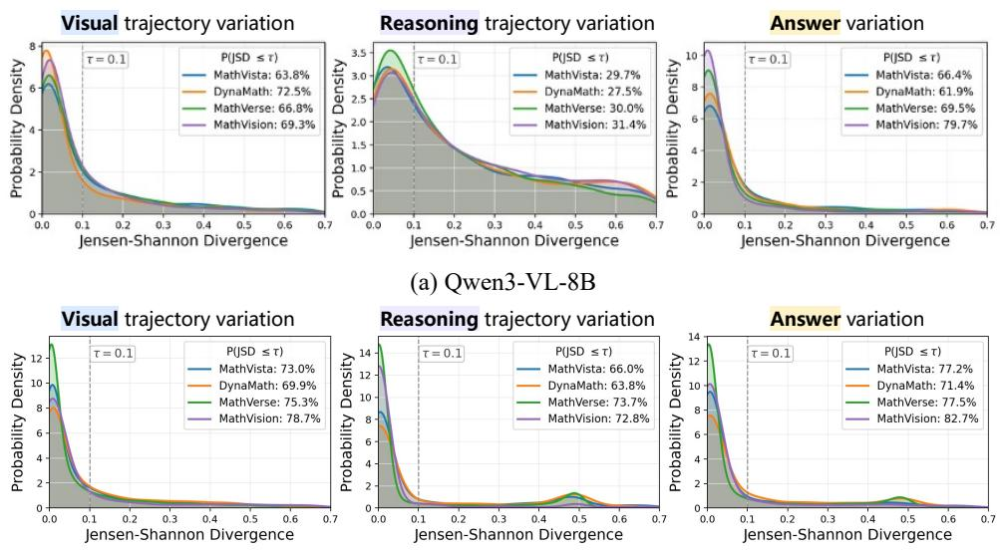  
(b) VL-Calibration-8B  
Figure 8: JSD distributions when varying trajectory components. (a) Qwen3-VL-8B (base). (b) VL-Calibration-8B. The base model is already substantially trajectory-independent (vision $P ( \mathrm { J S D } \leq 0 . 1 ) \approx 6 4 \ – 7 3 \% )$ . VL-Calibration increases this ratio (vision $P ( \mathrm { { J S D } } \leq 0 . 1 ) \approx 7 0 { - } 7 9 \% )$ , indicating that calibration training does not resolve the underlying disconnect between confidence and trajectory.

## A.1.2 Trajectory construction

Trajectory construction for Qwen3-VL Since Qwen3-VL-Instruct does not natively produce structured trajectory tags, we employ a two-stage procedure. First, given an image I and question q, we let the model generate a free-form chain-ofthought response. Second, we prompt the model itself to segment the response into a vision component v (visual perception rationale) and a reasoning component r (logical/arithmetic chain), using the following structured extraction template:

Extraction Prompt   
You are given a model response to a   
visual question. Split the response into   
two parts:   
(1) <vision>: statements describing what   
is visually observed in the image, and   
(2) <reasoning>: logical, arithmetic,   
or deductive steps used to derive the   
answer.   
Do not add new information. Preserve the   
original meaning and wording as much as   
possible. Output only the two tagged   
fields.

We manually verified the segmentation quality on a random subset of 100 samples and found >95% agreement with human annotation.

Trajectory construction for VL-Calibration VL-Calibration natively generates structured outputs with explicit <vision> and <reasoning> blocks, followed by separate confidence tokens ${ \mathcal { C } } _ { \mathrm { V i s } }$ and $c _ { \mathrm { r e a s } }$ . We directly extract content within each tag pair without additional segmentation.

## A.1.3 Alternative trajectory generation

For each sample, we generate k = 5 alternative trajectories per axis using Qwen2.5-VL-7B-Instruct with diverse sampling (temperature $T = 0 . 8 ,$ top-$p = 0 . 9 5 )$ . For the vision axis, we use the following template:

You are given an image, a question, and an existing answer. Describe the visual content relevant to the question in a different way from the original trajectory, while remaining consistent with the image and preserving the same final answer.

For the reasoning axis, we use:

You are given an image, a question, and   
an existing answer. Solve the problem   
using a different reasoning approach   
from the original trajectory, while   
preserving the same final answer.

For the answer axis, we pair the original trajectory with each of the other k — 1 candidate answers.

## A.1.4 JSD computation

For each pair of alternative trajectories $( x _ { i } , x _ { j } )$ along axis x, we elicit the full confidence distribution $P _ { \mathcal { M } } ( C = c )$ for $c \in \{ 0 , 1 , \ldots , 1 0 \}$ from digit-token logits, then compute:

$$
\begin{array} { r l } & { \mathrm { J S D } ( P \| Q ) = \frac { 1 } { 2 } D _ { \mathrm { K L } } ( P \| M ) + \frac { 1 } { 2 } D _ { \mathrm { K L } } ( Q \| M ) , } \\ & { \quad \quad \quad M = \frac { 1 } { 2 } ( P + Q ) . } \end{array}
$$

For VL-Calibration, we compute JSD separately for ${ \mathcal { C } } _ { \mathrm { V i S } }$ and $c _ { \mathrm { r e a s } }$ and report their average $\frac { 1 } { 2 } \big ( \mathrm { J S D } _ { \mathrm { v i s } }$ 十 $\mathrm { J S D } _ { \mathrm { r e a s } } )$ as the per-sample divergence. All pairwise JSD values are computed across $\binom { k } { 2 }$ pairs per sample.

## A.1.5 Additional results across models and scales.

The main text (Figure 2) reports JSD distributions for Qwen3-VL-4B and VL-Calibration-4B. Figure 8 reports the corresponding 8B results for Qwen3-VL and VL-Calibration. Figures 9 and 10 extend the analysis to Verbalize, P(True), Steer-Conf, ConfTuner, and RLCR at 4B and 8B, respectively. The core finding is consistent: trajectoryindependence holds across all models, with the vision axis showing the strongest independence and the reasoning axis showing the weakest (though still substantial).

## A.2 Token Masking Analysis

Attention-level masking Rather than deleting trajectory tokens from the input (which would shift positional encodings and introduce confounds), we implement masking at the attention level. Specifically, for a trajectory spanning token positions $[ t _ { \mathrm { s t a r t } } , t _ { \mathrm { e n d } } ]$ , we modify the causal attention mask so that all tokens at positions $t > t _ { \mathrm { e n d } }$ (i.e., the confidence-generation tokens) cannot attend to masked trajectory tokens. The masked tokens remain in the sequence and retain their positional encodings, but are rendered invisible to downstream generation.

Masking ratios We apply masking at five nested ratios: 0% (no masking), 25%, 50%, 75%, and 100% (full masking). At each ratio r, we uniformly sample $\lfloor r \cdot ( t _ { \mathrm { e n d } } - t _ { \mathrm { s t a r t } } + 1 ) \rfloor$ token positions within the trajectory span and mask them. To ensure nested masking conditions, the masked subset at a lower ratio is always contained within the masked subset at a higher ratio for the same sample. To reduce variance, we repeat each partial masking condition (25%, 50%, 75%) with 3 different random seeds and report the average confidence. The 0% and 100% conditions are deterministic and require no repetition.

Confidence extraction Under each masking condition, we let the model generate the confidence token(s) and record the expected confidence:

$$
\mu ( C ) = \sum _ { c = 0 } ^ { 1 0 } \frac { c } { 1 0 } \cdot P ( C = c ) ,
$$

For $c \in \{ 0 , \ldots , 9 \} , P ( C = c )$ uses the corresponding single-token probability. For $c = 1 0$ we compute the joint probability $P ( ^ { \alpha } 1 ^ { \prime \prime } ) P ( ^ { \alpha } \theta ^ { \prime \prime } \mid ^ { \alpha } 1 ^ { \prime \prime } )$ with a second forward pass, then normalize over all 11 candidates. For VL-Calibration, we extract both $\mu ( C _ { \mathrm { v i s } } )$ and $\mu ( C _ { \mathrm { r e a s } } )$ and report their harmonic mean as the holistic confidence.

Additional results across models and scales The main text (Figure 3) reports masking curves for Qwen3-VL-4B and VL-Calibration-4B. Figure 11 and 12 consolidate the masking curves for all additional models and scales. In all cases, the paradoxical uptick at 100% masking persists, confirming that no evaluated model consistently relies on trajectory content when generating confidence.

## A.3 Intra-Trajectory Confidence Analysis

Hesitation marker lexicon We define hesitation markers as lexical cues indicating self-doubt or self-correction within the reasoning trajectory. Our lexicon includes the following patterns (caseinsensitive):

• Wait, Hold on, Hmm

• Actually, Let me reconsider, On second thought

• Let me recheck, Let me recalculate, Let me re-examine

• I made a mistake, I made an error, That's not right

• No, that's wrong, Correction, I should reconsider

We match each pattern at word boundaries to avoid false positives (e.g., “wait" within “waiting" is excluded).

Pre- and post-hesitation truncation For each hesitation marker with onset position $T _ { H }$ , we construct two truncated trajectories:

• Pre-hesitation cut: the trajectory ends immediately before the hesitation marker.

• Post-hesitation cut: the trajectory ends at the first sentence boundary following the marker, capped at the onset of the next hesitation marker when applicable.

For both conditions, we hold the original final answer fixed and elicit confidence using the exclusive

<table><tr><td></td><td></td><td colspan="4">TGS-self</td><td colspan="4">TGS-pair</td></tr><tr><td>Scale</td><td>Model</td><td>Estimate [95% CI]</td><td></td><td>SD</td><td>p</td><td></td><td>Estimate [95% CI]</td><td>SD</td><td>p</td></tr><tr><td>4B</td><td>Base</td><td></td><td>.043 [.033, .053]</td><td>.017</td><td>.002</td><td></td><td>.059 [.052, .066]</td><td>.012</td><td>.002</td></tr><tr><td>4B</td><td>VL-Cal</td><td></td><td>−.012 [−.037, .013]</td><td>.041</td><td>.322</td><td></td><td>.053 [.045, .063]</td><td>.015</td><td>.002</td></tr><tr><td>8B</td><td>Base</td><td></td><td>.079 [.065, .095]</td><td>.026</td><td>.002</td><td></td><td>.084 [.076, .091]</td><td>.012</td><td>.002</td></tr><tr><td>8B</td><td>VL-Cal</td><td></td><td>−.018 [−.029, −.005]</td><td>.020</td><td>.049</td><td></td><td>.065 [.050, .078]</td><td>.024</td><td>.002</td></tr></table>

Table 5: Statistical robustness of the main trajectory-level results.

11-way digit readout over $\{ 0 , \ldots , 1 0 \}$ . For Qwen3- VL, we use the holistic confidence score. For VL-Calibration, we use the reasoning-confidence head for eligible reasoning-related hesitation markers. This construction isolates the confidence change associated with the reconsideration segment while keeping the final answer unchanged.

## B TGS-Bench Validation and Statistical Robustness

## B.1 Construction and Independent-Judge Validation

The final TGS-Bench evaluation scores 18,295 records on each axis. Candidates are textually distinct in 18,164 vision, 18,240 reasoning, and all 18,295 answer records; identical candidates contribute zero. Each comparison replaces only its target axis, while the other two components are copied byte-for-byte from the good trajectory. Vision and reasoning pairs have .958 character similarity, change a median 1.6% and 1.3% of words, and preserve length. Answer errors comprise multiplechoice letter shifts (62.6%), numeric or structurednumeric perturbations (36.6%), and Boolean flips (0.8%).

For independent validation, image-aware InternVL3.5-8B judged a fixed, benchmarkstratified sample of 400 pairs per axis with randomized A/B order. Edited vision and reasoning trajectories retained high mean fluency (4.75 and 4.51 out of 5; 4.91 and 4.80 for good trajectories) and were judged natural in 93.0% and 91.8% of cases. The intended error side was identified in 75.5%, 72.0%, and 72.8% of vision, reasoning, and answer pairs; edited answers were judged plausible in 81.3%. The judge classified 96.3%, 90.8%, and 67.8% of the respective edits as local. Under the corrected readout, confidence-change correlations with edited-passage fluency are small for vision $( | r | \le \ . 1 0 )$ but larger for reasoning $( | r | = . 1 6 \substack { - . 2 2 } )$ , so the final data do not support a uniform $| r | < . 0 8$ bound.

Generator sensitivity is examined in §6.1 and is not repeated here.

## B.2 Statistical Robustness of the Main Results

We recompute all statistics from the final corrected sample-level outputs. Point estimates are averages across the 10 benchmarks. We form 95% percentile CIs with 5,000 two-stage bootstrap draws, resampling benchmarks and then samples within each drawn benchmark, and report the standard deviation across benchmark means. The p-values in Table 5 use exact two-sided Wilcoxon signed-rank tests of the ten benchmark means against zero.

## C Evaluation Details

## C.1 Evaluation Metrics

We use the following outcome-level and trajectorylevel evaluation metrics:

1. Area Under the Receiver Operating Characteristic Curve (AUROC↑): Measures how well confidence distinguishes correct from incorrect answers across decision thresholds. Treating correctness as the positive label, we compute

$$
\mathrm { A U R O C } = \int _ { 0 } ^ { 1 } \mathrm { T P R } \big ( \mathrm { F P R } ^ { - 1 } ( t ) \big ) \ d t ,\tag{1}
$$

where TPR and FPR are the true-positive and false-positive rates.

2. Expected Calibration Error (ECE↓): Measures the discrepancy between empirical accuracy and confidence. We partition normalized confidence into $M = 1 0$ equal-width bins $\lbrace B _ { m } \rbrace _ { m = 1 } ^ { M }$ on [0, 1] and compute

$$
\mathrm { E C E } = \sum _ { m = 1 } ^ { M } \frac { | B _ { m } | } { N } \left| \operatorname { a c c } ( B _ { m } ) - \operatorname { c o n f } ( B _ { m } ) \right| ,\tag{2}
$$

where N is the number of evaluated predictions, and $\operatorname { a c c } ( B _ { m } )$ and $\operatorname { c o n f } ( B _ { m } )$ are the mean correctness and confidence in bin $B _ { m }$

3. Trajectory Grounding Score-Self (TGSself↑): Measures the signed change in holistic confidence when the model's designated selfrationale is visible rather than fully attentionmasked while the answer remains visible. A positive score indicates that confidence is grounded in the model's own trajectory (§4.1).

4. Trajectory Grounding Score-Pair (TGSpair↑): Measures the signed confidence difference between a good trajectory and its targetaxis-perturbed counterpart. We compute it separately for the vision, reasoning, and answer axes and average the three scores (§4.2).

Readout and aggregation Both TGS metrics use the corrected 11-way readout $\mu ( C ) \ =$ $\scriptstyle \sum _ { c = 0 } ^ { 1 0 } ( c / 1 0 ) P ( C = c )$ . For VL-Calibration, the vision and reasoning axes use their corresponding heads, whereas the answer axis and TGS-self use the harmonic-mean confidence. Each intervention condition is evaluated once, and we average within benchmarks, then across the 10 benchmarks.

For outcome-level evaluation, Base uses its holistic verbalized confidence, while VL-Calibration uses the harmonic mean of its normalized visual and reasoning confidences. Their per-benchmark AUROC and ECE values are reproduced from the original VL-Calibration evaluation. ConfTuner ECE is computed locally from its checkpoint-native 0–9 digit distribution, $\scriptstyle \sum _ { k = 0 } ^ { 9 } ( k / 9 ) P ( \bar { C } = k )$ , over valid completed outputs (73.9% coverage at 4B and 76.1% at 8B).

## C.2 Evaluation Datasets

We evaluate on 10 benchmarks spanning mathematical and geometric reasoning, logical reasoning, and multi-discipline reasoning. We additionally evaluate diagnostic subsets of MM-Vet and GQA to assess transfer to broader visual reasoning tasks; these subsets are excluded from the 10-benchmark averages and reported separately in Table 6.

## Mathematical and geometric reasoning

• DynaMath (Zou et al., 2025): Uses programmatically generated variants of seed problems to test robust visual mathematical reasoning rather than memorization.

• Geo3K (Lu et al., 2021): Contains high-school geometry problems with dense formal-language annotations.

<table><tr><td>Benchmark Method AUROC↑ ECE↓ TGS-self↑ TGS-pair↑</td><td></td><td></td><td></td><td></td><td></td></tr><tr><td colspan="6">Qwen3-VL-4B</td></tr><tr><td>MM-Vet</td><td>Base</td><td>.695</td><td>.317</td><td>.019</td><td>.0465</td></tr><tr><td rowspan="3">GQA</td><td>VL-Cal</td><td>.707</td><td>.352</td><td>-.003</td><td>.0242</td></tr><tr><td>Base</td><td>.624</td><td>.200</td><td>.010</td><td>.1066</td></tr><tr><td>VL-Cal</td><td>.614</td><td>.223</td><td>-.008</td><td>.0497</td></tr><tr><td colspan="6">Qwen3-VL-8B</td></tr><tr><td rowspan="2">MM-Vet</td><td>Base</td><td>.629</td><td>.405</td><td>.035</td><td>.0534</td></tr><tr><td>VL-Cal</td><td>.627</td><td>.344</td><td>-.011</td><td>.0097</td></tr><tr><td rowspan="2">GQA</td><td>Base</td><td>.610</td><td>.338</td><td>.062</td><td>.1445</td></tr><tr><td>VL-Cal</td><td>.600</td><td>.246</td><td>-.012</td><td>.0105</td></tr></table>

Table 6: Diagnostic transfer to broader visual reasoning tasks. Results on MM-Vet (Yu et al., 2024) and GQA (Hudson and Manning, 2019).

• MathVerse (Zhang et al., 2024): Provides multiple versions that progressively shift information from text to diagrams, probing genuine visual dependence.

• MATH-Vision (Wang et al., 2024): Draws challenging problems from mathematical competitions across diverse subjects and difficulty levels.

• MathVista (Lu et al., 2024): Combines a broad range of mathematical and visual reasoning tasks.

• WeMath (Qiao et al., 2025): Decomposes composite problems into subproblems organized by a hierarchy of mathematical concepts for finegrained diagnosis.

## Logical reasoning

• LogicVista (Xiao et al., 2024): Evaluates inductive, deductive, numerical, spatial, and mechanical reasoning across diverse visual formats.

## Multi-discipline reasoning

• A-OKVQA (Schwenk et al., 2022): Requires commonsense and world knowledge beyond direct knowledge-base lookup.

• MMK-12 (Meng et al., 2025): Covers K–12 multimodal STEM reasoning.

• MMMU-Pro (Yue et al., 2025): Strengthens MMMU by reducing text-only shortcuts, expanding answer choices, and introducing vision-only questions.

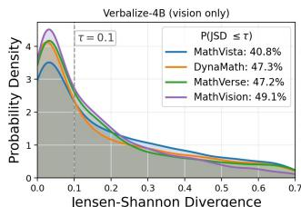

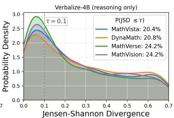  
(a) Verbalize

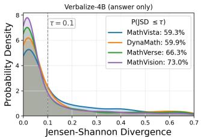

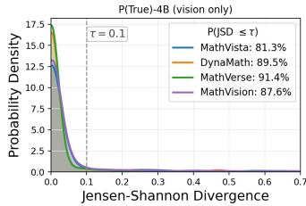

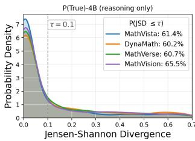  
(b) P(true)

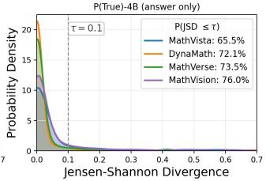

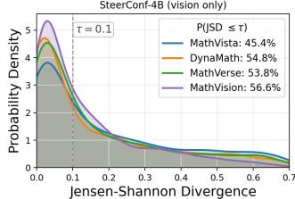

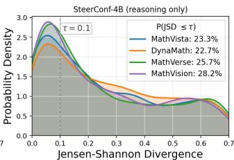

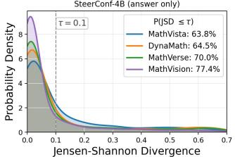  
(c) SteerConf

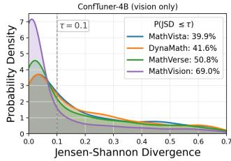

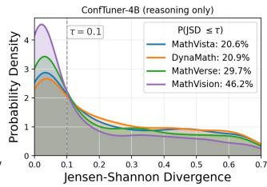

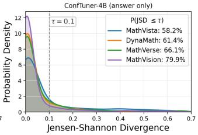  
(d) ConfTuner

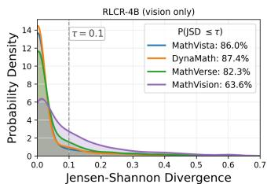

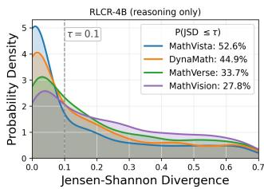  
(e) RLCR

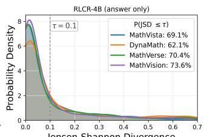  
Figure 9: JSD distributions when varying trajectory components across 4B confidence-estimation methods: (a) Verbalize, (b) P(True), (c) SteerConf, (d) ConfTuner, and (e) RLCR. Across all 4B methods, the same qualitative pattern persists: confidence is most trajectory-independent on the vision axis, somewhat less so on the reasoning axis and remains substantially insensitive to answer substitutions. Calibration training reduces but does not eliminate trajectory-independence.

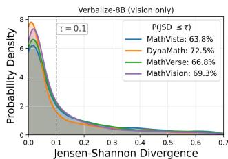

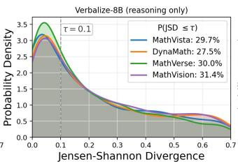  
(a) Verbalize

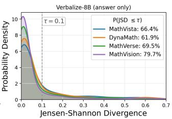

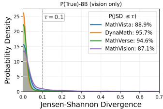

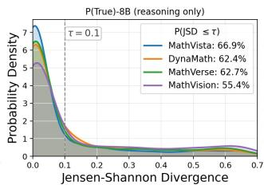

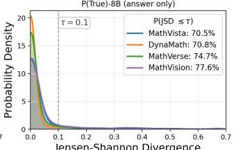  
(b) P(true)

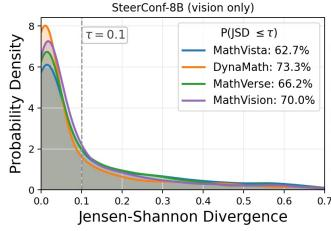

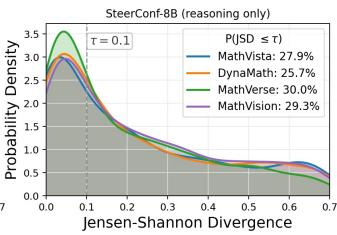

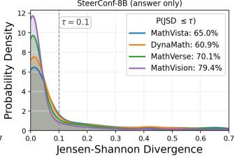  
(c) SteerConf

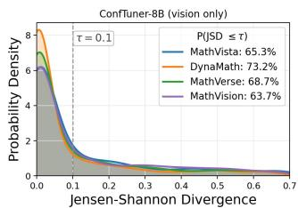

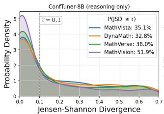

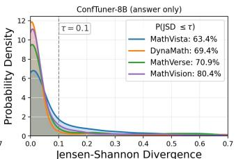  
(d) ConfTuner

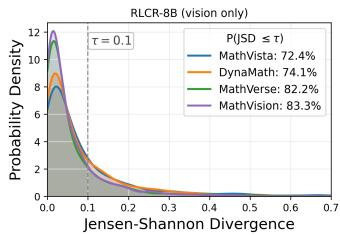

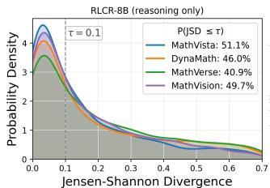  
(e) RLCR

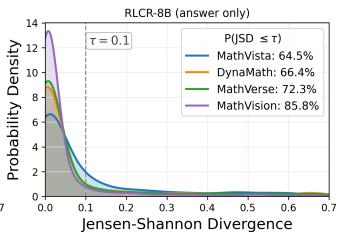  
Figure 10: JSD distributions when varying trajectory components across 8B confidence-estimation methods: (a) Verbalize, (b) P(True), (c) SteerConf, (d) ConfTuner, and (e) RLCR. As in the 4B setting, confidence remains highly trajectory-independent, especially on the vision axis, with somewhat greater sensitivity on the reasoning axis. Calibration training weakens but does not resolve this independence.

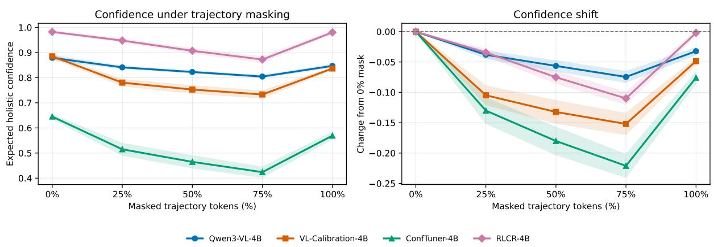  
Figure 11: Designated-rationale masking at 4B. Expected holistic confidence under increasing masking for Base, VL-Calibration, ConfTuner, and RLCR. The left panel reports absolute confidence and the right panel its change from the unmasked condition. Curves are macro-averages across 10 benchmarks on the within-scale common-valid population $( n = 7 2 9 )$ ; shading shows ±1 standard error.

## 8B models — 10-family macro average (common-valid n=904)

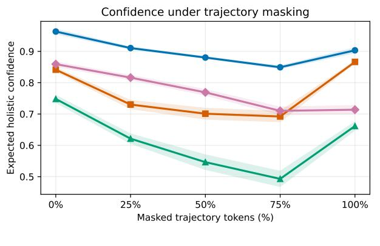

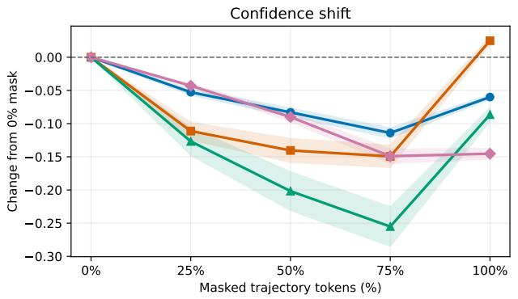

Figure 12: Designated-rationale masking at 8B. Expected holistic confidence under increasing masking for Base, VL-Calibration, ConfTuner, and RLCR. The left panel reports absolute confidence and the right panel its change from the unmasked condition. Curves are macro-averages across 10 benchmarks on the within-scale common-valid population $( n = 9 0 4 ) ;$ shading shows ±1 standard error.  
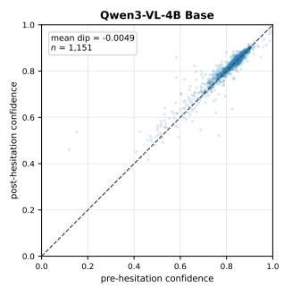

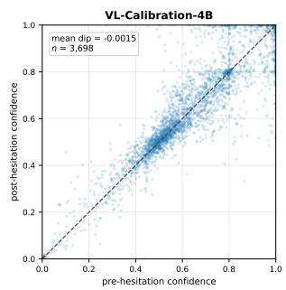

  
Figure 13: Pre- versus post-hesitation confidence at 4B. Each point is one eligible hesitation event for Base, VL-Calibration, ConfTuner, or RLCR. The dashed diagonal denotes no change; points below it have $c _ { \mathrm { p r e } } > c _ { \mathrm { p o s t } } .$ Each panel reports the mean $\Delta c = c _ { \mathrm { p r e } } - c _ { \mathrm { p o s t } }$ and the number of scored events.

  
Figure 14: Pre- versus post-hesitation confidence at 8B. Each point is one eligible hesitation event for Base. VL-Calibration, ConfTuner, or RLCR. The dashed diagonal denotes no change; points below it have $c _ { \mathrm { p r e } } > c _ { \mathrm { p o s t } } .$ Each panel reports the mean $\Delta c = c _ { \mathrm { p r e } } - c _ { \mathrm { p o s t } }$ and the number of scored events.

  
Figure 15: Outcome calibration versus self-trajectory grounding. Locally recomputed 10-bin ECE versus TGS-self for eight measured checkpoint-scale pairs: Base, VL-Calibration, ConfTuner, and RLCR at 4B and 8B. Both metrics use one trajectory per frozen instance and the panel-wide common-valid self population (n = 637), followed by an 10 benchmark average. Lower ECE and higher TGS-self are preferred.

  
Figure 16: Outcome calibration versus pairwise trajectory grounding. Locally recomputed ECE versus TGS-pair for the same eight measured checkpoint-scale pairs. TGS-pair is shown as the raw signed confidence difference, not multiplied by $1 0 ^ { - 2 }$ . ECE and TGS-pair use their respective panel-wide common-valid self $( n = 6 3 7 )$ and pair $( n = 1 , 4 9 9 )$ populations and 10 benchmark averages. Lower ECE and higher TGS-pair are preferred.