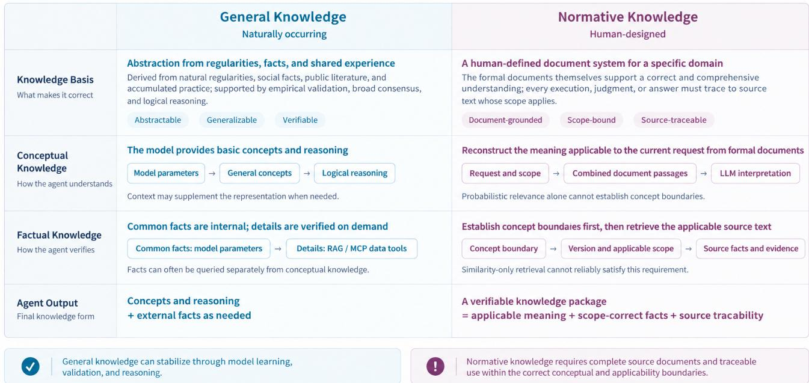

# Version- and Scope-Aware Question Answering over Normative Documents: A Deployed System and an End-to-End Evaluation at Production Scale

Liuyin Wang1, Shuaipeng Jin1, Jiwei Shi1, Jensen Hsu1,2∗

1Beijing Caizhi Technology Co., Ltd., Beijing, China

2dknownAI, Beijing, China

{wangliuyin, jinshuaipeng, shijiwei, xjj}@czkj1010.com

## Abstract

Correctly answering a question grounded in normative documents often depends on information outside any single passage: whether the retrieved document is the version currently in force; whether it applies to the jurisdiction, subject (such as an institution or applicant), and date at issue; and whether each normative claim can be traced to its supporting source text. Hosted retrieval services have substantially lowered the engineering cost of building an initial system over such corpora, making “upload the documents and ask” a common default. We evaluate this default on approximately 73,000 candidate normative documents supplied to a production deployment. The evaluation uses a stratified sample of 200 questions from our published benchmark, with a gold source document for every question; the released sampling rule reads no system outputs or scores. We compare the hosted service with a governed system that resolves version and scope through explicit rules before generation. The governed system scored 97.7 overall, while the hosted service scored 88.1, a gap of 9.6 points computed from unrounded means. The question set, the answer text evaluated for both systems, the scores, and the scripts used to reproduce the reported benchmark statistics are public. The governed configuration has operated as a commercial product since January 2026 and serves 1,126 registered users; named customer organizations include Zhipu AI and Lecheng Health. By mid-April 2026, it had reached roughly 100,000 calls per workday.

Deployed system —

https://yun.dknowc.cn/wlcb/dknowc-chat/

Benchmark and code — https://github.com/ASI2030/ normative-qa-benchmark/tree/main/subset-200

## Introduction

A staf member at a Chinese public-service window is asked a question with a definite answer: whether a firm qualifies for a talent subsidy, what the filing deadline is, and which authority has jurisdiction. The answer is in a particular article of a particular normative document among tens of thousands issued by national, provincial, and municipal bodies. Answering requires finding the document that actually applies, confirming that it is the currently efective version rather than an older version it replaced or a newer version that has replaced it, and confirming that its scope covers this applicant, this region, and this date. An error here is not merely a poor search result; it is an incorrect normative statement made with the authority of the service window. It can then propagate—repeated by the staf member, acted on by the applicant, and perhaps corrected only after a deadline has passed.

Much of the information that separates a correct citation from a hazardous one is not contained in the text of a single passage. Two documents may be almost identical in wording but difer exactly on the point that decides the current case: one has been repealed, one applies to a neighboring city, or one covers a diferent class of applicant. Efective status, issuing authority, applicable region and period, and amendment and repeal relations are metadata or crossdocument relations, and passage-level semantic similarity provides no mechanism for identifying them (Lewis et al. 2020; Karpukhin et al. 2020). Chinese normative documents further weaken surface textual signals: among the 191 distinct source documents involved in the question set, many share generic title frames such as “Notice on . . . ,” often difering only in date or issuing authority.

At the same time, hosted retrieval services have substantially reduced the engineering cost of building an initial system. A team can upload a corpus to a service such as Gemini File Search (Google 2026) and receive grounded answers with citations without implementing chunking, embedding, indexing, or reranking. A natural default is therefore to upload the documents and ask. What this default delivers is often demonstrated on a showcase corpus rather than on the operator’s production-scale candidate document set.

We evaluate on a production-scale document set containing near-duplicate documents and superseded versions. Using 200 questions, each with a gold source document, we ran two systems over approximately 73,000 candidate normative documents—including documents issued by bodies at diferent levels and the higher-level normative documents on which they rely, namely the candidate set supplied to the deployment—and evaluated them under the same scoring protocol (Zheng et al. 2023). One system is the hosted service; the other is DeepKnown, which resolves version and scope by explicit rules before generation. DeepKnown scored

97.7 overall, and the hosted service scored 88.1, a diference of 9.6 points computed from unrounded means.

This is a comparison between two deliverable systems, as it would be faced by an operator choosing between them: the systems difer not only in whether they resolve version and scope explicitly, but also in retriever, generator, and index. Questions and expected answer points were constructed through a rule-guided, AI-assisted process, grounded in original evidence, and reviewed by the business owner (see the Evaluation Methodology section).

The governed configuration has run in production since January 1, 2026 and, as of September 7, 2026, served 1,126 registered users; named customer organizations include Zhipu AI and Lecheng Health. Workday call volume grew from roughly 10,000–20,000 calls per day in January to roughly 100,000 by mid-April 2026. The operator also reports lower token use during the knowledge-interpretation stage; because the comparison baseline and measurement rule are not reported, we treat this observation as qualitative rather than as a quantified comparative result. These operational records document live use, user scale, and call volume; answer quality is measured separately on the benchmark, under controlled conditions in which both systems face the same questions and the same candidate corpus (see the Deployed Application section).

Our contributions are: (i) a deployed normative-document question-answering system in which version, scope, and effective status are resolved by an explicit governance layer rather than treated as properties expected to emerge from retrieval; (ii) a benchmark of 200 Chinese normativedocument questions—covering simple, complex, and partialanswer questions—released with expected answer points, gold source documents, the answer text supplied to the judge, citation counts, scores, and judge rationales for both systems, plus the sampling rule (scripts/make\_subset.py) and a script (scripts/reproduce\_200.py) that recomputes the benchmark statistics reported in this paper; and (iii) an end-to-end evaluation at the scale of the candidate document set supplied to the deployment, decomposed by question type and credit outcome.

## The Deployed Application

The application answers questions about normative documents. Within the empirical scope of this paper, these documents mainly include notices, service catalogs, implementing measures, product terms, and fee schedules issued, revised, withdrawn, or repealed by enterprises and government bodies. The application neither formulates these norms nor decides individual cases on behalf of the responsible entity; its job is to put the currently efective, scope-matched clause in front of the person who must answer or act on it. The deployment and evaluation described in this paper use a candidate set of normative documents drawn from government public-service operations. Two roles use the service: servicewindow and hotline staf, who must answer within the span of a single conversation, and normative-document consultants and service caseworkers, who compose written replies or implement services under the applicable norms and need the citation as much as the answer itself. Both groups are answerable for what they say, while the materials they cite were not written by them. Unaided, the task is manual retrieval over a corpus that no one can master from memory: the 200 benchmark questions alone are associated with 191 distinct source documents.

Deployment record. The configuration described here went live on 1 January 2026 as an upgrade to a service already in operation. As of 7 September 2026, it had 1,126 registered users; named customer organizations include Zhipu AI (z.ai), a commercial large-language-model service provider, and Lecheng Health, a health-services organization. The service is ofered as a commercial product and runs at https://yun.dknowc.cn/wlcb/dknowc-chat/; registration is self-service. Reviewers unable to complete registration may request access from the corresponding author. Service-platform monitoring covers 1 January to 19 April 2026 and distinguishes workdays, weekends, and public holidays. Workday volume rose from roughly 10,000–20,000 calls per day in January to roughly 100,000 by mid-April, a five- to tenfold increase; a workday near the end of the observation window carried about 98,000 calls, which is the level reached by April rather than an average since launch. Two properties of the volume record are important. First, volume falls during the Spring Festival holiday in mid-February and on every weekend, which is consistent with load following the work calendar rather than a batch or manually constructed schedule. Second, volume rises gradually over fifteen weeks, showing a sustained accumulation of use. A call is a service invocation, not necessarily a distinct end-user question, so we report call volume rather than per-user rates.

Operational evidence and benchmark evidence. Operational performance data help establish that the system is a deployed application rather than only a prototype. The available records document live operation during the monitored period, user scale, and call volume, together with one operator-reported operational benefit: lower token use in the knowledge-interpretation stage. Because the comparison baseline and measurement rule are not reported, we treat this as qualitative operational evidence rather than a quantified comparative result. Answer quality is measured separately on the benchmark, under the controlled conditions set out in the Evaluation Methodology section, so that the two systems face the same 200 questions and the same input candidate document set. The improvement we claim is the benchmark result of 97.7 versus 88.1 overall in the production-scale setting of the candidate normative-document corpus, which can be recomputed from the public per-question records.

A single interaction. Questions often arrive underspecified: a year, a jurisdiction, or an applicant category may be missing, because the asker does not know that these elements determine the answer. Retrieval runs over segmented documents, but the retrieval results themselves do not determine whether a document may be used as the basis for an answer. A governance layer then filters candidates along two dimensions: version-awareness, whether a clause belongs to the currently efective version of a document rather than a superseded, expired, or repealed version; and scopeawareness, whether the document applies to the jurisdiction, applicant category, and time period asked about. Generation is confined to the admissible evidence set, and each assertion carries an inline marker pointing to the clause that supports it. When this evidence is insuficient to determine an answer, the system abstains and states the missing information rather than supplying the nearest merely plausible figure (Feng et al. 2024).

Alternatives in the design space. At the stages just described, three lower-cost designs were available; our objection to each is architectural, and the AI Approach and Design Rationale section develops the argument. Version and scope could be left to general-purpose retrieval (Lewis et al. 2020), which reads them as ordinary words in the passage—this alternative is the hosted baseline we measure. Lineage could be written as a provenance header in the chunk text rather than as typed fields; this would require no schema and would work in any hosted index. Answerability could be left for the generator to declare, rather than being gated by an evidence test over the filtered set (Wen et al. 2025). Each design is cheaper to build, but its cost appears later in the pipeline.

Why the error budget is small. A figure stated at a service window is taken as an oficial commitment: a citizen files materials, pays, or waits on that basis, and reversing the consequence requires an administrative proceeding, not an edit to text. In this setting, the dangerous failure of a fluent system is not silence but a well-formed wrong answer wearing a seemingly real citation—a failure already documented for general-purpose models on legal questions (Dahl et al. 2024) and, in an audit of commercial legal research tools, for systems that provide citations while answering (Magesh et al. 2025). Answers from the system with the governance layer therefore begin with a fixed notice directing the reader to consult the cited original text, and each assertion carries an inline marker pointing to the clause that supports it.

## Normative Knowledge as an Application Requirement

Understanding the requirements of this application first requires distinguishing naturally occurring general knowledge from human-designed normative knowledge. General knowledge includes natural regularities, scientific facts, linguistic competence, and relatively stable common knowledge; its correctness can usually be supported by objective validation, empirical consensus, or logical reasoning. Normative knowledge, by contrast, is a human-created knowledge system that is designed, stipulated, codified, or organized within a specific domain: a set of formal documents provides the authoritative basis for a correct and comprehensive understanding of that domain, and any execution, judgment, or answer must trace back to the source text of documents whose scope actually applies. It is not limited to laws or public policy. Industry standards, service catalogs, operating procedures, product terms, customer-service rules, product manuals, and standard solutions can all be normative documents in this sense.

The correctness of normative knowledge depends not only on textual semantics but also on the issuing authority, efective status, efective date, applicable jurisdiction and subject, and replacement and hierarchical relationships among documents. Identical or nearly identical wording can lead to different conclusions under diferent versions, authorities, and scopes. Providing normative-knowledge services is therefore not a matter of extracting an answer that is merely “probably correct” from documents. It requires determining which documents and provisions constitute usable evidence for the current request while preserving the textual basis and accountability chain.

This distinction determines how an agent can form a correct understanding. General knowledge can rely primarily on concepts and reasoning abilities formed by the model, with detailed facts supplemented as needed by RAG or data tools. Normative knowledge, by contrast, requires organizing document passages whose scope matches the current request and retrieving facts within accurate conceptual boundaries, efective versions, and applicable scopes. Even when similarityonly retrieval finds textually close passages, it cannot reliably establish that those passages are currently in force and applicable to the question at hand.

A system for normative knowledge therefore faces two core requirements. First, the system must preserve complete normative documents, their efective versions, and their applicability boundaries, so that it can handle the continuing addition, amendment, replacement, and repeal of documents; detached summaries or internal states are not suficient. Second, during retrieval and use, any content that lacks sourcetext support, is no longer in force, or falls outside the applicable scope must be excluded from the conclusion. Every normative claim should be traceable to its issuing authority, source document, specific provision, version, and applicable scope, supporting verification and audit. These requirements directly motivate the system design in this paper. The next section explains how DeepKnown implements them as executable mechanisms through ingestion-time governance, hard predicates, version lineage, and an external evidence test.

General Knowledge vs. Normative Knowledge: How Agents Form Correct Answers They differ in what makes a claim correct and how responsibility is assigned  
  
Figure 1: General and normative knowledge: their defining properties and the paths by which an agent can form a correct understanding.

## AI Approach and Design Rationale

In the broad sense, both systems are retrieval-augmented (Lewis et al. 2020); they difer in where, and in what form, the constraints that determine whether a document applies at all—jurisdiction, issuer, level of issuing authority, efective date, supersession, and regulated subject—are represented and enforced. The hosted service does not expose application-specific version-lineage, scope, or efectivestatus logic as enforceable predicates (Google 2026). In the evaluated configuration, these properties were not represented by an additional operator-defined governance layer, and any filtering performed inside the managed ranker was not inspectable by the operator. The governed system extracts these constraints at ingest, stores them as typed fields alongside the text, and, when extraction confidence is suficient, enforces them as predicates before ranking.

Governance occurs at ingestion. Each file passes through attribute extraction (issuer, document number, promulgation and efective dates, and document type), version-lineage resolution, and scope annotation along three axes: geography, time, and regulated subject. Extraction is model-assisted and human-reviewed. Segmentation follows the document’s own article structure rather than a fixed token window, so a chunk inherits a coherent set of attributes instead of straddling two articles with diferent efective dates.

Decision 1: hard predicates rather than similarity signals. The less costly design would use a single dense index and treat metadata as a soft weight at ranking time. We rejected that design because, in a candidate normative-document corpus composed of documents issued by authorities at diferent levels, many pairs are nearly identical in wording but disjoint in scope—successive versions of the same measure, or parallel measures from diferent municipalities. For such documents, no fixed similarity margin can separate the document that actually governs the question from one that merely reads alike; among the 191 source documents behind the question set, many share generic title frames such as “Notice on . . . ”. A soft weight can be ofset by other ranking signals; a hard predicate cannot. The cost we accepted is possible loss of recall: an error in attribute extraction can remove the correct document, turning a ranking error into a missing-evidence error. We relax filters one dimension at a time in a fixed order. If the relaxation options are exhausted and admissible evidence still cannot be assembled, the system does not output an unsupported conclusion.

Decision 2: version lineage as a field, not as chunk text. Adding a provenance line to the chunk text (“issued in 2019; superseded by X”) requires no schema and works in any hosted index. We rejected it for three reasons. First, it requires the generator to trust that line rather than a lexically stronger match elsewhere in the context; prior reports indicate that this behavior degrades in the presence of distractors and long contexts (Cuconasu et al. 2024; Liu et al. 2024). Second, supersession is discovered after the superseded document has been ingested, so the provenance-header approach would require re-vectorizing an entire lineage whenever a new file arrives, whereas the field-based approach requires updating only one relation edge. Third, free text expresses partial supersession poorly. Question G-044 in the released set has this form: a 2023 municipal guideline expired in May 2025, after which a separate 2024 document governed. Both systems answered this question correctly, so it illustrates the task form rather than a result. The price is a schema to maintain and a fallible extraction step; accordingly, attributes are used to exclude documents only when confidence exceeds a threshold, and otherwise are used only to adjust ranking.

Decision 3: an external evidence test rather than model self-assessment of evidence suficiency. The common alternative leaves the decision about whether a conclusion has been established to the generator—prompting it to check its own support, or training it to emit self-reflection tokens (Asai et al. 2024). We instead define evidence suficiency as a property of the filtered candidate set: the system enters answer generation only when the retained evidence satisfies the question’s scope and version constraints. A generator’s internal self-judgment is itself afected by retrieval noise, and models do not reliably report the boundaries of their own competence (Wen et al. 2025; Kirichenko et al. 2025). In this 200-question evaluation, in which every question had a gold source document, the hosted service returned no output for 6 questions and returned answers without any citation for 2 questions; all were assigned zero under the prespecified rules. These records illustrate that producing text, and producing fluent text, cannot by itself substitute for an independent test of whether the external evidence is suficient and applicable.

What the design costs. The governance layer costs perdomain schema definition, ingest latency, and a review loop that does not disappear—costs that some applications would reasonably decline in exchange for the operational simplicity of a hosted index. On this corpus, the governed system scored 97.7 overall and the hosted service scored 88.1, a gap of 9.6 points. The governed system nevertheless did not receive full credit on every item: it received full credit on 189 of the 200 questions, while its remaining 11 items—3 simple, 6 complex, and 2 partial-answer questions—received partial credit. None received zero. The governed configuration checks evidentiary scope and version applicability before generation. Our claim is not that governance is always warranted, but that in this domain, at the scale of the candidate corpus supplied to the system, the constraints that determine whether a document applies are worth enforcing where they can be inspected, rather than leaving them to an opaque ranker.

## Evaluation Methodology

## Systems, Corpus, and Controls

We compare two systems using the same candidate set of normative documents. DeepKnown interposes an explicit governance layer between retrieval and generation (see the AI Approach section). Google Gemini File Search (gemini-3.5-flash with gemini-embedding-2) is a hosted RAG service in which ingestion, retrieval, and grounding are managed by the provider. In the configuration evaluated here, we used the managed retrieval pipeline without adding application-specific version, scope, or lineage rules. The comparison is therefore between two deliverable systems in the form in which an operator would choose between them: DeepKnown and the hosted service difer in governance layer, base model, ingestion pipeline, index, and answer template.

The evaluation has a single experimental condition. Both systems received the same set of approximately 73,000 candidate normative documents and were given the same 200 questions. After ingesting the files, each system applied its own automated pipeline for parsing, quality assessment, and knowledge representation; a small number of files that were of very low quality, unstable to parse, or otherwise inadmissible may have been automatically excluded. This figure denotes the size of the shared candidate document set, not a claim that every file entered both systems’ final efective indexes. Corpus size is not an experimental variable here but a fixed operating condition; all reported benchmark results describe system behavior under that condition. The released records confirm that the two systems received identical question text, type labels, expected answer points, and gold source documents.

## Question Set

The benchmark contains 200 questions: 106 simple questions, answerable from a single provision; 81 complex questions, spanning multiple constraints, conditions, or documents; and 13partial-answer questions, for which the corpus supports part of the answer and a correct response must explicitly distinguish supported from unsupported parts. Every question has a gold source document and expected answer points.

These 200 items are a stratified random sample of the 420 answerable items in our published 460-item benchmark release. The strata are question type and the jurisdiction named in the gold source document, both fixed before either system was run; allocation across strata is proportional, and the random seed was fixed before either system’s outputs or scores were inspected. The selection reads no scores, answers, citations, or judge rationales, so which items it retains cannot depend on how either system performed on them. The selection rule is released as scripts/make\_subset.py in the benchmark repository; run with -check, it regenerates subset-200/ byte for byte from the published release.

Questions and expected answer points were constructed through a rule-guided, AI-assisted process, grounded in original evidence, and reviewed by the business owner. The business owner defined the type criteria, the conventions for scope and current efectiveness, and the evidentiary boundary of an acceptable answer. The question-construction pipeline then used model assistance to build questions from extracted source passages, and the items were frozen by script. The full process was subjected, in sequence, to programmatic checks for source existence, scope, current efectiveness, title conflicts, evidence, and format, followed by human spotchecking and anomaly review.

## Scoring and Rule-Assigned Records

Scoring has two layers. A deterministic rule layer—executed by the scorecard rather than by the judge—directly assigns scores to records that satisfy predefined objective conditions; all remaining records are scored by an LLM judge against the expected answer points with partial credit (Zheng et al. 2023). The scorecard specifies that an answer that is empty or carries no citation receives 0.0, because in knowledge-base question answering an answer without provenance counts as wrong. Among the 400 records (two systems × 200 questions), 8 records were assigned directly by this rule, all from the hosted service: 6 empty returns and 2 answers without any citation. No score is missing.

Reported figures are per-question means on a 0–100 scale. Scoring is not binary: 30 of the 400 judgments are fractional. Because both systems were evaluated on the same 200 questions, we quantify uncertainty for each diference using 95% percentile bootstrap confidence intervals with resampling by question. The accompanying script recomputes every cell in Tables 1–3 from the public records and exits with a nonzero status on disagreement.

The judge is GPT-5.5, called through an OpenAIcompatible endpoint at temperature 0, and is not given an explicit system label. The prompt contains only the question, the first 1,500 characters of the answer, and the expected answer points; it excludes the system-identity field and the separate citation fields. The released records preserve exactly the answer text supplied to the judge. The provenance rule is therefore enforced by the scorecard, not by the model. The judge determines, item by item, whether each expected point is covered, and the score is the covered proportion. The same model, temperature, scoring formula, and rules were used for both systems; a prompt wording revision between batches was applied symmetrically to both systems, while the formula and rules remained unchanged, as recorded in the released protocol. Rule-assigned records can be identified by their rationale strings in the released data, the judge prompts are published with the protocol, and any released answer can be re-judged under another configuration.

## Why End-to-End Scores

The primary metric is the answer the user actually receives, not a retrieval proxy such as gold-file hit rate. The two systems expose citations in diferent forms: the hosted service reports the number ofgrounded citations, whereas DeepKnown reports the title of the cited document. The released records preserve the evaluated answer text and the citation count used by the scorecard. For the failure modes of interest— superseded versions, scope mismatches, incomplete answer points, or inconsistency between citations and conclusions— hitting a relevant file is not suficient to ensure that the final answer is correct; retrieval-side metrics (Es et al. 2024) also cannot replace scoring the answer actually delivered to the user. We release the gold source document for every question to support answer-level verification; computing retrieval metrics would require additional retrieval traces that are not exposed in a common format by both systems.

<table><tr><td>Question set</td><td>n DeepKnown</td><td></td><td></td><td>Gemini Gap [95% CI]</td></tr><tr><td>All questions 200</td><td></td><td>97.7</td><td></td><td>88.1 +9.6 [5.7, 13.8]</td></tr></table>

Table 1: Mean judge score (0–100) on 200 questions over the candidate normative-document corpus. Gap is DeepKnown minus Gemini, computed from unrounded means.

## Reproducibility

The 200-question set (subset-200/), the per-question records for both systems (the answer text supplied to the judge, citation counts, scores, and the rationale for each score), the rule that drew the set (scripts/make\_subset.py), and the script that recomputes the reported benchmark tables, confidence intervals, credit counts, scoring-layer counts, and distinct-source count (scripts/reproduce\_200.py) are all public in the benchmark repository, alongside the published 460-item release. Readers can rescore the released answer text, replace the judge, or recompute Tables 1–3 and the other benchmark aggregates checked by the script. The benchmark results complement the deployment record in the Deployed Application section.

## Results

Table 1 reports per-question judge-score means on a 0–100 scale over the candidate normative-document corpus: two systems, the same 200 questions. scripts/reproduce\_200.py in the benchmarkrepository regenerates every cell in Tables 1–3 from the released per-question records (subset-200/results.json); every other benchmark figure below comes from those same records. Scoring is not binary—30 of the 400 judgments in this condition are fractional—so a mean of 97.7 is a mean of per-question credit rather than a share of fully correct answers (Zheng et al. 2023). Intervals are 95% percentile bootstrap confidence intervals that resample questions, pairing the two systems on each item.

The measured diference. DeepKnown scores 97.7 overall, compared with 88.1 for the hosted service, a diference of 9.6 points; the paired bootstrap 95% confidence interval is [5.7, 13.8], which excludes zero. Because DeepKnown is already close to the top of the scale, the maximum additional credit available to it is small: among the 200 questions, Deep-Known receives full credit on 189 and zero credit on none, while the corresponding counts for the hosted service are 166 and 15.

Anatomy of the gap. Table 3 breaks each type into full, partial, and zero credit. DeepKnown receives zero credit on none of the 200 questions; its 11 non-full items all receive partial credit. The hosted service’s 15 zero-credit items fall into three groups: 6 empty returns, where the pipeline produced no answer; 2 answers with no citation, scored zero under the provenance rule; and 7 cited answers that the judge found substantively wrong; those answers cited 13 documents on average. Asked for a prefecture’s 2017 afordablehousing targets, the hosted service cited 35 documents and returned county-level figures inconsistent with the city-wide targets the source provision sets. Asked for the talent allowance that Shenzhen’s Longhua District provides to a full-time doctoral graduate from a university ranked among the world’s top 500, it answered RMB 80,000, whereas the source provision sets RMB 200,000. Asked for the weights assigned to renovation of old urban residential communities and shantytown redevelopment in the allocation of centralgovernment afordable-housing subsidy funds, it gave 80% for both, whereas the rule sets 30% for renovation of old urban residential communities and 10% for shantytown redevelopment. This type of failure is especially risky in a service-desk setting: each answer is fluent and cited, but the conclusion is wrong. On partial-answer items—where the correct output states what the corpus supports and marks what it does not support—DeepKnown receives full credit on 11 of 13, compared with 6 of 13 for the hosted service.

<table><tr><td>Type</td><td>n</td><td>DK</td><td>Gem.</td></tr><tr><td>Simple</td><td>106</td><td>99.0</td><td>91.1</td></tr><tr><td>Complex</td><td>81</td><td>96.8</td><td>86.6</td></tr><tr><td>Partial</td><td>13</td><td>92.3</td><td>73.1</td></tr><tr><td>All</td><td>200</td><td>97.7</td><td>88.1</td></tr></table>

Table 2: Scores by question type on the candidate normativedocument corpus. DK is DeepKnown; Gem. is the hosted service; recomputed from the released records.
<table><tr><td></td><td></td><td colspan="3">DeepKnown</td><td colspan="3">Gemini</td></tr><tr><td>Type</td><td>n</td><td>full</td><td>part.</td><td>zero</td><td>full</td><td>part.</td><td>zero</td></tr><tr><td>Simple</td><td>106</td><td>103</td><td>3</td><td>0</td><td>95</td><td>3</td><td>8</td></tr><tr><td>Complex</td><td>81</td><td>75</td><td>6</td><td>0</td><td>65</td><td>9</td><td>7</td></tr><tr><td>Partial</td><td>13</td><td>11</td><td>2</td><td>0</td><td>6</td><td>7</td><td>0</td></tr><tr><td>All</td><td>200</td><td>189</td><td>11</td><td>0</td><td>166</td><td>19</td><td>15</td></tr></table>

Table 3: Credit breakdown by question type: items scored at full credit, partial credit, and zero. Recomputed from the released records.

Where the diference appears. The split by type in Table 2 shows the hosted service furthest behind on partialanswer items (73.1 against 92.3), then on complex items (86.6 against 96.8), and closest on simple ones (91.1 against 99.0). Partial-answer items are the hardest class for both systems. At these sample sizes the three intervals—[7.7, 30.8] for partial-answer items, [3.5, 18.0] for complex, and [3.2, 13.3] for simple—all exclude zero but overlap one another, so the direction holds for every type while the data do not establish a reliable ordering of the gap sizes.

Partial-answer items are where the two designs difer most sharply. One plausible explanation is structural: the correct output states what the corpus supports and marks what it does not, which requires a decision about the admissible evidence set rather than only the best-matching passage. A system without an explicit admissibility test may complete the answer from the retrieved context, whereas the governance layer is designed to stop at the boundary of the evidence.

On simple single-provision items, the gap is smaller than on partial-answer items. This interpretation remains a hypothesis; testing it would require per-item retrieval traces, which we leave to future work.

Scope. This is one question set, one document domain, one corpus, and one comparison pair, scored under the scoring protocol described in the Evaluation Methodology section. The comparison is whole-system: DeepKnown and the hosted service difer not only in the governance layer but also in base model, ingestion, index, and answer template, which is the comparison an operator choosing between the two actually faces. What the result supports is this: on the candidate normative-document corpus, with 200 questions each having a gold source document, and under the scoring protocol described in the Evaluation Methodology section, the governed configuration is 9.6 points higher overall and scores higher on simple, complex, and partial-answer questions. The benchmark result is complemented by the deployment record: the governed configuration has run in production since 1 January 2026 for 1,126 registered users; by April 2026, workday volume had reached roughly 100,000 calls; and the operator reports lower token use during the knowledge-interpretation stage, a qualitative observation for which no comparison baseline or measurement rule is reported.

## Lessons Learned

Governance belongs at ingestion, not in the prompt. Simple questions—single-provision lookups in which the governing document must compete with many surfacesimilar documents—still show a 7.9-point gap computed from unrounded means, while complex questions show a 10.3-point gap. The governed configuration resolves version and scope constraints as typed predicates before ranking, and its simple-question score is 99.0. The implication for other operators is that even apparently simple lookups should not be treated as solved by similarity retrieval alone when version and scope determine applicability. Schema definition is front-loaded and domain-specific, but the resulting constraints are enforced at ingest rather than left to the ranker.

Measure end to end under operating conditions. A buyor-build decision should be made on the corpus the system will serve, not on a demonstration set, and on the answer a user receives, not on retrieval proxy metrics. Running both systems on the same candidate normative-document corpus under the same scoring protocol made the value of the governed configuration legible even to non-specialists: the overall gap on 200 questions was 9.6 points, and the diferences in the simple, complex, and partial-answer categories all pointed in the same direction.

Distinguish empty returns, uncited answers, and cited errors. Among the 200 questions, the hosted service’s 15 zero-point responses consisted of 6 empty returns, 2 answers without citations, and 7 cited but substantively incorrect answers. These three outcomes all receive zero in the aggregate score, but they correspond to diferent system failure points.

A deployment evaluation should record output status, citation status, and answer content separately, and should preserve the candidate set on which each generated answer was based, so that errors can be traced to retrieval, version or scope resolution, or generation.

Question sets need explicit business ownership and programmatic checks. Expected answer points for normative documents drift in ways that general annotators will not detect: a point drawn from a superseded version, a point outside the question’s scope, or a character misrecognized during digitization. Business-owner review establishes the conventions for question types, scope of applicability, current effectiveness, and the evidentiary boundary of acceptable answers; programmatic checks for source existence, scope of applicability, current efectiveness, title conflicts, evidence, and format enforce those conventions item by item. Both are necessary, and the latter is what keeps the question set maintainable as the corpus changes.

Cost matters alongside accuracy. During five- to tenfold growth over the first fifteen weeks of deployment, the operator reported lower token use in the knowledge-interpretation stage. Because the comparison baseline and measurement rule are not reported, we treat this as a qualitative cost observation; the benchmark also does not isolate its cause. For the operator, however, the observation connects the quality argument with a cost argument relevant to the budget owners responsible for service-window operations.

## Related Work

Question answering over legal and normative text. Legal and policy benchmarks emphasize reasoning and clauselevel extraction: LegalBench (Guha et al. 2023), CUAD’s annotated contract clauses (Hendrycks et al. 2021), and, for Chinese, LawBench and LexEval, which organize legal tasks by cognitive level (Fei et al. 2024; Li et al. 2024). Administrative normative documents stress a property that these suites do not isolate. An answer is acceptable only if it is versionaware and scope-aware—keyed to the document actually in force and to the jurisdiction and class of subject to which the document applies. A working corpus of tens of thousands of such documents accumulates superseded texts, near duplicates, and cross-jurisdictional texts that match lexically while being normatively wrong. Closest in spirit is the audit of commercial legal research tools by Magesh et al. (2025), which finds substantial residual hallucination even when systems claim evidentiary support from retrieval results. More broadly, fabricated legal citations in general-purpose models have also been documented (Dahl et al. 2024). Neither line of work reports what a governed alternative achieves on the same questions.

Evidence support and end-to-end evaluation. Existing RAG evaluation includes combined assessments of retrieval relevance, answer faithfulness, and generation quality (Es et al. 2024), as well as metrics that check statement-level citation support (Gao et al. 2023). Other methods place the check during generation: self-reflection tokens inside the generator (Asai et al. 2024), or a lightweight evaluator that scores retrieved passages and triggers correction (Yan et al. 2024). The deployed system studied here instead filters candidates before generation and directly measures the final answer received by the user on a 200-question set in which each question has a gold source document. Per-question records retain the evaluated answer text, citation count, score, and judge rationale, supporting review of answer correctness and the provenance rule. Retrieval-side analysis would require additional traces that the two systems do not expose in a common format.

Hosted retrieval services. Hosted file-retrieval services— Gemini File Search (Google 2026) and OpenAI File Search (OpenAI 2026)—manage ingestion, chunking, embedding, indexing, retrieval, and grounding behind an API or tool interface. They are a reasonable default for building an initial system; public vendor materials primarily present them as products rather than as systems characterized through controlled, end-to-end comparative evaluation. The research evidence relevant to this comparison is mostly indirect. Reading studies show that retrieval does not guarantee adequate evidentiary support: models underuse evidence away from the context edges, and high-scoring but irrelevant passages harm answers more than random passages do (Liu et al. 2024; Cuconasu et al. 2024). The closest engineering account is a qualitative failure taxonomy from three case studies (Barnett et al. 2024). These works do not report end-to-end answer quality for a hosted retrieval service on an operator’s own production-scale candidate document set, which is the measurement needed for a buy-or-build decision.

Positioning. The retrieval components are standard (Lewis et al. 2020); the innovation is where the normative constraints are represented. Version, scope, and efective status are parsed as typed fields and, when extraction confidence is suficient, enforced as predicates before ranking rather than left only as words in the chunk text. Our additional contribution is the setting in which the measurement is taken: a commercial hosted service and a system in production since January 2026, a fixed 200-question set, the candidate normative-document corpus supplied to the deployed system, and scoring of the answer that the user receives rather than a retrieval proxy. Under the scoring protocol described in the Evaluation Methodology section, the governed system scores 97.7 overall, and the hosted service scores 88.1. The comparison is whole-system: the two systems difer simultaneously in model, index, prompting, and governance. That is precisely the comparison an operator faces when choosing between a hosted index and a governed pipeline.

## References

Asai, A.; Wu, Z.; Wang, Y.; Sil, A.; and Hajishirzi, H. 2024. Self-RAG: Learning to Retrieve, Generate, and Critique through Self-Reflection. In Proceedings ofthe Twelfth International Conference on Learning Representations (ICLR).

Barnett, S.; Kurniawan, S.; Thudumu, S.; Brannelly, Z.; and Abdelrazek, M. 2024. Seven Failure Points When Engineering a Retrieval Augmented Generation System. In Proceedings of the IEEE/ACM 3rd International Conference on AI

Engineering – Software Engineering for AI (CAIN), 194– 199. ACM.

Cuconasu, F.; Trappolini, G.; Siciliano, F.; Filice, S.; Campagnano, C.; Maarek, Y.; Tonellotto, N.; and Silvestri, F. 2024. The Power of Noise: Redefining Retrieval for RAG Systems. In Proceedings of the 47th International ACM SIGIR Conference on Research and Development in Information Retrieval (SIGIR), 719–729. ACM.

Dahl, M.; Magesh, V.; Suzgun, M.; and Ho, D. E. 2024. Large Legal Fictions: Profiling Legal Hallucinations in Large Language Models. Journal ofLegal Analysis, 16(1): 64–93.

Es, S.; James, J.; Espinosa Anke, L.; and Schockaert, S. 2024. RAGAs: Automated Evaluation of Retrieval Augmented Generation. In Proceedings ofthe 18th Conference of the European Chapter of the Association for Computational Linguistics: System Demonstrations, 150–158. St. Julians, Malta: Association for Computational Linguistics.

Fei, Z.; Shen, X.; Zhu, D.; Zhou, F.; Han, Z.; Huang, A.; Zhang, S.; Chen, K.; Yin, Z.; Shen, Z.; Ge, J.; and Ng, V. 2024. LawBench: Benchmarking Legal Knowledge of Large Language Models. In Proceedings ofthe 2024 Conference on Empirical Methods in Natural Language Processing, 7933– 7962. Miami, Florida, USA: Association for Computational Linguistics.

Feng, S.; Shi, W.; Wang, Y.; Ding, W.; Balachandran, V.; and Tsvetkov, Y. 2024. Don’t Hallucinate, Abstain: Identifying LLM Knowledge Gaps via Multi-LLM Collaboration. In Proceedings of the 62nd Annual Meeting of the Association for Computational Linguistics (Volume 1: Long Papers), 14664–14690. Bangkok, Thailand: Association for Computational Linguistics.

Gao, T.; Yen, H.; Yu, J.; and Chen, D. 2023. Enabling Large Language Models to Generate Text with Citations. In Proceedings of the 2023 Conference on Empirical Methods in Natural Language Processing, 6465–6488. Singapore: Association for Computational Linguistics.

Google. 2026. File Search. Gemini API documentation, https://ai.google.dev/gemini-api/docs/file-search. Accessed 2026-09-04.

Guha, N.; Nyarko, J.; Ho, D.; Ré, C.; Chilton, A.; K, A.; Chohlas-Wood, A.; Peters, A.; Waldon, B.; Rockmore, D.; Zambrano, D.; Talisman, D.; Hoque, E.; Surani, F.; Fagan, F.; Sarfaty, G.; Dickinson, G.; Porat, H.; Hegland, J.; Wu, J.; Nudell, J.; Niklaus, J.; Nay, J.; Choi, J.; Tobia, K.; Hagan, M.; Ma, M.; Livermore, M.; Rasumov-Rahe, N.; Holzenberger, N.; Kolt, N.; Henderson, P.; Rehaag, S.; Goel, S.; Gao, S.; Williams, S.; Gandhi, S.; Zur, T.; Iyer, V.; and Li, Z. 2023. LegalBench: A Collaboratively Built Benchmark for Measuring Legal Reasoning in Large Language Models. In Oh, A.; Naumann, T.; Globerson, A.; Saenko, K.; Hardt, M.; and Levine, S., eds., Advances in Neural Information Processing Systems 36 (NeurIPS 2023) Datasets and Benchmarks Track, volume 36, 44123–44279. Curran Associates, Inc.

Hendrycks, D.; Burns, C.; Chen, A.; and Ball, S. 2021. CUAD: An Expert-Annotated NLP Dataset for Legal Contract Review. In Vanschoren, J.; and Yeung, S., eds., Pro-

ceedings ofthe Neural Information Processing Systems Track on Datasets and Benchmarks, volume 1.

Karpukhin, V.; Oguz, B.; Min, S.; Lewis, P.; Wu, L.; Edunov, S.; Chen, D.; and Yih, W.-t. 2020. Dense Passage Retrieval for Open-Domain Question Answering. In Proceedings of the 2020 Conference on Empirical Methods in Natural Language Processing (EMNLP), 6769–6781. Association for Computational Linguistics.

Kirichenko, P.; Ibrahim, M.; Chaudhuri, K.; and Bell, S. J. 2025. AbstentionBench: Reasoning LLMs Fail on Unanswerable Questions. In Advances in Neural Information Processing Systems 38 (NeurIPS 2025), Datasets and Benchmarks Track. ArXiv:2506.09038.

Lewis, P.; Perez, E.; Piktus, A.; Petroni, F.; Karpukhin, V.; Goyal, N.; Küttler, H.; Lewis, M.; Yih, W.-t.; Rocktäschel, T.; Riedel, S.; and Kiela, D. 2020. Retrieval-Augmented Generation for Knowledge-Intensive NLP Tasks. In Advances in Neural Information Processing Systems 33 (NeurIPS 2020).

Li, H.; Chen, Y.; Ai, Q.; Wu, Y.; Zhang, R.; and Liu, Y. 2024. LexEval: A Comprehensive Chinese Legal Benchmark for Evaluating Large Language Models. In Advances in Neural Information Processing Systems 37 (NeurIPS 2024), Datasets and Benchmarks Track. ArXiv:2409.20288.

Liu, N. F.; Lin, K.; Hewitt, J.; Paranjape, A.; Bevilacqua, M.; Petroni, F.; and Liang, P. 2024. Lost in the Middle: How Language Models Use Long Contexts. Transactions of the Associationfor Computational Linguistics, 12: 157–173.

Magesh, V.; Surani, F.; Dahl, M.; Suzgun, M.; Manning, C. D.; and Ho, D. E. 2025. Hallucination-Free? Assessing the Reliability of Leading AI Legal Research Tools. Journal ofEmpirical Legal Studies, 22(2): 216–242.

OpenAI. 2026. File search. OpenAI API documentation, https://developers.openai.com/api/docs/guides/toolsfile-search. Accessed 2026-09-04.

Wen, B.; Yao, J.; Feng, S.; Xu, C.; Tsvetkov, Y.; Howe, B.; and Wang, L. L. 2025. Know Your Limits: A Survey of Abstention in Large Language Models. Transactions of the Associationfor Computational Linguistics, 13: 529–556.

Yan, S.-Q.; Gu, J.-C.; Zhu, Y.; and Ling, Z.-H. 2024. Corrective Retrieval Augmented Generation. arXiv preprint arXiv:2401.15884.

Zheng, L.; Chiang, W.-L.; Sheng, Y.; Zhuang, S.; Wu, Z.; Zhuang, Y.; Lin, Z.; Li, Z.; Li, D.; Xing, E. P.; Zhang, H.; Gonzalez, J. E.; and Stoica, I. 2023. Judging LLM-as-a-Judge with MT-Bench and Chatbot Arena. In Advances in Neural Information Processing Systems 36 (NeurIPS 2023) Datasets and Benchmarks Track.