# Visual Compliance via Executable Safety Rule Entailment

Jisoo Kim TaeYoon Kwack\* Jinwoo Jang Honguk Woo<sup>†</sup> Sungkyunkwan University {clrdln, njj05043, jinustar}@g.skku.edu {hwoo}@skku.edu

## Abstract

Recent advances in LLMs and VLMs have enabled safety systems to reason beyond simple risk patterns toward more contextual and semantic safety concerns. However, as risk patterns continue to evolve and safety rules become more complex, existing training-based end-to-end safeguards face persistent challenges in adaptability and explainable reasoning over complex safety rules. To address these challenges, we propose GUARDEN (Guarding by Safety Rule Entailment), an exe cutable safeguard framework that decomposes safety policies into atomic propositions through Safety-Rule Compilation, modeling their composition as executable code. At test time, Scene-Grounded Execution instantiates these atomic propositions with contextual visual information derived from scene graphs, enabling rule-grounded and interpretable safety reasoning. Experiments on SAFETYVISIONBENCH demonstrate the effectiveness of programmable safeguard for complex visual safety assessment, achieving an average improvement of 9.8 F1 points over the strongest baseline.

Warning: This paper may contain sensitive or inappropriate visual content; reader discretion is advised.

## 1 Introduction

Advances in Large Language Models (LLMs) and Vision-Language Models (VLMs) have expanded the scope of safeguard systems beyond simple rule matching or fixed risk categories. With strong language and multimodal understanding (Brown et al., 2020; Alayrac et al., 2022), safeguard systems are systematizing broader, higher-level, and contextdependent risks in visual and textual content (Chi et al., 2024; Zeng et al., 2024).

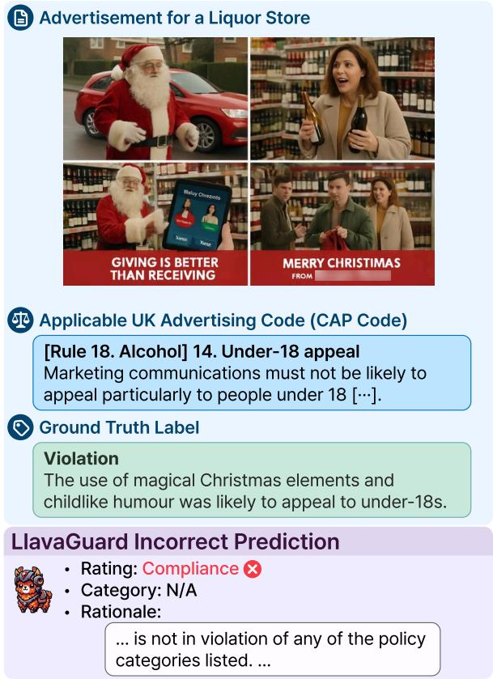  
Figure 1: A risk pattern from SAFETYVISIONBENCH. LlavaGuard-Qwen v1.2-7B (Helff et al., 2025) assessed false compliance under the UK CAP Code (Committee of Advertising Practice, 2026) as a safety rule.

However, the dominant end-to-end safeguard paradigm (Helff et al., 2025; Zong et al., 2024) faces two increasingly pressing limitations. First, real-world risk patterns are evolving at an increasing pace (Bengio et al., 2024; Li et al., 2024b; Earnest et al., 2026), raising the challenge of evolving-risk adaptation, where safeguards must incorporate newly emerging risks without continually re-curating supervision or retraining models. Second, the safety rules that govern these risks are becoming correspondingly more conditional, hierarchical, and context-dependent, posing the challenge of complex rule reasoning, where applying such rules requires explicit and verifiable steps rather than a single end-to-end risk prediction.

Existing training-based safeguards formulate safety as a fixed taxonomy (Inan et al., 2023; Liu et al., 2024), whereas real-world risks emerge and evolve as moving targets. Consequently, adaptation remains tied to expert supervision and model retraining, limiting timely responses to newly emerging risk patterns (Jin and Lee, 2025). Figure 1 illustrates such a case. To loosen this dependency, recent works explore inference-time and annotationefficient methods that leverage pretrained multimodal models, achieving more responsive adaptation with reduced reliance on human labels (Ding et al., 2025; Wang et al., 2025).

Yet, these methods leave open the challenge of providing explicit, verifiable reasoning for complex safety rules (Dahl et al., 2024; Mishra et al., 2025). Figure 2 illustrates that even strong models fail to reason over the safety rule’s logical composition against visual evidence. Therefore, moving beyond risk detection, reliable safety rule reasoning is becoming central to safeguard research (Kang and Li, 2025; Li et al., 2025).

We introduce GUARDEN, a programmable safeguard framework for visual compliance reasoning under a complex safety-rule prior. Our method proceeds in two stages: (1) Safety-Rule Compilation externalizes safety rule into executable form, and (2) Scene-Grounded Execution grounds the compiled rule against image evidence. (1) In Safety-Rule Compilation, GUARDEN builds on structured logical reasoning (Khot et al., 2023; Kazemi et al., 2023) to decompose a safety rule into atomic propositions and compile their logical dependencies into executable code. This makes eliminates the failure modes that arise when complex rules are resolved implicitly or through natural-language reasoning. (2) In Scene-Grounded Execution, atomic propositions are instantiated through scene-graph-based visual grounding (Li et al., 2024a; Mitra et al., 2024), aligning each atomic proposition with explicit objects, text, and relations in the image.

We evaluate GUARDEN on SAFETYVISION-BENCH across four domains. GUARDEN improves average F1 by 9.8 points and average Robustness Index by 17.9 points over the strongest baseline, while reducing visual- and rule-induced spurious violations by over 80%. These results highlight the potential of addressing multimodal safety through image-based safety-rule entailment.

## 2 Related Work

## 2.1 Zero-Shot Visual Safety

Recent zero-shot and inference-time methods aim to adapt to new visual risks without additional labels or retraining. They fall into three directions: natural-language reasoning over visual evidence, which directly judges safety from image-grounded descriptions (Ding et al., 2025); semantic similarity between images and unsafe concepts, which scores visual risk in representation space (Zhao et al., 2025; Zhu et al., 2026); and externalized rule conditions or tool-based evidence workflows, which expose intermediate conditions and visual evidence (Wang et al., 2025; Ghosh et al., 2026). Yet, these methods often flatten safety rules or rely on latent similarity, leaving complex rule reasoning underexplored.

## 2.2 Externalized LLM Reasoning

Early studies on externalized LLM reasoning have motivated several subsequent lines of work (Wei et al., 2022; Yao et al., 2023a). One direction improves reasoning through modular and codebased externalization of planning, actions, and search (Khot et al., 2023; Yao et al., 2023b; Grand et al., 2025; Wen et al., 2025). Another line improves test-time reasoning by refining the model’s own outputs or reflections through self-feedback and self-critique (Madaan et al., 2023; Shinn et al., 2023; Huang et al., 2023; Wang and Atanasova, 2025). For complex propositions, proof-oriented methods were further explored for explicit logical reasoning (Creswell et al., 2023; Kazemi et al., 2023). Together, these directions motivate our shift from implicit compliance judgment to explicit, revisable, and executable rule reasoning.

## 2.3 Neuro-Symbolic Visual Grounding

Neuro-symbolic visual grounding spans diverse strategies for making visual reasoning inspectable. Prior work has externalized reasoning into executable forms over vision modules (Surís et al., 2023; Chen et al., 2024b), transformed visual evidence into structured representations queryable by symbolic operators (Huang et al., 2025a,b), and composed the two through logic over scene-graphgrounded facts (Cai et al., 2025). Building on these directions, GUARDEN unifies executable code and scene-graph grounding for visual safety, providing an explicit reasoning pipeline from abstract logical structure to contextual visual content.

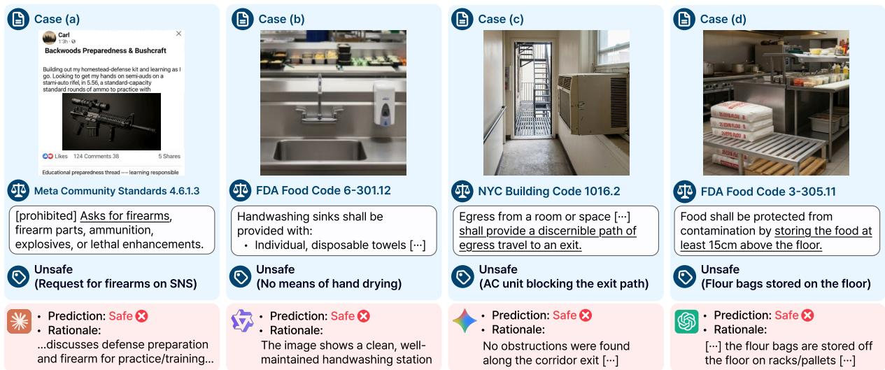  
Figure 2: Examples of false compliance judgements by Claude Opus 4.5 (Anthropic, 2025a), Qwen3.5-397B (Qwen Team, 2026), Gemini 3.0 Pro (Google DeepMind, 2025b), and GPT-5.4 (Singh et al., 2026) on SAFETYVISION-BENCH. Cases (a) and (b) fail to represent the safety rule in its logical composition. Cases (c) and (d) fail to judge elementary propositions from the objects and contextual information in the image.

## 3 GUARDEN

## 3.1 Problem Formulation

We formulate visual safety assessment as rule entailment: given an image I and a safety rule R, the task is to determine whether $I \models R .$ . Following logical atomism and formal semantics (Wittgenstein, 2002; Montague, 1973), we view a rule as a composition of atomic propositions $P = \{ p _ { 1 } , \ldots , p _ { n } \}$ ，

$$
I \models R \Leftrightarrow \Phi ( P ) \Leftrightarrow \Phi ( p _ { 1 } , \dots , p _ { n } ) ,\tag{1}
$$

where Φ is the logical form connecting them and each $p _ { i }$ is an atomic visual proposition that asserts the presence of evidence in the image. Under this formulation, correct visual safety-rule entailment requires two capabilities: (1) representing the content of the safety rule in its logical composition Φ; and (2) judging each atomic proposition from the objects and contextual information in the image I, i.e., whether $I \ \models \ p _ { i }$ . Figure 2 illustrates representative errors at each stage of this entailment process.

## 3.2 Method Overview

GUARDEN structures visual safety-rule entailment as an executable correspondence between rule semantics and visual evidence. In Safety-Rule Compilation, the safety-rule prior is first externalized as executable logic, making the safety rule structure a programmable component of the reasoning process. Through top-down decomposition, GUARDEN constructs a reusable proposition tree that represents the rule’s logical composition over atomic visual propositions. At test time, Scene-Grounded Execution instantiates constructed logic bottom-up by grounding its atomic propositions in visual evidence. It constructs a scene graph over candidate objects, text, attributes, and relations, providing the structured evaluation of atomic propositions. The resulting execution supports accurate inference from contextual image evidence to deductive regulatory judgments.

## 3.3 Safety-Rule Compilation

Safety-Rule Compilation takes a safety rule R as input and produces an executable proposition tree $\mathcal { T } _ { R } .$ , which models the logical composition Φ from Equation 1. Each internal node carries a primitive logical operator $\varphi \in \{ \land , \lor , \lnot \}$ , and each leaf is an atomic proposition $p \in P$ . Each atomic proposition $p _ { i }$ takes one of two forms: $( o , \sigma , \emptyset )$ , an object o with state or attribute $\sigma .$ , or $( o _ { 1 } , \rho , o _ { 2 } )$ , a relation $\rho$ between two objects $o _ { 1 }$ and $O _ { 2 } .$ . Each $p _ { i }$ is Boolean-valued and forms the grounding interface to Scene-Grounded Execution.

The tree is built by top-down goal decomposition (Kazemi et al., 2023) guided by a feedbackand score-driven optimizer (Madaan et al., 2023; Yang et al., 2024). $\mathcal { T } _ { R }$ is decomposed into a candidate proposition tree as $\mathcal { T } _ { R } = ( \varphi _ { R } , \{ \mathcal { T } _ { r } \} _ { r \in \mathrm { s u b } ( R ) } )$ where $\varphi _ { R }$ is the logical operator at the root and sub(R) is the selected sub-rules in the candidate decomposition. Each $\mathcal { T } _ { r }$ is recursively decomposed by D until all leaves are atomic propositions.

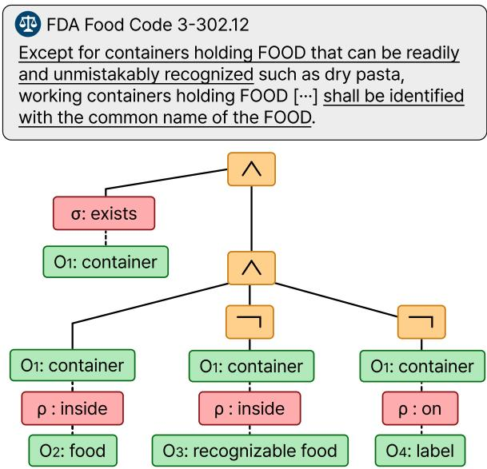  
Figure 3: An example of $\mathcal { T } _ { R }$ on a safety rule.

In the trial t, at each sub-rule tree $\mathcal { T } _ { r }$ , a decomposer D proposes a logical operator $\varphi _ { r }$ and a candidate decomposition $\bar { \mathbf { r } } ^ { ( t ) } = \bar { ( } \hat { r } _ { 1 } ^ { ( t ) } , \cdot \cdot \cdot , \hat { r } _ { k } ^ { ( t ) } )$ , conditioned on the previous verifier feedback $\eta _ { r } ^ { ( t - 1 ) }$

$$
( \varphi _ { r } ^ { ( t ) } , \hat { \mathbf { r } } ^ { ( t ) } ) \sim \mathbb { D } ( \cdot | r , \eta _ { r } ^ { ( t - 1 ) } ) .\tag{2}
$$

A verifier V then returns a score $s _ { r } ^ { ( t ) } \in [ 0 , s _ { \mathrm { m a x } } ]$ natural-language feedback $\eta _ { r } ^ { ( t ) }$ , and an atomicity flag $a _ { r } ^ { ( t ) } \in \{ \mathsf { T r u e } , \mathsf { F a l s e } \}$ ,

$$
\big ( s _ { r } ^ { ( t ) } , \eta _ { r } ^ { ( t ) } , a _ { r } ^ { ( t ) } \big ) \sim \mathbb { V } ( \mathbf { \Sigma } \cdot | \mathbf { \Sigma } r , \varphi _ { r } ^ { ( t ) } , \hat { \mathbf { r } } ^ { ( t ) } ) .\tag{3}
$$

D regenerates from $\eta _ { r } ^ { ( t ) }$ until $s _ { r } ^ { ( t ) }$ saturates, reaches $s _ { \mathrm { m a x } } ,$ or $a _ { r } ^ { ( t ) } = \mathbb { I }$ rue (i.e., r is atomic), after which the best candidate is selected:

$$
t ^ { \star } = \arg \operatorname* { m a x } _ { t } s _ { r } ^ { ( t ) } .\tag{4}
$$

Then the final form of $\mathcal { T } _ { r }$ is represented as

$$
\mathcal { T } _ { r } = \left\{ \begin{array} { l l } { ( \varphi _ { r } ^ { ( t ^ { \star } ) } , \{ \mathcal { T } _ { \hat { r } } \} _ { \hat { r } \in \mathrm { s u b } ( r ) } ) } & { \mathrm { i f } \neg a _ { r } ^ { ( t ^ { \star } ) } } \\ { p _ { r } } & { \mathrm { o t h e r w i s e } } \end{array} , \right.\tag{5}
$$

where sub $\mathbf { \Psi } ( r ) : = \hat { \mathbf { r } } ^ { ( t ^ { \star } ) }$ $\begin{array} { l } { \displaystyle \mathrm { ~ I f ~ } a _ { r } ^ { ( t ^ { \star } ) } = } \end{array}$ True, we realize r as an atomic proposition $p _ { r }$ and append it to $P .$ . The scoring rubric, feedback protocol, and saturation criterion are detailed in Appendix B.2.

The resulting tree $\mathcal { T } _ { R }$ is itself the executable artifact, with atomic propositions as visual queries for Scene-Grounded Execution. Figure 3 illustrates this construction on the FDA Food Code.

```latex
Algorithm 1 Scene-graph generation
Require: Image I; agenda $O _ { \mathrm { r e q } } ^ { ( I ) } , \Gamma _ { \mathrm { r e q } } ^ { ( I ) }$ ; confidence threshold
τ; substitute cache C.
Ensure: Scene graph $\check { \mathcal { G } } ^ { ( I ) } = ( \mathcal { V } ^ { ( I ) } , \mathcal { E } ^ { ( I ) } )$
1: ${ \mathcal { V } } ^ { ( I ) }  { \emptyset } , { \bar { \mathcal { E } } } ^ { ( \hat { I } ) }  { \emptyset }$
2: for $o \in O _ { \mathrm { r e q } }$ do
3: ▷ use cached alias if available
4: $k  \mathcal { C } [ o ] \mathrm { \bf ~ i f } o \in \mathcal { C }$ else o
5: if o is textual then
6: $( b _ { o } , t _ { o } , c _ { o } ) \gets \mathrm { O C R } ( k ; I )$
7: else
8: $( b _ { o } , c _ { o } ) \gets \mathrm { D e t e c t } ( k ; I )$
9: end if
10: $d _ { o } \gets \mathrm { D e p t h } ( b _ { o } ; I )$
11: if $c _ { o } < .$ τ then
12: ▷ Tool-Aware Visual Grounding (§3.5)
13: $( b _ { o } , d _ { o } , c _ { o } , t _ { o } ) \gets \mathrm { A l i g n } ( o ; I , \bar { \mathcal { C } } )$
14: end if
15: ▷ by pre-defined rules (Appendix B.2.1)
16: $s _ { o } \gets \mathrm { L a b e l } _ { o } ( b _ { o } , d _ { o } , t _ { o } ; \hat { I } )$
17: $\mathcal { V } ^ { ( I ) }  \mathcal { V } ^ { ( I ) } \dot { \cup } \{ ( o , \sigma , \emptyset ) \}$
18: end for
19: for $\rho \in \Gamma _ { \mathrm { r e q } } , ~ ( o _ { 1 } , o _ { 2 } ) \in ( \mathcal { V } ^ { ( I ) } ) ^ { 2 }$ do
20: ▷ by pre-defined rules (Appendix B.2.1)
21: v $\prime  \mathrm { L a b e l } _ { \rho } ( o _ { 1 } , o _ { 2 } ; I )$
22: if v then
23: ${ \mathcal { E } } ^ { ( I ) } \gets { \mathcal { E } } ^ { ( I ) } \cup \{ ( o _ { 1 } , \rho , o _ { 2 } ) \}$
24: end if
25: end for
26: return $\mathcal { G } ^ { ( I ) } = ( \mathcal { V } ^ { ( I ) } , \mathcal { E } ^ { ( I ) } )$
```

## 3.4 Scene-Grounded Execution

Scene-Grounded Execution executes $\mathcal { T } _ { R }$ on an image I by bottom-up constructing a scene graph $\mathcal { G } ^ { ( I ) } = ( \mathcal { V } ^ { ( I ) } , \mathcal { E } ^ { ( I ) } )$ , yielding $\mathcal { T } _ { R } ^ { ( \breve { I } ) }$ through recursive substitution at atomic propositions:

$$
\mathcal T _ { R } ^ { ( I ) } = \mathcal T _ { R } [ p \mapsto p \in \mathcal G ^ { ( I ) } : p \in P ] ,\tag{6}
$$

where $p \in \mathcal { G } ^ { ( I ) } \Leftrightarrow p \in \mathcal { V } ^ { ( I ) } \cup \mathcal { E } ^ { ( I ) }$ , and $\mathcal { G } ^ { ( I ) }$ is built per image in two stages, Selection and Grounding.

Selection. For each atomic proposition p, a selector VLM $\mathbb { M } _ { \mathrm { s e l } }$ returns the candidate objects $O _ { p } ^ { ( I ) }$ and relations $\Gamma _ { p } ^ { ( I ) }$ that $\mathcal { G } ^ { ( I ) }$ must contain:

$$
( O _ { p } ^ { ( I ) } , \Gamma _ { p } ^ { ( I ) } ) \sim \mathbb { M } _ { \mathrm { s e l } } ( p , I ) ,\tag{7}
$$

yielding the perception agenda $\begin{array} { r } { O _ { \mathrm { r e q } } ^ { ( I ) } = \bigcup _ { p \in P } O _ { p } ^ { ( I ) } } \end{array}$ and $\begin{array} { r } { \Gamma _ { \mathrm { r e q } } ^ { ( I ) } = \bigcup _ { p \in P } \Gamma _ { p } ^ { ( I ) } } \end{array}$

Grounding. For each $o \in O _ { \mathrm { r e q } } ,$ object detection, OCR, and depth modules retrieve its evidence, and pre-defined geometric and depth-based rules over this evidence then decide the relations in $\Gamma _ { \mathrm { r e q } }$ among objects, yielding $\mathcal { G } ^ { ( I ) }$ (Algorithm 1). When the detector’s confidence remains below τ for every candidate of an object, we invoke the alignment of Section 3.5. The confidence threshold τ is set to 0.8 across domains.

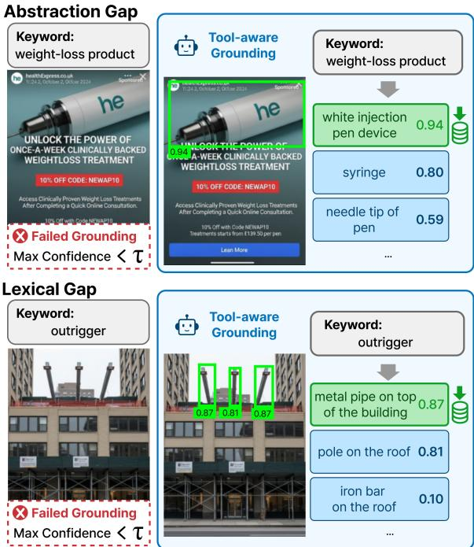  
Figure 4: Tool-Aware Visual Grounding recovers missing evidence by aligning out-of-distribution targets with detector-compatible visual proxies.

## 3.5 Tool-Aware Visual Grounding

Recent advances in vision foundation models (Carion et al., 2026) have made them the de facto grounding backbone, yet they remain bounded by their training distribution; Figure 4 highlights how overly abstract concepts create an Abstraction gap, while technical jargon or neologisms create a Lexical gap. This becomes especially problematic in downstream methods, where the missing detections propagate as silent gaps in $\mathcal { G } ^ { ( I ) }$ . We address both gaps with Tool-Aware Visual Grounding, which operates a VLM in a closed loop over the grounding query and aligns the out-of-distribution target with a detector-compatible substitute keyword.

For each failed target object o, a VLM M<sub>ground</sub> iteratively proposes a substitute keyword $k _ { o } ^ { ( t ) }$ conditioned on the original target, the previous proposal, the detector response $b _ { o } ^ { ( t ) }$ , and the image I:

$$
k _ { o } ^ { ( t + 1 ) } \sim \mathbb { M } _ { \mathrm { g r o u n d } } ( \cdot \mid o , k _ { o } ^ { ( t ) } , b _ { o } ^ { ( t ) } , I ) .\tag{8}
$$

The loop stops at $t = t ^ { \star }$ once the detector confidence $\bar { c } _ { o } ^ { ( t ^ { \star } ) }$ satisfies $c _ { o } ^ { ( t ^ { \star } ) } \geq \tau$ and $\mathbb { M } _ { \mathrm { g r o u n d } }$ confirms that the detected evidence grounds $o .$ The accepted substitute $k _ { o } ^ { \star } = k _ { o } ^ { ( t ^ { \star } ) }$ is cached in the substitute cache ${ \mathcal { C } } [ o ]$ and is reused for subsequent detections of the same target o.

## 4 Experiments

## 4.1 Experimental Settings

Dataset. We evaluate on SAFETYVISION-BENCH, a benchmark for systematic evaluation of rule-grounded compliance reasoning under real-world visual risks, modeling violation distributions under complex, domain-specific safety rules. The benchmark covers four domains: food safety based on the FDA Food Code (U.S. Food and Drug Administration, 2022), construction safety based on the NYC Building Code (New York City Department of Buildings, 2022), platform content safety based on Meta Community Standards (Meta, 2026), and advertising content safety based on the UK CAP Code (Committee of Advertising Practice, 2026). SAFETYVISIONBENCH contains 24K unsafe and 10K hard safe cases with fine-grained violation labels, containing real-world enforcement patterns and category distributions. Further details on regulatory sources, case construction, and dataset statistics are provided in Appendix A.

Evaluation Metrics. We report the mean and standard deviation of the F1 score over three runs, where a correctly predicted violated safety rule is marked as a true positive.

Baselines. We compare GUARDEN against the following baselines.

(1) Direct Prompting: a naive baseline with safety rules provided only as contextual conditions.

(2) ViperGPT (Surís et al., 2023): Python program generation over vision APIs for rule verification.

(3) ETA (Ding et al., 2025): evaluator-guided safety assessment with best-of-N candidate selection.

(4) SafeCLIP (Zhao et al., 2025): image-regulation text similarity used as safety signal.

(5) CLUE (Wang et al., 2025): objectified rule precondition with token-probability based judgments. (6) CompAgent (Ghosh et al., 2026): safety-rule guided visual tool use for agentic safety check.

Models. All symbolic artifacts for both GUARDEN and the baselines are produced offline using GPT-5.4 (Singh et al., 2026). Testtime inference is performed using Gemma 4 26B (Google DeepMind, 2026b); visual evidence is grounded with SAM 3 (Carion et al., 2026), SigLIP 2 (Tschannen et al., 2025), Depth Anything 3 (Lin et al., 2025), and Google’s Document OCR (Google Cloud, 2024) for text recognition.

<table><tr><td rowspan=2 colspan=1>Method</td><td rowspan=1 colspan=2>FoodSafety</td><td rowspan=1 colspan=2>ConstructionSafety</td><td rowspan=1 colspan=2>Platform-ContentSafety</td><td rowspan=1 colspan=2>Advertising-ContentSafety</td></tr><tr><td rowspan=1 colspan=2>Recall    F1-score</td><td rowspan=1 colspan=2>Recall    F1-score</td><td rowspan=1 colspan=2>Recall    F1-score</td><td rowspan=1 colspan=2>Recall    F1-score</td></tr><tr><td rowspan=1 colspan=1>Direct Prompting</td><td rowspan=1 colspan=1> $3 4 . 5 \pm 2 . 4$ </td><td rowspan=1 colspan=1> $4 5 . 4 \pm 2 . 3$ </td><td rowspan=1 colspan=1> $7 2 . 0 \pm 1 . 6$ </td><td rowspan=1 colspan=1> $7 8 . 6 \pm 1 . 5$ </td><td rowspan=1 colspan=1> $1 6 . 5 \pm 3 . 6 $ </td><td rowspan=1 colspan=1> $2 6 . 6 \pm 4 . 4$ </td><td rowspan=1 colspan=1> $5 7 . 5 \pm 1 . 3$ </td><td rowspan=1 colspan=1> $5 7 . 1 \pm 0 . 8$ </td></tr><tr><td rowspan=1 colspan=1>ViperGPT</td><td rowspan=1 colspan=1> $7 3 . 1 \pm 0 . 4$ </td><td rowspan=1 colspan=1> $7 2 . 5 \pm 0 . 4$ </td><td rowspan=1 colspan=1> $8 4 . 0 \pm 0 . 0$ </td><td rowspan=1 colspan=1> $7 4 . 0 \pm 0 . 3$ </td><td rowspan=1 colspan=1> $4 3 . 9 \pm 1 . 6$ </td><td rowspan=1 colspan=1> $5 3 . 3 \pm 4 . 0$ </td><td rowspan=1 colspan=1> $6 0 . 6 \pm 0 . 3$ </td><td rowspan=1 colspan=1> $4 5 . 5 \pm 0 . 7$ </td></tr><tr><td rowspan=1 colspan=1>ETA</td><td rowspan=1 colspan=1> $8 3 . 7 \pm 0 . 8$ </td><td rowspan=1 colspan=1> $8 2 . 6 \pm 0 . 2$ </td><td rowspan=1 colspan=1> $9 5 . 8 \pm 1 . 2$ </td><td rowspan=1 colspan=1> $8 3 . 6 \pm 1 . 2$ </td><td rowspan=1 colspan=1> $3 9 . 7 \pm 4 . 3$ </td><td rowspan=1 colspan=1> $5 2 . 0 \pm 7 . 5$ </td><td rowspan=1 colspan=1> $7 3 . 4 \pm 0 . 3$ </td><td rowspan=1 colspan=1> $5 7 . 4 \pm 1 . 2$ </td></tr><tr><td rowspan=1 colspan=1>SafeCLIP</td><td rowspan=1 colspan=1> $8 2 . 9 \pm 1 . 2$ </td><td rowspan=1 colspan=1> $8 1 . 6 \pm 0 . 2$ </td><td rowspan=1 colspan=1> $7 9 . 0 \pm 0 . 0$ </td><td rowspan=1 colspan=1> $8 4 . 2 \pm 0 . 7$ </td><td rowspan=1 colspan=1> $4 1 . 8 \pm 2 . 1$ </td><td rowspan=1 colspan=1> $5 3 . 5 \pm 2 . 1$ </td><td rowspan=1 colspan=1> $7 1 . 9 \pm 0 . 9$ </td><td rowspan=1 colspan=1> $5 5 . 2 \pm 1 . 7$ </td></tr><tr><td rowspan=1 colspan=1>CLUE</td><td rowspan=1 colspan=1> $6 6 . 0 \pm 0 . 8$ </td><td rowspan=1 colspan=1> $7 1 . 7 \pm 0 . 6$ </td><td rowspan=1 colspan=1> $8 7 . 1 \pm 1 . 0$ </td><td rowspan=1 colspan=1> $7 2 . 1 \pm 0 . 7$ </td><td rowspan=1 colspan=1> $5 3 . 2 \pm 2 . 5$ </td><td rowspan=1 colspan=1> $5 7 . 9 \pm 2 . 6$ </td><td rowspan=1 colspan=1> $5 5 . 3 \pm 1 . 2$ </td><td rowspan=1 colspan=1> $4 4 . 2 \pm 0 . 3$ </td></tr><tr><td rowspan=1 colspan=1>CompAgent</td><td rowspan=1 colspan=1> $7 6 . 8 \pm 1 . 9$ </td><td rowspan=1 colspan=1> $7 7 . 9 \pm 1 . 0$ </td><td rowspan=1 colspan=1> $9 1 . 6 \pm 1 . 8$ </td><td rowspan=1 colspan=1> $8 0 . 6 \pm 1 . 2$ </td><td rowspan=1 colspan=1> $5 4 . 9 \pm 3 . 2$ </td><td rowspan=1 colspan=1> $5 9 . 5 \pm 2 . 1$ </td><td rowspan=1 colspan=1> $6 4 . 3 \pm 2 . 4$ </td><td rowspan=1 colspan=1> $5 3 . 7 \pm 1 . 4$ </td></tr><tr><td rowspan=1 colspan=1>GUARDEN</td><td rowspan=1 colspan=2> $8 9 . 3 \pm 1 . 2$   ${ \pm } 2 4 . 4 \pm 3 . 5$ </td><td rowspan=1 colspan=2> $9 2 . 9 \pm 0 . 8$   ${ \bf 8 6 . 4 \pm 0 . 1 }$ </td><td rowspan=1 colspan=2> $7 0 . 0 \pm 4 . 0$   ${ \bf 6 9 . 0 \pm 2 . 6 }$ </td><td rowspan=1 colspan=2> $6 9 . 8 \pm 0 . 5$   $\mathbf { 7 4 . 9 \pm 3 . 6 }$ </td></tr></table>

Table 1: Method performance on SAFETYVISIONBENCH using Gemma 4 26B as the underlying VLM across Food Safety, Construction Safety, Platform-Content Safety, and Advertising-Content Safety.

<table><tr><td>Method</td><td>Food</td><td>Constr.</td><td>Platform</td><td> $\mathbf { A d v e r t } .$ </td></tr><tr><td>Direct Prompting</td><td>45.1</td><td>58.4</td><td>0.8</td><td>67.1</td></tr><tr><td>ViperGPT</td><td>56.2</td><td>62.0</td><td>47.0</td><td>44.7</td></tr><tr><td>ETA</td><td>60.9</td><td>59.2</td><td>26.7</td><td>56.9</td></tr><tr><td>SafeCLIP</td><td>59.2</td><td>26.4</td><td>19.7</td><td>57.9</td></tr><tr><td>CLUE</td><td>42.8</td><td>66.6</td><td>46.8</td><td>9.4</td></tr><tr><td>CompAgent</td><td>58.1</td><td>56.0</td><td>19.7</td><td>49.5</td></tr><tr><td>GUARDEN</td><td>70.2</td><td>82.4</td><td>58.6</td><td>70.4</td></tr></table>

Table 2: Robustness Index (Eq. (14); higher is more robust to rule complexity) on four domains. See Appendix C.1 for the full setup.

## 4.2 Overall Performance

Table 1 shows that GUARDEN achieves the highest F1 in all four domains, averaging 78.7 F1 and improving over the strongest baselines’ average by 9.8 points. The large gap over Direct Prompting (+26.8), which directly conditions on the original rule text, shows that rule access alone is insufficient without externalized structure. Toolbased baselines (ViperGPT and CompAgent) and alignment-based baselines (ETA and SafeCLIP) improve visual access or safety matching, but still trail GUARDEN, especially in Platform-Content and Advertising-Content Safety (+9.5 and +17.5 over the best baseline), where safety rules are highly context-dependent. The 17.2-point average gain over CLUE further shows that flat visual preconditions are weaker than preserving logical composition over grounded propositions.

## 4.3 Analysis

## 4.3.1 Robustness to Rule Complexity

We summarize each method’s robustness to rule complexity by the Robustness Index (RI; Eq. (14) in Appendix C.1), which combines a method’s F1 on the hardest rules with its relative drop from the easiest bin. Table 2 shows that GUARDEN achieves the highest RI across all four domains, improving the average RI by 17.9 points over the strongest baseline and by 27.6 points over Direct Prompting. This indicates that the gains in Table 1 are not confined to simple decision logic: preserving the executable composition of grounded propositions remains beneficial as rules accumulate conditions, exceptions, and visual requirements.

The two visually contextual domains show different forms of patterns. Advertising-Content Safety primarily stresses contextual rule semantics, whereas Platform-Content Safety couples rule complexity with bias-prone visual and normative signals. The collapse of Direct Prompting in Platform-Content Safety (RI 0.8) suggests that such coupling can turn complex rules into spurious violation priors, motivating our subsequent analysis of visual sensitivity and rule-induced bias.

## 4.3.2 Visual and Rule-Induced Biases

Prior work has shown that safety judgments in visual compliance can be biased by sensitive language or visual context, where provocative image content may trigger excessive violation judgments (Choi et al., 2026) and the normative framing of rule text may bias the model toward violation judgments (Röttger et al., 2024; Gandhi and Gandhi, 2026). We evaluate this effect in the Platform-Content Safety domain.

Visual Sensitivity Bias. Table 3 shows that DP frequently propagates coarse cues such as blood, hate symbols, or protest imagery into broad rule violations, whereas GUARDEN reduces the spurious violation rate by 80.4% on average across visual cue categories.

<table><tr><td>Visual cue category</td><td>DP</td><td>Ours</td><td>∆</td></tr><tr><td>Blood / Injury</td><td>20.3</td><td>7.2</td><td>64.4%↓</td></tr><tr><td>Hate symbols</td><td>17.5</td><td>2.3</td><td>87.1%↓</td></tr><tr><td>Protest / Riot</td><td>16.6</td><td>2.6</td><td>84.2%↓</td></tr><tr><td>Targeted text</td><td>13.9</td><td>2.1</td><td>84.9%↓</td></tr><tr><td>Property damage</td><td>14.8</td><td>4.3</td><td>70.6%↓</td></tr><tr><td>Child</td><td>9.7</td><td>0.8</td><td>91.3%↓</td></tr><tr><td>Average</td><td>15.5</td><td>3.2</td><td>80.4%↓</td></tr></table>

Table 3: Visual cue induced spurious violation rate (%), with relative reduction from Direct Prompting (DP). Detailed results are provided in Appendix C.2.

<table><tr><td>Section</td><td>Safety-rule area</td><td>DP</td><td>Ours</td><td>Δ</td></tr><tr><td>S2</td><td>Dangerous Orgs. Hateful Conduct</td><td>52.8</td><td>7.8 3.0</td><td>85.2%↓ 92.5%↓</td></tr><tr><td>S13 S7</td><td>Bullying &amp; Harass.</td><td>40.1 33.9</td><td>0.0</td><td>100%↓</td></tr><tr><td>S5</td><td>Violence &amp; Incite.</td><td>27.7</td><td>6.1</td><td>78.0%↓</td></tr><tr><td>S1</td><td>Coordinating Harm</td><td>26.4</td><td>5.2</td><td>80.4%↓</td></tr><tr><td></td><td>Misinformation</td><td>23.9</td><td>0.9</td><td></td></tr><tr><td>S21</td><td></td><td>3.3</td><td></td><td>96.1%↓</td></tr><tr><td>S6</td><td>Adult Sexual Expl.</td><td></td><td>0.2</td><td>92.9%↓</td></tr><tr><td colspan="2">Overall (16 rules)</td><td>12.1</td><td>2.0</td><td>83.8%↓</td></tr></table>

Table 4: Rule-induced spurious violation rate (%) for the most-affected Platform-Content Safety rules, with relative reduction from Direct Prompting (DP). The full 16-regulation breakdown is provided in Appendix C.3.

This reduction comes from grounding each atomic proposition in specific visual evidence. Each visual check is therefore confined to concrete targets rather than broad regulatory judgment, with an executable structure composing them as a final decision. In the Platform-Content Safety results, this structure lowers the average spurious violation rate from 15.5% under DP to 3.2% under GUARDEN.

Rule-Induced Bias. We quantify rule-induced bias at the safety-rule level by measuring false violations under normatively framed rules. Table 4 reports, for each safety rule, the spurious violation rate on image–rule pairs. In Platform-Content Safety, DP records 12.1% false violations, whereas GUARDEN reduces the rate to 2.0%.

The large DP rates indicate that normatively framed safety rules can be over-applied when the full rule text is used as part of a holistic violation judgment. GUARDEN reduces this effect because Safety-Rule Compilation converts the rule into value-neutral atomic checks and an executable composition φ. As a result, GUARDEN reduces the most over-applied rules by 85.2% for Dangerous

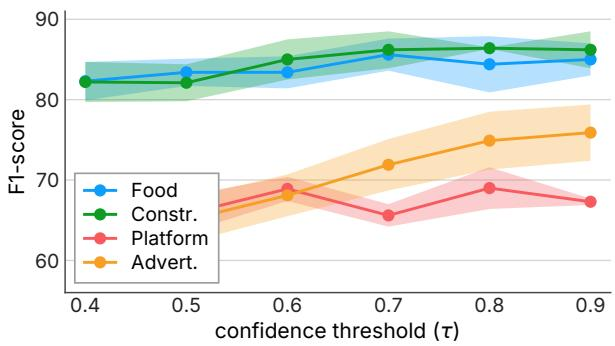  
Figure 5: Threshold sensitivity in F1-score; per-domain numbers are reported in Table 13.

Organizations and 92.5% for Hateful Conduct.

## 4.3.3 Sensitivity to Grounding Confidence

We study the effect of the grounding confidence threshold τ. Figure 5 reports the domain-wise results as τ varies. The most notable variations appear in Platform-Content Safety and Advertising-Content Safety, suggesting that the abstraction gap in these domains is more sensitive to the grounding confidence threshold. Overall, however, F1 saturates near τ=0.8, after which further increases lead to only marginal changes. This indicates that GUARDEN remains stable once a sufficiently high grounding confidence threshold is used.

## 4.3.4 Ablation Study

We ablate the internal components of GUARDEN to assess their contribution. Removing relation grounding yields the largest decline, with a 30.1% relative drop, showing that compliance depends on spatial and inter-object relations. Removing the verifier loop causes a 27.4% drop, highlighting the importance of self-verification in maintaining logically coherent rule decompositions. Tool-Aware Visual Grounding and Scene-Grounded Execution are also necessary, with removals causing 16.5% and 12.8% drops, respectively. Together, these results validate our problem formulation by showing that failures in either logical rule composition or grounded atomic proposition evaluation substantially degrade visual safety reasoning.

## 4.3.5 Adapting to Evolving Risk Patterns

Through a qualitative case study, we evaluate whether GUARDEN can adapt to changes in the risk patterns encoded by safety rules. Figure 7 shows a case based on a real online-casino advertisement where child-appealing visual cues, such as a cartoon mascot, were permissible under the earlier UK CAP Code but became unsafe under the 2022 strong-appeal standard, introduced because gambling content could draw minors through youth-associated presentation even without explicit child targeting (ASA/CAP-BCAP, 2022).

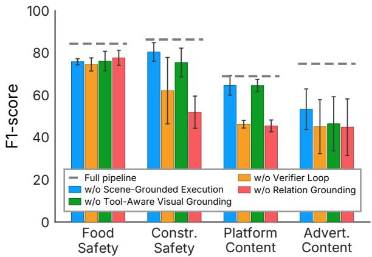  
Figure 6: Ablation results in F1-score; detailed perdomain numbers are reported in Appendix C.4.

Under the Earlier Code. GUARDEN compiles the pre-2022 rule, a single comparative test of whether the advertisement appeals to under-18s out of proportion to its appeal to adults, into

$$
\begin{array} { r l } & { \mathcal { T } _ { R _ { \mathrm { o l d } } } = \{ \vee , \{ p _ { \mathrm { c h a r } } , p _ { \mathrm { t e x t } } , p _ { \mathrm { a d } } \} \} , } \\ & { p _ { \mathrm { c h a r } } = ( c h a r a c t e r , ~ \mathsf { y o u t h \_ s k e w } , \emptyset ) , } \\ & { p _ { \mathrm { t e x t } } = ( t e x t , ~ \mathsf { y o u t h \_ s k e w } , \emptyset ) , } \\ & { ~ p _ { \mathrm { a d } } = ( a d , ~ \mathsf { y o u t h \_ s k e w } , \emptyset ) . } \end{array}
$$

Each youth\_skew holds when its subject appeals more to children than adults: $p _ { \mathrm { c h a r } }$ and $p _ { \mathrm { t e x t } }$ test the mascot and the copy, while $p _ { \mathrm { a d } }$ falls back to the whole advertisement, capturing risk emerging only as image and text combine. None holds here, so $\mathcal { T } _ { R _ { \mathrm { o l d } } } ^ { ( I ) } \equiv \mathsf { F a l s e }$ , aligning with the earlier ruling.

Under the Revised Code. The 2022 reform replaces this comparative test with an absolute one, guarded only by a mitigation exception. Safety-Rule Compilation recompiles the same rule into

$$
\begin{array} { r l } & { \mathcal { T } _ { R _ { \mathrm { n e w } } } = \{ \land , \{ \lor , \{ p _ { \mathrm { c h a r } } , p _ { \mathrm { t e x t } } , p _ { \mathrm { a d } } \} \} , \{ \lnot , \{ p } _ { \mathrm { s t e p s } } \} \} ,  \\ & { p _ { \mathrm { c h a r } } = ( c h a r a c t e r , \ s \mathrm { t r o n g } _ { - } \lor \ l \ l \mathrm { o u t h } _ { - } a \lor \ l \mathrm { p e a l } , \emptyset ) , } \\ & { p _ { \mathrm { t e x t } } = ( t e x t , \ s \mathrm { t r o n g } _ { - } \lor \ l \mathrm { o u t h } _ { - } a \lor \ l \mathrm { p e a l } , \emptyset ) , } \\ & { \quad p _ { \mathrm { a d } } = ( a d , \ s \mathrm { t r o n g } _ { - } \lor \ l \mathrm { o u t h } _ { - } a \lor \ l \mathrm { p e a l } , \emptyset ) , } \\ & { p _ { \mathrm { s t e p s } } = ( a d , \ m \downarrow \mathrm { t i } \& \ l \mathrm { a t i } \lor \ l \mathrm { o u t h } _ { - } \ t a \lor \ l \mathrm { e n } , \emptyset ) . } \end{array}
$$

Here strong\_youth\_appeal holds whenever the subject carries a strong appeal to minors, regardless of its adult appeal. The cartoon mascot supplies this appeal, resulting in a $\mathcal { T } _ { R _ { \mathrm { n e w } } } ^ { ( I ) }$ ≡ True, matching the violation in the corresponding ruling.

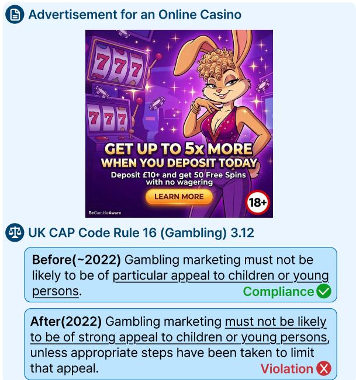  
Figure 7: Youth-appealing casino ad under the 2022 UK CAP Code shift.

This verdict shift demonstrates that GUARDEN can appropriately and efficiently incorporate emerging risk patterns through executable logic.

## 5 Conclusion

This paper presents GUARDEN, an image-based safety framework built on a reformulation of visual safety assessment as regulatory entailment. This is operationalized through Safety-Rule Compilation, rendering regulations as executable logic, and Scene-Grounded Execution, which extends them into image context. Experiments on SAFETYVI-SIONBENCH demonstrate that explicit rule entailment improves accuracy and reliability of complex rule reasoning in image-based safety, with the analyses further validating the problem formulation underlying GUARDEN. The robustness analysis shows that GUARDEN maintains reliable performance under complex regulations, which highlights the importance of (1) logical composition. The bias analyses demonstrate that GUARDEN enables more precise evaluation of (2) elementary propositions, mitigating visual and rule-induced bias. The qualitative case study further shows that GUARDEN can effectively and efficiently adapt to evolving risk patterns through executable logic. Taken together, these findings suggest that explicit safety-rule entailment over grounded visual evidence provides a principled foundation for interpretable, robust, and adaptable image-based safety.

## Limitations

Safety-Rule Dependence. Whereas prior safety methods have focused on internally modeling the safety risk itself, GUARDEN explicitly models the safety rule that responds to such risks. The premise of our design is two-fold: that rule-level adaptation is more efficient than training-data generation and retraining, and that the safety rule itself accurately expresses the response to the evolving safety risk. Consequently, GUARDEN’s coverage is bounded by the completeness of the safety rule, yet the same explicit modeling lets GUARDEN expose the rule’s vulnerabilities (Appendix D.5), establishing a mutually complementary relationship between the method and the rule.

Analogical Reasoning. GUARDEN is limited to deductive entailment over explicit safety rules. However, safety in practice further requires analogical reasoning, drawing on case precedents and expert judgment. Existing techniques such as explicit reasoning-path alignment (Chen et al., 2024a; Lahlou et al., 2025) and precedent retrieval (Shao et al., 2020) can address this regime from complementary angles (Appendix D.6), and their integration constitutes a promising direction for future work.

## Ethical Considerations

Data Licensing and Terms of Use. SAFE-TYVISIONBENCH is built from publicly available sources, and we comply with their respective licenses and terms of use; full details are provided in Appendix A.2.

Potential Risks. Explicitly modeling safety regulations as logical compositions exposes their internal structure; this transparency is double-edged, as it could be examined by adversaries to identify and exploit vulnerabilities or by developers and regulators to inspect and revise. The unsafe images in SAFETYVISIONBENCH depict regulatory violations and are released for research use only, with reader discretion advised.

AI assistants usage disclosure. AI assistants were used for language editing and minor code edits, with all final content reviewed and approved by the authors.

## Acknowledgments

This work was supported by Institute of Information & communications Technology Planning & Evaluation(IITP) grant funded by the Korea government(MSIT) (RS-2019-II190421, AI Graduate School Support Program(Sungkyunkwan University), RS-2022-II221045 (2022-0-01045), Selfdirected multi-modal Intelligence for solving unknown, open domain problems, RS2022-II220043, Adaptive Personality for Intelligent Agents, No.RS-2025-25442569, AI Star Fellowship Support Program(Sungkyunkwan Univ.), RS-2025-02218768, Accelerated Insight Reasoning via Continual Learning), Samsung Electronics Co., Ltd, Institute of Information & Communications Technology Planning & Evaluation(IITP)-ITRC(Information Technology Research Center) grant funded by the Korea government(MSIT) (IITP-2026-RS-2024- 00437633), National Research Foundation of Korea (NRF) grant funded by the Korea government (MSIT) (No. RS-2026-25474409).

## References

Jean-Baptiste Alayrac, Jeff Donahue, Pauline Luc, Antoine Miech, Iain Barr, Yana Hasson, Karel Lenc, Arthur Mensch, Katherine Millican, Malcolm Reynolds, Roman Ring, Eliza Rutherford, Serkan Cabi, Tengda Han, Zhitao Gong, Sina Samangooei, Marianne Monteiro, Jacob Menick, Sebastian Borgeaud, and 8 others. 2022. Flamingo: a visual language model for few-shot learning. In Advances in Neural Information Processing Systems.

Anthropic. 2025a. Claude opus 4.5 system card.

Anthropic. 2025b. Claude sonnet 4.5 system card.

Anthropic. 2026. Claude opus 4.8 system card.

ASA/CAP-BCAP. 2022. Responding to the Findings of the GambleAware Final Synthesis Report. Committee of Advertising Practice and Broadcast Committee of Advertising Practice final statement; revised gambling and lotteries appeal rules effective 1 October 2022.

Shuai Bai, Keqin Chen, Xuejing Liu, Jialin Wang, Wenbin Ge, Sibo Song, Kai Dang, Peng Wang, Shijie Wang, Jun Tang, Humen Zhong, Yuanzhi Zhu, Mingkun Yang, Zhaohai Li, Jianqiang Wan, Pengfei Wang, Wei Ding, Zheren Fu, Yiheng Xu, and 8 others. 2025. Qwen2.5-vl technical report. Preprint, arXiv:2502.13923.

Yoshua Bengio, Geoffrey Hinton, Andrew Yao, Dawn Song, Pieter Abbeel, Trevor Darrell, Yuval Noah Harari, Ya-Qin Zhang, Lan Xue, Shai Shalev-Shwartz, Gillian Hadfield, Jeff Clune, Tegan Maharaj,

Frank Hutter, Atılım Güne¸s Baydin, Sheila McIlraith, Qiqi Gao, Ashwin Acharya, David Krueger, and 6 others. 2024. Managing extreme ai risks amid rapid progress. Science, 384(6698):842–845.

Tom B. Brown, Benjamin Mann, Nick Ryder, Melanie Subbiah, Jared Kaplan, Prafulla Dhariwal, Arvind Neelakantan, Pranav Shyam, Girish Sastry, Amanda Askell, Sandhini Agarwal, Ariel Herbert-Voss, Gretchen Krueger, Tom Henighan, Rewon Child, Aditya Ramesh, Daniel M. Ziegler, Jeffrey Wu, Clemens Winter, and 12 others. 2020. Language models are few-shot learners. In Proceedings ofthe 34th International Conference on Neural Information Processing Systems, NIPS ’20, Red Hook, NY, USA. Curran Associates Inc.

Zhixi Cai, Fucai Ke, Simindokht Jahangard, Maria Garcia de la Banda, Reza Haffari, Peter J. Stuckey, and Hamid Rezatofighi. 2025. Naver: A neurosymbolic compositional automaton for visual grounding with explicit logic reasoning. In Proceedings ofthe IEEE/CVF International Conference on Computer Vision (ICCV), pages 24078–24089.

Nicolas Carion, Laura Gustafson, Yuan-Ting Hu, Shoubhik Debnath, Ronghang Hu, Didac Suris Coll-Vinent, Chaitanya Ryali, Kalyan Vasudev Alwala, Haitham Khedr, Andrew Huang, Jie Lei, Tengyu Ma, Baishan Guo, Arpit Kalla, Markus Marks, Joseph Greer, Meng Wang, Peize Sun, Roman Rädle, and 19 others. 2026. SAM 3: Segment anything with concepts. In The Fourteenth International Conference on Learning Representations.

Guoxin Chen, Minpeng Liao, Chengxi Li, and Kai Fan. 2024a. Step-level value preference optimization for mathematical reasoning. In Findings of the Associationfor Computational Linguistics: EMNLP 2024, pages 7889–7903, Miami, Florida, USA. Association for Computational Linguistics.

Xuezheng Chen and Zhengbo Zou. 2026. Are large pretrained vision language models effective construction safety inspectors. Data-Centric Engineering, 7:e11.

Zhenfang Chen, Rui Sun, Wenjun Liu, Yining Hong, and Chuang Gan. 2024b. GENOME: Generative neuro-symbolic visual reasoning by growing and reusing modules. In The Twelfth International Conference on Learning Representations.

Jianfeng Chi, Ujjwal Karn, Hongyuan Zhan, Eric Michael Smith, Javier Rando, Yiming Zhang, Kate Plawiak, Zacharie Delpierre Coudert, K. Upasani, and Ma hesh Pasupuleti. 2024. Llama guard 3 vision: Safeguarding human-ai image understanding conversations. ArXiv, abs/2411.10414.

Dasol Choi, Seunghyun Lee, and Youngsook Song. 2026. Better safe than sorry? overreaction problem of vision language models in visual emergency recognition. In 2026 IEEE/CVF Winter Conference on Applications of Computer Vision (WACV), pages 4724–4732.

Committee of Advertising Practice. 2026. The UK Code of Non-broadcast Advertising and Direct & Promotional Marketing.

Antonia Creswell, Murray Shanahan, and Irina Higgins. 2023. Selection-inference: Exploiting large language models for interpretable logical reasoning. In The Eleventh International Conference on Learning Representations.

Matthew Dahl, Varun Magesh, Mirac Suzgun, and Daniel E Ho. 2024. Large legal fictions: Profiling legal hallucinations in large language models. Journal ofLegal Analysis, 16(1):64–93.

Yi Ding, Bolian Li, and Ruqi Zhang. 2025. Eta: Evaluating then aligning safety of vision language models at inference time. In International Conference on Learning Representations, volume 2025, pages 2403– 2431.

G. Scott Earnest, Douglas B. Trout, Ci-Jyun Liang, and Asa Castleberry. 2026. Robotics and automation safety risks in construction. Frontiers in Built Environment, Volume 11 - 2025.

Vishal Gandhi and Sagar Gandhi. 2026. Prompt sentiment: The catalyst for llm change. In Proceedings of the 2025 9th International Conference on Advances in Artificial Intelligence, ICAAI ’25, page 121–125, New York, NY, USA. Association for Computing Machinery.

Rahul Ghosh, Baishali Chaudhury, Hari Prasanna Das, Meghana Ashok, Ryan Razkenari, Long Chen, Sungmin Hong, and Chun-Hao Liu. 2026. Compagent: An agentic framework for visual compliance verification. In Proceedings ofthe IEEE/CVF Conference on Computer Vision and Pattern Recognition (CVPR) Workshops, pages 11201–11210.

Google. 2025a. Gemini 3 pro image model card.

Google. 2025b. Imagen 4 model card.

Google Cloud. 2024. Document AI processor list: Enterprise Document OCR.

Google DeepMind. 2025a. Gemini 3 flash model card.

Google DeepMind. 2025b. Gemini 3 pro model card.

Google DeepMind. 2026a. Gemini 3.1 pro model card.

Google DeepMind. 2026b. Gemma 4 model card.

Gabriel Grand, Joshua B. Tenenbaum, Vikash Mansinghka, Alexander K. Lew, and Jacob Andreas. 2025. Self-steering language models. In Second Conference on Language Modeling.

Lukas Helff, Felix Friedrich, Manuel Brack, Kristian Kersting, and Patrick Schramowski. 2025. Llavaguard: An open VLM-based framework for safeguarding vision datasets and models. In Forty-second International Conference on Machine Learning.

Jiani Huang, Ziyang Li, Mayur Naik, and Ser-Nam Lim. 2025a. LASER: A neuro-symbolic framework for learning spatio-temporal scene graphs with weak supervision. In The Thirteenth International Conference on Learning Representations.

Jiani Huang, Amish Sethi, Matthew Kuo, Mayank Keoliya, Neelay Velingker, JungHo Jung, Ser Nam Lim, Ziyang Li, and Mayur Naik. 2025b. Esca: Contextualizing embodied agents via scene-graph generation. In Advances in Neural Information Processing Systems, volume 38, Main Conference, pages 2828– 2870. Curran Associates, Inc.

Jiaxin Huang, Shixiang Gu, Le Hou, Yuexin Wu, Xuezhi Wang, Hongkun Yu, and Jiawei Han. 2023. Large language models can self-improve. In Proceedings of the 2023 Conference on Empirical Methods in Natural Language Processing, pages 1051–1068, Singapore. Association for Computational Linguistics.

Hakan Inan, Kartikeya Upasani, Jianfeng Chi, Rashi Rungta, Krithika Iyer, Yuning Mao, Michael Tontchev, Qing Hu, Brian Fuller, Davide Testuggine, and Madian Khabsa. 2023. Llama guard: Llm-based input-output safeguard for human-ai conversations. Preprint, arXiv:2312.06674.

Ming Jin and Hyunin Lee. 2025. Position: AI safety must embrace an antifragile perspective. In Fortysecond International Conference on Machine Learning Position Paper Track.

Mintong Kang and Bo Li. 2025. \$r^2\$-guard: Robust reasoning enabled LLM guardrail via knowledgeenhanced logical reasoning. In The Thirteenth International Conference on Learning Representations.

Mehran Kazemi, Najoung Kim, Deepti Bhatia, Xin Xu, and Deepak Ramachandran. 2023. LAMBADA: Backward chaining for automated reasoning in natural language. In Proceedings of the 61st Annual Meeting of the Association for Computational Linguistics (Volume 1: Long Papers), Toronto, Canada. Association for Computational Linguistics.

Tushar Khot, Harsh Trivedi, Matthew Finlayson, Yao Fu, Kyle Richardson, Peter Clark, and Ashish Sabharwal. 2023. Decomposed prompting: A modular approach for solving complex tasks. In The Eleventh International Conference on Learning Representations.

Salem Lahlou, Abdalgader Abubaker, and Hakim Hacid. 2025. PORT: Preference optimization on reasoning traces. In Proceedings of the 2025 Conference of the Nations ofthe Americas Chapter ofthe Association for Computational Linguistics: Human Language Technologies (Volume 1: Long Papers), pages 10989– 11005, Albuquerque, New Mexico. Association for Computational Linguistics.

Haoran Li, Yulin Chen, Jin Zeng, Hao Peng, Huihao Jing, Wenbin Hu, Xi Yang, Ziqian Zeng, Sirui Han, and Yangqiu Song. 2025. Gspr: Aligning llm safeguards as generalizable safety policy reasoners. ArXiv, abs/2509.24418.

Rongjie Li, Songyang Zhang, Dahua Lin, Kai Chen, and Xuming He. 2024a. From Pixels to Graphs: Open-Vocabulary Scene Graph Generation with Vision-Language Models . In 2024 IEEE/CVF Conference on Computer Vision and Pattern Recognition (CVPR), pages 28076–28086, Los Alamitos, CA, USA. IEEE Computer Society.

Yifan Li, Hangyu Guo, Kun Zhou, Wayne Xin Zhao, and Ji-Rong Wen. 2024b. Images are achilles’ heel of alignment: Exploiting visual vulnerabilities for jailbreaking multimodal large language models. In Computer Vision – ECCV 2024: 18th European Conference, Milan, Italy, September 29–October 4, 2024, Proceedings, Part LXXIII, Berlin, Heidelberg. Springer-Verlag.

Haotong Lin, Sili Chen, Junhao Liew, Donny Y. Chen, Zhenyu Li, Guang Shi, Jiashi Feng, and Bingyi Kang. 2025. Depth anything 3: Recovering the visual space from any views. Preprint, arXiv:2511.10647.

Xin Liu, Yichen Zhu, Jindong Gu, Yunshi Lan, Chao Yang, and Yu Qiao. 2024. Mm-safetybench: A benchmark for safety evaluation of multimodal large language models. In Computer Vision – ECCV 2024: 18th European Conference, Milan, Italy, September 29–October 4, 2024, Proceedings, Part LVI, page 386–403, Berlin, Heidelberg. Springer-Verlag.

Aman Madaan, Niket Tandon, Prakhar Gupta, Skyler Hallinan, Luyu Gao, Sarah Wiegreffe, Uri Alon, Nouha Dziri, Shrimai Prabhumoye, Yiming Yang, Shashank Gupta, Bodhisattwa Prasad Majumder, Katherine Hermann, Sean Welleck, Amir Yazdanbakhsh, and Peter Clark. 2023. Self-refine: Iterative refinement with self-feedback. In Thirty-seventh Conference on Neural Information Processing Systems.

Meta. 2026. Community Standards.

Meta AI. 2025. Llama guard 4 model card.

Venkatesh Mishra, Bimsara Pathiraja, Mihir Parmar, Sat Chidananda, Jayanth Srinivasa, Gaowen Liu, Ali Payani, and Chitta Baral. 2025. Investigating the shortcomings of LLMs in step-by-step legal reasoning. In Findings of the Association for Computational Linguistics: NAACL 2025, pages 7810–7841, Albuquerque, New Mexico. Association for Computational Linguistics.

Chancharik Mitra, Brandon Huang, Trevor Darrell, and Roei Herzig. 2024. Compositional chain-of-thought prompting for large multimodal models. In Proceedings ofthe IEEE/CVF Conference on Computer Vision and Pattern Recognition, pages 14420–14431.

Richard Montague. 1973. The Proper Treatment of Quantification in Ordinary English, pages 221–242. Springer Netherlands, Dordrecht.

New York City Department of Buildings. 2022. 2022 Construction Codes.

Caiyong Piao, Zhiyuan Yan, Haoming Xu, Yunzhen Zhao, Kaiqing Lin, Feiyang Xu, and Shuigeng Zhou. 2026. Towards policy-adaptive image guardrail: Benchmark and method. arXiv preprint arXiv:2603.01228.

Yiting Qu, Xinyue Shen, Yixin Wu, Michael Backes, Savvas Zannettou, and Yang Zhang. 2025. Unsafebench: Benchmarking image safety classifiers on real-world and ai-generated images. In Proceedings ofthe 2025 ACM SIGSAC Conference on Computer and Communications Security, CCS ’25, page 3221–3235, New York, NY, USA. Association for Computing Machinery.

Qwen Team. 2026. Qwen3.5: Towards native multimodal agents.

Paul Röttger, Hannah Kirk, Bertie Vidgen, Giuseppe Attanasio, Federico Bianchi, and Dirk Hovy. 2024. XSTest: A test suite for identifying exaggerated safety behaviours in large language models. In Proceedings ofthe 2024 Conference ofthe North American Chapter of the Association for Computational Linguistics: Human Language Technologies (Volume 1: Long Papers), Mexico City, Mexico. Association for Computational Linguistics.

Yunqiu Shao, Jiaxin Mao, Yiqun Liu, Weizhi Ma, Ken Satoh, Min Zhang, and Shaoping Ma. 2020. Bertpli: Modeling paragraph-level interactions for legal case retrieval. In Proceedings of the Twenty-Ninth International Joint Conference on Artificial Intelligence, IJCAI-20, pages 3501–3507. International Joint Conferences on Artificial Intelligence Organization. Main track.

Noah Shinn, Federico Cassano, Ashwin Gopinath, Karthik R Narasimhan, and Shunyu Yao. 2023. Reflexion: language agents with verbal reinforcement learning. In Thirty-seventh Conference on Neural Information Processing Systems.

Aaditya Singh, Adam Fry, Adam Perelman, Adam Tart, Adi Ganesh, Ahmed El-Kishky, Aidan McLaughlin, Aiden Low, AJ Ostrow, Akhila Ananthram, Akshay Nathan, Alan Luo, Alec Helyar, Aleksander Madry, Aleksandr Efremov, Aleksandra Spyra, Alex Baker-Whitcomb, Alex Beutel, Alex Karpenko, and 467 others. 2026. Openai gpt-5 system card. Preprint, arXiv:2601.03267.

Qianpu Sun, Xiaowei Chi, Yuhan Rui, Ying Li, Kuangzhi Ge, Jiajun Li, Sirui Han, and Shanghang Zhang. 2026. Labshield: A multimodal benchmark for safety-critical reasoning and planning in scientific laboratories. Preprint, arXiv:2603.11987.

Dídac Surís, Sachit Menon, and Carl Vondrick. 2023. Vipergpt: Visual inference via python execution for reasoning. In 2023 IEEE/CVF International Conference on Computer Vision (ICCV), pages 11854– 11864.

Kimi Team, Yifan Bai, Yiping Bao, Y. Charles, Cheng Chen, Guanduo Chen, Haiting Chen, Huarong Chen,

Jiahao Chen, Ningxin Chen, Ruijue Chen, Yanru Chen, Yuankun Chen, Yutian Chen, Zhuofu Chen, Jialei Cui, Hao Ding, Mengnan Dong, Angang Du, and 181 others. 2026. Kimi k2: Open agentic intelligence. Preprint, arXiv:2507.20534.

Michael Tschannen, Alexey Gritsenko, Xiao Wang, Muhammad Ferjad Naeem, Ibrahim Alabdulmohsin, Nikhil Parthasarathy, Talfan Evans, Lucas Beyer, Ye Xia, Basil Mustafa, Olivier Hénaff, Jeremiah Harmsen, Andreas Steiner, and Xiaohua Zhai. 2025. Siglip 2: Multilingual vision-language encoders with improved semantic understanding, localization, and dense features. Preprint, arXiv:2502.14786.

U.S. Food and Drug Administration. 2022. Food Code 2022.

Yingming Wang and Pepa Atanasova. 2025. Selfcritique and refinement for faithful natural language explanations. In Proceedings ofthe 2025 Conference on Empirical Methods in Natural Language Processing, pages 8481–8507, Suzhou, China. Association for Computational Linguistics.

Zhenting Wang, Shuming Hu, Shiyu Zhao, Xiaowen Lin, Felix Juefei-Xu, Zhuowei Li, Ligong Han, Harihar Subramanyam, Li Chen, Jianfa Chen, Nan Jiang, Lingjuan Lyu, Shiqing Ma, Dimitris N. Metaxas, and Ankit Jain. 2025. Mllm-as-a-judge for image safety without human labeling. In 2025 IEEE/CVF Conference on Computer Vision and Pattern Recognition (CVPR), pages 14657–14666.

Jason Wei, Xuezhi Wang, Dale Schuurmans, Maarten Bosma, Brian Ichter, Fei Xia, Ed H. Chi, Quoc V. Le, and Denny Zhou. 2022. Chain-of-thought prompting elicits reasoning in large language models. In Proceedings ofthe 36th International Conference on Neural Information Processing Systems, NIPS ’22, Red Hook, NY, USA. Curran Associates Inc.

Jiaxin Wen, Jian Guan, Hongning Wang, Wei Wu, and Minlie Huang. 2025. Codeplan: Unlocking reasoning potential in large language models by scaling code-form planning. In The Thirteenth International Conference on Learning Representations.

L. Wittgenstein. 2002. Tractatus Logico-Philosophicus. Routledge Classics. Taylor & Francis.

Ancheng Xu, Zhihao Yang, Jingpeng Li, Guanghu Yuan, Longze Chen, Liang Yan, Jiehui Zhou, Zhen Qin, Hengyu Chang, Yukun Chen, Hamid Alinejad-Rokny, and Min Yang. 2026. Evade-bench: Multimodal benchmark for evaluating and enhancing evasive content detection. In Proceedings of the 49th International ACM SIGIR Conference on Research and Development in Information Retrieval, SIGIR ’26, page 3506–3513, New York, NY, USA. Association for Computing Machinery.

Chengrun Yang, Xuezhi Wang, Yifeng Lu, Hanxiao Liu, Quoc V Le, Denny Zhou, and Xinyun Chen. 2024. Large language models as optimizers. In The Twelfth International Conference on Learning Representations.

Shunyu Yao, Dian Yu, Jeffrey Zhao, Izhak Shafran, Thomas L. Griffiths, Yuan Cao, and Karthik R Narasimhan. 2023a. Tree of thoughts: Deliberate problem solving with large language models. In Thirty-seventh Conference on Neural Information Processing Systems.

Shunyu Yao, Jeffrey Zhao, Dian Yu, Nan Du, Izhak Shafran, Karthik Narasimhan, and Yuan Cao. 2023b. React: Synergizing reasoning and acting in language models. Preprint, arXiv:2210.03629.

Wenjun Zeng, Dana Kurniawan, Ryan Mullins, Yuchi Liu, Tamoghna Saha, Dirichi Ike-Njoku, Jindong Gu, Yiwen Song, Cai Xu, Jingjing Zhou, Aparna Joshi, Shravan Dheep, Mani Malek, Hamid Palangi, Joon Baek, Rick Pereira, and Karthik Narasimhan. 2025. Shieldgemma 2: Robust and tractable image content moderation. Preprint, arXiv:2504.01081.

Wenjun Zeng, Yuchi Liu, Ryan Mullins, Ludovic Peran, Joe Fernandez, Hamza Harkous, Karthik Narasimhan, Drew Proud, Piyush Kumar, Bhaktipriya Radharapu, Olivia Sturman, and Oscar Wahltinez. 2024. Shieldgemma: Generative ai content moderation based on gemma. ArXiv, abs/2407.21772.

Wei Zhao, Zhe Li, Yige Li, and Jun Sun. 2025. Zeroshot defense against toxic images via inherent multimodal alignment in LVLMs. In Findings of the Associationfor Computational Linguistics: EMNLP 2025, Suzhou, China. Association for Computational Linguistics.

Yujun Zhou, Jingdong Yang, Yue Huang, Kehan Guo, Zoe Emory, Bikram Ghosh, Amita Bedar, Sujay Shekar, Zhenwen Liang, Pin-Yu Chen, Tian Gao, Werner Geyer, Nuno Moniz, Nitesh Chawla, and Xiangliang Zhang. 2026. Benchmarking large language models on safety risks in scientific laboratories. Nature Machine Intelligence, 8:20–31.

Xingyu Zhu, Beier Zhu, Junfeng Fang, Shuo Wang, Yin Zhang, Xiang Wang, and Xiangnan He. 2026. Guardalign: Test-time safety alignment in multimodal large language models. In The Fourteenth International Conference on Learning Representations.

Yongshuo Zong, Ondrej Bohdal, Tingyang Yu, Yongxin Yang, and Timothy Hospedales. 2024. Safety finetuning at (almost) no cost: a baseline for vision large language models. In Proceedings ofthe 41st International Conference on Machine Learning, ICML’24. JMLR.org.

## A SAFETYVISIONBENCH

SAFETYVISIONBENCH evaluates visual safety reasoning under concrete, domain-specific safety rules. Table 5 compares SAFETYVISIONBENCH with related image-based safety benchmarks in terms of legal or regulatory basis, evaluated safety domain, output granularity, and scale, highlighting its clause-level, multi-domain coverage grounded in explicit safety rules and supported by both unsafe and hard-safe cases. SAFETYVISIONBENCH combines real-world regulatory sources with violation cases across food safety, construction safety, platform-content safety, and advertising safety, supporting fine-grained evaluation of rule-specific visual compliance across diverse safety domains.

## A.1 Regulatory Sources

FDA Food Code. The food-safety domain is grounded in the FDA Food Code (U.S. Food and Drug Administration, 2022), which specifies public-health safeguards for food establishments. We use rules that can be visually assessed in inspection-like scenes, including personnel hygiene, food contamination prevention, equipment cleanliness, facility maintenance, plumbing, and refuse management.

NYC Building Code. The construction-safety domain is grounded in the NYC Building Code (New York City Department of Buildings, 2022), which defines safety requirements for buildings, construction sites, demolition sites, and means of egress. We focus on visually observable site safety rules, especially pedestrian protection, sidewalk sheds and fences, housekeeping, concrete washout, fire protection, signage, and egress continuity.

Meta Community Standards. The platformcontent safety domain is grounded in Meta Community Standards (Meta, 2026), which define policy violations for user-generated content on social platforms. We use rules covering harmful or policysensitive visual content, including hateful conduct, violence and incitement, dangerous organizations, bullying and harassment, adult sexual exploitation, restricted goods, spam, and self-harm.

UK CAP Code. The advertising-content safety domain is grounded in the UK CAP Code (Committee of Advertising Practice, 2026), which regulates non-broadcast advertising, sales promotion, and direct marketing. We use rules for visually assessable advertising compliance, including misleading claims, required qualifications, environmental claims, financial products, alcohol, gambling, medicines and health products, electronic cigarettes, harm and offence, and marketing disclosure.

## A.2 Data Collection

The authors collect publicly available datasets and decision repositories for each safety domain.

Food Safety. The authors collect 3,063 unique text-based cases from Chicago Food Inspections, a City of Chicago Data Portal dataset containing inspection outcomes and reported violations for restaurants and other food establishments. The dataset is publicly accessible through the Chicago Data Portal, whose dataset metadata refers users to the portal’s terms of use for licensing.<sup>2</sup> The source is made available for public access and analysis of municipal inspection records; using these records as food-safety violation cases is consistent with that access condition. The records describe establishments and inspection findings rather than private individual profiles, and the authors manually filter personally identifiable information before including cases in the benchmark. The authors use the collected records in accordance with these terms and preserve source attribution. As required by the Chicago Data Portal Terms of Use, we note that this benchmark provides cases using data that has been modified for use from its original source, www.cityofchicago.org, the official website of the City of Chicago; the City of Chicago makes no claims as to the content, accuracy, timeliness, or completeness of any of the data, which is subject to change at any time and is used at one’s own risk.

Construction Safety. The authors collect 7,570 unique text-based cases from NYC DOB-ECB Violations,<sup>3</sup> an NYC Open Data dataset of Department of Buildings enforcement violations. NYC Open Data provides government-produced, machinereadable datasets for public use under its open-data policies and terms.<sup>4</sup> Its stated public-use context includes research, analysis, and civic applications based on government-produced data. NYC Open Data requires agency review for confidentiality, privacy, security, and non-disclosable identifying information before publication, and the authors additionally filter personally identifiable information before including cases in the benchmark. The authors use the collected records in accordance with these terms and preserve source attribution.

<table><tr><td>Benchmark</td><td>Legal or regulatory basis</td><td>Domain</td><td>Output granularity</td><td>Scale</td></tr><tr><td>SAFETYVISIONBENCH</td><td>FDA Food Code NYC Building Code Meta CS UK CAP Code</td><td>food construction platform content advertising</td><td>clause-level</td><td>24K unsafe; 10K hard safe</td></tr><tr><td>LabSafety Bench (Zhou et al., 2026)</td><td></td><td>scientific laboratory safety</td><td>MCQ + open-ended</td><td>765 MCQ; 404 scenarios</td></tr><tr><td>LABSHIELD (Sun et al., 2026)</td><td>OSHA standards GHS</td><td>laboratory safety reasoning and planning</td><td>task-level VQA</td><td>164 tasks; 1,439 VQA</td></tr><tr><td>UnsafeBench (Qu et al., 2025)</td><td></td><td>image content safety</td><td>image-level binary</td><td>10,146 images</td></tr><tr><td>SafeEditBench (Piao et al., 2026)</td><td></td><td>policy-adaptive image safety</td><td>pair-level binary 62 pairs</td><td></td></tr><tr><td>ConstructionSite 10k (Chen and Zou, 2026)</td><td></td><td>construction safety inspection</td><td>VQA</td><td>10,013 images</td></tr><tr><td>EVADE (Xu et al., 2026)</td><td>Chinese advertising law platform norms</td><td>e-commerce evasive content detection</td><td>multi-label</td><td>13,961 images; 2,833 texts</td></tr><tr><td>OS Bench (Wang et al., 2025)</td><td></td><td>objective image safety</td><td>image-level binary</td><td>1,400 images</td></tr><tr><td>MM-SafetyBench (Liu et al., 2024)</td><td></td><td>multimodal jailbreak safety</td><td>refusal-level</td><td>5,040 pairs</td></tr></table>

Table 5: Comparison of image-based safety benchmarks. Legal or regulatory basis indicates whether the benchmark is grounded in explicit laws, regulations, or standards; domain summarizes the evaluated safety setting; outpu granularity reports the unit at which predictions are evaluated; and scale reports the dataset size.

Platform-Content Safety. The platform-content domain is based on the Meta Community Standards (Meta, 2026) and Meta’s public Community Standards Enforcement Report (CSER).<sup>5</sup> Because the CSER provides aggregate enforcement statistics rather than case-level user content, we use it only to guide the domain distribution. We then synthesize text-based cases grounded in specific Community Standards rules, following the datageneration protocol of ShieldGemma 2 (Zeng et al., 2025) with Gemini 3.0 Flash (Google DeepMind, 2025a). The authors filter the generated cases for policy consistency, visual and generation quality, and use the resulting 50 curated cases for subsequent image generation.

Advertising-Content Safety. The authors collect 126 unique text-based cases from UK ASA rulings,<sup>6</sup> which provide public records of how advertising rules apply after formal investigations. The authors use these rulings in accordance with the ASA/CAP copyright statement,<sup>7</sup> which permits reproduction of website materials, unless otherwise indicated, provided that the material is reproduced accurately, not used in a misleading context, and acknowledged as ASA copyright with the title of the relevant document or publication specified. The source is intended as a public record of advertising-rule enforcement, and using these rulings as advertising-content safety cases follows that interpretive purpose. ASA rulings are centered on advertisers, advertising claims, and published marketing materials rather than private individual profiles, and the authors manually filter personally identifiable information before including cases in the benchmark. The authors use the collected records in accordance with these terms and preserve source attribution.

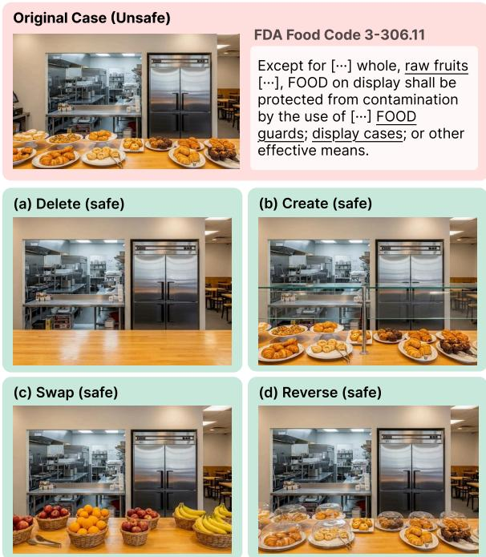  
Figure 8: Hard-safe construction from violation images using four perturbations: (a) deleting a forbidden element from the scene; (b) creating a required element that is missing; (c) swapping the violating object for a confusingly similar but compliant one; (d) reversing an attribute (position, state, or orientation) of the violating element.

## A.3 Image Generation and Hard-Safe Construction

For each collected text-based case, we generate ten unsafe images using Imagen 4 (Google, 2025b) and Gemini 3 Pro Image (Google, 2025a). The generation prompt is grounded in the case description, while the violation label remains inherited from the original case record; for platformcontent cases, the authors instead verify the label against the corresponding Meta Community Standards rule. For hard-safe construction in the foodsafety, construction-safety, and advertising-content domains, unsafe images are transformed using the perturbation procedure illustrated in Figure 8: violation-critical visual evidence is removed or corrected while preserving the surrounding scene context. This produces safe images that remain visually close to the corresponding unsafe cases, making them difficult negatives for rule-grounded safety evaluation.

Usage Terms, License, and Release Policy. The images are generated with Imagen 4 (Google, 2025b) and Gemini 3 Pro Image (Google, 2025a) under Google’s generative-AI terms, which do not claim ownership of the generated content and permit research use subject to the Generative AI Prohibited Use Policy. The images are produced through the commercial tier of the Gemini API, under whose terms Google does not use the submitted prompts or the generated outputs to train or improve its models, products, or services; the generated images carry Google’s SynthID watermark and are disclosed as AI-generated. The released images are distributed under the CC BY 4.0 license, while the underlying source records remain governed by their respective terms of use with source attribution preserved. For platform-content safety, we do not directly release the generated images, as they may contain platform-specific visual assets such as UI layouts, logos, and interface elements; we instead disclose the construction pipeline and specification, which can be applied to other platform policies.

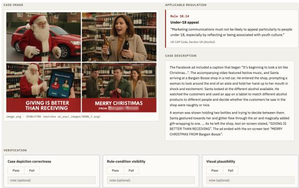  
Figure 9: Verification UI used for the manual verification of SAFETYVISIONBENCH.

## A.4 Verification

All generated images and source cases are manually verified by the authors (Figure 9). The verification is conducted along three axes: case depiction correctness, rule-condition visibility, and visual plausibility, with agreement rates of 97.2%, 96.4%, and 75.8%, respectively. Images are filtered out when the violation or compliant state is visually ambiguous, insufficiently grounded in the source case, or degraded by low generation quality. For the foodsafety, construction-safety, and advertising-content domains, whose cases are collected from source datasets, the fine-grained violation clause label is not newly inferred during annotation but preserved verbatim from the corresponding source record; for the platform-content domain, whose cases are synthesized under a target Meta Community Standards regulation, the violation clause label is inherited from the generation condition, and the authors verify and filter cases in which the generated content does not reflect the intended label. This keeps each unsafe label directly grounded in the underlying violation case or governing regulation. Figures 13–16 show representative examples from the four source datasets, including the collected case, inherited violation label, and corresponding visual instances.

## A.5 Dataset Statistics

Tables 21, 22, 23, and 24 summarize the safetycategory and violation-category distributions for food safety, construction safety, platform-content safety, and advertising-content safety, respectively. The distributions show that SAFETYVISION-BENCH covers both broad domain-level safety categories and fine-grained violation labels inherited from the real-world cases.

## A.6 Baseline VLM Performance

Table 6 reports eight frontier VLMs evaluated on SAFETYVISIONBENCH: Gemini 3.0 Pro (Google DeepMind, 2025b) and Gemini 3.0 Flash (Google DeepMind, 2025a), GPT-5.4 and GPT-5.4 mini (Singh et al., 2026), Claude Opus 4.5 (Anthropic, 2025a) and Claude Sonnet 4.5 (Anthropic, 2025b), Kimi K2.6 (Team et al., 2026), and Qwen 3.5 (397B) (Qwen Team, 2026). The evaluation follows the same setting as Direct Prompting in Baselines. We report violation recall (R) and case-level F1 in each domain. Figure 10 visualises the same numbers on an eight-axis radar.

Gemini model families attain the best perdomain recall in all of four settings, while Gemini 3.0 Flash is strongest on Food F1. The remaining frontier models show competitive performance on Construction Safety but substantially lower recall on Platform-Content Safety.

## B Implementation Details

All pipelines, including the baselines and GUARDEN, are composed with LangChain over an OpenAI-compatible interface. The visual modules use HuggingFace Transformers (with PyTorch) for open-vocabulary detection (SAM 3 (Carion et al., 2026)), image–text scoring (SigLIP 2 (Tschannen et al., 2025)), and monocular depth (Depth Anything 3 (Lin et al., 2025)), and Google Document AI (Google Cloud, 2024) for OCR.

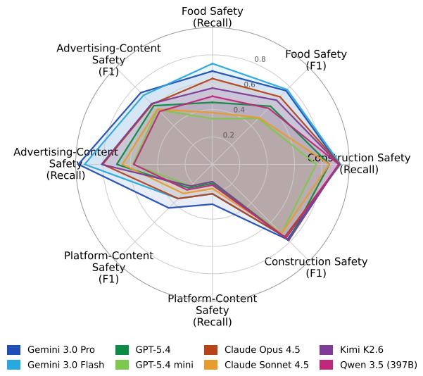  
Figure 10: Radar visualisation of the per-domain recall (R) and F1 numbers reported in Table 6 for the eight baseline VLMs. The evaluation setting is identical to the Direct Prompting baseline. Each axis is a (domain, metric) pair and the radial range is [0, 1].

## B.1 Baselines

## B.1.1 ViperGPT

ViperGPT (Surís et al., 2023) is included as an executable visual-reasoning baseline, testing whether code generation over vision APIs is sufficient for safety-rule compliance. We follow the official implementation and adapt its program-generation interface to our image–rule setting, where the model generates execute\_command(images, regulations, api) for a structured violation verdict. The provided ImagePatch-style API wraps the same visual foundation models used in our main experiments (SAM 3, SigLIP 2, Depth Anything 3, and Google’s Document OCR) and additionally allows VLM calls for open-ended or yes/no visual checks.

## B.1.2 ETA

ETA (Ding et al., 2025) is included as an inferencetime safety-alignment baseline that first evaluates a VLM judgment and invokes alignment only when the judgment is uncertain. We follow the official implementation and adapt its evaluate-thenalign pipeline to our image–rule setting: an applicability evaluator filters clearly irrelevant pairs, a VLM produces a structured violation judgment, and uncertain cases are resolved by selecting the best grounded candidate from a sampled pool. We use the paper-default best-of-N = 5, with a SigLIP applicability threshold of 0.05, a rewardgate band of [0.30, 0.70], and candidate-ranking weights 0.4/0.5/0.1 for grounding, soundness, and SAM 3 detection, respectively.

<table><tr><td rowspan=2 colspan=1>Model</td><td rowspan=1 colspan=2>FoodSafety</td><td rowspan=1 colspan=2>ConstructionSafety</td><td rowspan=1 colspan=2>Platform-ContentSafety</td><td rowspan=1 colspan=2>Advertising-ContentSafety</td></tr><tr><td rowspan=1 colspan=2>Recall    F1-score</td><td rowspan=1 colspan=2>Recall    F1-score</td><td rowspan=1 colspan=2>Recall    F1-score</td><td rowspan=1 colspan=2>Recall    F1-score</td></tr><tr><td rowspan=1 colspan=1>Gemini 3.0 Pro</td><td rowspan=1 colspan=1> $6 7 . 8 \pm 0 . 2$ </td><td rowspan=1 colspan=1> $7 5 . 7 \pm 0 . 3$ </td><td rowspan=1 colspan=1> $8 8 . 5 \pm 2 . 8$ </td><td rowspan=1 colspan=1> $8 1 . 4 \pm 2 . 6$ </td><td rowspan=1 colspan=1> $2 6 . 6 \pm 1 . 8$ </td><td rowspan=1 colspan=1> $3 9 . 1 \pm 4 . 3$ </td><td rowspan=1 colspan=1> $9 6 . 7 \pm 3 . 3$ </td><td rowspan=1 colspan=1> $7 0 . 3 \pm 2 . 8$ </td></tr><tr><td rowspan=1 colspan=1>Gemini 3.0 Flash</td><td rowspan=1 colspan=1> $7 3 . 6 \pm 0 . 0$ </td><td rowspan=1 colspan=1> $7 7 . 4 \pm 0 . 1$ </td><td rowspan=1 colspan=1> $8 9 . 8 \pm 2 . 8$ </td><td rowspan=1 colspan=1> $7 9 . 5 \pm 3 . 3$ </td><td rowspan=1 colspan=1> $2 2 . 8 \pm 1 . 0$ </td><td rowspan=1 colspan=1> $3 5 . 2 \pm 0 . 7$ </td><td rowspan=1 colspan=1> $9 1 . 9 \pm 1 . 7$ </td><td rowspan=1 colspan=1> $6 6 . 8 \pm 3 . 2$ </td></tr><tr><td rowspan=1 colspan=1>GPT-5.4</td><td rowspan=1 colspan=1> $4 6 . 6 \pm 1 . 2$ </td><td rowspan=1 colspan=1> $6 0 . 9 \pm 0 . 8$ </td><td rowspan=1 colspan=1> $8 1 . 7 \pm 2 . 7$ </td><td rowspan=1 colspan=1> $8 2 . 3 \pm 2 . 5$ </td><td rowspan=1 colspan=1> $1 9 . 4 \pm 3 . 9$ </td><td rowspan=1 colspan=1> $3 2 . 3 \pm 5 . 6$ </td><td rowspan=1 colspan=1> $7 0 . 6 \pm 0 . 5$ </td><td rowspan=1 colspan=1> $6 1 . 3 \pm 0 . 8$ </td></tr><tr><td rowspan=1 colspan=1>GPT-5.4 mini</td><td rowspan=1 colspan=1> $2 5 . 9 \pm 1 . 1$ </td><td rowspan=1 colspan=1> $3 9 . 7 \pm 1 . 5$ </td><td rowspan=1 colspan=1> $5 8 . 5 \pm 2 . 6 $ </td><td rowspan=1 colspan=1> $7 0 . 7 \pm 2 . 4$ </td><td rowspan=1 colspan=1> $1 7 . 7 \pm 1 . 0$ </td><td rowspan=1 colspan=1> $2 8 . 9 \pm 1 . 3$ </td><td rowspan=1 colspan=1> $3 6 . 8 \pm 1 . 3$ </td><td rowspan=1 colspan=1> $4 4 . 6 \pm 1 . 2$ </td></tr><tr><td rowspan=1 colspan=1>Claude Opus 4.5</td><td rowspan=1 colspan=1> $6 2 . 2 \pm 0 . 4$ </td><td rowspan=1 colspan=1> $6 9 . 5 \pm 0 . 2$ </td><td rowspan=1 colspan=1> $9 0 . 7 \pm 1 . 7$ </td><td rowspan=1 colspan=1> $7 8 . 4 \pm 2 . 6$ </td><td rowspan=1 colspan=1>23.6 ± 1.6</td><td rowspan=1 colspan=1> $3 5 . 8 \pm 0 . 7$ </td><td rowspan=1 colspan=1> $8 5 . 3 \pm 3 . 6$ </td><td rowspan=1 colspan=1> $6 3 . 3 \pm { 0 . 8 }$ </td></tr><tr><td rowspan=1 colspan=1>Claude Sonnet 4.5</td><td rowspan=1 colspan=1> $3 8 . 8 \pm 0 . 8$ </td><td rowspan=1 colspan=1> $4 9 . 1 \pm 0 . 7$ </td><td rowspan=1 colspan=1> $8 3 . 1 \pm 1 . 7$ </td><td rowspan=1 colspan=1> $7 6 . 2 \pm 3 . 4$ </td><td rowspan=1 colspan=1> $2 5 . 3 \pm 5 . 5$ </td><td rowspan=1 colspan=1> $3 9 . 0 \pm 6 . 4$ </td><td rowspan=1 colspan=1> $7 3 . 9 \pm 5 . 7$ </td><td rowspan=1 colspan=1> $5 9 . 8 \pm 2 . 0$ </td></tr><tr><td rowspan=1 colspan=1>Kimi K2.6</td><td rowspan=1 colspan=1> $5 2 . 7 \pm 2 . 1$ </td><td rowspan=1 colspan=1> $6 4 . 3 \pm 1 . 4$ </td><td rowspan=1 colspan=1> $9 0 . 7 \pm 1 . 4$ </td><td rowspan=1 colspan=1> $8 3 . 0 \pm 3 . 0$ </td><td rowspan=1 colspan=1> $1 7 . 3 \pm 3 . 3$ </td><td rowspan=1 colspan=1> $2 7 . 6 \pm 3 . 7$ </td><td rowspan=1 colspan=1> $8 2 . 8 \pm 3 . 4$ </td><td rowspan=1 colspan=1> $6 3 . 1 \pm 1 . 4$ </td></tr><tr><td rowspan=1 colspan=1>Qwen 3.5 (397B)</td><td rowspan=1 colspan=1> $4 9 . 9 \pm 0 . 2$ </td><td rowspan=1 colspan=1> $5 8 . 4 \pm 0 . 3$ </td><td rowspan=1 colspan=1> $9 0 . 7 \pm 1 . 4$ </td><td rowspan=1 colspan=1> $7 8 . 2 \pm 1 . 6$ </td><td rowspan=1 colspan=1> $2 1 . 1 \pm 4 . 3$ </td><td rowspan=1 colspan=1> $3 4 . 4 \pm 5 . 8$ </td><td rowspan=1 colspan=1> $6 9 . 5 \pm 8 . 5$ </td><td rowspan=1 colspan=1> $6 0 . 9 \pm 4 . 4$ </td></tr></table>

Table 6: Baseline VLM performance on SAFETYVISIONBENCH across Food Safety, Construction Safety, Platform-Content Safety, and Advertising-Content Safety over three runs.

## B.1.3 SafeCLIP

SafeCLIP (Zhao et al., 2025) is included as a representation-alignment baseline, testing whether image–policy similarity can serve as a zero-shot safety signal before explicit rule reasoning. We construct a safety concept bank from the target regulation, add a neutral category, embed the image and text descriptors with SigLIP 2, and flag the image when the highest non-neutral regulation score exceeds both the toxicity threshold and the neutral score. When flagged, the paper’s generic safety template is prepended to the original VLM query before producing the final structured violation judgment. We use K = 5 descriptors per category, softmax temperature scale $\sigma = 1 0 0$ , toxicity threshold $\tau \ : = \ : 0 . 6 .$ , VLM temperature 0.3, and aggregate multi-image cases by the maximum regulation score across images.

masked image.

CLUE (Wang et al., 2025) is included as an objectified-precondition baseline, testing whether safety rules can be converted into visually checkable conditions before judgment. Our CLUE implementation follows the objectification and centricregion masking pipeline, while using VLM-based Yes/No token probabilities and reasoning fallback for precondition judgment. We first objectify each regulation and decompose it into preconditions; this offline decomposition and optimization stage is performed with GPT-5.4. At inference time, centric phrases for the preconditions are grounded with SAM 3, and each precondition is judged using VLM Yes/No token probabilities over the original image, the no-image prior, and the centric-region-

## B.1.4 CLUE

## B.1.5 CompAgent

CompAgent (Ghosh et al., 2026) is included as a policy-guided agentic tool-use baseline, testing whether iterative evidence collection is sufficient for visual compliance verification. We adapt its two-agent workflow: a text-only Planning Agent selects tools in a ReAct loop, and a multimodal CVAgent produces the final structured verdict from the image, regulation, and accumulated evidence. The main agent components use the same inference VLM as the other baselines, while the tool suite includes VLM-based summarization, SAM 3/SigLIP 2 object detection, Google’s Document OCR, SigLIP 2 scoring as a Safe-CLIP substitute, and LlamaGuard (Meta AI, 2025) as a callable evidence tool. We use at most 10 ReAct (Yao et al., 2023b) steps with decoding temperature 0.0.

## B.2 GUARDEN

## B.2.1 Safety-Rule Compilation

Safety-Rule Compilation follows the iterative decomposition and verification procedure in Section 3.3. At each sub-rule r (also at R), decomposer D proposes $( \varphi _ { r } ^ { ( t ) } , \{ \hat { r } _ { 1 } ^ { ( t ) } , \dots , \hat { r } _ { k } ^ { ( t ) } \} )$ and verifier V returns $( s _ { r } ^ { ( t ) } , \eta _ { r } ^ { ( t ) } , a _ { r } ^ { ( t ) } )$ . Refinement terminates when $a _ { r } ^ { ( t ) } = \mathtt { T r u e } , s _ { r } ^ { ( t ) }$ saturates, or $s _ { r } ^ { ( t ) }$ reaches $s _ { \mathrm { m a x } } ;$ the default patience is set to three iterations. Figures 17 and 18 provide the decomposer and verifier prompts.

Pre-defined Grounding. The Selection agent $\mathbb { V } _ { \mathrm { s e l } }$ produces the requested objects $O _ { \mathrm { r e q } }$ and relations $\Gamma _ { \mathrm { r e q } }$ for each atomic proposition from the regulation and the image, following the prompt in Figure 19. Given $O _ { \mathrm { r e q } }$ and $\Gamma _ { \mathrm { r e q } } ,$ Label<sub>o</sub> assigns state labels $s _ { o }$ and $\operatorname { L a b e l } _ { \rho }$ assigns relation labels v for constructing $\mathcal { G } ^ { ( I ) } \stackrel { ^ { \cdot } } { = } ( \mathcal { V } ^ { \bar { ( I ) } } , \mathcal { E } ^ { ( I ) } )$ . Table 7 summarizes the predicate specification.

<table><tr><td>Predicate Type</td><td>Intended Semantics</td><td>Grounding Evidence</td></tr><tr><td>State predicates  $( o , \sigma , \emptyset )$ </td><td></td><td></td></tr><tr><td>Visual state</td><td>o exhibits the visual state or attribute s.</td><td>Detected object bounding box and VLM state module.</td></tr><tr><td>Textual semantic state</td><td>o contains text whose meaning or referent OCR output and VLM state module. matches s.</td><td></td></tr><tr><td>Relation predicates  $\left( o _ { 1 } , \rho , o _ { 2 } \right)$ </td><td></td><td></td></tr><tr><td>any / None inside</td><td>No relational constraint.</td><td></td></tr><tr><td></td><td> $o _ { 1 }$  is spatially contained within  $O _ { 2 } .$ </td><td>Box containment, region overlap, and depth consistency.</td></tr><tr><td>near</td><td> $o _ { 1 }$  is physically close to  $O _ { 2 } .$ </td><td>Image-plane distance and depth-aware prox- imity.</td></tr><tr><td>adjacent</td><td> $o _ { 1 }$  is next to or directly touching  $o _ { 2 } .$ </td><td>Boundary distance, overlap, and depth con- sistency.</td></tr><tr><td>above</td><td> $o _ { 1 }$  is vertically above  $O _ { 2 }$  in the scene.</td><td>Vertical ordering, overlap suppression, and depth consistency.</td></tr><tr><td>below</td><td> $o _ { 1 }$  is vertically below  $O _ { 2 }$  in the scene.</td><td>Vertical ordering, overlap suppression, and depth consistency.</td></tr><tr><td>on</td><td> $o _ { 1 }$  rests on or is supported by  $O _ { 2 } .$ </td><td>Vertical contact, horizontal support overlap, and depth consistency.</td></tr><tr><td>at_edge_of</td><td> $o _ { 1 }$  lies at the boundary region of  $o _ { 2 } .$ </td><td>Boundary overlap, relative position, and depth consistency.</td></tr><tr><td>covering</td><td> $o _ { 1 }$  occludes or covers a substantial part of  $O 2 .$ </td><td>Box overlap, containment ratio, and foreground-background depth ordering.</td></tr></table>

Table 7: Specification of pre-defined grounding predicates used for scene-graph node and edge labeling. State predicates assign object-local labels $( o , \sigma , \emptyset )$ using visual or textual evidence, while relation predicates assign edge labels $( o _ { 1 } , \rho , o _ { 2 } )$ from localized geometric and depth evidence. Concrete thresholds and module-level configurations are treated as implementation parameters, while the semantic role of each predicate is fixed across domains.

Satisfied relation predicates instantiate scenegraph edges for subsequent rule-tree evaluation.

## B.2.2 Tool-Aware Visual Grounding

Tool-Aware Visual Grounding follows Section 3.5. When $c _ { o } \ < \ \tau$ $\mathrm { A l i g n } ( o ; I , { \mathcal { C } } )$ invokes $\mathbb { V } _ { \mathrm { g r o u n d } }$ to obtain an accepted substitute $k _ { o } ^ { \star } ,$ which is cached as ${ \mathcal { C } } [ o ]$ . Figure 20 provides the $\mathbb { V } _ { \mathrm { g r o u n d } }$ prompt. This behavior is evaluated in Section D.2.

## C Experimental Details

## C.1 Robustness to Rule Complexity

This subsection details the protocol underlying the robustness-to-complexity analysis in Section 4.3.1.

Per-Rule Complexity Score. For each rule $^ { r , }$ we extract seven non-negative features from its regulation clause:

$f _ { \mathrm { c o n d } } \colon$ conditionals (if, when, unless...).

$f _ { \mathrm { e n u m } } .$ : enumerated lists.

$f _ { \mathrm { x r e f } } { \mathrm { : } }$ cross-references to other rules.

$f _ { \mathrm { n e g } } \colon$ negations (not, no, never...).

$f _ { \mathrm { a o } } \mathrm { : }$ connectives and/or.

$f _ { \mathrm { c o n c } } \mathrm { . }$ concrete objects (door, sign, wall...).

$f _ { \mathrm { e x c } } \colon$ exceptions (except, notwithstanding...).

Each captures a distinct facet of logical or structural complexity. We stack them into a feature vector

$$
\mathbf { f } = ( f _ { \mathrm { c o n d } } , f _ { \mathrm { e n u m } } , f _ { \mathrm { x r e f } } , f _ { \mathrm { n e g } } , f _ { \mathrm { a o } } , f _ { \mathrm { c o n c } } , f _ { \mathrm { e x c } } )\tag{9}
$$

and define the domain-specific complexity score as their weighted sum:

$$
C ( r ) = \mathbf { w } ^ { \star ^ { \intercal } } \mathbf { f } ( r ) ,\tag{10}
$$

where the non-negative weights are fit separately for each domain to approximate the rule-level F1 degradation averaged over all evaluated methods:

$$
\mathbf { w } ^ { \star } = \mathop { \arg \operatorname* { m i n } } _ { \mathbf { w } \geq 0 } \sum _ { r \in \mathcal { R } } \left( y _ { d } ( r ) - \mathbf { w } ^ { \top } \mathbf { f } ( r ) \right) ^ { 2 } .\tag{11}
$$

Here $y _ { d } ( r )$ is the observed rule-level F1 drop averaged over the six baselines of Section 4.1 and

<table><tr><td rowspan=2 colspan=1>Method</td><td rowspan=1 colspan=2>FoodSafety</td><td rowspan=1 colspan=2>ConstructionSafety</td><td rowspan=1 colspan=2>Platform-ContentSafety</td><td rowspan=1 colspan=2>Advertising-ContentSafety</td></tr><tr><td rowspan=1 colspan=2>Low      High</td><td rowspan=1 colspan=2>Low      High</td><td rowspan=1 colspan=2>Low      High</td><td rowspan=1 colspan=2>Low      High</td></tr><tr><td rowspan=1 colspan=1>Direct Prompting</td><td rowspan=1 colspan=2> $4 6 . 9 \pm 3 . 9$   $4 6 . 0 \pm 2 . 4$ </td><td rowspan=1 colspan=1> $7 8 . 5 \pm 3 . 7$ </td><td rowspan=1 colspan=1> $6 7 . 7 \pm 3 . 0$ </td><td rowspan=1 colspan=1> $5 3 . 9 \pm 3 . 9$ </td><td rowspan=1 colspan=1> $6 . 5 \pm 5 . 3$ </td><td rowspan=1 colspan=1> $5 1 . 3 \pm 0 . 4$ </td><td rowspan=1 colspan=1> $6 7 . 1 \pm 0 . 6$ </td></tr><tr><td rowspan=1 colspan=1>ViperGPT</td><td rowspan=1 colspan=2> $7 9 . 1 \pm 0 . 8$   $6 6 . 7 \pm 0 . 4$ </td><td rowspan=1 colspan=1> $7 5 . 4 \pm 0 . 3$ </td><td rowspan=1 colspan=1> $6 8 . 4 \pm 0 . 0$ </td><td rowspan=1 colspan=1> $5 1 . 3 \pm 2 . 7$ </td><td rowspan=1 colspan=1> $4 9 . 1 \pm 4 . 2$ </td><td rowspan=1 colspan=1> $4 7 . 6 \pm 0 . 4$ </td><td rowspan=1 colspan=1> $4 6 . 2 \pm 1 . 3$ </td></tr><tr><td rowspan=1 colspan=1>ETA</td><td rowspan=1 colspan=1> $8 8 . 2 \pm 0 . 1$ </td><td rowspan=1 colspan=1> $7 3 . 3 \pm 0 . 9$ </td><td rowspan=1 colspan=1> $8 5 . 8 \pm 0 . 2$ </td><td rowspan=1 colspan=1> $7 1 . 3 \pm 1 . 7$ </td><td rowspan=1 colspan=1> $7 1 . 2 \pm 2 . 7$ </td><td rowspan=1 colspan=1> $4 3 . 6 \pm 8 . 2$ </td><td rowspan=1 colspan=1> $5 6 . 9 \pm 1 . 7$ </td><td rowspan=1 colspan=1> $5 6 . 9 \pm 2 . 9$ </td></tr><tr><td rowspan=1 colspan=1>SafeCLIP</td><td rowspan=1 colspan=1> $8 7 . 6 \pm 0 . 7$ </td><td rowspan=1 colspan=1> $7 2 . 0 \pm 0 . 6$ </td><td rowspan=1 colspan=1> $9 2 . 1 \pm 1 . 4$ </td><td rowspan=1 colspan=1> $4 9 . 3 \pm 2 . 1$ </td><td rowspan=1 colspan=1> $6 6 . 3 \pm 4 . 3$ </td><td rowspan=1 colspan=1> $3 6 . 2 \pm 5 . 1$ </td><td rowspan=1 colspan=1> $4 9 . 3 \pm 2 . 0$ </td><td rowspan=1 colspan=1> $5 7 . 9 \pm 2 . 5$ </td></tr><tr><td rowspan=1 colspan=1>CLUE</td><td rowspan=1 colspan=1> $8 1 . 6 \pm 0 . 6$ </td><td rowspan=1 colspan=1> $5 9 . 1 \pm 0 . 7$ </td><td rowspan=1 colspan=1> $7 0 . 7 \pm 0 . 8$ </td><td rowspan=1 colspan=1> $6 8 . 6 \pm 0 . 7$ </td><td rowspan=1 colspan=1> $5 7 . 0 \pm 1 . 8$ </td><td rowspan=1 colspan=1> $5 1 . 6 \pm 1 . 2$ </td><td rowspan=1 colspan=1> $7 8 . 5 \pm 1 . 9$ </td><td rowspan=1 colspan=1> $2 7 . 1 \pm 0 . 6$ </td></tr><tr><td rowspan=1 colspan=1>CompAgent</td><td rowspan=1 colspan=1> $8 3 . 9 \pm 1 . 1$ </td><td rowspan=1 colspan=1> $6 9 . 9 \pm 2 . 1$ </td><td rowspan=1 colspan=1> $8 1 . 9 \pm 1 . 1$ </td><td rowspan=1 colspan=1> $6 7 . 7 \pm 1 . 7$ </td><td rowspan=1 colspan=1> $7 6 . 5 \pm 3 . 6$ </td><td rowspan=1 colspan=1> $3 8 . 8 \pm 6 . 0$ </td><td rowspan=1 colspan=1> $5 6 . 7 \pm 3 . 1$ </td><td rowspan=1 colspan=1> $5 3 . 0 \pm 1 . 0$ </td></tr><tr><td rowspan=1 colspan=1>GUARDEN</td><td rowspan=1 colspan=2> $8 9 . 0 \pm 1 . 9$   $7 9 . 0 \pm 1 . 6$ </td><td rowspan=1 colspan=2> $8 4 . 7 \pm 1 . 5$   $8 3 . 5 \pm 1 . 0$ </td><td rowspan=1 colspan=1> $7 9 . 1 \pm 1 . 3$ </td><td rowspan=1 colspan=1> $6 8 . 1 \pm 6 . 7$ </td><td rowspan=1 colspan=2> $8 1 . 5 \pm 2 . 8$   $7 5 . 8 \pm 0 . 9$ </td></tr></table>

Table 8: F1-score (mean over three runs) on SAFETYVISIONBENCH for the LOW and HIGH complexity tertiles of the per-domain score $C _ { d } ( \boldsymbol { r } )$ (Eq. (10)), evaluated with Gemma 4 26B.
<table><tr><td rowspan="2"></td><td rowspan="2">|Inference Model |</td><td colspan="2">Food Safety</td><td colspan="2">Construction Safety</td><td colspan="2">Platform-Content Safety</td><td colspan="2">Advertising-Content Safety</td></tr><tr><td>Recall</td><td> $_ \mathrm { F 1 - s c o r e }$ </td><td>Recall</td><td>F1-score</td><td>Recall</td><td>F1-score</td><td>Recall</td><td> $_ \mathrm { F 1 - s c o r e }$ </td></tr><tr><td rowspan="2">Direct Prompting</td><td>Gemma 4 26B</td><td> $3 4 . 5 \pm 2 . 4$ </td><td> $4 5 . 4 \pm 2 . 3$ </td><td> $7 2 . 0 \pm 1 . 6$ </td><td> $7 8 . 6 \pm 1 . 5$ </td><td> $1 6 . 5 \pm 3 . 6 $ </td><td> $2 6 . 6 \pm 4 . 4$ </td><td> $5 7 . 5 \pm 1 . 3$ </td><td> $5 7 . 1 \pm 0 . 8$ </td></tr><tr><td>GPT-5.4-mini</td><td> $2 5 . 9 \pm 1 . 1$ </td><td> $3 9 . 7 \pm 1 . 5$ </td><td> $5 8 . 5 \pm 2 . 6 $ </td><td> $7 0 . 7 \pm 2 . 4$ </td><td> $1 7 . 7 \pm 1 . 0$ </td><td> $2 8 . 9 \pm 1 . 3$ </td><td> $3 6 . 8 \pm 1 . 3$ </td><td> $4 4 . 6 \pm 1 . 2$ </td></tr><tr><td rowspan="2">ViperGPT</td><td>Gemma 4 26B</td><td> $7 3 . 1 \pm 0 . 4$ </td><td> $7 2 . 5 \pm 0 . 4$ </td><td> $8 4 . 0 \pm 0 . 0$ </td><td> $7 4 . 0 \pm 0 . 3$ </td><td> $4 3 . 9 \pm 1 . 6$ </td><td> $5 3 . 3 \pm 4 . 0$ </td><td> $6 0 . 6 \pm 0 . 3$ </td><td> $4 5 . 5 \pm 0 . 7$ </td></tr><tr><td>GPT-5.4-mini</td><td> $7 9 . 9 \pm 1 . 5$ </td><td> $7 2 . 5 \pm 0 . 9$ </td><td> $9 4 . 1 \pm 0 . 0$ </td><td> $7 4 . 9 \pm 0 . 2$ </td><td> $7 8 . 1 \pm 0 . 6$ </td><td> $6 6 . 1 \pm 0 . 4$ </td><td> $8 7 . 4 \pm 1 . 6$ </td><td> $5 0 . 3 \pm 0 . 4$ </td></tr><tr><td rowspan="2">ETA</td><td>Gemma 4 26B</td><td> $8 3 . 7 \pm 0 . 8$ </td><td> $8 2 . 6 \pm 0 . 2$ </td><td> $9 5 . 8 \pm 1 . 2$ </td><td> $8 3 . 6 \pm 1 . 2$ </td><td> $3 9 . 7 \pm 4 . 3$ </td><td>52.0±7.5</td><td> $7 3 . 4 \pm 0 . 3$ </td><td> $5 7 . 4 \pm 1 . 2$ </td></tr><tr><td>GPT-5.4-mini</td><td> $6 2 . 5 \pm 0 . 8$ </td><td> $7 2 . 1 \pm 0 . 9$ </td><td>69.5±0.8</td><td> $7 7 . 5 \pm 1 . 2$ </td><td>51.5±2.4</td><td>61.3±1.3</td><td>54.5±3.0</td><td> $4 9 . 7 \pm 2 . 4$ </td></tr><tr><td rowspan="2">SafeCLIP</td><td>Gemma 4 26B</td><td> $8 2 . 9 \pm 1 . 2$ </td><td> $8 1 . 6 \pm 0 . 2$ </td><td> $7 9 . 0 \pm 0 . 0$ </td><td> $8 4 . 2 \pm 0 . 7$ </td><td> $4 1 . 8 \pm 2 . 1$ </td><td></td><td> $7 1 . 9 \pm 0 . 9$ </td><td> $5 5 . 2 \pm 1 . 7$ </td></tr><tr><td>GPT-5.4-mini</td><td> $6 0 . 9 \pm 0 . 2$ </td><td> $7 1 . 5 \pm 0 . 6$ </td><td> $6 6 . 1 \pm 0 . 8$ </td><td> $7 6 . 4 \pm 0 . 5$ </td><td> $6 9 . 6 \pm 2 . 1$ </td><td> $\begin{array} { l } { 5 3 . 5 \pm 2 . 1 } \\ { 7 3 . 8 \pm 1 . 6 } \end{array}$ </td><td> $5 7 . 1 \pm 1 . 3$ </td><td> $5 2 . 1 \pm 1 . 2$ </td></tr><tr><td rowspan="2">CLUE</td><td>Gemma 4 26B</td><td> $6 6 . 0 \pm 0 . 8$ </td><td> $7 1 . 7 \pm 0 . 6$ </td><td></td><td> $7 2 . 1 \pm 0 . 7$ </td><td> $5 3 . 2 \pm 2 . 5$ </td><td> $5 7 . 9 \pm 2 . 6$ </td><td> $5 5 . 3 \pm 1 . 2$ </td><td> $4 4 . 2 \pm 0 . 3$ </td></tr><tr><td>GPT-5.4-mini</td><td> $5 8 . 7 \pm 1 . 0$ </td><td> $6 4 . 3 \pm 1 . 2$ </td><td> $\begin{array} { l } { 8 7 . 1 \pm 1 . 0 } \\ { 8 8 . 5 \pm 1 . 9 } \end{array}$ </td><td> $7 0 . 9 \pm 1 . 0$ </td><td> $6 6 . 2 \pm 2 . 9$ </td><td> $6 3 . 5 \pm 1 . 7$ </td><td> $5 4 . 0 \pm 2 . 0$ </td><td> $3 8 . 9 \pm 1 . 3$ </td></tr><tr><td rowspan="2">CompAgent</td><td>Gemma 4 26B</td><td> $7 6 . 8 \pm 1 . 9$ </td><td> $7 7 . 9 \pm 1 . 0$ </td><td> $9 1 . 6 \pm 1 . 8$ </td><td> $8 0 . 6 \pm 1 . 2$ </td><td> $5 4 . 9 \pm 3 . 2$ </td><td> $5 9 . 5 \pm 2 . 1$ </td><td> $6 4 . 3 \pm 2 . 4$ </td><td> $5 3 . 7 \pm 1 . 4$ </td></tr><tr><td>GPT-5.4-mini</td><td> $6 4 . 2 \pm 2 . 0$ </td><td> $7 1 . 4 \pm 2 . 3$ </td><td> $7 6 . 5 \pm 1 . 8$ </td><td> $8 2 . 3 \pm 1 . 2$ </td><td> $5 2 . 3 \pm 2 . 2$ </td><td> $5 6 . 3 \pm 1 . 6$ </td><td> $7 9 . 3 \pm 4 . 8$ </td><td> $5 7 . 7 \pm 1 . 3$ </td></tr><tr><td rowspan="2">GUARDEN</td><td>Gemma 4 26B</td><td> $8 9 . 3 \pm 1 . 2$ </td><td> ${ \pm } 2 4 . 4 \pm 3 . 5$ </td><td> $9 2 . 9 \pm 0 . 8$ </td><td> ${ \bf 8 6 . 4 \pm 0 . 1 }$ </td><td> $7 0 . 0 \pm 4 . 0$ </td><td> ${ \bf 6 9 . 0 \pm 2 . 6 }$ </td><td> $6 9 . 8 \pm 0 . 5$ </td><td> $7 4 . 9 \pm 3 . 6$ </td></tr><tr><td>GPT-5.4-mini</td><td> $8 8 . 3 \pm 1 . 4$ </td><td> ${ \pm } 4 . 5 \pm 0 . 6$ </td><td> $9 5 . 2 \pm 0 . 4$ </td><td> ${ \bf 8 8 . 2 \pm 0 . 4 }$ </td><td> $7 7 . 9 \pm 3 . 4$ </td><td> $7 4 . 6 \pm 2 . 4$ </td><td> $8 0 . 0 \pm 1 . 5$ </td><td> $7 9 . 8 \pm 1 . 6$ </td></tr></table>

Table 9: Effect of the inference VLM on baseline performance. Each method is evaluated with Gemma 4 26B (Google DeepMind, 2026b) and GPT-5.4-mini (Singh et al., 2026) across the four safety domains of SAFETYVISIONBENCH.

GUARDEN, and

$$
{ \mathcal { R } } = \{ R \} \cup \operatorname { s u b } ^ { \star } ( R )\tag{12}
$$

where

The first factor rewards absolute performance on the hardest rules; the second penalizes the relative drop from the easiest bin and is clamped at $F _ { 1 } ^ { \mathrm { H I G H } }$

## C.2 Visual Sensitivity Bias

$$
\operatorname { s u b } ^ { \star } ( R ) = \bigcup _ { { \hat { r } } \in \operatorname { s u b } ( R ) } \{ \{ { \hat { r } } \} \cup \operatorname { s u b } ^ { \star } ( { \hat { r } } ) \} .\tag{13}
$$

This subsection details the protocol underlying the visual-sensitivity-bias analysis in Section 4.3.2.

Within each domain, the rules are ranked by $C ( r )$ and split into three bins: LOW, MEDIUM, and HIGH. Per-bin F1 scores across the four domains are reported in Table 8.

Robustness Index. We define the Robustness Index as a scalar summary of a method’s F1 trajectory across complexity bins:

$$
F _ { 1 } ^ { \mathrm { H I G H } } \cdot \left( 1 - \mathrm { R e L U } \left( \frac { F _ { 1 } ^ { \mathrm { L o w } } - F _ { 1 } ^ { \mathrm { H I G H } } } { F _ { 1 } ^ { \mathrm { L o w } } } \right) \right)
$$

Image Set and Visual Cue Categorisation. We use all 434 violation images from the platformcontent domain, spanning 46 distinct base scenes. Each image is classified by a separate Gemini 3.0 Pro (Google DeepMind, 2025b) judge into one of seven visual cue categories—hate symbols, weapons, blood/injury, protest/riot, targeted text, property damage, child—or the residual class (no risk cue) when no such cue is visible. An image may be assigned multiple categories when several

(14)

<table><tr><td>Removed Component</td><td>Food Safety</td><td>Construction Safety</td><td>Platform-Content Safety</td><td>Advertising-Content Safety</td></tr><tr><td>GUARDEN (Full)</td><td> $8 4 . 4 \pm 3 . 5$ </td><td> $8 6 . 4 \pm 0 . 1$ </td><td> $6 9 . 0 \pm 2 . 6$ </td><td> $7 4 . 9 \pm 3 . 6$ </td></tr><tr><td>Scene-Grounded Execution</td><td> $7 5 . 9 \pm 1 . 4$ </td><td> $8 0 . 5 \pm 4 . 4$ </td><td> $6 4 . 7 \pm 4 . 6$ </td><td> $5 3 . 4 \pm 9 . 6$ </td></tr><tr><td>Verifier Loop</td><td> $7 4 . 6 \pm 3 . 1$ </td><td> $6 2 . 2 \pm 1 5 . 7$ </td><td> $4 6 . 3 \pm 1 . 8$ </td><td> $4 5 . 1 \pm 1 2 . 8$ </td></tr><tr><td>Tool-Aware Grounding</td><td> $7 6 . 2 \pm 4 . 6$ </td><td> $7 5 . 5 \pm 6 . 8$ </td><td> $6 4 . 6 \pm 2 . 9$ </td><td> $4 6 . 5 \pm 1 2 . 8$ </td></tr><tr><td>Relation Grounding</td><td> $7 7 . 7 \pm 3 . 6$ </td><td> $5 2 . 0 \pm 7 . 6$ </td><td> $4 5 . 5 \pm 2 . 8$ </td><td> $4 4 . 9 \pm 1 3 . 4$ </td></tr></table>

Table 10: Ablation study of GUARDEN on SAFETYVISIONBENCH, reported as mean F1-score over three runs per domain. Each row below the first reports the score when the listed component is removed from the full pipeline. All variants are evaluated with Gemma 4 26B (Google DeepMind, 2026b) as the underlying inference VLM.

cues co-occur; the residual class is mutually exclusive with the others.

(Image, Rule) Querying. We query the end-toend Direct Prompting baseline and GUARDEN on image–rule pairs formed by pairing each sampled image with each of the 16 top-level Meta Community Standards rules. The spurious violation rate is computed over pairs whose rule is not annotated as applicable to the image.

Per-Rule Decomposition. Table 11 reports the full category–rule matrix together with the per-cell relative change ∆; the abbreviated rule labels are expanded in the caption. Cells in which neither method records any spurious violation in a given category are omitted.

## C.3 Rule-Induced Bias

This subsection details the protocol underlying the rule-induced-bias analysis in Section 4.3.2 and reports the full per-regulation breakdown summarised in Table 4.

(Image, Rule) Querying. We use the same image–rule querying protocol as in the visualsensitivity-bias analysis.

Per-Regulation Breakdown. Table 12 reports all 16 regulations ranked by DP spurious violation rate. Under DP, six regulations spuriously flag more than 20% of unrelated images, peaking at 52.8% for Dangerous Organizations and Individuals. GUARDEN removes most of these spurious violations by replacing each monolithic regulation with value-neutral atomic checks, lowering the overall rate from 12.1% to 2.0%. The single exception is Violent and Graphic Content (S15), where decomposition slightly increases the rate on an already-low base.

## C.4 Ablation Study

Table 10 reports the per-domain F1-score of each GUARDEN variant on SAFETYVISIONBENCH using Gemma 4 26B as the underlying inference VLM. Each row removes a single design component while keeping the remaining pipeline intact.

w/o Scene-Grounded Execution. The compiled tree is preserved, but each atomic proposition is judged by the VLM over the raw image rather than the scene graph $\mathcal { G } ^ { ( I ) }$

w/o Verifier Loop. The decomposer D is run once per node without verifier feedback $\eta _ { n } ^ { ( t ) }$ or score-driven re-sampling.

w/o Tool-Aware Grounding. The detector is used as-is without the abstraction-gap and lexicalgap alignment described in Section 3.5.

w/o Relation Grounding. Only object-state propositions $( o , \sigma , \emptyset )$ are evaluated; relational propositions $( o _ { 1 } , \rho , o _ { 2 } )$ are discarded.

## C.5 Sensitivity to Grounding Confidence

Table 13 reports the per-domain F1-score of GUARDEN as the grounding-confidence threshold τ is varied from 0.4 to 0.9. Food, Construction, and Platform-Content Safety are largely insensitive to τ, whereas Advertising-Content Safety improves steadily from 60.9 at τ=0.4 to 74.9 at τ=0.8. For every domain, τ=0.8 lies on a stable, high-performing region rather than at a sharp peak.

## D Additional Experiments

## D.1 Effect of the Inference VLM

Table 9 reports how each baseline changes when the inference VLM is switched from Gemma 4 26B to GPT-5.4-mini, while keeping the benchmark, rules, and method-specific pipelines fixed.

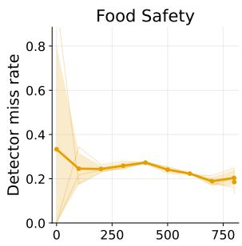

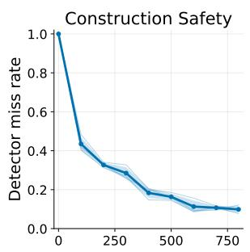

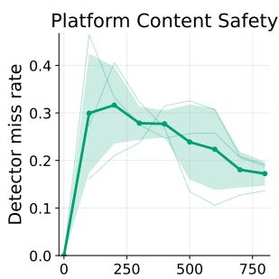

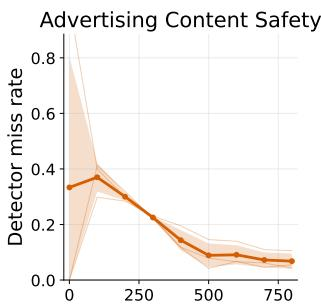  
Cumulative grounded atomic propositions  
Figure 11: The y-axis shows the mean miss rate (confidence $< \tau )$ over three independent runs as the per-domain substitute-keyword cache C accumulates, computed over $p _ { i }$ whose target is visibly present in the image.

## D.2 Fallback Keyword Accumulation

Tool-Aware Visual Grounding (Section 3.5) accumulates accepted substitute keywords for object phrases in atomic propositions. We test whether this cache amortizes grounding by tracking the $d e .$ tector miss rate (the fraction of first-attempt detections with (confidence $< \tau )$ as C grows over a continual stream of SAFETYVISIONBENCH images.

Setup. For each domain, we sample SAFETYVISIONBENCH images in a randomized order and process them sequentially. For each image, we evaluate the propositions of its applicable regulation and ground the object phrases required by its atomic propositions using the current domain cache. Accepted substitutes are added back to ${ \mathcal { C } } ,$ and atomic propositions whose target object is absent are excluded.

Result. Figure 11: each curve briefly rises while C is empty, then converges after 500 to 600 grounded $p _ { i }$ to ≈ 0.10 (Construction), ≈ 0.05 (Advertising), ≈ 0.20 (Food), and ≈ 0.18 (Platform); the higher asymptotes in Food and Platform reflect their broader object vocabularies, which admit fewer repeat encounters per $p _ { i }$ within the same window. Compositional caching thus amortizes the tool-aware loop, supporting the offline and online split between Safety-Rule Compilation and Scene-Grounded Execution.

## D.3 Deployment Cost of GUARDEN

For a multi-stage safeguard, deployment cost is as consequential as accuracy. We measure the perimage latency of each stage of Scene-Grounded Execution under the experimental setting of Section 4.1, together with total LLM tokens and the average number of tool calls per image.

Latency Model. The entailment design bounds deployment latency by its critical path rather than by the number of propositions: Selection is parallel over $p \in P .$ , Grounding is parallel over $o \in O _ { \mathrm { r e q } }$ and the tool-aware alignment loop is invoked only on a cache miss of C. This yields the approximate deployment-time latency $\widehat { T } _ { \mathrm { d e p l o y } }$ as

$$
\operatorname* { m a x } _ { p \in P } T _ { \mathrm { s e l } } ^ { ( p ) } + \operatorname* { m a x } _ { o \in O _ { \mathrm { r e q } } } T _ { \mathrm { g r o u n d } } ^ { ( o ) } + r _ { \mathcal { C } } \operatorname* { m a x } _ { o \in O _ { \mathrm { r e q } } } T _ { \mathrm { a l i g n } } ^ { ( o ) } ,\tag{15}
$$

where $r _ { \mathcal { C } }$ is the residual cache miss rate, which converges to 0.05–0.20 per domain after warm-up (Appendix D.2); we take $r c \approx 0 . 2$ as a conservative upper bound.

Result. Table 14 reports the measurements: $T _ { \mathrm { d e p l o y } }$ ranges from 8.6 to 11.6 seconds per image, dominated by the Selection stage, while the additive form of Equation (15) keeps latency insensitive to rule complexity—additional propositions widen the parallel frontier rather than lengthen the critical path. Token and tool-call footprints peak in Platform-Content Safety, whose text-dense images require more grounding queries. Combined with the amortized alignment term, this supports GUARDEN’s practicality as an inference-time safeguard, with Selection and Grounding parallelism and cache warm-up as its design-level optimization opportunities.

## D.4 Fine-tuned vs. GUARDEN

We ask whether training a model on in-domain data can substitute for GUARDEN’s rule decomposition. We study Food Safety and Construction Safety, the two domains with sufficient training data. For each domain, we train Gemma 4 26B with LoRA to judge each regulation directly from the image (Train + DP), and compare it against

<table><tr><td>Visual cue</td><td>Rule</td><td>DP</td><td>Ours</td><td>∆</td></tr><tr><td rowspan="6">Hate symbols</td><td>S1 Coord. Harm</td><td>25.0</td><td>0.0</td><td>100%↓</td></tr><tr><td>S2 Dang. Orgs.</td><td>91.7</td><td>29.2</td><td>68.2%↓</td></tr><tr><td>S5 Violence</td><td>44.0</td><td>4.0</td><td>90.9%↓</td></tr><tr><td>S7 Bullying</td><td>56.2</td><td>0.0</td><td>100%↓</td></tr><tr><td>S13 Hateful</td><td>78.9</td><td>5.3</td><td>93.3%↓</td></tr><tr><td>S21 Misinfo.</td><td>28.1</td><td>0.0</td><td>100%↓</td></tr><tr><td rowspan="6">Blood / Injury</td><td>S1 Coord. Harm</td><td>42.1</td><td>0.0</td><td>100%↓</td></tr><tr><td>S2 Dang. Orgs.</td><td>35.0</td><td>10.0</td><td>71.4%↓</td></tr><tr><td>S5 Violence</td><td>10.0</td><td>0.0</td><td>100%↓</td></tr><tr><td>S7 Bullying</td><td>50.0</td><td>0.0</td><td>100%↓</td></tr><tr><td>S13 Hateful</td><td>54.5</td><td>0.0</td><td>100%↓</td></tr><tr><td>S21 Misinfo.</td><td>30.0</td><td>0.0</td><td>100%↓</td></tr><tr><td rowspan="6">Protest / Riot</td><td>S1 Coord. Harm</td><td>57.3</td><td>20.0</td><td>65.1%↓</td></tr><tr><td>S2 Dang. Orgs.</td><td>69.7</td><td>5.3</td><td>92.5%↓</td></tr><tr><td>S5 Violence</td><td>36.0</td><td>24.0</td><td>33.3%↓</td></tr><tr><td>S7 Bullying</td><td>36.8</td><td>0.0</td><td>100%↓</td></tr><tr><td>S13 Hateful</td><td>30.8</td><td>0.0</td><td>100%↓</td></tr><tr><td>S21 Misinfo.</td><td>53.3</td><td>2.7</td><td>95.0%↓</td></tr><tr><td rowspan="6">Targeted text</td><td>S1 Coord. Harm</td><td>28.6</td><td>4.3</td><td>84.8%↓</td></tr><tr><td>S2 Dang. Orgs.</td><td>60.3</td><td>8.4</td><td>86.0%↓</td></tr><tr><td>S5 Violence</td><td>33.9</td><td>7.4</td><td>78.0%↓</td></tr><tr><td>S7 Bullying</td><td>39.8</td><td>0.0</td><td>100%↓</td></tr><tr><td>S13 Hateful</td><td>45.3</td><td>3.4</td><td>92.5%↓</td></tr><tr><td>S21 Misinfo.</td><td>27.9</td><td>1.1</td><td>96.1%↓</td></tr><tr><td rowspan="5">Property damage</td><td>S1 Coord. Harm</td><td>77.4 38.7</td><td></td><td>50.0%↓</td></tr><tr><td>S2 Dang. Orgs.</td><td>61.3</td><td>9.7</td><td>84.2%↓</td></tr><tr><td>S5 Violence</td><td>21.4 21.4</td><td></td><td>0.0%</td></tr><tr><td>S7 Bullying</td><td>20.0</td><td>0.0</td><td>100%↓</td></tr><tr><td>S21 Misinfo.</td><td>51.6</td><td>3.2</td><td>93.8%↓</td></tr><tr><td rowspan="5">Child</td><td>S1 Coord. Harm</td><td>0.0</td><td>6.2</td><td></td></tr><tr><td>S2 Dang. Orgs.</td><td>56.2</td><td>6.2</td><td>88.9%↓</td></tr><tr><td>S5 Violence</td><td>12.5</td><td>0.0</td><td>100%↓</td></tr><tr><td>S13 Hateful</td><td>83.3</td><td>0.0</td><td>100%↓</td></tr><tr><td>S21 Misinfo.</td><td>12.5</td><td>0.0</td><td>100%↓</td></tr><tr><td>Overall</td><td></td><td>15.5</td><td>3.2</td><td>80.4%↓</td></tr></table>

Table 11: Visual-sensitivity-induced bias per rule.

GUARDEN (Base + GUARDEN), which uses the same off-the-shelf backbone without any training.

Experimental Settings. Each domain is split by case into train/validation/test partitions (0.7/0.15/0.15). We fine-tune Gemma 4 26B in bfloat16 across two NVIDIA RTX A6000 (48 GB) GPUs with LoRA (rank 16) on the language-model layers (AdamW, learning rate 1e−4), training to convergence and keeping the best-validation checkpoint. The implementation uses PyTorch, Hugging Face Transformers, and PEFT for training, with Pillow for image loading. Fine-tuning takes 4.5 and 7.0 wall-clock hours for Food Safety and Construction Safety, respectively.

<table><tr><td>Rule</td><td>DP</td><td>Ours</td><td>∆</td></tr><tr><td>S2 Dang. Orgs.</td><td>52.8</td><td>7.8</td><td>85.2%↓</td></tr><tr><td>S13 Hateful</td><td>40.1</td><td>3.0</td><td>92.5%↓</td></tr><tr><td>S7 Bullying</td><td>33.9</td><td>0.0</td><td>100%↓</td></tr><tr><td>S5 Violence</td><td>27.7</td><td>6.1</td><td>78.0%↓</td></tr><tr><td>S1 Coord. Harm</td><td>26.4</td><td>5.2</td><td>80.4%↓</td></tr><tr><td>S21 Misinfo.</td><td>23.9</td><td>0.9</td><td>96.1%↓</td></tr><tr><td>S6 Adult Exploit.</td><td>3.3</td><td>0.2</td><td>92.9%↓</td></tr><tr><td>S15 Graphic Content</td><td>2.8</td><td>8.2</td><td>191.7%↑</td></tr><tr><td>S22 Spam</td><td>2.1</td><td>1.9</td><td>11.1%↓</td></tr><tr><td>S4 Restricted Goods</td><td>1.9</td><td>0.0</td><td>100%↓</td></tr><tr><td>S10 Self-Injury</td><td>1.2</td><td>0.2</td><td>80.0%↓</td></tr><tr><td>S8 Child Exploit.</td><td>0.2</td><td>0.0</td><td>100%↓</td></tr><tr><td>S9 Human Exploit.</td><td>0.2</td><td>0.0</td><td>100%↓</td></tr><tr><td>Overall</td><td>12.1</td><td>2.0</td><td>83.8%↓</td></tr></table>

Table 12: Rule-induced bias per rule.

<table><tr><td>T</td><td>Food</td><td>Constr.</td><td>Platform</td><td>Advert.</td></tr><tr><td>0.4</td><td> $8 2 . 3 \pm 2 . 4$ </td><td> $8 2 . 2 \pm 2 . 5$ </td><td> $6 6 . 1 \pm 1 . 6$ </td><td> $6 0 . 9 \pm 3 . 2$ </td></tr><tr><td>0.5</td><td> $8 3 . 4 \pm 1 . 7$ </td><td> $8 2 . 1 \pm 2 . 3$ </td><td> $6 5 . 8 \pm 2 . 3$ </td><td> $6 5 . 0 \pm 2 . 8$ </td></tr><tr><td>0.6</td><td> $8 3 . 4 \pm 2 . 0$ </td><td> $8 5 . 0 \pm 2 . 5$ </td><td> $6 8 . 9 \pm 1 . 5$ </td><td> $6 8 . 1 \pm 2 . 6 $ </td></tr><tr><td>0.7</td><td> $8 5 . 6 \pm 2 . 0$ </td><td> $8 6 . 2 \pm 2 . 3$ </td><td> $6 5 . 6 \pm 1 . 4$ </td><td> $7 1 . 9 \pm 3 . 2$ </td></tr><tr><td>0.8</td><td> ${ \bf 8 4 . 4 \pm 3 . 5 }$ </td><td> ${ \bf 8 6 . 4 \pm 0 . 1 }$ </td><td> ${ \bf 6 9 . 0 \pm 2 . 6 }$ </td><td> ${ \bf 7 4 . 9 \pm 3 . 6 }$ </td></tr><tr><td>0.9</td><td> $8 5 . 0 \pm 2 . 0$ </td><td> $8 6 . 2 \pm 2 . 3$ </td><td> $6 7 . 3 \pm 0 . 4$ </td><td> $7 5 . 9 \pm 3 . 5$ </td></tr></table>

Table 13: Per-domain F1-score (%, mean ± std over three runs) of GUARDEN under grounding-confidence thresholds $\tau \in \{ 0 . 4 , 0 . 5 , \ldots , 0 . 9 \}$ , using Gemma 4 26B as the inference VLM.

Analysis. Even after convergence, the fine-tuned model remains below GUARDEN in both domains (Table 15), with the larger gap appearing in Food Safety, where compliance depends on a broader and more fine-grained rule space. This pattern suggests a practical limitation of absorbing regulations into model parameters: as rule systems become more detailed, fixed-size supervised training sets provide increasingly sparse coverage of the conditions that must be recognized at test time. Whereas, by externalizing the regulation as an executable reasoning path over grounded visual conditions, GUARDEN shows how complex safety-rule reasoning can remain robust without additional training as rule complexity increases.

## D.5 Rule-Compilation Error Analysis and Repair

Since GUARDEN’s final decision is conditioned on the correctness of the compiled rule tree, we characterize where Safety-Rule Compilation fails and whether such failures are repairable. We analyze compilation errors in the Advertising-Content Safety domain, where the compilation error rate is highest, and categorize each error by a three-model audit (GPT-5.4 (Singh et al., 2026), Claude Opus 4.8 (Anthropic, 2026), and Gemini 3.1 Pro (Google DeepMind, 2026a)) with majority voting over seven categories: ambiguous atomic proposition, missing condition, hallucinated condition, missing exception, wrong relation, operator flip, and unresolved when no majority is reached.

<table><tr><td>Domain</td><td> $\mathrm { m a x } T _ { \mathrm { s e l } }$  (s)</td><td> $\operatorname* { m a x } T _ { \mathrm { g r o u n d } }$  (s)</td><td> $\operatorname* { m a x } T _ { \mathrm { a l i g n } }$  (s)</td><td> $T _ { \mathrm { d e p l o y } }$  (s)</td><td>Avg. Tokens (K)</td><td>Avg. Tool Calls</td></tr><tr><td>Food Safety</td><td> $7 . 9 \pm 5 . 5$ </td><td> $2 . 7 \pm 0 . 5$ </td><td> $4 . 6 \pm 0 . 3$ </td><td> $1 1 . 6 \pm 5 . 5$ </td><td> $1 0 . 7 \pm 8 . 3$ </td><td> $1 4 . 2 \pm 1 3 . 0$ </td></tr><tr><td>Construction Safety</td><td> $7 . 3 \pm 1 . 3$ </td><td> $2 . 2 \pm 0 . 9$ </td><td> $5 . 4 \pm 0 . 5$ </td><td> $1 0 . 7 \pm 1 . 6$ </td><td> $1 1 . 1 \pm 9 . 5$ </td><td> $1 3 . 2 \pm 1 3 . 9$ </td></tr><tr><td>Platform-Content Safety</td><td> $5 . 4 \pm 1 . 3$ </td><td> $2 . 0 \pm 0 . 2$ </td><td> $5 . 6 \pm 1 . 0$ </td><td> $8 . 6 \pm 1 . 3$ </td><td> $1 6 . 4 \pm 1 6 . 9$ </td><td> $1 7 . 0 \pm 2 0 . 6$ </td></tr><tr><td>Advertising-Content Safety</td><td> $7 . 2 \pm 2 . 1$ </td><td> $2 . 3 \pm 0 . 3$ </td><td> $4 . 5 \pm 0 . 5$ </td><td> $1 0 . 4 \pm 2 . 1$ </td><td> $8 . 8 \pm 7 . 4$ </td><td> $7 . 2 \pm 7 . 6$ </td></tr></table>

Table 14: Per-domain deployment cost of GUARDEN: stage-wise latency, LLM tokens, and tool calls per image.

<table><tr><td rowspan="2">Method</td><td colspan="2">Food Safety</td><td colspan="2">Construction Safety</td></tr><tr><td>Recall</td><td>F1</td><td>Recall</td><td>F1</td></tr><tr><td> $\mathrm { T r a i n } + \mathrm { D P }$ </td><td>82.0</td><td>81.2</td><td>98.0</td><td>89.1</td></tr><tr><td>Base + GUARDEN</td><td>88.9</td><td>88.7</td><td>98.3</td><td>91.1</td></tr></table>

Table 15: Trained model (Train + DP) versus GUARDEN (Base + GUARDEN): violation Recall and F1 (%) per domain on the held-out test split.

Result. The error distribution is highly skewed: 86% of all errors are ambiguous atomic propositions containing underspecified terms such as “large,” “small,” or “many,” and among the remaining errors, 55% are missing conditions. Most compilation failures thus originate from ambiguity in the rule text itself rather than from the decomposition procedure, and can be mitigated by rule objectification (Wang et al., 2025) in realistic deployment. For missing conditions, we use the three-model audit to identify omitted constraints, incorporate them into the compiled rules, and measure the resulting per-rule F1 changes (Table 16). Repairing a single omitted condition recovers per-rule F1 from near-failure to saturation (e.g., 1.3 → 100.0 for Rule 2.3), indicating that compilation errors are not only localized but verifiable: because compiled rules are explicit artifacts, a higher-level auditing layer can detect and repair them without modifying the reasoning pipeline.

## D.6 Precedent Retrieval beyond Explicit Rules

GUARDEN performs deductive entailment over explicit safety rules, so its coverage is bounded by what the written rule expresses (Limitations). We test whether analogical evidence can extend this boundary by augmenting the Selection stage of Scene-Grounded Execution with a lightweight precedent retriever adapted from BERT-PLI (Shao et al., 2020), replacing its text encoder with SigLIP 2 (Tschannen et al., 2025) and removing all trainable components to isolate the effect of retrieval from additional supervision. The retriever indexes six selected cases per rule and retrieves three documents per case; all other settings follow Appendix B.2.

Result. Precedent retrieval yields consistent gains across all four domains (Table 17), with the largest improvements in Construction (+2.1) and Advertising (+2.4), where compliance more often hinges on contextual judgments beyond the literal rule text. The uniformly positive but modest deltas suggest that analogical reasoning is an orthogonal extension to GUARDEN’s explicit-rule entailment rather than a replacement for its deductive pipeline, offering a route to align with the intended policy beyond the written text.

## D.7 Generalization across Inference Backbones

Beyond the backbone substitution in Appendix D.1, we assess whether GUARDEN’s gains are tied to a particular model family or scale. We evaluate GUARDEN and the two strongest baselines, CompAgent and CLUE, with four inference backbones spanning two families and three scales: Gemma 4 26B and Gemma 4 12B (Google Deep-Mind, 2026b), Qwen 3.5 27B (Qwen Team, 2026), and GPT-5.4-mini (Singh et al., 2026); all other settings follow Section 4.1.

<table><tr><td>Regulation</td><td>Omitted Condition</td><td>Baseline</td><td>Repaired</td><td> $\Delta$ </td></tr><tr><td>Rule 18.1 (Unwise drinking)</td><td>Irresponsible-drinking cues too narrow</td><td>30.8</td><td>97.3</td><td>+66.5</td></tr><tr><td>Rule 4.1 (Serious or widespread of- fence)</td><td>Offence types omitted</td><td>4.3</td><td>93.0</td><td>+88.7</td></tr><tr><td>Rule 2.3 (Undisclosed advertising or commercial intent)</td><td>Missing applicability condition</td><td>1.3</td><td>100.0</td><td>+98.7</td></tr></table>

Table 16: Per-rule F1-score (%) before and after repairing an omitted condition identified by the three-model audit, in the Advertising-Content Safety domain.
<table><tr><td>Method</td><td>Food Safety</td><td>Construction Safety</td><td>Platform-Content Safety</td><td>Advertising-Content Safety</td></tr><tr><td>GUARDEN</td><td> $8 4 . 4 \pm 3 . 5$ </td><td> $8 6 . 4 \pm 0 . 1$ </td><td> $6 9 . 0 \pm 2 . 6$ </td><td> $7 4 . 9 \pm 3 . 6$ </td></tr><tr><td>+ Precedent Retriever</td><td> $8 5 . 2 \pm 1 . 3$ </td><td> $8 8 . 5 \pm 1 . 0$ </td><td> $7 0 . 2 \pm 1 . 0$ </td><td> $7 7 . 3 \pm 2 . 3$ </td></tr><tr><td> $\Delta$ </td><td>+0.8</td><td>+2.1</td><td>+1.2</td><td>+2.4</td></tr></table>

Table 17: Effect of augmenting GUARDEN with precedent retrieval, reported as mean F1-score (%) over three runs per domain on SAFETYVISIONBENCH.

Result. GUARDEN attains the best F1 in all sixteen backbone–domain combinations (Table 18). The margin persists under capacity reduction— with Gemma 4 12B, baseline F1 drops by up to 24.1 points while GUARDEN’s largest drop is 11.8— since Safety-Rule Compilation confines the backbone to grounded atomic judgments rather than end-to-end regulatory reasoning. Stronger backbones extend the gains (e.g., 89.3 on Construction with Qwen 3.5 27B), indicating that the entailment design composes with, rather than substitutes for, backbone capability.

## D.8 Cross-Benchmark Evaluation

We evaluate on the LlavaGuard (Helff et al., 2025) test set, using its provided safety taxonomy as the rule set; all other settings follow Section 4.1.

Result. GUARDEN attains the best F1 (Table 19), indicating that its advantage is not an artifact of benchmark co-design. The narrowed margin over CLUE follows from the flat taxonomy: with few compositional conditions, entailment over compiled rule trees has little headroom, consistent with the rule-complexity analysis in Section 4.3.1. A complementary stress test on a second external benchmark is reported in Appendix D.9.

## D.9 Robustness against Adversarial Inputs

As a complementary stress test beyond our primary compliance setting, we evaluate GUARDEN on adversarial inputs in which harmful intent is deliberately distributed across modalities. We adopt the strongest SD+TYPO setting of MM-SafetyBench (Liu et al., 2024), where a benignlooking generated image is composed with typographic malicious text so that neither modality alone reveals the harmful intent. The provided safety taxonomy serves as the rule set, and Qwen2.5-VL-7B (Bai et al., 2025) is used as the inference backbone to avoid ceiling effects and make robustness differences observable; we report Recall, F1, and Accuracy averaged over three runs.

Result. GUARDEN leads on all three metrics (Table 20), improving F1 by 7.2 points over CompAgent, while CLUE falls below chance-level accuracy. The scene graph externalizes image elements, embedded text, and their relations into an explicit reasoning structure, so cross-modal compositions that evade holistic judgment remain visible as grounded propositions, mirroring GUARDEN’s gains in the text-dense domains of SAFETYVISION-BENCH.

## E Qualitative Analysis

We walk through an additional construction safety case to show how GUARDEN grounds each atomic visual proposition $p _ { i }$

Under NYC Building Code Section 1003.6 (means-of-egress continuity; Figure 12), Safety-Rule Compilation yields a disjunction whose decisive branch $q _ { 2 }$ binds an obstruction to the clear

<table><tr><td>Method</td><td>Inference Model</td><td>Food Safety</td><td>Construction Safety</td><td>Platform-Content Safety</td><td>Advertising-Content Safety</td></tr><tr><td rowspan="4">CompAgent</td><td>Gemma 4 26B</td><td>77.9</td><td>80.6</td><td>59.5</td><td>53.7</td></tr><tr><td>Gemma 4 12B</td><td>54.5</td><td>56.5</td><td>51.8</td><td>53.7</td></tr><tr><td>Qwen 3.5 27B</td><td>71.8</td><td>79.8</td><td>60.0</td><td>66.9</td></tr><tr><td>GPT-5.4-mini</td><td>71.4</td><td>82.3</td><td>56.3</td><td>57.7</td></tr><tr><td rowspan="4">CLUE</td><td>Gemma 4 26B</td><td>71.7</td><td>72.1</td><td>57.9</td><td>44.2</td></tr><tr><td>Gemma 4 12B</td><td>69.5</td><td>64.4</td><td>43.0</td><td>39.7</td></tr><tr><td>Qwen 3.5 27B</td><td>65.6</td><td>69.1</td><td>63.7</td><td>68.1</td></tr><tr><td>GPT-5.4-mini</td><td>64.3</td><td>70.9</td><td>63.5</td><td>38.9</td></tr><tr><td rowspan="4">GUARDEN</td><td>Gemma 4 26B</td><td>84.4</td><td>86.4</td><td>69.0</td><td>74.9</td></tr><tr><td>Gemma 4 12B</td><td>74.6</td><td>74.6</td><td>60.9</td><td>74.2</td></tr><tr><td>Qwen 3.5 27B</td><td>87.9</td><td>89.3</td><td>78.7</td><td>71.4</td></tr><tr><td>GPT-5.4-mini</td><td>84.5</td><td>88.2</td><td>74.6</td><td>79.8</td></tr></table>

Table 18: Mean F1-score (%) over three runs across four inference backbones on SAFETYVISIONBENCH. Bold marks the best result per backbone and domain.

<table><tr><td>Method</td><td>Recall</td><td>F1-score</td></tr><tr><td>Direct Prompting</td><td> $4 4 . 5 \pm 0 . 3$ </td><td> $5 7 . 7 \pm 0 . 2$ </td></tr><tr><td>CompAgent</td><td> $4 5 . 1 \pm 1 . 7$ </td><td> $5 7 . 9 \pm 1 . 1$ </td></tr><tr><td>CLUE</td><td> ${ \bf 8 0 . 1 \pm 0 . 5 }$ </td><td> $7 0 . 8 \pm 0 . 3$ </td></tr><tr><td>GUARDEN</td><td> $7 7 . 2 \pm 1 . 6$ </td><td> ${ \bf 7 1 . 1 \pm 0 . 7 }$ </td></tr></table>

Table 19: LlavaGuard (Helff et al., 2025) evaluation results, averaged over three runs.
<table><tr><td>Method</td><td>Recall</td><td>F1-score</td><td>Accuracy</td></tr><tr><td>CompAgent</td><td> $6 0 . 4 \pm 1 . 3$ </td><td> $7 5 . 1 \pm 1 . 1$ </td><td> $7 9 . 7 \pm 0 . 7$ </td></tr><tr><td>CLUE</td><td> $6 2 . 0 \pm 1 . 1$ </td><td> $5 4 . 9 \pm 1 . 3$ </td><td> $4 8 . 1 \pm 1 . 3$ </td></tr><tr><td>GUARDEN</td><td> $7 4 . 7 \pm 3 . 3$ </td><td> ${ \pm 2 . 3 \pm 2 . 6 }$ </td><td> ${ \pm 2 . 7 \pm 2 . 2 }$ </td></tr></table>

Table 20: Robustness on the MM-SafetyBench (Liu et al., 2024) SD+TYPO setting balanced with benign images, averaged over three runs.

egress width:

$$
{ \mathcal { T } } _ { R _ { 1 0 0 3 . 6 } } = \{ \wedge , \{ ( x , \exists , \emptyset ) , q _ { 1 } ( x ) , { \mathcal { T } } _ { q _ { 2 } ( x ) } , q _ { 3 } ( x ) \} \} ,
$$

$$
\begin{array} { r } { \mathcal { T } _ { q _ { 2 } ( x ) } = \{ \land , \{ p _ { \mathrm { o b s } } ( x ) , p _ { \mathrm { i n } } ( x ) , \{ \neg , \{ p _ { \mathrm { p r j } } ( x ) \} \} \} \} , } \end{array}
$$

$$
p _ { \mathrm { o b s } } ( x ) = ( x , \mathsf { o b s t r u c t i o n } , \emptyset ) ,
$$

$$
p _ { \mathrm { i n } } ( x ) = ( x , \mathrm { ~ i n s i d e , } c o r r i d o r ) ,
$$

$$
\begin{array} { r } { p _ { \mathrm { p r j } } ( x ) = ( x , \mathsf { p e r m i t t e d \_ p r o j e c t i o n } , \emptyset ) . } \end{array}
$$

Scene-Grounded Execution binds the open obstruction slot via $\mathbb { M } _ { \mathrm { s e l } }$ to the window airconditioner $x ^ { \star }$ , with the corridor grounded as the egress path $P .$ Substitution $p \mapsto p \in \mathcal G ^ { ( I ) }$ gives:

$$
p _ { \mathrm { o b s } } ( x ^ { \star } ) \in \mathcal { G } ^ { ( I ) } = \mathsf { T r u e } ,
$$

$$
\begin{array} { r l } { p _ { \mathrm { i n } } ( x ^ { \star } ) \in \mathcal { G } ^ { ( I ) } = \mathsf { T r u e } } & { { } \big ( \frac { | x ^ { \star } \cap P | } { | x ^ { \star } | } = 1 . 0 > \theta \big ) , } \end{array}
$$

$$
p _ { \mathrm { p r j } } ( x ^ { \star } ) \in \mathcal { G } ^ { ( I ) } = \mathsf { F a l s e } .
$$

Construction Safety Case  
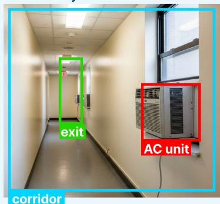  
NYC Building Code Section 1003.6

The path of egress travel along a means of egress shall not be interrupted by a building element . Obstructions shall not be placed Violation X

Figure 12: Window air-conditioner obstructing a corridor egress path under NYC Building Code Section 1003.6.

Recursive bottom-up composition then fires the branch and short-circuits the disjunction to a violation:

$$
\mathcal { T } _ { q _ { 2 } ( x ^ { \star } ) } ^ { ( I ) } = \{ \wedge , \{ \mathsf { T r u e } , \mathsf { T r u e } , \{ \neg , \{ \mathsf { F a l s e } \} \} \} \} \equiv \mathsf { T r u e } .
$$

The verdict thus turns entirely on $\mathbb { M } _ { \mathrm { s e l } }$ resolving the obstruction slot to $x ^ { \star }$ , yielding $\tau _ { R _ { 1 0 0 3 . 6 } } ^ { ( I ) } \equiv$ True without pre-enumerating obstruction types.

<table><tr><td>Safety category</td><td>Violation category</td><td>Count</td><td>Ratio</td></tr><tr><td>Equipment and utensils</td><td>Clean-item storage and linen handling</td><td>458</td><td>3.5%</td></tr><tr><td></td><td>Equipment cleanliness</td><td>599</td><td>4.5%</td></tr><tr><td></td><td>Equipment design, materials, and capacity</td><td>512</td><td>3.9%</td></tr><tr><td></td><td>Equipment maintenance and use limits</td><td>554</td><td>4.2%</td></tr><tr><td>Food protection</td><td>Consumer-facing food display</td><td>63</td><td>0.5%</td></tr><tr><td></td><td>Equipment- and utensil-related contamination</td><td>662</td><td>5.0%</td></tr><tr><td></td><td>Storage and preparation contamination</td><td>251</td><td>1.9%</td></tr><tr><td>Personnel hygiene</td><td>Hygienic practices</td><td>627</td><td>4.8%</td></tr><tr><td></td><td>Personal cleanliness and clothing</td><td>16</td><td>0.1%</td></tr><tr><td>Physical facilities</td><td>Facility design and cleanability</td><td>2344</td><td>17.8%</td></tr><tr><td></td><td>Facility maintenance and cleaning</td><td>3819</td><td>29.0%</td></tr><tr><td></td><td>Handwashing facilities and supplies</td><td>690</td><td>5.2%</td></tr><tr><td></td><td>Pest and animal control</td><td>1069</td><td>8.1%</td></tr><tr><td>Plumbing and waste systems</td><td>Plumbing and handwashing operation</td><td>755</td><td>5.7%</td></tr><tr><td></td><td>Refuse and receptacle management</td><td>761</td><td>5.8%</td></tr></table>

Table 21: Food safety category and violation category distribution.

<table><tr><td>Safety category</td><td>Violation category</td><td>Count</td><td>Ratio</td></tr><tr><td>Construction and demolition site safety</td><td>Pedestrian and public protection</td><td>13494</td><td>74.9%</td></tr><tr><td></td><td>Site housekeeping, washout, and fire protection</td><td>3421</td><td>19.0%</td></tr><tr><td></td><td>Site signage and notification</td><td>292</td><td>1.6%</td></tr><tr><td>Egress safety</td><td>Egress continuity</td><td>799</td><td>4.4%</td></tr></table>

Table 22: Construction safety category and violation category distribution.

<table><tr><td>Safety category</td><td>Violation category</td><td>Count</td><td>Ratio</td></tr><tr><td rowspan="4">Violence and criminal behavior</td><td>Dangerous organizations (terrorism)</td><td>17</td><td>3.6%</td></tr><tr><td>Restricted goods and services (drugs)</td><td>26</td><td>5.5%</td></tr><tr><td>Restricted goods and services (firearms)</td><td>5</td><td>1.0%</td></tr><tr><td>Violence and incitement</td><td>29</td><td>6.1%</td></tr><tr><td rowspan="2">Safety</td><td>Bullying and harassment</td><td>78</td><td>16.4%</td></tr><tr><td>Suicide, self-injury, and eating disorders</td><td>19</td><td>4.0%</td></tr><tr><td rowspan="3">Objectionable content</td><td>Adult nudity and sexual activity</td><td>125</td><td>26.2%</td></tr><tr><td>Hateful conduct</td><td>29</td><td>6.1%</td></tr><tr><td>Violent and graphic content</td><td>149</td><td>31.2%</td></tr><tr><td rowspan="2">Compliance and disclosure</td><td>Recognition of marketing communications</td><td>139</td><td>4.7%</td></tr><tr><td>Regulatory responsibility</td><td>53</td><td>1.8%</td></tr><tr><td rowspan="4">Harm, offence, and children</td><td>Child-directed harm</td><td>15</td><td>0.5%</td></tr><tr><td>Offence, fear, and distress</td><td>161</td><td>5.5%</td></tr><tr><td>Sexual portrayal and stereotypes</td><td>41</td><td>1.4%</td></tr><tr><td>Unsafe or antisocial practices</td><td>30</td><td>1.0%</td></tr><tr><td rowspan="5">Misleading advertising</td><td>Comparative claims</td><td>115</td><td>3.9%</td></tr><tr><td>Endorsements and competitor reputation</td><td>20</td><td>0.7%</td></tr><tr><td>General misleading claims</td><td>741</td><td>25.1%</td></tr><tr><td>Price claims</td><td>116</td><td>3.9%</td></tr><tr><td>Qualification and material context</td><td>334</td><td>11.3%</td></tr><tr><td rowspan="8">Regulated product claims</td><td>Alcohol</td><td>129</td><td>4.4%</td></tr><tr><td>Electronic cigarettes</td><td>22</td><td>0.7%</td></tr><tr><td>Environmental claims</td><td>171</td><td>5.8%</td></tr><tr><td>Financial products</td><td>331</td><td>11.2%</td></tr><tr><td>Food and nutrition claims</td><td>86</td><td>2.9%</td></tr><tr><td>Gambling</td><td>202</td><td>6.8%</td></tr><tr><td>Medicines and health products</td><td>229</td><td>7.8%</td></tr><tr><td>Weight control and slimming</td><td>18</td><td>0.6%</td></tr></table>

Table 23: Platform content safety category and violation category distribution.

Table 24: Advertising content safety category and violation category distribution.

## FDA Food Code 6-501.114

The PREMISES shall be free of Items that are unnecessary to the operation or maintenance of the establishment such as EQUIPMENT that is nonfunctional or no longer used and Litter.

## FDA Food Code 6-202.15

Exterior doors used as exits need not be self-closing if they are:

Solid and tight-fitting

Designated for use only when an emergency exists

Limited-use so they are not used for entrance or exit from the building

## FDA Food Code 2-402.11

FOOD EMPLOYEES shall wear hair restraints such as hats, hair coverings or nets, beard restraints, and clothing that covers body hair, that are designed and worn to effectively keep their hair from contacting exposed FOOD.

## FDA Food Code 5-501.13

receptacles and waste handling units for REFUSE, recyclables, and returnables ... shall be durable, cleanable, insect- and rodentresistant, leakproof, and nonabsorbent.

## FDA Food Code 3-302.12

Except for containers holding FOOD that can be readily and unmistakably recognized such as dry pasta, working containers holding FOOD... shall be identified with the common name of the FOOD.

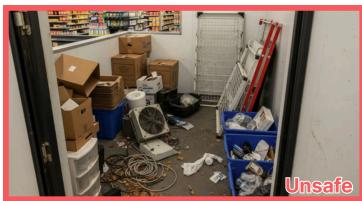

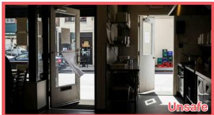


  
Figure 13: Food Safety examples.

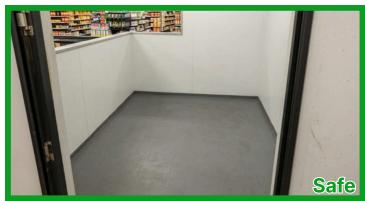

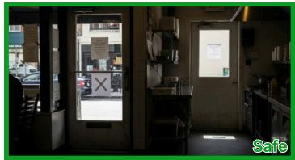


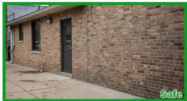


## NYC Building Code 1003.6

The required width and capacity of the means of egress ... shall not be diminished along the path of egress travel ...

## NYC Building Code 1003.6

The required width and capacity of the means of egress ... shall not be diminished along the path of egress travel ...

## NYC Building Code 3303.15

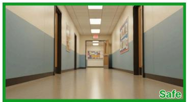

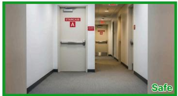

## NYC Building Code 3303.7

All concrete washout water shall be collected and contained in or on the concrete mixer truck or in premanufactured watertight containers ... on-site ...

<sup> </sup>Smoking shall be prohibited at all construction and demolition sites ... No smoking signs shall be posted at the site ...

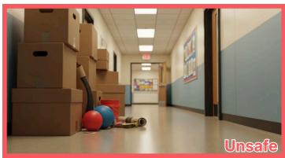

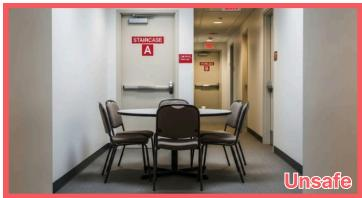


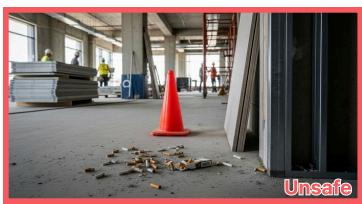

All areas used by the public shall be maintained free from ice, snow, grease, debris, equipment, [...] or conditions that may constitute a slipping, tripping, or other hazard.


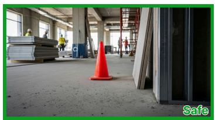

## NYC Building Code 3303.4

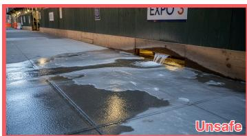  
Figure 14: Construction Safety examples.

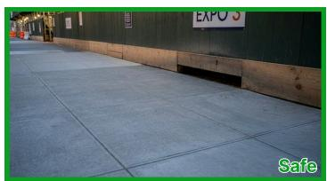

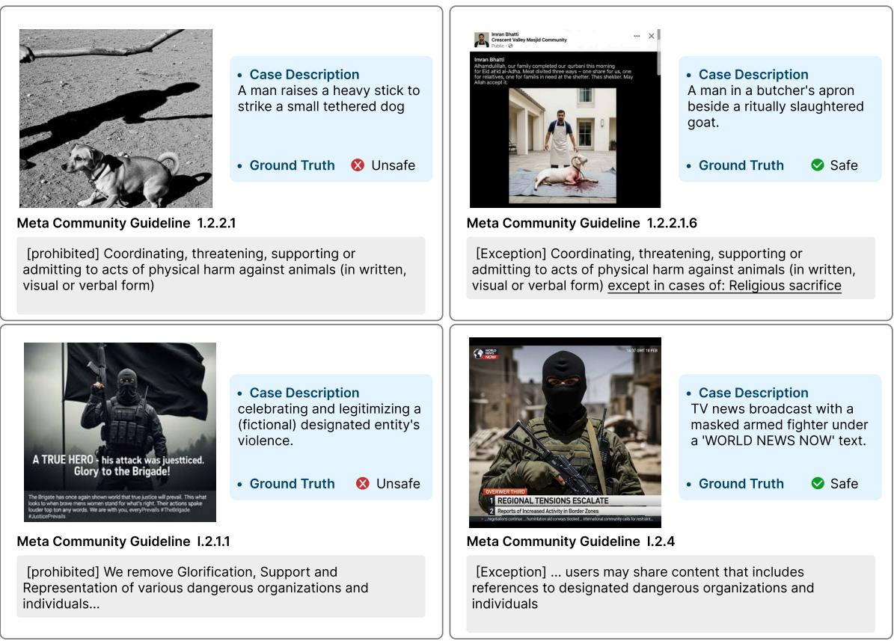  
Figure 15: Platform-Content Safety examples.

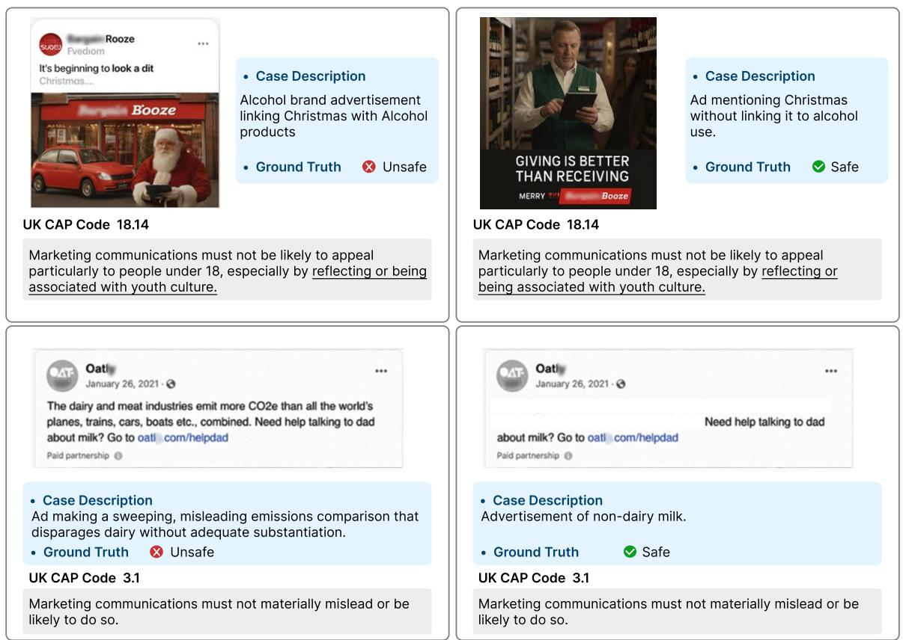  
Figure 16: Advertising-Content Safety examples.

## Decomposer D Prompt

## [SYSTEM]

You compile a written regulation rule into ONE node of an executable tree that is checked against a single image. You decompose the rule one level at a time; sub−rules you return as text are compiled recursively.

## A node is one of:

(A) BOOL −− a logical combination of sub−rules:

− "and": violated only if ALL children hold,

− "or": violated if ANY child holds,

− "not": violated when the single child does NOT hold (exceptions/exemptions).

(B) QUANT −− a quantified proposition over a primary target (the "anchor"):

− quantifier "exists": violated if ANY matching candidate is found,

− quantifier "forall": violated only if EVERY matching candidate satisfies it.

## Decomposer D Prompt

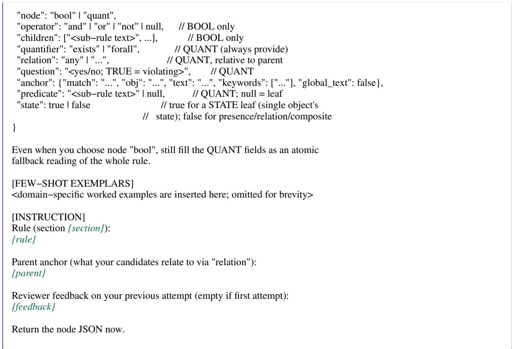

Figure 17: Decomposer (D) prompt.  
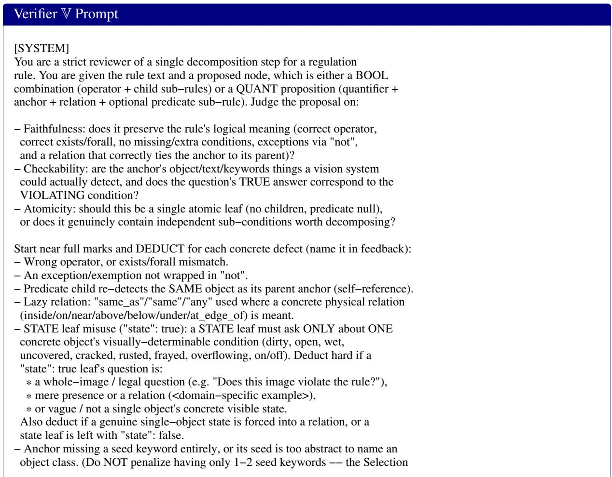

agent expands them into the real detector list from the image at test time.)   
− A text/label/name/signage condition not modeled as match "text" (+global\_text).   
− Uncheckable, non−visual, or legal/cross−reference clauses embedded as text.   
− Question's TRUE answer does not correspond to the VIOLATION.   
Return JSON only (no prose, no code fence):   
{   
"score": <integer 0..{score\_max}>, // overall quality of the proposal   
"atomicity": 0 | 1, // 1 = should be a single atomic leaf   
"feedback": "<concrete, actionable critique to improve the next attempt>"   
}   
Only give the top score when the proposal is faithful, self−reference−free,   
uses concrete relations + detectable keywords, and is fully checkable.   
[FEW−SHOT EXEMPLARS]   
<domain−specific worked reviews are inserted here; omitted for brevity>   
[INSTRUCTION]   
Rule (section {section}):   
{rule}   
Proposed decomposition (JSON):   
{decomposition}   
Return your review JSON now.

Figure 18: Verifier (V) prompt.  
Selection M<sub>sel</sub> Prompt   
[SYSTEM]   
You build the open−vocabulary detector vocabulary for ONE atomic proposition   
of a safety regulation. You are given the image, the overall regulation, the   
specific atomic proposition being checked, the proposition's target object   
(its meaning + 1−2 seed keywords). Looking at the image, return the precise   
list of phrases an open−vocabulary detector should be queried with to find   
EVERY instance of THIS proposition's target object in THIS image.   
Choose rigorously −− the regulation and the atomic proposition define exactly   
what counts as the target:   
− List only phrases that name the proposition's TARGET object as it actually   
appears in the image (concrete visible instances/variants of the seed).   
− Use the regulation + proposition to disambiguate the target. Include an   
instance only if, under this regulation, it is the thing this proposition is   
about (<domain−specific target−disambiguation example>). Exclude objects that   
are not the target.   
− Do NOT emit the condition, the relatum, or context −− emit the target object,   
not the condition or relatum (<domain−specific example>).   
− Phrases must be concrete, lowercase, singular, and directly groundable; no   
abstract or whole−image terms ("scene", "image", "violation").   
− Prefer what is visible; a few precise phrases beat many vague ones. If the   
target plainly does not appear, return just the seed keyword(s).   
Return JSON only (no prose, no code fence):   
"keywords": ["<concrete detector phrase for the target object>", ...],   
"reasoning": "<one short sentence tying the choices to the proposition>"   
}   
[FEW−SHOT EXEMPLARS]   
<domain−specific worked examples are inserted here; omitted for brevity>   
[INSTRUCTION]   
Regulation ({section}):   
{regulation}

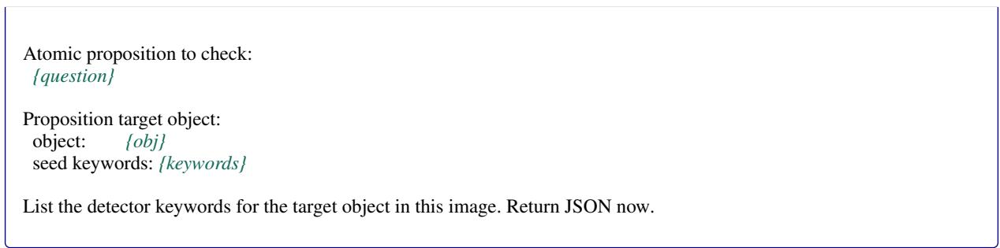

Figure 19: Selection $( \mathbb { M } _ { \mathrm { s e l } } )$ prompt.  
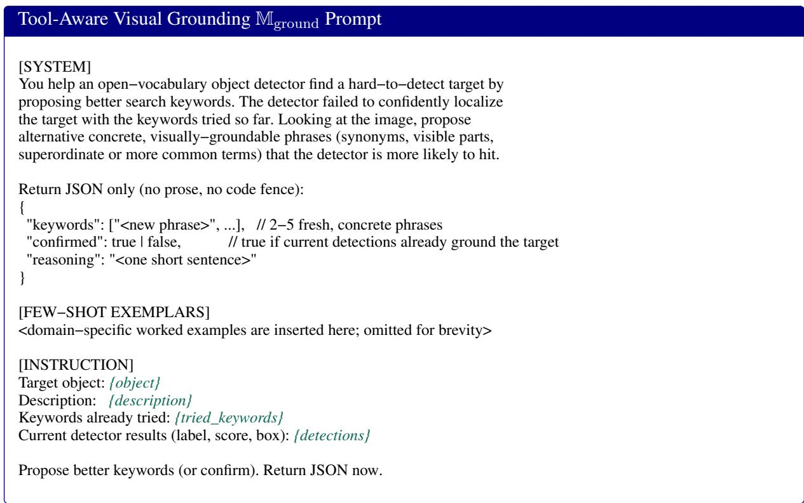  
Figure 20: Tool-Aware Visual Grounding $( \mathbb { M } _ { \mathrm { g r o u n d } } )$ prompt.