# WetRobo: A Reproducible Robot Kit for Coding Agents in Biological Laboratories

Yuna Oikawa1, Kei Endo1, Takanori Uzawa2, Yunzhe Zhang3,

Manan Anjaria3, Lerrel Pinto3, Sherry Yang3,4, Koji Tsuda1,5,6

1Department of Computational Biology and Medical Sciences,

The University of Tokyo, Japan

2RIKEN Pioneering Research Institute, Japan 3New York University, USA

4Google DeepMind, USA

5National Institute for Materials Science, Japan 6RIKEN Center for Advanced Intelligence Project, Japan tsuda@k.u-tokyo.ac.jp

Abstract—Automating biological research requires generalpurpose, reproducible robot systems that allow individual wet-lab researchers to delegate robot tasks without performing teleoperation or neural-network training. Vision-language-action policies have been proposed for general-purpose arms, but can lose performance when their operating environment changes. We therefore built WetRobo, a robot kit that can readily transfer between laboratories. It consists of one robot arm, laboratory equipment (an incubator, a reagent bottle with a cap, and a Petri dish), the existing code that moves the arm, teleoperation demonstrations of each task that we recorded, and a general AGENTS.md skill file. A biological experimentalist provides natural-language tasks without collecting local teleoperation training data or training a

neural network. The coding agent observes the local laboratory and writes and executes programs, using external tools as needed for adaptation. We demonstrate use of WetRobo with OpenAI Codex (gpt-5.6-sol) on three successful tasks: lifting a Petri dish lid, removing a bottle cap, and opening the incubator door, all in real-world laboratories. The coding agent achieved the cap task in both laboratories, Lab X and Lab Y, whereas a VLA fine-tuned on Lab X demonstrations succeeded there but failed to transfer to Lab Y. These results point to a practical route for laboratory robotics: instead of training a policy for each laboratory, distribute a kit and let a coding agent adapt it in each laboratory. Code, demonstrations, and the evolved programs are available at https://github.com/tsudalab/WetRobo.

Reproducible across labs  
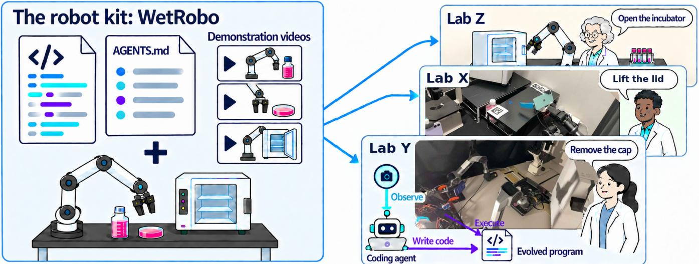  
Fig. 1. Deployment of WetRobo. The kit combines AGENTS.md, the base stack, and demonstration videos with a robot arm and laboratory equipment Biological experimentalists in laboratories including Lab X and Lab Y, assemble the equipment and provide natural-language tasks without collecting teleoperation data or training neural networks; a coding agent observes each local setting, writes an evolved program, and executes it on the robot.

## I. INTRODUCTION

Biological experimentation rests on a large amount of repetitive manual labor. In cell culture, cells must be fed, passaged, and inspected at intervals set by their growth. While large, centralized factory-laboratories already have automation options ranging from robotic high-throughput screening [1] to cloud laboratories [2], individual laboratories need more affordable and general-purpose strategies that accommodate their existing equipment. RoboCulture provides a flexible robotic platform for liquid handling and cell culture [3]. More general-purpose laboratory robots include Maholo, whose dual-arm manipulation was combined with Bayesian optimization to improve a cell differentiation protocol [4].

Vision-language-action (VLA) models, including π0.5 [5], offer a general-purpose policy interface increasingly studied for laboratory manipulation. Pipette [6] and AutoBio [7] train and evaluate VLAs on simulated wet-lab tasks. LabVLA introduces laboratory-specific training across robot embodiments [8], while BioProVLA-Agent combines protocol reasoning and visual verification with VLA policies fine-tuned for biological manipulation [9]. ProtoAct links protocols to actions and supports demonstration collection and VLA training [10]. However, robustness evaluations of VLA policies reveal strong sensitivity to changes in camera viewpoints and robot initial states [11]. Real-world experiments on a Franka arm report sharp degradation of a frozen VLA under appearance, position, and object changes, including failure on an unseen replacement object [12].

Code-as-policy offers a route to addressing this adaptation challenge through executable-code interfaces for robot control and task planning [13], [14]. Rather than directly predicting actions with an imitation-trained policy, a language model writes executable code that generates actions. Task descriptions and observations inform its reasoning, expressed as inspectable, editable program logic [13], [14]. CaP-X is an open-access framework for systematically studying code-as-policy agents in robot manipulation [15]. Recently, ENPIRE was introduced as a harness framework for coding agents to autonomously control robots and improve their policies through feedback loops [16]. The authors demonstrated coding agents’ ability to perform real-world tasks including GPU insertion, pin insertion, Push-T, and zip tie cutting. We bring this approach to biological laboratory automation by creating a domainspecific AGENTS.md, adding demonstrations as references for the robot, and specifying laboratory hardware checked for automation; we distribute these components together as a robot kit.

WetRobo (Fig. 1) supplies biological experimentalists with arm and equipment specifications, the base stack, and a skill file with operating rules and a starting workflow. Whereas ENPIRE establishes reset and verification interfaces through human-guided setup [16], WetRobo leaves task programs and success checks to on-site adaptation. Its AGENTS.md supplies handling rules for culture equipment and the incubator while encouraging the agent to select external tools and define success criteria from local observations. The kit also includes fifteen teleoperated demonstrations per task. The agent can inspect or replay them to understand the demonstrated handling. Biological experimentalists assemble the equipment and give natural-language tasks; the agent handles adaptation, replacing local teleoperation data collection and neural-network training. Observation and code execution leave an evolved program and an action record.

To demonstrate WetRobo’s capability, we gave it to OpenAI

Codex [17] for three tasks, achieving Petri-lid lifting, bottlecap removal, and incubator-door opening on physical equipment in laboratories. In this evaluation of code-as-policy for real wet-lab scientific work, the coding agent succeeded at bottle-cap lifting in two independent laboratories, whereas a VLA fine-tuned on Lab X demonstrations succeeded in Lab X but failed to transfer to Lab Y. The contributions are: (i) the development of WetRobo, a kit that lets biological experimentalists delegate laboratory tasks to a coding agent without training a neural network or collecting teleoperation data themselves; (ii) a demonstration that a coding agent evolves its programs and adapts to a laboratory setting, accomplishing Petri-lid lifting, bottle-cap removal, and incubatordoor opening; (iii) evidence that WetRobo with a coding agent transfers task capability across laboratories more effectively than the evaluated VLA in the cap task, suggesting a practical direction for laboratory robotics.

## II. THE INPUT: WETROBO

WetRobo is a combination of a git repository, wetrobo, a Piper arm, example laboratory equipment, and 15 demonstrations per task. The repository contains essentially the skill file AGENTS.md and the basic code that drives the Piper arm. We call that code, as shipped, the base stack (branch main), and the code the agent leaves after a trial the evolved program; trial snapshots remain as branches of this same repository. The repository is available at https://github.com/tsudalab/WetRobo. A. AGENTS.md

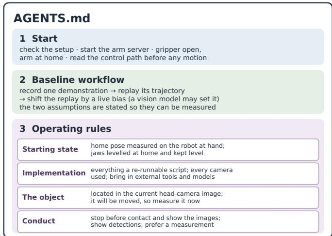  
Fig. 2. Structure of AGENTS.md: setup, demonstration replay with live bias, and operating rules grouped by purpose.

The file contains setup, a baseline workflow of demonstration replay with live bias, and operating rules on starting state, implementation, the object, and conduct (Fig. 2). It explicitly encourages external Python packages, models, and methods available online, beyond tools already imported by the repository.

For work on the incubator and bench-top culture equipment, the rules require horizontal jaws through approach, grasp, and transport unless a tilt is needed—a constraint suited to open containers with contents. Verification takes priority over speed: motion pauses before contact for image-based pose confirmation, while configured keep-out zones and per-step motion caps provide preventive geometric checks, with a stop available because collision reactions are absent. Home poses must be measured locally and images checked for shadows under changed lighting rather than relying on assumptions from another laboratory. Together, these rules prescribe motion suited to biological experimentation.

## B. Piper arms

The robot kit contains two six-degree-of-freedom AgileX Piper arms on CAN. Every execution reported here uses the right arm.

## C. Cameras

The kit uses head and wrist cameras, with camera counts varying between laboratories. robot/camera\_map.json maps head, left, and right roles to device indices. iPhones supply RGB-D observations through Record3D [18]; basestack capture saves RGB images, depth, and camera intrinsics in run directories.

## D. Base stack

The base stack code in the wetrobo repository drives the arm and the laboratory’s cameras. It contains an arm RPC server (robot/cone\_e.py) with a workspace clamp, and replay of a recorded HDF5 demonstration through rollout/ controller.py. In the replay a per-arm Cartesian bias is added, and a SafetyLayer applies keep-out zones and a per-step motion cap. It also supports live bias setting. It carries no evolved program.

## E. Laboratory equipment

The tasks act on three objects at the bench in front of the arm: a laboratory incubator (EYELA LTI-300), whose door handle is a recessed horizontal slot; a 500 mL reagent bottle (Nacalai Tesque D-PBS(−), 1×) with a small white screw cap; and a Petri dish with a lid (TPP Techno Plastic Products AG 93100). The kit specifies equipment physically tested with the arm and gripper, allowing laboratories that install the kit to assemble a matching starting setup. The verified operations comprise bottle-cap removal, incubatordoor opening, and Petri-lid lifting.

## F. Demonstrations

The kit includes 15 teleoperation demonstrations per task. They were recorded with a Meta Quest teleoperation interface. The replay path in Section II-D can execute any of them. For example, the saved incubator-door reference encodes demonstrated approach, grasp, and opening motions for that appliance. Demonstrations are optional references for the coding agent to consult when useful, rather than prerequisites for execution. The agent removed the reagent bottle cap without consulting the task demonstrations (Section III-B).

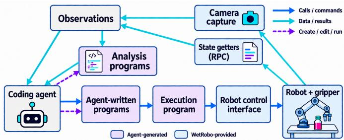  
Fig. 3. How the coding agent observes and controls the robot during task performance.

## III. RESULTS: EVOLUTION OF THE PROGRAMS

Fig. 3 describes how observation leads to action. WetRobo supplies the arm, gripper, cameras, state readings, and command interfaces. The agent interprets images, joint angles, and gripper opening directly or generates analysis programs to measure positions, alignment, and progress. The agent also writes motion/check coordination and execution programs. Execution parameters include movement distances and directions, target positions and orientations, rotation angles, gripper opening, the size of each motion step, and limits for checks. An execution program converts a requested hand movement into joint movements, or sends a sequence of hand positions and orientations. WetRobo’s control interface delivers these and gripper commands through RPC calls to the robot. Images, opening, joint state, and available torque or effort check progress and contact.

WetRobo was given to the OpenAI Codex CLI running gpt-5.6-sol with reasoning effort medium and approval policy never. Tasks were given as prompts. Each trial left evolved programs and issued actions; we examined these and the chat’s reasoning, and we report them here.

## A. Petri dish lid

The first task was to lift a Petri dish lid, which the agent achieved (Fig. 4; also shown in the accompanying video). The natural-language prompt was “Lift the Petri dish lid.” The agent explored the following procedures to grasp the lid through Phases 1–4.

Phase 1: replay with a bias. As AGENTS.md suggests, the agent considered demonstration replay with an xyz bias for the displaced dish. Difficulty estimating the bias led it to explore other methods.

Phase 2: segmentation servo. To guide motion from images of the lid, the agent brought in SAM 3 [19] to segment it. The controller checks that the rim lies between level jaws before allowing closure. It explored three visual servo variants: a head-camera servo relative to a demonstration, a segmentationbased servo using the left arm’s camera only as an observer, and a real-time servo tracking the segmented lid. For the spatial geometry, it replaced a marker-plane reference with a Record3D point cloud, using RGB-D measurements to provide depth as well as image location.

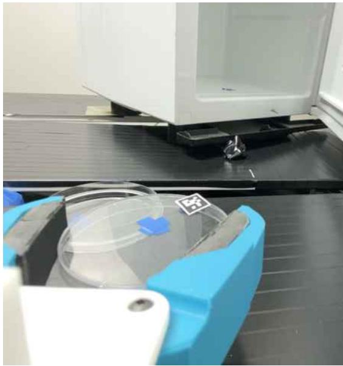  
Fig. 4. Wrist-camera view of the lifted Petri lid held between the jaws.

Phase 3: scene reconstruction and simulation. To reason about contact, the agent built a multi-view RGB-D reconstruction with SAM semantics and a MuJoCo [20] model of the bench, arms, and grippers. Its physics-verified grasp search checked simulated contact and platform clearance before execution.

Phase 4: verification of the grasp. The agent calibrated gripper aperture into empty and non-empty populations to assess contact from measured opening rather than the close command. The jaws stayed level during descent. The evolved program is in branch wetrobo+petri.

## B. Bottle cap

The reagent bottle has a white screw cap above its wider body. The natural-language prompt was “Lift the bottle cap.” This task was tested in two laboratories, Lab X and Lab Y. Both started from the repository after the Petri trial (Table I). Lab Y used the Piper native gripper and Lab X an NYU stringdriven Dynamixel gripper [21]. Other conditions also differed, including arm and equipment orientation, bench color, lighting, and the number of cameras. WetRobo with a coding agent succeeded in both Lab Y and Lab X. In contrast, the VLA π0.5 [5], fine-tuned for 100k steps on 25 demonstration videos collected in Lab X, succeeded in Lab X but failed to transfer to Lab Y (Fig. 5). We describe Lab Y’s generated files and Lab X’s outcome and implementation differences (Table II).

1) Lab Y: the files the agent wrote: Fig. 6 follows the trial from the start of the session to the first grasp (also in the accompanying video). Cap Phases 1–6 denote consecutive groups of operations, not individual closures; phase numbering restarts for each task.

Phase 1: inspection. The agent generated src/labb\_ right\_cap\_control.py to coordinate motion and gripper control. Inverse kinematics (IK) converts small position changes into joint motion with joint 6 held fixed. The program stops if measured joint torque, the turning load on a joint, exceeds its limit. Gripper effort, a separate load measurement, helps assess the grasp.

TABLE I  
LABORATORY SETTING AND RESOURCE USE DIFFERENCES IN LAB X AND LAB Y.
<table><tr><td></td><td>Lab X</td><td>Lab Y</td></tr><tr><td>Laboratory</td><td></td><td></td></tr><tr><td>Workspace</td><td>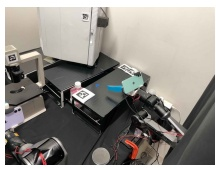</td><td>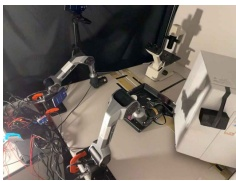</td></tr><tr><td>Luminance (0–255)</td><td>130.10</td><td>106.84</td></tr><tr><td>Gripper</td><td>NYU</td><td>Piper native</td></tr><tr><td>Cameras</td><td>2 (head, wrist)</td><td>3 (head, left, on the bench)</td></tr><tr><td>Trial</td><td></td><td></td></tr><tr><td>Tokens</td><td>41.4M</td><td>23.0M</td></tr><tr><td>Time to first grasp</td><td>1 h 02 min</td><td>48 min 43 s</td></tr></table>

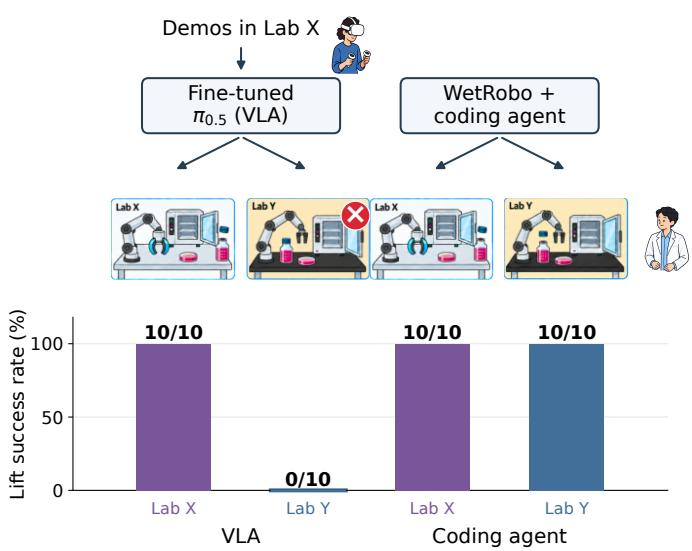  
Fig. 5. Bottle-cap lifting: conditions (top) and success rates (bottom). VLA rates measure evaluation after fine-tuning; coding-agent rates measure repeated execution in the same setting after adaptation and initial task success.

The agent then needed to locate the cap and move toward it in small steps with a stopping condition. To locate the cap directly from images, it generated src/detect\_culture\_ bottle\_cap.py, which uses OpenCV [22] and NumPy [23]. A color threshold picks out the magenta liquid and the white cap above it (“Target label” in Fig. 6). Record3D depth and camera intrinsics provide the cap’s metric position.

Phase 2: motion probes and calibration. To relate image errors to arm motion, the agent made small test movements and compared images using the agent-generated src/estimate\_frame\_motion.py. OpenCV’s pyramidal Lucas–Kanade optical flow [24] tracks image corners before and after each probe. The resulting image displacements helped associate camera views with the moving arm (“Motion mask” in Fig. 6).

Start  
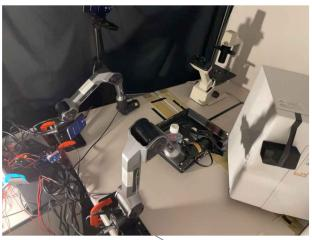

Target label  
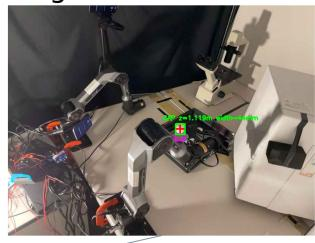

Motion mask  
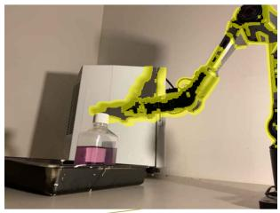

Cap grasp  
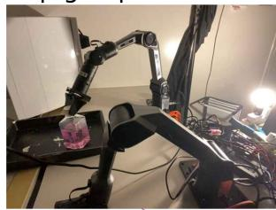

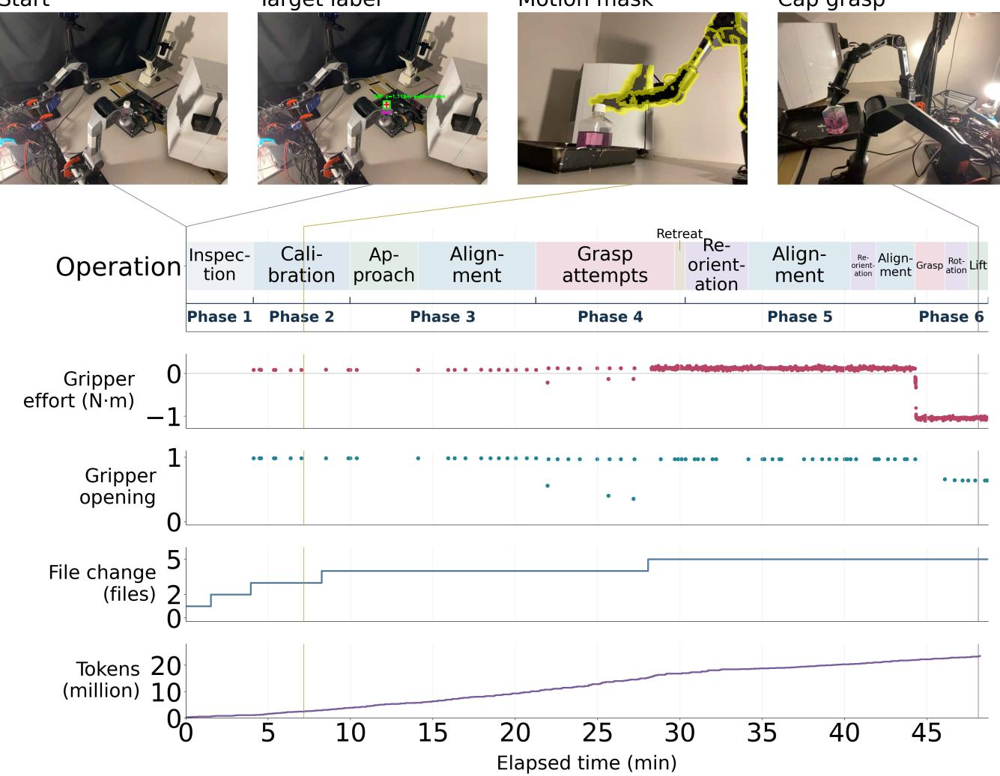  
Fig. 6. Lab Y cap trial up to the first grasp: operations, gripper measurements, and cumulative file and token counts.

TABLE II  
COMPARISON OF THE EVOLVED PROGRAMS FOR THE CAP TASK.
<table><tr><td>Aspect</td><td>Lab Y</td><td>Lab X</td></tr><tr><td>Grasp evidence</td><td>measured gripper effort and opening after closure</td><td>visual assessment and measured opening after closure</td></tr><tr><td>Motion checks</td><td>joint torque monitored during motion; stop if a limit is exceeded</td><td>simulated collision checks before a candidate motion is executed</td></tr><tr><td>Spatial grounding</td><td>depth and intrinsics (camera frame); image-motion probes</td><td>known-size, pre-positioned AprilTag: RGB-D to planning scene</td></tr></table>

From three motion probes, one per axis, the agent solved a local image Jacobian, a mapping from small arm displacements (mm) to image displacements (pixels), for each camera. This supplied alignment corrections. Such local recalibration offers a mechanism for adapting to changed camera geometry, unlike direct transfer of the fine-tuned VLA evaluated here.

Phase 3: approach and alignment. With this mapping, the arm approached the cap in a sequence of position steps, with head and other camera images read between steps. Contact was read from the images rather than the torques: when the bottle moved in the image while the torque rise stayed within its limit, the agent backed the arm half a step along the path it had come.

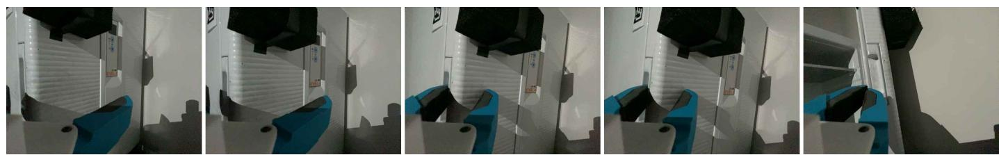  
Fig. 7. Lab X door-opening sequence from the wrist camera. Left to right: yaw-aligned approach, open-jaw contact, closure, proof pull, and door open.

Phase 4: grasp attempts and retreat. The images suggested the jaws were ready, so the agent commanded closure. Three closures failed: the aperture (measured jaw opening) followed the command, effort remained at the empty-close level, and images showed the jaws above or beside the cap. The arm retreated.

Phase 5: reorientation and alignment. To correct the missed grasps, the agent turned the arm with joint commands and brought it back to the cap, adding a wrist-hold variant to the same execution program, in which only the first three joints are active, so the wrist stays still while the jaws are centered.

Phase 6: grasp, rotation, and lift. This time the opening stopped at 0.68 against a command of 0.50, and the effort read −1.05 N·m against −0.1 to −0.2 N·m for an empty close: the jaws held the cap. The agent added a twist motion to that execution program, maintaining the fingertip position while rotating about the world z axis. After three twists, a short lift confirmed the grip—the first grasp (“Cap grasp” in Fig. 6). Lab Y’s evolved program is in branch wetrobo+petri+ cap@labY.

2) Lab X: how the code evolved differently than in Lab Y: Differences in grippers, available feedback, camera arrangements, and bottle placement shaped the agent’s choices across laboratories (Tables I and II). Lab X’s NYU gripper lacked effort feedback. For motion, Lab X’s agent-generated src/run\_culture\_media\_cap\_grasp.py used Mu-JoCo [20] collision checks before moving, whereas Lab Y’s agent-generated src/labb\_right\_cap\_control. py stopped on excessive joint torque. The Lab X runner reused the simulated-contact helper generated during the Petri task in src/run\_codexless\_thin\_object\_grasp.py. The scene represented the reagent bottle recessed between supports rather than on a tabletop; the runner refreshed it using Lab X’s pre-positioned AprilTag. For grasp assessment, Lab X combined images with opening: the agent-generated rollout/ media\_cap\_target.py checked for the cap between closed jaws, and the runner checked support movement and opening, whereas Lab Y used effort and opening. The task also succeeded in Lab X. From the same kit, the programs evolved differently to suit each laboratory’s conditions. Lab

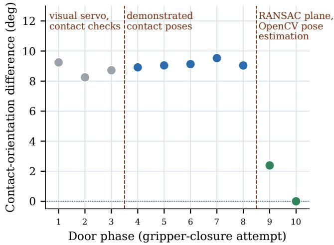  
Fig. 8. Pre-close gripper orientation across recorded Lab X door attempts, relative to the successful final attempt.

X’s evolved program is in branch wetrobo+petri+cap.

## C. Incubator door

The incubator handle is a horizontal door recess accepting fingers or gripper jaws for pulling. The natural-language prompt was “Open the incubator door.” Execution required approach, jaw alignment, grasping, pulling, and opening verification (Fig. 7) in the same laboratories as the cap.

1) Lab Y: Unreliable head-camera alignment prompted a pre-contact stop and return home, leaving the door closed. Lab Y’s snapshot is branch wetrobo+petri+cap+ door@labY.

2) Lab X: The task was achieved by progressively adding image-based alignment, grasp checks, and door-state estimation to the evolved program (Fig. 7; also in the accompanying video).

The agent generated src/run\_incubator\_door\_ demo.py to execute motion stages, then revised it and added analysis modules as alignment and contact problems emerged. Fig. 8 maps tool additions onto the pre-close poses— the gripper’s position and orientation just before closing— recorded at each attempt, showing the orientation difference from the final successful attempt.

Phases 1–3: measuring alignment and contact. The agent selected the manufacturer’s small red label on the door as a visual alignment cue. Fixed to the same rigid door as the handle, it remained visible when the gripper partly hid the recess. The agent generated rollout/ incubator\_door\_visual.py to measure label features with OpenCV and fit a ridge-regression model with NumPy. With the agent-generated src/compile\_incubator\_ door\_demos.py, this model learned from demonstrations how image-feature differences predict the gripper displacement needed to reach the demonstrated closing pose (Fig. 9). Nevertheless, alignment alone was insufficient: Phases 1–3 failed the check for a stable non-empty aperture, meaning a jaw opening that remains wider than an empty closure. Measuring aperture distinguished commanding closure from holding the handle.

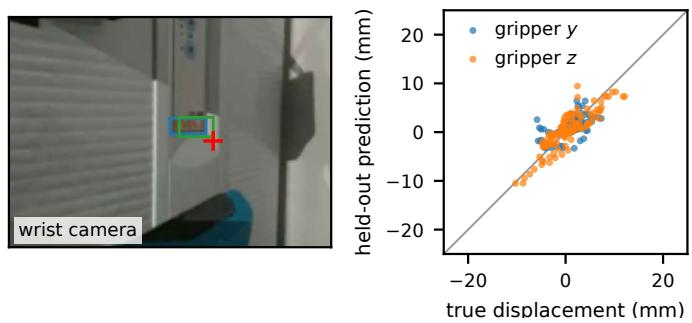

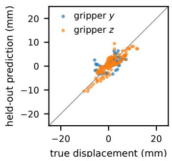  
Fig. 9. Example of Codex’s analysis: learning jaw alignment to the handle. A regression model maps wrist-camera label-feature residuals to end-effector displacement toward the demonstrated closing pose. Left: detections before (blue) and after (green) lateral correction, with the goal in red. Right: held-out predicted versus true lateral displacement in the gripper frame. Redrawn from saved trial data and an offline regression evaluation.

Phases 5–8: recovering contact and checking retention. During Phases 5–8, the agent revised the motion runner’s open-jaw approach, release with the wrist held still, and grasp checks. These were control-code changes rather than new external-tool additions; the orientation difference in Fig. 8 remained broadly unchanged. Aperture distinguished empty closure, near 0.005 of full opening, from a handle hold at 0.3–0.4. The runner tested the hold with a 5 mm proof pull— a short pull before continuing to open the door. Slipping during subsequent pulling motivated slower pull segments with aperture checks between them, followed by stopping, retreating, and opening when the hold was lost. This made loss of contact observable, but did not resolve the remaining approach-orientation mismatch.

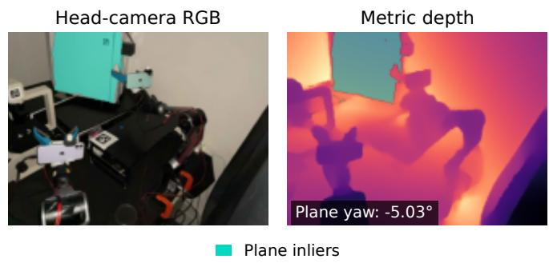  
Fig. 10. Example of Codex’s analysis: door orientation from OpenCV tagbased pose estimation and a NumPy RANSAC plane fit. Overlays show plane inliers; yaw is estimated in the robot frame. Rendered by rerunning the evolved program on saved trial RGB-D data.

Phase 9: replacing shadows with measured door geometry. Then, the agent realized that shadows gave an unreliable cue to the door’s angle. The agent generated rollout/ incubator\_door\_plane.py to measure it from depth instead. Pose estimation from visual tags using the external OpenCV library [22] expressed depth points in robot coordinates. A NumPy RANSAC fit [25] then identified the door plane while rejecting inconsistent points (Fig. 10). Its yaw, the rotation about the vertical axis, was measured against a saved observation of the closed door. The agent edited the motion runner to rotate the approach by this angle. This helped the robot achieve a much better gripper angle.

Phase 10: integrating motion with endpoint verification. Before proceeding to open the door, the agent sought to strengthen the criteria for determining whether it was open or closed, and therefore generated src/ run\_incubator\_door\_autonomy.py and rollout/ articulated\_appliance.py. The former coordinated the motion runner and analysis modules: measured door yaw corrected the demonstrated pre-close orientation, and the wristimage regression supplied a lateral position correction before contact, closure, and pulling. The latter used OpenCV image registration to align head-camera RGB-D observations with stored open and closed references, then compared the doorregion depth. Its relative error is the depth mismatch to a reference divided by the depth separation between the open and closed references. The recorded execution reached the open state (Fig. 7); relative error against the open reference changed from 1.417 to 0.179. It was therefore recorded as successfully open.

Once accomplished, the door-opening task was repeated in the same setting in 3 min 27 s, including parser repairs and restarts (Fig. 11). Lab X’s evolved program, the kit’s code exemplar, is in branch wetrobo+petri+cap+door.

## IV. DISCUSSION

Coding agents are good robot controllers. The coding agent succeeded in all three tasks examined here, which represent basic operations in wet laboratories. Their relevance across laboratory procedures suggests that coding agents may eventually support full-length cell-culture workflows and more demanding tasks; such long-horizon performance remains to be evaluated.

Code evolution. We observed the coding agent autonomously evolving code during trials. External tools, including OpenCV pose estimation and image registration, NumPy RANSAC plane fitting, SAM segmentation, and MuJoCo collision checks, helped it adapt. These observations support allowing the agent to obtain tools as needed rather than prescribing a fixed tool set. Petri-task implementations supported later tasks: the cap program reused the agent-generated src/ run\_codexless\_thin\_object\_grasp.py for Cartesian motion, joint trajectories, and contact checks. The door program reused the live-camera class in the agentgenerated src/run\_demo\_relative\_servo.py, which wraps camera capture. Reuse shortened execution in the same setting (Fig. 11). The evolved programs are available as exemplar branches. Although the present comparison starts from the WetRobo kit in Lab X and Lab Y, adapting the exemplar evolved in Lab Y to Lab X may further reduce adaptation cost; this remains a question for future studies.

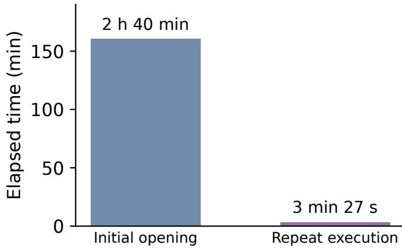  
Fig. 11. Time to door opening

WetRobo + coding agents are more flexible than VLAs. In the cap comparison, the VLA fine-tuned on Lab X demonstrations succeeded there but failed to transfer to Lab Y, whereas the coding agent succeeded in both. This comparison tests cross-laboratory VLA transfer against on-site code adaptation. For biological experimentalists, this offers a practical route to deployment without collecting local teleoperation data or training a neural network for each laboratory.

Human effort and cost. Delegating adaptation can reduce the need for local teleoperation, but incurs LLM token consumption (Table I) and associated energy demand. Agent and kit improvements should reduce these costs. A comparison of total resource use should also include VLA fine-tuning costs.

Sharing AGENTS.md across laboratories. Sharing and refining AGENTS.md across laboratories is expected to improve robot performance and reduce adaptation costs as procedural knowledge accumulates. Recorded actions already inform these rules, including additions from the Lab Y cap trial. Natural-language task descriptions or egocentric video may eventually replace our teleoperation recordings; passive human-work videos could yield skill rules for robot validation. Shared instructions could propagate improvements without the per-site retraining of separate VLA policies.

Limitations. The trials used one coding agent and one model, leaving performance with other agents and models untested. Task outcomes came from individual adaptation trials with successive attempts, rather than repeated independent adaptations. The coding-agent success rates in Fig. 5 describe repeated executions in the same setting after adaptation and initial success. Camera placement and installed reference objects also condition the reported outcomes. The Petri result concerns lid lifting; lifting and transporting the dish itself remains an untested challenge. Slipping observed after a verified lid lift motivates future work on sustained grasp retention for dish transport. Broader equipment, task, and laboratory coverage is needed to assess generality.

## V. CONCLUSION

Reproducible laboratory robots must accommodate environmental variation that can impair VLA policies. We provide WetRobo so that biological experimentalists can assemble the specified equipment, give natural-language tasks, and delegate adaptation to a coding agent without performing teleoperation or neural-network training. Codex produced evolved programs and action records for Petri-lid lifting, door opening, and cap removal, all in real-world laboratories. The cap task was reproduced across laboratories Lab X and Lab Y despite changes in gripper and camera placement. A VLA fine-tuned on demonstrations collected in Lab X succeeded there but failed to transfer to Lab Y, whereas the coding agent succeeded in both. These results establish on-site code adaptation as a practical route to biological laboratory automation. Incorporating the resulting rules into AGENTS.md makes each installation a source of reusable knowledge. Sharing this knowledge across laboratories is expected to support less costly, faster, and safer wet-lab robots across different arms, grippers, and coding agents.

## ACKNOWLEDGMENT

We thank Naruki Yoshikawa, Kazuki Takahashi, Liyao Wang, Xiaotian Xue, and Kaoru Shibutani for their help with the robot. This work was supported by UTokyo-Google AI Symbiotic Future Society Program. OpenAI Codex assisted with drafting, editing, and proofreading the manuscript. Generative image tools accessed through Codex were used to create and edit the illustrations in Figs. 1, 2, 3, and 5.

## REFERENCES

[1] J. Inglese, D. S. Auld, A. Jadhav, R. L. Johnson, A. Simeonov, A. Yasgar, W. Zheng, and C. P. Austin, “Quantitative high-throughput screening: A titration-based approach that efficiently identifies biological activities in large chemical libraries,” Proc. Natl. Acad. Sci. USA, vol. 103, no. 31, pp. 11473–11478, 2006, doi: 10.1073/pnas.0604348103.

[2] B. Miles and P. L. Lee, “Achieving reproducibility and closed-loop automation in biological experimentation with an IoT-enabled lab of the future,” SLAS Technol., vol. 23, no. 5, pp. 432–439, 2018, doi: 10.1177/2472630318784506.

[3] K. Angers, K. Darvish, N. Yoshikawa, S. Okhovatian, D. Bannerman, I. Yakavets, F. Shkurti, A. Aspuru-Guzik, and M. Radisic, “RoboCulture: A robotics platform for automated biological experimentation,” arXiv preprint arXiv:2505.14941, 2025.

[4] G. N. Kanda et al., “Robotic search for optimal cell culture in regenerative medicine,” eLife, vol. 11, Art. no. e77007, 2022, doi: 10.7554/eLife.77007.

[5] K. Black et al., “π0.5: A vision-language-action model with open-world generalization,” arXiv preprint arXiv:2504.16054, 2025.

[6] Z. Liu et al., “Pipette: An embodied simulation platform, benchmark, and data-efficient augmentation framework for wet-lab robotics,” arXiv preprint arXiv:2606.12936, 2026.

[7] Z. Lan et al., “AutoBio: A Simulation and Benchmark for Robotic Automation in Digital Biology Laboratory,” in Proc. Int. Conf. Learning Representations (ICLR), 2026.

[8] B. Ren et al., “LabVLA: Grounding Vision-Language-Action Models in Scientific Laboratories,” arXiv preprint arXiv:2606.13578, 2026.

[9] Z. Du et al., “BioProVLA-Agent: An Affordable, Protocol-Driven, Vision-Enhanced VLA-Enabled Embodied Multi-Agent System with Closed-Loop-Capable Reasoning for Biological Laboratory Manipulation,” arXiv preprint arXiv:2605.07306, 2026.

[10] Z. Liu et al., “ProtoAct: Turning wet-lab protocols into embodied robotic actions,” arXiv preprint arXiv:2608.01690, 2026.

[11] S. Fei et al., “LIBERO-Plus: A Progressive Robustness Benchmark for Visual-Language-Action Models,” in Proc. IEEE/CVF Conf. Computer Vision and Pattern Recognition (CVPR), 2026, pp. 38574–38583.

[12] S. Liu, I. S. Singh, Y. Xu, J. Duan, and R. Krishna, “VLS: Steering pretrained robot policies via vision–language models,” arXiv preprint arXiv:2602.03973, 2026.

[13] J. Liang, W. Huang, F. Xia, P. Xu, K. Hausman, B. Ichter, P. Florence, and A. Zeng, “Code as policies: Language model programs for embodied control,” in Proc. IEEE Int. Conf. Robotics and Automation (ICRA), 2023, pp. 9493–9500, doi: 10.1109/ICRA48891.2023.10160591.

[14] I. Singh, V. Blukis, A. Mousavian, A. Goyal, D. Xu, J. Tremblay, D. Fox, J. Thomason, and A. Garg, “ProgPrompt: Generating situated robot task plans using large language models,” in Proc. IEEE Int. Conf. Robotics and Automation (ICRA), 2023, pp. 11523–11530, doi: 10.1109/ICRA48891.2023.10161317.

[15] L. Fu et al., “CaP-X: A framework for benchmarking and improving coding agents for robot manipulation,” arXiv preprint arXiv:2603.22435, 2026.

[16] W. Xiao, J. Xie, T. Zhang, H. Lin, L. Fu, H. Xue, J. Lu, Y. Yang, C. Dai, Z. Wang, J. Wu, G. Wang, S. S. Sastry, K. Goldberg, L. Fan, Y. Zhu, and G. Shi, “ENPIRE: Agentic robot policy self-improvement in the real world,” arXiv preprint arXiv:2606.19980, 2026.

[17] OpenAI, “Codex CLI.” [Online]. Available: https://learn.chatgpt.com/ docs/codex/cli

[18] Record3D, “3D videos and point cloud (RGBD) streaming for iOS.” [Online]. Available: https://record3d.app/

[19] N. Carion et al., “SAM 3: Segment Anything with Concepts,” arXiv preprint arXiv:2511.16719, 2025.

[20] E. Todorov, T. Erez, and Y. Tassa, “MuJoCo: A physics engine for model-based control,” in Proc. IEEE/RSJ Int. Conf. Intelligent Robots and Systems (IROS), 2012, pp. 5026–5033, doi: 10.1109/IROS.2012.6386109.

[21] E. Erciyes, H. Etukuru, S. Chintala, N. M. Shafiullah, and L. Pinto, “Cone-E: An Open Source Bimanual Mobile Manipulator for Generalizable Robotics,” in RSS Workshop on Whole-Body Control and Bimanual Manipulation (RSS2025WCBM), 2025.

[22] G. Bradski, “The OpenCV library,” Dr. Dobb’s Journal of Software Tools, 2000. Project website: https://opencv.org/

[23] C. R. Harris et al., “Array programming with NumPy,” Nature, vol. 585, no. 7825, pp. 357–362, 2020, doi: 10.1038/s41586-020-2649-2.

[24] B. D. Lucas and T. Kanade, “An iterative image registration technique with an application to stereo vision,” in Proc. IJCAI, 1981, pp. 674–679.

[25] M. A. Fischler and R. C. Bolles, “Random sample consensus: A paradigm for model fitting with applications to image analysis and automated cartography,” Commun. ACM, vol. 24, no. 6, pp. 381–395, 1981, doi: 10.1145/358669.358692.