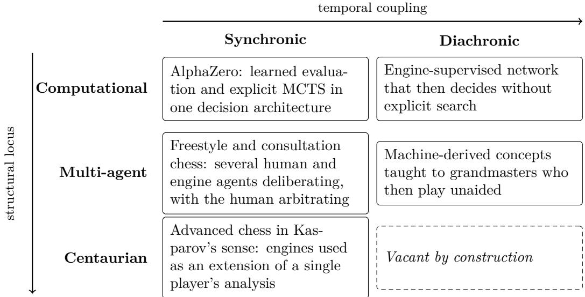

# What Counts as Strategic Reasoning? A Systematic Mapping of Chess Research on Humans, Engines, and Language Models

Paolo Ciancarini∗1 and Remo Pareschi†2

1Department of Computer Science and Engineering, University of Bologna, Bologna, Italy

2Stake Lab, University of Molise, Campobasso, Italy

## Abstract

Chess has long served as a model domain for studying search, expertise, decision-making, and artificial intelligence. The emergence of large language models (LLMs) has renewed the relevance of chess as a controlled environment for investigating strategic reasoning and comparing human and artificial decision-making. We present a systematic mapping study of recent research spanning human players, classical chess engines, neural and reinforcementlearning systems, LLMs, and hybrid approaches. The final map comprises 84 core study families, classified according to agent type, strategic-reasoning stages, and evaluation dimensions.

The map reveals a literature strongly concentrated on situation assessment, evaluation, and action selection, while explicit planning, explanation, metacognition, and human–AI collaboration remain less explored. LLM research places particular emphasis on state representation and generalization, whereas grounded explanation appears more frequently in hybrid approaches combining language models with engines, expert knowledge, or other external structures. Two distinctions emerge that the map aggregates rather than resolves: hybrid systems difer in where and when heterogeneous capabilities combine, and evaluations that show improved human performance do not thereby establish human–AI synergy. We propose both as extensions of the mapping framework.

We argue that chess provides a useful bridge between cognitive and computational perspectives on strategic reasoning, and identify explicit planning, grounded and faithful explanation, metacognitive calibration, and human–AI complementarity as directions for future research.

Keywords: strategic reasoning; chess; artificial intelligence; large language models; systematic mapping study; human–AI collaboration

## 1 Introduction

Chess became a scientific model of strategic reasoning through two parallel research traditions. In cognitive science, de Groot’s pioneering studies of expert move choice investigated how chess players perceive a position, generate candidate moves, analyze alternatives, and reach a decision (deGroot 1965). Chase and Simon later emphasized the role of perceptual organization and pattern recognition in chess expertise, showing that strong play cannot be understood simply as the exploration of a larger search space (Chase and Simon 1973). In artificial intelligence, Shannon’s foundational formulation of computer chess approached the same problem computationally, decomposing move choice into game-tree search and position evaluation (Shannon

1950). These traditions asked closely related questions—how a decision maker represents a position, explores alternatives, evaluates consequences, and selects an action—but operationalized strategic reasoning in fundamentally diferent ways.

The development of computer chess progressively changed the balance between these traditions. Classical engines refined increasingly powerful search and evaluation techniques. Deep Blue’s 1997 victory over Kasparov brought the approach to public attention (Campbell et al. 2002), but development continued well beyond it, and the strongest present-day engines, notably Stockfish, far exceed its playing strength. Neural and reinforcement-learning approaches introduced learned representations, policies, and value functions, while systems such as AlphaZero retained explicit search within a largely learned architecture (Silver et al. 2018). At the same time, research on human chess continued to investigate expertise, intuition, selective search, time allocation, and decision making. Chess thus developed into an unusual research domain in which human and artificial approaches to the same strategic decisions can be studied against a common formal environment.

Large language models (LLMs) introduce a further change. Unlike conventional chess engines, they are not designed around an explicit game-tree search architecture. They can process games and positions as symbolic sequences, predict moves, answer questions about positions, and generate natural-language explanations (Feng et al. 2023; Karvonen 2024). Their use in chess also introduces distinctive evaluation problems. A model must maintain a coherent representation of the board and the rules; apparent chess knowledge may reflect either transferable competence or patterns encountered during training; and fluent explanations may be incorrect or disconnected from the process that produced the selected move.

These developments make the meaning of strategic reasoning itself a central issue. Selecting a strong move is not necessarily evidence of strategic planning. Representing a position correctly does not imply understanding its strategic consequences, and producing a plausible explanation does not establish that the explanation is correct or faithful. Conversely, diferent research traditions may study important components of strategic reasoning without using the same terminology or evaluation criteria. Human studies investigate constructs such as expertise, intuition, risk, and metacognition; classical computer-chess research emphasizes search, evaluation, and playing strength; human-aligned models may optimize similarity to human decisions rather than maximal strength (McIlroy-Young et al. 2020; Tang et al. 2024); and recent LLM research increasingly examines state representation, generalization, and explanation.

The contemporary literature is therefore both rich and fragmented. Studies involving humans, classical engines, neural and reinforcement-learning systems, LLMs, and hybrid approaches address diferent parts of a common strategic-choice problem, but they often use diferent concepts and diferent standards of evidence. As a result, it is dificult to determine which components of strategic reasoning have actually been investigated across agent types, how those components are evaluated, and which combinations remain comparatively underexplored.

To address this problem, we conduct a Systematic Mapping Study (SMS) of recent research using chess to investigate strategic reasoning. Rather than attempting to synthesize a common efect size across heterogeneous research traditions, we map the literature along three multilabel dimensions: agent type, strategic-reasoning stage, and evaluation dimension. The resulting matrices provide a common analytical space in which human and artificial approaches can be compared without assuming that they implement the same reasoning process or pursue the same notion of successful performance.

The paper makes four contributions. First, it provides a systematic cross-disciplinary map connecting contemporary research on human chess cognition, classical computer chess, neural and reinforcement-learning systems, LLMs, and hybrid approaches. Second, it proposes an operational framework for distinguishing components of strategic reasoning from the methods used to evaluate them. Third, it uses the resulting map to identify underexplored intersections, with particular attention to explicit planning, grounded and faithful explanation, metacognitive calibration, and human–AI complementarity. Fourth, it identifies two distinctions compressed by the operational mapping—diferent structural and temporal forms of hybridization, and human augmentation versus genuine human–AI synergy—and proposes them as extensions of the framework.

Section 2 reviews complementary conceptions of strategic reasoning in chess and provides the conceptual background for the mapping framework. Section 3 formulates the research questions, and Section 4 describes the systematic mapping method, including the search, selection, and classification procedures. Section 5 presents the resulting maps and identifies comparatively underexplored intersections. Section 6 discusses their implications for strategic reasoning and human–AI systems. The paper then addresses threats to validity and concludes with directions for future research.

## 2 Conceptions of Strategic Reasoning in Chess

Long before chess became a testbed for artificial intelligence, leading players attempted to make explicit the principles and processes underlying strategic decisions. Their accounts were primarily normative rather than cognitive theories, since they sought to explain how a strong player should understand a position and organize action. Taken together, however, they reveal a progressive enrichment of what strategic reasoning in chess has been understood to involve.

A decisive step toward systematic positional reasoning was made by Steinitz. In The Modern Chess Instructor, he proposed that analysis should be grounded in general ideas and in “reasoning by analogies of positions”, so that principles derived from one situation could support judgement in structurally related ones (Steinitz 1889). Strategy consequently became more than the search for immediate tactical opportunities: positional features could be evaluated and related to general maxims capable of guiding subsequent action.

Nimzowitsch extended this project by giving positional strategy a more explicit vocabulary. Concepts such as blockade, outposts, overprotection, pawn-chain strategy, and prophylaxis made strategically relevant relationships objects of conscious analysis (Nimzowitsch 1929). His contribution was therefore not simply a collection of principles, many of which had antecedents in earlier practice, but their organization into knowledge that players could deliberately use to interpret positions and construct plans.

Possessing such knowledge does not, however, determine how a decision should be reached. Kotov addressed this complementary problem in Think Like a Grandmaster, where candidate moves and the “tree of analysis” organize the generation and investigation of alternatives (Kotov 1971). Strategic reasoning thereby acquires an explicit procedural dimension in which positional judgement, calculation, comparison, and eventual commitment perform distinguishable roles.

A parallel formulation of the problem of selecting what deserves analysis appeared in the earliest computer-chess literature. Shannon distinguished Type A strategies, based on relatively uniform search, from Type B strategies that selectively investigate promising continuations (Shannon 1950). Since exhaustive analysis is generally impractical, strategic choice becomes partly a problem of allocating limited reasoning resources to relevant alternatives—a constraint shared, although addressed diferently, by human and computational reasoners.

Chase and Simon add a cognitive perspective to this picture. Expert players do not overcome chess complexity simply by searching more extensively: chunking and pattern recognition allow meaningful configurations to be recognized rapidly, shaping which alternatives receive further analysis (Chase and Simon 1973). Strategic reasoning therefore depends also on expertisedependent representations of what is strategically salient.

These traditions reveal complementary aspects of strategic thought. Principles, patterns, and heuristics constitute reusable strategic knowledge; reasoning determines their relevance, generates and explores courses of action, reconciles competing considerations, and supports commitment to a decision. Strategic competence additionally requires control over when such knowledge and processes should be deployed and when further analysis is warranted.

Computer chess made some of these functions operational and measurable, while leaving open a broader question: which forms of strategic reasoning are actually investigated when humans and diferent kinds of artificial agents are studied? This question motivates the systematic mapping developed in the remainder of the paper.

## 3 Research Questions

The parallel traditions outlined above suggest that strategic reasoning in chess cannot be characterized along a single dimension. Human cognition, classical computer chess, neural and reinforcement-learning systems, LLMs, and hybrid approaches all investigate aspects of strategic decision making, but difer in three fundamental respects: who or what is taken as the reasoning agent, which components of the reasoning process are made explicit, and what evidence is accepted as demonstrating strategic competence. The purpose of the mapping is therefore not to rank agent classes or aggregate their performance, but to characterize how these dimensions are represented and related across the literature.

These considerations motivate four research questions. The first characterizes the agent landscape. The second examines how strategic reasoning is decomposed and which components are actually operationalized. The third investigates the evaluation practices used to establish strategic competence across agent types. Finally, by combining these dimensions, the fourth shifts attention from individual studies to the structure of the literature itself, identifying which intersections are well represented and which remain comparatively underexplored.

RQ1 — Agent landscape.

Which types of agents are studied in recent chess research on strategic reasoning?

RQ2 — Strategic-reasoning processes.

Which stages of strategic reasoning are operationalized and evaluated across these agent types?

RQ3 — Evaluation practices.

Which evaluation dimensions are used to assess strategic capabilities, and how do they vary across agent types?

RQ4 — Research gaps.

Which combinations of agent types, strategic-reasoning stages, and evaluation dimensions remain comparatively underexplored?

Together, these questions define the two principal maps developed in the study: Agent Type × Strategic-Reasoning Stage and Agent Type × Evaluation Dimension. RQ1–RQ3 characterize the populated regions of these maps, while RQ4 directs attention to their sparse and empty regions.

## 4 Method

## 4.1 Study Design

We conducted a Systematic Mapping Study (SMS) to characterize recent research in which chess is used to investigate strategic reasoning across human and artificial agents. An SMS was preferred to a systematic literature review aimed at efect synthesis because the literature spans heterogeneous research traditions, including cognitive studies of human expertise, classical computer-chess research, neural and reinforcement learning systems, large language models (LLMs), and hybrid human–AI or multi-component systems. These traditions difer substantially in their research questions, experimental designs, and evaluation criteria.

Accordingly, the objective of the study is not to estimate a common efect size, but to identify and classify the main areas of research, their relationships, and sparsely investigated combinations. The mapping is organized along three dimensions: agent type, strategic-reasoning stage, and evaluation dimension. The complete study protocol, search strategies, codebook, and derived study-family dataset are provided in the replication package.

## 4.2 Scope and Information Sources

The quantitative map covers work published from 2023 through 2026. This interval was selected to capture the rapid emergence of LLM-based approaches while retaining contemporary work on human cognition, classical engines, and neural chess systems.

The search combined three sources: Scopus, the Web of Science Core Collection, and a curated Zotero seed collection assembled from prior work on computer chess, chess cognition, and AI. Scopus served as the primary bibliographic database. Web of Science was added as a complementary source, particularly to improve coverage of work on human cognition, expertise, decision making, and planning. The Zotero collection was used as a seed and cross-checking source rather than as a substitute for the database searches.

The Scopus search was organized into five retained search families, each designed to capture a diferent part of the interdisciplinary research space:

Table 1: Search families used in the systematic mapping study.
<table><tr><td>Family Primary focus</td><td></td></tr><tr><td>S1</td><td>LLM reasoning and chess understanding</td></tr><tr><td>S2a</td><td>Explanation, commentary, and grounding</td></tr><tr><td>S2b</td><td>Human-AI interaction and collaboration</td></tr><tr><td>S3</td><td>Generalization, robustness, and memorization</td></tr><tr><td>S5</td><td>Human cognition, expertise, and decision making</td></tr><tr><td>WoS</td><td>Complementary coverage of cognition, planning, and expertise</td></tr></table>

Two broader pilot searches were also explored during query development but produced excessive noise and were subsequently refined rather than retained as independent search families. This iterative search design was intended to balance breadth with suficient specificity across research traditions whose terminology difers substantially.

The exact executable queries, execution dates, raw retrieval counts, and search decisions are reported in the replication package. Keeping the complete query strings outside the main text allows the search to be reproduced without overloading the manuscript with database-specific syntax.

## 4.3 Record Consolidation and Study Families

Records retrieved from the diferent searches were consolidated before mapping. Duplicate detection used DOI and database identifiers where available, followed by normalized-title comparison and manual inspection of ambiguous cases.

The unit of analysis is a study family, rather than an individual bibliographic record. This distinction is important in the recent AI literature because the same research contribution may appear first as an arXiv preprint and subsequently as a conference paper, journal article, or book chapter. Counting these manifestations independently would inflate the apparent size of rapidly moving research areas.

When a preprint and a formally published version represented the same study, they were therefore consolidated into one study family. The published version was preferred when available; otherwise, the most recent accessible version was used for coding. Distinct papers derived from the same project were retained separately when they reported substantively diferent research questions, methods, or evaluations.

## 4.4 Eligibility and Classification

Screening was conducted at the level of study families. The central eligibility criterion was whether chess constituted a substantive empirical or computational domain for investigating constructs relevant to strategic reasoning.

Included studies were divided into two classes:

## Core.

Studies in which chess is a substantive empirical or model domain and which directly investigate at least one construct represented in the mapping framework, including human decision making or expertise, state representation, search, planning, evaluation, action selection, explanation, metacognition, human-likeness, generalization, or human–AI interaction.

## Context.

Studies that contribute relevant conceptual, theoretical, review, transfer, or background evidence but do not directly instantiate the main chess-centered mapping constructs. This category also includes work in which chess is secondary to a broader experimental domain.

Context studies were retained to support interpretation and conceptual framing but were excluded from the quantitative mapping matrices. The final mapped corpus contains 84 Core study families and 19 Context study families.

## 4.5 Mapping Framework

Each Core study was coded along three independent, multi-label dimensions. Multi-label coding was necessary because a single study may, for example, involve both a classical engine and an LLM, address both position evaluation and move selection, and evaluate both move quality and generalization.

The first dimension identifies the type of agent:

• H: Human;

• CE: Classical/search engine;

• NRL: Neural or reinforcement-learning system;

• LLM: Large language model;

• HYB: Hybrid, centaur, or multi-component system.

The second dimension decomposes strategic reasoning into nine stages:

R1 — State representation and rule grounding.

Maintaining or inferring a coherent representation of the board, pieces, rules, and state transitions.

## R2 — Situation assessment and pattern recognition.

Identifying salient positional features, motifs, concepts, or strategic characteristics of the current position.

R3 — Candidate generation.

Generating or prioritizing plausible actions or plans before deeper comparison.

R4 — Calculation, search, and look-ahead. Exploring concrete future continuations and their consequences.

R5 — Strategic planning and foresight. Constructing or comparing longer-horizon plans or goals that organize sequences of actions beyond immediate tactical calculation.

R6 — Evaluation and trade-of reasoning. Comparing alternatives in terms of positional value, risk, uncertainty, resources, or competing objectives.

R7 — Decision and action selection. Selecting a move or plan from the available alternatives.

R8 — Explanation and verbalization. Producing or evaluating a human-understandable account of why a position, move, or plan is good or bad.

R9 — Reflection, calibration, and metacognition. Assessing confidence, uncertainty, errors, reasoning quality, or the need to revise or continue the reasoning process.

The third dimension describes how the studied capability is evaluated:

• E1: legality and state consistency;

• E2: move quality and engine agreement;

• E3: playing strength and game outcome;

• E4: strategic understanding;

• E5: explanation correctness or usefulness;

• E6: reasoning faithfulness;

• E7: human-likeness or skill calibration;

• E8: calibration, risk, or uncertainty;

• E9: generalization, memorization, or robustness;

• E10: human–AI synergy or complementarity.

The complete operational definitions are reported in the codebook distributed with the replication package.

## 4.6 Coding and Verification Procedure

Coding was performed iteratively using the predefined multi-label framework. Particular care was taken to distinguish terminology used in a paper’s motivation from constructs that were actually studied or measured. For example, a paper describing its system as performing “reasoning” was not automatically assigned search or planning codes, and high move quality alone was not treated as evidence of explicit look-ahead or strategic planning.

Following the initial coding, the included study families underwent a verification pass in which bibliographic information, eligibility decisions, and assigned codes were checked against the available full text or, where necessary, the strongest available source-level evidence. During this audit, codes were retained only when the corresponding construct was directly studied, operationalized, or evaluated. Codes inferred solely from terminology, architectural background, or broad motivational claims were removed.

The resulting dataset should therefore be interpreted as a systematically audited mapping produced through conservative coding. Independent duplicate coding was not performed across the complete corpus; consequently, the study does not report an inter-rater agreement statistic. The potential efect of coder judgment is addressed explicitly as a threat to construct validity.

## 4.7 Mapping and Analysis

The quantitative analysis uses only the 84 Core study families. Because all three coding dimensions are multi-label, counts are not mutually exclusive and percentages within a row or column need not sum to 100%.

The primary analytical artifact is the Agent Type × Strategic-Reasoning Stage matrix. Each cell reports the number of Core study families containing both the corresponding agent code and reasoning-stage code. This matrix is used to identify dominant reasoning profiles and sparse or empty intersections.

A second Agent Type × Evaluation Dimension matrix characterizes how the diferent research traditions establish evidence for strategic capability. Marginal distributions and temporal trends over 2023–2026 are used as complementary analyses.

The interpretation focuses not only on densely populated cells but also on systematically sparse combinations. Such cells identify candidate research gaps, provided that their interpretation remains consistent with the operational definitions in the codebook.

## 5 Results

The quantitative analysis includes the 84 Core study families. Because agent types, reasoning stages, and evaluation dimensions are all multi-label, the counts reported below are not mutually exclusive. A study may therefore contribute to several rows and columns of the mapping matrices.

The results are organized around the two principal maps of the study: the relationship between agent types and strategic-reasoning stages, and the relationship between agent types and evaluation dimensions. We then examine temporal trends and use the sparse intersections of the maps to identify underexplored areas.

## 5.1 Overview of the Research Landscape

The 84 Core study families span all five agent categories. Human-centered studies constitute the largest category (38/84, 45.2%), followed by Classical/search Engine studies (37/84, 44.0%), LLM studies (28/84, 33.3%), Neural/RL studies (24/84, 28.6%), and Hybrid studies (19/84, 22.6%). These percentages do not sum to 100% because a study may involve more than one type of agent.

At the level of strategic reasoning, the literature is dominated by R7 Decision/action selection (63/84, 75.0%), followed by R2 Situation assessment (43/84, 51.2%) and R6 Evaluation/tradeofs (40/84, 47.6%). R1 State representation appears in 30 studies and R4 Calculation/search in 24. R5 Strategic planning is represented in 17 studies and R3 Candidate generation in 12. The least populated stages are R8 Explanation/verbalization (9 studies) and R9 Reflection/metacognition (10 studies).

The marginal distributions provide an initial picture of the field, but they obscure substantial diferences between research traditions. These diferences become visible in the two mapping matrices.

## 5.2 Agent Types and Strategic-Reasoning Stages

Table 2 maps agent types to the nine strategic-reasoning stages. Each cell reports the number of Core study families containing both the corresponding agent code and reasoning code. The values should therefore be interpreted as intersections in a multi-label map, rather than as mutually exclusive classifications.

Table 2: Mapping of agent types to strategic-reasoning stages. Cell values are numbers of Core study families. Both dimensions are multi-label; row totals therefore do not equal the number of studies in the corresponding agent category.
<table><tr><td>Agent</td><td>R1</td><td>R2</td><td>R3</td><td>R4</td><td>R5</td><td>R6</td><td>R7 R8</td><td></td><td>R9</td></tr><tr><td>Human  $( \mathrm { H } ) , n = 3 8$ </td><td>4</td><td>17</td><td>6</td><td>6</td><td>3</td><td>14</td><td>31</td><td>0</td><td>8</td></tr><tr><td>Classical Engine (CE), n = 37</td><td>9</td><td>12</td><td>4</td><td>13</td><td>7</td><td>26</td><td>30</td><td>6</td><td>5</td></tr><tr><td> $\mathrm { N e u r a l / R L } ~ ( \mathrm { N R L } ) , n = 2 4$ </td><td>10</td><td>12</td><td>5</td><td>8</td><td>6</td><td>14</td><td>18</td><td>2</td><td>0</td></tr><tr><td> $\mathrm { L L M } , n = 2 8$ </td><td>20</td><td>17</td><td>4</td><td>10</td><td>8</td><td>12</td><td>19</td><td>6</td><td>3</td></tr><tr><td> $\mathrm { H y b r i d ~ ( H Y B ) } , n = 1 9$ </td><td>3</td><td>10</td><td>5</td><td>5</td><td>3</td><td>13</td><td>14</td><td>7</td><td>5</td></tr></table>

The first pattern is the prominence of decision/action selection. R7 is the most populated stage for Human, Neural/RL, and Hybrid studies, and is also highly represented in Classical Engine and LLM research. It occurs in 31 of the 38 Human studies, 30 of the 37 Classical Engine studies, 18 of the 24 Neural/RL studies, 19 of the 28 LLM studies, and 14 of the 19 Hybrid studies. Across otherwise diferent research traditions, selecting an action is therefore the most consistently studied component of strategic reasoning.

The profiles preceding action selection, however, difer substantially. Classical Engine studies display the clearest search–evaluation–decision profile: R4 Calculation/search appears in 13 studies, R6 Evaluation in 26, and R7 Decision in 30. This reflects the traditional computer-chess architecture in which explicit search and position evaluation jointly support move selection.

Neural/RL studies retain a strong decision-oriented profile but place comparatively greater emphasis on learned representations and assessment. R1 and R2 each occur in substantial parts of this literature, whereas explanation and reflection are almost absent. Only two Neural/RL studies address R8 and none is coded for R9.

The LLM profile is distinctive. R1 State representation appears in 20 of 28 LLM studies, making it particularly prominent in this category. R2 Situation assessment appears in 17 and R7 Decision in 19. R4 Calculation/search is present in 10 studies and R5 Strategic planning in eight. These counts show that contemporary LLM chess research is not limited to final move prediction: substantial attention is devoted to whether models can maintain coherent board representations, assess positions, and perform forms of look-ahead. Nevertheless, explicit candidate generation, explanation, and reflection remain comparatively weakly represented.

Human studies exhibit a diferent pattern. They concentrate on R7 Decision (31), R2 Assessment (17), and R6 Evaluation (14), while R9 Reflection/metacognition appears in eight studies, proportionally more than in any other agent category. By contrast, only three Human studies directly operationalize R5 Strategic planning.

The empty Human × R8 cell requires careful interpretation. It does not imply that human chess players do not verbalize their reasoning, nor that verbal protocols are absent from chess research. Rather, under the operational definition adopted in this mapping, none of the recent Core studies makes the quality or properties of human strategic explanation itself a primary evaluated construct.

Hybrid systems provide the strongest contrast. Seven of the 19 Hybrid studies address R8 Explanation, a substantially larger proportion than in the other agent classes. The explanationoriented systems in this group commonly introduce external structure—for example, engine evaluations, expert models, symbolic rules, concept representations, knowledge graphs, or strategic taxonomies—to ground the generated explanation. The pattern therefore suggests, without establishing a causal claim, that grounded chess explanation is currently more frequently investigated in hybrid architectures than in standalone agent paradigms.

Finally, the matrix exposes a methodological distinction between decision performance and evidence of a reasoning process. R7 is far more common than R3 Candidate generation or R5 Strategic planning. Consequently, successful move selection should not by itself be interpreted as evidence that candidate generation, look-ahead, or longer-horizon planning has been demonstrated.

## 5.3 Agent Types and Evaluation Dimensions

The second map concerns the evidence used to evaluate strategic capability. Table 3 reports the intersections between agent types and the ten evaluation dimensions.

Table 3: Mapping of agent types to evaluation dimensions. Cell values are numbers of Core study families. Agent and evaluation codes are multi-label.
<table><tr><td>Agent</td><td>E1</td><td>E2</td><td>E3</td><td>E4</td><td>E5</td><td>E6</td><td>E7</td><td>E8</td><td>E9</td><td>E10</td></tr><tr><td>Human (H), n = 38</td><td>1</td><td>14</td><td>7</td><td>12</td><td>0</td><td>0</td><td>9</td><td>8</td><td>1</td><td>5</td></tr><tr><td>Classical Engine (CE), n = 37</td><td>4</td><td>23</td><td>15</td><td>7</td><td>4</td><td>2</td><td>9</td><td>6</td><td>6</td><td>6</td></tr><tr><td>Neural/RL (NRL), n = 24</td><td>1</td><td>8</td><td>12</td><td>5</td><td>2</td><td>2</td><td>9</td><td>0</td><td>7</td><td>2</td></tr><tr><td>LLM, n = 28</td><td>18</td><td>16</td><td>8</td><td>11</td><td>5</td><td>4</td><td>2</td><td>2</td><td>13</td><td>0</td></tr><tr><td>Hybrid (HYB), n = 19</td><td>1</td><td>11</td><td>7</td><td>5</td><td>5</td><td>3</td><td>7</td><td>3</td><td>2</td><td>7</td></tr></table>

The evaluation matrix shows that the research traditions difer not only in what aspects of reasoning they investigate, but also in what they accept as evidence of strategic capability.

Classical Engine research is dominated by E2 Move quality/engine agreement and E3 Playing strength. E2 occurs in 23 of 37 Classical Engine studies and E3 in 15. This is consistent with the traditional computer-chess paradigm, in which capability is established through position scores, tactical tests, game outcomes, or comparison with strong reference engines.

Human studies show a more heterogeneous evaluation profile. E2 Move quality remains prominent, often because engine evaluation provides an external reference for human decisions, but E4 Strategic understanding, E7 Human-likeness/skill calibration, and E8 Calibration/risk/uncertainty also occur frequently. These dimensions reflect the cognitive and behavioral emphasis on expertise, intuition, decision time, confidence, risk, and diferences between levels of human skill.

Neural/RL studies combine competitive and behavioral evaluation. E3 Playing strength appears in 12 of 24 studies, while E7 Human-likeness appears in nine. This dual profile reflects two partly diferent objectives in neural chess research: producing increasingly strong agents and modeling human decision behavior.

LLM studies exhibit the most distinctive evaluation profile. E1 Legality/state consistency occurs in 18 of 28 studies, substantially more often than in any other agent class. E9 Generalization/memorization/robustness occurs in 13, and E2 Move quality in 16. These concentrations reflect two central questions in recent LLM chess research: whether a model can maintain a coherent representation of the game state and rules, and whether apparent chess competence transfers beyond familiar or potentially memorized distributions.

The importance of E9 is particularly relevant to recent benchmark design. Evaluations based on novel positions, Chess960, structurally modified games, or chess variants attempt to distinguish generalizable strategic competence from retrieval of patterns represented in training data. This direction complements conventional move-quality evaluation by asking not only whether a model selects a strong action, but whether the underlying competence survives changes in the task distribution.

Explanation-oriented evaluation remains sparse. E5 Explanation correctness/usefulness appears in only six Core studies and E6 Reasoning faithfulness in five. These dimensions are concentrated primarily in LLM and Hybrid research. Their low frequency is significant because a fluent natural-language explanation is not necessarily evidence that the explanation is correct, grounded in the position, or faithful to the process that produced the decision.

The Hybrid profile again difers from the other categories. E10 Human–AI synergy appears in seven of 19 Hybrid studies, and E5 Explanation quality in five. Hybrid research therefore contains a disproportionate share of work concerned with whether artificial systems are not merely strong, but useful, understandable, and complementary to human decision makers.

Conversely, no LLM study in the current Core corpus is coded for direct evaluation of E10 Human–AI synergy. This absence is noteworthy given the growing practical use of language models as interactive assistants. It indicates a diference between deploying LLMs in assistance-oriented settings and experimentally evaluating whether human–LLM teams actually outperform, complement, or appropriately rely on their individual components.

## 5.4 Open Spaces in the Map

The purpose of a systematic map is not only to identify concentrations of research but also to reveal combinations that remain weakly explored. Four open spaces are particularly visible across Tables 2 and 3.

The planning gap. R5 Strategic planning appears in only 17 Core study families, compared with 63 for R7 Decision/action selection. The diference matters: many studies show that an agent can choose a good move without directly testing whether it constructs or maintains a longer-horizon plan. The gap is especially relevant to claims about LLM reasoning, where successful action selection can result from several mechanisms that do not necessarily imply explicit planning. Few studies test the question directly, either through architectural constraints or by inspecting internal computation; the map does not currently distinguish these from studies that leave planning untested.

The explanation and faithfulness gap. R8 Explanation is represented in nine studies, E5 Explanation quality in six, and E6 Reasoning faithfulness in five. The map therefore distinguishes three questions that are sometimes conflated: whether a system can produce an explanation, whether that explanation is strategically correct or useful, and whether it faithfully reflects the reasoning that produced the decision. Current research addresses the first more frequently than the latter two.

The metacognitive gap. R9 Reflection/metacognition occurs in only ten Core studies and is concentrated disproportionately in human and hybrid research. Human studies provide constructs such as confidence, stopping decisions, thinking-time allocation, risk sensitivity, and reliance on advice, whereas analogous forms of metacognitive control remain weakly operationalized for artificial chess agents.

The collaboration gap. E10 Human–AI synergy occurs in only seven Core studies. In particular, no LLM-only study in the current map directly evaluates human–AI synergy. This is notable because contemporary applications increasingly position AI as a trainer, analyst, commentator, or interactive assistant rather than solely as an autonomous chess player. Direct measurement of complementarity, reliance, delegation, and team performance therefore represents a substantial open area.

## 5.5 Synthesis

Taken together, the two matrices reveal a field composed of distinct but increasingly connected research traditions.

Human studies emphasize assessment, decision behavior, expertise, and metacognition. Classical engines exhibit a search–evaluation–decision profile and rely heavily on move quality and playing strength as evidence. Neural/RL systems combine learned representations and action selection with competitive and human-behavioral evaluation. LLM studies place unusually strong emphasis on state representation, legality, assessment, action selection, and generalization. Hybrid systems disproportionately address explanation and human–AI complementarity.

The resulting map also reveals a broader transition in how strategic AI can be evaluated. Traditional chess AI primarily asks whether an agent can select strong moves. The emerging research agenda increasingly asks whether an agent can maintain the relevant state, form and evaluate plans, transfer its competence to unfamiliar settings, explain its decisions correctly and faithfully, recognize uncertainty, and collaborate efectively with humans.

These patterns provide the empirical basis for the gaps and implications discussed in the following section.

## 6 Discussion

The mapping shows that chess research does not rely on a single notion of strategic reasoning. Human cognition, classical computer chess, neural and reinforcement-learning systems, LLMs, and hybrid approaches emphasize diferent components of the strategic process and use diferent criteria to establish competence. The map’s value lies in making these traditions comparable without assuming they implement the same reasoning mechanisms.

The discussion proceeds in two registers. One draws out what the map shows: that decision quality should not be equated with evidence of a reasoning process (Section 6.1); that LLMs make state representation and generalization central evaluation problems (6.2); that grounded explanation is increasingly investigated through hybrid architectures (6.4); and that metacognition remains comparatively underexplored (6.5).

In parallel, we take up two distinctions that the map, in its present form, aggregates rather than resolves. The HYB category aggregates architectures that difer in where and when heterogeneous capabilities combine (6.3), and the evaluation dimensions do not separate improvements in human performance from genuine human–AI synergy (6.6). Both are ofered as interpretive instruments for reading the hybrid literature and as candidate extensions of the mapping framework.

Sections 6.7 and 6.8 then consider chess as a bridge domain and the implications for future evaluation.

## 6.1 Decision Quality Is Not Equivalent to Strategic Reasoning

The dominance of action selection over candidate generation and explicit planning highlights an important methodological distinction. Chess provides unusually precise measures of decision quality: engine evaluations, tactical test suites, and game outcomes can establish whether a move is strong without revealing how that move was produced. A convenient outcome measure can therefore become a proxy for the much richer construct of strategic reasoning.

This distinction is relatively transparent in classical computer chess, where search and evaluation are explicit architectural components. It is less straightforward for learned systems. A neural policy or language model may select a strong move without demonstrating that it gen erated alternatives, searched future states, or constructed a longer-horizon plan. Conversely, weak full-game performance does not imply the absence of every relevant reasoning capability: a system may assess positions or identify strong individual moves while failing to sustain coherent decisions over an entire game.

Recent work has begun to address the gap from the opposite direction, by constraining or directly inspecting the computation rather than inferring process from behaviour. Ruoss et al. (2024) train transformers on engine-annotated positions and reach grandmaster-level play with no explicit search, which establishes that strong action selection can be produced without a search procedure at inference time. Jenner et al. (2024) report the complementary result for Leela Chess Zero: activations associated with future moves are causally important for the current output, attention heads carry information between the squares of earlier and later moves, and a probe recovers the optimal move two turns ahead. Neither line of work settles what these systems do in general, but both illustrate a form of evidence that behavioural measures cannot supply, since the claim concerns the computation rather than its output.

Chess-based evaluations should therefore distinguish decision performance from process evidence, and, within the latter, behavioural from internal evidence. Claims about strategic reasoning become stronger when action quality is complemented by evidence concerning representation, candidate generation, look-ahead, plan formation, or revision. The R1–R9 framework provides a vocabulary for identifying which component is at issue; the evaluation dimensions E1–E10, being defined over observable performance, do not currently distinguish the kind of evidence brought to bear on it. E6 Reasoning faithfulness comes closest, but asks whether a stated explanation matches the decision process, not whether the process has been inspected directly.

## 6.2 LLMs Shift the Problem Toward Representation and Generalization

The LLM literature changes what must be demonstrated before strategic competence can be assessed. In conventional chess software, the board state and legal rules are represented explicitly by the program. Search and evaluation operate on a state whose formal consistency is largely guaranteed by construction. For a language model processing moves or serialized positions as tokens, this assumption no longer holds. Maintaining piece locations, legal transitions, and other state variables becomes an empirical capability.

State tracking is therefore not merely a technical prerequisite. A system cannot reason strategically about a position it represents incorrectly. This helps explain why representation and state consistency occupy such a prominent place in contemporary LLM chess research.

A second problem concerns the distinction between transferable strategic competence and exposure to chess material during training. Standard chess is unusually vulnerable to this ambiguity because opening theory, annotated games, tactical positions, instructional texts, and online discussions are abundant in public corpora. Consequently, recent evaluations increasingly use novel positions, distribution shifts, Chess960, controlled perturbations, or modified chess environments to test whether apparent competence survives changes that weaken memorization as an explanation.

This development broadens chess’s role as an AI benchmark. Systematic modifications of rules, initial states, information, or board structure can preserve important aspects of adversarial decision making while testing whether strategic capabilities transfer beyond familiar configurations.

## 6.3 Hybridization Operates at Diferent Levels

The operational HYB category used in the mapping deliberately groups together hybrid, centaur, and multi-component systems. This aggregation helps identify studies that combine otherwise distinct capabilities, but the resulting systems should not be treated as theoretically equivalent. We can distinguish at least three levels of hybridization, of which only the latter two necessarily involve interaction among distinct agents.

First, computational hybridization occurs within an artificial system when diferent computational paradigms contribute complementary functions. AlphaZero provides a canonical example: learned policy and value representations are combined with explicit Monte Carlo Tree Search, so that learned pattern-based evaluation and forward search participate in the same decision architecture (Silver et al. 2018). Such a system is hybrid at the level of computational mechanisms even though no human component is involved.

Second, multi-agent coordination combines distinct human or artificial agents that preserve identifiable boundaries, roles, and a degree of decision autonomy while contributing to a collective process. A system-theoretical account of contemporary human–AI interaction explicitly distinguishes this autonomy-preserving paradigm from Centaurian integration: multi-agent systems coordinate heterogeneous agents through structured interaction while maintaining their individual identities (Borghof et al. 2025b). Organizational models involving human supervisors, LLM-based consultants, and specialized AI workers provide a concrete instance of this architecture (Borghof et al. 2025a).

Third, Centaurian integration involves a deeper form of human–AI combination. Here the defining property is not simply cooperation among heterogeneous agents, but increasing functional interdependence within a joint decision process. In system-theoretical terms, whereas multi-agent systems resemble ecosystems of autonomous entities, Centaurian systems seek tighter integration analogous to symbiotic or organism-like configurations, with more permeable functional boundaries and a more unified locus of decision-making (Borghof et al. 2025b). Questions of task allocation, decision authority, responsibility, and complementarity therefore become constitutive features of the architecture rather than merely external properties of its use.

Chess supplies instances of the second and third levels. Kasparov introduced advanced chess in 1998, a single player using engines as an extension of their own analysis; the freestyle format, in which teams orchestrate several engines and human contributors, emerged separately and is described in his retrospective account (Kasparov 2010). The first is Centaurian in design, the second multi-agent coordination. Whether advanced chess achieved the functional interdependence its design intended, or settled into computer-assisted play with the human still deciding alone, is an empirical question rather than a definitional one, and Section 6.6 returns to it.

The three distinctions above concern the structural locus at which heterogeneous capabilities or components are combined. They are also predominantly synchronic, in that the combined capabilities contribute to the same decision architecture or decision episode.

A cross-cutting distinction therefore concerns the temporal coupling between the contributions. Hybridization may also be diachronic: an artificial system contributes not to the decision itself but to an agent’s competence, which then decides without the artificial component in the loop. Schut et al. (2025) provide a particularly clear chess example. They extract concept vectors from AlphaZero’s internal representations, filter candidate concepts for novelty and teachability, and subsequently present selected concept prototypes to four elite grandmasters in a controlled learning protocol. The grandmasters’ improved performance after the learning phase provides evidence that knowledge from a superhuman artificial system can transfer to human experts.

What makes this analytically relevant as diachronic hybridization rather than ordinary instruction is the provenance of the transferred knowledge. The concepts are selected because they contain information not represented in the human-play reference space, so the subsequently acquired competence is at least partly machine-derived rather than recovered from the humangame corpus. The artificial system contributes causally to later human decision-making, but no persistent joint decision architecture is required once the transfer has occurred. We call this configuration diachronic coupling: artificial and human capabilities combine across successive phases of learning and decision rather than simultaneously at the point of action.

  
Figure 1: Two cross-cutting dimensions of hybridization, with chess examples. The structural locus concerns where heterogeneous capabilities are combined; the temporal coupling concerns when.

Figure 1 shows the two dimensions together. The Centaurian cell of the diachronic column is vacant by construction, not merely unpopulated. The vacancy follows from the definition rather than from the state of the literature: a coupling defined by functional interdependence within a shared decision episode cannot persist once that episode has dissolved. The combination therefore marks a boundary of the taxonomy rather than a research gap of the kind identified in Section 5.4.

The case also illustrates an evaluative asymmetry discussed in Section 6.6. Because the outcome of interest is improvement in human knowledge or performance, augmentation can be measured directly by comparing human performance before and after AI-mediated learning. By contrast, an artificial-agent baseline is not naturally defined on the same learning outcome, so the same comparison cannot establish the stronger criterion of human–AI synergy. Diachronic coupling is thus typically evaluated in augmentation terms, which reinforces the need to keep the architecture of human–AI interaction distinct from the performance relation used to evaluate it.

These distinctions caution against interpreting the HYB row of the mapping as representing a single architectural or cognitive paradigm. Its value is primarily operational: it captures studies that combine heterogeneous capabilities. Theoretical interpretation requires asking what is being combined, at which structural level, whether the coupling is synchronic or diachronic, whether the components preserve independent agency, and whether human involvement amounts to coordination with artificial agents, deeper Centaurian integration, or knowledge transfer across successive phases of interaction. We ofer this sub-classification as an interpretive instrument for reading the hybrid literature rather than as a coded dimension of the present map; applying it as a formal sub-dimension of the HYB category is a natural extension of the mapping framework.

## 6.4 Grounded Explanation Is Emerging as a Hybrid Capability

The map distinguishes three questions that should not be conflated: whether a system can produce an explanation, whether that explanation is strategically correct and useful, and whether it is faithful to the process or evidence supporting the decision. This distinction is particularly important for LLMs, because linguistic fluency can create a strong impression of understanding even when the underlying chess analysis is incorrect or weakly grounded.

Recent explanation-oriented systems frequently address this problem by introducing external structure. Engines can supply evaluations and concrete variations; expert models can identify strategic concepts; symbolic components can represent rules and constraints; and structured knowledge can provide relations that an LLM can transform into human-readable language. The concentration of explanation-oriented work among hybrid approaches is therefore suggestive of an emerging design pattern, although the current evidence is too limited to conclude that hybridization is necessary for grounded explanation.

A useful distinction is consequently between linguistic explanation and grounded strategic explanation. The latter requires a relationship between the verbal account and independently supported properties of the position, candidate moves, variations, or plans. Chess is particularly suitable for studying this distinction because many claims about material, threats, tactical sequences, and move consequences can be independently checked.

## 6.5 Metacognition Remains Underexplored

Human chess research provides several ways of studying the decision maker’s relationship to its own reasoning: confidence, thinking time, stopping decisions, risk sensitivity, error persistence, and reliance on advice. These constructs concern not only which decision is made, but whether additional reasoning is worthwhile, whether an evaluation is reliable, and whether a previous conclusion should be reconsidered.

Comparable questions remain less developed for artificial chess agents. Yet they become increasingly important when AI systems are intended to assist rather than replace human decision makers. A system that produces strong recommendations but cannot identify the conditions under which its analysis is unreliable may be less useful than one whose confidence is well calibrated.

Chess ofers natural tests for machine metacognition. Confidence can be compared with objective decision quality; additional computation can be related to improvement in the resulting move; and revision can be studied after feedback or contradictory evidence. For LLMs, such experiments could also distinguish verbal expressions of uncertainty from genuine calibration.

## 6.6 From Human Augmentation to Dynamic Complementarity

The limited attention paid to human–AI synergy is particularly significant because assistance, augmentation, and complementarity should not be treated as equivalent. A human assisted by an artificial system may perform better than the unaided human without the resulting human– AI configuration outperforming the artificial system alone. Recent work therefore distinguishes human augmentation from human–AI synergy (Vaccaro et al. 2024).

Let P(X) denote performance on a given outcome measure for a configuration X, where H is the human component, A the artificial component, and H + A their combination. Human augmentation can be expressed as the gain

$$
\Delta _ { \mathrm { a u g } } = P ( H + A ) - P ( H ) ,
$$

so that $\Delta _ { \mathrm { a u g } } \ > \ 0$ indicates that AI assistance improves human performance. Genuine human–AI synergy requires the stronger condition

$$
\Delta _ { \mathrm { s y n } } = P ( H + A ) - \operatorname* { m a x } \{ P ( H ) , P ( A ) \} ,
$$

with $\Delta _ { \mathrm { s y n } } > 0$ indicating positive synergy. Conversely, $\Delta _ { \mathrm { s y n } } < 0$ identifies a form of negative synergy, in which the combined system performs worse than its stronger constituent. The distinction makes explicit that positive augmentation does not imply positive synergy: P(H+A) may exceed P(H) while remaining below P(A). This pattern is important empirically. A recent meta-analysis across human–AI experiments found positive human augmentation on average, but no corresponding average advantage of the combination over the better individual component (Vaccaro et al. 2024).

The distinction also clarifies what diferent forms of evaluation can establish. Where the same performance outcome can meaningfully be measured for humans, artificial agents, and human–AI teams, all three baselines are needed to demonstrate synergy. Where no meaningful AI-alone baseline exists—for example, when the outcome concerns human learning— improvement relative to the unaided human may establish augmentation, but should not by itself be described as evidence of synergy. Related work on Centaurian design has similarly emphasized that combining human and artificial components does not by itself guarantee superior joint performance (Pareschi 2024).

Chess provides an unusually informative longitudinal setting in which the distinction can be observed. Early Advanced Chess was motivated by a plausible division of cognitive labour: engines could provide tactical calculation and verification, while human players contributed strategic judgement, candidate generation, and longer-horizon planning. Kasparov’s retrospective account of Advanced Chess and subsequent freestyle play emphasized that the interaction process itself could become a source of performance advantage: efective orchestration of several engines could compensate for weaker individual chess ability (Kasparov 2010).

As chess engines became substantially stronger, however, the basis of this complementarity changed. Evidence from conventional, centaur, and engine chess tournaments suggests that AI adoption produces both substitution and complementation. Traditional chess-playing capability becomes less predictive of performance once suficiently strong engines enter the decision process, while new human capabilities associated with selecting, configuring, tuning, and governing artificial systems become consequential (Krakowski et al. 2023). Human contribution therefore need not simply disappear as machine competence increases; rather, the locus at which it adds value can migrate.

We refer to this changing relation as a dynamic complementarity boundary: the boundary between tasks or decision functions for which human–AI integration yields positive synergy and those for which the stronger component performs at least as well alone. Its position is not fixed. It changes with the relative competence of human and artificial agents, the allocation of subtasks, the design of the interaction process, and the distribution of decision authority. A human contribution that is complementary at one technological stage may become redundant or detrimental at another, while new forms of complementarity may simultaneously emerge at a diferent level of the system.

This perspective also suggests an asymmetry when artificial competence substantially exceeds human competence on a particular object-level decision. Human intervention then has progressively fewer opportunities to improve an already superior artificial choice while retaining opportunities to degrade it. In this regime, human intervention can function as an asymmetric error channel at the object level even while remaining valuable at higher levels such as objective setting, tool selection, interpretation, orchestration, exception handling, or governance.

The historical evolution of centaur chess should consequently not be interpreted simply as either the success or the failure of human–AI collaboration. It is better understood as a transition between diferent regimes of complementarity. What initially appeared as direct cooperation between human strategic judgement and machine calculation can evolve toward human orchestration of increasingly autonomous artificial capabilities. Chess thus provides a controlled setting in which substitution, augmentation, genuine synergy, and negative synergy can be distinguished rather than subsumed under a single notion of “hybrid” performance.

This interpretation has direct implications for E10. Studies concerned with human–AI complementarity should, wherever the outcome permits, compare human performance, artificialagent performance, and human–AI team performance. They should also report the relative competence of the components and the allocation of decision authority between them. Without such comparisons, improvement of human performance under AI assistance establishes augmentation, but does not establish genuine human–AI synergy.

## 6.7 Chess as a Bridge Domain

The broader significance of the map is that chess provides a common environment in which research traditions that are normally separated can be compared. Human cognition contributes concepts such as expertise, intuition, selective attention, bounded search, confidence, and metacognition. Classical computer chess provides explicit models of search and evaluation together with objective performance measures. Neural and reinforcement-learning systems introduce learned representations and policies. LLMs add language-mediated reasoning and explanation, together with new questions about state tracking and memorization. Hybrid systems allow these capabilities to be combined and studied for complementarity.

These perspectives can often be applied to the same strategic decision. A single chess position can be analyzed in terms of human expertise, engine search and evaluation, neural representation, LLM explanation, confidence, thinking time, and collaborative decision support. Few domains combine formal structure, mature human expertise, superhuman machine performance, and externally verifiable decision quality to the same extent.

Standard chess nevertheless represents only one class of strategic environment. Variants involving hidden information, modified rules, unfamiliar initial states, or altered board structures can extend the testbed toward uncertainty, information acquisition, and transfer. They may therefore help distinguish capabilities tied to familiar chess structures from more general forms of strategic reasoning.

The value of chess as a testbed consequently lies less in asking whether machines can defeat humans—a question settled long ago—than in using a controlled strategic environment to compare how diferent agents represent, evaluate, plan, explain, monitor, and combine their decisions.

## 6.8 Implications for Future Evaluation

The mapping suggests that future evaluations should move beyond single-dimensional measures of move quality or game outcome. Where planning is claimed, final-action accuracy should be complemented by evidence of look-ahead, plan formation, persistence, or revision. Explanationoriented systems should distinguish correctness and faithfulness from fluency. Confidence should be evaluated for calibration rather than accepted as linguistic self-report, and assistance-oriented systems should be evaluated at the level of the human–AI team.

Four priorities follow from these observations:

P1. Explicit planning: distinguish strong action selection from candidate generation, lookahead, and longer-horizon plan formation;

P2. Grounded and faithful explanation: test whether explanations are strategically correct and supported by the decision process or external evidence;

P3. Metacognitive calibration: evaluate whether artificial agents recognize uncertainty, allocate reasoning efort appropriately, and revise unreliable conclusions;

P4. Human–AI complementarity: distinguish augmentation from genuine synergy by comparing human–AI team performance with the relevant constituent baselines, and investigate how complementarity changes with relative competence, task allocation, interaction design, and decision authority.

These priorities are not intended as an exhaustive agenda for chess AI. They identify research opportunities suggested by the sparse regions of the systematic map.

## 7 Threats to Validity

As a systematic mapping study, this work is subject to threats related to literature coverage, study selection, interpretive coding, and the rapid evolution of the research area.

Search and selection. The interdisciplinary nature of chess research makes complete retrieval dificult: relevant studies use heterogeneous terminology and appear across computer science, AI, cognitive science, psychology, and related fields. We mitigated this threat by combining five complementary Scopus search families, Web of Science, and a curated Zotero collection. Nevertheless, relevant studies may have been missed, particularly in other databases or grey literature. Eligibility and study-family consolidation also require judgment, especially when chess is only one of several experimental domains or when the same contribution appears as both a preprint and a published paper. The search queries, eligibility criteria, and study-level decisions are provided in the replication package to make these choices inspectable.

Coding and construct validity. The R1–R9 and E1–E10 frameworks require interpretive, multi-label coding. To limit construct inflation, a code was assigned only when the correspond ing construct was directly studied, operationalized, or evaluated; for example, strong move quality alone was not considered evidence of search or strategic planning. All included study families underwent a final verification pass in which overly broad assignments were removed or refined. Independent duplicate coding was not performed across the complete corpus, so coder subjectivity remains a limitation and no inter-rater agreement statistic is reported. The framework should moreover be understood as a mapping instrument, not as a claim that strategic reasoning proceeds through nine discrete sequential stages. Sparse or empty cells therefore indicate limited research under our operational definitions, not the absence of the corresponding capability.

The distinctions introduced in Sections 6.3 and 6.6 were developed as post-hoc interpretive extensions of the mapping and were not applied as coding dimensions across the present corpus. Their empirical prevalence, discriminant value, and reproducibility as coding categories therefore remain to be evaluated in future work.

Temporal validity. The map focuses on the contemporary period beginning in 2023 in order to capture the emergence of LLM-based approaches rather than reconstruct the complete history of chess cognition and computer chess. This excludes foundational earlier work from the quantitative analysis. Publication cycles also difer across fields: LLM research is often disseminated rapidly through preprints and conferences, whereas cognitive and behavioral research may progress through slower journal cycles. Because the field is evolving rapidly, the submitted map should be interpreted as a reproducible snapshot defined by the documented final search cutof rather than as a permanently current census.

Interpretation of research gaps. Sparse regions of a systematic map identify underrepresented research combinations, but do not by themselves establish scientific importance, lack of capability, or lack of maturity. The gaps discussed in this paper—explicit planning, grounded and faithful explanation, metacognitive calibration, and human–AI complementarity—are therefore interpreted as gaps in the distribution of recent research. Likewise, a densely populated cell indicates research attention, not necessarily consensus or successful performance on that capability.

## 8 Conclusion

The recent chess literature provides a rich but uneven map of strategic reasoning. Research is strongest on assessment, evaluation, and action selection, while explicit planning, explanation, metacognition, and human–AI complementarity remain comparatively underdeveloped.

LLMs have expanded the field toward learned state representations, language-mediated reasoning, robustness, and explanation. Yet explanation-oriented work is concentrated in hybrid rather than purely language-model-based systems.

The mapping also revealed two future directions for refining the operational framework: hybrid systems are currently aggregated in a single category despite difering in where heterogeneous capabilities are combined and whether the coupling occurs at the moment of decision or across successive phases of learning and play; and the present evaluation framework does not distinguish improvements in human performance from genuine human–AI synergy, although the former alone cannot establish the latter. We therefore propose both distinctions as extensions of the framework, rather than treating them merely as findings about the literature.

We therefore identify four priorities for future chess-based strategic-reasoning research: explicit planning, grounded and faithful explanation, metacognitive calibration, and human–AI complementarity. Together, these directions shift the role of chess from a benchmark of playing strength toward a controlled environment for studying how human and artificial agents represent, plan, explain, monitor, and combine strategic decisions.

## Statements and Declarations

Funding. Remo Pareschi was partially supported by the project Ermete (“Extended Reality for MaintenancE and Training Ecosystem”), funded by the Italian Ministry of Enterprises and Made in Italy (MIMIT), 2023, Grant number B39J25000400005.

Competing interests. The authors have no relevant financial or non-financial interests to disclose.

Data and code availability. The study protocol, search strategies, codebook, canonical study-family dataset, and analysis script reproducing the principal quantitative results are openly available in the replication package permanently archived on Zenodo at https://do i.org/10.5281/zenodo.22695754.

Use of generative AI. ChatGPT (OpenAI) and Claude (Anthropic) were used to support language editing, textual refinement, and manuscript organization, and as a practical guide in preparing the replication repository and its deposition on Zenodo. All AI-assisted outputs were reviewed and revised by the authors, who take full responsibility for the final manuscript and accompanying research materials.

## References

Borghof, Uwe M., Paolo Bottoni, and Remo Pareschi (2025a). “An organizational theory for multi-agent interactions integrating human agents, LLMs, and specialized AI”. In: Discover Computing 28, p. 138. doi: 10.1007/s10791-025-09667-2.

— (2025b). “Human-artificial interaction in the age of agentic AI: a system-theoretical approach”. In: Frontiers in Human Dynamics 7. doi: 10.3389/fhumd.2025.1579166.

Campbell, Murray, A. Joseph Hoane, and Feng-hsiung Hsu (2002). “Deep Blue”. In: Artificial Intelligence 134.1–2, pp. 57–83. doi: 10.1016/S0004-3702(01)00129-1.

Chase, William G. and Herbert A. Simon (1973). “Perception in Chess”. In: Cognitive Psychology 4.1, pp. 55–81. doi: 10.1016/0010-0285(73)90004-2.

deGroot, Adriaan D. (1965). Thought and Choice in Chess. The Hague: Mouton.

Feng, X. et al. (2023). “ChessGPT: Bridging Policy Learning and Language Modeling”. In: Advances in Neural Information Processing Systems. Vol. 36.

Jenner, Erik et al. (2024). “Evidence of Learned Look-Ahead in a Chess-Playing Neural Network”. In: Advances in Neural Information Processing Systems. Vol. 37.

Karvonen, Adam (2024). Emergent World Models and Latent Variable Estimation in Chess-Playing Language Models. doi: 10.48550/arXiv.2403.15498. arXiv: 2403.15498 [cs.LG].

Kasparov, Garry (Feb. 11, 2010). “The Chess Master and the Computer”. In: The New York Review of Books 57.2.

Kotov, Alexander (1971). Think Like a Grandmaster. Trans. by Bernard Caferty. London: B. T. Batsford.

Krakowski, Sebastian, Johannes Luger, and Sebastian Raisch (2023). “Artificial intelligence and the changing sources of competitive advantage”. In: Strategic Management Journal 44.6, pp. 1425–1452. doi: 10.1002/smj.3387.

McIlroy-Young, Reid et al. (2020). “Aligning Superhuman AI with Human Behavior: Chess as a Model System”. In: Proceedings of the 26th ACM SIGKDD International Conference on Knowledge Discovery & Data Mining, pp. 1677–1687. doi: 10.1145/3394486.3403219.

Nimzowitsch, Aron (1929). My System: A Chess Treatise. Trans. by Philip Hereford. London: G. Bell and Sons.

Pareschi, Remo (2024). “Beyond Human and Machine: An Architecture and Methodology Guideline for Centaurian Design”. In: Sci 6.4, p. 71. doi: 10.3390/sci6040071.

Ruoss, Anian et al. (2024). “Amortized Planning with Large-Scale Transformers: A Case Study on Chess”. In: Advances in Neural Information Processing Systems. Vol. 37.

Schut, Lisa et al. (2025). “Bridging the Human–AI Knowledge Gap through Concept Discovery and Transfer in AlphaZero”. In: Proceedings of the National Academy of Sciences 122.13, e2406675122. doi: 10.1073/pnas.2406675122.

Shannon, Claude E. (1950). “Programming a Computer for Playing Chess”. In: The London, Edinburgh, and Dublin Philosophical Magazine and Journal of Science 41.314, pp. 256–275. doi: 10.1080/14786445008521796.

Silver, David et al. (2018). “A General Reinforcement Learning Algorithm that Masters Chess, Shogi, and Go through Self-Play”. In: Science 362.6419, pp. 1140–1144. doi: 10.1126/sci ence.aar6404.

Steinitz, Wilhelm (1889). The Modern Chess Instructor. New York: G. P. Putnam’s Sons.

Tang, Zhenwei et al. (2024). “Maia-2: A Unified Model for Human–AI Alignment in Chess”. In: Advances in Neural Information Processing Systems. Vol. 37.

Vaccaro, Michelle, Abdullah Almaatouq, and Thomas Malone (2024). “When combinations of humans and AI are useful: A systematic review and meta-analysis”. In: Nature Human Behaviour 8.12, pp. 2293–2303. doi: 10.1038/s41562-024-02024-1.