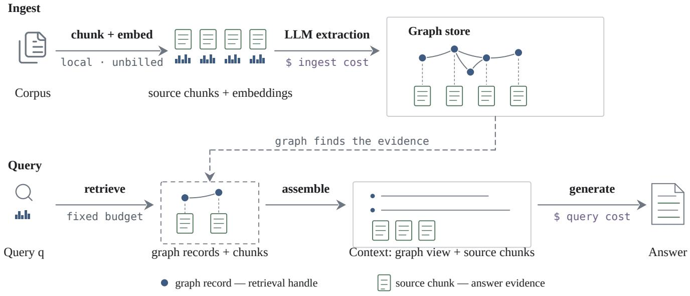
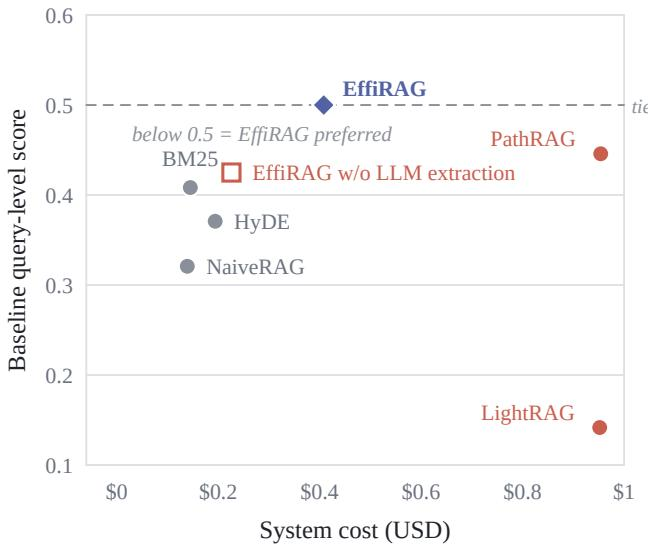

# When Is Graph Structure Worth Its Cost? The Case for Structure Pricing in Retrieval-Augmented Generation

Yuzhong Zhang The Chinese University of Hong Kong, Shenzhen Shenzhen, China

Lionel Briand   
Lero, the Research Ireland Centre for   
Software, University of Limerick   
Limerick, Ireland   
University of Ottawa   
Ottawa, Canada   
lionel.briand@lero.ie

Haoyang Ma The Hong Kong University of Science and Technology Hong Kong, China

Boxi Yu∗ Lero, the Research Ireland Centre for Software, University of Limerick Limerick, Ireland boxi.yu@lero.ie

Chao Peng University of Edinburgh Edinburgh, United Kingdom

Jialun Cao The Hong Kong University of Science and Technology Hong Kong, China

## Abstract

Graph-based retrieval-augmented generation (RAG) can help answer questions that require information from many documents. However, building a graph often requires many language-model calls during ingestion. It is therefore important to ask whether its quality gains justify the additional cost.

We present EfiRAG, a graph-based RAG system designed to reduce this cost. It uses the graph to locate relevant passages and generates answers from the original text. This design preserves source information while keeping graph construction and query processing lightweight.

We evaluate EfiRAG on UltraDomain, which contains 120 open-ended questions from four domains. Compared with LightRAG hybrid, EfiRAG produces the preferred answer on 93 questions. LightRAG is preferred on 7, and the remaining 20 are splits. EfiRAG also reduces total system cost by 57%, from \$0.952 to \$0.408. The cost includes language-model calls during ingestion and querying.

The advantage remains as the corpus grows. At 10 and 20 documents per domain, EfiRAG uses a lightweight, non-LLM filter to skip low-salience chunks. It remains preferred over LightRAGhybrid. It costs 4.2× and 4.5× less, respectively.

The comparisons identify diferent quality–cost trade-ofs. Graph-based RAG systems should therefore be evaluated by both answer quality and cost. The results favor graph structure that locates and preserves source evidence.

## 1 Introduction

Retrieval-augmented generation (RAG) [1] allows large language models to answer questions over private or recently updated corpora without additional fine-tuning. A standard RAG system splits documents into chunks, embeds them, retrieves the chunks most relevant to a query, and generates an answer from the retrieved text. This pipeline is simple and relatively inexpensive. However, it can miss information distributed across several chunks, especially for comparison, cross-document reasoning, or corpus synthesis.

Graph-based RAG systems address this limitation by representing entities and relations explicitly. GraphRAG organizes graph elements into communities and generates community summaries for corpus-level sensemaking [3]. LightRAG combines graphbased retrieval with vector retrieval [2]. These structures can connect information that chunk similarity alone may miss, but extraction, relation discovery, summarization, and graph traversal add language-model calls.

This paper therefore asks a practical question: when does graph structure improve answer quality enough to justify the cost of building and using it? We study this trade-of by measuring graph-construction and query cost together with answer quality.

We introduce EfiRAG, a graph-based RAG system built around a simple principle: the graph locates evidence, while source chunks supply the answer material. During ingestion, EfiRAG extracts entities and relations from source chunks. It links each extraction back to the chunk that supports it. During querying, these extractions help locate relevant source chunks under a fixed context budget. The generator answers from the original source text, with the extractions serving as retrieval handles. We call this design sourcechunk grounding.

EfiRAG controls ingestion cost through bounded graph extraction. It extracts each source chunk once and omits community summarization, reducing ingestion cost relative to LightRAGhybrid.

We report system cost as the input- and output-token charges for provider-LLM calls during ingestion and querying. Evaluation judging is excluded. Local embeddings are treated as unbilled.

In our main comparison, EfiRAG applies this bounded extraction policy to all source chunks and uses a fixed context budget. We evaluate it on UltraDomain, which contains 120 open-ended queries across four domains. EfiRAG is preferred over LightRAGhybrid on 93 queries. LightRAG-hybrid is preferred on 7, and the remaining 20 produce no consistent preference. Additional checks show robustness to judging and answer-length efects. Across ingestion and the 120 queries, EfiRAG costs \$0.408, compared with \$0.952 for LightRAG-hybrid, a reduction of 57%.

We also study larger corpora containing 10 and 20 documents per domain. EfiRAG retains the same fixed-budget query policy. Before extraction, a lightweight, non-LLM salience filter selects chunks likely to contain useful relations. EfiRAG remains preferred over LightRAG-hybrid while reducing system cost by factors of 4.2 and 4.5 in the 10- and 20-document-per-domain settings.

Under tight cost constraints, lightweight non-graph retrievers such as BM25-vector [13], NaiveRAG, and HyDE [6] may be more practical, although they produce lower-quality answers on Ultra-Domain.

This paper makes three contributions:

(1) We introduce EfiRAG, a source-grounded graph-RAG system. Extracted entities and relations guide retrieval. The original source chunks remain available to the answer generator. On UltraDomain, EfiRAG is preferred over LightRAG-hybrid at substantially lower system cost.

(2) We provide a cost evaluation that jointly reports ingestion and query-time provider-LLM usage.

(3) We provide an empirical analysis of when graph construction is worthwhile. The analysis covers non-graph baselines, extraction-free graphs, larger corpora, and goldanswer multi-hop question answering.

## 2 Related Work

Graph construction. GraphRAG uses LLM-based entity and relation extraction, community detection, and generated community summaries [3]. LightRAG constructs an entity–relation graph alongside vector indexes [2], while LazyGraphRAG lowers indexing cost through non-LLM graph construction [7]. EfiRAG retains bounded LLM extraction but omits community summarization and links every extracted entity and relation to its supporting source chunks.

Graph use. GraphRAG retrieves community reports for corpus-level questions [3]. LightRAG combines graph and vector retrieval [2], while PathRAG retrieves selected relational paths to reduce irrelevant graph context [4]. EfiRAG uses extracted entities and relations to locate their supporting source chunks. The generator receives the retrieved relations and original text, so the graph guides retrieval while retaining source evidence.

Cost–quality evaluation. GraphRAG-Bench studies whether the quality gains of graph-based RAG justify its construction cost [11], while LazyGraphRAG targets lower indexing cost [7]. EfiRAG jointly measures provider-LLM token cost during ingestion and querying and compares it with judged answer quality. It also includes lower-cost non-graph retrievers to identify when graph construction provides suficient benefit.

Positioning. GraphRAG relies on community summaries for corpus-level synthesis. LightRAG combines graph and vector retrieval. LazyGraphRAG prioritizes low indexing cost via non-LLM construction. EfiRAG takes a diferent route: it uses bounded LLM extraction to locate original source chunks, and reports ingestion and querying cost jointly.

## 3 Method

EfiRAG has two stages (Figure 1).

Ingestion divides the corpus into source chunks. Each chunk is embedded locally. An LLM extracts entities and relations from each chunk.

Querying retrieves relevant entities, relations, and source chunks. It selects evidence under a fixed context budget. The generator then answers from the selected evidence.

The central design principle is source-chunk grounding: every extracted entity or relation retains a link to the chunk that supports it. The extracted entities and relations serve as retrieval handles, while the source text remains the answer evidence. This matters because a compact relation may omit information such as dates, negation, conditions, or uncertainty. EfiRAG gives the generator both the retrieved relations and their supporting source chunks.

Ingestion. A source chunk is a contiguous unit of original document text used for extraction and retrieval. The graph store contains a source-chunk record for each chunk and two types ofgraph record: entity records and relation records. A source-chunk record stores the original text and its embedding. An entity record stores a normalized key, name, type, description, mention count, and references to its supporting source chunks. A relation record stores the source entity, target entity, relation keywords, description, and a reference to its supporting source chunk.

For retrieval, each graph record is converted to record text. Entity record text has the form “name (type): description.” Relation record text has the form “source → target (keywords): description.” The graph store holds the records and their source links. Separate embedding collections for graph-record text and source chunks support cosine-similarity search.

Retrieval and generation. Given a query, EfiRAG embeds it and compares the query embedding with the graph-record and sourcechunk embeddings. Graph records are ranked by the cosine similarity of their record-text embeddings. Source chunks are ranked in the same way using their stored embeddings. EfiRAG follows the source links of the retrieved graph records. It combines the resulting supporting chunks with those retrieved directly. Duplicates are removed.

EfiRAG formats the selected graph records as a textual graph view. The final context contains this graph view together with the selected source chunks. The graph view exposes entity and relation information, while the source chunks provide the original answer evidence.

Query-time evidence selection. At query time, Coverage-Budgeted Evidence Selection (CBES) assembles graph records and source chunks under a context budget �. � is the maximum number of tokens placed in the final context.

Query aspects are named entities and noun phrases extracted from the query. CBES uses a submodular coverage objective. An item receives less additional value when its aspects are already covered by selected evidence. It receives more value when it covers new aspects. It greedily selects the item with the largest marginal coverage gain per token. It stops when no remaining item fits the budget. This reduces redundant context.

  
Figure 1: EfiRAG pipeline. Extracted entities and relations locate evidence; their supporting source chunks provide the original answer text.

Reported settings. EfiRAG combines source-chunk grounding, bounded graph extraction, and fixed-budget evidence selection. Unless stated otherwise, EfiRAG refers to the default setting used in the five-document-per-domain comparison.

EfiRAG extracts every source chunk once and omits community summarization. Before CBES, EfiRAG retrieves up to 16 entity records, 16 relation records, and 8 source chunks. It then adds at most 4 supporting chunks.

These are candidate-pool caps, not the final context size. The final context is separately bounded by � = 3000. The caps only need to be large enough to give CBES a diverse candidate set. We chose 16/16/8/4 as a conservative setting that is well above the typical number of items CBES selects. We did not tune these values on UltraDomain.

EfiRAG w/ salience filtering skips chunks before extraction using a non-LLM score based on lexical content, entity cues, and embedding novelty. It is used in the larger-corpus experiments and keeps the same query policy as EfiRAG.

## 4 Evaluation

We first measure the quality–cost trade-of of EfiRAG and the effect of reducing ingestion work. We then compare EfiRAG with graph and lower-cost non-graph retrievers. Finally, we examine individual design choices and test the robustness of the judgedquality conclusion.

## 4.1 Evaluation Design and Rationale

We evaluate on a four-domain sample of UltraDomain [21]: agriculture, computer science, legal, and mixed. Each domain has five documents and 30 open-ended questions, for 120 queries in total.

The questions require cross-document comparison and corpuslevel synthesis. This makes the benchmark suited to testing whether graph structure helps connect evidence across documents. We follow LightRAG’s public dataset-construction protocol. Concretely, for each domain we select a fixed document set and generate open-ended questions from the corpus using an LLM. The questions target cross-document comparison and synthesis. We use LightRAG’s released prompt and filtering rules without modification.

We organize the comparison by retrieval role. LightRAG-hybrid is the primary baseline because it combines graph and vector retrieval. PathRAG represents an alternative graph-retrieval design. NaiveRAG, HyDE, and BM25-vector are lower-cost non-graph controls. HippoRAG2 is evaluated separately on gold-answer multi-hop QA, outside the main UltraDomain comparison.

We use DeepSeek-V4-Flash as the answer model (deepseek-v4-flash, non-thinking mode) [15]. It provides a competitive balance of generation quality and inference cost, and was the model available in our deployment environment.

We use all-MiniLM-L6-v2 for embeddings [14, 16]. It runs locally, which keeps embedding cost separate from the provider-LLM cost accounting. It is also publicly available and stable across runs. Holding these models fixed isolates the efects of retrieval and graph construction. System cost includes provider-LLM calls during ingestion and querying. Judge calls are excluded, and local embeddings are treated as unbilled.

We evaluated context budgets of � ∈ {1500, 2000, 3000, 4500} over all 120 queries (Table 1). Increasing � from 3000 to 4500 added 705 selected tokens on average, while the win rate relative to fullcontext generation increased by only 0.008. We therefore use � =

Table 1: Context-budget sensitivity over all 120 queries. Win rate compares each budgeted setting with full-context generation.
<table><tr><td>B</td><td> $\operatorname { A v g } .$  tokens</td><td>Win rate</td></tr><tr><td>1500</td><td>1231</td><td>0.208</td></tr><tr><td>2000</td><td>1694</td><td>0.317</td></tr><tr><td>3000</td><td>2442</td><td>0.367</td></tr><tr><td>4500</td><td>3147</td><td>0.375</td></tr></table>

  
Figure 2: Cost and judged quality on UltraDomain.

3000 as a practical fixed budget rather than claiming that it is optimal.

We use pairwise LLM judging. Given the same question and two candidate answers, GPT-4o-mini [17] selects the better answer. It judges correctness, relevance, and completeness.

Presentation order can afect pairwise judgments [8]. Each pair is therefore judged twice with the answer order reversed. A query is a win for a system when both orders prefer it. We call a query with no consistent preference a split. A split happens when the two orders disagree, or the judge returns a tie. We report query-level wins, losses, and splits. When a single score is needed, splits count as half:

$$
{ \mathrm { s c o r e } } = { \frac { { \mathrm { w i n s } } + 0 . 5 { \mathrm { s p l i t s } } } { N } } .
$$

## 4.2 Main Quality–Cost Result

No measured baseline is both cheaper than EfiRAG and preferred over it on UltraDomain (Figure 2 and Table 2).

Against LightRAG-hybrid, EfiRAG wins 93 queries, loses 7, and splits 20. The result is consistent across all four domains: the win/loss margins are 20/2 in agriculture, 27/1 in computer science, 26/1 in legal, and 20/3 in mixed. Across ingestion and the 120 queries, EfiRAG costs \$0.408, compared with \$0.952 for

LightRAG-hybrid, a reduction of 57.1%. In this experiment, EffiRAG has higher total query wall-clock time (1163 versus 888 seconds).

## 4.3 Ingestion Cost Control

EfiRAG extracts every source chunk in the main five-document setting. We ask whether extracting fewer chunks can reduce cost while keeping the same quality conclusion.

Random removal could confound extraction volume with content coverage. We therefore construct a series of extraction settings with progressively smaller extracted corpora while preserving broad corpus coverage. To do so, we use a fixed non-LLM selector that estimates the coverage contributed by each chunk.

The selector combines four complementary signals: nounphrase coverage, cross-document coverage, corpus representativeness, and expected query-workload coverage. It uses these signals to estimate the additional coverage contributed by each chunk per token. The selector is fixed across all settings and is used only for this sensitivity analysis.

We evaluated � ∈ {0, 0.03, 0.05, 0.07, 0.10}, which retained 68, 45, 24, 4, and 1 of the 68 chunks, respectively. Each setting was evaluated on the same UltraDomain queries to measure its quality– cost trade-of. As extraction volume decreased, measured system cost also decreased, but judged answer quality consistently declined. We therefore retain all-chunk extraction in the main fivedocument EfiRAG configuration.

As the boundary of this analysis, we also remove LLM extraction entirely. EfiRAG w/o LLM extraction uses non-LLM nounphrase extraction while retaining the same query pipeline. It costs \$0.226, 44.7% less than EfiRAG, but EfiRAG wins 44 queries, the zero-extraction setting wins 26, and 50 are splits.

These results support all-chunk extraction at the five-document scale. As the corpus grows, however, extracting every chunk becomes increasingly expensive. The selector above is used only to study the efect of reducing extraction volume. For larger corpora, we instead evaluate a lightweight online filtering strategy intended to control ingestion cost. This configuration is EfiRAG w/ salience filtering.

The filter combines lexical cues, entity cues, and embedding novelty to estimate chunk salience. Chunks with low salience are skipped before graph extraction.

EfiRAG w/ salience filtering remains preferred over LightRAGhybrid. Its query-level scores are 0.800 and 0.771 at 10 and 20 documents per domain, respectively, while costing 4.2× and 4.5× less (\$2.316 versus \$9.799 and \$3.238 versus \$14.608). EfiRAG w/ salience filtering remains efective at both measured corpus sizes.

## 4.4 Comparison Scope

Against PathRAG, EfiRAG reduces cost from \$0.954 to \$0.408. Judged quality stays close: EfiRAG wins 39 queries, PathRAG wins 26, and 55 are splits.

NaiveRAG, HyDE, and BM25-vector cost less than EfiRAG. Their query-level pairwise scores against EfiRAG are 0.321, 0.371, and 0.408, respectively (score = (baseline wins + 0.5× splits)/120; below 0.5 means EfiRAG is preferred).

Table 2: UltraDomain quality and system cost (120 queries). Quality reports query-level EfiRAG wins / baseline wins / splits. Cost includes provider-LLM ingestion and querying. Cost delta is relative to EfiRAG. Query time is cumulative wall-clock time for all 120 queries.
<table><tr><td>System</td><td>EffiRAG wins / baseline wins / splits</td><td>Cost</td><td>Cost delta</td><td>Query time (s)</td></tr><tr><td>EffRAG</td><td>(baseline)</td><td>$0.408</td><td>+0.0%</td><td>1162.5</td></tr><tr><td>LightRAG-hybrid</td><td>93/7/20</td><td>$0.952</td><td>+133.1%</td><td>888.1</td></tr><tr><td>PathRAG</td><td>39/26/55</td><td>$0.954</td><td>+133.5%</td><td>1565.3</td></tr><tr><td>NaiveRAG</td><td>58/15/47</td><td>$0.139</td><td>-66.0%</td><td>1011.6</td></tr><tr><td>HyDE</td><td>51/20/49</td><td>$0.194</td><td>-52.4%</td><td>1419.4</td></tr><tr><td>BM25-vector</td><td>43/21/56</td><td>$0.145</td><td>-64.6%</td><td>1059.8</td></tr><tr><td>EffiRAG w/o LLM extraction</td><td>44/26/50</td><td>$0.226</td><td>-44.7%</td><td>1069.1</td></tr></table>

Table 3: EfiRAG w/ salience filtering versus LightRAGhybrid at 10 and 20 documents per domain (120 queries per scale): query-level wins, losses, splits, and score. †Agriculture has 12 unique documents at the 20-document point.
<table><tr><td>Domain</td><td>EffiRAG</td><td>LightRAG</td><td>Split</td><td>Score</td></tr><tr><td colspan="5">10 docs per domain</td></tr><tr><td>Agriculture</td><td>21</td><td>1</td><td>8</td><td>0.833</td></tr><tr><td>CS</td><td>16</td><td>3</td><td>11</td><td>0.717</td></tr><tr><td>Legal</td><td>26</td><td>1</td><td>3</td><td>0.917</td></tr><tr><td>Mixed</td><td>19</td><td>5</td><td>6</td><td>0.733</td></tr><tr><td>All</td><td>82</td><td>10</td><td>28</td><td>0.800</td></tr><tr><td colspan="5">20 docs per domain</td></tr><tr><td>Agriculture{</td><td>18</td><td>2</td><td>10</td><td>0.767</td></tr><tr><td>CS</td><td>16</td><td>4</td><td>10</td><td>0.700</td></tr><tr><td>Legal</td><td>23</td><td>0</td><td>7</td><td>0.883</td></tr><tr><td>Mixed</td><td>19</td><td>5</td><td>6</td><td>0.733</td></tr><tr><td>All</td><td>76</td><td>11</td><td>33</td><td>0.771</td></tr></table>

Pooled system cost: EfiRAG w/ salience filtering \$2.316 vs. LightRAG-hybrid \$9.799 at 10 docs (4.2× lower), and \$3.238 vs. \$14.608 at 20 docs (4.5× lower).

UltraDomain emphasizes retrieving and synthesizing evidence distributed across documents. Gold-answer multi-hop QA instead emphasizes reasoning over linked facts to produce an exact answer. We therefore include a complementary multi-hop evaluation using exact-match (EM) and token-level F1.

We use fixed 100-question development slices ofHotpotQA [18], 2WikiMultihopQA [19], and MuSiQue [20]. The pairwise judge prefers HippoRAG2 in 312 of 600 order-level decisions, and thus EfiRAG’s multi-hop configuration in 288. Their aggregate EM/F1 scores are 0.460/0.583 for EfiRAG and 0.447/0.570 for HippoRAG2. The two systems achieve similar aggregate quality under diferent metrics, while EfiRAG has substantially lower measured answergeneration cost.

## 4.5 Design Evidence

The testbed includes several mechanisms (salience skipping, extractor-tier routing, entity-repeat hints, query expansion, queryclass-dependent retrieval, and context compression).

Source-chunk grounding has the clearest positive efect. Removing linked source chunks reduces cost by 49.9%. The testbed is preferred in 195 of 240 order-level decisions, compared with 44 for the ablated system and one tie (Table 4).

Context compression also reduces cost but lowers quality. The testbed is preferred over the compressed variant by 170/70/0. The remaining rows show small or inconsistent quality diferences within the testbed.

## 4.6 Reliability

Finally, we test whether the main EfiRAG–LightRAG-hybrid conclusion depends on answer order, ambiguous questions, answer length, or the judge model.

Among the 120 queries, 20 are splits. A two-sided sign test on the remaining 100 queries gives $p < 0 . 0 0 1$ . The query-level score is 0.858. The bootstrap 95% confidence interval is [0.804, 0.908].

Two length controls preserve the conclusion. A re-judge explicitly instructed not to reward answer length gives EfiRAG a querylevel score of 0.883. On the subset whose answer lengths difer by at most 20%, EfiRAG retains a query-level score of 0.682.

As an independent-model check, Gemini reviewed 80 answer pairs. We selected pairs for which GPT-4o-mini’s judgments were close or order-sensitive, preferred the baseline, or favored the shorter answer.

GPT-4o-mini selects the same answer in both orders for 23 of them. The other 57 have no single direction for agreement. Gemini agrees on 17 of the 23 comparable pairs (74%). This check is consistent with the conclusion that EfiRAG is preferred over LightRAGhybrid.

## 5 Discussion and Threats to Validity

The results suggest that graph structure is most valuable when it helps retrieve original evidence, with source chunks remaining the answer material. Removing source chunks substantially lowers judged quality, whereas additional routing, budgeting, and compression mechanisms provide no clear improvement. Diferent workloads nevertheless favor diferent quality–cost trade-ofs: lightweight retrievers minimize cost, while EfiRAG and HippoRAG2 show comparable multi-hop QA quality under diferent metrics. The larger-corpus results provide two measured cost-control points for EfiRAG w/ salience filtering.

The evaluation uses 120 LLM-generated queries from four domains and LLM-based pairwise judgments. Reversed answer orders, length controls, statistical tests, and an independent-model check reduce judging efects, but other datasets, human judgments, and model stacks may produce diferent results. Dollar costs also depend on provider prices and exclude local computation.

Table 4: Mechanism analysis using the separate ablation testbed on UltraDomain (120 queries). The testbed costs \$0.469. Quality is testbed wins / variant wins / ties across 240 order-level decisions. Each row changes one testbed component and is not a direct variant of the main EfiRAG setting.
<table><tr><td>Ablation</td><td>Quality</td><td>Cost Cost delta (vs. testbed)</td><td>Avg. context chars</td></tr><tr><td>w/o source chunks</td><td>195/44/1 $0.235</td><td></td><td>-49.9% 3846</td></tr><tr><td>w/ compression</td><td>170/70/0</td><td>$0.259</td><td>-44.8% 31209</td></tr><tr><td>w/o salience filtering</td><td>116/124/0</td><td>$0.451</td><td>-3.9% 31756</td></tr><tr><td>lightweight extraction only</td><td>115/125/0</td><td>$0.453</td><td>-3.4% 32106</td></tr><tr><td>w/o entity-repeat hints</td><td>105/135/0 $0.468</td><td></td><td>-0.4% 31622</td></tr><tr><td>w/ fixed retrieval counts</td><td>115/125/0</td><td>$0.430</td><td>-8.5% 26411</td></tr><tr><td>w/o query expansion</td><td>119/121/0</td><td>$0.471</td><td>+0.3% 31594</td></tr></table>

## 6 Conclusion

This paper asked when graph structure improves retrievalaugmented generation enough to justify its cost. EfiRAG addresses this question with a source-grounded design: extracted entities and relations locate relevant evidence, while the generator answers from the linked source chunks. On UltraDomain, EfiRAG is preferred over LightRAG-hybrid on 93 of 120 queries while reducing measured system cost by 57%. EfiRAG w/ salience filtering remains preferred at lower measured cost on the larger corpora studied here.

The broader result is that graph-RAG systems require joint evaluation of answer quality, graph complexity, ingestion cost, query cost, and the evidence that reaches the generator. Our results favor using the minimum graph structure needed to connect relevant source evidence, then selecting a configuration appropriate to the workload and cost budget.

## Acknowledgements

This work has emanated from research jointly funded by Taighde Éireann–Research Ireland under Grant Number 13/RC/2094\_2, and by Genesys Cloud Services, Inc.

## References

[1] P. Lewis et al., “Retrieval-augmented generation for knowledge-intensive NLP tasks,” in NeurIPS, 2020.

[2] Z. Guo et al., “LightRAG: Simple and fast retrieval-augmented generation,” arXiv:2410.05779, 2024.

[3] D. Edge et al., “From local to global: A graph RAG approach to query-focused summarization,” arXiv:2404.16130, 2024.

[4] B. Chen et al., “PathRAG: Pruning graph-based retrieval augmented generation with relational paths,” arXiv:2502.14902, 2025.

[5] P. Sarthi et al., “RAPTOR: Recursive abstractive processing for tree-organized retrieval,” in ICLR, 2024.

[6] L. Gao, X. Ma, J. Lin, and J. Callan, “Precise zero-shot dense retrieval without relevance labels,” in ACL, 2023

[7] D. Edge, H. Trinh, and J. Larson, “LazyGraphRAG: Setting a new standard for quality and cost,” Microsoft Research Blog, November 2024.

[8] L. Zheng et al., “Judging LLM-as-a-judge with MT-Bench and Chatbot Arena,” in NeurIPS, 2023.

[9] G. L. Nemhauser et al., “An analysis of approximations for maximizing submodular set functions—I,” Math. Prog., 1978.

[10] S. Khuller, A. Moss, and J. Naor, “The budgeted maximum coverage problem,” Inf. Process. Lett., 1999.

[11] Z. Xiang et al., “When to use graphs in RAG: A comprehensive analysis for graph retrieval-augmented generation,” arXiv:2506.05690, 2025.

[12] B. J. Gutiérrez et al., “From RAG to memory: Non-parametric continual learning for large language models,” arXiv:2502.14802, 2025.

[13] S. Robertson and H. Zaragoza, “The probabilistic relevance framework: BM25 and beyond,” Foundations and Trends in Information Retrieval, vol. 3, no. 4, pp. 333–389, 2009.

[14] N. Reimers and I. Gurevych, “Sentence-BERT: Sentence embeddings using Siamese BERT-networks,” in EMNLP, 2019.

[15] DeepSeek-AI, “DeepSeek-V4-Flash,” Hugging Face model card, 2026. [Online]. Available: https://huggingface.co/deepseek-ai/DeepSeek-V4-Flash.

[16] Sentence Transformers, “all-MiniLM-L6-v2,” Hugging Face model card. [Online]. Available: https://huggingface.co/sentence-transformers/all-MiniLM-L6- v2.

[17] OpenAI, “GPT-4o mini,” model documentation. [Online]. Available: https:// platform.openai.com/docs/models/gpt-4o-mini.

[18] Z. Yang et al., “HotpotQA: A dataset for diverse, explainable multi-hop question answering,” in EMNLP, 2018.

[19] X. Ho et al., “Constructing a multi-hop QA dataset for comprehensive evaluation of reasoning steps,” in COLING, 2020.

[20] H. Trivedi et al., “MuSiQue: Multihop questions via single-hop question composition,” TACL, 2022.

[21] H. Qian et al., “MemoRAG: Boosting long context processing with global memory-enhanced retrieval augmentation,” arXiv:2409.05591, 2024.