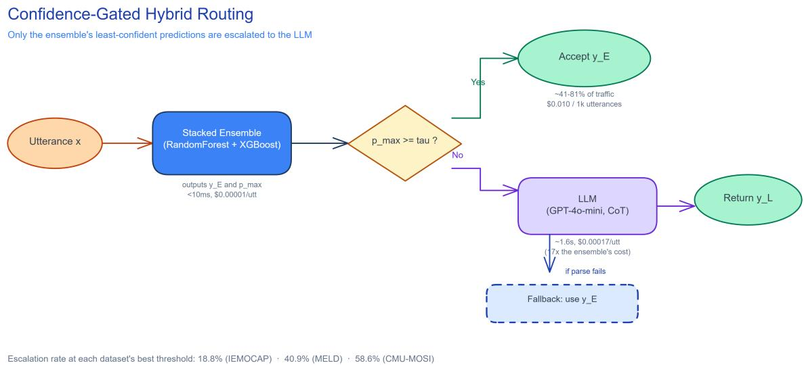
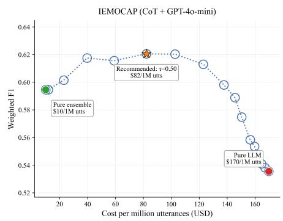
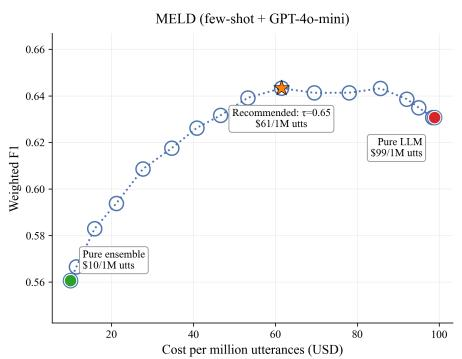
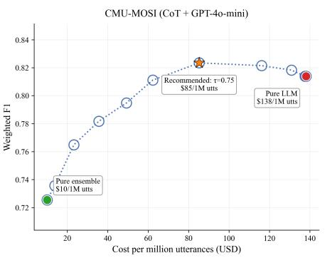

# When to Call an LLM: A Confidence-Gated Hybrid for Cost-Efective Emotion Recognition in Conversational AI

Sai Babu Udayagiri, Arjun Chouhan, Ravisekhar Kanagala, Trishala Pavagada

Five9

saiudayagiri.babu@five9.com, arjun.chouhan@five9.com, Ravi.Kanagala@five9.com, trish.pavagada@five9.com

## Abstract

Emotion recognition in conversation (ERC) is a production capability behind agent-assist prompts, escalation routing, and post-call analytics in contact-center-as-a-service (CCaaS) platforms, where cost and latency constraints matter as much as accuracy. We report a systems-level comparison of three deployment options for dialogue-contextual ERC: a lowcost stacked ensemble (sentence embeddings, windowed context, RandomForest/XGBoost/logistic-regression stacking), of-the-shelf LLM prompting (GPT-4o-mini; zero-shot, fewshot, chain-of-thought), and a confidence-gated hybrid that escalates only the ensemble’s least-confident predictions to the LLM – a design directly modeled on IVA-to-human-agent escalation policies already used in production contact centers. On IEMOCAP, the ensemble significantly outperforms every LLM configuration (0.595 vs. 0.460–0.536 weighted F1, p < 0.0001) at a fraction of the cost and sub-10ms latency; on MELD and CMU-MOSI the ranking reverses, showing neither pure system is a universally safe deployment default. The confidence-gated hybrid resolves this by Pareto-dominating both pure systems on all three datasets (0.620, 0.643, 0.824 weighted F1) while routing the majority of trafic through the near-zero-cost ensemble, translating to roughly \$10–85 per million utterances versus \$99–170 for an LLM-only pipeline. The escalation policy is not an opaque cost/accuracy dial: escalated turns disproportionately follow an emotion or sentiment shift, giving operators an interpretable, auditable routing signal, and the ensemble’s confidence is independently wellcalibrated and safely under- rather than over-confident. The pattern holds across three datasets and two independent LLM providers. Confidence-gated cascading is an established idea in general ML systems; our contribution is showing it transfers cleanly to dialogue-contextual ERC and yields a concrete, actionable deployment recipe for CCaaS and conversational-AI platforms deciding how to allocate LLM spend.

## 1 Introduction

Emotion recognition in conversation (ERC) underlies realtime agent-assist prompts, automated escalation routing, quality-assurance scoring, and post-call analytics in CCaaS platforms. Production systems rarely have the latency and throughput budget for large sequence/graph ERC models, which motivated our prior work (Parida et al. 2023) showing a comparatively simple stacked ensemble of tree-based learners over sentence embeddings and windowed dialogue context can match more complex architectures on IEMO-

CAP at a fraction of the cost. Since then, general-purpose LLMs have become the default “try first” tool for text classification, typically via zero-shot or few-shot prompting. This raises a deployment-relevant question: does of-theshelf LLM prompting actually outperform a well-engineered lightweight ensemble on dialogue-contextual ERC, and if the answer is dataset-dependent, what deployment architecture avoids betting the wrong way?

The deployment options above are not the only two: state-of-the-art dialogue-contextual ERC architectures – EmoBERTa (Kim and Vossen 2021), Joyful (Li et al. 2023), MiSTER-E (Dutta, Balaji, and Ganapathy 2026) – use fine-tuned transformer backbones or multimodal (text+audio+visual) fusion, incurring a per-domain finetuning cost and GPU-serving latencies that routinely exceed real-time p95 SLA budgets for agent-assist (§2). Our ensemble (§3) requires neither fine-tuning nor GPU serving and runs in sub-10ms on CPU; an LLM API call incurs neither a fine-tuning cost nor a GPU-serving requirement but is priced and latency-bound per call. The deployment choice is therefore three-way, not two-way, and this paper brackets the fine-tuned/multimodal option: its accuracy ceiling and cost profile are established in the existing ERC literature (§2, Appendix L), leaving open only whether, between the two options with no GPU-serving cost, an LLM call is necessary or a calibrated lightweight ensemble already sufices.

Confidence-gated cascading – a cheap model handling most trafic, an expensive one called only on hard cases – is an established pattern in general ML systems (Chen, Zaharia, and Zou 2023; Nie et al. 2024). Our contribution is not the cascading idea itself, but showing it transfers cleanly to dialogue-contextual ERC when the cheap stage is a calibrated, non-LLM ensemble rather than a smaller LLM or a learned deferral policy, and characterizing exactly what such a router learns to escalate. Concretely, we:

1. Provide a controlled, dialogue-level comparison of a lightweight ensemble against GPT-4o-mini across three prompting strategies on IEMOCAP, MELD, and CMU-MOSI, with paired bootstrap significance testing, showing neither pure system is a safe default across datasets.

2. Identify and empirically confirm a specific mechanism – chain-of- thought prompting’s systematic underprediction of the majority “neutral” label – explaining why CoT is IEMOCAP’s best LLM strategy but MELD’s

worst (Appendix C).

3. Propose and validate a confidence-gated hybrid that routes on the ensemble’s own calibrated class probability, Pareto-dominating both pure systems on all three datasets and both of two independent LLM providers tested.

4. Show the router is interpretable, not a black-box threshold: escalated turns disproportionately follow an emotion/sentiment shift (a modest but consistent 1.11–1.17× lift), and the underlying ensemble confidence is independently well-calibrated and mildly under-confident – the safety-favorable miscalibration direction for a production escalation gate.

## 2 Related Work

ERC architectures. DialogueRNN (Majumder et al. 2019), DialogueGCN (Ghosal et al. 2019), and COSMIC (Ghosal et al. 2020) model conversational context via recurrence, graph structure, and commonsense knowledge respectively. More recent work moves toward large fine-tuned transformers and multimodal/LLM-embedding fusion: EmoBERTa (Kim and Vossen 2021), Joyful (Li et al. 2023), and MiSTER-E (Dutta, Balaji, and Ganapathy 2026). These benchmark against each other on the premise that architectural sophistication is necessary; lightweight tree-ensembles have been shown competitive with, though not superior to, this lineage at a fraction of the cost (Parida et al. 2023), but no prior published ERC work compares such an ensemble against LLM prompting or a confidence-gated hybrid of the two. This is a practically important gap for CCaaS platforms specifically: recurrence-, graph-, and LLM-embedding-fusion architectures generally require GPU serving and per-utterance latencies well outside typical p95 SLA budgets for real-time agent-assist, so a system’s benchmark accuracy is only one of several deployment-relevant properties, alongside training cost, inference latency, and interpretability of its predictions.

LLMs for emotion/sentiment classification. Most LLMprompting benchmarks for afect classification evaluate single-utterance sentiment, not dialogue-contextual ERC. The rare dialogue-level exception, Feng et al. (2024), evaluates zero-shot/few-shot LLM prompting against fine-tuned neural ERC baselines and finds LLMs generally underperform – the closest existing empirical result to our own finding that of-the-shelf LLM prompting does not uniformly beat a non-LLM ERC baseline (§4), obtained with a diferent (finetuned, not tree-ensemble) baseline type. LLM prompting also degrades substantially in multi-turn settings generally (Laban et al. 2025), and the value of chain-of-thought for afect tasks specifically is contested: it helps in some sentiment-analysis settings and not others (Zheng, Zhao, and Li 2025; Miriyala, Bukkapatnam, and Prahallad 2025), mirroring our own finding that CoT is IEMOCAP’s best strategy but MELD’s worst.

Cost-aware cascading and confidence-based routing. This literature splits into three lines. LLM-to-LLM cascades and learned routers evaluate or generate a candidate answer first, then decide whether to escalate: FrugalGPT (Chen, Zaharia, and Zou 2023) gates on a learned answerquality scorer; RouteLLM (Ong et al. 2024) learns a winprobability model from preference data rather than a calibrated score; AutoMix (Aggarwal et al. 2023) pairs fewshot self-verification with a POMDP router; Tryage (Hari and Thomson 2023) predicts downstream performance per prompt; EcoAssistant (Zhang et al. 2023) escalates on codeexecution failure rather than a probability signal; Mixtureof-Agents (Wang et al. 2024) layers multiple LLMs with no escalation decision at all, a useful contrast case. Dekoninck, Baader, and Vechev (2024) formalize cascade routing theoretically and show a quality estimator’s own accuracy is the binding constraint on cascade performance – direct motivation for gating on a well-calibrated non-LLM estimator, as we do, rather than an LLM-judged one. A second line escalates a non-LLM model to an LLM via a confidencestyle signal, architecturally closer to our design: Nie et al. (2024) defer from logistic regression to an LLM via a learned, continuously-updated deferral policy for general streaming inference and discuss simple confidence-threshold deferral only as a baseline; Gatekeeper (Rabanser et al. 2025) adds a calibration-tuning loss so a cascade’s cheap model is confident exactly when correct, direct support for why calibration quality (which we verify empirically, Appendix G) matters for this design; Confidence Tokens (Chuang et al. 2024) instead trains the LLM itself to emit a routing token, sitting between the two lines above; Fanconi and van der Schaar (2025) extend escalation to a three-tier base model/LLM/human cascade for decision-making. A third, theoretical line grounds when threshold-based deferral is justified in the first place: Fisch, Jaakkola, and Barzilay (2022) formalize selective calibration error, and Hendrickx et al. (2021) survey rejectoption classification broadly. Our contribution relative to all three lines is task-specific and architectural: gating directly on a calibrated tree-ensemble’s own class probability, with no learned deferral policy and no LLM-judged quality score, transfers cleanly to dialogue-contextual ERC, Paretodominates both pure endpoints across three datasets and two LLM providers, and yields an interpretable escalation signal – a modest but consistent correlation with emotion/sentiment shifts (§4.4) – with a direct cost translation for CCaaS deployment decisions – a combination not previously demonstrated for ERC.

## 3 Method

Ensemble baseline. Each utterance is encoded with a pretrained sentence embedding (all-MiniLM-L6-v2, 384- dim, no fine-tuning), concatenated with the mean embedding of the preceding 5 utterances and a same-speaker/diferentspeaker flag, yielding a 769-dim feature vector. The stacked ensemble’s Level-0 base learners are two RandomForest configurations (300 trees/unlimited depth/balanced class weighting; 500 trees/depth 20/balanced-subsample weighting) and two XGBoost configurations (300 trees/depth 6/learning rate 0.1/0.8 subsample; 500 trees/depth 4/learning rate 0.05/0.9 subsample), originally selected for ensemble diversity. We tune this choice directly in Appendix B via a systematic hyperparameter search: a 20- trial search on each dataset improves test-set weighted F1 by only 0.17–0.78 points, confirming these values were already close to optimal rather than an arbitrary choice. A logistic-regression Level-1 meta-learner is trained on outof-fold Level-0 class-probability predictions via 5-fold internal cross-validation (scikit-learn StackingClassifier, stack\_method="predict\_proba"). The ensemble is trained once per dataset on the full training split (Table 1) and evaluated once on the full held-out test split; it requires no GPU and runs in sub-10ms per utterance on CPU.

<table><tr><td>Dataset</td><td>Classes</td><td>Train</td><td>Val</td><td>Test</td></tr><tr><td>IEMOCAP</td><td>6</td><td>5,081</td><td> $6 7 7 ^ { \dag }$ </td><td>1,622</td></tr><tr><td>MELD</td><td>7</td><td>9,989</td><td> $1 { , } 1 0 9 ^ { \ddagger }$ </td><td> $^ { 2 , 6 1 0 }$ </td></tr><tr><td>CMU-MOSI</td><td>3</td><td>1,284</td><td>229‡</td><td>686</td></tr></table>

Table 1: Dataset statistics. IEMOCAP (Busso et al. 2008) holds out Session 5 as test, matching standard convention; MELD (Poria et al. 2019) and CMU-MOSI (Zadeh et al. 2016) use their released train/test splits. †IEMOCAP’s Val is not an oficial split – we carve it from the training dialogues ourselves (10%) for development-time sanity checks. ‡MELD’s and CMU-MOSI’s Val columns are each dataset’s own released dev/valid split; none of the three datasets’ Val rows are merged into Train or used in any reported result – they are held out for diagnostic checks only, consistent with standard practice for these benchmarks.

Algorithm 1 Confidence-Gated Hybrid Routing   
Require: utterance x, ensemble E, LLM L, threshold τ   
1: $( \hat { y } _ { E } , p _ { \mathrm { m a x } } ) \gets E ( x )$ {ensemble prediction + top-class   
prob.}   
2: if $p _ { \operatorname* { m a x } } \ge \tau$ then   
3: return $\hat { y } _ { E }$ {near-zero marginal cost}   
4: else   
5: $\hat { y } _ { L } \gets L ( x )$ {escalate; costs one LLM call}   
6: if $\hat { y } _ { L }$ parses successfully then   
7: return $\hat { y } _ { L }$   
8: else   
9: return $\hat { y } _ { E }$ {fallback on parse failure}   
10: end if   
11: end if

LLM prompting. We evaluate GPT-4o-mini under zeroshot, few-shot (6-shot), and chain-of-thought (CoT, 6-shot) prompting, with a 5-turn context window matching the ensemble, temperature 0, and logged per-call cost, latency, and token counts. Appendix J additionally evaluates Llama-3- 8B-Instruct, on the full test split of all three datasets, as an independent second provider.

Confidence-gated hybrid. Algorithm 1 formalizes the routing rule: let $p _ { \mathrm { m a x } }$ be the ensemble’s top-class probability and $\tau \in \ [ 0 , 1 ]$ a threshold. We sweep τ over $\{ 0 . 0 \dot { 0 } , 0 . 0 5 , \hdots , 1 . 0 \dot { 0 } \}$ to trace an accuracy-vs-cost curve against the two pure endpoints (τ=0: pure ensemble; τ=1: pure LLM), and report results at each dataset’s empiricallybest $\tau ^ { * }$ . This sweep requires a fully labeled evaluation split, which will not exist for a genuinely new production dataset; Appendix E gives a practical cold-start procedure and simulates it directly on all three datasets.

Evaluation. We report weighted F1 (primary, since all three datasets are class-imbalanced to varying degrees) and macro F1 (secondary, equal weight per class), with paired bootstrap significance testing between model pairs (1,000 resamples, seeded, two-sided p-value and 95% CI on the weighted-F1 diference), and three failure-mode groupings computed from dialogue structure alone (no manual annotation): context length, emotion-shift status, and minorityclass membership. We use the full IEMOCAP, MELD, and CMU-MOSI test splits (Table 1) for every configuration – no subsampling.

<table><tr><td>Dataset (strategy)</td><td> $\mathbf { E n s . }$ </td><td>LLM</td><td>∆95%CI</td><td>p</td></tr><tr><td>IEMOCAP (ZS)</td><td>.595</td><td>.460</td><td>[.10,.17]</td><td>&lt;.0001</td></tr><tr><td>IEMOCAP (CoT)</td><td>.595</td><td>.536</td><td>[.03,.09]</td><td>&lt;.0001</td></tr><tr><td>MELD (FS)</td><td>.561</td><td>.631</td><td>[−.09,−.05]</td><td>&lt;.0001</td></tr><tr><td>CMU-MOSI (CoT)</td><td>.725</td><td>.814</td><td>[−.13,−.05]</td><td>&lt;.0001</td></tr></table>

Table 2: Weighted F1, ensemble vs. best LLM strategy, full test splits, with 95% CI on the weighted-F1 diference ∆ (Ens. − LLM) from paired bootstrap. The winning pure system flips by dataset.

## 4 Experiments and Results

## Accuracy: Neither Pure System Is a Safe Default

On IEMOCAP the ensemble significantly beats GPT-4o-mini under every prompting strategy (Table 2), with the LLM’s disadvantage concentrated in long-context turns and CoT narrowing but not closing the gap. On MELD, zero-shot and few-shot prompting significantly exceed the ensemble – driven by MELD’s severe class imbalance, where the ensemble collapses on minority classes (disgust/fear F1 = 0.033 vs. the LLM’s 0.533 on the same utterances) – while CoT falls significantly below the ensemble. We trace this specific reversal to a confirmed mechanism, not a MELD-specific quirk: CoT systematically under-predicts the majority “neutral” label relative to few-shot on both IEMOCAP and MELD (Appendix C), but this bias only becomes fatal on MELD, where neutral is ∼48% of the test set versus IEMOCAP’s ∼24%. Critically, MELD’s zero-/few-shot reversal turns out to be specific to GPT-4o-mini: an independently-tested Llama-3- 8B loses to the ensemble on every MELD strategy, including zero-shot and few-shot (Appendix J) – so “the LLM wins on MELD” describes one commercial model’s behavior, not a provider-general property of the dataset. On CMU-MOSI, by contrast, the LLM wins at every strategy against both GPT-4o-mini and Llama-3-8B, and on IEMOCAP the ensemble wins against both – these two rankings are provider-robust. The practical takeaway is that a CCaaS operator cannot safely default to either pure system across tasks, and for at least one dataset (MELD) not even across LLM vendors – exactly the deployment risk the hybrid below is designed to eliminate.

## Where the Ensemble and LLM Disagree

The two systems fail on diferent slices of the data (Table 3), which is exactly what makes routing between them useful rather than redundant: the LLM is more accurate on shortcontext turns but trails on long-context dialogue – consistent with LLMs’ documented tendency to lose track ofearlier context in multi-turn settings (Laban et al. 2025) – while both systems degrade substantially on emotion-shift turns, more so for the ensemble in relative terms, consistent with the classical motivation for explicit emotional-inertia modeling in ERC architectures. On MELD, the ensemble’s minorityclass collapse (disgust/fear F1 = 0.033 across 118 test utterances) accounts for most of its aggregate deficit against the LLM (F1 = 0.533 on the same utterances) – a structural weakness of a frequency-driven tree ensemble under severe class imbalance that the LLM’s world-knowledge priors do not share. On CMU-MOSI, the disagreement traces to a related but more extreme version of the same mechanism: the ensemble’s top predicted class is never “neutral” on any test utterance (Appendix H), so every genuinely neutral- sentiment turn is forced into a polarized positive/negative call, while the LLM’s world-knowledge priors recognize understated or mixed sentiment the frequency-driven ensemble structurally cannot select – not merely a rare prediction, as with MELD’s minority classes, but one the ensemble’s

  
Figure 1: Confidence-gated hybrid routing architecture. The stacked ensemble classifies every utterance and outputs its own top-class probability $p _ { \mathrm { m a x } } ;$ only utterances below threshold τ are escalated to the LLM. Evidence numbers are IEMOCAP, CoT strategy (Table 4); escalation rates are each dataset’s own $\tau ^ { * } \left( \ S 4 . 4 \right)$

<table><tr><td>IEMOCAP slice</td><td>n</td><td>Ens.</td><td>LLM (CoT)</td></tr><tr><td>Short context (&lt;5)</td><td>155</td><td>0.537</td><td>0.633</td></tr><tr><td>Long context (≥15)</td><td>1,157</td><td>0.598</td><td>0.518</td></tr><tr><td>Stable (no shift)</td><td>941</td><td>0.687</td><td>0.583</td></tr><tr><td>Emotion shift</td><td>681</td><td>0.464</td><td>0.473</td></tr></table>

Table 3: IEMOCAP weighted F1 by context length and emotion-shift status. The LLM wins short-context turns; the ensemble wins long-context turns. Both degrade substantially on shift turns.

<table><tr><td>Tier</td><td>IEMOCAP</td><td>MELD</td><td>CMU-MOSI</td></tr><tr><td>Ensemble</td><td>$10/1M</td><td>$10/1M</td><td>$10/1M</td></tr><tr><td>Hybrid</td><td>$82/1M</td><td>$61/1M</td><td>$85/1M</td></tr><tr><td>Pure LLM</td><td>$170/1M</td><td>$99/1M</td><td>$138/1M</td></tr></table>

Table 4: Cost per million utterances per deployment tier (ensemble cost fixed at \$10/1M).

argmax never makes.

## Cost and Latency in Deployment Terms

Ensemble inference is CPU-bound and sub-10ms; every LLM call costs 3.9–17× the ensemble’s per-utterance price and adds sub-second-to-low-single-digit-second network latency, a direct tension with real-time p95-latency SLAs in live agent-assist use cases. Re-cast in deployment terms (Table 4), a representative volume of 1M utterances/month costs roughly \$10/month on the pure ensemble, \$61–85/month on the recommended hybrid, and \$99–170/month on a pure-LLM pipeline – figures directly usable in a procurement conversation, not just an abstract accuracy metric.

## The Confidence-Gated Hybrid Pareto-Dominates Both Endpoints

This is the paper’s central result (Table 5, full sweeps in Appendix F): on every dataset tested, confidence-gated routing numerically beats both pure endpoints simultaneously, not merely trading accuracy for cost along a frontier. This holds even on MELD and CMU-MOSI, where the pure ensemble loses the head-to-head comparison – the hybrid does not simply default to “always call the stronger pure system”; it extracts a genuine complementarity benefit because the ensemble’s confidence signal reliably identifies a subset of utterances it handles correctly and cheaply, regardless of which system wins in aggregate. We hold this claim to the same statistical standard as Table 2 rather than reporting only point estimates: the hybrid’s margin over the better pure system is significant on IEMOCAP $( p = . 0 2 )$ and MELD $( p = . 0 1 )$ , but not on CMU-MOSI (p = .38, 95% CI crosses zero) – our smallest test split (686 utterances) is underpowered to statistically distinguish a 1-point accuracy margin. On CMU-MOSI specifically, the honest claim is narrower than “more accurate”: the hybrid is statistically indistinguishable in accuracy from the pure LLM while costing a fraction as much (\$85 vs. \$138 per million utterances, Table 4) – a costdominance claim, which is unambiguous, standing in for an accuracy-dominance claim we cannot fully support at this sample size. The optimal escalation rate varies by dataset (45.4% IEMOCAP, 57.5% MELD, 58.6% CMU-MOSI) but the qualitative pattern – a broad plateau of τ values beating both endpoints – is robust across all three datasets and, on CMU-MOSI specifically, across both LLM providers tested (Appendix J).

  
Figure 2: Weighted F1 vs. cost per million utterances for IEMOCAP, MELD, and CMU-MOSI, full test splits. Markers show the actual measured sweep (dotted, unfitted line); the recommended hybrid operating point on each dataset simultaneously beats the pure-ensemble and pure-LLM endpoints on accuracy while costing a fraction of the pure-LLM tier.

<table><tr><td>Dataset</td><td>Ens.</td><td>Hybrid</td><td>Best LLM</td><td>∆95%CI</td><td>p</td></tr><tr><td>IEMOCAP</td><td>0.595</td><td>0.620</td><td>0.536</td><td>[.01,.05]</td><td>.02</td></tr><tr><td>MELD</td><td>0.561</td><td>0.643</td><td>0.631</td><td>[.00,.02]</td><td>.01</td></tr><tr><td>CMU-MOSI</td><td>0.725</td><td>0.824</td><td>0.814</td><td>[−.01,.03]</td><td>.38</td></tr></table>

Table 5: Weighted F1: pure ensemble vs. confidence-gated hybrid (at each dataset’s best threshold/strategy) vs. the better pure LLM. ∆ is hybrid minus the better of the two pure systems, paired bootstrap (1,000 resamples). The hybrid numerically wins on every dataset regardless of which pure system otherwise wins, but the margin is only statistically significant on two of three.

## The Router Is Interpretable, Not a Black Box

Escalated turns disproportionately follow an emotion or sentiment shift from the preceding turn (Table 6), with a consistent, if modest, 1.11–1.17× lift across all three datasets regardless of task granularity or LLM provider – of four turn-level properties tested (shift status, utterance length, minority-class membership, speaker-initial position; full breakdown in Appendix F), only shift status is directionally consistent across all three. We are deliberately conservative in how we describe this: a 1.11–1.17× lift means escalation is somewhat, not overwhelmingly, more likely on shift turns, and we do not claim the router explicitly represents or detects emotional dynamics – only that its confidence signal, with no emotional-dynamics modeling built into the architecture, happens to correlate with them, directly corroborating the failure-mode finding above that both systems, and the ensemble especially, struggle on shift turns. This is independently corroborated by a calibration analysis (Appendix G): the ensemble’s confidence is well-calibrated on all three datasets $( \mathrm { E C E } \leq 0 . 0 4 6 )$ and mildly under-confident, the safety-favorable miscalibration direction for a production escalation gate – it occasionally sends an already-correct prediction to the LLM (a small cost ineficiency) rather than silently keeping a wrong prediction the ensemble is falsely confident about.

<table><tr><td>Dataset</td><td> $\tau ^ { * }$ </td><td>No shift</td><td>Shift</td></tr><tr><td>IEMOCAP</td><td>0.50</td><td>39.7% (0.87×)</td><td> $5 3 . 3 \% ( 1 . 1 7 \times )$ </td></tr><tr><td>MELD</td><td>0.65</td><td>50.8% (0.88×)</td><td>63.8% (1.11×)</td></tr><tr><td>CMU-MOSI</td><td>0.75</td><td>54.0% (0.92×)</td><td>66.3% (1.13×)</td></tr></table>

Table 6: Escalation rate by emotion/sentiment-shift status, at each dataset’s $\tau ^ { * }$ . Shift turns escalate at a consistent 1.11– 1.17× lift over the dataset’s overall rate.

## 5 Discussion

For CCaaS platforms deciding how to allocate LLM spend on emotion-related classification, three findings are directly actionable. First, the IEMOCAP-vs-MELD/CMU-MOSI reversal means a lightweight ensemble is not a universally safe first choice, and neither is of-the-shelf LLM prompting – the deployment decision is task-specific, not a blanket rule.

Second, the confidence-gated hybrid removes the need to make that bet: it wins on every dataset we tested by escalating only the fraction of trafic the cheap system is unsure about, at a fraction of full-LLM cost. Third, the escalation signal is auditable in operational terms (it correlates with emotion/sentiment shifts, a concept CCaaS quality teams already reason about for escalation-worthy calls) rather than an opaque probability cutof, which matters for teams that need to explain and tune automated routing decisions to stakeholders. We view this as a concrete instance of a more general principle for hybrid system design: look for structurally distinct failure modes between a candidate cheap and expensive system, since the size of the benefit here is a direct consequence of the two systems disagreeing on which utterances are hard, not simply one being uniformly better.

This also points to a concrete direction for improving the LLM side of the pipeline rather than only the routing policy: the LLM’s long-context weakness on IEMOCAP is consistent with LLMs’ broader tendency to lose track of earlier content in multi-turn settings (Laban et al. 2025), so explicit conversational-state tracking injected into the prompt (e.g., a running emotion-trajectory summary, analogous to recurrence-based ERC architectures’ speaker-state mechanism) may narrow the gap the hybrid currently has to route around, rather than extending the raw context window or relying on chain-of-thought reasoning depth, which our results show is an inconsistent lever for afect classification specifically (Zheng, Zhao, and Li 2025; Miriyala, Bukkapatnam, and Prahallad 2025). For teams already operating an escalation-based CX platform, the practical entry point is low-risk: the routing policy requires no LLM fine-tuning and no change to existing IVA-to-human handof infrastructure, only a calibrated confidence score from whatever classifier already sits in front of the LLM call today.

The main limitation is generality of the cheap-model type: we validate a tree-ensemble-to-LLM cascade specifically for ERC; whether the same recipe (calibrated non-LLM confidence, no learned deferral policy) holds for other dialoguestructured classification tasks is untested. We do, however, test a narrower but directly relevant version of this question – does the benefit survive a stronger cheap classifier on the same task – in Appendix K, substituting an independentlydeveloped fine-tuned transformer for our ensemble: the answer is mixed rather than uniformly positive, reinforcing that this paper’s routing benefit should be read as contingent on a documented, classifier-specific failure mode rather than as a property of gated routing for ERC in general. A fuller discussion of limitations, baseline fidelity, and open questions (e.g., MELD’s CoT reversal) is in Appendix A.

The most important open question for CCaaS deployment specifically is whether these results transfer from academic benchmarks (acted dialogue, scripted TV drama, unscripted vlogs) to real contact-center transcripts, which we have not piloted on. We cannot close this gap with new data here, but the transfer risk is more bounded than it first appears once placed against the literature: ASR-transcript noise at the word-error rates realistic ASR systems produce on emotional speech leaves accuracy on IEMOCAP and CMU-MOSI – the two datasets in our own evaluation – statistically on par with clean human transcripts (Li, Bell, and Lai 2024); LLMs are the more out-of-domain-robust half of our cascade by construction (Calderon et al. 2024), and it is specifically the harder, lower-confidence trafic that the router sends to that half; and real call-center emotion recognition is itself an active, if separate, research area (Feng and Devillers 2023), not an unstudied domain we are extrapolating into blindly. Appendix D lays out this argument in full, including its limits: it is a literature-grounded bound on risk, not a substitute for a production pilot, which remains the clear next step before a deployment decision.

A second practical question follows directly from that first pilot: once a team has some real production data, how do they set τ without the fully labeled test split this paper uses to pick τ∗ retrospectively? Appendix E answers this directly rather than leaving it open: simulating a cold start on all three datasets (selecting τ from only a small labeled seed sample, then evaluating on the disjoint remainder) shows that as few as 200 hand-labeled utterances – a size a small pilot’s QA process could label in a day – already recover the full-data oracle’s weighted F1 to within 0.3–0.6 points on average and preserve the hybrid’s “beats both pure endpoints” property in the large majority of simulated cold starts, giving teams a concrete, validated starting recipe rather than an unresolved open question.

## 6 Conclusion

We show that of-the-shelf LLM prompting does not uniformly beat a lightweight, purpose-built ensemble on dialogue-contextual emotion recognition – the winner is dataset-dependent – and that this uncertainty is exactly what motivates a confidence-gated hybrid. Escalating only the ensemble’s least-confident predictions (45.4–58.6% of trafic, depending on dataset) to an LLM Pareto-dominates both pure systems on IEMOCAP, MELD, and CMU-MOSI, and across two independent LLM providers, at a fraction of full-LLM cost, while remaining interpretable enough for a CCaaS operations team to audit – with the accuracy margin itself statistically confirmed on two of three datasets and, on the third (CMU-MOSI, our smallest test split), standing on an unambiguous cost advantage at statistically indistinguishable accuracy rather than on a confirmed accuracy gain (§4.3). Confidence-gated cascading is not a new idea in general ML systems, but we show it is a practical, low-risk, cost-efective default for teams deploying conversational-AI emotion recognition today, with a direct, ready-to-use cost translation for production budgeting.

## Ethical Statement

This work uses only publicly available research datasets (IEMOCAP, MELD, CMU-MOSI) under their existing datause terms; we collect no new human-subjects data. IEMO-CAP requires a signed release from its maintainers and is not redistributed by this work. LLM calls use commercial API providers under standard usage terms; no personal information beyond what is already present in the public benchmark datasets is processed.

A router that is systematically less confident about one demographic group would efectively escalate that group’s calls to the more expensive, slower path more often, or – under a capped LLM budget – de-prioritize it; this is a fairness question specific to a confidence-gated escalation policy, not a generic dataset-licensing concern. IEMOCAP is the only one of our three datasets with usable speaker demographic metadata (speaker gender); MELD’s speaker field is character names and CMU-MOSI’s is an anonymized single placeholder, neither of which supports a comparable check. On IEMOCAP, using the fairness-analysis script in the accompanying repository (Appendix M), the router’s escalation rate is statistically indistinguishable between female (45.3%) and male (45.6%) speakers, and the hybrid’s per-group weighted-F1 gap (+1.4 points favoring female speakers) is not statistically significant (bootstrap 95% CI [−0.033, +0.061], crosses zero). This is evidence of no detected disparity on the one testable case, not a general fairness clearance across demographics the available data cannot speak to (e.g., dialect, age, or any axis MELD/CMU-MOSI’s metadata cannot support checking).

Separately, the ensemble baseline draws on the stacked tree-ensemble architecture described in our own prior, externally published work (Parida et al. 2023) as inspiration rather than as a reconstruction of that work’s original implementation; per Appendix M, we make code and trained artifacts available to researchers on reasonable request rather than under an open-source license, since the production training artifacts touch Five9 IP even though the architecture itself is publicly described. A team adopting this recipe in production should validate against their own baseline implementation rather than treating our reported numbers as a drop-in guarantee. The proposed routing method is intended to reduce the cost and latency of production emotion-recognition pipelines; beyond the fairness check above, we do not foresee a safety risk specific to this contribution beyond the general considerations already associated with the underlying LLMs and benchmark datasets.

## References

Aggarwal, P.; Madaan, A.; Anand, A.; Potharaju, S. P.; Mishra, S.; Zhou, P.; Gupta, A.; Rajagopal, D.; Kappaganthu, K.; Yang, Y.; Upadhyay, S.; Faruqui, M.; and Mausam. 2023. AutoMix: Automatically Mixing Language Models. arXiv preprint arXiv:2310.12963.

Akiba, T.; Sano, S.; Yanase, T.; Ohta, T.; and Koyama, M. 2019. Optuna: A Next-generation Hyperparameter Optimization Framework. In Proceedings of the 25th ACM SIGKDD International Conference on Knowledge Discovery & Data Mining, 2623–2631.

Busso, C.; Bulut, M.; Lee, C.-C.; Kazemzadeh, A.; Mower, E.; Kim, S.; Chang, J. N.; Lee, S.; and Narayanan, S. S. 2008. IEMOCAP: Interactive emotional dyadic motion capture database. Language Resources and Evaluation, 42(4): 335–359.

Calderon, N.; Porat, N.; Ben-David, E.; Chapanin, A.; Gekhman, Z.; Oved, N.; Shalumov, V.; and Reichart, R. 2024. Measuring the Robustness of NLP Models to Domain Shifts. arXiv preprint arXiv:2306.00168.

Chen, L.; Zaharia, M.; and Zou, J. 2023. FrugalGPT: How to Use Large Language Models While Reducing Cost and Improving Performance. arXiv preprint arXiv:2305.05176.

Chuang, Y.-N.; Sarma, P. K.; Gopalan, P.; Boccio, J.; Bolouki, S.; Hu, X.; and Zhou, H. 2024. Learning to Route LLMs with Confidence Tokens. arXiv preprint arXiv:2410.13284.

Dekoninck, J.; Baader, M.; and Vechev, M. 2024. A Unified Approach to Routing and Cascading for LLMs. arXiv preprint arXiv:2410.10347.

Dutta, S.; Balaji, S.; and Ganapathy, S. 2026. A Mixtureof-Experts Model for Multimodal Emotion Recognition in Conversations. arXiv preprint arXiv:2602.23300.

Fanconi, C.; and van der Schaar, M. 2025. Cascaded Language Models for Cost-efective Human-AI Decision-Making. arXiv preprint arXiv:2506.11887.

Feng, S.; Sun, G.; Lubis, N.; Wu, W.; Zhang, C.; and Gasic, M. 2024. Afect Recognition in Conversations Using Large Language Models. In Proceedings of the 25th Annual Meeting ofthe Special Interest Group on Discourse and Dialogue. Kyoto, Japan: Association for Computational Linguistics.

Feng, Y.; and Devillers, L. 2023. End-to-End Continuous Speech Emotion Recognition in Real-life Customer Service Call Center Conversations. In 2023 11th International Conference on Afective Computing and Intelligent Interaction Workshops and Demos (ACIIW).

Fisch, A.; Jaakkola, T.; and Barzilay, R. 2022. Calibrated Selective Classification. arXiv preprint arXiv:2208.12084.

Ghosal, D.; Majumder, N.; Gelbukh, A.; Mihalcea, R.; and Poria, S. 2020. COSMIC: Commonsense Knowledge for Emotion Identification in Conversations. In Findings of the Association for Computational Linguistics: EMNLP 2020, 2470–2481. Online: Association for Computational Linguistics.

Ghosal, D.; Majumder, N.; Poria, S.; Chhaya, N.; and Gelbukh, A. 2019. DialogueGCN: A Graph Convolutional Neural Network for Emotion Recognition in Conversation. In Proceedings of the 2019 Conference on Empirical Methods in Natural Language Processing and the 9th International Joint Conference on Natural Language Processing (EMNLP-IJCNLP), 154–164. Hong Kong, China: Association for Computational Linguistics.

Hari, S. N.; and Thomson, M. 2023. Tryage: Real-time, Intelligent Routing of User Prompts to Large Language Models. arXiv preprint arXiv:2308.11601.

Hendrickx, K.; Perini, L.; Van der Plas, D.; Meert, W.; and Davis, J. 2021. Machine Learning with a Reject Option: A Survey. arXiv preprint arXiv:2107.11277.

Kim, T.; and Vossen, P. 2021. EmoBERTa: Speaker-Aware Emotion Recognition in Conversation with RoBERTa. arXiv preprint arXiv:2108.12009.

Laban, P.; Hayashi, H.; Zhou, Y.; and Neville, J. 2025. LLMs Get Lost in Multi-Turn Conversation. arXiv preprint arXiv:2505.06120.

Li, D.; Wang, Y.; Funakoshi, K.; and Okumura, M. 2023. Joyful: Joint Modality Fusion and Graph Contrastive Learning for Multimodal Emotion Recognition. In Proceedings of the 2023 Conference on Empirical Methods in Natural Language Processing, 16051–16069. Singapore: Association for Computational Linguistics.

Li, Y.; Bell, P.; and Lai, C. 2024. Speech Emotion Recognition with ASR Transcripts: A Comprehensive Study on Word Error Rate and Fusion Techniques. In 2024 IEEE Spoken Language Technology Workshop (SLT).

Majumder, N.; Poria, S.; Hazarika, D.; Mihalcea, R.; Gelbukh, A.; and Cambria, E. 2019. DialogueRNN: An Attentive RNN for Emotion Detection in Conversations. In Proceedings of the AAAI Conference on Artificial Intelligence, volume 33, 6818–6825.

Miriyala, V.; Bukkapatnam, S.; and Prahallad, L. 2025. Enhancing Granular Sentiment Classification with Chainof-Thought Prompting in Large Language Models. arXiv preprint arXiv:2505.04135.

Murzaku, J.; and Rambow, O. 2025. OmniVox: Zero-Shot Emotion Recognition with Omni-LLMs. arXiv preprint arXiv:2503.21480.

Nie, L.; Ding, Z.; Hu, E.; Jermaine, C.; and Chaudhuri, S. 2024. Online Cascade Learning for Eficient Inference over Streams. In Proceedings ofthe 41st International Conference on Machine Learning.

Ong, I.; Almahairi, A.; Wu, V.; Chiang, W.-L.; Wu, T.; Gonzalez, J. E.; Kadous, M. W.; and Stoica, I. 2024. RouteLLM: Learning to Route LLMs with Preference Data. arXiv preprint arXiv:2406.18665.

Parida, R.; Udayagiri, S. B.; Jagyasi, B.; Sen, S.; Debsharma, A.; Gawade, P.; and Contractor, G. 2023. Varta Rasa: A Simple and Accurate System for Emotion Recognition in Conversations. In Distributed Computing and Intelligent Technology: 19th International Conference, ICDCIT 2023, volume 13776 of Lecture Notes in Computer Science. Bhubaneswar, India: Springer, Cham.

Poria, S.; Hazarika, D.; Majumder, N.; Naik, G.; Cambria, E.; and Mihalcea, R. 2019. MELD: A Multimodal Multi-Party Dataset for Emotion Recognition in Conversations. In Proceedings of the 57th Annual Meeting of the Association for Computational Linguistics, 527–536. Florence, Italy: Association for Computational Linguistics.

Rabanser, S.; Rauschmayr, N.; Kulshrestha, A.; Poklukar, P.; Jitkrittum, W.; Augenstein, S.; Wang, C.; and Tombari, F. 2025. Gatekeeper: Improving Model Cascades Through Confidence Tuning. arXiv preprint arXiv:2502.19335.

Wang, J.; Wang, J.; Athiwaratkun, B.; Zhang, C.; and Zou, J. 2024. Mixture-of-Agents Enhances Large Language Model Capabilities. arXiv preprint arXiv:2406.04692.

Zadeh, A.; Zellers, R.; Pincus, E.; and Morency, L.-P. 2016. MOSI: Multimodal Corpus of Sentiment Intensity and Subjectivity Analysis in Online Opinion Videos. arXiv preprint arXiv:1606.06259.

Zhang, J.; Krishna, R.; Awadallah, A. H.; and Wang, C. 2023. EcoAssistant: Using LLM Assistant More Afordably and Accurately. arXiv preprint arXiv:2310.03046.

Zheng, K.; Zhao, Q.; and Li, L. 2025. Reassessing the Role of Chain-of-Thought in Sentiment Analysis: Insights and Limitations. arXiv preprint arXiv:2501.08641.

## A Extended Limitations

Our main experiments evaluate GPT-4o-mini as the primary LLM; Appendix J adds Llama-3-8B on the full test split of all three datasets to test provider-robustness, which surfaced a real finding rather than a clean confirmation (MELD’s LLM-wins result does not replicate with Llama-3-8B). The remaining open question is model scale rather than provider breadth: replicating with a larger model (GPT-4o, Llama-3-70B) would test whether either the ensemble’s IEMO CAP advantage or Llama-3-8B’s MELD loss narrows as the LLM gets larger. Our ensemble takes inspiration from Parida et al. (2023)’s validated finding that a simple stacked tree-ensemble is competitive for ERC, rather than reconstructing that work’s specific implementation; we validate our own instantiation against the reported range for simple ensemble-based ERC systems, not against a byte-identical reproduction of the original. Why chain-of-thought prompting is IEMOCAP’s best strategy but MELD’s worst is no longer fully open: we confirm a specific, data-verified mech anism in Appendix C (CoT’s consistent bias against predicting the majority “neutral” label, fatal on MELD’s imbalanced label distribution but not IEMOCAP’s more balanced one), which also rules out an initially plausible alternative – that MELD’s multi-party dialogue structure specifically confuses CoT’s reasoning – that we tested directly and found no support for. This still sits within the broader finding that CoT’s efect on sentiment/afect tasks is inconsistent across the literature (Zheng, Zhao, and Li 2025; Miriyala, Bukkap atnam, and Prahallad 2025); our contribution is a concrete, falsifiable mechanism for one specific instance of that inconsistency rather than a restatement of it. Our best results also trail published state-of-the-art fine-tuned/fusion archi tectures on IEMOCAP and MELD by several weighted-F1 points (Appendix L), an expected cost of using lightweight, non-fine-tuned features; closing that gap is not this paper’s goal. Separately, zero-shot omni-modal LLMs with native audio input have been shown to match or exceed fine-tuned audio models on IEMOCAP/MELD (Murzaku and Rambow 2025) – a more capable condition than the text-only prompting evaluated here, and a natural comparison point for future work. None of our three datasets is contact-center data; Appendix D lays out the literature-based case for why we expect these results to transfer to real, noisier production transcripts, and is explicit about what that case does and does not estab lish in the absence of a pilot. Finally, every τ∗ we report is selected retrospectively against a fully labeled test split, which begs the practical question of how a team would set τ on a new, unlabeled production dataset; Appendix E answers this with a directly simulated cold-start procedure rather than leaving it as an open question.

## B Hyperparameter Search Validation

The ensemble’s RandomForest/XGBoost hyperparameters (§3) were originally selected for base-learner diversity. To validate that choice with a systematic search rather than assume it, we ran a 20-trial Optuna (Akiba et al. 2019) TPE search on each dataset independently: each trial samples tree count, depth, learning rate, and subsample ratio for all four base learners plus the meta-learner’s regularization strength, fits on a stratified 70% holdout of the training split (singlesplit rather than full k-fold, to keep search cost tractable), and is scored by weighted F1 on the remaining 30%. The best trial from each search is then refit on the full training split with the architecture’s original 5-fold internal stacking CV (matching §3 exactly) and evaluated once on the real held-out test split.

<table><tr><td>Dataset</td><td>Baseline</td><td>Best search value</td><td>Tuned (test)</td></tr><tr><td>IEMOCAP</td><td>0.5945</td><td>0.6288</td><td>0.5980</td></tr><tr><td>MELD</td><td>0.561</td><td>0.5675</td><td>0.5688</td></tr><tr><td>CMU-MOSI</td><td>0.725</td><td>0.7557</td><td>0.7267</td></tr></table>

Table 7: Weighted F1: original baseline configuration, best internal search-validation score (holdout split, optimistic), and the tuned configuration’s actual held-out test score.

The gap between columns 2 and 3 in Table 7 is the finding worth reporting explicitly: the search’s own internal validation score (column 2) suggested gains of 3–4 weighted-F1 points on every dataset, but the real test-set improvement (column 3) is only 0.17–0.78 points – a textbook case of a hyperparameter search overfitting to its validation split, made more pronounced here by using a single holdout rather than full k-fold per trial to keep search cost tractable (a single MELD search alone took roughly 2.4 hours on this architecture). We report this gap transparently rather than quoting only the more flattering validation number. The practical conclusion is the one that matters for this paper’s claims: the original hyperparameters were already close to optimal on all three datasets, confirmed by a systematic search rather than assumed, and none of this paper’s main comparisons – ensemble vs. LLM, the confidence-gated hybrid, or the escalation-signal analysis – change as a result of tuning. Full per-trial logs (all 60 trials across the three datasets, including sampled hyperparameters and scores) are available in the accompanying repository (Appendix M).

## C Why Chain-of-Thought Reverses on MELD

§4.1 and Appendix A report that CoT is IEMOCAP’s best LLM strategy but MELD’s worst, and commit to explaining the reversal with evidence rather than speculation. We first tested, then ruled out, the most obvious dialogue-structure explanation, then found a simpler and better-supported one.

Hypothesis 1 (rejected): multi-party attribution dificulty. MELD’s dialogues are multi-party (multiple named speakers per scene) while IEMOCAP’s are dyadic; CoT’s explicit reasoning step could plausibly be more likely to misattribute tone to the wrong speaker in a busier scene, consistent with reported LLM failure modes in multi-turn dialogue (Laban et al. 2025). We tested this directly: for every MELD test utterance we counted the number of distinct speakers

among the preceding 5 turns (matching the LLM’s context window) and compared the CoT-vs-few-shot accuracy gap across low- and high-speaker-count utterances.
<table><tr><td>Preceding speakers</td><td>n</td><td>CoT acc.</td><td>Gap vs. few-shot</td></tr><tr><td>≤2 (dyadic-like)</td><td>1,990</td><td>0.522</td><td>0.122</td></tr><tr><td>3+ (multi-party)</td><td>620</td><td>0.515</td><td>0.129</td></tr></table>

Table 8: CoT accuracy and its gap below few-shot, by preceding-speaker count, full MELD test split. The gap is essentially constant regardless of multi-party complexity.

The gap is statistically indistinguishable across buckets (0.122 vs. 0.129) and non-monotonic at finer granularity (per-speaker-count gaps of 0.071, 0.131, 0.130, 0.144, 0.052, 0.125 for 0 through 5 speakers). This hypothesis is not supported by the data.

Hypothesis 2 (confirmed): a class-imbalanceinteracting neutral-avoidance bias. We instead compared each strategy’s predicted-label distribution against the gold distribution directly.

<table><tr><td>Dataset (% neutral)</td><td>Strategy</td><td>Pred. neutral</td><td>Err. on true-neutral</td></tr><tr><td>MELD (48%)</td><td>Few-shot</td><td>56.9%</td><td>16.9%</td></tr><tr><td>MELD (48%)</td><td>CoT</td><td>29.4%</td><td>52.5%</td></tr><tr><td>IEMOCAP (24%)</td><td>Few-shot</td><td>41.6%</td><td>23.7%</td></tr><tr><td>IEMOCAP (24%)</td><td>CoT</td><td>25.5%</td><td>38.5%</td></tr></table>

Table 9: How often each strategy predicts “neutral” overall, and its error rate specifically on utterances whose gold label is “neutral” (i.e., the rate of wrongly predicting a marked emotion instead), full test splits.

The pattern in Table 9 is unambiguous and holds in the same direction on both datasets: relative to few-shot, CoT systematically under-predicts “neutral” and over-predicts marked emotions (predominantly “joy” on MELD) instead. On MELD, this pushes the true-neutral error rate from 16.9% to 52.5% – CoT is wrong on over half of the majority class. On IEMOCAP the same bias exists (23.7% → 38.5%) but costs far less in aggregate weighted F1, simply because IEMOCAP’s “neutral” class is half the share of the test set (24% vs. 48%) and IEMOCAP’s other CoT advantages (better long-context handling, §4.1) outweigh it. This is a classimbalance interaction with a consistent CoT behavioral tendency, not a MELD-specific quirk in CoT’s reasoning quality or a symptom of multi-party dialogue structure. We did not find this specific mechanism stated in the surveyed CoTinconsistency literature (Zheng, Zhao, and Li 2025; Miriyala, Bukkapatnam, and Prahallad 2025); it is an empirical finding from this paper’s own data, ofered as one concrete account of why that broader documented inconsistency manifests here. Full per-utterance breakdowns (speaker counts, per-strategy correctness, and the confusion-direction analysis underlying both tables) are available in the accompanying repository (Appendix M).

## D Domain-Shift Risk: Evidence for Transfer to Contact-Center Data

None of IEMOCAP, MELD, or CMU-MOSI is contactcenter data, and we have no pilot deployment to report. This appendix does not manufacture evidence we do not have; it instead makes the strongest literature-grounded case we can for why the transfer risk is bounded, organized around the three specific ways domain shift could break these results, and is explicit about what each argument does not establish.

Risk 1: real transcripts come from ASR, not clean text, and ASR errors could corrupt the emotional signal our features depend on. Li, Bell, and Lai (2024) evaluate exactly this question on eleven ASR systems across three corpora, including two of the three datasets in our own evaluation, IEMOCAP and CMU-MOSI. On IEMOCAP, their best ASR transcript (12.31% word error rate) scores 74.66% 4-class accuracy against 74.32% on ground-truth text – ASR noise at a realistic error rate does not hurt, and in their evaluation occasionally helps, apparently because some misrecognitions substitute words that still carry the correct afective polarity. Degradation only becomes substantial (approximately 10 accuracy points) at word error rates near 40%, well above what modern ASR systems produce on emotionally expressive conversational speech in their evaluation (12– 19%). This is the single most direct piece of evidence available: it is not a general claim about ASR robustness, it is a measurement on two of this paper’s own three benchmarks. It does not, however, establish that contact-center-specific acoustic conditions (crosstalk, hold music, telephony bandwidth, accented speech) produce word error rates in the same range – that remains untested.

Risk 2: contact-center language (register, vocabulary, disfluency patterns) difers enough from our benchmarks that the ensemble’s learned features stop transferring. This is the risk our confidence-gated design is structurally, if only partially, hedged against. Calderon et al. (2024) benchmark 21 fine-tuned models and few-shot LLMs across domain shifts on seven NLP tasks and find that few-shot LLMs degrade less under domain shift than fine-tuned smaller models do, even though the fine-tuned models win in-domain – the LLM side of our cascade is, by this evidence, the more shift-robust half of the two systems we combine. Because our router escalates precisely the utterances the ensemble is least confident on, and out-of-domain inputs are exactly where a lightweight ensemble’s confidence is most likely to degrade, the architecture already directs harder, more outof-distribution-looking trafic toward the component the literature says handles it better. This argument has a real limit we do not paper over: confidence scores from a model facing genuine distribution shift are themselves not guaranteed to be well-calibrated – a model can be confidently wrong on inputs unlike anything in its training distribution (Fisch, Jaakkola, and Barzilay 2022; Hendrickx et al. 2021) – so this is a partial structural hedge, not a guarantee that low ensemble confidence reliably fires on shifted contact-center inputs. Validating that the escalation rate actually rises on out-of-domain data, rather than assuming it, is exactly the kind of question a pilot would need to answer.

Risk 3: emotion recognition on call-center speech is a suficiently diferent problem that findings on acted/scripted/vlog benchmarks say nothing about it. Contact-center emotion recognition is in fact an active research area in its own right, not an unstudied domain we would be extrapolating into blindly. Feng and Devillers (2023) build and evaluate models on CusEmo, a real-life dataset of customer service call-center conversations, using continuous (dimensional) emotion annotation to capture the ambiguity of naturalistic afect, and report that incorporating dialogue-contextual signals (interlocutor identity, empathy level) improves recognition – the same broad intuition (conversational context carries emotion-relevant signal beyond the current utterance) that motivates this paper’s own dialogue-context design. This shows the target domain is tractable and actively studied, not that our specific ensemble/LLM/routing recipe transfers to it unchanged; closing that specific gap is future work, ideally with pilot data on an actual production dataset before a deployment decision is made on the strength of this paper alone.

## E Cold-Start Threshold Selection for New, Unlabeled Datasets

Every $\tau ^ { * }$ in the main text is selected retrospectively, by sweeping the same {0.00, 0.05, . . . , 1.00} grid (§3) against a fully labeled test split. That method is unavailable to a team deploying on a genuinely new production dataset with no gold labels yet. This appendix answers the resulting practical question directly, with a simulation rather than a discussion: how many labeled examples does a team actually need before picking a workable τ, and how much accuracy is left on the table relative to the retrospective oracle by not having a full test split to sweep against?

Procedure. For each dataset, we repeatedly (200 repetitions per row below) draw a small labeled “seed” sample of size n from the full test split, sweep τ on the seed alone using the same grid and the same weighted-F1 objective used throughout this paper, and evaluate the selected $\tau _ { \mathrm { s e e d } }$ on the disjoint remainder – data never touched during selection, standing in for the unlabeled production trafic a real deployment would route. We compare against an oracle: τ∗ selected by the identical grid sweep on thefull test split, evaluated on the same held-out remainder. This oracle is a controlled reference point for this appendix specifically (full-data argmax on weighted F1); the main text’s headline operating points sit on the same broad, flat performance plateau (§4.4) but were chosen with escalation cost in mind rather than by raw argmax, so they are not always numerically identical to this appendix’s oracle – a distinction that does not afect the substantive finding below.

Two hundred labeled seed examples – a size a small pilot’s QA process could hand-label in a day – already recover the oracle’s weighted F1 to within 0.3–0.6 points on average across all three datasets, and preserve the paper’s central “hybrid beats both pure systems” property in 76– 88% of simulated cold starts at that seed size. MELD, the most class-imbalanced dataset, needs more labels to stabilize (64% at n=50 vs. 88% at n=200) than IEMOCAP, consistent with imbalanced classes requiring a larger sample before a seed is representative. CMU-MOSI’s non-monotonic “beats both” column (76% at $n { = } 2 0 0$ , dropping to 64% at $\scriptstyle n = 5 0 0 )$ is a sample-size artifact of the dataset itself, not a failure of the procedure: CMU-MOSI’s test split is only 686 utterances, so a 500-example seed leaves just 186 for the held-out evaluation, and a small held-out set makes the “beats both” comparison noisier, not the underlying τ worse – the median gap at n=500 is in fact 0.00 points. We report this rather than picking a more flattering n, in keeping with this paper’s practice of disclosing where a result is dataset-size-limited rather than a general property of the method.

<table><tr><td>Dataset</td><td> $n _ { \mathrm { s e e d } }$ </td><td>Median gap</td><td>90th-pct. gap</td><td>Beats both</td></tr><tr><td>IEMOCAP</td><td>50</td><td>0.61pt</td><td>2.83pt</td><td>80%</td></tr><tr><td>IEMOCAP</td><td>100</td><td>0.60pt</td><td>2.90pt</td><td>84%</td></tr><tr><td>IEMOCAP</td><td>200</td><td>0.61pt</td><td>2.94pt</td><td>87%</td></tr><tr><td>IEMOCAP</td><td>500</td><td>0.44pt</td><td>1.23pt</td><td>98%</td></tr><tr><td>MELD</td><td>50</td><td>0.42pt</td><td>5.11pt</td><td>64%</td></tr><tr><td>MELD</td><td>100</td><td>0.32pt</td><td>2.75pt</td><td>79%</td></tr><tr><td>MELD</td><td>200</td><td>0.30pt</td><td>1.39pt</td><td>88%</td></tr><tr><td>MELD</td><td>500</td><td>0.25pt</td><td>0.74pt</td><td>92%</td></tr><tr><td>CMU-MOSI</td><td>50</td><td>0.58pt</td><td>3.33pt</td><td>69%</td></tr><tr><td>CMU-MOSI</td><td>100</td><td>0.56pt</td><td>1.64pt</td><td>84%</td></tr><tr><td>CMU-MOSI</td><td>200</td><td>0.57pt</td><td>1.84pt</td><td>76%</td></tr><tr><td>CMU-MOSI</td><td>500</td><td>0.00pt</td><td>2.31pt</td><td>64%</td></tr></table>

Table 10: Cold-start τ selection from a small labeled seed sample vs. the full-test-split oracle, evaluated on the disjoint held-out remainder, 200 repetitions per row. “Gap” is weighted-F1 points lost vs. the oracle; “Beats both” is the share of repetitions in which the cold-start hybrid still exceeds both pure endpoints on the held-out remainder.

Practical recipe. For a team deploying on a genuinely new production dataset: (1) hand-label a stratified random sample of at least 200 utterances (more under severe class imbalance, per the MELD result above); (2) sweep τ over the same grid used throughout this paper and select by weighted F1, or by a cost-weighted objective directly penalizing escalation rate if \$/utterance budget, not raw accuracy, is the binding constraint; (3) treat the result as a starting operating point, not a permanent one – as ordinary QA sampling accumulates more labeled production data, periodically re-sweep τ rather than freezing it at the cold-start value indefinitely. Full perrepetition results (every seed size, repetition, and selected τ) are available in the accompanying repository (Appendix M).

## F Low-Confidence Turn Characterization

Table 6 in the main text reports the escalation-rate lift by emotion/sentiment-shift status, the one turn-level property that is directionally consistent across all three datasets. We annotate the full test split of each dataset at its own empirically-best $\tau ^ { * }$ with three additional turn-level properties (utterance length, minority-class membership, speakerinitial position) for completeness. Longer utterances escalate more on MELD/CMU-MOSI but not IEMOCAP; minorityclass labels escalate more on MELD/CMU-MOSI but less than average on IEMOCAP; speaker-initial position shows no stable direction. Full breakdowns are in the accompanying repository’s analysis outputs (Appendix M).

## G Calibration Analysis

The routing argument rests on the ensemble’s top-class probability $p _ { \mathrm { m a x } }$ being a reliable correctness signal. We test this with Expected Calibration Error (ECE) on each dataset’s full test split using only the ensemble’s own predictions.

<table><tr><td>Dataset</td><td>Acc.</td><td>Conf.</td><td>ECE</td></tr><tr><td>IEMOCAP</td><td>0.628</td><td>0.592</td><td>0.038</td></tr><tr><td>MELD</td><td>0.612</td><td>0.593</td><td>0.025</td></tr><tr><td>CMU-MOSI</td><td>0.743</td><td>0.703</td><td>0.046</td></tr></table>

Table 11: Calibration of the ensemble’s top-class probability.

All three ECEs fall below the standard 0.05 well-calibrated threshold with no explicit calibration step applied. The average calibration gap is positive on all three datasets – the ensemble is mildly under-confident, the safety-favorable direction for a confidence-gated router: τ∗-based escalation occasionally sends an already-correct prediction to the LLM (a small cost ineficiency) rather than silently retaining a wrong prediction the ensemble is falsely confident about.

## H Adaptive Per-Class Thresholds

A threshold keyed on the ensemble’s predicted class is nearly a no-op for severely under-represented classes, since the ensemble almost never predicts them as its top choice (MELD disgust/fear: argmax only twice in 118 occurrences; CMU-MOSI neutral: never the argmax). Gating instead on the ensemble’s summed probability mass over minority classes (escalate if that mass exceeds 0.05, in addition to the global threshold) recovers MELD disgust/fear from 0.000 to 0.167 F1 and lifts macro F1 by 4.1 points, at a modest cost in weighted F1 and additional escalation trafic – a favorable trade for operators who value minority-class recall (e.g., flagging disgust in a support call) over aggregate weighted F1.

## I Audio+Text (Multimodal) Ensemble

Adding acoustic features (34-dim librosa paralinguistics on IEMOCAP; 10-dim precomputed COVAREP-style features on CMU-MOSI; MELD not covered, no audio available) widens the ensemble’s IEMOCAP advantage (+3.2 weighted-F1 points standalone, same significant ensemblebeats-LLM conclusion at every strategy) and produces a marginal positive change on CMU-MOSI, without reversing any of this paper’s main comparisons. On IEMOCAP the multimodal ensemble’s higher intrinsic confidence shrinks the optimal hybrid escalation rate roughly 5× while matching hybrid accuracy – audio strengthens rather than disrupts the core hybrid-routing result.

## J Cross-Provider Robustness

The main text evaluates GPT-4o-mini throughout. We additionally ran the full ensemble-vs-LLM and confidence-gatedhybrid evaluation protocol with an independent, smaller,

open-weight model (Llama-3-8B-Instruct via AWS Bedrock) on the complete test split of all three datasets – notjust CMU-MOSI as in an earlier version of this analysis – to test whether the paper’s findings are properties of the task or artifacts of a single LLM provider.
<table><tr><td>Dataset (strategy)</td><td>Ens.</td><td>Llama-3-8B</td><td>p</td></tr><tr><td>IEMOCAP (ZS)</td><td>0.595</td><td>0.466</td><td>&lt;.0001</td></tr><tr><td>IEMOCAP (FS)</td><td>0.595</td><td>0.512</td><td>&lt;.0001</td></tr><tr><td>IEMOCAP (CoT)</td><td>0.595</td><td>0.507</td><td>&lt;.0001</td></tr><tr><td>MELD (ZS)</td><td>0.561</td><td>0.504</td><td>&lt;.0001</td></tr><tr><td>MELD (FS)</td><td>0.561</td><td>0.533</td><td>.022</td></tr><tr><td>MELD (CoT)</td><td>0.561</td><td>0.511</td><td>&lt;.0001</td></tr><tr><td>CMU-MOSI (ZS)</td><td>0.725</td><td>0.797</td><td>&lt;.0001</td></tr><tr><td>CMU-MOSI (FS)</td><td>0.725</td><td>0.756</td><td>.140</td></tr><tr><td>CMU-MOSI (CoT)</td><td>0.725</td><td>0.741</td><td>&lt;.0001</td></tr></table>

Table 12: Weighted F1, ensemble vs. Llama-3-8B, full test splits. ZS = zero-shot, FS = few-shot. CMU-MOSI (FS) is the one row here that does not reach significance – reported rather than omitted.

The result is more nuanced than a single blanket robustness confirmation. On IEMOCAP, the ensemble beats Llama-3- 8B at every strategy, replicating the GPT-4o-mini finding with an independent provider – this pattern is genuinely provider-robust. On CMU-MOSI, Llama-3-8B beats the ensemble at every strategy, also replicating the GPT-4o-min finding – this pattern is provider-robust too, and is now confirmed on the same dataset with two independent LLMs – with one nuance disclosed rather than smoothed over: the direction holds at all three strategies, but only reaches significance at zero-shot and CoT; few-shot’s gap (p = .140) does not. On MELD, however, the two providers disagree: GPT-4o-mini beats the ensemble on zero-shot and few-shot (§4.1), but Llama-3-8B loses to the ensemble on every strategy tested, including zero-shot and few-shot. The “LLM wins on MELD” finding is therefore GPT-4o-mini-specific, not a general property of LLM prompting on this dataset – a smaller, cheaper open-weight model does not reproduce it. This narrows one of this paper’s own claims: MELD is not simply “a dataset where the LLM wins”; it is a dataset where one specific, larger commercial model wins, while a smaller open-weight model does not. IEMOCAP and CMU-MOSI’s rankings, by contrast, hold regardless of which of the two LLMs is used.

The hybrid-routing result is the one finding that replicates cleanly in all nine new dataset/strategy combinations across all three datasets, including on MELD where the underlying pure-system ranking flips relative to GPT-4o-mini: the hybrid still matches or beats both pure endpoints even when the “cheap” and “expensive” systems disagree with their GPT-4o-mini-paired counterparts about which one is stronger. The one caveat is IEMOCAP zero-shot, where Llama-3-8B is weak enough (0.466 vs. the ensemble’s 0.595) that the optimal policy escalates only 8.2% of trafic and the hybrid essentially matches, rather than clearly exceeds, the pure ensemble (+0.0002 weighted F1) – when one pure system is close to strictly dominant, there is little complementary signal left for routing to exploit, which is itself consistent with this paper’s account of why routing helps (§4.4): it depends on the two systems failing on diferent utterances, not on one being simply stronger everywhere.

<table><tr><td>Dataset (strategy)</td><td>Hybrid</td><td>Esc.%</td><td>vs. both pure</td></tr><tr><td>IEMOCAP (ZS)</td><td>0.595</td><td>8.2%</td><td>≈tie w/ ens.</td></tr><tr><td>IEMOCAP (FS)</td><td>0.609</td><td>18.8%</td><td>beats both</td></tr><tr><td>IEMOCAP (CoT)</td><td>0.618</td><td>18.8%</td><td>beats both</td></tr><tr><td>MELD (ZS)</td><td>0.611</td><td>34.4%</td><td>beats both</td></tr><tr><td>MELD (FS)</td><td>0.598</td><td>34.4%</td><td>beats both</td></tr><tr><td>MELD (CoT)</td><td>0.604</td><td>34.4%</td><td>beats both</td></tr><tr><td>CMU-MOSI (ZS)</td><td>0.809</td><td>58.6%</td><td>beats both</td></tr><tr><td>CMU-MOSI (FS)</td><td>0.800</td><td>40.7%</td><td>beats both</td></tr><tr><td>CMU-MOSI (CoT)</td><td>0.787</td><td>40.7%</td><td>beats both</td></tr></table>

Table 13: Confidence-gated hybrid vs. pure ensemble and pure Llama-3-8B, at each run’s best τ .

## K Does the Hybrid-Routing Mechanism Generalize to a Stronger Base Classifier?

Every result so far pairs the LLM with this paper’s ensemble. A natural reviewer question is whether confidence-gated routing is a property of the ERC task, or an artifact of this specific, deliberately lightweight base classifier – and whether a stronger base classifier would simply make the router’s benefit disappear, or compound it toward the published state-ofthe-art numbers in Table 16. We test this directly rather than leave it open, using an independently-developed companion architecture (B1: a fine-tuned DistilBERT encoder over a flat, speaker-tagged, single-pass context window – architecturally in the same family as EmoBERTa, Table 16) as a drop-in replacement for the ensemble inside the unmodified router (§3.4), reusing the same LLM predictions throughout. B1 is a meaningfully stronger standalone classifier on IEMOCAP (0.618 vs. our ensemble’s 0.595) but, unlike the ensemble, was not designed with this paper’s routing architecture in mind.

<table><tr><td>Dataset (strategy)</td><td>Pure B1</td><td>Pure LLM</td><td>Hybrid</td><td>p</td></tr><tr><td>IEMOCAP (CoT)</td><td>0.618</td><td>0.536</td><td>0.630</td><td>.096</td></tr><tr><td>MELD (few-shot)</td><td>0.581</td><td>0.632</td><td>0.645</td><td>.012</td></tr><tr><td>CMU-MOSI (CoT)</td><td>0.758</td><td>0.814</td><td>0.838</td><td>.048</td></tr></table>

Table 14: B1 as base classifier, best-performing strategy per dataset; “Hybrid” is evaluated at each dataset’s best threshold τ . p is a paired bootstrap test of the hybrid’s margin over whichever pure system is stronger on that dataset (the same standard as Table 5) – not over B1 alone, which would understate the bar whenever the LLM is the stronger pure system (MELD, CMU-MOSI). IEMOCAP and MELD are single-seed (B1 checkpoint, seed 42); CMU-MOSI is verified across 3 independently-trained B1 seeds below.

IEMOCAP: the mechanism does not survive. At the operating point matching our ensemble study’s escalation rate (19.5%), the hybrid’s margin over pure B1 is a statistically indistinguishable $+ 0 . 0 0 8 5 ( p = . 2 2 4 ) ;$ even the single best point found by sweeping 71 threshold values numerically looks like a step toward the published state-of-the-art (0.630, closing a quarter of the gap to EmoBERTa’s 0.686) but remains non-significant $( p = . 0 9 6 , 9 5 \% \mathrm { C I } [ - . 0 0 2 , . 0 2 9 ] ) .$ . A plausible mechanism: our ensemble’s complementarity with the LLM comes specifically from a windowed mean-pooling bottleneck (§4.4) that a single-pass, token-level-attention architecture like B1 does not share – B1 may have already internalized much of the long-context signal that made escalation valuable for a pooling-based classifier, leaving less complementary error for the router to exploit. The clearest single-dataset answer to the motivating question is no: pairing a stronger base classifier with the same router does not reliably close the gap toward published state-of-the-art on the dataset this paper’s routing claim is built on.

MELD: routing still wins, but not by exploiting complementary errors. Here the LLM (0.632) already beats standalone B1 (0.581) outright, and the best operating point escalates 59% of trafic – the router is not finding a small subset of B1’s blind spots so much as learning to mostly defer to the stronger system. This margin is statistically real $( p = . 0 1 2$ against the stronger pure LLM, not just against B1), but the underlying mechanism is diferent in kind from §4.4’s complementary-error account, and the practical cost profile shifts accordingly: at 59% escalation, the blended cost approaches the pure-LLM cost, undercutting this paper’s cost-eficiency framing (Table 4) for this particular base-classifier/dataset pairing.

CMU-MOSI: a genuine complementary-error result that mostly survives multi-seed testing. B1 recovers almost none of the true neutral class (2/30, essentially matching our own ensemble’s 0/30 finding, §4.2 – a diferent architecture inheriting the identical minority-class blind spot), while the LLM recovers 13–26/30 depending on strategy – a structurally-grounded complementarity, not a coincidence of one system being globally stronger. We re-ran this comparison across 3 independently-trained B1 seeds (42/123/2024), freezing τ at the value selected on seed 42 only, to avoid reintroducing the single-run threshold-selection bias this appendix is checking for elsewhere in this paper.

<table><tr><td>Strategy</td><td>∆ vs. B1</td><td>∆ vs. LLM</td><td>Escalation range</td></tr><tr><td>Zero-shot</td><td> $+ . 0 4 9 \ : ( p = . 0 5 9 )$ </td><td> $+ . 0 1 8 ( p = . 1 2 7 )$ </td><td>12.8–67.3%</td></tr><tr><td>Few-shot</td><td> $+ . 0 4 9 \ : ( p = . 0 6 1 )$ </td><td> $+ . 0 3 1 ( p = . 0 5 2 )$ </td><td>12.8–67.3%</td></tr><tr><td>CoT</td><td> $+ . 0 6 0 \ : ( p = . 0 4 7 )$ </td><td> $+ . 0 1 1 ( p = . 2 9 2 )$ </td><td>19.4–82.1%</td></tr></table>

Table 15: CMU-MOSI, 3-seed paired t-test, τ frozen at the seed-42-selected value. ∆ vs. B1 = hybrid minus pure B1; ∆ vs. LLM = hybrid minus pure LLM (the stronger pure system on this dataset – the stricter standard). The margin over pure B1 is positive on all 3 seeds for every strategy and reaches significance for CoT; the stricter margin over the LLM is smaller and does not reach significance for any strategy, reversing sign on one seed for CoT.

Held to this paper’s own standard – the margin over whichever pure system is stronger, not just over the weaker one – the multi-seed CMU-MOSI result is more modest than the single-seed number in isolation suggests: routing reliably improves on standalone B1, but does not reliably beat the pure LLM outright once seed variance is accounted for. It nonetheless replicates the qualitative direction of §4.4’s central claim (both pure systems can be beaten, or nearly so, by exploiting a specific documented failure mode) on an architecture this paper did not design and did not tune the router for. We also find the router’s efective operating point is itself seed-dependent – the same frozen τ produces escalation rates from 12.8% to 82.1% across B1’s 3 training seeds, because a neural classifier’s confidence calibration shifts between training runs in a way our tree-ensemble’s does not. A deployment using a fine-tuned neural base classifier under this architecture would need to recalibrate τ per trained model to hold a target cost, not just tune it once.

Net assessment. Confidence-gated routing is not a general accuracy-boosting property of “cheap classifier + LLM + confidence gate.” It is contingent on the base classifier retaining a documentable failure mode the LLM does not share, and on confidence being a usable proxy for that specific failure – both true of our ensemble on all three datasets, only partially true of B1 (CMU-MOSI’s class-level blind spot survives the architecture change; IEMOCAP’s contextmodeling weakness apparently does not). This is, if anything, a more defensible version of this paper’s routing claim than an unqualified generality statement would have been: the mechanism is explicitly tied to a diagnosed, dataset- and classifier-specific error pattern (§4.4, §4.2’s minority-class analysis), not asserted as a property of routing architectures in the abstract, and we present this ablation as evidence for that scoped claim rather than against the paper’s core result.

## L Comparison to Published State-of-the-Art

<table><tr><td>Model</td><td>Modality</td><td>IEMO.</td><td>MELD</td></tr><tr><td>COSMIC</td><td>Text+CS</td><td>.653</td><td>.652</td></tr><tr><td>EmoBERTa</td><td>Text (FT)</td><td>.686</td><td>.656</td></tr><tr><td>Joyful</td><td>T+A+V</td><td>.710</td><td>.618</td></tr><tr><td>MiSTER-E</td><td>S+T MoE</td><td>.709</td><td>.695</td></tr><tr><td>Ours (text-only)</td><td>Text</td><td>.595</td><td>.561</td></tr><tr><td>Ours (+audio)</td><td>Text+A</td><td>.626</td><td>一</td></tr></table>

Table 16: Published weighted F1 on IEMOCAP/MELD (7- class, standard splits) – COSMIC (Ghosal et al. 2020), EmoBERTa (Kim and Vossen 2021), Joyful (Li et al. 2023), MiSTER-E (Dutta, Balaji, and Ganapathy 2026) – vs. our ensemble, verified directly against each paper’s own reported numbers (not secondary citations). Modality: CS=commonsense features, FT=fine-tuned transformer, T+A+V=text+audio+visual, S+T MoE=speech+text mixture-of-experts, Text+A=text+acoustic. MELD has no audio in our pipeline (Appendix I), so our MELD row is text-only throughout.

Our best result trails every published architecture in Table 16 on both datasets, but the size of the gap depends heavily on which one and on modality parity, a distinction the original draft of this appendix collapsed into an imprecise “1–5 points on MELD” – corrected here with the actual per-model numbers rather than a rounded-of range. On IEMOCAP, our audio-augmented result (.626) trails COSMIC by only 2.7 points despite COSMIC’s use of fine-tuned commonsenseaugmented representations, but trails EmoBERTa, Joyful, and MiSTER-E by 6.0–8.4 points. On MELD – where our pipeline is text-only, since no audio features are available for that dataset (Appendix I) – our result (.561) trails every published system by a wider margin than IEMOCAP, 5.7 points even against Joyful’s fully multimodal .618, and up to 13.4 points against MiSTER-E’s .695; comparing our text-only number against these partly-or-fully multimodal ones is not a fair apples-to-apples comparison, but the gap does not close if instead compared to COSMIC’s largely text-based .652 (9.1 points). This is an expected cost of deliberately using lightweight, non-fine-tuned features rather than a fine-tuned large transformer or multimodal-fusion architecture, and is consistent with this paper’s own claim (§1): the contribution is that this much cheaper, non-fine-tuned, interpretable system is competitive with of-the-shelf LLM prompting and that confidence-gated routing beats both endpoints – not that either pure endpoint pushes the state of the art on raw accuracy. The CMU-MOSI comparison to published sentimentanalysis state-of-the-art is not included in Table 16 and is not meaningful here, since published results use a binary (non-neutral) protocol rather than the 3-class scheme used throughout this paper.

## M Reproducibility

Code, prompts, trained artifacts, and prediction/analysis outputs supporting every table in this paper are organized in the accompanying repository under src/ (ensemble, feature extraction, LLM client, hybrid router, evaluation) and outputs/analysis/ (per-configuration metrics, significance tests, confusion matrices, hybrid-routing curves, and calibration diagnostics).

Code availability. The ensemble is inspired by the architecture described in our own prior, published work (Parida et al. 2023); we are not able to commit to an unconditional public release at submission time. Code, trained models, and all analysis scripts used in this paper will be made available to reviewers and to other researchers upon reasonable request.

Computing infrastructure. All ensemble training, hyperparameter search, and analysis scripts were run on a single machine (AMD Ryzen AI 7 PRO 350, 16 logical cores, 24 GB RAM, Windows 11, no GPU); the ensemble requires no GPU at either train or inference time (§3). Software versions: Python 3.14, scikit-learn 1.8.0, XGBoost 3.2.0, sentencetransformers 5.6.0 (all-MiniLM-L6-v2), NumPy 2.4.4, pandas 2.3.3, Optuna 4.8.0 (Appendix B only). GPT-4o-mini calls used the OpenAI API; Llama-3-8B-Instruct calls used AWS Bedrock’s Converse API via boto3 1.43.0.

Random seeds and training stochasticity. scripts/train\_baseline.py exposes a -seed argument (default 42) controlling the ensemble’s stochastic components (RandomForest bootstrap and feature sampling, XGBoost row/column subsampling, the meta-learner’s solver); the StackingClassifier’s internal 5-fold

split is a fixed, unshufled StratifiedKFold and is not seed-dependent. All headline results in §4 use a single run at the default seed, as stated in the main text. To quantify how much of that single run is training noise rather than signal, we retrained the text-only ensemble from scratch with 5 diferent seeds per dataset (Table 17).
<table><tr><td>Dataset</td><td>Wtd. F1</td><td>Range</td><td>Macro F1</td></tr><tr><td>IEMOCAP</td><td> $. 5 9 4 3 { \pm } . 0 0 6 7$ </td><td>[.582,.602]</td><td> $. 5 8 2 9 { \pm } . 0 0 6 9$ </td></tr><tr><td>MELD</td><td> $. 5 6 5 3 { \pm } . 0 0 2 0$ </td><td>[.563,.567]</td><td> $. 3 4 0 0 { \pm } . 0 0 2 5$ </td></tr><tr><td>CMU-MOSI</td><td> $. 7 2 7 2 { \scriptstyle \pm . 0 0 2 1 }$ </td><td>[.725,.729]</td><td> $. 5 0 4 6 { \pm } . 0 0 1 4$ </td></tr></table>

Table 17: Training-stochasticity check: text-only ensemble retrained from scratch with 5 diferent seeds (42, 1, 7, 123, 2024) per dataset, same architecture and features as the main results. Wtd./Macro F1 columns are mean ± std across the 5 seeds; Range is the weighted-F1 min/max.

The spread across 5 independent training runs is small relative to the gaps this paper’s claims rest on (e.g., the ≥3-point ensemble-vs-LLM gaps in Table 2, the hybrid’s ≥2.6-point margin over both pure endpoints in Table 5), so training stochasticity alone does not threaten this paper’s main comparisons; we report it directly rather than presenting only the single default-seed run without context. IEMOCAP shows the largest spread of the three (std 0.0067–0.0069, roughly 3× MELD’s and CMU-MOSI’s std of 0.0014–0.0025); we do not have direct evidence for why, but a plausible factor is IEMOCAP’s more balanced 6-way label distribution (§3) leaving more utterances near a genuine decision boundary, versus MELD’s severe imbalance mechanically stabilizing predictions toward the majority class regardless of which exact trees a given seed builds.