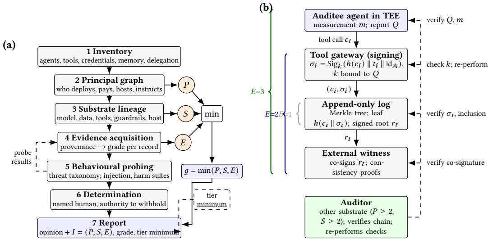
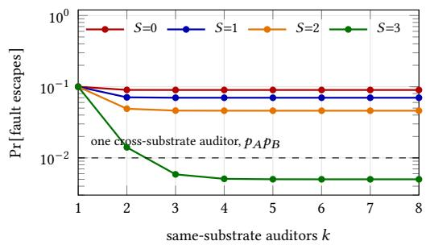
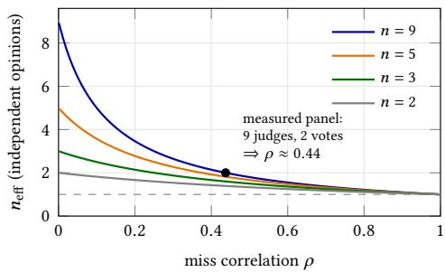
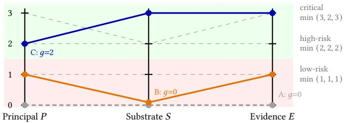

# Who Audits Whom, on What Substrate, with What Evidence? An Independence-Graded Audit Protocol for Agentic AI

MOHAMED CHAHINE GHANEM, Keele University, United Kingdom and University of Liverpool, United Kin dom

Agentic AI systems plan, invoke tools and act with limited supervision; they are now both the subject of audits and, increasingly, the auditor. Independence—the foundation of assurance—is still applied to them as a binary. We argue that it must be graded along three orthogonal axes: principal independence (who controls the auditor), substrate independence (an auditor sharing the auditee’s foundation-model family, toolchain or guardrails fails with it) and evidence independence (whether evidence is attestable rather than self-reported). Each axis has precedent; the contribution is to grade all three on a single audit, aggregate them by the weakest link, and apply the same rubric when the auditor is itself an agent. We give the model a formal basis by transplanting the beta-factor model of common-cause failure from reliability engineering, a seven-step protocol whose outputs a third party can verify, a structural detectability analysis of a procurement-controls agent audited at three grades, and a Monte Carlo study of the model in which a conventional internal audit of an agent—a real audit team, a second agent, provider logs—surfaces 5.9% of the faults it could in principle see and none at all in half the fault classes. We map the triple to the EU AI Act as amended, ISO/IEC 42006, UK public-sector risk-management guidance and audit-regulator practice.

CCS Concepts: • Security and privacy → Systems security; • Computing methodologies → Intelligent agents; • Social and professional topics → Computing / technology policy.

Additional Key Words and Phrases: agentic AI, AI audit, auditor independence, algorithmic monoculture, remote attestation, EU AI Act, ISO/IEC 42006

## ACM Reference Format:

Mohamed Chahine Ghanem. 2026. Who Audits Whom, on What Substrate, with What Evidence? An Independence- Graded Audit Protocol for Agentic AI. 1, 1 (September 2026), 19 pages. https://doi.org/10.1145/nnnnnnn. nnnnnnn

## 1 Introduction

Two practices are converging under the phrase "auditing agentic AI". In the first, independent reviewers evaluate an organisation’s autonomous agents for observability, containment and accountability [7, 56]. In the second, assurance functions deploy their own agents to test controls continuously over whole populations rather than samples, a shift regulators now monitor [24, 52]. Both borrow the concept that has carried assurance for a century: independence.

In the professional codes, independence is a property of people and money: the auditor must be free of compromising interests and relationships, and the determination is binary [32]. This is insuficient for agentic systems for three reasons. First, the principal who controls an auditing agent may be independent while the agent is not: it may run on the auditee’s infrastructure, hold its

Author’s Contact Information: Mohamed Chahine Ghanem, mohamed.chahine.ghanem@liverpool.ac.uk, Keele University, School of Computer Science and Mathematics, Keele, United Kingdom and University of Liverpool, Cybersecurity Institute, Liverpool, United Kingdom.

credentials, or be steerable through its tool outputs [7, 51]. Second, auditor and auditee increasingly share a substrate—model family, toolchain, guardrails—and shared substrates fail together [4, 39, 59]: models prefer their own outputs [62], correlated judge panels carry far fewer independent votes than they seat [41], and agents can coordinate covertly [48]. Third, the evidence behind an opinion is usually generated by the system under audit—logs, traces and self-reports that the agent, its provider or its host could alter—so even privileged access does not settle what happened [6]. Guidance in force inherits all three gaps: the UK’s 2026 risk-management toolkit for public-sector AI has teams treat risks with testing by people "independent from the AI project team" and with logging that makes a system auditable, without saying how independent, or how much a log proves [18].

We argue that independence should be graded, not declared, and make four contributions. C1 A three-axis model (Section 3, Table 2) in which each axis is graded 0–3 on a stated basis—incentives for �, shared components for �, the strongest adversary survived for �—and combined by a weakest- link rule for which we give an argument. C2 A quantitative basis for the substrate axis (Eqs. 1–2, Fig. 2) carrying monoculture, judge-correlation and AI-control results into assurance. C3 A sevenstep protocol with third-party-verifiable outputs (Section 4, Table 3, Fig. 1), applied symmetrically to audits of agents and to agents as auditors. C4 A structural analysis of which axis closes which fault class (Section 6, Table 4) and a Monte Carlo study of the model (Section 6) that quantifies the gap between configurations and tests the aggregation rule against alternatives. C5 A mapping to instruments now in force (Section 8). Section 2 fixes the vocabulary and scope; Section 3 positions these claims.

## 2 Definitions and Scope

Two of the three axes rest on terms that are not settled in the literature, so we fix them before using them.

Definition 2.1 (Agentic AIsystem). An AIagent is an automated entity that senses its environment, responds to it and acts to achieve goals (ISO/IEC 22989:2022, cl. 3.1.1) [33]. A system is agentic to the degree that it pursues complex goals with limited direct supervision [56], a degree that Chan et al. decompose into underspecification of the objective, directness of impact, goal-directedness and long-term planning [9]. Agenticness is thus a matter of degree, and the protocol below applies wherever a system holds credentials, invokes tools and acts between human reviews.

A procurement agent that reads invoices, matches them and raises exceptions without an intervening approval is high on all four dimensions; a classifier that scores an application for a human decider is low on all four and needs no more than a conventional model audit.

Definition 2.2 (Substrate). The substrate of an AI system is the set of technical components on which its behaviour depends and whose failures it inherits: the foundation model (family and version), the fine-tuning and alignment data, the tool and connector layer, the guardrail and classifier stack, and the hosting environment. Two systems share substrate to the extent that these coincide.

A cloud API call to a frontier model and an embedded controller running a distilled version of that model share the family but not the host; two agents from diferent vendors behind one connector framework share the tool layer but not the model. We are aware that "substrate" is not established terminology in this sense and use it stipulatively for want of a shorter handle. The phenomenon is well established under other labels—algorithmic and model monoculture [4, 39] correlated failure and concentration risk from shared infrastructure, and the AI supply chain—and readers should map the term onto whichever their own literature uses. What it adds is one name for the components whose sharing makes two systems fail together, which is the quantity an audit needs to score.

Definition 2.3 (Independence triple and grade). An audit of an agentic system reports the triple $I = ( P , S , E ) \in \{ 0 , 1 , 2 , 3 \} ^ { 3 }$ , in which � grades the auditor’s principal, � the disjointness of the two substrates and � the strongest adversary the evidence survives (Table 2). Its grade is $g = \operatorname* { m i n } ( P , S , E )$

Scope and assumptions. The protocol grades the independence of an audit. It does not certify a system as safe, correct or compliant: a high grade on a badly designed audit buys only well-attested irrelevance, and nothing here removes the need for the audit to ask the right questions. Three assumptions are load-bearing and are revisited in Section 9: that the hardware root of trust and the external witness are not themselves compromised; that principals do not collude outside the channels the grades model; and that substrate lineage, where disclosed, is disclosed truthfully.

## 3 Related Work and Positioning

Each axis has a literature. Principal independence is governed by the professional codes and ISO/IEC 42006’s impartiality requirements for certification bodies [32, 35]; algorithmic-audit frameworks define it as the absence of contractual or financial conflict [14, 43, 53]; frontier-AI work asks which bodies should audit and proposes safeguards against auditor capture [5, 57]. Substrate correlation is documented for deployed models [4, 39, 59]; for LLM judges, where nine from seven model families were found to carry roughly two independent votes [41]; and for AI-control monitors, where same-model "untrusted" monitoring degrades under collusion and is repaired with para- phrasing, resampling or a trusted weaker model [2, 26, 30, 36]. Attestable evidence is the object of TEE-based benchmark audits [55], TEE-isolated witnessing of agent transcripts [54], cryptographic binding of tool use [65] and verifiable inference [58]; visibility and identity infrastructure supplies the records these mechanisms attest [7, 8, 10]; layered and access-graded audits stratify what is examined and how much is seen [6, 47].

Coincidentfailure in redundant systems. The substrate axis has a lineage outside AI that we adopt rather than reinvent. Software reliability engineering asked the same question of independently developed program versions and answered it empirically: Knight and Leveson found that twenty seven versions written independently to one specification failed together far more often than independence predicts, and concluded that the independence assumption underlying �-version programming does not hold [40]. Eckhardt and Lee, and later Littlewood and Miller, gave the theory—a dificulty function over the input space means versions fail on the same hard inputs even with no shared code [20, 45]. Reliability practice encodes the residue as the beta factor: the share of a component’s failures that are common-cause [25], estimated in safety engineering by a structured checklist [31]. Shared foundation models make the AI case strictly worse than the case those authors studied, because the components are shared by construction rather than converging by accident. Section 4 transplants the beta-factor model; the contribution is the transplant and its use in grading, not the model.

Analytic correspondence. Three of these lines are special cases of, or orthogonal complements to, the model of Section 3, which is how we position rather than displace them. The design-efect arithmetic applied to LLM juries [41] is Eq. (2) applied to a panel of evaluators rather than to an audit, and supplies the calibration below. The trusted/untrusted monitor distinction of AI control [30] is the binary collapse of �—untrusted monitoring is �=0, a trusted weaker model �≥2—and its repairs, paraphrasing, resampling and honeypots, are ways of lowering common-mode failure at fixed principal [2, 26, 36]. Attested benchmark audits [55] instantiate �=3 for a single evaluation run; extending that guarantee to the runtime tool calls of a deployed agent is what Fig. 1(b) specifies.

Orthogonality. The two established stratifications are orthogonal to ours and compose with them. Access hierarchies grade how much the auditor sees [6]; � grades whether what is seen could have been fabricated, so white-box access to unattested artefacts is high access at �=1. Layered audits grade what is examined—governance, model, application [47, 53]—which is orthogonal to who examines it and on what substrate. An audit is therefore located in (layer, access, �, �, �), and adopting the triple discards nothing already spent on the other two.

Table 1. Positioning against the closest prior work. ✓ addressed; ⊖ partly (see text); ✗ absent. "Graded" means more than a binary independent/not determination.
<table><tr><td>Line of work</td><td>Graded indep.</td><td>Substrate axis</td><td>Attestable evidence</td><td>Weakest link</td><td>Both directions</td></tr><tr><td>Professional codes; ISO/IEC 42006 [32, 35]</td><td>Θ</td><td>X</td><td>x</td><td>X</td><td>x</td></tr><tr><td>Algorithmic-audit frameworks [14, 43, 53]</td><td>Θ</td><td>X</td><td>X</td><td>x</td><td>X</td></tr><tr><td>Frontier-AI auditor safeguards [5, 57]</td><td>Θ</td><td>X</td><td>x</td><td>X</td><td>X</td></tr><tr><td>Layered and access-graded audits [6, 47]</td><td>X</td><td>x</td><td>Θ</td><td>X</td><td>x</td></tr><tr><td>Agent visibility and identity [7, 8, 10]</td><td>X</td><td>X</td><td>Θ</td><td>X</td><td>x</td></tr><tr><td>Coincident failure of redundant</td><td>x</td><td>√</td><td>x</td><td>Θ</td><td>x</td></tr><tr><td>versions [20, 25, 40, 45] Monoculture; correlated judges [4, 39, 41, 59]</td><td>x</td><td>J</td><td>X</td><td>X</td><td>X</td></tr><tr><td>AI control; untrusted monitoring [2, 26, 30, 36]</td><td>X</td><td>Θ</td><td>x</td><td>X</td><td>x</td></tr><tr><td>Attested evaluation and witnessing [54, 55, 58, 65]</td><td>x</td><td>X</td><td>√</td><td>X</td><td>x</td></tr><tr><td>This letter</td><td>L</td><td>L</td><td></td><td>√</td><td>L</td></tr></table>

Table 1 summarises the gap. No prior work grades the three properties on one audit, aggregates them by the weakest link, or applies the same rubric to an AI agent when it is the auditor. The closest neighbour [41] quantifies judge correlation with the design-efect arithmetic of Section 3, but as an evaluation-quality diagnostic: no principal or evidence axis, no protocol. Our claim is the joint, symmetric grading and its protocol; the pillars are borrowed and cited.

## 4 Three Axes and Their Formal Basis

Principal independence (�). Who controls the auditor? The grades run from self-review, through a second team in the same reporting line and a separate organisation paid by the auditee—as most third-party algorithmic audits are today [14]—to one appointed and paid by a party other than the auditee, with enforceable access rights (Table 2). � is the axis the codes and ISO/IEC 42006 already regulate.

Substrate independence (�). Do auditor and auditee share components whose failures would coincide? A substrate comprises the foundation model (family and version), alignment data, the tool and connector layer, guardrails and hosting. When decision-makers share a model, the individuals one rejects tend to be rejected by all [4, 39, 59]; a blind spot in the auditee is therefore likely to be one in a same-substrate auditor. An injection that hijacks the agent [16, 64] tends to deceive a same-family monitor; a judge prefers text it would itself have written, GPT-4’s self-preference bias measured at 0.520 [62]; and agent populations can hide coordination inside ordinary outputs [48]. Prior work modelled such coincident failure through a correlation parameter $\rho$ and argued that only a reviewer on a diferent substrate, with authority to veto, reliably breaks it [27]; � operationalises that argument, and cross-principal steganalysis of covert coordination [28] is one instrument for reaching Grade 2 or above.

Evidence independence (�). Could the evidence have been altered by the auditee, its provider or its host without detection? The grades are defined by the strongest adversary the evidence survives (Table 2(b)): none (the agent’s own narrative); the agent only (provider-controlled logs, the visibility measures of [7]); tampering after commitment (Merkle-logged records with externally witnessed roots, as in certificate transparency [44], bound to signed tool calls and agent identifiers [8, 10]); and fabrication before commitment (records produced inside attested execution [3, 13, 50, 55] or, as it matures, verifiable inference [58]). Black-box access is insuficient for rigorous audits [6]; � adds that white-box access is too if the artefacts are unattested.

Formal basis. Let a fault be missed by the auditee � with probability ${ \mathcal { P } } A$ and by an AI auditor � with probability ${ \mathit { p } } _ { B } ,$ the miss events having correlation $\rho \in \left[ 0 , 1 \right]$ . Since $\mathrm { C o v } ( M _ { A } , M _ { B } ) =$ $\operatorname* { P r } [ M _ { A } = 1 , M _ { B } = 1 ] - p _ { A } p _ { B }$ for the miss indicators,

$$
\mathrm { P r [ b o t h ~ m i s s ] } ~ = ~ p _ { A } p _ { B } + \rho \sqrt { p _ { A } \mathopen { } \mathclose \bgroup \left( 1 - p _ { A } \aftergroup \egroup \right) } \mathcal { P } _ { B } \mathopen { } \mathclose \bgroup \left( 1 - p _ { B } \aftergroup \egroup \right) ,\tag{1}
$$

which for $p _ { A } = p _ { B } = p$ rises linearly from $p ^ { 2 }$ at $\rho = 0$ to $\boldsymbol { p }$ at $\rho = 1 \colon \mathtt { a }$ perfectly correlated auditor adds nothin . For � exchan eable auditors with airwise correlation $\rho ,$ the variance of the mean miss indicator is $\frac { \mathop { p } ( 1 - p ) } { n } \left[ 1 + ( n - 1 ) \rho \right]$ ; equating it with that of $n _ { \mathrm { e f f } }$ independent auditors gives the design efect of survey sampling [38],

$$
n _ { \mathrm { e f f } } ~ = ~ \frac { n } { 1 + ( n - 1 ) \rho } ~ \xrightarrow [ n \to \infty ] { } ~ \frac { 1 } { \rho } ,\tag{2}
$$

so at $\rho = 0 . 5$ no number of same-substrate agents delivers more than two opinions (Fig. 2(b)).

A common-shock model for �. The grades are only as principled as the correlation they proxy, so we give � a generative model rather than stipulating an ordering. The model is not new: it is the beta-factor treatment of common-cause failure [25, 31], applied to an auditor and an auditee instead of to redundant channels. Let the substrate be a set of components—model family and version, alignment data, tool layer, guardrails, host—and � those the auditor shares with the auditee. For a given fault class, each shared component � independently induces a common-mode miss, in which both parties fail for the same reason, with probability $\gamma _ { c } ;$ absent any common-mode event the two miss independently with residual probability $q .$ Then

$$
\gamma _ { D } = 1 - \prod _ { c \in D } ( 1 - \gamma _ { c } ) , \qquad \quad p = \gamma _ { D } + \left( 1 - \gamma _ { D } \right) q ,\tag{3}
$$

and substituting the induced joint probability $\gamma _ { D } + \bigl ( 1 - \gamma _ { D } \bigr ) q ^ { 2 }$ into Eq. (1) gives

$$
\rho ~ = ~ { \frac { \gamma _ { D } ~ ( 1 - q ) } { \gamma _ { D } + ( 1 - \gamma _ { D } ) q } } ,\tag{4}
$$

which is 1 when every miss is common-mode (�=0) $( q { = } 0 )$ and 0 when no component is shared. The ratio $\beta = \gamma _ { D } / p$ is exactly the beta factor of reliability engineering—the share of a reviewer’s misses that are common-cause—so the substrate axis can be read as a coarse beta-factor scale for AI auditors.

Proposition 4.1 (Substrate grades are monotone in �). $\rho )$ $I f D ^ { \prime } \subseteq D$ then $\gamma _ { D ^ { \prime } } \leq \gamma _ { D }$ , and at fixed �, $\rho ^ { \prime } \le \rho$

Proof sketch. $\gamma _ { D }$ is one minus a product of factors in [0, 1], so dropping a factor cannot increase it; and diferentiating Eq. (4) gives $\partial \rho / \partial \gamma _ { D } = q ( 1 - q ) / p ^ { 2 } \geq 0$ . Each grade of � removes shared components (Table 2), so the ordering of the grades follows from the model rather than from stipulation. □

Proposition 4.2 (Cross-substrate dominance). With � auditors all sharing � with the auditee, Pr[fault escapes] $= \gamma _ { D } + ( 1 - \gamma _ { D } ) q ^ { k }  \gamma _ { D }$ . No panel size reduces the escape probability below $\gamma _ { D . }$ whereas a single cross-substrate auditor achieves $p _ { A } p _ { B } ;$ one such auditor therefore dominates an unbounded same-substrate panel whenever $p _ { A } p _ { B } < \gamma _ { D }$

Proof sketch. All � miss exactly when the common-mode event occurs or all � residual misses do; the residual term vanishes geometrically while $\gamma _ { D }$ does not. Setting $\gamma _ { D } = 0$ recovers independence and the bound $ { p _ { A } }  { p _ { B } }$ □

The floor is the point $( \mathrm { F i g . 2 ( a ) } )$ : at $p = 0 . 1 0$ the independent bound is $p _ { A } p _ { B } = 0 . 0 1$ , so any shared- component contribution above one percentage point makes a single cross-substrate reviewer strictly better than any number of same-substrate ones—an argument for � that headcount cannot answer.

Calibration against a measured panel. Reading a reported result through Eq. (2) puts numbers on the grades. Nine LLM judges drawn from seven model families were found to carry roughly two independent votes [41]; $n _ { \mathrm { e f f } } = 2$ at $n = 9$ implies $\rho \approx 0 . 4 4$ , and inverting Eq. (4) at $p = 0 . 1 0$ gives $\gamma _ { D } \approx 0 . 0 4 6$ , that is $\beta \approx 0 . 4 6$ . The comparison with engineering practice is unflattering: IEC 61508 expects beta factors of roughly 0.005 to 0.05 for diverse programmable electronics [31], an order of magnitude below the figure implied by seven-vendor model diversity. Vendor diversity $( S { = } 2 )$ therefore lowers $\rho$ without driving it near zero, which is why Grade 3 asks for a deterministic verifier on the load-bearing checks rather than for more models; and $\gamma _ { D } \approx 0 . 0 4 6 \gg p _ { A } p _ { B }$ places that configuration well inside the dominance regime of Proposition 4.2. The transfer is indicative, not established: those judges scored generations, not audits.

Proposition 4.3 (The evidence grades form a chain). Let $K ( e )$ be the set of tampering actions detectable at grade �. Then $K ( 0 ) \subset K ( 1 ) \subset K ( 2 ) \subset K ( 3 )$ , so � totally orders the configurations of Table $2 ( b )$

Proof sketch. Each mechanism strictly adds to the last: logging removes the agent’s discretion over its own record; signing and external witnessing remove the operator’s and provider’s ability to alter or fork that record after commitment; attestation removes the provider’s ability to fabricate it before commitment. Nothing in the chain closes compromise of the attestation root, so $E { = } 3$ is the top of a bounded chain, not a soundness guarantee. □

Proposition 4.4 (Weakest link). Ifan adversary seeking an undeserved favourable opinion may attack any single axis, the assurance obtainable is bounded by min $( P , S , E )$ , and any aggregate exceeding the minimum overstates it.

Proof sketch. Read $g _ { X }$ as the highest adversary level axis � resists—literally for � by Proposition 4.3, as incentive strength for � and as tolerated $\gamma _ { D }$ for �. A captured principal signs any opinion; a shared substrate misses what the auditee misses; altered evidence supports any narrative. Success on one axis sufices, so the aggregate is no stronger than the weakest, and a mean or weighted sum assigns assurance the configuration does not have. □

Hence a regulator-appointed auditor $\left( P { = } 3 \right)$ running the auditee’s model (�=0) on self-reported logs (�=0) has grade 0, however impressive its mandate.

## 5 The Protocol

Seven steps produce the triple � as a mandatory part of the report $( \mathrm { F i g . ~ } 1 ( \mathrm { a } ) )$ ; Table 3 states what each records and outputs and what a third party can verify. Two rules do most of the work. Where substrate lineage is withheld, � is capped at 1: unknown is not independent. And AI systems may generate hypotheses and evidence at any grade but do not issue the opinion; a named human with authority to withhold it does [27], as UK and US audit regulators expect of generative AI [23, 52].

Table 2. (a) Independence rubric. An audit reports (�, �, �); its grade is min(�, �, �). Indicative tier minima: lowrisk (1, 1, 1); high-risk (2, 2, 2); safety-critical (3, 2, 3). (b) Evidence latice: tampering that remains undetectable (✗) or is detectable (✓) at each grade of �.
<table><tr><td>(a) Axis</td><td>0</td><td>1</td><td>2</td><td>3</td></tr><tr><td>Principal P</td><td>Self-review by the agent or its operators</td><td>Second team, same organisation and reporting line</td><td>Separate organisation engaged and paid by the auditee</td><td>Appointed and paid by a third party (regulator, notified body, insurer) with enforceable access</td></tr><tr><td>Substrate S</td><td>Same model family and version, prompts, guardrails, toolchain and hosting</td><td>Different model version; shared toolchain, guardrails or hosting</td><td>Different model family, vendor and toolchain; at most a shared cloud</td><td>Cross-vendor ensemble plus deterministic verifier for load-bearing checks; lineage disclosed and verifiable</td></tr><tr><td>Evidence E</td><td>Agent&#x27;s own narrative or self-generated report and traces</td><td>Provider-controlled logs</td><td>Signed tool-call records in an externally witnessed Merkle log, bound to agent identifiers</td><td>Records produced under attested execution or verifiable inference</td></tr></table>

<table><tr><td>(b) Tampering action (adversary)</td><td>E=0</td><td>E=1</td><td>E=2</td><td>E=3</td></tr><tr><td>Agent edits or omits items in its own report (agent)</td><td>X</td><td></td><td></td><td></td></tr><tr><td>Operator or host edits stored logs after the fact (operator, host)</td><td>x</td><td>x</td><td></td><td></td></tr><tr><td>Provider rewrites or forks log history (provider)</td><td>X</td><td>x</td><td></td><td></td></tr><tr><td>Provider fabricates plausible records that never ran (provider, host)</td><td>X</td><td>x</td><td>X</td><td></td></tr><tr><td>Compromise of the enclave or attestation root (hardware vendor, advanced attacker)</td><td>X</td><td>x</td><td>X</td><td></td></tr></table>

  
Fig. 1. (a) The protocol: Steps 2–4 assign the axes, probing results enter as evidence, and the weakest axis is reported against the tier minimum. (b) The evidence chain reaching �=3 and the auditor’s checks (Section 4). Without atestation, �=2; without signing and witnessing, �=1.

Algorithm 1 Independence grading of an audit. Returns the triple, the grade, and whether the   
deployment’s tier minimum is met.   
Require: auditee agent �; auditor � (human team, agent, or both); risk tier �   
Ensure: triple �, grade �, verdict   
1: A ← Inventory $( A ) ;$ if � is an agent then $\mathcal { A } _ { B } $ Inventory(�)   
2: � ← PrincipalGraph(�, �) ⊲ who deploys, pays, hosts, instructs   
3: $P \gets 0$ if � reviews its own work; 1 if same reporting line; 2 if separate organisation paid by   
the auditee; 3 if appointed and paid by a third party with enforceable access   
4: $\mathcal { L } _ { A } , \mathcal { L } _ { B } \gets$ Lineage(�), Lineage(�)   
5: if $\mathcal { L } _ { A }$ or $\mathcal { L } _ { B }$ undisclosed then   
6: � ← min(1, SharedGrade $( \mathcal { L } _ { A } , \mathcal { L } _ { B } ) )$ ⊲ unknown is not inde endent   
7: else   
8: � ← SharedGrade $( \mathcal { L } _ { A } , \mathcal { L } _ { B } )$ ⊲ by shared components, Table 2   
9: end if   
10: $\varepsilon \gets \emptyset$   
11: for all records � the opinion will rest on do   
12: �(�) ← 3 if � passes attestation, signature, inclusion and consistency checks; 2 if signature,   
inclusion and consistenc onl ; 1 if rovider lo ; 0 otherwise   
13: $\mathcal { E }  \mathcal { E } \cup \{ ( r , e ( r ) ) \}$   
14: end for   
15: $\varepsilon \gets \varepsilon \cup$ Probe(�, taxonomy, substrate at distance ≥ 1 from $\mathcal { L } _ { A } )$   
16: � ← min $\{ e ( r ) : r$ load-bearing}   
17: � ← (�, �, �); � ← min $( P , S , E )$   
18: opinion ← HumanDetermination(E) ⊲ a named signatory, never an AI system   
19: return �, �, $g \geq$ TierMinimum(�)

Evidence chain. Fig. 1(b) shows the chain reaching �=3 and the auditor’s checks: verify the attestation report � against the published measurement � of the agent’s code and configuration [3, 13, 50]; confirm the signing key � is bound to $Q ,$ so signatures could only come from attested code; verify each load-bearing record’s signature $\sigma _ { i } ,$ its inclusion proof under a witnessed root $r _ { t }$ and the consistency proofs between roots [44]; then re-perform those checks on a substrate with $S \geq 2 ,$ , treating divergence as a finding. Records passing every check grade 3; without attestation, 2; unsigned provider logs, 1. � is the minimum over load-bearing records; verification cost is linear in their number.

Algorithm 1 states the same procedure as a decision rule. Two lines carry the weight: the cap on � when lineage is withheld, and the assignment of � as a minimum over load-bearing records rather than a maximum over available ones.

Symmetry. When the auditee is a corporate workflow and the auditor is an agent, Steps 1–4 are applied to the auditing agent: � asks who controls it; � whether it shares a substrate with the s stems that roduced the workflow’s records (a model auditin invoices drafted b its own family is Grade 0); � whether its own traces and tool calls are attested. The same rubric therefore scores both practices, catching correlated blind spots dressed as independent confirmation in either direction; AI-control designs [2, 30] and autonomous security testing [29, 60] are, in these terms, attempts to raise � and � with � held fixed.

Table 3. Protocol specification: what each step records, what it outputs, and what a third party can verify.
<table><tr><td>Step</td><td>Records</td><td>Output</td><td>Third-party verification</td></tr><tr><td>1 Inventory</td><td>Agent identities and delegation chain, tools, credential scopes, memory, systems acted upon; likewise for any auditing</td><td>Signed inventory A</td><td>Cross-check against identity provider, secret store, gateway configuration</td></tr><tr><td>2 Principal graph</td><td>agent [7, 10, 56] Who deploys, pays for, hosts and can instruct each party</td><td>Control-and-payment graph; P</td><td>Contracts, payment records, conflict-of-interest declarations</td></tr><tr><td>3 Substrate lineage</td><td>Model family and version, alignment data where disclosed, toolchain, guardrails, hosting,</td><td>Lineage  $\mathcal { L } _ { A } , \mathcal { L } _ { B } ; S$  (capped at 1 if withheld)</td><td>Model identifiers from attested runtime; vendor and toolchain distinctness</td></tr><tr><td>4Evidence acquisition 5 Behavioural probing</td><td>Provenance of every record the opinion rests on Declared threat taxonomy [12, 46, 51, 61]; scenario, harm and injection</td><td>Evidence set E, grade e(r); E = min over load-bearing r Probe results committed to E at their own grade</td><td>Re-grade a sample of records (Section 4 checks) Reproduce a sample of probes; taxonomy coverage</td></tr><tr><td>6 Determination</td><td>away [11] E, I = (P, S, E), tier minimum</td><td>Opinion signed by a named human with authority to withhold</td><td>Signatory&#x27;s authority; no AI issued the opinion</td></tr><tr><td>7 Report</td><td>Opinion, I, grade, tier minimum</td><td>Report with I in a machine-readable field</td><td>Triple against tier minimum; conclusions traced to records in 8</td></tr></table>

## 6 Analytical Case: Structural Detectability

This is an analytical case, not an empirical evaluation. An autonomous procurement-controls agent reads purchase orders, invoices and goods receipts, performs three-way matching, flags exceptions and drafts findings. It is audited under three configurations (Fig. 2(c)); for four fault classes we ask whether detection is guaranteed, excluded or probabilistic by construction (Table 4): F1, an indirect prompt injection in a supplier note that suppresses an exception [16]; F2, a duplicate invoice with altered payee details; F3, post-hoc alteration of the exception log by an operator; F4, covert coordination between auditee and auditor agents to suppress a finding [48].

Configuration A — self-attestation, � = (0, 0, 0). The agent produces a monthly "controls attestation" of its own exceptions. Reviewer and reviewed coincide, the substrate is identical, and the evidence is the agent’s narrative. Grade 0. F1 and F2 are caught only if the agent catches them; F3 is undetectable, since nothing binds the narrative to what happened; F4 is moot—no second agent exists, which is not reassurance. This is what most dashboards deliver today.

Configuration B — internal audit, same family, $I = \left( 1 , 0 , 1 \right)$ . Internal audit deploys a second agent, on the same model family and connector stack, to re-perform matching on the provider’s logs. � rises to 1, but � remains 0: the injection that suppressed the flag in the auditee would tend to suppress it in the same-family auditor, and a judge preferring its own family’s phrasing [62] is a poor arbiter of that family’s findings, so F1 and F2 are caught only with the correlated probability of Eq. (1). � is 1: an operator with host access can rewrite provider logs, so F3 stays undetectable; and a shared substrate gives F4 both channel and prior. Grade 0—no better than A, despite a real audit team and a second agent. The cause is the substrate, not the team’s diligence.

Table 4. Structural detectability of four fault classes. ✓ detected by construction; ✗ undetectable by construction; ∼ probabilistic and correlated with the auditee’s miss; ◦ probabilistic and near-independent. Only the evidence axis closes F3 and only the substrate axis closes F4.
<table><tr><td>Fault class</td><td>A (0, 0, 0) B (1, 0, 1) C (2,3, 3)</td><td></td><td></td><td>Deciding axis</td></tr><tr><td>F1 Injection suppresses an exception</td><td>x</td><td>2</td><td>o</td><td>S (decorrelated miss)</td></tr><tr><td>F2 Duplicate invoice, altered payee</td><td>2</td><td></td><td></td><td>S (deterministic verifier)</td></tr><tr><td>F3 Operator rewrites log post hoc</td><td>X</td><td>x</td><td></td><td>E (witnessed log, attested origin)</td></tr><tr><td>F4 Covert auditee-auditor coordination</td><td></td><td>x</td><td></td><td>S, P (no shared vendor or tool layer)</td></tr></table>

(a) Prop. 4.2, �=0.10, � by grade  

(b) Eq. (2)  

(c)  
  
A: self-attestation (0, 0, 0) B: internal audit, same family (1, 0, 1) C: external, cross-substrate, attested (2, 3, 3)  
Fig. 2. (a) Probability that a fault escapes � same-substrate auditors under the common-shock model at the beta factors used in Section 6: the curves plateau at $\gamma _ { D }$ , which no panel size crosses, while a single cross-substrate auditor reaches ${ \pmb { \mathscr { P } } } A { \pmb { \mathscr { P } } } B$ (dashed). (b) Independent opinions delivered by � correlated auditors, with the measured judge panel of [41] read through Eq. (2). (c) Independence profiles of the configurations of Section $5 ;$ each grade $g$ is the lowest point its polyline touches; dashed polylines are the tier minima of Table 2.

Configuration C — external, cross-substrate, attested, $I = ( 2 , 3 , 3 )$ . An external firm $\left( P { = } 2 \right)$ re-performs the matching with a diferent vendor’s model and a deterministic rule engine for the three-way match (�=3). The auditee’s agent runs in an attested enclave whose tool calls are signed and committed to a witnessed log; the auditor’s inference is likewise attested (�=3). Grade 2. F2 is detected deterministically; F3 because any rewrite breaks an inclusion or consistency proof; F4 is closed by construction, the agents sharing neither vendor nor tool layer, with residual covert channels the target of cross-principal steganalysis [28]; F1 is caught with near-independent probability ${ \pmb { \mathscr { P } } } A { \pmb { \mathscr { P } } } B$ rather than $\textstyle { p . }$ . Grade 3 requires a change of principal, not of technology.

Table 5. Simulated probability that a fault the auditee missed is both surfaced and reported, by configuration and fault class (200,000 trials per cell; 95% Wilson intervals all within ±0.25 points). The last column is the worst case over fault classes, which is what an adversary who chooses the atack obtains. Configurations E to G each hold two axes fixed and vary the third; H is the indicative high-risk minimum of Table 2.
<table><tr><td>Configuration</td><td>I</td><td>g</td><td>F1</td><td>F2</td><td>F3 / F4</td><td>worst case</td></tr><tr><td>A self-attestation</td><td>(0,0,0)</td><td>0</td><td>0.0%</td><td>0.0%</td><td>0.0%</td><td>0.0%</td></tr><tr><td>B internal audit, same family</td><td>(1,0,1)</td><td>0</td><td>5.9%</td><td>5.9%</td><td>0.0%</td><td>0.0%</td></tr><tr><td>C external, cross-substrate, attested</td><td>(2,3,3)</td><td>2</td><td>77.3%</td><td>90.0%</td><td>77.3%</td><td>77.3%</td></tr><tr><td>D regulator-appointed, otherwise as C</td><td>(3,3,3)</td><td>3</td><td>85.9%</td><td>100%</td><td>85.9%</td><td>85.9%</td></tr><tr><td>E external firm, auditee&#x27;s model family</td><td>(2,0,2)</td><td>0</td><td>8.9%</td><td>8.9%</td><td>8.9%</td><td>8.9%</td></tr><tr><td>F internal team, cross-substrate, attested</td><td>(1,3,3)</td><td>1</td><td>51.6%</td><td>60.0%</td><td>51.6%</td><td>51.6%</td></tr><tr><td>G regulator-appointed, provider logs only</td><td>(3,3,1)</td><td>1</td><td>85.9%</td><td>100%</td><td>0.0%</td><td>0.0%</td></tr><tr><td>H high-risk tier minimum</td><td>(2,2,2)</td><td>2</td><td>45.8%</td><td>45.8%</td><td>45.8%</td><td>45.8%</td></tr></table>

## 7 Simulation Study

Section 6 argues structurally; this section puts numbers on the same case by simulating the model of Section 4. The study establishes what the model implies and whether the aggregation rule is the right one under the model’s own assumptions. It is not an empirical measurement: no result here is evidence about any deployed agent, and the parameters below are declared rather than estimated. Code and seed are given in Section 9.

Set-up. A fault class reaching audit is by construction one the auditee missed, so the audit’s contribution is the conditional probability that a second reviewer catches it, 1 − Pr[both miss]/�, which is where the substrate enters. Each grade of � fixes a beta factor $\beta = \gamma _ { D } / p \colon 0 . 9 0$ and 0.70 at grades 0 and 1, where no diversity is present; 0.46 at grade 2, the value implied by the measured judge panel of Section 4; and 0.05 at grade 3, the top of the IEC 61508 band for diverse programmable electronics, reachable only by adding a non-learned verifier. Each grade of � fixes a probability that a fault once caught is actually reported—0.2, 0.6, 0.9, 1.0—since detection is not disclosure. Each grade of � gates whether the fault leaves a record the auditor could examine at all: F1 and F2 need a provider log $\left( E \geq 1 \right)$ , F3 and F4 need tamper-evidence $\left( E \geq 2 \right)$ . We take $p = 0 . 1 0$ and run 200,000 trials per cell; Monte Carlo estimates agree with the closed form to within the Wilson intervals throughout. Eight configurations are simulated: the three ofSection 6, a regulator-appointed variant, three that hold two axes fixed and move the third, and the indicative high-risk minimum. Because the parameters are declared rather than measured, Results 5 to 7 report an ablation, a sweep of the parameters and the full 43 grid.

Result 1: the grade-0 gap is large, and the average hides it. Configuration B—a real internal audit team, a second agent, provider logs—surfaces and reports 5.9% of the faults in the two classes it can see and none of the other two (Table 5). Averaged over fault classes it scores 3.0%, which already looks poor; its worst case, which is what an adversary choosing the attack obtains, is zero. Configuration C reaches 77.3% worst-case, and the further step to D—a change of principal only, no change of technology—adds 8.6 points. The ordering is not surprising; the magnitude is, and it comes from the substrate. The conditional catch rate of a single reviewer rises from 9.9% at �=0 through 29.0% and 50.9% to 85.9% at �=3, so on these parameters the substrate axis moves detection by a factor of nine while the principal axis moves disclosure by a factor of five.

Table 6. Robustness of the simulated results. Left: axis ablation, reporting the change in worst-case and mean detection when a single axis is raised from the (1, 1, 1) baseline or dropped from the (3, 3, 3) ceiling. Right: worst-case assurance across all 64 triples, grouped by grade.
<table><tr><td colspan="5">(a) Ablation of one axis</td><td colspan="5">(b) All 64 triples by grade</td><td></td></tr><tr><td>Axis</td><td>raise 1→3 worst</td><td>mean</td><td>worst</td><td>drop 3→0 mean</td><td>g</td><td>n</td><td>min</td><td></td><td>median</td><td>max</td></tr><tr><td>P</td><td>+0.0</td><td>+5.8</td><td>-85.9</td><td>-89.4</td><td>0</td><td>37</td><td>0.0%</td><td>0.0%</td><td></td><td>9.9%</td></tr><tr><td>S</td><td>+0.0</td><td>+19.2</td><td>-76.0</td><td>-79.6</td><td>1</td><td>19</td><td>0.0%</td><td>17.4%</td><td></td><td>51.6%</td></tr><tr><td>E</td><td>+17.4</td><td>+8.7</td><td>-85.9</td><td>-89.4</td><td>2</td><td>7</td><td>45.8%</td><td>50.9%</td><td></td><td>85.9%</td></tr><tr><td></td><td></td><td></td><td></td><td></td><td>3</td><td>1</td><td>85.9%</td><td>85.9%</td><td></td><td>85.9%</td></tr></table>

Result 2: which axis you buy matters more than how much you spend. Confi urations E to G hold two axes fixed and move the third, which turns the rubric into a procurement question. E is an external firm—a real change of principal, at real cost—running the auditee’s own model family on tamper-evident records: 8.9% worst-case. F is an ordinary internal audit team that has changed nothing about its reporting line but works on a diferent substrate with attested records: 51.6%. On these parameters, substrate diversity bought in-house is worth roughly six times principal independence bought on a shared substrate, and the grades rank the two correctly (0 against 1) where an intuition that equates independence with externality does not. G makes the same point on the evidence axis from the opposite direction: a regulator-appointed auditor on a genuinely diferent substrate, but reading provider logs, detects 85.9% of the two fault classes that leave a record and none of the two that do not, for a mean of 46.5% and a worst case of zero. H, the indicative high-risk minimum, sits at 45.8% on every fault class—balanced, unspectacular, and the only one of the eight with no axis carrying the others.

Result 3: panel size cannot substitute for substrate. Escape probability against panel size plateaus at � within three or four auditors: 9.0% at �=0, 7.0% at �=1, 4.6% at �=2 and 0.5% at �=3, against $p _ { A } p _ { B } = 1 . 0 \%$ for two genuinely independent reviewers (Fig. 2(a)). At grades 0 to 2 a single cross-substrate auditor therefore beats an unbounded same-substrate panel, as Proposition 4.2 requires; at grade 3 it does not, because the deterministic verifier has already removed most of the common- mode term. The dominance result is thus a statement about cheap diversity, not a universal one.

Result 4: the minimum is the honest aggregate, though not the sharpest predictor. We sampled 20,000 tri les uniforml from $\{ 0 , \ldots , 3 \} ^ { 3 }$ and compared three aggregation rules against two targets: expected yield (mean detection over fault classes) and adversarial assurance (worst case over fault classes). Against expected yield the minimum ranks best (Spearman $\rho = 0 . 9 1$ , against 0.78 for the mean and 0.73 for a weighted sum $0 . 5 P + 0 . 3 S + 0 . 2 E )$ . Against adversarial assurance the minimum and the mean are efectively tied (0.69 against 0.68), which we report because it qualifies the claim: the minimum is not a uniformly superior predictor. What separates the rules is overstatement. Rescaling each rule and the true assurance to [0, 1], the minimum credits a configuration with more assurance than it has in 26.5% of cases, with a median overstatement of zero; the mean does so in 92.2% of cases with a median of 0.33, and the weighted sum in 90.8%. Triples with one axis at zero carry 1.3% adversarial assurance against 30.7% for the rest, and it is exactly those that a mean rescues. The case for min is therefore not that it forecasts assurance best but that it is the rule that rarely claims assurance that is not there—which is what an assurance statement is for.

Result 5: each axis is individually necessary, and the weakest one gates the rest. Dropping any single axis from the ceiling to zero costs between 76.0 and 85.9 points of worst-case assurance (Table 6(a)), so none of the three is redundant: a rubric that omitted any one would rate a configuration highly that this one rates at zero. The asymmetry from below is sharper. Raising the principal or the substrate from the (1, 1, 1) baseline all the way to grade 3 moves worst-case assurance by nothing at all, because at �=1 two of the four fault classes leave no record to examine, so there is nothing for a better-motivated or better-decorrelated auditor to find; the same moves buy 5.8 and 19.2 points of mean detection, which is precisely the kind of improvement an average-based score would reward and an adversary would ignore. Only the evidence axis moves the worst case, by 17.4 points. This is the weakest-link rule behaving as Proposition 4.4 says it should, and it is the most direct evidence we have that the rule is doing work rather than decoration.

Result 6: the ordering survives the parameters; the magnitudes do not. The beta factors are declared, so we swept them. Varying the marginal miss rate from 0.02 to 0.30—a fifteen-fold range—and compressing the four substrate beta factors towards their common mean by up to 75%, Kendall’s � between grade and worst-case assurance across all 64 triples stays within 0.606 to 0.647, and the dominance condition of Proposition 4.2 holds in all twenty settings tested. The strict ordering of the eight named configurations is preserved while the substrate grades retain distinguishable beta factors, and breaks once they are compressed by half or more—which is the degenerate case in which the substrate axis has been defined awa . Lettin the beta factor difer between fault classes by up to a factor of three either way, over 2,000 draws, leaves the ranking of the aggregation rules unchanged: the minimum overstates adversarial assurance in 33.5% of cases against 93.7% for both the mean and the weighted sum. What does not survive is the magnitudes. The 5.9% and 77.3% of Table 5 are artefacts of the chosen parameters; the gap between them is not.

Result 7: the grade explains most ofthe assurance, and hides the rest. Across all 64 triples the grade accounts for 77% of the variance in worst-case assurance $( \eta ^ { 2 }$ , Table 6(b)). The residual is the honest cost of an ordinal scale: grade 1 alone spans 0.0% to 51.6%, because configurations F and G are both grade 1 and difer by everything that matters. A reader who needs to separate them must read the triple, not the grade—which is why the protocol requires the triple to be published and treats the grade as a summary of it rather than a replacement for it.

## 8 Policy Hooks

EU AI Act, as amended. Article 12 requires automatic logging for high-risk systems but not tamper-evidence; $E \ge 2$ would give the logs probative value [22]. Article 14 (human oversight) is Step 6; Article 26 places monitoring duties on deployers; Article 43 toggles between conformity assessment by internal control and by a notified body—�=1 versus �=3—while saying nothing about � or �. The Digital Omnibus on AI, proposed in November 2025 and adopted in June 2026, defers Annex III high-risk obligations to 2 December 2027 and Annex I to 2 August 2028 [15, 21], widening the window of voluntary assurance in which the triple lets buyers and insurers compare oferings.

Standards. ISO/IEC 42006:2025, which specifies who may audit and certify AI management systems [34, 35], governs impartiality—�—and is silent on � and �; certification bodies could report the triple now.

UK risk management. The AI Risk Management Toolkit published in September 2026 implements the Orange Book’s risk process for public-sector AI, alongside a roadmap to professionalise third-party AI assurance [17] and a gap analysis flagging agentic-system security as under-studied [19]. It is self-assessment, and most of it needs no audit; but several treatment options do, each specified as a binary (Table 7). A team may therefore record them as applied, and lower its residual-risk score, while the independent testers run the auditee’s model family and the preserved logs stay rewritable by the operator—grade 0 here. Teams are also asked to estimate risk likelihood partly by model analysis: where the estimating model shares a substrate with the system scored, Eq. (2) says the estimate carries less independent information than the count of checks implies. Recording (�, �, �) against each such treatment in the risk workbook costs three integers and makes the residual-risk score mean what it says.

Table 7. Elements of the UK AI Risk Management Toolkit [18] whose eficacy depends on an unstated degree of independence, and what the triple supplies.
<table><tr><td>Toolkit element</td><td>Axis</td><td>As specified</td><td>What the grade adds</td></tr><tr><td>Adversarial testing of accuracy and performance by external</td><td>P,S</td><td>Independent of the AI project team</td><td>Whether the testers share the auditee&#x27;s substrate;  $S \ge 2$ </td></tr><tr><td>experts Test and evaluation by separate teams, to counter groupthink</td><td>P,S</td><td>Separate individuals or teams</td><td>Same-family testers inherit the blind spots they are there to break</td></tr><tr><td>Auditability: process traceability, data provenance, logging</td><td>E</td><td>Logging required; tamper-evidence not</td><td>E ≥ 2 gives the log probative value</td></tr><tr><td>Materials preserved for forensic, regulatory and legal</td><td>E</td><td>Preservation required</td><td>Preserved but alterable is not evidence;  $E \ge 2$ </td></tr><tr><td>review Likelihood estimated by model analysis</td><td>S</td><td>Method listed; correlation not addressed</td><td> $n _ { \mathrm { e f f } }$  discount for a same-substrate estimator, Eq. (2)</td></tr><tr><td>Disclosure of audits; accountability metrics</td><td> $P _ { \mathrm { \ell } } S _ { \mathrm { \ell } } E$ </td><td>Audits disclosed</td><td>The triple is the metadata that makes a disclosed audit interpretable</td></tr></table>

Audit regulators. The Financial Reporting Council’s review of the six largest UK firms found no formal monitoring of the audit-quality impact of their automated tools and, at all but one firm, no indicators for them [24]; the PCAOB stresses continued human supervision of generative-AI output [52]. Both could require the triple whenever an agent contributes evidence, treating a same-substrate agent as �=0 for reliance.

Statutory precedent. New York City’s Local Law 144 has mandated independent bias audits of automated employment decision tools since 2023 [49]; its definition of an independent auditor speaks only to �, and adding minimum � and � would be a modest drafting change.

## 9 Limitations and Validation Plan

Attestation proves which code and configuration ran, not that they behaved correctly: $E { = } 3$ is neces- sary for trustworthy evidence, not suficient for a correct opinion, and inherits the enclave’s trust base and side-channel history [13]; verifiable inference at frontier scale is not production-ready [58]. Substrate lineage depends on disclosure; vendors will contest the $S \leq 1$ cap for undisclosed lineage, but it is the conservative default. Equations (1)–(2) assume exchangeable auditors and a single $\rho ;$ real fault classes difer, which is why Table 4 reasons per class. The common-shock model buys the monotonicity of Proposition 4.1 at the price of two assumptions a critic should press on: that shared components induce common-mode failure independently of one another, which overstates $\gamma _ { D }$ where two shared components fail through the same mechanism, and that the per-component rates $\gamma _ { c }$ are estimable at all—today they are not, so Proposition 4.2 yields a qualitative dominance condition rather than a procurement threshold. The calibration transfers a figure measured on evaluation panels to auditing, which is a hypothesis the study below is designed to test, not a result. The grades are ordinal and the min rule discards information. Section 6 sharpens what we can claim for it: the minimum is not uniformly the better predictor of assurance—against a worst-case target it is level with a mean—and its case rests on rarely overstating rather than on forecasting well. A reader who wants an expected-yield estimate should not use the grade for it. The simulation validates the model, not the world. Its parameters are declared rather than measured, and Result 6 is explicit about what that costs: the rank relationship between grade and assurance is stable across a fifteen-fold sweep of the miss rate and a 75% compression of the substrate beta factors, but the magnitudes are artefacts of the chosen values and should not be quoted as expected detection rates for any real system. Result 7 adds a second caveat that the grade itself carries: it fixes 77% of the variance in worst-case assurance and leaves a within-grade spread of up to 51.6 points, so the triple is the reportable object and the grade only a summary of it. The empirical study this calls for is well defined: inject F1–F4 into benchmark agents [1, 16, 37] audited by agents at $S = 0 , \ldots , 3$ , estimate the beta factor per fault class instead of assuming it, and compare measured detection against the model’s predictions; a cheaper companion study scores the triple retrospectively against treatments already recorded in public-sector risk workbooks [18]. Until that is done the numbers in Section 6 should be read as consequences of the model and nothing more. Finally, Grade-3 principals barely exist; agent-governance law [42] must catch up.

## 10 Ethics, Conflicts of Interest, and Artifact Availability

Ethics. The study involves no human or animal subjects, no personal data and no user research; the simulation uses synthetic draws from a declared model. The protocol itself touches personal data only indirectly: the tool-call records that carry evidence grades may contain personal data, so a deployment applying Step 4 should minimise and retain them under the applicable data-protection regime rather than logging indiscriminately in pursuit of a higher �. There is a real tension here— higher evidence grades mean more retained, more durable records—and a deployment should resolve it by scoping tamper-evidence to load-bearing records rather than to everything the agent does.

Conflicts of interest. The author holds academic appointments at Keele University and the University of Liverpool, advises on cyber resilience in the banking sector, and is a founder of an early-stage company working on agentic AI transparency and audit; that company sells no product implementing this protocol, and the protocol is published without restriction. No funder had any role in the design or conclusions of this work. The self-review risk the paper analyses applies to the paper: a framework proposed by someone with an interest in the assurance market should be read with the incentive in view, which is one reason the rubric is specified so that a third party can apply it without the author’s involvement.

Artifact availability. The simulation of Section 6 is a small Python package with two experiment drivers—one for Results 1 to 4 and one for the ablation, parameter sweep, full grid and heterogeneity checks of Results 5 to 7—together with eighteen unit tests that verify the closed forms against the Monte Carlo draws and check the ablation claims directly. It depends on NumPy and SciPy only and reproduces every number reported here from a fixed seed in un- der two minutes. It is provided with this submission and deposited in a public repository Zenodo https://doi.org/10.5281/zenodo.22768569. There is no data set: the study generates its own draws and depends on no external input.

## 11 Conclusion

Independence was never meant to be a checkbox, and for agentic systems it cannot be. Two agents on the same substrate confirming each other is one opinion, not two—Eq. (2) makes the arithmetic explicit; an audit built on self-reported logs is a narrative, not evidence. On the model of Section 4, an internal audit that does everything an audit function is normally asked to do, but on the auditee’s model family and the provider’s logs, surfaces nothing at all in the worst case. Grading independence along principal, substrate and evidence, and publishing the triple with every opinion, costs little needs no new law and reveals how much an "independent" audit of an agent actually shows.

## References

[1] Maksym Andriushchenko, Alexandra Souly, Mateusz Dziemian, Derek Duenas, Maxwell Lin, Justin Wang, Dan Hendr cks, And Zou, Zico Kolter, Matt Fredrikson, Eric Winsor, Jerome W nne, Yarin Gal, and Xander Davies. 2025. AgentHarm: A Benchmark for Measuring Harmfulness of LLM Agents. In The Thirteenth International Conference on Learning Representations (ICLR 2025). doi:10.48550/arXiv.2410.09024

[2] Aryan Bhatt, Cody Rushing, Adam Kaufman, Tyler Tracy, Vasil Georgiev, David Matolcsi, Akbir Khan, and Buck Shlegeris. 2025. Ctrl-Z: Controlling AI Agents via Resampling. arXiv:2504.10374. doi:10.48550/arXiv.2504.10374

[3] Henk Birkholz, Dave Thaler, Michael Richardson, Ned Smith, and Wei Pan. 2023. Remote ATtestation procedureS (RATS) Architecture. RFC 9334. Internet Engineering Task Force. doi:10.17487/RFC9334

[4] Rishi Bommasani, Kathleen A. Creel, Ananya Kumar, Dan Jurafsky, and Percy Liang. 2022. Picking on the Same Person: Does Algorithmic Monoculture Lead to Outcome Homogenization?. In Advances in Neural Information Processing Systems 35 (NeurIPS 2022). 3663–3678. doi:10.48550/arXiv.2211.13972

[5] Miles Brundage, Noemi Dreksler, Aidan Homewood, Sean McGregor, Patricia Paskov, Conrad Stosz, Girish Sastry, A. Feder Cooper, et al. 2026. Frontier AI Auditing: Toward Rigorous Third-Party Assessment of Safety and Security Practices at Leading AI Companies. arXiv:2601.11699. doi:10.48550/arXiv.2601.11699

[6] Stephen Casper, Carson Ezell, Charlotte Siegmann, Noam Kolt, Taylor Lynn Curtis, Benjamin Bucknall, Andreas Haupt, Kevin Wei, Jérémy Scheurer, Marius Hobbhahn, Lee Sharkey, Satyapriya Krishna, Marvin von Hagen, Silas Alberti, Alan Chan, Qinyi Sun, Michael Gerovitch, David Bau, Max Tegmark, David Krueger, and Dylan Hadfield-Menell. 2024. Black-Box Access is Insuficient for Rigorous AI Audits. In Proceedings ofthe 2024 ACM Conference on Fairness, Accountability, and Transparency (FAccT ’24). ACM, New York, NY, USA, 2254–2272. doi:10.1145/3630106.3659037

[7] Alan Chan, Carson Ezell, Max Kaufmann, Kevin Wei, Lewis Hammond, Herbie Bradley, Emma Bluemke, Nitarshan Rajkumar, David Krueger, Noam Kolt, Lennart Heim, and Markus Anderljung. 2024. Visibility into AI Agents. In Proceedings ofthe 2024 ACM Conference on Fairness, Accountability, and Transparency (FAccT ’24). ACM, New York, NY, USA, 958–973. doi:10.1145/3630106.3658948

[8] Alan Chan, Noam Kolt, Peter Wills, Usman Anwar, Christian Schroeder de Witt, Nitarshan Rajkumar, Lewis Hammond, David Krueger, Lennart Heim, and Markus Anderljung. 2024. IDs for AI Systems. arXiv:2406.12137; Workshop on Regulatable ML (RegML), NeurIPS 2024. doi:10.48550/arXiv.2406.12137

[9] Alan Chan, Rebecca Salganik, Alva Markelius, Chris Pang, Nitarshan Rajkumar, Dmitrii Krasheninnikov, Lauro Langosco, Zhonghao He, Yawen Duan, Micah Carroll, Michelle Lin, Alex Mayhew, Katherine Collins, Maryam Molamohammadi, John Burden, Wanru Zhao, Shalaleh Rismani, Konstantinos Voudouris, Umang Bhatt, Adrian Weller, David Krueger, and Tegan Maharaj. 2023. Harms from Increasingly Agentic Algorithmic Systems. In Proceedings ofthe 2023 ACM Conference on Fairness, Accountability, and Transparency (FAccT ’23). ACM, New York, NY, USA, 651–666. doi:10.1145/3593013.3594033

[10] Alan Chan, Kevin Wei, Sihao Huang, Nitarshan Rajkumar, Elija Perrier, Seth Lazar, Gillian K. Hadfield, and Markus Anderljung. 2025. Infrastructure for AI Agents. Transactions on Machine Learning Research (2025). doi:10.48550/arXiv. 2501.10114

[11] Cloud Security Alliance. 2025. Agentic AI Red Teaming Guide. Technical Report. Cloud Security Alliance. https: //cloudsecurityalliance.org/artifacts/agentic-ai-red-teaming-guide

[12] Cloud Security Alliance. 2025. Agentic AI Threat Modeling Framework: MAESTRO. Cloud Security Alliance. https: //cloudsecurityalliance.org/blog/2025/02/06/agentic-ai-threat-modeling-framework-maestro

[13] Victor Costan and Srinivas Devadas. 2016. Intel SGX Explained. Cryptology ePrint Archive, Paper 2016/086. https: //eprint.iacr.org/2016/086

[14] Sasha Costanza-Chock, Inioluwa Deborah Raji, and Joy Buolamwini. 2022. Who Audits the Auditors? Recommendations from a Field Scan of the Algorithmic Auditing Ecosystem. In Proceedings of the 2022 ACM Conference on Fairness, Accountability, and Transparency (FAccT ’22). ACM, New York, NY, USA, 1571–1583. doi:10.1145/3531146.3533213

[15] Council of the European Union. 2026. Artificial Intelligence: Council Gives Final Green Light to Simplify and Streamline Rules. Press release, 29 June 2026. https://www.consilium.europa.eu/en/press/press-releases/2026/06/29/artificialintelligence-council-gives-final-green-light-to-simplify-and-streamline-rules

[16] Edoardo Debenedetti, Jie Zhang, Mislav Balunović, Luca Beurer-Kellner, Marc Fischer, and Florian Tramèr. 2024. AgentDojo: A Dynamic Environment to Evaluate Prompt Injection Attacks and Defenses for LLM Agents. In Advances in Neural Information Processing Systems 37 (NeurIPS 2024), Datasets and Benchmarks Track. 82895–82920. doi:10.48550 arXiv.2406.13352

[17] Department for Science, Innovation and Technology. 2025. Trusted Third-Party AI Assurance Roadmap. Technica Report. UK Government. https://www.gov.uk/government/publications/trusted-third-party-ai-assurance-roadmap

[18] Department for Science, Innovation and Technology. 2026. AI Risk Management Toolkit: Guidance. Technical Report. UK Government. https://www.gov.uk/government/publications/ai-risk-management-toolkit/ai-risk-managementtoolkit- uidance Published 8 Se tember 2026.

[19] Department for Science, Innovation and Technology and Lancaster University. 2026. Thematic Review and Gap Analysis on AI Security. Technical Report. UK Government. https://www.gov.uk/government/publications/thematic-reviewand-gap-analysis-on-ai-security

[20] Dave E. Eckhardt and Larry D. Lee. 1985. A Theoretical Basis for the Analysis of Multiversion Software Subject to Coincident Errors. IEEE Transactions on Software Engineering SE-11, 12 (1985), 1511–1517. doi:10.1109/TSE.1985.231895

[21] European Commission. 2025. Proposal for a Regulation Amending Regulation (EU) 2024/1689 as Regards Simplification Measures (Di ital Omnibus on AI). COM(2025) 836 final, Brussels, 19 November 2025. htt s://eur-lex.euro a.eu/le al-content/EN/TXT/?uri=celex:52025PC0836

[22] European Parliament and Council of the European Union. 2024. Regulation (EU) 2024/1689 of 13 June 2024 Laying Down Harmonised Rules on Artificial Intelligence (Artificial Intelligence Act). Oficial Journal of the European Union, L, 12 July 2024. http://data.europa.eu/eli/reg/2024/1689/oj

[23] Financial Reporting Council. 2025. AI in Audit: Illustrative Example and Documentation Guidance. Technical Report. Financial Re ortin Council, London. htt s://www.frc.or .uk/librar /standards-codes- olic /audit-assurance-andethics/guidance/ai-in-audit/

[24] Financial Reporting Council. 2025. Thematic Review on the Certification ofAutomated Tools and Techniques. Technical Report. Financial Reporting Council, London. https://www.frc.org.uk/news-and-events/news/2025/06/frc-publisheslandmark-guidance-providing-clarity-to-audit-profession-on-the-uses-of-ai

[25] Karl N. Fleming. 1975. A Reliability Model for Common Mode Failure in Redundant Safety Systems. In Proceedings of the Sixth Annual Pittsburgh Conference on Modeling and Simulation. General Atomic Report GA-A13284.

[26] Nelson Gardner-Challis, Jonathan Bostock, Georgiy Kozhevnikov, Morgan Sinclaire, Joan Velja, Alessandro Abate, and Charlie Grifin. 2026. When Can We Trust Untrusted Monitoring? A Safety Case Sketch Across Collusion Strategies. arXiv:2602.20628. doi:10.48550/arXiv.2602.20628

[27] Mohamed Chahine Ghanem. 2026. Builder, Defender, Breaker: The Case Against Removing the Human from the AI-Driven Securit Lifec cle. arXiv:2607.03215. doi:10.48550/arXiv.2607.03215

[28] Mohamed Chahine Ghanem. 2026. Steganalysis of Adaptive Covert Collusion in Tool-Using Agent Populations: A Black-Box, Cross-Principal Approach. arXiv:2608.02698. doi:10.48550/arXiv.2608.02698

[29] Mohamed Chahine Ghanem, Thomas M. Chen, Mohamed Amine Ferrag, and Mohyi E. Kettouche. 2023. ESASCF: Expertise Extraction, Generalization and Reply Framework for Optimized Automation of Network Security Compliance. IEEE Access 11 (2023), 129840–129853. doi:10.1109/ACCESS.2023.3332834

[30] Ryan Greenblatt, Buck Shlegeris, Kshitij Sachan, and Fabien Roger. 2024. AI Control: Improving Safety Despite Intentional Subversion. In Proceedings of the 41st International Conference on Machine Learning (ICML 2024) (Proceedings ofMachine Learning Research, Vol. 235). PMLR, 16295–16336. doi:10.48550/arXiv.2312.06942

[31] IEC. 2010. IEC 61508: Functional Safety of Electrical/Electronic/Programmable Electronic Safety-Related Systems, Part 4 (Definitions) and Part 6 (Annex D, Common Cause Failure and the Beta-Factor Method). International Electrotechnica Commission, Geneva.

[32] International Ethics Standards Board for Accountants. 2024. Handbook of the International Code of Ethics for Professional Accountants (Including International Independence Standards), 2024 Edition. International Federation of Accountants, New York. https://www.ethicsboard.org

[33] ISO/IEC. 2022. ISO/IEC 22989:2022 Information Technology—Artificial Intelligence—Artificial Intelligence Concepts and Terminology. International Organization for Standardization, Geneva. Clause 3.1.1, “AI agent”.

[34] ISO/IEC. 2023. ISO/IEC 42001:2023 Information Technology—Artificial Intelligence—Management System. Internationa Organization for Standardization, Geneva.

[35] ISO/IEC. 2025. ISO/IEC 42006:2025 Information Technology—Artificial Intelligence—Requirements for Bodies Providing Audit and Certification of Artificial Intelligence Management Systems. International Organization for Standardization, Geneva.

[36] Olli Järviniemi. 2025. Subversion via Focal Points: Investigating Collusion in LLM Monitoring. arXiv:2507.03010. doi:10.48550/arXiv.2507.03010

[37] Sayash Kapoor, Benedikt Stroebl, Zachary S. Siegel, Nitya Nadgir, and Arvind Narayanan. 2025. AI Agents That Matter. Transactions on Machine Learning Research (2025). doi:10.48550/arXiv.2407.01502

[38] Leslie Kish. 1965. Survey Sampling. John Wiley & Sons, New York.

[39] Jon Kleinberg and Manish Raghavan. 2021. Algorithmic Monoculture and Social Welfare. Proceedings ofthe National Academy ofSciences 118, 22 (2021), e2018340118. doi:10.1073/pnas.2018340118

[40] John C. Knight and Nancy G. Leveson. 1986. An Experimental Evaluation of the Assumption of Independence in Multiversion Programming. IEEE Transactions on Software Engineering SE-12, 1 (1986), 96–109. doi:10.1109/TSE.1986. 6312924

[41] Guneet Kohli. 2026. Nine Judges, Two Efective Votes: Correlated Errors Undermine LLM Evaluation Panels. arXiv:2605.29800. doi:10.48550/arXiv.2605.29800

[42] Noam Kolt. 2025. Governing AI Agents. Notre Dame Law Review 101 (2025). doi:10.48550/arXiv.2501.07913

[43] Khoa Lam, Benjamin Lange, Borhane Blili-Hamelin, Jovana Davidovic, Shea Brown, and Ali Hasan. 2024. A Framework for Assurance Audits of Algorithmic Systems. In Proceedings of the 2024 ACM Conference on Fairness, Accountability, and Transparency (FAccT ’24). ACM, New York, NY, USA, 1078–1092. doi:10.1145/3630106.3658957

[44] Ben Laurie, Adam Langley, and Emilia Käsper. 2013. Certificate Transparency. RFC 6962. Internet Engineering Task Force. doi:10.17487/RFC6962

[45] Bev Littlewood and Douglas R. Miller. 1989. Conceptual Modeling of Coincident Failures in Multiversion Software. IEEE Transactions on Software Engineering 15, 12 (1989), 1596–1614. doi:10.1109/32.58771

[46] MITRE Corporation. 2025. MITRE ATLAS: Adversarial Threat Landscape for Artificial-Intelligence Systems, v5.1.0. https://atlas.mitre.org. Accessed 13 September 2026.

[47] Jakob Mökander, Jonas Schuett, Hannah Rose Kirk, and Luciano Floridi. 2024. Auditing Large Language Models: A Three-Layered Approach. AI and Ethics 4, 4 (2024), 1085–1115. doi:10.1007/s43681-023-00289-2

[48] Sumeet Ramesh Motwani, Mikhail Baranchuk, Martin Strohmeier, Vija Bolina, Phili H. S. Torr, Lewis Hammond, and Christian Schroeder de Witt. 2024. Secret Collusion among AI Agents: Multi-Agent Deception via Steganography. In Advances in Neural Information Processing Systems 37 (NeurIPS 2024). 73439–73486. doi:10.52202/079017-2336

[49] New York City Council. 2021. Local Law 144 of 2021: Automated Employment Decision Tools. Enforced by the NYC Department of Consumer and Worker Protection from 5 July 2023. https://www.nyc.gov/site/dca/about/automatedemployment-decision-tools.page

[50] NVIDIA Corporation. 2026. nvTrust: NVIDIA Trusted Computing Solutions—Confidential Computing and GPU Attestation. https://github.com/NVIDIA/nvtrust. Accessed 13 September 2026.

[51] OWASP GenAI Security Project. 2025. OWASP Top 10 for Agentic Applications 2026. Technical Report. OWASP Foundation. https://genai.owasp.org

[52] Public Company Accounting Oversight Board. 2024. Spotlight: Staf Update on Outreach Activities Related to the Integration of Generative Artificial Intelligence in Audits and Financial Reporting. Technical Report. PCAOB, Washington, DC. https://pcaobus.org/documents/generative-ai-spotlight.pdf

[53] Inioluwa Deborah Raji, Andrew Smart, Rebecca N. White, Margaret Mitchell, Timnit Gebru, Ben Hutchinson, Jamila Smith-Loud, Daniel Theron, and Parker Barnes. 2020. Closing the AI Accountability Gap: Defining an End-to-End Framework for Internal Algorithmic Auditing. In Proceedings ofthe 2020 Conference on Fairness, Accountability, and Transparency (FAT\* ’20). ACM, New York, NY, USA, 33–44. doi:10.1145/3351095.3372873

[54] Antony Rowstron. 2026. Agentic Witnessing: Pragmatic and Scalable TEE-Enabled Privacy-Preserving Auditing. arXiv:2604.24203. doi:10.48550/arXiv.2604.24203

[55] Christoph Schnabl, Daniel Hugenroth, Bill Marino, and Alastair R. Beresford. 2025. Attestable Audits: Verifiable AI Safety Benchmarks Using Trusted Execution Environments. In Workshop on Technical AI Governance (TAIG) at ICML d i 10 48550/ Xi 2506 23706

[56] Yonadav Shavit, Sandhini Agarwal, Miles Brundage, Steven Adler, Cullen O’Keefe, Rosie Campbell, Teddy Lee, Pamela Mishkin, Tyna Eloundou, Alan Hickey, Katarina Slama, Lama Ahmad, Paul McMillan, Alex Beutel, Alexandre Passos, and David G. Robinson. 2023. Practices for Governing Agentic AI Systems. Technical Report. OpenAI. https://cdn. openai.com/papers/practices-for-governing-agentic-ai-systems.pdf

[57] Merlin Stein, Milan Gandhi, Theresa Kriecherbauer, Amin Oueslati, and Robert Trager. 2024. Public vs Private Bodies: Who Should Run Advanced AI Evaluations and Audits? A Three-Ste Lo ic Based on Case Studies of Hi h-Risk Industries. In Proceedings ofthe 2024 AAAI/ACM Conference on AI, Ethics, and Society (AIES ’24). AAAI Press, 1401–1415. arXiv:2407.20847.

[58] Haochen Sun, Jason Li, and Hongyang Zhang. 2024. zkLLM: Zero Knowledge Proofs for Large Language Models. In Proceedings ofthe 2024 ACM SIGSAC Conference on Computer and Communications Security (CCS ’24). ACM, New York, NY, USA, 4405–4419. doi:10.1145/3658644.3670334

[59] Connor Toups, Rishi Bommasani, Kathleen Creel, Sarah Bana, Dan Jurafsky, and Percy Liang. 2023. Ecosystem-Level Analysis of Deployed Machine Learning Reveals Homogeneous Outcomes. In Advances in Neural Information Processing Systems 36 (NeurIPS 2023). 51178–51201. doi:10.52202/075280-2228

[60] Samuel Roy Anthony Truss, Mohamed Chahine Ghanem, Marcio Lacerda, Hamza Kheddar, Mohammed Alshawki, Tayeb Kenaza, and Tatiana Kalganova. 2026. Agentic and Generative AI for Intelligent Autonomous Vulnerability Assessment and Penetration Testing: A Systematic Analysis. SSRN. doi:10.2139/ssrn.6804400

[61] Apostol Vassilev, Alina Oprea, Alie Fordyce, Hyrum Anderson, Xander Davies, and Maia Hamin. 2025. Adversarial Machine Learning: A Taxonomy and Terminology of Attacks and Mitigations. NIST Trustworthy and Responsible AI Re ort NIST AI 100-2e2025. National Institute of Standards and Technolo . doi:10.6028/NIST.AI.100-2e2025

[62] Koki Wataoka, Tsubasa Takahashi, and Ryokan Ri. 2024. Self-Preference Bias in LLM-as-a-Judge. arXiv:2410.21819. doi:10.48550/arXiv.2410.21819

[63] Shunyu Yao, Noah Shinn, Pedram Razavi, and Karthik Narasimhan. 2025. �-bench: A Benchmark for Tool-Agent-User Interaction in Real-World Domains. In The Thirteenth International Conference on Learning Representations (ICLR 2025). doi:10.48550/arXiv.2406.12045

[64] Qiusi Zhan, Zhixiang Liang, Zifan Ying, and Daniel Kang. 2024. InjecAgent: Benchmarking Indirect Prompt Injections in Tool-Integrated Large Language Model Agents. In Findings of the Association for Computational Linguistics: ACL 2024. Association for Computational Linguistics, Bangkok, Thailand, 10471–10506. doi:10.18653/v1/2024.findings-acl.624

[65] Ziling Zhou. 2026. Governing Dynamic Capabilities: Cryptographic Binding and Reproducibility Verification for AI Agent Tool Use. arXiv:2603.14332. doi:10.48550/arXiv.2603.14332