# rMuscle: Robotic Muscle Memory for Eficient Vision-Language-Action Model Inference

Kaijun Zhou, Zhiyang Li, Le Chen, and Jinyu Gu

Institute of Parallel and Distributed Systems, Shanghai Jiao Tong University

## Abstract

Factory work is a promising early scenario for embodied AI: assigning repetitive manual jobs to robots has clear economic payof, and a structured station keeps the jobs tractable for current policies. Vision-Language-Action (VLA) models now dominate as the policy paradigm for these robots. The inference latency of VLA models directly afects robot responsiveness and motion smoothness. However, existing VLA inference frameworks do not fully exploit the characteristics of embodied workloads or account for the distinct bottlenecks across diferent stages of VLA inference.

In this paper, we first characterize embodied workloads and identify substantial task similarity across repeated robot executions. We further find that such similarity extends beyond observations and action trajectories to internal model states. Drawing on these observations, we present rMuscle, a real-time VLA inference framework inspired by human muscle memory. It exploits cross-execution similarity through a dual-phase muscle-memory cache. The Context Cache reuses visual-token outputs to reduce computation, while the Action Cache reuses neuron activation patterns to reduce weight accesses. We keep both the cache memory footprint and access overhead low through online cache recomputation, sliding-window cache retrieval, and mask sharing across consecutive denoising steps. rMuscle achieves 1.29–1.42× speedup on RTX 4090 and Jetson Thor across LIBERO, RoboTwin, and physical manipulation tasks, while maintaining the original success rates on real-world robots.

## 1 Introduction

Embodied AI extends learned intelligence from digital content to physical interaction, and factory floors are a promising entry point: robots that take over repetitive manual tasks ofer clear economic value, and a factory workstation is far more structured than an open-world environment, with a recurring set of tasks, a finite set of objects, and controlled lighting. Leading embodied AI companies are therefore bringing robots into factories, including Figure AI’s humanoids on a BMW production line, Tesla’s Optimus, and AgiBot’s G2 on a consumer-electronics line [2, 10, 37].

Robot execution follows a closed-loop observe–infer– execute cycle, in which sensors capture the current state, a policy predicts an action chunk, and the robot executes it. Inference latency of the policy therefore limits how frequently the robot can update its actions: slow inference delays responses to environment changes and can disrupt motion continuity. The policy typically uses a Vision-Language-Action (VLA) model [3, 6, 7, 21, 29, 32, 33, 45], which combines multimodal context encoding with difusion-based generative action prediction.

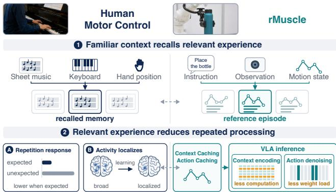  
Figure 1. rMuscle operates in a manner analogous to human muscle memory: similar contexts trigger relevant prior experience, allowing cached results to be retrieved and reused to avoid redundant computation.

Prior works [27, 34] develop inference engines to reduce VLA inference latency through kernel fusion, quantization, and static graph execution. Other studies [42, 43, 46] accelerate VLA inference by adapting techniques originally developed for VLMs or text-to-image models, such as cross-frame visual-token reuse and denoising-step skipping. However, these approaches fall short of fully exploiting the acceleration opportunities in VLA inference, primarily due to two limitations.

First, they fail to exploit similarity across embodied tasks. In industrial manipulation, a robot typically executes a recurring set of tasks at a fixed workstation, and executions of similar tasks have similar observations and action trajectories. Such similarity persists across the robot’s entire operational workflow, while existing works focus only on the immediately preceding frame or within a single denoising phase. Second, existing approaches do not account for the distinct performance bottlenecks across diferent stages of VLA inference. In representative models such as $\pi _ { 0 . 5 }$ [32], multimodal context encoding is predominantly compute-bound, whereas action denoising is memory-bound, with both stages contributing substantially to end-to-end latency. Optimizing only one stage results in limited end-to-end speedup.

After an in-depth analysis of VLA workloads and inference behavior, we find that similarity across task executions extends beyond observations and action trajectories to internal model states, including FFN inputs and outputs as well as neuron activation patterns. Inspired by human motor control and muscle memory [15, 17, 35] (Figure 1), we present rMuscle, a VLA inference framework that exploits this similarity through a dual-phase cache design tailored to the distinct bottlenecks of multimodal context encoding and action denoising. The dual-phase cache consists of a Context Cache and an Action Cache, targeting the two major stages of VLA inference.

The Context Cache accelerates visual context encoding by exploiting similarity in the inputs to latency-critical MLP layers. Instead of fully recomputing similar inputs, rMuscle reuses their cached outputs and performs computation only for the parts that deviate substantially. The newly computed outputs are then merged with the cached results to reconstruct the complete layer output, thereby reducing com putation while preserving model accuracy.

The Action Cache targets memory-bound action denoising, where short sequences make each step dominated by weight loading rather than computation. Its design builds on two observations: neurons contribute unequally to the result, and the same denoising step across similar tasks tends to activate similar sets of neurons. rMuscle thus uses the activation pattern of a similar past execution to predict the important neurons, loads and computes only their weights, and approximates the remaining neurons with the outputs of an earlier fully computed step, substantially reducing memory trafic while retaining the efect of every neuron.

We further introduce three techniques to eficiently manage the dual-phase cache. First, leveraging the alternating pattern of inference and physical execution in robotic workflows, rMuscle stores only the input context for caches that are not currently referenced and reconstructs the complete cache on demand through online recomputation, which is overlapped with action execution. Second, rMuscle exploits the temporal continuity of robotic workflows. During the execution of a complete task, the caches that are likely to be referenced in the near future are predictable. We therefore maintain only a sliding window of relevant caches in GPU memory and update this window dynamically as the robot executes actions. Third, rMuscle divides consecutive denoising steps into groups, with each group sharing an important neuron mask. As a result, rMuscle achieves a minimal cache memory footprint and access overhead.

We evaluate rMuscle on $\pi _ { 0 . 5 }$ , GR00T N1.6, and X-VLA across 92 embodied tasks, spanning 40 LIBERO tasks [23], 50 RoboTwin tasks [26], and two physical-robot tasks: dual-arm pick-and-place on ALOHA [12] and single-arm assemblyline packing with DOBOT and Franka [9, 11]. It reaches

1.20–1.29× end-to-end speedup on RTX 4090 and 1.23–1.42× on Jetson Thor over the state-of-the-art (SOTA) inference engine [34]. Our method matches the original success rates across simulation and real-world tasks, including dual-arm ALOHA manipulation and single-arm assembly-line packing. This paper makes the following contributions:

• We find that repeated executions of the same task have similar FFN inputs and neuron activation patterns, providing opportunities for computation reuse.

• We design an end-to-end dual-cache inference system for SOTA VLA models, with a Context Cache for computebound VLM prefill and an Action Cache for memorybound denoising.

• We evaluate rMuscle on three models, two simulation benchmarks, and 92 tasks on RTX 4090 and Jetson Thor, reaching up to 1.29× and 1.42× speedup over FlashRT, respectively, while matching the average accuracy of the original policies.

## 2 Background

## 2.1 Embodied Robots for Industrial Manipulation

Factories are a promising entry point for embodied robots, and leading embodied AI companies are bringing robots onto factory floors. Figure AI deployed humanoids on a BMW production line, Tesla is developing Optimus for manufacturing, and AgiBot reports that its G2 humanoid transports and sorts tablets on a consumer-electronics line [2, 10, 37]. A factoryfloor case study at Siemens adapts $\pi _ { 0 . 5 }$ to pack accessory bags into cardboard boxes [47]. Amazon’s Vulcan Pick picks targeted items from fabric storage pods in a warehouse [31].

Despite diferences in task objectives, these applications share a common execution pattern: a robot operates at a fixed workstation and repeatedly performs similar tasks, with variations mainly in the target objects and their locations. Such settings also impose stringent requirements on the responsiveness and reliability of the policy.

## 2.2 Embodied Intelligence Serving Loop

An embodied robot operates in a closed observe–infer–execute loop. At each inference step, the robot collects visual observations, a language instruction, and its current joint state, which consists of the joint angles of the robot’s degrees of freedom. Given these inputs, the policy produces an action chunk containing � future actions, which the robot executes before the next observation and inference. This loop repeats until the task is completed, forming an episode. In our evaluation, completing a task typically requires 4–40 inferences per episode. If an episode contains � inference-and-execution iterations, the total number of executed actions required to complete the task lies in $\left\lceil ( N - 1 ) S + 1 , N S \right\rceil$

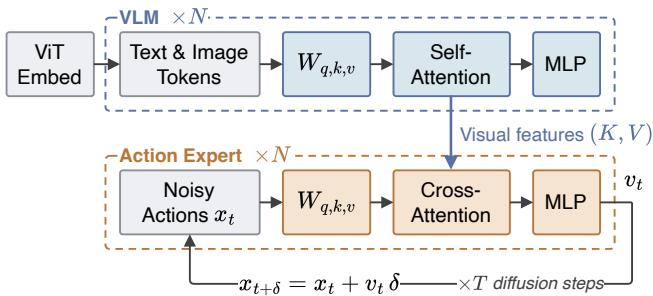  
Figure 2. Representative dual-phase VLA architecture $\pi _ { 0 . 5 }$ . A VLM processes multimodal inputs and passes visual features to an action expert that iteratively denoises the action chunk.

## 2.3 Visual-Language-Action Models

VLA models map images, language instructions, and robot state to executable actions. Representative models include RT-2, OpenVLA, the � family, and GR00T. RT-2 and OpenVLA represent actions as text tokens in an autoregressive formulation that transfers web-scale vision-language pretraining to robot control [5, 19]. More recent models generate continuous actions through a difusion process: $\pi _ { 0 . 5 }$ [32] combines a VLM with a denoising action expert for broadly generalizable manipulation, while GR00T N1.6 pairs a Cosmos-based VLM with a difusion transformer for humanoid and bimanual control [30]. X-VLA uses a softprompted transformer as a scalable cross-embodiment VLA model [45]. Those VLA policies are commonly evaluated by rollout success rate on manipulation benchmarks and real-world tasks that emphasize diferent capabilities.

## 2.4 Dual-Phase Inference in VLAs

We focus on the VLA models that couple a vision-language model (VLM) with a difusion action expert, an architecture adopted by the majority of recent VLA models [8, 29, 32, 45].

As shown in Figure 2, the vision transformer (ViT) embedding stage converts the observations and language instruction into input embeddings. The visual observations typically consist of images captured by the robot’s cameras. Inference then proceeds through two core phases that account for most of the latency. First, the VLM performs a prefill pass over the ViT embeddings to compute visual features for action generation. Second, the action expert starts from a noisy action sample and iteratively refines it through multiple denoising steps to produce an action chunk.

## 2.5 Denoising-Step Skipping and Its Limits in VLAs

Prior work on accelerating difusion models for text-to-image and text-to-video generation has used caching to exploit redundancy at two levels: across denoising steps within a request and across related requests. DP-Cache and PAB reuse the output of one denoising step as the output of several subsequent steps within a request [44, 46], while NIRVANA and MoDM maintain references across requests for text-to-image difusion serving [1, 41]. NIRVANA stores intermediate latents from similar prompts and resumes generation from that state, skipping several denoising steps for new requests [1].

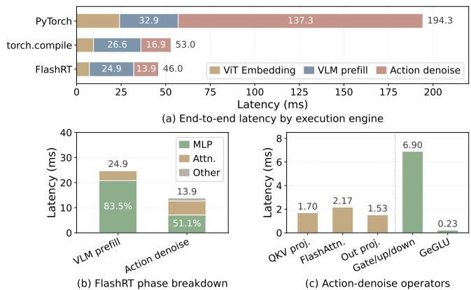  
Figure 3. Latency breakdown of $\pi _ { 0 . 5 }$ inference on RTX 4090. (a) End-to-end latency with three execution engines. (b) FlashRT latency of VLM prefill and action denoising by component. (c) Per-operator latency aggregated over the actiondenoising loop, colored by component as in (b).

However, these methods do not transfer well to embodied model inference, because both forms of reuse operate at the granularity of denoising steps. Whole-step reuse relies on consecutive steps producing nearly identical outputs, as is often the case for text-to-image and text-to-video models that typically run 20–50 steps [20, 38]. VLA models use far fewer steps. For example, GR00T uses only four steps [30]. Each step therefore makes a substantial change to the action chunk, so skipping any step discards refinement that subsequent steps do not recover.

## 3 Characterizing Embodied Workloads

To identify opportunities for accelerating embodied inference, we characterize VLA workloads from both the execution and model perspectives. We first locate the performance bottlenecks in VLM prefill and action denoising, then examine observation and trajectory similarity across executions. We next examine how this similarity extends to internal model states, specifically in VLM states and neuron contributions during denoising.

## 3.1 Heterogeneous Bottlenecks in VLA Inference

Figure 3(a) compares the end-to-end latency across execution engines. Through kernel fusion and operator optimizations tailored to low-batch workloads, FlashRT reduces the latency from 194.3 ms with the oficial PyTorch implementation to 46.0 ms. We therefore use FlashRT for the following analysis.

The latency breakdown of FlashRT shows distinct computational profiles across VLM prefill and action denoising phases, although both spend a substantial fraction of their execution time in feed-forward networks (FFNs). As shown in Figure 3(b), the MLP accounts for 83.5% of VLM prefill latency and 51.1% of action denoising latency. The operatorlevel breakdown in Figure 3(c) shows that action denoising spends most of its MLP time in the gate, up, and down projections. We therefore focus on the MLP in both phases and characterize its bottlenecks next.

Table 1. Roofline analysis of the $\pi _ { 0 . 5 }$ MLPs. AI (arithmetic intensity) is in FLOP/B. Each device lists theoretical compute / memory latency in �s derived from BF16 peaks (165 TFLOP/s, 1000 GB/s on 4090; 250 TFLOP/s, 270 GB/s on Thor).
<table><tr><td>MLP</td><td>GFLOP</td><td>MB</td><td>AI</td><td>RTX 4090  $T _ { \mathrm { c o m p } } / T _ { \mathrm { m e m } }$ </td><td>Jetson Thor  $T _ { \mathrm { c o m p } } / T _ { \mathrm { m e m } }$ </td></tr><tr><td>VLM prefill</td><td>57.04</td><td>64</td><td>891</td><td>345.3 / 64</td><td>228.2 / 237</td></tr><tr><td>Action denoise</td><td>0.27</td><td>8</td><td>34</td><td>1.6 / 8.0</td><td>1.1 / 29.6</td></tr></table>

Roofline analysis in Table 1 shows that the MLP faces diferent bottlenecks in the two phases. On RTX 4090, the VLM MLP has substantially higher arithmetic intensity and is compute-bound, whereas the action-denoising MLP has a much smaller workload and is memory-bound [18, 46]. On Jetson Thor, the VLM MLP lies near the ridge point: it is theoretically memory-bound, but the actual bottleneck varies depending on measured hardware performance and implementation details.

## 3.2 Trajectory Similarity Across Repeated Tasks

In industrial assembly-line settings, robots repeatedly perform the same task using a limited set of objects in a relatively stable workspace. However, variations in lighting, tabletop texture, and object pose can change both observations and required motions. We therefore examine whether action trajectories remain similar across executions despite these variations.

Trajectory Similarity. An action trajectory is the VLA’s observable output: a temporally ordered sequence of robot actions that traces a continuous path in 3D space. To test whether useful repetition survives environmental variation, we model these factors in simulation. In the representative task shown in Figure 4, a dual-arm robot lifts two beverage bottles and moves them to designated positions above the tabletop. We vary the initial bottle positions and lighting conditions across executions, then compare a current execution with a reference execution of the same task.

Both the current and reference runs finish in four inference steps and reach their target positions successfully and stably. Although the initial bottle positions and lighting difer, the end-efector trajectories and the camera views of both arms remain closely aligned, with path cosine similarities of 0.995 for the left arm and 0.994 for the right arm.

## 3.3 VLM-State Similarity and Visual-Token Coverage

Comparing MLP inputs and outputs from the current and reference executions at every VLM layer, we find cosine similarities as high as 98.5% for inputs and 81.0% for outputs.

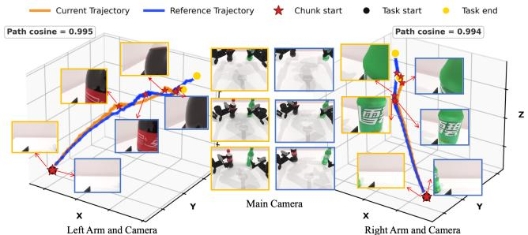  
Figure 4. A dual-arm robot moves two soda bottles, one Coke and one Sprite, to the same positions above the tabletop.

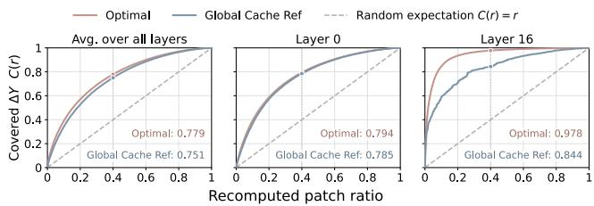

Figure 5. Coverage of �0.5 VLM FFN output changes under input-based patch selection and optimal selection by actual output changes.  
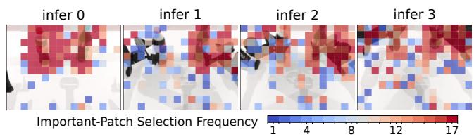  
Figure 6. Spatial distribution of visual patches selected for recomputation across four action chunks.

This similarity motivates examining how the remaining output changes are distributed across visual tokens. We further investigate whether MLP input diferences can identify the tokens that account for most of these changes.

Visual-Token Coverage. At each layer, we rank visual tokens by RMS FFN input change relative to the current input magnitude and select the top fraction $\rho _ { \mathrm { { p } } } .$ . Coverage is the selected tokens’ share of the total squared $L _ { 2 }$ change in FFN outputs between current and reference executions. Figure 5 shows that selecting $\rho _ { \mathrm { p } } = 0 . 4$ of the visual tokens captures approximately 80% of the output change.

Figure 6 shows the selected regions for the bottle-moving task. Important patches concentrate around the bottles, grippers, and arms, with a smaller number on background regions that encode scene context. Their locations shift across action chunks as manipulation progresses, motivating selection for each policy call rather than a fixed spatial mask.

## 3.4 Denoising-Neuron Contribution and Overlap

The similar trajectories of current and reference executions motivate examining whether their action-denoising processes also exhibit similar internal activations. Following our analysis of VLM states, we first compare the inputs and outputs of action denoising. Although the initial noise is identical under the same random seed, the generated action chunks exhibit only 69% similarity. This diference motivates exploring finer-grained reuse within denoising instead of directly reusing reference actions. We therefore examine how neuron contributions are distributed within each denoising FFN and whether these contribution patterns are similar between the current and reference executions.

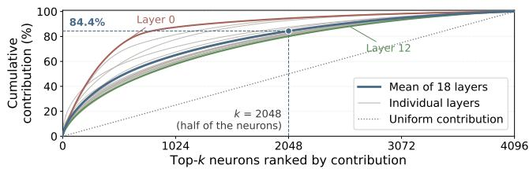  
Figure 7. Cumulative contribution-score coverage of denoising MLP neurons in $\pi _ { 0 . 5 }$

Neuron Contribution and Coverage. For each denoising step � and layer $l ,$ we quantify each neuron’s contribution to the FFN output using the following score [36]:

$$
c _ { t , l , n } = \Big ( \sum _ { r = 1 } ^ { S } \lvert h _ { t , l , r , n } \rvert \Big ) \lVert W _ { l , n } \rVert _ { 2 } .\tag{1}
$$

Here, $h _ { t , l , r , n }$ is the post-GeGLU activation of neuron � for action �, and $W _ { l , n }$ is its down-projection weight. Within each (�, �), we rank all neurons by � in descending order. We call the highest-contribution neurons important neurons, and write $\rho _ { \mathrm { n } }$ for the fraction of hidden neurons retained at each layer. Coverage is the share of the total contribution score captured by the top $\rho _ { \mathrm { n } }$ fraction of neurons. Each layer curve in Figure 7 averages this coverage across 100 inferences and denoising steps.

As shown in Figure 7, retaining $\rho _ { \mathrm { n } } = 0 . 5$ of the neurons captures 84.4% of the total contribution score.

Neuron Overlap Across Executions. We then compare these important-neuron sets across executions. For repeated executions of the same task, the overlap averages 86% (ranging from 82% to 91%), whereas for executions of diferent tasks it drops to 71% (70%–72%). The gap between the two settings is larger than the within-setting variation, indicating that important neurons are task-dependent rather than fixed and motivating the use of a same-task reference to predict important neurons.

## 4 Design

Overview. rMuscle combines two complementary mechanisms: dual-phase caching for selective recomputation and cache management for low-overhead access and storage.

Figure 8 illustrates how the dual-phase cache works. It uses a Context Cache to accelerate compute-bound VLM prefill, and an Action Cache for memory-bound action denoising. The Context Cache reuses FFN outputs for similar visual tokens and recomputes those whose inputs have changed substantially. During action denoising, similar executions tend to activate overlapping sets of important neurons. The Action Cache uses these reference activation patterns to select which neurons to evaluate and which weights to load.

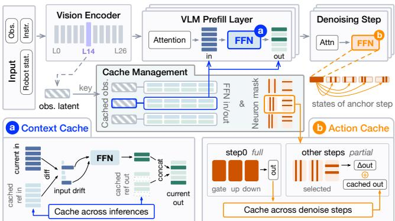  
Figure 8. Dual-phase cache design. Context Cache reduces visual-token FFN computation during VLM prefill. Action Cache reduces weight memory accesses during denoising.

Cache management supplies the dual-phase cache with reference FFN inputs and outputs and neuron masks from a shared library. To reduce memory overhead, the library retains compact reference inputs and neuron masks, and expanded FFN states are only reconstructed when a reference is likely to be retrieved. References are selected using visual context and robot-state history. A sliding GPU working set is further used to bound memory residency, combined with a reconstruction budget that limits reconstruction work.

## 4.1 Dual-Phase Cache

Given a reference from the cache library, Context Cache uses its FFN inputs and outputs for visual-token recomputation. Action Cache uses neuron masks to select which important neurons to update relative to the current call’s dense anchors. The following mechanisms specify these computations.

Visual-Token Recomputation. Our visual-token selective recomputation is inspired by prior work on token-level and similarity-based feature reuse [16, 40, 48]. We adapt these reuse principles to VLM FFNs across task executions: the Context Cache recomputes selected visual-token rows and reuses the remaining outputs from a retrieved reference execution. Input drift predicts which visual tokens account for most of the FFN output change, as measured in §3.3. For visual token $\boldsymbol { p }$ at layer �, let $x _ { l , p }$ be the current FFN input after RMSNorm and let $( \bar { x } _ { l , p } , \bar { y } _ { l , p } )$ be the reference input and output. The runtime ranks visual tokens by

$$
d _ { l , p } = \frac { \mathrm { R M S } ( x _ { l , p } - \bar { x } _ { l , p } ) } { \operatorname* { m a x } \bigl ( \mathrm { R M S } ( x _ { l , p } ) , \varepsilon \bigr ) } , \ \varepsilon = 1 0 ^ { - 6 } .\tag{2}
$$

For � visual tokens, the set $\mathcal { P } _ { l } ( \rho _ { \mathrm { p } } )$ contains the $\lceil \rho _ { \mathrm { p } } P \rceil$ tokens with the largest scores. This selection uses only FFN inputs, so it does not require evaluating the current dense FFN to decide what to reuse.

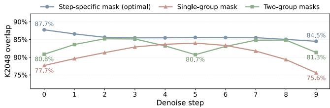  
Figure 9. Important-neuron coverage with step-specific and group-shared masks, using top- $k = 2 0 4 8$ neurons.

Selected visual rows are recomputed, and the remaining rows reuse their reference outputs:

$$
\widehat { y } _ { l , p } = \left\{ \begin{array} { l l } { F _ { l } ( x _ { l , p } ) , } & { p \in \mathcal { P } _ { l } ( \rho _ { \mathrm { p } } ) , } \\ { \bar { y } _ { l , p } , } & { p \notin \mathcal { P } _ { l } ( \rho _ { \mathrm { p } } ) . } \end{array} \right.\tag{3}
$$

Instruction and robot-state rows are always recomputed. The selected rows pass through the FFN’s gate, up, activation, and down operations and are then scattered into a full output bufer initialized with the reference visual outputs. The profiled ratio $\rho _ { \mathrm { p } }$ bounds FFN computation while allowing selected positions to vary by layer and policy call. Attention remains dense over the complete sequence.

Group-Shared Neuron Masks. Identifying the exact important neurons for the current step through dense execution would defeat the reduction in weight trafic. A taskindependent mask would instead ignore the task-dependent activation patterns observed in §3.4. rMuscle therefore predicts important neurons from a related reference and stores their indices with that reference’s inputs.

A separate mask for every denoising step requires repeated weight gathering. Consecutive denoising steps can instead form a group that shares one mask, trading some step-specific coverage for less gather trafic. Figure 9 compares these choices for $\pi _ { 0 . 5 }$ . Two group-specific masks track step-specific important neurons more closely than one mask shared across all ten steps. The first and middle steps run densely, so mask coverage does not limit computation at those anchors. Ofline mask-construction is described in §5.

Anchors with Mask Recomputation. Each group begins with a dense anchor that establishes the current policy call’s activations. Let $a _ { g }$ be the anchor step of group �. At each action-expert layer �, the anchor executes the dense FFN, producing hidden activations $h _ { a _ { q } , l }$ and output $y _ { a _ { g } , l } .$ The Action Cache retains the output and the activations selected by the group’s mask. In the ten-step $\pi _ { 0 . 5 }$ configuration, step 0 anchors for steps 1–4, and step 5 anchors for steps 6–9.

At a non-anchor step �, let $M = \mathcal { M } _ { l } ^ { ( g ) }$ be the retrieved reference mask. We compute only the selected neurons’ hidden activations $h _ { t , l } ^ { M }$ and update the output using their downprojection weights $W _ { l , M } ^ { \mathrm { d o w n } }$

$$
\widehat { y } _ { t , l } = y _ { a _ { g } , l } + \left( h _ { t , l } ^ { M } - h _ { a _ { g } , l } ^ { M } \right) W _ { l , M } ^ { \mathrm { d o w n } } .\tag{4}
$$

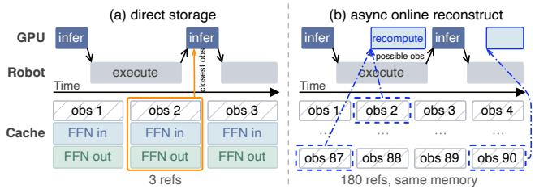  
Figure 10. Direct storage versus asynchronous online reconstruction. Robot execution provides time to expand compact reference inputs before the next policy call.

Subtracting the selected anchor contribution before adding its current value avoids double counting and preserves the anchor contribution of neurons outside �. The output follows the normal adaptive gate and residual addition, and attention remains dense. The reference determines which neurons to update, while all reused anchor values come from the current policy call. Selected weights are prepared in shared compact bufers and reused across each group’s steps, with gathering overlapped with model execution (§5).

## 4.2 Cache Management

Cache management supplies the dual-phase cache with relevant reference data while bounding GPU residency and reconstruction work. It combines asynchronous online reconstruction, context-aware retrieval, and sliding-window prefetching guided by temporal locality.

Asynchronous Online Reconstruction. Expanded VLM states are too large to store for every reference across all tasks. For three-view $\pi _ { 0 . }$ 5, each of the 17 FFN layers retains a pair of [768, 2048] BF16 input and output tensors, approximately 107 MB per policy call. An episode of 40 policy calls therefore requires about 4.28 GB of intermediate states. Storing only compact inputs avoids this expansion, but reconstructing the states synchronously would put dense VLM computation back on the inference critical path.

rMuscle instead reconstructs references during physical action execution, as shown in Figure 10. The repository retains reference model inputs and ofline neuron masks. During an execution window, the GPU fetches inputs for upcoming candidate positions and runs VLM prefill densely to prepare their FFN states. Since neuron masks are computed ofline, reconstruction does not rerun action denoising. Only the active working set holds expanded FFN states on the GPU. This organization reduces persistent host and disk storage, but does not reduce the GPU footprint of an individual reconstructed entry. The candidate positions are determined by the prefetching policy described below.

Retrieving a Relevant Reference. The instruction first restricts retrieval to a compatible task pack. Visual matching uses the policy’s intermediate ViT features. For three-view $\pi _ { 0 . 5 }$ , the query is a BF16 tensor of shape [768, 1152] from the 15th of 27 vision layers. GPU search ranks reference positions by cosine similarity between flattened current and reference representations, retaining the top � candidates. It then compares their aligned robot-state histories of length $L ,$ represented as $[ L ,$ 14] tensors, and selects the candidate with the smallest motion distance to distinguish motions through similar scenes in diferent directions. §5 specifies the motion-distance calculation and fallback policy.

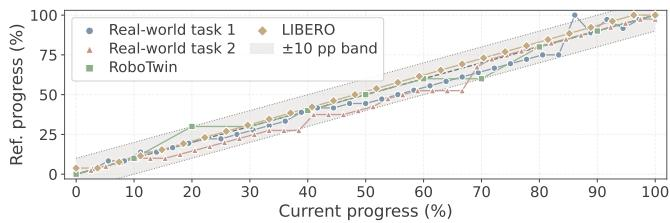  
Figure 11. Temporal locality ofretrieved references. Matches track current progress along the diagonal.

Search is limited to references whose FFN states are already prepared on the GPU, so retrieval requires no transfer of expanded states on the critical path. The intermediate ViT query allows retrieval to overlap with the remaining vision encoding. §5 describes the stream schedule.

Temporal Locality. Figure 11 compares reference and current episode progress. Matches concentrate along $y = x { : }$ as the current episode proceeds, observations change and retrieval advances to later references. In the measured traces, 96.6% of matches remain within approximately ten percentage points of aligned progress. This locality suggests that a small window of reference positions can cover the references likely to be needed next.

Sliding Window Prefetching. We use this locality to maintain a sliding GPU working set across candidate episodes and nearby inference positions (Figure 12).

The first policy call has neither a preceding execution window nor a previous match. Before an episode starts, rMuscle therefore loads the initial-position FFN states of the current task’s reference episodes. With the robot at its known initial pose, inference 0 selects the top � episodes by visual similarity. Only their upcoming positions are then reconstructed during the first action chunk.

The initial visual matches select candidate episodes, and subsequent matched positions guide the window’s progress. In the representative configuration, the episode-axis width is $T = 4 .$ For each candidate episode, the window retains the current matched position and the next $L = 4$ positions, yielding $T ( L + 1 ) = 2 0$ entries in total. The four-position lookahead corresponds to 10% of the maximum observed episode length of about 40 policy calls. The robot-state history length is also $L \ = \ 4$ . rMuscle retains entries shared by successive windows, releases entries that leave the window, and reconstructs only newly entering positions. Thus, the persistent repository can grow without making every reference’s intermediate states GPU-resident.

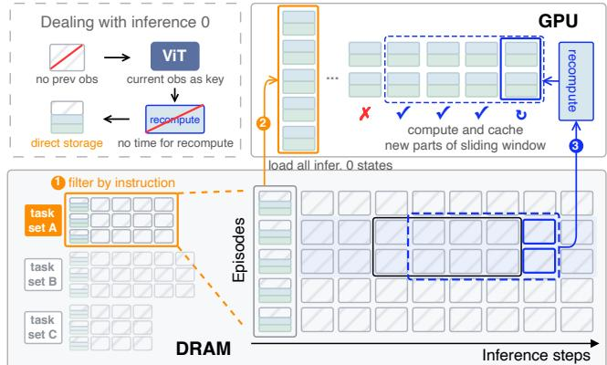  
Figure 12. Mechanism of the sliding GPU working set.

Table 2. Parameters for the online reconstruction budget.
<table><tr><td>Symbol</td><td>Description</td></tr><tr><td> $N _ { \mathrm { c a n d } }$ </td><td>New candidate positions entering the window.</td></tr><tr><td> $M _ { \mathrm { f r e e } }$ </td><td>Free GPU memory after reserving model and workspaces.</td></tr><tr><td> $M _ { \mathrm { e n t r y } }$ </td><td>Expanded intermediate-state footprint per entry.</td></tr><tr><td> $T _ { \mathrm { a v l } }$ </td><td>Available reconstruction interval.</td></tr><tr><td> $T _ { \mathrm { t r a n s } }$ </td><td>Input-transfer time for the proposed batch.</td></tr><tr><td> ${ \bar { T } } _ { \mathrm { r e c } }$ </td><td>Average dense reconstruction time per reference.</td></tr><tr><td> $N _ { \mathrm { p r e p } }$ </td><td>Number of new entries reconstructed.</td></tr></table>

rMuscle also handles exceptional cases during slidingwindow execution. If no suitable reference is available, it invokes the fallback policy. If the same reference is retrieved more often than the task’s maximum number of policy calls, rMuscle identifies the robot as stalled, resets the episode, and marks the episode as a failure.

Cache Entry Resident Count Budget. The cache-entry reconstruction count is bounded by candidate availability, free GPU memory, and the time before the next policy call. With the parameters in Table 2, the number of new entries is

$$
N _ { \mathrm { p r e p } } = \mathrm { m i n } \left\{ N _ { \mathrm { c a n d , } } \left\lfloor \frac { M _ { \mathrm { f r e e } } } { M _ { \mathrm { e n t r y } } } \right\rfloor , \left\lfloor \frac { T _ { \mathrm { a v l } } - T _ { \mathrm { t r a n s } } } { \bar { T } _ { \mathrm { r e c } } } \right\rfloor \right\} .\tag{5}
$$

This expression estimates capacity from average reconstruction time rather than guaranteeing a hard deadline for each entry. Asynchronous inference may start the next policy call before the current action chunk finishes [4], shortening the reconstruction window $( T _ { \mathrm { a v l } } )$ . rMuscle could adjust the number of reference entries prepared to fit the available time.

## 5 Implementation

This section describes how rMuscle builds the cache ofline and prepares and retrieves cached references to accelerate online inference.

Profiling and Constructing the Cache. rMuscle uses two recomputation ratios: $\rho _ { \mathrm { p } }$ for visual tokens and $\rho _ { \mathrm { n } }$ for denoising neurons, both profiled ofline for each model. Cache construction proceeds in two rounds. First, we sample task variants across object categories and partition the workspace by object pose, e.g., into four quadrants. We profile 2–8 episodes per region, depending on task dificulty, to estimate the recomputation ratios and populate the cache. Second, we cluster observations from these episodes and collect ad ditional episodes for underrepresented clusters to improve scene coverage. This process yields 200–800 inference calls per task in our evaluation.

Constructing Group Neuron Masks. To construct neuron masks, we run the cached inference ofline and compute $c _ { t , l , n }$ using Equation 1. For each layer �, we select the top $K _ { l } = \lceil \rho _ { \mathrm { n } } H _ { l } \rceil$ neurons at each denoising step. Within each denoising group, we take the union of these candidates, rank them by summed contribution, and retain the top $K _ { l } .$ . The resulting mask is shared across non-anchor steps in the group.

Cache Capacity and Reconstruction Budget. Online reconstruction is bounded by both execution time and GPU memory. In the three-view $\pi _ { 0 . 5 }$ configuration, reconstructing one VLM cache entry takes about 25 ms, while the available GPU memory on an RTX 4090 can hold over one hundred reconstructed entries. A 15-action chunk executed at 30 Hz provides roughly 500 ms during which reconstruction can overlap with robot execution, allowing about 20 entries to be prepared before the next inference request. Since only compact reconstruction inputs are transferred, at about 1.7 MB per entry, data movement contributes little additional overhead. We therefore determine the reconstruction budget from the available execution interval, memory capacity, and measured transfer time.

Joint-History Retrieval. Subsequent calls retrieve candidate positions from the top � episodes selected at inference 0. These positions are reranked by the RMS joint-angle difference between query and candidate histories, computed over aligned history steps and each arm’s joints (e.g., six per arm for ALOHA). This distance distinguishes execution states that may share similar end-efector poses but difer in joint configurations. Single-arm tasks use the active arm’s distance, while dual-arm tasks use the larger of the two arm distances. The closest candidate provides the cache payload. Fallback policy. If the visual cosine similarity is below 0.8, rMuscle switches to dense execution for the remainder of the episode and retries cache reuse in the next episode.

Overlapping Retrieval and Weight Gathering. Once intermediate ViT features are available, a side CUDA stream retrieves a prepared reference while the main stream completes vision encoding. The side stream then gathers selected neuron weights, preparing the first denoising group before the second, while the main stream executes VLM prefill. CUDA events ensure that retrieval completes before VLM FFN reuse and that each denoising FFN waits until its required weights are ready.

## 6 Evaluation

We evaluate rMuscle to answer three major questions:

• How much speedup does it provide, and how much does each optimization contribute? (§6.2 & §6.5)

• Does it preserve task success rates across diverse tasks, and how do cache configurations afect this? (§6.3 & §6.5)

• What additional memory overhead does it incur? (§6.4)

## 6.1 Experimental Setup

Hardware and Models. We use a desktop with an RTX 4090 (24 GB GPU memory), an Intel Core i7-11700, and 32 GB RAM, as well as a Jetson Thor with 128 GB unified memory. They run PyTorch 2.6.0/CUDA 12.4 and PyTorch 2.8.0/CUDA 13.0, respectively. We evaluate $\pi _ { 0 . 5 } ,$ , GR00T N1.6, and X-VLA [30, 32, 45] on LIBERO, and $\pi _ { 0 . 5 }$ on RoboTwin, following checkpoint availability. All methods use BF16 or FP16 without quantization. All $\pi _ { 0 . 5 }$ latencies use three camera inputs, masking the unused view on two-camera LIBERO.

These three models represent distinct VLA architectures. $\pi _ { 0 . 5 }$ is VLM-heavy, so Context Cache reuse has the larger opportunity. GR00T N1.6 is denoising-heavy, so Action Cache reuse and denoising-step skipping have the larger opportunity. X-VLA has a lightweight VLM, but its visual features are concatenated with the denoising actions and processed by self-attention. We therefore apply visual-token sparsity and neuron sparsity together inside the denoising loop.

Simulation Benchmarks. LIBERO [23] covers 10 tasks in each of its Spatial, Object, Goal, and Long suites, with 100 seeded rollouts per task under the standard initialization protocol. For RoboTwin [26], we use the clean setting across 50 tasks, with 100 seeded rollouts per task varying object instances and poses.

Physical Tasks. Two physical tasks are included. In cooperative pick-and-place, a dual-arm ALOHA [12] places two beverage bottles into a box, varying lighting as well as bottle and box positions across trials (Figure 13). In assembly-line packing, Franka and DOBOT arms [9, 11] pack boards and instruction booklets for six furniture types into boxes on an 8 m/min conveyor, with randomized lighting and box poses (Figure 14). Both tasks run at 30 Hz with 30-action chunks and 50 trials per method.

Baselines. torch.compile, vla.cpp [27], and FlashRT [34] are included as inference-acceleration baselines that preserve model accuracy. vla.cpp is unsupported on Jetson Thor and omitted there. NIRVANA [1], DP-Cache [46], and rMuscle are all implemented on FlashRT for $\pi _ { 0 . 5 }$ and GR00T N1.6, and on torch.compile for X-VLA. We also evaluate a variant that uses the previous inference as its reference, following VLA-Cache [42]. We refer to this variant as rMuscle w/o Cache Repo.

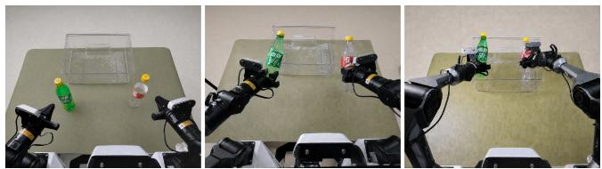  
Figure 13. Cooperative task with the dual-arm ALOHA.

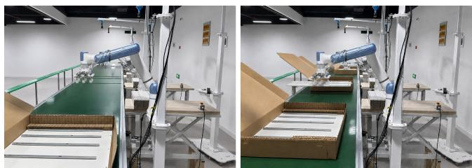

(a) Conveyor setup and packing in progress.  
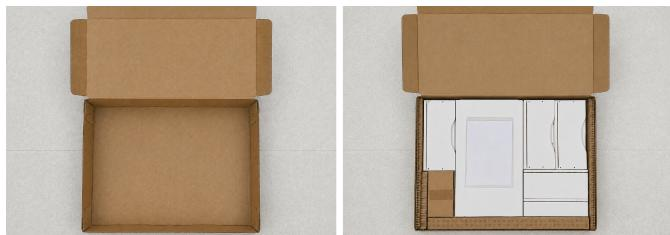  
(b) Box before and after packing.  
Figure 14. Packing furniture components. The robot aligns boards with a moving box and adds a manual on top.

Table 3. Settings of diferent methods for $\pi _ { 0 . 5 }$ on RoboTwin.
<table><tr><td>Method</td><td>Setting</td><td>Value</td></tr><tr><td>Shared</td><td>Denoising steps / chunk size</td><td>10 / 32</td></tr><tr><td>DP-Cache</td><td>Cached steps</td><td>{0, 1, 2, 6, 8, 9}</td></tr><tr><td>NIRVANA</td><td>Reused steps</td><td>first 5</td></tr><tr><td>rMuscle</td><td> $( \rho _ { \mathrm { p } } , \rho _ { \mathrm { n } } )$ </td><td>(0.4, 0.5)</td></tr></table>

Cache Settings. Table 3 shows the $\pi _ { 0 . 5 }$ –RoboTwin settings for the diferent methods. DP-Cache uses default settings, with dense VLM prefill and the latest denoising output reused at skipped steps. Our NIRVANA adaptation keeps VLM prefill dense and reuses a prefix of reference denoising outputs. It shares rMuscle’s retrieval method and reference repository of about 8–32 episodes per task. Profiling reduces NIRVANA’s reused prefix to one step for GR00T N1.6 and four for X-VLA, as half-schedule reuse degrades success.

Metrics. Latency spans from ready inputs to returned action chunks, including online retrieval and weight gathering, after 20 warmups. We report success rate (SR, %) across all episodes. Mean policy calls include only successful episodes, since failures run to a step limit far beyond typical completion in both simulation and physical experiments. Vanilla denotes dense execution. Methods share initializations and checkpoints.

## 6.2 Inference Performance

Figure 15 shows that rMuscle reduces latency relative to each model’s fastest exact baseline on both platforms. Specifically, on RTX 4090, rMuscle reaches inference rates of 28.1, 51.0, and 35.7 Hz for $\pi _ { 0 . 5 }$ , GR00T N1.6, and X-VLA, respectively. Speedups over the corresponding SOTA inference engine are 1.29×, 1.20×, and 1.50×. On Jetson Thor, the corresponding inference rates are 13.4, 17.5, and 19.7 Hz, with speedups of 1.42×, 1.23×, and 1.43×, respectively.

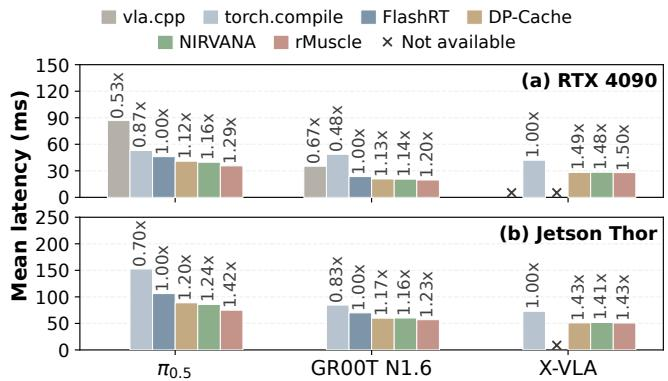  
Figure 15. Mean inference latency measured during benchmark evaluation on (a) RTX 4090 and (b) Jetson Thor.

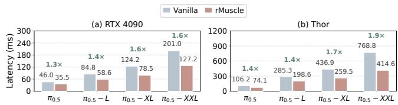  
Figure 16. Inference latency of rMuscle across diferent model sizes on (a) RTX 4090 and (b) Jetson Thor.

Compared with denoising step-skipping methods, rMuscle also achieves inference speedup by accelerating both VLM prefill and action denoising. Although step-skipping methods can achieve greater speedup in the denoising stage by aggressively skipping denoising steps, this comes at the cost of reduced task success rates.

Scaling Model Sizes. Scaling up VLA models can improve task performance [13], but also increases inference cost. We therefore examine how inference latency and the speedup provided by rMuscle change with model size. Keeping the visual tokenizer fixed, we scale both components within the Gemma family: (VLM, denoise) sizes of (2B, 0.3B), (2B, 2B), (7B, 2B), and (7B, 7B) correspond to �0.5, �0.5-L, �0.5-XL, and $\pi _ { 0 . 5 } – \mathrm { X X L }$ , respectively. For Gemma-7B, we use only the first 18 layers for visual-feature extraction.

Figure 16 shows how speedup over the FlashRT baseline changes with model size. From the smallest to the largest configuration, speedup rises from 1.3× to 1.6× on RTX 4090 and from 1.4× to 1.9× on Thor. These results suggest that the dual-phase cache can provide greater relative benefits as VLA models scale up.

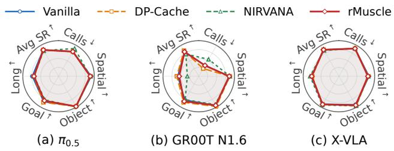  
Figure 17. LIBERO results over four methods. SR axes span 85–100%. Calls axes span 15–16, 21–23, and 5–6 in panels (a)–(c), respectively.

Table 4. RoboTwin results over all 50 tasks, with blue/pink shading for the best/worst values per row.
<table><tr><td rowspan=1 colspan=5>Task                Vanilla DP-Cache NIRVANA rMuscle</td></tr><tr><td rowspan=1 colspan=1>Click Alarmclock</td><td rowspan=1 colspan=1>36</td><td rowspan=1 colspan=1>34</td><td rowspan=1 colspan=1>35</td><td rowspan=1 colspan=1>42</td></tr><tr><td rowspan=1 colspan=1>Move Can Pot</td><td rowspan=1 colspan=1>22</td><td rowspan=1 colspan=1>22</td><td rowspan=1 colspan=1>23</td><td rowspan=1 colspan=1>28</td></tr><tr><td rowspan=1 colspan=1>Adjust Bottle</td><td rowspan=1 colspan=1>99</td><td rowspan=1 colspan=1>98</td><td rowspan=1 colspan=1>86</td><td rowspan=1 colspan=1>99</td></tr><tr><td rowspan=1 colspan=1>Handover Block</td><td rowspan=1 colspan=1>14</td><td rowspan=1 colspan=1>4</td><td rowspan=1 colspan=1>9</td><td rowspan=1 colspan=1>12</td></tr><tr><td rowspan=3 colspan=1>Handover MicMove Pillbottle Pad</td><td rowspan=1 colspan=1>45</td><td rowspan=1 colspan=1>31</td><td rowspan=1 colspan=1>30</td><td rowspan=1 colspan=1>47</td></tr><tr><td rowspan=1 colspan=1>.(50</td><td rowspan=1 colspan=1>tasks)</td><td rowspan=1 colspan=1></td><td rowspan=1 colspan=1></td></tr><tr><td rowspan=1 colspan=1>24</td><td rowspan=1 colspan=1>20</td><td rowspan=1 colspan=1>21</td><td rowspan=1 colspan=1>28</td></tr><tr><td rowspan=1 colspan=1>Place Empty Cup</td><td rowspan=1 colspan=1>39</td><td rowspan=1 colspan=1>39</td><td rowspan=1 colspan=1>28</td><td rowspan=1 colspan=1>36</td></tr><tr><td rowspan=1 colspan=1>Dump Bin Bigbin</td><td rowspan=1 colspan=1>58</td><td rowspan=1 colspan=1>59</td><td rowspan=1 colspan=1>53</td><td rowspan=1 colspan=1>60</td></tr><tr><td rowspan=2 colspan=1>Stamp SealTurn Switch</td><td rowspan=1 colspan=1>17</td><td rowspan=1 colspan=1>17</td><td rowspan=1 colspan=1>8</td><td rowspan=1 colspan=1>19</td></tr><tr><td rowspan=1 colspan=1>24</td><td rowspan=1 colspan=1>26</td><td rowspan=1 colspan=1>20</td><td rowspan=1 colspan=1>28</td></tr><tr><td rowspan=3 colspan=1>Average SR (%) ↑Calls ↓</td><td rowspan=2 colspan=1>35.2</td><td></td><td></td><td></td></tr><tr><td rowspan=1 colspan=1>33.9</td><td rowspan=1 colspan=1>26.9</td><td rowspan=1 colspan=1>35.2</td></tr><tr><td rowspan=1 colspan=1>7.0</td><td rowspan=1 colspan=1>7.6</td><td rowspan=1 colspan=2>7.5       7.1</td></tr></table>

Table 5. �0.5 on physical tasks. Blue/pink shading marks the best/worst values per row.
<table><tr><td>Metric</td><td>Vanilla</td><td>DP-Cache</td><td>NIRVANA</td><td>rMuscle</td></tr><tr><td>ALOHA: Cooperative bottle pick-and-place</td><td></td><td></td><td></td><td></td></tr><tr><td>SR (%) ↑</td><td>76</td><td>74</td><td>70</td><td>76</td></tr><tr><td>Calls↓</td><td>38.7</td><td>39.5</td><td>40.0</td><td>39.1</td></tr></table>

DOBOT + FRANKA: Conveyor furniture packing
<table><tr><td>SR (%) ↑</td><td>84</td><td>80</td><td>66</td><td>84</td></tr><tr><td>Calls ↓</td><td>10.1</td><td>10.5</td><td>10.7</td><td>10.2</td></tr></table>

## 6.3 Policy Quality

rMuscle achieves the lowest latency among the compared methods. We next evaluate its policy quality in simulation and on physical robots.

Simulation. On LIBERO, Figure 17 shows that rMuscle matches the average success rates of vanilla and DP-Cache across $\pi _ { 0 . 5 }$ , GR00T N1.6, and X-VLA. It exceeds NIRVANA by 0.3, 1.1, and 0.3 points on the three models, respectively.

On RoboTwin, Table 4 shows that rMuscle matches vanilla’s average success rate of 35.2%, exceeding DP-Cache and NIR-VANA by 1.3 and 8.3 points, respectively. It trails vanilla by

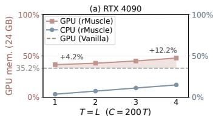

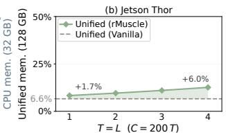  
Figure 18. Memory use as a share of device memory on (a) RTX 4090 and (b) Jetson Thor. � and � determine the GPU candidate working-set size, �(� + 1). � denotes the total number of cached inference entries for the current task.

2 and 3 points on Handover Block and Place Empty Cup due to corner cases with observation similarity near 0.8, just above the fallback threshold. In follow-up tests, raising this threshold or adding two relevant reference episodes resolves these failures, while NIRVANA still fails. These results highlight the importance of fallback and reference coverage in preserving policy quality.

Physical Robots. Table 5 shows that rMuscle matches vanilla execution on both physical tasks: 76% on ALOHA cooperative bottle pick-and-place and 84% on DOBOT and Franka conveyor packing. It exceeds DP-Cache by 2 and 4 points, and NIRVANA by 6 and 18 points on the two tasks, respectively.

## 6.4 Memory Overhead

We quantify the CPU cache footprint of rMuscle and compare its GPU memory use with vanilla execution. To represent increasing reference requirements for more dificult tasks, we increase the per-task cache capacity from 200 entries across 8 reference episodes to 800 entries across 32 reference episodes, while expanding the candidate window from � = � = 1 to � = � = 4.

Figure 18 shows that on RTX 4090, the CPU cache accounts for 3.7–14.9% of 32 GB host memory. GPU memory increases from 8.4 GB for vanilla to 9.4–11.4 GB, raising occupancy by less than 13%. On Jetson Thor, where CPU and GPU share 128 GB unified memory, occupancy increases from 6.6% to 8.3–12.6%. Overall, rMuscle supports up to 800 cached inference entries with less than 3 GB additional GPU memory on RTX 4090 and at most 6.0 percentage points additional unified-memory occupancy on Jetson Thor.

## 6.5 Ablation Studies

We evaluate cache contributions and quality–latency tradeofs using � on RoboTwin.

Cache Contributions. We compare FlashRT, Context Cache alone, Action Cache alone, and the full system in Figure 19 to isolate the latency contribution of each cache on RTX 4090 and Jetson Thor.

Context Cache alone gives the larger end-to-end speedup: 1.25× on RTX 4090 and 1.22× on Jetson Thor versus FlashRT. With Context Cache, the reduction in VLM prefill latency accounts for 87% of the total latency reduction on RTX 4090, compared with 60% on Jetson Thor. Action Cache alone speeds up action denoising by 1.11× on RTX 4090 and 1.49× on Jetson Thor, consistent with the more memory-bound Thor profile in Table 1.

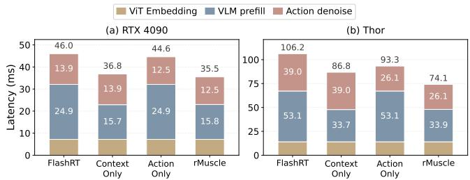  
Figure 19. Latency breakdown for VLA inference phases.

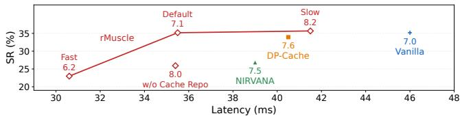  
Figure 20. Quality–latency tradeof on RTX 4090. Numeric labels report average calls. $( \rho _ { \mathrm { p } } , \rho _ { \mathrm { n } } )$ configurations: Fast (0.2, 0.25), Default (0.4, 0.50), Slow (0.6, 0.75).

Reference Repository. The rMuscle w/o Cache Repo variant uses the previous policy call within the same episode as its reference instead of retrieving one from the repository. As shown in Figure 20, Default achieves a success rate of 35.2%, compared with 25.9% without the reference repository, at similar latency. These results highlight the value of references from prior executions in preserving policy quality, while the similar latency suggests that cache management adds negligible overhead to the critical path.

Quality–Performance Tradeof. We vary the visual-token recomputation ratio and the neuron fraction of rMuscle. Figure 20 compares the Fast, Default, and Slow configurations on RTX 4090 alongside Vanilla, DP-Cache, NIRVANA, and the repository ablation discussed above.

Default increases success from 23.0% to 35.2% compared with Fast, at an additional latency of 4.9 ms. Default matches Vanilla’s success rate, while Slow achieves a slightly higher success rate. They reduce latency relative to Vanilla by 10.5 ms and 4.5 ms, respectively. These results meet our design goal of preserving policy quality while reducing inference latency. Consistent with our profiling results, Default ofers the lowest latency without sacrificing success.

## 7 Related Work

VLA Profiling and Inference Engines. VLA-Perf analytically explores how architecture, hardware placement, and serving choices afect inference latency [18], while a cross-XPU study measures energy and latency across heterogeneous accelerators and validates DP-Cache on LIBERO and a physical Franka robot [46].

Inference engines optimize how model operations execute on the target hardware. The vla.cpp runtime provides a portable C++ implementation for multiple VLA architectures and hardware tiers, including native support for iterative difusion and flow-matching action heads [27]. RealVLA removes inference overhead and integrates the optimized model path with streaming robot control [25]. FlashRT uses specialized kernels, operator fusion, and whole-forward CUDA Graph replay, together with precision-specific execution modes, for latency-sensitive VLA serving [34]. These systems reduce framework, kernel, and scheduling overhead without determining which visual tokens or denoising computations may be reused.

Approaches to VLA Acceleration. VLA accelerators reduce multimodal or action-generation work through pruning, approximate speculative execution, and eficient model design [14]. VLA-Cache accelerates attention computation by reusing cached KV states of static visual tokens from the preceding frame [42]. However, attention-only reuse does not target the dominant FFN bottlenecks in the state-of-the-art VLA models studied here.

SpecPrune-VLA uses recent history and action-aware control to prune visual tokens, while Realtime-VLA FLASH combines preceding visual context with draft-model speculation and action-expert verification [28, 39]. Neither searches a persistent repository. For action generation, TS-DP couples a distilled difusion drafter with a learned scheduler [22], whereas RoboMamba builds an eficient policy around a Mamba statespace backbone and a lightweight policy head [24].

## 8 Discussion

Why Inference Latency Maters. Policy latency is the gap between the last action of one chunk and the first action of the next, while actions within a chunk are executed at 20–30 Hz. As policy-call frequency approaches the execution rate, chunk boundaries become smoother, and the robot can reobserve and react to environmental changes more frequently. Lower inference latency therefore improves responsiveness, motion smoothness, and task throughput. Since each episode requires 4–40 policy calls, reducing per-call latency shortens the overall task cycle and enables a fixed-workstation robot to complete more tasks per hour on the same hardware.

Dynamic Cache Update. Unseen tasks initially run densely, and successful episodes naturally provide new cache references at no additional computation cost. Successful episodes from underrepresented observation clusters could be admitted. A new task variant therefore transitions from dense execution to cached acceleration as its reference coverage improves. We leave online cache updates for future work.

## 9 Conclusion

This paper introduces rMuscle, the fastest VLA inference engine optimized for embodied workloads. Through an indepth analysis of robot execution patterns, we find that repeated task executions exhibit similarity not only in observations and action trajectories, but also in internal model states throughout inference. rMuscle exploits these similarities through a dual-cache design that reduces VLM computation and denoising weight trafic. It further combines online cache reconstruction, sliding-window cache retrieval, and mask sharing across denoising steps to keep the memory footprint and cache-access overhead negligible. rMuscle achieves a 1.29–1.42× end-to-end speedup on RTX 4090 and Jetson Thor over the state-of-the-art inference engine, while preserving the original success rates on both simulation benchmarks and physical-robot tasks.

## References

[1] Shubham Agarwal, Subrata Mitra, Sarthak Chakraborty, et al. 2024. Approximate Caching for Eficiently Serving Text-to-Image Difusion Models. In USENIX Symposium on Networked Systems Design and Implementation (NSDI).

[2] AgiBot. 2026. AGIBOT and Longcheer Technology Achieve World’s First Embodied AI Deployment in Consumer Electronics Precision Manufacturing Mass-Production Line. htps://www.agibot.com/ article/231/detail/60.html.

[3] Kevin Black, Noah Brown, Danny Driess, et al. 2024. �0: A Vision Language-Action Flow Model for General Robot Control. arXiv preprint arXiv:2410.24164 (2024).

[4] Kevin Black, Manuel Y. Galliker, and Sergey Levine. 2025. Real-Time Execution of Action Chunking Flow Policies. arXiv:2506.07339 [cs.RO] htps://arxiv.org/abs/2506.07339

[5] Anthony Brohan, Noah Brown, Justice Carbajal, et al. 2023. RT-2: Vision-Language-Action Models Transfer Web Knowledge to Robotic Control. arXiv preprint arXiv:2307.15818 (2023).

[6] Qingwen Bu, Jisong Cai, Li Chen, et al. 2025. AgiBot World Colosseo: A Large-scale Manipulation Platform for Scalable and Intelligent Embodied Systems. In IEEE/RSJ International Conference on Intelligent Robots and Systems (IROS).

[7] Chilam Cheang, Sijin Chen, Zhongren Cui, et al. 2025. GR-3 Technical Report. arXiv preprint arXiv:2507.15493 (2025). htps://arxiv.org/abs/ 2507.15493

[8] StarVLA Community. 2026. StarVLA: A Lego-like Codebase for Vision-Language-Action Model Developing. arXiv:2604.05014 [cs.RO] htps: //arxiv.org/abs/2604.05014

[9] DOBOT Robotics. 2026. DOBOT Robotics: Collaborative Robot Arms. htps://www.dobot-robots.com/. Oficial website for DOBOT collaborative and industrial robotic arms.

[10] Figure AI. 2025. F.02 Contributed to the Production of 30,000 Cars at BMW. htps://www.figure.ai/news/production-at-bmw.

[11] Franka Robotics. 2026. Franka Research 3. htps://franka.de/frankaresearch-3. Seven-degree-of-freedom, force-sensitive robot system designed for robotics and AI research.

[12] Zipeng Fu, Tony Z. Zhao, and Chelsea Finn. 2024. Mobile ALOHA: Learning Bimanual Mobile Manipulation with Low-Cost Whole-Body Teleoperation. In Conference on Robot Learning (CoRL).

[13] Generalist Team. 2025. GEN-0: Embodied Foundation Models That Scale with Physical Interaction. Generalist AI. htps://generalistai.com/blog/ gen-0

[14] Weifan Guan, Qinghao Hu, Aosheng Li, and Jian Cheng. 2025. Eficient Vision-Language-Action Models for Embodied Manipulation: A Systematic Survey. arXiv:2510.17111 [cs.RO] htps://arxiv.org/abs/ 2510.17111

[15] James B. Heald, Máté Lengyel, and Daniel M. Wolpert. 2021. Contextual inference underlies the learning of sensorimotor repertoires. Nature 600 (2021), 489–493.

[16] Jinwoo Hwang, Daeun Kim, Sangyeop Lee, Yoonsung Kim, Guseul Heo, Hojoon Kim, Yunseok Jeong, Tadiwos Meaza, Eunhyeok Park, Jeongseob Ahn, and Jongse Park. 2025. Déjà Vu: Eficient Video-Language Query Engine with Learning-based Inter-Frame Computation Reuse. arXiv:2506.14107 [cs.DC] htps://arxiv.org/abs/2506.14107

[17] Hiroshi Imamizu, Satoru Miyauchi, Tomoe Tamada, Yuka Sasaki, Ryousuke Takino, Benno Pütz, Toshinori Yoshioka, and Mitsuo Kawato. 2000. Human cerebellar activity reflecting an acquired internal model of a new tool. Nature 403 (2000), 192–195.

[18] Wenqi Jiang, Jason Clemons, Karu Sankaralingam, and Christos Kozyrakis. 2026. How Fast Can I Run My VLA? Demystifying VLA Inference Performance with VLA-Perf. arXiv:2602.18397 [cs.RO] htps://arxiv.org/abs/2602.18397

[19] Moo Jin Kim, Karl Pertsch, Siddharth Karamcheti, et al. 2024. Open-VLA: An Open-Source Vision-Language-Action Model. In Conference on Robot Learning (CoRL).

[20] Black Forest Labs. 2024. FLUX. htps://github.com/black-forest-labs/ flux.

[21] Qixiu Li, Yaobo Liang, Zeyu Wang, et al. 2024. CogACT: A Foundational Vision-Language-Action Model for Synergizing Cognition and Action in Robotic Manipulation. arXiv preprint arXiv:2411.19650 (2024).

[22] Ye Li, Jiahe Feng, Yuan Meng, Kangye Ji, Chen Tang, Xinwan Wen, Shutao Xia, Zhi Wang, and Wenwu Zhu. 2025. TS-DP: Reinforcement Speculative Decoding For Temporal Adaptive Difusion Policy Accel eration. arXiv:2512.15773 [cs.LG] htps://arxiv.org/abs/2512.15773

[23] Bo Liu, Yifeng Zhu, Chongkai Gao, Yihao Feng, Qiang Liu, Yuke Zhu, and Peter Stone. 2023. LIBERO: Benchmarking Knowledge Transfer for Lifelong Robot Learning. In Advances in Neural Information Processing Systems (NeurIPS). htps://arxiv.org/abs/2306.03310

[24] Jiaming Liu, Mengzhen Liu, Zhenyu Wang, Pengju An, Xiaoqi Li, Kaichen Zhou, Senqiao Yang, Renrui Zhang, Yandong Guo, and Shanghang Zhang. 2024. RoboMamba: Eficient Vision-Language-Action Model for Robotic Reasoning and Manipulation. arXiv:2406.04339 [cs.CV] htps://arxiv.org/abs/2406.04339

[25] Yunchao Ma, Yizhuang Zhou, Yunhuan Yang, Tiancai Wang, and Haoqiang Fan. 2025. Running VLAs at Real-time Speed. arXiv:2510.26742 [cs.RO] htps://arxiv.org/abs/2510.26742

[26] Yao Mu, Tianxing Chen, Shijia Peng, Zanxin Chen, Zeyu Gao, Yude Zou, Lunkai Lin, Zhiqiang Xie, and Ping Luo. 2024. RoboTwin: Dual-Arm Robot Benchmark with Generative Digital Twins. arXiv:2409.02920 [cs.RO] htps://arxiv.org/abs/2409.02920

[27] Khanh D. Nguyen, Hung T. Ho, Chinh T. Nguyen, Thanh Q. Duong, Linh D. Le, Duy M. H. Nguyen, Vien A. Ngo, and An T. Le. 2026. vla.cpp: A Unified Inference Runtime for Vision-Language-Action Models. arXiv:2606.08094 [cs.RO] htps://arxiv.org/abs/2606.08094

[28] Jiahui Niu, Kefan Gu, Yucheng Zhao, Shengwen Liang, Tiancai Wang, Xing Hu, Ying Wang, and Huawei Li. 2026. Realtime-VLA FLASH: Speculative Inference Framework for Difusion-based VLAs. arXiv:2605.13778 [cs.RO] htps://arxiv.org/abs/2605.13778

[29] NVIDIA. 2025. GR00T N1: An Open Foundation Model for Generalist Humanoid Robots. arXiv preprint arXiv:2503.14734 (2025).

[30] NVIDIA GEAR Team. 2025. GR00T N1.6: An Improved Open Foundation Model for Generalist Humanoid Robots. NVIDIA Research. htps://research.nvidia.com/labs/gear/gr00t-n1\_6/

[31] Kiru Park, Johannes Kulick, Alexander Melkozerov, Roc Arandes Vilagrasa, Teguh Santoso Lembono, Vanessa Neubauer,

Artem Minichev, Kade Turner, Oana Agrigoroaiei, Pascal Klink, Jonathan Lee, Kshitij Dwivedi, Mazin Eltayeb, Ingmar Posner, Aaron Parness, and Can Erdogan. 2025. Vulcan Pick: A Robotic System for Picking Targeted Objects from Fabric Pods. (2025). htps://www.amazon.science/publications/vulcan-pick-a-roboticsystem-for-picking-targeted-objects-from-fabric-pods

[32] Physical Intelligence, Kevin Black, Noah Brown, et al. 2025. �0 5: A Vision-Language-Action Model with Open-World Generalization. arXiv preprint arXiv:2504.16054 (2025).

[33] Mustafa Shukor, Dana Aubakirova, Francesco Capuano, Pepijn Kooijmans, Steven Palma, Adil Zouitine, Michel Aractingi, Caroline Pascal, Martino Russi, Andres Marafioti, Simon Alibert, Matthieu Cord, Thomas Wolf, and Remi Cadene. 2025. SmolVLA: A Vision-Language-Action Model for Afordable and Eficient Robotics. arXiv:2506.01844 [cs.LG] htps://arxiv.org/abs/2506.01844

[34] Liang Su. 2026. Execution-State Capsules: Graph-Bound Execution-State Checkpoint and Restore for Low-Latency, Small-Batch, On-Device Physical-AI Serving. htps://doi.org/10.48550/arXiv.2606.20537 arXiv:2606.20537 [cs.LG]

[35] Christopher Summerfield, Emily H. Trittschuh, Jim M. Monti, M-Marsel Mesulam, and Tobias Egner. 2008. Neural repetition suppression reflects fulfilled perceptual expectations. Nature Neuroscience 11, 9 (2008), 1004–1006.

[36] Mingjie Sun, Zhuang Liu, Anna Bair, and J. Zico Kolter. 2024. A Simple and Efective Pruning Approach for Large Language Models. In International Conference on Learning Representations (ICLR). htps: //openreview.net/forum?id=PxoFut3dWW

[37] Aidin Vaziri. 2026. Tesla to Kill Of Model S and X Vehicles, Convert Fremont Factory to Build Robots. htps://www.sfchronicle.com/tech/ article/tesla-end-model-s-x-21320796.php.

[38] Team Wan, Ang Wang, Baole Ai, Bin Wen, Chaojie Mao, Chen-Wei Xie, Di Chen, Feiwu Yu, Haiming Zhao, Jianxiao Yang, Jianyuan Zeng, Jiayu Wang, Jingfeng Zhang, Jingren Zhou, Jinkai Wang, Jixuan Chen, Kai Zhu, Kang Zhao, Keyu Yan, Lianghua Huang, Mengyang Feng, Ningyi Zhang, Pandeng Li, Pingyu Wu, Ruihang Chu, Ruili Feng, Shiwei Zhang, Siyang Sun, Tao Fang, Tianxing Wang, Tianyi Gui, Tingyu Weng, Tong Shen, Wei Lin, Wei Wang, Wei Wang, Wenmeng Zhou, Wente Wang, Wenting Shen, Wenyuan Yu, Xianzhong Shi, Xiaoming Huang, Xin Xu, Yan Kou, Yangyu Lv, Yifei Li, Yijing Liu, Yiming Wang, Yingya Zhang, Yitong Huang, Yong Li, You Wu, Yu Liu, Yulin Pan, Yun Zheng, Yuntao Hong, Yupeng Shi, Yutong Feng, Zeyinzi Jiang, Zhen Han, Zhi-Fan Wu, and Ziyu Liu. 2025. Wan: Open and Advanced Large-Scale Video Generative Models. arXiv preprint arXiv:2503.20314 (2025).

[39] Hanzhen Wang, Jiaming Xu, Yushun Xiang, Jiayi Pan, Yongkang Zhou, Yong-Lu Li, and Guohao Dai. 2026. SpecPrune-VLA: Accelerating Vision-Language-Action Models via Action-Aware Self-Speculative Pruning. In International Conference on Machine Learning (ICML). htps://icml.cc/virtual/2026/poster/64525

[40] Chiyue Wei, Cong Guo, Junyao Zhang, Haoxuan Shan, Yifan Xu, Ziyue Zhang, Yudong Liu, Qinsi Wang, Changchun Zhou, Hai "Helen" Li, and Yiran Chen. 2025. Focus: A Streaming Concentration Architecture for Eficient Vision-Language Models. arXiv:2512.14661 [cs.AR] htps: //arxiv.org/abs/2512.14661

[41] Yuchen Xia, Divyam Sharma, Yichao Yuan, Souvik Kundu, and Nishil Talati. 2026. MoDM: Eficient Serving for Image Generation via Mixture-of-Difusion Models. In ACM International Conference on Architectural Support for Programming Languages and Operating Systems (ASPLOS) (Pittsburgh, PA, USA) (ASPLOS ’26, Vol. 1). Association for Computing Machinery, New York, NY, USA, 163–182. htps://doi.org/10.1145/3760250.3762220

[42] Siyu Xu, Yunke Wang, Chenghao Xia, et al. 2025. VLA-Cache: Eficient Vision-Language-Action Manipulation via Adaptive Token Caching. In Advances in Neural Information Processing Systems (NeurIPS).

[43] Yantai Yang, Yuhao Wang, Zichen Wen, et al. 2025. EficientVLA: Training-Free Acceleration and Compression for Vision-Language-Action Models. In Advances in Neural Information Processing Systems (NeurIPS).

[44] Xuanlei Zhao, Xiaolong Jin, Kai Wang, and Yang You. 2025. Real-Time Video Generation with Pyramid Attention Broadcast. In International Conference on Learning Representations (ICLR). htps://openreview. net/forum?id=hDBrQ4DApF

[45] Jinliang Zheng, Jianxiong Li, Zhihao Wang, et al. 2025. X-VLA: Soft-Prompted Transformer as Scalable Cross-Embodiment Vision-Language-Action Model. arXiv preprint arXiv:2510.10274 (2025).

[46] Kaijun Zhou, Qiwei Chen, Da Peng, Zhiyang Li, Xijun Li, and Jinyu Gu. 2026. Characterizing Vision-Language-Action Models across XPUs: Constraints and Acceleration for On-Robot Deployment. In International Conference on Machine Learning (ICML). htps://openreview. net/forum?id=Ffdn32iFeH

[47] Brian Zhu, Philipp Schmitt, Philine Meister, Lukas Gensler, Momen Khalil, Emmanuele Poggi, Johannes Hechtl, Carsten Braunroth, Kai Wurm, Gokul Narayanan, Eugen Solowjow, Georg von Wichert, Andre Scholz, Felix Albrecht, and Maxmillian Metzner. 2026. A Factory-Floor Deployment Case Study of VLA Pipelines for Industrial Packaging Task: Workflow, Failures, and Lessons. arXiv:2605.27461 [cs.RO] htps://arxiv.org/abs/2605.27461

[48] Chang Zou, Xuyang Liu, Ting Liu, Siteng Huang, and Linfeng Zhang. 2025. Accelerating Difusion Transformers with Token-wise Feature Caching. In International Conference on Learning Representations (ICLR). htps://openreview.net/forum?id=yYZbZGo4ei