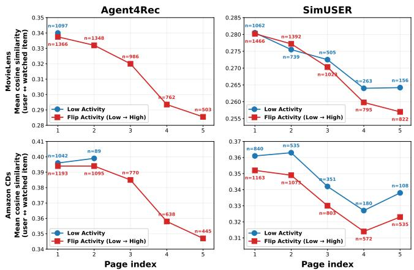
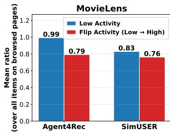
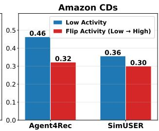
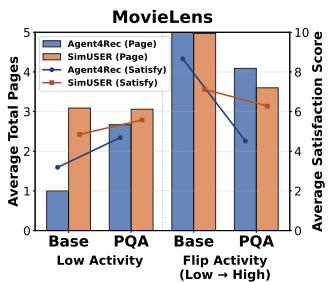
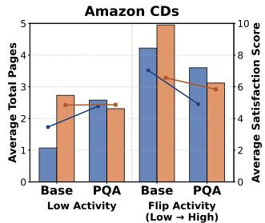

# A Behavioral Trait Leaks into Preferences: Diagnosing Trait Interference in LLM User Simulators

Chaehyun Kim   
ch.kim@kaist.ac.kr   
KAIST   
Daejeon, Republic of Korea   
Hongseok Kang   
ghdtjr0311@kaist.ac.kr   
KAIST   
Daejeon, Republic of Korea   
Sein Kim   
rlatpdlsgns@kaist.ac.kr   
KAIST   
Daejeon, Republic of Korea   
Chanyoung Park   
cy.park@kaist.ac.kr   
KAIST   
Daejeon, Republic of Korea

## Abstract

LLM-based user simulators aim to bridge the ofline–online gap in recommender evaluation by emulating users through injected traits, where preference atributes determine what a user engages with and a behavioral activity trait governs how long they browse. However, we show this intended trait independence collapses during simulation, causing two failures: (i) Trait Interference, where amplified activity distorts preference boundaries and forces interactions with mismatched items to sustain browsing, and (ii) Evaluation Invalidity, where satisfaction scores inflate with activitydriven page counts despite taste mismatches, biasing evaluation toward trait distributions rather than recommender performance. To resolve this, we propose PQA, a page-level quality anchoring method that guides simulators using a personalized anchor reflecting each user’s intrinsic preference standard. By assessing whether a page meets this standard before further browsing, PQA enables proactive exits from low-quality pages, leting the activity trait retain its intended role ofmodulating browsing depth within preferenc conforming pages. Experiments show PQA mitigates trait interference and improves the reliability of LLM-based simulator evaluation under activity shifts. Our code is available at https://github. com/chaehyun1/PQA.

## CCS Concepts

• Information systems → Recommender systems.

## Keywords

Recommender System, Large Language Model, User Simulator

## ACM Reference Format:

Chaehyun Kim, Sein Kim, Hongseok Kang, and Chanyoung Park. 2026. A Behavioral Trait Leaks into Preferences: Diagnosing Trait Interference in

LLM User Simulators. In Proceedings of the 35th ACM International Conference on Information and Knowledge Management (CIKM ’26), November 07–11, 2026, Rome, Italy. ACM, New York, NY, USA, 7 pages. https: //doi.org/10.1145/3799682.3839914

## 1 Introduction

LLM-based user simulators have recently been proposed to replicate realistic user behaviors by leveraging the reasoning ability of LLMs [1, 7, 18, 20, 21]. To construct more realistic virtual users, existing simulators define user traits and inject them into the input prompts, where the simulator browses a recommendation list presented page by page and decides when to stop [1, 21]. These traits fall into preference atributes (e.g., rating conformity and category diversity), which define what a user likes, and a behavioral trait such as user activity, which is designed to determine only how long a user keeps browsing the recommendation pages [1, 14, 21].

Despite this design, whether the activity trait preserves its role during simulation has been largely overlooked. Through a series of analyses, we find that current simulators fail to keep the activity trait within its intended role, leading to two critical issues:

(1) Trait Interference: As the activity trait is amplified, the simulator increasingly selects items semantically distant from the user’s persona (Section 2.1.1) and deviates from the user’s intrinsic category preferences (Section 2.1.2). This contradicts realworld data, where user activity is negatively correlated with average ratings (Section 2.1.3): more active users tend to give lower ratings on average, indicating stricter rather than permissive behavior. By contrast, the simulator indiscriminately interacts with mismatched items strictly to fulfill the behavioral constraint of extended browsing.

(2) Evaluation Invalidity: Unlike preference atributes (i.e., conformity and diversity), whose amplification has litle efect on the number of explored pages and the overall satisfaction score, activity amplification sharply increases both metrics (Section 2.2.1 This inflation persists even when recommendation quality is degraded, as high-activity simulators continue browsing lowquality pages despite preference mismatches. As a result, the satisfaction score becomes confounded by the injected activity level rather than reflecting the actual performance of the recommender system.

We identify the root cause of the aforementioned trait interference and subsequent evaluation invalidity as the absence of an explicit page-level quality anchor within the simulator, allowing activity constraints to override page-level preference alignment. Ideally, the activity trait should govern how extensively a user explores, without relaxing the user’s preference boundary. This interpretation is consistent with prior simulator designs. Specifically, Agent4Rec [21] encodes personalized preferences from historical likes and dislikes, summarizing them into unique tastes and rating paterns, while using the activity trait for exit decisions. Similarly, SimUSER [1] defines the corresponding behavioral trait as the frequency and breadth of a user’s interactions with recommended items. Thus, although activity may afect browsing depth and interaction frequency, it should not justify continued interaction with preference-mismatched items.

To address this, we introduce a page-level quality anchoring method called PQA, which defines a personalized anchor $\mu _ { u }$ that captures how densely each user’s preferred categories typically appear within a page, based on their interaction history. By injecting $\mu _ { u }$ into the prompt, the simulator can judge whether a recommended page meets the user’s preference expectation before deciding whether to continue browsing. This enables the simulator to proactively exit low-quality pages, ensuring that the activity trait modulates browsing depth only when page quality remains acceptable. Our main contributions are summarized as follows:

• We quantitatively demonstrate trait interference in user simulators, where changes in the activity trait distort users’ preference standards and consequently undermine evaluation validity.

• We identify the absence of a page-level quality anchor as the root cause of trait interference and propose PQA, which uses a personalized anchor $\mu _ { u }$ derived from each user’s historical category consumption to mitigate this issue.

• Through extensive experiments, we validate that PQA preserves trait independence and restores the evaluation validity of the simulator under activity distribution shifts.

## 2 Preliminary Analysis

Simulation Framework. A backbone recommender model (e.g., SASRec [8], LightGCN [6], MultVAE [10]) generates a personalized ranked item list by scoring candidate items from each user’s interaction history. To emulate real-world browsing behavior, the list is partitioned into pages and sequentially presented to the user simulator. At each page, the simulator decides which items to interact with based on the injected persona and user traits, and then determines whether to continue to the next page or exit the session.

Evaluation Protocol. To investigate trait interference, we use Agent4 and SimUSER [1] with SASRec [8] as the backbone recommender on MovieLens [5] and Amazon CDs [13]. SASRec is trained with a leave-last-out strategy [8, 9, 16, 17], and the same training data are used to construct user personas and traits. For each user, we build a 20-item recommendation list with a 1 ∶ � ratio of posi tive top-ranked items to negative botom-ranked items. Following standard interfaces [1, 21], we present four items per page and order the list by predicted logits, so that item relevance strictly decreases with page depth. This controlled degradation allows us to test whether high activity drives the simulator to continue browsing low-quality pages beyond the user’s core interests.

Figure 1: Mean cosine similarity between personas and watched items across page depths. � denotes the total number of watched items per page (plotted for $n \geq 2 0 )$

## 2.1 Trait Interference

2.1.1 Persona-item embedding similarity. To investigate the trait interference caused by the behavioral trait, we sample lowactivity users and modify their activity level to a high-activity state while holding their preference atributes constant. For each user, the set of items presented on each page is kept identical across activity levels. Specifically, under the 1:1 seting, we evaluate the semantic alignment between the virtual user’s intrinsic preferences and the simulator’s decisions by computing the cosine similarity between the user persona and the textual metadata of items selected (i.e., watched) by the simulator. Both the personas and item metadata are embedded using the all-MiniLM-L6-v2 [19] model.

As illustrated in Figure 1, amplifying the activity trait increases the overall number of interactions (�) across all pages and drives the simulator to explore deeper page depths. Crucially, the highactivity state yields lower cosine similarity than the low-activity state at the same page depth, indicating that the simulator engages with more preference-mismatched items to sustain browsing. Indeed, as recommendation quality degrades with page depth, lowactivity users show substantially fewer interactions in later pages, whereas high-activity users maintain a notably high volume of watched items (�) despite declining relevance. This indiscriminate acceptance provides empirical evidence of trait interference, suggesting that the LLM relaxes its preference boundaries to satisfy the behavioral constraint of extended browsing.

2.1.2 Category overlap. To evaluate preference consistency dur-ec [21]ing the simulation, we measure the category overlap ratio. This metric compares the simulator’s page-level decisions against a personalized baseline derived from the real user’s interaction history, allowing us to quantify how closely the simulation aligns with the user’s intrinsic evaluation standards.

To operationalize this standard, we first compute the user’s historical baseline. From the user’s interaction history, we extract the top-� categories (we set $K = 5 )$ and partition the timeline into discrete sessions. For each session �, we compute the overlap as the average number of top-� categories within the interacted items:

$$
\mathrm { o v e r l a p } _ { i } = \frac { 1 } { | \mathrm { s e s s i o n } _ { i } | } \sum _ { \substack { \boldsymbol { v } \in \mathrm { s e s s i o n } _ { i } } } | \mathrm { c a t e g o r i e s } ( \boldsymbol { \nu } ) \cap \mathrm { t o p } \mathbf { - } K |\tag{1}
$$

  
Figure 2: Impact of amplifying the activity trait on the category overlap ratio across MovieLens and CDs.

where categories(�) denotes the set of categories associated with item �. To reflect the user’s most recent persona, we apply a normalized exponential weight $w _ { i } = { \frac { \gamma ^ { i } } { \sum _ { j } \gamma ^ { j } } } ~ ( \gamma = 0 . 9 ,$ , with � = 0 as the most recent session). The historical baseline is then defined as:

$$
{ \mathrm { b a s e l i n e } } = \sum _ { i } w _ { i } \cdot { \mathrm { o v e r l a p } } _ { i }\tag{2}
$$

We evaluate the entire page to capture recommendation quality before the simulator decides whether to continue or exit. During simulation, we compute page-level overlap by applying Equation 1 with a browsed page replacing the historical session. The final metric is the ratio of this page-level overlap to the historical baseline (page\_overlap/baseline). A ratio approximating 1.0 indicates that the simulator strictly adheres to the user’s inherent preference boundaries.

Figure 2 shows the overlap-to-baseline ratio for each activity condition, where the ratio is computed at the user-page level and averaged over all pages actually interacted with by the simulators. The low-activity simulator tends to exit prematurely regardless of page quality, restricting its interactions to early, high-matching items and thereby mechanically increasing the mean ratio. However, this high ratio reflects a structural blind spot rather than precise filtering, since the simulator may miss preference-conforming items in later pages due to overly rigid exit behavior. Conversely, amplifying the activity trait forces the simulator to explore a drastically larger number of pages, causing the mean ratios to drop across both datasets. This indicates that the behavioral constraint of extended browsing overrides the simulator’s intrinsic preference boundaries, driving it to interact indiscriminately. This historical baseline therefore serves not only as a diagnostic metric but also as the basis for mitigating the interference, which we formalize in Section 3.

2.1.3 Correlation between Activity Trait and User Rating. To validate whether the permissive item acceptance under highactivity states reflects natural human behavior, we analyze the correlation between user activity and item ratings using real-world datasets. We find a statistically significant negative correlation be tween user activity and average historical ratings in both Movie-Lens (Kendall’s � = −0.366, p-value = $2 . 9 { \times } 1 0 ^ { - 2 5 } )$ and CDs (Kendall’s $\tau ~ = ~ - 0 . 0 6 9$ , p-value $= \ 1 . 6 5 \times 1 0 ^ { - 2 8 } )$ . This indicates that highactivity users tend to apply stricter evaluation criteria rather than exhibiting more permissive behavior. In contrast, amplifying the activity trait makes the simulator relax its preference criteria (Sections 2.1.1, 2.1.2). This discrepancy indicates that the simulator’s

Table 1: Changes in simulator evaluation metrics when each user trait is amplified from low to high.
<table><tr><td rowspan="2" colspan="2">Trait Settings</td><td rowspan="2">Simulator</td><td colspan="3">MovieLens</td><td colspan="3">CDs</td></tr><tr><td> $\overline { { P } } _ { v i e w }$ </td><td> $\overline { { N } } _ { e x i t }$ </td><td> $\overline { { S } } _ { s a t }$ </td><td> $\overline { { P } } _ { v i e w }$ </td><td> $\overline { { N } } _ { e x i t }$ </td><td> $\overline { { S } } _ { s a t }$ </td></tr><tr><td rowspan="3">Activity</td><td>Low</td><td>Agent4Rec SimUSER</td><td>0.509 0.409</td><td>1.00 4.44</td><td>3.18 4.85</td><td>0.529 0.369</td><td>1.07 2.73</td><td>3.46 4.85</td></tr><tr><td rowspan="2">Low → High</td><td>Agent4Rec</td><td>0.519</td><td>3.10</td><td>7.44</td><td></td><td></td><td></td></tr><tr><td>SimUSER</td><td>0.513</td><td>4.97</td><td>7.12</td><td>0.490 0.419</td><td>4.22 4.95</td><td>7.04 6.57</td></tr><tr><td rowspan="3">Conformity</td><td>Low</td><td>Agent4Rec SimUSER</td><td>0.555</td><td>1.36</td><td>3.74</td><td>0.515</td><td>1.32</td><td>3.65</td></tr><tr><td>Low → High</td><td>Agent4Rec</td><td>0.460 0.547</td><td>2.90 1.32</td><td>4.64 3.86</td><td>0.403 0.585</td><td>3.03 1.42</td><td>5.21 4.15</td></tr><tr><td></td><td>SimUSER</td><td>0.449</td><td>3.30</td><td>5.25</td><td>0.451</td><td>3.39</td><td>6.09</td></tr><tr><td rowspan="3">Diversity</td><td>Low</td><td>Agent4Rec</td><td>0.510</td><td>1.10</td><td>3.34</td><td>0.507</td><td>1.13</td><td>3.47</td></tr><tr><td rowspan="2">Low → High</td><td>SimUSER</td><td>0.385</td><td>2.53</td><td>4.32</td><td>0.362</td><td>2.59</td><td>4.67</td></tr><tr><td>Agent4Rec SimUSER</td><td>0.570 0.465</td><td>1.08 3.29</td><td>3.50 5.05</td><td>0.565 0.439</td><td>1.13 3.26</td><td>3.64 5.59</td></tr></table>

permissive behavior is not a natural consequence of high activity, but trait interference induced by the extended-browsing constraint.

## 2.2 Evaluation Invalidity

The trait interference observed in the previous Section 2.1 raises a critical concern regarding the validity of page-level satisfaction metrics. We hypothesize that the satisfaction scores artificially inflate as more pages are explored, regardless of actual recommendation quality. This implies that evaluation outcomes are dominated by the activity trait rather than the recommendation model’s actual performance. To verify this, we conduct two analyses: we first compare the activity trait against preference-related traits to verify whether the inflation is specific to activity (Section 2.2.1), and then examine whether this inflation persists under systematically controlled recommendation quality (Section 2.2.2). Throughout the experiments, we evaluate the simulation using the average viewing ratio $( \overline { { P } } _ { v i e w } )$ , the average number of explored pages $( \overline { { N } } _ { e x i t } )$ , and the average user satisfaction score $( \overline { { S } } _ { s a t } )$

2.2.1 Activityvs. Preference Traits. To verify whether this evaluation invalidity is uniquely caused by the activity trait, we compare its impact against preference-related traits (i.e., conformity and diversity), as summarized in Table 1. While altering the preference traits yields only marginal fluctuations in $\overline { { N } } _ { e x i t }$ and $\overline { { S } } _ { s a t }$ , amplifying the activity trait causes drastic inflations in both metrics. This stark contrast confirms that the evaluation metric is specifically distorted by the behavioral constraint of the activity trait, rather than by preference-related traits.

2.2.2 Inflation underRecommendation Quality. To verify that this inflation is independent of recommendation quality, we degrade the pages by increasing � in the 1 ∶ � ratio (Table 2), so that more items are sampled from lower predicted logits, and compare metrics as activity is amplified from low to high. As shown in Table 2, we have the following observations: 1) Irrespective of the positive-to-negative item ratio, amplifying the activity trait causes significant inflations in both the average number ofexplored pages $( \overline { { N } } _ { e x i t } )$ and the average satisfaction score $( \overline { { S } } _ { s a t } )$ . 2) Crucially, this artificial inflation persists even at the extreme 1 ∶ 9 seting, where negative items explicitly mismatch the user’s taste yet the high activity simulator continues to explore significantly more pages. This confirms that the evaluation metric merely reflects the injected activity trait rather than the true relevance of the recommended items, ultimately rendering the evaluation invalid.

Table 2: Impact of amplifying the activity trait on simulation metrics under controlled page qualities. Pages are degraded by varying the positive-to-negative ratio (1 ∶ �).
<table><tr><td rowspan="2">Ratio (1 :k)</td><td rowspan="2">Activity</td><td rowspan="2">Simulator</td><td colspan="3">MovieLens</td><td colspan="3">CDs</td></tr><tr><td> $\overline { { P } } _ { v i e w }$ </td><td> $\overline { { N } } _ { e x i t }$ </td><td> $\overline { { S } } _ { s a t }$ </td><td> $\mid \overline { { P } } _ { v i e w }$ </td><td> $\overline { { N } } _ { e x i t }$ </td><td> $\overline { { S } } _ { s a t }$ </td></tr><tr><td rowspan="3">1:1</td><td rowspan="2">Low</td><td>Agent4Rec</td><td>0.509</td><td>1.00</td><td>3.18</td><td>0.529</td><td>1.07</td><td>3.46</td></tr><tr><td>SimUSER</td><td>0.409</td><td>4.44</td><td>4.85</td><td>0.369</td><td>2.73</td><td>4.85</td></tr><tr><td rowspan="2">Low → High</td><td>Agent4Rec SimUSER</td><td>0.519 0.513</td><td>3.10 4.97</td><td>7.44</td><td>0.490</td><td>4.22</td><td>7.04</td></tr><tr><td></td><td></td><td></td><td></td><td>7.12</td><td>0.419</td><td>4.95</td><td>6.57</td></tr><tr><td rowspan="3">1:3</td><td rowspan="2">Low</td><td>Agent4Rec SimUSER</td><td>0.514 0.359</td><td>1.01 2.60</td><td>3.15 4.52</td><td>0.488</td><td>1.09</td><td>3.43</td></tr><tr><td>Agent4Rec</td><td></td><td></td><td></td><td>0.321</td><td>2.32</td><td>4.53</td></tr><tr><td rowspan="2">Low → High</td><td>SimUSER</td><td>0.462 0.438</td><td>4.14 4.97</td><td>6.99 6.47</td><td>0.434 0.350</td><td>3.91 4.98</td><td>6.63 6.17</td></tr><tr><td>Low</td><td>Agent4Rec</td><td>0.389</td><td></td><td></td><td>0.380</td><td>1.01</td><td>3.15</td></tr><tr><td rowspan="3">1:9</td><td rowspan="2"></td><td>SimUSER</td><td>0.310</td><td>1.00 2.02</td><td>3.06 3.89</td><td>0.271</td><td>2.02</td><td>4.01</td></tr><tr><td>Agent4Rec</td><td>0.415</td><td>3.89</td><td>6.51</td><td>0.396</td><td>3.77</td><td>6.34</td></tr><tr><td rowspan="2">Low → High</td><td>SimUSER</td><td>0.393</td><td>4.99</td><td>6.03</td><td>0.311</td><td>5.00</td><td></td></tr><tr><td></td><td></td><td></td><td></td><td></td><td></td><td></td><td>5.71</td></tr></table>

## 3 Methods

The empirical evidence from Sections 2.1 and 2.2 reveals a criti cal flaw in current simulators: activity often determines exit behavior without suficient regard to page quality. When instructed to exhibit high activity, the LLM continues browsing preferencemismatched pages despite degraded recommendation quality; when assigned low activity, it may terminate mechanically even when the page still contains preference-aligned items. In an ideal simulation, activity should modulate browsing depth only when page quality remains acceptable, rather than overriding preference alignment. We atribute this failure to the absence of a clear, personalized standard for determining whether a page remains acceptable to the user. To address this issue, we equip the simulator with an explicit page-level quality anchor, ensuring that the activity trait determines exploration depth only within preference-conforming pages.

PQA: Page-level Quality Anchor. To enforce this ideal behavior, we propose PQA, which injects a personalized page-level quality anchor $\mu _ { u }$ into the LLM’s system prompt. Instead of introducing an arbitrary threshold, we formally define $\mu _ { u }$ using the user’s historical category overlap baseline previously formulated in Equation 2 (i.e., $\mu _ { u } : =$ baseline). Because this baseline is derived directly from the user’s real-world interaction history, it provides a natural, data-driven standard that explicitly quantifies their intrinsic preference boundaries. To operationalize this anchor, we translate the numerical evaluation into an explicit, rule-based labeling system within the LLM’s prompt. During the simulation, the category match score of the current page is dynamically compared against $\mu _ { u }$ to calculate a relative quality ratio. Based on this ratio, each page is assigned one of three qualitative labels: ABOVE, NORMAL, or BELOW. 1 This label serves as a page-level quality signal that gates how the activity trait afects browsing decisions. The simulator first generates its overall feeling based primarily on page quality, while the activity trait is explicitly prevented from changing this quality assessment. It then makes the continue-orexit decision by jointly considering the page-quality label, activity trait, and accumulated session fatigue.

  
Figure 3: Efect of PQA on browsing depth and satisfaction scores under activity shifts on MovieLens and CDs.

Table 3: Recommendation results after fine-tuning with simulator-generated interactions on MovieLens and CDs.
<table><tr><td rowspan="3"></td><td rowspan="3">Variant Trait Settings</td><td rowspan="3">Simulator</td><td colspan="2">MovieLens</td><td colspan="2">CDs</td></tr><tr><td>NDCG@5 HR@5</td><td></td><td>|NDCG@5 HR@5</td><td></td></tr><tr><td rowspan="3">Base</td><td rowspan="2">Low</td><td>Agent4Rec</td><td>0.2819</td><td>0.3915</td><td>0.3322</td><td>0.4623</td></tr><tr><td>SimUSER</td><td>0.2945</td><td>0.4026</td><td>0.3187</td><td>0.4390</td></tr><tr><td rowspan="2">Low → High</td><td>Agent4Rec SimUSER</td><td>0.2945 0.2842</td><td>0.4007</td><td>0.3273</td><td>0.4519</td></tr><tr><td></td><td></td><td>0.3952</td><td></td><td>0.3200</td><td>0.4390</td></tr><tr><td rowspan="3">PQA</td><td rowspan="2">Low</td><td>Agent4Rec</td><td>0.3046</td><td>0.4082</td><td>0.3479</td><td>0.4805</td></tr><tr><td>SimUSER</td><td>0.3004</td><td>0.3933</td><td>0.3437</td><td>0.4675</td></tr><tr><td rowspan="2">Low → High</td><td>Agent4Rec SimUSER</td><td>0.2950</td><td>0.4063</td><td>0.3341 0.3264</td><td>0.4623</td></tr><tr><td></td><td>0.3024</td><td>0.4156</td><td></td><td></td><td>0.4519</td></tr></table>

Specifically, for an ABOVE page, PQA applies a one-page continuation rule because the page is judged to suficiently satisfy the user’s preference standard. This rule prevents low-activity simulated users from mechanically exiting too early. It does not assume that exiting after finding satisfying items is irrational; rather, it delays only the immediate exit decision by one page. If subsequent pages are labeled NORMAL or BELOW, activity, fatigue, and repeated low-quality signals are considered again in the exit decision. A NORMAL page triggers a sticky one-page exploration on first encounter to avoid mechanical early exits, and is thereafter judged by activity and fatigue. A BELOW page is granted a single grace page only when it appears on the first page, to reflect minimal curiosity. Two consecutive BELOW pages force exit regardless of activity; in all other cases, low activity increases exit sensitivity while high activity allows limited patience. Thus, activity modulates browsing depth only after page quality has been explicitly assessed, preventing it from overriding the user’s core preferences.

## 4 Experiments

We conduct experiments on two widely used datasets: MovieLens [5] and Amazon CDs [13]. To evaluate the reliability of trait-driven behaviors, we apply our framework to two LLM-based user simulators, Agent4Rec [21] and SimUSER [1]. Unless otherwise stated, all simulations are conducted using GPT-4o-mini as the underlying LLM.

Table 4: Human-likeness score evaluated by GPT-4o across recommendation domains.
<table><tr><td></td><td>MovieLens</td><td>CDs</td></tr><tr><td>Agent4Rec</td><td> $3 . 5 7 \pm 0 . 0 3$ </td><td> $3 . 6 4 \pm 0 . 0 2$ </td></tr><tr><td>SimUSER</td><td> $4 . 2 6 \pm 0 . 0 4$ </td><td> $4 . 0 5 \pm 0 . 1 1$ </td></tr><tr><td>PQA-Agent4Rec</td><td> $4 . 1 5 \pm 0 . 0 4$ </td><td> ${ \bf 4 . 2 2 \pm 0 . 0 4 }$ </td></tr><tr><td>PQA-SimUSER</td><td> ${ \bf 4 . 3 5 \pm 0 . 0 8 }$ </td><td> $4 . 0 6 \pm 0 . 0 7$ </td></tr></table>

1. Restoring Trait Independence and Evaluation Validity under Activity Shifts. To examine whether PQA restores the independence between preference and behavioral traits, we use a controlled 1:1 recommended list consisting of 20 items, partitioned into five pages with four items per page. Since the first half of the list is preference-aligned and the second half is preferencemismatched, Page 3 forms the preference boundary, while Pages 4–5 contain only low-quality items. As shown in Figure 3, baseline simulators exhibit rigid browsing paterns driven by the injected activity level. Across both datasets, Agent4Rec often exits prematurely under low activity despite remaining preference-aligned items whereas both baselines over-browse low-quality pages under high activity. The corresponding increase in satisfaction scores under high activity indicates evaluation invalidity, where satisfaction reflects the activity level more than actual recommendation quality. PQA mitigates these failures by grounding browsing decisions in the personalized quality anchor $\mu _ { u }$ . Under low activity, it reduces premature exits by identifying pages that remain preferencealigned, leading Agent4Rec to explore more relevant items and report higher satisfaction. Under high activity, it prevents activity from becoming an unconditional mandate to continue browsing, reducing excessive exploration and satisfaction inflation once page quality falls below the user’s preference standard. SimUSER browses more deeply under low activity due to its exit-refinement procedure, yet still over-browses under high activity; PQA mitigates this by grounding exits in page-level alignment, reducing trait interference and improving evaluation reliability under activity shifts.

2. Downstream Validation via Simulated Interaction Augmentation. To assess the fidelity of PQA-generated interactions, we use the simulation logs for data augmentation and evaluate whether they improve downstream recommendation performance. Specifically, we collect virtual interactions from Agent4Rec and SimUSER, with or without PQA, and use them as new positive preference labels to fine-tune SASRec [8]. We then compare the fine-tuned models on the ofline test set, under the hypothesis that a simulator aligned with users’ authentic preferences yields a stronger augmented model on real test data. As shown in Table 3, models fine-tuned with PQA-generated interactions achieve the best performance across both datasets. In particular, PQA-Agent4Rec obtains the largest gains, reaching an NDCG@5 of 0.3046 on Movie-Lens and 0.3479 on CDs. These results indicate that PQA efectively filters low-quality pages and preserves the user’s intrinsic preferences. While high-activity baseline simulators keep consuming preference-mismatched items in later pages and inject them into the simulated data, PQA uses $\mu _ { u }$ to terminate browsing before such interactions accumulate, yielding cleaner data that beter reflects users’ genuine preferences.

3. LLM-based Human-Likeness Evaluation. We use GPT-4o to evaluate the human-likeness of simulator-generated interactions on a 5-point Likert scale [2], with higher scores indicating closer alignment with real user behavior. Table 4 shows that PQA consistently improves both simulators across datasets. PQA-Agent4Rec increases the score from 3.57 to 4.15 on MovieLens and from 3.64 to 4.22 on CDs, while PQA-SimUSER achieves the highest score of 4.35 on MovieLens. The improvement stems from PQA’s contextaware exit mechanism. Without PQA, simulators often exhibit rigid, suboptimal browsing paterns, either exiting too early under low activity or continuing through low-quality pages under high activity, which lowers human-likeness. In contrast, by grounding exit decisions in $\mu _ { u } , \mathrm { P Q A }$ enables simulators to exit on taste-mismatched pages while continuing when recommendations remain acceptable, producing more realistic and preference-faithful interaction logs.

## 5 Related Work

LLM-based user simulation has emerged as a promising alternative to static recommendation metrics and costly online A/B testing. Offline metrics evaluate recommendation systems on fixed logged interactions and thus cannot capture how users respond to newly exposed items, while online A/B testing is costly and risks degrading user experience. Early work in this direction has primarily focused on constructing realistic user personas. Agent4Rec [21] models social traits such as conformity from real-world data, while profileaware simulators [3] summarize user history in natural language to beter align with human judgment. PUB [12] further integrates Big Five personality traits [4, 15] to replicate diverse interaction patterns, and SimUSER [1] identifies self-consistent personas with specialized perception and memory modules to serve as believable human proxies. Furthermore, AgentCF [22] places the collaborative signal inside the simulator, casting both users and items as agents and jointly optimizing their textual memories to fit observed useritem interactions. Recent work shifts focus from constructing simulators to using them as a source of feedback for the recommender. RecoWorld [11] establishes a proactive feedback loop in which the simulator explicitly signals user states (e.g., boredom) to guide the recommender’s adaptation. Despite this progress, whether simu lators behave as specified has received litle atention, as evaluation typically reports aggregate satisfaction that conceals whether the injected traits retained their intended roles. Existing simulators implicitly assume trait independence, where preference atributes determine what a user engages with while a behavioral activity trait governs only how long the user browses. We show that this assumption collapses during simulation, and that the resulting interference propagates into satisfaction-based evaluation.

## 6 Conclusion

In this paper, we identified trait interference as a failure mode of LLM-based user simulators, where activity traits interfere with preference judgments and undermine satisfaction-based evaluation. We proposed PQA, which grounds exit decisions in personalized page-level preference alignment. Experiments show that PQA reduces activity-driven over-browsing, restores trait independence, and improves the reliability of simulator-generated interactions. A promising direction is to extend PQA beyond category-level sig nals with richer preference indicators (e.g., item-item relationships, collaborative filtering signals, or fine-grained feedback) to beter capture users’ intrinsic preferences across domains.

## Acknowledgments

This work was supported by the National Research Foundation of Korea (NRF) grant funded by the Korea government (MSIT) (RS-2024-00335098), the National Research Foundation of Korea (NRF) grant funded by the Korea government (MSIT) (RS-2024- 00406985), and partly supported by Institute for Information & Communications Technology Planning & Evaluation (IITP) grant funded by the Korea government (MSIT) (RS-2019-II190075), Artificial Intelligence Graduate School Support Program (KAIST).

## GenAI Usage Disclosure

We acknowledge the use ofgenerative AI tools, such as Gemini and Claude, exclusively for limited assistance in checking grammar, improving readability, refining expression, and reducing length to satisfy page constraints. We also used these tools for minor refactoring and debugging of code related to ploting and visualization. All AI-assisted revisions and code modifications were carefully reviewed and validated by the authors. The core ideas, methodology, experiments, and interpretations presented in this paper are entirely the authors’ original contributions.

## References

[1] Nicolas Bougie and Narimawa Watanabe. 2025. Simuser: Simulating user behav ior with large language models for recommender system evaluation. In Proceedings of the 63rd Annual Meeting of the Association for Computational Linguistics (Volume 6: Industry Track). 43–60.

[2] Cheng-Han Chiang and Hung-yi Lee. 2023. Can large language models be an alternative to human evaluations?. In Proceedings of the 61st Annual Meeting of the Association for Computational Linguistics (Volume 1: Long Papers). 15607– 15631.

[3] Francesco Fabbri, Gustavo Penha, Edoardo D’Amico, Alice Wang, Marco De Nadai, Jackie Doremus, Paul Gigioli, Andreas Damianou, Oskar Stål, and Mounia Lalmas. 2025. Evaluating podcast recommendations with profile-aware llm-as-a-judge. In Proceedings ofthe Nineteenth ACMConference on Recommender Systems. 1181–1186.

[4] Lewis R. Goldberg. 1992. THE DEVELOPMENT OF MARKERS FOR THE BIG FIVE FACTOR STRUCTURE. Psychological Assessment 4 (1992), 26–42. https: //api.semanticscholar.org/CorpusID:144709415

[5] F Maxwell Harper and Joseph A Konstan. 2015. The movielens datasets: History and context. Acm transactions on interactive intelligent systems (tiis) 5, 4 (2015), 1–19.

[6] Xiangnan He, Kuan Deng, Xiang Wang, Yan Li, Yongdong Zhang, and Meng Wang. 2020. Lightgcn: Simplifying and powering graph convolution network for recommendation. In Proceedings of the 43rd International ACM SIGIR conference on research and development in Information Retrieval. 639–648.

[7] Xu Huang, Jianxun Lian, Yuxuan Lei, Jing Yao, Defu Lian, and Xing Xie. 2025. Recommender ai agent: Integrating large language models for interactive recom mendations. ACM Transactions on Information Systems 43, 4 (2025), 1–33.

[8] Wang-Cheng Kang and Julian McAuley. 2018. Self-atentive sequential recommendation. In 2018 IEEE international conference on data mining (ICDM). IEEE, 197–206.

[9] Sein Kim, Hongseok Kang, Kibum Kim, Jiwan Kim, Donghyun Kim, Minchul Yang, Kwangjin Oh, Julian McAuley, and Chanyoung Park. 2025. Lost in Sequence: Do Large Language Models Understand Sequential Recommendation?. In Proceedings ofthe 31st ACM SIGKDD Conference on Knowledge Discovery and Data Mining V.2 (Toronto ON, Canada) (KDD ’25). Association for Computing Machinery, New York, NY, USA, 1160–1171. doi:10.1145/3711896.3737035

[10] Dawen Liang, Rahul G Krishnan, Mathew D Hofman, and Tony Jebara. 2018. Variational autoencoders for collaborative filtering. In Proceedings of the 2018 world wide web conference. 689–698.

[11] Fei Liu, Xinyu Lin, Hanchao Yu, Mingyuan Wu, Jianyu Wang, Qiang Zhang, Zhuokai Zhao, Yinglong Xia, Yao Zhang, Weiwei Li, et al. 2026. Recoworld: Building simulated environments for agentic recommender systems. In Companion Proceedings ofthe ACM Web Conference 2026. 650–659.

[12] Chenglong Ma, Ziqi Xu, Yongli Ren, Danula Hetiachchi, and Jefrey Chan. 2025. PUB: an LLM-enhanced personality-driven user behaviour simulator for recommender system evaluation. In Proceedings ofthe 48th International ACM SIGIR Conference on Research and Development in Information Retrieval. 2690–2694.

[13] Julian McAuley, Christopher Target, Qinfeng Shi, and Anton Van Den Hengel. 2015. Image-based recommendations on styles and substitutes. In Proceedings ofthe 38th international ACM SIGIR conference on research and development in information retrieval. 43–52.

[14] Manel Mezghani, Corinne Amel Zayani, Ikram Amous, and Faiez Gargouri. 2012. A user profile modelling using social annotations: a survey. In Proceedings of the 21st International Conference on World Wide Web (Lyon, France) (WWW ’12 Companion). Association for Computing Machinery, New York, NY, USA, 969– 976. doi:10.1145/2187980.2188230

[15] Sonia Roccas, Lilach Sagiv, Shalom H. Schwartz, and Ariel Knafo. 2002. The Big Five Personality Factors and Personal Values. Personality and Social Psychology Bulletin 28 (2002), 789 – 801. https://api.semanticscholar.org/CorpusID: 144611052

[16] Fei Sun, Jun Liu, Jian Wu, Changhua Pei, Xiao Lin, Wenwu Ou, and Peng Jiang. 2019. BERT4Rec: Sequential recommendation with bidirectional encoder representations from transformer. In Proceedings of the 28th ACM international conference on information and knowledge management. 1441–1450.

[17] Jiaxi Tang and Ke Wang. 2018. Personalized top-n sequential recommendation via convolutional sequence embedding. In Proceedings of the eleventh ACM international conference on web search and data mining. 565–573.

[18] Lei Wang, Jingsen Zhang, Hao Yang, Zhi-Yuan Chen, Jiakai Tang, Zeyu Zhang, Xu Chen, Yankai Lin, Hao Sun, Ruihua Song, et al. 2025. User behavior simulation with large language model-based agents. ACM Transactions on Information Systems 43, 2 (2025), 1–37.

[19] Wenhui Wang, Furu Wei, Li Dong, Hangbo Bao, Nan Yang, and Ming Zhou. 2020. Minilm: Deep self-atention distillation for task-agnostic compression of pre-trained transformers. Advances in neural information processing systems 33 (2020), 5776–5788.

[20] Yancheng Wang, ZiyanJiang, Zheng Chen, Fan Yang, Yingxue Zhou, Eunah Cho, Xing Fan, Yanbin Lu, Xiaojiang Huang, and Yingzhen Yang. 2024. Recmind: Large language model powered agent for recommendation. In Findings of the Association for Computational Linguistics: NAACL 2024. 4351–4364.

[21] An Zhang, Yuxin Chen, Leheng Sheng, Xiang Wang, and Tat-Seng Chua. 2024. On generative agents in recommendation. In Proceedings ofthe 47th international ACMSIGIR conference on research anddevelopmentin Information Retrieval. 1807– 1817.

[22] Junjie Zhang, Yupeng Hou, Ruobing Xie, Wenqi Sun,Julian McAuley, Wayne Xin Zhao, Leyu Lin, and Ji-Rong Wen. 2024. Agentcf: Collaborative learning with autonomous language agents for recommender systems. In Proceedings of the ACM Web Conference 2024. 3679–3689.