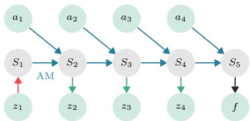
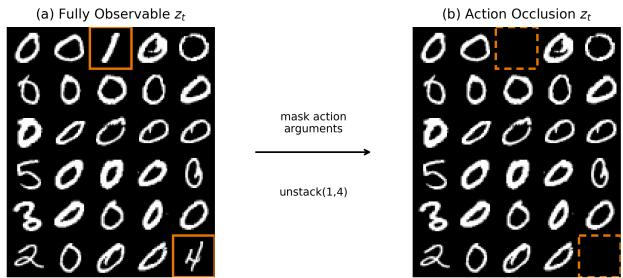

# Neurosymbolic Action Model Learning under Partial Observability

Adem Kikaj1∗, Lennert De Smet1, Giuseppe Marra1, Luc De Raedt1

1 KU Leuven, Belgium firstname.lastname@kuleuven.be

## Abstract

AI planning studies how an agent can reach a goal by ex- ecuting a sequence of actions. To plan correctly, the agent needs an action model describing when each action can be executed and how it changes the world. Constructing such models by hand requires domain expertise, and can be costly and error-prone. Action models can instead be learned from available data using existing neurosymbolic approaches, but they currently assume access to complete traces of fully ob- servable images . These approaches fail to learn action models under partial observability where some of the images might not be present or are not fully informative of the current state of the world. Hence, this paper proposes NeSyAM, a novel neurosymbolic modeling paradigm for action model learning under partial observability. In addition, the paper presents a unified variational framework for theoretically analysing the limitations of existing methods compared to our proposed approach. NeSyAM is then tested extensively on six visual planning domains and three observation regimes to show it consistently recovers relevant parts of the true action model under partial observability.

## 1 Introduction

Given an initial state and a goal, AI planning searches for a sequence of actions that transforms the initial state into a state satisfying the goal (Ghallab, Nau, and Traverso 2004). This search relies on symbolic action models: descriptions of when actions are applicable and how they change the world, usually specified as preconditions and efects over symbolic predicates. In Blocksworld, for example, picking up a block requires the block to be clear and on the table (preconditions), and causes the robot to hold it (efects). Such models are traditionally provided by domain experts, but their manual construction is costly, error-prone, and dificult to scale. This has motivated a long line of work on learning action models from traces (Pasula, Zettlemoyer, and Kaelbling 2007; Yang, Wu, and Jiang 2007; Zhuo and Kambhampati 2013; Aineto, Celorrio, and Onaindia 2019; Lamanna and Serafini 2024; Aineto and Scala 2024; Lamanna et al. 2025) .

Learning from symbolic traces however still requires a fully symbolic description of the traces provided by domain experts. Consequently, more recent work considers learning from visual traces (Xi, Gould, and Thiébaux 2024; Xi, Gould, and Thiebaux 2026) where the learner observes traces of im-ages and executed actions together with final-state informa- tion. Learning from such traces is a neurosymbolic problem: neural perception is required to interpret the images, while symbolic reasoning is required to recover the preconditions and efects of actions. Unfortunately, existing neurosymbolic learning approaches make the strong assumption that visual traces are complete and fully observable. They can not be applied to settings with missing images or when images do not contain all information of the state. For example, if a robot’s gripper is outside of its camera view, the images recorded when performing the action pick-up(A) may not show that the robot is holding block A. The images may therefore provide insuficient evidence for holding(A), even though earlier observations, later observations, or the final- state description may constrain it.

In this paper, we focus on contributing to neurosymbolic action model learning under partial observability. We start by (1) proposing NeSyAM, a novel structured approximation to the partially observable action model learning problem. This approximation is then (2) theoretically compared to existing approaches by casting action model learning within a unifying variational perspective (Section 5). Specifically, this perspective shows that the state of the art uses a type of mean-field approximation to the action model learning problem that relies on complete and fully observable visual traces, while our structured approximation does not. Finally, we (3) compare NeSyAM with rosame-i across six visual planning domains and three observation regimes. Under full observability, NeSyAM recovers all relevant action roles, while rosame-i achieves higher full-candidate recovery. Un- der occlusion, NeSyAM preserves relevant-role recovery more consistently, although the full-candidate comparison remains mixed.

## 2 Preliminaries

In all that follows, uppercase characters X will denote random variables or random vectors with probability distribu- tion p(X), while lowercase characters x denote instances of those variables with corresponding probabilities $p ^ { X } ( x )$ , or simply p(x) if the distribution is clear from context.

Planning domains and action models. We consider a lifted planning domain $D = \langle \mathcal { T } , \mathcal { P } , \mathcal { A } , \mathrm { A M } \rangle$ , where T is a set of types, $\mathcal { P }$ is a set of predicate symbols, $\mathcal { A }$ is a set of action schemas, and AM is an action model. A classical action model assigns every action schema $a ( { \pmb x } ) \in \mathcal { A }$ a tuple

$$
\mathrm { A M } ( a ( \pmb { x } ) ) = \langle \mathrm { P r e } ( a ( \pmb { x } ) ) , \mathrm { A d d } ( a ( \pmb { x } ) ) , \mathrm { D e l } ( a ( \pmb { x } ) ) \rangle ,
$$

containing its preconditions, add efects, and delete efects.

For a planning instance I with a finite set of objects ${ \mathcal { O } } _ { : }$ grounding the variables x in the action schemas $a ( { \pmb x } )$ and predicate templates $p ( { \pmb x } )$ with respect to O produces a finite set of propositions $\mathcal { P } _ { I }$ and grounded actions $\boldsymbol { \mathcal { A } } _ { I } .$ . For an action schema $a ( { \pmb x } ) \in \mathcal { A }$ and a type-compatible tuple of objects $\mathbf { \sigma } _ { o \in \mathcal { O } }$ , we write $a ( o ) \in \mathcal { A } _ { I }$ for the corresponding grounded action. For example, holding is a predicate symbol with template $h o l d i n g ( x )$ that is ground into the proposition holding(A), while the action schema pick-up(x) is ground into the action pick-up(A). A symbolic state $s \subseteq \mathcal { P } _ { I }$ contains the grounded propositions that are true. We write $s _ { p } \in \{ 0 , 1 \}$ for the truth value of proposition $p \in \mathcal { P } _ { I }$ , with $s _ { p } = 1$ if and only i ${ \mathrm { ~ \boldsymbol ~ { ~ \mathscr ~ { ~ p ~ \in ~ } ~ } ~ } } s .$

We use mostly standard STRIPS semantics to define action applicability and state transitions (Fikes and Nilsson 1971; Ghallab, Nau, and Traverso 2004). A grounded action a is applicable in state s when $\mathrm { P r e } ( a ) \subseteq s$ . Applying an applicable action produces res $( s , a ) = ( s \setminus \operatorname { D e l } ( a ) ) \cup \operatorname { A d d } ( a )$ . Propo-sitions that are not deleted persist. Preconditions that are not deleted remain true and are called prevail conditions (Bäckström and Nebel 1995). Standard STRIPS permits adding an already true proposition. However, our model will apply the additional constraint that an add efect can only apply to a false proposition. This modeling choice is intended to reduce reasoning shortcuts (Marconato et al. 2023).

In Blocksworld, the action schema pick-up(x) illustrates these definitions. For block A, the grounded action pick-up(A) requires clear(A), on $T a b l e ( A )$ and handEmpty. It adds $h o l d i n g ( A )$ and deletes clear(A), on $T a b l e ( A )$ , and handEmpty. Therefore, considering only these relevant propositions, applying pick-up(A) transforms {clear(A), onTable(A), handEmpty} into $\{ h o l d i n g ( A ) \}$ In our learning setting, these precondition and efect rela- tions are not given and must be recovered from visual traces.

Visual traces. The learner receives visual traces rather than symbolic state trajectories. A trace has the form $\tau =$ $( z _ { 1 } , a _ { 1 } , z _ { 2 } , a _ { 2 } , . . . , z _ { T } , a _ { T } , f )$ , where $z _ { t }$ are images, $a _ { t } \in \mathcal A _ { I }$ are observed grounded actions, and f is a fully observed symbolic description of the state reached after the final action. The trace contains no image of this final state. More formally, let $s _ { t } \subseteq \mathcal P _ { I }$ denote the symbolic state underlying image $z _ { t } ,$ and let $s _ { T + 1 }$ denote the state reached after the final ac- tion. Then, the sequence $\pmb { s } = ( s _ { 1 } , \dots , s _ { T + 1 } )$ forms the sym- bolic execution of which the first $T$ entries $s _ { 1 : T }$ are hidden. The final symbolic state $s _ { T + 1 }$ is fully described by the ob- served description $f .$ . Other observed entities are the images $\boldsymbol { z } = ( z _ { 1 } , \dots , z _ { T } )$ and grounded actions $\pmb { a } = ( a _ { 1 } , \dots , a _ { T } )$ The image observations z might in our case be partial, i.e. an image $z _ { t }$ does not fully describe the content of its associated symbolic state $s _ { t }$

For example, for $t < T + 1 ,$ a Blocksworld trace may contain an image $z _ { t }$ showing block A clear and on the table, followed by pick-up(A) and a successor image $z _ { t + 1 }$ . The underlying transition changes $h o l d i n g ( A )$ from false to true and removes $o n T a b l e ( A )$ . Under partial observability, the gripper or block A may be hidden in $z _ { t + 1 }$ , so the image alone does not determine whether $h o l d i n g ( A )$ became true. Other observations, executed actions, and the final-state description may nevertheless constrain its value.

Probabilistic action models. We represent the unknown action model AM using a probabilistic action model (pam) (Xi, Gould, and Thiébaux 2024). A pam models the efects of actions on predicates in a lifted way by considering lifted combinations $\boldsymbol { c } = \big ( a ( \mathbf { x } ) , p ( \mathbf { y } ) \big )$ , where $a ( { \pmb x } ) \in \mathcal { A }$ is an action schema and $p ( \pmb { y } )$ a type-compatible lifted predi- cate template for each $p \in \mathcal P$ . The pam predicts probabilities for four possible roles not-involved, pre, add, del, for each lifted combination c. The role not-involved means that the predicate is unrelated to the action. The role pre denotes a prevail condition, add denotes an add efect and del denotes a predicate that is both a precondition and a delete efect. Specifically, these four mutually exclusive roles form the do- main of a categorical random variable $R _ { p }$ over the roles of predicate template $p ( \pmb { y } )$ with conditional probability distri- bution $p _ { \pmb { \theta } _ { \mathrm { A M } } } ( R _ { p } \ | \ a )$ given an action schema $a .$ The pam distribution $p _ { \pmb { \theta } _ { \mathrm { A M } } } ( R _ { p } \ | \ a )$ is modeled by four parameters $\theta _ { c } = ( p _ { \mathrm { N } } , p _ { \mathrm { P } } , p _ { \mathrm { A } } , p _ { \mathrm { D } } )$ with $p _ { \mathrm { N } } + p _ { \mathrm { P } } + p _ { \mathrm { A } } + p _ { \mathrm { D } } = 1$ , for each lifted combination $c \in \mathcal { C } = \mathcal { A } \times \mathcal { P }$ representing the unknown precondition and efect relations in $\mathrm { \bar { A M } } ( a ( { \pmb x } ) )$ ). We collect the global action-model parameters as $\pmb { \theta } _ { \mathrm { A M } } = \{ \theta _ { c } \} _ { c \in \mathcal { C } }$ . The lifted pam distributions $p _ { \pmb { \theta } _ { \mathrm { A M } } } ( R _ { p } \mid a )$ are applied on specific planning instances I by assuming the roles of ground predicates are conditionally independent given the action a, i.e. the random vector R of roles for all ground predicates in $\mathcal { P } _ { I }$ is governed by the distribution

$$
\begin{array} { r } { p \pmb { \theta } _ { \mathrm { A M } } ( \pmb { R } \mid a ) = \prod _ { p \in \mathcal { P } _ { I } } p _ { \pmb { \theta } _ { \mathrm { A M } } } ( R _ { p } \mid a ) , } \end{array}\tag{1}
$$

where we slightly abuse notation by identifying the ground predicate $p \in \mathcal { P } _ { I }$ with its corresponding predicate template.

In the pick-up(x) example, $h o l d i n g ( x )$ has the add role, while $o n T a b l e ( x )$ has the del role. Evidence from diferent ground instances pick-up(A), pick-up(B) therefore update the same lifted action-model parameters. The probabilistic tran- sition that maps role probabilities and a proposition values to a successor value is introduced with our model (Section 4).

Variational inference. An alternative to maximising the log-likelihood log $p _ { \pmb { \theta } } ( \pmb { O } )$ of a series of observations O under a parametrised distribution $p _ { \pmb { \theta } } ( \pmb { O } , \pmb { X } ) = p _ { \pmb { \theta } } ( \pmb { O } \mid \pmb { X } ) { \cdot p _ { \pmb { \theta } } ( \pmb { X } ) }$ is to aim for the posterior distribution $p _ { \pmb { \theta } } ( \pmb { X } \mid o )$ . Indeed, the posterior is interpreted as the distribution over X that is consistent with the iven observations O, instead of the distribution $p _ { \pmb { \theta } } ( \pmb { X } )$ optimised to fit O. It is however generally intractable to compute $p _ { \pmb { \theta } } ( \pmb { X } \mid O )$ . Hence, variational infer- ence (VI) (Jordan et al. 1999) approximates $p _ { \pmb { \theta } } ( \pmb { X } \mid O )$ by minimising a statistical divergence between $p _ { \pmb { \theta } } ( \mathbf { \dot { X } } \mid \mathbf { \dot { O } } )$ and a parametrised family of variational distributions $q _ { \lambda } ( X )$ Minimising the KL divergence is a popular choice in VI and is equivalent to maximising the evidence lower bound (ELBO) (Blei, Kucukelbir, and McAulife 2017)

$$
\mathbb { E } _ { q _ { \lambda } ( X ) } \left[ \log p _ { \theta } ( O \mid X ) \right] - \mathrm { K L } \left( q _ { \lambda } ( X ) \mid \mid p _ { \theta } ( X ) \right)\tag{2}
$$

  
Figure 1: Action-conditioned hidden Markov model for a vi- sual trace of length $T = 5$ representing the overall model to learn. Grey nodes indicate hidden symbolic state variables and green nodes indicate input actions and images. The per- ception model $p _ { \theta } ( S _ { 1 } \mid z _ { 1 } )$ predicts the belief of the initial state. The probabilistic action model AM and the observed grounded actions a produce the successor states through $p _ { \theta _ { \mathrm { A M } } } ( S _ { t + 1 } \mid S _ { t } , a _ { t } )$ . The emission model $p _ { \theta } ( z _ { t } \mid S _ { t } )$ mea-sures the agreement between the states and their associated images, while the final-state supervision compares the sam- pled endpoint $s _ { 5 }$ with the observed description $f .$

The ELBO is popular, because choosing a fitting family of variational distributions, e.g. the mean-field family

$$
\begin{array} { r } { q _ { \pmb { \lambda } } ( \pmb { X } ) = \prod _ { i = 1 } ^ { N } q _ { \pmb { \lambda } } ( X _ { i } ) , } \end{array}\tag{3}
$$

can make it (partially) analytical. Another reason is the easy fitting of any variational distribution using black-box varia- tional inference (Ranganath, Gerrish, and Blei 2014).

## 3 Action-Model Learning under Partial Observability

We now formalise the problem of learning action mod- els from partially observable visual traces. Let I be the concrete planning instance of a lifted planning do- main $\langle \mathcal { T } , \mathcal { P } , \mathcal { A } , \mathrm { A M } \rangle$ ⟩. Given visual traces of images $z =$ $\big ( z _ { 1 } , \dots , z _ { T } \big )$ , grounded actions $\mathbf { \delta } \mathbf { a } = ( a _ { 1 } , \ldots , a _ { T } ) \in \mathcal { A } _ { I } ^ { T }$ and a final states $f ~ \in ~ \mathcal { P } _ { I }$ , the learning target is the ac- tion model $\mathrm { A M } ( a ( { \pmb x } ) )$ for every action schema $a ( { \pmb x } ) \in \mathcal { A }$ while accounting for uncertainty about the hidden symbolic variables s. That is, a partially observable action model learning problem defines a parametrised probabilistic model $p _ { \pmb { \theta } } ( S , z _ { 2 : T } , f \mid z _ { 1 } , \pmb { a } )$ over symbolic states and images that takes the shape of the hidden Markov model (Figure 1)

$$
p _ { \pmb \theta } ( S _ { 1 } \mid z _ { 1 } ) \prod _ { t = 1 } ^ { T } p _ { \pmb \theta _ { \mathrm { A M } } } \left( S _ { t + 1 } \mid S _ { t } , a _ { t } \right) p _ { \pmb \theta } \left( z _ { t } \mid S _ { t } \right) \mathbb { 1 } _ { \ b { f } = S _ { T } } ,
$$

where we explicitly indicate the dependency ofthe transitions $p _ { \pmb { \theta } _ { \mathrm { A M } } } \left( S _ { t + 1 } \mid S _ { t } , a _ { t } \right)$ on the action model parameters $\theta _ { \mathrm { A M } } \subseteq$ θ. We consider a joint probability distribution conditional on the first image $z _ { 1 }$ to allow the distribution of the initial state $S _ { 1 }$ to be informed by the first image $z _ { 1 }$ through the perception model $p ( S _ { 1 } \mid z _ { 1 } )$ . One can remove the perception model and consider only emission models from states $S _ { t }$ to $z _ { t }$ via $p ( z _ { t } \mid S _ { t } )$ in Figure 1. The subsequent factorisation will instead start from an unconditional prior belief $p ( S _ { 1 } )$ that has to be obtained by other means.

The dificulty of action model learning under partial ob- servability is compounded by the need to infer the symbolic states from images while the action model is itself unknown. That is, there are two sources of uncertainty correspond- ing to diferent factors of $p ( S , z _ { 2 : T } , f \mid z _ { 1 } , a )$ ; the uncer- tainty on the action model is captured by the transitions $p _ { \theta _ { \mathrm { A M } } } ( S _ { t + 1 } \mid S _ { t } , a _ { t } )$ , while the uncertainty due to partial ob- servability is captured by the perception model $p _ { \theta } ( S _ { 1 } \mid z _ { 1 } )$ and emission model $p _ { \theta } ( \dot { z } _ { t } \mid S _ { t } \bar { ) }$ . For example, if the gripper is hidden after pick-up(A), the successor image may not reveal whether $h o l d i n g ( \bar { A } )$ is true. Nevertheless, the proposition $h o l d i n g ( A )$ may be constrained by observations, executed actions, or the final-state description. The relevant question is therefore not only whether a proposition is visible in an individual image, but whether its value is identifiable from the complete trace.

Now let $\mathcal { D } = \left\{ \left( z ^ { ( i ) } , \pmb { a } ^ { ( i ) } , f ^ { ( i ) } \right) \right\} _ { i = 1 } ^ { N }$ be a dataset of visual traces of a planning instance I. The action model AM as well as the perception model $p _ { \pmb { \theta } } ( S _ { 1 } \ | \ z _ { 1 } )$ and emission model $p _ { \pmb { \theta } } ( z _ { i } \mid S _ { i } )$ can be jointly learned from D by maximising the conditional log-likelihood of the dataset D, i.e.

$$
\begin{array} { r } { \log p _ { \theta } ( \mathcal { D } \mid Z _ { 1 } , \pmb { A } ) = \sum _ { i = 1 } ^ { N } \log p _ { \theta } ( z _ { 2 : T } ^ { ( i ) } , f ^ { ( i ) } \mid z _ { 1 } ^ { ( i ) } , \pmb { a } ^ { ( i ) } ) . } \end{array}\tag{4}
$$

Because the symbolic states are hidden, the likelihood $p _ { \pmb { \theta } } ( z _ { 2 : T } ^ { ( i ) } , f ^ { ( i ) } \ | \ z _ { 1 } ^ { ( i ) } , \pmb { a } ^ { ( i ) } )$ of a single data point requires a marginalisation over ground symbolic states

$$
\begin{array} { r l } & { \sum _ { s \in 2 ^ { \mathcal { P } _ { I } ^ { T } } } p _ { \theta } \big ( s , z _ { 2 : T } ^ { ( i ) } , f ^ { ( i ) } \mid z _ { 1 } ^ { ( i ) } , { \mathbf { \em a } } ^ { ( i ) } \big ) } \\ & { = \mathbb { E } _ { p _ { \theta } ( S \mid z _ { 1 } ^ { ( i ) } , { \mathbf { a } } ^ { ( i ) } ) } \left[ p _ { \theta } \big ( z _ { 2 : T } ^ { ( i ) } , f ^ { ( i ) } \mid S , z _ { 1 } ^ { ( i ) } , { \mathbf { \em a } } ^ { ( i ) } \big ) \right] } \end{array}\tag{5}
$$

This marginalisation is generally intractable as the state space $2 ^ { \mathcal P _ { I } }$ of even a single symbolic state $\mathbf { \boldsymbol { s } } _ { i }$ is combinatorially large and the data likelihood $p _ { \pmb { \theta } } \big ( z _ { 2 : T } ^ { ( i ) } , f ^ { ( i ) } \ | \ S , z _ { 1 } ^ { ( i ) } , \pmb { a } ^ { ( i ) } \big )$ depends on the full symbolic state ${ \mathbf { } } S _ { t } ^ { \phantom { \dagger } }$ . The intractability is the reason for introducing approximations.

## 4 Action-Model Learning with Relational Neurosymbolic Markov Models

At a high-level, the probabilistic graphical model of action model learning (Figure 1) is directly captured by NeSyMMs as it is a Markov model over symbolic states with subsym- bolic observations. The crucial point lies in how to model the transitions $p _ { \pmb { \theta } _ { \mathrm { A M } } } \left( S _ { t + 1 } \mid S _ { t } , \bar { a _ { t } } \right)$ . Here, we incorporate the probabilistic action model (pam) of Xi, Gould, and Thiébaux (2024) into a NeSyMM according to STRIPS.

Action-Conditioned probabilistic transitions Given a symbolic state $s _ { t } \in \mathcal { P } _ { I }$ and an input ground action $a _ { t } .$ , the pam module outputs the joint distribution $p _ { \pmb { \theta } _ { \mathrm { A M } } } ( \pmb { R } _ { t } \ | \ a _ { t } )$ over roles $\scriptstyle { R _ { t } }$ of every ground predicate $p \in \mathcal { P } _ { I }$ (Equation 1) at time t. It specifies for every predicate what the probability is of that predicate taking a certain role with respect to the ac- tion $a _ { t }$ . For instance, the predicate $h o l d i n g ( A )$ should have a high probability for the role add given the action pick-up(A).

The goal of this section is to describe how to ex- actly compute the action-conditioned probabilistic transi- tions $p _ { \pmb { \theta } _ { \mathrm { A M } } } ( S _ { t + 1 } \ | \ s _ { t } , a _ { t } )$ that follow from combining the pam predictions $p _ { \pmb { \theta } _ { \mathrm { A M } } } ( \pmb { R } \ | \ a _ { t } s )$ with the semantics of STRIPS. The main dificulty lies in enforcing that the se- mantics of STRIPS are not violated. For instance, not every role $\boldsymbol { r } _ { t , p }$ can be applied to every current state $s _ { t , p } .$ . The com- bination $r _ { t , p } = \mathrm { D E I }$ and $s _ { t , p } = 0$ (false) is not allowed since the role del means that the predicate is both a precondition and it is deleted; if $s _ { t , p }$ is false, it can not be a precondition. To make this modeling detail explicit, let $\varphi$ be the constraint

$$
\neg ( s _ { t , p } = 0 \land r _ { t , p } = \mathtt { P R E } )\tag{6}
$$

$$
\land \lnot ( s _ { t , p } = 0 \land r _ { t , p } = \mathrm { \bf { D E L } } )\tag{7}
$$

$$
\land \lnot ( s _ { t , p } = 1 \land r _ { t , p } = \land \lor \lnot \mathbf { D } )\tag{8}
$$

imposed by STRIPS on every tuple $( r _ { t , p } , s _ { t , p } )$ . The first line says that predicate p can not be a prevail condition pre if it is currently false. The second expresses that $p$ has to be true to be a deleted precondition del. Both follow from the STRIPS semantics and the definitions of pre and del. The third adds the non-standard constraint that true predicates can not be added by add. The latter is introduced on top of the usual STRIPS constraints in order to avoid reasoning shortcuts (Marconato et al. 2023), which was tackled by Xi, Gould, and Thiébaux (2024) by adding an additional losses. Here, we build the constraint into the transitions. $p ( S _ { t + 1 } \mid$ $s _ { t } , a _ { t } , \varphi )$ . To do so, we start by marginalising out the roles $\mathbf { \nabla } _ { \mathbf { r } _ { t } }$

$$
\begin{array} { r } { p ( S _ { t + 1 } \mid s _ { t } , a _ { t } , \varphi ) = \sum _ { r _ { t } } p ( S _ { t + 1 } , \boldsymbol { r } _ { t } \mid s _ { t } , a _ { t } , \varphi ) , } \end{array}\tag{9}
$$

and apply Bayes’ rule to rewrite each summand as

$$
\begin{array} { r l } & { \quad p ( S _ { t + 1 } , \boldsymbol { r } _ { t } \mid s _ { t } , a _ { t } , \varphi ) } \\ & { = \frac { p ( S _ { t + 1 } , \boldsymbol { r } _ { t } \mid s _ { t } , a _ { t } ) p ( \varphi \mid s _ { t } , a _ { t } , \boldsymbol { r } _ { t } , S _ { t + 1 } ) } { p ( \varphi \mid s _ { t } , a _ { t } ) } } \end{array}\tag{10}
$$

$$
= { \frac { p ( S _ { t + 1 } , \boldsymbol { r } _ { t } \mid s _ { t } , a _ { t } ) p ( \varphi \mid s _ { t } , \boldsymbol { r } _ { t } ) } { \sum _ { s _ { t + 1 } } \sum _ { \boldsymbol { r } _ { t } ^ { \prime } } p ( S _ { t + 1 } , \boldsymbol { r } _ { t } ^ { \prime } \mid s _ { t } , a _ { t } ) p ( \varphi \mid s _ { t } , \boldsymbol { r } _ { t } ^ { \prime } ) } } .\tag{11}
$$

The joint $p ( S _ { t + 1 } , \boldsymbol { r } _ { t } \mid s _ { t } , a _ { t } )$ factorises as

$$
p ( S _ { t + 1 } \mid \boldsymbol { r } _ { t } , \boldsymbol { s } _ { t } ) p ( \boldsymbol { r } _ { t } \mid a _ { t } )\tag{12}
$$

since $( S _ { t + 1 } \perp \perp a _ { t } \mid \boldsymbol { r } _ { t } )$ and $\left( \boldsymbol { r } _ { t } \perp \perp \boldsymbol { s } _ { t } \mid \boldsymbol { a } _ { t } \right)$ . Once a role $\mathbf { \nabla } _ { \mathbf { r } _ { t } }$ is assigned to each predicate in the symbolic state $s _ { t }$ for the action $a _ { t } .$ , the next state transition $\boldsymbol { p } ( \boldsymbol { S } _ { t + 1 } \ | \ \boldsymbol { r } _ { t } , \boldsymbol { s } _ { t } )$ is determined deterministically according to the STRIPS semantics. To be precise, the role $r _ { t , p }$ of each predicate $p \in \mathcal { P } _ { I }$ only depends on and afects the predicate $p ,$ i.e. $\forall p \neq q \in \mathcal { P } _ { I } : ( s _ { t + 1 , p } \bot \lfloor s _ { t + 1 , q } \rfloor r _ { t , p } , s _ { t , p } )$ , such that

$$
\begin{array} { r } { p ( S _ { t + 1 } \mid r _ { t , p } , s _ { t } ) = \prod _ { p \in \mathcal { P } _ { I } } p ( S _ { t + 1 , p } \mid r _ { t , p } , s _ { t , p } ) , } \end{array}\tag{13}
$$

with $s _ { t , p } ~ \in ~ \mathcal { P } _ { I }$ being the component of the state $s _ { t }$ corresponding to the predicate p at time t. If $r _ { t , p } ( s _ { t , p } ) \in \mathcal { P } _ { I }$ denotes the successor state obtained by applying role $r _ { t , p }$ to $s _ { t , p } ,$ then the unconditional transitions are determinis- tic functions, i.e. $p ( S _ { t + 1 , p } \mid r _ { t , p } , s _ { t , p } ) = \mathbb { 1 } _ { S _ { t + 1 , p } = r _ { t , p } ( s _ { t , p } ) } .$ Together with the factorisation of $p ( \pmb { r } _ { t } \ | \ \boldsymbol { a } _ { t } )$ (Equation 1), Equation 12 reduces to

$$
\begin{array} { r } { \prod _ { p \in \mathcal { P } _ { I } } \mathbb { 1 } _ { S _ { t + 1 , p } = r _ { t , p } ( s _ { t , p } ) } p _ { \theta _ { \mathrm { A M } } } ( r _ { t , p } \mid a _ { t } ) . } \end{array}\tag{14}
$$

The constraint factor $p ( \varphi \mid s _ { t } , \pmb { r } _ { t } )$ in Equation 11 similarly factorises over predicates

$$
\begin{array} { r } { p ( \varphi  { \mid } s _ { t } , r _ { t } ) = \prod _ { p \in \mathcal { P } _ { I } } \mathbb { 1 } _ { \varphi ( s _ { t , p } , r _ { t , p } ) } , } \end{array}\tag{15}
$$

so that Equation 11 also transitions predicate-wise

$$
\begin{array} { r l } & { p ( S _ { t + 1 } \mid s _ { t } , a _ { t } , \varphi ) = \qquad ( 1 6 ) } \\ & { \prod _ { \scriptstyle p _ { I } } \frac { \sum _ { r _ { t , p } } \mathbb { 1 } _ { S _ { t + 1 , p } = r _ { t , p } ( s _ { t , p } ) } \mathbb { 1 } _ { \varphi ( s _ { t , p } , r _ { t , p } ) } p _ { \theta _ { \mathrm { A M } } } ( r _ { t , p } \mid a _ { t } ) } { \mathcal { P } _ { I } } } \\ & { \mathcal { P } _ { I } ^ { \prime } = \frac { r _ { t + 1 , p } , r _ { t , p } ^ { \prime } } { s _ { t + 1 , p } , r _ { t , p } ^ { \prime } } \mathbb { 1 } _ { s _ { t + 1 , p } = r _ { t , p } ^ { \prime } ( s _ { t , p } ) } \mathbb { 1 } _ { \varphi ( s _ { t , p } , r _ { t , p } ^ { \prime } ) } p _ { \theta _ { \mathrm { A M } } } ( r _ { t , p } ^ { \prime } \mid a _ { t } ) } \end{array}
$$

In summary, the constrained transition function $p _ { \pmb { \theta } _ { \mathrm { A M } } } ( S _ { t + 1 }$ $s _ { t } , a _ { t } , \varphi )$ factorises over predicates $\Pi _ { p \in \mathcal { P } _ { I } } p _ { \pmb { \theta } _ { \mathrm { A M } } } ( \pmb { S } _ { t + 1 , p }$ $s _ { t , p } , a _ { t , p } , \varphi )$ where every factor can be explicitly written in terms of the pam probabilities as

$$
\begin{array} { r l } & { p _ { \theta _ { \mathrm { A M } } } ^ { S _ { t + 1 , p } } ( 1 \mid s _ { t , p } , a _ { t } , \varphi ) } \\ & { = \left\{ \begin{array} { l l } { p _ { \mathrm { A } } / ( p _ { \mathrm { A } } + p _ { \mathrm { N } } ) \quad } & { \mathrm { ~ i f ~ } s _ { t } = 0 , } \\ { ( p _ { \mathrm { N } } + p _ { \mathrm { P } } ) / ( p _ { \mathrm { N } } + p _ { \mathrm { P } } + p _ { \mathrm { D } } ) \quad } & { \mathrm { ~ i f ~ } s _ { t } = 1 , } \end{array} \right. } \end{array}\tag{17}
$$

for role probabilities $p _ { \mathrm { N } } , p _ { \mathrm { P } } , p _ { \mathrm { A } }$ and $p _ { \mathrm { { D } } }$ corresponding to ${ \boldsymbol { r } } _ { t , p } .$

This discussion fully specifies how NeSyAM models and computes the probabilistic transitions that arise when using a pam together with the formal Boolean semantics of STRIPS. It is one of the key factors that diferentiate NeSyAM from the state of the art that relies on a fuzzy approximation of STRIPS. Another key diferentiating factor of NeSyAM is its sampling-based approximation outlined in the next section.

Approximate action model learning with sampling Al- though the action model transition $p _ { \pmb { \theta } _ { \mathrm { A M } } } ( S _ { t + 1 } \ \vert \ s _ { t } , a _ { t } , \varphi )$ factorises over predicates, exact maximum likelihood max- imisation (Equation 4) remains intractable due to the emis-sion model $p _ { \pmb { \theta } } ( z _ { t } \ \mid \ S _ { t } )$ generally depending on the full state $S _ { t }$ . Hence, we propose two ways to optimise NeSyAM: (1) approximate maximum likelihood and (2) a variational approximation of the posterior $p _ { \pmb { \theta } } ( S \mid z , f , \pmb { a } , \varphi )$ . Both ap- proaches rely on NeSyAM’s ability to sample diferentiable symbolic trajectories from $p _ { \pmb { \theta } } ( \pmb { S } \mid z _ { 1 } , \pmb { a } )$ inherited from the underlying NeSyMM model (De Smet et al. 2025). Intuitively, NeSyAM samples trajectories from the full joint distribution $p _ { \pmb { \theta } } ( \pmb { S } \ | \ z _ { 1 } , \pmb { a } , \varphi )$ to infer and optimise Equa- tion 4. It first draws N initial state samples $s _ { 1 } ^ { ( n ) }$ from the predicted belief $p _ { \pmb { \theta } } ( S _ { 1 } \ | \ z _ { 1 } )$ Then, it repeatedly computes $p _ { \pmb { \theta } } ( S _ { t + 1 } \mid s _ { t } ^ { ( n ) } , a _ { t } , \varphi )$ (Equation 17) and $s _ { t + 1 } ^ { ( n ) }$ until a full trajectory is sampled. The resulting trajectories $\left\{ \pmb { s } ^ { ( n ) } \right\} _ { n = 1 } ^ { N }$ are used in a Monte Carlo approximation of the maximum likelihood (Equation 4) with approximated gradients (Kool, van Hoof, and Welling 2019) (supplementary material)

Variational action model learning. Alternatively, we can substitute a variational family of approximations $q _ { \lambda } ( S ~ )$ $z _ { 1 } , a )$ into the ELBO (Equation 2) to target the posterior $p _ { \pmb { \theta } } ( \pmb { S } \ | \ z , f , \pmb { a } , \varphi )$ . The result is an ELBO for variational action model learning

$$
\begin{array} { r l } & { \displaystyle \sum _ { i = 1 } ^ { N } \mathbb { E } _ { \boldsymbol { q } _ { \boldsymbol { \lambda } } ( \boldsymbol { S } \mid z _ { 1 } ^ { ( i ) } , \boldsymbol { a } ^ { ( i ) } ) } \left[ \log p _ { \boldsymbol { \theta } } ( z _ { 2 : T } ^ { ( i ) } , f ^ { ( i ) } , \boldsymbol { \varphi } \mid \boldsymbol { S } , z _ { 1 } ^ { ( i ) } ) \right] } \\ & { \quad - \operatorname { K L } \left( q _ { \boldsymbol { \lambda } } ( \boldsymbol { S } \mid z _ { 1 } ^ { ( i ) } , \boldsymbol { a } ^ { ( i ) } ) \mid \mid p _ { \boldsymbol { \theta } } ( \boldsymbol { S } \mid z _ { 1 } ^ { ( i ) } , \boldsymbol { a } ^ { ( i ) } , \boldsymbol { \varphi } ) \right) , } \end{array}\tag{18}
$$

over a dataset of visual traces $\mathcal { D } = \left\{ \left( z ^ { ( i ) } , \pmb { a } ^ { ( i ) } , f ^ { ( i ) } \right) \right\} _ { i = 1 } ^ { N }$ The default choice of $q _ { \lambda } ( S \mid z _ { 1 } , a )$ made by NeSyAM is to

use the parametrised prior, i.e.

$$
q _ { \lambda } ( S \mid z _ { 1 } , a ) = p _ { \theta } ( S \mid z _ { 1 } , a , \varphi ) ,\tag{19}
$$

which simplifies the ELBO to the expected log-likelihood

$$
\begin{array} { r } { \sum _ { i = 1 } ^ { N } \mathbb { E } _ { p _ { \theta } ( { \boldsymbol { S } } | z _ { 1 } ^ { ( i ) } , { \boldsymbol { a } } ^ { ( i ) } , \varphi ) } \left[ \log p _ { \theta } ( z _ { 2 : T } ^ { ( i ) } , f ^ { ( i ) } \mid { \boldsymbol { S } } , z _ { 1 } ^ { ( i ) } \right] . } \end{array}\tag{20}
$$

The variational perspective on action model learning (Equation 18) will be used to theoretically compare NeSyAM to rosame-i, the state-of-the-art action model learner of Xi, Gould, and Thiébaux (2024).

## 5 Related work with a variational flavour

Action-model learning has been studied in both stochas- tic and deterministic planning settings (Pasula, Zettlemoyer, and Kaelbling 2007; Aineto, Celorrio, and Onaindia 2019). Early and classical approaches learn from plan examples, noisy traces, or action traces using weighted MAX-SAT, logical inference, or relational model acquisition (Yang, Wu, and Jiang 2007; Zhuo et al. 2010; Zhuo and Kambhampati 2013; Cresswell, McCluskey, and West 2009, 2013). More recent work studies stronger formal guarantees, partial ob- servability, noisy observations, missing action parameters, and lifted partial traces (Le, Juba, and Stern 2024; Lamanna and Serafini 2024; Aineto and Scala 2024; Bal o et al. 2024; Lamanna et al. 2025). These methods operate primarily over symbolic traces, while our setting requires visual traces.

Planning from images and representation learning for planning have explored how latent or symbolic representa- tions can support planning (Asai et al. 2022; Konidaris, Kaelbling, and Lozano-Perez 2018). Xi, Gould, and Thiebaux (2026) address the problem of removing action supervision, with fully observed images, initial and final states, which is orthogonal to the partial state observability studied here. Closer to our observability setting, Jin et al. (2022) learn latent transition models from partially observed images with- out a declarative action model, and Zhu et al. (2025) induce action semantics with large language models in interactive, partially observed visual environments . None learn lifted probabilistic action models from ofline visual traces with images that underdetermine the symbolic state.

Our probabilistic framing builds on hidden Markov mod- els and probabilistic graphical models (Koller and Friedman 2009). Neurosymbolic AI combines neural perception with symbolic structure (De Raedt et al. 2016; Marra et al. 2024), which NeSyMMs extend to sequential probabilistic models (De Smet et al. 2025). NeSyAM adapts NeSyMMs to the problem of action-model learning from visual traces.

The current state of the art in neurosymbolic learning from visual traces, rosame-i, approximates a mean-field varia- tional approach to action model learning. rosame-i relaxes the underlying model (Figure 1) in two immediate ways. First, it uses a fuzzy relaxation of the unconstrained transi- tion function $p _ { \pmb { \theta } _ { \mathrm { A M } } } ( S _ { t + 1 } \mid S _ { t } , a _ { t } )$ , while the true model, and our approximation, computes the exact constrained transi- tion function $p _ { \pmb { \theta } _ { \mathrm { A M } } } ( S _ { t + 1 } \mid S _ { t } , a _ { t } , \varphi )$ . Second, it removes the emission model $p _ { \pmb { \theta } } ( z _ { t } \mid S _ { t } )$ and, consequently, the maximi- sation of the likelihood of the images z. Instead, all images are used as inputs to the perception model $p _ { \pmb { \theta } } ( S _ { t } \mid z _ { t } )$ ) to form a “transition” loss function that compares the state transitions according to the relaxed $p _ { \pmb { \theta } _ { \mathrm { A M } } } ( S _ { t + 1 } \mid S _ { t } , a _ { t } )$ with the per- ception’s predictions. A separate fuzzy “applicability” loss is then added to promote adherence to the STRIPS con- straints $\varphi ,$ as well as a supervision loss for the final state sT. While rosame-i does not frame itself as a variational approach, we can recover the foundational quantities under- lying the losses by substituting the mean-field approximation $\begin{array} { r } { q _ { \pmb { \lambda } } ( \pmb { S } ) = \prod _ { t = 1 } ^ { T } p _ { \pmb { \theta } } ( S _ { t } \ | \ z _ { t } ) } \end{array}$ into the general action model learning ELBO (Equation 18) without emission likelihoods:

  
Figure 2: Action Occlusion in grid-based Blocks World. For unstack(1,4), solid boxes mark the action arguments in the Fully observable case (O1) (left), while dashed boxes mark their masked locations under Action occlusion (O3) (right).

$$
\begin{array} { r l } & { \displaystyle \sum _ { i = 1 } ^ { N } \mathbb { E } _ { p _ { \theta } ( S _ { T } \mid z _ { T } ^ { ( i ) } ) } \left[ \log p _ { \theta } ( f ^ { ( i ) } \mid S _ { T } , z _ { 1 } ^ { ( i ) } \right] + \mathbb { E } _ { q _ { \Delta } ( S ) } \left[ \log p ( \varphi \mid S ) \right] - } \\ & { \quad \quad \displaystyle \sum _ { t = 1 } ^ { T - 1 } \mathbb { E } _ { p _ { \theta } ( S _ { t } \mid z _ { t } ^ { ( i ) } ) } \left[ \mathrm { K L } \left( p _ { \theta } ( S _ { t + 1 } \mid z _ { t + 1 } ^ { ( i ) } ) \mid \mid p _ { \theta _ { \mathrm { A M } } } ( S _ { t + 1 } \mid s _ { t } ) \right) \right] , } \end{array}\tag{21}
$$

where we have left out the dependency of $p _ { \pmb { \theta } } ( S _ { t + 1 } \mid S _ { t } )$ on $z _ { 1 } ^ { ( i ) }$ and $\mathbf { \pmb { a } } ^ { ( i ) }$ on the final line for brevity. The three terms provide theoretical justification for the supervision loss, ap-plicability loss and transition loss, respectively. It also shows why rosame-i is not expected to work well in partial observ- able environments; if the images $z _ { i }$ are incomplete or noisy, then each pairwise term in the transition loss only enforces local consistency on the noisy predictions from $p _ { \pmb { \theta } } ( S _ { t } \mid z _ { t } )$ In contrast, NeSyAM approximations explicitly model the sequential dependencies between the states $S _ { t }$ and aim to incorporate the observed images z and final state f (Equation 20). Hence, it can remain coherent, albeit more uncertain, if some images $z _ { t }$ are not observed or only contains partial information about the state $S _ { t }$ . This perspective gives a theoretical reason why NeSyAM improves upon rosame-i under partial observability that we empirically confirm next.

## 6 Experiments

Our experiments aim to answer the following questions.

(Q1) How do NeSyAM and rosame-i compare in lifted action-model recovery under partial observability?

(Q2) How does learning NeSyAM and rosame-i scale as the grounded planning problem grows?

(Q3) How does the number of sampled trajectories afect NeSyAM’s action-model recovery and training time?

Domains, data and modeling Following the setup of $\mathrm { X i , }$ Gould, and Thiébaux (2024), we evaluate both methods on six visual planning domains: grid-based Blocks World (720/80 training/test traces), Gripper (900/100), Logistics (2250/250), synthesized-image Blocks World (100/100), Towers of Hanoi (70/100), and 8-Puzzle (300/100). Traces contain ten actions in both Blocks World domains and Logis- tics, and five actions otherwise. Both NeSyAM and rosame- i use identical pam modules and perception models, while NeSyAM uses a neural emission model (supplementary material). NeSyAM maximises the approximate maximum likelihood objective and rosame-i utilises its originally proposed losses (hyperparameters in supplementary material).

<table><tr><td>Domain</td><td>Method</td><td> $| { \mathcal { C } } | / | { \mathcal { C } } _ { \mathrm { r e l } } |$ </td><td>Fully observed (All/Rel.)</td><td>Random occlusion (All/Rel.)</td><td>Action occlusion (All/Rel.)</td></tr><tr><td rowspan="2">Blocks World (grid world)</td><td>NESYAM</td><td>26/18</td><td> $1 9 . 3 3 \pm 0 . 5 8 / 1 8 . 0 0 \pm 0 . 0 0$ </td><td> $\mathbf { 2 0 . 0 0 \pm 0 . 0 0 / 1 8 . 0 0 \pm 0 . 0 0 }$ </td><td> $\mathbf { 1 9 . 6 7 \pm 0 . 5 8 / 1 8 . 0 0 \pm 0 . 0 0 }$ </td></tr><tr><td>ROSAME-I</td><td>26/18</td><td> $\mathbf { 2 6 . 0 0 \pm 0 . 0 0 } / 1 8 . 0 0 \pm \mathbf { 0 . 0 0 }$ </td><td> $1 5 . 6 7 \pm 3 . 0 6 / 7 . 6 7 \pm 3 . 0 6$ </td><td> $1 8 . 3 3 \pm 2 . 8 9 / 1 0 . 3 3 \pm 2 . 8 9$ </td></tr><tr><td rowspan="2">Gripper</td><td>NESYAM</td><td>10/10</td><td> $\mathbf { 1 0 . 0 0 \pm 0 . 0 0 / 1 0 . 0 0 \pm 0 . 0 0 }$ </td><td> $\mathbf { 1 0 . 0 0 \pm 0 . 0 0 / 1 0 . 0 0 \pm 0 . 0 0 }$ </td><td> $\mathbf { 1 0 . 0 0 \pm 0 . 0 0 / 1 0 . 0 0 \pm 0 . 0 0 }$ </td></tr><tr><td>ROSAME-I</td><td>10/10</td><td> $\mathbf { 1 0 . 0 0 \pm 0 . 0 0 } / 1 0 . 0 0 \pm \mathbf { 0 . 0 0 }$ </td><td> $9 . 0 0 \pm 0 . \dot { 0 } 0 / 9 . 0 0 \pm 0 . 0 0$ </td><td> $6 . 0 0 \pm 0 . \dot { 0 } 0 / 6 . 0 0 \pm 0 . 0 0$ </td></tr><tr><td rowspan="2">Logistics</td><td>NESYAM</td><td>18/18</td><td> $\mathbf { 1 8 . 0 0 \pm 0 . 0 0 / 1 8 . 0 0 \pm 0 . 0 0 }$ </td><td> $\mathbf { 1 7 . 0 0 \pm 1 . 7 3 / 1 7 . 0 0 \pm 1 . 7 3 }$ </td><td> $\mathbf { 1 7 . 3 3 \pm 0 . 5 8 / 1 7 . 3 3 \pm 0 . 5 8 }$ </td></tr><tr><td>ROSAME-I</td><td>18/18</td><td> $1 7 . 6 7 \pm 0 . 5 8 / 1 7 . 6 7 \pm 0 . 5 8$ </td><td> $1 6 . 0 0 \pm 0 . 0 0 / 1 6 . 0 0 \pm 0 . 0 0$ </td><td> $1 4 . 3 3 \pm 0 . 5 8 / 1 4 . 3 3 \pm 0 . 5 8$ </td></tr><tr><td rowspan="2">Blocks World (synthesized)</td><td>NESYAM</td><td>26/18</td><td> $1 9 . 3 3 \pm 0 . 5 8 / 1 8 . 0 0 \pm 0 . 0 0$ </td><td> $\mathbf { 1 9 . 6 7 \pm 0 . 5 8 / 1 8 . 0 0 \pm 0 . 0 0 }$ </td><td> $\mathbf { 1 9 . 0 0 \pm 0 . 0 0 / 1 8 . 0 0 \pm 0 . 0 0 }$ </td></tr><tr><td>ROSAME-I</td><td>26/18</td><td> $\mathbf { 2 6 . 0 0 \pm 0 . 0 0 } / 1 8 . 0 0 \pm \mathbf { 0 . 0 0 }$ </td><td> $1 7 . 0 0 \pm 4 . 0 0 / 9 . 0 0 \pm 4 . 0 0$ </td><td> $\mathbf { 2 2 . 6 7 \pm 5 . 7 7 / 1 4 . 6 7 \pm 5 . 7 7 }$ </td></tr><tr><td rowspan="2">Hanoi</td><td>NESYAM</td><td>15/6</td><td> $8 . 3 3 \pm 0 . 5 8 / 6 . 0 0 \pm 0 . 0 0$ </td><td> $\mathbf { 8 . 0 0 \pm 0 . 0 0 / 6 . 0 0 \pm 0 . 0 0 }$ </td><td> $\mathbf { 7 . 6 7 \pm 0 . 5 8 / 6 . 0 0 \pm 0 . 0 0 }$ </td></tr><tr><td>ROSAME-I</td><td>15/6</td><td> $\mathbf { 1 2 . 6 7 \pm 2 . 0 8 } / 4 . 3 3 \pm 1 . 5 3$ </td><td> $\mathbf { 1 2 . 6 7 \pm 2 . 0 \dot { 8 } / 4 . 3 3 \pm 1 . 5 3 }$ </td><td> $\mathbf { 1 3 . 0 0 \pm 1 . 7 3 / 4 . 6 7 \pm 1 . 1 5 }$ </td></tr><tr><td rowspan="2">8-Puzzle</td><td>NESYAM</td><td>96/20</td><td> $4 3 . 3 3 \pm 1 . 5 3 / 2 0 . 0 0 \pm 0 . 0 0$ </td><td> $\mathbf { 5 0 . 0 0 \pm 3 . 4 6 } / 1 9 . 3 3 \pm 1 . 1 5$ </td><td> $4 0 . 0 0 \pm 4 . 5 8 / 2 0 . 0 0 \pm 0 . 0 0$ </td></tr><tr><td>ROSAME-I</td><td>96/20</td><td> $\mathbf { 9 1 . 0 0 \pm 1 . 7 3 / 1 9 . 0 0 \pm 1 . 7 3 }$ </td><td> $3 7 . 3 3 \pm 9 . 2 \dot { 4 } / 1 5 . 3 3 \pm 1 . 1 5$ </td><td> $\mathbf { 5 2 . 6 7 \pm 4 . 0 4 / 1 8 . 0 0 \pm 3 . 4 6 }$ </td></tr><tr><td rowspan="2">Total recovery</td><td>NESYAM</td><td>191/90</td><td> $1 1 8 . 3 3 \pm 1 . 5 3 / 9 0 . 0 0 \pm 0 . 0 0$ </td><td> $\mathbf { 1 2 4 . 6 7 \pm 2 . 5 2 / 8 8 . 3 3 \pm 2 . 8 9 }$ </td><td> $1 1 3 . 6 7 \pm 3 . 2 1 / 8 9 . 3 3 \pm 0 . 5 8$ </td></tr><tr><td>ROSAME-I</td><td>191/90</td><td> $\mathbf { 1 8 3 . 3 3 \pm 4 . 0 \dot { 4 } / 8 7 . 0 0 \pm 3 . 6 1 }$ </td><td> $1 0 7 . 6 7 \pm 2 . 5 2 / 6 1 . 3 3 \pm 8 . 1 4$ </td><td> $\mathbf { 1 2 7 . 0 0 \pm 6 . 5 6 / 6 8 . 0 0 \pm 1 3 . 0 0 }$ </td></tr></table>

Table 1: Combined lifted action-model evaluation across observation regimes. Each entry reports the mean number of correctly assigned roles ± standard deviation over three seeds. The candidate-count column reports |C| and $| { \mathcal { C } } _ { \mathrm { r e l } } |$ . The highest mean is highlighted in bold for each evaluation scope with ties all highlighted.

Observation regimes We evaluate each domain under three observation regimes. (O1) Fully observable leaves al observations unchanged, (O2) Random occlusion randomly masks selected regions of each non-initial observation and (O3) Action-occlusion masks action-relevant regions based on the executed action or its visual efect (Figure 2). Both occlusion regimes keep maintain fully observed initial ob- servations and final-state descriptions.

Action-model evaluation and evaluation scope For each action schema, we test whether a type-compatible predicate template is assigned its correct role by comparing the role with highest probability to the ground truth role. Two com- plementary scores are reported corresponding to diferent subsets of action-predicate pairs of interest. On the one hand, the full-candidate subset C includes every type-compatible action-predicate pair and therefore penalizes false positives on predicates not involved in an action. On the other hand, the relevant-role subset $\mathcal { C } _ { \mathrm { r e l } }$ includes only pairs whose reference role is pre, add, or del. It measures recovery of the pred- icates defining an action but ignores false positives among action-predicate pairs with not-involved as reference role.

A1: NeSyAM is robust to partial observations Table 1 shows action model recovery across all domains and observa- tions regimes. Each entry reports full-candidate followed by relevant-role recover , with cross-domain totals in the final rows. NeSyAM recovers 90.00 of90 relevant roles in the fully observable case (O1), 88.33 under Random occlusion (O2), and 89.33 under Action occlusion (O3). rosame-i instead declines from 87.00 to 61.33 and 68.00, respectively. Hence, NeSyAM outperforms rosame-i in every domain under both occlusion regimes in terms of relevant-role predicates. Both methods recover slightly more relevant roles under Action oc- clusion (O3) than Random occlusion (O2), likely because the action-occluded masks reveal the action arguments and pro- vide indirect supervision. Conversely, full-candidate recov- ery yields a mixed comparison. NeSyAM delivers relatively consistent scores across observation regimes and performs better under Random occlusion (O2), but rosame-i outperforms NeSyAM under full observability (O1) and Action occlusion (O3). In conclusion, NeSyAM performs significantly better on relevant role recovery under partial observability, but can be less accurate on not-involved roles.

A2: NeSyAM maintains action-model recovery as grounding grows We evaluate NeSyAM and rosame-i on Blocks World with an increasing number of blocks from five to eight under full observability (O1) (Table 2). As the number of blocks increases, the number of ground atoms, e.g. clear(1) and on(1, 2), grows from 36 to 81. The number of ground actions grows from 50 to 128, while the action model remains unchanged as it is lifted. While rosame-i performs better when training at the default number of five blocks on full candidate recovery, NeSyAM provides stable full candidate recovery across all block numbers that sur- passes rosame-i’s recovery from 7 blocks onwards. In fact, rosame-i degrades significantly in both full candidate and relevant-role recovery as the number of blocks increases. The decrease is mainly driven by an increasing number of mis- takes on relevant-role recovery. In contrast, NeSyAM’s main- tains fully correct relevant-role predictions across all domain sizes, as well as maintain its performance on full candidate predictions. NeSyAM thus better preserves action-model re- covery as grounding grows, but its training time increases more sharply from 1887.94 to 3352.89 seconds, compared to 1473.62 to 1856.98 seconds for rosame-i.

<table><tr><td>Size</td><td>Method</td><td>Fully observed (All/Rel.)</td><td>Time (s)</td></tr><tr><td rowspan="2">5</td><td>NESYAM</td><td> $1 9 . 3 3 \pm 0 . 5 8 / 1 8 . 0 0 \pm 0 . 0 0$ </td><td>1887.94</td></tr><tr><td>ROSAME-I</td><td> $\mathbf { 2 6 . 0 0 \pm 0 . 0 0 / 1 8 . 0 0 \pm 0 . 0 0 }$ </td><td>1473.62</td></tr><tr><td rowspan="2">6</td><td>NESYAM</td><td> $\mathbf { 1 9 . 3 3 \pm 0 . 5 8 / 1 8 . 0 0 \pm 0 . 0 0 }$ </td><td>2289.39</td></tr><tr><td>ROSAME-I</td><td> $1 9 . 0 0 \pm 0 . 0 0 / 1 1 . 0 0 \pm 0 . 0 0$ </td><td>1499.36</td></tr><tr><td rowspan="2">7</td><td>NESYAM</td><td> $\mathbf { 1 9 . 6 7 \pm 0 . 5 8 / 1 8 . 0 0 \pm 0 . 0 0 }$ </td><td>2817.42</td></tr><tr><td>ROSAME-I</td><td> $1 6 . 0 0 \pm 0 . 0 0 / 8 . 0 0 \pm 0 . 0 0$ </td><td>1711.72</td></tr><tr><td rowspan="2">8</td><td>NESYAM</td><td> $\mathbf { 1 9 . 0 0 \pm 0 . 0 0 / 1 8 . 0 0 \pm 0 . 0 0 }$ </td><td>3352.89</td></tr><tr><td>ROSAME-I</td><td> $1 5 . 6 7 \pm 0 . 5 8 / 7 . 6 7 \pm 0 . 5 8$ </td><td>1856.98</td></tr></table>

Table 2: Scalability in Blocks World under full observability. Entries report the mean number of correctly recovered roles ± standard deviation across three seeds Time is the mean training time in seconds across the same seeds.

<table><tr><td>N</td><td>Recovery (All/Rel.)</td><td>True-role probability (%)</td><td>Time (s)</td></tr><tr><td>2</td><td> $\mathbf { 2 0 . 0 0 \pm 0 . 0 0 / 1 8 . 0 0 \pm 0 . 0 0 }$ </td><td> ${ \bf 6 9 . 8 5 \pm 0 . 7 5 }$ </td><td>1180.18</td></tr><tr><td>8</td><td> $1 9 . 3 3 \pm 0 . 5 8 / 1 8 . 0 0 \pm 0 . 0 0$ </td><td> $6 7 . 0 1 \pm 2 . 1 3$ </td><td>1212.52</td></tr><tr><td>32</td><td> $1 9 . 6 7 \pm 0 . 5 8 / 1 8 . 0 0 \pm 0 . 0 0$ </td><td> $6 8 . 3 8 \pm 2 . 3 0$ </td><td>1203.42</td></tr><tr><td>128</td><td> $1 9 . 6 7 \pm 0 . 5 8 / 1 8 . 0 0 \pm 0 . 0 0$ </td><td> $6 8 . 7 0 \pm 2 . 6 0$ </td><td>1963.48</td></tr><tr><td>256</td><td> $1 9 . 3 3 \pm 0 . 5 8 / 1 8 . 0 0 \pm 0 . 0 0$ </td><td> $6 7 . 7 0 \pm 2 . 2 9$ </td><td>2951.03</td></tr></table>

Table 3: Efect of the number of sampled trajectories K on NeSyAM in five-block Blocks World under Action- Conditioned Occlusion. Recovery is the mean number of correctly recovered roles ± standard deviation across three seeds . True-role probability is the mean probability assigned to the reference roles, and Time is the mean training time in seconds.

A3: Sampling more trajectories increases cost without improving recovery We vary the training sampling budget $N \in \{ 2 , 8 , 3 2 , 1 2 8 , 2 5 6 \}$ for NeSyAM on five-block Blocks World under Action Occlusion (O3). Evaluation does use 256 samples, keeping all other settings fixed. Table 3 shows that NeSyAM recovers all 18 relevant roles for every N, while full-candidate recover remains between 19.33 and 20.00. True-role probability also shows no consistent improvement, ranging from 67.01% to 69.85%. Interestingly, N = 2 achieves the highest mean recovery and true-role probability with the lowest training time. Training time re- mains similar through N = 32 but rises to 1963.48 seconds at N = 128 and 2951.03 seconds at N = 256. Thus, two samples are suficient for learning in this setting and larger budgets increase cost without improving recovery.

Discussion The results show that NeSyAM and rosame- i have diferent error profiles. NeSyAM recovers nearly all relevant relations and remains stable under both occlu- sion regimes, whereas rosame-i is more accurate on not- involved roles. NeSyAM’s advantage should therefore be understood as stronger preservation of action-defining pred- icates rather than uniformly better action-model recovery. rosame-i’s relatively strong performance under Action oc- clusion may partly arise because the action-occluded masks reveal action arguments and provide indirect supervision.

## 7 Limitations

NeSyAM’s errors are mainly given by false positives among not-involved cases, which reflects an identifiability limita- tion of learning from positive traces. Positive traces show which predicates hold when an action was successfully exe- cuted, but not which predicates were required. If a predicate is true before every execution and remains true afterward, both pre and not-involved explain the transition equally well. Without additional evidence or prior preference, these roles cannot be distinguished and so form a so-called rea- soning shortcut (Marconato et al. 2023). rosame-i resolves the identifiablity problem using a loss encoding an explicit bias for pre conditions, whereas NeSyAM deliberately re- lies only on trace evidence. False-positive preconditions can make the learned action model overly restrictive, while false- positive efects can produce incorrect successor states. Future work could address this ambiguity through a minimality as- sumption, i.e. a prior preference, towards not-involved or through traces in which uninvolved predicates are sometimes false when the action is executed. Such traces would allow the observations to distinguish the two roles.

## 8 Conclusion

This paper presents NeSyAM, a probabilistic solution to the action model learning problem. NeSyAM integrates prob- abilistic predicate efects for any given action with the se- mantics of STRIPS into a relational neurosymbolic Markov model. It uses end-to-end diferentiable sampling for either maximum likelihood or variational inference approximations to learn action models. The samples of NeSyAM represent fully consistent trajectories over time that adhere to the rules of STRIPS. This consistency over time is the main reason why NeSyAM can deal with partial observability where the state of the art struggles, as shown theoretically by view- ing action model learning through the lens of variational inference. Empirically, across six domains and three obser- vation regimes, NeSyAM preserves relevant-role recovery more consistently than rosame-i under occlusion, although false positives on not-involved roles remain a limitation.

## References

Aineto, D.; Celorrio, S. J.; and Onaindia, E. 2019. Learning action models with minimal observability. Artificial Intelligence, 275: 104–137.

Aineto, D.; and Scala, E. 2024. Action Model Learning with Guarantees. In Proceedings of the 21st International Conference on Principles of Knowledge Representation and Reasoning, 801–811.

Asai, M.; Kajino, H.; Fukunaga, A.; and Muise, C. 2022. Classical Planning in Deep Latent Space. Journal ofArtificial Intelligence Research, 74: 1599–1686.

Bäckström, C.; and Nebel, B. 1995. Complexity results for SAS+ planning. Computational Intelligence, 11(4): 625– 655.

Balyo, T.; Suda, M.; Chrpa, L.; Šafránek, D.; Gocht, S.; Dvořák, F.; Barták, R.; and Youngblood, G. M. 2024. Plan- ning Domain Model Acquisition from State Traces with- out Action Parameters. In Proceedings of the International Conference on Principles ofKnowledge Representation and Reasoning, volume 21, 812–822.

Blei, D. M.; Kucukelbir, A.; and McAulife, J. D. 2017. Variational inference: A review for statisticians. Journal of the American statistical Association, 112(518): 859–877.

Cresswell, S.; McCluskey, T.; and West, M. 2009. Acqui- sition of object-centred domain models from planning examples. In Proceedings of the International Conference on Automated Planning and Scheduling, volume 19, 338–341.

Cresswell, S. N.; McCluskey, T. L.; and West, M. M. 2013. Acquiring planning domain models using LOCM. The Knowledge Engineering Review, 28(2): 195–213.

De Raedt, L.; Kersting, K.; Natarajan, S.; and Poole, D. 2016. Statistical relational artificial intelligence: Logic, probability, and computation. Morgan & Claypool Publishers.

De Smet, L.; Venturato, G.; De Raedt, L.; and Marra, G. 2025. Relational Neurosymbolic Markov Models. In Proceedings of the 39th AAAI Conference on Artificial Intelligence, volume 39, 16181–16189.

Fikes, R. E.; and Nilsson, N. J. 1971. STRIPS: A New Approach to the Application of Theorem Proving to Problem Solving. Artificial Intelligence, 2(3–4): 189–208.

Ghallab, M.; Nau, D.; and Traverso, P. 2004. Automated Planning: theory and practice. Elsevier.

Jin, K.; Xiao, Z.; Zhuo, H. H.; Wan, H.; and Cai, J. 2022. Learning Visual Planning Models from Partially Observed Images. arXiv preprint arXiv:2211.15666.

Jordan, M. I.; Ghahramani, Z.; Jaakkola, T. S.; and Saul, L. K. 1999. An Introduction to Variational Methods for Graphical Models. Machine Learning, 37(2): 183–233.

Koller, D.; and Friedman, N. 2009. Probabilistic graphical models: principles and techniques. MIT press.

Konidaris, G.; Kaelbling, L. P.; and Lozano-Perez, T. 2018. From skills to symbols: Learning symbolic representations for abstract high-level planning. Journal of Artificial Intelligence Research, 61: 215–289.

Kool, W.; van Hoof, H.; and Welling, M. 2019. Buy 4 rein- force samples, get a baseline for free! ICLR Deep RL Meets Structured Prediction Workshop.

Lamanna, L.; and Serafini, L. 2024. Action model learning from noisy traces: a probabilistic approach. In Proceedings of the International Conference on Automated Planning and Scheduling, volume 34, 342–350.

Lamanna, L.; Serafini, L.; Saetti, A.; Gerevini, A. E.; and Traverso, P. 2025. Lifted action models learning from partial traces. Artificial Intelligence, 339: 104256.

Le, H. S.; Juba, B.; and Stern, R. 2024. Learning safe action models with partial observability. In Proceedings of the AAAI Conference on Artificial Intelligence, volume 38, 20159– 20167.

Marconato, E.; Teso, S.; Vergari, A.; and Passerini, A. 2023. Not all neuro-symbolic concepts are created equal: Analysis and mitigation of reasoning shortcuts. Advances in Neural Information Processing Systems, 36: 72507–72539.

Marra, G.; Dumančić, S.; Manhaeve, R.; and De Raedt, L. 2024. From statistical relational to neurosymbolic artificial intelligence: A survey. Artificial Intelligence, 328: 104062.

Pasula, H. M.; Zettlemoyer, L. S.; and Kaelbling, L. P. 2007. Learning symbolic models of stochastic domains. Journal ofArtificial Intelligence Research, 29: 309–352.

Ranganath, R.; Gerrish, S.; and Blei, D. 2014. Black box variational inference. In Artificial intelligence and statistics, 814–822. PMLR.

Xi, K.; Gould, S.; and Thiébaux, S. 2024. Neuro-symbolic learning of lifted action models from visual traces. In Proceedings ofthe International Conference onAutomated Planning and Scheduling, volume 34, 653–662.

Xi, K.; Gould, S.; and Thiebaux, S. 2026. Learning Lifted Action Models from Unsupervised Visual Traces. In Proceedings ofthe International Conference onAutomated Planning and Scheduling, volume 36, 687–696.

Yang, Q.; Wu, K.; and Jiang, Y. 2007. Learning action models from plan examples using weighted MAX-SAT. Artificial Intelligence, 171(2-3): 107–143.

Zhu, W. B.; Chai, M.; Singh, I.; Jia, R.; and Thomason, J. 2025. PSALM-V: Automating Symbolic Planning in Inter- active Visual Environments with Large Language Models. arXiv preprint arXiv:2506.20097.

Zhuo, H. H.; and Kambhampati, S. 2013. Action-model acquisition from noisy plan traces. In IJCAI, 2444–2450.

Zhuo, H. H.; Yang, Q.; Hu, D. H.; and Li, L. 2010. Learning complex action models with quantifiers and logical implica- tions. Artificial Intelligence, 174(18): 1540–1569.