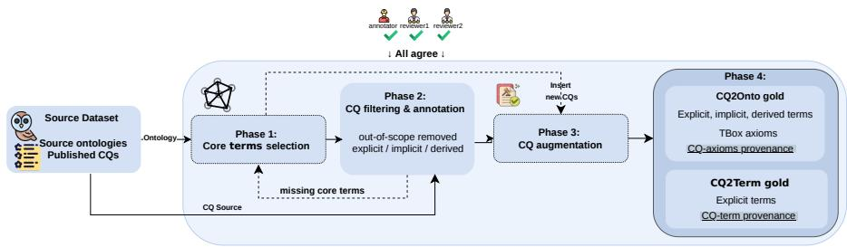
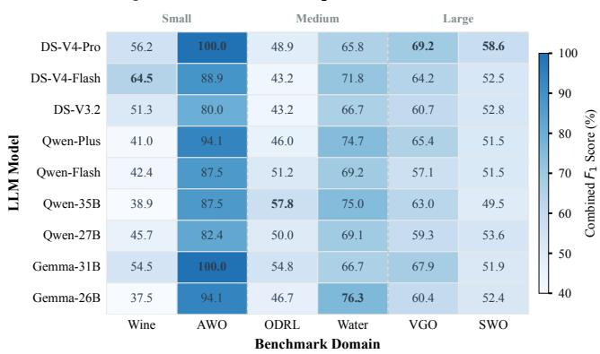
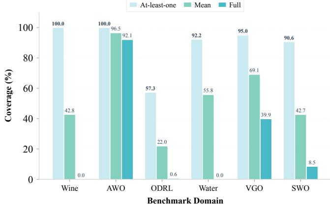
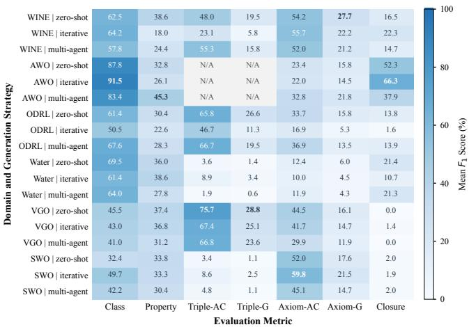
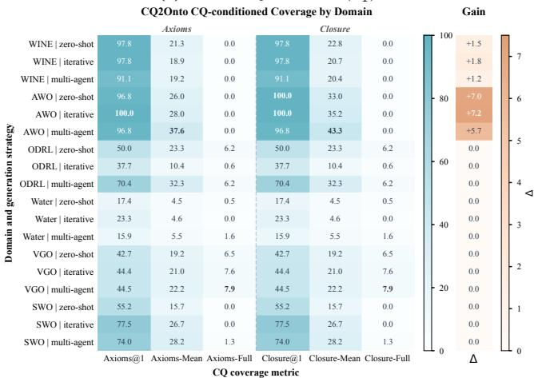

# CQ4OE: A benchmark for assessing LLM-assisted ontology generation from competency questions

Jiayi Li1[0009−0001−9475−8159], Ziyuan Wang1[0009−0000−6228−4713], Daniel Garijo1[0000−0003−0454−7145], and María Poveda-Villalón1[0000−0003−3587−0367]

Ontology Engineering Group, Universidad Politécnica de Madrid {li.jiayi,ziyuan.wang,daniel.garijo,m.poveda}@upm.es

Abstract. Ontology generation from Competency Questions (CQs) is a central yet labor-intensive phase of Ontology Engineering. While large language models (LLMs) ofer promising automation capabilities, current evaluations remain fragmented. Task formulations are heterogeneous, gold standards often lack fine-grained CQ provenance, metrics conflate lexical overlap with structural and logical adequacy, and reference ontologies are not always explicitly designed around the evaluation CQs. Here, we address these limitations with CQ4OE, a benchmark for the systematic and reproducible evaluation of LLM-based ontology generation from CQs. For each ontology in the benchmark, we build a CQ-driven gold OWL ontology with explicit provenance linking each CQ to the classes, properties, and axioms required to answer it. From this resource, we define two complementary evaluation tasks. CQ2Term supports termlevel evaluation of CQ-specific class and property prediction over 99 CQs, and CQ2Onto supports ontology-level evaluation over 118 CQs, including hierarchy, property modeling, and axiom-level structure. We demonstrate CQ4OE with experiments using nine LLMs under zero-shot, iterative, and multi-agent generation strategies, showing that LLMs recover explicit vocabulary terms more reliably than creating ontologies, particularly in property modeling, hierarchy construction, and axiom generation.

Keywords: Ontology Generation· LLMs· Benchmark Evaluation.

## 1 Introduction

Ontology Engineering (OE) refers to the systematic process of developing machineinterpretable formal knowledge representations of a domain [49]. Despite wellestablished methodologies such as Linked Open Terms [42], eXtreme Design Methodology [5], and SAMOD [39], OE remains a challenging activity that requires substantial expertise and iterative cycles of requirement analysis, conceptual modeling, implementation, and evaluation [51,17]. Within these methodologies, conceptualization is a central stage where domain requirements are transformed into an explicit conceptual model [6]. Competency questions (CQs) are commonly used to express these requirements in natural language, specifying the questions that the ontology should answer [2]. The conceptualization step models CQs as classes, properties, relations, and constraints [45], shaping the structure and expressiveness of the resulting ontology [42,17].

Recent advances in Large Language Models (LLMs) have motivated their adoption across ontology engineering tasks, from CQ generation [36,32,45] and ontology conceptualization [8,23] to the encoding of conceptual models into formal ontology languages [11,34]. Across these tasks, LLMs have been used to suggest candidate terms, identify domain relationships, refine ontology fragments, and support modeling decisions that traditionally require substantial expertise.

However, the evaluation landscape is heterogeneous, with diferent studies adopting diferent task formulations, input/output specifications, and evaluation criteria [25]. This heterogeneity introduces three specific challenges. First, task formulations are frequently incompatible across studies. For example, evaluated tasks range from concept extraction and ontology completion to full OWL generation from documents or CQs [25,17], with each adopting diferent inputs, outputs, and modeling depths. Since these tasks difer fundamentally in input, output, and modeling depth, direct comparison is challenging. Second, previous analyses have shown that reference ontologies are often not finely aligned with their CQs [16]. In particular, they rarely specify which classes, properties, or axioms are required by each CQ, making it unclear whether a generated ontology satisfies the CQ requirements. Third, existing metrics, often based on lexical or coarse structural overlap, do not adequately assess property modeling, logical constraints, or reasoning behavior, leaving errors such as wrong domain/range assignments, missing axioms, or flawed hierarchies undetected. Together, these limitations make it dificult to compare LLM-based ontology generation systems under a shared, requirement-driven evaluation protocol.

To address these issues, we present CQ4OE, a benchmark for the systematic and reproducible evaluation of LLM-based ontology generation from CQs. Our work makes four contributions:

Gold standards aligned with the CQs for two evaluation tasks. CQ4OE includes two complementary evaluation tasks. CQ2Term supports term-level evaluation with CQ-to-term provenance over 99 CQs, and CQ2Onto supports ontology-level evaluation with fine-grained CQ-to-axiom provenance over 118 CQs from six ontologies.

– A multi-task evaluation framework. We introduce metrics for term recovery, property characteristics, domain/range triples, TBox axioms, and hierarchy closure, to assess whether a model can generate ontologies that are both structurally and logically sound beyond surface vocabulary.

– An automated explainable reporting pipeline. We release an opensource pipeline that aligns candidate outputs with the gold standards, computes all proposed metrics, and produces detailed evaluation reports that trace matched and missing terms, axioms, CQ coverage, and reasoning-aware hierarchy recovery for each generated ontology.

– A baseline evaluation against CQ4OE. We compare nine LLMs, using three generation strategies (zero-shot term prediction for CQ2Term and zero-shot, iterative, and multi-agent [27] for CQ2Onto).

## 2 Related Work

Large language models (LLMs) have been applied to ontology conceptualization and generation, including ontology completion [45], vocabulary term suggestion [52], relation classification [3,20], and generation from user stories or CQs [38,48,8,40]. Several recent approaches directly produce ontologies from CQs. Lippolis et al. [30,31] compare prompting strategies through pitfall detection, CQ coverage, and expert assessment. MASEO [26] generates OWL ontologies from CQs with provenance links but releases no reusable evaluation resource. These eforts remain dificult to compare because they use diferent CQ sets, reference ontologies, and metrics [17,25], and prior analysis [16,26] shows that structural overlap with full reference ontologies is an unfair proxy for requirement satisfaction, since these ontologies may contain knowledge beyond the input CQs.

Several evaluation resources exist but target diferent tasks. OAEI [13] evaluates ontology matching, and BioASQ [53] evaluates biomedical question answering, neither targeting ontology construction from CQs. OntoAxiom [4] identifies missing axioms within existing vocabularies instead of constructing complete ontologies. CORAL [15] provides ontological requirements and CQs but does not map each CQ to the terms or axioms required to answer it. Alharbi et al. [1] classify CQ-generation settings, focusing on CQ quality rather than the ontologies generated from them. Plu et al. [41] evaluate LLM-generated ontologies through human references and qualitative assessment, but their evaluation is not CQ-driven. Beyond ontology engineering, general LLM benchmarks such as HELM [28] and HumanEval [7] evaluate broad capabilities, including reasoning and code synthesis, beyond ontology construction.

None of these resources provides a reusable benchmark for evaluating ontologies within a CQ-aligned requirement scope. CQ4OE addresses this gap with shared CQs, CQ-aligned gold standards, and metrics that assess requirement satisfaction across term recovery, property characteristics, domain/range relations, TBox axioms, and hierarchy closure.

## 3 CQ4OE Benchmark Dataset Construction

CQ4OE is a benchmark for evaluating LLM-based ontology generation from CQs through two CQ-aligned evaluation tasks: CQ2Term assesses whether a system predicts the classes and properties required by each selected CQ. In contrast, CQ2Onto assesses whether a generated ontology captures the terms, property semantics, domain/range relations, axioms, and hierarchies needed to answer the selected CQs. For each source ontology and selected CQ set, we construct two task-specific gold standards. CQ2Term records explicit terms per CQ, while CQ2Onto records CQ-relevant terms and required axioms with CQ provenance.

## 3.1 Source ontologies

We select source ontologies based on three criteria. They must have established use in OE practice, publicly documented requirements with associated CQs, and open licenses that allow redistribution and modification. From the candidates satisfying these criteria, we select six ontologies spanning three size tiers based on the number of published CQs. The small tier contains Wine [35] and the African Wildlife Ontology (AWO) [22]. The medium tier contains the Open Digital Rights Language (ODRL) [21] and SAREF4WATR [12]. The large tier contains the Video Game Ontology (VGO) [15,37] and the Software Ontology (SWO) [33]. The selected ontologies vary in hierarchical structure, from the nearly flat ODRL (depth 1) to the deeply nested SWO (depth 15), with AWO and VGO remaining shallow but wide. This diversity lets CQ4OE assess LLM performance across diferent structural complexities. Table 1 reports key statistics for each ontology.

Table 1: Benchmark dataset statistics. Src., Ret., and New⋆ are original, retained, and added CQs. CQ2O and CQ2T are CQs in each gold standard. C, OP, DP, and Ax are classes, object properties, data properties, and OWL axioms. Depth is the longest SubClassOf or SubPropertyOf chain and Width is the maximum number of terms at any hierarchy level. Source counts include imports, and CQ2Onto counts refer to CQ-aligned sub-ontologies. In CQ2Term, P combines OP and DP.

(a) CQ counts and source ontology statistics.
<table><tr><td></td><td colspan="5">CQs</td><td colspan="6">Source</td></tr><tr><td>Ontology</td><td>Src.</td><td>Ret.</td><td>New*</td><td>CQ2O</td><td>CQ2T</td><td>C</td><td>OP</td><td>DP</td><td>Ax</td><td>Depth</td><td>Width</td></tr><tr><td>Wine</td><td>7</td><td>4</td><td>1</td><td>5</td><td>5</td><td>77</td><td>13</td><td>1</td><td>744</td><td>3</td><td>7</td></tr><tr><td>AWO</td><td>14</td><td>7</td><td>0</td><td>7</td><td>7</td><td>31</td><td>5</td><td>0</td><td>93</td><td>2</td><td>21</td></tr><tr><td>ODRL</td><td>35</td><td>13</td><td>6</td><td>19</td><td>19</td><td>30</td><td>49</td><td>4</td><td>416</td><td>1</td><td>22</td></tr><tr><td>SAREF4WATR</td><td>43</td><td>21</td><td>0</td><td>21</td><td>20</td><td>72</td><td>40</td><td>22</td><td>445</td><td>5</td><td>19</td></tr><tr><td>VGO</td><td>68</td><td>30</td><td>1</td><td>31</td><td>22</td><td>37</td><td>33</td><td>6</td><td>189</td><td>2</td><td>20</td></tr><tr><td>SWO</td><td>88</td><td>35</td><td>0</td><td>35</td><td>26</td><td>1971</td><td>161</td><td>5</td><td>8087</td><td>15</td><td>679</td></tr><tr><td>Total</td><td>255</td><td>110</td><td>8</td><td>118</td><td>99</td><td></td><td></td><td></td><td></td><td></td><td></td></tr></table>

(b) CQ2Term and CQ2Onto gold standard statistics.
<table><tr><td></td><td colspan="2">CQ2Term</td><td colspan="6">CQ2Onto</td></tr><tr><td>Ontology</td><td>C</td><td>P</td><td>C</td><td>OP</td><td>DP</td><td>Ax</td><td>Depth</td><td>Width</td></tr><tr><td>Wine</td><td>11</td><td>5</td><td>17</td><td>8</td><td>1</td><td>68</td><td>2</td><td>4</td></tr><tr><td>AWO</td><td>7</td><td>1</td><td>9</td><td>5</td><td>0</td><td>25</td><td>1</td><td>5</td></tr><tr><td>ODRL</td><td>13</td><td>26</td><td>15</td><td>28</td><td>0</td><td>60</td><td>1</td><td>9</td></tr><tr><td>SAREF4WATR</td><td>15</td><td>20</td><td>20</td><td>14</td><td>11</td><td>43</td><td>3</td><td>8</td></tr><tr><td>VGO</td><td>7</td><td>14</td><td>25</td><td>33</td><td>5</td><td>77</td><td>1</td><td>12</td></tr><tr><td>SWO</td><td>20</td><td>18</td><td>31</td><td>18</td><td>5</td><td>80</td><td>1</td><td>7</td></tr></table>

## 3.2 Annotation methodology

To ensure a fair evaluation, the benchmark must assess the knowledge required by the CQs, not the broader domain content of full reference ontologies. Without CQ alignment, a generated ontology could be penalized for omitting out-ofscope content or rewarded for reproducing domain knowledge beyond the stated CQ requirements. Figure 1 illustrates the four-phase workflow for constructing CQ-aligned gold standards. Table 1 reports the resulting CQ counts per stage.

Phase 1: Core term selection. For each source ontology, we identify core terms (classes and properties that define the domain scope) through a two-step process combining automatic ranking with manual verification. First, we rank named classes and properties by in- and out-degree, taking highly connected nodes as initial candidates. Then, we validate these candidates with owl2diagram1 and inspect them against the oficial published requirements provided with the source ontologies. Terms are retained if they are highly connected, visually central, and domain-relevant. The resulting set $T _ { \mathrm { c o r e } }$ defines the conceptual backbone the gold standards must cover.

Phase 2: CQ filtering and term annotation. From the 255 published CQs across the six source ontologies, we remove those requiring external knowledge, unanswerable from the source ontology, or targeting instance-level rather than TBox-level knowledge. This filtering ensures fair evaluation, since every retained CQ has an answer grounded in the source TBox without requiring content that the gold ontology cannot express. This leaves 110 retained CQs. For each retained cq , we annotate three required term sets, illustrated using the AWO CQ “Which plants eat animals $? ^ { \mathfrak { N } }$ as a running example. $E _ { i }$ (explicit) contains direct surface matches, such as Plant, Animal, and eats. I (implicit) contains synonymous or equivalent phrases, such as Carnivore for “predators” in the AWO CQ “Which animals are the predators of these animals?”. $R _ { i }$ (derived) contains terms not mentioned in a CQ but required for its formalization, including answer-side concepts, such as CarnivorousPlant for the running example.

Phase 3: CQ augmentation. We then check whether all core terms in $T _ { \mathrm { c o r e } }$ are covered by at least one retained CQ. Uncovered terms are addressed by manually authoring additional CQs (marked ⋆ in Table 1). This augmentation is conservative. Only 8 CQs (3.1% of the original 255) are added across all domains, yielding 118 CQs in total.

Phase 4: Gold standard construction. With the final CQ set fixed, CQ2Term records CQ-to-term provenance over explicit class and property terms. For CQ2Term, we retain only CQs with at least one explicit class or property term $( E _ { i } \neq \emptyset )$ , since the task evaluates explicit term recovery. This excludes 19 inference-heavy CQs from SAREF4WATR, VGO, and SWO, leaving 99 CQs. For the running example, CQ2Term records Plant, Animal, and eats with CQ-to-term provenance. For CQ2Onto, the annotated terms $( E _ { i } \cup I _ { i } \cup R _ { i } )$ are used to extract CQ-relevant TBox fragments from the source ontology. An extracted TBox axiom is linked to $c q _ { i }$ only if its removal would make $c q _ { i }$ unanswerable, so the linked axioms form a suficient set for answering each CQ. For the running example, CQ2Onto additionally includes the derived class CarnivorousPlant, together with the axioms CarnivorousPlant $\sqsubseteq \mathbb { P } \mathbb { 1 }$ ant and CarnivorousPlant ⊑ ∃eats.Animal recorded with CQ-to-axiom provenance. The resulting gold standards cover 99 CQs for CQ2Term and 118 CQs for CQ2Onto.

Throughout construction, each annotation decision follows a triple-review, adjudication-based protocol. An annotator with an OE background produces the initial labeling of every candidate item (core terms, CQs, CQ-to-term provenance, CQ-to-axiom provenance), and two expert reviewers then inspect each item in full to verify completeness and correctness. An item is finalized only when all three reach agreement, with disagreements resolved through discussion. Most items reached agreement on first pass, with 101 of the 118 CQs (85.6%) accepted without change. The 17 revised items concentrated in the more complex ontologies (10 in SWO, 3 in VGO, 2 in ODRL, 2 in SAREF4WATR, none in Wine or AWO), indicating that disagreements track ontology complexity rather than random variation.

  
Fig. 1: Overview of the CQ4OE annotation workflow. The triple-review, adjudication-based protocol applies to all candidate items across all phases, including core terms, retained CQs, term annotations, augmented CQs, CQ-to-term and CQ-to-axiom provenance links.

## 3.3 CQ2Term and CQ2Onto gold standards

CQ2Term is the term-level task. For each $c q _ { i } .$ , the required explicit term set is $T _ { i } ^ { \mathrm { C Q 2 T e r m } } = E _ { i }$ , with $\begin{array} { r } { T _ { \mathrm { C Q 2 T e r m } } = \bigcup _ { i } T _ { i } ^ { \mathrm { C Q 2 T e r m } } } \end{array}$ . CQ2Term records the links between each $c q _ { i }$ and its explicit terms in $T _ { i } ^ { \mathrm { C Q 2 T e r m } }$ following the annotation protocol in Section 3.2.

CQ2Onto is the ontology-level task that preserves $\boldsymbol { O } _ { \mathrm { s r c } }$ as the domain reference ontology. For each $c q _ { i } ,$ the CQ-relevant term set is $T _ { i } ^ { \mathrm { C Q 2 O n t o } } = E _ { i } \cup I _ { i } \cup R _ { i }$ , and $O _ { i } ^ { \mathrm { c q 2 o n t o } }$ is extracted from $\boldsymbol { O } _ { \mathrm { s r c } }$ using $T _ { i } ^ { \mathrm { C Q 2 O n t o } }$ as in Section 3.2. The required TBox axioms $A _ { i }$ are a curated subset of $( \mathbf { \bar { \it O } } _ { i } ^ { \mathrm { c Q 2 O n t o } } ) ^ { \mathrm { T B o x } }$ , obtained by first extracting all TBox axioms involving the terms in $\mathbf { \dot { \mathbf { \mathit { T } } } } _ { i } ^ { \mathrm { c q 2 o n t o } }$ and then retaining an axiom only if its removal would make $c q _ { i }$ unanswerable, so that $A _ { i }$ forms a suficient axiom set for answering $c q _ { i }$ . CQ2Onto records these CQ-to-axiom links as provenance following the same annotation protocol.

## 4 Benchmark Evaluation Methodology

We evaluate LLM outputs against the CQ-aligned gold standards described in Section 3. The evaluation is organized around two principles. First, generated terms and gold-standard terms must be aligned before comparison, since models may use diferent labels for the same intended class or property. Second, ontology quality must be assessed at multiple modeling depths, beyond lexical overlap alone. Section 4.1 describes the term alignment procedure, and Sections 4.2 and 4.3 define the metrics for CQ2Term and CQ2Onto.

## 4.1 Term alignment aggregation and selection

Generated ontologies can use labels that difer from the gold standard while denoting the same class or property (e.g., hasPart vs. containsComponent), so we align the gold and predicted terms before computing the CQ2Term and CQ2Onto metrics. From seven candidate similarity methods, we excluded WordNet-based synonym matching [50] due to poor coverage of domain terms and informationcontent similarity [47,29] as it requires a shared taxonomy. The final pipeline uses five methods. Hard matching applies exact string equality. Sequence matching uses Python difflib.SequenceMatcher2. Levenshtein [24] and Jaro–Winkler similarity are computed with the textdistance library3. Embedding-based semantic similarity uses embeddinggemma served via Ollama4. Standalone Precision (P), Recall (R), and $\mathrm { F _ { 1 } }$ are reported per method, using thresholds of 1.0 for hard matching, 0.8 [14] for lexical similarities, and 0.6 [46] for semantic similarity. Because the methods exhibit complementary failure modes, with exact and lexical matching missing paraphrases, while semantic matching can introduce false positives on short labels, the final metrics use an aggregated alignment defined below.

Let $T _ { g }$ and $T _ { p }$ denote the gold-standard and predicted term sets. Alignment is performed between terms of the same type. For each candidate pair $( t _ { g } , t _ { p } )$ , where $t _ { g } \in T _ { g }$ and $t _ { p } \in T _ { p } ,$ , each of the five similarity methods produces a score $s _ { m } ( t _ { g } , t _ { p } ) \in [ 0 , 1 ]$ . We aggregate the four non-hard methods using the mean of the three highest scores, with hard matching as an exact-match override:

$$
\begin{array} { r } { s ( t _ { g } , t _ { p } ) = \bigg \{ 1 , \quad \mathrm { ~ i f ~ } s _ { \mathrm { h a r d } } ( t _ { g } , t _ { p } ) = 1 , } \\ { \frac { 1 } { 3 } \sum _ { m \in \mathrm { T o p } _ { 3 } ( t _ { g } , t _ { p } ) } s _ { m } ( t _ { g } , t _ { p } ) , \quad \mathrm { o t h e r w i s e } , } \end{array}
$$

where $\mathrm { T o p _ { 3 } } ( t _ { g } , t _ { p } )$ denotes the three non-hard methods with the highest scores for $( t _ { g } , t _ { p } )$ . This aggregation mechanism prevents any single method with a lower score from vetoing a reasonable matching result.

A candidate pair passes thresholding if its score reaches the type-specific threshold τ. We selected $\tau _ { C } = 0 . 6$ for classes and $\tau _ { P } = 0 . 7$ for properties by inspecting correct and spurious alignments at {0.5, 0.6, 0.7} on a held-out subset. The higher property threshold reduces false matches on short formulaic labels (e.g., has\_, is\_ prefixes), where spurious matches concentrate around 0.6–0.65. Pairs passing thresholding are ranked by decreasing aggregated score, with hard matches prioritized, and selected greedily to obtain a one-to-one alignment: $( t _ { g } , t _ { p } )$ is kept only if both terms are still unmatched. The same procedure is applied per standalone method using its own score, enabling comparable per-method $\mathrm { P / R / F _ { 1 } }$ . The accepted pairs form the final alignment set $\alpha = \alpha _ { C } \cup \alpha _ { P }$ , where αC contains accepted class pairs and $\alpha _ { P }$ contains accepted property pairs. Since α is a set of one-to-one pairs, we use it in both directions to translate between gold and predicted vocabularies. This alignment provides the correspondence layer used by all downstream metrics.

Table 2 gives an overview of the metrics reported for each evaluation target. The following sections define these metrics in detail.

Table 2: Overview of reported metrics in CQ4OE. AC scores use only structures whose named terms align under the alignment set α, G denotes global scores, computed over the full gold and predicted sets. Per-method reports standalone $\mathrm { \tilde { P / R / F _ { 1 } } }$ for the five similarity methods. Diag. denotes standalone embedding-cosine diagnostics. CQ reports at-least-one, mean, and full coverage over terms (t), axiom-level matches (a), or closure-recovered axioms (c).
<table><tr><td>Evaluation tasks</td><td></td><td></td><td>Per-method Diag. P/R/F₁ (AC) P/R/F₁ (G) CQ cov.</td><td></td></tr><tr><td>Class &amp; property (CQ2Term)</td><td>√</td><td></td><td>√</td><td>t</td></tr><tr><td>Class &amp; property (CQ2Onto)</td><td>√</td><td></td><td>√</td><td></td></tr><tr><td>Property characteristics</td><td></td><td></td><td>√ √</td><td></td></tr><tr><td>Triple</td><td></td><td>√</td><td>√ √</td><td></td></tr><tr><td>Axiom-level</td><td></td><td>√</td><td>√ √</td><td>a</td></tr><tr><td>Hierarchy closure</td><td></td><td></td><td>√</td><td>C</td></tr></table>

## 4.2 CQ2Term Evaluation

CQ2Term is the term-level task in $C Q 4 O E .$ It evaluates the explicit term sets $T _ { i } ^ { \mathrm { C Q 2 T e r m } }$ defined in Section 3. The LLM prediction for each CQ is denoted by $\hat { T } _ { i } ^ { \mathrm { c q 2 T e r m } }$ . For aggregate reporting, let $T _ { g } ^ { \mathrm { C Q 2 T e r m } }$ and $T _ { \mathbf { * } } ^ { \mathrm { C Q 2 T e r m } }$ denote the combined gold and predicted CQ2Term term sets: $T _ { g } ^ { \mathrm { C Q 2 T e r m } } = \stackrel { \prime } { \bigcup _ { i } } T _ { i } ^ { \mathrm { C Q 2 T e r m } }$ and $T _ { p } ^ { \mathrm { C Q 2 T e r m } } =$ $\mathsf { U } _ { i } \hat { T } _ { i } ^ { \mathrm { C Q 2 T e r m } }$ . The final alignment $\alpha = \alpha _ { C } \cup \alpha _ { P }$ from Section 4.1 is applied separately for classes and properties.

Term-level metrics. The CQ2Term metrics are computed globally over the combined gold term set $T _ { g } ^ { \mathrm { C Q 2 T e r m } }$ and the predicted term set $T _ { p } ^ { \mathrm { C Q 2 T e r m } }$ . Let α be the final one-to-one alignment between $T _ { g } ^ { \mathrm { C Q 2 T e r m } }$ and $T _ { p } ^ { \mathrm { C Q 2 T e r m } }$ , where |α| is the number of accepted matched pairs. We define true positives (TP), false positives (FP), and false negatives (FN) as $\mathrm { T P } = | \alpha | , \mathrm { F P } = | T _ { p } ^ { \mathrm { C Q 2 T e r m } } | - | \alpha |$ , and FN $= | T _ { q } ^ { \mathrm { C Q 2 T e r m } } | - | \alpha |$ . Precision $P = \mathrm { T P } / ( \mathrm { T P } + \mathrm { F P } )$ , Recall $R { \dot { = } } \mathrm { T P } / ( \mathrm { T P } + \mathrm { F N } )$ and $F _ { 1 } \stackrel { \smile } { = } 2 P R / ( P + R )$ are then computed. We set $F _ { 1 } = 0$ when $P + R = 0$ These metrics are reported per standalone similarity method and for the final aggregated alignment.

CQ-conditioned coverage. CQ-conditioned coverage checks whether recovered terms appear under the correct CQ: a gold term for $c q _ { i }$ counts as covered only if α aligns it to a term predicted for $c q _ { i }$ . Let $\mathrm { c o v } _ { i }$ be the proportion of required explicit terms covered for $c q _ { i }$ , and N the number of retained CQs. At-least-one coverage (A1) measures the share of $\mathrm { C Q s }$ with at least one required term recovered, mean coverage (MC) averages covi across $\mathrm { C Q s } ,$ , and full coverage (FC) gives the share of CQs whose required terms are all recovered, with $\mathrm { A } 1 = | \{ i : \mathrm { c o v } _ { i } > 0 \} | / N$ $\begin{array} { r } { \mathrm { M C } = \sum _ { i } \mathrm { c o v } _ { i } / N } \end{array}$ , and $\mathrm { F C } = | \{ i : \mathrm { c o v } _ { i } = 1 \} | / N$

The two views thus capture complementary failure modes, since a model may recover the required vocabulary without attaching each term to the CQ that requires it, leaving individual CQs unanswered despite high overall scores.

## 4.3 CQ2Onto Evaluation

CQ2Onto evaluates LLM-generated ontologies against the ontology-level gold standard defined in Section 3.3 using five evaluation targets: term recovery, property characteristics, domain/range triples, TBox axioms, and hierarchy closure. For property characteristics, domain/range triples, and TBox axioms, we report a global view over the full gold and predicted element sets, and an alignment-conditioned (AC) view restricted to elements whose named terms align under $\alpha _ { C }$ and $\alpha _ { P }$ . Term recovery is reported only globally, since term recovery itself evaluates how well α recovers gold terms. An AC view here would only evaluate α in terms that have already been aligned. Hierarchy closure is reported as a single set-based metric over inferred subsumptions translated through α.

Ontology-level metrics. Term recovery compares predicted and gold class and property vocabularies using both the final alignment $\alpha _ { C } \cup \alpha _ { P }$ and the five standalone similarity methods. Property characteristics compare OWL property characteristic axioms (functional, symmetric, etc.) between aligned property pairs. Domain/range triples assess graph structure by treating domain and range axioms as triples $( s , p , o )$ . Properties are compared through $\alpha _ { P } ,$ class-valued domains and ranges through $\alpha _ { C } .$ , and datatype ranges by normalized string equality. Triples involving complex anonymous OWL expressions are excluded here and evaluated at the axiom level. TBox axioms compare structural decompositions of TBox axioms, recursively translating named terms through $\alpha _ { C }$ and $\alpha _ { P }$ and matching datatypes, cardinalities, intersections, unions, and restrictions strictly. Hierarchy closure uses HermiT to compare inferred class and property subsumption closures of the gold and predicted ontologies (with the predicted closure translated to gold vocabulary through α), capturing hierarchy relations that may be entailed rather than explicitly asserted. For domain/range triples and TBox axioms, we additionally report an embedding-cosine diagnostic over normalized textual serializations, which does not afect strict $\mathrm { P / R / F _ { \mathrm { j } } }$ 1.

For term recovery and the non-closure structural targets, $\mathrm { P / R / F _ { 1 } }$ follow Section 4.2. For each target and view, TP counts one-to-one matched pairs that are strictly equivalent, unmatched predicted elements count as FP, unmatched gold elements count as FN, and matched but non-equivalent pairs count as both FP and FN.

For hierarchy closure, let $C l _ { g }$ be the gold closure and $C l _ { p } ^ { g }$ the predicted closure translated to the gold vocabulary through α. We define $\mathrm { \ddot { T P } } = | C l _ { g } \cap C l _ { p } ^ { g } |$ $\mathrm { F N } = | C l _ { g } | - \mathrm { T P }$ , and $\mathrm { F P } = | C l _ { v } ^ { g } | - \mathrm { T P } + U$ , where $U$ counts predicted closure pairs that cannot be translated through the alignment and are therefore counted as additional FP. P, R, and $F _ { 1 }$ are computed as above.

CQ-conditioned coverage. We report CQ coverage in CQ2Onto in two forms: axiom-level coverage and closure-recovered coverage. As in $C Q 2 T e r m ,$ , both are summarized using At-least-one coverage (A1), Mean Coverage (MC), and Full Coverage (FC). Here, coverage is computed over required TBox axioms

rather than explicit terms. Let $A _ { i }$ denote the set of TBox axioms required to answer $c q _ { i } ,$ as defined in Section 3.3. For axiom-level coverage, $\mathrm { c o v } _ { i } ^ { \mathrm { a x i o m } } =$ #axiom-level matches in Ai denotes the fraction of axioms in Ai t $A _ { i }$ hat are strictly |Ai|   
matched by the axiom-level evaluation defined in Section 4.3. Closure-recovered coverage checks whether hierarchy-related gold axioms missed by axiom-level matching can be recovered through HermiT reasoning. Only missed hierarchyrelated axioms are eligible for closure recovery. They are counted only if they can be decomposed into atomic Subclass or Subproperty pairs, including EquivalentClasses axioms whose IntersectionOf or UnionOf operands yield such pairs and all extracted pairs appear in $C l _ { p } ^ { g } .$ . Closure-recovered axioms are counted only among axioms not already matched by the axiom-level evaluation. The CQ coverage after adding closure-recovered axioms to the axiom-level matches is co vclosure = #axiom-level matches in Ai+#closure-recovered axioms in Ai . Closure recov- |Ai| ery is restricted to gold axioms that are hierarchy-related and that decompose into atomic Subclass or Subproperty pairs. Other axioms are scored only by matching at the axiom-level.

Evaluation report. The CQ4OE pipeline generates a Markdown report per-run that aggregates all metrics from Sections 4.2 and 4.3, organized by evaluation target. Each report includes standalone scores for the five similarity methods, the final one-to-one term alignment, TP/FN/FP, and CQ-level traces for matched, closure-recovered, and missed axioms, together with CSV exports of term alignments and per-axiom traces. Each closure-recovered axiom is tagged as directly asserted, chain-inferred, or complex-inferred. For chain-inferred cases, a breadthfirst search reconstructs the shortest path through the predicted hierarchy, providing a human-readable explanation of the recovery. Sample reports for all runs are available in the project repository.6

## 5 Experimental Setup and Results

We evaluate CQ2Term on 99 CQs and CQ2Onto on 118 CQs across six ontologies, providing reference baselines from nine LLMs, DeepSeek V4-Pro, V4-Flash, V3.2 [10,9]; Qwen3.6 Plus, Flash, 35B-A3B, 27B [44]; and Gemma 4 31B-IT, 26B-A4B-IT [18]. Models are accessed via OpenRouter5 with temperature 0 and a 16,384 token output limit. All setups reuse the prompting set from the MASEO Generation Agent [27] so that performance diferences reflect the models and strategies rather than prompt design. For CQ2Term, it outputs the required classes and properties per CQ. For $C Q 2 O n t o ,$ each model generates a full ontology under three strategies. Zero-shot feeds the full CQ set in one pass, iterative feeds CQs sequentially, and multi-agent refines the initial ontology with RDFLib, HermiT [19], and OOPS! [43] for up to three iterations with backtracking. In total, CQ2Term yields 54 runs, and CQ2Onto produces 162 ontologies, providing reference baselines for future methods. All results and reports are available in the project repository.6

## 5.1 Results

CQ2Term reports global $\mathrm { F _ { 1 } }$ over the combined gold and predicted term sets and CQ-conditioned coverage, in which a term counts only when recovered under the CQ that requires it. Global term $\mathrm { F _ { 1 } }$ ranges from 59.1% (DeepSeek V3.2) to 66.5% (DeepSeek V4-Pro), with five models leading on at least one domain. Class recovery exceeds property recovery (67.1% vs 55.2%), and precision-recall gaps indicate over-generation (overall 56.1% vs 71.5%; properties 47.9% vs 69.3%). Among standalone methods, hard matching is conservative (51.7% on classes, 30.0% on properties) while semantic similarity reaches 73.9% and 63.3%; the 33.3-point property gap supports the multi-method aggregation in $C Q 4 O E .$ Figure 2(a) shows global term $\mathrm { F _ { 1 } }$ for each (model, domain) pair: performance varies more by domain than by model, ranging from 48.0% on Wine to 90.5% on AWO. Figure 2(b) reports CQ-conditioned coverage, averaging 89.2% at-leastone, 54.8% mean, and only 23.5% full. Water reaches 70.6% global $\mathrm { F _ { 1 } }$ but 0% full coverage for every model, and Wine reaches 100% at-least-one but 0% full coverage. These contrasts show that strong global vocabulary recovery does not imply CQ-level completeness; by tying every recovered term to the CQ that requires it, $C Q \% C E$ exposes requirement-localization errors that global scores hide.

CQ2Onto extends term recovery to the full ontology structure across the five evaluation targets of Section 4.3, under three generation strategies. DeepSeek V4-Pro achieves the highest class-label $\mathrm { F _ { 1 } }$ at 66.5%, and Gemma-4 31B-IT leads on property triple recovery at 41.2%. Mean structural $\mathrm { F _ { 1 } }$ across the 18 (domain, strategy) settings ranges from 26.7% for Gemma-4 26B-A4B-IT to 33.7% for DeepSeek V3.2, with five models leading on at least one domain. At the CQ level, DeepSeek V4-Flash leads on Axiom-Mean and Closure-Mean at 23.7% and 24.8%. No single model dominates every dimension, a heterogeneity that only the multi-target design of $C Q \% O E$ makes visible. Performance drops steeply from vocabulary to structure, with class $\mathrm { F _ { 1 } }$ averaging 59.7% and property $\mathrm { F _ { 1 } }$ 31.8%. The AC view is consistently higher than the global view, with Triple-AC 36.4% vs Triple-G 12.4% and Axiom-AC 35.3% vs Axiom-G 15.0% (AWO excluded from triple aggregation because its gold range is a complex anonymous OWL expression). Closure $\mathrm { F _ { 1 } }$ averages only 16.7%, indicating shallow predicted hierarchies. Models identify relevant entities better than they assemble them into globally correct structures, a distinction that the two-view design of $C Q \% C E$ makes explicit and that single-score benchmarks cannot capture.

Figure $\mathrm { 3 ( a ) }$ summarizes the structural metrics by (domain, strategy). Domain variation dominates strategy variation. The three strategies yield comparable structural $\mathrm { F _ { 1 } }$ within 3 percentage points but shape the hierarchy diferently. Iterative prompting produces the densest SubClassOf graphs at 8.6 closure pairs on average against 4.9 for zero-shot and 4.7 for multi-agent. Multi-agent generation instead improves the axioms themselves. Using OOPS! and HermiT to repair pitfalls without adding new chains, it raises CQ-level axiom coverage (Axioms-Mean) from 18.3% under zero-shot to 24.2%, with the gain concentrated in AWO (26.0% → 37.6%) and ODRL (23.3% → 32.3%). Each domain exposes a diferent facet of the benchmark. AWO is the easiest case at class $\mathrm { F _ { 1 } \ 8 7 . 6 \% }$ and closure $\mathrm { F _ { 1 } }$ 52.2%. Wine produces the strongest axiom-level scores in $\mathrm { A x i o m { - } A C }$ 54.0%, Axiom-G 23.7%, and VGO and ODRL show large AC-to-Global drops in triples, from 70.0% to 25.8% and from 59.7% to 19.1%, isolating the unaligned vocabulary as their dominant error. Water displays the sharpest split between recognition and structure, reaching class $\mathrm { F _ { 1 } } \approx 6 5 \%$ but $\mathrm { T r i p l e { - } G } \le 3 . 5 \%$ and $\mathrm { A x i o m \mathrm { - } G } \leq 6 \%$ . Figure 3(b) reports CQ-conditioned coverage before and after closure rescue. Axioms@1 averages 63.0%, Axioms-Mean 20.2%, and Axioms-Full only 2.1%. Closure rescue raises Closure-Mean to 21.6%, an average gain of 1.4 points shown as $\varDelta$ in the same panel, but leaves Closure-Full unchanged. The gain concentrates in the domains with the densest predicted hierarchies, where AWO rises from 30.5% to 37.1% and Wine from 19.8% to 21.3%, and there is no measurable improvement on ODRL, Water, VGO, or SWO, whose predicted hierarchies collapse to flat edges. $C Q \% O E$ thus pinpoints both the failure type, recognition against structure, and the domain factor, predicted hierarchy density against collapse, driving each result.

Three recurrent LLM limitations emerge from these views, all traceable through the $C Q \% O E$ reports. First, models rarely generate suficient SubClassOf or SubPropertyOf chains. In VGO and SWO, predicted ontologies produce only 0.6 and 0.7 closure pairs against gold 12 and 8, leaving HermiT with almost no hierarchy to reason with. In Water, predicted hierarchies recover flat leaf-to-top edges $( \mathrm { e . g . , S e n s o r \subseteq A s s e t } )$ and miss the chain WaterMet $\mathsf { s r } \subseteq \mathsf { M e t e r } \subseteq \mathsf { S }$ ensor ⊑ Device, explaining the high class $\mathrm { F _ { 1 } }$ but near-zero closure coverage. Second, property modeling is unstable, with labels paraphrased or aliased much more often than classes, depressing property $\mathrm { F _ { 1 } }$ to nearly half of class $\mathrm { F _ { 1 } }$ . Third, CQ completeness remains low, with models recovering some axioms required by a CQ but rarely all of them, leaving Axiom-Full near 2%. Each failure mode corresponds to a distinct evaluation target in $C Q \% O E$ and would remain invisible under a single aggregate score.

## 6 Discussion

Impact and contribution. $C Q \% O E$ addresses a gap in the evaluation of LLM-based ontology generation. Existing evaluations often reuse full reference ontologies as undiferentiated gold standards, even when they contain knowledge unrelated to the evaluated CQs. This makes it dificult to determine whether a generated ontology satisfies the stated requirements or merely overlaps with general domain knowledge. $C Q \% C E$ introduces CQ-aligned gold standards in which terms and TBox axioms are explicitly linked to the CQs that require them, with provenance preserved at the level of each individual class, property and axiom. To our knowledge, no existing benchmark for ontology generation provides this level of CQ-to-axiom provenance.

CQ2Term Global Combined F1 across Models and Domains  

(a) Overall term F by model and domain. CQ2Term CQ-conditioned Coverage by Domain  
  
(b) CQ-conditioned coverage averaged over 9 LLMs.  
Fig. 2: CQ2Term results across six benchmark domains. (a) Overall term $\mathrm { F } _ { 1 }$ for each model and domain pair, computed by pooling class and property matches before calculating precision, recall, and $\mathrm { F } _ { 1 }$ . (b) CQ-conditioned coverage averaged over nine LLMs, reporting at-least-one, mean, and full coverage for each domain.

This requirement-driven design advances evaluation along two complementary fronts. First, CQ2Term targets the conceptualization capability of an LLM by measuring whether a model can recognize and organize the explicit classes and properties expressed in the CQs, which capture the most immediate semantic content of the requirements. Conceptualization is the foundation of any downstream ontology, since vocabulary selection determines all subsequent modeling decisions. By isolating this capability, CQ2Term reduces the manual efort that ontology engineers would otherwise spend enumerating candidate terms, and ofers practitioners a transparent basis for selecting the model best suited to their domain rather than relying on a single aggregate ranking. Second, CQ2Onto evaluates the ability of a model to understand and reason over CQ requirements beyond recognizing their surface vocabulary. It assesses whether the model can move beyond the explicit terms of each CQ to recover the implicit and derived terms that the answer also requires, and whether it can express them as a coherent ontology including property characteristics, property triples, TBox axioms, and hierarchical structure under reasoner-derived closure. This goes beyond lexical fluency, requiring the structural and inferential commitments that make a CQ formally answerable.

(a) Structural performance (F ). CQ2Onto CQ-conditioned Coverage by Domain  
CQ2Onto Structural Performance by Domain and Strategy  

  
(b) CQ-conditioned coverage and gain. (b) CQ-conditioned coverage and gain.  
Fig. 3: CQ2Onto results across six benchmark domains, with each (domain, strategy) cell averaged over nine LLMs in both panels. (a) Structural F across seven evaluation metrics (AWO Triple cells shown as N/A because the gold range is a complex anonymous OWL expression). (b) CQ-conditioned coverage before and after closure rescue, where ∆ shows the gain in Mean coverage from closure rescue (Closure-Mean − Axioms-Mean).

The transition from natural-language requirements to formal OWL representations remains a central bottleneck in ontology engineering [31,32], which makes this resource particularly relevant to the Semantic Web community. By making the CQ-to-term and CQ-to-axiom provenance explicit, $C Q \% C E$ enables a transparent evaluation of LLM-generated ontologies, distinguishing failures that arise from missing vocabulary, unstable property modeling, shallow hierarchy generation, or incomplete coverage of the local CQs. The CQ4OE pipeline produces per-run Markdown reports and CSV alignment exports that trace each metric back to specific gold and predicted axioms, making evaluation results traceable at the level of individual CQs and axioms, instead of only aggregate scores. By enabling transparent, requirement-driven comparison of ontology generation approaches, CQ4OE can benefit not only ontology engineers but the broader Semantic Web community, as LLM-assisted ontology engineering matures and the need for fair, reproducible evaluation grows.

Reusability and reproducibility. CQ4OE is designed for reuse across domains, models, prompting strategies, ontology repair pipelines, and human-in-the-loop workflows. The repository organizes CQ2Term and CQ2Onto as two parallel directories, each with gold standards, predictions, evaluation scripts, intermediate results, and aggregated reports. To benchmark a new LLM, users add their generated ontologies to the predictions folder and run a single script that extracts atomic axioms, executes the five evaluation steps, and produces the aggregated report. To evaluate a single capability, users can apply CQ2Term for term-level recovery or reuse the CQ2Onto layers for ontology-level evaluation independently. To extend the benchmark, users simply need to add a new domain following the four-phase annotation methodology of Section 3.2 under the same triplereview, adjudication-based protocol. Each metric has a persistent W3ID identifier and a Turtle definition in the metric catalogue, supporting integration into other evaluation pipelines. A public leaderboard7 with submission guidelines is maintained in the project repository to facilitate comparison of new methods.

Limitations. Several limitations of the current evaluation deserve attention. The most consequential is that all ontology-level metrics depend on term alignment, so errors at this layer propagate into downstream scores. Our combined hard, lexical, and semantic procedure with one-to-one selection handles lexical variation and reduces many-to-many score inflation, but it can still fail on short property labels or on semantically close yet non-equivalent terms. The thresholds τC and τP in Section 4.1 were selected through empirical inspection, informed by previous studies [14,46], and are applied uniformly across all six heterogeneous ontologies without per-domain tuning. The pipeline first performs a dry run that exports the complete alignment traces before any scoring. After applying the thresholds, manual inspection in all six domains confirmed that most automatic alignments agreed with expert judgment, although borderline cases remain. The thresholds are configurable, and users can inspect and, where necessary, manually correct alignments in the intermediate CSV files before re-running the evaluation.

A second limitation is methodological. The closure rescue mechanism evaluates only those hierarchy-related axioms that can be decomposed into atomic SubClassOf or SubPropertyOf relations, including EquivalentClasses with IntersectionOf or UnionOf. Consequently, complex expressions whose semantics cannot be represented by such atomic relations are excluded from quantitative evaluation, since assigning partial credit to individual sub-expressions within a complex axiom remains an open problem. We leave richer handling of such cases to future work.

A third concern is data contamination, since the source ontologies and some of their published CQs are public and may appear in pre-training data. Three observations qualify its impact. First, mean structural $\mathrm { F _ { 1 } }$ remains low at 26.7% to 33.7% across models, suggesting that prior exposure to ontology vocabulary alone does not translate into structurally correct ontology generation. Second, the CQ-to-term and CQ-to-axiom provenance is manually curated through the triple-review protocol of Section 3.2, introducing an additional manually curated annotation layer that is unlikely to have appeared in pre-training data. Third, the methodology is portable. Private or post-cutof ontologies can be added through the documented annotation protocol, future versions of the benchmark plan will include several such ontologies to support evaluations with contamination control.

## 7 Conclusion

We presented CQ4OE, a benchmark for evaluating LLM-based ontology generation from competency questions. $C Q \% O E$ links each CQ to the terms and TBox axioms required to answer it through two complementary evaluation tasks, CQ2Term and CQ2Onto. The $C Q _ { 4 } O E$ pipeline automatically generates Markdown reports and CSV alignment exports that trace every metric back to specific gold and predicted axioms, enabling a detailed diagnosis of why a generated ontology does not satisfy individual CQs. Experiments with nine LLMs across six ontologies show that models recover explicit vocabulary more reliably than ontology structure, with performance varying more across domains than across models or generation strategies. Reasoning-based closure provides only limited recovery when the underlying hierarchy is missing. These findings highlight the need for provenance-aware, multi-dimensional evaluation of LLM-generated ontologies. We believe CQ4OE will provide a common evaluation basis for future research on LLM-assisted ontology engineering. Future work will extend $C Q _ { 4 } O E$ with additional domains, further refine alignment and evaluation metrics, and incorporate private or post-cutof ontologies to support contamination-controlled evaluations.

## Acknowledgments.

This work was supported by the grant “SOEL: Supporting Ontology Engineering with Large Language Models” (PID2023-152703NA-I00) funded by MCIN/AEI/10.13039/501100011033 and by “ERDF/UE”.

## Resource Availability Statement

CQ4OE is openly available under Apache 2.0 at https://github.com/oeg-upm/ cq4oe-benchmark, archived on Zenodo (https://doi.org/10.5281/zenodo.20080309) and HuggingFace (https://doi.org/10.57967/hf/8712). The repository contains the CQ2Term and CQ2Onto gold standards for all six ontologies, the evaluation pipeline, and the run-level reports underlying the results. Persistent metric identifiers are defined at https://w3id.org/cq4oe/metrics.

## Declaration of use of Generative AI

All the ideas presented in this manuscript are original from the authors. During the preparation of this work, the authors used Claude (Anthropic) to improve the clarity, grammar, and readability of the manuscript. After using this tool, the authors reviewed and edited the content as needed and take full responsibility for the content of the publication.

## References

1. Alharbi, R., de Berardinis, J., Grasso, F., Payne, T.R., Tamma, V.: Characteristics and desiderata for competency question benchmarks. In: ISWC 2024 Special Session on Harmonising Generative AI and Semantic Web Technologies (2024), https: //ceur-ws.org/Vol-3953/

2. Antia, M.J., Keet, C.M.: Automating the generation of competency questions for ontologies with agocqs. In: Iberoamerican Knowledge Graphs and Semantic Web Conference. pp. 213–227. Springer (2023). https://doi.org/10.1007/978-3-031-47745-4\_ 16

3. Babaei Giglou, H., D’Souza, J., Auer, S.: LLMs4OL: Large language models for ontology learning. In: International Semantic Web Conference. pp. 408–427. Springer (2023). https://doi.org/10.1007/978-3-031-47240-4\_22

4. Bakker, R.M., Di Scala, D.L., de Boer, M.H., Raaijmakers, S.A.: Ontology learning with LLMs: A benchmark study on axiom identification (2025). https://doi.org/10. 48550/arXiv.2512.05594

5. Blomqvist, E., Hammar, K., Presutti, V.: Engineering ontologies with patterns – the extreme design methodology. In: Ontology Engineering with Ontology Design Patterns, Studies on the Semantic Web, vol. 25, pp. 23–50. IOS Press (2016). https://doi.org/10.3233/978-1-61499-676-7-23

6. Chávez-Feria, S., García-Castro, R., Poveda-Villalón, M.: Chowlk: from uml-based ontology conceptualizations to owl. In: European Semantic Web Conference. pp. 338–352. Springer (2022). https://doi.org/10.1007/978-3-031-06981-9\_20

7. Chen, M., Tworek, J., Jun, H., Yuan, Q., Pinto, H.P.D.O., Kaplan, J., Edwards, H., Burda, Y., Joseph, N., Brockman, G., et al.: Evaluating large language models trained on code. arXiv preprint arXiv:2107.03374 (2021). https://doi.org/10.48550/ arXiv.2107.03374

8. Coutinho, M.L.: Leveraging llms in text-based ontology-driven conceptual modeling. In: Proceedings of the Joint Ontology Workshops (JOWO) (2024), https://ceur-ws. org/Vol-3882/

9. DeepSeek-AI: DeepSeek-V3 technical report (2024), https://arxiv.org/abs/2412. 19437

10. DeepSeek-AI: DeepSeek-V4 Technical Report. https://huggingface.co/deepseek-ai DeepSeek-V4-Pro/blob/main/DeepSeek\_V4.pdf (2026), preview release, April 2026

11. Doumanas, D., Soularidis, A., Kotis, K., Vouros, G.: Integrating llms in the engineering of a sar ontology. In: IFIP International Conference on Artificial Intelligence Applications and Innovations. pp. 360–374. Springer (2024). https: //doi.org/10.1007/978-3-031-63223-5\_27

12. ETSI: SmartM2M; Extension to SAREF; Part 9: Water Domain (SAREF4WATR). ETSI TS 103 410-9 V1.1.2 (2020), https://saref.etsi.org/saref4watr/v1.1.1/

13. Euzenat, J., Meilicke, C., Stuckenschmidt, H., Shvaiko, P., Trojahn, C.: The ontology alignment evaluation initiative. Journal on Data Semantics XV pp. 158–192 (2011). https://doi.org/10.1007/978-3-642-22630-4\_6

14. Fathallah, N., Das, A., De Giorgis, S., Poltronieri, A., Haase, P., Kovriguina, L., Simperl, E., Meroño-Peñuela, A., Staab, S., Algergawy, A.: Extended NeOn GPT: Advancing LLM-Powered Ontology Learning Through Ontology Reuse and Automated Verification. Semantic Web Journal (2026). https://doi.org/10.1177/ 22104968261453138

15. Fernández-Izquierdo, A., Poveda-Villalón, M., García-Castro, R.: CORAL: a corpus of ontological requirements annotated with lexico-syntactic patterns. In: The Semantic Web: 16th International Conference, ESWC 2019. pp. 443–458. Springer (2019). https://doi.org/10.1007/978-3-030-21348-0\_29

16. Fernández-Izquierdo, A., Poveda-Villalón, M., García-Castro, R.: Analysing ontological requirements: a journey from requirements to code and back. In: XIX Conferencia de la Asociación Española para la Inteligencia Artificial (CAEPIA 20/21). pp. 122–127. Málaga, Spain (Sep 2021), https://oa.upm.es/83630/

17. Garijo, D., Poveda-Villalón, M., Amador-Domínguez, E., Wang, Z., García-Castro, R., Corcho, O.: Llms for ontology engineering: A landscape of tasks and benchmarking challenges. In: ISWC 2024 Special Session on Harmonising Generative AI and Semantic Web Technologies (2024), https://ceur-ws.org/Vol-3953/

18. Gemma Team, Google DeepMind: Gemma 4. https://ai.google.dev/gemma/docs/ core/model\_card\_4 (2026)

19. Glimm, B., Horrocks, I., Motik, B., Stoilos, G., Wang, Z.: HermiT: an OWL 2 reasoner. Journal of Automated Reasoning 53(3), 245–269 (2014). https://doi.org/ 10.1007/s10817-014-9305-1

20. Goyal, P.K., Singh, S., Tiwary, U.S.: silp\_nlp at LLMs4OL 2024 tasks a, b, and c: Ontology learning through prompts with llms. In: Open Conference Proceedings. vol. 4, pp. 31–38 (2024). https://doi.org/10.52825/ocp.v4i.2485

21. Iannella, R., Villata, S.: ODRL information model 2.2. W3C Recommendation (2018), https://www.w3.org/TR/odrl-model

22. Keet, C.M.: The African Wildlife Ontology tutorial ontologies. Journal of Biomedical Semantics 11(1), 4 (2020). https://doi.org/10.1186/s13326-020-00224-y

23. Kholmska, G., Kenda, K., Rozanec, J.: Enhancing ontology engineering with LLMs: From search to active learning extensions. In: Proceedings of Data Mining and Data Warehouses – SiKDD 2024 (2024). https://doi.org/10.70314/is.2024.sikdd.28

24. Levenshtein, V.I.: Binary codes capable of correcting deletions, insertions, and reversals. Soviet Physics Doklady 10(8), 707–710 (1966)

25. Li, J., Garijo, D., Poveda-Villalón, M.: Large language models for ontology engineering: a systematic literature review. Semantic Web Journal 17(4), 22104968261465514 (2026). https://doi.org/10.1177/22104968261465514

26. Li, J., Wang, Z., Garijo, D., Poveda-Villalón, M.: MASEO: A multi-agent system for explainable ontology generation. In: Proceedings of the 1st Workshop on LLMdriven Knowledge Graph and Ontology Engineering (LLM4KGOE 2026), co-located with the 23rd European Semantic Web Conference (ESWC 2026). CEUR Workshop Proceedings, CEUR-WS.org, Dubrovnik, Croatia (May 2026), https://oa.upm.es 97387/

27. Li, J., Wang, Z., Garijo, D., Poveda-Villalón, M.: oeg-upm/maseo: V1.1 — MASEO: Multi Agent System for Explainable Ontology generation (mar 2026). https://doi. org/10.5281/zenodo.19052003, https://doi.org/10.5281/zenodo.19052003

28. Liang, P., Bommasani, R., Lee, T., Tsipras, D., Soylu, D., Yasunaga, M., Zhang, Y., Narayanan, D., Wu, Y., Kumar, A., et al.: Holistic evaluation of language models. Transactions on Machine Learning Research 2023-August (2023). https: //doi.org/10.48550/arXiv.2211.09110

29. Lin, D.: An information-theoretic definition of similarity. In: Proceedings of the Fifteenth International Conference on Machine Learning (ICML 1998). pp. 296–304. Morgan Kaufmann (1998)

30. Lippolis, A.S., Saeedizade, M.J., Keskisärkkä, R., Gangemi, A., Blomqvist, E., Nuzzolese, A.G.: Assessing the capability of large language models for domain-specific ontology generation. In: Proceedings of the Second Workshop on Evaluation of Language Models in Knowledge Engineering (ELMKE). CEUR Workshop Proceedings, vol. 3977 (2025), https://ceur-ws.org/Vol-3977/elmke-2.pdf

31. Lippolis, A.S., Saeedizade, M.J., Keskisärkkä, R., Zuppiroli, S., Ceriani, M., Gangemi, A., Blomqvist, E., Nuzzolese, A.G.: Ontology generation using large language models. In: European Semantic Web Conference. pp. 321–341. Springer (2025). https://doi.org/10.1007/978-3-031-94575-5\_18

32. Mahlaza, Z., Keet, C.M., Chahinian, N., Haydar, B.: On the feasibility of LLMbased automated generation and filtering of competency questions for ontologies. In: Proceedings of the 5th Conference on Language, Data and Knowledge. pp. 136–146. Unior Press, Naples, Italy (Sep 2025), https://aclanthology.org/2025.ldk-1.15/

33. Malone, J., Brown, A., Lister, A.L., Ison, J., Hull, D., Parkinson, H., Stevens, R.: The Software Ontology (SWO): a resource for reproducibility in biomedical data analysis, curation and digital preservation. Journal of Biomedical Semantics 5(25), 1–13 (2014). https://doi.org/10.1186/2041-1480-5-25

34. Masa, P., Meditskos, G., Kintzios, S., Vrochidis, S., Kompatsiaris, I.: Ontologybased modelling and reasoning for forest fire emergencies in resilient societies. In: Proceedings of the 12th Hellenic Conference on Artificial Intelligence. pp. 1–9 (2022). https://doi.org/10.1145/3549737.3549765

35. Noy, N.F., McGuinness, D.L., Hayes, P., Welty, C.: Wine ontology. W3C OWL Web Ontology Language Guide (2004), https://www.w3.org/TR/2004/ REC-owl-guide-20040210/wine.rdf

36. Pan, X., Ossenbruggen, J.v., de Boer, V., Huang, Z.: A rag approach for generating competency questions in ontology engineering. In: Research Conference on Metadata and Semantics Research. pp. 70–81. Springer (2024). https://doi.org/10.1007/ 978-3-031-81974-2\_6

37. Parkkila, J., Radulovic, F., Garijo, D., Poveda-Villalón, M., Ikonen, J., Porras, J., Gómez-Pérez, A.: An ontology for videogame interoperability. Multimedia tools and applications 76(4), 4981–5000 (2017). https://doi.org/10.1007/s11042-016-3552-6

38. Perera, O., Liu, J.: Exploring large language models for ontology learning. Issues in Information Systems 25, 299–310 (2024). https://doi.org/10.48009/4\_iis\_2024\_124

39. Peroni, S.: SAMOD: an agile methodology for the development of ontologies (11 2016). https://doi.org/10.6084/m9.figshare.3189769.v4

40. Pisu, A., Pompianu, L., Salatino, A., Osborne, F., Riboni, D., Motta, E., Reforgiato Recupero, D., et al.: Leveraging language models for generating ontologies of research topics. In: CEUR WORKSHOP PROCEEDINGS. vol. 3747, p. 11. CEUR-WS (2024), https://ceur-ws.org/Vol-3747/

41. Plu, J., Escobar, O.M., Trouillez, E., Gapin, A., Troncy, R.: A comprehensive benchmark for evaluating llm-generated ontologies. In: ISWC 2024 Special Session on Harmonising Generative AI and Semantic Web Technologies (2024), https: //ceur-ws.org/Vol-3953

42. Poveda-Villalón, M., Fernández-Izquierdo, A., Fernández-López, M., García-Castro, R.: Lot: An industrial oriented ontology engineering framework. Engineering Applications of Artificial Intelligence 111, 104755 (2022). https://doi.org/10.1016/j. engappai.2022.104755

43. Poveda-Villalón, M., Gómez-Pérez, A., Suárez-Figueroa, M.C.: Oops! (ontology pitfall scanner!): An on-line tool for ontology evaluation. Int. J. Semantic Web Inf. Syst. 10(2), 7–34 (2014). https://doi.org/10.4018/ijswis.2014040102

44. Qwen Team: Qwen3.6. https://qwen.ai/blog?id=qwen3.6 (2026), alibaba Group

45. Rebboud, Y., Lisena, P., Tailhardat, L., Troncy, R.: Benchmarking llm-based ontology conceptualization: A proposal. In: ISWC 2024 Special Session on Harmon ising Generative AI and Semantic Web Technologies (2024), https://ceur-ws.org Vol-3953/

46. Rebboud, Y., Tailhardat, L., Lisena, P., Troncy, R.: Can LLMs Generate Compe tency Questions? In: The Semantic Web: ESWC 2024 Satellite Events. pp. 71–80. Springer (2025). https://doi.org/10.1007/978-3-031-78952-6\_7

47. Resnik, P.: Disambiguating noun groupings with respect to wordnet senses. In: Third Workshop on Very Large Corpora (1995). https://doi.org/10.48550/arXiv. cmp-lg/9511007

48. Saeedizade, M.J., Blomqvist, E.: Navigating ontology development with large language models. In: European Semantic Web Conference. pp. 143–161. Springer (2024). https://doi.org/10.1007/978-3-031-60626-7\_8

49. Salamon, J.S., Barcellos, M.P.: Towards a framework for continuous ontology engineering. In: ONTOBRAS. pp. 158–165 (2022), https://ceur-ws.org/Vol-3324/

50. Sedding, J., Kazakov, D.: Wordnet-based text document clustering. In: Proceedings of the 3rd workshop on RObust Methods in Analysis of Natural Language Data (ROMAND 2004). pp. 104–113 (2004), https://aclanthology.org/W04-2405/

51. Stadlhofer, B., Salhofer, P., Durlacher, A.: An overview of ontology engineering methodologies in the context of public administration. In: Proceedings of the Seventh International Conference on Advances in Semantic Processing (SEMAPRO). pp. 36– 42 (2013), http://personales.upv.es/thinkmind/dl/conferences/semapro/semapro 2013/semapro\_2013\_2\_30\_50039.pdf

52. Toro, S., Anagnostopoulos, A.V., Bello, S.M., Blumberg, K., Cameron, R., Carmody, L., Diehl, A.D., Dooley, D.M., Duncan, W.D., Fey, P., et al.: Dynamic retrieval augmented generation of ontologies using artificial intelligence (DRAGON-AI). Journal of Biomedical Semantics 15(1), 19 (2024). https://doi.org/10.1186 s13326-024-00320-3

53. Tsatsaronis, G., Balikas, G., Malakasiotis, P., Partalas, I., Zschunke, M., Alvers, M.R., Weissenborn, D., Krithara, A., Petridis, S., Polychronopoulos, D., et al.: An overview of the BIOASQ large-scale biomedical semantic indexing and question answering competition. BMC Bioinformatics 16, 1–28 (2015). https://doi.org/10. 1186/s12859-015-0564-6