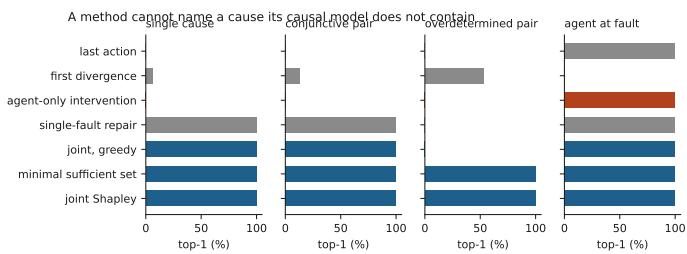
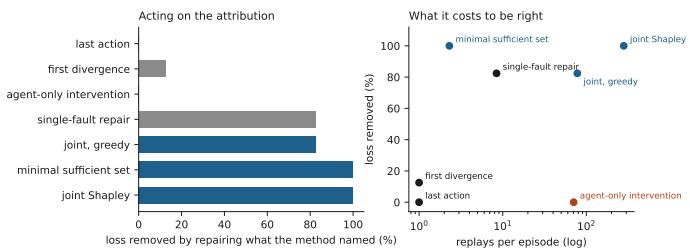
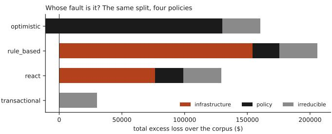

# CausalLoss-Fin: Attributing Financial-Agent Loss to Decisions and Infrastructure Faults

Abhishek Sharma, Senior Member, IEEE

abhicse24@gmail.com ORCID: 0009-0007-1103-2103

Abstract—When an agent handling a payment exception loses money, the agent-step attribution methods this paper compares against will name one of its actions. They will do so even when a settlement message was dropped and the agent never had a chance: they intervene on agent actions and do not expose infrastructure faults as intervenable variables, so every dollar they explain is charged to a decision.

We take a benchmark whose fault process is explicit and replayable, decompose each episode’s realised delivery schedule into named, individually repairable messages, and intervene on both the agent’s choices and the infrastructure’s. A telescoping identity splits any policy’s loss exactly three ways: an infrastructure effect, a policy differential against the best implementable policy, and a reference-policy residual. Two of the three can be negative, so none is a share; Shapley then divides the first into signed allocations over individual messages.

One result is structural and needs no corpus: an agent-only baseline identifies no infrastructure cause, because its model contains no variable that could name one. What 545 planted episodes across 3 policies measure is the size of that consequence. It misfiles 100% of infrastructure episodes and charges \$114,383.40 to the agent. Repairing what it names recovers 0.0% of the available loss; repairing a minimal sufficient set recovers 100.0%. Scoring messages one at a time is not merely imprecise: 27.8% (95% CI: 23.3–32.3%) of episodes do not decompose additively.

We evaluate deterministic programmatic policies rather than language-model agents, which is what makes replay exact and which limits external validity to stochastic agents. The prevalence figures are properties of this generator, not field rates.

Index Terms—causal attribution, counterfactual intervention, agent failure analysis, responsibility allocation, payment systems, Shapley value

## I. INTRODUCTION

An agent is asked to resolve a payment exception. It reads the processor, which says the capture is still pending, waits, reads again, sees nothing, and closes the case. The capture had in fact settled four minutes earlier; the message saying so was dropped in transit. The customer is charged and never receives the goods, and the loss is the order value plus a dispute fee.

Now ask the question every incident review asks: whose fault was that?

Recent work answers it by intervention. Causal Agent Replay [1] models a run as a structural causal model, applies a do operation to a step, re-executes the trajectory forward under the same policy, and reports the shift in the outcome distribution. CausalFlow [2] computes step-level causal responsibility scores and then synthesises minimal repairs. REFLECT [3] diagnoses candidate error steps, replays with diagnosis-specific patches, and uses the verified outcome flip as contrastive evidence. These are careful methods and a clear advance on judging traces with a language model, which is correlational and, on one published benchmark, around 14% accurate at the step level [1].

They also share an assumption. Each intervenes on the agent’s steps and exposes no infrastructure fault as an intervenable variable. In an environment where the infrastructure is itself a causal source — messages delayed, duplicated, dropped, reordered — a causal model with no infrastructure variable cannot name an infrastructure cause. Asked to explain the episode above, the best it can do is nominate the step that acted on information the agent never received. That is not a defect of execution. It is a property of the model, and it is the kind of thing that is easy to miss until the environment is one where the answer is checkable.

This paper makes it checkable. We build on Finality-  
Bench [4], an executable benchmark in which four financial   
systems (payment processor, double-entry ledger, ERP, bank   
feed) are fed independently faulted delivery streams derived   
from a hidden canonical event log, and agents are graded on   
executed monetary effect. Its fault process is explicit, seeded   
and replayable, which is what makes the counterfactual “what if   
that message had arrived” executable rather than hypothetical. Our contributions:

• Joint intervention. We intervene on agent decisions and on individual infrastructure faults in the same causal model, on the same episode, with exact common random numbers (Section V).

• An exact three-way split. A telescoping identity decomposes any policy’s loss into an infrastructure effect, a policy differential and a reference-policy residual, with nothing left unattributed. It holds on 3852/3852 episodes checked (Section V-C).

• A decomposition of the fault process into repairable units, together with the finding that FinalityBench’s fault families compose instead of superposing, so per-family attribution is unsound, and we say why (Section IV).

• Planted ground truth in four strata, including the overdetermined case that single-effect scoring provably cannot handle, with verified harmless distractors so that naming a cause is not trivial (Section VII).

• A measurement of what agent-only attribution costs when the environment is at fault, in identification accuracy, in allocation error, in dollars, and in loss that repairing the named cause fails to recover (Section VIII).

As in the benchmark this builds on, no language model was evaluated: no model endpoint was available. The policies whose failures we attribute are deterministic procedures, which sharpens the causal analysis, interventions are exact rather than sampled, and narrows what the results say about agents that reason. Section X is explicit about the difference.

## II. RELATED WORK

Counterfactual attribution for agent failures. CAR [1] is the closest work and the one we compare against. It executes same-policy interventions rather than substituting an oracle or asking a model to judge text, reports distributional outcomes with confidence intervals, and includes Shapley credit-splitting and ground-truth validation. CausalFlow [2] adds counterfactual repair, generating minimally edited traces that flip the outcome. REFLECT [3] targets silent failures, where the agent completes the task and the result is wrong with no error signal. All three intervene on agent steps and expose no infrastructure fault as an intervenable variable, which we checked in each paper directly. Our disagreement with this line is narrow. The machinery is right; the variable set is incomplete for environments where infrastructure causes loss, and Section VIII quantifies what that incompleteness costs.

Attribution that does intervene on the environment. It would be wrong to say that no prior work perturbs anything but the agent. AgenticRAG- FP [5] injects certified faults at specified retrieval hops of a multi-hop RAG pipeline, corrupting answer-bearing and bridge facts while leaving documents topically intact, and re-executes the downstream trajectory to ask whether a post-hoc trace still identifies the injected hop. That is an environment intervention and it is the closest prior work to ours in that respect. What it measures is diagnostic accuracy — was the injected hop recovered — rather than how much of a realised cost each fault accounts for, and it has no counterpart to the signed decomposition below. Causely [6] goes the other way, giving agents a structured causal representation of environment topology and dependencies so that they diagnose incidents better; the causal structure is an input to the agent rather than an instrument for apportioning loss after the fact.

Attribution beyond a single cause. DCFA [7] attributes failure in multi-agent systems by combining a dependency graph over traces with counterfactual refinement, and reports step-level accuracy; its interventions are over agent interactions. MP-Bench [8] argues that a multi-agent failure often admits several plausible attributions and that treating one as uniquely correct is an artifact of benchmark design. Our overdetermined stratum is the same phenomenon in a setting where the competing explanations are messages rather than agents, and the signed decomposition is one answer to it: when two faults are each sufficient, Shapley splits the credit evenly instead of forcing a choice between them.

Actual causation. The question of which of several events counts as the cause of an outcome is the subject of the structuralmodel account of actual causality [9], in which a cause is a but-for cause relative to a contingency, and of the associated notion of degree of responsibility [10]. Overdetermination, two events, either sufficient alone, so neither is necessary, is the standard hard case, and it is the one our third stratum is built from. We take the practical route: a minimal sufficient set is the smallest set of messages whose joint repair removes the loss. The search stops at 3 messages, which would make a perfect recovery figure conditional on the cases small enough to fit inside that bound. It does not: over 320 episodes the largest set found holds 2 messages and the cap binds on 0 of them, so the recovery figure is a property of the method and not of the cap.

Shapley allocation. Distributing a total among contributors so that the parts sum to the whole is the Shapley value [11]. It has been carried into root-cause analysis, though not without warnings: Kelen et al. [12] show that the asymmetric variant, which relaxes the symmetry axiom to encode a causal ordering, produces counter-intuitive attributions outside a restricted model class. We use the standard symmetric value, and for one specific job: dividing the infrastructure effect across individual messages in a way that survives interaction. The infrastructure effect itself is not estimated by Shapley; it comes from the exact identity, so the efficiency axiom is a check on the implementation rather than a modelling assumption.

The environment. FinalityBench [4] supplies the setting: a hidden canonical event log, four projections fed by separately faulted delivery streams, an effect-level monetary oracle, and paired counterfactual tasks. We consume its released artifact (DOI 10.5281/zenodo.22262591) rather than reimplementing it, and every result here records which revision it ran against.

## III. THE SETTING

A FinalityBench episode is one order. A capture is submitted, and its terminal outcome, settled or failed, becomes a fact at some later instant that no tool can reveal early. Four systems learn about events through delivery streams that a seeded fault engine perturbs in six ways: delay, duplication, loss, reordering, half-committed ledger postings, and stale reads. An agent has eleven tools, five of them irreversible, and a shipby deadline. Grading is on the merchant’s terminal economic position, reported as the shortfall against a privileged reference that is told when the capture resolves.

The property we need is that an episode is a pure function of the case, the seed, the policy and the delivery schedule. Replay with one message restored is therefore exact: two worlds that differ in one repaired delivery differ in nothing else, and no averaging over noise is required to see the effect.

## IV. FAULT INSTANCES

Attribution needs a cause one can point at. “Delay was enabled” is a knob; “the settlement message to the processor never arrived” is a cause. We decompose a realised schedule into named instances by diffing it against the fault-free schedule for the same case and seed: every way the two differ is an instance, and repairing all of them returns the fault-free world exactly. There are 7.6 instances per episode on average and at most 12. An archetype’s defining fault, the settlement the processor never hears about, appears as an instance too, flagged as structural, so it can be intervened on instead of being baked into the background.

A first version decomposed per family instead, building each single-family schedule and diffing that against the baseline. Pooling those instances and applying them to the fault-free schedule fails to reproduce the realised one on 199 of 240 episodes (82.9%), where the decomposition described above reproduces all 240. The reason is a property of the environment rather than a coding slip. FinalityBench draws its fault families independently but they do not act independently: duplicate copies are placed relative to a delivery’s already-delayed arrival, a half-commit propagates to copies that exist only because duplication fired, and whether a reorder swap is eligible at all depends on times that delay has already moved. Families that compose cannot be attributed by superposition. The family label therefore annotates an instance rather than defining it, and the label is assigned by a but-for test taken in context: remove that family from the full profile and ask whether this delivery still arrives when it did. Asked the naive way, in isolation, reordering appears never to fire at all; asked in context it accounts for a fifth of the moved deliveries, because the swaps it makes only become possible once delay has bunched arrivals together.

## V. THE CAUSAL MODEL

## A. Variables and structural equations

An episode is generated by the following model. The exogenous variables are the case C (order value, when the capture resolves, whether it settles, whether a retry would work) and the fault realisation $F = \{ f _ { 1 } , \ldots , f _ { m } \}$ , the set of individual message-level instances of Section IV. The endogenous variables are the delivery schedule, each system’s view at each instant, the agent’s actions, the executed effects, and the loss:

$$
S = { \mathrm { s c H E D U L E } } ( C , F )\tag{1}
$$

$$
V _ { t } ^ { ( j ) } = \mathtt { F O L D } _ { j } \left( \{ d \in S : \mathtt { A R R } ( d ) \leq t - \lambda _ { j } \} \right)\tag{2}
$$

$$
A _ { k } = \pi { \bigl ( } H _ { k - 1 } { \bigr ) } , \qquad H _ { k } = H _ { k - 1 } \cup \{ ( A _ { k } , O _ { k } ) \}\tag{3}
$$

$$
E = \mathrm { E F F E C T S } ( A _ { 1 } , \dots , A _ { n } )\tag{4}
$$

$$
L = R - { \mathrm { P O S I T I O N } } ( C , E )\tag{5}
$$

with $j$ ranging over the four systems, $\lambda _ { j }$ that system’s read lag, π the policy, $H _ { k }$ the history it has seen, and R the reference position, held fixed across every counterfactual so that a repaired message moves the policy’s position and nothing else.

Two things follow from the shape of these equations. First, F enters only through S and thus only through the views $V ^ { ( j ) }$ : in this environment the infrastructure can harm an agent only by corrupting what it is able to see, never by moving money directly. Second, every equation is deterministic, so $d o ( f _ { i } : = \perp )$ and $d o ( A _ { k } : = a ^ { \prime } )$ are exact operations rather than distributions to be sampled.

## B. Interventions

Two interventions are available.

Repairing a message. Rebuild the delivery schedule without one instance and re-run the same policy on the same case. Because the schedule is an input rather than a random draw, nothing else changes.

Substituting a decision. Force a chosen action at step k and let the policy continue from there, seeing the consequences. We report the effect of a step as the loss avoided by its best alternative, a regret, rather than as a distribution shift, because the policies here are deterministic and resampling under the same policy, the usual move, changes nothing at all.

## C. An exact three-way split

Write w for the factual world, w0 for the same case with every message repaired, π for the policy under study, and $\pi ^ { * }$ for the best policy that uses no privileged information. Then

$$
\begin{array} { r l } & { L ( \pi , w ) = \underbrace { L ( \pi , w ) - L ( \pi , w _ { 0 } ) } _ { \mathrm { i n f r a s t r u c t u r e } } + \underbrace { L ( \pi , w _ { 0 } ) - L ( \pi ^ { * } , w _ { 0 } ) } _ { \mathrm { p o l i c y } } } \\ & { \qquad + \underbrace { L ( \pi ^ { * } , w _ { 0 } ) } _ { \mathrm { i r r e d u c i b l e } } } \end{array}\tag{6}
$$

The terms telescope, so the split is exact and there is no residual in which a modelling error could hide.

Two of the three terms can be negative, so none of them is called a share. They are the infrastructure effect, the policy differential and the reference-policy residual. The Shapley output is not called a share either: it divides the infrastructure effect into parts that sum to it, but those parts are signed, so we call them signed allocations throughout. The infrastructure effect goes negative when faults help a policy on net, which happens and is reported in Section VIII. The policy term is a gap to the best implementable policy rather than to a per-task optimum, so it goes negative whenever the subject beats that baseline on a task: on 6.9% of episodes, reaching \$-1,442.60. Read the three numbers as a signed decomposition that sums to the loss, not as a partition into non-negative parts. This matters more than it might appear: a residual term is precisely where unattributed loss would accumulate, and unattributed loss in an agent-analysis tool gets read as the agent’s fault. The identity holds on 3852/3852 episodes checked, and the test suite asserts it. Being algebra, it is reported without an interval: a confidence band around an identity would say nothing.

Shapley values then allocate the infrastructure effect across individual messages, with coalition value $v ( S ) = L ( \pi , w _ { 0 } ) -$ $L ( \pi , S )$ . They satisfy efficiency, so the allocations sum to the effect, and they are signed: a message whose repair would have increased the loss carries a negative marginal contribution and therefore a negative allocation. Additivity of the value function does not make them non-negative, and on this corpus the infrastructure effect itself goes negative for one policy. Exact below thirteen instances, permutation-sampled above; the sampled estimate sits within 1.88% of the exact one in $L _ { 1 }$

## VI. ATTRIBUTION METHODS

Seven methods, sharing an interface: given an episode they return a ranked list of candidate causes with scores in cents, and a verdict on which side is responsible. Two are heuristics, one is the published shape we compare against, and four use fault interventions.

Last action. Blame the final irreversible step. It is the reflex an incident review starts from, and it is included because the observation that motivates intervention-based attribution in the first place is that the step which executes a harmful action is rarely the step that decided on it [1].

First divergence. Blame the earliest message that arrived late or not at all. A plausible operations reflex, find the first thing that looks wrong and call it the cause, which ignores entirely whether that message mattered.

CAR-shaped agent-only baseline. Substitute each of the agent’s steps in turn, run forward under the same policy, and rank the steps by loss avoided.

It matters what this is and is not. It is not a reproduction of CAR [1], CausalFlow [2] or REFLECT [3], and no number below should be read as a score for any of those systems. It is their variable scope — interventions on agent steps only — reduced to essentials and transplanted here, with interventions exact rather than sampled because the policy is deterministic, which gives the baseline favourable conditions on the dimension evaluated here. Its causal model contains no infrastructure variable, so all of its causes are agent steps and its infrastructure effect is identically zero.

Single-fault repair. Repair each message on its own, rank by loss avoided. The natural first thing to try once fault interventions are available, and exactly right whenever the loss decomposes additively.

Minimal sufficient set. Search for the smallest set of messages whose joint repair removes the loss, smallest first. This is a but-for cause taken as a set rather than a singleton, in the spirit of the structural-model account of actual causation [9]: no member need be a cause on its own, and together they are. It is the only method here that is both exact on every stratum and cheap.

Joint greedy. Rank agent steps and messages together by their individual effects. Included to show that combining the two sides naively is not enough: its independently computed scores do not sum to the loss, because a step regret and a message repair are not measured on the same scale.

Joint Shapley. Take the agent and infrastructure effects from the exact identity of Section V-C, then distribute the infrastructure effect across individual messages by Shapley value, and rank within whichever side the identity says is responsible. Ranking the two sides against each other by raw score does not work. Shapley values sum to the infrastructure effect while step regrets do not live on that scale, so a single step scored at the whole loss outranks two messages that split it. An earlier version of this method lost every overdetermined episode for exactly that reason.

  
Fig. 1. Top-1 identification by stratum. Agent-only intervention is correct exactly when the agent is the cause.

## VII. PLANTED CAUSES

Validating a method against causes the method itself derived proves nothing. We build episodes the other way round: start from a case the policy solves cleanly, inject a known set of faults, and check that the loss appears. The injected set is then the cause by definition.

Four strata, each testing something different. Single (169 episodes): one fault causes the loss. Conjunctive (126): two faults, neither harmful alone, harmful together. Each is necessary given the other, so repairing either fixes the episode. Overdetermined (70): two faults, either sufficient on its own, so repairing one changes nothing and every one-at-a-time score is zero. Agent (180): no faults bite, and the policy loses money anyway.

Every episode also carries distractor faults, verified harmless in the presence of the causal set rather than merely harmless alone. Without them the task is trivial: an earlier version planted only the causal faults, and a heuristic that named the earliest message in the schedule scored 100%, because there was nothing else to name.

## VIII. RESULTS

## A. Naming the cause

Table I and Figure 1 give identification accuracy, and one row of it is not an experimental result at all. Agent-only intervention identifies the true cause on 0% of infrastructure episodes. That figure is zero and had to be: a causal model whose only intervenable variables are the agent’s steps contains no variable naming a message, so no infrastructure cause is expressible in its output, whatever the episode. It is a proposition about the method’s model, it needs no corpus, and running one cannot refute it.

What the corpus measures is the consequence, which does not follow from the proposition and could have come out otherwise. How much money gets misfiled (\$114,383.40, on 100% of infrastructure episodes), how little repairing the named cause recovers (0.0%), how often interaction defeats one-ata-time scoring (27.8% (95% CI: 23.3–32.3%)), and what the alternatives cost in replays are all quantities of this environment and this generator. A benchmark where infrastructure faults were rare or cheap would give the same proposition and much smaller numbers.

The method’s overall verdict accuracy, 33.0%, is the base rate of episodes in which the agent happens to be at fault. It is not that the method performs poorly. It answers a different question correctly.

IDENTIFYING THE PLANTED CAUSE. VERDICT IS THE SHARE OF EPISODES ON WHICH THE METHOD ASSIGNS RESPONSIBILITY TO THE CORRECT SIDE.
<table><tr><td></td><td colspan="4">top-1 identification (%)</td><td></td></tr><tr><td>method</td><td></td><td>single conjunctive overdet. </td><td></td><td>agent</td><td>verdict (%)</td></tr><tr><td>last action</td><td>0</td><td>0</td><td>0</td><td>100</td><td>33.0</td></tr><tr><td>first divergence</td><td>7</td><td>13</td><td>53</td><td>0</td><td>67.0</td></tr><tr><td>agent-only intervention</td><td>0</td><td>0</td><td>0</td><td>100</td><td>33.0</td></tr><tr><td>single-fault repair</td><td>100</td><td>100</td><td>0</td><td>100</td><td>100.0</td></tr><tr><td>joint, greedy</td><td>100</td><td>100</td><td>0</td><td>100</td><td>100.0</td></tr><tr><td>minimal sufficient set</td><td>100</td><td>100</td><td>100</td><td>100</td><td>100.0</td></tr><tr><td>joint Shapley</td><td>100</td><td>100</td><td>100</td><td>100</td><td>100.0</td></tr></table>

TABLE II

ALLOCATION BETWEEN AGENT AND INFRASTRUCTURE. DOLLARS CHARGED TO THE AGENT ARE INFRASTRUCTURE-CAUSED LOSS FILED AGAINST A DECISION.
<table><tr><td>method</td><td>error (%)</td><td>allocation misattributed (%)</td><td>$ charged to agent</td></tr><tr><td>last action</td><td>67.0</td><td>100</td><td>114,383.40</td></tr><tr><td>first divergence</td><td>33.0</td><td>0</td><td>0.00</td></tr><tr><td>agent-only intervention</td><td>67.0</td><td>100</td><td>114,383.40</td></tr><tr><td>single-fault repair</td><td>0.0</td><td>0</td><td>0.00</td></tr><tr><td>joint, greedy</td><td>0.0</td><td>0</td><td>0.00</td></tr><tr><td>minimal sufficient set</td><td>0.0</td><td>0</td><td>0.00</td></tr><tr><td>joint Shapley</td><td>0.0</td><td>0</td><td>0.00</td></tr></table>

Single-fault repair is exact on the single and conjunctive strata and scores 0% on the overdetermined one, which is the arithmetic: when either message alone is enough, repairing one changes nothing and every candidate scores zero. Minimal sufficient sets and joint Shapley are exact on all four.

First divergence behaves differently on that stratum and the reason is worth a sentence. It names the earliest message that arrived late or not at all, and on overdetermined episodes it lands on a true cause about half the time. The episodes carry distractor faults verified harmless alongside the causal set, and a distractor is as likely to be early as a cause is, so the earliest anomaly is frequently not one of the two sufficient messages. The rule is not reasoning about sufficiency; it is ordering by arrival and taking the first.

## B. Splitting the bill

Table II compares each method’s split against the planted truth. Agent-only intervention misfiles 100% of infrastructure episodes and charges \$114,383.40 of infrastructure-caused loss to the agent.

The methods that intervene on faults all reach zero allocation error, and that deserves a caveat. Once a method can intervene on the fault process at all, the agent/infrastructure split follows from the identity in Section V-C and is exact by construction. The hard part is which message, not which side. Table II shows what having the variable at all is worth; Table I shows what distinguishes the methods that have it.

  
Fig. 2. Left: loss removed by repairing the named cause. Right: the same against replay cost. Minimal sufficient sets sit at the top-left corner.

## C. Acting on the attribution

An attribution is worth something if repairing what it names removes the loss. Of \$82,488.60 of infrastructure-caused loss, repairing what agent-only intervention names recovers 0.0%. It names agent steps, and an agent step is not a thing an operator can repair. Single-fault repair recovers 82.4%. Minimal sufficient sets recover 100.0%.

Cost is counted in replays rather than seconds. A replay count is a property of the method and reproduces exactly; wall-clock time is a property of the machine, and ours moved threefold between runs that changed no code. Minimal sufficient sets need 2.3 replays per episode; joint Shapley needs 280.1. Shapley buys the full allocation across messages, which a minimal set does not provide; when the question is only “what do we fix”, the cheap method is also the right one.

## D. How often interactions matter

Across 27.8% (95% CI: 23.3–32.3%) of episodes with infrastructure loss, repairing each message on its own does not account for the whole infrastructure effect. The mean gap is \$76.73. On 5.6% (95% CI: 3.1–8.7%) every single-repair score is zero while the total is not. We report 95% percentile intervals from 2,000 task-clustered bootstrap replicates over 219 tasks covering 320 episodes, resampling tasks rather than episodes because episodes from one task share its amount, archetype and fault draw. The algebraic identity needs no such interval and is not given one; these are estimates of how often a phenomenon occurs in a generated population, which is a different kind of claim.

Interaction is not a corner case here. It is roughly a quarter of the episodes, and the interval says the sample constrains that to between a quarter and a third.

TABLE III  
REPAIRING WHAT EACH METHOD NAMED, AND WHAT IT COST IN EPISODE REPLAYS.
<table><tr><td>method</td><td>loss removed fully fixed replays (%)</td><td>(%)</td><td>per ep.</td></tr><tr><td>last action</td><td>0.0</td><td>0.0</td><td>1.0</td></tr><tr><td>first divergence</td><td>12.5</td><td>6.7</td><td>1.0</td></tr><tr><td>agent-only intervention</td><td>0.0</td><td>0.0</td><td>70.5</td></tr><tr><td>single-fault repair</td><td>82.4</td><td>81.1</td><td>8.4</td></tr><tr><td>joint, greedy</td><td>82.4</td><td>81.1</td><td>78.0</td></tr><tr><td>minimal sufficient set</td><td>100.0</td><td>100.0</td><td>2.3</td></tr><tr><td>joint Shapley</td><td>100.0</td><td>100.0</td><td>280.1</td></tr></table>

TABLE IV  
THE SPLIT APPLIED TO THE WHOLE CORPUS, WITHOUT PLANTING.
<table><tr><td>policy</td><td>mean loss infra. policy residual ($)</td><td>(%)</td><td>(%)</td><td>(%)</td></tr><tr><td>optimistic</td><td>166.60</td><td>-6.8</td><td>88.0</td><td>18.8</td></tr><tr><td>rule based</td><td>213.63</td><td>75.1</td><td>10.2</td><td>14.7</td></tr><tr><td>react</td><td>134.15</td><td>59.3</td><td>17.3</td><td>23.4</td></tr><tr><td>transactional</td><td>31.37</td><td>0.0</td><td>0.0</td><td>100.0</td></tr></table>

## E. One episode, end to end

A concrete case makes the difference legible. Take a lost\_settlement task worth \$24.99 run under the ReAct loop. The capture settles, the settlement message to the processor is dropped, and 7 fault instances are present in all. The policy polls the processor, never sees a settlement, escalates, and the merchant ends \$28.00 behind the reference.

The three-way split assigns the whole \$28.00 to infrastructure: in a repaired world this policy solves the task exactly, so its policy differential and reference-policy residual are both zero. Shapley then divides that \$28.00 between two messages at \$14.00 each, the dropped settlement to the processor, and a reordering at the bank feed, and gives zero to the other 5. Neither fault is sufficient by itself to create the loss; repairing either one alone is sufficient to remove it. That is why they split the credit evenly instead of one taking all of it.

Agent-only intervention, run on the same episode, reports that the agent should have shipped at step 0 and assigns \$28.00 to that decision. The recommendation is not wrong as advice, shipping would indeed have been better, but as an explanation it inverts the case. At step 0 the agent had no evidence that the money had arrived, and the reason it had none is the first of the two messages Shapley named.

## F. Where the money actually goes

Applied without planting (Table IV, Figure 3), the split says different things about different policies. For the rule-based procedure, 75.1% of its loss is the environment’s doing. For the ReAct loop, 59.3% is infrastructure and 17.3% is its own. For the finality-gated runtime the infrastructure effect and the policy differential are both zero, and 100.0% of its \$31.37 mean loss is the reference-policy residual. It loses only what no unprivileged policy can avoid, which the benchmark’s own results reach by a different route.

  
Fig. 3. The same decomposition for four policies over the whole corpus.

TABLE V  
WHERE RESPONSIBILITY SITS, BY ARCHETYPE, POOLED OVER THE THREENON- GATED POLICIES.
<table><tr><td>archetype</td><td>infra. (%) policy (%) residual (%)</td><td></td></tr><tr><td>stale processor</td><td>99.6</td><td>0.4 0.0</td></tr><tr><td>pending settle</td><td>99.6</td><td>0.4 0.0</td></tr><tr><td>lost settlement</td><td>99.4</td><td>0.6 0.0</td></tr><tr><td>late chargeback</td><td>99.0</td><td>1.0 0.0</td></tr><tr><td>partial ledger</td><td>94.8</td><td>5.2 0.0</td></tr><tr><td>duplicate settlement</td><td>89.6</td><td>10.4 0.0</td></tr><tr><td>pending fail</td><td>0.7</td><td>94.2 5.1</td></tr><tr><td>unresolvable</td><td>-4.9</td><td>10.0 94.9</td></tr><tr><td>pending fail hard</td><td>-85.6</td><td>184.4 1.2</td></tr></table>

The interesting row is the optimistic policy, which ships as soon as the ledger shows any activity. Its infrastructure effect is -6.8%, and it is negative. Faults help it, on net. A policy that acts on the first sign of payment is occasionally saved by a message going missing, because the message it did not receive is the one it would have acted on. We would not have predicted the sign and do not present it as a general result; it is a reminder that “the infrastructure was at fault” is a claim with a direction, and that a method which can only add blame to the agent cannot represent it at all.

## G. Which situations are the environment’s fault

Table V breaks the same decomposition down by situation. Its values are the three signed terms as percentages of each archetype’s total excess loss, so a term can be negative and can exceed 100% when another runs the other way; they are not shares. It lines up with what the benchmark says about itself from the other direction. Infrastructure dominates on the archetypes built around a message going missing, arriving stale, or posting twice. These are situations in which a competent policy is defeated by its inputs. The reference-policy residual concentrates on the cases whose outcome lands after the ship by deadline, where repaired plumbing would not help because the fact itself has not happened yet. The practical reading is that these two groups call for different remedies: the first is fixed by making delivery reliable or by reading an authoritative channel, and the second is not fixable by any amount of engineering on the observation path.

## IX. DISCUSSION

The variable set is the design decision. Nothing about CAR-style intervention is wrong. Given a variable, it estimates that variable’s effect carefully. The result here is about what happens when a variable is missing: the loss does not go unexplained, it gets attributed to whatever variables remain. In an agent-analysis tool those are all agent steps, so the tool is biased toward blaming the agent by construction, not by error.

Exactness beats estimation where it is available. The threeway split needs no confidence interval because it telescopes. The Shapley step needs one only above thirteen messages, and even then the sampled estimate is within 1.88%. Deterministic replay is what buys this, and it is available in any environment whose fault process is seeded and reproducible.

What determinism buys and what it costs. Every intervention here is a single replay with a known answer, not a Monte Carlo estimate over a stochastic policy. That is why the split needs no confidence interval and why overdetermination can be detected exactly rather than inferred from overlapping error bars. The price is that our agent-step intervention substitutes an action rather than resampling one, and those coincide only when the policy is deterministic. For a stochastic agent the two come apart, and the published methods we compare against are built for that case; how the comparison moves there is an open question we cannot settle from inside this environment.

Cheap methods can be exact. Minimal sufficient repair is the cheapest method in Table III that is exact on every planted stratum, at 2.3 replays, and the 3-message cap never bound on any episode searched. It does not win on accuracy per replay taken as a ratio: first divergence answers with one replay and is right about the side often enough to beat it on that measure, while being wrong about which message whenever it matters. The expensive method is worth its cost only when the full per-message allocation is the deliverable.

## X. LIMITATIONS

No language model was evaluated. The policies are deterministic procedures. This is a real gain for the causal analysis, an intervention is exact, and there is no sampling noise to average away, and a real loss for external validity. Whether these conclusions hold when the agent is stochastic, and whether a resampling intervention behaves like our substitution intervention, is untested here. The environment’s model adapter is written and tested against recorded transcripts but has never called a model.

One environment. Everything is measured inside Finality-Bench. Its faults are delivery-level, so infrastructure harms an agent exclusively by corrupting what it can see; an environment where infrastructure moves money directly would need a wider variable set than ours.

Overdetermination is rare in nature. It is 5.6% of episodes with infrastructure loss, and the stratum has 70 episodes pooled across 3 policies. The conclusion that single-effect scoring fails there is arithmetic rather than statistical, but the rate at which it costs anything in practice is estimated from a small sample.

Agent-step alternatives are a fixed menu. Seven dispositions an operator would recognise, not the whole action space. A better alternative outside the menu would raise the measured effect of a step, which would make agent-only attribution look better, not worse.

Which policy counts as the reference is a choice. We use the benchmark’s strongest implementable policy, and that choice fixes the residual: a stronger reference would move loss out of the residual and into the policy differential for every subject.

## XI. CONCLUSION

Given an environment whose fault process can be replayed, the question “was this the agent’s fault or the system’s?” has an exact answer, and it is cheap to compute. The obstacle is not statistical. It is that a causal model containing only agent steps has to answer “the agent” every time, and will do so confidently: on our planted episodes such a baseline misfiles every infrastructure failure and charges \$114,383.40 to decisions, and repairing what it names recovers none of it.

Two things follow for anyone building this. Expose environment events as intervenable variables, because a cause that cannot be named cannot be found, and the cost of omitting them is measurable rather than theoretical. And when the goal is operational remediation rather than complete allocation, use minimal sufficient repair: it recovers 100.0% of the available loss at 2.3 replays per episode, against 280.1 for the full per-message allocation, which may be unnecessary when the operational goal is only to identify a sufficient repair.

## ARTIFACT AVAILABILITY

Code, the planted-episode generator and every result file are at https://github.com/abhisheksharma2411/causalloss-fin. It is archived at DOI 10.5281/zenodo.22893020. It consumes the released FinalityBench artifact [4] rather than reimplementing it, and each result file records the revision it ran against. make reproduce runs the suite end to end from a clean tree.

## REFERENCES

[1] J. Shah, “Causal Agent Replay: Counterfactual attribution for LLM-agent failures,” arXiv:2606.08275, Jun. 2026.

[2] A. Bonagiri, D. Borkar, G. J. Anderias, S. Rafatirad, and H. Homayoun, “CausalFlow: Causal attribution and counterfactual repair for LLM agent failures,” arXiv:2605.25338, May 2026.

[3] X. Lin, Y. Wang, T. S. T. Kwok, D. Guo, S. A. Nale, C. Fleming, and G. Cheng, “REFLECT: Intervention-supported error attribution for silent failures in LLM agent traces,” arXiv:2606.09071, Jun. 2026.

[4] A. Sharma, “FinalityBench: An effect-level benchmark for agent decisions under delayed and conflicting financial finality,” arXiv:2609.04706, 2026, DOI: 10.5281/zenodo.22262591.

[5] L. Pothuru, “When failures propagate: Causal failure attribution in agentic retrieval-augmented generation,” arXiv:2608.20627, 2026.

[6] D. Dalal, E. Sara, B. Yemini, C. Miller, and S. Kliger, “Causely: A causal intelligence layer for enterprise AI — a benchmark study on SRE and reliability workflows,” arXiv:2605.18327, 2026.

[7] Z. Wang, L. Wang, S. Jin, J. Chen, and Y. Xiao, “DCFA: Dual-view causal-inspired attribution for failure reasoning in LLM-based multi-agent systems,” arXiv:2609.04749, 2026.

[8] Y. In, M. Tanjim, J. Subramanian, S. Kim, U. Bhattacharya, W. Kim, S. Park, S. Sarkhel, and C. Park, “Rethinking failure attribution in multi-agent systems: A multi-perspective benchmark and evaluation,” arXiv:2603.25001, 2026.

[9] J. Y. Halpern, Actual Causality. Cambridge, MA: MIT Press, 2016.

[10] H. Chockler and J. Y. Halpern, “Responsibility and blame: A structural model approach,” Journal of Artificial Intelligence Research, vol. 22, pp. 93–115, 2004.

[11] L. S. Shapley, “A value for n-person games,” in Contributions to the Theory of Games II, H. W. Kuhn and A. W. Tucker, Eds. Princeton University Press, 1953, pp. 307–317.

[12] D. M. Kelen, M. Petreczky, P. Kersch, and A. A. Benczur, “Theoret-´ ical evaluation of asymmetric Shapley values for root-cause analysis,” arXiv:2310.09961, Oct. 2023.