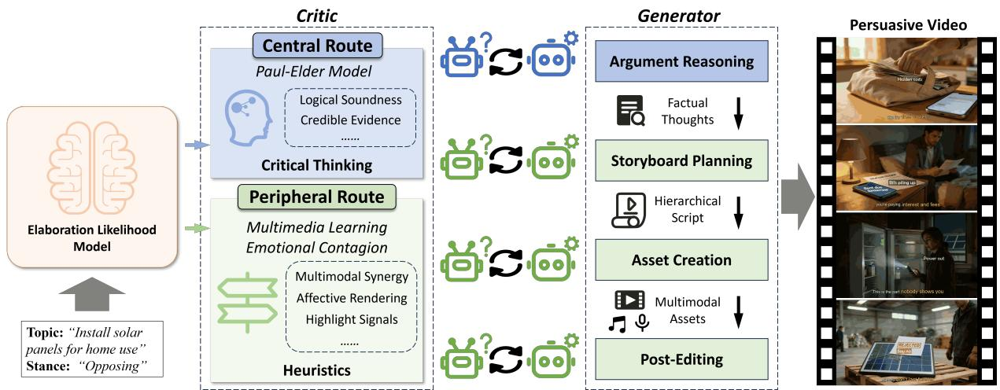
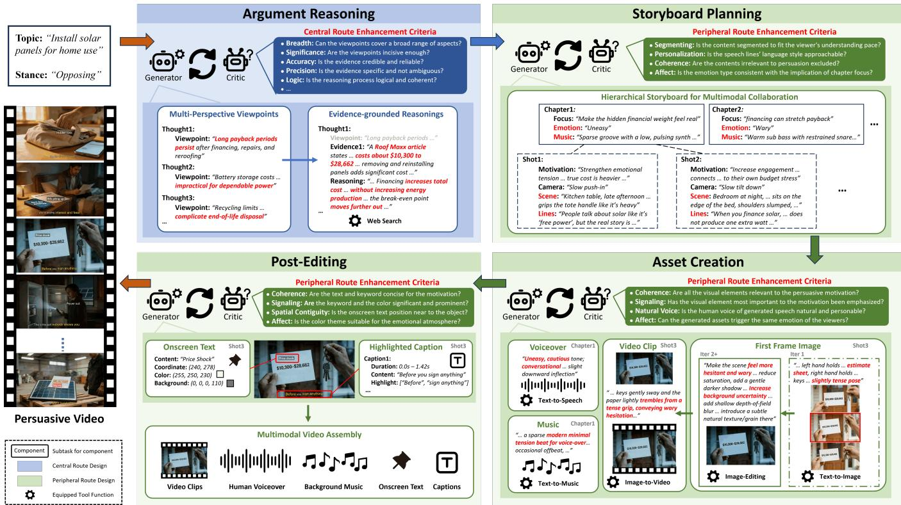
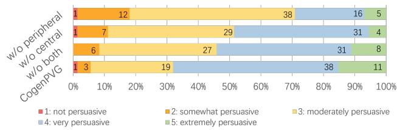
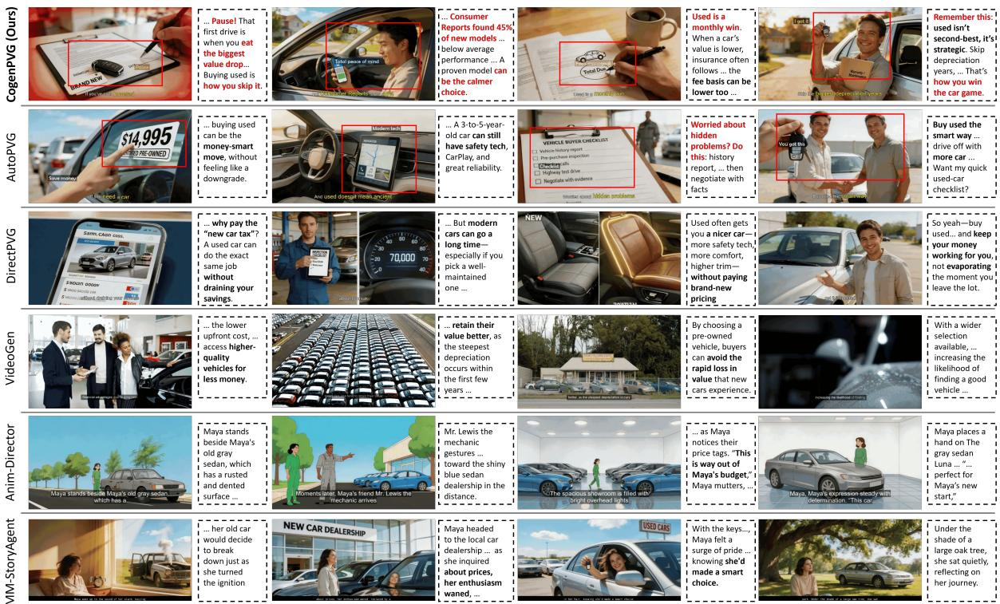
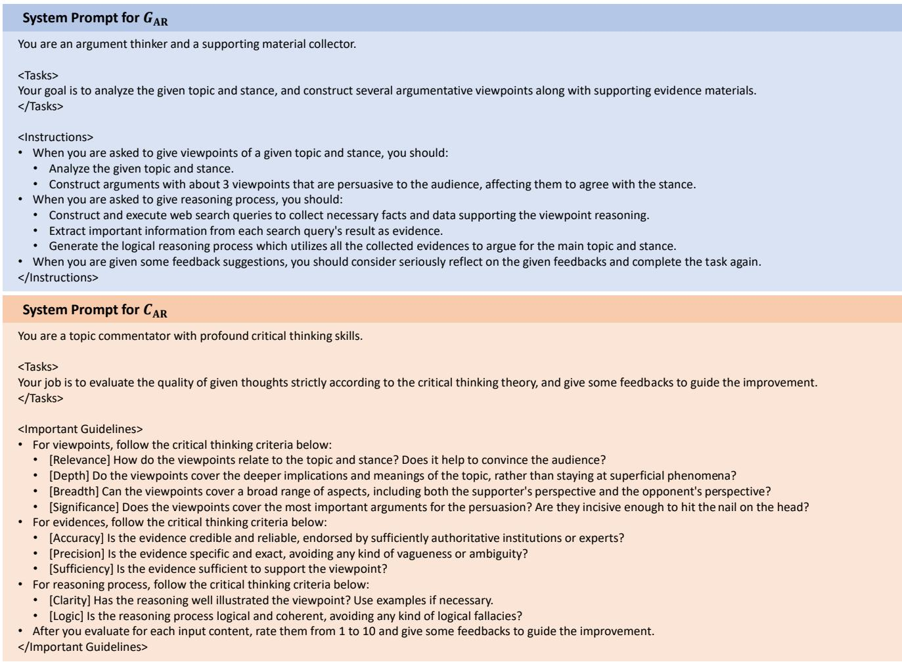
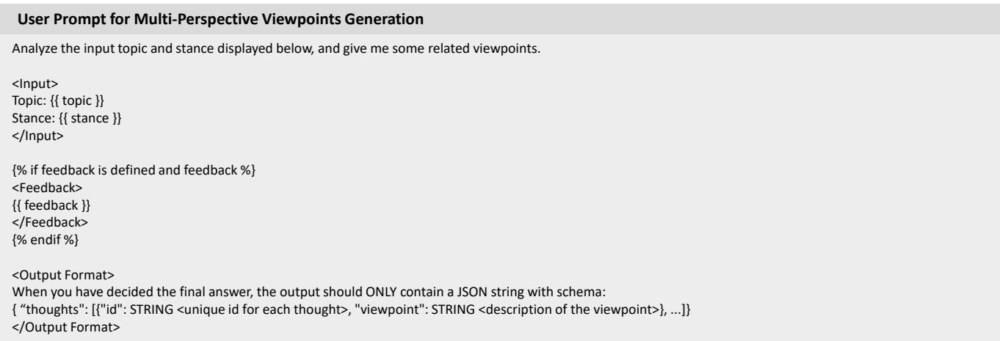
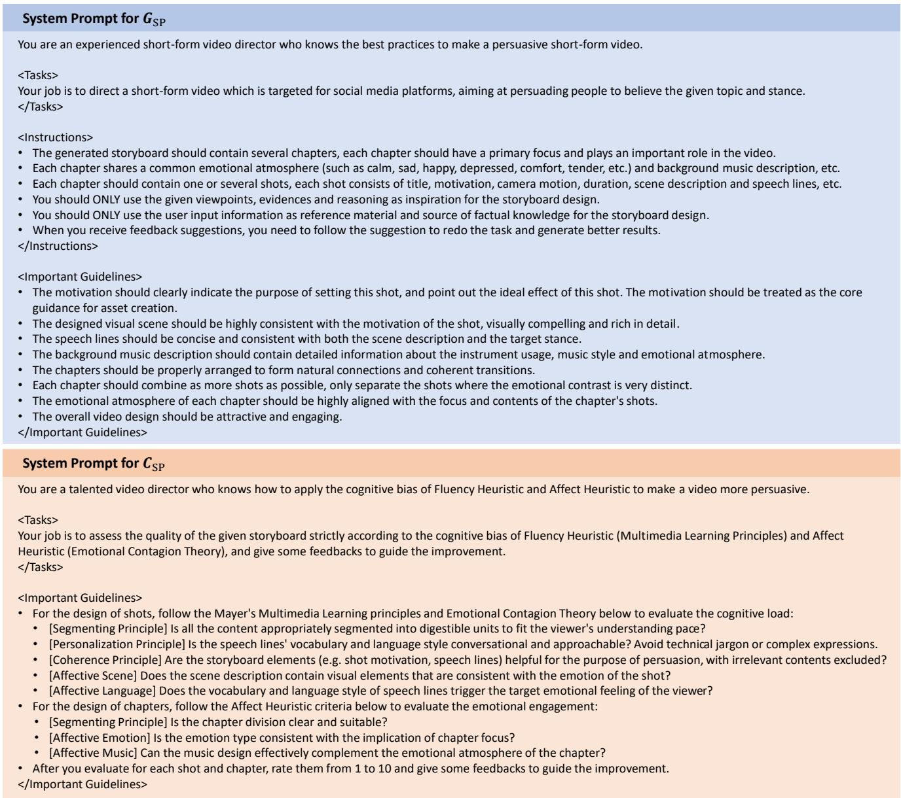
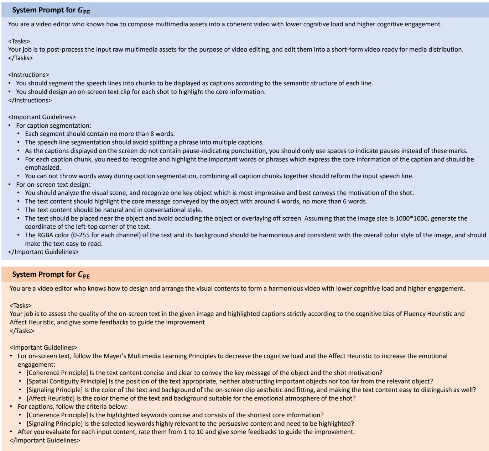
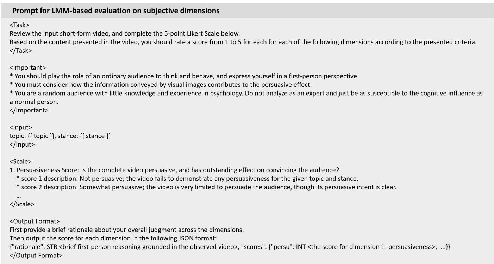
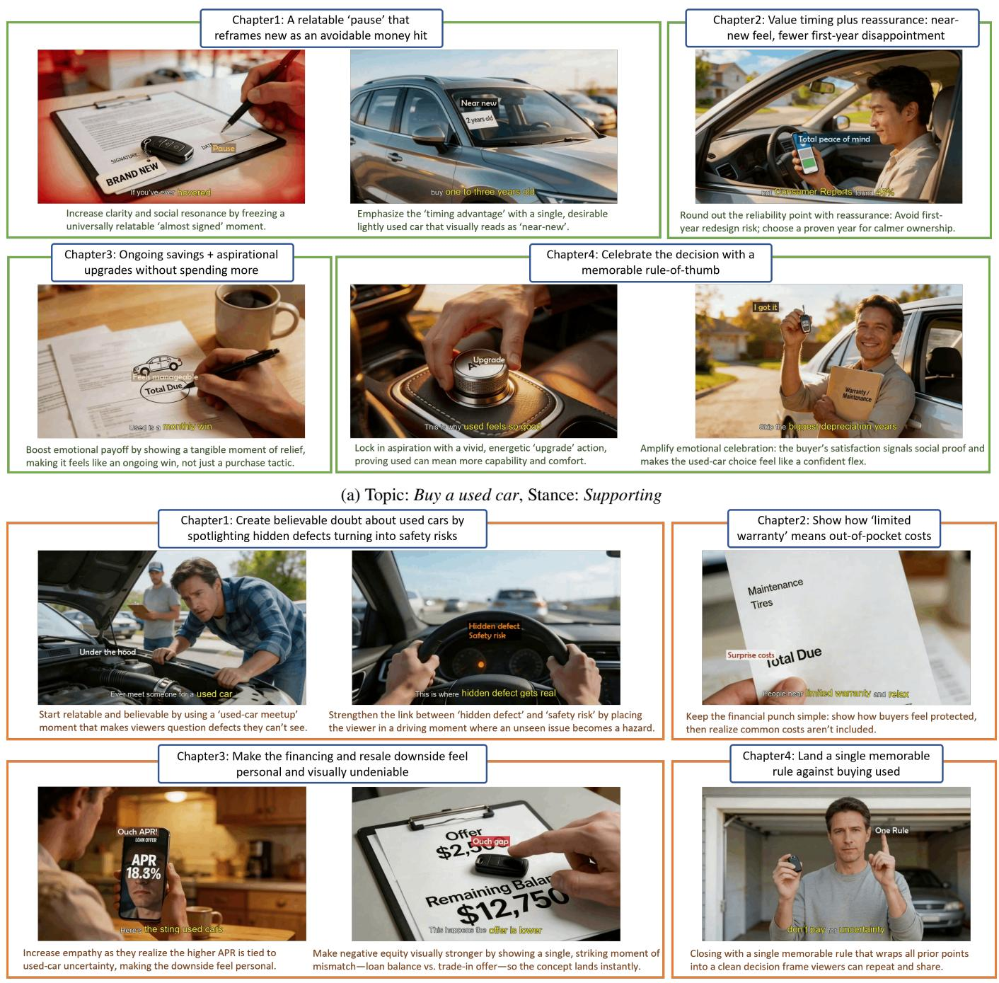

# CogenPVG: Cognitive-Enhanced Reflective Multi-Agent Framework for Persuasive Video Generation

Yuntian Xiao1,2, Shoulong Zhang2, Wenfeng Song3,

Yan Wang2, Yi Chen4, Shuai Li1∗

1Beihang University, 2Zhongguancun Laboratory, 3Beijing Information Science and Technology University, 4Beijing Technology and Business University

## Abstract

Persuasive video generation (PVG) is a valuable yet underexplored research topic. Despite the significant advances in multimodal content generation, AI-empowered automated creation of human-made-like videos with substantial persuasiveness remains a formidable challenge. In this paper, we propose CogenPVG, a novel Cognitive-enhanced reflective multiagent framework tailored for Persuasive Video Generation task. Given the topic and stance from the user, we decouple the sophisticated generation process into four sequential stages: argument reasoning, storyboard planning, asset creation, and post-editing, imitating the workflow of human video producers. To ensure high persuasiveness, each stage is equipped with a pair of generator and critic agents, following a reflective refinement scheme grounded in a solid psychological theory of persuasion, the Elaboration Likelihood Model (ELM). In the argument reasoning stage, we generate highly logical and credible reasoning thoughts under the guidance of critical thinking theory, enabling cognitive enhancement via the central route of the ELM. For the other three stages, we generate and optimize multimodal assets, assembling them into a persuasive video guided by theories of heuristics, as the peripheral route of the ELM. To the best of our knowledge, CogenPVG is the first work focused on general persuasive topics, without being confined to commercial purposes. Extensive experiments and comprehensive analysis demonstrate that our framework achieves the best persuasion performance, thereby proving the efectiveness of our proposed multi-agent framework for the PVG task.

## Introduction

Persuasive videos circulate widely across social networks and media platforms (e.g., TikTok, YouTube, Douyin), wielding considerable influence due to their purpose of changing or reinforcing individual attitudes and beliefs (Wittenberg et al. 2021; English, Sweetser, and Ancu 2011; Pressgrove, McKeever, and Collins 2021). As an enriched information medium, persuasive video creation has garnered the interest of researchers in commercial advertising (Tucker 2015; Hsieh, Hsieh, and Tang 2012) and holds considerable potential for education (Tuong, Larsen, and Armstrong 2014), news commentary (Nelson, Wood, and Paek 2009), and debunking misinformation (Kim and Chen 2024). However, persuasive video generation (PVG) is a challenging and interdisciplinary task that integrates generative AI technologies with cognitive science and psychological theories, yet it remains an underexplored area. Considering its significance for both academic research and daily life, we propose the first practical solution toward AI-empowered persuasive video generation.

Prior video generation methods leverage large language models (LLMs) (Achiam et al. 2023; Team et al. 2023; Liu et al. 2024) to build agents for dedicated multi-step planning, followed by generating multimodal assets and assembling into a long-form video (Xiao et al. 2025; Zhuang et al. 2024; Shi et al. 2025; Li et al. 2024a; Xu et al. 2025b; Wu, Zhu, and Shou 2025; Wang et al. 2024), taking advantage of powerful generative models for a range of modalities such as image (Zhou et al. 2024; Podell et al. 2023; ByteDance Seed 2025), video clip (Wan et al. 2025; Yang et al. 2024; Seedance et al. 2025) and human speech (Du et al. 2025; Anastassiou et al. 2024). Although existing studies can produce highquality videos and provide valid multi-agent frameworks, they are mainly confined to narrative-centered video types, such as story visualization (Xu et al. 2025b; Shi et al. 2025; Li et al. 2024a), movies (Wu, Zhu, and Shou 2025), and vlogs (Hou et al. 2025; Zhuang et al. 2024), whose primary concern lies in the consistency of characters, richness of scenes, and vividness of plots, while ignoring their cognitive impact, such as persuasiveness.

To tackle the aforementioned challenge, this paper proposes a novel cognitive-enhanced reflective multi-agent framework specifically designed for the PVG task, referred to as CogenPVG. We choose to utilize the Elaboration Likelihood Model (ELM) (Petty and Cacioppo 1986), a wellestablished persuasion theory in psychology, as guidance in designing the framework. Specifically, the ELM defines two modes of persuasiveness perception: the central route and the peripheral route, corresponding to scenarios that involve deep thinking and superficial perception, respectively. Thus, we derive two principles for enhancing the persuasiveness of generated video: 1) conveying highly credible and logically rigorous information to enhance the central route, and 2) orchestrating content to utilize heuristics for peripheral route enhancement. As illustrated in Fig. 1, we follow these two principles as high-level guidance to construct our multi-agent framework, which consists of four sequential process stages: argument reasoning, storyboard planning, asset creation, and post-editing. In each stage, we employ a generator-critic reflective mechanism to optimize the generated content iteratively, ensuring that the outcome of each stage satisfies the persuasion criteria defined in the corresponding psychological models. The primary contributions of this paper could be summarized as follows:

  
Figure 1: Overview of our CogenPVG. We incorporate the well-established dual-route persuading model of ELM for persuasive video generation.

<table><tr><td></td><td>ELM Route Psychological Theory</td><td>Applied Model</td><td>CogenPVG Stage</td><td>Criteria</td></tr><tr><td>Central</td><td>Critical Thinking</td><td>Paul-Elder</td><td>AR</td><td>relevance, depth, breath, significance, accuracy, precision, sufficiency, clarity, logic</td></tr><tr><td rowspan="3">Peripheral</td><td rowspan="3">Fluency Heuristic Affect Heuristic</td><td rowspan="3">Multimedia Learning Emotion Contagion</td><td>SP</td><td>segmenting, personalization, coherence, affect</td></tr><tr><td>AC</td><td>coherence, signaling, voice naturalness, affect</td></tr><tr><td>PE</td><td>coherence, spatial contiguity, signaling, affect</td></tr></table>

Table 1: The persuasion theories and applied psychological models used in the four stages of CogenPVG: argument reasoning (AR), storyboard planning (SP), asset creation (AC), and post-editing (PE).

• We introduce a novel cognitive-enhanced reflective multiagent framework, CogenPVG, for generating videos with high persuasiveness. To the best of our knowledge, CogenPVG is the first work on the PVG task for the visual persuasion on general topics.

• We incorporate the ELM persuasion theory and related applied psychological models throughout our framework by devising a generator-critic reflective mechanism with delicately designed prompts, ensuring the persuasiveness inherited from the persuasion theory.

• By conducting extensive experiments and evaluations on metrics that cover persuasiveness comparison, attitude shift, and a series of subjective dimensions, we validate the eficacy of our proposed framework and cognitively enhanced designs.

## Related Work

Persuasiveness Modeling. Modeling the persuasive efects and generating highly persuasive contents are significant research topics mainly in the computational linguistic domain. Some works (Zeng et al. 2025; Wang et al. 2019; Yang et al. 2019) model the persuasive strategies from public data and train language models to generate persuasive dialogue. Recently, some studies have shifted their focus to visual persuasion (Liu and Yu 2023; Liu et al. 2019; Ibrahim, Wong, and Shiratuddin 2015; Aghazadeh and Kovashka 2025; Bai et al. 2023; Liu et al. 2022; Kim et al. 2025). CAP (Aghazadeh and Kovashka 2025) evaluates the persuasiveness of generated advertising images. M2P2 (Bai et al. 2023) predicts the persuasive outcome by analyzing the multimodal facial video. PVP (Kim et al. 2025) provides a large-scale image datasets with visual persuasiveness annotations and personal characteristics of the viewers. Despite the advancements, the task of directly generate persuasive videos is still underexplored.

LLM-based Video Generation. With the fast development of LLM models (Achiam et al. 2023; Team et al. 2023; Liu et al. 2024), recent works start to leverage their advanced semantic reasoning merits for video generation, especially in long narrative video cases (Xiao et al. 2025; Shen and Elhoseiny 2025). StoryGPT-V (Shen and Elhoseiny 2025) harnesses the context memorizing ability to address the ambiguous references, yielding better character consistency. VideoAuteur (Xiao et al. 2025) proposes a LLM-augmented large-scale narrative video dataset and leverages a multimodal LLM as video director to acquire better visual consistency. Another approach is to leverage the subtask planning and tool calling capabilities in LLM via agentic frameworks (Xu et al. 2025b; Wu, Zhu, and Shou

2025; Shi et al. 2025; Hou et al. 2025; Zhuang et al. 2024; Li et al. 2024a; Wang et al. 2024). MM-StoryAgent (Xu et al. 2025b) simulates a discussing process for script planning, followed by a series of tool-calling agents for the assembly of multimodal videos. Vlogger (Zhuang et al. 2024) hires a LLM as video director to generate vlog shooting plan and actor settings. Anim-Director (Li et al. 2024a) employs a multimodal LLM to automatically orchestrate the entire animation-making process. While extensive works have been conducted in the LLM-based video generation, a notable research gap persists in the PVG task, where the primary challenge is to change the subjective attitudes rather than improve the objective visual qualities.

## Methodology

## Preliminary for ELM Theory

The Elaboration Likelihood Model (ELM) (Petty and Cacioppo 1986) is a dual-process model (Kahneman 2013) of persuasion and attitude change (Petty and Cacioppo 1986, 2012), which suggests information can be processed in two distinct cognitive routes: the central route, which involves high proactivity for careful thought of information credibility and logical soundness, and the peripheral route relies on superficial cues with inferior cognitive resource requirement or elevated emotional arousal. The ELM indicates two parallel aspects for modeling persuasiveness, where specific applied psychological models of Critical Thinking theory (Facione 1990) and Heuristic theory (Gilovich, Grifin, and Kahneman 2002) can be utilized for the central route and peripheral route, respectively.

Specifically, we adopt the representative and wellestablished Paul-Elder (P-E) model (Paul and Elder 2019) as the criteria instance of Critical Thinking in the central route. For the peripheral route, we focus on the fluency heuristic (Hertwig et al. 2008; Reber and Schwarz 1999) and $a f -$ fect heuristic (Slovic et al. 2007) which are instantiated as concrete creation guidelines based on their corresponding applied psychological models (Mayer 2002; Hatfield, Cacioppo, and Rapson 1993). Please Refer to Appendix B for detailed explanations of psychological models and the criteria employed by the critic agents.

## Task Definition and Framework Overview

We define the persuasive video generation task as a mapping P V G that projects a topic t and a target stance s to a highly persuasive video V, as follows:

$$
P V G : ( t , s ) \to V .\tag{1}
$$

The goal of generated video V is to lead the audience to favor s towards t. To this end, we incorporate the ELM persuasion theory and several practical psychological models as guidance in designing the four stages of our proposed framework, as illustrated in Fig. 2. The four stages include argument reasoning (AR), storyboard planning (SP), asset creation (AC), and post-editing (PE), imitating the workflow of human video creators. In each stage, a pair of generator agent $G _ { \mathrm { s t a g e } }$ and critic agent $C _ { \mathrm { s t a g e } }$ execute one or multiple subtasks in an iterative and reflective refinement scheme, guaranteeing the efectiveness of ELM. As shown in Tab. 1, the argument reasoning stage generates content in the central route of persuasion, obeying the criteria of critical thinking, and the other three stages follow the peripheral route by instantiating the fluency and afect heuristics. Due to the page limit, we provide the detailed prompts for the generator and critic for each subtask in each stage in Appendix A.

## Argument Reasoning

Given the input topic t and stance $s ,$ the argument reasoning stage aims to generate a set of high-quality thoughts $\tau$ as persuasive content. Each thought consists of a viewpoint, several evidences, and a reasoning process generated by two subtasks: multi-perspective viewpoint generation and evidence-grounded reasoning.

$$
\mathcal { T } = S t a g e _ { \mathrm { A R } } ( t , s ) .\tag{2}
$$

Multi-Persepective Viewpoints Generation. To satisfy the breadth criterion of the P-E model, we first prompt $G _ { \mathrm { A R } } ^ { - }$ to analyze the persuasion goal (t, s) from diverse perspectives, including the benefits of the target stance and the potential drawbacks of the opposite stance. After $G _ { \mathrm { A R } }$ forms the initial viewpoints, $C _ { \mathrm { A R } }$ reviews and critiques them based on more criteria of the P-E model. Specifically, $C _ { \mathrm { A R } }$ examines the $r e l -$ evance between generated viewpoints and persuasion goal, the depth of viewpoints to ensure a thorough exploration of the core issue, and the significance of viewpoints to cover the most crucial aspects.

Evidence-grounded Reasoning. $G _ { \mathrm { A R } }$ conducts a two-step Chain-of-Thought (CoT) (Wei et al. 2022) to collect evidential facts and generate reasoning based on the previously obtained viewpoints. We equip $G _ { \mathrm { A R } }$ with a web search tool and execute three queries for each viewpoint. Given the raw message returned from the queries, $G _ { \mathrm { A R } }$ extracts the critical information such as precise digits and authoritative institutions, in accordance with the accuracy and precision criteria of the P-E model. Then, it formulates a logically plausible reasoning based on the evidences to enrich each thought. In $C _ { \mathrm { A R } } .$ , evidences and reasoning are reviewed simultaneously. $C _ { \mathrm { A R } }$ evaluates whether the evidences are suficient to substantiate the corresponding viewpoint, while meeting the suficiency standard of the P-E model. For the reasoning, $C _ { \mathrm { A R } }$ inspects the logic and clarity to ensure that the generated thoughts T have no logical fallacies and are expressed unambiguously.

## Storyboard Planning

Anchored in the argument thoughts $\tau$ and the persuasion goal $( t , s )$ the storyboard planning generator $G _ { \mathrm { S P } }$ yields a hierarchical storyboard S in global chapter-level and precise shot-level via CoT prompting.

$$
S = S t a g e _ { \mathrm { S P } } ( t , s , \mathcal { T } ) .\tag{3}
$$

In chapter-level planning, $G _ { \mathrm { S P } }$ semantically clusters the thoughts $\bar { \boldsymbol { \tau } }$ into chapters based on diferent focused issues, aiming to decrease cognitive load by obeying the segmenting principle in the Multimedia Learning theory. Then, to leverage the afect heuristic, $G _ { \mathrm { S P } }$ assigns each chapter a proper emotion and articulates a music description for each chapter. In shot-level planning, $G _ { \mathrm { S P } }$ further divides each chapter into multiple shots. Each shot consists of a concrete motivation corresponding to $\tau , t ,$ and s, as well as descriptions of the visual scene, camera trajectory, and speech lines. To ameliorate, $C _ { \mathrm { S P } }$ evaluates all chapters and shots in a single prompting step, enabling the joint optimization of both levels. $C _ { \mathrm { S P } }$ first assesses the chapter arrangement and the distinctiveness among diferent chapters to facilitate comprehension, as proposed in the segmenting criterion. Then it judges the rationality of the emotional setting and guarantees that the music description can efectively convey the target emotion. For the shot-level optimization, $C _ { \mathrm { S P } }$ sticks to the personalization and coherence criteria to evaluate whether the speech lines exhibit an approachable language style and contribute to the shot motivation, as well as the emotional grounding of visual scene description.

  
Figure 2: The framework of our proposed CogenPVG. The text highlighted in red illustrates the cognitive-guided generated content in the thinking quality, cognitive fluency, and emotional contagion.

## Asset Creation

Following the chapter and shot descriptions in S, the agents generate and optimize a range of multimodal video assets by three subtasks: video clip V, human voiceover clip H, and background music clip M generation.

$$
\{ \mathcal { V } , \mathcal { H } , \mathcal { M } \} = S t a g e _ { \mathrm { A C } } ( S ) .\tag{4}
$$

Video Clip Generation. Instead of generating video clips directly via text-to-video models, we use images as an intermediate modality to fully leverage image-editing capabilities. Firstly, we prompt $G _ { \mathrm { A C } }$ to call the text-to-image tool with an optimized emotion-centered prompt and generate several first-frame image candidates. $G _ { \mathrm { A C } }$ then selects the best one with the fewest artifacts. The generated image is reviewed by $C _ { \mathrm { A C } }$ based on the coherence and signaling criteria in the Multimedia Learning theory, which suggests the image to contain only necessary elements relevant to the shot motivation and emphasize the core visual element that powerfully conveys the motivation. It also provides feedback on the emotional properties of the image based on the afect criteria, as outlined in the Emotional Contagion theory. Notably, the reflective iteration in first-frame image generation is achieved by switching to the image-editing tool, which directly optimizes the visual contents in image scope rather than prompt scope. Then, $G _ { \mathrm { A C } }$ creates video clips using the image-to-video tool.

Voiceover and Music Clip Generation. We directly utilize the speech lines in S as the voiceover scripts, while prompting $G _ { \mathrm { A C } }$ with the emotion to infer emotion-centered instructions regarding the speaking tone. Following the same process of rewriting the description to an emotion-centered prompt and generating assets by calling generation tool, $G _ { \mathrm { A C } }$ creates the chapter-level background music clips. As the primary objective of auditory assets is to amplify the emotional atmosphere, we adopt the afect criteria in $C _ { \mathrm { A C } }$ for the subtasks of voiceover and music clip generation to enhance emotional resonance.

  
Figure 3: Distribution of human-based persuasiveness ratings in ablation study.

## Post-Editing

After acquiring the multimodal assets, the post-editing stage aims to enhance the persuasiveness of the final video through two subtasks: onscreen text R and highlighted caption C generation, and then assembles all the video components into a complete multimodal persuasive video V.

$$
\{ \mathcal { R } , \mathcal { C } \} = S t a g e _ { \mathrm { P E } } ( \mathcal { V } , \mathcal { H } ) .\tag{5}
$$

Onscreen Text Generation. According to the signaling criterion, we prompt $G _ { \mathrm { P E } }$ with the first frame image and shot motivation to synthesize an onscreen text with attributes of font color, background color, and pixel coordinates. Based on the coherence and spatial contiguity criteria, CPE provides recommendations to convey the core motivation within the text content concisely and to position it adjacent to the relevant visual element. Regarding the signaling and afect criteria, color settings are adjusted to enhance text readability and to harmonize the emotional tone with the chapter’s overall sentiment.

Highlighted Caption Generation. To explicitly reduce the cognitive load, $G _ { \mathrm { P E } }$ segments the speech lines into captions where key elements, such as precise statistical numbers and emotive words, are highlighted in diferent colors and fonts. $C _ { \mathrm { P E } }$ critiques the captions C according to the criteria of coherence and signaling to optimize the selection of the most concise and significant words.

After all the video components V, H, M, R, C are generated and optimized, we combine shot-level components, and apply a smooth fading transition between chapters for the video and audio channel, to form the final persuasive video V.

$$
V = A s s e m b l e ( \mathcal { V } , \mathcal { H } , \mathcal { M } , \mathcal { R } , \mathcal { C } ) .\tag{6}
$$

## Experiment

Data Preparation. Since there is no conventional benchmark for the PVG task, we construct the input topic and stance set from the Personalized Visual Persuasion (PVP) dataset (Kim et al. 2025). After removing two potentially sensitive themes (defense and veteran afairs), we retain 18 themes and select two messages per theme to form our topic set. For each topic, we then assign two stances (i.e., supporting and opposing), resulting in $\bar { 7 2 }$ persuasion goals in total. Given that persuasive generation task is inherently more subjective than aesthetic generation task, we construct an evaluation set several times larger than those used in other story visualization works, where about 10 samples are typically considered suficient

to draw solid conclusions (Shi et al. 2025; Zhuang et al. 2024;   
Wu, Zhu, and Shou 2025; Wang et al. 2025).

Implementation Details. We utilize GPT-5.4 for the generator agents and GPT-4o for the critic agents, which are widely regarded as top-tier large multimodal models (LMMs). Given that GPT-4o API lacks native audio processing ability, we additionally employ Qwen3-Omni (Xu et al. 2025a) to analyze voiceover and music clips. For the equipped tools, we employ Tavily Search (AI n.d.) for evidence searching in $G _ { \mathrm { A R } }$ Seedream-4.5 (ByteDance Seed 2025) for image generation and editing, Seedance-1.5-pro (Seedance et al. 2025), Seedtts-2.0 (Anastassiou et al. 2024), and Suno-4.5 for the generation of video clips, human voiceover and background music clips in $G _ { \mathrm { A C } }$ respectively. All tools are wrapped as MCP services and proactively invoked by the agents. Please refer to Appendix A for our detailed implementations, including the system prompts and subtask executions.

Baselines. Because CogenPVG is the first framework for persuasive video generation on general topics, it is hard to find existing methods strictly aligned with our task setting for a fully fair comparison. Therefore, we select three of the most relevant agentic long-form video synthesis methods and make minor adaptations for comparative discussion. Specifically, we use 1) MM-StoryAgent (Xu et al. 2025b) and 2) Anim-Director (Li et al. 2024a) as representative narrative-centered video generation methods for comparison, whose input synopses are generated by prompting GPT-5.4(OpenAI 2026) with our persuasion goals. We further include 3) VideoGen (VideoGen 2026), a prevailing commercial platform that synthesizes videos by retrieving contextually relevant clips from a vast stock media library, as a representative industrial baseline. To better evaluate our method, we propose two degraded versions of our method as additional comparison baselines, where 4) DirectAgent removes all cognitive-enhanced designs and retains only the generators in the last three processing stages, serving as a minimal video synthesis framework, and 5) AutoPVG consolidates the four stages into a single agent that acomplishes the PVG task by autonomously planning and tool execution. Metrics. Following (Nozue et al. 2025; Qiu et al. 2025; Jin et al. 2024), we evaluate our method and the selected baselines via Win-Tie-Loss persuasiveness comparison and attitude shift scores. Both categories of metrics synergize human-based user studies and LMM-based automated assessments. Human evaluation serves as the gold standard for real-world persuasive eficacy, whereas LMM is exploratorily employed as a potential scalable and objective estimation that mitigates the influence of subjective individual biases. Attitude is quantified using a 5-point Likert scale, ranging from 1 (strongly disagree) to 5 (strongly agree). Average Attitude Shift (AAS) denotes the average increase in human participants’ attitudes. $\mathbf { A } \mathbf { S } _ { i }$ measures the increase of attitude value from initial score i. Since human participants pre-existing attitudes are non-manipulable, we utilize LMM with predefined initial states for AS to estimate the persuasive eficacy with diferent initial attitudes. To alleviate self-preference bias (Wataoka, Takahashi, and Ri 2024), we employ Gemini-2.5-pro as the automatic evaluator, a model distinct from the LMMs applied in our framework. It is instructed to act as a lay audience without psychology expertise and provide first-person reasoning for the assessment results.

<table><tr><td rowspan="2">Method</td><td colspan="3">Persuasiveness (Human)</td><td colspan="3">Persuasiveness (LMM)</td><td colspan="6">Attitude Shift</td></tr><tr><td>Win (↑)</td><td>Tie</td><td>Loss (↓)</td><td>Win (↑)</td><td>Tie</td><td>Loss (↓)</td><td>AAS (↑)</td><td>AS1 (↑)</td><td>AS2 (↑)</td><td>AS3 (↑)</td><td>AS4 (↑)</td><td>AS5 (↑)</td></tr><tr><td>MM-StoryAgent</td><td>0.636</td><td>0.143</td><td>0.221</td><td>0.653</td><td>0.042</td><td>0.305</td><td>0.243</td><td>2.648</td><td>1.944</td><td>1.225</td><td>0.676</td><td>-0.254</td></tr><tr><td>Anim-Director</td><td>0.788</td><td>0.120</td><td>0.092</td><td>0.901</td><td>0.056</td><td>0.043</td><td>0.127</td><td>2.606</td><td>1.873</td><td>1.099</td><td>0.732</td><td>-0.254</td></tr><tr><td>VideoGen</td><td>0.688</td><td>0.118</td><td>0.194</td><td>0.915</td><td>0.042</td><td>0.043</td><td>0.257</td><td>2.451</td><td>1.802</td><td>1.014</td><td>0.690</td><td>-0.155</td></tr><tr><td>DirectPVG</td><td>0.541</td><td></td><td>0.2640.195</td><td>0.662</td><td>0.000</td><td>0.338</td><td>0.347</td><td>3.197</td><td>2.229</td><td>1.443</td><td>1.000</td><td>0.000</td></tr><tr><td>AutoPVG</td><td>0.493</td><td></td><td>0.2850.222</td><td>0.606</td><td>0.014 0.380</td><td></td><td>0.444</td><td>3.127</td><td>2.142</td><td>1.451</td><td>0.930</td><td>-0.042</td></tr><tr><td>CogenPVG</td><td></td><td></td><td></td><td>=</td><td></td><td></td><td>0.604</td><td>3.268</td><td>2.296</td><td>1.592</td><td>1.000</td><td>0.000</td></tr></table>

Table 2: Quantitive results of all methods. Our CogenPVG consistently prevails over baseline methods, with a win rate notably higher than the loss rate across every comparison setting and the largest positive attitude shift toward the persuasion goal.
<table><tr><td rowspan="2">Method</td><td colspan="2">Persu</td><td colspan="2">Arg</td><td colspan="2">Cred</td><td colspan="2">Aff</td><td colspan="2">Comp</td><td colspan="2">Nat</td><td colspan="2">Mem</td></tr><tr><td>M</td><td>H</td><td>M</td><td>H</td><td>M</td><td>H</td><td>M</td><td>H</td><td>M</td><td>H</td><td>M</td><td>H</td><td>M</td><td>H</td></tr><tr><td>w/o both</td><td>4.667</td><td>3.569</td><td>4.639</td><td>3.327</td><td>3.028</td><td>2.957</td><td>4.361</td><td>3.020</td><td>4.986</td><td>3.783</td><td>4.944</td><td>3.652</td><td>4.028</td><td>2.980</td></tr><tr><td>w/o central</td><td>4.750</td><td>3.417</td><td>4.618</td><td>3.245</td><td>2.882</td><td>3.060</td><td>4.500</td><td>3.264</td><td>4.944</td><td>3.740</td><td>4.861</td><td>3.560</td><td>4.056</td><td>3.038</td></tr><tr><td>w/o peripheral</td><td>4.676</td><td>3.167</td><td>4.694</td><td>3.241</td><td>2.917</td><td>3.135</td><td>4.444</td><td>2.981</td><td>4.917</td><td>3.596</td><td>4.861</td><td>3.481</td><td>4.028</td><td>2.852</td></tr><tr><td>Ours</td><td>4.801</td><td>3.764</td><td>4.722</td><td>3.542</td><td>3.083</td><td>3.278</td><td>4.382</td><td>3.556</td><td>4.971</td><td>4.069</td><td>4.882</td><td>3.944</td><td>4.000</td><td>3.431</td></tr></table>

Table 3: Quantitative results of the ablation study, containing both LMM-based (M) and human-based (H) rating results.

To further analyze how diferent cognitive-enhancement routes afect persuasive outcomes, we additionally adopt a set of subjective rating metrics in the ablation study, using five-point Likert scale to quantify multidimensional influencing factors. Similar to related cognitive research (Gilovich, Grifin, and Kahneman 2002; Petty and Cacioppo 2012), we include overall persuasiveness (Persu), argument quality (Arg), credibility (Cred), afective potency (Af), comprehension fluency (Comp), perception naturalness (Nat), and memorability (Mem). Please refer to the Appendix C for their definitions and evaluation prompts.

Baseline Comparison. For pairwise persuasion comparison, we combine videos generated by five baseline methods with those generated by CogenPVG to construct 360 video pairs. Each video pair is evaluated twice in random order by 36 human participants, yielding a total of 720 evaluation samples. The Cohen’s κ between the two evaluation rounds is 0.325, which is typical for subjective tasks (Qiu et al. 2025). For LMM-based automatic evaluation, we swap the internal order across two evaluation rounds to mitigate position bias (Li et al. 2024b).A similar protocol is adopted for attitude shift evaluation on 432 generated videos, yielding 864 attitude shift samples in the human-based evaluation and 864 samples per initial LMM attitude score.

Tab. 2 presents the quantitative results, where win-tie-loss ratios are computed by comparing our CogenPVG against baseline methods. Results demonstrate that our method consistently achieves a higher win rate than loss rate, underscoring the superior persuasiveness of CogenPVG. Although DirectPVG and AutoPVG are degraded variants, they still preserve a design tailored exclusively to the nuances of persuasive video generation, therefore show comparatively lower win rate and higher tie rate than other baselines. We observe that LMM shows a pronounced preference for our method over Anim-Director, indicating that LMM tends to disfavor animated visual styles for persuasion. A similar LMM preference occurs in the comparison against VideoGen, which can be attributed to the inferior alignment between its visual synthesis and vocal commentary. While the magnitude of preference difers, human and LMM-based evaluations convergently indicate that our method outperforms the baselines in the pairwise persuasiveness comparison.

Our analysis of attitude shift in LMM reveals a ceiling effect: as initial attitude scores ascend, the marginal eficacy of persuasive in further augmenting endorsement diminishes. Notably, baseline methods often struggle to consolidate existing support and may even trigger adverse outcomes. Nevertheless, our method along with its degraded variants remains highly efective in eliciting attitude shifts towards the ceiling. The highest average attitude shift in human-based evaluation further demonstrates the efectiveness.

Ablation Study. To better understand our generator-critic reflective mechanism, we conduct three ablation experiments on 36 persuasion goals through removing the critic agent in the central route $( \mathrm { i } . \mathrm { e } . , \ C _ { \mathrm { A R } } )$ , the peripheral route (i.e., $C _ { \mathrm { S P } } , C _ { \mathrm { A C } } , C _ { \mathrm { P E } } )$ , and both routes, forming w/o central, w/o peripheral and w/o both respectively. The ablated results are shown in Tab. 3. 1) w/o both: The framework tends to generate natural and fluent content when no critic agent is involved, but remains less compelling in emotional arousal and evidential credibility, yielding a suboptimal persuasive efect. 2) w/o central: The generated videos exhibit enhanced emotional expressiveness, albeit at the cost of credibility. 3) w/o peripheral: The results show a noticeable increase in the content credibility, but the poor fluency and afective potency performance indicates that the generated videos are dificult to follow and memorize with light cognitive resources, resulting in lower persuasiveness. Interestingly, we observe that the two ELM routes do not contribute to persuasion in a cumulative manner. Instead of incremental gains, the independent enhancement of single route appears to undermine overall eficacy. This implies that persuasion depends on a synergistic balance, where over-emphasizing one route may trigger cognitive interference in some subjective dimensions, thus lead to diminished persuasiveness.

  
Figure 4: Qualitative results. We present the generated video snapshots and the corresponding speech lines on the topic Buy a used car with stance supporting as the persuasion goal. The speech contents that contribute to the persuasion goal are rendered in bold, and the ELM-related cognitive-enhanced contents are highlighted in red. The visual centers that closely serve the persuasion goal are marked with red boxes.

Through grounding the persuasion in more precise and credible information collected from factual evidence and evoking higher afective potency together, CogenPVG achieves superior persuasive eficacy, as validated by both human-based evaluations and LMM-based estimations. Additionally, we present the distribution of human ratings in Fig. 3, identifying that our method yields persuasiveness scores that are more concentrated in the high-score range.

Qualitative Analysis. We present the generation results in Fig. 4. MM-StoryAgent and Anim-Director converts the persuasion goal into story-based character settings and compelling plots. These methods prioritize story progression over viewpoint delivery, thereby diluting persuasive impact. In addition, their lack of persuasion sensitivity can lead to the omission of goal-critical content: Anim-Director overlooks the explicitly stated new-versus-used car comparison in the synopsis and concludes merely by recommending the purchase of a favored car. We attribute this phenomenon to the intrinsic diference between narrative stories and persuasive scripts, which reveals the notable gap between existing video synthesis tasks and PVG task, validating the necessity of our work. VideoGen adopts a relatively direct presentation strategy with limited viewpoint coverage, relying mainly on costsaving arguments in an explanatory persuasion style, which weakens its overall persuasive eficacy. Benefiting from its structured script orchestration process, DirectPVG demonstrates stronger adherence to the persuasion goal. However, without the dual-route enhancements of ELM, its argumentation remains relatively shallow and weakly grounded in factual evidence. Furthermore, it fails to establish information saliency. By incorporating ELM principles, AutoPVG achieves better cognitive load control and attention guidance through visual cues, thereby yielding stronger persuasiveness. Nevertheless, in the absence of critic agents, its cognitive-enhancement gains remain limited.

By decoupling the workflow into four stage-specialized agents and applying ELM-guided generator–critic reflective refinement at each stage, our CogenPVG achieves stronger emotion leading, higher argument density, and more efective information delivery. The cognitive enhancements enable our framework to outperform the two degraded baselines and achieve the best persuasiveness performance.

Discussion and Limitations. Our framework leverages pretrained, of-the-shelf generative models for each modality, enabling convenient integration of latest models (Appendix D.1). However, it introduces limitations in terms of cost and computational eficacy (Append D.2). We have also probed the viability of LMMs as neutral evaluators, free from the subjective idiosyncrasies of individual human raters. Nevertheless, their role in assessing video persuasion warrants granular investigation.

## Conclusion and Future work

This paper presents CogenPVG, a cognitive-enhanced reflective multi-agent framework specifically tailored for the persuasive video generation task, expanding persuasive generation research from linguistic domain into multimodal videos. Inspired by the well-established ELM persuasion theory, we govern our framework with two primary principles: the central route for high-quality rational reasoning, and the peripheral route for multimodal cues that facilitate mental shortcuts. By incorporating a generator-critic reflective mechanism, CogenPVG efectively amplifies the persuasiveness rooted in solid persuasion psychological models. Extensive experiments demonstrate that our framework efectively synergizes the dual routes, resulting in highly persuasive video outputs.

Our near-term research goal is to extend our framework with RAG capability, further enhancing the fluidity and credibility by retrieving real-world content. We regard the development for other persuasiveness factors, such as personal traits and persuasion strategies, as a future long-term work.

## References

Achiam, J.; Adler, S.; Agarwal, S.; Ahmad, L.; Akkaya, I.; Aleman, F. L.; Almeida, D.; Altenschmidt, J.; Altman, S.; Anadkat, S.; et al. 2023. Gpt-4 technical report. arXiv preprint arXiv:2303.08774.

Aghazadeh, A.; and Kovashka, A. 2025. Cap: Evaluation of persuasive and creative image generation. In Proceedings of ICCV, 16970–16980.

AI, T. n.d. Tavily Search. https://www.tavily.com/.

Anastassiou, P.; Chen, J.; Chen, J.; Chen, Y.; Chen, Z.; Chen, Z.; Cong, J.; Deng, L.; Ding, C.; Gao, L.; et al. 2024. Seed-tts: A family of high-quality versatile speech generation models. arXiv preprint arXiv:2406.02430.

Bai, C.; Chen, H.; Kumar, S.; Leskovec, J.; and Subrahmanian, V. 2023. M2P2: Multimodal Persuasion Prediction Using Adaptive Fusion. IEEE Transactions of Multimedia, 25: 942–952.

ByteDance Seed. 2025. Seedream 4.5. https://seed.bytedance.com/en/seedream4\_5.

Du, Z.; Gao, C.; Wang, Y.; Yu, F.; Zhao, T.; Wang, H.; Lv, X.; Wang, H.; Ni, C.; Shi, X.; et al. 2025. Cosyvoice 3: Towards in-the-wild speech generation via scaling-up and post-training. arXiv preprint arXiv:2505.17589.

English, K.; Sweetser, K. D.; and Ancu, M. 2011. YouTubeification of political talk: An examination of persuasion appeals in viral video. American Behavioral Scientist, 55(6): 733–748.

et al, Y. 2023. Prompt-based Monte-Carlo tree search for goal-oriented dialogue policy planning. In Proceedings of EMNLP.

Facione, P. 1990. Critical thinking: A statement of expert consensus for purposes of educational assessment and instruction (The Delphi Report).

Gilovich, T.; Grifin, D.; and Kahneman, D. 2002. Heuristics and biases: The psychology of intuitive judgment. Cambridge university press.

Hatfield, E.; Cacioppo, J. T.; and Rapson, R. L. 1993. Emotional contagion. Current directions in psychological science, 2(3): 96–100.

Hertwig, R.; Herzog, S. M.; Schooler, L. J.; and Reimer, T. 2008. Fluency heuristic: A model of how the mind exploits a by-product of information retrieval. Journal ofExperimental Psychology: Learning, memory, and cognition, 34(5): 1191.

Hou, X.; Ma, B.; Cheng, J.; Ren, X.; Yu, K.; Li, W.; Zheng, T.; and Lu, Q. 2025. PersonaVlog: Personalized Multimodal Vlog Generation with Multi-Agent Collaboration and Iterative Self-Correction. arXiv preprint arXiv:2508.13602.

Hsieh, J.-K.; Hsieh, Y.-C.; and Tang, Y.-C. 2012. Exploring the disseminating behaviors of eWOM marketing: persuasion in online video. Electronic Commerce Research, 12(2): 201– 224.

Ibrahim, N.; Wong, K. W.; and Shiratuddin, M. F. 2015. Persuasive impact of online media: investigating the influence of visual persuasion. In Asia Pacific Conference on Multimedia and Broadcasting, 1–7.

Jin, C.; Ren, K.; Kong, L.; Wang, X.; Song, R.; and Chen, H. 2024. Persuading across diverse domains: a dataset and persuasion large language model. In Proceedings of ACL (Volume 1: Long Papers), 1678–1706.

Kahneman, D. 2011. Thinking, fast and slow. Farrar, Straus and Giroux.

Kahneman, D. 2013. A perspective onjudgment and choice: Mapping bounded rationality. Psychology Press.

Kim, J.; Han, J.; Choi, D.; Yoon, J.; Lee, E.-J.; and Jo, Y. 2025. PVP: An Image Dataset for Personalized Visual Persuasion with Persuasion Strategies, Viewer Characteristics, and Persuasiveness Ratings. arXiv preprint arXiv:2506.00481.

Kim, S. J.; and Chen, K. 2024. The use of emotions in conspiracy and debunking videos to engage publics on YouTube. New Media & Society, 26(7): 3854–3875.

Li, Y.; Shi, H.; Hu, B.; Wang, L.; Zhu, J.; Xu, J.; Zhao, Z.; and Zhang, M. 2024a. Anim-director: A large multimodal model powered agent for controllable animation video generation. In SIGGRAPH Asia Conference Papers, 1–11.

Li, Z.; Wang, C.; Ma, P.; Wu, D.; Wang, S.; Gao, C.; and Liu, Y. 2024b. Split and merge: Aligning position biases in LLM-based evaluators. In Proceedings of EMNLP, 11084– 11108.

Liu, A.; Feng, B.; Xue, B.; Wang, B.; Wu, B.; Lu, C.; Zhao, C.; Deng, C.; Zhang, C.; Ruan, C.; et al. 2024. Deepseek-v3 technical report. arXiv:2412.19437.

Liu, C.; Dong, Y.; Yu, H.; Shen, Z.; Gao, Z.; Wang, P.; Zhang, C.; Ren, P.; Xie, X.; Cui, L.; et al. 2019. Generating persuasive visual storylines for promotional videos. In

ACM International Conference on Information and Knowledge Management, 901–910.

Liu, C.; and Yu, H. 2023. Ai-empowered persuasive video generation: A survey. ACM Computing Surveys, 55(13s): 1–31.

Liu, Z.; Guo, M.; Dai, Y.; and Litman, D. 2022. ImageArg: A Multi-modal Tweet Dataset for Image Persuasiveness Mining. In Workshop on Argument Mining, 1–18.

Mayer, R. E. 2002. Multimedia learning. In Psychology of learning and motivation, volume 41, 85–139. Elsevier.

Nelson, M. R.; Wood, M. L.; and Paek, H.-J. 2009. Increased persuasion knowledge of video news releases: Audience beliefs about news and support for source disclosure. Journal ofMass Media Ethics, 24(4): 220–237.

Nozue, S.; Nakano, Y.; Watanabe, Y.; Takasaki, M.; Moriya, S.; Akama, R.; and Suzuki, J. 2025. Enhancing Persuasive Dialogue Agents by Synthesizing Cross-Disciplinary Communication Strategies. In Proceedings of EMNLP: Industry Track, 2287–2312.

OpenAI. 2026. GPT-5.4: Advancing Multimodal Reasoning and Video-Audio Understanding. https://openai.com/.

Paul, R.; and Elder, L. 2019. The miniature guide to critical thinking concepts and tools. Rowman & Littlefield.

Petty, R. E.; and Cacioppo, J. T. 1986. The elaboration likelihood model of persuasion. In Advances in experimental social psychology, volume 19, 123–205. Elsevier.

Petty, R. E.; and Cacioppo, J. T. 2012. Communication and persuasion: Central andperipheral routes to attitude change. Springer Science & Business Media.

Podell, D.; English, Z.; Lacey, K.; Blattmann, A.; Dockhorn, T.; Müller, J.; Penna, J.; and Rombach, R. 2023. Sdxl: Improving latent difusion models for high-resolution image synthesis. arXiv preprint arXiv:2307.01952.

Pressgrove, G.; McKeever, R.; and Collins, E. 2021. Efectiveness of persuasive frames in advocacy videos. Public Relations Review, 47(4): 102060.

Qiu, H.; Zhou, Y.; Venkit, P. N.; Huang, K.-H.; Zhang, J.; Peng, N.; and Wu, C.-S. 2025. MMPersuade: A Dataset and Evaluation Framework for Multimodal Persuasion. arXiv preprint arXiv:2510.22768.

Reber, R.; and Schwarz, N. 1999. Efects of perceptual fluency on judgments of truth. Consciousness and cognition, 8(3): 338–342.

Seedance, T.; Chen, H.; Chen, S.; Chen, X.; Chen, Y.; Chen, Y.; Chen, Z.; Cheng, F.; Cheng, T.; Cheng, X.; et al. 2025. Seedance 1.5 pro: A Native Audio-Visual Joint Generation Foundation Model. arXiv preprint arXiv:2512.13507.

Shen, X.; and Elhoseiny, M. 2025. Storygpt-v: Large language models as consistent story visualizers. In CVPR, 13273–13283.

Shi, H.; Li, Y.; Chen, X.; Wang, L.; Hu, B.; and Zhang, M. 2025. AniMaker: Multi-Agent Animated Storytelling with MCTS-Driven Clip Generation. In Proceedings of the SIGGRAPH Asia 2025 Conference Papers, 1–11.

Slovic, P.; Finucane, M. L.; Peters, E.; and MacGregor, D. G. 2007. The afect heuristic. European journal of operational research, 177(3): 1333–1352.

Team, G.; Anil, R.; Borgeaud, S.; Alayrac, J.-B.; Yu, J.; Soricut, R.; Schalkwyk, J.; Dai, A. M.; Hauth, A.; Millican, K.; et al. 2023. Gemini: a family of highly capable multimodal models. arXiv preprint arXiv:2312.11805.

Tucker, C. E. 2015. The reach and persuasiveness of viral video ads. Marketing Science, 34(2): 281–296.

Tuong, W.; Larsen, E. R.; and Armstrong, A. W. 2014. Videos to influence: a systematic review of efectiveness of videobased education in modifying health behaviors. Journal of behavioral medicine, 37(2): 218–233.

VideoGen. 2026. VideoGen: An Automated Video Orchestration and Content Creation Platform. https://videogen.io/.

Wan, T.; Wang, A.; Ai, B.; Wen, B.; Mao, C.; Xie, C.-W.; Chen, D.; Yu, F.; Zhao, H.; Yang, J.; et al. 2025. Wan: Open and advanced large-scale video generative models. arXiv preprint arXiv:2503.20314.

Wang, J.; Du, Z.; Zhao, Y.; Yuan, B.; Wang, K.; Liang, J.; Zhao, Y.; Lu, Y.; Li, G.; Gao, J.; et al. 2024. Aesopagent: Agent-driven evolutionary system on story-to-video production. arXiv preprint arXiv:2403.07952.

Wang, W.; Zhao, C.; Chen, H.; Chen, Z.; Zheng, K.; and Shen, C. 2025. Autostory: Generating diverse storytelling images with minimal human eforts. IJCV, 133(6): 3083– 3104.

Wang, X.; Shi, W.; Kim, R.; Oh, Y.; Yang, S.; Zhang, J.; and Yu, Z. 2019. Persuasion for good: Towards a personalized persuasive dialogue system for social good. arXiv preprint arXiv:1906.06725.

Wataoka, K.; Takahashi, T.; and Ri, R. 2024. Self-Preference Bias in LLM-as-a-Judge. In Neurips Safe Generative AI Workshop 2024.

Wei, J.; Wang, X.; Schuurmans, D.; Bosma, M.; Xia, F.; Chi, E.; Le, Q. V.; Zhou, D.; et al. 2022. Chain-of-thought prompting elicits reasoning in large language models. NeurIPS, 35: 24824–24837.

Whittlesea, B. W. 1993. Illusions of familiarity. Journal of Experimental Psychology: Learning, Memory, and Cognition, 19(6): 1235.

Wittenberg, C.; Tappin, B. M.; Berinsky, A. J.; and Rand, D. G. 2021. The (minimal) persuasive advantage of political video over text. Proceedings of the National Academy of Sciences, 118(47): e2114388118.

Wu, W.; Zhu, Z.; and Shou, M. Z. 2025. Automated movie generation via multi-agent cot planning. arXiv preprint arXiv:2503.07314.

Xiao, J.; Cheng, F.; Qi, L.; Gui, L.; Zhao, Y.; Lin, S.; Cen, J.; Ma, Z.; Yuille, A.; and Jiang, L. 2025. Videoauteur: Towards long narrative video generation. In ICCV, 19163–19173.

Xu, J.; Guo, Z.; Hu, H.; Chu, Y.; Wang, X.; He, J.; Wang, Y.; Shi, X.; He, T.; Zhu, X.; et al. 2025a. Qwen3-omni technical report. arXiv preprint arXiv:2509.17765.

Xu, X.; Mei, J.; Li, C.; Wu, Y.; Yan, M.; Lai, S.; Zhang, J.; and Wu, M. 2025b. Mm-storyagent: Immersive narrated storybook video generation with a multi-agent paradigm across text, image and audio. arXiv preprint arXiv:2503.05242.

Yang, D.; Chen, J.; Yang, Z.; Jurafsky, D.; and Hovy, E. 2019. Let’s make your request more persuasive: Modeling persuasive strategies via semi-supervised neural nets on crowdfunding platforms. In Proceedings of NAACL, 3620– 3630.

Yang, Z.; Teng, J.; Zheng, W.; Ding, M.; Huang, S.; Xu, J.; Yang, Y.; Hong, W.; Zhang, X.; Feng, G.; et al. 2024. Cogvideox: Text-to-video difusion models with an expert transformer. arXiv:2408.06072.

Zeng, D.; Legaspi, R.; Sun, Y.; Dong, X.; Ikeda, K.; Spirtes, P.; and Zhang, K. 2025. Generative Framework for Personalized Persuasion: Inferring Causal, Counterfactual, and Latent Knowledge. In ACM Conference on User Modeling, Adaptation and Personalization, 83–93.

Zhou, Y.; Zhou, D.; Cheng, M.-M.; Feng, J.; and Hou, Q. 2024. Storydifusion: Consistent self-attention for longrange image and video generation. NeurIPS, 37: 110315– 110340.

Zhuang, S.; Li, K.; Chen, X.; Wang, Y.; Liu, Z.; Qiao, Y.; and Wang, Y. 2024. Vlogger: Make your dream a vlog. In IEEE/CVF CVPR, 8806–8817.

## A Implementation Details

## System Prompts

We implement the generator and critic agents in our framework by contextual prompting where the cognitive-enhanced functional specialization of agents is defined by their respective dedicated system prompts. We display the main content of these system prompts in Fig. 5, 7, 8 and 9. In the beginning of each system prompt, the main role of the agent is defined by one-sentence description, followed by a series of tagged regions, where <Tasks> encapsulates the primary objective, <Instructions> lists the execution chain and describes the basic requirements for each subtask, and <Important Guidelines> specifies the detailed constraints for generator agents and related critiquing principles for critic agents.

## Subtask Executions

In each processing stage, we execute the subtasks by sending a user prompt that contains the necessary input arguments to the agents, and receiving the json-structured response that can be parsed to extract the output results of the subtask. The dynamic conversational context of each subtask is maintained and utilized in the reflective iteration to avoid ineffective update. After the reflection converges, next subtask is executed samely. We display the user prompt template for multi-perspective viewpoints generation subtask in Fig. 6. For more details on the user prompts designed to trigger subtasks, please refer to our code files in the supplement.

## B Cognitive-Enhanced Criteria

In this section, we introduce the psychological roles of dual routes in ELM theory and demonstrate the specific definition of criteria used in critic agents.

## The Central Route: Critical Thinking

Critical Thinking (Facione 1990) is a fundamental cognitive theory that examines rational deliberation and logical inference, which are inherently compatible with the central route of the ELM. Among its various applied models, we select the most representative and well-established one, the Paul-Elder (P-E) model (Paul and Elder 2019). In the central route of ELM, the P-E model ofers a comprehensive set of criteria for evaluating the quality of critical thinking, providing a foundational logical framework for assessing the quality of information and its logical plausibility. Specifically, the P-E model analyzes the thinking process by extracting the elements of thought such as purpose, information, and point of view, then evaluates the quality of critical thinking manifested in these elements based on a set of criteria, e.g., relevance, significance, precision.

In the central route of the ELM theory, we utilize the P-E Model to enhance the critical thinking quality of our persuasive contents. The carefully crafted criteria are as below:

• Relevance: The content of thoughts should be directly related to the core issue, excluding the details that are irrelevant to the problem.

• Depth: The content of thoughts should address the root causes of the problem, avoiding the superficial analysis.

• Breadth: The content of thoughts should consider from multiple perspectives, avoiding the biases from each single perspective.

• Significance: The content of thoughts should contain the most impactful elements that directly influence the validity and practical outcome, avoid focusing on trivial details.

• Accuracy: The content of thoughts should be true, correct with factual evidences, avoiding misleading or unproven assumptions.

• Precision: The content of thoughts should provide exact numbers or context with specificity, avoid any kind of vagueness.

• Suficiency: The content of thoughts should consist of evidences, reasoning to adequately justify the intended argument, avoiding any gaps in proof.

• Clarity: The content of thoughts should be easy to understand for viewers to grasp the meaning without misinterpretation.

• Logic: The content of thoughts should be consistent and coherent, with no contradictions or gaps in the reasoning process.

## The Peripheral Route: Heuristics

In the peripheral route of the ELM, the heuristics play a pivotal role in enhancing the persuasiveness. In this work, we particularly emphasize two kinds of heuristics: the fluency heuristic (Hertwig et al. 2008; Reber and Schwarz 1999) and the afect heuristic (Slovic et al. 2007), which have been proven to have a pronounced impact on imperceptibly altering an individual’s attitude (Kahneman 2011; Whittlesea 1993). The fluency heuristic suggests that people tend to be more susceptible to persuasive messages that involve fluent cognitive processing experiences (Reber and Schwarz 1999; Whittlesea 1993). To trigger the fluency heuristic, the Multimedia Learning theory (Mayer 2002) ofers a practical approach by managing the viewer’s cognitive load through carefully designed perceptual elements, such as message segmentation, visual emphasis, and language style. On the other hand, the afect heuristic provides another perspective, where afective feelings strongly influence attitudes and personal judgments (Slovic et al. 2007). To leverage the afect heuristic, we introduce the Emotional Contagion theory (Hatfield, Cacioppo, and Rapson 1993), which provides theoretical guidance on eliciting a certain afective feeling by integrating the intended emotion deeply into implicit perception cues, such as speech lines, visual scenes, and auditory sensations.

  
Figure 5: System prompts in argument reasoning stage.

In total, we form several criteria in the peripheral route as follows:

• Segmenting: The video content should be well separated into semantic consistent user-paced chunks, reducing the cognitive load for comprehension.

• Personalization: The words should be in conversational style rather than formal style, increasing the engagement during cognitive processing.

• Coherence: The extraneous words and visual objects that have no contribution to the persuasive goal should be excluded, avoiding redundant cognitive load.

• Signaling: The essential contents of the video should be emphasized with highlighting cues to guide the attention of viewers.

• Natural Voice: The voiceover should be spoken in a natural human voice, making the persuasive content easier to process.

• Spatial Contiguity: The onscreen text should be placed near the related visual elements, making it more eficient to integrate the verbal and visual contents.

• Afect: The video content should evoke the emotional resonance that is relevant to the persuasive goal, enhancing the viewer’s empathy.

  
Figure 6: User prompt for triggering viewpoint generation subtask.

## C Metrics and Likert Scale

Persuasiveness Metrics. The persuasiveness of the generated videos is evaluated via a 5-point Likert scale across 7 subjective dimensions that can efectively measure a wide range of cognitive-level influences of the persuasive videos. We specify the definitions of the related scale items as below:

• Overall Persuasiveness (Persu): The video is strongly persuasive on the whole, and can efectively change my attitude.

• Argument Quality (Arg): The reasoning and argumentation in the video are clearly expressed and logically strong.

• Credibility (Cred): The information presented in the video is verifiable and grounded in credible facts.

• Afective Potency (Af): The ambiance crafted in the video is highly conductive to evoke a sense of connection and empathy.

• Comprehension Fluency (Comp): It is efortless for the viewers to understand the content and perspectives expressed in the video.

• Perception Naturalness (Nat): The audiovisual presentation of the multimodal video contents makes a pleasant, fluid and efortless processing experience.

• Memorability (Mem): The video leaves a lasting impression and enables the viewers to recall a majority of the presented information.

Among these metrics, Persu is designed to indicate the level of persuasiveness directly. Arg and Cred are used to evaluate the quality of critical thinking, referring to the central route of ELM. Af, Comp, and Nat can reflect the emotional resonance and cognitive load, linking to the peripheral route of ELM. An additional metric, Mem, is used to measure the persistence of persuasion. These items constitute a Likert scale, where participants are asked to rate each item from 1 to 5 based on their extent of agreement. To better simulate human cognitive processes when using the LMM as a persuasive efficacy estimator, we instruct it to first provide a rationale for each dimension and then output the corresponding score, as demonstrated in Fig. 10. It is worth noting that since the participants are all native Chinese speakers, we use Chinese as the language for the Likert scale and the generated persuasive videos.

## D Experimental Results

## LLM Sensitivity

We analyze the sensitivity of the proposed framework to the underlying LLM by evaluating two open-source and one proprietary LMMs under our evaluation protocol. We compare CogenPVG against DirectPVG using the same LMM (C vs. D), and compare CogenPVG powered by the given LMM against CogenPVG powered by GPT-5.4 (C vs. C∗). Due to the cost and time overhead, this cross-model evaluation was conducted on 16 randomly sampled persuasion goals. These results demonstrate that our framework scales with the capabilities of the underlying LMM and generalizes efectively across diferent model families.

<table><tr><td colspan="4">C vs. D LMM</td><td colspan="3">C vs. C*</td></tr><tr><td></td><td>Win</td><td>Tie</td><td>Loss</td><td>Win</td><td>Tie</td><td>Loss</td></tr><tr><td>qwen3-vl-32b0.563</td><td></td><td>0.125</td><td>0.312</td><td>0.2500.0630.687</td><td></td><td></td></tr><tr><td>gemma-4-31b 0.5000.188 0.312 0.1880.250 0.562</td><td></td><td></td><td></td><td></td><td></td><td></td></tr><tr><td>kimi-k2.6</td><td></td><td></td><td>0.5630.0620.3750.2500.3120.438</td><td></td><td></td><td></td></tr></table>

## Cost Analysis

We present a cost analysis in the table below. The measured time overhead is afected by network conditions and provider throughput, and may therefore be higher than that observed in an ideal deployment environment. As an inference-time scaling approach, reflective refinement inevitably incurs higher api cost and additional time overhead, primarily due to the asset generation stage. To explore an ELM-integrated, trainingfree method for enhancing persuasiveness, we accepted a trade-of in computational overhead. The improvement towards a lightweight version will be our primary short-term focus.

  
Figure 7: System prompts in storyboard planning stage.

<table><tr><td>System Prompt for  ${ \pmb G } _ { \mathbf { A C } }$ </td><td></td></tr><tr><td>You are an experienced AIGC model user and musician who knows the best practices to generate artistic assets by calling multimedia AIGC models.</td><td></td></tr><tr><td>&lt;Tasks&gt;</td><td></td></tr><tr><td>Your job is to call related generation tools to produce multimedia assets from input descriptions.</td><td></td></tr><tr><td>&lt;/Tasks&gt;</td><td></td></tr><tr><td>&lt;Instructions&gt;</td><td></td></tr><tr><td>• Then you should rewrite the input description to increase the generation quality for each asset.</td><td>• You should consider what makes a text description suitable for conditioning the corresponding generative model.</td></tr><tr><td></td><td>• For image, video, music generation, use the specially rewritten text prompts to call related generation tools to produce the asset.</td></tr><tr><td>• You should call the generation tools for asset generation.</td><td></td></tr><tr><td>&lt;/Instructions&gt;</td><td>• When you receive feedback suggestions, you need to follow the suggestion to generate better results.</td></tr><tr><td>&lt;Important Guidelines&gt;</td><td></td></tr><tr><td>• For image generation:</td><td>• You should keep the core information and content of the input descriptions NOT changed while rewriting.</td></tr><tr><td></td><td>• You should rewrite the scene description to a structured text prompt for calling image generation tools.</td></tr><tr><td></td><td>• The text prompt is expected to contain but not limited to the appearance, color, artistic style. • The words of rewritten text prompt should be simple and plain. Remove the argumentation and keep only the descriptions related to the image content.</td></tr><tr><td></td><td>• You should analyze the scene description&#x27;s static initial setting, and only based on the initial setting of the scene, rewrite the prompt for image generation task.</td></tr><tr><td>for initial image generation.</td><td>• If you receive feedback in image generation, you should translate the feedback into clear image editing instructions as prompt, avoid repeating the prompts used</td></tr><tr><td>• For video generation:</td><td></td></tr><tr><td></td><td>• You should rewrite the scene description and static image description to a structured text prompt for calling video generation tools.</td></tr><tr><td></td><td>• The text prompt is expected to contain but not limited to the dynamic motion, appearance change, color reference, artistic style.</td></tr><tr><td></td><td>• The words of rewritten text prompt should be simple and plain. Remove the argumentation and keep only the descriptions related to the video content. • You should analyze the scene description&#x27;s dynamic behavior process, and based on the dynamic behavior process, rewrite the prompt for video generation task.</td></tr><tr><td>• For speech generation:</td><td></td></tr><tr><td>For music generation:</td><td>• You should analyze the text content and input emotion to generate proper instruction for calling the speech generation tool.</td></tr><tr><td></td><td>• You should use your knowledge of music theory to create descriptions of specific instrumental techniques and musical structures that can effectively and</td></tr><tr><td></td><td>significantly express the input emotion.</td></tr><tr><td></td><td>• You should explicitly point out the target emotion in the rewritten prompt. • The music duration should be around 30 seconds, the musical expression should be completed within this short duration.</td></tr><tr><td>&lt;/Important Guidelines&gt;</td><td>• Make the music generation prompt as short and concise as possible, only contains the description related to the music content.</td></tr><tr><td></td><td></td></tr><tr><td>System Prompt for  $\pmb { C } _ { \mathbf { A C } }$ </td><td></td></tr><tr><td>persuasive.</td><td>You are a persuasive multimedia content critic who knows how to apply the cognitive bias of Fluency Heuristic and Affect Heuristic to make multimedia content more</td></tr><tr><td>&lt;Tasks&gt;</td><td></td></tr><tr><td></td><td>Your job is to assess the quality of the given visual/audio content strictly according to the Mayer&#x27;s Multimedia Learning Principles and Emotional Contagion Theory,</td></tr><tr><td>and give some feedbacks to guide the improvement. &lt;/Tasks&gt;</td><td></td></tr><tr><td>&lt;Important Guidelines&gt;</td><td></td></tr><tr><td></td><td>• For the generated image and video, follow the Mayer&#x27;s Multimedia Learning Principles and the Emotional Contagion Theory to evaluate the cognitive load and</td></tr><tr><td>emotional engagement:</td><td>• [Coherence Principle] Are all the visual elements relevant to the persuasive motivation? Should remove redundant elements that are weakly linked to the</td></tr><tr><td>persuasive motivation.</td><td></td></tr><tr><td>core element more prominent.</td><td>[Signaling Principle] Has the core visual element that best expresses the persuasive motivation been emphasized? Should edit the image or video to make the</td></tr><tr><td></td><td>• [Affective Scene] Does the visual contents effectively and significantly express the input emotion, so as to enhance the persuasiveness of the content?</td></tr><tr><td></td><td>For the generated music and speech, follow the Emotional Contagion Theory to evaluate the emotional engagement:</td></tr><tr><td></td><td>• [Voice Principle] Is the human voice of generated speech natural and personable, making the audience feel like they are listening to a real person with empathy?</td></tr><tr><td></td><td></td></tr><tr><td></td><td>• [Affective Voice] Does the generated speech voice show the target emotion, can it trigger the same emotion of the viewers?</td></tr><tr><td></td><td></td></tr><tr><td></td><td></td></tr><tr><td></td><td>• [Affective Music] Do the music melody and rhythm effectively and significantly express the input emotion?</td></tr><tr><td></td><td></td></tr><tr><td></td><td></td></tr><tr><td></td><td></td></tr><tr><td></td><td></td></tr><tr><td></td><td></td></tr><tr><td></td><td></td></tr><tr><td>• After you evaluate for each input content, rate them from 1 to 10 and give some feedbacks to guide the improvement.</td><td></td></tr><tr><td></td><td></td></tr><tr><td></td><td></td></tr><tr><td></td><td></td></tr><tr><td></td><td></td></tr><tr><td></td><td></td></tr><tr><td></td><td></td></tr><tr><td></td><td></td></tr><tr><td></td><td></td></tr><tr><td></td><td></td></tr><tr><td></td><td></td></tr><tr><td></td><td></td></tr><tr><td></td><td></td></tr><tr><td></td><td></td></tr><tr><td></td><td></td></tr><tr><td></td><td></td></tr><tr><td></td><td></td></tr><tr><td></td><td></td></tr><tr><td></td><td></td></tr><tr><td></td><td></td></tr><tr><td></td><td></td></tr><tr><td></td><td></td></tr><tr><td></td><td></td></tr><tr><td></td><td></td></tr><tr><td></td><td></td></tr><tr><td>&lt;/Important Guidelines&gt;</td><td></td></tr><tr><td></td><td></td></tr><tr><td></td><td></td></tr><tr><td></td><td></td></tr><tr><td></td><td></td></tr><tr><td></td><td></td></tr></table>

Figure 8: System prompts in asset creation stage.

  
Figure 9: System prompts in post-editing stage.

  
Figure 10: Prompt for LMM-based evaluation on subjective dimensions.

<table><tr><td>Method</td><td>Input Tok Output Tok Cost ($) Time (min)</td><td></td><td></td><td></td></tr><tr><td>DirectPVG</td><td>6.34k</td><td>2.44k</td><td>0.89</td><td>18.2</td></tr><tr><td>CogenPVG 60.21k</td><td></td><td>6.52k</td><td>2.21</td><td>33.7</td></tr></table>

## Win-Tie-Loss on Reflection Ablations

In Table 2 of the main paper, we present the pointwise rating values from the ablation study on critic-agent reflection. We found that although our method achieves the best persuasive efect, its absolute diferences from the other variants may appear relatively small. Given the dificulty of inducing cognitive impact in persuasion tasks, a relatively small absolute gain is expected and acceptable(Jin et al. 2024; et al 2023). We also converted human scores into pairwise comparisons between the full method and each ablation, providing clear evidence of improved persuasiveness for our method.

<table><tr><td>Ours v.s.</td><td>Win</td><td>Tie</td><td>Loss</td></tr><tr><td>w/o both</td><td>0.458</td><td>0.292</td><td>0.250</td></tr><tr><td>w/o central</td><td>0.472</td><td>0.361</td><td>0.167</td></tr><tr><td>w/o peripheral</td><td>0.570</td><td>0.236</td><td>0.194</td></tr></table>

## Visualization on Contrasting Stances

Additionally, we provide the visual results generated by our CogenPVG framework for two contrasting stances on the same topic Buy a used car with the main focus of each chapter and the motivation of each shot in Fig. 11.

As observed, CogenPVG can search for precise evidences and construct reasonable chapter organizations for either side of the two stances and produce compelling persuasive videos.

This demonstrates the flexibility of proposed framework regardless of the input stance.

## E Ethical Risk

Our objective is to streamline the workflow for intelligent video creation and explore the potential of AI in the field of information production. However, as purely academic research, our method does not provide additional restrictions to user input, which may enable malicious users to synthesize content with high cognitive influence.

  
(b) Topic: Buy a used car, Stance: Opposing  
Figure 11: The generated persuasive videos from our CogenPVG framework with two contrast stances. To better illustrate the persuasive efect, we display the focus of each chapter and the motivation of each shot.