# Deflecting the Value Compass: Interacting with Large Language Models Temporarily Shifts Human Value Priorities Toward Personal Focus

HASIBUR RAHMAN, Northeastern University, USA

MALAK SADEK, Centre for Human-Inspired Artificial Intelligence (CHIA) University of Cambridge, United Kingdom SMIT DESAI∗, Northeastern University, USA

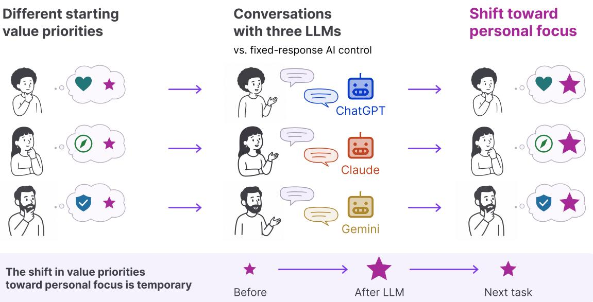  
Fig. 1. Overview of our three-phase study (� = 200). Participants wrote advice and reported value priorities for a diferent dilemma in each phase. Participants were randomly assigned to converse with ChatGPT, Claude, or Gemini, or read fixed AI-generated text in Phase-2. Phase-1 and Phase-3 involved no AI. Conversations shifted priorities toward personal relative to social focus (larger stars) in Phase-2; the shift receded by Phase-3.

Large language models increasingly support decisions where values are in tension, yet little is known about whether interacting with them changes which values users prioritize. In a preregistered study, 200 U.S. adults interacted with ChatGPT, Claude, or Gemini as a thinking partner or read fixed AI-generated considerations. The prompt asked LLMs to support reasoning without recommending a decision and named no values. Participants advised people facing real dilemmas and completed parallel PVQ-RR forms before,

Authors’ Contact Information: Hasibur Rahman, Northeastern University, Boston, Massachusetts, USA, rahman.has@northeastern.edu; Malak Sadek Centre for Human-Inspired Artificial Intelligence (CHIA) and University of Cambridge, Cambridge, United Kingdom, mfzas2@cam.ac.uk; Smit Desai, Northeastern University, Boston, Massachusetts, USA, sm.desai@northeastern.edu.

Permission to make digital or hard copies of all or part of this work for personal or classroom use is granted without fee provided that copies are not made or distributed for profit or commercial advantage and that copies bear this notice and the full citation on the first page. Copyrights for components of this work owned by others than the author(s) must be honored. Abstracting with credit is permitted. To copy otherwise, or republish, to post on servers or to redistribute to lists, requires prior specific permission and/or a fee. Request permissions from permissions@acm.org.   
© 2018 Copyright held by the owner/author(s). Publication rights licensed to ACM.   
Manuscript submitted to ACM

immediately after, and one task later. Each LLM condition temporarily shifted value priorities toward personal focus relative to the control $( d = 0 . 3 7 - 0 . 5 1 )$ , primarily through increased Self-Enhancement. Participants’ advice retained words and meaning from their exchanges. Thus, a brief LLM interaction that neither targets values nor seeks to persuade can reorient values active during judgment without detectable convergence in value directions or advice.

CCS Concepts: • Human-centered computing → Empirical studies in HCI; Natural language interfaces; • Applied computing → Psychology.

Additional Key Words and Phrases: Large language models, human–AI interaction, human values, value priorities, value change, AI-supported decision-making

## ACM Reference Format:

Hasibur Rahman, Malak Sadek, and Smit Desai. 2018. Deflecting the Value Compass: Interacting with Large Language Models Temporarily Shifts Human Value Priorities Toward Personal Focus. In Proceedings ofMake sure to enter the correct conference title from your rights confirmation email (Conference acronym ’XX). ACM, New York, NY, USA, 38 pages. https://doi.org/XXXXXXX.XXXXXXX

## 1 Introduction

People increasingly turn to large language models to reason through decisions in which their values pull in diferent directions. Someone is ofered a better-paid job in another city, while their partner prefers the city where they currently live. The decision brings personal advancement into tension with commitments to a close other. They ask an LLM what is worth weighing. The model presents considerations on both sides and leaves the choice to them. Yet apparent balance can conceal unequal emphasis: the exchange may dwell on career opportunity or devote more attention to the relationship Conversations like this now happen at enormous scale [19]. If a short exchange changes the relative importance of those considerations, it has shifted the values guiding the decision without ever making a recommendation.

Values are trans-situational goals whose importance is understood relative to other values, rather than at fixed levels [112]. A person may care about both personal advancement and their relationship; their relative priority helps guide the choice [106]. Schwartz’s refined theory arranges nineteen values on a circular motivational continuum and aggregates them into four higher-order values: Openness to Change, Self-Enhancement, Conservation, and Self-Transcendence. These four can be further grouped along a personal-social division. Personal focus combines Openness to Change and Self-Enhancement, capturing values that regulate the expression of personal interests. Social focus combines Conservation and Self-Transcendence, capturing values that regulate one’s relations with others [114]. The decision above can therefore be understood partly along this axis: how much weight to give personal advancement relative to commitments to a close other.

A person’s broader value hierarchy generally changes slowly over years [9]. The values active during a particular judgment, however, are responsive to context and especially predictive of the choice made at that moment [106, 133]. Brief interventions can move reported value priorities [82, 100], as can the act of asking people to reflect on them [13]. A short interaction could therefore reorient the values active during deliberation without producing an enduring change in the person’s broader hierarchy.

There is also reason to examine the direction of any such movement. Mainstream LLMs have been found to express a narrow set of human values aligned with Western, Educated, Industrialized, Rich and Democratic (WEIRD) populations [122]. More broadly, research on AI development has shown how technical systems can reproduce the priorities of those who build them [14, 51]. These findings characterize patterns in system outputs. Whether ordinary interaction with these systems reorients the value priorities people bring to a decision remains open. Manuscript submitted to ACM

Additionally, prior work has established that writing alongside an LLM configured to favor one side of a debate produces text that leans the model’s way and, afterward, reported attitudes that lean the same way [57]. Advice from a model on moral dilemmas can similarly shift subsequent judgments toward the position it expresses [70]. In both cases, the model advances a discernible direction. A thinking partner occupies a subtler role. Such systems are intended to extend users’ reasoning through feedback and reflective questions while leaving the eventual judgment to them [64, 98, 123]. Even within that role, an LLM selects which considerations to raise, how to frame them, and how much attention each receives.

This distinction is important because prior research has primarily examined changes in what people think, say, or produce about a particular issue. Attitudes and outputs are object-specific, whereas values are abstract and help organize how people resolve conflicts across situations [110]. A temporary reorientation of the values active during judgment could therefore shape a decision even when the LLM neither advocates a position nor settles the choice. We investigate whether this occurs, how long it lasts, and whether a common directional movement makes participants values or subsequent advice more alike by asking the following questions:

• RQ1. Does interacting with an LLM shift participants’ reported value priorities relative to a non-interactive AI control, and does any shift persist into a subsequent task without the LLM?

• RQ2. How does interacting with an LLM afect the direction, magnitude, and dispersion of participants’ value profiles?

• RQ3. How do participants perceive the LLMs, do these perceptions difer across providers, and do they predict variation in value-priority shifts?

• RQ4. What linguistic and semantic traces of participants’ LLM exchanges remain in their subsequent advice, and does that advice converge across participants?

We report a preregistered experiment with 200 U.S. adults (Figure 1). Across three phases, participants read diferent real dilemmas contributed by advice seekers, wrote the advice they would give, and completed parallel forms of Schwartz’s PVQ-RR. The experimental conditions diverged during Phase-2. Participants assigned to ChatGPT, Claude, or Gemini interacted with the model for up to ten minutes under the same thinking-partner prompt. The prompt named no values and prohibited the LLM from advocating for values, recommending an action, or settling the dilemma. Participants in the control read fixed AI-generated considerations synthesized from the same three models but could not send follow-up messages. All participants then wrote advice and completed the same measures. Phase-3 introduced another dilemma without an LLM in any condition, allowing us to examine what remained by the following task. The advice-giving format held the value conflict constant while psychological distance foregrounded abstract, desirabilitybased considerations [27, 126].

Immediately after Phase-2, participants in each LLM condition shifted toward personal focus by 0.31–0.43 scale points relative to the control (Glass � = 0.37–0.51), primarily through increased Self-Enhancement. The four higher-order values rotated together, and the three LLM conditions moved along closely aligned bearings. By Phase-3, the contrasts with the control had shrunk to near zero and none survived correction. This common movement occurred without detectable convergence in value directions or advice. Their advice nevertheless retained words and meaning specific to their own exchanges. Participants’ perceptions of the LLMs did not difer across providers and did not predict the shift.

These results make three contributions:

• Empirically, we provide controlled evidence that brief interaction with three commercial LLMs under a nondirective thinking-partner role can temporarily shift reported value priorities toward personal focus beyond exposure to fixed AI-generated considerations.

• Conceptually, we identify a form of LLM influence in which participants move in a common direction and show exchange-specific uptake without detectable convergence in value directions or advice.

• For the evaluation of human–AI interaction, we show that timing and outcome measures materially afect whether influence is visible. Immediate value measures captured a shift that had largely receded by the following task, while participants’ perceptions of the systems did not track who moved.

## 2 Related Work

## 2.1 Defining and Measuring Human Values

A significant body of work has explored the interplay between various technologies and human values [15, 102, 128, 132]. The nature ofhuman values is heavily debated, with numerous definitions [69, 124, 131] and operationalizations [68, 129] available. We take values to mean concepts that people consider important in their lives, govern how they wish and choose to live, and help them distinguish between positive and negative outcomes and behaviors [36]

While values themselves are enduring, value expressions and priorities are flexible [8, 82]. Prioritized values difer across countries and cultures [111]; even within narrower groups, technology-related values difer dramatically by factors such as job roles [58], technical expertise [14, 51], and demographic factors [104]. More microscopically, at the individual level, values can change across situations [40], throughout their lives [88], and in response to certain triggers or interventions [31], including simply being asked about values [102].

We use value priorities to refer to the expression of values activated during a particular judgment. A person’s underlying value hierarchy is usually stable and only changes gradually over the years [9, 10]. Specific value priorities in a given moment, however, are more context-sensitive. Values influence a choice when they are activated, and the values active at that moment best predict the choice [106, 133]. Social cognition explains why such expression should shift after a brief exposure and then fade. A construct made accessible by recent exposure shapes how later ambiguous information is interpreted, and its influence weakens as the interval since exposure lengthens [47, 49, 52, 121]. Prior studies have therefore measured reported priorities immediately after a value-relevant task to capture short-term changes in their ordering [82, 100].

A review of 25 value-manipulation experiments confirms that reported value priorities can be moved with small-tomedium efects [100]. After one 30-minute intervention, efects were still detectable four weeks later [7]. Additionally, those manipulations were directive in that they asked participants to analyze reasons for named values, primed particular values, or induced dissatisfaction through self-confrontation or mortality salience [13, 81, 82, 100, 143]. These findings establish that targeted interventions can shift reported priorities, but leave open whether a conversation with an LLM that neither names values nor advocates for them can do so. This gap motivates RQ1 to determine whether such a task shifts priorities at all.

The Portrait Values Questionnaire (PVQ) is among the most established instruments for measuring values and detecting value-priority shifts. Its revised 57-item form, the PVQ-RR [113], operationalizes Schwartz’s refined theory of basic individual values [114], partitioning the ten basic values of the original theory [110] into nineteen narrower values arranged on the same circular scale. Values adjacent on the circle express compatible motivations and tend to be endorsed together, while values opposite on the circle express conflicting motivations and trade of. The nineteen Manuscript submitted to ACM

values aggregate into four higher-order values forming two dimensions: openness to change against conservation, and self-enhancement against self-transcendence [110]. A personal–social division crosses the circle, separating values that regulate one’s own interests from those that regulate relations with others [114]. This structure lets us ask not only whether priorities shift, but also which motivations gain relative importance. For RQ1, the personal–social division lets us examine the direction of any shift.

2.1.1 Whose Values? Value Skew in Large Language Models. Values are not universal [129, 130], and imposing one set of values on diverse contexts and users has been widely criticized [77, 92, 120, 135]. Nevertheless, AI systems have been found to embody a narrow set of values [58, 103], particularly those of their creators [14, 51]. Current alignment practices further narrow them, with standard procedures found to reduce distributional pluralism [120], and people supplying preference data disagree widely across cultures [66].

For LLMs, the skew is consistently in one direction. Audits across value frameworks, languages, personas, and cross-cultural dilemmas find that commercial models align with Western, Educated, Industrialized, Rich, and Democratic (WEIRD) populations [3, 14, 18, 61, 62, 80, 95, 108, 122, 137, 147], and models that complete the PVQ-RR themselves diverge from human baselines [42]. These are descriptions of outputs, which vary with wording and steering [101, 109], but the WEIRD-skew persists across paraphrases, translations, and personas [72, 84], predicts model behavior [142], and surfaces in deployment, where the values a model expresses are task-dependent and partly mirror the user’s own [54].

Output skew alone does not establish whether users adopt similar priorities from a single conversation when LLMs neither advocate nor name values. LLMs can influence perceptions [75] and opinions [57], while value priorities respond to situations and experiences [31, 40, 82]. Together, these findings motivate RQ1 to ask whether priorities shift after a non-directive conversation and whether they shift toward personal rather than social focus.

## 2.2 The Impacts of Large Language Models on Users

General concerns about the impacts of AI systems [59] are amplified by LLMs’ social and interactive nature [116]. LLMs can persuade users [37, 41, 107], deceive users [43, 145], and foster unhealthy reliance [22, 34] in users. Participants who wrote with an LLM that was biased toward one side of a debate and later reported attitudes leaning that way [57]. Most participants were unaware of the influence, warnings did not mitigate it, and an interactive assistant moved attitudes more than the same suggestions shown as static text [140]. These findings leave open whether influence found with a deliberately biased assistant extends to a non-directive thinking partner.

Related to this work, Teng et al. [125] found that five-minute chats with a chatbot prompted to shift moral judgments shifted participants’ judgments for two weeks, while neutral chats produced no change. Participants rated the chatbots similarly in likability and convincingness. This comparison establishes an efect of directed moral persuasion relative to an unrelated conversation; it leaves open what happens when an LLM supports deliberation about a dilemma without an assigned persuasive direction. It also leaves a distinction between verdict changes and changes in relative value priorities that may inform judgments across situations. RQ1 examines the latter after a thinking-partner conversation.

Research shows that these impacts outlast an LLM interaction. For example, LLM-generated messages durably persuaded users politically at scale [41] and extended dialogues with LLMs durably decreased users’ belief in conspiracy theories [24]. These impacts also carry over into tasks without the system. For example, self-confidence converged with an AI advisor’s expressed confidence and stayed aligned in later unassisted decisions [76], self-reported personality moved toward a chatbot’s traits [75], chatbot interaction changed what users then disclosed to a human professional [73, 74], and AI influence spilled into unrelated human-human interactions, described as a “social forcefield” beyond the exchange itself [45, 99]. Such carryover predates LLMs, as when people’s behavior shifts to match a digital avatar representing them [144]. This evidence motivates RQ1’s follow-up question of whether a value-priority shift persists during a subsequent advice task without the LLM.

The following sections situate the LLM’s role in research on conversational reflection and deliberation, then examine how an exchange can leave traces in what users write. In our study, the LLM supported the participant’s reasoning, and the participant authored advice for the person facing the dilemma.

2.2.1 LLM Supportfor Reflection and Deliberation. Research on LLM thinking partners examines how systems can complement people’s reasoning through interaction [23]. Within HCI, LLMs have been used to help users articulate assumptions and reconsider their reasoning. ProberBot prompted reflection during investment decisions through questions [97], while ExtendAI embedded feedback in users’ rationales and compared this support with recommendationbased assistance [98]. More recently, a Socratic LLM questioned annotators’ reasoning while leaving conclusions to them [64], and Reflecti-Mate used adaptive questions to support reflection on personal decisions without directive advice [123]. These systems situate LLM assistance within the process through which users develop a judgment.

This setting raises a question about what users prioritize as they reason. Communication can afect the relative importance assigned to considerations in a judgment [21], suggesting that deliberative support could shift priorities even without a supplied recommendation. RQ1 examines whether reported value priorities change following a thinking partner exchange with no assigned persuasive direction, relative to a fixed presentation of AI-generated considerations

Advice-giving ofers a setting for such deliberation. Everyday dilemmas drawn from online advice communities expose conflicts between values [35, 79]. Advising another person creates psychological distance that foregrounds abstract, desirability-based considerations [27, 126]. Written advice makes the considerations behind a judgment available for analysis. When developed through conversation with an LLM, this reasoning may also retain language and ideas from the exchange, connecting deliberative support to research on LLMs’ influence on users’ writing. Advicegiving tasks, therefore, let us examine whether LLM-supported deliberation shifts reported value priorities (RQ1) and leaves detectable traces in the reasoning participants subsequently express (RQ4).

2.2.2 The impacts of LLMs on users’ writing outputs. LLMs’ impacts also travel through language. Speakers converge linguistically with their partners automatically during dialogue [17, 93], including with computers [16]. Writing with LLMs shifts opinions [57], self-concept [75], and style [1]. Because LLMs default to Western conventions, this convergence pulls non-Western users’ writing toward those norms unless they prompt against it [1], a hidden cost for the Majority World that runs from stereotype reinforcement and global power imbalances to less usable and more harmful systems [33, 44, 86, 89, 91, 105, 118, 147]. At the collective level it flattens output, where stories written with AI ideas resemble one another more than stories written without [32], creative writing and crowd work homogenize [1, 134], and outputs converge toward an algorithmic monoculture [55, 67].

This convergence may also feed back on users through their own language. Communicators who tailor a message afterward remember and evaluate its subject in line with what they wrote [48], and people infer their attitudes partly from their own behavior [12]. When writing precedes measurement, model wording reproduced in their own text is a candidate channel for a shift, distinct from reading the model’s output. RQ4 asks whether this channel is present, whether it carries meaning as well as words, and whether adoption is uniform across users or specific to each conversation. The homogenization findings also motivate RQ2, which distinguishes convergence in profile direction from changes in the spread of profile magnitudes, complementing RQ1.

Manuscript submitted to ACM

2.2.3 User perceptions as mediators of LLM impacts. Users apply human social rules to computers while knowing they are not people [87, 96]. The metaphor introducing an LLM as a collaborator versus a tool changes how people evaluate and use it, even when its behavior is held constant [28–30, 65], and an LLM’s linguistic persona shapes trust, likeability, and adoption [38, 94]. Whether an LLM acts as advisor, peer, or decision-maker changes how far users’ self-confidence follows it [76], and systems that extend users’ reasoning without a verdict behave diferently from those that recommend one [26, 98].

Despite this, whether favorable user perceptions make a model more impactful is still debated. Perception measures did not distinguish a persuasive LLM from a neutral one [125], and persuasion survived disclosure [37]. These mixed findings motivate RQ3, asking how participants perceive their conversational LLM partner, whether perceptions difer across providers, and whether more favorable ratings predict larger value-priority shifts.

## 3 Study Method

We ran a preregistered Institutional Review Board-approved study with 200 adults to test whether brief LLM conversation changes personal value priorities. Participants were randomly assigned to ChatGPT, Claude, Gemini, or Baseline. In each of three phases, they read an advice-seeking dilemma, wrote advice, and answered a values questionnaire. Conditions difered only in Phase-2: conversational participants chatted with a live LLM introduced as a thinking partner before writing advice; Baseline read a fixed AI-generated response to the same dilemma, synthesized from the same three LLMs’ outputs and delivered by the same assistant in the same interface (§3.3.2). Baseline is therefore an AI condition without conversation; the Phase-2 contrast isolates the LLM interaction

We first describe value measurement (§3.1), then the dilemmas, advice task, and counterbalancing (§3.2), the LLM conversation and static control (§3.3), advice, perception, and intake measures (§3.4), and the procedure (§3.5).

The LLM supported deliberation while participants decided what advice to give. We tested for shifts in reported value priorities and traces of the exchange in subsequent advice. Centered PVQ-RR scores were the primary self-report outcome; advice provided a complementary record of expressed reasoning. We compared conversational participants’ Phase-2 advice with their own LLM’s turns and a yoked conversation from the same model and dilemma. For Baseline, the source was the fixed response read (§3.4.1).

## 3.1 Measuring Value Priorities

We operationalized value priority at the higher-order level, validated three parallel PVQ-RR forms, centered participants’ ratings, and defined the change estimated by each condition contrast.

3.1.1 Construct and primary axis. The PVQ-RR represents 19 refined values arranged in a circular motivational continuum. Schwartz groups these values into four higher-order dimensions: Openness to Change, Self-Enhancement, Conservation, and Self-Transcendence [112, 114]. We use these four dimensions throughout because they define the value profile and the personal-versus-social contrast examined in our RQs. We did not analyze the 19 refined values separately. The rotation decomposition likewise uses the four higher-order dimensions (Section 3.7).

These dimensions define the built-in contrast in the dilemmas. Openness to Change and Self-Enhancement form the personal pole, whereas Conservation and Self-Transcendence form the social pole [112, 113]. Their diference is our primary outcome because it connects the value measure to the personal-versus-social choice presented by each dilemma (Figure 2). LLM-side evidence of value skewness motivates personal-versus-social comparison (§2.1.1).

Manuscript submitted to ACM

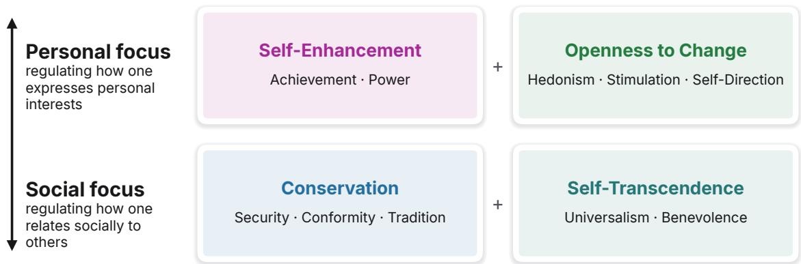  
Fig. 2. The personal-versus-social value axis used as this study’s primary outcome. Personal focus combines Openness to Change and Self-Enhancement; social focus combines Conservation and Self-Transcendence. Each dilemma supports a defensible recommendation aligned with either pole. The cards list the ten basic values nested within the four higher-order groups. Adapted from Schwartz’s value circle and its personal-focus and social-focus grouping [112, 114].

3.1.2 PVQ-RR and its parallel forms. To measure the four higher-order dimensions across three phases without repeating portraits, we constructed parallel forms of the PVQ-RR. The full instrument has 57 portraits, three per refined value [113, 114], rated from 1 (not like me at all) to 6 (very much like me).

We divided the instrument into blocks A (items 1–19), B (20–38), and C (39–57), each with one item per refined value. Each block measured Openness to Change with four items (including Hedonism), Self-Enhancement with three, and Conservation and Self-Transcendence with five each. Face and Humility entered the centering mean, but not these scores, because each spans neighboring dimensions. Participants completed one block per phase, with no repeated portraits and item order randomized within each block and phase. Published reliability estimates use three items per refined value and do not validate these one-item-per-value blocks [113]; we therefore pre-validated them at the analyzed higher-order level (§3.1.1). All outcomes are multi-item composites: higher-order scores average three to five items, and the personal-focus axis compares seven with ten. A sensitivity check assigning Face to Conservation and Humility to Self-Transcendence yielded a nearly identical axis (� = .985), larger Phase-2 contrasts, and Phase-3 contrasts still near zero.

The pre-study recruited 100 people under the study criteria. They completed all 57 items in a randomized block order, one block at a time. Block higher-order scores correlated 0.88–0.97 with full-instrument scores. All 12 block-to-full and all 12 block-to-block comparisons were equivalent within 0.5 scale points by two one-sided tests [71]. Single-block intraclass correlations were 0.66–0.84 (mean 0.76), and three-block correlations were 0.85–0.94 [119]. Mean pairwise correlation was 0.79; full-instrument Cronbach’s � was 0.86–0.93. These results support the 19-item parallel forms at the higher-order level (Table 3).

Blocks retained small mean ofsets, reaching 0.37 scale points for Openness to Change and Self-Enhancement; Self-Transcendence showed no block efect (� = .589). We counterbalanced block order independently of condition and included block as a covariate in every model. Thus, ofsets were not systematically tied to phase or condition and were adjusted in condition-by-phase contrasts (§3.1.4).

3.1.3 From ratings to priorities. Parallel forms make phases comparable, but value priorities also require separating relative importance from response-scale use: rating every item 5 or every item 3 expresses the same priorities. Schwartz Manuscript submitted to ACM

therefore recommends subtracting each person’s mean rating (MRAT) across all value items to express relative importance rather than general scale use [112]. For each phase’s parallel form, we subtracted its MRAT across all 19 responses, including Face and Humility, from its four higher-order scores [112]. We also report uncentered group means and MRAT shifts because centered scores can decrease as MRAT increases, even when raw group means change little.

Centering makes the four group scores compositional. They sum to approximately zero, so a rise in one mechanically pushes others down [2]. This dependence suits relative priorities, but reduced between-person spread in centered profiles cannot establish declining absolute endorsement. We therefore separate profile direction from magnitude for RQ2 and repeat the spread analysis with uncentered scores and MRAT (Appendix A).

We computed the primary personal-focus axis from the centered scores. Personal focus is the item-count-weighted mean of Openness to Change (OC) and Self-Enhancement (SE); social focus is the item-count-weighted mean of Conservation (CO) and Self-Transcendence (ST). The axis is their diference, positive toward personal focus:

$$
\frac { 4 \mathrm { O C } + 3 \mathrm { S E } } { 7 } - \frac { 5 \mathrm { C O } + 5 \mathrm { S T } } { 1 0 } .
$$

The weights keep both composites on the raw PVQ-RR scale, so zero indicates equal weight on the two poles. Face and Humility enter only through MRAT.

3.1.4 What the design estimates. Our estimand is a change rather than a score level. Let $\mu _ { c , p }$ be the adjusted mean for condition � at phase �, and � be Baseline. For each conversational condition and $\textstyle p \in \{ 2 , 3 \}$

$$
\tau _ { c , p } = ( \mu _ { c , p } - \mu _ { c , 1 } ) - ( \mu _ { B , p } - \mu _ { B , 1 } ) .
$$

Thus, $\tau _ { c , p }$ is the Phase-1 change relative to the non-interactive AI control.

The contrast accounts for the shared dilemma–advice–PVQ-RR sequence, with counterbalancing and covariate adjustment addressing form and order diferences (§3.2.2). We report $\tau _ { c , p }$ as the primary result and each condition’s change for context.

## 3.2 The Dilemmas

Value priorities become most visible when judgments pit conflicting values against each other, and advice-giving foregrounds abstract, desirability-based considerations (§2.2.1). Each dilemma, therefore, pitted personal against social focus, matching our primary axis. In every phase, participants read a dilemma in which someone else sought advice and wrote their advice.

3.2.1 Designing and validating the dilemmas. We used third-party advice tasks to hold the conflict constant while requiring a value-laden stance. Participants’ own dilemmas would introduce personal stakes we could not equate across the sample; shared dilemmas made task conditions comparable for examining priorities and written reasoning. The inventory immediately followed the advice. Baseline followed the same dilemma–advice–inventory path (§3.3.2), so the conversational contrast estimates the increment over an AI-generated consideration.

We selected three dilemmas from VALACT-15K, a corpus of real advice-seeking Reddit posts mapped onto Schwartz’s values [53]. Selection required comparable reading demands, the same personal-versus-social conflict across diferent everyday decisions, and explicit mention of considerations aligned with both poles. We first retained posts of 200–600 words; an LLM shortlisted 30 in which the four higher-order values supported distinct actions. Three researcher consensus rounds narrowed these to 12, then 6, then 3, excluding posts involving sexual content, potentially distressing

Manuscript submitted to ACM

material, or physical or psychological abuse. The retained posts preserved the same value structure across career, family, and household decisions.

The retained dilemmas preserved each poster’s first-person voice. We removed identifying details, including ethnicity markers.

Job asks whether a person should accept a better-paid, more senior position in another city or remain in a preferred city with a partner who likes the current city but dislikes his job

Family concerns an 18-year-old with a sports scholarship who wants to become a personal trainer. His stepfather wants him to study law to preserve the family’s reputation, while his mother works night shifts and wants peace at home.

Move-out concerns a 23-year-old who pays half the household rent and provides most of the care for a younger sibling with a learning disability. He has signed a tenancy agreement two hours away while the family’s finances deteriorate.

Together, the dilemmas vary in decision context while holding the personal-versus-social conflict constant. We did not score the recommendation direction; instead, the advice task required active engagement with each dilemma and provided RQ4’s behavioral record.

3.2.2 The advice task. At each phase, participants wrote advice in a plain editor with pasting and drag-and-drop disabled. Responses required at least 30 words, with no upper limit. This minimum followed evidence that Divergent Semantic Integration (DSI) scores stabilize for texts of roughly 30–50 words [60].

We counterbalanced dilemma and PVQ-RR block order with six Williams-balanced Graeco-Latin square sequences [139]. Each participant encountered every dilemma and block once; each appeared in every phase across sequences, with reversed sequences balancing first-order carryover. Item order was randomized within each block and phase. We rotated sequences within each between-participant condition. Because 50 participants cannot divide equally among six sequences, models adjusted for block, dilemma, and sequence (§3.7).

## 3.3 The LLM Conversation and the Non-Interactive AI Control

We designed the interaction to support participants’ deliberation. An LLM prompted to stay neutral can still move preferences after a short exchange [141], so the thinking-partner stance controls the manipulation. One prompt, identical across ChatGPT, Claude, and Gemini, instructed models to support reasoning while leaving recommendations to participants, with no target recommendation to promote.

Within these role constraints, the conversation was unscripted after a shared opener and without a response template [146]. Content and emphasis could therefore develop organically with the participant’s contributions in each exchange, so that similarity across exchanges and subsequent advice could be examined empirically.

3.3.1 LLM conversation. The shared prompt prohibited advocating for values, recommending actions, or settling the dilemma. The system prompt varied only in the dilemma text; replies remained unscripted. The role clause reads:

You are a thinking partner helping the reader reason through what to recommend, never telling them what to recommend and never settling it for them

To avoid eliciting agreement with an initial participant lean [20, 56, 117], every conversation began with the same uneditable click-to-send message: Manuscript submitted to ACM

I just read this situation and I have to write up what I’d recommend. Before I do, what are the main things worth weighing here?

Participants then typed freely with the dilemma visible. The interface identified the model only as an AI assistant, subtitled “Thinking partner”. The continue button appeared after five participant messages, or when the ten-minute cap elapsed.

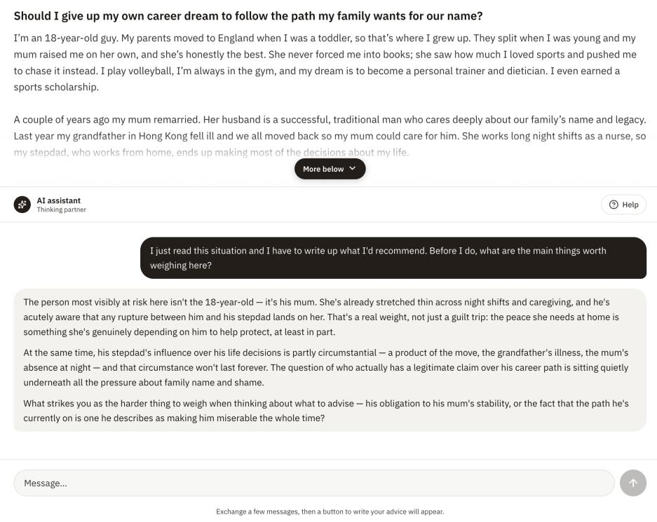  
Fig. 3. Study interface in a conversational condition. The scrollable dilemma remains above the exchange. A shared “AI assistant” header and a “Thinking partner” subtitle conceal the provider’s identity. For Baseline, the text input was disabled.

Generation settings were identical across the three models. Calls went through OpenRouter to openai/gpt-5.4, anthropic/claude-sonnet-4.6, and google/gemini-3-flash-preview, with temperature 0.7. The request set no token cap, top\_p, or seed. Median first replies ranged from 87 to 191 words across providers (§4.1).

3.3.2 The non-interactive AI control. Baseline retained exposure to AI-written text, AI attribution, and the interface, but ofered no exchange (§2.2.2 and §2.2.1). For each dilemma, the same three models restated the facts and considerations already expressed in the dilemmas. This changed their presentation without adding new considerations or advocacy.

An LLM synthesized overlapping content into one fixed response per dilemma. Pairwise cosine similarities among the source responses were 0.836 for Job, 0.724 for Family, and 0.763 for Move-out. Each synthesis spanned 345–359 words and had cosine similarity above 0.85 to every source. The control was thus synthesized across providers rather than provider-matched.

Participants read the response under the same AI-assistant header and “Thinking partner” subtitle, retaining the dilemma panel and message format but removing the composer. Everyone assigned a dilemma read the same response, Manuscript submitted to ACM then completed the same advice, PVQ-RR, and perception tasks as conversational participants. Thus, the contrast compared live, non-directive exchange with fixed presentation of existing considerations. Time on task outside the manipulation window did not difer across conditions (§4.1). The fixed passage also served as a known source for validating the text-overlap measures (§4.5.1).

## 3.4 Advice, Perception, and Intake Measures

The PVQ-RR is the primary outcome measure. Advice texts address RQ4, perception measures address $\mathrm { R Q } 3 ,$ , and intake measures describe the sample.

3.4.1 Advice texts. We measured traces of the AI source, semantic focus, and similarity of the written advice across participants. Let $a _ { i }$ be participant �’s Phase-2 advice and �� the concatenated messages they received. Bold symbols denote ℓ -normalized embeddings; unit(v) normalizes a vector.

Each advice text was compared with its own source and a yoked source from the same provider and dilemma. Within each cell, participants were paired in data order with the next participant, wrapping around so each source served once as a yoke. For Baseline, we compared the passage read with one for an unseen dilemma as a positive control; identical fixed passages would yield no contrast.

We measured resemblance lexically and semantically. Lexical overlap was

$$
m _ { n } ( a , s ) \ = \ { \frac { | G _ { n } ( a ) \cap G _ { n } ( s ) | } { | G _ { n } ( a ) | } } ,
$$

where $G _ { n } ( t )$ is the set of distinct content-word �-grams after lowercasing and removing a fixed English stopword list. We scored $n = 1 , 2 ,$ , and 3 and report the two-word score as phrase overlap. Semantic overlap was $m _ { \cos } ( a , s ) = \mathbf { a } ^ { \top } s$

To distinguish uptake specific to an exchange from content shared across its provider and dilemma, we projected each source embedding onto a centroid of other sources and retained the orthogonal remainder:

$$
\mathbf { c } _ { i } \ = \ \mathrm { u n i t } \Big ( \frac { 1 } { k } \sum _ { j \in K _ { i } } \mathbf { s } _ { j } \Big ) , \qquad \mathbf { u } _ { i } \ = \ \mathrm { u n i t } \big ( \mathbf { s } _ { i } - \big ( \mathbf { s } _ { i } ^ { \top } \mathbf { c } _ { i } \big ) \mathbf { c } _ { i } \big ) ,
$$

Here, $K _ { i }$ is a fixed random set of � other participants in the same cell, $\mathbf { c } _ { i }$ its centroid, and $\mathbf { u } _ { i }$ the normalized residual. For comparable centroid precision, � was one less than the smallest provider cell for each dilemma.

We measured semantic focus with Divergent Semantic Integration (DSI), adapted to sentence pairs [60]:

$$
\mathrm { D S I } ( a ) ~ = ~ { \frac { 2 } { S ( S - 1 ) } } \sum _ { p < q } \bigl ( 1 - { \bf x } _ { p } ^ { \top } { \bf x } _ { q } \bigr ) ,
$$

where $\mathbf { x } _ { 1 } , \ldots , \mathbf { x } _ { S }$ are the embeddings of the text’s � sentences. High DSI indicates more distinct ideas; low DSI indicates greater semantic focus. We split on sentence-final punctuation, used semicolons and line breaks when fewer than two segments remained, and retained segments of at least three words.

Between-person similarity was each text’s cosine distance from the other texts in the same condition, phase, and dilemma:

$$
d _ { i } \ = \ 1 \ - \ \mathbf { a } _ { i } ^ { \top } \ \mathrm { u n i t } \Big ( \frac { 1 } { n _ { c } - 1 } \sum _ { j \neq i } \mathbf { a } _ { j } \Big ) ,
$$

Manuscript submitted to ACM

where $n _ { c }$ is the cell size. Lower $d _ { i }$ indicates greater between-person similarity [4]. The measure is undefined for cells with fewer than three texts.

All semantic measures used text-embedding-3-small. We also recorded advice length and sentence count. Vocabulary range used the moving-average type-token ratio over a 25-token window [25, 83], and repetition used a compression-based score residualized for length

3.4.2 Perception measures. After Phase-2, participants rated their LLM on seven measures covering interaction, ability, and humanness [138]. Single 1–7 items adapted from Cheng et al. [20] measured response quality, whether LLMs behavior in this situation was right or wrong, and willingness to reuse it for similar questions. Godspeed likeability and perceived intelligence scales [11] each averaged five 1–5 semantic diferential pairs. Performance and moral trust used the Multi-Dimensional Measure of Trust [127], each rated 0–7. Table 5 reports Cronbach’s � for every multi-item measure.

All 200 participants completed these measures, including Baseline, in which participants rated the AI assistant’s response they had read. RQ3 asks whether the three providers difered and whether ratings tracked the Phase-2 shift, so analyses use the 150 conversational participants; Baseline’s ratings are reported descriptively alongside them (§4.4).

3.4.3 Intake. The intake questionnaire describes the sample. It recorded age group, gender, race and ethnicity, education, whether English was the participant’s primary language, and AI-tool familiarity and use frequency (each on a 1–5 scale). Participants also completed the Short Schwartz Value Survey (SSVS) once, rating ten values from 0 to 8 [78].

## 3.5 Procedure

Participants joined through Prolific and completed a fixed-order session in a custom application (Figure 4). We measured priorities before manipulation, immediately after, and after a further task, each with a diferent dilemma assigned by the square in §3.2.2.

Intake. After reading study information and consenting, participants completed demographics and the Short Schwartz Value Survey. They were told the study concerned advice-giving and LLM assessment, without disclosure that it measured value-priority change.

Phase-1. Participants read their first dilemma, wrote at least 30 words of advice, and completed a PVQ-RR block. No condition involved AI, establishing the untreated starting level for both later phases

Phase-2. Participants read a second dilemma. Conversational participants talked with their assigned model while the dilemma remained visible, proceeding after five messages or the time cap. Baseline scrolled through and read the assistant’s fixed response on the same screen. All then wrote advice, completed a PVQ-RR block, and rated the AI just encountered.

Phase-3. To test carryover and outcome-specific durability (§2.2), participants read the remaining dilemma, wrote advice without AI in any condition, and completed the final PVQ-RR block, measuring what remains after the LLM is gone.

Debriefing. We disclosed the value-priority-shift objective and named the three commercial systems as examples without identifying participants’ assigned model. Participants could withdraw their data, then return to Prolific with a completion code.

## 3.6 Participants

We recruited 200 U.S.-based adults (50 per condition) via Prolific who were fluent in English. We ran an a priori power analysis for a four-condition between-participant comparison at � = .05. Fifty participants per condition give 85% power to detect a medium efect (Cohen’s � = .25) and more than 99% power to detect a one-standard-deviation diference Manuscript submitted to ACM between any two conditions [90]. Estimates of spread carry wider intervals than estimates of means at the same sample size, so a design that can resolve a mean shift (RQ1) can still miss a change in spread (RQ2). We therefore report a minimum detectable efect at 80% power beside every null.

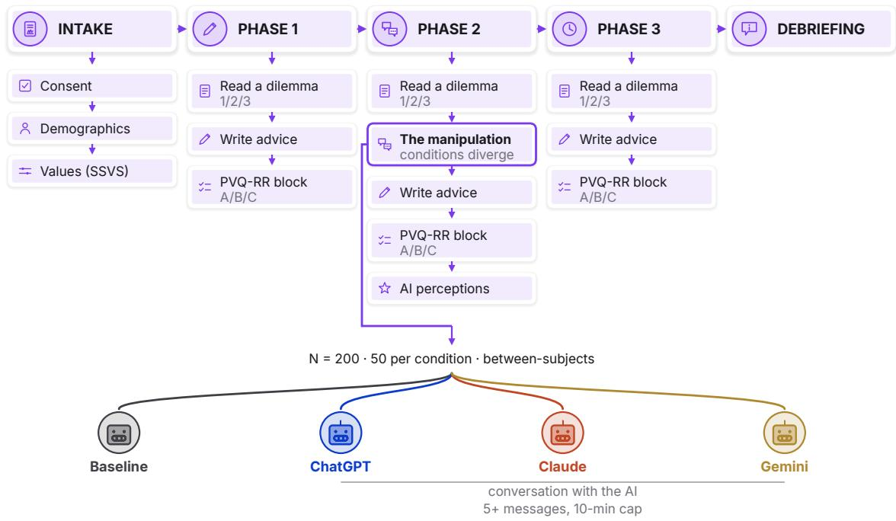  
Fig. 4. Study procedure. Conditions difer only at Phase-2, step 2. The three conversational arms talk with a live model for at least five messages under a ten-minute cap; Baseline reads a fixed response to the same dilemma, synthesized from outputs of the same three models, from the same AI assistant on the same screen with the composer removed. Dilemma order and PVQ-RR block order are Williams-balanced.

The sample included 99 women, 99 men, and 2 nonbinary participants; 57 were aged 18–29, 98 aged 30–49, 37 aged 50–64, and 8 aged 65 or older. Intake data, including SSVS scores, did not difer significantly across conditions (all $p \ge . 0 8 ; \mathrm { S S V S }$ mean rating, Kruskal–Wallis $H ( 3 ) = 3 . 1 5 , p = . 3 7 0 )$

Participants received \$11.96/hr; median session time was 28.8 minutes (IQR = 22.0–35.3). All 200 participants completed all three PVQ-RR blocks and entered the analysis.

## 3.7 Data Analysis

We fit random-intercept mixed models by restricted maximum likelihood in statsmodels [115], used scipy for tests, correlations, and ANOVAs, and set seed 20260805 for bootstrap, permutation, and yoking streams. We checked model convergence and fixed-efects rank. Unless noted otherwise, each outcome used

$$
\mathtt { s c o r e \sim p h a s e \times c o n d i t i o n + p v q \_ b l o c k + d i l e m m a + s e q u e n c e + ( 1 \mid p e r s o n ) , }
$$

Manuscript submitted to ACM

with Baseline as the reference. A single fit supplied all phase changes and condition-minus-Baseline contrasts, holding block, dilemma, and sequence fixed. Within-participant contrasts had 388 degrees of freedom: 600 observations minus 200 participants minus the within-person fixed-efects rank of 12.

Efect sizes, multiplicity, and nulls. We report 95% confidence intervals and Glass’s $d _ { \mathrm { G } } = \widehat { \Delta } / s _ { 1 } \ [ 3 9 ]$ , using the pooled Phase-1 standard deviation across conditions as a fixed, untreated scale; paired own-versus-yoked comparisons use $d _ { z }$ All tests are two-sided at $\alpha = . 0 5$ , with realized-standard-error MDEs at 80% power for null results.

Holm adjustment [50] covered these families: three condition-minus-Baseline contrasts per phase for the axis, spread, DSI, and advice distance; four higher-order groups per condition and contrast; three provider pairs per phase; perception measures, with pairwise tests only after a significant omnibus; and three �-gram lengths per condition. Own changes and Phase-2-to-Phase-3 decay contrasts are descriptive and unadjusted.

RQ1: value-priority shift. RQ1 mixed models tested priority shifts in the personal-focus axis and four centered higher-order scores, contrasting each condition with Baseline in Phases 2 and 3 and comparing Phase-2 with Phase-3 for decay.

Because values form a circle, we also rewrite each condition’s mean change Δ across the four groups as an exact change of basis, not a fitted model. Openness to Change, Self-Transcendence, Conservation, and Self-Enhancement sit at $0 ^ { \circ } , 9 0 ^ { \circ } , 1 8 0 ^ { \circ }$ , and $2 7 0 ^ { \circ }$

$$
\Delta ( \theta ) = a _ { 0 } + a \cos \theta + b \sin \theta + q \cos 2 \theta .
$$

Amplitude is $\sqrt { a ^ { 2 } + b ^ { 2 } }$ and angle is atan $2 ( b , a )$ , with personal focus at $3 1 5 ^ { \circ }$ . The $q$ term is the quadrupole, the part of the change that no coordinated turn can produce. Intervals are derived from 10,000 bootstrap resamples of participants within each condition, with bearings averaged as unit vectors so that intervals do not wrap at $0 ^ { \circ }$ . We compared the largest gap between the three providers’ bearings with the distribution of that gap under permuted provider labels, which asks whether the observed agreement is what three providers pushing in one direction would produce. We also re-estimated the Phase-2 contrast while adjusting for each participant’s Phase-1 score and tested whether Phase-1 means difered across conditions.

RQ2: similarity of profiles. At each phase, to test for homogenization, we scored the leave-one-out distance from each participant’s four-value profile $\mathbf { x } _ { i }$ to their condition’s mean with that person omitted,

$$
d _ { i } = \lVert { \bf x } _ { i } - \bar { \bf x } _ { ( - i ) } \rVert .
$$

We entered these distances into the same mixed model, adapting the leave-one-out diversity statistic used for AI-assisted texts to value profiles [4, 32].

To distinguish directional convergence from changes in the spread of profile magnitudes, we repeated the spread calculation separately for profile direction (unit vectors) and magnitude (Euclidean length). For this decomposition, we excluded 12 participants with zero-magnitude profiles in at least one phase, for which direction is undefined, and used the remaining 188 for all components. To account for dependence through shared centroids, permutation tests reshufled condition labels and rebuilt all centroids [5, 6]. Appendix A reports six spread definitions, leave-one-participant-out estimate ranges, and checks adjusting for Phase-1 spread or individual MRAT change.

RQ3: perceptions. RQ3 analyzed provider diferences and associations with the Phase-2 shift in the 150 conversational participants. We compared providers on seven measures using one-way analyses of variance, Holm-adjusted p-values, Manuscript submitted to ACM and Welch pairwise tests after significant omnibus tests. We report Baseline ratings descriptively in a four-condition comparison. Because the measures intercorrelate, we also tested a favorability composite averaging their �-scores. We regressed the signed Phase-2 axis shift on the seven measures and computed partial correlations after residualizing both sides on provider. We did not use distance between a participant’s Phase-1 and Phase-3 value vectors as shift magnitude: these vectors use diferent parallel forms, so a norm would rectify form error rather than average it out.

RQ4: traces in the advice texts. For Phase-2 advice, written immediately after the AI exposure, uptake was the own-minus-yoked overlap (§3.4.1),

$$
\Delta _ { i } \ = \ m \big ( a _ { i } , s _ { i } \big ) \ - \ m \big ( a _ { i } , s _ { y ( i ) } \big ) ,
$$

where � is either overlap measure and $y ( i )$ the yoked participant. Matching sources on provider and dilemma isolates resemblance specific to the participant’s exchange. One-sample � tests compared $\Delta _ { i }$ with zero; follow-up semantic tests replaced $\mathbf { s } _ { i }$ with $\mathbf { u } _ { i }$ to assess uptake beyond shared source content. The RQ1 mixed model also tested DSI, sentence count, vocabulary range, length-residualized repetition, and leave-one-out advice-embedding distance. Permutation tests assessed whether dilemma or condition structured the first two embedding principal components; inference applies to that two-dimensional map, not the full embedding space.

Manipulation checks. We compared conversational conditions on advice length, total words typed excluding the scripted opener, and words per typed turn. Because counts are right-skewed, we tested log words with Welch tests and Holm adjustment across three provider pairs. We compared LLM verbosity likewise, including first-reply length after the identical opener. To account for provider verbosity diferences, we added words received as a covariate on the Phase-2 axis and tested provider diferences with and without it. Within-provider uniformity was mean pairwise cosine across diferent participants’ assistant turns within each dilemma, compared with the corresponding quantity across participants’ own messages.

## 4 Results

The primary value-shift and whole-profile spread analyses included all 200 participants who completed the three PVQ-RR blocks (50 per condition). We implemented the Williams-balanced design for counterbalancing [136]. At each phase, the four conditions had identical scenario sequences and PVQ-RR block compositions. Internal consistency was high for most perception measures (Table 5).

In this section, we present the results of our four research questions. We first establish that participants engaged similarly with the three LLMs, and that their visible diferences do not confound the efects. We then present RQ1, which examines how value priorities changed before and after the LLM conversations. After that, in RQ2, we examine whether participants’ value profiles became less dispersed in direction or magnitude after the LLM conversation. Then, in RQ3, we present whether participants’ perception measures of the three LLMs are related to their value shifts. Finally, we move to RQ4, presenting whether the LLMs left their traces in the participants’ written advice. In each research question, we present our statistical tests and robustness analyses.

Unless noted otherwise, all estimates come from the mixed models in §3.7. We use Baseline as the reference condition and apply Holm correction within each family of tests. For null results, we report the minimum detectable efect (MDE) at 80% power. We do not treat a nonsignificant result as evidence of no efect. Appendix A reports the supporting analyses. Detailed results are included in the supplementary materials.

Manuscript submitted to ACM

## 4.1 Manipulation check

Participants engaged with all three LLMs at similar levels. Advice length, total words typed, and words per turn were comparable across conditions (smallest Holm $p = . 5 8 5 ;$ minimum detectable ratio ≈1.4×), and each condition had a median of five turns. Each LLM also gave similar replies across participants. Replies from the same LLM had mean pairwise cosine similarities of 0.882–0.895, compared with 0.492–0.562 among participants’ messages.

The LLMs difered in first-reply length (medians: 191 words for Claude, 151 for ChatGPT, and 87 for Gemini; $F ( 2 , 1 4 7 ) = 2 6 7 . 4 7 , p < . 0 0 1 )$ ). Words received did not predict the Phase-2 shift (−0.030 per 100 words; minimum detectable slope 0.098). Adjusting for words received did not change the comparison among the three providers (Table 6).

Time on task difered only at Phase-2. Phase-1 durations of 8.1–9.6 minutes and Phase-3 durations of $5 . 9 \mathrm { - } 6 . 5$ minutes were comparable across conditions $( H ( 3 ) = 1 . 3 7 , \dot { p } = . 7 1 4 ; H ( 3 ) = 1 . 6 3 , \dot { p } = . 6 5 2 )$ . At Phase-2, the conversational conditions took $1 2 . 4 \mathrm { - } 1 3 . 7$ minutes compared with 9.1 minutes for Baseline, a median gap of 3.7 minutes $( H ( 3 ) = 2 0 . 1 1$ $\textstyle p < . 0 0 1 )$ . Because the conversation required at least five messages, the design does not separate interaction from the additional time it required.

## 4.2 RQ1: LLM conversations temporarily shifted value priorities toward personal focus

In our study, each dilemma pitted personal interests against social interests. To highlight the value shift, we therefore used the personal focus score on the Personal Focus versus Social Focus axis as the primary outcome. The score equals Openness to Change and Self-Enhancement minus Conservation and Self-Transcendence, weighted to remain on the raw PVQ scale. All four conditions began on the social side of the Personal Focus versus Social Focus axis (Phase-1 means −0.29 to −0.47). At Phase-2, the three LLM conditions moved to the personal side. They moved back by Phase-3 Baseline instead rose gradually across all three phases (Figure 5).

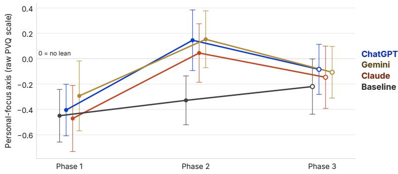  
Fig. 5. Reported value priorities moved toward personal focus following the exchange and moved back by the next task. Mean personal-focus score at each phase, in raw PVQ scale points, with 95% confidence intervals; $n = 5 0$ per condition. Each score is measured after that phase’s dilemma and advice task. The three LLM conditions rise sharply at Phase-2 and fall by Phase-3. Baseline rises gradually. Zero indicates equal weight on personal and social focus.

From Phase-1 to Phase- $^ { - 2 , }$ personal focus increased relative to Baseline by +0.429 in ChatGPT (Glass $d = 0 . 5 1$ , Holm $\begin{array} { r } { p = . 0 0 4 ) } \end{array}$ , +0.384 in Claude $( d = 0 . 4 6 , p = . 0 0 8 )$ , and +0.312 in Gemini $( d = 0 . 3 7 , p = . 0 2 0 )$ . The shifts were similar across providers: the largest gap was 0.145 scale points, compared with an MDE of 0.372 (Figure 6).

Manuscript submitted to ACM

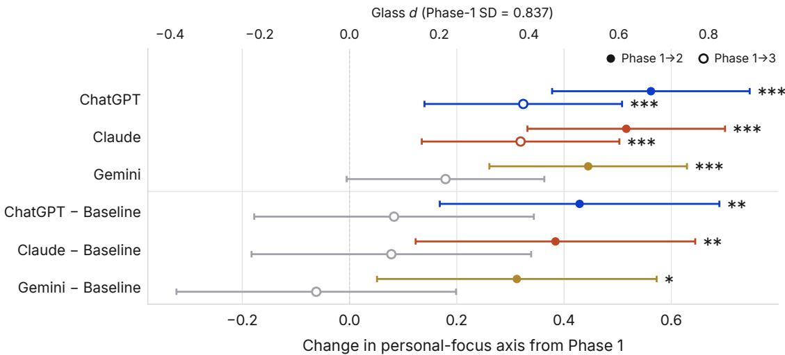  
Fig. 6. The Phase-2 value shift did not persist to Phase-3. Change in the personal-focus axis from Phase-1, with 95% confidence intervals. Filled dots show Phase-2, and hollow rings show Phase-3. The upper rows show each LLM condition’s change; the lower rows show its contrast with Baseline. The secondary axis expresses the same estimates as Glass �, using the Phase-1 SD (0.837). Color marks indicate estimates that survive Holm correction

By Phase-3, the LLM contrasts with Baseline ranged from −0.062 to +0.083, and none survived correction. From Phase-2 to Phase-3, scores fell by 0.198–0.265 across the LLM conditions (all $\begin{array} { r } { p \le . 0 3 6 ) } \end{array}$ , returning toward their Phase-1 levels. Baseline changed by only +0.108

Self-Enhancement accounted for the shift, increasing by +0.537 to +0.586 relative to Baseline (all Holm � ≤ .002). No condition-by-value contrast remained significant at Phase-3. Centered Self-Transcendence also fell, but the raw score changed little $( \Delta = - 0 . 0 1 \mathrm { t o } - 0 . 2 0 )$ while participants’ mean rating across all PVQ-RR items rose (ΔMRAT = +0.07 to +0.26). Subtracting this overall rise made centered Self-Transcendence appear lower; participants did not report a comparable decline in concern for others.

Using Schwartz’s value circle [114], we summarized the direction and magnitude of each condition’s mean change (Table 1). At Phase-2, rotation accounted for at least 99% of the change in each LLM condition. The rotations were within 15–25◦ of the personal-focus pole, and the personal-focus axis accounted for 90–97% of their amplitude. The three providers’ bearings spanned only 10.4◦, a gap that small or smaller arising in 22% of permutations of the provider labels, so their directions are consistent with one common bearing; the per-condition intervals span roughly ±20◦. Baseline moved in a diferent direction with about one-third the amplitude. By Phase-3, the LLM amplitudes had fallen to 0.22–0.24, indicating a weaker rotation in the same general direction (Figure 7).

The Phase-2 shift was unchanged after adjustment for Phase-1 scores (Table 6).

4.2.1 The shift is not a property of the measurement seting. Every PVQ-RR block followed a dilemma and an advice task, so the measurement setting itself could in principle produce a shift (§3.1.4). The comparisons across conditions and phases do not support that account.

Baseline followed the same dilemma–advice–PVQ-RR sequence and met the same AI assistant, but read rather than conversed (§3.3.2). Its Phase-1-to-Phase-2 movement had an amplitude of 0.150 [0.050, 0.278] and a bearing of 17◦, Manuscript submitted to ACM

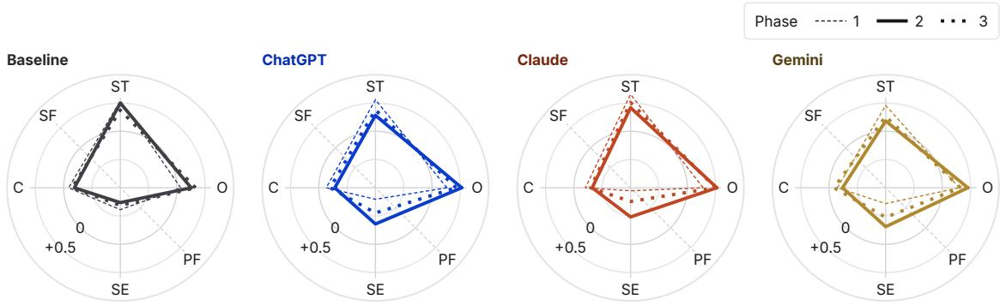  
Fig. 7. The value shift was a temporary rotation toward personal focus. Mean value profiles across the four Schwartz higherorder poles: Self-Transcendence (ST), Self-Enhancement (SE), Openness to Change (O), and Conservation (C). Radius is each value’s deviation from the participant’s mean rating across all 19 items; rings mark −0.5, 0, and +0.5. Dashed, solid, and doted outlines show Phases 1, 2, and 3. The conversational conditions shift toward the personal-focus axis in Phase-2 and return by Phase-3, whereas Baseline drifts without returning.

Table 1. The Phase-2 change in value priorities forms one rotation. Amplitude gives the size of each condition’s mean change on the value circle, and angle gives its direction. Rotation share is the percentage explained by the two rotation components. The remaining percentage is the quadrupole component, which does not describe a rotation. 0◦ is Openness to Change, and 315◦ is the personal-focus pole. Brackets give 95% confidence intervals
<table><tr><td>Condition</td><td>Amplitude</td><td>Angle</td><td>Rotation share</td></tr><tr><td colspan="4">Phase-1 → Phase-2</td></tr><tr><td>Baseline</td><td>0.150 [0.050, 0.278]</td><td>17° [325°, 67°]</td><td>74.7%</td></tr><tr><td>ChatGPT</td><td>0.412 [0.222, 0.621]</td><td>300° [280°, 326°]</td><td>99.8%</td></tr><tr><td>Claude</td><td>0.394 [0.281, 0.522]</td><td>298° [280°, 316°]</td><td>99.1%</td></tr><tr><td>Gemini</td><td>0.363 [0.213, 0.539]</td><td>290° [269°, 311°]</td><td>99.5%</td></tr><tr><td colspan="4">Phase-1 → Phase-3</td></tr><tr><td>Baseline</td><td>0.168 [0.071, 0.293]</td><td>345° [300°, 28°]</td><td>54.1%</td></tr><tr><td>ChatGPT</td><td>0.240 [0.107, 0.409]</td><td>299° [269°, 346°]</td><td>99.8%</td></tr><tr><td>Claude</td><td>0.228 [0.133, 0.348]</td><td>313° [279°, 345°]</td><td>98.5%</td></tr><tr><td>Gemini</td><td>0.221 [0.094, 0.392]</td><td>265° [224°, 311°]</td><td>99.7%</td></tr></table>

about one-third the amplitude of the conversational conditions and in a diferent direction from their 290–300◦ bearings (Table 1). The adjusted conversational contrasts remained +0.312 to +0.429. Phase-3 repeated the same measurement sequence without an LLM, but its contrasts with Baseline ranged from −0.062 to +0.083 and none survived correction. The conversational conditions also fell 0.198–0.265 from Phase-2 (all $\begin{array} { r } { p \le . 0 3 6 ) } \end{array}$ . The shift therefore appeared at the manipulation phase rather than whenever the questionnaire followed a value-laden task.

The pattern was also not tied to one dilemma or a few salient value items. Rotation accounted for at least 99% of the Phase-2 movement in every conversational condition. Dilemma order was counterbalanced, and the models held dilemma fixed.

Still, participants can move in the same direction without becoming more alike. RQ2 tests whether they became more similar to one another.

Summary. LLM conversations temporarily moved value priorities toward personal focus by 0.31–0.43 scale points over Baseline $( d = 0 . 3 7 - 0 . 5 1 )$ . Higher Self-Enhancement scores accounted for this shift. We observed the same directional pattern along the personal-versus-social axis across all three LLMs.

## 4.3 RQ2: Value profiles became less varied in magnitude after conversation, not more similar

Participants can shift in the same direction without becoming more alike. We therefore measured the distance between each participant’s value profile and the average profile for their condition to test whether they became more alike after LLM conversation. We left that participant out when calculating the condition average. Using the same mixed-model structure as RQ1, we compared changes in these distances between each LLM condition and Baseline.

At Phase-2, the spread contrasts with Baseline ranged from −0.068 to −0.275, and none survived correction (smallest Holm $ { p } = . 0 6 1 )$ . The diference appeared at Phase-3, when spread fell by 7.6%–22.4% in the LLM conditions but rose by 11.5% in Baseline. Relative to Baseline, the Phase-3 contrasts were −0.353 for ChatGPT (Holm � = .006), −0.436 for Gemini $( p < . 0 0 1 )$ ), and −0.222 for Claude $\left( \mathinner { p \mathopen { \left/ { \vphantom { \left( p \Theta 1 \right)}  } \right.}  \kern - delimiterspace } = . 0 6 1 \right)$ . The three LLM providers did not difer at either phase.

The change in spread, therefore, occurred later than the value shift: for the pooled conversational conditions, the Phase-3 contrast was 0.190 more negative than the Phase-2 contrast $( p = . 0 4 9 )$ . Both sides contributed. Spread in Baseline rose by +0.145, whereas the spread in the LLM conditions fell by a median of 0.150, with decreases in all three conditions (Figure 8).

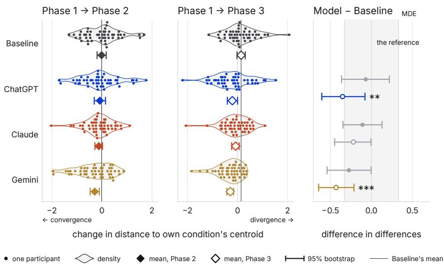  
Fig. 8. Between-person spread contracted only at the later endpoint. Each dot shows one participant’s change in distance from the average profile for their condition. Values to the left show less spread; values to the right show more spread. Each outline shows the distribution of the 50 values in that row, using the same bandwidth and height scale across rows. The first two panels show changes from Phase-1 to Phases 2 and 3. Diamonds show condition means with 95% bootstrap intervals. The right-most pane compares each LLM with Baseline and shows the MDE band (±0.330). Color marks the significance

Pooling the conversational conditions, we separated directional spread from spread in profile magnitude (Table 2). The contraction in spread at Phase 3 reflected a reduction in between-person variation in profile magnitude. The Phase-3 Manuscript submitted to ACM

diference in changes relative to Baseline was −0.255 (� = .004), equivalent to 39% of Phase-1 spread. We detected no corresponding contraction in directional spread $( - 0 . 0 3 8 , p = . 6 0 1 )$ . A circular decomposition showed the same pattern. Angular spread changed by only $- 5 . 2 ^ { \circ }$ (MDE 22.8 ), while amplitude spread decreased descriptively by −0.111.

The Phase-3 contraction was robust to randomization inference, alternative definitions of spread, adjustment for Phase-1 spread, and leave-one-participant-out analyses (Table 4). We found no evidence that participants converged on a common value ranking. The contraction instead reflected reduced between-person variation in profile magnitude. §4.5.3 tests whether their written advice became more alike.

Table 2. Changes in spread of whole profiles, directions, and magnitudes, comparing pooled participants from ChatGPT, Claude, and Gemini with Baseline $( N = 1 8 8 ) .$ . Spread is calculated within each original condition. Estimates are diferences in changes from Phase-1 to each later phase; negative estimates indicate greater contraction in the conversational conditions. Percentages express Phase-3 contrasts relative to Phase-1 spread.
<table><tr><td></td><td colspan="2">P1 → P2</td><td colspan="2">P1 → P3</td><td>P3 as % of</td></tr><tr><td>Space</td><td>Estimate</td><td>p</td><td>Estimate</td><td>p</td><td>P1 spread</td></tr><tr><td>Whole profile</td><td>-0.127</td><td>.267</td><td>-0.346</td><td>&lt; .001</td><td>-26.7%</td></tr><tr><td>Shape only</td><td>+0.143</td><td>.037</td><td>-0.038</td><td>.601</td><td>-4.8%</td></tr><tr><td>Magnitude only</td><td>-0.075</td><td>.446</td><td>-0.255</td><td>.004</td><td>-39.0%</td></tr></table>

Summary. By Phase-3, value profiles were less spread out relative to Baseline. The pooled decomposition located this contraction in the spread of profile magnitudes, with no detected contraction in directional spread.

## 4.4 RQ3: All three LLMs were rated favorably, and we detected no provider diferences

Diferences in how participants viewed the LLMs could explain the value shift. For example, a better-liked LLM might have been more influential. We therefore tested whether the three LLMs difered on the perception measures and whether those measures were associated with participants’ value shifts. The tests below are estimated on the 150 participants in the LLM conditions; we report Baseline ratings descriptively at the end of this section.

Every LLM received a mean rating above the midpoint of every scale, with means ranging from 56% to 80% of the scale range. No measure difered by provider after Holm correction; the largest observed gap was 0.70 scale points, compared with an MDE of 0.73 (Figure 9; Table 5).

The seven perception measures were strongly correlated (mean � = 0.78), so we summarized them with a standardized composite favorability score $( \alpha = 0 . 9 6 )$ . This score also did not difer by provider, $F ( 2 , 1 4 7 ) = 1 . 3 0 , p = . 2 7 5$

The seven perception measures jointly explained 7.5% of variation in the Phase-2 shift, but the regression was not statistically significant $( p = . 1 3 1 )$ ). No individual Pearson correlation survived Holm correction. In the separate partial-correlation analysis, adjusting for provider left the strongest association, with response quality, essentially unchanged. These ratings do not explain the shared shift, although our sample cannot rule out modest diferences between providers.

In the Baseline condition, participants also evaluated the AI favorably, with every mean above the corresponding scale midpoint. Its overall favorability score was 0.20 SD below the pooled conversational conditions, a diference we did not detect as significant $( p = . 1 9 7 ; \mathrm { M D E } d = 0 . 4 8 )$ . We therefore detected no perceptual advantage for interaction over the fixed-response AI-attributed Baseline.

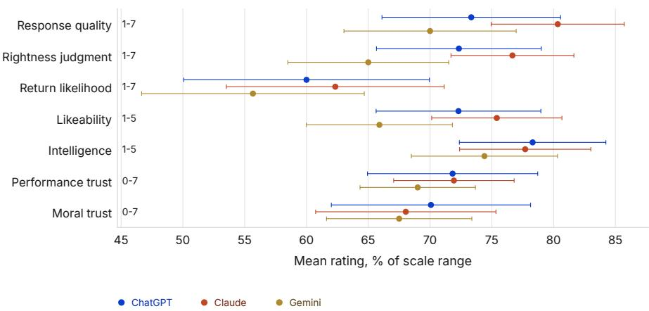  
Fig. 9. Participants rated all three LLMs favorably. Means and 95% confidence intervals are shown as percentages of each measure’s scale range so that the $0 ^ { - 7 , ~ 1 - 5 , }$ , and 1–7 scales can be compared. No measure difered by provider after Holm correction. The largest gap was 0.70 scale points for rightness, compared with an MDE of 0.73. The combined favorability score also did not difer, $F ( 2 , 1 4 7 ) = 1 . 3 0 , p = . 2 7 5$

Summary. Participants rated all three LLMs above the midpoint of every scale, and no diference between providers survived correction. These ratings also did not predict participants’ value shifts, so they do not explain the shared shift.

## 4.5 RQ4: Participants used language from their own LLM in their advice and wrote more semantically focused advice

We next turn from what participants reported to what they produced. At Phase-2, participants wrote about the dilemma they had just discussed with an LLM. Phase-1 occurred before the conversation, and Phase-3 used a new dilemma without an LLM. We first test whether participants reused words or ideas from their own LLM’s replies. We then test how their advice changed and whether participants assigned to the same provider wrote more similar advice.

4.5.1 Participants reused their own LLM’s words and meaning. Two texts about the same dilemma will share some words even if neither influenced the other. We therefore compared each advice text with two sets of LLM messages. The first contained the messages that the participant’s own LLM sent them. The second contained LLM messages from another participant’s conversation with the same model about the same dilemma, which we call the matched (yoked) conversation. This comparison holds the dilemma and LLM provider constant while varying whether the messages came from the participant’s own interaction or a matched one. Any remaining diference, therefore, captures how much more the advice resembled the messages the participant’s own LLM sent.

Phase-2 advice shared more content words with the participant’s own LLM than with the matched messages. The diferences were +0.065 for ChatGPT, +0.068 for Claude, and +0.052 for Gemini $( d _ { z } = 0 . 4 9 , 0 . 5 0 $ , and 0.41). Semantic similarity was also higher by +0.031, +0.030, and +0.023 $( d _ { z } = 0 . 9 1 , 0 . 5 7$ , and 0.56; all Holm $ { p } < . 0 0 1 )$ ). Two-word phrase Manuscript submitted to ACM

overlap survived correction only for ChatGPT (+0.026, � = .003; Figure 10). The longest shared sequence averaged only 1.4–1.6 content words, indicating reuse rather than verbatim copying.

As a positive control, Baseline advice more closely resembled the passage participants read than a passage about an unseen dilemma $( + 0 . 1 3 4 , d _ { z } = 1 . 2 3 , p < . 0 0 1 )$

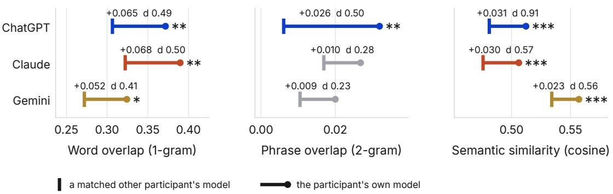  
Fig. 10. Participants’ advice resembled their own LLM’s messages. Panels show content-word overlap, two-word phrase overlap, and cosine similarity between the advice and source-message embeddings. Ticks show similarity to LLM messages from another participant’s conversation with the same model about the same dilemma. Dots show similarity to the messages the participant’s own LLM sent. All three providers showed diferences in content-word overlap and semantic similarity.

4.5.2 Participants’ own writing became more semanticallyfocused. We next tested whether the advice became more focused. We used Divergent Semantic Integration (DSI), the mean pairwise cosine distance among the sentences in each advice text. A high DSI means that the text covers more distinct ideas. A low DSI means that it stays focused on a narrower set of ideas. We compared each participant’s DSI across phases while holding the dilemma fixed.

Relative to Baseline, the adjusted Phase-2 DSI contrast was −0.064 for ChatGPT (Holm � = .004), −0.043 for Gemini $( p = . 0 5 7 )$ , and −0.029 for Claude (� = .137). All three estimates favored greater semantic focus, but only the ChatGPT contrast survived correction (Figure 11).

We found no corresponding changes in vocabulary, repetition, sentence count, or advice length.

The change in DSI was also temporary. By Phase-3, each LLM condition was within 0.003 of its Phase-1 level, and none difered from Baseline (MDE 0.055). Thus, semantic focus followed the same Phase-2-to-Phase-3 pattern as the value shift.

4.5.3 The influence was tailored to each conversation, and the advice did not converge. Participants can draw from their own conversations without becoming more alike as a group. To separate individualized influence from global influence, we split each participant’s LLM messages into components shared with other participants in the same condition and dilemma, and the remainder specific to that participant. We then repeated the comparison between each participant’s own conversation and another participant’s conversation with the same model about the same dilemma (§4.5.1). Advice was more similar to the participant-specific part of their own LLM’s messages than to that of the matched messages. The diferences were +0.099, +0.095, and +0.066 for ChatGPT, Claude, and Gemini $( d _ { z } = 0 . 9 2 , 0 . 6 0 $ , and 0.56).

The dilemma itself strongly shaped the advice. Among all 200 Phase-2 texts, the dilemma explained 81% of variation in the two-dimensional embedding map $( p < . 0 0 1 )$ , while condition explained 0.6% $\left( \boldsymbol { p } = . 8 9 0 \right)$ . The four conditions were Manuscript submitted to ACM mixed within the three dilemma groups (Figure 12). Pairwise comparisons and comparisons across phases showed the same pattern, so all convergence tests controlled for dilemma.

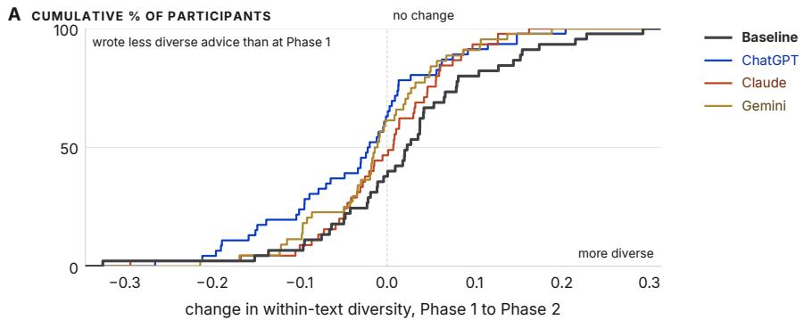

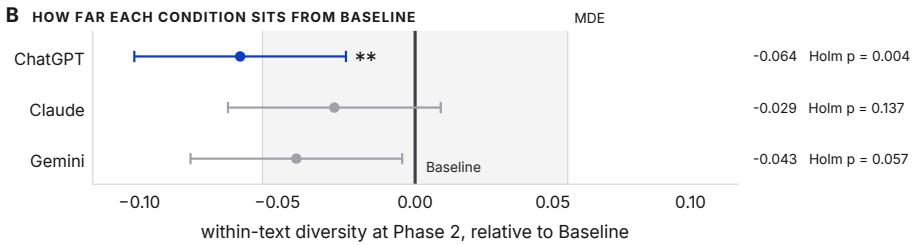  
Fig. 11. Advice shifted toward greater semantic focus, most clearly in ChatGPT. Within-text diversity is the mean pairwise cosine distance among an advice text’s sentences. (A) Cumulative distributions of each participant’s Phase-1-to-Phase-2 change. (B) Adjusted contrasts with Baseline, shown against the MDE band (0.055). All estimates are negative; only ChatGPT survives Holm correction (−0.064, � = .004).

We detected no condition-level convergence in advice. Relative to Baseline, changes in leave-one-out cosine distance ranged from −0.0009 to +0.0167 (all Holm � = 1.00). The providers also produced similarly dispersed advice. At the participant level, uptake was not related to convergence in advice or value profiles. The exchange, therefore, left detectable traces in individual advice texts without detectable convergence across participants.

Summary. Participants aligned locally with their own LLM conversation rather than globally with one another. They reused their model’s words and meaning in advice they wrote themselves. This influence was personalized through LLM replies shaped by their own questions. Their advice also shifted toward greater semantic focus as a trend without becoming shorter, more repetitive, or less lexically diverse, and returned to its Phase-1 level on the same timeline as the value shift.

## 5 Discussion

Our results reveal two important patterns. First, brief interactions with each of three commercial LLMs produced the same temporary reorientation of participants’ reported values toward a more personal focus, with higher relative priorities assigned for Openness to Change and Self-Enhancement, over Conservation and Self-Transcendence. Highe Self-Enhancement accounted for most of this shift, while raw Self-Transcendence changed little. The movement formed Manuscript submitted to ACM

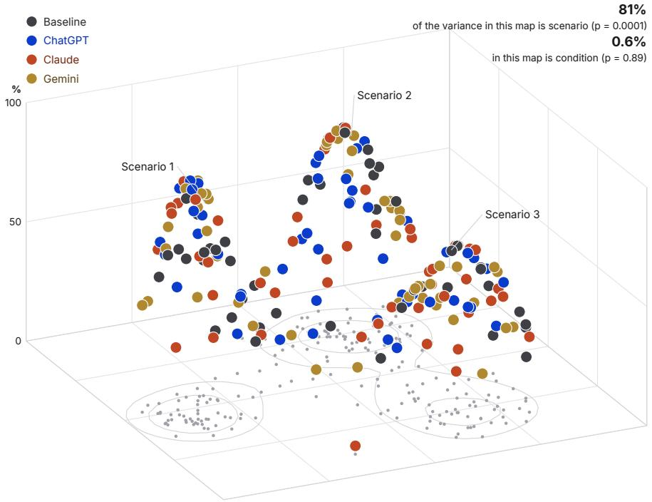  
Fig. 12. Advice grouped by dilemma, not by provider All 200 Phase-2 advice texts in a single embedding landscape. Height is the density of the pooled sample, and color is the condition, interleaved throughout. Three islands appear, one per scenario: 81% of the variance in this map is scenario (� = .0001) and 0.6% is condition (� = .89).

a coherent rotation around Schwartz’s value circle, appeared only during the LLM phase, and had receded by the next task.

Second, this reorientation occurred without detectable convergence in value directions or advice. Their advice retained words and meaning from their own exchanges and became more semantically focused. The later contraction in value-profile spread in Phase-3 instead reflected reduced between-person variation in profile magnitude. Participants also rated all three LLMs favorably, but these perceptions neither distinguished the providers nor explained the shift.

We begin by interpreting the efects on participants’ value priorities as a temporary reorientation that occurs during the period in which judgment was being formed. We then turn to its direction. Personal focus is culturally situated and corresponds to the broader WEIRD-aligned orientation documented in prior audits of commercial LLMs. We consider what it means that three systems moved participants along this shared axis through locally diferent exchanges, and how the common movement can occur without detectable convergence in value directions or advice. Together, these findings raise implications for how HCI understands LLMs’ impacts on the homogenization of outputs users produce and on their values, and evaluates the neutrality of non-directive LLM decision support.

## 5.1 A Temporary Reorientation of Value Priorities

A conversation lasting no more than ten minutes shifted participants’ reported value priorities toward personal focus by 0.31–0.43 scale points over the non-interactive AI control $( d = 0 . 3 7 - 0 . 5 1 )$ . The pattern appeared independently Manuscript submitted to ACM in the ChatGPT, Claude, and Gemini conditions, under the same thinking-partner prompt and opening question. By Phase-3, the contrasts with Baseline had shrunk to between −0.062 and +0.083, and none survived correction. The mean profiles in all three LLM conditions, therefore, moved around Schwartz’s value circle in the same direction and had returned toward their earlier positions by the next task.

Value theory provides a direct way to interpret this timing. A person’s broader value hierarchy generally changes slowly, through sustained experience and identification [9, 10, 63]. The values that become active during a particular judgment are more responsive to context, and these activated values are especially predictive of the choice made at that moment [106, 133]. Research on construct accessibility similarly shows that recently activated ideas can organize subsequent judgment before their influence weakens with time [47, 49, 121]. The Phase-2 movement fits this shorter process: the conversation temporarily changed the relative prominence of the values as participants reasoned and responded.

The timing of this efect is practically significant, as values active during a judgment are especially likely to organize that judgment [106, 133], and decision-support interactions often occur while users are forming a recommendation or deciding what to do [19]. A shift concentrated in this interval can therefore shape reasoning even when it recedes before a later task. This implication also matters for systems that elicit values through an LLM. A profile collected immediately after an exchange may partly reflect priorities made salient by the elicitation setting itself. Pre-interaction measurement, independent elicitation, or delayed reassessment would help distinguish a user’s broader priorities from those made prominent during the exchange.

One way to picture the result is as a compass briefly deflected by a nearby magnetic field: its reading turns under a local influence and relaxes once that influence passes. The analogy captures both the geometry and timing of the result. Rotation accounted for at least 99% of the Phase-2 movement in every LLM condition, meaning that the four higher-order values turned together around Schwartz’s circle. Baseline participants completed the same measurement sequence and encountered the same AI framing, yet showed a smaller, gradual movement on a diferent bearing. This image connects to Riedl et al. [99], who describe interaction with LLMs as a “social forcefield” whose efects extend into subsequent interactions with other people. The field observed here followed a shorter trajectory: its strongest efect was concentrated around the LLM interaction and had weakened by the next task.

This shorter trajectory adds a diferent timescale to the growing literature on carryover from human–AI interaction. Previous work has found that LLM-assisted writing can shift subsequent attitudes [57, 140], that users’ confidence can remain aligned with an AI advisor in later unaided decisions [76], and that conversational efects can extend to self-perception and later interactions with other people [45, 75, 99]. Other efects, including changes in conspiracy beliefs, have persisted over considerably longer periods [24].

Taken together, these findings suggest that the duration of an LLM’s influence depends on what is being shifted and how the interaction activates it. An AI’s social influence can extend beyond the immediate exchange on diferent timescales, sometimes persisting into later interactions and sometimes remaining concentrated within the period in which judgment is being formed. In our study, value priorities changed sharply within the conversational context and then receded rapidly.

Implication 1: LLM influence can be temporally concentrated. The value shift was strongest immediately after interaction and had receded by the next task, positioning the efect within the period in which participants were forming their judgments.

Manuscript submitted to ACM

Beyond its temporal aspect, the magnitude of this immediate movement is striking. Experimental attempts to change reported value priorities have generally used interventions that explicitly name, prime, or challenge particular values, producing small-to-medium efects [7, 81, 82, 100]. Our prompt named no values, assigned no persuasive direction, and explicitly instructed the LLM to leave the recommendation to the participant. Nevertheless, the observed efects fell within the same broad range. The comparison with Baseline further locates this movement beyond exposure to AI-attributed considerations alone, although the present design cannot separate the back-and-forth exchange from the additional reflection and time it occasioned.

Implication 2: Value activation does not necessarily require value-explicit prompting. A thinking partner interaction without naming values and any persuasive direction still produced a coordinated reorientation comparable in size to deliberate value interventions.

In summary, across all three systems, the interaction produced a short-lived but directionally consistent reweighting of the reported priorities to judgment without an explicit mention of values. Why, then, did three diferent LLMs all turn participants toward personal focus?

## 5.2 The Same Direction, Diferent Paths

The most plausible place to begin is with LLMs’ existing orientations. Across value frameworks and evaluation settings, mainstream systems have repeatedly expressed priorities aligned with WEIRD populations [14, 18, 62, 95, 108, 122, 147]. This pattern has appeared when models were administered the Schwartz PVQ-RR directly [42], and some value emphases persisted across paraphrases, translations, and assigned personas [72, 84]. Personal focus occupies the same broad cultural direction: national samples difer systematically along this axis, with WEIRD populations placing greater relative weight on autonomy, achievement, and the expression of personal interests [18, 46, 111]. The turn observed here, therefore, connects two bodies of evidence that have largely been studied separately. Prior work locates a value skew in what commercial LLMs produce; our results locate a corresponding movement in the people interacting with them.

The same direction across three model families points toward a regularity broader than the disposition of one provider. Commercial systems difer in architecture, presentation, and style, but they are developed within overlapping linguistic, cultural, and alignment environments [14]. Prior work has warned that these environments can narrow the range of values represented by aligned systems [120] and contribute to an algorithmic monoculture even when individual outputs appear varied [67]. Our findings suggest that such commonality may also be visible in the direction of LLMs’ influence on users’ values.

That reorientation appeared even among participants from the United States, one of the populations already most closely associated with this cultural profile. All four condition means began on the social side of the personal-social axis, yet the three LLM conditions crossed toward personal focus at Phase-2.

Implication 3: A shift toward personal focus can emerge as a shared cross-provider impact of LLM use. Three commercial LLMs produced the same broad change along a culturally situated value axis, connecting prior model-side evidence of WEIRD value skew with a corresponding human side shift resulting from interaction.

The common movement occurred without detectable convergence in value directions or advice. The estimates   
instead describe a shared vector of movement with diferent starting and ending points. Participants moved toward   
personal focus without detectable convergence in value directions. This distinction complicates existing accounts of Manuscript submitted to ACM

homogenization, which have primarily examined whether AI-assisted outputs become more alike [1, 32, 134]. Our results indicate that a systematic movement in users’ reported value priorities can occur without detectable convergence in their advice.

The RQ4 results help explain how these two patterns can coexist. Participants reused more words and meanings from their own exchange than from another participant’s conversation with the same model about the same dilemma (the matched exchange). Interactive alignment provides one account of how language becomes coordinated within such an exchange [17, 93]. Participants then reproduced parts of that language in advice they authored themselves, a process that prior work connects to subsequent judgments through saying-is-believing and self-perception efects [12, 48]. Uptake did not statistically explain individual value shifts, so it does not establish the mechanism behind them. It does, however, show that each local exchange entered the participant’s subsequent reasoning. Diferent conversational paths could therefore accompany the same aggregate shift without detectable convergence in advice.

The textual changes followed this pattern. Advice in the LLM conditions became more semantically focused relative to Baseline, most clearly in the ChatGPT condition, without becoming shorter, more repetitive, less lexically diverse, or detectably more similar across participants. The change was concentrated within individual responses rather than expressed as standardization across the group. At Phase-3, the value results showed another form of collective change: between-person spread in profile magnitudes contracted, with no detected contraction in directional spread. Mean profiles had moved back toward their Phase-1 positions, while between-person variation in profile magnitude had narrowed. An average return can therefore coexist with a change in the distribution around that average.

## Implication 4: Directional value influence and value and output homogenization are empirically

distinct. Participants moved in the same average direction without detectable convergence in value directions or advice.

These distinctions matter for how HCI studies evaluate AI’s influence on collective diversity [4, 32]. Measuring only the similarity of outputs would have missed the shared movement in value priorities. Measuring only the mean shif would have missed the later contraction in the spread of profile magnitudes. Claims about homogenization should therefore specify what has become more alike: the content people produce, the direction of their value priorities, or the magnitude with which those priorities are expressed. These outcomes diverged empirically in our study.

The findings also complicate familiar ideas of neutrality and user control. The thinking-partner prompt withheld recommendations, named no values, and repeatedly left the decision with the participant. Participants in the LLM conditions nevertheless shifted in the same direction. Neutrality at the level of verdicts, therefore, leaves open a deeper question of which considerations an LLM makes salient. Participants’ favorable ratings ofered little indication of this movement: the three providers were evaluated similarly, and those evaluations did not predict who shifted.

Implication 5: Non-directive support can still be normatively directional. The LLMs withheld recommendations and left the decision to participants, yet the mean value profiles shifted in a common direction that participants’ favorable evaluations did not reveal.

Overall, the findings describe a form of influence subtler than copying, overt persuasion, or uniform output. Three LLMs supported individualized exchanges that left distinct traces in participants’ advice, while the mean profiles in all three conditions moved along the same value axis, even though dilemmas were not personal. Research on sycophancy in personal conflicts and emerging reports of AI-associated delusions highlight concerns about reinforcement when users are personally involved [20, 85]. What happens when the dilemma is one’s own? Greater personal relevance could Manuscript submitted to ACM

invite longer exchanges, deeper disclosure, and repeated engagement, potentially leaving a larger or more persistent footprint in users’ value priorities and in how they reason.

## 5.3 Limitations

This study examined 200 adults in the United States using three real dilemmas shared by people seeking advice, each selected because it placed personal and social values in tension. The consistency of the Phase-2 shift across all three LLM conditions strengthens the finding within this sample. Personal stakes were neither manipulated nor measured, so the study cannot estimate whether influence would be stronger in personally consequential situations. Replications across cultures, domains, value dimensions, and interaction roles can further solidify the result while exploring where its magnitude or direction varies.

The non-interactive AI control retained the dilemma, interface, AI attribution, and exposure to AI-generated considerations while removing the exchange. Live interaction also required more time and active engagement. The study, therefore, estimates the overall efect of the interaction. Time-matched controls and designs that vary the back-and-forth exchange, participant elaboration, and time on task independently would help explain how the shift arises. Repeated administration of the PVQ-RR may also have heightened attention to values, although the common sequence across conditions limits this as an explanation for the treatment–control diference.

The PVQ-RR captures priorities as participants reported them at three points within a single session. Phase-3 shows that the shift had receded by the next task, while leaving its precise duration and behavioral consequences open. Longer follow-ups, behavioral measures, and repeated-use studies can trace whether similar shifts recur, diminish with familiarity, or accumulate over time.

Finally, testing three leading systems reduces dependence on any single provider, although the findings remain tied to the model versions, shared prompt, and chat interaction examined here. Replication across model updates and interaction designs can show which features of the result endure. Larger samples would also provide greater precision for estimating small provider diferences and changes in between-person spread.

## 6 Conclusion

This work investigated whether interacting with an LLM can temporarily shift the values people prioritize while reasoning about a decision. In a preregistered study with 200 U.S. adults, participants in the ChatGPT, Claude, and Gemini conditions moved toward greater personal focus relative to Baseline, the non-interactive AI control. This pattern emerged across all three systems, even though the thinking-partner prompt did not mention values or instruct the LLMs to favor a particular direction. The shift had receded by the next task. Participants also carried words and meaning from their own exchanges into the advice they subsequently wrote, without detectable convergence in value directions or advice.

These findings show that LLM interaction can shape the values active during a judgment without producing uniform or durable change. This is important for decision-support systems because even a temporary shift may coincide with the period in which a recommendation or decision is being formed. More broadly, the efects of LLM use extend beyond what these systems produce to include changes in the people interacting with them, including what they prioritize and how long those changes remain.

Manuscript submitted to ACM

## References

[1] Dhruv Agarwal, Mor Naaman, and Aditya Vashistha. 2025. AI Suggestions Homogenize Writing Toward Western Styles and Diminish Cultural Nuances. In Proceedings ofthe 2025 CHI Conference on Human Factors in Computing Systems (CHI ’25). Association for Computing Machinery, New York, NY, USA, Article 1117, 21 pages. doi:10.1145/3706598.3713564

[2] John Aitchison. 1982. The Statistical Analysis of Compositional Data. Journal of the Royal Statistical Society, Series B (Methodological) 44, 2 (1982), 139–160. doi:10.1111/j.2517-6161.1982.tb01195.x

[3] Badr AlKhamissi, Muhammad ElNokrashy, Mai Alkhamissi, and Mona Diab. 2024. Investigating Cultural Alignment of Large Language Models. In Proceedings of the 62nd Annual Meeting of the Association for Computational Linguistics (Volume 1: Long Papers). Association for Computational Linguistics, Bangkok, Thailand, 12404–12422. doi:10.18653/v1/2024.acl-long.671

[4] Barrett R. Anderson, Jash Hemant Shah, and Max Kreminski. 2024. Homogenization Efects of Large Language Models on Human Creative Ideation. In Proceedings ofthe 16th Conference on Creativity and Cognition (C&C ’24). Association for Computing Machinery, New York, NY, USA, 413–425. doi:10.1145/3635636.3656204

[5] Marti J. Anderson. 2006. Distance-Based Tests for Homogeneity of Multivariate Dispersions. Biometrics 62, 1 (2006), 245–253. doi:10.1111/j.1541- 0420.2005.00440.x

[6] Marti J. Anderson and Daniel C. I. Walsh. 2013. PERMANOVA, ANOSIM, and the Mantel Test in the Face of Heterogeneous Dispersions: What Null Hypothesis Are You Testing? Ecological Monographs 83, 4 (2013), 557–574. doi:10.1890/12-2010.1

[7] Sharon Arieli, Adam M. Grant, and Lilach Sagiv. 2014. Convincing Yourself to Care About Others: An Intervention for Enhancing Benevolence Values. Journal of Personality 82, 1 (2014), 15–24. doi:10.1111/jopy.12029

[8] A. Bardi, KE. Buchanan, R. Goodwin, L. Slabu, and M. Robinson. 2014. Value stability and change during self-chosen life transitions: self-selection versus socialization efects. Journal ofPersonality and Social Psychology 106, 1 (2014), 131–147. doi:10.1037/a0034818

[9] Anat Bardi and Robin Goodwin. 2011. The Dual Route to Value Change: Individual Processes and Cultural Moderators. Journal ofCross-Cultural Psychology 42, 2 (2011), 271–287. doi:10.1177/0022022110396916

[10] Anat Bardi, Julie A. Lee, Nadi Hofmann-Towfigh, and Geofrey Soutar. 2009. The Structure of Intraindividual Value Change. Journal of Personality and Social Psychology 97, 5 (2009), 913–929. doi:10.1037/a001661

[11] Christoph Bartneck, Dana Kulić, Elizabeth Croft, and Susana Zoghbi. 2009. Measurement Instruments for the Anthropomorphism, Animacy, Likeability, Perceived Intelligence, and Perceived Safety of Robots. International Journal ofSocial Robotics 1, 1 (2009), 71–81. doi:10.1007/s12369- 008-0001-3

[12] Daryl J. Bem. 1972. Self-Perception Theory. In Advances in Experimental Social Psychology, Leonard Berkowitz (Ed.). Vol. 6. Academic Press, New York, NY, USA, 1–62. doi:10.1016/S0065-2601(08)60024-6

[13] Mark M. Bernard, Gregory R. Maio, and James M. Olson. 2003. Efects of Introspection About Reasons for Values: Extending Research on Values-as-Truisms. Social Cognition 21, 1 (2003), 1–25. doi:10.1521/soco.21.1.1.21193

[14] Abeba Birhane, Pratyusha Kalluri, Dallas Card, William Agnew, Ravit Dotan, and Michelle Bao. 2022. The Values Encoded in Machine Learning Research. In Proceedings ofthe 2022 ACM Conference on Fairness, Accountability, and Transparency (Seoul, Republic of Korea) (FAccT’22). Association for Computing Machinery, New York, NY, USA, 173–184. doi:10.1145/3531146.3533083

[15] C. Boshuijzen-van Burken, S. Spruit, L. Fillerup, and N. Mouter. 2023. Value Sensitive Design meets Participatory Value Evaluation for autonomous systems in Defence. In 2023 IEEE International Symposium on Ethics in Engineering, Science, and Technology (ETHICS). IEEE, 1–5. doi:10.1109/ ETHICS57328.2023.10155025

[16] Holly P. Branigan, Martin J. Pickering, Jamie Pearson, and Janet F. McLean. 2010. Linguistic alignment between people and computers. Journal of Pragmatics 42, 9 (2010), 2355–2368. doi:10.1016/j.pragma.2009.12.012

[17] Susan E. Brennan and Herbert H. Clark. 1996. Conceptual pacts and lexical choice in conversation. Journal ofExperimental Psychology: Learning, Memory, and Cognition 22, 6 (1996), 1482–1493. doi:10.1037/0278-7393.22.6.1482

[18] Y. Cao, L. Zhou, S. Lee, L. Cabello, M. Chen, and D. Hershcovich. 2023. Assessing Cross-Cultural Alignment between ChatGPT and Human Societies: An Empirical Study. arXiv:2303.17466 [cs.CL] https://arxiv.org/abs/2303.17466

[19] Aaron Chatterji, Thomas Cunningham, David J Deming, Zoe Hitzig, Christopher Ong, Carl Yan Shan, and Kevin Wadman. 2025. How People Use ChatGPT. Working Paper 34255. National Bureau of Economic Research. doi:10.3386/w34255

[20] Myra Cheng, Cinoo Lee, Pranav Khadpe, Sunny Yu, Dyllan Han, and Dan Jurafsky. 2026. Sycophantic AI Decreases Prosocial Intentions and Promotes Dependence. Science 391, 6792 (2026), eaec8352. doi:10.1126/science.aec835

[21] Dennis Chong and James N. Druckman. 2007. Framing Theory. Annual Review ofPolitical Science 10, 1 (June 2007), 103–126. doi:10.1146/annurev polisci.10.072805.103054

[22] K.M. Collins, V. Chen, I. Sucholutsky, H.R. Kirk, M. Sadek, H. Sargeant, A. Talwalkar, A. Weller, and U. Bhatt. 2024. Modulating Language Model Experiences through Frictions. In NeurIPS 2024 Workshop on Behavioral Machine Learning. https://openreview.net/forum?id=IlY37cF9ri

[23] Katherine M. Collins, Ilia Sucholutsky, Umang Bhatt, Kartik Chandra, Lionel Wong, Mina Lee, Cedegao E. Zhang, Tan Zhi-Xuan, Mark Ho, Vikash Mansinghka, Adrian Weller, Joshua B. Tenenbaum, and Thomas L. Grifiths. 2024. Building Machines that Learn and Think with People. Nature Human Behaviour 8, 10 (2024), 1851–1863. doi:10.1038/s41562-024-01991-9

[24] Thomas H. Costello, Gordon Pennycook, and David G. Rand. 2024. Durably Reducing Conspiracy Beliefs through Dialogues with AI. Science 385, 6714 (2024), eadq1814. doi:10.1126/science.adq1814

[25] Michael A. Covington and Joe D. McFall. 2010. Cutting the Gordian Knot: The Moving-Average Type–Token Ratio (MATTR). Journal ofQuantitative Linguistics 17, 2 (2010), 94–100. doi:10.1080/09296171003643098

[26] Valdemar Danry, Pat Pataranutaporn, Yaoli Mao, and Pattie Maes. 2023. Don’t Just Tell Me, Ask Me: AI Systems that Intelligently Frame Explanations as Questions Improve Human Logical Discernment Accuracy over Causal AI Explanations. In Proceedings ofthe 2023 CHIConference on Human Factors in Computing Systems (CHI ’23). Association for Computing Machinery, New York, NY, USA, Article 352, 13 pages. doi:10.1145/3544548.3580672

[27] Shai Danziger, Ronit Montal, and Rachel Barkan. 2012. Idealistic Advice and Pragmatic Choice: A Psychological Distance Account. Journal of Personality and Social Psychology 102, 6 (2012), 1105–1117. doi:10.1037/a0027013

[28] Smit Desai, Jessie Chin, Dakuo Wang, Benjamin R. Cowan, and Michael Twidale. 2026. Toward Metaphor-Fluid Conversation Design for Voice User Interfaces. In Proceedings ofthe 8th ACM Conference on Conversational User Interfaces (CUI ’26). Association for Computing Machinery, New York, NY, USA, Article 19, 21 pages. doi:10.1145/3816046.3816223

[29] Smit Desai, Mateusz Dubiel, and Luis A. Leiva. 2024. Examining Humanness as a Metaphor to Design Voice User Interfaces. In Proceedings of the 6th ACM Conference on Conversational User Interfaces (Luxembourg, Luxembourg) (CUI ’24). Association for Computing Machinery, New York, NY, USA, Article 7, 15 pages. doi:10.1145/3640794.3665535

[30] Smit Desai and Michael Twidale. 2023. Metaphors in Voice User Interfaces: A Slippery Fish. ACM Trans. Comput.-Hum. Interact. 30, 6, Article 89 (Sept. 2023), 37 pages. doi:10.1145/3609326

[31] P. Desmet and S. Roeser. 2015. Emotions in design for values. In Handbook ofEthics, Values, and Technological Design: Sources, Theory, Values and Application Domains, Jeroen van den Hoven, Pieter E. Vermaas, and Ibo van de Poel (Eds.). Springer, Dordrecht, 203–219. doi:10.1007/978-94-007- 6970-0\_6

[32] Anil R. Doshi and Oliver P. Hauser. 2024. Generative AI Enhances Individual Creativity but Reduces the Collective Diversity of Novel Content Science Advances 10, 28 (2024), eadn5290. doi:10.1126/sciadv.adn5290

[33] E. Durmus, K. Nguyen, T. I. Liao, N. Schiefer, A. Askell, A. Bakhtin, C. Chen, Z. Hatfield-Dodds, D. Hernandez, N. Joseph, L. Lovitt, S. McCandlish, O. Sikder, A. Tamkin, J. Thamkul, J. Kaplan, J. Clark, and D. Ganguli. 2023. Towards Measuring the Representation of Subjective Global Opinions in Language Models. arXiv:2306.16388 [cs.CL] https://arxiv.org/abs/2306.16388v2

[34] Cathy Mengying Fang, Auren R. Liu, Valdemar Danry, Eunhae Lee, Samantha W. T. Chan, Pat Pataranutaporn, Pattie Maes, Jason Phang, Michael Lampe, Lama Ahmad, and Sandhini Agarwal. 2025. How AI and Human Behaviors Shape Psychosocial Efects of Extended Chatbot Use: A Longitudinal Randomized Controlled Study. arXiv:2503.17473 [cs.HC]. doi:10.48550/arXiv.2503.17473

[35] Maxwell Forbes, Jena D. Hwang, Vered Shwartz, Maarten Sap, and Yejin Choi. 2020. Social Chemistry 101: Learning to Reason about Social and Moral Norms. In Proceedings ofthe 2020 Conference on Empirical Methods in Natural Language Processing (EMNLP), Bonnie Webber, Trevor Cohn, Yulan He, and Yang Liu (Eds.). Association for Computational Linguistics, Online, 653–670. doi:10.18653/v1/2020.emnlp-main.48

[36] B. Friedman and D. Hendry. 2019. Value Sensitive Design: Shaping Technology with Moral Imagination. MIT Press. doi:10.7551/mitpress/7585.001.0001

[37] Isabel O Gallegos, Chen Shani, Weiyan Shi, Federico Bianchi, Izzy Gainsburg, Dan Jurafsky, and Robb Willer. 2026. Labeling messages as AI-generated does not reduce their persuasive efects. PNAS Nexus 5, 2 (Feb. 2026), pgag008. doi:10.1093/pnasnexus/pgag008

[38] Hüseyin Uğur Genç, Heng Gu, Chadha Degachi, Evangelos Niforatos, Senthil Chandrasegaran, and Himanshu Verma. 2026. The Bots of Persuasion: Examining How Conversational Agents’ Linguistic Expressions of Personality Afect User Perceptions and Decisions. In Proceedings of the 2026 CHI Conference on Human Factors in Computing Systems (CHI ’26). Association for Computing Machinery, New York, NY, USA, Article 796, 25 pages. doi:10.1145/3772318.3791407

[39] Gene V. Glass. 1976. Primary, Secondary, and Meta-Analysis of Research. Educational Researcher 5, 10 (1976), 3–8. doi:10.3102/0013189X005010003

[40] E. Görnemann and S. Spiekermann. 2024. Emotional responses to human values in technology: The case of conversational agents. Human–Computer Interaction 39, 5–6 (2024), 310–337. doi:10.1080/07370024.2022.213609

[41] Kobi Hackenburg, Ben M. Tappin, Luke Hewitt, Ed Saunders, Sid Black, Hause Lin, Catherine Fist, Helen Margetts, David G. Rand, and Christopher Summerfield. 2025. The Levers of Political Persuasion with Conversational Artificial Intelligence. Science 390, 6777 (2025), eaea3884. doi:10.1126 science.aea3884

[42] Dorit Hadar-Shoval, Kfir Asraf, Yonathan Mizrachi, Yuval Haber, and Zohar Elyoseph. 2024. Assessing the Alignment of Large Language Models With Human Values for Mental Health Integration: Cross-Sectional Study Using Schwartz’s Theory of Basic Values. JMIR Mental Health 11 (April 2024), e55988. doi:10.2196/55988

[43] T. Hagendorf. 2024. Deception abilities emerged in large language models. Proc. Natl. Acad. Sci. 121, 24 (2024), e2317967121. doi:10.1073/pnas. 2317967121

[44] Karen Hao. 2022. Artificial intelligence is creating a new colonial world order. MIT Technology Review. https://www.technologyreview.com/2022 04/19/1049592/artificial-intelligence-colonialism/

[45] Ashley Harrell and Margaret L. Traeger. 2025. Evidence of spillovers from (non)cooperative human-bot to human-human interactions. iScience 28, 8 (Aug. 2025), 113006. doi:10.1016/j.isci.2025.113006

[46] Joseph Henrich, Steven J. Heine, and Ara Norenzayan. 2010. The weirdest people in the world? The Behavioral and Brain Sciences 33, 2-3 (June 2010), 61–83. doi:10.1017/S0140525X0999152X

[47] E. Tory Higgins, John A. Bargh, and Wendy J. Lombardi. 1985. Nature of Priming Efects on Categorization. Journal ofExperimental Psychology: Learning, Memory, and Cognition 11, 1 (1985), 59–69. doi:10.1037/0278-7393.11.1.59

[48] E. Tory Higgins and William S. Rholes. 1978. “Saying Is Believing”: Efects of Message Modification on Memory and Liking for the Person Described. Journal ofExperimental Social Psychology 14, 4 (1978), 363–378. doi:10.1016/0022-1031(78)90032-X

[49] E. Tory Higgins, William S. Rholes, and Carl R. Jones. 1977. Category Accessibility and Impression Formation. Journal ofExperimental Social Psychology 13, 2 (1977), 141–154. doi:10.1016/S0022-1031(77)80007-3

[50] Sture Holm. 1979. A Simple Sequentially Rejective Multiple Test Procedure. Scandinavian Journal of Statistics 6, 2 (1979), 65–70.

[51] K. Holstein, B. McLaren, and V. Aleven. 2019. Co-Designing a Real-Time Classroom Orchestration Tool to Support Teacher–AI Complementarity. Journal of Learning Analytics 6, 2 (2019), 27–52. doi:10.18608/jla.2019.62.3

[52] Ying-yi Hong, Michael W. Morris, Chi-yue Chiu, and Verónica Benet-Martínez. 2000. Multicultural Minds: A Dynamic Constructivist Approach to Culture and Cognition. American Psychologist 55, 7 (2000), 709–720. doi:10.1037/0003-066X.55.7.709

[53] Jen-tse Huang, Jiantong Qin, Xueli Qiu, Sharon Levy, Michelle R. Kaufman, and Mark Dredze. 2026. Knowing But Not Doing: Convergent Morality and Divergent Action in LLMs. arXiv:2601.07972. https://arxiv.org/abs/2601.07972

[54] Safron Huang, Esin Durmus, Miles McCain, Kunal Handa, Alex Tamkin, Jerry Hong, Michael Stern, Arushi Somani, Xiuruo Zhang, and Deep Ganguli. 2025. Values in the Wild: Discovering and Analyzing Values in Real-World Language Model Interactions. In Proceedings of the Second Conference on Language Modeling. https://openreview.net/forum?id=zJHZJClG1Z

[55] Lilly Irani, Janet Vertesi, Paul Dourish, Kavita Philip, and Rebecca E. Grinter. 2010. Postcolonial computing: a lens on design and development In Proceedings of the SIGCHI Conference on Human Factors in Computing Systems (Atlanta, Georgia, USA) (CHI ’10). Association for Computing Machinery, New York, NY, USA, 1311–1320. doi:10.1145/1753326.1753522

[56] Shomik Jain, Charlotte Park, Matt Viana, Ashia Wilson, and Dana Calacci. 2026. Interaction Context Often Increases Sycophancy in LLMs. In Proceedings ofthe 2026 CHI Conference on Human Factors in Computing Systems (CHI ’26). Association for Computing Machinery, New York, NY, USA, Article 793, 26 pages. doi:10.1145/3772318.3791915

[57] Maurice Jakesch, Advait Bhat, Daniel Buschek, Lior Zalmanson, and Mor Naaman. 2023. Co-Writing with Opinionated Language Models Afects Users’ Views. In Proceedings ofthe 2023 CHI Conference on Human Factors in Computing Systems (CHI ’23). Association for Computing Machinery, New York, NY, USA, Article 111, 15 pages. doi:10.1145/3544548.3581196

[58] M. Jakesch, Z. Buçinca, S. Amershi, and A. Olteanu. 2022. How Diferent Groups Prioritize Ethical Values for Responsible AI. In Proceedings of the 2022 ACM Conference on Fairness, Accountability, and Transparency (FAccT ’22). Association for Computing Machinery, 310–323. doi:10.1145/ 3531146.3533097

[59] K. Janowicz, Z. Liu, G. Mai, Z. Wang, I. Majic, A. Fortacz, G. Mckenzie, and S. Gao. 2025. Whose Truth? Pluralistic Geo-Alignment for (Agentic) AI. In Proceedings ofthe 33rd ACM International Conference on Advances in Geographic Information Systems (The Graduate Hotel Minneapolis, Minneapolis, MN, USA) (SIGSPATIAL ’25). Association for Computing Machinery, New York, NY, USA, 799–803. doi:10.1145/3748636.3760465

[60] Dan R. Johnson, James C. Kaufman, Brendan S. Baker, John D. Patterson, Baptiste Barbot, Adam E. Green, Janet van Hell, Evan Kennedy, Grace F. Sullivan, Christa L. Taylor, Thomas Ward, and Roger E. Beaty. 2023. Divergent Semantic Integration (DSI): Extracting Creativity from Narratives with Distributional Semantic Modeling. Behavior Research Methods 55, 7 (2023), 3726–3759. doi:10.3758/s13428-022-01986-2

[61] Elise Karinshak, Amanda Hu, Kewen Kong, Vishwanatha Rao, Jingren Wang, Jindong Wang, and Yi Zeng. 2024. LLM-GLOBE: A Benchmark Evaluating the Cultural Values Embedded in LLM Output. arXiv:2411.06032 [cs.CL] doi:10.48550/arXiv.2411.06032

[62] S. Kazemi, G. Gerhardt, J. Katz, C. I. Kuria, E. Pan, and U. Prabhakar. 2024. Cultural Fidelity in Large-Language Models: An Evaluation of Online Language Resources as a Driver of Model Performance in Value Representation. arXiv:2410.10489 [cs.CL] https://arxiv.org/abs/2410.10489

[63] John Kekes. 1993. The Morality of Pluralism. Princeton University Press. doi:10.2307/j.ctt7smh7

[64] Malik Khadar, Daniel Runningen, Julia Tang, Stevie Chancellor, and Harmanpreet Kaur. 2025. Wisdom of the Crowd, Without the Crowd: A Socratic LLM for Asynchronous Deliberation on Perspectivist Data. Proceedings ofthe ACM on Human-Computer Interaction 9, 7, Article CSCW526 (2025), 35 pages. doi:10.1145/3757707

[65] Pranav Khadpe, Ranjay Krishna, Li Fei-Fei, Jefrey Hancock, and Michael Bernstein. 2020. Conceptual Metaphors Impact Perceptions of Human-AI Collaboration. Proceedings ofthe ACM on Human-Computer Interaction 4, CSCW2, Article 163 (Oct. 2020), 26 pages. arXiv:2008.02311 [cs.HC] doi:10.1145/3415234

[66] Hannah Rose Kirk, Alexander Whitefield, Paul Röttger, Andrew Bean, Katerina Margatina, Juan Ciro, Rafael Mosquera, Max Bartolo, Adina Williams, He He, Bertie Vidgen, and Scott A. Hale. 2024. The PRISM Alignment Dataset: What Participatory, Representative and Individualised Human Feedback Reveals About the Subjective and Multicultural Alignment of Large Language Models. In Advances in Neural Information Processing Systems, Vol. 37. Neural Information Processing Systems Foundation, Vancouver, BC, Canada, 105236–105344. doi:10.52202/079017-3342

[67] J. Kleinberg and M. Raghavan. 2021. Algorithmic monoculture and social welfare. Proceedings of the National Academy of Sciences 118, 22 (2021), e2018340118. doi:10.1073/pnas.2018340118

[68] Oliver Klingefjord, Ryan Lowe, and Joe Edelman. 2024. What are human values, and how do we align AI to them? arXiv:2404.10636 [cs.CY] doi:10.48550/arXiv.2404.10636

[69] Peter Kroes and Ibo van de Poel. 2015. Design for Values and the Definition, Specification, and Operationalization of Values. In Handbook ofEthics, Values, and Technological Design: Sources, Theory, Values and Application Domains, Jeroen van den Hoven, Pieter E. Vermaas, and Ibo van de Poel (Eds.). Springer, Dordrecht, 151–178. doi:10.1007/978-94-007-6970-0\_11

Manuscript submitted to ACM

[70] Sebastian Krügel, Andreas Ostermaier, and Matthias Uhl. 2023. ChatGPT’s Inconsistent Moral Advice Influences Users’ Judgment. Scientific Reports 13, 1 (2023), 4569. doi:10.1038/s41598-023-31341-0

[71] Daniël Lakens. 2017. Equivalence Tests: A Practical Primer for t Tests, Correlations, and Meta-Analyses. Social Psychological and Personality Science 8, 4 (2017), 355–362. doi:10.1177/1948550617697177

[72] Bruce W. Lee, Yeongheon Lee, and Hyunsoo Cho. 2026. Inertia in Moral and Value Judgments of Large Language Models. In Proceedings ofthe 64th Annual Meeting ofthe Association for Computational Linguistics (Volume 1: Long Papers). Association for Computational Linguistics, San Diego, California, United States, 27053–27075. doi:10.18653/v1/2026.acl-long.1246

[73] Yi-Chieh Lee, Naomi Yamashita, and Yun Huang. 2020. Designing a Chatbot as a Mediator for Promoting Deep Self-Disclosure to a Real Mental Health Professional. Proc. ACM Hum.-Comput. Interact. 4, CSCW1, Article 31 (May 2020), 27 pages. doi:10.1145/339283

[74] Yi-Chieh Lee, Naomi Yamashita, Yun Huang, and Wai Fu. 2020. "I Hear You, I Feel You": Encouraging Deep Self-disclosure through a Chatbot. In Proceedings ofthe 2020 CHI Conference on Human Factors in Computing Systems (Honolulu, HI, USA) (CHI ’20). Association for Computing Machinery, New York, NY, USA, 1–12. doi:10.1145/3313831.3376175

[75] Jingshu Li, Tianqi Song, Nattapat Boonprakong, Zicheng Zhu, Yitian Yang, and Yi-Chieh Lee. 2026. AI-exhibited Personality Traits Can Shape Human Self-concept through Conversations. In Proceedings ofthe 2026 CHIConference on Human Factors in Computing Systems (CHI’26). Association for Computing Machinery, New York, NY, USA, Article 8, 20 pages. doi:10.1145/3772318.3790654

[76] Jingshu Li, Yitian Yang, Q. Vera Liao, Junti Zhang, and Yi-Chieh Lee. 2025. As Confidence Aligns: Understanding the Efect of AI Confidence on Human Self-confidence in Human-AI Decision Making. In Proceedings ofthe 2025 CHI Conference on Human Factors in Computing Systems (CHI ’25). Association for Computing Machinery, New York, NY, USA, Article 1111, 16 pages. doi:10.1145/3706598.3713336

[77] Q. Vera Liao and M. Muller. 2019. Enabling Value Sensitive AI Systems through Participatory Design Fictions. Computing Research Repository (CoRR) (2019). https://arxiv.org/abs/1912.07381

[78] Marjaana Lindeman and Markku Verkasalo. 2005. Measuring Values With the Short Schwartz’s Value Survey. Journal of Personality Assessment 85, 2 (2005), 170–178. doi:10.1207/s15327752jpa8502\_09

[79] Nicholas Lourie, Ronan Le Bras, and Yejin Choi. 2021. SCRUPLES: A Corpus of Community Ethical Judgments on 32,000 Real-Life Anecdotes Proceedings ofthe AAAI Conference on Artificial Intelligence 35, 15 (May 2021), 13470–13479. doi:10.1609/aaai.v35i15.17589

[80] Jackson G. Lu, Lesley Luyang Song, and Lu Doris Zhang. 2025. Cultural Tendencies in Generative AI. Nature Human Behaviour 9, 11 (2025), 2360–2369. doi:10.1038/s41562-025-02242-1

[81] Gregory R. Maio and James M. Olson. 1998. Values as Truisms: Evidence and Implications. Journal ofPersonality and Social Psychology 74, 2 (1998), 294–311. doi:10.1037/0022-3514.74.2.294

[82] Gregory R. Maio, Ali Pakizeh, Wing-Yee Cheung, and Kerry J. Rees. 2009. Changing, Priming, and Acting on Values: Efects via Motivational Relations in a Circular Model. Journal ofPersonality and Social Psychology 97, 4 (2009), 699–715. doi:10.1037/a0016420

[83] Philip M. McCarthy and Scott Jarvis. 2010. MTLD, vocd-D, and HD-D: A Validation Study of Sophisticated Approaches to Lexical Diversity Assessment. Behavior Research Methods 42, 2 (2010), 381–392. doi:10.3758/BRM.42.2.38

[84] Jared Moore, Tanvi Deshpande, and Diyi Yang. 2024. Are Large Language Models Consistent over Value-Laden Questions?. In Findings of the Association for Computational Linguistics: EMNLP 2024. Association for Computational Linguistics, Miami, Florida, USA, 15185–15221. doi:10.18653/ v1/2024.findings-emnlp.891

[85] H. Morrin, L. Nicholls, M. Levin, J. Yiend, U. Iyengar, F. DelGuidice, S. Bhattacharya, S. Tognin, J. MacCabe, R. Twumasi, B. Alderson-Day, and T. A. Pollak. 2026. Delusions by design? How everyday AIs might be fuelling psychosis (and what can be done about it). European Psychiatry 69, S1 (2026), S113. Conference abstract, 34th European Congress of Psychiatry. doi:10.1192/j.eurpsy.2026.10633

[86] T. Naous, M. J. Ryan, A. Ritter, and W. Xu. 2024. Having Beer after Prayer? Measuring Cultural Bias in Large Language Models arXiv:2305.14456 [cs.CL] https://arxiv.org/abs/2305.14456

[87] C. Nass and Y. Moon. 2000. Machines and Mindlessness: Social Responses to Computers. Journal of Social Issues 56, 1 (2000), 81–103. doi:10.1111/0022- 4537.00153

[88] L. Nathan, B. Friedman, P. Klasnja, S. Kane, and J. Miller. 2008. Envisioning Systemic Efects on Persons and Society throughout Interactive System Design. In Proceedings of the 7th ACM Conference on Designing Interactive Systems (Cape Town, South Africa) (DIS ’08). Association for Computing Machinery, New York, NY, USA, 1–10. doi:10.1145/1394445.1394446

[89] C.T. Okolo, D. Agarwal, N. Dell, and A. Vashistha. 2024. "If it is easy to understand then it will have value": Examining Perceptions of Explainable AI with Community Health Workers in Rural India. Proc. ACM Hum.-Comput. Interact. 8, CSCW1, Article 71 (April 2024), 28 pages. doi:10.1145/3637348

[90] Anna-Marie Ortlof, Florin Martius, Mischa Meier, Theo Raimbault, Lisa Geierhaas, and Matthew Smith. 2025. Small, Medium, Large? A Meta-Study of Efect Sizes at CHI to Aid Interpretation of Efect Sizes and Power Calculation. In Proceedings ofthe 2025 CHI Conference on Human Factors in Computing Systems (CHI ’25). Association for Computing Machinery, New York, NY, USA, Article 483, 28 pages. doi:10.1145/3706598.3713671

[91] Cumi Oyemike, Elizabeth Akpan, and Pierre Hervé-Berdys. 2025. Alignment Debt: The Hidden Work of Making AI Usable. arXiv:2511.09663 [cs.CY]. doi:10.48550/arXiv.2511.09663

[92] A. Palmer and D. Schwan. 2024. More Process, Less Principles: The Ethics of Deploying AI and Robotics in Medicine. Cambridge Quarterly of Healthcare Ethics 33, 1 (2024), 121–134. doi:10.1017/S0963180123000087

[93] Martin J. Pickering and Simon Garrod. 2004. Toward a Mechanistic Psychology of Dialogue. Behavioral and Brain Sciences 27, 2 (2004), 169–190 doi:10.1017/S0140525X04000056

[94] Hasibur Rahman and Smit Desai. 2026. Vibe Check: Understanding the Efects of LLM-Based Conversational Agents’ Personality and Alignment on User Perceptions in Goal-Oriented Tasks. In Proceedings ofthe 2026 CHI Conference on Human Factors in Computing Systems (CHI ’26). Association for Computing Machinery, New York, NY, USA, Article 371, 30 pages. doi:10.1145/3772318.3790388

[95] Hasibur Rahman and Hanan Salam. 2026. CCD-Bench: Probing Cultural Conflict in Large Language Model Decision-Making. Proceedings ofthe AAAI Conference on Artificial Intelligence 40, 46 (2026), 39125–39133. doi:10.1609/aaai.v40i46.41260

[96] Byron Reeves and Cliford Ivar Nass. 1996. The media equation: How people treat computers, television, and new media like real people and places. Cambridge University Press, New York, NY, US. Pages: xiv, 305.

[97] Leon Reicherts, Gun Woo Park, and Yvonne Rogers. 2022. Extending Chatbots to Probe Users: Enhancing Complex Decision-Making Through Probing Conversations. In Proceedings of the 4th Conference on Conversational User Interfaces (CUI ’22). Association for Computing Machinery, Article 2, 10 pages. doi:10.1145/3543829.3543832

[98] Leon Reicherts, Zelun Tony Zhang, Elisabeth von Oswald, Yuanting Liu, Yvonne Rogers, and Mariam Hassib. 2025. AI, Help Me Think—but for Myself: Assisting People in Complex Decision-Making by Providing Diferent Kinds of Cognitive Support. In Proceedings of the 2025 CHI Conference on Human Factors in Computing Systems (CHI ’25). Association for Computing Machinery, New York, NY, USA, Article 255, 19 pages doi:10.1145/3706598.3713295

[99] Christoph Riedl, Saiph Savage, and Josie Zvelebilova. 2026. Cognitive Spillover in Human–AI Teams. ACM Trans. Comput.-Hum. Interact. 33, 3, Article 32 (June 2026), 33 pages. doi:10.1145/3805039

[100] Claudia Russo, Francesca Danioni, Ioana Zagrean, and Daniela Barni. 2022. Changing Personal Values through Value-Manipulation Tasks: A Systematic Literature Review Based on Schwartz’s Theory of Basic Human Values. European Journal ofInvestigation in Health, Psychology and Education 12, 7 (2022), 692–715. doi:10.3390/ejihpe12070052

[101] Paul Röttger, Valentin Hofmann, Valentina Pyatkin, Musashi Hinck, Hannah Kirk, Hinrich Schuetze, and Dirk Hovy. 2024. Political Compass or Spinning Arrow? Towards More Meaningful Evaluations for Values and Opinions in Large Language Models. In Proceedings ofthe 62nd Annual Meeting ofthe Association for Computational Linguistics (Volume 1: Long Papers). Association for Computational Linguistics, Bangkok, Thailand, 15295–15311. doi:10.18653/v1/2024.acl-long.816

[102] M. Sadek, R. A. Calvo, and C. Mougenot. 2025. The Value-Sensitive Conversational Agent Co-Design Framework. International Journal of Human–Computer Interaction 41, 15 (2025), 9533–9564. doi:10.1080/10447318.2024.242673

[103] Malak Sadek, Emma Kallina, Thomas Bohné, Céline Mougenot, Rafael A. Calvo, and Stephen Cave. 2025. Challenges of responsible AI in practice: scoping review and recommended actions. AI & Society 40 (2025), 199–215. doi:10.1007/s00146-024-01880-9

[104] Malak Sadek and Céline Mougenot. 2026. Whose Values? Demographic Influences on Perceptions of Conversational AI Value Alignment. In Proceedings ofthe 8th ACM Conference on Conversational User Interfaces (CUI ’26). Association for Computing Machinery, New York, NY, USA, Article 83, 7 pages. doi:10.1145/3816046.3816265

[105] Abdullah Hasan Safir, Tomasz Hollanek, Alan F. Blackwell, and Ramit Debnath. 2025. Subaltern Futures in AI. In BCS HCI 2025: Human Centred Approaches and their Impact on AI System Design, Application, and Evaluation. BCS Learning & Development, 298–303. doi:10.14236/ewic/ BCSHCI2025.29

[106] Lilach Sagiv, Sonia Roccas, Jan Cieciuch, and Shalom H. Schwartz. 2017. Personal Values in Human Life. Nature Human Behaviour 1, 9 (2017), 630–639. doi:10.1038/s41562-017-0185-3

[107] Francesco Salvi, Manoel Horta Ribeiro, Riccardo Gallotti, and Robert West. 2024. On the Conversational Persuasiveness of Large Language Models: A Randomized Controlled Trial. doi:10.21203/rs.3.rs-4429707/v1

[108] Nithya Sambasivan, Shivani Kapania, Hannah Highfill, Diana Akrong, Praveen Paritosh, and Lora M. Aroyo. 2021. ”Everyone Wants to Do the Model Work, Not the Data Work”: Data Cascades in High-Stakes AI. In Proceedings ofthe 2021 CHI Conference on Human Factors in Computing Systems (CHI ’21). Association for Computing Machinery, New York, NY, USA, Article 39, 15 pages. doi:10.1145/3411764.3445518

[109] Shibani Santurkar, Esin Durmus, Faisal Ladhak, Cinoo Lee, Percy Liang, and Tatsunori Hashimoto. 2023. Whose Opinions Do Language Models Reflect?. In Proceedings ofthe 40th International Conference on Machine Learning (Proceedings ofMachine Learning Research, Vol. 202). PMLR, Honolulu, Hawaii, USA, 29971–30004. https://proceedings.mlr.press/v202/santurkar23a.html

[110] Shalom H. Schwartz. 1992. Universals in the Content and Structure of Values: Theoretical Advances and Empirical Tests in 20 Countries. In Advances in Experimental Social Psychology. Vol. 25. Elsevier, 1–65. doi:10.1016/S0065-2601(08)60281-6

[111] S. H. Schwartz. 2004. Mapping and interpreting cultural diferences around the world. In Comparing cultures, Dimensions of culture in a comparative perspective, H. Vinken, J. Soeters, and P. Ester (Eds.). Brill, Leiden, The Netherlands, 43–73. doi:10.1163/9789047412977\_007

[112] Shalom H. Schwartz. 2012. An Overview of the Schwartz Theory of Basic Values. Online Readings in Psychology and Culture 2, 1 (2012) doi:10.9707/2307-0919.1116

[113] Shalom H. Schwartz and Jan Cieciuch. 2022. Measuring the Refined Theory of Individual Values in 49 Cultural Groups: Psychometrics of the Revised Portrait Value Questionnaire. Assessment 29, 5 (2022), 1005–1019. doi:10.1177/1073191121998760

[114] Shalom H. Schwartz, Jan Cieciuch, Michele Vecchione, Eldad Davidov, Ronald Fischer, Constanze Beierlein, Alice Ramos, Markku Verkasalo, Jan-Erik Lönnqvist, Kursad Demirutku, Ozlem Dirilen-Gumus, and Mark Konty. 2012. Refining the Theory of Basic Individual Values. Journal of Personality and Social Psychology 103, 4 (2012), 663–688. doi:10.1037/a0029393

[115] Skipper Seabold and Josef Perktold. 2010. Statsmodels: Econometric and Statistical Modeling with Python. In Proceedings ofthe 9th Python in Science Conference. 92–96. doi:10.25080/Majora-92bf1922-011

Manuscript submitted to ACM

[116] Farhana Shahid, Stella Zhang, and Aditya Vashistha. 2026. LLMs Homogenize Values in Constructive Arguments on Value-Laden Topics. In Proceedings ofthe 2026 CHI Conference on Human Factors in Computing Systems (CHI ’26). Association for Computing Machinery, New York, NY, USA, Article 397, 19 pages. doi:10.1145/3772318.3791624

[117] Mrinank Sharma, Meg Tong, Tomasz Korbak, David Duvenaud, Amanda Askell, Samuel R. Bowman, Newton Cheng, Esin Durmus, Zac Hatfield-Dodds, Scott R. Johnston, Shauna Kravec, Timothy Maxwell, Sam McCandlish, Kamal Ndousse, Oliver Rausch, Nicholas Schiefer, Da Yan, Miranda Zhang, and Ethan Perez. 2024. Towards Understanding Sycophancy in Language Models. In The Twelfth International Conference on Learning Representations. https://openreview.net/forum?id=tvhaxkMKAn

[118] R. Shelby, S. Rismani, K. Henne, AJung Moon, N. Rostamzadeh, P. Nicholas, N. Yilla-Akbari, J. Gallegos, A. Smart, E. Garcia, and G. Virk. 2023. Sociotechnical Harms of Algorithmic Systems: Scoping a Taxonomy for Harm Reduction. In Proceedings of the 2023 AAAI/ACM Conference on AI, Ethics, and Society (Montréal, QC, Canada) (AIES ’23). Association for Computing Machinery, New York, NY, USA, 723–741. doi:10.1145/3600211. 3604673

[119] Patrick E. Shrout and Joseph L. Fleiss. 1979. Intraclass Correlations: Uses in Assessing Rater Reliability. Psychological Bulletin 86, 2 (1979), 420–428. doi:10.1037/0033-2909.86.2.420

[120] Taylor Sorensen, Jared Moore, Jillian Fisher, Mitchell L. Gordon, Niloofar Mireshghallah, Christopher Michael Rytting, Andre Ye, Liwei Jiang, Ximing Lu, Nouha Dziri, Tim Althof, and Yejin Choi. 2024. Position: A Roadmap to Pluralistic Alignment. In Proceedings ofthe 41st International Conference on Machine Learning (Proceedings ofMachine Learning Research, Vol. 235). PMLR, Vienna, Austria, 46280–46302. https://proceedings.mlr. press/v235/sorensen24a.html

[121] Thomas K. Srull and Robert S. Wyer. 1979. The Role of Category Accessibility in the Interpretation of Information about Persons: Some Determinants and Implications. Journal ofPersonality and Social Psychology 37, 10 (1979), 1660–1672. doi:10.1037/0022-3514.37.10.1660

[122] Y. Tao, O. Viberg, R. S. Baker, and R. F. Kizilcec. 2024. Cultural bias and cultural alignment of large language models. PNAS Nexus 3, 9 (2024), pgae346. doi:10.1093/pnasnexus/pgae346

[123] Morita Tarvirdians, Senthil Chandrasegaran, Hayley Hung, Catholijn M. Jonker, and Catharine Oertel. 2026. Reflecti-Mate: A Conversational Agent for Adaptive Decision-Making Support Through System 1 and System 2 Thinking. In Proceedings ofthe 34th ACM Conference on User Modeling Adaptation and Personalization (UMAP ’26). Association for Computing Machinery, 213–222. doi:10.1145/3774935.3806176

[124] C. Taylor. 1977. What is human agency? In The Self: Psychological and Philosophical Issues, Theodore Mischel (Ed.). Basil Blackwell, Oxford, 103–135.

[125] Yue Teng, Qianer Zhong, Kim Mai Tich Nguyen Thordsen, Christian Montag, and Benjamin Becker. 2026. Brief Chatbot Interactions Produce Lasting Changes in Human Moral Values. arXiv:2604.21430v1. arXiv:2604.21430 [cs.AI] doi:10.48550/arXiv.2604.21430

[126] Yaacov Trope and Nira Liberman. 2010. Construal-level theory of psychological distance. Psychological Review 117, 2 (2010), 440–463. doi:10.1037/ a0018963

[127] Daniel Ullman and Bertram F. Malle. 2019. Measuring Gains and Losses in Human-Robot Trust: Evidence for Diferentiable Components of Trust. In 2019 14th ACM/IEEE International Conference on Human-Robot Interaction (HRI). IEEE, Daegu, South Korea, 618–619. doi:10.1109/HRI.2019.8673154

[128] S. Umbrello. 2019. Lethal Autonomous Weapons: Designing War Machines with Values. Delphi - Interdisciplinary Review ofEmerging Technologies 2 (2019), 30–34.

[129] I. van de Poel. 2020. Embedding Values in Artificial Intelligence (AI) Systems. Minds and Machines 30 (2020), 385–409. doi:10.1007/s11023-020-09537-4

[130] Rama Adithya Varanasi and Nitesh Goyal. 2023. “It is currently hodgepodge”: Examining AI/ML Practitioners’ Challenges during Co-production of Responsible AI Values.. In Proceedings ofthe 2023 CHI Conference on Human Factors in Computing Systems (CHI ’23). Association for Computing Machinery, Article 251, 17 pages. doi:10.1145/3544548.3580903

[131] Pieter E. Vermaas, Paul Hekkert, Noëmi Manders-Huits, and Nynke Tromp. 2015. Design Methods in Design for Values. In Handbook ofEthics, Values, and Technological Design: Sources, Theory, Values and Application Domains, Jeroen van den Hoven, Pieter E. Vermaas, and Ibo van de Poel (Eds.). Springer, Dordrecht, 179–201. doi:10.1007/978-94-007-6970-0\_10

[132] S. Vernim, H. Bauer, E. Rauch, Marianne Thejls Ziegler, and S. Umbrello. 2022. A value sensitive design approach for designing AI-based worker assistance systems in manufacturing. Procedia Computer Science 200 (2022), 505–516. doi:10.1016/j.procs.2022.01.248

[133] Bas Verplanken and Rob W. Holland. 2002. Motivated Decision Making: Efects of Activation and Self-Centrality of Values on Choices and Behavior Journal ofPersonality and Social Psychology 82, 3 (2002), 434–447. doi:10.1037/0022-3514.82.3.434

[134] Veniamin Veselovsky, Manoel Horta Ribeiro, Philip J. Cozzolino, Andrew Gordon, David Rothschild, and Robert West. 2025. Prevalence and Prevention of Large Language Model Use in Crowd Work. Commun. ACM 68, 3 (Feb. 2025), 42–47. doi:10.1145/3685527

[135] W. Wallach and C. Allen. 2009. Moral Machines: Teaching Robots Rightfrom Wrong. Oxford: Oxford University Press.

[136] Bing-Shun Wang, Xiao-Jin Wang, and Li-Kun Gong. 2009. The Construction of a Williams Design and Randomization in Cross-Over Clinical Trials Using SAS. Journal ofStatistical Software 29, Code Snippet 1 (Feb. 2009), 1–10. doi:10.18637/jss.v029.c01

[137] Yuhang Wang, Yanxu Zhu, Chao Kong, Shuyu Wei, Xiaoyuan Yi, Xing Xie, and Jitao Sang. 2024. CDEval: A Benchmark for Measuring the Cultural Dimensions of Large Language Models. In Proceedings ofthe 2nd Workshop on Cross-Cultural Considerations in NLP. Association for Computational Linguistics, Bangkok, Thailand, 1–16. doi:10.18653/v1/2024.c3nlp-1.1

[138] Christina Ziying Wei, Young-Ho Kim, and Anastasia Kuzminykh. 2023. The Bot on Speaking Terms: The Efects of Conversation Architecture on Perceptions of Conversational Agents. In Proceedings ofthe 5th International Conference on Conversational User Interfaces (Eindhoven, Netherlands) (CUI ’23). Association for Computing Machinery, New York, NY, USA, Article 18, 16 pages. doi:10.1145/3571884.3597139

Manuscript submitted to ACM

[139] E. J. Williams. 1949. Experimental Designs Balanced for the Estimation of Residual Efects of Treatments. Australian Journal ofScientific Research, Series A 2, 2 (1949), 149–168. doi:10.1071/CH9490149

[140] Sterling Williams-Ceci, Maurice Jakesch, Advait Bhat, Kowe Kadoma, Lior Zalmanson, and Mor Naaman. 2026. Biased AI writing assistants shif users’ attitudes on societal issues. Science Advances 12, 11 (March 2026), eadw5578. doi:10.1126/sciadv.adw5578

[141] Anthony Wise, Xinyi Zhou, Martin Reimann, Anind Dey, and Leilani Battle. 2025. A Crowdsourced Study of ChatBot Influence in Value-Driven Decision Making Scenarios. arXiv:2511.15857. https://arxiv.org/abs/2511.15857

[142] Jing Yao, Xiaoyuan Yi, Yifan Gong, Xiting Wang, and Xing Xie. 2024. Value FULCRA: Mapping Large Language Models to the Multidimensional Spectrum of Basic Human Value. In Proceedings of the 2024 Conference of the North American Chapter of the Association for Computational Linguistics: Human Language Technologies (Volume 1: Long Papers). Association for Computational Linguistics, Mexico City, Mexico, 8762–8785. doi:10.18653/v1/2024.naacl-long.486

[143] Shengquan Ye and Ting Kin Ng. 2019. Value Change in Response to Cultural Priming: The Role of Cultural Identity and the Impact on Subjectiv Well-Being. International Journal ofIntercultural Relations 70 (2019), 89–103. doi:10.1016/j.ijintrel.2019.03.003

[144] Nick Yee and Jeremy Bailenson. 2007. The Proteus Efect: The Efect of Transformed Self-Representation on Behavior. Human Communication Research 33, 3 (July 2007), 271–290. doi:10.1111/j.1468-2958.2007.00299.x

[145] Haein Yeo, Seungwan Jin, Taehyung Noh, Yejin Shin, Sangyeon Kang, Sangwoo Heo, Jiwon Chung, Hwarim Hyun, and Kyungsik Han. 2026. “Can LLMs Persuade Humans with Deception?”: From a Deceptive Strategy Taxonomy to a Large-Scale Empirical Study. In Proceedings ofthe 2026 CHI Conference on Human Factors in Computing Systems (CHI ’26). Association for Computing Machinery, New York, NY, USA, Article 1506, 21 pages doi:10.1145/3772318.3791188

[146] Longfei Yun, Chenyang An, Zilong Wang, Letian Peng, and Jingbo Shang. 2025. The Price of Format: Diversity Collapse in LLMs. In Findings of the Association for Computational Linguistics: EMNLP 2025. Association for Computational Linguistics, Suzhou, China, 15454–15468. doi:10.18653/v1/ 2025.findings-emnlp.836

[147] K. Zhou, M. Constantinides, and D. Quercia. 2025. Should LLMs Be WEIRD? Exploring WEIRDness and Human Rights in Large Language Models Proceedings ofthe AAAI/ACM Conference on AI, Ethics, and Society 8, 3 (2025), 2808–2820. doi:10.1609/aies.v8i3.36761

## A Supporting Analyses

Table 3. Parallel-form validation at the four higher-order dimensions, from the pre-study (� = 100, full 57-item administration, no manipulation). Cronbach’s � is for the full-instrument score. The correlation column gives the range across the three blocks of each block’s correlation with the corresponding full-instrument score. ICC(2,1) treats one block as an interchangeable measure and ICC(2,3) the three together. Block gap is the largest mean diference between any two blocks, in raw scale points. Equivalence counts the tests passed at a ±0.5 margin: three block-to-block pairs and three block-to-full comparisons per dimension, 24 in total.
<table><tr><td>Higher-order dimension</td><td>α</td><td>r with full</td><td>ICC(2,1)</td><td>ICC(2,3)</td><td>Block gap</td><td>Equiv.</td></tr><tr><td>Openness to Change</td><td>.86</td><td>.88-.92</td><td>.66</td><td>.85</td><td>0.37</td><td>6/6</td></tr><tr><td>Self-Enhancement</td><td>.88</td><td>.91-.92</td><td>.73</td><td>.89</td><td>0.37</td><td>6/6</td></tr><tr><td>Conservation</td><td>.91</td><td>.95-.97</td><td>.84</td><td>.94</td><td>0.26</td><td>6/6</td></tr><tr><td>Self-Transcendence</td><td>.93</td><td>.93-.96</td><td>.83</td><td>.94</td><td>0.05</td><td>6/6</td></tr></table>

## B Relationship to the Preregistration

The four research questions stated in §1 are reworded from the preregistered versions for presentation. They map one-to-one onto the registered questions, in the same order, and they cover the same four conditions, the same three phases, and the same outcomes.

The rewording is presentational. It names the non-interactive AI control in RQ1, states RQ2 as the contrast between a change in spread and a change in direction, and folds the registered sub-questions of RQ3 and RQ4 into single sentences rather than listing each component. No registered question was dropped, and none was added.

Table 4. Robustness of the Phase-3 spread contraction. Panel A permutes the 200 condition labels and rebuilds every leave-one-out centroid under the shufled labels, so the dependence between scores sharing a centroid is reproduced in the null rather than assumed away; 5,000 permutations per condition. Panel B replaces the spread estimator with five alternatives, each a diferent definition of spread rather than a variation on one. Panel C varies what the contrast conditions on.
<table><tr><td>A. Randomization inference</td></tr><tr><td>Contrast Estimate Perm. p</td></tr><tr><td>P2 ChatGPT – Baseline -0.070 .598 .828</td></tr><tr><td>P2 Claude – Baseline -0.109 .414 .828 P2 Gemini – Baseline -0.274 .040 .159</td></tr><tr><td>P3 ChatGPT – Baseline -0.352 .0036 .018</td></tr><tr><td>P3 Claude – Baseline -0.220 .067 .202</td></tr><tr><td>P3 Gemini – Baseline -0.432 .0002 .0012</td></tr><tr><td>B. Alternative definitions of spread</td></tr><tr><td>Estimator P2 est. (p) P3 est. (p)</td></tr><tr><td>Distance to centroid, L2 -0.151 (.155) -0.334 (.0005)</td></tr><tr><td>Distance to centroid, L1 -0.308 (.107) -0.611 (.0005)</td></tr><tr><td>Distance to spatial median -0.165 (.123) -0.338 (.0010)</td></tr><tr><td>Median, not mean, over people -0.205 (.057) -0.195 (.039)</td></tr><tr><td>Mean pairwise distance -0.236 (.119) -0.455 (.0005) Log ratio of spread, scale-free -0.140 (.111) -0.267 (.0005)</td></tr><tr><td>C. What the contrast conditions on</td></tr><tr><td>Check P3 result</td></tr><tr><td>Conditioning on Phase-1 spread  $- 0 . 2 6 8 , p = . 0 0 0 9$  Uncentred higher-order scores  $- 0 . 2 9 0 , p = . 0 0 9 0$ </td></tr><tr><td>Scale use alone (MRAT)  $- 0 . 0 0 3 , p = . 9 6 5$ </td></tr><tr><td>Adjusted for each person&#x27;s MRAT change  $- 0 . 2 9 6 , p = . 0 0 1 5$ </td></tr><tr><td>Dropping any single participant  $\left[ - 0 . 3 6 2 , - 0 . 2 9 9 \right]$ </td></tr></table>

Table 5. Perception of the conversational partner, by condition. The three conversational conditions are shown because RQ3 concerns them. Cronbach’s � is reported for the multi-item measures. No measure separates the three conditions after Holm correction across the seven measures.

<table><tr><td>Measure</td><td>Scale</td><td>α</td><td>ChatGPT</td><td>Claude</td><td>Gemini</td></tr><tr><td>Moral trust: ethical</td><td>0-7</td><td>.95</td><td>4.99</td><td>4.95</td><td>4.83</td></tr><tr><td>Moral trust: sincere</td><td>0-7</td><td>.94</td><td>4.82</td><td>4.58</td><td>4.62</td></tr><tr><td>Moral trust (all 8)</td><td>0-7</td><td>.97</td><td>4.90</td><td>4.76</td><td>4.72</td></tr><tr><td>Perf. trust: reliable</td><td>0-7</td><td>.78</td><td>5.01</td><td>4.96</td><td>4.80</td></tr><tr><td>Perf. trust: capable</td><td>0-7</td><td>.94</td><td>5.04</td><td>5.11</td><td>4.86</td></tr><tr><td>Perf. trust (all 8)</td><td>0-7</td><td>.93</td><td>5.03</td><td>5.04</td><td>4.83</td></tr><tr><td>Likeability</td><td>1-5</td><td>.92</td><td>3.89</td><td>4.02</td><td>3.64</td></tr><tr><td>Intelligence</td><td>1-5</td><td>.92</td><td>4.13</td><td>4.11</td><td>3.98</td></tr><tr><td>Response quality</td><td>1-7</td><td>一</td><td>5.40</td><td>5.82</td><td>5.20</td></tr><tr><td>Rightness judgment</td><td>1-7</td><td>一</td><td>5.34</td><td>5.60</td><td>4.90</td></tr><tr><td>Return likelihood</td><td>1-7</td><td>一</td><td>4.60</td><td>4.74</td><td>4.34</td></tr></table>

Table 6. Balance, estimator agreement, and integrity checks. The analysis of covariance row maters because change scores and covariate adjustment disagree whenever starting points are unbalanced, so their agreement here is informative rather than redundant.
<table><tr><td>Check</td><td>Result</td></tr><tr><td>Phase-1 axis balanced across conditions</td><td> $F ( 3 , 1 9 6 ) = 0 . 4 5 , p = . 7 2 1$ </td></tr><tr><td>Phase-1 spread equal across conditions</td><td> $\operatorname { L e v e n e } p = . 6 2 2$ </td></tr><tr><td>Participant-typed turns comparable</td><td> $F ( 2 , 1 4 7 ) = 0 . 6 2 , p = . 5 4 1$ </td></tr><tr><td>Advice length, words typed, words per turn ANCOVA agrees with change scores at P2</td><td> $\mathrm { s m a l l e s t H o l m } \ p = . 5 8 5$ </td></tr><tr><td> $( C h a t G P T / C l a u d e / G e m i n i )$ </td><td> $+ 0 . 4 5 2 \ : ( . 0 0 0 5 ) , + 0 . 3 7 8 \ : ( . 0 0 3 2 ) , + 0 . 3 9 2 \ : ( . 0 0 2 3 )$ </td></tr><tr><td>Model words, first turn (identical prompt)</td><td> $F \left( 2 , 1 4 7 \right) = 2 6 7 . 4 7 , p < . 0 0 1$ </td></tr><tr><td>Model turns</td><td> $F ( 2 , 1 4 7 ) = 0 . 6 2 , p = . 5 4 1$ </td></tr><tr><td>Words received, as covariate on the P2 shift</td><td> $- 0 . 0 3 0 \mathrm { p e r } 1 0 0 \mathrm { w o r d s } , \mathrm { S E } 0 . 0 3 5 , \dot { p } = . 3 8 7 \left( \mathrm { M D E } 0 . 0 9 8 \right)$ </td></tr><tr><td>Provider omnibus, before / after that covariate</td><td> $F ( 2 , 1 4 4 ) = 0 . 1 8 , \ : p = . 8 3 8 / F ( 2 , 1 4 3 ) = 0 . 1 7 , p = . 8 4 6$ </td></tr><tr><td>Within-condition model uniformity  $( C h a t G P T / C l a u d e / G e m i n i )$ </td><td> $0 . 8 9 5 / 0 . 8 8 6 / 0 . 8 8 2$ </td></tr><tr><td>Centring identity residual</td><td> $\leq 1 . 2 \times 1 0 ^ { - 1 4 }$ </td></tr></table>