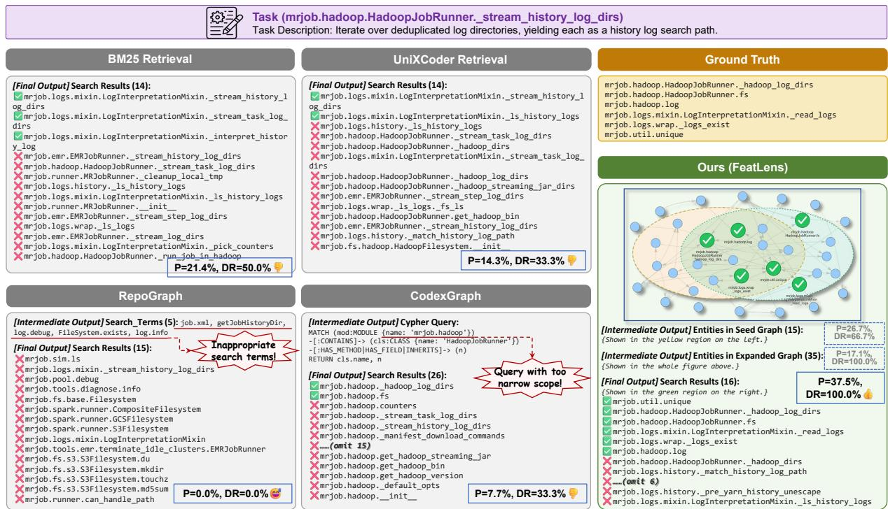
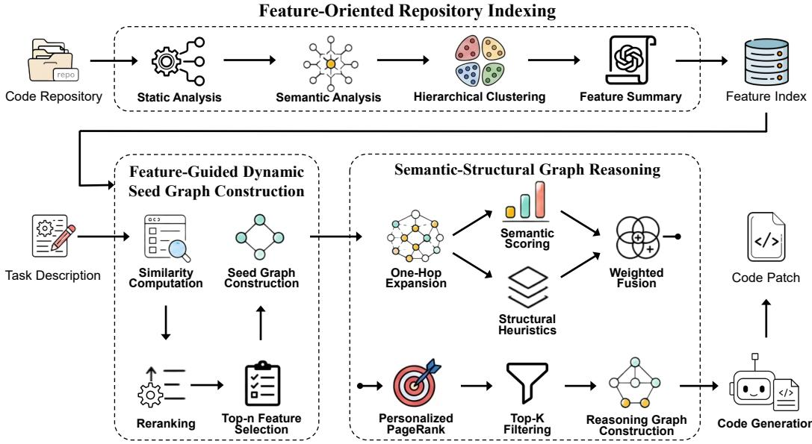
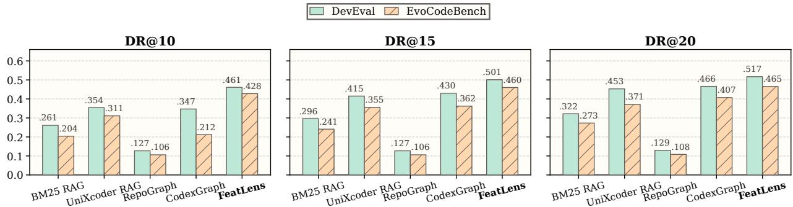

# FEATURE-GUIDED DYNAMIC CODE GRAPH CONSTRUCTION AND RETRIEVAL FOR REPOSITORY-LEVEL CODE GENERATION

Xutian Li Peking University xtli25@stu.pku.edu.cn

Kunze Li Peking University 2401213296@stu.pku.edu.cn

Bo Xiong Peking University 2601112134@stu.pku.edu.cn

Xianlin Zhao Peking University zhaoxianlin@pku.edu.cn

Yifeng Zhu Peking University yifengzhu25@stu.pku.edu.cn

Yanzhen Zou Peking University zouyz@pku.edu.cn

Runbang Yan Peking University rbyan25@stu.pku.edu.cn

Lu Zhang Peking University zhanglucs@pku.edu.cn

Bing Xie Peking University xiebing@pku.edu.cn

## ABSTRACT

Recent code generation research has moved from isolated function completion toward repository-level generation in existing codebases. To implement a target function correctly, an LLM must identify reusable repository dependencies such as existing functions, APIs, and cross-file definitions. Existing retrieval methods provide such context through code similarity search, persistent whole-repository graphs, or LLM-driven graph exploration, but often incur high graph construction, reasoning, and token costs. Feature-oriented methods offer a natural view of software functionality, yet they mainly support requirement decomposition, planning, or feature editing rather than code dependency retrieval. This paper presents FeatLens, a feature-guided dynamic code graph construction and retrieval approach for repository-level code generation. FeatLens builds a feature index that links naturallanguage feature descriptions to function-level code entities. Given a generation task, it dynamically constructs a task-specific seed graph from the feature index and applies semantic-structural graph reasoning with personalized PageRank to select a compact reasoning graph. This design replaces per sistent whole-repository graph maintenance and LLM exploration with deterministic and lightweight dependency retrieval. Experiments on DevEval and EvoCodeBench show that FeatLens achieves the best DR@15 among sparse, dense, and graph-based baselines (0.501 and 0.460). On DevEval generation, it obtains the highest DIR@1, reaching 52.91% with DeepSeek-V3.2 and 53.58% with GPT-5-mini, while maintaining competitive Pass@1 and producing shorter code. Compared with the strongest graph-based baseline, FeatLens reduces graph nodes by 61.0%, edges by 86.2%, and total token overhead by 45.9%, with no LLM tokens used during retrieval.

Keywords Repository-Level Code Generation · Retrieval-Augmented Generation · Code Graph · Feature-Guided Retrieval

## 1 Introduction

Recent advances in large language models (LLMs) have shifted code generation research from isolated functionlevel completion tasks [1, 2] toward repository-level generation in existing codebases [3–6]. In practice, feature implementation requirements are a major source of software maintenance, with new-feature additions reported to account for 60% of total maintenance costs [7, 8]. Such requirements include implementing a requested function within an existing codebase. To implement such functions correctly, an LLM must understand how the target function is organized within the repository and identify reusable dependencies, such as existing functions, APIs, and cross-file data definitions. Without this context, generated code may duplicate existing logic, misuse repository APIs, or violate established architectural designs [9–11]. Existing work mainly follows two directions. The first direction retrieves relevant code directly from repositories. Representative approaches either embed source code for similarity-based retrieval [12] or build structured representations, such as code context graphs and call-chain-aware graphs, to capture relationships among program entities [13–15]. They then retrieve candidate context through embedding search, graph expansion, or structure-aware reranking. The second direction adopts agent-driven exploration. Starting from the task description, LLM agents iteratively inspect code, invoke tools, and, when available, leverage execution or test feedback to discover relevant implementation contexts [16–18]. Both directions substantially improve repository-level code generation by providing richer contextual information than isolated code completion.

  
Figure 1: A motivating example comparing dependency retrieval results for a repository-level code generation task.

More recently, prior work has treated features as a useful unit for organizing and implementing user requirements. For example, EvoDev [19] decomposes user requirements into features and coordinates their implementation through dependency-aware planning, enabling design knowledge and business logic to propagate across development iterations. FeatX [20] takes a feature-editing perspective for repository-level code evolution by translating feature edits into code patches. Together, these studies suggest that feature-level abstraction can provide useful guidance for repository-level development beyond isolated code fragments.

Despite these advances, existing approaches still leave a gap between feature-level intent and code-level dependency retrieval. Retrieval methods based on structured code representations improve dependency retrieval, but their structural context is usually constructed from repository code rather than feature requirements, limiting feature-guided retrieval and incurring overhead from maintaining representations of the whole repository. Agent-driven exploration avoids fixed retrieval structures, but shifts the cost to online LLM interactions and makes localization less predictable as errors accumulate over long reasoning trajectories. Feature-oriented approaches capture the unit of development intent, yet they mainly support high-level requirement decomposition, planning, design-space exploration, or feature editing rather than code-level dependency retrieval for repository-level code generation. Consequently, they do not provide an operational mechanism that uses feature-level intent to construct task-relevant structural context on demand and map a feature request to the concrete functions, APIs, and cross-file definitions that should be reused during repository-level code generation.

To bridge this gap, this paper proposes FeatLens, a feature-guided dynamic code graph construction and retrieval approach for repository-level code generation. FeatLens first builds a feature-oriented repository index that maps natural-language feature descriptions to function-level code entities. Given a task, it retrieves aligned feature clusters, constructs a task-specific seed graph around the target location, and applies semantic-structural graph reasoning with personalized PageRank to filter a compact reasoning graph. By materializing only task-relevant graph regions and filtering weakly related nodes after expansion, FeatLens avoids maintaining a full repository graph while recovering dependencies that are difficult to find through text similarity alone.

We conduct experiments on two repository-level code generation datasets, DevEval [3] and EvoCodeBench [4]. The experimental results show that: 1) FeatLens improves dependency retrieval. On DevEval, it achieves the highest DR@15 (0.501), outperforming the compared sparse retrieval (BM25: 0.296), dense retrieval (UniXcoder: 0.415), graph-structured retrieval (RepoGraph: 0.127), and LLM-based graph exploration (CodexGraph: 0.430). 2) FeatLens improves downstream code generation by promoting dependency reuse. On GPT-5-mini, it obtains the best DIR@1 (53.58% vs. 46.27% for CodexGraph), remains competitive on Pass@1 (55.03% vs. 56.35%), and generates much shorter code (101.1 vs. 167.7 LOC). 3) FeatLens reduces efficiency costs. Compared with CodexGraph, it reduces graph nodes by 61.0% and edges by 86.2%, eliminates retrieval-time LLM tokens (0 vs. 3851.3), and lowers total token overhead by 45.9%.

Compared to existing work, this paper makes the following contributions:

• We identify feature-guided dependency retrieval as a practical way to bridge feature-level intent and code-level context for repository-level code generation.

• We present FeatLens, which combines a feature index, dynamic seed graph construction, and semanticstructural graph reasoning to produce compact reasoning graphs used as dependency context.

• We evaluate FeatLens on DevEval and EvoCodeBench, showing higher dependency recall and repository-code reuse with lower graph and token overhead.

## 2 Motivation

## 2.1 Feature-Guided Dependency Retrieval

Repository-level code generation tasks require a model to implement a target function within an existing repository. Such tasks are typically specified as functional requirements, yet correct implementations depend on task-relevant repository context, including existing functions, APIs, and data definitions. Following requirements-engineering terminology [21], we usefeature to denote the functional unit described by a requirement. In this work, features serve as retrieval anchors that connect natural language task intent to reusable repository code.

Let R denote a repository, $C _ { R }$ denote its code entities, and $L _ { R }$ denote the structural relations among these entities. Code entities include functions, classes, files, and variables. Structural relations include calls, definitions, uses, containment, and imports. We associate R with a set of functional features $F _ { R } = \{ f _ { 1 } , \ldots , f _ { n } \}$ , where each feature $f _ { i }$ has a textual description $d _ { i }$ and is supported by a subset of code entities $C _ { i } \subseteq C _ { R }$

Given a requirement q and a target function location $t ,$ feature-guided dependency retrieval aims to identify a compact dependency context $\hat { D } _ { q , t } = ( \check { V _ { q , t } } , E _ { q , t } )$ , where $V _ { q , t } \subseteq C _ { R }$ contains reusable entities and $E _ { q , t } \subseteq L _ { R }$ preserves their structural constraints for generation. Unlike conventional code search, the desired output is not merely code that is textually similar to $q ,$ but the dependencies that should be reused or respected during implementation. This requires aligning q with repository features, recovering structural dependencies that may be lexically indirect, and avoiding excessive irrelevant context. The following example illustrates why existing retrieval strategies struggle with this formulation.

## 2.2 Motivating Example

Figure 1 shows a dependency retrieval case for repository-level code generation in Mrjob, an open-source Python library for MapReduce development. The task is to implement \_stream\_history\_log\_dirs in HadoopJobRunner, which iterates over deduplicated log directories and yields each directory as a history-log search path. As shown in the ground-truth list, the required dependencies include log-directory and log-existence logic that is semantically related to the requirement, as well as utility functions and class members that are structurally necessary but lexically indirect.

Sparse and dense retrieval provide limited dependency coverage. Using precision $( P )$ and dependency recall (DR) as retrieval metrics, BM25 Retrieval obtains $P = 2 \mathrm { { i } } . 4 \%$ and $\mathrm { D R } = 5 0 . 0 \%$ , while UniXcoder Retrieval obtains $P = 1 4 . 3 \%$ and $\mathrm { D R } = 3 3 . 3 \%$ . They retrieve functions whose names resemble the query, such as history-log or task-log routines, but many results are only lexically or embedding-wise similar rather than required dependencies. Text similarity can retrieve code that looks relevant, but it misses structural dependencies.

  
Figure 2: Overview of FeatLens.

Retrieval based on repository structure also remains sensitive to how the search is initiated and bounded. Repo-Graph, a structure-aware retrieval method, obtains $P ~ = ~ 0 . 0 \%$ and DR = 0.0% because search terms such as job.xml, getJobHistoryDir, and FileSystem.exists lead to an inappropriate graph entry point. CodexGraph, an LLM-based graph exploration method, obtains $P = 7 . 7 \%$ and $\mathrm { D R } = \bar { 3 } 3 . \bar { 3 } \%$ . Its Cypher query expands around mrjob.hadoop.HadoopJobRunner, but the search scope is too narrow to recover cross-file dependencies such as unique, \_logs\_exist, and \_read\_logs. This case suggests that structure-aware retrieval and graph-based exploration can both miss dependencies when the entry point or search scope is misaligned with the target feature.

FeatLens is motivated by these failure modes. Its feature-guided seed graph reaches P = 26.7% and $\mathrm { D R } = 6 6 . 7 \%$ indicating that feature-level retrieval provides a more effective entry point than raw text matching or fixed graph queries. Expanding the seed graph raises dependency recall to 100.0%, but precision drops to 17.1% because structural expansion also introduces weakly related nodes. The final reasoning graph reaches $P = 3 7 . 5 \%$ and DR = 100.0% by preserving all six ground-truth dependencies while filtering the expanded graph. This motivates FeatLens to combine feature-guided entry, controlled structural expansion, and semantic-structural filtering for compact dependency retrieval.

## 3 Approach

FeatLens performs repository-level code generation by first localizing task-relevant dependencies and then using the selected context to generate code. Figure 2 presents an overview of FeatLens, whose core method consists of three stages before code generation. First, FeatLens builds a feature-oriented repository index from the source repository. Second, given a task description, it dynamically constructs a seed graph around candidate functions using the feature index. Third, it expands and filters the seed graph through semantic-structural reasoning, producing a compact reasoning graph. The resulting reasoning graph is then used as context for downstream code generation.

## 3.1 Feature-Oriented Repository Indexing

The first stage builds an offline feature index that maps natural-language feature descriptions to function-level code entities. FeatLens adapts the feature-oriented repository summarization procedure from prior work [22], but uses the resulting feature structure as a retrieval index rather than as repository documentation.

Given a repository R, FeatLens first analyzes the repository from both structural and semantic perspectives. Static analysis extracts code entities, including functions, classes, and files, and records only lightweight structural relations, including calls and imports. Semantic analysis represents each function according to its implementation semantics using lightweight descriptions and embeddings. These structural relations capture coarse interactions among entities, while the semantic representations capture what functionality they provide.

Using the integrated entity similarity, FeatLens performs hierarchical clustering on the function-level representations, grouping functions that are likely to support the same repository feature. It then summarizes each cluster into a natural-language feature description and records the corresponding function set, yielding the feature index:

$$
R = \{ f _ { i } \} _ { i = 1 } ^ { M } = \{ ( d _ { i } , C _ { i } ^ { \mathrm { f u n c } } ) \} _ { i = 1 } ^ { M } ,\tag{1}
$$

where $f _ { i }$ denotes the i-th feature, $d _ { i }$ is its natural-language description, and $C _ { i } ^ { \mathrm { f u n c } }$ denotes the subset of code entities associated with this feature at the function granularity. This feature-to-function index serves as the basis for featureguided retrieval in the next stage.

## 3.2 Feature-Guided Dynamic Seed Graph Construction

The second stage dynamically constructs a task-specific seed graph from the feature index. Given a task description and the target function location, FeatLens retrieves feature clusters that are semantically aligned with the requirement and uses the available target-location context to refine the selection. This process uses only information available at generation time, without accessing the missing target implementation.

Functions associated with the selected features form the seed nodes. FeatLens then instantiates repository dependency relations among these nodes, producing a local graph for the current task. This graph provides a feature-guided starting point for dependency retrieval without materializing a fine-grained graph for the entire repository.

## 3.3 Semantic-Structural Graph Reasoning

Starting from the seed graph, FeatLens expands along repository dependency relations to recover relevant entities that feature retrieval may have missed. This step incorporates structural context beyond direct semantic matches, but can also introduce weakly related candidates.

FeatLens combines task relevance and structural context to prioritize candidates in the expanded graph. Following prior graph reasoning work [23], personalized PageRank propagates these preferences through dependency connections. The highest-ranked entities and the relations among them form a compact reasoning graph under the retrieval budget.

The reasoning graph supplies dependency context to the generation model together with the task description and target function location. Retrieval reasoning does not require LLM-driven repository exploration; the LLM uses the selected context to generate the code patch.

## 4 Experimental Settings

In this section, we present our experimental methodology and evaluation setup. Our evaluation is guided by the following research questions (RQs).

RQ1 Effectiveness. Can FeatLens improve dependency retrieval and downstream code generation in repository-level code generation tasks?

RQ2 Efficiency. Can FeatLens reduce graph construction overhead, retrieval-time reasoning cost, and prompt token consumption in repository-level code generation tasks?

## 4.1 Benchmarks and Data Preprocessing

We evaluate FeatLens on two repository-level Python code generation benchmarks, DevEval [3] and EvoCodeBench [4]. Each task provides a natural-language requirement and a target function signature, and the goal is to generate the implementation of the target function. The annotated reference dependencies are used to evaluate dependency retrieval. We retain projects with complete dependency annotations, resulting in 90 DevEval projects and five EvoCodeBench projects with sufficient task coverage and complementary domains. DevEval is used for both dependency retrieval and code generation evaluation, while EvoCodeBench is used only for dependency retrieval because it lacks a standardized runtime for reproducible functional testing. Table 1 summarizes the resulting datasets.

Before evaluation, we build an offline feature index for each repository, as detailed in Section 3.1. Table 2 summarizes the average index size and construction cost. Each feature contains about 5.5 functions on average, and index construction takes 269.4–316.6 seconds with a cost of 0.21–0.30 USD per repository.

Table 1: Dataset statistics.
<table><tr><td>Dataset</td><td>Domain</td><td>#Repos.</td><td>Avg. #Files</td><td>Avg. #Funcs.</td><td>Avg. LOC</td><td>#Tasks</td><td>Avg. #Deps./Task</td></tr><tr><td rowspan="10">DevEval</td><td>Communication</td><td>10</td><td>87.6</td><td>1485.2</td><td>31168.7</td><td>209</td><td>2.41</td></tr><tr><td>Database</td><td>11</td><td>24.2</td><td>302.1</td><td>7206.6</td><td>178</td><td>3.35</td></tr><tr><td>Internet</td><td>9</td><td>92.7</td><td>1039.3</td><td>23186.4</td><td>410</td><td>2.74</td></tr><tr><td>Multimedia</td><td>4</td><td>35.3</td><td>340.8</td><td>6769.3</td><td>118</td><td>2.84</td></tr><tr><td>Scientific-Engineering</td><td>6</td><td>114.2</td><td>954.7</td><td>34276.7</td><td>109</td><td>1.24</td></tr><tr><td>Security</td><td>13</td><td>71.1</td><td>687.1</td><td>16519.9</td><td>170</td><td>2.79</td></tr><tr><td>Software-Development</td><td>7</td><td>189.0</td><td>1147.3</td><td>69154.6</td><td>116</td><td>1.22</td></tr><tr><td>System</td><td>9</td><td>41.8</td><td>371.1</td><td>8616.9</td><td>206</td><td>2.32</td></tr><tr><td>Text-Processing</td><td>10</td><td>32.4</td><td>228.7</td><td>5653.1</td><td>49</td><td>1.73</td></tr><tr><td>Utilities</td><td>11</td><td>57.7</td><td>444.4</td><td>14564.7</td><td>260</td><td>2.22</td></tr><tr><td>EvoCodeBench</td><td>1</td><td>5</td><td>81.0</td><td>768.0</td><td>17353.4</td><td>123</td><td>3.67</td></tr></table>

Table 2: Statistics of functional feature index construction for each code repository on average.
<table><tr><td>Dataset</td><td>#Func.</td><td>#Feat.</td><td>#Func./Feat.</td><td>Time (s)</td><td>Cost (USD)</td></tr><tr><td>DevEval</td><td>711.0</td><td>132.7</td><td>5.53</td><td>269.4</td><td>0.21</td></tr><tr><td>EvoCodeBench</td><td>768.0</td><td>179.6</td><td>5.25</td><td>316.6</td><td>0.30</td></tr></table>

## 4.2 Baseline Methods

We compare FeatLens with five baselines covering no-context prompting, sparse retrieval, dense retrieval, and graphbased retrieval.

(1) No-context: the LLM receives only the requirement and target function signature.

(2) BM25-based RAG [24]: a sparse retrieval baseline that ranks repository functions by term matching between the requirement and function code. Unless otherwise stated, we use BM25 over function code.

(3) UniXcoder-based RAG [25]: a dense retrieval baseline that ranks functions by code-query embedding similarity.

(4) RepoGraph [26]: a retrieval-augmented repository-level code generation baseline that uses a line-level repository code graph to retrieve task-relevant context.

(5) CodexGraph [27]: an LLM-based repository exploration baseline. It stores repository structure in Neo4j and lets the LLM generate Cypher queries to retrieve relevant code.

## 4.3 Evaluation Metrics

We evaluate both dependency retrieval and downstream generation.

(1) DR@N measures how many ground-truth dependencies are contained in the Top-N retrieved results:

$$
\mathrm { D R @ N } = \frac { | D _ { \mathrm { r e t r i e v e d } } \cap D _ { \mathrm { g t } } | } { | D _ { \mathrm { g t } } | } .\tag{2}
$$

(2) DIR@K, namely Dependency Invocation Rate [28], measures how many ground-truth dependencies are invoked by generated code:

$$
\mathrm { D I R @ K } = \frac { | D _ { \mathrm { i n v o k e d } } \cap D _ { \mathrm { g t } } | } { | D _ { \mathrm { g t } } | } .\tag{3}
$$

(3) Pass@1 measures the fraction of tasks whose single generated program passes all unit tests. We also report generated code length to assess redundant implementation.

  
Figure 3: Dependency recall comparison on DevEval and EvoCodeBench under Top-10, Top-15, and Top-20 retrieval settings.

## 4.4 Parameter Settings

We use deepseek-v3.2-251201 and gpt-5-mini-2025-08-07 as the generation models. For both models, we set the temperature to 0.0, keep the remaining parameters at their default values, and disable the reasoning mode. We evaluate Top-N settings with $\bar { N } \in \{ 1 0 , 1 5 , 2 0 \}$ for graph construction and reasoning and report Pass@1 for code generation.

## 5 Experimental Results

## 5.1 RQ1: Effectiveness

## 5.1.1 Dependency Retrieval

We compare FeatLens with BM25 RAG, UniXcoder RAG, RepoGraph, and CodexGraph on DevEval and EvoCodeBench in terms of dependency retrieval performance.

As shown in Figure 3, FeatLens achieves stable and substantial gains over conventional RAG baselines. Compared with BM25 RAG, FeatLens improves DR@10/15/20 from 0.261/0.296/0.322 to 0.461/0.501/0.517 on DevEval, and from 0.204/0.241/0.273 to 0.428/0.460/0.465 on EvoCodeBench. It also consistently outperforms UniXcoder RAG, with gains of 0.107/0.086/0.064 on DevEval and 0.117/0.105/0.094 on EvoCodeBench.

The figure also shows that FeatLens outperforms the graph-based baselines. RepoGraph achieves only 0.129 recall on DevEval and 0.108 on EvoCodeBench at its best Top-N setting, whereas the lowest recall of FeatLens already reaches 0.461 and 0.428 on the two datasets. A possible reason is that RepoGraph is sensitive to search-term quality. It relies on the LLM to generate search terms from the requirement before retrieval, but the requirement alone often does not reveal the repository-specific dependencies needed for implementation, causing the retrieved and expanded graph nodes to be weakly related to the target task. Compared with CodexGraph, the strongest baseline, FeatLens also achieves higher recall. On DevEval, CodexGraph obtains its best recall of 0.466 at DR@20, while FeatLens already reaches a comparable recall of 0.461 at DR@10 and further improves to 0.517 at DR@20. This advantage may come from the fact that CodexGraph relies on LLM-generated Cypher queries, making retrieval sensitive to query quality and task complexity. In contrast, FeatLens combines a feature index with semantic-structural graph reasoning to retrieve a higher concentration of task-relevant dependency nodes within a smaller retrieval context.

Results under different context sizes show that FeatLens maintains high recall with a smaller context size. FeatLens achieves the highest recall at every DR@N setting on both datasets. Notably, its DR@10 is already comparable to the best baseline at DR@20: on DevEval, FeatLens reaches 0.461 versus 0.466 for CodexGraph, and on EvoCodeBench, it reaches 0.428 versus 0.407. From there, increasing the context size yields diminishing returns for FeatLens: on DevEval, recall increases by 4.0 points from DR@10 to DR@15 and only 1.6 points from DR@15 to DR@20; on EvoCodeBench, the corresponding gains are 3.2 and 0.5 points. These results show smaller recall gains from Top-15 to Top-20 than from Top-10 to Top-15. By contrast, BM25 and UniXcoder benefit more from larger contexts, indicating that their top-ranked results contain more noise and require longer contexts to recover missed dependencies.

## 5.1.2 Downstream Repository-Level Code Generation

The second part of RQ1 evaluates whether the retrieved context improves generation on DevEval. We feed each method’s Top-15 retrieved context to the generation models and measure DIR@1, Pass@1, and generated code length

Table 3: Code generation results on DevEval.
<table><tr><td rowspan="2">Method</td><td colspan="3">DeepSeek-V3.2</td><td colspan="3">GPT-5-mini</td></tr><tr><td>DIR@1(%)</td><td>Pass@1(%)</td><td>LOC</td><td>DIR@1(%)</td><td>Pass@1(%)</td><td>LOC</td></tr><tr><td>No-context</td><td>17.08</td><td>17.20</td><td>65.75</td><td>15.92</td><td>29.23</td><td>252.2</td></tr><tr><td>BM25 RAG</td><td>42.59</td><td>32.17</td><td>66.07</td><td>44.07</td><td>48.18</td><td>128.6</td></tr><tr><td>UniXcoder RAG</td><td>49.18</td><td>41.40</td><td>65.75</td><td>51.92</td><td>53.43</td><td>108.8</td></tr><tr><td>RepoGraph</td><td>32.27</td><td>23.76</td><td>68.13</td><td>29.25</td><td>39.35</td><td>159.4</td></tr><tr><td>CodexGraph</td><td>43.16</td><td>42.31</td><td>74.15</td><td>46.27</td><td>56.35</td><td>167.7</td></tr><tr><td>FeatLens</td><td>52.91</td><td>42.24</td><td>65.33</td><td>53.58</td><td>55.03</td><td>101.1</td></tr></table>

Table 4: Engineering overhead and performance comparison among different methods.
<table><tr><td rowspan="2">Method</td><td colspan="2">Graph Construction Overhead</td><td>Retrieval</td><td colspan="3">Code Generation (DeepSeek-V3.2)</td><td>Token Overhead</td></tr><tr><td>#Nodes</td><td>#Edges</td><td>DR@15</td><td>DIR@1(%)</td><td>Pass@1(%)</td><td>LOC</td><td>Retrieval Reasoning + Context</td></tr><tr><td>RepoGraph</td><td>64.5</td><td>523.4</td><td>0.127</td><td>32.27</td><td>23.76</td><td>68.13</td><td>283.2+2149.2</td></tr><tr><td>CodexGraph</td><td>38.5</td><td>99.3</td><td>0.430</td><td>43.16</td><td>42.31</td><td>74.15</td><td>3851.3+9189.6</td></tr><tr><td>FeatLens</td><td>15 (↓61.0%)</td><td>13.7 (↓86.2%)</td><td>0.501 (↑16.5%)</td><td>52.91 (↑22.6%)</td><td>42.24</td><td>65.33 (↓11.9%)</td><td>0+7057.4 (↓45.9%)</td></tr></table>

As shown in Table 3, FeatLens provides LLMs with more reusable repository context. The code generated with FeatLens achieves the highest dependency invocation rate under both LLMs, reaching 52.91% with DeepSeek-V3.2 and 53.58% with GPT-5-mini. This result suggests that the compact reasoning graph constructed by FeatLens does more than retrieve relevant dependencies: it presents them as generation context that the LLMs can effectively reuse.

The results also show substantial gains in functional correctness: FeatLens outperforms No-context, BM25 RAG, UniXcoder RAG, and RepoGraph on both LLMs. Specifically, FeatLens reaches 42.24% Pass@1 on DeepSeek-V3.2 and 55.03% Pass@1 on GPT-5-mini, outperforming No-context, BM25 RAG, and RepoGraph while remaining competitive with UniXcoder RAG. Although FeatLens has a slightly lower Pass@1 than CodexGraph on GPT-5-mini (55.03% vs. 56.35%), this difference should be interpreted together with dependency reuse and code length. CodexGraph achieves 56.35% Pass@1, but its DIR@1 is 46.27% and its average code length is 167.7. In contrast, FeatLens achieves 55.03% Pass@1 with a higher DIR@1 of 53.58% and a much shorter average code length of 101.1. These results indicate that FeatLens reaches comparable functional correctness while promoting reuse of existing repository code rather than producing longer supplementary implementations.

Summary for RQ1: FeatLens improves both dependency retrieval and downstream code generation. On DevEval, it achieves the highest DR@15 (0.501), outperforming CodexGraph (0.430), UniXcoder RAG (0.415), BM25 RAG (0.296), and RepoGraph (0.127). Compared with CodexGraph, it also obtains the best DIR@1 (53.58% vs. 46.27%), remains competitive on Pass@1, and generates much shorter code (101.1 vs. 167.7 LOC) on GPT-5-mini.

## 5.2 RQ2: Efficiency

RQ2 compares FeatLens with the graph-based retrieval baselines, RepoGraph and CodexGraph, on DevEval in terms of graph size, retrieval-time token use, and prompt token consumption. Table 4 reports per-task averages, with reductions computed against CodexGraph.

As shown in Table 4, FeatLens constructs much smaller graphs. Its reasoning graph contains 15 nodes per task on average, reducing nodes by 61.0% and edges by 86.2% compared with CodexGraph. This reduction follows from its on-demand design: FeatLens builds a local task-specific graph rather than maintaining a full repository graph that must track repository-wide fine-grained calls, variable uses, type definitions, and file dependencies across commits.

FeatLens also eliminates LLM calls during retrieval reasoning. RepoGraph and CodexGraph consume 283.2 and 3851.3 tokens per task, respectively, because they use the LLM to generate keywords or Cypher queries. In contrast, FeatLens uses static analysis and deterministic scoring to select the final generation context in this stage, avoiding LLM-based retrieval and reasoning and thereby eliminating both token cost and model-call instability.

Finally, FeatLens provides a more dependency-dense generation context. Its average context length is 7057.4 tokens, 23.2% lower than CodexGraph’s 9189.6, and its total generation token cost is 45.9% lower than CodexGraph’s 13040.9. Despite using fewer tokens, FeatLens improves DR@15 from 0.430 to 0.501 and DIR@1 from 43.16% to 52.91%, while keeping Pass@1 comparable. These results indicate that the semantic-structural graph reasoning stage of FeatLens removes weakly related nodes from the initially retrieved context, yielding a shorter final context with a higher concentration of task-relevant dependencies.

Summary for RQ2: FeatLens reduces efficiency costs across the three measured dimensions. Compared with CodexGraph, it reduces graph nodes by 61.0% and edges by 86.2%, eliminates retrieval-time LLM tokens (0 vs. 3851.3), and lowers total token overhead by 45.9% while improving DR@15 from 0.430 to 0.501.

## 6 Discussion

## 6.1 Effectiveness and Applicability Boundaries

FeatLens is designed to connect natural-language requirements with repository dependencies through feature indexing, local graph construction, and semantic-structural reasoning. The retrieval and generation results support the effectiveness of the overall approach; they do not isolate the contribution of each stage.

This design is suited to tasks whose implementations depend on reusable functions, class members, or cross-file definitions that are not lexically aligned with the requirement. Its effectiveness may be limited when feature descriptions fail to capture the required behavior or when static analysis misses necessary dependencies.

## 6.2 Threats to Validity

External validity. Our conclusions are drawn from DevEval and EvoCodeBench, which mainly target Python repositorylevel code generation. Whether the results generalize to other programming languages or industrial closed-source repositories remains to be verified.

Internal validity. The parameters, candidate sizes, and prompt templates of different retrieval methods may affect the comparison. We use the same generation models and comparable context budgets where possible, but implementation differences may remain. The metrics also capture only part of code quality, since Pass@1 and DIR@1 reflect functional correctness and dependency reuse but not maintainability, security, or developer judgment. Finally, FeatLens depends on offline feature summarization and static structural relations. Inaccurate feature clusters, coarse descriptions, runtime dynamic binding, and implicit framework conventions may weaken retrieval. Future work could incorporate runtime traces, test feedback, and development history to strengthen graph reasoning.

## 7 Related Work

## 7.1 Retrieval-Augmented Repository-Level Code Generation

Retrieval-augmented strategies provide reference code snippets as auxiliary context for code generation through mechanisms such as sparse term matching [24] and code search [29, 30]. Embedding-based retrieval methods represent code snippets with semantic vectors and rank candidate contexts by their similarity to the query [25,31]. At the repository level, RLCoder [32] trains a retriever with reinforcement learning, while AlignCoder [33] rewrites or enhances queries to better align retrieved context with the target code completion. Because semantic similarity alone can overlook cross-file dependencies such as calls and data definitions [34], structure-aware retrieval methods further incorporate code graphs into context selection. RepoGraph [26] constructs a line-level repository graph over dependency relations, while GraphCoder [13] builds code context graphs with control-flow and data-flow information. Then they retrieve ego graph neighborhoods or structurally reranked context. Subsequent work further improves retrieval through long-range multi-hop reasoning [35], multi-granularity structural information [15], and repository architecture preservation [14].

These methods make repository context more accessible, but they are primarily organized around code similarity or repository structure rather than the feature-level requirements that trigger generation. Graph-based methods also incur overhead when they construct and maintain full-repository representations. FeatLens instead uses features as retrieval anchors and constructs a task-specific graph on demand, aiming to improve dependency localization while reducing graph construction overhead.

## 7.2 LLM-Based Repository Exploration

LLM-based repository exploration methods support repository-level code generation by enabling LLMs or agents to iteratively search, inspect, and refine task-relevant context within a repository. Early agents, including SWE-Agent [16],

AutoCodeRover [17], and CodeAgent [36], explore repositories mainly through autonomous tool use. This flexibility is useful, but an unconstrained search space makes reliable localization difficult. Subsequent work introduces structured repository graphs to guide localization and reasoning [37, 38]. CodexGraph [27] enables LLMs to explore a repository graph database through Cypher queries, while GraphCodeAgent [39] couples a requirement graph with a code graph for agent-driven multi-hop reasoning between intent and dependencies. More recent approaches pursue stronger but heavier exploration, using Monte Carlo tree search [40], autonomous multi-round context construction [41], or knowledge graphs with working memory for long-horizon navigation [42].

Although these methods can locate useful context, they often rely on long reasoning chains or multi-round agent decisions, increasing latency and reducing controllability. In contrast, FeatLens employs a dynamic graph construction and reasoning strategy that narrows the search space into a compact yet accurate reasoning graph, thereby avoiding unnecessary interaction rounds and excessive reasoning overhead.

## 7.3 Feature-Oriented Software Development

Feature-oriented software development treats features as units for organizing and evolving software functionality [43,44]. Feature location studies how to identify the program entities that implement a given functionality [45]. Recent repository understanding work extends this view to large codebases. For example, RepoSummary [22] extracts featureoriented repository summaries and traceability links. These studies show that a feature is rarely realized by a single function. Implementing it correctly often requires localizing the dispersed code entities that together provide the target functionality.

Features have also become task units in LLM-based repository-level software engineering. FEA-Bench [46], Feat-Bench [47], NoCode-bench [48], and FeatureBench [49] evaluate whether LLM-based systems can implement concrete feature requests in existing repositories, while SWE-Dev [50] and EvoDev [19] study feature-driven autonomous development and dependency modeling. FeatX [20] further supports repository-level code evolution through feature editing interactions. These studies establish features as practical units for repository-level development, but they mainly treat a feature as a task or edit target rather than as a retrieval signal for locating reusable code.

FeatLens takes the latter view by turning feature-level intent into an operational retrieval signal and mapping it to dependency-level code context, bridging feature requirements and the repository entities that should be reused during implementation.

## 8 Conclusion

This paper introduced FeatLens, a feature-guided dynamic code graph construction and retrieval approach for repository level code generation. FeatLens maps feature-level intent to function-level dependency context through a feature index, dynamic seed graph construction, and semantic-structural graph reasoning. Experiments on DevEval and EvoCodeBench show that FeatLens improves dependency retrieval and dependency reuse during downstream code generation while reducing graph size and token consumption with competitive functional correctness. Future work will strengthen graph reasoning for runtime binding, implicit framework conventions, and dependencies that are weakly aligned with feature clusters, and broaden evaluation with more diverse repository-level code generation benchmarks

## References

[1] Zhaojian Yu, Yilun Zhao, Arman Cohan, and Xiao-Ping Zhang. HumanEval pro and MBPP pro: Evaluating large language models on self-invoking code generation task. In Wanxiang Che, Joyce Nabende, Ekaterina Shutova, and Mohammad Taher Pilehvar, editors, Findings of the Association for Computational Linguistics: ACL 2025, pages 13253–13279, Vienna, Austria, July 2025. Association for Computational Linguistics.

[2] Jacob Austin, Augustus Odena, Maxwell Nye, Maarten Bosma, Henryk Michalewski, David Dohan, Ellen Jiang, Carrie Cai, Michael Terry, Quoc Le, and Charles Sutton. Program synthesis with large language models, 2021.

[3] Jia Li, Ge Li, Yunfei Zhao, Yongmin Li, Huanyu Liu, Hao Zhu, Lecheng Wang, Kaibo Liu, Zheng Fang, Lanshen Wang, Jiazheng Ding, Xuanming Zhang, Yuqi Zhu, Yihong Dong, Zhi Jin, Binhua Li, Fei Huang, Yongbin Li, Bin Gu, and Mengfei Yang. DevEval: A manually-annotated code generation benchmark aligned with real-world code repositories. In Lun-Wei Ku, Andre Martins, and Vivek Srikumar, editors, Findings of the Association for Computational Linguistics: ACL 2024, pages 3603–3614, Bangkok, Thailand, August 2024. Association for Computational Linguistics.

[4] Jia Li, Ge Li, Xuanming Zhang, Yunfei Zhao, Yihong Dong, Zhi Jin, Binhua Li, Fei Huang, and Yongbin Li. Evocodebench: An evolving code generation benchmark with domain-specific evaluations. In A. Globerson,

L. Mackey, D. Belgrave, A. Fan, U. Paquet, J. Tomczak, and C. Zhang, editors, Advances in Neural Information Processing Systems, volume 37, pages 57619–57641. Curran Associates, Inc., 2024.

[5] Hao Yu, Bo Shen, Dezhi Ran, Jiaxin Zhang, Qi Zhang, Yuchi Ma, Guangtai Liang, Ying Li, Qianxiang Wang, and Tao Xie. Codereval: A benchmark of pragmatic code generation with generative pre-trained models. In Proceedings ofthe IEEE/ACM 46th International Conference on Software Engineering, ICSE ’24, New York, NY, USA, 2024. Association for Computing Machinery.

[6] Yangruibo Ding, Zijian Wang, Wasi Ahmad, Hantian Ding, Ming Tan, Nihal Jain, Murali Krishna Ramanathan, Ramesh Nallapati, Parminder Bhatia, Dan Roth, and Bing Xiang. Crosscodeeval: A diverse and multilingual benchmark for cross-file code completion. In A. Oh, T. Naumann, A. Globerson, K. Saenko, M. Hardt, and S. Levine, editors, Advances in Neural Information Processing Systems, volume 36, pages 46701–46723. Curran Associates, Inc., 2023.

[7] Mohammad Masudur Rahman. Supporting code search with context-aware, analytics-driven, effective query reformulation. In 2019 IEEE/ACM 41st International Conference on Software Engineering: Companion Proceedings (ICSE-Companion), pages 226–229, 2019.

[8] R.L. Glass. Frequently forgotten fundamental facts about software engineering. IEEE Software, 18(3):112–111, 2001.

[9] Fang Liu, Yang Liu, Lin Shi, Zhen Yang, Li Zhang, Xiaoli Lian, Zhongqi Li, and Yuchi Ma. Beyond functional correctness: Exploring hallucinations in llm-generated code. IEEE Transactions on Software Engineering, 52(3):1037–1055, 2026.

[10] Ziyao Zhang, Chong Wang, Yanlin Wang, Ensheng Shi, Yuchi Ma, Wanjun Zhong, Jiachi Chen, Mingzhi Mao, and Zibin Zheng. Llm hallucinations in practical code generation: Phenomena, mechanism, and mitigation. Proc. ACM Softw. Eng., 2(ISSTA), June 2025.

[11] Minh Le-Anh, Huyen Nguyen, Khanh An Tran, Nam Le Hai, Linh Ngo Van, Nghi D. Q. Bui, and Bach Le. Do not treat code as natural language: Implications for repository-level code generation and beyond, 2026.

[12] Fengji Zhang, Bei Chen, Yue Zhang, Jacky Keung, Jin Liu, Daoguang Zan, Yi Mao, Jian-Guang Lou, and Weizhu Chen. RepoCoder: Repository-level code completion through iterative retrieval and generation. In Houda Bouamor, Juan Pino, and Kalika Bali, editors, Proceedings of the 2023 Conference on Empirical Methods in Natural Language Processing, pages 2471–2484, Singapore, December 2023. Association for Computational Linguistics.

[13] Wei Liu, Ailun Yu, Daoguang Zan, Bo Shen, Wei Zhang, Haiyan Zhao, Zhi Jin, and Qianxiang Wang. Graphcoder: Enhancing repository-level code completion via coarse-to-fine retrieval based on code context graph. In Proceedings of the 39th IEEE/ACM International Conference on Automated Software Engineering, ASE ’24, pages 570–581, New York, NY, USA, 2024. Association for Computing Machinery.

[14] Yang Liu, Li Zhang, Fang Liu, Zhuohang Wang, Donglin Wei, Zhishuo Yang, Kechi Zhang, Jia Li, and Lin Shi. Reposcope: Leveraging call chain-aware multi-view context for repository-level code generation, 2025.

[15] Xingliang Wang, Baoyi Wang, Chen Zhi, Junxiao Han, Xinkui Zhao, Jianwei Yin, and Shuiguang Deng. Grace: Graph-guided repository-aware code completion through hierarchical code fusion, 2025.

[16] John Yang, Carlos Jimenez, Alexander Wettig, Kilian Lieret, Shunyu Yao, Karthik Narasimhan, and Ofir Press. Swe-agent: Agent-computer interfaces enable automated software engineering. In A. Globerson, L. Mackey, D. Belgrave, A. Fan, U. Paquet, J. Tomczak, and C. Zhang, editors, Advances in Neural Information Processing Systems, volume 37, pages 50528–50652. Curran Associates, Inc., 2024.

[17] Yuntong Zhang, Haifeng Ruan, Zhiyu Fan, and Abhik Roychoudhury. Autocoderover: Autonomous program improvement. In Proceedings of the 33rd ACM SIGSOFT International Symposium on Software Testing and Analysis, ISSTA 2024, page 1592–1604, New York, NY, USA, 2024. Association for Computing Machinery.

[18] Islem Bouzenia, Premkumar Devanbu, and Michael Pradel. Repairagent: An autonomous, llm-based agent for program repair. In 2025 IEEE/ACM 47th International Conference on Software Engineering (ICSE), pages 2188–2200, 2025.

[19] Junwei Liu, Chen Xu, Chong Wang, Tong Bai, Weitong Chen, Kaseng Wong, Yiling Lou, and Xin Peng. Towards iterative end-to-end software development: A feature-driven multi-agent framework, 2026.

[20] Xutian Li, Yifeng Zhu, Xianlin Zhao, Yanzhen Zou, Lu Zhang, and Bing Xie. Featx: Editing software by editing features for repository-level code evolution, 2026.

[21] Mike Cohn. User Stories Applied: For Agile Software Development. Addison Wesley Longman Publishing Co., Inc., USA, 2004.

[22] Yifeng Zhu, Xianlin Zhao, Xutian Li, Yanzhen Zou, Haizhuo Yuan, Yue Wang, and Bing Xie. Reposummary: Feature-oriented summarization and documentation generation for code repositories, 2025.

[23] Bernal Jiménez Gutiérrez, Yiheng Shu, Yu Gu, Michihiro Yasunaga, and Yu Su. Hipporag: Neurobiologically inspired long-term memory for large language models. In A. Globerson, L. Mackey, D. Belgrave, A. Fan, U. Paquet, J. Tomczak, and C. Zhang, editors, Advances in Neural Information Processing Systems, volume 37, pages 59532–59569. Curran Associates, Inc., 2024.

[24] Stephen Robertson and Hugo Zaragoza. The probabilistic relevance framework: Bm25 and beyond. Foundations and Trends in Information Retrieval, 4(1-2):1–174, 09 2009.

[25] Daya Guo, Shuai Lu, Nan Duan, Yanlin Wang, Ming Zhou, and Jian Yin. UniXcoder: Unified cross-modal pre-training for code representation. In Smaranda Muresan, Preslav Nakov, and Aline Villavicencio, editors, Proceedings of the 60th Annual Meeting of the Association for Computational Linguistics (Volume 1: Long Papers), pages 7212–7225, Dublin, Ireland, May 2022. Association for Computational Linguistics.

[26] Siru Ouyang, Wenhao Yu, Kaixin Ma, Zilin Xiao, Zhihan Zhang, Mengzhao Jia, Jiawei Han, Hongming Zhang, and Dong Yu. Repograph: Enhancing ai software engineering with repository-level code graph. In Y. Yue, A. Garg, N. Peng, F. Sha, and R. Yu, editors, International Conference on Learning Representations, volume 2025, pages 30098–30121, 2025.

[27] Xiangyan Liu, Bo Lan, Zhiyuan Hu, Yang Liu, Zhicheng Zhang, Fei Wang, Michael Qizhe Shieh, and Wenmeng Zhou. CodexGraph: Bridging large language models and code repositories via code graph databases. In Luis Chiruzzo, Alan Ritter, and Lu Wang, editors, Proceedings ofthe 2025 Conference ofthe Nations ofthe Americas Chapter of the Association for Computational Linguistics: Human Language Technologies (Volume 1: Long Papers), pages 142–160, Albuquerque, New Mexico, April 2025. Association for Computational Linguistics.

[28] Nam Le Hai, Dung Manh Nguyen, and Nghi D. Q. Bui. On the impacts of contexts on repository-level code generation. In Luis Chiruzzo, Alan Ritter, and Lu Wang, editors, Findings of the Association for Computational Linguistics: NAACL 2025, pages 1496–1524, Albuquerque, New Mexico, April 2025. Association for Computational Linguistics.

[29] Junkai Chen, Xing Hu, Zhenhao Li, Cuiyun Gao, Xin Xia, and David Lo. Code search is all you need? improving code suggestions with code search. In Proceedings ofthe IEEE/ACM 46th International Conference on Software Engineering, ICSE ’24, New York, NY, USA, 2024. Association for Computing Machinery.

[30] Qi Guo, Xiaohong Li, Xiaofei Xie, Shangqing Liu, Ze Tang, Ruitao Feng, Junjie Wang, Jidong Ge, and Lei Bu. Ft2ra: A fine-tuning-inspired approach to retrieval-augmented code completion. In Proceedings of the 33rd ACM SIGSOFT International Symposium on Software Testing and Analysis, ISSTA 2024, page 313–324, New York, NY, USA, 2024. Association for Computing Machinery.

[31] Zhangyin Feng, Daya Guo, Duyu Tang, Nan Duan, Xiaocheng Feng, Ming Gong, Linjun Shou, Bing Qin, Ting Liu, Daxin Jiang, and Ming Zhou. CodeBERT: A pre-trained model for programming and natural languages. In Trevor Cohn, Yulan He, and Yang Liu, editors, Findings of the Association for Computational Linguistics: EMNLP 2020, pages 1536–1547, Online, November 2020. Association for Computational Linguistics.

[32] Yanlin Wang, Yanli Wang, Daya Guo, Jiachi Chen, Ruikai Zhang, Yuchi Ma, and Zibin Zheng. Rlcoder: Reinforcement learning for repository-level code completion. In 2025 IEEE/ACM 47th International Conference on Software Engineering (ICSE), pages 1140–1152, 2025.

[33] Tianyue Jiang, Yanli Wang, Yanlin Wang, Daya Guo, Ensheng Shi, Yuchi Ma, Jiachi Chen, and Zibin Zheng. Aligncoder: Aligning retrieval with target intent for repository-level code completion. In 2025 40th IEEE/ACM International Conference on Automated Software Engineering (ASE), pages 971–982, 2025.

[34] Wei Cheng, Yuhan Wu, and Wei Hu. Dataflow-guided retrieval augmentation for repository-level code completion. In Lun-Wei Ku, Andre Martins, and Vivek Srikumar, editors, Proceedings of the 62nd Annual Meeting of the Association for Computational Linguistics (Volume 1: Long Papers), pages 7957–7977, Bangkok, Thailand, August 2024. Association for Computational Linguistics.

[35] Huy N. Phan, Hoang N. Phan, Tien N. Nguyen, and Nghi D. Q. Bui. Repohyper: Search-expand-refine on semantic graphs for repository-level code completion. In 2025 IEEE/ACM Second International Conference on AI Foundation Models and Software Engineering (Forge), pages 14–25, 2025.

[36] Kechi Zhang, Jia Li, Ge Li, Xianjie Shi, and Zhi Jin. CodeAgent: Enhancing code generation with tool-integrated agent systems for real-world repo-level coding challenges. In Lun-Wei Ku, Andre Martins, and Vivek Srikumar, editors, Proceedings ofthe 62nd Annual Meeting ofthe Associationfor Computational Linguistics (Volume 1: Long Papers), pages 13643–13658, Bangkok, Thailand, August 2024. Association for Computational Linguistics.

[37] Zhaoling Chen, Robert Tang, Gangda Deng, Fang Wu, Jialong Wu, Zhiwei Jiang, Viktor Prasanna, Arman Cohan, and Xingyao Wang. LocAgent: Graph-guided LLM agents for code localization. In Wanxiang Che, Joyce Nabende, Ekaterina Shutova, and Mohammad Taher Pilehvar, editors, Proceedings of the 63rd Annual Meeting of the Associationfor Computational Linguistics (Volume 1: Long Papers), pages 8697–8727, Vienna, Austria, July 2025. Association for Computational Linguistics.

[38] Zhonghao Jiang, Xiaoxue Ren, Meng Yan, Wei Jiang, Yong Li, and Zhongxin Liu. Issue localization via llmdriven iterative code graph searching. In 2025 40th IEEE/ACM International Conference on Automated Software Engineering (ASE), pages 3034–3045, 2025.

[39] Jia Li, Xianjie Shi, Kechi Zhang, Ge Li, Zhi Jin, Lei Li, Huangzhao Zhang, Jia Li, Fang Liu, Yuwei Zhang, Zhengwei Tao, Yihong Dong, Yuqi Zhu, and Chongyang Tao. Graphcodeagent: Dual graph-guided llm agent for retrieval-augmented repo-level code generation, 2025.

[40] Yingwei Ma, Qingping Yang, Rongyu Cao, Binhua Li, Fei Huang, and Yongbin Li. Alibaba lingmaagent: Improving automated issue resolution via comprehensive repository exploration. In Proceedings ofthe 33rd ACM International Conference on the Foundations ofSoftware Engineering, FSE Companion ’25, pages 238–249, New York, NY, USA, 2025. Association for Computing Machinery.

[41] Huacan Wang, Ziyi Ni, Shuo Zhang, Shuo Lu, Sen Hu, Ziyang He, Chen Hu, Jiaye Lin, Yifu Guo, Yuntao Du, and Pin Lyu. Repomaster: Autonomous exploration and understanding of github repositories for complex task solving. In D. Belgrave, C. Zhang, H. Lin, R. Pascanu, P. Koniusz, M. Ghassemi, and N. Chen, editors, Advances in Neural Information Processing Systems, volume 38, pages 106320–106359. Curran Associates, Inc., 2025.

[42] Yue Pan, Zimin Chen, Siyu Lu, Zhaoyang Chu, Xiang Li, Han Li, Yang Feng, Claire Le Goues, Federica Sarro, Martin Monperrus, and He Ye. Prometheus: Towards long-horizon codebase navigation for repository-level problem solving, 2026.

[43] D. Batory. Feature-oriented programming and the ahead tool suite. In Proceedings. 26th International Conference on Software Engineering, pages 702–703, 2004.

[44] Christian Kästner and Sven Apel. Feature-Oriented Software Development, pages 346–382. Springer Berlin Heidelberg, Berlin, Heidelberg, 2013.

[45] Bogdan Dit, Meghan Revelle, Malcom Gethers, and Denys Poshyvanyk. Feature location in source code: a taxonomy and survey. Journal ofSoftware: Evolution and Process, 25(1):53–95, 2013.

[46] Wei Li, Xin Zhang, Zhongxin Guo, Shaoguang Mao, Wen Luo, Guangyue Peng, Yangyu Huang, Houfeng Wang, and Scarlett Li. FEA-bench: A benchmark for evaluating repository-level code generation for feature implementation. In Wanxiang Che, Joyce Nabende, Ekaterina Shutova, and Mohammad Taher Pilehvar, editors, Proceedings of the 63rd Annual Meeting of the Association for Computational Linguistics (Volume 1: Long Papers), pages 17160–17176, Vienna, Austria, July 2025. Association for Computational Linguistics.

[47] Haorui Chen, Chengze Li, and Jia Li. Featbench: Towards more realistic evaluation of feature-level code generation, 2026.

[48] Le Deng, Zhonghao Jiang, Jialun Cao, Michael Pradel, and Zhongxin Liu. Nocode-bench: A benchmark for evaluating natural language-driven feature addition, 2025.

[49] Qixing Zhou, Jiacheng Zhang, Haiyang Wang, Rui Hao, Jiahe Wang, Minghao Han, Yuxue Yang, Shuzhe Wu, Feiyang Pan, Lue Fan, Dandan Tu, and Zhaoxiang Zhang. Featurebench: Benchmarking agentic coding for complex feature development, 2026.

[50] Yaxin Du, Yuzhu Cai, Yifan Zhou, Cheng Wang, Yu Qian, Xianghe Pang, Qian Liu, Yue Hu, and Siheng Chen. Swe-dev: Evaluating and training autonomous feature-driven software development, 2026.