# Gaze responses to false-positive computer-aided detection prompts during colonoscopy: a paired-video and real-time eye-tracking study

Te Luo1,2,†, Yan Zhu3,4,†, Peiyao Fu3,4, Ruijie Yang1,2,5,6, Xian Yang7, Quanlin Li3,4,\*, Pinghong Zhou3,4,\*, Shuo Wang1,2,\*

1Digital Medical Research Center, School of Basic Medical Sciences, Fudan University, Shanghai, China

2Shanghai Key Laboratory of MICCAI, Shanghai, China

3Endoscopy Center and Endoscopy Research Institute, Zhongshan Hospital, Fudan University, Shanghai, China

4Shanghai Collaborative Innovation Center of Endoscopy, Shanghai, China 5Zhejiang University, Hangzhou, China

6Shanghai Institute for Advanced Study, Zhejiang University, Shanghai, China 7Alliance Manchester Business School, The University of Manchester, Manchester, United Kingdom

†These authors contributed equally to this work. Corresponding authors: Quanlin Li <li.quanlin@zs-hospital.sh.cn>; Pinghong Zhou <zhou.pinghong@zs-hospital.sh.cn>; Shuo Wang <shuowang@fudan.edu.cn>.

## Abstract

## Background and Aims

Computer-aided detection (CADe) systems use bounding-box prompts to direct endoscopists’ attention to suspected lesions during colonoscopy. However, CADe also generates false-positive prompts, which may divert visual attention during lesion search. Although their frequency has been widely reported, the attentional impact of individual false-positive prompts remains unclear. We used event-locked eye tracking to quantify gaze attraction and attention occupation following false-positive CADe prompts in controlled paired-video and prospective real-time clinical settings.

## Methods

We conducted complementary retrospective and prospective eye-tracking studies. In the retrospective paired-video experiment, 3 senior and 2 novice endoscopists viewed 60 prerecorded colonoscopy videos under both unassisted and CADe-assisted conditions; in the prospective study, gaze was recorded during 42 real-time CADe-assisted colonoscopies performed by 9 senior endoscopists. Expert-annotated lesion windows defined lesion events, while screened CADe prompts outside these windows were classified as false-positive artifact events. Eventlocked analyses quantified gaze attraction, attention occupation, recovery, and time amplification following artifact events; lesion ROI recognition and first-entry time were assessed as secondary outcomes. The retrospective experiment enabled within-subject comparison under controlled conditions, whereas the prospective recordings assessed whether the same gaze responses were observed during real-time clinical workflow.

## Results

False-positive CADe prompts attracted gaze in 48.6% (68/140) of retrospective observations and 65.2% (533/817) of prospective events. Among attraction events with complete recovery, median attention occupation lasted 1000 ms in the retrospective dataset and 1100 ms in the prospective dataset, substantially longer than the corresponding median prompt durations of 33 ms and 267 ms. This yielded median time amplifications of 17.55-fold and 5.15-fold, respectively. In the retrospective paired analysis, visible artifact prompts also shifted gaze closer to the prompted region than the same-coordinate unassisted reference. As a secondary analysis, lesion gaze recognition was high without and with CADe assistance (98.0% vs 99.0%), while first gaze entry into lesion ROIs occurred 147.8 ms earlier with CADe assistance.

## Conclusions

False-positive CADe prompts frequently captured endoscopists’ gaze, with attention persisting beyond prompt visibility and showing substantial temporal amplification. Prompt-related attentional burden should be considered in future CADe evaluation and design to support more efective human–AI collaboration.

## 1 Introduction

Artificial intelligence (AI)-driven computer-aided detection (CADe) systems are increasingly used in real time during colonoscopy to support lesion detection. Randomized controlled trials and meta-analyses have shown that CADe assistance can improve the adenoma detection rate (ADR) and adenomas per colonoscopy (APC) and reduce the adenoma miss rate (AMR) [1, 2]. However, an improvement in ADR has not been consistently observed in pragmatic implementation and population-based screening trials [3, 4]. Beyond detection outcomes, the clinical value of CADe also depends on how its use afects the behavior and performance of the endoscopist during human–AI collaboration. Recent studies have raised, but not resolved, concerns about whether repeated CADe exposure alters unassisted detection ability. Budzyń et al. [5] reported a lower unassisted ADR after a period of AI exposure, whereas Pedersen et al. [6] found no persistent upskilling or deskilling after CADe withdrawal. Eye-tracking studies have also shown that CADe can alter visual-search behavior and influence how endoscopists respond to AI-marked regions [7–10]. Together, these findings highlight human–AI interaction as an important dimension of CADe evaluation, in line with reporting guidance for the early-stage clinical evaluation of AI-based decision support [11]. Beyond whether AI improves detection, it is necessary to understand how its prompts shape the endoscopist’s attention during visual search.

The intended function of a CADe prompt is to direct the endoscopist’s attention toward a candidate lesion. However, the same interface also generates recurrent false-positive prompts over non-lesion regions. Abruptly appearing, task-irrelevant visual objects can capture gaze during goal-directed visual search [12], so false-positive prompts may compete with the endoscopist’s own visual search. Published studies have reported tens of false-positive activations per colonoscopy, often arising from bowel-wall artifacts [13], and endoscopists may spend additional procedural time attending to them [14]. Reported false-positive rates vary according to how an alert is defined [15], and a greater false-positive burden may reduce the detection benefit provided by CADe [16]. Nevertheless, existing evaluations have primarily quantified false-positive prompts by their frequency or procedure-level burden. A controlled video study also examined clinical assessments and decision times following true- and false-positive AI recommendations [17]. These approaches characterize alert burden and decision-making, but do not resolve whether an individual prompt captures gaze, how long it occupies visual attention, or whether its attentional efect persists after the prompt disappears. Eye tracking provides a direct means of examining this prompt-level visual response. Previous studies have characterized experience-related visual-search patterns [18, 19], examined associations between gaze allocation and polyp and adenoma detection [20, 21], and assessed gaze responses to CADe-marked regions [7–10]. However, how an individual false-positive CADe prompt attracts, occupies, and subsequently releases the endoscopist’s gaze remains insuficiently characterized.

To address this gap, we shifted the unit of analysis from procedure-level outcomes to individual CADe prompts and used event-locked eye tracking to characterize the temporal course of prompt-related visual attention. We quantified gaze attraction, attention occupation, recovery, and the persistence of attention relative to prompt visibility following false-positive CADe prompts. We combined a controlled paired-video experiment with prospective real-time clinical recordings to examine these responses under both experimental and clinical conditions, while lesion-directed gaze responses were evaluated as a secondary comparator. This eventlevel approach provides a process-level assessment of human–AI interaction that complements conventional detection endpoints and false-positive event counts.

## 2 Methods

## 2.1 Study design

We conducted an eye-tracking study comprising a retrospective paired-video experiment and prospective real-time CADe recordings (Figure 1A). In the retrospective experiment, endoscopists viewed matched prerecorded colonoscopy videos under unassisted and CADe-assisted conditions, enabling within-subject comparisons of lesion-directed gaze and gaze responses to false-positive prompts. In the prospective component, gaze was recorded during live CADeassisted colonoscopies to assess whether the same prompt-related gaze responses were observed during routine clinical workflow. Because the two datasets difered in study design, control condition, and event acquisition, they were analyzed and reported separately. Data for both components were drawn from the eye-tracking dataset previously published by Zhu et al., who described the acquisition procedures in detail [10]. The study protocol was approved by the Institutional Review Board of Zhongshan Hospital (Approval No. B2023-262R). All participating endoscopists and patients provided written informed consent for study participation and data sharing. Procedure-related clinical information was collected without personally identifying information.

Prospective real-time CADe 42 complete colonoscopies 9 senior endoscopists CADe-assisted only

## A Study designs and frame-aligned analysis

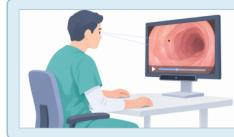  
Retrospective paired videos 3 senior + 2 novice Unassisted  CADe-assisted same participants/clips

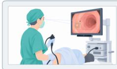  
Video frames Gaze (x, y) CADe boxes

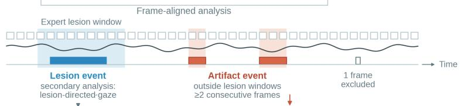

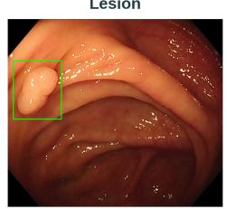

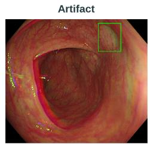  
B From a brief artifact prompt to gaze recovery  
GazeCADe prompt Historical prompt location ROI vicinity H Gaze-to-ROl distance  Gaze trajectory  
1 Initial viewing  
2 Prompt onset

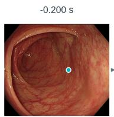

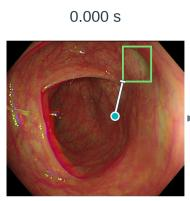

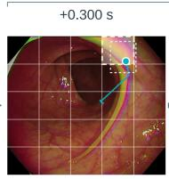

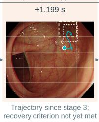

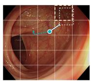  
Dashed: next ≥200 ms recovery criterion met

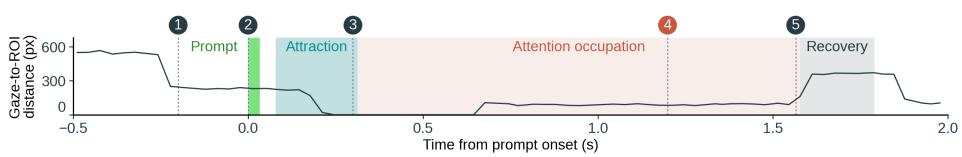  
Figure 1: Study designs and frame-aligned analysis of prompt-related gaze responses. (A) The retrospective experiment paired unassisted and CADe-assisted viewing of the same 60 clips by 3 senior and 2 novice endoscopists. The prospective dataset comprised 42 complete CADe-assisted colonoscopies performed by 9 senior endoscopists, without an unassisted control. In both datasets, video frames, gaze coordinates, and CADe bounding boxes were aligned to a common timeline. Artifact events were defined as CADe boxes outside expert-annotated lesion windows that persisted for at least two consecutive frames; single-frame detections were excluded. Lesiondirected gaze within lesion windows was assessed as a secondary analysis. Example frames show CADe prompts over a lesion and a non-lesion region. (B) Five frames from one retrospective CADe-assisted recording illustrate initial viewing, prompt onset, gaze attraction, attention occupation after prompt disappearance, and recovery. Turquoise markers indicate gaze position, and green boxes indicate visible CADe prompts. White dashed rectangles mark the former prompt location. Pale-yellow dashed grid cells define the region-of-interest (ROI) vicinity on a screen-fixed 5 × 5 grid, which does not track tissue motion. White capped lines indicate the shortest distance from gaze position to the former prompt box. Turquoise lines connect successive valid gaze samples, from prompt onset to the current frame in stage 3 and from the stage-3 sample to the current frame in stage 4. At stage 4, gaze has left the ROI vicinity but has not yet met the recovery criterion. Stage 5 marks the start of a subsequently confirmed recovery interval, with stable non-attraction outside the ROI vicinity for at least 200 ms; the dashed line traces gaze through this interval. Frame times are relative to prompt onset; equal spacing does not indicate equal temporal intervals. The lower strip plots the shortest gaze-to-prompt-box distance in pixels from 0.5 s before to 2 s after prompt onset. The green bar marks the visible prompt, and shaded bands mark the attraction segment, the attention-occupation interval, and the recovery interval. Numbered dashed lines mark the five frames.

## 2.2 Subjects

The retrospective paired-video experiment included 5 endoscopists, comprising 3 senior and 2 novice endoscopists, each of whom completed both the unassisted and CADe-assisted viewing sessions. The prospective dataset included 42 complete real-time CADe-assisted colonoscopies performed by 9 senior endoscopists. Senior endoscopists were defined as those with experience of at least 5000 colonoscopy procedures. Two senior endoscopists (Y.Z. and P.Y.F.) independently reviewed the videos for lesion annotation across both datasets.

## 2.3 Eye-tracking setup and CADe system

Gaze was recorded using a Tobii Pro Nano eye tracker (Tobii Technology, Stockholm, Sweden) at a sampling rate of 30 Hz. In the retrospective experiment, the eye tracker was calibrated for each participant before recording. Videos were displayed on a 15.6-inch Full HD monitor $( 1 9 2 0 \times 1 0 8 0 ~ \mathrm { p i x e l s } )$ , with participants seated approximately 65–70 cm from the screen. In the prospective study, the eye tracker was mounted below the endoscopy monitor and calibrated using a standard 9-point procedure before each colonoscopy. Calibration accuracy was verified using a test fixation point, and recalibration was performed when the deviation exceeded 0.5 degrees. Gaze coordinates and validity information for both eyes were recorded continuously and synchronized with the corresponding video frames using the native frame rate of each recording.

The CADe system was EndoAdd (June 2023 version; Xuan Wei Technology, China), which displayed real-time bounding-box prompts over regions identified as suspected lesions. These visible bounding boxes were used to define lesion and false-positive artifact regions of interest (ROIs) for subsequent gaze analysis. Video frames, CADe bounding boxes, and gaze data were temporally aligned before event-level analysis.

## 2.4 Expert lesion annotation

Two expert endoscopists independently reviewed all retrospective and prospective videos to identify lesions and annotate their on-screen appearance and disappearance times. Disagreements were resolved by consensus, and the resulting intervals defined the lesion windows used

throughout the analysis. In the prospective recordings, cecal intubation time was additionally annotated to define the start of withdrawal. Lesion-window onset was used as (t=0) for all lesion-directed gaze analyses.

## 2.5 Retrospective paired-video experiment

All participants viewed the same set of 60 prerecorded colonoscopy clips, each approximately 30 s in duration, concatenated into a single sequence with a total duration of 33 min 23 s. Two matched versions of the sequence were prepared: an unassisted version without CADe prompts and a CADe-assisted version with visible bounding-box prompts. Each participant completed both viewing sessions, with the unassisted session performed first and the CADe-assisted session two weeks later. Screen gaze was recorded throughout both sessions.

Video frames, per-frame CADe bounding boxes, and expert-annotated lesion windows were aligned to a common timeline and combined with the participant-specific gaze recordings (Figure 1A). For lesion analysis, the visible CADe bounding box defined the lesion region of interest (ROI) in the CADe-assisted condition. The same spatial coordinates at the corresponding time points were used as the reference ROI in the unassisted condition, enabling within-subject comparison of gaze responses to the same lesion region.

For false-positive prompt analysis, CADe bounding boxes occurring outside expert-annotated lesion windows were identified as candidate artifact events and screened before analysis. Events were required to persist for at least two consecutive detection frames. The final dataset comprised 41 lesion events and 28 artifact events, each evaluated across both viewing conditions.

## 2.6 Prospective real-time CADe recordings

The prospective dataset comprised real-time eye-tracking recordings obtained during CADeassisted colonoscopy. For each procedure, the endoscopy video, gaze coordinates, and per-frame CADe bounding boxes were synchronized to a common timeline. Cecal intubation marked the start of withdrawal, and expert-annotated lesion appearance and disappearance times defined the lesion windows.

CADe bounding boxes overlapping a lesion window were assigned to the corresponding lesion ROI, whereas boxes occurring outside all lesion windows were identified as candidate false-positive artifact events. After event screening, the final dataset comprised 60 lesion windows and 817 artifact events from 42 complete colonoscopies. Lesion-directed gaze and falsepositive prompt-related gaze responses were analyzed separately as descriptive measures of real-time human–AI interaction during clinical CADe use.

## 2.7 Gaze metrics

We used event-locked gaze analysis to characterize attraction, attention occupation, recovery, and time amplification following false-positive CADe prompts (Figure 1B). Lesion-directed gaze recognition and first ROI-entry time were assessed as secondary measures within expertannotated lesion windows (Figure 1A).

Lesion-directed gaze metrics quantified whether and how rapidly the endoscopist’s gaze entered the lesion region of interest (ROI) or its matched reference region. Lesion gaze recognition was defined as cumulative gaze within the ROI for $\geq 1 0 0$ ms during the expert-annotated lesion window. First ROI-entry time was defined as the interval from lesion-window onset (t = 0) to the first gaze sample within the ROI. In the retrospective experiment, the visible CADe bounding box defined the lesion ROI in the CADe-assisted condition, while the same spatial coordinates at the corresponding time points defined the reference ROI in the unassisted condition.

False-positive prompt-related gaze metrics quantified gaze attraction, attention occupation, recovery, and temporal amplification following artifact onset. Artifact event rate was calculated as the number of artifact events per minute of withdrawal time. Each artifact event was analyzed relative to its onset (t = 0) using an event-locked window.

For visualization of the event-locked gaze response, this interval was divided into 0.5-s bins. Within each bin, the ROI gaze-hit proportion was calculated as the proportion of valid gaze samples falling within the event-specific artifact ROI. The artifact ROI was defined as the union of bounding boxes observed during the first 0.5 s after artifact onset and was held fixed throughout the event-locked window.

Gaze attraction was assessed during the first 0.5 s after artifact onset using the spatial distance between gaze position and the artifact ROI. Distance was defined as zero when gaze fell within the ROI and otherwise as the shortest pixel distance to the ROI. For events containing multiple boxes, the minimum distance to any box was used. A gaze sample was considered direction-gated when its distance to the artifact ROI was smaller than that measured 100 ms earlier. An event was classified as attraction-triggered when the 0–0.5 s post-onset window contained at least 300 ms of valid gaze and a contiguous direction-gated approach lasting $\geq 1 0 0$ ms.

Immediate attraction magnitude $A _ { \mathrm { p e a k } }$ was defined as the diference between the median baseline gaze-to-ROI distance during the -0.5 to 0 s interval and the minimum direction-gated distance during the first 0.5 s after prompt onset. The time at which this minimum distance occurred was denoted $t _ { \mathrm { p e a k } }$

Attention occupation duration was operationally defined as the interval from the onset of the qualifying direction-gated approach to recovery. This onset was the time of the first gaze sample in the first contiguous direction-gated approach lasting $\geq 1 0 0$ ms within 0–0.5 s after prompt onset. The search for recovery began at $t _ { \mathrm { p e a k } }$ for each event. Recovery was defined as stable nonattraction lasting $\geq 2 0 0 ~ \mathrm { m s }$ . For events in which gaze had entered the ROI vicinity, recovery additionally required gaze to move outside that vicinity. ROI vicinity was defined using the display-wide $5 \times 5$ grid cells containing the centers of artifact bounding boxes observed during the first 0.5 s after onset. Events without recovery within the $5 \mathrm { - } \mathrm { { s } }$ observation window were treated as right-censored.

Time amplification was calculated for recovered attraction events as the ratio of attention occupation duration to artifact on-screen duration. Artifact on-screen duration was defined as the interval between artifact onset and disappearance. Attention occupation duration was treated as the primary temporal measure of prompt-related gaze persistence, with time amplification used as a secondary duration-normalized measure. The same event-locked framework was applied separately to the retrospective and prospective datasets.

## 2.8 Statistical analysis

All analyses were descriptive, and no formal hypothesis tests were performed. The study was designed to characterize prompt-related gaze mechanisms rather than to test a prespecified hypothesis, and the retrospective experiment included only five endoscopists whose observations were nested within subjects and within lesion or artifact events. We therefore report point estimates, sample sizes, and interval estimates rather than P values. The retrospective and prospective datasets were analyzed and reported separately and were not pooled.

Binary outcomes, including lesion gaze recognition and attraction triggering, are reported as proportions with numerators and denominators. Ninety-five percent confidence intervals for attraction-trigger rates were calculated with the Wilson score method. Continuous outcomes are reported as participant-level means for retrospective first ROI-entry time and as medians for right-skewed duration and ratio measures, namely artifact on-screen duration, attention occupation duration, and time amplification. Event-locked artifact-ROI gaze hit rates are shown as the mean across events within each 0.5-s bin, with 95% confidence intervals computed as the mean ± 1.96 standard errors. These intervals treat observations as independent and do not adjust for clustering within endoscopists or procedures; they are intended as descriptive indicators of precision.

Because each retrospective endoscopist viewed the same events under both conditions, comparisons between unassisted and CADe-assisted viewing were within-subject. For retrospective first ROI-entry time, values were first averaged within each participant and then summarized across the five paired participants. Immediate attraction was compared as the mean paired difference in direction-gated gaze-to-ROI distance over the complete subject–artifact observations evaluable in both conditions, with equal weight per observation. Prospective first ROI-entry time was summarized as the median at the lesion-window level among recognition-positive windows. Attention occupation duration and time amplification were summarized among attractiontriggered events with observed recovery; events without recovery within the 5-s window were right-censored, excluded from these summaries, and counted separately. Experience-stratified results for senior and novice endoscopists were exploratory. Diferences were computed from unrounded values, so a reported diference may deviate in the last digit from the subtraction of the rounded values shown. All analyses were performed in Python (version 3.13) using NumPy (version 2.4), pandas (version 3.0), and Matplotlib (version 3.10).

## 3 Results

## 3.1 Study datasets and event characteristics

The retrospective paired-video dataset included 41 lesion events and 28 false-positive artifact events per condition, each evaluated by 5 endoscopists (3 senior and 2 novice), yielding 205 subject–lesion and 140 subject–artifact observations per condition. The prospective dataset included 60 lesion events and 817 false-positive artifact events from 42 real-time CADeassisted colonoscopies performed by 9 senior endoscopists. The false-positive event rate was 0.84 events/min in the retrospective dataset (28 events over 33.4 min) and 2.77 events/min in the prospective dataset (817 events over 294.9 min) (Table 1).

Table 1: Comparison of lesion detection and false-positive event rates across CADe systems
<table><tr><td>CADe system</td><td>Source</td><td>Setting</td><td>Detection sensitivity</td><td>False-positive events (/min)</td></tr><tr><td>EndoAdd</td><td>Present study</td><td>Retrospective</td><td>41/41 lesion windows (100%)</td><td>0.84</td></tr><tr><td>EndoAdd</td><td>Present study</td><td>Prospective</td><td>60/60 lesion windows (100%)</td><td>2.77</td></tr><tr><td>GI Genius</td><td>[22]</td><td>Retrospective validation</td><td>99.7% (337/338)</td><td></td></tr><tr><td>GI Genius</td><td>[13]</td><td>Post-hoc RCT videos</td><td></td><td>2.4 ± 1.2</td></tr><tr><td>A SYSTEM</td><td>[23]</td><td>Prospective</td><td>100%</td><td>3.28</td></tr><tr><td>B SYSTEM</td><td>[23]</td><td>Prospective</td><td>100%</td><td>1.24</td></tr><tr><td>Deep-GI</td><td>[24]</td><td>Prospective</td><td>99.4%</td><td>1.55</td></tr><tr><td>CAD EYE (Fujifilm)</td><td>[24]</td><td>Prospective</td><td>85.0%</td><td>2.87</td></tr></table>

Notes: The present study used EndoAdd (June 2023 version; Xuan Wei Technology, China). Lesion coverage for EndoAdd denotes visible CADe prompts within expert-annotated lesion windows, whereas published studies report per-lesion detection sensitivity. False-positive event rates were calculated over withdrawal time. Values for Deep-GI and CAD EYE were derived from reported alert counts and withdrawal times at the ≥0.5-s threshold. Published values are provided for context and do not represent direct head-to-head comparisons. —, not reported.

## 3.2 Gaze responses to false-positive CADe prompts

False-positive prompts attracted gaze in 48.6% (68/140; Wilson 95% CI, 40.4–56.8%) of retrospective observations and 65.2% (533/817; 95% CI, 61.9–68.4%) of prospective events (Figure 2C). In the retrospective paired analysis, direction-gated gaze approach toward the prompted region was greater with visible CADe prompts than with the same-coordinate unassisted reference (mean paired diference, +25.7 px; n=121).

Among attraction-triggered events with complete recovery, median attention occupation duration was 1000 ms in the retrospective dataset (n=57) and 1100 ms in the prospective dataset (n=461), substantially longer than the corresponding median prompt durations of 33 ms and 267 ms. Median time amplification was 17.55-fold and 5.15-fold, respectively (Figure 2B). These estimates were based on 57 of 68 retrospective and 461 of 533 prospective attraction-triggered events with observed recovery; the remaining events were right-censored at the end of the observation window (Table 2).

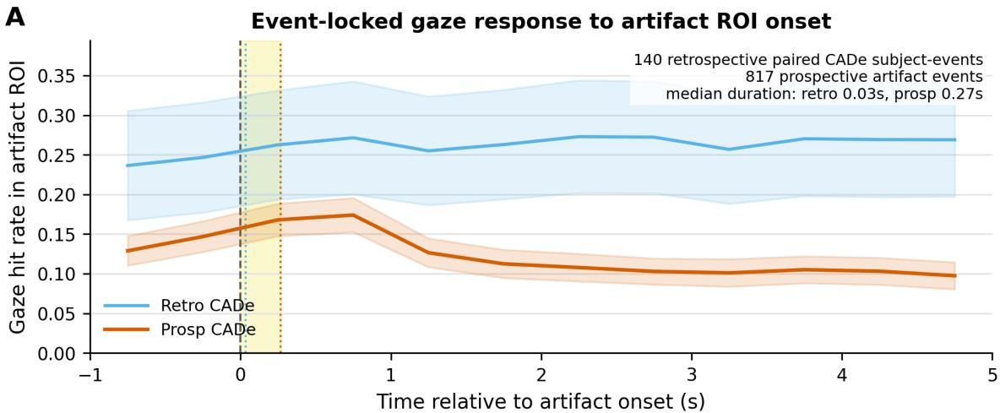

B  
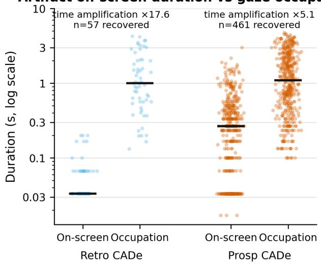

C  
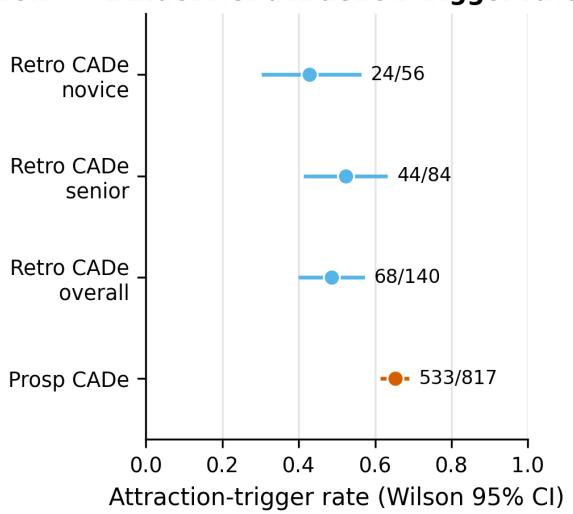  
Figure 2: Artifact ROIs captured gaze and produced attention occupation. (A) Event-locked gaze response to artifact ROI onset in retrospective paired CADe subject-events and prospective real-time CADe artifact events. Lines show the mean artifact-ROI gaze hit rate across 0.5-s time bins (1.0 s before to 5.0 s after onset), shaded bands show 95% confidence intervals, time zero marks artifact onset, and vertical reference lines mark median artifact on-screen duration in the retrospective and prospective datasets. This panel provides descriptive trajectory context and the datasets are not pooled. (B) Artifact on-screen duration and gaze attention occupation duration among recovered attraction events, shown on a log-scaled duration axis for retrospective and prospective CADe data. Median bars summarize the distributions, and the annotated time-amplification values quantify how brief artifact prompts corresponded to longer gaze occupation. Right-censored events were excluded from this recoveredevent panel as a conservative complete-recovery subset. (C) Artifact ROI attraction-trigger rates with Wilson 95% confidence intervals for retrospective novice, retrospective senior, retrospective overall, and prospective CADe events. Retrospective paired data provide the controlled artifact-gaze evidence, while prospective real-time CADe data show that the same artifact-gaze mechanism was observable during clinical workflow.

Table 2: Lesion ROI gaze response and artifact-related gaze attraction and attention cost by dataset
<table><tr><td rowspan="2">Metric</td><td colspan="2">Retrospective paired-video</td><td>Prospective real-time</td></tr><tr><td>Unassisted</td><td>CADe-assisted</td><td>CADe-assisted⁸</td></tr><tr><td>Lesion ROI gaze response</td><td></td><td></td><td></td></tr><tr><td>Lesion ROI gaze recognition, proportion (n/N)</td><td>0.980 (201/205)</td><td>0.990 (203/205)</td><td>0.867 (52/60)</td></tr><tr><td>First ROI-entry time,  $\mathrm { m } \mathrm { s } ^ { \ast }$ </td><td>1458.3</td><td>1310.5</td><td>1633.5†</td></tr><tr><td>Senior</td><td>1542.4</td><td>1246.7</td><td></td></tr><tr><td>Novice</td><td>1332.1</td><td>1406.1</td><td></td></tr><tr><td>Artifact ROI gaze attraction</td><td></td><td></td><td></td></tr><tr><td>Attraction-triggered proportion (n/N)</td><td></td><td>0.486 (68/140)</td><td>0.652 (533/817)</td></tr><tr><td>Senior</td><td></td><td>0.524 (44/84)</td><td></td></tr><tr><td>Novice</td><td></td><td>0.429 (24/56)</td><td></td></tr><tr><td>Artifact attention cost</td><td></td><td></td><td></td></tr><tr><td>Artifact on-screen duration, median (s)</td><td></td><td>0.033</td><td>0.267</td></tr><tr><td>Attention occupation duration, median  $( \mathrm { s } ) ^ { \ddag }$ </td><td></td><td>1.00</td><td>1.10</td></tr><tr><td>Time amplification, median (ratio)‡</td><td></td><td>17.55</td><td>5.15</td></tr><tr><td>Senior</td><td></td><td>23.26</td><td></td></tr><tr><td>Novice</td><td></td><td>14.05</td><td></td></tr></table>

Notes: Retrospective lesion analyses included 5 endoscopists (3 senior, 2 novice) and 41 lesion events, yielding 205 subject–lesion observations per condition; artifact analyses included 28 events, yielding 140 subject–event observations per condition. The prospective dataset included 42 procedures, 60 lesion events, and 817 artifact events. The two datasets were analyzed separately and were not pooled. \* Means of participant-level summaries (all, n=5; senior, n=3; novice, n=2). † Median among 52 recognition-positive lesion events. ‡ Calculated among attraction-triggered events with complete recovery (retrospective n=57: senior 36, novice 21; prospective n=461); right-censored events were excluded. ¶ Artifact-related metrics were not estimated for the unassisted condition under the study design. § All prospective procedures were performed by senior endoscopists; no novice subgroup was available. —, not estimated. CADe, computer-aided detection; ROI, region of interest.

## 3.3 Lesion-directed gaze recognition and first-entry time

In the retrospective paired experiment, lesion gaze recognition was high under both unassisted and CADe-assisted conditions, at 98.0% (201/205) and 99.0% (203/205), respectively. Mean first ROI-entry time across the 5 participants was 1458.3 ms under the unassisted condition and 1310.5 ms with CADe assistance, corresponding to an earlier entry of 147.8 ms with CADe (Figure 3A,B). In the prospective real-time recordings, lesion gaze recognition was 86.7% (52/60). Among recognition-positive lesion events, the median first ROI-entry time was 1633.5 ms (n=52) (Table 2).

A  
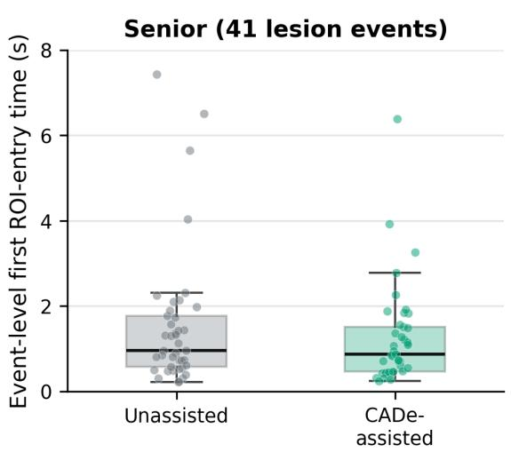

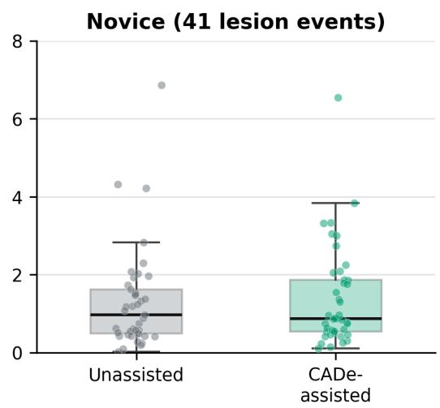

B  
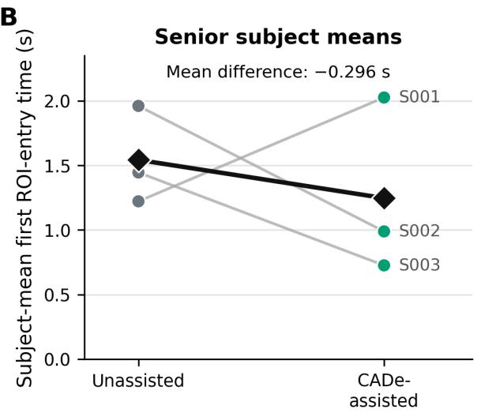

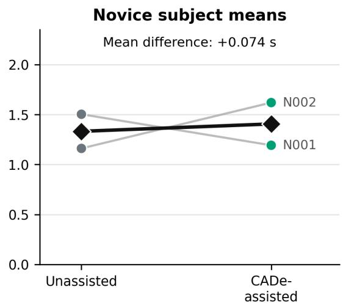  
Figure 3: First lesion ROI-entry timing under unassisted and CADe-assisted viewing. (A) Event-level first lesion ROI-entry time in senior and novice endoscopists during retrospective unassisted and CADe-assisted viewing. Each point represents a lesion-event estimate after averaging across subjects within the same group and condition, and boxplots summarize the event-level distributions. (B) Subject-mean first lesion ROI-entry time for the same retrospective paired subjects, with paired lines linking each subject’s unassisted and CADe-assisted values; black diamonds indicate group means. Subject labels are anonymized sequentially within experience group (S, senior; N, novice). The senior subgroup showed earlier mean first ROI entry under CADe-assisted viewing, whereas the novice subgroup did not show the same direction of change. Figure 3 is interpreted as exploratory lesion-side gaze-mechanism evidence and should be read together with Table 2, which reports lesion ROI recognition rates and first-entry summaries.

## 3.4 Experience-stratified gaze responses

In the retrospective paired experiment, mean first lesion ROI-entry time was 295.6 ms shorter with CADe assistance among senior endoscopists (1542.4 vs 1246.7 ms), whereas it was 74.0 ms longer among novice endoscopists (1332.1 vs 1406.1 ms) (Figure 3A,B). For false-positive prompts, senior endoscopists showed a higher attraction-trigger rate than novice endoscopists (52.4%, 44/84 vs 42.9%, 24/56) and greater median time amplification (23.26-fold, n=36 vs 14.05-fold, n=21). These experience-stratified findings should be considered exploratory given the small subgroup sample (3 senior and 2 novice endoscopists).

## 4 Discussion

This study provides event-level eye-tracking evidence that false-positive CADe prompts can capture and sustain endoscopists’ visual attention during colonoscopy. False-positive prompts attracted gaze in both the controlled paired-video experiment and prospective real-time recordings, and the associated attention occupation persisted for approximately 1000–1100 ms, substantially longer than the prompts themselves. As a secondary comparison, lesion gaze recognition remained high with and without CADe assistance, while first gaze entry into lesion ROIs occurred earlier with CADe. Exploratory analyses further suggested that prompt-related gaze responses may difer according to endoscopist experience. Together, these findings characterize how individual CADe prompts influence visual attention beyond conventional procedure-level detection outcomes.

The principal finding extends the evaluation of false-positive CADe burden from prompt frequency to prompt-level attentional dynamics. Previous studies have shown that CADe systems can generate multiple false-positive alerts during colonoscopy and that a greater false-positive burden may reduce the benefit of CADe assistance [13, 16]. However, event counts indicate how often false-positive prompts occur but not how strongly an individual prompt afects visual search or how long that efect persists. In our study, false-positive prompts were followed by gaze attraction and attention occupation lasting approximately 1 s in both datasets. This indicates that even a brief visual prompt can be associated with a gaze response that persists well beyond its on-screen duration. Attention occupation duration therefore provides a time-based measure of prompt-related gaze persistence that complements conventional false-positive event rates.

Time amplification further quantified the persistence of this gaze response relative to prompt visibility. Median time amplification was 17.55-fold in the retrospective experiment and 5.15- fold in the prospective recordings. The diference between these values should be interpreted in the context of the substantially diferent prompt durations in the two datasets, with median durations of 33 ms retrospectively and 267 ms prospectively. Time amplification is therefore sensitive to the duration of the visual stimulus and is best interpreted together with absolute occupation time. We regard attention occupation duration as the primary temporal measure, while time amplification provides a complementary measure of how long the prompt-related gaze response persists relative to the prompt itself.

The lesion-directed analysis provides a useful comparison with the false-positive findings. Lesion gaze recognition was already high under unassisted viewing and increased only slightly with CADe assistance, whereas first gaze entry into the lesion ROI occurred 147.8 ms earlier with CADe. This suggests that CADe may primarily facilitate earlier gaze orientation toward visible lesions when baseline gaze recognition is already high. Eye-tracking studies have distinguished failure to fixate a lesion from failure to recognize it despite fixation [25]. The result should therefore not be interpreted as earlier lesion detection or improved diagnostic performance, which were not directly measured. Although the two sessions were separated by two weeks, the viewing order was fixed, and residual familiarity with the prerecorded videos cannot be excluded as a contributor to the observed first-entry diference.

Experience-stratified analyses suggested diferent gaze responses between senior and novice endoscopists. Senior endoscopists showed a larger CADe-associated reduction in lesion firstentry time, a higher attraction-trigger rate for false-positive prompts, and greater time amplification. Previous eye-tracking studies have similarly shown that visual-search patterns vary according to endoscopy experience and proficiency [19, 26]. These findings may reflect differences in visual monitoring, search eficiency, or sensitivity to on-screen prompts rather than greater dependence on CADe. Given the small subgroup sample of 3 senior and 2 novice endoscopists, these results should be considered exploratory.

Prompt-level gaze responses also provide a potential mechanistic perspective on broader questions of human–AI collaboration. Budzyń et al. [5] reported lower unassisted ADR after repeated AI exposure, whereas Pedersen et al. [6] found no persistent upskilling or deskilling after CADe withdrawal. Our study does not address whether repeated CADe exposure changes independent detection performance. Instead, it identifies a proximal behavioral response that occurs while CADe is being used. Future longitudinal studies could examine whether repeated prompt-related attentional capture accumulates over time and whether such exposure is associated with subsequent changes in unassisted visual search or lesion detection.

These findings may also inform the evaluation and design of future CADe systems. Current evaluation primarily considers clinical detection endpoints and the frequency of false-positive alerts. Reducing false-positive alerts to avoid alert fatigue has been identified as a research priority for AI-assisted colonoscopy [27]. However, systems with similar false-positive event rates may difer in the amount of visual attention consumed by each prompt. Prompt frequency and prompt-related attention should therefore be considered as complementary dimensions of CADe performance. Event-level measures such as attention occupation duration may help evaluate how prompt salience, persistence, and spatial presentation influence the endoscopist’s visual search. Reducing unnecessary attentional capture while preserving rapid orientation toward true lesions may provide an additional design objective for more efective human–AI collaboration.

The retrospective and prospective datasets provide complementary evidence. The pairedvideo experiment enabled within-subject comparison of gaze responses to the same visual regions with and without visible CADe prompts, whereas the prospective recordings demonstrated that false-positive prompt-related gaze attraction and persistence were also observed during realtime clinical workflow. The two datasets difered in experimental setting, prompt frequency, and prompt duration and were therefore analyzed separately.

Several limitations should be considered. The retrospective experiment included only 5 endoscopists, limiting the precision and generalizability of the experience-stratified findings. The viewing order was not counterbalanced. The prospective dataset contained only CADe-assisted procedures and therefore provided real-time observational evidence without a matched prospective unassisted comparison. False-positive event identification depended on expert-defined lesion windows and the event-extraction pipeline, and event misclassification cannot be completely excluded. Gaze was recorded at 30 Hz, corresponding to a temporal resolution of approximately 33 ms, which limits the precision of very short temporal measurements [28] and makes time amplification particularly sensitive when prompt duration approaches a single video frame. Finally, the study evaluated one CADe system under specific display and eye-tracking conditions, and whether prompt-related attention occupation translates into measurable changes in lesion detection remains to be determined.

## 5 Conclusions

False-positive CADe prompts frequently attracted endoscopists’ gaze, and the associated attention occupation persisted substantially beyond prompt visibility in both controlled and real-time clinical settings. Event-level gaze metrics may complement conventional detection endpoints and false-positive counts by capturing how individual prompts shape visual attention. Incorporating prompt-related attentional efects into future CADe evaluation and design may support more efective human–AI collaboration.

## ACKNOWLEDGMENT

This work was supported by the Excellent Young Scientists Fund of Fujian Provincial Natural Science Foundation (Grant No. 2026D017).

## References

[1] Pu Wang, Tyler M. Berzin, Jeremy Romek Glissen Brown, Shishira Bharadwaj, Aymeric Becq, Xun Xiao, Peixi Liu, Liangping Li, Yan Song, Di Zhang, Yi Li, Guangre Xu, Mengtian Tu, and Xiaogang Liu. Real-time automatic detection system increases colonoscopic

polyp and adenoma detection rates: a prospective randomised controlled study. Gut, 68 (10):1813–1819, 2019. doi: 10.1136/gutjnl-2018-317500.

[2] Cesare Hassan, Marco Spadaccini, Yuichi Mori, Farid Foroutan, Antonio Facciorusso, Paraskevas Gkolfakis, Georgios Tziatzios, Konstantinos Triantafyllou, Giulio Antonelli, Kareem Khalaf, Tommy Rizkala, Per Olav Vandvik, Alessandro Fugazza, Emanuele Rondonotti, Jeremy R. Glissen-Brown, Shunsuke Kamba, Marcello Maida, Loredana Correale, Pradeep Bhandari, Rodrigo Jover, Prateek Sharma, Douglas K. Rex, and Alessandro Repici. Real-time computer-aided detection of colorectal neoplasia during colonoscopy: A systematic review and meta-analysis. Annals of Internal Medicine, 176(9):1209–1220, 2023. doi: 10.7326/M22-3678.

[3] Uri Ladabaum, John Shepard, Yingjie Weng, Manisha Desai, Sara J. Singer, and Ajitha Mannalithara. Computer-aided detection of polyps does not improve colonoscopist performance in a pragmatic implementation trial. Gastroenterology, 164(3):481–483.e6, 2023. doi: 10.1053/j.gastro.2022.12.004.

[4] Pedro Davila-Piñón, Astrid I. Díez-Martín, Alba Nogueira-Rodríguez, Florentino Fdez-Riverola, Daniel Glez-Peña, Miguel Reboiro-Jato, Luisa De Castro, Daniel Fernández-De Castro, Pablo Vega, Miguel Telmo Galovart-Araguas, Santiago Soto, Sara Alonso-Lorenzo, Alfonso Martínez-Turnes, Noel Pin, Sara Zarraquiños, David Remedios, Cristina Sánchez-Gomez, Raquel Souto-Rodríguez, Franco Baiocchi, María José Iglesias-Varela, Alejandro Ledo, Coral Tejido-Sandoval, Laura Rivas, Natalia García-Morales, Antonio Rodríguez-De Jesus, Manuel Puga, María Belén Castiñeira-Domínguez, Nereida Fernández-Fernández, Arantza Germade-Martínez, Enrique Gonzalez-De La Ballina, Indhira Pérez-Medrano, Hugo López-Fernández, and Joaquín Cubiella. Computer-assisted versus standard colonoscopy for adenoma detection in a population-based colorectal cancer screening program: a randomized clinical trial. Endoscopy, 2026. doi: 10.1055/ a-2895-1613. Online ahead of print.

[5] Krzysztof Budzyń, Marcin Romańczyk, Diana Kitala, Paweł Kołodziej, Marek Bugajski, Hans O. Adami, Johannes Blom, Marek Buszkiewicz, Natalie Halvorsen, Cesare Hassan, Tomasz Romańczyk, Øyvind Holme, Krzysztof Jarus, Shona Fielding, Melina Kunar, Maria Pellise, Nastazja Pilonis, Michał Filip Kamiński, Mette Kalager, Michael Bretthauer, and Yuichi Mori. Endoscopist deskilling risk after exposure to artificial intelligence in colonoscopy: a multicentre, observational study. The Lancet Gastroenterology & Hepatology, 10(10):896–903, 2025. doi: 10.1016/S2468-1253(25)00133-5.

[6] Tom Andre Pedersen, Yuichi Mori, Edoardo Botteri, Trond Engjom, Birgitte Seip, Georg Gjorgji Dimcevski, and Roald Flesland Havre. Learning and deskilling efects of artificial intelligence in colonoscopy among endoscopists with diferent levels of experience: a pragmatic, prospective trial. Endoscopy, 58(9):1003–1014, 2026. doi: 10.1055/a-2858-7084.

[7] Joel Troya, Daniel Fitting, Markus Brand, Boban Sudarevic, Jakob Nikolas Kather, Alexander Meining, and Alexander Hann. The influence of computer-aided polyp detection systems on reaction time for polyp detection and eye gaze. Endoscopy, 54(10): 1009–1014, 2022. doi: 10.1055/a-1770-7353.

[8] Fumiaki Ishibashi, Sho Suzuki, Kentaro Mochida, Mizuki Nagai, Eri Ozaki, and Kosuke Okusa. Eye tracking analysis to determine the endoscopist’s recognition rate for artificial intelligence-detected sites in colonoscopy. Digestive Diseases and Sciences, 70(12):4113– 4121, 2025. doi: 10.1007/s10620-025-09205-6.

[9] Shun Ito, Fumiaki Ishibashi, Kosuke Okusa, Kentaro Mochida, Takao Tonishi, Eri Ozaki, and Sho Suzuki. Impact of computer-aided detection on endoscopist’s gaze-shift distance during colonoscopy: a randomized controlled trial (with video). Journal of Gastroenterology and Hepatology, 41(6):1760–1767, 2026. doi: 10.1111/jgh.70351.

[10] Yan Zhu, Rui-Jie Yang, Pei-Yao Fu, Zhen Zhang, Yi-Zhe Zhang, Quan-Lin Li, Shuo Wang, and Ping-Hong Zhou. Eye-tracking dataset of endoscopist-ai teaming during colonoscopy: Retrospective and real-time acquisition. Scientific Data, 12(1):212, 2025. doi: 10.1038/ s41597-025-04535-6.

[11] Baptiste Vasey, Myura Nagendran, Bruce Campbell, David A. Clifton, Gary S. Collins,

Spiros Denaxas, Alastair K. Denniston, Livia Faes, Bart Geerts, Mudathir Ibrahim, Xiaoxuan Liu, Bilal A. Mateen, Piyush Mathur, Melissa D. McCradden, Lauren Morgan, Johan Ordish, Campbell Rogers, Suchi Saria, Daniel S. W. Ting, Peter Watkinson, Wim Weber, Peter Wheatstone, Peter McCulloch, and the DECIDE-AI expert group. Reporting guideline for the early-stage clinical evaluation of decision support systems driven by artificial intelligence: DECIDE-AI. Nature Medicine, 28(5):924–933, 2022. doi: 10.1038/s41591-022-01772-9.

[12] Jan Theeuwes, Arthur F. Kramer, Sowon Hahn, and David E. Irwin. Our eyes do not always go where we want them to go: Capture of the eyes by new objects. Psychological Science, 9(5):379–385, 1998. doi: 10.1111/1467-9280.00071.

[13] Cesare Hassan, Matteo Badalamenti, Roberta Maselli, Loredana Correale, Andrea Iannone, Franco Radaelli, Emanuele Rondonotti, Elisa Ferrara, Marco Spadaccini, Asma Alkandari, Alessandro Fugazza, Andrea Anderloni, Piera Alessia Galtieri, Gaia Pellegatta, Silvia Carrara, Milena Di Leo, Vincenzo Craviotto, Laura Lamonaca, Roberto Lorenzetti, Alida Andrealli, Giulio Antonelli, Michael Wallace, Prateek Sharma, Thomas Rösch, and Alessandro Repici. Computer-aided detection-assisted colonoscopy: classification and relevance of false positives. Gastrointestinal Endoscopy, 92(4):900–904.e4, 2020. doi: 10.1016/j.gie.2020.06.021.

[14] Taishi Okumura, Kenichiro Imai, Masashi Misawa, Shin-Ei Kudo, Kinichi Hotta, Sayo Ito, Yoshihiro Kishida, Kazunori Takada, Noboru Kawata, Yuki Maeda, Masao Yoshida, Yoichi Yamamoto, Tatsunori Minamide, Hirotoshi Ishiwatari, Junya Sato, Hiroyuki Matsubayashi, and Hiroyuki Ono. Evaluating false-positive detection in a computer-aided detection system for colonoscopy. Journal of Gastroenterology and Hepatology, 39(5): 927–934, 2024. doi: 10.1111/jgh.16491.

[15] Erik A. Holzwanger, Mohammad Bilal, Jeremy R. Glissen Brown, Shailendra Singh, Aymeric Becq, Kenneth Ernest-Suarez, and Tyler M. Berzin. Benchmarking definitions of false-positive alerts during computer-aided polyp detection in colonoscopy. Endoscopy, 53(9):937–940, 2021. doi: 10.1055/a-1302-2942.

[16] Chenxia Zhang, Liwen Yao, Ruiqing Jiang, Jing Wang, Huiling Wu, Xun Li, Zhifeng Wu, Renquan Luo, Chaijie Luo, Xia Tan, Wen Wang, Bing Xiao, Huiyan Hu, and Honggang Yu. Assessment of the role of false-positive alerts in computer-aided polyp detection for assistance capabilities. Journal of Gastroenterology and Hepatology, 39(8):1623–1635, 2024. doi: 10.1111/jgh.16615.

[17] Niels van Berkel, Jeremy Opie, Omer F. Ahmad, Laurence Lovat, Danail Stoyanov, and Ann Blandford. Initial responses to false positives in AI-supported continuous interactions: A colonoscopy case study. ACM Transactions on Interactive Intelligent Systems, 12 (1):1–18, 2022. doi: 10.1145/3480247.

[18] Cristina Almansa, Muhammad W. Shahid, Michael G. Heckman, Susan Preissler, and Michael B. Wallace. Association between visual gaze patterns and adenoma detection rate during colonoscopy: A preliminary investigation. American Journal of Gastroenterology, 106(6):1070–1074, 2011. doi: 10.1038/ajg.2011.26.

[19] Wenjing He, Simon Bryns, Karen Kroeker, Anup Basu, Daniel Birch, and Bin Zheng. Eye gaze of endoscopists during simulated colonoscopy. Journal of Robotic Surgery, 14(1): 137–143, 2020. doi: 10.1007/s11701-019-00950-1.

[20] Mariam Lami, Harsimrat Singh, James Dilley, Hajra Ashraf, Matthew Edmondon, Felipe Orihuela-Espina, Jonathan Hoare, Ara Darzi, and Mikael Sodergren. Gaze patterns hold key to unlocking successful search strategies and increasing polyp detection rate in colonoscopy. Endoscopy, 50(7):701–707, 2018. doi: 10.1055/s-0044-101026.

[21] Mizuki Nagai, Fumiaki Ishibashi, Kosuke Okusa, Kentaro Mochida, Eri Ozaki, Tetsuo Morishita, and Sho Suzuki. Optimal visual gaze pattern of endoscopists for improving adenoma detection during colonoscopy (with video). Gastrointestinal Endoscopy, 101 (3):639–646.e3, 2025. doi: 10.1016/j.gie.2024.09.028.

[22] Cesare Hassan, Michael B. Wallace, Prateek Sharma, Roberta Maselli, Vincenzo Craviotto, Marco Spadaccini, and Alessandro Repici. New artificial intelligence system:

first validation study versus experienced endoscopists for colorectal polyp detection. Gut, 69(5):799–800, 2020. doi: 10.1136/gutjnl-2019-319914.

[23] Goh Eun Chung, Jooyoung Lee, Seon Hee Lim, Hae Yeon Kang, Jung Kim, Ji Hyun Song, Sun Young Yang, Ji Min Choi, Ji Yeon Seo, and Jung Ho Bae. A prospective comparison of two computer aided detection systems with diferent false positive rates in colonoscopy. npj Digital Medicine, 7(1):366, 2024. doi: 10.1038/s41746-024-01334-y.

[24] Kasenee Tiankanon, Julalak Karuehardsuwan, Satimai Aniwan, Parit Mekaroonkamol, Panukorn Sunthornwechapong, Huttakan Navadurong, Kittithat Tantitanawat, Krittaya Mekritthikrai, Salin Samutrangsi, Peerapon Vateekul, and Rungsun Rerknimitr. Performance comparison between two computer-aided detection colonoscopy models by trainees using diferent false positive thresholds: a cross-sectional study in thailand. Clinical Endoscopy, 57(2):217–225, 2024. doi: 10.5946/ce.2023.145.

[25] Omer F. Ahmad, Evangelos Mazomenos, Francois Chadebecq, Rawen Kader, Mohamed Hussein, Rehan J. Haidry, Juana González-Bueno Puyal, Patrick Brandao, Daniel Toth, Peter Mountney, Ed Seward, Roser Vega, Danail Stoyanov, and Laurence B. Lovat. Identifying key mechanisms leading to visual recognition errors for missed colorectal polyps using eye-tracking technology. Journal of Gastroenterology and Hepatology, 38(5):768– 774, 2023. doi: 10.1111/jgh.16127.

[26] Urvi Karamchandani, Simon Erridge, Keane Evans-Harvey, Ara Darzi, Jonathan Hoare, and Mikael Hans Sodergren. Visual gaze patterns in trainee endoscopists – a novel assessment tool. Scandinavian Journal of Gastroenterology, 57(9):1138–1146, 2022. doi: 10.1080/00365521.2022.2064723.

[27] Omer F. Ahmad, Yuichi Mori, Masashi Misawa, Shin-ei Kudo, John T. Anderson, Jorge Bernal, Tyler M. Berzin, Raf Bisschops, Michael F. Byrne, Peng-Jen Chen, James E. East, Tom Eelbode, Daniel S. Elson, Suryakanth R. Gurudu, Aymeric Histace, William E. Karnes, Alessandro Repici, Rajvinder Singh, Pietro Valdastri, Michael B. Wallace, Pu Wang, Danail Stoyanov, and Laurence B. Lovat. Establishing key research questions

for the implementation of artificial intelligence in colonoscopy: a modified delphi method.   
Endoscopy, 53(9):893–901, 2021. doi: 10.1055/a-1306-7590.

[28] Richard Andersson, Marcus Nyström, and Kenneth Holmqvist. Sampling frequency and eye-tracking measures: how speed afects durations, latencies, and more. Journal of Eye Movement Research, 3(3), 2010. doi: 10.16910/jemr.3.3.6. Article 6.