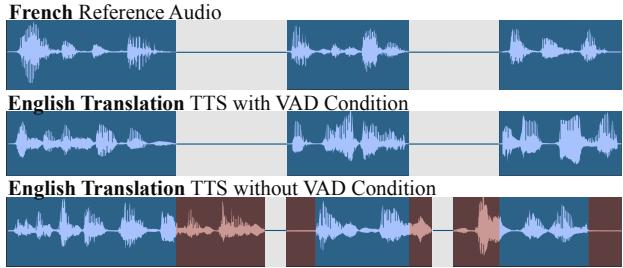
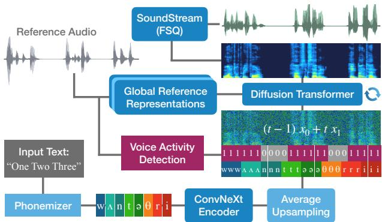
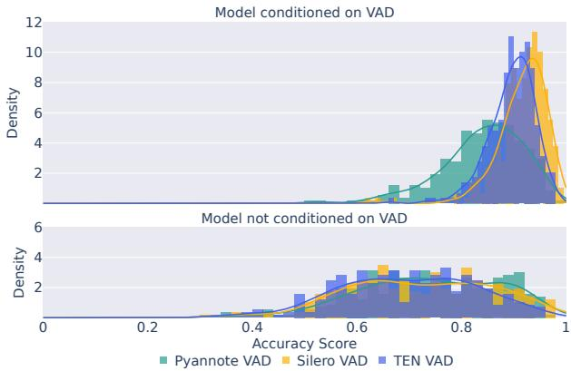
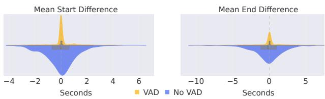
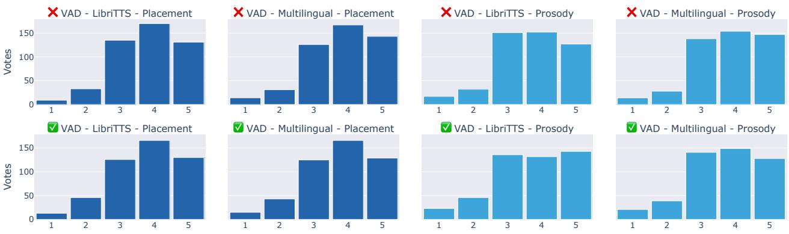

# Not Quite My Tempo: Voice Activity-aware Speech Synthesis for Lip-Synchronous Dubbing

Alejandro Perez-Gonz´ alez-de-Martos´ ID 1,∗∗, Florian Lux ID 1, Angelina Elizarova1, Milana Shkhanukova1, Andreas Kellner1, Mattia Antonino Di Gangi ID 1

1 AppTek GmbH, Germany

aperez@apptek.com, flux@apptek.com

## Abstract

Automatic lip-synchronous dubbing requires a speech synthesis model to generate alternating voice and silence patterns in the target language that match the timing of the source clip precisely to ensure an optimal viewing experience. Prior works address this problem by conditioning the speech synthesis process on lip movements extracted from the video signal. In this work, we condition the speech generation on a binary voiceactivity signal, which has a lightweight representation and can be produced in multiple ways. We show that the model follows the voice-activity signal with high accuracy while maintaining natural prosody and semantically appropriate pause placement within sentences, as demonstrated through extensive objective and subjective evaluations. By randomly masking this condition during training, we make the feature entirely optional during inference, allowing editors to enforce or relax lip-sync constraints when desired.

Index Terms: speech synthesis, voice activity detection, prosody cloning, automatic dubbing

## 1. Introduction

While modern text-to-speech (TTS) synthesis has evolved through paradigms like regression, next-token prediction, transport functions or inpainting, the application of these methods to automatic dubbing introduces unique challenges. The goal extends beyond simple translation to the creation of a seamless cross-lingual experience. Consequently, alignment must be multidimensional, encompassing not only voice identity, style and intent, but interestingly and uniquely, also the precise temporal mapping of pause structures. The temporal axis of the target speech must be precisely mapped to the source to maintain the visual-audio coherence required for lip-sync dubbing.

To this end, we propose an approach that incorporates a Voice Activity Detection (VAD) stage to generate frame-level binary masks. These voice activity annotations provide the temporal conditioning necessary to condition an inpainting-based synthesis process [1, 2] during training. At inference time, the model continues to leverage the VAD-derived mask, which is now derived from the reference audio in the source language. Owing to the inpainting paradigm operating on a fixed-length canvas, the binary voiced/unvoiced pattern can be seamlessly propagated from the source signal to the target, since both are defined over the same number of frames. This design constrains only the temporal structure of speech activity, while leaving the allocation of linguistic content within voiced regions to the model, which is trained end-to-end. Notably, although no explicit constraints on pause placement are imposed beyond the activity mask, we find the model consistently learns to position pauses at linguistically coherent boundaries. To illustrate this, we provide example audios taken from our subjective evaluation, as well as examples from our qualitative analysis.1

  
Figure 1: Example of our proposed technique in action: The VAD condition encourages the model to use only the blue area as canvas for inpainting-TTS. Silences are aligned on the time axis, which is a requirement in lip-synchronous dubbing.

While numerous works have explored methods for transferring voice timbres and speaking style [3, 4, 5, 6], few investigated the problem of achieving precise temporal alignment between source and target utterances. Exact prosody matching is explored in research fields such as voice privacy [7], deepfake detection [8, 9], and literary studies [10], but these settings assume identical source and target texts. This assumption does not reflect the challenges of dubbing.

Most existing approaches for prosodic alignment across differing utterances in dubbing and similar contexts attempt to address this challenge by leveraging visual cues from a video stream, for example by encoding lip movements into embeddings that condition the text-to-speech system [11, 12, 13]. In contrast, our method relies solely on audio-text data and does not require paired video during training, eliminating a major practical constraint. Additionally, our approach is decoupled from the problem of detecting the primary speaking face and modeling its lip dynamics, a process that can be brittle in outof-domain scenarios such as cartoons, anime, or scenes with multiple visible speakers, and may require specialized encoders.

Effective prosody transfer in lip-sync dubbing requires translations that accommodate the pacing and length of the original speech. In traditional professional workflows, human experts manually adapt the translated script to satisfy these rigid lip-sync constraints, but recent research has sought to automate the process through dubbing-specific machine translation (MT). Isochronous MT aims at generating target text that matches the source duration by aligning syllable or phoneme counts [14, 15, 16]. Additionally, some works focused on transferring explicit text pause markers from source to target to provide a richer signal to speech synthesis [17]. These lines of work are complementary to ours, as a speech synthesis system still needs to render the written translation according to the dubbing requirements. In the present work, we assume that a given translation has a sufficiently matching timing structure, but we do not require explicit additional prosodic information.

## 2. Methods

## 2.1. Basic TTS Setup

Our model architecture loosely follows F5-TTS [1, 18] with a few modifications. Figure 2 provides a schematic overview of the system. First, we replace filler-token-based upsampling with the average upsampling method proposed in ZipVoice [2], which provides a stronger inductive bias toward near-diagonal temporal alignment between input and target sequences. Second, our model addresses zero-shot speaker and style transfer via explicit speaker embeddings [3] and Global Style Tokens (GST) [4] as opposed to acoustic prompt-based conditioning (inpainting), leading to improved disentanglement of timbre, style, and accent. Finally, we adopt a pretrained, modified SoundStream [19] vocoder which maps 16 kHz waveforms to 32-dimensional scalar-quantized latent codes [20] and generates 48 kHz high-fidelity outputs [21].

## 2.2. Voice Activity Conditioning

The main novelty of this method is the introduction of a voice activity mask to condition audio generation. For each acoustic frame, voice activity is encoded as a binary indicator of speech presence or absence. This signal is embedded and added to the encoder representations, providing the Diffusion Transformer (DiT) [22] Flow Matching decoder with explicit temporal voice activity cues. A schematic illustration is provided in Figure 2.

To enable controllability of voice activity adherence at inference time, we randomly mask a subset of the ground-truth voice activity embeddings during training. This allows selective masking of frames around speech–silence transition regions, which can be useful in post-editing workflows. Fully masking the voice activity signal effectively removes VAD conditioning from the model, allowing the system to operate both with and without VAD guidance. This flexibility is motivated by the observation that strict lip-syncing constraints are not required in all scenarios: one large-scale study reports that such alignment is present in movies only about 12% of the time [23]. Moreover, accommodating non-adapted translations (e.g., standard MT outputs) under rigid lip-sync constraints is inherently difficult. Our results further indicate that, in some cases, enforcing such alignment may compromise other aspects of voice quality.

  
Figure 2: Overview of the proposed architecture with VAD conditioning. During training, VAD labels are randomly masked, enabling optional use of this feature at inference time.

## 3. Experiments

## 3.1. Data

We provide results for two models: a core English model trained on the publicly available LibriTTS-R corpus [24, 25] to ensure reproducibility, alongside a multilingual model trained on a larger combination of public and proprietary data sources.

For evaluation, we utilize a subset of the Multilingual TEDx (mTEDx) dataset [26]. This corpus provides diverse source-to-English language pairs for comprehensive cross-lingual assessment. Moreover, the semi-spontaneous nature of TEDx talks, characterized by frequent and irregular pauses, offers a more rigorous test than traditional read-speech corpora. Leveraging such challenging dynamic speech patterns allows us to effectively validate our approach’s precision in managing timing constraints under realistic conditions. To this end, we curated a test set of utterances with durations between 7 and 15 seconds, each containing at least one pause exceeding 500 ms. The final evaluation set comprises 291 samples, balanced across four source languages: Greek, French, Portuguese and Russian. For subjective assessments, a random subset of 25 samples was selected from this pool; this sample size was constrained to maintain a reasonable evaluation time and mitigate rater fatigue.

## 3.2. Experimental Setup

The proposed model operates on phoneme sequences, which are mapped to 1024-dimensional embeddings and contextualized via an 8-layer ConvNeXt encoder. The encoder outputs are upsampled to the target sequence length using the average upsampling method from ZipVoice. We perform cross-lingual voice and style transfer using explicit conditioning embeddings. To condition the model on the voice-timbre of a reference we employ a stack of pretrained speaker encoders (FACodec [27] and ERes2NetV2 [28]), while prosodic and emotional cues are captured by a GST-based encoder [4]. These embeddings are added to the DiT blocks using Adaptive Layer Normalization [22]. To ensure robustness against noisy references, we apply data augmentation to the GST encoder inputs during training.

Frame-level voice activity information is extracted using the Silero VAD model.2 As discussed in Section 2.2, we apply random masking to the voice activity embeddings during training to enhance model controllability. The vector field is parametrized by an 18-layer DiT decoder (d = 1024, 8 attention heads) and optimized via the optimal-transport Conditional Flow Matching objective [29, 30]. All models are trained using a global batch size of 128 across four NVIDIA A100 GPUs. We use a peak learning rate of 7e−5 with a linear warmup of 10k steps, decayed to 5e−6 over 800k steps. To enable classifierfree guidance (CFG) at inference time [31], conditioning inputs are dropped with a probability of 20% during training.

## 3.3. Alignment Consistency

To assess the model’s ability to adhere to voice activity masks, we compute frame-level VAD accuracy metrics between the reference and synthesized audios from the mTEDx test set. Table 1 presents frame-level VAD alignment accuracy scores for various source languages under both conditioned and unconditioned settings. Across all languages, regardless of each language’s unique features, VAD conditioning significantly improves alignment performance, increasing accuracy from roughly 73% without conditioning (overlap by chance) to about 96% with conditioning for the model trained on LibriTTS-R, and similarly for our multilingual model. These findings confirm that explicit VAD guidance is highly effective in enforcing temporal alignment. We hypothesize that the slightly lower accuracy of the multilingual model stems from the increased difficulty of VAD in our multilingual dataset due to frequent nonspeech events occurring, such as e.g. hesitations or laughter, as well as other voice modes, such as e.g. yelling and whispering.

  
Figure 3: Comparison ofthe distribution density ofthe accuracies per sample, measured by different VAD models.

To ensure the accuracy evaluation is not overly influenced by a particular VAD system, we use two additional state of the art VAD models to measure the accuracy of the model outputs. Figure 3 shows the density distributions of the accuracy scores for both conditioned and unconditioned synthesis across Pyannote [32], TEN3, and Silero. While these can vary in sensitivity, the conditioned synthesis (top) demonstrates consistently higher accuracy scores across all three VAD systems.

Precise onset and offset timings are critical for high-quality dubbing. We evaluate this by measuring the temporal offsets of silence boundaries between the source and synthesized speech. Figure 4 shows the distribution of these timing offsets, averaged across the evaluation set. When conditioned on VAD, the boundary deviations are tightly concentrated around zero, indicating high temporal precision. In contrast, the model without VAD conditioning exhibits a wider spread across both positive and negative deviations.

  
Figure 4: Visualizing the deviation on the time axis of silence starts and silence ends, averaged across each sample.

## 3.4. Prosody Naturalness

While VAD conditioning ensures temporal alignment, the model must also maintain semantic and prosodic coherence through appropriate pause placement and dynamic pacing to fit the target duration. To evaluate these aspects, we performed a subjective evaluation with 40 English native speakers recruited via the Prolific crowd-working platform.4 Participants were compensated fairly according to high ethical standards. Using the subjective test set described in Section 3.1, we synthesized the English translations with and without VAD conditioning for both our LibriTTS and multilingual variants. Each participant evaluated 48 audio samples, derived from 12 randomly selected references (out of a pool of 25) across all four model configurations. Raters provided scores on a 5-point Likert scale regarding the naturalness of pause locations (Placement MOS) and the overall naturalness of pacing and intonation (Prosody MOS).

The distribution of subjective ratings is illustrated in Figure 5, with aggregated MOS reported in Table 2. While a marginal decrease in both scores was observed when the VAD conditioning is enabled, the difference is not statistically significant according to pairwise Mann-Whitney U tests [33] $( p >$ 0.05 for all pairwise p). These findings suggest that VAD conditioning does not degrade the perceived naturalness of the prosody despite the added temporal constraints. Furthermore, it indicates that the model maintains the ability of placing pauses at semantically appropriate locations. We further investigate the outlier samples with the lowest rating scores in Section 4.

## 3.5. Robustness

The impact of VAD conditioning on synthesis robustness is assessed via Word Error Rate (WER) using an internal proprietary ASR system, complemented by Intelligibility and Prosody scores from the TTSDS benchmark suite [34, 35]. These results are summarized in Table 3. We observe a slight increase in WER for VAD-conditioned synthesis, which is primarily attributed to instances where the translated text is poorly adapted to the source VAD constraints. In such cases of extreme temporal mismatch, the model may aggressively adjust pacing or introduce phonetic deletions and repetitions to satisfy the enforced timing boundaries. A more detailed qualitative analysis of such edge cases and their associated error modes is provided in Section 4.

Table 2: Mean Opinion Scores rated on a 5-point Likert scale with standard deviation. Each score is based on 40 ratings.
<table><tr><td>Model</td><td>Placement</td><td>Prosody</td></tr><tr><td>LibriTTS No VAD</td><td> $3 . 8 0 \pm 0 . 9 8$ </td><td> $3 . 7 1 \pm 1 . 0 4$ </td></tr><tr><td>LibriTTS VAD</td><td> $3 . 7 4 \pm 1 . 0 4$ </td><td> $3 . 6 8 \pm 1 . 1 4$ </td></tr><tr><td>Multilingual No VAD</td><td> $3 . 8 2 \pm 1 . 0 2$ </td><td> $3 . 8 1 \pm 1 . 0 3$ </td></tr><tr><td>Multilingual VAD</td><td> $3 . 7 3 \pm 1 . 0 5$ </td><td> $3 . 6 8 \pm 1 . 0 9$ </td></tr></table>

  
Figure 5: Subjective evaluation results. There are 3840 individual ratings from 40 participants, split uniformly across all systems and conditions. Placement MOS (darker, left) and Prosody MOS (lighter, right) denote naturalness ofpause locations and overall prosody, respectively. Rows contrast baseline (top) with VAD-conditioned (bottom) configurations.

## 4. Qualitative Analysis

This section investigates the performance trade-offs observed in Sections 3.4 and 3.5. Looking at the worst-scoring samples, we find a strong correlation between low evaluation scores and the presence of synthesis artifacts, such as phonetic deletions, repetitions, or word reordering. Further analysis of samples with those defects reveals unique triggers for each error type.

Word omissions typically occur when suboptimal translations significantly exceed the available temporal budget. Notably, the model prioritizes the integrity of the pause structure over verbatim synthesis. When using constructed examples in which we gradually increase the number of words with a fixedduration reference, the model can maintain alignment even at speaking rates exceeding the training distribution. However, once a critical threshold is reached, the model preserves temporal synchronization by omitting parts of the sentence, ensuring that the alignment on the time axis remains unaffected.

Similarly, word repetitions are linked to translations with insufficient text content for the target duration. Again, we observed that the model can reduce the speaking rate to maintain alignment without altering the VAD structure until a lower bound is reached. Beyond this point, the model eventually resorts to repetitions to occupy the remaining duration rather than further slowing down or inserting misaligned pauses.

Table 3: Synthesis robustness objective results: ASR-based WER and TTSDS benchmark Intelligibility and Prosody scores.
<table><tr><td>Model</td><td>WER</td><td>Intelligibility</td><td>Prosody</td></tr><tr><td>LibriTTS No VAD</td><td>8.5%</td><td>76.82</td><td>85.00</td></tr><tr><td>LibriTTS VAD</td><td>13.9%</td><td>80.59</td><td>86.98</td></tr><tr><td>Multilingual No VAD</td><td>6.3%</td><td>78.90</td><td>82.96</td></tr><tr><td>Multilingual VAD</td><td>8.3%</td><td>79.72</td><td>86.32</td></tr></table>

In cases involving word reordering, we identified the presence of punctuation marks as a significant factor. Further constructed examples confirmed that the model has learned a strong correlation between pauses and punctuation marks, such as commas and periods. Hence, whenever punctuation occurs near a VAD silence region, the model attempts to align the two by speeding up or slowing down the adjacent segments as needed. Similar to the previous cases, this only worked to some extent. If the speaking rate modulation became too extreme, the model preserves the VAD boundary by reordering the text rather than shifting the pause.

While unadapted translations may induce stability issues, these were successfully mitigated by manually refining the text to align with the source VAD structure. This confirms that the model’s precision remains high when provided with isochronous input, either from automated isochronous MT or via human-in-the-loop intervention, to ensure that the translations are properly adapted to target pause structures.

## 5. Conclusion

We propose a modification to inpainting-based TTS, which allows for the automated creation of lip-synchronous dubs through the use of VAD as condition signal. Our experimental results show that the model follows the temporal structure of a reference audio with high accuracy. In subjective and objective evaluation of prosody and robustness, we observe only a minor degradation when using the proposed method, which we link to poorly adapted translations, unlike the ones that would be used in a typical high-quality dub. We aim to address this limitation in future work through specially constructed training data to reduce the reliance on accurate isochronous MT or a humanin-the-loop. Furthermore, we aim to enhance this approach by incorporating more fine-grained lip-dynamic information from the source audio, for instance by extracting phonetic content and mapping it to corresponding articulatory configurations.

## Disclosure of Generative AI Tool Use

Generative AI tools were used to assist with minor grammatical corrections and stylistic improvements. These were not used to generate scientific content, results, analysis, or interpretations.

## 6. References

[1] Y. Chen, Z. Niu, Z. Ma, K. Deng, C. Wang, J. JianZhao, K. Yu, and X. Chen, “F5-TTS: A fairytaler that fakes fluent and faithful speech with flow matching,” in Proceedings of the 63rd Annual Meeting of the Association for Computational Linguistics (ACL), 2025, pp. 6255–6271.

[2] H. Zhu, W. Kang, Z. Yao, L. Guo, F. Kuang, Z. Li, W. Zhuang, L. Lin, and D. Povey, “ZipVoice: Fast and high-quality zero-shot text-to-speech with flow matching,” arXiv:2506.13053, 2025.

[3] Y. Jia, Y. Zhang, R. Weiss, Q. Wang, J. Shen, F. Ren, P. Nguyen, R. Pang, I. Lopez Moreno, Y. Wu et al., “Transfer learning from speaker verification to multispeaker text-to-speech synthesis,” Advances in Neural Information Processing Systems, vol. 31, 2018.

[4] Y. Wang, D. Stanton, Y. Zhang, R.-S. Ryan, E. Battenberg, J. Shor, Y. Xiao, Y. Jia, F. Ren, and R. A. Saurous, “Style Tokens: Unsupervised style modeling, control and transfer in end-to-end speech synthesis,” in International Conference on Machine Learning (ICML). PMLR, 2018, pp. 5180–5189.

[5] Y. Zhang, R. J. Weiss, H. Zen, Y. Wu, Z. Chen, R. J. Skerry-Ryan, Y. Jia, A. Rosenberg, and B. Ramabhadran, “Learning to Speak Fluently in a Foreign Language: Multilingual Speech Synthesis and Cross-Language Voice Cloning.” in Interspeech. ISCA, 2019, pp. 2080–2084.

[6] Y. Wu, X. Tan, B. Li, L. He, S. Zhao, R. Song, T. Qin, and T.-Y. Liu, “AdaSpeech 4: Adaptive Text to Speech in Zero-Shot Scenarios,” in Interspeech. ISCA, 2022, pp. 2568–2572.

[7] S. Meyer, F. Lux, J. Koch, P. Denisov, P. Tilli, and N. T. Vu, “Prosody is not identity: A speaker anonymization approach using prosody cloning,” in International Conference on Acoustics, Speech and Signal Processing (ICASSP). IEEE, 2023, pp. 1–5.

[8] X. Wang, H. Delgado, H. Tak, J.-w. Jung, H.-j. Shim, M. Todisco, I. Kukanov, X. Liu, M. Sahidullah, T. Kinnunen et al., “Asvspoof 5: Design, collection and validation of resources for spoofing, deepfake, and adversarial attack detection using crowdsourced speech,” Computer Speech & Language, vol. 95, p. 101825, 2026.

[9] F. Lux, J. Koch, and N. T. Vu, “Exact prosody cloning in zero-shot multispeaker text-to-speech,” in IEEE Spoken Language Technology Workshop (SLT). IEEE, 2022, pp. 962–969.

[10] J. Koch, F. Lux, N. Schauffler, T. Bernhart, F. Dieterle, J. Kuhn, S. Richter, G. Viehhauser, and N. Thang Vu, “PoeticTTS - Controllable Poetry Reading for Literary Studies,” in Interspeech. ISCA, 2022, pp. 1223–1227.

[11] C. Hu, Q. Tian, T. Li, W. Yuping, Y. Wang, and H. Zhao, “Neural Dubber: Dubbing for videos according to scripts,” Advances in Neural Information Processing Systems, vol. 34, 2021.

[12] N. Sahipjohn, A. Gudmalwar, N. Shah, P. Wasnik, and R. R. Shah, “DubWise: Video-Guided Speech Duration Control in Multimodal LLM-based Text-to-Speech for Dubbing,” in Interspeech. ISCA, 2024, pp. 2960–2964.

[13] K. Wang, Y. He, W. Guan, W. Wu, H. Ding, X. Zhang, D. Wu, M. Meng, J. Luan, L. Li et al., “SyncVoice: Towards Video Dubbing with Vision-Augmented Pretrained TTS Model,” arXiv:2512.05126, 2025.

[14] S. M. Lakew, M. A. Di Gangi, and M. Federico, “Controlling the Output Length of Neural Machine Translation,” in Proceedings of the 16th International Conference on Spoken Language Translation. Association for Computational Linguistics, 2019.

[15] D. Tam and S. M. Lakew and Y. Virkar and P. Mathur and M. Federico, “Isochrony-Aware Neural Machine Translation for Automatic Dubbing,” in Interspeech. ISCA, 2022.

[16] P. Wilken and E. Matusov, “AppTek’s Submission to the IWSLT 2022 Isometric Spoken Language Translation Task,” in Proceedings of the 19th International Conference on Spoken Language Translation (IWSLT 2022). Association for Computational Linguistics, 2022, pp. 369–378.

[17] Y. Virkar, M. Federico, R. Enyedi, and R. Barra-Chicote, “Improvements to Prosodic Alignment for Automatic Dubbing,” in IEEE International Conference on Acoustics, Speech and Signal Processing (ICASSP). IEEE, 2021, pp. 7543–7574.

[18] S. E. Eskimez, X. Wang, M. Thakker, C. Li, C.-H. Tsai, Z. Xiao, H. Yang, Z. Zhu, M. Tang, X. Tan et al., “E2 TTS: Embarrassingly easy fully non-autoregressive zero-shot TTS,” in IEEE Spoken Language Technology workshop (SLT). IEEE, 2024.

[19] N. Zeghidour, A. Luebs, A. Omran, J. Skoglund, and M. Tagliasacchi, “SoundStream: An end-to-end neural audio codec,” IEEE/ACM Transactions on Audio, Speech, and Language Processing, vol. 30, pp. 495–507, 2021.

[20] D. Yang, R. Huang, Y. Wang, H. Guo, D. Chong, S. Liu, X. Wu, and H. Meng, “SimpleSpeech 2: Towards simple and efficient text-to-speech with flow-based scalar latent transformer diffusion models,” IEEE Transactions on Audio, Speech and Language Processing, 2025.

[21] Y. Liu, Z. Xu, G. Wang, K. Chen, B. Li, X. Tan, J. Li, L. He, and S. Zhao, “DelightfulTTS: The Microsoft Speech Synthesis System for Blizzard Challenge 2021,” in Proc. Blizzard 2021, 2021.

[22] W. Peebles and S. Xie, “Scalable diffusion models with transformers,” in Proceedings of the IEEE/CVF International Conference on Computer Vision, 2023, pp. 4195–4205.

[23] W. Brannon, Y. Virkar, and B. Thompson, “Dubbing in Practice: A Large Scale Study of Human Localization With Insights for Automatic Dubbing,” Transactions of the Association for Computational Linguistics, vol. 11, pp. 419–435, 2023.

[24] H. Zen, V. Dang, R. Clark, Y. Zhang, R. J. Weiss, Y. Jia, Z. Chen, and Y. Wu, “LibriTTS: A Corpus Derived from LibriSpeech for Text-to-Speech,” in Interspeech. ISCA, 2019.

[25] Y. Koizumi, H. Zen, S. Karita, Y. Ding, K. Yatabe, N. Morioka, M. Bacchiani, Y. Zhang, W. Han, and A. Bapna, “LibriTTS-R: A Restored Multi-Speaker Text-to-Speech Corpus,” in Interspeech. ISCA, 2023.

[26] E. Salesky, M. Wiesner, J. Bremerman, R. Cattoni, M. Negri, M. Turchi, D. W. Oard, and M. Post, “The Multilingual TEDx Corpus for Speech Recognition and Translation,” in Interspeech. ISCA, 2021, pp. 3655–3659.

[27] Z. Ju, Y. Wang, K. Shen, X. Tan, D. Xin, D. Yang, E. Liu, Y. Leng, K. Song, S. Tang et al., “NaturalSpeech 3: Zero-Shot Speech Synthesis with Factorized Codec and Diffusion Models,” in Interna tional Conference on Machine Learning (ICML). PMLR, 2024.

[28] Y. Chen, S. Zheng, H. Wang, L. Cheng, et al., “ERes2NetV2: Boosting Short-Duration Speaker Verification Performance with Computational Efficiency,” in Interspeech. ISCA, 2024.

[29] Y. Lipman, R. T. Chen, H. Ben-Hamu, M. Nickel, and M. Le, “Flow Matching for Generative Modeling,” in The Eleventh International Conference on Learning Representations (ICLR), 2023.

[30] S. Mehta, R. Tu, J. Beskow, E. Sz´ ekely, and G. E. Hen-´ ter, “Matcha-TTS: A fast TTS architecture with conditional flow matching,” in IEEE International Conference on Acoustics, Speech and Signal Processing (ICASSP). IEEE, 2024.

[31] J. Ho and T. Salimans, “Classifier-Free Diffusion Guidance,” in NeurIPS 2021 Workshop on Deep Generative Models and Downstream Applications, 2021.

[32] H. Bredin, R. Yin, J. M. Coria, G. Gelly, P. Korshunov, M. Lavechin, D. Fustes, H. Titeux, W. Bouaziz, and M.-P. Gill, “Pyannote. audio: neural building blocks for speaker diarization,” in IEEE International Conference on Acoustics, Speech and Signal Processing (ICASSP). IEEE, 2020, pp. 7124–7128.

[33] H. B. Mann and D. R. Whitney, “On a test of whether one of two random variables is stochastically larger than the other,” The Annals ofMathematical Statistics, pp. 50–60, 1947.

[34] C. Minixhofer, O. Klejch, and P. Bell, “TTSDS-Text-to-Speech Distribution Score,” in IEEE Spoken Language Technology workshop (SLT), 2024.

[35] ——, “TTSDS2: Resources and benchmark for evaluating human-quality text to speech systems,” in The Fourteenth International Conference on Learning Representations (ICLR), 2026.