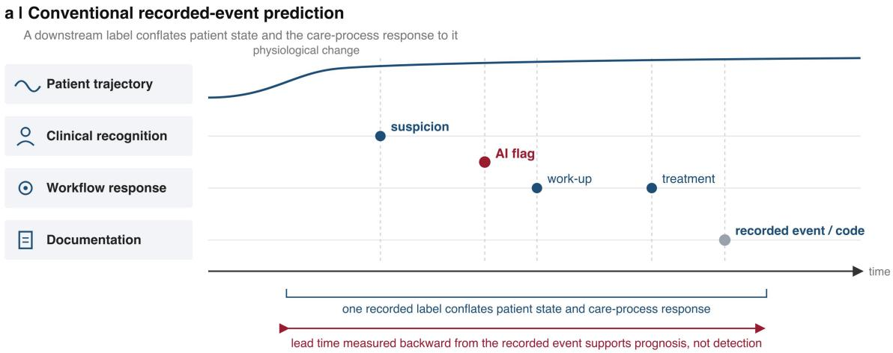
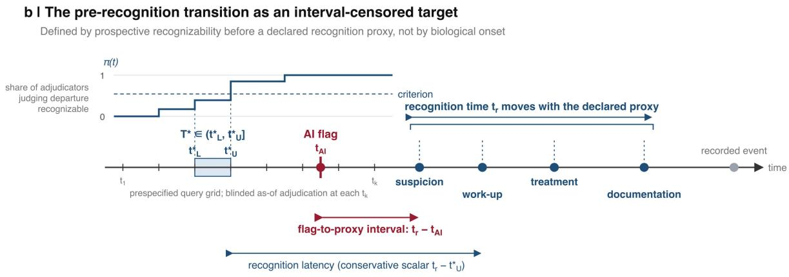
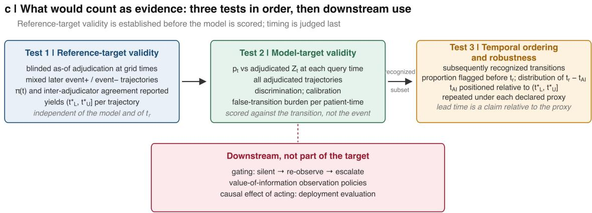

# Prediction Is Not Detection: Evaluating Pre-Recognition Claims in Longitudinal Clinical AI

Jing Yang1, Long R. Jiao2, Xiujun Cai3\*, Zongjiu Zhang1\*

1School of Biomedical Engineering, Tsinghua University, Beijing, 100084, China

2Department of Surgery and Cancer, Imperial College London, London W2 1NY, UK

3Sir Run Run Shaw Hospital, School of Medicine, Zhejiang University, Hangzhou, 310016, China

\* Correspondence: Xiujun Cai and Zongjiu Zhang

## Abstract

Clinically useful early detection requires validated pre-recognition lead time. Yet eventbased evaluations of longitudinal clinical AI can treat recognition-mediated care-process signals as shortcuts and recognition-dependent endpoints as reference standards, inflating apparent performance and lead time while undermining cross-center transport. Such results may serve prognosis without establishing detection before recognition. We define an interval -censored pre-recognition transition, an independent as-of reference standard, and a prespecified recognition proxy to make the claim testable.

## Prediction is not detection

The clinically relevant question is whether a model provides validated lead time before recognition, not merely before a recorded event. A 2024 evaluation by Kamran and colleagues illustrates why this distinction matters. Across 77,582 hospitalizations, the Epic Sepsis Model discriminated modestly when every prediction made before sepsis criteria were met was counted (AUROC 0.62). Once predictions made after the first indicator of a treatment plan — antibiotics, intravenous fluids, a blood culture or a lactate measurement — were excluded, discrimination fell to chance (AUROC 0.47) [1].

Although the empirical finding is specific to one deployed sepsis model, the inferential problem it exposes is not disease-specific. Concern-driven testing, unscheduled investigations, multidisciplinary review and escalation of care are outputs of clinical assessment; their records can then become model inputs. Such records carry genuine clinical information and can legitimately improve event prediction — but because the assessment they encode has already occurred, an alert derived from them may follow clinical recognition yet precede the recorded endpoint, and crediting the alert-to-endpoint interval as lead time misattributes the period after recognition began. The methodological error therefore lies not in predicting recorded outcomes, but in treating prediction of a downstream outcome as evidence of detection of an earlier patient-state transition. Prognosis and pre-recognition detection are distinct claims and require distinct reference standards; conflating them turns evidence for the former into apparent evidence for the latter.

## Why the distinction disappears in the record

The electronic health record entangles patient-state evolution with clinical recognition. It records both through the same data-generating process. Evolving patient state may prompt clinician recognition, which then changes monitoring, test ordering, treatment and documentation [2,3]. These responses can both enter the model as predictive features and determine when the endpoint is ultimately recorded. The recorded endpoint consequently collapses physiological transition, clinical suspicion, recognition-triggered workflow and formal documentation into a single event time [4,5]. At the same time, care-process variables may become predictive before that event is recorded while already reflecting clinical recognition. A test order, consultation or escalation can therefore carry genuine information about the patient without constituting independent evidence that the model has detected the underlying transition before clinicians have begun to recognize it. Apparent lead time can thus arise through two different pathways: detection of an emerging patient-state transition or detection of the healthcare system’s early response to that transition. Conventional eventbased evaluation does not distinguish between them (Figure 1a).

  
Figure 1. Recorded-event prediction, the pre-recognition transition, and what would count as evidence.

(a) Conventional recorded-event prediction. A physiological change may prompt suspicion, work -up, treatment and eventually the documented event. The single recorded label therefore conflates patient state with the care-process response to $\mathrm { i t } ,$ and lead time measured backward from that label supports a prognostic claim, not a detection claim.

(b) The pre-recognition transition as an interval-censored target. At a prespecified grid of query times $t _ { I } . . . t _ { k } ,$ , blinded adjudicators judge from as-of evidence alone whether a departure from the reference course had become recognizable; $\pi ( t )$ is the share who judge it so. $t ^ { * } { } _ { U }$ is the first grid time at which the prespecified criterion is met and $t ^ { * } { } _ { L }$ the last preceding time at which it is not, so the onset of prospective recognizability satisfies $T ^ { * } \in \left( t ^ { * } { } _ { L } , t ^ { * } { } _ { U } \right]$ . The model flag $t _ { A I }$ is judged against a recognition time $t _ { r }$ set by a declared observable proxy, so $t _ { r , }$ and therefore the flag-to-proxy interval $t _ { r } - t _ { A I } ,$ moves with the proxy; the recorded event may follow later. A flag at or before $t ^ { * } { } _ { L }$ is anticipatory prediction, a flag within $( t ^ { * } L , \ t ^ { * } { \boldsymbol { U } } ]$ is timing-uncertain, and a flag after $t ^ { * } { } _ { U }$ but before $t _ { r }$ is the conservative unambiguous case, for which $t _ { r } - t _ { A I }$ is validated pre-recognition lead time.

(c) Evidence. Test 1 establishes reference-target validity through blinded as-of adjudication of mixed later event-positive and event-negative trajectories, reporting $\pi ( t )$ and inter-adjudicator agreement, and yields $( t ^ { * } L , \ t ^ { * } { \boldsymbol { U } } ]$ for each trajectory independently of the model and of $t _ { r . }$ Test 2 establishes model-target validity by scoring the model’s query-time output $p _ { t }$ against the adjudicated transition state $Z _ { t }$ across all adjudicated trajectories — discrimination, calibration and false-transition burden per patient-time. Test $^ { 3 , }$ restricted to subsequently recognized transitions, establishes temporal validity by the proportion flagged before $t _ { r , { ~ } }$ the distribution of $t _ { r } - t _ { A I }$ and the position of $t _ { A I }$ relative to $( t ^ { * } L , t ^ { * } U ]$ , repeated under each declared proxy. Gating, observation policies and the causal effect of acting are downstream of the target. Red marks the model flag, blue the recognition proxies and grey the recorded event.

This entanglement creates distinct feature-side and target-side validity problems (Table 1). On the feature side, observation frequency, unscheduled tests or consultations may be fully available at the query time yet still be recognition-mediated. Their use is temporally legitimate but does not establish pre-recognition detection [6]. On the target side, if the endpoint timestamp itself is determined by recognition, work-up or documentation policy, the recorded event is not an independent reference standard for evaluating a claim of detection before recognition. This target– process entanglement persists even when every input feature satisfies strict temporal availability. These problems should be distinguished from conventional temporal or availability leakage. Such leakage occurs when a dataconstruction error exposes information that would not yet be available at the query time, such as results not yet visible, later notes or discharge codes [7]. By contrast, recognitionmediated features may be genuinely available at the query time yet provide a shortcut that improves event prediction without establishing pre-recognition detection, whereas outcomes modified by treatment after recognition introduce a separate causal problem [8,9]. Censoring evaluation at the first clinician action, as Kamran and colleagues did, can exclude predictions made after that proxy, but it neither removes recognition-mediated information that appears beforehand nor resolves an endpoint whose timing is itself recognition-dependent. The central problem is therefore one of identification and evaluation before it is one of model architecture.

The practical consequence is that apparent predictive lead time may not translate into clinically useful pre-recognition lead time. A model driven largely by care-process signals may become most confident only after clinicians have already begun investigating deterioration, while contributing least when deterioration has not yet been suspected—the interval in which decision support has the greatest potential to change care. The same dependence also threatens transportability because observation and ordering practices vary across institutions [10] (Supplementary Note S5). This distinction is particularly consequential in major surgery, where mortality after a complication is determined less by its occurrence than by the timeliness of recognition and rescue [11]. A system that primarily detects the recognition process may therefore appear to predict early without actually extending the interval between detectable deterioration and clinical action (Supplementary Note, Propositions S1–S3).

Table 1. Distinct data-generating and evaluation problems that can be conflated in  
early-detection studies
<table><tr><td rowspan=1 colspan=1>Problem</td><td rowspan=1 colspan=1>Example</td><td rowspan=1 colspan=1>Abstraction</td><td rowspan=1 colspan=1>Classicalleakage?</td><td rowspan=1 colspan=1>Addressed by</td></tr><tr><td rowspan=1 colspan=1>Later informationused for an earlierprediction</td><td rowspan=1 colspan=1>Discharge codes, noteswritten later, results notyet visible</td><td rowspan=1 colspan=1>Temporal oravailabilityleakage</td><td rowspan=1 colspan=1>Yes</td><td rowspan=1 colspan=1>As-of information set</td></tr><tr><td rowspan=1 colspan=1>Care-process signalpresent at query timebecause recognitionhas begun</td><td rowspan=1 colspan=1>Observation frequency,unscheduled lactate,imaging, consultation</td><td rowspan=1 colspan=1>Recognition-mediated care-process signal (aninformative-observationmechanism)</td><td rowspan=1 colspan=1>No; available atdeployment</td><td rowspan=1 colspan=1>Declared recognitionboundary and proxysensitivity; independentadjudication of thetransition rather thanthe downstreamendpoint</td></tr><tr><td rowspan=1 colspan=1>Endpoint timestampset by recognition,work-up ordocumentation policy</td><td rowspan=1 colspan=1>Fixed-day complicationgrading; time of firstantibiotic</td><td rowspan=1 colspan=1>Target-processentanglement</td><td rowspan=1 colspan=1>No; label,notfeature</td><td rowspan=1 colspan=1>Independentlyadjudicated transitiontarget; endpoint notused as the referencestandard for detection</td></tr><tr><td rowspan=1 colspan=1>Outcome altered bytreatment begun afterrecognition</td><td rowspan=1 colspan=1>Mortality after earlyantibiotics</td><td rowspan=1 colspan=1>Treatment-confoundedoutcome</td><td rowspan=1 colspan=1>No; causal</td><td rowspan=1 colspan=1>Transition target avoidsusing post-treatmentoutcomes as thedetection target; causalevaluation remains adeployment-phasequestion</td></tr></table>

## The pre-recognition transition

The pre-recognition transition is defined in two steps, and the sequence is deliberate: the transition must be specified without reference to recognition, so that recognition can then be compared against it rather than built into it. First, a prospectively recognizable transition is a clinically meaningful, reproducibly adjudicable departure of a patient’s longitudinal trajectory from a prospectively specified reference course, identifiable from as-of evidence alone — without knowing what was later recognized or recorded. Its onset is $T ^ { * }$ . Second, only once that target and its timing have been fixed does recognition enter: a transition is pre -recognition when $T ^ { * } < t _ { r }$ , where $t _ { r }$ is the operational recognition time under a declared observable proxy, defined separately below. The target is the departure itself, not the latent onset that may have preceded $\mathsf { i t } ;$ biological and clinical stages can be asynchronous in sepsis [12], and as-of adjudication cannot recover biological onset as a timestamp. The definition constrains what must be detected, not how: change-point, latent-state and survival formulations are all admissible detectors of the same adjudicated target (Figure 1b).

The reference course. The reference course must be specified independently of the index patient’s subsequent recognition and outcome. Depending on the clinical problem, it may be normative, historical, model-based or protocol-based, and it may incorporate prospective expert specification; its uncertainty should be represented. Case adjudication should not retrospectively redefine the reference course using knowledge of the patient’s later trajectory. Adjudicators judge whether a meaningful departure from that prespecified course was recognizable; they do not use the future outcome to supply the baseline.

As-of evidence. Let $\boldsymbol { F } _ { t }$ be the information visible in the record by query time t. Only $\boldsymbol { F } _ { t }$ may be used, by the model and by whoever constructs the reference standard: results acquired but not yet reported, notes written later and codes assigned at discharge lie outside it — exclusions that read as trivial but are routinely violated in retrospective extracts, which store final rather than as-of values. Acquisition, result and visibility times differ by hours [13], and the visibility lag bounds how early any detection can be. Measurement kinetics bound it further: in acute kidney injury, creatinine can lag a fall in filtration by hours to days [14], so the record, however faithfully frozen, may not yet contain evidence of the underlying physiological change.

Recognition proxies. Recognition is cognitive and never observed directly. It can only be inferred through a prespecified observable proxy that sets $t _ { r }$ — documented suspicion, work-up orders, treatment initiation or formal documentation (Table 2). Proxies move $t _ { r }$ for different reasons: grading may be anchored to fixed postoperative days, as in the consensus definitions of pancreatic fistula and post-hepatectomy liver failure [15,16], so a documentation-based $t _ { r }$ may lag the first observable clinical concern by days. Because the proxy fixes the boundary, the claim is always a claim relative to the proxy declared — which is why the choice must be stated in advance and varied afterwards.

Independence from subsequent recognition and outcome. Independence means the departure must be identifiable without knowing what happened later; a reference standard built from the full course simply recreates the downstream label. Concretely: on the third morning after pancreatoduodenectomy, an adjudicator sees the record frozen at 06:00 — observations, drain volume and character, and the laboratory results visible by then — mixed with matched records from patients who developed no complication, and answers one question: by that time, had a clinically meaningful departure from the expected recovery course become recognizable, and with what confidence? The adjudicator is not told whether a fistula was later graded. A departure that later resolves remains a transition; transition status and subsequent outcome are separate labels.

The estimand. “Reproducibly recognizable” needs a rule, not an adjective. Fix a grid of query times $t _ { \mathit { 1 } } < \ldots < t _ { \mathit { K } }$ in advance. At each $t _ { k }$ , independent blinded adjudicators answer a by-time question: had a clinically meaningful departure from the prespecified reference course become prospectively recognizable using only the information visible by $t _ { k } ?$ A prespecified criterion — for example, a majority of adjudicators meeting predefined confidence and evidentiary criteria — defines $C ( t _ { k } )$ . The latent recognizability state is monotone by construction: once a departure has become recognizable by time t, it has occurred by all later times, even if the trajectory later resolves. Discrete adjudication therefore leaves $T ^ { * }$ interval-censored: $t _ { { \scriptscriptstyle U } } ^ { * }$ is the first grid time at which $C ( t _ { k } )$ is met and $t _ { \perp } ^ { * }$ the latest preceding grid time at which it is not, so $T ^ { * } \in \mathcal { ( t } _ { L ^ { \prime } } ^ { * } t _ { U } ^ { * } ] .$ This is where concept and evidence must be kept apart. A transition is pre-recognition when $T ^ { * } < t _ { r }$ ; but empirically that ordering is established beyond doubt only when $t _ { U } ^ { * } \ < \ t _ { r }$ , and if $t _ { r }$ falls inside $( t _ { L ^ { \prime } } ^ { * } t _ { U } ^ { * } ]$ the temporal status is interval-uncertain and should be reported as such. If the first truncation is already positive, $T ^ { * }$ is left-censored. If the criterion is never met before $t _ { r }$ , no transition is observed before the pre-recognition window closes at that proxy — prerecognition recognizability is right-censored with respect to that window. Non-monotone empirical adjudication indicates uncertainty in the reference standard rather than a nonmonotone target; studies should report the raw recognizability trajectory $\pi ( t _ { k } )$ , adjudicator agreement, and sensitivity to stricter or monotonicity-constrained rules.

What a detector estimates. Let $Z _ { t } ~ = ~ \imath \langle T ^ { * } \leq t \rangle$ indicate that prospective recognizability has occurred by t, and let $X _ { t } \subseteq F _ { t }$ be the information actually supplied to the model at t: the reference standard is built from everything visible in the record, whereas the model sees only what it is given. The detector estimates $p _ { t } \ = \ P ( Z _ { t } \ = \ 7 / X _ { t } )$ , and flags at $t _ { A I } \ = i n f _ { \ O } { \mathcal { \{ H } }  : p _ { t } \geq c { \boldsymbol { \jmath } }$ for a prespecified threshold c. That $p _ { t }$ is a probability that recognizability has already emerged, and not that an event will later be recorded, is the formal point at which detection parts company with prognosis.

Derived quantities. The recognition time $t _ { r }$ is the operational time under the declared proxy. Recognition latency is interval-valued, between $t _ { r } \mathrm { ~ - ~ } t _ { U } ^ { \ast }$ and $t _ { r } \mathrm { ~ - ~ } t _ { L } ^ { * }$ ; its conservative scalar summary is $t _ { r } \mathrm { ~ - ~ } t _ { U } ^ { \ast }$ , which attributes no lead time across the interval in which recognizability is uncertain. The flag-to-proxy interval $t _ { r } \mathrm { ~ - ~ } t _ { A I }$ , for flags raised before $t _ { r }$ , is a neutral quantity: it becomes validated pre-recognition lead time only when $t _ { A I }$ is shown to sit in the right place relative to $( t _ { L } ^ { * } , t _ { U } ^ { * } / - \mathsf { a }$ condition to be demonstrated, never assumed (Supplementary Note, Propositions S5 and S8).

Table 2. Recognition proxies for operationalizing the recognition time $t _ { r }$
<table><tr><td colspan="1" rowspan="1">Recognitionproxy</td><td colspan="1" rowspan="1">Operational examples(general; perioperative)</td><td colspan="1" rowspan="1">Strength</td><td colspan="1" rowspan="1">Main risk</td><td colspan="1" rowspan="1">Effect on $t _ { r }$ </td></tr><tr><td colspan="1" rowspan="1">Suspicion</td><td colspan="1" rowspan="1">Note language, problem-listentry, documented clinicianconcern;ward-round entries such as</td><td colspan="1" rowspan="1">Closest to thecognitive event</td><td colspan="1" rowspan="1">Inconsistently written;documentation lag;natural-languageextraction is noisy</td><td colspan="1" rowspan="1">Earliest; leastreliable</td></tr><tr><td colspan="1" rowspan="1"></td><td colspan="1" rowspan="1">“query bile leak” or “watchdrain output”</td><td colspan="1" rowspan="1"></td><td colspan="1" rowspan="1"></td><td colspan="1" rowspan="1"></td></tr><tr><td colspan="1" rowspan="1">Work-up</td><td colspan="1" rowspan="1">Blood culture, lactate,imaging, specialistconsultation;unscheduled drain amylaseor bilirubin, CT abdomen,surgical or ICU review</td><td colspan="1" rowspan="1">Actionable;clearlytimestamped</td><td colspan="1" rowspan="1">May reflectprotocolizedscreening rather thansuspicion</td><td colspan="1" rowspan="1">Intermediate;confounded byprotocols</td></tr><tr><td colspan="1" rowspan="1">Treatment</td><td colspan="1" rowspan="1">Antibiotics, fluids,vasopressors, ICU transfer;reoperation, interventionaldrainage, escalation of care</td><td colspan="1" rowspan="1">Unambiguous;clinicallyconsequential</td><td colspan="1" rowspan="1">Usually past the earlywindow; alreadyreflects a decision</td><td colspan="1" rowspan="1">Late</td></tr><tr><td colspan="1" rowspan="1">Documentation</td><td colspan="1" rowspan="1">Diagnosis code,complication registry,discharge diagnosis;ISGPS/ISGLS grade,Clavien-Dindo entry</td><td colspan="1" rowspan="1">Standardized;easy to extract</td><td colspan="1" rowspan="1">Assignedretrospectively withoutcome knowledge;highest label leakage</td><td colspan="1" rowspan="1">Latest; maypost-daterecognition bydays</td></tr></table>

Table note: these proxy classes are listed from conceptually closest to furthest from cognition, but they are not guaranteed to occur in this order for every patient. Each study should prespecify the rule defining $t _ { r } ,$ derive the first qualifying timestamp from the as-of record, and report sensitivity to alternative proxies.

transition

## Why this is not early warning

Early warning moves the horizon; pre-recognition detection changes the reference target. Early-warning scores and their machine-learning successors usually keep a downstream event as the target — cardiac arrest, intensive care transfer, death or a treatment bundle — and ask whether it can be predicted earlier [17,18]. Physiological antecedents are well established [19,20]; the methodological question is whether the reference target is independent of the clinical response. A long alert-to-event interval does not establish pre-recognition detection when the event itself lies downstream of recognition (Table 3). Change-point detection, onset estimation, informative-observation models and latent-state methods may provide useful detectors or temporal representations [3,5,21]; none by itself supplies the independent as-of reference standard required for a pre-recognition claim.

Table 3. Prognosis of a recorded event versus detection of a pre-recognition
<table><tr><td colspan="1" rowspan="1"></td><td colspan="1" rowspan="1">Prognosis of a recorded event</td><td colspan="1" rowspan="1">Detection of a pre-recognition transition</td></tr><tr><td colspan="1" rowspan="1">Claimsupported</td><td colspan="1" rowspan="1">Who will go on to have the recorded event</td><td colspan="1" rowspan="1">A patient-state departure was recognizable,and was flagged, before the declaredoperational recognition boundary $t _ { r }$ </td></tr><tr><td colspan="1" rowspan="1">Target</td><td colspan="1" rowspan="1">The recorded event, predicted at a fixed</td><td colspan="1" rowspan="1">The reproducibly recognizable departure,</td></tr><tr><td colspan="1" rowspan="1"></td><td colspan="1" rowspan="1">horizon</td><td colspan="1" rowspan="1">identified through the interval $( t _ { L ^ { \prime } } ^ { * } t _ { U } ^ { * } ]$ </td></tr><tr><td colspan="1" rowspan="1">Referencestandard</td><td colspan="1" rowspan="1">Occurrence of the event (code, transfer,treatment, death)</td><td colspan="1" rowspan="1">Blinded as-of adjudication of the departure,independent of the event</td></tr><tr><td colspan="1" rowspan="1">What may belearned</td><td colspan="1" rowspan="1">Physiology, clinician suspicion or workflow,indistinguishably</td><td colspan="1" rowspan="1">Evidence available at query time, with thetarget defined independently of downstreamrecognition</td></tr><tr><td colspan="1" rowspan="1">Time reference</td><td colspan="1" rowspan="1">Backward from the event (alert-to-eventlead time)</td><td colspan="1" rowspan="1">Forward from the query time to $t _ { r }$ under adeclared proxy</td></tr><tr><td colspan="1" rowspan="1">Evaluation</td><td colspan="1" rowspan="1">Time-point AUROC at a fixed horizon; alertrate</td><td colspan="1" rowspan="1">Test 2 against adjudicated $Z _ { t }$ acrosspatient-query-time observations(discrimination, calibration of $p _ { t }$ false-transition burden); Test 3 amongrecognized transitions (flag before $t _ { r } ,$ flag-to-proxy interval, $t _ { A I }$ relative to $( t _ { L ^ { \prime } } ^ { * } , t _ { U } ^ { * } \lambda$ </td></tr></table>

## What would count as evidence

A pre-recognition claim requires three questions to be answered in order, and failure at any one voids what follows. First, reference-target validity: was a prospectively recognizable departure established independently of downstream recognition and outcome? Second, model–target validity: did the model discriminate and calibrate against that independently adjudicated target? Third, temporal ordering and robustness: was the flag temporally consistent with detection rather than mere anticipation, and did the conclusion survive alternative recognition proxies? Existing guidelines specify how to report a model and its early clinical evaluation [22,23]; neither, to our knowledge, requires this sequence. Figure 1c summarizes the sequence; Box 1 operationalizes it.

Test 1 — reference-target validity. At prespecified query times, reference-standard construction uses only the information visible by that time; the record is frozen, not reconstructed, and acquisition, result and visibility times are distinguished. Blinded adjudicators evaluate truncated records without future data, with patients with and without later recorded events mixed; event-negative trajectories are not automatically treated as transition-negative, and no adjudicator sees more than one truncation per patient. Adjudication follows prespecified criteria — for example persistence across sequential observations, concordance across at least two sources of evidence, and coherence with a reasonable prospective plan — with the aggregation rule stated. Report the recognizability trajectory $\pi ( t _ { k } )$ , adjudicator agreement, and sensitivity to stricter or monotonicityconstrained criteria; disagreement is information about ambiguity, not noise to be resolved by consensus.

Test 2 — model–target validity. Discrimination and calibration of $p _ { t }$ are evaluated against the adjudicated recognizability state $Z _ { t }$ across patient–query-time observations; the false-transition burden is reported per unit of patient-time at the operating point used, with self-limiting transitions counted as transitions and their cost judged by the response they triggered.

Test 3 — temporal ordering and robustness. Declare the proxy that defines $t _ { r }$ , then repeat the temporal analysis under at least one earlier and one later alternative. For patients subsequently recognized under the declared proxy, report the proportion flagged before $t _ { r }$ the flag-to-proxy interval $t _ { r } \mathrm { ~ - ~ } t _ { A I }$ , and the position of $t _ { A I }$ relative to $( t _ { L ^ { \prime } } ^ { * } , t _ { U } ^ { * } ] .$ . A flag at or before $t _ { \perp } ^ { * }$ is anticipatory prediction rather than validated transition detection at that time; a flag within $( t _ { L } ^ { * } , t _ { U } ^ { * } ]$ is timing-uncertain; a flag after $t _ { { U } } ^ { * }$ but before $t _ { r }$ is the conservative, unambiguous case, and only for these may $t _ { r } \mathrm { ~ - ~ } t _ { A I }$ be reported as validated prerecognition lead time. Detection preceding the earliest reliable observable proxy is the strongest operational evidence available, but no design can establish precedence over an unobserved cognitive event.

Deployment caveat. Test 3 presupposes that the model did not influence care. After deployment, recognition depends on the flag, so lead-time estimates require a design in which the flag was withheld, such as a silent-mode period.

Adjudication is costly. It can be concentrated in a prespecified sample enriched for recognized events, provided sampling fractions are retained so that calibration and absolute burden, both prevalence-dependent, are estimated with the corresponding weights. Together these requirements define the boundary conditions under which an empirical claim of prerecognition detection becomes scientifically testable.

Box 1. Proposed checklist for studies evaluating pre-recognition detection
<table><tr><td>Domain</td><td>Items to report</td></tr><tr><td>Target specification</td><td>1. What departure is being detected, for which condition or complication, and how the reference course was prospectively specified without using the index patient's subsequent recognition or outcome. 2. How uncertainty in the reference course and in the departure judgment is represented. 3. The prespecified query grid, the recognizability criterion  $C ( t _ { k } )$  and</td></tr><tr><td></td><td> $( t _ { L } ^ { * } , t _ { U } ^ { * } )$  right censoring status. 4. The proportion of recognized events with no demonstrable pre-recognition interval before  $t _ { r } ;$  raw Ⅱ  $( t _ { k } )$  and adjudicator agreement where judgments are non</td></tr><tr><td>As-of information boundary</td><td>-monotone. 5. What was visible at each query time, and how the record was frozen rather</td></tr><tr><td colspan="1" rowspan="1"></td><td colspan="1" rowspan="1">6. Acquisition, result and visibility times distinguished; visibility lag reported.</td></tr><tr><td colspan="1" rowspan="1">Recognitionproxy (Test 3)</td><td colspan="1" rowspan="1">7. Which proxy defines $t _ { r }$ : suspicion, work-up, treatment or documentation.8. Sensitivity to at least one earlier and one later proxy.</td></tr><tr><td colspan="1" rowspan="1">Referenceadjudication (Test 1)</td><td colspan="1" rowspan="1">9. Records truncated at the query time and adjudicated blind to the future, withpatients with and without later recorded events mixed; event-negative trajectoriesnot automatically treated as transition-negative.10. Adjudication criteria prespecified (for example persistence, concordance,coherence), including the aggregation rule and any persistence requirement; inter-adjudicator agreement reported.11. No adjudicator reviews more than one truncation per patient where feasible;non-monotone judgment sequences reported rather than forced into an interval.</td></tr><tr><td colspan="1" rowspan="1">Test 2: model–target validity</td><td colspan="1" rowspan="1">12. Discrimination of $p _ { t }$ against the adjudicated recognizability state $Z _ { t }$ (recognizable versus not yet recognizable at the query time) across patient-query-time observations.13. Calibration of $p _ { t }$ against adjudicated recognizability.14. False-transition burden per unit of patient-time at the operating point used,with self-limiting transitions counted as transitions; sampling fractions and weightswhere the sample is enriched.</td></tr><tr><td colspan="1" rowspan="1">Test 3: temporalordering androbustness</td><td colspan="1" rowspan="1">15. Among adjudicated transitions subsequently recognized under the declaredproxy: proportion flagged before $t _ { r } ;$ flag-to-proxy interval $( t _ { r } \mathrm { ~ - ~ } t _ { A I } ) ;$ position of $t _ { A I }$ relative to $( t _ { L ^ { \prime } } ^ { * } , t _ { U } ^ { * } ] .$ 16. Flags at or before $t _ { \perp } ^ { * }$ reported as anticipatory predictions rather thanvalidated detections; flags within $( t _ { L } ^ { * } , t _ { U } ^ { * } ]$ as timing-uncertain; flags after $t _ { U } ^ { * }$ andbefore $t _ { r }$ as the conservative unambiguous case for validated pre-recognition leadtime.17. Statement that the model did not influence care during evaluation, or thedesign used to preserve a comparison without the flag.</td></tr><tr><td colspan="1" rowspan="1">Downstream use(optional)</td><td colspan="1" rowspan="1">18. If the system acts on the signal: the gating rule, what is recommended whenevidence is insufficient, and the burden of unnecessary review reported alongsidebenefit.</td></tr></table>

## Downstream implications

A valid reference target does not prescribe an action; it establishes when a signal may be called pre-recognition. What follows is downstream. Because such signals arise under greater uncertainty, output should be proportionate to evidence — silent monitoring while evidence is weak, structured re-observation when a departure is credible, escalation when confidence is high — with the burden of unnecessary review reported alongside benefit. When evidence is insufficient, the useful action is often observation rather than treatment: after colorectal resection, a C-reactive protein trajectory may warrant earlier imaging [24]. A calibrated transition probability provides a decision-relevant measure of uncertainty on which value-of-information and active-acquisition policies may condition [25,26]. Those methods, and gating and deployment policies, are research questions downstream of the target, not components of it.

## Target validity is orthogonal to model capacity

Foundation models trained on longitudinal records learn patient state together with the care processes that make it observable. A more capable model may exploit recognitionmediated signals more efficiently, so increasing model capacity can widen the gap between benchmark performance and the intended clinical claim when the reference standard is misspecified. Model capacity cannot repair a mis-specified reference target. The transition target is therefore an architecture-independent benchmark: an early-detection claim from any model, from a logistic regression to a foundation model, should survive evaluation on frozen as-of information against an independent recognizability reference standard and alternative recognition proxies.

## Conclusion

Evaluations of early-detection claims in longitudinal clinical AI often collapse three clocks into one: when a patient’s trajectory becomes prospectively recognizable, when the clinical system begins to recognize it, and when the event is recorded. A downstream recorded outcome is a valid prognostic target, but outcome occurrence and onset of prospective recognizability are different constructs, and performance against the former cannot by itself validate detection of the latter. Where endpoint timing is itself recognitionmediated, the mismatch is amplified further. The pre-recognition transition separates the clocks with an interval-censored recognizability estimand, an as-of information boundary and a declared recognition proxy, and in doing so makes the claim falsifiable. Earlier than a recorded event and before clinical recognition are different claims; only the second, and only against a declared proxy, is detection.

## Acknowledgements

This study received no funding.

## Author contributions

J.Y. conceived the framework, wrote the Supplementary Note and drafted the manuscript. L.R.J., Z.Z. and X.C. supervised the work and critically revised the manuscript. All authors approved the final version.

## Competing interests

All authors declare no financial or non-financial competing interests.

## Data availability

Data sharing is not applicable to this article as no datasets were generated or analysed during the current study.

## References

1. Kamran, F. et al. Evaluation of sepsis prediction models before onset of treatment. NEJM AI 1, AIoa2300032 (2024). https://doi.org/10.1056/AIoa2300032

2. Hripcsak, G. & Albers, D. J. Next-generation phenotyping of electronic health records. J. Am. Med. Inform. Assoc. 20, 117–121 (2013). https://doi.org/10.1136/amiajnl-2012-001145

3. Sisk, R. et al. Informative presence and observation in routine health data: a review of methodology for clinical risk prediction. J. Am. Med. Inform. Assoc. 28, 155–166 (2021). https://doi.org/10.1093/jamia/ocaa242

4. Weiskopf, N. G. & Weng, C. Methods and dimensions of electronic health record data quality assessment: enabling reuse for clinical research. J. Am. Med. Inform. Assoc. 20, 144–151 (2013). https://doi.org/10.1136/amiajnl-2011-000681

5. Chen, F. et al. TimeX: phenotype onset extraction from clinical narratives. npj Health Syst. 3, 49 (2026). https://doi.org/10.1038/s44401-026-00099-8

6. Beaulieu-Jones, B. K. et al. Machine learning for patient risk stratification: standing on, or looking over, the shoulders of clinicians? npj Digit. Med. 4, 62 (2021). https://doi.org/10.1038/s41746- 021-00426-3

7. Kapoor, S. & Narayanan, A. Leakage and the reproducibility crisis in machine-learning-based science. Patterns 4, 100804 (2023). https://doi.org/10.1016/j.patter.2023.100804

8. van Geloven, N. et al. Prediction meets causal inference: the role of treatment in clinical prediction models. Eur. J. Epidemiol. 35, 619–630 (2020). https://doi.org/10.1007/s10654-020-00636-1

9. Sperrin, M. et al. Using marginal structural models to adjust for treatment drop-in when developing clinical prediction models. Stat. Med. 37, 4142–4154 (2018). https://doi.org/10.1002/sim.7913

10. Wong, A. et al. External validation of a widely implemented proprietary sepsis prediction model in hospitalized patients. JAMA Intern. Med. 181, 1065–1070 (2021). https://doi.org/10.1001/jamainternmed.2021.2626

11. Ghaferi, A. A., Birkmeyer, J. D. & Dimick, J. B. Variation in hospital mortality associated with inpatient surgery. N. Engl. J. Med. 361, 1368–1375 (2009). https://doi.org/10.1056/NEJMsa0903048

12. Fish, M. et al. Temporal analyses of immune responses in sepsis reveal asynchrony between clinical stage of illness and immune states. Immunity https://doi.org/10.1016/j.immuni.2026.08.003 (2026).

13. Hripcsak, G., Albers, D. J. & Perotte, A. Parameterizing time in electronic health record studies. J. Am. Med. Inform. Assoc. 22, 794–804 (2015). https://doi.org/10.1093/jamia/ocu051

14. Waikar, S. S. & Bonventre, J. V. Creatinine kinetics and the definition of acute kidney injury. J. Am. Soc. Nephrol. 20, 672–679 (2009). https://doi.org/10.1681/ASN.2008070669

15. Bassi, C. et al. The 2016 update of the International Study Group (ISGPS) definition and grading of postoperative pancreatic fistula: 11 years after. Surgery 161, 584–591 (2017). https://doi.org/10.1016/j.surg.2016.11.014

16. Rahbari, N. N. et al. Posthepatectomy liver failure: a definition and grading by the International Study Group of Liver Surgery (ISGLS). Surgery 149, 713–724 (2011). https://doi.org/10.1016/j.surg.2010.10.001

17. Edelson, D. P. et al. Early warning scores with and without artificial intelligence. JAMA Netw. Open 7, e2438986 (2024). https://doi.org/10.1001/jamanetworkopen.2024.38986

18. Churpek, M. M., Yuen, T. C. & Edelson, D. P. Predicting clinical deterioration in the hospital: the impact of outcome selection. Resuscitation 84, 564–568 (2013). https://doi.org/10.1016/j.resuscitation.2012.09.024

19. Schein, R. M., Hazday, N., Pena, M., Ruben, B. H. & Sprung, C. L. Clinical antecedents to inhospital cardiopulmonary arrest. Chest 98, 1388–1392 (1990). https://doi.org/10.1378/chest.98.6.1388

20. Kause, J. et al. A comparison of antecedents to cardiac arrests, deaths and emergency intensive care admissions in Australia and New Zealand, and the United Kingdom — the ACADEMIA study. Resuscitation 62, 275–282 (2004). https://doi.org/10.1016/j.resuscitation.2004.05.016

21. Jones, D., Mitchell, I., Hillman, K. & Story, D. Defining clinical deterioration. Resuscitation 84, 1029–1034 (2013). https://doi.org/10.1016/j.resuscitation.2013.01.013

22. Collins, G. S. et al. TRIPOD+AI statement: updated guidance for reporting clinical prediction models that use regression or machine learning methods. BMJ 385, e078378 (2024). https://doi.org/10.1136/bmj-2023-078378

23. Vasey, B. et al. Reporting guideline for the early-stage clinical evaluation of decision support systems driven by artificial intelligence: DECIDE-AI. Nat. Med. 28, 924–933 (2022). https://doi.org/10.1038/s41591-022-01772-9

24. Singh, P. P. et al. Systematic review and meta-analysis of use of serum C-reactive protein levels to predict anastomotic leak after colorectal surgery. Br. J. Surg. 101, 339–346 (2014). https://doi.org/10.1002/bjs.9354

25. Shim, H., Hwang, S. J. & Yang, E. Joint active feature acquisition and classification with variable-size set encoding. Adv. Neural Inf. Process Syst. 31, 1368–1378 (2018).

26. Kaelbling, L. P., Littman, M. L. & Cassandra, A. R. Planning and acting in partially observable stochastic domains. Artif. Intell. 101, 99–134 (1998). https://doi.org/10.1016/S0004-3702(98)00023-X

## Supplementary Note

## Formal Arguments for Pre-Recognition Detection

Existing clinical information can improve a model's prediction without creating recognition earlier than the judgment that supplied it. A clinician combines prior knowledge with patient observations to form an assessment or working hypothesis; investigations, consultation or closer monitoring can express that assessment in the record. If these action traces are selected as model inputs and the predictor uses them, prediction of a disease or complication can benefit from information already available to the clinician. The question is how this genuine predictive value can be mistaken for independently gained pre-recognition time. An alarm after the earlier assessment but before the disease event can have a positive event-relative lead time even though it adds no time before that clinical judgment.

We first establish when recorded actions transmit target information beyond the model's remaining inputs, and quantify the value of this information through optimal prediction risk. Comparing the resulting output with the clinician's existing assessment then distinguishes inherited information from information added beyond that assessment. The next two sections examine whether event information identifies the current patient state and demonstrate how improved event prediction can coexist with an alarm after recognition. A separate construction derives a possible consequence for performance across care contexts, before the final section specifies the state and timing evidence needed for pre-recognition validation. Standard probability, information and scoring identities support these clinical specializations and explicit counterexamples; the constructions are developed here, and each result retains its own assumptions and comparison.

Notation. The main symbols are collected below; the section of first use is indicated.
<table><tr><td colspan="1" rowspan="1">Symbol</td><td colspan="1" rowspan="1">Meaning</td><td colspan="1" rowspan="1">Introduced</td></tr><tr><td colspan="1" rowspan="1"> $B _ { t }$ </td><td colspan="1" rowspan="1">Clinician's existing assessment or working hypothesis at time t (Bin the static results)</td><td colspan="1" rowspan="1">S1</td></tr><tr><td colspan="1" rowspan="1"> $F _ { t }$ </td><td colspan="1" rowspan="1">Information genuinely available in the record by query time t</td><td colspan="1" rowspan="1">S1</td></tr><tr><td colspan="1" rowspan="1"> $\boldsymbol { X } _ { t } = ( \boldsymbol { V } _ { t } , \boldsymbol { A } _ { t } )$ </td><td colspan="1" rowspan="1">Actual model inputs: action and workflow features A, remaininginputs V</td><td colspan="1" rowspan="1">S1</td></tr><tr><td colspan="1" rowspan="1"> $T ^ { * }$ </td><td colspan="1" rowspan="1">First time the prespecified recognizability criterion is satisfied</td><td colspan="1" rowspan="1">S1</td></tr><tr><td colspan="1" rowspan="1"> $Z _ { t } = I \{ T ^ { * } \leq t \}$ </td><td colspan="1" rowspan="1">Indicator that the recognizable transition has occurred by querytime t</td><td colspan="1" rowspan="1">S1</td></tr><tr><td colspan="1" rowspan="1">Y</td><td colspan="1" rowspan="1">Later recorded event (future or alternative target)</td><td colspan="1" rowspan="1">S1</td></tr><tr><td colspan="1" rowspan="1">W</td><td colspan="1" rowspan="1">Generic binary target in the static results (current state or laterevent)</td><td colspan="1" rowspan="1">S1</td></tr><tr><td colspan="1" rowspan="1"> $h ( p ) , H ( W | U ) ,$  $I ( W ; A | V )$ </td><td colspan="1" rowspan="1">Binary entropy; conditional entropy; conditional mutualinformation</td><td colspan="1" rowspan="1">S1</td></tr><tr><td colspan="1" rowspan="1"> $p _ { 0 } , p _ { I }$ </td><td colspan="1" rowspan="1">Target probabilities given V and given (V, A)</td><td colspan="1" rowspan="1">S2</td></tr><tr><td colspan="1" rowspan="1"> $L ( q ) , R ( q ) , L _ { V } ^ { * } , \delta$ </td><td colspan="1" rowspan="1">Log risk; Brier risk; optimal log risk under inputss ${ \mathrm { V } } ;$ informationgainδ</td><td colspan="1" rowspan="1">S2</td></tr><tr><td colspan="1" rowspan="1"> $D _ { \mathrm { K L } }$ </td><td colspan="1" rowspan="1">Bernoulli Kullback–Leibler divergence</td><td colspan="1" rowspan="1">S2</td></tr><tr><td colspan="1" rowspan="1"> $S = f ( V , A )$ </td><td colspan="1" rowspan="1">Model output (probability predictor)</td><td colspan="1" rowspan="1">S2</td></tr><tr><td colspan="1" rowspan="1"> $s ( u ) , p ( u ) , \alpha , \beta$ </td><td colspan="1" rowspan="1">Event and state posteriors; event-state bridge coefficients</td><td colspan="1" rowspan="1">S3</td></tr><tr><td colspan="1" rowspan="1"> $D , \ Y ( d )$ </td><td colspan="1" rowspan="1">Post-recognition treatment; potential outcome under treatment d</td><td colspan="1" rowspan="1">S3</td></tr><tr><td colspan="1" rowspan="1"> $t _ { \mathrm { A I } } , \ t _ { r } , \ t _ { E }$ </td><td colspan="1" rowspan="1">Alarm time; recognition-proxy time; event recording time</td><td colspan="1" rowspan="1">S4</td></tr><tr><td colspan="1" rowspan="1"> $r _ { g } , \eta , a _ { g }$ </td><td colspan="1" rowspan="1">Group assessment reliability; action flip probability; effectiveaction reliability</td><td colspan="1" rowspan="1">S5</td></tr><tr><td colspan="1" rowspan="1">q</td><td colspan="1" rowspan="1">Case-weighted mean reliability; the frozen predictor's output level</td><td colspan="1" rowspan="1">S5</td></tr><tr><td colspan="1" rowspan="1"> $\operatorname { A c c } _ { g } , R _ { g }$ </td><td colspan="1" rowspan="1">Within-group accuracy and Brier risk of the frozen predictor</td><td colspan="1" rowspan="1">S5</td></tr><tr><td colspan="1" rowspan="1"> $w _ { e } , p _ { s } , p _ { t }$ </td><td colspan="1" rowspan="1">Case fraction of group H in environment e; source and targetposteriors</td><td colspan="1" rowspan="1">S5</td></tr><tr><td colspan="1" rowspan="1"> $( t _ { L } ^ { * } , t _ { U } ^ { * } ]$ </td><td colspan="1" rowspan="1">As-of adjudication interval for the transition time</td><td colspan="1" rowspan="1">S6</td></tr></table>

## S1 Existing clinical information can reach the model through recorded actions

Existing clinical information can enter a record through actions as well as diagnostic labels. Additional tests, repeated consultations or escalation of monitoring can express an assessment formed before their documentation. Evidence that clinician-initiated data can predict patient outcomes motivates examining this pathway [1]. This is the feature-side mechanism described in the main text ('Why the distinction disappears in the record'). Its mathematical significance depends on whether the assessment distinguishes the target and whether recorded actions retain that information beyond the other model inputs.

Let $B _ { t }$ denote the clinician's existing assessment or working hypothesis, formed by combining prior clinical knowledge with patient observations. Concern about a suspected transition is one representation of this assessment. Prior knowledge refers here to experience and learned relationships; a Bayesian prior is a probability distribution specified before an identified update. Neither is identical to the updated assessment $B _ { t } ,$ which is not assumed to be an exact Bayesian posterior. The assessment and its action traces are informationbearing variables, not the patient-state target.

Let $F _ { t }$ denote the information genuinely available in the record by query time �, and let $\boldsymbol { X } _ { t } = ( \boldsymbol { V } _ { t } , \boldsymbol { A } _ { t } )$ be the actual model inputs, with $\sigma ( X _ { t } ) \subseteq F _ { t }$ . Here $A _ { t }$ comprises the action-related and workflow features selected from that record and actually supplied to the predictor; $V _ { t }$ contains its remaining inputs. Availability determines what can be selected, while selection determines what is supplied. Whether the predictor uses a supplied feature is a further question addressed in Section S2. This partition isolates an information pathway; it does not assert that measurements or missingness patterns in $V _ { t }$ are independent of clinical behavior. Comparing inputs with and without $A _ { t }$ asks what the action traces add beyond the remaining inputs, even when those traces encode a judgment already made by a clinician.

The intended current-state target is defined by a prospectively specified recognizability criterion. If $T ^ { * }$ is the first time that criterion is satisfied, set

$$
Z _ { t } = 1 / T ^ { * } \leq t \} .\tag{S1}
$$

Thus $T ^ { * }$ concerns recognizable transition, not biological onset. We distinguish $Z _ { t }$ from a later recorded event �. In the static results below, $W \in \{ 0 , I \}$ denotes one fixed target, either $Z _ { t }$ or $Y$ , and the time subscript is suppressed. A change of target requires a separate application of the result.

All variables are measurable random elements with standard-Borel value spaces on a probability space. Conditional distributions are regular versions, and conditional statements hold almost surely. Within each result, expectations refer to the same specified evaluation population and query-time distribution. These probability conventions are shared; the concern relay, reliability construction and event–state bridge introduce separate local assumptions. To quantify information about the binary target, write $h ( p ) = - p l o g p - ( l - p ) l o g ( l - p )$ ， with $\begin{array} { r } { \partial l o g \theta = 0 . } \end{array}$ , and define

$$
\begin{array} { c } { { H ( W | U ) = E h \langle P ( W = I | U ) \rangle , } } \\ { { I ( W ; A | V ) = H ( W | V ) - H ( W | V , A ) . } } \end{array}\tag{S2}
$$

Here � is any specified input variable. Conditional entropy � measures the uncertainty remaining about $W _ { \perp }$ conditional mutual information � measures its reduction when � is added to �. Natural logarithms give information in nats, with $O \leq I ( W ; A | V ) \leq l o g 2 \left[ 2 \right]$

Proposition S1. Consider a binary representation in which $W = I$ denotes the target-positive class, $B = I$ denotes concern about that target and $A = I$ denotes the presence of a specified action-related input feature. The value $A = \theta$ denotes absence of that feature, not absence of clinical care. Suppose $A \bot W | ( B , V )$ . This concernrelay condition models a channel in which � and � summarize the action's target information; it is a local mechanism assumption, not a fact inferred from predictive accuracy. For values � with

$0 < P ( W = I | V = v ) < I$ , define

$$
\begin{array} { c } { { b _ { w } ( v ) = P ( B = I | W = w , V = v ) , } } \\ { { q _ { b } ( v ) = P ( A = I | B = b , V = v ) . } } \end{array}\tag{S3}
$$

The discrimination carried by the recorded action satisfies

$$
\begin{array} { c } { P ( A = I | W = I , V = v ) - P ( A = I | W = 0 , V = v ) } \\ { = ( q _ { I } ( v ) - q _ { 0 } ( v ) / / b _ { I } ( v ) - b _ { \theta } ( v ) J . } \end{array}\tag{S4}
$$

If both factors are nonzero on a set of � values with positive probability, then $I ( W ; A | V ) > 0 .$

Proof. Conditional independence and total probability give

$P ( A = I | W = w , V = v ) = q _ { o } ( v ) + [ q _ { I } ( v ) - q _ { o } ( v ) / b _ { w } ( v )$ . Subtracting the expressions for $w = I$ and

$w = \theta$ proves equation (S4). A nonzero difference makes the action distributions differ between the two target classes. Because both classes have positive conditional probability, and conditional mutual information vanishes only under conditional independence, the conditional mutual information at those input values is strictly positive. Integrating over a positive-probability set proves the final assertion.

Equation (S4) separates discrimination by the assessment from its expression in the record. Both are needed for this sufficient condition. A nonrandom action alone establishes neither: a routine protocol may not express concern, the assessment may not discriminate the target, or the relevant information may already be contained in �. If � is a measurable function of �, the relay condition gives $W \bot A | V$ , and hence $I ( W ; A | V ) = 0 .$

Positive information also need not be large. Within the proposed assessment-to-action mechanism, equation (S4) explains how existing clinical information can reach the model. The next question is how a prediction objective values that signal.

## S2 The model can gain predictive information by inheriting an earlier assessment

The value of the added information can be quantified by comparing the best predictions possible from � alone with those possible from $( V , A )$ , keeping the target and evaluation population fixed. Define their conditional target probabilities as $p _ { \theta } = P ( W = I | V )$ and $p _ { I } = P ( W = I | V , A )$ . Here $p _ { \theta }$ is the model-input comparison baseline, not the clinician's prior probability or necessarily a prediction at an earlier time: � may contain all the remaining query-time inputs. For a measurable probability predictor $q ( U ) \in I 0 , I J$ , use log loss and binary Brier loss,

$$
\begin{array} { c } { { \ell ( w , q ) = - w l o g q - ( l - w ) l o g ( l - q ) , } } \\ { { { \cal L } ( q ) = { \cal E } \ell _ { \bf \Phi } / W , q ( U ) \} , R ( q ) = { \cal E } \{ W - q ( U ) \} ^ { 2 } . } } \end{array}\tag{S5}
$$

A correct probability-one prediction has zero log loss; assigning probability zero to the realized class has infinite loss. Log risk is consequently an extended nonnegative expectation. Optimized risks range over all measurable probability predictors using the stated inputs. These losses are proper: their expected values are minimized by the true conditional probability [3].

Proposition S2. Let $L _ { V } ^ { * }$ and $L _ { V , A } ^ { * }$ be the infimal log risks for the two input sets. Then

$$
\begin{array} { r l } & { L _ { V } ^ { * } - L _ { V , A } ^ { * } = I ( W ; A | V ) = : \delta , } \\ & { R ( p _ { \theta } ) - R ( p _ { I } ) = E ( p _ { I } - p _ { \theta } ) ^ { 2 } , } \\ & { \delta = E D _ { K L } \langle B e r n ( p _ { I } ) | | B e r n ( p _ { \theta } ) \rangle . } \end{array}\tag{S6}
$$

Proof. For $p _ { U } = P ( W = I | U )$ , conditioning on � and adding and subtracting its binary entropy yield

$$
L ( q ) = H ( W | U ) + E D _ { K L } \langle B e r n ( p _ { U } ) \| B e r n ( q ( U ) ) \rangle .\tag{S7}
$$

The Bernoulli Kullback–Leibler divergence is

$D _ { K L } \{ B e r n ( p ) \| B e r n ( q ) \} = p l o g ( p / q ) + ( l - p ) l o g \{ ( l - p ) / ( l - q ) \}$ , with the same endpoint conventions. It is nonnegative and vanishes exactly when $p = q$ . The infimum is therefore attained by $p _ { { U } }$ giving $\boldsymbol { L } _ { V } ^ { * } = \boldsymbol { H } ( \boldsymbol { W } | \boldsymbol { V } )$ and ${ \cal L } _ { V , A } ^ { * } = H ( W | V , A )$ . Their difference is equation (S2). Applying equation (S7) with $U = ( V , A )$ and $q ( U ) = p _ { \theta }$ , and using $L ( p _ { 0 } ) = H ( W | V )$ , gives the expected-divergence identity in equation (S6). For Brier loss, expand $W - p _ { 0 } = ( W - p _ { I } ) + ( p _ { I } - p _ { 0 } )$ . The cross term has expectation zero because $E ( W - p _ { I } | V , A ) = \theta _ { : }$ , proving the second identity.

The additional information established in Proposition S1 therefore has a precise statistical value: the expected change from $p _ { \theta }$ to $p _ { I }$ , measured by KL divergence, equals the optimal log-risk reduction. This is the conditional form of the connection between statistical information and reduction in Bayes risk [5]. The gain can arise by transmitting existing clinical judgment, because prediction objectives reward target information rather than its origin. Equation (S6) concerns the declared target and proper scores; it is not an assertion that every training algorithm or every discrimination metric improves.

The same risk gap gives a conditional answer to whether a particular model must use the action traces. Let $f ( V , A )$ be a frozen measurable probability predictor. The benefit $\delta$ is the best log-risk reduction available by adding $A ;$ omitting � forgoes that benefit. Let � be an allowed upper bound on the predictor's population excess log risk above the full-input optimum. If this bound is smaller than the benefit forgone by omitting �, a predictor satisfying it cannot ignore those inputs entirely.

Corollary S2.1. If $\delta > 0$ and

$$
L ( f ) \leq L _ { V , A } ^ { * } + \varepsilon , \theta \leq \varepsilon < \delta ,\tag{S8}
$$

then no measurable function $k ( V )$ satisfies $f ( V , A ) = k ( V )$ almost surely.

Proof. Such a function would have risk at least ${ \cal L } _ { V } ^ { * } = { \cal L } _ { V , A } ^ { * } + \delta$ , contradicting equation (S8).

This establishes functional dependence on � under a population-risk condition. Model capacity, pretraining scale or failure to distinguish feature provenance does not itself establish that condition; a pretraining token loss is also not the clinical target risk in equation (S8). Functional dependence identifies an input used by the predictor, while attribution of that input to clinical concern is a separate source-identification question, considered in Section S6.

The relevant comparison now changes from what � adds beyond the remaining inputs � to what the output adds beyond both � and the existing assessment �. Information gain in the first comparison can be positive while the increment in the second is zero.

Proposition S3. Under the relay condition $W \lrcorner A | ( V , B )$ , the output $S = f ( V , A )$ satisfies

$$
I ( W ; S | V , B ) = 0 , I ( W ; S | V ) \leq I ( W ; B | V ) .\tag{S9}
$$

Proof. Given $( V , B )$ , the output is a function of �, which is conditionally independent of $W ;$ the first equality follows. Processing � into � cannot increase conditional information, so $I ( W ; S | V ) \leq I ( W ; A | V )$ Expanding the same joint information in two orders gives

$$
\begin{array} { r l } & { I ( W ; A , B | V ) = I ( W ; B | V ) + I ( W ; A | V , B ) } \\ & { \qquad = I ( W ; B | V ) , } \\ & { I ( W ; A , B | V ) = I ( W ; A | V ) + I ( W ; B | V , A ) } \\ & { \qquad \geq I ( W ; A | V ) . } \end{array}\tag{S10}
$$

Combining the inequalities proves equation (S9), a conditional data-processing argument [2].

The results in Sections S1 and S2 can be applied to the same disease or complication endpoint by setting $W = Y$ . Under the conditions of Proposition S1, an action trace supplied in � carries information about � beyond �. Proposition S2 quantifies the resulting gain in optimal prediction of �, and Corollary S2.1 gives the population-risk condition under which a particular predictor cannot ignore �. Here the action remains an input; the disease endpoint is unchanged. Under the same relay condition, Proposition S3 shows that the model output adds no target information beyond the remaining inputs and existing judgment. There is no conflict between equations (S6) and (S9): the positive gain is conditional on �, whereas the zero increment additionally conditions on �. Existing judgment can thus supply genuine disease information rewarded by the prediction objective. Organizing, communicating or operationalizing that judgment can have value, but a genuine score improvement does not establish that the model's recognition preceded the concern conveyed by its inputs. For a future endpoint, the relay condition must itself be examined if actions change the outcome or carry patient information not summarized by � and �.

## S3 Information about a later event does not by itself identify the current transition

A gain in information about � leaves a further question: what does it establish about the current transition $Z _ { t } ?$ Existing clinical judgment may accurately reflect patient state, but association between a current state and a later event does not make their probabilities interchangeable. To expose the missing connection, retain $U = ( V , A )$ and write $s ( u ) = P ( Y = I | U = u ) { \mathrm { ~ a n d ~ } } p ( u ) = P ( Z _ { t } = I | U = u )$

Proposition S4. Suppose a simple event–state bridge satisfies $Y \lrcorner U | Z _ { t }$ , with $\alpha = P ( Y = I | Z _ { t } = I )$ and $\beta = P ( Y = I | Z _ { t } = 0 )$ . These coefficients are the probabilities of the later event when the current recognizable transition is present or absent, respectively. Then

$$
\begin{array} { r } { s ( u ) = \beta + ( \alpha - \beta ) p ( u ) . } \end{array}\tag{S11}
$$

Under this bridge, known coefficients with $\alpha \neq \beta$ permit the inversion

$$
p ( u ) = \frac { s ( u ) - \beta } { \alpha - \beta } .\tag{S12}
$$

The observable law of (�, �) alone need not identify � when the bridge coefficients are unknown.

Proof. Conditioning on the two values of $Z _ { t } \mathrm { g i v e s } s ( u ) = \alpha p ( u ) + \beta \{ I - p ( u ) \}$ , proving equations (S11) and (S12). For nonidentification, fix the same distribution of � with two strata having event probabilities 0.3 and 0.7. One mechanism takes $( \alpha , \beta ) = ( I , 0 )$ , with state probabilities (0.3,0.7). Another takes $( \alpha , \beta ) = ( 0 . 8 , 0 . 2 )$

with state probabilities (1/6,5/6). In each mechanism, sample $Z _ { t }$ conditional on $U _ { : }$ then � conditional on $Z _ { t }$ Both are valid joint distributions satisfying the bridge and producing the same observable event probabilities, but their current-state probabilities differ.

Even exact knowledge of the event posterior cannot distinguish these mechanisms. Additional state labels or defensible structural information are needed to resolve the ambiguity. Known unequal bridge coefficients provide one sufficient route; they are not a universal prerequisite for every possible identification strategy. The bridge itself is substantial: it requires that the event law, conditional on current state, no longer depends on the available inputs.

Clinical workflow can make that requirement particularly consequential. When a model reads actions expressing existing concern, the issue lies in the provenance of an input signal. When recognition or workflow helps determine which event is recorded, or when it is recorded, the issue lies in the reference target and its observation process. Subsequent treatment occupies a further causal position: it can change the future outcome being predicted.

For a discrete treatment � after recognition, let $Y ( d )$ be the event outcome under treatment $d .$ . Consistency states $Y = Y ( D ) \left[ 4 \right]$ . Partitioning the observed population by received treatment gives

$$
\begin{array} { r } { P ( Y = I | U ) = \sum _ { d } P ( Y ( d ) = I | U , D = d ) P ( D = d | U ) . } \end{array}\tag{S13}
$$

The treatment-selection condition remains inside each term. Removing it would require additional identification assumptions, such as appropriate conditional exchangeability; consistency alone does not turn this factual mixture into an untreated or intervention-specific risk. For clinical readers, the mechanism is concrete: treatment begun after recognition — early vasopressors or empirical antibiotics, for example — dynamically changes � itself, which is why an unadjudicated downstream endpoint inherently distorts the counterfactual target. A current-state target avoids defining the present directly through the outcome of subsequent treatment, although earlier treatment can still shape the patient's trajectory. These distinctions explain why a future-event label needs its own justification as a reference for current detection. Once that target question is addressed, temporal precedence remains to be established.

## S4 Better event prediction can coexist with an alarm after recognition

An early-detection claim also needs the right clock. Let $t _ { A I }$ be the model's alarm time and $t _ { r }$ a prespecified observable recognition-proxy time. The latter is an operational reference, not an observed value of the clinician's latent psychological concern time. Its role is distinct from that of an input feature expressing concern: a feature in � does not automatically define the recognition reference, although the two roles can overlap when explicitly declared. For a patient with a subsequently recorded event, let $t _ { E }$ denote its recording time. All times use the same clock. The decomposition below formalizes the lead-time comparison of the main text (Table 3; 'What would count as evidence', Test 3).

Proposition S5. The event-relative and recognition-relative lead times satisfy

$$
t _ { E } - t _ { A I } = ( t _ { r } - t _ { A I } ) + ( t _ { E } - t _ { r } ) .\tag{S14}
$$

Perfect event discrimination and an arbitrarily long positive event-relative lead time can coexist with an alarm after the recognition proxy.

Proof. Equation (S14) follows by adding and subtracting $t _ { r }$ . For the second claim, take � to be a balanced, independently defined disease or complication endpoint, and take � to be constant. At time 1, the clinician's concern perfectly distinguishes that later endpoint, $B = Y$ , and generates an action input $A = B$ . Thus $A = Y$ specifies equal binary values in this construction, not identical clinical objects: the disease remains the prediction target and the action only an input. At time 2, a model reads this action and outputs $S = A$ , alarming when $S = I$ . For event-positive patients, set $t _ { r } = I$ and $t _ { E } = 2 + d$ , where $d > 0 . { \mathrm { A l l } }$ positive outcomes receive score 1, and all negative outcomes score 0, so the event AUROC equals 1. Yet their two lead times are

$$
t _ { \scriptscriptstyle E } - t _ { \scriptscriptstyle A I } = d , t _ { r } - t _ { \scriptscriptstyle A I } = - I .\tag{S15}
$$

This construction proves the coexistence and refutes the general implication from event performance and eventrelative lead time to pre-recognition detection.

This fixed-endpoint construction also instantiates the scoring and relay results in Section S2. With � constant and � withheld, the optimal disease probability is $I / 2  \it$ , with Brier risk 1/4 and log risk 푙��2. Supplying � allows $S = A$ to attain zero risk under both losses for the same disease endpoint. The information gain is $I ( Y ; A | V ) = l o g 2 .$ while $I ( Y ; S | V , B ) = 0 ;$ : the information improving prediction was already present in concern. The model reads that accurate, genuinely available signal after the judgment it expresses. The event time can be an independently verified disease-event time recorded without additional delay; the input-side mechanism does not require moving the event or redefining its label. Nor does it require temporal or availability leakage, which would expose information unavailable at the query time. Perfect concern is used for this compact logical counterexample, not as a claim about ordinary clinical accuracy.

Equation (S14) also identifies the component susceptible to event-recording delay. When $t _ { E } \geq t _ { r }$ , the interval from recognition proxy to event contributes to apparent lead time without being created by the model. Moving only $t _ { E }$ later by $d$ increases the reported event lead by � while leaving recognition-relative timing unchanged. This comparison holds the evaluated patients, labels and model outputs fixed; a protocol that reselects patients when event times change would introduce a separate selection effect. A long event-relative interval therefore cannot substitute for evidence about the detected state and whether the alarm preceded the recognition reference.

## S5 Dependence on the inherited signal can also make performance context dependent

Dependence on inherited information has a further possible consequence: performance can vary with the reliability of the clinical signal. This is separate from the target and timing questions just examined. To isolate it, the following current-state construction holds the model and target distribution fixed and varies only taskspecific assessment reliability. The construction does not assign a mathematical rank to clinician seniority, institution type or overall competence. It provides one formal mechanism for the transportability concern of the main text ('Why the distinction disappears in the record').

Set $W = Z _ { t }$ , take � to be constant, and suppose each clinician group � encounters the same balanced target distribution, $P ( W = I | g ) = I / 2$ . Thus the target probability before observing the assessment is held fixed across groups; what varies is the assessment's likelihood conditional on target state, not that prior target probability. Group identity is not supplied to the model. The binary assessment, represented by concern, has symmetric task-specific reliability $r _ { g } \in ( I / 2 , I J$

$$
P ( B = I | W = I , g ) = P ( B = 0 | W = 0 , g ) = { r _ { g } } .\tag{S16}
$$

An action expresses concern through $A = B \oplus N$ , where ⊕ denotes binary exclusive-or and $N { \sim } B e r n ( \eta )$ is independent of $( W , B , g )$ , with a common $\theta \leq \eta < I / 2$ . The action is correct if a correct concern is not flipped or an incorrect concern is flipped. Its effective reliability is therefore

$$
\begin{array} { c } { { a _ { g } = P ( A = W | g ) = r _ { g } ( I - \eta ) + ( I - r _ { g } ) \eta } } \\ { { { } } } \\ { { = \eta + ( I - 2 \eta ) r _ { g } . } } \end{array}\tag{S17}
$$

The constant- $. V$ assumption isolates this channel without leaving an unmodelled interaction with other inputs. It is stronger than saying that � is marginally uninformative: information can reside in a combination even when one component alone predicts nothing.

Proposition S6. Let $q = E _ { t r a i n } a _ { g } > I / 2$ , where the expectation uses the training population's case-weighted group mixture. Its Bayes probability predictor is

$$
f ( A ) = \left\{ \begin{array} { l l } { { q , } } & { { A = I , } } \\ { { I - q , } } & { { A = 0 . } } \end{array} \right.\tag{S18}
$$

After this predictor is frozen, $A c c _ { g }$ denotes its threshold-1/2 classification accuracy within group $^ { g , }$ and $R _ { g }$ denotes its expected Brier loss conditional on that group. Both evaluate the same fixed $f ,$ rather than a predictor reoptimized for each group. They are

$$
\begin{array} { c } { A c c _ { g } = a _ { g } , } \\ { R _ { g } = a _ { g } ( I - q ) ^ { 2 } + ( I - a _ { g } ) q ^ { 2 } } \\ { = q ^ { 2 } + ( I - 2 q ) a _ { g } . } \end{array}\tag{S19}
$$

Consequently, holding � and � fixed,

$$
\frac { \partial R _ { g } } { \partial r _ { g } } = ( I - 2 q ) ( I - 2 \eta ) < 0 .\tag{S20}
$$

Proof. Symmetry gives $P ( A = I | g ) = I / 2$ and $P ( W = I , A = I | g ) = a _ { g } / 2$ . Mixing over training cases and applying Bayes' rule yields $P ( W = I | A = I ) = q$ and $P ( W = I | A = 0 ) = I - q$ , proving equation (S18). Since $q > I / 2$ , the thresholded prediction equals �. Its squared error is $( I - q ) ^ { 2 }$ when $A = W$ and $q ^ { 2 }$ otherwise, giving equation (S19). Substituting equation (S17) and differentiating proves equation (S20).

The model's reliance on the action is derived from the training distribution before its performance is compared across groups. For an exact illustration, take $\eta = 0 , r _ { H } = 0 . 9$ and $r _ { L } = 0 . 6 $ , with equal training case weights. The frozen predictor has $q = 0 . 7 5$

<table><tr><td colspan="1" rowspan="1">Quantity in the constructed example</td><td colspan="1" rowspan="1">Higher reliability group</td><td colspan="1" rowspan="1">Lower reliability group</td></tr><tr><td colspan="1" rowspan="1">Prediction when the action occurs</td><td colspan="1" rowspan="1">0.75</td><td colspan="1" rowspan="1">0.75</td></tr><tr><td colspan="1" rowspan="1">Actual target probability when the action occurs</td><td colspan="1" rowspan="1">0.90</td><td colspan="1" rowspan="1">0.60</td></tr><tr><td colspan="1" rowspan="1">Classification accuracy</td><td colspan="1" rowspan="1">0.90</td><td colspan="1" rowspan="1">0.60</td></tr><tr><td colspan="1" rowspan="1">Brier risk</td><td colspan="1" rowspan="1">0.1125</td><td colspan="1" rowspan="1">0.2625</td></tr><tr><td colspan="1" rowspan="1">Absolute calibration discrepancy at either output</td><td colspan="1" rowspan="1">0.15</td><td colspan="1" rowspan="1">0.15</td></tr></table>

The same prediction is too low in one group and too high in the other. Accuracy and Brier risk favor the more reliable clinical signal, but the absolute calibration discrepancy is equal. The lower-reliability group's Brier risk even exceeds the 0.25 of a constant 0.5 prediction: the frozen model places more confidence in the action than its local reliability warrants. These are analytic values, not observed clinical effect sizes. They establish a possible mechanism and a metric-specific ordering under the stated assumptions, rather than an ordering of all metrics for arbitrary models.

Corollary S6.1. Preserve the predictor and both within-group mechanisms, and let $w _ { e }$ be the fraction of cases from group � in environment �. Then

$$
\begin{array} { c } { { a _ { e } = w _ { e } a _ { H } + ( I - w _ { e } ) a _ { L } , } } \\ { { A c c _ { e } = a _ { e } , R _ { e } = q ^ { 2 } + ( I - 2 q ) a _ { e } . } } \end{array}\tag{S21}
$$

For the numerical construction,

$$
A c c _ { e } = 0 . 6 + 0 . 3 w _ { e } , R _ { e } = 0 . 2 6 2 5 - 0 . 1 5 w _ { e } .\tag{S22}
$$

Proof. Condition on group membership and average the fixed group accuracies and risks in equation (S19). Thus a change in case composition can translate the clinician-level mechanism into an environment-level performance difference. In this construction, $P ( A = I | e ) = I / 2$ remains unchanged while $P ( W = I | A = I , e ) = a _ { e }$ changes. Monitoring only the marginal occurrence of the action would miss this change in its meaning for prediction.

Beyond this particular mixture, the relevant statistical object is the target probability conditional on the model's inputs. Let $U = ( V , A )$ , and define source and target posteriors $p _ { s } ( u ) = P _ { s } ( W = I | U = u )$ and $p _ { t } ( u ) = P _ { t } ( W = I | U = u )$ . In this comparison, the clinical query time is fixed: the subscripts � and � label source and target environments, not different clinical times. Assume $P _ { _ t } ^ { U } \ll P _ { s } ^ { U }$ : an input set of zero source probability also has zero target probability. This makes source-almost-sure posterior versions unambiguous under the target law.

Proposition S7. Evaluated in the target environment, the frozen source posterior $p _ { s }$ has the following excess risks relative to the target-optimal predictor:

$$
\begin{array} { r l } & { L _ { t } ( p _ { s } ) - L _ { t } ( p _ { t } ) = E _ { t } D _ { K L } \{ B e r n ( p _ { t } ( U ) ) \| B e r n ( p _ { s } ( U ) ) \} , } \\ & { \quad \quad \quad \quad R _ { t } ( p _ { s } ) - R _ { t } ( p _ { t } ) = E _ { t } \langle p _ { s } ( U ) - p _ { t } ( U ) \rangle ^ { 2 } . } \end{array}\tag{S23}
$$

Proof. Apply equation (S7) under the target law with predictor $p _ { s } .$ , then subtract the finite optimal log risk $H _ { t } ( W | U )$ . For Brier loss, expand $W - p _ { s } = ( W - p _ { t } ) + ( p _ { t } - p _ { s } )$ and use $E _ { t } ( W - p _ { t } | U ) = 0 .$

Posterior disagreement on a set of positive target probability gives strictly positive excess risk, possibly infinite for log loss. The comparator is the target optimum, not the source environment's absolute risk. Clinician composition or the translation of concern into actions can change this posterior, as the construction shows; identifying their contribution in a particular institution requires data about those mechanisms.

Remark S5.1 (information ordering under separate optimization). A complementary question is whether one signal can support better prediction than another when each predictor is optimized separately. This extension is not a premise of the fixed-model construction: it allows nonconstant � and compares signal information under separate optimization. Under a common joint law, suppose $W \bot A _ { L } | ( V , A _ { H } )$ , so the lower-information signal $A _ { L }$ can be generated by a conditional random channel from $( V , A _ { H } )$ . Use the same standard-Borel decision space, a common measurable loss bounded below, and all measurable randomized decision rules. Every rule based on $( V , A _ { L } )$ can be reproduced from $( V , A _ { H } )$ by first simulating the channel and then applying that rule (a Blackwell randomization [6]). The resulting joint law of target, remaining inputs and decision is identical. Taking infima therefore gives a no-higher optimal risk with $( V , A _ { H } )$ . For log loss, the exact difference is

$$
{ \cal H } ( W | V , A _ { L } ) - { \cal H } ( W | V , A _ { H } ) = I ( W ; A _ { H } | V , A _ { L } ) \geq 0 ,\tag{S24}
$$

because $H ( W | V , A _ { H } , A _ { L } ) = H ( W | V , A _ { H } )$ . This channel ordering is stronger than an ordering of clinicians' overall accuracy and is not an ordering for an arbitrary common frozen predictor.

These comparisons establish how the predictive value of an inherited signal can depend on its production and evaluation context. They complement the target and timing results rather than supply their premises. The remaining task is to specify which evidence can support the intended pre-recognition interpretation.

## S6 Pre-recognition validation must establish the detected state and verify that the alarm preceded the recognition reference

The preceding results separate the value of inherited clinical information from the state and time claims needed for pre-recognition detection. Sections S3 and S4 address what was recognizable at the query time and whether the alarm preceded a declared recognition reference; Section S5 gives a separate consequence for context dependence. Once a valid state reference is established, the interval-censored construction in the Perspective (Box 1; Tests 1–3) supplies a conservative temporal criterion. Attribution of a model's signal to an earlier clinical assessment remains a distinct source question.

Let $( t _ { L } ^ { * } , t _ { U } ^ { * } ]$ be an as-of adjudication interval for $T ^ { * }$ , constructed for the evaluated query or alarm using the prespecified recognizability criteria and the information available at that time. Its validity means $t _ { L } ^ { * } < T ^ { * } \leq t _ { U } ^ { * }$ . The reference procedure should not define the current state by consulting future recognition, future outcomes or the tested model's output; its evidence criteria and adjudication safeguards remain part of establishing interval validity.

Proposition S8. Conditional on a valid interval, the conservative criterion

$$
t _ { U } ^ { * } < t _ { A I } < t _ { r }\tag{S25}
$$

implies $T ^ { * } < t _ { A I } < t _ { r }$

Proof. Validity gives $T ^ { * } \leq t _ { U } ^ { * }$ . Combining this inequality with equation (S25) gives the stated ordering.

This ordering places the alarm after the transition was prospectively recognizable and before the declared recognition proxy. The strict upper-bound rule is sufficient, not necessary: at $t _ { A I } = t _ { U } ^ { * }$ , the valid interval still gives $T ^ { * } \leq t _ { A I }$ . Conversely, $t _ { A I } \leq t _ { L } ^ { * }$ places the alarm before the transition, while $t _ { L } ^ { * } < t _ { A I } < t _ { U } ^ { * }$ leaves its ordering unresolved. In the reporting categories of the main text (Test 3), an alarm at or before the lower bound is anticipatory, an alarm inside the interval is timing-uncertain, and only the strict upper-bound case is the conservative unambiguous one. The algebra makes the interpretation of the interval precise; it does not establish that the adjudication interval or recognition proxy is valid.

The source question is not answered by establishing a target and temporal ordering. Attributing a model's predictive signal to existing concern requires evidence about the source of its action inputs; dependence on those inputs does not identify their clinical source, even for a transparent predictor. Take constant �, �\~���(1/2), and observed $\boldsymbol { A } = \boldsymbol { W } , \boldsymbol { S } = \boldsymbol { A }$ . One mechanism has $B = W$ and $A = B _ { i }$ , so action fully relays concern. Another has � independent of �, while a routine state-triggered process generates $A = W$ directly. Both produce the same distribution of the observed variables (�, �, �, �), and both use the same transparent predictor, but only the first has the concern-mediated pathway. The second deliberately falls outside Proposition S1's relay assumption. Without information distinguishing these mechanisms, action dependence cannot identify that assumption's clinical validity.

The evidence needed for an operational pre-recognition claim consequently has distinct roles. A contemporaneous state reference addresses the target ambiguity in Section S3. Evaluation against that reference must establish discrimination, probability calibration and the false-positive burden; an isolated alarm falling in the correct interval is not evidence of detection performance. Valid time bounds and a clinically justified recognition proxy address the ordering in Section S4. Time-stamped concern, reasons for actions and sensitivity to alternative recognition proxies can further distinguish preceding clinical judgment from the available traces that a model uses. Even an as-of state reference may incorporate observations whose collection was prompted by concern, so exclusion of future information does not alone resolve that source question.

This supplementary note establishes the conditional predictive value of information inherited from clinical judgment and separates it from independently gained recognition time. Under the stated relay, a real score gain can add no information beyond the assessment it transmits; the fixed-endpoint counterexample shows how that gain can coexist with positive event lead but an alarm after recognition. A valid current-state reference and recognition clock are therefore needed to evaluate pre-recognition lead time, while source evidence is needed to attribute the signal to existing judgment. These are distinct evidentiary requirements: operational timing does not identify latent psychological recognition, and predictive or temporal validity does not establish patient benefit.

## References

1. Beaulieu-Jones, B. K. et al. Machine learning for patient risk stratification: standing on, or looking over, the shoulders of clinicians? npj Digital Medicine 4, 62 (2021). https://doi.org/10.1038/s41746-021-00426-3.

2. Mézard, M. & Montanari, A. Information, Physics, and Computation. Oxford University Press (2009). https://doi.org/10.1093/acprof:oso/9780198570837.001.0001.

3. Gneiting, T. & Raftery, A. E. Strictly Proper Scoring Rules, Prediction, and Estimation. Journal ofthe American Statistical Association 102, 359–378 (2007). https://doi.org/10.1198/016214506000001437.

4. Hernán, M. A. & Robins, J. M. Causal Inference: What If. Chapman & Hall/CRC (2020). https://miguelhernan.org/whatifbook.

5. Reid, M. D. & Williamson, R. C. Information, Divergence and Risk for Binary Experiments. Journal of Machine Learning Research 12, 731–817 (2011). https://jmlr.org/papers/v12/reid11a.html.

6. Blackwell, D. Equivalent comparisons of experiments. Annals ofMathematical Statistics 24, 265–272 (1953). https://doi.org/10.1214/aoms/1177729032.