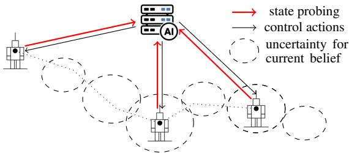
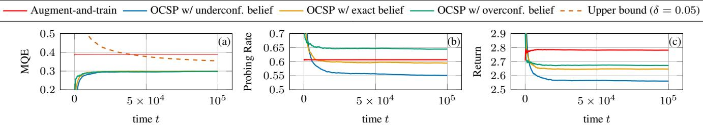
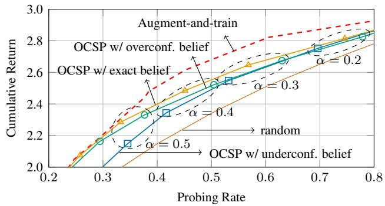

# RISK-AWARE ONLINE CONFORMAL STATE PROBING

Pietro Talli<sup>⋆</sup> Petar Popovski<sup>†</sup> Osvaldo Simeone<sup>⋆,†</sup>

<sup>⋆</sup>Institute for Intelligent Networked Systems, Northeastern University London <sup>†</sup>Connectivity Section, Department of Electronic Systems, Aalborg University Email: {p.talli, o.simeone}@northeastern.edu, petarp@es.aau.dk

## ABSTRACT

AI-based autonomous agents, typically hosted at data centers, must acquire state information from robots or edge devices in order to issue informed control decisions. Managing uncertainty about the state is particularly consequential in safetycritical settings, in which average-case guarantees are insufficient. In this context, we study a sequential decision maker process that jointly decides which actions to take and when to probe given access to an arbitrary state prediction model. We propose online conformal state probing (OCSP), an action and probing policy that certifies worst-case reliability levels without relying on distributional assumptions. OCSP is designed to provably control the missed query error (MQE), i.e., the fraction of instances where probing would have been beneficial, while minimizing the probing rate. OCSP can be applied to existing pre-trained value-based control policies without requiring retraining or fine-tuning. We validate OCSP through numerical simulations to verify theoretical guarantees and to assess performance trade-offs as a function of the calibration of the state predictor.

Index Terms— Conformal risk control, optimal control, active data acquisition

## 1. INTRODUCTION

Recent advances in AI, including large language models (LLMs) and vision language action models (VLAs) [1], have equipped autonomous agents, typically hosted at data centers, with greater capabilities and generalization skills. However, the deployment of AI-based autonomous agents increasingly demands strict reliability guarantees on performance [2, 3, 3]. A central difficulty in ensuring reliable operation is that agents residing on the cloud must act on system states that are not promptly available, as telemetry from robots or edge devices can be too costly to query continuously and in a timely fashion (see Fig. 1). As a result, the agent must act under partial observability, actively deciding when to probe the state in order to reduce its uncertainty about the environment before committing to an action [4].

  
Fig. 1: Example of an agent that navigates the environment according to an estimated belief on the current state, actively probing the state to control the outage rate.

Management of uncertainty is particularly consequential for reliability-critical applications, in which standard averagecase guarantees are insufficient. In fact, a policy that performs well in expectation, but occasionally fails catastrophically, may be unacceptable. Ideally, reliability constraints must hold even in the worst case, without distributional assumptions on the environment or observation noise.

In this work, we study a general sequential decisionmaking problem in which an intelligent agent jointly decides which control actions to execute and when to probe the state (Sec. 2). Fig. 1 illustrates the example of a robot controlled by a cloud based agent. At each time step, a state-estimation model at the agent produces an uncertainty estimate for the current state, which is used by the agent to determine control and probing actions. Reliability requirements are imposed by constraining the missed query error (MQE) rate, i.e., the fraction of steps in which probing would have been beneficial but the state was not probed [5].

To ensure provable control of the MQE, we introduce online conformal state probing (OCSP), an action and probing policy that wraps around any pre-trained state predictor (Sec. 3). OCSP builds on online risk control, which provides deterministic, distribution-free coverage and risk guarantees for sequentially observed data [6–9]. Unlike this line of work, however, OCSP does not aim to calibrate a predictor [10] or to defer from cloud to edge [5], but to certify and control the reliability of a closed-loop decision-making mechanism that jointly governs which actions to take and when to probe. As a use case, OCSP is applied to an existing value-based control policy in a Markov decision process (MDP), providing worstcase performance guarantees for a pre-trained agent (Sec. 4).

## 2. SYSTEM MODEL

We consider a stateful sequential decision process whose state at discrete time t is given by $s _ { t } \in S$ , where $s$ is a discrete finite set. As in the example of Fig. 1, at each time step t, the agent does not have direct access to state $s _ { t } ,$ but it can acquire state $s _ { t }$ through a probing action $P _ { t } \in \{ 0 , 1 \}$ , where $P _ { t } = 1$ indicates that the state is probed. The sequence of past probed states is used to maintain an estimate of the current state in the form of a probability $b _ { t } \in \Delta _ { S }$ given by

$$
b _ { t } = f _ { t } \big ( \{ ( t ^ { \prime } , s _ { t ^ { \prime } } ) : P _ { t ^ { \prime } } = 1 \} _ { t ^ { \prime } < t } \big ) ,\tag{1}
$$

where $\Delta _ { \mathcal { S } }$ is the simplex of probability distributions over the set $s$ and $f _ { t }$ is a sequence of functions. Functions $f _ { t }$ may be implemented as a pre-trained predictor, and are not subject to optimization. As discussed in Sec. 4, the belief may be evaluated using a probabilistic transition model for the state.

At every time step t, the agent interacts with the environment, taking an action $a _ { t } \in \mathcal A$ as a function of the current belief $b _ { t }$ , where A is a discrete finite set. This yields the control action $a _ { t } = \pi _ { t } ^ { A } ( b _ { t } )$ , with action policy $\pi _ { t } ^ { \mathcal { A } }$ to be optimized. In general, the next state $s _ { t + 1 }$ can be affected by the previous actions $a _ { t ^ { \prime } }$ with $t ^ { \prime } \leq t ,$ and we do not make any assumption on the functional or probabilistic form of this dependence.

Upon taking action $a _ { t }$ , the agent collects the utility $U _ { t } ( s _ { t } , a _ { t } ) ~ \in ~ [ U _ { \operatorname* { m i n } } , U _ { \operatorname* { m a x } } ]$ , where $U _ { t } ( \cdot , \cdot )$ is an arbitrary known function, and we have bounds $U _ { \mathrm { m i n } } \geq 0$ and $U _ { \mathrm { m a x } } <$ ∞. Thus, given the correct state $s _ { t } ,$ , the optimal action is

$$
a _ { t } ^ { * } \in \arg \operatorname* { m a x } _ { a \in \mathcal { A } } U _ { t } ( s _ { t } , a ) ,\tag{2}
$$

which corresponds to the optimal utility value $U _ { t } ^ { * } = U _ { t } ( s _ { t } , a ^ { * } )$ As further discussed in Sec. 4, the utility $U _ { t } ( s , a )$ may be obtained as the state-action value function of a pre-trained value-based agent.

For all times t with $P _ { t } = 1$ , the state $s _ { t }$ is known and the action can be optimally set to $a _ { t } = a _ { t } ^ { * }$ . In contrast, at times with no probing, the action $a _ { t }$ taken by the agent generally incurs a regret compared to the optimal action $a _ { t } ^ { * }$ in (2), which is given by the difference

$$
R _ { t } ( s _ { t } , \hat { a } _ { t } ) = U _ { t } ^ { * } - U _ { t } ( s _ { t } , \hat { a } _ { t } ) .\tag{3}
$$

To quantify the acceptable performance loss caused by incomplete state probing, we introduce a tolerance threshold $R _ { \mathrm { m a x } } \le U _ { \mathrm { m a x } } - U _ { \mathrm { m i n } } .$ , representing the maximum admissible regret. Violations of this threshold are captured by the binary outage variable

$$
O _ { t } = \mathbb { 1 } [ R _ { t } ( s _ { t } , \hat { a } _ { t } ) > R _ { \operatorname* { m a x } } ] .\tag{4}
$$

Importantly, since the agent does not observe the state unless it actively probes it, the outage signal $O _ { t }$ is itself observed only when a probe is issued, i.e., when $P _ { t } = 1$

We model the decision of whether to probe as a stochastic probing policy $\pi _ { t } ^ { \mathcal { P } } ( b _ { t } ) \in [ 0 , 1 ]$ , with $P _ { t } \sim \mathrm { B e r n o u l l i } ( \pi _ { t } ^ { \mathcal { P } } ( b _ { t } ) )$ denoting the decision to probe at time t. Overall, given fixed belief functions in (1), we aim at designing the action policy $\pi _ { t } ^ { \mathcal { A } }$ and the probing policy $\pi _ { t } ^ { \mathcal { P } }$ . The design goal is to control the MQE [5], i.e., the fraction of instances in which probing would have been beneficial, since $O _ { t } = 1$ , but was not performed, i.e., $P _ { t } = 0$ . Formally, the MQE is defined as

$$
\mathrm { M Q E } _ { T } = \frac { 1 } { N _ { T } } \sum _ { t = 1 } ^ { T } O _ { t } \left( 1 - P _ { t } \right) ,\tag{5}
$$

where $\begin{array} { r } { N _ { T } = \sum _ { t = 1 } ^ { T } O _ { t } } \end{array}$ is the number of outages in the sequence, with the convention $\mathrm { M Q E } _ { T } ~ = ~ 0$ when $N _ { T } ~ = ~ 0$ A zero MQE can be obtained by a trivial policy that always probes the state, setting $P _ { t } = 1$ for all times t. Therefore, our design goal is to control the MQE, while making a best effort at minimizing the probing rate $\scriptstyle \sum _ { t = 1 } ^ { T } P _ { t } / T$

Formally, we aim to ensure that, for any sequence of states $\{ s _ { t } \} _ { t = 1 } ^ { T } , { \mathrm { g i v e n } }$ any fixed belief functions $\{ f _ { t } \} _ { t = 1 } ^ { T }$ , the MQE does not exceed a target level $\alpha \in [ 0 , 1 ]$ when $T$ is sufficiently large. This requirement is expressed by the inequality

$$
\begin{array} { r } { \mathrm { M Q E } _ { T } \leq \alpha + o _ { N _ { T } } ( 1 ) , } \end{array}\tag{6}
$$

where the additive term $o _ { N _ { T } } ( 1 )$ vanishes as the number of outages $N _ { T }$ grows.

## 3. ONLINE CONFORMAL STATE PROBING

In this section we present OCSP, an online action-probing policy that provides worst-case guarantees on the MQE as per the requirement (6), while attempting to minimize the probing rate.

OCSP. At each time step t, OCSP first evaluates a candidate action $\hat { a } _ { t }$ by minimizing the regret under the current belief $b _ { t } .$ i.e.,

$$
\hat { a } _ { t } = \underset { a \in \mathcal { A } } { \arg \operatorname* { m i n } } \sum _ { s \in \mathcal { S } } b _ { t } ( s ) R _ { t } ( s , a ) .\tag{7}
$$

We emphasize that, since the belief is an arbitrary estimate of the state, the action in (7) does not provide any optimality guarantee. The action policy $\pi _ { t } ^ { A }$ then sets $a _ { t } ~ = ~ { \hat { a } } _ { t }$ when $P _ { t } = 0$ , while setting $a _ { t } = a _ { t } ^ { * }$ when $P _ { t } = 1$

OCSP decides whether to probe the state, setting $P _ { t } = 1$ or not, $P _ { t } = 0$ , depending on a local estimate of the probability of an outage $O _ { t }$ in (4) for the candidate action $\hat { a } _ { t }$ . The outage probability is estimated as the probability of the outage event $O _ { t } = \mathbb { 1 } [ R _ { t } ( s , \hat { a } _ { t } ) > R _ { \operatorname* { m a x } } ]$ under the belief $b _ { t }$ , i.e.,

$$
\hat { O } _ { t } = \sum _ { s \in { \cal S } } b _ { t } ( s ) \mathbb { 1 } [ R _ { t } ( s , \hat { a } _ { t } ) > R _ { \operatorname* { m a x } } ] .\tag{8}
$$

```latex
Algorithm 1 Online Conformal State Probing (OCSP)
Require: target α $\in [ 0 , 1 ] ;$ ; tolerance $R _ { \operatorname* { m a x } } \geq$ 0; step sizes η > 0; explo
ration $\rho \in ( 0 , 1 - \alpha ] ;$ utility functions $\{ U _ { t } \} _ { t = 1 } ^ { T } \dot { ; }$ estimation functions
$\{ f _ { t } \} _ { t = 1 } ^ { T } ;$ initial $\mu _ { 1 }$
1: for ${ t } = { \dot { 1 } } , 2 , \dots { \mathrm { { \bf { d o } } } }$
2: $b _ { t }  f _ { t } ( \{ s _ { t ^ { \prime } } : P _ { t ^ { \prime } } = 1 \} _ { t ^ { \prime } < t } )$ ▷ $\cdot \delta _ { s _ { 1 } }$ if t=1
3: $\begin{array} { r } { \hat { a } _ { t } \gets \arg \operatorname* { m i n } _ { a \in \mathcal { A } } \sum _ { s \in \mathcal { S } } \hat { b _ { t } } ( s ) R _ { t } ( s , a ) } \end{array}$
4: $\begin{array} { r } { \hat { O } _ { t } \gets \sum _ { s \in \mathcal { S } } b _ { t } ( s ) \mathbb { 1 } [ R _ { t } ( s , \hat { a } _ { t } ) > R _ { \operatorname* { m a x } } ] } \end{array}$ ▷ outage score
5: $p _ { t }  \rho + ( 1 - \rho ) \mathbb { 1 } [ \hat { O } _ { t } \geq \mu _ { t } ]$
6: draw $P _ { t } \sim$ Bernoulli(p<sub>t</sub>)
7: if $P _ { t } = 0$ then
8: $a _ { t }  { \hat { a } } _ { t } ; \quad \mu _ { t + 1 }  \mu _ { t }$
9: else ▷ state probing (rule-driven or exploratory)
10: observe $s _ { t } ;$ compute $R _ { t }$ and $O _ { t }$
11: a<sub>t</sub> $\gets a _ { t } ^ { * } ;$
12: update $\mu _ { t }$ according to (10)
```

Specifically, OCSP follows a probabilistic query policy $\pi _ { t } ^ { \mathcal { P } }$ whereby probing is carried out with probability

$$
p _ { t } = \pi _ { t } ^ { \mathcal { P } } ( b _ { t } ) = \rho + ( 1 - \rho ) \mathbb { 1 } [ \hat { O } _ { t } \geq \mu _ { t } ] ,\tag{9}
$$

i.e., $P _ { t } \sim$ Bernoulli $\left( { p _ { t } } \right)$ , where $\rho \in ( 0 , 1 - \alpha ]$ is an exploration probability and $\mu _ { t }$ is a threshold to be calibrated online. The rationale behind the probing probability (9) is twofold: $( i )$ if the estimate $\hat { O } _ { t }$ is larger than a well-designed threshold $\mu _ { t } ,$ , it is plausible, although not guaranteed, that the candidate action $\hat { a } _ { t }$ would lead to an outage event; and $( i i )$ in order to ensure that the true outage variable $O _ { t }$ is available at the agent sufficiently often, the agent queries the state with probability no smaller than the exploration probability $\rho .$

The threshold in (9) is potentially updated whenever the agent decides to probe the state, i.e., all times t with $P _ { t } = 1$ Based on state $s _ { t }$ and outage indicator $O _ { t }$ in (4), the update of the threshold $\mu _ { t }$ follows the rule

$$
\begin{array} { r } { \mu _ { t + 1 }  \mu _ { t } - \eta \frac { O _ { t } P _ { t } } { p _ { t } } \big [ ( 1 - p _ { t } ) - \alpha \big ] , } \end{array}\tag{10}
$$

where $\eta > 0$ is an update rate and $\mu _ { 1 } \in [ 0 , 1 ]$ . By (10), when $P _ { t } = 0 ~ ( \mathrm { n o }$ query) or $O _ { t } = 0$ (no outage), the threshold is not modified and we recover $\mu _ { t + 1 }  \mu _ { t }$ . When $P _ { t } = 1$ and $O _ { t } = 1$ , i.e., in the case of a query and of an outage event, the threshold $\mu _ { t }$ is modified as follows:

• If $\hat { O } _ { t } ~ < ~ \mu _ { t }$ , the query is prompted by exploration, since the probing probability in (9) is $p _ { t } ~ = ~ \rho .$ This implies that the estimation $\hat { O } _ { t }$ failed to predict the outage event $O _ { t } = 1$ under the current threshold $\mu _ { t }$ . Accordingly, the threshold is decreased by the amount $\eta ( 1 - \rho - \alpha ) / \rho > 0$ to facilitate the prediction of future outage events. Recall the design constraint $\rho < 1 - \alpha$ . The intuition behind the magnitude of the update is that, since exploration already inherently identifies a fraction $\rho$ of the outages, we wish the threshold mechanism to identify the remaining fraction $1 - \rho .$ The scale factor $1 / \rho$ plays the role of an inverse probability weighting [11], compensating the fact that $O _ { t }$ is selectively observed.

$\bullet \mathrm { I f } \hat { O } _ { t } \geq \mu _ { t } ,$ , the query is caused by a correct thresholding of the outage probability estimate $\hat { O } _ { t }$ . In this case, the threshold is increased by $\eta \alpha$ with the goal of reducing the probing rate.

Missed Query Error Guarantees. We now show that OCSP guarantees condition (6) on the MQE.

Proposition 1 (Performance guarantees). For any $\delta \in ( 0 , 1 )$ any state sequence $\{ s _ { t } \} _ { t = 1 } ^ { T } ,$ , any estimationfunctions $\{ f _ { t } \} _ { t = 1 } ^ { T }$ and utility functions $\{ \tilde { U _ { t } } \in [ U _ { \operatorname* { m i n } } , U _ { \operatorname* { m a x } } ] \} _ { t = 1 } ^ { \tilde { T } }$ , with probability at least $1 - \delta$ over the algorithm’s exploration mechanism in (9), OCSP satisfies the upper bound

$$
\mathrm { M Q E } _ { T } \ \leq \ \alpha + \Delta ( N _ { T } , \delta )\tag{11}
$$

where, for $N _ { T } \geq 1$ , we have defined

$$
\Delta ( N _ { T } , \delta ) = \frac { 1 + 2 \eta / \rho } { \eta N _ { T } } + \sqrt { \frac { 2 ( 1 - \rho ) } { \rho N _ { T } } \log \frac { 2 } { \delta } } + \frac { 2 ( 1 - \rho ) } { 3 \rho N _ { T } } \log \frac { 2 } { \delta } ,
$$

and $\Delta ( 0 , \delta ) = 0 \quad$

Proof. We start by rewriting (5) as

$$
\mathrm { M Q E } _ { T } = \alpha + \frac { 1 } { N _ { T } } \Bigg [ \sum _ { t = 1 } ^ { T } e _ { t } + \sum _ { t = 1 } ^ { T } O _ { t } \frac { 1 - \alpha } { p _ { t } } ( p _ { t } - P _ { t } ) \Bigg ] .\tag{12}
$$

The first sum in (12) is deterministically controlled by the update (10) in a manner similar to online conformal prediction [7], and we omit details here due to space constraints, while the second sum can be upper bounded with high probability with respect to the sequence of probing decisions $\{ P _ { t } \}$ , concluding the proof.

For the second sum, writing $P ^ { t - 1 } = [ P _ { 1 } , . . . , P _ { t - 1 } ]$ and $\mathcal { T } ^ { \mathcal { O } } = \{ t : O _ { t } = 1 \} _ { t \leq T } .$ , we have $\mathbb { E } [ P _ { t } \ | \ P ^ { t - 1 } ] = p _ { t } ,$ , and thus the sum $\textstyle \sum _ { t \in \mathcal { T } ^ { \mathcal { O } } } ( \overline { { p } } _ { t } - P _ { t } ) / p _ { t }$ is a martingale difference sequence. Moreover, we have $\operatorname { V a r } ( ( p _ { t } - P _ { t } ) / p _ { t } \mid P ^ { t - 1 } ) =$ $( 1 - p _ { t } ) / p _ { t } \leq ( 1 - \rho ) / \rho$ . Therefore, using Freedman’s inequality [12] on the sequence $\{ ( p _ { t } - P _ { t } ) / p _ { t } \}$ , we obtain the inequality

$$
\left| \sum _ { t \in T ^ { \mathcal { O } } } \frac { p _ { t } - P _ { t } } { p _ { t } } \right| \leq \sqrt { 2 \frac { ( 1 - \rho ) N _ { T } } { \rho } \log \frac { 2 } { \delta } } + \frac { 2 ( 1 - \rho ) } { 3 \rho } \log \frac { 2 } { \delta }\tag{13}
$$

with probability no smaller than $1 - \delta .$

## 4. EXPERIMENTS

We validate OCSP and its theoretical guarantees by investigating the MQE, utility and query rate of OCSP under different belief models, while comparing with the ideal benchmark in [13], which requires state augmentation and retraining.

Setting. Even though our framework applies to generic, even deterministic and adversarial, dynamic systems, we consider here an MDP, since this allows us comparisons with established benchmarks. The considered MDP has $| S | = 3 0$ states, $| { \mathcal { A } } | = 4 ~ \mathrm { a c t i o n s } ,$ and a transition model M obtained as follows. For each pair $( s , a )$ we randomly select a target state $s _ { a } ^ { * } \in S$ and define the transition probability as $M ( s , a , s ^ { \prime } )$ ∝ $\exp ( - d ( s ^ { \prime } , s _ { a } ^ { * } ) ^ { 2 } / \sigma ^ { 2 } )$ , where $d ( s , s ^ { * } ) = \operatorname* { m i n } ( | s - s ^ { * } | , S -$ $\left| s - s ^ { * } \right| )$ is a circular distance between discrete states and $\sigma ^ { 2 }$ $= 0 . 6 7$ . The state sequence is drawn from this model given the control actions. The utility is derived from a reward given by the distance from a randomly selected target state $s ^ { * }$ as $r ( s , a , s ^ { \prime } ) = 1 0 \exp ( - 0 . 5 \cdot d ( s ^ { \prime } , s ^ { * } ) )$ . Specifically, the utility $U _ { t } ( s , a )$ is obtained from a pre-trained state-action value function $Q ( s , a )$ optimized by running Q-learning [14] using the implementation provided in [15] over the given MDP.

  
Fig. 2: MQE, average query rate and average reward over time t for $1 0 ^ { 5 }$ steps. Results are averaged over 100 different seeds.

Implementation. When $P _ { t - 1 } = 0 .$ , the belief $b _ { t }$ is obtained from an estimated transition model M<sup>˜</sup> by updating the last belief $b _ { t - 1 }$ given action $a _ { t - 1 }$ as $f _ { t } ( b _ { t - 1 } , a _ { t - 1 } ) = b _ { t - 1 } ^ { \intercal } \tilde { M } _ { a _ { t } }$ <sub>−1</sub> , where $\tilde { M } _ { a _ { t - 1 } }$ is the $| S | \times | S |$ transition matrix associated with action $a _ { t - 1 }$ The estimated transition model $\tilde { M }$ is defined using the same moder as for M, but with a generally different dispersion parameter $\sigma ^ { 2 }$ . Specifically we considered three settings corresponding to predictive models with different calibration levels [16–18]: (i) exact belief, i.e., $\sigma ^ { 2 } = 0 . 6 7 ;$ (ii) overconfident belief with a lower spread of $\sigma ^ { 2 } = 0 . 3 7 ;$ and (iii) underconfident belief with the larger spread $\sigma ^ { 2 } = 2$

Baseline. As a baseline, we consider the “augment-and-train” methodology in [13], which trains from scratch in the MDP a policy that simultaneously learns how to act and probe. This policy operates on an augmented state space, describing also the time elapsed from the last probed state, and it is trained to meet an average probing rate. Augment-and-train serves as an upper bound on the performance of OCSP for a given probing rate, since OCSP operates as a wrapper around a pre-trained value function.

In Fig. 2 we plot $\mathrm { M Q E } _ { T }$ , the average probing rate and the average normalized cumulative return, as a function of time t. Fig. 2(a) demonstrates that OCSP can control the MQE to meet the target rate $\alpha = 0 . 3$ , irrespective of the quality of the prediction without requiring training. In contrast, the augment-and-train scheme, which is trained for the given target probing rate, which is set to approximately match that of OCSP with an exact belief (see Fig. 2(b)), yields an MQE as high as 0.4. The figure also reports the bound from Proposition 1 with $\delta = 0 . 0 5$ to further validate the theoretical guarantees of OCSP.

In Fig. 2(b) we observe that OCSP tends to concentrate state probings in the first time steps, while stabilizing to a lower probing rate as time goes on. Specifically, an underconfident belief induces candidate actions (7) that cater to a larger set of possible states, thus requiring OCSP to issue fewer probing actions to compensate for regret events. In contrast, with an overconfident belief, the candidate actions (7) may make riskier choices tailored to a particular state, and OCSP compensates for resulting outage events by increasing the probing rate.

  
Fig. 3: Cumulative reward vs. probing rate for different values of α.

The different probing rates translate into different cumulative returns, as shown in Fig. 2(c). In particular, Fig. 2(c) shows that OCSP with an overconfident belief obtains a slightly higher average return than OCSP with an exact belief but with higher average probing rate.

The trade-off between probing rate and cumulative return is further investigated in Fig. 3, which shows the Pareto front on the plane with axes given by cumulative return and probing rate, both evaluated at time $t = 1 0 ^ { 5 }$ . The Pareto front is obtained for OCSP by varying the MQE target α, while for augment-and-train we varied the target probing rate. OCSP, at lower query rates, is seen to almost match the performance of the ideal augment-and-train scheme. Using an exact belief is observed to be instrumental for achieving a better performance trade-off with OCSP. Moreover, an overconfident belief model is preferable to an underconfident one at low query rates, while, when the query rate is higher than 0.7, the underconfident belief obtains a higher trade-off.

## 5. CONCLUSIONS

In this work, we developed a sequential decision-making framework with adaptive state probing and formal performance guarantees. Future work may focus on larger-scale evaluations and on applications to AI-based policy models.

## 6. REFERENCES

[1] Kevin Black, Manuel Galliker, and Sergey Levine, “Real-time execution of action chunking flow policies,” in Advances in Neural Information Processing Systems. NeurIPS, 2025, vol. 38, pp. 33383–33407.

[2] Chengshu Li, Ruohan Zhang, Josiah Wong, Cem Gokmen, Sanjana Srivastava, Roberto Mart´ın-Mart´ın, Chen Wang, Gabrael Levine, Michael Lingelbach, Jiankai Sun, et al., “Behavior-1k: A benchmark for embodied ai with 1,000 everyday activities and realistic simulation,” in Conference on Robot Learning. PMLR, 2023, pp. 80– 93.

[3] Stephan Rabanser, Sayash Kapoor, Peter Kirgis, Kangheng Liu, Saiteja Utpala, and Arvind Narayanan, “Towards a science of AI agent reliability,” arXiv preprint arXiv:2602.16666, 2026.

[4] Deniz Gund¨ uz, Federico Chiariotti, Kaibin Huang, An-¨ ders E Kalør, Szymon Kobus, and Petar Popovski, “Timely and massive communication in 6G: Pragmatics, learning, and inference,” IEEE BITS the Information Theory Magazine, vol. 3, no. 1, pp. 27–40, 2023.

[5] Shayan Kiyani, Sima Noorani, George Pappas, and Hamed Hassani, “Strategic decision support for ai agents,” arXiv preprint arXiv:2606.12587, 2026.

[6] Anastasios N Angelopoulos and Stephen Bates, “Conformal prediction: A gentle introduction,” Foundations and Trends in Machine Learning, vol. 16, no. 4, pp. 494–591, 2023.

[7] Isaac Gibbs and Emmanuel J Candes, “Conformal in-\` ference for online prediction with arbitrary distribution shifts,” Journal of Machine Learning Research, vol. 25, no. 162, pp. 1–36, 2024.

[8] Jordan Lekeufack, Anastasios N Angelopoulos, Andrea Bajcsy, Michael I Jordan, and Jitendra Malik, “Conformal decision theory: Safe autonomous decisions from imperfect predictions,” in 2024 IEEE International Conference on Robotics and Automation (ICRA), 2024, pp. 11668–11675.

[9] Matteo Zecchin, Unnikrishnan Kunnath Ganesan, Giuseppe Durisi, Petar Popovski, and Osvaldo Simeone, “Prediction-powered communication with distortion guarantees,” IEEE Journal on Selected Areas in Information Theory, vol. 7, pp. 33–45, 2026.

[10] Glenn Shafer and Vladimir Vovk, “A tutorial on conformal prediction.,” Journal of machine learning research, vol. 9, no. 3, 2008.

[11] Emmanuel Candes, Lihua Lei, and Zhimei Ren, “Con- \` formalized survival analysis,” Journal of the Royal Statistical Society Series B: Statistical Methodology, vol. 85, no. 1, pp. 24–45, 2023.

[12] David A Freedman, “On tail probabilities for martingales,” Annals ofProbability, pp. 100–118, 1975.

[13] Pietro Talli, Edoardo David Santi, Federico Chiariotti, Touraj Soleymani, Federico Mason, Andrea Zanella, and Deniz Gund¨ uz, “Pragmatic communication for re-¨ mote control of finite-state markov processes,” IEEE Journal on Selected Areas in Communications, vol. 43, no. 7, pp. 2589–2603, 2025.

[14] Tommi Jaakkola, Michael I. Jordan, and Satinder P. Singh, “Convergence of stochastic iterative dynamic programming algorithms,” in Proceedings of the 7th International Conference on Neural Information Processing Systems, 1993, NIPS’93, p. 703–710.

[15] Iadine Chades, Guillaume Chapron, Marie-Jos\` ee Cros,´ Fred´ erick Garcia, and R ´ egis Sabbadin, “Mdptoolbox: a ´ multi-platform toolbox to solve stochastic dynamic programming problems,” Ecography, vol. 37, no. 9, pp. 916–920, 2014.

[16] Chuan Guo, Geoff Pleiss, Yu Sun, and Kilian Q Weinberger, “On calibration of modern neural networks,” in International conference on machine learning. PMLR, 2017, pp. 1321–1330.

[17] Osvaldo Simeone, Machine learning for engineers, Cambridge university press, 2022.

[18] Jiayi Huang, Sangwoo Park, Nicola Paoletti, and Osvaldo Simeone, “Distilling calibration via conformalized credal inference,” in 2025 International Joint Conference on Neural Networks (IJCNN). IEEE, 2025, pp. 1–10.