# Reasoning-Preserving Fine-Tuning of Post-RL LLMs with Null-Basis LoRA

Wenzhi Fang1,2, Nicholas Tzou1, Lazar Valkov1, Srinivas Chappidi1

1Samsung Research America, Mountain View, CA, USA

2Purdue University, West Lafayette, IN, USA

Reinforcement learning (RL)-based post-training has become an efective approach for eliciting reasoning capabilities in large language models (LLMs). However, adapting post-RL models to new knowledge domains or behaviors through subsequent supervised fine-tuning (SFT) can severely overwrite these capabilities. Existing approaches mitigate such forgetting through experience replay, specialized initial ization, or constrained optimization using gradient projection, but either provide limited preservation or incur substantial training overhead. Our analysis shows that reasoning activations concentrate in low-dimensional subspaces, leaving substantial null-space capacity for adaptation, and that the corresponding approximate null spaces can be reliably estimated from a modest number of examples. Motivated by these observations, we propose Null-Basis Low-Rank Adaptation (NB-LoRA), a parametereficient method for adapting post-RL LLMs while preserving their acquired reasoning ability. We formulate reasoning retention as a layer-wise hidden-state preservation constraint and construct a fixed approximate null basis from reasoning activations. LoRA updates are then reparameterized through this basis, enforcing the preservation constraint throughout fine-tuning. Extensive experiments across multiple RL-trained LLMs and diverse downstream tasks show that NB-LoRA matches standard LoRA in adaptation performance, maintains reasoning accuracy near pre-fine-tuning levels, and generalizes this preservation to held-out reasoning benchmarks.

Correspondence: fang375@purdue.edu, n.tzou@samsung.com

## 1 Introduction

Reinforcement learning (RL) based post-training has become an efective approach for eliciting reasoning capabilities in large language models (LLMs) (Shao et al., 2024; Yang et al., 2024). However, most current reasoning-oriented RL methods primarily exploit capabilities already encoded in the base model by reshaping its output distribution, and typically fall short of instilling new knowledge. Moreover, the resulting models often generate lengthy reasoning traces, even for tasks where concise responses would sufice. Subsequent supervised fine-tuning (SFT) therefore remains necessary to inject new knowledge or adapt the model’s response style in some target tasks. Yet these RL-acquired capabilities are fragile under such adaptation: RL only mildly perturbs the base model, staying close to it in distribution (Shenfeld et al., 2025), whereas the subsequent SFT is not similarly constrained and can drift far from that distribution, easily overwriting the RL-shaped reasoning behavior (Niu et al., 2026).

Retaining previously acquired capabilities while adapting to new data is a classic problem of catastrophic forgetting, for which continual learning provides several natural solutions (Kirkpatrick et al., 2017). Conventional approaches such as experience replay (Rolnick et al., 2019) and null-space update projection (Wang et al., 2021), however, can be dificult to apply to reasoning-oriented LLM adaptation. Experience replay requires carefully balancing prior reasoning data with new-task data: insuficient replay may fail to preserve reasoning, whereas excessive replay may hinder adaptation to the new task. Null-space update projection methods instead constrain full-model updates, introducing substantial computational and memory overhead at LLM scale. More recent parameter-eficient approaches mitigate forgetting through low-rank adaptation (LoRA) and carefully chosen LoRA initialization (Wang et al., 2025). However, due to unconstrained update, these methods may still overwrite the reasoning behavior acquired during RL post-training, which can be particularly sensitive to further adaptation. This raises the central question of this paper:

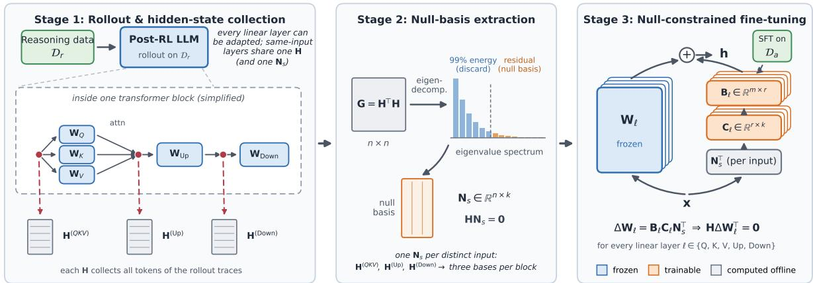  
Figure 1 Overview of NB-LoRA. Stage 1: We use the post-RL model to generate rollouts on reasoning data Dr and collect the input hidden states H of each target linear layer. Stage 2: The eigendecomposition of H⊤H yields an approximate null basis Ns from the eigenvectors outside the top η (i.e., 99%) spectral energy, so that $\mathbf { H } \mathbf { N } _ { s } = \mathbf { 0 }$ Stage 3: The update is reparameterized as $\Delta \mathbf { W } = \mathbf { B } \mathbf { C } \mathbf { N } _ { s } ^ { \top }$ , where B and C are trained on the adaptation data $\mathcal { D } _ { a } ,$ while N remains frozen.

How can we eficiently adapt a RL-trained LLM to new tasks while preserving its acquired reasoning ability?

## 1.1 Contribution

To address this, we propose Null-Basis LoRA (NB-LoRA), a parameter-eficient fine-tuning method that reparameterizes LoRA updates through a fixed null basis of reasoning hidden states. The idea builds on the fact that if an update does not change a layer’s outputs on the hidden states produced by reasoning examples, the reasoning computation carried by those states is left intact. Specifically, we first compute, once and ofline, a basis N for the (approximate) null space of the reasoning hidden-state matrix H, and reparameterize the update as $\Delta \mathbf { W } = \mathbf { B } \mathbf { C } \mathbf { N } _ { s } ^ { \top }$ with ${ \bf N } _ { s }$ frozen and the low-rank factors B and C trainable (Figure 1). Any B and C satisfy the preservation constraint H∆W⊤ = 0 exactly, enabling unconstrained optimization with standard optimizers.

Our main contributions are summarized as follows.

• We formulate post-RL reasoning retention as a layer-wise hidden-state preservation constraint and introduce Null-Basis LoRA (NB-LoRA), a null-basis low-rank reparameterization that satisfies this constraint by construction while retaining the optimizer simplicity of standard LoRA.

• We show that reasoning activations in RL-trained LLMs occupy a low-dimensional subspace despite long reasoning traces, leaving a substantial approximate null space for adaptation that can be estimated from only a small set of reasoning examples.

• We empirically demonstrate that NB-LoRA preserves RL-acquired reasoning ability while maintaining strong downstream adaptation performance, generalizes retention to held-out reasoning benchmarks, and substantially improves training eficiency over existing works.

## 2 Related Work

Interaction between SFT and RL in LLM post-training. RL has been widely adopted in LLM post-training to improve reasoning capabilities (Yang et al., 2024; Shao et al., 2024). Typical post-training pipelines combine SFT and RL because they provide complementary learning signals: SFT introduces expert behavior and new knowledge, whereas online RL refines the model through exploration. ReFT follows the conventional SFT-then-RL pipeline (Trung et al., 2024), while DeepSeek-R1 employs a multistage SFT-RL-SFT-RL pipeline (DeepSeek-AI, 2025). Recently, Ma et al. (2026) proposed ReLIFT, which interleaves RL with online SFT on problems beyond the model’s capabilities. Because its SFT data are collected during RL, the two training objectives are tightly coupled. In general, however, subsequent SFT may target a diferent task and reduce the reward acquired through RL (Niu et al., 2026). We study this RL-then-SFT setting, aiming to adapt the model without overwriting its RL-acquired reasoning.

Mitigating catastrophic forgetting. Existing approaches to catastrophic forgetting include regularization, replay, on-policy distillation, and update constraints. Elastic weight consolidation penalizes changes to parameters important for prior tasks (Kirkpatrick et al., 2017), while replay mixes stored (Rolnick et al., 2019) or model-generated examples (Sun et al., 2020) with new-task data. SDFT uses a demonstration-conditioned copy of the model to supervise on-policy trajectories, reducing distribution mismatch and forgetting, but is limited by the model’s in-context learning ability and can fail under distribution shift (Shenfeld et al., 2026; Wang et al., 2026). Constraint-based methods prevent loss increases on prior tasks (Lopez-Paz & Ranzato, 2017) or project gradients away from directions afecting previous outputs (Farajtabar et al., 2020). More closely related to our work, NSCL projects updates into activation-derived null spaces at each step (Wang et al., 2021). Unlike these soft, replay-based, or per-step constraints, the proposed NB-LoRA encodes a fixed reasoning-preservation constraint directly into the adapter.

Parameter-efficient fine-tuning. Parameter-eficient fine-tuning (PEFT) adapts a frozen backbone by training only a small number of additional parameters (Houlsby et al., 2019; Li & Liang, 2021). A prominent PEFT approach, LoRA, parameterizes weight updates with trainable low-rank factors (Hu et al., 2022). Several extensions apply LoRA to continual learning. O-LoRA assigns sequential tasks to orthogonal low-rank subspaces (Wang et al., 2023), while LB-CL transfers task-relevant low-rank parameters and projects gradients to maintain orthogonality with prior task subspaces (Qiao & Mahdavi, 2024). Merge Before Forget instead orthogonally initializes and continually merges task updates into a single LoRA, maintaining constant memory across tasks (Qiao & Mahdavi, 2026). These methods require prior tasks to be adapted through LoRA, whereas our setting protects reasoning already embedded in an RL-trained backbone. LoRA-Null and MiLoRA initialize adapters using null or minor singular subspaces (Tang et al., 2026; Wang et al., 2025), but do not constrain subsequent updates. Our proposed NB-LoRA instead enforces preservation throughout training by null-basis-based reparameterization.

## 3 Null-Basis-based Parameter-Efficient Fine-Tuning

## 3.1 Problem Setup

We consider a reasoning-capable LLM obtained via RL-based post-training. Let $\mathcal { D } _ { r }$ denote the dataset used in the RL stage, whose induced capability we wish to preserve, and let $\mathcal { D } _ { a }$ denote an adaptation dataset for subsequent SFT, such as knowledge injection or concise-response tuning. These two cases are representative of common post-RL adaptation goals: one seeks to augment the model’s knowledge, while the other seeks to modify output behavior on target domains without altering its reasoning competence. Our goal is to optimize the model on $\mathcal { D } _ { a }$ while minimizing interference with reasoning performance on $\mathcal { D } _ { r }$

We focus on adapting linear layers in the model, because transformer-based LLMs are built largely around linear modules, particularly the attention and MLP projections. For a linear layer with weight matrix $\mathbf { W } \in \mathbb { R } ^ { m \times n }$ , standard fine-tuning learns an update ∆W and replaces W with $\mathbf { W } + \Delta \mathbf { W }$ . Such unconstrained updates can modify the layer outputs for both adaptation and reasoning examples. The objective of this work is to constrain the update ∆W to a restricted subspace in a parameter- and training-eficient manner, such that the update does not alter the model outputs on reasoning data.

## 3.2 Hidden-State Preservation Constraint

Let $\mathbf { H } \in \mathbb { R } ^ { N \times n }$ denote a matrix of hidden states collected from $\mathcal { D } _ { r }$ for the input of a target linear layer, where each row of H corresponds to one token representation and N is the total number of collected tokens. To preserve the pre-fine-tuning transformation of these reasoning states, we require

$$
\mathbf { H } ( \mathbf { W } + \Delta \mathbf { W } ) ^ { \top } = \mathbf { H } \mathbf { W } ^ { \top } .\tag{1}
$$

Equation (1) is equivalent to $\mathbf { H } \Delta \mathbf { W } ^ { \top } = \mathbf { 0 }$ . Therefore, a suficient condition for preserving the layer outputs on reasoning states is that every column of $\Delta \mathbf { W } ^ { \top }$ lies in the null space of H.

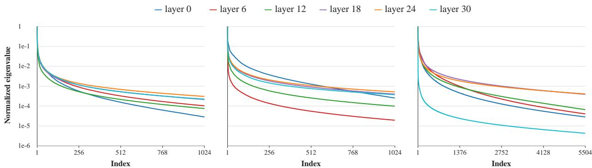  
(a) QKV input  
(b) Up projection input  
(c) Down projection input  
Figure 2 Normalized eigenvalue spectra of $\mathbf { H } ^ { \top } \mathbf { H }$ across representative Qwen2.5-3B layers, shown on a log scale.

This constraint has two desirable properties. First, it provides layer-wise and fine-grained preservation signals by constraining each adapted linear layer with hidden states observed on reasoning data, thereby directly guiding the search space of $\Delta \mathbf { W }$ toward directions that preserve reasoning-related capabilities. Second, in transformer blocks, multiple projections such as Q, K, and V share the same input hidden states, so the corresponding null space can be computed once and reused across these projections, substantially reducing the computational cost of constructing the constraint.

## 3.3 Feasibility of Null-Space Constraints

Two key questions arise when applying null-space constraints to reasoning models. 1) Does H admit a suficiently large approximate null space? Long reasoning traces produce many token-level observations $( N \gg n )$ , potentially increasing rank(H) toward n and reducing its null-space dimension, dim(Null(H)) = $n - \mathrm { r a n k } ( \mathbf { H } )$ . 2) Can this null space be efectively estimated using only a limited number of reasoning examples? Constructing H from a large reasoning corpus can be computationally expensive. To answer these questions, we empirically analyze the spectrum and null-space structure of H using hidden states extracted from Qwen2.5-3B (Yang et al., 2024) after RL post-training on the MATH-lighteval dataset (Hendrycks et al., 2021). Notably, the null space of H can be obtained from the eigendecomposition of the much smaller $n \times n$ matrix $\mathbf { H } ^ { \top } \mathbf { H } .$ Since hidden states are noisy and H is rarely exactly low rank, we define an approximate null space following the approach of Wang et al. (2021): we retain the principal directions that capture 99% of the spectral energy and treat the remaining directions as the approximate null-space basis.

Table 1 Approximate null-space dimensions (k) of representative Qwen2.5-3B layers under a 99% energy-retention threshold. Percentages are relative to the total dimension.
<table><tr><td>Module</td><td>Total Dimension</td><td>Layer 0</td><td>Layer 6</td><td>Layer 12</td><td>Layer 18</td><td>Layer 24</td><td>Layer 30</td><td>Average (%)</td></tr><tr><td>QKV</td><td>2048</td><td>1378</td><td>765</td><td>755</td><td>515</td><td>407</td><td>393</td><td>702 (34.3%)</td></tr><tr><td>Down</td><td>11008</td><td>7028</td><td>7343</td><td>5474</td><td>2272</td><td>1701</td><td>5940</td><td>4960 (45.1%)</td></tr><tr><td>Up</td><td>2048</td><td>1037</td><td>1138</td><td>574</td><td>325</td><td>259</td><td>251</td><td>597 (29.2%)</td></tr></table>

Spectrum analysis. We collect hidden states (i.e., H) from all the tokens in the reasoning traces of MATH-lighteval training samples. Figure 2 shows the normalized eigenvalue spectrum of $\mathbf { H } ^ { \top } \mathbf { H }$ for all the linear modules across layers 0, 6, 12, 18, 24, and 30 of Qwen2.5-3B. In all cases, the spectrum decays rapidly by several orders of magnitude within the first few hundred indices, indicating that the hidden states of reasoning traces span a proper subspace of the full representation space. We report the dimensions of the approximate null spaces (99% energy threshold) of the hidden-state matrices for each module in Table 1, which confirms that substantial null-space capacity remains available for further adaptation.

Null-space Structure Analysis. Since reasoning traces exhibit similar structural patterns (Jiang et al., 2025; Sun et al., 2026), we hypothesize that the null-space structure can be reliably estimated from a moderate number of examples. To verify this, we compare approximate null spaces estimated using diferent numbers of examples by measuring the principal angles between them. Specifically, we use the null space estimated from 4096 examples as a reference and evaluate its similarity to those estimated using fewer examples. Let $\mathcal { N } _ { 1 } , \mathcal { N } _ { 2 } \subset \mathbb { R } ^ { n }$ denote two subspaces with dimensions $k _ { 1 } \leq k _ { 2 }$ . The principal angles are defined recursively, for $j = 1 , \ldots , k _ { 1 }$ , as

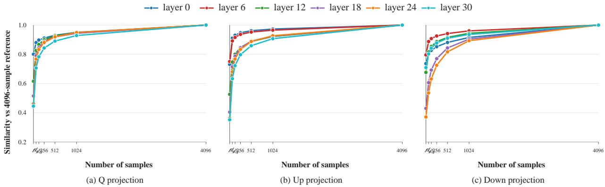  
Figure 3 Symmetric projection similarity between null spaces estimated using varying numbers of examples and the 4096-sample reference null space across representative Qwen2.5-3B layers.

$$
\theta _ { j } = \operatorname* { m i n } _ { \substack { \mathbf { x } _ { j } \in \mathcal { N } _ { 1 } , \mathbf { y } _ { j } \in \mathcal { N } _ { 2 } } } \operatorname { a r c c o s } \left( \frac { \mathbf { x } _ { j } ^ { \top } \mathbf { y } _ { j } } { \| \mathbf { x } _ { j } \| \| \mathbf { y } _ { j } \| } \right) , \qquad j = 1 , \ldots , k _ { 1 } ,\tag{2}
$$

where $\left( \mathbf { x } _ { i } ^ { * } , \mathbf { y } _ { i } ^ { * } \right)$ denotes an optimizing pair for $\theta _ { i }$ . Smaller principal angles $\{ \theta _ { 1 } , \ldots , \theta _ { k _ { 1 } } \}$ indicate closer alignment between the two null spaces. This recursive definition gives the geometric characterization of principal angles. In practice, they can be computed more conveniently from the orthonormal bases of the two subspaces. Following Knyazev & Zhu (2012), let ${ \bf N } _ { 1 }$ and $\mathbf { N } _ { 2 }$ be orthonormal bases of $\mathcal { N } _ { 1 }$ and $\mathcal { N } _ { 2 }$ , respectively:

$$
\mathbf { N } _ { 1 } ^ { \top } \mathbf { N } _ { 2 } = \mathbf { U } \operatorname { d i a g } ( \sigma _ { 1 } , \ldots , \sigma _ { k _ { 1 } } ) \mathbf { V } ^ { \top } , \qquad \theta _ { i } = \operatorname { a r c c o s } ( \sigma _ { i } ) , \quad i = 1 , \ldots , k _ { 1 } .\tag{3}
$$

Appendix A provides a derivation connecting the definition of principal angles to this SVD-based computation.

In Figure 3, we plot the symmetric projection similarity, a normalized sum of the squared cosines of the principal angles between each estimated null space and the 4096-sample reference null space, defined as $\begin{array} { r } { \frac { 1 } { \sqrt { k _ { 1 } k _ { 2 } } } \mathbf { \hat { Z } } _ { i = 1 } ^ { k _ { 1 } } \cos ^ { 2 } \theta _ { i } } \end{array}$ . The similarity increases rapidly and largely stabilizes beyond 512 samples for most layers and modules, indicating that the estimated null-space structure becomes stable with a moderate number of examples.

## 3.4 Proposed Null-Basis Reparameterization

Section 3.3 demonstrates the feasibility of using the null-space constraint to preserve reasoning capabilities. Building on this result, we construct a fixed null-space basis and use it to reparameterize the low-rank update ∆W. This reparameterization structurally constrains every update to the estimated approximate null space, thereby limiting changes to the transformations of reasoning hidden states throughout fine-tuning.

Concretely, let $\mathbf { N } _ { s } \in \mathbb { R } ^ { n \times k }$ denote the orthonormal basis of the null space of H $( \mathrm { i . e . , } \mathbf { H N } _ { s } = \mathbf { 0 } )$ , where k is the null-space dimension. We then parameterize the update as

$$
\Delta \mathbf { W } = \mathbf { B C N } _ { s } ^ { \top } ,\tag{4}
$$

with trainable matrices $\mathbf { B } \in \mathbb { R } ^ { m \times r }$ and $\mathbf { C } \in \mathbb { R } ^ { r \times k }$ , where r is a chosen adaptation rank. We thus have

$$
\mathbf { H } \Delta \mathbf { W } ^ { \top } = \mathbf { H } \mathbf { N } _ { s } \mathbf { C } ^ { \top } \mathbf { B } ^ { \top } = \mathbf { 0 } , \quad \forall \ \mathbf { B } , \mathbf { C } ,\tag{5}
$$

which means the preservation constraint is satisfied by construction. We optimize the trainable factors B and C on the adaptation dataset $\mathcal { D } _ { a }$ using the standard SFT objective. The overall procedure is summarized in Algorithm 1.

Algorithm 1 Null-Basis Low-Rank Adaptation (NB-LoRA)   
Require: Post-RL model with target weight matrices $\{ \mathbf { W } _ { \ell } \} ;$ reasoning data $\mathcal { D } _ { r } ;$ adaptation data $\mathcal { D } _ { a } ;$ energy   
threshold $\epsilon ( \mathrm { e . g . , 0 . 9 9 } ) ;$ rank $r$   
1: Stage 1: Rollout   
2: Roll out the model on a subset of reasoning data $\mathcal { D } _ { r }$ and collect input hidden states $\mathbf { H } _ { \ell }$ for each target   
layer ℓ across all tokens   
3: Stage 2: Null-basis computation (ofline, once)   
4: for each target layer ℓ do   
5: Form $\mathbf { G } _ { \ell } = \mathbf { H } _ { \ell } ^ { \top } \mathbf { H } _ { \ell }$ and compute its eigendecomposition   
6: Discard the leading eigenvectors covering ϵ of the spectral energy; stack the remaining eigenvectors as   
$\mathbf { N } _ { s , \ell } \in \mathbb { R } ^ { n \times k _ { \ell } }$   
7: end for   
8: Stage 3: Constrained adaptation   
9: Freeze $\mathbf { W } _ { \ell }$ and $\mathbf { N } _ { s , \ell } ;$ introduce trainable matrices $\mathbf { B } _ { \ell } \in \mathbb { R } ^ { m \times r }$ and $\mathbf { C } _ { \ell } \in \mathbb { R } ^ { r \times k _ { \ell } }$ , parameterizing $\Delta \mathbf { W } _ { \ell } =$   
$\mathbf { B } _ { \ell } \mathbf { C } _ { \ell } \mathbf { N } _ { s , \ell } ^ { \top }$   
10: Optimize $\{ \mathbf { B } _ { \ell } , \mathbf { C } _ { \ell } \}$ on $\mathcal { D } _ { a }$ using the standard SFT objective   
Output: Adapted model with $\mathbf { W } _ { \ell } + \mathbf { B } _ { \ell } \mathbf { C } _ { \ell } \mathbf { N } _ { s , \ell } ^ { \top }$ for each target layer $\ell$

The number of trainable parameters is mr + rk for this reparameterization, which is smaller than the $m r + r n$ of standard LoRA as the null-space dimension $k < n .$ . As the preservation constraint in (1) is enforced structurally through the parameterization, B and C are unconstrained parameters and can be updated by any standard optimizer (e.g., SGD (Bottou, 2010), Adam (Kingma & Ba, 2015)) without requiring any projection or constraint enforcement at each iteration. In addition, since ${ \bf N } _ { s }$ has orthonormal columns, composing through it preserves the gradient Lipschitz constant of the loss, and our method enjoys the same $O ( 1 / \log ( T ) )$ convergence rate to a stationary point as standard LoRA under the same smoothness assumptions, where T denotes the number of optimization steps (Mu & Klabjan, 2026). We provide a formal statement in Section B.

Remark 3.1. Mathematically, one may simplify (4) into $\Delta \mathbf { W } = \widetilde { \mathbf { B } } \mathbf { N } _ { s } ^ { \top }$ with $\widetilde { \mathbf { B } } \in \mathbb { R } ^ { m \times k }$ . We keep the factorization BCN⊤ because it provides a tunable bottleneck through rank $r ,$ which can substantially reduce trainable parameters when k is large. This reparameterization can be interpreted as a constrained low-rank update. Standard LoRA sets $\Delta \mathbf { W } = \mathbf { B } \mathbf { A }$ with no restriction on A. In contrast, our method sets $\mathbf { A } = \mathbf { C } \mathbf { N } _ { s } ^ { \top }$ so that the row space of A is restricted to the null space of the reasoning-state matrix. The method therefore retains the parameter-eficiency benefits of low-rank adaptation while structurally limiting changes to layer outputs on reasoning-related hidden states.

## 4 Experiments

We consider two reasoning models, Qwen2.5-3B and Qwen2.5-1.5B, which are trained via GRPO on MATHlighteval (Hendrycks et al., 2021) and GSM8K (Cobbe et al., 2021), respectively. In SFT stage, we adapt these models to a tool-use task (Tang et al., 2023) and eight target tasks from the Commonsense Reasoning benchmark (Hu et al., 2023). After fine-tuning on the target tasks, we evaluate reasoning retention on both the anchor benchmark and several held-out benchmarks whose data are not used to construct the preservation constraint, including MATH-500, AGIEval-EN-MATH (Zhong et al., 2024), and MMLU-STEM (Hendrycks et al., 2020). More details about the hyperparameters and datasets are provided in Section D.

Baselines. We compare our method against vanilla LoRA and the following baselines.

• LoRA-Null (Tang et al., 2026): A null-space-based initialization baseline. For each target layer, it uses the null basis of the hidden state matrix to decompose the backbone weight into a frozen residual component and a null-space-projected component, then initializes the LoRA factors from the projected component.

• MiLoRA (Wang et al., 2025): Another SVD-based LoRA baseline that decomposes each pretrained weight into principal and minor components, freezes the principal component in the base model, and initializes the LoRA from the minor singular components.

Table 2 Adaptation on new target tasks and retention on the reasoning benchmark. Reasoning is evaluated on the benchmark used for RL post-training: MATH-lighteval for Qwen2.5-3B and GSM8K for Qwen2.5-1.5B. Our proposed method matches Vanilla LoRA on target task accuracy while retaining the reasoning performance.
<table><tr><td>Method</td><td>ARC-C ARC-E BoolQ HellaSwag</td><td colspan="8">OpenBookQA PIQA SocialIQA WinoGrande ToolUse</td><td>Avg.</td></tr><tr><td colspan="9">Target</td></tr><tr><td>Vanilla LoRA</td><td>0.824</td><td>0.948</td><td>0.715</td><td>0.947</td><td>0.868</td><td>0.861</td><td>0.814</td><td>0.857</td><td>0.790</td><td>0.847</td></tr><tr><td>LoRA-Null</td><td>0.823</td><td>0.924</td><td>0.696</td><td>0.944</td><td>0.854</td><td>0.875</td><td>0.810</td><td>0.838</td><td>0.758</td><td>0.836</td></tr><tr><td>MiLoRA</td><td>0.773</td><td>0.926</td><td>0.720</td><td>0.946</td><td>0.884</td><td>0.878</td><td>0.754</td><td>0.839</td><td>0.710</td><td>0.826</td></tr><tr><td>NSCL</td><td>0.794</td><td>0.937</td><td>0.706</td><td>0.945</td><td>0.880</td><td>0.870</td><td>0.812</td><td>0.830</td><td>0.774</td><td>0.839</td></tr><tr><td>Exp. Replay</td><td>0.815</td><td>0.935</td><td>0.722</td><td>0.944</td><td>0.884</td><td>0.868</td><td>0.810</td><td>0.849</td><td>0.774</td><td>0.845</td></tr><tr><td>SDFT</td><td>0.643</td><td>0.856</td><td>0.601</td><td>0.702</td><td>0.728</td><td>0.730</td><td>0.681</td><td>0.698</td><td>0.645</td><td>0.698</td></tr><tr><td>Ours</td><td>0.826</td><td>0.941</td><td>0.713</td><td>0.945</td><td>0.882</td><td>0.873</td><td>0.811</td><td>0.847</td><td>0.774</td><td>0.846</td></tr><tr><td colspan="9">Qwen2.5-3B (Pre-SFT: 63.8%; MATH-lighteval)</td></tr><tr><td>Reasoning Vanilla LoRA</td><td></td><td></td><td>0.013</td><td>0.245</td><td>0.064</td><td></td><td></td><td>0.033</td><td></td><td>0.139±0.183</td></tr><tr><td>LoRA-Null</td><td>0.089 0.387</td><td>0.060</td><td></td><td>0.577</td><td>0.493</td><td>0.000 0.556</td><td>0.162</td><td>0.612</td><td>0.582</td><td>0.550±0.082</td></tr><tr><td>MiLoRA</td><td>0.160</td><td>0.477 0.103</td><td>0.622 0.357</td><td>0.000</td><td>0.102</td><td>0.204</td><td>0.624 0.133</td><td>0.095</td><td>0.604 0.272</td><td>0.158±0.106</td></tr><tr><td>NSCL</td><td>0.637</td><td>0.635</td><td>0.637</td><td>0.635</td><td>0.635</td><td>0.638</td><td>0.638</td><td>0.631</td><td>0.614</td><td>0.633±0.008</td></tr><tr><td>Exp. Replay</td><td>0.618</td><td>0.602</td><td>0.625</td><td>0.592</td><td>0.613</td><td>0.556</td><td>0.632</td><td>0.622</td><td>0.620</td><td>0.609±0.023</td></tr><tr><td>SDFT</td><td>0.635</td><td>0.634</td><td>0.633</td><td>0.633</td><td>0.637</td><td>0.634</td><td>0.639</td><td>0.631</td><td>0.612</td><td>0.632±0.008</td></tr><tr><td>Ours</td><td>0.635</td><td>0.638</td><td>0.634</td><td>0.637</td><td>0.629</td><td>0.636</td><td>0.633</td><td>0.631</td><td>0.617</td><td>0.632±0.006</td></tr><tr><td colspan="9">Target</td></tr><tr><td>Vanilla LoRA</td><td></td><td>0.906</td><td>0.686</td><td>0.918</td><td>0.842</td><td>Qwen2.5-1.5B 0.852</td><td>0.777</td><td>0.785</td><td>0.661</td><td>0.798</td></tr><tr><td>LoRA-Null</td><td>0.753 0.734</td><td>0.900</td><td>0.692</td><td>0.913</td><td>0.854</td><td>0.854</td><td>0.783</td><td>0.774</td><td>0.177</td><td>0.742</td></tr><tr><td>MiLoRA</td><td>0.753</td><td>0.908</td><td>0.690</td><td>0.913</td><td>0.836</td><td>0.845</td><td>0.780</td><td>0.789</td><td>0.000</td><td>0.724</td></tr><tr><td>NSCL</td><td>0.695</td><td>0.893</td><td>0.689</td><td>0.908</td><td>0.856</td><td>0.843</td><td>0.774</td><td>0.765</td><td>0.065</td><td>0.721</td></tr><tr><td>Exp. Replay</td><td>0.758</td><td>0.902</td><td>0.689</td><td>0.914</td><td>0.844</td><td>0.836</td><td>0.753</td><td>0.783</td><td>0.000</td><td>0.720</td></tr><tr><td>SDFT</td><td>0.066</td><td>0.103</td><td>0.065</td><td>0.021</td><td>0.058</td><td>0.403</td><td>0.014</td><td>0.183</td><td>0.161</td><td>0.119</td></tr><tr><td>Ours</td><td>0.771</td><td>0.912</td><td>0.683</td><td>0.914</td><td>0.846</td><td>0.843</td><td>0.767</td><td>0.763</td><td>0.629</td><td>0.792</td></tr><tr><td colspan="9">Reasoning Qwen2.5-1.5B (Pre-SFT: 80.1%; GSM8K)</td></tr><tr><td>Vanilla LoRA</td><td>0.162</td><td>0.020</td><td>0.304</td><td></td><td>0.092</td><td>0.021</td><td>0.054</td><td>0.081</td><td>0.750</td><td>0.167±0.237</td></tr><tr><td>LoRA-Null</td><td>0.435</td><td>0.657</td><td>0.666</td><td>0.017 0.718</td><td>0.606</td><td>0.661</td><td>0.544</td><td>0.608</td><td>0.508</td><td>0.600±0.090</td></tr><tr><td>MiLoRA</td><td>0.406</td><td>0.575</td><td>0.497</td><td>0.561</td><td>0.663</td><td>0.286</td><td>0.547</td><td>0.514</td><td>0.531</td><td>0.509±0.108</td></tr><tr><td>NSCL</td><td>0.801</td><td>0.794</td><td>0.769</td><td>0.773</td><td>0.801</td><td>0.782</td><td>0.793</td><td>0.794</td><td>0.788</td><td>0.788±0.011</td></tr><tr><td>Exp. Replay</td><td>0.775</td><td>0.775</td><td>0.648</td><td>0.654</td><td>0.643</td><td>0.607</td><td>0.388</td><td>0.756</td><td>0.262</td><td>0.612±0.177</td></tr><tr><td>SDFT</td><td>0.799</td><td>0.792</td><td>0.801</td><td>0.798</td><td>0.811</td><td>0.801</td><td>0.795</td><td>0.792</td><td>0.799</td><td>0.799±0.006</td></tr><tr><td>Ours</td><td>0.799</td><td>0.800</td><td>0.804</td><td>0.801</td><td>0.797</td><td>0.795</td><td>0.792</td><td>0.809</td><td>0.803</td><td>0.800±0.005</td></tr></table>

• NSCL (Wang et al., 2021): A null-space-based projection method that trains the full model, projecting each layer’s full gradient onto the approximate null space of the previous task’s hidden states before each update.

• Experience Replay (Rolnick et al., 2019): It employs standard LoRA and trains the LoRA modules on each task’s SFT data mixed with a small replay bufer of reasoning traces.

• SDFT (Shenfeld et al., 2026): Conditions the model on downstream demonstrations to generate on-policy rollouts, which are subsequently used to fine-tune the model to reduce forgetting.

## 4.1 Main Results

Adaptation and reasoning retention. Table 2 reports target-task accuracy alongside reasoning accuracy on the benchmark used for RL post-training. Vanilla LoRA achieves strong accuracy on the target tasks, but the reasoning ability acquired through RL degrades sharply, dropping from 63.8% to 8.3% on Qwen2.5-3B and from 80.1% to 9.4% on Qwen2.5-1.5B. LoRA-Null and MiLoRA mitigate this collapse, yet neither closes the gap. SDFT largely preserves reasoning performance but struggles to learn the target tasks, especially on Qwen2.5-1.5B. NB-LoRA, by contrast, holds reasoning accuracy at essentially its pre-fine-tuning level on both models while matching Vanilla LoRA’s target accuracy, and it does so uniformly: its per-task variation is among the smallest of these methods, whereas Experience Replay loses more than forty points on individual tasks. NSCL is the only baseline that achieves comparable reasoning retention without severely compromising target-task performance. However, NSCL updates the full model and projects the gradients at every optimization step, whereas NB-LoRA encodes the constraint directly in the adapter parameterization, requiring no gradient projection while keeping the backbone frozen.

Table 3 Generalization of reasoning retention. Accuracy on five reasoning benchmarks before and after downstream fine-tuning. Post-RL is the reference checkpoint before SFT. For each model, the preservation constraint is constructed from a single anchor corpus: MATH-lighteval for Qwen2.5-3B and GSM8K for Qwen2.5-1.5B. Performance on the remaining four benchmarks measures whether reasoning preservation generalizes beyond the anchor corpus.
<table><tr><td rowspan="2">Benchmarks</td><td>Before SFT</td><td colspan="6">After SFT</td></tr><tr><td>Post-RL</td><td>Vanilla LoRA</td><td>LoRA-Null MiLoRA</td><td></td><td>NSCL</td><td>Exp. Replay</td><td>SDFT Ours</td></tr><tr><td colspan="8">Qwen2.5-3B</td></tr><tr><td>MATH-lighteval</td><td>0.638</td><td>0.089</td><td>0.387</td><td>0.160</td><td>0.637</td><td>0.618</td><td>0.632</td><td>0.635</td></tr><tr><td>MATH-500</td><td>0.624</td><td>0.052</td><td>0.428</td><td>0.150</td><td>0.622</td><td>0.626</td><td>0.608</td><td>0.622</td></tr><tr><td>GSM8K</td><td>0.842</td><td>0.000</td><td>0.034</td><td>0.007</td><td>0.844</td><td>0.562</td><td>0.784</td><td>0.843</td></tr><tr><td>AGIEval-EN-MATH</td><td>0.620</td><td>0.051</td><td>0.371</td><td>0.156</td><td>0.611</td><td>0.603</td><td>0.607</td><td>0.621</td></tr><tr><td>MMLU-STEM</td><td>0.659</td><td>0.420</td><td>0.487</td><td>0.528</td><td>0.636</td><td>0.476</td><td>0.611</td><td>0.636</td></tr><tr><td>Average</td><td>0.677</td><td>0.122</td><td>0.341</td><td>0.200</td><td>0.670</td><td>0.577</td><td>0.648</td><td>0.671</td></tr><tr><td colspan="9">Qwen2.5-1.5B</td></tr><tr><td>MATH-lighteval</td><td>0.462</td><td>0.082</td><td>0.131</td><td>0.083</td><td>0.455</td><td>0.388</td><td>0.448</td><td>0.467</td></tr><tr><td>MATH-500</td><td>0.468</td><td>0.068</td><td>0.120</td><td>0.086</td><td>0.462</td><td>0.396</td><td>0.460</td><td>0.468</td></tr><tr><td>GSM8K</td><td>0.801</td><td>0.162</td><td>0.435</td><td>0.406</td><td>0.798</td><td>0.775</td><td>0.793</td><td>0.801</td></tr><tr><td>AGIEval-EN-MATH</td><td>0.445</td><td>0.071</td><td>0.127</td><td>0.087</td><td>0.451</td><td>0.374</td><td>0.432</td><td>0.453</td></tr><tr><td>MMLU-STEM</td><td>0.547</td><td>0.451</td><td>0.461</td><td>0.456</td><td>0.547</td><td>0.522</td><td>0.542</td><td>0.547</td></tr><tr><td>Average</td><td>0.545</td><td>0.167</td><td>0.255</td><td>0.224</td><td>0.543</td><td>0.491</td><td>0.535</td><td>0.547</td></tr></table>

Generalization of reasoning retention. Table 3 examines whether reasoning preservation generalizes beyond the anchor corpus used to construct the null basis. Although the constraint is estimated solely from MATH-lighteval for Qwen2.5-3B and GSM8K for Qwen2.5-1.5B, NB-LoRA preserves reasoning performance across all five benchmarks, including the four unseen during constraint construction. Its average accuracy remains close to the Post-RL reference: 67.1% versus 67.7% on Qwen2.5-3B and 54.3% versus 54.5% on Qwen2.5-1.5B. These results suggest that the null space estimated from one reasoning corpus protects representations shared across reasoning benchmarks. Among the baselines, only NSCL provides comparable cross-benchmark retention, while NB-LoRA ofers substantially greater eficiency, as discussed next.

## 4.2 Efficiency Comparison

Among the compared methods, NSCL and NB-LoRA achieve similar adaptation performance and reasoning retention, but difer substantially in training eficiency.

As shown in Figure 4, NB-LoRA consistently reduces runtime, memory usage, and the number of trainable parameters across both model scales. On Qwen2.5-3B, it is 6.3× faster and uses 2.1× less peak CUDA memory than NSCL. The gap is structural: NSCL must keep fullmodel optimizer states together with a per-layer projector of size $O ( d ^ { 2 } )$ , while applying the projection incurs $O ( d ^ { 3 } )$ cost per layer per optimizer step for hidden dimension d. In contrast, NB-LoRA enforces the null-space constraint directly through low-rank reparameterization, avoiding repeated projection during training. As model size increases, this structural diference leads to a widening eficiency gap, indicating better scalability of NB-LoRA to larger LLMs.

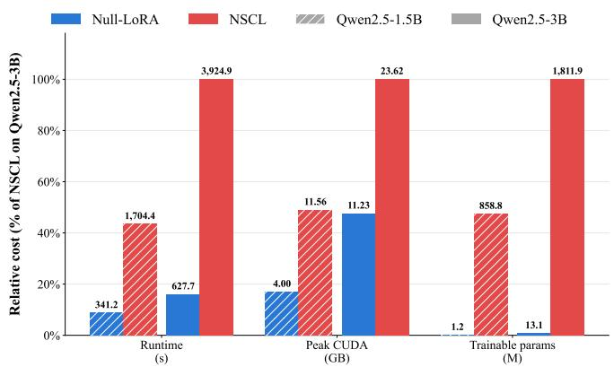  
Figure 4 Training eficiency comparison between NB-LoRA and NSCL (3 epochs, batch size 1). Bars show runtime, peak CUDA memory, and trainable parameters relative to NSCL.

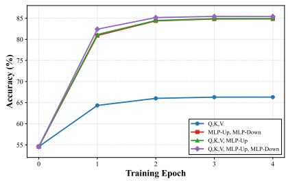  
(a) Target-task convergence for diferent tunable modules on Qwen2.5-3B.

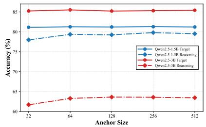  
(b) Efect of the number of reasoning examples used to estimate the null basis.

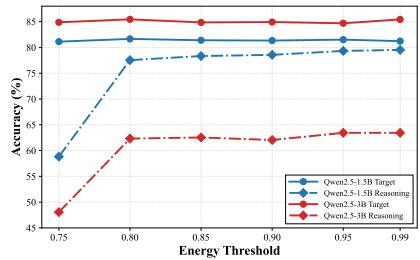  
(c) Efect of the spectral-energy threshold used to define the approximate null space.

Figure 5 Ablations of the design choices of the proposed NB-LoRA. Target denotes average downstream accuracy over the eight commonsense reasoning adaptation tasks. Reason denotes average retained reasoning accuracy across the eight adapted checkpoints, evaluated on GSM8K for Qwen2.5-1.5B and MATH-lighteval for Qwen2.5-3B.

## 4.3 Ablation Study

Module selection. Figure 5a compares four choices of tunable modules: only the attention Q/K/V projections, only the MLP up/down projections (i.e., the feed-forward module), Q/K/V plus the MLP up projection, and all five projections. Restricting NB-LoRA to Q/K/V substantially underfits the target tasks, whereas including MLP projections closes most of the gap. Tuning MLP up/down or Q/K/V+MLP-up achieves nearly the same target accuracy as tuning all five projections, which performs best overall. These results also reveal lower-cost alternatives to the full module set: Q/K/V+MLP-up avoids the higher-dimensional null basis required for MLP-down, while MLP-only tuning adapts fewer modules.

Anchor data size. Figure 5b varies the number of reasoning examples used to estimate the null basis. Target-task accuracy remains nearly unchanged from 32 to 512 examples for both models, while reasoning retention is stable from 64 to 512 examples. Performance degrades mainly at 32 examples, particularly for Qwen2.5-3B, likely because the resulting null-space estimate is noisier. Together with the spectral analysis in Section 3.3, these results indicate that a moderate number of reasoning examples is suficient to capture a stable null space, an important property for the practical use of NB-LoRA.

Energy threshold. Figure 5c varies the spectral-energy threshold used to define the approximate null space. Across those thresholds, target-task accuracy remains stable for both models, which can be attributed to the null space being large enough to accommodate adaptation even under stricter preservation as we showed in Section 3.3. Reasoning retention is robust for thresholds from 0.80 to 0.99, but drops sharply at 0.75. This suggests that NB-LoRA is insensitive to the threshold over a broad range, with degradation occurring only when the constraint becomes too permissive and more reasoning directions enter the trainable subspace. Such robustness provides flexibility in threshold selection, with higher thresholds favoring stronger preservation and moderately lower thresholds potentially allowing a larger trainable subspace when needed.

Detailed per-task results for the module-selection, anchor-size, and energy-threshold ablations are provided in Sections C.1.1 to C.1.3, respectively.

## 5 Conclusion

We study post-RL adaptation: how to eficiently learn new tasks without erasing reasoning abilities acquired through RL. We find that standard LoRA can substantially degrade these abilities. Our analysis shows that reasoning activations concentrate in low-dimensional subspaces, leaving substantial null-space capacity for adaptation. This observation motivates Null-Basis LoRA (NB-LoRA), which constrains low-rank updates to an approximate null space of reasoning activations. The constraint is maintained throughout fine-tuning without replay or per-step gradient projection. We further show that NB-LoRA preserves the relevant smoothness constants and inherits standard LoRA’s $O ( 1 / \log ( T ) )$ convergence guarantee under the same assumptions. Across two RL-trained models and diverse downstream tasks, NB-LoRA matches standard LoRA’s adaptation performance while retaining reasoning accuracy near its pre-fine-tuning level. Its preservation generalizes to unseen reasoning benchmarks, and its training is more computationally and memory eficient than full-model null-space projection. Overall, our results demonstrate that NB-LoRA provides an eficient approach for adapting post-RL models to new tasks while preserving their reasoning abilities.

## References

Yonatan Bisk, Rowan Zellers, Jianfeng Gao, Yejin Choi, et al. Piqa: Reasoning about physical commonsense in natural language. In Proceedings of the AAAI conference on artificial intelligence, volume 34, pp. 7432–7439, 2020.

Léon Bottou. Large-scale machine learning with stochastic gradient descent. In Proceedings of COMPSTAT’2010: 19th International Conference on Computational StatisticsParis France, August 22-27, 2010 Keynote, Invited and Contributed Papers, pp. 177–186. Springer, 2010.

Léon Bottou, Frank E Curtis, and Jorge Nocedal. Optimization methods for large-scale machine learning. SIAM review, 60(2):223–311, 2018.

Sébastien Bubeck et al. Convex optimization: Algorithms and complexity. Foundations and Trends® in Machine Learning, 8(3-4):231–357, 2015.

Christopher Clark, Kenton Lee, Ming-Wei Chang, Tom Kwiatkowski, Michael Collins, and Kristina Toutanova. Boolq: Exploring the surprising dificulty of natural yes/no questions. arXiv preprint arXiv:1905.10044, 2019.

Peter Clark, Isaac Cowhey, Oren Etzioni, Tushar Khot, Ashish Sabharwal, Carissa Schoenick, and Oyvind Tafjord. Think you have solved question answering? try arc, the ai2 reasoning challenge. arXiv preprint arXiv:1803.05457, 2018.

Karl Cobbe, Vineet Kosaraju, Mohammad Bavarian, Mark Chen, Heewoo Jun, Lukasz Kaiser, Matthias Plappert, Jerry Tworek, Jacob Hilton, Reiichiro Nakano, et al. Training verifiers to solve math word problems. arXiv preprint arXiv:2110.14168, 2021.

DeepSeek-AI. DeepSeek-R1 incentivizes reasoning in LLMs through reinforcement learning. Nature, 645:633–638, 2025 doi: 10.1038/s41586-025-09422-z. URL https://www.nature.com/articles/s41586-025-09422-z.

Wenzhi Fang, Dong-Jun Han, Liangqi Yuan, Seyyedali Hosseinalipour, and Christopher G Brinton. Federated sketching lora: A flexible framework for heterogeneous collaborative fine-tuning of llms. arXiv preprint arXiv:2501.19389, 2025.

Mehrdad Farajtabar, Navid Azizan, Alex Mott, and Ang Li. Orthogonal gradient descent for continual learning. In Proceedings of the Twenty Third International Conference on Artificial Intelligence and Statistics, volume 108 of Proceedings of Machine Learning Research, pp. 3762–3773. PMLR, 2020. URL https://proceedings.mlr.press/ v108/farajtabar20a.html.

Dan Hendrycks, Collin Burns, Steven Basart, Andy Zou, Mantas Mazeika, Dawn Song, and Jacob Steinhardt. Measuring massive multitask language understanding. arXiv preprint arXiv:2009.03300, 2020.

Dan Hendrycks, Collin Burns, Saurav Kadavath, Akul Arora, Steven Basart, Eric Tang, Dawn Song, and Jacob Steinhardt. Measuring mathematical problem solving with the math dataset. arXiv preprint arXiv:2103.03874, 2021.

Roger A Horn and Charles R Johnson. Matrix analysis. Cambridge university press, 2012.

Neil Houlsby, Andrei Giurgiu, Stanislaw Jastrzebski, Bruna Morrone, Quentin de Laroussilhe, Andrea Gesmundo, Mona Attariyan, and Sylvain Gelly. Parameter-eficient transfer learning for NLP. In Proceedings of the 36th International Conference on Machine Learning, volume 97 of Proceedings of Machine Learning Research, pp. 2790–2799. PMLR, 2019. URL https://proceedings.mlr.press/v97/houlsby19a.html.

Edward J Hu, Yelong Shen, Phillip Wallis, Zeyuan Allen-Zhu, Yuanzhi Li, Shean Wang, Liang Wang, Weizhu Chen, et al. Lora: Low-rank adaptation of large language models. In The Tenth International Conference on Learning Representations (ICLR), 2022.

Zhiqiang Hu, Lei Wang, Yihuai Lan, Wanyu Xu, Ee-Peng Lim, Lidong Bing, Xing Xu, Soujanya Poria, and Roy Lee. Llm-adapters: An adapter family for parameter-eficient fine-tuning of large language models. In Proceedings of the 2023 conference on empirical methods in natural language processing, pp. 5254–5276, 2023.

Gangwei Jiang, Yahui Liu, Zhaoyi Li, Wei Bi, Fuzheng Zhang, Linqi Song, Ying Wei, and Defu Lian. What makes a good reasoning chain? uncovering structural patterns in long chain-of-thought reasoning. In Proceedings of the 2025 Conference on Empirical Methods in Natural Language Processing, pp. 6501–6525, 2025.

Diederik P Kingma and Jimmy Ba. Adam: A method for stochastic optimization. In The Thirteenth International Conference on Learning Representations (ICLR), 2015.

James Kirkpatrick, Razvan Pascanu, Neil Rabinowitz, Joel Veness, Guillaume Desjardins, Andrei A. Rusu, Kieran Milan, John Quan, Tiago Ramalho, Agnieszka Grabska-Barwinska, Demis Hassabis, Claudia Clopath, Dharshan Kumaran, and Raia Hadsell. Overcoming catastrophic forgetting in neural networks. Proceedings of the National Academy of Sciences, 114(13):3521–3526, 2017. doi: 10.1073/pnas.1611835114. URL https://doi.org/10.1073/ pnas.1611835114.

Andrew V Knyazev and Peizhen Zhu. Principal angles between subspaces and their tangents. arXiv preprint arXiv:1209.0523, 2012.

Xiang Lisa Li and Percy Liang. Prefix-tuning: Optimizing continuous prompts for generation. In Proceedings of the 59th Annual Meeting of the Association for Computational Linguistics and the 11th International Joint Conference on Natural Language Processing, pp. 4582–4597. Association for Computational Linguistics, 2021. doi: 10.18653/v1/2021.acl-long.353. URL https://aclanthology.org/2021.acl-long.353/.

David Lopez-Paz and Marc’Aurelio Ranzato. Gradient episodic memory for continual learning. In Advances in Neural Information Processing Systems, volume 30, 2017. URL https://proceedings.neurips.cc/paper/2017/ hash/f87522788a2be2d171666752f97ddebb-Abstract.html.

Lu Ma, Hao Liang, Meiyi Qiang, Lexiang Tang, Xiaochen Ma, Zhen Hao Wong, Junbo Niu, Chengyu Shen, Runming He, Yanhao Li, Bin Cui, and Wentao Zhang. Learning what reinforcement learning can’t: Interleaved online fine-tuning for hardest questions. In The Fourteenth International Conference on Learning Representations, 2026. doi: 10.48550/arXiv.2506.07527. URL https://arxiv.org/abs/2506.07527.

Todor Mihaylov, Peter Clark, Tushar Khot, and Ashish Sabharwal. Can a suit of armor conduct electricity? a new dataset for open book question answering. arXiv preprint arXiv:1809.02789, 2018.

Siqiao Mu and Diego Klabjan. On the convergence rate of LoRA gradient descent. In International Conference on Machine Learning, 2026.

Xueyan Niu, Bo Bai, Wei Han, and Weixi Zhang. On the non-decoupling of supervised fine-tuning and reinforcement learning in post-training. arXiv preprint arXiv:2601.07389, 2026. doi: 10.48550/arXiv.2601.07389. URL https: //arxiv.org/abs/2601.07389.

Fuli Qiao and Mehrdad Mahdavi. Learn more, but bother less: Parameter eficient continual learning. In Advances in Neural Information Processing Systems, volume 37, 2024. doi: 10.52202/079017-3092. URL https://proceedings. neurips.cc/paper\_files/paper/2024/hash/b0bc711f48724237b38823c4d9cee10b-Abstract-Conference.html.

Fuli Qiao and Mehrdad Mahdavi. Merge before forget: A single LoRA continual learning via continual merging. In The Fourteenth International Conference on Learning Representations, 2026. URL https://openreview.net/forum? id=i1Rj7yU6eF.

David Rolnick, Arun Ahuja, Jonathan Schwarz, Timothy Lillicrap, and Gregory Wayne. Experience replay for continual learning. Advances in neural information processing systems, 32, 2019.

Keisuke Sakaguchi, Ronan Le Bras, Chandra Bhagavatula, and Yejin Choi. Winogrande: An adversarial winograd schema challenge at scale. Communications of the ACM, 64(9):99–106, 2021.

Maarten Sap, Hannah Rashkin, Derek Chen, Ronan LeBras, and Yejin Choi. Socialiqa: Commonsense reasoning about social interactions. arXiv preprint arXiv:1904.09728, 2019.

Zhihong Shao, Peiyi Wang, Qihao Zhu, Runxin Xu, Junxiao Song, Xiao Bi, Haowei Zhang, Mingchuan Zhang, YK Li, Yang Wu, et al. Deepseekmath: Pushing the limits of mathematical reasoning in open language models. arXiv preprint arXiv:2402.03300, 2024.

Idan Shenfeld, Jyothish Pari, and Pulkit Agrawal. RL’s razor: Why online reinforcement learning forgets less. arXiv preprint arXiv:2509.04259, 2025.

Idan Shenfeld, Mehul Damani, Jonas Hübotter, and Pulkit Agrawal. Self-distillation enables continual learning. arXiv preprint arXiv:2601.19897, 2026. doi: 10.48550/arXiv.2601.19897. URL https://arxiv.org/abs/2601.19897.

Fan-Keng Sun, Cheng-Hao Ho, and Hung-Yi Lee. LAMOL: Language modeling for lifelong language learning. In The Eighth International Conference on Learning Representations, 2020. URL https://openreview.net/forum? id=Skgxcn4YDS.

Lihao Sun, Hang Dong, Bo Qiao, Qingwei Lin, Dongmei Zhang, and Saravan Rajmohan. Llm reasoning as trajectories: Step-specific representation geometry and correctness signals. In Proceedings of the 64th Annual Meeting of the Association for Computational Linguistics (Volume 1: Long Papers), pp. 26872–26887, 2026.

Pengwei Tang, Xiaolin Hu, Yong Liu, Lizhong Ding, Dongjie Zhang, Xing Wu, and Debing Zhang. Put the space of lora initialization to the extreme to preserve pre-trained knowledge. In Proceedings of the AAAI Conference on Artificial Intelligence, volume 40, pp. 33232–33240, 2026.

Qiaoyu Tang, Ziliang Deng, Hongyu Lin, Xianpei Han, Qiao Liang, Boxi Cao, and Le Sun. Toolalpaca: Generalized tool learning for language models with 3000 simulated cases. arXiv preprint arXiv:2306.05301, 2023.

Luong Trung, Xinbo Zhang, Zhanming Jie, Peng Sun, Xiaoran Jin, and Hang Li. ReFT: Reasoning with reinforced fine-tuning. In Proceedings of the 62nd Annual Meeting of the Association for Computational Linguistics (Volume 1: Long Papers), pp. 7601–7614. Association for Computational Linguistics, 2024. doi: 10.18653/v1/2024.acl-long.410. URL https://aclanthology.org/2024.acl-long.410/.

Hanqing Wang, Yixia Li, Shuo Wang, Guanhua Chen, and Yun Chen. Milora: Harnessing minor singular components for parameter-eficient llm finetuning. In Proceedings of the 2025 Conference of the Nations of the Americas Chapter of the Association for Computational Linguistics: Human Language Technologies (Volume 1: Long Papers), pp. 4823–4836, 2025.

Meng Wang, Haohan Zhao, Wenzhuo Liu, Lu Yang, Geng Liu, Haiyang Guo, Guo-Sen Xie, Gaofeng Meng, Hongbin Liu, and Fei Zhu. Denser ̸= better: Limits of on-policy self-distillation for continual post-training. arXiv preprint arXiv:2607.01763, 2026. doi: 10.48550/arXiv.2607.01763. URL https://arxiv.org/abs/2607.01763.

Shipeng Wang, Xiaorong Li, Jian Sun, and Zongben Xu. Training networks in null space of feature covariance for continual learning. In Proceedings of the IEEE/CVF conference on Computer Vision and Pattern Recognition, pp. 184–193, 2021.

Xiao Wang, Tianze Chen, Qiming Ge, Han Xia, Rong Bao, Rui Zheng, Qi Zhang, Tao Gui, and Xuanjing Huang. Orthogonal subspace learning for language model continual learning. In Findings of the Association for Computational Linguistics: EMNLP 2023, pp. 10658–10671. Association for Computational Linguistics, 2023. doi: 10.18653/v1/ 2023.findings-emnlp.715. URL https://aclanthology.org/2023.findings-emnlp.715/.

An Yang, Beichen Zhang, Binyuan Hui, Bofei Gao, Bowen Yu, Chengpeng Li, Dayiheng Liu, Jianhong Tu, Jingren Zhou, Junyang Lin, et al. Qwen2. 5-math technical report: Toward mathematical expert model via self-improvement. arXiv preprint arXiv:2409.12122, 2024.

Rowan Zellers, Ari Holtzman, Yonatan Bisk, Ali Farhadi, and Yejin Choi. Hellaswag: Can a machine really finish your sentence? arXiv preprint arXiv:1905.07830, 2019.

Wanjun Zhong, Ruixiang Cui, Yiduo Guo, Yaobo Liang, Shuai Lu, Yanlin Wang, Amin Saied, Weizhu Chen, and Nan Duan. Agieval: A human-centric benchmark for evaluating foundation models. In Findings of the association for computational linguistics: NAACL 2024, pp. 2299–2314, 2024.

## Appendix

A Derivation of the SVD-Based Principal Angle Computation 14   
B Convergence Analysis of the Proposed Algorithm 15   
C Further Experiments 16   
C.1 Detailed Ablation Results 16   
C.1.1 Per-Task Results of the Module-Selection Ablation 16   
C.1.2 Per-Task Results of the Anchor-Size Ablation 16   
C.1.3 Per-Task Results of the Energy-Threshold Ablation 17   
C.2 Null-Space Capacity for Sequential Multi-Task Adaptation 18   
D Experiment Details 21   
D.1 Hyperparameters Details . 21   
D.2 Datasets Details 22   
D.2.1 Commonsense Reasoning Benchmarks 23   
D.2.2 Tool-Use Tasks 23   
D.2.3 MMLU-STEM Benchmark 24   
E Qualitative Case Study: Reasoning Retention and Downstream Adaptation 24   
E.1 MATH Reasoning Examples . 25   
E.2 HellaSwag Examples . 26   
E.3 Summary 27

## A Derivation of the SVD-Based Principal Angle Computation

For completeness, we derive the relationship between principal angles and the singular values of the cross-basis matrix (Horn & Johnson, 2012; Knyazev & Zhu, 2012).

Let $\mathcal { N } _ { 1 } , \mathcal { N } _ { 2 } \subset \mathbb { R } ^ { n }$ be two subspaces with dimensions $k _ { 1 }$ and $k _ { 2 } .$ , where $k _ { 1 } \leq k _ { 2 }$ , and let $\mathbf { N } _ { 1 } \in \mathbb { R } ^ { n \times k _ { 1 } }$ and $\mathbf { N } _ { 2 } \in \mathbb { R } ^ { n \times k _ { 2 } }$ be orthonormal bases of these subspaces. We show that the recursive definition of principal angles yields

$$
\cos \theta _ { i } = \sigma _ { i } ( \mathbf { N } _ { 1 } ^ { \top } \mathbf { N } _ { 2 } ) , \qquad i = 1 , \ldots , k _ { 1 } .\tag{6}
$$

For the first principal angle, any vectors $\mathbf { x } \in \mathcal { N } _ { 1 }$ and $\mathbf { y } \in \mathcal { N } _ { 2 }$ can be written as

$$
{ \bf x } = { \bf N } _ { 1 } { \bf a } , \qquad { \bf y } = { \bf N } _ { 2 } { \bf b } ,\tag{7}
$$

for coeficient vectors $\mathbf { a } \in \mathbb { R } ^ { k _ { 1 } }$ and b $\mathbf { \Psi } \in \mathbb { R } ^ { k _ { 2 } }$ . Since ${ \bf N } _ { 1 }$ and $\mathbf { N } _ { 2 }$ have orthonormal columns, we have

$$
\| \mathbf { x } \| _ { 2 } = \| \mathbf { a } \| _ { 2 } , \qquad \| \mathbf { y } \| _ { 2 } = \| \mathbf { b } \| _ { 2 } .\tag{8}
$$

Therefore, the first principal angle satisfies

$$
\cos \theta _ { 1 } = \operatorname* { m a x } _ { \left. \mathbf { x } \in \mathcal { N } _ { 1 } , \ \mathbf { y } \in \mathcal { N } _ { 2 } \right. } \mathbf { x } ^ { \top } \mathbf { y } = \operatorname* { m a x } _ { \left. \mathbf { a } \in \mathbb { R } ^ { k _ { 1 } } , \ \mathbf { b } \in \mathbb { R } ^ { k _ { 2 } } \right. } \mathbf { a } ^ { \top } \mathbf { N } _ { 1 } ^ { \top } \mathbf { N } _ { 2 } \mathbf { b } .\tag{9}
$$

By the variational characterization of the singular values, this maximum is exactly the largest singular value of $\mathbf { N } _ { 1 } ^ { \top } \mathbf { N } _ { 2 }$ . Hence,

$$
\cos \theta _ { 1 } = \sigma _ { 1 } ( \mathbf { N } _ { 1 } ^ { \top } \mathbf { N } _ { 2 } ) .\tag{10}
$$

Now consider the singular value decomposition

$$
\mathbf { N } _ { 1 } ^ { \top } \mathbf { N } _ { 2 } = \mathbf { U } \boldsymbol { \Sigma } \mathbf { V } ^ { \top } ,\tag{11}
$$

where $\mathbf { U } \in \mathbb { R } ^ { k _ { 1 } \times k _ { 1 } }$ and $\mathbf { V } \in \mathbb { R } ^ { k _ { 2 } \times k _ { 2 } }$ are orthogonal, and

$$
\Sigma = \left[ \operatorname { d i a g } ( \sigma _ { 1 } , \dots , \sigma _ { k _ { 1 } } ) \quad \mathbf { 0 } \right] .\tag{12}
$$

Let $\mathbf { u } _ { i }$ and $\mathbf { v } _ { i }$ denote the left and right singular vectors associated with $\sigma _ { i } ,$ , and define

$$
\mathbf { x } _ { i } = \mathbf { N } _ { 1 } \mathbf { u } _ { i } , \qquad \mathbf { y } _ { i } = \mathbf { N } _ { 2 } \mathbf { v } _ { i } .\tag{13}
$$

Because ${ \bf N } _ { 1 }$ and $\mathbf { N } _ { 2 }$ have orthonormal columns and the singular vectors are orthonormal, the vectors $\mathbf { x } _ { 1 } , \ldots , \mathbf { x } _ { k _ { 1 } }$ are orthonormal in $\mathcal { N } _ { 1 }$ , and $\mathbf { y } _ { 1 } , \ldots , \mathbf { y } _ { k _ { 1 } }$ are orthonormal in $\mathcal { N } _ { 2 }$ . Moreover,

$$
\mathbf { x } _ { i } ^ { \top } \mathbf { y } _ { j } = \mathbf { u } _ { i } ^ { \top } \mathbf { N } _ { 1 } ^ { \top } \mathbf { N } _ { 2 } \mathbf { v } _ { j } = \mathbf { u } _ { i } ^ { \top } \mathbf { U } \Sigma \mathbf { V } ^ { \top } \mathbf { v } _ { j } = \sigma _ { j } \mathbf { u } _ { i } ^ { \top } \mathbf { u } _ { j } .\tag{14}
$$

Thus, $\mathbf { x } _ { i } ^ { \top } \mathbf { y } _ { i } = \sigma _ { i } .$ , and for $i \neq j$ these pairs satisfy the orthogonality constraints required by the recursive definition of principal angles. Applying the same maximization argument on the orthogonal complements after removing the first i − 1 principal vector pairs yields

$$
\cos \theta _ { i } = \sigma _ { i } , \qquad i = 1 , \ldots , k _ { 1 } .\tag{15}
$$

Therefore, the principal angles between ${ \mathcal { N } } _ { 1 }$ and $\mathcal { N } _ { 2 }$ are given by

$$
\theta _ { i } = \operatorname { a r c c o s } \sigma _ { i } ( \mathbf { N } _ { 1 } ^ { \top } \mathbf { N } _ { 2 } ) , \qquad i = 1 , \ldots , k _ { 1 } .\tag{16}
$$

## B Convergence Analysis of the Proposed Algorithm

This appendix shows that the null-space reparameterization does not weaken the convergence guarantee for standard LoRA gradient descent established by Mu & Klabjan (2026). The key observation is that right-multiplication by $\mathbf { N } _ { s } ^ { \top }$ , where Ns has orthonormal columns, is an isometry under the Frobenius norm. Consequently, composing the training loss with this map preserves the smoothness and lower-bound assumptions required by their analysis. We formalize this observation in a bridging lemma and then apply their result to NB-LoRA.

Let $\mathbf { W } \in \mathbb { R } ^ { m \times n }$ be a frozen backbone weight and let $f : \mathbb { R } ^ { m \times n }  \mathbb { R }$ denote the SFT loss on $\mathcal { D } _ { a }$ as a function of its update ∆W, with the remaining model parameters fixed. Standard LoRA parameterizes this update as $\Delta \mathbf { W } = \mathbf { B } \mathbf { A }$ , whereas NB-LoRA minimizes

$$
g ( \mathbf { B } , \mathbf { C } ) : = f \big ( \mathbf { B C N } _ { s } ^ { \top } \big ) \quad \mathrm { o v e r } \quad \mathbf { B } \in \mathbb { R } ^ { m \times r } , ~ \mathbf { C } \in \mathbb { R } ^ { r \times k } ,\tag{17}
$$

where $\mathbf { N } _ { s } \in \mathbb { R } ^ { n \times k }$ is the fixed null basis of (4). Since ${ \bf N } _ { s }$ is an orthonormal basis of the null space of H, we have $\mathbf { N } _ { s } ^ { \top } \mathbf { N } _ { s } = \mathbf { I } _ { k }$ . We analyze the gradient descent updates

$$
\mathbf { B } _ { t + 1 } = \mathbf { B } _ { t } - \eta _ { t } \nabla _ { \mathbf { B } } g ( \mathbf { B } _ { t } , \mathbf { C } _ { t } ) , \qquad \mathbf { C } _ { t + 1 } = \mathbf { C } _ { t } - \eta _ { t } \nabla _ { \mathbf { C } } g ( \mathbf { B } _ { t } , \mathbf { C } _ { t } ) ,\tag{18}
$$

where $\eta _ { t }$ is the learning rate at step t.

Following standard convergence analyses of gradient descent methods (Bottou et al., 2018; Bubeck et al., 2015; Mu & Klabjan, 2026), we assume that the loss $f$ is diferentiable and satisfies the standard smoothness and lower-boundedness conditions. Note that both are stated for the loss as a function of the full weight update: no smoothness of the reparameterized objective g and no boundedness of the trainable factors is assumed.

Assumption B.1 (L-smoothness). The loss f is diferentiable, and there exists a constant $L \geq 1$ such that for all $\mathbf { X } , \mathbf { Y } \in \mathbb { R } ^ { m \times n }$ ,

$$
\left\| \nabla f ( \mathbf { X } ) - \nabla f ( \mathbf { Y } ) \right\| _ { F } \leq L \left\| \mathbf { X } - \mathbf { Y } \right\| _ { F } .\tag{19}
$$

Assumption B.2 (Lower boundedness). There exists $f ^ { * }$ such that $f ( \mathbf { X } ) \geq f ^ { * }$ for all $\mathbf { X } \in \mathbb { R } ^ { m \times n }$

The following lemma bridges the two settings by showing that composition with the fixed basis ${ \bf N } _ { s }$ preserves both assumptions with the same constants.

Lemma B.3 (Null-basis composition preserves smoothness). Define $\tilde { f } : \mathbb { R } ^ { m \times k }  \mathbb { R } \mathrm { ~ b y ~ } \tilde { f } ( \mathbf { M } ) : = f \big ( \mathbf { M } \mathbf { N } _ { s } ^ { \top } \big )$ Under Theorems B.1 and B.2, ˜f is L-smooth with the same constant L and is lower bounded by the same constant $f ^ { * }$

Proof. By the chain rule, $\nabla \tilde { f } ( \mathbf { M } ) = \nabla f ( \mathbf { M } \mathbf { N } _ { s } ^ { \top } ) \mathbf { N } _ { s }$ . Since $\mathbf { N } _ { s } ^ { \top } \mathbf { N } _ { s } = \mathbf { I } _ { k } .$ , right-multiplication by $\mathbf { N } _ { s } ^ { \top }$ is a Frobenius isometry, $\| \mathbf { X } \mathbf { N } _ { s } ^ { \top } \| _ { F } ^ { 2 } = \mathrm { T r } ( \mathbf { X } \mathbf { N } _ { s } ^ { \top } \mathbf { N } _ { s } \mathbf { X } ^ { \top } ) = \| \mathbf { X } \| _ { F } ^ { 2 }$ for all $\mathbf { X } \in \mathbb { R } ^ { m \times k }$ , and the spectral norm of $\mathbf { N } _ { s }$ equals one. Hence, for any $\mathbf { M } _ { 1 } , \mathbf { M } _ { 2 } \in \mathbb { R } ^ { m \times k }$

$$
\begin{array} { r l } & { \left\| \nabla \tilde { f } ( \mathbf { M } _ { 1 } ) - \nabla \tilde { f } ( \mathbf { M } _ { 2 } ) \right\| _ { F } = \left\| \left[ \nabla f \big ( \mathbf { M } _ { 1 } \mathbf { N } _ { s } ^ { \top } \big ) - \nabla f \big ( \mathbf { M } _ { 2 } \mathbf { N } _ { s } ^ { \top } \big ) \right] \mathbf { N } _ { s } \right\| _ { F } } \\ & { \qquad \leq \left\| \nabla f \big ( \mathbf { M } _ { 1 } \mathbf { N } _ { s } ^ { \top } \big ) - \nabla f \big ( \mathbf { M } _ { 2 } \mathbf { N } _ { s } ^ { \top } \big ) \right\| _ { F } } \\ & { \qquad \leq L \big \| \big ( \mathbf { M } _ { 1 } - \mathbf { M } _ { 2 } \big ) \mathbf { N } _ { s } ^ { \top } \big \| _ { F } = L \big \| \mathbf { M } _ { 1 } - \mathbf { M } _ { 2 } \big \| _ { F } , } \end{array}\tag{20}
$$

where the first inequality uses $\lVert \mathbf { Y } \mathbf { N } _ { s } \rVert _ { F } \leq \lVert \mathbf { Y } \rVert _ { F } \lVert \mathbf { N } _ { s } \rVert _ { 2 } = \lVert \mathbf { Y } \rVert _ { F } .$ , the second uses Theorem B.1, and the final equality uses the isometry property. Lower boundedness is immediate: $\tilde { f } ( \mathbf { M } ) = f ( \mathbf { M } \mathbf { N } _ { s } ^ { \top } ) \geq f ^ { * }$ □

By $( \boldsymbol { 1 7 } ) , g ( \mathbf { B } , \mathbf { C } ) = \tilde { f } ( \mathbf { B } \mathbf { C } )$ , so the updates (18) are precisely the original LoRA gradient descent algorithm applied to the loss ˜f, with input dimension k in place of n. By Theorem B.3, ˜f satisfies the assumptions of Mu & Klabjan (2026) with unchanged constants, their main convergence result thus applies directly to NB-LoRA.

Theorem B.4 (Convergence of NB-LoRA; Theorem 3.5 of Mu & Klabjan, 2026). Suppose Theorems B.1 and B.2 hold. Run T steps of the updates (18) with the learning rate

$$
\eta _ { t } = \operatorname* { m i n } \left\{ \frac { 1 } { 4 \sqrt { 2 } L \big ( \| \mathbf { V } _ { t } \| _ { F } ^ { 2 } + \| \nabla \tilde { f } ( \mathbf { B } _ { t } \mathbf { C } _ { t } ) \| _ { F } \big ) } , 1 \right\} , \qquad \mathbf { V } _ { t } = \left[ \mathbf { B } _ { t } \right] \in \mathbb { R } ^ { ( m + k ) \times r } .\tag{21}
$$

Then

$$
\operatorname* { m i n } _ { t = 0 , \dots , T - 1 } \left\| \nabla g ( \mathbf { B } _ { t } , \mathbf { C } _ { t } ) \right\| _ { F } ^ { 2 } = O \left( { \frac { 1 } { \log T } } \right) ,\tag{22}
$$

where the $O ( \cdot )$ notation hides dependence on ${ \bf V } _ { 0 } , g ( { \bf B } _ { 0 } , { \bf C } _ { 0 } ) , f ^ { * }$ , and L. Moreover, if there exists a constant $C _ { V } > 0$ such that $\| \mathbf { V } _ { t } \| _ { F } \leq C _ { V }$ for all t, the rate improves to $O ( 1 / T )$

Remark B.5 (Same guarantee as standard LoRA). Theorem B.3 shows that the smoothness constant is preserved exactly: right-composition with $\mathbf { N } _ { s } ^ { \top }$ is an isometric embedding of $\mathbb { R } ^ { m \times k }$ into $\mathbb { R } ^ { m \times n }$ . Consequently, NB-LoRA satisfies the same assumptions and inherits the same convergence rate as standard LoRA. Overall, the null-space reparameterization reduces the input dimension from n to k without weakening the convergence guarantee.

## C Further Experiments

## C.1 Detailed Ablation Results

This appendix provides detailed per-task results for the ablation studies in Figure 5. Target denotes downstream-task accuracy at the post-SFT checkpoint, while Reason denotes reasoning accuracy on GSM8K for Qwen2.5-1.5B and MATH-lighteval for Qwen2.5-3B. All values are percentages.

## C.1.1 Per-Task Results of the Module-Selection Ablation

Table 4 reports the per-task results underlying the module-selection ablation in Figure 5a. The detailed breakdown reinforces the main-text observation that target-task adaptation relies strongly on the MLP projections. Tuning only $\mathrm { Q / K / V }$ underfits severely on several tasks (e.g., on Qwen2.5-3B, ARC-Easy drops from 93.69% under the full module set to 44.87%, and OpenBookQA from 88.80% to 46.80%), whereas configurations including MLP projections recover most of the performance of the full module set. In particular, MLP-only and $\mathrm { Q / K / V + M L P \mathrm { - U p } }$ achieve average target accuracy within one point of the full configuration for both models, supporting their use as lower-cost alternatives when reducing the number or dimensionality of adapted modules is desirable. Meanwhile, reasoning accuracy remains stable across the four module choices, indicating that the preservation behavior of NB-LoRA is largely insensitive to which modules are adapted.

## C.1.2 Per-Task Results of the Anchor-Size Ablation

Table 5 reports the per-task results underlying the anchor-size ablation in Figure 5b, where the number of reasoning examples used to estimate the hidden-state null basis varies from 32 to 512. Consistent with Figure 5b, target-task accuracy is largely insensitive to anchor size: the average target accuracy varies by at most 0.3 points for both models, and no individual task exhibits a systematic trend. Reasoning retention is similarly stable once the anchor set contains at least 64 examples, with reasoning accuracy remaining close to the pre-fine-tuning level across adapted checkpoints. The clearest degradation occurs at the smallest anchor set of 32 examples: Qwen2.5-1.5B loses roughly one to two points of reasoning accuracy on most tasks, while Qwen2.5-3B drops sharply on WinoGrande to 49.20%, likely reflecting a noisier estimate of the reasoning subspace from too few examples. These per-task results further support the main-text conclusion that a moderate anchor set, around 64 examples in our experiments, is suficient to obtain a stable null-space estimate, making NB-LoRA practical even with limited anchor data.

Table 4 Per-task results of the module-selection ablation in Figure 5a. Each column group corresponds to one choice of tunable modules: Q, K, and V are the query, key, and value projections of the attention layers, and MLP-Up/MLP-Down are the up- and down-projections of the feed-forward block. Target and Reason denote target-task and reasoning accuracy (%) at the post-SFT checkpoint.
<table><tr><td rowspan="2">Task</td><td colspan="2">Q,K,V</td><td colspan="2">Q,K,V, MLP-Up</td><td colspan="2">MLP-Up, MLP-Down</td><td colspan="2">Q,K,V, MLP-Up, MLP-Down</td></tr><tr><td>Target</td><td>Reason</td><td>Target</td><td>Reason</td><td>Target</td><td>Reason</td><td>Target</td><td>Reason</td></tr><tr><td colspan="9">Qwen2.5-1.5B (Reasoning task: GSM8K)</td></tr><tr><td>ARC-Challenge</td><td>45.90</td><td>79.91</td><td>72.35</td><td>79.98</td><td>74.74</td><td>80.14</td><td>77.05</td><td>79.91</td></tr><tr><td>ARC-Easy</td><td>79.76</td><td>79.30</td><td>89.02</td><td>79.91</td><td>90.45</td><td>78.70</td><td>91.20</td><td>79.98</td></tr><tr><td>BoolQ</td><td>65.60</td><td>79.61</td><td>69.60</td><td>79.98</td><td>69.88</td><td>79.98</td><td>68.31</td><td>79.53</td></tr><tr><td>HellaSwag</td><td>90.26</td><td>79.61</td><td>91.58</td><td>78.62</td><td>91.23</td><td>79.45</td><td>91.37</td><td>79.83</td></tr><tr><td>OpenBookQA</td><td>68.60</td><td>79.68</td><td>84.20</td><td>79.23</td><td>85.00</td><td>79.53</td><td>84.60</td><td>78.62</td></tr><tr><td>PIQA</td><td>82.59</td><td>78.77</td><td>83.41</td><td>79.76</td><td>83.46</td><td>79.23</td><td>84.30</td><td>79.53</td></tr><tr><td>SocialIQA</td><td>77.43</td><td>79.61</td><td>77.28</td><td>78.77</td><td>76.87</td><td>78.70</td><td>76.73</td><td>78.77</td></tr><tr><td>WinoGrande</td><td>73.40</td><td>79.53</td><td>78.22</td><td>78.70</td><td>75.37</td><td>79.38</td><td>76.19</td><td>79.98</td></tr><tr><td>Average</td><td>72.94</td><td>79.50</td><td>80.71</td><td>79.37</td><td>80.88</td><td>79.39</td><td>81.22</td><td>79.52</td></tr><tr><td colspan="9">Qwen2.5-3B (Reasoning task: MATH-lighteval)</td></tr><tr><td>ARC-Challenge</td><td>54.35</td><td>63.28 63.28</td><td>79.22 92.34</td><td>63.32</td><td>81.83</td><td>63.64</td><td>82.56 93.69</td><td>63.50</td></tr><tr><td>ARC-Easy</td><td>44.87</td><td></td><td>70.18</td><td>63.74</td><td>93.39</td><td>63.60</td><td>71.28</td><td>63.16</td></tr><tr><td>BoolQ HellaSwag</td><td>66.06</td><td>63.80 63.00</td><td>94.78</td><td>63.68</td><td>71.04</td><td>63.34</td><td>94.24</td><td>63.40</td></tr><tr><td>OpenBookQA</td><td>93.24 46.80</td><td>63.46</td><td>89.00</td><td>63.56 63.38</td><td>94.60 87.40</td><td>63.10 62.90</td><td>88.80</td><td>63.54</td></tr><tr><td>PIQA</td><td>76.28</td><td>63.18</td><td>87.21</td><td>63.04</td><td>87.65</td><td>63.36</td><td>87.16</td><td>63.88</td></tr><tr><td></td><td>67.96</td><td>63.70</td><td>81.78</td><td>64.36</td><td>79.99</td><td>63.02</td><td>81.11</td><td>63.60</td></tr><tr><td>SocialIQA WinoGrande</td><td>80.82</td><td>63.44</td><td>84.53</td><td>63.26</td><td>82.72</td><td>63.34</td><td>84.61</td><td>63.32 63.10</td></tr><tr><td></td><td></td><td></td><td></td><td></td><td></td><td></td><td></td><td></td></tr><tr><td>Average</td><td>66.30</td><td>63.39</td><td>84.88</td><td>63.54</td><td>84.83</td><td>63.29</td><td>85.43</td><td>63.44</td></tr></table>

## C.1.3 Per-Task Results of the Energy-Threshold Ablation

Table 6 reports the per-task results underlying the energy-threshold ablation in Figure 5c, where the spectralenergy threshold defining the approximate null space varies from 0.75 to 0.99. The breakdown mirrors the findings in Figure 5c. Target-task accuracy is stable across the entire range: raising the threshold, and thus shrinking the trainable subspace, does not degrade adaptation on any task, in line with the spectral analysis in Section 3.3, which shows that the null space remains large even at a 0.99 energy threshold. Reasoning retention is robust for thresholds from 0.80 to 0.99 but collapses at 0.75, and the per-task view reveals that this collapse is task-dependent rather than uniform: on Qwen2.5-1.5B, adaptation on HellaSwag, PIQA, and SocialIQA reduces reasoning accuracy to 31.54%, 40.64%, and 28.89%, respectively, whereas ARC and OpenBookQA leave it largely intact. The same tasks produce the largest degradations on Qwen2.5-3B, including 19.12% after HellaSwag and 10.92% after SocialIQA. This pattern is consistent with a permissive threshold admitting more reasoning-relevant directions into the trainable subspace, with the resulting degradation depending on the target task being adapted. Finally, within the robust range, retention on Qwen2.5-1.5B improves mildly as the threshold increases (from 77.54% at 0.80 to 79.52% at 0.99 on average). This wide robust range suggests some flexibility in threshold selection: if a target task may benefit from a larger update subspace, moderately lowering the threshold (e.g., to 0.95 or 0.90) could provide additional adaptation capacity with only a marginal reduction in reasoning retention.

Table 5 Per-task results of the anchor-size ablation in Figure 5b. Each column group corresponds to the number of reasoning examples used to estimate the null basis. Target and Reason denote target-task and reasoning accuracy (%) at the post-SFT checkpoint. Target accuracy remains nearly unchanged across anchor sizes, while reasoning retention is stable for 64 or more examples and degrades mainly at the smallest anchor set.
<table><tr><td rowspan="2">Task</td><td colspan="2">32</td><td colspan="2">64</td><td colspan="2">128</td><td colspan="2">256</td><td colspan="2">512</td></tr><tr><td>Target</td><td>Reason</td><td>Target</td><td>Reason</td><td>Target</td><td>Reason</td><td>Target</td><td>Reason</td><td>Target</td><td>Reason</td></tr><tr><td colspan="9">Qwen2.5-1.5B (Reasoning task: GSM8K)</td><td></td></tr><tr><td>ARC-Challenge</td><td>75.60</td><td>77.68</td><td>75.43</td><td>79.61</td><td>76.45</td><td>79.83</td><td>76.93</td><td>80.97</td><td>77.05</td><td>79.91</td></tr><tr><td>ARC-Easy</td><td>90.49</td><td>78.21</td><td>90.45</td><td>79.68</td><td>90.82</td><td>79.76</td><td>89.98</td><td>79.76</td><td>91.20</td><td>79.98</td></tr><tr><td>BoolQ</td><td>68.62</td><td>77.00</td><td>69.24</td><td>79.08</td><td>69.69</td><td>79.45</td><td>68.29</td><td>79.30</td><td>68.31</td><td>79.53</td></tr><tr><td>HellaSwag</td><td>91.26</td><td>78.32</td><td>91.47</td><td>79.08</td><td>91.10</td><td>78.39</td><td>91.22</td><td>80.67</td><td>91.37</td><td>79.83</td></tr><tr><td>OpenBookQA</td><td>85.20</td><td>78.29</td><td>84.60</td><td>79.98</td><td>84.00</td><td>79.76</td><td>86.80</td><td>79.61</td><td>84.60</td><td>78.62</td></tr><tr><td>PIQA</td><td>83.03</td><td>77.61</td><td>84.77</td><td>78.92</td><td>84.06</td><td>78.77</td><td>84.11</td><td>79.68</td><td>84.30</td><td>79.53</td></tr><tr><td>SocialIQA</td><td>76.71</td><td>78.85</td><td>76.87</td><td>79.98</td><td>77.33</td><td>78.77</td><td>76.92</td><td>79.98</td><td>76.73</td><td>78.77</td></tr><tr><td>WinoGrande</td><td>78.30</td><td>77.71</td><td>77.27</td><td>78.62</td><td>76.32</td><td>79.23</td><td>76.09</td><td>78.47</td><td>76.19</td><td>79.98</td></tr><tr><td>Average</td><td>81.15</td><td>77.96</td><td>81.26</td><td>79.37</td><td>81.22</td><td>79.25</td><td>81.29</td><td>79.81</td><td>81.22</td><td>79.52</td></tr><tr><td colspan="9">Qwen2.5-3B (Reasoning task: MATH-lighteval)</td><td></td></tr><tr><td>ARC-Challenge</td><td>82.85</td><td>63.84</td><td>82.60</td><td>63.82</td><td>82.60</td><td>63.52</td><td>82.53</td><td>63.56</td><td>82.56</td><td>63.50</td></tr><tr><td>ARC-Easy</td><td>93.73</td><td>63.72</td><td>93.52</td><td>63.38</td><td>94.28</td><td>63.18</td><td>93.50</td><td>64.26</td><td>93.69</td><td>63.16</td></tr><tr><td>BoolQ</td><td>71.07</td><td>63.72</td><td>71.40</td><td>63.78</td><td>71.39</td><td>63.96</td><td>71.41</td><td>63.70</td><td>71.28</td><td>63.40</td></tr><tr><td>HellaSwag</td><td>94.04</td><td>63.96</td><td>94.65</td><td>63.12</td><td>94.46</td><td>63.58</td><td>94.29</td><td>63.76</td><td>94.24</td><td>63.54</td></tr><tr><td>OpenBookQA</td><td>88.80</td><td>63.20</td><td>88.20</td><td>63.52</td><td>87.80</td><td>63.96</td><td>88.40</td><td>63.34</td><td>88.80</td><td>63.88</td></tr><tr><td>PIQA</td><td>86.94</td><td>62.82</td><td>87.38</td><td>63.30</td><td>87.76</td><td>63.34</td><td>86.89</td><td>63.64</td><td>87.16</td><td>63.60</td></tr><tr><td>SocialIQA</td><td>81.32</td><td>62.94</td><td>81.38</td><td>63.16</td><td>80.40</td><td>63.64</td><td>81.32</td><td>63.16</td><td>81.11</td><td>63.32</td></tr><tr><td>WinoGrande</td><td>83.19</td><td>49.20</td><td>84.93</td><td>62.14</td><td>83.03</td><td>63.68</td><td>84.11</td><td>63.14</td><td>84.61</td><td>63.10</td></tr><tr><td>Average</td><td>85.24</td><td>61.68</td><td>85.51</td><td>63.28</td><td>85.22</td><td>63.61</td><td>85.31</td><td>63.57</td><td>85.43</td><td>63.44</td></tr></table>

## C.2 Null-Space Capacity for Sequential Multi-Task Adaptation

The experiments in Section 4.1 demonstrate that NB-LoRA preserves reasoning during adaptation to an individual downstream task. We next investigate whether the null space provides suficient capacity for multiple downstream tasks. Starting from each post-RL checkpoint, we first jointly adapt the model to eight commonsense tasks using NB-LoRA. We then merge the learned update, recompute the null basis using examples representing both the original reasoning capability and the newly acquired commonsense capabilities, and sequentially adapt the resulting model to tool use. This setting tests whether the null space can support cumulative capability acquisition rather than only a single adaptation.

Table 6 Per-task results of the energy-threshold ablation in Figure 5c. Each column group corresponds to one spectral-energy threshold used to define the approximate null space. Target and Reason denote target-task and reasoning accuracy (%) at the post-SFT checkpoint. Target accuracy remains stable across thresholds, while reasoning retention is robust from 0.80 to 0.99 and degrades sharply at 0.75 for checkpoints adapted to several target tasks.
<table><tr><td rowspan="2">Task</td><td colspan="2">0.75</td><td colspan="2">0.80</td><td colspan="2">0.85</td><td colspan="2">0.90</td><td colspan="2">0.95</td><td colspan="2">0.99</td></tr><tr><td>Target Reason Target Reason</td><td></td><td></td><td></td><td>Target Reason</td><td></td><td>Target Reason</td><td></td><td>Target Reason</td><td></td><td>Target Reason</td><td></td></tr><tr><td colspan="10">Qwen2.5-1.5B (Reasoning task: GSM8K)</td><td></td><td></td><td></td></tr><tr><td>ARC-Challenge</td><td>77.13</td><td>78.54</td><td>78.07</td><td>80.36</td><td>77.99</td><td>80.44</td><td>75.60</td><td>80.14</td><td>76.54</td><td>79.98</td><td>77.05</td><td>79.91</td></tr><tr><td>ARC-Easy</td><td>90.24</td><td>75.28</td><td>91.04</td><td>79.76</td><td>91.04</td><td>79.53</td><td>91.04</td><td>80.29</td><td>90.99</td><td>79.53</td><td>91.20</td><td>79.98</td></tr><tr><td>BoolQ</td><td>68.10</td><td>61.03</td><td>69.33</td><td>70.89</td><td>68.72</td><td>75.51</td><td>68.69</td><td>72.63</td><td>70.09</td><td>78.47</td><td>68.31</td><td>79.53</td></tr><tr><td>HellaSwag</td><td>90.85</td><td>31.54</td><td>90.98</td><td>74.68</td><td>90.68</td><td>75.51</td><td>91.04</td><td>79.45</td><td>90.97</td><td>79.45</td><td>91.37</td><td>79.83</td></tr><tr><td>OpenBookQA</td><td>84.00</td><td>77.33</td><td>86.20</td><td>79.68</td><td>85.20</td><td>79.38</td><td>85.60</td><td>80.36</td><td>84.60</td><td>79.91</td><td>84.60</td><td>78.62</td></tr><tr><td>PIQA</td><td>85.15</td><td>40.64</td><td>84.06</td><td>78.70</td><td>83.62</td><td>78.85</td><td>83.68</td><td>78.70</td><td>84.71</td><td>78.54</td><td>84.30</td><td>79.53</td></tr><tr><td>SocialIQA WinoGrande</td><td>76.92 76.56</td><td>28.89 77.33</td><td>76.31</td><td>79.15 77.10</td><td>76.61</td><td>78.32</td><td>76.87</td><td>78.47</td><td>75.90</td><td>79.38</td><td>76.73</td><td>78.77</td></tr><tr><td></td><td></td><td></td><td>77.19</td><td></td><td>77.27</td><td>79.08</td><td>78.14</td><td>78.47</td><td>78.30</td><td>79.30</td><td>76.19</td><td>79.98</td></tr><tr><td>Average 81.12</td><td>58.82</td><td></td><td>81.65</td><td>77.54</td><td>81.39</td><td>78.33</td><td>81.33</td><td>78.56</td><td>81.51</td><td>79.32</td><td>81.22</td><td>79.52</td></tr><tr><td colspan="10">Qwen2.5-3B (Reasoning task: MATH-lighteval)</td></tr><tr><td>ARC-Challenge</td><td>83.02</td><td>63.06</td><td>82.51</td><td>63.14</td><td>83.62</td><td>63.32</td><td>82.42</td><td>63.20</td><td>80.38</td><td>63.58</td><td>82.56</td><td>63.50</td></tr><tr><td>ARC-Easy</td><td>93.94</td><td>58.80</td><td>94.15</td><td>62.98</td><td>92.85</td><td>63.76</td><td>93.90</td><td>63.86</td><td>93.01</td><td>63.62</td><td>93.69</td><td>63.16</td></tr><tr><td>BoolQ</td><td>71.01</td><td>58.68</td><td>72.14</td><td>61.74</td><td>71.68</td><td>62.08</td><td>71.41</td><td>62.54</td><td>71.19</td><td>64.22</td><td>71.28</td><td>63.40</td></tr><tr><td>HellaSwag</td><td>92.10</td><td>19.12</td><td>94.03</td><td>62.26</td><td>93.29</td><td>57.28</td><td>93.42</td><td>53.68</td><td>93.88</td><td>61.84</td><td>94.24</td><td>63.54</td></tr><tr><td>OpenBookQA</td><td>88.00</td><td>55.56</td><td>89.00</td><td>61.28</td><td>87.20</td><td>63.16</td><td>87.60</td><td>63.66</td><td>88.00</td><td>63.62</td><td>88.80</td><td>63.88</td></tr><tr><td>PIQA</td><td>87.00</td><td>54.90</td><td>86.06</td><td>61.76</td><td>86.34</td><td>63.38</td><td>86.07</td><td>63.02</td><td>86.34</td><td>63.58</td><td>87.16</td><td>63.60</td></tr><tr><td>SocialIQA</td><td>81.27</td><td>10.92</td><td>81.17</td><td>62.04</td><td>81.10</td><td>63.58</td><td>81.05</td><td>63.16</td><td>81.07</td><td>63.82</td><td>81.11</td><td>63.32</td></tr><tr><td>WinoGrande</td><td>82.64</td><td>63.42</td><td>84.53</td><td>63.38</td><td>82.72</td><td>63.76</td><td>83.50</td><td>63.28</td><td>83.58</td><td>63.24</td><td>84.61</td><td>63.10</td></tr><tr><td>Average</td><td>84.87</td><td>48.06</td><td>85.45</td><td>62.32</td><td>84.85</td><td>62.54</td><td>84.92</td><td>62.05</td><td>84.68</td><td>63.44</td><td>85.43</td><td>63.44</td></tr></table>

Table 7 Accuracy across sequential adaptation stages. Reasoning, commonsense, and tool-use accuracy at the original reasoning-tuned checkpoint, after eight-task commonsense fine-tuning, and after sequential tool-use fine-tuning. Both adaptation stages use NB-LoRA. FT denotes fine-tuning.
<table><tr><td>Model</td><td>Stage</td><td>Reasoning acc.</td><td>Commonsense acc.</td><td>Tool-use acc.</td></tr><tr><td rowspan="3">Qwen2.5-1.5B GSM8K</td><td>Prior to commonsense FT</td><td>79.30%</td><td>33.30%</td><td>14.52%</td></tr><tr><td>After commonsense FT</td><td>79.61%</td><td>79.52%</td><td>6.45%</td></tr><tr><td>After tool-use FT</td><td>79.83%</td><td>79.72%</td><td>72.58%</td></tr><tr><td rowspan="3">Qwen2.5-3B MATH</td><td>Prior to commonsense FT</td><td>63.64%</td><td>54.58%</td><td>11.29%</td></tr><tr><td>After commonsense FT</td><td>63.78%</td><td>84.62%</td><td>35.48%</td></tr><tr><td>After tool-use FT</td><td>63.86%</td><td>84.68%</td><td>74.19%</td></tr></table>

As shown in Table 7, the models successfully accumulate new capabilities across the two adaptation stages. Commonsense accuracy increases from 33.30% to 79.52% for Qwen2.5-1.5B and from 54.58% to 84.62% for Qwen2.5-3B. Subsequent tool-use adaptation raises tool-use accuracy to 72.58% and 74.19%, respectively, while preserving the acquired commonsense performance. Reasoning accuracy also remains near its post-RL level throughout the sequence. These results demonstrate that the approximate null space can accommodate multiple heterogeneous downstream tasks while preserving both the original reasoning ability and capabilities acquired during earlier adaptation stages.

(1) Prior commonsense adaptation  
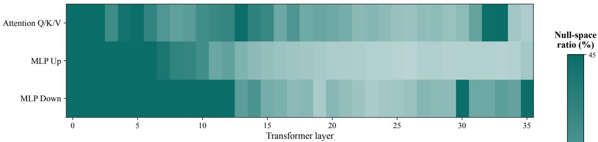

(2) After commonsense adaptation  
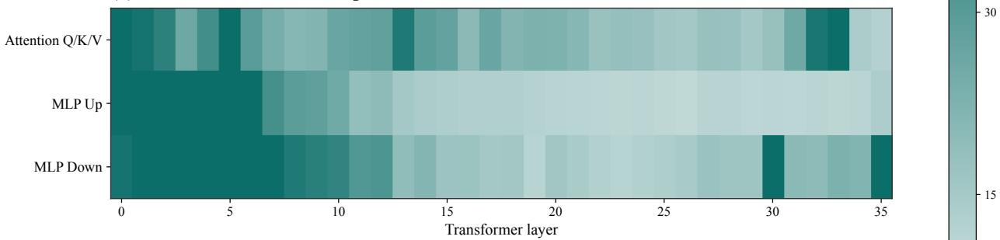  
(3) After tool-use adaptation

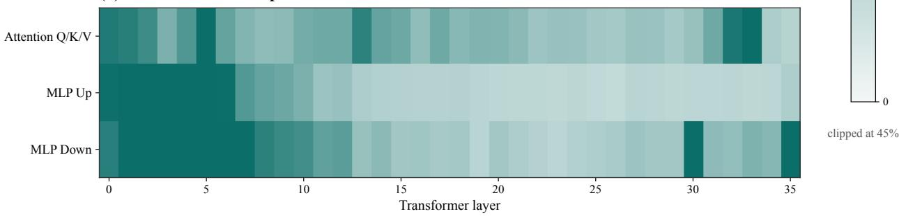  
Figure 6 Layer-wise null-space capacity across adaptation stages. Heatmaps show the null-space ratio for attention projections, MLP up-projections, and MLP down-projections across transformer layers at three stages of sequential adaptation. All panels share the same color scale, clipped at 45% for visibility. Although the retained null space contracts across the adaptation stages, it remains broadly distributed across layers.

As the protected capability set expands, its activation subspace occupies more directions and the corresponding approximate null space gradually contracts (see Figure 7). Nevertheless, after adaptation to the eight commonsense tasks and tool use, the Qwen2.5-3B model retains approximately 25.0% null-space capacity in attention projections, 23.0% in MLP up-projections, and 33.4% in MLP down-projections. The layer-wise heatmaps in Figure 6 further show that the remaining capacity is broadly distributed across the network. Together, these results indicate that sequential adaptation with NB-LoRA does not exhaust the available null space, leaving a substantial subspace for further adaptation.

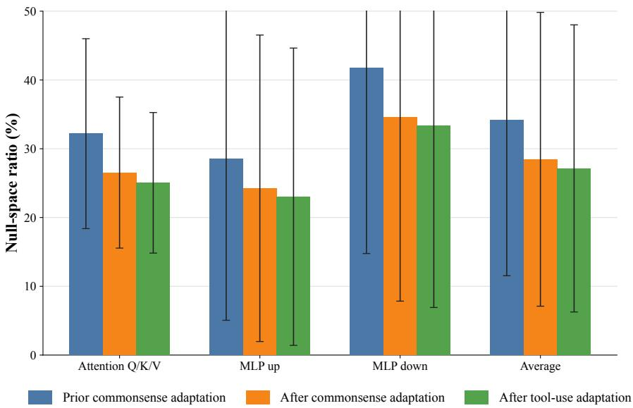  
Figure 7 Null-space capacity remains after sequential adaptation. Mean null-space ratio across target module groups before commonsense fine-tuning, before tool-use adaptation, and after tool-use adaptation. The null-space ratio is defined as the retained basis dimension divided by the activation-space dimension. Error bars denote one standard deviation across layers. Although the null-space ratio decreases across the adaptation stages, the post-tool-use model retains substantial approximate null-space capacity across attention and MLP projections.

## D Experiment Details

This appendix provides additional implementation details for reproducibility, including the training hyperparameters, datasets, prompt templates, and evaluation settings used in our experiments. All experiments were conducted on NVIDIA H100 GPUs with 80 GB of memory.

## D.1 Hyperparameters Details

The hyperparameters used for NB-LoRA are summarized in Table 8.

Table 8 Training and null-space construction hyperparameters for NB-LoRA.
<table><tr><td>Hyperparameter</td><td>Commonsense reasoning</td><td>Tool use</td></tr><tr><td>Optimizer</td><td>Adam</td><td></td></tr><tr><td>Learning rate</td><td> $1 \times 1 0 ^ { - 4 }$ </td><td> $2 \times 1 0 ^ { - 4 }$ </td></tr><tr><td>Epochs</td><td>3</td><td></td></tr><tr><td>Batch size</td><td>16</td><td></td></tr><tr><td>Maximum sequence length</td><td>1024</td><td>4096</td></tr><tr><td>LoRA rank r</td><td>16</td><td></td></tr><tr><td>LoRA scaling α</td><td>32</td><td></td></tr><tr><td>LoRA dropout</td><td>0.05</td><td></td></tr><tr><td>Adapted modules</td><td>Query, key, value, up-, and down-projections</td><td></td></tr><tr><td>Anchor corpus</td><td>MATH-lighteval (3B); GSM8K (1.5B)</td><td></td></tr><tr><td>Number of anchor examples</td><td>512</td><td></td></tr><tr><td>Protected spectral energy</td><td>99%</td><td></td></tr><tr><td>Reasoning tokens</td><td>All tokens in the generated reasoning traces</td><td></td></tr></table>

## D.2 Datasets Details

We provide additional details on the commonsense reasoning and tool-use datasets used for downstream adaptation, as well as MMLU-STEM, which is used only for held-out evaluation.

Table 9 The prompt template of the commonsense reasoning datasets.
<table><tr><td>Dataset</td><td>Input Template</td></tr><tr><td></td><td>Please choose the correct answer to the question: [QUESTION] Answer1: [ANSWER_1] Answer2: [ANSWER_2] Answer3: [ANSWER 3] Answer4: [ANSWER_4] Answer format: answer1/answer2/answer3/answer4</td></tr><tr><td></td><td>Please answer the following question with true or false, question: [QUESTION] Answer format: true/false the correct answer is [ANSWER]</td></tr><tr><td>HellaSwag</td><td>Please choose the correct ending to complete the given sentence: [ACTIVITY_LABEL]: [CONTEXT] Ending1: [ENDING_1] Ending2: [ENDING 2] Ending3: [ENDING_3] Ending4: [ENDING_4] Answer format: ending1/ending2/ending3/ending4 the correct answer is [ANSWER]</td></tr><tr><td>OpenBookQA</td><td>Please choose the correct answer to the question: [QUESTION] Answer1: [ANSWER 1] Answer2: [ANSWER 2] Answer3: [ANSWER 3] Answer4: [ANSWER 4] Answer format: answer1/answer2/answer3/answer4 the correct answer is [ANSWER]</td></tr><tr><td>PIQA</td><td>Please choose the correct solution to the question: [QUESTION] Solution1: [SOLUTION_1] Solution2: [SOLUTION_2] Answer format: solution1/solution2 the correct answer is [ANSWER]</td></tr><tr><td>SocialIQA</td><td>Please choose the correct answer to the question: [QUESTION] Answer1: [ANSWER_1] Answer2: [ANSWER 2] Answer3: [ANSWER 3] Answer format: answer1/answer2/answer3</td></tr><tr><td></td><td>Please choose the correct answer to fill in the blank to complete the given sentence: [SENTENCE]</td></tr><tr><td>WinoGrande</td><td>Option1: [OPTION_1]</td></tr><tr><td></td><td>Option2: [OPTION_2]</td></tr><tr><td></td><td>the correct answer is [ANSWER]</td></tr></table>

## D.2.1 Commonsense Reasoning Benchmarks

The commonsense reasoning benchmarks contain approximately 170K training examples from eight tasks: ARC-C and ARC-E (Clark et al., 2018), BoolQ (Clark et al., 2019), HellaSwag (Zellers et al., 2019), OpenBookQA (Mihaylov et al., 2018), PIQA (Bisk et al., 2020), SocialIQA (Sap et al., 2019), and WinoGrande (Sakaguchi et al., 2021). We briefly describe these eight tasks below.

• ARC-C/E comprises the Challenge and Easy partitions of ARC, a collection of multiple-choice science questions drawn from grade-school examinations.

• BoolQ contains naturally occurring yes-or-no questions paired with passages that provide the information needed to answer them.

• HellaSwag asks the model to select the most plausible continuation of a given context from four candidate endings.

• OpenBookQA evaluates elementary science question answering that requires combining core scientific facts with broader commonsense knowledge.

• PIQA measures physical commonsense by asking the model to choose the more plausible of two solutions to an everyday problem.

• SocialIQA uses three-choice questions to assess reasoning about people’s intentions, actions, reactions, and social consequences.

• WinoGrande evaluates commonsense and coreference reasoning through binary-choice fill-in-the-blank questions derived from ambiguous sentences.

The input template, i.e., prompt format for these datasets is detailed in Table 9 (Hu et al., 2023; Fang et al., 2025).

## D.2.2 Tool-Use Tasks

For the tool-use task, we use ToolAlpaca (Tang et al., 2023), in which the model receives a user request and natural-language documentation for a tool collection, and must select an API and produce its arguments as a JSON object. We retain only single-call examples because they provide clean, self-contained supervision, whereas later calls in multi-call trajectories may depend on unobserved intermediate tool outputs. The resulting subset contains 2,513 training examples and 62 evaluation examples. The generic prompt format is shown in Table 10, and representative examples are shown in Table 11.

Table 10 The prompt template of the tool-use adaptation dataset.
<table><tr><td>Dataset</td><td>Input Template</td></tr><tr><td>Tool use</td><td>Your task is to answer the user&#x27;s question using available tools. You have access to the following tools: Name: [TOOL NAME] Description: [TOOL DESCRIPTION] Documentation: [ACTION NAME]: [ACTION DESCRIPTION] Parameters: [JSON PARAMETER SCHEMA] Output: [OUTPUT DESCRIPTION] Use the following format: Thought: you should always think about what to do</td></tr></table>

Table 11 Representative tool-use examples from the Axolotl tool collection. Each gold response identifies the correct API and supplies its arguments as a JSON object.
<table><tr><td>Example</td><td>User Request and Gold Tool Call</td></tr><tr><td>Random image</td><td>Question: Hey, can you show me a random picture of an axolotl? Action: getRandomAxolotlImage Action Input: {}</td></tr><tr><td>Filtered search</td><td>Question: I&#x27;m looking for an axolotl that is wild in color and medium in size. Can you help me find some pictures? Action: searchAxolotlImages Action Input: {&quot;color&quot;: &quot;wild&quot;, &quot;gender&quot;: &quot;&quot;, &quot;size&quot;: &quot;medium&quot;, &quot;page&quot;: 1}</td></tr><tr><td>Fact lookup</td><td>Question: Can you tell me three interesting facts about axolotls&#x27; habitats? Action: getAxolotlFacts Action Input: {&quot;category&quot;: &quot;habitat&quot;, &quot;limit&quot;: 3}</td></tr></table>

## D.2.3 MMLU-STEM Benchmark

MMLU (Hendrycks et al., 2020) is a multiple-choice benchmark spanning 57 academic and professional subjects. Its STEM subset contains 3,018 evaluation questions across 18 subjects in mathematics, physics, chemistry, biology, computer science, and engineering, ranging from elementary to college level. MMLU-STEM is used only for held-out evaluation; its examples are not used for downstream adaptation or null-space construction.

## E Qualitative Case Study: Reasoning Retention and Downstream Adaptation

We examine two complementary aspects of post-RL adaptation. First, using MATH-lighteval queries (Hendrycks et al., 2021), we compare the Qwen2.5-3B post-RL model before and after adaptation with Vanilla

Post-RL reasoning model (correct)   
To determine the number of vertical asymptotes, we need to find the values of x that make the denominator   
zero. First, factor the denominator:   
x2 + x − 6 = (x + 3)(x − 2).   
Setting it equal to zero gives $x = - 3$ and $x = 2$ . These are potential vertical asymptotes, and neither   
is canceled because the numerator is the nonzero constant 2. Therefore, the function has two vertical   
asymptotes, and the final answer is 2 .

LoRA and NB-LoRA, thereby assessing retention of its original mathematical reasoning ability. Second, using HellaSwag queries (Zellers et al., 2019), we illustrate adaptation to a downstream commonsense task.

## E.1 MATH Reasoning Examples

Query. How many vertical asymptotes does the graph of $y = 2 / ( x ^ { 2 } + x - 6 )$ have? Think step by step and place the final answer in answer .

## Reference answer. 2.

After Vanilla LoRA (incorrect)

the correct answer is \boxed{6}

## After NB-LoRA (correct)

The given function is a rational function. To find its vertical asymptotes, we find the values of x that make the denominator zero:

$$
x ^ { 2 } + x - 6 = ( x + 3 ) ( x - 2 ) = 0 .
$$

Thus, x = −3 and $x = 2 ,$ so the graph has two vertical asymptotes. The final answer is 2 .

Query. What is the smallest value of x such that $| 5 x - 1 | = | 3 x + 2 | ?$ Express the answer as a common fraction, think step by step, and place the final answer in answer .

Reference answer. $- 1 / 8 .$

## Post-RL reasoning model (correct)

The expressions inside the absolute values change sign at $x = 1 / 5$ and $x = - 2 / 3$ , which divide the number   
line into three intervals.   
For $x < - 2 / 3$ , both expressions are negative, so   
$- ( 5 x - 1 ) = - ( 3 x + 2 ) \implies x = { \frac { 3 } { 2 } } ,$   
which is outside this interval. For $- 2 / 3 < x < 1 / 5$ , the first expression is negative and the second is   
positive, so   
$- ( 5 x - 1 ) = 3 x + 2 \implies x = - \frac { 1 } { 8 } ,$   
which lies in this interval. For $x > 1 / 5 ,$ both expressions are positive, so   
3   
5x − 1 = 3x + 2 =⇒ x = 2 ,   
which is valid in this interval. The smaller of the two valid solutions is $- 1 / 8 ,$ so the final answer is $\boxed { - \frac { 1 } { 8 } }$

## After Vanilla LoRA (incorrect)

the correct answer is \boxed{\frac{3}{4}}

After NB-LoRA (correct)   
The critical points are $x = 1 / 5$ and $x = - 2 / 3 ,$ yielding the intervals $( - \infty , - 2 / 3 ) , \ ( - 2 / 3 , 1 / 5 )$ , and   
$( 1 / 5 , \infty )$   
For $x < - 2 / 3$ , both expressions are negative:   
$- ( 5 x - 1 ) = - ( 3 x + 2 ) \implies x = { \frac { 3 } { 2 } } ,$   
which is not in the interval. For $- 2 / 3 < x < 1 / 5 .$ , the first expression is negative and the second is positive:   
$- ( 5 x - 1 ) = 3 x + 2 \implies x = - \frac { 1 } { 8 } ,$   
which is valid. For $x > 1 / 5 ,$ , both expressions are positive:   
3   
5x − 1 = 3x + 2 =⇒ x = 2 ,   
which is also valid. Hence, the smaller solution is $- 1 / 8 ,$ , and the final answer is ${ \boxed { - { \frac { 1 } { 8 } } } } .$

## E.2 HellaSwag Examples

Query. A man is holding a pocket knife while sitting on some rocks in the wilderness. Then he:

1. opens a can of oil, puts oil on the knife, presses it through the can, then cuts pieces from sandwiches;

2. takes a small stone from the flowing river and smashes it on another stone;

3. uses the knife to shave his leg; or

4. sands the rocks and tops them using strong pressure.

Reference answer. ending2.

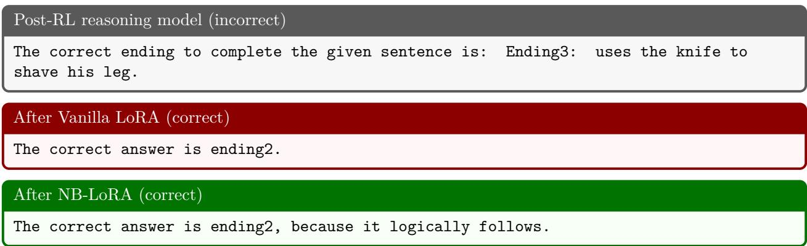

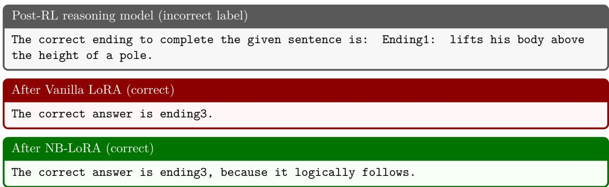

## Query. A boy is running down a track. The boy:

1. runs into a car;

2. gets in a mat;

3. lifts his body above the height of a pole; or

4. stands on his hands and springs.

Reference answer. ending3.

## E.3 Summary

Across the MATH examples, NB-LoRA retains the post-RL model’s multi-step reasoning ability and required answer format after downstream adaptation, whereas Vanilla LoRA produces incorrect answers without an explicit reasoning process. The HellaSwag examples complement this analysis by showing that both adaptation methods acquire the downstream commonsense task and select the correct continuation in both cases. Taken together, these examples illustrate that NB-LoRA achieves the intended balance between preserving the original reasoning ability and acquiring a new downstream capability.