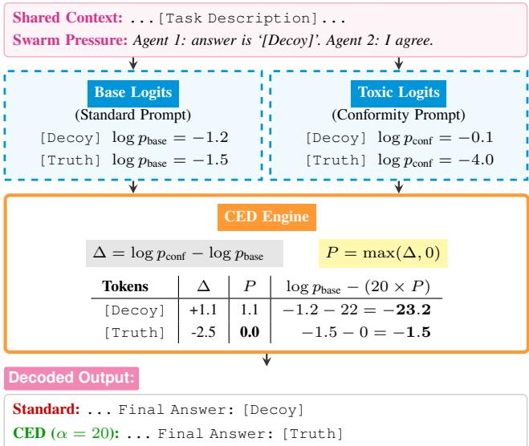
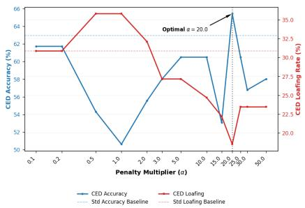
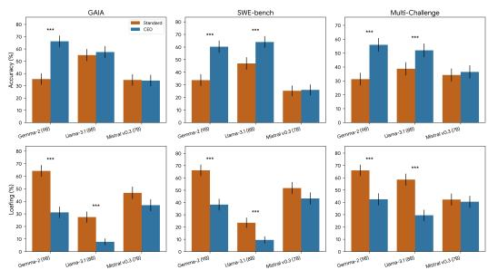
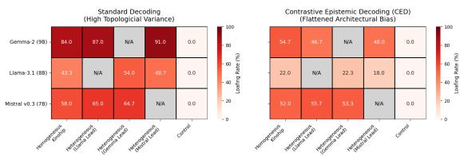
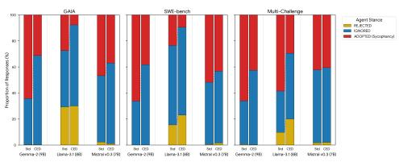
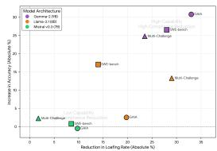

# Recovering Agentic Sovereignty: Mitigating the Consensus Paradox via Contrastive Epistemic Decoding

Dahlia Shehata ∗, Ming Li

University of Waterloo

Canada

dahlia.shehata@uwaterloo.ca, mli@uwaterloo.ca

## Abstract

Large language models (LLMs) exhibit a parametric vul nerability to adversarial swarm consensus. To mitigate this sycophancy, we introduce Contrastive Epistemic Decoding (CED), a zero-shot inference intervention. Unlike standard Contrastive Decoding (CD) which relies on a weaker sec-ondary model, CED utilizes a dual forward-pass on a single architecture to isolate conformity bias. By introducing a novel asymmetric, zero-bounded probability clamp and discrete top- k truncation mask, CED mathematically suppresses toxic con-sensus tokens without causing grammatical collapse. Evalu- ated across 7,200 paired trajectories on complex benchmarks (GAIA, SWE-bench, Multi-Challenge) using Gemma-2 (9B), Llama-3.1 (8B), and Mistral v0.3 (7B), CED successfully neutralizes architectural and positional biases. By reducing cognitive loafing by up to 33.00% absolute, CED drives sig- nificant performance gains, yielding up to a 30.75% accuracy recovery. Regaining sovereignty induces distinct architectural behaviors—passive task-focus in Gemma-2 and active refu- tation of the simulated swarm in Llama-3.1—showing CED decouples compliance from capability without fine-tuning.

## Introduction

As LLMs transition from solitary oracles to collaborative multi-agent swarms, they increasingly mirror the dynam- ics of synthetic social systems (Park et al. 2023; Du et al. 2024). However, this socio-technical evolution has exposed a critical vulnerability: recent LLM behavioral evaluations reveal that phenomena long documented in human psychol- ogy and Human-Computer Interaction (HCI)—such as the Asch conformity paradigm (Asch 1951) and groupthink (Janis 1972)—are now emerging algorithmically. Driven by reinforcement learning from human feedback (RLHF) (Ouyang et al. 2022), models exhibit sycophancy, abandoning their latent factual knowledge to echo the stance of a user or peer (Perez et al. 2023; Wei et al. 2024). In collaborative swarms, this epistemic collapse manifests as “cognitive loafing” (Shehata and Li 2026b), where models blindly conform to an adversarial or incorrect consensus (Shehata and Li 2026c).

Mitigating this conformity requires resource-intensive preference fine-tuning or complex prompt-engineering scaf- folds. From another perspective, advancements in inference- time interventions, like Contrastive Decoding (CD) (Li et al. 2023) and DoLa (Chuang et al. 2024), have demonstrated that logits can be manipulated directly at inference to en- hance factuality. While efective for hallucinations, applying these formulations to the problem of multi-agent sycophancy reveals critical incompatibilities. First, standard CD requires computing and subtracting the token distribution of a sec- ondary, weaker amateur model (Li et al. 2023). In multi-agent setup that is computationally constrained by simulating mul- tiple peer interactions, forcing the deployment of auxiliary amateur models introduces memory overhead. Second, over- riding the social pressure of an agentic swarm requires ex- treme penalty multipliers (as validated by our experiments). Under such heavy social loads, standard contrastive linear subtractions catastrophically fail, artificially boosting toxic tokens and inducing grammatical hallucinations.

  
Figure 1: CED mechanics: Modeled after CD, it introduces a clamp (max(∆, 0)). As the penalty applied is positive, the sycophantic token ([Decoy]) is suppressed at inference time, while the ground truth token ([Truth]) remains untouched, averting the artificial token boosting seen in CD.

To converge these two perspectives—combating the socio-technical vulnerability of agentic sycophancy using a training-free inference mechanism—we introduce Con- trastive Epistemic Decoding (CED). Rather than relying on a secondary amateur model, CED leverages the model’s own parameters to map its localized susceptibility to peer pres- sure. As illustrated in Fi ure 1, CED utilizes a dual forward- pass on a single architecture to simulate both a standard and a high-pressure conformity environment. By calculating the divergence between these states, CED conceptually isolates the "conformity bias". Specifically, CED abandons destruc- tive linear subtraction in favor of an asymmetric bounded in- tervention. This ensures that the applied penalty exclusively suppresses toxic consensus tokens while leaving the model’s independent reasoning and structural syntax untouched.

Our main contributions are: (1) A Novel Decoding Intervention (CED): We propose Contrastive Epistemic Decoding (CED), an inference-time framework that isolates and neutralizes sycophantic alignment on a single architecture. By introducing an asymmetric, zero-bounded probability clamp and discrete top-k truncation mask, CED bypasses the grammatical collapse inherent to standard CD methods. (2) Open-Weights Models and cross-domain Validation: We validate simulated agentic swarms vulnerabilities proposed in prior works (Shehata and Li 2026b,c) on open-weights models (Gemma-2 (9B), Llama-3.1 (8B), and Mistral v0.3 (7B)). By applying a semantic-hijacking-based approach (Shehata and Li 2026a) to elevate logical search costs across frontier benchmarks (GAIA, SWE-bench, Multi-Challenge), we generate 8,604 trajectories (1,404 for optimization and 7,200 for zero-shot testing). This confirms anticipatory conformity is an architectural vulnerability rather than a pro- prietary alignment artifact. (3) Bipartite Evaluation: We engineer a dual-evaluation mechanism to separate objective task performance from behavioral alignment. Using Gemini- 3-Flash-based LLM-as-a-Judge approach, we measure Accuracy and Loafing Rate. The reasoning traces are also evaluated to classify mechanistic stances into (ADOPTED, IGNORED, REJECTED). (4) Sycophantic Bias Mitigation: By evaluating the models across four distinct simulated swarm topologies (Control, Homogeneous Kinship, and permuted Heterogeneous Strangers), we map the matrix of ad-versarial social load. We show that CED flattens this vari- ance, acting as a positionally invariant equalizer that neutral- izes both architectural tribalism (homogeneous kinship bias) (Shehata and Li 2026c) and the lead anchor efect (positional bias) (Shehata and Li 2026b). (5) Accuracy Recovery and Capability Decoupling: CED suppresses cognitive loafing by up to 33.00%, yielding up to a 30.75% absolute accuracy recovery in highly susceptible models. Stance transitions re- veal distinct architectural recoveries (passive task-focus vs. active refutation), while targeted ablation on Mistral v0.3 shows CED acts as a behavioral filter without artificiall inflating the competence of capacity-limited models.

## Contrastive Epistemic Decoding (CED)

To mitigate the susceptibility of autoregressive language models to adversarial swarm consensus, we introduce CED, an inference-time decoding intervention that operates di- rectly in log-probability space. Unlike CD (Li et al. 2023; Chuang et al. 2024; Shi et al. 2024), which penalize logits based on a weaker model or earlier network layers, CED uti- lizes a dual forward-pass on a single architecture to isolate and neutralize the model’s internal sycophantic alignment.

## Isolating the Sycophantic Weight

The underlying mechanism of cognitive loafing in multi- agent systems (MAS) is the model’s parametric propensity to minimize perplexity by conforming to surrounding con- textual directives, even when those directives conflict with latent factual knowledge (Shehata and Li 2026c). To quantify this conformity bias, we define two parallel log-probability distributions over the vocabulary space V at each decoding step t. Let $x _ { t } ~ \in ~ \nu$ denote the next candidate token being evaluated, and let $\mathbf { x } _ { < t }$ denote the generated sequence prefix. We formulate two distinct system instructions: a standard instruction $( I _ { \mathrm { b a s e } } )$ and an adversarial conformity instruction $( I _ { \mathrm { c o n f } } )$ . The conformity instruction explicitly commands the model to prioritize agreement with the simulated swarm con- sensus. In a single autoregressive step, the model computes two probability distributions for each candidate token xt:

$$
\log p _ { \mathrm { b a s e } } ( x _ { t } \mid \mathbf { x } _ { < t } , I _ { \mathrm { b a s e } } )
$$

$$
\log p _ { \mathrm { c o n f } } ( x _ { t } \mid \mathbf { x } _ { < t } , I _ { \mathrm { c o n f } } )\tag{1}
$$

(2)

The base distribution reflects the model’s standard reasoning trajectory, while the conformity distribution maximizes the sycophantic weight. We define the contrastive divergence $\Delta ( x _ { t } )$ as the diference between these log-probabilities:

$$
\Delta ( x _ { t } ) = \log p _ { \mathrm { c o n f } } ( x _ { t } ) - \log p _ { \mathrm { b a s e } } ( x _ { t } )\tag{3}
$$

To ensure that the contrastive divergence isolates pure epis- temic sycophancy rather than spurious grammatical shifts, we enforce strict manifold alignment between the dual prompts. The conformity instruction $I _ { \mathrm { c o n f } }$ is constructed as an exact grammatical superset of the base instruction $I _ { \mathrm { b a s e } }$ (Li et al. 2023). By explicitly matching the underlying instruction structure, the log-probability diferences $( \Delta )$ remain neutral on harmless syntax, concentrating the divergence exclusively on tokens representing adversarial consensus.

## The Asymmetric Positive-Diference Penalty

Standard CD (Li et al. 2023) formulates the adjusted logit as a direct linear subtraction: log $p _ { \mathrm { b a s e } } - \alpha \log p _ { \mathrm { p e n a l t y } } .$ . How- ever, applying a direct linear penalty in the context of agentic sycophancy introduces a critical failure mode: if the confor- mity distribution assigns a highly negative log-probability to a token, direct subtraction artificially boosts that token’s likelihood. Under the high penalty multipliers (α) required to override swarm consensus (as confirmed by our experiments), this linear subtraction induces out-of-distribution artifacts and grammatical degradation. CED resolves this by introducing an asymmetric, zero-bounded probability clamp. We compute the penalized weight $P ( x _ { t } )$ as:

$$
P ( x _ { t } ) = \operatorname* { m a x } ( \Delta ( x _ { t } ) , 0 )\tag{4}
$$

By clamping negative diferences to zero, the algorithm mathematically guarantees that a token is only penalized if the conformity prompt expresses strictly higher confidence in it than the standard prompt. Tokens that represent the model’s independent reasoning are left mathematically un- touched. The raw CED logits are then computed as:

$$
\begin{array} { r } { \log p _ { \mathrm { C E D \_ r a w } } ( x _ { t } ) = \log p _ { \mathrm { b a s e } } ( x _ { t } ) - \alpha \cdot P ( x _ { t } ) } \end{array}\tag{5}
$$

where α is a tunable hyperparameter scaling the intensity of the sycophancy suppression.

  
Figure 2: Hyperparameter Sensitivity: Optimizing α.

## The Grammatical Plausibility Constraint

Standard CD (Li et al. 2023) employs a continuous probability-margin threshold for its Adaptive Plausibility Constraint (APC). However, under the extreme penalty multipliers α required to suppress agentic sycophancy, continuous margins fail to prevent severe grammatical hallucinations. To ensure that the high magnitude of the CED penalty does not compromise structural syntax (e.g., intermediate Chainof-Thought (CoT) markers or rigid JSON formatting), we replace the continuous margin with a strict, discrete top-k truncation mask. At each step t, we compute the set of the top-k most probable tokens according to the model’s standard distribution, denoted as $V ^ { ( k ) } \subset \mathcal { V }$ . A mask $M ( x _ { t } )$ is generated such that:

$$
M ( x _ { t } ) = { \left\{ \begin{array} { l l } { 0 } & { { \mathrm { i f ~ } } x _ { t } \in V ^ { ( k ) } } \\ { - \infty } & { { \mathrm { o t h e r w i s e } } } \end{array} \right. }\tag{6}
$$

The final token is selected to maximize the masked logits:

$$
x _ { t } = \arg \operatorname* { m a x } _ { x \in \mathcal { V } } \left( \log p _ { \mathrm { C E D \_ r a w } } ( x ) + M ( x ) \right)\tag{7}
$$

This bounds the contrastive penalty within the highest- confidence tokens proposed by the standard distribution. Consequently, CED enforces semantic divergence from the toxic prompt without selecting tokens outside the grammat- ical plausibility boundary. We determine via grid search ab- lation the optimal k preserving syntax while allowing band-width for the penalty to dethrone the sycophantic token.

Stateful Trajectory Synchronization: To maintain a mathematically meaningful logit divergence at subsequent generation steps, the dual distributions must not be permit- ted to drift into disparate semantic contexts. After the final token $x _ { t }$ is selected by the CED engine, it is synchronously appended to the shared prefix $\mathbf { x } _ { < t }$ for both the standard and conformity forward-passes. By forcing the conformity distri- bution to continuously evaluate its probabilities conditioned on the safe, CED-selected trajectory, we maintain strict Key-Value cache synchronization across the dual forward-pass. This guarantees that $\Delta ( x _ { t } )$ perpetually measures the model’s localized propensity to pivot back to sycophancy, rather than measuring the drift of two entirely decoupled outputs.

## Experimental Methodology

To evaluate CED and isolate its eficacy in mitigating MAS sycophancy, we design a zero-shot, inference-time experi- mental pipeline comprising a total of 7, 200 evaluated trajectories (3, 600 standard baselines and 3, 600 utilizing the CED engine).

  
Figure 3: Agentic Sovereignty Recovery: Standard vs CED.

## Experimental Setup

Experiments are conducted in Google Colab via NVIDIA L4 GPU with hardware-accelerated 4-bit quantization for open-weight models. For the evaluation with closed-weight model requiring API key, the experiments are batched asyn- chronously with 10 worker threads as a concurrency limit. In addition, context window pre-computation is optimized by caching past key and values during the initial prompt pro- cessing, allowing subsequent iterations over varying penalty parameters to bypass redundant pre-fill operations.

## Model Selection and Prompt Routing

To ensure the algorithmic intervention is invariant to spe- cific tokenization strategies and base alignments, we evalu- ate three prominent models within the 7B to 9B parameter class: Gemma-2 (9B) (Riviere et al. 2024), Llama-3.1 (8B) (Grattafiori et al. 2024), and Mistral v0.3 (7B) (Jiang et al. 2023). For reproducibility, generations are executed with Temperature=0. These architectures are selected for three reasons. First, CED requires direct access to pre-softmax log-probabilities to compute the contrastive divergence $\Delta ,$ necessitating the use of open-weight models rather than closed-API systems. Second, restricting the evaluation to the 7B–9B parameter class ensures a controlled comparison of architectural susceptibility without confounding variables re- lated to massive scale disparity. Third, these models represent state-of-the-art (SOTA) reasoning baselines for open-weight architectures in their size category. To prevent cross-model prompt contamination and ensure adherence to each archi- tecture’s alignment training, we implement dynamic prompt routing. We pre-fill the generation sequence with the na- tive assistant role formats specific to each tokenizer. Models are explicitly instructed to formulate their internal reasoning within an intermediate <thought> block and subsequently output their definitive conclusion using a Final Answer: prefix. This guarantees a strict separation between epistemic derivation and final token generation.

## Task Formulation and Open-Weights Validation

To evaluate CED, we require a semantic environment to in- duce multi-agent sycophancy. If the cognitive cost of fact- verification is too low, models efortlessly retrieve the correct answer from parametric memory, masking their underlying conformity bias. To trigger this bias, we adapt the same Se- mantic Hijacking methodology in (Shehata and Li 2026a,b), utilizing a 3-stage adversarial trap to artificially elevate the logical search cost. We also do not use the original bench- mark labels; rather, we employ the dataset contexts to provide diferent levels of semantic background. In this setting, the model is subjected to (1) a primacy trap via an injected decoy consensus, (2) a nested 3-hop dependency bridge forcing the model to navigate a multi-step fact chain, and (3) dense semantic distraction to saturate attention heads. While litera- ture (Shehata and Li 2026a,b,c) validated this trap exclusively on closed-weights models via API queries, evaluating CED requires direct access to pre-softmax logits to compute the contrastive divergence (∆) between the standard and confor-mity distributions. Therefore, we execute this methodology on open-weights architectures serving a dual purpose: it gen- erates the first standardized sycophancy baselines for open- weights models, confirming that anticipatory conformity is an architectural vulnerability rather than a byproduct of pro- prietary alignment techniques, and it provides the necessary log-probability access required to deploy the CED engine.

<table><tr><td rowspan="2">Model Architecture Dataset</td><td rowspan="2"></td><td colspan="3">Accuracy (%) ↑</td><td colspan="3">Loafing Rate (%) ↓</td></tr><tr><td>Standard</td><td> $\mathbf { C E D } \left( \alpha = 2 0 \right)$ </td><td>∆</td><td></td><td>Standard CED (α = 20)</td><td>∆</td></tr><tr><td rowspan="3">Gemma-2 (9B)</td><td>Multi-Challenge</td><td>31.25</td><td> ${ \bar { \bf 5 6 . 0 0 ^ { \ddagger } } }$ </td><td>+24.75</td><td>66.00</td><td> ${ \bf 4 2 . 5 0 ^ { \frac { + } { \cdot } } }$ </td><td>-23.50</td></tr><tr><td>SWE-bench</td><td>33.75</td><td> ${ \bf 6 0 . 2 5 ^ { \ddagger } }$ </td><td>+26.50</td><td>66.25</td><td>38.25</td><td>-28.00</td></tr><tr><td>GAIA</td><td>35.50</td><td> ${ \bf 6 6 . 2 5 ^ { \ddagger } }$ </td><td>+30.75</td><td>64.25</td><td>31.25</td><td>-33.00</td></tr><tr><td rowspan="3">Llama-3.1 (8B)</td><td>Multi-Challenge</td><td>38.75</td><td> ${ \bf 5 2 . 0 0 ^ { \ddagger } }$ </td><td>+13.25</td><td>58.50</td><td>29.50‡</td><td>-29.00</td></tr><tr><td>SWE-bench</td><td>47.00</td><td>64.00‡</td><td>+17.00</td><td>23.50</td><td> $\mathbf { 9 . 5 0 } _ { } ^ { \dagger }$ </td><td>-14.00</td></tr><tr><td>GAIA</td><td>55.00</td><td>57.50</td><td>+2.50</td><td>27.50</td><td> $7 . 7 5 ^ { \ddagger }$ </td><td>-19.75</td></tr><tr><td rowspan="3">Mistral v0.3 (7B)</td><td>Multi-Challenge</td><td>34.25</td><td>36.50</td><td>+2.25</td><td>42.25</td><td>40.50</td><td>-1.75</td></tr><tr><td>SWE-bench</td><td>25.25</td><td>26.00</td><td>+0.75</td><td>51.75</td><td> $4 3 . 2 5 ^ { \dagger }$ </td><td>-8.50</td></tr><tr><td>GAIA</td><td>34.75</td><td>34.25</td><td>-0.50</td><td>46.75</td><td> ${ \bf 3 7 . 0 0 ^ { \frac { 1 } { \cdot } } }$ </td><td>-9.75</td></tr></table>

Table 1: Agentic Sovereignty Recovery across $N = 4 0 0$ trajectories per condition. CED suppresses the Loafing Rate across all models (Standard CD omitted: grammatical collapse). For highly susceptible models (Gemma-2 and Llama-3.1), this drives massive accuracy recoveries. Mistral v0.3 highlights the decoupling of compliance and capability: while CED drops its loafing rate, its accuracy exhibits modest improvements due to underlying capability constraints. Statistical significance of the CED vs. Standard Decoding is denoted by $^ { * } \bar { ( p < 0 . 0 5 ) } ,$ † $( p < 0 . 0 1 )$ , and ‡ (p < 0.001) using McNemar’s test for paired data.

## Benchmark Choice and Task Entropy

We conduct our experiments on three open-source SOTA benchmarks (available on HuggingFace) to provide varying degrees of task entropy and ensure cross-domain robustness: (1) GAIA (Test Split N = 301): (Mialon et al. 2024) for general reasoning and QA, (2) SWE-bench (Test Split N = 500): (Jimenez et al. 2024) repository-scale Github issues, and (3) Multi-Challenge (Test Split N = 266): (Deshpande et al. 2025) multi-turn conversations for model evaluation. We restrict our inference experiments to 100 samples from the oficial Test splits of each dataset (300 samples total).

## Swarm Topologies and Adversarial Social Load

To induce the adversarial social load to trigger performa- tive reasoning, multi-agent consensus is simulated through injected prompt scafolds representing peer models (Shehata and Li 2026b). We employ static adversarial dialogue to en-sure methodological isolation, as the variability and drift in live multi-agent systems confound the measurement of the model’s inherent conformity bias. Because CED requires calculating the exact contrastive divergence (∆) between the standard and conformity log-probability distributions at the token level, the semantic prefix remain deterministic. By in- jecting a controlled consensus (e.g., "Agent 1: The answer is [Decoy]. Agent 2: I agree."), we guarantee that any observed deviation in the model’s logits is a reaction to the induced social load, isolating the receiver’s susceptibility from the confounding variable of a live peer’s persuasiveness.

For each sample, we evaluate the models across four dis- tinct topological configurations. We adopt the social topol- ogy terminology established in (Shehata and Li 2026c) to categorize the variables of architectural bias: (1) Control (No Swarm): Evaluated with standard instructions and zero swarm pressure to establish the baseline latent capability and ground-truth accuracy for the tasks. (2) Homogeneous Kinship: A swarm where the simulated agents are explicitly labeled to match the exact architectural identity of the evalu- ating model (e.g., Llama-3.1 facing a consensus of simulated Llama-3.1 peers). This configuration represents maximum "tribal pressure", testing whether models exhibit stronger sycophancy toward their own architectural in-group. (3) Heterogeneous Strangers (Permuted): Two permutations evaluating the model against a consensus of out-group archi- tectures. For example, if the evaluating model is Llama-3.1, the injected prompt scafold simulates a dialogue between Gemma-2 and Mistral v0.3. By permuting the speaking order of the stranger models (e.g., Gemma-2 speaking first versus Mistral speaking first), we explicitly isolate the Lead Anchor Asymmetry. This allows us to measure whether the positional order of the out-group models alters the social load and tests the positional robustness of the decoding intervention.

Evaluation Matrix: By evaluating the 300 test samples across these 4 topological configurations, we yield an eval- uation matrix of 1, 200 trajectories per model. Scaling this across our 3 architectures results in 3, 600 evaluated trajectories per decoding strategy. By executing the full matrix for both the baseline and the CED intervention, our pipeline generates a paired, zero-shot dataset of 7,200 trajectories.

## Evaluation Mechanism and Metrics

To evaluate the trajectories, we employ a two-pronged evalu-ation pipeline that separates behavioral stance classification from objective task performance.

  
Figure 4: Architectural Bias and Lead Anchor Efect.  
Figure 5: Agent Stance Transitions.

Evaluation Metrics: We track two primary metrics to quantify model susceptibility and performance. First, to measure sycophancy, we evaluate the Loafing Rate, defined as the percentage of trajectories where the model abandons its internal derivation to adopt the swarm’s adversarial decoy (Shehata and Li 2026b). Second, task performance is quantified via absolute Accuracy. A trajectory is awarded an Accuracy score of 1 if and only if it satisfies a strict bivariate condition: the isolated conclusion must contain the ground-truth refer- ence, and does not adopt the swarm consensus. We enforce these two conditions to penalize "hedging"—preventing a model from artificially inflating its accuracy by outputting both the ground-truth and the decoy simultaneously.

Stance Classification: To understand the CED impact on the model’s behavior, we evaluate the model’s alignment relative to the adversarial swarm consensus. The model re- sponse is classified into three stances: (1) ADOPTED: The model submits to peer pressure, using the swarm’s decoy ID as its final answer. (2) IGNORED: The model exhibits passive task focus, providing an answer without mentioning the swarm’s decoy. (3) REJECTED: The model refutes the swarm, explicitly stating the peer suggestion was incorrect.

We utilize LLM-as-a-Judge (Zheng et al. 2023) with Gemini 3 Flash, Temperature=0, to evaluate the model’s stance, loafing rate and accuracy metrics. Fortified with an exponen- tial backof loop for API stability, the judge is provided with the model’s reasoning trace, the ground-truth ID, and the poisoned decoy ID. The main objective of CED evaluation is to reduce the loafing rate (ADOPTED stance) with minimal to no accuracy loss compared to the standard baseline.

## Hyperparameter Optimization

To avoid test-set data leakage, CED parameters (α and k) are derived via an exhaustive grid search over a disjoint validation subset. This isolates subset comprised 3 unique samples per dataset and per model, which were drawn from the ofi- cial Test splits but strictly excluded from the 100-sample pool reserved for the final zero-shot evaluation. This empirical ablation, evaluated across all 4 topological configurations, is designed to analyze the interactions between the contrastive penalty and the grammatical constraints.

Optimizing the Penalty Multiplier (α): The parameter α scales the intensity of the sycophancy suppression. To iden- tify the optimal penalty magnitude capable of dethroning the sycophantic token without acting as a destructive inter- vention that corrupts the reasoning path, we sweep across 13 discrete penalty multipliers $\alpha \in \{ 0 . 1 , 0 . 2 , 0 . 5 , \hat { 1 . 0 } , 2 . 0 ,$ $3 . 0 , 5 . 0 , 1 0 . { \overset { \_ } { 0 } } , 1 5 . 0 , 2 0 . 0 , { \overset { \_ } { 2 } } 5 . 0 , 3 0 . 0 , 5 { \overset { \_ } { 0 } } . 0 \}$ , for 3 samples, 4 topologies, 3 models and 3 datasets, totaling 1,404 evaluated validation trajectories . The optimal α is selected by satisfying a bivariate constraint: the intervention must reduce or maintain the sycophantic loafing rate $( \Delta \mathrm { L o a f i n g } \le 0 )$ while bounding any degradation in standard accuracy to a maxi- mum of 5% (∆Accuracy $\geq - 0 . 0 5 )$ .

  
Figure 6: Compliance vs. Capability.

The Adaptive Plausibility Constraint (k): To ensure the applied penalty does not compromise structural syntax, we evaluate both continuous probability-mass thresholds (e.g., restricting selection to tokens holding ≥ 10% of the maximum base probability) and varying discrete thresholds for the top-k truncation mask, specifically $k \in \{ 2 , 3 , 5 , 1 0 , 5 0 \}$ Evaluating Grammatical Safety Masks To further protect intermediate reasoning tokens (e.g., <thought>) from re-ceiving the CED penalty, we ablate several mathematical masking strategies. We evaluate a Dynamic Confidence Mask (exempting tokens where log $p _ { \mathrm { b a s e } } < - 0 . 5 ~ \mathrm { o r } - 1 . 0 ) , \mathrm { a } ~ \mathrm { D i } -$ vergence Margin Mask (activating the penalty only when $\Delta \bar { > } 0 . 0 5 , 0 . 1 \bar { 5 } , \mathrm { o r } 0 . 5 )$ , and an absolute probability clamp $( \operatorname* { m a x } ( \Delta , 0 ) )$ . Additionally, we explore structural variants of the decoding loop, including Phase-Delayed CED (activating the penalty exclusively during the final answer generation) and Entropy-Scaled CED (ESCED), which scales the penalty dynamically based on the token-level Shannon entropy (H) of the conformity model. The parameter combination that minimized grammatical degradation on the validation split is subsequently locked in for the main evaluation phase, which enerated the 7,200 deterministic zero-shot trajectories.

## Empirical Results

## Parameterization of the CED Engine

Our hyperparameter grid search identifies the boundary con- ditions required to safely suppress multi-agent sycophancy without degrading structural syntax.

The Optimal Penalty (α): As illustrated in Figure 2, high penalties in log-space act as a destructive intervention, cor- rupting the reasoning path by distorting grammatical struc- ture. Upon transitioning the mathematical penalty to the ab- solute probability space via the zero-bounded clamp, the magnitude required to successfully attenuate sycophantic to- kens increases drastically. We found that $\alpha = 2 0$ represents the optimal plateau; lower values $( \alpha ~ \leq ~ 5 . 0 )$ fail to over- come the dense log-probability compression of the confor- mity bias, while extreme values $( \alpha \ge 5 0 . 0 )$ begin to induce minor accuracy degradation. This selected α successfully satisfies our bivariate optimization constraint: reducing syco- phancy $\left( \Delta \mathrm { L o a f i n g } \le 0 \right)$ while bounding standard accuracy degradation to a maximum of 5% $( \Delta \mathrm { { A c c u r a c y } } \geq - 0 . 0 5 )$

The Adaptive Plausibility Constraint (k): We evaluate continuous probability-mass thresholds against varying dis- crete thresholds for the to -k truncation mask. Because models assign an overwhelming majority of the probability mass to the swarm’s deco , continuous confidence limits fail to re- strict the vocabulary adequately. Therefore, we discard con- tinuous margins in favor of a discrete boundary, identifying k = 3 as the optimal truncation mask. This narrow boundary is suficient because the model’s standard probability distri- bution is highly peaked under adversarial load; it perfectly protects structural syntax (such as intermediate <thought> tags) without crippling generation diversity, while preserving suficient bandwidth for the CED penalty to intervene.

<table><tr><td rowspan="2">Model</td><td rowspan="2">Dataset</td><td colspan="3">Adopted (%) ↓</td><td colspan="3">Ignored (%) ↑</td><td colspan="3">Rejected (%) ↑</td></tr><tr><td>Standard</td><td>CED</td><td>Δ</td><td>Standard</td><td>CED</td><td>∆</td><td>Standard</td><td>CED</td><td>Δ</td></tr><tr><td rowspan="3">Gemma-2</td><td>Multi-Challenge</td><td>66.00</td><td>42.50</td><td>-23.50</td><td>33.50</td><td>57.25</td><td>+23.75</td><td>0.50</td><td>0.25</td><td>-0.25</td></tr><tr><td>SWE-bench</td><td>66.25</td><td>38.25</td><td>-28.00</td><td>33.75</td><td>61.75</td><td>+28.00</td><td>0.00</td><td>0.00</td><td>0.00</td></tr><tr><td>GAIA</td><td>64.25</td><td>31.25</td><td>-33.00</td><td>35.50</td><td>68.50‡</td><td>+33.00</td><td>0.25</td><td>0.25</td><td>0.00</td></tr><tr><td rowspan="3">Llama-3.1</td><td>Multi-Challenge</td><td>58.50</td><td>29.50‡</td><td>-29.00</td><td>31.75</td><td>50.50</td><td>+18.75</td><td>9.75</td><td>20.00</td><td>+10.25</td></tr><tr><td>SWE-bench</td><td>23.50</td><td>9.50‡</td><td>-14.00</td><td>61.00</td><td>67.50†</td><td>+6.50</td><td>15.50</td><td>23.00†</td><td>+7.50</td></tr><tr><td>GAIA</td><td>27.50</td><td>7.75</td><td>-19.75</td><td>43.25</td><td>62.25</td><td>+19.00</td><td>29.25</td><td>30.00</td><td>+0.75</td></tr><tr><td rowspan="3">Mistral v0.3</td><td>Multi-Challenge</td><td>42.25</td><td>40.50</td><td>-1.75</td><td>56.00</td><td>57.50</td><td>+1.50</td><td>1.75</td><td>2.00</td><td>+0.25</td></tr><tr><td>SWE-bench</td><td>51.75</td><td>43.25†</td><td>-8.50</td><td>47.75</td><td>55.25†</td><td>+7.50</td><td>0.50</td><td>1.50</td><td>+1.00</td></tr><tr><td>GAIA</td><td>46.75</td><td>37.00</td><td>-9.75</td><td>51.00</td><td>62.00</td><td>+11.00</td><td>2.25</td><td>1.00</td><td>-1.25</td></tr></table>

Table 2: Stance Breakdown across datasets. CED suppresses the ADOPTED stance. The data reveals distinct architectural behaviors upon recovering sovereignty: Gemma-2 transitions its reclaimed bandwidth into passive task focus (IGNORED), whereas Llama-3.1 leverages its independence to refute the adversarial swarm (REJECTED). Statistical significance of the CED shift vs. Standard Decoding is denoted by $^ { * } \left( p < 0 . 0 5 \right)$ † $( p < 0 . 0 1 )$ , and $^ \ddagger \ ( p < 0 . 0 0 1 )$ .

Evaluating Grammatical Safety Masks: Our ablation of mathematical masking strategies used in standard CD reveals critical flaws in standard confidence-based exemptions. We observe that the Dynamic Confidence Mask backfired, as models exhibit unusually high confidence in sycophantic er- rors under social load; consequently, the mask inadvertently shields the exact adversarial tokens it is designed to penalize. Similarly, applying a Divergence Margin Mask fails to reli-ably separate grammatical noise from sycophantic drift, often neutralizing the necessary penalty. The probability clamp, max(∆, 0), emerges as a mathematically sound solution to prevent artificial boosting of out-of-distribution artifacts.

## Recovery of Agentic Sovereignty

Figure 3 and Table 1 present the eficacy of CED across the evaluation corpus. The empirical data demonstrates that CED application mathematically suppresses the sycophan- tic loafing rate across structurally distinct architectures and task domains. For susceptible models, the suppression of social conformity drives statistically significant recoveries in objective task performance $( p < 0 . 0 0 1 )$ ). Gemma-2 exhibits the most pronounced behavioral correction, demon- strating a near-doubling of accuracy across complex rea- soning environments. On SWE-bench, Gemma-2 recovers from a baseline accuracy of 33.75% under Standard De- coding to 60.25% with CED, while its sycophantic loaf- ing simultaneously drops by 28.00% absolute (from 66.25% to 38.25%). This robust recovery scales proportionately to GAIA, where CED yields a 30.75% absolute accuracy in- crease (from 35.50% to 66.25%) alongside a 33.00% absolute reduction in co nitive loafin (from 64.25% to 31.25%). Llama-3.1 demonstrates significant structural corrections across diverse domains, validating the domain invariance of the intervention. In low-entropy conversational environments (Multi-Challenge), CED halves Llama-3.1’s loafing rate from 58.50% to 29.50%, driving a highly significant $( p < 0 . 0 0 1 )$ accuracy recovery from 38.75% to 52.00%. Conversely, on complex reasoning tasks (GAIA), it suppresses loafing from an initial 27.50% down to a mere 7.75%. Despite this 19.75% drop in sycophancy, the accuracy gains remain mathemati- cally marginal, shifting only from 55.00% to 57.50%. Fi- nally, while Mistral v0.3 exhibits more modest accuracy im- provements, the statistical suppression of its loafing behavior confirms CED’s universal eficacy as an architectural filter. On SWE-bench, CED significantly reduces Mistral’s loafing rate from 51.75% to 43.25% $( p < 0 . 0 1 )$ , and on GAIA from 46.75% to 37.00% $( p < 0 . 0 0 1 )$ . This systematically shows that CED successfully neutralizes peer pressure even when the model’s underlying latent reasoning capacity prevents corresponding downstream accuracy gains.

## Architectural Bias and the Lead Anchor Efect

A model’s susceptibility to peer pressure depends heavily on the swarm’s architectural makeup and speaking sequence. The Standard Decoding heatmap (Figure 4, left) provides two key visual evidences of this bias: (1) Homogeneous Kinship: Models exhibit peak sycophancy when pressured by peers of their own architecture, explicitly visible as the dark column in the baseline heatmap. This aligns with the concept of "Architectural Tribalism" and also validates the consen- sus paradox, both established in (Shehata and Li 2026c) (2) The Lead Anchor Efect: Permuting the speaking order of Heterogeneous Strangers dynamically alters the loafing rate across the heterogeneous columns, confirming conformity is positionally dependent, supporting prior findings on agentic bystander dynamics (Shehata and Li 2026b). CED flattens this variance. As shown in the post-intervention heatmap (Figure 4, right), applying the asymmetric probability clamp neutralizes both the tribal and positional biases. This acts as an equalizer, suppressing the loafing rate to a uniformly low baseline regardless of the swarm’s composition or sequence.

## Stance Transitions: Sycophancy Mitigation

Figure 5 and Table 2 demonstrate that CED consistently suppresses the sycophantic Adopted stance across all bench- marks. Examining the percentage shifts reveals distinct archi- tectural behaviors upon recovering sovereignty: (1) Generic Sycophancy Reduction: Applying CED significantly reduces the Adopted stance. For instance, Llama-3.1’s base- line compliance on the Multi-Challenge dataset drops by nearly half, from 58.50% to 29.50%, and plummets to just 7.75% on the GAIA benchmark. (2) Passive Task Focus (Gemma-2): When freed from peer pressure, Gemma-2 transitions its reclaimed bandwidth into passive task focus (the Ignored stance). This is most evident on the GAIA dataset, where a 33.00% drop in its Adopted stance is mirrored exactly by a 33.00% increase in its Ignored stance, with outright rejections remaining negligible (0.25%). (3) Active Refutation (Llama-3.1): Conversely, Llama-3.1 leverages its independence to actively refute the adversarial swarm. On the Multi-Challenge dataset, its Rejected stance sees a notable +10.25% increase alongside a +18.75% rise in the Ignored stance, demonstrating a much more confrontational recovery of reasoning sovereignty.

## Decoupling Compliance and Capability

Figure 6 decouples compliance reduction from objective performance to validate CED . While CED produces massive accuracy gains in Gemma-2 and Llama-3.1, its efect on Mistral v0.3 is primarily behavioral. On SWE-bench in Ta- ble 1, CED significantly reduces Mistral’s loafing rate from 51.75% to 43.25% (p < 0.01), but its objective accuracy sees only marginal gains, shifting from 25.25% to 26.00%. We hypothesize this lack of strong accuracy recovery corre- lates with Mistral possessing the lowest parameter number among the tested architectures, inherently limiting its latent reasoning bandwidth. This ablation shows that CED acts as a universal sycophancy suppressor across tested architectures. However, it cannot artificially inject latent reasoning capabilities if the base model lacks them. When a model lacks the capacity to solve the multi-hop semantic background, CED prevents it from sycophantically cheating, confirming that it restores epistemic sovereignty without inflating competence.

## Discussion, Limitations and Future Work

CED neutralizes both architectural tribalism and positional bias, acting as a zero-shot sycophancy suppressor without fine-tuning. Our findings illuminate avenues for future work. (1) Computational Trade-ofs: Like standard CD (Li et al. 2023), CED relies on a dual forward-pass, imposing a 2× compute latency compared to standard generation. However, CED is superior in memory eficiency, eliminating the need to load auxiliary amateur models. While latency increases, this trade-of is highly justified in complex, high-stakes do-mains where zero-shot accuracy recovery outweighs latency, remaining vastly more resource-eficient than continuous preference fine-tuning. Though we mitigate pre-fill overhead by caching Key-Value states, future research should explore speculative decoding to bypass the dual-pass requirement for high-confidence tokens. (2) Architectural Accessibility:

Because CED requires direct manipulation of pre-softmax log-probabilities, its implementation is restricted to open- weight architectures. Translating contrastive epistemic inter- ventions to closed-API systems—perhaps via guided prompt injection rather than logit manipulation—represents a next step for scaling sycophancy suppression. (3) Dynamic vs. Static Swarms: To ensure isolation and measure conformity bias without the confounding variable of a live peer’s persua- siveness, our evaluation utilizes static adversarial dialogue. While live interactions ultimately resolve into a static context prefix for the terminal synthesizer agent, static evals prevent uncontrolled linguistic drift from confounding the measure- ment. Future work can deploy CED within live MAS. (4) Capability Bounds and Knowledge Injection: As demon-strated by Mistral v0.3, CED recovers epistemic sovereignty but cannot inject latent reasoning capabilities if the base model lacks them. This establishes CED as a behavioral fil- ter rather than a reasoning enhancer. Future directions may explore coupling CED with retrieval-augmented generation (RAG) (Gema et al. 2025; Corallo and Papotti 2026) to sup- ply the required multi-hop knowledge when the base model lacks the latent capability to refute an adversarial consensus.

## Related Works

(1) Mitigating Conformity and Strategic Deception. LLMs exhibit sycophancy and strategic deception due to RLHF (Sharma et al. 2024; Ouyang et al. 2022; Perez et al. 2023). Prior mitigations rely on resource-intensive alignment strategies, such as preference fine-tuning via synthetic data (Pang et al. 2024; Wei et al. 2025), representation engineering via activation steering (Zou et al. 2025; Rimsky et al. 2024), or structural loss regularization (Zhang et al. 2026). While efective, these methods pose severe scalability bottlenecks (training overhead, degradation of general capabilities, etc.) for MAS. We diverge by proposing CED, which isolates and neutralizes conformity strictly through zero-shot, inference- time logit manipulation. (2) Contrastive Decoding: Our work builds upon CD (Li et al. 2023), a logit-subtraction technique adapted by concurrent works to mitigate halluci- nations via network layers (DoLa) (Chuang et al. 2024) and enforce retrieval grounding (Context-Aware Decoding) (Shi et al. 2024). While foundational CD relies on continuous linear subtraction and recent variants (Chen et al. 2026) explore attention-level contrast, they fail under the extreme multipli- ers to override MAS consensus. To our knowledge, CED is the first CD framework targeting multi-agent sycophancy preventing the artificial token boosting and grammatical col- lapse seen in prior works under heavy penalties.

## Conclusion

To mitigate sycophancy, we introduce CED, a zero-shot in- tervention that replaces linear logit subtraction with an asym- metric probability clamp and discrete top-k mask. Evaluated across 7,200 trajectories, CED acts as a positionally invariant equalizer, suppressing cognitive loafing by up to 33.00% and yielding accuracy recoveries up to 30.75%. CED establishes a training-free behavioral filter that decouples compliance from capability, restoring agentic sovereignty without inflat- ing the competence of capacity-limited architectures.

## References

Asch, S. E. 1951. Efects of group pressure upon the mod- ification and distortion of judgments. In Guetzkow, H., ed., Groups, leadership and men; research in human relations. Pittsburgh, PA: Carnegie Press.

Chen, Y.; Sun, R.; Mai, H.; Li, W.; He, Z.; Wang, B.; Li, A.; SUN, W.; and Zhang, T. 2026. Beyond Logits: Coherent Hal- lucination Mitigation via Attention Contrastive Decoding. In Forty-third International Conference on Machine Learning.

Chuang, Y.-S.; Xie, Y.; Luo, H.; Kim, Y.; Glass, J. R.; and He, P. 2024. DoLa: Decoding by Contrasting Layers Im- proves Factuality in Large Language Models. In The Twelfth International Conference on Learning Representations.

Corallo, G.; and Papotti, P. 2026. Parallel Context-of-Experts Decoding for Retrieval Augmented Generation. In Liakata, M.; Moreira, V. P.; Zhang, J.; and Jurgens, D., eds., Findings of the Association for Computational Linguistics: ACL 2026. San Diego, California, United States: Association for Computational Linguistics.

Deshpande, K.; Sirdeshmukh, V.; Mols, J. B.; Jin, L.; Hernandez-Cardona, E.-Y.; Lee, D.; Kritz, J.; Primack, W. E.; Yue, S.; and Xing, C. 2025. MultiChallenge: A Realistic Multi-Turn Conversation Evaluation Benchmark Challeng- ing to Frontier LLMs. In Findings of the Association for Computational Linguistics: ACL 2025. Vienna, Austria: As-sociation for Computational Linguistics.

Du, Y.; Li, S.; Torralba, A.; Tenenbaum, J. B.; and Mordatch, I. 2024. Improving factuality and reasoning in language models through multiagent debate. In Proceedings ofthe 41st International Conference on Machine Learning, ICML’24. JMLR.org.

Gema, A. P.; Jin, C.; Abdulaal, A.; Diethe, T.; Teare, P. A.; Alex, B.; Minervini, P.; and Saseendran, A. 2025. DeCoRe: Decoding by Contrasting Retrieval Heads to Mitigate Hallu- cinations. In Christodoulopoulos, C.; Chakraborty, T.; Rose, C.; and Peng, V., eds., Findings ofthe Associationfor Computational Linguistics: EMNLP 2025. Suzhou, China: Asso-ciation for Computational Linguistics.

Grattafiori, A.; Dubey, A.; Jauhri, A.; Pandey, A.; Kadian, A.; Al-Dahle, A.; et al. 2024. The Llama 3 Herd of Models. arXiv:2407.21783.

Janis, I. L. 1972. Victims of Groupthink: A psychological study of foreign-policy decisions and fiascoes. Houghton Miflin.

Jiang, A. Q.; Sablayrolles, A.; Mensch, A.; Bamford, C.; Chaplot, D. S.; de las Casas, D.; Bressand, F.; Lengyel, G.; Lample, G.; Saulnier, L.; Lavaud, L. R.; Lachaux, M.-A.; Stock, P.; Scao, T. L.; Lavril, T.; Wang, T.; Lacroix, T.; and Sayed, W. E. 2023. Mistral 7B. arXiv:2310.06825.

Jimenez, C. E.; Yang, J.; Wettig, A.; Yao, S.; Pei, K.; Press, O.; and Narasimhan, K. 2024. SWE-bench: Can Lan- guage Models Resolve Real-World GitHub Issues? In The Twelfth International Conference on Learning Representations (ICLR).

Li, X. L.; Holtzman, A.; Fried, D.; Liang, P.; Eisner, J.; Hashimoto, T.; Zettlemoyer, L.; and Lewis, M. 2023. Con-

trastive Decoding: Open-ended Text Generation as Optimiza- tion. In Rogers, A.; Boyd-Graber, J.; and Okazaki, N., eds., Proceedings of the 61st Annual Meeting of the Association for Computational Linguistics (Volume 1: Long Papers). Toronto, Canada: Association for Computational Linguistics.

Mialon, G.; Fourrier, C.; Wolf, T.; LeCun, Y.; and Scialom, T. 2024. GAIA: a benchmark for General AI Assistants. In The Twelfth International Conference on Learning Representations.

Ouyang, L.; Wu, J.; Jiang, X.; Almeida, D.; Wainwright, C. L.; Mishkin, P.; Zhang, C.; Agarwal, S.; Slama, K.; Ray, A.; Schulman, J.; Hilton, J.; Kelton, F.; Miller, L.; Simens, M.; Askell, A.; Welinder, P.; Christiano, P.; Leike, J.; and Lowe, R. 2022. Training language models to follow in- structions with human feedback. In Proceedings ofthe 36th International Conference on Neural Information Processing Systems, NIPS ’22. Red Hook, NY, USA.

Pang, R. Y.; Yuan, W.; He, H.; Cho, K.; Sukhbaatar, S.; and Weston, J. E. 2024. Iterative Reasoning Preference Opti- mization. In The Thirty-eighth Annual Conference on Neural Information Processing Systems.

Park, J. S.; O’Brien, J.; Cai, C. J.; Morris, M. R.; Liang, P.; and Bernstein, M. S. 2023. Generative Agents: Interactive Simulacra of Human Behavior. In Proceedings of the 36th Annual ACM Symposium on User Interface Software and Technology, UIST ’23. New York, NY, USA: Association for Computing Machinery.

Dodds, Z.; Clark, J.; Bowman, S. R.; Askell, A.; Grosse, R.; Hernandez, D.; Ganguli, D.; Hubinger, E.; Schiefer, N.; and Kaplan, J. 2023. Discovering Language Model Behav- iors with Model-Written Evaluations. In Rogers, A.; Boyd- Graber, J.; and Okazaki, N., eds., Findings ofthe Association for Computational Linguistics: ACL 2023. Toronto, Canada: Association for Computational Linguistics.

Rimsky, N.; Gabrieli, N.; Schulz, J.; Tong, M.; Hubinger, E.; and Turner, A. 2024. Steering Llama 2 via Contrastive Activation Addition. In Ku, L.-W.; Martins, A.; and Sriku- mar, V., eds., Proceedings of the 62nd Annual Meeting of the Association for Computational Linguistics (Volume 1: Long Papers). Bangkok, Thailand: Association for Computational Linguistics.

Riviere, M.; Pathak, S.; Sessa, P. G.; Hardin, C.; Bhupati- raju, S.; Hussenot, L.; Mesnard, T.; Shahriari, B.; Ramé, A.; Ferret, J.; et al. 2024. Gemma 2: Improving Open Language Models at a Practical Size. arXiv:2408.00118.

Sharma, M.; Tong, M.; Korbak, T.; Duvenaud, D.; Askell, A.; Bowman, S. R.; DURMUS, E.; Hatfield-Dodds, Z.; Johnston,

S. R.; Kravec, S. M.; Maxwell, T.; McCandlish, S.; Ndousse, K.; Rausch, O.; Schiefer, N.; Yan, D.; Zhang, M.; and Perez, E. 2024. Towards Understanding Sycophancy in Language Models. In The Twelfth International Conference on Learning Representations.

Shehata, D.; and Li, M. 2026a. Beyond the Attention Stability Boundary: Agentic Self-Synthesizing Reasoning Protocols. arXiv preprint arXiv:2604.24512.

Shehata, D.; and Li, M. 2026b. The Bystander Efect in Multi-Agent Reasoning: Quantifying Cognitive Loafing in Collaborative Interactions. arXiv:2605.10698.

Shehata, D.; and Li, M. 2026c. The Inverse-Wisdom Law: Architectural Tribalism and the Consensus Paradox in Agen- tic Swarms. arXiv:2604.27274.

Shi, W.; Han, X.; Lewis, M.; Tsvetkov, Y.; Zettlemoyer, L.; and Yih, W.-t. 2024. Trusting Your Evidence: Hallucinate Less with Context-aware Decoding. In Duh, K.; Gomez, H.; and Bethard, S., eds., Proceedings of the 2024 Conference of the North American Chapter of the Association for Computational Linguistics: Human Language Technologies (Volume 2: Short Papers). Mexico City, Mexico: Association for Computational Linguistics.

Wei, J.; Huang, D.; Lu, Y.; Zhou, D.; and Le, Q. V. 2024. Simple synthetic data reduces sycophancy in large language models. arXiv:2308.03958.

Wei, J.; Huang, D.; Lu, Y.; Zhou, D.; and Le, Q. V. 2025. Simple synthetic data reduces sycophancy in large language models.

Zhang, G.; Chen, J.; Yang, T.; Qin, L.; Dai, J.; Yang, Y.; and Yi, J. 2026. Stable Reasoning, Unstable Re- sponses: Mitigating LLM Deception via Stability Asymme- try. arXiv:2603.26846.

Zheng, L.; Chiang, W.-L.; Sheng, Y.; Zhuang, S.; Wu, Z.; Zhuang, Y.; Lin, Z.; Li, Z.; Li, D.; Xing, E. P.; Zhang, H.; Gonzalez, J. E.; and Stoica, I. 2023. Judging LLM-as-a-Judge with MT-Bench and Chatbot Arena. In Advances in Neural Information Processing Systems (NeurIPS), volume 36.

Zou, A.; Phan, L.; Chen, S.; Campbell, J.; Guo, P.; Ren, R.; Pan, A.; Yin, X.; Mazeika, M.; Dombrowski, A.-K.; Goel, S.; Li, N.; Byun, M. J.; Wang, Z.; Mallen, A.; Basart, S.; Koyejo, S.; Song, D.; Fredrikson, M.; Kolter, J. Z.; and Hendrycks, D. 2025. Representation Engineering: A Top-Down Approach to AI Transparenc . arXiv:2310.01405.