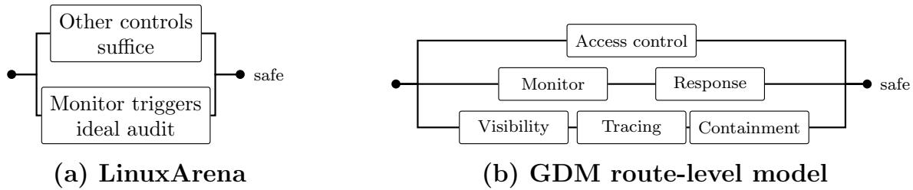
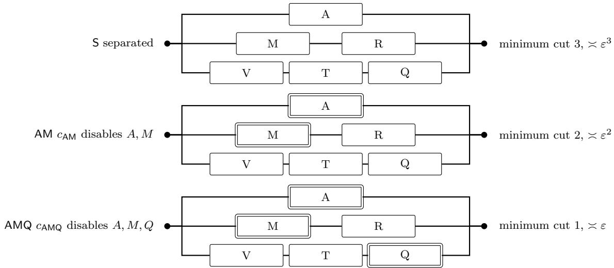

# Reliability Theory for AI Control

Grant Molnar

September 22, 2026

## Abstract

Reliability theory gives a mature language for layered systems, but its formal tools are not yet standard in frontier AI control. We apply them to Google DeepMind’s defenses against rogue deployment. The same control stack can have cubic, quadratic, or linear rare-failure suppression depending on its failure domains. Birnbaum importance identifies which component improvements buy the most nominal reliability, while prevention changes the population on which recovery is demanded. These results give concrete guidance about what to separate, improve, measure, and test.

## 1 Introduction

Frontier AI control increasingly relies on defense in depth. Access controls, monitors, responses, and recovery mechanisms are composed so that no single failure is catastrophic. We thus must study AI security at the level of architecture, not of individual safeguards. Classical reliability theory asks how system success depends on which components work, which fail, and how those successes and failures are connected [2, 10]. It is tailor-made to answer this sort of question.

Let us consider a small LinuxArena example. In the public Sonnet / internet / noreasoning run table, three protocols all trigger the monitor on 36/51 attack trajectories (i.e. realized benchmark executions) at the study’s headline post-hoc audit threshold T = 9 [16, 22]. Yet those triggers contribute very diferently to safety.

To see the diference, we set G = 1 when the side task is already prevented without a monitor-triggered audit, and M = 1 when the monitor sends the trajectory to audit. For the sake of illustration, we assume every trajectory sent to audit is stopped. A trajectory is therefore safe if either the rest of the protocol succeeds or the monitor triggers audit. We have

$$
\phi ( G , M ) : = G \lor M ,
$$

where as usual ∨ denotes the Boolean $^ { 6 } \mathrm { o r } ^ { 9 }$

We call the monitor M pivotal on a trajectory if, holding the other outcome fixed, changing M from 0 to 1 changes the system outcome from unsafe to safe. In this two-way model, that happens exactly when G = 0. A pivotal opportunity is realized as a monitor contribution when M = 1.

<table><tr><td>Protocol</td><td>Monitor triggers</td><td>Cases needing monitor</td><td>Catches when needed</td><td>Successes due to monitor</td></tr><tr><td>Per Action</td><td>36/51</td><td>2/51</td><td>0/2</td><td>0/51</td></tr><tr><td>Per Environment</td><td>36/51</td><td>8/51</td><td>7/8</td><td>7/51</td></tr><tr><td>Request Website</td><td>36/51</td><td>3/51</td><td>2/3</td><td>2/51</td></tr></table>

The monitor fires 36 times in each row. In Per Action, however, only two trajectories make it pivotal and it catches neither; in Per Environment, eight trajectories make it pivotal and it catches seven. Thus the “cases needing monitor” column is the benchmark analogue of pivotality, while a realized success due to the monitor additionally requires M = 1. The gross trigger rate $P ( M = 1 )$ alone cannot tell us what the monitor contributes to the system.

The LinuxArena model has only two ways to remain safe, and can be analyzed at a glance. This may be insuficient when the stakes for failure are high; indeed, if a malicious AI establishes a rogue deployment beyond efective monitoring and shutdown the consequences could be catastrophic. We define a deployment route to be a specified sequence of attacker actions and system transitions that, if not stopped, carries an AI from its authorized execution context to such a rogue deployment. Researchers have proposed increasingly sophisticated AI control protocols to thwart such deployment routes [3, 25]. These control protocols deserve commensurately sophisticated analysis. Here, we believe reliability theory can earn its keep.

AI assurance is already reaching toward classical dependability and risk engineering. Bloomfield and Rushby explicitly argue for this perspective, including defense in depth and the danger of treating redundant safeguards as independent without evidence [5]. Wisakanto et al. adapt probabilistic risk assessment to advanced AI, while Tyshenko and Leiss use Bowtie analysis with fault-tree and event-tree quantification [26, 28]. HIP-HOPS-LLM goes further for agentic workflows: it synthesizes fault trees and minimal cut sets, identifies common-cause groups, and computes Birnbaum and Fussell–Vesely importance. In its worked parallel-agent example, a shared model snapshot becomes an order-one commoncause cut [1].

At the same time, current AI-control and agent work repeatedly encounters composition and dependence questions with old reliability analogues. Koran et al. study correlated failures in monitor ensembles, while Lucassen and Kaufman show that the value of resampling depends strongly on cross-resample correlation [14, 17]. Related control work studies multistage resampling, protocol composition, and attacker selection [8, 15, 23]. OpenAI reports chain-of-thought monitor recall conditional on successful honeypot attacks, a direct precedent for conditioning a monitoring metric on the relevant success subset [20]. A particularly direct historical recurrence appears in coding agents. Ron et al. revisit the N-version-programming proposal of Chen and Avizienis and again find substantial common-mode failure, echoing Knight and Leveson’s 1986 experiment showing that independently developed versions can fail together [6, 13, 24]. In cybersecurity, Mell et al. use repeated vulnerability classes and minimum-color cuts to analyze defense in depth [18].

In spite of all this, paths, cuts, component importance, and explicit common-cause/basicevent models are still not routine at the architecture level in frontier AI control.

  
Figure 1: Reliability-block diagrams. Panel (a) gives the safety condition for a realized LinuxArena trajectory. Panel (b) gives the safeguards against one fixed dangerous deployment route; its source-to-sink paths are alternative suficient safeguard combinations, not deployment routes. Connections are undirected.

In this paper, we analyze a control roadmap proposed by Google DeepMind (“GDM”) [21]. We ask which safeguard combinations sufice to stop it, which safeguards are most valuable to improve at the margin, which underlying failures can disable several safeguards at once, and what reaches recovery after prevention fails. The mathematics below is deliberately standard. Our aim is not to develop new reliability theory, but to show what happens when mature reliability tools are applied directly to a contemporary AI-control architecture.

## 2 Reliability model

Throughout the remainder of this paper, probabilities are relative to a fixed control architecture, attack policy, and operating distribution; the policy may still adapt within an episode.

We formalize GDM’s safeguards as a coherent system, i.e. a binary-component system in which making an additional component ready cannot turn success into failure. A component’s readiness state is 1 when its function is available if demanded and 0 otherwise. Of course, this dichotomy is an abstraction; the underlying mechanisms may have more than two physical states. The structure function $\phi$ maps the vector of readiness states to 1 for system success and 0 for system failure [2, 10].

A path is a set of working components suficient for system success, and a minimal path is a path for which no proper subset still sufices. Dually, a cut is a set of failed components suficient for system failure, and a minimal cut is one for which no proper subset sufices. Minimal paths are the smallest ways for the system to remain secure; minimal cuts are the smallest ways for it to become insecure. For independent basic failures of comparable small probability ε, the smallest cuts determine the leading power of the system-failure probability. A size-k cut requires k rare failures and therefore contributes to risk at order $\varepsilon ^ { k } \ [ 2 , 1 0 , 2 7 ]$

Recovery is only meaningful after prevention has failed, so we separate establishment from containment. We write $T _ { E } \in [ 0 , \infty ]$ for the time a materially dangerous rogue deployment is first established and $T _ { C } \in [ 0 , \infty ]$ for the time it and its materially relevant descendants are contained. For a containment horizon $\tau > 0$ , we define

$$
E : = \{ T _ { E } < \infty \} , \qquad H _ { \tau } : = \{ T _ { E } < \infty , \ T _ { C } \leq T _ { E } + \tau \} .
$$

We are interested in the top event $L _ { \tau } : = E \setminus H _ { \tau }$ , which is the interval of system failure

within the containment horizon. Whenever $P ( E ) > 0$ , we have

$$
P ( L _ { \tau } ) = P ( E ) \big [ 1 - P ( H _ { \tau } \mid E ) \big ] .\tag{1}
$$

A loss therefore requires establishment followed by failure to contain within τ . The conditional term $P ( H _ { \tau } \mid E )$ is the recovery quantity, and it quantifies how often containment succeeds among deployments that were actually established.

Fix a deployment route in the GDM roadmap. We represent six runtime functions that carry its prevention, interception, and recovery structure [21]. This is the route-level architecture shown in Figure 1. Each node corresponds to a concrete roadmap function, and it omits controls that do not bear directly on this route.

<table><tr><td>Roadmap function</td><td>Reliability representation</td></tr><tr><td>real-time access control</td><td>A (blocks the deployment route)</td></tr><tr><td>synchronous monitoring</td><td>M (detects the route)</td></tr><tr><td>synchronous response</td><td>R (arrests a detected route)</td></tr><tr><td>inventory / visibility / targetability</td><td>V (makes an established deployment targetable)</td></tr><tr><td>descendant tracing</td><td>T (identifies materially relevant descendants)</td></tr><tr><td>shutdown / credential or server containment Q (executes containment within τ) isolation / sandboxing / chokepoints</td><td>modifies feasible routes and downstream</td></tr><tr><td>supply-chain and control-infrastructure integrity</td><td>demand distributions enters the basic-event and dependence</td></tr></table>

In this route-level model, the route is safe if access control blocks it, if monitoring detects it and response arrests it, or if an established deployment is made targetable, its descendants are traced, and containment is executed within τ. Thus

$$
\phi : = A \lor ( M \land R ) \lor ( V \land T \land Q ) ,\tag{2}
$$

where ∧ is Boolean “and” and again ∨ is Boolean $^ { 6 } \mathrm { o r } ^ { 9 }$

Isolation changes which routes are feasible and can force attacks across more detectable boundaries, but it is invisible in this model because we have fixed a deployment route. Supply-chain integrity manifests as correlated risk across roadmap functions, since supplychain failure can disable several nominal safeguards at once [21]. The variables in (2) record readiness if demanded; equation (1) concerns what happens after a deployment is actually established.

Equation (2) has three minimal success paths

$$
\{ A \} , \qquad \{ M , R \} , \qquad \{ V , T , Q \} .\tag{3}
$$

To make the system fail, every one of these paths must be broken. Access control must fail; at least one of monitoring and response must fail; and at least one of visibility, tracing, and containment must fail. The six minimal visible-component cuts are therefore

$$
\{ A , M , V \} , \ \{ A , M , T \} , \ \{ A , M , Q \} , \ \{ A , R , V \} , \ \{ A , R , T \} , \ \{ A , R , Q \} .\tag{4}
$$

## 3 Nominal protection and importance

We first ask what the visible safeguard topology itself implies. For the moment, we assume that the six readiness states are independent, and write $a , m , r , v , t , q$ for their probabilities. System failure requires all three paths in (3) to fail. Their failure probabilities are $1 - a .$ $1 - m r$ , and $1 - v t q$ , respectively, and the paths use disjoint component sets. Hence the static system-failure probability is

$$
F : = ( 1 - a ) ( 1 - m r ) ( 1 - v t q ) .\tag{5}
$$

If each primitive component has failure probability $\varepsilon$ , then

$$
F = 6 \varepsilon ^ { 3 } - 9 \varepsilon ^ { 4 } + 5 \varepsilon ^ { 5 } - \varepsilon ^ { 6 } \sim 6 \varepsilon ^ { 3 } .\tag{6}
$$

Thus the nominal failure probability is third-order in ε. This is exactly what the cut sets in (4) predict. Each minimal cut contains three visible failures, and there are six such cuts.

We write $h : = 1 - F$ for system reliability. The Birnbaum importance of component i is the probability, under the current distribution of the other component states, that i is pivotal: forcing i to work makes the system succeed, while forcing it to fail makes the system fail [4]. If $p _ { i } = P ( X _ { i } = 1 )$ and $X _ { - i }$ denotes all other readiness states, then for independent components [2]

$$
B _ { i } : = P ( \phi ( 1 _ { i } , X _ { - i } ) - \phi ( 0 _ { i } , X _ { - i } ) = 1 ) = \frac { \partial h } { \partial p _ { i } } .\tag{7}
$$

Here $1 _ { i }$ and $0 _ { i }$ mean that component i is forced to work or fail, respectively. Since a coherent system has $\phi ( 1 _ { i } , X _ { - i } ) - \phi ( 0 _ { i } , X _ { - i } ) \in \{ 0 , 1 \}$ , the expectation of this diference is exactly the probability that i is pivotal. The same quantity can also be read as the change in system success probability when component i is working rather than failed,

$$
B _ { i } = P ( \phi ( X ) = 1 \mid X _ { i } = 1 ) - P ( \phi ( X ) = 1 \mid X _ { i } = 0 ) ,
$$

or as the component–system covariance normalized by the variance of the component state,

$$
B _ { i } = { \frac { \operatorname { C o v } ( \phi ( X ) , X _ { i } ) } { p _ { i } ( 1 - p _ { i } ) } } .
$$

For the GDM model, all six importances are

$$
\begin{array} { r l } & { B _ { A } = ( 1 - m r ) ( 1 - v t q ) , } \\ & { B _ { M } = ( 1 - a ) r ( 1 - v t q ) , \quad B _ { R } = ( 1 - a ) m ( 1 - v t q ) , } \\ & { B _ { V } = ( 1 - a ) ( 1 - m r ) t q , \quad B _ { T } = ( 1 - a ) ( 1 - m r ) v q , \quad B _ { Q } = ( 1 - a ) ( 1 - m r ) v t . } \end{array}\tag{8}
$$

Our block diagram tells us which combinations of safeguards can protect the system. Let $p _ { i }$ denote the readiness probability of safeguard i, and let $B _ { i }$ be its Birnbaum importance. Thus $B _ { i }$ tells us how often safeguard i is pivotal. Because the reliability polynomial is linear in $p _ { i }$ when the other readiness probabilities are fixed, changing $p _ { i }$ by $\Delta p _ { i }$ changes system reliability by

$$
\Delta h = B _ { i } \Delta p _ { i } .
$$

Within this independent-component model, Birnbaum importance is therefore the systemlevel return per unit improvement in a component’s readiness. For equal readiness gains at equal cost, the larger $B _ { i }$ gives the larger increase in nominal reliability. With unequal attainable gains, we compare $B _ { i } \Delta p _ { i } ;$ with unequal costs as well, we compare that gain per unit cost.

The recovery path furnishes a concrete example. Its three importances share the factor $( 1 - a ) ( 1 - m r )$ , but

$$
B _ { V } : B _ { T } : B _ { Q } = t q : v q : v t .
$$

If visibility is the least reliable of $V , T , Q$ , then $B _ { V }$ is the largest of the three: improving visibility buys more nominal system reliability per unit readiness improvement than an equal improvement in tracing or containment. The same logic applies to monitoring and response: $B _ { M } / B _ { R } = r / m$ , so the value of improving either one depends on whether its partner is usually ready.

Under the symmetric rare-failure model used in (6), these formulas give

$$
{ \cal B } _ { A } \sim 6 \varepsilon ^ { 2 } , ~ { \cal B } _ { M } = { \cal B } _ { R } \sim 3 \varepsilon ^ { 2 } , ~ \mathrm { a n d } ~ { \cal B } _ { V } = { \cal B } _ { T } = { \cal B } _ { Q } \sim 2 \varepsilon ^ { 2 } .
$$

With identical component reliabilities, the architecture thus makes a unit improvement in access control about two or three times as valuable as other alternatives. With unequal readiness probabilities, (8) gives the corresponding quantitative ranking directly.

## 4 Failure domains

The independence model above treats $A , \ldots , Q$ themselves as the units that fail. Each visible safeguard has its own readiness probability, independently of the others. Real failure mechanisms are not always so polite. A single underlying failure may disable several visible safeguards at once. We are moved to distinguish the functions shown in a block diagram from the events that make those functions unavailable. A basic event is an underlying failure event or condition treated as elementary in the analysis. When one basic event disables more than one visible safeguard, we call it a common-cause event. The safeguards exposed to that event form its failure domain [19, 27].

This distinction leads us to generalize what a cut is. The cuts in (4) specify sets of visible safeguards whose simultaneous unavailability causes system failure. Once the underlying basic events are specified, we instead ask which sets of basic events can produce one of those visible cuts. We call the size of the smallest such set the minimum basic-event cut size. The GDM roadmap itself identifies monitoring code, permissions, sandboxing, and shutdown infrastructure as load-bearing assets requiring strong integrity protection [21]. Related security work likewise emphasizes independent vulnerability classes rather than merely counting nominal defensive layers [18].

We write $f _ { A } , \ldots , f _ { Q }$ for component-specific basic failure events, with $f _ { i }$ disabling only its corresponding visible function. To see the efect of shared failures, we hold (2) fixed and vary only the map from basic events to visible functions. In each of the following three examples, every listed basic event is independent and has probability ε.

  
Figure 2: The same GDM reliability-block diagram under three basic-event maps. All three rows use exactly the coordinate rule of Figure 1(b); only the failure-domain marking changes. A double outline marks a function exposed to the row’s shared basic event, while every function also retains its component-specific failure event $f _ { i }$

In S, three basic failures are needed for a catastrophic cut. In AM, the common-cause event ${ \mathit { c } } _ { \mathsf { A M } }$ disables both access control and monitoring, so one additional recovery failure sufices; the new minimum cuts are $\{ c _ { \mathsf { A M } } , f _ { j } \}$ for $j \in \{ V , T , Q \}$ . In AMQ, the common-cause event ${ \mathcal { C } } _ { \mathsf { A M Q } }$ disables one member of every success path and is catastrophic by itself, giving the cut $\{ c _ { \mathsf { A M Q } } \}$ . The visible architecture is unchanged, but its rare-failure order falls from three to two to one.

Regimes AM and AMQ delimit the componentwise ranking in (8). In AM, reducing cAM improves the joint state of A and $M ;$ neither $B _ { A } \Delta a$ nor $B _ { M } \Delta m$ describes that intervention, because both marginals and their dependence change. In AMQ, the natural target may instead be ${ \mathcal { C } } _ { \mathsf { A M Q } }$ itself, which has no single visible-component importance. Once the basicevent model is explicit, importance can be recomputed on the refined representation. The cut analysis asks first whether the nominal order-three protection survives at all.

The common-cause events ${ \mathit { c } } _ { \mathsf { A M } }$ and ${ \mathcal { C } } _ { \mathsf { A M Q } }$ are illustrations, not claims about GDM’s eventual implementation. Architecture analysis and empirical measurement can work in opposite directions. Starting from the implementation, we can identify plausible shared models, identity systems, credentials, code, operators, networks, control planes, and supply-chain roots, map each resulting basic event to the safeguards it can disable, and recompute the induced cuts. This predicts which visible failures should occur together and which underlying failures can matter at system level. Minimum cut cardinality summarizes the comparable rare-event case; with unequal or dependent events, the probabilities of the cuts themselves matter.

Observed failures let us test that model from the other direction. Even before a shared mechanism has been identified, joint failure measurements can reveal dependence that the visible-component model misses. If response failure is independent of the $( A , M )$ pair, the probability that both preventive routes fail is

$$
P ( A ^ { c } \cap ( M ^ { c } \cup R ^ { c } ) ) = P ( A ^ { c } ) P ( R ^ { c } ) + P ( R ) P ( A ^ { c } \cap M ^ { c } ) .\tag{9}
$$

If access control and monitoring were also independent, the joint probability in the second term would be $P ( A ^ { c } ) P ( M ^ { c } )$ . The diference between the true prevention-failure probability and this independence approximation is therefore

$$
P ( R ) \big [ P ( A ^ { c } \cap M ^ { c } ) - P ( A ^ { c } ) P ( M ^ { c } ) \big ] .
$$

Thus implementation analysis predicts dependence, while observed dependence can expose omissions in the implementation model. Joint measurements do not by themselves identify the missing basic event, but they tell us when the independent-component abstraction is wrong and how much the discrepancy matters to system reliability.

## 5 Selection efects on recovery

Cuts tell us how prevention can fail, but they also determine the population on which downstream recovery is demanded. When a dangerous deployment reaches $E ,$ , it places a demand on recovery; recovery succeeds when $H _ { \tau }$ occurs. Thus $P ( E )$ measures how often recovery is demanded, while

$$
P ( H _ { \tau } \mid E )
$$

measures recovery reliability when demanded.

This conditioning can substantially change the recovery population. Let C denote a hard or shared failure regime identified by the architecture analysis, and write $c : = P ( C ) \in ( 0 , 1 )$ Define

$$
\gamma _ { 1 } : = P ( E \mid C ) , \qquad \gamma _ { 0 } : = P ( E \mid C ^ { c } ) .\tag{10}
$$

Bayes’ rule gives

$$
\frac { P ( C \mid E ) } { P ( C ^ { c } \mid E ) } = \frac { c } { 1 - c } \frac { \gamma _ { 1 } } { \gamma _ { 0 } } .\tag{11}
$$

If prevention increasingly suppresses ordinary establishments so that $\gamma _ { 0 } / \gamma _ { 1 }  0$ while c remains positive, then

$$
P ( C \mid E ) \to 1 .\tag{12}
$$

Prevention can therefore make recovery demands rarer while simultaneously concentrating them in the hard regime C. A recovery test should reflect the distribution conditional on establishment, not some other mixture of easy and hard cases.

We write

$$
\eta _ { 1 } : = P ( H _ { \tau } \mid E , C ) , \qquad \eta _ { 0 } : = P ( H _ { \tau } \mid E , C ^ { c } ) .
$$

The recovery reliability is the probability that containment succeeds within $\tau ,$ conditional on a dangerous deployment having been established. It is

$$
r _ { \mathrm { r e c } } : = P ( H _ { \tau } \mid E ) = \frac { c \gamma _ { 1 } \eta _ { 1 } + ( 1 - c ) \gamma _ { 0 } \eta _ { 0 } } { c \gamma _ { 1 } + ( 1 - c ) \gamma _ { 0 } } .\tag{13}
$$

As ordinary bypasses are removed, $r _ { \mathrm { r e c } }$ approaches the containment reliability of the regimes that remain. If regime $C$ also makes containment harder, a shutdown test run on an unselected mixture will overstate the reliability relevant after establishment.

We write $w : = P ( C \mid E )$ . If a test suite samples regime C with frequency u and faithfully reproduces the deployment containment probabilities $\eta _ { 1 } , \eta _ { 0 }$ within each regime, then

$$
r _ { \mathrm { t e s t } } - r _ { \mathrm { r e c } } = ( u - w ) ( \eta _ { 1 } - \eta _ { 0 } ) .\tag{14}
$$

If $\eta _ { 1 } < \eta _ { 0 }$ , equation (14) shows directly that undersampling the selected hard regime overstates the recovery reliability in (1). A second problem is that a test which cleans up a downstream-relevant compromised state before exercising recovery may not reproduce $\eta _ { 1 }$ at all.

Consider a rogue deployment that succeeds because a shared dependency produces both a permissive access decision and a monitoring blind spot, then launches descendants. A shutdown exercise that first restores the dependency, reissues credentials, or rebuilds the control plane may erase the condition that made establishment dangerous. The recovery phase should preserve that state when safe, or reproduce it in an isolated copy, before testing whether $V , T , Q$ contain the deployment within τ. A clean-state replay may be useful, but it answers a counterfactual rather than the recovery reliability in (13).

## 6 Recommendations

The public roadmap does not provide calibrated probabilities for a concrete implementation of this control stack, so a numerical top-event estimate would not be meaningful. The preceding analysis instead suggests an assurance sequence that begins by identifying the basic failure coordinates, uses that model to value marginal improvements, and then measures and exercises recovery under the failure states that prevention leaves behind.

## 6.1 Failure domains first

We recommend that DeepMind make the minimum basic-event cut size an explicit architecture invariant for this control stack. The visible architecture in (2) has size-three cuts only when the underlying failure domains are suficiently separated. Where reasonably avoidable, no single plausible basic event should disable one function on every defensive success path.

For prevention, this means checking whether access control and monitoring share a model family, epistemic signal, identity service, code path, operator, or control plane whose failure could defeat both. Any shared dependencies should appear explicitly in the basic-event model and either be separated or carried into the resulting risk claim. For recovery, the visibility– tracing–containment path should retain at least one failure boundary that a successful rogue deployment does not automatically cross. Independently protected credentials, control-plane authority, or shutdown infrastructure are natural places to look for such a boundary.

## 6.2 Prioritize marginal improvements

If the basic-event audit leaves the visible readiness variables as useful reliability coordinates, we recommend estimating $a , m , r , v , t ,$ q and computing the Birnbaum importances in (8). A candidate intervention that changes only component i by $\Delta p _ { i }$ changes nominal reliability by exactly $B _ { i } \Delta p _ { i }$ . With unequal costs or attainable improvements, compare that gain per unit cost rather than $B _ { i }$ alone.

For the recovery chain, redundant shutdown actuators improve Q but do not compensate for failures of V or $T .$ . Before adding actuator redundancy, compare $B _ { V } , B _ { T } , B _ { Q }$ . If containment is already highly reliable while visibility is not, (8) says that an equal readiness improvement in visibility can buy substantially more nominal system reliability than the same improvement in containment.

Birnbaum importance applies to coordinatewise changes in that model. A shared mechanism such as c or ${ \mathcal { C } } _ { \mathsf { A M Q } }$ belongs in the refined basic-event model rather than in one visible-component importance. Isolation, sandboxing, or a new chokepoint can instead change which deployment routes are feasible. That changes the route-level architecture, so we should rebuild the reliability model and compare the resulting systems rather than assign the intervention an existing $B _ { i }$

## 6.3 Track system-level assurance quantities

GDM’s roadmap already proposes tracking local assurance indicators such as asynchronous monitoring coverage and recall, synchronous response coverage and recall, time-to-response, and, for rogue-deployment exercises, time-to-shutdown [21]. We endorse these. They describe how individual controls or stages perform. We also endorse a system-level layer of quantities that tells us how those local measurements compose.

For a fixed deployment route and operating distribution, we recommend treating the following as first-class assurance quantities:

(i) Cut and overlap probabilities. Estimate the joint failure probabilities associated with minimal cuts and with plausible basic-event cuts. In the preventive subsystem, $P ( A ^ { c } \cap$ $M ^ { c } )$ is the simplest example. These quantities tell us whether nominally parallel defenses provide real redundancy and control the conversion from component performance to establishment risk.

(ii) Establishment probability. Estimate or bound $P ( E )$ . This is how often prevention as a whole fails and recovery is demanded. It is the first factor in (1).

(iii) Selection into recovery. For each salient shared or hard regime C, estimate $P ( C \mid E )$ This tells us which failure mechanisms dominate the cases recovery actually sees and therefore how recovery exercises should be weighted.

(iv) Conditional recovery reliability. Estimate $P ( H _ { \tau } \mid E , C )$ and $P ( H _ { \tau } \mid E , C ^ { c } )$ , together with their mixture

$$
r _ { \mathrm { r e c } } = P ( H _ { \tau } \mid E ) .\tag{15}
$$

If recovery time matters, estimate the corresponding conditional time-to-containment distribution rather than only an unconditional or clean-state time-to-shutdown statistic. These quantities control the second factor in (1).

Coverage, recall, and response time remain useful diagnostics for individual controls. The joint and conditional quantities above connect those diagnostics to architecture-level risk. If they can be calibrated well enough, they compose into the end-to-end top-event probability

$$
\begin{array} { r } { P ( L _ { \tau } ) = P ( E ) ( 1 - r _ { \mathrm { r e c } } ) . } \end{array}
$$

Even failing this, the intermediate quantities are actionable. Indeed, cut probabilities diagnose shared failure, $P ( E )$ measures preventive performance, $P ( C \mid E )$ sets the recovery test mixture, and the conditional containment probabilities measure whether recovery works on the failures that actually reach it.

## 6.4 Exercise the failure mechanisms

We recommend that DeepMind organize rogue-deployment exercises around minimal cuts and identified failure domains, and make the recovery phase mechanism-preserving. By this we mean preserving, or faithfully reproducing in isolation, any upstream compromised state that can afect downstream recovery.

DeepMind already proposes simulated rogue-deployment exercises in which a red team attempts to stand up an unmonitored agent with legitimate-like internal access and keep it alive despite detection and shutdown [21]. The cuts in (4), augmented by implementationlevel basic events, tell us which combinations of failures those exercises should instantiate. An aggregate rogue-deployment success rate is not enough by itself. We should record the establishment mechanism, implicated cut or failure domain, containment conditional on establishment, and time to containment.

If the upstream mechanism can afect recovery, we should not automatically restore monitoring, permissions, credentials, sandbox state, or control infrastructure before testing recovery. Preserving or reproducing that state makes the exercise estimate the recovery reliability in (13), rather than generic recovery in a cleaned environment.

## 7 Further directions

The model above deliberately freezes one dangerous deployment route. This is useful for exposing static structure, but neglects time, resource constraints, adaptation, and learning. These omissions suggest a natural research program.

One extension stays within coherent systems. Repeated side tasks, monitor ensembles, approval thresholds, and protocol combinations can be represented by series, parallel, k-outof-n, and composed structures. Classical work on redundancy and structure optimization asks how much protection an added component buys and where redundancy should be placed [2, 10]. For AI control, we may ask how many genuinely independent monitoring opportunities are needed, when voting or threshold rules outperform simple duplication, and how to allocate a fixed assurance budget across safeguards once their dependence structure is estimated.

Dependence deserves richer treatment than the small set of common-cause events used here. Classical common-cause analysis was developed precisely because apparent redundancy can disappear under shared failure mechanisms [19]. Candidate AI-control failure domains include shared base models, training data, monitor prompts, deployment infrastructure, access-control services, and organizational processes. One reasonable next step is to estimate how much efective redundancy heterogeneous monitors or control planes retain after those dependencies are modeled.

Many important control questions are dynamic. Detection can trigger credential revocation, sandbox reconfiguration, escalation, or repair; attackers can retry or change routes; and the relevant configuration can change over the course of an incident. Phased-mission reliability has long studied systems whose required structure and component states change across successive stages [7], with modern work covering repairable systems, common-cause failures, continuous-time Markov chains, Petri nets, multistate components, and redundancy allocation [29]. These tools, together with semi-Markov and other state-space models, are natural frameworks when a static Boolean architecture no longer captures the control process.

The recovery model also leaves response capacity implicit. If containment must succeed within τ , then finite audit and response resources can turn waiting time itself into a failure mechanism. Human auditors, trusted-model review capacity, incident responders, and secure compute can be modeled as finite servers fed by stochastic demand. Queueing theory studies arrival and service processes, waiting time, priority, congestion, and networks of servers [11, 12]. The relevant safety quantity may be a tail probability rather than an average latency— for example, the probability that suspicious work waits long enough for an attack to complete. This connects recovery reliability directly to stafing, compute allocation, scheduling policy, and attack-induced bursts of demand.

Finally, assurance itself changes as systems are tested and modified. Red-team exercises, incidents, model updates, and fixes generate evidence over time, often with censoring and changing failure rates. Reliability engineering already provides methods for repairable systems, reliability-growth modeling, test planning, accelerated testing, and Bayesian updating [9]. These suggest moving from one-shot benchmark scores toward explicit assurance models that update after failures and fixes, while checking that the test still exercises the failure mechanism whose field rate is being inferred.

## References

[1] Koorosh Aslansefat. HIP-HOPS-LLM: Hierarchical Imprecise Reliability Assessment and Failure Propagation for LLM-Based Agentic Systems. Software repository, version 0.1.0, 2026. https://github.com/koo-ec/HIP\_HOPS\_LLM.

[2] Richard E. Barlow and Frank Proschan. Mathematical Theory of Reliability. Wiley, New York, 1965.

[3] Aryan Bhatt, Cody Rushing, Adam Kaufman, Tyler Tracy, Vasil Georgiev, David Matolcsi, Akbir Khan, and Buck Shlegeris. “Ctrl-Z: Controlling AI Agents via Resampling.” arXiv:2504.10374, 2025.

[4] Zygmund W. Birnbaum. On the Importance of Diferent Components in a Multicomponent System. University of Washington Technical Report No. 54, May 20, 1968. https://doi.org/10.21236/AD0670563.

[5] Robin Bloomfield and John Rushby. “Assurance of AI Systems From a Dependability Perspective.” arXiv:2407.13948, 2024.

[6] Liming Chen and Algirdas Avizienis. “N-Version Programming: A Fault-Tolerance Approach to Reliability of Software Operation.” In Digest of Papers, Eighth Annual International Conference on Fault-Tolerant Computing, pp. 3–9, 1978.

[7] James D. Esary and Harald Ziehms. Reliability Analysis of Phased Missions. Technical Report NPS55Ey75021, Naval Postgraduate School, Monterey, California, February 1975. https://archive.org/details/reliabilityanaly00esar.

[8] Catherine Ge-Wang, Tyler Crosse, Benjamin Hadad, Joachim Schaefer, Ram Potham, and Tyler Tracy. “Attack Selection in Agentic AI Control Evaluations Meaningfully Decreases Safety.” arXiv:2606.06529, 2026.

[9] N. Alan Heckert, James J. Filliben, Carroll Croarkin, Barry Hembree, William F. Guthrie, Paul Tobias, and Jennifer Prinz. NIST/SEMATECH e-Handbook of Statistical Methods. NIST Handbook 151, National Institute of Standards and Technology, 2002, updated online. https://doi.org/10.18434/M32189.

[10] A. Kaufmann, Daniel Grouchko, and R. Cruon. Mathematical Models for the Study of the Reliability of Systems. Academic Press, New York, 1977.

[11] Leonard Kleinrock. Queueing Systems, Volume I: Theory. Wiley, New York, 1975.

[12] Leonard Kleinrock. Queueing Systems, Volume II: Computer Applications. Wiley, New York, 1976.

[13] John C. Knight and Nancy G. Leveson. “An Experimental Evaluation of the Assumption of Independence in Multi-Version Programming.” IEEE Transactions on Software Engineering SE-12(1):96–109, 1986. https://doi.org/10.1109/TSE.1986.6312924.

[14] Eugene Koran, Yejun Yun, Samantha Tetef, Benjamin Arnav, and Pablo Bernabeu-P´erez. “Ensemble Monitoring for AI Control: Diverse Signals Outweigh More Compute.” arXiv:2605.15377, 2026.

[15] Jon Kutasov, Chloe Loughridge, Yuqi Sun, Henry Sleight, Buck Shlegeris, Tyler Tracy, and Joe Benton. “Evaluating Control Protocols for Untrusted AI Agents.” arXiv:2511.02997, 2025.

[16] LinuxArena. sandboxing-dynamics released data, pareto sonnet thrcurve.json, 2026. https://github.com/linuxarena/sandboxing-dynamics.

[17] James Lucassen and Adam Kaufman. “Retrying vs Resampling in AI Control.” arXiv:2605.26047, 2026.

[18] Peter M. Mell, James Shook, and Richard Harang. “Measuring and Improving the Efectiveness of Defense-in-Depth Postures.” In Proceedings ofthe 2nd Annual Industrial Control System Security Workshop (ICSS ’16), 2017. https://doi.org/10.1145/30 18981.3018986.

[19] Ali Mosleh. “Common Cause Failures: An Analysis Methodology and Examples.” Reliability Engineering & System Safety 34(3):249–292, 1991. https://doi.org/10.101 6/0951-8320(91)90104-F.

[20] OpenAI. GPT-6 Astra System Card. September 3, 2026; updated September 9, 2026. https://deploymentsafety.openai.com/gpt-6-astra.

[21] Mary Phuong, Erik Jenner, Laurent Simon, Lewis Ho, Rohin Shah, Sebastian Farquhar, and Scott Coull. “GDM AI Control Roadmap.” arXiv:2607.13087, 2026.

[22] Ram Potham. “Studying the Role of Sandboxing for AI Control.” LessWrong, July 17, 2026. https://www.lesswrong.com/posts/6wo4weeujruLXrnsT/studying-the-rol e-of-sandboxing-for-ai-control.

[23] Ram Potham and Tyler Tracy. “Should We Combine Protocols for AI Control Research?” LessWrong, June 26, 2026. https://www.lesswrong.com/posts/BsNF64EL iwJeoCJSD/should-we-combine-protocols-for-ai-control-research.

[24] Javier Ron, Benoit Baudry, and Martin Monperrus. “N-Version Programming with Coding Agents.” arXiv:2606.20158, 2026.

[25] Aaron Sandoval and Cody Rushing. “Factor(T,U): Factored Cognition Strengthens Monitoring of Untrusted AI.” arXiv:2512.02157, 2025.

[26] Michael G. Tyshenko and William Leiss. “Monte Carlo Probabilistic Assessment of Loss of Human Control Over Advanced AI Using Bowtie Analysis.” Preprints.org, version 2, September 11, 2026. https://doi.org/10.20944/preprints202606.0760.v2.

[27] W. E. Vesely, F. F. Goldberg, N. H. Roberts, and D. F. Haasl. Fault Tree Handbook. NUREG-0492. U.S. Nuclear Regulatory Commission, Washington, DC, 1981.

[28] Anna Katariina Wisakanto, Joe Rogero, Avyay M. Casheekar, and Richard Mallah. “Adapting Probabilistic Risk Assessment for AI.” arXiv:2504.18536, 2025.

[29] Di Wu, Rui Peng, and Liudong Xing. “Recent Advances on Reliability of Phased Mission Systems.” In Stochastic Models in Reliability, Network Security and System Safety, pp. 19–43. Springer, Singapore, 2019. https://doi.org/10.1007/978-981-15-0864-6\_2.