# SKYTOPIA: MONOCULAR DRONE NAVIGATION WITH ACTION-CONDITIONED LATENT WORLD MODELS

Yuhang Zhang1\*, Rangya Zhang1\*, Yujing Shang1, Zhuoyuan Yu1, Weiying Wang2, Steven Yang2, Qingsong Yan3, Chao Yan4, and Mir Feroskhan1†

1Nanyang Technological University, Singapore 2Autel US 3XGRIDS 4Independent Researcher

Project page: https://eugshang.github.io/Skytopia/

## ABSTRACT

Monocular drone navigation requires reaching a goal in an unseen environment from a single forward-facing camera, which offers few cues for depth and scale. World models address this by modelling how observations evolve under actions, but they are built to be executed: the prediction is produced at deployment and fed back into action generation at every control step. We argue that what a policy needs from a world model is not the prediction but the representation required to produce it: in flight the executed action explains almost all of the change between observations, so prediction reduces to reprojecting a static scene under a known displacement. We therefore introduce SKYTOPIA, a policy built on an actionconditioned latent world model, and the 3D Gaussian Splatting platform on which it is trained. A forward objective predicts the representation of the next observation from the intended motion, and an inverse objective recovers that motion from the predicted transition. Because the prediction never reaches action generation, the predictor is discarded and one policy serves point-goal, image-goal, and goal-free navigation. Simulation experiments show that SKYTOPIA outperforms every baseline under all three specifications, attaining 57.8%, 66.0%, and 49.0% success rate, while discarding the predictor removes 59.4% of the inference cost. The same policy is subsequently deployed on a physical drone without fine-tuning and reaches goals in indoor, open outdoor, and woodland environments.

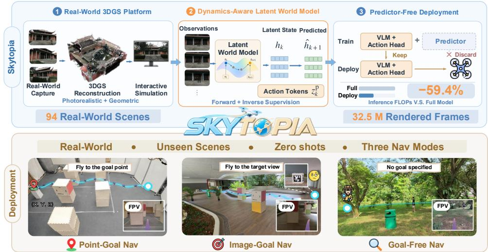  
Figure 1: The SKYTOPIA pipeline. Top: (1) real captures are reconstructed into a 3D Gaussian Splatting platform of 94 scenes with rigid-body physics; (2) an action-conditioned latent world model is trained on that platform under a forward and an inverse objective; (3) the predictor is discarded once training is complete, removing 59.4% of the inference cost. Bottom: the resulting policy is evaluated zero-shot on a physical drone under the three goal specifications.

## 1 INTRODUCTION

Navigation is a foundational capability for embodied agents. It requires an agent to reach a specified objective in an environment while producing smooth and collision-free trajectories from visual observation. Aerial vehicles face the hardest form of this problem. Their workspaces are open and weakly textured, and a single forward-facing camera provides few reliable cues for depth and scale. Perception is therefore the dominant bottleneck. Human pilots nevertheless fly first-person-view drones through cluttered scenes at high speed from exactly such a video stream (Loquercio et al., 2021; Kaufmann et al., 2023). This raises the question of whether the same competence can be conferred upon a policy that observes only what the pilot observes.

The most recent answer comes from world models (Hafner et al., 2025; Ding et al., 2025; Hou et al., 2026), which supervise the action together with how the observation evolves once that action is executed. In flight the executed action accounts for most of the change between consecutive observations, since the viewpoint moves far faster than the scene itself changes. Prediction therefore reduces largely to reprojecting the scene under a known displacement. This reprojection is governed by depth, which is precisely the quantity that a single camera fails to provide. Learning to predict under the action thus amounts to learning the geometry on which monocular flight depends. Ground navigation imposes a weaker form of this requirement. A ground robot moves through structured and richly textured surroundings, where appearance alone carries much of the information that navigation requires. Its camera also stays level, whereas every acceleration of a multirotor tilts the camera and thereby rotates the viewpoint and blurs the image. Finally, a ground robot can remain stationary while a prediction is computed. Existing navigation world models are built for this setting and take two forms. Explicit ones (Bar et al., 2025; Luo & Du, 2025; Chen et al., 2026) generate the frames that the agent would perceive and learn the dynamics in pixel space. Latent ones (Yao et al., 2025; Chahe & Zhou, 2026; Zhang et al., 2026d) predict a compact representation of the future and plan over the imagined rollout at a far lower cost. In this setting the prediction is never forced to depend on the action, and both forms rely on two design choices that flight cannot afford.

(i) The prediction is only weakly conditioned on the action. Consecutive observations are highly correlated. A predictor therefore lowers its loss by extrapolating the past and consults the action only for a small residual. The resulting futures are visually coherent yet insensitive to the executed action (Bar et al., 2025; Luo & Du, 2025; Chen et al., 2026). On the ground this is tolerable, because appearance alone is often sufficient for navigation. In flight the relation between the action and the resulting image motion is the only reliable source of depth. A predictor that ignores the action encodes how the scene looks over time rather than how the action transforms it. The representation then lacks the depth and scale that obstacle avoidance requires. (ii) The predictor is retained at deployment. Both forms produce the prediction online and feed it back into action generation. A full world model hence executes at every control step (Bar et al., 2025; Yao et al., 2025; Chahe & Zhou, 2026). A ground robot can wait for this computation. A drone cannot pause, and the inference latency is converted directly into distance flown without a new command.

In this paper, we propose SKYTOPIA, shown in Fig. 1, a unified framework for monocular drone navigation that consists of a simulation platform and an action-conditioned latent world model policy trained on it. SKYTOPIA comprises three components. (1) A platform that supplies aerial data. Demonstrations from the aerial viewpoint are scarce, and a physical drone cannot provide them at comparable cost. The SKYTOPIA platform reconstructs real scenes as 3D Gaussian Splatting (3DGS) (Kerbl et al., 2023) and couples them with rigid-body physics, which makes photorealistic rendering and physical interaction available in the same environment. From it we collect 32.5 million frames across 94 indoor and outdoor scenes. (2) A world model driven by the intended motion. The backbone is presented with a group of learned queries whose outputs are action tokens that summarise the intended motion. A predictor estimates the representation of the future observation from those tokens, and an inverse decoder recovers the executed motion from the resulting transition. The inverse objective closes the shortcut of extrapolating the past. Because the predicted transition must retain the command, the backbone cannot satisfy both objectives without representing how the scene reprojects under the motion of the agent. (3) A policy deployed without the predictor. The dynamics objectives supervise the shared backbone during training only. Predicted states never enter action generation, so the predictor is removed at deployment. The backbone and a flow-matching action head then serve point-goal, image-goal, and goal-free navigation within a unified model. Fig. 2 contrasts SKYTOPIA with explicit and latent world models on where the prediction is used.

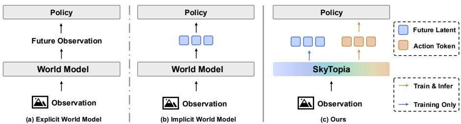  
Figure 2: Where the prediction is used. An explicit world model generates the next observation and a latent one predicts its representation. In both cases the prediction is passed to the policy at every control step. SKYTOPIA produces the prediction during training only. It never enters action generation, and the predictor is discarded at deployment.

Extensive experiments demonstrate that SKYTOPIA achieves substantial improvements in monoc ular drone navigation. In simulation, SKYTOPIA surpasses seven competitive baselines on out-ofdistribution (OOD) scenes under all three navigation modes. It attains 57.8%, 66.0%, and 49.0% success rate under the point-goal, image-goal, and goal-free settings. This exceeds the strongest baseline by at least 15 points, on a 2B backbone and without scene-specific adaptation. Discarding the predictor after training removes 59.4% of the inference cost. We further validate SKYTOPIA through real-world flight on a physical drone in environments unseen during training, where the three modes attain 55%, 56.7%, and 41.7% success rate.

## 2 RELATED WORK

Learning-based navigation. A large body of work replaces mapping and planning with a policy that maps observations directly to actions. Early methods reached goals given as coordinates or as images (Shah et al., 2021; Shah & Levine, 2022), and later work scaled across robots and datasets (Shah et al., 2023a;b). Since several trajectories are often equally valid, recent policies replace the regression head with a diffusion model (Sridhar et al., 2024; Cai et al., 2025; Zeng et al., 2025; Ren et al., 2025). On aerial platforms, learned policies already operate at high speed in cluttered scenes (Loquercio et al., 2021; Kaufmann et al., 2023; Zhang et al., 2025a). These aerial controllers typically rely on depth sensing or on external localization, neither of which a monocular camera provides. Across both ground and aerial settings, the only supervision available to such directmapping policies is the demonstrated action. They fit the behaviour while leaving the dynamics that produce it unmodelled, which makes them fragile under distribution shift.

Vision-language models for navigation. A second line decodes actions directly from a visionlanguage backbone that consumes the observation history as video (Zhang et al., 2024; Xu et al., 2024; Hirose et al., 2025; Zhang et al., 2026b), and this formulation has recently been extended to aerial agents (Zhang et al., 2025b; Wang et al., 2025; Gao et al., 2026). Such models inherit strong semantic priors, and we adopt a vision-language backbone for the same reason. However, instruction following is orthogonal to our setting, in which a goal is a coordinate, an image, or absent. Moreover, these policies ground their representations in appearance rather than in the geometry that flight requires, and their action generation remains a direct mapping from observations to actions.

World models for navigation. World models supervise how observations evolve under actions, and navigation systems built on them fall into two categories. The first predicts future observations explicitly, synthesising with video generation the frames an agent would perceive and passing them to a policy or to an inverse-dynamics module (Bar et al., 2025; Luo & Du, 2025; Chen et al., 2026; Huang et al., 2026; Zhang et al., 2026a). This synthesis is computationally expensive, and the generated frames are often coherent in appearance yet respond only weakly to the commanded action. The second predicts within a compact latent space and plans over the imagined rollout (Chahe & Zhou, 2026; Zhang et al., 2026d; Dong et al., 2026; Liu et al., 2026; Zhang et al., 2026e), which is substantially less costly but still executes the predictor at every control step. Within this second category, the strongest results to date are obtained by models that predict the future and the action jointly in a single network (Yao et al., 2025; Chen et al., 2025; Zhao et al., 2026; Yang et al., 2026; Zhou et al., 2026; Zhang et al., 2026c), which eliminates the separate rollout stage. Such systems nevertheless target ground agents, and their action generation still depends on the predicted future at deployment. Two systems approach our setting more closely: WorldVLN (Zhao et al., 2026)

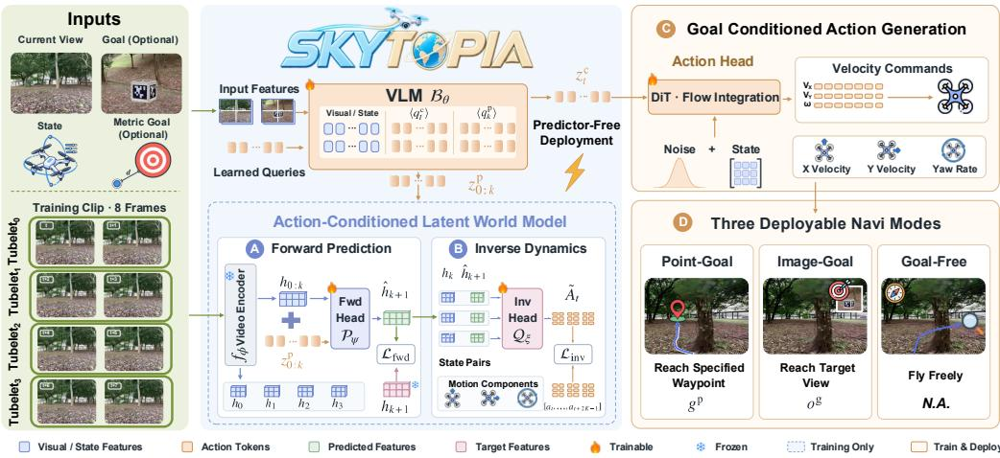  
Figure 3: The SKYTOPIA framework. The backbone produces separate tokens for prediction and control. During training, the forward head (A) predicts future latents and the inverse head (B) recovers the executed motion. At deployment, only the backbone and flow-matching action head (C) remain to support all three navigation modes (D).

addresses aerial agents, and FutureNav (Zhang et al., 2026c) confines the dynamics objectives to training. The former, however, executes a video backbone in closed loop and the latter regresses a pooled descriptor under a small discrete action set. Neither is suited to a drone observing an open, weakly textured scene through a single camera. SKYTOPIA is designed for this setting: it acquires geometry from prediction during training, and the deployed policy retains no predictor.

## 3 METHOD

## 3.1 PROBLEM FORMULATION

We study offline policy learning for visual navigation. The dataset $\mathcal { D } = \{ ( o _ { 0 : T } , s _ { 0 : T } , a _ { 0 : T } , g ) \}$ contains trajectories of monocular observations $\mathbf { \sigma } _ { O _ { t } } ^ { \cup } \in \mathbb { R } ^ { C \times H \times W }$ , proprioceptive states $s _ { t } ~ \in ~ \mathbb { R } ^ { d _ { s } }$ and body-frame velocity commands $a _ { t } ~ \in ~ \mathbb { R } ^ { d _ { a } }$ . A goal specification $g ~ = ~ \left( g ^ { \mathrm { p } } , o ^ { \mathrm { g } } \right)$ is supplied once per episode. The metric goal vector $g ^ { \mathrm { p } }$ and goal image $o ^ { \mathrm { g } }$ are optional. Their availability defines point-goal, image-goal, and goal-free navigation. The policy produces an action chunk $A _ { t } = \left( a _ { t } , \ldots , a _ { t + N - 1 } \right)$ ) over horizon N and learns a latent representation of environment dynamics without reconstructing pixels.

## 3.2 OVERVIEW

Fig. 3 presents the SKYTOPIA architecture. A shared vision–language backbone encodes the current observation, proprioceptive state, and available goal inputs. Two groups of learnable queries produce separate action tokens in a single backbone pass. Action tokens for prediction encode motion over temporal windows and support two training objectives. Forward prediction (A) estimates future latent states conditioned on preceding states and these tokens. Inverse dynamics (B) recovers executed commands from the predicted transitions. A frozen video encoder provides latent supervision from training clips. Action tokens for action generation condition the flow-matching action head (C) to generate body-frame velocity commands. The available goal inputs define point-goal, image-goal, and goal-free navigation (D). Deployment retains only the backbone and action head.

## 3.3 ACTION-CONDITIONED LATENT WORLD MODEL

Latent world state. We supervise dynamics prediction in latent space without pixel reconstruction. A pretrained video encoder $f _ { \phi }$ is frozen to provide fixed targets:

$$
h _ { k } = \mathrm { s g } [ f _ { \phi } ( o _ { T _ { k } } ) ] ,\tag{1}
$$

where $\mathcal { T } _ { k }$ denotes the k-th temporal window of the observation stream, $\mathrm { s g } [ \cdot ]$ is the stop-gradient operator, and $h _ { k }$ is the latent state of that window. Latent states have a lower temporal resolution

than control commands. A clip spanning N commands yields $K + 1$ states $h _ { 0 : K }$ and $K \ : < \ : N$ transitions. The forward and inverse objectives are defined over these transitions.

Action tokens. Each temporal window $k$ is assigned a group of learnable queries $\langle q _ { k } ^ { \mathrm { p } } \rangle$ . The backbone maps these queries to action tokens that encode the intended motion:

$$
z _ { k } ^ { \mathrm { p } } = { \mathcal { B } } _ { \theta } \big ( \langle q _ { k } ^ { \mathrm { p } } \rangle \big | o _ { t } , g , s _ { t } \big ) ,\tag{2}
$$

where $B _ { \theta }$ denotes the backbone. Sec. 3.4 describes how the backbone encodes $g .$ The predictor uses the resulting tokens regardless of the goal modality.

Latent forward dynamics. The forward head predicts the next latent state from preceding states and action tokens:

$$
\begin{array} { r } { \hat { h } _ { k + 1 } = \mathcal { P } _ { \psi } ( h _ { 0 : k } , z _ { 0 : k } ^ { \mathrm { p } } ) , } \end{array}\tag{3}
$$

where $\mathcal { P } _ { \psi }$ denotes the forward head and $\hat { h } _ { k + 1 }$ is its prediction. Attention is unrestricted within each window and causal across windows. The forward head therefore cannot attend to future latent states. The action tokens $z _ { 0 : k } ^ { \mathrm { p } }$ encode the intended motion needed to predict viewpoint changes during flight. Preceding states alone do not specify this motion.

We model the next latent state with a fixed-scale Laplace distribution centred at $\hat { h } _ { k + 1 }$ . Maximizing its likelihood is equivalent to minimizing the $\ell _ { 1 }$ prediction loss:

$$
\mathcal { L } _ { \mathrm { f w d } } = \sum _ { k = 0 } ^ { K - 1 } \left\| \hat { h } _ { k + 1 } - h _ { k + 1 } \right\| _ { 1 } .\tag{4}
$$

Future observations provide target states $h _ { k + 1 }$ for dynamics supervision and are excluded from the policy inputs in Eq. (2). Freezing $f _ { \phi }$ also prevents the target encoder from collapsing to a constant representation that trivially minimizes the prediction loss.

Latent inverse dynamics. Forward prediction alone provides weak supervision for $z _ { 0 : k } ^ { \mathrm { p } }$ . Temporal correlations between latent states can reduce the prediction loss without requiring action information. We therefore train an inverse head to recover executed commands from predicted transitions:

$$
\begin{array} { r l } & { \tilde { A } _ { t } = \Big [ \mathcal { Q } _ { \xi } \Big ( h _ { k } , \hat { h } _ { k + 1 } \Big ) \Big ] _ { k = 0 } ^ { K - 1 } , } \\ & { \mathcal { L } _ { \mathrm { i n v } } = \displaystyle \frac { 1 } { 2 K d _ { a } } \big \| \tilde { A } _ { t } - [ a _ { t } , \dots , a _ { t + 2 K - 1 } ] \big \| _ { 1 } , } \end{array}\tag{5}
$$

where $\mathcal { Q } _ { \xi }$ operates on spatially pooled state pairs with shared weights. Brackets denote concatenation. With tubelet size 2 and $K = 3$ , the inverse head recovers the first six commands of the $N = 7$ chunk. Only the policy objective supervises the final command $a _ { t + 6 }$ . We randomly drop $h _ { 0 : K - 1 }$ during training to limit reliance on preceding states and encourage the use of $\hat { h } _ { 1 : K }$ . These predicted states propagate inverse-loss gradients through the forward head to the backbone’s action tokens. The two objectives thus jointly supervise latent transitions and their associated commands. Derivations are provided in Appendix A.2; the dropout analysis is in Appendix A.9.

## 3.4 GOAL-CONDITIONED ACTION GENERATION

Constructing the three navigation modes. A metric goal is appended to the proprioceptive state, whereas a goal image is presented to the backbone as an additional view. Formally,

$$
\begin{array} { r } { z _ { t } ^ { \mathrm { c } } = { \cal B } _ { \theta } ( \langle q _ { t } ^ { \mathrm { c } } \rangle \ : | \mathcal { V } _ { t } , \ : \tilde { s } _ { t } ) , \qquad \mathcal { V } _ { t } = \{ o _ { t } \} \cup \{ o ^ { \mathrm { g } } \colon m ^ { \mathrm { g } } = 1 \} , \qquad \tilde { s } _ { t } = \big [ s _ { t } , \ : m ^ { \mathrm { p } } g ^ { \mathrm { p } } \big ] , } \end{array}\tag{6}
$$

where $\left. q _ { t } ^ { \mathrm { c } } \right.$ denotes the learnable queries and $ { \boldsymbol { z } } _ { t } ^ { \mathrm { c } }$ denotes the resulting action tokens. $\nu _ { t }$ contains the input views. The augmented state $\tilde { s } _ { t }$ combines $s _ { t }$ with the masked metric goal. Binary indicators $m ^ { \mathrm { p } }$ and $m ^ { \mathrm { g } }$ control the availability of each goal input. Both groups of action tokens are computed in a single backbone pass. A metric goal defines point-goal navigation; a goal image defines image-goal navigation. The goal-free mode omits both inputs.

The goal image retains its spatial features rather than being pooled into a single descriptor. This preserves the spatial information needed to match regions between the current and goal views. Appendix A.8 evaluates this choice. During training, we sample $( m ^ { \mathrm { p } } , m ^ { \mathrm { g } } )$ jointly from a categorical distribution over all four input combinations. This exposes the policy to different goal specifications and discourages reliance on a single goal modality.

Conditional flow-matching action head. Obstacle avoidance can admit multiple valid trajectories. Direct regression can average these alternatives into an unsuitable trajectory. We use conditional flow matching to model a distribution over continuous action chunks and evaluate this choice in Appendix A.8. Let $A _ { t }$ denote the ground-truth chunk of N commands. Let $\hat { A } _ { t }$ denote the chunk generated by the learned flow. Following Intelligence et al. (2025), we define the interpolation

$$
A _ { t } ^ { \tau } = ( 1 - \tau ) \epsilon + \tau A _ { t } , \qquad \tau = \frac { s - u } { s } , \qquad u \sim \mathrm { B e t a } ( \alpha , \beta ) ,\tag{7}
$$

where $\epsilon \sim \mathcal { N } ( 0 , I )$ is Gaussian noise and $\tau$ interpolates between noise at $\tau = 0$ and the demonstrated chunk at $\tau = 1$ . Beta sampling places greater weight on interpolation times near the noise endpoint to emphasize the early stages of integration. The action head parameterizes a vector field $v _ { \omega } ( \bar { A } _ { t } ^ { \tau } , \tau \mid z _ { t } ^ { \mathrm { c } } , \bar { s } _ { t } )$ conditioned on the action tokens and proprioceptive state. It is trained to match the velocity of the linear interpolation:

$$
\mathcal { L } _ { \mathrm { a c t } } = \mathbb { E } _ { A _ { t } , \epsilon , \tau } \Big [ \big \| v _ { \omega } ( A _ { t } ^ { \tau } , \tau \mid \boldsymbol { z } _ { t } ^ { \mathrm { c } } , \boldsymbol { s } _ { t } ) - \big ( A _ { t } - \epsilon \big ) \big \| _ { 2 } ^ { 2 } \Big ] ,\tag{8}
$$

where $v _ { \omega } ( \cdot )$ denotes the predicted velocity field, $( A _ { t } \mathrm { ~ - ~ } \epsilon )$ is the target velocity induced by the linear interpolation, and $\lVert \cdot \rVert _ { 2 }$ represents the $\ell _ { 2 }$ norm. At inference time, the learned vector field is integrated from noise to data space to obtain $\hat { A } _ { t }$ , after which the resulting commands are executed before the next backbone query. Hyperparameters are reported in Appendix A.4.

## 3.5 TRAINING OBJECTIVE AND DEPLOYMENT

In summary, the overall training objective is as follows:

$$
\begin{array} { r } { \mathcal { L } = \mathcal { L } _ { \mathrm { a c t } } + \lambda _ { \mathrm { f w d } } \mathcal { L } _ { \mathrm { f w d } } + \lambda _ { \mathrm { i n v } } \mathcal { L } _ { \mathrm { i n v } } , } \end{array}\tag{9}
$$

which combines Eqs. (8), (4) and (5), where $\lambda _ { \mathrm { f w d } }$ and $\lambda _ { \mathrm { i n v } }$ are tunable hyperparameters. Unlike world models whose rollout conditions the policy at deployment, SKYTOPIA never feeds $\hat { h } _ { k + 1 }$ or ${ \tilde { A } } _ { t }$ into action generation, and the dynamics objectives are not needed once training is complete. The deployed model is therefore

$$
\hat { A } _ { t } = v _ { \omega } ( \cdot \mid B _ { \theta } ^ { \mathrm { c } } ( \mathcal { V } _ { t } , \tilde { s } _ { t } ) , s _ { t } ) ,\tag{10}
$$

where $B _ { \theta } ^ { \mathrm { c } }$ denotes the pathway of the backbone that produces $ { \boldsymbol { z } } _ { t } ^ { \mathrm { c } } .$ . The encoder $f _ { \phi } ,$ the forward head ${ \mathcal P _ { \psi } } ,$ and the inverse head $\mathcal { Q } _ { \xi }$ are all removed. The dynamics objectives therefore supervise the backbone without additional inference cost. Architecture and training settings are detailed in Appendices A.3 and A.4. Scene construction and data collection are described in Appendix A.1.

## 4 EXPERIMENTS

We evaluate SKYTOPIA on unseen environments under three goal specifications and assess its transfer to real-world flight. Ablations and representation probes examine the contribution of the dynamics objectives. We also compare deployment efficiency against world-model baselines. All comparisons use matched observation and action spaces.

## 4.1 EXPERIMENTAL SETUP

Benchmark. All experiments run on the SKYTOPIA platform, which comprises 94 scenes reconstructed from real captures and simulated with rigid-body physics and scene-level collision, split into 18 indoor spaces, 48 urban outdoor sites, and 28 vegetation scenes. We reserve 5 scenes for OOD evaluation. Evaluation episodes use start–goal pairs sampled from mutually reachable positions in free space. Each configuration is evaluated over 200 episodes per goal specification under each of 3 random seeds. Scene construction and data collection are detailed in Appendix A.1; evaluation procedures are in Appendix A.5.

Baselines. We compare against the three categories in Sec. 2. Policies that map observations directly to actions include behaviour cloning (BC) (Codevilla et al., 2018), the action-chunking transformer ACT (Zhao et al., 2023), NoMaD (Sridhar et al., 2024), and ViNT (Shah et al., 2023b). OmniVLA (Hirose et al., 2025) represents vision–language–action policies with multimodal goal conditioning. The world-model baselines are NWM (Bar et al., 2025), which generates future observations, and NavMorph (Yao et al., 2025), which predicts future latent states. All baselines are adapted to monocular aerial navigation and retrained on the same data.

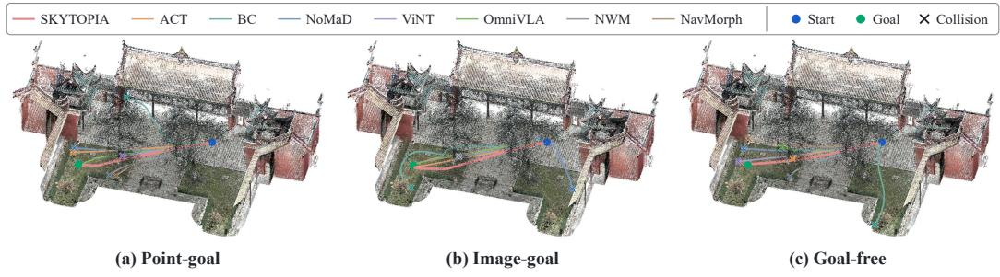  
Figure 4: Trajectory comparison on an OOD scene. Executed trajectories of SKYTOPIA and of every baseline, drawn over the reconstruction and shown once per goal specification. Start and goal are marked, and a cross marks the point where a run ends in collision.

Table 1: Closed-loop navigation on OOD scenes. Results use 200 episodes per goal specification per seed over 3 seeds. Best values are bold.
<table><tr><td rowspan="2">Method</td><td colspan="7">Point-Goal</td><td colspan="7">Image-Goal</td><td colspan="7">Goal-Free</td></tr><tr><td>NE↓</td><td>OS↑</td><td>SR↑</td><td>SPL↑</td><td>CR↓</td><td>OB↓</td><td>TTS↓</td><td>NE↓</td><td>OS↑</td><td>SR↑</td><td>SPL↑</td><td>CR↓</td><td>OB↓</td><td>TTS↓</td><td>NE↓</td><td>OS↑</td><td>SR↑</td><td>SPL↑</td><td>CR↓</td><td>OB↓</td><td>TTS↓</td></tr><tr><td>ACT</td><td>2.99</td><td>24.2</td><td>23.3</td><td>0.17</td><td>73.2</td><td>3.5</td><td>145</td><td>2.68</td><td>35.2</td><td>34.3</td><td>0.25</td><td>62.8</td><td>2.8</td><td>136</td><td>3.17</td><td>17.2</td><td>14.3</td><td>0.09</td><td>82.5</td><td>3.2</td><td>152</td></tr><tr><td>BC</td><td>3.19</td><td>18.0</td><td>16.8</td><td>0.12</td><td>67.0</td><td>16.2</td><td>236</td><td>3.89</td><td>10.5</td><td>9.8</td><td>0.06</td><td>63.5</td><td>26.7</td><td>305</td><td>5.09</td><td>8.5</td><td>7.8</td><td>0.05</td><td>14.3</td><td>77.8</td><td>324</td></tr><tr><td>NoMaD</td><td>2.84</td><td>26.8</td><td>23.2</td><td>0.18</td><td>74.7</td><td>2.2</td><td>229</td><td>2.57</td><td>37.2</td><td>35.7</td><td>0.24</td><td>59.2</td><td>5.2</td><td>214</td><td>3.09</td><td>18.2</td><td>16.2</td><td>0.10</td><td>76.2</td><td>7.7</td><td>235</td></tr><tr><td>ViNT</td><td>3.03</td><td>22.2</td><td>19.8</td><td>0.14</td><td>74.2</td><td>6.0</td><td>235</td><td>2.94</td><td>30.2</td><td>27.3</td><td>0.20</td><td>60.2</td><td>12.5</td><td>224</td><td>3.23</td><td>16.3</td><td>15.2</td><td>0.09</td><td>77.3</td><td>7.5</td><td>246</td></tr><tr><td>OmniVLA</td><td>2.17</td><td>46.3</td><td>42.5</td><td>0.30</td><td>53.3</td><td>4.2</td><td>142</td><td>1.96</td><td>51.3</td><td>46.8</td><td>0.32</td><td>48.3</td><td>4.8</td><td>137</td><td>2.61</td><td>38.8</td><td>32.7</td><td>0.20</td><td>59.3</td><td>8.0</td><td>167</td></tr><tr><td>NWM</td><td>2.38</td><td>41.2</td><td>38.3</td><td>0.27</td><td>59.5</td><td>2.2</td><td>154</td><td>2.15</td><td>44.5</td><td>39.3</td><td>0.29</td><td>52.5</td><td>8.2</td><td>148</td><td>2.83</td><td>29.3</td><td>22.3</td><td>0.14</td><td>66.5</td><td>11.2</td><td>176</td></tr><tr><td>NavMorph</td><td>2.56</td><td>31.5</td><td>27.2</td><td>0.19</td><td>72.8</td><td>0.0</td><td>149</td><td>2.43</td><td>37.3</td><td>33.3</td><td>0.23</td><td>66.7</td><td>0.0</td><td>141</td><td>2.72</td><td>24.7</td><td>20.2</td><td>0.11</td><td>75.2</td><td>4.7</td><td>168</td></tr><tr><td>SKYTOPIA</td><td>1.49</td><td>63.5</td><td>57.8</td><td>0.49</td><td>26.2</td><td>16.0</td><td>134</td><td>1.32</td><td>67.3</td><td>66.0</td><td>0.54</td><td>29.3</td><td>4.7</td><td>128</td><td>1.67</td><td>54.2</td><td>49.0</td><td>0.34</td><td>28.7</td><td>22.3</td><td>139</td></tr></table>

Metrics. Performance is measured with the metrics that are standard in visual navigation (Anderson et al., 2018). These are Navigation Error (NE, m), Success Rate (SR, %), Oracle Success Rate (OS, %), Success weighted by Path Length (SPL), Collision Rate (CR, %), Out-of-Bounds Rate (OB, %), and Time to Success (TTS). An episode is successful when the drone reaches the goal and stops there without collision. Under goal-free navigation a goal is still sampled, but it is never shown to the policy and serves only to compute the metrics. Definitions are given in Appendix A.5.

## 4.2 SIMULATION RESULTS

Trajectory comparison. Fig. 4 compares representative trajectories on an unseen scene. SKY-TOPIA follows smooth paths and reaches the target in all three navigation modes. Baseline trajectories exhibit collisions, unsuccessful goal approach, or detours with abrupt changes in direction.

Main results. Table 1 shows that SKYTOPIA achieves the highest SR, OS, and SPL and the lowest NE and TTS under all three goal specifications. It consistently outperforms OmniVLA, the strongest baseline, in both goal reaching and path efficiency while substantially reducing collisions. The gains extend to goal-free navigation, where the policy receives no target specification. Together, these results indicate improved obstacle avoidance and efficient traversal in addition to more accurate goal approach.

We attribute these gains to learning the relationship between motion and visual change. Forward prediction supervises how the scene evolves under the action tokens. Inverse dynamics requires the predicted transitions to retain information about the executed commands. Their combination encourages representations of scene geometry and camera motion that are useful for obstacle avoidance across goal specifications. This interpretation is supported by the objective ablations in Sec. 4.4 and the geometry probes in Sec. 4.5. Spatial goal features preserve local correspondences for goal alignment. The flow-matching head models alternative manoeuvres without averaging their commands. The corresponding ablations are reported in Appendix A.8.

## 4.3 REAL-WORLD FLIGHT

We deploy the simulation-trained policy without fine-tuning in 3 unseen physical environments: an indoor space, an open outdoor site, and woodland. Each setting uses 20 trials. Point-goal navigation

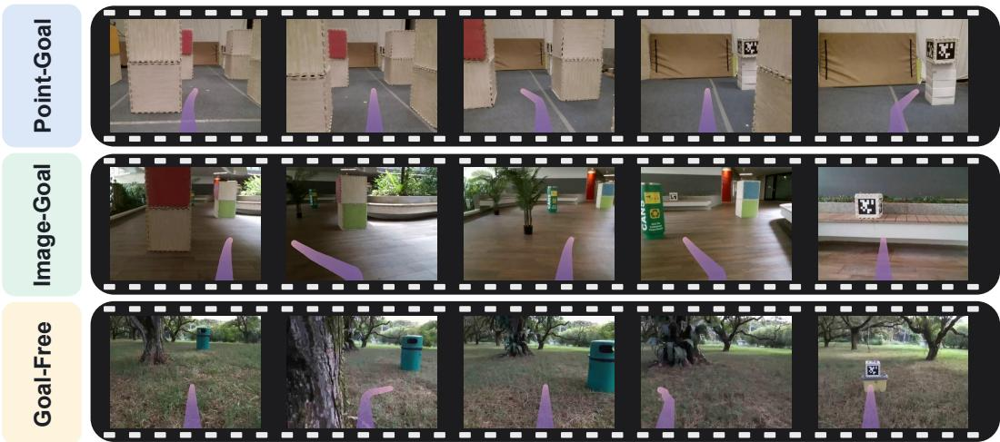  
Figure 5: Real-world flight. Onboard first-person views from representative flights, one row per goal specification and time running left to right. The overlay marks the direction the policy com mands at that moment.

Table 2: Ablation of forward and inverse dynamics objectives across three navigation modes.
<table><tr><td rowspan="2">Variant</td><td colspan="7">Point-Goal</td><td colspan="7">Image-Goal</td><td colspan="7">Goal-Free</td></tr><tr><td>NE↓</td><td>OS↑ SR↑</td><td>SPL↑</td><td>CR↓</td><td>OB↓</td><td>TTS↓</td><td>NE↓</td><td>OS↑</td><td>SR↑ SPL↑</td><td>CR↓</td><td></td><td>OB↓</td><td>TTS↓</td><td>NE↓</td><td>OS↑</td><td>SR↑</td><td>SPL↑</td><td>CR↓</td><td>OB↓</td><td>TTS↓</td></tr><tr><td>w/o  ${ \mathcal { L } } _ { \mathrm { f w d } }$  &amp;  ${ \mathcal { L } } _ { \mathrm { i n v } }$ </td><td>2.05</td><td>42.2 37.5</td><td>0.25</td><td>52.7</td><td>9.8</td><td></td><td>158 1.87</td><td>46.8</td><td>42.8</td><td>0.29</td><td>52.5</td><td>4.7</td><td>161</td><td>2.32</td><td>33.2</td><td>29.2</td><td>0.18</td><td>58.2</td><td>12.7</td><td>157</td></tr><tr><td>w/o  ${ \mathcal { L } } _ { \mathrm { i n v } }$ </td><td>1.62</td><td>57.2 51.3</td><td>0.33</td><td>35.3</td><td>13.3</td><td>141</td><td>1.44</td><td>59.8</td><td>56.7</td><td>0.39</td><td>36.5</td><td>6.8</td><td>145</td><td>1.85</td><td>49.8</td><td>43.3</td><td>0.27</td><td>38.2</td><td>18.5</td><td>140</td></tr><tr><td>w/o  $\mathcal { L } _ { \mathrm { f w d } }$ </td><td>1.83</td><td>49.3 42.7</td><td>0.29</td><td>45.3</td><td>12.0</td><td>149</td><td>1.61</td><td>54.7</td><td>51.5</td><td>0.35</td><td>45.2</td><td>3.3</td><td>152</td><td>2.06</td><td>39.8</td><td>35.8</td><td>0.22</td><td>46.5</td><td>17.7</td><td>148</td></tr><tr><td>SKYTOPIA</td><td>1.49</td><td>63.5 57.8</td><td>0.49</td><td></td><td>26.2 16.0</td><td></td><td>134</td><td>1.32 67.3</td><td>66.0</td><td>0.54</td><td>29.3</td><td>4.7</td><td>128</td><td>1.67</td><td>54.2</td><td>49.0</td><td>0.34</td><td>28.7</td><td>22.3</td><td>139</td></tr></table>

achieves 55% SR indoors, where motion capture provides the metric goal. Image-goal and goalfree navigation are evaluated at all 3 sites and achieve mean SRs of $56 . 7 \%$ and 41.7%, respectively. Fig. 5 shows representative flights with obstacle avoidance and successful arrival under each goal specification. These results demonstrate transfer from reconstructed scenes to physical flight across varied environments. Hardware and evaluation details are provided in Appendix A.7.

We attribute this transfer to motion-conditioned representation learning and training across diverse reconstructed scenes. The forward and inverse objectives encourage the backbone to encode spatial relationships relevant to flight instead of relying solely on appearance–action associations. The training platform exposes this representation to indoor, urban, and vegetation environments with varied geometry and appearance. Together, these design choices provide a basis for generalization to unseen physical sites. The geometry probes in Sec. 4.5 and appearance perturbations in Appendix A.9 provide supporting evidence for this interpretation.

## 4.4 ABLATION STUDIES

We isolate the contribution of the dynamics objectives using three variants: w/o $\mathcal { L } _ { \mathrm { f w d } } \ \& \ \mathcal { L } _ { \mathrm { i n v } }$ uses only the action objective; w/ $\mathcal { L } _ { \mathrm { f w d } }$ adds forward prediction; w/ ${ \mathcal { L } } _ { \mathrm { i n v } }$ adds inverse dynamics. The latter retains the forward head to produce the transitions used by the inverse objective. The full model uses both losses. Table 2 shows that removing both objectives reduces success and path efficiency and increases collisions across all three modes. Either objective improves on action-only training, while their combination gives the strongest overall navigation performance.

We attribute this pattern to the complementary supervision of visual transitions and executed motion. Forward prediction constrains the predicted state to match the observed future, but temporal correlations can weaken its dependence on action tokens. Inverse dynamics encourages those tokens to encode motion through command recovery, but does not independently require the predicted state to match the future observation. Joint training imposes both constraints. The resulting gains in success and path efficiency support learning transitions that are visually grounded and informative for control. Appendix A.8 examines the goal representation and action head separately.

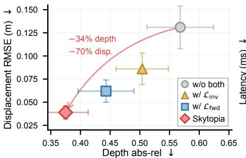  
(a)

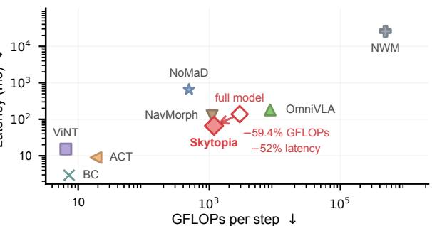  
(b)  
Figure 6: Geometric representation and inference cost. (a) Depth and displacement probes on frozen features. Markers and bars show means and standard deviations over 4 episode splits. (b) Inference cost of every method. The arrow marks the effect of discarding the predictor after training.

## 4.5 ANALYSIS

Geometry in the learned representation. We fit linear probes on frozen backbone features to predict depth and camera displacement. Fig. 6(a) shows that joint dynamics training yields lower errors on both tasks than the ablated variants. Geometry and motion are therefore more accessible in the features without direct supervision of either quantity during policy learning.

We attribute this result to the structure of the prediction task. Camera motion changes the projected positions of scene elements according to their depth. Predicting these changes under action conditioning encourages the representation to encode both scene structure and motion. The inverse objective further requires the predicted transition to preserve command information. The probe results therefore support the proposed connection between dynamics supervision and the navigation improvements in Table 2.

Navigation performance and inference cost. Fig. 6(b) reports floating-point operations (FLOPs) and latency for every method. Discarding the predictor after training removes 59.4% of the FLOPs and 52% of the latency, which moves SKYTOPIA towards the lower left. The deployed model then runs faster than NavMorph, OmniVLA, and NoMaD while reaching a higher success rate than all of them across the three modes (Table 1). NWM requires three orders of magnitude more computation and time per step. The methods that run faster than SKYTOPIA reach less than half its success rate.

This advantage follows from restricting dynamics prediction to training. The forward and inverse objectives improve the backbone representation, while action generation uses a separate token group and does not require predicted future states. Deployment therefore avoids the computation of the dynamics branch. The comparison with NavMorph also shows that the navigation gains do not require substantially more inference FLOPs.

## 5 CONCLUSION

We developed SKYTOPIA, a monocular drone navigation framework that combines a 3DGS simulation platform with action-conditioned latent world-model training. We use forward and inverse dynamics objectives to learn a policy that supports three navigation modes without retaining the predictor at deployment. Simulation experiments demonstrate improved goal reaching and path efficiency over competitive baselines. We further deploy the same policy on a physical drone without fine-tuning. Flights in unseen indoor, open outdoor, and woodland environments demonstrate obstacle avoidance and successful arrival despite changes in appearance and flight conditions. The policy supports metric goals indoors and both image-goal and goal-free navigation across all three sites. These results establish the practical value of dynamics supervision for sim-to-real monocular flight. However, the current policy lacks persistent spatial memory for long-horizon navigation, while its robustness to dynamic obstacles and temporally changing scenes remains unexplored. Future work will incorporate persistent memory for long-horizon reasoning and extend the framework to navigation in dynamic environments.

## AI USE STATEMENT

We used generative AI tools to aid and polish writing. Their role was limited to grammar correction and to the rewording of text that the authors had already drafted. We did not use generative AI tools for research ideation, method design, code implementation, experiment execution, or the analysis of results. We have reviewed all AI-assisted text and confirmed that it states our own claims and results. We take responsibility for the final content of this work, including all text, claims, and artefacts.

## ACKNOWLEDGMENTS

We thank Autel US for providing the computational resources used in this work. We also thank XGRIDS for providing the PortalCam handheld capture system with which the scenes of our platform were reconstructed.

## REFERENCES

Peter Anderson, Qi Wu, Damien Teney, Jake Bruce, Mark Johnson, Niko Sunderhauf, Ian Reid,¨ Stephen Gould, and Anton van den Hengel. Vision-and-language navigation: Interpreting visually-grounded navigation instructions in real environments. In IEEE Conference on Computer Vision and Pattern Recognition (CVPR), 2018.

Mido Assran, Adrien Bardes, David Fan, Quentin Garrido, Russell Howes, Matthew Muckley, Ammar Rizvi, Claire Roberts, Koustuv Sinha, Artem Zholus, et al. V-jepa 2: Self-supervised video models enable understanding, prediction and planning. arXiv preprint arXiv:2506.09985, 2025.

Shuai Bai, Yuxuan Cai, Ruizhe Chen, Keqin Chen, Xionghui Chen, Zesen Cheng, Lianghao Deng, Wei Ding, Chang Gao, Chunjiang Ge, et al. Qwen3-vl technical report. arXiv preprint arXiv:2511.21631, 2025.

Amir Bar, Gaoyue Zhou, Danny Tran, Trevor Darrell, and Yann LeCun. Navigation world models. In IEEE Conference on Computer Vision and Pattern Recognition (CVPR), 2025.

Kevin Black, Manuel Galliker, and Sergey Levine. Real-time execution of action chunking flow policies. Advances in Neural Information Processing Systems, 38:33383–33407, 2026.

Wenzhe Cai, Jiaqi Peng, Yuqiang Yang, Yujian Zhang, Meng Wei, Hanqing Wang, Yilun Chen, Tai Wang, and Jiangmiao Pang. Navdp: Learning sim-to-real navigation diffusion policy with privileged information guidance. arXiv preprint arXiv:2505.08712, 2025.

Amirhosein Chahe and Lifeng Zhou. Policy-guided world model planning for language-conditioned visual navigation. arXiv preprint arXiv:2603.25981, 2026.

Jie Chen, Yuxin Cai, Yizhuo Wang, Ruofei Bai, Yuhong Cao, Jun Li, Yau Wei Yun, and Guillaume Sartoretti. Imaginav: Scalable embodied navigation via generative visual prediction and inverse dynamics. arXiv preprint arXiv:2603.13833, 2026.

Jintao Chen, Junjun Hu, Haochen Bai, Minghua Luo, Xinda Xue, Botao Ren, Chengyu Bai, Shichao Xie, Ziyi Chen, Fei Liu, et al. Astranav-world: World model for foresight control and consistency. arXiv preprint arXiv:2512.21714, 2025.

Felipe Codevilla, Matthias Muller, Antonio L¨ opez, Vladlen Koltun, and Alexey Dosovitskiy. End-´ to-end driving via conditional imitation learning. In 2018 IEEE international conference on robotics and automation (ICRA), pp. 4693–4700. IEEE, 2018.

Jingtao Ding, Yunke Zhang, Yu Shang, Yuheng Zhang, Zefang Zong, Jie Feng, Yuan Yuan, Hongyuan Su, Nian Li, Nicholas Sukiennik, et al. Understanding world or predicting future? a comprehensive survey of world models. ACM Computing Surveys, 58(3):1–38, 2025.

Yifei Dong, Fengyi Wu, Yilong Dai, Lingdong Kong, Guangyu Chen, Xu Zhu, Qiyu Hu, Tianyu Wang, Johnalbert Garnica, Feng Liu, et al. Language-conditioned world modeling for visual navigation. arXiv preprint arXiv:2603.26741, 2026.

Yunpeng Gao, Chenhui Li, Zhongrui You, Junli Liu, Li Zhen, Pengan Chen, Qizhi Chen, Zhonghan Tang, Liansheng Wang, Yiwen Tang, et al. Openfly: A comprehensive platform for aerial visionlanguage navigation. In International Conference on Learning Representations, volume 2026, pp. 101858–101871, 2026.

Danijar Hafner, Jurgis Pasukonis, Jimmy Ba, and Timothy Lillicrap. Mastering diverse control tasks through world models. Nature, 640(8059):647–653, 2025.

Noriaki Hirose, Catherine Glossop, Dhruv Shah, and Sergey Levine. Omnivla: An omni-modal vision-language-action model for robot navigation. arXiv preprint arXiv:2509.19480, 2025.

Bohan Hou, Gen Li, Jindou Jia, Tuo An, Xinying Guo, Sicong Leng, Haoran Geng, Yanjie Ze, Tatsuya Harada, Philip Torr, et al. World model for robot learning: A comprehensive survey. arXiv preprint arXiv:2605.00080, 2026.

Xijie Huang, Weiqi Gai, Tianyue Wu, Congyu Wang, Qiaoyu Zheng, Zhiyang Liu, Xin Zhou, Yuze Wu, and Fei Gao. Navdreamer: Video models as zero-shot 3d navigators. IEEE Robotics and Automation Letters, 2026.

Physical Intelligence, Kevin Black, Noah Brown, James Darpinian, Karan Dhabalia, Danny Driess, Adnan Esmail, Michael Equi, Chelsea Finn, Niccolo Fusai, et al. $\pi _ { 0 . 5 } { : }$ A vision-language-action model with open-world generalization. arXiv preprint arXiv:2504.16054, 2025.

Elia Kaufmann, Leonard Bauersfeld, Antonio Loquercio, Matthias Muller, Vladlen Koltun, and¨ Davide Scaramuzza. Champion-level drone racing using deep reinforcement learning. Nature, 620, 2023.

Bernhard Kerbl, Georgios Kopanas, Thomas Leimkuhler, and George Drettakis. 3d gaussian splat-¨ ting for real-time radiance field rendering. ACM Transactions on Graphics (TOG), 42(4), 2023.

Zian Liu, Andong Yang, Chunkai Yang, Ruidong An, Chao Gao, and Guyue Zhou. Airdreamer: Generalist drone navigation with world models. arXiv preprint arXiv:2606.03252, 2026.

Antonio Loquercio, Elia Kaufmann, Rene Ranftl, Matthias M´ uller, Vladlen Koltun, and Davide¨ Scaramuzza. Learning high-speed flight in the wild. Science Robotics, 6(59), 2021.

Yunhao Luo and Yilun Du. Grounding video models to actions through goal conditioned exploration. In International Conference on Learning Representations, volume 2025, pp. 92200–92232, 2025.

Hao Ren, Yiming Zeng, Zetong Bi, Zhaoliang Wan, Junlong Huang, and Hui Cheng. Does matter: Visual navigation via denoising diffusion bridge models. In 2025 IEEE/CVF Conference on Computer Vision and Pattern Recognition (CVPR), pp. 12100–12110. IEEE, 2025.

Dhruv Shah and Sergey Levine. Viking: Vision-based kilometer-scale navigation with geographic hints. In Robotics: Science and Systems (RSS), 2022.

Dhruv Shah, Benjamin Eysenbach, Gregory Kahn, Nicholas Rhinehart, and Sergey Levine. Rapid exploration for open-world navigation with latent goal models. In Conference on Robot Learning (CoRL), 2021.

Dhruv Shah, Ajay Sridhar, Nitish Dashora, Kyle Stachowicz, Kevin Black, Noriaki Hirose, and Sergey Levine. Gnm: A general navigation model to drive any robot. In IEEE International Conference on Robotics and Automation (ICRA), 2023a.

Dhruv Shah, Ajay Sridhar, Nitish Dashora, Kyle Stachowicz, Kevin Black, Noriaki Hirose, and Sergey Levine. Vint: A foundation model for visual navigation. In Conference on Robot Learning (CoRL), 2023b.

Ajay Sridhar, Dhruv Shah, Catherine Glossop, and Sergey Levine. Nomad: Goal masked diffusion policies for navigation and exploration. In IEEE International Conference on Robotics and Automation (ICRA), 2024.

Xiangyu Wang, Donglin Yang, Hohin Kwan, Jinyu Chen, Hongsheng Li, Yue Liao, Si Liu, et al. Towards realistic uav vision-language navigation: Platform, benchmark, and methodology. In International Conference on Learning Representations, volume 2025, pp. 7292–7310, 2025.

Zhuo Xu, Hao-Tien Lewis Chiang, Zipeng Fu, Mithun George Jacob, Tingnan Zhang, Tsang-Wei Edward Lee, Wenhao Yu, et al. Mobility vla: Multimodal instruction navigation with longcontext vlms and topological graphs. In Conference on Robot Learning (CoRL), 2024.

Ning Yang, Yan Huang, Kaiwen Peng, Ziheng He, Kai Wang, Cui Miao, Kailin Lyu, Guo Li, Xiaofeng Wang, Zheng Zhu, et al. Wam-nav: Asymmetric latent world-action modeling for unified visual navigation. arXiv preprint arXiv:2606.04907, 2026.

Xuan Yao, Junyu Gao, and Changsheng Xu. Navmorph: A self-evolving world model for visionand-language navigation in continuous environments. In 2025 IEEE/CVF International Conference on Computer Vision (ICCV), pp. 5536–5546. IEEE, 2025.

Yiming Zeng, Hao Ren, Shuhang Wang, Junlong Huang, and Hui Cheng. Navidiffusor: Cost-guided diffusion model for visual navigation. In 2025 IEEE International Conference on Robotics and Automation (ICRA), pp. 11994–12001. IEEE, 2025.

Hai Zhang, Siqi Liang, Li Chen, Yuxian Li, Yukuan Xu, Yichao Zhong, Fu Zhang, and Hongyang Li. Sparse video generation propels real-world beyond-the-view vision-language navigation. arXiv preprint arXiv:2602.05827, 2026a.

Jiazhao Zhang, Kunyu Wang, Rongtao Xu, Gengze Zhou, Yicong Hong, Xiaomeng Fang, Qi Wu, Zhizheng Zhang, and He Wang. Navid: Video-based vlm plans the next step for vision-andlanguage navigation. In Robotics: Science and Systems (RSS), 2024.

Jiazhao Zhang, Anqi Li, Yunpeng Qi, Minghan Li, Jiahang Liu, Shaoan Wang, Haoran Liu, Gengze Zhou, Yuze Wu, Xingxing Li, et al. Embodied navigation foundation model. In International Conference on Learning Representations, volume 2026, pp. 127293–127322, 2026b.

Lingfeng Zhang, Zeying Gong, Xiaoshuai Hao, Haoxiang Fu, Qiang Zhang, Mingliang Zhou, Hangjun Ye, Xiaojun Liang, Junwei Liang, and Wenbo Ding. Futurenav: Unified world-action modeling for vision-and-language navigation. arXiv preprint arXiv:2606.30367, 2026c.

Mingkun Zhang, Wangtian Shen, Fan Zhang, Haijian Qin, Zihao Pei, and Ziyang Meng. Rae-nwm: Navigation world model in dense visual representation space. arXiv preprint arXiv:2603.09241, 2026d.

Wancong Zhang, Basile Terver, Artem Zholus, Soham Chitnis, Harsh Sutaria, Mido Assran, Randall Balestriero, Amir Bar, Adrien Bardes, Yann LeCun, et al. Hierarchical planning with latent world models. arXiv preprint arXiv:2604.03208, 2026e.

Yuang Zhang, Yu Hu, Yunlong Song, Danping Zou, and Weiyao Lin. Learning vision-based agile flight via differentiable physics. Nature Machine Intelligence, 7(6):954–966, 2025a.

Yuhang Zhang, Haosheng Yu, Jiaping Xiao, and Mir Feroskhan. Grounded vision-language navigation for uavs with open-vocabulary goal understanding. arXiv preprint arXiv:2506.10756, 2025b.

Baining Zhao, Jiacheng Xu, Weicheng Feng, Xin Zhang, Zhaolu Wang, Haoyang Wang, Shilong Ji, Ziyou Wang, Jianjie Fang, Zhiheng Zheng, et al. Worldvln: Autoregressive world action model for aerial vision-language navigation. arXiv preprint arXiv:2605.15964, 2026.

Tony Z Zhao, Vikash Kumar, Sergey Levine, and Chelsea Finn. Learning fine-grained bimanual manipulation with low-cost hardware. arXiv preprint arXiv:2304.13705, 2023.

Changqing Zhou, Yueru Luo, Zeyu Jiang, and Changhao Chen. Uninav: A unified world-action diffusion model for visual navigation, 2026.

## A APPENDIX

## A.1 PLATFORM AND DATA COLLECTION

Scene capture and reconstruction. We capture each environment with a handheld LiDAR– camera system that records synchronized point clouds and RGB images. The LiDAR point cloud provides metric geometry. We optimize a 3DGS model against posed RGB images to reproduce scene appearance. A triangle mesh extracted from the same reconstruction provides the collision geometry. We convert this mesh into a signed distance field (SDF) with 10 cm voxels for collision and clearance queries. The simulator uses 3DGS for rendering and the SDF for physical interaction. Fig. 7 summarizes this pipeline.

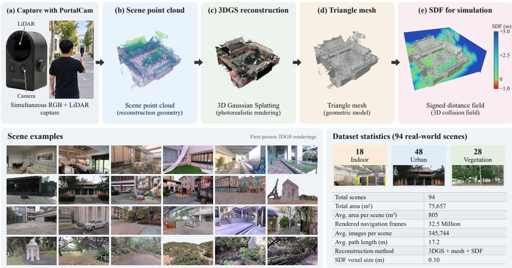  
Figure 7: Scene reconstruction and the 3DGS simulation platform. Top: synchronized capture (a) provides the point cloud (b), 3DGS model (c), and mesh (d). The mesh supplies the collision SDF (e). Bottom: 24 reconstructed scenes and dataset statistics.

The platform contains 94 scenes: 18 indoor spaces, 48 urban outdoor sites, and 28 vegetation environments. These include rooms, corridors, streets, campus sites, gardens, and woodland. The total navigable area is $7 5 { , } 6 5 7 \mathrm { m ^ { 2 } }$ , with an average of 805 m2 per scene. Fig. 7 presents 24 example reconstructions and the platform statistics.

Data collection. We import the reconstructed environments into Isaac Sim and integrate rigidbody dynamics at 100 Hz. Observations and commands are recorded at 50 Hz. The forward-facing camera renders 256 × 256 RGB images. Each action $a _ { t } = [ v _ { x } , v _ { y } , \dot { \psi } ]$ specifies body-frame velocity and yaw rate. The recorded 13-dimensional state contains linear velocity, angular velocity, the relative goal vector, and the body orientation quaternion.

An expert planner generates demonstrations using the reconstructed scene geometry. It searches for a shortest path on a mesh-derived occupancy grid and adjusts speed according to obstacle clearance and path curvature. Yaw follows the path tangent with a rate limit of $1 . 0 \mathrm { r a d ~ s } ^ { - 1 }$ . The planner path also provides the reference length ℓi for SPL. The collection contains 1000 trajectories per scene and 94,000 trajectories in total, yielding 32.5 million frames over 181 hours of flight. The mean planner path length is 17.2 m, and the mean episode length is 346 control steps.

## A.2 ANALYSIS OF THE DYNAMICS OBJECTIVES

Temporal alignment. Fig. 8(a) relates observations, latent states, and commands. The frozen video encoder processes 8 frames with tubelet size 2 to produce 4 states. The backbone produces action tokens for the resulting K = 3 transitions in one pass. Each transition corresponds to 2 commands, giving inverse supervision for the first 6 commands of the N = 7 chunk. The action objective supervises all 7 commands, including the final command without an inverse target.

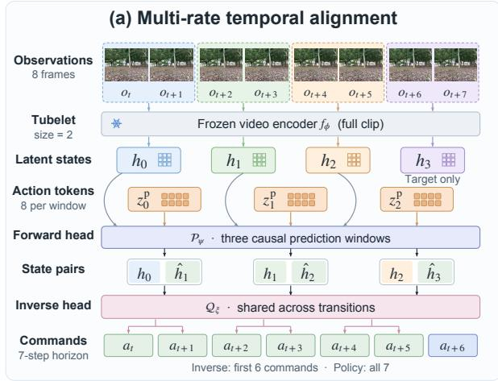

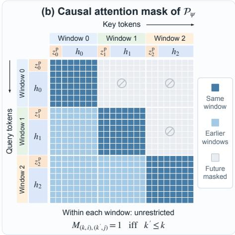  
Figure 8: Temporal alignment and causal attention. (a) The frozen encoder maps an 8-frame clip to 4 latent states using tubelet size 2. The forward head predicts 3 transitions conditioned on 8 action tokens per transition. The shared inverse head recovers 2 commands from each state pair, supervising the first 6 commands of the 7-command chunk. The action objective supervises all 7 commands. (b) Tokens attend to the current and preceding windows; future windows are masked.

Causal attention in the forward head. Let (k, i) denote token i in window k. The attention mask in $\mathcal { P } _ { \psi }$ is

$$
M _ { ( k , i ) , ( k ^ { \prime } , j ) } = { \left\{ \begin{array} { l l } { 1 , } & { k ^ { \prime } \leq k , } \\ { 0 , } & { { \mathrm { o t h e r w i s e } } . } \end{array} \right. }\tag{11}
$$

Tokens can attend to all positions in the current and preceding windows. The forward head cannot attend to tokens from window $k + 1$ or later when predicting $h _ { k + 1 }$

Laplace likelihood and the $\ell _ { 1 }$ objective. We model the d coordinates of each latent state with conditionally independent Laplace distributions and a fixed scale $b > 0$ . The distribution is centred at the forward prediction $\hat { h } _ { k + 1 }$ from Eq. (3):

$$
p _ { \psi } ( h _ { k + 1 } \vert h _ { 0 : k } , z _ { 0 : k } ^ { \mathrm { p } } ) = \prod _ { n = 1 } ^ { d } \frac { 1 } { 2 b } \exp \left( - \frac { \left| h _ { k + 1 } ^ { ( n ) } - \hat { h } _ { k + 1 } ^ { ( n ) } \right| } { b } \right) ,\tag{12}
$$

Here n indexes latent coordinates. Taking the negative logarithm converts the product into a sum of absolute prediction errors. Summing over the K transitions gives

$$
- \sum _ { k = 0 } ^ { K - 1 } \log p _ { \psi } ( h _ { k + 1 } \mid h _ { 0 : k } , z _ { 0 : k } ^ { \mathrm { p } } ) = \frac { 1 } { b } \mathcal { L } _ { \mathrm { f w d } } + K d \log 2 b .\tag{13}
$$

The term Kd log 2b is constant with respect to ψ and θ. Maximizing this likelihood is therefore equivalent to minimizing Eq. (4), with $1 \bar { / } b$ absorbed into $\lambda _ { \mathrm { f w d } }$ . This probabilistic formulation motivates the loss without introducing an additional uncertainty-prediction head. Absolute error grows linearly with the residual, whereas squared error assigns disproportionately large penalties to large residuals. The $\ell _ { 1 }$ objective therefore limits their influence, which motivates its use when occlusion or newly visible regions make parts of the next state difficult to predict.

Fixed targets and representation collapse. Jointly optimizing the target encoder and predictor admits the constant solution

$$
f _ { \phi } ( \cdot ) \equiv c \mathrm { ~ \wedge ~ } \mathcal { P } _ { \psi } ( \cdot ) \equiv c \Longrightarrow \mathcal { L } _ { \mathrm { f w d } } = 0 \mathrm { ~ f o r ~ a n y ~ c o n s t a n t ~ } c ,\tag{14}
$$

which minimizes the prediction loss without encoding dynamics. Both the target and prediction are identical for every observation, and the loss cannot distinguish different transitions. In SKYTOPIA, $\partial \mathcal { L } _ { \mathrm { f w d } } / \partial \phi \equiv 0$ by Eq. (1). Training updates the predictor while target representations remain fixed.

Consider any two distinct fixed targets $h _ { i } \neq h _ { j }$ . For a constant prediction c, the triangle inequality gives

$$
\| c - h _ { i } \| _ { 1 } + \| c - h _ { j } \| _ { 1 } \geq \| h _ { i } - h _ { j } \| _ { 1 } > 0 .\tag{15}
$$

Table 3: Model architecture. The final column indicates inference usage.
<table><tr><td>Module</td><td>Configuration</td><td>Inference</td></tr><tr><td>Backbone  $B _ { \theta }$ </td><td>Qwen3-VL-2B-Instruct, 2B</td><td>yes</td></tr><tr><td>Action tokens  $z _ { k } ^ { \mathrm { p } }$ </td><td>8 per transition, 24 per backbone query</td><td>no</td></tr><tr><td>Action tokens  $ { \boldsymbol { z } } _ { t } ^ { \mathrm { c } }$ </td><td> $3 \hat { 2 }$  per backbone query</td><td>yes</td></tr><tr><td>Observation resolution</td><td> $2 2 \bar { 4 } \times 2 2 4$  to  $B _ { \theta } , \bar { 2 } 5 6 \times 2 5 6$  to  $f _ { \phi }$ </td><td>yes</td></tr><tr><td>Video encoder  $f _ { \phi }$ </td><td> $\mathrm { V \mathrm { - } J E P A \ 2 \ V i T \mathrm { - } L / 1 6 , 3 0 0 M }$ </td><td>no</td></tr><tr><td>Observation window</td><td>8 frames, tubelet 2, 4 world states,  $K = 3$ </td><td>no</td></tr><tr><td>Forward head  $\mathcal { P } _ { \psi }$ </td><td>12 layers, 8 heads, rotary position embedding, 160M</td><td>no</td></tr><tr><td>Inverse head  $\mathcal { Q } _ { \xi }$ </td><td>2-layer multi-layer perceptron, 2.1M</td><td>no</td></tr><tr><td>Action head  $v _ { \omega }$ </td><td>DiT, 16 layers, width 768, 160M</td><td>yes</td></tr><tr><td>Action chunk</td><td> $N = 7 , d _ { a } = 3$ </td><td>yes</td></tr><tr><td>Proprioceptive state</td><td> $d _ { s } = 1 3$ </td><td>yes</td></tr><tr><td>Flow-matching steps</td><td>4</td><td>yes</td></tr></table>

The same prediction cannot match both targets. Its combined loss is hence strictly positive. Freezing the encoder thus prevents the target and predictor from jointly collapsing to a zero-loss constant solution. This argument does not guarantee that the predictor uses action tokens: correlated preceding states may still support prediction without them. The inverse objective addresses this separate limitation by supervising command recovery from predicted transitions.

## A.3 ARCHITECTURE

Modules. We use Qwen3-VL-2B-Instruct (Bai et al., 2025) as the backbone $B _ { \theta }$ . The frozen target encoder $f _ { \phi }$ is V-JEPA 2 ViT-L/16 (Assran et al., 2025) with 300M parameters and 256 × 256 input resolution. It encodes 8-frame clips with tubelet size 2. The forward and inverse heads contain 160M and 2.1M parameters, respectively. The action head is a 160M-parameter diffusion transformer (DiT) with 16 layers and hidden width 768. Table 3 lists the complete configuration. Only the backbone and action head are retained at deployment.

Action tokens. We add two groups of special query tokens to the tokenizer and insert them at fixed input positions. Prediction uses 8 tokens per transition for $z _ { k } ^ { \mathrm { p } } ;$ ; action generation uses 32 tokens per backbone pass for $ { \boldsymbol { z } } _ { t } ^ { \mathrm { c } }$ . The backbone’s output hidden states at these positions form the action tokens. The input prompt is “Infer the temporal dynamics from frames {actions} and produce the corresponding policy actions {e actions}. The last image is the goal view you must reach.” The placeholders contain the prediction and control queries, respectively. The final sentence is included only for image-goal navigation to identify the goal view.

## A.4 TRAINING CONFIGURATION

Optimization. Table 4 lists the optimizer, learning rates, and loss weights. We assign separate learning rates to the backbone, action head, and dynamics heads. Actions are normalized to [−1, 1] using the training-set extrema of each dimension. The same statistics convert predicted actions back to physical units at deployment. Training uses 8 H200 GPUs for approximately 56 hours.

Goal sampling. We sample the indicators $( m ^ { \mathrm { p } } , m ^ { \mathrm { g } } )$ jointly for each training example. The combinations (0, 0), (1, 0), (0, 1), and (1, 1) have probabilities 0.20, 0.30, 0.40, and 0.10, respectively. When $m ^ { \mathrm { g } } = 1$ , the goal view is sampled $\Delta$ seconds after the current frame with $\Delta \sim \mathcal { U } [ 0 . 5 , 4 . 0 ]$ Both views receive photometric jitter of strength 0.3.

## A.5 EVALUATION PROTOCOL

Termination criteria. Evaluation uses closed-loop rollouts in held-out scenes. Each episode terminates with success, collision, an out-of-bounds event, or a timeout after 3000 control steps. Success requires stopping within $\varepsilon _ { \mathrm { s } } = 0 . 5$ m of the goal without collision. The same distance threshold is used in real-world evaluation. Collision is detected through the scene SDF; an out-of-bounds event occurs when the drone leaves the reconstruction. Oracle success uses a closest-approach threshold of $\varepsilon _ { \mathrm { o } } = 1 . 0 \mathrm { m }$

Table 4: Training configuration.
<table><tr><td>Setting</td><td>Value</td></tr><tr><td>Optimizer</td><td> $\mathrm { A d a m W } , \beta = ( 0 . 9 , 0 . 9 5 ) , \epsilon = 1 0 ^ { - 8 } ,$  weight decay  $1 0 ^ { - 8 }$ </td></tr><tr><td>Learning rate</td><td> $\mathcal { B } _ { \theta } \colon 1 \times 1 0 ^ { - 5 } , \enspace \upsilon _ { \omega } \colon 1 \times 1 0 ^ { - 4 } , \enspace \mathcal { P } _ { \psi } , \mathcal { Q } _ { \xi } \colon 3 \times 1 0 ^ { - 5 }$ </td></tr><tr><td>Schedule</td><td>cosine with minimum  $1 0 ^ { - 6 }$  , 5000 warm-up steps</td></tr><tr><td>Training steps</td><td>50000</td></tr><tr><td>Batch size</td><td>256</td></tr><tr><td>Gradient clipping</td><td>1.0</td></tr><tr><td>λfwd, λinv</td><td>0.1,0.1</td></tr><tr><td>Dropout of  $h _ { 0 : K - 1 } \mathrm { i n E q . } ( 5 )$ </td><td>0.3</td></tr><tr><td>Interpolation time τ Flow-matching noise samples per example</td><td> $( s - u ) / s , u \sim \mathrm { B e t a } ( 1 . 5 , 1 . 0 ) , s = 0 . 9 9 9 ,$  1000 buckets</td></tr></table>

Metrics. Let M denote the number of episodes and $\mathbb { I } _ { i }$ indicate success in episode i. Let $d _ { i }$ and $\ell _ { i }$ denote the executed and planner path lengths, respectively. NE measures terminal distance to the goal in metres. SR measures the fraction of successful episodes, while OS measures the fraction that approach within $\varepsilon _ { \mathrm { o } }$ at any point. CR and OB measure collision and out-of-bounds frequencies. These four rates are reported as percentages. TTS is the mean number of control steps among successful episodes. Path efficiency is measured by $\begin{array} { r } { \mathrm { S P L } = \frac { 1 } { M } \sum _ { i = 1 } ^ { M } \mathbb { I } _ { i } \ell _ { i } / \operatorname* { m a x } ( d _ { i } , \ell _ { i } ) } \end{array}$

Image-goal specification. The planner supplies a sequence of subgoals along its reference path. The goal view $o ^ { \mathrm { g } }$ is updated as the drone advances, providing a local visual target for routes where the final destination is initially outside the camera view.

## A.6 BASELINE ADAPTATION

We adapt all baselines to aerial navigation and retrain them on the SKYTOPIA dataset. Each method receives a monocular RGB stream at its required resolution and is evaluated using the protocol in Appendix A.5. All executed actions are body-frame velocity commands. For methods that predict waypoints, we use the demonstration controller to convert waypoints into velocity commands. This keeps waypoint tracking consistent across the relevant baselines. Table 5 summarizes the adaptations and computational costs.

Cost measurement. We report floating-point operations (FLOPs) per policy query, using the larger count from point-goal and image-goal inputs. One multiply-add counts as 2 FLOPs. Parameter counts include frozen modules and inference auxiliaries.

## A.7 REAL-WORLD DEPLOYMENT SETUP

Platform. We use the DJI Tello shown in Fig. 9. Its forwardfacing RGB camera streams 720p video at 30 FPS with a field of view of 82.6◦. Indoor experiments use an OptiTrack system with 120 Hz pose updates to compute the metric goal $g ^ { \mathrm { p } }$ . Outdoor experiments use the onboard inertial measurement unit (IMU) for body orientation and do not receive motion-capture measurements.

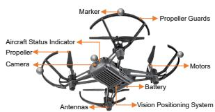  
Figure 9: The drone platform used in the real-world flights.

Inference pipeline. A WebSocket connection transmits the video stream to a ground computer with an RTX 3090. We resize each frame to 224 × 224 and provide it to the policy with the proprioceptive state. Inference runs at approximately 7 Hz. Real-time chunking (Black et al., 2026) accounts for inference delay during command execution. The commanded speed is limited $\mathrm { { t o } 1 \mathrm { { m } s ^ { - 1 } } }$

Environments. The indoor site is a 6 m × 6 m room with box-shaped obstacles and potted plants. The open outdoor site spans approximately 6 m×20 m and contains scattered structures. The woodland site covers approximately 30 m×30 m. Irregular trunks and low foliage create narrow passages and partial occlusions. These sites evaluate transfer across differences in appearance, obstacle layout, and visibility.

Goal specification and termination. We manually specify start and goal positions before each flight and retain the same routes across the modes supported at each site. Point-goal navigation

Table 5: Aerial adaptations and computational cost of the baselines.
<table><tr><td>Baseline</td><td>Adaptation</td><td>Params (M)</td><td>FLOPs (G)</td></tr><tr><td>ACT Zhao et al. (2023)</td><td>Retain conditional variational autoen- coder (CVAE) action chunking; add goal- conditioned image and state inputs and a 50-step drone velocity head.</td><td>83.89</td><td>18.66</td></tr><tr><td>BC Codevilla et al. (2018)</td><td>ResNet-18 features with state and goal fusion; a multilayer perceptron (MLP) predicts veloc- ity commands.</td><td>11.80</td><td>7.26</td></tr><tr><td>NoMaD Sridhar et al. (2024)</td><td>Retain action diffusion with image, state- history, and goal inputs; predict body-frame velocity.</td><td>304.61</td><td>488.91</td></tr><tr><td>ViNT Shah et al. (2023b)</td><td>Retain visual encoding and distance and way- point prediction; add metric-goal and goal-free modes with aerial waypoint tracking.</td><td>31.47</td><td>6.48</td></tr><tr><td>OmniVLA Hirose et al. (2025)</td><td>Retain the vision-language backbone and goal interface; use low-rank adaptation (LoRA) and an aerial waypoint head.</td><td>7769.51</td><td>8471.54</td></tr><tr><td>NWM Bar et al. (2025)</td><td>Retain the world model and variational autoen- coder (VAE). Rank predictions with Learned Perceptual Image Patch Similarity (LPIPS). Adapt aerial controls; use imagined metric- goal views and black goal images for goal-free evaluation.</td><td>1098.08</td><td>485917.46</td></tr><tr><td>NavMorph Yao et al. (2025)</td><td>Retain image encoding, spatiotemporal fusion, and Contextual Evolution Memory (CEM). Build spatial features from image patches and add goal conditioning and an aerial waypoint head.</td><td>317.77</td><td>1103.09</td></tr></table>

Table 6: Ablation of spatial goal features and the flow-matching action head on OOD scenes.
<table><tr><td rowspan="2">Variant</td><td colspan="7">Point-Goal</td><td colspan="7">Image-Goal</td><td colspan="7">Goal-Free</td></tr><tr><td>NE↓</td><td>OS↑</td><td>SR↑</td><td>SPL↑</td><td>CR↓</td><td>OB↓</td><td>TTS↓</td><td>NE↓</td><td>OS↑</td><td>SR↑</td><td>SPL↑</td><td>CR↓</td><td>OB↓</td><td>TTS↓</td><td>NE↓</td><td>OS↑ SR↑</td><td>SPL↑</td><td></td><td>CR↓</td><td>OB↓</td><td>TTS↓</td></tr><tr><td>w/PG</td><td>1.51</td><td>63.3</td><td>57.3</td><td>0.49</td><td>26.3</td><td>16.3</td><td>136</td><td>2.06</td><td>54.2</td><td>51.8</td><td>0.35</td><td>38.8</td><td>9.3</td><td></td><td>138</td><td>1.69 53.8</td><td>48.7</td><td>0.34</td><td>29.0</td><td>22.3</td><td>142</td></tr><tr><td>w/RH</td><td>2.32</td><td>41.2</td><td>38.2</td><td>0.23</td><td>52.0</td><td>9.8</td><td>168</td><td>2.18</td><td>47.2</td><td>43.3</td><td>0.27</td><td>52.5</td><td>4.2</td><td>161</td><td>2.75</td><td>34.8</td><td>30.8</td><td>0.18</td><td>50.7</td><td>18.5</td><td>167</td></tr><tr><td>SKYTOPIA</td><td>1.49</td><td>63.5</td><td>57.8</td><td>0.49</td><td>26.2</td><td>16.0</td><td>134</td><td>1.32</td><td>67.3</td><td>66.0</td><td>0.54</td><td>29.3</td><td>4.7</td><td>128</td><td></td><td>1.67 54.2</td><td>49.0</td><td>0.34</td><td>28.7</td><td>22.3</td><td>139</td></tr></table>

uses $g ^ { \mathrm { p } }$ and triggers landing on arrival. Image-goal navigation uses visual subgoals recorded during a prior flight through the environment. Landing is triggered when the cosine similarity between the current view and the final subgoal exceeds a threshold. An operator judges arrival in goal-free navigation. The safety pilot ends a flight after obstacle contact or departure from the test area. These events are recorded as collision and out-of-bounds failures, respectively.

## A.8 ADDITIONAL ABLATIONS

Goal representation. The w/ PG variant replaces spatial goal features with a pooled descriptor. Table 6 shows a substantial reduction in image-goal success and path efficiency, while point-goal and goal-free performance remain close to the full model. The effect is therefore concentrated in the mode that uses the goal image.

We attribute this difference to the spatial information retained by the full representation. Local correspondences between current and goal views help determine the motion needed for alignment. Pooling removes the explicit spatial arrangement of goal features and makes these correspondences less accessible. The results support preserving spatial features for visual goal conditioning.

Action head. The w/ RH variant replaces conditional flow matching with a regression head. This change reduces success and path efficiency across all three modes (Table 6). The consistent decline indicates that the action-generation objective contributes beyond the choice of goal input.

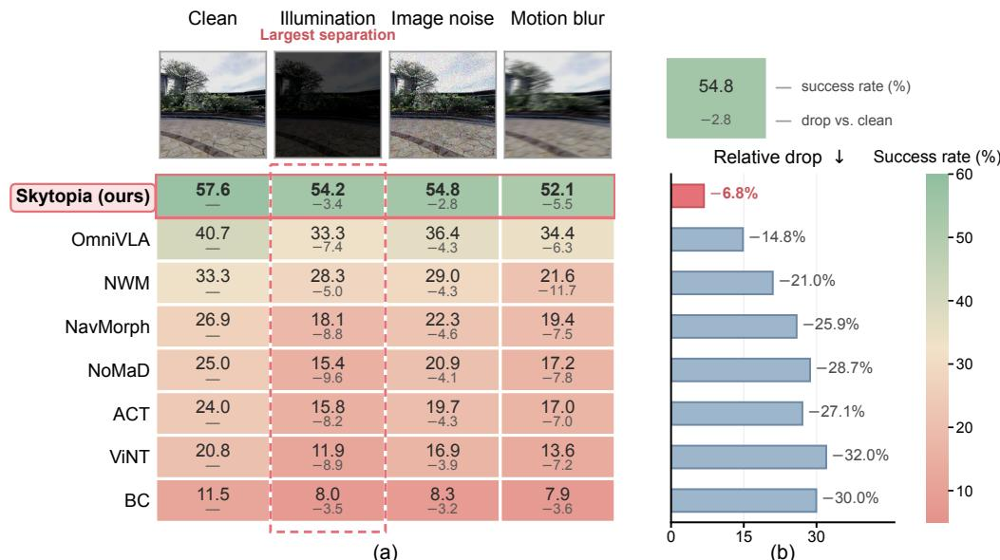

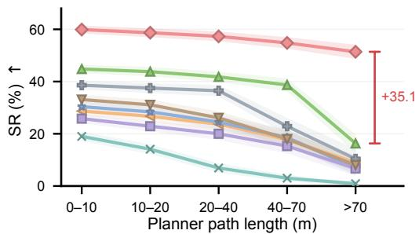  
(a)

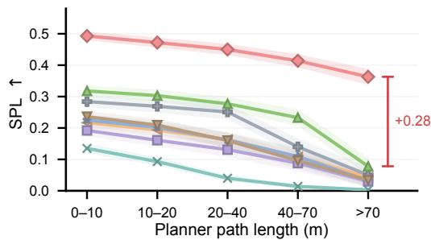  
(b)  
Figure 10: Navigation performance by route length. Results are grouped by planner path length and averaged over three goal modes. (a) SR. (b) SPL. Bands show ±1 standard deviation over 3 seeds. Brackets mark the margin over the strongest baseline at the longest horizon.

(a)  
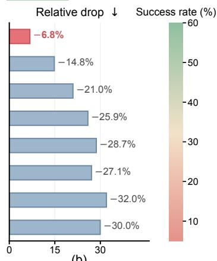  
(b)  
Figure 11: Robustness to visual perturbations. Results are averaged over three goal modes. (a) SR under each condition, with its decrease from the clean condition in points below. Example observations appear above each column. (b) Mean decrease across the three perturbations, expressed as a percentage of the clean SR.

We attribute this advantage to modelling a distribution over valid action sequences. Obstacle avoidance can admit distinct manoeuvres that a regression objective averages into an unsuitable command sequence. Conditional flow matching represents these alternatives and can generate a coherent action chunk. This helps explain the gains in success and path efficiency.

## A.9 ADDITIONAL ANALYSIS

Navigation horizon. We group episodes by planner path length to evaluate performance over increasingly long routes. Fig. 10 shows that SKYTOPIA maintains higher success and path efficiency across the evaluated horizons. Its advantage remains substantial on the longest routes, where baseline performance declines more sharply.

We attribute this trend to the role of dynamics supervision in local navigation. Longer routes require repeated obstacle avoidance and provide more opportunities for control errors to accumulate. Representations that encode scene structure and motion can support more consistent decisions at successive observations. The results are consistent with this interpretation.

Visual perturbations. We evaluate illumination changes, additive image noise, and motion blur while preserving the underlying scene geometry. Each condition aggregates 1800 rollouts across the three goal modes. Fig. 11 shows that SKYTOPIA achieves the highest SR under every perturbation and retains a larger fraction of its clean performance than the baselines. Motion blur produces the largest decline for SKYTOPIA, indicating that its robustness remains sensitive to the quality of spatial image cues.

We attribute this robustness in part to dynamics supervision, which encourages features that relate scene structure to camera motion. Such features can remain useful when appearance changes without a corresponding change in geometry. The geometry probes in Sec. 4.5 support this interpretation. Blur weakens local boundaries and correspondences needed for spatial reasoning, providing a plausible explanation for its larger effect.

Shortcut probe. We fit action-recovery heads on 12,000 frozen windows and evaluate them using $1 - \ell _ { 1 } / \ell _ { 1 } ^ { \mathrm { m e a n } }$ , where $\ell _ { 1 } ^ { \mathrm { m e a n } }$ is the error of a constant mean-command predictor. Table 7 compares an aligned state pair, the preceding state alone, and a pair with an unrelated next state. The preceding state alone predicts commands effectively. Replacing the next state with an unrelated one also preserves much of the aligned pair’s performance.

Table 7: Action recovery from frozen states. Higher scores indicate better command prediction. The aligned and unrelated pairs have equal input dimensions.
<table><tr><td>Input  $1 - \ell _ { 1 } / \ell _ { 1 } ^ { \mathrm { m e a n } }$ </td></tr><tr><td> $\left( h _ { k } , h _ { k + 1 } \right)$  0.791</td></tr><tr><td> $h _ { k } { \mathrm { ~ a l o n e } }$  0.723</td></tr><tr><td> $\left( h _ { k } , h _ { k ^ { \prime } + 1 } \right)$  , unrelated  $k ^ { \prime }$  0.767</td></tr></table>

These results indicate that command recovery can exploit correlations in the preceding state without relying strongly on the transition. To reduce this shortcut, we zero the preceding state independently for each transition with probability 0.3 during inverse-head training. Command recovery must then use the predicted next state, propagating gradients through the forward head to the backbone.