# SWE-SERVE: BENCHMARKING AGENTIC ENGINEER-ING FOR PRODUCTION INFERENCE SERVING

Jennifer Williams1∗ Dave Farris1 Jeff Farris1 Jiantao Jiao1,2 1NVIDIA 2University of California, Berkeley

## ABSTRACT

We introduce SWE-Serve, a benchmark for evaluating agents on production inference engineering tasks. Implementing an inference feature can require coordinating multiple changes across the serving stack, including model support, runtime execution, and public APIs. Existing benchmarks provide limited coverage of production inference engineering: repository-level software engineering benchmarks do not target inference, while general terminal-agent benchmarks include only a few inference tasks. Dedicated inference benchmarks, meanwhile, focus primarily on isolated kernel generation or performance optimization rather than repository-scale production feature implementation. SWE-Serve provides 53 repository-grounded tasks derived from recent production changes to SGLang, spanning six inference engineering families. Each task executes on either CPU or a single GPU (H100) and is evaluated with hidden functional and regression tests, including, where applicable, end-to-end (E2E) serving tests and calibrated performance gates. Executable no-op and oracle controls, adversarial verifier review, and closed-book execution support task validity and evaluation integrity. Across 11 models and 31 model–effort configurations, the best-performing configuration achieves 75% mean pass@1. SWE-Serve exposes a substantial gap between completing tasks locally and achieving production correctness. On 19 tasks with end-to-end coverage, model-serving E2E tests reject roughly one-third of patches that pass every other test (45.9% under the verifier versus 69.4% with E2E tests excluded from scoring), with pass rate increasing for each model’s best-performing configuration. By making the production correctness gap directly measurable, SWE-Serve enables the field to track whether future agents move beyond completing tasks locally to achieving production correctness.

## 1 INTRODUCTION

Repository-scale software engineering has become a common setting for coding-agent evaluation (Jimenez et al., 2024; OpenAI, 2024; Deng et al., 2026; Huang et al., 2026). Recent benchmarks have begun to extend this setting toward feature-scale and longer-horizon work (Zhou et al., 2026; Feng et al., 2026; Luo et al., 2026; Yang et al., 2026; Le et al., 2025). However, repository-scale evaluation does not necessarily test whether a locally working implementation remains correct across the production path. We introduce SWE-Serve, which evaluates whether agents achieve production correctness for inference engineering tasks.

In production inference systems, a change can work in isolation yet fail when exercised through the complete system. On the Gemma 4 mixture-of-experts (MoE) core-serving task, for example, 48.5% of the agent-created patches evaluated for the primary leaderboard (16 of 33) passed every test other than the end-to-end (E2E) tests but failed to serve the specified model correctly through the live server’s public interfaces (Appendix Table 10). Other SWE-Serve tasks test whether patches remain correct when requests share persistent state or execute concurrently. These failures affect users despite apparent local correctness, motivating us to define and measure production correctness: satisfying a task’s behavioral requirements within the inference system, including preserving existing functionality and meeting any task-specific performance constraints.

SWE-Serve is a benchmark for production inference engineering built from changes merged since December 2025 into SGLang, an open-source inference-serving system (Zheng et al., 2024). There are

53 production-grounded tasks spanning six families of inference engineering, from model support and decoding to distributed execution and serving APIs. Tasks focus on concrete engineering objectives, derived either from individual pull requests (PRs) or from combinations of related PRs when the work spans PR boundaries. Each task consists of a containerized environment with the repository checked out at the task’s designated base commit, a task instruction, hidden executable tests, and an oracle solution that establishes task feasibility. Each task executes in either a CPU-only environment or on a single H100 GPU. We qualify each task by checking that its hidden tests reject the unchanged repository (the no-op control) and accept the oracle solution, followed by agent-assisted adversarial probing and human adjudication. Additionally, evaluation integrity is protected with closed-book execution and trajectory auditing.

SWE-Serve provides an executable, production-grounded evaluation of whether agents carry locally working implementations through a complete production path. We release the benchmark, execution environments, and verifiers to support reproducible evaluation. Our contributions are:

• A production inference engineering benchmark: 53 production-grounded tasks across six engineering families, with CPU/H100 execution and hidden functional and regression tests.

• A validity and integrity methodology combining production-grounded construction, executable no-op and oracle controls, agent-assisted adversarial probing, human adjudication, closed-book execution, and trajectory auditing.

• Evidence of a production correctness gap. Removing model-serving end-to-end (E2E) tests from scoring while leaving the agent-created patches and every other test unchanged raises pass rate by 23.4 percentage points, with an increase in all 11 top-per-model configurations. Among the 12 tasks that support a matched comparison, removing E2E tests produces 2.0× as many newly passing patches as removing the same number and type of non-E2E tests.

## 2 RELATED WORK

Existing benchmarks cover only narrow slices of production inference engineering. SWE-Serve builds upon related work spanning repository-level agentic benchmarks, inference-performance benchmarks, task construction across related repository changes, and closed-book evaluation (Table 1).

Agentic benchmarks. Repository-level software engineering benchmarks, such as SWE-bench Verified, SWE-bench Pro, and DeepSWE, have established executable evaluation of agents on changes to existing software repositories (Jimenez et al., 2024; OpenAI, 2024; Deng et al., 2026; Huang et al., 2026). However, they do not focus on inference engineering or GPU-dependent execution. Terminal-Bench 3 broadens agentic evaluation to interactive systems tasks and introduces a few inference tasks (3 of 74 tasks; 4.1%), but they remain a minor component of the benchmark (Merrill et al., 2026; Marten et al., 2026). Together, these benchmarks provide limited coverage of the breadth of inference engineering.

Inference-performance benchmarks. Existing inference-performance benchmarks target several distinct layers of the inference stack. KernelBench and SOL-ExecBench evaluate GPU-kernel genera tion and optimization, while InferenceBench targets deployed-system inference optimization (Ouyang et al., 2025; Lin et al., 2026; Yeon et al., 2026). ISO-Bench is the only benchmark in this group that evaluates inference optimization at the repository level; its tasks are drawn exclusively from performance-optimization changes in vLLM and SGLang (Nangia et al., 2026). However, inference engineering encompasses a broader range of tasks than performance alone.

Construction across PRs. Pull requests reflect repository-specific development practices rather than a standardized unit of functionality: a coherent engineering objective may be contained in one PR or distributed across several. FeatureBench and SWE-EVO demonstrate task constructions that group related repository changes rather than requiring every task to follow a single-PR boundary (Zhou et al., 2026; Le et al., 2025). SWE-Serve brings this flexibility to production inference engineering, scoping one or more related upstream changes into bounded, executable tasks. This permits work that spans PR boundaries to be evaluated together.

Closed-book evaluation. Closed-book execution, where agents cannot retrieve upstream solutions from the public web, remains uncommon among agentic benchmarks. DeepSWE and SWE-EVO are notable exceptions (Huang et al., 2026; Datacurve, 2026; Le et al., 2025). SWE-Serve similarly evaluates agents closed book and further audits every evaluation trajectory for prohibited access.

Table 1: Comparison of SWE-Serve with related benchmarks. Checkmarks indicate documented coverage. Labels denote: “Beyond performance”: inference-engineering tasks beyond optimization; “Closed-book”: execution in which agents cannot retrieve upstream solutions; and “Multi-PR”: tasks constructed from multiple PRs. Only 3 of 74 Terminal-Bench 3 tasks concern inference engineering.
<table><tr><td rowspan="2"></td><td colspan="3">Inference coverage</td><td colspan="2">Task construction</td><td colspan="3">Execution setting</td></tr><tr><td>Inference Perf. Beyond focused metrics perf.</td><td></td><td></td><td>Repo- grounded</td><td>PR</td><td>task</td><td>Multi- GPU CPU-only Closed- task</td><td>book</td></tr><tr><td>General SWE</td><td></td><td></td><td></td><td></td><td></td><td></td><td></td><td></td></tr><tr><td>SWE-bench Verified</td><td></td><td></td><td></td><td>√</td><td></td><td></td><td>√</td><td></td></tr><tr><td>SWE-bench Pro</td><td></td><td></td><td></td><td>√</td><td></td><td></td><td>V</td><td></td></tr><tr><td>DeepSWE</td><td></td><td></td><td></td><td>√</td><td></td><td></td><td>√</td><td></td></tr><tr><td>Terminal agents Terminal-Bench 3</td><td></td><td></td><td></td><td></td><td></td><td></td><td></td><td></td></tr><tr><td>Inference performance</td><td></td><td></td><td></td><td></td><td></td><td></td><td></td><td></td></tr><tr><td>KernelBench</td><td>√</td><td>√</td><td></td><td></td><td></td><td>√</td><td></td><td></td></tr><tr><td>SOL-ExecBench</td><td>√</td><td>√</td><td></td><td></td><td></td><td>√</td><td></td><td></td></tr><tr><td>ISO-Bench</td><td>√</td><td>√</td><td></td><td></td><td></td><td>√</td><td></td><td></td></tr><tr><td>InferenceBench</td><td>√</td><td>√</td><td></td><td></td><td></td><td>√</td><td></td><td></td></tr><tr><td>Production inference</td><td></td><td></td><td></td><td></td><td></td><td></td><td></td><td></td></tr><tr><td>SWE-Serve</td><td></td><td></td><td></td><td></td><td></td><td></td><td></td><td></td></tr></table>

## 3 THE SWE-SERVE BENCHMARK

SWE-Serve turns recent engineering work on production inference systems into 53 repository-level software engineering tasks with executable behavioral verification. We build the benchmark from merged changes to SGLang (Zheng et al., 2024), an open-source inference-serving system. As Figure 1 illustrates, each task gives an agent a task instruction and the SGLang codebase at the task’s designated base commit. The agent creates a patch; hidden executable tests then evaluate the patch for required behavior, regression protection, and applicable end-to-end or performance requirements. This section defines the tasks, characterizes the resulting benchmark, and presents the construction and qualification evidence supporting its validity.

## 3.1 TASK FORMULATION AND SCORING

Each SWE-Serve task includes an instruction, a sandboxed execution environment specification, an oracle solution, and a hidden executable verifier. We package and execute these tasks using Harbor, an open-source agent-evaluation framework from the creators of Terminal-Bench (Harbor Framework Team, 2026; Merrill et al., 2026). During execution, the agent may inspect, edit, build, and test the repository, including its existing tests. It does not receive the task’s oracle solution, source-change identifiers, or the hidden verifier.

After the agent’s work is completed, the hidden verifier evaluates the resulting agent-created patch. The agent-created patch is not directly compared with the oracle patch, which is used only to qualify that the task contract is achievable. Instead, following a standard established in SWE-bench, the verifier assesses behavior through executable tests: fail-to-pass (F2P) tests require behavior absent at the task’s designated base commit, while pass-to-pass (P2P) tests protect relevant behavior already present there (Jimenez et al., 2024). When required by the task, the verifier additionally evaluates model-serving end-to-end behavior or enforces calibrated performance gates. The task’s complete set of tests defines its production correctness requirements, and an agent passes only if every test passes.

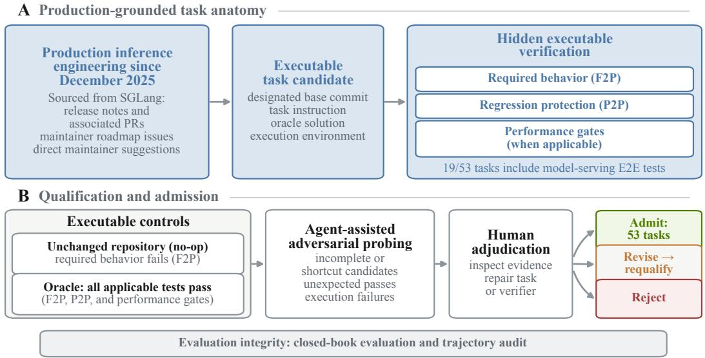  
Figure 1: SWE-Serve task construction and qualification. Production grounding, executable verifi cation, and qualification jointly support task validity. (A) Recent production inference engineering work from SGLang is mapped to executable task candidates with hidden behavioral verification. (B) Task admission is informed by no-op and oracle controls, agent-assisted adversarial probing, and human adjudication.

Any implementation that passes those tests is accepted. An implementation that fails any F2P or P2P test therefore does not satisfy the task’s production correctness requirements.

## 3.2 COMPOSITION AND SCOPE

Table 2 summarizes engineering breadth and task scale. To give a compact view of the engineering work represented, we organize the tasks into six mutually exclusive engineering families (Table 2A). The tasks also vary in construction scope: 37 derive from one upstream change, while 16 integrate two to six related changes. In total, the benchmark draws on 83 unique merged upstream pull requests. Execution spans 12 CPU and 41 GPU (H100) tasks, with strict model-serving E2E tests in 19 tasks and calibrated performance gates in 3. Together, the benchmark spans localized correctness fixes and integrations that cross API, scheduling, model-execution, and runtime-state boundaries.

Table 2: SWE-Serve benchmark composition and scale.
<table><tr><td>Engineering family</td><td>Tasks</td></tr><tr><td>Model and backend enablement</td><td>12</td></tr><tr><td>Speculative and advanced decoding</td><td>14</td></tr><tr><td>Kernels, quantization, and performance</td><td>8</td></tr><tr><td>Caching and runtime state</td><td>7</td></tr><tr><td>Distributed execution and scheduling</td><td>4</td></tr><tr><td>Serving APIs and runtime correctness</td><td>8</td></tr><tr><td>Total</td><td>53</td></tr></table>

B. Task and verification scale
<table><tr><td>Attribute</td><td>Median</td><td>Max.</td></tr><tr><td>Task-instruction words</td><td>200</td><td>915</td></tr><tr><td>Oracle lines changed</td><td>553</td><td>6,077</td></tr><tr><td>Oracle files changed</td><td>7</td><td>35</td></tr><tr><td>Fail-to-pass (F2P) tests</td><td>7</td><td>246</td></tr><tr><td>Pass-to-pass (P2P) tests</td><td>10</td><td>2,034</td></tr></table>

Table 2B reports oracle-solution size for the tasks: the median oracle solution changes 553 lines across seven files, with maxima of 6,077 lines and 35 files. The full distributions of oracle lines and files changed reveal smaller patches not apparent from the summary statistics (Appendix Figure 4).

SWE-Serve’s oracle solutions change more lines and files on average than those of SWE-bench Verified, SWE-bench Pro, and DeepSWE, while its mean prompt is shorter than those of DeepSWE and SWE-bench Pro (Appendix Figure 5; Huang et al., 2026). The oracle comparison suggests broader repository-level implementation scope, while the shorter prompts leave agents to determine how to implement that work rather than follow prescriptive plans.

Before examining any model outcomes, we used only the task instruction and tests in the executable verifier to assign each task three labels: runtime-domain breadth, persistent state, and concurrent coordination. Runtime-domain breadth indicates how many of four domains the verifier tests: request I/O, scheduling and request lifecycle, model execution, and KV-cache and resource management. These domains were derived from recurring runtime responsibilities in four prominent open-source inference systems: vLLM (Kwon et al., 2023), SGLang (Zheng et al., 2024), TensorRT-LLM (NVIDIA, 2026a), and Triton (NVIDIA, 2026b), as documented in Appendix Table 4. Persistent state indicates that the verifier tests state maintained across operations or lifecycle phases. Concurrent coordination indicates that the verifier tests coordination between overlapping operations. Appendix Table 5 reports these labels alongside each task’s family, hardware, and other verifier attributes.

## 3.3 CONSTRUCTION AND QUALIFICATION

Construction had three stages: first, five discovery paths identified and screened 786 task-source records, retaining 203 source candidates; next, task construction produced 156 task candidates; finally, qualification admitted 53 tasks (Appendix Figure 6). The discovery paths used four sources: two release-note scans, a manual review of release materials and associated pull requests, maintainerroadmap issues, and direct SGLang-team suggestions. Next, task construction deduplicated the 203 source candidates and created task candidates. Each task candidate comprised a task instruction, a designated base commit, a sandboxed execution environment specification, an oracle solution, and hidden tests. For multi-PR candidates, the designated base commit precedes the first source change.

At the final stage, 53 of the 156 task candidates were admitted to SWE-Serve, a 34.0% admission rate. Admission required each candidate to run in its specified hardware environment and satisfy the following executable controls: the no-op had to fail every F2P and pass every P2P test, while the oracle had to pass all tests; for performance tasks, these controls were repeated across H100 nodes to account for timing variability. Alongside these executable controls, every admitted task underwent agent-assisted adversarial probing using agent-created patches and trajectories to identify vulnerabilities in its task instruction and verifier (see Appendix Table 6 for validation coverage). This probing looked for valid alternatives rejected by the verifier, incomplete or shortcut solutions that it accepted, unexercised requirements, and environment-induced execution failures, paralleling Terminal-Bench 3’s cheating-agent runs and instruction–verifier alignment review (Marten et al., 2026). Executable controls, agent-assisted adversarial probing, and human adjudication jointly informed task revision and final-roster selection. Across this process, 17 broad task candidates were replaced by narrower tasks, and 27 task candidates required verifier changes (Appendix Section A.1.5). Upon admission, a benchmark canary (a fixed string that supports future detection of exposure to released SWE-Serve artifacts) was added to each released task configuration, following BIG-bench and Terminal-Bench (Srivastava et al., 2023; Merrill et al., 2026); Appendix A.1.6 describes the canary’s scope and limitations. Together, these controls establish that each task is nontrivial at its base commit, oracle-solvable, reproducible on declared hardware, and scored against its production correctness requirements.

## 4 EXPERIMENTAL SETUP

All experiments use Harbor 0.13.1 (Harbor Framework Team, 2026) to run the full 53-task benchmark in sandboxes with CPU or GPU (H100) resources. The agent develops a solution until it finishes or reaches 350 steps or 210 minutes, then the hidden verifier scores its patch; individual commands time out after 120 seconds without ending the attempt. The 210-minute limit accommodates SWE-Serve’s long-running tasks: across nine effort-matched configurations, mean task wall-clock time is 43.3 vs. 34.3 minutes on DeepSWE, and 24.5% vs. 3.5% of task means fall in the one-to-four-hour bucket (Appendix Figure 7). Furthermore, only 2.4% (42/1,749) of attempts across the 11 top-per-model configurations ended as execution-limit failures: 15 at 210 minutes and 27 at 350 steps (Appendix Figure 8). We rerun a task only when the evaluation fails to produce a valid score because of an issue with the model-serving route, runner, hardware, or verifier infrastructure. We do not rerun tasks because of agent errors, budget exhaustion, test failures, or crashes caused by the agent-created patch.

We compare models using mini-SWE-agent v2.4.3, a model-agnostic harness developed by the team behind SWE-bench and SWE-agent (Jimenez et al., 2024; Yang et al., 2024; Lieret & Jimenez, 2025). Within this harness, models use only Bash to inspect, edit, and test the repository. We then evaluate 11 models, including frontier models: Claude Opus 5 and Sonnet 5 (Anthropic, 2026b;c); GPT-5.6 Sol, Luna, and Terra (OpenAI, 2026b); Kimi K3 (Kimi Team, 2026); DeepSeek V4 Flash 0731 (DeepSeek-AI, 2026a;b); GLM-5.2 (GLM-5-Team, 2026; Z.ai, 2026); Gemini 3.6 Flash (Google DeepMind, 2026); Laguna S 2.1 (Poolside, 2026); and Inkling S (Thinking Machines Lab, 2026). Appendix Table 7 lists serving, token-limit, and harness configurations. To assess reasoning-effort sensitivity, we evaluate two Claude and three GPT-5.6 models at low, medium, high, xhigh, and max: 31 model–effort configurations, each evaluated three times (K = 3).

The primary leaderboard highlights each model’s configuration with the highest mean pass@1, the average of three run-level pass rates (Section 3.1). Appendix A.2.4 details pass@1 aggregation. We also measure pass@3, the task fraction solved at least once, and passˆ3, the fraction solved in all three attempts (Yao et al., 2025). Furthermore, to assess harness sensitivity, we compare two leading model–effort configurations under mini-SWE-agent and their native harnesses (Section 5.3).

We enforce a closed-book evaluation because an open-book pilot confirmed task-specific upstream retrieval by all three models evaluated (Appendix Table 8). This setting blocks public web and upstream repositories. Only Hugging Face remains allowlisted because serving tasks require model artifacts; task source repositories stay blocked, and model communication remains separate. To assess closed-book integrity, we audit every trajectory for prohibited retrieval. Every prohibited retrieval attempt was blocked, so no trial was invalidated on this basis.

## 5 RESULTS

## 5.1 SWE-SERVE REVEALS A 40-POINT PASS@1 SPREAD ACROSS EVALUATED MODELS

Across 11 models, mean pass@1 under each model’s best-performing configuration spans a 40- percentage-point range, from 75% for Claude Opus 5 and GPT-5.6 Sol to 35% for Inkling S. Pass@1, however, captures only one dimension of performance: among four configurations tied at 64% pass@1, mean per-task cost varies by 7.6× (\$0.95–\$7.24) and wall-clock time by 3.9× (25.5–99.9 minutes), while output tokens range from 61k to 98k and agent steps from 82 to 148. Thus, even among agents with identical pass@1 under a shared harness, selection depends on how cost, token use, steps, and latency are prioritized (Table 3).

To assess reasoning-effort trade-offs, we evaluated each of five models spanning the Claude and GPT-5.6 families at five effort settings, bringing the full evaluation to 31 model–effort configurations (Appendix Table 9). These effort sweeps show that resource trade-offs also arise within models as effort changes. Across the five models, higher effort consistently increases cost, while performance gains vary substantially across models and effort settings (Appendix Figure 9). For Claude Opus 5, moving from high to max effort raises pass@1 only modestly, from 74% to 75%, while increasing mean cost by 76% (\$9.89 to \$17.40 per task). This example shows that optimizing for pass@1 alone can incur substantially higher resource costs for only a marginal performance gain. Appendix Figures 10–12 plot pass@1 against cost, output-token use, and wall-clock time and show the observed Pareto frontier for each resource.

Pass@1 can also obscure differences in repeated-run reliability. For example, DeepSeek V4 Flash at max effort and GPT-5.6 Luna at xhigh effort both achieve 55% pass@1, yet DeepSeek has higher coverage across retries (74% versus 64% pass@3), while Luna has higher consistency (45% versus 42% passˆ3). Table 3 reports consistency, while Appendix Table 9 reports both metrics for all 31 model–effort configurations.

Family-level results provide a complementary view of performance across the benchmark: pooled pass@1 across the 11 best-performing model configurations ranges from 42.9% for model and backend enablement to 74.6% for kernels, quantization, and performance (Appendix Figure 13). Taken together, SWE-Serve separates models across a 40-point pass@1 range while revealing differences in resource use and repeated-run reliability among configurations with similar pass@1.

Table 3: Primary leaderboard. For 11 models, we report the effort configuration with the highest observed mean pass@1 with mini-SWE-agent; rows are ordered by mean pass@1. The pass@1 entry reports the mean and 95% confidence interval across three runs. The passˆ3 entry is the fraction of tasks solved in all three runs. The final four columns report means over task attempts.
<table><tr><td></td><td>Reasoning</td><td>pass@1</td><td></td><td colspan="4">Mean per task Output Agent Wall-clock</td></tr><tr><td>Model</td><td>effort</td><td>95% CI</td><td>pass^3</td><td>Cost</td><td>tokens</td><td>steps</td><td>time (min)</td></tr><tr><td>Claude Opus 5</td><td>max</td><td>75% ± 4%</td><td></td><td>70% $17.40</td><td>122k</td><td>134</td><td>57.5</td></tr><tr><td>GPT-5.6 Sol</td><td>max</td><td>75% ± 6%</td><td></td><td>68% $12.26</td><td>52k</td><td>63</td><td>29.5</td></tr><tr><td>Claude Sonnet 5</td><td>xhigh</td><td>64% ± 4%</td><td>51%</td><td>$6.61</td><td>98k</td><td>148</td><td>40.6</td></tr><tr><td>Kimi K3</td><td>max</td><td>64% ± 6%</td><td>51%</td><td>$7.24</td><td>79k</td><td>117</td><td>99.9</td></tr><tr><td>GPT-5.6 Luna</td><td>max</td><td>64% ± 4%</td><td>51%</td><td>$0.95</td><td>65k</td><td>110</td><td>28.9</td></tr><tr><td>GPT-5.6 Terra</td><td>max</td><td>64% ± 4%</td><td>55%</td><td>$5.06</td><td>61k</td><td>82</td><td>25.5</td></tr><tr><td>DeepSeek V4 Flash (0731)</td><td>max</td><td>55%±5%</td><td>42%</td><td>$0.69</td><td>99k</td><td>173</td><td>36.4</td></tr><tr><td>GLM-5.2</td><td>max</td><td>48% ± 2%</td><td>34%</td><td>$2.10</td><td>53k</td><td>101</td><td>34.0</td></tr><tr><td>Gemini 3.6 Flash</td><td>high</td><td>48% ± 7%</td><td>30%</td><td>$4.84</td><td>99k</td><td>92</td><td>37.3</td></tr><tr><td>Laguna S 2.1</td><td>max</td><td>46% ± 5%</td><td>26%</td><td>$0.33</td><td>147k</td><td>184</td><td>56.9</td></tr><tr><td>Inkling S</td><td>xhigh</td><td>35% ± 3%</td><td>25%</td><td>$0.44</td><td>36k</td><td>96</td><td>17.6</td></tr></table>

## 5.2 LOCAL CORRECTNESS DOES NOT ENSURE PRODUCTION CORRECTNESS

A patch may satisfy component and integration tests yet fail when exercised end to end through a live model-serving path. SWE-Serve measures this distinction with 276 model-serving end-to-end (E2E) tests across 19 tasks. These tests launch a standalone serving process with the required model and assess its behavior through a public request or evaluation interface. The model-serving E2E tests are production-grounded: 242 (87.7%) are sourced or adapted from the SGLang repository; the remaining 34 were added by SWE-Serve to cover accepted SGLang behavior not otherwise tested.

Model-serving E2E gap. To isolate model-serving E2E requirements, we remove these tests from scoring while leaving the agent-created patches and all other tests unchanged. Across 19 tasks (627 patches), pass rate increases from 45.9% under the full verifier to 69.4% when the E2E tests are removed from scoring, a 23.4-percentage-point increase (Figure 2A). Pass rate increases for all 11 top-per-model configurations (Appendix Figure 14A).

Matched test-removal control. We test whether removing the same number of non-E2E tests produces a comparable effect. Across 12 eligible tasks, we evaluate 10,000 randomized test-removal pairs. Each pair excludes from scoring 38 E2E tests and 38 non-E2E tests matched within task and F2P/P2P role, while holding all 396 agent-created patches fixed. E2E test removal produces 16.1 fail-to-pass transitions on average, compared with 8.0 for matched non-E2E test removal, a 2.0× difference. E2E test removal produces more fail-to-pass transitions in 92.2% of the randomized pairs (Appendix A.4.1). The corresponding E2E-minus-control pass-rate gap averages 2.1 points, with a 95% mask-randomization interval of −0.5 to 4.3 points.

SWE-Serve task example. The Gemma 4 MoE core-serving task illustrates this pattern: 48.5% of its agent-created patches (16 of 33) passed every non-E2E test but failed at least one E2E test (Appendix Table 10). These tests exercise loading the official checkpoint, routing each token through the top eight of the model’s 128 experts, text and image serving through public interfaces, and ordered native batch generation with log probabilities (Gemma Team, 2026).

Sensitivity analyses. Next, we assess robustness of the pass-rate increase to task composition and tasks containing only E2E tests. First, resampling the 19 tasks 10,000 times yields a 95% bootstrap confidence interval of 13.4–34.4 points for the pass-rate increase (Appendix A.4.1). Second, after excluding the four tasks with no non-E2E tests, the pass-rate increase remains 22.8 points (Appendix Table 10).

Production inference task properties. Beyond the model-serving E2E analysis, we examine whether runtime-domain breadth, persistent state, and concurrent coordination are associated with lower observed pass rates across the 11 top-per-model configurations. Runtime-domain breadth measures coverage across four domains in the request-to-output path (Appendix Table 4); it does not cover infrastructure, deployment, tooling, observability, or the full inference engineering stack. The 26 single-runtime-domain tasks have a mean pass rate of 69.0%, compared with 47.7% for the 27 multi-runtime-domain tasks, an average difference of 21.3 percentage points (Figure 2B). Multi-runtime-domain tasks have lower pass rates in every configuration (Appendix A.4.1). Persistent state and concurrent coordination also show large performance differences among SWE-Serve GPU tasks. Mean pass rate is 20.8 points lower for tasks requiring persistent state and 29.0 points lower for the six tasks that explicitly test concurrent coordination (Figure 2C–D). The corresponding gaps are small on SWE-Serve CPU and DeepSWE tasks (Huang et al., 2026).

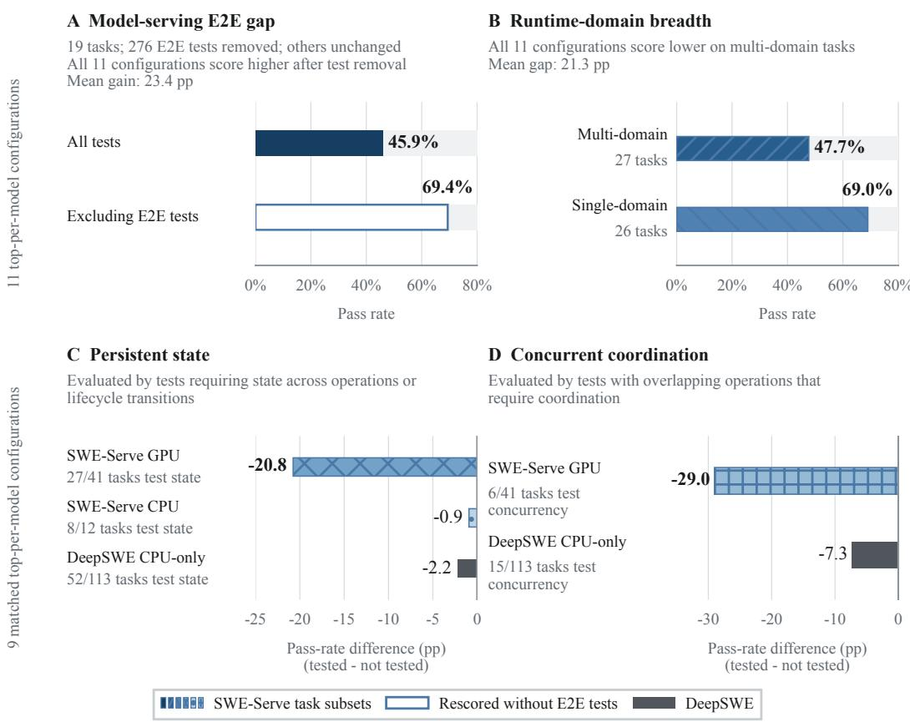  
Figure 2: Agentic implementations often fall short of production correctness. (A) Rescoring the same patches without model-serving E2E tests raises pass rate from 45.9% to 69.4%, a 23.4- percentage-point increase across 19 tasks. (B) Multi-runtime-domain tasks have pass rates 21.3 percentage points lower than single-runtime-domain tasks across 11 top-per-model configurations. (C–D) Across nine matched configurations, SWE-Serve GPU tasks whose tests require persistent state or concurrent coordination have pass rates 20.8 and 29.0 percentage points lower, respectively, than tasks not tested for these properties; gaps are smaller on DeepSWE (Huang et al., 2026).

Reasoning-effort robustness. Across the GPT-5.6 model family, increasing reasoning effort improves aggregate pass rates but does not consistently close the production correctness gaps, which remain substantial even at maximum effort (Appendix Figure 15).

## 5.3 SENSITIVITY TO AGENT HARNESS

The primary leaderboard uses mini-SWE-agent, a model-agnostic harness (Lieret & Jimenez, 2025), to hold the agent scaffold constant across models. However, this may not reflect the performance achievable with model-specific harnesses. We therefore re-evaluate the two best-performing configurations, GPT-5.6 Sol and Claude Opus 5, both at maximum effort, using their model-specific harnesses, Codex and Claude Code, respectively (OpenAI, 2026a; Anthropic, 2026a).

Switching to model-specific harnesses does not improve mean pass@1 in either evaluated configuration. mini-SWE-agent achieves 75.5% for both configurations, compared with 73.6% for GPT-5.6 Sol with Codex and 69.8% for Opus 5 with Claude Code (Figure 3). These results support using mini-SWE-agent for the primary leaderboard, while showing that harness choice can affect measured performance. The absence of an advantage for model-specific harnesses is consistent with the finding reported for the DeepSWE benchmark (Huang et al., 2026).

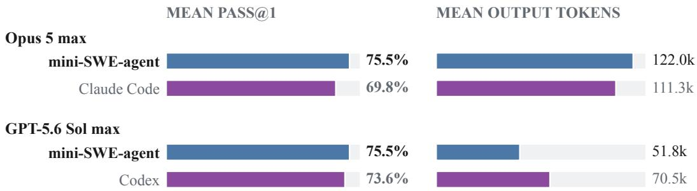  
Figure 3: Model-specific harness sensitivity on 53 SWE-Serve tasks, with three runs per harness. mini-SWE-agent matches Codex for GPT-5.6 Sol and exceeds Claude Code for Opus 5.

Harness choice also affects resource trade-offs. For GPT-5.6 Sol, mini-SWE-agent achieves similar pass@1 to Codex with fewer mean output tokens. For Opus 5, mini-SWE-agent achieves higher pass@1 than Claude Code with more mean output tokens. Appendix Figures 16 and 17 compare mean cost, wall-clock time, and token counts across harnesses.

## 6 LIMITATIONS

SWE-Serve provides an in-depth evaluation of production inference engineering. Extending executable coverage beyond SGLang to other inference systems will help establish how broadly the findings generalize. We restrict execution to CPU or a single H100 to reduce evaluation costs and broaden access. This trade-off omits multi-GPU and multi-node tasks involving parallelism, disaggregation, and distributed coordination. Additionally, executable scoring measures functional, regression, integration, end-to-end, and targeted performance requirements, but does not assess every dimension of upstream readiness. Patch size and change dispersion complement these functional measurements as coarse indicators of implementation complexity, but cannot establish maintainability, architectural fit, or replace maintainer review (Appendix Figure 18 and Table 11). Finally, closed-book execution and trajectory auditing prevent agents from retrieving upstream solutions during evaluation, but cannot rule out prior exposure to public SGLang code. To support future training-corpus decontamination after release, each task includes a benchmark canary string (Appendix A.1.6). A private held-out task set would provide a complementary safeguard and remains a direction for future work.

## 7 CONCLUSION

We introduced SWE-Serve, a benchmark for evaluating agentic LLMs on challenging, repositoryscale production inference engineering tasks. We qualify its tasks with executable no-op and oracle controls, agent-assisted adversarial probing, and targeted human review. Across SWE-Serve, agents often satisfy local requirements without achieving production correctness. SWE-Serve quantifies this gap directly: removing model-serving E2E tests from scoring while leaving the agent-created patches and all other tests unchanged raises mean pass rate by 23.4 percentage points; all 11 top-per-model configurations improve. SWE-Serve complements existing agentic benchmarks by enabling the field to track whether future agents close the gap between completing tasks locally and achieving production correctness.

## ACKNOWLEDGMENTS

We thank the SGLang maintainers and contributors for developing and maintaining the open-source codebase on which SWE-Serve’s benchmark tasks are based. We especially thank the maintainers for their task suggestions, helpful pointers, and feedback throughout the development of this work.

## REFERENCES

Anthropic. Claude Code overview. Claude Code documentation, 2026a. URL https://code. claude.com/docs/en/overview.

Anthropic. Claude Opus 5 system card. Anthropic system card, July 2026b. URL https: //www.anthropic.com/claude-opus-5-system-card.

Anthropic. Claude Sonnet 5 system card. Anthropic system card, June 2026c. URL https: //www.anthropic.com/claude-sonnet-5-system-card.

Datacurve. DeepSWE benchmark repository. GitHub repository, 2026. URL https://github. com/datacurve-ai/deep-swe.

DeepSeek-AI. DeepSeek-V4: Towards highly efficient million-token context intelligence. arXiv preprint arXiv:2606.19348, 2026a. URL https://arxiv.org/abs/2606.19348.

DeepSeek-AI. DeepSeek-V4-Flash-0731 model card. Hugging Face model card, 2026b. URL https://huggingface.co/deepseek-ai/DeepSeek-V4-Flash-0731.

Xiang Deng, Jeff Da, Edwin Pan, Yannis Yiming He, Charles Ide, Kanak Garg, Niklas Lauffer, Andrew Park, Chetan Rane, Karmini Sampath, Maya Krishnan, Srivatsa Kundurthy, Sean Hendryx, Zifan Wang, Chen Bo Calvin Zhang, Noah Jacobson, Bing Liu, and Brad Kenstler. SWE-Bench Pro: Can AI agents solve long-horizon software engineering tasks? In International Conference on Machine Learning, 2026. URL https://openreview.net/forum?id=uEVTdoAbnK.

Yukang Feng, Jianwen Sun, Zelai Yang, Jiaxin Ai, Chuanhao Li, Zizhen Li, Fanrui Zhang, Kang He, Rui Ma, Jifan Lin, Jie Sun, Yang Xiao, Sizhuo Zhou, Wenxiao Wu, Yiming Liu, Pengfei Liu, Shenglin Zhang, and Kaipeng Zhang. LongCLI-Bench: A preliminary benchmark and study for long-horizon agentic programming in command-line interfaces. In Findings of the Association for Computational Linguistics: ACL 2026, pp. 29952–29963. Association for Computational Linguistics, July 2026. doi: 10.18653/v1/2026.findings-acl.1497. URL https://aclanthology.org/2026.findings-acl.1497/.

Gemma Team. Gemma 4 technical report. arXiv preprint arXiv:2607.02770, 2026. URL https: //arxiv.org/abs/2607.02770.

GLM-5-Team. GLM-5: From vibe coding to agentic engineering. arXiv preprint arXiv:2602.15763, 2026. URL https://arxiv.org/abs/2602.15763.

Google DeepMind. Gemini 3.6 Flash model card. Google DeepMind model card, July 2026. URL https://deepmind.google/models/model-cards/gemini-3-6-flash/.

Harbor Framework Team. Harbor: A framework for evaluating and optimizing agents and models in container environments. Software, 2026. URL https://github.com/ harbor-framework/harbor/tree/v0.13.1. Version 0.13.1 used in experiments.

Charles R. Harris, K. Jarrod Millman, Stefan J. van der Walt, Ralf Gommers, Pauli Virtanen, David´ Cournapeau, Eric Wieser, Julian Taylor, Sebastian Berg, Nathaniel J. Smith, Robert Kern, Matti Picus, Stephan Hoyer, Marten H. van Kerkwijk, Matthew Brett, Allan Haldane, Jaime Fernandez del´ R´ıo, Mark Wiebe, Pearu Peterson, Pierre Gerard-Marchant, Kevin Sheppard, Tyler Reddy, Warren´ Weckesser, Hameer Abbasi, Christoph Gohlke, and Travis E. Oliphant. Array programming with NumPy. Nature, 585:357–362, 2020. doi: 10.1038/s41586-020-2649-2. URL https: //www.nature.com/articles/s41586-020-2649-2.

Wenqi Huang, Charley Lee, Leonard Tng, and Serena Ge. DeepSWE: Measuring frontier coding agents on original, long-horizon engineering tasks. arXiv preprint arXiv:2607.07946, 2026. URL https://arxiv.org/abs/2607.07946.

Carlos E. Jimenez, John Yang, Alexander Wettig, Shunyu Yao, Kexin Pei, Ofir Press, and Karthik Narasimhan. SWE-bench: Can language models resolve real-world GitHub issues? In International Conference on Learning Representations, pp. 54107–54157, 2024. URL https://proceedings.iclr.cc/paper\_files/paper/2024/hash/ edac78c3e300629acfe6cbe9ca88fb84-Abstract-Conference.html.

Kimi Team. Kimi K3: Open frontier intelligence. arXiv preprint arXiv:2607.24653, 2026. URL https://arxiv.org/abs/2607.24653.

Woosuk Kwon, Zhuohan Li, Siyuan Zhuang, Ying Sheng, Lianmin Zheng, Cody Hao Yu, Joseph E. Gonzalez, Hao Zhang, and Ion Stoica. Efficient memory management for large language model serving with PagedAttention. In Proceedings of the 29th Symposium on Operating Systems Principles, pp. 611–626, 2023. doi: 10.1145/3600006.3613165. URL https://doi.org/10. 1145/3600006.3613165.

Tue Le, Minh V. T. Thai, Dung Nguyen Manh, Huy Phan Nhat, and Nghi D. Q. Bui. SWE-EVO: Benchmarking coding agents in long-horizon software evolution scenarios. arXiv preprint arXiv:2512.18470, 2025. URL https://arxiv.org/abs/2512.18470.

Kilian Lieret and Carlos E. Jimenez. mini-SWE-agent. Software, 2025. URL https://github. com/SWE-agent/mini-swe-agent/tree/v2.4.3. Version 2.4.3.

Edward Lin, Sahil Modi, Siva Kumar Sastry Hari, Qijing Huang, Zhifan Ye, Nestor Qin, Fengzhe Zhou, Yuan Zhang, Jingquan Wang, Sana Damani, Dheeraj Peri, Ouye Xie, Aditya Kane, Moshe Maor, Michael Behar, Triston Cao, Rishabh Mehta, Vartika Singh, Vikram Sharma Mailthody, Terry Chen, Zihao Ye, Hanfeng Chen, Tianqi Chen, Vinod Grover, Wei Chen, Wei Liu, Eric Chung, Luis Ceze, Roger Bringmann, Cyril Zeller, Michael Lightstone, Christos Kozyrakis, and Humphrey Shi. SOL-ExecBench: Speed-of-light benchmarking for real-world GPU kernels against hardware limits. arXiv preprint arXiv:2603.19173, 2026. URL https://arxiv.org/abs/2603.19173.

Jane Luo, Xin Zhang, Steven Liu, Jie Wu, Jianfeng Liu, Yiming Huang, Yangyu Huang, Chengyu Yin, Ying Xin, Yuefeng Zhan, Hao Sun, Qi Chen, Scarlett Li, and Mao Yang. RPG: A repository planning graph for unified and scalable codebase generation. In International Conference on Learning Representations, pp. 91932–91985, 2026. URL https://proceedings.iclr.cc/paper\_files/paper/2026/hash/ 9482f45fdd89aba9130bb04c44f788a9-Abstract-Conference.html.

Ryan Marten, Alex Shaw, and Andy Konwinski. Terminal-Bench 3.0. Official benchmark announcement, July 2026. URL https://www.tbench.ai/news/terminal-bench-3-0. Initial 74-task release; source snapshot: https://github.com/harbor-framework/ terminal-bench/tree/c622d7a24f67e5a495209931a347dda9c98e1505.

Mike A. Merrill et al. Terminal-Bench: Benchmarking agents on hard, realistic tasks in command line interfaces. In International Conference on Learning Representations, pp. 40903–40986, 2026. URL https://proceedings.iclr.cc/paper\_files/paper/2026/hash/ 444a3737adaee10d86ad2ef5f74468e6-Abstract-Conference.html.

Ayush Nangia, Shikhar Mishra, Aman Gokrani, and Paras Chopra. ISO-Bench: Can coding agents optimize real-world inference workloads? arXiv preprint arXiv:2602.19594, 2026. URL https: //arxiv.org/abs/2602.19594.

NVIDIA. TensorRT-LLM PyTorch backend architecture overview. TensorRT-LLM documentation, 2026a. URL https://nvidia.github.io/TensorRT-LLM/latest/torch/arch\_ overview.html.

NVIDIA. NVIDIA Triton Inference Server architecture. Triton Inference Server documentation, 2026b. URL https://docs.nvidia.com/deeplearning/ triton-inference-server/user-guide/docs/user\_guide/architecture. html.

OpenAI. Introducing SWE-bench Verified. OpenAI research release, August 2024. URL https: //openai.com/index/introducing-swe-bench-verified/.

OpenAI. Codex CLI. OpenAI documentation, 2026a. URL https://learn.chatgpt.com/ docs/codex/cli.

OpenAI. GPT-5.6 system card. OpenAI system card, July 2026b. URL https:// deploymentsafety.openai.com/gpt-5-6.

Anne Ouyang, Simon Guo, Simran Arora, Alex L. Zhang, William Hu, Christopher Re, and Azalia ´ Mirhoseini. KernelBench: Can LLMs write efficient GPU kernels? In Proceedings of the 42nd International Conference on Machine Learning, volume 267 of Proceedings of Machine Learning Research, pp. 47356–47415. PMLR, 2025. URL https://proceedings.mlr.press/ v267/ouyang25a.html.

Poolside. Laguna S 2.1 model card. Hugging Face model card, 2026. URL https:// huggingface.co/poolside/Laguna-S-2.1.

SGLang Project. SGLang source repository. GitHub repository, revision f825d7293631, 2026. URL https://github.com/sgl-project/sglang/tree/ f825d729363136a2d4a4b330fa694d0b37a878fa.

Aarohi Srivastava et al. Beyond the imitation game: Quantifying and extrapolating the capabilities of language models. Transactions on Machine Learning Research, 2023. URL https:// openreview.net/forum?id=uyTL5Bvosj.

Thinking Machines Lab. Inkling-Small model card. Thinking Machines Lab model card, July 2026. URL https://thinkingmachines.ai/model-card/inkling-small/.

vLLM Project. vLLM architecture overview. vLLM documentation, 2026. URL https://docs. vllm.ai/en/latest/design/arch\_overview/.

John Yang, Carlos E. Jimenez, Alexander Wettig, Kilian Lieret, Shunyu Yao, Karthik Narasimhan, and Ofir Press. SWE-agent: Agent-computer interfaces enable automated software engineering. In Advances in Neural Information Processing Systems, volume 37, pp. 50528–50652, 2024. doi: 10.52202/079017-1601. URL https://papers.neurips.cc/paper\_files/paper/ 2024/hash/5a7c947568c1b1328ccc5230172e1e7c-Abstract-Conference. html.

John Yang, Kilian Lieret, Jeffrey Ma, Parth Thakkar, Dmitrii Pedchenko, Sten Sootla, Emily McMilin, Pengcheng Yin, Rui Hou, Gabriel Synnaeve, Diyi Yang, and Ofir Press. ProgramBench: Can language models rebuild programs from scratch? arXiv preprint arXiv:2605.03546, 2026. URL https://arxiv.org/abs/2605.03546.

Shunyu Yao, Noah Shinn, Pedram Razavi, and Karthik Narasimhan. τ-bench: A benchmark for tool-agent-user interaction in real-world domains. In International Conference on Learning Representations, pp. 9965–10017, 2025. URL https://proceedings.iclr.cc/paper\_files/paper/2025/hash/ 1b126cc38b8638e07bef37e7b2bb72bf-Abstract-Conference.html.

Jehyeok Yeon, Ben Rank, and Maksym Andriushchenko. InferenceBench: A benchmark for openended LLM inference optimization by AI agents. arXiv preprint arXiv:2607.20468, May 2026. URL https://arxiv.org/abs/2607.20468.

Z.ai. GLM-5.2: Built for long-horizon tasks. Model release, June 2026. URL https: //huggingface.co/blog/zai-org/glm-52-blog.

Lianmin Zheng, Liangsheng Yin, Zhiqiang Xie, Chuyue Sun, Jeff Huang, Cody Hao Yu, Shiyi Cao, Christos Kozyrakis, Ion Stoica, Joseph E. Gonzalez, Clark Barrett, and Ying Sheng. SGLang: Efficient execution of structured language model programs. In Advances in Neural Information Processing Systems, volume 37, pp. 62557–62583, 2024. doi: 10.52202/ 079017-2000. URL https://papers.neurips.cc/paper\_files/paper/2024/ hash/724be4472168f31ba1c9ac630f15dec8-Abstract-Conference.html.

Qixing Zhou, Jiacheng Zhang, Haiyang Wang, Rui Hao, Jiahe Wang, Minghao Han, Yuxue Yang, Shuzhe Wu, Feiyang Pan, Lue Fan, Dandan Tu, and Zhaoxiang Zhang. FeatureBench: Benchmarking agentic coding for complex feature development. In International Conference on Learning Representations, 2026. URL https://proceedings.iclr.cc/paper\_files/paper/ 2026/hash/25203d1cc8c58381eab578f4fcf9c4f8-Abstract-Conference. html.

## A APPENDIX

## APPENDIX CONTENTS

Section Page   
A.1 Benchmark composition, construction, and qualification 15   
A.1.1 Composition and scope 15   
A.1.2 Development of the runtime-domain taxonomy 15   
A.1.3 Model-serving end-to-end (E2E) test classification 16   
A.1.4 Task characterization 17   
A.1.5 Source discovery, task construction, and qualification 20   
A.1.6 Release canary 24   
A.2 Experimental setup 25   
A.2.1 Cross-benchmark evaluation wall-clock time 25   
A.2.2 Attempt outcomes and execution limits 26   
A.2.3 Model, serving, and harness configurations 27   
A.2.4 Leaderboard aggregation 28   
A.2.5 Closed-book evaluation and retrieval calibration 28   
A.3 Agentic performance and resource trade-offs 29   
A.3.1 Performance across 31 model–effort configurations 29   
A.3.2 Performance and resource trade-offs 30   
A.3.3 Performance by inference engineering family 34   
A.4 Production correctness 35   
A.4.1 Local correctness does not ensure production correctness 35   
A.4.2 Reasoning-effort robustness of production correctness gaps 38   
A.5 Sensitivity to agent harness 40   
A.6 Limitations of executable scoring 42

## A.1 BENCHMARK COMPOSITION, CONSTRUCTION, AND QUALIFICATION

This section expands the composition, scope, construction, and qualification evidence in Section 3.

## A.1.1 COMPOSITION AND SCOPE

Figure 4 complements the summaries in Table 2B with the full distribution of oracle scope, including the number of lines and files changed. The full distribution highlights that the median oracle solution changes 553 lines across seven files, while individual tasks range from 11 to 6,077 lines and from one to 35 files, showing that SWE-Serve includes both localized changes and broader implementations.

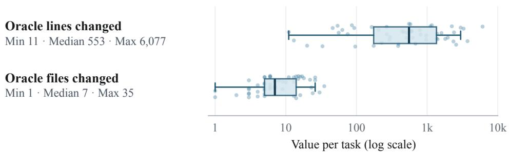  
Figure 4: Oracle patch size and file count across SWE-Serve tasks. Dots show individual tasks; boxes show medians and interquartile ranges (IQRs). Whiskers reach the most extreme observations within 1.5× IQR of the box edges, computed in original units. The value axis is logarithmic. Oracle lines changed counts additions plus deletions.

Figure 5 shows that SWE-Serve combines concise task instructions with substantial oracle implementation scope. Its prompts are shorter on average than those of DeepSWE and SWE-bench Pro, while its oracle solutions add more lines and modify more files on average than those of DeepSWE, SWE-bench Pro, and SWE-bench Verified. Instructions describe the desired behavior, and a separate executable verifier checks whether the agent’s solution satisfies the task’s requirements. This allows prompts to remain concise while leaving agents responsible for exploring the repository, planning the implementation, and producing a patch that passes the tests.

## A.1.2 DEVELOPMENT OF THE RUNTIME-DOMAIN TAXONOMY

To characterize the diversity of runtime responsibilities represented in SWE-Serve tasks, we developed a runtime-domain taxonomy from documented components in four prominent open-source inference systems: vLLM (Kwon et al., 2023), SGLang (Zheng et al., 2024), TensorRT-LLM (NVIDIA, 2026a), and Triton (NVIDIA, 2026b). We selected these systems for their popularity, as each official repository exceeded 10,000 GitHub stars on September 1, 20261, and for their differing scopes: vLLM, SGLang, and TensorRT-LLM are LLM-serving runtime stacks, while Triton is a broader inference server.

We examined the responsibilities of documented components along the path from receiving a request to producing its output, then grouped components with corresponding responsibilities across systems into four domains: request handling and I/O, covering input and output representation; scheduling and request lifecycle, covering admission, queuing, batching, and request progression; model execution, covering forward computation, decoding, attention, kernels, and backend invocation; and KV cache and runtime-resource management, covering the allocation and lifecycle of persistent inference-time state. These categories describe shared responsibilities across systems whose component names and implementations differ. For example, Triton’s resource-management components handle sequence state and backend-managed resources, whereas the LLM-serving systems include explicit KV-cache management.

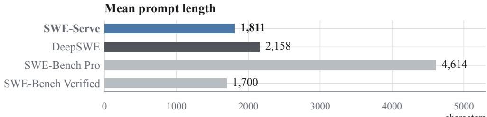

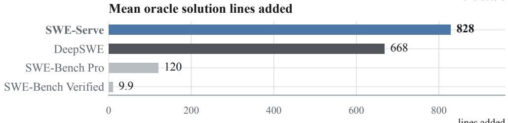

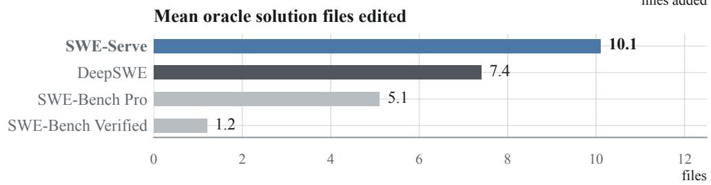  
DeepSWE, SWE-bench Pro, SWE-bench Verified: reproduced from DeepSWE Figure 2.

Figure 5: SWE-Serve’s oracle solutions add more lines and modify more files on average than those of DeepSWE, SWE-bench Pro, and SWE-bench Verified, while its prompts are shorter on average than those of DeepSWE and SWE-bench Pro. Bars show mean prompt length in characters, lines added by the oracle solution, and files changed. SWE-Serve values cover the full benchmark; comparator values are reproduced from DeepSWE Figure 2 (Huang et al., 2026).

Table 4 maps these responsibilities to documented components, with links to the supporting passages in pinned repository versions (vLLM Project, 2026; SGLang Project, 2026; NVIDIA, 2026a;b). We finalized the taxonomy and mapping before examining model outcomes, then used the taxonomy to characterize the responsibilities exercised by each task’s executable tests.

## A.1.3 MODEL-SERVING END-TO-END (E2E) TEST CLASSIFICATION

Motivated by SGLang maintainer feedback, we classified a test as model-serving E2E only if it met all six requirements below:

1. It uses a real pretrained checkpoint.

2. It executes the actual production SGLang runtime without mocked or synthetic private substitutes.

3. It drives the behavior under test through that runtime.

4. It makes a caller-visible behavioral assertion.

5. It launches a standalone serving process.

6. It exercises that process through a public request or evaluation boundary, such as HTTP/OpenAI-compatible requests or an evaluation runner targeting the server.

A task has model-serving E2E coverage when its executable verifier includes at least one such test that contributes to the task’s score.

Table 4: Evidence for constructing the runtime-domain taxonomy from four prominent open-source inference systems. Documented components illustrate four recurring responsibilities: request handling and I/O, scheduling and request lifecycle, model execution, and KV cache and runtime-resource management. Bracketed keys link to the corresponding evidence in pinned repository versions.
<table><tr><td>System</td><td>Request / I/O</td><td>Scheduling / lifecycle</td><td>Model execution</td><td>KV / runtime resources</td></tr><tr><td>vLLM</td><td>API server and input/output processors [V-IO1, V-IO2]</td><td>EngineCore scheduler [V-SL]</td><td>Executor, GPU worker, ModelRunner [V-ME1, V-ME2]</td><td>KV cache manager [V-RM]</td></tr><tr><td>SGLang</td><td>HTTP server, TokenizerManager, Detokenizer Manager [S-IO]</td><td>Scheduler, request queues, batch construction [S-SL1, S-SL2]</td><td>TP worker, ModelRunner, attention and kernels [S-ME1, S-ME2, S-ME3, S-ME4]</td><td>KV pools, allocators, RadixCache [S-RM1, S-RM2]</td></tr><tr><td>TensorRT- LLM</td><td>LLM interface and tokenization/ detokenization [T-IO]</td><td>PyExecutor scheduler [T-SL]</td><td>Model engine and decoder [T-ME]</td><td>ResourceManager and KVCacheManager [T-RM]</td></tr><tr><td>Triton</td><td>HTTP/REST, gRPC, C API, returning outputs [R-IO]</td><td>Per-model schedulers and batchers [R-SL]</td><td>Model backends and instances [R-ME1, R-ME2]</td><td>Sequence state and backend-managed resources [R-RM1, R-RM2]</td></tr></table>

## A.1.4 TASK CHARACTERIZATION

Before examining any model outcomes, we defined four task characteristics: runtime-domain breadth using the taxonomy in Appendix A.1.2, persistent state and concurrent coordination as defined in Section 3.2, and model-serving E2E coverage as defined in Appendix A.1.3. Using these definitions, we generated annotations for each characteristic across all SWE-Serve tasks. The annotation-creation process used only each task’s instruction and the tests in its executable verifier. We assigned a characteristic to a task only when it was tested by the verifier, making it part of the task’s executable correctness requirements. An unassigned characteristic therefore means that the verifier does not establish that requirement; it does not imply that an implementation that solves the task cannot choose to use persistent state, coordinate concurrent operations, span additional runtime domains, or execute an E2E serving path.

Beyond these four task characteristics, additional properties associated with each task include its engineering family (summarized in Table 2A), required execution hardware, and the presence of performance gates. Table 5 reports the full characterization of each SWE-Serve task.

Table 5: Task characterization of all SWE-Serve tasks. Engineering family identifies the type of engineering work. HW denotes the required execution hardware; all GPU tasks use an H100. E2E test denotes a model-serving end-to-end test, and Perf. gate abbreviates performance gate. In the model-serving E2E test, persistent state, concurrent behavior, and performance gate columns, a checkmark indicates a characteristic tested by the verifier as a correctness requirement. A dash means that the verifier does not establish this characteristic as a correctness requirement. The runtime-domains column indicates whether the verifier tests one (Single) or multiple (Multi) runtime domains. Runtime-domain codes are I=request handling and I/O, S=scheduling and request lifecycle, M=model execution, and K=key-value (KV) cache and runtime-resource management.
<table><tr><td>Task</td><td>Engineering family</td><td>HW E2E test</td><td>Runtime domains</td><td>state</td><td>Persistent Concurrent Perf. behavior</td><td>gate</td></tr><tr><td>Adaptive EAGLE step control + config guards</td><td>Speculative / decoding</td><td>CPU</td><td>Single (M)</td><td>√</td><td></td><td></td></tr><tr><td>NVFP4 and DeepSeek MoE inference optimizations</td><td>Kernels / quant. / perf.</td><td>CPU</td><td>Multi (M+K)</td><td>√</td><td></td><td></td></tr><tr><td>Gemma 4 fused Triton operations</td><td>Kernels / quant. / perf.</td><td>GPU 一</td><td>Single (M)</td><td></td><td></td><td>一</td></tr><tr><td>Masked MoE activation + GDN QKV-split kernels</td><td>Kernels / quant. / perf.</td><td>GPU 1</td><td>Single (M)</td><td>一</td><td>一</td><td>一</td></tr><tr><td>HiCache eviction and tombstone correctness</td><td>Caching / runtime state</td><td>GPU</td><td>Multi (S+K)</td><td>√</td><td>一</td><td>一</td></tr><tr><td>HiCache framework + sliding-window attention</td><td>Caching / runtime state</td><td>GPU</td><td>Multi (S+K)</td><td>√</td><td></td><td></td></tr><tr><td>Custom spec-algorithm registry Speculative / + N-gram metric fix</td><td>decoding</td><td>GPU</td><td>Single (M)</td><td>√</td><td></td><td></td></tr><tr><td>Anthropic Messages request/response conversion</td><td>Serving API / CPU runtime</td><td></td><td>Single (I)</td><td></td><td></td><td></td></tr><tr><td>Spec: forward-timeout ordering fix (EAGLE v1)</td><td>Speculative / decoding</td><td>GPU√</td><td>Multi (S+M)</td><td>√</td><td></td><td>一</td></tr><tr><td>Mamba state offloading + HybridCacheController</td><td>Caching / runtime state</td><td>GPU</td><td>Single (K)</td><td>√</td><td></td><td>一</td></tr><tr><td>DeepSeek-V4 DSML tool-call parser</td><td>Serving API / GPU runtime</td><td></td><td>Single (I)</td><td>√</td><td></td><td></td></tr><tr><td>O(1) EAGLE bigram RadixKey view</td><td>Speculative / decoding</td><td>CPU</td><td>Single (K)</td><td>√</td><td></td><td></td></tr><tr><td>torch.mm for DeepSeek-V3.2 indexer GEMM</td><td>Kernels / quant. / perf.</td><td>GPU</td><td>Single (M)</td><td></td><td></td><td>√</td></tr><tr><td>Spec: split accept_length counters</td><td>Speculative / decoding</td><td>CPU</td><td>Single (M)</td><td>√</td><td></td><td>一</td></tr><tr><td>Kimi-K2.5 EAGLE3-MLA draft path</td><td>Speculative / decoding</td><td>CPU</td><td>Single</td><td></td><td></td><td>一</td></tr><tr><td>Spec: split draft-extend dataclass</td><td>Speculative /</td><td>CPU</td><td>(M) Single</td><td>√</td><td></td><td>一</td></tr><tr><td>PD hybrid state-transfer refactor</td><td>decoding Distributed /</td><td>CPU</td><td>(M) Single</td><td></td><td></td><td></td></tr><tr><td>DeepSeek-V4 w4a4 MegaMoE Model /</td><td>scheduling backend</td><td>GPU</td><td>(K) Single (M)</td><td>√</td><td></td><td>一</td></tr><tr><td>PD disaggregation priority-scheduling fix</td><td>Distributed / scheduling</td><td>GPU -</td><td>Single (S)</td><td>√</td><td></td><td></td></tr></table>

Table 5, continued.
<table><tr><td>Task</td><td>Engineering family</td><td>HW E2E test</td><td>Runtime domains</td><td>state</td><td>Persistent Concurrent Perf. behavior</td><td>gate</td></tr><tr><td>Kimi tokenizer TTFT fast path Kernels /</td><td>quant. / perf.</td><td>GPU</td><td>Single (I)</td><td></td><td></td><td>√</td></tr><tr><td>UnifiedRadixCache device-match semantics fix</td><td>Caching / runtime state</td><td>GPU -</td><td>Single (K)</td><td>√</td><td></td><td></td></tr><tr><td>TMA bulk-store MLA KV-buffer kernel</td><td>Kernels / quant. / perf.</td><td>GPU</td><td>Multi (M+K)</td><td>√</td><td></td><td>√</td></tr><tr><td>Spec-V2 paged tree drafting</td><td>Speculative / decoding</td><td>GPU</td><td>Single (K)</td><td>一</td><td></td><td></td></tr><tr><td>Ideogram4 NVFP4 config from Model / safetensors</td><td>backend</td><td>CPU</td><td>Single (M)</td><td></td><td></td><td></td></tr><tr><td>DFLASH v1 non-overlap serving</td><td>Speculative / decoding</td><td>GPU√</td><td>Multi (S+M+K)</td><td>√</td><td></td><td></td></tr><tr><td>EAGLE v2 page-one tree runtime</td><td>Speculative / decoding</td><td>GPU √</td><td>Multi (S+M+K)</td><td>V</td><td>√</td><td></td></tr><tr><td>Diffusion-LLM radix-graph serving</td><td>Model / backend</td><td>GPU √</td><td>Multi (S+M+K)</td><td>√</td><td>√</td><td></td></tr><tr><td>DeepSeek-V3.2 index-cache store + paged gather</td><td>Caching / runtime state</td><td>GPU</td><td>Multi (M+K)</td><td>√</td><td></td><td></td></tr><tr><td>SDAR dense + MoE day-0 serving</td><td>Model / backend</td><td>GPU✓</td><td>Single (M)</td><td></td><td></td><td></td></tr><tr><td>EPD registration cleanup</td><td>Distributed / scheduling</td><td>CPU</td><td>Multi (I+S)</td><td>V</td><td></td><td></td></tr><tr><td>Context-parallel strategy abstractions</td><td>Distributed / scheduling</td><td>CPU</td><td>Single (M)</td><td>√</td><td></td><td></td></tr><tr><td>Chunked SGMV CUDA-graph Serving API / GPU replay fix</td><td>runtime</td><td></td><td>Multi (M+K)</td><td>V</td><td></td><td></td></tr><tr><td>Qwen3.5 dense + MoE core serving</td><td>Model / backend</td><td>GPU√</td><td>Multi (I+M)</td><td></td><td></td><td></td></tr><tr><td>Breakable prefill CUDA-graph Kernels / engine</td><td>quant. / perf.</td><td>GPU</td><td>Multi (M+K)</td><td>√</td><td></td><td></td></tr><tr><td>HiSparse page-aware decode lifecycle + FP8 routing</td><td>Caching / runtime state</td><td>GPU</td><td>Multi (S+M+K)</td><td>√</td><td></td><td></td></tr><tr><td>MoE LoRA route alignment + numerical kernel</td><td>Kernels / quant. / perf.</td><td>GPU</td><td>Single (M)</td><td></td><td></td><td></td></tr><tr><td>Mixed-chunk piecewise CUDA-graph replay</td><td>Serving API / GPU√ runtime</td><td></td><td>Multi (S+M+K)</td><td>√</td><td>√</td><td></td></tr><tr><td>Adaptive speculative allocation Speculative / safety</td><td>decoding</td><td>CPU</td><td>Single (K)</td><td>√</td><td></td><td></td></tr><tr><td>Transformers-backend compute runtime</td><td>Model / backend</td><td>GPU√</td><td>Single (M)</td><td></td><td></td><td></td></tr><tr><td>Transformers 5 MoE core serving</td><td>Model / backend</td><td>GPU✓</td><td>Single (M)</td><td>√</td><td></td><td></td></tr><tr><td>Gemma 4 piecewise CUDA-grâph execution</td><td>Model / backend</td><td>GPU ✓</td><td>Multi (I+M+K)</td><td>√</td><td></td><td></td></tr></table>

Continued on next page.

Table 5, continued.
<table><tr><td>Task</td><td>Engineering HW family</td><td>E2E test</td><td>Runtime domains</td><td>state</td><td>Persistent Concurrent Perf. behavior</td><td>gate</td></tr><tr><td>Gemma 4 speculative execution</td><td>Model / backend</td><td>GPU ✓</td><td>Multi (S+M+K)</td><td>V</td><td></td><td></td></tr><tr><td>Gemma 4 26B-A4B core serving</td><td>Model / backend</td><td>GPU √</td><td>Multi (I+M)</td><td>一</td><td>一</td><td>一</td></tr><tr><td>Multi-item Score API packing</td><td>Serving API / GPU – runtime</td><td></td><td>Multi (I+S+M)</td><td>一</td><td>√</td><td>一</td></tr><tr><td>N-gram trie refactor + stateful matching</td><td>Speculative / decoding</td><td>GPU√</td><td>Multi (S+M+K)</td><td>√</td><td>一</td><td></td></tr><tr><td>UnifiedRadixCache streaming-session KV</td><td>Caching / runtime state</td><td>GPU -</td><td>Multi (S+K)</td><td>√</td><td></td><td></td></tr><tr><td>GLM-V repetition-penalty sampling</td><td>Serving API / GPU √ runtime</td><td></td><td>Single (M)</td><td>√</td><td>一</td><td></td></tr><tr><td>N-gram external SAM corpus</td><td>Speculative / decoding</td><td>GPU√</td><td>Multi (I+M+K)</td><td>√</td><td></td><td></td></tr><tr><td>Embedding-model LoRA serving</td><td>Model / backend</td><td>GPU</td><td>Multi (I+M)</td><td></td><td>一</td><td></td></tr><tr><td>Score API hybrid token + embedding inputs</td><td>Serving API / GPU √ runtime</td><td></td><td>Multi (I+M)</td><td>一</td><td>一</td><td>一</td></tr><tr><td>SequenceClassification Score API</td><td>Model / backend</td><td>GPU ✓</td><td>Multi (I+S+M)</td><td></td><td>一</td><td></td></tr><tr><td>Spec-V2 streaming-session KV Speculative / commit</td><td>decoding</td><td>GPU√</td><td>Multi (S+M+K)</td><td>√</td><td>√</td><td></td></tr><tr><td>EAGLE3 overlap metadata lifecycle</td><td>Serving API / GPU √ runtime</td><td></td><td>Multi (S+M)</td><td>√</td><td>√</td><td></td></tr></table>

## A.1.5 SOURCE DISCOVERY, TASK CONSTRUCTION, AND QUALIFICATION

The pipeline used to generate SWE-Serve comprised three stages: source discovery and screening, task construction, and qualification and admission, as illustrated in Figure 6. Source discovery and screening used four source types to identify and screen production inference engineering contributions made to the SGLang repository since December 2025, yielding source candidates. Task construction deduplicated these source candidates and turned them into executable task candidates. Qualification and admission used executable controls, agent-assisted review and adversarial probing, and human adjudication to determine whether each task candidate should be revised and requalified, excluded, or admitted. This process produced the SWE-Serve benchmark.

## Source discovery and screening.

SOURCES. We used four source types through five discovery and screening paths.

Release notes. We reviewed SGLang release-note bullets to extract individual PRs or groups of related PRs. Bullets citing multiple PRs were treated as a multi-PR source. We conducted two rounds of review, with the second incorporating newer release notes and removing candidates already retained during the first round. Together, the two rounds covered release notes published from January through June 25, 2026.

Release notes and associated PRs. We manually reviewed SGLang release notes from January through June 24, 2026, and their associated PRs to identify broader features whose scope was not fully captured by a single release-note bullet. This review connected related changes across bullets and PRs to synthesize additional feature-level source candidates.

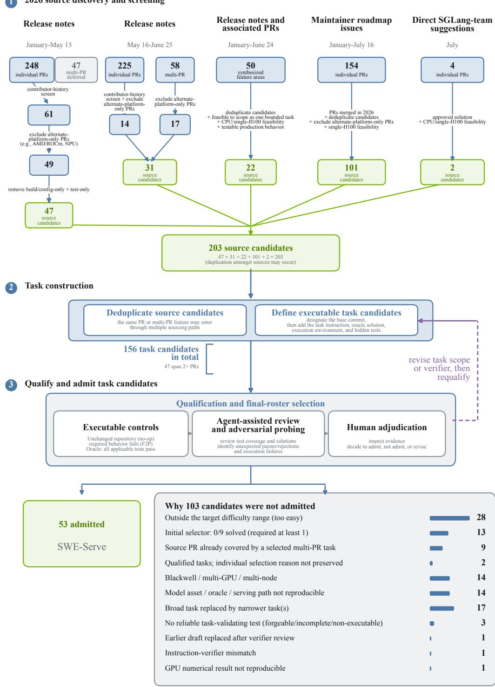  
Figure 6: The 156 task candidates include every constructed or revised candidate version. Qualification may return candidates to construction for scope or verifier revision; human adjudication admits 53 task candidates and does not admit 103 candidates.

Maintainer roadmap issues. We reviewed maintainer-authored roadmap issues and extracted PRs they linked to as individual PR source candidates. PRs that were part of the same feature were subsequently combined during task construction.

Direct SGLang-team suggestions. Additionally, SGLang maintainers nominated four recent PRs for review as potential benchmark contributions.

SCREENING CRITERIA. Each discovery path applied the screening criteria specified for that path in Figure 6.

The contributor-history screen selected individual PRs whose authors had both authored and reviewed at least three PRs within a snapshot of the 500 most recently created SGLang PRs that had been merged at the time. This served as a recent-activity heuristic rather than a measure of contributors’ entire contribution history. Additionally, authors needed to have submitted a review within that snapshot with GitHub association OWNER, MEMBER, or COLLABORATOR. This criterion applied to individual PRs in both rounds of release note review.

Exclude alternate-platform-only PRs. To support benchmark execution within a standardized hardware configuration with CPUs and a single H100 GPU, we excluded contributions focused only on hardware or software backends outside that configuration, such as AMD/ROCm and Ascend/NPU. Release note review identified these contributions using PR titles and labels, while roadmap review examined their implementation scope.

The remove build/config-only + test-only screen excluded candidates whose code changes were limited to build files, configuration, or tests. This criterion applied during the first round of release note review.

During manual feature review, we inspected the associated PR diffs to apply the deduplication, bounded-task scope, hardware-feasibility, and testable-production-behavior criteria. Deduplication was performed by assessing overlap with existing source candidates. Next, feasible to scope as one bounded task required a feature to support a clearly defined behavioral objective. Then testable production behavior required a way to deterministically test that behavior, although the tests could be authored during task construction.

The CPU or single H100 GPU feasibility criterion assessed whether the intended behavior could be exercised on CPU or a single H100 GPU, keeping benchmark execution within a standardized hardware configuration. This criterion applied to manual feature review and direct suggestions. Roadmap screening specifically required feasibility on a single H100 GPU.

For roadmap candidates, PRs merged in 2026 restricted eligibility to changes merged from January 1 through the July 16 screening cutoff. Deduplication also applied during roadmap screening.

For direct suggestions, approved solution required each PR to have an accepted implementation that could serve as the task’s reference solution.

SCREENING OUTCOME. Across the five discovery and screening paths, we retained 47 source candidates from the first round of release note review, 31 from the second round, 22 from manual review of release notes and associated PRs, 101 from maintainer roadmap issues, and two from direct SGLang-team suggestions. This yielded 203 source candidates for task construction.

## Task construction.

Task construction converted 203 source candidates into 156 task-candidates, including revised versions. This process first deduplicated overlapping source candidates and then, where feasible, developed the remaining candidates into executable tasks. Each executable task-candidate required a designated base commit, task instruction, oracle solution, reproducible execution environment, and hidden tests. Only source candidates that met these requirements became task-candidates, and each could include one or several related PRs.

During qualification, some task-candidates were returned to task construction to revise their scope or verifier before being requalified.

## Qualify and admit task candidates.

The final admission stage applied three qualification steps and final-roster selection to all 156 taskcandidates. The qualification steps included executable controls, agent-assisted review and adversarial probing, and human adjudication. Qualification and final-roster selection resulted in 53 tasks being admitted to the SWE-Serve benchmark, while 103 task-candidates were not admitted.

EXECUTABLE CONTROLS. The unchanged base commit served as the no-op control. It was required to pass all pass-to-pass tests and fail all fail-to-pass tests. The oracle solution was required to pass all applicable tests, including both pass-to-pass and fail-to-pass tests.

AGENT-ASSISTED REVIEW AND ADVERSARIAL PROBING. Review assessed whether the tests covered the behavioral requirements stated in the task instructions. Agent-generated solutions and execution traces were also used to identify incomplete or shortcut solutions that unexpectedly passed the verifier, valid solutions that were incorrectly rejected, and failures caused by the execution environment. These findings provided evidence for human adjudication of whether candidates required revision, exclusion, or admission.

HUMAN ADJUDICATION. Human reviewers examined evidence from the executable controls and the agent-assisted review and adversarial probing to determine whether each task-candidate should be admitted, excluded, or revised and requalified.

TASK-CANDIDATE REVISION AND REQUALIFICATION. Task scope and verifier revisions occurred throughout construction and qualification, with revised candidates undergoing requalification. For example, one qualification review of 54 task-candidates identified 27 requiring verifier changes. Of these, 22 involved changes to the tests used for scoring, while the remaining five involved verifier execution or how the verifier determined which source files to trust. Twenty-three of the final 53 task incorporated verifier revisions from this review.

VALIDATION COVERAGE. Table 6 summarizes validation coverage for the admitted SWE-Serve tasks. All received no-op and oracle controls, test coverage and scoring review (F2P/P2P), and task-specific agent-assisted adversarial review of candidate solutions. Nine tasks also triggered additional review because no agent attempts had passed. Reviewers examined the instructions, tests, proposed solutions, verifier outputs, and execution traces before interpreting these results as evidence of difficulty. Four tasks that triggered this review later recorded successful attempts. The remaining five had no successful attempts across the evaluated runs and received task-specific analyses of the causes of failure.

Table 6: Validation coverage for all SWE-Serve tasks. “Applicable” in the last row refers to the nine tasks that triggered zero-pass review based on results available at the time of assessment. Four of these tasks subsequently recorded successful attempts.
<table><tr><td>Validation component</td><td>Coverage</td></tr><tr><td>No-op rejection</td><td>53/53</td></tr><tr><td>Oracle acceptance</td><td>53/53</td></tr><tr><td>Test coverage and scoring review (F2P/P2P)</td><td>53/53</td></tr><tr><td>Task-specific agent-assisted adversarial review of candidate solutions</td><td>53/53</td></tr><tr><td>Additional causal review for tasks triggering a zero-pass screen</td><td>9/9 (all applicable)</td></tr></table>

REASONS FOR TASK-CANDIDATE NON-ADMISSION. Figure 6 summarizes why 103 taskcandidates were not admitted. Of these, 28 had high observed solve rates and fell outside the target difficulty range. An early selection rule, applied only to a subset of task-candidates, also excluded 13 candidates with no observed solves; this did not establish that those tasks were invalid.

Task scope and overlap accounted for further exclusions: 17 candidates were too broad and were replaced by narrower tasks, while nine had source PRs already covered by selected multi-PR tasks.

Execution constraints prevented admission of 14 candidates requiring hardware outside the benchmark’s standardized hardware configuration, such as Blackwell GPUs, multiple GPUs, or multiple nodes. Another 14 candidates could not faithfully execute the accepted implementation or exercise the intended production behavior within the benchmark environment, for example because of incompatible dependencies.

Verification issues accounted for three candidates without reliable fail-to-pass correctness checks, one with an instruction–verifier mismatch, and one with non-reproducible GPU numerical results. Finally, two candidates passed qualification, but their individual reasons for non-admission were not preserved.

## A.1.6 RELEASE CANARY

Following the benchmark-canary convention used by BIG-bench and Terminal-Bench (Srivastava et al., 2023; Merrill et al., 2026), SWE-Serve includes a fixed benchmark-level marker in every task.toml file and repeats it in README.md and CANARY.md. The configuration parser ignores the marker because it is a TOML comment, so it does not affect task execution. Upon public release, the marker will help training-corpus builders filter SWE-Serve artifacts and provide a way to identify potential exposure through otherwise unexplained verbatim reproduction.

## A.2 EXPERIMENTAL SETUP

Expanding on Section 4, we provide additional details on execution budgets, model configurations, score aggregation, and closed-book evaluation.

## A.2.1 CROSS-BENCHMARK EVALUATION WALL-CLOCK TIME

To contextualize the 210-minute agent execution limit in Section 4, Figure 7 compares task wall-clock times on SWE-Serve and DeepSWE (Huang et al., 2026) using the nine of the 11 top-per-model configurations in Table 3 for which effort-matched trajectories are available in the DeepSWE release. All configurations were evaluated with the mini-SWE-agent harness. Within each benchmark, we first average wall-clock time across all timed trials for each task, then average across tasks. SWE-Serve has a mean task wall-clock time of 43.3 minutes, compared with 34.3 minutes for DeepSWE. Additionally, 24.5% of SWE-Serve tasks have average wall-clock times between one and four hours, compared with 3.5% of DeepSWE tasks. Differences in execution limits, endpoints, hardware, task mix, and verification make this a descriptive comparison.

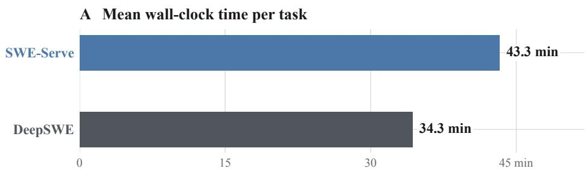

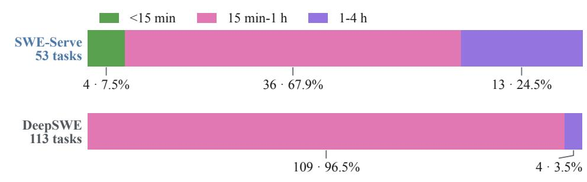  
Figure 7: Average task wall-clock time for the nine of the 11 top-per-model configurations with effort-matched trajectories available in the DeepSWE release, all evaluated using mini-SWE-agent. Effort labels denote the resolved route settings. (A) The mean of the task-average wall-clock times. (B) Task counts and percentages of total tasks within each of three wall-clock time intervals. SWE-Serve averages are based on 53 tasks and 1,428 timed trials; DeepSWE averages are based on 113 tasks and 4,060 timed trials. The greater-than-four-hour bucket is omitted because neither benchmark has a task-average wall-clock time above four hours. This is consistent with both evaluations using agent-execution limits below four hours.

## A.2.2 ATTEMPT OUTCOMES AND EXECUTION LIMITS

Figure 8 classifies all 1,749 attempts from the 11 top-per-model configurations in Table 3 into nine mutually exclusive outcome categories. Six categories distinguish whether all, some, or no F2P tests passed and whether all P2P tests passed. The remaining three categories capture agent-created patch or agent errors, wall-time limits, and step limits.

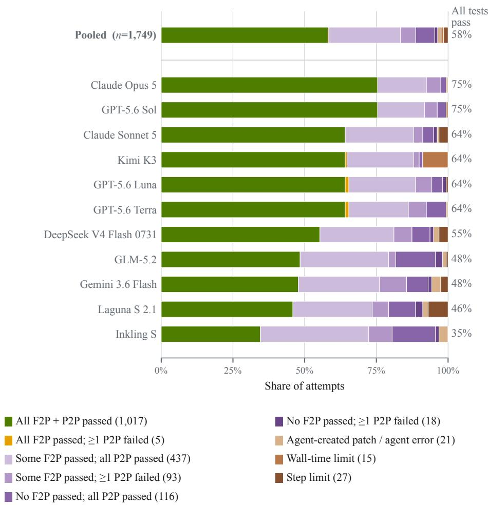  
Figure 8: Outcomes for the 1,749 attempts from the 11 top-per-model configurations. The first six categories describe scored outcomes according to how many fail-to-pass (F2P) tests passed and whether all pass-to-pass (P2P) tests passed. “Some F2P” means strictly more than zero and strictly fewer than all F2P checks. Agent-created patch / agent error denotes errors caused by the agent-created patch or the agent that prevented the verifier from producing a pass/fail result. The wall-time and step-limit categories denote unsuccessful attempts reaching the 210-minute or 350-step agent-execution limit; patches that reached these limits and passed verification remain in the “All F2P + P2P passed” category. Model rows follow Table 3, ordered by mean pass@1, with 159 attempts across three runs per model. The right column repeats each model’s mean pass@1 from Table 3.

Execution-limit failures account for 42 attempts (2.4%): 15 at the 210-minute wall-time limit and 27 at the 350-step limit. Wall-time limit failures therefore account for only 0.9% of attempts across the 11 top-per-model configurations. These limits constrain agent execution; the resulting patch is still evaluated, and attempts that pass verification remain in the “All F2P + P2P passed” category. To contextualize this low wall-time failure rate, the DeepSWE release’s effort-matched results (Huang et al., 2026) for nine of our 11 top-per-model configurations contain 47 wall-time limit failures out of 4,060 attempts (1.2%); three additional timed-out attempts passed verification.

In 21 attempts (1.2%), errors caused by the agent or its patch prevented the verifier from producing a pass/fail result.

Among the remaining 669 scored failures, the most common outcome is passing some F2P checks while preserving all P2P checks: 437 attempts (65.3%). The proportion passing no F2P checks while preserving all P2P checks also tends to be larger for configurations with lower pass@1. Together, these failure patterns indicate that many unsuccessful patches preserve tested existing behavior (P2P tests) while failing to satisfy all of the task’s newly required behavior (F2P tests).

## A.2.3 MODEL, SERVING, AND HARNESS CONFIGURATIONS

To support reproducibility, Table 7 records the model-serving and evaluation settings for the 11 top-per-model configurations in Table 3, together with the harness versions used in the native-harness sensitivity analysis (Section 5.3 and Appendix A.5). These settings include reasoning effort, API interfaces, context and output-token limits, and inference hardware for self-hosted models. All primary evaluations use mini-SWE-agent v2.4.3.

The reasoning-effort analysis uses the same settings; however, it varies the effort setting across low, medium, high, xhigh, and max for the two Claude and three GPT-5.6 models.

Table 7: Model-serving and evaluation settings for (a) provider-hosted and (b) self-hosted top-permodel configurations, and (c) the agent-harness sensitivity analysis. Context and output limits are reported separately in tokens; native indicates that mini-SWE-agent imposed no token-limit constraints. All evaluations outside the harness-sensitivity analysis use mini-SWE-agent v2.4.3 (Lieret & Jimenez, 2025). Part (c) applies only to the harness-sensitivity analysis in Section 5.3 and Appendix A.5.

(a) Provider-hosted top-per-model configurations
<table><tr><td>Model</td><td>Reasoning effort</td><td>API interface</td><td>Context limit (tokens)</td><td>Output limit (tokens)</td></tr><tr><td>Claude Opus 5</td><td>max</td><td>Messages API</td><td>1,000,000</td><td>128,000</td></tr><tr><td>Claude Sonnet 5</td><td>xhigh</td><td>Messages API</td><td>1,000,000</td><td>128,000</td></tr><tr><td>GPT-5.6 Sol</td><td>max</td><td>Responses API</td><td>native</td><td>native</td></tr><tr><td>GPT-5.6 Luna</td><td>max</td><td>Responses API</td><td>native</td><td>native</td></tr><tr><td>GPT-5.6 Terra</td><td>max</td><td>Responses API</td><td>native</td><td>native</td></tr><tr><td>Gemini 3.6 Flash</td><td>high</td><td>Responses API</td><td>1,048,576</td><td>65,536</td></tr></table>

## (b) Self-hosted top-per-model configurations

<table><tr><td>Model</td><td>Reasoning effort</td><td>Model-serving hardware</td><td>Context limit (tokens)</td><td>Output limit (tokens)</td></tr><tr><td>Kimi K3</td><td>max</td><td>16 GB200</td><td>1,048,576</td><td>64,000</td></tr><tr><td>GLM-5.2 (FP8)</td><td>max</td><td>8 GB200</td><td>400,000</td><td>131,072</td></tr><tr><td>DeepSeek V4 Flash 0731</td><td>max</td><td>4 GB200</td><td>1,048,576</td><td>384,000</td></tr><tr><td>Laguna S 2.1</td><td>max</td><td>4 GB200</td><td>1,048,576</td><td>131,072</td></tr><tr><td>Inkling S</td><td>xhigh</td><td>4 GB200</td><td>262,144</td><td>64,000</td></tr></table>

## (c) Agent-harness sensitivity analysis

<table><tr><td>Model</td><td>Reasoning effort</td><td>Shared harness</td><td>Model-specific harness</td></tr><tr><td>GPT-5.6 Sol</td><td>max</td><td>mini-SWE-agent v2.4.3</td><td>Codex CLI 0.144.5 (OpenAI, 2026a)</td></tr><tr><td>Claude Opus 5</td><td>max</td><td>mini-SWE-agent v2.4.3</td><td>Claude Code CLI 2.1.241 (Anthropic, 2026a)</td></tr></table>

## A.2.4 LEADERBOARD AGGREGATION

Each of the 11 top-per-model configurations in Table 3 is evaluated in three complete runs of the SWE-Serve benchmark. We calculate pass@1 as the mean of the three run-level pass rates and report a 95% confidence interval using the normal approximation, $r \pm 1 . 9 6 s _ { r } / \sqrt { 3 } .$ , where r¯ is the mean pass rate and s is the sample standard deviation of the three run-level pass rates. These intervals describe repeated-run variability on the fixed benchmark. Additionally, both the pass@1 and 95% CI percentages in Table 3 are rounded to the nearest percentage point.

## A.2.5 CLOSED-BOOK EVALUATION AND RETRIEVAL CALIBRATION

An open-book pilot motivated the closed-book policy in Section 4. The pilot ran without network isolation. It evaluated the SWE-Serve benchmark using mini-SWE-agent with GPT-5.6 Sol, Terra, and Luna under three reasoning-effort settings (xhigh, high, and medium), with one complete benchmark run per model–effort configuration. An externalfetch is a request to obtain information from a public host outside the task’s sandbox. Confirmed out-of-band retrieval requires recorded output containing either the task’s own source pull-request content or an upstream file modified by its oracle patch. Table 8 reports the percentage of tasks exhibiting each behavior for each model and effort setting. The Any model column reports the task-level union at that effort setting: a task is counted once if at least one of the three model attempts exhibits the behavior specified by the row.

Table 8: External fetches and confirmed out-of-band retrieval by agents in the open-book pilot. External fetches (requests to public hosts) and confirmed out-of-band retrieval (recorded output containing the task’s source pull-request content or an upstream file modified by its oracle patch) are reported as percentages of SWE-Serve tasks for each model at three reasoning-effort levels: xhigh, high, and medium. The final Any model column reports the percentage of tasks exhibiting each behavior in at least one of the three model attempts at the given effort level, counting each task once.
<table><tr><td>Reasoning effort</td><td>Sol</td><td>Terra</td><td>Luna</td><td>Any model</td></tr><tr><td>Any external fetch</td><td></td><td></td><td></td><td></td></tr><tr><td>xhigh</td><td>41.5%</td><td>37.7%</td><td>34.0%</td><td>54.7%</td></tr><tr><td>high</td><td>30.2%</td><td>11.3%</td><td>13.2%</td><td>34.0%</td></tr><tr><td>medium</td><td>15.1%</td><td>13.2%</td><td>3.8%</td><td>17.0%</td></tr><tr><td>Confirmed out-of-band retrieval</td><td></td><td></td><td></td><td></td></tr><tr><td>xhigh</td><td>13.2%</td><td>17.0%</td><td>15.1%</td><td>32.1%</td></tr><tr><td>high</td><td>15.1%</td><td>5.7%</td><td>5.7%</td><td>15.1%</td></tr><tr><td>medium</td><td>3.8%</td><td>3.8%</td><td>0.0%</td><td>3.8%</td></tr></table>

Out-of-band access is not isolated to one model or reasoning setting: all nine benchmark runs across different model–effort configurations contain external fetches, and all three models exhibit confirmed out-of-band retrieval. Incidence of both external fetches and out-of-band retrieval generally increases with reasoning effort.

All other SWE-Serve evaluations enforced network isolation.

## A.3 AGENTIC PERFORMANCE AND RESOURCE TRADE-OFFS

This section extends Section 5.1 with results for all 31 model–effort configurations, resource trade-offs, and performance by engineering family.

## A.3.1 PERFORMANCE ACROSS 31 MODEL–EFFORT CONFIGURATIONS

Table 9 extends the primary leaderboard in Table 3 to show both performance and consistency across all 31 model–effort configurations. Alongside mean pass@1, it reports pass@3 and passˆ3; the gap between these measures is the fraction of tasks solved in some but not all three attempts. The table includes five reasoning-effort settings for each of the two Claude and three GPT-5.6 models, and one configuration for each remaining model.

Table 9: Mean pass@1, pass@3, and passˆ3 for all 31 model–effort configurations, ordered by mean pass@1. Each configuration was evaluated with three complete runs of SWE-Serve. The pass@3 value is the fraction of tasks solved in at least one of the three runs; passˆ3 is the fraction solved in all three runs.
<table><tr><td colspan="2">Configuration</td><td colspan="3"></td></tr><tr><td>Model</td><td>Reasoning effort</td><td>Mean pass @1</td><td>pass@3</td><td>pass^3</td></tr><tr><td>GPT-5.6 Sol</td><td>max</td><td>75.5%</td><td>83.0%</td><td>67.9%</td></tr><tr><td>Claude Opus 5</td><td>max</td><td>75.5%</td><td>81.1%</td><td>69.8%</td></tr><tr><td>Claude Opus 5</td><td>high</td><td>73.6%</td><td>79.2%</td><td>66.0%</td></tr><tr><td>Claude Opus 5</td><td>xhigh</td><td>72.3%</td><td>81.1%</td><td>62.3%</td></tr><tr><td>Claude Opus 5</td><td>medium</td><td>68.6%</td><td>77.4%</td><td>58.5%</td></tr><tr><td>GPT-5.6 Sol</td><td>xhigh</td><td>66.0%</td><td>75.5%</td><td>52.8%</td></tr><tr><td>GPT-5.6 Terra</td><td>max</td><td>64.2%</td><td>77.4%</td><td>54.7%</td></tr><tr><td>Claude Sonnet 5</td><td>xhigh</td><td>64.2%</td><td>75.5%</td><td>50.9%</td></tr><tr><td>Kimi K3</td><td>max</td><td>64.2%</td><td>75.5%</td><td>50.9%</td></tr><tr><td>GPT-5.6 Luna</td><td>max</td><td>64.2%</td><td>73.6%</td><td>50.9%</td></tr><tr><td>Claude Sonnet 5</td><td>max</td><td>61.0%</td><td>71.7%</td><td>50.9%</td></tr><tr><td>Claude Opus 5</td><td>low</td><td>60.4%</td><td>67.9%</td><td>54.7%</td></tr><tr><td>Claude Sonnet 5</td><td>high</td><td>57.9%</td><td>69.8%</td><td>43.4%</td></tr><tr><td>GPT-5.6 Sol</td><td>high</td><td>56.0%</td><td>69.8%</td><td>43.4%</td></tr><tr><td>DeepSeek V4 Flash (0731)</td><td>max</td><td>55.3%</td><td>73.6%</td><td>41.5%</td></tr><tr><td>Claude Sonnet 5</td><td>medium</td><td>55.3%</td><td>69.8%</td><td>39.6%</td></tr><tr><td>GPT-5.6 Luna</td><td>xhigh</td><td>55.3%</td><td>64.2%</td><td>45.3%</td></tr><tr><td>GPT-5.6 Sol</td><td>medium</td><td>54.1%</td><td>66.0%</td><td>37.7%</td></tr><tr><td>GPT-5.6 Terra</td><td>xhigh</td><td>52.8%</td><td>64.2%</td><td>43.4%</td></tr><tr><td>GPT-5.6 Terra</td><td>high</td><td>49.1%</td><td>62.3%</td><td>34.0%</td></tr><tr><td>Claude Sonnet 5</td><td>low</td><td>49.1%</td><td>60.4%</td><td>35.8%</td></tr><tr><td>GLM-5.2</td><td>max</td><td>48.4%</td><td>64.2%</td><td>34.0%</td></tr><tr><td>Gemini 3.6 Flash</td><td>high</td><td>47.8%</td><td>60.4%</td><td>30.2%</td></tr><tr><td>Laguna S 2.1</td><td>max</td><td>45.9%</td><td>64.2%</td><td>26.4%</td></tr><tr><td>GPT-5.6 Luna</td><td>high</td><td>45.3%</td><td>56.6%</td><td>35.8%</td></tr><tr><td>GPT-5.6 Terra</td><td>medium</td><td>44.7%</td><td>54.7%</td><td>34.0%</td></tr><tr><td>GPT-5.6 Terra</td><td>low</td><td>44.0%</td><td>54.7%</td><td>35.8%</td></tr><tr><td>GPT-5.6 Sol</td><td>low</td><td>40.9%</td><td>52.8%</td><td>28.3%</td></tr><tr><td>GPT-5.6 Luna</td><td>medium</td><td>37.7%</td><td>49.1%</td><td>24.5%</td></tr><tr><td>Inkling S</td><td>xhigh</td><td>34.6%</td><td>45.3%</td><td>24.5%</td></tr><tr><td>GPT-5.6 Luna</td><td>low</td><td>20.8%</td><td>28.3%</td><td>11.3%</td></tr></table>

## A.3.2 PERFORMANCE AND RESOURCE TRADE-OFFS

Figure 9 compares mean pass@1 and inference cost across reasoning-effort settings. Higher effort consistently increases cost, while performance gains vary across models and effort settings.

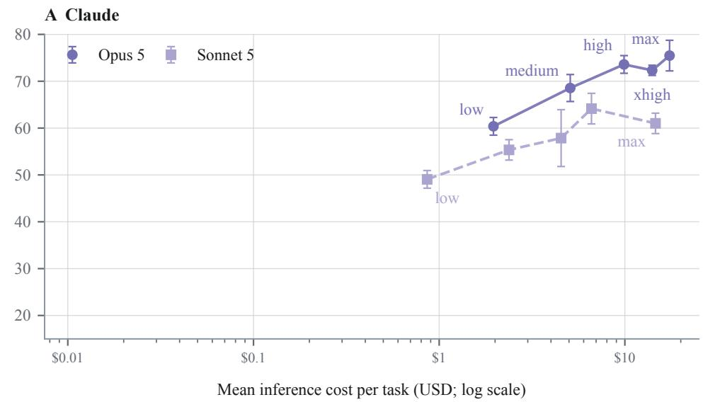

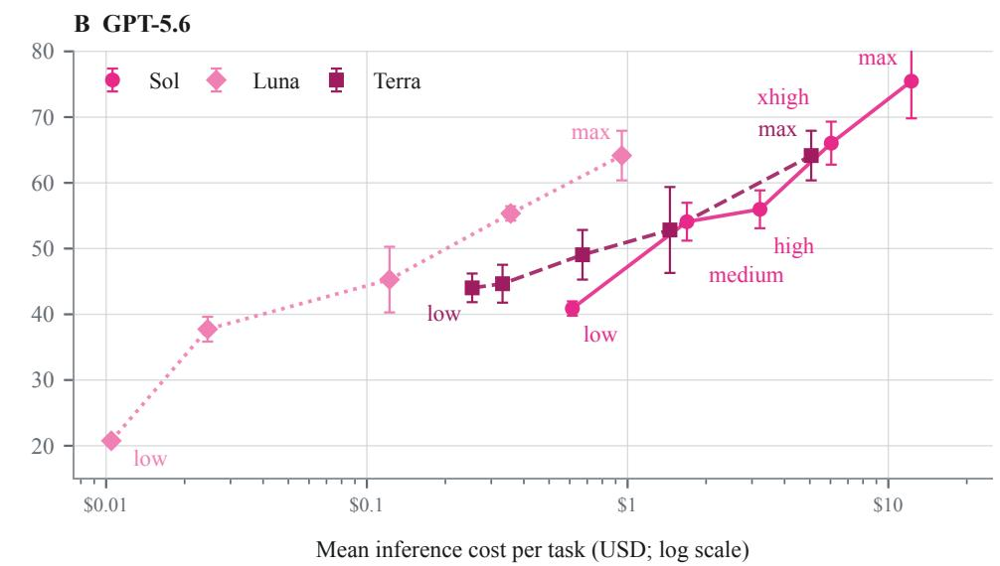  
Figure 9: Mean pass@1 versus mean inference cost per task across reasoning-effort sweeps for (A) Claude Opus 5 and Claude Sonnet 5 and (B) GPT-5.6 Sol, Luna, and Terra. Axes are shared between (A) and (B); the cost axis is logarithmic. Vertical bars show one sample standard deviation across the three runs of SWE-Serve for each model–effort configuration. All five sweeps include low, medium, high, xhigh, and max reasoning effort. Higher reasoning effort is associated with higher mean inference cost, but not consistently with higher mean pass@1.

Figures 10–12 compare the 11 top-per-model configurations in Table 3, plotting mean pass@1 against mean inference cost, output-token use, and wall-clock time per task, respectively. Wall-clock time measures the end-to-end duration of a task’s attempt, including setup, agent execution, and verification. Each plot shows the observed Pareto frontier among these selected configurations. Even under a shared agent harness, configurations with similar pass@1 can differ substantially in resource use, so configuration choice depends on the relative importance of performance, cost, output-token use, and latency.  
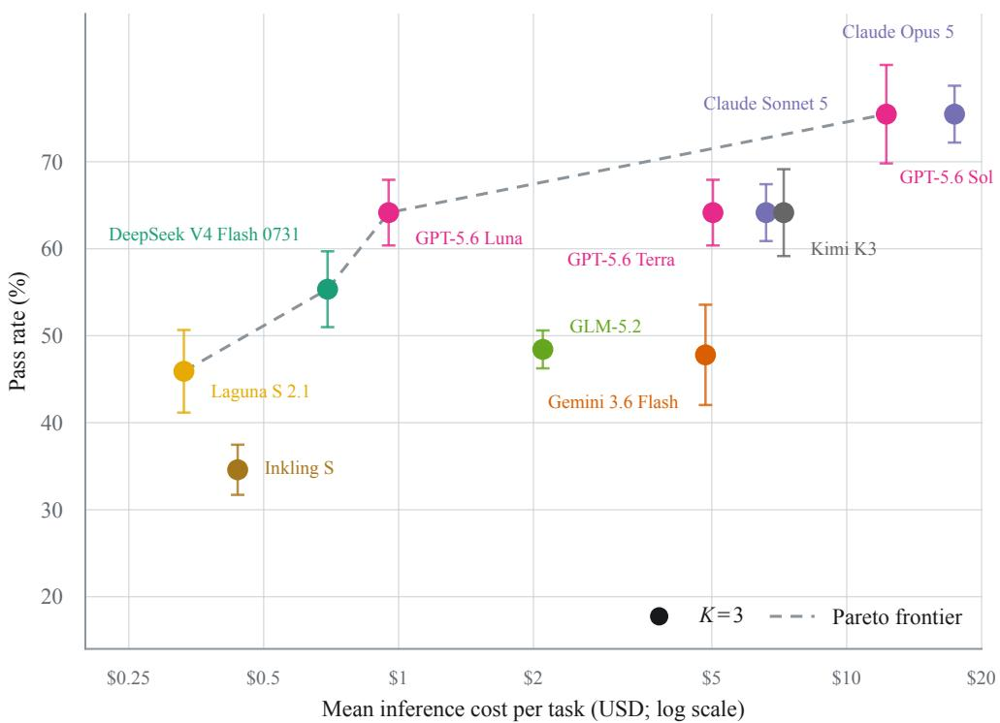  
Figure 10: Mean pass@1 versus mean inference cost per task for the 11 top-per-model configurations. Vertical bars show one sample standard deviation across the three runs of SWE-Serve for each configuration. The cost axis is logarithmic. The dashed line connects the observed Pareto frontier for cost among these configurations. Higher mean inference cost is not consistently associated with higher mean pass@1, and configurations with similar mean pass@1 can differ in inference cost.

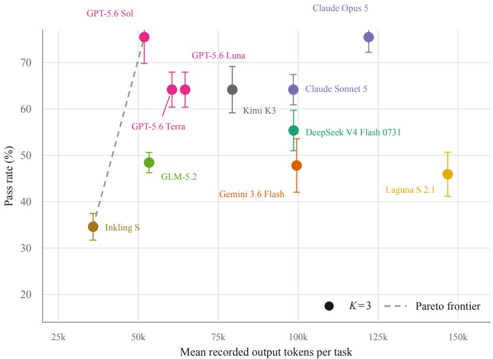  
Figure 11: Mean pass@1 versus mean output tokens per task for the 11 top-per-model configurations. Vertical bars show one sample standard deviation across the three runs of SWE-Serve for each configuration. The dashed line connects the observed Pareto frontier for output-token use among these configurations. GPT-5.6 Terra’s token count is based on 158 of 159 attempts as 1 value was missing and missing values are not extrapolated; all other configurations have complete token accounting. Higher mean output-token use is not consistently associated with higher pass@1: GPT-5.6 Sol matches Claude Opus 5’s mean pass@1 while using fewer than half as many output tokens per task.

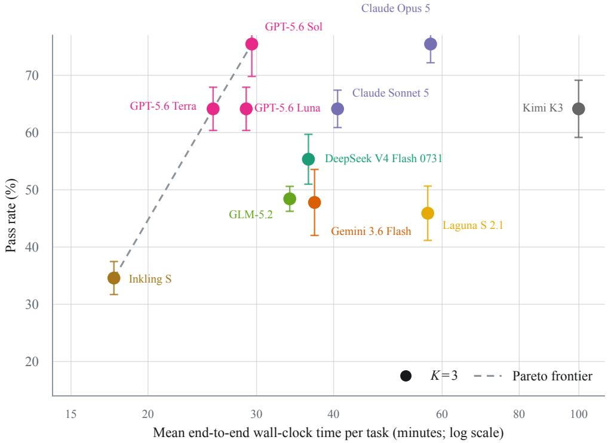  
Figure 12: Mean pass@1 versus mean wall-clock time per task for the 11 top-per-model configurations, including setup, agent execution, and verification. Vertical bars show one sample standard deviation across the three runs of SWE-Serve for each configuration. The dashed line connects the observed Pareto frontier for wall-clock time among these configurations. Similar pass@1 can be associated with different latency: among the four configurations at approximately 64% pass@1, mean wall-clock time varies by 3.9×.

## A.3.3 PERFORMANCE BY INFERENCE ENGINEERING FAMILY

Figure 13 reports pass@1 across the six inference engineering families for the 11 top-per-model configurations. Averaged across these configurations, pass@1 ranges from 42.9% for model and backend enablement to 74.6% for kernels, quantization, and performance. Claude Opus 5 and GPT-5.6 Sol, the two configurations with the highest overall mean pass@1, collectively achieve the highest pass@1 in five of the six families. Claude Sonnet 5 and GPT-5.6 Terra tie these leaders in model/backend enablement and caching/runtime state, respectively, while GPT-5.6 Luna leads in distributed/scheduling tasks.

<table><tr><td>Model</td><td>Overall</td><td colspan="6">Task family</td></tr><tr><td>Claude Opus 5</td><td>75</td><td>57</td><td>50</td><td>87</td><td>72</td><td>96</td><td>76</td></tr><tr><td>GPT-5.6 Sol</td><td>75</td><td>71</td><td>58</td><td>100</td><td>50</td><td>88</td><td>83</td></tr><tr><td>Claude Sonnet 5</td><td>64</td><td>43</td><td>25</td><td>71</td><td>72</td><td>79</td><td>67</td></tr><tr><td>Kimi K3</td><td>64</td><td>52</td><td>50</td><td>88</td><td>50</td><td>79</td><td>64</td></tr><tr><td>GPT-5.6 Luna</td><td>64</td><td>48</td><td>67</td><td>75</td><td>47</td><td>79</td><td>71</td></tr><tr><td>GPT-5.6 Terra</td><td>64</td><td>71</td><td>50</td><td>75</td><td>42</td><td>75</td><td>71</td></tr><tr><td>DeepSeek V4 Flash 0731</td><td>55</td><td>48</td><td>33</td><td>71</td><td>39</td><td>58</td><td>69</td></tr><tr><td>GLM-5.2</td><td>48</td><td>29</td><td>42</td><td>75</td><td>33</td><td>50</td><td>57</td></tr><tr><td>Gemini 3.6 Flash</td><td>48</td><td>48</td><td>42</td><td>62</td><td>22</td><td>58</td><td>57</td></tr><tr><td>Laguna S 2.1</td><td>46</td><td>38</td><td>42</td><td>71</td><td>31</td><td>29</td><td>60</td></tr><tr><td>Inkling S</td><td>35</td><td>10</td><td>25</td><td>46</td><td>14</td><td>38</td><td>60</td></tr><tr><td></td><td></td><td>Cache / state n=7</td><td>Distributed / scheduling n=4</td><td>Kernels / quant. / perf. n=8</td><td>Model / backend n=12</td><td>Serving API / runtime n=8</td><td>Speculative /decoding n=14</td></tr><tr><td></td><td></td><td>0</td><td colspan="2">50</td><td></td><td>100</td><td></td></tr></table>

Figure 13: Engineering-family pass@1 for the 11 top-per-model configurations, ordered by mean pass@1 to match Table 3. Scores are averaged across three SWE-Serve runs for each configuration. Task counts appear below the engineering-family column labels. Orange outlines mark the highest observed pass@1 in each family, including ties. The Overall column reports each configuration’s mean pass@1 across the entire SWE-Serve benchmark. The Claude Opus 5 and GPT-5.6 Sol configurations have the highest mean pass@1 across all tasks and collectively attain the highest mean pass@1 in five of the six task families, including ties. GPT-5.6 Luna has the highest mean pass@1 in distributed/scheduling tasks.

## A.4 PRODUCTION CORRECTNESS

The following analyses expand the production correctness results in Section 5.2 and Figure 2, including task-level and per-configuration breakdowns, sensitivity to which tests are removed and which tasks are included, and comparisons of production correctness gaps across reasoning-effort settings.

## A.4.1 LOCAL CORRECTNESS DOES NOT ENSURE PRODUCTION CORRECTNESS

Model-serving E2E gap. Table 10 provides the task-level test counts and patch outcomes behind the model-serving E2E gap in Figure 2A. It covers all 627 agent-created patches from the 11 top-permodel configurations on the 19 tasks that contain model-serving E2E tests. Of the 339 unsuccessful attempts under the full verifier, removing model-serving E2E tests from scoring changes 147 patches from fail to pass, while 178 remain failures. These 147 fail-to-pass transitions out of 627 attempts produce the 23.4-percentage-point increase in pass rate across the 19 tasks. The 14 attempts without a verifier pass/fail result remain counted as failures. This analysis rescores recorded test results without rerunning the verifier.

Figure 14A breaks down the aggregate model-serving E2E gap across the 11 top-per-model configurations in Figure 2A by configuration. For each of the configurations, it reports the increase in pass rate when the same patches on the 19 tasks are rescored without model-serving E2E tests. Pass rate increases for every configuration, and the magnitude varies from 3.5 to 45.6 percentage points.

Matched test-removal control. To test whether removing equal numbers of non-E2E tests produces a comparable effect to removing model-serving E2E tests, we compare both conditions on 12 eligible tasks and their 396 patches. These 12 tasks are eligible because we can remove matching numbers of E2E and non-E2E tests within the same F2P/P2P role. Of the 19 tasks with E2E tests, four have no non-E2E tests, and three others have both test types but never within the same role. Those seven tasks are therefore excluded.

For each task, we compare two versions of its score: one with some E2E tests excluded and another with the same number of non-E2E tests excluded. We match the removal counts separately for F2P and P2P tests, using the smaller available count. For example, if a task has two E2E F2P tests and five non-E2E F2P tests, we exclude both E2E tests in the first condition and two randomly selected non-E2E tests in the second. We apply the same rule to P2P tests. Across all 12 tasks, each scoring condition excludes 38 tests: 19 F2P and 19 P2P.

We repeat the comparison 10,000 times, sampling tests without replacement separately for each task, test type, and F2P/P2P role, using NumPy’s PCG64 random-number generator with seed 20260826 (Harris et al., 2020). The tasks, patches, and removal counts remain fixed; only the excluded tests vary.

Sensitivity to task composition. To assess how the E2E pass-rate increase depends on which tasks are included, we resample the 19 tasks with model-serving E2E tests with replacement 10,000 times. We use NumPy’s PCG64 random-number generator with a fixed seed of 20260825 for reproducibility (Harris et al., 2020). Each sampled task retains all 33 agent-created patches, comprising the 11 top-per-model configurations and their three attempts per task, so neither models nor attempts are independently resampled. We report a 95% percentile bootstrap confidence interval.

Sensitivity to tasks containing only E2E tests. To assess whether the E2E pass-rate increase persists when other tests remain in scoring, we exclude the four tasks containing only E2E tests (Table 10). Across the remaining 15 tasks, pass rate still rises from 191/495 (38.6%) to 304/495 (61.4%), yielding a 22.8-percentage-point increase, corresponding to 113 fail-to-pass transitions.

Production inference task properties. Figure 14B–D breaks down the aggregate production correctness gaps in Figure 2B–D by model configuration. The runtime-domain gap is consistent across all 11 top-per-model configurations: pass rates are 10.0–39.6 percentage points lower on tasks spanning multiple runtime domains than on single-domain tasks (Figure 14B).

Table 10: Task-level effects of removing model-serving E2E tests from scoring across 19 tasks with E2E tests. Each task has 33 attempts: three from each of the 11 top-per-model configurations. Test counts include only tests used for scoring. Outcome columns distinguish attempts that pass all tests, change from fail to pass after E2E removal, still fail after removal, or have no verifier pass/fail result. Attempts without a result remain failures. The first 15 tasks retain non-E2E tests after removal; the final four have no tests left in scoring.
<table><tr><td></td><td colspan="2">Test counts</td><td colspan="5">Number of attempts</td></tr><tr><td>19 tasks with model-serving E2E tests</td><td># E2E # Non-E2E tests</td><td>tests</td><td>Pass with all tests</td><td>Fail → pass without E2E without E2E</td><td></td><td>Still fail</td><td>No pass/fail result</td></tr><tr><td>Tasks with non-E2E tests (15)</td><td></td><td></td><td></td><td></td><td></td><td></td><td></td></tr><tr><td>Spec: forward-timeout ordering fix (EAGLE v1)</td><td>1</td><td>13</td><td></td><td>31</td><td>0</td><td>1</td><td></td></tr><tr><td>DFLASH v1 non-overlap serving</td><td>34</td><td>3</td><td></td><td>0</td><td>0</td><td>32</td><td></td></tr><tr><td>EAGLE v2 page-one tree runtime</td><td>19</td><td>2</td><td></td><td>6</td><td>25</td><td>2</td><td></td></tr><tr><td>Diffusion-LLM radix-graph serving</td><td>8</td><td>8</td><td></td><td>0</td><td>2</td><td>31</td><td></td></tr><tr><td>SDAR dense + MoE day-0 serving</td><td>2</td><td>3</td><td></td><td>10</td><td>17</td><td>6</td><td>0</td></tr><tr><td>Qwen3.5 dense + MoE core serving</td><td>16</td><td>5</td><td></td><td>9</td><td>16</td><td>8</td><td></td></tr><tr><td>Transformers-backend compute runtime</td><td>3</td><td>2,277</td><td></td><td>4</td><td>0</td><td>28</td><td></td></tr><tr><td>Transformers 5 MoE core serving</td><td>4</td><td>1</td><td></td><td>21</td><td>7</td><td>0</td><td>5</td></tr><tr><td>Gemma 4 speculative execution</td><td>4</td><td>1</td><td></td><td>26</td><td>7</td><td>0</td><td>0</td></tr><tr><td>Gemma 4 26B-A4B core serving</td><td>3</td><td>2</td><td></td><td>16</td><td>16</td><td>1</td><td>0</td></tr><tr><td>N-gram trie refactor + stateful matching</td><td>4</td><td>34</td><td></td><td>28</td><td>0</td><td>3</td><td></td></tr><tr><td>N-gram external SAM corpus</td><td>2</td><td>22</td><td></td><td>8</td><td>5</td><td>20</td><td></td></tr><tr><td>SequenceClassification Score API</td><td>3</td><td>37</td><td></td><td>14</td><td>0</td><td>16</td><td></td></tr><tr><td>Spec-V2 streaming-session KV commit</td><td>32</td><td>15</td><td></td><td>3</td><td>0</td><td>30</td><td></td></tr><tr><td>EAGLE3 overlap metadata lifecycle</td><td>110</td><td>7</td><td></td><td>15</td><td>18</td><td>0</td><td></td></tr><tr><td>Tasks without non-E2E tests (4)</td><td></td><td></td><td></td><td></td><td></td><td></td><td></td></tr><tr><td>Mixed-chunk piecewise CUDA-graph replay</td><td>3</td><td>0</td><td></td><td>15</td><td>18</td><td>0</td><td></td></tr><tr><td>Gemma 4 piecewise CUDA-graph execution</td><td>6</td><td>0</td><td></td><td>29</td><td>4</td><td>0</td><td>0</td></tr><tr><td>GLM-V repetition-penalty sampling</td><td>13</td><td></td><td>0</td><td>27</td><td>6</td><td>0</td><td>0</td></tr><tr><td>Score API hybrid token + embedding inputs</td><td>9</td><td></td><td>0</td><td>26</td><td>6</td><td>0</td><td>1</td></tr><tr><td>Total</td><td>276</td><td>2,430</td><td></td><td>288</td><td>147</td><td>178</td><td>14</td></tr></table>

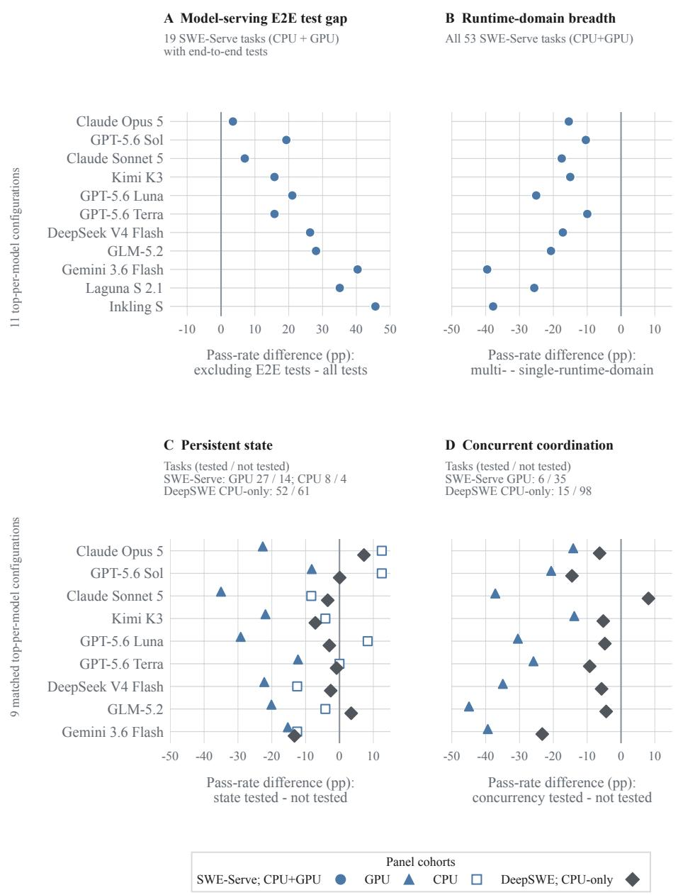  
Figure 14: Production correctness gaps across top-per-model configurations. (A) Rescoring the same patches without model-serving E2E tests raises pass rate by 3.5–45.6 percentage points across the 11 top-per-model configurations. (B) Multi-runtime-domain tasks have pass rates 10.0–39.6 percentage points lower than single-runtime-domain tasks across the 11 top-per-model configurations. (C–D) Across nine configurations with effort-matched trajectories available in the DeepSWE release, SWE-Serve GPU tasks tested for persistent state or concurrent coordination have pass rates 8.2–35.0 and 13.8–44.9 percentage points lower, respectively, than tasks not tested for these properties. CPU comparisons generally show smaller differences and vary in direction: panel C includes SWE-Serve CPU and DeepSWE, while panel D includes DeepSWE only (Huang et al., 2026). Panel D omits SWE-Serve CPU tasks because none are tested for concurrent coordination. Positive values in A indicate increased pass rates after removing E2E tests; negative values in B–D indicate lower pass rates on tasks with the specified production property. Configurations are ordered by overall mean pass@1 to match Table 3.

For persistent state and concurrent coordination, Figure 14C–D shows results for each of the same nine top-per-model configurations used in Figure 2C–D, evaluated at matching reasoning-effort settings on SWE-Serve and DeepSWE (Huang et al., 2026). SWE-Serve GPU tasks testing persistent state or concurrent coordination have lower pass rates than tasks where the corresponding property is not tested, across all nine configurations. The corresponding differences on SWE-Serve CPU and DeepSWE are generally smaller in magnitude and are not consistently negative across configurations.

## A.4.2 REASONING-EFFORT ROBUSTNESS OF PRODUCTION CORRECTNESS GAPS

Figure 15 examines whether higher reasoning effort narrows production correctness gaps for GPT-5.6 Sol, Luna, and Terra across five settings: low, medium, high, xhigh, and max. It assesses all four production correctness gaps using the same task groups as Figures 2 and 14. The E2E comparison rescores the same patches with and without E2E tests; the other three comparisons measure pass-rate differences between task groups.

All four gaps remain at max reasoning effort. At this setting, the model-serving E2E gap is 16–21 percentage points, and pass rates on multi-runtime-domain tasks are 10–25 points below those on single-domain tasks. Also at max reasoning effort, SWE-Serve GPU tasks testing persistent state or concurrent coordination have pass rates 8–29 and 21–30 points lower, respectively, than tasks where the corresponding property is not tested.

The response to increasing effort differs across the four comparisons. From low to max reasoning effort, the E2E and runtime-domain gaps narrow for all three models. The persistent-state gap narrows for Sol and Terra but widens for Luna, while the concurrent-coordination gap narrows for Sol but widens for Luna and Terra. Even where gaps narrow overall, they do not always shrink at each successive effort setting.

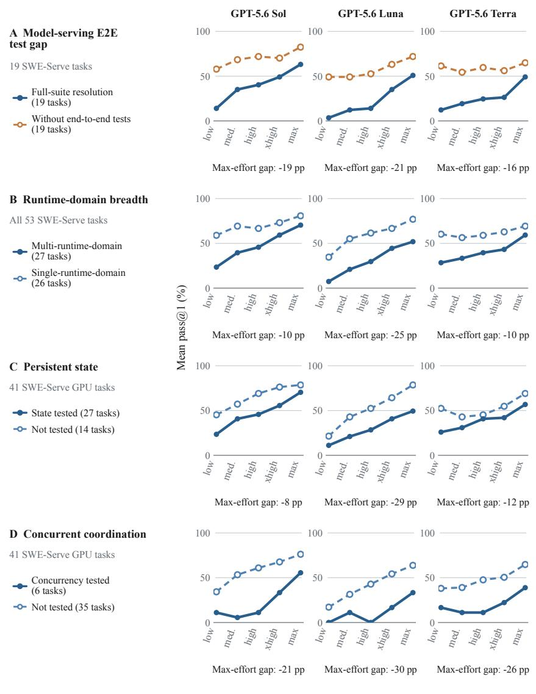  
Figure 15: Higher reasoning effort narrows but does not eliminate the model-serving E2E gap across GPT-5.6 Sol, Luna, and Terra; task-property gaps also persist at maximum effort. Panels A–D show the model-serving E2E test gap, runtime-domain breadth, persistent state, and concurrent coordination across five reasoning-effort settings, with three attempts per task for each configuration. Dark blue solid lines with filled markers show full-suite pass rates (A), multi-runtime-domain tasks (B), and tasks tested for the specified property (C–D). Lighter blue dashed lines with hollow markers show single-runtime-domain tasks (B) or tasks not tested for that property (C–D). Orange dashed lines in A show pass rates after removing model-serving E2E tests from scoring while keeping the same patches. Each “Max-effort $\mathrm { g a p ' }$ is the dark blue rate minus its comparison rate at max reasoning effort, in percentage points.

## A.5 SENSITIVITY TO AGENT HARNESS

This section expands the agent-harness sensitivity analysis in Section 5.3 with details of the analysis and how agent scaffold choice affects resource use. We compare mini-SWE-agent with the modelspecific harnesses for GPT-5.6 Sol and Claude Opus 5, the two best-performing configurations, both at maximum reasoning effort. Figure 16 reports mean inference cost and wall-clock time per task, while Figure 17 breaks down mean token use into uncached input, cached input, and output tokens.

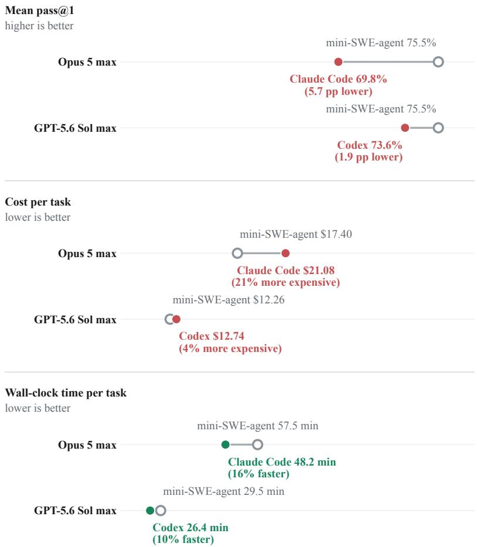  
Figure 16: Comparing mean pass@1, cost, and wall-clock time for the two best-performing configu rations, GPT-5.6 Sol and Claude Opus 5, when using their model-specific harness compared to the mini-SWE-agent harness. Each data point is based on three complete runs of SWE-Serve. Direct labels report each model-specific harness’s change relative to mini-SWE-agent. Hollow points show the means for mini-SWE-agent, and filled points show the means for the model-specific harnesses. Costs for mini-SWE-agent and Claude Code are exact recorded endpoint costs, while Codex costs are estimated with approximately 1–2% precision. For both evaluated configurations, mean wall-clock time is lower, inference cost is higher, and observed mean pass@1 is lower with the model-specific harness than with mini-SWE-agent.

We evaluated GPT-5.6 Sol and Claude Opus 5, both at maximum reasoning effort, with three complete runs of SWE-Serve under their model-specific harnesses: Codex CLI 0.144.5 (OpenAI, 2026a) for GPT-5.6 Sol and Claude Code CLI 2.1.241 (Anthropic, 2026a) for Claude Opus 5. Using these harnesses changes the full agent scaffold, including the instructions, available tools, and how the agent organizes and completes its work. Whereas mini-SWE-agent performs repository inspection, editing, and testing through its only available tool, Bash, Claude Code and Codex expose broader tool sets. Claude Code, for example, provides dedicated tools for searching, reading, and editing files.

Both model-specific harnesses used the same SWE-Serve task and verifier setup, hardware allocation, closed-book policy, and 210-minute wall-time limit. The 350-step limit applied to mini-SWE-agent was not imposed on the model-specific harnesses.

For both evaluated configurations, GPT-5.6 Sol and Claude Opus 5, the model-specific harness has lower mean wall-clock time but higher mean inference cost than mini-SWE-agent (Figure 16), with lower observed mean pass@1, as reported in Section 5.3. For GPT-5.6 Sol, Codex has lower mean uncached input-token use but higher mean output-token use; Claude Code shows the opposite pattern for Claude Opus 5 (Figure 17). Faster execution is not necessarily associated with higher pass@1, lower inference cost, or fewer output tokens. For the two evaluated configurations, these results support using mini-SWE-agent for the primary leaderboard and show that measured performance and resource use differ across harnesses.

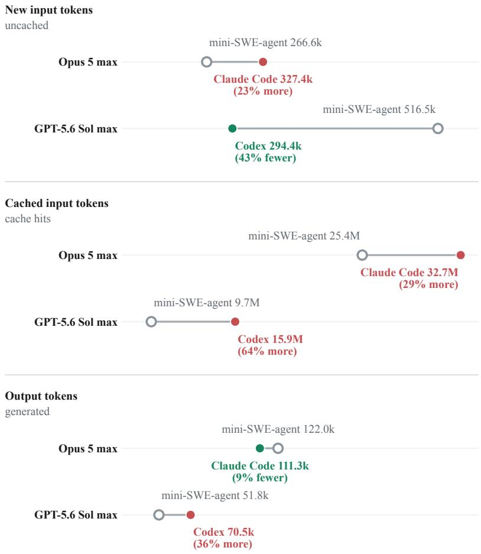  
Figure 17: Mean per-task token use for GPT-5.6 Sol and Claude Opus 5, the two best-performing configurations, comparing their model-specific harnesses with mini-SWE-agent. Token use is separated into uncached input, cached input, and generated output tokens. Direct labels report each model-specific harness’s relative change from mini-SWE-agent. Hollow points show means for mini-SWE-agent, and filled points show means for the model-specific harnesses. Relative to mini-SWE-agent, both model-specific harnesses have higher mean cached input-token use, but their other token-use changes differ: Codex has lower mean uncached input-token use and higher mean output-token use, while Claude Code shows the opposite pattern.

## A.6 LIMITATIONS OF EXECUTABLE SCORING

As discussed in Section 6, passing the verifier does not establish every dimension of upstream readiness. Comparing an agent-created patch with the oracle patch also does not establish upstream readiness: the oracle is one reference implementation, and alternative correct solutions may differ in scope without being lower quality. However, because oracle patches derive from merged upstream changes, they provide a useful reference for examining implementation scope beyond executable scores. Figure 18 and Table 11 compare agent-created patches with oracle patch scope as coarse indicators of implementation complexity. Figure 18 visualizes missing scope, while Table 11 reports exact median measurements of both missing and extra scope relative to the oracle patches. These measurements can highlight differences for further review, but do not assess maintainability or architectural fit, nor replace maintainer review.

Before examining verifier outcomes, we selected for analysis the first run for each of the 11 topper-model configurations and considered all task attempts from that run. Figure 18 and Table 11 include all attempts with both a usable patch capture and a verifier pass/fail result. This excludes nine attempts: one has an unusable patch capture, and eight encountered agent-created patch or agent errors that prevented the verifier from producing a pass/fail result. These exclusions apply to individual attempts rather than removing the corresponding tasks across all configurations.

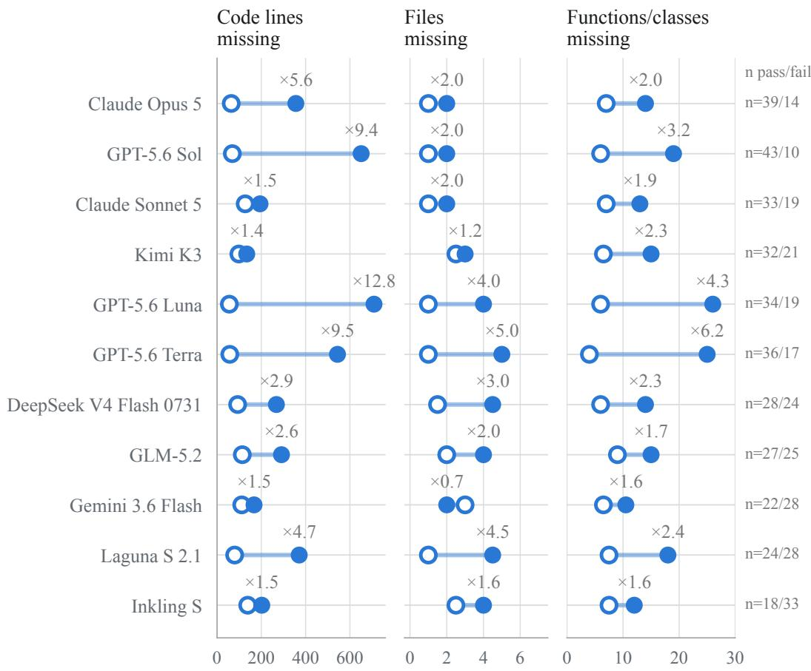  
Figure 18: Missing scope differences relative to oracle patches for passing and failing agent-created patches from the first SWE-Serve run attempts of the 11 top-per-model configurations. Median missing scope is reported relative to the oracle patch in code lines, files, and estimated changed functions/classes. Hollow points show medians for passing attempts and filled points show medians for failed attempts. × reports the ratio of failed-attempt to passing-attempt medians for each scope measurement. n reports the number of usable patches (passing/failing) for each of the 11 top-permodel configurations. Configurations are ordered by overall mean pass@1 to match Table 3; scope measurements use only the first-run attempts, a subset of the attempts used to calculate that mean.

We align agent-created and oracle patches by file path and measure missing and extra scope relative to the oracle patch in production code lines, files, and estimated changed functions/classes. We estimate how many functions and classes each patch changes in two ways. First, we identify function and class names in diff headers, which can identify the function or class containing a change even when its declaration is unchanged. Second, we identify added or removed lines that declare a function or class. Within each file, each distinct function name and each distinct class name is counted once, even if it appears in multiple changes. Missing and extra scope measure differences in counts rather than identifying specific missing functionality. We then calculate median measurements separately for passing and failing attempts within each configuration. For every configuration, failed attempts have a higher median missing-line count than passing attempts. However, these groups contain different tasks, so the comparison does not isolate the relationship between patch scope and verifier outcome on the same tasks.

Table 11: Patch scope differences relative to oracle patches for passing and failing agent-created patches from the first SWE-Serve run attempts of the 11 top-per-model configurations. Median missing and extra scope is reported relative to the oracle patch in code lines, files, and estimated changed functions/classes; n reports the number of usable patches (passing/failing) for each of the 11 top-per-model configurations. Configurations are ordered by overall mean pass@1 to match Table 3; scope measurements use only the first-run attempts, a subset of the attempts used to calculate that mean.
<table><tr><td>Model</td><td>Outcome</td><td colspan="2">Code lines</td><td colspan="2">Files</td><td colspan="2">Functions/classes</td></tr><tr><td></td><td></td><td>Missing</td><td>Extra</td><td>Missing</td><td>Extra</td><td>Missing</td><td>Extra</td></tr><tr><td>Claude Opus 5</td><td>Pass</td><td>39</td><td>64</td><td>82</td><td></td><td></td><td>7</td></tr><tr><td></td><td>Fail</td><td>14 356</td><td>156.5</td><td>2</td><td>2</td><td>14</td><td>15.5</td></tr><tr><td>GPT-5.6 Sol</td><td>Pass</td><td>43</td><td></td><td></td><td>1</td><td>6</td><td>2</td></tr><tr><td></td><td>Fail</td><td>10</td><td></td><td>58.5</td><td>0.5</td><td>19</td><td>5</td></tr><tr><td>Claude Sonnet 5</td><td>Pass</td><td>33</td><td></td><td></td><td></td><td>7</td><td>1</td></tr><tr><td></td><td>Fail</td><td>19 194</td><td></td><td></td><td></td><td>13</td><td>1</td></tr><tr><td>Kimi K3</td><td>Pass</td><td>32 98.5</td><td></td><td></td><td></td><td>6.5</td><td>2</td></tr><tr><td></td><td>Fail</td><td>21 134</td><td></td><td>114</td><td></td><td>15</td><td>4</td></tr><tr><td>GPT-5.6 Luna</td><td>Pass</td><td>34 55.5</td><td></td><td>53.5</td><td></td><td>6</td><td>2.5</td></tr><tr><td></td><td>Fail</td><td>19 709</td><td></td><td>196</td><td></td><td>26</td><td>8</td></tr><tr><td>GPT-5.6 Terra</td><td>Pass</td><td>36 57.5</td><td></td><td>75</td><td></td><td></td><td>3.5</td></tr><tr><td></td><td>Fail</td><td>17 544</td><td></td><td>175</td><td></td><td>25</td><td>9</td></tr><tr><td>DeepSeek V4 Flash (0731)</td><td>Pass</td><td>28 93</td><td></td><td>32.5</td><td></td><td></td><td>1</td></tr><tr><td></td><td>Fail</td><td>24 268</td><td></td><td>37.5</td><td></td><td>14</td><td>2</td></tr><tr><td>GLM-5.2</td><td>Pass</td><td>27</td><td>114</td><td>21</td><td></td><td></td><td>0</td></tr><tr><td></td><td>Fail</td><td>25</td><td>291</td><td>21</td><td></td><td>15</td><td>0</td></tr><tr><td>Gemini 3.6 Flash</td><td>Pass</td><td>22</td><td>111.5</td><td>26</td><td></td><td></td><td>0</td></tr><tr><td></td><td>Fail</td><td>28</td><td>167</td><td>43</td><td></td><td>10.5</td><td>1</td></tr><tr><td>Laguna S 2.1</td><td>Pass</td><td>24</td><td>79.5</td><td>29</td><td></td><td>7.5</td><td>1</td></tr><tr><td></td><td>Fail</td><td>28</td><td>371</td><td>43.5</td><td></td><td>18</td><td>3</td></tr><tr><td>Inkling S</td><td>Pass</td><td>18</td><td>138.5</td><td>4.5</td><td>2.5 4</td><td></td><td>0</td></tr><tr><td></td><td>Fail</td><td>33</td><td>202</td><td>4</td><td></td><td>12</td><td>1</td></tr></table>