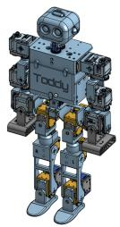
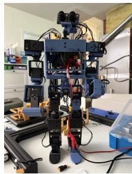
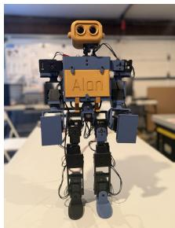
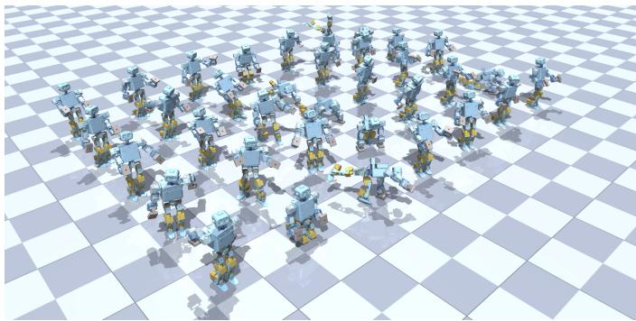
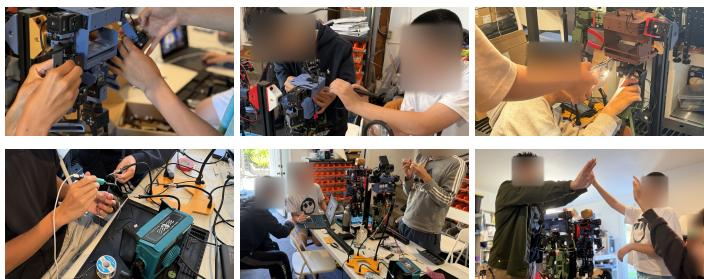
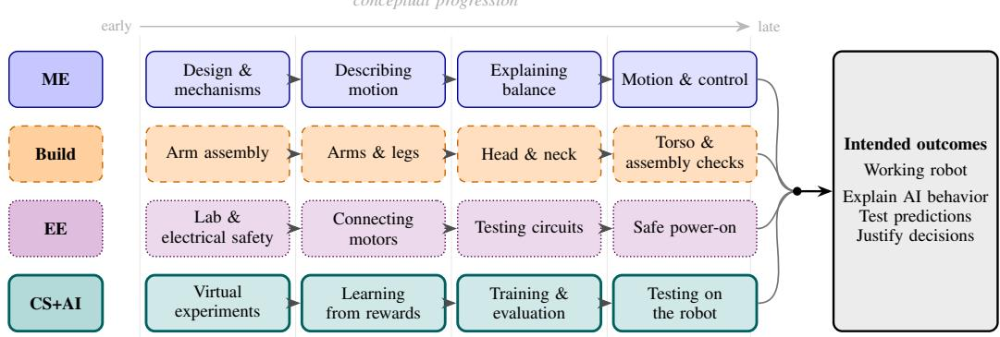
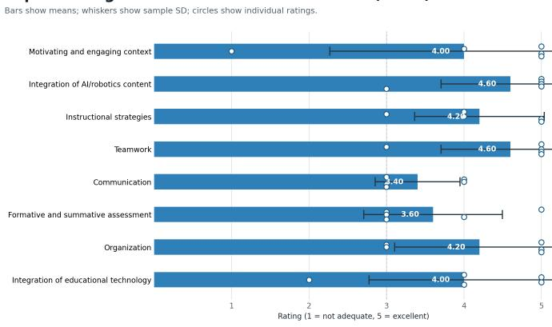

# Teaching Reinforcement Learning and Humanoid Robotics to High-School Students: An Expert-Validated Curriculum Design on a Low-Cost Open Platform

Yuanzhe Dong Stanford University Stanford, CA, USA yzd@stanford.edu

Jie Cao University of North Carolina at Chapel Hill Chapel Hill, NC, USA jiecao@unc.edu

Shuman Wang Stanford University Stanford, CA, USA shuman@stanford.edu

Abstract—Lower cost open source robots and reinforcement learning (RL) simulation tools create new opportunities for precollege students to engage with contemporary robotics. However, translating a complete research workflow, spanning mechanical assembly, electrical setup, simulation, policy learning, system identification, and physical deployment, into a coherent course for novice learners remains challenging. We present an integrated robotics course framework that organizes these activities around a shared robotic artifact. The framework combines parallel disciplinary tracks, sequencing based on technical dependencies, progressive integration of simulation and hardware, layered performance checkpoints, and structures for balancing collaborative work with individual accountability. We illustrate the framework through a high school curriculum organized around a robot project in which pairs of students assemble an open source humanoid robot, train a walking policy in simulation, and deploy it on the physical platform. The framework was developed through an iterative design process that included formative review by five experts in robotics research, engineering, secondary STEM education, and curriculum design. Expert feedback highlighted three central design tensions: authenticity versus cognitive load, system integration versus timely visible progress, and team construction versus individual accountability. These tensions informed the final framework presented in this paper. This work offers a structured approach for adapting robotics research workflows into interdisciplinary precollege courses; future classroom studies are needed to examine implementation and student learning.

Index Terms—Curriculum development, engineering education, humanoid robots, pre-college engineering, reinforcement learning

## I. INTRODUCTION

Robotics connects programming and engineering, but teaching reinforcement learning (RL) introduces hardware costs, space constraints, and the distinction between programming and training behavior [1], [2]. Calls for deeper learner participation in RL design [3] motivate a framework connecting introductory activities to a complete robot-learning workflow.

Why teach RL to high-school students? Our focus on grades 9–12 serves three educational purposes. First, artificial intelligence (AI) literacy includes understanding how systems acquire behavior and how human choices shape learning. The

  
(a) Robot design  
(b) Assembly in progress

(c) Completed robot  
  
(d) Learning in simulation  
Fig. 1. Physical and virtual settings for the robot project: (a) robot design, (b) assembly in progress, (c) completed robot, and (d) reinforcement learning in simulation.

AI for K–12 (AI4K12) initiative’s draft guidance explicitly includes distinguishing supervised, unsupervised, and reinforcement learning in this grade band [4]. Second, RL activities can connect school mathematics and science to a contemporary application: students interpret training curves, vary reward weights, and test predictions about motion. Supplied code supports this inquiry without requiring university-level optimization mathematics. Third, defining and testing motion goals lets students explore computing and engineering before further-study choices. Advanced algorithm implementation is optional.

Why a framework now? Open humanoids such as Toddler-Bot [5] and Berkeley Humanoid Lite [6] combine hardware with tools for learning control strategies, or policies. Industry tools such as NVIDIA Isaac Lab support simulation, training, and testing [7]. Adapting these practices for high school requires prerequisite support, manageable pacing, meaningful choices, and individual assessment.

Our framework adapts the assembly-to-deployment workflow for high-school students through staged tasks and bounded customization, making model adjustment and physical testing explicit learning objectives. Contributions include the framework, a humanoid curriculum instantiation, and a five-expert formative review tracing feedback to revisions. Students completed the course and achieved robot walking; their performance and learning data are reserved for a separate study. This paper reports expert perspectives on the initial design, not comparative learning gains.

## II. RELATED WORK

Accessible robotics and learner agency. Pre-college robotics supports construction and programming, but AI learning adds questions about how a system acquires behavior. Torres et al. [8] organize high-school robotics around design-based learning. McLaughlin et al. [9] identify real-world practices, designing, and creative expression as pathways in students engagement with AI robotics. These approaches inform our use of bounded choices alongside a common technical core; customization alone is not our novelty.

Existing RL learning opportunities. ARtonomous [1] lets middle-school students train and customize virtual robot navigation, avoiding physical kit costs. Zhang et al. [2] combine LEGO robots and a web interface to teach RL to highschool students. Balancing Act [3] combines a physical LEGO task with simulated balance control and lets learners explore reward and observation choices. These studies establish that pre-college RL, physical robots, and customization are already possible. Our additional design focus is following a policy through a student-assembled humanoid’s measurement, simulation training, and physical deployment, with individual explanations at each stage.

Research workflows and the adaptation gap. University courses provide staged robotics labs [10] and RL-based physical experiments [11]; open humanoids provide research control pipelines [5], [6]. Transferring these resources to high school requires reducing prerequisite demands while preserving meaningful decisions. The design problem is therefore access, coherence, and assessable understanding across the workflow. Our framework extends the scope of learning opportunities; it does not establish that a humanoid course teaches introductory RL more effectively than simpler alternatives.

## III. COURSE DESIGN FRAMEWORK

## A. Educational Rationale

Integrated science, technology, engineering, and mathematics (STEM) education connects disciplines within a meaningful context [12]. The shared robot connects prediction, measurement, and explanation. Scaffolding limits unfamiliar concepts and tools [13], while formative assessment uses explanations to guide instruction [14]. These perspectives motivate the design; effectiveness remains untested.

## B. Design Principles

The five principles below describe the framework. The three tensions in Section V-D organize expert feedback informing its revisions.

P1: Coordinate disciplines through one artifact. Connect mechanical, electrical, and computational work to observable behavior of the same robot. For example, students explain a failed standing attempt using both balance and control concepts. Teachers elicit these connections explicitly.

P2: Sequence by technical dependencies. Make safety induction, component checks, power-on, standing, and walking observable gates. Simulation can proceed before hardware is ready, providing early conceptual progress while assembly continues.

P3: Integrate simulation and hardware progressively. Move from simulated predictions to physical measurements. A supplied policy checks robot operation before a student-trained policy is introduced, helping students distinguish equipment faults, simulation errors, and learning failures.

P4: Combine scaffolded checkpoints with bounded choice. Progress from a worked example to a controlled modification and an independent decision. Students interpret graphs, compare behavior, and justify choices of learning objectives or non-critical design features within instructor-set limits. Independent algorithm implementation is an extension.

P5: Pair collaboration with individual evidence. Rotate operating and checking roles so both learners predict, test, and explain. Record individual reasoning separately from team robot performance, and use it to adjust support before assigning a harder task.

## C. Intended Support for RL Understanding

Learners investigate what rewards encourage, whether learned behavior persists under changed conditions, and whether physical behavior matches simulation. Comparing one controlled change with a baseline connects reward design, generalization, and model limitations across virtual and physical trials. These are proposed learning mechanisms, not measured gains.

## IV. HUMANOID CURRICULUM INSTANTIATION

## A. Implementation Model

The curriculum targets grades 9–12, with four students working in two pairs, one ToddlerBot per pair, and a recommended mentor-to-student ratio of 1:4. An intake survey informs pairing and support. Initially, prior coding was optional. Expert concerns prompted a revised prerequisite: running and modifying a short Python program before RL labs. Beginners need an introductory activity and additional preparation time.

Eight three-hour computer science and AI (CS+AI) sessions (24 contact hours) accompany assembly, electrical checks, and a closing demonstration. Additional build, preparation, and training time is not quantified here.

The intended learning outcomes are (LO1) assemble and safely start the robot; (LO2) explain how rewards and trying different actions guide learning, and distinguish training from using a learned policy; (LO3) compare simulation with physical measurements and explain model adjustments and training under varied conditions; (LO4) evaluate robot behavior and diagnose differences between simulation and physical trials; and (LO5) collaborate and explain design decisions. Independent algorithm implementation and successful student-trained walking are extensions.

Integration serves these outcomes: diagnosing a walking failure (LO4) connects assembly checks (LO1), reward choices (LO2), and simulation comparisons (LO3). Pair work and individual explanations support LO5. Table IV specifies evidence for each outcome.

## B. Platform

ToddlerBot [5] provides open hardware and software (Fig. 1), with a reported parts cost under USD 6,000. Fabrication, repairs, computing, and mentoring add to delivery costs. Shared computers support training. The platform’s simulation, learning, and measurement tools expose students to practices relevant to research and industry [7]; professional proficiency is not claimed.

Proposed customization for high-school learners. A progression of choices offers creative and analytical entry points. Learners first select colors or design non-critical shell features. Next, they define a bounded motion objective, such as prioritizing steady walking over speed, modify supplied reward weights, and compare simulation trials. An extension uses an instructor-approved sequence of poses, such as a slow arm wave, with rewards for following that sequence. The scaffold supplies the training code; learners specify, test, and explain the behavior. New motions are evaluated in simulation before any supervised hardware attempt. Motors and safety settings remain fixed; shell changes must allow movement without excess weight. These are proposed activities whose difficulty remains to be evaluated.

## C. Track Organization

Four coordinated tracks connect disciplinary ideas to practical decisions (Fig. 3). Mechanical Engineering (ME) connects geometry, balance, and motion to predictions about robot behavior. Build turns assembly and component checks into practice in interpreting instructions, diagnosing faults, and documenting decisions (Fig. 2). Electrical Engineering (EE) develops safe working practices and systematic testing before power-on. Computer Science/AI (CS+AI) uses simulation, learning, and physical comparison to examine how models and rewards shape behavior.

Instructors introduce concepts immediately before their application and return to them during debriefs. On-robot control requires the electrical power-on gate, and walking requires a standing test. Simulation activities can begin independently, providing early opportunities to predict and interpret behavior while construction continues.

  
Fig. 2. Students collaborating during hands-on assembly, soldering, and onrobot testing, and celebrating with their teacher (bottom right).

## D. CS+AI Activities and Checkpoints

Table I connects eight sessions to guided activities and individual explanations. Simulation (Fig. 1(d)) supports repeated trials. Students learn from demonstrated actions (imitation learning) and rewards. Proximal policy optimization (PPO) updates a policy using rewards [15]. Varying simulated conditions (domain randomization) prepares policies for differences on the physical robot [16], [17]. Students test a supplied policy before their own; all physical trials require mentor supervision.

A proposed learning cycle. Using supplied software, each learner predicts the effect of a reward change. The pair trains and compares behavior with the original. Each explains whether higher rewards mean better behavior; the instructor uses these explanations to provide support or an extension.

Hardware targets are standing and approximately five seconds of walking with the supplied policy, followed by an attempt with a student-trained policy. Logs should distinguish supported stepping from unsupported walking; neither is evidence of individual conceptual mastery. If hardware is unavailable, simulation comparisons and measurement-log analysis preserve conceptual work but do not substitute for the safe startup outcome (LO1).

Three-hour sessions alternate concept primers, supervised labs, and debriefs; long training runs occur between sessions. Short physical trials and spare parts accommodate damage from falls. Workload and reliability remain to be evaluated.

## V. FORMATIVE EXPERT REVIEW

## A. Protocol and Analysis

Five experts in robotics research and engineering, secondary STEM teaching, and curriculum design evaluated the curriculum through structured interviews. We report responses and backgrounds using codes E1–E5 (Table II). Experts are acknowledged by name with permission, without linking names to codes.

The ratings and qualitative findings concern the initial curriculum, before the scaffolding, outcome, and assessment refinements presented here. Experts did not evaluate the revised session plan or the framework as a separate instrument. The three tensions below are an author synthesis of the findings.

  
Fig. 3. Conceptual progression across Mechanical Engineering (ME), Build, Electrical Engineering (EE), and Computer Science / AI (CS+AI), linking robot performance with individual understanding. Safety checks constrain hardware work; simulation can begin independently. This is not a synchronized timetable; Table I details the eight CS+AI sessions.

TABLE I  
REVISED EIGHT-SESSION CS+AI PLAN (PROPOSED, NOT RE-EVALUATED). PROVIDED CODE SUPPORTS THE CORE TASKS; INDEPENDENT IMPLEMENTATION AND STUDENT-TRAINED WALKING ARE EXTENSIONS.
<table><tr><td>#</td><td>Learning focus</td><td>Guided learning activity</td><td>Individual reflection / follow-up</td></tr><tr><td>1</td><td>Exploring learning in simula- tion</td><td>Run a supplied simulation; identify what the robot senses, does, and receives as a reward; predict the effect of changing a reward.</td><td>Annotate the supplied code and explain the prediction.</td></tr><tr><td>2</td><td>Learning from examples</td><td>Use supplied code to train from demonstrated actions (imitation learning); compare the learned behavior with the examples.</td><td>Report differences from the examples and explain one failed trial.</td></tr><tr><td>3</td><td>Learning from rewards</td><td>Modify supplied training code (PPO); explain how rewards guide learning. Extension: implement the training loop.</td><td>Choose a bounded motion objective; interpret its learning curve.</td></tr><tr><td>4</td><td>Interpreting training progress</td><td>Identify the same learning steps in software that runs many simula- tions at once; launch a short run. Extension: adapt the reward.</td><td>Use shared computers; save training graphs and trained versions.</td></tr><tr><td>5</td><td>Comparing simulation with reality</td><td>After safety checks, measure motor behavior with the supplied tool; compare physical measurements with simulation.</td><td>Explain how adjusting a model setting changes agreement with measurements.</td></tr><tr><td>6</td><td>Testing changed conditions</td><td>Use session-5 measurements to identify differences; change a sim- ulation setting and compare the learned behavior.</td><td>Train under varied simulated conditions; predict a difficulty on the robot.</td></tr><tr><td>7</td><td>Testing a supplied behavior</td><td>Run the supplied walking behavior; progress from supported checks to a supervised walking attempt after the standing check.</td><td>Record support conditions, trial duration, and a failure or adjustment.</td></tr><tr><td>8</td><td>Testing student choices</td><td>Test the pair&#x27;s trained behavior on the robot after the same checks; compare with the supplied behavior. Extension: consecutive walking steps.</td><td>Each student explains a motion-design choice and one observed discrepancy.</td></tr></table>

TABLE II  
EXPERT PANEL: CURRICULUM-RELEVANT BACKGROUND
<table><tr><td>ID</td><td>Relevant background</td></tr><tr><td>E1</td><td>Master&#x27;s in engineering; mechanical engineering, robotics, industrial systems, and cross-disciplinary integration.</td></tr><tr><td>E2</td><td>Current full-time STEM teacher; master&#x27;s in engineering; secondary mathematics and science teaching.</td></tr><tr><td>E3</td><td>Current STEM teacher; master&#x27;s degrees in computer science and education; high-school teaching, STEM curriculum evaluation, fabrication, and digital-engineering projects.</td></tr><tr><td>E4</td><td>Doctoral-level robotics research; open humanoid development, simulation, and transferring learned behavior to physical robots.</td></tr><tr><td>E5</td><td>Doctoral-level computer-science research; electrical engineering, robot perception, RL, and university teaching assistance.</td></tr></table>

Each expert reviewed the initial four-track structure, eightsession CS+AI plan, safety checkpoints, and staged deliverables. The protocol was adapted from the Integrated STEM

Curriculum Planning and Reflection Rubric [18], which derives from earlier engineering design-based STEM curriculum assessment work [19]. It elicited ratings on eight dimensions: (1) motivating and engaging context, (2) integration of AI/robotics content, (3) instructional strategies, (4) teamwork, (5) communication of technical reasoning, (6) formative and summative assessment, (7) curriculum organization, and (8) integration of educational technology. All dimensions used the same five-point scale (1 = not adequate; 5 = excellent). Open-ended prompts then asked experts to explain each rating and identify strengths, implementation conditions, and revision priorities. An additional item asked for an overall implementation-readiness rating. We summarized ratings descriptively and coded substantive responses iteratively into cross-case themes. One expert omitted the overall-readiness rating (no value was imputed), and a duplicated interview record was counted only once.

TABLE III  
DESIGN BEFORE AND AFTER EXPERT REVIEW. REVISED RESPONSES ARE PROPOSED AND HAVE NOT BEEN RE-EVALUATED. T1–T6 REFER TO THE QUALITATIVE THEMES.
<table><tr><td>Design tension</td><td>Initial curriculum</td><td>Expert feedback</td><td>Revised design response</td></tr><tr><td>Authenticity vs. cognitive load</td><td>Prior coding helpful but optional; students implement PPO and adapt it to software running many simulations at once within the first four CS+AI sessions.</td><td>The integrated workflow was valued (T1). but four experts questioned novice workload and prerequisites (T2); setup support was needed (T3).</td><td>Retain authentic tasks with supplied code, preparation, and bounded reward or shell customization. Make independent implementation an extension; assess explanations before increasing complexity (P1, P4).</td></tr><tr><td>Integration vS. visible progress</td><td>Assembly and startup checks lead to physical testing, with a pretrained policy as an intermediate checkpoint. Early conceptual evidence is less explicit.</td><td>Setup can delay visible success (T2); reliable resources and backup activities are needed (T3). Three experts requested clearer relevance and progress (T6).</td><td>Retain hardware gates and the pretrained checkpoint. Add explicit early simulation predictions and component comparisons; use standard configurations and backup conceptual tasks (P2, P3).</td></tr><tr><td>Team construction vs. individual ac- countability</td><td>Pairs share a robot, with performance gates and technical logs; individual roles and assessment criteria are underspecified.</td><td>Unequal participation and opaque individual reasoning concerned experts (T4–T5). Communication and assessment averaged 3.40 and 3.60/5.</td><td>Rotate operating/checking roles and record contributions. Require individual predictions, failure explanations, and design justifications; assess these separately from team robot performance (P5).</td></tr></table>

  
Fig. 4. Expert ratings of the initial design across eight dimensions $( n = 5 )$ Bars show means (M), whiskers show sample standard deviations (SD), and circles show individual ratings on a five-point scale.

## B. Quantitative Findings

Experts rated the initial design favorably on integration and teamwork (Fig. 4). Integration of AI/robotics content and teamwork were the highest-rated dimensions (both M = 4.60, $S D = 0 . 8 9 )$ , followed by instructional strategies and organization (both M = 4.20). Motivating context and educationaltechnology integration each averaged 4.00; motivating context showed the greatest dispersion (SD = 1.73, range 1–5). Assessment (M = 3.60, SD = 0.89) and communication $( M = 3 . 4 0 , S D = 0 . 5 5 )$ were comparatively weaker. Among the four experts who supplied an overall score, implementation readiness averaged 4.00 (SD = 0.82, range 3–5).

## C. Qualitative Findings

Six cross-case themes summarize the feedback. Counts below indicate the number of experts expressing a theme, not its measured importance.

T1: Coherence. All five valued connecting assembly, electronics, simulation, and deployment through one artifact, while favoring a smaller conceptual core over equal depth in every discipline.

T2: Cognitive load and delayed progress. Four questioned the volume of terminology and prerequisites, long sessions, and setup work that could delay visible success. The motivation rating of 1/5 cautions against treating the favorable mean as consensus about engagement.

T3: Resource demands. All five identified implementation conditions, including reliability, setup, expertise, supervision, or cost. Suggestions included validated instructions, configured software, and backup activities.

T4: Unequal participation. Experts supported pair work but warned that differences in experience could concentrate technical work in one student. Formation of complementary pairs and rotating roles were suggested. One expert could not confidently judge teamwork because individual responsibility was underspecified.

T5: Reasoning beyond completion. Experts distinguished passing a robot milestone from understanding it. They wanted explanations of failures and design decisions, with prompts that elicit interpretation of logs and measurement results.

T6: Visible relevance. Three recommended connecting concepts to observable behavior and future study opportunities, using demonstrations and frequent achievements to sustain engagement.

## D. Design Tensions and Framework Refinements

Table III connects expert feedback to revisions through three tensions synthesized from the six themes. These tensions are author interpretations; the comparison documents design changes, not learning gains.

Proposed individual assessment during pair work. Students alternate operating and checking roles and record their contributions. At each checkpoint, each submits a separate prediction and explanation of the results. The instructor observes each student’s relevant practical task and asks a brief followup question without partner assistance. Using Table IV, the instructor records each outcome as independently demonstrated, demonstrated with prompting, or not yet demonstrated, with supporting evidence. Role logs inform assessment of collaboration but do not establish understanding. Pair robot performance is recorded separately; partners need not receive the same individual judgment. Students needing support receive feedback and repeat the relevant task or explanation. This assessment procedure is proposed and remains to be evaluated.

TABLE IV  
PROPOSED INDIVIDUAL EVIDENCE AND SUCCESS CRITERIA
<table><tr><td>LO</td><td>Evidence and criterion</td></tr><tr><td>1</td><td>Observed safety task: follows the checklist and explains when power-on must be withheld.</td></tr><tr><td>2</td><td>Annotated reward experiment: explains exploration and reward effects, and distinguishes training from policy execution.</td></tr><tr><td>3</td><td>Simulation comparison: identifies a measured difference and explains a model adjustment and why training conditions are varied.</td></tr><tr><td>4</td><td>Trial analysis: uses observations to support a failure hypothesis and proposes a test that could distinguish causes.</td></tr><tr><td>5</td><td>Role log and individual explanation: documents contributions and communicates a design decision to a non-specialist.</td></tr></table>

## VI. DISCUSSION AND CONCLUSION

Limits of the evidence. Five purposively selected experts provide formative feedback, not representative agreement. Platform expertise may favor the approach; independence should not be assumed. Ratings establish neither formal content validity nor learning effectiveness. Course completion and walking provide implementation context; student outcomes are reserved for a separate study. The revised framework and assessment criteria remain unevaluated.

Limits of transfer. Other platforms require adapted prerequisites, checkpoints, and assessments. Mentoring, training compute, and repair capacity remain resource assumptions; classroom studies must measure workload and success rates.

Comparisons with simulation-only RL should account for prior experience, contact time, and instructor support. Shared tasks should assess reward design, training versus evaluation, unfamiliar failures, completion time, assistance, and student explanations. Any learning advantage remains untested.

## ACKNOWLEDGMENT

Following peer review, GPT-6 Astra [20] and Claude Fable 5.1 [21] assisted with drafting and revising the abstract and Sections I–VI, improving language and clarity, and shortening text to meet the page limit. The authors reviewed and revised all AI-assisted text for accuracy and take responsibility for the final manuscript.

The authors thank Haochen Shi and Weizhuo Wang for ToddlerBot technical support, and Haotong Han, Yao He, Yi

Yang, Miaoya Zhong, and Haochen Shi for their interview participation and feedback on the curriculum.

## REFERENCES

[1] G. Dietz, J. King Chen, J. Beason, M. Tarrow, A. Hilliard, and R. B. Shapiro, “ARtonomous: Introducing middle school students to reinforcement learning through virtual robotics,” in Proc. 21st Annu. ACM Interaction Design and Children Conf. (IDC), Braga, Portugal, 2022, doi: 10.1145/3501712.3529736.

[2] Z. Zhang, S. Willner-Giwerc, J. Sinapov, J. Cross, and C. Rogers, “An interactive robot platform for introducing reinforcement learning to K-12 students,” in Robotics in Education, AISC, vol. 1359, 2022, pp. 288– 301, doi: 10.1007/978-3-030-82544-7 27.

[3] T. Burman, J. Coney, C. Rogers, J. Cross, and J. Sinapov, “Balancing act: Mastering beam-and-ball control with reinforcement learning,” in Robotics in Education, LNNS, vol. 1544, 2025, pp. 240–252, doi: 10.1007/978-3-031-98762-5 21.

[4] AI4K12 Initiative, “Big idea 3: Learning,” draft grade-band progression chart. [Online]. Available: https://ai4k12.org/big-idea-3-overview/. Accessed: Sep. 18, 2026.

[5] H. Shi, W. Wang, S. Song, and C. K. Liu, “ToddlerBot: Open-source ML-compatible humanoid platform for loco-manipulation,” in Proc. 9th Conf. Robot Learning (CoRL), PMLR, vol. 305, 2025, pp. 4165–4189.

[6] Y. Chi, Q. Liao, J. Long, X. Huang, S. Shao, B. Nikolic, Z.´ Li, and K. Sreenath, “Demonstrating Berkeley Humanoid Lite: An open-source, accessible, and customizable 3D-printed humanoid robot,” in Proc. Robotics: Science and Systems (RSS), 2025, doi: 10.15607/RSS.2025.XXI.062.

[7] NVIDIA, “Isaac Lab,” [Online]. Available: https://developer.nvidia.com/ isaac/lab. Accessed: Sep. 18, 2026.

[8] A. Torres et al., “Teaching collaborative robotics: Design and evaluation of design-based learning curriculum for high school STEM education,” J. Formative Design Learn., vol. 9, pp. 77–91, 2025.

[9] G. McLaughlin et al., “Pathways to learning: Exploring high school students’ learning of AI-powered educational robotics,” Educ. Technol. Res. Dev., 2026, doi: 10.1007/s11423-026-10651-w.

[10] N. Correll, R. Wing, and D. Coleman, “A one-year introductory robotics curriculum for computer science upperclassmen,” IEEE Trans. Educ., vol. 56, no. 1, pp. 54–60, Feb. 2013.

[11] J. Podobnik, A. Udir, M. Munih, and M. Mihelj, “Teaching approach for deep reinforcement learning of robotic strategies,” Comput. Appl. Eng. Educ., vol. 32, no. 6, Art. no. e22780, 2024.

[12] T. R. Kelley and J. G. Knowles, “A conceptual framework for integrated STEM education,” Int. J. STEM Educ., vol. 3, no. 1, Art. no. 11, 2016.

[13] J. Sweller, J. J. G. van Merrienboer, and F. G. W. C. Paas, “Cognitive ¨ architecture and instructional design,” Educ. Psychol. Rev., vol. 10, no. 3, pp. 251–296, 1998.

[14] P. Black and D. Wiliam, “Assessment and classroom learning,” Assess. Educ.: Princ., Policy & Pract., vol. 5, no. 1, pp. 7–74, 1998.

[15] J. Schulman, F. Wolski, P. Dhariwal, A. Radford, and O. Klimov, “Proximal policy optimization algorithms,” arXiv:1707.06347, 2017.

[16] J. Tobin, R. Fong, A. Ray, J. Schneider, W. Zaremba, and P. Abbeel, “Domain randomization for transferring deep neural networks from simulation to the real world,” in Proc. IEEE/RSJ Int. Conf. Intell. Robots Syst. (IROS), 2017, pp. 23–30.

[17] X. B. Peng, M. Andrychowicz, W. Zaremba, and P. Abbeel, “Sim-toreal transfer of robotic control with dynamics randomization,” in Proc. IEEE Int. Conf. Robot. Autom. (ICRA), 2018, pp. 3803–3810.

[18] W. S. Walker, III, T. J. Moore, S. S. Guzey, and B. H. Sorge, “Frameworks to develop integrated STEM curricula,” K-12 STEM Education, vol. 4, no. 2, pp. 331–339, 2018.

[19] S. S. Guzey, T. J. Moore, and M. Harwell, “Building up STEM: An analysis of teacher-developed engineering design-based STEM integration curricular materials,” J. Pre-College Eng. Educ. Res., vol. 6, no. 1, Art. no. 2, 2016.

[20] OpenAI, “GPT-6 Astra.” [Online]. Available: https://developers.openai. com/api/docs/models/gpt-6-astra. Accessed: Sep. 19, 2026.

[21] Anthropic, “Claude Fable 5.1.” [Online]. Available: https://platform. claude.com/docs/en/models/fable-5-1/overview. Accessed: Sep. 19, 2026.