# A Living Benchmark for Information Retrieval from Electronic Health Records

Jordan L. Cahoon1,2, Chloe O. Stanwyck1,3, Sulaiman Somani4, Philip Chung3, Kevin R Keet4, Kameron C. Black4, Andrea T. Fisher5, Sarita Khemani4, Jerry Liu4, Stephen Ma4, Saloni K. Maharaj4, Rita M. Pandya4, Eduardo Perez-Guerrero4, Priyanka Pillai4, Lisa Shieh4, David J.H. Wu6, James Xie3, James C. McAvoy3, Teresa Nguyen3, Jessica Tran4, Lucy Yin1, Bridget Lin1, Alison Callahan4, Jason A. Fries 1,4,7, Nigam H. Shah 1,4,8, and Emily Alsentzer1,7,9,‡

1Department of Biomedical Data Science, Stanford University, Stanford, CA 2Department of Pathology, Stanford University, Stanford, CA 3Department of Anesthesiology, Perioperative and Pain Medicine, Stanford University, Stanford, CA 4Department of Medicine, Stanford University, Stanford, CA 5Department of Surgery, Stanford University, Stanford, CA 6Department of Radiation Oncology, Stanford Cancer Center, Palo Alto, CA, USA 7Weill Cancer Hub West 8Center for Clinical Excellence Research, Stanford School of Medicine, Stanford, CA, USA 9Department of Computer Science, Stanford University, Stanford, CA ‡Corresponding author. Email: ealsentzer@stanford.edu

## Abstract

Large language model (LLM)-based clinical assistants are increasingly being integrated into electronic health record (EHR) systems, transforming how clinicians retrieve and synthesize informa tion from patient records. Their safety and utility depend on rigorous evaluation, yet existing benchmarks are manually curated, costly to update, and rapidly become obsolete with evolving technological advancements. We present a scalable framework that automatically generates question–answer pairs from longitudinal EHR notes. Nineteen clinicians validate the benchmark generator, producing the Benchmark for Retrieving Information in EHRs (BRIE), a continuously maintainable evaluation dataset. Across nine LLMs and five inference strategies, state-of-the-art systems frequently omit clinically important information, particularly for questions requiring synthesis across multiple documents and encounters. Because the generator itself is validated, BRIE supports evaluations that static benchmarks cannot, including the generation of multiple answers that reflect variation in clinician reasoning for robust performance assessment and continuously refreshing benchmark content to guard against leakage. Our results demonstrate that scalable benchmark generation enables rigorous, up-to-date evaluation of clinical LLMs as they are deployed in rapidly evolving healthcare settings.

Large language models (LLMs) are rapidly transforming clinical workflows throughout hospitals. At a growing number of institutions, clinicians can now send requests about specific patient medical records to secure LLM deployments embedded within electronic health record (EHR) systems [1–8]. These systems augment the chart review process by enabling clinicians to interact with patient records through a unified chat interface, shifting away from traditional search workflows. Through these interactions, clinicians may ask questions about a patient’s medical history, locate records from prior encounters, and generate summaries. Such use cases require models to navigate and synthesize information spread across long and complex patient records.

Monitoring these LLM deployments requires evaluation frameworks that can characterize model performance, identify failure modes, and reflect clinically realistic settings [9–12]. However, new methodological advancements are introduced faster than traditional benchmarks can be created [13–15]. As a result, despite growing interest in deployment, robust evaluation of clinical information retrieval remains an open challenge [16, 17]. Reasoning across hundreds of clinical notes poses distinctive challenges for LLMs. Relevant information is often dispersed across multiple encounters, while clinical observations are frequently duplicated through copy-forward documentation [18, 19]. Further, notes may interleave findings from the current and past encounters, making it difficult to understanding when observations happened [20]. Models must extract meaningful signal from this noise, which can result in misinterpreting the record and missing important information [21]. Such errors can propagate into model responses and ultimately affect clinical care. As these LLM systems become increasingly embedded in clinical workflows, healthcare organizations must continuously evaluate their reliability.

Recent work has enabled retrieval evaluation by creating benchmarks that include questions and answers based on individual patient notes. Often times, clinicians are asked to author these question and answers directly to ensure clinical utility [22]; however, the scale is limited by avail able annotations resources. Synthetic generation with LLMs enables a way to augment this process, where clinicians focus on validation rather than authoring from scratch [23, 24]. Despite this progress, existing benchmarks do not fully capture breadth of information retrieval questions that are necessary to evaluate deployed chart review systems [25, 26]. More fundamentally, these benchmarks are treated as static artifacts that gradually lose effectiveness as their contents are absorbed into training corpora, documentation practices change overtime, and utilization evolves, such that measured performance may increasingly reflect memorization rather than robust clinical reasoning [27–29]. Combined with the substantial clinician effort required to construct them, this makes existing paradigms insufficient for the robust evaluation of large language model deployments in chart review [30, 31].

Rather than asking clinicians to dedicate time to manually update the benchmark, we develop a scalable LLM-based generator to produce question–answer pairs from real, de-identified patient records. These pairs are structured along evaluation axes spanning reasoning, topics, and time to enable evaluation on specific clinical retrieval challenges. Nineteen physicians who regularly use these clinical LLM tools perform a one-time validation of the generator, supporting a “living” benchmark paradigm [27]. After this initial validation, the generator can be rerun on new patient data to produce scalable, continuously updated benchmark datasets.

We leverage the scalable generator to create the Benchmark for Retrieving Information in EHRs (BRIE), a dataset containing over five hundred clinical information retrieval questions with verified answers and de-identified clinical notes. BRIE enables both the evaluation and continuous monitoring of deployed clinical retrieval systems. Using BRIE, we identify failure modes across nine state-of-the-art models [32–41] and five inference configurations [42], including retrievalaugmented generation (RAG) [43–45] and agentic approaches [46, 47]. We find that while hallucinations are rare, models frequently omit relevant facts, particularly when the answer is dispersed across multiple parts of the clinical record.

We demonstrate that our evaluation framework enables robust analyses that fixed benchmarks cannot easily support. Using the validated generator, we create multiple reference answers that represent different clinical interpretations and find that single-reference evaluation systematically underestimates model capability. Additionally, to show that BRIE can easily be updated, we fully regenerate BRIE from admissions collected two years later and show that it retains its difficulty without clinician intervention. Altogether, these contributions demonstrate how BRIE enables continuous, robust clinical retrieval evaluation.

## Results

## A scalable framework for generating clinical retrieval benchmarks

We focus evaluation on a common chart review task in which a clinician must quickly understand a patient’s medical history when admitting a patient to the hospital (Figure 1a). We formalize this task as answering a clinical question for a specific patient at a specific point in time, using all information available in the medical record up to that point—here, when the admission History & Physical (H&P) note was written. The output is a free-text response supported by evidence from the patient’s prior clinical documentation (Figure 1a). To enable evaluation at scale, clinicians verify the question–answer pairs automatically generated from de-identified clinical notes (Figure 1b). To ensure that these pairs reflect questions a clinician might ask when admitting a patient, we ground their generation in the patient’s History & Physical (H&P) note, which captures the clinical information considered relevant at admission (Figure 1d).

Generation proceeds in two stages (Figure 1d). First, an LLM extracts and de-duplicates candidate facts from all clinical notes documented before the H&P, removing redundancy introduced by copied or imported text. Next, the extracted facts and the H&P note are provided jointly to an LLM (Gemini Pro 2.5) in a single prompt to generate question–answer pairs, where answers are directly linked to a subset of patient facts. The H&P provides encounter-specific clinical context, while the extracted facts define the permissible evidence for each answer. Consequently, every answer must be supported exclusively by the extracted facts and not by the H&P itself, ensuring that the questions evaluate retrieval from the prior medical record rather than information explicitly summarized in the H&P.

To systematically identify where existing retrieval approaches succeed and fail, we organize question-answer generation around an evaluation-oriented taxonomy whose axes correspond to distinct retrieval challenges (Figure 1e). Each question is generated conditioned on two axes: Reasoning, which distinguishes questions answerable from a single source (single-hop) from those that require combining evidence across multiple sources (multi-hop) [48], and Topics, the clinical concept(s) targeted by the question (Figure 1e). A third axis, Temporality, captures where the supporting evidence resides in the longitudinal record and is determined after question generation (see Online Methods Section 2).

Using the generator, we produced 675 chart-review questions from 63,878 de-identified clinical notes spanning a representative sample of 68 patients at Stanford Health Care (median 400 notes per patient, range 102–9,319; Supplementary Figure 11 and Supplementary Table 3).

## Clinicians validate benchmark generator for clinical relevance and accuracy

To assess the quality of the automatically generated question–answer pairs, we recruited fifteen physicians, with two independent reviewers assigned to each pair. Reviewers rigorously evaluated each generated entry by separately assessing the question, answer, and fact set across 14 criteria for clinical utility and accuracy. Overall, 83.7% of questions (95% CI, 80.9–86.3) were judged clinically relevant and 97.8% (95% CI, 96.6–98.8) were consistent with the patient chart (Figure 1c).

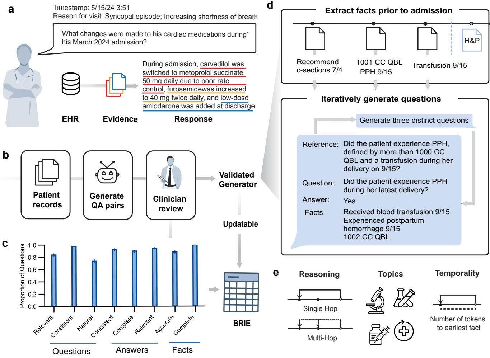  
Figure 1: A living benchmark for retrieval over EHRs. (a) We formulate clinical information retrieval as a question–answering task for a specific inpatient encounter. Answering each question requires identifying the relevant supporting sources and synthesizing a free-text response supported by those sources. (b) To construct a living benchmark, we generate question–answer pairs from deidentified clinical notes and have clinicians evaluate their quality to validate the benchmark generator. Once validated, the generator can be applied to new clinical notes to create updated evaluation datasets over time. (c) Generated question–answer pairs are of high quality. The the x axis denotes the criterion, spanning question, answer, and fact dimensions, and the y axis shows the proportion of the 675 question–answer pairs meeting each quality criterion. Error bars indicate 95% confidence intervals. (d) Question-–answer generation comprises a fact-extraction stage, in which facts are drawn directly from longitudinal clinical notes, and a questiongeneration stage. (e) We define a clinical retrieval taxonomy along three axes: the number of reasoning hops, clinical topic, and temporality, measured by the number of tokens to the earliest supporting fact.

Natural phrasing was the primary area for improvement: 73.3% of questions (95% CI, 70.1–76.6) had realistic phrasing (Figure 1c), and reviewers supplied alternative phrasing where appropriate. Generated answers were of similarly high quality, with 92.0% (95% CI, 90.2–94.2) judged consistent with the chart, 89.8% (95% CI, 87.4–92.0) complete, and 94.2% (95% CI, 92.4–95.9) relevant (Figure 1c). Supporting fact lists were comparably strong, with 88.0% (95% CI, 85.6–90.5) supporting the corresponding answer and 99.7% (95% CI, 99.3–100.0) judged complete (Figure 1c).

## BRIE: benchmark for retrieving information in electronic health records

Applying our scalable generation framework, we created BRIE, a benchmark designed to probe the challenges of retrieving information across longitudinal electronic health records. To establish an initial high-confidence reference dataset, disagreements about clinical relevance were adjudicated by a third physician. We retained question–answer pairs judged clinically relevant and for which at least one reviewer identified no missing, hallucinated, or irrelevant information, yielding 508 questions (Supplementary Table 4).

BRIE represents diverse retrieval settings found in clinical practice. 276 questions require single-hop reasoning, and 232 synthesize information across different encounters through multihop reasoning (Figure 2a). Answers contain a median of 5 supporting facts (range, 1–21). To account for copy-forward documentation, only the most recent mention of each supporting fact was retained. Using these mentions, the earliest evidence supporting an answer occurs a median of $3 . 8 \times 1 0 ^ { 4 }$ tokens (range, $0 { - } 7 . 2 \times 1 0 ^ { 6 } )$ before the clinical query time, and the supporting facts span a median of $2 . 3 \times 1 0 ^ { 4 }$ tokens (range, $0 { - } 7 . 0 \times 1 0 ^ { 6 }$ ; Figure 2b,c). Notably, for 63 questions, the earliest supporting evidence occurs more than 180,000 tokens before the query time, requiring retrieval across extensive longitudinal portions of the medical record rather than localized chart review.

BRIE covers a broad range of clinical topics, with individual questions often spanning multiple categories. The most common topics include comorbidities (N=296), diagnostic testing (N=276), disease progression or status (N=188), radiology and imaging (N=187), assessment and plan (N=182), procedures and surgeries (N=155), prescriptions (N=95), laboratory tests (N=92), and reasons for care (N=68) (Figure 2d).

We used BRIE to evaluate question-answering performance across nine models spanning proprietary frontier systems and open-weight models of varying sizes. Each model was evaluated under five inference configurations. We first considered two long-context baselines: Recent, which fills the context window with the most recent clinical notes, and Recent-180K, which includes up to a maximum of 180,000 tokens, a cut off selected to fall well within the smallest available context window. Because patient records often far exceed even the largest available context windows, and processing such long contexts can be prohibitively expensive at scale, we also evaluated retrieval-based alternatives. Specifically, we considered two retrieval-augmented generation (RAG) methods: BM25, a sparse retriever that ranks passages by lexical overlap with the question, and Dense, which ranks document chunks by semantic similarity. Finally, we evaluated an Agentic configuration that performs LLM-guided retrieval through iterative tool use with conditional stopping.

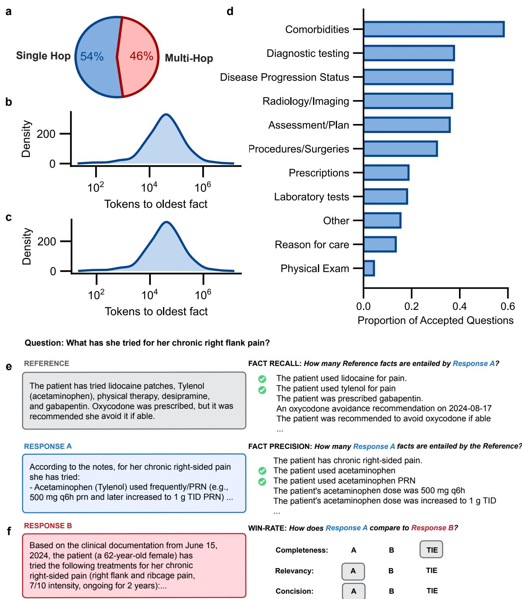  
Figure 2: Benchmark for Retrieval in EHRs (BRIE). BRIE represents a variety of retrieval settings, including (a) different reasoning types (single- and multi-hop), timeframes as measured by (b) the number of tokens between the query and the earliest supporting fact and (c) the number of tokens number of tokens between the earliest and latest supporting facts, and (d) question topics. We evaluate model responses using two metrics, illustrated with an example. (e) Fact recall is the proportion of facts in the Reference answer that appear in Response A, and fact precision is the proportion of facts in Response A that are supported by the Reference. (f) To compare relative performance, two responses are assessed in terms of completeness, relevancy and concision.

The large number of model and retrieval configurations makes exhaustive manual evaluation infeasible. We therefore developed and validated two automated LLM-as-a-judge methods [49]. The first uses fact entailment to compare each model response against the clinician-validated reference answer (Figure 2e). Fact recall measures the fraction of reference facts that the model response surfaces, and fact precision measures the fraction of facts in the model response that appear in the reference answer. Because two responses with similar fact recall and precision can still differ in clinical utility, we add a complementary win-rate metric that directly compares two responses for completeness (coverage of reference facts), relevance (focus on question-relevant information), and concision (conveys the relevant information concisely) (Figure 2f). Further details and validation procedures are provided in Online Methods Section 4.

## State-of-the-art models frequently omit clinically relevant information

We evaluate BRIE across model and inference configuration types to surface trends in state of the art information retrieval. Fact recall was moderate across all configurations ranging from 0.28 to 0.78 (Figure 3a). Even the strongest model-inference combination left roughly a quarter of the clinician-verified supporting facts unsurfaced. Under Recent inference, frontier models achieved the highest average recall: Claude Opus 4.7 (0.78; 95% CI, 0.76–0.80), Gemini 2.5 Pro (0.73; 95% CI, 0.70–0.75) and GPT 5.4 (0.72; 95% CI, 0.70–0.74) (Figure 3a).

Average fact recall fell among proprietary, cost-efficient models, most sharply for Gemini 2.5 Flash Lite (0.43; 95% CI, 0.40–0.46), with more modest declines for Claude Haiku 4.5 (0.68; 95% CI, 0.65–0.70) and GPT 5.4 Nano (0.68; 95% CI, 0.66–0.70). Open-weight models remained competitive with the frontier models despite their smaller scale, with Kimi K2.6, Qwen 3.5 397B, and Qwen 3.5 27B each reaching approximately 0.74 recall (95% CI, 0.72-0.76, 0.72-0.77, 0.72-

0.76) (Figure 3a).

Fact precision was consistently lower than fact recall, ranging from 0.17 to 0.63, indicating that model responses were more verbose than the reference response and included information beyond what the question required (Figure 3b). This tendency was most pronounced for the Claude models under Recent inference (Claude Opus 4.7, 0.42; 95% CI, 0.40–0.44; Claude Haiku 4.5, 0.43; 95% CI, 0.41–0.45), reflecting a preference for more comprehensive responses at the expense of concision. Consistent with these results, pairwise preference evaluation most frequently favored Claude Opus 4.7 for completeness and relevance, whereas Gemini 2.5 Pro was most frequently favored for concision (Figure 3d).

Because facts absent from the reference answer may nonetheless be supported by the clinical record, we assessed whether the additional content reflected hallucination. In a random sample of 50 queries spanning models and configurations, 99.2% of extracted model response facts (95% CI, 98.5–99.6) were faithful to the clinical record. Thus, the lower fact precision primarily reflected additional chart-grounded content rather than fabrication (Supplementary Figure 18 and Supplementary Table 8). These findings indicate that the dominant failure mode is therefore omission, not hallucination.

## Retrieval augmented generation matches long-context recall at lower cost

Retrieval methods such as retrieval augmented generation (RAG) and agentic systems show promise to improve information retrieval and lower deployment costs, in exchange for added implementation overhead. We evaluated responses across inference configurations to assess whether these systems should be deployed in practice. Across individual models, Dense retrieval matched or exceeded Recent inference on fact recall while processing an average of 329,697 (69%) fewer tokens, and it consistently outperformed keyword-based BM25 retrieval (Figure 3a–b, Appendix). The gains were most pronounced for cost-efficient models, where dense retrieval raised average fact recall by 0.18, 0.06, and 0.03 for Gemini 2.5 Flash Lite, Claude Haiku 4.5, and GPT 5.4 Nano, respectively, relative to recent-context inference (Figure 3a). BM25 retrieval, by contrast, yielded inconsistent results, changing fact recall by +0.07, –0.03, and –0.07, respectively, for the same models (Figure 3a).

Agentic retrieval has been proposed as a promising approach for chart review, but did not improve fact recall over Dense retrieval. For Claude Opus 4.7 and Claude Haiku 4.5, it even underperformed Recent inference, reducing fact recall by 0.08 and 0.04, respectively (Figure 3a).

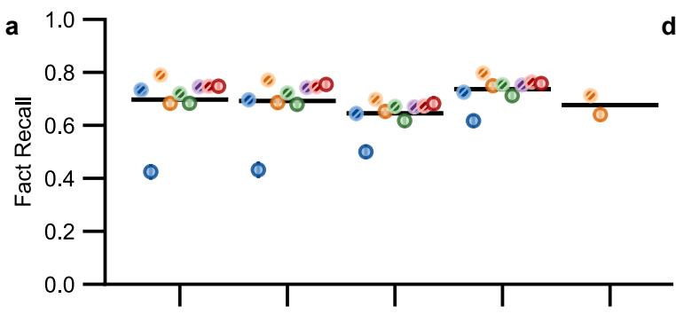

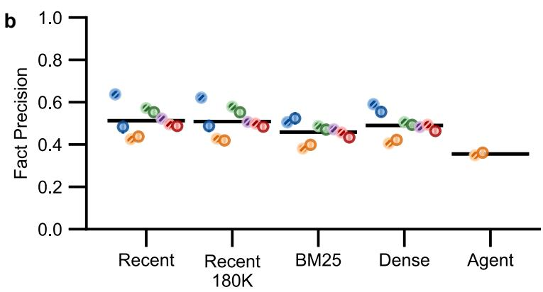

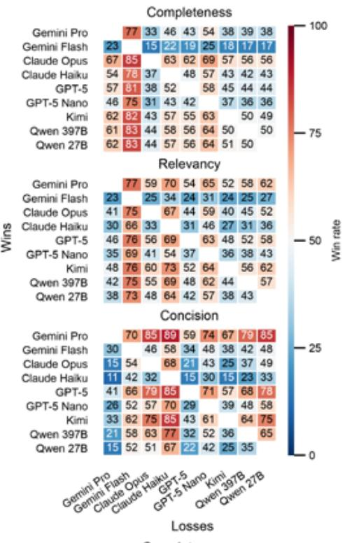

c  
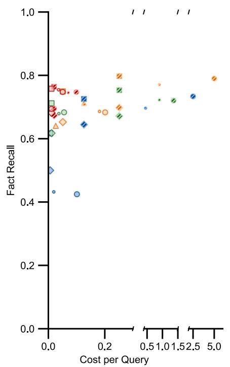

e  
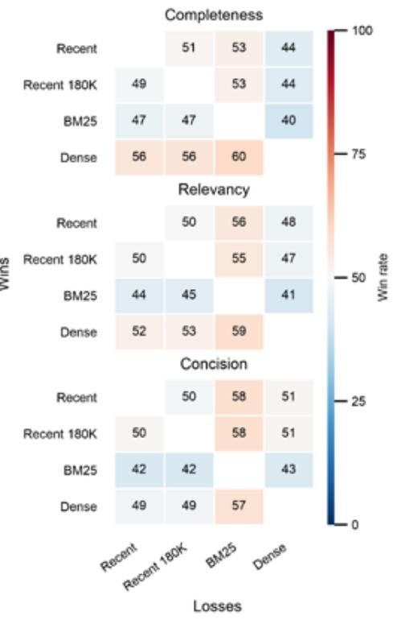  
Figure 3: Performance varies across model and inference configurations. Average (a) fact recall and (b) fact precision are reported for each model–inference combination. Marker shape denotes the inference type, color denotes the model, and solid marker outlines identify the smaller model within each family. Error bars represent the 95% confidence intervals around the mean. (c) Average fact recall is plotted against inference cost for each model–inference combination. (d-e) Pairwise win rates summarize relative performance in terms of completeness, relevance, and concision: (d) each cell shows the percentage of wins of the y-axi model over the x-axis model, pooled across inference configurations, and (e) each cell shows the percentage of wins of the y-axis inference type over the x-axis inference type, pooled across models.

Pairwise comparisons reinforced the advantage of Dense retrieval. Across models, responses produced with Dense retrieval were preferred in 61% and 56% of comparisons for completeness and relevance, respectively. They were preferred in 47% of comparisons for concision, indicating comparable brevity (Figure 3e). Dense retrieval also sharply reduced inference cost. Limiting retrieval to the top 50 documents holds the input context near 50K tokens per patient, producing a nearly constant cost across the cohort. Because 65 of the 68 BRIE patients carry more than 50K tokens of source notes (Supplementary Figure 12), this cap would reduce the inference cost of processing the full benchmark by approximately \$837.43, or 86%, at Claude Opus 4.7 pricing, assuming a fixed response length (Figure 3c, Supplementary Table 9).

Beyond reducing inference cost, Dense retrieval can surface question-relevant documents that may otherwise remain buried in the record. Several illustrative cases emerged when Claude Opus 4.7 was equipped with Dense retrieval. For a patient presenting with cough and dyspnea, Dense retrieval surfaced the most recent pulmonary function test, a 2019 study documenting severe airflow obstruction and substantial decline, which Recent inference missed entirely. In another case, when asked for the most recent bone marrow biopsy in a patient with a history of myelofibro sis, Dense retrieval accurately recovered the most recent report that documented normal bone marrow function, helping shift the diagnostic focus away from potential relapse. In contrast, Recent inference returned contradictory claims about whether the biopsy existed. Finally, when identifying details of the most recent urinary tract infection in a patient presenting with pyelonephritis, Dense retrieval identified the Klebsiella aerogenes susceptibility profile and prior treatment course with ertapenem followed by ciprofloxacin, whereas Recent conflated separate admissions and missed the culture report, omitting the causative organism and its susceptibilities entirely. Loss of such details can distort diagnostic reasoning and lead to ineffective or potentially harmful treatment. In each example, the relevant evidence was present in the context but difficult to identify because of duplicated text and temporal ambiguity. By filtering the record to the most relevant documents, Dense retrieval can preserve or improve recall while substantially reducing the computational cost of clinical question answering.

## Performance declines substantially for multi-hop and longitudinal retrieval

The BRIE taxonomy enables us to decompose aggregate fact recall across reasoning complexity, clinical topic, and temporal distance, revealing failure modes obscured by aggregated performance.

Reasoning complexity had the largest effect on fact recall (Figure 4a,d). Across all models and inference strategies, multi-hop questions consistently yielded lower fact recall than single-hop questions. These questions require synthesizing across multiple encounters and subsequently may cause the model to omit clinically relevant details. In one example, the question asked about prior rashes and treatments in an allogenic stem cell transplant patient presenting with worsening facial rash concerning for disseminated varicella zoster. Recent inference by GPT-5.4, Claude Opus 4.7, and Gemini Pro 2.5 omitted key information about the effectiveness of prior treatments, including improvement with clotrimazole and metronidazole. All three models also omitted the dosedependent relationship between ponatinib and the patient’s chronic rash, while GPT-5.4 omitted the ponatinib association entirely. These omissions obscured clinically relevant distinctions between the patient’s chronic and acute symptoms.

Multi-hop questions require reasoning about which information is relevant for the clinical context. Notably, alternative retrieval approaches exacerbated rather than reduced omission. The average decrease in fact recall (multi-hop minus single-hop) was –0.20 for Agentic, –0.14 for BM25, and –0.13 for Dense retrieval, compared with –0.12 for Recent and –0.10 for Recent-180K (Supplementary Figures 25-29). Thus, although retrieval reduced inference cost and performed well overall, existing retrieval strategies did not consistently surface all evidence required for questions requiring reasoning across multiple encounters.

Fact recall also varied by clinical topic (Figure 4b,e). Under Recent inference, recall was lower for questions about comorbidities (mean recall, 0.68; 95% CI: 0.67-0.69) and disease progression (mean recall, 0.67; 95% CI: 0.66-0.68) than for questions about imaging (0.76; 0.75–0.77) and diagnostic testing (0.76; 0.74–0.77) (Supplementary Figures 31-35). Because comorbidities and disease progression may be documented across multiple encounters and summarized in many notes, models may struggle to distinguish and identify separate events. For example, when asked to characterize the pancreatitis history of a patient presenting with epigastric discomfort, Recent inference with Gemini-Pro 2.5 identified prior alcohol-associated episodes in December 2020 and May 2022 but omitted more recent admissions in June and August 2022 during which lipase levels were normal. By recalling only the confirmed episodes, the response could mislead the differential diagnosis. This pattern persists when the analysis is restricted to multi-hop questions, suggesting that trends in recall across topics is distinct from those in complex reasoning (Supplementary Figure 30).

Finally, fact recall declined when supporting evidence occurred farther back in the patient record (Figure 4c,f). While most relevant facts are documented in the most recent 180,000 tokens,

63 questions require surfacing information beyond this cutoff(Supplementary Figure 10). In many cases, these facts may not be accessible with Recent inference because the information falls out of context. For example, when asked about the management plan for the patient’s initial onset atrial fibrillation, Recent inference with GPT 5.4 was unable to identify the relevant historical note because it fell outside the context window. When the earliest supporting fact appeared more than 180K tokens before the query, fact recall fell by an average of -0.16 and -0.25 for Recent and Recent-180K across models, respectively, but no significant drop in performance was observed for the other inference methods (Supplementary Figures 36-40).

Together, these findings show that retrieval failures are concentrated rather than uniform. Current systems struggle most when answers require integrating evidence across encounters, tracking clinical concepts that evolve over time, or recovering facts from distant portions of the record. These limitations persist across models and inference strategies.

## Multiple reference answers improve robustness of retrieval evaluation

Standard benchmarks typically prescribe a single reference answer per question. However, in clinical settings, there may be multiple valid responses depending on context or clinician perspective (Figure 5a). A response may therefore receive a low score because it does not align with one particular reference answer, even when it represents a valid clinical interpretation. As a result, evaluating models against a single reference answer may systematically underestimate true retrieval performance. To quantify this effect, we sampled 100 BRIE questions and generated alternative interpretations of each, along with corresponding reference answers. Four board-certified physicians evaluated the resulting question–answer pairs for relevance and accuracy. An interpretation was considered valid if its answer also correctly addressed the original question and the modi fied question narrowed the scope by specifying additional details, such as the relevant time-frame, clinical focus, or desired response format.

Eighty-seven of the 100 sampled questions yielded at least one additional valid interpretation, with an average of 3.18 valid interpretations per question (range, 1–5). Consistent with our initial benchmark validation, the generated answers were of high quality and required minimal editing: 96.5% (95% CI, 94.1–98.6) of answers were judged accurate, 91.6% (95% CI, 88.5–94.8) complete, and 96.9% (95% CI, 94.8–98.6) relevant. We then treated the clinician-validated answers as alternative references and reevaluated the same model responses from model-inference configurations described in prior sections against all valid references.

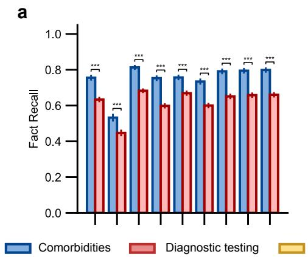

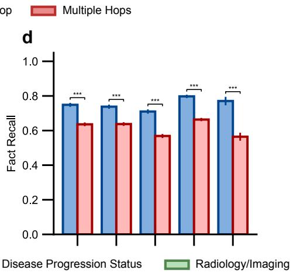

b  
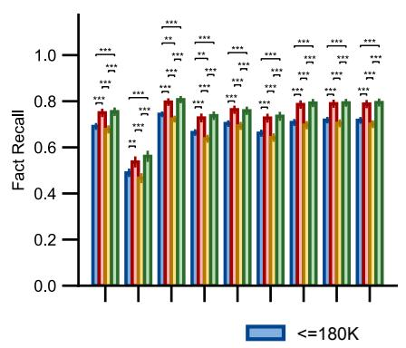

e  
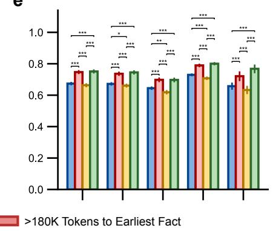

c  
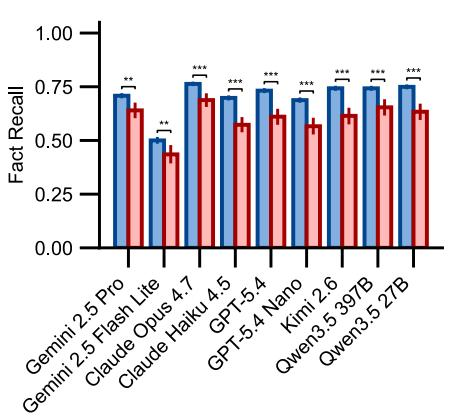

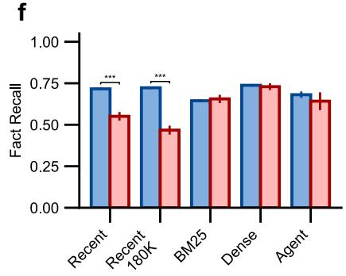  
Figure 4: State of the art models exhibit failure modes across reasoning, topics, and temporality. Fact recall is aggregated across inference configurations and stratified by model for (a) reasoning complexity, (b) the four most frequent topics, and (c) answers with supporting facts that occur more than 180K tokens into the patient record. (d–f) Fact recall aggregated across models by inference type for the same question categories. Error bars represent the 95% confidence intervals around the mean. Differences between groups were assessed using Mann–Whitney U tests, with Benjamini–Hochberg correction for multiple comparisons. We use the following significance thresholds: \*\*\* p < 0.001; \*\* p < 0.01; \* p < 0.05; ns = not significant $( \mathtt { p } \ge 0 . 0 5 )$ .

Assuming the most optimistic evaluation scenario, in which the model response was scored against the interpretation that yielded the highest score (Figure 5a), we found that fact recall increased by 0.12 (95% CI: 0.12–0.13), corresponding to a relative improvement of 31.4% (95% CI: 28.9–33.93%) (Figure 5b). Fact precision increased by 0.14 (95% CI: 0.14–0.15), corresponding to a relative improvement of 45.4% (95% CI: 42.7–48.0%) across all model–inference combinations (Figure 5c). When ranking all model and inference combinations, the top (e.g. Claude Opus 4.7 Recent and Dense) and bottom methods (e.g. inference with Gemini Flash Lite 2.5) are unchanged. However. optimistic interpretation can change the internal rankings, for example increasing Kimi with Recent-180K inference from 10th to 4th highest recall. These results show that single-reference evaluation can substantially underestimate retrieval performance by penalizing responses aligned with alternative valid clinical interpretations. However, even when adjusting for clinician preferences and evaluating against the most optimistic interpretation, we observe that state-of-the-art retrieval approaches still have omission errors.

## BRIE can be automatically regenerated to mitigate contamination and drift

A central goal of a living benchmark is to easily update the benchmark without clinician intervention. To assess whether the BRIE generation framework can produce updated evaluation cohorts without human-in-the-loop filtering, we compared three variants of BRIE: the clinician-validated BRIE dataset (n=508), the unfiltered version prior to clinician review, $\mathrm { B R I E } _ { \mathrm { u n f i l t e r e d } }$ (n=675), and $\mathrm { B R I E } _ { \mathrm { n e w } } \left( \mathrm { n } { = } 1 , 0 0 0 \right)$ , a dataset constructed from admissions in 2026, two years after the most recent admissions included in BRIE.

We evaluated Recent, Recent-180K, BM25, and Dense retrieval with Qwen 3.5 27B across all three cohorts and found that performance was stable: mean fact recall was 0.73 (95% CI: 0.72— 0.74), 0.73 (95% CI: 0.73—0.75), and 0.70 (95% CI: 0.70-–0.71) for the BRIE, $\mathrm { B R I E } _ { \mathrm { u n f i l t e r e d } }$ , and $\mathrm { B R I E } _ { \mathrm { n e w } }$ cohorts, respectively (Figure 6a). Corresponding fact precision values were 0.46 (95% CI: 0.45-47), 0.46 (95% CI: 0.45–0.46), and 0.42 (95% CI, 0.41–0.43) (Figure 6a). These findings suggest that automatically generated cohorts retain similar overall difficulty despite the absence of clinician filtering.

We next examined whether the regenerated datasets preserved the characteristic failure modes identified by the BRIE taxonomy. Across reasoning complexity (Figure 6b), temporal characteristics (Figure 6c), and clinical topics (Figure 6d), the fact-recall distributions of $\mathrm { B R I E } _ { \mathrm { u n f i l t e r e d } }$ and $\mathrm { B R I E } _ { \mathrm { n e w } }$ did not differ significantly from those of BRIE. Using two-sample Kolmogorov–Smirnov

The patient has tried lidocaine patches, Tylenol (acetaminophen), physical therapy, desipramine, and gabapentin. Oxycodone was prescribed, but it was recommended she avoid it if able.

WHAT MEDS AND DOSES IS SHE CURRENTLYUSING FOR RIGHT-SIDED PAIN?

Continue gabapentin 100 mg 3x/week. Tylenol and lidocaine patches intermittently improve chronic pain..

GENERATED INTERPRETATIONS WHICH MEDS HAS SHE TRIED, AND WHAT SIDE EFFECTS OCCURRED?

There is no documentation of side effects from Tylenol, lidocaine patches, desipramine, and gabapentin...

WHICH OPIOIDS WERE PRESCRIBED, WHEN, AT WHAT DOSE, AND DID SHE TAKE THEM?

Oxycodone 5 mg every 4 hr as needed was prescribed on 7-15-22, but she reported not taking it. On 8-13-2024...

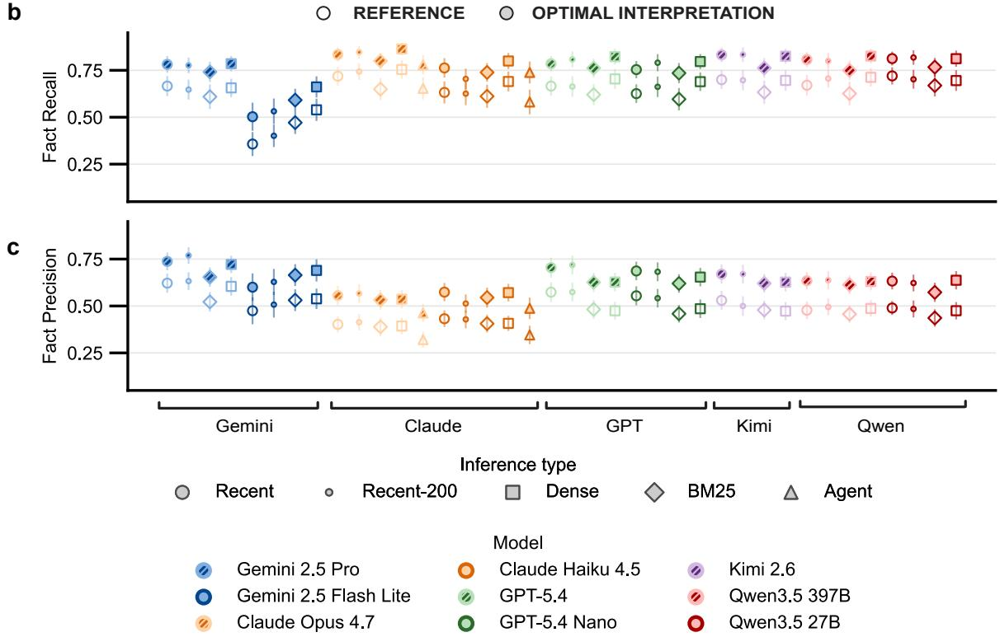  
Figure 5: Multiple generated interpretations of BRIE questions enable robust evaluation. (a) Clinical information retrieval questions can have multiple valid answers based on the context. Using clinician approved interpretations for 87 questions, corresponding to 279 valid, generated interpretations (b) fact recall and (c) fact precision is reported for each model–inference combination. Hollow points indicate scores obtained using the original reference answer, and filled points indicate the highest score obtained across all clinician-validated reference answers and alternative interpretations. The shape denotes the inference type, and the color denotes the model type, where markers with a solid outline are the smaller model in the family. Increases in fact recall and precision remained statistically significant after Benjamini–Hochberg correction for multiple comparisons.

tests, we did not detect significant distributional differences in nearly all comparisons. The only exception was for questions with temporally distant facts $( \ge ~ 1 8 0 ~ 1 8 0$ tokens), where $\mathrm { B R I E } _ { \mathrm { n e w } }$ had a significantly higher proportion of responses with lower recall. Importantly, the same failure modes, including reduced performance on multi-hops reasoning, topics that require longitudinal reasoning, and temporally distant evidence retrieval, persist across all cohorts. Together, these findings suggest that the benchmark generation framework preserves both overall task difficulty without human intervention and under temporal drift.

## Discussion

We present a scalable framework for building a living benchmark for information retrieval from longitudinal clinical notes. Rather than relying on clinicians to manually author benchmarks, our framework automatically generates chart-review questions grounded in real inpatient admissions, capturing the information needs that arise during routine clinical practice. To establish the validity of this approach, nineteen clinicians evaluated the generated questions and reference answers, judging them to be high quality and representative of real-world chart review. This single upfront annotation cost establishes the validity of the generator, enabling it to be rerun on newly collected clinical records to continuously refresh and expand the benchmark without requiring additional clinician annotation.

Using these validated annotations, we construct the Benchmark for Retrieving Information in EHRs (BRIE), which we release with verified reference answers, supporting evidence, and deidentified longitudinal clinical notes. BRIE consists of longitudinal records from medically complex patients, representing some of the most challenging information retrieval settings in clinical practice. We envision this resource serving as a foundation for developing and evaluating retrieval methods, while also supporting a broad range of clinical natural language processing research.

Using BRIE, we evaluated state-of-the-art retrieval across nine models and five inference configurations. Prior work has focused largely on model hallucinations as these errors can propagate into clinical practice and compromise care [50–52]. We find that although model responses can be verbose, they contain few hallucinations. Instead, state-of-the-art retrieval frequently fails to include clinically relevant information. These omission errors are increasingly recognized as a key limitation of clinical AI systems [53]. Importantly, omissions pose a distinct challenge in clinical practice because they are difficult to detect. A response may appear plausible and accurate while silently excluding critical information that would only become apparent through a careful review of the patient chart. As a result, omission errors may be more dangerous than hallucinations, making them a critical target for future retrieval methods.

Disease Progression Status  
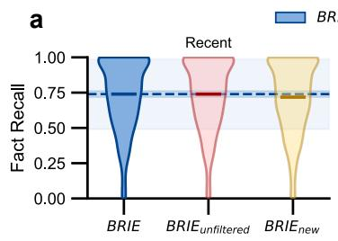

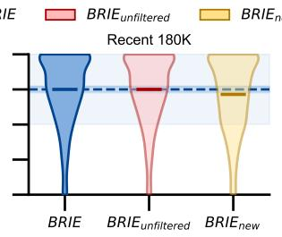

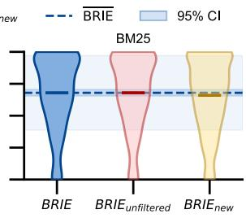

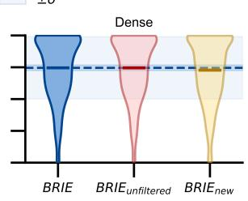

b  
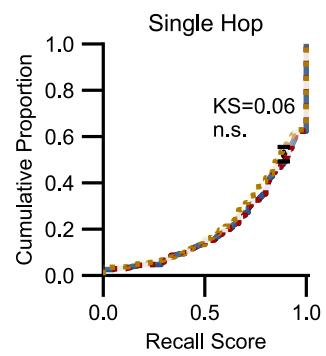

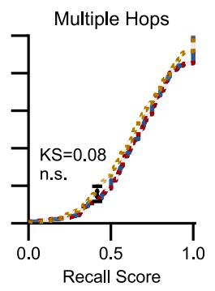

c  
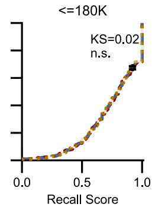

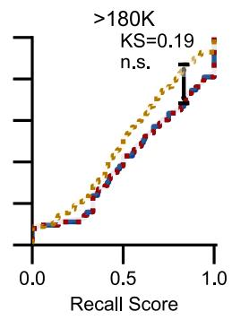

d  
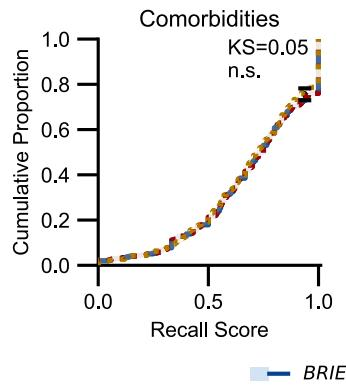

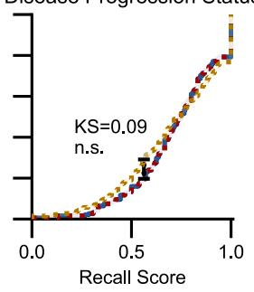

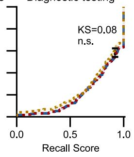

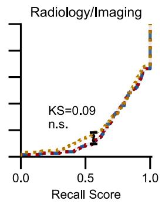  
Figure 6: BRIE can be automatically updated without compromising benchmark difficulty. (a) Average fact recall across inference types for Qwen 27B for the BRIE $( \mathrm { n = 5 0 8 ,  b l u e } )$ , $\mathrm { B R I E } _ { \mathrm { u n f i l t e r e d } }$ (n=675, red), and $\mathrm { B R I E } _ { \mathrm { n e w } }$ (n=1000, yellow) datasets are reported. Solid horizontal lines denote cohort means, and the dashed line marks the BRIE mean. The widest light blue band indicates values one standard deviation away from the mean fact recall of BRIE whereas the darker band around the dashed line indicates the 95% confidence interval. (b-d) Empirical cumulative distributions of fact recall are shown across (b) reasoning complexity, (c) temporal distance, and (d) clinical topic for all three cohorts. Brackets are drawn at the maximum distance in cumulative proportion between BRIE and the $\mathrm { B R I E } _ { \mathrm { n e w } }$ Cohort. The Kolmogorov-Smirnov (KS) statistics are reported with significance thresholds as the following: \*\*\* $\mathrm { p } < 0 . 0 0 1$ ; \*\* p < 0.01; \* p < 0.05; ns = not significant $( \mathtt { p } \ge 0 . 0 5 )$ .

These failures were not uniform across retrieval settings. Performance declined substantially when questions required synthesizing information across multiple encounters, tracking a condition over time, or recovering evidence buried deep in the record. The concentration of these failures in specific retrieval settings has implications for how clinical LLMs should be validated. Strong aggregate performance should not be interpreted as evidence that a system can reliably support “EHR retrieval” as a broad capability. Instead, evaluations should establish which retrieval settings a system can reliably support, distinguishing, for example, single-encounter retrieval from multi encounter synthesis and longitudinal tracking of clinical conditions [54, 55].

Many clinical systems rely on long-context inference, where recent notes are concatenated and provided to the model (e.g., Recent, Recent 180K) [56,57]. Although straightforward to implement, this strategy can be computationally expensive for longitudinal records. Retrieval methods can reduce context length and inference cost, but their cost–performance tradeoffs in realistic clinical settings remain unclear [5, 30, 43]. We found that Dense retrieval achieved performance com parable to long-context inference at substantially lower cost, suggesting that improving retrieval may provide greater practical benefit than simply expanding context windows.

The scalable nature of our approach enables evaluations that are difficult to achieve with traditional benchmarks. First, because realistic questions rarely have a single valid answer, we developed a method to create multiple valid answers for a subset of BRIE queries [58–60]. Evaluating against these generated responses shows that single-reference scoring systematically underestimates model capability, motivating multi-reference evaluation for clinical information retrieval. Additionally, the results of this experiment provide a valuable asset for the community where the validated generator and annotations may be used to develop models that better align to different clinical contexts and user preferences.

Rather than treating BRIE as a static artifact, our framework supports continuous regeneration from newly collected records. Regenerated benchmarks preserve both overall difficulty and failure-mode structure, mitigating benchmark contamination while keeping evaluation aligned with evolving clinical practice [27, 61]. By generating clinically relevant questions together with multiple validated answer interpretations at scale, the framework enables rigorous evaluation at scale. Because the generator can be reused, new versions of BRIE can be constructed from records collected in different years or at different institutions with minimal manual annotation. This can substantially reduce the cost of benchmark creation while enabling institution-specific evaluations that account for distribution shifts across diverse care settings.

This work has several limitations that point toward avenues for future research. First, BRIE demonstrates that realistic, longitudinal chart-review benchmarks can be generated automatically, and it exhibits encouraging temporal robustness, reproducing the benchmark on a cohort collected two years later. Establishing cohort generalizability, however, will require evaluation across institutions with differing documentation practices and patient populations. Second, BRIE is derived from a rich corpus of sixty thousand clinical notes that span long patient timelines, yet realism could be enhanced further by incorporating structured EHR data, including laboratory results, medications, and vital signs. Third, our evaluation covers five inference configurations, including an agentic retrieval approach that used keyword search. Future work should evaluate richer retrieval tools and reasoning strategies. Finally, the fact-based evaluation framework we introduce and validate measures information coverage without yet weighting facts by their clinical importance. We leave to future work the development of methods that weight facts by clinical importance to better align evaluation metrics with real-world clinical utility.

Together, our findings demonstrate that scalable, continuously updated benchmark generation can support rigorous evaluation of language models for clinical information retrieval. BRIE exposes systematic failures that aggregate evaluations can obscure, particularly the persistent omission of information distributed across longitudinal records. By re-framing evaluation as an ongoing process rather than a fixed artifact, BRIE provides a foundation for identifying when and why clinical retrieval systems fail as models, data, and deployment settings evolve.

## Online Methods

The Online Methods are organized as follows: (1) task and cohort definition; (2) benchmark generator; (3) clinician validation and BRIE curation; (4) model and inference configurations; (5) response evaluation and validation of the automated judges; (6) multiple-reference analysis; (7) benchmark regeneration analysis; and (8) statistical analyses.

## 1 Task and Cohort Definition

We formulated clinical information retrieval as a question–answering task anchored to a specific inpatient admission. For each query, the reference time was the timestamp of the admission History & Physical (H&P) note and the retrieval corpus comprised clinical notes available before that time.

The system was asked to produce a free-text answer supported by information in the prior patient record. The H&P provided encounter-specific context for benchmark generation but was not itself a permissible source of evidence for the reference answer, ensuring that the task evaluated retrieval from the preceding longitudinal record.

Cohort Creation. De-identified clinical notes were obtained from the STAnford Research Repository and included patients seen at Stanford Health Care and Lucile Packard Children’s Hospital through August 25, 2024. Because this corpus is also used to develop foundation models and other artificial intelligence tools, patients were randomly sampled from the test split. Patients were eligible for inclusion if they had at least 100 notes before their most recent inpatient H&P note and were not a pediatric patient. Supplementary Figure 11 shows the distribution of note counts, Supplementary Figure 12 shows the distribution of tokens across note timelines, and Supplementary Figure 13 shows the time elapsed between the index admission and oldest record across note timelines. Together, these demonstrate that our cohort has a sufficient longitudinal history for retrieval evaluation. We also used regular expressions to exclude H&P notes matching any of the phrases “surgical h&p,” “preoperative history,” “pre-endoscopy procedure,” “pre-procedure,” or “surgery service consultation,” limiting the overrepresentation of procedure-specific encounters while pre serving a diverse set of admissions. In total, 75 patients were sampled. Cohort demographics are reported in Supplementary Table 3.

## 2 Benchmark Generator

We developed a scalable framework to generate realistic questions that clinicians might ask when deciding to admit a patient. Using the index H&P note for encounter-specific context, the pipeline jointly generates question–answer pairs grounded in facts extracted from the preceding notes. Specifically, generation is broken down in three stages. First, clinical notes preceding the reference H&P are transformed into a de-duplicated patient timeline of timestamped atomic facts. Second, the patient timeline and reference H&P are provided to an LLM to generate clinically relevant question–answer pairs. Third, the supporting facts are mapped back to their occurrences in the clinical record to characterize the temporal retrieval demands of each question. The resulting entries contain a naturally phrased clinical question, a reference answer, supporting facts, and metadata pertaining to the question’s reasoning, clinical topic, and temporality. The following sections describe each stage in detail. All generative tasks used a PHI-compliant instance of Gemini-Pro 2.5 Chat, which achieved stellar performance on the LMArena long-query and overall text leader boards at the time of development [62].

Fact Extraction. Longitudinal clinical notes served as the source for question generation. Raw clinical notes are flawed documents, containing remnants of formatting, duplicated information due to copy-forward, clinical shorthand, and temporal ambiguity from interleaved information recorded in other visits. This “note bloat” from text adds little new information and can impede LLM reasoning by reducing the amount of information that fits within the model context [21].

To reduce note bloat before question generation, we transformed the longitudinal record into a patient timeline of timestamped atomic claims. Atomic claims are logical propositions that cannot be further decomposed (e.g. “Patient was diagnosed with Type 2 Diabetes (2021-09- 13)”) [63]. Prior work has demonstrated that LLMs excel at extracting atomic claims from clinical notes, which in turn can be interpreted as patient facts [64, 65]. Representing the record as facts removes much of the formatting, shorthand, and repeated text present in the original notes while providing a structured representation for downstream question generation.

Facts and their associated timestamps were extracted from clinical notes preceding the most recent H&P note, which served as the index note. Supplementary Figure 1 presents the prompt used for fact extraction. During fact extraction, timestamps were normalized by interpreting relative temporal expressions with respect to the source note date (e.g., “last week” was assigned a date one week before the note date). The resulting fact list was then de-duplicated to remove redundant entries referring to the same event. Supplementary Figure 2 presents the prompt used for deduplication. This process reduced the mean token count to approximately one-third of that of the raw notes, as shown in Supplementary Table 1 which compares token counts before and after processing.

To keep extracted fact lists within the model’s output token limit, clinical notes were processed in chunks of 20,000 characters. After fact extraction, the facts from all notes were merged in chronological order based on note sequence. Even after de-duplicating facts across notes, four patients still had facts that exceeded the Gemini 2.5 Pro context window. In these cases, we filtered out facts that were from inpatient encounters but not in the discharge summary.

Iterative Question Generation. Question generation used the patient timeline and the index H&P to produce encounter-relevant question–answer pairs. The reference H&P provided admissionspecific context for identifying clinically relevant information needs, whereas the patient timeline supplied the facts available to answer each question. Reference answers were required to be fully supported by the timeline, and supporting facts were extracted from the atomic fact timeline.

Generation proceeded through sequential user–model exchanges. The prompt encouraged diversity in question type, reasoning requirements, and temporal scope [66]. Previous exchanges were retained in context to discourage repetition and broaden topical coverage. For each user– model exchange, the generator produced a question, a naturally phrased version of the question, a reference answer, supporting facts, a question type, and a clinical relevance rationale. The rationale was included to encourage chain-of-thought reasoning about the question’s clinical significance. Supplementary Figure 3 presents the generation prompt, including the question-type definitions and output requirements. Generation was repeated until 15 candidate questions were obtained for each patient encounter.

To represent different retrieval demands and temporal scopes, questions were generated in three categories: single-hop (recent), single-hop (past), and multi-hop. Single-hop questions targeted one event occurring either less than two years (recent) or more than two years (past) before admission. Multi-hop questions required integrating information across facts or time points, such as linking related facts, grouping information by diagnosis, or comparing findings over time. The naturally phrased version was introduced because the initially generated questions were often more specific and detailed than questions clinicians would typically pose during chart review. Each naturally phrased question remained linked to the same reference answer and supporting facts and was used for retrieval evaluation.

Following question drafting, a separate model assigned up to three clinical topic labels to each question. These labels described clinical content and were distinct from the three question types. The accepted topics were allergies, appointments, assessment/plan, comorbidities, communications, demographics, devices/implants, diagnostic testing, disease progression status, family history, immunizations, laboratory tests, payment, physical exam, prescriptions, procedures/surgeries, radiology/imaging, reason for care, social determinants of health, and vitals. Supplementary Figure 4 presents the topic-classification prompt. Assigned topic labels were subsequently verified by clinicians during review.

The 15 drafted questions were then filtered by the model to select 10 questions using the reference H&P, question reasoning type, and question topics. Selection prioritized relevance to the patient’s presenting concerns, answer verifiability, and diversity across clinical domains, while avoiding redundancy. The filtering prompt also instructed the model to exclude questions requiring information newly introduced in the reference H&P. Supplementary Figure 5 presents the filtering

prompt and selection criteria.

Temporality Estimation. We sought to quantify how far back into the preceding clinical record a retrieval system would need to search to answer each BRIE question. We defined temporality as the look-back interval from the reference H&P needed to retrieve all supporting facts needed to answer the question. Because supporting information may be repeated across notes through copy-forward documentation, the original source of a fact may overestimate how far back a system must search. To account for facts repeated through copy-forward, we identified each supporting fact’s most recent mention before the reference H&P. Question-level temporality was defined by the supporting fact whose most recent mention occurred farthest back in the record.

Fact mentions were identified through a three-stage retrieve-and-confirm pipeline, inspired by [64]. Supporting facts were first decomposed into atomic clinical claims (Supplementary Figure 6), and the corresponding evidence span was extracted from the source note (Supplementary Figure 7). We then searched the record for additional mentions of each claim using lexical retrieval and dense retrieval. Lexical retrieval used note-level BM25 [42, 67, 68] after lowercasing and removing stop words and generic clinical filler terms (Supplementary Table 2). Notes with positive BM25 scores for retrieval with fact and evidence spans were retained. Dense retrieval followed the same chunking and embedding procedure described in Online Methods Section 4; notes containing a chunk with cosine similarity $\geq 0 . 4 0$ were ranked by their highest-scoring chunk, with the top 200 retained. Notes containing an exact match of the source evidence span were also included. Candidate notes were verified to determine whether they documented the same clinical event or ob servation as the corresponding claim. Exact evidence-span matches were automatically confirmed, and remaining candidates were adjudicated by Gemini 3.1 Flash Lite using the prompt shown in Supplementary Figure 8. This process results in a set of documents and evidence spans for each decomposed fact. Supplementary Figure 9 shows the distribution of decomposed fact counts per question. Supplementary Figure 10 shows the distributions of token distances to the earliest and latest confirmed fact mentions and the difference between these distances.

## 3 Validation of Benchmark Generator and BRIE Curation

We conducted a clinician annotation study to validate the quality of generated questions, answers, and supporting facts, and used these annotations to construct the final BRIE dataset.

Generator Validation. Fifteen physicians evaluated the generated questions, answers, and supporting facts. During annotation, clinicians had access to the reference encounter information and the complete patient chart, allowing them to assess each generated entry against the underlying clinical record. Clinicians evaluated question quality using binary assessments of clinical relevance, verifiability, leakage, and consistency with the patient chart. Leakage was defined as inclusion of visit-specific information from the reference H&P that would not have been available from the preceding record. Clinicians also verified the assigned reasoning and clinical topic labels and could optionally rewrite questions that were not naturally phrased. Answers were assessed for missing, irrelevant, or hallucinated information, and supporting facts were assessed for grounding in the patient chart. Each entry was reviewed by two clinicians.

Filtering and curation. We used the clinician annotations to filter out low-quality entries and construct the curated BRIE dataset. Of the original 750 annotated entries, 75 were excluded because of incomplete annotations, yielding a pre-filtered dataset of 675 entries $( \mathrm { \mathbf { B R I E _ { u n f i l t e r e d } } } )$ . For the curated BRIE dataset, we retained questions judged clinically relevant and free of hallucinated content, together with answers that at least one annotator judged to contain no hallucinated, missing, or irrelevant information. This resulted in a final dataset of 508 questions. The full filtering breakdown is reported in Supplementary Table 4.

Disagreements in clinical relevance or natural phrasing were adjudicated by a third clini cian. For answer evaluation, annotators disagreed on consistency, relevance, and completeness for 41, 32, and 116 entries, respectively. We manually reviewed a random sample of 50 entries with answer-level disagreement to characterize the sources of disagreement and found that disagreement largely stemmed from clinician preferences about level of detail and was unlikely to impact downstream clinical action.

## 4 Model and Inference Configurations

We evaluated nine language models under five inference configurations representing long-context, retrieval-augmented, and agentic approaches. All models were evaluated with four common configurations: Recent, Recent-180K, BM25, and Dense while the Agentic configuration was evaluated only with the two Claude models, yielding 38 model–inference configurations in total.

Models. We evaluated models spanning multiple families, parameter scales, and access types. Using PHI-secure deployments, we generated responses with Gemini Pro 2.5 [32], Gemini Flash Lite 2.5 [33], GPT 5.4 [34,36], GPT 5.4 Nano [35], Claude Opus 4.7 [38], Claude Haiku 4.5 [37], Kimi K2.6 [40, 41], Qwen 3.5 397B [39], and Qwen 3.5 27B [39]. Default inference settings were

used unless otherwise specified.

Inference Configurations. We evaluated models under five inference methods that represent commonly deployed information retrieval approaches. The two long-context configurations supplied models with the most recent notes directly, whereas the BM25 and Dense configurations first retrieved a subset of the record. The Agentic configuration instead allowed the model to navigate the record iteratively using retrieval and summarization tools. Implementation details are described below.

Recent and Recent-180K. For both long-context configurations, notes were ordered from most to least recent and greedily added until the token budget was reached. Recent used each model’s native context limit, as specified in Supplementary Table 5, whereas Recent-180K used a fixed budget of 180,000 tokens across models. Token counts were estimated using tiktoken [69]. Because tiktoken only approximates token counts for non-OpenAI models, notes were removed when necessary to ensure that inputs fit within the model’s native context window. Each note was provided with its date and note type.

Vector Retrieval. For the BM25 and Dense configurations, each note was segmented into 4,000- character chunks with 400-character overlap using a recursive character splitter that preserved whitespace boundaries. Each chunk retained the source note title and timestamp. At inference time, the BRIE question was used to retrieve the top K = 50 chunks, which were concatenated in rank order and provided to the language model.

BM25 ranked chunks using Okapi BM25 [42, 67, 68] with default parameters $( k _ { 1 } ~ = ~ 1 . 5 ,$ $b = 0 . 7 5 , \epsilon = 0 . 2 5 )$ over lowercased word-level tokens matched on word boundaries. Dense retrieval encoded chunks and questions using Octen-Embedding-8B [70, 71], which was selected for its superior performance on the Retrieval Embedding Benchmark Healthcare tasks at the time of development [72]. Passage embeddings were generated with the model’s passage prefix and a maximum sequence length of 2,048 tokens, L2-normalized $( d = 4 0 9 6 )$ , and ranked by cosine similarity to the question embedding.

As an exploratory analysis, we also evaluated a late interaction retrieval model for Kimi K2.6, Qwen 3.5 27B, and Qwen 3.5 397B. Late interaction preserves fine-grained signal by ranking chunks with MaxSim score, the sum of each query token’s maximum similarity to any chunk token. Notes were segmented into 800-character chunks with 80-character overlap and ranked with LightOn’s LateOn model [73]. The top 50 chunks were provided to the language model. Because late-interaction retrieval did not outperform the other retrieval methods, it was excluded from the main analysis. Supplementary Figure 41 reports fact recall and precision for these experiments.

Agent. We implemented an agentic retrieval baseline in which a LLM identifies relevant information by autonomously navigating patient notes. Because agentic harnesses can widely vary, we equip the agent with tools that are commonly found in the literature to get a reasonable performance estimate [74, 75]. The agent has access to a set of four tools: (1) get patient meta called once at the start of inference to return the number of notes, counts by note type, and overall date range; (2) search notes: filters notes by case-insensitive keywords, note type, and inclusive date range, returning the note identifier, note type, date, and first 100 characters in reverse chronological order; (3) get note: returns the full text of a selected note; (4) summarize - notes: generates a summary of a batch of notes.

After receiving the question, index time, and patient metadata, the agent first generated a retrieval plan specifying candidate note types, time windows, search terms, and anticipated tool calls. It then entered an iterative loop in which it issued a tool call, reasoned over the returned information, and updated its answer draft. The agent could terminate and return an answer after any turn. We set a maximum of 300 turns, although no query reached this limit. To limit context growth, raw tool outputs were discarded after each step, while the tool call, reasoning trace, and current answer draft were retained. The accumulated reasoning trace was additionally summarized every 10 turns. The Agentic configuration was evaluated with Claude Opus 4.7 and Claude Haiku 4.5. Across BRIE queries, Opus required a mean of 4.14 turns (SD=4.97) and Haiku 6.18 turns (SD=3.31) before returning an answer. Supplementary Table 6 reports step-count statistics, and Supplementary Table 7 reports tool-use frequencies across queries.

## 5 Retrieval Evaluation

Due to the number of inference configurations and BRIE entries, it is intractable to manually review all responses. Additionally, existing heuristic scores are shown to be poorly correlated with human judgment [22,49]. Therefore, we evaluated model responses using two complementary approaches: fact entailment, which measures factual coverage and precision relative to the reference answer, and pairwise comparison, which assesses relative response quality. Alignment to human annotators was assessed to verify the accuracy of automated evaluation. Hallucination rate and inference cost was also assessed.

Fact Entailment. BRIE questions require recovering specific clinical facts from the patient timeline. To accommodate differences in wording and granularity, we decomposed reference answers and model responses into atomic clinical facts and compared them using semantic entailment [76].

Let R denote the set of reference facts and C the set of response facts. For a fact f and a set of facts S, define $E ( f , S ) = 1 { \mathrm { i f } } .$ f is semantically entailed by S, and 0 otherwise. Fact recall and precision were defined as

$$
\mathrm { R e c a l l } = \frac { \sum _ { r \in R } E ( r , C ) } { | R | } , \qquad \mathrm { P r e c i s i o n } = \frac { \sum _ { c \in C } E ( c , R ) } { | C | } .
$$

Recall measures the proportion of reference facts supported by the response, whereas precision measures the proportion of response facts supported by the reference. Entailment judgments were made using Gemini 3.1 Flash Lite. Supplementary Figure 14 presents the entailment prompt and describes how the direction of comparison was reversed for precision.

Fact Entailment Tuning and Verification. We validated automated fact entailment against manual annotations to assess alignment with human judgment. Sixty responses were randomly sampled across model and inference configurations. Ten responses were annotated by one clinical informatics annotator and used to refine the entailment prompt; the remaining 50 were independently annotated by two clinical informatics annotators and held out for evaluation.

For the 50 held-out responses, pairwise Cohen’s kappa (κ) was calculated among the two human annotators and the optimized LLM evaluator using individual fact-entailment judgments. Agreement between the automated evaluator and annotators 1 and 2 was moderate for recall $( \kappa =$ 0.51 and 0.60, respectively) and substantial for precision $( \kappa = 0 . 7 9$ and 0.74, respectively). The corresponding inter-annotator agreement was $\kappa = 0 . 6 1$ for recall and $\kappa = 0 . 7 8$ for precision. Supplementary Figure 15 shows pairwise κ among the two annotators and the LLM evaluator. Overall, agreement between the automated evaluator and human annotators was similar to the agreement observed between human annotators.

Win-rate. Relative comparisons can distinguish two responses that score similarly in objective metrics but have different downstream clinical impact. Pairs of responses were evaluated for completeness, relevance, and concision using the naturally phrased query and reference answer as context [49]. Supplementary Figure 16 presents the prompt used for pairwise evaluation. To reduce positional bias, each response pair was evaluated twice with the presentation order reversed [77]. Comparisons that changed outcome after order reversal were treated as ties. Win-rate was calculated $\mathrm { a s } ~ { \frac { W I N S + { \frac { 1 } { 2 } } T I E S } { T O T A L } }$ . To reduce the number of comparisons, pairwise evaluation was conducted within model types and inference types. Gemini Flash Lite 3.1 was used for pairwise evaluation because of its efficiency and cost.

Win-rate Verification. We validated automated pairwise evaluation against preferences from two physicians. Each physician independently evaluated 50 randomly sampled response pairs spanning model and inference configurations for completeness, relevance, and concision using the same criteria as the automated evaluator. Cohen’s kappa (κ) was calculated between the human raters and the automated evaluation for each comparison axis. Agreement between the automated evaluator and annotators 1 and 2 was κ = 0.44 and 0.61 for completeness, $\kappa = 0 . 3 9$ and 0.03 for relevance, and $\kappa = 0 . 4 8$ and 0.47 for concision, respectively. The corresponding inter-annotator agreement was $\kappa = 0 . 3 7$ for completeness, $\kappa = 0 . 2 9$ for relevance, and $\kappa = 0 . 7 1$ for concision. Supplementary Figure 17 shows pairwise κ among the two physicians and the automated evaluator. These results indicate that alignment between automated pairwise evaluation and physician preferences were comparable to inter-annotator agreement for clinically relevant axes such as completeness and relevancy. These findings support automated win-rate evaluation, particularly for completeness, where agreement with both physicians exceeded inter-annotator agreement.

Hallucination Detection. Model responses frequently contained facts that were not found in the reference answers. To assess if those facts were grounded in the patient records, unentailed response facts were assessed with the same procedure outlined in Online Methods Section 2. Facts were faithful if at least one supporting evidence span could be located. Supplementary Figure 18 shows the prompt used to detect hallucinations. We conducted this procedure on 50 BRIE questions across all model and inference configurations. Across inference methods, nearly every unentailed fact could be supported by the record. The full results are reported in Supplementary Table 8.

Cost calculations. We estimated inference cost using token counts from tiktoken [69] and pertoken pricing from the corresponding model providers. Pricing was obtained from Google Cloud Agent Platform for Gemini and Claude models1, Microsoft Azure OpenAI for GPT models2, the Kimi pricing page for Kimi models3, and OpenRouter for Qwen models4 (accessed June 20, 2026).

Input token counts were estimated based on inference configuration: Recent used the naive context window for each model; Recent-180K used 180,000 tokens; RAG-based (Dense, BM25) used 50K tokens (top-50 documents); and Agentic used token counts from empirical measurements recorded during experiments. Output length was fixed at 250 tokens per query across all settings. Per-query costs for each model and inference strategy are reported in Supplementary Table 9.

## 6 Multiple answer analysis.

A natural clinical question may admit multiple reasonable answers depending on its interpretation, including differences in temporal scope, topic focus, or level of detail. A single reference answer may therefore not capture the full range of acceptable responses. To assess the sensitivity of BRIE evaluation to this ambiguity, we generated and clinically validated alternative reference answers for 100 sampled queries, then re-evaluated model responses against the resulting multi-reference sets.

Alternative Answer generation. For each query, we first generated 8–10 candidate interpretations, or “seeds,” using the prompt in Supplementary Figure 19. Seeds varied along three axes: time frame, topic focus, and level of detail. The original query and reference question–answer pair were provided as inputs, and each seed was required to differ meaningfully from both the original reference and the other candidates.

Because seed generation did not access the patient record, we next grounded each interpretation in the available clinical history. Each seed’s time frame was resolved to an inclusive date range using dates from the patient fact timeline, and facts within that range were retained. Seeds with no supporting facts were discarded. Supplementary Figure 20 presents the time-frame resolution prompt. For each remaining seed, we generated a specific question, reference answer, and verbatim supporting facts from the retained patient facts. Generation was additionally conditioned on a randomly sampled clinician persona—emergency department physician, admitting resident, attending physician, pharmacist, registered nurse, subspecialty consultant, or social worker—to encourage variation in clinical perspective. The supplied facts constrained the generated answer. Supplementary Figure 21 presents the prompt for generating these grounded pairs. Finally, an LLM filtered and de-duplicated the resulting pairs, removing interpretations that lacked a well-defined answer or substantially overlapped with another candidate or the original reference. The model selected 2–5 distinct interpretations per query for clinician validation using the prompt in Supplementary Figure 22.

Answer verification. Four board-certified physicians evaluated the generated question–answer pairs to identify additional acceptable reference answers for the original BRIE queries. Generated questions were considered reasonable interpretations if they clarified the topic, time window, or expected answer details (e.g., dates or dosages) while remaining consistent with the original query. Generated answers were evaluated for missing, hallucinated, and irrelevant information, and clinicians could edit both the question and answer for accuracy.

Supplementary Figure 23 shows the proportion of answers associated with accepted interpretations that were judged accurate, complete, and relevant. The validated answers corresponding to reasonable interpretations, incorporating any clinician edits, were grouped by their original BRIE query to form a set of reference answers for evaluation. Supplementary Figure 24 shows the number of validated reference answers per query.

Multi-reference evaluation. Model responses generated using the inference configurations described in Online Methods Section 4 were evaluated against each clinician-validated reference answer using fact entailment. For each response, we reported the highest recall and precision obtained across the available reference answers, reflecting performance under the best-supported interpretation of the original query.

## 7 Benchmark Regeneration Analysis.

We assessed whether the BRIE generation framework could be applied to more recent clinical data without additional clinician curation. To do so, we regenerated the benchmark on a temporally held-out cohort and compared retrieval performance between the original automatically generated cohort, $\mathrm { B R I E } _ { \mathrm { u n f i l t e r e d } } .$ , and the regenerated cohort, $\mathrm { B R I E } _ { \mathrm { n e w } }$

Temporal Cohort. Because documentation practices may change over time, we constructed an additional cohort of recent encounters to assess the temporal generalization of the benchmark generation framework. Using the sampling and generation procedures described in Online Methods Section 1, we sampled 100 additional patients admitted in 2026 and generated 1,000 question– answer pairs. We refer to this cohort as $\mathrm { B R I E } _ { \mathrm { n e w } }$ . No filtering or clinician editing was performed.

Performance Assessment. To assess whether retrieval performance patterns persisted across cohorts, we evaluated the same model and inference configurations on $\mathrm { B R I E } _ { \mathrm { u n f i l t e r e d } }$ and $\mathrm { B R I E } _ { \mathrm { n e w } }$ . We generated responses using Qwen 3.5 27B with the Recent, Recent-180K, BM25, and Dense inference methods, limiting evaluation to one model to keep inference costs manageable. Descriptions of the inference configurations are detailed in the Online Methods Section 4. For each query, fact recall and precision were calculated against its single generated reference answer using semantic fact entailment. Performance was reported for the automatically assigned topics and reasoning categories. Both cohorts were evaluated without clinician editing or filtering.

## 8 Statistical Analyses.

We used bootstrap confidence intervals and nonparametric hypothesis tests to quantify uncertainty and assess differences across experimental conditions. We constructed 95% confidence intervals by resampling observations with replacement 1,000 times. We reported confidence intervals for fact entailment and all clinician metrics used to evaluate the generator.

Statistical tests were selected according to the structure of each analysis. To compare fact recall between question types, we used two-sided Mann–Whitney U tests within model and inference configurations. For paired analyses, including comparison of single- and multiple-reference evaluation for the same questions, we used two-sided Wilcoxon signed-rank tests. Finally, we assessed the impact of temporal drift on BRIE difficulty. We conducted Kolmogorov–Smirnov tests between BRIE and $\mathrm { B R I E } _ { \mathrm { n e w } }$ to evaluate whether the fact recall cumulative distribution functions differed within question categories. For all experiments, p-values were adjusted for multiple comparisons across model, inference, or category types using the Benjamini–Hochberg procedure.

## Data availability

All data were de-identified using a “hiding in plain sight” protocol where protected health information (PHI) is replaced by coherent synthetic alternatives [78]. The dataset will be hosted on the university-approved, secure data portal, Redivis, under controlled access for clinical AI evaluation. Access will require signing a data usage agreement and completing CITI ethics trainings.

## Code availability

The complete code base used to generate the dataset and perform analyses is available at https: //github.com/alsentzerlab/brie.

## Acknowledgments

J.L.C is supported by the Warren Alpert Computational Biology & Artificial Intelligence Fellowship. C.S. is supported by the National Institute of General Medical Sciences of the National Institutes of Health under award number T32GM089626. P.C. is supported by the Foundation for Anesthesia Education and Research. N.H.S acknowledges support from the Debra and Mark Leslie Endowment for AI in Healthcare as well as Stanford Healthcare’s support for GUIDE-AI. A.T.F. is supported by T32HL166155 from the National Institutes of Health, Stanford Cardiovascular Institute, Computational Medicine in the Heart: Integrated Training Program. E.A. is supported by Weill Cancer Hub West, an Accenture HAI grant, and the Chan Zuckerberg Biohub.

Some of the computing for this project was performed on the Stanford Carina cluster. We would like to thank Stanford University and Stanford Research Computing for providing computational resources and support that contributed to these research results, as well as the Technology & Digital Solutions Team for assisting with data access.

## Competing interests

The authors declare the following competing interests: J.A.F. reports consulting fees from Snorkel AI. N.H.S. is a co-founder of Prealize Health and Atropos Health, serves on the board of directors of BrightSpring Health Services, and serves as an advisor to J&J Innovative Medicines and AbbVie. E.A. reports consulting fees from Fourier Health.

## Authors contributions

C.O.S, S.S., P.C., K.R.K., K.C.B., A.T.F., S.K., J.L., S.M., S.K.M., R.M.P., E.P.G., P.P., L.S., P.C., and D.J.H.W. performed clinical review of the BRIE generator. C.O.S., J.X., J.C.A., and T.N. reviewed multiple answer generation. C.O.S, S.S., J.L.C., and B.L. reviewed the automated evaluation of LLM responses. J.L.C. and L.Y. ran experiments and performed analyses. J.L.C., J.A.F, and A.C. curated data. J.L.C., E.A., C.O.S., P.C, N.H.S, and J.A.F. aided in conceptualization and methods development. J.L.C. and E.A. prepared the original draft. All authors aided in review and edits.

## References

1. Armitage, H. Clinicians can ‘chat’ with medical records through new AI software, ChatEHR (2025). Section: Artificial Intelligence (AI).

2. Diaz, N. CHOP creates AI agent for Epic - Becker’s Hospital Review | Healthcare News & Analysis (2025).

3. Lynn, J. A Deep Dive Into the Announcements at Epic UGM 2025 | Healthcare IT Today (2025).

4. UCSF Academic Research Services. Introducing BRIM at UCSF: Accelerate chart abstraction with AI (pilot now open) (2026). Accessed: 2026-06-25.

5. Griot, M., Vanderdonckt, J. & Yuksel, D. Implementation of large language models in electronic health records. PLOS Digital Health 4, e0001141 (2025).

6. Gao, M. et al. A randomized controlled trial and pilot of scout: an llm-based ehr search and synthesis platform (2026). https://arxiv.org/abs/2604.26953.

7. Shah, N. H. et al. Adoption and use of llms at an academic medical center (2026). https: //arxiv.org/abs/2602.00074.

8. OpenAI. Healthcare organizations can now connect EHR and additional industry data to Chat-GPT (2026).

9. Kanithi, P. et al. MEDIC: Comprehensive evaluation of leading indicators for LLM safety and utility in clinical applications. Transactions on Machine Learning Research (2026).

10. Ravichandran, S. et al. OpenAI’s HealthBench in action: Evaluating an LLM-based medical assistant on realistic clinical queries (2025). https://arxiv.org/abs/2509.02594.

11. Artsi, Y. et al. Large language models in real-world clinical workflows: a systematic review of applications and implementation. Frontiers in Digital Health 7, 1659134 (2025).

12. Pan, J. et al. Addressing benchmarking gaps in large language models for health and medicine with dynamic red-teaming. Nature Health (2026).

13. Dsouza, A. et al. Automating benchmark design (2025). https://arxiv.org/abs/2510.25039.

14. Ruder, S. The evolving landscape of LLM evaluation (2024). Accessed: 2026-06-27.

15. Akhtar, M. et al. When AI benchmarks plateau: A systematic study of benchmark saturation. In Forty-third International Conference on Machine Learning (2026).

16. Shool, S. et al. A systematic review of large language model (LLM) evaluations in clinical medicine. BMC Medical Informatics and Decision Making 25, 117 (2025).

17. Artsi, Y. et al. Challenges of implementing LLMs in clinical practice: Perspectives. Journal of Clinical Medicine 14, 6169 (2025).

18. Hirschtick, R. E. A piece of my mind. copy-and-paste. JAMA 295, 2335–2336 (2006).

19. Weis, J. M. & Levy, P. C. Copy, Paste, and Cloned Notes in Electronic Health Records. Chest 145, 632–638 (2014).

20. Ebbers, T. et al. The impact of structured and standardized documentation on documentation quality: A multicenter, retrospective study. Journal of Medical Systems 46, 46 (2022).

21. Cahoon, J. L. et al. Clinical note bloat reduction for efficient llm use (2026). https://arxiv.or g/abs/2604.16364.

22. Fleming, S. L. et al. MedAlign: A Clinician-Generated Dataset for Instruction Following with Electronic Medical Records. Proceedings of the AAAI Conference on Artificial Intelligence 38, 22021–22030 (2024). Number: 20.

23. Kweon, S. et al. EHRNoteQA: An LLM Benchmark for Real-World Clinical Practice Using Discharge Summaries (2024). ArXiv:2402.16040 [cs].

24. Cui, H. et al. TIMER: temporal instruction modeling and evaluation for longitudinal clinical records. npj Digital Medicine 8, 577 (2025).

25. Singhal, K. et al. Large language models encode clinical knowledge. Nature 620, 172–180 (2023).

26. Yang, X., Zhao, X. & Shen, Z. Ehrstruct: A comprehensive benchmark framework for evaluating large language models on structured electronic health record tasks. In Proceedings of the AAAI Conference on Artificial Intelligence, vol. 40, 34340–34348 (2026).

27. White, C. et al. Livebench: A challenging, contamination-free LLM benchmark. In The Thirteenth International Conference on Learning Representations (2025).

28. Yan, Z. et al. Livemedbench: A contamination-limited medical benchmark for llms with automated rubric evaluation. In Proceedings ofthe 32nd ACM SIGKDD Conference on Knowledge Discovery and Data Mining V.2, KDD ’26, 10162–10173 (Association for Computing Machinery, New York, NY, USA, 2026).

29. Ronaghi, S. et al. Clinically grounded privacy evaluation of medical LMs. In LLM/VLM Deployment Opportunities and Risks in Healthcare (2026).

30. Ahsan, H. et al. Retrieving evidence from EHRs with LLMs: Possibilities and challenges. vol. 248, 489–505 (2024).

31. Nahum, O., Calderon, N., Keller, O., Szpektor, I. & Reichart, R. Are LLMs better than reported? detecting label errors and mitigating their effect on model performance. In Proceedings of the 2025 Conference on Empirical Methods in Natural Language Processing (EMNLP), 26782–26809 (Association for Computational Linguistics, Suzhou, China, 2025).

32. Comanici, G. et al. Gemini 2.5: Pushing the Frontier with Advanced Reasoning, Multimodality, Long Context, and Next Generation Agentic Capabilities. Tech. Rep., Google DeepMind (2025). ArXiv:2507.06261.

33. Google. We’re Expanding Our Gemini 2.5 Family of Models (2026). Accessed June 2026.

34. OpenAI. Introducing GPT-5.4 (2026). Accessed June 2026.

35. OpenAI. Introducing GPT-5.4 mini and nano (2026). Accessed June 2026.

36. Singh, A. et al. Openai gpt-5 system card (2026). https://arxiv.org/abs/2601.03267.

37. Anthropic. Introducing Claude Haiku 4.5 (2025). Accessed June 2026.

38. Anthropic. Introducing Claude Opus 4.7 (2026). Accessed June 2026.

39. Qwen Team. Qwen3.5: Towards native multimodal agents (2026).

40. Team, K. et al. Kimi k2: Open agentic intelligence (2026). https://arxiv.org/abs/2507.20534.

41. AI, M. Kimi k2.6: Advancing open-source coding (2026). Released April 20, 2026. Model card references arXiv:2602.02276. Weights: https://huggingface.co/moonshotai/Kimi-K2.6.

42. Robertson, S. E. & Walker, S. Some Simple Effective Approximations to the 2-Poisson Model for Probabilistic Weighted Retrieval. In Proceedings of the 17th Annual International ACM SIGIR Conference on Research and Development in Information Retrieval, SIGIR ’94, 232– 241 (ACM/Springer, Dublin, Ireland, 1994).

43. Lewis, P. et al. Retrieval-augmented generation for knowledge-intensive NLP tasks. In Advances in Neural Information Processing Systems, vol. 33, 9459–9474 (2020).

44. Liu, N. F. et al. Lost in the middle: How language models use long contexts. Transactions of the Associationfor Computational Linguistics 12, 157–173 (2024).

45. Lopez, I., Swaminathan, A., Vedula, K. et al. Clinical entity augmented retrieval for clinical information extraction. npj Digital Medicine 8, 45 (2025).

46. Zhang, W., Liao, J., Li, N., Du, K. & Lin, J. Agentic information retrieval. arXiv preprint arXiv:2410.09713 (2024). https://arxiv.org/abs/2410.09713.

47. Qu, Z. & Farber, M. TRACE: Temporal reasoning via agentic context evolution for streaming¨ electronic health records (ehrs). arXiv preprint arXiv:2602.12833 (2026). https://arxiv.org/ab s/2602.12833.

48. Yang, Z. et al. HotpotQA: A dataset for diverse, explainable multi-hop question answering. In Conference on Empirical Methods in Natural Language Processing (EMNLP) (2018).

49. Bedi, S. et al. Holistic evaluation of large language models for medical tasks. Nature Medicine (2026).

50. Pandit, S. et al. MedHallu: A comprehensive benchmark for detecting medical hallucinations in large language models. In Christodoulopoulos, C., Chakraborty, T., Rose, C. & Peng, V. (eds.) Proceedings of the 2025 Conference on Empirical Methods in Natural Language Processing, 2858–2873 (Association for Computational Linguistics, Suzhou, China, 2025).

51. Asgari, E., Montana-Brown, N., Dubois, M.˜ et al. A framework to assess clinical safety and hallucination rates of LLMs for medical text summarisation. npj Digital Medicine 8, 274 (2025).

52. Shah, S. V. Accuracy, consistency, and hallucination of large language models when analyzing unstructured clinical notes in electronic medical records. JAMA Network Open 7, e2425953 (2024).

53. Niu, J. et al. Aipatient arena: Ehr-grounded evaluation of large language models in end-to-end clinical consultation workflows (2026). https://arxiv.org/abs/2606.17474.

54. Rajpurkar, P. & Topol, E. J. A clinical certification pathway for generalist medical AI systems. The Lancet 405, 20 (2025).

55. Bressman, E., Shachar, C., Stern, A. D. & Mehrotra, A. Software as a medical practitioner—is it time to license artificial intelligence? JAMA Internal Medicine 186, 5–6 (2026).

56. Wornow, M. et al. Context clues: Evaluating long context models for clinical prediction tasks on EHR data. In The Thirteenth International Conference on Learning Representations (2025).

57. Chen, Z., Pekis, A. & Brown, K. Building the ehr foundation model via next event prediction (2025). https://arxiv.org/abs/2509.25591.

58. Taveekitworachai, P. et al. On the robustness of answer formats in medical reasoning models (2026). https://arxiv.org/abs/2509.20866.

59. Hosseini, P. et al. A benchmark for long-form medical question answering. In Advancements In Medical Foundation Models: Explainability, Robustness, Security, and Beyond (2024).

60. Saab, K. et al. Capabilities of gemini models in medicine (2024). https://arxiv.org/abs/2404.1 8416.

61. Zhang, X., Li, L., Zhou, X. & Liu, Z. R2med: A benchmark for reasoning-driven medical retrieval (2026). https://arxiv.org/abs/2505.14558.

62. Chiang, W.-L. et al. Chatbot arena: An open platform for evaluating llms by human preference (2024). https://arxiv.org/abs/2403.04132.

63. Russell, B. The philosophy of logical atomism. Routledge Classics (Routledge, Abingdon, Oxon, 2009).

64. Chung, P. et al. Verifying facts in patient care documents generated by large language models using electronic health records. NEJMAI 3, AIdbp2500418 (2026). https://arxiv.org/abs/https: //ai.nejm.org/doi/pdf/10.1056/AIdbp2500418.

65. Munnangi, M. et al. FactEHR: A dataset for evaluating factuality in clinical notes using LLMs. In Agrawal, M. et al. (eds.) Proceedings of the 10th Machine Learning for Healthcare Conference, vol. 298 of Proceedings ofMachine Learning Research (PMLR, 2025).

66. Raman, K., Bendersky, M. & Chaudhary, A. Its All Relative! – A Synthetic Query Generation Approach for Improving Zero-Shot Relevance Prediction. In Findings of the Association for Computational Linguistics: NAACL 2024 (2024).

67. Robertson, S. E. & Zaragoza, H. The Probabilistic Relevance Framework: BM25 and Beyond. Foundations and Trends in Information Retrieval 3, 333–389 (2009).

68. Robertson, S. E., Walker, S., Jones, S., Hancock-Beaulieu, M. M. & Gatford, M. Okapi at TREC-3. In Proceedings of the Third Text REtrieval Conference (TREC-3) (NIST, Gaithersburg, MD, USA, 1994). NIST Special Publication 500-225.

69. OpenAI. tiktoken: Fast bpe tokeniser for use with openai’s models. https://github.com/opena i/tiktoken (2022).

70. Octen Team. Octen Series: Optimizing Embedding Models to #1 on RTEB Leaderboard (2025). Blog post. Models available at https://huggingface.co/bflhc (Octen-Embedding-8B, 4B, 0.6B). Accessed June 2026.

71. Octen Team. Octen-Embedding-8B. Hugging Face Model Card (2025). Fine-tuned from Qwen3-Embedding-8B; ranks #1 on RTEB (Mean Task score 0.8045). Accessed June 2026.

72. Liu, F. et al. Introducing rteb: A new standard for retrieval evaluation (2025).

73. Sourty, R., Chaffin, A., Weller, O., Demoura, P. & Chatelain, A. Denseon with the lateon: Open state-of-the-art single and multi-vector models. https://huggingface.co/blog/lightonai/ denseon-lateon (2026).

74. Moll, J. et al. Agentic clinical reasoning over longitudinal myeloma records: a retrospective evaluation against expert consensus (2026). https://arxiv.org/abs/2604.24473.

75. C¸ inar Koras¸, O. A. et al. Configurable clinical information extraction with agentic rag: What works, what breaks, and why (2026). https://arxiv.org/abs/2606.19602.

76. Grolleau, F. et al. MedFactEval and MedAgentBrief: A Framework and Workflow for Generating and Evaluating Factual Clinical Summaries. Pacific Symposium on Biocomputing 31, 388–399 (2026).

77. Zheng, L. et al. Judging llm-as-a-judge with mt-bench and chatbot arena. In Proceedings of the 37th International Conference on Neural Information Processing Systems, NIPS ’23 (Curran Associates Inc., Red Hook, NY, USA, 2023).

78. Carrell, D. et al. Hiding in plain sight: use of realistic surrogates to reduce exposure of protected health information in clinical text. Journal of the American Medical Informatics Association 20, 342–348 (2013).

## Supplementary Information

## Supplementary Notes

## Annotation guidelines

Complete annotation guidelines for validating the generator guidelines are provided here. Complete guidelines for validating multiple answer generation are provided here.

Supplementary Figures and Tables  
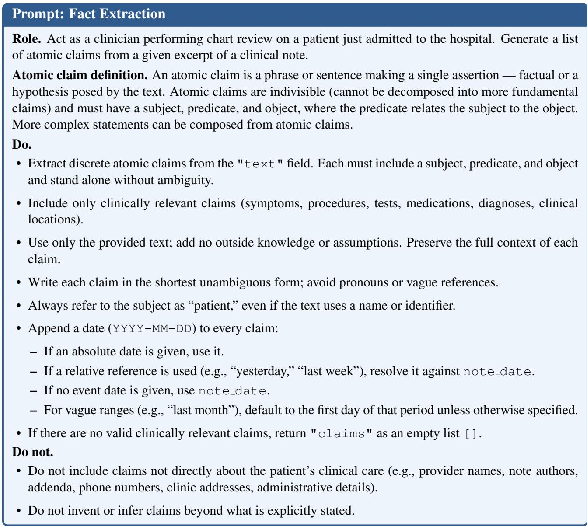  
Supplementary Figure 1: Condensed fact Extraction System Prompt with Time Normalization. Prompt adjusted from64

<table><tr><td>Stage</td><td>Count</td><td>Token Count</td></tr><tr><td>Raw Note Fact</td><td> $( 1 . 6 \pm 1 . 3 ) \times 1 0 ^ { 3 }$   $( 3 . 3 \pm 3 . 0 ) \times 1 0 ^ { 3 }$ </td><td> $( 1 . 0 \pm 0 . 9 ) \times 1 0 ^ { 5 }$   $( 5 . 6 \pm 5 . 0 ) \times 1 0 ^ { 4 }$ </td></tr><tr><td>Refined Facts</td><td> $\mathbf { ( 2 . 1 \pm 1 . 9 ) \times 1 0 ^ { 3 } }$ </td><td> $\mathbf { ( 3 . 3 \pm 2 . 2 ) \times 1 0 ^ { 4 } }$ </td></tr></table>

Supplementary Table 1: Count and number of tokens for each stage of fact extraction for 25 randomly sampled patients. The Refined Facts, pruned for redundancy, was used for question generation.

Prompt: Fact De-duplication   
Role. Act as an expert clinician reviewing a list of patient facts. Some facts may be duplicates or seman  
tically redundant. Identify which facts should be removed so the final list is concise, non-redundant, and   
retains all unique clinical information. Do not regenerate the list — return only the indices of facts to re  
move.   
Redundancy rules.   
• A fact is redundant if it asserts the same claim as another, even if phrased differently (e.g., “Patient has   
hypertension” vs. “History of high blood pressure”).   
• If two facts are identical except for timestamps, keep the most complete one (more timestamps).   
• If one fact is a subset of another (e.g., “Admitted to hospital” vs. “Admitted to hospital (2014-08-01)”),   
mark the subset for removal.   
• Conflicting facts: if two facts make contradictory claims, keep both — mark neither as redundant.   
• Unique timestamps: facts differing only by distinct timestamps are not redundant and must both be   
kept (e.g., “Admitted (2014-08-01)” and “Admitted (2014-09-01)”).   
Output (strict). Return only a JSON object with one key; no facts, no prose, no explanation. If no redun  
dancies are found, return an empty list.   
{ "redundant\_fact\_indices": [ <0-based indices to remove> ] }   
Example. Input facts (indexed):   
0: Patient has hypertension   
1: History of high blood pressure   
2: Admitted to hospital (2014-08-01)   
3: Admitted to hospital (2014-09-01)   
4: Admitted to hospital   
Output: { "redundant fact indices": [1, 4] }   
Rationale: fact 1 duplicates fact 0; fact 4 is a subset of facts 2 and 3 (removed), while 2 and 3 are kept for   
their unique timestamps.  
Supplementary Figure 2: Condensed prompt for removing duplicated facts due to copy-forward or imported structured data

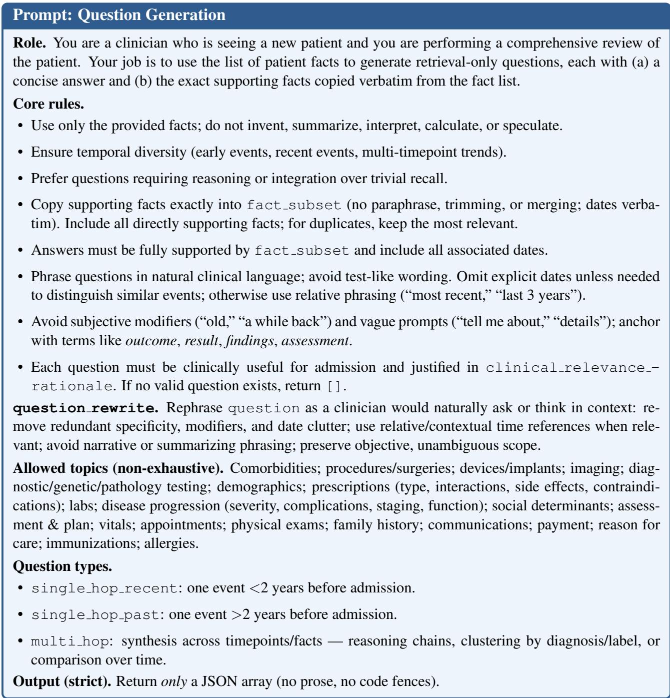

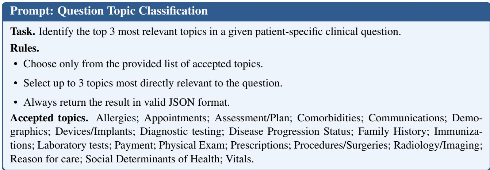  
Supplementary Figure 4: Condensed prompt for topic classification.

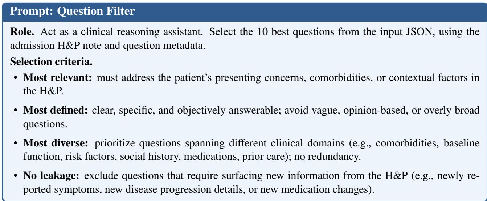  
Supplementary Figure 5: Condensed prompt for filtering redundant questions.

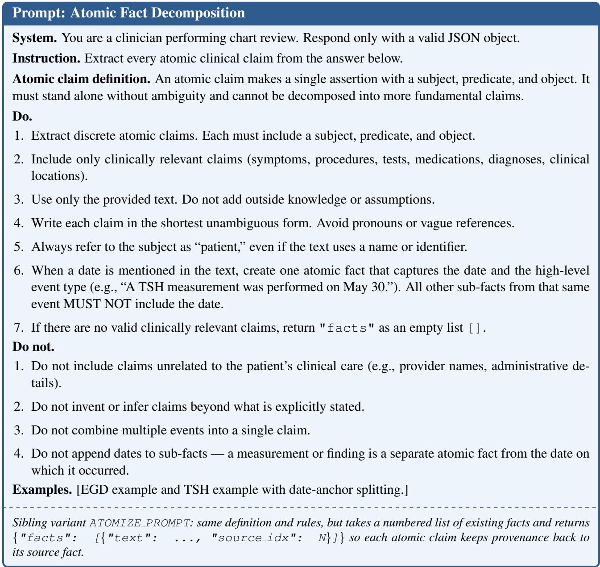  
Supplementary Figure 6: Condensed prompt for fact extraction (input into fact entailment and fact dating)

Prompt: Fact Evidence Identification   
System. You are a clinical information extraction assistant. Extract the exact substring from the note that   
most directly supports the given fact.   
User.   
Fact: {fact}   
Note:   
{note\_text}   
Instruction. Return only the shortest exact substring from the note that directly documents the SAME   
specific event or observation described by the fact (same procedure, finding, or measurement — not a   
related or similar one). No explanation or surrounding text.  
Supplementary Figure 7: Condense prompt to identify substring evidence for fact

Prompt: Cross-Note Confirmation   
System. You are a clinical information extraction assistant. Given a patient note and a list of clinical facts,   
identify which facts are independently documented in the note.   
User.   
Note (Date: {note\_date}, Title: {note\_title}):   
{note\_text}   
Facts to check:   
1. Fact: {fact}   
Reference evidence: "{evidence\_span}"   
... (batched, 1-indexed)   
Instruction. For each fact, determine whether this note independently documents EXACTLY the same   
procedure, finding, medication, or measurement.   
Strict rules — reject the fact if any apply.   
• The note names a DIFFERENT procedure even if it occurred on the same date or involves the same   
anatomical region.   
• The note only mentions a related concept without documenting the specific event.   
• The note records a different medication, dose, or route.   
• You are not highly confident the note refers to the identical event.   
Output. Return a JSON array — only for facts with clear, unambiguous evidence in this note:   
[{"fact\_idx": <1-N>, "evidence": "<shortest exact supporting substring>"}  
Supplementary Figure 8: Condense prompt to identify all mentions of facts

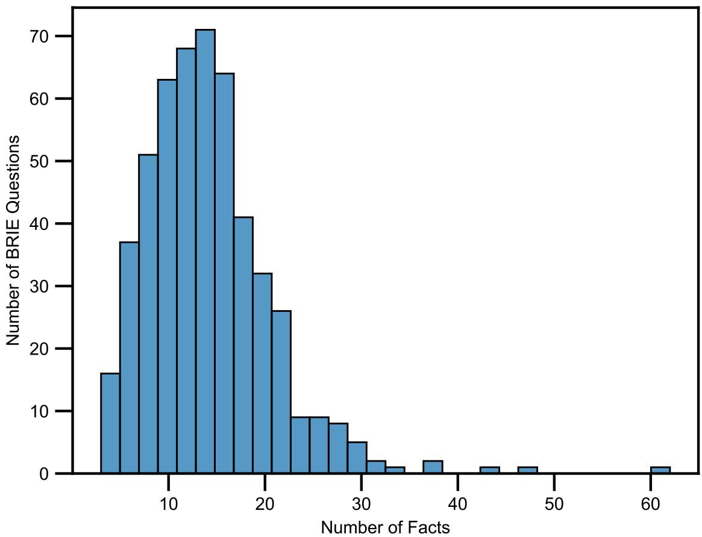  
Supplementary Figure 9: Number of facts per BRIE question after further decomposition

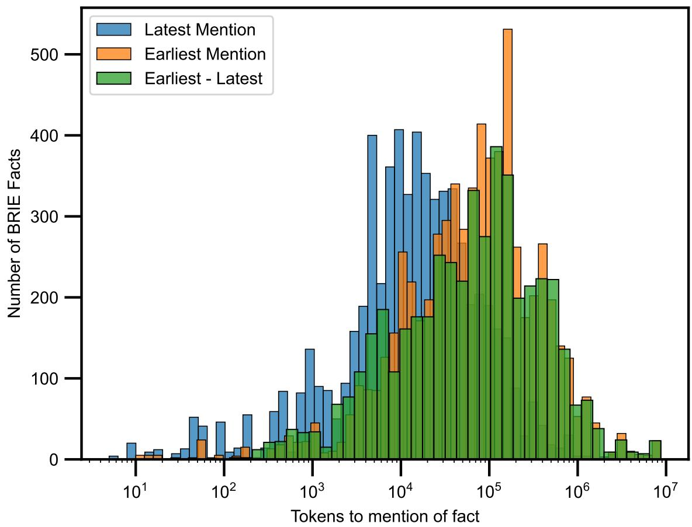  
Supplementary Figure 10: Number of tokens to fact mentions

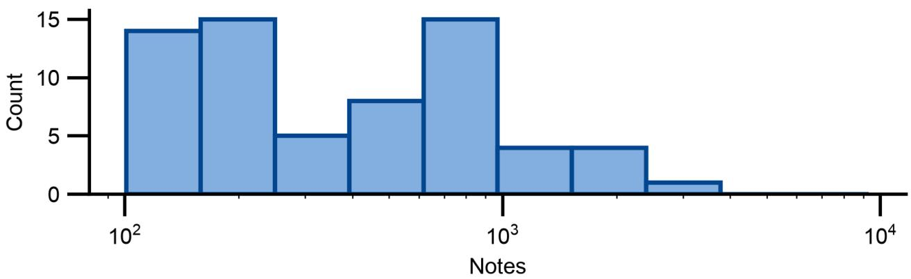  
Supplementary Figure 11: Number of notes per patient

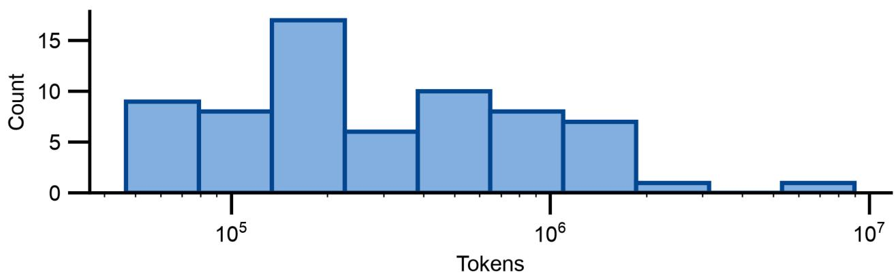  
Supplementary Figure 12: Number of tokens per patient

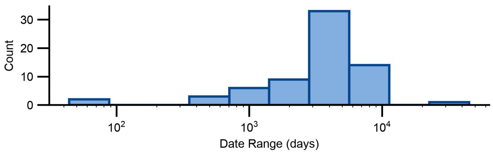  
Supplementary Figure 13: Number of days spanning longitudinal records

## Prompt: Fact Entailment (Recall)

<table><tr><td>Prompt: Fact Entailment (Recall)</td></tr><tr><td>System. You are a clinician performing chart review. Respond only with a valid JSON array. Recall direction (which reference facts are covered). Given a list of REFERENCE facts and a list of CANDIDATE facts, identify which REFERENCE facts are semantically entailed by any of the CAN- DIDATE facts. Return [] if none are entailed. Judge as a clinician reviewing the chart would, not as a</td></tr><tr><td>literal string matcher. Rules.</td></tr><tr><td>1. A REFERENCE fact is entailed if the CANDIDATE facts assert it — it need not be restated by a single CANDIDATE fact.</td></tr><tr><td>2. Both lists are atomized, so a dated event is split into a bare event anchor (“A hemodynamic mea- surement was performed on 2021-10-16.&quot;) plus separate date-free facts giving that event&#x27;s details, findings, or results. Judge an anchor by its details, not by its date: the anchor is entailed whenever</td></tr><tr><td>the CANDIDATE facts assert those details. 3. Two events belong to the same episode of care when their dates match, fall within about two weeks</td></tr><tr><td>of each other, or one is given only as a month or an approximate date. Do not require an exact date match. 4. Within one episode of care, a REFERENCE fact describing a component, step, or routine part of a</td></tr><tr><td>larger event is entailed by a CANDIDATE fact describing that larger event: an encounter entails the medications, fluids, and assessments given during it, and a procedure entails the measurements and specimens it ordinarily involves.</td></tr><tr><td>5. Wording and granularity need not match. A fact may be more specific in one respect (naming the drug, device, or site) and less specific in another (a month rather than a day); neither difference blocks entailment, in either direction.</td></tr><tr><td>6. Entail on semantic equivalence or logical implication, not only on restatement. If a CANDIDATE fact means the same thing in different words, or logically implies the REFERENCE fact, mark it entailed — a stated consequence of a symptom implies the symptom, resuming or restarting a treatment</td></tr><tr><td>implies that it was initiated, and a documented trial of a treatment implies that it was given. 7. One supporting CANDIDATE fact is enough. Judge each REFERENCE fact on its own, and do not withhold entailment because other CANDIDATE facts describe related events pointing a different</td></tr><tr><td></td></tr><tr><td>way: a separate or later event involving the same medication, problem, or procedure does not cancel an earlier one. 8. Only two things block entailment: the CANDIDATE facts describe no related event or encounter at all, or a CANDIDATE fact directly denies the REFERENCE fact itself. A treatment tried without</td></tr><tr><td>benefit still entails that it was given, but does not entail that it helped. Facts are supplied as O-indexed numbered lists, optionally preceded by direction-matched few-shot examples. The precision direction uses the same rules with the roles of the two lists exchanged, returning indices of the entailed CANDIDATE facts. Recall = |entailed ref\/|ref|; precision = |entailed cand|/\cand|.</td></tr></table>

Supplementary Figure 14: Condense, optimized fact entailment prompt for recall. The precision prompt uses similar rules but the REFERENCE and CANDIDATE facts lists are flipped.

<table><tr><td>Category</td><td>n</td><td>Tokens</td></tr><tr><td></td><td></td><td>General function words 113 a, an, the, and, or, but, in, on, at, to, for, of, with, by, from, up, about, into, through, during, before, after, above, below, between, out, off, over, under, then, here, there, when, where, how, all, both, each, more, most, other, some, such, no, nor, not, only, same, so, than, too, very, can, will, just, now, this, that, these, those, is, are, was, were, be, been, being, have, has, had, do, does, did, would, could, should, may, might, must, shall, also, its, it, he, she, they, we, i, my, his, her, their, our, your, which, who, whom, as, if, while, although, however, therefore, thus, since, because, well, within, without, including, via,</td></tr><tr><td>Clinical narrative &amp; charting</td><td></td><td>per, see 45 patient, pt, px, history, hx, assessment, plan, reported, reports, noted, notes, follow, followup, discharge, admission, admitted, presents, presenting, presented, new, old, previous, prior, current, recent, stable, unchanged, medical, surgical, social, family, review, reviewed, discussed, visit, appointment, clinic, office, normal,</td></tr><tr><td>Medication &amp; dosing</td><td></td><td>abnormal, negative, positive, right, left, bilateral 22 tablet, tablets, tab, capsule, capsules, cap, oral, daily, prn, mg, ml, mcg, mgs, mls, kg, dose, doses, dosing, prescribed, unit, units, cc</td></tr><tr><td>Temporal &amp; measurement</td><td>status</td><td>11 year, years, month, months, week, weeks, day, days, date, time,</td></tr></table>

Supplementary Table 2: Clinical stopword list, grouped by category.

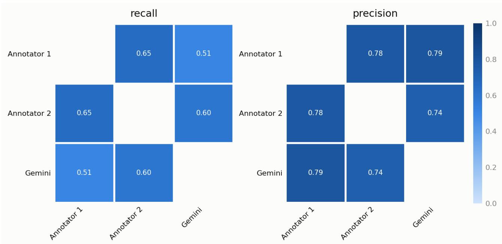  
Supplementary Figure 15: Cohen’s Kappa κ between optimized prompt and human raters for 50 randomly sampled responses for fact entailment. Gemini-Flash-Lite 3.1 was used entailment.

<table><tr><td>Characteristic</td><td>n</td><td>%</td><td>Ref. %</td></tr><tr><td>Gender</td><td></td><td></td><td></td></tr><tr><td>Male</td><td>44</td><td>58.7</td><td>49.9</td></tr><tr><td>Female</td><td>31</td><td>41.3</td><td>50.1</td></tr><tr><td>Ethnicity and race</td><td></td><td></td><td></td></tr><tr><td>Not Hispanic or Latino White</td><td>40</td><td>53.3</td><td>49.7</td></tr><tr><td>Hispanic or Latino No matching concept</td><td>14</td><td>18.7</td><td>13.6</td></tr><tr><td>Not Hispanic or Latino Asian</td><td>9</td><td>12.0</td><td>18.0</td></tr><tr><td>Not Hispanic or Latino Black or African American</td><td>4</td><td>5.3</td><td>5.6</td></tr><tr><td>Hispanic or Latino White</td><td>4</td><td>5.3</td><td>4.4</td></tr><tr><td>Not Hispanic or Latino No matching concept</td><td>3</td><td>4.0</td><td>5.2</td></tr><tr><td>Hispanic or Latino Asian</td><td>1</td><td>1.3</td><td>0.1</td></tr><tr><td>Age (years)</td><td></td><td></td><td></td></tr><tr><td>Mean (SD)</td><td></td><td>64.8 (17.4)</td><td>66.2 (17.2)</td></tr><tr><td>Median [IQR]</td><td></td><td></td><td>66.0 [54.0, 78.5] 69.0 [56.0, 80.0]</td></tr><tr><td>Range</td><td></td><td>27-91</td><td>0-94</td></tr></table>

Supplementary Table 3: Patient cohort demographics (N = 75). Ref. % denotes the corresponding percentage in the full source population (N = 25,443).

<table><tr><td>Filtering stage</td><td></td><td>Remaining Removed % of original</td><td></td></tr><tr><td>Original</td><td>750</td><td></td><td>100.0</td></tr><tr><td>Two annotators</td><td>675</td><td>75</td><td>90.0</td></tr><tr><td>Consistent</td><td>660</td><td>15</td><td>88.0</td></tr><tr><td>Relevant questions</td><td>550</td><td>110</td><td>73.3</td></tr><tr><td>One annotator accepted the answer</td><td>508</td><td>42</td><td>67.7</td></tr><tr><td>Both annotators accepted the answer</td><td>308</td><td>200</td><td>41.1</td></tr></table>

Supplementary Table 4: Consecutive filtering of generated questions. BRIE is indexed on the one-annotator-accepted set (508); the number of questons where both annotators accepted the answer is reported for reference.

<table><tr><td>Model</td><td>Official context Buffer Tiktoken limit</td><td></td></tr><tr><td>Gemini 2.5 Pro</td><td>1,000,000 50,000</td><td>950,000</td></tr><tr><td>Gemini 2.5 Flash Lite</td><td>1,000,000 50,000</td><td>950,000</td></tr><tr><td>Claude Opus 4.7</td><td>1,000,00075,000</td><td>925,000</td></tr><tr><td>Claude Haiku 4.5</td><td>200,000 50,000</td><td>150,000</td></tr><tr><td>GPT 5.4</td><td>272,00010,000</td><td>262,000</td></tr><tr><td>GPT 5.4 Nano</td><td>272,00010,000</td><td>262,000</td></tr><tr><td>Kimi K2.6</td><td>262,14450,000</td><td>212,144</td></tr><tr><td>Qwen 3.5 397B</td><td>253,953 30,000</td><td>223,953</td></tr><tr><td>Qwen 3.5 27B</td><td>253,953 30,000</td><td>223,953</td></tr></table>

Supplementary Table 5: Model context-window limits. The effective limit subtracts a buffer from the official context window to account for tokenizer (tiktoken) counting discrepancies and prompt boiler plates.

<table><tr><td>Model</td><td>Mean SD Min</td><td>25%</td><td>Median 75%</td></tr><tr><td>Claude Opus</td><td>4.17 3.31 0</td><td>2 3</td><td>Max 5</td></tr><tr><td>Claude Haiku 6.18</td><td>4.97 0</td><td>2 4</td><td>25 9 35</td></tr></table>

Supplementary Table 6: Number of agent steps per query, by model

<table><tr><td>Model</td><td>Tool</td><td>Mean</td><td>SD Min 25% Median 75% Max</td><td></td><td></td><td></td></tr><tr><td rowspan="3">Claude Opus</td><td>search_notes</td><td>0.57 0.13</td><td>0.00 0.50</td><td>0.50</td><td>0.67</td><td>0.93</td></tr><tr><td>get_note</td><td>0.34 0.20 0.00</td><td>0.17</td><td>0.50</td><td>0.50</td><td>0.83</td></tr><tr><td>summarize_notes</td><td>0.09 0.17</td><td>0.00 0.00</td><td>0.00</td><td>0.00</td><td>0.67</td></tr><tr><td rowspan="3"></td><td>search_notes</td><td>0.57 0.17</td><td>0.00 0.50</td><td>0.50</td><td>0.67</td><td>1.00</td></tr><tr><td>Claude Haiku get_note</td><td>0.42 0.17 0.00</td><td>0.33</td><td>0.50</td><td>0.50</td><td>0.86</td></tr><tr><td>summarize_notes</td><td>0.01 0.05 0.00</td><td>0.00</td><td>0.00</td><td></td><td>0.000.50</td></tr></table>

Supplementary Table 7: Tool-usage fraction per query, by model. Values are the fraction of each query’s tool calls allocated to a given tool.

<table><tr><td>Inference type Rate</td><td>95% CI</td></tr><tr><td>Recent 0.99</td><td>[0.99, 1.00]</td></tr><tr><td>Recent-200K</td><td>0.99 [0.98, 1.00]</td></tr><tr><td>Dense</td><td>0.99 9[0.97, 1.00]</td></tr><tr><td>BM25</td><td>0.99 [0.99, 1.00]</td></tr><tr><td>Agent</td><td>0.99 [0.94, 1.00]</td></tr></table>

Supplementary Table 8: Percentage of grounded facts by inference type, with 95% confidence intervals.

Prompt: Win-rate (Pairwise Judge)   
System. You are a medical expert. Respond only with a valid JSON object.   
Instruction. You are a medical expert comparing two responses to a clinical information retrieval query.   
Given a reference answer (gold standard) and two candidate responses (A and B), decide which response is   
better on each dimension, or declare a tie.   
Inputs.   
Question:   
<question>{QUESTION}</question>   
Reference answer:   
<reference>{REFERENCE}</reference>   
Response A:   
<response\_a>{RESPONSE\_A}</response\_a>   
Response B:   
<response\_b>{RESPONSE\_B}</response\_b>   
Dimensions.   
• Completeness: which response includes more of the important clinical details present in the reference   
answer? Prefer the response that omits fewer key facts.   
• Relevancy: which response stays closer to what the question asks and the reference answer covers,   
without introducing unnecessary or tangential details?   
• Concision: which response communicates the necessary information more concisely, without excessive   
verbosity or redundant phrasing?   
For each dimension, output "A", "B", or "tie".   
Output format.   
{   
"completeness": {"winner": "A" | "B" | "tie", "explanation": "..."},   
"relevancy": {"winner": "A" | "B" | "tie", "explanation": "..."},   
"concision": {"winner": "A" | "B" | "tie", "explanation": "..."}   
}   
Ensure the output is valid JSON with double quotes for all keys and string values.

Supplementary Figure 16: Condensed win-rate prompt. The win rate is computed twice for each pair, with the ordering reversed in the second inference.

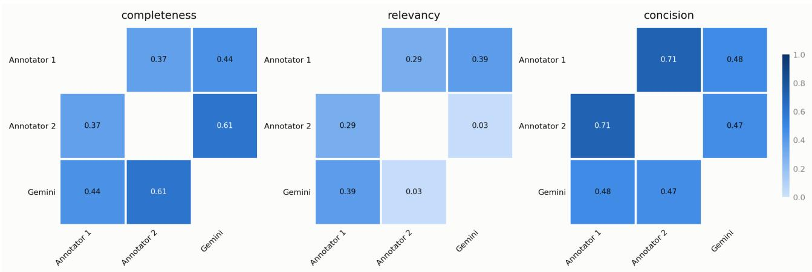  
Supplementary Figure 17: Cohen’s Kappa κ between automated pairwise evaluation and human raters for 50 randomly sampled pairs. Gemini-Flash-Lite 3.1 was used automatd evaluation.

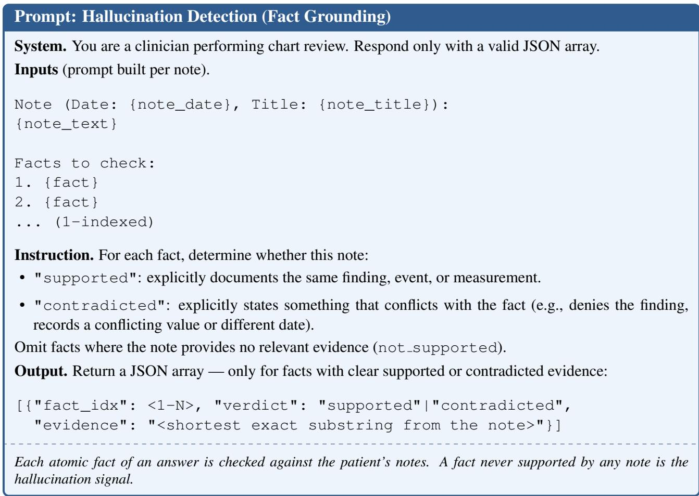  
Supplementary Figure 18: Condense hallucination detection prompt

<table><tr><td rowspan="2">Model</td><td colspan="2">Price ($/1M)</td><td colspan="3">Cost per run ($)</td></tr><tr><td>In</td><td>Out</td><td>Full ctx</td><td>180K</td><td>50K 25K</td></tr><tr><td>Claude Haiku 4.5</td><td>1.00</td><td>5.00</td><td>0.2013</td><td>0.1813</td><td>0.0513 0.0263</td></tr><tr><td>Claude Opus 4.7</td><td>5.00</td><td>25.00</td><td>5.0013</td><td>0.9013</td><td>0.2513 0.1263</td></tr><tr><td>Gemini Flash Lite 2.5</td><td>0.10</td><td>0.30</td><td>0.1013</td><td>0.0193</td><td>0.0063</td></tr><tr><td>Gemini Pro 2.5</td><td>2.50</td><td>15.00</td><td>2.5013</td><td>0.4513</td><td>0.1263</td></tr><tr><td>GPT-5.4</td><td>5.00</td><td>22.50</td><td>1.3613</td><td>0.9013</td><td>0.2513</td></tr><tr><td>GPT-nano 5.4</td><td>0.20</td><td>1.25</td><td>0.0557</td><td>0.0373</td><td>0.0113</td></tr><tr><td>Kimi K2.6</td><td>0.95</td><td>4.00</td><td>0.2503</td><td>0.1723</td><td>0.0488</td></tr><tr><td>Qwen 3.5 397B</td><td>0.385</td><td>2.45</td><td></td><td>0.09900.0706 0.0205</td><td></td></tr><tr><td>Qwen 3.5 27B</td><td>0.195</td><td>1.56</td><td></td><td>0.0508 0.0364 0.0110</td><td></td></tr></table>

Supplementary Table 9: Estimated per-run inference cost (USD) by input context size. Price columns are per 1M tokens. The Full ctx column uses each model’s effective context window (Haiku 200K; Opus, Gemini Flash Lite, Gemini Pro 1M; GPT-5.4 / nano 272K; Kimi 262K; Qwen 254K); the remaining columns use fixed input sizes. Each cost includes a fixed \$0.00125 output component; the 25K (agent) setting was run only for the Claude models.

<table><tr><td>Stage 1 — Seed Generation</td></tr><tr><td>Role. Clinical informatics expert generating diverse question seeds for a medical QA dataset. Task. Given a natural clinical query and a reference QA pair, produce 8–10 distinct seeds, each a different plausible interpretation varying in timeframe, topic focus, and detail level. Use the reference only as an exclusion reference — do not replicate it Inputs. {natural_query}; reference {reference_question}/{reference_answer}.</td></tr><tr><td>Axes of variation. • Timeframe: full history / a named episode or admission / most recent only / between two explicit dates</td></tr><tr><td>or events. • Topic focus: free-text clinical sub-topic (e.g. antibiotic susceptibilities, symptom onset, regimen and</td></tr><tr><td>doses, labs, imaging). Do not force predefined categories. • Detail level: minimum (single fact/value) / concise (key facts, no elaboration) / thorough (full picture</td></tr><tr><td>with context, modifiers, relevant negatives). Constraints. Each seed must differ meaningfully from the reference and from every other seed; maximize diversity across all three axes; exclude implausible interpretations even if answerable.</td></tr></table>

Supplementary Figure 19: Multiple Answer Generation (Stage 1/4). Condensed seed generation prompt.

Stage 2 — Timeframe Resolution   
Role. Clinical informatics assistant resolving a seed’s free-text timeframe into a concrete date window,   
anchored to the patient’s fact dates.   
Task. Return inclusive start date/end date (YYYY-MM-DD) bounding the timeframe. Query focus   
is for disambiguating boundaries only — do not filter by topic.   
Inputs. {seed query focus}, {seed timeframe}, {fact list} (date context only).   
Interpretation rules.   
1. Most recent only: most recent fact relevant to the topic; set start = end to that date. Anchor to the topic,   
not the global latest date.   
2. Named episode/event: earliest and latest dates of facts in that episode; use focus to disambiguate.   
3. Relative window (e.g. “last 2 years”): anchor to the most recent fact date as end.   
4. Between two events/dates: the boundary dates (inclusive).   
5. Full history: earliest → most recent fact date.   
Edge case. If no facts exist or the timeframe is unresolvable, return null for both dates and explain.   
Output. { "resolved timeframe": "...", "start date": "YYYY-MM-DD or   
null", "end date": "YYYY-MM-DD or null" }

Supplementary Figure 20: Multiple Answer Generation (Stage 2/4). Condensed time-frame identification prompt.

Stage 3 — QA Generation   
Role. Clinical documentation specialist generating one QA pair grounded strictly in the provided facts,   
returning the verbatim facts used.   
Inputs. {natural query} (context only); seed (Focus / Timeframe / Topic / Detail); {persona};   
{fact list}.   
Instructions.   
1. Write a specific question this persona would plausibly ask, consistent with the seed and natural query   
— precise about timeframe and topical scope.   
2. The question must specify all expected return items (clear what would be “missing”).   
3. Write a precise answer grounded only in the facts: do not infer or generalize; reflect incompleteness;   
note absence of information when relevant; stay within scope.   
4. Return the verbatim facts used.   
5. If the seed cannot be fulfilled (facts absent/ambiguous/contradictory), return empty output.   
Output. Fulfillable: { "question": "...", "answer": "...", "supporting -   
facts": [...] }; not fulfillable: { "question": null, "answer": null,   
"supporting facts": [] }  
Supplementary Figure 21: Multiple Answer Generation (Stage 3/4). Condensed fact grounding prompt.

Stage 4 — De-duplication   
Role. Clinical QA dataset curator collapsing generated QA pairs to the 2–5 most distinct, coherent inter  
pretations of the natural query.   
Inputs. {natural query}; reference {reference question} / {reference answer}; {qa -   
pairs}.   
Filtering criteria.   
1. Coherence: a plausible interpretation of the query? Reject if not what the clinician could reasonably   
have meant.   
2. Redundancy: substantial overlap with another pair or the reference (same facts/info, even if reworded).   
Drop rephrasings of the reference; prefer the more natural question with the precise answer.   
3. Specificity: specific enough to have a determinate answer? Reject if multiple different answers could   
be correct.   
Output. { "retained": [{ "qa id", "question", "answer",   
"supporting facts" }], "removed": [{ "qa id", "reason":   
"coherence|redundancy|specificity", "explanation" }] }  
Supplementary Figure 22: Multiple answer generation (Stage 4/4). Condensed de-duplication prompt.

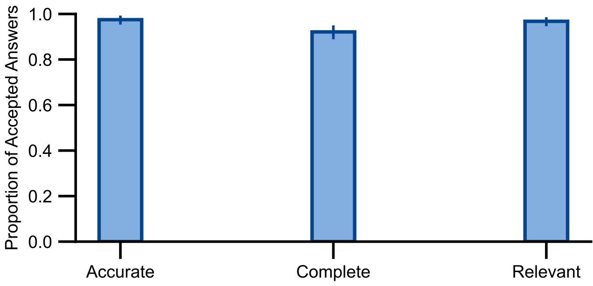  
Supplementary Figure 23: Multiple answer validation results

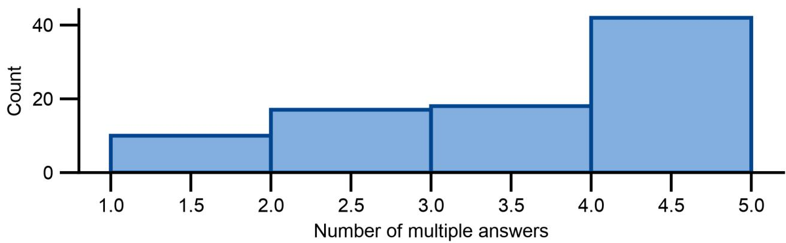  
Supplementary Figure 24: Number of accepted answers per accepted BRIE query

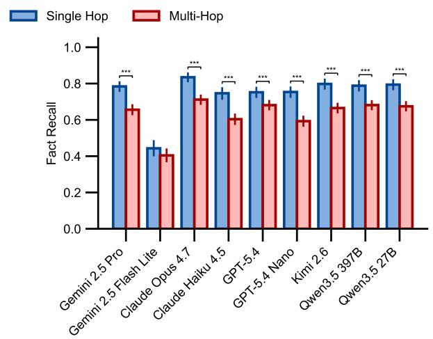

Supplementary Figure 25: Fact Recall and Precision for Multi- and Single Hop questions for Recent Inference. Significance thresholds: \*\*\* $\mathrm { p } < 0 . 0 0 1$ ; \*\* p < 0.01; \* p < 0.05; ns = not significant $( \mathtt { p } \ge 0 . 0 5 )$  
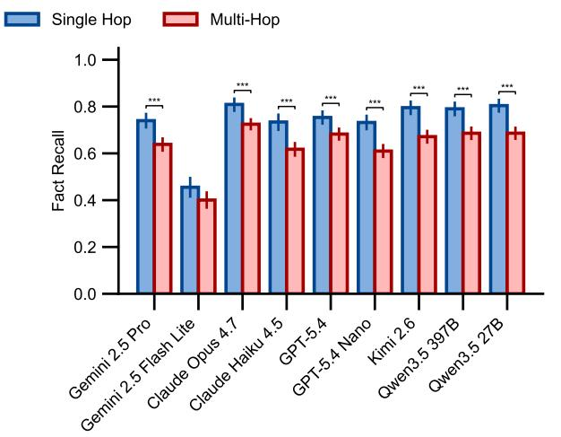

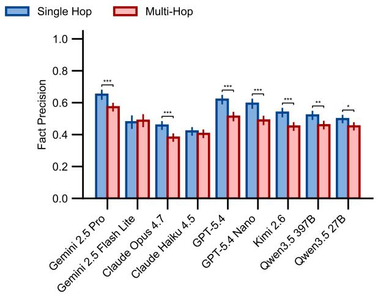  
Supplementary Figure 26: Fact recall and precision for multi- and single-hop questions under Recent-180K inference. Significance thresholds: ${ } ^ { * * * } p < 0 . 0 0 1 ; { } ^ { * * } p < 0 . 0 1 ; { } ^ { * } p < 0 . 0 5 ; { \mathrm { n s = n o t } }$ significant $( p \ge 0 . 0 5 )$

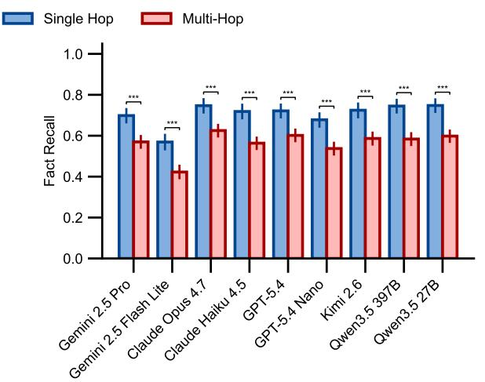

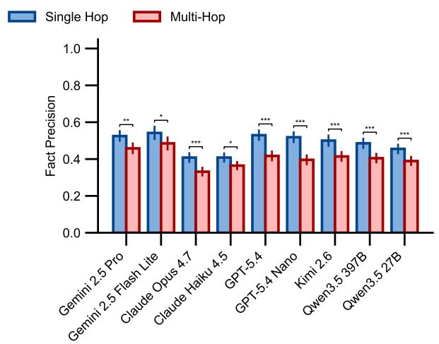  
Supplementary Figure 27: Fact recall and precision for multi- and single-hop questions under BM25 inference. Significance thresholds: \*\*\* $p < 0 . 0 0 1 $ ; \*\* p < 0.01; \* p < 0.05; ns = not significant $( p \ge 0 . 0 5 )$

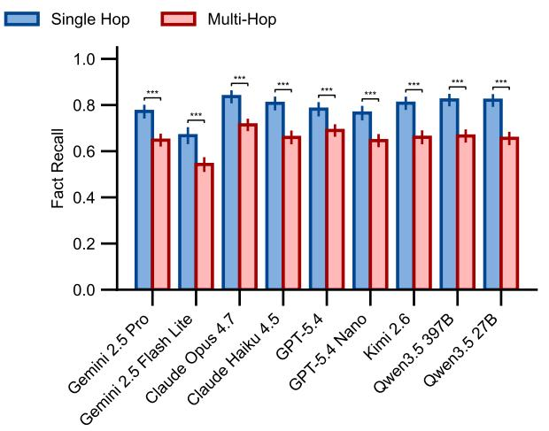

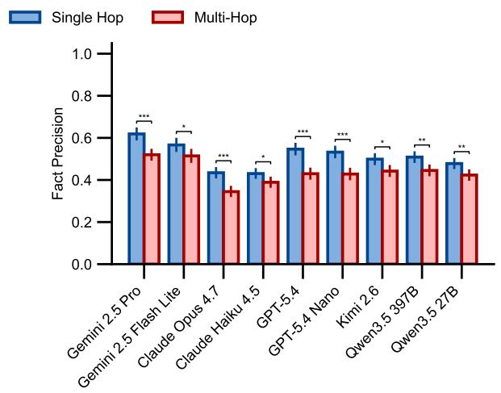  
Supplementary Figure 28: Fact recall and precision for multi- and single-hop questions under Dense inference. Significance thresholds: \*\*\* $p < 0 . 0 0 1$ . \*\* $p < 0 . 0 1$ . \* $p < 0 . 0 5 ;$ ; ns = not significant $( p \ge 0 . 0 5 )$

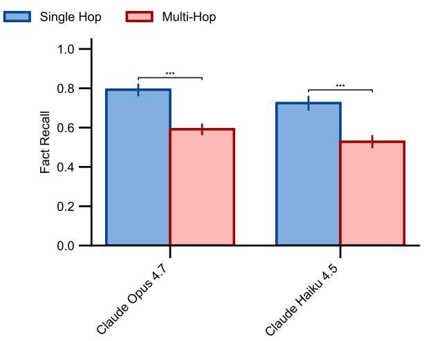

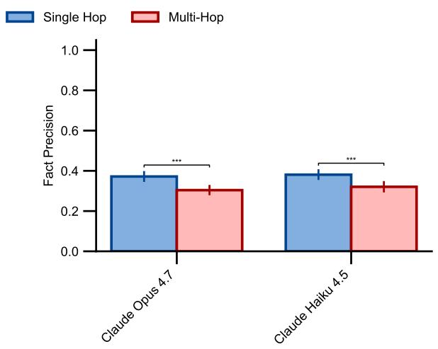

Supplementary Figure 29: Fact recall and precision for multi- and single-hop questions under Agent inference. Significance thresholds: ${ } ^ { * * * } p < 0 . 0 0 1 ; { } ^ { * * } p < 0 . 0 1 ; { } ^ { * } p < 0 . 0 5 ; { \mathrm { n s = n o t } }$ significant $( p \ge 0 . 0 5 )$ .  
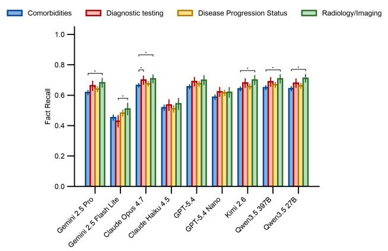

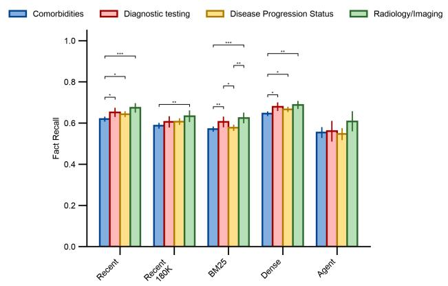

Supplementary Figure 30: Fact recall for questions related to Comorbidities, Diagnostic testing, Disease Progression Status, and Radiology/Imaging that require multi-hop reasoning across Model and Inference types. Significance thresholds: \*\* $^ { * } p < 0 . 0 0 1 ; ^ { * * } p < 0 . 0 1 ; ^ { * } p < 0 . 0 5 ; \mathrm { n s = n o t }$ t significant $( p \ge 0 . 0 5 )$  
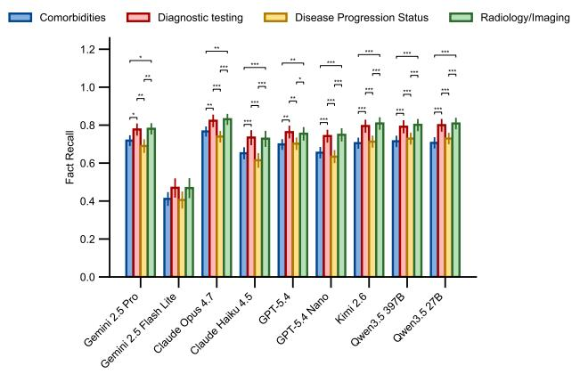

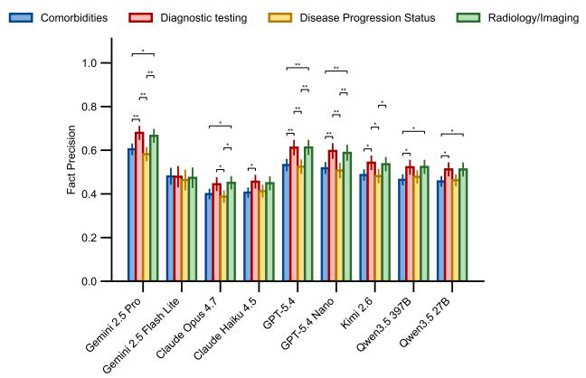  
Supplementary Figure 31: Fact recall and precision for questions related to Comorbidities, Diagnostic testing, Disease Progression Status, and Radiology/Imaging under Recent inference. Significance thresholds: \*\*\* $p < 0 . 0 0 1 ; ^ { \ast \ast } p < 0 . 0 1$ $^ { * } p < 0 . 0 5 ;$ ns = not significant $( p \ge 0 . 0 5 )$

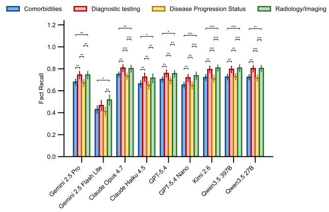

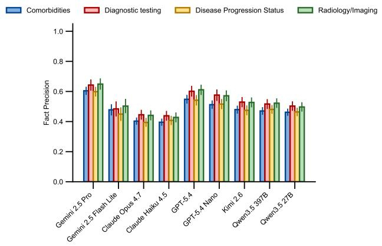  
Supplementary Figure 32: Fact recall and precision for questions related to Comorbidities, Diagnostic testing, Disease Progression Status, and Radiology/Imaging under Recent-180K inference. Significance thresholds: \*\*\* $p < 0 . 0 0 1$ ; \*\* $p < 0 . 0 1 ; \ast p < 0 . 0 5 ;$ ns = not significant $( p \ge 0 . 0 5 )$ .

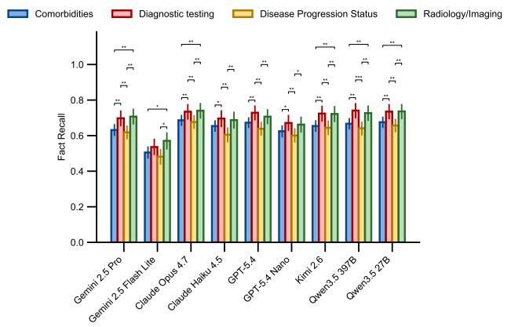

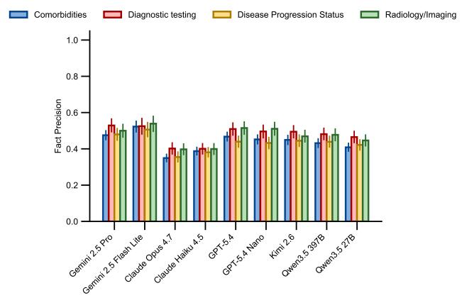  
Supplementary Figure 33: Fact recall and precision for questions related to Comorbidities, Diagnostic testing, Disease Progression Status, and Radiology/Imaging under BM25 inference. Significance thresholds: \*\*\* $p < 0 . 0 0 1 ; ^ { \ast \ast } p < 0 . 0 1 ;$ $^ { * } p < 0 . 0 5 ; \mathrm { n s = n o t }$ significant $( p \ge 0 . 0 5 )$

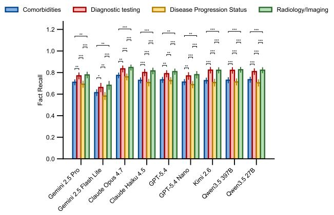

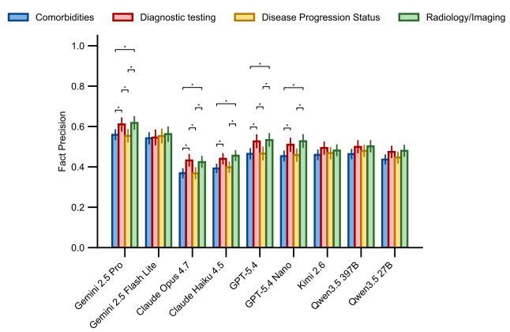  
Supplementary Figure 34: Fact recall and precision for questions related to Comorbidities, Diagnostic testing, Disease Progression Status, and Radiology/Imaging under Dense inference. Significance thresholds: $^ { * * * } p < 0 . 0 0 1 ; ^ { * * } p < 0 . 0 1$ $^ { * } p < 0 . 0 5 ; \mathrm { n s = n o t }$ significant $( p \ge 0 . 0 5 )$ .

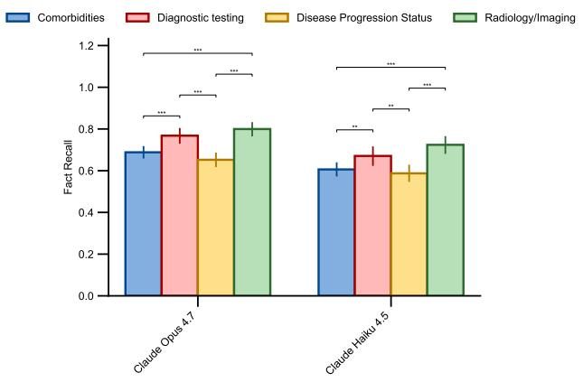

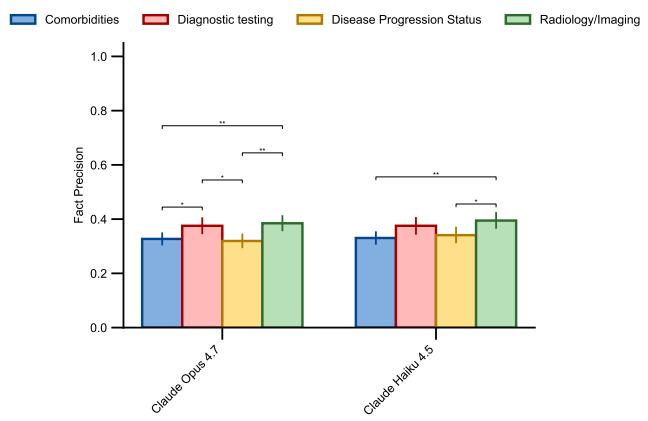  
Supplementary Figure 35: Fact recall and precision for questions related to Comorbidities, Diagnostic testing, Disease Progression Status, and Radiology/Imaging under Agent inference. Significance thresholds: \*\*\* $p < 0 . 0 0 1 ; ^ { \ast \ast } p < 0 . 0 1 ;$ $^ \ast p < 0 . 0 5 ;$ ns = not significant $( p \ge 0 . 0 5 )$

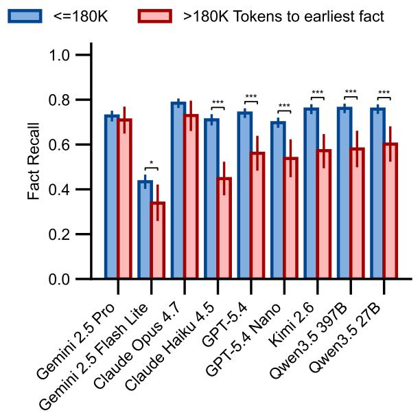

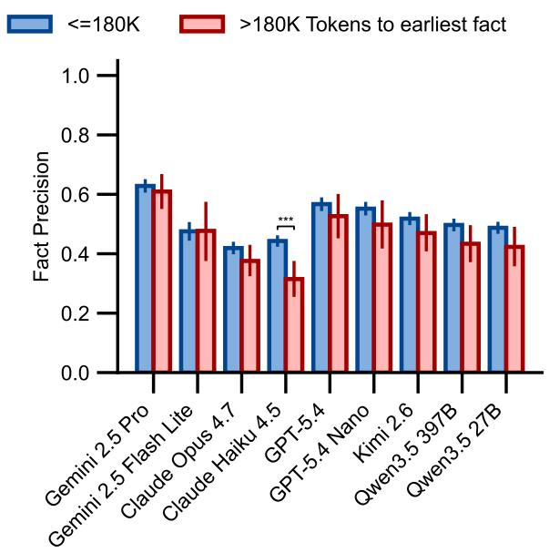  
Supplementary Figure 36: Fact recall and precision for answers with facts $\leq 1 8 0 \mathrm { K }$ and ${ \displaystyle > 1 8 0 \mathrm { K } }$ tokens under Recent inference. Significance thresholds: \*\*\* $p < 0 . 0 0 1 ;$ \*\* $p < 0 . 0 1 $ \* $p < 0 . 0 5 ;$ ns = not significant $( p \ge 0 . 0 5 )$

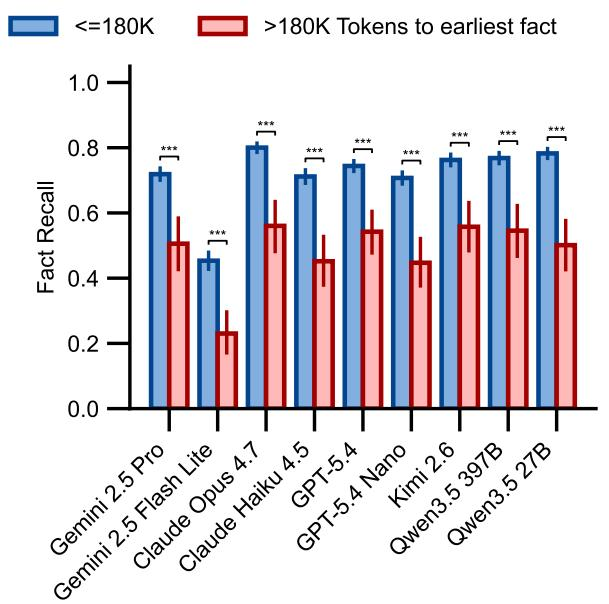

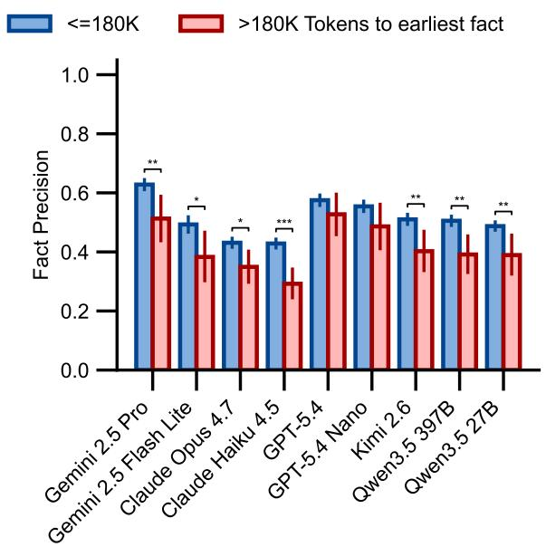  
Supplementary Figure 37: Fact recall and precision for answers with facts $\leq 1 8 0 \mathrm { K }$ and ${ \displaystyle > 1 8 0 \mathrm { K } }$ tokens under Recent-180K inference. Significance thresholds: \*\*\* $p < 0 . 0 0 1 ; ^ { \ast \ast } p < 0 . 0 1 ; ^ { \ast } p < 0 . 0 5 ;$ ns = not significant $( p \ge 0 . 0 5 )$ .

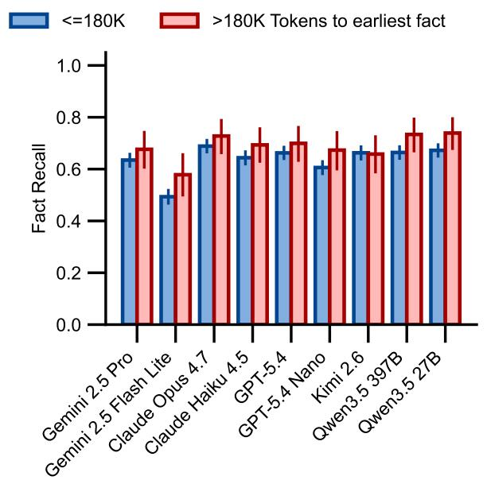

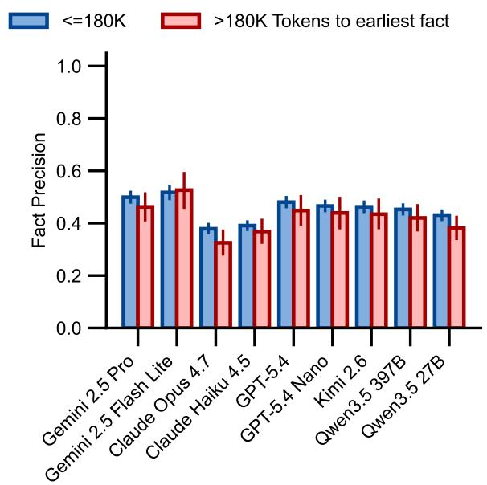  
Supplementary Figure 38: Fact recall and precision for answers with facts $\leq 1 8 0 \mathrm { K }$ and ${ > } 1 8 0 \mathrm { K }$ tokens under BM25 inference. Significance thresholds: $* * * _ { p } < 0 . 0 0 1 ; ^ { * * } p < 0 . 0 1 ; ^ { * } p < 0 . 0 5 ; \mathrm { { n s = n o t } }$ significant $( p \ge 0 . 0 5 )$

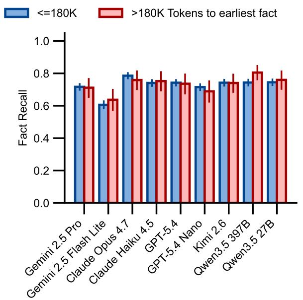

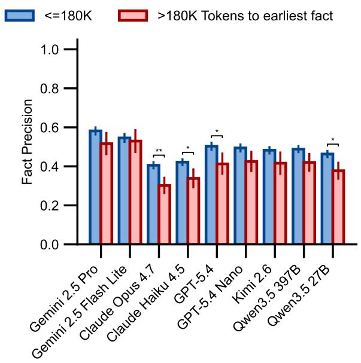  
Supplementary Figure 39: Fact recall and precision for answers with facts ≤180K and >180K tokens under Dense inference. Significance thresholds: $* * * _ { p } < 0 . 0 0 1 ; ^ { * * } p < 0 . 0 1 ; ^ { * } p < 0 . 0 5 ; \mathrm { { n s = n o t } }$ significant $( p \ge 0 . 0 5 )$

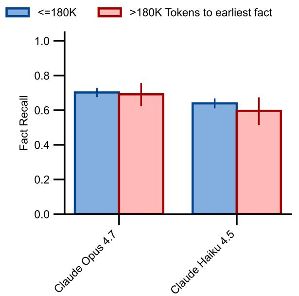

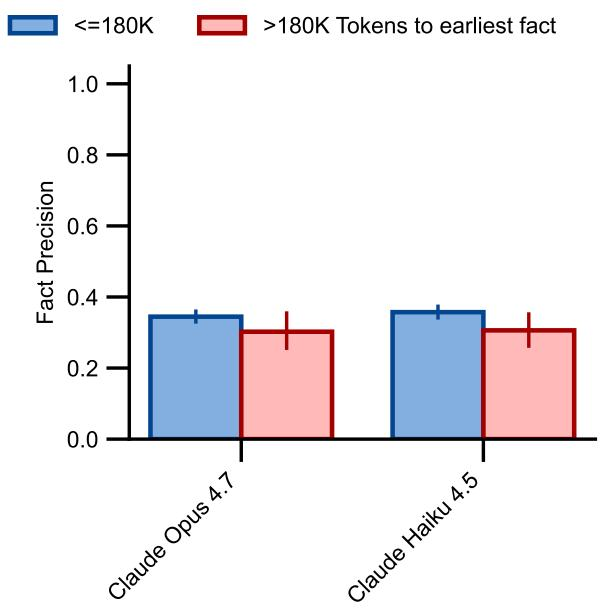  
Supplementary Figure 40: Fact recall and precision for answers with facts $\leq 1 8 0 \mathrm { K }$ and $> 1 8 0 \mathrm { K }$ tokens under Agent inference. Significance thresholds: $* * * _ { p } < 0 . 0 0 1 ; ^ { * * } p < 0 . 0 1 ; ^ { * } p < 0 . 0 5 ; \mathrm { { n s = n o t } }$ significant $( p \ge 0 . 0 5 )$

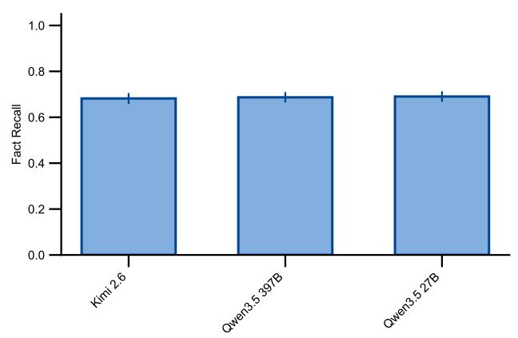

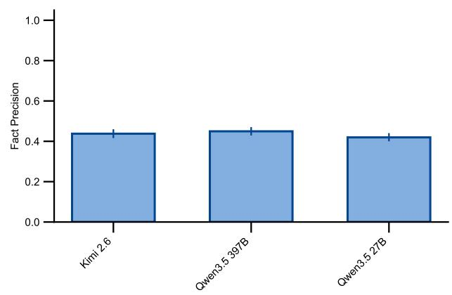  
Supplementary Figure 41: Fact recall and precision for late interaction retrieval for Kimi K2.6, Qwen 3.5 397B, and Qwen 3.5 27B