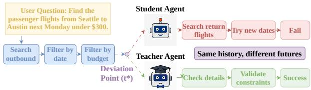
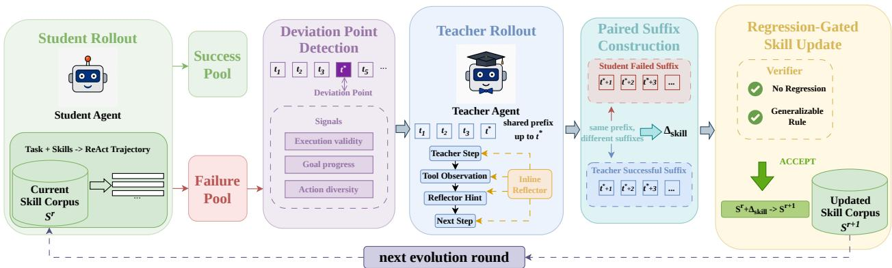
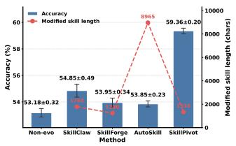
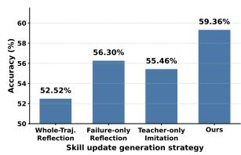
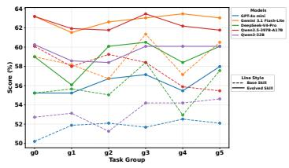
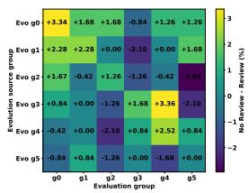

# A Wrong Turn Does Not Ruin the Journey: Deviation-Guided Skill Self-Evolution for LLM Agents

Yichun Feng1, Jiawei Wang2, Haozhe Sun3∗

1University of Chinese Academy of Sciences

2University of Science and Technology of China

3Meituan

fengyichun22@mails.ucas.ac.cn, wangjiawei@mail.ustc.edu.cn, sunhaozhe02@meituan.com

## Abstract

Large language model agents increasingly rely on naturallanguage skills to solve complex tool-use tasks. However, such tasks often admit multiple valid solution paths, making it inappropriate to improve skills by forcing failed trajectories to match a fixed successful trajectory. Moreover, failed trajectories are rarely entirely wrong: an agent may first collect useful evidence and make meaningful progress, but later deviate into an erroneous sufix. We therefore argue that skill selfevolution should identify where productive problem solving begins to break down, rather than reflect coarsely over the entire failure. Based on this insight, we propose SkillPivot, a deviation-point-guided framework for skill self-evolution. SkillPivot detects the transition from a useful prefix to an erroneous sufix using execution validity, goal progress, and action diversity. A stronger teacher then continues from the same prefix and produces a successful alternative under the same interaction history. By contrasting the student’s failed sufix with the teacher’s successful sufix, SkillPivot generates localized skill updates while preserving already efective guidance. Experiments on ToolQA, LogicBench, and WildClawBench show that SkillPivot consistently outperforms competing skillevolution methods, improves multiple agent models, and produces compact, transferable skill updates.

## Introduction

Large language model (LLM) agents have rapidly made personal AI assistants practical in real-world settings, enabling users to complete complex tasks through natural conversation, tool use, and environment interaction (Wu et al. 2023; Yang et al. 2024). By interleaving reasoning with actions, these agents can search the web, query databases, call external APIs, and operate over multi-step workflows. However, their reliability remains limited when task success depends not only on choosing the right tool, but also on following taskspecific procedural knowledge: when to query, how to construct tool arguments, how to interpret observations, when to verify intermediate results, and how to recover from unexpected tool feedback (Yao et al. 2024; Xie et al. 2024). A common way to provide such procedural knowledge is to equip agents with a skill corpus, where each skill encodes reusable natural-language guidance for task solving and tool use (Wang et al. 2023). Yet even high-quality skills are often incomplete: they may cover the main workflow while omitting boundary cases, recovery strategies, or tool-specific constraints.

  
Figure 1: A failed agent trajectory can contain a useful prefix before a deviation point, and comparing the divergent sufixes from the same history reveals how the existing skill should be updated.

This motivates the problem of skill self-evolution: can an agent improve an existing skill corpus from its own interaction failures? Recent work on agent self-improvement and evolving skill libraries suggests that experience can be converted into reusable knowledge. However, many existing approaches rely on whole-trajectory reflection, successfultrajectory imitation, or open-ended rewriting of skill descriptions. These strategies overlook a key property of failed agent trajectories: a failed trajectory is rarely uniformly wrong. In many cases, as illustrated in Figure 1, the agent first performs useful exploration, gathers relevant evidence, or narrows down the solution space, and only later deviates into repeated invalid tool calls, premature stopping, or incorrect interpretation of observations. Treating the entire trajectory as a single failure signal can therefore mix useful prefix behavior with harmful sufix behavior, leading to noisy, overly broad, or instance-specific skill updates.

We propose SkillPivot, a deviation-point-guided framework for skill self-evolution. Instead of rewriting skills from full failed trajectories, SkillPivot first detects the step where the student agent begins to deviate from productive problem solving. A stronger teacher agent then continues from the same trajectory prefix, producing a successful sufix whenever possible. By contrasting the student’s failed suffix with the teacher’s successful sufix, SkillPivot identifies localized skill gaps and generates minimal, conditional, and auditable skill deltas. To prevent harmful updates, each candidate delta is further examined by a regression-gated verifier that checks whether the update preserves useful original rules and whether the new guidance generalizes beyond the triggering cases. In this way, SkillPivot turns failures into localized maintenance signals rather than uncontrolled skill rewrites.

We evaluate SkillPivot on ToolQA using six disjoint task groups, together with additional benchmarks for transfer evaluation. The results show that evolved skills consistently improve performance over the original skill corpus and generalize beyond their source groups, indicating that SkillPivot learns reusable procedural corrections rather than sourcespecific patches. Further analyses show that skill evolution can continue over multiple rounds, that evolved skills can also benefit stronger models, and that detected deviation points are reliable and driven by meaningful signals. Ablation studies further demonstrate the importance of sufix contrast and the role of review in maintaining long-term stability during continuous evolution.

Our contributions are threefold:

• We find that failures of skill-guided LLM agents are often localized: failed trajectories usually contain useful prefixes before deviating into erroneous sufixes.

• We propose SkillPivot, a deviation-point-guided skill self-evolution framework that uses teacher continuation and sufix contrast to generate minimal, conditional, and regression-checked skill deltas.

• We empirically show that skill self-evolution produces reusable procedural knowledge rather than instancespecific patches, yielding transferable gains across task groups and evolution rounds.

## Related Work

## Tool-Augmented Language Agents

Large language models have increasingly been extended into interactive agents that can reason, call tools, and act in external environments. ReAct interleaves reasoning traces with actions, allowing agents to update their plans based on intermediate observations and tool feedback (Yao et al. 2022b). Toolformer shows that language models can learn when and how to invoke external APIs through self-supervised signals (Schick et al. 2023). Subsequent tool-learning systems, such as ToolLLM and Gorilla, further improve API selection, argument generation, and generalization to unseen or changing tool documentation (Qin et al. 2024; Patil et al. 2024). Meanwhile, benchmarks such as ToolQA, API-Bank, WebArena, Mind2Web, AgentBench, and AgentBoard show that tool-augmented agents still struggle with long-horizon reasoning, grounded tool execution, and reliable task completion in realistic environments (Zhuang et al. 2023; Li et al. 2023; Zhou et al. 2024; Deng et al. 2023; Liu et al. 2024; Ma et al. 2024). These works establish tool use as a key capability of language agents.

## Agent Self-Evolution

Beyond tool use, recent work has explored how agents can improve themselves through experience. One line of work updates model parameters using interaction data, such as supervised fine-tuning on agent trajectories, reinforcement learning from environmental feedback, or preference optimization from human or automatic judgments (Ouyang et al. 2022; Bai et al. 2022; Yao et al. 2022a). These methods can directly change the underlying policy, but they usually require expensive training, carefully curated data, and repeated safety evaluation before deployment. Another line of work keeps the base model frozen and improves agent behavior through external mechanisms. Reflexion stores verbal feedback from previous trials to guide future decisions (Shinn et al. 2023). Self-Refine improves outputs through iterative self-feedback and revision (Madaan et al. 2023). ExpeL extracts reusable natural-language lessons from accumulated experiences (Zhao et al. 2024). LATS combines reasoning, acting, reflection, and tree search to improve exploration (Zhou et al. 2023), while Agent Workflow Memory induces reusable workflows from prior trajectories (Wang et al. 2024).

## Self-Evolving Agent Skills

A more recent line of work studies agent skills as an evolving layer of procedural knowledge. SkillsBench evaluates whether curated skills can improve LLM-based agents and shows that high-quality skills are useful, while automati cally generated skills may be unstable (Li et al. 2026). SRA-Bench and related work study how agents retrieve relevant skills from large-scale skill corpora (Su et al. 2026). Skill-GenBench and SkillLearnBench further evaluate whether agents can generate or continually learn reusable skills from repositories, documents, or previous task experience (Zhou et al. 2026; Zhong et al. 2026). Recent systems further move from static skill libraries to self-evolving skills. Skill Weaver enables web agents to discover and distill websitespecific skills (Zheng et al. 2025). SkillGen synthesizes auditable skills from successful and failed trajectories (Ma et al. 2026a). SkillForge introduces a creation-evaluationrefinement loop for cloud technical support (Liu et al. 2026). SkillClaw studies collective skill evolution by aggregating multi-user trajectories and using an agentic evolver to refine or create skills (Ma et al. 2026b). SkillOpt treats a naturallanguage skill document as a trainable text-space state and optimizes it through rollouts and validation gates (Yang et al. 2026a). SkillAudit compares with-skill and without-skill trajectories on the same task to identify efective or harmful content within a skill (Gao et al. 2026). Self-Harness summarizes common issues from multiple failed trajectories and optimizes the overall agent harness through regression validation, rather than an individual skill (Zhang et al. 2026). Existing methods typically derive skill-update signals from complete trajectories, paired execution outcomes, or crosstrajectory failure patterns, but may mistakenly treat useful exploration before the failure as behavior that also requires correction, thereby disrupting reusable strategies that are already efective. In contrast, SkillPivot identifies the deviation point where a trajectory shifts from productive exploration to erroneous behavior, preserves the useful prefix, and generates a localized skill update only from the erroneous sufix, enabling more precise and less disruptive skill evolution.

## Method

## Problem Formulation

We study the problem of skill self-evolution for toolaugmented language agents. Unlike settings that generate skills from scratch, we assume that the agent is equipped with an existing high-quality skill corpus. Let $S ^ { r } =$ $\left\{ s _ { 1 } ^ { r } , s _ { 2 } ^ { r } , \ldots , s _ { M } ^ { r } \right\}$ denote the skill corpus at evolution round r, where each skill $s _ { m } ^ { r }$ is a natural-language procedural artifact that specifies task-solving strategies, tool-use conventions, constraints, and exception-handling rules.

At each evolution round, the agent receives a set of tasks $D ^ { r } = \{ x _ { i } \} _ { i = 1 } ^ { N }$ . Given a task $x _ { i }$ and the current skill corpus $S ^ { r }$ , a student agent $A _ { \varepsilon }$ interacts with the environment and produces a ReAct-style trajectory:

$$
\tau _ { i } = ( x _ { i } , h _ { i , 1 } , a _ { i , 1 } , o _ { i , 1 } , \ldots , h _ { i , T _ { i } } , a _ { i , T _ { i } } , o _ { i , T _ { i } } , y _ { i } ) .\tag{1}
$$

Here, $h _ { i , t } , a _ { i , t } ,$ and $o _  i , $ t denote the agent’s reasoning state, action or tool call, and environment observation at step t, respectively. The final response is denoted by $y _ { i }$ . An evaluator E determines whether the trajectory successfully completes the task:

$$
E ( \tau _ { i } , x _ { i } ) \in \{ 0 , 1 \} .\tag{2}
$$

The collected trajectories are then partitioned into a success set $T ^ { + }$ and a failure set $T ^ { - }$

The goal of skill self-evolution is to learn an update operator $\breve { \Phi }$ that converts interaction evidence into a set of skill deltas:

$$
\Delta S ^ { r } = \Phi ( S ^ { r } , T ^ { + } , T ^ { - } ) .\tag{3}
$$

Applying these deltas to the current skill corpus produces the next-round skill corpus:

$$
S ^ { r + 1 } = \mathrm { U p d a t e } ( S ^ { r } , \Delta S ^ { r } ) .\tag{4}
$$

Each skill delta is expected to be minimal, conditional, and auditable. It should repair missing or underspecified procedural knowledge without rewriting the whole skill or overfitting to a single failed instance.

Formally, the desired update should improve task success on future tasks while preserving previously stable behavior:

$$
\operatorname* { m a x } _ { \Delta S ^ { r } } \ : \mathbf { E } _ { x \sim D _ { \mathrm { f u t u r e } } } \left[ E ( A _ { s } ( x ; \mathrm { U p d a t e } ( S ^ { r } , \Delta S ^ { r } ) ) , x ) \right] .\tag{5}
$$

This objective is subject to bounded regression on tasks that were already solvable under $S ^ { r }$ . Therefore, skill selfevolution is not merely a repair problem on past failures, but a constrained maintenance problem: the updated skill corpus should fix historical errors, transfer to unseen tasks, and avoid degrading existing capabilities.

## Framework Overview

We propose a deviation-point-guided framework for skill self-evolution named SkillPivot, as illustrated in Figure 2. The key idea is to avoid treating an entire failed trajectory as uniformly wrong. Instead, we first identify the point at which the student agent shifts from useful exploration to unproductive or erroneous behavior, and then use this point as the anchor for skill update.

The framework consists of five stages. First, the student agent executes tasks with the current skill corpus and produces ReAct-style trajectories. Second, SkillPivot analyzes failed trajectories to locate the deviation point where useful exploration turns into erroneous behavior. Third, a stronger teacher agent continues from the same prefix and attempts to produce a successful sufix. Fourth, SkillPivot contrasts the student failed sufix with the teacher successful sufix to identify the missing procedural guidance and generate candidate skill deltas. Finally, a regression-gated verifier checks whether each delta preserves useful original rules and expresses a generalizable update before merging it into the skill corpus.

This pipeline turns raw interaction failures into localized and auditable skill updates. By preserving the useful prefix of the student trajectory and focusing only on the divergent sufix, the method reduces unnecessary rewriting and makes skill evolution more causally grounded.

## Student Rollout

At each evolution round, the student agent is prompted with the current skill corpus and executes a batch of tasks in the environment. Each task produces a multi-step trajectory that records the agent’s reasoning, tool calls, observations, and final response. We retain the full interaction trace because many skill-level failures are not visible from the final answer alone. For example, a task may fail because the agent uses a wrong command hierarchy, passes an argument from an incorrect source, ignores an empty tool response, or stops without verifying the environment state.

After execution, an evaluator determines whether each trajectory succeeds. Successful trajectories are stored as a success pool, which is later used to test whether a candidate skill update damages previously working behavior. Failed trajectories are stored as an failure pool, which provides evidence for diagnosing missing or underspecified procedural knowledge.

## Deviation Point Detection

Given a failed trajectory, deviation point detection aims to identify the earliest step at which the trajectory shifts from productive exploration to invalid execution or repetitive behavior. The trajectory before this step is retained as the shared prefix for teacher continuation. For each step t, we compute a progress potential score:

$$
\hat { V } _ { t } = 0 . 4 \mathrm { E x e c } _ { t } + 0 . 3 \mathrm { P r o g } _ { t } + 0 . 3 \mathrm { D i v } _ { t } .\tag{6}
$$

Here, $\operatorname { E x e c } _ { t }$ measures whether the current tool call is executed successfully. It is computed using deterministic rules based on action validity, tool execution status, and the usability of the returned observation. Successful executions with usable results receive higher scores, whereas invalid calls, execution errors, and empty observations receive lower scores. $\mathrm { P r o g } _ { t }$ measures the relevance of the current observation to the task objective. We use the ground-truth as a semantic representation of the task objective. The all-MiniLM-L6- v2(Reimers and Gurevych 2019) is used to encode the current observation and the ground-truth, after which their cosine similarity is computed. A higher similarity indicates that the observation contains information more closely related to the target information required by the task. To prevent repeated evidence from being counted multiple times as progress, we retain only the positive increase in target relevance over the best previous step:

  
Figure 2: Overview of SkillPivot.

$$
\mathrm { P r o g } _ { t } = \operatorname* { m a x } \left( 0 , \sin ( o _ { t } , y ) - \operatorname* { m a x } _ { j < t } \sin ( o _ { j } , y ) \right) ,\tag{7}
$$

where y denotes the ground-truth. For the first step, the historical maximum is defined as zero. Therefore, an observation receives a positive progress score only when its relevance to the target answer exceeds that of all previous observations. Repeated evidence does not produce additional progress. Divt measures whether the current action repeats a previously attempted strategy. We use the all-MiniLM-L6-v2 to encode the actions and define action diversity as

$$
\mathrm { D i v } _ { t } = 1 - \operatorname* { m a x } _ { j < t } \sin ( a _ { t } , a _ { j } ) .\tag{8}
$$

A low value of Divt indicates that the current action is highly similar to a previous action and may represent repetitive behavior, whereas a high value indicates a meaningfully diferent strategy.

After obtaining the score for each step, the detector first treats the step with the lowest $\hat { V } _ { t }$ as the candidate deviation point. To avoid mistaking a single accidental low-scoring step for a true deviation, we further examine whether the progress potential after this step remains consistently lower than the overall level before it. The candidate is confirmed as the deviation point only when it forms a clear trough in the trajectory and the subsequent steps continue to maintain low scores. This design requires the trajectory to exhibit sustained invalid execution and clear repetitive behavior, thereby preventing premature truncation ofprefixes that may still contain useful exploration.

## Teacher Rollout

Once a reliable deviation point is detected, SkillPivot asks a stronger teacher agent to continue from the same prefix rather than restarting the task from scratch. The teacher receives the task, the current skill corpus, the student’s pre-deviation trajectory prefix, and the student’s full failed trajectory as a reference of what to avoid. The teacher then continues the

ReAct loop from step $t ^ { * }$ with the same step numbering and interacts with the environment through valid tool calls.

To improve the quality of teacher continuation, the implementation uses an inline reflector. After each teacher tool-call step, the reflector analyzes the latest action and observation and produces a short hint for the next step. This hint is appended to the teacher scratchpad as a special reflector message, but it is not inserted into the saved raw teacher trajectory. Thus, the reflector can guide the teacher online without polluting the sufix that will later be used for comparison. A teacher continuation is accepted only if it passes the task evaluator. If the teacher succeeds, SkillPivot constructs a paired case consisting of the shared prefix, the student’s failed suffix, and the teacher’s successful sufix. If the teacher fails, the case is discarded or retried from the same deviation point up to a preset attempt limit.

## Paired Sufix Contrast and Skill Generation

After a teacher continuation is verified as successful, SkillPivot constructs a paired sufix case. Each case contains the task, the current skill, the detected deviation point, the student’s failed sufix after t∗, the teacher’s successful sufix from the same prefix, and lightweight diference statistics. First, a single-case trajectory summarizer analyzes each teacher-correct paired case. It identifies the student’s mistake, the teacher’s correction, the missing or incomplete guidance in the current skill, and a general evolution direction. This produces a structured case analysis rather than an immediate skill rewrite. Second, a skill increment generator aggregates the structured analyses and proposes a candidate delta. The generator can choose one of three actions: improve\_skill, which updates the skill content; optimize\_description, which refines the skill description or triggering condition; or skip, which avoids editing when the evidence is insuficient.

## Regression-Gated Skill Update

The generated skill delta is not directly deployed as the final skill. Instead, SkillPivot first uses an LLM editor to apply the candidate delta to the original skill and produce a tentative updated skill. Since the original skill corpus already contains useful procedural knowledge, the tentative updated skill $s ^ { \prime }$ may still introduce harmful changes, such as deleting valid rules, weakening existing guidance, or adding instancespecific patches. Therefore, before deploying $s ^ { \prime } ,$ , SkillPivot applies a regression-gated verifier to decide whether the updated skill can be safely merged into the skill corpus.

The verifier is an LLM-based reviewer. Given the original skill s and the tentative updated skill $s ^ { \prime } ,$ the verifier compares their contents using two criteria. The first criterion, no regression, checks whether $s ^ { \prime }$ preserves useful rules from s and does not delete, weaken, override, or contradict them without justification. The second criterion, generalizable rule, checks whether the newly added guidance expresses a reusable procedural principle rather than a one-of patch tailored to the triggering failure cases. The verifier assigns both criteria a score in [0, 1] and accepts the update only when both scores exceed a threshold:

$$
r _ { \mathrm { r e g } } \geq \theta \quad \mathrm { a n d } \quad r _ { \mathrm { g e n } } \geq \theta .\tag{9}
$$

In our implementation, θ = 0.5. If accepted, $s ^ { \prime }$ is written into the deployed updated corpus and used in the next evolution round. If rejected, the original skill s remains unchanged, and the delta is retained only as a candidate record. This gate makes skill self-evolution conservative: each deployed update must repair observed failures without sacrificing previously useful skill behavior.

## Experiments

## Experimental Setup

Unless otherwise specified, we use Qwen3-32B (Qwen Team 2025) as the student agent to execute tasks and generate final answers, while all LLM-based modules in SkillPivot, including teacher continuation, trajectory summarization, skill generation, and regression-gated verification, are instantiated with Qwen3.5-397B-A17B (Qwen Team 2026). For both student and teacher agent inference, we set the sampling temperature to 0.7 and the maximum generation length to 8,096 tokens per LLM call. The student ReAct engine is allowed to execute at most 20 steps per task, while the teacher ReAct engine is allowed to execute at most 10 continuation steps from the detected deviation point and can be retried up to 3 times if continuation fails. For self-evolution modules, the default maximum generation length is set to 12,000 tokens. For the cross-model transfer experiment, the evaluated models are explicitly specified in the corresponding section. All reported task-performance metrics follow the oficial evaluation protocol of each benchmark.

## RQ1: Do Evolved Skills Improve Performance and Generalize Beyond Their Source Groups?

We conduct this experiment on ToolQA (Zhuang et al. 2023), using the skill corpus configured by SRA-Bench (Su et al. 2026) and splitting the test set into six disjoint groups, with 238 examples per group. The Baseline row evaluates the original skill corpus without self-evolution on all groups. Each SkillPivot-gi row denotes the cumulatively evolved skill corpus after incorporating evolution trajectories up to group gi, which is then evaluated on all six target groups. All configurations are independently run three times.

<table><tr><td>Corpus</td><td>g0(%)</td><td>g1(%)</td><td>g2(%)</td><td>g3(%)</td><td>g4(%)</td><td>g5(%)</td><td>Mean(%)</td></tr><tr><td>Non-evo</td><td>52.59±0.44</td><td>53.14±1.05</td><td>50.98±0.48</td><td>54.20±0.42</td><td>53.51±1.03</td><td>54.63±0.21</td><td>53.18±0.32</td></tr><tr><td>SkillPivot-g0</td><td>56.08±0.63</td><td>54.26±0.43</td><td>52.10±0.00</td><td>56.86±0.64</td><td>54.21±0.55</td><td>54.78±0.86</td><td>54.72±0.21</td></tr><tr><td>SkillPivot-g1</td><td>55.88±0.42</td><td>54.62±0.00</td><td>53.92±0.24</td><td>57.00±0.24</td><td>55.75±0.84</td><td>54.77±0.31</td><td>55.32±0.14</td></tr><tr><td>SkillPivot-g2</td><td>55.80±1.39</td><td>56.36±1.15</td><td>56.02±0.64</td><td>58.54±0.24</td><td>58.43±0.63</td><td>58.85±1.48</td><td>57.33±0.22</td></tr><tr><td>SkillPivot-g3</td><td>56.50±0.38</td><td>58.18±0.91</td><td>57.98±1.11</td><td>59.24±0.42</td><td>54.49±0.52</td><td>57.86±0.51</td><td>57.38±0.21</td></tr><tr><td>SkillPivot-g4</td><td>57.62±0.83</td><td>58.74±1.27</td><td>58.96±0.48</td><td>61.76±1.12</td><td>56.46±0.72</td><td>54.78±1.08</td><td>58.05±0.42</td></tr><tr><td>SkillPivot-g5</td><td>60.42±0.44</td><td>58.18±1.71</td><td>58.26±1.47</td><td>60.36±0.24</td><td>59.41±0.72</td><td>59.55±0.51</td><td>59.36±0.20</td></tr></table>

Table 1: Efectiveness and cross-group generalization of evolved skills.

As shown in Table 1, evolved skills consistently outperform the Non-evo across all test groups. The final evolved corpus, SkillPivot-g5, improves the mean success rate from 53.18% to 59.36%. More importantly, the improvements are not limited to the groups already used during evolution. The table shows consistent gains across all target groups, indicating that cumulative skill evolution improves the skill corpus as a whole rather than only repairing isolated source-group failures. These results suggest that SkillPivot does not simply memorize previously observed failures or produce narrow group-specific patches. Instead, the evolved skills capture recurring failure patterns shared across task groups and convert them into reusable local rules. Therefore, this experiment supports two conclusions: skill evolution improves overall task performance, and the resulting skills continue to generalize as the skill corpus is cumulatively updated.

## RQ2: Does SkillPivot Outperform Other Skill Evolution Methods?

We compare SkillPivot with three other skill evolution methods: SkillClaw, SkillForge, and AutoSkill(Yang et al. 2026b). All methods are applied to the same ToolQA skill corpus and evaluated under the same downstream setting after incorporating their generated skill updates, as shown in Figure 3(a). All configurations are independently run three times. The results show that skill evolution is not simply a matter of making more edits. AutoSkill makes the largest modifications. It tends to rewrite the original skill into a more general prompt-style template, such as adding role, objective, and general instruction components. Although this type of rewriting makes the skill longer and more complete, a substantial portion of the added content is not directly related to specific retrieval failures or tool-use failures. As a result, it may dilute the truly critical operational rules and ultimately brings only limited improvement. SkillClaw and SkillForge make lighter edits, mainly adding local constraints or heuristic rules to the original skill, such as date normalization, distinction between score semantics, query field restrictions, or hard retrieval constraints. These edits can fix some local errors, but they usually lack a systematic recovery procedure for retrieval failures, tool-state issues, field ambiguity, and answer-format errors. Therefore, their improvements remain limited.

In contrast, SkillPivot achieves the highest accuracy with a relatively compact modified skill length. Its updates convert observed failures into executable recovery protocols, such as retrying with alternative date formats, relaxing overly specific constraints, reformulating queries, and verifying candidate evidence when retrieval fails. This suggests that efective skill evolution depends less on update length than on whether failures are transformed into reusable procedural guidance.

  
(a)

  
(b)

Figure 3: (a) Comparison with other skill evolution methods. (b) Comparison of skill update generation strategies.  
  
(a)

  
(b)  
Figure 4: (a) Cross-model transfer of evolved skills on ToolQA. (b) Review ablation on ToolQA. Values denote noreview minus review accuracy.

## RQ3: Do Evolved Skills Also Improve Other Models?

To examine whether evolved skills are model-specific patches or transferable execution knowledge, we evaluate the original and evolved skill corpora with five diferent models: GPT-4o mini(OpenAI 2024), Gemini 3.1 Flash-Lite(Gemini Team 2026), DeepSeek-V4-Pro(Xu et al. 2026), Qwen3.5-397B-A17B, and Qwen3-32B. All models are evaluated on the same six task groups. The original skill corpus is used as the baseline, while the one-round evolved corpus is used as the evolved setting.

As shown in Figure 4(a), the evolved skill corpus consistently improves performance across all evaluated models. The improvement is not limited to the model that generated the skill updates, nor is it restricted to a small subset of task groups. Instead, the evolved skills lead to positive gains for every model, suggesting that the updates capture reusable task-execution knowledge rather than model-specific corrections. More importantly, some weaker models equipped with the evolved skill corpus become competitive with, and in some cases surpass, stronger models using the original skill corpus. This suggests that skill self-evolution does not merely repair isolated failures for a particular model. Instead, it distills clearer and more executable task strategies into the external skill corpus.

## RQ4: Are Detected Deviation Points Reliable and Driven by Meaningful Signals?

We evaluate whether the deviation points detected by SkillPivot identify reliable and useful intervention positions on ToolQA. From Scratch does not use failed trajectory information and directly lets the teacher re-execute the task from the beginning. Random Intervention randomly selects an intermediate step from the failed trajectory as the continuation point. Direct LLM Locator lets an LLM read the complete failed trajectory once and directly output the deviation point it considers most reasonable. Step-wise LLM Verifier performs step-by-step judgments over the trajectory and selects the position most likely to indicate the deviation point. The self-teacher ablation uses the deviation point detected by SkillPivot, but replaces the teacher with the same Qwen3- 32B model as the student, in order to disentangle the efect of deviation localization from teacher model capability. For methods that select an intervention point, we use three independent LLM judges, DeepSeek-V4-Pro, Qwen3.5-397B-A17B, and Claude Opus 4.6 (Anthropic 2026), to assess whether the selected point marks a reasonable transition from useful exploration to erroneous deviation. Point Agree. is computed by majority vote among the three judges. We further let the teacher continue from the corresponding position and measure continuation success, average continuation steps, and invalid tool-call rate.

<table><tr><td>Method</td><td>Teacher</td><td>Point Agree.</td><td>Cont. Success</td><td>Avg. Steps</td><td>Invalid Calls</td></tr><tr><td>From Scratch</td><td>Qwen3.5-397B</td><td></td><td>35.65%</td><td>6.57</td><td>4.18%</td></tr><tr><td>Random Intervention</td><td>Qwen3.5-397B</td><td>13.32%</td><td>38.06%</td><td>10.98</td><td>29.68%</td></tr><tr><td>SkillPivot</td><td>Qwen3-32B</td><td>70.81%</td><td>37.40%</td><td>11.71</td><td>3.15%</td></tr><tr><td>Direct LLM Locator</td><td>Qwen3.5-397B</td><td>70.57%</td><td>45.28%</td><td>8.10</td><td>3.66%</td></tr><tr><td>Step-wise LLM Verifier</td><td>Qwen3.5-397B</td><td>72.18%</td><td>49.55%</td><td>8.08</td><td>3.45%</td></tr><tr><td>SkillPivot</td><td>Qwen3.5-397B</td><td>70.81%</td><td>56.18%</td><td>5.95</td><td>2.93%</td></tr></table>

Table 2: Reliability and usefulness of diferent intervention strategies.

As shown in Table 2, Random Intervention slightly improves over From Scratch, suggesting that failed trajectories do contain reusable intermediate information. However, its Point Agree. is very low, and its Avg. Steps and Invalid Calls are significantly higher, indicating that random points often fail to correspond to the true turning point of failure. LLMbased methods achieve high Point Agree., but their continuation success remains lower than SkillPivot, suggesting that a deviation point that appears reasonable is not necessarily the most useful for downstream recovery. In the self-teacher ablation, SkillPivot still maintains high Point Agree. and low Invalid Calls, indicating that deviation localization does not fully depend on a stronger teacher. However, the weaker teacher substantially reduces continuation success, showing that teacher capability afects recovery success. Overall, the advantage of SkillPivot lies in more accurately locating the boundary between the useful prefix and the erroneous sufix, thereby providing a more efective starting point for teacher continuation and subsequent skill update generation.

## RQ5: Does Paired Sufix Contrast Produce Better Skill?

Figure 3(b) isolates the efect of paired sufix contrast in skill generation by comparing diferent forms of trajectory evidence used to produce skill updates. Unlike RQ2, which compares complete skill evolution methods, this experiment focuses on whether contrasting the failed student sufix with the successful teacher sufix from the same deviation point provides better evidence for generating precise skill. Whole-Trajectory Reflection performs worse than the original skill corpus, suggesting that reflecting on the entire failed trajectory can introduce noisy or overly broad updates. Since the full trajectory contains both useful early steps and later failure behavior, a holistic reflection may fail to isolate the actual point where the skill should be revised. Failure-only Reflection and Teacher-only Imitation both improve downstream accuracy, but their gains are limited. Failure-only Reflection observes only what the student did wrong, without access to a successful alternative under the same task context. Teacher-only Imitation observes a successful trajectory, but does not explicitly identify which part of the student’s behavior caused the failure. As a result, both strategies provide incomplete evidence for generating precise skill deltas. In contrast, SkillPivot achieves the best downstream accuracy. Notably, SkillPivot also produces the shortest skill updates on average. This indicates that paired sufix contrast does not improve performance by generating longer or more verbose revisions. Instead, it compares the failed student sufix with the successful teacher sufix from the same deviation point, allowing the update generator to localize the key behavioral diference and produce compact, targeted, and efective skill deltas.

## RQ6: Does Review Improve Long-Term Stability of Skill Evolution?

We evaluate the review mechanism on ToolQA using the same six-group split as in previous experiments, where skill deltas are evolved from each source group and evaluated on all target groups. Figure 4(b) shows the ablation results, where each value denotes the accuracy diference between the no-review and review settings. Overall, the no-review setting achieves slightly higher short-term accuracy in some task groups. This suggests that, at the early stage of selfevolution, overly strict review or filtering may discard some potentially useful skill deltas, thereby limiting short-term performance gains. However, this does not imply that the review mechanism is unnecessary. As self-evolution continues, skill deltas gradually accumulate, and the risks of noisy updates, overfitted rules, and incorrect failure attribution become increasingly amplified. In such a long-term evolving system, the role of review is not to maximize the average score in every individual setting, but to suppress unreliable deltas and reduce worst-case degradation and negative transfer. Therefore, the review mechanism should be viewed as a long-term stability constraint rather than a module that always improves short-term accuracy. In other words, the purpose of review is not to improve the average accuracy in every run, but to maintain update quality during continuous skill self-evolution and prevent the system from gradually degrading due to the accumulation of erroneous or overfitted skill.

## RQ7: Does SkillPivot Transfer to Other Benchmarks?

We further evaluate SkillPivot on LogicBench (Parmar et al. 2024) and WildClawBench (Ding et al. 2026) to assess its

<table><tr><td>Method</td><td>Non-evo(%)</td><td>Evo g0(%)</td><td>Evo g1(%)</td><td>Evo g2(%)</td><td>Evo g3(%)</td><td>Evo g4(%)</td><td>Evo g5(%)</td></tr><tr><td>SkillCLAW</td><td></td><td>87.46±1.27</td><td>87.58±0.47</td><td>87.45±0.48</td><td>87.14±0.40</td><td>88.02±0.28</td><td>88.15±0.75</td></tr><tr><td>SkillForge</td><td>86.54±1.05</td><td>87.19±0.31</td><td>88.07±0.77</td><td>87.80±0.06</td><td>88.32±0.50</td><td>89.50±0.92</td><td>89.22±0.61</td></tr><tr><td>AutoSkill</td><td></td><td>86.30±0.47</td><td>87.27±0.82</td><td>85.91±1.46</td><td>85.52±1.59</td><td>82.00±2.43</td><td>85.55±0.79</td></tr><tr><td>SkillPivot</td><td></td><td>88.01±1.32</td><td>88.80±1.32</td><td>88.01±1.35</td><td>89.20±1.54</td><td>90.83±0.80</td><td>91.22±1.10</td></tr></table>

Table 3: Group-level transfer results on LogicBench.

<table><tr><td>Method</td><td>Non-evo(%)</td><td>Evo g0(%)</td><td>Evo g1(%)</td><td>Evo g2(%)</td><td>Evo g3(%)</td><td>Evo g4(%)</td><td>Evo g5(%)</td></tr><tr><td>SkillCLAW</td><td></td><td>34.83±0.61</td><td>39.32±0.88</td><td>43.68±1.34</td><td>55.81±2.73</td><td>60.11±1.48</td><td>65.27±0.96</td></tr><tr><td>SkillForge</td><td>34.35±0.68</td><td>32.17±1.90</td><td>34.71±1.16</td><td>43.74±1.47</td><td>51.12±0.57</td><td>55.17±0.99</td><td>60.73±0.92</td></tr><tr><td>AutoSkill</td><td></td><td>34.37±1.65</td><td>38.91±0.93</td><td>41.87±0.46</td><td>55.03±2.36</td><td>58.83±1.40</td><td>63.45±0.87</td></tr><tr><td>SkillPivot</td><td></td><td>36.36±0.83</td><td>52.81±2.17</td><td>57.93±1.37</td><td>64.58±1.41</td><td>70.40±1.69</td><td>73.00±2.55</td></tr></table>

Table 4: Group-level transfer results on WildClawBench.

cross-task transferability and continual evolution capability.   
All configurations are independently run three times.

On LogicBench, we use the skill corpus configured by SRA-Bench (Su et al. 2026) and evenly divide the examples into six groups. Each Evo $g _ { i }$ setting evolves the skills using group $g _ { i }$ and is then evaluated over all six groups. As shown in Table 3, SkillPivot consistently achieves the best performance across diferent source-group settings. Since the improvements extend beyond the group used for evolution, the generated updates capture reusable procedural knowledge rather than group-specific corrections. In contrast, the competing methods exhibit smaller or less stable gains, suggesting that unconstrained skill modification may introduce noisy or overly specific rules.

On WildClawBench, we evaluate all tasks that provide and invoke skills. Each Evo $g _ { i }$ represents one round ofcontinuous evolution over the complete task set, followed by evaluation after that round. As shown in Table 4, SkillPivot improves consistently as evolution proceeds and maintains a clear advantage over the competing methods. This indicates that its localized updates can accumulate efectively across rounds without being dominated by redundant or harmful revisions.

## Conclusion

We study skill self-evolution for LLM agents, where the goal is to improve an existing skill corpus from interaction failures without overwriting previously useful procedural knowledge. Our key observation is that failed trajectories are often not uniformly wrong: they usually contain useful exploratory prefixes before deviating into localized erroneous sufixes. Based on this observation, we propose SkillPivot, a deviation-point-guided framework that detects where failures begin, uses teacher continuation to construct successful sufixes, and generates minimal, conditional, and regression-checked skill deltas through sufix contrast. Experiments show that evolved skills produce reusable procedural knowledge rather than instance-specific patches, leading to transferable improvements across task groups, evolution rounds, agent backbones, and task environments. These results suggest that maintaining and evolving external skill corpora is a promising path toward more reliable and continuously improving agents.

Anthropic. 2026. Claude Opus 4.6.

Bai, Y.; Kadavath, S.; Kundu, S.; Askell, A.; Kernion, J.; Jones, A.; Chen, A.; Goldie, A.; Mirhoseini, A.; McKinnon, C.; et al. 2022. Constitutional ai: Harmlessness from ai feedback. arXiv preprint arXiv:2212.08073.

Deng, X.; Gu, Y.; Zheng, B.; Chen, S.; Stevens, S.; Wang, B.; Sun, H.; and Su, Y. 2023. Mind2web: Towards a generalist agent for the web. Advances in Neural Information Processing Systems, 36: 28091–28114.

Ding, S.; Dai, X.; Xing, L.; Ding, S.; Liu, Z.; Yang, J.; Yang, P.; Zhang, Z.; Wei, X.; Ma, Y.; Duan, H.; Shao, J.; Wang, J.; Lin, D.; Chen, K.; and Zang, Y. 2026. WildClawBench.

Gao, H.; Chen, H.; Wang, C.; Guo, S.; Pang, L.; Liu, Z.; Shen, H.; and Cheng, X. 2026. SkillAudit: Ground-Truth-Free Skill Evolution via Paired Trajectory Auditing. arXiv preprint arXiv:2606.14239.

Gemini Team. 2026. Gemini 3.1 Flash-Lite: Built for Intelligence at Scale.

Li, M.; Zhao, Y.; Yu, B.; Song, F.; Li, H.; Yu, H.; Li, Z.; Huang, F.; and Li, Y. 2023. Api-bank: A comprehensive benchmark for tool-augmented llms. In Proceedings of the 2023 conference on empirical methods in natural language processing, 3102–3116.

Li, X.; Chen, W.; Liu, Y.; Zheng, S.; Chen, X.; He, Y.; Li, Y.; You, B.; Shen, H.; Sun, J.; et al. 2026. SkillsBench: Benchmarking how well agent skills work across diverse tasks. arXiv preprint arXiv:2602.12670.

Liu, X.; Luo, X.; Li, L.; Huang, G.; Liu, J.; and Qiao, H. 2026. Skillforge: Forging domain-specific, self-evolving agent skills in cloud technical support. arXiv preprint arXiv:2604.08618.

Liu, X.; Yu, H.; Zhang, H.; Xu, Y.; Lei, X.; Lai, H.; Gu, Y.; Ding, H.; Men, K.; Yang, K.; et al. 2024. Agentbench: Evaluating llms as agents. In International Conference on Learning Representations, volume 2024, 52989–53046.

Ma, C.; Zhang, J.; Zhu, Z.; Yang, C.; Yang, Y.; Jin, Y.; Lan, Z.; Kong, L.; and He, J. 2024. Agentboard: An analytica evaluation board of multi-turn llm agents. Advances in neural information processing systems, 37: 74325–74362.

Ma, Y.; Huang, Y.; Bao, H.; Zhuang, H.; Shukla, S.; Galley, M.; Zhang, X.; and Feuerriegel, S. 2026a. Skillgen: Verified inference-time agent skill synthesis. arXiv preprint arXiv:2605.10999.

Ma, Z.; Yang, S.; Ji, Y.; Wang, X.; Wang, Y.; Hu, Y.; Huang, T.; and Chu, X. 2026b. Skillclaw: Let skills evolve collectively with agentic evolver. arXivpreprint arXiv:2604.08377.

Madaan, A.; Tandon, N.; Gupta, P.; Hallinan, S.; Gao, L.; Wiegrefe, S.; Alon, U.; Dziri, N.; Prabhumoye, S.; Yang, Y.; et al. 2023. Self-refine: Iterative refinement with selffeedback. Advances in neural information processing systems, 36: 46534–46594.

OpenAI. 2024. GPT-4o mini: Advancing Cost-Eficient Intelligence.

Ouyang, L.; Wu, J.; Jiang, X.; Almeida, D.; Wainwright, C.; Mishkin, P.; Zhang, C.; Agarwal, S.; Slama, K.; Ray, A.; et al. 2022. Training language models to follow instructions with human feedback. Advances in neural information processing systems, 35: 27730–27744.

Parmar, M.; Patel, N.; Varshney, N.; Nakamura, M.; Luo, M.; Mashetty, S.; Mitra, A.; and Baral, C. 2024. Logicbench: Towards systematic evaluation of logical reasoning ability of large language models. In Proceedings of the 62nd Annual Meeting of the Association for Computational Linguistics (Volume 1: Long Papers), 13679–13707.

Patil, S. G.; Zhang, T.; Wang, X.; and Gonzalez, J. E. 2024. Gorilla: Large language model connected with massive apis. Advances in Neural Information Processing Systems, 37: 126544–126565.

Qin, Y.; Liang, S.; Ye, Y.; Zhu, K.; Yan, L.; Lu, Y.; Lin, Y.; Cong, X.; Tang, X.; Qian, B.; et al. 2024. Toolllm: Facilitating large language models to master 16000+ real-world apis. In International Conference on Learning Representations, volume 2024, 9695–9717.

Qwen Team. 2025. Qwen3 Technical Report. arXiv:2505.09388.

Qwen Team. 2026. Qwen3.5: Towards Native Multimodal Agents.

Reimers, N.; and Gurevych, I. 2019. Sentence-BERT: Sentence Embeddings using Siamese BERT-Networks. In Proceedings of the 2019 Conference on Empirical Methods in Natural Language Processing. Association for Computational Linguistics.

Schick, T.; Dwivedi-Yu, J.; Dessì, R.; Raileanu, R.; Lomeli, M.; Hambro, E.; Zettlemoyer, L.; Cancedda, N.; and Scialom, T. 2023. Toolformer: Language models can teach themselves to use tools. Advances in neural information processing systems, 36: 68539–68551.

Shinn, N.; Cassano, F.; Gopinath, A.; Narasimhan, K.; and Yao, S. 2023. Reflexion: Language agents with verbal reinforcement learning. Advances in neural information processing systems, 36: 8634–8652.

Su, W.; Long, J.; Ai, Q.; He, Q.; Tang, Y.; Wang, C.; Tu, Y.; Wang, Y.; and Liu, Y. 2026. Skill retrieval augmentation for agentic AI. arXiv preprint arXiv:2604.24594.

Wang, G.; Xie, Y.; Jiang, Y.; Mandlekar, A.; Xiao, C.; Zhu, Y.; Fan, L.; and Anandkumar, A. 2023. Voyager: An openended embodied agent with large language models. arXiv preprint arXiv:2305.16291.

Wang, Z. Z.; Mao, J.; Fried, D.; and Neubig, G. 2024. Agent workflow memory. arXiv preprint arXiv:2409.07429.

Wu, Q.; Bansal, G.; Zhang, J.; Wu, Y.; Li, B.; Zhu, E.; Jiang, L.; Zhang, X.; Zhang, S.; Liu, J.; et al. 2023. Autogen: Enabling next-gen llm applications via multi-agent conversation. arXiv preprint arXiv:2308.08155.

Xie, J.; Zhang, K.; Chen, J.; Zhu, T.; Lou, R.; Tian, Y.; Xiao, Y.; and Su, Y. 2024. Travelplanner: A benchmark for real-world planning with language agents. arXiv preprint arXiv:2402.01622.

Xu, A.; Lin, B.; Xue, B.; Wang, B.; Xu, B.; Wu, B.; Zhang, B.; Lin, C.; Dong, C.; Ling, C.; et al. 2026. Deepseek-v4: Towards highly eficient million-token context intelligence. arXiv preprint arXiv:2606.19348.

Yang, J.; Jimenez, C.; Wettig, A.; Lieret, K.; Yao, S.; Narasimhan, K.; and Press, O. 2024. Swe-agent: Agentcomputer interfaces enable automated software engineering. Advances in Neural Information Processing Systems, 37: 50528–50652.

Yang, Y.; Gong, Z.; Huang, W.; Yang, Q.; Zhou, Z.; Huang, Z.; Li, Y.; Gao, X.; Dai, Q.; Liu, B.; et al. 2026a. Skillopt: Executive strategy for self-evolving agent skills. arXiv preprint arXiv:2605.23904.

Yang, Y.; Li, J.; Pan, Q.; Zhan, B.; Cai, Y.; Du, L.; Zhou, J.; Chen, K.; Chen, Q.; Li, X.; et al. 2026b. Autoskill: Experience-driven lifelong learning via skill self-evolution. arXiv preprint arXiv:2603.01145.

Yao, S.; Chen, H.; Yang, J.; and Narasimhan, K. 2022a. Webshop: Towards scalable real-world web interaction with grounded language agents. Advances in Neural Information Processing Systems, 35: 20744–20757.

Yao, S.; Shinn, N.; Razavi, P.; and Narasimhan, K. 2024. Tau-Bench: A Benchmark for Tool-Agent-User Interaction in Real-World Domains. arXiv preprint arXiv:2406.12045.

Yao, S.; Zhao, J.; Yu, D.; Du, N.; Shafran, I.; Narasimhan, K.; and Cao, Y. 2022b. React: Synergizing reasoning and acting in language models. arXiv preprint arXiv:2210.03629.

Zhang, H.; Zhang, S.; Li, K.; Zhang, C.; Chen, Y.; Zhang, Y.; Bai, L.; and Hu, S. 2026. Self-harness: Harnesses that improve themselves. arXiv preprint arXiv:2606.09498.

Zhao, A.; Huang, D.; Xu, Q.; Lin, M.; Liu, Y.-J.; and Huang, G. 2024. Expel: Llm agents are experiential learners. In Proceedings of the AAAI Conference on Artificial Intelligence, volume 38, 19632–19642.

Zheng, B.; Fatemi, M. Y.; Jin, X.; Wang, Z. Z.; Gandhi, A.; Song, Y.; Gu, Y.; Srinivasa, J.; Liu, G.; Neubig, G.; et al. 2025. Skillweaver: Web agents can self-improve by discovering and honing skills. arXiv preprint arXiv:2504.07079.

Zhong, S.; Lu, Y.; Ning, J.; Wan, Y.; Feng, L.; Ao, Y.; Ribeiro, L. F.; Dreyer, M.; Ammirati, S.; and Xiong, C. 2026. SkillLearnBench: Benchmarking Continual Learning Methods for Agent Skill Generation on Real-World Tasks. arXiv preprint arXiv:2604.20087.

Zhou, A.; Yan, K.; Shlapentokh-Rothman, M.; Wang, H.; and Wang, Y.-X. 2023. Language agent tree search unifies reasoning acting and planning in language models. arXiv preprint arXiv:2310.04406.

Zhou, S.; Xu, F. F.; Zhu, H.; Zhou, X.; Lo, R.; Sridhar, A.; Cheng, X.; Ou, T.; Bisk, Y.; Fried, D.; et al. 2024. Webarena: A realistic web environment for building autonomous agents. In International Conference on Learning Representations, volume 2024, 15585–15606.

Zhou, Y.; Zhang, Z.; Cheng, Z.; Zhang, S.; Lan, Q.; Chen, Z.; Yang, Z.; Chen, R.; Wang, H.; Hu, S.; et al. 2026. Skillgenbench: Benchmarking skill generation pipelines for llm agents. arXiv preprint arXiv:2605.18693.

Zhuang, Y.; Yu, Y.; Wang, K.; Sun, H.; and Zhang, C. 2023. Toolqa: A dataset for llm question answering with external tools. Advances in Neural Information Processing Systems, 36: 50117–50143.