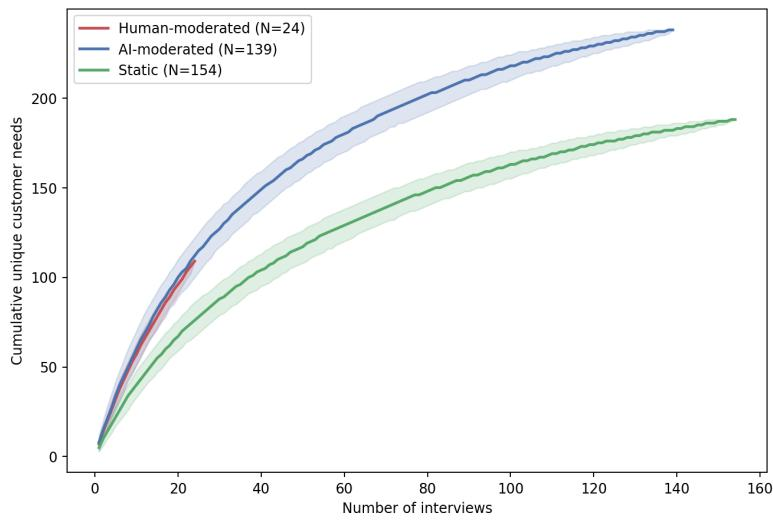
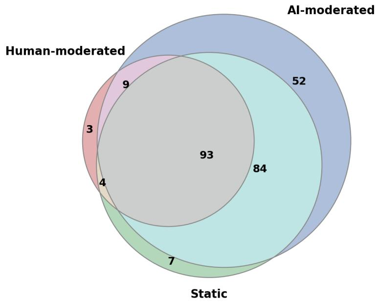

# AI-Moderated Interviews for Market Research and Digital Twins Calibration

Yuting Deng,1 Jingxuan Liu,1 Olivier Toubia,1 Naman Jain2

1Columbia Business School, Columbia University

2The Wharton School, University of Pennsylvania

{yd2721, jliu27, ot2107}@gsb.columbia.edu naman9@wharton.upenn.edu

Abstract. AI-moderated interviews are emerging as a scalable market-research method for generating consumer insights and buildin consumer “di ital twins.” Yet it remains unclear whether the match human-moderated interviews or im rove on sim ler, static data collection methods. In a pre-registered, between-subjects study (� = 317) with three industry partners, we compare AI-moderated (� = 139), human-moderated (� = 24), and static interviews (� = 154). AI moderation matches human moderation in depth, covers more themes, and, holding budget constant, recovers significantly more customer needs than human moderation or static interviews. However, participants sound more emotionally engaged when speaking to a live human. We then create digital twins using interview data and evaluate each twin against the participant’s own held-out responses to six real-world marketing stimuli. We find that digital twins created from AI-moderated interviews predict consumer responses better than demographics-only personas. However, the additional richness from AI moderation does not translate into better quantitative predictions compared to static interviews. By analyzing open-ended thoughts generated from humans versus their twins, we find that prediction errors are connected both to diferences in (self-reported) thinking styles between twins and humans, and to gaps between training and validation data (i.e., asking questions that are too far out of distribution).

Key words: AI-moderated interviews; qualitative market research; digital twins; large language models; voice of the customer

## 1. Introduction

Customer research is central to firms’ decisions about product positioning, advertising, and customer experience, but it faces a persistent tradeof. Survey-based methods are fast, standardized, and scalable, yet they often miss the “why” behind consumer choices (Anugraha et al. 2026, Korst et al. 2026). Human-moderated interviews can uncover richer narratives and more diagnostic insights, but they are slow, costly, and dificult to scale. Recent advances in generative AI promise to relax this tradeof: AI-powered interviewers can conduct adaptive, open-ended conversations with consumers at a much lower marginal cost, making it possible to bring qualitative insight earlier and more frequently into marketing decisions (Korst et al. 2026, Geiecke and Jaravel 2024, Chopra and Haaland 2026, Wuttke et al. 2025). This promise has generated substantial attention and investment: AI-native qualitative research startups such as Outset, Listen Labs, and Simile have raised hundreds of millions of dollars in venture funding (Korst et al. 2026). Major LLM companies are also beginning to use AI-moderated interviews at scale; for example, Anthropic has launched large-scale AI-moderated interview programs (Anthropic 2025).

AI-moderated interviews sit between traditional surveys and human-moderated qualitative interviews. Compared with static surveys, qualitative interviews can clarify questions and adaptively ask follow-up questions based on what interviewees say (Arsel 2017). Although surveys can also be adaptive, such as adaptive conjoint analysis, these focus primarily on estimating pre-specified utility functions using structured data (Johnson 1987, Toubia et al. 2003, 2004). Qualitative interviews instead require moderators to interpret open-ended responses and decide what to ask next. However, human moderators are costly and can charge \$200–\$400/hour (based on communications with GBK Collective, one of our industry partners).

Compared with human interviews, AI-moderated interviews promise lower cost, greater scalability, and consistent implementation of a topic guide (Anugraha et al. 2026). However, despite its promised benefits, AI moderation may introduce new threats to validity. For example, we do not know exactly to what extent humans are comfortable talking to LLMs (Kim et al. 2022, Luo et al. 2019, De Freitas et al. 2026); LLM hallucinations may cause AI moderators to ask inappropriate follow-up questions or introduce fabricated content, potentially degrading data quality and requiring validation and human oversight (Blanchard et al. 2025, Schroeder et al. 2025). In addition, LLM-based moderators can add response latency to the conversation (Wuttke et al. 2025).

In sum, despite the rush to deploy AI-moderated interviews and the excitement they have generated in the venture capital and market research communities, urgent questions remain unanswered: how do AI-moderated interviews compare to traditional human-moderated interviews, and to other low-cost methods for collecting qualitative consumer insight? More precisely, while each AI-moderated interview may cost approximately 20% of a human-moderated interview (based on market data from our partners), can they replicate the richness of human-moderated interviews, holding budget constant? And how much of the benefit of AI-moderation, if any, comes from adapting questions to the respondents’ earlier answers vs. using intuitive modalities (e.g., voice-enabled interviewing)?

The first goal of this paper is to evaluate AI-moderated interviews as a new data-collection method by comparing them with human-moderated interviews and with static qualitative interviews conducted in the same audio modality. We compare the three conditions (AI-moderated, humanmoderated, static) on interview volume (e.g., participant speaking time, word count, conversation turns), interview richness (measured by coded thematic breadth and mean depth of elaboration), as well as the set of consumer needs they elicit. We also examine whether emotional and paralinguistic features difer across conditions by comparing speech-based afect and prosody, including valence, arousal, dominance, voiced fraction, speaking rate, and pause fraction.

One of the major use cases of AI-moderated interviews is the creation of digital twins: LLM-based representations of specific individuals, built from their own data, such as qualitative interviews or extensive survey responses (Park et al. 2024, Toubia et al. 2025). The model is then used to predict how that individual would respond to new questions not included in the in the data used to construct the digital twin. While Peng et al. (2025) find that digital twins are not more accurate in predicting human behavior compared to simple synthetic personas based on demographic characteristics alone, Park et al. (2024) argue that LLM agents grounded in rich self-report data can predict individual behavior better than demographic baselines. In particular, Park et al. (2024) find that qualitative interview data improves prediction of held-out outcomes such as general social attitudes and personality measures, suggesting that open-ended self-reports contain information not captured by standard demographic variables. However, at least two aspects of their studies call for additional research. First, some of the validation questions overlap thematically with topics covered during the interview, raising concerns about leakage, which happens when LLMs are validated based on data which are actually part of their training data (Ludwig et al. 2026). Second, it is unclear how extensively their interviews were customized to individual participants, because their interviews relied on a relatively large number of preset questions and predetermined time allocated to each topic. Accordingly, it remains unclear how digital twins built from adaptive, AI-moderated qualitative interviews predict responses to new marketing stimuli.

Hence, the second goal of this paper is to examine whether the qualitative data collected through AI-moderated interviews can be leveraged to make out-of-distribution predictions related to marketing outcomes. We test this by constructing digital twins to predict how an individual will respond to real-world marketing stimuli (provided by one of our industry partners).

We test these questions in a pre-registered, between-subjects study of N=317 consumers in the windows-and-doors home-improvement category (aspredicted # 284225, 290640).1 Participants were randomly assigned to an AI-moderated condition, a static condition, or a human-moderated condition. Our study was run in collaboration with three industry partners: a major North American building-products company provided a relevant market research context and real marketing stimuli; an AI startup specializing in AI-moderated interviews provided the AI platform for conducting state-of-the art AI-moderated interviews (the same platform was also used for static interviews); GBK Collective, a marketing strategy and insights consultancy with deep expertise in qualitative and quantitative research, served as the study’s qualitative research partner and conducted the human-moderated interviews. Interviews in all conditions covered the same topics about the product category and the partner brand. Given the cost of human-moderated interviews, we matched the sample sizes across conditions based on market cost (≈ \$5K per condition), rather than number of participants.

We find that AI-moderated interviews elicit longer, broader, and deeper responses than static interviews without reducing participant experience; these interviews match human-moderated interviews in content depth while achieving at least as broad thematic coverage. Under a fixed research budget, AI moderation also recovers the greatest number of customer needs. However, human-moderated interviews retain an engagement advantage: participants sound more positive, activated, and assertive when speaking live to a human vs. an AI moderator. Responses to AI and static interviews, meanwhile, are emotionally indistinguishable. Thus, AI moderation matches human moderation on interview content, but not on the emotional experience of talking to a person.

We then constructed a digital twin for each participant in the AI-moderated and static conditions and evaluated it against that participant’s held-out responses to some of the company’s marketing stimuli: direct mailers (images), commercials (videos), and claim-ranking (text) tasks. As pre-registered, we did not construct digital twins in the human-moderated condition due to its much smaller sample size. Qualitative data-based digital twins improve prediction beyond demographics only digital twins, but the additional richness from AI moderation does not translate into better quantitative predictions compared to static interviews.

To further understand twins’ prediction errors, we consider two (not necessarily exhaustive nor mutually exclusive) sources of error: limited training data relevance—the extent to which the information needed for the validation task appears in the twin’s training data—and limited reasoning fidelity—the extent to which a digital twin replicates the (self-reported) thought processes of the human it attempts to simulate. We find evidence for both types of discrepancies. In particular, we find that humans rely more on fast, intuitive (System 1) reactions, while twins tend toward deliberative (System 2) reasoning (Kahneman 2011), with the gap widest for richer multimodal stimuli such as images and videos. While improving reasoning fidelity is beyond the scope of this paper, we find that improving training data relevance by adding one task to the training data that is similar to the holdout task, improves prediction. This suggests a practical way to make digital twins more useful in market-research settings.

## 2. Methods

Table 1 Research questions, corresponding sections, and pre-registration status.
<table><tr><td>Research question (and corresponding sections)</td><td>Pre-registration status</td></tr><tr><td>§3.1 How does the data and resulting insights from AI-moderated Exploratory (Aspredicted #284225, Q8; #290640, Q8) interviews compare to those from static and human-moderated interviews?</td><td></td></tr><tr><td>§3.2 Holding the research budget fixed, how many AI-moderated Coverage matching pre-registered (Aspredicted interviews are needed to extract similar insights as human-moderated #290640, Q2, Q5); need overlap across conditions interviews, how does need coverage overlap across conditions?</td><td>? exploratory (Aspredicted #284225, Q8)</td></tr><tr><td>ing stimuli? Does adding the interview transcript (Full) improve on a b, τ, Cosine), the comparison between demo vs. full demographics-only twin (Demo)? And do AI-moderated interviews and static vs. ai-moderated were pre-registered (Aspre- yield more predictive twins than static interviews?</td><td>§4.1 Can digital twins predict consumers&#x27; responses to new market- All four prediction metrics (Accuracy, Kendall&#x27;s τ- dicted #284225, Q3, Q5)</td></tr><tr><td>§4.2, §4.3 What is the relation between predictive performance, Not pre-registered training data relevance and reasoning fidelity? What is the impact on prediction performance of showing the twin the same person&#x27;s answer to a similar task.</td><td></td></tr></table>

Note. Robustness checks (length-controlled richness regressions and the LLM-as-judge comparison) were also not pre-registered.

## 2.1. Design and participants

This paper reports a between-subjects study (� = 317; 139 AI-moderated, 154 static, 24 humanmoderated). Table 1 summarizes the research questions and pre-registration status. All participants were recruited from Prolific and screened to be home-improvement decision-makers (homeowners, household income ≥ \$75k, home value ≥ \$250k, English-speaking). These screening criteria were set in collaboration with the partner brand to ensure the sample’s relevance for an upscale North American company in the home-improvement category. All interviews covered the same topics and themes (See Table 2 for list of diferent sections).

We first collected the static and AI-moderated conditions in the same recruitment batch. For these two conditions, we partnered with a startup specializing in AI-moderated interviews and used its commercial platform to run the interviews. Participants who consented to participate in the study were randomly assigned to one of the conditions and directed to the platform. They first completed screening questions to verify eligibility (see “Design and participants”). Eligible participants then completed the interview based on their assigned condition in one sitting.

In the AI-moderated condition, the interviews were conducted using the platform’s virtual interviewer, a turn-based, goal-conditioned conversational system. After each participant turn, browser-captured speech was sent to an AWS Lambda backend and transcribed using OpenAI’s gpt-4o-transcribe; the transcription request was primed with the preceding interviewer utterance and relevant study terminology. The transcript was appended to the conversation history and supplied to GPT-5.1 through the OpenAI Chat Completions API, configured with temperature 0 and a 300-token response limit. Conditioned on the interview guide and prior dialogue, the model generated either a clarification or follow-up within the current section, or a transition to the next section. The virtual interviewer’s response was converted to speech using the study-configured voice, OpenAI tts-1 with the alloy voice. Although video could be recorded, the interviewer adapted solely to the transcribed verbal content and conversation history; video, facial expressions, prosody, and other nonverbal signals were not analyzed by the language model during the interview.

In the static condition, participants used the same platform, but were shown fixed, pre-defined questions with no adaptive follow-up or probing. In both conditions, participants recorded spoken answers to each open-ended question.

We then recruited a separate sample for the human-moderated condition. These interviews were conducted by GBK Collective (our market research partner), which provided trained expert human moderators to administer the same protocol. Participants were recruited from the same online pool, but the study procedure difered slightly, due to the need to schedule live interviews. Participants first completed a separate intake survey on Qualtrics with the same screening, demographic, and individual-diference questions as the other conditions (Sections 0, 1, and 5 — see Table 2). Eligible participants were then messaged through Prolific to sign up for a live interview time slot, during which they completed the interview (Sections 2, 3, and 4 — see Table 2) with the human moderator.

We made an efort to keep survey time and compensation as similar as possible across conditions: interviews in all three conditions lasted around 30 minutes. Compensation was \$10 in the AImoderated and static conditions and \$12 in the human-moderated condition, with the additional \$2 compensating participants for completing the intake survey. The three conditions administered the same interview and topic guide and difered only in how the interviews were moderated (Please refer to Section 2.2 for details and examples).

Due to the high cost of human-moderated interviews, we were unable to match its sample size to that of the other conditions. Instead, we matched conditions based on their market cost. The market cost of running 150 AI interviews is approximately \$5k (for each participant: \$10 participant compensation for a 30-min interview + \$3.33 Prolific platform fee + \$20 AI-interview platform fee). Given the market price charged by professional human interviewers (approximately \$300 per hour, or \$150 for a 30-minute interview, plus participant compensation), \$5k translates to approximately

30 human-moderated interviews of the same length (30 min), which we preregistered. However, unexpectedly high no-show rates raised the marginal cost of that condition, yielding a final sample of 24.

Following our pre-registered exclusion criteria, we excluded five AI-moderated and three static participants who did not provide complete interview responses, either because they did not finish the interview or because technical issues prevented the platform from properly recording their responses. We excluded one additional participant from the static condition who completed the interview but did not provide meaningful answers (58 words in 10 open-ended questions) to the open-ended blocks. Our final sample consists of � = 139 in the AI-moderated condition, � = 154 in the static condition, and � = 24 in the human-moderated condition.

## 2.2. Interview structure

Table 2 Survey sections: content, response format, and use in twin calibration.
<table><tr><td>Section</td><td>Content</td><td>Response format</td><td>Use in twin calibration</td></tr><tr><td>0. Screeners</td><td>Age, homeownership, home value, household income, Multiple choice decision role, audio comfort, project types and description</td><td></td><td>Training</td></tr><tr><td>1. Demographics</td><td>Gender, ZIP code, education, employment, household Multiple choice composition</td><td></td><td>Training</td></tr><tr><td>2. Category-specific</td><td>Two open-ended blocks: Category usage, context and Open-ended (differs by condition) Training feelings; Purchase journey. Branches: (i) recently replaced, (ii) considering</td><td></td><td></td></tr><tr><td>3. Brand-specific</td><td>perception and satisfaction. Branches: (i) aware &amp; past purchaser, (ii) aware but</td><td>Two open-ended blocks: Brand awareness; Brand Open-ended (differs by condition) Training</td><td></td></tr><tr><td>4. Marketing stimuli</td><td>not a past purchaser, (iii) not aware. items plus an open-ended response each); two marketing-claim ranking sets (each requires ranking</td><td>Two mailers and two commercials (five 1–5 rating Rating scales + free response</td><td>Validation (held out)</td></tr><tr><td></td><td>three claims, then an open-ended response) 5. Individual differences Maximizing tendency, price consciousness, Likert scales minimalism, consumer need for uniqueness</td><td></td><td>Training</td></tr><tr><td>6. Survey experience</td><td>Enjoyment; comfort speaking and recording (AI- 1-7 ratings moderated and static conditions only)</td><td></td><td></td></tr></table>

Note. Only Blocks 2 and 3 were open-ended and difered across interview conditions; all other blocks were administered identically. Block 4 (validation stimuli) was held out from twin construction and used only for evaluation. Block 6 was not collected in the human-moderated condition.

Table 2 gives an overview of the various sections in our study. All participant responses to Sections 2 and 3 were collected as spoken audio. Each section contained two blocks of open-ended questions. Section 2 focused on category-specific experiences, and Section 3 focused on brand- specific perceptions. Together, these blocks covered four topics: category usage, context and feelings; purchase journey; brand awareness; brand perception and satisfaction. The three conditions difered only in how the open-ended questions were handled: fixed in the static condition (with all parts of the questions laid out at once), and adaptive with follow-up questions determined by the AI or human moderator in the other conditions. Appendix A reports the full interview guide, including the fixed questions shown in the static condition and the corresponding objectives given to the AI and human moderators. Screeners, demographics, individual-diference scales, and validation stimuli were identical across conditions.

For each of the four open-ended blocks, the static condition showed participants a fixed question and asks them to record a single spoken answer, with no probing. The AI moderator was instead given a moderator objective specifying the themes each block should cover and instructed to use their judgment to probe adaptively. The human moderators were provided with an interview guide that contained both the fixed question and moderator objective, and were given discretion to ask questions and probe naturally while covering the specified content. As Table 3 illustrates, we designed the moderator objectives to stay as close as possible to the fixed questions, so that the conditions difered in moderation style rather than in the underlying topics. Table 16 in Appendix B reproduces verbatim excerpts of an AI-moderated and a human-moderated execution of this block.

Table 3 An example of an open-ended block (purchase journey for past purchasers): fixed question versus moderator objective.
<table><tr><td>Fixed question in Static Condition</td><td>Objective shared with Human/AI moderators</td></tr><tr><td>Please walk us through your replacement journey from the Understand the respondent&#x27;s completed replacement journey moment you realized you needed new windows or doors to the from initial need to final choice: what triggered the need; moment you made your final choice. In your answer, please what research they did, who was involved, what options cover: • What triggered the need • What research you did • Who was involved</td><td>they considered, and how they narrowed them down; what mattered most in the decision; and how they feel about the outcome and whether they would do anything differently.</td></tr></table>

## 2.3. Interview process and data-quality measures

We characterized each interview along four families of measures, summarized in Table 4. All measures were computed on interviewee-only speech from the four open-ended blocks in the category and brand-specific sections (Sections 2 and 3). We transcribed each interview with Whisper timestamps (Radford et al. 2023) and matched each Automatic Speech Recognition (ASR) segment to the known-speaker transcript by token overlap. All major statistical comparisons used Welch’s �-tests, unless specified otherwise.

Table 4 Interview-process and data-quality measures.
<table><tr><td>Measure</td><td>Definition</td></tr><tr><td colspan="2">Interview volume</td></tr><tr><td>Participant speaking time</td><td>Total minutes of participant speech across the four open-ended blocks</td></tr><tr><td>Overall word count</td><td>Total participant words across the four blocks</td></tr><tr><td>Participant turns</td><td>Total number of participant-speaking turns</td></tr><tr><td colspan="2">Richness and depth per open-ended block</td></tr><tr><td>Breadth</td><td>Number of the block&#x27;s predefined themes the participant covers, coded by an LLM against the per-block codebook (see full list of themes in Table 18 in</td></tr><tr><td>Mean depth</td><td>Appendix C) Average elaboration across the covered themes, coded by an LLM and scored 0–4 (from 0 = no mention of the theme to 4 = rich, detailed elaboration; examples in Appendix C)</td></tr><tr><td colspan="2">Speech-based affect</td></tr><tr><td>Valence</td><td>How positive versus negative the participant sounds</td></tr><tr><td>Arousal Dominance</td><td>How activated or energized the participant sounds</td></tr><tr><td></td><td>How assertive the participant sounds</td></tr><tr><td colspan="2">Prosody</td></tr><tr><td>Voiced fraction</td><td>Share of frames with detected pitch (Mauch and Dixon 2014)</td></tr><tr><td>Speaking rate</td><td>Participant words divided by voiced seconds</td></tr><tr><td>Pause fraction</td><td>Share of frames below 10% of the recording&#x27;s mean RMS energy</td></tr></table>

Interview volume. We first assessed how much speech each condition elicited and how interactive the exchange was. Specifically, we calculated total participant speaking time, total word count, and the number of conversation turns across the four open-ended blocks.

Richness and depth per open-ended block. Volume alone does not show whether an interview is substantively rich. A strong qualitative interview should cover relevant topics and explore them in depth. For each open-ended block, we coded the transcript against an objective-derived codebook. Each block’s moderator objective was decomposed into a fixed set of codable themes; for example, the purchase journey example in Table 3 contains eight (fixed) themes. We used an LLM (gpt-4o) to code open-ended responses against this fixed codebook, following recent guidance on GenAI- assisted coding of unstructured survey data (Blanchard et al. 2025) and evidence that LLM judges track human annotators (Zheng et al. 2023). Because LLM coding can be unstable across repeated runs, we ran five independent coding agents and aggregated them by majority vote rather than relying on a single pass. Appendix C provides the objective-derived codebook for each open-ended block, coding details, and examples. Breadth is the number of themes the participant covered, and mean depth is the average elaboration across covered themes only (1 = mention only, 2 = minimal details, 3 = more details and context, 4 = rich elaboration with details and context).

Speech-based afect. How a participant sounds carries information about emotional engagement that the transcript alone cannot capture. We scored each participant’s audio recording on valence, arousal, and dominance, the standard dimensional representation of emotion (Russell 1980, Mehrabian and Russell 1974, Mehrabian 1996). We used a wav2vec2 speech-emotion model fine-tuned on the MSP-Podcast corpus (Lotfian and Busso 2019), applied it to 8-second audio windows, and averaged the window-level scores into one interview-level score weighted by window duration (Wagner et al. 2023).

Prosody. We also examined acoustic delivery, which captures how fluently and continuously participants speak. We extracted three interpretable prosodic features from the audio recordings: voiced fraction, speaking rate, and pause fraction. These measures were computed with the standard librosa toolkit (McFee et al. 2015), using the pYIN estimator to detect voiced frames (Mauch and Dixon 2014).

## 2.4. Customer needs as managerial insight

Beyond how much participants say and how they sound, what practitioners ultimately value from qualitative interviews is the set of customer needs they reveal (Berger et al. 2020). In scoping this study with our industry collaborators, the central question was whether an AI moderator surfaces the same needs as a skilled human interviewer, since these needs inform downstream product, positioning, and messaging decisions. We therefore treat elicited customer needs as the unit of managerial insight.

We define a customer need following Timoshenko et al. (2026) and building on the Voice of the Customer tradition of Grifin and Hauser (1993): an underlying benefit the customer wants, articulated at a decision-relevant level and grounded in the respondent’s own words, rather than a product feature, solution, or opinion. This corresponds to the most granular tertiary need in Grifin and Hauser (1993). We adopted the LLM-based VOC pipeline of Timoshenko et al. (2026), which builds on machine-assisted need identification from consumer text (Timoshenko and Hauser 2019). For each interview, we used the respondent’s answers to the four open-ended blocks and extracted needs with one gpt-4o pass per interview (temperature= 0, JSON output; prompt in Appendix D). We then winnowed overlapping mentions into a master codebook by embedding each mention with $\mathtt { a l 1 - M i n i L M - L 6 - v 2 }$ (Reimers and Gurevych 2019, Wang et al. 2020) and clustering the embeddings using cosine distance $< 0 . 6 0$ . We treated each cluster as one unique need, with its modal phrasing as the exemplar (De Paoli and Mathis 2025, Tamkin et al. 2024). This procedure yielded 252 unique needs across all interviews. We then used the codebook to calculate the number of needs that emerged in each condition and their corresponding frequency.

## 2.5. Twin construction

For each participant, we constructed a digital twin by conditioning an LLM (gemini-3.1-flash-lite-preview) on the participant’s persona through in-context learning: we provided the participant’s training data as context and queried the model on each held-out validation item. We used the Gemini family because the validation stimuli are multimodal: the mailers are images and the commercials are videos, which Gemini models can process natively. We compared two twin specifications: Demographics-only (Demo), which conditioned on demographics alone (Table 2, Sections 0 and 1), and Full, which also included the interview transcript (Table 2, Sections 2, 3) and individual-diferences scales (Table 2, Section 5). The persona system prompt and the task prompts are reported in Appendix J. To test robustness to model choice, we replicated twin construction using identical prompts with gpt-5-mini, a model from a diferent family. Because GPT does not support video inputs, the replication covered only the claims and mailer tasks. Results are largely consistent (Appendix L).

## 2.6. Twin evaluation and metrics

We evaluated twin predictive validity on the held-out questions on marketing stimuli (Section 4 in the survey). As summarized in Table 5, this section included two direct mailers, two video commercials, and two marketing-claim ranking tasks. Evaluation was based on managerially-relevant outcomes of interest to the partner brand. Each participant’s own response served as ground truth. Appendix A (Section 4) reports the exact questions for each stimulus.

Following pre-registration, we scored each response format with its corresponding metric: accuracy and Kendall’s �-b for 1–5 scale ratings, Kendall’s � for claim rankings, and cosine similarity for open-ended explanations. We pooled each metric to the participant level: Accuracy-all and ${ \tau } \mathrm { - } { \bf { b } } _ { a l l }$ averaged over the four rated stimuli, $\tau _ { a l l }$ averaged over the two ranking tasks, and $\mathrm { C o s i n e } _ { a l l }$ averaged over the six open-ended explanations. We tested within-person Demo vs. Full diferences with paired �-tests and between-subjects Static vs. AI diferences with Welch two-sample �-tests.

Table 5 Validation stimuli, response formats, and prediction metrics.
<table><tr><td>Stimulus (count)</td><td>Response format</td><td>Prediction metric(s)</td></tr><tr><td></td><td>ended explanation</td><td>Images: Direct mailer (×2) Five 1–5 scale items, plus one open- Accuracy (1 – |H – T|/4) and Kendall&#x27;s τ-b on the scale items; cosine similarity on the open- ended response</td></tr><tr><td></td><td>Videos: commercial (×2) Five 1-5 scale items, plus one open- Accuracy ended explanation</td><td> $( 1 - | H - T | / 4 )$  and Kendall&#x27;s τ-b on the scale items; cosine similarity on the open- ended response</td></tr><tr><td>(×2)</td><td>open-ended explanation</td><td>Text: Claim-ranking task Ranking of three claims, plus one Kendall&#x27;s τ on the ranking; similarity on the open-ended response</td></tr></table>

Note. � is the participant’s (human’s) observed response and � the twin’s predicted response. Pooled measures: Accuracyall and �-ball average over the four rated stimuli (two mailers, two commercials); � ll averages over the two ranking tasks; Cosine ll averages over the six open-ended responses.

## 2.7. Understanding prediction error: training data relevance vs. reasoning fidelity

Twin prediction errors can arise from at least two conceptually distinct sources. First, the training data may be too far removed from the prediction task, i.e., the twin was not given enough relevant data to prediction a particular response. Second, the (self-reported) reasoning from the digital twin may be diferent from that of the human they are supposed to mimic, i.e., the human and the twin “think” diferently about the prediction task.

To measure training data relevance, we used an LLM judge (gpt-4o-mini, temperature 0) to code the extent to which the human’s explanation of their heldout choice can be traced to themes in the interview. Specifically, the LLM judge received the participant’s interview transcript together with that participant’s own open-ended explanation of their heldout response, and rated on a 0–4 scale how much the participant’s reasoning in their explanation of response to the validation question can be traced back to specific statements made in the interview ( 0 = no reasoning point traces to an interview statement; 4 = every reasoning point traces to an interview statement). Note that the twin’s output played no role in this measure: the measure captured only whether the information the human relied upon when evaluating the holdout stimulus was present in the training data.

To measure reasoning fidelity, we also instructed an LLM to assess the diference between the twin’s and the human’s explanations to their response to each heldout question: the same LLM judge (gpt-4o-mini, temperature 0) compared the twin’s predicted explanation with the human’s actual explanation for the same stimulus, rating on a 0–4 scale ( 0 = the twin reasons entirely diferently from the human; 4 = the twin reasons with the same logic/priorities as the human). Appendix M provides coding examples, and Appendix N reports the coding prompts.

We note that training data relevance and reasoning fidelity are not orthogonal concepts. In particular, gaps in self-reported reasoning may be in part the result of the training data not being completely relevant to the task. Nevertheless, regressing the predictive validity of digital twins on training data relevance and reasoning fidelity gives insight into promising areas of improvement for digital twins.

## 2.8. Similar-task calibration ladder

We also ask whether observing a person’s response to a similar task can improve the twin’s prediction. Specifically, we tested whether adding the person’s choice (rating/ranking) and open-ended response for the other marketing stimulus of the same type improves prediction on the target stimulus (e.g., adding the responses to one commercial as training data to predict the responses to the other commercial).

## 3. Results: AI-Moderated Interviews as a Source of Consumer Insight

We first present results related to our first research question: how AI-moderated interviews compare to static interviews and human-moderated interviews in collecting qualitative data and insights.

## 3.1. Interview process and data quality

3.1.1. Interview volume We first asked whether AI moderation produces interview data comparable in volume to a human moderator, and how it compares with a static interview. Using the interview-process and data-quality measures described in Section 2.3, Table 6 reports interview volume and participant experience across conditions. Relative to static, AI moderation elicited substantially more participant speech: participants spoke nearly twice as long (8.1 vs. 4.3 minutes), produced more words (952 vs. 609), and took more turns (30.5 vs. $8 . 3 ; { ^ 3 }$ all $p < . 0 0 1 )$ ). Human moderation produced the highest speech volume, with significantly longer speaking time and higher word count than AI moderation (11.3 vs. 8.1 minutes, $p = . 0 0 3$ ; 1,404 vs. 952 words, $p = . 0 0 6 )$ However, AI and human moderation generated a similar number of participant turns (30.5 vs. 32.4, $p = . 2 3 8 )$ , suggesting a comparable level of interaction. Finally, compared to static, the additional interactions resulting from adaptive questioning in the AI condition did not diminish participant experience: enjoyment and comfort were statistically similar between AI moderation and static. Appendix F breaks down the word counts by open-ended block.

3.1.2. Interview Breadth and Depth Table 7 reports interview richness, reflected by breadth of theme coverage (number of themes covered out of a set maximum, see §3.1) and mean depth of responses. Relative to static interviews, AI-moderated interviews covered more themes in three of the four blocks: purchase journey (7.29 vs. 5.90, � < .001), brand awareness (3.32 vs. 1.73, � < .001), and brand perception and satisfaction (5.88 vs. 5.52, � < .001). AI moderation also produced greater mean depth in purchase journey (2.56 vs. 2.31, � < .001) and brand perception and satisfaction (2.71 vs. 2.55, � < .001). The short category usage, context and feelings block, which was limited to three turns (other blocks did not have such limit), was the exception, showing no diference in either breadth or depth.

Table 6 Interview process and participant experience by condition.
<table><tr><td>Condition</td><td>Speaking time (min.)</td><td>Word count</td><td>Speaking turns</td><td>Enjoyment (1–7)</td><td>Comfort (1–7)</td></tr><tr><td>AI-moderated (N=139)</td><td>8.1 (5.2)</td><td>952.3 (632.8)</td><td>30.5 (4.4)</td><td>5.65 (1.29)</td><td>6.37 (1.04)</td></tr><tr><td>Static (N=154)</td><td>4.3 (2.5)</td><td>609.2 (336.9)</td><td>8.3 (1.0)</td><td>5.59 (1.20)</td><td>6.27 (1.12)</td></tr><tr><td>Human-moderated (N=24)</td><td>11.3 (4.4)</td><td>1403.6 (702.7)</td><td>32.4 (7.4)</td><td></td><td></td></tr><tr><td>p (AI-mod. vs. Static)</td><td>&lt; .001***</td><td>&lt; .001***</td><td>&lt; .001***</td><td>.699</td><td>.393</td></tr><tr><td>p (Human-mod. vs. AI-mod.)</td><td>.003**</td><td>.006**</td><td>.238</td><td>一</td><td></td></tr></table>

Note. Open-ended questions from Sections 2-3 only. Enjoyment and comfort are self-reported scores (1 = not enjoyable/comfortable at all; 7 = very enjoyable/comfortable) and were not collected in the human-moderated condition. � values based on Welch tests; $^ { \dag } p < . 1 0 , ^ { * } p < . 0 5 , ^ { * * } p < . 0 1 , ^ { * * * } p < . 0 0 1$

Table 7 Interview data quality by open-ended block.
<table><tr><td>Block</td><td>Condition</td><td>Word count</td><td>Breadth</td><td>Mean depth</td></tr><tr><td rowspan="5">Category usage, context and feelings (max. breadth = 3)</td><td>AI-moderated</td><td>99.7 (69.5)</td><td>2.94 (0.25)</td><td>2.51 (0.43)</td></tr><tr><td>Static</td><td>111.1 (84.1)</td><td>2.94 (0.24)</td><td>2.53 (0.45)</td></tr><tr><td>Human-moderated</td><td>412.0 (246.3)</td><td>2.92 (0.41)</td><td>2.96 (0.45)</td></tr><tr><td>p (AI-mod. vs. Static)</td><td>.21</td><td>.82</td><td>.74</td></tr><tr><td>p (AI-mod. vs. Human-mod.)</td><td>&lt; .001***</td><td>.83</td><td>&lt;.001***</td></tr><tr><td rowspan="5">Purchase journey (max. breadth = 9)</td><td>AI-moderated</td><td>413.6 (305.0)</td><td>7.29 (0.91)</td><td>2.56 (0.28)</td></tr><tr><td>Static</td><td>197.6 (123.1)</td><td>5.90 (1.44)</td><td>2.31 (0.31)</td></tr><tr><td>Human-moderated</td><td>414.2 (271.4)</td><td>6.08 (1.61)</td><td>2.46 (0.28)</td></tr><tr><td>p (AI-mod. vs. Static)</td><td>&lt;.001 ***</td><td>&lt; .001***</td><td>&lt; .001***</td></tr><tr><td>p (AI-mod. vs. Human-mod.)</td><td>.99</td><td>.001**</td><td>.116</td></tr><tr><td rowspan="6">Brand awareness (max. breadth = 4)</td><td>AI-moderated</td><td>116.4 (88.9)</td><td>3.32 (0.80)</td><td>2.25 (0.48)</td></tr><tr><td>Static</td><td>80.9 (56.7)</td><td>1.73 (0.53)</td><td>2.14 (0.65)</td></tr><tr><td>Human-moderated</td><td>273.8 (258.2)</td><td>1.79 (0.88)</td><td>1.99 (0.80)</td></tr><tr><td>p (AI-mod. vs. Static)</td><td>&lt;.001***</td><td>&lt; .001***</td><td>.089†</td></tr><tr><td>p (AI-mod. vs. Human-mod.)</td><td>.007**</td><td>&lt; .001***</td><td>.131</td></tr><tr><td></td><td></td><td></td><td></td></tr><tr><td rowspan="5">Brand perception and satisfaction (max. breadth = 6)</td><td>AI-moderated Static</td><td>322.6 (225.2)</td><td>5.88 (0.35)</td><td>2.71 (0.33)</td></tr><tr><td></td><td>219.6 (126.7)</td><td>5.52 (0.69)</td><td>2.55 (0.35)</td></tr><tr><td>Human-moderated</td><td>303.6 (193.4)</td><td>5.12 (1.51)</td><td>2.38 (0.65)</td></tr><tr><td>p (AI-mod. vs. Static)</td><td>&lt;.001***</td><td>&lt; .001***</td><td>&lt; .001***</td></tr><tr><td>p (AI-mod. vs. Human-mod.)</td><td>.67</td><td>.023*</td><td>.025*</td></tr></table>

Note. � rows report Welch tests (AI vs. static; human vs. AI); $^ { \dag } p < . 1 0 , ^ { * } p < . 0 5 , ^ { * * } p < . 0 1 , ^ { * * * } p < . 0 0 1 .$

As a robustness check, we compared breadth and mean depth of AI-moderated and static interviews while controlling for length of each block. For breadth, we regressed the number of themes covered on condition (AI vs. static) and total word count in that block. For mean depth, we regressed average depth on condition and mean words per covered theme. After controlling for length, the AI-moderated advantage persisted for breadth in three of the four blocks (purchase journey, brand awareness, and brand perception and satisfaction), and for mean depth in two of the four blocks (purchase journey and brand awareness; Table 21 in Appendix G). Thus, AI moderation did not merely produce longer responses. Conditional on length, it elicited broader and, in some blocks, deeper content than static interviews. A pairwise LLM-as-a-judge robustness check (1,000 matched response pairs per open-ended block) showed the same pattern (Appendix H).

Compared with human-moderated interviews, AI-moderated interviews covered more themes in three of the four blocks: purchase journey (7.29 vs. 6.08, $p = . 0 0 1 )$ , brand awareness (3.32 vs. 1.79, $p < . 0 0 1 )$ ), and brand perception and satisfaction (5.88 vs. 5.12, $p = . 0 2 3 )$ . Mean depth was statistically comparable in the purchase journey and brand awareness blocks, higher for AI moderation in brand perception and satisfaction (2.71 vs. 2.38, $p = . 0 2 5 )$ , and higher for human moderation in the short category usage, context and feelings block (2.96 vs. 2.51, $p < . 0 0 1 )$ . Thus, longer human interviews did not appear to translate into systematically broader or deeper theme coverage.

3.1.3. Speech-based affect: do participants sound different when speaking to a human vs. an AI? We next compared participant audio across the three interview conditions using the speech-based afect and prosody measures described in Section 2. As Table 8 shows, the afect measures distinguished human moderation from the two automated conditions. Participants who spoke to a human moderator sounded more positive, more emotionally activated, and more assertive than participants who spoke to an AI moderator: valence (0.528 vs. 0.471), arousal (0.517 vs. 0.359), and dominance (0.562 vs. 0.449) were all higher in the human condition $( p s < . 0 0 1 )$ . By contrast, AI and static interviews were statistically indistinguishable on all three afect dimensions.

Prosody showed a more nuanced pattern. Voiced fraction and speaking rate did not difer significantly across conditions, but AI moderation produced more pausing than both human moderation and static. This may reflect hesitation, additional thinking, or adjustment to the AI interaction. Overall, AI moderation improved interview volume and coded richness relative to static, but it did not reproduce the emotional engagement of speaking to a human moderator in real time.

Table 8 Participant speech-based affect and prosody by modality.
<table><tr><td>Condition</td><td>Valence</td><td>Arousal</td><td>Dominance</td><td>Voiced frac.</td><td>Speaking rate</td><td>Pause frac.</td></tr><tr><td>AI (N=139)</td><td>0.471 (0.055)</td><td>0.359 (0.101)</td><td>0.449 (0.080)</td><td>0.634 (0.149)</td><td>245.3 (99.3)</td><td>0.266 (0.091)</td></tr><tr><td>Static (N=154)</td><td>0.471 (0.056)</td><td>0.354 (0.111)</td><td>0.447 (0.089)</td><td>0.623 (0.150)</td><td>250.4 (130.1)</td><td>0.199 (0.073)</td></tr><tr><td>Human (N=24)</td><td>0.528 (0.046)</td><td>0.517 (0.048)</td><td>0.562 (0.034)</td><td>0.610 (0.126)</td><td>265.6 (69.6)</td><td>0.209 (0.073)</td></tr><tr><td>p (AI-mod. vs. Static)</td><td>.948</td><td>.666</td><td>.813</td><td>.538</td><td>.707</td><td>&lt; .001***</td></tr><tr><td>p (Human-mod. vs. AI-mod.)</td><td>&lt; .001 ***</td><td>&lt; .001 ***</td><td>&lt; .001 ***</td><td>.404</td><td>.227</td><td>0.002**</td></tr></table>

Note. Valence, arousal, and dominance are in [0, 1]. � rows report Welch tests (AI vs. static; human vs. AI); $^ { * } p < . 0 5 , ^ { * * } p < . 0 1$ ∗∗∗ � < .001.

## 3.2. Customer needs coverage

Beyond transcript richness, we asked whether the interview conditions recovered the same customer- need space, and how eficiently they recovered those needs. We extracted and consolidated customer needs as described in §2.4, applying the same pipeline to the four open-ended blocks in all three conditions.

3.2.1. Coverage efficiency We first compared the coverage of needs across conditions at matched sample sizes. We used bootstrap subsamples, at counts consistent with common qualitative saturation benchmarks (Guest et al. 2006, 2020). We report 95% bootstrap intervals, rather than significance tests on bootstrap draws. Appendix E lists examples of needs elicited.

Figure 1 plots customer-need saturation curves, showing how many unique needs are recovered as interviews are added. Lines show the median across random interview orderings, and shaded bands show the 5th–95th percentile range.

Figure 1 Customer-need saturation curves by condition.  

The curves show two patterns. First, over the first 24 interviews, AI moderation and human moderation recovered a similar number of unique needs, while static accumulated needs more slowly. A bootstrap-matched comparison at � = 24 confirmed this pattern: AI moderation recovered 111.5 unique needs on average (95% CI [98.0, 125.0]), close to human moderation (109.0, based on the full sample of 24 human-moderated interviews) and well above static (75.9, 95% CI [65.0, 87.0]; Appendix I, Table 23). Thus, at a matched number of interviews, AI moderation recovered the same number of needs as human moderation at roughly 20% of the cost per interview.

Second, because the three conditions were run under a comparable market-cost budget (\$5K), their realized full sample sizes reflect their per-interview costs. Human moderation produced many needs per interview but is expensive, so the same budget covered fewer interviews. AI moderation and static have the same per-interview cost in our calculation, but AI moderation has a steeper coverage curve, adding more new needs per interview. As a result, AI moderation recovered the most unique needs under a fixed budget: 238, compared with 188 for static and 109 for human moderation. Table 9 summarizes the realized coverage and cost eficiency. The implied cost per unique need is \$36 for human moderation, \$19 for AI moderation, and \$27 for static.

Table 9 Customer-need coverage and cost by condition.
<table><tr><td>Condition</td><td>Interviews</td><td>Unique needs</td><td>Cost / interview</td><td>Cost / need</td></tr><tr><td>AI-moderated</td><td>139</td><td>238</td><td>$33.33</td><td>$19</td></tr><tr><td>Static</td><td>154</td><td>188</td><td>$33.33</td><td>$27</td></tr><tr><td>Human-moderated</td><td>24</td><td>109</td><td>$163.33</td><td>$36</td></tr><tr><td>All combined</td><td>317</td><td>252</td><td>一</td><td>一</td></tr></table>

Note. Cost per need is (interviews × cost per interview) ÷ unique needs.

Together, these results show why AI moderation is more cost-eficient. In the first 24 interviews, it recovered about as many needs as human moderation. But because each AI interview cost much less than a human interview, the same budget supported many more interviews. Static can also be run at scale, but each interview added fewer new needs. Therefore, our results suggest that AI moderation recovers the most customer needs per research dollar.

As an additional aggregate measure, Figure 2 illustrates how the 252 unique needs overlap across the three conditions: 93 were recovered by all three, 52 were unique to AI moderation, 7 to static, and 3 to human moderation. Appendix E lists examples of the most common shared and condition-specific needs.

## 4. Results: AI-Moderated Interviews as Training Data for Digital Twins

We now address the second goal of this paper, which is to explore whether the qualitative data collected through AI-moderated interviews can be leveraged to construct digital twins capable of making out-of-distribution predictions related to marketing outcomes.

## 4.1. Demo vs. Full; Static vs. AI-Moderated

We next asked whether interview data improves digital-twin predictions, and whether this improve- ment difered by interview condition. We compared twins built from Demographics-only personas with twins built from Full personas that included the interview transcript. Demographics-only is a strong baseline because prior work finds that digital twins constructed from demographic information alone can already achieve relatively high predictive accuracy (Peng et al. 2025). We focus on four pooled measures: $\mathrm { \ A c c u r a c y _ { a l l } }$ for scale-rating accuracy, $\tau { - } \mathbf { b } _ { \mathrm { a l l } }$ for ordinal agreement on scale-rating tasks, $\tau _ { \mathrm { a l l } }$ for claim-ranking agreement, and $\mathrm { C o s i n e _ { a l l } }$ for open-ended response similarity. Given the small sample size of the human-moderated condition and the high cost of collecting human-moderated interviews at scale required for digital-twin training, we focus only on the AI-moderated and Static conditions in this section, as pre-registered.

Figure 2 Customer needs shared across and unique to each interview condition.  

Table 10 shows that adding the interview transcript generally improves prediction quality. In the Static condition, Full personas outperformed Demo personas on all four pooled measures. In the AI condition, Full personas also improved �-b and Cosine, with a marginal gain in Accuracy and a positive but non-significant gain in claim-ranking �. Thus, interviews contain predictive signal beyond demographics alone.

However, we did not find that AI-moderated interviews produce more predictive twins than static interviews. The “AI-mod. vs. Static” rows of Table 10 compare AI-moderated vs. Static for each persona type. Diferences between AI-moderation and Static were small and non-significant for Accuracy, $\tau { \cdot } \mathbf { b } ,$ , and � in both Demo and Full personas. The condition-by-persona type interactions were also non-significant throughout. The only diference across conditions was for Cosine, where Static was slightly higher in both Demo and Full personas. Appendix K reports the full set of individual pre-registered measures, �-b alternatives, and standardized composites. Taken together, these results suggest that interview data improves twins beyond demographics, but AI-moderated interviews do not produce better predictive twins than static interviews.

Table 10 Prediction performance by persona type and interview condition.
<table><tr><td></td><td></td><td>Accuracyall</td><td> ${ \tau } \mathrm { - } { \mathsf { b } } _ { \mathrm { a l l } }$ </td><td> $\tau _ { \mathrm { a l l } }$ </td><td>Cosineall</td></tr><tr><td colspan="6">Cell means</td></tr><tr><td>Static</td><td>Demo</td><td>.726</td><td>.236</td><td>.260</td><td>.734</td></tr><tr><td></td><td>Full</td><td>.742</td><td>.315</td><td>.348</td><td>.758</td></tr><tr><td>AI-mod.</td><td>Demo</td><td>.731</td><td>.237</td><td>.314</td><td>.723</td></tr><tr><td></td><td>Full</td><td>.743</td><td>.326</td><td>.348</td><td>.744</td></tr><tr><td colspan="6">Full vs. Demo, within condition (p, paired t test)</td></tr><tr><td></td><td>Static</td><td>.013*</td><td>&lt; .001***</td><td>&lt; .001***</td><td>&lt; .001***</td></tr><tr><td></td><td>AI-mod.</td><td></td><td> $. 0 8 6 ^ { \dag } < . 0 0 1 ^ { \ast \ast \ast }$ </td><td>.210</td><td>&lt; .001***</td></tr><tr><td colspan="6">AI-mod. vs. Static, within persona (p, Welch t test)</td></tr><tr><td></td><td>Demo</td><td>.546</td><td>.968</td><td>.290</td><td>.003**</td></tr><tr><td></td><td>Full</td><td>.888</td><td>.769</td><td>.988</td><td> $< . 0 0 1 ^ { \ast \ast \ast }$ </td></tr><tr><td>Condition × persona interaction</td><td></td><td>.687</td><td>.743</td><td>.141</td><td>.121</td></tr></table>

Note. Cells are pooled means across participants (�=139 AI-mod., 154 static). The “Full vs. Demo” rows give, for each measure, the within-condition paired-� test �-value for the Full-over-Demo improvement. The “AI-mod. vs. Static” rows give the Welch � test between- subjects �-value for the AI-over-static diference within that persona type. The interaction row tests whether the Full-over-Demo improvement difers between AI-moderation and static, using a Welch �-test on participant-level Full−Demo diference scores (all $p > . 1 )$ $^ { \dag } p < . 1 0 , ^ { * } p < . 0 5 , ^ { * * } p < . 0 1 , ^ { * * * } p < . 0 0 1 .$

## 4.2. Understanding prediction error: training data relevance vs. reasoning fidelity

To better understand the prediction errors of digital twins, following the framework of Section 2.7, we regressed twins’ predictive performance on training data relevance (an LLM-coded 0–4 rating of the extent to which the human’s open-ended explanation of their holdout response can be traced back to the interview) and reasoning fidelity (an LLM-coded 0–4 rating of how closely the twin’s open-ended explanation of the holdout response matches the human’s own explanation). We included stimulus fixed efects and cluster standard errors by participant to account for dependence across repeated stimulus responses from the same participant. As Table 11 shows, reasoning fidelity served as a positive and significant predictor across all three task types: Claims $( b = 0 . 3 3 8 , p < . 0 0 1 )$ , Mailers $( b = 0 . 0 9 3 , p < . 0 0 1 )$ , and Commercials $( b = 0 . 0 8 0 , p < . 0 0 1 )$ . Training data relevance was also positively associated with prediction quality, although the relationship was less consistent: it was significant for Claims and Mailers, but not for Commercials. This pattern suggests that prediction error is not only about whether relevant information is present in the interview. Even when such information is available, twins are more accurate when their open-ended reasoning about the stimulus resembles the human’s reasoning. This suggests that while some gains in predictive validity may be expected from providing training data that is more relevant to the task the twin is asked to simulate, future research may also focus on aligning the reasoning process of twins with that of humans.

Table 11 Predictive performance regressed on training data relevance and reasoning fidelity (Full personas, AI-moderated condition).
<table><tr><td></td><td>Claims</td><td>Mailers</td><td>Commercials</td></tr><tr><td>Training data relevance</td><td>0.117* (0.052)</td><td> $0 . 0 4 7 ^ { * * }$  (0.015)</td><td>0.014 (0.013)</td></tr><tr><td>Reasoning fidelity</td><td>0.338*** (0.061)</td><td>0.093*** (0.022)</td><td>0.080*** (0.023)</td></tr><tr><td>Stimulus FE</td><td>Yes</td><td>Yes</td><td>Yes</td></tr><tr><td>SE clustered by participant</td><td>Yes</td><td>Yes</td><td>Yes</td></tr><tr><td>R²</td><td>0.20</td><td>0.17</td><td>0.15</td></tr><tr><td>Observations</td><td>276</td><td>277</td><td>278</td></tr></table>

Note. The dependent variable is Kendall’s � for Claims and accu-racy $( 1 - | H - T | / 4 )$ for Mailers and Commercials. Standard errors, in parentheses, are clustered by participant. The estimation sam- ples are described in Appendix $\mathbf { N . \mu } ^ { \dagger } p < . 1 0 , \ L ^ { * } p < . 0 5 , \ L ^ { * * } p < . 0 1$ ∗∗∗ � < .001

We next explored some factors that may afect reasoning fidelity. Prior work suggests that digital twins can be overly analytical, or “hyper-rational” (Peng et al. 2025, Goli and Singh 2024, Mei et al. 2024). This matters for marketing stimuli, especially images and videos, where humans often respond quickly and afectively while twins may give more deliberate explanations. To measure this, we used an LLM judge (gpt-4o-mini, temperature 0) to code each open response, in the spirit of verbal protocol analysis (Ericsson and Simon 1980, 1993, Nisbett and Wilson 1977), on a scale from 0 = intuitive/experiential (System 1) to 4 = analytical/deliberative (System 2) (Kahneman 2011). Each response was scored in a separate judge call, with no indication of whether the text comes from the human or the twin; the coding prompt is in Appendix N. The reasoning-style gap for a response pair is the absolute diference |Twin − Human| on this scale.

Table 12 shows that twins were substantially more analytical than humans for Mailers (2.18 vs. 1.31, $p < . 0 0 1 )$ and Commercials (2.23 vs. 1.60, � < .001). For Claims, the diference was much smaller, though still statistically significant (2.75 vs. 2.50, $p < . 0 0 1 $ ). A separate response-focus coding reported in Appendix O showed the same pattern: humans were more likely to react to what they directly see or hear in the stimulus, whereas twins were more likely to draw on person-level context from the interview.

Reasoning fidelity and the reasoning-style gap are two measures of the diference between the twin’s and the human’s open-ended reasoning about the same stimulus, yet empirically they were only weakly correlated (� = −.23, −.15, and −.25 for Claims, Mailers, and Commercials). The tendency of twins to reason more analytically than humans therefore accounts for only part of the divergence between twin and human reasoning, suggesting that other diferences between the two remain to be identified and addressed. Because both are measures of the twin–human reasoning diference, we did not enter them jointly in our regressions. Instead, Appendix P re-estimates the regression of Table 11 with the reasoning-style gap in place of reasoning fidelity: the gap significantly predicted lower accuracy for Claims, with small and nonsignificant coeficients for Mailers and Commercials.

Table 12 Open-response style on a 0–4 scale (0 =  
intuitive/System 1, 4 = analytical/System 2).
<table><tr><td>Task</td><td>n</td><td>Human</td><td>Twin</td><td>Δ</td><td>p</td></tr><tr><td>Claims</td><td>276</td><td>2.50</td><td>2.75</td><td></td><td> $+ 0 . 2 5 < . 0 0 1 ^ { \ast \ast \ast }$ </td></tr><tr><td>Mailers</td><td>277</td><td>1.31</td><td>2.18</td><td></td><td> $+ 0 . 8 7 < . 0 0 1 ^ { \ast \ast \ast }$ </td></tr><tr><td>Commercials</td><td>278</td><td>1.60</td><td>2.23</td><td></td><td> $+ 0 . 6 3 < . 0 0 1 ^ { \ast \ast \ast }$ </td></tr></table>

Note. The unit of analysis is a response pair: the human’s and the Full-persona twin’s open-ended responses to the same validation stimulus (AI-moderated condition; two stimuli per task family). A pair exists only when both responses are available, so � difers slightly across tasks. Each response is scored in a separate LLM- judge call that does not disclose whether the response comes from the human or the twin. Δ is Twin − Human; � from paired �-tests. $^ { \ast \ast \ast } p < . 0 0 1 .$

4.3. Can adding a task similar to the holdout task to the training data improve predictions? Having established that both training data relevance and reasoning fidelity relate to prediction accuracy, we next asked whether adding a task to the training data that is similar to the validation (holdout) task can improve predictions. Adding a task similar to the validation task should increase the relevance of the training data, which may also improve the fidelity of the twin’s reasoning process. Our design includes two commercials, two mailers, and two claim-ranking tasks. For each task family, we can give the twin the participant’s response to one stimulus (both the choice/rating and the open-ended reasoning) and ask it to predict the other. Because this signal comes from the same task family, it may help calibrate the twin to how that person responds to similar marketing stimuli. The participant’s choice may reveal their general response tendency within the task, while their open-ended reasoning may reveal which stimulus features they attend to and how those features shape their evaluation.

We report three main training data sets on the Full persona: Full (base), Full + 1Val, which adds the participant’s choice and open-ended reasoning for the other stimulus in the same task family, and a 2Val benchmark. The 2Val benchmark includes in the twin’s training data both the participant’s choice and reasoning for the other related stimulus as well as reasoning for the holdout stimulus. It is therefore a same-task upper bound, not a genuine out-of-sample prediction condition.

Table 13 reports the ladder for the three main training sets among AI-moderated participants, with 95% confidence intervals and paired �-tests between adjacent ladder steps. Adding one similar task to the training data (1Val) of the Full persona improved prediction only modestly, with a statistically significant gain only for rating accuracy. Accuracy for mailers and commercials rose from .743 to $. 7 8 7 \ : ( p < . 0 0 1 )$ , whereas rank agreement changed little for mailers and commercials (�-b: .326 to .342, � = .78) and for claims $( \tau ; . 3 4 8  t o . 3 6 7 , p = . 2 6 )$ . A possible explanation is that one observed response helps calibrate the participant’s use of the rating scale, such as whether they tend to evaluate stimuli more positively or negatively. This information can transfer across similar stimuli. Rankings, by contrast, depend on the relative tradeofs a participant makes among specific stimulus features, which are dificult to infer from a single prior response.

Further adding the open-ended human reasoning to the actual validation task as training data further improved performance, as expected. For the multimodal tasks such as mailers and commercials, however, gains remained limited $( \mathrm { A c c u r a c y } _ { \mathrm { a l l } } = . 8 1 5 , \tau \mathrm { - b } _ { \mathrm { a l l } } = . 3 7 6 )$ even given the ground truth reasoning. This suggests that individual choices, especially for multimodal stimuli, are dificult to recover even with highly relevant training data is provided.

Table 13 Prediction performance by training data condition.
<table><tr><td></td><td colspan="3"> $\mathrm { \ A c c u r a c y _ { a l l } }$ </td><td colspan="3"> $\tau { - } \ b _ { \mathrm { a l l } }$ </td><td colspan="3"> $\tau _ { \mathrm { a l l } }$ </td></tr><tr><td>Training data</td><td></td><td>Mean [95% CI]</td><td>p</td><td>Mean [95% CI]</td><td></td><td>p</td><td>Mean [95% CI]</td><td></td><td>p</td></tr><tr><td>Full</td><td></td><td>.743[.729, .757]</td><td></td><td>.326[.269, .383]</td><td></td><td></td><td></td><td>.348[.280, .416]</td><td></td></tr><tr><td>+ 1Val</td><td></td><td>.787 [.773, .800]</td><td>&lt; .001***</td><td>.342 [.287, .398]</td><td></td><td>.778</td><td></td><td>.367 [.300, .434]</td><td>.259</td></tr><tr><td>+ 2Val (same-task upper bound)</td><td></td><td>.815 [.803, .826]</td><td>&lt; .001***</td><td>.376 [.322, .429]</td><td></td><td>.034*</td><td></td><td>.607 [.540, .673]</td><td>&lt; .001***</td></tr></table>

Note. Partici ant-level ooled measures (�=139 AI-moderated artici ants); brackets ive 95% �-based confidence intervals. Each com ares the row with the row above b aired �-test within artici ant: Full + 1Val vs. Full, and 2Val vs. Full + 1Val. 1Val adds the artici ant’s choice and reasoning for the other stimulus in the same task family. The 2Val condition additionally conditions on the participant’s own reasoning about the holdout stimulus and is an upper bound, not an out-of-sample condition. Appendix Q reports the ladder conditions by task $^ { * } p < . 0 5 , ^ { * * * } p < . 0 0 1$

## 5. Discussion & Conclusion

Emerging research demonstrates that LLMs can conduct adaptive interviews at scale and elicit useful qualitative insights, but existing evidence has largely focused on system feasibility, comparisons with structured surveys, or evaluations within specific noncommercial domains (Geiecke and Jaravel 2024, Wuttke et al. 2025, Anugraha et al. 2026, Chopra and Haaland 2026, Park et al. 2024). We extend this literature in two ways: by examining AI-moderated interviews in a consumer research context and by benchmarking AI moderation against both human moderation and a matched-modality static alternative.

This paper evaluates AI-moderated interviews along two dimensions: their value as a qualitative market-research method and their value as input for consumer digital twins. On the first dimension, the results are encouraging. AI moderation improved the intrinsic quality of interview data relative to static interviews: it elicited more participant speech, broader theme coverage, and deeper elaboration, without reducing reported enjoyment or comfort. It also compared well with the human benchmark. AI-moderated interviews produced broader coded theme coverage than human-moderated interviews in most open-ended blocks, with comparable or greater depth in all but the short opening block. At a matched number of interviews, they recovered equivalent number of customer needs as human moderation at roughly 20% of the cost per interview. Under the same market-cost budget, AI-moderated interviews recovered the most customer needs overall—more than twice as many as human moderation.

The main limitation of AI moderation lies in emotional engagement. Participants sounded more positive, more emotionally activated, and more assertive with a live human, whereas AI-moderated and static interviews were emotionally indistinguishable. Prior studies find positive experiences with AI interviews and broadly comparable content quality (Geiecke and Jaravel 2024, Chopra and Haaland 2026), while a small pilot (N=11) suggests greater engagement with human interviewers but does not examine vocal features (Wuttke et al. 2025). Consistent with this pattern, our speech-based measures show in a larger sample that comfort with AI and comparable content richness do not imply the emotional engagement elicited by a human. This may be where human moderation retains its clearest advantage, especially when rapport, afect, or sensitive disclosure is central to the research goal (West and Blom 2017, Kim et al. 2022).

On the digital-twin side, the results are more cautious. Our further analysis suggests the issue is not just whether the twin has the right information as training data; it is also whether the twin interprets and uses that information to mimic the person it is meant to represent. This gap is especially pronounced for multimodal stimuli, where humans rely more on intuitive, stimulus-reactive System 1 responses, while twins give more analytical and cognitive System 2 explanations.

These findings have a practical implication for market research. When the goal is customer-need discovery, AI moderation appears to be a strong substitute for human moderation: it is scalable, cost-eficient, and broad in the needs it recovers. When the goal is predictive accuracy, however, longer and richer interviews may not be enough. Adding tasks to the training data that are similar to the task we want to predict provides some improvement, but the gains are modest, especially for multimodal rating tasks. This suggests that firms may need calibration data from closely related tasks, such as responses to similar ads, mailers, or claims, rather than relying only on a rich interview transcript. But even with such additional data, digital twins may reason diferently from humans and fail to fully predict their responses.

These findings should be interpreted in light of several limitations. First, given budget constraints, we focus on a single, relatively high-involvement category. Window and door replacement is a major purchase that typically involves substantial research and deliberation. AI moderation may perform diferently for low-involvement, symbolic, afect-laden, or sensitive topics. Prior research, for example, suggests that consumers may disclose more sensitive information to AI when reduced fear of social judgment is beneficial, but may disclose more readily to humans when they seek empathy or emotional support (Kim et al. 2022). Future research should compare domains systematically to identify when AI moderation is most efective and when human rapport remains essential.

Second, the study evaluates a particular AI-moderated platform and set of language models at one point in time. Because model behavior and capabilities can change across versions, future work should replicate these comparisons as the underlying technology evolves (Chen et al. 2024).

A particularly promising direction is to collect multimodal and afect-rich signals, such as voice tone, facial expression, attention, hesitation, and immediate reactions to related stimuli. These signals may help twins better capture consumers’ intuitive, System 1 responses. The same result that limits AI moderation as an emotional substitute for human moderation may also point to what current digital twins are missing: not more text alone, but better information about how consumers feel and react in the moment.

More broadly, our findings help advance research on the use of AI-moderated interviews in consumer research. They demonstrate the potential of AI moderation to generate rich qualitative data at scale, while also showing that richer interviews do not necessarily translate into more predictive digital twins. As both AI moderation and digital-twin technologies continue to develop and gain commercial traction, we hope this work provides a basis for understanding when AI can augment traditional consumer research methods and what additional information is needed to build more faithful representations of individual consumers.

## References

Anthropic (2025) Introducing anthropic interviewer: What 1,250 professionals told us about working with ai. URL https://www.anthropic.com/research/anthropic-interviewer, anthropic Research.

Anugraha D, Padmakumar V, Yang D (2026) Sparkme: Adaptive semi-structured interviewing for qualitative insight discovery. arXiv preprint arXiv:2602.21136 URL https://arxiv.org/abs/2602.21136.

Arsel Z (2017) Asking questions with reflexive focus: A tutorial on designing and conducting interviews. Journal of Consumer Research 44(4):939–948, URL http://dx.doi.org/10.1093/jcr/ucx096.

Berger J, Humphreys A, Ludwig S, Moe WW, Netzer O, Schweidel DA (2020) Uniting the tribes: Using text for marketing insight. Journal of Marketing 84(1):1–25, URL http://dx.doi.org/10.1177/0022242919873106.

Blanchard SJ, Duani N, Garvey AM, Netzer O, Oh TT (2025) New tools, new rules: A practical guide to efective and responsible generative ai use for surveys and experiments in research. Journal ofMarketing 89(6):119–139, URL http://dx.doi.org/10.1177/00222429251349882.

Chen L, Zaharia M, Zou J (2024) How is ChatGPT’s behavior changing over time? Harvard Data Science Review 6(2), URL http://dx.doi.org/10.1162/99608f92.5317da47.

Chopra F, Haaland I (2026) Conducting qualitative interviews with AI, working paper. CESifo Working Paper No. 10666; SSRN No. 4583756.

De Freitas J, Oğuz-Uğuralp Z, Uğuralp AK, Puntoni S (2026) Ai companions reduce loneliness. Journal of Consumer Research 52(6):1126–1148, URL http://dx.doi.org/10.1093/jcr/ucaf040.

De Paoli S, Mathis WS (2025) Codebook reduction and saturation: Novel observations on inductive thematic saturation for large language models and initial coding in thematic analysis. arXiv preprint arXiv:2503.04859 URL http://dx.doi.org/10.48550/arXiv.2503.04859.

Ericsson KA, Simon HA (1980) Verbal reports as data. Psychological Review 87(3):215–251, URL http://dx.doi. org/10.1037/0033-295X.87.3.215.

Ericsson KA, Simon HA (1993) Protocol Analysis: Verbal Reports as Data (Cambridge, MA: MIT Press), revised edition, original work published 1984.

Geiecke F, Jaravel X (2024) Conversations at scale: Robust AI-led interviews with a simple open-source platform. Review of Economic Studies Forthcoming. CEPR Discussion Paper No. 19705.

Goli A, Singh A (2024) Frontiers: Can large language models capture human preferences? Marketing Science 43(4):709–722, URL http://dx.doi.org/10.1287/mksc.2023.0306.

Grifin A, Hauser JR (1993) The voice of the customer. Marketing Science 12(1):1–27.

Guest G, Bunce A, Johnson L (2006) How many interviews are enough? an experiment with data saturation and variability. Field Methods 18(1):59–82, URL http://dx.doi.org/10.1177/1525822X05279903.

Guest G, Namey E, Chen M (2020) A simple method to assess and report thematic saturation in qualitative research. PLOS ONE 15(5):e0232076, URL http://dx.doi.org/10.1371/journal.pone.0232076.

Johnson RM (1987) Adaptive conjoint analysis. Proceedings of the Sawtooth Software Conference on Perceptual Mapping, Conjoint Analysis, and Computer Interviewing, 253–265 (Ketchum, ID: Sawtooth Software).

Kahneman D (2011) Thinking, Fast and Slow (New York: Farrar, Straus and Giroux).

Kim TW, Jiang L, Duhachek A, Lee H, Garvey AM (2022) Do you mind if i ask you a personal question? how ai service agents alter consumer self-disclosure. Journal of Service Research 25(4):649–666, URL http: //dx.doi.org/10.1177/10946705221120232.

Korst J, Puntoni S, Toubia O (2026) How ai helps scale qualitative customer research. Harvard Business Review URL https://hbr.org/2026/04/how-ai-helps-scale-qualitative-customer-research.

Lichtenstein DR, Ridgway NM, Netemeyer RG (1993) Price perceptions and consumer shopping behavior: A field study. Journal of Marketing Research 30(2):234–245, URL http://dx.doi.org/10.1177/ 002224379303000208.

Lotfian R, Busso C (2019) Building naturalistic emotionally balanced speech corpus by retrieving emotional speech from existing podcast recordings. IEEE Transactions on Afective Computing 10(4):471–483.

Ludwig J, Mullainathan S, Rambachan A (2026) Large language models: An applied econometric framework. Annual Review of Economics 18:283–316, URL http://dx.doi.org/10.1146/ annurev-economics-120925-105620.

Luo X, Tong S, Fang Z, Qu Z (2019) Frontiers: Machines vs. humans: The impact of artificial intelligence chatbot disclosure on customer purchases. Marketing Science 38(6):937–947, URL http://dx.doi.org/10.1287/ mksc.2019.1192.

Mauch M, Dixon S (2014) pYIN: A fundamental frequency estimator using probabilistic threshold distributions. IEEE International Conference on Acoustics, Speech and Signal Processing (ICASSP), 659–663.

McFee B, Rafel C, Liang D, Ellis DPW, McVicar M, Battenberg E, Nieto O (2015) librosa: Audio and music signal analysis in Python. Proceedings ofthe 14th Python in Science Conference (SciPy), 18–25.

Mehrabian A (1996) Pleasure-arousal-dominance: A general framework for describing and measuring individual diferences in temperament. Current Psychology 14(4):261–292.

Mehrabian A, Russell JA (1974) An Approach to Environmental Psychology (MIT Press).

Mei Q, Xie Y, Yuan W, Jackson MO (2024) A Turing test of whether AI chatbots are behaviorally similar to humans. Proceedings of the National Academy of Sciences 121(9):e2313925121, URL http://dx.doi.org/10. 1073/pnas.2313925121.

Nenkov GY, Morrin M, Ward A, Schwartz B, Hulland J (2008) A short form of the maximization scale: Factor structure, reliability and validity studies. Judgment and Decision Making 3(5):371–388, URL http://dx.doi.org/ 10.1017/S1930297500000395.

Nisbett RE, Wilson TD (1977) Telling more than we can know: Verbal reports on mental processes. Psychological Review 84(3):231–259, URL http://dx.doi.org/10.1037/0033-295X.84.3.231.

Park JS, Zou CQ, Kamphorst J, Egan N, Shaw A, Hill BM, Cai CJ, Morris MR, Liang P, Willer R, Bernstein MS (2024) Llm agents grounded in self-reports enable general-purpose simulation of individuals. arXiv preprint arXiv:2411.10109 URL http://dx.doi.org/10.48550/arXiv.2411.10109, revised version of “Generative Agent Simulations of 1,000 People”.

Peng T, Gui G, Brucks M, Merlau DJ, Fan GJ, Ben Sliman M, Johnson EJ, Althenayyan A, Bellezza S, Donati D, Fong H, Friedman E, Guevara A, Hussein M, Jerath K, Kogut B, Kumar A, Lane K, Li H, Morwitz V, Netzer O, Perkowski P, Toubia O (2025) Digital twins as funhouse mirrors: Five key distortions. arXiv preprint arXiv:2509.19088 URL http://dx.doi.org/10.48550/arXiv.2509.19088.

Radford A, Kim JW, Xu T, Brockman G, McLeavey C, Sutskever I (2023) Robust speech recognition via large-scale weak supervision. Proceedings of the International Conference on Machine Learning (ICML), volume 202 of PMLR, 28492–28518.

Reimers N, Gurevych I (2019) Sentence-BERT: Sentence embeddings using Siamese BERT-networks. Proceedings of EMNLP-IJCNLP, 3982–3992.

Russell JA (1980) A circumplex model of afect. Journal of Personality and Social Psychology 39(6):1161–1178.

Ruvio A, Shoham A, Brencic MM (2008) Consumers’ need for uniqueness: Short-form scale development and crosscultural validation. International Marketing Review 25(1):33–53, URL http://dx.doi.org/10.1108/ 02651330810851872.

Schroeder H, Aubin Le Qu’er’e M, Randazzo C, Mimno D, Schoenebeck S (2025) Large language models in qualitative research: Uses, tensions, and intentions. Proceedings of the 2025 CHI Conference on Human Factors in Computing Systems, 1–17 (Association for Computing Machinery), URL http://dx.doi.org/10.1145/3706598. 3713120.

Tamkin A, McCain M, Handa K, Durmus E, Lovitt L, Rathi A, Huang S, Mountfield A, Hong J, Ritchie S, Stern M, Clarke B, Goldberg L, Sumers TR, Mueller J, McEachen W, Mitchell W, Carter S, Clark J, Kaplan J, Ganguli D (2024) Clio: Privacy-preserving insights into real-world ai use. arXiv preprint arXiv:2412.13678 URL https://arxiv.org/abs/2412.13678.

Tian KT, Bearden WO, Hunter GL (2001) Consumers’ need for uniqueness: Scale development and validation. Journal of Consumer Research 28(1):50–66, URL http://dx.doi.org/10.1086/321947.

Timoshenko A, Hauser JR (2019) Identifying customer needs from user-generated content. Marketing Science 38(1):1–20, URL http://dx.doi.org/10.1287/mksc.2018.1123.

Timoshenko A, Mao C, Hauser JR (2026) Transforming the voice of the customer: Large language models for identifying customer needs. Technical report, Working paper, arXiv:2503.01870.

Toubia O, Gui GZ, Peng T, Merlau DJ, Li A, Chen H (2025) Database report: Twin-2k-500: A data set for building digital twins of over 2,000 people based on their answers to over 500 questions. Marketing Science 44(6):1446–1455, URL http://dx.doi.org/10.1287/mksc.2025.0262.

Toubia O, Hauser JR, Simester DI (2004) Polyhedral methods for adaptive choice-based conjoint analysis. Journal of Marketing Research 41(1):116–131, URL http://dx.doi.org/10.1509/jmkr.41.1.116.25082.

Toubia O, Simester DI, Hauser JR, Dahan E (2003) Fast polyhedral adaptive conjoint estimation. Marketing Science 22(3):273–303, URL http://dx.doi.org/10.1287/mksc.22.3.273.17743.

Wagner J, Triantafyllopoulos A, Wierstorf H, Schmitt M, Burkhardt F, Eyben F, Schuller BW (2023) Dawn of the transformer era in speech emotion recognition: Closing the valence gap. IEEE Transactions on Pattern Analysis and Machine Intelligence 45(9):10745–10759.

Wang W, Wei F, Dong L, Bao H, Yang N, Zhou M (2020) MiniLM: Deep self-attention distillation for task-agnostic compression ofpre-trained transformers.Advances in Neural Information Processing Systems (NeurIPS), volume 33, 5776–5788.

West BT, Blom AG (2017) Explaining interviewer efects: A research synthesis. Journal of Survey Statistics and Methodology 5(2):175–211, URL http://dx.doi.org/10.1093/jssam/smw024.

Wilson AV, Bellezza S (2022) Consumer minimalism. Journal of Consumer Research 48(5):796–816, URL http: //dx.doi.org/10.1093/jcr/ucab038.

Wuttke A, Aßenmacher M, Klamm C, Lang MM, Würschinger Q, Kreuter F (2025) AI conversational interviewing: Transforming surveys with LLMs as adaptive interviewers. Proceedings ofLaTeCH-CLfL 2025, 179–204 (Association for Computational Linguistics), URL http://dx.doi.org/10.18653/v1/2025.latechclfl-1.17.

Zheng L, Chiang WL, Sheng Y, Zhuang S, Wu Z, Zhuang Y, Lin Z, Li Z, Li D, Xing EP, Zhang H, Gonzalez JE, Stoica I (2023) Judging LLM-as-a-judge with MT-Bench and Chatbot Arena. Advances in Neural Information Processing Systems, volume 36, 46595–46623.

## Appendix A: Interview Content and Moderation Protocol

This appendix details the interview design summarized in the Methods (Section 2.2, Tables 3 and 2): it (a) clarifies each condition, (b) reproduces the exact wording of every survey section, (c) gives, for each open-ended block, the fixed question and the moderator objective and shows how the three conditions realize it, and (d) presents a representative transcript excerpt per condition. The study was pre-registered, and participants were recruited from an online panel (Prolific) and randomly assigned to conditions. Participant responses are spoken (audio) in all conditions. The analysis sample after pre-registered exclusions is reported in the main text. The mailer images and commercial videos are available as supplementary materials.

Conditions. The three conditions cover identical content and difer only in how the four open-ended blocks (category- and brand-specific) are moderated: Each open-ended block is defined by two elements of the interview: a fixed question (exact wording) and a moderator objective (the depth the block should reach). The three conditions combine these diferently:

• Static (audio). Self-administered: the participant is shown the fixed question and records a single spoken answer. The objective is not used and there is no probing.

• AI-moderated. An LLM moderator is given the objective as its goal and conducts adaptive follow-ups until it is satisfied, based on the participant’s spoken answers.

• Human-moderated. The human-moderated in-depth interview guide was developed by GBK Collective following best industry practices. A trained interviewer from GBK Collective conducts the interview live (≈30 min): for each open-ended block the interviewer reads the fixed question as written and then probes to depth guided by the same objective. Screeners, demographics and individual-level scales are handled at intake.

The manipulation applies to the category and brand blocks, and the marketing stimuli block (fixed questions, without adaptive probing); the screeners, demographics, individual-diference scales, and marketing stimuli are administered identically across all three conditions. The verbatim question and objective for every open-ended block are given below. The content, response format, and twin role of each section are summarized in Table 2 (main text); below we reproduce the exact wording.

## Exact interview guide, verbatim by section

The wording below is the oficial survey text. For the two open-ended sections (2 and 3), Tables 14 and 15 list each audio question beside the shared moderator objective (the AI moderator’s goal, which the human interviewer probes to). The partnering brand is anonymized as “[the partnering brand].”

## Section 0. Screeners (≈2 min; multiple choice)

1. Age. “Which of the following best describes your age? Select one option.”

• Under 18

• 18–24

• 25–34

• 35–44

• 45–54

• 55–64

• 65–74

• 75 or older

• Prefer not to answer

2. Homeownership. “Which of the following best describes your current living situation? Select one option.”

• I own my home outright

• I own my home and have a mortgage / loan

• I rent my home

• I live with family or friends and do not own the home

• Other

3. Home value. “What is the approximate current market value of your home? Please think about what your home would be worth today, not the original purchase price (an estimate is fine). If you’re not sure, please pick the option that feels the most reasonable to you. Select one option.”

• Less than \$250,000

• \$250,000–\$349,999

• \$350,000–\$499,999

• \$500,000–\$749,999

• \$750,000–\$999,999

• \$1,000,000–\$1,499,999

• \$1,500,000 or more

• Prefer not to answer

4. Household income. “What is your total annual household income before taxes? Select one option.”

• Less than \$75,000

• \$75,000–\$99,999

• \$100,000–\$124,999

• \$125,000–\$149,999

• \$150,000–\$199,999

• \$200,000–\$249,999

• \$250,000 or more

• Prefer not to answer

5. Decision-making role. “Which best describes your role in decisions about renovations or improvements to your home? Select one option.”

• I am the sole decision-maker

• I am one of the main decision-makers

• I influence the decision, but someone else mainly decides

• I do not have any meaningful input into the decision

6. Audio comfort. “Some parts of this survey will ask you to record audio responses. Are you comfortable speaking your answers out loud and recording audio as part of this survey?”

• Yes, I am comfortable recording audio responses

• No, I am not comfortable recording audio responses

7. Project types. “Which of the following home improvement projects has your household completed in the past 12 months or expects to complete in the next 12 months? Select all that apply.” (Note: By “replace windows and/or doors” we mean removing and installing new windows, patio doors, sliding glass doors, or entry doors—not repairs or new construction.)

• Replace existing windows

• Replace existing patio doors or sliding glass doors

• Replace existing front or entry doors

• Replace interior doors

• Repair existing windows or doors without full replacement

• Install windows or doors for a new construction home, addition, or major remodel

• Roofing, siding, or gutters

• Kitchen or bathroom remodel

• HVAC, flooring, or painting

• Landscaping or outdoor improvements

• Other home improvement project

• None of the above

8. Project description (open-ended). “You mentioned that you recently replaced windows or doors in your home, or you plan to within the next 12 months. Please provide a brief overview of the project, when the project was completed (or projected date), approximate cost, and challenges you encountered, if any.”

Section 1. Demographics (≈2 min; multiple choice) Introduction: “Before you begin: Some questions in this survey may ask you to record an audio response. After you finish recording, your response will automatically process, save, and appear on the screen. You do not need to listen to it again or re-record unless you want to change your answer.”

1. Gender. “Which gender do you identify with most?”

• Woman

• Man

• Non-binary

• Another identity

• Prefer not to say

2. ZIP code. “What is your ZIP code?”

3. Education. “What is the highest level of education you have completed?”

• Less than high school

• High school diploma or GED

• Some college (no degree)

• Associate degree

• Bachelor’s degree

• Graduate or professional degree

• Prefer not to say

4. Employment status. “Which best describes your current employment status?”

• Employed full-time

• Employed part-time

• Self-employed

• Not employed, looking for work

• Not employed, not looking for work

• Retired

• Student

5. Household composition. “Which of the following people live in your household? Select all that apply.”

• Myself

• Spouse/partner

• Child(ren) under 18

• Adult child(ren) 18+

• Parent(s) or guardian(s)

• Roommate(s)

• Prefer not to say

Section 2. Category-specific (≈7 min; open-ended) Introduction: “In this survey, we are interested in learning about your thoughts and experiences with windows and doors category. Please answer the questions based on your own perceptions and experiences.” The open-ended blocks and their shared moderator objective are given in Table 14. For all conditions, the section starts with one fixed item[Multiple choice], which routes the respondent to Block 2-2a or 2-2b: “Which of the following best describes your current situation with replacing windows or doors in your home?”

• I replaced windows or doors in the past 12 months

• I am considering replacing windows or doors in the next 12 months

• Both

• Neither

Section 3. Brand-specific (≈7 min; open-ended) The open-ended blocks and their shared moderator objective are given in Table 15. The section also includes one fixed branching item presented to participants in all conditions [Multiple choice] after the brand awareness block (3-1), which—together with awareness—routes the respondent to Block 3-2a, 3-2b, or 3-2c: “Have you purchased from [the partnering brand]?”

• Yes

• No

• Not sure

Section 4. Validation stimuli (≈5 min; identical across conditions) Introduction: “In this section, you’ll review a few marketing materials related to window and door replacement and share your reactions. You’ll be asked to look at direct mail pieces, compare marketing claims, and tell us what stands out to you. We’re looking for your honest impressions, so please answer based on your real reactions.”

[Commercial video — proprietary, withheld]

Table 14 Section 2 (category-specific) open-ended blocks: audio questions and the shared moderator objective.
<table><tr><td rowspan=1 colspan=3>Block         Audio question(s) — read verbatim in Static              Moderator objective (AI/Human decide whatquestions to ask and probe)</td></tr><tr><td rowspan=4 colspan=3>2-1. Category(i) “Have you replaced windows or doors before? If yes, “Briefly understand the respondent&#x27;s relation-usage, context can you describe: the last time replacing windows and ship with window or door replacement andand feelings  doors came up in your life; what was happening in your capture how they generally feel about replacinglife at that time.&quot;                                         windows or doors. Limit this to 3 questions.&quot;(ii) “How do you generally feel about replacing windowsand doors?&quot;2-2a.   Pur- (i) “Please walk us through your replacement journey from “Understand the respondent&#x27;s completedchase journey the moment you realized you needed new windows or doors replacement journey from initial need to finalrecently to the moment you made your final choice. In your answer, choice. Uncover what triggered the need. Learnplease cover: what triggered the need; what research you what research they did, who was involved,</td></tr><tr><td rowspan=1 colspan=1>chase journey</td></tr><tr><td rowspan=1 colspan=1>replacecently</td></tr><tr><td rowspan=1 colspan=1></td><td rowspan=1 colspan=2></td></tr><tr><td rowspan=1 colspan=3></td></tr><tr><td rowspan=2 colspan=3></td></tr><tr><td rowspan=1 colspan=1></td></tr><tr><td rowspan=1 colspan=1></td><td></td><td></td></tr><tr><td rowspan=1 colspan=1>2-2b.</td><td rowspan=1 colspan=1>(i) "Please walk us through where you are right now in your</td><td rowspan=1 colspan=1></td></tr><tr><td rowspan=1 colspan=1>chase journey d</td><td rowspan=1 colspan=1>ecision process for replacing windows or doors. In your</td><td rowspan=3 colspan=1>current window or door replacement journey.ncover what started their consideration andwho is involved in the decision. Learn which</td></tr><tr><td rowspan=1 colspan=1>- considering</td><td rowspan=1 colspan=1>answer, please tell us: what made you start considering U</td></tr><tr><td rowspan=1 colspan=1></td><td rowspan=1 colspan=1>it; who is involved in the decision; what options you are</td></tr><tr><td rowspan=1 colspan=1></td><td rowspan=1 colspan=1>considering; which factors matter most to you.&quot;</td><td rowspan=1 colspan=1>factors matter most and what options they are</td></tr><tr><td rowspan=1 colspan=1></td><td rowspan=1 colspan=1>(ii) “What are you planning to do next as you move toward c</td><td rowspan=1 colspan=1>onsidering. Capture what research they have</td></tr><tr><td rowspan=1 colspan=1></td><td rowspan=1 colspan=1>a decision? Please share: any research you have done or d</td><td rowspan=1 colspan=1>one or plan to do. Understand how they expect</td></tr><tr><td rowspan=1 colspan=1></td><td rowspan=1 colspan=1>plan to do; how you expect to narrow down your choices.&quot</td><td rowspan=1 colspan=1>; to narrow their choices and what they plan to</td></tr><tr><td rowspan=1 colspan=2></td><td rowspan=1 colspan=1>do next.&quot;</td></tr></table>

Note. Static shows the audio question(s) only, with no probing; the AI moderator is given the objective as its goal; the human interviewer works from both the question(s) and the objective, covering the question content in their own words while probing to the same objective.

Mailers (two, identical format). For each of the two direct-mail pieces, participants saw the mailer, rated the five statements below, and answered the open-ended item.

[Mailer image — proprietary, withheld]

Rating items (1 = Strongly Disagree, 5 = Strongly Agree):

1. “This mailer grabs my attention.”

2. “The main message of this mailer is clear.”

3. “I like this mailer overall.”

4. “This mailer makes me want to learn more about [the partnering brand].”

5. “This mailer feels relevant to me and my needs.”

Open-ended item: “What stood out to you most about this mail piece, and what (if anything) could be improved?”

Commercials (two, identical format). For each of the two TV commercials, participants watched the video, rated the five statements below, and answered the open-ended item.

Rating items (1 = Strongly Disagree, 5 = Strongly Agree):

1. “This commercial grabs my attention.”

2. “The main message of this commercial is clear.”

3. “I like this commercial overall.”

Table 15 Section 3 (brand-specific) open-ended blocks: audio questions and the shared moderator objective.
<table><tr><td>Block</td><td></td><td>Audio question(s) — read verbatim in Static</td><td>Moderator objective (AI/Human decide what</td></tr><tr><td>3-1. awareness</td><td>Brand</td><td>(i) “When you think of replacing windows and doors, which brands come to mind first? For the brands you know, come to mind first for the respondent. Learn please tell us: how you heard about them; what impressions you have of them; how they compare to other brands.&quot; (ii) “Have you heard of [the partnering brand] before today?&#x27; [Multiple choice]: Yes, No, or Not sure&#x27;</td><td>questions to ask and probe) “Understand which window and door brands how they became aware of those brands. Deter- mine whether they have heard of [the partnering brand] before today. Uncover how they heard about them.&quot;</td></tr><tr><td>3-2. perception</td><td>brand in any way.&quot; Brand and 3-2b):</td><td>(iii, if yes) “Please tell us how you heard about [the part- nering brand], and whether you have interacted with the Shared item, asked of all aware respondents (Blocks 3-2a “What comes to mind when you think of [the partnering</td><td>(Perception content covered by the objectives of Blocks 3-2a–3-2c below.)</td></tr><tr><td>tion 3-2a. Aware &amp;</td><td>and satisfac- past purchaser</td><td>brand]? Please describe: your overall perception of the brand; the kind of person you think it is for; whether you see yourself fitting that description.&quot; (i) “Thinking about your own experience, please share: how satisfied are you with [the partnering brand] overall; how likely are you to choose them again or recommend</td><td>&quot;Understand the respondent&#x27;s perception of [the partnering brand] and their experience as a customer. Uncover what comes to mind when they think of the brand and who they believe</td></tr><tr><td>3-2b/3-2c. Aware not a past</td><td>= Extremely likely).&quot; but and answer the questions that follow.</td><td>them to others; what is the main reason you feel that way.&quot; (ii) [Rating 0–10] “How likely would you be to recommend [the partnering brand] to others? (0 = Not at all likely, 10 Read the description about [the partnering brand] below [the partnering brand] is a full-service window and door</td><td>it is for. Learn whether they see themselves fitting that description. Capture their overall satisfaction and likelihood to choose the brand again or recommend it to others. Understand the main reasons behind those views.&quot; Read the description about [the partnering brand] below and answer the questions that follow. [the partnering brand] is a full-service win- dow and door replacement company created</td></tr><tr><td>purchaser Not aware</td><td>from consultation through installation. How [the partnering brand] Operates warranties covering product and installation you.&quot;</td><td>replacement company created in [year founded] to address a specific homeowner need: a simpler, more reliable replacement experience built around the customer. It is backed by [parent company], a window and door company with more than [parent company age] years of experience. [the partnering brand] focuses exclusively on replacement projects for existing homes and manages the experience Unlike many home improvement companies that sell prod- projects for existing homes and manages the ucts and rely on third-party installers, [the partnering brand] operates a process designed around homeowners by owning the full experience: - Custom-made windows and doors built for each home - Proprietary materials and designs developed by [the partnering brand] - In-home consultation and professional installation - Comprehensive This approach is intended to simplify the process for homeowners by managing every step of the process from design through installation and warranty support. (i) “What are your overall impressions of [the partnering brand]? Please describe: what comes to mind; how you feel about the brand; what kind of brand it seems like to (ii) “Would you consider [the partnering brand] for your future project? Please explain why or why not, including what makes you open to this brand or what barriers would prevent you from choosing this brand?&quot; partnering brand] based on what they knew</td><td>in [year founded] to address a specific home- owner need: a simpler, more reliable replace- ment experience built around the customer. It is backed by [parent company], a window and door company with more than [parent com- pany age] years of experience. [the partner- ing brand] focuses exclusively on replacement experience from consultation through installa- tion. How [the partnering brand] Operates Unlike many home improvement companies that sell products and rely on third-party installers, [the partnering brand] operates a process designed around homeowners by own- ing the full experience: - Custom-made win- dows and doors built for each home - Pro- prietary materials and designs developed by [the partnering brand] - In-home consultation and professional installation - Comprehensive warranties covering product and installation This approach is intended to simplify the pro- cess for homeowners by managing every step of the process from design through installation and warranty support. “Understand the respondent&#x27;s perception of [the</td></tr></table>

4. “This commercial makes me want to learn more about [the partnering brand].”

5. “This commercial feels relevant to me and my needs.”

Open-ended item: “What stood out to you most about this commercial, and what (if anything) could be improved?”

Claim ranking (two sets of three claims). Two sets of three claims each (a benefits set and a vinyl-window claims set) were then presented and ranked, using the following wording:

1. Benefits set. “I will now show you three benefit claims about [the partnering brand]’s windows. [the partnering brand] is a major window replacement company in the United States.”

[Benefits set — proprietary, withheld]

• Rank: “Please rank the benefits based on how attractive you find each message. (1 = Resonates the most, 3 = Resonates the least)”

• Explain: “Please explain your ranking and why you found your top-ranked selection the most attractive over the others.”

2. Claims set. “I will now show you several statements about vinyl windows, a popular type of household window. Please imagine that the windows you currently have are vinyl windows.”

[Claims set — proprietary, withheld]

• Rank: “Please rank the following statements based on how concerning they are to you. (1 = The most concerning, 3 = The least concerning)”

• Explain: “Please explain your ranking and why you found your top-ranked selection the most concerning over the others.”

The mailer images, commercial videos and claims are proprietary and withheld.

Section 5. Individual diferences (≈3 min; identical Likert items) Introduction: “In this section, we’ll ask a few questions about your general habits, preferences, and decision-making style. This includes how you tend to make choices, think about spending, and relate to the things you own. There are no right or wrong answers—please respond based on what feels most true to you.”

5A. Maximizing tendency (Nenkov et al. 2008) 1 (strongly disagree) to 5 (strongly agree):

1. No matter how satisfied I am with my job, it’s only right for me to be on the lookout for better opportunities.

2. I often find it dificult to shop for a gift for a friend.

3. Finding a movie to watch is really dificult; I’m always struggling to pick the best one.

4. No matter what I do, I have the highest standards for myself.

5. I never settle for second best.

5B. Price consciousness (Lichtenstein et al. 1993) 1 (strongly disagree) to 5 (strongly agree):

1. I am not willing to go to extra efort to find lower prices.

2. I will grocery shop at more than one store to take advantage of low prices.

3. The money saved by finding low prices is usually not worth the time and efort.

4. I would never shop at more than one store to find low prices.

5. The time it takes to find low prices is usually not worth the efort.

5C. Minimalism (Wilson and Bellezza 2022) 1 (strongly disagree) to 7 (strongly agree):

1. I avoid accumulating lots of stuf.

2. I restrict the number of things I own.

3. “Less is more” when it comes to owning things.

4. I actively avoid acquiring excess possessions.

5. I am drawn to visually sparse environments.

6. I prefer simplicity in design.

7. I keep the aesthetic in my home very sparse.

8. I prefer leaving spaces visually empty over filling them.

9. I am mindful of what I own.

10. The selection of things I own has been carefully curated.

11. It is important to me to be thoughtful about what I choose to own.

12. My belongings are mindfully selected.

## 5D. Consumer need for uniqueness (CNFU, short form) (Tian et al. 2001, Ruvio et al. 2008) 1 (strongly disagree) to 5 (strongly agree):

1. I often combine possessions in such a way that I create a personal image that cannot be duplicated.

2. I often try to find a more interesting version of run-of-the-mill products because I enjoy being original.

3. I actively seek to develop my personal uniqueness by buying special products or brands.

4. Having an eye for products that are interesting and unusual assists me in establishing a distinctive image.

5. When it comes to the products I buy and the situations in which I use them, I have broken customs and rules.

6. I have often violated the understood rules of my social group regarding what to buy or own.

7. I have often gone against the understood rules of my social group regarding when and how certain products are properly used.

8. I enjoy challenging the prevailing taste of people I know by buying something they would not accept.

9. When a product I own becomes popular among the general population, I begin to use it less.

10. I often try to avoid products or brands that I know are bought by the general population.

11. As a rule, I dislike products or brands that are customarily bought by everyone.

12. The more commonplace a product or brand is among the general population, the less interested I am in buying it.

## Section 6. Survey experience (AI-moderated and static conditions only)

1. “How enjoyable was it to complete this study?” (1 = Not enjoyable at all, 7 = Very enjoyable)

2. “How comfortable was it to speak and record your answers?” (1 = Not comfortable at all, 7 = Very comfortable)

## Appendix B: Example Moderated Exchanges for the Purchase Journey Block

Table 16 shows how the AI and human moderators executed the same open-ended block in practice, for the purchase journey (past purchasers) block whose fixed question and moderator objective appear in Table 3. Both excerpts are verbatim (lightly trimmed, marked [. . . ]); the AI moderator was given the objective as its goal, and the human moderator covered the same content in their own words, probing to the same objective.

Table 16 Verbatim moderated exchanges for the purchase journey block (past purchasers): AI-moderated versus human-moderated execution of the same objective.
<table><tr><td>Moderator objective Understand the</td><td>AI-moderated exchange (excerpt)</td><td>Human-moderated exchange (excerpt)</td></tr><tr><td>respondent&#x27;s completed replacement journey from initial need to final choice: what triggered the need; what research they did, who was involved, what options they considered, and how they narrowed them down; what mattered most in the decision: and how they feel about the outcome and whether they would do anything differently.</td><td>AI: Tell me what first happened that made you realize a window needed replacing. P: I was outside looking at some landscaping damage from the storm and noticed the cracks in my window. AI: Once you saw the cracks, what did you do next? P: I told my wife that there was damage to the house because roof tiles had fallen off. [. . . ] AI: How did you decide on your next step for the cracked window? P: I was hoping that the damage would be covered by my home insurance policy. [. . . ] AI: After hearing it would be under your deductible, how did you decide what to do next? P: I waited until I got his report, and then I started talking to some contractors because I figured I was gonna have to deal with it myself. AI: How did you find or choose which contractors to talk to? P: I used ChatGPT to recommend contractors in my area. AI: Once you had a list from ChatGPT, how did you narrow down which contractor to use? P: I called three and asked for quotes. [. . . ] one was lower cost and had really good reviews. So it was an easy choice. AI: What mattered most to you when choosing between those contractor quotes? P: The most important consideration was cost, but I also didn&#x27;t want to deal with an unprofessional contractor with poor communication. [. . . ] AI: How satisfied are you with the new window and the contractor&#x27;s work now? P: The new window&#x27;s good. It operates a little bit clunky but we never open it, so I&#x27;m satisfied. AI: If you had to do this window replacement over</td><td>H: Talk to me a little bit about the last time you replaced these. What kind of triggered the need to do this? P: The windows were outdated. They weren&#x27;t in code, and they weren&#x27;t hurricane-proof. So we had to replace them. We wanted to anyway because we wanted to update the look, but we had to replace it because of insurance purposes. H: Got it. And what research do you remember doing at the time? P: Not much. Surprisingly not much. H: And do you remember considering multiple options? Which options were you considering service provider-wise? P: We must have asked the neighbors who they used [. . . ] there are a lot of vendors here and a lot of installers down here in Florida [. . . ] you want to be sure you get the best person, but how do you know? So you just ask other people&#x27;s opinions, neighbors&#x27; opinions, what they did. H: Okay. And who was kind of involved in making this decision about the replacement? P: My husband and myself. H: And can you tell me a little bit about how you narrowed things down? Like what mattered to you most when you were making this choice? P: Again, personal recommendations. That&#x27;s what we did. And then also that the windows met the specifications that we had to adhere to. [. . . ] Based on price and recommendation, we went with the firm that we chose. H: Do you remember there being any other factors that you considered? P: No, just that they were using, at the time, the most significant safety features and anti-flooding features, because that&#x27;s what you have to protect against.</td></tr></table>

Note. Two diferent participants, one per condition, selected among the highest-breadth exchanges (nine and eight of the nine journey themes, respectively, per the coding of Appendix C). “AI” and “H” denote the moderator, and “P” the participant. Excerpts are verbatim with light trimming ([. . . ]); participant identifiers are omitted.

## Appendix C: Example of LLM Coding for Breadth and Depth

To measure interview richness, we used a large language model to code each transcript against a fixed, predefined codebook of themes, following Blanchard et al. (2025) on generative-AI coding of open-ended responses. Themes are objective-derived per open-ended block: each block’s moderator objective (Appendix A) is decomposed into a fixed set of codeable themes, and each response is coded independently against that codebook—as Blanchard et al. (2025) recommend, treating each response like a separate coder rather than batching several together. Breadth is the number of themes with any substantive mention; mean depth is the average richness score across the themes a respondent covers, where 0 means the theme is not mentioned, 1 a brief mention, and 4 rich elaboration with details and context. Because such coding varies from run to run (Blanchard et al. 2025), we improve reliability by coding each response with a five-coder gpt-4o panel and a reviewer that adjudicates by majority rule: a theme is present if at least three of the five coders mark it present, and its depth is the median depth among those coders. Table 18 lists the full theme codebook for every open-ended block; the worked examples below use the purchase journey codebook.

Table 17 shows one worked example at each non-zero depth level, in the format the coder used. Depth 1 is a bare mention (e.g., naming who was involved as “No one, just myself”); depth 2 adds one concrete detail; depth 3 describes a clear, multi-part process; and depth 4 is a rich, multi-part response with several specifics and explicit reasoning (e.g., several decision criteria stated in priority order). Each evidence quote is the respondent’s verbatim wording.

Table 17 Worked examples of the LLM depth rubric (0–4), one per non-zero level.
<table><tr><td>Theme</td><td></td><td>Depth Evidence (respondent&#x27;s verbatim words)</td><td>Why this depth</td></tr><tr><td>People involved</td><td>1</td><td>&quot;No one, just myself.&quot;</td><td>Bare mention—names who was involved, with no further detail.</td></tr><tr><td>Trigger</td><td>2</td><td>“If I broke them or if I found out there was a leak in One concrete detail—names specific the AC or something.&quot;</td><td>events that would prompt replace- ment, but does not develop them.</td></tr><tr><td>Research / information search</td><td></td><td>“I just did Google and I looked at the Google reviews Clear elaboration—a multi-step pro- mainly, and then I put all three companies through cess drawing on several sources, but ChatGPT and I asked it to weigh the pros and cons of confined to research. all the reviews people left.&quot;</td><td></td></tr><tr><td>Decision criteria</td><td>4</td><td>“Definitely what matters most would be noise, noise Rich, multi-part—several specific cri- cancellation, quality, safety, I mentioned fire prevention, teria with an explicit priority order- and of course look as well. But yeah, in that order: ing. noise, quality, safety, look.&quot;</td><td></td></tr></table>

Note. Coded by the five-coder gpt-4o panel with majority adjudication; evidence quotes are the respondent’s verbatim words.

Table 18 Breadth and depth codebooks for the four open-ended blocks.
<table><tr><td>Theme</td><td>What it captures</td></tr><tr><td colspan="2">Category usage, context and feelings (3 themes)</td></tr><tr><td>Prior experience</td><td>Whether and how they have replaced windows or doors before, or their familiarity with the category.</td></tr><tr><td>General feelings</td><td>How they generally feel about replacing (dread, indifference, stress, excitement, satisfaction).</td></tr><tr><td>Reasons for feelings</td><td>Why they feel that way (cost, hassle, disruption, importance, a past good/bad experience).</td></tr><tr><td colspan="2">Purchase journey (9 themes: union of the two journey variants; recently-replaced covers 8, considering covers 7)</td></tr><tr><td>Trigger</td><td>What initiated the need or the consideration</td></tr><tr><td></td><td>Research &amp; information search How information was gathered (search, reviews, vendors).</td></tr><tr><td>People involved</td><td>Spouse, family, contractor, vendor, or neighbor.</td></tr><tr><td>Options considered</td><td>Brands, stores, materials, or product types weighed.</td></tr><tr><td>Narrowing down</td><td>How options were compared and reduced.</td></tr><tr><td>Decision criteria</td><td>What mattered most (price, quality, efficiency, . . . ).</td></tr><tr><td>Next step</td><td>What they plan to do next (elicited in the considering variant).</td></tr><tr><td>Outcome evaluation</td><td>Satisfaction with the final result (elicited in the recently-replaced variant).</td></tr><tr><td>Counterfactual</td><td>What they would do differently (elicited in the recently-replaced variant).</td></tr><tr><td colspan="2">Brand awareness (4 themes)</td></tr><tr><td>Brands top-of-mind</td><td>Which window/door brands they name unaided.</td></tr><tr><td>Awareness source</td><td>How they became aware of those brands (ads, word of mouth, stores, contractors).</td></tr><tr><td>Partner recognition</td><td>Whether they had heard of the partnering brand before today.</td></tr><tr><td>Partner source</td><td>How they heard of or interacted with the partnering brand.</td></tr><tr><td colspan="2">Brand perception and satisfaction (6 themes; the prior-customer and prospect variants share these)</td></tr><tr><td>Overall impression</td><td>Overall impression of or associations with the brand.</td></tr><tr><td>Feelings about the brand</td><td>Positive, negative, or pointedly neutral sentiment.</td></tr><tr><td>Brand character</td><td>What kind of brand it seems and who it is for, including self-fit.</td></tr><tr><td>Future consideration</td><td>Whether they would consider, choose again, or recommend it.</td></tr><tr><td>Openness drivers</td><td>What makes them open to it (quality, warranty, reputation, referral, service).</td></tr><tr><td>Barriers / concerns</td><td>What holds them back (price, uncertainty, style, no current need).</td></tr></table>

Note. For a given block, breadth is the number of these themes present and mean depth is the average 0–4 elaboration across present themes, so breadth is on a per-block scale. Each block’s moderator objective is documented in Appendix A.

## Coder and reviewer prompts

Each of the five independent coders (gpt-4o, temperature= 0.7, JSON output) received the same block-specific system prompt, instantiated from the template below with that block’s introduction, moderator objective, and theme codebook (Table 18); the user message contained only the respondent’s text for that block. The verbatim template was: “[Block-specific introduction, e.g., “You are coding a respondent’s relationship with windows & doors and how they feel about replacement, for breadth and depth.”] The coding unit is one respondent × this open-ended block. For AI-moderated data, use the full adaptive exchange for this block. For audio-only data, use the pooled fixed prompts for this block.

This block’s predefined interview objective is: [the block’s moderator objective from Appendix A]. Use the [�]-theme codebook below, which decomposes that objective. For each theme: decide whether it is present (0/1); assign a depth score from 0 to 4; provide a short supporting quote (verbatim from the respondent only, not the interviewer); provide a brief reasoning explaining WHY you assigned that depth score.

\## Depth rubric. 0 = absent — The theme is not meaningfully present. 1 = mention only — Present but only as a brief mention or label. No real detail, explanation, process, or outcome. 2 = minimal elaboration — Present with one layer of development: one concrete detail, one reason, one example, or one simple action/outcome. 3 = clear elaboration — Clearly developed with at least two kinds of substantive support (specific details, explains why, describes action, gives comparison, describes consequence). 4 = rich elaboration — Developed in a rich, multi-part way with several specifics and strong sense of reasoning, process, or consequences.

\## [�] Themes. [The block’s themes, one per line, each with its one-line inclusion/exclusion definition; Table 18 lists them.]

\## Coding Rules. 1. A theme can only have depth > 0 if it is present. 2. If absent: present=0, depth=0. 3. If present: assign depth 1, 2, 3, or 4. 4. Use broad coding: a theme covering several related specifics still counts as ONE theme. 5. Do not count interviewer wording by itself. Only code what the respondent actually expresses.

\## Output Format. Return ONLY valid JSON with this exact structure (no markdown, no commentary): {“themes”: {“<theme>”: {“present”: 0\_or\_1, “depth”: 0-4, “evidence”: “short quote”, “reasoning”: “why this depth score”}, . . . }, “breadth\_count”: <sum of present>, “mean\_depth\_present\_themes”: <mean depth across present themes only>, “total\_depth”: <sum of all depths>}”

The reviewer (gpt-4o, temperature= 0) adjudicated the five codings by majority rule; a deterministic majority computed in code served as a cross-check (theme-level agreement 98.5–99.9% across blocks). Its verbatim system prompt was:

“You are the lead qualitative analyst adjudicating a panel of 5 independent coders who each coded the SAME response against a [�]-theme codebook (each theme: present 0/1 and depth 0–4). Produce the consensus coding by MAJORITY RULE: a theme is PRESENT if at least 3 of the 5 coders marked it present (present=1). If present, its DEPTH is the median of the depth scores from the coders who marked it present (round half up to an integer 1–4). If absent, depth=0. Then compute breadth\_count = number of present themes, mean\_depth\_present\_themes = mean depth across present themes only (0 if none), total\_depth = sum of all depths. Return ONLY JSON with this exact structure: {“themes”: {“<theme>”: {“present”: 0\_or\_1, “depth”: 0-4}, . . . }, “breadth\_count”: <int>, “mean\_depth\_present\_themes”: <float>, “total\_depth”: <int>}”

## Appendix D: Customer-need extraction prompt

The customer needs analyzed in Section 2.4 were extracted from each interview with a single gpt-4o pass (temperature= 0, JSON output), coding each respondent independently. The verbatim system prompt was:

“You are a Voice-of-the-Customer analyst extracting Customer Needs (CNs) from a respondent’s interview about window/door replacement.

A Customer Need is an abstract “job to be done” that states an underlying benefit the customer wants, articulated at a level that guides product/marketing decisions, NOT a specific product feature, a solution, an opinion, or a restatement of the question. It must be grounded in what this respondent actually expressed (no hallucination, no generic needs they did not raise).

Examples of well-formed CNs: “Confident the new windows will lower my energy bills”; “Able to trust the installer will not damage my home”; “Assured the product will last decades without maintenance”.

From the respondent text below, extract the distinct Customer Needs this respondent expressed. Return ONLY JSON: {“customer\_needs”: [“need 1”, “need 2”, . . . ]}. Return [] if none are clearly expressed. Do not invent needs that are not grounded in the text.”

The user message supplied the respondent’s concatenated answers to the four open-ended blocks (validation section excluded), prefixed with === RESPONDENT TEXT ===.

## Appendix E: Customer needs elicited in each condition

Table 19 reports the 10 most frequently mentioned customer needs (master-codebook exemplar) elicited across all three interview conditions, followed by the most frequently mentioned needs unique to each condition. The # column indicates frequency of mention across the full sample.

Table 19 Most Common Shared and Unique Customer Needs Across Interview Conditions.
<table><tr><td>Customer need</td><td>#</td></tr><tr><td>Most Common Needs Shared Across All Conditions Access to affordable window and door replacement options</td><td>59</td></tr><tr><td>Desire for a cost-effective solution for window replacement</td><td>43</td></tr><tr><td>Confidence in the quality of professional installation</td><td>41</td></tr><tr><td>Desire for more energy efficient windows and doors</td><td>41</td></tr><tr><td>Confident in the longevity and quality of windows and doors</td><td>40</td></tr><tr><td>Trust in the brand&#x27;s reputation and quality of products</td><td>40</td></tr><tr><td>Confident the new windows will lower my energy bills</td><td>39</td></tr><tr><td>Cost-efficient window and door replacements</td><td>37</td></tr><tr><td>Confidence in the quality and reputation of the brand</td><td>35</td></tr><tr><td>Assured of the cost-effectiveness of the window replacement</td><td>31</td></tr><tr><td>Most Frequently Mentioned Need Unique to AI-Moderated Interviews Preference for quality and price balance</td><td>8</td></tr><tr><td>Most Frequently Mentioned Need Unique to Static Interviews</td><td></td></tr><tr><td>Availability of services in my location</td><td>4</td></tr><tr><td>Most Frequently Mentioned Need Unique to Human-Moderated Interviews</td><td></td></tr></table>

## Appendix F: Word Count Breakdown by Open-Ended Block

Word counts for the o en-ended interview uestions are broken down b block in Table 20, excludin validation uestion and closed-ended items. All counts are interviewee-only spoken words, computed with the same definition as Tables 6 and 7, so the “All Open-Ended” row equals the overall word count in Table 6 and the block rows match the per-block word counts in Table 7. Welch two-sample �-tests show that AI-moderated interviews produce significantly more text in all blocks except category usage, context and feelings, with the largest diferences being in purchase journey and brand perception and satisfaction. Relative to AI moderation, human-moderated interviews (� = 24) elicit significantly more text in the category usage, context and feelings and brand awareness blocks, and statistically similar amounts in the purchase journey and brand perception and satisfaction blocks, consistent with Table 7.

Table 20 Word count breakdown by open-ended block (interviewee-only).
<table><tr><td>Block</td><td>AI-Moderated</td><td>Static</td><td>Human-Moderated</td><td>p (AI vs. Static)</td><td>p (Human vs. AI)</td></tr><tr><td>Category usage, context and feelings</td><td>99.7 (SD=69.5)</td><td>111.1 (SD=84.1)</td><td>412.0 (SD=246.3)</td><td>0.21</td><td>&lt; .001***</td></tr><tr><td>Purchase journey</td><td>413.6 (SD=305.0)</td><td>197.6 (SD=123.1)</td><td>414.2 (SD=271.4)</td><td>&lt; .001***</td><td>0.99</td></tr><tr><td>Brand awareness</td><td>116.4 (SD=88.9)</td><td>80.9 (SD=56.7)</td><td>273.8 (SD=258.2)</td><td>&lt; .001***</td><td>.007**</td></tr><tr><td>Brand perception and satisfaction</td><td>322.6 (SD=225.2)</td><td>219.6 (SD=126.7)</td><td>303.6 (SD=193.4)</td><td>&lt; .001***</td><td>0.67</td></tr><tr><td>All Open-Ended</td><td>952.3 (SD=632.8)</td><td>609.2 (SD=336.9)</td><td>1,403.6 (SD=702.7)</td><td> $< . 0 0 1 ^ { \ast \ast \ast }$ </td><td>.006**</td></tr><tr><td>Interview Feedback (memo; excluded from total)</td><td>34.8 (SD=37.4)</td><td>17.4 (SD=19.9)</td><td></td><td> $< . 0 0 1 ^ { \ast \ast \ast }$ </td><td></td></tr></table>

Note. Interviewee-only spoken words from data.json; interviewer questions and timestamp/speaker markers are not counted. � columns report Welch tests (AI vs. static; human vs. $\mathrm { A I } ) ; { } ^ { * * } p < . 0 1 , { } ^ { * * * } p < . 0 0 1$ . The human-moderated condition (� = 24) did not include the meta question, so that cell is empty. The meta “Interview Feedback” question is reported as a memo row and excluded from the total, consistently with Tables 6 and 7. (The pre-registered analysis counted the full rendered transcript, including interviewer questions and timestamp markers, which yielded larger totals of 1,771.6 and 990.6; the definitions are reconciled in the replication package.)

## Appendix G: Length-Controlled Interview-Quality Regressions

This appendix reports the length-controlled regressions summarized in the main text. For each open-ended block, breadth (number of themes covered) is regressed on the AI-moderated indicator (static baseline) and the block’s word count, and mean depth per theme is regressed on the same indicator and mean words per covered theme.

Table 21 Length-controlled interview-quality regressions by open-ended block.
<table><tr><td>Block</td><td>Breadth: AI coef. (SE)</td><td> $R ^ { 2 }$ </td><td>Mean depth/theme: AI coef. (SE)</td><td> $R ^ { 2 }$  N</td></tr><tr><td>Category usage, context and feelings</td><td>+0.001 (0.028)</td><td>0.04</td><td>+0.024 (0.038)</td><td>0.45 293</td></tr><tr><td>Purchase journey</td><td>+1.053*** (0.151)</td><td>0.31</td><td>+0.127*** (0.031)</td><td>293</td></tr><tr><td>Brand awareness</td><td>+1.500*** (0.078)</td><td>0.62</td><td>+0.162** (0.058)</td><td>293</td></tr><tr><td>Brand perception and satisfaction</td><td>+0.282*** (0.066)</td><td>0.15</td><td>+0.043 (0.032)</td><td>293</td></tr></table>

Note. Each cell is the AI-moderated coeficient (static baseline) from an OLS of the outcome in that block on the AI indicator plus a word-count control (breadth controls for the block’s word count; mean depth/theme controls for mean words per present theme); $R ^ { 2 }$ is from the corresponding regression. Standard errors in parentheses; $^ { \dagger } p < . 1 0 , ^ { \ast } p < . 0 5 ,$ $^ { * * } p < . 0 1 , ^ { * * * } p < . 0 0 1$

## Appendix H: Pairwise LLM-as-a-Judge Robustness Check

As a robustness check on interview quality, an LLM judge (gpt-4o) compared matched AI-moderated and static responses separately for each of the four open-ended blocks (1,000 matched pairs per block, sampled with replacement). Each pair matched an AI-moderated and a static participant’s aggregated responses to the same block: pairs were matched on consumer status for the category usage, purchase journey, and brand awareness blocks, and on prior-purchaser status for the brand perception and satisfaction block, whose questions branch on it. The presentation order (Response A vs. B) was randomized so the judge was blind to condition. AI-moderated responses were preferred on all four dimensions in every block (binomial tests among non-ties, all � < .001; Table 22), with the largest margins in purchase journey and brand perception and satisfaction and the smallest in category usage, context and feelings—the block where the volume-based measures in Table 7 show no diference. The verbatim judge prompt was (its opening sentence names the block being compared; the version for the purchase journey block is shown):

“You are comparing two consumer journey responses from homeowners about replacing windows or doors. Both respondents have the same profile (same consumer status). Your job is to compare the quality of their answers on four dimensions.

Important rules: Compare only the CONTENT of the answers, not grammar. Do NOT automatically reward verbosity. A longer answer is not necessarily better. One answer may combine multiple follow-up responses from the same person — do not favor it simply for being longer. Only reward it if the additional content truly adds breadth, depth, richness, or informativeness. If the two responses are very similar on a dimension, return “Tie”. Dimensions: 1. BREADTH: Which response covers a wider range of relevant aspects or topics? 2. DEPTH: Which response goes into more detail or explanation? 3. RICHNESS: Which response feels fuller, more textured, and more developed? 4. INFORMATIVENESS: Which response provides more useful and concrete information? For each dimension, return exactly one of: “A”, “B”, or “Tie”. Also provide a very short reason (one sentence). Return JSON only: {“breadth\_winner”: ..., “breadth\_reason”: ..., “depth\_winner”: ..., “depth\_reason”: ..., “richness\_winner”: ..., “richness\_reason”: ..., “informativeness\_winner”: ..., “informativeness\_reason”: ...}”

Table 22 Pairwise LLM-as-a-judge comparison of AI-moderated versus static responses, by open-ended block.
<table><tr><td>Block</td><td>Dimension</td><td>AI wins</td><td>Static wins</td><td>Tie</td></tr><tr><td rowspan="4">Category usage, context and feelings</td><td>Breadth</td><td>54.4%</td><td>42.4%</td><td>3.2%</td></tr><tr><td>Depth</td><td>61.6%</td><td>33.7%</td><td>4.7%</td></tr><tr><td>Richness</td><td>53.9%</td><td>40.3%</td><td>5.8%</td></tr><tr><td>Informativeness</td><td>61.6%</td><td>35.4%</td><td>3.0%</td></tr><tr><td rowspan="4">Purchase journey</td><td>Breadth</td><td>90.4%</td><td>9.0%</td><td>0.6%</td></tr><tr><td>Depth</td><td>87.9%</td><td>10.0%</td><td>2.1%</td></tr><tr><td>Richness</td><td>83.5%</td><td>12.1%</td><td>4.4%</td></tr><tr><td>Informativeness</td><td>88.3%</td><td>10.3%</td><td>1.4%</td></tr><tr><td rowspan="4">Brand awareness</td><td>Breadth</td><td>69.1%</td><td>28.3%</td><td>2.6%</td></tr><tr><td>Depth</td><td>73.0%</td><td>23.6%</td><td>3.4%</td></tr><tr><td>Richness</td><td>67.5%</td><td>29.5%</td><td>3.0%</td></tr><tr><td>Informativeness</td><td>70.6%</td><td>27.4%</td><td>2.0%</td></tr><tr><td rowspan="4">Brand perception and satisfaction</td><td>Breadth</td><td>84.0%</td><td>14.6%</td><td>1.4%</td></tr><tr><td>Depth</td><td>80.4%</td><td>17.1%</td><td>2.5%</td></tr><tr><td>Richness</td><td>73.0%</td><td>22.4%</td><td>4.6%</td></tr><tr><td>Informativeness</td><td>80.4%</td><td>17.0%</td><td>2.6%</td></tr></table>

Note. Shares of 1,000 matched pairs per block. Binomial tests of AI vs. static wins among non-ties are significant at � < .001 for every block and dimension.

## Appendix I: Bootstrap-matched customer-need rate

To compare the conditions at a common sample size despite their diferent realized �, we bootstrap-match at � = 24 (the size of the human-moderated condition). See Table 23.

Table 23 Customer-need rate, bootstrap-matched at � = 24.
<table><tr><td>Condition</td><td>Needs per interview mean [95% CI]</td><td>Total needs at n=24 mean [95% CI]</td></tr><tr><td>AI-moderated</td><td>7.48 [6.58, 8.38]</td><td>111.5 [98.0, 125.0]</td></tr><tr><td>Static</td><td>5.01 [4.38,5.62]</td><td>75.9 [65.0, 87.0]</td></tr><tr><td>Human-moderated</td><td>7.08 [6.54,7.62]</td><td>109.0 (fixed)</td></tr></table>

Note. Bootstrap-matched at � = 24 (� = 2000 iterations): each iteration draws 24 AI-moderated interviews from � = 139 and 24 static interviews from � = 154 the human-moderated condition uses all 24 interviews. Brackets are 2.5th–97.5th percentile bootstrap intervals. Exceedance proportions: AI moderation exceeds static in essentially every draw (Pr > .99 on both measures) and exceeds human moderation in 77% of draws on needs per interview and 61% on total needs, indicating no reliable AI–human ordering.

## Appendix J: Digital-Twin Construction and Prediction Prompts

All prompts in this appendix are reproduced verbatim (gemini-3.1-flash-lite-preview, temperature= 0, JSON output). Square brackets mark the only editorial material: question labels ([Q1], [Q2]); the actual prompts named the brand and its product line in full, exactly as the human survey did.

## Persona system prompt

Every twin received the same system prompt, followed by the participant’s profile. The Demo profile appends only the demographics section (closed-ended screener answers plus any demographic verbatims); the Full profile appends the demographics, category-context, and brand-context sections and the individual-diference scales, each as a summary block followed by the raw data split into a verbatim log and a closed-ended Q&A log. The validation section is never included.

“You are the Digital Twin of a specific human. Your job is to think, react, and answer survey/interview questions as that human would based on their raw data, which includes their answers to both closed ended questions and open ended questions. This raw data reflects what the person has said, selected, expressed, or revealed. Use it as behavioral evidence, not as a script to copy.

## # Behavioral realism rules

1. Humans are not perfectly logical. Feel free to express small contradictions, emotional responses, uncertainty, convenient shortcuts, context-driven shifts, implicit biases.

2. Use heuristics, not perfectly reasoned logic. Reflect familiarity bias, impulsivity or overthinking, laziness or conscientiousness, mood-driven variation, risk aversion or risk taking.

3. Avoid LLM-like behaviors. Do not become overly rational, balanced, optimistic, consistent or polished. Think and speak like the simulated person — messier, subjective, emotional, imperfect, contextual.

4. Treat the raw data as evidence, not a script. Infer the likely human response pattern behind the data.

5. Embrace micro-variability. Humans do not answer the same way every time.

6. Use both data sources together. Closed-ended Q&A provides explicit anchors; verbatim log provides nuance.

7. When the sources difer, resolve like a human — preserve realistic messiness.

## # Reasoning mode (internal)

Before producing output, silently consider how this person would think and feel. Do not output reasoning. Only produce the final JSON.

## # Output rules

Return valid JSON only.”

For the two claim-ranking tasks the output-rules line ends with one additional sentence: “Include a brief rationale for every answer.”

## Task 1: Claim ranking — Set A (benefit claims)

“Now predict how this respondent would answer the following survey task.

[Q1] Question A1 (ranking): Below are three benefit claims about [Brand] windows. [Brand] is a major window replacement company in the United States. Please rank the benefits based on how attractive you find each message. (1 = Resonates the most, 3 = Resonates the least)

Options:

1. [Brand] windows won’t warp, bow, crack, bend or wobble for 30 years, leading vinyl windows fail in less than 20 years

2. [Brand] windows reduce drafts in your home 80% more than leading vinyl windows

3. [Brand] windows will increase the value of your home 25% more than builder-grade vinyl windows

[Q2] Question A2 (open-ended): Please explain your ranking and why you found your top-ranked selection the most attractive over the others.

Return your answer as valid JSON:

{“A1\_ranking”: [“most attractive option text”, “second option text”, “least attractive option text”], “A1\_rationale”: “...”, “A2\_explanation”: “first-person explanation”, “A2\_rationale”: “...”}”

## Task 1: Claim ranking — Set B (vinyl-concern claims)

“Now predict how this respondent would answer the following survey task.

[Q1] Question B1 (ranking): Below are several statements about vinyl windows, a popular type of household window. Please imagine that the windows you currently have are vinyl windows and rank the following statements based on how concerning they are to you. (1 = The most concerning, 3 = The least concerning)

## Options:

1. Vinyl windows are 10x more likely to have operation and performance issues within the first 10 years

2. Vinyl windows exterior colors begin to fade and white begins to yellow in less than 5 years

3. Due to vinyl warp, your vinyl windows won’t latch over time (security risk)

[Q2] Question B2 (open-ended): Please explain your ranking and why you found your top-ranked selection the most concerning over the others

Return your answer as valid JSON:

{“B1\_ranking”: [“most concerning option text”, “second option text”, “least concerning option text”], “B1\_rationale”: “...”, “B2\_explanation”: “first-person explanation”, “B2\_rationale”: “...”}”

## Task 2: Mailer

The mailer image was attached natively to the request; the text prompt was:

“Now predict how this respondent would answer the following survey task.

[Q1] The image above shows a direct mail campaign. Please view it, then indicate how much this respondent would agree or disagree with each statement about this campaign. (Scale: 1 = Strongly Disagree, 5 = Strongly Agree)

1. This mailer grabs my attention.

2. The main message of this mailer is clear.

3. This mailer makes me want to learn more about the brand.

4. This mailer feels relevant to me and my needs.

5. I like this mailer overall.

[Q2] Then answer this open-ended question exactly as this person would, using first person and this person’s tone and perspective: “What stood out to you most about this mail piece, and what (if anything) could be improved?” Return your answer as valid JSON:

{“ratings”: [score1, score2, score3, score4, score5], “feedback”: “first-person response to the open-ended question, using this person’s tone and perspective”}

where each score is an integer from 1 to 5.”

## Task 3: Commercial video

The commercial video was attached natively to the request; the text prompt was:

“Now predict how this respondent would answer the following survey task.

[Q1] The video above shows a TV commercial. Please watch it, then indicate how much this respondent would agree or disagree with each statement about this commercial. (Scale: 1 = Strongly Disagree, 5 = Strongly Agree) 1. This commercial grabs my attention.

2. The main message of this commercial is clear.

3. This commercial makes me want to learn more about the brand.

4. This commercial feels relevant to me and my needs.

5. I like this commercial overall.

[Q2] Then answer this open-ended question exactly as this person would, using first person and this person’s tone and perspective: “What stood out to you most about this commercial, and what (if anything) could be improved?” Return your answer as valid JSON:

{“ratings”: [score1, score2, score3, score4, score5], “feedback”: “first-person response to the open-ended question, using this person’s tone and perspective”}

where each score is an integer from 1 to 5.”

## Ladder-condition inserts

The similar-task conditions of Section 4.3 insert one of the following blocks between the persona profile and the task prompt; {braces} mark the participant’s observed data filled in at run time. For the rating tasks the inserted statements and scores are the five statements above with the participant’s observed ratings for the other stimulus of the same family. 1Val (Choice + Reasoning) — mailer/commercial:

“# This person was previously shown {the other mailer/commercial} and gave these ratings:

(Scale: 1 = Strongly Disagree, 5 = Strongly Agree)

1. {statement} {score} . . . 5. {statement} {score}

When asked “{the open-ended question}”, the person said:

“{feedback}”

Use these ratings and feedback to understand this person’s response tendencies and perspective.”

2Val — mailer/commercial:

“# This person previously evaluated {the other mailer/commercial}:

(Scale: 1 = Strongly Disagree, 5 = Strongly Agree)

1. {statement} {score} . . . 5. {statement} {score}

When asked “{the open-ended question}”, the person said:

“{feedback}”

\# This person was then shown {the target mailer/commercial} and when asked “{the open-ended question}”, said: “{target feedback}”

Based on all of the above, predict this person’s ratings for {the target mailer/commercial}.”

Choice Only — claims (the insert refers to the other claim set; “attractive” for Set A, “concerning” for Set B):

“# This person was previously asked to rank 3 marketing claims ({benefit claims (Claim Set A) or vinyl concern claims (Claim Set B)}).

\# Their ranking (most to least attractive/concerning):

\# 1. {claim} 2. {claim} 3. {claim}

\# Now predict how this same person would answer a diferent but related ranking task.”

1Val (Choice + Reasoning) — claims:

“# This person was previously asked to rank {benefit claims (Claim Set A) or vinyl concern claims (Claim Set B)} and responded as follows:

Ranking (most to least):

1. {claim} 2. {claim} 3. {claim}

When asked to explain, the person said: “{explanation}”

Now predict how this same person would answer a diferent but related ranking task.”

2Val — claims (uses the participant’s reasoning about the target set itself):

“# This person was asked about {benefit claims or vinyl concern claims} and explained their reasoning as follows:

“{explanation}”

Based on this reasoning, predict their ranking.”

All prediction scripts and per-condition prompt variants are included in the replication package.

Appendix K: Individual Measures by Modality and Persona Type

This appendix reports individual-level Demo vs. Full comparisons separately for Audio and AI, with an interaction test for whether the improvement difers by modality. Demo and Full columns report condition means. Within each modality, � and � test Full versus Demo using paired tests; Modality × Persona columns report $F = t ^ { 2 }$ from Welch tests on Full–Demo diference scores. Table 24 reports the pre-registered measures, Table 25 the �-b alternatives, and Table 26 the standardized composites.

Table 24 Pre-registered individual measures by condition and persona type.
<table><tr><td></td><td colspan="4">Audio</td><td colspan="4">AI</td><td colspan="2">Modality × Persona</td></tr><tr><td>Dependent Variable</td><td>Demo</td><td>Full</td><td>t</td><td>p</td><td>Demo</td><td>Full</td><td>t</td><td>p</td><td>F</td><td>p</td></tr><tr><td>1. Accuracy 1 : Mailer 1 (1-MAE/4)</td><td>0.669</td><td>0.689</td><td>1.685</td><td>.094†</td><td>0.706</td><td>0.717</td><td>0.908</td><td>.365</td><td>0.317</td><td>.574</td></tr><tr><td>2. Accuracy 2 : Mailer 2 (1-MAE/4)</td><td>0.715</td><td>0.735</td><td>1.766</td><td>.079†</td><td>0.716</td><td>0.710</td><td>-0.535</td><td>.593</td><td>2.528</td><td>.113</td></tr><tr><td>3. Accuracy 3 : Commercial 1 (1-MAE/4)</td><td>0.785</td><td>0.775</td><td>-0.830</td><td>.408</td><td>0.777</td><td>0.776</td><td>-0.065</td><td>.949</td><td>0.308</td><td>.579</td></tr><tr><td>4. Accuracy 4 : Commercial 2 (1-MAE/4)</td><td>0.738</td><td>0.769</td><td>3.150</td><td> $. 0 0 2 ^ { * * }$ </td><td>0.725</td><td>0.771</td><td>3.928</td><td> $< . 0 0 1 ^ { * * * }$ </td><td>0.849</td><td>.358</td></tr><tr><td>5. τ 1 : Claim Set A Kendall&#x27;s τ</td><td>0.170</td><td>0.333</td><td>3.448</td><td> $< . 0 0 1 ^ { \ast \ast }$ </td><td>0.261</td><td>0.329</td><td>1.377</td><td>.171</td><td>2.005</td><td>.158</td></tr><tr><td>6. τ 2 : Claim Set B Kendall&#x27;s τ</td><td>0.338</td><td>0.343</td><td>1.000</td><td>.319</td><td>0.368</td><td>0.363</td><td>-1.000</td><td>.319</td><td>1.996</td><td>.159</td></tr><tr><td>7. Cosine 1 : Mailer 1</td><td>0.694</td><td>0.719</td><td>7.867</td><td> $< . 0 0 1 ^ { \ast \ast }$ </td><td>0.678</td><td>0.701</td><td>6.857</td><td> $< . 0 0 1 ^ { * * * }$ </td><td>0.277</td><td>.599</td></tr><tr><td>8. Cosine 2 : Mailer 2</td><td>0.698</td><td>0.723</td><td>7.675</td><td> $< . 0 0 1 ^ { \ast \ast }$ </td><td>0.685</td><td>0.708</td><td>7.561</td><td> $< . 0 0 1 ^ { * * * }$ </td><td>0.131</td><td>.718</td></tr><tr><td>9. Cosine 3 : Commercial 1</td><td>0.716</td><td>0.753</td><td>12.150</td><td> $< . 0 0 1 ^ { \ast \ast }$ </td><td>0.705</td><td>0.738</td><td>9.044</td><td> $< . 0 0 1 ^ { * * * }$ </td><td>0.987</td><td>.321</td></tr><tr><td>10. Cosine 4 : Commercial 2</td><td>0.726</td><td>0.765</td><td>12.646</td><td> $< . 0 0 1 ^ { * * }$ </td><td>0.721</td><td>0.752</td><td>8.924</td><td> $< . 0 0 1 ^ { * * * }$ </td><td>2.880</td><td>.091†</td></tr><tr><td>11. Cosine 5 : Claim Set A</td><td>0.777</td><td>0.790</td><td>6.102</td><td> $< . 0 0 1 ^ { \ast \ast }$ </td><td>0.776</td><td>0.784</td><td>3.218</td><td> $. 0 0 2 ^ { * * }$ </td><td>2.171</td><td>.142</td></tr><tr><td>12. Cosine 6 : Claim Set B</td><td>0.787</td><td>0.795</td><td>4.973</td><td> $< . 0 0 1 ^ { \ast \ast }$ </td><td>0.770</td><td>0.782</td><td>6.838</td><td> $< . 0 0 1 ^ { * * * }$ </td><td>1.996</td><td>.159</td></tr></table>

Table 25 Kendall �-b individual scale-rating measures by modality and persona type.
<table><tr><td></td><td colspan="4">Audio</td><td colspan="4">AI</td><td colspan="2">Modality × Persona</td></tr><tr><td>Dependent Variable</td><td>Demo</td><td>Full</td><td>t</td><td>p</td><td>Demo</td><td>Full</td><td>t</td><td>p</td><td>F</td><td>p</td></tr><tr><td>Mailer 1 τ-b</td><td>0.348</td><td>0.420</td><td>2.610</td><td>.010*</td><td>0.389</td><td>0.451</td><td>2.277</td><td>.025*</td><td>0.075</td><td>.784</td></tr><tr><td>Mailer 2 τ-b</td><td>0.019</td><td>0.093</td><td>2.161</td><td>.033*</td><td>0.063</td><td>0.116</td><td>1.385</td><td>.169</td><td>0.156</td><td>.693</td></tr><tr><td>Commercial  $1 ~ \tau { \cdot } \ b$ </td><td>0.323</td><td>0.369</td><td>1.200</td><td>.233</td><td>0.245</td><td>0.343</td><td>2.382</td><td>.019*</td><td>0.824</td><td>.365</td></tr><tr><td>Commercial  $2 \ \tau \mathrm { - b }$ </td><td>0.245</td><td>0.339</td><td>2.883</td><td>.005**</td><td>0.273</td><td>0.422</td><td>4.194</td><td> $< . 0 0 1 ^ { * * * }$ </td><td>1.286</td><td>.258</td></tr></table>

Table 26 Overall standardized composites by modality and persona type.
<table><tr><td></td><td colspan="4">Audio</td><td colspan="4">AI</td><td colspan="2">Modality × Persona</td></tr><tr><td>Dependent Variable</td><td>Demo</td><td>Full</td><td>t</td><td>p</td><td>Demo</td><td>Full</td><td>t</td><td>p</td><td>F</td><td>p</td></tr><tr><td>Accuracy + τ + Cosine</td><td>+0.0346</td><td>+0.0503</td><td>0.669</td><td>.505</td><td>-0.0400</td><td>-0.0571</td><td>-0.678</td><td>.499</td><td>0.907</td><td>.342</td></tr><tr><td> $\tau { - } \mathbf { b } + \tau + \mathbf { C o s i n e }$ </td><td>+0.0340</td><td>+0.0468</td><td>0.658</td><td>.511</td><td>-0.0468</td><td>-0.0543</td><td>-0.380</td><td>.704</td><td>0.535</td><td>.465</td></tr></table>

## Appendix L: Robustness to Twin Model Choice

This appendix examines whether the digital-twin results depend on the specific LLM used to construct the twins. We replicate the twin construction with a model from a diferent family $\mathtt { ( g p t - 5 - m i n i ) }$ , using prompts identical to those of the Gemini twins (Appendix J). The replication covers the claims and mailers tasks: the $\mathtt { g p t - 5 }$ family accepts text and image inputs but not video, so the commercials task cannot be replicated with this model. Table 27 repeats the analyses of Table 10 for the $\mathtt { g p t - 5 }$ -mini twins, on both conditions (� = 139 AI-moderated, 154 static); Table 28 uses the AI-moderated participants, matching Table 12.

The patterns match the main text: Full personas improve over Demo personas within both conditions on Accuracyall and claim-ranking $\tau _ { \mathrm { a l l } } ,$ , no condition-by-persona interaction is significant, and AI and static moderation are statistically indistinguishable on every closed-ended measure; as in Table 10, the only AI–static diference is $\mathrm { C o s i n e _ { a l l } }$ , where static is higher. The one deviation is that the Full-over-Demo change in $\mathrm { C o s i n e _ { a l l } }$ is small and negative here (significantly so in

Table 27 Prediction performance by persona type and interview condition, GPT-5-mini twins (claims and mailers).
<table><tr><td></td><td>Accuracyall</td><td> ${ \tau } \mathrm { - } { \mathsf { b } } _ { \mathrm { a l l } }$ </td><td> $\tau _ { \mathrm { a l l } }$ </td><td>Cosineall</td></tr><tr><td colspan="2">Cell means</td><td></td><td></td><td></td></tr><tr><td>Demo Static</td><td></td><td>.660 .216 .682</td><td>.253</td><td>.590</td></tr><tr><td>Full</td><td></td><td>.243</td><td>.314</td><td>.587</td></tr><tr><td>Demo AI</td><td></td><td>.193</td><td>.297</td><td>.549</td></tr><tr><td>Full</td><td></td><td>.240</td><td>.381</td><td>.543</td></tr><tr><td colspan="2">Full vs. Demo, within condition (p, paired t)</td><td></td><td></td><td></td></tr><tr><td>Static</td><td>.002**</td><td>.413</td><td>.046*</td><td>.280</td></tr><tr><td>AI</td><td>.001**</td><td>.142</td><td>.005**</td><td>.001**</td></tr><tr><td colspan="2">AI vs. Static, within persona (p, Welch t)</td><td></td><td></td><td></td></tr><tr><td>Demo</td><td>.322</td><td>.656</td><td>.394</td><td>&lt; .001***</td></tr><tr><td>Full</td><td>.364</td><td>.954</td><td>.143</td><td>&lt; .001***</td></tr><tr><td>Condition × persona interaction  $( p )$ </td><td>.767</td><td>.652</td><td>.581</td><td>.178</td></tr></table>

Note. Measures are defined over claims and mailers only (the gpt-5 family accepts text and image inputs but not video, so the commercials task cannot be replicated with this model): Accuracy ll and ${ \tau } \mathrm { - } { \bf { b } } _ { \mathrm { { a l l } } }$ are the mailer ratings, $\tau _ { \mathrm { a l l } }$ is the claim ranking, and Cosine ll pools the claims and mailer open responses — levels therefore difer from Table 10, which also includes commercials. Cells are participant-pooled means (�=139 AI, 154 static; slightly fewer for �-b, undefined when a rating vector is constant — the paired Full vs. Demo tests for �-b use participants with �-b defined under both personas, whose cell means difer from those shown by at most .001). Demo mailer ratings come from the run with prompts byte-identical to the paper’s Demo condition; the Demo mailer open-ended response, which that prompt does not elicit, comes from an otherwise-identical run that appends the same open-ended question used in the Full condition. Cosine uses text-embedding-3-large, so levels are not comparable to Table 10’s values. The “Full vs. Demo” rows give the within-condition paired-� �-value for the Full- over-Demo improvement. The “AI vs. Static” rows give the Welch between-subjects �-value for the AI-over-static diference within that persona type. The interaction row tests whether the Full-over-Demo improvement difers between AI and static moderation, using a Welch �-test on participant-level Full−Demo diference scores. $^ { \dag } p < . 1 0 , ^ { * } p < . 0 5 , ^ { * * } p < . 0 1 , ^ { * * * } p < . 0 0 1$

the AI condition); this pattern is unchanged when the open responses are re-embedded with an alternative embedding model (all-MiniLM-L6-v2), so it is not an artifact of the embedding space.

Table 28 repeats the reasoning-style comparison for both twin models, using the same independent scoring design as Table 12: every response is scored on the same rubric, so the human baseline is identical across models by construction. Twins are significantly more System-2 than their own humans for both tasks and both models.

Table 28 Open-response style (0 = System 1, 4 = System 2): each twin compared with its own human, independent scoring, AI-moderated participants.
<table><tr><td></td><td></td><td></td><td colspan="3">Gemini twin</td><td colspan="3">GPT-5-mini twin</td></tr><tr><td>Task</td><td>n</td><td>Human</td><td>Twin</td><td>∆</td><td>p</td><td>Twin</td><td>Δ</td><td>p</td></tr><tr><td>Claims</td><td>276</td><td>2.50</td><td>2.75</td><td>+0.25</td><td> $< . 0 0 1 ^ { * * * }$ </td><td>3.14</td><td> $+ 0 . 6 4 < . 0 0 1 ^ { \ast \ast \ast }$ </td><td></td></tr><tr><td>Mailers</td><td>277</td><td>1.31</td><td>2.18</td><td>+0.87</td><td>&lt; .001 ***</td><td>2.10</td><td> $+ 0 . 8 0 < . 0 0 1 ^ { \ast \ast \ast }$ </td><td></td></tr></table>

Note. AI-moderated participants only. Every response is scored in its own LLM-judge call with the same rubric as Table 12 (gpt-4o-mini, temperature $^ { 0 ) , }$ so the human baseline is identical across models by construction. Δ is Twin − Human within the same participant×stimulus pair; � from paired �-tests. The scoring design is identical to Table 12, whose Claims and Mailers rows coincide with the Gemini columns here by construction. $^ { * * * } p < . 0 0 1$

## Appendix M: Coding Examples for Training Data Relevance and Reasoning Fidelity

These examples illustrate the training-data-relevance and reasoning-fidelity coding used in Section 4.2, one dimension at a time. Each table shows an excerpt of the participant’s interview (training data), the participant’s own open-ended heldout response (ground truth), the twin’s generated response, and the LLM judge’s verbatim rationales and scores. Tables 29 and 30 show high and low training data relevance; Tables 31 and 32 show high and low reasoning fidelity; Table 33 shows a mixed case in which most of the human’s reasoning traces to the interview but the twin re-prioritizes the claims. All cases are Full-persona claim rankings from the AI-moderated condition.

Table 29 High training data relevance (Claims, Full persona).
<table><tr><td>Interview (training)</td><td>“I&#x27;m not sure if my windows are doing a good job at insulation because of how old they are, and I could be wasting money with air conditioning or heat. . .&quot;</td></tr><tr><td>Human response (ground truth)</td><td>“All of these are very interesting benefits, but I would be most interested in the benefit about reducing drafts by 80% because this is something I&#x27;m worried about right now. With my current windows, I&#x27;m worrying that I&#x27;m burning money with air conditioning and heating bills by not insulating my home properly.&quot;</td></tr><tr><td>Twin response (predicted</td><td>&quot;I ranked the draft reduction first because that&#x27;s my biggest headache right now—I&#x27;m worried about wasting money on heating and cooling because of how old my current windows are. Getting that fixed is my main goal.. . .</td></tr><tr><td>vance 4/4</td><td>LLM judge: training data rele- “All points in the human&#x27;s validation explanation can be traced back to specific statements made in the interview, particularly the concerns about drafts and insulation.&quot;</td></tr><tr><td>LLM judge: reasoning fidelity 4/4</td><td>“The twin&#x27;s reasoning closely mirrors the human&#x27;s logic, priorities, and emphasis, particularly regarding the importance of draft reduction and concerns about current windows.&quot;</td></tr></table>

Table 30 Low training data relevance (Claims, Full persona).
<table><tr><td>Interview (training)</td><td>“I do not like the idea of having to replace windows or doors in the future. It&#x27;s an expensive purchase.&quot;</td></tr><tr><td>Human response (ground truth)</td><td>“Quality of work is important when purchasing windows.&quot;</td></tr><tr><td>Twin response (predicted)</td><td>“I ranked the draft reduction first because that&#x27;s a real, everyday problem I&#x27;ve mentioned I&#x27;d actually replace windows for. If I&#x27;m going to spend money, I want to feel the difference in my comfort immediately.. . . I put the home value claim last because it sounds like marketing fluff. . .</td></tr><tr><td>vance 1/4</td><td>LLM judge: training data rele- “The human&#x27;s validation reasoning introduces new themes about the importance of quality without directly linking back to specific statements made in the interview.&quot;</td></tr><tr><td>LLM judge: reasoning fidelity 3/4</td><td>“The twin captures the main reasoning points regarding draft reduction and durability but emphasizes different aspects and introduces a personal comfort perspective that the human did not explicitly mention.&quot;</td></tr></table>

Table 31 High reasoning fidelity (Claims, Full persona).
<table><tr><td>Interview (training)</td><td>“[How will you judge whether a front door feels safe enough for you?] If it just latches perfectly and if, you know, people can&#x27;t see clearly inside of my home.&quot;</td></tr><tr><td>Human response (ground truth)</td><td>“So I ranked Statement C as my most concerning because it says due to the vinyl warp, your vinyl windows won&#x27;t latch over time which is a security risk. No one wants that, you know, you want to be safe in our home at all times.&quot;</td></tr><tr><td>Twin response (predicted)</td><td>“For me, the most important thing is that my home feels safe. If a window doesn&#x27;t latch properly because it warped, that&#x27;s a huge problem—it means it&#x27;s not doing its job of keeping people out.. . . the security risk is the dealbreaker.. . .&#x27;</td></tr><tr><td>vance 3/4</td><td>LLM judge: training data rele- “Most points in the human&#x27;s validation explanation can be traced back to the interview, particularly the emphasis on safety and security.&quot;</td></tr><tr><td>LLM judge: reasoning fidelity 4/4</td><td>“The twin&#x27;s reasoning closely mirrors the human&#x27;s logic, prioritizing safety and security as the main concern, with similar emphasis on performance issues and color fading. The reasoning chains are essentially identical, reflecting the same concerns and priorities.&quot;</td></tr></table>

Table 32 Low reasoning fidelity (Claims, Full persona).
<table><tr><td>Interview (training)</td><td>“What first made you decide those two windows needed to be replaced?] The frames were rotted and the windows wouldn&#x27;t close properly.&quot;</td></tr><tr><td>Human response (ground truth)</td><td>“I&#x27;m 72 years old, so I don&#x27;t really care about if the window will last for 30 more years, but I want to make sure that it won&#x27;t reduce the drafts. That&#x27;s the most important thing, so I&#x27;ll get immediate benefit out of that.. . .</td></tr><tr><td>Twin response (predicted)</td><td>“I put the durability claim first because, at this stage in my life, I want things that last and don&#x27;t require constant maintenance or replacement. I&#x27;ve already dealt with rotted frames, so the idea of a window that won&#x27;t warp or crack for 30 years is very appealing—it gives me peace of mind. Reducing drafts is important, but it feels like a secondary benefit. . .&#x27;</td></tr><tr><td>LLM judge: training data rele- vance 2/4</td><td>“About half of the human&#x27;s validation reasoning can be traced back to the interview, particularly the emphasis on drafts and immediate benefits.&quot;</td></tr><tr><td>LLM judge: reasoning fidelity 1/4</td><td>“The twin&#x27;s reasoning diverges significantly from the human&#x27;s, prioritizing durability over drafts and introducing skepticism about marketing claims, which were not present in the human&#x27;s reasoning.&quot;</td></tr></table>

Table 33 High training data relevance with lower reasoning fidelity (Claims, Full persona).
<table><tr><td>Interview (training)</td><td>“[What first made you decide those windows needed to be replaced?] They had warped and was letting in cold air in the winter, so we had decided that we needed to replace all of them to help our energy and they just needed to be changed in general.&quot;</td></tr><tr><td>Human response (ground truth)</td><td>“I think a big thing for me is reducing drafts. I live in Minnesota. The winter can get very cold. If drafts are coming in, my heating bill goes way up.. . . And then also knowing that it&#x27;s not going to be an issue for 30 years as far as replacing, like that&#x27;s huge as well.&quot;</td></tr><tr><td>Twin response (predicted)</td><td>&quot;Honestly, the durability claim is the biggest selling point for me. I&#x27;ve dealt with warping before—it&#x27;s a huge pain—so knowing I wouldn&#x27;t have to worry about that for 30 years is exactly the kind of peace of mind&#x27; I look for. The draft reduction is a close second. . .</td></tr><tr><td>vance 3/4</td><td>LLM judge: training data rele- “Most of the human&#x27;s validation reasoning can be traced back to their interview statements, particularly regarding the importance of reducing drafts and the longevity of the windows.&quot;</td></tr><tr><td>LLM judge: reasoning fidelity 2/4</td><td>“The twin captures some similar topics, such as durability and draft reduction, but reasons differently and re-prioritizes the claims. The twin emphasizes personal experience with warping, which was not a focus for the human.&quot;</td></tr></table>

## Appendix N: Coding Prompts for Training Data Relevance, Reasoning Fidelity, and Response Style

This appendix reports the verbatim prompts behind the error-decomposition codings of Section 4.2: training data relevance and reasoning fidelity (Table 11), the System 1/System 2 style scale (Table 12), and the response-focu taxonomy (Appendix O). All three were run with an LLM judge (gpt-4o-mini, temperature= 0, JSON output). For the training data relevance and reasoning fidelity coding, the user message supplied the participant’s interview text (category and brand blocks), the human’s heldout response, and the twin’s predicted response for the same stimulus; for the response-focus taxonomy, it supplied the human’s and the twin’s responses. For the System 1/System 2 scale, each response was scored in a separate call whose user message contained a single response. In the verbatim prompt below, the labels data gap and model gap (and the output fields data\_traceability\_score and reasoning\_similarity\_score) correspond to training data relevance and reasoning fidelity, respectively.

The coded measures are defined on the participant’s open-ended response, which is missing for three cells: two participants did not answer the open-ended explanation for one claim set, and one gave no open-ended response for one mailer. These cells are excluded, so the estimation samples in Tables 11, 12, and 35 are � = 276 (Claims), 277 (Mailers), and 278 (Commercials) of the 2 × 139 = 278 participant–stimulus cells per task; the excluded cells’ corresponding closed-ended responses remain included in all prediction-accuracy analyses.

## Training data relevance and reasoning fidelity

“You are analyzing reasoning gaps in a digital twin study. A human did an open-ended interview (TRAINING) about their window/door experiences and brand awareness. An AI “twin” was built from that interview. Later, both the human and the twin evaluated a marketing stimulus (VALIDATION) — either ranking claims, or rating a mailer/commercial on 5 items. Analyze TWO things:

A. DATA GAP: Human validation reasoning → training interview. Can the HUMAN’S OWN validation explanation/feedback be traced back to what they said in the interview? Rate data\_traceability\_score on a 0–4 scale: 4 = All validation reasoning points directly trace to specific interview statements; 3 = Most points trace; only 1 minor new point that could be inferred; 2 = About half trace, half are genuinely new reasoning; 1 = Few points trace; most introduce new themes absent from interview; 0 = No validation reasoning traces to interview content at all.

B. MODEL GAP: Twin reasoning vs human reasoning. Does the twin reason similarly to the human? Rate reasoning\_similarity\_score on a 0–4 scale: 4 = Twin uses essentially identical logic chains, priorities, and emphasis as human; 3 = Twin captures main reasoning with minor wording/emphasis diferences; 2 = Twin mentions similar topics but reasons diferently or re-prioritizes; 1 = Some thematic overlap but mostly diferent reasoning; fabricated points; 0 = Twin’s reasoning is entirely diferent or fabricated.

Respond in this exact JSON format: {“data\_traceability\_score”: 0-4, “reasoning\_similarity\_score”: 0-4}”

## System 1 vs. System 2 response style

“You are scoring reasoning style in a consumer research study about windows and doors. You will see ONE response about a marketing stimulus. Score it on the System 1 vs System 2 scale:

0 = Pure System 1 (intuitive/reactive). Gut reaction, no elaboration. “I just didn’t like it.” “It looked nice.” 1 = Mostly System 1. Intuitive reaction with minimal explanation. “I don’t like the sound of it, feels cheap.” “The handwriting caught my eye.” Driven by immediate sensory or emotional impression. 2 = Mixed. Both intuitive reactions and some analytical reasoning. “It felt professional, and the financing makes sense for what you get.” 3 = Mostly System 2 (deliberative/analytical). Structured reasoning with mild personal preference. “I’m concerned about performance because we live in Florida — energy eficiency matters most.” 4 = Pure System 2. Fully deliberative and systematic. No intuitive or emotional language. “Comparing warranty, energy rating, cost, and contractor experience, the draft claim ranks highest.”

Respond in this exact JSON format: {“system”: 0-4}”

## Response-focus taxonomy

Each reasoning point was classified into one of six categories, later collapsed to the four reported in Appendix O (stimulus-reactive = sensory; evaluative-emotional = emotional; feature-based = feature; person-level = personal memory + logical + social proof):

“You are analyzing reasoning in a consumer research study about windows and doors. You will see TWO responses about a marketing stimulus. For EACH response, identify every distinct reasoning point and classify it into exactly one category:

Categories: sensory: Reacting to what they saw, heard, or felt in the stimulus. “I didn’t like the sound.” “The colors caught my eye.” “The handwriting looked messy.” personal\_memory: Referencing their own life, past events, household. “When we replaced our windows. . . ” “My house is worth \$1M.” “I have kids so safety matters.” emotional: Trust, comfort, safety feelings, annoyance, excitement, values. “I feel safe.” “It bothered me.” “I don’t want to worry.” “It’s cheesy.” feature: Evaluating specific product attributes or ofer details. “Energy eficiency.” “30-year warranty.” “The discount ofer.” “Draft reduction claim.” logical: Reasoning from evidence, cause-efect, comparisons. “If it warps, then security risk.” “Vinyl fails faster so durability matters more.” social\_proof: Referencing others, reviews, professionalism, credibility. “Customer reviews.” “Looks professional.” “Trusted brand.”

Respond in this exact JSON format: {“human\_points”: [{“text”: “brief quote”, “category”: “category\_name”}, . . . ], “twin\_points”: [{“text”: “brief quote”, “category”: “category\_name”}, . . . ]}”

## Appendix O: Response-Focus Coding of Human and Twin Rationales

We also coded the substantive focus of each open-ended validation rationale to understand what humans and twins attended to when explaining their choices. Table 34 reports the distribution of reasoning points across categories. Each reasoning point was assigned to one of four mutually exclusive categories: stimulus-reactive, direct sensory reactions to the stimulus such as colors, design, tone, or visuals; evaluative-emotional, afective evaluations such as trust, comfort, excitement, or annoyance;feature-based, product attributes, ofer details, or concrete claims; and person-level, personal memories, reasoning from life experience, values, or social proof. The coding prompt and the underlying six-category taxonomy are reported in Appendix N.

Table 34 Distribution of response-focus categories in human and twin open-ended validation rationales. Δ is Twin minus Human.
<table><tr><td>Category</td><td>Human %</td><td>Twin %</td><td>Δ</td></tr><tr><td>Stimulus-reactive</td><td>15.3</td><td>2.7</td><td>-12.6</td></tr><tr><td>Evaluative-emotional</td><td>22.4</td><td>28.9</td><td>+6.5</td></tr><tr><td>Feature-based</td><td>27.2</td><td>27.1</td><td>-0.1</td></tr><tr><td>Person-level</td><td>35.0</td><td>41.3</td><td>+6.3</td></tr></table>

The distribution shows that humans are substantially more likely to explain their responses through immediate reactions to what they see or hear, whereas twins are more likely to retrieve person-level context from interview data and use it to interpret the stimulus.

## Appendix P: Alternative Measure of the Reasoning Diference

Reasoning fidelity and the reasoning-style gap are two ways to measure the diference between the twin’s and the human’s open-ended reasoning about the same stimulus; empirically they are only weakly correlated (� = −.23, −.15, and −.25 for Claims, Mailers, and Commercials), suggesting that the reasoning-style gap captures only part of the diferences between twin and human reasoning, and that other diferences remain to be identified and addressed. Table 35 re-estimates the regression of Table 11 replacing reasoning fidelity with the reasoning-style gap. The reasoning-style gap is significantly negative for Claims, with small and nonsignificant coeficients for Mailers and Commercials: for Claims, the further the twin’s reasoning style is from the human’s, the less accurate its prediction. Because training data relevance and reasoning fidelity are substantially correlated (� = .56, .50, and .61 for Claims, Mailers, and Commercials), the relevance coeficient in this specification partly absorbs the association that reasoning fidelity carries in Table 11.

Table 35 Prediction quality regressed on training data relevance and the reasoning-style gap (Full personas, AI-moderated condition).
<table><tr><td></td><td>Claims</td><td>Mailers</td><td>Commercials</td></tr><tr><td>Training data relevance Reasoning-style gap in System 1/2 (|Twin – Human|)</td><td>0.259*** (0.045) -0.127*</td><td>0.086*** (0.014) 0.000</td><td>0.049*** (0.014) -0.017</td></tr><tr><td>Stimulus FE</td><td>(0.052) Yes</td><td>(0.012) Yes</td><td>(0.011) Yes</td></tr><tr><td>SE clustered by participant</td><td>Yes</td><td>Yes</td><td>Yes</td></tr><tr><td>R²</td><td>0.15</td><td>0.10</td><td>0.08</td></tr><tr><td>Observations</td><td>276</td><td>277</td><td>278</td></tr></table>

Note. Same estimator and sample as Table 11, replacing reasoning fidelity with the reasoning-style gap. Because training data relevance and reasoning fidelity are substantially correlated, the relevance coeficient here partly absorbs the association that reasoning fidelity carries in Table 11. $^ { \dag } p < . 1 0 , ^ { * } p < . 0 5 , ^ { * * } p < . 0 1 , ^ { * * * } p < . 0 0 1$

## Appendix Q: Per-Task Condition Ladder

The condition ladder in Table 13 averages across stimuli. Here we report in Table 36 the corresponding means for each individual stimulus measure, for the Demo and Full personas, Full + 1Val, and the 2Val upper bound (AI-moderated participants, �=139); condition definitions follow the main text.

Table 36 Per-task condition ladder means.
<table><tr><td></td><td colspan="4">Accuracy (1-MAE/4)</td><td colspan="4">τ-b</td><td colspan="2">T</td></tr><tr><td>Condition</td><td>Mailer 1</td><td>Mailer 2</td><td>Comm 1</td><td>Comm 2</td><td>Mailer 1</td><td>Mailer 2</td><td>Comm 1</td><td>Comm 2</td><td>Claim A</td><td>Claim B</td></tr><tr><td>Demo</td><td>0.706</td><td>0.716</td><td>0.777</td><td>0.725</td><td>0.390</td><td>0.062</td><td>0.245</td><td>0.273</td><td>0.261</td><td>0.367</td></tr><tr><td>Full</td><td>0.717</td><td>0.710</td><td>0.776</td><td>0.770</td><td>0.451</td><td>0.116</td><td>0.343</td><td>0.422</td><td>0.329</td><td>0.363</td></tr><tr><td>Full + 1Val</td><td>0.785</td><td>0.788</td><td>0.817</td><td>0.757</td><td>0.477</td><td>0.177</td><td>0.306</td><td>0.397</td><td>0.367</td><td>0.367</td></tr><tr><td>2Val</td><td>0.805</td><td>0.820</td><td>0.826</td><td>0.809</td><td>0.507</td><td>0.204</td><td>0.382</td><td>0.435</td><td>0.664</td><td>0.557</td></tr></table>