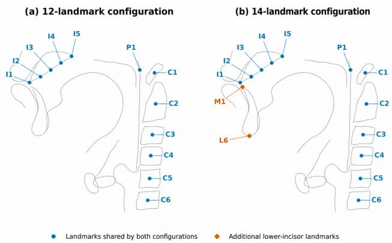
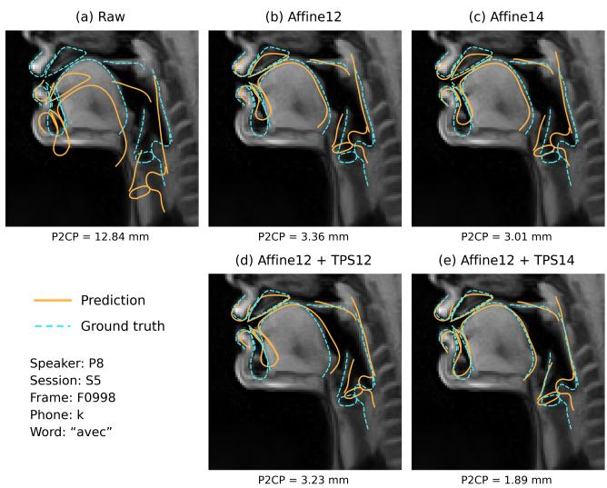

# ANATOMY-AWARE CROSS-SPEAKER ADAPTATION OF COMPLETE VOCAL-TRACT ACOUSTIC-TO-ARTICULATORY INVERSION

Nhat-Nam Nguyen1 - Pierre-Andre Vuissoz ´ 2 - Yves Laprie1

1Universite de Lorraine, CNRS, Inria, F-54000 Nancy, France´

2Universite de Lorraine, Inserm, IADI U1254, F-54000 Nancy, France´

nhat-nam.nguyen@loria.fr, pa.vuissoz@chru-nancy.fr, yves.laprie@loria.fr

## ABSTRACT

Cross-speaker acoustic-to-articulatory inversion requires accounting for anatomical differences between speakers. We propose a geometric adaptation framework that uses anatomical landmarks, primarily on vertebrae and dental structures, to transfer predictions from a fixed inversion model to unseen speakers. An affine transformation followed by thinplate spline (TPS) deformation maps the predicted contours of 10 vocal-tract structures into each target speaker’s geometry without retraining. Landmarks are identified in one selected /u/ frame per speaker as a common phonetic reference without assuming identical articulatory configurations across speakers, and the resulting mapping is reused across recordings. We train the model on a single-speaker rt-MRI database and evaluate adaptation on eight speakers from a separate multi-speaker rt-MRI database. We compare affine and TPS configurations using 12 or 14 landmarks. Affine12+TPS14 achieves the lowest mean point-to-closest-point error of 3.19 mm. These results support the combined value of anatomical landmark information and nonrigid alignment.

Index Terms— Acoustic-to-articulatory inversion, speaker adaptation, anatomical landmarks, thin-plate splines

## 1. INTRODUCTION

Acoustic-to-articulatory inversion (AAI) estimates speech articulation from acoustics. Generalization to unseen speakers remains challenging because vocal-tract anatomy and articulatory strategies vary across individuals [1], while paired acoustic-articulatory recordings are costly to collect [2]. Speaker-independent models and adaptation methods address this challenge using vocal tract length normalization [3] and self-supervised speech representations [4].

The articulatory representation also determines the scope of inversion. Electromagnetic articulography (EMA) tracks sparse sensors on easily accessible articulators, whereas realtime magnetic resonance imaging (rt-MRI) captures midsagittal anatomy, including pharyngeal and laryngeal regions. Previous studies have reconstructed rt-MRI images from speech [5], while automatic segmentation has enabled contour-based representations [6]. Azzouz et al. demonstrated acoustic reconstruction of contours spanning the vocal tract from the glottis to the lips [7]. Transferring these predictions to unseen speakers, however, requires addressing geometric mismatch.

Geometric registration has been investigated through affine mappings between EMA-derived articulatory systems [8]. Wei and Dang used grid-defined landmarks and thin-plate spline (TPS) warping to normalize multi-speaker EMA data to a shared template [9]. Anatomical information has also been incorporated through joint estimation of anatomy and articulation [10] and speech-conditioned rt-MRI generation using static MRI [11]. Here, we instead use anatomical landmarks to transfer complete MRI-derived contour predictions from a fixed AAI model to unseen speaker geometries using only single-frame anatomical calibration, without model retraining. We examine how landmark coverage and nonlinear alignment contribute under this constraint.

We estimate an affine-TPS reference-to-target mapping from primarily vertebrae and dental landmarks identified in one /u/ frame per speaker under comparable phonetic conditions. TPS provides smooth nonrigid deformation constrained by landmark correspondences. Each mapping is reused across recordings without updating the inversion model. We train on a single-speaker rt-MRI database and evaluate on eight speakers from a separate multi-speaker database across 10 structures: the upper and lower lips, tongue, soft-palate midline, pharyngeal wall, epiglottis, arytenoid cartilage, vocal folds, and upper and lower incisors. Comparing affine and affine-TPS configurations with 12 or 14 landmarks assesses the contributions of additional correspondences and nonlinear deformation.

## 2. DATASETS

We use two rt-MRI corpora from the ArtSpeech databases (ASD) acquired at the Centre Hospitalier Regional Univer-´ sitaire de Nancy: ASD2 for training the reference inversion model and ASD1 for evaluating cross-speaker adaptation. ASD1 comprises five male and five female native French speakers, each contributing approximately 15 minutes of speech across 77 sentences, distributed over 16 sessions (15 usable for P4). The evaluated ASD1 data contain approximately 130,000 non-silent frames [12, 13]. We evaluate P1 and P3-P9, excluding P2 because insufficient laryngeal visibility prevents reliable evaluation of the retained structures.

ASD2 contains approximately 3.5 hours of speech from a single native French female speaker, with about 2100 sentences across 153 acquisitions [14]. Her presence as P10 in ASD1 provides a shared speaker identity across corpora [13].

Following the contour-tracking framework in [13], each of these 10 structures is represented by 50 two-dimensional points, yielding 1000 output coordinates per frame.

## 3. METHODS

## 3.1. Acoustic-to-articulatory inversion model

We use the backbone introduced by Azzouz et al. [7], comprising two fully connected layers followed by two bidirectional long short-term memory (Bi-LSTM) layers, each with 300 units.

ASD2 acquisitions are rigidly registered using the statichead registration procedure of Azzouz et al. [14]. Reference landmarks are identified after registration, in the same coordinate system as the training contours and denormalized predictions. Previous work uses local moving normalization to compensate for slow variations in articulatory coordinates [2, 7]. For geometric adaptation, we instead use global coordinatewise statistics computed exclusively from the reference training data:

$$
\begin{array} { r l } & { \widetilde { \mathbf { y } } _ { t } = ( \mathbf { y } _ { t } - \pmb { \mu } _ { \mathrm { t r a i n } } ) \oslash \pmb { \sigma } _ { \mathrm { t r a i n } } , } \\ & { \widehat { \mathbf { y } } _ { t } ^ { R } = \widehat { \widetilde { \mathbf { y } } } _ { t } \odot \pmb { \sigma } _ { \mathrm { t r a i n } } + \pmb { \mu } _ { \mathrm { t r a i n } } , } \end{array}\tag{1}
$$

where $\oslash$ and ⊙ denote element-wise division and multiplication, respectively. The same training statistics are reused during validation and inference to recover reference-space contour coordinates. No target-speaker contour sequences are required to estimate the articulatory normalization statistics.

## 3.2. Geometric adaptation

For each target speaker s, anatomical landmark correspondences define a fixed mapping $G _ { R  s }$ from predicted referencespace contours to the target geometry, reused across recordings.

## 3.2.1. Anatomical landmarks

As shown in Fig. 1, the 12-landmark configuration comprises five points sampled along the inferior boundary of the upperincisor and hard-palate contour (I1-I5), the centers of the cervical vertebrae (C1-C6), and a posterior landmark P1. The bony and dental landmarks provide anatomical anchors, while $P 1$ supplies an additional correspondence on the pharyngeal wall.

  
Fig. 1. Anatomical landmark configurations used for geometric adaptation. The 12-landmark set (in blue) is shown together with the two additional lower-incisor landmarks, M1 and L6 (in orange), used in the 14-landmark configuration.

The landmark P1 is defined as the intersection of the line through I5 and the center of C1 with the pharyngeal-wall contour. The 14-landmark configuration additionally includes M1 and L6, defined as the superior and inferior extrema, respectively, of the lower-incisor contour in the midsagittal image. These landmarks extend coverage to the lower anterior oral cavity and constrain mandibular alignment. These landmark definitions are applied to the calibration frames described in Section 3.4.

## 3.2.2. Geometric transformation

In the proposed configuration, the 12-landmark set first estimates a global affine alignment accounting for translation, rotation, scaling, and shear, after which M1 and L6 provide two additional constraints for the subsequent nonrigid deformation:

$$
( \mathbf { A } _ { R  s } , \mathbf { b } _ { R  s } ) = \underset { \mathbf { A } , \mathbf { b } } { \arg \operatorname* { m i n } } \sum _ { k = 1 } ^ { 1 2 } \lVert \mathbf { A } \mathbf { l } _ { R , k } + \mathbf { b } - \mathbf { l } _ { s , k } \rVert _ { 2 } ^ { 2 } .\tag{2}
$$

where $\mathbf { l } _ { R , k }$ and ${ \bf l } _ { s , k }$ are the corresponding two-dimensional landmark coordinates, ${ \bf A } _ { R  s } \in \bar { \mathbb { R } ^ { 2 \times 2 } }$ , and $\mathbf { b } _ { R  s } \in \mathbb { R } ^ { 2 \times 1 }$ The affine transformation acts on a reference point $ { \mathbf { p } } \in \mathbb { R } ^ { 2 \times 1 }$ as $T _ { R  s } ^ { \mathrm { A f f n e } } ( { \bf p } ) = { \bf A } _ { R  s } { \bf p } + { \bf b } _ { R  s } .$

The affine transformation is then applied to all 14 reference landmarks, including M1 and L6, giving $\begin{array} { r l } { \mathbf { c } _ { s , k } } & { { } = } \end{array}$ $T _ { R  s } ^ { \mathrm { A f f i n e } } ( 1 _ { R , k } )$ TPS is fitted from these affine-transformed landmarks to their target correspondences $1 _ { s , k } \colon$

$$
T _ { R  s } ^ { \mathrm { T P S } } ( \mathbf { q } ) = \mathbf { a } _ { s , 0 } + \mathbf { B } _ { s } \mathbf { q } + \sum _ { k = 1 } ^ { 1 4 } \mathbf { w } _ { s , k } U \big ( \| \mathbf { q } - \mathbf { c } _ { s , k } \| _ { 2 } \big ) .\tag{3}
$$

where $\mathbf { q } , \mathbf { a } _ { s , 0 } , \mathbf { c } _ { s , k } , \mathbf { w } _ { s , k } \in \mathbb { R } ^ { 2 \times 1 } , { \mathbf { B } } _ { s } \in \mathbb { R } ^ { 2 \times 2 }$ , and $U ( r ) =$ $r ^ { 2 }$ log r for $r > 0 ,$ , with $U ( 0 ) = 0 \left[ 1 5 \right]$ . TPS is fitted by exact

interpolation with zero smoothing and a first-degree polynomial term. The complete reference-to-target mapping is

$$
G _ { R  s } ( \mathbf { p } ) = T _ { R  s } ^ { \mathrm { T P S } } ( T _ { R  s } ^ { \mathrm { A f f i n e } } ( \mathbf { p } ) ) .\tag{4}
$$

This mapping is applied point-wise to the predicted referencespace contours.

## 3.3. Evaluation

Following Ribeiro [13], we evaluate contour reconstruction using the mean point-to-closest-point distance $( { \mathrm { P } } 2 { \mathrm { C P } } _ { \mathrm { m e a n } } )$ Unlike point-wise RMSE, this metric does not require matching point indices across predicted and target contours, making it suitable for cross-speaker geometric evaluation.

Before evaluation, predicted and target contours are independently regularized using quadratic B-splines with 20 subintervals and a regularization parameter of 0.1, then resampled to $N = 5 0$ points. For contours u and v,

$$
\mathrm { P 2 C P } _ { \mathrm { m e a n } } ( \mathbf { u } , \mathbf { v } ) = \frac { 1 } { 2 N } \sum _ { i = 1 } ^ { N } \left[ \operatorname* { m i n } _ { j } d ( \mathbf { u } _ { i } , \mathbf { v } _ { j } ) + \operatorname* { m i n } _ { j } d ( \mathbf { v } _ { i } , \mathbf { u } _ { j } ) \right]\tag{5}
$$

where d denotes the Euclidean distance. Distances are reported in millimeters. For each structure, mean errors are first computed over frames within each session, then averaged equally across sessions and speakers. Aggregate means give equal weight to the selected structures.

Standard deviations (SDs) describe pooled frame-level errors for individual structures and pooled frame structure errors for speaker-wise results. Means retain the equal-weight averaging described above.

## 3.4. Experimental setup

The reference inversion model is trained on ASD2 using the partitions and training settings of Azzouz et al. [14], with the 10-structure output and global normalization described in Section 3.1. Acoustic inputs comprise 13 MFCCs and their first- and second-order derivatives (39 dimensions), extracted with a 25-ms window and a 10-ms hop. MRI contours sampled every 20 ms are aligned to the 10-ms acoustic grid by inserting coordinate-wise averages of consecutive contours [7]. The lowest-validation-RMSE checkpoint is kept fixed throughout adaptation.

Calibration uses one /u/ frame from ‘pour’ in ASD2 and ‘pourri’ for each ASD1 target speaker. The vowel /u/ was selected because it provides a relatively constrained articulatory configuration [16], without assuming identical articulation across speakers. Although the reference speaker also produces ‘pourri’ in ASD1 (P10), we use the registered ASD2 frame to match the geometry of the model predictions. The reference speaker’s recordings differ in head posture between corpora, which can alter vocal-tract shape, particularly in the pharyngeal region [17]. The words share the immediate /p/- /u/-/K/ context, although their broader contexts differ.

Frames nearest the /u/ midpoint are selected from manually corrected TextGrid phonetic segmentation, independently of reconstruction errors. One mapping is estimated per target speaker and reused across recordings; reference frames are excluded from evaluation.

Raw denotes unadapted predictions. A12 (Affine12) and A14 (Affine14) use 12 and 14 landmarks for affine alignment, respectively. A12+T12 (Affine12+TPS12) and A12+T14 (Affine12+TPS14) apply affine alignment with 12 landmarks, followed by TPS fitted using 12 and 14 affine-transformed reference landmarks, respectively. The 14-landmark set adds M1 and L6. A14 is the affine baseline using the same overall landmark set as A12+T14. All configurations share predictions, calibration frames, evaluation data, and commonlandmark definitions.

$\mathrm { P 2 C P _ { m e a n } }$ is reported for the 10 evaluated structures (Full10) and for a seven-structure subset excluding the arytenoid cartilage, epiglottis, and vocal folds (Full7). Full7 assesses whether improvements extend beyond the three laryngeal structures. A12+T14 is compared with A14 using two-sided paired t-tests at an unadjusted significance level of 0.05. Paired observations are session means for within-speaker tests and session-balanced speaker means for articulator-wise and Full10/Full7 tests (n = 8 speakers).

## 4. RESULTS

The ASD2-trained model achieves a mean $\mathrm { P 2 C P _ { m e a n } }$ of 1.40 mm across the 10 evaluated structures (Table 1). On target speakers, the unadapted Full10 error reaches 8.87 mm, indicating substantial geometric mismatch (Table 3).

A12+T14 achieves the lowest Full10 error of 3.19 mm, improving over A12 (4.10 mm), A14 (3.69 mm), and A12+T12 (3.75 mm) (Table 2). The reduction relative to the main affine baseline, A14, is approximately 13.6% and statistically significant $( p = 0 . 0 2 5 )$ . Full7 error also decreases significantly, from 3.17 to 2.71 mm $( p < 0 . 0 5 )$

A12+T14 yields the lowest error for six of the 10 structures and improves over A14 for eight. The largest absolute reductions occur for the vocal folds (6.07 to 4.86 mm), pharyngeal wall (3.02 to 2.19 mm), and arytenoid cartilage (4.34 to 3.64 mm). Tongue error decreases from 4.06 to 3.62 mm. At the structure level, only the arytenoid cartilage and lower incisor show statistically significant reductions $( p \ : < \ : 0 . 0 5 )$ Epiglottis and soft-palate errors increase slightly, indicating uneven benefits across structures.

All adaptation configurations outperform Raw for every target speaker. A12+T14 performs best for seven of eight speakers, with significant improvements over A14 for these seven $( p < 0 . 0 5 )$ . For P4, however, error increases significantly from 2.95 to 3.17 mm. A12+T14 speaker-wise errors range from 2.46 to 3.95 mm.

Table 1. ASD2 model trained on ten articulators with global normalization. $\mathrm { P 2 C P _ { m e a n } }$ in mm.
<table><tr><td>Articulator</td><td> $\mathbf { M e a n } \pm \mathbf { S D }$ </td><td>Median</td></tr><tr><td>Arytenoid cartilage</td><td> $1 . 5 3 \pm 0 . 7 6$ </td><td>1.38</td></tr><tr><td>Epiglottis</td><td> $1 . 7 1 \pm 1 . 1 8$ </td><td>1.39</td></tr><tr><td>Lower lip</td><td> $1 . 2 9 \pm 0 . 6 4$ </td><td>1.17</td></tr><tr><td>Pharyngeal wall</td><td> $0 . 9 6 \pm 0 . 4 4$ </td><td>0.85</td></tr><tr><td>Soft-palate midline</td><td> $1 . 0 1 \pm 0 . 5 5$ </td><td>0.88</td></tr><tr><td>Tongue</td><td> $1 . 9 9 \pm 0 . 7 4$ </td><td>1.84</td></tr><tr><td>Upper lip</td><td> $1 . 3 7 \pm 0 . 7 6$ </td><td>1.18</td></tr><tr><td>Vocal folds</td><td> $1 . 5 5 \pm 0 . 9 0$ </td><td>1.37</td></tr><tr><td>Lower incisor</td><td> $1 . 2 9 \pm 0 . 6 0$ </td><td>1.19</td></tr><tr><td>Upper incisor</td><td> $1 . 3 2 \pm 0 . 7 8$ </td><td>1.14</td></tr><tr><td>Mean</td><td> $\overline { { 1 . 4 0 \pm 0 . 8 2 } }$ </td><td>1.22</td></tr></table>

Table 2. Articulator-wise $\mathrm { P 2 C P _ { m e a n } }$ (mm). A14 is the main affine baseline; A12+T14 is the proposed configuration.
<table><tr><td>Articulator</td><td>A12</td><td>A14</td><td>A12+T12</td><td>A12+T14</td></tr><tr><td>Arytenoid</td><td> $5 . 0 9 \pm 2 . 3 3$ </td><td> $4 . 3 4 \pm 2 . 1 6$ </td><td> $4 . 5 2 \pm 2 . 2 7$ </td><td> ${ \pm . 6 4 } ^ { * } \pm 1 . 8 9$ </td></tr><tr><td>Epiglottis</td><td> $4 . 9 4 \pm 2 . 7 4$ </td><td> ${ \bf 4 . 2 9 } \pm 2 . 4 0$ </td><td> $5 . 0 0 \pm 2 . 7 6$ </td><td> $4 . 3 9 \pm 2 . 4 3$ </td></tr><tr><td>Lower lip</td><td> $3 . 2 6 \pm 1 . 5 0$ </td><td> $2 . 6 7 \pm 1 . 0 6$ </td><td> $2 . 9 1 \pm 1 . 2 0$ </td><td> $2 . 5 3 \pm 1 . 1 1$ </td></tr><tr><td>Pharynx</td><td> $2 . 8 7 \pm 1 . 7 9$ </td><td> $3 . 0 2 \pm 1 . 9 1$ </td><td> $2 . 2 9 \pm 1 . 4 1$ </td><td> ${ \bf 2 . 1 9 \pm 1 . 2 7 }$ </td></tr><tr><td>Soft palate</td><td> $2 . 8 1 \pm 1 . 2 6$ </td><td> $2 . 8 3 \pm 1 . 4 2$ </td><td> $2 . 9 1 \pm 1 . 1 9$ </td><td> $2 . 8 8 \pm 1 . 1 5$ </td></tr><tr><td>Tongue</td><td> $4 . 5 8 \pm 1 . 6 1$ </td><td> $4 . 0 6 \pm 1 . 3 6$ </td><td> $4 . 4 1 \pm 1 . 4 3$ </td><td> ${ \bf 3 . 6 2 \pm 1 . 1 7 }$ </td></tr><tr><td>Upper lip</td><td> $3 . 4 2 \pm 1 . 1 1$ </td><td> $3 . 8 9 \pm 1 . 3 0$ </td><td> ${ \bf 3 . 1 5 \pm 1 . 1 5 }$ </td><td> $3 . 2 1 \pm 1 . 1 6$ </td></tr><tr><td>Vocal folds</td><td> $7 . 5 4 \pm 4 . 2 0$ </td><td> $6 . 0 7 \pm 3 . 6 4$ </td><td> $6 . 5 9 \pm 4 . 2 0$ </td><td> $\mathbf { 4 . 8 6 \pm } 2 . 8 7$ </td></tr><tr><td>Lower incisor</td><td> $3 . 9 3 \pm 1 . 5 7$ </td><td> $2 . 8 3 \pm 0 . 9 6$ </td><td> $3 . 4 1 \pm 1 . 1 0$ </td><td> $2 . 1 4 ^ { * } \pm 0 . 8 0$ </td></tr><tr><td>Upper incisor</td><td> $2 . 5 6 \pm 0 . 9 5$ </td><td> $2 . 9 0 \pm 1 . 0 3$ </td><td> $2 . 3 2 \pm 0 . 9 1$ </td><td> $2 . 4 0 \pm 0 . 9 8$ </td></tr><tr><td>Ful110</td><td> $4 . 1 0 \pm 2 . 5 6$ </td><td> $3 . 6 9 \pm 2 . 1 5$ </td><td> $3 . 7 5 \pm 2 . 3 9$ </td><td> ${ \bf 3 . 1 9 } ^ { \ast } \pm 1 . 8 5$ </td></tr><tr><td>Full7</td><td> $3 . 3 5 \pm 1 . 5 7$ </td><td> $3 . 1 7 \pm 1 . 4 2$ </td><td> $3 . 0 6 \pm 1 . 3 8$ </td><td> $2 . 7 1 ^ { \ast } \pm 1 . 2 1$ </td></tr></table>

Values: mean ± SD; bold: lowest mean. ∗Different from A14 (paired two-sided t-test, n = 8 speakers, unadjusted $p < 0 . 0 5 )$  
Figure 2 illustrates the application of the fixed mapping to a P8 /k/ frame in avec, beyond the /u/ calibration vowel.

## 5. DISCUSSION

These comparisons assess the contributions of anatomical correspondences and nonlinear alignment. A14 improves over A12 by adding two landmarks, whereas A12+T12 improves aggregate performance with the landmark set unchanged. A12+T14 performs best overall, suggesting that the additional lower-incisor correspondences help constrain nonrigid adaptation. Tongue error decreases by 10.8% relative to A14, although this reduction is not statistically significant.

Residual laryngeal errors may reflect anatomical differences, including gender-related oral-pharyngeal proportions and laryngeal position [18, 19], whose contributions are not isolated here. Lip variability and the deterioration for P4 further indicate that benefits are not uniform. A fixed mapping may only partially capture speaker-specific articulation [1] and pose differences across unregistered ASD1 recordings[17]. Sensitivity to calibration-frame selection and landmark annotation remains to be quantified.

Table 3. Speaker-wise Full10 $\mathrm { P 2 C P _ { m e a n } }$ (mm). A14 is the main affine baseline; A12+T14 is the proposed configuration.
<table><tr><td>Speaker</td><td>Raw</td><td>A12</td><td>A14</td><td>A12+T12</td><td>A12+T14</td></tr><tr><td>P1</td><td></td><td>9.71±3.635.85±3.41 5.33±2.94 5.34±3.513.95*±2.31</td><td></td><td rowspan="4"></td></tr><tr><td>P3</td><td> $9 . 6 9 { \pm } 4 . 2 6 $ </td><td> $5 . 0 6 \pm 3 . 3 8 4 . 4 2 \pm 2 . 4 9 4 . 3 1 \pm 2 . 8 9 3 . 4 6 ^ { \circ } \pm 1 . 7 6$ </td><td></td><td></td></tr><tr><td>P4</td><td>8.14±4.26</td><td> $3 . 2 8 \pm 1 . 6 4 2 . 9 5 \pm 1 . 3 6 3 . 0 6 \pm 1 . 9 3 3 . 1 7 ^ { \ast } \pm 2 . 1 0$ </td><td></td><td></td></tr><tr><td>P5</td><td>4.42±2.12</td><td> $3 . 1 3 \pm 1 . 3 6 ~ 2 . 9 3 \pm 1 . 2 1 ~ 2 . 6 4 \pm 1 . 0 3 ~ 2 . 4 6 ^ { \circ } \pm 1 . 0 0 ~$ </td><td></td><td></td></tr><tr><td>P6</td><td>7.79±3.37</td><td> $3 . 4 1 \pm 1 . 9 7 \ 2 . 9 4 \pm 1 . 5 8 \ 3 . 3 2 \pm 1 . 6 9 \ 2 . 8 2 ^ { \ast } \pm 1 . 3 6$ </td><td></td><td></td><td></td></tr><tr><td>P7</td><td>11.23±4.55</td><td></td><td> $3 . 4 1 \pm 2 . 2 7 3 . 3 4 \pm 2 . 2 6 3 . 6 9 \pm 2 . 1 5 3 . 1 7 ^ { \ast } \pm 2 . 1 4$ </td><td></td><td></td></tr><tr><td>P8</td><td>14.22±5.27</td><td></td><td> $3 . 8 7 \pm 1 . 9 9 3 . 7 9 \pm 1 . 8 4 4 . 4 1 \pm 2 . 0 0 3 . 2 4 ^ { \ast } \pm 1 . 4 4$ </td><td></td><td></td></tr><tr><td>P9</td><td>5.74±2.01</td><td></td><td> $4 . 8 0 \pm 2 . 1 4 3 . 8 4 \pm 1 . 6 7 3 . 2 5 \pm 1 . 8 5 3 . 2 2 ^ { \ast } \pm 1 . 8 9$ </td><td></td><td></td></tr><tr><td>All</td><td></td><td></td><td>8.87±4.814.10±2.56 3.69±2.15 3.75±2.39 3.19*±1.85</td><td></td><td></td></tr></table>

Values: $\mathrm { m e a n } \pm \mathrm { S D } ;$ bold: lowest mean. ∗Different from A14 (paired two-sided t-test; session means within speakers, speaker-level for All; unadjusted p < 0.05).

  
Fig. 2. Adaptation example for P8 containing /k/ in avec. Orange solid: predictions; cyan dashed: ground truth. Framelevel P2CP errors are shown below each panel.

## 6. CONCLUSION

Single-frame anatomical adaptation transfers vocal-tract contours from a fixed AAI model to unseen speakers without retraining. Across eight speakers, Affine12+TPS14 reduces Full10 error from 3.69 mm with Affine14 to 3.19 mm, supporting landmark coverage and nonlinear alignment. Future work will extend this framework to multi-speaker training toward speaker-independent AAI, while assessing calibration robustness and residual laryngeal and lip errors.

## 7. ACKNOWLEDGMENTS

This research was supported by the French ANR project AR-TANY, CPER IT2MP, Region Lorraine and FEDER, and fi-´ nanced by Lorraine Universite d’Excellence (LUE). The RT-´ MRI data were acquired on a platform of the FLI network.

## 8. REFERENCES

[1] A. Serrurier, P. Badin, L. Lamalle, and C. Neuschaefer-Rube, “Characterization of inter-speaker articulatory variability: A two-level multi-speaker modelling approach based on mri data,” The Journal of the Acoustical Society of America, vol. 145, no. 4, pp. 2149–2170, 2019.

[2] M. Parrot, J. Millet, and E. Dunbar, “Independent and automatic evaluation of speaker-independent acousticto-articulatory reconstruction,” in Interspeech 2020-21st Annual Conference ofthe International Speech Communication Association, 2020.

[3] G. Sivaraman, V. Mitra, H. Nam, M. Tiede, and C. Espy-Wilson, “Unsupervised speaker adaptation for speaker independent acoustic to articulatory speech inversion,” The Journal of the Acoustical Society of America, vol. 146, no. 1, pp. 316–329, 2019.

[4] P. Wu, L.-W. Chen, C. J. Cho, S. Watanabe, L. Goldstein, A. W. Black, and G. K. Anumanchipalli, “Speaker-independent acoustic-to-articulatory speech inversion,” in 2023 IEEE International Conference on Acoustics, Speech and Signal Processing (ICASSP), 2023, pp. 1–5.

[5] T. G. Csapo, “Speaker Dependent Acoustic-to-´ Articulatory Inversion Using Real-Time MRI of the Vocal Tract,” in Interspeech 2020, 2020, pp. 3720–3724.

[6] V. Ribeiro, K. Isaieva, J. Leclere, J. Felblinger, P.- A. Vuissoz, and Y. Laprie, “Automatic segmentation of vocal tract articulators in real-time magnetic resonance imaging,” Computer Methods and Programs in Biomedicine, vol. 243, pp. 107907, 2024.

[7] S. Azzouz, P.-A. Vuissoz, and Y. Laprie, “Reconstruction of the complete vocal tract contour through acoustic to articulatory inversion using real-time mri data,” in Interspeech 2025, 2025, pp. 978–982.

[8] C. J. Cho, A. Mohamed, A. W. Black, and G. K. Anumanchipalli, “Self-supervised models of speech infer universal articulatory kinematics,” in ICASSP 2024-2024 IEEE International Conference on Acoustics, Speech and Signal Processing (ICASSP). IEEE, 2024, pp. 12061–12065.

[9] J. Wei and J. Dang, “Morphological normalization of vocal tract shape,” in 2010 IEEE International Conference on Acoustics, Speech and Signal Processing. IEEE, 2010, pp. 4186–4189.

[10] Y. Sun, Q. Huang, and X. Wu, “Unsupervised acoustic-to-articulatory inversion with variable vocal tract anatomy,” in Proc. Interspeech 2022, 2022, pp. 4656–4660.

[11] X. Shi, T. Feng, J. Park, C. Hagedorn, L. Goldstein, and S. Narayanan, “Speech acoustics to rt-mri articulatory dynamics inversion with video diffusion model,” Computer Speech & Language, p. 101928, 2025.

[12] K. Isaieva, Y. Laprie, J. Leclere, I. K. Douros, J. Fel-\` blinger, and P.-A. Vuissoz, “Multimodal dataset of realtime 2d and static 3d mri of healthy french speakers,” Scientific Data, vol. 8, no. 1, pp. 258, 2021.

[13] V. Ribeiro, Deep Supervision of the Vocal Tract Shape for Articulatory Synthesis of Speech, Ph.D. thesis, Universite de Lorraine, 2023.´

[14] S. Azzouz, P.-A. Vuissoz, and Y. Laprie, “Acoustic-toarticulatory inversion of the complete vocal tract from rt-mri with various audio embeddings and dataset sizes,” arXiv preprint arXiv:2603.28723, 2026.

[15] F. L. Bookstein, “Principal warps: Thin-plate splines and the decomposition of deformations,” IEEE Transactions on pattern analysis and machine intelligence, vol. 11, no. 6, pp. 567–585, 1989.

[16] S. Ouni and Y. Laprie, “Modeling the articulatory space using a hypercube codebook for acoustic-to-articulatory inversion,” The Journal of the Acoustical Society of America, vol. 118, no. 1, pp. 444–460, 2005.

[17] I. K. Douros, P.-A. Vuissoz, and Y. Laprie, “Effect of head posture on phonation of french vowels,” in ICPhS 2019-Proceedings of International Congress of Phonetic Sciences, 2019.

[18] W. T. Fitch and J. Giedd, “Morphology and development of the human vocal tract: A study using magnetic resonance imaging,” The Journal of the Acoustical Society ofAmerica, vol. 106, no. 3, pp. 1511–1522, 1999.

[19] S. A. Mirjalili, S. L. McFadden, T. Buckenham, and M. D. Stringer, “Vertebral levels of key landmarks in the neck,” Clinical Anatomy, vol. 25, no. 7, pp. 851– 857, 2012.