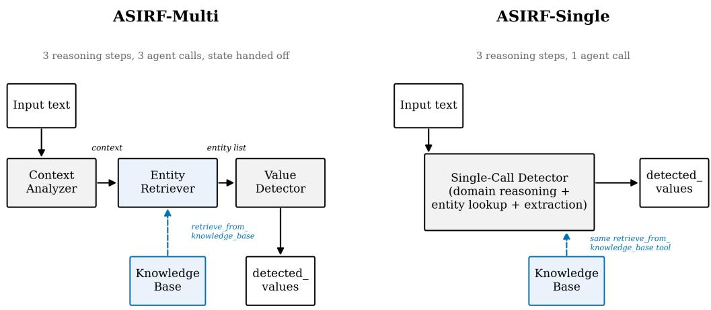
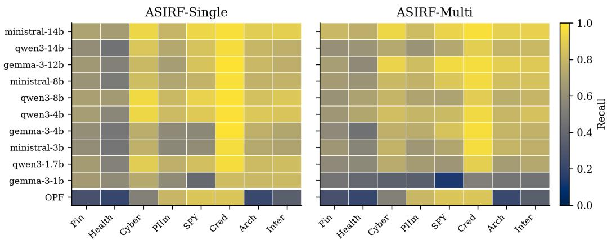

# ASIRF: An Agentic Framework for Context-Dependent Sensitive Information Redaction

Sudha Priyadarshini1

Mohamed Chahine Ghanem2,1

1University of Liverpool, UK

2Keele University, UK

## Abstract

Sensitive information is defined by domain and intent, not a universal category, yet redaction systems such as privacy filters and named-entity recognizers fix a taxonomy at training time, requiring retraining for each new domain. We introduce ASIRF (Agentic Sensitive Information Redaction Framework), which retrieves domain-specific definitions based on the input’s domain from a flexible knowledge base at inference time, needing no retraining to adapt. Two architectures, a threecall multi-agent pipeline and a single-agent variant, are evaluated across ten small open-weight models and eight datasets, including out-of-distribution fictional domains, against the OpenAI Privacy Filter (OPF) as a trained-classifier baseline. With only a few dozen expert-authored definitions per domain and no training data, ASIRF’s recall exceeds OPF’s in 68 of 80 model-domain combinations (85 percent), by at least one of the two architectures, with shortfalls confined mostly to OPF’s training-distribution domains.

## 1 Introduction

Sensitive information is not an intrinsic property of a text but one assigned by domain and intent. A ten-digit number is a phone number in a support transcript or an account identifier in a banking record. The definitions of sensitivity change over time and across jurisdictions and domains. Trained detectors fix a taxonomy in their weights at training time, and extending it to a new domain or attribute type requires new labeled data and an expensive retraining pass. ASIRF, the Agentic Sensitive Information Redaction Framework, relocates that taxonomy to an inference-time knowledge base, instantiating a claim that adapting to a new domain requires only a knowledge-base edit, using definitions a domain expert can produce, without labeled examples or a training run.

The evaluation of ASIRF is organized around two research questions:

• RQ1. How does an test-time agentic framework, combining an agentic harness with domain-conditioned retrieval, improve domain-specific filtering of sensitive information over conventional, training-centric approaches?

• RQ2. To what extent does an agentic framework generalize to out-of-distribution domains and previously unseen sensitive-attribute definitions?

RQ1 is answered in §4.2.1 by comparing both of ASIRF’s architectures (multi-agent and single-agent) against the OpenAI Privacy Filter (OPF) [1], a model trained on the identity-attribute vocabulary, and by the retrieval-removal ablation (§4.3). RQ2 is addressed by the same comparison, on two out-of-distribution and fictional domains.

  
Figure 1: Two architectures of ASIRF - ASIRF-Multi as three-step pipeline (classify, retrieve, extract) and ASIRF-Single as a single agent call

## 2 Related Work

Trained sensitive-information detectors pair a fixed, hand-enumerated entity list with statistical or lightweight neural classifiers, as in OPF [1] and Presidio-style recognizers [2], or learn a fixed label schema, as in named-entity recognizers such as GLiNER [3] or clinical taggers [4]. Every case requires new labeled data and retraining to add a category, none accepting one at test-time. Retrieval-augmented generation instead grounds a language model’s output in documents fetched at inference time [5]. ASIRF applies this to entity definitions, making the sensitivity taxonomy itself an inference-time input.

Decomposing a task into staged, tool-using agent calls improves multi-step reasoning [6] [7] [8]. ASIRF-Multi instantiates this pattern, while ASIRF-Single tests whether the benefit persists once the staged structure is collapsed (§4.2.1). The primary contribution of ASIRF is the composition of retrieval and domain-conditioned routing into a single pipeline for sensitive-information filtering.

## 3 Methodology

ASIRF, as described in Figure 1, performs three logical steps on every input, (i) classify the domain, (ii) retrieve the relevant sensitive-attribute definitions, and (iii) extract the matching values (Figure 1). ASIRF-Multi implements each step as a separate chained agent (Context Analyzer, Entity Retriever, Value Detector), with only the Entity Retriever calling the retrieval tool. ASIRF-Single performs all three in one call with the same tool, removing only the staged structure, not retrieval access, isolating decomposition of the steps from retrieval (§4.2). Retrieval is a semantic search over a ChromaDB [9] collection of entity definitions, indexed via an HNSW (hierarchical navigable small-world) graph [10] under cosine similarity with a 1024-dimensional embeddings model [11], returning the top-k nearest entries de-duplicated by name. Both architectures are evaluated across ten open-weight models spanning three families (Gemma-3 [12], Qwen3 [13], Ministral [14], 1B–14B parameters) and two inference providers (Amazon Bedrock and Hugging Face), isolating the architecture’s effect from any single model’s idiosyncrasies.

The knowledge base is ASIRF’s adaptation mechanism, where a new domain is onboarded by adding new entries instead of retraining. It contains cross-domain entity types, statutory-text entries, and dataset-specific entries, including the two fictional domains (§4.2.2), under a common schema.

Table 1: ASIRF-Multi recall by model and domain. The top-performing model exceeds OPF on every dataset.
<table><tr><td></td><td colspan="6">Real-world domains</td><td colspan="2">Fictional domains</td></tr><tr><td>Model</td><td>Finance</td><td>Healthcare</td><td>Cybersecurity</td><td>pii-masking</td><td>SPY</td><td>CredData</td><td>Archive of Forgotten Futures</td><td>Interstellar Immigration Bureau</td></tr><tr><td>ministral-14b</td><td>0.801</td><td>0.761</td><td>0.936</td><td>0.821</td><td>0.922</td><td>0.972</td><td>0.908</td><td>0.911</td></tr><tr><td>qwen3-14b</td><td>0.610</td><td>0.629</td><td>0.732</td><td>0.626</td><td>0.726</td><td>0.900</td><td>0.783</td><td>0.807</td></tr><tr><td>gemma-3-12b</td><td>0.676</td><td>0.581</td><td>0.923</td><td>0.826</td><td>0.947</td><td>0.960</td><td>0.902</td><td>0.878</td></tr><tr><td>ministral-8b</td><td>0.664</td><td>0.626</td><td>0.806</td><td>0.777</td><td>0.869</td><td>0.951</td><td>0.832</td><td>0.846</td></tr><tr><td>qwen3-8b</td><td>0.621</td><td>0.694</td><td>0.787</td><td>0.705</td><td>0.698</td><td>0.891</td><td>0.754</td><td>0.791</td></tr><tr><td>qwen3-4b</td><td>0.641</td><td>0.716</td><td>0.829</td><td>0.787</td><td>0.811</td><td>0.942</td><td>0.794</td><td>0.845</td></tr><tr><td>gemma-3-4b</td><td>0.577</td><td>0.449</td><td>0.764</td><td>0.750</td><td>0.855</td><td>0.966</td><td>0.786</td><td>0.772</td></tr><tr><td>ministral-3b</td><td>0.641</td><td>0.550</td><td>0.781</td><td>0.637</td><td>0.716</td><td>0.957</td><td>0.788</td><td>0.764</td></tr><tr><td>qwen3-1.7b</td><td>0.577</td><td>0.571</td><td>0.739</td><td>0.667</td><td>0.635</td><td>0.904</td><td>0.668</td><td>0.728</td></tr><tr><td>gemma-3-1b</td><td>0.462</td><td>0.397</td><td>0.357</td><td>0.351</td><td>0.130</td><td>0.520</td><td>0.471</td><td>0.450</td></tr><tr><td>OPF</td><td>0.270</td><td>0.206</td><td>0.530</td><td>0.800</td><td>0.863</td><td>0.861</td><td>0.217</td><td>0.348</td></tr></table>

Table 2: ASIRF-Single recall by model and domain. The top-performing model exceeds OPF on every dataset.
<table><tr><td></td><td colspan="6">Real-world domains</td><td colspan="2">Fictional domains</td></tr><tr><td>Model</td><td>Finance</td><td>Healthcare</td><td>Cybersecurity</td><td>pii-masking</td><td>SPY</td><td>CredData</td><td>Archive of Forgotten Futures</td><td>Interstellar Immigration Bureau</td></tr><tr><td>ministral-14b</td><td>0.699</td><td>0.671</td><td>0.930</td><td>0.791</td><td>0.930</td><td>0.972</td><td>0.891</td><td>0.905</td></tr><tr><td>qwen3-14b</td><td>0.595</td><td>0.452</td><td>0.864</td><td>0.727</td><td>0.849</td><td>0.962</td><td>0.793</td><td>0.765</td></tr><tr><td>gemma-3-12b</td><td>0.645</td><td>0.528</td><td>0.805</td><td>0.674</td><td>0.853</td><td>0.983</td><td>0.802</td><td>0.760</td></tr><tr><td>ministral-8b</td><td>0.623</td><td>0.494</td><td>0.827</td><td>0.713</td><td>0.779</td><td>0.972</td><td>0.776</td><td>0.781</td></tr><tr><td>qwen3-8b</td><td>0.684</td><td>0.660</td><td>0.943</td><td>0.805</td><td>0.916</td><td>0.979</td><td>0.840</td><td>0.872</td></tr><tr><td>qwen3-4b</td><td>0.674</td><td>0.562</td><td>0.935</td><td>0.815</td><td>0.875</td><td>0.977</td><td>0.874</td><td>0.858</td></tr><tr><td>gemma-3-4b</td><td>0.601</td><td>0.476</td><td>0.751</td><td>0.581</td><td>0.570</td><td>0.981</td><td>0.765</td><td>0.719</td></tr><tr><td>ministral-3b</td><td>0.595</td><td>0.469</td><td>0.767</td><td>0.567</td><td>0.590</td><td>0.957</td><td>0.731</td><td>0.705</td></tr><tr><td>qwen3-1.7b</td><td>0.668</td><td>0.533</td><td>0.888</td><td>0.765</td><td>0.834</td><td>0.964</td><td>0.815</td><td>0.824</td></tr><tr><td>gemma-3-1b</td><td>0.657</td><td>0.583</td><td>0.732</td><td>0.583</td><td>0.405</td><td>0.821</td><td>0.802</td><td>0.812</td></tr><tr><td>OPF</td><td>0.270</td><td>0.206</td><td>0.530</td><td>0.800</td><td>0.863</td><td>0.861</td><td>0.217</td><td>0.348</td></tr></table>

## 4 Evaluation

## 4.1 Experimental setup

Baseline: Both architectures are compared against OpenAI Privacy Filter (OPF) [1], a locally-run multi-class token classifier representing the training-centric approach that uses a fixed, pre-trained label set and activates 50M parameters in a single forward pass. OPF runs on identical input under the same scoring rules as both ASIRF architectures, so any difference reflects detection capability rather than a scoring convention.

Datasets: Evaluation spans eight datasets. Five are synthetically generated out of which three are modeling real-world domains (finance, healthcare, cybersecurity), and two fictional domains (Interstellar Immigration Bureau, Archive of Forgotten Futures) built with invented terminology to test out-of-distribution generalization relative to OPF [15]. The remaining three, pii-masking-300k [16], SPY [17] and CredData [18], are established, externally sourced privacy-evaluation datasets.

Metrics: Precision, recall, and F1 are reported using token-level fuzzy overlap rather than exact span matching to reduce sensitivity to incidental span-boundary differences while preserving whether the sensitive value was identified [19]. Recall is foregrounded throughout, since a missed value is a severe compliance failure while a false positive is mild over-redaction.

## 4.2 Results

## 4.2.1 ASIRF vs. OPF

ASIRF-Multi and ASIRF-Single are each compared against OPF in Tables 1–2.

ASIRF exceeds OPF’s recall in 68 of 80 model–domain combinations (85%), by at least one of the two ASIRF architectures. The shortfalls are concentrated on the two domains matching OPF’s

  
Figure 2: Recall, every model plus OPF, across all 8 datasets, Single-Agent and Multi-Agent side by side (same values as Tables 1–2). Datasets: Fin=Finance, Health=Healthcare, Cyber=Cybersecurity, PIIm=pii-masking, SPY=SPY, Cred=CredData, Arch=Archive of Forgotten Futures, Inter=Interstellar Immigration Bureau.

Table 3: Recall on Archive of Forgotten Futures custom dataset, by model and architecture.
<table><tr><td>Model</td><td>ASIRF-Multi</td><td>No-RAG</td></tr><tr><td>ministral-14b</td><td>0.908</td><td>0.698</td></tr><tr><td>qwen3-14b</td><td>0.783</td><td>0.750</td></tr><tr><td>gemma-3-12b</td><td>0.902</td><td>0.877</td></tr></table>

training data [1], pii-masking [16] and SPY datasets [17], where only the largest models close the gap (Figure 2).

## 4.2.2 Out-of-distribution generalization

Every model, under both architectures, exceeds OPF’s fixed recall on the two fictional domains. This holds even for Gemma-3-1B, the weakest model elsewhere (Figure 2). The reason is not that fictional domains are easier in general. It is a difference in cause. Healthcare and finance are domains a trained classifier like OPF could plausibly handle well too, given how abundant public training data is for them. Categories like "Temporal Clearance Level," by construction, could never have appeared in any training corpus at all. A knowledge base can be given a definition for either kind of category but a fixed classifier cannot recognize the latter at all without expensive training, which is the clearest evidence for the paper’s central claim.

## 4.3 Ablation

Removing the Entity Retriever from ASIRF-Multi isolates the contribution of the knowledge base on a scoped grid (three models, Archive of Forgotten Futures custom dataset), confirming that retrieval contributes to better detection of sensitive values and improves recall across all three models (Table 3).

## 5 Conclusion

ASIRF, an agentic framework that determines sensitivity via an inference-time knowledge base instead of a taxonomy fixed at training time, was evaluated across ten open-weight models and two architectures. Using a small fraction of a trained detector’s preparation cost, its recall exceed OPF’s in 85% of model–domain combinations, including domains outside OPF’s training distribution and fictional domains unrecognizable to any fixed classifier. This efficiency, further improvable by strengthening knowledge-base curation, comes with a trade-off. ASIRF’s LLM calls cost more at inference than OPF’s single lightweight forward pass. Within the harness itself, ASIRF-Multi and

ASIRF-Single each suit different domains and model families rather than either winning uniformly, while use of a knowledge base for retrieval improves recall across models. Future work includes improving the knowledge base, such as a web-search fallback for the Entity Retriever to drive new-domain preparation time toward zero.

## References

[1] Charles de Bourcy, Sahra Ghalebikesabi, Avi Schwarzschild, Alex Gorbachev, Mihai Maruseac, Annie Chu, Tong Mu, Ally Bennett, Andy Nguyen, Casey Meehan, et al. Model card for openai privacy filter. arXiv preprint arXiv:2608.18274, 2026.

[2] Microsoft. Presidio: Context aware, pluggable and customizable data protection and deidentification SDK for text and images. https://github.com/microsoft/presidio, 2020. Accessed 2026-08-30.

[3] Urchade Zaratiana, Nadi Tomeh, Pierre Holat, and Thierry Charnois. GLiNER: Generalist model for named entity recognition using bidirectional transformer. In Kevin Duh, Helena Gomez, and Steven Bethard, editors, Proceedings ofthe 2024 Conference ofthe North American Chapter of the Association for Computational Linguistics: Human Language Technologies (Volume 1: Long Papers), pages 5364–5376, Mexico City, Mexico, June 2024. Association for Computational Linguistics.

[4] Woojin Kim, Sungeun Hahm, and Jaejin Lee. Generalizing clinical de-identification models by privacy-safe data augmentation using GPT-4. In Proceedings of the 2024 Conference on Empirical Methods in Natural Language Processing, 2024.

[5] Patrick Lewis, Ethan Perez, Aleksandra Piktus, Fabio Petroni, Vladimir Karpukhin, Naman Goyal, Heinrich Küttler, Mike Lewis, Wen-tau Yih, Tim Rocktäschel, et al. Retrieval-augmented generation for knowledge-intensive nlp tasks. Advances in neural information processing systems, 33:9459–9474, 2020.

[6] Shunyu Yao, Jeffrey Zhao, Dian Yu, Nan Du, Izhak Shafran, Karthik Narasimhan, and Yuan Cao. React: Synergizing reasoning and acting in language models. arXiv preprint arXiv:2210.03629, 2022.

[7] Timo Schick, Jane Dwivedi-Yu, Roberto Dessì, Roberta Raileanu, Maria Lomeli, Eric Hambro, Luke Zettlemoyer, Nicola Cancedda, and Thomas Scialom. Toolformer: Language models can teach themselves to use tools. In Advances in Neural Information Processing Systems, 2023.

[8] Noah Shinn, Federico Cassano, Edward Berman, Ashwin Gopinath, Karthik Narasimhan, and Shunyu Yao. Reflexion: Language agents with verbal reinforcement learning. In Advances in Neural Information Processing Systems, 2023.

[9] Chroma. ChromaDB: The open-source search infrastructure for AI, 2022. Apache License 2.0.

[10] Yu A Malkov and Dmitry A Yashunin. Efficient and robust approximate nearest neighbor search using hierarchical navigable small world graphs. IEEE transactions on pattern analysis and machine intelligence, 42(4):824–836, 2018.

[11] Amazon Web Services. Amazon Titan Text Embeddings models. https://docs.aws.amazon. com/bedrock/latest/userguide/titan-embedding-models.html, 2024. Amazon Bedrock User Guide. Accessed 2026-08-30.

[12] Gemma Team. Gemma 3 technical report. arXiv preprint arXiv:2503.19786, 2025.

[13] Qwen Team. Qwen3 technical report. arXiv preprint arXiv:2505.09388, 2025.

[14] Alexander H. Liu, Kartik Khandelwal, Sandeep Subramanian, Victor Jouault, et al. Ministral 3. arXiv preprint arXiv:2601.08584, 2026.

[15] João Montciro, Pierre-André Noël, Étienne Marcotte, Sai Rajeswar, Valentina Zantedeschi, David Vázquez, Nicolas Chapados, Christopher Pal, and Perouz Taslakian. Repliqa: a questionanswering dataset for benchmarking llms on unseen reference content. In Proceedings ofthe 38th International Conference on Neural Information Processing Systems, NIPS ’24, Red Hook, NY, USA, 2024. Curran Associates Inc.

[16] Ai4Privacy. pii-masking-300k (revision 86db63b), 2024.

[17] Maksim Savkin, Timur Ionov, and Vasily Konovalov. SPY: Enhancing privacy with synthetic PII detection dataset. In Abteen Ebrahimi, Samar Haider, Emmy Liu, Sammar Haider, Maria Leonor Pacheco, and Shira Wein, editors, Proceedings of the 2025 Conference of the Nations of the Americas Chapter of the Association for Computational Linguistics: Human Language Technologies (Volume 4: Student Research Workshop), pages 236–246, Albuquerque, USA, April 2025. Association for Computational Linguistics.

[18] Samsung. Creddata, 2021. GitHub repository. CredData is a set of files including credentials in open source projects. CredData includes suspicious lines with manual review results and more information such as credential types for each suspicious line. CredData can be used to develop new tools or improve existing tools. Furthermore, using the benchmark result of the CredData, users can choose a proper tool among open source credential scanning tools according to their use case.. Accessed 2026-08-30.

[19] Ildikó Pilán, Pierre Lison, Lilja Øvrelid, Anthi Papadopoulou, David Sánchez, and Montserrat Batet. The text anonymization benchmark (TAB): A dedicated corpus and evaluation framework for text anonymization. Computational Linguistics, 48(4):1053–1101, December 2022.

## A Appendix

## A.1 Precision and F1

Table 4: ASIRF-Multi precision, by model and domain.
<table><tr><td></td><td colspan="6">Real-world domains</td><td colspan="2">Fictional domains</td></tr><tr><td>Model</td><td>Finance</td><td>Healthcare</td><td>Cybersecurity</td><td>pii-masking</td><td>SPY</td><td>CredData</td><td>Archive of Forgotten Futures</td><td>Interstellar Immigration Bureau</td></tr><tr><td>ministral-14b</td><td>0.508</td><td>0.602</td><td>0.690</td><td>0.882</td><td>0.494</td><td>0.710</td><td>0.627</td><td>0.605</td></tr><tr><td>qwen3-14b</td><td>0.612</td><td>0.750</td><td>0.844</td><td>0.914</td><td>0.501</td><td>0.828</td><td>0.785</td><td>0.827</td></tr><tr><td>gemma-3-12b</td><td>0.552</td><td>0.608</td><td>0.659</td><td>0.917</td><td>0.498</td><td>0.701</td><td>0.657</td><td>0.654</td></tr><tr><td>ministral-8b</td><td>0.539</td><td>0.592</td><td>0.812</td><td>0.900</td><td>0.495</td><td>0.795</td><td>0.696</td><td>0.671</td></tr><tr><td>qwen3-8b</td><td>0.609</td><td>0.707</td><td>0.801</td><td>0.911</td><td>0.478</td><td>0.815</td><td>0.728</td><td>0.740</td></tr><tr><td>qwen3-4b</td><td>0.597</td><td>0.664</td><td>0.766</td><td>0.900</td><td>0.493</td><td>0.804</td><td>0.684</td><td>0.683</td></tr><tr><td>gemma-3-4b</td><td>0.615</td><td>0.658</td><td>0.788</td><td>0.916</td><td>0.482</td><td>0.735</td><td>0.761</td><td>0.739</td></tr><tr><td>ministral-3b</td><td>0.591</td><td>0.664</td><td>0.762</td><td>0.882</td><td>0.491</td><td>0.756</td><td>0.712</td><td>0.653</td></tr><tr><td>qwen3-1.7b</td><td>0.545</td><td>0.684</td><td>0.709</td><td>0.900</td><td>0.546</td><td>0.779</td><td>0.612</td><td>0.596</td></tr><tr><td>gemma-3-1b</td><td>0.365</td><td>0.496</td><td>0.417</td><td>0.787</td><td>0.278</td><td>0.630</td><td>0.453</td><td>0.409</td></tr><tr><td>OPF</td><td>0.676</td><td>0.730</td><td>0.727</td><td>0.932</td><td>0.441</td><td>0.811</td><td>0.669</td><td>0.712</td></tr></table>

Table 5: ASIRF-Single precision, by model and domain.
<table><tr><td></td><td colspan="6">Real-world domains</td><td colspan="2">Fictional domains</td></tr><tr><td>Model</td><td>Finance</td><td>Healthcare</td><td>Cybersecurity</td><td>pii-masking</td><td>SPY</td><td>CredData</td><td>Archive of Forgotten Futures</td><td>Interstellar Immigration Bureau</td></tr><tr><td>ministral-14b</td><td>0.535</td><td>0.648</td><td>0.658</td><td>0.920</td><td>0.508</td><td>0.793</td><td>0.628</td><td>0.596</td></tr><tr><td>qwen3-14b</td><td>0.704</td><td>0.803</td><td>0.791</td><td>0.943</td><td>0.537</td><td>0.795</td><td>0.807</td><td>0.814</td></tr><tr><td>gemma-3-12b</td><td>0.628</td><td>0.746</td><td>0.831</td><td>0.903</td><td>0.501</td><td>0.731</td><td>0.791</td><td>0.741</td></tr><tr><td>ministral-8b</td><td>0.677</td><td>0.797</td><td>0.865</td><td>0.931</td><td>0.529</td><td>0.751</td><td>0.808</td><td>0.690</td></tr><tr><td>qwen3-8b</td><td>0.694</td><td>0.743</td><td>0.807</td><td>0.931</td><td>0.520</td><td>0.738</td><td>0.752</td><td>0.726</td></tr><tr><td>qwen3-4b</td><td>0.672</td><td>0.666</td><td>0.736</td><td>0.928</td><td>0.523</td><td>0.780</td><td>0.696</td><td>0.653</td></tr><tr><td>gemma-3-4b</td><td>0.694</td><td>0.786</td><td>0.871</td><td>0.907</td><td>0.485</td><td>0.768</td><td>0.808</td><td>0.729</td></tr><tr><td>ministral-3b</td><td>0.685</td><td>0.789</td><td>0.870</td><td>0.927</td><td>0.524</td><td>0.792</td><td>0.811</td><td>0.778</td></tr><tr><td>qwen3-1.7b</td><td>0.519 0.338</td><td>0.609</td><td>0.660</td><td>0.921</td><td>0.502</td><td>0.757</td><td>0.616</td><td>0.599</td></tr><tr><td>gemma-3-1b</td><td></td><td>0.486</td><td>0.491</td><td>0.880</td><td>0.474</td><td>0.689</td><td>0.453</td><td>0.480</td></tr><tr><td>OPF</td><td>0.676</td><td>0.730</td><td>0.727</td><td>0.941</td><td>0.441</td><td>0.811</td><td>0.669</td><td>0.712</td></tr></table>

Table 6: ASIRF-Multi F1, by model and domain.
<table><tr><td></td><td colspan="6">Real-world domains</td><td colspan="2">Fictional domains</td></tr><tr><td>Model</td><td>Finance</td><td>Healthcare</td><td>Cybersecurity</td><td>pii-masking</td><td>SPY</td><td>CredData</td><td>Archive of Forgotten Futures</td><td>Interstellar Immigration Bureau</td></tr><tr><td>ministral-14b</td><td>0.622</td><td>0.672</td><td>0.794</td><td>0.850</td><td>0.643</td><td>0.821</td><td>0.742</td><td>0.727</td></tr><tr><td>qwen3-14b</td><td>0.611</td><td>0.684</td><td>0.784</td><td>0.743</td><td>0.593</td><td>0.862</td><td>0.784</td><td>0.817</td></tr><tr><td>gemma-3-12b</td><td>0.608</td><td>0.594</td><td>0.769</td><td>0.869</td><td>0.653</td><td>0.810</td><td>0.760</td><td>0.750</td></tr><tr><td>ministral-8b</td><td>0.595</td><td>0.609</td><td>0.809</td><td>0.834</td><td>0.630</td><td>0.866</td><td>0.758</td><td>0.749</td></tr><tr><td>qwen3-8b</td><td>0.615</td><td>0.700</td><td>0.794</td><td>0.795</td><td>0.568</td><td>0.851</td><td>0.741</td><td>0.765</td></tr><tr><td>qwen3-4b</td><td>0.619</td><td>0.689</td><td>0.796</td><td>0.840</td><td>0.613</td><td>0.868</td><td>0.735</td><td>0.755</td></tr><tr><td>gemma-3-4b</td><td>0.596</td><td>0.533</td><td>0.776</td><td>0.824</td><td>0.617</td><td>0.835</td><td>0.773</td><td>0.755</td></tr><tr><td>ministral-3b</td><td>0.615</td><td>0.602</td><td>0.771</td><td>0.740</td><td>0.583</td><td>0.845</td><td>0.748</td><td>0.704</td></tr><tr><td>qwen3-1.7b</td><td>0.561</td><td>0.623</td><td>0.724</td><td>0.766</td><td>0.587</td><td>0.837</td><td>0.639</td><td>0.655</td></tr><tr><td>gemma-3-1b</td><td>0.408</td><td>0.441</td><td>0.384</td><td>0.485</td><td>0.177</td><td>0.570</td><td>0.462</td><td>0.429</td></tr><tr><td>OPF</td><td>0.386</td><td>0.321</td><td>0.613</td><td>0.861</td><td>0.584</td><td>0.836</td><td>0.327</td><td>0.468</td></tr></table>

Table 7: ASIRF-Single F1, by model and domain.
<table><tr><td></td><td colspan="6">Real-world domains</td><td colspan="2">Fictional domains</td></tr><tr><td>Model</td><td>Finance</td><td>Healthcare</td><td>Cybersecurity</td><td>pii-masking</td><td>SPY</td><td>CredData</td><td>Archive of Forgotten Futures</td><td>Interstellar Immigration Bureau</td></tr><tr><td>ministral-14b</td><td>0.606</td><td>0.659</td><td>0.771</td><td>0.851</td><td>0.657</td><td>0.874</td><td>0.737</td><td>0.719</td></tr><tr><td>qwen3-14b</td><td>0.645</td><td>0.578</td><td>0.826</td><td>0.821</td><td>0.658</td><td>0.871</td><td>0.800</td><td>0.789</td></tr><tr><td>gemma-3-12b</td><td>0.636</td><td>0.618</td><td>0.818</td><td>0.772</td><td>0.631</td><td>0.838</td><td>0.796</td><td>0.750</td></tr><tr><td>ministral-8b</td><td>0.649</td><td>0.610</td><td>0.846</td><td>0.808</td><td>0.630</td><td>0.848</td><td>0.792</td><td>0.733</td></tr><tr><td>qwen3-8b</td><td>0.689</td><td>0.699</td><td>0.870</td><td>0.863</td><td>0.663</td><td>0.841</td><td>0.794</td><td>0.792</td></tr><tr><td>qwen3-4b</td><td>0.673</td><td>0.609</td><td>0.824</td><td>0.868</td><td>0.655</td><td>0.867</td><td>0.775</td><td>0.742</td></tr><tr><td>gemma-3-4b</td><td>0.644</td><td>0.593</td><td>0.807</td><td>0.708</td><td>0.524</td><td>0.861</td><td>0.786</td><td>0.724</td></tr><tr><td>ministral-3b</td><td>0.637</td><td>0.589</td><td>0.815</td><td>0.704</td><td>0.555</td><td>0.867</td><td>0.769</td><td>0.740</td></tr><tr><td>qwen3-1.7b</td><td>0.584</td><td>0.568</td><td>0.757</td><td>0.836</td><td>0.626</td><td>0.848</td><td>0.701</td><td>0.694</td></tr><tr><td>gemma-3-1b</td><td>0.447</td><td>0.530</td><td>0.588</td><td>0.701</td><td>0.436</td><td>0.749</td><td>0.579</td><td>0.604</td></tr><tr><td>OPF</td><td>0.386</td><td>0.321</td><td>0.613</td><td>0.862</td><td>0.584</td><td>0.836</td><td>0.327</td><td>0.468</td></tr></table>

## A.2 Compute resources

All model inference was performed via paid-tier hosted inference APIs across two providers, Amazon Bedrock and Hugging Face (Inference Endpoints/paid inference access, not the free tier), rather than self-hosted GPU compute. Local compute was limited to lightweight orchestration, ChromaDB retrieval, and scoring, none of which required GPU acceleration.

Per-row processing time varies by dataset, reflecting differences in input length and reasoning complexity rather than a fixed per-call cost. Average processing time was 5 s/row for one representative model (Qwen3-14B, Single-Agent).