# Advancing Model Research in AgentX: Long-Horizon Autonomy for Industrial Recommender Systems

Shuang Yang\*, Zijie Zhuang\*,†, Changxin Lao\*, Pengbo Xu\*, Hanwen Xu\*, Yusheng Huang,   
Han Gao, Guanchen Wang, Tianbao Ma, Linxun Chen, Peilin Song, Xuming Wang, Chen Li, Fan Wu, Tao Wang, Zibo Zhao, Xiangyu Wu, An Liu, Fei Pan, Peng Jiang, Chen Yang, Zhaojie Liu, Wenwu Ou

Sustaining industrial recommendation research requires using the results of one experiment to decide what to investigate next. We present AgentX-Model, the next generation of AgentX’s model research framework, which connects proposal development and model experimentation within sandboxes defined by business inputs and prediction tasks. AgentX-Model adopts a dual-agent architecture comprising a Research Agent and a Model Agent. The Research Agent develops independently reviewed proposals from papers and experimental findings, while the Model Agent conducts multi-round investigations and returns code, measurements, and unresolved questions. Using the returned results, the Research Agent selects a starting implementation and formulates the next research question, allowing subsequent experiments to build on earlier findings. We organize this continuing research around four actions: Reproduce, Follow-up, Composition, and Diagnose. The first three actions drive routine research, while Diagnose acquires the evidence needed to choose a repair, including for issues raised by business feedback and online evaluation, such as prediction bias measured by PCOC. Across the production evaluation, 560 of 636 completed model-changing experiments recorded AUC above their business baselines. As research continued, some experiments recorded AUC above every comparable ancestor in their lineages. The five latest online A/B evaluations across diferent business settings reported gains including 10–15% in acquisition eficiency, 15–20% in target-segment advertising spend, and 0.3–0.8% in watch time; the watch-time model used approximately 10% fewer FLOPs and parameters. A dependency-aware historical-replay benchmark further evaluates research allocation, with initial results showing no consistent eficiency gain from more complex scheduling when agents already analyze and select concrete candidates.

## Contents

1 Introduction 4   
2 System Overview 5   
2.1 A Research Sandbox Defined by the Business Setting 6   
2.2 Two Agents, Two Research Horizons 6   
3 Long-Horizon Research Cycle 7   
3.1 Conducting an Investigation 7   
3.2 Continuing from Experimental Evidence 7   
3.2.1 Four Research Actions 8   
3.3 Selecting the Next Investigation 9   
4 Evaluation and Findings 10   
4.1 Experimental Setting . 10   
4.1.1 Implementation Details 11   
4.2 Sustained Operation in Production 11   
4.3 Model Gains and Research Continuity 11   
4.3.1 Performance Gains Across Evaluation Settings 12   
4.3.2 Evolution Through Follow-up and Composition 12   
4.3.3 From Ranking Gains to Calibration Repair 16   
4.4 Knowledge Transfer Across Settings . 17   
4.5 Selecting the Next Experiment . 18   
5 Related Work 22   
6 Lessons from Long-Horizon Model Research 23   
7 Conclusion 24   
Appendices 28   
A Research Agent Proposal Refinement 28   
A.1 Proposal Refinement Mechanism 28   
A.2 Proposal Revision Cases 29   
A.3 Workflow Evolution and Development Observations 29   
B Model Agent Execution and Self-Evolution 30   
B.1 Multi-Round Model Research 30   
B.2 Self-Evolution Through Process Repair 32   
B.3 Agent-Initiated Memory Extraction and Reuse 33   
B.4 Instruction Revision Evaluation 33   
C Selected Findings from AgentX-Model Research 34   
C.1 Mem-GF: Parameter-Free, Sample-Adaptive Feature Weighting . 34   
C.2 TokenMinds-Inspired Quantization: Pairing Features with Shared Prototypes 35   
C.3 LGCD with AFTM: Generating Missing Semantic Profiles 35   
C.4 ORQ with DIGER: Changing How a Quantizer Selects and Updates Prototypes 36

## 1. Introduction

Industrial recommendation models develop through a succession of experiments. An engineer introduces a method, examines the result, and decides whether to refine the model, investigate an anomaly, or pursue another direction. Agents now undertake increasingly complete parts of this work, from implementing research requests to revising architectures with semantic verification [7, 3]. Industrial systems also use asynchronous experimentation and accumulated experience to support repeated model changes [6, 27, 28], and connect ofline exploration with deployment decisions [10, 9]. As agents take on this work, the results of one experiment become material for deciding what to do next.

That transition involves choices that depend on the result. A useful model may come from an intermediate round rather than the final revision. A combination may need further work before it matches either source. A model with higher ofline AUC may expose a new problem when evaluated for business use. Shared research records preserve results that later investigations can build on [8]. These cases raise a practical question: which implementation, measurements, and open questions should guide the next experiment?

Our earlier work provides a foundation for this study. AgentX explored paper-driven proposal generation, multi-round model research, and cross-paper composition [1]. From Trajectories to Evidence studied how to associate experimental conclusions with their code, measurements, and conditions, and assess their use in a target experiment [2]. AgentX-Model builds on this foundation to carry experimental results into subsequent research.

AgentX-Model assigns model investigation and cross-experiment planning to two agents. The Model Agent investigates code and training behavior through multiple rounds; the Research Agent relates its findings to papers, business feedback, and other experiments to develop independently reviewed proposals. Their exchange lets a result become the starting point for another investigation.

In this technical report, we define autonomy as conducting and continuing research within specified goals, constraints, and human-controlled deployment gates without a new human request for every experiment. Within this setup, business inputs and prediction tasks define the research sandbox. Researchers set goals and constraints, introduce questions when needed, and interpret the returned results. Within this scope, four actions express the research needs: Reproduce introduces a method, Follow-up refines an implementation, and Composition combines changes from diferent experiments. These three actions drive routine research, while Diagnose investigates experimental observations and business feedback to acquire the evidence needed to choose a repair. Results return to researchers and feed the agents’ next proposal (Figure 1).

In production evaluation, 560 of 636 completed model-changing experiments recorded AUC above their business baselines, and continued research produced new records above all comparable ancestors in some lineages. The five latest online A/B evaluations across diferent business settings reported gains including 10–15% in acquisition eficiency, 15–20% in target-segment advertising spend, and 0.3–0.8% in watch time. The watch-time model used about 10% fewer FLOPs and parameters.

We also examine how to select the next experiment as research accumulates. Like Dream-RSI [16], we use historical replay for this analysis, preserving dependencies between experiments when comparing allocation policies. Initial results suggest that, when agents already analyze candidate materials and prior experimental results to select concrete investigations, more complex adaptive or agent-based allocation does not consistently improve research eficiency. Fixed task-type rotation combined with agent-based candidate selection remains an efective baseline.

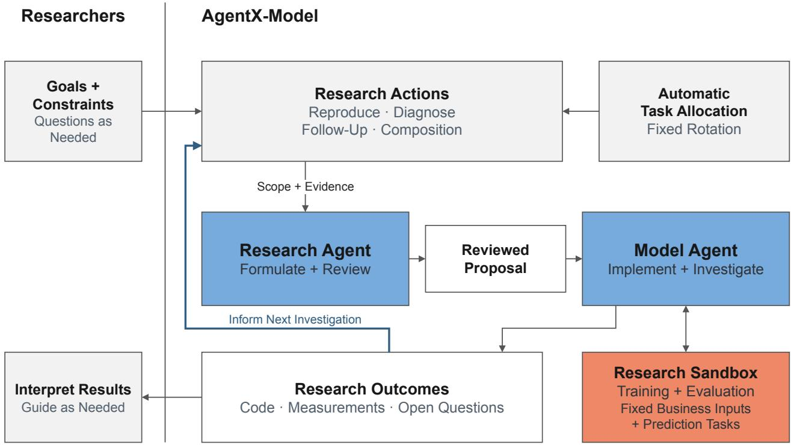  
Figure 1 | Human–agent collaboration in AgentX-Model. The vertical line marks the interaction boundary. Automatic allocation supplies a task type for the Research Agent to consider. The blue return arrow feeds outcomes back into research, so the right-hand loop can continue within the specified goals, constraints, and resources without a new human request.

This report makes three contributions:

• A dual-agent framework for autonomous research. We introduce a Research Agent and a Model Agent with distinct responsibilities for cross-experiment planning and within-experiment investigation, connecting proposal development, multi-round experimentation, and research continuation. Over approximately 25 days of observed production, the system completed 636 model-changing experiments.

• Four actions for long-horizon research. We organize research into Reproduce, Follow-up, Composition, and Diagnose, enabling the system to introduce methods, refine implementations, combine findings, and revise research questions in response to business feedback. In Scenario A, our longest-running setting, 7 of 77 Follow-ups and 5 of 120 Compositions recorded AUC above every comparable ancestor.

• A benchmark for continuing research decisions. We construct a dependency-aware historicalreplay benchmark with 473 experiment nodes across six environments to study how allocation policies and experience reuse afect subsequent experiment selection.

## 2. System Overview

AgentX-Model studies model changes within the inputs and prediction tasks of a business setting. Within that scope, the two agents divide the work of formulating a research question and investigating it. Their exchange of proposals and results connects individual experiments into continuing research paths (Figure 1).

## 2.1. A Research Sandbox Defined by the Business Setting

The business inputs and required predictions define the research sandbox. Agents can change how the model uses those inputs, but do not change upstream feature collection or redefine the prediction tasks. Training and evaluation use the business data and execution environment. Every experiment is anchored to a specified business baseline; its starting implementation may be that baseline or a model retained from an earlier experiment. Both agents receive the baseline’s inputs, labels, outputs, and model structure, with code references for the baseline and the chosen starting implementation.

Within this sandbox, agents can change feature representations and interactions, routing, backbones, connections, and task towers. They can add, remove, replace, merge, or tune components, and investigate losses or optimization where the task permits. Each proposal specifies how the computation will change. A replacement, for example, identifies both the new operation and the old path to remove, so that it is tested as a replacement rather than implemented as an additional branch.

The business baseline can evolve as models improve. Each result therefore records the baseline version and evaluation conditions used in that experiment. Findings from another business setting can suggest a useful direction, which must then be adapted and tested with the target setting’s inputs and prediction tasks.

## 2.2. Two Agents, Two Research Horizons

The Model Agent follows the implementation closely, inspects training behavior, and revises code in response to measurements. The Research Agent relates those findings to other experiments, external papers, and business feedback. This separation lets the Research Agent compare paths without carrying all training logs and local tests in one conversation.

The agents coordinate through a proposal: a document specifying a research question and its experimental design. Each delivered proposal defines one experiment, which the Model Agent may investigate through multiple rounds of implementation and verification. Experiments connected by inheritance or composition form a research path. Proposal-production attempts are counted separately from delivered experiments.

To begin an experiment, the Model Agent needs to know which code to modify, what change to investigate, and how to judge the result. The proposal provides these together with the research question. We summarize proposal � as

$$
P _ { t } = ( q _ { t } , s _ { t } , \delta _ { t } , \nu _ { t } ) ,\tag{1}
$$

where $q _ { t }$ is the research question, $s _ { t }$ the starting implementation, $\delta _ { t }$ the proposed modification or diagnostic intervention, and $\upsilon _ { t }$ the evaluation design, including reference results and success criteria. The Research Agent develops and reviews this proposal; the Model Agent investigates it and returns the code and observations from its rounds.

Those returns form a shared research state for subsequent proposals:

$$
S _ { t } = ( \varGamma _ { t } , \mathcal { E } _ { t } , Q _ { t } ) ,\tag{2}
$$

where $\textstyle { \mathcal { I } } _ { t }$ contains implementations, $\mathcal { E } _ { t }$ contains findings tied to measurements and comparison conditions, and $\textstyle { \mathcal { Q } } _ { t }$ contains unresolved questions. The implementations and findings retain their business setting, baseline version, and evaluation context. When forming the next proposal, the Research Agent can return to the code behind a result, examine what has already been tried, and consider the questions that remain.

## 3. Long-Horizon Research Cycle

## 3.1. Conducting an Investigation

Given an allocated research scope or a human question, the Research Agent’s Assembler investigates the sources and develops a proposal linking the proposed change to the starting code and evaluation design. An Auditor reviews it in a separate context, checking whether the change, starting implementation, and evaluation together answer the research question. The Assembler revises the proposal in response, or defers if it cannot support the design. Source and version checks bind delivery to the approved proposal. Appendix A details the review loop and its corrections. Appendix A.3 follows the shift from prescribed steps to agent-directed investigation.

The approved proposal gives the Model Agent a starting point $s _ { t }$ and a scope within which to investigate. It plans and codes a change, verifies the implementation, and then trains and measures the model. The measurements can motivate another revision or expose a question that needs further observation. Each round returns its code and findings, retaining useful intermediate models even when later revisions lose their gains. These returns update the shared research state (Section 3.2) and make the next proposal possible:

$$
S _ { t } \xrightarrow [ ] { \mathrm { p r o p o s e ~ a n d ~ r e v i e w } } P _ { t } \xrightarrow [ ] { \mathrm { i n v e s t i g a t e ~ a n d ~ r e t a i n } } S _ { t + 1 } .
$$

At each stage, the language model chooses what to inspect or revise; the agent harness supplies tools and enforces execution limits. Appendix B details the implementation checks and feedback loop.

Some recurring dificulties concern the execution process rather than the model being studied. The Model Agent can propose changes to tools or instructions, validate them, and submit them for human approval before deployment. It also autonomously judges whether an experiment ofers reusable experience and extracts candidate memories for human review; approved memories guide later planning and coding. These changes leave the language model’s weights fixed, as in experience-based skill and memory improvement [30, 35]. Related harness revision is studied in HarnessDev and RobustSGPO [11, 31]. Appendices B.2 and B.3 describe the two channels, and Appendix B.4 evaluates an agent-proposed, human-approved instruction revision on a fixed input batch.

## 3.2. Continuing from Experimental Evidence

A continuation first needs an implementation to build on. The final version is not always the useful one: a later change may have lost an earlier gain, while a short summary may omit details needed to reconstruct the model that produced it. Following the evidence-grounding approach of prior work [2], we retain round-specific code with its measurements, evaluation conditions, and diagnostic observations. Later revisions do not overwrite the best measured implementation. Their failures and regressions remain available too, recording what has been tried since that result.

Choosing the code does not yet determine how to judge the next experiment. A repair may start from a diagnostic model while seeking to retain the ranking gain of an earlier implementation. In that case, the diagnostic model supplies the starting code, while the earlier ranking result supplies a performance reference. We keep these choices separate in the proposal. The information needed to make them is summarized in Table 1.

We distinguish three reference results: the business baseline measures benefit in the target setting; the direct parent measures progress from the chosen source experiment; and the strongest comparable ancestor tests whether the research path has reached a new best. For an AUC comparison, let $\mathcal { N } _ { i }$ be experiment �’s rounds with valid measurements under the same evaluation conditions. Its best result

Table 1 | Information retained from an experiment and its use in subsequent research.
<table><tr><td>Information carried forward</td><td>Decision in the next experiment</td></tr><tr><td>Round-specific code and its baseline</td><td>Choose the implementation to resume from</td></tr><tr><td>Reference model, evaluation conditions, and measurements</td><td>Choose comparable reference results</td></tr><tr><td>Diagnostic observations and unresolved hypotheses</td><td>Design a test that distinguishes explanations</td></tr><tr><td>Complete effective changes from each source</td><td>Resolve overlap and design the joint modification</td></tr></table>

is

$$
b _ { i } = \operatorname* { m a x } _ { r \in \mathscr { V } _ { i } } \mathrm { A U C } _ { i , r } .\tag{3}
$$

Writing $\mathcal { P } _ { i }$ for the comparable direct parents and $\mathcal { A } _ { i }$ for all comparable ancestors, including those parents, gives

$$
\begin{array} { r } { \Delta _ { \mathrm { b a s e } } ( i ) = b _ { i } - b _ { \mathrm { b a s e } ( i ) } , } \\ { \Delta _ { \mathrm { p a r e n t } } ( i ) = b _ { i } - \underset { j \in \mathcal { P } _ { i } } { \operatorname* { m a x } } b _ { j } , } \\ { \Delta _ { \mathrm { p a t h } } ( i ) = b _ { i } - \underset { j \in \mathcal { R } _ { i } } { \operatorname* { m a x } } b _ { j } . } \end{array}\tag{4}
$$

Here $b _ { \mathrm { b a s e } ( i ) }$ is the recorded business-baseline AUC. Parent and path gains are reported only when the required comparable results are available; path gains require complete comparable ancestry. Repairing a degraded descendant can make $\Delta _ { \mathrm { p a r e n t } }$ positive while $\Delta _ { \mathrm { p a t h } }$ remains negative.

The same attention to comparison applies when retaining findings in $\boldsymbol { \mathcal { E } } _ { t + 1 }$ . An improvement from � to $A + B$ supports using the joint model under the tested conditions; it does not measure � independently. New observations may support or challenge an earlier explanation and change the questions in $\boldsymbol { Q } _ { t + 1 }$ . The next proposal can then choose an implementation from $\textstyle { \mathcal { I } } _ { t + 1 }$ to investigate a remaining weakness or its compatibility with another change. Papers and business feedback can also introduce new directions. These questions determine which code to start from and which references belong in the evaluation; diagnosis and calibration repair need not begin with the highest-AUC ancestor (Section 4.3.3).

## 3.2.1. Four Research Actions

The next research question depends on what is already known. A new paper supplies a possible mechanism but little evidence in the target setting. An anomaly supplies evidence of a problem but an incomplete explanation. A concrete improvement suggestion supplies a direction for continued work. Two successful paths supply candidate parts of a joint model. We represent these needs as four research actions, with task-specific starting points and interpretations of success.

Reproduce: introduce a mechanism into the target setting. Reproduce tests a paper-derived mechanism on a business baseline. The Research Agent reads the source method, identifies the computation to test, and adapts it to the available inputs and required predictions. When the experiment transfers part of a method, the proposal identifies the retained mechanism and the components outside its scope, defining the adaptation for the Model Agent to implement and test.

Diagnose: acquire the evidence needed to choose a repair. When several explanations fit an observed failure, prescribing a fix can be premature. A diagnostic task uses additional observations or targeted interventions to test those explanations and guide a subsequent repair. For example, a calibration task can vary the loss weight while tracking the learned correction and prediction statistics to assess whether stronger calibration pressure addresses the observed bias. The immediate objective is to reduce a concrete uncertainty and establish what to investigate or repair next.

A Diagnose can follow a completed Reproduce, Follow-up, Composition, or Diagnose experiment. Its implementation and findings can in turn support a Follow-up, contribute a source to a Composition, or motivate another Diagnose. These connections depend on the remaining question and available results, allowing diagnosis to enter and continue a research path as needed.

Follow-up: continue a result with a specific purpose. A Follow-up starts from an implementation with measured results and investigates an explicit problem or improvement opportunity. It carries the relevant code and evidence, including the best version when later rounds have regressed. This gives the Model Agent a defined research starting point while preserving its ability to explore alternatives within the question. The target can be a higher AUC or a business requirement such as calibration, with the appropriate performance constraints retained.

Composition: test complementarity rather than accumulate modules. Two beneficial modifications can share an operation, replace the same module, or depend on incompatible assumptions. The Research Agent therefore examines their complete efective changes relative to the common baseline. Shared changes are kept once, conflicts require a choice, and the proposal identifies the distinct contribution remaining from each source. The experiment tests whether those contributions work together. The goal is to exceed the best comparable result from either source path, not just retain a gain over the business baseline.

All four actions use the same proposal and execution interface, and each experiment can contain several rounds of local investigation. They can also lead into one another: a reproduced gain can prompt diagnosis, a diagnosis a Follow-up, and a repaired result a later Composition.

A completed negative result can motivate a Follow-up if it exposes a specific problem or a testable improvement. Infrastructure failures and executions without valid measurements are excluded from automatic performance Follow-ups. The path pauses when resources or a supported next question are unavailable; its earlier valid implementations remain available for future research.

## 3.3. Selecting the Next Investigation

Several continuations and new methods may compete for the next experiment budget, but their availability changes as research proceeds. A Composition needs usable results from both source experiments; a Follow-up needs a source implementation and a supported question. A task-type allocation still requires deciding whether the evidence supports a concrete experiment.

We use a human-designed scheduling policy as a baseline for sustained operation and trajectory collection. We separate task-type allocation from concrete proposal construction, a distinction also used in RecHarness [4]. The policy allocates opportunities across Reproduce, Diagnose, Follow-up, and Composition. Routine rotation and explicit research demands enter the same allocation layer, which determines the action type to consider (Figure 2).

Within this scope, the Research Agent decides what investigation the available evidence supports. It examines the shared research state � , relevant papers, and business feedback to select sources and a starting implementation, formulate a research question, and design the experiment. When the evidence supports a concrete experiment, the proposal enters the refinement loop in Section 3.1;

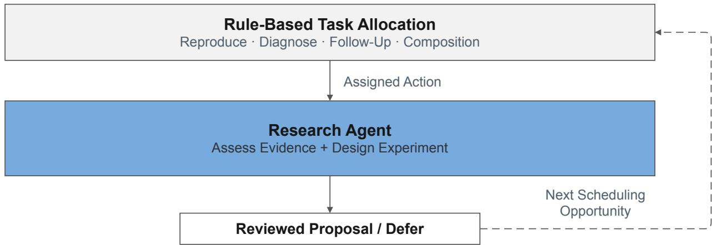  
Figure 2 | Task allocation and research decisions. Human-designed rules allocate a research-action type. The Research Agent uses available evidence to construct and refine a concrete investigation or defer. The dashed return marks the next scheduling opportunity.

otherwise, the agent defers. Resource and eligibility rules constrain the candidate pool and execution. The resulting trajectories provide the candidate space and within-experiment feedback for the scheduling benchmark in Section 4.5.

## 4. Evaluation and Findings

The evaluation follows the work from proposal production to model outcomes and continued research. Production records show what was delivered and measured; the resulting research paths show how implementations and questions were taken forward. We then examine experience reuse and use historical replay to compare ways of selecting subsequent experiments.

## 4.1. Experimental Setting

Scenarios A and D represent two distinct business settings; Scenarios B, C, and E are baseline code versions within a third business setting. The distinct code versions in B and E have the same measured baseline AUC of 0.815403. Production evaluation covers Scenarios A–D; historical replay also includes E. We evaluate the models produced and refined within AgentX-Model against their business baselines and online A/B controls. Table 2 summarizes the production records and agent evaluation datasets. The execution subset includes all 200 delivered proposals with Research Agent execution records available in the initial frozen snapshot of the sampled 10-day production records. The 189-experiment subset comes from the continuation archive and requires at least two rounds with valid AUC per experiment. We report online A/B results from the five latest Launch Reviews (LRs).

Measurements are grouped by setting, baseline version, prediction head, and evaluation procedure. Continuation comparisons use verified best-round AUC, matching baseline entry-file content, prediction head, and reported baseline AUC; strongest-ancestor comparisons also require complete comparable ancestry. Each result table reports its eligible sample size.

With the random seed fixed, repeated executions yield pooled within-implementation AUC standard deviations of 0.002208, 0.001010, and 0.001099 for Scenario A, Scenarios B/C/E, and Scenario D, respectively. Under comparable evaluation conditions, larger ofline AUC gains relative to run-to-run variability help prioritize candidates for online A/B tests that assess business impact.

Table 2 | Production records and agent evaluation datasets.
<table><tr><td colspan="2">Dataset Size</td><td colspan="2">Use</td></tr><tr><td colspan="2">Production Records</td><td colspan="2"></td></tr><tr><td>Proposal production (10-day sample)</td><td>886 attempts; 262 deliveries</td><td>Throughput</td></tr><tr><td>Offline results (~25 days)</td><td>636 model-changing experiments</td><td>Baseline gains</td></tr><tr><td>Continuation archive</td><td>1,218 experiments; 923 valid results</td><td>Research continuity</td></tr><tr><td colspan="3">Agent Evaluation</td></tr><tr><td>Execution subset</td><td>200 delivered proposals</td><td>Outputs and timing</td></tr><tr><td>Multi-round subset</td><td>189 experiments</td><td>Best vs. final round</td></tr><tr><td>Historical replay</td><td>473 nodes; 6 environments</td><td>Selection strategies</td></tr><tr><td>Instruction revision</td><td>40 fixed inputs</td><td>Generation quality</td></tr></table>

## 4.1.1. Implementation Details

During business production, the Research Agent used the Pi agent runtime, with separate contexts for the Assembler and Auditor, while the Model Agent used Claude Code. Both used privately deployed GLM-5.2 as the underlying language model. The Model Agent submitted training and evaluation jobs to the internal KML platform, retaining per-round code changes, measurements, and logs. The Model Agent modifies model code, while evaluation uses fixed code provided by the platform. Subsequent historical-data processing, replay-based evaluation, and result assessment used GLM-5.3.

## 4.2. Sustained Operation in Production

We sampled the most recent 10 days of proposal production for this report, recording 886 attempts and 262 proposals delivered to the Model Agent. In the frozen subset of 200 delivered proposals, 198 had outputs returned by the Model Agent and 177 yielded verifiable experimental measurements (Table 3).

Producing these 200 proposals took a median of 33.6 minutes and a 90th percentile of 49.9 minutes, including investigation, review, and revision but not downstream queueing or training.

Table 3 | Proposal production in the sampled 10-day window. Execution outcomes and production times are reported for a subset of 200 delivered proposals.
<table><tr><td>Measure</td><td>Observation</td></tr><tr><td>Proposal-production attempts</td><td>886</td></tr><tr><td>Proposals delivered to the Model Agent</td><td>262</td></tr><tr><td>Delivered proposals assessed for execution</td><td>200</td></tr><tr><td>Proposals with Model Agent outputs</td><td>198/200</td></tr><tr><td>Proposals with verifiable experimental measurements</td><td>177/200</td></tr><tr><td>Median proposal-production time</td><td>33.6 min</td></tr><tr><td>90th-percentile proposal-production time</td><td>49.9 min</td></tr></table>

## 4.3. Model Gains and Research Continuity

The completed experiments provide both models to evaluate and starting points for further work. We first compare their performance with business baselines and report online A/B outcomes. We then follow how those models were revised and combined, distinguishing performance inherited from

earlier experiments from new path-best records. A calibration case extends this analysis to a business requirement that emerged after a ranking gain.

## 4.3.1. Performance Gains Across Evaluation Settings

Ofline model performance. We summarize ofline results from the latest stable production generation over an approximately 25-day observation period. Table 4 reports each setting’s baseline AUC, best measured AUC, and the number of completed model-changing experiments that exceeded their corresponding baseline. Diagnose experiments are excluded from this model-gain summary; Section 4.3.3 illustrates how diagnosis guides subsequent calibration repair.

Table 4 | Ofline model gains over approximately 25 days. Valid results are completed experiments whose published AUC is verified against round-level measurements. Best AUC is the highest measured AUC among these experiments; ΔAUC is its gain over the corresponding baseline. Results counted as above business baseline exceed it by more than $1 0 ^ { - 6 }$
<table><tr><td>Evaluation setting</td><td>Baseline AUC</td><td>Best AUC</td><td>ΔAUC</td><td>AUC above business baseline / Valid (%)</td></tr><tr><td>Scenario A</td><td>0.773683</td><td>0.797352</td><td>+0.023669</td><td>500/527 (94.9%)</td></tr><tr><td>Scenario B</td><td>0.815403</td><td>0.823145</td><td>+0.007742</td><td>21/29 (72.4%)</td></tr><tr><td>Scenario C</td><td>0.816849</td><td>0.820246</td><td>+0.003397</td><td>20/33 (60.6%)</td></tr><tr><td>Scenario D</td><td>0.809656</td><td>0.811432</td><td>+0.001776</td><td>19/47 (40.4%)</td></tr></table>

All four evaluation settings produced models above their business baselines. The proportions in Tables 4 and 5 are not experiment success rates: many Follow-up and Composition experiments inherit implementations that already outperform the business baseline. Progress beyond inherited results is assessed against parents and ancestors in the continuation analysis below. The improvements involved diferent model changes. In Scenario B, the best measured model expanded the expert pool from one to four and changed the routing and load-balancing mechanism. In Scenario $\mathrm { C } ,$ it restricted information flow between token groups while adding a learned compensation path. The best Scenario A result continued an implementation with accumulated denoising, gating, and expertrouting changes, and corrected the scale of its pairwise ranking loss. In Scenario D, a Follow-up addressed codebook collapse by revising temperature normalization in the entropy regularizer.

Ofline results by experiment category. Table 5 breaks down the same 636 completed modelchanging experiments by category; 560 exceeded their business baselines. Knowledge Transfer is a proposal-source category: it supplies evidence from another setting (Section 4.4). The resulting experiments follow the same proposal, execution, and review process.

Online business impact. Table 6 summarizes the model changes and online A/B results documented in these five LRs. Relative gains over the respective control groups include acquisition eficiency, target-segment advertising spend, and user engagement. The LR 3 model also reduced cost by pruning auxiliary training objectives unused in online prediction, while retaining the required outputs.

## 4.3.2. Evolution Through Follow-up and Composition

The baseline comparisons describe the models obtained. To understand how research continued, we now follow the proposals and results over time, examine one branching lineage, and compare continuations with their parents and ancestors.

Table 5 | The same 636 completed model-changing experiments, grouped by category. Definitions follow Table 4; percentages use valid results within each category as the denominator.
<table><tr><td colspan="2">Evaluation setting Experiment category</td><td>Valid results</td><td>AUC above business baseline</td><td>Share (%)</td></tr><tr><td rowspan="3">Scenario A</td><td></td><td>51</td><td>41</td><td>80.4%</td></tr><tr><td>Reproduce Composition</td><td>308</td><td>302</td><td>98.1%</td></tr><tr><td>Follow-up</td><td>168</td><td>157</td><td>93.5%</td></tr><tr><td rowspan="2">Scenario B</td><td>Reproduce</td><td>20</td><td>15</td><td>75.0%</td></tr><tr><td>Follow-up</td><td>9</td><td>6</td><td>66.7%</td></tr><tr><td rowspan="3">Scenario C</td><td>Reproduce</td><td>24</td><td>15</td><td>62.5%</td></tr><tr><td>Composition</td><td>4</td><td>3</td><td>75.0%</td></tr><tr><td>Follow-up</td><td>5</td><td>2</td><td>40.0%</td></tr><tr><td rowspan="4">Scenario D</td><td>Reproduce</td><td>7</td><td>0</td><td>0.0%</td></tr><tr><td>Knowledge Transfer</td><td>16</td><td>5</td><td>31.3%</td></tr><tr><td>Composition</td><td>2</td><td>1</td><td>50.0%</td></tr><tr><td>Follow-up</td><td>22</td><td>13</td><td>59.1%</td></tr></table>

Table 6 | Online A/B results from the five latest Launch Reviews. Relative gains use coarse ranges.
<table><tr><td></td><td>LR Model change</td><td>Relative improvement</td></tr><tr><td>1</td><td>Adaptive attention temperature</td><td>Acquisition efficiency: 10-15%</td></tr><tr><td>2</td><td>Attention-module combination with normalization</td><td>Target-segment advertising spend: 15-20%</td></tr><tr><td>3</td><td>Multi-task objective pruning</td><td>Watch time across two clients: 0.3–0.8%; FLOPs and parameter count: approximately 10% lower</td></tr><tr><td>4</td><td>Hierarchical aggregation with calibration</td><td>Overall daily active users: 0.5-1%; target-page follow actions: 3-4%</td></tr><tr><td>5</td><td>Cross-setting mechanism transfer</td><td>Target-segment advertising spend: 5-10%</td></tr></table>

The best AUC record levels of as research questions shift. From the production records underlying Table 4, we track 453 Scenario A proposals delivered under one fixed business baseline over the final 16 calendar days: 317 Compositions and 136 Follow-ups. Of these 453 delivered proposals, 432 yielded valid completed results and are included in the ofline summary above. Figure 3 places their measured performance alongside the changing distribution of proposal topics. An LLM assigned each proposal a primary direction based on its research question and proposed modification. Labels describe the new change rather than inherited modules; secondary directions were retained in the annotations. The cohort’s cumulative best AUC reached 0.797167 on day � + 6, then increased by 0.000185 to 0.797352 on day � + 11 and remained unchanged through day � + 15, where � marks the observation start. Meanwhile, representation and interaction questions declined from 55.4% to 39.0% of delivered proposals, while loss and optimization rose from 14.4% to 27.3% and simplification from 4.3% to 9.1%. The best AUC record changed little in the later part of the observation window, while a growing share of proposals examined training objectives and model simplification.

One result becomes the starting point for several branches. Figure 4 shows a 14-experiment excerpt from a Scenario A research lineage under a fixed business baseline (AUC 0.773683). It spans approximately 11 days from the first proposal delivery to the final returned result. Four paperderived Reproduce experiments feed successive Compositions. Follow-up F1 then records the highest AUC along its ancestry and becomes a source for three continuations: another Follow-up and two Compositions with implementations from a diferent research path. The Follow-up branch records lower AUC in F2 and F3. Compositions C4 and C5 combine F1 with P1 and P2 but remain below those stronger parents by 0.000328 and 0.001450 AUC.

(a) Measured Model Performance  
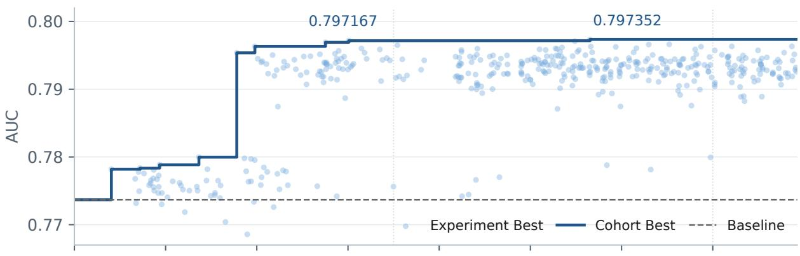

(b) Research Directions in Delivered Proposals  
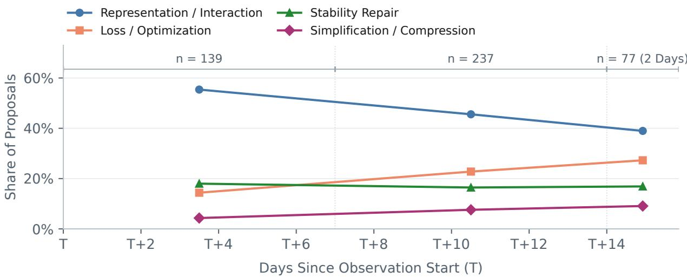  
Figure 3 | Model and research evolution from a fixed baseline in Scenario A. (a) Points show experimentbest AUC by result-report time; the step line tracks the cohort best from the business baseline. Experiments may inherit implementations from before the delivery window. (b) Shares use all proposals in each interval as the denominator, with one primary direction per proposal; four of seven directions are shown. � marks the observation start. The final interval spans only two days, � + 14 through � + 15.

Comparing continuations with parents and ancestors. The lineage example shows why a continuation has more than one relevant reference: its immediate source may difer from the strongest earlier model. We examine this distinction across experiments using the separate frozen continuation archive. In the Scenario A records, 46 of 91 comparable Follow-ups have a higher best-round AUC than their direct parent. Among the 77 Follow-ups with complete comparable ancestry, 7 exceed every ancestor (Table 7). Composition also yields few new path-best records. The parent and ancestor comparisons distinguish a local recovery from a new record along the path.

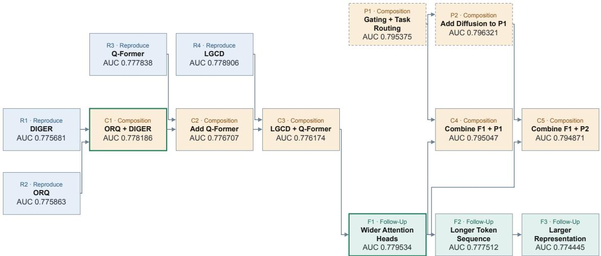  
Figure 4 | An example research lineage spanning approximately 11 days in Scenario A. Each node is an experiment labeled with its best measured AUC; arrows connect parents to children. Green borders mark new path-best AUC records. Dashed boxes summarize the other path’s earlier ancestry.

Table 7 | Scenario A continuation results. Each cell gives experiments with a higher best-round AUC over the number with the required comparable evidence. An increase must exceed $1 0 ^ { - 6 }$ to avoid rounding ties. Complete ancestry requires more evidence, so the column denominators difer.
<table><tr><td>Research action</td><td>AUC above strongest direct parent</td><td>AUC above all ancestors</td></tr><tr><td>Follow-up</td><td>46/91 (50.5%)</td><td>7/77 (9.1%)</td></tr><tr><td>Composition</td><td>6/139 (4.3%)</td><td>5/120 (4.2%)</td></tr></table>

Preserve the best measured implementation, not just the last. The comparisons above use each experiment’s best measured round. A later experiment needs access to the code from that round, which may difer from the final implementation. Among the 189 experiments with multiple valid round-level measurements, 111 (58.7%) record higher AUC after the first valid round, but 91 (48.1%) have a last valid round whose AUC falls below an earlier best. These groups can overlap: an experiment can exceed its first-round AUC and still finish below its intermediate best. Here, “last” means the last round with a valid AUC measurement, not a subsequent failed attempt. Keeping the best measured code with its evaluation context preserves that starting point. Lower-scoring rounds and failures record subsequent attempts and inform the next research question.

A combination that required a further model revision. In a separate Scenario A Composition, the first source had adapted language-guided conditional difusion (LGCD) [20] to the model’s feature-fusion path and reached 0.778906. The second was a previous Composition whose shared variant of the Attention-Free Token Mixer (AFTM) from FuXi-� [21] reached 0.775554. Its best round disabled the additional trafic-specific branch. The Research Agent selected that shared mixing operation for the new Composition rather than carrying over the entire second model.

The proposal replaced cross-attention in the conditional difusion denoiser with SiLU-gated attention-free mixing. The Model Agent built a joint model with conditional generation and mixtureof-experts fusion. Figure 5 separates the two source results from the rounds of this new experiment.

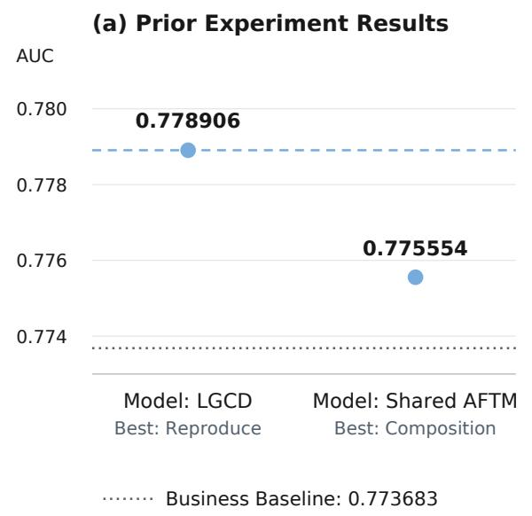

(b) New Composition: Two Rounds  
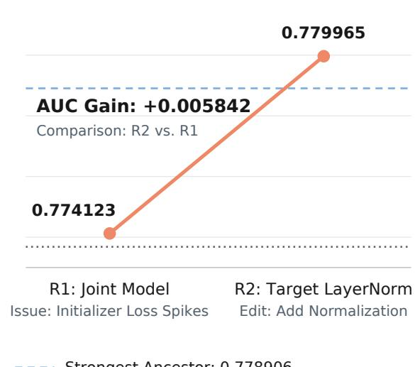

Figure 5 | A Scenario A Composition followed by within-experiment refinement. The left panel shows the best rounds of the two direct source experiments, not successive rounds. The right panel shows the two rounds of the new joint model. The LGCD source is the new experiment’s strongest comparable ancestor. Dashed reference lines mark the business baseline and strongest-ancestor AUC; only the two Composition rounds are connected by a line.

The first round reached 0.774123, below both direct sources. Its report identified spikes in the loss used to train the difusion initializer. The Model Agent then normalized each difusion-target token with a non-afine LayerNorm. Comparing the two rounds’ code changes confirms that this local normalization was the only implementation change between them. The second round reached an AUC of 0.779965, 0.005842 above the first round and 0.001059 above the strongest ancestor. Its report described smaller loss spikes after the revision. The training problem exposed by the initial combination prompted this local revision.

## 4.3.3. From Ranking Gains to Calibration Repair

Further research can also be prompted by a business requirement rather than another structural change. In Scenario A, we report AUC for ranking performance and PCOC for aggregate calibration. An adaptation of SMES [24], which routes each prediction task to selected shared expert networks, improved ofline AUC from 0.773683 to 0.778940. Business feedback then identified prediction bias, giving the next investigation a specific purpose: improve calibration while preserving the ranking gain. PCOC is the ratio of predicted to observed totals:

$$
\mathsf { P C O C } = \frac { \sum _ { n } \hat { y } _ { n } } { \sum _ { n } y _ { n } } ,\tag{5}
$$

Here $\hat { y } _ { n }$ and $y _ { n }$ are the prediction and observed label for sample �. PCOC above 1 indicates overprediction and below 1 underprediction.

Business review identified online overprediction for the original model and an ofline–online calibration mismatch for an earlier repair. These observations motivated the ofline Diagnose and immediate Follow-up described below. The Research Agent began with a hypothesis about the existing correction: would a larger calibration-loss weight move the learned correction further and improve PCOC? It organized a Diagnose to examine that possibility.

The Diagnose increased the calibration-loss weight from 1 to 10 and used a direct SMES replacement, whereas the earlier repair used a layer-normalized gated residual connection. In this configuration, the learned correction parameter, the log-bias, remained near −0.10, close to the historical value of −0.09, and test PCOC was 0.953836. Training observations led the Model Agent to infer that the parameter had settled under the current objective. It proposed examining the calibration statistics next, rather than increasing the loss weight again.

The Follow-up pursued a correction estimated from the calibration statistics. During proposal review, the Auditor caught a draft targeting a diferent prediction task and required the original task and Diagnose implementation to be inherited explicitly (Appendix A.2). The reviewed proposal used the Diagnose code and estimated a multiplicative correction from training data. For the training samples T accumulated after warm-up, the correction factor was

$$
c = \frac { \sum _ { n \in \mathcal { T } } y _ { n } } { \sum _ { n \in \mathcal { T } } \hat { y } _ { n } } ,\tag{6}
$$

using predictions before the new correction and their corresponding labels. The factor was applied to additional evaluation outputs, without fitting to test labels or changing the existing inference outputs. The first round collapsed during training, with an AUC of 0.500000. The Model Agent reran the same code and obtained two healthy executions (Table 8).

Table 8 | The Scenario A calibration path. Before/after values compare outputs of the same run, retaining the inherited calibration and then adding the new factor. Error reduction is relative to |PCOC − 1| before correction. All Follow-up rounds use the same code patch; R1 collapsed during training.
<table><tr><td>Implementation</td><td>AUC</td><td>PCOC before</td><td>PCOC after</td><td>Error reduction</td></tr><tr><td>Business baseline</td><td>0.773683</td><td></td><td></td><td>一</td></tr><tr><td>SMES best</td><td>0.778940</td><td></td><td></td><td>一</td></tr><tr><td>Diagnose</td><td>0.775103</td><td>0.953836</td><td></td><td>一</td></tr><tr><td>Follow-up R1</td><td>0.500000</td><td></td><td></td><td></td></tr><tr><td>Follow-up R2</td><td>0.775632</td><td>0.951715</td><td>0.962735</td><td>22.8%</td></tr><tr><td>Follow-up R3</td><td>0.775318</td><td>0.948190</td><td>0.959965</td><td>22.7%</td></tr></table>

Correction factors estimated from training data reduced test-set calibration error by 22.8% and 22.7% in the two healthy runs. Their ranking AUC observations remained above the business baseline.

The path began with a ranking gain and continued with a calibration question raised by business feedback. It motivates staged optimization with joint acceptance: first find a useful ranking model, then require the final model to meet business constraints while retaining its ranking benefit.

## 4.4. Knowledge Transfer Across Settings

The preceding cases continue research within a business setting. We also explored whether findings from one setting could provide starting points in another. The source settings ofered more room for structural improvement at lower iteration cost, whereas Scenario D had a more heavily optimized starting model and required more resources and time for each trial. These diferences motivated accumulating findings in the lower-cost settings and using them to formulate proposals for the more costly target setting.

We call this cross-setting proposal route Knowledge Transfer. The Research Agent reads sourceexperiment code and results and compresses them into guidance describing the tested changes, observed outcomes, and conditions relevant to reuse. It then examines the Scenario D baseline and develops a proposal specifying how to adapt and test the selected idea with the target inputs and prediction tasks. The proposal goes through independent review before the Model Agent implements and evaluates it in Scenario D. Paper-derived proposals instead take their candidate mechanisms directly from a paper’s method. The comparison thus concerns where the evidence for a new research question comes from: a published method or findings from experiments in another setting.

In this exploratory comparison, we examine the two proposal sources in the frozen continuation archive. The two historical cohorts were collected in diferent periods without matched experiment budgets. Restricting the comparison to matching baseline entry-file content, the same prediction head, and baseline AUC of 0.809656 leaves seven paper-derived experiments and 15 Knowledge Transfer experiments with valid published AUC. The broader production summary in Table 4 includes one additional measured Transfer whose starting entry-file content could not be verified.

Table 9 | Historical Scenario D results by proposal source. ΔAUC is the published AUC minus the common baseline AUC of 0.809656.
<table><tr><td>Proposal source</td><td>Valid results</td><td> $\Delta \mathrm { A U C } > 0$ </td></tr><tr><td>Paper-derived</td><td>7</td><td>0 (0%)</td></tr><tr><td>Knowledge Transfer</td><td>15</td><td>5 (33.3%)</td></tr></table>

In this cohort, Knowledge Transfer produced more above-baseline AUC observations: five of 15 experiments, compared with none of seven paper-derived Reproduce experiments (Table 9). The largest increment was 0.000789. These above-baseline implementations provide more candidate starting points for subsequent research.

## 4.5. Selecting the Next Experiment

Forming a useful research proposal leaves a further choice when several directions are available: which experiment should run next? We study this choice through historical replay, where policies select among recorded experiments and receive their results. The benchmark compares fixed, feedbackdriven, and agent-led allocation by the results found, selections required, and decision cost. It also examines stalled searches and, in a separate comparison, whether summaries help an agent that can already inspect source code and results.

Dependency-aware graph replay. Nodes represent experiments and edges represent their recorded prerequisite dependencies. Each replay run starts from the business baseline with no experiment nodes preselected. Follow-up and Composition candidates become available after their prerequisite experiments have been selected. A Composition requires multiple source experiments, so its availability depends on progress along more than one research branch. Selecting an experiment therefore both reveals its results and can unlock subsequent candidates. The replay captures this changing opportunity set when comparing selection policies. Each selection counts once against the experiment budget and returns the selected experiment’s recorded rounds as feedback. Outcomes are available only for combinations that were actually executed.

We construct separate replay environments for each baseline version. Scenario C has a baseline AUC of 0.816849 and Scenario E has 0.815403. The replay evaluation contains six test environments with 473 experiment nodes: one graph each for Scenarios A, B, C, and E with 348, 26, 21, and 69 nodes, respectively, and two Scenario D graphs with three and six nodes. Scenario C includes two Compositions, whereas Scenario E has none.

Before selection, agents see opaque candidate identifiers, action types, and links to revealed parents and sources, and can inspect the baseline code and an eligible candidate’s first implementation, its pre-change code, and their dif. This view contains neither original proposal text nor post-execution reports; the candidate’s measurements and later revisions remain hidden. Selecting it reveals recorded round-level measurements, execution and review status, failure reasons, and best-round comparisons, and unlocks available code from its recorded rounds for subsequent decisions.

Experiment selection policies. The three main policies share the LLM configuration described in Section 4.1.1 and use the same tools, eligibility conditions, and experiment budget. Fixed routing cycles through Composition, Follow-up, Follow-up, and Reproduce, skipping unavailable types; the agent selects a candidate within the chosen type. Bandit routing adapts the type allocation from revealed outcomes and uses the same candidate selector. Joint selection lets the agent choose the type and candidate together. The comparison therefore changes how opportunities are allocated while retaining agent-based candidate selection in all three policies. Fixed routing serves as the baseline for comparing allocation policies in historical replay. The recorded opportunities reflect prior human-designed and agent-assisted selection, often extending promising paths, and cover only branches that were executed. The comparison is therefore conditioned on this historical sampling.

The routing comparison on Scenarios A, B, C, and E includes Reproduce, Follow-up, and Composition. Diagnose is excluded because the value of information for a later repair is not captured by immediate AUC. Bandit routing uses Thompson Sampling with a Beta(1, 1) prior, rewarding a strict new highest valid AUC among revealed results, including the baseline. We also include Uniform Random and parent-result Greedy as low-cost references. Greedy ranks legal candidates by revealed direct-parent best AUC, substitutes the baseline for roots or missing parent measurements, and breaks ties with a seeded random generator.

Each replay run allows at most 20 experiment selections, with checkpoints at 5, 10, and 20. It stops earlier if no candidates remain. We run all five policies three times on each of the four graphs for Scenarios A, B, C, and E, for 60 runs. The two small Scenario D graphs are evaluated only with Uniform Random and parent-result Greedy, each repeated three times, for another 12 runs. Agent sessions and policy state are reset between repeats. All 72 runs completed.

A run reaches the target when it first finds a valid AUC strictly greater than the comparable baseline plus 0.001. For runs that reach the target, we report the number of selections required. Attainment and completion rates use all planned runs as their denominator. We report best AUC after 20 selections, decision time, and token use. The same number of selected experiments can represent diferent historical training costs.

Results found across environments. Final AUC rankings varied across replay environments, and no allocation policy consistently led across them (Table 10). Fixed rotation with agent-based candidate selection remained competitive.

Attainment of the predefined baseline-plus-0.001 target gives a first view of what the policies found. All 60 runs on Scenarios A, B, C, and E reached it, including 46 on the first selection. This threshold therefore provides limited separation among policies on these graphs. Neither Scenario D graph contains a result that meets it: the six-node Transfer graph reaches 0.810445 from a baseline of 0.809656, a gain of 0.000789, while the three-node Reproduce graph has no result above that baseline. The 12 Scenario D runs exhaust their small candidate pools without attaining the target.

The highest AUC records after 20 selections distinguish the policies further. In Scenario A, Uniform Random’s mean exceeds Fixed, Greedy, and Joint. Bandit has the highest mean on the two larger graphs, but its Scenario A mean is strongly influenced by one run reaching 0.788360; the sample standard deviation across its three Scenario A runs is 0.005092. On the Scenario B and C graphs, final scores are identical or nearly identical, which leaves a diferent question: how many selections were needed to reach them?

Table 10 | Mean best AUC after 20 selections on the four graphs for Scenarios A, B, C, and E. Each policy completes three runs per graph; baselines and evaluation contexts are row-specific. Fixed and Bandit allocate the type before agent candidate selection; Joint selects both.
<table><tr><td>Evaluation setting</td><td>Baseline</td><td>Random</td><td>Greedy</td><td>Fixed</td><td>Bandit</td><td>Joint</td></tr><tr><td>Scenario A</td><td>0.773683</td><td>0.782285</td><td>0.779145</td><td>0.780657</td><td>0.782500</td><td>0.780012</td></tr><tr><td>Scenario B</td><td>0.815403</td><td>0.823145</td><td>0.823141</td><td>0.823141</td><td>0.823141</td><td>0.823141</td></tr><tr><td>Scenario C</td><td>0.816849</td><td>0.819780</td><td>0.819780</td><td>0.819780</td><td>0.819780</td><td>0.819780</td></tr><tr><td>Scenario E</td><td>0.815403</td><td>0.821067</td><td>0.820931</td><td>0.821011</td><td>0.821614</td><td>0.821011</td></tr></table>

Selections required to reach the same result. Final AUC can conceal diferences in the number of experiments required to reach it. The Scenario C graph has 21 nodes, so the 20-selection budget covers nearly the entire graph. All five policies reached the same highest recorded AUC of 0.819780 in all three repeats. This result is a Composition of two Reproduce experiments whose best AUCs are 0.818920 and 0.819011, both above the 0.816849 business baseline. The two sources are parallel research paths: both must be selected before their combination becomes available. The minimum is three selections; the 15 runs reached the combination after 7–20 selections.

Table 11 provides a post-hoc comparison of the selections required to reach this shared endpoint, including all prerequisites. Across three repeats on Scenario C, Joint reached the shared endpoint after 10.67 selections on average (range 7–16), compared with 14.67 for Fixed (12–16). Both policies reached the same model through diferent sequences of prerequisite and other experiments.

Table 11 | Selections to first reach the highest recorded AUC (0.819780) on the Scenario C graph. Each policy has three repeats; all 15 runs reach this result within the 20-experiment budget.
<table><tr><td>Policy</td><td>Mean</td><td>Median</td><td>Range</td></tr><tr><td>Uniform Random</td><td>18.00</td><td>18</td><td>16-20</td></tr><tr><td>Parent-result Greedy</td><td>13.33</td><td>15</td><td>8-17</td></tr><tr><td>Fixed routing + Agent</td><td>14.67</td><td>16</td><td>12-16</td></tr><tr><td>Bandit routing + Agent</td><td>16.67</td><td>17</td><td>15-18</td></tr><tr><td>Joint selection</td><td>10.67</td><td>9</td><td>7-16</td></tr></table>

When subsequent experiments remain unavailable. Candidate availability exposed a diferent obstacle in Scenario A. The graph contains 83 Compositions, yet none was selected in the 15 runs. In all nine agent runs, no Composition became eligible because its required source experiments had not all been selected. Preferring Composition therefore did not sufice to make a combination executable. Whereas the Scenario C policies eventually reached the combination, these Scenario A runs never unlocked one. This contrast motivates evaluating an experiment not only by its recorded result, but also by the subsequent research opportunities it makes available.

To examine whether other stalled searches left opportunities unused, we ask at checkpoints 5 and 10 whether an unselected better result remained reachable in the frozen graph. Its minimum additional cost is one selection for that result plus its unfinished dependencies, counting shared dependencies once. This distinguishes three situations: an improvement reachable within budget, an improvement requiring more budget, or no better reachable recorded result. The analysis uses hidden outcomes after the run; the selection policy does not see them. This dependency-based lower bound does not include any additional selections imposed by fixed task-type rotation.

Across 120 checkpoints from the 60 runs on Scenarios A, B, C, and E, 110 still had a better recorded result reachable within the remaining budget. Of those 110 checkpoints, 19 were followed by no higher AUC record. The remaining 10 of the 120 checkpoints had no better reachable record; none was limited solely by the cost of unfinished dependencies. A flat search curve can therefore reflect either an unused opportunity or the limit of the recorded pool.

Decision cost. The 36 agent runs took approximately 430 minutes in total: about 124 for Fixed, 157 for Bandit, and 149 for Joint. They used 97.5 million metered tokens, including 86.7 million cache-read tokens. These costs measure selection and evidence inspection in replay, separately from the historical experiments’ training costs. Uniform Random and parent-result Greedy required no language-model calls. Their competitive results provide low-cost references for replay.

Selecting with summarized experience. Allocation determines which opportunities the agent considers; the evidence it receives then informs the choice. In an exploratory comparison, we hold the Joint selector fixed and compare access to raw source-experiment code and AUC measurements with access to the same material plus compressed summaries.

In each of Scenarios A and E, six development experiments supply three source-reviewed summaries. An initial batch emphasizes actionable modifications and reuse hypotheses; a second batch uses the same sources but specifies the intervention location, comparison, measurement, and conditions for reuse. Summary generators could access only the development-source code and measurements, not target candidates or their results. Source reviewers used these materials to correct factual errors, but already knew results from earlier benchmark runs on the same target graphs; the review was not blind. Each summary batch was frozen before its paired selection runs.

We retain the Joint selector’s model, tools, and 20-selection budget from the routing study. Each batch has three paired repeats per setting, giving two 12-run batches reported separately from the 72-run routing comparison. Two of the three initial Scenario A pairs completed all 20 selections. In the third pair, the summary condition timed out after 18 selections. Table 12 includes the two complete pairs for that row; every other row includes three complete pairs.

Alongside best AUC and selections to the same result, we examine a post-hoc measure of candidate choice: how often the selected experiment has a positive recorded gain over its baseline. This criterion is ΔAUC > 0, not the routing study’s attainment threshold of 0.001 or a gain over the parent. Counts pool replay selections across repeats, which can revisit the same historical experiment. The excluded partial pair gives 16 positive selections in each condition over their common first 18 selections.

The summaries reduce selections with non-positive recorded gains in both Scenario E batches. In Scenario A, positive selections are unchanged in the initial batch and lower in the comparativesummary batch. In one Scenario A pair in the comparative-summary batch, the summary condition finds a best AUC 0.017284 higher than the raw-evidence condition; the other two pairs show a small gain and a decline. In Scenario E, two pairs reach the same final best AUC, but the summary condition arrives eight selections earlier in one pair and eight later in the other; the third pair ends lower. Across both batches, summaries do not consistently improve best AUC or reach the same result sooner.

Table 12 | Summary comparisons in historical replay. Above-baseline selections count experiments whose best valid AUC exceeds their baseline, summed across repeats. Paired ΔBest@20 is withsummary minus raw-evidence best AUC. The initial Scenario A row includes two complete pairs; each other row includes three pairs.
<table><tr><td></td><td></td><td colspan="2">Above-baseline selections</td><td></td></tr><tr><td>Summaries</td><td>Evaluation setting</td><td>Raw</td><td>+ Summary</td><td>Paired ∆Best@20</td></tr><tr><td>Initial</td><td>Scenario A</td><td>37/40</td><td>37/40</td><td>+0.000998, -0.000950</td></tr><tr><td>Initial</td><td>Scenario E</td><td>51/60</td><td>55/60</td><td>0, 0, -0.001809</td></tr><tr><td>Comparative</td><td>Scenario A</td><td>54/60</td><td>52/60</td><td>-0.001052, +0.000329, +0.017284</td></tr><tr><td>Comparative</td><td>Scenario E</td><td>49/60</td><td>51/60</td><td>0, 0, -0.001602</td></tr></table>

## 5. Related Work

Agentic research for recommendation. AutoRecLab [7] makes requirements explicit and uses prototype execution and refinement to implement studies with recommendation libraries. Industrial model changes also need to preserve the intended mechanism and satisfy production constraints. NOVA [3] addresses this through semantic verification, candidate testing, and trajectory memory that guides subsequent architecture changes, including adaptations from research papers. RecHarness [4] studies how to allocate trials across modification directions: a bandit selects a direction, while an LLM constructs the concrete hypothesis and code change. CORAL [5] applies a related feedback loop to a diferent optimization surface, adjusting retrieval and serving configurations under operating constraints using measured online outcomes. AutoLR [9] combines proposal review, evidence-guided direction selection, and ofline evaluation to prepare candidates for human-gated online testing and launch review. RecSys Factory concentrates agent autonomy at decision points within deterministic industrial pipelines [29]. Our setting concerns model research within business-defined input and output interfaces, with architecture and training changes evaluated before deployment.

Within this setting, our earlier AgentX work [1] established paper-driven exploration, multiround experimentation, and cross-paper combination. Work on token mixing and feature interaction, including RankMixer [17], Climber [18], and UniMixer [19], provides architectural mechanisms for such exploration. From Trajectories to Evidence [2] examined how to turn experimental histories into records supported by code, measurements, and applicability conditions, and studied their conditional use in subsequent adaptations. This report builds on that foundation to examine sustained research paths. Returned implementations and findings inform the next proposal’s question, starting code, and evaluation target. We follow how those choices support continued improvement, combination, or diagnosis when new observations change the research objective.

Long-horizon research and experience reuse. Long-horizon research systems retain model findings and execution experience across experiments [32, 33]. Auto-RecSys [6] supports this reuse in industry-scale recommendation through asynchronous experimentation, shared memory, and two feedback loops. Its execution loop updates model-specific playbooks from operational experience; its idea loop uses experimental outcomes to guide subsequent proposals. Ideas can come from researchers, papers, and model-aware brainstorming, and experiment history helps filter duplicates and develop combinations of partial successes. This is closely related to our separation between forming research questions and conducting the resulting experiments, as well as to the Model Agent’s reuse of implementation experience.

Evaluated implementations also support cumulative search beyond recommendation. AlphaEvolve [12] combines LLM-generated program changes with evaluation and evolutionary selection. ERA [13] uses tree search to develop empirical software, incorporates external research ideas, and explores recombinations of promising methods. Agora [8] instead emphasizes shared research state: Git-backed contributions preserve dependencies and verification records across agents, with a sustained weight-transfer study illustrating their use. These approaches, together with memory-guided graph search [34], make earlier solutions and findings material for further investigation. We examine the corresponding choices in industrial model research: which measured round to inherit, whether a combination improves on its strongest source, and how business feedback can redirect a successful model toward calibration or other deployment requirements. Binding these choices to code and evaluation context allows later tasks to continue from a specific result instead of reconstructing it from a narrative summary.

Research selection and historical replay. When several continuations are available, experience reuse leaves a further decision: which opportunity should receive the next experiment budget? AIRAdojo [14] separates search policies from the operators that generate or revise solutions, comparing greedy, Monte Carlo tree search, and evolutionary strategies. AI Research Preference Models [15] address the cost of candidate evaluation by using plans, code, and previous outcomes to predict which candidates merit execution. Dream-RSI [16] instead uses recorded discovery trees as replay environments for evaluating and revising exploration policies before deploying them in further online search. These works separate solution quality from the policy that allocates research.

Our benchmark studies this distinction at the level of complete research experiments. A selected experiment may itself contain multiple implementation and evaluation rounds; those rounds become evidence for later selections. The replay benchmark compares how policies allocate opportunities among Reproduce, Follow-up, and Composition while respecting their recorded dependencies. Fixed task-type rotation provides the baseline, with the agent selecting a candidate within the allocated type; bandit and joint selection vary that allocation. Replay evaluates these choices on observed research paths, while the production cases show what continuing those paths entails: retaining useful implementations, testing combinations, and resolving questions raised by prior results.

## 6. Lessons from Long-Horizon Model Research

Our observations suggest six lessons, grouped around three themes: preserve the state needed to continue research (L1–L3), let evidence refine the research question (L4), and match research decisions to their evidence and dependencies (L5–L6).

L1. Preserve the best measured implementation alongside the latest research state. Retain the best measured code and its measurements even when research moves on to a later version. Many multi-round experiments finish below an earlier measured best (Section 4.3.2), so overwriting it can remove a useful starting point. Keep the latest diagnosis and failed attempts alongside it: they explain what has been tried since that model was obtained.

L2. Distinguish parent-level AUC gains from a new path-best result. Specify the starting code separately from the results used to judge progress. In Scenario A, continuations more often record AUC above their direct parents than above all comparable ancestors (Section 4.3.2). Using both references distinguishes recovery from a new path-best record. The strongest ancestor need not supply the starting code: a repair may need the diagnostic implementation and its observations.

L3. Carry evaluation context together with implementations. Retain the prediction output, label, sample population, metric, and comparison result with the code. These details determine what a continuation is testing. In the calibration case (Section 4.3.3), review caught a draft targeting a diferent prediction task (Appendix A.2). Reviewing the proposed change together with its evaluation helps keep the next experiment focused on the inherited observation.

L4. Let business feedback update the research objective. A continuation should specify both the new requirement and the performance to preserve. In the calibration path, business feedback redirected research on a model with ranking gains toward prediction bias (Section 4.3.3). That changed the purpose of the next experiment: diagnosis needed to distinguish explanations, while repair needed to improve calibration and check the retained ranking performance.

L5. Treat candidate availability as part of experiment selection. In the Scenario A replay, agents did not select all the source experiments needed for Composition, so preferring that action type alone did not make its candidates available (Section 4.5). A next test should compare policies using only an experiment’s expected result with policies that also value the combinations it unlocks.

L6. Evaluate experience reuse according to the decision it supports. Transferred experience supplied new proposals implemented and evaluated in Scenario D (Section 4.4), while adding summaries to raw evidence did not consistently improve best AUC or shorten selection paths (Section 4.5). Instruction revisions improved another output: first-draft implementation plans (Appendix B.4). These are three distinct uses of experience. New model ideas need evaluation in the target setting; implementation guidance needs checks on newly generated outputs; selection guidance needs comparison of the choices, models, and path costs it produces.

Across these investigations, AgentX-Model has produced and evaluated a variety of model modifications. We present selected methods in Appendix C; the main text focuses on how model changes arise from prior experiments and how their results support further research.

## 7. Conclusion

This report examines how AgentX-Model carries the results of one experiment into subsequent model research. Production records document sustained operation and ofline model improvements within business-defined sandboxes. Online A/B tests recorded gains in acquisition eficiency, target-segment advertising spend, and engagement, with task pruning also reducing model cost.

The research paths show what continuing this work entails: retaining code from useful measured rounds, choosing references that distinguish inherited performance from new progress, and pursuing questions raised by the results. Business feedback extended one such path from ranking gains to diagnosis and ofline calibration improvement. When choosing among further experiments, fixed task-type rotation with agent-based candidate selection remained competitive in historical replay. The combinations left unavailable by missing source experiments point to a next question for selection: how to pursue the experiments that make useful continuations possible.

## References

[1] Changxin Lao et al. AgentX: Towards Agent-Driven Self-Iteration of Industrial Recommender Systems. arXiv preprint arXiv:2606.26859, 2026. https://arxiv.org/abs/2606.26859.

[2] Zijie Zhuang et al. From Trajectories to Evidence: Auditable Experimental Records for Industrial Research Agents. arXiv preprint arXiv:2608.05235, 2026. https://arxiv.org/abs/2608. 05235.

[3] Shaohua Liu et al. NOVA: A Verification-Aware Agent Harness for Architecture Evolution in Industrial Recommender Systems. arXiv preprint arXiv:2606.27243, 2026. https://arxiv. org/abs/2606.27243v3.

[4] Haoran Ling et al. RecHarness: A Bandit-Routed Agentic Harness for Self-Evolving Recommender Systems. arXiv preprint arXiv:2607.29241, 2026. https://arxiv.org/abs/2607.29241.

[5] Muhammad Rafay Azhar et al. CORAL: An LLM-Native Harness for Production Recommender Systems. OARS Workshop at RecSys 2026, accepted, 2026. https://arxiv.org/abs/2609. 02730.

[6] Ming Li et al. Auto-RecSys: Harnessing Autonomous Research Agents for Industry-Scale Recommender System. arXiv preprint arXiv:2609.10922v1, 2026. https://arxiv.org/abs/2609. 10922v1.

[7] Moritz Baumgart et al. AutoRecLab: Describe the Experiment, Get the Code! RecSys 2026, Demo Track, to appear. arXiv:2609.21863v1, 2026. DOI (forthcoming): 10.1145/3773078.3841273. https://arxiv.org/abs/2609.21863v1.

[8] Yifan Zhang et al. Agora: Git as Shared Memory for Collective AutoResearch. arXiv preprint arXiv:2609.18094v1, 2026. https://arxiv.org/abs/2609.18094v1.

[9] Qi Zhang et al. AutoLR: Automating the Path from Research to Launch Review in Industrial Recommender Systems. arXiv preprint arXiv:2609.04871v1, 2026. https://arxiv.org/ abs/2609.04871v1.

[10] Haochen Wang, Yi Wu, Daryl Chang, Li Wei, and Lukasz Heldt. Self-Evolving Recommendation System: End-To-End Autonomous Model Optimization With LLM Agents. RecSys 2026, Industry Track, to appear. arXiv:2602.10226v3, 2026. https://arxiv.org/abs/2602.10226v3.

[11] Yuhao Wu et al. HarnessDev: Can LLMs Create and Evolve Their Own Agent Harness? arXiv preprint arXiv:2609.01437v1, 2026. https://arxiv.org/abs/2609.01437v1.

[12] Alexander Novikov et al. AlphaEvolve: A coding agent for scientific and algorithmic discovery. arXiv preprint arXiv:2506.13131, 2025. https://arxiv.org/abs/2506.13131.

[13] Eser Aygün et al. An AI system to help scientists write expert-level empirical software. Nature, 654:909–916, 2026. DOI: 10.1038/s41586-026-10658-6. https://arxiv.org/abs/2509. 06503v3.

[14] Edan Toledo et al. AI Research Agents for Machine Learning: Search, Exploration, and Generalization in MLE-bench. Advances in Neural Information Processing Systems, 38, 2025. https://arxiv.org/abs/2507.02554v2.

[15] Thomas Simon Foster et al. AI Research Preference Models. arXiv preprint arXiv:2608.13940v2, 2026. https://arxiv.org/abs/2608.13940v2.

[16] Tong Zheng et al. Dream-RSI: Recursive Self-Improvement through Evolving Worlds. arXiv preprint arXiv:2609.14858v1, 2026. https://arxiv.org/abs/2609.14858v1.

[17] Jie Zhu et al. RankMixer: Scaling Up Ranking Models in Industrial Recommenders. CIKM, pages 6309–6316, 2025. DOI: 10.1145/3746252.3761507. https://arxiv.org/abs/2507. 15551.

[18] Songpei Xu et al. Climber: Toward Eficient Scaling Laws for Large Recommendation Models. CIKM, pages 6193–6200, 2025. DOI: 10.1145/3746252.3761561. https://arxiv.org/ abs/2502.09888.

[19] Mingming Ha et al. UniMixer: A Unified Architecture for Scaling Laws in Recommendation Systems. arXiv preprint arXiv:2604.00590, 2026. https://arxiv.org/abs/2604.00590.

[20] Ziang Lu et al. From Clues to Generation: Language-Guided Conditional Difusion for Cross-Domain Recommendation. SIGIR, pages 1266–1276, 2026. DOI: 10.1145/3805712.3809563. https://arxiv.org/abs/2604.05365.

[21] Yufei Ye et al. FuXi-�: Towards a Lightweight and Fast Large-Scale Generative Recommendation Model. arXiv preprint arXiv:2508.10615, 2025. https://arxiv.org/abs/2508.10615.

[22] Junwei Yin et al. DOS: Dual-Flow Orthogonal Semantic IDs for Recommendation in Meituan. Proceedings of the ACM Web Conference 2026 (WWW ’26), 4 pages, 2026. DOI: 10.1145/3774904.3792845. https://arxiv.org/abs/2602.04460.

[23] Junchen Fu et al. Diferentiable Semantic ID for Generative Recommendation. SIGIR, pages 369–379, 2026. DOI: 10.1145/3805712.3809641. https://arxiv.org/abs/2601.19711.

[24] Yukun Zhang et al. SMES: Towards Scalable Multi-Task Recommendation via Expert Sparsity. KDD ’26, pages 8522–8531, 2026. DOI: 10.1145/3770855.3818483. https://arxiv.org/ abs/2602.09386.

[25] Jin-Duk Park and Won-Yong Shin. Memory Is No Longer a Bottleneck: Memory-Eficient Graph Filtering for Scalable Collaborative Filtering. IEEE Transactions on Knowledge and Data Engineering, 38(8):5269–5281, 2026. DOI: 10.1109/TKDE.2026.3704986. https://arxiv. org/abs/2606.21540.

[26] Qingyun Liu et al. TokenMinds: Pretrained User Tokens and Embeddings for User Understanding in Large Recommender Systems. arXiv preprint arXiv:2606.25147, 2026. https://arxiv. org/abs/2606.25147.

[27] Weidi Pan et al. RecEvolve: A Knowledge-Driven Autonomous Agent System for Recommender Systems. arXiv preprint arXiv:2609.01622, 2026. https://arxiv.org/abs/2609.01622.

[28] Jinxin Hu et al. Astar: Learning to Propose Evolution Directions for Self-Evolving Industrial AI Systems. arXiv preprint arXiv:2608.27287, 2026. https://arxiv.org/abs/2608.27287.

[29] Dongyang Ao, Kaixiang Fang, and Shijie Xu. RecSys Factory: Bounding LLM Agent Autonomy to Decision Points in the Industrial Recommender Lifecycle. arXiv preprint arXiv:2608.11241, 2026. https://arxiv.org/abs/2608.11241.

[30] Yang Xiao et al. PILOT in the Loop: Live Self-Improvement for Long-Horizon Agents. arXiv preprint arXiv:2608.26530, 2026. https://arxiv.org/abs/2608.26530.

[31] Zibo Zhao et al. RobustSGPO: Search-Space Control for Agent Harness Evolution. arXiv preprint arXiv:2609.09646v2, 2026. https://arxiv.org/abs/2609.09646v2.

[32] Guoxin Chen et al. Toward Autonomous Long-Horizon Engineering for ML Research. arXiv preprint arXiv:2604.13018, 2026. https://arxiv.org/abs/2604.13018.

[33] Mingming Zhao et al. ScienceFlow: A Long-Horizon Agent for ML Research, Scientific Discovery and Beyond. arXiv preprint arXiv:2608.14354, 2026. https://arxiv.org/abs/2608. 14354.

[34] Shangheng Du et al. MLEvolve: A Self-Evolving Framework for Automated Machine Learning Algorithm Discovery. arXiv preprint arXiv:2606.06473, 2026. https://arxiv.org/abs/ 2606.06473.

[35] Yuchen Ma et al. SkillGen: Verified Inference-Time Agent Skill Synthesis. arXiv preprint arXiv:2605.10999, 2026. https://arxiv.org/abs/2605.10999.

## Appendices

## A. Research Agent Proposal Refinement

## A.1. Proposal Refinement Mechanism

In one calibration proposal, the draft targeted a diferent prediction task from the problem it was intended to repair. In a Composition proposal, review found that the design repeated one source instead of retaining a distinct contribution from each. These cases, detailed in Appendix A.2, illustrate why the Research Agent reviews a proposal before committing training resources to it.

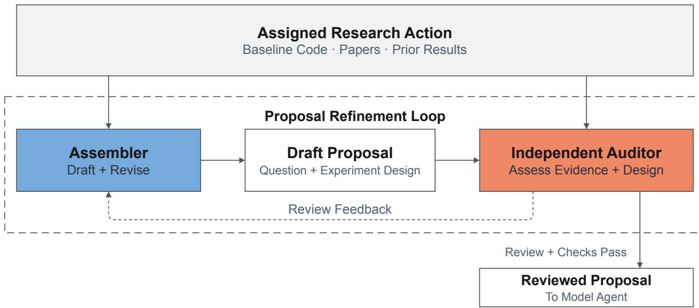  
Figure 6 | Proposal refinement inside the Research Agent. The dashed enclosure marks the core loop: construct a proposal, review it independently, and revise and resubmit in response to feedback. Assigned actions and shared evidence are inputs; delivery to the Model Agent is an exit after approval and automated checks. Execution limits are enforced by the harness.

The review loop in Figure 6 separates construction from assessment. An Assembler investigates the assigned research action and develops the proposal. An Auditor reviews it in a separate context and returns the issues that must be addressed before delivery.

Independent review with a shared understanding of the baseline. Both roles receive the baseline’s inputs, prediction tasks, model structure, and supporting code references. They reuse a checked description of that version when available, or establish it by inspecting the code. They share these facts but retain separate responsibilities: the Assembler writes and revises the proposal, and the Auditor decides whether it is ready for delivery.

The Auditor uses supporting evidence, expected observations, and unresolved assumptions to assess whether the change $\delta _ { t }$ to starting implementation $s _ { t } .$ together with the evaluation $\nu _ { t s }$ can answer $q _ { t }$ . For a Composition, it examines what each source contributes after overlapping changes are removed. For a Diagnose, it asks which observation could contradict the proposed explanation.

Focused revision after review. The Assembler addresses the most important issue in the review and resubmits the proposal. It retains established baseline facts and reads further when a revision reaches a new code path or encounters conflicting evidence. The Auditor then checks whether the revision resolves the issue. If the candidate remains unsupported, the agent can try a recorded alternative or defer. Time, revision, and no-progress limits halt attempts that cannot secure approval.

Approval of the reviewed proposal. Delivery requires both the Auditor’s approval and automated checks for required information, source references, and matching model versions. The two checks serve diferent purposes: a code reference may exist yet point to an operation unrelated to the proposed change. Only the exact reviewed version is delivered; later edits require another review. Drafts, review feedback, and revisions are retained for later analysis of design changes.

The following cases show how review changed delivered proposals; Section 4.2 reports end-to-end proposal-production time.

## A.2. Proposal Revision Cases

Correcting the target of calibration repair. The PCOC Follow-up in Section 4.3.3 initially proposed calibrating a diferent prediction output. The Auditor checked the parent’s report and code and identified the mismatch with the reported bias. It also found that the draft cited raw business-baseline code without establishing the required starting point in the parent’s SMES implementation. The Assembler revised the question, code-change instructions, and evaluation together. The delivered proposal targeted the original prediction output and label, and retained the parent’s SMES routing and training-side calibration. It required paired calibration measurements and a check that ranking performance was preserved. One blocking review led to one revised submission; the interval from the first review request to delivery was approximately 20 minutes.

Correcting a composition that repeated one source. In another Scenario A proposal, the Assembler attributed an attention output projection, $W _ { O . }$ , to the second parent and proposed adding it to the first. The Auditor inspected both parents’ code changes and found that the first already contained $W _ { O } \colon$ the proposed combination repeated that parent and omitted the second parent’s layer normalization of the reverse-process representation. The Assembler rewrote the question to test that normalization on the first parent’s implementation, taking into account its previously observed lack of AUC improvement in the second parent’s configuration. A second review found that the revision placed normalization before the wrong expert-fusion component and checked mechanism activation without requiring the AUC improvement posed by the question. The final proposal corrected the insertion point and added an AUC-based completion condition. Two blocking reviews led to two revised submissions, with approximately 27 minutes from the first review request to delivery.

In both cases, the first submitted draft had passed automated validation. The Auditor’s review changed the research design by checking it against the source experiments.

## A.3. Workflow Evolution and Development Observations

Our Research Agent initially used language models within an engineer-defined sequence of reading, checking, and repair. New paper mechanisms and business baselines often required another coded branch to decide what to read or repair.

We moved these decisions into the Research Agent’s loop (Figure 7). Within the allocated task type, it chooses evidence to inspect and revises its proposal in response to the same independent Auditor. The harness retains control over permissions, budgets, output checks, and delivery.

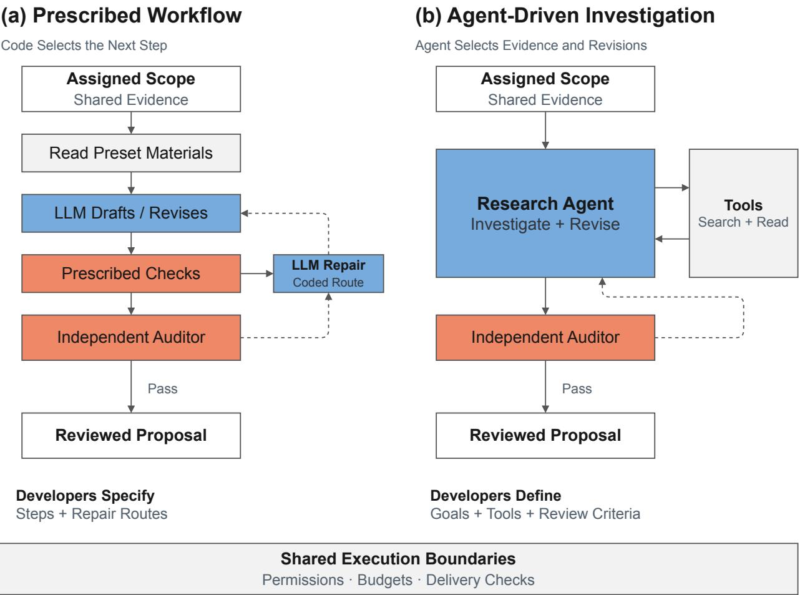  
Figure 7 | From prescribed workflows to agent-driven proposal production. Both versions use language models and the same independent Auditor; the investigation and repair path is prescribed by code in (a) and selected by the agent in (b). Dashed arrows indicate revision feedback. Execution boundaries remain enforced in both versions.

Development consequently shifted toward evidence-access tools, context organization, review feedback, stopping conditions, and delivery. The agent could keep reading without committing to a candidate, carry excess context, or reopen a broad investigation after a small review comment. We therefore separated exploration from revision: first submit a complete proposal, then address the issue preventing its approval (Section 3.1).

## B. Model Agent Execution and Self-Evolution

## B.1. Multi-Round Model Research

The Model Agent investigates the reviewed question through repeated cycles of planning, coding, verification, training, and evaluation. Starting from � , it can revise the model or test alternatives within the proposal’s scope, using �� to assess the results. A weak result may motivate a diferent implementation; training instability may require additional observations before another model change. Figure 8 shows this within-experiment loop and how its execution records support later improvements to the agent itself.

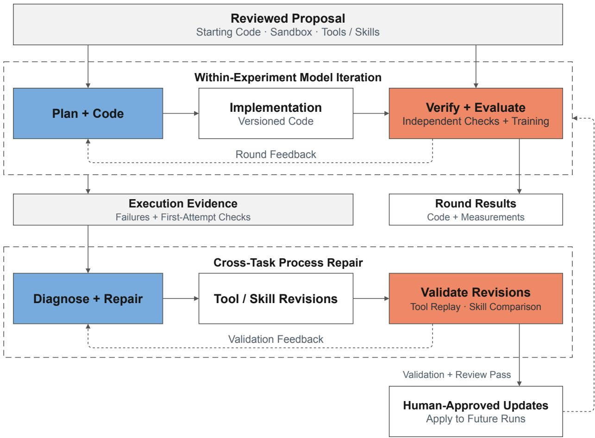  
Figure 8 | Model Agent iteration and process repair. The upper loop develops a model within the reviewed experiment. Failures and first-attempt check results feed the lower repair loop, where tool and skill revisions undergo separate forms of validation before human-approved deployment to future runs. Repair acceptance rules remain fixed. Cross-task experience learning is described separately.

Checking the implementation before training. Each round begins with a plan linking the intended model change to its rationale and observable tests. Structural checks verify the required elements and code references, while a language-model review checks fidelity to the research materials. After coding and self-checking, the implementation undergoes a smoke test and independent verification against the plan. The verification decision is also checked against its evidence: cited code must exist, claimed observables must be implemented, and the conclusion must follow from those checks.

Findings return to the relevant generation stage for bounded revision. A round that exhausts its repair budget retains a failure record rather than advancing to training. First-attempt check results remain available after successful repair to track recurring defects.

Using experiment feedback. After training, the Model Agent compares results with the reference implementation and checks its explanation against the recorded observations. These findings, unresolved questions, and human comments guide the next round. Each round’s code and measurements are retained for later inheritance, including useful intermediate models (Section 3.2).

## B.2. Self-Evolution Through Process Repair

Correcting an implementation helps the current experiment. When the same problem recurs across experiments, the reusable tool or instruction may need to change. Process repair investigates this second question: what change to the execution process would prevent later tasks from needing the same local correction? The language model’s weights remain fixed; the objects of revision are error classifiers, checkers, prompt construction, and skill instructions. Memory provides a separate way to carry implementation experience into later tasks (Appendix B.3).

Turning repeated failures into a repair target. The harness groups failure records and first-draft check findings using deterministically extracted signatures: the recorded reason, exception, gateway error, and checker finding. This gives recurring failures a stable identity across experiments. The repair agent inspects representative records and the deployed code, identifies the component responsible, and proposes a bounded change in an isolated workspace. It can revise permitted components but cannot change the evidence or its own acceptance rules.

The component matters because similar execution outcomes require diferent repairs. A missing native library can terminate training just as a model-code bug does, but the recovery actions difer. In the documented libjvm case, the repair changes the failure classifier from a code-error decision to an environment-error decision eligible for retry. The patch addresses the system’s response to the failure; repairing the external environment remains a separate operation. For repeated omissions in an implementation plan, the relevant target is instead the instruction that generates the plan.

Replaying a tool change against fixed evidence. A classifier or checker patch can be tested on the same archived inputs before and after the change. The validation set contains the target failures and successful controls with known expected outcomes. It measures whether the target decisions are corrected and whether previously correct decisions are preserved. In the missing-library case, validation checks that environment failures are classified correctly and become eligible for retry.

Independent review examines the patch and its diagnostic rationale. Replay checks decisions against expected outcomes while holding the inputs and sample membership fixed.

Regenerating outputs after an instruction change. Rechecking an existing plan cannot measure whether a new instruction produces a better plan. Skill validation instead generates fresh outputs with both the current and candidate instructions. The automated repair protocol separates cases available during patch development from held-out target and control cases used for acceptance. Repeated current-version runs estimate variation; the comparison checks the targeted defect and other errors in newly generated outputs.

Version isolation is part of this test. Each instruction version is loaded in an isolated execution environment outside the working repository, with a distinct marker used to check which version was read. The repair is limited to the diagnosed instruction section. Checks examine both the declared categories and whether required observations appear in the generated content.

Deploying and observing the revision. The test split and acceptance rules remain outside the repair agent’s control. Validated revisions are submitted for human approval before production use. After deployment, subsequent execution records are checked for recurrence of the same failure signature; recurring failures can reopen the investigation. Appendix B.4 evaluates an earlier instruction revision using fresh plans for a fixed input batch.

## B.3. Agent-Initiated Memory Extraction and Reuse

Some findings are better retained as implementation guidance than encoded as changes to the tools. The Model Agent autonomously assesses whether an experiment has produced reusable experience and, when it has, extracts a candidate memory for human review. Approved memories enter production to guide subsequent planning and coding within their model scope. Each candidate records the source tasks, supporting code and measurements, and conditions under which the guidance applies. It may describe a recurring implementation mistake or a practice supported by a measured improvement.

Using a memory in a later implementation. For a later task, the Model Agent examines the memory’s source code, measurements, and conditions to decide whether the guidance applies to the current model. It uses applicable guidance in planning and coding, then evaluates the resulting implementation. Memory guides individual tasks; process repair updates shared tools and instructions.

## B.4. Instruction Revision Evaluation

Repeated defects in implementation plans can be addressed by improving the instructions used to generate later plans. In a fixed-batch regression evaluation, we compare the original and revised instructions on the same 40 paper-reproduction inputs whose earlier failures informed the revision. The Model Agent proposed changes to its plan-generation skill and the constraint checklist supplied during plan repair; a human reviewed and approved the proposed changes. These are shared instructions used to generate plans across tasks. Each of the 40 inputs is used to generate one new plan under each instruction version.

Table 13 compares first drafts generated before and after the revision. Both versions use the same evaluation procedure: deterministic checks assess the required plan elements, while an LLM judge evaluates fidelity to the mechanisms specified in the input material. We also count cases that omit a required mechanism without acknowledging the omission.

Table 13 | First-draft implementation plans before and after instruction revision in a regression evaluation on the same 40 paper-reproduction inputs.
<table><tr><td>Metric</td><td>Before</td><td>After</td></tr><tr><td>First-draft structural pass rate</td><td>37.5%</td><td>95.0%</td></tr><tr><td>Semantic fidelity</td><td>72.5%</td><td>95.0%</td></tr><tr><td>Plans with unacknowledged mechanism omissions</td><td>4</td><td>0</td></tr></table>

Structural pass rate increased by 57.5 percentage points and semantic fidelity by 22.5 points, with no remaining unacknowledged omissions in this batch. The revised instructions improved first drafts before any per-plan repair.

## C. Selected Findings from AgentX-Model Research

The four cases adapt published methods to weight features using within-sample relationships, pair continuous features with discrete prototypes, generate missing semantic profiles, and revise code selection and updates in a quantizer.

## C.1. Mem-GF: Parameter-Free, Sample-Adaptive Feature Weighting

This adaptation dynamically adjusts features using relationships within the current sample, without learning an additional weighting network. Mem-GF [25] originally filters user interaction signals on an item graph, using Krylov/Lanczos computations to apply a polynomial filter without storing the full item similarity matrix. The adaptation instead treats a sample’s feature tokens as graph nodes, using their relationships to adjust the ranker inputs (Figure 9).

The branch rescales and normalizes the tokens. Their inner products define an implicit similarity operator, applied through matrix–vector products rather than an explicitly stored graph. Krylov/Lanczos computations apply the polynomial filter to a signal formed from the token norms. The resulting scalar $s _ { i }$ modulates token � before residual fusion:

$$
H _ { i } ^ { \prime } = \mathrm { L 2 N o r m } \big ( 0 . 9 H _ { i } + 0 . 1 s _ { i } \bar { H } _ { i } \big ) ,\tag{7}
$$

where $H _ { i }$ is the original token and $\bar { H _ { i } }$ is its rescaled version. Both the weighting and coordinate rescaling depend on the sample, allowing the branch to change the direction of its feature representations. The added branch has no trainable parameters. In Scenario E, AUC increased from the business baseline’s 0.815403 to 0.820512, a gain of 0.005109.

## Mem-GF: From Item Scores to Feature Modulation

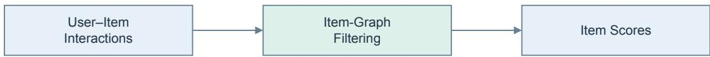

Business Adaptation  
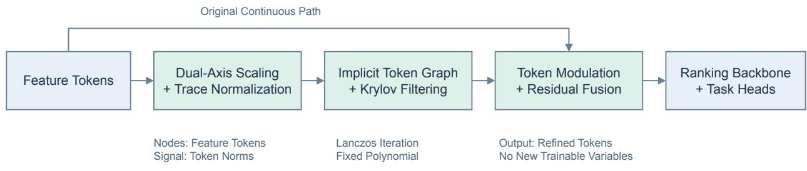  
The filter changes the representation supplied to the ranking backbone.  
Figure 9 | Sample-adaptive feature modulation. Within-sample token relationships determine the adjustments supplied to the ranking backbone.

## C.2. TokenMinds-Inspired Quantization: Pairing Features with Shared Prototypes

Continuous intermediate representations preserve sample-specific detail; learned discrete prototypes ofer shared representation patterns. TokenMinds [26] constructs semantic IDs from video content, then uses a pretrained user model to produce discrete user tokens and continuous embeddings for downstream models. This adaptation borrows their complementary roles: the ranking network directly quantizes its intermediate tokens into learned prototype vectors while retaining the original continuous features (Figure 10).

Token groups use separate multi-level residual quantizers. Each level selects a code vector, and the next represents what remains after that selection; the selected vectors are added to form the quantized representation. Fusion uses continuous features as queries and keys and quantized features as values, letting the continuous representation determine how to read the prototypes. The fused vectors join all original tokens in the multi-task prediction network. The prototypes are learned vectors, not predefined user categories.

This implementation originated from a human-specified research request and is already part of the Scenario D baseline.

## TokenMinds Adaptation: Quantization Inside the Ranker

Business Adaptation  
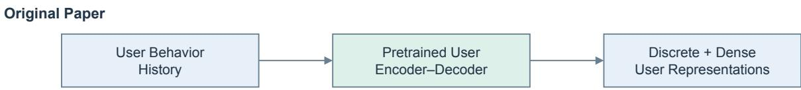

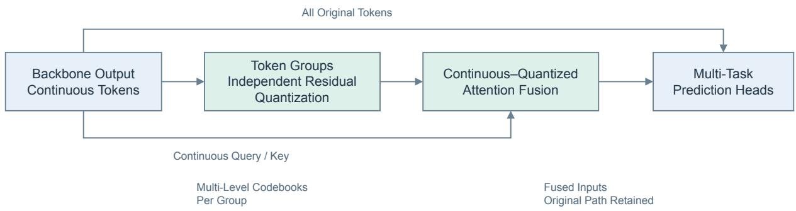  
Figure 10 | Continuous features read learned discrete prototypes. The fused representations and all original tokens feed the prediction network.

## C.3. LGCD with AFTM: Generating Missing Semantic Profiles

LGCD [20] uses difusion to generate a user’s preferences in another domain. The Scenario A adaptation instead generates a semantic vector from business features, using existing semantic embeddings as training targets. The ranker uses the generated vectors for all users, including those without an existing semantic profile (Figure 11).

Training pairs business user features with available semantic embeddings. The embeddings are split into blocks and normalized to form denoising targets. A conditional denoiser learns to reconstruct them, while an initial-state predictor learns to generate a starting representation from the business features. The ranking path uses this predictor followed by a short reverse difusion chain and fuses the generated representation back into the ranker. Reconstruction trains the denoiser; the reverse chain is detached from the ranking-loss gradient. For users without target embeddings, the initial-state predictor also learns to match the detached generated output.

LGCD replaced the original vector-quantization path, removing the insertion point used by the AFTM parent. The Composition therefore moves AFTM-inspired mixing into the denoiser. In FuXi-�, AFTM [21] mixes sequence content using positional and temporal relations, then applies multiplicative gating. Here, there is only one condition token, so standard cross-attention has a softmax weight of one along the condition axis. The adapted gate uses the noisy state and difusion time to modulate each dimension of the user condition, adapting sequence mixing to state-dependent conditioning.

The complete implementation reached 0.779965, compared with the business baseline of 0.773683 and the strongest direct parent of 0.778906. The corresponding recorded margins are 0.006282 and 0.001059; Figure 5 shows the associated experimental trajectory.

## LGCD Adaptation: From Domain Transfer to Semantic Generation

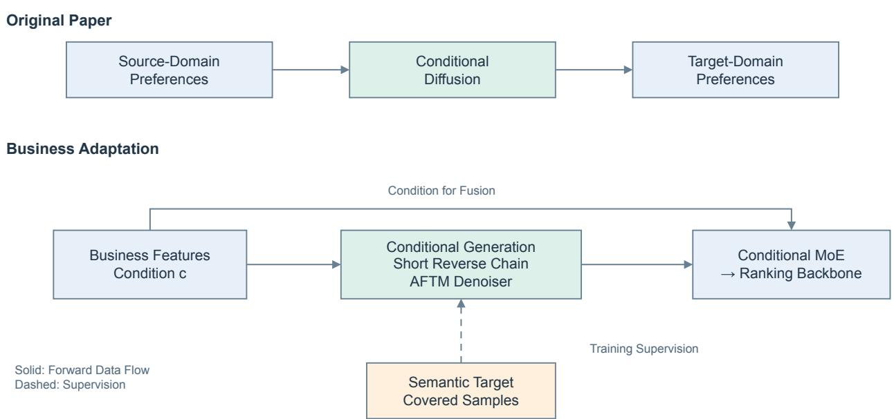  
Figure 11 | Generating semantic profiles from business features. Existing profiles supervise training; generated representations serve all samples.

## C.4. ORQ with DIGER: Changing How a Quantizer Selects and Updates Prototypes

This Composition keeps an existing quantizer’s progressive compression structure but changes how it selects and updates code vectors. Orthogonal residual quantization (ORQ) from DOS [22] first rotates features, selects dimensions for quantization, and passes the remaining dimensions and quantization residual to the next level. Concentrated code usage in the Scenario A parent motivated the Research Agent to insert DIGER-inspired exploration [23] into the existing code-assignment steps.

During training, historical usage identifies frequently selected codes, whose assignment scores receive Gumbel noise to encourage exploration. The forward pass selects one code vector, while gradients follow a soft assignment. Soft assignment statistics also contribute to exponential-movingaverage codebook updates. Inference removes the exploration noise and selects one code vector. ORQ’s rotation and residual propagation remain; dimension selection uses a hard mask that does not pass gradients to its scoring network through that operation.

The best complete implementation, including numerical protection of its auxiliary loss, reached 0.778186. The ORQ and DIGER parents reached 0.775863 and 0.775681, respectively: the combination improves on the stronger direct parent by 0.002323 and on the business baseline of 0.773683 by 0.004503. Whereas the TokenMinds-inspired case adds a complementary representation, this case changes selection and learning inside an existing quantizer.