# An auditable conditional-strategy framework for open-ended decision-making in complex lung cancer

Daoyun Wang1#, Zhicheng Huang1#, Huaiyuan Sun2#, Jiaqi Xu3#, Xiaowei Xu4#, Zhibo Zheng1, Zhongxing Bing1, Yuxiao Lin1, Yicheng Liang1, Chao Gao1, Bowen Xue1, Kai Zhang1, Song Xu5,6, Wanpu Yan7, Hui Xia8, Lin Li9, Xiang Yan10, Mu Hu11, Qianli Ma12, Zhiqiang Xue13, Xiaofang Liu14, Zhihai Han15, Nan Zhang16, Chuanhao Tang17, Tongmei Zhang18, Lan Song19, Zhaohui Zhu20, Xuan Zeng21, Shafei Wu21, Hui Guan22, Lei Deng23, Huaxia Yang24, Zeliang Lian2, Wubin Sun2, Yongxin Wang2, Xiaohui Shen2, Binlin Wang2, Tiantian Gu2, Yu Cui2, Li Zhang25\*, Shirui Wang2\*, Naixin Liang 1\*

1 Department of Thoracic Surgery, Peking Union Medical College Hospital, Chinese Academy of Medical Sciences and Peking Union Medical College, Beijing, China.

2 Medlinker Intelligent and Digital Technology Co. Ltd., Beijing, China.

3 Department of Rheumatology and Clinical Immunology, National Clinical Research Center for Dermatologic and Immunologic Diseases, the Ministry of Education Key Laboratory, Peking Union Medical College Hospital, Chinese Academy of Medical Sciences and Peking Union Medical College.

4 Institute of Intelligent Medicine, Chinese Academy of Medical Sciences.

5 Department of Lung Cancer Surgery, Tianjin Medical University General Hospital, Tianjin, China.

6 Tianjin Key Laboratory of Lung Cancer Metastasis and Tumor Microenvironment, Lung Cancer Institute, Tianjin Medical University General Hospital, Tianjin, China.

7 Key laboratory of Carcinogenesis and Translational Research (Ministry of Education), Department of Thoracic Surgery I, Peking University Cancer Hospital & Institute, Beijing, China.

8 Department of Thoracic Surgery, the Fourth Medical Center of PLA General Hospital, Beijing, China.

9 Oncology Department, Beijing Hospital, National Center for Gerontology; National Clinical Research Center for Gerontology; The Key Laboratory of Geriatrics of NHC; Institute of Geriatric Medicine, Chinese Academy of Medical Sciences.

10 Department of Thoracic Surgery, Peking University People’s Hospital, Beijing, China.

11 Department of Thoracic Surgery, Beijing Friendship Hospital, Capital Medical University, Beijing, China.

12 Department of Thoracic Surgery, China-Japan Friendship Hospital, Beijing, China.

13 Department of Thoracic Surgery, The First Medical Center of Chinese PLA General Hospital, Beijing, China.

14 Department of Pulmonary and Critical Care Medicine, Beijing Tongren Hospital, Capital Medical University, Beijing, China.

15 Department of Pulmonary and Critical Care Medicine, the Sixth Medical Center of PLA General Hospital, Beijing, China.

16 Department of Pulmonary and Critical Care Medicine 2, Emergency General Hospital, Beijing, China.

17 Department of Oncology, Peking University Shougang Hospital, Beijing, China.

18 Medical Oncology, Beijing Chest Hospital, Capital Medical University, Beijing Tuberculosis and Thoracic Tumor Research Institute, Beijing, China.

20 Department of Nuclear Medicine, State Key Laboratory of Complex Severe and Rare Diseases, Beijing Key Laboratory of Targeted Radiopharmaceutical Development and Translational nuclear medicine, Peking Union Medical College Hospital, Chinese Academy of Medical Sciences & Peking Union Medical College, Beijing, China.

21 Department of Pathology, Peking Union Medical College Hospital, Chinese Academy of Medical Sciences and Peking Union Medical College, Beijing, China.

22 Department of Radiation Oncology, Peking Union Medical College Hospital, Chinese Academy of Medical Sciences and Peking Union Medical College, Beijing, China.

23 Department of Radiation Oncology, National Cancer Center / National Clinical Research Center for Cancer / Cancer Hospital, Chinese Academy of Medical Sciences and Peking Union Medical College, Beijing, China.

24 Department of Rheumatology and Clinical Immunology, Peking Union Medical College Hospital, Chinese Academy of Medical Sciences and Peking Union Medical College.

25 Department of Respiratory and Critical Care Medicine, Peking Union Medical College Hospital, Chinese Academy of Medical Sciences and Peking Union Medical College, Beijing, China.

# These authors contributed equally to this work.

Corresponding authors: Li Zhang (zhanglipumch@aliyun.com), Shirui Wang (wsr@medlinker.com) and Naixin Liang (pumchnelson@163.com).

## Abstract

Complex lung cancer decisions can involve several defensible pathways whose eligibility, sequencing and safety depend on unresolved information. Efective support must make explicit how patient conditions govern pathway eligibility, deferral and redirection. MedGPT Clinical Explorer (MCE) organizes alternatives, decision-changing unknowns, safety constraints and fallback into a conditional strategy for clinician review. To evaluate this representation in physician-authored strategies, multidisciplinary experts established case-specific references for 40 cases within a purposive 100-case corpus, and 250 physicians from 98 institutions produced 2,250 strategies under unaided, retrieval-reference and MCE-assisted conditions.

MCE-assisted strategies expressed more applicable clinical requirements, measured by the Admissible Pathway Attainment Score (APAS; 0–100), than unaided strategies (adjusted diference, 12.87; 95% CI, 11.18–14.55) and retrieval-reference strategies (5.22; 3.52–6.93). With the same knowledge base available in the retrieval-reference and MCE-assisted conditions, the additional content centered on candidate pathways, decision-critical information and safety constraints. Physicians’ whole-strategy acceptability judgments correlated with APAS (Spearman’s $\rho = 0 . 6 7 1 \rangle$ , while a complementary relationship audit assessed whether candidates, conditions and subsequent actions were coherently connected.

Together, these findings identify two complementary dimensions of open-ended decision support: coverage of clinically relevant content and coherent links among pathways, conditions and subsequent actions. MCE provides a shared decision object that makes consequential omissions and pathway contingencies visible before action; prospective studies should evaluate its efects on clinical workflow and patient outcomes.

## 1 Introduction

Medical artificial intelligence is moving beyond isolated question answering toward heterogeneous information, specialist tools and multistep clinical tasks. Most evaluations of clinical large language models have focused on diagnostic accuracy, guideline concordance, preference judgments, a single recommendation or the next action[1–3]. Recent agentic systems have begun to evaluate multistep clinical work. DeepRare combines phenotypic and genetic information, specialist tools and external knowledge to produce ranked rare-disease diagnoses with traceable evidence[4]. MIRA performs sequential history taking, test ordering and interpretation, diferential diagnosis, treatment and admission decisions in a sandbox electronic health-record environment[5]. Conversational agents for disease management extend state updating, treatment planning and medication reasoning across visits[6]. These studies address evidence organization, tool use and sequential action. A diferent problem arises when several choices remain reasonable at one decision point. Clinical support must then show when a patient is eligible for each option, which unresolved information would change that judgment and how management should change when new information becomes available.

This problem is common in lung cancer. Guidelines for early and locally advanced non-small-cell lung cancer span diagnosis, staging, molecular testing, resectability and multimodal treatment[7]. Recommendations for unresectable stage III disease depend on treatment context[8], and technical resectability requires cross-specialty assessment of mediastinal staging, nodal extent and invasiveness[9]. Pathology, stage, molecular features, previous treatment, comorbidity, organ reserve, patient goals, resources and treatment sequence can jointly determine whether a pathway is appropriate. We use complex lung cancer to describe cases in which available information and clinical constraints do not support one complete, executable management plan at a specific decision point. Cases with a complete actionable plan, no substantive alternative requiring comparison and no unresolved information that would change the decision are outside this open-ended gray-zone task. The dificulty arises when decision-changing information remains unresolved, several clinically defensible options coexist, or treatment goals, risks and timing require explicit trade-ofs[10, 11]. This definition concerns decision structure at a particular time, not disease stage, rarity, information volume or prognosis.

Guidelines, expert judgment and multidisciplinary team discussion remain the basis of governance for these decisions. Lung cancer multidisciplinary teams vary in implementation, case selection and deliberative process, and clinically meaningful diferences can arise in staging, treatment intent and management recommendations[12–15]. Guideline-based decision support has entered oncology multidisciplinary meetings and implementation frameworks[16, 17]. Other studies have evaluated large language models for complex cases, neuro-oncology radiotherapy decisions and virtual tumour boards in non-small-cell lung cancer[18–20]. These approaches can provide evidence and recommendations, but clinical teams must still convert judgments distributed across sources, specialties and time into a shared plan. When several options are plausible, the plan must specify the conditions that make each treatment appropriate or inappropriate and the assessments that would change the choice. It must also specify what should happen if the preferred option becomes infeasible or new information emerges. Omitting these links can obscure eligibility conditions, decision-changing tests, safety constraints and alternative arrangements. The gap is therefore not only missing information or recommendations, but the lack of an explicit, reviewable connection between information, conditions and actions.

We developed MCE, a MedGPT-based clinical-agent system, to generate and organize clinical strategies for these open-ended decisions. MedGPT is a domain-specific medical large language model previously developed by our team and evaluated in a multispecialty open-ended questionand-answer benchmark covering both clinical safety and efectiveness[21]. Rather than returning a single recommendation, MCE places reasonable management options, their eligibility and exit conditions, unresolved information, safety constraints and contingent next steps in one document for clinician or multidisciplinary review. We call this a conditional strategy. MCE separates known case facts from missing or conflicting information, clinical goals and unacceptable risks. It uses a versioned evidence corpus to organize source-linked propositions around questions that could change candidate eligibility or order, showing where evidence supports, limits or leaves a choice unresolved. When information is insuficient or risk is excessive, the strategy can call for further assessment, deferral, reassessment or transition to another pathway. All tests and treatments in the output are proposals; clinical judgment, execution and accountability remain with clinicians and established governance processes.

We evaluated MCE in a purposively assembled set of complex lung cancer cases enriched for unclear guideline recommendations, competing comorbidity or treatment constraints, and interacting barriers to a standard pathway. These attributes identified decisions requiring several conditions to be integrated; they were not a validated continuous complexity scale or a diagnostic threshold for a target population. A multidisciplinary panel recorded acceptable, conditionally acceptable and inadmissible management content, together with reasonable disagreement and unresolved items, to create a case-specific clinical reference. The main comparison assessed how fully physicians’ final strategies expressed required clinical content under unaided, retrievalreference and MCE-assisted conditions. A separate audit tested whether MCE outputs connected choices to eligibility conditions, unresolved information and subsequent actions. Cross-model comparisons, source-masked content evaluation, clinical anchoring, controlled text changes and purposive case variants examined interpretation and located relationship-closure boundaries. A post hoc analysis examined text diferences in cases with subsequently recorded clinical events and generated hypotheses for future mapping of decision content to clinical consequences.

## 2 Results

## 2.1 Overlapping clinical constraints and case-specific references defined the conditional decision task

At a clinical decision point, known facts, missing or conflicting information, current goals, applicable evidence and safety constraints define the options available for review. An open-ended cancer decision therefore requires a set of clinically distinct candidate strategies. Each strategy has enabling, limiting and exit conditions, unknowns that could change pathway eligibility, order or intensity, and arrangements for advancement, modification, reassessment or fallback. Inclusion as a candidate indicates that an option warrants comparison. Case-level clinical judgment determines whether it is ultimately acceptable.

Figure 1a illustrates this object with generalized decision elements. Candidate directions with diferent benefit, risk and implementation burdens can remain under review together. Unknowns such as disease extent, treatment tolerance and patient goals connect each candidate to advancement, de-escalation or reassessment when the relevant premise is supported, refuted or remains unresolved. Five auditable relationships define the object: candidate-pathway diferentiation, action-premise links, decision-changing unknowns, verification-candidate links and reassessment or fallback (Fig. 1a).

The study included 100 complex lung cancer cases that were purposively selected and organized as fixed input snapshots: 47 internal cases and 53 published cases. Five non-exclusive gray-zone attributes formed 13 exact combinations. Guideline recommendations were unclear in 74 cases, and interacting factors impeded direct use of a standard pathway in 63. Comorbidity or treatment constraints conflicted in 47 cases, while pathway timing or strategy choice could materially afect later outcomes in 45. One case recorded a real clinical disagreement. Seventy-eight cases met at least two attributes; the largest exact intersection comprised 31 cases with unclear guideline recommendations, interacting factors and pathway-timing constraints (Table 1; Fig. 1b). The overlap describes co-occurring decision constraints in this corpus and is not a validated scale of complexity, severity, prognosis or support need.

Table 1 | Case corpus and prespecified attributes of complex clinical decisions

<table><tr><td>Characteristic</td><td>Overall (N = 100)</td><td>Expert-reference set (N = 40)</td><td>Source-masked content-evaluation set (N = 60)</td></tr><tr><td>Case source</td><td></td><td></td><td></td></tr><tr><td>Internal case</td><td>47 (47.0%)</td><td>40 (100.0%)</td><td>7 (11.7%)</td></tr><tr><td>Published case</td><td>53 (53.0%)</td><td>0</td><td>53 (88.3%)</td></tr><tr><td>Demographic information</td><td></td><td></td><td></td></tr><tr><td>Age, median (IQR), years</td><td></td><td>64 (57-69); n = 99 65.5 (58.5-69.5); n = 63 (56.5-68); n = 59 40</td><td></td></tr><tr><td>Male</td><td>51 (51.0%)</td><td>28 (70.0%)</td><td>23 (38.3%)</td></tr><tr><td>Female</td><td>30 (30.0%)</td><td>12 (30.0%)</td><td>18 (30.0%)</td></tr><tr><td>Sex not reported</td><td>19 (19.0%)</td><td>0</td><td>19 (31.7%)</td></tr><tr><td>Prespecified gray-zone attributes, non-exclusive</td><td></td><td></td><td></td></tr><tr><td>Guideline recommendation unclear</td><td>74 (74.0%)</td><td>26 (65.0%)</td><td>48 (80.0%)</td></tr><tr><td>Major conflict from comorbidity or treatment constraints</td><td>47 (47.0%)</td><td>26 (65.0%)</td><td>21 (35.0%)</td></tr><tr><td>Standard pathway not directly applicable because of interacting factors</td><td>63 (63.0%)</td><td>11 (27.5%)</td><td>52 (86.7%)</td></tr><tr><td>At least two prespecified gray-zone</td><td>78 (78.0%)</td><td>24 (60.0%)</td><td>54 (90.0%)</td></tr><tr><td>criteria</td><td></td><td></td><td></td></tr></table>

Data are n (%) unless otherwise stated. The expert-reference set and source-masked contentevaluation set were purposively constructed for diferent study functions; no baseline balance test was performed between them. Operational definitions, complete attribute counts and exploratory primary decision scenarios are in Supplementary Table 10.

To establish case-specific clinical references, a multidisciplinary panel independently constructed the Expert-Admissible Strategy Space (EASS) from fixed materials for 40 unpublished internal cases. The panel comprised 20 senior specialists, all at chief-physician rank, from 15 institutions and six disciplines: thoracic surgery, respiratory medicine, medical oncology, radiology, pathology and radiation oncology; MCE, comparator and physician outputs were not shown. EASS organized requirements into five clinical-content domains: clinical problem and treatment goals (M1), decision-critical information (M2), candidate clinical pathways (M3), safety boundaries and risk governance (M4), and reassessment and governance (M5). The final reference contained 240 rules, six per case: 139 confirmed-acceptable and 101 conditionally acceptable. Rules also recorded inadmissible conditions, fallback pathways, reasonable disagreement and unresolved content (Fig. 1c; Supplementary Methods 1; Supplementary Table 1). EASS defined acceptable case-specific content, whereas the separate structural audit assessed whether candidates, conditions, unknowns and subsequent actions were connected.

The Admissible Pathway Attainment Score (APAS) measured the extent to which a system or physician strategy satisfied the applicable clinical requirements for each case. The Completeand-Safe Pathway Rate (CSPR) used a separate nine-item joint gate to assess whether a text simultaneously met completeness and key-constraint rules; safe in this name refers to satisfaction of prespecified constraints in the scoring framework. EASS rules were not used during generation by MCE or the comparators. The design therefore had two complementary evaluation routes. The first used 2,250 final strategies from 250 physicians under U, R and M to assess expression of clinical content required for each case. The second used 40 complete MCE outputs to assess closure among candidates, premises, unknowns, verification results and subsequent actions (Fig. 1c). Content coverage and relationship closure are not interchangeable, and potentially reasonable uncoded pathways remained subject to clinical adjudication.

## 2.2 MCE linked evidence boundaries and decision-changing unknowns to pathway advancement, de-escalation and fallback

An illustrative, version-bound archived run showed how MCE connected evidence boundaries and decision-changing unknowns to candidate pathways and fallback arrangements. The case concerned a 68-year-old patient with suspected postoperative recurrence and possible chest-wall involvement, but also interstitial lung disease, continuous oxygen dependence and an Eastern Cooperative Oncology Group performance status of 3. The central conflict was whether an opportunity for local control justified the risk of irreversible pulmonary injury. MCE represented prior treatment, suspected recurrence, limited functional and respiratory reserve and pulmonarytoxicity risk as a joint decision state. Recurrence pathology, thoracic and distant restaging, pulmonary tolerance, interstitial-lung-disease activity and radiotherapy feasibility were retained as unknowns that could change pathway eligibility or intensity. One archived run served as the illustrative analysis unit (Fig. 2).

Evidence propositions were organized around local-treatment eligibility and pulmonary-toxicity boundaries and recorded whether the evidence supported, limited or left candidate applicability unresolved. Review was conducted at the proposition-and-source level; complete PICO fields, formal applicability boundaries, evidence grades and calibrated confidence were not evaluated. Within this boundary, conservative local radiotherapy ranked first in the system’s heuristic ordering in this run, more intensive local control remained conditional, and low-burden palliative radiotherapy or best supportive care formed the fallback.

Imaging and treatment planning, low-risk pathological confirmation and assessment of respiratory and interstitial-lung-disease tolerance were linked to these candidates as decision-changing verification tasks. Support for a key premise would retain or advance local treatment; refutation would prompt de-escalation to a lower-burden palliative or supportive pathway; and continuing uncertainty would retain the more conservative pathway with bridging, delayed escalation and reassessment. The output therefore made explicit how possible verification outcomes were linked to proposed advancement, de-escalation and fallback. The following physician analysis assessed whether access to this material was associated with greater expression of applicable case-level clinical requirements; relationship closure across complete MCE outputs was evaluated separately.

## 2.3 MCE support and the expression of case-level clinical requirements in physicians’ final strategies

The physician ofline task included 250 physicians from 98 centers across four professionaltitle categories: chief physicians, associate chief physicians, attending physicians and resident physicians. Each physician managed nine diferent cases, completing three tasks under each of the unaided (U), retrieval-reference (R) and MCE-assisted (M) conditions; together, they produced 2,250 final strategy texts. Adjusted APAS was 53.40 (95% CI, 51.32 to 55.48) under U, 61.05 (58.95 to 63.15) under R and 66.27 (64.18 to 68.36) under M. The adjusted M–U diference was 12.87 points (95% CI, 11.18 to 14.55), and the M–R diference was 5.22 points (3.52 to 6.93; Fig. 3a). Within the fixed gray-zone cases and information-support conditions, access to MCE strategy-review material was associated with expression of more applicable case-level clinical requirements in physicians’ final texts.

Supporting analyses were directionally consistent. Professional titles were grouped as senior (chief physicians), intermediate (associate chief physicians), and junior (attending or resident physicians). Professional title was treated only as a coarse indicator of clinical experience. Across these groups, M–U and M–R diferences were positive (ranges, 11.68–14.61 and 4.24–6.22 points, respectively; all six 95% CIs excluded zero); the exploratory joint interaction test was P = 0.548.

CSPR, treated as secondary or exploratory, was 70.2% (95% CI, 66.3–74.0%) under M, compared with 61.3% (57.0–65.6%) under R and 44.1% (39.7–48.4%) under U; 13 of 2,250 responses were indeterminate (Extended Data Figure 1; Supplementary Tables 9a and 9c).

To examine whether the coverage diference was attributable mainly to task format or length, MCE generated one format-aligned output for each of the same 40 cases using the physicians’ five-part structure. Nine judge ratings were equally aggregated at the response level, and the estimand was the within-case diference between the format-aligned MCE output and the mean physician response under each condition, with the 40 cases equally weighted. Paired APAS diferences relative to U, R and M were 32.03 points (clustered 95% CI, 26.48 to 37.09), 24.29 points (19.94 to 28.60) and 19.11 points (15.58 to 22.33), respectively (Fig. 3c; Supplementary Table 9e). The paired diference in non-whitespace characters relative to M was −247.5 (95% CI, −313.4 to −185.2). The coverage diference therefore persisted under a common response structure even though the format-aligned MCE output was shorter.

All five prespecified clinical-content domains showed positive M–U and M–R diferences. M3 (candidate clinical pathways) had the largest descriptive estimates: 20.64 points (95% CI, 18.15–23.13) for M–U and 8.59 points (6.07–11.12) for M–R. Format-aligned MCE outputs also exceeded M-condition physician responses across all domains (range, 8.13–29.65 points), again most strongly for M3 (29.65 points; 23.54–35.30). This pattern localized the increment to primary and alternative pathways and their eligibility or redirection conditions, with additional gains in decision-critical information and safety constraints (Fig. 3b,d; Supplementary Tables 9b and 9e).

In a post hoc analysis of subsequent clinical events, six cases lacked follow-up and three had concerns about the index date or record-linkage integrity. After excluding those three records, 12 cases had at least one composite event record, including death, disease progression or suspected new metastasis, treatment interruption or non-initiation, or deterioration in health status. In these cases, adjusted APAS under M was 68.47, with M–U and M–R diferences of 13.20 points (95% CI, 10.03 to 16.37) and 4.03 points (0.74 to 7.33). Among 19 cases with follow-up and no record of these events, adjusted APAS under M was 64.37, with M–U and M–R diferences of 14.80 points (12.29 to 17.31) and 8.11 points (5.62 to 10.60), respectively. The interaction diferences between event-recorded and non-recorded groups were −1.61 points (−5.74 to 2.53) for M–U and −4.08 points (−8.28 to 0.12) for M–R (Supplementary Table 9f). In the supplementary analysis including all 34 cases with available follow-up, M3 remained the largest M–U increment in both groups; positive diferences in M2 and M4 were also retained among cases with a composite event record. These post hoc, non-causal analyses locate decision-critical information, primary and alternative pathways, and safety conditions as priorities for future clinical-consequence mapping (Supplementary Tables 9g and 9h).

Together, the primary and supporting analyses showed greater expression of case-level requirements under M, particularly for candidate pathways, decision-critical information and safety constraints. The subsequent-event analysis was directionally consistent but remained post hoc and non-causal.

## 2.4 Conditional clinical-content increment of complete MCE outputs and support from the functional architecture

A supportive comparison using the same 40 expert-reference cases showed that complete MCE outputs had higher APAS than strategies generated by GPT-5.4, Claude Opus 4.7 and Gemini 3.1 Pro across all nine model–judge combinations. Mean APAS ranged from 94.71 to 97.72 for complete MCE and from 53.16 to 74.34 for the other-model outputs (Fig. 4a; Supplementary Table 9d). Across applicable cases, complete MCE also had higher estimates in all five clinicalcontent domains. Diferences were largest descriptively for candidate clinical pathways (M3)

in seven of nine combinations, with within-case M3 diferences of 28.75–56.25 points (Fig. 4b). Thus, the increment centered on primary and alternative pathways and their eligibility and redirection conditions, rather than only restating the clinical problem.

Independent source-masked clinical evaluation supported this content diference. Experts preferred MCE text in 100 of 120 within-case $\mathrm { A } / \mathrm { B }$ modules (83.3%). Among 60 modules selected for independent re-review, MCE was preferred in 54 (90.0%) in the first round and 57 (95.0%) at re-review. The three-category judgment was identical across rounds for 55 of 60 modules (91.7%; Gwet $\operatorname { A C 1 } = 0 . 9 1 0 ;$ Extended Data Figure 4a; Supplementary Table 6). Dimension-specific exact agreement was 66.7% for key clinical conflicts and treatment goals, 73.3% for patient state and treatment fit, 80.0% for safety constraints and unacceptable risk, 93.3% for decision-changing verification steps and 80.0% for subsequent pathways and alternatives (Extended Data Figure 4b). These values describe the reproducibility of judgments on the same fixed modules, not preference rates for MCE within each dimension.

The functional-configuration analysis further associated the MCE architecture with higher clinicalcontent coverage. Under GPT-5.5 scoring, removing the multidisciplinary-prior function reduced APAS by 16.62 points (95% CI, 11.84–21.40), removing the simulation–critique–repair block by 3.60 points (1.72–5.49), and jointly removing pathway and qualifying-evidence construction together with simulation, critique and repair by 7.72 points (4.87–10.57). Complete MCE also exceeded MedGPT base direct generation by 23.82 points (15.95–31.70) and MedGPT-LightRAG by 14.34 points (9.11–19.57; Fig. 4c; Supplementary Table 7). Configuration rankings were similar across the three judges (Spearman’s $\rho = 0 . 9 4 3  – 1 . 0 0 0 )$ . These results indicate that higher coverage was associated with the realized functional architecture rather than orchestration alone, although the grouped contrasts do not identify individual-node efects.

Together, these analyses move the interpretation from a quantitative coverage diference to a method-level inference: the observed increment is consistent with the conditional-strategy representation realized by the complete architecture. It therefore concerns not merely the amount of clinical content, but the organization of candidate pathways around the conditions governing eligibility, redirection and subsequent action.

## 2.5 APAS has a clinical-interpretation basis, with limits set by relationship closure

The primary comparisons depend on APAS, which measures expression of applicable case-level requirements from the EASS reference. We therefore examined its alignment with whole-strategy clinical judgments, reproducibility across physician raters and response to controlled text changes, and separately audited whether strategy elements were coherently connected.

Clinical anchoring included 120 outputs from 40 case clusters. Two attending thoracic surgeons independently rated overall acceptability and major clinical defects. Using the prespecified binary grouping, they classified 74/120 and 81/120 outputs as acceptable, with $7 1 / 1 2 0$ accepted by both. Their five-category judgments agreed exactly for 89/120 outputs, with 97.5% adjacent agreement and a linearly weighted κ of 0.745 (95% CI, 0.671–0.815). Across the same outputs, APAS correlated with the mean ordinal acceptability score (Spearman’s $\rho = 0 . 6 7 1$ , 95% CI, 0.581–0.752; Fig. 5a,b; Extended Data Figure 2; Supplementary Table 9i). Thus, higher APAS aligned with movement toward more acceptable whole-strategy judgments. Complete category distributions and major-defect agreement are reported in Supplementary Table 9i.

In a separate re-rating of 240 rules in 40 complete MCE reports, physician agreement was 78.33% at the rule level, with linearly weighted Gwet AC2 of 0.842 (95% CI, 0.785–0.893). Case-level $\mathrm { { I C C } ( A , 1 ) }$ was 0.694 (0.468–0.835), indicating that the reference was reproducible at the rule

level while absolute scores for individual reports retained rater-related uncertainty (Fig. 5b;   
Supplementary Table 9i).

Controlled perturbations assessed whether APAS responded to presentation order or removal of targeted content. Across 36 original–variant triplets from 12 cases, section reordering changed overall APAS by +0.85 points (95% CI, −0.44 to 2.31), whereas targeted deletion changed it by −0.66 points (−1.69 to 0.36). After deletion, APAS decreased in 20/36 triplets, increased in 15 and was unchanged in one; domain-specific responses were also heterogeneous. Thus, limited reordering did not produce a clear systematic shift, but domain-selective sensitivity to content deletion was not established (Extended Data Figure 3; Supplementary Table 9j). Together, these analyses support APAS as a measure of encoded case-level content in fixed cases, but not as a substitute for clinical judgment or an assessment of how strategy elements are connected.

We therefore directly audited five prespecified relationships in 40 frozen complete MCE outputs. Three AI judges independently classified 36/40, 30/40 and 40/40 outputs as complete across all five relationships. Diferences were concentrated in action–premise and verification–candidate links. At least one judge identified a conflict, conditional misconnection or omission in 12/40 outputs; targeted review of ten unresolved branches confirmed nine subsequent actions and one omission (Extended Data Figure 5; Supplementary Table 11). Detailed relationship-specific counts and verification-task states are reported in Supplementary Table 11.

Purposive case variants tested these relationships under predefined condition changes. Among 48 ofline scenarios derived from 16 source-case templates, 13 met all six requirements, 23 required clinical review and 12 contained at least one clear relationship gap, most often involving pathway prerequisites, sequence or fallback (Extended Data Figures 6 and 7; Supplementary Table 8). In independent physician re-review, exact agreement was higher for the overall scenario classification than for individual requirements (93.75% versus 67.01%), whereas each physician agreed with AI consensus on 39.93% of requirements (Extended Data Figure 8). These findings indicate that structural audits can localize material requiring review but cannot replace clinical adjudication.

APAS and relationship auditing therefore address complementary properties. APAS compares expression of case-level clinical requirements, whereas the relationship analyses assess whether treatment intent, pathway eligibility, action sequence and fallback are coherently connected.

## 3 Discussion

Complex lung cancer gray-zone decisions arise when several treatment pathways remain reasonable but their eligibility depends on unresolved clinical information. MCE was designed to organize candidate pathways, decision-changing unknowns, safety constraints and contingent next steps into a conditional strategy for clinician review. In an ofline task across 40 fixed cases, physicians assisted by MCE expressed more applicable case-specific clinical requirements than physicians working without assistance or with retrieval reference, with adjusted APAS diferences of 12.87 and 5.22 points, respectively. Complementary audits examined whether complete MCE outputs coherently connected candidate pathways with their premises, verification findings and subsequent actions. Although most outputs expressed these relationships, direct audits and purposive case variants also identified residual gaps requiring clinical review. Together, the findings support evaluating open-ended decision support along two distinct dimensions: clinically relevant content coverage and relationship closure.

The largest diferences concerned content with direct decision consequences. Candidate clinical pathways (M3) had the largest descriptive estimates in both the physician-task comparison and the comparison of format-aligned MCE output with physicians’ final texts. Decision-critical information (M2) and safety boundaries and risk governance (M4) also showed positive diferences. In lung cancer, staging and resectability can define treatment intent and eligibility for local therapy, pathology and molecular findings can alter systemic treatment, and organ reserve, comorbidity and toxicity risk can constrain treatment intensity, monitoring and stopping rules[7– 9]. The observed diferences therefore concern when a treatment commitment can be made, which primary and alternative pathways should remain available, and when a plan should be deferred, de-escalated or changed. Format-aligned MCE outputs were shorter but had higher APAS than M-condition physician responses. Because length was not randomized, this does not establish improved reading or decision eficiency. The near-term value supported by the data is that potentially consequential omissions can be made visible, contestable and revisable before action.

System-generated material and physicians’ final strategies represent diferent evidence levels. Prior vignette studies found that model assistance did not necessarily improve physician reasoning and could improve management scores while increasing time per case[22, 23]. These findings reinforce the need to examine which MCE content clinicians view, adopt, modify, reject or omit, and what burden that review imposes.

Relative to medical agents that organize diagnostic evidence, execute sequential actions or maintain longitudinal plans[4–6], MCE focuses on eligibility, exit and redirection relationships among concurrent treatment pathways. Its proposed role is a shared strategy document connecting individual preparation with multidisciplinary deliberation. Before a meeting, it could assemble distributed case facts, evidence, constraints and alternatives; during deliberation, it could distinguish established content from questions requiring verification or collective adjudication. The present study evaluated only an ofline individual-physician task, so use processes and workflow efects in real multidisciplinary teams remain to be tested.

The higher APAS under M despite a shared knowledge base with R, together with crossmodel, source-masked and ablation analyses, supports an increment beyond knowledge provision: organizing evidence around patient conditions, candidate eligibility, safety constraints and subsequent actions. Removing multidisciplinary priors produced the largest decrease among the targeted ablations, but diferences in generation and presentation prevent attribution to a single component.

Content coverage and relationship closure remain distinct. APAS aligned with whole-strategy clinical judgments and case-specific rules showed good rule-level reproducibility; limited section reordering produced no clear systematic shift, whereas target-content deletion had heterogeneous efects. APAS can therefore compare expression of encoded requirements but cannot establish whether treatment intent, pathway eligibility, action sequence and fallback are correctly connected. Relationship audits identified residual conflicts or omissions, including findings in 12 of 40 complete outputs, and physician-AI agreement on individual relationship states was limited. The two measures should thus be used together: APAS for content expression and relationship auditing to locate material requiring human review.

The post hoc analysis of subsequent clinical events places the observed content diferences within a testable clinical-consequence framework. In cases with later records of progression, treatment non-initiation or interruption, deterioration or death, the additional content expressed under M still concerned decision-critical information, feasible primary and alternative pathways, and safety constraints. These findings identify content that remained relevant later in the clinical course, but they do not show that MCE changed subsequent events or that the event groups had diferent treatment efects. Prospective studies should define support needs at the decision point using pathway multiplicity, goal conflict, decision-changing unknowns and constraint burden, then use blinded clinical review to assess whether baseline omissions correspond to later clinical processes.

The main limitations concern case representation, clinician use, evaluator dependence and real-world inference. Cases were purposively enriched fixed cases, so the primary estimates describe condition diferences within this set. Ofline final texts did not record whether physicians viewed, adopted, modified, rejected or corrected individual MCE elements, and the task was not embedded in a real multidisciplinary workflow. Prior studies indicate that support accuracy and clinician-AI interaction design can influence judgment and reliance[24–28]. EASS does not exhaust all reasonable strategies, principal estimates depend on fixed AI judges and case-level rules, and human calibration of U/R/M texts remains incomplete. Cross-model outputs and six-configuration comparisons were also afected by diferences in version, length, format and organization. Follow-up records lacked a uniform window and independent clinical adjudication, while the case-condition branch cannot estimate real-world error, safety events or patient benefit.

The next step is blinded mapping of clinical consequences and prospective evaluation of how conditional strategies enter individual and multidisciplinary workflows. Individual-physician studies should record preparation and decision time, whether content is viewed and then adopted, modified or rejected with a reason, cognitive burden, propagation of erroneous suggestions and inappropriate adoption. Multidisciplinary studies should measure pre-meeting preparation time, discussion time per case, postponement or re-discussion because key information is missing, plan completeness and unresolved disagreement. Silent validation should assess relationship gaps, clinical reviewability and escalation needs. Early clinical evaluation should prespecify system function, clinician oversight, analysis units, implementation outcomes and safety escalation pathways, consistent with staged evaluation and governance principles for clinical AI[29–31]. A pragmatic cluster-randomized study of generative-AI clinical decision support provides a workflow-level design reference[32], but complex lung cancer strategy support requires task specific outcomes and reporting[33, 34].

After proximal content, clinician behavior and workflow efects have been evaluated, studies can assess whether treatment is delivered as planned, safety constraints are followed, new information or toxicity triggers reassessment, and these processes afect disease control, survival or other patient-level outcomes. Current evidence supports MCE as reviewable conditional-strategy material for complex lung cancer gray-zone decisions. Its most testable clinical value is to preserve several pathways for comparison and make their enabling, exit and redirection conditions explicit before action. Whether that value becomes more eficient clinical work, appropriate resource use or patient benefit will depend on how physicians and multidisciplinary teams use the material.

## 4 Methods

## 4.1 Study design and estimands

This ofline evaluation used fixed inputs from complex lung cancer cases. Separate analyses assessed four questions: formation of a conditional strategy, physicians’ final strategy texts under three conditions of information support, clinical interpretation of the scoring measure, and boundaries of relationship closure in purposive case variants. Records of subsequent clinical events were used in a post hoc exploration of the case context in which diferences in text scores occurred. Each analysis retained its own unit, denominator and estimand; results were not combined into an overall performance measure.

The primary estimands for the physician task were diferences in attainment of the clinical requirements for each case under M relative to U and R. They describe diferences in final texts within the fixed case set and conditions of information support. Analyses of subsequent events, comparisons among six configurations sharing a MedGPT foundation, source-masked content evaluation, overall clinical anchoring, controlled text perturbations and case-condition changes were supporting or exploratory analyses.

## 4.2 Case sources and analysis sets

Case material was organized using a common template with a case summary and the treating physician’s original plan. Fixed inputs used for system generation and evaluation contained six fields: basic information, presenting complaint, history of the present illness, medical and other history, investigations and diagnosis. They excluded management, the treating physician’s recommendation, subsequent plans and outcomes. MCE generation, EASS construction and the U/R/M physician task used only the case summary. The treating physician’s original plan was used only as one comparator in the source-masked content evaluation.

The 100 cases comprised 47 internal and 53 published cases. Forty unpublished internal cases formed the expert-reference set used for EASS construction, the six-configuration comparison and the physician task. The remaining 7 internal and 53 published cases formed the 60-case source masked content-evaluation set. Cases were purposively selected using prespecified gray-zone attributes; no validated continuous scale was used to stratify complexity or decision uncertainty. A case registry recorded source, study set, input version, reuse across branches and exposure during development. All cases had been used in development or evaluation and therefore did not form a development-naive external validation set. Forty-nine publications contributed the 53 public cases: 48 were identified by DOI and one by PMID and a stable public link (Supplementary Table 12).

Demographic fields were extracted from structured case summaries; missing age and sex were retained as missing or not reported. After de-identification and structured abstraction, five non-exclusive gray-zone attributes were recorded from the case summary and available multidisciplinary or treating records. The first three attributes were unclear guideline recommendations, major conflict from comorbidity or treatment constraints, and documented decision disagreement. The other two were pathway timing or strategy choice with substantial potential consequences and interacting factors that prevented direct use of a standard pathway. Each attribute was recorded for each case as present or absent; cases meeting at least two were classified as multiattribute gray-zone cases. These labels described the purposive corpus and were not outcomes, model covariates or performance strata. Operational definitions and complete counts are in Supplementary Table 10.

## 4.3 EASS case-specific clinical reference and scoring rules

A multidisciplinary panel of 20 experts constructed EASS. Nineteen participated in the first inperson round, and the expert absent from that meeting joined subsequent online rounds. Fourteen treatment-related specialists conducted later case review. EASS was developed independently from fixed material for the 40 expert-reference cases; candidate MCE, comparator and physician outputs were not provided to the panel. The process drew on independent judgment, prespecified anchors, structured feedback and preservation of disagreement from the RAND/UCLA Appropriateness Method, without adopting its panel size, number of rounds or disagreement thresholds[35].

EASS covered five clinical content domains: M1, clinical problem and treatment goals; M2, decision-critical information; M3, candidate clinical pathways; M4, safety boundaries and risk governance; and M5, reassessment and governance. These domains supplied case-level clinical requirements and were distinct from the five structural relationships used to assess whether candidates, premises, unknowns and subsequent actions were connected. Final rules were classified as confirmed acceptable or conditionally acceptable and recorded related inadmissible conditions, fallback pathways, reasonable disagreement and unresolved content.

The final reference contained 240 rules, six per case. Each applicable rule was scored 0, 1 or 2. Domains M1-M4 had weight 3 and M5 had weight 2. APAS was calculated as:

$$
{ \mathrm { A P A S } } = 1 0 0 \times { \frac { \sum _ { i } w _ { i } r _ { i } } { 2 \times \sum _ { i } w _ { i } } }
$$

Only items deemed applicable and included in the denominator under the fixed scoring rules contributed to the sums. Correct use of prespecified fallback, reasonable-disagreement and not-applicable states followed the prespecified rules; not-assessable, technical-missingness and not-applicable-for-clinical-reasons states were retained separately. CSPR was defined by a nineitem joint gate: failure of any applicable gate resulted in non-attainment, and absence of a complete majority was retained as indeterminate. CSPR is a joint result under the judging rules, not a clinical safety rate. The same case-level rule dictionary was used for all scoring, and EASS rules were not provided to MCE, comparators or physicians during generation. Expert procedures and scoring details are in Supplementary Methods 1 and Supplementary Tables 1, 2 and 9; physician-task CSPR results are in Extended Data Figure 1a,b.

## 4.4 MCE input and generation of conditional strategies

MCE received only the fixed case input. Internal cases were managed as limited de-identified data under restricted access. EASS rules for individual cases, APAS and CSPR scoring rules, and CCRRs used in the case-variant evaluation were not available during generation. MCE used MedGPT as its foundation together with versioned evidence resources and run configurations. It represented the decision state and goals, constructed conditional candidates, linked typed evidence, simulated scenarios, reviewed and repaired candidates, created verification tasks linked to candidates, evaluated stopping criteria and assembled the report (Fig. 2).

For functional reporting, the archived n0-n10 workflow was grouped according to the clinical and computational objects passed between dependent stages rather than treated as 11 independently acting components. Multidisciplinary priors entered at n0. Nodes n1-n2 compiled the case state, goals and constraints; n3-n5 constructed foundational and derived pathways and linked qualifying evidence; n6-n8 performed scenario simulation, critique and candidate repair; n9 performed candidate-strategy reranking and formed candidate-linked verification objects; and n10 controlled stopping assessment and report assembly. This mapping was used to define the grouped functional ablations described below. Because nodes within a block operated on intermediate objects produced by the same block, removing an individual node was not treated as an independently interpretable intervention.

## 4.4.1 Decision-state and goal representation

The decision-state representation organized disease status, previous treatment, comorbidity and organ reserve, timeline, current decision point, known facts, missing and conflicting information and major uncertainty. It did not add case facts from external knowledge. The goal representation recorded clinical goals, the decision window, unacceptable risks, implementation constraints and gaps that could change those goals. Patient-preference fields distinguished explicit patient statements, conservative system inference and unavailable information; an inference was not treated as an original patient statement, informed consent or a record of shared decision-making.

## 4.4.2 Versioned evidence resources, conditional candidates and evidence links

Study runs used a versioned knowledge base and evidence corpus. Candidate construction and dispute checking retrieved evidence for questions that could change pathway eligibility, sequence or intensity. Retrieved information was organized by proposition type into source-linked CEUs that recorded whether evidence supported, limited or left candidate applicability unresolved. Sources were not compressed into a single score across evidence types. The study records support review at the proposition-and-source level; complete PICO fields, formal applicability boundaries, evidence grades, calibrated confidence and broader EvidenceOS functions were not evaluated.

The system generated three clinically distinct foundational candidates and two derived candidates and listed an SoC reference separately. Each candidate recorded its primary action, eligibility premises, limitations, relevant evidence, downstream branches, monitoring and transition or fallback. A derived candidate also recorded its source of modification, intended efect, added risks and verification needs. The fixed candidate count was an implementation search budget, not a claim that only those pathways existed, and did not assign clinical priority or evidence level.

## 4.4.3 Scenario simulation, candidate review and repair

For each candidate and the SoC reference, the system represented near-term benefit, nearterm risk, intermediate branches and transition signals. It reviewed absolute contraindications, irreversible harm, limits on evidence extrapolation, implementation feasibility and dependencies, and the marginal value of continued search. A candidate could be retained, repaired for a specific gap, or removed because of a hard contraindication, irreparable conflict, conflict with patient constraints or substantive equivalence. Numeric values used within this process supported ranking or checks and were not interpreted as calibrated treatment efects, risks or outcome probabilities for individual patients.

## 4.4.4 Candidate-linked verification and report assembly

Reviewed candidates were placed in a heuristic order comprising one currently top-ranked candidate and a set of candidate-linked verification tasks. The top-ranked candidate was the first candidate in the system ordering, not a clinically optimal pathway. Each verification task recorded the target candidate, purpose, sequence or dependency, and the conditional next action when a key premise was supported, refuted or remained unresolved. General insuficiency of evidence was retained as unresolved and was not equated with refutation.

The stopping assessment checked goals, evidence, candidates, review, repair, verification tasks and residual unresolved items, then either proceeded to report assembly or returned the object to the relevant stage. This was workflow control, not formal convergence, global optimality or clinical clearance. The final Strategy Review Pack summarized the case and decision point, goals and boundaries, candidate pathways, SoC reference, verification tasks, evidence citations, risks, monitoring, reassessment, transitions, fallback and unresolved items. References to multidisciplinary review or governance were proposals and did not indicate that such review had occurred. Further implementation detail and the illustrative run are in Supplementary Methods 2.

## 4.5 Audit of strategy relationships in complete MCE outputs

Forty complete MCE Strategy Review Packs were assessed for five relationships. The first three were candidate-pathway diferentiation, links between actions and the premises for proceeding, limitation or exit, and missing information expressed as decision-changing unknowns. The fourth linked verification tasks to a candidate and to subsequent actions after support, refutation or continuing uncertainty. The fifth covered reassessment or fallback when the preferred option was infeasible, risk increased or uncertainty remained. Three AI judges independently rated each output, coding each dimension as complete, partly complete, missing or incorrect, not applicable, or not assessable. Nested objects such as verification tasks did not increase the number of outputs or clinical samples. Criteria and directed checks of the source text are described in Supplementary Methods 2 and Supplementary Table 11.

## 4.6 Comparators and output processing

Condition U presented the case summary alone. Condition R added case-specific reference information produced by a designated model using LightRAG and the same knowledge base available to MCE. Sharing a knowledge base did not imply a shared retriever, index, reranker, prompt, input budget, assembly procedure or output structure. Condition M presented MCE strategy review material in the form of a Strategy Review Pack, which physicians could review before composing their own answer.

Comparators in the source-masked content evaluation were a direct-generation comparator, an independent retrieval-augmented generation output, an MDT-Debate-labelled method and the treating physician’s original plan. MedGPT base generation and MedGPT-LightRAG in the six-configuration comparison were separate objects and were not interchanged with these comparators. The cross-model strategy-output comparison was a third set of independent runs. Generation roles and comparison purposes are summarized in Supplementary Table 3.

Explicit source labels were removed for source-masked content evaluation. When the treating physician’s original plan was the comparator, MCE text was reorganized into the physicianresponse structure without rewriting its clinical content; other texts retained their organization. Length, formatting and language could still provide source cues. Structure alignment, length controls and removal of source-identifying labels were assessed separately and did not overwrite the primary stimuli.

## 4.7 Physician ofline task and allocation

Question sets were generated before the physician list was imported. Each contained nine diferent cases, three per U, R and M condition. The initial generation specification used seed 42 and preferentially filled underrepresented case-condition slots. Later expansion continued from existing allocation counts, but the complete extended random state could not be recovered; the study is therefore not described as a fully reproducible randomized trial. After the physician list was imported, physicians received pregenerated sets in sequence, without using specialty, rank, hospital or outcome fields in allocation. Actual case-condition coverage and allocation features are in Supplementary Methods 3 and Supplementary Table 4.

The analysis included 250 physicians who completed all nine tasks, yielding 2,250 responses. Each physician answered multiple cases and each case was answered by multiple physicians, forming an incomplete crossed block structure. Unassigned case-condition combinations were design absences rather than missing outcomes and were not imputed. The final texts did not record item-level viewing, adoption, deletion or revision of MCE content.

## 4.8 Format-aligned MCE output comparison

For each of the 40 expert-reference cases, MCE generated one additional output using the five-part structure of the physician task. Each part was written as prose and constrained to the distribution of physician-response length; system-specific pathway labels were translated into concrete clinical actions. This output used clinical content formed within MCE and was not a post hoc summary of the full report by a general-purpose model. Format-aligned MCE outputs and U, R and M physician responses were each scored independently three times by Gemini 3.1 Pro Preview, GPT-5.5 and Claude Opus 4.7 using EASS. This common-case, common-format and common-rule comparison was a supporting analysis of within-case diferences between system output and physician responses. It did not re-estimate the U/R/M condition efects from the mixed model for the physician task (Fig. 3c,d; Supplementary Methods 2; Supplementary Table 9e).

## 4.9 Post hoc analysis of subsequent clinical events

After completion of the primary ofline evaluation, available follow-up records for the 40 expertreference cases were first used to assess whether APAS condition diferences persisted in cases with subsequently recorded composite clinical events. The same analysis described the content domains involved. Diferences in the condition efect between event groups were secondary explorations. Subsequent outcome fields were not included in the fixed case inputs, EASS construction, MCE generation, physician task or text scoring.

Post hoc text rules identified explicit records of death, disease progression or suspected new metastasis, treatment interruption or non-initiation, and deterioration in health status. Cases were classified as having a record of any composite event, having follow-up without such a record, or having unavailable follow-up. This grouping was not independently clinically adjudicated and was not a standardized overall-survival, progression-free-survival or validated composite endpoint; absence of a record did not establish absence of progression or a favourable prognosis.

The subgroup analysis used case-specific U, R and M estimates derived from the APAS model fitted to all 40 cases and standardized with equal weight across each target case set. Groupspecific estimates assessed whether the text diference was retained; event-group-by-condition contrasts explored efect modification. Removing a case from a target set did not refit the model. The main text reports a data-quality sensitivity analysis excluding three records with index-date or record-linkage concerns, with six cases lacking follow-up reported separately; all 34 cases with available follow-up were analysed in supplementary material. M1-M5 domains, death-record subgroups, target structures and primary clinical scenarios were unadjusted post hoc analyses (Supplementary Methods 3; Supplementary Tables 9f–h).

## 4.10 Cross-model strategy-output comparison

The cross-model comparison used the 40 expert-reference cases, each with an existing complete MCE output and one strategy output from GPT-5.4, Claude Opus 4.7 and Gemini 3.1 Pro, for 160 outputs. Four texts per case were presented under randomized A-D labels. Processing removed numeric citation markers but did not normalize length, section structure or style. Complete MCE outputs came from existing runs using the study configuration and versioned knowledge base but were not generated in the same run as the other-model outputs.

Gemini 3.1 Pro Preview, GPT-5.5 and Claude Opus 4.7 independently rated all 160 outputs against the same EASS rules. Each judge-output combination was rated once, producing 480 judge-output rating units. For each judge, APAS means and 95% CIs and CSPR attainment out of 40 were reported by strategy. Ratings were not pooled across judges and did not use the nine-rating aggregation from the U/R/M branch. This supporting analysis described diferences among complete outputs under fixed cases and requirements and did not attribute them to an individual MCE component (Fig. 4a,b; Supplementary Methods 4; Supplementary Table 9d).

## 4.11 Source-masked content evaluation

Each of the 60 cases formed two A/B modules within the case. The primary module compared MCE with MDT-Debate. The secondary module compared MCE with independent retrievalaugmented generation, Direct generation or the treating physician’s original plan. Six clinical experts completed the first-round 120 modules. A separate panel of six experts reassessed 60 modules selected with stratification by case and comparator. Selection did not use first-round preference, domain ratings, safety flags, response time or length. Reviewers did not know the explicit source; source guesses were not collected.

One case-comparator module was the preference-analysis unit, decoded as MCE preferred, no diference or comparator preferred. Overall judgment and five clinical-content dimensions were reported separately. Modules assessed in both rounds were used for cross-tabulation, exact agreement, Gwet AC1 and auxiliary Cohen kappa. A safety flag was a signal for manual review and not a confirmed safety event. Allocation, masking, preference and reassessment agreement are reported in Supplementary Methods 4 and Supplementary Table $6 ;$ Extended Data Figure 4 shows the three-category distributions.

## 4.12 Functional-module ablation across six MedGPT-based configurations

Each of the 40 expert-reference cases generated one report under six configurations based on MedGPT. Three were targeted grouped functional ablations of complete MCE. The first removed the multidisciplinary-prior function at n0. The second removed scenario simulation, critique and candidate repair at n6-n8. The third jointly removed pathway and qualifyingevidence construction at n3-n5 and simulation, critique and repair at n6-n8. Both stageremoval configurations retained candidate-strategy reranking at n9; the joint n3-n8 ablation used configuration-limited retrieval. Case-state and goal representation at n1-n2 and stopping and report assembly at n10 remained in the MCE-derived ablation configurations. MedGPT direct generation and MedGPT-LightRAG provided reduced-orchestration reference configurations; the latter used the same knowledge base as MCE. One report was generated per case-configuration combination. The six reports were anonymously rotated and rated using EASS.

GPT-5.5 ratings were used for the principal numerical display. Gemini 3.1 Pro Preview and Claude Opus 4.7 ratings were used with GPT-5.5 only to compare the rank order of case-mean APAS across configurations; they were not pooled into a case-level score. Diferences between complete MCE and each configuration were paired by case and reported as mean within-case diferences with normal-approximation 95% CIs. CSPR was descriptive. The contrasts evaluated functional bundles or reduced-orchestration reference configurations in fixed cases and realized single runs. The n3-n8 contrast was a joint ablation and did not isolate the n3-n5 pathway and evidence block. Output length and organization could change with each configuration, and the design did not estimate individual-node efects, interactions among functional blocks or run-to-run stability. Definitions and results are in Supplementary Methods 4 and Supplementary Table $7 ;$ case-level APAS means and intervals are shown in Figure 4c.

## 4.13 Clinical anchoring, EASS rule re-rating and controlled text perturbations

For overall clinical anchoring, existing outputs from the expert-reference set formed 40 case clusters. Each cluster contained one physician strategy, one complete MCE output and one comparator output, for 120 outputs. Two attending thoracic surgeons rated overall clinical acceptability and major clinical defects independently. Explicit source labels were removed while original content and structure were retained. Raters did not have access to source, configuration, condition, EASS rules, APAS or CSPR, sampling strata or the other rater’s judgment.

Overall clinical acceptability was an output-level judgment of whether the complete strategy could enter clinical discussion and the extent of revision or additional verification required. The four ordered categories were unacceptable, major revision or additional verification required, broadly acceptable with minor revision, and acceptable for clinical discussion, with not assessable as a special state. Categories were coded 0-3; the mean code across raters was used for rank correlation with APAS. For binary descriptions, the upper two categories were acceptable and the lower two unacceptable. Raw judgments were retained without adjudication. Major clinical defects were reported separately and were not combined with acceptability into a new score. Sampling was balanced and enriched by source, prior score and risk or disagreement; source-stratified results were descriptive (Supplementary Methods 5; Extended Data Figure 2).

For EASS rule re-rating, two physicians independently rated the 240 rules corresponding to 40 complete MCE reports. System configuration, model name, AI rating and the other physician’s rating were masked. Ratings were 0, 1, 2, not applicable or not assessable, and analysis used judgments before disagreement resolution. Case-level APAS was calculated only when the rater assigned 0, 1 or 2 to all six rules in that case. Physician ratings were not treated as a human gold standard (Supplementary Methods 5; Supplementary Tables 5, 9a and 9i).

Controlled text perturbations used 12 cases, 36 original-variant triplets and 108 texts. Each triplet included the original, a prespecified section-order variant and a variant deleting rule-linked clinical content. Reordering was intended to preserve clinical content. Deletions targeted M2, M3, M4 or M5, with nine triplets per domain. Physicians checked whether each candidate variant achieved its target and recorded changes outside the target before judging.

Each text was rated three times by each of the three named AI judges. Repeats were aggregated within text and were not independent samples. The triplet was the paired analysis unit and the case the clustering unit. Reordering and deletion were estimated separately and targetdomain results were stratified. Texts included in analysis matched the physician-verified versions individually. In the absence of a prespecified equivalence margin, a non-significant reordering diference was not interpreted as equivalence (Supplementary Methods 5; Extended Data Figure 3).

## 4.14 Case-condition changes and rater dependence

Sixteen source-case templates were purposively selected from the expert-reference set. Each produced one original and two modified ofline scenarios, for 48 scenarios. One modification changed a safety constraint or decision-critical information and the other changed management sequence, branching, reassessment or escalation. Six Condition-Change Response Rules (CCRRs) were specified for each scenario before its MCE output was reviewed, for 288 rules; rules were paired with reports only after generation.

Three AI judges classified each requirement as pass, clear gap, clinical review, not applicable or not assessable. A strict majority formed consensus; a three-way split was classified as clinical review; when one judgment was missing and the other two agreed, their result was retained and the missing judgment recorded. Requirement- and scenario-level results were reported separately. Complete scenario closure required pass status for every applicable requirement and no clear-gap, clinical-review or not-assessable state.

Two physicians independently rated the 48 scenario cards and 288 requirements before disagreement handling, without seeing the AI consensus or governance mapping. There was no third-rater adjudication and no human gold standard. Agreement between physicians and between each physician and the AI consensus was reported at the requirement and scenario-card levels using exact agreement and Gwet AC1. Intervals were obtained by cluster resampling of the 16 source templates. The records did not establish that the original and changed scenarios used identical model snapshots, prompts, adapters, replicate numbers and random conditions. This branch therefore describes relationship closure and evaluator dependence in purposive case variants; it does not estimate a causal efect of changing case conditions, an overall error rate or real-world safety (Supplementary Methods 6; Extended Data Figures 6–8; Supplementary Table 8).

## 4.15 AI judges and rating aggregation

The fixed judging panel comprised Gemini 3.1 Pro Preview, GPT-5.5 and Claude Opus 4.7. Repetition and aggregation were prespecified separately for each branch. Each judge rated U/R/M physician responses and format-aligned MCE outputs three times. For APAS, response rule scores were averaged within the three repeats from a judge and then averaged equally across judges. For CSPR, a majority was first formed within judge across repeats and then across judges; absence of a complete majority was indeterminate. Controlled text perturbations also used three ratings per judge but derived APAS and partial gating states from the six selected rules in each request. The cross-model strategy-output comparison, relationship audit of complete MCE outputs and case-condition evaluation used their branch-specific independent judgments. The six-configuration comparison used GPT-5.5 for primary numerical ratings and the other two judges only for configuration-level rank stability. Repeated judgments were measurements of the same object and did not increase the number of physicians, cases, responses or outputs. Model identities, inputs, repeats, parsing and aggregation are detailed in the relevant Supplementary Methods and Supplementary Tables 3 and 5.

## 4.16 Statistical analysis

For the physician task, one response by one physician to one case under one assigned condition was the analysis unit. APAS was analysed with a linear mixed-efects model containing case and question order as categorical fixed efects, physician as a random intercept, and condition diferences allowed to vary across fixed cases. Primary comparisons were standardized to an empirical reference grid of the 40 cases and nine balanced question positions, with the physician random efect set to zero. The estimate describes model-adjusted condition diferences in the fixed case set; cases were not weighted by clinical frequency or importance, and the interval did not incorporate sampling uncertainty from case selection.

CSPR was analysed using the prespecified common-condition-efect generalized linear mixed model that was ultimately used. Fixed-efect predictions were transformed to probabilities and averaged across the case and question-order reference grid with the physician random efect set to zero rather than integrated over its distribution. The resulting probability diference is not a population-average risk diference across physicians. CSPR was secondary or exploratory.

Unassigned case-condition cells were design absences and were not imputed. Content-domain, professional-title-group interaction, leave-one-judge-out, common-applicability, system-label removal, length and presentation analyses were identified as prespecified or post hoc. Response length occurred after condition assignment and was not adjusted for as a baseline covariate. Subsequent-event analyses used case-specific condition estimates from the APAS model fitted to all 40 cases and equal-weight standardization within target case sets. The main text reports the 31-case data-quality sensitivity analysis after exclusion of three questionable records; all 34 follow-up-available cases are reported separately, and six cases with unavailable follow-up are retained as a separate category. Format-aligned MCE and physician ratings were averaged equally across nine judge ratings and then summarized as system scores and U, R and M physician case means for each of 40 cases. Signed diferences in APAS, M1-M5 and character count were paired by case, with 95% CIs from 30,000 case-cluster percentile bootstrap samples. This supportive paired estimand described system-output-minus-physician-response diferences within fixed cases; the primary U/R/M condition efects remained the mixed-model estimands accounting for repeated physician responses, case heterogeneity and task position.

Primary APAS and CSPR comparisons used separate Holm corrections. Subsequent-event, death, target-structure and case-scenario strata were unadjusted post hoc analyses. Efect estimates and 95% CIs were reported with convergence, singular-fit and weak-identification diagnostics. Alternative judges and repeated runs were measurement-sensitivity analyses and did not add clinical samples. Full models, diagnostics and sensitivity analyses are in Supplementary Methods 7 and Supplementary Table 9; CSPR and professional-title-group analyses are in Extended Data Figure 1.

Overall clinical anchoring used 120 outputs in 40 case clusters. Raw five-category judgments were summarized with exact agreement and Cohen kappa; the four-level ordinal outcome also used linearly weighted kappa. Spearman’s rank correlation related APAS to the mean ordinal judgment of the two physicians, with intervals from case-cluster resampling. EASS rule re-rating reported exact agreement and linearly weighted Gwet AC2 among paired assessable rules. Agreement in APAS at the case level used ICC(A,1), Lin’s concordance correlation coeficient, the mean rater diference and Bland-Altman 95% limits of agreement. Controlled perturbations were paired within triplet with case-cluster bootstrap. Main-text proportions for case-condition changes used original requirement counts; template-equal estimates first summarized within source template and then weighted the 16 templates equally, with clustering by template. Agreement between physicians and between each physician and the AI consensus used exact agreement and Gwet AC1 at the rule and card levels. The 288 rules were not treated as 288 independent clinical samples.

## 4.17 Reproducibility

Each analysis linked the case or text input to the generated output, rating request, raw response, rule aggregation, analysis data and figures. For generative-model work, recalculation from stored responses was distinguished from a new call to an external model, which can change with model updates and stochastic generation and is not expected to reproduce wording exactly. Input versions, software environments and random seeds were recorded for derived analyses.

Figure 2 presents one traceable run in which the case input, system version, intermediate objects and final report were linked. It illustrates formation and retention of strategy objects in one research run and does not estimate a cohort-wide completion rate or patient outcome. The reviewable scope is described in Supplementary Methods 2.

## 4.18 Study governance and generative-model reporting

Internal clinical cases were de-identified and access was restricted. The scope of data transmitted to external models, data retention and access controls was managed in accordance with the approved study protocol and institutional data-governance requirements.

Generative models used for system generation, comparator generation and AI judging were documented separately by role. Reporting included model identifiers and providers, access dates, inputs and system instructions, retrieval corpora and evidence cutofs, decoding parameters, repetitions and retries, output processing, anonymization and human review. Reporting followed TRIPOD-LLM[34], with the scope of early clinical evaluation informed by DECIDE-AI[30].

## 5 Data and code availability

Data and code associated with this article will be made publicly available through the Medlinker-MG/MCE GitHub repository. The release will include de-identified aggregate interfaces, data dictionaries, manifests, checksums and analysis code for the reported statistics and figures, together with de-identified and disclosure-reviewed case-level EASS rules, original physician responses, complete model outputs, and the generation and scoring prompts retained during the study. System or user instructions that were not completely retained for the cross-model generation branch will be identified in the release manifest. Original clinical narratives from unpublished internal cases, identifying information, and case-level follow-up or outcome records will not be released. Sources for published cases remain identified in the Supplementary Information.

## 6 Ethics statement

The study protocol and the use of clinical cases were approved by the Ethics Review Committee of Peking Union Medical College Hospital, Chinese Academy of Medical Sciences (approval no. I-25PJ3487).

## 7 Generative-AI transparency

Generative AI was used for language editing during manuscript preparation. All authors reviewed, revised and approved the final content and take responsibility for the manuscript.

## 8 Acknowledgements

We thank all physicians who contributed their time and clinical expertise to this study. Their participation and thoughtful input were essential to this work.

## 9 Funding

This work was supported by the Peking Union Medical College Hospital Talent Cultivation Program (Category B; No. UGG10521) and the National High Level Hospital Clinical Research Funding (No. 2025-PUMCH-A-035).

## 10 Author contributions

D.W., Zhicheng Huang (Z.H.1), H.S., J.X., X.X., L.Z., Shirui Wang (S.W.1) and N.L. conceptualized the study. D.W., Z.H.1, H.S., J.X. and X.X. performed the data analysis and drafted the manuscript. D.W., Z.H.1, Z.Z., Z.B., Yuxiao Lin (Y.L.1), Yicheng Liang (Y.L.2), C.G., B.X., K.Z. and N.L. developed the case collection criteria, collected the clinical cases, provided clinical knowledge and recommendations for system development, and conducted clinician re-evaluations. J.X., S.X., W.Y., H.X., L.L., X.Y., M.H., Q.M., Z.X., X.L., Zhihai Han (Z.H.2), N.Z., C.T., T.Z., L.S., C.Z., X.Z., Shafei Wu (S.W.2), H.G. and L.D. developed the scoring strategy, performed blinded assessments and reviewed the clinician re-evaluations. H.S., Z.L., W.S., Y.W., X.S., B.W., T.G., Y.C. and S.W.1 developed the system and provided technical support. D.W., Z.H.1, H.S., J.X., X.X., L.Z., S.W.1 and N.L. critically reviewed and revised the manuscript. All authors read and approved the final manuscript.

## 11 Competing interests

H.S., Z.L., W.S., Y.W., X.S., B.W., T.G., Y.C. and S.W.1 are employees of Medlinker Intelligent and Digital Technology Co., Ltd., Beijing, China, which developed the MCE system and the MedGPT model evaluated in this study. The clinical evaluation procedures used to compare model and system performance, including development of the scoring strategy, blinded assessments and review of clinician re-evaluations, were conducted independently by clinical experts who were not employed by Medlinker; the Medlinker-employed authors did not participate in these activities. Their respective roles in study conceptualization, data analysis, manuscript preparation, system development and technical support are described in the Author Contributions statement. The remaining authors declare no competing interests.

## References

[1] Hager P, Jungmann F, Holland R, et al. Evaluation and mitigation of the limitations of large language models in clinical decision-making. Nat Med. 2024;30:2613-2622. doi:10.1038/s41591-024-03097-1.

[2] Johri S, Jeong J, Tran BA, et al. An evaluation framework for clinical use of large language models in patient interaction tasks. Nat Med. 2025;31:77-86. doi:10.1038/s41591-024-03328-5.

[3] Tam TYC, Sivarajkumar S, Kapoor S, et al. A framework for human evaluation of large language models in healthcare derived from literature review. npj Digit Med. 2024;7:258. doi:10.1038/s41746- 024-01258-7.

[4] Zhao W, Wu C, Fan Y, et al. An agentic system for rare disease diagnosis with traceable reasoning. Nature. 2026;651:775-784. doi:10.1038/s41586-025-10097-9.

[5] Ferber D, Hilgers L, Höper C, et al. Towards autonomous medical artificial intelligence agents. Nature. 2026;655:1282-1291. doi:10.1038/s41586-026-10675-5.

[6] Liévin V, Palepu A, Weng WH, et al. Towards conversational artificial intelligence for disease management. Nature. 2026;655:1292-1299. doi:10.1038/s41586-026-10764-5.

[7] Zer A, Ahn MJ, Barlesi F, et al. Early and locally advanced non-small-cell lung cancer: ESMO Clinical Practice Guideline for diagnosis, treatment and follow-up. Ann Oncol. 2025;36:1245-1262. doi:10.1016/j.annonc.2025.08.003.

[8] Daly ME, Singh N, Ismaila N. Management of stage III non-small cell lung cancer: ASCO guideline rapid recommendation update. J Clin Oncol. 2024;42:3058-3060. doi:10.1200/JCO-24-01324.

[9] Dingemans AMC, Opitz I, Brunelli A, et al. Consensus definition of stage III non-small-cell lung cancer technical resectability to standardise inclusion criteria for clinical trials: a multisocietal EORTC-Lung Cancer Group collaboration. Lancet Respir Med. 2026;14:453-462. doi:10.1016/S2213- 2600(26)00051-2.

[10] Soukup T, Morbi A, Lamb BW, et al. A measure of case complexity for streamlining workflow in multidisciplinary tumor boards: mixed methods development and early validation of the MeDiC tool. Cancer Med. 2020;9:5143-5154. doi:10.1002/cam4.3026.

[11] Islam R, Weir C, Del Fiol G. Clinical complexity in medicine: a measurement model of task and patient complexity. Methods Inf Med. 2016;55:14-22. doi:10.3414/ME15-01-0031.

[12] Rankin NM, Fradgley EA, Barnes DJ. Implementation of lung cancer multidisciplinary teams: a review of evidence-practice gaps. Transl Lung Cancer Res. 2020;9:1667-1679. doi:10.21037/tlcr.2019.11.32.

[13] Rasmussen TR, Gouliaev A, Jakobsen E, et al. Impact of multidisciplinary team discrepancies on comparative lung cancer outcome analyses and treatment equality. BMC Cancer. 2024;24:1423. doi:10.1186/s12885-024-13188-4.

[14] Stirling RG, Harrison A, Huang J, et al. Multidisciplinary meeting review in nonsmall cell lung cancer: a systematic review and meta-analysis. Eur Respir Rev. 2024;33:230157. doi:10.1183/16000617.0157- 2023.

[15] Gouliaev A, Szejniuk WM, Fledelius J, et al. Discrepancies in regional lung cancer multidisciplinary team decisions can be reduced through national consensus meetings. Acta Oncol. 2025;64:793-796. doi:10.2340/1651-226X.2025.43314.

[16] Ebben KCWJ, Hendriks MP, Markus L, et al. Using guideline-based clinical decision support in oncological multidisciplinary team meetings: a prospective, multicenter concordance study. Int J Qual Health Care. 2022;34:mzac007. doi:10.1093/intqhc/mzac007.

[17] Hendriks MP, Jager A, Ebben KCWJ, et al. Clinical decision support systems for multidisciplinary team decision-making in patients with solid cancer: composition of an implementation model based on a scoping review. Crit Rev Oncol Hematol. 2024;195:104267. doi:10.1016/j.critrevonc.2024.104267.

[18] Huang Y, Yang G, Shen Y, et al. Application of large language models in complex clinical cases: cross-sectional evaluation study. JMIR Med Inform. 2025;13:e73941. doi:10.2196/73941.

[19] Tini P, Novi F, Donnini F, et al. Assessing ChatGPT-4 as a clinical decision support tool in neuro-oncology radiotherapy: a prospective comparative study. J Neurooncol. 2025;176:13. doi:10.1007/s11060-025-05254-z.

[20] Ismayilov R, Altundag O, Akcali Z. Simulating a virtual tumor board with large language models: a pilot study in NSCLC patients receiving immunotherapy. Immunotherapy. 2025;17:1105-1113. doi:10.1080/1750743X.2025.2580272.

[21] Wang S, Tang Z, Yang H, et al. A novel evaluation benchmark for medical LLMs illuminating safety and efectiveness in clinical domains. npj Digit Med. 2026;9:91. doi:10.1038/s41746-025-02277-8.

[22] Goh E, Gallo R, Hom J, et al. Large language model influence on diagnostic reasoning: a randomized clinical trial. JAMA Netw Open. 2024;7:e2440969. doi:10.1001/jamanetworkopen.2024.40969.

[23] Goh E, Gallo RJ, Strong E, et al. GPT-4 assistance for improvement of physician performance on patient care tasks: a randomized controlled trial. Nat Med. 2025;31:1233-1238. doi:10.1038/s41591- 024-03456-y.

[24] Jabbour S, Fouhey D, Shepard S, et al. Measuring the impact of AI in the diagnosis of hospitalized patients: a randomized clinical vignette survey study. JAMA. 2023;330:2275-2284. doi:10.1001/jama.2023.22295.

[25] Khera R, Simon MA, Ross JS. Automation bias and assistive AI: risk of harm from AI-driven clinical decision support. JAMA. 2023;330:2255-2257. doi:10.1001/jama.2023.22557.

[26] Goddard K, Roudsari A, Wyatt JC. Automation bias: a systematic review of frequency, efect mediators, and mitigators. J Am Med Inform Assoc. 2012;19:121-127. doi:10.1136/amiajnl-2011- 000089.

[27] Gaube S, Suresh H, Raue M, et al. Do as AI say: susceptibility in deployment of clinical decision-aids. npj Digit Med. 2021;4:31. doi:10.1038/s41746-021-00385-9.

[28] Everett SS, Bunning BJ, Jain P, et al. From tool to teammate in a randomized controlled trial of clinician-AI collaborative workflows for diagnosis. npj Digit Med. 2026;9:409. doi:10.1038/s41746- 026-02545-1.

[29] Freyer O, Wiest IC, Kather JN, Gilbert S. A future role for health applications of large language models depends on regulators enforcing safety standards. Lancet Digit Health. 2024;6:e662-e672. doi:10.1016/S2589-7500(24)00124-9.

[30] Vasey B, Nagendran M, Campbell B, et al. Reporting guideline for the early-stage clinical evaluation of decision support systems driven by artificial intelligence: DECIDE-AI. Nat Med. 2022;28:924-933. doi:10.1038/s41591-022-01772-9.

[31] Lekadir K, Frangi AF, Porras AR, et al. FUTURE-AI: international consensus guideline for trustworthy and deployable artificial intelligence in healthcare. BMJ. 2025;388:e081554. doi:10.1136/bmj-2024-081554.

[32] Agweyu A, Mwaniki P, Menon V, et al. Generative AI-enabled clinical decision support system in primary care: a pragmatic, cluster-randomized trial. Nat Med. 2026;32:3032-3039. doi:10.1038/s41591- 026-04503-6.

[33] Nagendran M, Chen Y, Lovejoy CA, et al. Artificial intelligence versus clinicians: systematic review of design, reporting standards, and claims of deep learning studies. BMJ. 2020;368:m689. doi:10.1136/bmj.m689.

[34] Gallifant J, et al. The TRIPOD-LLM reporting guideline for studies using large language models. Nat Med. 2025;31:60-69. doi:10.1038/s41591-024-03425-5.

[35] Fitch K, Bernstein SJ, Aguilar MD, et al. The RAND/UCLA Appropriateness Method User’s Manual. Santa Monica, CA: RAND Corporation; 2001.

Main Figures

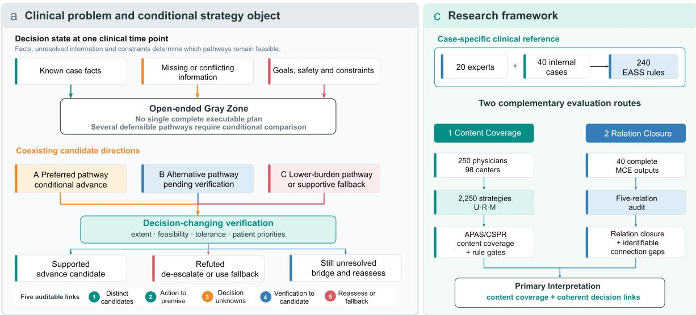

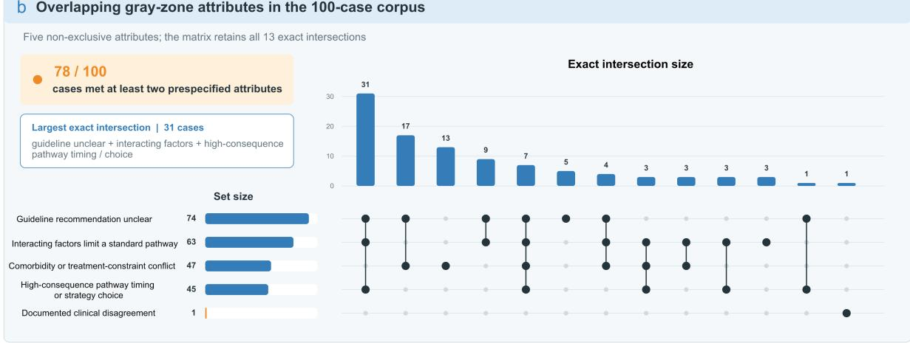

Figure 1 | Conditional decision object, overlapping gray-zone attributes and principal evidence routes a. Components and relations of the conditional strategy object. Candidate directions with diferent benefit, risk and implementation burdens enter review together. Premises such as disease extent, treatment tolerance and patient goals determine whether candidates are supported, refuted or remain unresolved and connect them to advancement, de-escalation or reassessment. b. Set sizes and 13 exact intersections for five non-exclusive gray-zone attributes among 100 purposively selected complex lung cancer cases. The attributes were unclear guideline recommendations, interacting factors, conflict from comorbidity or treatment constraints, pathway timing or strategy choice with substantial potential consequences, and recorded real clinical disagreement; 78 cases met at least two attributes. The intersections describe co-occurring constraints and are not a validated scale of complexity, severity, prognosis or support need. Full definitions and study-set counts are in Table 1 and Supplementary Table 10. c. The principal evidence chain comprised two complementary routes. Twenty specialists, all at chief-physician rank, across six disciplines constructed 240 EASS rules from 40 unpublished internal cases; 250 physicians from 98 centers submitted 2,250 final strategies under U, R and M to assess case-level clinical-content expression and the joint rule gate. Separately, 40 complete MCE outputs were assessed for closure among candidates, premises, decision-changing unknowns, verification tasks and reassessment or fallback. Source-masked content evaluation, clinical anchoring, controlled text perturbations and case-condition changes were supporting or diagnostic branches reported in Extended Data and the Supplementary Information.

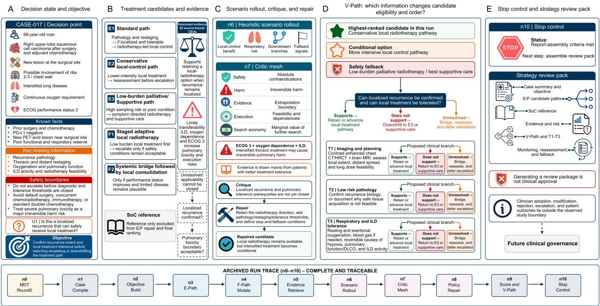

Figure 2 | MCE links treatment candidates to decision-changing verification in an illustrative run One version-bound complete MCE run, replicate 1. a. Decision state and goals. Previous treatment, suspected local recurrence, impaired respiratory reserve and safety boundaries are represented together, with recurrence extent and tolerance of local treatment retained as the principal decision-changing unknowns. b. Treatment candidates and evidence. The run generated three E-Path candidates, two F-Path candidates and a separate SoC reference. The 42 archived CEUs contained source-linked propositions concerning local-treatment feasibility and pulmonary-toxicity boundaries that supported, limited or left candidate applicability unresolved. c. Scenario analysis, critique and repair. Internal review identified pulmonary-injury risk from intensive thoracic treatment, limits on evidence extrapolation and unresolved pathology and tolerance premises. Repair retained local radiotherapy while making treatment intensity conditional on further verification. d. Candidate-linked V-Path verification. Imaging and planning, pathological confirmation, and assessment of respiratory function and interstitial lung disease connect supporting, refuting and unresolved results to advancement, de-escalation, bridging and reassessment. e. Stopping control and review pack. Once internal stopping criteria were met, the system assembled a Strategy Review Pack containing the case summary, candidates, SoC reference, evidence, risks, V-Path tasks and fallback arrangements. “Current preferred direction” identifies the highest-ranked candidate in this run, not a clinically optimal or approved treatment. “Convergence” and “Output can converge” denote the internal report-assembly stopping criterion; “COMPLETE, REPRODUCIBLE RUN” denotes a complete, traceable archived object and node chain, not verbatim reproducibility from a new external-model call. The lower panel shows the retained n0–n10 node sequence. All investigations and treatments are proposed; physician adoption, modification, rejection, escalation and patient outcomes were outside this example.

a Primary physician-task APAS  
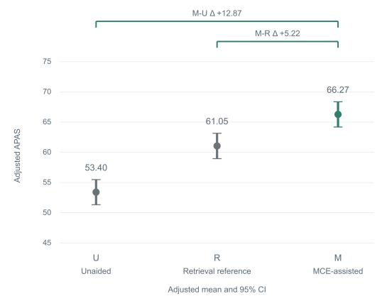

b Physician-task clinical-content differences  
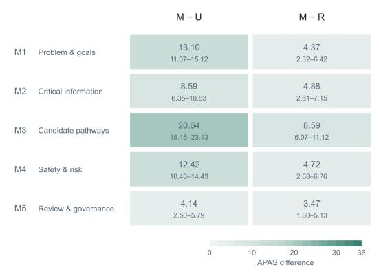

c Format-aligned MCE: paired APAS and length differences  
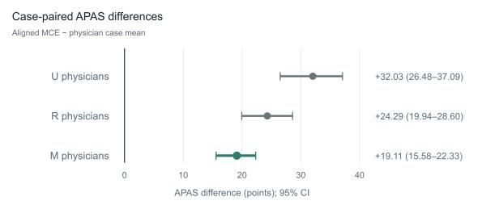

  
d Aligned MCE versus M physicians

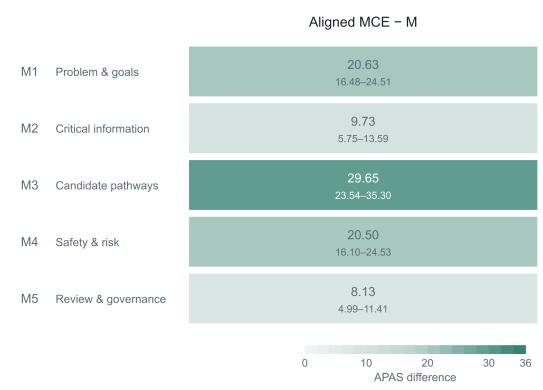

Figure 3 | MCE support and expression of case-level clinical requirements in physicians’ final strategies a. Adjusted APAS means and 95% CIs under U, R and M. Brackets show the prespecified M–U diference of 12.87 points (95% CI, 11.18 to 14.55) and M–R difer ence of 5.22 points (3.52 to 6.93). The main analysis included 2,250 physician–case–condition responses from 250 physicians; repeated responses within physicians and crossed case structure were handled by the mixed model, and estimates were standardized to the fixed 40 cases and balanced task positions. b. Adjusted M–U and M–R diferences and 95% CIs for M1 clinical problem and treatment goals, M2 decision-critical information, M3 candidate clinical pathways, M4 safety boundaries and risk governance, and M5 reassessment and governance. Color encodes the point estimate and each cell displays the estimate and 95% CI; both comparisons use a common 0–36 point scale. c. Paired APAS diferences and 95% CIs for format-aligned MCE output minus the physician-response case mean under U, R and M. A separate lower axis shows the paired diference in non-whitespace characters relative to M; negative values indicate shorter format-aligned MCE output. Physician responses were first averaged within case and condition, nine judge ratings were treated as measurement repeats and 40 cases were equally weighted; 95% CIs used 30,000 case-cluster bootstrap samples. This panel estimates within-case diferences between system outputs and mean physician responses; panel a estimates mixed-model adjusted means for physician responses under U, R and M. d. Within-case M1–M5 diferences and 95% CIs for format-aligned MCE output minus physician responses under M, using the same 0–36 point scale as panel b. The largest descriptive estimate was for M3, 29.65 points (95% CI, 23.54 to 35.30). Full domain results are in Supplementary Tables 9b and 9e; professional-title-group analyses and physician-task CSPR are in Extended Data Figure 1. Green marks MCE-related focal estimates and gray or blue marks comparison conditions.

a Complete MCE and other model outputs across three judges  
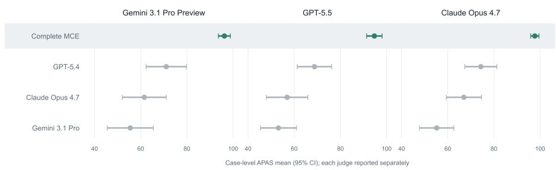

b Complete MCE minus each model output by clinical-content domain
<table><tr><td rowspan=1 colspan=4>Gemini 3.1 Pro PreviewGPT-5.4   Claude Opus 4.7  Gemini 3.1 Pro</td></tr><tr><td rowspan=1 colspan=1>M1 Problem &amp; goals</td><td rowspan=1 colspan=1>21.9</td><td rowspan=1 colspan=1>33.8</td><td rowspan=1 colspan=1>35.6</td></tr><tr><td rowspan=1 colspan=1>M2 Critical information</td><td rowspan=1 colspan=1>19.7</td><td rowspan=1 colspan=1>31.6</td><td rowspan=1 colspan=1>39.5</td></tr><tr><td rowspan=1 colspan=1>M3 Candidate pathways</td><td rowspan=1 colspan=1>40.0</td><td rowspan=1 colspan=1>50.0</td><td rowspan=1 colspan=1>56.2</td></tr><tr><td rowspan=1 colspan=1>M4 Safety &amp; risk</td><td rowspan=1 colspan=1>25.0</td><td rowspan=1 colspan=1>26.2</td><td rowspan=1 colspan=1>31.2</td></tr><tr><td rowspan=1 colspan=1>M5 Review &amp; governance</td><td rowspan=1 colspan=1>21.2</td><td rowspan=1 colspan=1>31.2</td><td rowspan=1 colspan=1>48.8</td></tr></table>

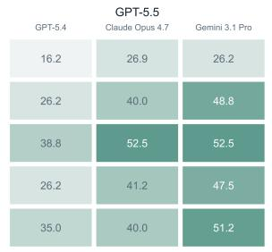

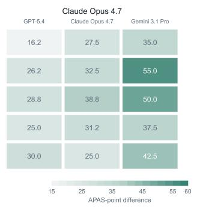

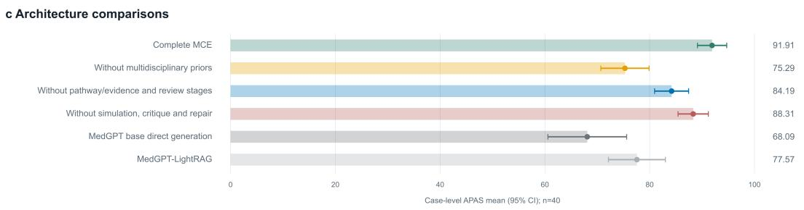  
Figure 4 | Conditional clinical-content increment of complete MCE outputs and support from the functional architecture a. Case-level APAS means and 95% CIs for complete MCE and strategy outputs generated by GPT-5.4, Claude Opus 4.7 and Gemini 3.1 Pro in the same 40 expert-reference cases. The three subplots correspond to the Gemini 3.1 Pro Preview, GPT-5.5 and Claude Opus 4.7 judges; results are reported separately and are not pooled across judges. b. Within-case APAS diferences between complete MCE and the three other-model outputs for M1–M5, shown separately for each judge. Color and cell values encode point estimates; complete 95% CIs are in Supplementary Table 9d. For the Gemini 3.1 Pro Preview judge, all M2 absolute estimates and the three within-case contrasts use the 38 cases for which M2 was applicable; other domain estimates use 40 cases. M3 was the largest descriptive estimate in seven of nine model–judge combinations. c. Case-level APAS means and 95% CIs for complete MCE, three grouped functional ablations and two reduced-orchestration reference configurations under GPT-5.5 scoring, with 40 cases per configuration. Horizontal bars use the complete 0–100 scale, and points and error bars show means and 95% CIs. Panels a,b and c use independent output sets and rating batches; complete MCE means are not compared across branches. Within-case contrasts and judge-specific configuration rankings are in the text and Supplementary Table 7. Grouped ablations do not identify individual-node efects, functional-block interactions or the independent contribution of n3–n5. MedGPT base direct generation in this branch is a reduced-orchestration reference and is distinct from the GPT-5.4 output in panels $^ { \mathrm { a , b . } }$ . Source-masked preference and dimension-specific re-review agreement are shown in Extended Data Figure 4.

a APAS distribution across ordered clinical ratings  
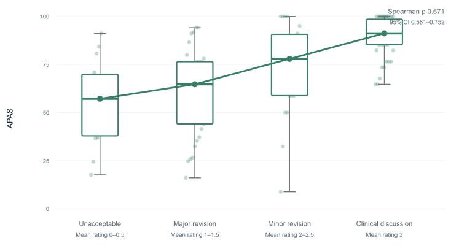  
b Agreement coefficients across evaluation tasks

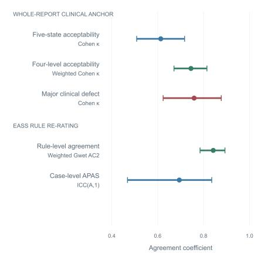  
Figure 5 | Clinical interpretation basis for the principal APAS results a. APAS distributions for 120 outputs grouped by the mean four-category ordered overall clinical-acceptability judgment of two physicians. Original mean scores of 0, 0.5, 1, 1.5, 2, 2.5 and 3 are grouped as 0–0.5, 1–1.5, 2–2.5 and 3. Points are outputs; boxes show interquartile ranges, horizontal lines and connected points are medians, and whiskers show observed ranges. Spearman’s rank correlation used the ungrouped mean score across all 120 outputs $( \rho = 0 . 6 7 1$ ; 95% CI, 0.581 to 0.752), with interval estimation by resampling 40 case clusters. b. Reliability coeficients and 95% CIs for whole-text clinical anchoring and EASS rule re-rating on a common 0.4–1.0 axis: five-category Cohen kappa for overall acceptability, linearly weighted Cohen kappa for the four-category ordered result, Cohen kappa for major clinical defects, linearly weighted Gwet AC2 at the rule level and ICC(A,1) at the case level. Exact agreement, Lin concordance correlation coeficient, case-level mean diference and limits of agreement are reported in the text and Supplementary Table 9i. Complete anchoring distributions and source-stratified descriptions are in Extended Data Figure 2. All controlled-text triplet changes are shown in Extended Data Figure 3 and Supplementary Table 9j.

## Supplementary Information

These methods follow the evidentiary sequence of the main text: construction of the casespecific clinical reference, the MCE and physician task, supportive system-output evaluations, interpretation of APAS, case-condition changes, and statistical implementation. The principal abbreviations are Expert-Admissible Strategy Space (EASS), Admissible Pathway Attainment Score (APAS), Complete-and-Safe Pathway Rate (CSPR), and Condition-Change Response Rule (CCRR).

## A Supplementary Methods 1. EASS expert process and operationalization of the case-specific clinical reference

## A.1 Expert process

The expert panel comprised 20 members. Nineteen participated in the first in-person round; the remaining member joined later online rounds. Fourteen treatment-focused panelists undertook the subsequent case review. In round 1, experts independently identified each case’s clinical problem, treatment goals, decision points, information gaps, specialty boundaries and safety issues requiring verification. The resulting content was organized into five clinical content domains: M1, clinical problem and treatment goals; M2, decision-critical information; M3, candidate clinical pathways; M4, safety boundaries and risk governance; and M5, reassessment and governance.

In round 2, 22 key or high-risk cases were each reviewed by four experts and the other 18 cases by three experts, yielding 142 expert–case review units. A strict majority required at least two votes in three-person reviews and at least three votes in four-person reviews. Items proceeded to round 3 when the direction of judgment, relevant clinical conditions or scoring boundary remained unresolved, including absence of a strict majority, disagreement about safety, an incomplete pathway rationale, free text that could alter the clinical judgment, or an unresolved scoring denominator.

In round 3, three experts independently answered each item requiring clarification, and the direction was determined by a strict majority of valid responses. Across 116 unresolved items, round 3 yielded 348 valid responses. Clinical prerequisites recorded with conditionally accepted votes were incorporated into the final rule. A 1:1:1 split for decision-critical information or governance items was handled conservatively by requiring verification, permitting lower-risk parallel actions, and specifying reassessment or multidisciplinary-team review. Reasonable disagreement was recorded only when more than one strategy had a clinical basis and could remain admissible concurrently. The final EASS was converted into an executable case-specific reference with 0/1/2 scoring rules. The 40 final M4 safety rules were based primarily on the round-2 case cards, safety-boundary table and safety review; 30 safety items carried forward the round-2 expert judgment, with pathway-applicability conditions from round 3 added where relevant. These safety boundaries and the other domain rules entered both APAS and CSPR evaluation.

EASS was constructed independently from the fixed case materials and expert review. The MCE, comparator and physician outputs to be evaluated were not shown to the experts constructing EASS, and EASS rules were not used to generate those outputs. The expert process and item flow are summarized in Supplementary Table 1.

## A.2 Rule data structure

The final EASS contained 240 case-specific rules, six per case. Each rule recorded a rule identifier, case identifier, clinical content domain, final state, clinical requirement, applicability conditions, acceptable actions, prohibited actions, fallback actions, weight, $0 / 1 / 2$ anchors, links to CSPR gates, failure codes and a version key. The fixed rule dictionary, with historical technical version key eapg-final-20260731, was used throughout the reported scoring; the key is retained for linkage to immutable source records and derived analyses and is not a current concept label. M1–M5 define the clinical content to be addressed in a given case; they are distinct from the five structural relations used to audit whether candidates, prerequisites, unknowns, verification tasks and subsequent actions were connected. The former provide the content reference and the latter assess relational structure.

Final rules were classified as confirmed acceptable or conditionally acceptable. Prohibited circumstances, fallback pathways, reasonable disagreement and unresolved content were recorded as clinical boundaries. A conditionally accepted action was compliant only if its specified prerequisite was met; use of a restricted pathway without its prerequisite scored 0. Correct entry into a prespecified fallback pathway, reasonable disagreement within the admissible strategy space and currently non-applicable items were excluded from both the APAS numerator and denominator rather than scored as failures.

## A.3 APAS and CSPR rules

Each applicable EASS rule was scored 0, 1 or 2. M1–M4 had weight 3 and M5 had weight 2. For response s, APAS was

$$
\mathrm { A P A S } ( s ) = 1 0 0 \times \frac { \sum _ { i } w _ { i } r _ { i } ( s ) } { 2 \sum _ { i } w _ { i } } ,
$$

where the sum included only applicable rules entering the denominator. The clinical problem and treatment goal within M1 were scored separately; M2–M5 each contributed a case-level rule. APAS measures the extent to which a strategy expresses the applicable case-level clinical requirements.

Let $G _ { s }$ denote the set of applicable CSPR gates for response s, with $z _ { g } ( s ) = 1$ for a passing gate and $z _ { g } ( s ) = 0$ for a failed gate. When a complete judge majority was available for every applicable gate,

$$
\mathrm { C S P R } ( s ) = \prod _ { g \in G _ { s } } z _ { g } ( s ) .
$$

Thus, failure of any applicable gate yielded CSPR failure. If any applicable gate lacked a complete majority, the response remained indeterminate rather than being forced to 0. APAS and CSPR were derived from the same case-specific reference but calculated separately. The nine gates and their applicability, failure and denominator rules are specified in Supplementary Table 2; judge-level and cross-judge aggregation are described in Supplementary Methods 3.

## B Supplementary Methods 2. Generation of MCE and comparison outputs

## B.1 MCE input, processing and output

The case-level input was a fixed Case Pack containing six fields: basic information, chief complaint, present illness, past and other medical history, investigations, and diagnosis. It excluded management, the treating physician’s recommendations, subsequent plans and outcomes. Internal cases were managed as limited, de-identified restricted data. Neither EASS rules nor CCRRs entered generation.

MCE used MedGPT as its base model and organized processing around four scientific functions: representation of case state, goals and constraints; organization of candidate pathways and qualifying evidence; feasibility checks, clinical critique and repair; and management of uncertainty, stopping assessment and assembly of a Strategy Review Pack. The final report contained clinical goals, decision-critical information, candidate pathways, conditions under which pathways became admissible or failed, evidence and risk, monitoring, reassessment and governance arrangements.

Study runs used a version-controlled knowledge base and evidence corpus. For clinical disputes that could change candidate eligibility, sequence or intensity, MCE organized evidence by proposition type into source-linked clinical evidence units (CEUs) and recorded whether each source supported, limited or left candidate applicability unresolved. Evidence types were not collapsed into a single score, and insuficient evidence remained unresolved. The CEUs supported review at the proposition-and-source level. Complete PICO representation, formal applicability boundaries, evidence grading and calibrated confidence were not evaluated in this study.

The governance content of the Strategy Review Pack was intended for downstream physician review. Modification, rejection, adoption or escalation by physicians or a formal multidisciplinary team remained outside the MCE system boundary.

## B.2 Representative run

An illustrative complete MCE run, completed on 27 July 2026, was selected to show how a strategy object was formed and retained. The version-bound archived run linked the case input and study condition with system and prompt versions, input and output hashes, execution stages, 42 source-linked clinical evidence units (CEUs), intermediate candidates, structured review, candidate repair, verification tasks, the stopping decision and the final report. These linked objects support the functional sequence shown in Figure 2.

The unit of analysis for this example was one system run, not a patient outcome or clinicalworkflow event. The example documents the method and object traceability; it does not estimate run completeness across the cohort or imply that a new call to an external model would reproduce identical wording.

## B.3 Audit of five structural relations in complete MCE outputs

Forty complete MCE Strategy Review Packs were assessed for five relations: candidate-pathway diferentiation; the action-premise relation connecting an action to conditions for initiation, restriction or withdrawal; a decision-changing unknown capable of altering pathway eligibility, sequence or intensity; the verification-candidate relation connecting a verification result to a specific candidate and subsequent action; and the reassessment/fallback relation retained when the preferred pathway became infeasible, risk increased or information remained insuficient. Each dimension was coded as complete, partly complete, missing or incorrect, not applicable, or not assessable.

Gemini 3.1 Pro Preview, GPT-5.5 and Claude Opus 4.7 independently evaluated the same 40 outputs. Each judge–output combination was assessed once; results were reported by judge without voting or averaging and without the nine-run aggregation used for the U/R/M task. Overall relationship closure required every applicable dimension to be complete, no critical omission or relationship conflict, and every applicable verification task to specify subsequent action after a supportive, refuting or still-unresolved result, or an explicit reason why a state was not applicable. Defects were separately coded as omission, misconnection, internal conflict or not assessable. Verification tasks were observations nested within outputs; neither judge count nor task count increased the number of outputs or clinical samples.

Targeted human checking covered 18 identified objects: ten still-unresolved branches and eight objects requiring additional judgment rationale. Review of the corresponding outputs located the relevant text and confirmed subsequent arrangements in nine of the ten unresolved branches and one omission. This review resolved the identified trace questions without replacing the original dimension ratings from the three AI judges. Full definitions, judge-specific summaries and review counts are reported in Supplementary Table 11 and Source Data.

## B.4 U/R/M conditions and other comparators

The unaided condition (U) displayed only the standardized Case Pack. The retrieval-reference condition (R) additionally displayed case-specific reference information generated by GPT-5.4 with LightRAG using the same knowledge base as MCE. Sharing a knowledge base did not imply use of the same retriever, index, reranker, prompt, input budget, orchestration or output structure. The MCE-assisted condition (M) displayed the Strategy Review Pack, which physicians could inspect, amend and supplement before submitting their final strategy.

Comparators in the source-masked content evaluation were Direct, IR-RAG, MDT-Debate and Clinician Plan. MedGPT base direct generation and MedGPT-LightRAG in the separate sixconfiguration comparison were diferent system configurations and were not interchangeable with these source-masked comparators. Inputs, knowledge relationships, outputs and evaluation purposes are summarized in Supplementary Table 3.

## B.5 Format-aligned MCE output

To examine whether report length and presentation structure accounted for diferences in rule coverage, the MCE system generated one additional format-aligned output for each of the same 40 cases. This output retained the clinical content formed within MCE but presented it in the same five-part structure as the physician task, using paragraphs and a length constraint based on the physician-response distribution. Internal pathway labels were rendered as concrete clinical actions. The format-aligned output was not a post hoc summary or rewrite of the complete report by a general-purpose AI model.

The format-aligned MCE outputs and the physician responses under U, R and M were each scored three times by Gemini 3.1 Pro Preview, GPT-5.5 and Claude Opus 4.7. APAS and M1–M5 scores were averaged equally across the nine measurements at the response level. Physician responses were then averaged within case and condition so that all 40 cases contributed equally to paired comparisons. Non-whitespace characters were counted. The main comparisons were signed APAS diferences between the format-aligned output and the U, R and M case means, the character-count diference relative to M, and the signed M1–M5 diferences relative to M. CIs were obtained from 30,000 case-cluster percentile bootstrap samples with seed 20260907, retaining the system output, physician responses and all ratings from the resampled case. This case-paired analysis estimated diferences in average content coverage and length between system output and physician responses within fixed cases; it did not re-estimate the U/R/M condition efects in the physician task, which were obtained from the mixed model incorporating physician random intercepts, case-by-condition terms and task position. It also did not measure whether physicians viewed, adopted, changed or rejected particular content (Fig. 3c,d and Supplementary Table 9e).

## B.6 Output processing and reviewable objects

For source-masked content evaluation, candidate strategies were placed in the same display structure and explicit source labels were removed, but body text was not normalized for length or style. For the six-configuration comparison, identifying evidence numbers were removed and labels were rotated anonymously, again without rewriting the output length or style. Source masking therefore could not prevent reviewers from inferring source from length, format or content.

Generated, comparator and judge outputs were recorded separately by model or functional role, case input, evaluation input and evaluation purpose. Fixed case inputs, preserved outputs, scoring rules, scoring requests, panel aggregation and statistical analyses constituted the reviewable analytic objects.

## C Supplementary Methods 3. Physician-task allocation, presentation and strategy scoring

## C.1 Assignment-list generation and allocation

Assignment lists were generated ofline before the physician roster was imported. The generator tracked cumulative assignment counts across 120 case–condition slots formed by 40 cases under U, R and M. For each list, nine cases were sampled without replacement, with higher weight assigned to cases with lower cumulative coverage. Three cases were then assigned to each condition, prioritizing slots with lower coverage, and the nine tasks were independently ordered for presentation.

The initial generation specification used random seed 42. Later list expansion continued from the existing slot counts, but the complete extended random state was unavailable; allocation was therefore not treated as a fully reproducible randomized design. After roster import, participants received pre-numbered lists in sequence. Allocation did not use department, professional title, hospital or subsequent response data.

The main analysis included 250 physicians who completed all nine tasks and 2,250 final strategy responses. Each physician answered nine diferent cases, three per condition. All 40 cases and all 120 case–condition slots were represented; each slot contained 8–29 responses (mean, 18.75). Unassigned case–condition combinations were structural gaps in the design rather than missing outcomes. Constraints and coverage are reported in Supplementary Table 4.

## C.2 AI judging and panel aggregation

Gemini 3.1 Pro Preview, GPT-5.5 and Claude Opus 4.7 independently scored each response in three runs. Each run applied the case-level atomic EASS rules and returned 0, 1, 2 or not applicable for each rule, from which APAS, M1–M5 and the nine CSPR gate states were derived.

For the primary APAS panel, rule scores were first averaged across the three runs from each judge and then averaged equally across the three judges. For CSPR, a majority was formed across the three runs within each judge and then across judges; responses without a complete majority were indeterminate. The nine ratings were repeated measurements of the same response and did not increase the number of physicians, cases or responses. CSPR and professional-title-group results are shown in Extended Data Figure 1; full estimates are reported in Supplementary Tables 9a and 9c.

## C.3 Post hoc exploratory analysis of subsequent clinical events

This analysis was conducted after the primary ofline evaluation. Follow-up fields were not part of the fixed Case Pack, EASS construction, MCE input, U/R/M task or text-scoring materials. Grouping used de-identified linkage and follow-up text without copying names, medical-record numbers or free-text case summaries into analytic outputs.

Deterministic post hoc text rules separately identified explicit records of death; disease progression or suspected new metastasis; and treatment interruption or non-initiation or deterioration in health status. The categories could overlap. They identified five cases with a death record, two with progression or suspected new metastasis, and 11 with treatment interruption, noninitiation or health-status deterioration, yielding 14 cases with at least one component event record. These rules were not independently clinically adjudicated, and the composite grouping was an exploratory record-based marker rather than overall survival, progression-free survival or a validated clinical endpoint.

Cases were grouped as having at least one component event record, having follow-up without a recorded component event, or having unavailable follow-up; the six cases with unavailable followup remained separate. Absence of a recorded event was not treated as absence of progression, survival or favorable prognosis. Date and record-linkage checks identified three prespecified data-integrity concerns: one chronology inconsistency, one unavailable parsable index date and one uncertain record linkage. The main text reports a data-quality sensitivity target excluding these three cases, comprising 12 cases with a component event record and 19 with follow-up but no recorded component event. Analyses including all 34 cases with follow-up, the recorded-death subgroup and content-domain estimates remain supplementary (Supplementary Tables 9f–h).

## D Supplementary Methods 4. Supportive system-output evaluations

Three analyses are reported in the order used in the main text: cross-model strategy-output comparison, source-masked content evaluation and the six-configuration functional-module ablation analysis. They used diferent output sets, judge aggregation and estimands and were not pooled.

## D.1 Cross-model strategy-output comparison

The comparison used the 40 expert-reference cases. For each case, one complete MCE output and one model-generated strategy from each of GPT-5.4, Claude Opus 4.7 and Gemini 3.1 Pro yielded 160 outputs. The analysis workbook preserves model identities, output texts and scoring records but not the complete system or user instructions used to generate the three model outputs; these outputs are not defined as zero-prompt generations and do not support a claim that prompt conditions were identical. Complete MCE outputs came from the existing study runs and used the same system configuration and fixed knowledge-base version, but they were not generated in the same batch as the three other-model outputs. The four outputs per case were randomly mapped to masked labels A–D. Only numeric citation markers were removed; length, section structure and writing style were not normalized. Judges were instructed not to treat style, structure or length as evidence of quality, although these features could remain source cues.

Gemini 3.1 Pro Preview, GPT-5.5 and Claude Opus 4.7 independently evaluated all four outputs for every case. Each judge–output combination was rated once, yielding 480 judge–output units and 2,880 rule ratings. The scoring records for this batch were generated on 31 August 2026; model access dates were not stored separately in the source records. Each judge–strategy combination used 40 paired cases. APAS was summarized as the arithmetic mean across cases, with a 95% CI calculated as the ${ \mathrm { m e a n } } \pm 1 . 9 6 \ \times$ the case-level sample standard deviation / 40; CSPR was reported as the number and proportion passing. Judge results were retained separately without voting, averaging or the nine-run U/R/M aggregation.

Domain-level APAS was reconstructed from the same rule ratings for M1–M5. Each case–strategy– judge–domain estimate included only applicable rules scored 0, 1 or 2 and retained the original rule weights. Complete MCE was compared with each other-model output within judge and case. For Gemini 3.1 Pro Preview, the M2 rule was not applicable across all four strategies in two cases, giving 38 paired cases for those M2 estimates; all other domain estimates used 40 cases. Domain rankings were descriptive, with no between-domain test or multiplicity adjustment. This analysis compared fixed outputs under the fixed EASS reference; joint diferences in model, run, length and organization precluded attribution to a single MCE component (Fig. 4a,b and Supplementary Table 9d).

## D.2 Source-masked content evaluation

## D.2.1 First-round allocation and presentation

Each of 60 cases contributed two within-case A/B modules: a primary comparison of MCE with MDT-Debate and a secondary comparison of MCE with one of IR-RAG, Direct or Clinician Plan. Six clinical experts completed 120 first-round modules. The same expert evaluated both modules for a case; each expert assessed ten cases and 20 modules. Each secondary comparator contributed 20 modules. Cases with an empty or explicitly undetermined treating-physician recommendation were ineligible for the Clinician Plan comparison.

Explicit source labels were removed and candidates were labeled A or B. MCE appeared in position A in 58 modules and B in 62. Source guesses were not collected, so source-identification accuracy was not estimable. Each of five dimensions was rated as A better, B better or no diference: D1, key clinical conflict and treatment goals; D2, patient state and treatment fit; D3, safety constraints and unacceptable risks; D4, verification steps capable of changing the decision; and D5, subsequent pathways and alternatives. Experts also made an overall judgment, selected the principal reason and recorded safety-screen flags.

## D.2.2 Independent re-review

Sixty modules were selected from the initial 120, stratified by case and comparator, with exactly one module per case. The re-review set comprised 30 MDT-Debate comparisons and ten each for IR-RAG, Direct and Clinician Plan. Sampling used only the case and comparator design fields and did not use first-round preferences, D1–D5 ratings, safety flags, response time or text length.

A separate group of six clinicians from the EASS panel who had not participated in the first round completed the re-review, ten modules each. $\mathrm { A } / \mathrm { B }$ positions were reassigned. Reviewers were masked to source, first-round ratings, safety-screen fields and statistical results. Both rounds used the same case materials, candidate strategies and rating anchors. Allocation and masking are detailed in Supplementary Table 6.

## D.2.3 Analysis

The unit of preference analysis was the case–comparator A/B module. After decoding with the prespecified source map, preferences were classified as MCE preferred, no diference or comparator preferred. Counts and proportions were reported separately for each round. For the 60 modules rated in both rounds, analyses included the 3 × 3 table, exact agreement, Gwet AC1 and supplementary Cohen κ for the overall judgment; D1–D5 analyses included exact agreement, Wilson 95% CIs and unweighted κ. These dimension-specific estimates describe reproducibility of judgments on the same fixed modules, not the proportion of modules in which MCE was preferred for a given dimension.

Safety-screen flags were described with a $2 \times 2$ table, positive agreement, $2 a / ( 2 a + b + c )$ , and negative agreement, $2 d / ( 2 d + b + c )$ . Content flagged by either group entered human review, but a screening flag was not a confirmed safety event. Intervals did not adjust for correlation induced by an expert rating multiple modules, so agreement applies to this fixed re-review set. Preference distributions are shown in Extended Data Figure 4.

## D.3 Functional-module ablation across six configurations

The six configurations shared the MedGPT base model. The archived n0-n10 workflow was grouped by the dependent clinical and computational objects passed between stages. Multidisciplinary priors entered at n0; n1-n2 represented the case state, goals and constraints; n3-n5 constructed foundational and derived pathways and linked qualifying evidence; n6-n8 performed scenario simulation, critique and candidate repair; n9 performed candidate-strategy reranking and formed candidate-linked verification objects; and n10 controlled stopping assessment and report assembly.

Complete MCE retained the full workflow. Three configurations were targeted grouped functional ablations: removal of the n0 multidisciplinary-prior function; joint removal of n3-n5 pathway and qualifying-evidence construction and n6-n8 simulation, critique and repair; and removal of n6-n8 simulation, critique and repair alone. Both stage-removal configurations retained candidatestrategy reranking at n9, although the joint n3-n8 ablation used configuration-limited retrieval; this does not imply that all candidate-linked verification behavior at n9 was retained. MedGPT base direct generation and MedGPT-LightRAG provided reduced-orchestration reference configurations within the six-configuration design. MedGPT-LightRAG used the same knowledge base as MCE but omitted the remaining MCE orchestration. The functional-block mapping and configuration matrix are provided in Supplementary Table 7.

Each configuration generated one report for each of 40 cases, with one report per case– configuration combination and 240 reports overall. The six reports per case were assigned balanced, rotated labels A–F, and identifying evidence numbers were removed. GPT-5.5, Gemini 3.1 Pro Preview and Claude Opus 4.7 scored the reports against the corresponding EASS rules. This branch used independent judge results rather than the nine-run U/R/M aggregation. GPT-5.5 provided the primary displayed APAS, CSPR and within-case diferences. Gemini and Claude Opus 4.7 were not pooled with GPT-5.5 at the case level; their rankings of the six configuration-level mean APAS values were used to describe ranking stability.

Complete MCE was compared with each other configuration using the case as the paired unit, reporting the mean within-case diference and normal-approximation 95% CI. CSPR for each configuration was described as the proportion passing among 40 cases without a separate confirmatory comparison. Pairwise Spearman’s rank correlations between judges used the six configurations as the units. The targeted ablation contrasts estimated diferences after removal of defined functional bundles in these fixed cases and realized single runs. The joint n3-n8 ablation did not isolate the contribution of n3-n5, and the design did not estimate individual-node efects, interactions among blocks or run-to-run stability. Output length and organization could also change with the functional intervention. Figure 4c shows GPT-5.5 case-level means and intervals; complete summaries, paired contrasts and ranking stability are reported in Supplementary Table 7 and Source Data.

## E Supplementary Methods 5. APAS interpretation and interrater reproducibility

## E.1 Overall clinical anchoring

Forty case clusters were sampled from existing outputs in the expert-reference set. Each cluster included one physician strategy, one complete MCE output and one comparator output, for 120 outputs. Two attending thoracic surgeons independently rated overall clinical acceptability and the presence of a major clinical defect. Explicit source labels were removed, but original content and structure were retained. Reviewers were not shown source, configuration, $\mathrm { U / R / M }$ condition, EASS rules, APAS or CSPR, sampling stratum, or the other reviewer’s rating.

Overall clinical acceptability was the primary anchor item and major clinical defect a supportive diagnostic item; they were not combined into a new score. The original five-category acceptability item was used for the main distribution and nominal agreement analysis. A prespecified fourcategory ordinal transformation was used for supplementary weighted agreement and correlation with APAS. Raw independent ratings were used for inter-rater analyses and case-cluster intervals; subsequent targeted reviews, if any, did not overwrite them. The sample was balanced and enriched by source, existing score tier and risk or disagreement, so source-specific proportions were descriptive. Results are shown in Extended Data Figure 2.

## E.2 Re-rating EASS rules for complete MCE

Two physicians independently re-rated the 240 EASS rules associated with 40 complete MCE reports. Materials concealed configuration, model name, AI ratings and the other physician’s judgment. Physicians used the same states of 0, 1, 2, not applicable and not assessable. Analyses used pre-adjudication ratings. Not assessable was not recoded as a numeric score or as not applicable, and paired denominators included rules assessable by both raters. Case-level APAS was calculated only when a physician supplied a $0 / 1 / 2$ rating for all six rules in the case. Rule level outcomes were exact agreement and linearly weighted Gwet AC2. Case-level outcomes were

ICC(A,1), Lin concordance correlation coeficient, the mean rater diference and Bland–Altman 95% limits of agreement. Denominators and complete estimates are reported in Supplementary Tables 5, 9a and 9i.

## E.3 Controlled-text perturbation

The perturbation set comprised 12 cases, 36 original–variant triplets and 108 texts. Each triplet contained the original, a prespecified section-order variant designed to retain content, and a rule-linked target-content-deletion variant. Before AI judging, physicians reviewed 72 candidate variants for attainment of the intended transformation and recorded of-target changes; the texts were then finalized. Targeted domains for content deletion were M2–M5, with nine triplets per domain.

Each text was scored three times by each of Gemini 3.1 Pro Preview, GPT-5.5 and Claude Opus 4.7. A request contained only the anonymized case, strategy text and six selected rules; it did not identify variant type, target domain, source condition or physician. The equal-weight mean of the nine ratings formed the text-level APAS panel value. The triplet was the paired unit and case was the clustering unit. Diferences in overall APAS and target-domain APAS between each variant and its original were summarized with 30,000 case-cluster percentile bootstrap samples. Partial gate states and rule transitions derived from the six rule links supplied in each request were supplementary. Not applicable, missing, parse failure and retry states were retained in source denominators; the partial gates were not treated as complete nine-gate CSPR, and repeated ratings were not independent samples. Results are shown in Extended Data Figure 3.

## F Supplementary Methods 6. Purposive case variants, relationship closure and evaluator dependence

This analysis describes whether clinical content remained connected to pathway premises, action sequence and fallback in fixed, purposively constructed case variants. It was designed to locate relationships requiring clinical review, not to estimate an overall MCE error rate, a real-world safety-event rate or a causal efect of changing case conditions.

## F.1 Scenario and CCRR construction

Sixteen source-case templates were purposively selected from the expert-reference set, with four reserves. Each core template produced one baseline scenario and two modified scenarios: one altered a safety constraint or decision-critical information, and the other altered management sequence, branching or reassessment escalation. This yielded 48 scenarios. Six CCRRs covering clinical problems and goals, decision-critical information, candidate pathways, safety constraints and reassessment requirements were specified for each scenario before MCE output was inspected, yielding 288 requirements.

Each member of the fixed three-AI-judge panel independently assigned each requirement one of five states: pass, clear gap, clinical review, not applicable or not assessable. This branch did not use the nine-run U/R/M aggregation. A strict majority determined consensus. A three-way split was assigned clinical review; when one result was missing and the other two agreed, the common state was retained and the missing call recorded separately. AI consensus was used to localize potential relationship gaps structurally and was not treated as a clinical reference standard. States and denominator handling are defined in Supplementary Table 8.

Raw requirement states were reported for all 288 requirements. A conservative definition retained 45 clinical-review and zero not-assessable requirements in the denominator without counting them as passing and excluded one not-applicable requirement, giving 228 of 287. A binary-evaluable definition included only pass and clear gap, giving 228 of 242. These proportions describe denominator handling and are not presented as overall performance measures in the main figure. Scenario status was jointly derived from its six requirements; a scenario was completely closed only when all six passed and none was clinical review, clear gap or not assessable. Requirement-level proportions and scenario-level closure used diferent analysis units and decision rules. Scenario composition, the template matrix and requirement states are shown in Extended Data Figure 7.

## F.2 Physician calibration and review cohorts

The prespecified calibration sample selected 24 of 48 scenarios by a fixed procedure: one modified scenario from each source case, four in each of the four modification classes, plus eight baseline scenarios selected across safety strata. Sampling did not use AI judgments or scenario outcomes. Two physicians independently assessed the 144 CCRRs without seeing the existing AI consensus or governance map.

Requirements entered targeted review if they had a clear gap, required clinical review, had judge disagreement or missingness, or were prespecified as high-priority or ungraded safety requirements. Two physicians independently reviewed this cohort. All safety requirements and all requirements on which the physicians disagreed were escalated to a third physician who could see the preceding opinions. The third physician addressed high-risk, discordant or uncertain requirements; this was not blinded independent scoring and did not create a three-rater reference standard. Coverage is summarized in Supplementary Table 5.

Separately from the 24-scenario calibration sample and the 161-requirement targeted review cohort, two physicians independently re-rated all 48 scenarios and 288 CCRRs before adjudication. Main-text requirement-level and scenario-card-level exact agreement and Gwet AC1 came from this complete re-review. Comparisons of each physician with AI consensus on the same objects were evaluator-dependence diagnostics and did not define either as the reference standard. The three sets, 24 scenarios/144 CCRRs, 161 targeted requirements, and 48 scenarios/288 CCRRs, retained separate denominators. Physician–physician and physician–AI agreement and individualjudge states are shown in Extended Data Figure 8; safety-stratified requirement states are reported in Supplementary Table 8.

## G Supplementary Methods 7. Statistical implementation, diagnostics and sensitivity analyses

## G.1 U/R/M models and standardization

Let physician i, case $j ,$ task position k, and condition $a \in \{ U , R , M \}$ index a response. The primary APAS model was

$$
E ( Y _ { i j k a } \mid b _ { i } ) = \beta _ { 0 } + \beta _ { a } + \gamma _ { j } + ( \beta \gamma ) _ { a j } + \tau _ { k } + b _ { i } ,
$$

where $b _ { i }$ was a physician random intercept and case and task position were categorical variables. APAS was estimated by restricted maximum likelihood. M–U and M–R were standardized to a reference grid comprising the 40 fixed study cases and nine equally weighted task positions:

$$
\widehat { \mu } _ { a } ^ { \mathrm { A P A S } } = \frac { 1 } { 4 0 \times 9 } \sum _ { j = 1 } ^ { 4 0 } \sum _ { k = 1 } ^ { 9 } \widehat { m } _ { a j k } ( b = 0 ) , \qquad \widehat { \Delta } _ { M - U } = \widehat { \mu } _ { M } - \widehat { \mu } _ { U } .
$$

M–R was calculated analogously. CSPR used the common-condition-efect model CSPR \~ condition + case + task position $^ \mathrm { ~ + ~ } \left( 1 \mathrm { ~ \right. ~ }$ physician). With expit $\scriptstyle ( \mathbf { x } ) = 1 / ( 1 + \mathbf { e } ^ { \ \widehat { \mathbf { \gamma } } } \{ - \mathbf { x } \} )$ the standardized probability under condition a was

$$
\widehat { p } _ { a } ^ { \mathrm { C S P R } } = \frac { 1 } { 4 0 \times 9 } \sum _ { j = 1 } ^ { 4 0 } \sum _ { k = 1 } ^ { 9 } \exp \mathrm { i } \mathrm { t } ( \widehat { \eta } _ { a j k } ( b = 0 ) ) , \qquad \widehat { \Delta } _ { M - U } ^ { \mathrm { C S P R } } = \widehat { p } _ { M } - \widehat { p } _ { U } .
$$

M–R was calculated analogously. Standard errors used the model-parameter covariance matrix and the numerical gradient of the standardization function with the delta method. Predictions set the physician random efect to zero rather than integrating over its distribution; the probability diferences are therefore conditional standardized contrasts, not physician-population-average risk diferences.

## G.2 Model estimates for subsequent clinical events

Event-stratified estimates were derived from the primary APAS model fitted to all 40 cases, APAS \~ condition × case + task position + (1 | physician), rather than from a simplified model refitted within the follow-up subset. Case-specific marginal estimates under U, R and M were obtained and then equally standardized within the specified event target set. The main text reports the 31-case data-quality sensitivity target excluding three records with date or record-linkage concerns; results for all 34 cases with follow-up are supplementary. Within-group U, R and M estimates and M–U and M–R contrasts assessed whether the text diferences remained in cases with component event records. Between-group diferences in contrasts were secondary exploratory efect-modification estimates. Model covariance was propagated through the linear contrasts to produce asymptotic Wald 95% CIs.

Event-stratified M1–M5 estimates used the same case-heterogeneous mixed-model structure among responses for which the domain was applicable and entered the denominator, using all 34 cases with follow-up. Recorded-death strata, goal structure, major clinical-decision scenario and the subgroup with non-death records of treatment interruption, non-initiation or deterioration were post hoc exploratory analyses without multiplicity adjustment. All estimates targeted the fixed purposive cases; they did not include uncertainty from case sampling or post hoc target-set selection and did not estimate a causal efect of MCE on subsequent events.

## G.3 Model diagnostics and fitted specifications

For each mixed model, the formula, number of analytic records, convergence message, fitting warnings and singularity were recorded. Singularity was assessed with lme4::isSingular at tolerance $1 0 ^ { - 4 }$ ; the optimizer was nloptwrap with a maximum of 100,000 function evaluations. Binary models were also checked for separation or weak-identification signals. APAS judge-run, equal-weight panel, leave-one-judge-out, common-applicability and length-diagnostic models used case-heterogeneous structures. CSPR used the prespecified common-condition-efect model. A case-by-condition binomial model was unstable in the initial GPT-5.5 analysis; the available diagnostics did not identify a more specific separation or weak-identification mechanism. Models, denominators and diagnostics are summarized in Supplementary Table 9.

## G.4 Inter-rater agreement

For ordinal EASS re-ratings, the paired-complete rules formed the denominator for exact agreement, agreement within one category, linearly weighted Gwet AC2 and linearly weighted Cohen κ. Case-level APAS for complete MCE outputs was summarized using absolute-agreement, single-rater ICC(A,1), Lin concordance correlation coeficient, the mean diference between raters A and B, and Bland–Altman 95% limits of agreement, each among complete paired cases.

The case-condition calibration and complete independent re-review remained separate. For the complete re-review, five-state exact agreement, nominal Gwet AC1 and unweighted Cohen κ were calculated for 288 CCRRs. The six CCRRs in each scenario were combined by the main closure rule into a binary complete versus incomplete outcome, for which exact agreement, Gwet AC1 and category-specific agreement were calculated. The same analyses compared each physician with AI consensus on identical objects as evaluator-dependence diagnostics. Unless otherwise specified, 95% CIs used 10,000 cluster-percentile bootstrap samples: complete MCE analyses resampled cases, and case-condition analyses resampled the 16 source templates, retaining all within-cluster rules, responses or scenarios. Raw special states from each rater were retained.

Overall clinical anchoring reported exact agreement, adjacent agreement and linearly weighted Cohen κ for overall acceptability and exact agreement and κ for major clinical defects. Spearman’s rank correlation between APAS and the mean four-category ordinal acceptability rating from the two physicians was calculated across 120 outputs; its 95% CI used percentile bootstrap resampling of 40 case clusters. Source-level proportions used outputs as denominators; within-case comparisons were descriptive or exploratory.

For controlled-text perturbations, diferences between each variant and its original were calculated within triplet and summarized separately for the section-order and target-content-deletion variants. Target-domain diferences were stratified by M2–M5, with nine triplets per domain. Overall and domain-specific 95% CIs used 30,000 case-cluster percentile bootstrap samples. Repeated ratings were first aggregated into text-level panel values and were not independent observations. Partial gate-state transitions used the same triplets and applicability denominator for the six rule links provided in each request and were not combined with APAS diferences as complete CSPR.

Format-aligned comparisons also used the case as paired and clustering unit. The nine ratings of each system output were averaged equally; ratings of physician responses were averaged at the response level and then within case and condition. Signed diferences in APAS, M1–M5 and non-whitespace character count were equally averaged over 40 cases. CIs used 30,000 case-cluster percentile bootstrap samples with seed 20260907. This supportive estimand was the within-case system-output-minus-physician-response diference, not a second estimate of the U/R/M condition efect from the physician-task mixed model. Repeated judge runs and multiple physician responses within a case did not increase the case sample size.

## G.5 Secondary analyses, multiplicity and sensitivity analyses

M1–M5 used case-heterogeneous linear mixed models, with no imputation of non-applicable records. Holm adjustment was applied to the ten M–U and M–R comparisons across five domains. Figure 3b reports estimates and 95% CIs; applicable denominators and adjusted P values are in Supplementary Table 9b, and paired domain diferences between format-aligned MCE output and M-condition physician responses are in Supplementary Table 9e. Domain-by professional-title-group interactions were post hoc. Professional titles were grouped as senior (chief physicians), intermediate (associate chief physicians) and junior (attending or resident physicians). The model included condition-by-professional-title-group interactions, assessed with a joint four-degree-of-freedom Wald test. The senior, intermediate and junior groups contained

68, 91 and 91 physicians. Extended Data Figure 1c shows the complete M–U and M–R estimates and 95% CIs; full values are in Supplementary Table 9c. Professional title was treated only as a coarse indicator of clinical experience.

Overall APAS, M1–M5, recorded death, goal structure and major clinical-decision scenario analyses involving subsequent events were post hoc and outside the Holm family for the primary analysis. The main text reports only the data-quality sensitivity target excluding three records with date or record-linkage concerns; full-record, domain, recorded-death and other case-feature analyses are in Supplementary Tables 9g and 9h. CIs quantify model-estimation uncertainty, and P values, when presented, are unadjusted exploratory statistics. Inclusion or exclusion of zero was not used to declare efect modification.

Sensitivity analyses included crossed physician and case random intercepts; common applicability restricted to rules judged applicable in all nine runs; an input-adaptation analysis excluding 94 responses containing system-specific pathway identifiers; a length-conditioned diagnostic using centered log response length and its interaction with condition; and leave-one-judge-out panels that equally averaged the six ratings from the remaining two judges and refitted the model. Length occurred after condition assignment and was not a baseline covariate in the primary model. Within APAS and CSPR, P values for M–U and M–R were Holm adjusted separately; CIs were unadjusted.

U/R/M mixed models were implemented in R 4.6.1 using lme4 2.0-6 and emmeans 2.0.4. Agreement analyses used Python 3.12.13, pandas 2.2.3 and NumPy 2.3.5. Fixed software versions and random seeds were used for the ofline statistical analyses.

## G.6 Supplementary summaries of relationship closure in case variants

Requirement states were summarized using two descriptive denominators. The conservative definition counted clinical-review and not-assessable states as not passing and excluded not-applicable requirements. The binary-evaluable definition used pass and clear gap as its denominator and reported the other states separately. Proportions were first calculated within each source template and then averaged equally across 16 templates. They were not interpreted as overall performance, error or clinical-safety rates.

A scenario was completely closed only if all six requirements returned a state, at least one entered the pass/clear-gap denominator, every requirement entering that denominator passed, and none was a clear gap, clinical review or not assessable. Each modified scenario was paired with the baseline scenario from its template. The overall paired diference first averaged the two modified scenarios within template and then averaged equally across templates.

Rule-level proportions used Wilson 95% CIs. Template-weighted estimates, scenario-closure proportions and paired diferences used 10,000 nonparametric source-template cluster bootstrap samples with seed 20260812. Safety requirements were stratified by prespecified priority. When no clear gap was observed, a one-sided Clopper–Pearson 95% upper confidence bound was calculated. Judge quality was described by return completeness, vote composition, any-disagreement proportion, Fleiss κ and scenario closure by individual judge. No P values were calculated, and the 288 requirements were not treated as independent samples.

Complete independent physician re-review retained the original five-state requirement ratings and derived binary scenario closure using the same joint rule. Exact agreement and Gwet AC1 were calculated between physicians and between each physician and AI consensus at both levels. CIs used 10,000 bootstrap samples clustered by the 16 source templates. Rule-level and scenario-card-level results were reported separately; agreement at the card level was not used to imply interchangeability of specific rule judgments.

## H Supplementary-material correspondence

Supplementary Methods 1–7 cover EASS and APAS/CSPR, MCE and comparison objects, physician tasks and subsequent clinical events, supportive system-output evaluations, APAS interpretation, case-condition changes, and statistical implementation. Supplementary Tables 1–12 are ordered by first citation in the main manuscript and then by first citation in the Methods. Extended Data Figures 1–8 are likewise ordered by first main-text citation. Source Data provide the derived machine-readable interfaces for the displayed results. A separate case-level reproducibility layer in the public repository will provide de-identified and disclosurereviewed case-level EASS rules, original physician responses, complete model outputs, and retained generation and scoring prompts. Original clinical text from unpublished internal cases, identifying information and free-text follow-up remain governed by the applicable privacy, ethics and data-governance requirements.

These tables report the case-specific clinical reference and scoring rules, study design, analytic coverage, denominators, statistical models and object-level summaries. Abbreviations: Expert-Admissible Strategy Space (EASS), Admissible Pathway Attainment Score (APAS), Completeand-Safe Pathway Rate (CSPR), and Condition-Change Response Rule (CCRR).

# I Supplementary Table 1. Expert process and rule data structure for the EASS case-specific clinical reference

## I.1 a. Expert process

<table><tr><td>Stage</td><td>Expert or review scale</td><td>Unit</td><td>Prespecified handling rule</td><td>Resulting study object</td></tr><tr><td>position</td><td>Panel com- 20 multidisciplinary experts</td><td>19 attended the first in-person round; one joined later online rounds</td><td>Subsequent case review was undertaken by 14 treatment-focused experts</td><td>EASS expert panel</td></tr><tr><td>Round 1</td><td>19 experts</td><td>Clinical problems, goals, information gaps, pathways, safety and governance in 40 cases</td><td>Independent review organized into M1-M5</td><td>Structured case-review material</td></tr><tr><td>Round 2</td><td>14 treatment-focused experts</td><td>and 18 by 3; 142 expert–case units</td><td>22 cases reviewed by 4 experts Strict majority: at least 2 votes Baseline item in 3-person review and 3 in 4-person review</td><td>judgments and items requiring clarification</td></tr><tr><td>Round 3</td><td>3 experts per item</td><td>116 independent items; 348 valid responses</td><td>Strict majority of valid responses; conservative handling of 1:1:1 splits in information or governance items</td><td>Conditions, disagreement and fallback rules</td></tr><tr><td>M4 formation round-2 expert</td><td>40 final rules; 30 safety Round-2 case cards, safety-rule items carried forward opinions</td><td>safety-boundary table and safety review; round-3 pathway-applicability conditions added</td><td>Incorporated into APAS rules and linked CSPR gates</td><td>Final M4 safety rules</td></tr><tr><td>Final reference</td><td>240 case-level rules</td><td>40 cases × 6 rules</td><td>139 confirmed-acceptable and 101 conditionally acceptable rules</td><td>EASS case-specific clinical reference</td></tr></table>

M1–M5 are content domains describing what a case-specific strategy should address. The five structural relations in the main text assess candidate-pathway diferentiation, action-premise relations, decision-changing unknowns, verification-candidate relations and reassessment/fallback relations. The two constructs serve content-reference and structural-audit functions, respectively.

EASS was independently constructed from fixed case materials and expert review. MCE, comparator and physician outputs were not shown to the EASS experts, and EASS rules did not enter generation of those outputs.

## I.2 b. Rule fields

<table><tr><td>Field</td><td>Meaning</td><td>Analytic use</td></tr><tr><td>rule_id</td><td>Unique within-case rule identifier</td><td>Scoring, audit and result linkage</td></tr><tr><td>case_id</td><td>Case identifier</td><td>Case-level clustering and mapping</td></tr><tr><td>module</td><td>M1-M5 clinical content domain</td><td>Domain summaries</td></tr><tr><td>final_state</td><td>Confirmed- or conditionally acceptable classification</td><td>Rule interpretation boundary</td></tr></table>

Continued on next page

<table><tr><td>Field</td><td>Meaning</td><td>Analytic use</td></tr><tr><td>final_requirement</td><td>Clinical requirement to be met</td><td>Atomic rule scoring</td></tr><tr><td>applicability</td><td>Conditions under which the rule applies</td><td>Denominator determination</td></tr><tr><td>accepted_actions</td><td>Acceptable management actions</td><td>Score 2 or conditional compliance</td></tr><tr><td>prohibited_actions</td><td>Prohibited management actions</td><td>Score 0 and failure coding</td></tr><tr><td>fallback_actions</td><td>Prespecified fallback actions</td><td>Correct fallback and denominator handling</td></tr><tr><td>weight</td><td>3 for M1–M4; 2 for M5</td><td>APAS weighting</td></tr><tr><td>score_rule</td><td>Anchors for scores 0, 1 and 2</td><td>Judge scoring</td></tr><tr><td>cspr_links</td><td>Linked CSPR gates</td><td>Connection between APAS and</td></tr><tr><td>failure_codes</td><td>Failure-type codes</td><td>CSPR rules Failure-mode summaries</td></tr><tr><td>version</td><td>Rule-version key</td><td>Version linkage</td></tr></table>

## J Supplementary Table 2. APAS rules and the nine CSPR gates

## J.1 a. APAS operational rules

<table><tr><td>Item</td><td>Definition</td></tr><tr><td>Score 2</td><td>Fully satisfies the case-level clinical requirement</td></tr><tr><td>Score 1</td><td>Partly satisfies the requirement or follows a compliant action under its specified condition</td></tr><tr><td>Score 0</td><td>Omits or conflicts with the requirement, or uses a restricted pathway when its condition is unmet</td></tr><tr><td>Not applicable</td><td>Excluded from APAS numerator and denominator</td></tr><tr><td>Correct fallback</td><td>Excluded from APAS numerator and denominator</td></tr><tr><td>Reasonable disagreement</td><td>Excluded from numerator and denominator when within the prespecified admissible strategy space</td></tr><tr><td>Weight</td><td>3 for M1–M4 and 2 for M5</td></tr><tr><td>Formula</td><td>100 × Σ(w_i r_i) / (2 × Σw_i), summing only applicable rules entering the denominator</td></tr></table>

APAS measures how fully an evaluated strategy expresses applicable case-level clinical requirements. APAS and CSPR are derived from the same EASS reference but calculated separately; a higher APAS does not imply CSPR passage, and CSPR is not a clinical safety rate.

## J.2 b. CSPR gates

<table><tr><td>Gate</td><td>Passing requirement</td></tr><tr><td>CSPR-01</td><td>Strategy addresses the principal clinical problem</td></tr><tr><td>CSPR-02</td><td>Includes an acceptable or conditionally acceptable main pathway, or correctly chooses verification before commitment</td></tr><tr><td>CSPR-03</td><td>Does not violate a prespecified high-priority safety constraint in EASS</td></tr><tr><td>CSPR-04</td><td>Addresses all critical judgment items</td></tr><tr><td>CSPR-05</td><td>Avoids an unjustified definitive commitment when blocking information is missing</td></tr></table>

Continued on next page

<table><tr><td>Gate</td><td>Passing requirement</td></tr><tr><td>CSPR-06</td><td>Respects applicable constraints from comorbidity, organ function, performance status, resources and patient preferences</td></tr><tr><td>CSPR-07</td><td>Includes monitoring, reassessment or fallback for high-risk pathways</td></tr><tr><td>CSPR-08</td><td>Includes appropriate governance arrangements</td></tr><tr><td>CSPR-09</td><td>Contains no sequence, mutual-exclusivity or premise conflict in the main pathway</td></tr></table>

Failure of any applicable gate yielded CSPR failure; a non-applicable gate was not a failure. CSPR was a judge-defined secondary or exploratory joint gate and was not interpreted as a clinical safety rate or patient-risk estimate.

K Supplementary Table 3. Generation-transparency matrix for systems, assistance conditions and comparators

<table><tr><td>Object</td><td>Case input</td><td>Verified model or method</td><td>Knowledge or retrieval relation</td><td>Output</td><td>Evaluation use</td></tr><tr><td>MCE</td><td>Fixed case input</td><td>MedGPT base; state/goal representation, pathway and evidence organization, critique and repair, uncertainty handling and report assembly</td><td>Prespecified evidence scope; EASS and CCRR excluded from Pack generation</td><td>Strategy Review</td><td>M condition, complete MCE in six-configuration comparison, source-masked candidate, and case-condition evaluation</td></tr><tr><td>U condition</td><td>Fixed case input</td><td>No additional generation</td><td>No additional knowledge material</td><td>Physician- submitted</td><td>Primary U/R/M evaluation</td></tr><tr><td>R condition</td><td>Fixed case input</td><td>GPT-5.4 with LightRAG</td><td>Same knowledge base as MCE; does not imply the same retriever, prompt or</td><td>Case-specific reference material</td><td>Primary U/R/M evaluation</td></tr><tr><td>M condition</td><td>Fixed case input plus Strategy Review Pack</td><td>MCE output available for physician review</td><td>orchestration Physician could revise and supplement</td><td>Physician- submitted</td><td>Primary U/R/M evaluation</td></tr><tr><td>Direct</td><td>Fixed case material</td><td>Direct generation comparator</td><td>No MCE orchestration</td><td>strategy Candidate strategy</td><td>Secondary source-masked comparison</td></tr><tr><td>Cross-model other-model</td><td>40 expert-reference cases</td><td>One strategy from each of GPT-5.4, Claude No MCE orchestration; not Opus 4.7 and Gemini 3.1 Pro</td><td>generated in the same batch as</td><td>Three other-model</td><td>Supportive system-output comparison in Figure 4a,b</td></tr><tr><td>strategy output set IR-RAG</td><td></td><td></td><td>complete MCE</td><td>strategies per case</td><td></td></tr><tr><td></td><td>Fixed case material</td><td>Independent retrieval-augmented comparator Retrieval process independent of Candidate</td><td>MCE</td><td>strategy Candidate</td><td>Secondary source-masked comparison</td></tr><tr><td>MDT-Debate Clinician Plan</td><td>Fixed case material Treating physician&#x27;s</td><td>Multi-role discussion comparator</td><td>Not a formal human multidisciplinary team No additional generation</td><td>strategy Original clinical</td><td>Primary source-masked comparison Secondary source-masked comparison</td></tr><tr><td></td><td>original recommendation in the fixed case</td><td></td><td></td><td>recommendation</td><td></td></tr><tr><td>AI judge</td><td>Case material, evaluated strategy and corresponding rules</td><td>GPT-5.5, Gemini 3.1 Pro Preview and Claude Opus 4.7</td><td>Did not generate the evaluated physician response</td><td>Atomic rule and gate judgments</td><td>APAS, CSPR and CCRR evaluation</td></tr></table>

The term six-configuration functional-module ablation analysis refers to the six systems sharing the MedGPT base model. The matrix separates model or functional role, case input, knowledge relation, output object and evaluation purpose.

L Supplementary Table 4. U/R/M physician-task design and analytic-set coverage
<table><tr><td>Item</td><td>Design or observation</td><td>Interpretation</td></tr><tr><td>Physicians analyzed 250</td><td></td><td>All completed 9 tasks</td></tr><tr><td>Complete responses 2,250</td><td></td><td>250 × 9</td></tr><tr><td>Cases per physician 9</td><td></td><td>No repeated case within an assignment list</td></tr><tr><td>Conditions per physician</td><td>3 each under U, R and M</td><td>Balanced number of conditions within physician</td></tr><tr><td>Cases</td><td>40/40 covered</td><td>Fixed empirical target set</td></tr><tr><td>Case-condition slots 120/120 covered</td><td></td><td>40 × 3</td></tr><tr><td>Responses per slot 8-29</td><td></td><td>Incompletely balanced</td></tr><tr><td>Mean responses per 18.75 slot</td><td></td><td>2,250 / 120</td></tr><tr><td>Initial generation seed</td><td>42</td><td>Initial assignment-list specification</td></tr><tr><td>Allocation basis</td><td>Sequence of pregenerated assignment Department, title, hospital and outcome lists</td><td>fields were not used</td></tr><tr><td>Structural gaps</td><td>Case-condition combinations not assigned to a physician</td><td>Not missing outcomes and not imputed</td></tr></table>

M Supplementary Table 5. Coverage matrix for AI judging and physician review
<table><tr><td>Evaluation object</td><td>Rater</td><td>Repeats or sample</td><td>Main output</td><td>Inferential role</td></tr><tr><td>U/R/M physician responses</td><td>judges</td><td>3 named AI 3 runs per judge; 9 ratings per APAS, M1–M5 and response</td><td>nine CSPR gates</td><td>Fixed-panel primary scoring; repeats did not increase the clinical sample</td></tr><tr><td>Format-aligned MCE output</td><td>judges</td><td>3 named AI 3 runs per judge; 9 ratings per APAS and M1–M5 output</td><td></td><td>Same repeat and aggregation scheme as physician responses; case-level paired comparison</td></tr><tr><td>Cross-model other-model strategy outputs</td><td>judges</td><td>3 named AI One rating per judge-output; 480 judge-output units</td><td>Judge-specific APAS and CSPR</td><td>Judges reported separately; no voting, averaging or nine-run aggregation</td></tr><tr><td>Structural- relation audit of complete MCE outputs</td><td>judges</td><td>3 named AI One assessment per judge-output; 120 judge-output units</td><td>Five relations, overall relationship closure and defect labels</td><td>Judges reported separately; verification tasks nested within outputs</td></tr><tr><td>Six-configuration functional-module judges ablation analysis</td><td></td><td>3 named AI 40 cases × 6 configurations; one report per case—configuration</td><td>GPT-5.5 APAS, CSPR and within-case contrasts; rankings from 3 judges</td><td>No nine-run aggregation; other judges not pooled with GPT-5.5 at case level</td></tr><tr><td>AI evaluation of case-condition changes</td><td>judges</td><td>3 named AI 48 scenarios and 288 CCRRs; one judgment per judge-requirement</td><td>Five-state consensus; requirement and scenario outcomes</td><td>Strict-majority consensus; no nine-run aggregation</td></tr></table>

Continued on next page

<table><tr><td>Evaluation object</td><td>Rater</td><td>Repeats or sample</td><td>Main output</td><td>Inferential role</td></tr><tr><td>Overall clinical anchoring</td><td>2 attending thoracic surgeons</td><td>40 case clusters, 120 outputs and 240 ratings</td><td>Overall acceptability and major clinical defect</td><td>Independent physician ratings, separate from rule-level re-rating; case-cluster analysis; no human reference standard</td></tr><tr><td>Controlled-text perturbation</td><td>judges</td><td>3 named AI 12 cases, 36 triplets and 108 texts; 9 ratings per text</td><td>Text-level APAS, target-domain APAS and supplementary rule states</td><td>Paired triplets; case-cluster bootstrap; repeats did not increase sample size</td></tr><tr><td>EASS rules for complete MCE</td><td>2 physicians</td><td>40 cases and 240 rules; 240 paired rules for physician-physician, physician 1-AI and physician 2-AI</td><td>0/1/2, not applicable or not assessable</td><td>Rule-level agreement; complete cases used for case-level APAS</td></tr><tr><td>Case-condition calibration</td><td>2 physicians</td><td>comparisons 24 scenarios and 144 CCRRs</td><td>Five-state judgments</td><td>CCRR-state agreement</td></tr><tr><td>Targeted review cohort</td><td>2 physicians</td><td>161 requirements</td><td>Independent review state and rationale Targeted review with</td><td>Review of high-risk, discordant and uncertain requirements</td></tr><tr><td>Escalation cohort</td><td>Third physician</td><td>61 requirements</td><td></td><td>Escalation review, not earlier opinions visible three-rater blinded agreement</td></tr><tr><td>Complete independent case-condition re-review</td><td>2 physicians</td><td>48 scenarios and 288 CCRRs</td><td>Five-state ratings and Main rule-level and scenario closure</td><td>scenario-card agreement; separate from 24/144 calibration and 161-requirement targeted review</td></tr></table>

## N Supplementary Table 6. Allocation, masking and re-review in the source-masked content evaluation

N.1 a. Allocation and masking
<table><tr><td>Item</td><td>First round</td><td>Independent re-review</td></tr><tr><td>Cases</td><td>60</td><td>60</td></tr><tr><td>Modules</td><td>120</td><td>60</td></tr><tr><td>Experts</td><td>6</td><td>A separate group of 6 EASS panelists who did not participate in the first round</td></tr><tr><td>Per expert</td><td>10 cases, 20 modules</td><td>10 modules</td></tr><tr><td>MCE versus MDT-Debate</td><td>60</td><td>30</td></tr><tr><td>MCE versus IR-RAG</td><td>20</td><td>10</td></tr><tr><td>MCE versus Direct</td><td>20</td><td>10</td></tr><tr><td>MCE versus Clinician</td><td>20</td><td>10</td></tr><tr><td>Plan Modules per case</td><td>Two</td><td>Exactly one</td></tr><tr><td>MCE A/B position</td><td>A in 58; B in 62</td><td>Reassigned</td></tr><tr><td>Fields available for</td><td>Not applicable</td><td>Case and comparator design fields</td></tr><tr><td>sampling Fields excluded from sampling</td><td>Not applicable</td><td>First-round preference, D1–D5, safety fields, response time and text length</td></tr><tr><td>Re-review masking</td><td>Explicit source labels removed</td><td>First-round ratings, safety screen and statistical results also concealed</td></tr></table>

N.2 b. Overall preference and agreement at independent re-review

<table><tr><td>Evaluation set</td><td>Modules</td><td>MCE preferred</td><td>No difference</td><td>Comparator preferred</td></tr><tr><td>All first-round modules</td><td>120</td><td>100 (83.3%)</td><td>6 (5.0%)</td><td>14 (11.7%)</td></tr><tr><td>First-round modules selected for re-review</td><td>60</td><td>54 (90.0%)</td><td>2 (3.3%)</td><td>4 (6.7%)</td></tr><tr><td>Independent re-review</td><td>60</td><td>57 (95.0%)</td><td>1 (1.7%)</td><td>2 (3.3%)</td></tr></table>

Among the 60 fixed modules rated in both rounds, three-category judgments agreed exactly in 55/60 (91.7%; 95% CI, 81.9%–96.4%), with Gwet AC1 = 0.910 (0.826–0.982). Supplementary unweighted Cohen κ was 0.414 (−0.034 to 0.793). Sparse no-diference and comparator-preferred categories afected κ through the marginal distribution, so exact agreement and Gwet AC1 were emphasized. Machine-readable preference distributions, comparator strata, the cross-tabulation and agreement estimates are provided in Source Data.

N.3 c. Five clinical-content dimensions in the independent re-review
<table><tr><td>Dimension</td><td>Exact agreement across rounds</td><td>Exact agreement rate</td><td>Wilson 95% CI</td></tr><tr><td>D1 key clinical conflicts and</td><td>40/60</td><td>66.7%</td><td>54.1%-77.3%</td></tr><tr><td>treatment goals D2 patient state and treatment fit 44/60</td><td></td><td>73.3%</td><td>61.0%-82.9%</td></tr><tr><td>D3 safety constraints and unacceptable risk</td><td>48/60</td><td>80.0%</td><td>68.2%-88.2%</td></tr><tr><td>D4 decision-changing verification steps</td><td>56/60</td><td>93.3%</td><td>84.1%–97.4%</td></tr><tr><td>D5 subsequent pathways and alternatives</td><td>48/60</td><td>80.0%</td><td>68.2%-88.2%</td></tr></table>

Dimension-specific results describe reproducibility of judgments across the two rounds for the same 60 fixed text modules; they do not represent the proportion judged to favor MCE in the corresponding dimension. Safety-screen and other diagnostic results remain in governed materials.

## O Supplementary Table 7. Functional-module ablation across six configurations sharing the MedGPT base model

## O.1 a. Functional-block and Figure 2 node mapping

<table><tr><td>Functional block Figure 2</td><td>nodes</td><td>Scientific role</td><td>Treatment in the six configurations</td></tr><tr><td>Multidisciplinary priors</td><td>n0</td><td>Supplies multidisciplinary priors before case-specific construction</td><td>Removed only in the corresponding grouped ablation</td></tr><tr><td>Case-state, goal and constraint representation</td><td>n1-n2</td><td>Compiles the fixed case and represents goals, constraints and decision-changing unknowns</td><td>Retained in the MCE-derived ablation configurations</td></tr><tr><td>Pathway and qualifying-evidence construction</td><td>n3-n5</td><td>Constructs foundational and derived pathways and links evidence that supports, limits or leaves applicability unresolved</td><td>Removed jointly with n6-n8 in the n3-n8 ablation</td></tr></table>

Continued on next page

<table><tr><td>Functional block Figure 2</td><td>nodes</td><td>Scientific role</td><td>Treatment in the six configurations</td></tr><tr><td>Simulation, critique n6-n8 and repair</td><td></td><td>Tests candidate benefits, risks, feasibility and dependencies and repairs or removes candidates</td><td>Removed alone in one grouped ablation and jointly with n3-n5 in another</td></tr><tr><td>Candidate reranking and candidate-linked verification</td><td>n9</td><td>Reranks candidate strategies and forms verification objects linked to retained in both stage-removal subsequent actions</td><td>Candidate-strategy reranking was configurations; complete retention of every verification behavior was not</td></tr><tr><td>Stopping assessment and report assembly</td><td>n10</td><td>Determines whether the object returns to an earlier stage or is assembled as a Strategy Review Pack</td><td>assumed Retained in the MCE-derived ablation configurations</td></tr></table>

Nodes were grouped because stages within a block operated on dependent intermediate objects. The experimental interventions therefore concerned functional bundles rather than independently acting nodes.

## O.2 b. Configuration matrix

<table><tr><td>Configuration</td><td>Multidisciplinary priors</td><td>Pathways and qualifying evidence</td><td>Simulation, critique and repair</td><td>Candidate-strategy reranking</td><td>Retrieval augmentation</td><td>Remaining MCE orchestration</td></tr><tr><td>Complete MCE</td><td>Retained</td><td>Retained</td><td>Retained</td><td>Retained</td><td>Retained</td><td>Retained</td></tr><tr><td>Without multidisciplinary priors</td><td>Removed</td><td>Retained</td><td>Retained</td><td>Retained</td><td>Retained</td><td>Retained</td></tr><tr><td>Without pathway/evidence and Retained review stages</td><td></td><td>Removed</td><td>Removed</td><td>Retained</td><td>Configuration-limited</td><td>Other stages retained</td></tr><tr><td>Without simulation, critique and repair</td><td>Retained</td><td>Retained</td><td>Removed</td><td>Retained</td><td>Retained</td><td>Other stages retained</td></tr><tr><td>MedGPT base direct generation Not applicable</td><td></td><td>Not applicable</td><td>Not applicable</td><td>Not applicable</td><td>Removed</td><td>Removed</td></tr><tr><td>MedGPT-LightRAG</td><td>Not applicable</td><td>Not applicable</td><td>Not applicable</td><td>Not applicable</td><td>Retained; same knowledge base as MCE</td><td>Removed</td></tr></table>

All six configurations shared the MedGPT base model. Complete MCE was the full configuration; the next three rows were targeted grouped functional ablations; and MedGPT base direct generation and MedGPT-LightRAG were reduced-orchestration reference configurations. The n3-n8 configuration jointly removed two adjacent functional blocks and did not isolate the n3-n5 pathway and evidence block. Each case–configuration report was generated once; the comparisons do not identify individual-node efects, interactions among functional blocks or run-to-run stability.

O.3 c. Case-level summaries scored by GPT-5.5
<table><tr><td>Configuration</td><td>Cases</td><td>Mean APAS (95% CI)</td><td>CSPR passing/40 (%)</td></tr><tr><td>Complete MCE</td><td>40</td><td>91.91 (89.12–94.71)</td><td>37/40 (92.5%)</td></tr><tr><td>Without multidisciplinary priors</td><td>40</td><td>75.29 (70.69–79.89)</td><td>32/40 (80.0%)</td></tr><tr><td>Without pathway/evidence and review stages</td><td>40</td><td>84.19 (80.94–87.44)</td><td>37/40 (92.5%)</td></tr><tr><td>Without simulation, critique and repair</td><td>40</td><td>88.31 (85.42–91.20)</td><td>37/40 (92.5%)</td></tr><tr><td>MedGPT base direct generation</td><td>40</td><td>68.09 (60.57–75.61)</td><td>25/40 (62.5%)</td></tr><tr><td>MedGPT-LightRAG</td><td>40</td><td>77.57 (72.13–83.01)</td><td>33/40 (82.5%)</td></tr></table>

O.4 d. Within-case paired comparisons of complete MCE with other configurations
<table><tr><td>Comparison</td><td>Mean APAS difference (95% CI)</td></tr><tr><td>Complete MCE versus without multidisciplinary priors</td><td>16.62 (11.84–21.40)</td></tr><tr><td>Complete MCE versus without pathway/evidence and review 7.72 (4.87–10.57) stages</td><td></td></tr><tr><td>Complete MCE versus without simulation, critique and repair 3.60 (1.72–5.49)</td><td></td></tr><tr><td>Complete MCE versus MedGPT base direct generation</td><td>23.82 (15.95–31.70)</td></tr><tr><td>Complete MCE versus MedGPT-LightRAG</td><td>14.34 (9.11–19.57)</td></tr></table>

Diferences are complete MCE minus the comparison configuration. CIs use the normal approximation for the mean of the 40 within-case diferences.

O.5 e. Stability of configuration-level rankings
<table><tr><td>Judge pair</td><td>Spearman&#x27;s ρ</td><td>Ranking units</td></tr><tr><td>GPT-5.5 versus Gemini 3.1 Pro Preview</td><td>1.000</td><td>6 configurations</td></tr><tr><td>GPT-5.5 versus Claude Opus 4.7</td><td>0.943</td><td>6 configurations</td></tr><tr><td>Gemini 3.1 Pro Preview versus Claude Opus 4.7</td><td>0.943</td><td>6 configurations</td></tr></table>

These correlations describe stability of the aggregate ranking across six configurations. They are not case-level inter-judge agreement and do not form a pooled score.

## P Supplementary Table 8. Relationship states, evaluation process and illustrative gap in purposive case variants

P.1 a. State dictionary
<table><tr><td>State</td><td>Definition</td><td>Main denominator handling</td></tr><tr><td>Pass</td><td>Output meets the prespecified requirement</td><td>Included in pass/clear-gap denominator</td></tr><tr><td>Clear gap</td><td>the requirement</td><td>Output clearly omits or violates Included in pass/clear-gap denominator</td></tr><tr><td>Clinical review</td><td>support a reliable determination descriptive denominator; separate in the</td><td>Structured judging alone does not Counted as not passing in the conservative binary-evaluable analysis</td></tr><tr><td>Not applicable</td><td>Requirement does not apply to the scenario</td><td>Reported separately; excluded from both proportion denominators</td></tr><tr><td>Not assessable</td><td>Material or returned output is insufficient for assessment</td><td>Counted as not passing in the conservative descriptive denominator; separate in the binary-evaluable analysis</td></tr></table>

P.2 b. Escalation process
<table><tr><td>Stage</td><td>Entry rule</td><td>Rater or reviewer</td><td>Interpretation</td></tr><tr><td>AI consensus</td><td>Strict majority of three judges; a three-state split assigned clinical review</td><td>3 named AI judges Structured localization of</td><td>potential gaps, not a clinical reference standard</td></tr><tr><td>Review cohort</td><td>Clear gap, clinical review, judge disagreement, missing judge result, or prespecified high-priority or ungraded safety requirement</td><td>2 physicians independently</td><td>Did not define a human reference standard</td></tr><tr><td>Third- physician escalation</td><td>All safety requirements and all physician disagreements</td><td>Third physician with access to earlier opinions</td><td>Targeted escalation, not blinded independent scoring</td></tr><tr><td>Complete scenario closure</td><td>All 6 requirements returned; at least one entered the main denominator; all in-denominator requirements passed; no clear gap, clinical review or not-assessable state</td><td>for each rating source</td><td>Derived separately Not a clinical safety or efficacy endpoint</td></tr></table>

P.3 c. AI-consensus requirement states and descriptive denominators
<table><tr><td>Unit</td><td>State or analysis</td><td>Count</td><td>Denominator and interpretation</td></tr><tr><td>Requirement</td><td>Pass</td><td>228</td><td>Consensus among 288 prespecified requirements</td></tr><tr><td>Requirement</td><td>Clinical review</td><td>45</td><td>Counted as not passing in the conservative descriptive analysis; separate in binary-evaluable analysis</td></tr><tr><td>Requirement</td><td>Clear gap</td><td>14</td><td>Together with pass, formed 242 binary-evaluable requirements</td></tr><tr><td>Requirement</td><td>Not applicable</td><td>1</td><td>Excluded from denominators 242 and 287</td></tr><tr><td>Requirement</td><td>Not assessable</td><td>0</td><td>Counted as not passing in conservative analysis; none observed</td></tr></table>

Continued on next page

<table><tr><td>Unit</td><td>State or analysis</td><td>Count</td><td>Denominator and interpretation</td></tr><tr><td>Requirement</td><td>pass proportion</td><td></td><td>Conservative descriptive 228/287 (79.4%) Clinical review and not assessable counted as not passing; not applicable excluded</td></tr><tr><td>Requirement</td><td>proportion</td><td></td><td>Binary-evaluable pass 228/242 (94.2%) Denominator limited to pass and clear gap</td></tr></table>

The two requirement-level proportions document denominator handling and are not overall MCE performance, error or clinical-safety rates.

P.4 d. Scenario states by condition category
<table><tr><td>Condition category</td><td>Scenarios</td><td>Complete closure</td><td>Clinical review</td><td>Clear gap</td></tr><tr><td>All scenarios</td><td>48</td><td>13</td><td>23</td><td>12</td></tr><tr><td>BASE baseline anchor</td><td>16</td><td>5</td><td>8</td><td>3</td></tr><tr><td>SAFE safety constraint</td><td>11</td><td>4</td><td>5</td><td>2</td></tr><tr><td>INFO decision-critical information</td><td>5</td><td>1</td><td>2</td><td>2</td></tr><tr><td>SEQ pathway sequence</td><td>8</td><td>3</td><td>4</td><td>1</td></tr><tr><td>GOV reassessment and governance</td><td>8</td><td>0</td><td>4</td><td>4</td></tr></table>

Scenario states were jointly derived from the six requirements in each scenario and use a diferent unit and decision rule from requirement-level proportions.

P.5 e. Non-exclusive mechanisms among clear relationship gaps
<table><tr><td>Mechanism</td><td>Mechanism labels</td><td>Scenario cards</td><td>Source templates</td></tr><tr><td>Pathway prerequisite unmet</td><td>8</td><td>8</td><td>6</td></tr><tr><td>Sequence or fallback violation</td><td>6</td><td>6</td><td>5</td></tr><tr><td>Core clinical problem not covered</td><td>2</td><td>2</td><td>1</td></tr><tr><td>Decision-critical information unresolved</td><td>2</td><td>2</td><td>1</td></tr><tr><td>Safety-constraint relationship unmet</td><td>2</td><td>2</td><td>1</td></tr></table>

A clear gap could carry multiple mechanism labels. Counts of labels therefore do not equal numbers of gap rules, scenarios or independent clinical events.

P.6 f. Agreement in complete independent re-review and comparison with AI consensus
<table><tr><td>Comparison</td><td>Level</td><td>Objects</td><td>Exact agreement</td><td>Gwet AC1 (95% CI)</td></tr><tr><td>Physician 1 versus physician 2</td><td>Rule</td><td>288 CCRRs; 16 source templates</td><td>67.01%</td><td>0.607 (0.530–0.684)</td></tr><tr><td>Physician 1 versus physician 2</td><td>Scenario card</td><td>48 scenarios; 16 source templates</td><td>93.75%</td><td>0.892 (0.757–1.000)</td></tr><tr><td>Physician 1 versus AI consensus</td><td>Rule</td><td>288 CCRRs; 16 source templates</td><td>39.93%</td><td>0.301 (0.204–0.402)</td></tr><tr><td>Physician 2 versus AI consensus</td><td>Rule</td><td>288 CCRRs; 16 source templates</td><td>39.93%</td><td>0.303 (0.199–0.399)</td></tr></table>

Continued on next page

<table><tr><td>Comparison</td><td>Level</td><td>Objects</td><td>Exact agreement</td><td>Gwet AC1 (95% CI)</td></tr><tr><td>Physician 1 versus AI consensus</td><td>Scenario card</td><td>48 scenarios; 16 source templates</td><td>58.33%</td><td>0.311 (−0.050 to 0.618)</td></tr><tr><td>Physician 2 versus AI consensus</td><td>Scenario card</td><td>48 scenarios; 16 source templates</td><td>56.25%</td><td>0.244 (−0.149 to 0.600)</td></tr></table>

Results use independent, pre-adjudication physician ratings and same-object comparisons with AI consensus. Rule-level and scenario-card-level analyses use diferent units. Physician–AI comparisons diagnose evaluator dependence and do not assign either side as the reference standard.

P.7 g. Descriptive correspondence between BASE and modified-scenario states
<table><tr><td>Modification category</td><td>Pairs</td><td>Toward complete closure</td><td>Unchanged</td><td>Toward clear gap</td></tr><tr><td>SAFE safety constraint</td><td>11</td><td>3</td><td>6</td><td>2</td></tr><tr><td>INFO decision-critical information</td><td>5</td><td>0</td><td>3</td><td>2</td></tr><tr><td>SEQ pathway sequence</td><td>8</td><td>2</td><td>3</td><td>3</td></tr><tr><td>GOV reassessment and</td><td>8</td><td>1</td><td>4</td><td>3</td></tr></table>

Directions describe correspondence between BASE and modified scenarios from the same source template and are not attributed causally to the changed case condition. Model snapshots, prompts, adapters, replicate identifiers and random conditions were not completely locked across the paired scenarios.

P.8 h. Requirement states by prespecified safety label
<table><tr><td>Safety label</td><td>Requirements</td><td>Pass</td><td>Clinical review</td><td>Clear gap</td></tr><tr><td>P0</td><td>9</td><td>7</td><td>0</td><td>2</td></tr><tr><td>P1</td><td>24</td><td>23</td><td>1</td><td>0</td></tr><tr><td>Ungraded safety condition</td><td>12</td><td>10</td><td>2</td><td>0</td></tr><tr><td>No case-specific P0/P1 identified</td><td>3</td><td>3</td><td>0</td><td>0</td></tr></table>

Safety labels define requirement strata; their state distributions are not clinical safety rates or patient-risk estimates.

## Q Supplementary Table 9. Statistical models, diagnostics, fallback procedures and sensitivity analyses

## Q.1 Supplementary Table 9a. Models and sensitivity analyses

<table><tr><td rowspan=1 colspan=11>Analysis   Model or method        Unit or clustering       Diagnostics and        Multiplicity orfallback                  interval</td></tr><tr><td rowspan=7 colspan=11>Primary    APAS ~ condition × casePhysician-case-condition   REML; singularity        Holm adjustment forAPAS      + task position + (1 I   response                    tolerance 1e-4;            M-U and M-R Pconvergence and warnings values; Wald 95% CIDelta-method standarderrorProbability differencesand delta-methodstandard errors; Holm</td></tr><tr><td rowspan=1 colspan=1>M-U and M-R</td></tr><tr><td rowspan=2 colspan=10></td><td rowspan=1 colspan=1></td></tr><tr><td rowspan=1 colspan=1>Del</td></tr><tr><td rowspan=1 colspan=2>CSPR CSPR ~ condition + case</td><td rowspan=3 colspan=8>2,237 evalabees mod oddi m-tat</td></tr><tr><td rowspan=7 colspan=2>transformed with expit andJudge</td><td rowspan=2 colspan=3></td></tr><tr><td rowspan=1 colspan=4></td></tr><tr><td rowspan=1 colspan=5></td><td rowspan=1 colspan=3>case-by-condition</td><td rowspan=1 colspan=1>adjustment for M-U</td></tr><tr><td rowspan=1 colspan=1>averaged over the 40 × 9</td><td rowspan=1 colspan=5></td><td rowspan=1 colspan=3>binomial model; availab</td><td rowspan=17 colspan=1>le and M-R P valuesDirection and intervalreported separatelyAbsence of detectedinteraction was notinterpreted asequivalenceHolm adjustmentacross ten contrasts;interactions post hocPost hoc, nomultiplicity adjustment;</td></tr><tr><td rowspan=3 colspan=1></td><td rowspan=1 colspan=5></td><td rowspan=1 colspan=3>diagnostics did not</td></tr><tr><td rowspan=1 colspan=5></td><td rowspan=1 colspan=3>identify a more specifictrigger</td></tr><tr><td rowspan=1 colspan=5>Same 2,250 responses</td><td rowspan=1 colspan=3>Repeated ratings were</td></tr><tr><td rowspan=1 colspan=1>stability</td><td rowspan=2 colspan=1>equal-weight panel andleave-one-judge-out panels</td><td rowspan=1 colspan=5></td><td rowspan=2 colspan=3>not independent samples</td></tr><tr><td rowspan=2 colspan=1>Professiona</td><td rowspan=2 colspan=1>l- Condition × case +</td><td rowspan=1 colspan=5></td><td rowspan=2 colspan=3>Joint</td><td rowspan=1 colspan=1></td></tr><tr><td rowspan=1 colspan=5>Physician-case response</td></tr><tr><td rowspan=1 colspan=1>title-group</td><td rowspan=1 colspan=1>condition ×</td><td rowspan=1 colspan=5></td><td rowspan=1 colspan=3>four-degree-of-freedom</td></tr><tr><td rowspan=1 colspan=1>analysis</td><td rowspan=1 colspan=1>professional-title group +</td><td rowspan=1 colspan=5></td><td rowspan=1 colspan=3>Wald test</td></tr><tr><td rowspan=1 colspan=1></td><td rowspan=1 colspan=1>task position + physician</td><td rowspan=2 colspan=5></td><td rowspan=2 colspan=3></td></tr><tr><td rowspan=1 colspan=1></td><td rowspan=1 colspan=1>random effect</td></tr><tr><td rowspan=1 colspan=1>M1-M5</td><td rowspan=1 colspan=1>Case-heterogeneous models</td><td rowspan=1 colspan=5>Responses with an</td><td rowspan=1 colspan=3>Non-applicable records</td></tr><tr><td rowspan=2 colspan=1>domains</td><td rowspan=1 colspan=1>with the APAS structure</td><td rowspan=1 colspan=5>applicable domain score</td><td rowspan=1 colspan=3>not imputed</td></tr><tr><td></td><td rowspan=1 colspan=5></td><td rowspan=1 colspan=3></td></tr><tr><td rowspan=2 colspan=1>Post hoc</td><td rowspan=2 colspan=1>Case-specific condition</td><td></td><td></td><td></td><td></td><td></td><td></td><td></td><td></td></tr><tr><td rowspan=1 colspan=5>Main data-quality</td><td rowspan=1 colspan=3>Follow-up groups were</td></tr><tr><td rowspan=1 colspan=1>subsequent-</td><td rowspan=1 colspan=1>estimates derived from the</td><td rowspan=1 colspan=5>sensitivity target: 12 cases</td><td rowspan=1 colspan=3>derived from</td></tr><tr><td rowspan=1 colspan=1>event</td><td rowspan=1 colspan=1>APAS model fitted to all 40</td><td rowspan=1 colspan=5>with a component event</td><td rowspan=1 colspan=3>non-structured text by</td><td rowspan=1 colspan=1>asymptotic Wald 95%</td></tr><tr><td rowspan=1 colspan=1>analysis</td><td rowspan=1 colspan=1>cases and equally</td><td rowspan=1 colspan=5>record and 19 with</td><td rowspan=1 colspan=3>post hoc rules without</td><td rowspan=1 colspan=1>CIs; no confirmatory</td></tr><tr><td rowspan=1 colspan=1></td><td rowspan=1 colspan=1>standardized within each</td><td rowspan=1 colspan=5>follow-up but no recorded</td><td rowspan=1 colspan=3>independent clinical</td><td rowspan=1 colspan=1>effect-modification</td></tr><tr><td rowspan=1 colspan=1></td><td rowspan=1 colspan=1>event target set;</td><td rowspan=1 colspan=5>component event after</td><td rowspan=1 colspan=3>adjudication; not OS,</td><td rowspan=1 colspan=1>claim based on</td></tr><tr><td rowspan=1 colspan=1></td><td rowspan=1 colspan=1>within-group contrasts</td><td rowspan=1 colspan=5>excluding 3 records with</td><td rowspan=1 colspan=3>PFS or a validated</td><td rowspan=1 colspan=1>inclusion or exclusion</td></tr><tr><td rowspan=1 colspan=1></td><td rowspan=1 colspan=1>contextualized the main</td><td rowspan=1 colspan=5>chronology, index-date or</td><td rowspan=1 colspan=3>composite endpoint</td><td rowspan=7 colspan=1>of zeroSigned differences inAPAS, M1–M5 and</td></tr><tr><td rowspan=1 colspan=1></td><td rowspan=1 colspan=1>results and</td><td rowspan=1 colspan=5>record-linkage concerns; 6</td><td rowspan=1 colspan=3></td></tr><tr><td rowspan=1 colspan=1></td><td rowspan=1 colspan=1>event-group-by-condition</td><td rowspan=1 colspan=5>cases with unavailable</td><td rowspan=1 colspan=3></td></tr><tr><td rowspan=1 colspan=1></td><td rowspan=1 colspan=1>interactions were secondary</td><td rowspan=1 colspan=5>follow-up retained</td><td rowspan=2 colspan=3></td></tr><tr><td rowspan=1 colspan=1></td><td rowspan=1 colspan=1>exploratory estimates</td><td rowspan=1 colspan=5>separately</td></tr><tr><td rowspan=1 colspan=1>Format-</td><td rowspan=1 colspan=1>Equal-weight average of</td><td rowspan=1 colspan=5>40 equally weighted cases,</td><td rowspan=1 colspan=3>Output generated within</td></tr><tr><td rowspan=1 colspan=1>aligned</td><td rowspan=1 colspan=1>nine ratings at response</td><td rowspan=1 colspan=5>retaining system output,</td><td rowspan=1 colspan=3>MCE using the physician</td></tr><tr><td rowspan=1 colspan=1>MCE</td><td rowspan=1 colspan=1>level; physician responses</td><td rowspan=1 colspan=5>physician responses and</td><td rowspan=1 colspan=3>task&#x27;s five-part structure</td><td rowspan=1 colspan=1>character count; 30,000</td></tr><tr><td rowspan=1 colspan=1>comparison</td><td rowspan=1 colspan=1>then averaged within case</td><td rowspan=1 colspan=5>repeated ratings within</td><td rowspan=1 colspan=3>and length constraint</td><td rowspan=10 colspan=1>case-cluster percentilebootstrap samples,seed 20260907g Compared withprimary directionCompared with</td></tr><tr><td rowspan=1 colspan=1></td><td rowspan=1 colspan=1>and condition; paired</td><td rowspan=1 colspan=5>case</td><td rowspan=1 colspan=3></td></tr><tr><td rowspan=1 colspan=1></td><td rowspan=1 colspan=1>system-versus-case-mean</td><td rowspan=2 colspan=5></td><td rowspan=1 colspan=3></td></tr><tr><td rowspan=1 colspan=1></td><td rowspan=1 colspan=1>comparison</td><td></td><td></td><td></td></tr><tr><td rowspan=2 colspan=1>Crossed-</td><td rowspan=2 colspan=1>outcome ~ condition +</td><td></td><td></td><td></td><td></td><td></td><td></td><td></td><td></td></tr><tr><td rowspan=1 colspan=5>Physician-case response</td><td rowspan=1 colspan=3>Alternative case modelin</td></tr><tr><td rowspan=1 colspan=1>random-</td><td rowspan=1 colspan=1>task position + (1 |</td><td rowspan=1 colspan=5></td><td rowspan=4 colspan=3>Assessed applicability</td></tr><tr><td rowspan=1 colspan=1>intercept</td><td rowspan=1 colspan=1>physician) + (1 | case)</td><td rowspan=1 colspan=5></td></tr><tr><td rowspan=1 colspan=1>sensitivity</td><td rowspan=2 colspan=1>Rules applicable in all nine</td><td rowspan=2 colspan=5>Physician response</td></tr><tr><td rowspan=1 colspan=1>Common-</td></tr><tr><td rowspan=1 colspan=1>applicability</td><td rowspan=14 colspan=10>primary directionCompared withprimary directionDiagnosticpost-assignment and nota primary-modelcovariateFixed 60-module re-review Ties and sparse categories Agreement coefficientsset                          retained; Wilson intervals interpreted for thefor proportions           fixed setagreement for safety flags</td></tr><tr><td rowspan=1 colspan=1>sensitivity</td><td rowspan=4 colspan=1>Excluded 94 responses</td></tr><tr><td></td><td rowspan=3 colspan=3>56 responses</td></tr><tr><td></td><td rowspan=2 colspan=3>Refitted each judge-run</td></tr><tr><td rowspan=1 colspan=1>Input-</td></tr><tr><td rowspan=1 colspan=1>adaptation</td><td rowspan=1 colspan=1>containing system-specific</td><td rowspan=1 colspan=3></td><td rowspan=3 colspan=3></td><td rowspan=1 colspan=2></td><td rowspan=1 colspan=1>primary</td></tr><tr><td rowspan=1 colspan=1>sensitivity</td><td rowspan=1 colspan=1>pathway identifiers</td><td rowspan=2 colspan=3></td></tr><tr><td rowspan=1 colspan=1>Length</td><td rowspan=1 colspan=1>Condition × centered log</td></tr><tr><td rowspan=1 colspan=1>diagnostic</td><td rowspan=1 colspan=1></td><td rowspan=1 colspan=4></td></tr><tr><td rowspan=1 colspan=1></td><td rowspan=1 colspan=1></td></tr><tr><td rowspan=1 colspan=1>Source-</td><td rowspan=1 colspan=1>3 × 3 table, exact</td></tr><tr><td rowspan=1 colspan=1>masked</td><td rowspan=1 colspan=1>agreement, Gwet AC1 and</td></tr><tr><td rowspan=1 colspan=1>agreement</td><td rowspan=1 colspan=1>κ; positive and negative</td></tr><tr><td rowspan=1 colspan=1></td></tr></table>

Continued on next page

<table><tr><td rowspan=1 colspan=8>Analysis   Model or method        Unit or clustering        Diagnostics and        Multiplicity orfallback                  interval</td></tr><tr><td rowspan=1 colspan=6>clinical      Cohen κ for the            clusters, 2 physicians</td><td></td><td></td></tr><tr><td rowspan=1 colspan=2>linearly</td><td></td><td></td><td></td><td></td><td></td><td></td></tr><tr><td rowspan=1 colspan=3>sensitivity outcome; κ for</td><td></td><td></td><td></td><td></td><td></td></tr><tr><td rowspan=1 colspan=1></td><td></td><td></td><td></td><td></td><td></td><td></td><td></td></tr><tr><td rowspan=1 colspan=1></td><td rowspan=1 colspan=3>APAS and mean</td><td></td><td></td><td></td><td></td></tr><tr><td rowspan=1 colspan=1></td><td rowspan=1 colspan=3>four-category acceptability</td><td></td><td></td><td></td><td></td></tr><tr><td rowspan=1 colspan=1>Controlled-</td><td rowspan=1 colspan=3>Mean paired triplet</td><td></td><td></td><td></td><td></td></tr><tr><td rowspan=1 colspan=1>text</td><td rowspan=1 colspan=3>difference, variant minus</td><td></td><td></td><td></td><td></td></tr><tr><td rowspan=1 colspan=1>perturba-</td><td rowspan=1 colspan=3>original; stratified by target</td><td></td><td></td><td></td><td></td></tr><tr><td rowspan=1 colspan=1>tion APAS</td><td rowspan=1 colspan=3>domain M2-M5</td><td rowspan=1 colspan=2></td><td></td><td></td></tr><tr><td rowspan=1 colspan=1>Controlled-</td><td rowspan=1 colspan=3>Within-triplet state</td><td rowspan=2 colspan=2>Same 36 triplets clusteredwithin 12 cases</td><td></td><td></td></tr><tr><td rowspan=1 colspan=1>text</td><td rowspan=1 colspan=3>transitions and target-rule</td><td></td><td></td></tr><tr><td rowspan=1 colspan=1>perturba-</td><td rowspan=1 colspan=3>score changes derived from</td><td rowspan=1 colspan=2></td><td></td><td></td></tr><tr><td rowspan=1 colspan=1>tion partial</td><td rowspan=1 colspan=3>the six rule links supplied</td><td rowspan=3 colspan=2></td><td></td><td></td></tr><tr><td rowspan=1 colspan=1>gates or</td><td rowspan=1 colspan=3>in each request</td><td></td><td></td></tr><tr><td rowspan=1 colspan=1>rule states</td><td rowspan=1 colspan=3></td><td></td><td></td></tr><tr><td rowspan=1 colspan=1>EASS rule</td><td rowspan=1 colspan=3>Ordinal-rule AC2/weighted</td><td rowspan=1 colspan=2>40 cases; paired-complete</td><td rowspan=1 colspan=1>Not-assessable states not</td><td></td></tr><tr><td rowspan=1 colspan=1>re-rating of</td><td rowspan=1 colspan=3>κ; case-level ICC(A,1), Lin r</td><td rowspan=1 colspan=2>ules or cases</td><td rowspan=1 colspan=1>recoded; case-cluster</td><td></td></tr><tr><td rowspan=1 colspan=1>complete</td><td rowspan=1 colspan=3>CCC, mean difference and</td><td rowspan=1 colspan=2></td><td rowspan=3 colspan=1>resampling</td><td></td></tr><tr><td rowspan=1 colspan=1>MCE</td><td rowspan=1 colspan=3>Bland-Altman limits</td><td rowspan=2 colspan=2></td><td></td></tr><tr><td rowspan=1 colspan=1>outputs</td><td rowspan=1 colspan=3></td><td></td></tr><tr><td rowspan=1 colspan=1>CCRR</td><td rowspan=1 colspan=3>Five-state AC1/κ and</td><td rowspan=1 colspan=2>144 CCRRs, 24 scenarios,</td><td rowspan=1 colspan=1>All five states retained;</td><td></td></tr><tr><td rowspan=1 colspan=1>physician</td><td rowspan=1 colspan=3>binary complete-scenario</td><td rowspan=1 colspan=2>16 source templates</td><td rowspan=1 colspan=1>scenario result derived by cluster bootstrap</td><td></td></tr><tr><td rowspan=1 colspan=1>calibration</td><td rowspan=1 colspan=3>AC1</td><td rowspan=1 colspan=2></td><td rowspan=1 colspan=1>the main rule</td><td></td></tr><tr><td rowspan=1 colspan=1>Complete</td><td rowspan=1 colspan=3>Five-state exact agreement</td><td rowspan=1 colspan=2>288 CCRRs, 48 scenarios.</td><td rowspan=1 colspan=1>Independent</td><td></td></tr><tr><td rowspan=1 colspan=1>CCRR</td><td rowspan=1 colspan=3>and Gwet AC1; binary</td><td rowspan=1 colspan=2>16 source templates</td><td rowspan=1 colspan=1>pre-adjudication</td><td></td></tr><tr><td rowspan=1 colspan=1>physician</td><td rowspan=1 colspan=3>scenario-closure agreement</td><td rowspan=1 colspan=2></td><td rowspan=1 colspan=1>judgments; rule and card</td><td></td></tr><tr><td rowspan=1 colspan=1>re-review</td><td rowspan=1 colspan=3>and AC1; physician-AI</td><td rowspan=1 colspan=2></td><td rowspan=2 colspan=1>levels separate</td><td></td></tr><tr><td rowspan=1 colspan=1></td><td rowspan=1 colspan=3>same-object diagnostics</td><td rowspan=1 colspan=2></td><td></td></tr><tr><td rowspan=1 colspan=1>Six-</td><td rowspan=1 colspan=3>Within-case paired mean</td><td rowspan=1 colspan=2>40 cases; ranking n=6</td><td rowspan=1 colspan=1>Single generation per</td><td rowspan=1 colspan=1>No confirmatory</td></tr><tr><td rowspan=1 colspan=1>configuratio</td><td rowspan=1 colspan=3>n difference and 95% CI;</td><td rowspan=1 colspan=2>configurations</td><td rowspan=1 colspan=1>case-configuration;</td><td rowspan=1 colspan=1>hypothesis test</td></tr><tr><td rowspan=1 colspan=1>functional-</td><td rowspan=1 colspan=3>Spearman&#x27;s rank</td><td rowspan=1 colspan=2></td><td rowspan=1 colspan=1>grouped-ablation or</td><td></td></tr><tr><td rowspan=1 colspan=1>module</td><td rowspan=1 colspan=3>correlation</td><td rowspan=1 colspan=2></td><td></td><td></td></tr><tr><td rowspan=1 colspan=1>ablation</td><td rowspan=1 colspan=3></td><td rowspan=3 colspan=2>Source template</td><td></td><td></td></tr><tr><td rowspan=1 colspan=1>analysis</td><td rowspan=1 colspan=3></td><td></td><td></td></tr><tr><td rowspan=1 colspan=1>CCRR pass</td><td rowspan=1 colspan=3>Calculated within template</td><td></td><td></td></tr><tr><td rowspan=1 colspan=1>proportion</td><td rowspan=1 colspan=3>and equally averaged across</td><td rowspan=1 colspan=2></td><td rowspan=1 colspan=1>analysis counted clinical  template-cluster</td><td></td></tr><tr><td rowspan=1 colspan=1></td><td rowspan=1 colspan=3>16 templates</td><td rowspan=1 colspan=2></td><td></td><td></td></tr><tr><td rowspan=2 colspan=1></td><td rowspan=2 colspan=3></td><td rowspan=1 colspan=2></td><td></td><td></td></tr><tr><td rowspan=1 colspan=2></td><td></td><td></td></tr><tr><td rowspan=1 colspan=5>CCRR      Modified versus baselinepaired      scenario, equally weighted</td><td rowspan=1 colspan=2>16 source templates</td><td></td></tr></table>

For partial gate states derived from the six selected rule links supplied in each request, the paired diference was +0.03 (95% CI, 0.01–0.05) for section-order variants and −0.02 (−0.05 to 0.01) for target-content-deletion variants. These transitions used the same triplets and applicability denominators and were supplementary descriptions rather than validation of the complete nine-gate CSPR.

U/R/M mixed models used R 4.6.1, lme4 2.0-6 and emmeans 2.0.4. Agreement analyses used Python 3.12.13, pandas 2.2.3 and NumPy 2.3.5.

## Q.2 Supplementary Table 9b. Exploratory APAS diferences in M1–M5 clinical content domains

<table><tr><td>Domain</td><td>Contrast</td><td>APAS difference</td><td>95% CI</td><td>Holm-adjusted P value</td><td>Evaluable responses by condition</td></tr><tr><td>M1 clinical problem and treatment goals</td><td>M-U</td><td>13.10</td><td>11.07-15.12</td><td> $6 . 7 9 \times 1 0 ^ { - 3 6 }$ </td><td>U 750; R 750; M 750</td></tr><tr><td>M1 clinical problem and treatment</td><td>M-R</td><td>4.37</td><td>2.32–6.42</td><td> $7 . 5 7 \times 1 0 ^ { - 5 }$ </td><td>U 750; R 750; M 750</td></tr><tr><td>goals M2 decision-critical information</td><td>M-U</td><td>8.59</td><td>6.35-10.83</td><td> $4 . 0 1 \times 1 0 ^ { - 1 3 }$ </td><td>U 429; R 465; M 505</td></tr><tr><td>M2 decision-critical information</td><td>M-R</td><td>4.88</td><td>2.61-7.15</td><td> $7 . 5 7 \times 1 0 ^ { - 5 }$ </td><td>U 429; R 465; M 505</td></tr><tr><td>M3 candidate clinical pathways</td><td>M-U</td><td>20.64</td><td>18.15-23.13</td><td> $3 . 6 0 \times 1 0 ^ { - 5 8 }$ </td><td>U 742; R 731; M 735</td></tr><tr><td>M3 candidate clinical pathways</td><td>M-R</td><td>8.59</td><td>6.07-11.12</td><td> $1 . 6 1 \times 1 0 ^ { - 1 0 }$ </td><td>U 742; R 731; M 735</td></tr><tr><td>M4 safety boundaries and risk governance</td><td>M-U</td><td>12.42</td><td>10.40-14.43</td><td> $1 . 2 2 \times 1 0 ^ { - 3 2 }$ </td><td>U 591; R 620; M 628</td></tr><tr><td>M4 safety boundaries and risk</td><td>M-R</td><td>4.72</td><td>2.68-6.76</td><td> $2 . 4 1 \times 1 0 ^ { - 5 }$ </td><td>U 591; R 620; M 628</td></tr><tr><td>governance M5 reassessment and governance</td><td>M-U</td><td>4.14</td><td>2.50-5.79</td><td> $3 . 8 6 \times 1 0 ^ { - 6 }$ </td><td></td></tr><tr><td>M5 reassessment and governance</td><td>M-R</td><td>3.47</td><td>1.80-5.13</td><td> $7 . 5 7 \times 1 0 ^ { - 5 }$ </td><td>U 750; R 750; M 750 U 750; R 750; M 750</td></tr></table>

Domain scores were calculated only for responses in which the domain was applicable and entered the denominator. Non-applicable records were not imputed. Holm adjustment covered all ten comparisons; these analyses describe the clinical-content distribution of the overall APAS diference.

Q.3 Supplementary Table 9c. Exploratory APAS diferences by professional title
<table><tr><td>Professional-title stratum</td><td>Physicians</td><td>Contrast</td><td>APAS difference</td><td>95% CI</td></tr><tr><td>Senior</td><td>68</td><td>M-U</td><td>14.61</td><td>11.36-17.86</td></tr><tr><td>Senior</td><td>68</td><td>M-R</td><td>5.16</td><td>1.89-8.43</td></tr><tr><td>Intermediate</td><td>91</td><td>M-U</td><td>11.68</td><td>8.89-14.48</td></tr><tr><td>Intermediate</td><td>91</td><td>M-R</td><td>4.24</td><td>1.43-7.04</td></tr><tr><td>Junior</td><td>91</td><td>M-U</td><td>12.76</td><td>9.97-15.54</td></tr><tr><td>Junior</td><td>91</td><td>M-R</td><td>6.22</td><td>3.42–9.03</td></tr></table>

The joint four-degree-of-freedom Wald test for condition by professional title gave $\mathrm { P } = 0 . 5 4 8 .$ Professional title was a coarse proxy for experience; estimates and the interaction test were exploratory and did not establish equivalence between strata.

Q.4 Supplementary Table 9d. Judge-specific APAS and CSPR for complete MCE and other-model strategy outputs

a. Overall APAS and CSPR

<table><tr><td>Output</td><td>AI judge</td><td>Mean APAS</td><td>95% CI</td><td>CSPR passing/40</td><td>CSPR pass rate</td></tr><tr><td>Complete MCE</td><td>Gemini 3.1 Pro Preview</td><td>96.23</td><td>93.64–98.82</td><td>36/40</td><td>90.0%</td></tr><tr><td>Complete MCE</td><td>GPT-5.5</td><td>94.71</td><td>91.35–98.07</td><td>36/40</td><td>90.0%</td></tr><tr><td>Complete MCE</td><td>Claude Opus 4.7</td><td>97.72</td><td>95.94–99.50</td><td>39/40</td><td>97.5%</td></tr><tr><td>GPT-5.4</td><td>Gemini 3.1 Pro Preview</td><td>71.06</td><td>62.33-79.78</td><td>29/40</td><td>72.5%</td></tr><tr><td>GPT-5.4</td><td>GPT-5.5</td><td>68.75</td><td>61.30-76.20</td><td>27/40</td><td>67.5%</td></tr><tr><td>GPT-5.4</td><td>Claude Opus 4.7</td><td>74.34</td><td>67.40–81.28</td><td>35/40</td><td>87.5%</td></tr><tr><td>Claude Opus 4.7</td><td>Gemini 3.1 Pro Preview</td><td>61.54</td><td>52.02–71.07</td><td>20/40</td><td>50.0%</td></tr><tr><td>Claude Opus 4.7</td><td>GPT-5.5</td><td>56.91</td><td>47.93-65.89</td><td>19/40</td><td>47.5%</td></tr><tr><td>Claude Opus 4.7</td><td>Claude Opus 4.7</td><td>66.99</td><td>59.37-74.60</td><td>30/40</td><td>75.0%</td></tr><tr><td>Gemini 3.1 Pro</td><td>Gemini 3.1 Pro Preview</td><td>55.47</td><td>45.47–65.46</td><td>18/40</td><td>45.0%</td></tr><tr><td>Gemini 3.1 Pro</td><td>GPT-5.5</td><td>53.16</td><td>45.38-60.95</td><td>19/40</td><td>47.5%</td></tr><tr><td>Gemini 3.1 Pro</td><td>Claude Opus 4.7</td><td>55.22</td><td>47.81–62.63</td><td>25/40</td><td>62.5%</td></tr></table>

b. M1–M5 domain-specific mean APAS

<table><tr><td>Output</td><td>AI judge</td><td>M1</td><td>M2</td><td>M3</td><td>M4</td><td>M5</td></tr><tr><td>Complete MCE</td><td>Gemini 3.1 Pro Preview</td><td>96.25 (92.51–99.99)</td><td>96.05 (90.35–101.76)1</td><td>93.75 (87.49–100.01)</td><td>97.50 (92.60–102.40)</td><td>98.75 (96.30–101.20)</td></tr><tr><td>Complete MCE</td><td>GPT-5.5</td><td>94.38 (89.91–98.84)</td><td>96.25 (90.83–101.67)</td><td>91.25 (83.49–99.01)</td><td>96.25 (90.83–101.67)</td><td>96.25 (92.12–100.38)</td></tr><tr><td>Complete MCE</td><td>Claude Opus 4.7</td><td>99.38 (98.15–100.60)</td><td>97.50 (94.08–100.92)</td><td>95.00 (89.13–100.87)</td><td>97.50 (94.08–100.92)</td><td>97.50 (94.08–100.92)</td></tr><tr><td>GPT-5.4</td><td>Gemini 3.1 Pro Preview</td><td>74.38 (64.53–84.22)</td><td>76.32 (64.78–87.85)†</td><td>53.75 (42.44–65.06)</td><td>72.50 (60.89–84.11)</td><td>77.50 (68.25–86.75)</td></tr><tr><td>GPT-5.4</td><td>GPT-5.5</td><td>78.12 (68.65–87.60)</td><td>70.00 (59.59–80.41)</td><td>52.50 (40.89–64.11)</td><td>70.00 (59.59–80.41)</td><td>61.25 (53.82–68.68)</td></tr><tr><td>GPT-5.4</td><td>Claude Opus 4.7</td><td>83.12 (75.20–91.05)</td><td>71.25 (62.74–79.76)</td><td>66.25 (55.50–77.00)</td><td>72.50 (63.94–81.06)</td><td>67.50 (59.23–75.77)</td></tr><tr><td>Claude Opus 4.7</td><td>Gemini 3.1 Pro Preview</td><td>62.50 (51.13–73.87)</td><td>64.47 (50.69–78.26)†</td><td>43.75 (32.55–54.95)</td><td>71.25 (59.15–83.35)</td><td>67.50 (56.10–78.90)</td></tr><tr><td>Claude Opus 4.7</td><td>GPT-5.5</td><td>67.50 (57.54–77.46)</td><td>56.25 (44.00–68.50)</td><td>38.75 (26.35–51.15)</td><td>55.00 (42.45–67.55)</td><td>56.25 (45.05–67.45)</td></tr><tr><td>Claude Opus 4.7</td><td>Claude Opus 4.7</td><td>71.88 (63.43–80.32)</td><td>65.00 (55.58–74.42)</td><td>56.25 (44.51–67.99)</td><td>66.25 (57.38–75.12)</td><td>72.50 (63.94–81.06)</td></tr><tr><td>Gemini 3.1 Pro</td><td>Gemini 3.1 Pro Preview</td><td>60.62 (50.11–71.14)</td><td>56.58 (42.18–70.98)1</td><td>37.50 (26.00–49.00)</td><td>66.25 (53.41–79.09)</td><td>50.00 (36.41–63.59)</td></tr><tr><td>Gemini 3.1 Pro</td><td>GPT-5.5</td><td>68.12 (59.18–77.07)</td><td>47.50 (35.89–59.11)</td><td>38.75 (26.86–50.64)</td><td>48.75 (37.39–60.11)</td><td>45.00 (35.85–54.15)</td></tr><tr><td>Gemini 3.1 Pro</td><td>Claude Opus 4.7</td><td>64.38 (55.11–73.64)</td><td>42.50 (33.52–51.48)</td><td>45.00 (33.47–56.53)</td><td>60.00 (50.58–69.42)</td><td>55.00 (48.16–61.84)</td></tr></table>

c. Within-case M1–M5 diferences between complete MCE and other-model strategy outputs

<table><tr><td>Comparison</td><td>AI judge</td><td>M1</td><td>M2</td><td>M3</td><td>M4</td><td>M5</td></tr><tr><td>Complete MCE minus GPT-5.4 Gemini 3.1 Pro Preview 21.88 (11.77–31.98)</td><td></td><td></td><td>19.74 (6.65–32.83)†</td><td>40.00 (25.45–54.55)</td><td>25.00 (11.87–38.13)</td><td>21.25 (12.04–30.46)</td></tr><tr><td>Complete MCE minus GPT-5.4 GPT-5.5</td><td></td><td>16.25 (5.64–26.86)</td><td>26.25 (15.73–36.77)</td><td>38.75 (24.94–52.56)</td><td>26.25 (15.73–36.77)</td><td>35.00 (27.00–43.00)</td></tr><tr><td>Complete MCE minus GPT-5.4 Claude Opus 4.7 Complete MCE minus Claude</td><td>Gemini 3.1 Pro Preview 33.75 (22.58–44.92)</td><td>16.25 (8.30–24.20)</td><td>26.25 (17.66–34.84)</td><td>28.75 (17.72–39.78)</td><td>25.00 (16.40–33.60)</td><td>30.00 (21.55–38.45)</td></tr><tr><td>Opus 4.7</td><td></td><td></td><td>31.58 (16.15–47.01)†</td><td>50.00 (35.96–64.04)</td><td>26.25 (12.67–39.83)</td><td>31.25 (19.78–42.72)</td></tr><tr><td>Complete MCE minus Claude GPT-5.5 Opus 4.7</td><td></td><td>26.88 (15.45–38.30)</td><td>40.00 (27.25–52.75)</td><td>52.50 (37.22–67.78)</td><td>41.25 (28.17–54.33)</td><td>40.00 (27.25–52.75)</td></tr><tr><td>Complete MCE minus Claude Claude Opus 4.7 Opus 4.7</td><td></td><td>27.50 (18.94–36.06)</td><td>32.50 (22.86–42.14)</td><td>38.75 (26.35–51.15)</td><td>31.25 (22.18–40.32)</td><td>25.00 (15.08–34.92)</td></tr><tr><td>Complete MCE minus Gemini 3.1 Pro</td><td>Gemini 3.1 Pro Preview 35.62 (25.26–45.99)</td><td></td><td>39.47 (23.30–55.65)†</td><td>56.25 (40.88–71.62)</td><td>31.25 (16.92–45.58)</td><td>48.75 (34.94–62.56)</td></tr><tr><td>Complete MCE minus Gemini GPT-5.5 3.1 Pro</td><td></td><td>26.25 (15.73–36.77)</td><td>48.75 (36.35–61.15)</td><td>52.50 (36.83–68.17)</td><td>47.50 (35.37–59.63)</td><td>51.25 (41.65–60.85)</td></tr><tr><td>Complete MCE minus Gemini Claude Opus 4.7 3.1 Pro</td><td></td><td>35.00 (25.58–44.42)</td><td>55.00 (45.20–64.80)</td><td>50.00 (37.35–62.65)</td><td>37.50 (27.73-47.27)</td><td>42.50 (34.23–50.77)</td></tr></table>

Values in panels b and c are means (95% CIs). Each cell in panel a used 40 paired cases; APAS was the arithmetic case-level mean, with 95% CI calculated as mean ± 1.96 × sample standard deviation $/ \sqrt { 4 0 }$ . Domain APAS retained the original rule weights and included applicable rules only. †For Gemini 3.1 Pro Preview, the M2 rule was not applicable across all four strategies in two cases, giving n=38 for those estimates; all other domain estimates used $\mathrm { n } { = } 4 0$ . Panel c reports complete MCE minus other-model strategy output diferences within judge and case. Normalapproximation intervals were not truncated at the 0–100 scale boundaries. Each judge–output combination was rated once. The three judges were reported separately, without cross-judge pooling or the nine-run U/R/M aggregation. No between-domain test or multiplicity adjustment was performed. These supportive comparisons do not isolate the efect of a single MCE component or estimate clinical safety.

Q.5 Supplementary Table 9e. Paired 40-case comparison of format-aligned MCE output with physician responses

<table><tr><td>Outcome or domain</td><td>Format-aligned MCE mean</td><td>Physician case mean</td><td>Paired difference (format-aligned MCE minus physician response)</td><td>Case-cluster 95% CI Paired cases</td><td></td></tr><tr><td>APAS versus U</td><td>85.29</td><td>53.26</td><td>32.03</td><td>26.48-37.09</td><td>40</td></tr><tr><td>APAS versus R</td><td>85.29</td><td>61.00</td><td>24.29</td><td>19.94-28.60</td><td>40</td></tr><tr><td>APAS versus M</td><td>85.29</td><td>66.18</td><td>19.11</td><td>15.58–22.33</td><td>40</td></tr><tr><td>Non-whitespace characters versus M</td><td>363.6</td><td>611.1</td><td>-247.5</td><td>-313.4 to -185.2</td><td>40</td></tr><tr><td>M1 clinical problem and treatment goals versus M</td><td>84.58</td><td>63.95</td><td>20.63</td><td>16.48-24.51</td><td>40</td></tr><tr><td>M2 decision-critical information versus 91.39 M</td><td></td><td>81.66</td><td>9.73</td><td>5.75-13.59</td><td>40</td></tr><tr><td>M3 candidate clinical pathways versus 84.44 M</td><td></td><td>54.79</td><td>29.65</td><td>23.54-35.30</td><td>40</td></tr><tr><td>M4 safety boundaries and risk governance versus M</td><td>87.12</td><td>66.62</td><td>20.50</td><td>16.10-24.53</td><td>40</td></tr><tr><td>M5 reassessment and governance versus M</td><td>77.08</td><td>68.95</td><td>8.13</td><td>4.99-11.41</td><td>40</td></tr></table>

The format-aligned MCE output was generated within the MCE system using the same five-part structure and a length constraint based on the physician task; it was not a post hoc summary of the complete report by a general-purpose AI model. APAS and M1–M5 were averaged equally across three ratings from each of three judges at the response level; physician responses were then averaged within case and condition. Diferences were equally weighted across 40 cases. CIs used 30,000 case-cluster percentile bootstrap samples with seed 20260907. The physician case means in this table construct the within-case paired diferences; they are not the mixed-model adjusted condition means in Figure 3a and Supplementary Table 9a. Figure 3c therefore displays only paired diferences and their intervals.

Q.6 Supplementary Table 9f. Data-quality sensitivity analysis of subsequent clinical events after exclusion of three records with prespecified dataintegrity concerns
<table><tr><td>Estimand</td><td>Component clinical-event record (n=12)</td><td>Follow-up without a recorded component event (n=19)</td><td>Between-group difference, event-record minus no-record group (95% CI)</td></tr><tr><td>APAS under U</td><td>55.27 (52.51–58.03)</td><td>49.57 (47.09–52.05)</td><td>5.70 (2.84–8.57)</td></tr><tr><td>APAS under R</td><td>64.44 (61.52–67.35)</td><td>56.26 (53.80–58.73)</td><td>8.17 (5.18–11.17)</td></tr><tr><td>APAS under M</td><td>68.47 (65.62–71.31)</td><td>64.37 (61.93–66.81)</td><td>4.10 (1.18–7.01)</td></tr><tr><td>M-U</td><td>13.20 (10.03–16.37)</td><td>14.80 (12.29–17.31)</td><td>-1.61 (−5.74 to 2.53)</td></tr><tr><td>M-R</td><td>4.03 (0.74–7.33)</td><td>8.11 (5.62–10.60)</td><td>-4.08 (−8.28 to 0.12)</td></tr></table>

Three records were removed from the standardization target because of a chronology inconsistency, an unparseable index date and uncertain record linkage. Estimates remained derived from APAS \~ condition × case + task position + (1 | physician) fitted to all 40 cases and were equally standardized over the 31 cases shown; the model was not refitted after exclusion. Six cases with unavailable follow-up remained separate. Groups were derived from post hoc text rules without independent clinical adjudication. Absence of a recorded component event did not imply absence of progression or favorable prognosis. This analysis was post hoc and unadjusted; inclusion or exclusion of zero was not used for confirmatory efect-modification claims.

Q.7 Supplementary Table 9g. M1–M5 APAS diferences by subsequent-event record among all cases with available follow-up
<table><tr><td>Domain</td><td>Event-record group M-U (n=14; 95% CI)</td><td>No-record group M-U (n=20; 95% CI)</td><td>Event-record group M-R (n=14; 95% CI)</td><td>No-record group M-R (n=20; 95% CI)</td></tr><tr><td>M1 clinical problem and treatment goals</td><td>8.89 (5.36–12.43)</td><td>15.86 (12.90–18.82)</td><td>2.08 (−1.56 to 5.71)</td><td>6.93 (4.01–9.85)</td></tr><tr><td>M2 decision-critical information</td><td>8.65 (4.76–12.54)</td><td>9.65 (6.39–12.91)</td><td>2.32 (−1.68 to 6.32)</td><td>8.03 (4.80–11.25)</td></tr><tr><td>M3 candidate clinical pathways</td><td>18.91 (14.56–23.26)</td><td>20.09 (16.45–23.74)</td><td>5.66 (1.18–10.13)</td><td>11.47 (7.87–15.06)</td></tr><tr><td>M4 safety boundaries and risk governance</td><td>10.69 (7.16–14.22)</td><td>13.11 (10.16–16.07)</td><td>4.62 (1.00–8.25)</td><td>5.38 (2.46–8.29)</td></tr><tr><td>M5 reassessment and governance</td><td>3.25 (0.38–6.12)</td><td>5.44 (3.04–7.85)</td><td>3.59 (0.64–6.55)</td><td>4.63 (2.26–7.00)</td></tr></table>

Domain scores were calculated only when the domain was applicable and entered the denominator. This table includes all 34 cases with available follow-up, including the three records with chronology, index-date or record-linkage concerns, and is supplementary and exploratory.

Twenty within-group contrasts and ten between-group interaction contrasts were not adjusted for multiplicity. Inclusion or exclusion of zero was not used to confirm domain-specific efect modification.

Q.8 Supplementary Table 9h. Data-quality sensitivity and hypothesisgenerating strata for subsequent clinical events

Q.8.1 a. Data-quality and recorded-death strata

<table><tr><td>Analysis</td><td>Groups and case counts</td><td>APAS under M</td><td>M-U</td><td>M-R</td><td colspan="3">Between-group difference in contrast (95% CI)</td></tr><tr><td>All records with available follow-up</td><td>Component event record, 14; follow-up without recorded component event, 20</td><td>66.71 vs 64.46</td><td>10.69 vs 14.20</td><td>3.60 vs 7.45</td><td></td><td>M−U: −3.50 (−7.44 to 0.43); M–R: -3.85 (−7.81 to 0.10)</td><td></td></tr><tr><td>Recorded-death stratum</td><td>Death recorded, 5; follow-up without recorded death, 29</td><td>69.01 vs 64.76</td><td>5.94 vs 13.93</td><td>0.89 vs 6.72</td><td></td><td>M–R: -5.83 (−11.42 to −0.24)</td><td>M−U: −7.99 (−13.57 to −2.41);</td></tr><tr><td>Recorded-death stratum excluding the record with a reversed date sequence</td><td>Death recorded, 4; follow-up without recorded death, 29</td><td>67.90 vs 64.76</td><td>7.42 vs 13.93</td><td>1.10 vs 6.72</td><td></td><td>M–R: −5.62 (−11.82 to 0.58)</td><td>M−U: −6.51 (−12.65 to −0.36);</td></tr></table>

All rows were derived from the same model fitted to all 40 cases; only the equally weighted standardization target changed. Follow-up lacked a uniform index date, observation window, surveillance intensity and administrative censoring, so between-group diferences may reflect opportunity for event ascertainment. The recorded-death strata contained only four to five cases. Wald intervals are conditional on the fixed case set and fitted model and do not include uncertainty from post hoc selection of the target set. These analyses are not survival analyses. The three prespecified data-integrity concerns were a chronology inconsistency, an unparseable index date and uncertain record linkage.

Q.8.2 b. Goal structure and primary clinical-decision scenario
<table><tr><td>Post hoc stratum</td><td>Cases</td><td>M-U (95% CI)</td><td>M–R (95% CI)</td></tr><tr><td>Dual goals</td><td>12</td><td>7.45 (4.34–10.57)</td><td>1.90 (−1.26 to 5.07)</td></tr><tr><td>Primary goal with fallback goal</td><td>27</td><td>15.05 (12.93–17.16)</td><td>6.60 (4.46–8.73)</td></tr><tr><td>Diagnosis, staging, tumor origin or biological boundary</td><td>11</td><td>14.61 (11.37–17.85)</td><td>1.59 (−1.71 to 4.88)</td></tr><tr><td>Local-treatment resectability and local control</td><td>7</td><td>10.57 (6.33–14.80)</td><td>5.68 (1.47–9.89)</td></tr><tr><td>Systemic-treatment selection, resistance and sequence</td><td>5</td><td>8.53 (3.71–13.34)</td><td>7.31 (2.10–12.52)</td></tr><tr><td>Treatment toxicity, comorbidity and tolerance constraints</td><td>16</td><td>13.68 (10.92–16.44)</td><td>6.80 (4.00–9.60)</td></tr><tr><td>Prioritization of coexisting disease or multiple primary tumors</td><td>1</td><td>18.46 (4.99–31.93)</td><td>6.23 (−6.19 to 18.66)</td></tr></table>

One case had a single goal and was not included in the dual-goal versus primary-plus-fallback comparison. Primary decision scenarios use the mutually exclusive exploratory classification in Supplementary Table 10c. These strata identify candidates for prespecified future analyses. No multiplicity adjustment was applied, and small strata were not ranked or interpreted deterministically.

Q.8.3 c. Domain point estimates in cases with non-death records of treatment interruption, non-initiation or health-status deterioration
<table><tr><td>Subgroup</td><td>Cases</td><td>M2 M-U</td><td>M3 M-U</td><td>M4 M-U</td></tr><tr><td>Relevant record without a recorded death</td><td>7</td><td>17.01</td><td>28.04</td><td>16.96</td></tr></table>

This subgroup was identified from non-structured follow-up records referring to toxicity or intolerance, treatment cessation, functional or organ deterioration, or non-initiation of lungcancer treatment. Values are model-derived directional point estimates without a confirmatory between-group test. No case-level mapping established whether these later records corresponded to decision-critical information, alternative pathways or safety constraints that were reasonably foreseeable at baseline.

## Q.9 Supplementary Table 9i. Complete estimates for overall clinical anchoring and EASS rule re-rating

## Q.9.1 a. Overall clinical anchoring

<table><tr><td>Estimand</td><td>Unit</td><td>Result</td><td>95% CI</td></tr><tr><td>Reviewer 1 four-category acceptability distribution</td><td>120 outputs; unacceptable / major revision or verification / acceptable with minor revision / acceptable for clinical discussion</td><td>12/34/19/55</td><td></td></tr><tr><td>Reviewer 2 four-category acceptability distribution</td><td>Same</td><td>8/31/23/58</td><td></td></tr><tr><td>Reviewer 1 binary acceptable</td><td>120 outputs</td><td>74/120 (61.7%)</td><td></td></tr><tr><td>Reviewer 2 binary acceptable</td><td>Same</td><td>81/120 (67.5%)</td><td></td></tr><tr><td>Acceptable to both reviewers Same</td><td></td><td>71/120 (59.2%)</td><td></td></tr><tr><td>Reviewer 1 major clinical defect</td><td>Same</td><td>38/120 (31.7%)</td><td></td></tr><tr><td>Reviewer 2 major clinical defect</td><td>Same</td><td>32/120 (26.7%)</td><td></td></tr><tr><td>Exact agreement, five-category acceptability</td><td>120 outputs; 40 case clusters</td><td>89/120 (74.2%)</td><td>66.7%–80.8%</td></tr><tr><td>Cohen κ, five-category acceptability</td><td>Same</td><td>0.613</td><td>0.509-0.717</td></tr><tr><td>Adjacent agreement, four-category ordinal</td><td>Same</td><td>117/120 (97.5%)</td><td>94.2%-100.0%</td></tr><tr><td>outcome Linearly weighted Cohen κ, Same four-category ordinal outcome</td><td></td><td>0.745</td><td>0.671-0.815</td></tr><tr><td>Exact agreement, binary acceptability</td><td>Same</td><td>107/120 (89.2%)</td><td>84.2%–94.2%</td></tr><tr><td>Cohen κ, binary acceptability</td><td>Same</td><td>0.764</td><td>0.665-0.862</td></tr><tr><td>Exact agreement, major clinical defect</td><td>Same</td><td>108/120 (90.0%)</td><td>84.2%-95.0%</td></tr><tr><td>Cohen κ, major clinical defect</td><td>Same</td><td>0.759</td><td>0.624-0.877</td></tr><tr><td>and mean four-category acceptability</td><td>Spearman&#x27;s ρ between APAS 120 outputs; 40 case clusters</td><td>0.671</td><td>0.581-0.752</td></tr></table>

The original five-category acceptability item comprised four ordered categories and a special not-assessable state; neither reviewer used the special state. Four-category ordinal and binary outcomes were prespecified sensitivity analyses. Intervals used case-cluster resampling. Sourcespecific analyses described the fixed enriched sample and were not confirmatory comparisons between sources.

## Q.9.2 b. EASS rule re-rating

<table><tr><td>Estimand</td><td>Unit</td><td>Result</td><td>95% CI or limits</td></tr><tr><td>Rule-level exact agreement</td><td>240 rules; 40 complete MCE reports</td><td>188/240 (78.33%)</td><td></td></tr><tr><td>Rule-level adjacent agreement</td><td>Same</td><td>238/240 (99.17%)</td><td></td></tr><tr><td>Linearly weighted Gwet AC2</td><td>Same</td><td>0.842</td><td>0.785-0.893</td></tr><tr><td>Linearly weighted Cohen κ</td><td>Same</td><td>0.411</td><td>0.257-0.558</td></tr><tr><td>Case-level ICC(A,1)</td><td>40 paired reports</td><td>0.694</td><td>0.468-0.835</td></tr><tr><td>Case-level Lin CCC</td><td>Same</td><td>0.689</td><td></td></tr></table>

Continued on next page

<table><tr><td>Estimand</td><td>Unit</td><td>Result</td><td>95% CI or limits</td></tr><tr><td>Mean case-level APAS difference, reviewer 1 minus reviewer 2</td><td>Same</td><td>-1.10</td><td>Limits of agreement, -15.74 to 13.53</td></tr><tr><td>Mean absolute case-level APAS difference</td><td>Same</td><td>5.22</td><td></td></tr></table>

Rule-level results compare two physicians using the fixed case-specific scoring rules; not-assessable states were not recoded. Case-level results aggregate rule scores within report. AC2, ICC and their intervals used case-cluster resampling. Limits of agreement describe the observed range of score diferences and are not clinical-equivalence thresholds.

Q.10 Supplementary Table 9j. Complete controlled-text perturbation estimates and target-domain mapping

Q.10.1 a. Overall APAS change and direction counts

<table><tr><td>Variant type</td><td>Triplets</td><td>Overall APAS difference, variant minus original (95% CI)</td><td>Decrease</td><td>No change</td><td>Increase</td></tr><tr><td>Prespecified section-order variant</td><td>36</td><td>+0.85 (−0.44 to 2.31)</td><td>15/36</td><td>2/36</td><td>19/36</td></tr><tr><td>Rule-linked target-content-deletion variant</td><td>36</td><td>−0.66 (−1.69 to 0.36)</td><td>20/36</td><td>1/36</td><td>15/36</td></tr></table>

Q.10.2 b. Within-domain APAS change for the deleted target content
<table><tr><td>Target domain</td><td>Triplets</td><td>Target-domain APAS difference, variant minus original (95% CI)</td></tr><tr><td>M2 decision-critical information 9</td><td></td><td>-0.32 (−3.41 to 2.13)</td></tr><tr><td>M3 candidate clinical pathways 9</td><td></td><td>-3.70 (−8.02 to 0.00)</td></tr><tr><td>M4 safety boundaries and risk 9 governance</td><td></td><td>-0.46 (−3.86 to 4.32)</td></tr><tr><td>M5 reassessment and governance</td><td>9</td><td>-1.85 (−4.94 to 1.23)</td></tr></table>

Q.10.3 c. Variant-target mapping
<table><tr><td>Variant type</td><td>Intended transformation</td><td>Triplets</td><td>Main comparison</td></tr><tr><td>Prespecified section-order Change section order while variant</td><td>retaining strategy content</td><td>36</td><td>Overall APAS, variant minus original</td></tr><tr><td>Rule-linked target-content-deletion</td><td>Delete designated clinical content 36 (9 per linked to M2, M3, M4 or M5</td><td>domain)</td><td>Overall and target-domain APAS, variant minus original</td></tr></table>

The triplet was the paired unit and 12 cases were clustering units. Three ratings from each of three judges per text were measurement repeats. CIs used 30,000 case-cluster percentile bootstrap samples. Physicians verified attainment of the intended transformation and recorded of-target changes before scoring; this construction check did not replace outcome scoring or establish a human reference standard.

## R Supplementary Table 10. Operational criteria, complete counts and exploratory primary clinical-decision scenarios in the 100-case corpus

## R.1 a. Operational definitions of gray-zone criteria

<table><tr><td>Gray-zone criterion</td><td>Operational definition</td></tr><tr><td></td><td>Guideline recommendation unclear The guideline recommendation is unclear, or the combination of patient features does not map directly to a standard guideline scenario.</td></tr><tr><td>treatment constraints</td><td>Major conflict from comorbidity or An important non-cancer medical constraint creates conflict between otherwise plausible pathways.</td></tr><tr><td>Documented decision disagreement</td><td>tThe multidisciplinary record contains at least two distinct treatment recommendations or a documented disagreement between senior experts.</td></tr><tr><td>may materially affect outcome Interacting factors limit direct application of a standard pathway</td><td>Pathway sequence or strategy choice Treatment sequence, pathway combination or ordering may materially alter later options or outcomes. Molecular, pathological, imaging, comorbidity, treatment-history or other factors jointly prevent direct</td></tr></table>

All five criteria were non-exclusive and recorded at case level.

R.2 b. Counts of prespecified gray-zone attributes
<table><tr><td>Prespecified attribute (non-exclusive)</td><td>Overall (N=100)</td><td>Expert-reference set (N=40)</td><td>Source-masked content-evaluation set (N=60)</td></tr><tr><td>Guideline recommendation unclear</td><td>74 (74.0%)</td><td>26 (65.0%)</td><td>48 (80.0%)</td></tr><tr><td>Major conflict from comorbidity or</td><td>47 (47.0%)</td><td>26 (65.0%)</td><td>21 (35.0%)</td></tr><tr><td>treatment constraints Documented decision disagreement</td><td>1 (1.0%)</td><td>0</td><td>1 (1.7%)</td></tr><tr><td>Pathway sequence or strategy choice may materially affect outcome</td><td>45 (45.0%)</td><td>1 (2.5%)</td><td>44 (73.3%)</td></tr><tr><td>Interacting factors limit direct</td><td>63 (63.0%)</td><td>11 (27.5%)</td><td>52 (86.7%)</td></tr><tr><td>application of a standard pathway At least two prespecified gray-zone criteria</td><td>78 (78.0%)</td><td>24 (60.0%)</td><td>54 (90.0%)</td></tr></table>

The attributes describe the purposively assembled case materials and could co-occur. The expert-reference and source-masked content-evaluation sets served diferent study purposes; no baseline-balance test was performed. Adding documented decision disagreement did not change the count of 78 cases meeting at least two criteria. Pathway-sequence attributes were not emphasized in main-text Table 1 because the two sets difered in construction purpose and source composition.

R.3 c. Exploratory primary clinical-decision scenarios
<table><tr><td>Primary clinical-decision scenario Overall (N=100) Expert-reference Source-masked</td><td></td><td>set (N=40)</td><td>content-evaluation set (N=60)</td></tr><tr><td>Diagnosis, staging, tumor origin or 19 (19.0%)</td><td></td><td>11 (27.5%)</td><td>8 (13.3%)</td></tr><tr><td>biological boundary Local-treatment resectability and local control</td><td>12 (12.0%)</td><td>7 (17.5%)</td><td>5 (8.3%)</td></tr><tr><td>Systemic-treatment selection, resistance and sequence</td><td>22 (22.0%)</td><td>5 (12.5%)</td><td>17 (28.3%)</td></tr><tr><td>Treatment toxicity, comorbidity and 32 (32.0%) tolerance constraints</td><td></td><td>16 (40.0%)</td><td>16 (26.7%)</td></tr><tr><td>Prioritization of coexisting disease or 6 (6.0%) multiple primary tumors</td><td></td><td>1 (2.5%)</td><td>5 (8.3%)</td></tr><tr><td>Acute critical illness and initial symptom stabilization</td><td>9 (9.0%)</td><td>0</td><td>9 (15.0%)</td></tr></table>

This mutually exclusive exploratory classification was AI assisted and used only to describe the principal decision scenario. It did not determine inclusion, grouping or performance evaluation and was not presented as a baseline characteristic in main-text Table 1. Five low-confidence classifications retained their original assignments and remained in the denominator.

## S Supplementary Table 11. Audit of structural relations in complete MCE outputs

This table reports the five-relation assessment of 40 complete MCE Strategy Review Packs. The unit was one complete output. The three judges are reported separately without voting or

averaging. Verification tasks were judge–task observations nested within outputs and were not independent clinical samples. The audit evaluated relational expression in the text.

S.1 a. Judge-specific dimensions and overall closure

<table><tr><td>Judge</td><td>D1 candidate-pathway differentiation</td><td>D2 action-premise relation</td><td>D3 decision-changing unknown</td><td>D4 verification-candidate fallback relation relation</td><td>D5 reassessment/</td><td>All five complete Overall</td><td>relationship closure</td></tr><tr><td>Gemini 3.1 Pro Preview</td><td>40/40</td><td>37/40</td><td>40/40</td><td>38/40</td><td>40/40</td><td>36/40</td><td>36/40</td></tr><tr><td>GPT-5.5</td><td>40/40</td><td>31/40</td><td>40/40</td><td>37/40</td><td>40/40</td><td>30/40</td><td>30/40</td></tr><tr><td>Claude Opus 4.7</td><td>40/40</td><td>40/40</td><td>40/40</td><td>40/40</td><td>40/40</td><td>40/40</td><td>40/40</td></tr></table>

S.2 b. Three-state subsequent actions for verification tasks
<table><tr><td>Judge</td><td>Verification tasks Subsequent action</td><td>after support</td><td>Subsequent action after refutation</td><td>Subsequent action if unresolved</td></tr><tr><td>Gemini 3.1 Pro Preview</td><td>137</td><td>137/137</td><td>137/137</td><td>137/137</td></tr><tr><td>GPT-5.5</td><td>145</td><td>145/145</td><td>145/145</td><td>144/145</td></tr><tr><td>Claude Opus 4.7</td><td>135</td><td>135/135</td><td>135/135</td><td>135/135</td></tr><tr><td>Total judge-task observations</td><td>417</td><td>417/417</td><td>417/417</td><td>416/417</td></tr></table>

S.3 c. Outputs with judge-coded defects
<table><tr><td>Anonymized output</td><td>Gemini 3.1 Pro Preview</td><td>GPT-5.5</td><td>Claude Opus 4.7</td></tr><tr><td>Output 1</td><td>CONFLICT</td><td>CONFLICT</td><td>NONE</td></tr><tr><td>Output 2</td><td>NONE</td><td>CONFLICT</td><td>NONE</td></tr><tr><td>Output 3</td><td>NONE</td><td>CONFLICT</td><td>NONE</td></tr><tr><td>Output 4</td><td>NONE</td><td>CONFLICT</td><td>NONE</td></tr><tr><td>Output 5</td><td>MISCONNECTION</td><td>CONFLICT/</td><td>NONE</td></tr><tr><td>Output 6</td><td>NONE</td><td>MISCONNECTION CONFLICT</td><td>NONE</td></tr><tr><td>Output 7</td><td>NONE</td><td>CONFLICT</td><td>NONE</td></tr><tr><td>Output 8</td><td>CONFLICT</td><td>NONE</td><td>NONE</td></tr><tr><td>Output 9</td><td>NONE</td><td>OMISSION</td><td>NONE</td></tr><tr><td>Output 10</td><td>NONE</td><td>CONFLICT</td><td>NONE</td></tr><tr><td>Output 11</td><td>CONFLICT/OMISSION</td><td>NONE</td><td>NONE</td></tr><tr><td>Output 12</td><td>NONE</td><td>CONFLICT</td><td>NONE</td></tr></table>

Atomic defect labels totaled 12 CONFLICT, 2 MISCONNECTION, 2 OMISSION and 0 NOT\_EVALUABLE calls.

S.4 d. Targeted human checking
<table><tr><td>Review target</td><td>Items</td><td>Result</td></tr><tr><td>Still-unresolved branches 10</td><td></td><td>Subsequent action confirmed in 9; one omission confirmed</td></tr><tr><td>Additional judgment rationale</td><td>8</td><td>Text evidence and location recorded for supportive, refuting and unresolved states</td></tr><tr><td>Total reviewed objects</td><td>18</td><td>All checked against the corresponding output</td></tr></table>

Judge-specific relationship and validation-state summaries are provided in Source Data. Objectlevel ratings and review records remain governed materials and are not included in the distributable package.

## T Supplementary Table 12. Case provenance, fixed input snapshot and published-source mapping

<table><tr><td>Study characteristic</td><td>Description</td><td>Supporting documentation</td></tr><tr><td>Cases and study sets</td><td>100 cases: 40 in the expert-reference set and 60 in the source-masked content-evaluation set</td><td>Case identifier and study-set membership</td></tr><tr><td>Case sources</td><td>47 restricted internal clinical cases and 53 published cases Source type and</td><td>public-source identifier</td></tr><tr><td>Inclusion and grouping</td><td>Purposively assembled using prespecified gray-zone attributes; 40 internal cases formed the expert-reference set and the remaining 60 cases formed the source-masked</td><td>Analysis-set and source-set labels</td></tr><tr><td>Fixed case input</td><td>content-evaluation set; 0 actively excluded Six fields: basic information, chief complaint, present illness, past and other medical history, investigations, and version and cutoff</td><td>Input structure</td></tr><tr><td>De-identification and release</td><td>diagnosis; excluded management, treating-physician recommendations, subsequent plans and outcomes Internal cases were limited, de-identified restricted data; De-identification submission materials exclude case narratives and access</td><td>category and access</td></tr><tr><td>boundary Identifier and integrity</td><td>logs 100 unique case identifiers and unique decision-input and Case identity and full-record integrity signatures; no identifier or input</td><td>conditions</td></tr><tr><td>Development</td><td>overlap between study sets All cases had entered development or evaluation; reuse</td><td>content integrity Development exposure</td></tr><tr><td></td><td>exposure and reuse across experimental arms, generation or scoring did not increase the number of independent cases</td><td>and case-reuse unit</td></tr><tr><td>Published sources</td><td>49 publications mapped to 53 published cases; 48 identified by DOI and one by PMID and a stable PubMed and case mapping record; four publications contributed two cases each</td><td>Publication identifier</td></tr></table>

Case-level provenance and public-source crosswalks support verification of source, version and analysis unit. Internal clinical narratives are not publicly released; their ethical basis and access conditions belong in the ethics and data-availability statements.

Extended Data Figures

a Adjusted CSPR across study conditions  
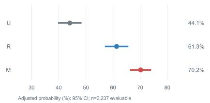

b MCE-assisted CSPR differences  
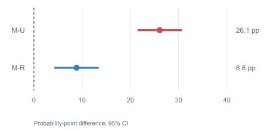

c APAS differences by professional title  
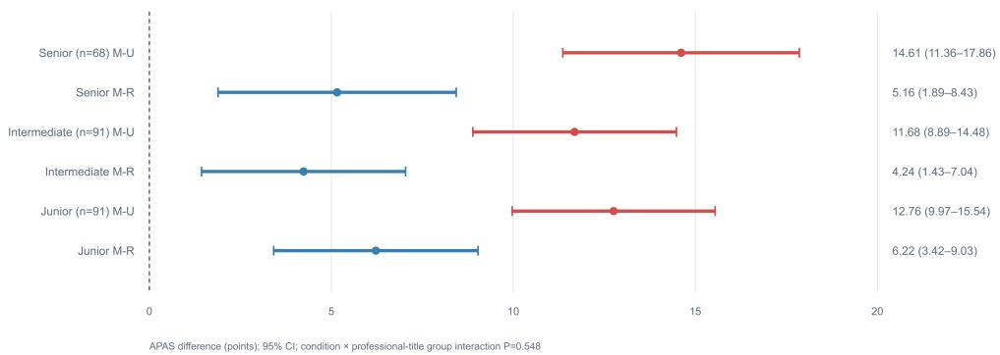  
Extended Data Figure 1 | Secondary CSPR gate and analysis by professional title a. Adjusted CSPR estimates and 95% CIs under the unaided (U), retrieval-reference (R) and MCE-assisted (M) conditions. b. Point diferences in CSPR probability for M–U and M–R, with 95% CIs. c. Adjusted M–U and M–R APAS diferences, with 95% CIs, in the senior, intermediate and junior professional-title groups; all six diferences were positive and none of the six 95% CIs crossed zero. CSPR was a secondary or exploratory rule-based gate; 2,237 responses were classifiable and 13 were indeterminate. The professional-title analysis included 68, 91 and 91 physicians in the three groups, respectively; the joint condition-by-professionaltitle-group interaction test gave $\mathrm { P } = 0 . 5 4 8$ and was treated as exploratory. Repeated judge runs were measurement repeats, and professional title was treated only as a coarse indicator of clinical experience. Overall adjusted APAS estimates and primary contrasts are in Figure 3a; panel c contains the complete professional-title-group estimates, and physician-task M1–M5 clinical-content results are in Figure 3b.

a Overall acceptability distribution by reviewer and source  
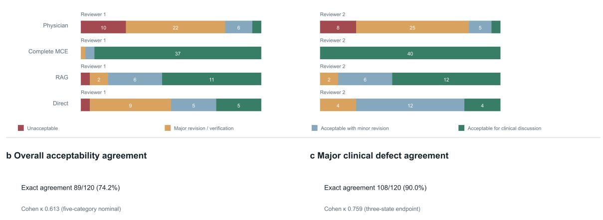

Extended Data Figure 2 | Overall clinical anchoring distributions and agreement Overall clinical anchoring covered 40 case clusters and 120 outputs. The two reviewers’ overallacceptability distributions by output source are reported together with full-sample exact agreement and Cohen kappa for the five-category overall-acceptability item and the major-clinical-defect endpoint. Major clinical defects and overall clinical acceptability were treated as separate endpoints. Four-category ordinal and binary sensitivity estimates, with 95% CIs, are reported in Supplementary Table 9i; neither reviewer used the not assessable category in this sample. Source proportions describe the fixed enriched sample and are not confirmatory comparisons between sources. Figure 5a pools all 120 outputs for the correlation analysis.

b Target-domain APAS response to content deletion  
a Global paired contrasts  
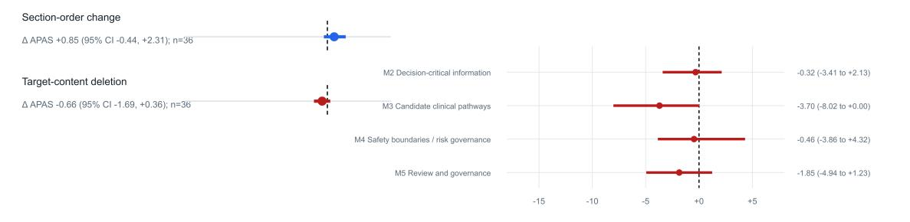  
c Triplet-level paired APAS changes

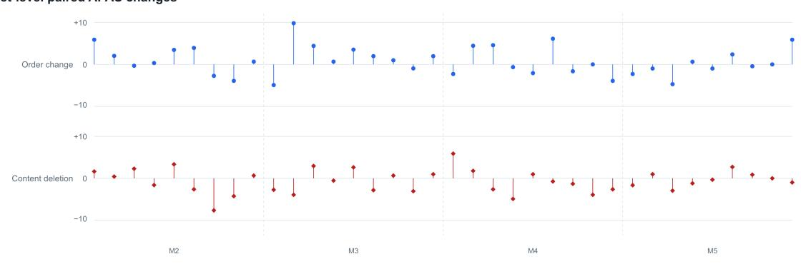  
Extended Data Figure 3 | Controlled-text perturbation diagnostics The controlled-text perturbation analysis comprised 36 original–variant triplets and 108 texts. Section-order changes and target clinical-content deletion are reported as paired overall APAS diferences, target-domain APAS diferences for M2 decision-critical information, M3 candidate clinical pathways, M4 safety boundaries and risk governance, and M5 reassessment and governance, and paired changes for every triplet. Overall APAS and target-domain APAS were distinct estimands. The triplet was the paired unit and the 12 cases were the clustering units; partial gate states were supplementary descriptions and were not equivalent to complete CSPR. The analysis was limited to score responses to the tested constrained text transformations and did not address clinical validity, patient outcomes or selective domain sensitivity.

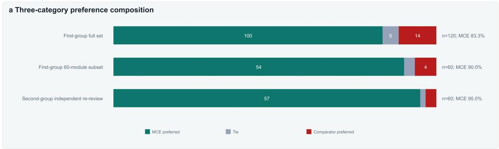  
b Re-review agreement by clinical-content dimension

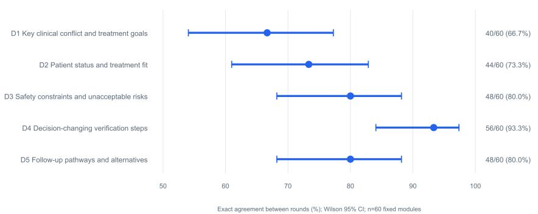

Extended Data Figure 4 | Source-masked content evaluation a. Three-category preference distributions for source-masked A/B content evaluation in the first-round set of 120 modules, the 60 modules selected for independent re-review and the 60 modules reviewed independently in the second round. b. Exact agreement and Wilson 95% CIs across the two rounds for the 60 fixed text modules, for D1 key clinical conflicts and treatment goals, D2 patient state and treatment fit, D3 safety constraints and unacceptable risk, D4 decision-changing verification steps and D5 subsequent pathways and alternatives. The corresponding counts were 40/60, 44/60, 48/60, 56/60 and 48/60. The analysis unit was the within-case comparison module. Overall Gwet AC1 and the complete contingency tables are in Supplementary Table 6 and Source Data. Dimension-specific agreement describes reproducibility of judgments on the same fixed modules, not preference direction for the corresponding dimension. Source recognition was not directly measured; length, structure or style could still provide cues, and the results are not interpreted as clinical superiority.

Direct audit of five strategy relations in 40 complete MCE outputs  
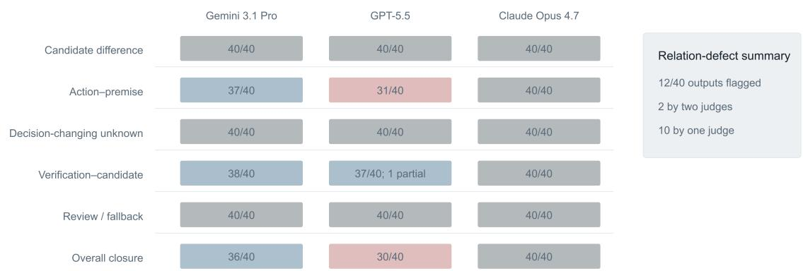

Extended Data Figure 5 | Direct audit of prespecified strategy relations In 40 fixed complete MCE outputs, Gemini 3.1 Pro Preview, GPT-5.5 and Claude Opus 4.7 independently assessed candidate-pathway diferentiation, action–premise links, decision-changing unknowns, verification–candidate relations, reassessment/fallback and overall relationship closure. Cells show the number of outputs judged complete by each judge out of 40 while retaining partly complete states. In the right-hand summary, at least one judge marked a relationship defect in 12/40 outputs; two were marked by two judges and ten by one judge. Judges are reported separately without voting or performance ranking. The 417 judge–verification-task observations, defect types and targeted source-text review are reported in Supplementary Table 11.

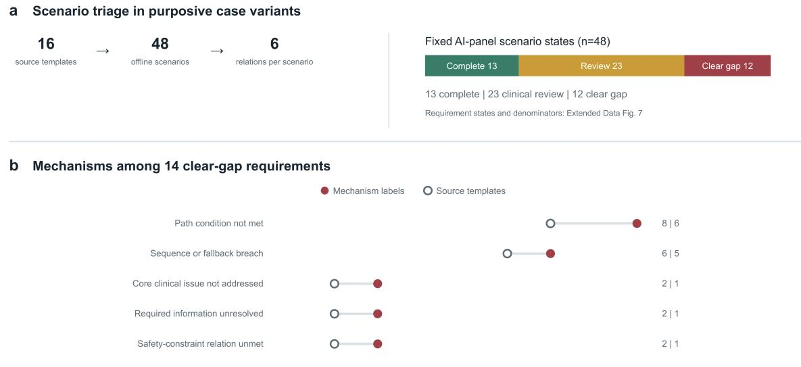

Extended Data Figure 6 | Purposive case-variant triage and relationship-gap mechanisms a. Sixteen source-case templates generated 48 purposive ofline scenarios, each with six prespecified relationship requirements. The fixed AI-judge panel classified 13 scenarios as completely closed, 23 as requiring clinical review and 12 as containing at least one clear relationship gap. b. Fourteen clear gaps carried five non-exclusive mechanism labels; filled red points show label counts and open grey points the number of involved source templates. Complete requirement states and denominators are in Extended Data Figure 7.

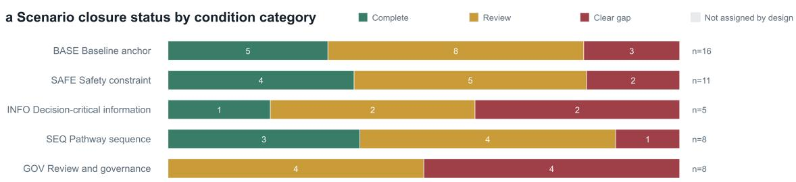

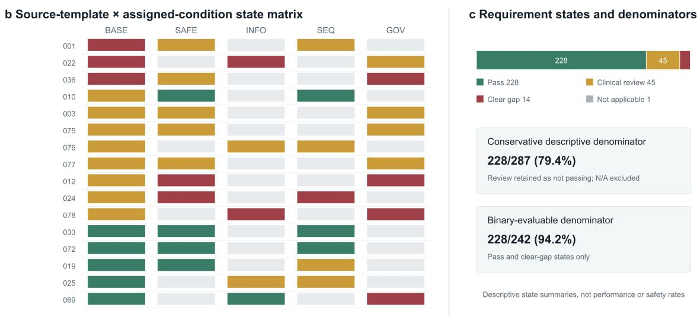  
Extended Data Figure 7 | Purposive case-variant states and requirement denominators Scenario-state composition across the BASE baseline anchor, SAFE safety-constraint, INFO decision-critical-information, SEQ pathway-sequence and GOV reassessment-and-governance conditions for 16 source-case templates, together with a template-by-condition matrix ordered by BASE and modified-scenario states. Gray cells indicate conditions not assigned by design rather than missing data. The requirement-level panel shows the complete states assigned by the fixed AI-judge panel to 288 prespecified relationship requirements and the denominator composition for the conservative descriptive proportion, 228/287 (79.4%), and the binary-evaluable proportion, 228/242 (94.2%). These proportions describe states and denominators only and are not interpreted as overall MCE performance, error or clinical-safety rates.

a Agreement across evaluators  
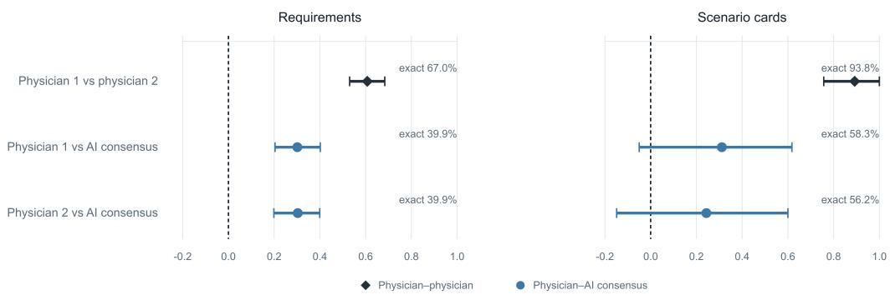  
Gwet AC1 (95% CI); exact agreement shown as labels

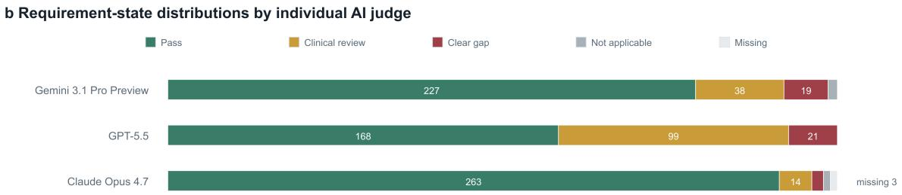  
State variation is descriptive; judges are not ranked by performance

Extended Data Figure 8 | Evaluator dependence in purposive case-variant judgments Requirement-level and scenario-card-level Gwet AC1 estimates and 95% CIs are shown for agree ment between the two physicians and between each physician and the fixed AI consensus. Black diamonds denote physician–physician comparisons and blue circles physician–AI comparisons; exact agreement is labeled beside each estimate. The supporting panel gives requirement-level distributions of pass, clinical review, clear gap, not applicable and missing states across planned calls for each AI judge; judges are reported separately without performance ranking. Physician agreement was estimated from independent, pre-adjudication review of all 48 scenarios and 288 CCRRs. Requirement-level and scenario-card-level units were retained separately; physician–AI comparisons diagnose evaluator dependence and do not define either side as a reference standard. Requirement states by prespecified safety label are reported in Supplementary Table 8.