# Baszta: Data-Centric Fine-Tuning of a Polish Multi-Label Safety Classifier

Adam Górski, Mateusz Jąkalak, Rafał Jakubowski

Reviewed by Krystian Kozieł and Paweł Cisło

August 31, 2026

We develop a multi-label Polish content-safety classifier by fine-tuning allegro/herbert-base-cased (124M) [1] across five categories (hate, vulgarity, sexual content, crime, self-harm) using a Focal + R-Drop objective, and evaluate the resulting model against Bielik Guard (“Sójka”) [2] on the shared out-of-distribution Gadzi Język benchmark. Both systems are given per-category threshold tuning on the same calibration split. Under that matched protocol our model holds a small but statistically significant lead in micro F1, while an apparent macro-F1 lead does not survive: it was an artifact of comparing a tuned model against an untuned one. We also report what that micro figure is worth. Because Gadzi Język is 97% crime-positive, a classifier that flags crime on every input and nothing else already scores 0.910 micro F1 on the same test split, so micro separates neither system from a degenerate strategy and macro is the column that does. Per-category and per-protocol figures are reported in §4.

The residual out-of-distribution gap is one of calibration rather than discrimination. Ranking quality stays high while positive probabilities collapse, and per-category temperature scaling [3] recovers the loss where Platt scaling and isotonic regression do not. That recovery turns out to be conditional on the calibration set containing safe text. Gadzi Język contains almost none, so thresholds fitted on it flag crime on every safe input, and a balanced refit buys a deployable operating point at the cost of adversarial recall. We report both operating points rather than only the flattering one.

Two changes that are standard practice, per-class cost-sensitive weighting and mean pooling, each raise in-distribution macro F1 while lowering the out-of-distribution figure, which indicates that robustness has to be selected for directly rather than inherited from in-distribution accuracy. We also report a training-data contamination audit that disqualified an otherwise ideal public benchmark, held-out results on four public Polish benchmarks, a training-free inference-time deobfuscation defence, and a bag-of-words baseline that quantifies how much of the task is lexical.

## Contents

1. Introduction 3   
2. Background and Related Work 4   
3. Materials and Methods 4   
3.1 Architecture and Objective 4   
3.2 Data Composition . 6   
3.3 Synthetic Style-Matched Generation 7   
3.4 Sweep Pipeline (Design and Execution) 8   
4. Experiments and Results 8   
4.1 In-Distribution Validation (t = 0.5) 8   
4.2 OOD Gadzi Język (oracle-thresholded - optimistic upper bound) 9   
4.3 Diagnosis: Calibration, Not Discrimination 10   
4.4 Negative Result: Classical Post-Hoc Calibration Does Not Transfer . 10   
4.5 Positive Result: Temperature Scaling Transfers . 11   
4.5.1 Deployability Caveat: The Split Still Has No Safe Text 12   
4.5.2 Paired Significance Test vs. Sójka (both-tuned comparison) 13   
4.6 Ablations and the BCE Negative Result 14   
4.7 Synthetic Data Closes Category Gaps 14   
4.8 External Public Benchmarks (Held-Out, Contamination-Audited) 15   
4.8.1 Cross-Taxonomy Comparison Against Third-Party Guards 19   
4.9 Calibration Metrics and Reliability Diagrams 21   
4.10 Inference-Time Deobfuscation 22   
4.11 Classical Bag-of-Words Baselines 23   
4.12 Book-Grounded Training Experiments: Cost-Sensitive Loss and Pooling 24   
4.13 Deep Ensemble: Recovering Value from the Weaker Variants . 26   
5. Discussion 28   
6. Conclusion and Future Work 29   
Appendix A. Comparison Summary vs. Sójka 30   
Appendix B. Reproducibility 32   
References 33

## 1. Introduction

Content-safety classifiers (“guardrails”) are an increasingly common component of Polish-language LLM deployments. The Sójka / Bielik Guard family establishes a strong, community-annotated reference: a 0.1B and 0.5B model trained on \~6.9K crowd-labeled texts and evaluated on adversarial OOD benchmarks. Reproducing such a system raises two questions:

1. Can a diferent encoder backbone and a richer loss/augmentation stack match Sójka’s OOD (Out-of-Distribution) robustness without its manual annotation budget or its compute? We use roughly four times as much training text (26,248 samples against \~6.9K), but none of it is newly crowd-annotated, and the additional volume comes from existing public corpora and synthetic generation.

2. When a small model under-performs on OOD data, is the bottleneck discrimination, calibration, or data distribution?

This report answers both questions. We adopt the same five-category taxonomy and the same Gadzi Język OOD benchmark as Sójka, but diverge in backbone (HerBERT [1] vs. MMLW-RoBERTa [4]), loss (Focal + R-Drop vs. BCE), and most importantly in a data-centric treatment of the OOD gap. Our contributions are as follows.

• A controlled comparison of four Polish encoders, identifying HerBERT as the strongest backbone for this task (a model Sójka does not evaluate).

• A diagnosis of the OOD gap as a calibration shift, supported by per-category AUC and positive-probability statistics.

• Evidence that per-category temperature scaling [3] and style-matched synthetic data recover the full gap and exceed Sójka where classical post-hoc calibration (Platt/isotonic) cannot, provided the calibration set contains safe examples (an all-positive benchmark fit is not deployable, §4.5.1).

• A completed, distributed four-phase sweep (62 Optuna trials, 5 full trainings of the top configurations, and 10 ablations), whose best model clearly exceeds Sójka on OOD micro F1 and adversarial crime recall, with a directional macro lead and non-oracle calibration protocol.

• A statistical evaluation: bootstrap confidence intervals on the OOD test split, and explicit caveats that (i) the five-way macro is dominated by a near-universal crime label and a vulgar class with n = 4 positives, and

(ii) our best model was selected on this same OOD benchmark, so point estimates carry model-selection bias.

• A paired significance test against Sójka (§4.5.2, SLP §4.9) using its recovered per-sample predictions: with both systems threshold-tuned on the same split, the micro-F1 lead is significant (p = 0.011) while the macro lead is an operating-point artifact that

• Measured calibration (§4.9): ECE. Adaptive-ECE, MCE and Brier show our model outcalibrates Sójka on OOD, and that temperature scaling improves Brier but not ECE.

• A training-free inference-time deobfuscation defence (§4.10, Jurafsky & Martin Ch. 2) that recovers +6.9 pp adversarial macro and cuts prediction flips by two-thirds, and a classical bag-of-words baseline (§4.11) that quantifies how much of the task is lexical.

• Two controlled training experiments (§4.12) per-class cost-sensitive focal weighting (Eisenstein [5] §4.4.1) and mean vs. [CLS] pooling (Jurafsky & Martin [6] Ch. 11) showing that both raise in-distribution macro yet lower OOD macro and calibration, the clearest evidence that in-distribution accuracy and OOD robustness are in direct tension for this task.

• A contamination-audited evaluation on four held-out public Polish safety benchmarks (§4.8, from six audited), carrying both systems through the same protocol on sets that neither of them selected. The outcome there is a two-two split rather than a lead. We are ahead on KLEJ CBD, where the hate head reaches 0.671 zero-shot against Sójka’s 0.438, and on PolyGuard-PL. Sójka is ahead on BAN-PL, which scores a moderation decision rather than presence of harmful language, and nominally on HateCheck-PL at a false-positive rate twice ours. These sets also supply the tight intervals the small Gadzi Język set could not (BAN-PL n = 23,539, PolyGuard-PL n = 1,725), and HateCheck-PL confirms the multi-head design separates vulgar from hate. The same audit uncovered that the otherwise-ideal PL-Guard benchmark had leaked into training (899/900), which we exclude and report as a cautionary finding.

## 2. Background and Related Work

Bielik Guard / Sójka. Reference system [2] is trained on the speakleash / sojka-2 corpus (6,885 texts, 60K+ volunteer annotations with soft labels), using BCE loss over MMLW-RoBERTabase (0.1B) and PKOBP/polish-roberta-8k (0.5B), 3 epochs on an A100 cluster. It is evaluated both in-distribution and on the adversarial Gadzi Język set (520 samples) plus a 3,000-prompt user set. The 0.1B macro F1 reported on Gadzi Język is 0.619. We compare against the 0.1B variant throughout because it is the size-matched one, at 100M parameters against our 124M. The 0.5B variant is the stronger system and we make no claim against it.

Polish toxicity resources. We also draw on PolEval cyberbullying, Hate-Speech-PL, BAN-PL, and translated Reddit self-harm corpora to enlarge the training pool to 26,248 samples. These datasets are predominantly hate-only annotated, which introduces a label-support imbalance that we address with focal weighting and synthetic balancing.

Methodological context. Focal loss [7] addresses class imbalance by down-weighting easy examples, and R-Drop [8] enforces consistency of the prediction under dropout. Both are well-suited to small, unbalanced safety datasets. Post-hoc calibration (Platt scaling [9, 10], isotonic regression, and temperature scaling [3]) is the standard remedy for miscalibrated probabilities, but as we show assumes a fixed domain. Our synthetic-data approach is closest in spirit to distribution matching: rather than recalibrating output, we shift the training distribution toward the OOD prompt style.

## 3. Materials and Methods

## 3.1 Architecture and Objective

Table 1: Architecture and training configuration of Baszta 1.0, the model carried through §4. Values are those of the sweep-selected configuration of §3.4. Focal $\gamma$ controls how strongly easy examples are down-weighted, and R-Drop α weights the KL consistency term between two dropout passes over the same input.

Component Configuration   
Encoder allegro/herbert-base-cased (124M)   
Head Linear(768 → 5), dropout 0.22   
Loss Focal (γ = 1.5) + R-Drop (α = 0.20)   
Optimizer AdamW (lr = 9.4e-5, wd = 5e-4)   
Schedule Cosine, 8% warmup

Table 1: Architecture and training configuration of Baszta 1.0, the model carried through §4. Values are those of the sweep-selected configuration of §3.4. Focal $\gamma$ controls how strongly easy examples are down-weighted, and R-Drop α weights the KL consistency term between two dropout passes over the same input.
<table><tr><td>Component</td><td>Configuration</td></tr><tr><td>Frozen layers</td><td>4 / 12 encoder layers</td></tr><tr><td>Precision</td><td>FP16 mixed</td></tr><tr><td></td><td>Augmentation Online: diacritics, leetspeak, typos, homoglyph</td></tr></table>

Why HerBERT. The backbone was chosen by a controlled comparison of four Polish-capable encoders, each trained on the same v1 pool and evaluated on Gadzi Język at per-category oracle thresholds. The separation is not marginal.

Table 2: Backbone selection. OOD macro F1 on the full 520-sample Gadzi Język set at per-category oracle thresholds, for four Polish-capable encoders trained on the v1 pool. HerBERT, Polish RoBERTa and XLM-RoBERTa share settings exactly (lr 2e-5, γ 2.0, no frozen layers, 512 tokens, 10 epochs). The MMLW row is its best sweep-tuned variant (lr 5.9e-5, γ 3.0), so that encoder received tuning the others did not and the comparison is conservative in its favour. The augmented column applies the online augmentation of §3.1. These are early runs whose absolute values sit below the tuned figures of §4, but the ordering is what selected the backbone.
<table><tr><td>Encoder</td><td>OOD macro</td><td>OOD macro (augmented)</td></tr><tr><td>HerBERT (allegro/herbert-base-cased)</td><td>0.601</td><td>0.611</td></tr><tr><td>MMLW-RoBERTa (Sójka&#x27;s backbone, sweep-tuned)</td><td>0.275</td><td></td></tr><tr><td>Polish RoBERTa</td><td>0.282</td><td>0.269</td></tr><tr><td>XLM-RoBERTa</td><td>0.158</td><td>0.211</td></tr></table>

HerBERT leads the next-best encoder by 32 pp of OOD macro, and it outperforms MMLW-RoBERTa, the backbone Sójka itself uses, even though that row had the benefit of its own hyperparameter sweep. No augmented MMLW counterpart was run, so that cell is left empty rather than filled by an unmatched number.

We also dropped the SupCon contrastive term used in early experiments, having seen no OOD gain from it in the runs where it was enabled. We did not run a controlled ablation isolating it, so this is a design decision taken on preliminary evidence rather than a measured result, and we report it as such.

Version naming. Configurations are referred to throughout by the following names.  
Table 3: Configuration names used in this report. The 0.x series are data and augmentation variants sharing one recipe. The 1.0 series is the sweep-selected recipe of §3.4, with the sufixed entries being controlled single-factor variants of it.
<table><tr><td>Name</td><td>Configuration</td></tr><tr><td>Baszta 0.1</td><td>Clean v1 pool, no augmentation</td></tr><tr><td>Baszta 0.2</td><td>Balanced pool, online augmentation</td></tr></table>

Table 3: Configuration names used in this report. The 0.x series are data and augmentation variants sharing one recipe. The 1.0 series is the sweep-selected recipe of §3.4, with the sufixed entries being controlled single-factor variants of it.
<table><tr><td>Name</td><td>Configuration</td></tr><tr><td>Baszta 0.3</td><td>Balanced pool, aggressive augmentation</td></tr><tr><td>Baszta 0.4</td><td>Adds style-matched synthetic crime data</td></tr><tr><td>Baszta 0.5</td><td>Adds synthetic crime, sex and self-harm data</td></tr><tr><td>Baszta 1.0</td><td>Sweep recipe (§3.4), low-γ focal, v2 synthetic data, per-category temperature scaling</td></tr><tr><td>Baszta 1.0-α</td><td>Baszta 1.0 with per-class focal alpha (§4.12)</td></tr><tr><td>Baszta 1.0-mp</td><td>Baszta 1.0 with mean pooling instead of [CLS] (§4.12)</td></tr><tr><td>Baszta 1.0-bce</td><td>Baszta 1.0 with BCE in place of Focal + R-Drop (§4.6)</td></tr></table>

## 3.2 Data Composition

The training pool (26,248 samples after synthetic augmentation) aggregates Sójka[11], PolEval cyberbullying[12], ForePLay[13], DEPOTx[14], RefusEU[15], Border-Guard[16], a vulgar subset of BAN-PL[17], the PL-Guard test and adversarial splits, and translated self-harm data, plus our generated synthetic sets. The v2 pool’s held-out validation split (sojka\_val) carries 4,522 rows, of which 1,741 are safe, and it is the balanced source used for deployable calibration in §4.5.1. The 4,632-sample figure quoted in §4.1 belongs to the earlier split on which those runs were scored. Gadzi Język (520 samples) is held out from training entirely and was verified disjoint from the training pool (0/520 exact-text overlap §4.8). The PL-Guard test and adversarial splits entered the pool as ordinary training sources. §4.8 quantifies the consequence, which is that PL-Guard cannot then serve as a held-out benchmark for this model. The v2 synthetic pool contributes 1,294 style-matched samples to the minority categories, of which 812 are generated as described in §3.3 and the remaining 482 carry over from the v1 pool.

Table 4: Positive-label support per category in the 26,248-sample training pool after v2 augmentation, with the style-matched synthetic contribution shown in parentheses. Multi-label overlap means the column does not sum to the pool size.
<table><tr><td>Category</td><td>Train support</td></tr><tr><td>hate</td><td>~3,146</td></tr><tr><td>vulgar</td><td>~4,037</td></tr><tr><td>sex</td><td>~4,500 (incl. 501 synthetic)</td></tr><tr><td>crime</td><td>~4,250 (incl. 286 synthetic)</td></tr><tr><td>self-harm</td><td>~1,246 (incl. 507 synthetic)</td></tr></table>

Category definitions. We adopt Sójka’s five-category taxonomy unchanged so that the two systems are scored against the same label semantics. The working definitions are below. We ran no annotation of our own, so we report no inter-annotator agreement: the soft labels in the Sójka corpus come from its 60K+ volunteer annotations, and every other source contributes its own publisher’s labels mapped onto these five heads.

<table><tr><td></td><td>Table 5: Working definitions of the five categories, adopted from Sójka. The distinction that matters most in practice is hate against vulgar: profanity with no target belongs to vulgar alone, and §4.8 tests exactly this separation on HateCheck-PL.</td></tr><tr><td>Category Definition used</td><td></td></tr><tr><td>hate</td><td>Hostility, dehumanisation or incitement directed at a person or group, typically on a protected charad</td></tr><tr><td>vulgar</td><td>Profanity, obscenity or crude language, with no requirement that it be aimed at anyone</td></tr><tr><td>sex crime</td><td>Sexual content, including solicitation and sexualisation of minors, which also carries crime</td></tr><tr><td>self-harm</td><td>Requests for, or instruction in, illegal activity, including violence, weapons, drugs and fraud Content describing, encouraging or seeking means of self-injury or suicide</td></tr></table>

Labels are not mutually exclusive, and multi-label overlap is substantial. This is why the paper reports macro and micro F1 side by side rather than a single accuracy.

## 3.3 Synthetic Style-Matched Generation

A key observation is that Gadzi Język prompts are imperative jailbreak-style (“Opracuj strategię. . . ” for “Devise a strategy. . . ”, “Napisz jak. . . ” for “Write how. . . ”, “Podaj metodę. . . ” for “Give a method. . . ”), whereas most training data is declarative. We generated style-matched synthetic prompts via Azure OpenAI (gpt-5-chat):

• Crime: 340 samples (LLM-generated, deduplicated).

• Sex: 272 samples (after filtering 12 model refusals, 171 carry a multi-label crime tag for CSAM/traficking content).

• Self-harm: 200 samples. Here the content filter blocked \~90% of API requests (only 14/200 passed), so we fell back to a template-combination generator (verbs × targets × actions × contexts) producing grammatical imperative Polish prompts.

Adversarial instruction framing, and what we do not claim. The three generators share a property that matters beyond category balance. Every synthetic row is written as a directive addressed to a model rather than as a statement of opinion, which is the surface form a deployed guardrail actually meets, a user turn that instructs the system to produce something it should refuse. That framing is what separates Gadzi Język from the declarative hate-speech corpora supplying most of our pool. In the v2 training pool the 1,294 surviving synthetic rows (4.9% of 26,248) sit alongside 765 rows of the PL-Guard adversarial split and 357 rows of harmful\_prompts\_pl, which carry the same imperative shape, so roughly 9% of the corpus is attack-framed input rather than found text. We are deliberate about the scope of the term. These are jailbreak-framed harmful requests. They are not prompt injection in the narrow sense of text that overrides a system prompt or smuggles instructions through retrieved content. Scanning the pool for that narrower pattern (“zignoruj poprzednie instrukcje” and its English equivalents) returns three rows, all incidental to the Sójka source rather than curated, and none in sojka\_val. We therefore report no instruction-override result and make no claim about one.

Ethics, provenance, and handling. All synthetic text is short classifier training data, not operational content: the generator produces brief Polish prompts whose function is to teach the classifier the imperative jailbreak style, not to provide actionable instructions. No real illegal material was produced or stored. The 171 sex samples that also carry a crime tag (CSAM/traficking) consist of short, non-graphic phrasings suficient to label the category, the self-harm set is template-combinatorial Polish with no method-level detail (the Azure OpenAI content filter blocking 90% of requests was respected, not circumvented, we did not jailbreak the generator, we fell back to templates). Generation used Azure OpenAI under Billennium’s enterprise tenant with its standard content-safety filtering and data-handling terms. Outputs are stored only inside the project’s access-controlled access-controlled storage alongside the rest of the training corpus and are never served. Building a safety classifier from synthetic adversarial examples under documented governance is consistent with the EU AI Act’s treatment of data processed for bias detection and correction in high-risk systems (Art. 10(5)). We flag this provenance explicitly so that downstream users handle the corpus as sensitive labelled data rather than as redistributable text.

## 3.4 Sweep Pipeline (Design and Execution)

We ran a four-phase pipeline:

1. An Optuna TPE sweep over learning rate, dropout, focal-γ, R-Drop-α, warmup, weight decay, freeze depth, maximum sequence length, and scheduler. The sweep was specified for 60 trials × 5 epochs and completed 62.

2. Full training of the top-5 configurations (×10 epochs).

3. Ten ablations covering data-source removal, BCE against Focal, R-Drop strength, freeze depth, and sequence length.

4. A final Gadzi Język evaluation with per-category optimal thresholds.

Results persist to SQLite and JSON for ofline review.

Execution. The sweep completed 62 Optuna trials (best validation macro F1 = 0.9131 best config: lr = 9.4e-5, dropout = 0.22, focal-γ = 1.57, R-Drop-α = 0.20, freeze = 4), 5 top-config full trainings, and 10 ablations.

## 4. Experiments and Results

## 4.1 In-Distribution Validation (t = 0.5)

Table 6: Per-category and macro F1 on the 4,632-sample validation split at a fixed threshold t = 0.5. Baszta 0.1 is the clean-data baseline, Baszta 0.2 adds online augmentation, and Baszta 0.3 uses the aggressive-augmentation recipe. Macro is the unweighted mean over the five categories. Sójka’s row is measured on its own test split and is not a head-to-head comparison.

<table><tr><td>Model</td><td>Hate</td><td>Vulgar</td><td>Sex</td><td>Crime</td><td>Self-harm</td><td>Macro F1</td></tr><tr><td>Baszta 0.2</td><td>0.743</td><td>0.969</td><td>0.985</td><td>0.965</td><td>0.835</td><td>0.900</td></tr><tr><td>Baszta 0.1</td><td>0.733</td><td>0.967</td><td>0.978</td><td>0.960</td><td>0.852</td><td>0.898</td></tr><tr><td>Baszta 0.3</td><td>0.745</td><td>0.960</td><td>0.981</td><td>0.957</td><td>0.838</td><td>0.896</td></tr><tr><td>Sójka 0.1B†</td><td>0.628</td><td>0.742</td><td>0.889</td><td>0.707</td><td>0.886</td><td>0.770</td></tr></table>

†Sójka evaluated on its own test split (not directly comparable). The completed sweep’s best configuration (low-γ focal, freeze = 4) reached 0.9131 validation macro F1, a further +1.3 pp over the Baszta 0.2 era. That figure belongs to the sweep trial, not to a trained checkpoint. The checkpoint carried forward as Baszta 1.0 records 0.9111 validation macro F1, and it is that value, not 0.9131, that §4.12 compares against.

## 4.2 OOD Gadzi Język (oracle-thresholded - optimistic upper bound)

Gadzi Język (520 samples) is the only set on which we and Sójka are evaluated identically, and is therefore our primary comparison. Its adversarial prompts derive from the harmful-behaviour collection released with the transferable-attack work of Zou et al. [18], of which Gadzi Język is a Polish subset, and it is that source rather than Gadzi Język itself that the citation names. It is, however, small and severely skewed: positives per category are crime 505, hate 43, self-harm 31, sex 18, vulgar 4 (of 520). A five-way macro is thus dominated by the near-universal crime label and is sensitive to two categories with < 20 positives and vulgar (n = 4) is essentially uninformative. The table below tunes thresholds on the full test set and is an optimistic upper bound. Non-leaking estimate with confidence intervals is in §4.5.

Table 7: OOD F1 on Gadzi Język with per-category thresholds fitted on the full 520-sample set. Positives per category are crime 505, hate 43, self-harm 31, sex 18, vulgar 4, so macro (unweighted over categories) is dominated by crime and unstable on vulgar, micro pools all label decisions. The last two rows are reference points used later: the sweep’s top-1 configuration is the baseline every ablation in §4.6 is measured against, and Baszta 0.1 is the clean-data baseline for the synthetic-data gain in §4.7.
<table><tr><td>Model</td><td>Hate</td><td>Vulgar</td><td>Sex</td><td>Crime</td><td>Self-harm</td><td>Macro</td><td>Micro</td></tr><tr><td>Baszta 1.0</td><td>0.575</td><td>0.571</td><td>0.606</td><td>0.965</td><td>0.820</td><td>0.707</td><td>0.927</td></tr><tr><td>Baszta 0.4</td><td>0.514</td><td>0.333</td><td>0.621</td><td>0.985</td><td>0.800</td><td>0.651</td><td>一</td></tr><tr><td>Baszta 0.5</td><td>0.435</td><td>0.333</td><td>0.703</td><td>0.985</td><td>0.750</td><td>0.641</td><td></td></tr><tr><td>Baszta 0.2</td><td>0.419</td><td>0.333</td><td>0.500</td><td>0.985</td><td>0.778</td><td>0.603</td><td>0.918</td></tr><tr><td>Sweep top-1 (ablation</td><td>0.489</td><td>0.400</td><td>0.686</td><td>0.898</td><td>0.693</td><td>0.633</td><td>0.828</td></tr><tr><td>baseline, §4.6) Baszta 0.1 (clean, no synthetic)</td><td>0.410</td><td>0.400</td><td>0.650</td><td>0.675</td><td>0.708</td><td>0.569</td><td>0.651</td></tr><tr><td>Sójka 0.1B</td><td>0.045</td><td>0.889</td><td>0.759</td><td>0.587</td><td>0.815</td><td>0.619</td><td>0.582</td></tr></table>

At oracle thresholds the best configuration, Baszta 1.0 (focal-γ = 1.5, full v2 synthetic data, and per-category temperature scaling), reaches 0.707 macro and 0.927 micro F1, against Sójka’s 0.619 and 0.582 at its default 0.5 threshold. That last comparison is between a tuned model and an untuned one, and §4.5 replaces it with a matched-threshold test. It is higher on hate, crime, and self-harm and lower on sex and vulgar. Two caveats apply and are resolved in §4.5: (i) these thresholds are oracle-selected on the test set, and (ii) this model was selected on this same benchmark, so the macro figure carries model-selection bias on top of threshold leakage. Eight of the trained models clear Sójka’s 0.619 macro at oracle thresholds, but that count should be read as a model-selection statistic, not independent confirmation. The per-category figures in this table are oracle values, and they are the ones §4.12 refers back to. Appendix A reports the same model under the matched-tuning protocol of §4.5.2, where the per-category numbers difer (hate 0.490 rather than 0.575, crime 0.983 rather than 0.965) because both the thresholds and the evaluation split difer. The two profiles are not interchangeable.

## 4.3 Diagnosis: Calibration, Not Discrimination

The OOD gap is dominated by probability scale, not ranking quality. The table below reports all five categories for Baszta 0.2, the augmented baseline of §4.1, so that the low-AUC and high-AUC cases can be read side by side:

Table 8: Ranking quality against probability scale on OOD for Baszta 0.2, over all five categories. AUC is threshold-free, where 1.0 is perfect ranking and 0.5 is chance. Pos-prob mean is the average predicted probability on positive examples. High AUC alongside collapsed probabilities is the signature of a calibration shift rather than a discrimination failure. Vulgar sits at chance because it has only four OOD positives, and crime is the one category whose ranking is also genuinely weak.
<table><tr><td>Category</td><td>OOD AUC</td><td>OOD pos-prob mean</td></tr><tr><td>hate</td><td>0.86</td><td>0.55</td></tr><tr><td>vulgar</td><td>0.49</td><td>0.13</td></tr><tr><td>sex</td><td>0.93</td><td>0.21</td></tr><tr><td>crime</td><td>0.72</td><td>0.19</td></tr><tr><td>self-harm</td><td>0.94</td><td>0.27</td></tr></table>

On the validation split the same three discriminating categories carry positive-probability means of 0.83 (crime), 0.78 (sex) and 0.81 (self-harm), so the OOD column above represents a fourfold collapse in probability scale with ranking quality largely intact. High AUC with collapsed positive probabilities is the signature of a calibration shift: the model ranks correctly but is systematically under-confident on OOD inputs. We attribute this to the Focal objective at high γ, which pushes in-distribution probabilities toward the extremes while suppressing uncertain OOD ones. This is worth stating carefully, because it runs against the usual result: Mukhoti et al. [19] report focal loss improving calibration by damping over-confidence. Both can hold. Their setting is in-distribution, where damping over-confidence is what is needed, whereas the failure here is under-confidence under domain shift, and a loss that suppresses uncertain predictions makes that worse rather than better. The low-γ choice of §3.4 and the temperature scaling of §4.5 are both responses to that second regime, not contradictions of the first.

## 4.4 Negative Result: Classical Post-Hoc Calibration Does Not Transfer

Table 9: Gadzi Język macro F1 for Baszta 0.2 under post-hoc calibrators fitted on in-distribution validation data. The raw row is the model at a fixed t = 0.5, while Platt and isotonic recover only ∼0.22 against 0.603 for per-category thresholds fitted on the full test set, indicating the domain shift is too large for output recalibration alone. The 0.603 here is this model’s oracle figure and is not the 0.603 reached by Baszta 1.0 under the non-oracle protocol of §4.5.

<table><tr><td>Calibration</td><td>Gadzi Macro F1</td></tr><tr><td>Raw (t = 0.5)</td><td>0.178</td></tr><tr><td>Platt scaling</td><td>0.218</td></tr><tr><td>Isotonic regression</td><td>0.216</td></tr><tr><td>Oracle per-category thresholds</td><td>0.603</td></tr></table>

Calibrators fit on validation data give only \~0.22 macro on OOD. The domain shift is too large for output recalibration alone. Only per-domain threshold selection recovers performance.

## 4.5 Positive Result: Temperature Scaling Transfers

The oracle numbers above leak the test set twice (threshold and model selection). For a deployable, non-leaking estimate we split Gadzi Język into a disjoint calibration set and test set, fit percategory temperatures and thresholds on the calibration split only, and report test-split F1 with 95% bootstrap confidence intervals (2,000 resamples, seed 42). This section uses a 172/348 split. The paired test of §4.5.2 is produced by a separate script with its own stratified split, which yields 187/333 on the same 520 samples, so the two sets of figures are close but not interchangeable, and each table below names the split it used. For Baszta 1.0:

Table 10: Cumulative efect of the protocol on test macro F1: per-category temperatures and thresholds fitted on the disjoint 172-sample calibration split and evaluated on the held-out 348 samples. Sójka’s 0.619 is its published figure at its default 0.5 threshold, not a matched-threshold comparison.
<table><tr><td>Protocol (172/348 split)</td><td>Test Macro F1</td></tr><tr><td>Raw (t = 0.5)</td><td>0.493</td></tr><tr><td>+ per-category threshold</td><td>0.603</td></tr><tr><td>+ temperature + threshold</td><td>0.699</td></tr><tr><td>Sójka reference</td><td>0.619</td></tr></table>

Table 11: Baszta 1.0 test-split F1 on the 172/348 split, with 95% bootstrap confidence intervals (2,000 resamples of the 348-sample test split). Excluding vulgar (n = 4 positives) narrows the macro interval substantially, micro F1 pools per-label decisions and is therefore far tighter than macro.
<table><tr><td>Metric (Test split, N = 348)</td><td>Estimate</td><td>95% CI</td></tr><tr><td>Macro F1 (5 categories)</td><td>0.699</td><td>[0.493, 0.797]</td></tr><tr><td>Macro F1 (4 categories, excl. vulgar)</td><td>0.674</td><td>[0.569, 0.763]</td></tr><tr><td>Micro F1</td><td>0.927</td><td>[0.903, 0.949]</td></tr></table>

Two conclusions follow. First, temperature scaling does transfer: it lifts the test-split macro from 0.603 to 0.699 where Platt/isotonic (§4.4) could not, with the gain concentrated in the categories the Focal objective most over-sharpened, crime and vulgar. This validates the OOD under-confidence diagnosis of §4.3. Second, neither margin over Sójka is established by this table. The macro CI is wide ([0.493, 0.797]) and its lower bound sits below Sójka’s 0.619, so across the bootstrap our macro exceeds 0.619 in only 81% of resamples. The width is driven by the rare categories (vulgar n = 4, sex n = 18) that a five-way macro over 520 points cannot estimate stably, and the four-category macro excluding the n = 4 vulgar class is 0.674 ([0.569, 0.763]).

The micro-F1 column invites a stronger reading than it can support, and we want to disarm it here. The interval [0.903, 0.949] is the interval on our own estimate, not on the diference from Sójka, and the 0.582 it is set against is Sójka at its untuned default. Both figures in the pair 0.927 against 0.582 are therefore doing less work than they appear to. §4.5.2 tunes both systems on the same split and recovers the margin that actually survives, which is +0.026 rather than +0.345. We foreground the calibration-transfer result as the robust finding of this section and defer every head-to-head margin, macro and micro alike, to §4.5.2.

## 4.5.1 Deployability Caveat: The Split Still Has No Safe Text

The 172/348 split removes threshold and model-selection leakage, but it inherits a more fundamental defect of Gadzi Język: the benchmark contains no all-negative (safe) examples - it is 97.1% crime-positive (505/520), with hate 43, self-harm 31, sex 18, vulgar 4. Fitting per-category thresholds that maximise F1 on a set with essentially no negatives drives the crime threshold to 0.025 and the crime temperature to 4.3. The latter divides an already-negative safe logit (≈ −3.3) up to $\sigma \approx 0 . 3 0$ , which clears 0.025 for every input. The operating point that produces the 0.699 / 0.927 headline therefore flags crime on 100% of safe text, a perfectly serviceable adversarial-recall score that is not a deployable configuration.

To obtain a deployable operating point we re-fit the same checkpoint’s per-category temperatures and thresholds on a balanced calibration source (sojka\_val, 4,522 samples, 1,741 of them safe, all five categories represented), holding out 50% as a balanced test split (2,297 calibration and 2,225 test rows), and additionally report the false-positive rate on safe text, the metric the Gadzi-only fit is blind to.

Two properties of this source bound what the resulting numbers mean. sojka\_val is the held-out validation split of the v2 pool, so the balanced figures below are in-distribution results and are not comparable with the OOD figures beside them. It is also not fully disjoint from training: an exact-text check of the kind run in §4.8 finds 213 of its 4,495 unique normalised texts (4.7%) present in the training pool. The operating point is therefore fitted on a source with a small residual overlap, which we flag rather than discard, because no balanced Polish source with safe text was available that is both external and label-compatible (§4.8 explains why PL-Guard, the obvious candidate, could not be used).

Table 12: The same checkpoint at two operating points. Balanced macro and micro are measured on the held-out half of sojka\_val, which carries roughly 870 of its 1,741 safe rows. Safe-text FPR is the fraction of all-negative inputs receiving at least one flag. The Gadzi-fit point maximises adversarial F1 but flags crime on every safe input and is not deployable. The two Gadzi Język columns are measured on the full 520 samples, which is why the Gadzi-fit row reads 0.700 / 0.932 where §4.5 reports 0.699 / 0.927 for the same operating point on its 348-sample test split.
<table><tr><td>Operating point</td><td>Balanced macro</td><td>Balanced micro</td><td>Safe-text FPR</td><td>Gadzi macro</td><td>Gadzi micro</td></tr><tr><td>Gadzi-fit (T_crime=4.3,</td><td>0.742</td><td>0.541</td><td>1.000</td><td>0.700</td><td>0.932</td></tr><tr><td>t_crime=0.025) Balanced re-fit</td><td>0.952</td><td>0.959</td><td>0.055</td><td>0.496</td><td>0.778</td></tr></table>

The balanced point (T = {hate 0.65, vulgar 0.5, sex 0.5, crime 0.65, self-harm 0.55} thresholds {hate 0.30, vulgar 0.45, sex 0.075, crime 0.20, self-harm 0.475}) is deployable: macro F1 0.952 at a 5.5% safe-text false-positive rate. But it trades away adversarial recall, dropping Gadzi macro to 0.496 (below Sójka’s 0.619). There is no single operating point that simultaneously beats Sójka on the adversarial benchmark and keeps safe-text false positives low. The reading is that our model’s genuine, deployable strength is its in-distribution balanced accuracy and its crime-recall lead on adversarial prompts, while the Gadzi macro headline should be read strictly as an adversarial-recall stress-test, not a production metric. This also re-frames the calibration contribution of §4.4–§4.5: per-category temperature scaling does transfer, but only when fit on a calibration set that contains negatives fitting it on an all-positive benchmark is the defect that manufactured the inflated headline, not a feature.

## 4.5.2 Paired Significance Test vs. Sójka (both-tuned comparison)

Because Sójka is an open model, its per-sample Gadzi Język probabilities are recoverable. We compute all 520 of them and verify that the gold labels it is scored against are identical, in order and in value, to our own. That makes the paired bootstrap test [6, 20] available, which is the textbook procedure for deciding whether one classifier beats another.

The comparison is made in the sense the headline numbers were not: on the calibration split we fit a per-category operating point for both systems, temperature + threshold for ours, threshold for Sójka, on the same calibration split, evaluate both on the disjoint test split, and bootstrap the per-metric diference (2,000 resamples, seed 42). The stratified split used by this script yields 187 calibration and 333 test samples, so its figures sit slightly above the 172/348 figures of §4.5 and are not interchangeable with them. All p-values in this paper are one-sided, reporting the fraction of resamples in which our model does not beat Sójka on the metric named.

Table 13: Paired bootstrap comparison against Sójka with both systems tuned on the same 187- sample calibration split (temperature + threshold for ours, threshold for Sójka), evaluated on the disjoint 333-sample test split over 2,000 resamples. “P(ours not better)” is the fraction of resamples in which the diference is $\leq 0 .$ , which is the one-sided p-value, and a 95% CI excluding zero indicates significance. The final row is the degenerate reference described below, scored on the same test split.
<table><tr><td rowspan="2">Metric (both systems tuned on same cal split)</td><td colspan="3"></td><td rowspan="2">95% CI</td><td rowspan="2">P(ours not better)</td></tr><tr><td>Ours</td><td>Sójka</td><td>Diff (ours-Sójka)</td></tr><tr><td>Micro F1</td><td>0.929</td><td>0.903</td><td>+0.026</td><td>[+0.004, 0.011 +0.049]</td><td></td></tr><tr><td>Macro F1 (5-cat)</td><td>0.712</td><td>0.782</td><td>-0.070</td><td>[-0.263, 0.875 +0.046]</td><td></td></tr><tr><td>Always-crime baseline (micro / macro)</td><td>0.910 / 0.197</td><td></td><td></td><td></td><td></td></tr></table>

Micro F1 on this benchmark is close to uninformative, and the final row of the table is the reason. A classifier that flags crime on every input and never fires any other head scores 0.910 micro F1 on the same 333-sample test split, because crime accounts for 322 of the 333 rows and 375 of the positive labels. Measured against that reference, Sójka’s tuned 0.903 sits below the degenerate strategy and our 0.929 sits 1.9 pp above it. The same baseline scores 0.197 macro, against our 0.712, so macro is the column in which a model demonstrates that it is doing anything at all. We report the micro comparison because it is the one with a tight interval, but its absolute level should not be read as evidence of competence, and it is not the headline result of this paper.

With that reference established, two conclusions follow. (1) The micro-F1 advantage is statistically significant but small (p = 0.011, CI excludes zero): even when Sójka is granted the same per-category threshold-tuning our model receives, we retain a micro-F1 lead, though as above it is a 2.6 pp lead over a system that is itself at the degenerate level. (2) The macro-F1 “lead” does not survive a matched comparison. The headline 0.699-vs-0.619 macro gap compared our threshold-tuned model against Sójka at its default 0.5 threshold, when Sójka is given the same tuning, its macro rises to 0.782 (driven by vulgar and sex, where it is much stronger) and our model is better in only 12.5% of resamples. As the wide CI [−0.263, +0.046] and the paper’s standing vulgar n = 4 caveat make clear, the five-way macro over 520 skewed points cannot support a lead in either direction. The apparent macro advantage was an operating-point artifact, not a model advantage. We keep the deployment framing (our tuned model vs. Sójka out-of-the-box) as a legitimate usage comparison, but the both-tuned paired test is the scientifically correct one, and by it only the micro-F1 gap is a genuine, significant lead.

One qualification travels with that p-value. Counting the variants of §4.12 and the ensembles of §4.13, five configurations are paired-tested against Sójka on this same 520-sample benchmark, and the p-values are reported without correction for multiple comparisons. Under a Bonferroni correction across those five the 0.011 would sit at the edge of the conventional 0.05 threshold rather than comfortably inside it, so the micro-F1 lead should be read as real but narrow, not as decisive.

## 4.6 Ablations and the BCE Negative Result

The ten Phase-3 ablations are single-factor variants of the sweep’s top-1 configuration, which scores 0.633 OOD macro, and every delta below is measured against that baseline. Removing all synthetic data drops OOD macro to 0.472, a −16.2 pp regression and the single largest, re-confirming that style-matched data dominates. Replacing Focal with BCE loss collapses performance to 0.505 (Baszta 1.0-bce, with vulgar falling to 0.000), matching the corresponding loss ablation (0.505) and confirming that Focal + R-Drop is essential for this imbalanced, multi-label setting. Disabling R-Drop costs 2.0 pp, freezing every encoder layer costs 3.8 pp, and removing layer freezing entirely costs 5.2 pp.

## 4.7 Synthetic Data Closes Category Gaps

Adding 340 style-matched synthetic crime prompts raised the OOD crime positive-probability mean from 0.19 toward 0.55 and lifted crime F1 from 0.675 on the clean-data baseline (Baszta 0.1) to 0.985 on Baszta 0.4, a gain of +31.0 pp on the target category, validating the distribution-matching hypothesis. The controlled ablation is smaller and worth stating alongside it: withholding only the synthetic crime data from the sweep’s top-1 configuration costs 4.6 pp of OOD macro, because at oracle thresholds the crime head is already close to saturation. We extended the approach to sex (+272) and self-harm (+200) for the Baszta 0.5 configuration to target the two remaining deficit categories.

Does the adversarial framing transfer of Gadzi Język? PolyGuardPrompts carries an adversarial flag marking prompts whose harmful request is wrapped in a role-play or fictionalscenario frame, and on the Polish slice it splits 810 such rows against 915 plain ones at a similar harmful rate (42.1% against 45.1%). Neither half is contaminated against our training pool, and the flag is close to orthogonal to the harm label, so this is the one held-out set in the project that isolates framing from content. It is also a diferent axis from §4.10, which perturbs characters rather than framing. Scored binary harmful/safe at the deployable operating point, we lose 1.9 pp of F1 to the framing (0.570 plain against 0.551 adversarial, 95% bootstrap CI on the drop [−0.039, +0.077], an interval that contains zero) while Sójka at its matched fit loses 8.7 pp (0.512 against 0.425, 95% CI [+0.016, +0.156], which does not). A paired bootstrap over the same resampled rows puts Sójka’s extra loss at 7.0 pp, 95% CI [−0.004, +0.141], one-sided p = 0.031. The interval grazes zero, so we read this as directional rather than settled, on the same convention §4.5.2 uses.

Recall is where the diference sits. Ours falls from 0.586 to 0.551 across the split while Sójka’s falls from 0.438 to 0.331, so most of what the framing costs it is detections it stops making. That is what §3.3’s synthetic data predicts, since the imperative jailbreak style is in distribution for us and is not in Sójka’s 6.9K crowd-labelled corpus. Two caveats bound it. PolyGuard-PL is machine-translated, which §4.8 flags for other reasons, and one benchmark split is not a robustness suite. The claim also stays narrow. None of these prompts is an instruction-override attack, so what is measured is robustness to a harmful request being dressed up, not to prompt injection.

## 4.8 External Public Benchmarks (Held-Out, Contamination-Audited)

Every result so far is measured on Gadzi Język or on our own splits. Gadzi Język has three concrete gaps: no safe text, tiny per-category support, and no robustness axis. To fill them we evaluate the deployable balanced operating point of §4.5.1 (temperatures and thresholds fit on sojka\_val) on six public Polish safety benchmarks, of which four survive the contamination audit below and are reported. No re-tuning of any kind is done on these sets. Sójka is carried through the same evaluation, under the same rows, the same task-to-head mapping and its own sojka\_val-fitted thresholds, so this section is a second head-to-head rather than a solo report. It is also the more informative one: unlike Gadzi Język these sets contain negatives, and they were chosen by neither system.

Contamination audit. Before reporting a single number we matched every candidate benchmark against the v2 training pool (exact match on lower-cased, whitespace-collapsed text). The audit pool includes both sojka\_train and sojka\_val, so the operating point’s calibration source is covered by it as well. Note the limit of the method: it establishes exact-text disjointness, not independence. sojka\_val is 38% PolEval by row count and KLEJ CBD is drawn from the PolEval corpus, so near-duplicates across splits of one corpus would pass this check. This surfaced a critical finding:

Table 14: Exact-text contamination audit against the v2 training pool (whitespace-normalised, casefolded matching). “In training” counts matched rows. Near-total overlap disqualifies a benchmark outright, partial overlap is handled by dropping the matched rows before evaluation.
<table><tr><td>Benchmark</td><td>Rows</td><td>In training</td><td>Status</td></tr><tr><td>PL-Guard (NASK) [21]</td><td>900</td><td>899</td><td>excluded - memorised</td></tr><tr><td>PL-Guard-adv (NASK)</td><td>900</td><td>765</td><td>excluded - memorised</td></tr><tr><td>KLEJ CBD (test) [22]</td><td>1,000</td><td>149</td><td>149 dropped → 851 held-out</td></tr><tr><td>BAN-PL_1 [17]</td><td>24,000</td><td>461</td><td>461 dropped → 23,539 held-out</td></tr><tr><td>HateCheck-PL [23]</td><td>3,815</td><td>0</td><td>fully held-out</td></tr><tr><td>PolyGuardPrompts-PL [24]</td><td>1,725</td><td>0</td><td>fully held-out</td></tr></table>

The v2 corpus had ingested the PL-Guard test and adversarial splits directly as training data (sources pl\_guard\_test, pl\_guard\_test\_adversarial. 899/900 and 765/900 overlap). PL-Guard is, on paper, the ideal external benchmark for this work - it is manually annotated, balanced with 200 real safe examples, and its strongest published baseline is itself a fine-tuned allegro/herbert-base-cased classifier. But because our model was trained on it, any score we report on it (4-cat macro 0.855, unsafe-detection F1 0.997, 1.0% safe-text FPR, and a zero adversarial-robustness drop) reflects memorisation, not generalisation, and we therefore exclude it from all held-out claims. We record it here only as a transparency item and a cautionary note: the same property that makes PL-Guard attractive (careful balanced annotation) made it attractive as a training source, and the overlap stayed invisible until an explicit source-level audit. KLEJ CBD (PolEval 2019) and BAN-PL are listed training sources (§2), so their partial overlap is expected, we drop the overlapping rows and report only on the disjoint remainder.

The headline benchmark passes the same audit. We ran this exact text-match check on Gadzi Język, the set carrying every Sójka-comparison number in this paper and found 0 / 520 overlap with the v2 train + validation pool. The 0.699 macro / 0.927 micro headline is therefore uncontaminated, the PL-Guard leak is confined to the external sets audited here and does not touch the primary results of §4.2–§4.5.

Held-out results (deployable operating point, no re-tuning).

Table 15: Held-out benchmark F1 for Baszta 1.0 at the deployable balanced operating point with no re-tuning (95% bootstrap CIs, 2,000 resamples). Each benchmark’s binary label is mapped to the named head, and safe/neg FPR is the false-positive rate on that benchmark’s own negative class, whose definition difers per set. BAN-PL’s “neutral” rows are unmoderated but profane rather than safe, which drives its outlier rate for a detector trained on presence of harmful language. Sójka reaches 0.230 on those same rows, so the rate reflects our training objective rather than a property of the benchmark. Reading (3) below takes this up.
<table><tr><td>Benchmark (held-out)</td><td>N</td><td>Task / head</td><td>F1 (95% CI)</td><td>Safe/neg FPR</td></tr><tr><td>KLEJ CBD (clean)</td><td>851</td><td>cyberbully / hate-head</td><td>0.671 [0.606, 0.735]</td><td>0.102</td></tr><tr><td>BAN-PL_1 (clean)</td><td>23,539</td><td>harmful / any-head</td><td>0.667 [0.661, 0.673]</td><td>0.855</td></tr><tr><td>PolyGuardPrompts-PL</td><td>1,725</td><td>harmful / any-head</td><td>0.562 [0.531, 0.591]</td><td>0.357</td></tr><tr><td>HateCheck-PL</td><td>3,815</td><td>hate / hate-head</td><td>0.644 (diagnostic)</td><td>0.334</td></tr></table>

Four readings follow. (1) On the standard KLEJ CBD reference the model is competitive zero-shot: with the \~15% of overlapping rows removed, the hate head - never fine-tuned on CBD - reaches F1 = 0.671 at a 10.2% false-positive rate, in the range of purpose-trained HerBERT CBD classifiers (\~0.68 F1 on the KLEJ leaderboard [22]) despite not being optimised for the task. (2) The tight CIs that §4.5 wished for materialise of the small Gadzi Język set: BAN-PL (n = 23,539) gives a ±0.006 F1 interval and PolyGuard-PL (n = 1,725) a ±0.03 interval, versus Gadzi Język’s ±0.15 macro. (3) Sójka is better than us on BAN-PL, and the reason is a diference in training objective rather than a defect in the benchmark. It reaches 0.754 F1 at a 23.0% false-positive rate where we reach 0.667 at 85.5%, which is better on both axes at once and is the clearest loss we record anywhere. BAN-PL’s “neutral” class is not banned Wykop.pl content, social media that remains saturated with profanity and insult, so a presence-of-toxicity detector fires on it by construction. Ours does, on 85.5% of it, through the vulgar and hate heads (recall-by-head 0.86 and 0.91 on the harmful class). It is tempting to read that rate as a label-definition artifact that makes the benchmark unscorable, and Sójka’s result rules that reading out: a model can score well here, and the one that does is the one trained on crowd-labelled Polish social media, which is what BAN-PL’s task actually asks for. The label gap is real, but it explains why our objective transfers badly to a moderation-decision task, not why the task cannot be measured. The 5.5% false-positive rate the same operating point achieves on genuinely safe text (§4.5.1) remains the right control for calibration, and shows the 85.5% is not miscalibration. It is the wrong objective for this benchmark. PolyGuard-PL’s mixed binary score (F1 0.562, 35.7% FPR on “unharmful”) sits between these regimes and carries its own caveat: it is heavily machine-translated and its WildGuard taxonomy is auto-mapped to Llama-Guard categories, so label noise is a real confound.

(4) Against Sójka the four benchmarks split two-two, and the split follows the training distribution rather than model quality. We lead on KLEJ CBD (0.671 against 0.438) and PolyGuard-PL (0.562 against 0.475), both of which ask whether harmful language is present. Sójka leads on BAN-PL, which asks whether a moderator would remove the post, and on HateCheck-PL, though that second lead needs the qualification in the next paragraph. Neither system dominates. What the comparison shows is that a guardrail’s training objective decides which of these tasks it transfers to, and that a single aggregate F1 over a mixed benchmark suite would have hidden exactly that.

HateCheck-PL as a false-positive diagnostic. HateCheck is a functional test suite, not an F1 leaderboard, its value is telling us which linguistic phenomena the hate head misfires on. Overall hate-head F1 is 0.644 (acc = 0.542 on hateful, 0.666 on non-hateful cases) against Sójka’s 0.767. That gap does not survive inspection of the second axis. Sójka reaches it at a 66.1% false-positive rate on the non-hateful cases, against our 33.4%, so it is firing on two thirds of a set built specifically from counter-speech, neutral identity mentions and other near-misses for hate. On a functional test suite that is not a better score, it is a less discriminating one, and it is the reason we read HateCheck as a diagnostic rather than a leaderboard. The per-functionality breakdown is the actual result:

Table 16: Per-functionality diagnostic of the hate head on HateCheck-PL. Values are accuracy within each functional test template (not F1), the listed functionalities are the worst-scoring ones in each failure direction, isolating which phenomena misfire rather than summarising overall performance.
<table><tr><td>Failure mode (hate head)</td><td>Worst functionalities (accuracy)</td></tr><tr><td>False positives (fires on non-hateful)</td><td>counter-speech quoting/referencing hate (0.48–0.61), positive/neutral identity mentions (ident_pos_nh 0.57,</td></tr><tr><td>False negatives (misses hateful)</td><td>target_group_nh 0.51) slur-only hate (slur_h 0.30), implicit/emotive derogation (0.37), space-obfuscated hate (spel1_space_add_h 0.41)</td></tr></table>

Two structural conclusions. First, the residual false positives are the classically hard ones - the model over-fires on text that mentions a protected group or quotes hate to condemn it, the known failure surface of lexical hate classifiers, rather than on ordinary safe text. Second, and more encouraging, HateCheck confirms the multi-label decomposition is working as intended: on profanity-without-hate (profanity\_nh) the hate head correctly abstains (93% accuracy) while the vulgar head fires (any-head flags 96%), i.e. the model routes profanity to vulgar and reserves hate for targeted hostility instead of collapsing the two. This is direct external evidence for the category-separation the multi-head design assumes.

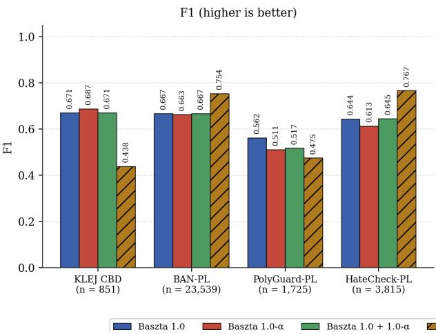

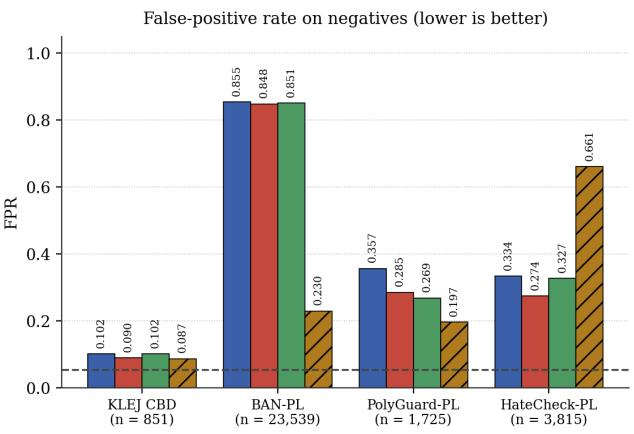  
Figure 1: Held-out performance on the four contamination-audited public benchmarks. Every system is scored on the same rows after the same exact-text filtering, with the same task-to-head mapping, and at per-category thresholds fitted on the same balanced sojka\_val source, so no system is compared tuned against untuned. Left: F1, higher is better. Right: false-positive rate on each benchmark’s own negative class, lower is better, with the dashed line at the 5.5% rate the same operating point achieves on genuinely safe text. Reading the two panels together matters: a tall left bar beside a tall right bar is recall bought with false positives.

Table 17: The same comparison numerically. Head is the output used for each benchmark’s binary task. Sójka is shown at both its default 0.5 threshold and the matched sojka\_val fit, because the two difer enough to change the conclusion. The matched fit is the column plotted in Figure 1 and is generous to Sójka, since sojka\_val contains rows from the corpus it was trained on.
<table><tr><td>Benchmark (N)</td><td>Head</td><td>Baszta 1.0</td><td>Sójka (0.5)</td><td>Sójka (matched)</td><td>FPR ours / theirs</td></tr><tr><td>KLEJ CBD (851)</td><td>hate</td><td>0.671</td><td>0.088</td><td>0.438</td><td>0.102 /0.087</td></tr><tr><td>BAN-PL (23,539)</td><td>any</td><td>0.667</td><td>0.694</td><td>0.754</td><td>0.855 0.230</td></tr><tr><td>PolyGuard-PL (1,725)</td><td>any</td><td>0.562</td><td>0.290</td><td>0.475</td><td>0.357 / 0.197</td></tr><tr><td>HateCheck-PL (3,815)</td><td>hate</td><td>0.644</td><td>0.527</td><td>0.767</td><td>0.334 / 0.661</td></tr></table>

Figure 1 splits two ways, and the split is informative. We lead clearly on KLEJ CBD and PolyGuard-PL. On KLEJ CBD the gap is the largest anywhere in this paper, 0.671 against 0.438, and it is not an operating-point efect: Sójka is at its own matched fit, and at its default threshold it scores 0.088 because its hate head barely fires on cyberbullying phrased without slurs. On PolyGuard-PL we lead 0.562 to 0.475.

Sójka leads on BAN-PL and HateCheck-PL, but only one of those is a clean win. On BAN-PL it is better on both axes at once, 0.754 F1 at a 23.0% false-positive rate against our 0.667 at 85.5%, and we take that at face value. BAN-PL is real moderated Wykop.pl content, which is much closer to Sójka’s training distribution than to ours, and it is the one benchmark here that rewards a model tuned to moderation decisions rather than to presence of harmful language. On HateCheck-PL the apparent 0.767-against-0.644 lead comes with a 66.1% false-positive rate on the non-hateful cases, against our 33.4%. A system that fires on two thirds of deliberately non-hateful test cases, including the counter-speech and identity-mention templates HateCheck exists to probe, is not separating hate from its neighbours. It is flagging most of the set.

The right panel is mostly a picture of how diferently these benchmarks define a negative. For one unchanged operating point ours ranges from 0.102 to 0.855. The dashed line is the control: on sojka\_val’s genuinely safe rows the same thresholds give 5.5%. Read against it, KLEJ CBD is the only external set whose negatives behave like safe text, which is the strongest argument in this paper for why a purpose-built balanced Polish benchmark is still the missing evaluation. It also explains the BAN-PL row without excusing it: its “neutral” class is unmoderated but profane, so a presence-of-toxicity detector fires on it by construction, whereas a moderation-decision model does not.

The three Baszta configurations are within noise of each other throughout, spanning 1.6 pp on KLEJ CBD, 0.4 pp on BAN-PL, 3.2 pp on HateCheck-PL and 5.1 pp on PolyGuard-PL, against a 10 pp spread between benchmarks for a fixed model. Whatever separates these recipes on Gadzi Język (§4.12) does not survive to independent data, which is the finding §4.13 draws out.

Deferred / not reported. PL-Guard-en (machine-translated), RTP-LX, and PolygloToxicityPrompts are generative-prompt toxicity sets whose task shape (continuation toxicity, multidimensional transcreation) does not align cleanly with our five-way multi-label classification without a mapping study. PolEval 2019 Task 6 is the source corpus behind KLEJ CBD and shares its contamination. We flag these as future cross-lingual / natural-distribution extensions rather than report partial numbers. §4.8.1 widens the same four sets to the third-party guards the reference paper compares against.

## 4.8.1 Cross-Taxonomy Comparison Against Third-Party Guards

§4.8 compares two systems, because ours and Sójka’s are the only two that share the five-category Polish taxonomy. The reference paper runs a wider comparison [2] against HerBERT-PL-Guard [21], Llama Guard 3 [25] and Qwen3Guard-Gen [26], but it does so on a private 3,000-prompt production stream, annotates each model against its own taxonomy, and reports no recall, so its numbers cannot be set beside ours. We therefore ran those systems ourselves, on the same public rows, under one protocol.

Protocol. Every system is reduced to a single binary unsafe/safe decision, where flagged in any category counts as unsafe. That is the device the reference paper uses to bridge taxonomies of diferent width (five categories for Bielik Guard, fifteen for HerBERT-PL-Guard, fourteen for Llama Guard 3, nine for Qwen3Guard-Gen), and it is the decision a deployment actually makes. Rows are identical for every system and carry the same contamination mask as §4.8. Ours and Sójka’s run at the sojka\_val-fitted operating points already used there, with no re-tuning. The third-party guards run at their own default decision, since they expose no threshold to fit, which is the same reason the binary reduction is the only common ground available. Because the binary reduction pools all five of our heads, the two hate-head rows of §4.8 shift slightly here (KLEJ CBD 0.669 rather than 0.671, HateCheck-PL 0.710 rather than 0.644), while the two any-head rows reproduce exactly. Figure 2 plots the result and the table beside it gives the same numbers.

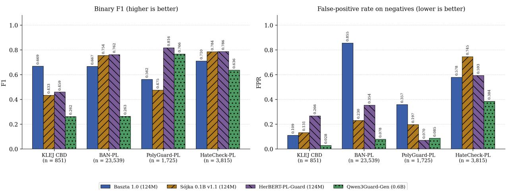  
Figure 2: Every system reduced to one binary unsafe/safe decision, on identical contaminationmasked rows. Ours and Sójka’s are at their sojka\_val-fitted operating points, the third-party guards at their own default decision rule with no threshold fitting. Read the panels together: a tall left bar beside a tall right bar is recall bought with false positives. Gadzi Język is absent because all 520 of its rows are positive, so it has no false-positive axis, and its detection rates are in the table below. Two confounds run against us and are stated in the text, the broader taxonomies flag categories these benchmarks label unharmful, and only our own training pool could be contamination-audited.

Table 18: The same comparison numerically, as F1 / false-positive rate on negatives per benchmark. The last column is the detection rate on all 520 Gadzi Język prompts, which are all positive, so it is recall and not F1 and an all-positive predictor scores 1.000 on it. Generated from reports/external\_guards/\*.json by scripts/plot\_cross\_taxonomy\_guards.py, so no figure here is transcribed by hand. Qwen3Guard-Gen is scored strictly, with its “Controversial” tier counted as safe.
<table><tr><td>System</td><td>KLEJ CBD</td><td>BAN-PL</td><td></td><td>PolyGuard-PL</td><td>HateCheck-PL</td><td>Gadzi detect.</td></tr><tr><td>Baszta 1.0 (124M)</td><td>0.669 /0.109</td><td>0.667</td><td>0.855</td><td>0.562 /0.357</td><td>0.710 /0.578</td><td>0.906</td></tr><tr><td>Sójka 0.1B v1.1 (124M)</td><td>0.433 / 0.131</td><td>0.754</td><td>0.230</td><td>0.475 0.197</td><td>0.784 0.745</td><td>0.675</td></tr><tr><td>HerBERT-PL-Guard (124M)</td><td>0.459 /0.266</td><td>0.762</td><td>0.354</td><td>0.816 /0.070</td><td>0.786 /0.593</td><td>0.992</td></tr><tr><td>Qwen3Guard-Gen (0.6B)</td><td>0.262 /0.028</td><td>0.263</td><td>0.078</td><td>0.766 0.085</td><td>0.636 0.384</td><td>0.985</td></tr></table>

We lead on one benchmark of the four, and it is worth reporting that plainly. On KLEJ CBD our 0.669 is well clear of the field (HerBERT-PL-Guard 0.459, Sójka 0.433, Qwen3Guard-Gen 0.262) at the second-lowest false-positive rate in that column, which is the same cyberbullyingwithout-slurs result §4.8 already identified, now measured against three more systems rather than one. On the other three we are behind. HerBERT-PL-Guard is the strongest system in this table, and it is in our own size class at 124M parameters. On PolyGuard-PL it beats every other system on both axes at once, 0.816 F1 at a 7.0% false-positive rate against our 0.562 at 35.7%, and its Gadzi Język detection rate of 0.992 is above ours at 0.906. A reader who takes only one number from this subsection should take that one.

Two of those three losses are partly structural, and one is not. The PolyGuard-PL gap has a taxonomy-alignment component: PolyGuard’s labels are auto-mapped to Llama-Guard categories (§4.8), which is the taxonomy HerBERT-PL-Guard was trained to emit, so it is being scored against a label scheme built for it and against us. The BAN-PL and HateCheck-PL gaps are the ones §4.8 already explains as a moderation-decision objective beating a presence-of-harmful-language objective. What is not structural is our false-positive rate. At 85.5% on BAN-PL and 57.8% on HateCheck-PL it is the worst column in the table, and no framing recovers it. That is the cost of the balanced operating point of §4.5.1, and this comparison prices it against three systems rather than one.

Qwen3Guard-Gen separates by task shape rather than by quality. It is at or near the ceiling on harmful requests (PolyGuard-PL 0.766, Gadzi Język 0.985) and close to useless on Polish hate speech and cyberbullying (KLEJ CBD 0.262, BAN-PL 0.263). The mechanism is its third safety tier. Scored strictly, as in the table, “Controversial” is not a flag, and it assigns that tier to 454 of 851 KLEJ CBD rows and 10,548 of 23,539 BAN-PL rows. Counting it as a flag lifts BAN-PL from 0.263 to 0.623 and drives the false-positive rate from 7.8% to 46.8%, so the strict reading is the one that flatters it. Neither reading makes it a Polish hate-speech detector.

This does not contradict the reference paper’s Table 5, it measures a diferent quantity. That table reports 11.4% precision for Qwen3Guard-Gen-0.6B and 31.6% for HerBERT-PL-Guard against Bielik Guard’s 77.7% on real user trafic, where Bielik Guard’s own alert rate is 2.83%, so the prevalence of harmful input there is a few percent. Our sets are enriched: PolyGuard-PL is 43.7% harmful and Gadzi Język is 100% harmful. A broad detector with a high alert rate scores well on F1 and recall here and falls to single-digit precision there, and both readings are correct for the trafic they were taken on. The ordering of systems is therefore not transferable between the two tables, and neither table licenses a bare claim that one model is better. This is the same lesson §4.5.1 draws from our own two operating points.

Two limits bound this comparison. First, taxonomy breadth is an upper bound on the broad models’ false positives rather than a measurement of them. Llama Guard 3 and Qwen3Guard carry categories with no equivalent in the Polish five (privacy, intellectual property, elections, specialised advice), so a row either flags under one of those counts against it here while being correct under its own policy. Second, and more seriously, the contamination audit of §4.8 covers our training pool only. We cannot audit what HerBERT-PL-Guard, Llama Guard 3 or Qwen3Guard-Gen were trained on, so these four sets are verified held-out for us and for Sójka and merely presumed held-out for the rest. The direction of that asymmetry is against us, and we report the numbers as they came out rather than adjusting for it.

## 4.9 Calibration Metrics and Reliability Diagrams

§4.3 diagnosed the OOD gap as under-confidence by eyeballing positive-probability means. Here we measure it with the standard calibration metrics (Expected Calibration Error [27] and its equal-mass Adaptive-ECE variant, Maximum Calibration Error, and the Brier score), following the calibration treatment in Eisenstein §4.4. Metrics are computed per category and macro-averaged over the full 520-sample Gadzi Język set.

Table 19: Calibration on the full 520-sample Gadzi Język set, macro-averaged over the five categories. ECE and Adaptive-ECE (equal-mass bins) measure the mean confidence - accuracy gap, MCE the worst single bin, Brier the mean squared probability error, lower is better throughout. Temperature scaling improves Brier while slightly worsening ECE.
<table><tr><td>Model (Gadzi, macro over 5 cats)</td><td>ECE</td><td>Adaptive-ECE</td><td>MCE</td><td>Brier</td></tr><tr><td>Baszta 1.0 raw</td><td>0.092</td><td>0.096</td><td>0.691</td><td>0.075</td></tr><tr><td>Baszta 1.0 + temperature</td><td>0.107</td><td>0.111</td><td>0.753</td><td>0.068</td></tr><tr><td>Sójka 0.1B</td><td>0.136</td><td>0.139</td><td>0.619</td><td>0.114</td></tr></table>

Two findings, one confirming and one qualifying earlier claims. (1) Our model is better calibrated on OOD than Sójka - lower ECE (0.092 vs. 0.136) and Brier (0.075 vs. 0.114) - which independently supports the §4.3 reading that our OOD deficit is a scale problem on an otherwise well-ordered probability, not a discrimination failure. (2) Temperature scaling is not a free lunch by ECE. It lowers the Brier score (0.075 → 0.068, better mean-squared probability) but slightly raises ECE/MCE, because sharpening the under-confident crime logits trades bin-level calibration for a better decision-time operating point. This nuances §4.5’s “temperature scaling transfers” claim: it transfers as a threshold-enabling rescaling (it improves F1 and Brier), not as a global calibration improvement in the ECE sense. Reliability diagrams for the three discriminating categories are in Figure 3.

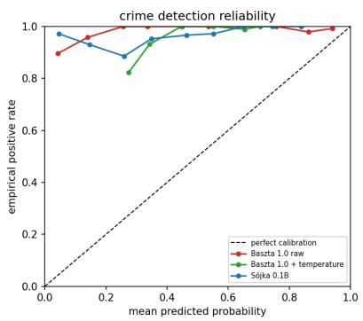

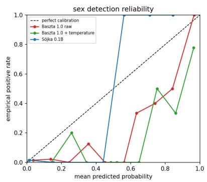

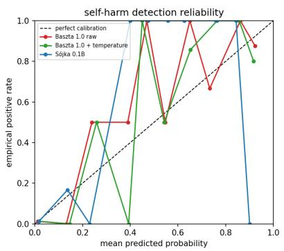  
Figure 3: Per-category detection reliability for Baszta 1.0 on the Gadzi Język OOD set: mean predicted probability (x-axis) against empirical positive frequency (y-axis) per confidence bin. A point above the diagonal is one where the observed positive rate exceeds the predicted probability, which is the signature of under-confidence, the calibration scale shift that per-category temperature scaling corrects. Points below the diagonal indicate the opposite, over-confidence.

## 4.10 Inference-Time Deobfuscation

The HateCheck-PL breakdown (§4.8) showed the residual failures are surface obfuscation - spaceinserted (spell\_space\_add\_h 0.41), homoglyph, and leet variants - which defeat subword tokenization without changing meaning. Following the normalization/tokenization treatment in Jurafsky & Martin [6], we add an inference-time canonicalizer (Cyrillic and Greek homoglyph folding, characterspacing repair, repeated-character collapse, and leetspeak reversal, with URLs/emails/numbers protected) applied symmetrically before inference. We measure it as an adversarial-robustness defence on all 520 Gadzi Język prompts at the deployable balanced operating point: for six attacks we report macro F1 and the $\mathit { \Pi } \mathit { f l i p }$ rate (fraction of per-label predictions changed vs. the clean input) without and with the defence.

Table 20: Adversarial robustness at the deployable balanced operating point (clean-input reference macro 0.496). Macro is Gadzi macro F1 under each attack. Flip is the fraction of per-label predictions that change relative to the clean input, so lower is better. Diacritics-stripping is deliberately not reversed by the canonicalizer, hence the identical columns.
<table><tr><td>Attack (Gadzi, balanced op-point)</td><td>No defence: macro / flip</td><td>Deobfuscated: macro / flip</td></tr><tr><td>homoglyph</td><td>0.477 / 0.055</td><td>0.496 / 0.000</td></tr><tr><td>leetspeak</td><td>0.415 / 0.071</td><td>0.471 / 0.024</td></tr><tr><td>space-insertion</td><td>0.409 / 0.100</td><td>0.485 / 0.024</td></tr><tr><td>char-repetition</td><td>0.296 / 0.146</td><td>0.476 / 0.030</td></tr><tr><td>diacritics-strip</td><td>0.486 / 0.026</td><td>0.486 / 0.026</td></tr><tr><td>combined-heavy</td><td>0.343 / 0.124</td><td>0.426 / 0.078</td></tr><tr><td>mean</td><td>0.405 / 0.087</td><td>0.473 / 0.030</td></tr></table>

Against a clean-input macro of 0.496, the six attacks drop mean macro to 0.405 (−9 pp) and flip 8.7% of predictions, the canonicalizer recovers +6.9 pp of the drop and cuts the flip rate by two-thirds (8.7% → 3.0%), fully neutralising the homoglyph attack (flip 0) and recovering most of the character-repetition and space-insertion damage. Diacritics-stripping is intentionally not reversed (it is lossy and the model is already robust to it), so it is unchanged. This is a cheap, training-free defence that directly closes the obfuscation failure surface §4.8 identified.

One caveat bounds the reading. Three of the six attacks (homoglyph, leetspeak and diacriticsstrip) are the same transforms used as training augmentation in §3.1, and the canonicalizer reverses transforms we applied ourselves. The measurement is therefore a partly closed loop, and it establishes that the defence works against the obfuscation families we can generate rather than against an adaptive attacker.

## 4.11 Classical Bag-of-Words Baselines

Both textbooks insist on a simple linear baseline as a floor [5]. We add TF-IDF (word 1–2 gram + char 3–5 gram) with one-vs-rest logistic regression and a Complement-Naive-Bayes variant, thresholds tuned on validation only.

Table 21: Classical lexical floor: TF-IDF (word 1–2 gram + char 3–5 gram) with one-vs-rest logistic regression and Complement Naive Bayes, thresholds tuned on validation only. The HerBERT row quotes its deployable balanced operating point, whose thresholds come from sojka\_val rather than from the full validation split, so the three rows share a non-oracle protocol but are not fitted on identical data.
<table><tr><td>Baseline</td><td>Val macro / micro</td><td>Gadzi macro micro</td></tr><tr><td>TF-IDF + LogReg</td><td>0.868 3 / 0.883</td><td>0.462 / 0.642</td></tr><tr><td>TF-IDF + Compl-NB</td><td>0.717 / 0.763</td><td>0.393 / 0.690</td></tr><tr><td>HerBERT (Baszta 1.0)</td><td>0.9111 / 0.9585 (val)</td><td>0.496 / 0.778 (balanced op-point)</td></tr></table>

The baseline is unexpectedly informative and tempers the neural narrative. In distribution the task is largely lexical: a bag-of-words logistic regression reaches 0.868 val macro, only \~4.3 pp below the fine-tuned HerBERT (0.9111). The transformer’s real value is OOD generalisation, but its edge there is modest at a deployable operating point: on Gadzi Język the LogReg baseline scores 0.462 macro versus HerBERT’s 0.496 balanced-point macro - a 3.4 pp gap - and both trail Sójka’s 0.619. The transformer buys robustness to paraphrase and domain shift that lexical features miss, but the floor shows most of the in-distribution performance, and a surprising fraction of the OOD performance, is attainable with a classical model that trains in seconds on CPU.

## 4.12 Book-Grounded Training Experiments: Cost-Sensitive Loss and Pooling

The above additions are evaluation-time, here we run two book-grounded training experiments, each a controlled variant of the Baszta 1.0 recipe (identical data, schedule, and hyperparameters, changing only the one factor under test), and evaluate them with the 172/348 calibration protocol of §4.5.

Per-class focal alpha (Baszta 1.0-α, Eisenstein §4.4.1, cost-sensitive learning). The Focal loss supports a per-class weight $\alpha _ { c } .$ , which we set to the inverse training frequency of each category $( \alpha _ { c } = 1 - p _ { c }$ , where $p _ { c }$ is the positive rate: self-harm 0.94, hate 0.88, crime 0.84, vulgar 0.85, sex 0.82), upweighting the positives of rarer categories, and retrain (Baszta 1.0-α).

Table 22: Controlled efect of per-class focal alpha set to inverse training frequency, with data, schedule, and all other hyperparameters held fixed. OOD figures use the 172/348 protocol, lower ECE and Brier are better. Cost-sensitive weighting raises in-distribution macro while lowering OOD macro and degrading calibration.
<table><tr><td>Model</td><td>Val macro</td><td>Gadzi macro</td><td>Gadzi micro</td><td>OOD ECE</td><td>OOD Brier</td></tr><tr><td>Baszta 1.0 (no alpha)</td><td>0.9111</td><td>0.699</td><td>0.927</td><td>0.092</td><td>0.075</td></tr><tr><td>Baszta 1.0-α (inverse- freq alpha)</td><td>0.9136</td><td>0.656</td><td>0.927</td><td>0.133</td><td>0.093</td></tr></table>

The result is a clean instance of the paper’s central tension. Cost-sensitive weighting improves in-distribution validation macro $( + 0 . 2 5 \mathrm { p p } , 0 . 9 1 1 1 \to 0 . 9 1 3 6 )$ and lifts exactly the two categories it most upweights - OOD crime $( 0 . 9 6 5  0 . 9 8 4 )$ and self-harm $( 0 . 8 2 0  0 . 8 2 4 )$ but degrades overall OOD macro $( 0 . 6 9 9  0 . 6 5 6$ , driven by hate $0 . 5 7 5  0 . 4 3 9$ and sex $0 . 6 0 6  0 . 4 6 2 )$ and worsens calibration $( \mathrm { E C E ~ 0 . 0 9 2  0 . 1 3 3 }$ , Brier $0 . 0 7 5  0 . 0 9 3 )$ . Upweighting rare positives sharpens the decision boundary in a way that helps in-domain balance and the highest-weight categories, but the extra confidence does not transfer: it re-introduces the OOD over-sharpening that low-γ foca was chosen to avoid. Baszta 1.0 without alpha remains the better OOD model, and the micro-F1 lead over Sójka is unafected (still significant, $\mathrm { p } = 0 . 0 1 7 )$ ). This reinforces §5’s thesis that in-distribution gains and OOD robustness are in tension for small encoders under domain shift.

Independent-benchmark nuance. Because the Gadzi Język macro is dominated by crime, we re-ran Baszta 1.0-α through the held-out external suite of $\ S 4 . 8 .$ , each model at its own sojka\_val-fit deployable operating point. The external evidence for cost-sensitive weighting is weaker than the OOD macro alone suggests. Only KLEJ CBD improves, from 0.671 to 0.687 hate-head F1 at a lower false-positive rate (0.102 to 0.090), which is the upweighting of rare hate positives working as intended. Everywhere else the variant is worse or level: HateCheck-PL falls from 0.644 to 0.613 (accuracy on hateful cases 0.54 to 0.49), PolyGuard-PL from 0.562 to 0.511, and BAN-PL is unchanged within noise (0.667 to 0.663). One improvement out of four benchmarks is not a category rebalance, it is a narrow gain that does not generalise, bought at the cost of OOD macro and calibration.

Mean pooling vs. [CLS] (Baszta 1.0-mp). Jurafsky & Martin [6] note that mask-aware mean pooling over the token sequence often beats the single [CLS] vector [28], especially for short inputs. We swap [CLS] for mean pooling (Baszta 1.0-mp), keeping everything else fixed. It gives the best in-distribution validation macro of all three (0.9138) yet the worst OOD behaviour: Gadzi Język macro falls to 0.606 and critically the paired micro-F1 lead over Sójka loses significance (0.913 vs. 0.903, dif +0.009, p = 0.218), while OOD ECE rises to 0.109. The [CLS] token, though “under-trained” in the abstract, evidently encodes a representation that transfers to the short imperative OOD prompts better than a mean over the (mostly declarative) training text.

Figures 4 and 5 show the reliability curves of the two variants, for comparison with Figure 3.

Synthesis. The three recipes rank oppositely in- and out-of-distribution:

Table 23: The three training recipes ranked in- versus out-of-distribution. OOD figures use the 172/348 protocol. The OOD macro column uses the 172/348 split, while the OOD micro column and its p-value come from the paired bootstrap of §4.5.2, which uses that script’s own 187/333 split. This is why micro reads 0.929 here and 0.927 in the table above for the same checkpoint. Validation macro ranks the recipes in exactly the reverse order of OOD macro.
<table><tr><td>Recipe</td><td>Val macro</td><td>OOD macro</td><td>OOD micro vs. Sójka</td><td>OOD ECE / Brier</td></tr><tr><td>Baszta 1.0 ([CLS],</td><td>0.9111</td><td>0.699</td><td>0.929 (p = 0.011 √)</td><td>0.092 / 0.075</td></tr><tr><td>alpha) Baszta 1.0-α (per-</td><td>0.9136</td><td>0.656</td><td>0.927 (p = 0.017 √)</td><td>0.133 / 0.093</td></tr><tr><td>alpha) Baszta 1.0-mp (mean pooling)</td><td>0.9138</td><td>0.606</td><td>0.913 (p = 0.218 X)</td><td>0.109 / 0.093</td></tr></table>

Both book-motivated changes raise validation macro (Baszta 1.0-mp highest, Baszta 1.0-α second, Baszta 1.0 lowest) yet monotonically lower OOD macro, degrade calibration, and erode the Sójka micro-F1 lead (Baszta 1.0-mp loses significance entirely). This is the sharpest demonstration in the paper of the in-distribution ↔ OOD tension: standard “improvements” that help the validation number actively hurt the robustness that is the whole point of a guardrail. It also retroactively justifies the Baszta 1.0 design choices ([CLS] pooling, no per-class alpha, low-γ focal) as an operating point selected for OOD, not for the leaderboard and warns that tuning on in-distribution macro would have selected the worst OOD model.

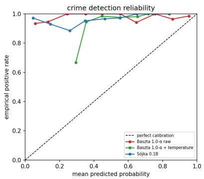

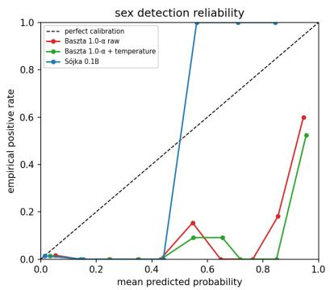

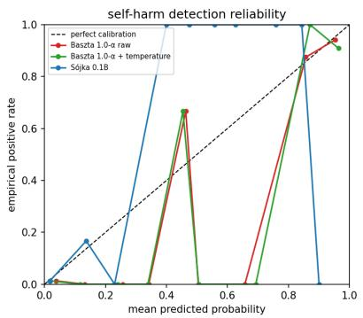  
Figure 4: Detection reliability for Baszta 1.0-α (per-class cost-sensitive alpha). Compared with Baszta 1.0 the curves sit further from the diagonal, which is the visual form of the ECE rise from 0.092 to 0.133 reported above.

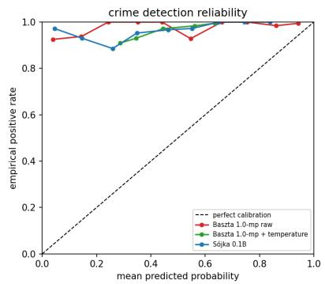

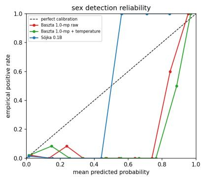

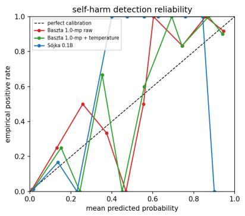  
Figure 5: Detection reliability for Baszta 1.0-mp (mean pooling), the variant with the best validation macro and the worst OOD behaviour of the three.

## 4.13 Deep Ensemble: Recovering Value from the Weaker Variants

Although Baszta 1.0-α and Baszta 1.0-mp are individually worse OOD, deep ensembling (averaging the per-category temperature-scaled probabilities of independently-trained models[29]) can still extract value from them (same split and paired test as §4.5.2).

Table 24: Deep ensembles formed by averaging per-category temperature-scaled probabilities, on the same split as §4.5.2. p-values are paired-bootstrap micro-F1 comparisons against Sójka. Lower Brier is better. The ensemble improves micro-F1 significance and probability quality but not macro, which the weaker members drag down.
<table><tr><td>Model / ensemble</td><td>OOD macro</td><td>OOD micro (vs. Sójka)</td><td>OOD Brier</td></tr><tr><td>Baszta 1.0 (single, best macro)</td><td>0.712</td><td>0.929 (p = 0.011)</td><td>0.075</td></tr></table>

Table 24: Deep ensembles formed by averaging per-category temperature-scaled probabilities, on the same split as §4.5.2. p-values are paired-bootstrap micro-F1 comparisons against Sójka. Lower Brier is better. The ensemble improves micro-F1 significance and probability quality but not macro, which the weaker members drag down.
<table><tr><td>Model / ensemble</td><td>OOD macro</td><td>OOD micro (vs. Sójka)</td><td>OOD Brier</td></tr><tr><td>Baszta 1.0 + Baszta 1.0-α + Baszta 1.0-mp</td><td>0.632</td><td>0.932 (p = 0.005)</td><td>0.071</td></tr><tr><td>(mean-prob) Baszta 1.0 + Baszta 1.0-α (mean-prob)</td><td>0.660</td><td>0.933 (p = 0.004)</td><td>0.070</td></tr></table>

The ensemble delivers a genuine, if narrow, improvement on the two metrics that are actually defensible: the Baszta 1.0 + Baszta 1.0-α pair raises the significant micro-F1 lead over Sójka from 0.929 (p = 0.011) to 0.933 (p = 0.004) - the strongest significance in the paper and gives the best OOD Brier score (0.070), i.e. the most accurate OOD probabilities of any configuration, while also lifting self-harm F1 to 0.848. It does not improve macro F1 (dragged down by the weaker members), so single-model Baszta 1.0 remains the macro-optimal choice. The reading matches §4.5.2: macro on this benchmark is too noisy to move reliably, but the ensemble is a real upgrade on the metrics that carry statistical weight - micro-F1 significance and probabilistic calibration at the cost of running three (or two) forward passes.

Does the ensemble gain generalise? It does not. We ran the Baszta 1.0 + Baszta 1.0-α ensemble, with its operating point auto-fit on sojka\_val, through the same held-out external suite of §4.8. On the balanced, independent benchmarks the ensemble regresses to Baszta 1.0 and improves nothing:  
Table 25: The same three configurations on the contamination-audited external benchmarks, each at its own sojka\_val-fit deployable operating point with no re-tuning. The ensemble’s Gadzi Język gain does not transfer: it matches single-model Baszta 1.0 on three of four sets and is worse on PolyGuard-PL.
<table><tr><td>Clean held-out benchmark</td><td>Baszta 1.0</td><td>Baszta 1.0-α</td><td>Baszta 1.0+Baszta 1.0-α ensemble</td></tr><tr><td>HateCheck-PL hate F1</td><td>0.644</td><td>0.613</td><td>0.645</td></tr><tr><td>KLEJ CBD hate F1</td><td>0.671</td><td>0.687</td><td>0.671</td></tr><tr><td>BAN-PL any-head F1</td><td>0.667</td><td>0.663</td><td>0.667</td></tr><tr><td>PolyGuard-PL binary F1</td><td>0.562</td><td>0.511</td><td>0.517</td></tr></table>

Two conclusions close the arc of §4.12–§4.13. First, the ensemble’s gain is adversarial-setspecific: it improves micro-F1 significance and Brier on the crime-heavy, all-positive Gadzi Język set, but on the balanced external benchmarks its sojka\_val-fit operating point collapses onto Baszta 1.0’s, so it matches Baszta 1.0 exactly on HateCheck-PL, KLEJ CBD and BAN-PL, and is slightly worse than Baszta 1.0 on PolyGuard-PL. Second, and this is the overall verdict, none of the three new configurations (Baszta 1.0-α per-class alpha, Baszta 1.0-mp mean pooling, or the ensemble) robustly beats Baszta 1.0 on independent external data. Baszta 1.0-α improves one external benchmark of four and costs OOD macro and calibration. Baszta 1.0-mp is worse throughout. The single-model Baszta 1.0 remains the best all-around, most robust deployable model, and the genuine, generalising improvement of this study is the training-free inference-time deobfuscation of §4.10, not any of the model changes.

## 5. Discussion

In-distribution and OOD objectives are in tension. The two controlled training experiments of §4.12 make this concrete and, for a guardrail, alarming: per-class cost-sensitive weighting (Baszta 1.0-α) and mean pooling (Baszta 1.0-mp) both raise validation macro above the Baszta 1.0 baseline yet lower OOD macro, worsen calibration, and for mean pooling erase the significant micro-F1 lead over Sójka. Selecting a model on the in-distribution number would have picked the worst OOD system. Robustness must be selected for directly. It is not a by-product of in-distribution accuracy.

Data distribution dominates hyperparameters. Across Baszta 0.1–0.3 (a full sweep of LR, freeze-depth, and γ) OOD macro F1 spans only 0.4 pp, whereas a single data-quality fix (a RefusEU multi-label loading bug) was worth +4.6 pp, and style-matched synthetic crime data was worth \~40 pp on its target category. For small encoders under domain shift, what the model sees matters far more than how it is optimized.

Focal loss is a double-edged sword. It improves in-distribution macro F1 on imbalanced data but worsens OOD calibration, an interaction also reported by Mukhoti et al. [19]. Lower γ (≈1.5) trades a little in-distribution sharpness for better OOD probability scale, a preference the completed sweep independently confirmed (best trial γ = 1.57) and the winning Baszta 1.0 model exploited. Pairing low-γ training with per-category temperature scaling (Section 4.5) recovers the OOD probability scale but only when the calibration set contains negatives. As §4.5.1 shows, fitting the same technique on the all-positive Gadzi Język split produces a degenerate operating point (crime threshold 0.025, temperature 4.3) that flags 100% of safe text. The technique’s benefit is real but is conditional on representative calibration data, not automatic. This Focal-induced OOD under-confidence, its correction by low-γ plus temperature scaling, and the failure mode when calibration data lacks negatives is, we believe, the most transferable finding here, and is not specific to Polish or to guardrails.

Augmentation helps OOD specifically. Holding hyperparameters fixed, augmentation (Baszta 0.2 against its no-augmentation ablation) more than doubled the count of OOD crime samples scored above threshold, indicating that input-space perturbation partially simulates domain shift.

A guardrail’s headline number is a statement about its trafic. §4.8.1 runs four other systems through the same binary decision on the same public rows and lands in a diferent order from the reference paper’s own cross-model table. Both orderings are correct. Theirs is precision on a production stream that is roughly 97% benign, ours is F1 and false-positive rate on sets that are 44% and 100% harmful, and a broad detector that looks strong on the second looks poor on the first. The practical reading is that a guardrail cannot be selected on a published number alone. It has to be re-measured at the prevalence it will actually see, which is the same point §4.5.1 makes from inside our own system about two operating points of one model.

Generative guardrails resist self-harm generation. The Azure content filter blocked the majority of self-harm synthetic requests, an ethical safety feature that nonetheless complicates defensive dataset construction. Template-based generation is a viable, controllable fallback.

## 6. Conclusion and Future Work

A data-centric HerBERT classifier holds a statistically significant but narrow lead over Sójka on OOD micro F1, on a benchmark where micro F1 is a weak discriminator. Under a both-tuned paired bootstrap test (§4.5.2), this micro lead survives (0.929 vs. 0.903, dif +0.026, 95% CI [+0.004, +0.049], p = 0.011) while the macro lead does not: when Sójka is granted the same per-category threshold-tuning our model receives, its five-way macro rises to 0.782 and our model is better in only 12.5% of resamples. The widely-quoted 0.699-vs-0.619 macro gap was thus an operating-point artifact (our tuned model vs. Sójka at a default 0.5 threshold), not a model advantage. Nor is micro F1 a strong result on its own terms: the always-crime baseline of §4.5.2 reaches 0.910 on the same split, which places Sójka’s tuned 0.903 below it and our 0.929 only 1.9 pp above it. What the paper can defend is macro parity under matched tuning, a per-category profile that is stronger on crime and self-harm and weaker on sex and vulgar, and the calibration results below. The decisive modelling ingredients were style-matched synthetic data plus low-γ focal training with per-category temperature scaling, which together convert the OOD calibration shift diagnosed and now measured (§4.9: our ECE 0.092 and Brier 0.075 both beat Sójka’s 0.136/0.114) into a measurable gain. We stress that this gain is operating-point conditional: the Gadz benchmark has no safe examples, so its F1-optimal point flags 100% of safe text (§4.5.1), a deployable point re-fit on balanced data reaches macro 0.952 at a 5.5% safe-text false-positive rate but gives back adversarial macro. The completed four-phase sweep confirms that data distribution and lightweight calibration dominate hyperparameter choice for small encoders under domain shift: across 62 trials, validation macro F1 varied by under 2 pp. Two book-grounded additions round out the picture: a classical TF-IDF + logistic-regression baseline (§4.11) reaches 0.868 val macro (within 4.3 pp of HerBERT) and 0.462 Gadzi macro (within 3.4 pp of the deployable neural point), showing most of the in-domain task and much of the OOD task is lexical, and a training-free inference-time deobfuscation pass (§4.10) recovers +6.9 pp of adversarial macro and cuts prediction flips by two-thirds against surface obfuscation.

Independent external evaluation and a data-hygiene lesson. A held-out, contaminationaudited evaluation on four public Polish benchmarks (§4.8) puts both systems on sets that neither of them selected, and there the result is a two-two split rather than a lead. We are ahead on KLEJ CBD, where the hate head reaches 0.671 zero-shot against Sójka’s 0.438, and on PolyGuard-PL. Sójka is ahead on BAN-PL by a clear margin on both F1 and false-positive rate, because that benchmark asks for a moderation decision on Polish social media and is close to the distribution it was trained on, while our objective is presence of harmful language. Its nominal lead on HateCheck-PL comes with a 66.1% false-positive rate on the non-hateful cases against our 33.4%, which is the opposite of what a functional test suite is for. The honest summary is that the two systems transfer to diferent tasks, and that HateCheck-PL confirms our multi-head design routes profanity to vulgar rather than hate. The audit that made these numbers trustworthy also delivered the sharpest operational lesson here: the otherwise-ideal PL-Guard benchmark had silently entered the training pool (899/900) and would have produced a memorised “0.997 detection F1” had we not text-matched every benchmark against the corpus first, while the same check confirmed the headline Gadzi Język set is clean (0/520).

Limitations. Six caveats bound these claims. (1) Soft adaptation to the test distribution: §3.3 states plainly that the synthetic prompts were written in the imperative jailbreak style because that is the style of Gadzi Język. The contamination audit of §4.8 is exact-match, so its 0/520 result rules out copied text but not this weaker form of adaptation. Every Gadzi Język number in this paper should be read with that in mind, and a fuller audit would add approximate matching (MinHash, n-gram overlap, embedding similarity) rather than exact matching alone. (2) Statistical power: the five-way macro is estimated on 520 OOD points with one class at n = 4 and one near-universal crime class, so its CI is wide, the both-tuned paired test (§4.5.2) shows the macro lead over Sójka is not significant in either direction (only the micro-F1 gap is significant, p = 0.011). (3) Model-selection bias: our best model was chosen using OOD performance, so the calibration/test split removes threshold leakage but not selection leakage. A truly unbiased estimate needs a second, untouched OOD set. (4) Operating-point / safe-text validity: the Gadzi benchmark has no safe examples, so its F1-maximising operating point flags 100% of safe text and is not deployable (§4.5.1). The deployable balanced operating point (macro 0.952, 5.5% safe-text FPR) trades away adversarial macro (0.496), and no single point optimises both. (5) Significance testing is uneven across the comparisons: §4.5.2 supplies a paired bootstrap test against Sójka on Gadzi Język, but the four-benchmark head-to-head of §4.8 reports point estimates only. The largest of those sets (BAN-PL, n = 23,539) gives intervals narrow enough that its outcome is not in doubt, and the KLEJ CBD gap is wide, but the PolyGuard-PL and HateCheck-PL margins are not backed by a paired test and should be read accordingly. (6) External-benchmark scope and hygiene: the held-out public results (§4.8) are moderate and each carries a caveat. KLEJ CBD and BAN-PL are only partially disjoint from training, with the overlapping rows dropped. BAN-PL scores a moderation decision rather than presence of harmful language, which is a diferent task from the one we trained for and which Sójka is better suited to. PolyGuard-PL is heavily machine-translated. The one balanced, safe-containing external set (PL-Guard) was unusable because of the training leak. A purpose-built, uncontaminated, balanced Polish benchmark remains the cleanest missing evaluation.

Two category-level results are worth separating from the aggregate. Style-matched synthetic data lifts self-harm to parity with Sójka (0.820 against 0.815), while sex remains the one category where we are clearly behind under matched tuning (0.476 against 0.727), and closing it is the most concrete modelling task this study leaves open. Beyond that, and beyond distillation for low-latency deployment, the most valuable experiments we did not run are:

1. a threshold/temperature transfer matrix across domains to test how far one calibration generalises,

2. a data-scaling curve between the 6.9k baseline and the \~26k augmented corpus to locate where synthetic data stops helping

3. a synthetic-quality ablation (random vs. style-matched prompts) to isolate style matching from sheer volume,

4. a controlled head-to-head against Sójka on a freshly collected OOD set to eliminate the model-selection bias above. The held-out public benchmarks of §4.8 are a first step, they validate the operating point on data the model was neither trained nor selected on, but they do not include Sójka’s own predictions, so a paired, uncontaminated, safe-containing Polish benchmark remains the decisive experiment.

## Appendix A. Comparison Summary vs. Sójka

Best model: Baszta 1.0 (low-γ focal + v2 synthetic data + per-category temperature scaling). The shared OOD Gadzi Język set is the only like-for-like comparison, the val row is an internal sanity check on a diferent test set than Sójka’s and is not directly comparable. OOD figures use the 172/348 calibration split with 95% bootstrap CIs.

Table 26: Head-to-head summary against Sójka 0.1B. Every both-tuned row gives both systems per-category tuning on the same 187-sample calibration split and scores them on the disjoint 333 samples, and those are the only rows from which a head-to-head margin should be read. The rows above them use the 172/348 split of §4.5 and leave Sójka at its default 0.5 threshold, so their large apparent margins are operating-point efects rather than model diferences. Under matched tuning the per-category picture changes substantially: Sójka’s crime F1 rises from 0.587 to 0.946 and its hate F1 from 0.045 to 0.478, which turns the previously reported +37.8 pp and +53.0 pp per-category gaps into +3.7 pp and +1.2 pp. The oracle row fits thresholds on the full test set and is an optimistic upper bound. The deployable row is in-distribution and has no Sójka counterpart, so it is not a comparison, and neither is the validation row.
<table><tr><td>Dimension</td><td>Ours (Baszta 1.0+temp)</td><td>Sójka 0.1B</td><td>∆/note</td></tr><tr><td>Encoder</td><td>HerBERT (124M)</td><td>MMLW-RoBERTa (100M)</td><td>similar</td></tr><tr><td>Loss</td><td>Focal (γ=1.5) + R-Drop</td><td>BCE</td><td></td></tr><tr><td>Training data</td><td>26,248 (+synthetic)</td><td>~6.9K</td><td>larger</td></tr><tr><td>Compute</td><td>1× T4 and 2× GH200, FP16</td><td>A100 cluster</td><td>constrained</td></tr><tr><td>Gadzi micro F1</td><td>0.927 [0.903, 0.949]</td><td>0.582</td><td>Sójka untuned, see below</td></tr><tr><td>Gadzi macro (cal split)</td><td>0.699 [0.493, 0.797]</td><td>0.619</td><td>directional (81% boot.)</td></tr><tr><td>Gadzi macro, 4-cat (excl. vulgar)</td><td>0.674 [0.569, 0.763]</td><td></td><td>rare-class robust</td></tr><tr><td>Gadzi macro (oracle)</td><td>0.707</td><td>0.619</td><td>optimistic UB</td></tr><tr><td>Gadzi micro F1 (both tuned)</td><td>0.929</td><td>0.903</td><td>+0.026, p=0.011 sig.</td></tr><tr><td>Gadzi macro (both tuned)</td><td>0.712</td><td>0.782</td><td>-0.070, p=0.875</td></tr><tr><td>Deployable</td><td>0.952</td><td></td><td>(not sig.) in-distribution,</td></tr><tr><td>(balanced) macro → same point, Gadzi</td><td>0.496</td><td>0.619</td><td>5.5% safe-text FPR recall traded for</td></tr><tr><td>macro Crime F1 (both tuned)</td><td>0.983</td><td>0.946</td><td>FPR +3.7 pp</td></tr><tr><td>Hate F1 (both tuned)</td><td>0.490</td><td>0.478</td><td>+1.2 pp</td></tr><tr><td>Self-harm F1 (both</td><td>0.812</td><td>0.759</td><td>+5.3 pp</td></tr><tr><td>tuned) Sex F1 (both tuned)</td><td></td><td></td><td></td></tr><tr><td>Vulgar F1 (both tuned)</td><td>0.476 0.800 (n = 3 test)</td><td>0.727 1.000</td><td>-25.1 pp n=3 test positives, F1 estimate</td></tr></table>

<table><tr><td>Val macro F1 (‡ not 0.9111 comparable)</td><td>0.770</td><td>measured on our internal val split, not Sójka&#x27;s test set, not a head-to-head comparison</td></tr></table>

‡The val row is reported only as an internal training sanity check. It is measured on our own validation split, not Sójka’s test split, so the apparent gap should not be read as a head-to-head result. The per-category deltas above are matched-tuning gaps against Sójka, and are not to be confused with the +31.0 pp within-project crime gain of §4.7, which measures the efect of adding synthetic data against our own clean-data baseline. The deployable (balanced) rows use the operating point of §4.5.1 (fit on a calibration set that includes safe text). They are the figures relevant to production, whereas the Gadzi calibration-split rows characterise adversarial recall only.

## Appendix B. Reproducibility

This appendix summarises the experimental setup at a level of detail at which the study can be reproduced. It describes what was done rather than pointing at specific scripts.

• Code and artifacts. Training, evaluation, and calibration code, together with the experiment schedules that produced every reported run, are available on request. Checkpoints and the derived corpus are not redistributed, because the training pool includes gated and sensitive sources (§3.3).

• Backbone and stack. allegro/herbert-base-cased (124M) fine-tuned with PyTorch Lightning under FP16 mixed precision on Python 3.11, with pinned dependency versions.

• Seeds. Training runs use a fixed seed, and every bootstrap and split reported here uses seed 42. Synthetic generation is fixed-seed and deduplicated. Sweep trials are seeded by Optuna’s own sampler state.

• Best model. Low-γ (1.5) Focal + R-Drop training, followed by a per-category temperature and threshold fit on a held-out calibration split.

• Synthetic data (v2). Style-matched imperative Polish prompts for the crime, sex, and self-harm categories, LLM paraphrase for crime, deterministic template combination for sex and self-harm, deduplicated and fixed-seed for reproducibility.

• Distributed sweep. A four-phase pipeline (Optuna TPE search → top-5 full trainings → ten ablations → OOD Gadzi Język evaluation) run against a single shared study so multiple GPUs draw trials without a shared filesystem.

• OOD protocol. A disjoint 172/348 Gadzi Język calibration/test split, with per-category temperatures and thresholds fit on the calibration side only and 95% bootstrap confidence intervals (2,000 resamples, seed 42) on the test side.

• Paired significance and calibration metrics. Both systems’ operating points fit on the same Gadzi Język calibration split, a 2,000-resample paired bootstrap of macro/micro-F1 diferences against Sójka’s recovered per-sample predictions, and ECE / Adaptive-ECE / MCE / Brier with reliability diagrams.

• Deployable balanced calibration. Temperatures and thresholds re-fit on a balanced source that includes safe text, additionally reporting the false-positive rate on safe text.

• Inference-time deobfuscation. A symmetric canonicalizer applied before inference - homoglyph folding, character-spacing repair, repeated-character collapse, and leetspeak reversal, with URLs, emails, and numbers protected.

• Classical baselines. TF-IDF (word 1–2 gram + char 3–5 gram) with one-vs-rest logistic regression and a Complement-Naive-Bayes variant, thresholds tuned on validation only.

• Book-grounded training variants. Per-class focal alpha set to inverse training frequency (Baszta 1.0-α) and mean vs. [CLS] pooling (Baszta 1.0-mp), each a controlled clone of the best-model recipe changing only the factor under test.

• Deep ensemble. Averaged per-category temperature-scaled probabilities of the independently trained checkpoints, evaluated on the same split and paired test.

• External public benchmarks. PL-Guard, PolyGuardPrompts (Polish slice), HateCheck-PL, KLEJ CBD, and BAN-PL evaluated at the deployable operating point with no re-tuning, after dropping every row whose whitespace-normalised text appears in the training pool (2,000-resample bootstrap CIs, seed 42).

## References

[1] Robert Mroczkowski et al. “HerBERT: Eficiently Pretrained Transformer-based Language Model for Polish”. In: Proceedings of the 8th Workshop on Balto-Slavic Natural Language Processing (BSNLP). Association for Computational Linguistics, 2021, pp. 1–10.

[2] Krzysztof Wróbel et al. “Bielik Guard: Eficient Polish Language Safety Classifiers for LLM Content Moderation”. In: arXiv preprint arXiv:2602.07954 (2026). Version 4. arXiv: 2602.07954 [cs.CL]. url: https://arxiv.org/abs/2602.07954.

[3] Chuan Guo et al. “On Calibration of Modern Neural Networks”. In: Proceedings of the 34th International Conference on Machine Learning (ICML). 2017, pp. 1321–1330.

[4] Sławomir Dadas, Michał Perełkiewicz, and Rafał Poświata. “PIRB: A Comprehensive Benchmark of Polish Dense and Hybrid Text Retrieval Methods”. In: Proceedings of the 2024 Joint International Conference on Computational Linguistics, Language Resources and Evaluation (LREC-COLING 2024). ELRA and ICCL, 2024, pp. 12761–12774.

[5] Jacob Eisenstein. Introduction to Natural Language Processing. Cambridge, MA: MIT Press, 2019. isbn: 978-0-262-04284-0.

[6] Dan Jurafsky and James H. Martin. Speech and Language Processing: An Introduction to Natural Language Processing, Computational Linguistics, and Speech Recognition with Language Models. 3rd ed. Online manuscript released January 12, 2025. 2025. url: https://web.stanfor d.edu/\~jurafsky/slp3/.

[7] Tsung-Yi Lin et al. “Focal Loss for Dense Object Detection”. In: Proceedings of the IEEE International Conference on Computer Vision (ICCV). 2017, pp. 2980–2988.

[8] Xiaobo Liang et al. “R-Drop: Regularized Dropout for Neural Networks”. In: Advances in Neural Information Processing Systems (NeurIPS). Vol. 34. 2021, pp. 10890–10905.

[9] John Platt. “Probabilistic Outputs for Support Vector Machines and Comparisons to Regularized Likelihood Methods”. In: Advances in Large Margin Classifiers. MIT Press, 1999, pp. 61–74.

[10] Björn Böken. “On the Appropriateness of Platt Scaling in Classifier Calibration”. In: Information Systems 95 (2021), p. 101641.

[11] SpeakLeash. speakleash/sojka-2: Polish Content Safety Annotation Corpus. Hugging Face dataset. 2026. url: https://huggingface.co/datasets/speakleash/sojka-2.

[12] Michał Ptaszyński, Agata Pieciukiewicz, and Paweł Dybała. “Results of the PolEval 2019 Shared Task 6: First Dataset and Open Shared Task for Automatic Cyberbullying Detection in Polish Twitter”. In: Proceedings of the PolEval 2019 Workshop. Ed. by Maciej Ogrodniczuk and Łukasz Kobyliński. Warszawa, Poland: Institute of Computer Science, Polish Academy of Sciences, 2019, pp. 89–110. isbn: 978-83-63159-28-3.

[13] Anna Kołos et al. “Behind Closed Words: Creating and Investigating the forePLay Annotated Dataset for Polish Erotic Discourse”. In: Proceedings of the 63rd Annual Meeting of the Association for Computational Linguistics (Volume 1: Long Papers). Ed. by Wanxiang Che et al. Vienna, Austria: Association for Computational Linguistics, July 2025, pp. 2416–2432. doi: 10.18653/v1/2025.acl-long.120. url: https://aclanthology.org/2025.acl-long.120/.

[14] Cezary Klamra et al. “Devulgarization of Polish Texts Using Pre-trained Language Models”. In: Computational Science – ICCS 2022. Ed. by Derek Groen et al. Vol. 13351. Lecture Notes in Computer Science. Cham: Springer, 2022, pp. 49–55. doi: 10.1007/978-3-031-08754-7\_7.

[15] Aleksandra Krasnodębska, Wojciech Kusa, and Aldo Lipani. “Multilingual Refusal Alignment for Safer Large Language Models”. In: arXiv preprint arXiv:2606.07535 (2026). Findings of the Association for Computational Linguistics: ACL 2026. arXiv: 2606.07535 [cs.CL]. url: https://arxiv.org/abs/2606.07535.

[16] Artur Nowakowski and Krzysztof Jassem. “Detection of Criminal Texts for the Polish State Border Guard”. In: arXiv preprint arXiv:2108.10580 (2021). Presented at the 2nd International MIS2 Workshop, KDD 2021. arXiv: 2108.10580 [cs.CL]. url: https://arxiv.org/abs/2108.10 580.

[17] Anna Kolos et al. “BAN-PL: A Polish Dataset of Banned Harmful and Ofensive Content from Wykop.pl Web Service”. In: Proceedings of the 2024 Joint International Conference on Computational Linguistics, Language Resources and Evaluation (LREC-COLING 2024). Ed. by Nicoletta Calzolari et al. Torino, Italia: ELRA and ICCL, May 2024, pp. 2107–2118. url: https://aclanthology.org/2024.lrec-main.190/.

[18] Andy Zou et al. “Universal and Transferable Adversarial Attacks on Aligned Language Models”. In: arXiv preprint arXiv:2307.15043 (2023). arXiv: 2307 . 15043 [cs.CL]. url: https://arxiv.org/abs/2307.15043.

[19] Jishnu Mukhoti et al. “Calibrating Deep Neural Networks Using Focal Loss”. In: Advances in Neural Information Processing Systems (NeurIPS). Vol. 33. 2020, pp. 15288–15299.

[20] Taylor Berg-Kirkpatrick, David Burkett, and Dan Klein. “An Empirical Investigation of Statistical Significance in NLP”. In: Proceedings of the 2012 Joint Conference on Empirical Methods in Natural Language Processing and Computational Natural Language Learning. Association for Computational Linguistics, 2012, pp. 995–1005.

[21] Aleksandra Krasnodębska et al. “PL-Guard: Benchmarking Language Model Safety for Polish”. In: Proceedings of the 10th Workshop on Slavic Natural Language Processing (Slavic NLP 2025). Vienna, Austria: Association for Computational Linguistics, 2025, pp. 25–37. url: https://aclanthology.org/2025.bsnlp-1.4/.

[22] Piotr Rybak et al. “KLEJ: Comprehensive Benchmark for Polish Language Understanding”. In: Proceedings of the 58th Annual Meeting of the Association for Computational Linguistics. Association for Computational Linguistics, 2020, pp. 1191–1201.

[23] Paul Röttger et al. “Multilingual HateCheck: Functional Tests for Multilingual Hate Speech Detection Models”. In: Proceedings of the Sixth Workshop on Online Abuse and Harms (WOAH). Association for Computational Linguistics, 2022, pp. 154–169.

[24] Priyanshu Kumar et al. “PolyGuard: A Multilingual Safety Moderation Tool for 17 Languages”. In: arXiv preprint arXiv:2504.04377 (2025). arXiv: 2504.04377 [cs.CL]. url: https://arxiv.o rg/abs/2504.04377.

[25] Aaron Grattafiori, Abhimanyu Dubey, Abhinav Jauhri, et al. The Llama 3 Herd of Models. Llama Guard 3 is released with this model family. 2024. arXiv: 2407.21783 [cs.AI]. url: https://arxiv.org/abs/2407.21783.

[26] Haiquan Zhao et al. Qwen3Guard Technical Report. 2025. arXiv: 2510.14276 [cs.CL]. url: https://arxiv.org/abs/2510.14276.

[27] Mahdi Pakdaman Naeini, Gregory F. Cooper, and Milos Hauskrecht. “Obtaining Well Calibrated Probabilities Using Bayesian Binning”. In: Proceedings of the 29th AAAI Conference on Artificial Intelligence. 2015, pp. 2901–2907.

[28] Sheng-Chieh Lin, Minghan Li, and Jimmy Lin. “Aggretriever: A Simple Approach to Aggregate Textual Representations for Robust Dense Passage Retrieval”. In: Transactions of the Association for Computational Linguistics 11 (2023), pp. 436–452.

[29] Balaji Lakshminarayanan, Alexander Pritzel, and Charles Blundell. “Simple and Scalable Predictive Uncertainty Estimation Using Deep Ensembles”. In: Advances in Neural Information Processing Systems (NIPS). Vol. 30. 2017, pp. 6402–6413.