# CANOPY: EXPLOITING PIECEWISE SMOOTH TREE PRIORS FOR MULTI-FIDELITY BANDITS

Michael Jerge   
Amazon   
mjerge@amazon.com

Suman Jana Columbia University sj2754@columbia.edu

## ABSTRACT

Many LLM inference problems, including model routing, prefix-cache management, prompt trimming, and test-time search, can be viewed as optimization over a tree. This structure arises naturally from autoregressive generation: every prefix defines a node, and its continuations form a subtree below it. Internal nodes of the tree provide cheap but biased estimates of a region’s value, while leaf evaluations are expensive but accurate. Hierarchical bandit methods can exploit this structure, but typically require a specific smoothness schedule to be specified in advance, even though real objectives are often only piecewise smooth and their optima may lie near sharp boundaries. We introduce CANOPY, a multi-fidelity tree bandit that learns where the smoothness prior is valid rather than assuming it globally. CANOPY uses cheap random-path probes to construct an online certificate of local aggregation bias, then directs expensive leaf evaluations toward cells where the certificate detects a smoothness violation. We prove fixed-budget and regret guarantees whose additional cost is additive in the number of discontinuities, recovering the smooth-tree rate when no violations are present and approaching structure-blind search as violations become dense. Across routing, top-(k) identification, test-time search, caching, and prompt trimming, CANOPY consistently improves matched-budget performance, including 2.9× higher top-10 recall on a 1000-model pool, 1.6× more SWE-bench Verified issues resolved than best-of-(N), and 3.6× lower median time-to-first-token with prefix caching.

## 1 INTRODUCTION

Modern LLM applications spend an increasing fraction of their compute at inference time (Welleck et al., 2024; Snell et al., 2024; Brown et al., 2024), and the algorithms that use this compute often revisit shared partial computations. For example, search procedures expand multiple traces from a common prefix (Yao et al., 2023), serving stacks reuse cached prefixes across requests (Kwon et al., 2023; Zheng et al., 2024), and prompt-trimming methods consider progressively compressed versions of a long prompt (Jiang et al., 2023). In each setting, the system must choose among more candidates than it can afford to evaluate exhaustively, since evaluating a candidate may require a generation, a test run, or a served request. These candidates admit a natural hierarchical organization: candidates that share more of their computation tend to behave more similarly, except at a small number of sharp boundaries.

This hierarchy induces a multi-fidelity feedback model (Figure 1a). An internal-node probe returns the subtree average, giving a cheap but biased proxy for the best leaf beneath it, while a leaf evaluation is expensive but unbiased. The key quantity is therefore the aggregation bias: how far the best leaf in a cell can exceed its mean. Classical hierarchical bandits control this bias using a smoothness schedule specified in advance (Bubeck et al., 2011; Munos, 2011; Azar et al., 2014). But the right schedule is difficult to know: assuming too much smoothness can prune promising regions, while being too conservative forfeits the savings from hierarchical search. Moreover, real objectives may be only piecewise smooth, with a small number of sharp boundaries where an innocuous subtree average hides an unusually valuable leaf. This raises our central question: can the learner use cheap observations to determine where the smoothness assumption is actually valid?

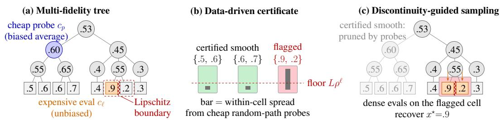  
Figure 1: Method overview. (a) Leaves show the unknown values, and the red line marks the Lipschitz boundary splitting the cell. (b) The certificate measures each cell’s within-cell spread from cheap probes against the Lipschitz floor. (c) On the same tree, the search prunes the certifiedsmooth subtree.

Contributions. We study a multi-fidelity bandit over a complete tree without access to the smooth ness schedule that standard hierarchical bandits assume. Internal nodes provide cheap subtree averages under a cost budget, while leaves provide expensive unbiased evaluations. We use the standard hierarchical descent of X-armed bandits (Bubeck et al., 2011; Azar et al., 2014; Munos, 2011; Grill et al., 2015), but, to our knowledge, are the first to certify the required smoothness information di rectly from data rather than assume it or search over candidate schedules. We further show that once a smoothness violation is encountered, targeted leaf-level sampling is unavoidable, up to logarithmic factors, for identifying the best leaf (Proposition 2).

We make three key contributions. First, we develop an online, local-Lipschitz certificate of aggregation bias (Section 3.3). Second, we build a discontinuity-guided adaptive sampling technique that spends expensive evaluations only in regions where the certificate fails (Section 3.4). Third, we combine the two into a cost-budgeted framework (Section 3.1) that casts model routing, prefix caching, and test-time search as instances of the same multi-fidelity tree optimization problem.

Experimental overview. Across twelve open-source benchmarks, our method improves performance at matched cost or compute over others (Table 1). On RouterEval’s 1000-model pool, the tree bandit reaches 2.9× the top-10 recall of the strongest structure-blind baseline and is better at every budget. Value-guided search beats best-of-N by +0.087 on MATH, +0.111 on GPQA-Diamond, and +0.123 on SWE-bench Verified, with the strict budget cells of the model×budget sweep reaching 1.8–2.2×. In a serving-based setting, the regional router beats the flat learner in 4 of 5 independent τ-bench replicates, and reaches near-oracle quality at the lowest cost on live MMLU. On the Mooncake production trace, the adaptive cache reuses 78% more blocks per request than the engine-default LRU after a popularity shift. On a vLLM server, prefix caching cuts median time-to-first-token 3.6×, and adaptive eviction saves 83% more TTFT than LRU post-shift. The experiments also identify precisely when these gains are available and measure every boundary condition (Section 4).

## 2 BACKGROUND

Hierarchical and X-armed bandits. Optimizing a noisy function over a hierarchical partition of its domain is the classical X-armed bandit problem (Bubeck et al., 2011; Munos, 2014). Optimistic tree-search methods differ primarily in how they control the gap between a cell’s observed value and its best descendant. HOO (Bubeck et al., 2011) uses a known smoothness schedule, while SOO/StoSOO (Munos, 2011; Valko et al., 2013) avoid specifying one explicitly and POO (Grill et al., 2015) searches over a family of candidate schedules. Adaptation to unknown smoothness is impossible from leaf evaluations alone (Locatelli & Carpentier, 2018). Our setting provides additional feedback: a random-path probe samples the distribution of leaf values within a cell, allowing us to certify the corresponding maximum-minus-mean aggregation bias directly from data (Section 3.3).

Multi-fidelity optimization and best-arm identification. Multi-fidelity optimization combines cheap biased observations with expensive accurate ones (Kandasamy et al., 2016). Our setting instantiates this structure on a tree: internal-node probes return cheap subtree averages, while leaf evaluations provide expensive unbiased observations. Since a subtree average can underestimate its best leaf, the relevant fidelity bias is one-sided and is exactly the aggregation bias studied in Section 3.3. Fixed-budget best-arm identification provides the corresponding leaf-level problem, where a problem-dependent hardness quantity determines how quickly identification error decreases with budget (Audibert et al., 2010; Kaufmann et al., 2016). Our method combines these two regimes: cheap structural search over regions where aggregation is reliable, and targeted leaf-level certification where it is not.

## 3 THEORY

We define the tree model of Section 3.1 and the optimistic descent of Section 3.2. Both are organized around how far a cell’s best leaf can exceed its mean. The model makes that quantity the bias of a cheap probe, and the descent carries it as its optimism bonus. The guarantees of Section 3.4 are stated in terms of this gap, which the certificate of Section 3.3 bounds from data.

## 3.1 NOTATION AND PRELIMINARIES

The structure. We study a complete b-ary tree of depth $D _ { : }$ , with $N = b ^ { D }$ leaves. A node v at level $\ell \in \{ 0 , \ldots , D \}$ spans a contiguous block of $| \mathcal { L } ( v ) | \overset { \cdot } { = } b ^ { D - \ell }$ leaves. Each leaf x has a true mean reward $\mu ( x ) \in [ 0 , 1 ]$ , and the value of any node is the average of its subtree’s leaves,

$$
f ( v ) \ = \ \frac { 1 } { | { \mathcal L } ( v ) | } \sum _ { x \in { \mathcal L } ( v ) } \mu ( x ) , \qquad \mathrm { s o } \qquad f ( v ) = \frac { 1 } { b } \sum _ { c \in \mathrm { c h i l d r e n } ( v ) } f ( c ) .\tag{1}
$$

We denote $\mu ^ { \star } = \operatorname* { m a x } _ { x } \mu ( x )$ for the best leaf. The aggregation bias, bias(v), of an internal node is the gap between the largest leaf mean in its subtree, $\mathrm { m a x } _ { x \in \mathcal { L } ( v ) } \mu ( x )$ , and the average $f ( v )$ returned.

We measure the distance between leaves by their lowest common ancestor (LCA), $d ( x , y ) \ =$ $\rho ^ { \mathrm { l e v e l } ( \mathrm { L C A } ( x , y ) ) }$ with $\rho \in \left( 0 , 1 \right)$ . Two leaves are considered close when they share a deep ancestor. On a prefix tree, it is the longest-common-prefix distance. We define $\mu$ tree-Lipschitz with constant L when $| \mu ( x ) - \mu ( y ) | \leq \bar { L } d ( x , y )$ for all leaves $x , y ,$ or equivalently when $\mu$ oscillates by at most $L \rho ^ { \ell }$ inside any level-ℓ subtree. Therefore, the assumed hiearchical bias schedule follows from tree-Lipschitzness alone,

$$
{ \mathrm { b i a s } } ( v ) = \operatorname* { m a x } _ { x \in { \mathcal { L } } ( v ) } \mu ( x ) - f ( v ) \leq { \mathrm { s p r e a d } } ( \ell ) = L \rho ^ { \ell } , \qquad \ell = { \mathrm { l e v e l } } ( v ) .\tag{2}
$$

Since $d ( x , y )$ is exactly the fraction of all leaves underneath the LCA of x and $y ,$ we choose $\rho = 1 / b$

Because global smoothness is unrealistic, we work in the piecewise regime. We assume $\mu$ is tree-Lipschitz except on a set of $K$ discontinuities satisfying a dispersion condition (Balcan et al., 2018). The bound in Equation (2) holds on any cell that contains no discontinuity. In a cell that contains a discontinuity the bound need not hold, and only the trivial bound bias $( v ) \leq 1$ from $\mu \in [ 0 , 1 ]$ remains.

We write $d$ for the near-optimality dimension of the smooth part. Thus, the number of ε-optimal cells at resolution ε grows as $\varepsilon ^ { - d }$

Feedback and objectives. We provide the learner with two query types, a cheap probe of an internal node and an expensive evaluation of a leaf. A probe of node v follows a uniformly random path to a leaf $L \in \mathcal { L } ( v )$ and returns $X = \mu ( L ) + \eta$ at cost ${ \mathit { c } } _ { p } ,$ so its expectation is the subtree average $f ( v )$ . A leaf evaluation of x returns $\mu ( x ) + \eta$ at cost $c \ell \geq c _ { p }$ . In both cases the noise η is Gaussian, $\eta \sim \mathcal { N } ( 0 , \sigma ^ { 2 } )$ , and independent of the leaf drawn. The budget is measured in total cost spent rather than in the number of pulls.

We study two objectives on this model. The first is regret minimization, where the learner commits to a node v each round and receives a probe reward, scored by its cumulative regret against the best leaf, $\begin{array} { r } { R _ { n } = \sum _ { t < n } ( \mu ^ { \star } - f ( v _ { t } ) ) } \end{array}$ . The second is fixed-budget identification, where the learner spends a total cost budget B and returns the top-k leaves, scored by the misidentification probability $\mathbb { P } ( \widehat { \boldsymbol { x } } \neq \boldsymbol { x } ^ { \star } )$ . We focus here on situations where $k = 1$ . The question for both objectives is when exploiting Equation (1) and Equation (2) beats a structure-blind learner that pays leaf cost everywhere.

Section 3.4 answers it in terms of the probe to cost ratio $c _ { p } / c _ { \ell }$ and the violation count K. Both objectives concern only the optimum. The learner is scored on the best leaf to which it commits or returns, so suboptimal regions may stay coarsely resolved.

## 3.2 THE OPTIMISTIC TREE-BANDIT ALGORITHM

Our regret-minimization algorithm is the standard optimistic tree bandit (Bubeck et al., 2011; Azar et al., 2014), modified to the average-backup tree of Section 3.1. We summarize it here because our contributions (Section 3.3, Section 3.4) modify its bias term and its sampling.

For a node v at level ℓ with $T ( v )$ probes and empirical subtree-average $\widehat { \mu } ( v )$ , where the values are

$$
\begin{array} { r } { U ( v ) = \widehat { \mu } ( v ) + c \sqrt { \frac { 2 \mathrm { l n } t } { T ( v ) } } + \mathrm { s p r e a d } ( \ell ) , \qquad B ( v ) = \operatorname* { m i n } \Bigl ( U ( v ) , \underset { c \in \mathrm { c h i l d r e n } ( v ) } { \operatorname* { m a x } } B ( c ) \Bigr ) . } \end{array}\tag{3}
$$

The bias bonus spread(ℓ) is the aggregation bound Equation (2), where the best leaf under v can exceed the mean we estimate. Thus, $\check { U } ( v )$ is a valid upper bound on the best reachable leaf. Each round descends from the root to a leaf of the explored tree, following the child with the largest B-value at every step. It then probes that leaf and updates ${ \widehat { \mu } } , T , U$ , and B along the path.

The confidence radius $r ( v ) = c \sqrt { 2 \ln t / T ( v ) }$ shrinks with probes while the bias floor spread(ℓ) is fixed, where

$$
r ( v ) \leq \mathrm { s p r e a d } ( \ell ) \quad \Longleftrightarrow \quad T ( v ) \geq { \frac { c ^ { 2 } \ln t } { \mathrm { s p r e a d } ( \ell ) ^ { 2 } } } ,\tag{4}
$$

Proposition 1. On a tree-Lipschitz instance ofnear-optimality dimension d with spread $1 ( \ell ) = L \rho ^ { \ell }$ the descent incurs regret $R _ { n } = \widetilde { O } \big ( n ^ { ( d + 1 ) / ( d + 2 ) } \big )$ , optimal up to logarithmic factors for this class. Equation (4) caps the explored tree at ${ \widetilde { O } } { \left( n ^ { d / \left( d + 2 \right) } \right) }$ nodes.

This gives the X -armed-bandit guarantee (Bubeck et al., 2011; Azar et al., 2014).

Our contributions replace the two assumptions, the bias term spread ${ \mathfrak { l } } ( \ell )$ , which Section 3.3 certifies from data, and the uniform descent, which Section 3.4 replaces with discontinuity-guided sampling.

## 3.3 CERTIFYING SMOOTHNESS FROM DATA

We describe here the replacement of the assumed schedule spread with a high-probability upper bound on the aggregation bias of Equation (2), computed only from random-path probes of v.

The bound. The certificate has three properties. First, a log-sum-exp bound, the smooth upper bound on the maximum, trades the maximum for an estimable function, since for any $\lambda > 0$

$$
\mathrm { b i a s } ( v ) \ \leq \ \frac 1 \lambda \Big [ \log m + \log M _ { \mu } ( \lambda ) \Big ] - f ( v ) , \qquad M _ { \mu } ( \lambda ) = \mathbb { E } _ { L } e ^ { \lambda \mu ( L ) } .\tag{5}
$$

where $M _ { \mu } ( \lambda )$ is the moment-generating function (MGF) of the leaf means. Second, the noise divides out of the observable MGF. A probe is $X = \mu ( L ) + \eta$ with $\eta \sim \mathcal { N } ( 0 , \sigma ^ { 2 } )$ independent of $L _ { ☉ }$ , so the MGF factors as $\mathbb { E } e ^ { \lambda X } = M _ { \mu } ( \lambda ) M _ { \eta } ( \lambda )$ with $M _ { \eta } ( \lambda ) = e ^ { \lambda ^ { 2 } \sigma ^ { 2 } / 2 }$ known exactly. Dividing gives $M _ { \mu } ( \lambda ) = \mathbb { E } e ^ { \lambda X } e ^ { - \lambda ^ { 2 } \sigma ^ { 2 } / 2 }$ , so any upper confidence bound on $\mathbb { E } e ^ { \lambda X }$ is an upper confidence bound on $\dot { M _ { \mu } } ( \lambda )$ . Exact knowledge of $M _ { \eta }$ is what makes this step valid. Under a sub-Gaussian upper bound alone the division would run the wrong way and yield only a lower bound on $M _ { \mu }$ . Third, an empirical-Bernstein bound (Maurer & Pontil, 2009) turns n probes into a confidence interval for $\mathbb { E } e ^ { \lambda X }$ . Since Gaussian probes are unbounded, we truncate each probe to $[ - z \sigma , 1 + z \sigma ]$ and assume the probability $2 n \bar { \Phi } ( z )$ that some probe leaves this range (Remark 4). Algorithm 1 lists the steps per iteration and returns the quantity that Theorem 1 certifies.

Theorem 1. Fix a node v, let $\eta \sim \mathcal { N } ( 0 , \sigma ^ { 2 } )$ , and compute ${ \widehat { G } } _ { \uparrow } ( \lambda )$ and $\varepsilon _ { n }$ from n probes truncated to $[ - z \sigma , 1 + z \sigma ]$ . With probability at least $1 - \delta - 2 n \bar { \Phi } ( z )$

$$
\begin{array} { r } { \mathrm { b i a s } ( v ) \ \leq \ \underset { \lambda \in \Lambda } { \operatorname* { m i n } } \Big \{ \frac { 1 } { \lambda } \big [ \log { m } + \log { \widehat { G } } _ { \uparrow } ( \lambda ) - \frac { 1 } { 2 } \lambda ^ { 2 } \sigma ^ { 2 } \big ] - \big ( \bar { X } - \varepsilon _ { n } \big ) \Big \} , } \end{array}\tag{6}
$$

where $\bar { X }$ is the probe mean and $\varepsilon _ { n }$ is a lower-confidence radius on $f ( v ) = \mathbb { E } [ X ]$ . The level δ is split across the $| \Lambda | \overset { \cdot } { + } 1$ confidence events at this node, and $2 n \bar { \Phi } ( z )$ is the probability that some probe leaves the truncation range. The bound needs only $O ( | \Lambda | )$ running moments per node (Appendix A).

Algorithm 1 Aggregation-bias certificate at a node v. EB-UPPER and EB-LOWER are the   
empirical-Bernstein confidence bounds (Maurer & Pontil (2009)).   
Require: probes $X _ { 1 } , \ldots , X _ { n }$ from random paths under v; width $m = | \mathcal { L } ( v ) |$ ; noise scale σ; grid   
Λ; level δ   
Ensure: biasd $( v ) \geq \mathrm { b i a s } ( v )$ with probability at least $1 - \delta$   
1: $\begin{array} { r } { \bar { X }  \frac { 1 } { n } \sum _ { i \leq n } X _ { i } } \end{array}$ ▷ probe mean, an unbiased estimate of f(v)   
2: $\varepsilon _ { n } \gets \mathrm { E B - L O W E R } \left( X _ { 1 : n } , \delta / ( | \Lambda | + 1 ) \right)$ ▷ so ${ \bar { X } } - \varepsilon _ { n } \leq f ( v )$   
3: for $\lambda \in \Lambda$ do   
4: $\begin{array} { r } { \widehat { G } ( \lambda ) \gets \mathrm { E B - U P P E R } \left( e ^ { \lambda X _ { 1 : n } } , \delta / ( | \Lambda | + 1 ) \right) } \end{array}$ ▷ upper bound on $\mathbb { E } e ^ { \lambda X }$   
5: $\begin{array} { r } { U ( \lambda ) \gets \frac { 1 } { \lambda } \big [ \log m + \log \widehat G ( \lambda ) - \frac { 1 } { 2 } \lambda ^ { 2 } \sigma ^ { 2 } \big ] - \big ( \bar { X } - \varepsilon _ { n } \big ) } \end{array}$ ▷ deconvolve, then apply (5)   
6: end for   
7: return $\widehat { \mathrm { b i a s } } ( v ) \gets \operatorname* { m i n } _ { \lambda \in \Lambda } U ( \lambda )$

Corollary 1. Run the certificate at a set V of nodes with $n _ { v }$ probes and level $\delta _ { v }$ at node v, where $\textstyle \sum _ { v \in { \mathcal { V } } } \delta _ { v } \leq \delta$ . Then the bounds ofTheorem 1 hold simultaneouslyfor all $v \in \mathcal V$ with probability at least $\begin{array} { r } { \hat { 1 } - \delta - 2 \bar { \Phi } ( z ) \sum _ { v \in \mathcal { V } } n _ { v } . } \end{array}$ The implementation splits δ evenly across the nodes it probes.

The truncation level trades coverage against the width of the Bernstein range, and Remark 4 gives the numbers for the implementation $\mathrm { ~ s ~ } z = 3 .$ . The proof is mechanized in Lean 4 (Appendix A).

Properties and use. When the leaf means are sub-Gaussian with proxy $\sigma _ { w } ,$ optimizing over λ gives the bound $\sigma _ { w } \sqrt { 2 \log m }$ . This is the classical light-tail rate, obtained here as a certified guarantee rather than the usual heuristic. In the worst case the log-sum-exp approaches the true maximum as λ grows, and the bound degrades to the maximum-minus-mean gap itself. The certificate is therefore valid on every instance and tight on the benign instances.

In a Lipschitz cell the measured within-cell spread obeys $\sigma _ { w } \lesssim L \rho ^ { \ell } .$ . When $\sigma _ { w }$ instead exceeds this prediction by a constant factor, the certificate has established a smoothness violation in that cell, and we flag it. Under the piecewise-Lipschitz model of Section 3.1, smoothness fails only at the K discontinuities, so a flagged cell contains a discontinuity. Only flagged cells have their bias bonus inflated, from the tight floor $L \rho ^ { \ell }$ to the data-driven $\sigma _ { w } \sqrt { 2 }$ log m. A single discontinuity flags one cell at every level it crosses, so the flagged set has $O ( K D )$ cells rather than K, and the guarantees of Section 3.4 are stated in terms of that set.

## 3.4 GUARANTEES

We prove two guarantees. First, the fixed-budget identification bound quantifies the payoff of discontinuity-guided sampling. Second, the regret bound extends the guarantee of the tree-bandit algorithm of Section 3.2 to the piecewise-Lipschitz case. Each proof verifies the preconditions of a classical result and adds self-contained lemmas for detection and discontinuity accounting. Full proofs are in Appendix B and Appendix C.

Fixed-budget identification. The edge-targeted algorithm first detects the violation cells with cheap probes (Section 3.3). It then runs the optimistic descent with the schedule spread(ℓ) out side the flagged set and with leaf-level certification inside it. Its complexity is

$$
H _ { \mathrm { e d g e } } ~ = ~ c _ { 0 } ( d , \Delta ; c _ { p } ) ~ + ~ \sum _ { k = 1 } ^ { K } c _ { \ell } \cdot h _ { k } , ~ h _ { k } = \sum _ { x \in C _ { k } } \frac { \sigma ^ { 2 } } { \operatorname* { m a x } ( \Delta _ { x } , \Delta ) ^ { 2 } } ,\tag{7}
$$

where $c _ { 0 }$ is the cost of the structural search over the smooth part, governed by d and counted in cheap probes at cost $c _ { p } ,$ , and $h _ { k }$ is the fixed-budget hardness of leaf-certifying the k-th violation cell, counted in expensive evaluations at cost $c _ { \ell }$ . Here $\Delta$ is the top-1 gap and $\bar { \Delta } _ { x } \bar { = } \mu ^ { \star } - \mu ( x )$ . This clean split into a smooth term and a per-violation term holds on the event that the detector flags exactly the violation cells. The certificate does not deliver that event for free. Assumption 1 below is what guarantees it with probability $1 - \delta _ { \mathrm { d e t } }$ , and the $\delta _ { \mathrm { d e t } }$ term in Theorem 2 charges its failure.

Assumption 1. At the detection sample size, the within-cell spread of every violation cell exceeds the Lipschitz floor of its level by a margin $\gamma > 0$ . The margin is needed for one direction only.

A one-sided confidence bound already prevents smooth cells from being flagged, and the margin is what makes every true violation statistically detectable. We write $\delta _ { \mathrm { d e t } }$ for the probability that this joint detection event fails, either by flagging a smooth cell or by missing a violation cell.

Theorem 2. Under Assumption 1, there is $\kappa > 0$ such that at budget B the edge-targeted algorithm misidentifies the top leaf with probability

$$
\begin{array} { r } { \mathbb { P } ( e r r o r ) \le \delta _ { \mathrm { d e t } } + \widetilde { O } ( N ) \exp \bigl ( - \kappa B / H _ { \mathrm { e d g e } } \bigr ) . } \end{array}\tag{8}
$$

Remark 1. Under Assumption 1, an empirical-Bernstein detector flags exactly the violation cells with probability at least $1 - \delta _ { \mathrm { d e t } }$ . The smooth phase reduces to finite-arm successive rejects (Audibert et al., 2010) at probe cost. Leaf-certifying a flagged cell that contains $x ^ { \star }$ is standard fixed-budget best-arm identification (Kaufmann et al., 2016) with hardness $h _ { k }$ . A budget split and a union bound combine the pieces (Appendix B).

The proof is mechanized in Lean 4 (Appendix A).

Proposition 2. There is a family ofpiecewise tree-Lipschitz instances, each with a single violation cell C of m leaves at the penultimate level and hardness $\begin{array} { r } { h = \sum _ { x \in C } \sigma ^ { 2 } / \Delta _ { x } ^ { 2 } } \end{array}$ , on which any algorithm with access to both fidelities and cost budget $B \leq c c _ { \ell } h /$ log m misidentifies the top leaf with constant probability. Hence, the leaf-certification component of $H _ { \mathrm { e d g e } }$ is unavoidable up to a log m factor. The bound says nothing about the structural component $c _ { 0 } ,$ , whose necessity remains open.

Remark 2. Within-cell leaf-mean permutations leave every cheap-probe distribution unchanged, since subtree averages and random-path mixtures depend only on the multiset of means. Cheap probes therefore carry no information about which leaf in C is best. The problem reduces to leafonly fixed-budget identification over m arms with at most $B / c _ { \ell }$ evaluations, where the lower bound (Carpentier & Locatelli (2016)) applies (Appendix B).

At $K = 0$ the complexity is $c _ { 0 } ,$ , and cheap structural search recovers the smooth rate. For sparse K it grows additively, with each violation adding a horizon-independent certification cost. The structure-blind complexity is $H _ { \mathrm { b l i n d } } = c _ { \ell } \sum _ { x } \sigma ^ { 2 } \bar { / } \Delta _ { x } ^ { 2 }$ , in which every leaf is evaluated at full cost $c _ { \ell } .$ . Thus, $H _ { \mathrm { e d g e } } \ll H _ { \mathrm { b l i n d } }$ exactly when probes are cheap $( c _ { p } \ll c _ { \ell } )$ and violations are sparse. As K grows the identified set covers the tree and $H _ { \mathrm { e d g e } } $ Hblind, matching the empirical crossover in Section 4. The algorithm runs with spread $\begin{array} { r } { | ( \ell ) = L \rho ^ { \ell } } \end{array}$ on smooth cells and with the bias on the $O ( K D )$ discontinuous cells. Its regret then decomposes into the smooth rate plus a separate term for the discontinuities.

Theorem 3. Let µ be tree-Lipschitz with near-optimality dimension d except at K dispersed discontinuities of height $\leq 1 ,$ , and let $\Delta _ { \mathrm { m i n } }$ be the smallest positive sub-optimality gap among jump cells. On the successful-detection event ofAssumption 1, which holds with probability at least $1 - \delta _ { \mathrm { d e t } }$

$$
R _ { n } \ \leq \ C _ { 1 } n ^ { ( d + 1 ) / ( d + 2 ) } + C _ { 2 } \frac { K D \log n } { \Delta _ { \mathrm { m i n } } } ,\tag{9}
$$

where $C _ { 1 }$ depends on $( L , \rho , d )$ and $C _ { 2 }$ is a constant.

Remark 3. On smooth cells the standard HOO analysis (Bubeck et al., 2011) remains unchanged and gives the first term of Theorem 3. Each suboptimal discontinuity contributes $O ( \log n / \Delta _ { v } )$ regret before its increased index falls below the optimum, and dispersion caps the number of jump cells at $K D$ . For fixed K the jump term never changes the polynomial rate, and $K = 0$ recovers the clean Lipschitz rate (Appendix C)

## 4 EXPERIMENTS

We evaluate our method on five downstream task families. Three of these are LLM-serving applications: regional routing, prefix-cache management, and prompt trimming. The other two are top-k identification on a 1000-model group and test-time search on reasoning and code. Table 1 consolidates the headline numbers, and the scope summary that follows maps every null, negative, and partial result onto its theoretical condition. The synthetic validation is in Appendix D and perbenchmark detail is in Appendix E.

<table><tr><td rowspan=1 colspan=4>Benchmark                            Ours         Best baseline               ∆</td></tr><tr><td rowspan=1 colspan=1>MMLU routing (6 models)SELION  quality @ costτ-bench retail (5×80 tasks)success, 5-replicate meanTop-k id. (1000 models), B=600recall@10</td><td rowspan=1 colspan=2>.977 @ .254   .943 @ .363 (flat) $. 4 6 3 \pm . 1 5 6$      $. 3 2 3 \pm . 2 1 3 ( \mathrm { f l a t } )$  $. 3 7 0 \pm . 0 1 8$      $. 1 2 6 \pm . 0 1 3 ( \mathrm { s . e . } )$ </td><td rowspan=1 colspan=1>+.034+.14 (4/5)2.9×</td></tr><tr><td rowspan=2 colspan=1>MATH (300, Llama-70B)SEARRCH  accuracyGPQA-Diamond (Llama-70B)accuracySWE-bench Verified (261)resolved</td><td rowspan=2 colspan=2>.617             .530.424             .313.318             .195</td><td rowspan=1 colspan=1>+.087 [+.04, +.14]+.111 [+.04, +.19]</td></tr><tr><td rowspan=1 colspan=1>+.123 [+.08, +.17]</td></tr><tr><td rowspan=3 colspan=1>Mooncake trace, B=16, shiftblocks/requestSYSTEMS  vLLM caching (A10G)TTFT p50 (s)vLLM eviction, post-shiftTTFT saved (ms)LongBench trimmingQA-F1 @ matched tokensBBH trimming (27 tasks)accuracy @ tokens</td><td rowspan=1 colspan=2>5.39          3.02 (LRU)</td><td rowspan=3 colspan=1>+78%3.6×+83%+.045both axes</td></tr><tr><td rowspan=1 colspan=2>.267           .961 (off)</td></tr><tr><td rowspan=1 colspan=2>23.6.362 @ 3544  .317 @ 3640 (fixed).368 @ 291   .356 @ 332 (fixed)</td><td rowspan=1 colspan=1>12.9 (LRU)</td></tr></table>

Table 1: Headline results at matched metric. In every row green marks the better and red the worse of ours against the baseline. Search rows report the paired same-item ∆ with 95% confidence intervals. The τ-bench row compares the two learned routers. Oracle references, per-benchmark detail, and confidence intervals are in Appendix E.

## 4.1 SETUP

Benchmarks. To evaluate our method on the downstream tasks, we chose twelve public benchmarks. Routing uses five benchmarks. RouterBench (Hu et al., 2024) and LLMRouterBench (Li et al., 2026) are offline routing suites with measured per-query quality and cost over fixed model pools, and RouterEval (Huang et al., 2025) provides the same over a 1000-model pool. We run the remaining two, MMLU (Hendrycks et al., 2021a) and τ-bench (Yao et al., 2024), in a live environment. We route over Amazon Web Service Bedrock (Amazon Web Services, 2026) models on MMLU, and we route per call inside τ-bench’s long-horizon tool agents. Identification reuses RouterEval’s pool. Search uses MATH (Hendrycks et al., 2021b), GSM8K (Cobbe et al., 2021), and GPQA-Diamond (Rein et al., 2024) for reasoning, HumanEval (Chen et al., 2021) and MBPP (Austin et al., 2021) for code, and SWE-bench Verified (Jimenez et al., 2024) for repositorylevel issues. Caching uses a real prompt stream, the Mooncake production traces (Qin et al., 2025), request logs from a deployed serving system, and a server (Kwon et al., 2023). Trimming uses MMLU, LongBench (Bai et al., 2024) for long-context QA, and BBH (Suzgun et al., 2023) for few-shot reasoning.

Two criteria drove the benchmark selection. First, each task family tests a different part of the tree model. Routing runs the depth-one algorithm, and caching makes the tree the data structure itself. Trimming tests the arms-within-regions structure, identification runs the full multi-fidelity machinery, and search runs deep trees with real value functions. Second, within each family we pair a benchmark where the theory’s precondition holds with one where it plausibly fails. Such examples include MATH against GSM8K tests saturation, RouterBench against LLMRouterBench tests cross-region heterogeneity, and BBH against LongBench and MMLU tests trim headroom.

Models. For the search and trimming tasks, we call five models through Amazon Bedrock (Amazon Web Services, 2026). Collectively, these demonstrate a scaling and capability scale from Llama-3.1-8B (Grattafiori et al., 2024) through Mistral-Large (Mistral AI, 2024), Llama-3.1- 70B (Grattafiori et al., 2024), and Nova-Pro (Amazon Artificial General Intelligence, 2024) up to Claude-Sonnet-4.5 (Anthropic, 2025). We chose a ladder rather than a single model because capability is one of the two predicted axes of Section 3.4. The search gain needs a reachable optimum with headroom, so it should appear for capable models and vanish for weak or saturated ones, and the ladder measures both sides of that prediction.

<table><tr><td colspan="6">increasing capability 4</td></tr><tr><td colspan="4">Sonnet-4.5 Nova-Pro</td><td>Mistral-Large</td><td>Llama-8B</td></tr><tr><td>B=6</td><td>+.10</td><td>+.10</td><td>+.05</td><td>+.01</td><td>-.01</td></tr><tr><td>B=9</td><td>+.13</td><td>+.06</td><td>+.09</td><td>+.01</td><td>+.05</td></tr><tr><td>B=12</td><td>+.06</td><td>+.03</td><td>+.03</td><td>-.01</td><td>+.04</td></tr></table>

Figure 2: SWE-bench heatmap of capability against budget. Each cell reports the paired gap in resolved rate, ∆, or the value-guided minus best-of-N over 78–80 Verified issues. Shading is proportional to |∆|, green for positive and red for negative. Bold values with a dark border mark cells whose 95% confidence interval excludes zero. Full confidence intervals are in Table 6.

The live systems experiments run Qwen2.5-7B (Yang et al., 2024) on a vLLM (Kwon et al., 2023) server. The routing pools come from the benchmarks themselves, eleven models in RouterBench and 1000 in RouterEval, replayed from their measured per-query outputs.

Metrics. Results in Table 1 compare methods at the same budget. Routing reports response quality at matched dollar cost. Identification reports recall@10 at a matched cost budget. Search reports task accuracy, or the benchmark’s official resolved criterion, at matched generation calls. Caching reports tokens or blocks reused per request and time-to-first-token at matched cache memory. Trimming reports each benchmark’s own accuracy at matched input tokens.

Baselines. For routing, the structure-blind baseline is our own method with the regional context removed. The gap measures the value of the regional structure alone. For identification, the baseline is successive elimination (Audibert et al., 2010). For search, the baseline is best-of-N, the standard test-time-compute method in the repeated-sampling literature (Brown et al., 2024; Snell et al., 2024). For caching, the baselines are LRU and LFU. LRU is the is the standard eviction policy of serving stacks, vLLM’s PagedAttention (Kwon et al., 2023) and SGLang’s RadixAttention (Zheng et al., 2024), and LFU is the standard frequency-based alternative in the caching literature. For trimming, the baselines are fixed trim levels at matched input tokens, so no gain can be explained by allowing more context.

## 4.2 RESULTS

Table 1 summarizes the key experimental results. The regional router’s cost and quality frontier improves every fixed model on RouterBench and reaches near-oracle quality on live MMLU. Hierarchical identification returns 2–3× the recall of structure-blind baselines at low-to-mid budgets. Value-guided search resolves 1.6× as many SWE-bench issues as best-of-N at matched compute, and gains +0.087 on MATH and +0.111 on GPQA. The adaptive cache beats the eviction policy within the serving engine (5.39 against 3.02 blocks reused per request on the Mooncake trace) and adaptive trimming beats every fixed trim at matched tokens.

Routing. Regional structure beats structure-blind learning wherever the regions are heterogeneous. Routing instantiates the depth-one algorithm of Section 3.2.

The structure-blind baseline, which we call flat, is the same learner restricted to a single region. On RouterBench the regional router’s cost and quality frontier dominates every fixed model (Figure 8). On live MMLU it reaches near-oracle quality at the lowest cost of any realizable policy. Only the truth-based per-prompt oracle is cheaper. Inside long-horizon τ -bench agents, the regional learner beats the flat learner in 4 of 5 independent replicates, with mean success 0.463 against 0.323. Terminal-reward credit assignment makes single replicates noisy, so the gap is wide, +0.14 ± 0.27, and all replicates appear in Appendix E.

Top-k identification. We arrange RouterEval’s 1000-model pool as a branching-10, depth-3 tree. Here a leaf is a model, and an internal node is a group of similar models whose cheap probe returns the clustered group average. We run optimistic descent with the certified data-driven spread and discontinuity-guided targeting and the certificate’s pre-pass added to the budget. The tree gives 2–3× the recall@10 of the structure-blind baselines at low-to-mid budgets, 0.253 against 0.124 at B=300 and 0.370 against 0.126 at B=600, and the edge narrows to 1.3× at the largest budget tested, 0.563 against 0.421 at B=2400 (Figure 8, Table 4). Absolute recall stays modest, since top-10 of 1000 is hard for every method, so the claim is the relative win.

Test-time search. Value-guided search beats best-of-N in the regimes predicted by the theory, namely when there is reachable headroom and an informative probe. Here a leaf is a complete trace graded against ground truth, and an internal node is a partial trace scored by a self-consistency or execution probe. The leaf grade is expensive and unbiased, while the probe is cheap and biased. We match budgets in generation calls and report paired per-item bootstrap intervals. Reasoning that is reachable, but unreliable, improves by +0.087 on MATH and +0.111 on GPQA (Figure 10). Repository-level code improves as well. On SWE-bench the gain is +0.123 over 261 issues (Table 5), and the method resolves 1.6× as many issues as best-of-N, rising to 1.8–2.2× in the significant tight-budget sweep cells (Table 6). The heatmap in Figure 2 bears out both predicted axes. The gain shrinks as the budget grows, and it appears only for capable models. The sharpest evidence is within-model. With the model and the probe held fixed, the paired gain moves from −0.005 on GSM8K to +0.333 on MATH to +0.359 on GPQA (Table 6).

Measuring the prior. We run the search to log each node’s cheap probe value and its true graded value. The probe–truth correlation measures the smooth backbone, and the fraction of pivotal steps measures the violation count K. On MATH about 6% of steps are pivotal, and on those the cheap probe follows the best continuation 73% of the time against 33% for chance (Table 7). On SWEbench patches, the execution probe correlates with the truth at $\rho ~ = ~ 0 . 8 6$ over 60 issues and 540 candidate patches. 10% of steps are pivotal, and the probe follows the truly best continuation on all 18 pivotal steps, again against 33% for chance (Table 7).

Serving systems. In prefix caching the token-prefix tree is the cache itself, which is an ancestorclosed subtree under a memory budget. For trimming the arms are trim levels and the regions are task categories. For all serving experiments, we use real request streams, production traces, or a live server. The adaptive cache matches LFU and the offline optimum on a stationary workload, readapts faster than LFU through a popularity shift, and matches it again at the post-shift steady state (Figure 11). It beats the engine-default LRU throughout, including on the real Mooncake tool-agent trace, 5.39 against LRU’s 3.02 blocks per request at B=16 (Table 8). On a vLLM server, prefix caching cuts the median 3.6× (Table 8), and a GPU-calibrated replay shows our eviction roughly doubling the engine-default LRU’s realized saving after the shift (Table 8). On BBH the adaptive trim strictly dominates every fixed trim on both axes (Table 9). On LongBench it beats every fixed trim at matched tokens, 0.362 against 0.317 QA-F1 at about 3.6k tokens, while no prefix trim, ours included, recovers full-context F1. The per-item oracle reaches 0.55 with 39% of the tokens, so the remaining headroom lives at finer-than-task granularity. Replacing positional prefix truncation with retrieval-scored chunk selection at the same budgets lifts every fixed trim, 0.417 against 0.317 at the 3.6k budget and 0.369 against 0.235 at 1.1k, and moves the adaptive point to 0.407 F1 at 2,701 tokens, within 0.03 of full context at 37% of the tokens.

Scope of the advantage. The advantage stops at the boundaries the theory names. Each null or negative lands where a condition of Section 3.4 fails, and together they trace the operating regime. When regions are homogeneous there is no structure to exploit. RouterEval ties the flat learner, and on LLMRouterBench a single cheap model Pareto-dominates every router. When a task is saturated there is nothing left to route. On GSM8K the gap is nearly zero, and on single-function code the shifts are +0.01 to +0.02 and −0.04 to −0.07, and none of these shifts is significant (Table 6). The probe is not to blame, since a multi-test probe correlates at $\rho = 0 . 9 6$ and still does no better than a single assert. When the optimum is out of reach, no search strategy can find it. On MATH, llama-3.1-8B loses 0.147. The hardest SWE-bench tier shows the same floor at small budgets. A pre-registered run on all 42 “1–4 hours” Verified issues left both arms near zero, at $\Delta = 0 . { \bar { 0 0 0 } }$ and +0.024, neither difference significant (Appendix E). A larger budget changes the picture, and the

SWE-bench gain stands at +0.062 [−0.01, +0.14] at B=12. When the workload is stationary or prefixes barely overlap, an eviction policy has nothing to learn, and no policy separates from the others on the Mooncake conversation trace. When a benchmark leaves no room to trim, trimming cannot help, and on MMLU trimming beats only the verbose default.

## 5 RELATED WORK

Unknown smoothness and certification. Hierarchical bandit methods differ in how they obtain the smoothness information used by their optimism bonus. HOO (Bubeck et al., 2011) assumes a known schedule, while POO (Grill et al., 2015) searches over a family of candidate schedules. Locatelli & Carpentier (2018) show that adaptation to unknown smoothness is impossible from leaf evaluations alone. Our setting provides additional feedback: random-path probes sample the distribution of leaf values within a cell, allowing us to bound its maximum-minus-mean aggregation bias directly from data (Section 3.3). Thus, rather than assuming or searching over a global schedule, the learner can certify locally where the smoothness prior is valid.

Piecewise-smooth and multi-fidelity optimization. Dispersion allows optimization of piecewisesmooth objectives when discontinuities are sufficiently sparse (Balcan et al., 2018). Our method differs in that it detects the cells where the smoothness prediction fails and concentrates expensive evaluations there. This yields a natural multi-fidelity decomposition: cheap subtree averages are used for structural search over smooth regions, while flagged cells reduce to leaf-level best-arm identification (Kandasamy et al., 2016; Audibert et al., 2010; Kaufmann et al., 2016). Our lower bound (Proposition 2) shows that this targeted leaf-level cost is unavoidable up to logarithmic factors.

LLM inference and serving. Several LLM inference problems expose hierarchical structure naturally. Routing chooses among models or model groups (Ong et al., 2024), prefix caching organizes requests by shared token prefixes (Zheng et al., 2024; Kwon et al., 2023), and test-time search branches from shared partial generations. Prompt trimming similarly compares related compressed contexts (Jiang et al., 2023). We treat these as instances of the same cost-budgeted multi-fidelity tree optimization problem rather than as separate application-specific settings.

## 6 DISCUSSION

This paper shows that model routing, prefix-cache management, prompt trimming, top-k identification, and test-time search share a common structure: a budgeted tree bandit with cheap biased probes and expensive unbiased leaf evaluations. CANOPY bounds the resulting aggregation bias from data and concentrates expensive evaluations where the smoothness prior fails. It improves over structure-blind search when probes are cheap and violations are sparse, a regime reflected across twelve public benchmarks. Extensions to metric spaces, spherical embedding hierarchies, and DAGs appear in Appendix F.

## REFERENCES

Amazon Artificial General Intelligence. The Amazon Nova family of models: Technical report and model card. https://www.amazon.science/publications/ the-amazon-nova-family-of-models-technical-report-and-model-card, 2024. Technical report.

Amazon Web Services. Amazon bedrock. https://aws.amazon.com/bedrock/, 2026. Accessed September 2026.

Anthropic. Claude sonnet 4.5. https://www.anthropic.com/claude/sonnet, 2025. Model card.

Jean-Yves Audibert, Sebastien Bubeck, and R´ emi Munos. Best arm identification in multi-armed´ bandits. In Conference on Learning Theory (COLT), 2010.

Jacob Austin, Augustus Odena, Maxwell Nye, Maarten Bosma, Henryk Michalewski, David Dohan, Ellen Jiang, Carrie Cai, Michael Terry, Quoc Le, and Charles Sutton. Program synthesis with large language models. arXiv preprint arXiv:2108.07732, 2021.

Mohammad Gheshlaghi Azar, Alessandro Lazaric, and Emma Brunskill. Online stochastic optimization under correlated bandit feedback. In International Conference on Machine Learning (ICML), 2014.

Yushi Bai et al. Longbench: A bilingual, multitask benchmark for long context understanding. In Proceedings ofACL, 2024. arXiv:2308.14508.

Maria-Florina Balcan, Travis Dick, and Ellen Vitercik. Dispersion for data-driven algorithm design, online learning, and private optimization. In IEEE Symposium on Foundations of Computer Science (FOCS), 2018.

Bradley Brown, Jordan Juravsky, Ryan Ehrlich, Ronald Clark, et al. Large language monkeys: Scaling inference compute with repeated sampling. arXiv preprint arXiv:2407.21787, 2024.

Sebastien Bubeck, R´ emi Munos, Gilles Stoltz, and Csaba Szepesv´ ari. X-armed bandits.´ Journal of Machine Learning Research, 12:1655–1695, 2011.

Alexandra Carpentier and Andrea Locatelli. Tight (lower) bounds for the fixed budget best arm identification bandit problem. In Conference on Learning Theory (COLT), 2016.

Mark Chen, Jerry Tworek, Heewoo Jun, Qiming Yuan, Henrique Ponde de Oliveira Pinto, Jared Kaplan, Harri Edwards, Yuri Burda, Nicholas Joseph, Greg Brockman, et al. Evaluating large language models trained on code. arXiv preprint arXiv:2107.03374, 2021.

Zhuoming Chen et al. Sparse attention for efficient LLM reinforcement learning. OpenReview preprint, 2026. URL https://openreview.net/forum?id=vMrhhCAgCA.

Karl Cobbe, Vineet Kosaraju, Mohammad Bavarian, Mark Chen, Heewoo Jun, Lukasz Kaiser, Matthias Plappert, Jerry Tworek, Jacob Hilton, Reiichiro Nakano, Christopher Hesse, and John Schulman. Training verifiers to solve math word problems. arXiv preprint arXiv:2110.14168, 2021.

Aaron Grattafiori, Abhimanyu Dubey, Abhinav Jauhri, Abhinav Pandey, Abhishek Kadian, et al. The llama 3 herd of models. arXiv preprint arXiv:2407.21783, 2024.

Jean-Bastien Grill, Michal Valko, and Remi Munos. Black-box optimization of noisy functions with´ unknown smoothness. In Advances in Neural Information Processing Systems (NeurIPS), 2015.

Dan Hendrycks, Collin Burns, Steven Basart, Andy Zou, Mantas Mazeika, Dawn Song, and Jacob Steinhardt. Measuring massive multitask language understanding. In International Conference on Learning Representations (ICLR), 2021a.

Dan Hendrycks, Collin Burns, Saurav Kadavath, Akul Arora, Steven Basart, Eric Tang, Dawn Song, and Jacob Steinhardt. Measuring mathematical problem solving with the MATH dataset. In Advances in Neural Information Processing Systems (NeurIPS) Datasets and Benchmarks Track, 2021b.

Qitian Jason Hu, Jacob Bieker, Xiuyu Li, Nan Jiang, Benjamin Keigwin, Gaurav Ranganath, Kurt Keutzer, and Shriyash Kaustubh Upadhyay. RouterBench: A benchmark for multi-LLM routing system. arXiv preprint arXiv:2403.12031, 2024.

Zhongzhan Huang et al. Routereval: A comprehensive benchmark for routing llms to explore modellevel scaling up in llms. In Proceedings of EMNLP, 2025. arXiv:2503.10657.

Huiqiang Jiang, Qianhui Wu, Chin-Yew Lin, Yuqing Yang, and Lili Qiu. LLMLingua: Compressing prompts for accelerated inference of large language models. In Conference on Empirical Methods in Natural Language Processing (EMNLP), 2023. arXiv:2310.05736.

Carlos E. Jimenez, John Yang, Alexander Wettig, Shunyu Yao, Kexin Pei, Ofir Press, and Karthik Narasimhan. SWE-bench: Can language models resolve real-world GitHub issues? In International Conference on Learning Representations (ICLR), 2024.

Kirthevasan Kandasamy, Gautam Dasarathy, Junier Oliva, Jeff Schneider, and Barnabas P´ oczos.´ Gaussian process bandit optimisation with multi-fidelity evaluations. In Advances in Neural Information Processing Systems (NeurIPS), 2016.

Emilie Kaufmann, Olivier Cappe, and Aur´ elien Garivier. On the complexity of best-arm identifica-´ tion in multi-armed bandit models. Journal of Machine Learning Research, 17:1–42, 2016.

Woosuk Kwon, Zhuohan Li, Siyuan Zhuang, Ying Sheng, Lianmin Zheng, Cody Hao Yu, Joseph E. Gonzalez, Hao Zhang, and Ion Stoica. Efficient memory management for large language model serving with PagedAttention. In ACM Symposium on Operating Systems Principles (SOSP), 2023.

Hao Li, Yiqun Zhang, Zhaoyan Guo, Chenxu Wang, Shengji Tang, Qiaosheng Zhang, Yang Chen, Biqing Qi, Peng Ye, Lei Bai, Zhen Wang, and Shuyue Hu. LLMRouterBench: A massive benchmark and unified framework for LLM routing. arXiv preprint arXiv:2601.07206, 2026.

Andrea Locatelli and Alexandra Carpentier. Adaptivity to smoothness in X-armed bandits. In Conference on Learning Theory (COLT), 2018.

Andreas Maurer and Massimiliano Pontil. Empirical bernstein bounds and sample variance penalization. In Conference on Learning Theory (COLT), 2009.

Mistral AI. Mistral large. https://mistral.ai/news/mistral-large/, 2024. Model card.

Remi Munos. Optimistic optimization of a deterministic function without the knowledge of its´ smoothness. In Advances in Neural Information Processing Systems (NeurIPS), 2011.

Remi Munos. From bandits to Monte-Carlo tree search: The optimistic principle applied to opti-´ mization and planning. Foundations and Trends in Machine Learning, 7(1):1–129, 2014.

Isaac Ong, Amjad Almahairi, Vincent Wu, Wei-Lin Zhang, Max Willsey, Ion Stoica, et al. RouteLLM: Learning to route LLMs with preference data. arXiv preprint arXiv:2406.18665, 2024.

Ruoyu Qin et al. Mooncake: Trading more storage for less computation — a KVCache-centric architecture for serving LLM chatbot. In USENIX Conference on File and Storage Technologies (FAST), 2025. arXiv:2407.00079.

David Rein, Betty Li Hou, Asa Cooper Stickland, Jackson Petty, Richard Yuanzhe Pang, Julien Dirani, Julian Michael, and Samuel R. Bowman. GPQA: A graduate-level Google-proof Q&A benchmark. In Conference on Language Modeling (COLM), 2024. arXiv:2311.12022.

Charlie Snell, Jaehoon Lee, Kelvin Xu, and Aviral Kumar. Scaling LLM test-time compute optimally can be more effective than scaling model parameters. arXiv preprint arXiv:2408.03314, 2024.

Mirac Suzgun et al. Challenging big-bench tasks and whether chain-of-thought can solve them. In Findings of the Association for Computational Linguistics: ACL, 2023. arXiv:2210.09261.

Michal Valko, Alexandra Carpentier, and Remi Munos. Stochastic simultaneous optimistic opti-´ mization. In International Conference on Machine Learning (ICML), 2013.

Sean Welleck, Amanda Bertsch, Matthew Finlayson, Hailey Schoelkopf, Alex Xie, Graham Neubig, Ilia Kulikov, and Zaid Harchaoui. From decoding to meta-generation: Inference-time algorithms for large language models. arXiv preprint arXiv:2406.16838, 2024.

An Yang, Baosong Yang, Beichen Zhang, Binyuan Hui, Bo Zheng, Bowen Yu, et al. Qwen2.5 technical report. arXiv preprint arXiv:2412.15115, 2024.

Shunyu Yao, Dian Yu, Jeffrey Zhao, Izhak Shafran, Thomas L. Griffiths, Yuan Cao, and Karthik Narasimhan. Tree of thoughts: Deliberate problem solving with large language models. In Ad vances in Neural Information Processing Systems (NeurIPS), 2023. arXiv:2305.10601.

Shunyu Yao, Noah Shinn, Pedram Razavi, and Karthik Narasimhan. τ-bench: A benchmark for tool-agent-user interaction in real-world domains. arXiv preprint arXiv:2406.12045, 2024.

Lianmin Zheng, Liangsheng Yin, Zhiqiang Xie, Chuyue Sun, Jeff Huang, et al. SGLang: Efficient execution of structured language model programs. In Advances in Neural Information Processing Systems (NeurIPS), 2024.

## APPENDIX

## A CONCENTRATION AND SELF-CERTIFICATION

This appendix derives the data-driven smoothness certificate of Section 3.3 in full. The goal is a high-probability upper bound on the aggregation bias, where bias $\begin{array} { r } { ( v ) = \operatorname* { m a x } _ { x \in \mathcal { L } ( v ) } \mu ( x ) - f ( v ) } \end{array}$ computed from a finite sequence of random-path probes.

Mechanization convention Where a statement is machine-checked, the main text says so below $\mathbf { i t } ,$ and the list at the end of this paragraph names the entry-point theorem in our Lean 4 development. The mechanization certifies the mathematical claim under its stated hypotheses. The Gaussian deconvolution is itself mechanized. The remaining cited results, empirical-Bernstein concentration, successive rejects, and HOO, enter the mechanized compositions as named hypotheses at exactly the point they are invoked. The full-theorem algebra is additionally checked symbolically and on 20k randomized exact instances. The Lean sources ship as supplementary material. The four mechanized main-text statements and their entry points:

• Theorem 1: Steps 1 and 2 and the full inequality chain, with the empirical-Bernstein confidence events supplied as hypotheses.

• The light-tail rate of Section 3.3: the optimizer’s value $\sigma _ { w } \sqrt { 2 \log m }$ and its minimality over all $\lambda \bar { > } 0$

• Theorem 2: budget-split algebra and union-bound synthesis, with the per-phase successiverejects guarantees supplied as hypotheses.

• Theorem 3: the dispersion count $( \le K$ jump cells per level) and the jump-regret summation, with the per-cell UCB visit bound supplied as a hypothesis.

Remark 4. The Bernstein step needs bounded $e ^ { \lambda X }$ , so the range is taken over $[ - z \sigma , 1 + z \sigma ]$ for a truncation level z, and the implementation uses $z = 3 .$ A Gaussian probe escapes this range with probability $2 { \bar { \Phi } } ( z )$ , which is the $2 n \bar { \Phi } ( z )$ coverage term in Theorem 1 after a union bound over n probes. The escape probability is about 0.27% per probe at $z { = } 3$ . A larger z tightens it at the cost of a wider Bernstein range.

## A.1 SETUP AND ASSUMPTIONS

Consider a node v whose subtree contains a set of leaves $\mathcal { L } ( v )$ with size $m = | \mathcal { L } ( v ) |$ . Each leaf $x \in \mathcal { L } ( v )$ has an unknown true mean reward $\mu ( x ) \in [ 0 , 1 ]$ , and the true subtree average is $f ( v ) =$ $\begin{array} { r } { \frac { 1 } { m } \sum _ { x \in \mathcal { L } ( v ) } \mu ( x ) } \end{array}$

A probe of v selects a leaf L uniformly at random from $\mathcal { L } ( v )$ and observes the noisy reward $X =$ $\mu ( L ) + \eta$ . The certificate consumes n independent probes $\dot { X _ { 1 } } , \dots , X _ { n }$ drawn this way.

We assume the noise η is independent of the leaf draw L and distributed as ${ \mathcal { N } } ( 0 , \sigma ^ { 2 } )$ . The Gaussian form matters. The deconvolution in Step 2 below divides the observed MGF by the noise MGF, and that division yields an upper bound on the leaf-mean MGF only when the noise MGF is known exactly. A sub-Gaussian upper bound on the noise MGF would give a lower bound on the leaf-mean MGF instead, which is the wrong direction for a certificate. Extending the argument to general sub-Gaussian noise is left to future work.

## A.2 FORMAL PROOF OF THEOREM 1

Theorem 4 (Data-Driven Aggregation-Bias Certificate). Fix a node v. Let Λ be a finite grid of positive constants $\lambda > 0 .$ . Assume the leaf means satisfy $\mu ( x ) \in [ 0 , 1 ]$ and the noise is η $\mathsf { \Gamma } \sim \mathcal { N } ( 0 , \sigma ^ { 2 } )$ Truncate each probe to the range $[ - z \sigma , \mathbf { \bar { 1 } } + z \sigma ]$ for a ${ l e } \nu e l z > 0$ , and write $X _ { m a x } = 1 + z \sigma f o r$ its upper end. With probability at least $1 - \delta - 2 n \vec { \Phi } ( z )$ , simultaneously over all $\lambda \in \Lambda$ , the aggregation bias bias(v) satisfies:

$$
\operatorname { b i a s } ( v ) \leq \operatorname* { m i n } _ { \lambda \in \Lambda } \left\{ { \frac { 1 } { \lambda } } \left[ \log m + \log { \widehat { G } } _ { \uparrow } ( \lambda ) - { \frac { 1 } { 2 } } \lambda ^ { 2 } \sigma ^ { 2 } \right] - \left( { \bar { X } } - \varepsilon _ { n } \right) \right\}
$$

where ${ \widehat { G } } _ { \uparrow } ( \lambda )$ is an empirical Bernstein upper confidence bound on $\mathbb { E } [ e ^ { \lambda X } ] , ~ { \bar { X } }$ is the empirical probe mean, and $\varepsilon _ { n }$ is the empirical-Bernstein lower-confidence radius on ${ \dot { \boldsymbol { f } } } ( { \boldsymbol { v } } ) = \mathbb { E } [ X ]$ , so that ${ \bar { X } } - \varepsilon _ { n } \leq f ( v )$ on the mean’s confidence slice, matching Theorem 1.

Proof. The proof proceeds in three distinct steps: bounding the maximum via the soft-maximum, deconvolving the observation noise, and applying empirical concentration.

## Step 1: The Log-Sum-Exp Bound.

By the definition of the maximum and the monotonicity of the exponential function, for any $\lambda > 0$ the maximum leaf value is bounded by the log-sum-exp function:

$$
\operatorname* { m a x } _ { x \in \mathcal { L } ( v ) } \mu ( x ) \leq \frac { 1 } { \lambda } \log \left( \sum _ { x \in \mathcal { L } ( v ) } e ^ { \lambda \mu ( x ) } \right)
$$

Multiplying and dividing the argument of the logarithm by $m .$ , we rewrite the sum as an expectation over a uniformly random leaf $L \sim \operatorname { U n i f } ( \mathcal { L } ( v ) )$ :

$$
\operatorname* { m a x } _ { x \in \mathcal { L } ( v ) } \mu ( x ) \le \frac { 1 } { \lambda } \log \left( m \cdot \frac { 1 } { m } \sum _ { x \in \mathcal { L } ( v ) } e ^ { \lambda \mu ( x ) } \right) = \frac { 1 } { \lambda } \left[ \log m + \log \mathbb { E } _ { L } [ e ^ { \lambda \mu ( L ) } ] \right]
$$

Subtracting the subtree average $f ( v )$ from both sides yields a bound on the aggregation bias:

$$
\mathrm { b i a s } ( v ) \leq \frac { 1 } { \lambda } \left[ \log m + \log M _ { \mu } ( \lambda ) \right] - f ( v )
$$

where $M _ { \mu } ( \lambda ) = \mathbb { E } _ { L } [ e ^ { \lambda \mu ( L ) } ]$ is the MGF of the true leaf-mean mixture.

## Step 2: Noise Deconvolution.

The algorithm does not observe $\mu ( L )$ directly, but rather $X = \mu ( L ) + \eta$ . Because L and η are independent, the MGF of the observation X factors perfectly:

$$
\mathbb { E } [ e ^ { \lambda X } ] = \mathbb { E } _ { L } [ e ^ { \lambda \mu ( L ) } ] \cdot \mathbb { E } _ { \eta } [ e ^ { \lambda \eta } ]
$$

Under the assumption that $\eta \sim \mathcal { N } ( 0 , \sigma ^ { 2 } )$ , its MGF is exactly $e ^ { \lambda ^ { 2 } \sigma ^ { 2 } / 2 }$ . Rearranging to isolate the unknown leaf-mixture MGF, we obtain:

$$
M _ { \mu } ( \lambda ) = \mathbb { E } [ e ^ { \lambda X } ] e ^ { - \frac { 1 } { 2 } \lambda ^ { 2 } \sigma ^ { 2 } }
$$

## Step 3: Empirical Concentration.

We estimate $\mathbb { E } [ e ^ { \lambda X } ]$ from the n probes $X _ { 1 } , \ldots , X _ { n }$ . Define $Y _ { i } = e ^ { \lambda X _ { i } }$ . The empirical Bernstein inequality (Maurer & Pontil, 2009) needs a bounded range, and a Gaussian probe is unbounded, so we work on the event $E _ { \mathrm { r n g } }$ that every probe lies in $[ - z \sigma , 1 + z \sigma ]$ . Since ${ \bf \bar { \boldsymbol { \mu } } } ( L ) \in [ 0 , 1 ] ,$ a probe leaves this range only when $| \eta | > z \sigma ,$ , which has probability $2 { \bar { \Phi } } ( z )$ , so $\mathbb { P } ( E _ { \mathrm { r n g } } ^ { c } ) \le 2 n \bar { \Phi } ( z )$ by a union bound over the n probes. On $E _ { \mathrm { r n g } }$ each $Y _ { i } \in [ 0 , e ^ { \lambda X _ { m a x } } ]$ with $X _ { m a x } = 1 + z \sigma$ , and the inequality applies. Let $\begin{array} { r } { \bar { Y } = \frac { 1 } { n } \sum _ { i = 1 } ^ { n } Y _ { i } } \end{array}$ be the sample mean and $\begin{array} { r } { \hat { V } _ { n } = \frac { 1 } { n ( n - 1 ) } \sum _ { 1 \leq i < j \leq n } ( Y _ { i } - Y _ { j } ) ^ { 2 } } \end{array}$ the sample variance. For a fixed $\lambda ,$ with probability at least $1 - \delta / ( | \Lambda | + 1 )$

$$
\mathbb { E } [ e ^ { \lambda X } ] \le \bar { Y } + \sqrt { \frac { 2 \hat { V } _ { n } \log ( ( | \Lambda | + 1 ) / \delta ) } { n } + \frac { 7 e ^ { \lambda X _ { m a x } } \log ( ( | \Lambda | + 1 ) / \delta ) } { 3 ( n - 1 ) } } : = \widehat { G } _ { \uparrow } ( \lambda )
$$

This accounts for |Λ| of the $| \Lambda | { + 1 }$ confidence slices. The last slice covers the mean. The true average satisfies $f ( v ) = \dot { \mathbb { E } } [ \dot { X } ]$ , and we estimate it by the sample mean X¯ with an empirical-Bernstein lowerconfidence radius $\varepsilon _ { n }$ at level $\delta / ( | \Lambda | + 1 ) $ The mean needs its own slice because subtracting X¯ alone would under-cover whenever $\bar { X } > f ( v )$ , which is the $| \Lambda | + 1$ split stated in Theorem 1. A union bound over the $| \Lambda | + 1$ confidence events and the range event $E _ { \mathrm { r n g } }$ gives coverage at level $1 - \delta - 2 n \bar { \Phi } ( z )$ for the fixed node v. To hold simultaneously over a set V of probed nodes, we allocate $\delta _ { v }$ across nodes with $\textstyle \sum _ { v } \delta _ { v } \leq \delta$ and repeat the per-node argument unchanged, which is Corollary 1. The range events also add up across nodes, giving the $2 \hat { \Phi } ( z ) \textstyle \sum _ { v } n _ { \imath }$ term there. The implementation splits δ across the nodes actually probed. Substituting the deconvolution bound of Step 2 and $\widehat { G } _ { \uparrow } ( \lambda )$ into the bound from Step 1 gives the stated inequality. □

## B COMPLEXITY OF FIXED-BUDGET IDENTIFICATION

This appendix proves the fixed-budget identification guarantee, Theorem 2. The edge-targeted algorithm uses the certificate of Appendix A to partition the tree into smooth cells and jump cells, and it allocates the budget accordingly.

## B.1 COMPLEXITY DEFINITIONS

Let $\Delta = \mu ^ { * } - \operatorname* { m a x } _ { x \neq x ^ { * } } \mu ( x )$ be the top-1 gap, and $\Delta _ { x } = \mu ^ { * } - \mu ( x )$ be the sub-optimality gap for any leaf x.

The identification complexity has two components, one per query fidelity.

Structural complexity $c _ { 0 } .$ . This is the hardness of localizing the optimum’s cell over the smooth part of the tree with cheap probes at cost $c _ { p } .$ . We make it concrete by a reduction. Fix the certified resolution $\ell ^ { * }$ , the deepest level at which the certificate validates spread(ℓ) off the flagged set, and let U be the level- ${ \boldsymbol { \cdot } } { \boldsymbol { \ell } } ^ { * }$ cells that survive sound pruning. Each $u \in \mathcal { U }$ is an arm whose value is its subtree average $f ( u )$ , observed by cheap probes with Gaussian noise of scale $\sigma .$ . The cell gaps are $\Delta _ { u } = \mathrm { m a x } _ { u ^ { \prime } } \mathsf { \bar { f } } ( \bar { u } ^ { \prime } ) - f ( u )$ , deflated by the certified within-cell spread. Define

$$
c _ { 0 } = c _ { p } \sum _ { u \in \mathcal { U } } \frac { \sigma ^ { 2 } } { \operatorname* { m a x } ( \Delta _ { u } - 2 \operatorname { s p r e a d } ( \ell ^ { * } ) , \Delta ) ^ { 2 } } ,
$$

the standard finite-arm fixed-budget complexity over the certified-level cells, counted at probe cost. This is the two-phase structure the implementation uses, a coarse descent followed by a race over the survivors.

Leaf-certification complexity $h _ { k }$ . This is the hardness of identifying the best leaf within a detected jump cell $C _ { k }$ with expensive leaf evaluations at cost $c _ { \ell }$ . For the k-th jump cell it is the standard unstructured best-arm identification complexity

$$
h _ { k } = \sum _ { x \in C _ { k } } \frac { \sigma ^ { 2 } } { \operatorname* { m a x } ( \Delta _ { x } , \Delta ) ^ { 2 } } .
$$

The edge-targeted complexity is the sum of the structural search and the localized certifications,

$$
H _ { \mathrm { e d g e } } = c _ { 0 } ( d , \Delta ; c _ { p } ) + \sum _ { k = 1 } ^ { K } c _ { \ell } \cdot h _ { k }
$$

## B.2 FORMAL PROOF OF THEOREM 2 (MAIN TEXT)

Theorem 5 (Fixed-Budget Error). Let B be the total cost budget. Suppose the function $\mu$ is piecewise tree-Lipschitz with K dispersed discontinuities satisfying the detectability margin (Assumption 1). The edge-targeted algorithm misidentifies the optimal leaf $x ^ { * }$ with probability bounded by:

$$
\mathbb { P } ( \widehat { x } \neq x ^ { * } ) \leq \delta _ { \mathrm { d e t } } + O ( | V | ) \exp \left( - \kappa \frac { B } { H _ { \mathrm { e d g e } } } \right)
$$

where $\delta _ { \mathrm { d e t } }$ is the detection-failure probability, $| V |$ is the number of explored nodes, and $\kappa > 0$ is a universal constant. Since a complete b-ary tree with N leaves has fewer than 2N nodes, $O ( | V | )$ is the ${ \widetilde { O } } ( N )$ ofTheorem 2.

Proof. The failure event $E _ { f a i l } = \{ \widehat { x } \neq x ^ { * } \}$ can be bounded by analyzing three constituent events: detection failure, structural search failure, and leaf certification failure.

## Step 1: The Detection Event.

Let $E _ { d e t }$ be the event that the detector flags every violation cell and no smooth cell. The two directions need different arguments. For no false flags, the one-sided empirical-Bernstein confidence on each cell’s within-cell spread controls the probability that a smooth cell’s estimate exceeds the

Lipschitz floor, and a union bound over the $O ( b ^ { l } )$ tested cells gives failure probability at most $\delta _ { \mathrm { d e t } } / 2$ For no missed violations, the argument is not free. A violation whose spread exceeds the floor by an arbitrarily small amount cannot be caught at any finite sample size. Assumption 1 supplies the margin, every violation cell’s spread exceeds the floor by $\gamma > 0$ , and then the same Bernstein concentration at the detection sample size $n _ { d e t } = O ( \log ( K D / \delta _ { \mathrm { d e t } } ) / \gamma ^ { 2 } )$ keeps every violation’s estimate above the floor with probability at least $1 - \delta _ { \mathrm { d e t } } / 2$ . Together $\mathbb { P } ( E _ { d e t } ^ { c } ) \le \delta _ { \mathrm { d e t } }$ , and on $E _ { d e t }$ the flagged set is exactly the $\bar { O } ( K D )$ violation cells.

## Step 2: Structural Search off the Flagged Set.

On $E _ { d e t }$ the unflagged cells obey the smoothness schedule spread $. ( l ) = L \rho ^ { l }$ , so every unflagged level-ℓ∗ cell u satisfies the certified bound $\begin{array} { r } { | \operatorname* { m a x } _ { x \in u } \mu ( x ) - f ( u ) | \leq } \end{array}$ spread $( \ell ^ { * } )$ . The smooth phase is then a finite-arm fixed-budget best-arm identification over the arms $\boldsymbol { \mathcal { U } } , \boldsymbol { \mathrm { A } }$ cheap probe of u is an unbiased Gaussian observation of $f ( u )$ , and identifying the cell containing $x ^ { * }$ requires separating cells whose deflated gaps are max $\Delta _ { u } - 2$ spread(ℓ∗), ∆). Applying the fixed-budget successiverejects guarantee of Audibert et al. (2010) to these arms with $B _ { s m o o t h } / c _ { p }$ observations gives

$$
\mathbb { P } ( E _ { s m o o t h } ^ { c } \mid E _ { d e t } ) \le O ( | \mathcal { U } | ) \exp \left( - \kappa \frac { B _ { s m o o t h } } { c _ { 0 } } \right) ,
$$

with $c _ { 0 }$ as defined above and κ universal. The descent that produces U uses sound pruning only, and on $E _ { d e t }$ it never discards the optimum’s branch, so its cost is counted inside $B _ { s m o o t h }$ and it only shrinks |U|.

## Step 3: Leaf Certification on the Flagged Set.

If $x ^ { * }$ lies within one of the K flagged jump cells, the algorithm must identify it using expensive leaf evaluations. The algorithm runs a successive elimination or uniform exploration routine restricted to the leaves of the $\mathbf { \bar { \boldsymbol { K } } }$ flagged cells. Let $B _ { c e r t }$ be the portion of the budget spent on these expensive evaluations. Because the K cells are disjoint, the hardness of identifying $x ^ { * }$ among them is exactly the sum of their individual hardnesses. The probability of returning a suboptimal leaf from the flagged set is bounded by standard unstructured best-arm identification guarantees (Audibert et al., 2010):

$$
\mathbb { P } ( E _ { c e r t } ^ { c } \mid E _ { d e t } ) \le O ( K ) \exp \left( - \kappa \frac { B _ { c e r t } } { \sum _ { k = 1 } ^ { K } c _ { \ell } h _ { k } } \right)
$$

## Step 4: Budget Allocation and Synthesis.

The total budget is $B = B _ { s m o o t h } + B _ { c e r t }$ . The algorithm statically or dynamically allocates the budget proportional to the empirical complexities of the respective phases. To minimize the maximum of the two error probabilities, the budget splits such that the exponents are equalized:

$$
\frac { B _ { s m o o t h } } { c _ { 0 } } = \frac { B _ { c e r t } } { \sum _ { k } c _ { \ell } h _ { k } } = \frac { B } { c _ { 0 } + \sum _ { k } c _ { \ell } h _ { k } } = \frac { B } { H _ { \mathrm { e d g e } } }
$$

Applying a union bound over the failure modes, the total probability of misidentification is:

$$
\mathbb { P } ( \widehat { \boldsymbol { x } } \neq \boldsymbol { x } ^ { * } ) \leq \mathbb { P } ( E _ { d e t } ^ { c } ) + \mathbb { P } ( E _ { s m o o t h } ^ { c } \mid E _ { d e t } ) + \mathbb { P } ( E _ { c e r t } ^ { c } \mid E _ { d e t } )
$$

Substituting the bounds derived in Steps 1 through 3:

$$
\mathbb { P } ( \widehat { x } \neq x ^ { * } ) \leq \delta _ { \mathrm { d e t } } + O ( | V | ) \exp \left( - \kappa \frac { B } { H _ { \mathrm { e d g e } } } \right) + O ( K ) \exp \left( - \kappa \frac { B } { H _ { \mathrm { e d g e } } } \right)
$$

Because $K \leq | V |$ (the number of jump cells cannot exceed the number of explored nodes), we absorb the $O ( K )$ term into the $O ( | V | )$ leading factor, yielding the final bound:

$$
\mathbb { P } ( \widehat { x } \neq x ^ { * } ) \leq \delta _ { \mathrm { d e t } } + O ( | V | ) \exp \left( - \kappa \frac { B } { H _ { \mathrm { e d g e } } } \right)
$$

## B.3 PROOF OF THE PARTIAL LOWER BOUND (PROPOSITION 2)

Proof. Fix a violation cell C of m leaves at the penultimate level, and consider the instance family $\{ \mu _ { \pi } \}$ indexed by permutations π of a fixed gap profile $( \Delta _ { 1 } , \ldots , \Delta _ { m } )$ within C: leaf $x _ { i }$ of C has

mean $\mu ^ { * } - \Delta _ { \pi ( i ) }$ (with $\Delta _ { \pi ^ { - 1 } ( 1 ) } = 0$ the unique optimum), and every leaf outside $C$ has a common constant mean strictly below $\begin{array} { r } { \dot { \mu } ^ { * } - \operatorname* { m a x } _ { i } \Delta _ { i } . } \end{array}$ . All instances in the family share identical leaf means outside C and an identical multiset of means inside C.

## Step 1: Cheap probes carry no information about the optimum’s identity.

Consider any internal-node probe, whether it returns the subtree average directly or a random-path sample. A direct-average probe of a node v returns $f ( v ) + \eta$ . If $C \subseteq \imath$ v then $f ( v )$ depends only on the sum of the means in C, which is permutation-invariant, and if $v \cap C = \emptyset$ it does not depend on π at all. No other case exists, since $C$ sits at the penultimate level and its only descendants are leaves, which are expensive evaluations by definition. A random-path probe of v returns $\mu ( L ) + \eta$ for $L$ uniform on the leaves under v, and its law is the uniform mixture over those leaves’ means, again a function of the multiset only. Hence the joint distribution of any sequence of cheap probes is the same for every π, and cheap observations are ancillary for identifying the arg max within C.

## Step 2: Reduction to leaf-only identification.

Any algorithm A with cost budget B makes at most $n _ { \ell } = \lfloor B / c _ { \ell } \rfloor$ leaf evaluations. Conditioning on the ancillary cheap observations, A induces a leaf-only fixed-budget identification algorithm over the m arms of $C$ with budget $n _ { \ell }$ . Leaf evaluations outside C are known constants and carry no information about $\pi ,$ and an algorithm that randomizes using the ancillary observations cannot decrease the minimax error. By the fixed-budget lower bound of Carpentier & Locatelli (2016), for every such algorithm there is a permutation π under which

$$
\mathbb { P } ( \widehat { x } \neq x ^ { * } ) \ge c ^ { \prime } \exp \left( - \frac { c ^ { \prime \prime } n _ { \ell } \log m } { h } \right) , \qquad h = \sum _ { i } \frac { \sigma ^ { 2 } } { \Delta _ { i } ^ { 2 } } ,
$$

which is a constant whenever $n _ { \ell } \le c h / $ log m, that is, whenever $B \leq c c _ { \ell } h / \log m$

## Step 3: What the bound does and does not show.

On this family $H _ { \mathrm { e d g e } } = c _ { 0 } + c _ { \ell } h$ , and the certification term dominates because the smooth part is flat. The certification component of $H _ { \mathrm { e d g e } }$ is therefore necessary up to the log m factor. The argument says nothing about the structural component $c _ { 0 }$ , which is negligible on this family by construction, and that is why the lower bound is partial. □

## C REGRET ANALYSIS IN THE PIECEWISE-LIPSCHITZ REGIME

This appendix proves the regret bound for the optimistic tree bandit on a piecewise-Lipschitz objective. Inflating the optimism bonus only on the detected discontinuity cells makes the regret decompose into the smooth rate plus an additive penalty in the number of discontinuities.

## C.1 THE TREE-DISPERSION CONDITION

Let X be the leaf space with the LCA distance $d ( x , y ) = \rho ^ { \mathrm { l e v e l } ( \mathrm { L C A } ( x , y ) ) }$ ) of Section 3.1. A function $\mu : \mathcal { X } \to [ 0 , 1 ]$ is globally tree-Lipschitz with constant L if $| \mu ( x ) - \mu ( y ) | \ \leq \ L d ( x , y )$ for all $x , y \in { \mathcal { X } } .$

In our setting $\mu$ is only piecewise tree-Lipschitz. We define this through the dispersion condition of Balcan et al. (2018), adapted to the tree metric.

Definition 1 (Tree-Dispersion). A function $\mu$ is piecewise tree-Lipschitz with K discontinuities if there exists a set of boundary points $\mathcal { D } \subset \mathcal { X }$ with $| \mathcal { D } | \leq K$ such that for any cell $\mathcal { C } ( v )$ that does not contain a point in $\mathcal { D } _ { : }$ , the restriction of $\mu$ to $\mathcal { C } ( v )$ is tree-Lipschitz.

Consequently, at any level $l \in \{ 1 , \ldots , D \}$ , at most K cells straddle a discontinuity. Summing over all depths, the total number of “jump cells” in the entire tree is bounded by $K \cdot D$

## C.2 FORMAL PROOF OF THEOREM 3

Theorem 6 (Regret with K Discontinuities). Assume µ is piecewise tree-Lipschitz with K dispersed discontinuities of height at most $^ { l , }$ and the smooth regions have a near-optimality dimension d. Let the detection mechanism identify the $O ( K D )$ jump cells with probability $1 - \delta _ { \mathrm { d e t } }$ , and let $\Delta _ { \mathrm { m i n } }$ be the smallest positive sub-optimality gap among jump cells. Conditioned on successful detection, the cumulative regret $R _ { n }$ is bounded by:

$$
R _ { n } \leq C _ { 1 } n ^ { \frac { d + 1 } { d + 2 } } + C _ { 2 } \frac { K D \log n } { \Delta _ { \operatorname* { m i n } } }
$$

where $C _ { 1 }$ depends on the Lipschitz constant $L ,$ discount $\rho ,$ and dimension $d ,$ and $C _ { 2 }$ is a universal constant.

Proof. Let V be the set of all nodes in the tree. We partition $\nu$ into two disjoint sets: the smooth cells $\nu _ { s m o o t h }$ and the jump cells $\nu _ { j u m p }$ . By the tree-dispersion condition, $| \mathcal { V } _ { j u m p } | \le K \cdot D$

The cumulative regret over n steps can be decomposed based on the type of cell the algorithm commits to. Consistently with the definition in Section 3.1, regret is measured against the value of the committed cell $v _ { t }$ (a random-path probe of $v _ { t }$ has expectation $f ( v _ { t } )$ , so this coincides with the expected sampled-leaf regret):

$$
R _ { n } = \sum _ { t = 1 } ^ { n } ( \mu ^ { * } - f ( v _ { t } ) ) = \sum _ { t \in \mathcal { T } _ { s m o o t h } } ( \mu ^ { * } - f ( v _ { t } ) ) + \sum _ { t \in \mathcal { T } _ { j u m p } } ( \mu ^ { * } - f ( v _ { t } ) )
$$

where $\mathcal { T } _ { s m o o t h } ~ ( \mathrm { r e s p . } ~ \mathcal { T } _ { j u m p } )$ is the set of rounds where the committed cell $v _ { t }$ was a smooth (resp.   
jump) cell.

## Step 1: Bounding Regret on Smooth Cells.

For a node $v \in \mathcal { V } _ { s m o o t h }$ the subtree contains no discontinuity, so the aggregation bias $\operatorname { b i a s } ( v )$ is bounded by the schedule $\mathrm { s p r e a d } ( l ) = L \rho ^ { l }$ . On the successful detection event, the optimistic index $U ( v )$ is therefore a valid upper bound for every $v \in \mathcal { V } _ { s m o o t h }$

Because the confidence bounds are valid and the smoothness schedule holds on this subset, the standard HOO analysis of Bubeck et al. (2011) applies unchanged. The number of pulls allocated to suboptimal smooth cells is controlled by the near-optimality dimension $d .$ Summing the regret over $\mathcal { T } _ { s m o o t h }$ yields the classical rate

$$
\sum _ { t \in \mathcal { T } _ { s m o o t h } } ( \mu ^ { * } - f ( v _ { t } ) ) \leq C _ { 1 } n ^ { \frac { d + 1 } { d + 2 } }
$$

where $C _ { 1 }$ absorbs the logarithmic terms and dependencies on $L , \rho ,$ and d.

## Step 2: Bounding the Discontinuity Penalty.

For a node $v \in \mathcal { V } _ { j u m p }$ , the local variation may violate spread(l). However, the algorithm identifies these cells and inflates their bias bonus to the empirical worst-case bound (Appendix A), so the inflated index $U ( v )$ is a valid upper confidence bound on the best leaf under v.

Fix a suboptimal jump cell v with sub-optimality gap $\Delta _ { v } = \mu ^ { * } - \operatorname* { m a x } _ { x \in \mathcal { C } ( v ) } \mu ( x ) > 0$ . With the inflated and valid bonus, the standard UCB argument applies to v as to a single arm with reward range $[ 0 , 1 ]$ . After $T _ { v } ( t )$ visits its confidence radius is $O ( \sqrt { \log t / T _ { v } ( t ) } )$ , and once $T _ { v } ( t ) \geq c \log n / \Delta _ { v } ^ { 2 }$ for a universal c the optimistic index of v falls below $\mu ^ { * }$ with high probability, so v is no longer selected. Each visit to v incurs instantaneous regret at most $\Delta _ { v } + \mathrm { s p r e a d } ( l _ { v } )$ , which is $O ( \Delta _ { v } )$ once the bonus is valid, since the cell’s internal spread is then dominated by its gap and the discontinuity height of at most 1 bounds the worst case. The aggregate regret charged to v over the horizon is therefore

$$
C _ { v } \ \leq \ O \left( \frac { \log n } { \Delta _ { v } ^ { 2 } } \right) \cdot O ( \Delta _ { v } ) \ = \ O \left( \frac { \log n } { \Delta _ { v } } \right) .
$$

By the tree-dispersion condition $| \mathcal { V } _ { j u m p } | \le K \cdot D$ , so summing over jump cells,

$$
\sum _ { t \in { \mathcal T } _ { j u m p } } ( \mu ^ { * } - f ( v _ { t } ) ) \ \leq \ \sum _ { v \in { \mathcal V } _ { j u m p } } C _ { v } \ \leq \ C _ { 2 } \frac { K D \log n } { \Delta _ { \operatorname* { m i n } } } ,
$$

with $\begin{array} { r } { \Delta _ { \operatorname* { m i n } } = \operatorname* { m i n } _ { v \in \mathcal { V } _ { i u m p } : \Delta _ { v } > 0 } \Delta _ { \iota } } \end{array}$ v and $C _ { 2 }$ universal. (A jump cell containing the optimum has $\Delta _ { v } = 0$ and contributes no regret.)

## Step 3: Synthesis.

Combining the bounds for $\mathcal { T } _ { s m o o t h }$ and $\mathcal { T } _ { j u m p }$ gives the decomposition

$$
R _ { n } \leq C _ { 1 } n ^ { \frac { d + 1 } { d + 2 } } + C _ { 2 } \frac { K D \log n } { \Delta _ { \operatorname* { m i n } } } .
$$

For any fixed K the jump term grows only logarithmically in $n ,$ so the polynomial term dominates as $n  \infty$ . The $K$ dispersed discontinuities change constants and a log n factor, not the learning rate, and $K = 0$ recovers the clean Lipschitz rate. □

## D SYNTHETIC VALIDATION OF THE MULTI-FIDELITY MACHINERY

These controlled studies test the core bandit claims under conditions a fixed real benchmark cannot provide. We sweep the probe/leaf cost ratio, the number of discontinuities K, and the assumed smoothness. Every synthetic result is averaged over many seeds and reported with 95% confidence bands.

The tree prior pays off only when probes are cheap. We run top-5 identification on a 1024- leaf tree over 60 seeds against a strong structure-blind successive-elimination baseline (Figure 3). When an internal probe costs as much as a leaf, the descent is pure overhead and the tree loses. Once probes are at least 2× cheaper the tree overtakes the baseline, and it approaches full recall as probes get cheaper still. Figure 3 plots two hierarchical variants to show what carries the win. The practical beam variant, best-first focusing with beam width 20, overtakes successive elimination once probes are cheap, 0.84 against 0.57 at budget 1500. The sound variant runs exactly the worstcase-valid pruning that Theorem 2 analyzes, and on this smooth family it only matches the baseline, 0.62 against 0.57, because the conservative spread bound prunes little. The empirical advantage therefore comes from the beam focusing. The sound algorithm is the certified never-worse floor, and sharper certified pruning remains open.

Regret versus memory. We run online regret minimization on a 256-leaf tree of depth 4 over a 12k-round horizon and 16 seeds (Figure 4). Fixed-resolution play traces a clean frontier, in which deeper trees have less bias but exponentially more memory. The expand-versus-refine rule reaches near full-resolution regret at about a third of the memory. The variance-aware variant, which estimates the bias from data rather than assuming spread, reaches it at about 6× less and sits below the fixed-depth frontier.

Graceful degradation in the violation count. We measure top-1 accuracy at a fixed tight budget as the number of discontinuities K grows, with branching 4, depth 5, budget 400, $c _ { p } / c _ { \ell } = 0 . 0 5$ , and 30 seeds (Figure 6). The data-driven hybrid degrades smoothly from near-perfect accuracy when violations are few toward the structure-blind floor as they proliferate, and it strictly dominates both alternatives. Pure assumed smoothness is misled by the spikes, and the blind baseline cannot afford enough leaf evaluations. This is the empirical form of $\begin{array} { r } { H _ { \mathrm { e d g e } } = c _ { 0 } + \sum _ { k \le K } c _ { \ell } h _ { k } } \end{array}$ saturating to $H _ { \mathrm { b l i n d } }$

Finite-state compression. On the infinite-depth tree, with arity 3, a 15k horizon, and the memorybounded rule, the tree grows from 121 to nearly 800,000 nodes while the explored memory stays near 70 and the regret stays between 663 and 1702. This is the discrete witness of the depth independent memory in Proposition 1.

Estimating the smoothness. The optimistic descent is inherited, so this ablation isolates the paper’s contribution, estimating the local Lipschitz constant from data rather than assuming a schedule. The instance is a heterogeneous-smoothness tree whose left half is smooth and whose right half is rough, so no single global constant fits. Sweeping the assumed constant L traces a U-shaped tuning curve. A constant that is too tight under-explores the rough half and misses the optimum, and a constant that is too loose over-explores everywhere. The data-driven per-subtree estimator of Sec tion 3.3 uses no tuning at all (Figure 5, Table 2). It matches and slightly beats the oracle-tuned fixed constant, 3029 against 3127 final regret at the swept minimum, and it far outperforms a mis-specified tight constant at 4076, because it adapts a local constant per subtree that no global L can match. The win comes from the certified and estimated smoothness, not from the inherited optimistic descent.

From the rate to the data. Two checks connect the regret bound of Section 3.4 to the experiments (Figure 7). First, on a tree-Lipschitz value function the average regret $R ( n ) / n$ decays toward zero as the horizon grows. The measured cumulative-regret exponent is α $\approx 0 . 7 7 < 1$ , with the nearoptimality dimension estimated from the value function at $\hat { d } \approx 0 ,$ which is the empirical form of the sublinear ${ \widetilde { O } } ( n ^ { ( d + 1 ) / ( d + 2 ) } )$ ) rate. Second, we ask whether the prior holds on real routing data. A variance decomposition of the RouterBench value function (Hu et al., 2024), over 36k prompts, 11 models, and 86 categories, shows that the region tree captures the exploitable regional signal. The category tree explains about 31% of the per-prompt value variance, and the benchmark-family tree explains about 53% of the region-value variance. The large remaining within-region variation is perprompt difficulty, observation noise the bandit averages over. The learner needs only the regional optimum, not the full noisy per-prompt value function (Section 3.1), so the routing value function is tree-Lipschitz at the regional scale rather than finely smooth. The finer almost-tree-K-Lipschitz characterization, in which a partial trace’s cheap value predicts its completion and the violations are the pivotal decision steps, lives in the reasoning traces and is reported in Section 4.2.

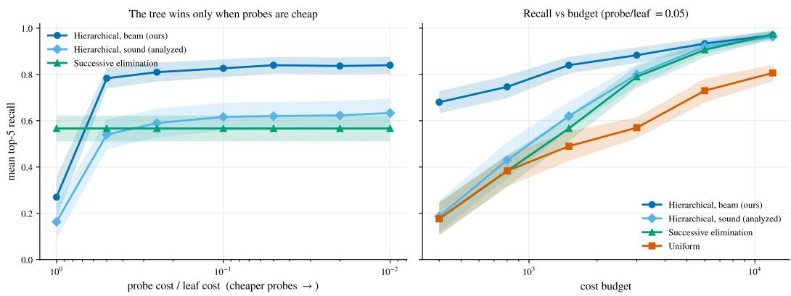

Figure 3: Multi-fidelity top-k on a 1024-leaf tree (60 seeds, 95% CI bands). Left: recall vs. probe/leaf cost ratio at a fixed budget. Right: recall vs. cost budget with cheap probes, for the beam and sound hierarchical variants against successive elimination.  
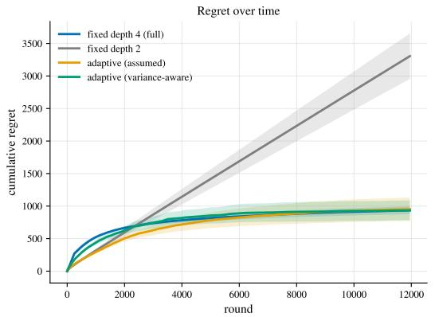

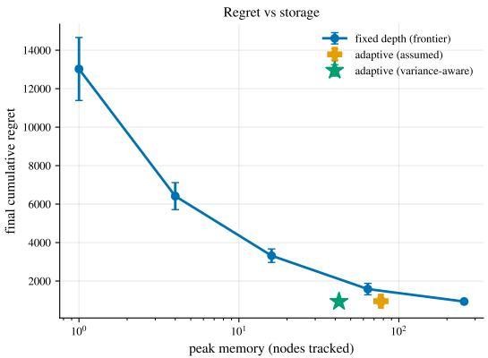  
Figure 4: Regret vs. storage, isolated on controlled instances (256 leaves, depth 4, horizon 12k, 16 seeds). The data-driven expand-vs-refine rule reaches near full-resolution regret at ≈6× less memory than the fixed-depth frontier.

Ablation: estimating the smoothness constant is what buys the win

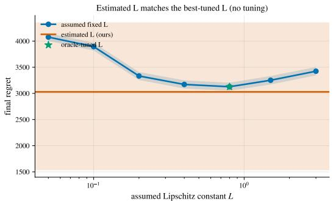

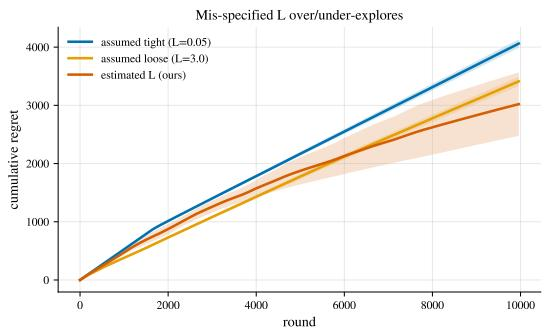

Figure 5: The Lipschitz-constant ablation on a heterogeneous-smoothness tree (10 seeds). The assumed-L tuning curve is U-shaped, while the estimated-L policy (ours) matches the oracle-tuned minimum with no tuning (3029 vs. 3127 final regret).  
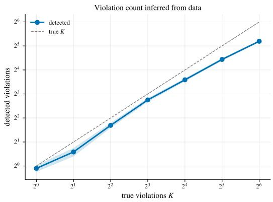

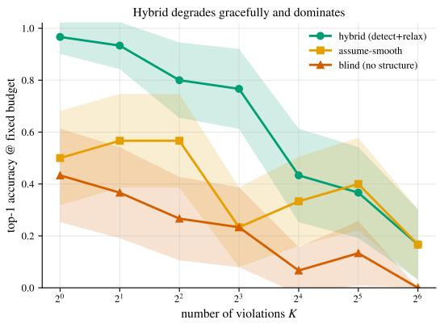

Figure 6: Value of structure vs. number of Lipschitz violations K (30 seeds, 95% CI bands). Left: the violation count is recovered from data. Right: top-1 accuracy at a fixed budget, where the detect and-relax hybrid degrades gracefully and dominates both baselines.
<table><tr><td>Policy</td><td>Final regret</td></tr><tr><td>Assumed L (too tight,  $L = 0 . 0 5 )$ </td><td>4076</td></tr><tr><td>Assumed L (too loose,  $L = 3 . 0 )$ </td><td>3424</td></tr><tr><td>Oracle-tuned fixed  $L = 0 . 8$ </td><td>3127</td></tr><tr><td>Estimated L (ours)</td><td>3029</td></tr></table>

Table 2: Lipschitz-constant ablation: final regret for mis-specified fixed L, the oracle-tuned fixed L, and the data-driven estimator (ours).

Theory link: sublinear regret, and a coarsely tree-structured routing value

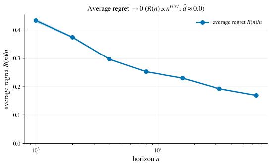

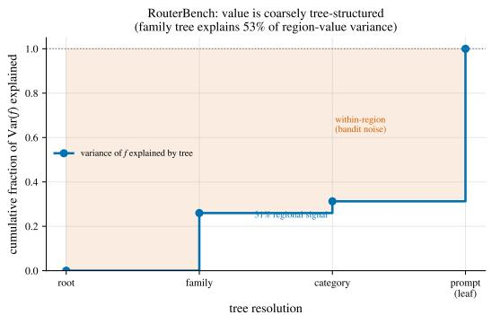  
Figure 7: Linking theory to data (8 seeds). Left: on a tree-Lipschitz value function the average regret $R ( n ) / n$ decays toward zero $( R ( n ) \propto n ^ { \alpha } , \alpha \approx 0 . 7 7 < 1 ; \hat { d } \approx 0 )$ . Right: variance decomposition of the real RouterBench routing value function. The region tree captures the coarse regional signal, and the within-region remainder is per-prompt noise the bandit averages over.

## E ADDITIONAL EXPERIMENTAL RESULTS

This appendix collects the per-benchmark tables, secondary figures, and negative results behind Section 4.

## E.1 ROUTING

Live models on MMLU. We route six Bedrock models spanning roughly a 100× cost gradient, with MMLU subjects as regions. The regional router reaches near-oracle quality at the lowest cost of any realizable policy, and only the truth-based per-prompt oracle is cheaper. It beats both the structure-blind flat learner and the strongest fixed model (Table 3).

Per-call routing inside long-horizon agents. On τ-bench the region is a small discrete difficultyand-phase feature of the turn, the arm is a model, and the quality signal is the episode’s terminal reward, credited to every region-model pull along the episode. A single trial’s bootstrap interval captures task-to-task spread but not seed variance, so we ran 5 independent replicates of the two learned routers over the same 80 tasks (Table 3). The regional learner beats the flat learner in 4 of 5 replicates, with mean success $0 . 4 6 3 \pm 0 . 1 5 6$ against $0 . { \overset { - } { 3 } } 2 3 \pm 0 . 2 1 3$ and gap $+ 0 . 1 4 \pm 0 . 2 7 .$ The variance is dominated by which models each learner converges to under terminal-reward credit as signment. In the one reversed replicate the flat learner drifted to expensive models and the regional learner did not. We therefore present τ-bench as directional evidence and let RouterBench and live MMLU carry the routing claim. For completeness, the strongest fixed policy, always claude-sonnet-4.5, attains higher raw success at 0.600 than either learned router, at roughly 1.6× the regional router’s realized cost per task (Table 3). The learned routers’ advantage on this benchmark is therefore cost-adjusted, not absolute. A per-turn value signal would be tighter and is future work.

## E.2 TOP-k IDENTIFICATION

Table 4 reports the full budget sweep behind the identification row of Table 1 and Figure 8. The pool is RouterEval’s 1000 models arranged as a branching-10, depth-3 tree, the metric is mean recall@10 over 20 seeds and 9 evaluation splits, and a probe costs 0.05 of a leaf evaluation. The charged prepass that measures the spread is included in our method’s cost. Two patterns in the sweep support the theory. First, successive elimination never separates from uniform sampling, staying within one standard error of it at every budget, so the win comes from the tree structure rather than from an elimination schedule. Second, the hierarchical gain is largest at low-to-mid budgets, 2.9× recall at $B { = } 6 0 0$ , and narrows to 1.3× at B=2400 as the structure-blind baselines begin to catch up.

## E.3 TEST-TIME SEARCH

This subsection collects the accuracy-vs-budget curves, per-benchmark tables, the capability ladder, and the tree-Lipschitz instrumentation behind the search and measured-prior experiments.

Pre-registered hard-tier run. A pre-registered follow-up tested whether the relative gain widens on the hardest tier. The protocol was committed to the repository before the run, and the setup covers all $4 2 \ ^ { 6 } { } ^ { 1 } \mathrm { - } 4$ hours” SWE-bench Verified issues with claude-sonnet-4.5 at matched budgets 6 and 9, with machinery identical to the main sweep. The directional hypothesis failed, and both arms fall to near floor. At B=6 each arm resolves 2/42, with $\Delta = 0 . 0 0 \dot { 0 } \ \dot { [ - 0 . 0 7 , + 0 . 0 7 ] }$ . At B=9 the arms resolve 2/42 and 3/42, with $\Delta = + 0 . 0 2 4 \left[ - 0 . 0 5 , + 0 . 1 0 \right]$ , and we do not report ratios, per the preregistered instability rule. This run measures the unreachable regime of the scope paragraph directly on code. When issues are beyond the model’s reach at the given budget, guidance has nothing to steer, exactly as the reachable-headroom condition predicts.

## E.4 PREFIX CACHING AND SYSTEMS

This subsection details the serving experiments. The prompt-stream and Mooncake trace tables come first, then the live-server vLLM measurements, which cover caching on and off, the KV-budget frontier, and the GPU-calibrated eviction-policy comparison.

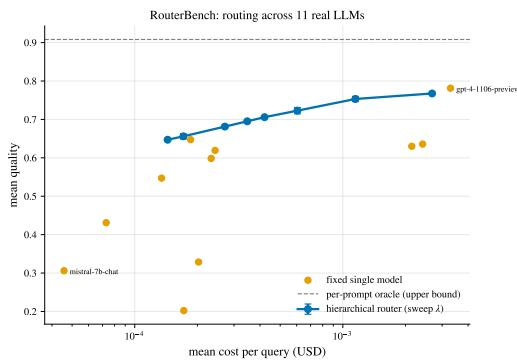

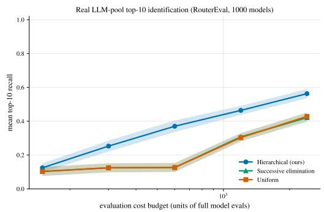

Figure 8: Structure against structure-blind baselines on real model pools. Left: RouterBench routing. Sweeping the cost weight λ traces a router frontier (blue) that dominates every fixed model (orange), and the dashed line is the per-prompt oracle. Right: top-10 recall vs. evaluation cost on RouterEval’s 1000-model pool (9 evals × 20 seeds, 95% CI bands), where the tree bandit dominates both structure-blind baselines at every budget.  
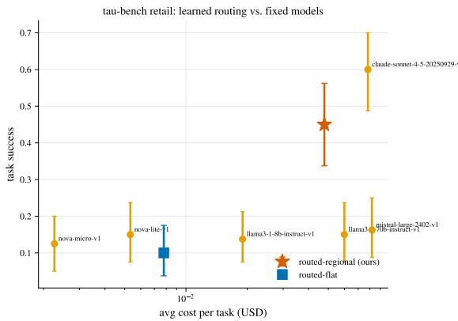

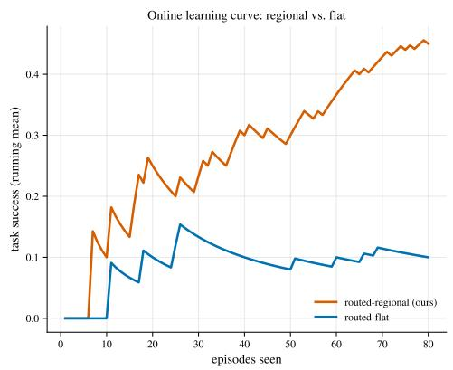  
Figure 9: Per-call routing inside long-horizon τ-bench agents. Left: retail cost/quality, where the learned regional router (red star) reaches the fixed-model cloud at low cost. Right: the online curve separates the regional from the flat learner.

## E.5 PROMPT TRIMMING

Trimming spans three regimes: little headroom on MMLU, a real quality/token tradeoff on Long-Bench, and strict dominance on BBH.

MMLU: LIVE BEDROCK ROUTING
<table><tr><td>Policy</td><td>Regret</td><td>Avg. quality</td><td>Rel. cost/query</td></tr><tr><td>Hierarchical (ours)</td><td> $4 7 2 \pm 3$ </td><td> $0 . 9 7 7 \pm 0 . 0 0 1$ </td><td> $0 . 2 5 4 \pm 0 . 0 0 2$ </td></tr><tr><td>Flat (structure-blind)</td><td> $8 7 8 \pm 8$ </td><td> $0 . 9 4 3 \pm 0 . 0 0 1$ </td><td> $0 . 3 6 3 \pm 0 . 0 0 6$ </td></tr><tr><td>Best single (oracle ref.)</td><td> $8 3 1 \pm 8$ </td><td> $0 . 9 3 6 \pm 0 . 0 0 1$ </td><td> $0 . 3 1 6 \pm 0 . 0 0 0$ </td></tr><tr><td>Highest-quality (oracle ref.)</td><td> $8 4 3 \pm 4$ </td><td> $0 . 9 6 9 \pm 0 . 0 0 1$ </td><td> $0 . 4 3 2 \pm 0 . 0 0 0$ </td></tr><tr><td>Per-prompt oracle</td><td> $0 \pm 0$ </td><td> $1 . 0 0 0 \pm 0 . 0 0 0$ </td><td> $0 . 0 6 7 \pm 0 . 0 0 1$ </td></tr></table>

τ-BENCH RETAIL: PER-CALL ROUTING IN LONG-HORIZON AGENTS Per-policy results (main run)
<table><tr><td>Policy</td><td>Task success [95% CI]</td><td>Avg. cost/task ($)</td></tr><tr><td>routed-flat</td><td>0.100 [0.04, 0.17]</td><td>0.00778</td></tr><tr><td>routed-regional (ours)</td><td>0.450 [0.34, 0.56]</td><td>0.04781</td></tr><tr><td>nova-micro-v1</td><td>0.125 [0.05, 0.20]</td><td>0.00226</td></tr><tr><td>nova-lite-v1</td><td>0.150 [0.07, 0.24]</td><td>0.00533</td></tr><tr><td>1lama3-1-8b-instruct-v1</td><td>0.138 [0.07, 0.21]</td><td>0.01897</td></tr><tr><td>1lama3-1-70b-instruct-v1</td><td>0.150 [0.07, 0.24]</td><td>0.05993</td></tr><tr><td>claude-sonnet-4-5-20250929-v1</td><td>0.600 [0.49, 0.70]</td><td>0.07820</td></tr><tr><td>mistral-large-2402-v1</td><td>0.163 [0.09, 0.25]</td><td>0.08188</td></tr></table>

Seed-variance study (5 independent replicates)
<table><tr><td rowspan="2">Replicate</td><td colspan="2">regional (ours)</td><td colspan="2">flat</td></tr><tr><td>success</td><td>$/task</td><td>success</td><td>$/task</td></tr><tr><td>1</td><td>0.450</td><td>0.0478</td><td>0.100</td><td>0.0078</td></tr><tr><td>2</td><td>0.537</td><td>0.0620</td><td>0.225</td><td>0.0141</td></tr><tr><td>3</td><td>0.225</td><td>0.0173</td><td>0.537</td><td>0.0672</td></tr><tr><td>4</td><td>0.450</td><td>0.0367</td><td>0.188</td><td>0.0168</td></tr><tr><td>5</td><td>0.650</td><td>0.0613</td><td>0.562</td><td>0.0703</td></tr><tr><td> ${ \mathrm { m e a n } } \pm { \mathrm { s . d . } }$ </td><td> $0 . 4 6 3 \pm 0 . 1 5 6$ </td><td colspan="3"> $0 . 3 2 3 \pm 0 . 2 1 3$ </td></tr></table>

Table 3: Routing detail. Top: routing over six real Bedrock models on MMLU, with 8 subjects as regions and a horizon of 6k. Only the hierarchical and flat policies learn online. The rest are computed from the ground truth and pay no exploration cost. Middle: τ-bench retail, the online contextual UCB router (regional) against the structure-blind flat learner and the fixed models. Bottom: the seed-variance study, 5 independent replicates of the two learned routers over the same 80 tasks, of which replicate 1 is the main run above.
<table><tr><td>Cost budget</td><td>150</td><td>300</td><td>600</td><td>1200</td><td>2400</td></tr><tr><td>Hierarchical (ours)</td><td> $\mathbf { 0 . 1 2 4 \pm 0 . 0 1 3 }$ </td><td> $\mathbf { 0 . 2 5 3 \pm 0 . 0 1 6 }$ </td><td> $\mathbf { 0 . 3 7 0 \pm 0 . 0 1 8 }$ </td><td> ${ \bf 0 . 4 6 4 \pm 0 . 0 1 4 }$ </td><td> $\mathbf { 0 . 5 6 3 \pm 0 . 0 1 4 }$ </td></tr><tr><td>Successive elimination</td><td> $0 . 1 0 3 \pm 0 . 0 1 4$ </td><td> $0 . 1 2 4 \pm 0 . 0 1 4$ </td><td> $0 . 1 2 6 \pm 0 . 0 1 3$ </td><td> $0 . 3 0 7 \pm 0 . 0 1 2$ </td><td> $0 . 4 2 1 \pm 0 . 0 1 4$ </td></tr><tr><td>Uniform</td><td> $0 . 1 0 3 \pm 0 . 0 1 4$ </td><td> $0 . 1 2 4 \pm 0 . 0 1 4$ </td><td> $0 . 1 2 6 \pm 0 . 0 1 3$ </td><td> $0 . 3 0 3 \pm 0 . 0 1 2$ </td><td> $0 . 4 2 8 \pm 0 . 0 1 3$ </td></tr></table>

Table 4: Top-10 identification on the RouterEval 1000-model pool: mean recall@10 (± SEM over 20 seeds and 9 evaluation splits) as the cost budget grows. The probe/leaf cost ratio is 0.05, and the hierarchical method’s cost includes the certificate pre-pass.
<table><tr><td>Budget (calls)</td><td>best-of-N resolved [95% CI]</td><td>value-guided resolved [95% CI] ∆ (paired) [95% CI]</td></tr><tr><td>9</td><td>0.195 [0.15, 0.25]</td><td>0.318 [0.26, 0.38]  $+ 0 . 1 2 3 \ [ + 0 . 0 8 , + 0 . 1 7 ]$ </td></tr></table>

Table 5: Repository-level code: value-guided patch search vs. best-of-N at matched compute on SWE-bench Verified (261 issues, “15 min–1 hour” tier, claude-sonnet-4.5). Resolved rate is the official criterion, and ∆ is the paired same-issue gap with a 95% bootstrap CI over issues.

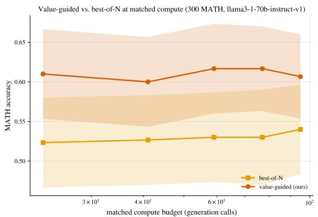

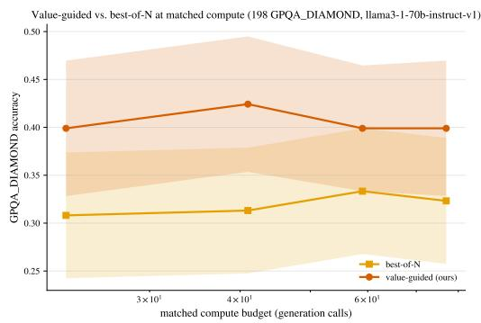  
Figure 10: Accuracy vs. matched compute budget (generation calls) for value-guided search vs. best-of-N, with bootstrap 95% CI bands (llama-3.1-70B). Left: MATH. Right: GPQA-Diamond.  
Prefix-cache management on real prompts (tatsu-lab/alpaca)

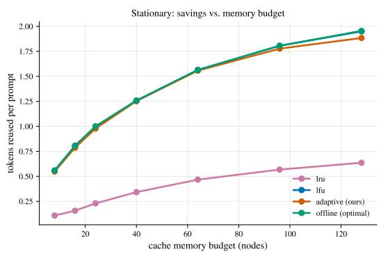

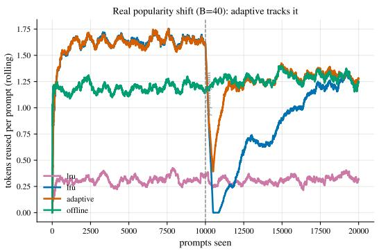  
Figure 11: Prefix caching on a real prompt stream. Left: savings vs. memory budget (stationary), where adaptive tracks LFU and the offline optimum. Right: savings over time across a real popularity shift, where adaptive re-adapts fastest, LFU recovers by the end of the stream (1.25 vs. adaptive’s 1.28 tokens/prompt at the final point), and LRU stays stale (0.32).

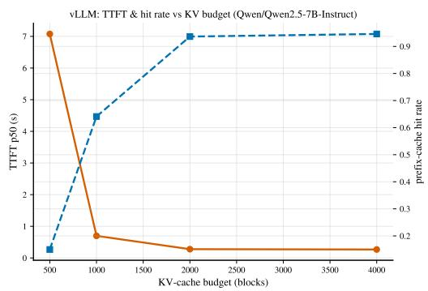

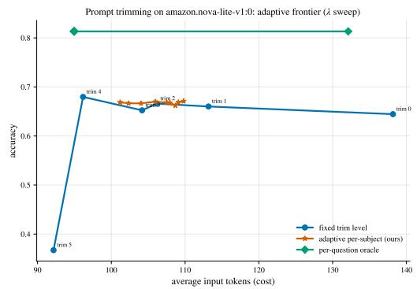  
Figure 12: Serving knobs on real systems. Left: the KV-cache budget frontier on live vLLM, where median TTFT (log scale) falls and prefix-cache hit rate rises as the KV budget grows, the hardware analog of savings vs. memory budget. Right: prompt trimming, accuracy vs. average input tokens. The fixed trim levels (blue) trace a tradeoff curve, sweeping λ gives the adaptive per-subject frontier (red), which dominates the naive always-verbose default but sits near the best fixed trim at this scale, and the per-question oracle (green) is an upper bound.

CAPABILITY LADDER  
MATH
<table><tr><td>Model</td><td>best-of-N [95% CI]</td><td>value-guided [95% CI]</td><td>∆ [95% CI]</td></tr><tr><td>mistral-large</td><td>0.084 [0.05, 0.12]</td><td>0.140 [0.10, 0.18]</td><td>+0.057 [+0.01, +0.10]</td></tr><tr><td>sonnet45</td><td>0.503 [0.45, 0.56]</td><td>0.837 [0.79, 0.88]</td><td>+0.333 [+0.28, +0.39]</td></tr><tr><td>1lama8b</td><td>0.537 [0.48, 0.59]</td><td>0.390 [0.34, 0.45]</td><td>-0.147 [-0.21, -0.09]</td></tr><tr><td>11ama3-1-70b</td><td>0.540 [0.48, 0.59]</td><td>0.607 [0.55, 0.66]</td><td>+0.067 [+0.02, +0.12]</td></tr><tr><td>nova-pro</td><td>0.623 [0.57, 0.68]</td><td>0.753 [0.70, 0.80]</td><td>+0.130 [+0.08, +0.18]</td></tr></table>

GPQA-Diamond
<table><tr><td>Model</td><td>best-of-N [95% CI]</td><td>value-guided [95% CI]</td><td>∆ [95% CI]</td></tr><tr><td>1lama8b</td><td>0.258 [0.20, 0.32]</td><td>0.263 [0.20, 0.32]</td><td>+0.005 [-0.07, +0.08]</td></tr><tr><td>sonnet45</td><td>0.313 [0.25, 0.38]</td><td>0.672 [0.61, 0.74]</td><td>+0.359 [+0.27, +0.44]</td></tr><tr><td>1lama3-1-70b</td><td>0.323 [0.26, 0.39]</td><td>0.399 [0.33, 0.46]</td><td>+0.076 [+0.00, +0.15]</td></tr><tr><td>nova-pro</td><td>0.354 [0.29, 0.42]</td><td>0.414 [0.35, 0.48]</td><td>+0.061 [-0.01, +0.13]</td></tr><tr><td>mistral-large</td><td>0.374 [0.31, 0.44]</td><td>0.333 [0.27, 0.40]</td><td>-0.040 [-0.11, +0.04]</td></tr></table>

GSM8K (near-saturated control)
<table><tr><td>Model</td><td>best-of-N [95% CI]</td><td>value-guided [95% CI]</td><td>∆ [95% CI]</td></tr><tr><td>1lama8b</td><td>0.925 [0.89, 0.96]</td><td>0.850 [0.80, 0.90]</td><td>-0.075 [-0.12, -0.03]</td></tr><tr><td>nova-pro</td><td>0.945 [0.91, 0.97]</td><td>0.970 [0.94, 0.99]</td><td>+0.025 [+0.01, +0.05]</td></tr><tr><td>mistral-large</td><td>0.955 [0.93, 0.98]</td><td>0.840 [0.79, 0.89]</td><td>-0.115 [-0.16, -0.07]</td></tr><tr><td>11ama3-1-70b</td><td>0.960 [0.93, 0.98]</td><td>0.960 [0.93, 0.98]</td><td>+0.000 [-0.03, +0.03]</td></tr><tr><td>sonnet45</td><td>0.985 [0.96, 1.00]</td><td>0.980 [0.96, 0.99]</td><td>-0.005 [-0.02, +0.00]</td></tr></table>

REPOSITORY-LEVEL CODE

SWE-bench Verified, model × budget sweep
<table><tr><td>Model</td><td>B = 6</td><td>B = 9</td><td>B = 12</td></tr><tr><td>claude-sonnet-4.5</td><td>+0.100 [+0.02, +0.19]</td><td>+0.125 [+0.04, +0.21]</td><td>+0.062 [-0.01, +0.14]</td></tr><tr><td>nova-pro</td><td>+0.100 [+0.03, +0.18]</td><td>+0.062 [-0.01, +0.15]</td><td>+0.025 [-0.04, +0.09]</td></tr><tr><td>1lama-3.1-70B</td><td>+0.050 [-0.01, +0.12]</td><td>+0.087 [+0.02, +0.16]</td><td>+0.025 [-0.04, +0.09]</td></tr><tr><td>mistral-large</td><td>+0.013 [-0.04, +0.06]</td><td>+0.013 [-0.04, +0.06]</td><td>-0.013 [-0.06, +0.04]</td></tr><tr><td>1lama-3.1-8B</td><td>-0.013 [-0.08, +0.05]</td><td>+0.050 [+0.00, +0.11]</td><td>+0.037 [-0.02, +0.10]</td></tr></table>

CODE SYNTHESIS (PRE-REGISTERED NULLS)

HumanEval
<table><tr><td>Budget (calls)</td><td>best-of-N acc [95% CI]</td><td>value-guided acc [95% CI]</td><td>∆ (paired) [95% CI]</td></tr><tr><td>23</td><td>0.811 [0.75, 0.87]</td><td>0.835 [0.77, 0.89]</td><td>+0.024 [-0.03, +0.08]</td></tr><tr><td>32</td><td>0.811 [0.75, 0.87]</td><td>0.835 [0.78, 0.89]</td><td>+0.024 [-0.03, +0.08]</td></tr><tr><td>41</td><td>0.811 [0.75, 0.87]</td><td>0.823 [0.76, 0.88]</td><td>+0.012 [-0.04, +0.07]</td></tr></table>

MBPP
<table><tr><td>Budget (calls)</td><td>best-of-N acc [95% CI]</td><td>value-guided acc [95% CI]</td><td>∆ (paired) [95% CI]</td></tr><tr><td>23</td><td>0.787 [0.72, 0.85]</td><td>0.744 [0.68, 0.81]</td><td>-0.043 [-0.09, +0.00]</td></tr><tr><td>32</td><td>0.787 [0.73, 0.85]</td><td>0.720 [0.65, 0.79]</td><td>-0.067 [-0.12, -0.02]</td></tr><tr><td>41</td><td>0.787 [0.73, 0.85]</td><td>0.713 [0.64, 0.78]</td><td>-0.073 [-0.12, -0.03]</td></tr></table>

Table 6: Test-time search, value-guided against best-of-N at matched compute, with 95% bootstrap confidence intervals, ∆ the paired same-item gap, and bold where the interval excludes zero. Capability ladder: five models on MATH and GPQA-Diamond, with GSM8K as the near-saturated control. The gain is largest for capable but unsaturated models and vanishes or reverses for the weakest, which is the unreachable regime. Mistral-Large’s low absolute MATH accuracy reflects answerformat non-compliance rather than reasoning ability. Repository-level code: the SWE-bench model × budget sweep over 78–80 Verified “15 min–1 hour” issues per cell, with instances whose evaluation harness errored dropped from both arms. Code synthesis: the HumanEval and MBPP nulls for Llama-3.1-70B. The public-test cheap probe is weak and both benchmarks are near-saturated, a limit fixed before the results were seen.

MATH
<table><tr><td>Quantity</td><td>Value</td></tr><tr><td>Cheap-vs-true node value (Spearman ρ)</td><td>0.485</td></tr><tr><td>Cheap-vs-true node value (Pearson r)</td><td>0.427</td></tr><tr><td>Edge-following hit rate, all steps (chance 0.33)</td><td>0.940</td></tr><tr><td>Edge-following hit rate, pivotal steps only</td><td>0.734 [0.64, 0.82] (n=109)</td></tr><tr><td>Mean true value lost per step (edge gap)</td><td>0.025</td></tr><tr><td>Pivotal-step fraction</td><td> $\tau { = } 0 . 2 5 \colon 1 1 \% ; \tau { = } 0 . 5 \colon 6 \% ; \tau { = } 0 . 7 5 \colon 4 \%$ </td></tr></table>

SWE-bench Verified
<table><tr><td>Quantity</td></tr><tr><td>Cheap-vs-true patch value (Spearman ρ) 0.863</td></tr><tr><td>Cheap-vs-true patch value (Pearson r) 0.875</td></tr><tr><td>Edge-following hit rate, all steps (chance 0.33) 1.000</td></tr><tr><td>Edge-following hit rate, pivotal steps only 1.000 [1.00, 1.00] (n=18)</td></tr><tr><td>Pivotal-step fraction τ=0.25: 10%; τ=0.5: 10%; τ=0.75: 10%</td></tr></table>

Table 7: The value function as almost tree-K-Lipschitz, measured in the wild: cheap-vs-true nodevalue correlation (the tree-Lipschitz backbone) and the count of pivotal steps K (violations). Top: MATH partial traces (cheap self-consistency probe). Bottom: the real-code analog on SWE-bench Verified (60 issues and 540 candidate patches, cheap FAIL TO PASS test probe vs. the official resolved criterion). The empirical counterpart of the synthetic violation-family task (Appendix D).

MOONCAKE PRODUCTION TRACE
<table><tr><td>Policy</td><td>Stationary (B=64)</td><td>After shift (B=16)</td></tr><tr><td>LRU</td><td>4.74</td><td>3.02</td></tr><tr><td>LFU</td><td>5.92</td><td>5.39</td></tr><tr><td>Adaptive (ours)</td><td>5.89</td><td>5.39</td></tr><tr><td>Offline-optimal (static)</td><td>5.92</td><td>5.39</td></tr></table>

LIVE VLLM: PREFIX CACHING ON VS. OFF
<table><tr><td>Metric</td><td>Caching ON</td><td>Caching OFF</td><td>Gain</td></tr><tr><td>TTFT p50 (s)</td><td>0.267</td><td>0.961</td><td>+72%</td></tr><tr><td>TTFT mean (s)</td><td>0.275</td><td>1.086</td><td>+75%</td></tr><tr><td>Latency mean (s)</td><td>2.984</td><td>11.293</td><td>+74%</td></tr><tr><td>Throughput (tok/s)</td><td>678.4</td><td>180.8</td><td>+275%</td></tr><tr><td>Prefix-cache hit rate</td><td>0.947</td><td>0.000</td><td></td></tr></table>

GPU-CALIBRATED EVICTION POLICIES
<table><tr><td>Policy</td><td>TTFT saved, stationary (ms)</td><td>TTFT saved, post-shift (ms)</td></tr><tr><td>LRU (engine default)</td><td>12.3</td><td>12.9</td></tr><tr><td>LFU</td><td>24.1</td><td>8.8</td></tr><tr><td>Adaptive (ours)</td><td>24.0</td><td>23.6</td></tr><tr><td>Offline-optimal</td><td>20.4</td><td>12.7</td></tr></table>

Table 8: Caching and systems detail. Mooncake: prefix-cache management on the real tool-agent production trace of 20k requests, measured in blocks reused per request. Adaptive matches the offline optimum and beats the engine-default LRU, most at tight budgets. Live vLLM: automatic prefix caching on against off, reporting TTFT, latency, throughput, and prefix-cache hit rate on a shared-prefix workload with the built-in LRU eviction. Eviction policies: realized TTFT saved in milliseconds on the GPU-calibrated shared-prefix workload, stationary and post-shift. Adaptive beats the engine-default LRU throughout and dominates after the shift.

LONGBENCH: CONTEXT TRIMMING  
Positional truncation
<table><tr><td>Policy</td><td>QA-F1</td><td>Avg. input tokens</td></tr><tr><td>Full context (keep 1.00)</td><td>0.440</td><td>7239</td></tr><tr><td>Best fixed trim</td><td>0.440</td><td>7239</td></tr><tr><td>Adaptive per-task (ours)</td><td>0.362</td><td>3544</td></tr><tr><td>Per-item oracle</td><td>0.542</td><td>2810</td></tr></table>

Retrieval-scored chunk selection (pre-registered follow-up)
<table><tr><td>Policy</td><td>QA-F1</td><td>Avg. input tokens</td></tr><tr><td>Full context (keep 1.00)</td><td>0.440</td><td>7239</td></tr><tr><td>Best fixed trim</td><td>0.440</td><td>7239</td></tr><tr><td>Adaptive per-task (ours)</td><td>0.407</td><td>2701</td></tr><tr><td>Per-item oracle</td><td>0.563</td><td>2239</td></tr></table>

BBH: FEW-SHOT TRIMMING
<table><tr><td>Policy</td><td>Accuracy</td><td>Avg. input tokens</td></tr><tr><td>Full 3-shot (verbose)</td><td>0.346</td><td>467</td></tr><tr><td>Best fixed trim</td><td>0.356</td><td>332</td></tr><tr><td>Adaptive per-task (ours)</td><td>0.368</td><td>291</td></tr><tr><td>Per-item oracle</td><td>0.566</td><td>208</td></tr></table>

Table 9: Prompt trimming on real benchmarks: adaptive per-task selection vs. fixed trims and the per-item oracle. LongBench (QA-F1 vs. input tokens): the top block trims by positional truncation. The middle block is the pre-registered follow-up with the identical setup but retrieval-scored chunk selection at the same word budgets. The better primitive lifts every fixed trim at matched tokens (+0.10 to +0.13 F1 at tight budgets) and moves the adaptive operating point to 0.407 F1 at 2,701 tokens. BBH exact-match vs. input tokens shows the adaptive per-task few-shot selection.

## F FUTURE WORK

The structure our method exploits is not specific to trees. Two ingredients drive everything in Section 3.4: a metric under which the objective is smooth, and an aggregation map whose value on a region is a (weighted) average of the points it contains. The tree supplies the LCA distance together with the subtree average, but the optimistic engine, the data-driven smoothness certificate, and the discontinuity-guided sampling all carry over to any index set equipped with these two ingredients.

General metric spaces. Replacing the LCA distance by an arbitrary metric and the dyadic tree by a hierarchical cover, as in zooming and X -armed bandits over metric spaces, preserves the nearoptimality-dimension analysis. The certificate of Section 3.3 bounds the within-cell maximumminus-mean from samples regardless of how the cells are formed, so it transfers unchanged.

Spheres and directional embeddings. The most relevant high-dimensional instance for the languagemodel applications is the unit sphere under the angular (cosine) metric, since prompt and model embeddings live there. Cells become spherical caps, the aggregation map averages over a cap, and tree-Lipschitzness becomes Lipschitzness in geodesic distance. This would replace the token-prefix tree of Section 3.1, which is sparse and brittle for routing, with an embedding-induced hierarchy on the sphere, and connects the bandit view developed here to angular reconstruction of a reward defined over the sphere.

DAGs and weighted aggregation. When a region’s value is any linear functional of its underlying points (a weighted subset average rather than a uniform one), the noise-deconvolved momentgenerating certificate is unchanged, so the framework extends from trees to directed acyclic and lattice-structured index sets.

Certified sparse attention for long-context RL. A further application targets a failure mode recently identified in reinforcement learning of long-context language models (Chen et al., 2026): applying static or heuristic sparse attention during on-policy rollouts injects an approximation error that biases the token likelihoods, and this error compounds over the autoregressive trajectory into an actor– policy distribution mismatch large enough to inflate the PPO/GRPO importance ratio and collapse training. The pathology is not sparsity per se but uncontrolled, inconsistent per-step error. Our framework suggests a route to controlling it: cast the choice of which KV-cache blocks to attend to at each step as a hierarchical bandit over the context tree (leaves are tokens, internal nodes are block summaries), whose arm value is a block’s contribution to the attention output and whose reward is the noisy downstream return. Because the value is now measured through a stochastic reward rather than computed exactly, the full optimistic apparatus of Section 3.2–3.4 applies, not merely the multi-fidelity certificate. Two smoothness axes structure the problem: the spatial tree-Lipschitzness over the context hierarchy studied here — with the K violations being exactly the isolated “needle” blocks that produce error spikes — and a temporal assumption that block relevance drifts smoothly across generation steps, which would bound how much re-exploration each step requires. The central open result is a bridge theorem: a certified per-step bound on the selection error (of the form $L \rho ^ { \ell } + K ^ { \mathbf { \bar { \rho } } } \cdot D$ supplied by Section 3.3) implies a bounded total-variation gap between the sparse and dense policies, hence a clip-safe importance ratio and provably stable training — a mathematically grounded alternative to the empirical distillation used to patch this instability today. We leave the temporal-smoothness lemma and the importance-ratio bound to future work.