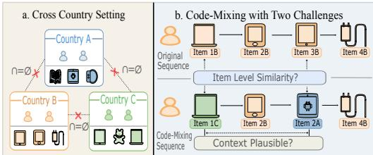
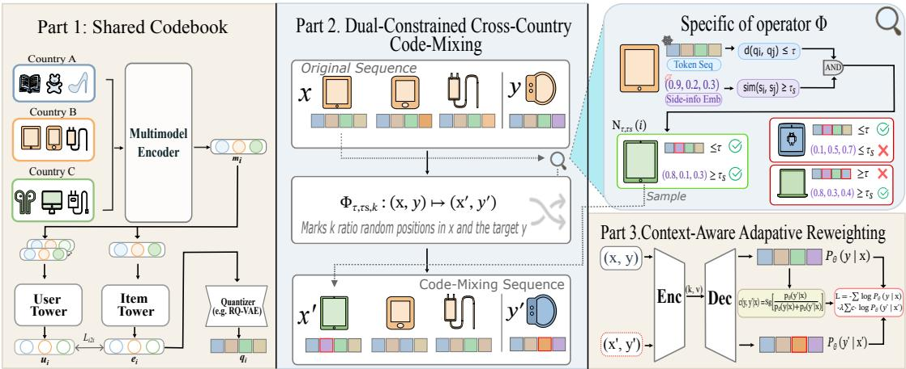
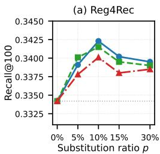
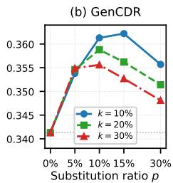

# Cross-Country Code-Mixing for Generative Recommendation

Yuan Gao∗   
jianbei.gy@alibaba-inc.com   
Alibaba International Digital   
Commerce Group   
Beijing, China   
Yi Xu   
xy397404@alibaba-inc.com   
Alibaba International Digital   
Commerce Group   
Beijing, China   
Hao Deng∗   
denghao.deng@alibaba-inc.com   
Alibaba International Digital   
Commerce Group   
Beijing, China   
Lingyu Mu   
moulingyu.mly@alibaba-inc.com   
Alibaba International Digital   
Commerce Group   
Beijing, China   
Yu Zhang   
daoji@alibaba-inc.com   
Alibaba International Digital   
Commerce Group   
Beijing, China   
Haibo Xing   
xinghaibo.xhb@alibaba-inc.com   
Alibaba International Digital   
Commerce Group   
Beijing, China   
Xiaoyi Zeng   
yuanhan@taobao.com   
Alibaba International Digital   
Commerce Group   
Hangzhou, China   
Jinxin Hu†   
jinxin.hjx@alibaba-inc.com   
Alibaba International Digital   
Commerce Group   
Beijing, China

## Abstract

Cross-country recommendation on modern e-commerce platforms is typically deployed with disjoint user and item ID spaces across markets, removing the shared anchors that conventional crossdomain methods rely on. Generative recommendation (GR) mitigates this by mapping items into a shared token space and training a unified model, but existing approaches keep behavior sequences strictly country-specific, so knowledge transfer occurs only at the parameter level and remains absent at the data level. Inspired by code-switching corpora in multilingual natural language processing, we propose CMRec, a cross-country GR framework that injects cross-country supervision at the data level via dual-constrained, context-aware code-mixing. CMRec first learns a shared semantic codebook from multi-modal content and behavioral co-occurrence across countries. It then uses this codebook to synthesize mixedcountry sequences via token-level substitutions that satisfy both static (content) and dynamic (e.g., price, audience, popularity) constraints. Finally, it introduces a context-aware loss that reweights mixed samples according to their plausibility in the current sequence. Experiments on two real-world multi-country datasets and an online A/B test show that CMRec substantially improves recommendation quality in data-sparse countries while preserving performance in data-rich countries, achieving +1.77% advertising revenue and +2.64% orders on a large-scale e-commerce platform.

CCS Concepts • Information systems → Recommender systems.

Keywords Generative Recommendation, Cross Country, Code Mixing

ACM Reference Format:   
Yuan Gao, Hao Deng, Haibo Xing, Yi Xu, Lingyu Mu, Jinxin Hu, Yu Zhang, and Xiaoyi Zeng. 2026. Cross-Country Code-Mixing for Generative Recommendation. In Proceedings ofthe 35th ACM International Conference on Information and Knowledge Management (CIKM ’26), November 07–11, 2026, Rome, Italy. ACM, New York, NY, USA, 6 pages. https://doi.org/10.1145/ 3799682.3839862

## 1 Introduction

Modern e-commerce platforms increasingly operate across many countries [18, 26, 28]. In practice, each country is deployed and logged as an independent system: user interactions are recorded only within a single country, and both user and item ID spaces are maintained separately [24]. Consequently, both IDs and behavior sequences are strictly partitioned by country, with no natural overlap across countries, as illustrated in Figure 1 (a).

This setup difers from the well-studied cross-domain recommendation (CDR) setting [9, 16, 30, 32, 33], where knowledge transfer typically relies on some form of overlap across domains, such as shared users, shared items, or manually anchored entities that carry collaborative signals. Recent CDR methods based on generative recommendation (GR), such as GenCDR [10] and GMC [13], relax this ID-level requirement by mapping items from diferent domains into a shared semantic token space and training a unified generative model. In this way, knowledge transfer occurs at the parameter level, mediated by the shared backbone and token space. However, GR learns primarily from item co-occurrence within training sequences [8, 12, 19]. In the cross-country setting, these sequences remain strictly partitioned by country, so items from one country never appear in another country’s context, leaving cross-country reinforcement absent at the data level. Consequently, rich interaction signals in large markets cannot benefit small ones, and the potential for cross-country knowledge sharing remains largely untapped.

  
Figure 1: (a) Cross-country setting. (b) Example and challenges of cross-country behavior-sequence code-mixing.

A natural reference comes from multilingual natural language processing (NLP), where models learn cross-lingual alignment from code-switched corpora, in which tokens from diferent languages appear in the same training sequence [2, 3, 17]. Motivated by this, we investigate whether an analogous construction is possible for cross-country GR, by building mixed-country sequences that interleave items from diferent markets, as illustrated in Figure 1 (b). However, no such corpus exists naturally; it must be synthesized by substitution. This raises a recommendation-specific question: what counts as a valid substitute? Existing substitution-based augmentation methods [5, 20, 25], mostly developed for CDR settings, match items by content (e.g., titles, descriptions, images) and replace them in user sequences. Such recipes can in principle be applied to cross-country GR, but they fall short along two complementary axes. (a) Substitution criteria are incomplete at the item level. Content similarity alone ignores two critical signals: behavioral (e.g., co-purchase and co-click patterns) and market (e.g., price, audience, popularity). Two items that look similar can play very diferent roles across markets [24], so a content-only criterion injects sub stantial noise. (b) Substitution granularity is too coarse at the context level. Even if a candidate is reasonable in isolation, it may still conflict with the user’s current intent. For example, in a sequence dominated by Apple devices, swapping an item with an Android pad that looks similar in content and basic attributes is syntactically plausible but contextually wrong, and this cannot be detected by any ofline item-pair filter.

To address these limitations, we propose CMRec, a cross-country GR framework that injects cross-country supervision at the data level via dual-constrained, context-aware code-mixing. CMRec first learns a shared semantic codebook from multi-modal content and behavioral co-occurrence across countries, which serves as both the GR tokenizer and a common semantic space for cross-country substitution. On top of this codebook, we perform token-level, dualconstrained code-mixing: substitutions are applied to semantic token sequences rather than country-specific item IDs, and candidates must satisfy both static (content) and dynamic (e.g., price, audience, popularity) constraints, enabling finer-grained, market-aware crosscountry mixing. Finally, we introduce a context-aware loss that lets the GR model reweight mixed samples according to their plausibility in the current context, downweighting noisy substitutions while preserving useful cross-country signals. We conduct experiments on two real-world multi-country datasets and an online A/B test, achieving improvements of +1.77% advertising revenue and +2.64% orders, demonstrating the practical efectiveness of CMRec in production.

## 2 Problem Formulation

We consider cross-country recommendation over a country set $C ,$ where each $c \in C$ is an independent domain with disjoint user and item sets $\mathcal { U } ^ { ( c ) }$ and $J ^ { ( c ) } ( \mathrm { i . e . , } { \mathcal { U } } ^ { ( c ) } \cap { \mathcal { U } } ^ { ( c ^ { \prime } ) } = J ^ { ( c ) } \cap J ^ { ( c ^ { \prime } ) } = \emptyset$ for $c \neq c ^ { \prime } )$ . For each user � $\mathbf { \Psi } _ { \pmb { \mathscr { t } } } \in \mathcal { U } ^ { ( c ) }$ , we denote the interaction sequence as $x _ { c } = \left( i _ { 1 } , \ldots , i _ { T } \right)$ with $i _ { t } \in \mathcal { I } ^ { ( c ) }$ , and the target item as $y _ { c } \in \mathcal { I } ^ { \left( c \right) }$ Following the GR paradigm [23, 26], we map each item to a discrete token sequence via a codebook and formulate recommendation as conditional sequence generation in this unified token space. Let $\mathcal { D } ^ { ( c ) } = \{ ( x _ { c } , y _ { c } ) \}$ collect the per-country training pairs from users $u \in \mathcal { U } ^ { ( c ) }$ . For joint multi-country training, we pool samples from all countries into a unified set $\begin{array} { r } { \mathcal { D } = \bigcup _ { c \in C } \bar { \mathcal { D } } ^ { ( c ) } = \big \{ ( x , y ) \big \} } \end{array}$ , on which the GR model is trained to maximize

$$
\mathcal { L } _ { \mathrm { G R } } ( \theta ) = \sum _ { ( x , y ) \in \mathcal { D } } \log P _ { \theta } ( y \mid x ) ,\tag{1}
$$

where � are the model parameters.

## 3 Method

We train a unified cross-country GR model that shares information across countries while respecting country-specific dynamics. To this end, CMRec comprises three components: (i) a shared semantic codebook that tokenizes items from all countries using behavior and content signals; (ii) a dual-constrained code-mixing mechanism that substitutes tokens across countries under static and dynamic constraints; and (iii) a context-aware loss reweighting scheme that downweights noisy mixed samples during training.

## 3.1 Behavior- and Content-Grounded Shared Codebook

To enable a unified cross-country GR backbone, we first construct a shared semantic codebook that is informed by both multi-modal content and behavioral signals. This codebook serves two roles at once: it tokenizes items for GR and provides a common semantic space for cross-country token substitution.

We first encode each item’s multimodal side information (e.g., title, image) into a content embedding m� using a pretrained model [1] shared across countries. This provides a unified semantic space where items from all countries are comparable at the content level. However, content alone does not capture how items actually behave in each country: items with similar visuals can have very diferent popularity or co-occurrence patterns, and these behavior signals are implicitly embedded in user interaction sequences. [22, 29]

To inject such behavioral information, we further train a single behavior-driven item-to-item (i2i) alignment model jointly across countries. On top of $\mathbf { m } _ { i }$ , we adopt a two-tower architecture with sampled softmax [7, 27]: the user tower maps a behavior sequence to a user embedding $\mathbf { u } _ { i } ,$ , and the item tower maps m� to an item embedding $\mathbf { e } _ { i } = T ( \mathbf { m } _ { i } )$ . The joint i2i training objective is

  
Figure 2: Overview of CMRec . Part 1 learns a shared semantic codebook from multimodal content and behavioral i2i co occurrence, producing token sequences $\mathbf { q } _ { i }$ that are used by the GR model. Part 2 uses the codebook plus side-info to select cross-country neighbors and grafts them into the user sequence, yielding a code-mixed twin $( \mathbf { x } ^ { \prime } , y ^ { \prime } )$ . Part 3 lets the GR model itself reweight each twin by its plausibility under the original context, downweighting noisy substitutions during training.

$$
\mathcal { L } _ { \mathrm { i 2 i } } = - \sum _ { i } \log \frac { \exp ( \mathbf { u } _ { i } ^ { \top } \mathbf { e } _ { i ^ { + } } ) } { \exp ( \mathbf { u } _ { i } ^ { \top } \mathbf { e } _ { i ^ { + } } ) + \sum _ { j \in N _ { i } } \exp ( \mathbf { u } _ { i } ^ { \top } \mathbf { e } _ { j } ) } ,\tag{2}
$$

where the negative pool ${ \cal N } _ { i }$ is shared across countries $\left[ 1 1 \right]$ , so $\mathbf { e } _ { i }$ aligns items that are both content-similar and behaviorally similar in user interaction patterns.

We then apply a residual quantizer (e.g., RQ-VAE [23]) to transform $\left\{ \mathbf { e } _ { i } \right\}$ into shared token sequences $\mathbf { q } _ { i } = ( q _ { i } ^ { ( 1 ) } , \dots , q _ { i } ^ { ( M ) } )$ . These tokens form a unified codebook that we use both as the GR tokenizer and as the substrate for cross-country code-mixing.

## 3.2 Dual-Constrained Cross-Country Code-Mixing

With the shared codebook in place, items from diferent countries can be matched in a common token space. We now introduce crosscountry code-mixing at the token level to expose GR to mixed sequences across countries.

A naive approach would substitute items based only on their codebook representations. However, the codebook is updated only infrequently and does not capture fast-changing attributes such as price discount, popularity, and audience tags, which are crucial for deciding whether two items are interchangeable in practice. To address this, we adopt a dual-constrained filter. Each item � is equipped with a side-information embedding s� over these dynamic attributes, with each element discretized by per-country quantile bucketization so that values from diferent countries are placed on a comparable scale, and we define the cross-country candidate set as

$$
\hat { N } _ { \tau , \tau _ { s } } ( i ) = \Bigl \{ j \in \bigcup _ { c ^ { \prime } \neq c } \tau ^ { ( c ^ { \prime } ) } \Big | d ( \mathbf { q } _ { i } , \mathbf { q } _ { j } ) \le \tau \wedge \sin ( \mathbf { s } _ { i } , \mathbf { s } _ { j } ) \ge \tau _ { s } \Bigr \} ,\tag{3}
$$

where � is the Hamming distance [4] between token sequences and sim is cosine similarity, enforcing static and dynamic consistency.

Given a training pair (x, �), the operator $\Phi _ { \tau , \tau _ { s } , k } : ( \mathbf { x } , y ) \mapsto $ $( \mathbf { x } ^ { \prime } , y ^ { \prime } )$ replaces the items at a rate-� fraction of slots in x and � with neighbors drawn from $\hat { N } _ { \tau , \tau _ { S } } ( \cdot )$ , leaving the rest intact while injecting cross-country co-occurrence at the token level. We then apply Φ to a rate-� subsample of D to form the twin set $\mathcal { D } ^ { \prime }$ , with $\boldsymbol { p }$ controlling the cross-country mixing strength.

## 3.3 Context-Aware Adaptive Reweighting

The filter $\hat { N } _ { \tau , \tau _ { s } }$ ensures item-level plausibility, but it is blind to the user context and to how the model’s predictions evolve during training. Some synthetic substitutions can still be incompatible with the surrounding sequence, especially in long and noisy histories. We therefore let the GR model itself assess each substituted item during training. For a substituted example $( \mathbf { x } ^ { \prime } , y ^ { \prime } )$ derived from an original pair (x, �), we define the context-conditional substitutability as

$$
w ( y , y ^ { \prime } \mid \mathbf { x } ) = \mathrm { s g } \left[ \frac { P _ { \theta } ( y ^ { \prime } \mid \mathbf { x } ) } { P _ { \theta } ( y \mid \mathbf { x } ) + P _ { \theta } ( y ^ { \prime } \mid \mathbf { x } ) } \right] \in [ 0 , 1 ] ,\tag{4}
$$

where $P _ { \theta } ( \cdot \textbf { | { x } } )$ is the autoregressive item likelihood under the original context and sg[·] denotes stop-gradient, so � afects the loss but does not receive gradients. We deliberately evaluate $y ^ { \prime }$ under the original context x rather than the mixed $\mathbf { x } ^ { \prime } ,$ since $P _ { \theta }$ is better calibrated on the observed x; this prevents � from being dominated by the model’s unstable response to out-of-distribution synthetic substitutions early in training.

We then combine original and substituted supervision in the training objective:

$$
\mathcal { L } ( \theta ) = - \sum _ { ( \mathbf { x } , y ) \in \mathcal { D } } \log P _ { \theta } ( y \mid \mathbf { x } ) - \lambda \sum _ { ( \mathbf { x } ^ { \prime } , y ^ { \prime } ) \in \mathcal { D } ^ { \prime } } w ( y , y ^ { \prime } \mid \mathbf { x } ) \log P _ { \theta } ( y ^ { \prime } \mid \mathbf { x } ^ { \prime } ) ,\tag{5}
$$

where � controls the overall contribution of substituted examples. Because � is derived from the model’s own predictions, it acts as a context-aware weight: early in training most substitutions receive similar weights, while later the model downweights contextually invalid substitutes that the item-level filter cannot distinguish.

Table 1: Performance comparison on the industrial and Amazon M2 datasets. Each metric reports the 6-country/locale average (Avg6) plus three representative ones, with superscripts �/�/� marking large/medium/small volume (Amazon M2 has no � tier). Best results are in bold and second-best are underlined. “Improv.” shows the relative improvement (%) over the best baseline.
<table><tr><td>Method</td><td colspan="4">Recall@10</td><td colspan="4">Recall@100</td><td colspan="4">NDCG@10</td><td colspan="4">NDCG@100</td></tr><tr><td></td><td colspan="10"></td><td colspan="7"></td></tr><tr><td></td><td>Avg6</td><td> $\mathrm { A } ^ { L }$ </td><td> $\mathbf { B } ^ { M }$ </td><td> $C ^ { S }$ </td><td>Avg6</td><td> $\mathrm { A } ^ { L }$ </td><td> $\mathbf { B } ^ { M }$ </td><td> $C ^ { S }$ </td><td>Avg6</td><td> $\mathrm { A } ^ { L }$ </td><td> $\mathtt { B } ^ { M }$ </td><td> $C ^ { S }$ </td><td>Avg6</td><td> $\mathrm { A } ^ { L }$ </td><td> $\mathtt { B } ^ { M }$ </td><td> $C ^ { S }$ </td></tr><tr><td>SASRec</td><td>0.1882</td><td>0.1993</td><td>0.1867</td><td>0.1705</td><td>0.2648</td><td>0.2807</td><td>0.2632</td><td>0.2404</td><td>0.0941</td><td>0.0995</td><td>0.0933</td><td>0.0853</td><td>0.1458</td><td>0.1546</td><td>0.1448</td><td>0.1322</td></tr><tr><td>HSTU</td><td>0.2117</td><td>0.2244</td><td>0.2098</td><td>0.1929</td><td>0.2983</td><td>0.3158</td><td>0.2957</td><td>0.2725</td><td>0.1058</td><td>0.1122</td><td>0.1049</td><td>0.0964</td><td>0.1642</td><td>0.1738</td><td>0.1629</td><td>0.1498</td></tr><tr><td>TIGER</td><td>0.2261</td><td>0.2396</td><td>0.2243</td><td>0.2062</td><td>0.3187</td><td>0.3377</td><td>0.3163</td><td>0.2909</td><td>0.1131</td><td>0.1198</td><td>0.1122</td><td>0.1031</td><td>0.1753</td><td>0.1858</td><td>0.1739</td><td>0.1600</td></tr><tr><td>REG4Rec</td><td>0.2372</td><td>0.2517</td><td>0.2354</td><td>0.2163</td><td>0.3342</td><td>0.3537</td><td>0.3318</td><td>0.3057</td><td>0.1187</td><td>0.1258</td><td>0.1177</td><td>0.1082</td><td>0.1838</td><td>0.1949</td><td>0.1824</td><td>0.1681</td></tr><tr><td>GenCDR</td><td>0.2423</td><td>0.2493</td><td>0.2407</td><td>0.2247</td><td>0.3413</td><td>0.3562</td><td>0.3393</td><td>0.3168</td><td>0.1212</td><td>0.1246</td><td>0.1204</td><td>0.1123</td><td>0.1877</td><td>0.1961</td><td>0.1866</td><td>0.1743</td></tr><tr><td>GenCDR+Cont</td><td>0.2404</td><td>0.2456</td><td>0.2371</td><td>0.2311</td><td>0.3432</td><td>0.3496</td><td>0.3359</td><td>0.3248</td><td>0.1202</td><td>0.1227</td><td>0.1186</td><td>0.1156</td><td>0.1891</td><td>0.1928</td><td>0.1847</td><td>0.1793</td></tr><tr><td>GenCDR+CF</td><td>0.2384</td><td>0.2528</td><td>0.2378</td><td>0.2256</td><td>0.3412</td><td>0.3575</td><td>0.3387</td><td>0.3179</td><td>0.1182</td><td>0.1264</td><td>0.1192</td><td>0.1109</td><td>0.1871</td><td>0.1969</td><td>0.1853</td><td>0.1768</td></tr><tr><td>CMRec</td><td>0.2496</td><td>0.2567</td><td>0.2494</td><td>0.2434</td><td>0.3613</td><td>0.3672</td><td>0.3567</td><td>0.3474</td><td>0.1236</td><td>0.1278</td><td>0.1239</td><td>0.1198</td><td>0.1972</td><td>0.2018</td><td>0.1957</td><td>0.1919</td></tr><tr><td>Improv.</td><td>+3.01%</td><td>+1.54%</td><td>+3.61%</td><td>+5.32%</td><td>+5.27%</td><td>+2.71%</td><td>+5.13%</td><td>+6.96%</td><td>+1.98%</td><td>+1.11%</td><td>+2.91%</td><td>+3.63% |</td><td>+4.28%</td><td>+2.49%</td><td>+4.88%</td><td>+7.03%</td></tr><tr><td colspan="10"></td><td colspan="7"></td></tr><tr><td>Avg6</td><td> $\mathrm { U K } ^ { L }$ </td><td></td><td> $\mathrm { F R } ^ { S }$ </td><td> $\operatorname { E S } ^ { S }$ </td><td> $\operatorname { A v g } 6$ </td><td> $\mathrm { U K } ^ { L }$ </td><td> $\mathrm { F R } ^ { S }$ </td><td> $\boldsymbol { \mathrm { E S } } ^ { S }$ </td><td>Avg6</td><td> $\mathrm { U K } ^ { L }$ </td><td> $\mathrm { F R } ^ { S }$ </td><td> $\mathtt { E S } ^ { S }$ </td><td>Avg6</td><td> $\mathrm { U K } ^ { L }$ </td><td> $\mathrm { F R } ^ { S }$ </td><td> $\operatorname { E S } ^ { S }$ </td></tr><tr><td>SASRec</td><td>0.2774</td><td>0.2293</td><td>0.3028</td><td>0.3095</td><td>0.4823</td><td>0.3986</td><td>0.5274</td><td>0.5389</td><td>0.1388</td><td>0.1147</td><td>0.1516</td><td>0.1548</td><td>0.2653</td><td>0.2192</td><td>0.2898</td><td>0.2963</td></tr><tr><td>HSTU</td><td>0.3212</td><td>0.2654</td><td>0.3506</td><td>0.3584</td><td>0.5584</td><td>0.4618</td><td>0.6099</td><td>0.6236</td><td>0.1606</td><td>0.1327</td><td>0.1753</td><td>0.1792</td><td>0.3070</td><td>0.2539</td><td>0.3354</td><td>0.3428</td></tr><tr><td>TIGER</td><td>0.3406</td><td>0.2816</td><td>0.3719</td><td>0.3803</td><td>0.5926</td><td>0.4898</td><td>0.6471</td><td>0.6616</td><td>0.1703</td><td>0.1408</td><td>0.1861</td><td>0.1902</td><td>0.3258</td><td>0.2694</td><td>0.3559</td><td>0.3638</td></tr><tr><td>REG4Rec</td><td>0.3523</td><td>0.2916</td><td>0.3846</td><td>0.3931</td><td>0.6124</td><td>0.5066</td><td>0.6688</td><td>0.6843</td><td>0.1762</td><td>0.1458</td><td>0.1921</td><td>0.1964</td><td>0.3369</td><td>0.2786</td><td>0.3679</td><td>0.3764</td></tr><tr><td>GenCDR</td><td>0.3603</td><td>0.2894</td><td>0.3928</td><td>0.4009</td><td>0.6266</td><td>0.5186</td><td>0.6839</td><td>0.6994</td><td>0.1798</td><td>0.1447</td><td>0.1963</td><td>0.2004</td><td>0.3446</td><td>0.2852</td><td>0.3761</td><td>0.3848</td></tr><tr><td>GenCDR+Cont</td><td>0.3579</td><td>0.2862</td><td>0.3907</td><td>0.3991</td><td>0.6291</td><td>0.5149</td><td>0.6893</td><td>0.7063</td><td>0.1784</td><td>0.1432</td><td>0.1951</td><td>0.1997</td><td>0.3463</td><td>0.2831</td><td>0.3793</td><td>0.3884</td></tr><tr><td>GenCDR+CF</td><td>0.3559</td><td>0.2922</td><td>0.3884</td><td>0.3961</td><td>0.6271</td><td>0.5198</td><td>0.6862</td><td>0.7035</td><td>0.1764</td><td>0.1465</td><td>0.1942</td><td>0.1985</td><td>0.3443</td><td>0.2860</td><td>0.3781</td><td>0.3865</td></tr><tr><td>CMRec</td><td>0.3748</td><td>0.2997</td><td>0.4137</td><td>0.4203</td><td>0.6671</td><td>0.5379</td><td>0.7432</td><td>0.7588</td><td>0.1847</td><td>0.1484</td><td>0.2033</td><td>0.2068</td><td>0.3637</td><td>0.2953</td><td>0.4058</td><td>0.4136</td></tr><tr><td>Improv.</td><td>+4.02%</td><td>+2.57%</td><td>+5.32%</td><td>+4.84%</td><td>+6.04%</td><td>+3.48%</td><td>+7.82%</td><td>+7.43%</td><td>+2.73%</td><td>+1.30%</td><td>+3.57%</td><td>+3.19%</td><td>+5.03%</td><td>+3.25%</td><td>+6.99%</td><td>+6.49%</td></tr></table>

Datasets & Evaluation Metrics. We evaluate CMRec on two multi-country datasets with highly imbalanced data distributions. The first is an in-house industrial advertising dataset from an e-commerce platform. It contains over 1 billion interactions from 19 million users across 25 million advertisements across 6 countries (A–F). The largest country contributes about 10× more training interactions than the smallest, and user and item IDs are completely disjoint across countries. The second is Amazon M2 [14], the public KDD Cup 2023 multilingual session benchmark covering 6 locales (high-resource: UK/DE/JP; low-resource: IT/FR/ES). The high-resource locales account for roughly 91% of all training sessions, yielding a pronounced long-tail distribution. For ofline evaluation, we report Recall@10/100 and NDCG@10/100 [7, 23] for each representative country/locale, and also report averages over all countries/locales.

Baselines & implementation. We compare with five representative methods plus two augmented variants: SASRec [15], GenCDR [10], REG4Rec [26], HSTU [31], and TIGER [23]. To study single-signal data augmentation, we follow SRA-CL [5] and build a contentaugmented variant on top of GenCDR, denoted GenCDR+Cont. We also follow CoSeRec [21] and TiCoSeRec [6] to build a collaborationaugmented variant based on user-behavior signals, denoted GenCDR+CF. Both augmented variants use the same substitution ratio and sampling budget as CMRec for a controlled comparison. All baselines follow their original designs and are trained on the same dataset partition. For CMRec, we first encode each item’s content into a 64-dimensional vector using Qwen-VL-32B [1]. We then tokenize this vector with an RQ-VAE [23] into a token sequence of length � = 4. We adopt GenCDR as the backbone. We set $p = 0 . 1$ and

## 4 Experiments

## 4.1 Experimental Settings

$k = 0 . 1$ to balance performance and computational cost. We further set � = 0.5 and use relatively strict filtering thresholds, � = 1 and $\tau _ { s } = 0 . 8 .$

## 4.2 Experimental Results

Overall performance. Table 1 summarizes the main results, from which we draw three observations. (1) CMRec achieves the best Recall@10/100 and NDCG@10/100 on both datasets on all six countries, outperforming all baselines. (2) Token-based GR models (REG4Rec, GenCDR) outperform ID-based models (SASRec, HSTU), showing that tokenization and cross-country parameter sharing provide a stronger backbone, especially for small countries. (3) Single-signal augmentations based only on content or collaboration improve some countries but degrade others, while CMRec combines dual-constrained code-mixing with context-aware reweighting and delivers more consistent gains across all countries.

Ablation study. We conduct an ablation study on three components of CMRec in Table 2: the token-level distance constraint, the side-information similarity constraint, and the context-aware reweighting. The token-level distance constraint contributes the largest improvement, indicating that codebook proximity is crucial for transferring cross-country behavioral structure. The sideinformation similarity constraint further refines substitutions by enforcing multi-modal coherence. Removing adaptive reweighting leads to clear degradation, showing that it efectively filters samples whose mixed tokens are incompatible with the original context.

Table 2: Ablation on the Industrial dataset (6-country avg.). Numbers in parentheses are relative gaps vs. Full.
<table><tr><td>Variant</td><td>Recall@100</td><td>NDCG@100</td></tr><tr><td>CMRec (Full)</td><td>0.3613</td><td>0.1972</td></tr><tr><td>w/o Token-level distance constraint</td><td>0.3447 (-4.59%)</td><td>0.1894(-3.96%)</td></tr><tr><td>w/o Side-info Similarity constraint</td><td>0.3573(-1.11%)</td><td>0.1947 (-1.27%)</td></tr><tr><td>w/o Context-aware Adaptive Reweighting</td><td>0.3531 (-2.27%)</td><td>0.1928 (-2.23%)</td></tr></table>

  
Figure 3: Sensitivity to � and � on Industrial (Recall@100, Avg6). Dashed line = baseline.

Hyperparameter sensitivity and robustness. To validate sensitivity and robustness of our method, we sweep (�, �) for our dual-constrained code-mixing on two backbones (Figure 3). On both backbones, all (�, �) combinations consistently outperform the un-augmented baseline, and the default $\scriptstyle \left( { p = 1 0 \% , k = 1 0 \% } \right)$ achieves near-optimal Recall@100 in both cases, confirming that the augmentation is robust to both hyperparameter and backbone choice. Online Experiments. We conducted an online A/B test on the industrial platform (10% live trafic) from May 10 to 20, 2026, covering all six countries. CMRec achieved a consistent increase of 1.77% in advertising revenue and 2.64% in orders on the sixcountry aggregate, demonstrating significant gains in real-world deployment.

## 5 Conclusion

We presented CMRec, a cross-country generative recommendation (GR) framework that injects cross-country supervision at the data level through dual-constrained code-mixing. CMRec learns a shared semantic codebook from multi-modal content and behavioral co-occurrence across countries. It then performs token-level code-mixing under content-based and market-aware constraints to synthesize reliable mixed-country sequences without requiring item or user overlap. A context-aware loss reweights mixed samples by their contextual plausibility. This suppresses noisy substitutions while preserving useful cross-country signals. Extensive experiments on ofline datasets and an online multi-country e-commerce platform show that CMRec achieves superior performance, efectively transfers knowledge from large to small countries, and ofers practical insights for cross-country generative recommendation.

## 6 GenAI Usage Disclosure

Generative AI was used in the preparation of this paper to assist with language polishing, grammar checking, and improving the clarity of the presentation. All technical ideas, including the de sign of the method, the implementation of experiments, and the interpretation of results, are solely contributed by the authors.

## References

[1] Shuai Bai, Keqin Chen, Xuejing Liu, Jialin Wang, Wenbin Ge, Sibo Song, Kai Dang, Peng Wang, Shijie Wang, Jun Tang, Humen Zhong, Yuanzhi Zhu, Mingkun

Yang, Zhaohai Li, Jianqiang Wan, Pengfei Wang, Wei Ding, Zheren Fu, Yiheng Xu, Jiabo Ye, Xi Zhang, Tianbao Xie, Zesen Cheng, Hang Zhang, Zhibo Yang, Haiyang Xu, Junyang Lin, et al. 2025. Qwen2.5-VL Technical Report. arXiv preprint arXiv:2502.13923 (2025).

[2] Terra Blevins and Luke Zettlemoyer. 2022. Language Contamination Helps Explains the Cross-lingual Capabilities of English Pretrained Models. In Proceedings of the 2022 Conference on Empirical Methods in Natural Language Processing (EMNLP). Association for Computational Linguistics, Abu Dhabi, United Arab Emirates, 3563–3574. doi:10.18653/v1/2022.emnlp-main.233

[3] Eleftheria Briakou, Colin Cherry, and George Foster. 2023. Searching for Needles in a Haystack: On the Role of Incidental Bilingualism in PaLM’s Translation Capability. In Proceedings ofthe 61st Annual Meeting ofthe Association for Computational Linguistics (ACL), Volume 1: Long Papers. Association for Computational Linguistics, Toronto, Canada, 9432–9452. doi:10.18653/v1/2023.acl-long.524

[4] Timothy M Chan, Shay Golan, Tomasz Kociumaka, Tsvi Kopelowitz, and Ely Porat. 2020. Approximating text-to-pattern Hamming distances. In Proceedings ofthe 52nd Annual ACM SIGACT Symposium on Theory ofComputing. 643–656.

[5] Ziqiang Cui, Yunpeng Wu, Lin Bai, Yueqi Wang, Xin Zhao, Xinyu Lin, Wenjie Wang, Fuli Feng, and Tat-Seng Chua. 2025. Semantic Retrieval Augmented Contrastive Learning for Sequential Recommendation. In Advances in Neural Information Processing Systems.

[6] Yizhou Dang, Enneng Yang, Guibing Guo, Linying Jiang, Xingwei Wang, Xiaoxiao Xu, Qinghui Sun, and Hong Liu. 2023. Uniform Sequence Better: Time Interval Aware Data Augmentation for Sequential Recommendation. In Proceedings ofthe AAAI Conference on Artificial Intelligence.

[7] Hao Deng, Haibo Xing, Kanefumi Matsuyama, Moyu Zhang, Jinxin Hu, Hong Wen, Yu Zhang, Xiaoyi Zeng, and Jing Zhang. 2025. CSMF: Cascaded Selective Mask Fine-Tuning for Multi-Objective Embedding-Based Retrieval. In Proceedings ofthe 48th International ACM SIGIR Conference on Research and Development in Information Retrieval. 2122–2131.

[8] Yupeng Hou, An Zhang, Leheng Sheng, Zhengyi Yang, Xiang Wang, Tat-Seng Chua, and Julian McAuley. 2025. Generative Recommendation Models: Progress and Directions. In Companion Proceedings ofthe ACM on Web Conference 2025. 13–16.

[9] Peiyu Hu, Wayne Lu, and Jia Wang. 2026. From IDs to Semantics: A Generative Framework for Cross-Domain Recommendation with Adaptive Semantic Tok enization. In Proceedings ofthe AAAI Conference on Artificial Intelligence (AAAI). AAAI Press, Philadelphia, PA, USA.

[10] Peiyu Hu, Wayne Lu, and Jia Wang. 2026. From ids to semantics: A generative framework for cross-domain recommendation with adaptive semantic tokenization. In Proceedings of the AAAI Conference on Artificial Intelligence, Vol. 40. 14874–14882.

[11] Jui-Ting Huang, Ashish Sharma, Shuying Sun, Li Xia, David Zhang, Philip Pronin, Janani Padmanabhan, Giuseppe Ottaviano, and Linjun Yang. 2020. Embedding based retrieval in facebook search. In Proceedings of the 26th ACM SIGKDD International Conference on Knowledge Discovery & Data Mining. 2553–2561.

[12] Yulei Huang, Hao Deng, Haibo Xing, Jinxin Hu, Chuanfei Xu, Zulong Chen, Yu Zhang, and Xiaoyi Zeng. 2026. RCLRec: Reverse Curriculum Learning for Modeling Sparse Conversions in Generative Recommendation. arXiv preprint arXiv:2603.28124 (2026).

[13] Jinqiu Jin, Yang Zhang, Fuli Feng, and Xiangnan He. 2025. Generative Multi-Target Cross-Domain Recommendation. arXiv preprint arXiv:2507.12871 (2025).

[14] Wei Jin, Haitao Mao, Zheng Li, Haoming Jiang, Chen Luo, Hongzhi Wen, Haoyu Han, Hanqing Lu, Zhengyang Wang, Ruirui Li, et al. 2023. Multilingual ecommerce session recommendation: The Amazon M2 dataset and a baseline approach. In Proceedings ofthe ACM Web Conference 2023.

[15] Wang-Cheng Kang and Julian McAuley. 2018. Self-attentive sequential recommendation. In 2018 IEEE international conference on data mining (ICDM). IEEE, 197–206.

[16] Hanyu Li, Jiayu Li, Weizhi Ma, Peijie Sun, Haiyang Wu, Jingwen Wang, Yuekui Yang, Min Zhang, and Shaoping Ma. 2025. CD-CDR: Conditional difusion-based item generation for cross-domain recommendation. In Proceedings ofthe 48th International ACM SIGIR Conference on Research and Development in Information Retrieval. 1789–1798.

[17] Jiahuan Li, Shujian Huang, Aarron Ching, Xinyu Dai, and Jiajun Chen. 2024. PreAlign: Boosting Cross-Lingual Transfer by Early Establishment ofMultilingual Alignment. In Proceedings of the 2024 Conference on Empirical Methods in Natural Language Processing (EMNLP). Association for Computational Linguistics, 10246– 10257.

[18] Mang Li and Wei Lyu. 2025. Adaptive Regularization for Large-Scale Sparse Feature Embedding Models. arXiv preprint arXiv:2511.06374 (2025).

[19] Xiaopeng Li, Bo Chen, Junda She, Shiteng Cao, You Wang, Qinlin Jia, Haiying He, Zheli Zhou, Zhao Liu, Ji Liu, et al. 2025. A survey of generative recommendation from a tri-decoupled perspective: Tokenization, architecture, and optimization. (2025).

[20] Qidong Liu, Xiangyu Zhao, Yejing Wang, Zijian Zhang, Howard Zhong, Chong Chen, Xiang Li, Wei Huang, and Feng Tian. 2025. Bridge the domains: Large

language models enhanced cross-domain sequential recommendation. In Proceedings of the 48th International ACM SIGIR Conference on Research and Development in Information Retrieval. 1582–1592.

[21] Zhiwei Liu, Yongjun Chen, Jia Li, Philip S Yu, Julian McAuley, and Caiming Xiong. 2021. Contrastive Self-supervised Sequential Recommendation with Robust Augmentation. arXiv preprint arXiv:2108.06479 (2021).

[22] Julian McAuley, Christopher Targett, Qinfeng Shi, and Anton van den Hengel. 2015. Image-based Recommendations on Styles and Substitutes. In Proceedings ofthe 38th International ACM SIGIR Conference on Research and Development in Information Retrieval (SIGIR). 43–52.

[23] Shashank Rajput, Nikhil Mehta, Anima Singh, Raghunandan Hulikal Keshavan, Trung Vu, Lukasz Heldt, Lichan Hong, Yi Tay, Vinh Tran, Jonah Samost, et al. 2023. Recommender systems with generative retrieval. Advances in Neural Information Processing Systems 36 (2023), 10299–10315.

[24] Christopher Starke, Ljubiša Metikoš, Natali Helberger, and Claes de Vreese. 2025. Contesting personalized recommender systems: a cross-country analysis of user preferences. Information, Communication & Society 28, 1 (2025), 41–60.

[25] Jinpeng Wang, Ziyun Zeng, Yunxiao Wang, Yuting Wang, Xingyu Lu, Tianxiang Li, Jun Yuan, Rui Zhang, Hai-Tao Zheng, and Shu-Tao Xia. 2023. MISSRec: Pretraining and Transferring Multi-modal Interest-aware Sequence Representation for Recommendation. In Proceedings ofthe 31st ACM International Conference on Multimedia. 6548–6557.

[26] Haibo Xing, Hao Deng, Yucheng Mao, Jinxin Hu, Yi Xu, Hao Zhang, Jiahao Wang, Shizhun Wang, Yu Zhang, Xiaoyi Zeng, et al. 2025. Reg4rec: Reasoningenhanced generative model for large-scale recommendation systems. arXiv preprint arXiv:2508.15308 (2025).

[27] Zhenhui Xu, Meng Zhao, Liqun Liu, Lei Xiao, Xiaopeng Zhang, and Bifeng Zhang. 2022. Mixture of virtual-kernel experts for multi-objective user profile modeling.

In Proceedings of the 28th ACM SIGKDD Conference on Knowledge Discovery and Data Mining. 4257–4267.

[28] Wenhao Yang, Yingchun Jian, Yibo Wang, Shiyin Lu, Lei Shen, Bing Wang, Haihong Tang, and Lijun Zhang. 2024. Not all embeddings are created equal: Towards robust cross-domain recommendation via contrastive learning. In Proceedings of the ACM Web Conference 2024. 3195–3206.

[29] Zheng Yuan, Fajie Yuan, Yu Song, Youhua Li, Junchen Fu, Fei Yang, Yunzhu Pan, and Yongxin Ni. 2023. Where to Go Next for Recommender Systems? ID vs. Modality-based Recommender Models Revisited. In Proceedings ofthe 46th International ACM SIGIR Conference on Research and Development in Information Retrieval (SIGIR).

[30] Tianzi Zang, Yanmin Zhu, Haobing Liu, Ruohan Zhang, and Jiadi Yu. 2022. A Survey on Cross-domain Recommendation: Taxonomies, Methods, and Future Directions. ACM Transactions on Information Systems (TOIS) 41, 2 (2022), 1–39.

[31] Jiaqi Zhai, Lucy Liao, Xing Liu, Yueming Wang, Rui Li, Xuan Cao, Leon Gao, Zhaojie Gong, Fangda Gu, Michael He, et al. 2024. Actions speak louder than words: Trillion-parameter sequential transducers for generative recommendations. arXiv preprint arXiv:2402.17152 (2024).

[32] Hao Zhang, Mingyue Cheng, Qi Liu, Junzhe Jiang, Xianquan Wang, Rujiao Zhang, Chenyi Lei, and Enhong Chen. 2025. A comprehensive survey on crossdomain recommendation: Taxonomy, progress, and prospects. arXiv preprint arXiv:2503.14110 (2025).

[33] Wei Zhang, Pengye Zhang, Bo Zhang, Xingxing Wang, and Dong Wang. 2023. A collaborative transfer learning framework for cross-domain recommendation. In Proceedings ofthe 29th ACM SIGKDD Conference on Knowledge Discovery and Data Mining. 5576–5585.