# DIRECT MESSAGE APPROXIMATION (DMA): A CONSISTENCY-BASED FRAMEWORK FOR TRACTABLE APPROXIMATE INFERENCE ON FACTOR GRAPHS

Ralf Herbrich∗, Rainer Schlosser∗, Jan Lemcke, Johann Ukrow, Anna Kazachkova, Nicolas Alder, Leonhard Hennicke, Theo Bardey, Nico Grimm, Luca Kleinschmidt, Philipp Kolbe, Cezary Kujath, Johanna Schlimme, Karl Matti Schutz¨

Hasso Plattner Institute

University of Potsdam

{ralf.herbrich,rainer.schlosser,jan.lemcke,johann.ukrow, anna.kazachkova,nicolas.alder,leonhard.hennicke,theo.bardey, nico.grimm,luca.kleinschmidt,philipp.kolbe,cezary.kujath, johanna.schlimme,karlmatti.schuetz}@hpi.de

## ABSTRACT

Approximate message passing on factor graphs underlies two dominant families of probabilistic inference algorithms: expectation propagation (EP) and variational message passing (VMP). Both methods approximate the marginal at each factor edge, forcing an iterative round-robin schedule, risking negative-precision messages, and, for VMP, collapsing to point estimates at Dirac-delta factors. We introduce Direct Message Approximation (DMA), which approximates factor-tovariable messages directly rather than the marginal. For normalisable factors, we define a consistency condition (requiring exactness when all other incoming messages are Dirac deltas) to guide message construction. We prove a master theorem (proper messages, any graph) bounding marginal KL from message KL, with three structural corollaries: Dirac-input consistency, no EP-style inner-loop iteration, and no negative-precision messages. Further, we prove a complementary $O ( 1 / r ^ { 2 } )$ guarantee for the inherently improper backward message of the product factor, whose closed-form treatment has resisted prior work. As a concrete instantiation, we derive explicit DMA messages for the product and leaky-ReLU factors and assemble a Bayesian neural network (BNN) inference algorithm with one forward/backward sweep per training example and no gradient learning-rate hyperparameter, validating that the structural guarantees translate to predictive uncertainty that widens in data-sparse regions, including under model mismatch.

## 1 INTRODUCTION

Factor graphs provide a unifying language for probabilistic inference: a joint density factorises into local potentials, and the sum-product algorithm computes exact marginals on trees by passing messages along edges (Kschischang et al., 2001). When factors are non-conjugate to the message family (as in neural network likelihoods, latent Dirichlet models, and models with nonlinear potentials), the factor-to-variable integral is intractable, and approximate message passing is required.

Two classical strategies dominate. Expectation propagation (EP; Minka, 2001) minimises the forward KL divergence from the true posterior marginal to a tractable exponential-family approximation, then recovers the approximate factor-to-variable message by dividing out the variable-to-factor message at the same edge. Variational message passing (VMP; Winn & Bishop, 2005) instead maximises the evidence lower bound under a factorised approximation, minimising the reverse KL. Despite their theoretical differences, both methods share a structural commitment: they approximate the marginal $\hat { p } _ { X _ { j } }$ at each factor edge, and recover the outgoing factor-to-variable message by

$$
\hat { m } _ { f  X _ { j } } ( \cdot ) ~ = ~ \hat { p } _ { X _ { j } } ( \cdot ) ~ / ~ m _ { X _ { j }  f } ( \cdot ) .\tag{1}
$$

Three pathologies of marginal-based approximation. This marginal-first design induces three operational problems, each well-known in the EP and VMP literature.

1. Iterative schedule. Because $\hat { m } _ { f  X _ { i } }$ depends on the current incoming message $m _ { X _ { j }  f }$ via the division in (1), updating one outgoing message changes the variable-to-factor message at the same edge, invalidating the outgoing messages of all neighbouring factors. The only remedy is a round-robin sweep that iterates until a fixed point is reached, typically requiring many passes over the entire factor graph (Minka, 2001).

2. Invalid messages in Gaussian EP. When the projected Gaussian marginal $\hat { p } _ { X _ { j } }$ is wider than the incoming message m $X _ { j } \to f \}$ , the division in (1) produces a Gaussian with negative precision. Such messages are invalid probability distributions; they arise routinely when a factor disperses mass (e.g. a product of two uncertain variables) and can destabilise subsequent updates by propagating indefinitely.

3. Dirac-delta collapse in VMP. For a factor $f ( \mathbf { x } ) = \delta ( x _ { j } - g ( \mathbf { x } _ { - j } ) )$ encoding a deterministic relation, the VMP update (1) collapses $\hat { p } _ { X _ { j } }$ to a Dirac delta, setting $\hat { m } _ { f  X _ { \vec { \imath } } }$ to a point mass and eliminating all posterior variance. Since every parameterised layer in a feedforward neural network is such a Dirac-delta factor, VMP cannot maintain a non-trivial weight posterior in Bayesian neural networks (Winn & Bishop, 2005).

Our proposal. We argue that the root cause of all three pathologies is the division in (1): it creates an incoming-message dependence that forces iteration and can produce invalid outputs. DMA eliminates cavity division from the construction of approximate factor-to-variable messages by approximating the message $\hat { m } _ { f  X _ { j } }$ directly rather than the marginal.

The natural design criterion for a message approximation is a consistency condition: it should agree with the exact sum-product message whenever all other inputs to the factor are point masses. In that limit the factor-to-variable integral reduces to a deterministic function evaluation and is always tractable, so the exact message is known and we can demand recovery. We formalise this as Definition 2.1 and call the resulting approximation a direct message approximation (DMA). Because no per-factor message computation requires the ratio (1), the iterative schedule is unnecessary, negativeprecision messages cannot arise from message construction itself, and Dirac-delta factors satisfy the consistency condition exactly in the concentrated-input limit. (Training does use a division when replacing old factor messages across epochs, see Algorithm 1, but this outer-loop replacement is distinct from the per-factor computation and does not create the feedback loop or negative-precision pathologies of (1).)

The key distinction from assumed-density filtering (ADF; Lauritzen, 1992; Opper & Winther, 1999), which also skips cavity division, is that DMA adds a formal consistency axiom that defines the admissible direct-approximation principle, here instantiated through moment-matching projection onto the Gaussian family (Section 2.2), an edge-local master theorem bounding marginal KL from message KL without any graph contraction condition (Section 2), and an $\mathrm { O } ( \bar { 1 } / r ^ { 2 } )$ guarantee for the improper product-backward message that falls outside the classical moment-matching scope (Section 3); see Section 5 for a detailed comparison with EP and ADF.

## Contributions.

1. DMA framework and master theorem (Section 2). We define a consistency condition as the design criterion for direct message approximation, give a construction recipe via moment matching, and prove a master theorem (Theorem 2.3) bounding the marginal KL at any edge by $O ( \delta )$ in the message KL δ, edge-locally and without any graph contraction condition. The closest prior result (Ihler et al., 2005) bounds perturbations in loopy BP via graph-level contraction rates; our bound applies to EP-style projected messages and holds on any graph.

2. Product-factor DMA construction (Section 3). We derive DMA messages for the product factor $\delta ( z - x y )$ , the central and technically most demanding case: it is the main factor required for BNN weight updates, where the backward distribution of $X ~ = ~ Z / Y$ has no closed-form Gaussian representation and where the standard EP backward message is structurally improper. We use a log-normal intermediate technique to characterise the ratio distribution. Moreover, we prove an $O ( 1 / r ^ { 2 } )$ accuracy bound in the concentrated-input regime (Theorem 3.3), an analysis outside the scope of the master theorem. The complementary activation factor $\delta ( \dot { y } - \mathrm { R e L U } _ { \alpha } ( x ) )$ is handled by truncated-Gaussian moment matching; both factors verify the consistency condition analytically.

3. Instantiation and validation (Section 4). The two factors are sufficient to assemble a complete BNN inference algorithm. Three corollaries of Theorem 2.3 give: no EPstyle inner-loop iteration (Corollary 2.5), no negative-precision messages by construction (Corollary 2.6), and Dirac-input consistency on all linear factors (Corollary 2.4). Experiments confirm convergence, positive weight variances, and structurally widening extrapolation uncertainty; a 23× larger network (Appendix G) confirms the procedure remains computationally viable without algorithmic changes.

Sections 2–5 cover the DMA framework, factor derivations, the BNN algorithm, and related work; background, all proofs and experimental details are in the Appendix $\mathbf { A } - \bar { \mathbf { G } }$

## 2 DIRECT MESSAGE APPROXIMATION

Notation. We follow the factor-graph and message-passing conventions of Appendix $\operatorname { A } ;$ readers unfamiliar with the sum-product algorithm may consult it for background. We write $m _ { f  X _ { j } }$ for the factor-to-variable message on edge $( f , X _ { j } )$ and $m _ { X _ { j }  f }$ for the variable-to-factor message. The marginal at $X _ { j }$ is $\begin{array} { r } { p _ { X _ { j } } = \prod _ { i \in \mathrm { n e } ( X _ { i } ) } m _ { f _ { i } \to X _ { j } } } \end{array}$ , and Q denotes a fixed exponential family (Gaussian throughout this paper). $\mathrm { K L } [ \cdot \Vert \cdot ]$ is the forward KL divergence.

DMA approximates the outgoing message directly, without forming the marginal at all; this avoids the division in (1) and all three pathologies it creates. This section formalises the approach, proves a master theorem bounding the resulting marginal error, and derives three structural corollaries for BNN inference.

## 2.1 DEFINITION AND CONSISTENCY CONDITION

The exact factor-to-variable message (16) is, in general, intractable. There is, however, one regime in which it is always tractable: when all other incoming messages are Dirac deltas $\delta ( \cdot - x _ { k } )$ . Then the multi-dimensional integral collapses to a single factor evaluation,

$$
m _ { f _ { i } \to X _ { j } } ( x _ { j } ) = \int f _ { i } ( x _ { j } , { \bf x } _ { - j } ) \prod _ { k \not = j } \delta ( x _ { k } - { \bar { x } } _ { k } ) \ \mathrm { d } { \bf x } _ { - j } = f _ { i } ( x _ { j } , { \bar { \bf x } } _ { - j } ) ,\tag{2}
$$

which is just the factor evaluated at the fixed point values $\bar { \bf x } _ { - j }$ . The resulting message is an unnormalised one-dimensional density in $x _ { j } ;$ for Gaussian $\mathcal { Q }$ and the common case where $f _ { i } ( \cdot , \bar { \bf x } _ { - j } )$ is a Gaussian likelihood or a pushforward of a Gaussian through a smooth map, the projection onto $\mathcal { Q }$ is tractable in closed form.

The consistency condition asks that a message approximation converge to the exact message as inputs concentrate toward this tractable limit.

Definition 2.1 (Direct Message Approximation). Let $f _ { i }$ be a factor in a factor graph with neighbours $\mathrm { n e } ( f _ { i } )$ , let $X _ { j } \in \mathrm { n e } ( f _ { i } )$ , and suppose $f _ { i } ( \cdot , \bar { \bf x } _ { - j } )$ is normalisable for every $\bar { \bf x } _ { - j } .$ . A family of distributions $\hat { m } _ { f _ { i } \to X _ { j } } ,$ parametrised by the incoming messages $\{ m _ { X _ { k } \to f _ { i } } \} _ { k \neq j } ,$ from an exponential family $\mathcal { Q }$ is a direct message approximation (DMA) if it satisfies the concentration consistency condition: for every $\bar { \mathbf { x } } _ { - j } \in \mathbb { R } ^ { | \mathrm { n e } ( f _ { i } ) | - 1 }$ $i f m _ { X _ { k }  f _ { i } } = \mathcal N ( \bar { x } _ { k } , \sigma _ { k } ^ { 2 } )$ for all $k \neq j ;$ , then as $\sigma _ { k } \to 0$

$$
\hat { m } _ { f _ { i }  X _ { j } } \xrightarrow [ ] w \int f _ { i } ( x _ { j } , \bar { \mathbf { x } } _ { - j } ) \mathrm { d } x _ { j } ,\tag{3}
$$

where $\xrightarrow { w }$ denotes weak convergence of probability measures and the right-hand side is the normalised exact message (2) evaluated at the concentrated inputs.

Remark 2.2. The normalisability condition in Definition 2.1 holds for all factor-edge pairs in this paper except one: the product factor backward message is improper for general Gaussian inputs (Remark B.2). This case is handled by a separate log-normal intermediate construction whose approximation quality is characterised by Theorem $3 . { \bar { 3 } } \cdot$ the KL to a truncated proper reference is $\bar { O } ( 1 / r ^ { 2 } )$ in the input signal-to-noise ratio $^ { r , }$ recovering concentration consistency in the limit $r  \infty .$

The consistency condition is a necessary but not sufficient design criterion: the moment-matching construction (Section 2.2) selects a specific DMA satisfying it, and Theorem 2.3 bounds the marginal error at any input width—consistency, construction, and master theorem together constitute the local theoretical guarantees for individual DMA message computations.

## 2.2 CONSTRUCTION RECIPE

For the class of factors that arises in Bayesian neural networks — Dirac-delta factors of the form $f ( \mathbf { x } ) = \delta ( x _ { j } - g ( \mathbf { x } _ { - j } ) )$ encoding a continuous deterministic function $g -$ there is a systematic recipe for constructing a Gaussian DMA.

Recipe. Let the incoming messages $\{ m _ { X _ { k } \to f } \} _ { k \neq j }$ be Gaussians $\mathcal { N } ( \bar { x } _ { k } , \sigma _ { k } ^ { 2 } )$

1. Compute moments. Treat the inputs $\{ X _ { k } \} _ { k \neq j }$ as independent Gaussian random variables with the given means and variances, and compute the first two moments of $x _ { j } = g ( { \bf x } _ { - j } )$ under this joint:

$$
\mu _ { x _ { j } } : = \mathbb { E } [ g ( \mathbf { X } _ { - j } ) ] , \qquad \sigma _ { x _ { j } } ^ { 2 } : = \mathrm { V a r } [ g ( \mathbf { X } _ { - j } ) ] .
$$

2. Project. Set $\hat { m } _ { f  X _ { j } } : = \mathcal N ( \mu _ { x _ { j } } , \sigma _ { x _ { i } } ^ { 2 } )$ via Theorem A.1 (moment matching minimises the forward KL to the Gaussian family).

Consistency verification. In the Dirac limit $\sigma _ { k }  0$ for all $k \neq j$ , the inputs concentrate on their means $\bar { x } _ { k }$ , so $\mu _ { x _ { j } }  g ( \bar { \bf x } _ { - j } )$ and $\sigma _ { x _ { i } } ^ { 2 } \to 0$ . The approximate message converges to $\delta ( \cdot - g ( \bar { \bf x } _ { - j } ) )$ , which equals the exact message (2) (a point mass at the function value). The KL divergence between two identical distributions is zero, so the consistency condition (3) holds.

## 2.3 MASTER THEOREM AND CONSEQUENCES

The master theorem bounds the error in the marginal $p _ { X _ { j } }$ that results from using a DMA in place of the exact message. The bound is edge-local: it depends only on the quality δ of the single outgoing message, and on the sup-norm of the incoming message at the same edge.

Theorem 2.3 (DMA Master Theorem). Let f be afactor with target variable $X _ { j }$ . Let m $f  X _ { j }$ be the true normalised sum-product message and $\hat { m } _ { f  X _ { j } }$ a DMA; write $\delta : = \mathrm { K L } \big [ m _ { f  X _ { j } } \big | \big | \hat { m } _ { f  X _ { j } } \big ] <$ ∞. Let $m _ { X _ { j }  f }$ be a normalised incoming message at the same edge, define $p _ { X _ { j } } ~ : = ~ m _ { f  X _ { j } }$ $m _ { X _ { j }  f }$ and $\hat { p } _ { X _ { j } } : = \hat { m } _ { f  X _ { j } } \cdot m _ { X _ { j }  f } ,$ , with normalising constants $Z$ and $\hat { Z }$ respectively. Then

$$
\mathrm { K L } \Big [ \frac { p _ { X _ { j } } } { Z } \lVert \frac { \hat { p } _ { X _ { j } } } { \hat { Z } } \Big ] \ \leq \ \frac { \lVert m _ { X _ { j }  f } \rVert _ { \infty } } { Z } \delta .\tag{4}
$$

Proof. The full proof is in Appendix B.2.

Interpretation. The bound is linear in δ; for $\delta \ : < \ : 1$ (the approximation regime) this is strictly tighter than a square-root dependence. The bound is edge-local and requires no global contraction condition, contrasting with Ihler et al. (2005) whose analogous result for loopy BP uses graph-level contraction rates. Across 192 leaky-ReLU factor configurations spanning a range of slopes, input widths, and SNR values (Appendix C.1), the bound holds in every case with a maximum normalised ratio of 0.97, directly certifying the theorem.

The corollaries below extract the structural consequences of the master theorem for BNN inference.

Corollary 2.4 (Asymptotic Dirac-Input Consistency). Let $f ( { \bf x } ) = \delta ( x _ { j } - g ( { \bf x } _ { - j } ) )$ , suppose the DMA is constructed by the recipe of Section 2.2, and assume g is twice continuously differentiable in a neighbourhood of $\dot { \bf x } _ { - j }$ with $\nabla g ( \bar { \bf x } _ { - j } ) \neq { \bf 0 }$ , and regular in the tails. Then, with each incoming message $m _ { X _ { k } \to f } = \mathcal N ( \bar { x } _ { k } , \sigma _ { k } ^ { 2 } )$ ),

$$
\operatorname * { l i m } _ { \sigma _ { k } \to 0 } \delta \ = \ \operatorname * { l i m } _ { \sigma _ { k } \to 0 } \mathrm { K L } \big [ m _ { f \to X _ { j } } \big \| \hat { m } _ { f \to X _ { j } } \big ] \ = \ 0 .
$$

The result extends to piecewise- $C ^ { 2 }$ factors (e.g. leaky-ReLU) by treating isolated non-smooth points separately; the upper bound in (4) therefore vanishes in this limit.

Corollary 2.5 (No EP Inner-Loop Iteration). Because $\hat { m } _ { f  X _ { j } }$ does not depend on $m _ { X _ { j }  f } ~ ( c f .$ Definition 2.1), all factor-to-variable messages for a single training example can be computed in oneforward sweepfollowed by one backward sweep, with no EP-style inner-loop fixed-point iteration between individual message computations. This is distinct from the outer training loop, which repeats sweeps over examples and epochs until the weight beliefs converge.

Corollary 2.6 (No Negative-Precision Messages). Because DMA produces a valid member ofQ by construction (via Theorem $A . I )$ , no approximate message can have negative precision. The pathology arises in $E P$ when the projected marginal is wider than the incoming message; DMA never forms this ratio.

Proofs of all three corollaries are in Appendix B.3. Section 3 derives explicit DMA messages for the product and ReLU factors, the two non-conjugate building blocks needed for BNNs. Section 4 then assembles these into a complete inference algorithm with one forward/backward factor sweep per training example and no EP-style inner-loop iteration.

## 3 DMA FOR NON-GAUSSIAN FACTORS

Two non-conjugate factors appear in every feedforward BNN and cannot be handled by the exact sum-product algorithm: the product $f a c t o r \delta ( z - x y )$ (elementwise weight-activation products) and the ReLU factor $\delta ( y _ { \mathrm { ~ - ~ } } \mathrm { R e L U } _ { \alpha } ( x ) )$ (activation nonlinearity). The Gaussian prior $\mathcal { N } ( \dot { w } ; 0 , \sigma _ { 0 } ^ { 2 } )$ and likelihood $\mathcal { N } ( y ; z , \overbar { { \beta } } ^ { 2 } )$ are conjugate to the message family, so their messages are exact and $\bar { \delta } = 0$ at both edges (Winn & Bishop, 2005). We apply the construction recipe of Section 2.2 to the two non-conjugate factors, yielding closed-form Gaussian DMA messages. The product factor has exact closed-form forward moments (via independence of X and $Y )$ , so the only approximation is the Gaussian projection; its backward message is inherently improper. The ReLU factor has a proper backward message for all $\alpha > 0$ , with an explicit normalisation correction that depends on α.

## 3.1 THE PRODUCT FACTOR

Factor definition. The product factor encodes the deterministic relation $z = x y \colon$

$$
f ( x , y , z ) = \delta ( z - x y ) .\tag{5}
$$

For Gaussian inputs $X \sim \mathcal N ( \mu _ { x } , \sigma _ { x } ^ { 2 } )$ and $Y \sim \mathcal N ( \mu _ { y } , \sigma _ { u } ^ { 2 } )$ , the product $Z = X Y$ is not Gaussian, so the exact forward message to $Z$ is not in Q. We apply the recipe: compute the exact moments of $Z$ under the independent Gaussian inputs, then project onto $\mathcal { N }$

Forward message. The moments of $Z = X Y$ under independent Gaussians follow directly from the law of total variance: $\mathbb { E } [ X Y ] = \mu _ { x } \mu _ { y }$ and $\mathrm { V a r } [ X Y ] = \dot { \sigma } _ { x } ^ { 2 } \sigma _ { y } ^ { 2 } + \mu _ { x } ^ { 2 } \sigma _ { y } ^ { 2 } + \mu _ { y } ^ { 2 } \sigma _ { x } ^ { 2 }$

Proposition 3.1 (Product Factor Forward Message). For the factor $\delta ( z - x y )$ with independent inputs $X \sim \mathcal { N } ( \mu _ { x } , \sigma _ { x } ^ { 2 } )$ and $Y \sim \mathcal N ( \mu _ { y } , \sigma _ { y } ^ { 2 } )$ , the DMA message to Z is $\mathcal { N } \big ( z ; m _ { z } , s _ { z } ^ { 2 } \big )$ with

$$
m _ { z } = \mu _ { x } \mu _ { y } , \qquad s _ { z } ^ { 2 } = \sigma _ { x } ^ { 2 } \sigma _ { y } ^ { 2 } + \mu _ { x } ^ { 2 } \sigma _ { y } ^ { 2 } + \mu _ { y } ^ { 2 } \sigma _ { x } ^ { 2 } .\tag{6}
$$

Because the moments (6) are the exact moments of $Z = X Y$ (not approximations), the only approximation is in the projection of the marginal of $Z$ onto a Gaussian. In the Dirac limit $\sigma _ { x } , \sigma _ { y }  0$ both moments converge to those of a point mass at $\mu _ { x } \mu _ { y } ,$ , so $\delta = 0$ and Corollary 2.4 applies.

Backward message via log-normal intermediates. The backward message to X requires the moments of $X = \overset { \vartriangle } { Z } / Y$ . Direct integration is problematic: the ratio of two Gaussians has no finite mean (the integrand carries a $1 / | y |$ singularity). We resolve this using a log-normal intermediate technique: for a Gaussian $W \sim \mathcal N ( \mu _ { w } , \sigma _ { w } ^ { 2 } )$ with $| \mu _ { w } | / \sigma _ { w } \gg 1$ (a sufficient condition for the approximation quality guaranteed by Theorem 3.3), the log-absolute-value log $| W |$ | is approximately normal with mean log $\lvert \mu _ { w } \rvert$ and variance $\sigma _ { w } ^ { 2 } / \mu _ { w } ^ { 2 }$ (a first-order delta-method approximation). Under this approximation, log $| \boldsymbol { Z } / Y | = \log | \boldsymbol { Z } | \stackrel {  } { - } \log | Y |$ is the difference of two independent normals, giving a normal distribution whose parameters can be propagated in closed form. Converting back to natural parameters $( \tau _ { w } , \rho _ { w } ) = ( \dot { \mu _ { w } } / \sigma _ { w } ^ { 2 } , 1 / \sigma _ { w } ^ { 2 } )$ yields explicit moment formulas for X under the joint (Y, Z).

Proposition 3.2 (Product Factor Backward Message). For the factor $\delta ( z - x y )$ , the DMA message to $\hat { X }$ in natural parameters is $\mathcal { N } ( \hat { \tau } _ { x } / \hat { \rho } _ { x } , 1 / \hat { \rho } _ { x } )$ with

$$
\hat { \tau } _ { x } = \frac { \tau _ { y } r \tau _ { z } } { D } , \quad \hat { \rho } _ { x } = \frac { r ^ { 2 } } { D } ,\tag{7}
$$

where $r : = \tau _ { y } ^ { 4 } \rho _ { z } / ( \rho _ { y } ( \tau _ { y } ^ { 2 } + \rho _ { y } ) )$ , and $D : = \tau _ { z } ^ { 2 } \rho _ { y } + \tau _ { y } ^ { 2 } \rho _ { z } + \rho _ { y } \rho _ { z }$ . The message to Y is obtained by symmetry (swap x ↔ y labels). The derivation is given in Appendix B.4.

Consistency verification. Taking $\rho _ { y } \to \infty$ (Dirac limit on Y ) gives $\hat { \tau } _ { x } / \hat { \rho } _ { x }  \mu _ { z } / \bar { y }$ and $1 / \hat { \rho } _ { x } $ $\sigma _ { z } ^ { 2 } / \bar { y } ^ { 2 }$ , recovering the distribution of $X = Z / { \bar { y } } ;$ the derivation is in Appendix B.4.

## 3.2 APPROXIMATION GUARANTEE FOR THE PRODUCT BACKWARD MESSAGE

The exact backward message is improper, placing it outside the scope of Theorem 2.3, which requires a proper true message. Theorem 3.3 below is the dedicated complement: it covers this case by establishing a $C / r ^ { 2 }$ upper bound in the concentrated-input regime $( r _ { y } / r _ { z }$ bounded) where the improper tail is exponentially negligible. Concretely, let r := min(ry, rz) = min( $| \mu _ { y } | / \sigma _ { y } , | \mu _ { z } | / \sigma _ { z } ) ;$ for $r \geq 2$ one constructs a proper truncated reference $\tilde { m } _ { f  X } ^ { r }$ (Appendix B.5) by restricting to $| Y | \geq | \mu _ { y } | / 2$ ; the excluded input region has probability $\le \Phi ( - r _ { y } / 2 ) = O ( e ^ { - c r ^ { 2 } } )$

Theorem 3.3 (Concentrated-Input Bound for Product Backward Message). Let $r \quad = \quad$ min $\mathrm { \ i } ( | \mu _ { y } | / \sigma _ { y } , ~ | \mu _ { z } | / \sigma _ { z } ) \geq 2 $ , assume the ratio $r _ { y } / r _ { z }$ is bounded above and below by a constant $\kappa \geq 1$ , and let $\hat { m } _ { f  X }$ be the DMA message ofProposition 3.2. Then

$$
\mathrm { K L } \big [ \tilde { m } _ { f \to X } ^ { r } \big | \big | \hat { m } _ { f \to X } \big ] \ \le \ C _ { \kappa } r ^ { - 2 } ,\tag{8}
$$

for some constant $C _ { \kappa } > 0$ depending only on κ. The proof is in Appendix B.5.

## 3.3 THE RELU FACTOR

Factor definition. The ReLU factor encodes the leaky-ReLU nonlinearity $y = \mathrm { R e L U } _ { \alpha } ( x ) : =$ max $( 0 , x ) + \alpha$ min(0, x) for $\alpha \geq 0 !$

$$
f ( x , y ) = \delta ( y - \mathrm { R e L U } _ { \alpha } ( x ) ) .\tag{9}
$$

Setting $\alpha = 0$ gives the standard Re $. \mathrm { U } ; \alpha = 1$ gives the identity; $\alpha > 0$ gives a leaky variant. We focus on the leaky case $( \alpha > 0 )$ , which is used throughout the BNN experiments; the standard ReLU $( \alpha = 0 )$ is discussed only to identify where its backward message becomes improper (Remark B.6).

Forward message. The exact forward message to $Y$ is the pushforward of $X \ \sim \ \mathcal { N } ( \mu _ { x } , \sigma _ { x } ^ { 2 } )$ through $\mathrm { R e L U } _ { \alpha } ( \cdot )$ This is a mixture of a truncated Gaussian on $\mathbb { R } _ { > 0 }$ (for $x > 0 , y = x )$ and a scaled truncated Gaussian on $\mathbb { R } _ { < 0 }$ (for $x \leq 0 , y = \alpha x ) ;$ neither piece is Gaussian. We apply moment matching via the doubly-truncated Gaussian moments (whose computation uses the Mills ratio $M ( t ) : = \phi ( \bar { t } ) / \Phi ( t )$ for the CDF and PDF of the standard normal).

Proposition 3.4 (ReLU Forward Message). For the factor (9) with $X \sim \mathcal N ( \mu _ { x } , \sigma _ { x } ^ { 2 } )$ , let $\begin{array} { r } { u : = \frac { \mu _ { x } } { \sigma _ { x } } . } \end{array}$ $P : = \Phi ( u ) , \phi : = \varphi ( u ) , A : = \alpha + ( 1 - \alpha ) P , B : = \alpha ^ { 2 } + ( 1 - \alpha ^ { 2 } ) P .$ . The DMA forward message is $\mathcal { N } \big ( y ; m _ { Y } , s _ { Y } ^ { 2 } \big )$ with

$$
m _ { Y } = \mu _ { x } A + \left( 1 - \alpha \right) \sigma _ { x } \phi , \qquad s _ { Y } ^ { 2 } = ( \mu _ { x } ^ { 2 } + \sigma _ { x } ^ { 2 } ) B + \left( 1 - \alpha ^ { 2 } \right) \mu _ { x } \sigma _ { x } \phi - m _ { Y } ^ { 2 } .\tag{10}
$$

Backward message. The backward message to X integrates the factor against the incoming message $m _ { Y  f } ( y ) = \bar { \mathcal { N } } ( \mu _ { y } , \sigma _ { y } ^ { 2 } )$ . For $x > 0$ the Jacobian of $y = x$ is 1; for $x \le 0$ the Jacobian of $y = \alpha x$ is $\alpha ,$ contributing a factor $1 / \alpha$ to the unnormalised message on that piece. The total mass of the (unnormalised) backward mixture is therefore $\tilde { C } / \alpha$ with ${ \tilde { C } } : = \alpha P + Q$ , where $v : = \mu _ { y } / \sigma _ { y }$ $P : = \Phi ( v ) , Q : = 1 - P$ . Normalising by $\tilde { C } / \alpha$ before matching moments yields a proper Gaussian approximation for all $\alpha > 0$

Proposition 3.5 (ReLU Backward Message). For the factor $\delta ( y - \mathrm { R e L U } _ { \alpha } ( x ) )$ with $\alpha > 0$ and $Y \sim \mathcal { N } ( \mu _ { y } , \sigma _ { y } ^ { 2 } )$ , let $v : = \mu _ { y } / \sigma _ { y } , P : = \Phi ( v ) , Q : = 1 - P , \phi : = \varphi ( v )$ , and ${ \tilde { C } } : = \alpha P + Q$ . The DMA backward message is $\mathcal { N } ( \boldsymbol { x } ; m _ { X } , s _ { X } ^ { 2 } )$ with

$$
m _ { X } = \frac { \mu _ { y } ( \alpha ^ { 2 } P + Q ) + ( \alpha ^ { 2 } - 1 ) \sigma _ { y } \phi } { \alpha \tilde { C } } ,\tag{11}
$$

$$
s _ { X } ^ { 2 } = \frac { ( \mu _ { y } ^ { 2 } + \sigma _ { y } ^ { 2 } ) ( \alpha ^ { 3 } P + Q ) + ( \alpha ^ { 3 } - 1 ) \mu _ { y } \sigma _ { y } \phi } { \alpha ^ { 2 } \tilde { C } } - m _ { X } ^ { 2 } .\tag{12}
$$

Consistency verification. In both directions the Dirac limit $( u \to \pm \infty$ forward, $v  \pm \infty$ backward) recovers $\mathrm { R e L U } _ { \alpha } ( \bar { x } )$ and $\mathrm { R e L U } _ { \alpha } ( \bar { y } ) ^ { - 1 }$ respectively; the derivation is in Appendix B.6. For $\alpha = 0$ the backward message is improper (Appendix B.6).

## 4 APPLICATION: BAYESIAN NEURAL NETWORK INFERENCE

The two DMA factors from Section 3 are sufficient to implement a complete inference algorithm for feedforward BNNs composed of Gaussian, product, sum, and leaky-ReLU factors. We assemble them here, apply the three structural corollaries to the proper-message components, and validate the resulting algorithm (one forward/backward factor sweep per training example, no EP-style innerloop fixed-point iteration) on a 1D regression task.

## 4.1 FACTOR GRAPH OF A FEEDFORWARD NETWORK

A feedforward BNN with L layers, input $\mathbf { x } \in \mathbb { R } ^ { d _ { 0 } }$ , and hidden widths $d _ { 1 } , \ldots , d _ { L }$ is modelled as

$$
p ( \mathbf { W } , \mathbf { x } ^ { ( 1 ) } , \ldots , \mathbf { x } ^ { ( L ) } , y ) = p ( y \mid \mathbf { x } ^ { ( L ) } ) \prod _ { l = 1 } ^ { L } p ( \mathbf { W } ^ { ( l ) } ) \delta \left( \mathbf { z } ^ { ( l ) } - \mathbf { W } ^ { ( l ) } \mathbf { x } ^ { ( l - 1 ) } \right) \delta \left( \mathbf { x } ^ { ( l ) } - \mathrm { R e L U } _ { \alpha } \left( \mathbf { z } ^ { ( l ) } \right) \right) ,\tag{13}
$$

with $\mathbf { x } ^ { ( 0 ) } = \mathbf { x }$ . Each Dirac-delta factor decomposes into independent 1D factors: the matrix-vector product $\mathbf { z } ^ { ( l ) } = \mathbf { W } ^ { ( l ) } \mathbf { x } ^ { ( l - 1 ) }$ decomposes into $d _ { l } \times d _ { l - 1 }$ 1D product factors $\delta \Big ( z _ { i j } - W _ { i j } ^ { ( l ) } x _ { j } ^ { ( l - 1 ) } \Big )$ connected by $d _ { l }$ sum factors $\begin{array} { r } { z _ { i } ^ { ( l ) } = \sum _ { j } z _ { i j } ^ { ( l ) } } \end{array}$ that implement the inner product; the activation $\mathbf { x } ^ { ( l ) } =$ $\mathrm { R e L U } _ { \alpha } \big ( \mathbf { z } ^ { ( l ) } \big )$ splits into $d _ { l }$ independent ReLU factors $\delta \Bigl ( x _ { i } ^ { ( l ) } - \mathrm { R e L U } _ { \alpha } \Bigl ( z _ { i } ^ { ( l ) } \Bigr ) \Bigr )$ .

Figure 1 illustrates the factor graph schematically; each × node is a matrix-vector product factor composed of $d _ { l } { \times } d _ { l - 1 }$ 1D product factors and $d _ { l }$ sum factors. The three factor types present (Gaussian prior factors, product factors, and ReLU factors) carry conjugate, DMA (Prop. 3.1), and DMA (Prop. 3.4) messages respectively. By Corollary 2.4, all prior and linear-copy factors satisfy the consistency condition; ReLU factors are the dominant source of nonzero δ for uncertain inputs.

## 4.2 INFERENCE ALGORITHM: ONE FORWARD/BACKWARD SWEEP PER EXAMPLE

Corollary 2.5 guarantees that no EP-style inner-loop fixed-point iteration between individual message computations is required: each factor-to-variable message is computed exactly once per sweep. We fix the order as a single forward sweep followed by a single backward sweep per training example, mirroring the computation graph of a standard neural network. The prior and likelihood factors produce exact Gaussian messages (Winn & Bishop, 2005); the non-conjugate factors use Propositions 3.1–3.5. Algorithm 1 gives the complete training procedure (split across two pages); each mini-batch maintains one stored factor-to-weight message that is replaced (not accumulated)

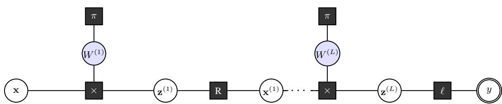  
Figure 1: Factor graph of a BNN (schematic; two learnable layers shown). Circles are variable nodes; filled squares are factor nodes. Blue-tinted circles represent the $d _ { l } \times d _ { l - 1 }$ independent scalar weight variables $W _ { i j } ^ { ( l ) }$ (shown collectively per layer for clarity), each with a Gaussian prior factor π. Each × node is a matrix-vector product factor: shorthand for $d _ { l } \times d _ { l - 1 }$ 1D product factors $\delta \left( z _ { i j } - W _ { i j } ^ { ( l ) } x _ { j } ^ { ( l - 1 ) } \right)$ (Sec. 3.1) combined with $d _ { l }$ sum factors $\begin{array} { r } { z _ { i } ^ { ( l ) } = \sum _ { j } z _ { i j } ^ { ( l ) } } \end{array}$ , together implementing the inner product (see Sec. 4.1). R factors are element-wise leaky-ReLU factors (Sec. 3.3); ℓ is the Gaussian likelihood factor (conjugate; $\delta = 0 )$ ; the double circle is the observed output y.

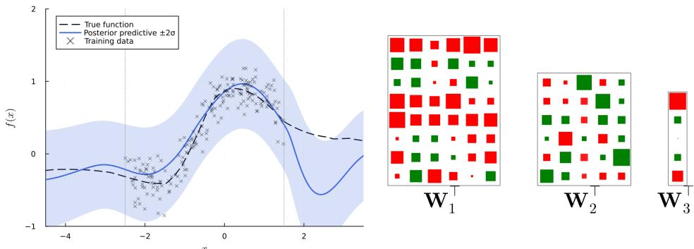  
Figure 2: Left: Posterior predictive mean (solid) and ±2σ intervals (shaded) versus the true datagenerating function (dashed), where $\sigma { = } \sqrt { \mathrm { V a r } [ f ( x ) ] + \beta ^ { 2 } }$ combines posterior variance with observation noise $\left( \beta { = } 0 . 2 \right)$ . Training points shown as crosses $( N = 2 0 0 , x \in [ - 2 . 5 , 1 . 5 ] ) ;$ dashed verticals mark the training boundaries. Right: Hinton diagram of posterior weight beliefs after training. Square area ∝ posterior mean magnitude; transparency ∝ posterior variance (opaque = certain).

on each pass, so weight beliefs are updated by EP-style message replacement rather than sequential accumulation. Algorithm 1 runs in $\bar { O } ( \sum _ { l } d _ { l } \bar { d } _ { l - 1 } )$ time per example, matching the asymptotic complexity of a standard neural network forward-backward pass with a modest constant-factor overhead (1.8× per epoch), and requires only two scalar parameters (τ, ρ) per weight belief plus one stored factor message per mini-batch per weight.

## 4.3 ILLUSTRATIVE EXPERIMENT: 1D REGRESSION

Setup. We evaluate Algorithm 1 on a scalar regression task under a correctly specified model: the ground truth f is itself a draw from the BNN prior, which ensures that the model’s parameters can be learned at all, a standard simulation-study design that isolates inference quality from model misspecification. We generate N = 200 noise-corrupted observations at inputs drawn uniformly from [−2.5, 1.5] and run DMA to recover the posterior. A fixed 7-component feature map $\varphi$ is prepended and standardised; a two-hidden-layer leaky-ReLU network $( \bar { d } = 6 , 5 )$ with Gaussian likelihood $( \beta = 0 . 2 )$ is trained for up to 200 epochs with mini-batches of 20. Full architecture and hyperparameter details (prior scale $\sigma _ { 0 } ,$ likelihood $\beta ,$ activation slopes α) are in Appendix E.

Results. Figure 2 shows the posterior predictive distribution and the posterior weight beliefs after training. The predictive mean tracks the true function closely within the training region [−2.5, 1.5]; the ±2σ intervals widen in the extrapolation regions, where the training data provides no information, a qualitatively appropriate epistemic uncertainty that grows where the model is uninformed.

Discussion. The experiment illustrates the behavior predicted by all three corollaries: no EPstyle inner-loop iteration is needed (Corollary 2.5), all weight variances remain positive throughout (Corollary 2.6), and the posteriors are non-trivial distributions because linear factors satisfy the consistency condition and contribute small δ (Corollary 2.4). A comparison with Adam (Kingma & Ba, 2015), AdamW (Loshchilov & Hutter, 2019) at four weight-decay values, and the diagonal Laplace approximation (MacKay, 1992) (Appendix E) shows, on this correctly specified 1D task, DMA requires few epochs (median epoch 16) with no gradient learning-rate hyperparameter; in the example, over 20 seeds DMA achieves a median extrapolation NLL of 0.80 versus 4.05 for AdamW (Appendix E.3). Both methods show similar calibration error over 20 seeds (DMA median ∆ = −0.09, diagonal Laplace ∆ = −0.10); neither is systematically overconfident (Appendix E.7). Under model mismatch (data generated by a wider network), DMA’s posterior predictive continues to widen outside the training range while Adam provides no epistemic uncertainty; see Appendix F.

Larger Networks. While the first experiment uses a small network for demonstration, Appendix G evaluates DMA on a larger 1 932-weight, four-output network (6→6→12→48→24→4, N = 1500). DMA obtains competitive results in 3 epochs (0.72 s total), compared with 1.7 s for Adam (η = 0.01, requiring ∼100 epochs). We used 100 mini-batches with the default settings in Appendix E.1.

## 5 RELATED WORK

Marginal-error bounds from message perturbations. Ihler et al. (2005) bound marginal changes under total-variation perturbations via a graph-global contraction constant. Theorem 2.3 is complementary: it handles projected messages where m /∈ Q, is edge-local, and requires no contraction condition.

Expectation propagation and variants. EP (Minka, 2001) recovers outgoing messages by projecting the marginal and dividing out the cavity (eq. 20). Power EP (Minka, 2004), α-EP (Minka, 2005), and Stochastic EP (Li et al., 2015) generalise the projection or reduce memory, but all retain cavity division and its pathologies. Hernandez-Lobato & Adams´ (2015) apply EP to a BNN, requiring per-example cavity computation and iterative sweeps; DMA eliminates both (Definition 2.1).

Assumed density filtering. ADF (Lauritzen, 1992; Opper & Winther, 1999) also avoids cavity division, but for a structural reason: it is a forward-only sequential algorithm that absorbs each observation into a running prior and never performs a backward sweep. Weight beliefs are therefore never updated via backward messages — the step DMA’s product backward message (Section 3.1) is designed to handle. Table 1 (Appendix A) compares ADF, EP, VMP, and DMA.

Variational inference and approximate BNNs. VMP (Winn & Bishop, 2005) and ELBO-based methods use the same marginal-first division as EP; for deterministic factors this collapses the posterior to a Dirac delta (Appendix A). Bayes by Backprop (Blundell et al., 2015), MC Dropout (Gal & Ghahramani, 2016), and SWAG (Maddox et al., 2019) approximate the posterior via ELBO or SGD trajectory statistics; none maintains explicit factor-graph message structure.

Laplace approximation and gradient-based uncertainty. Diagonal Laplace (MacKay, 1992) fits a Gaussian at the MAP post-hoc. IVON (Shen et al., 2024) tracks a diagonal natural-gradient estimate online; it propagates uncertainty through gradient statistics rather than factor-graph messages and provides no backward product message to weight beliefs.

Message-passing systems. TrueSkill (Herbrich et al., 2006) demonstrates EP at scale on conjugate factors only, so the Dirac-delta collapse does not arise. Infer.NET (Minka et al., 2018) provides a general EP/VMP engine with pluggable message operators, illustrating the demand for modular approximate-message infrastructure.

## 6 DISCUSSION AND CONCLUSIONS

Summary. We have introduced direct message approximation (DMA), a framework for approximate inference on factor graphs that replaces the marginal-projection step of EP with a direct approximation of the outgoing message. The guarantees form a two-tier structure. Theorem 2.3 (proper messages, any graph): bounds the marginal KL at any edge by O(δ) with an edge-local, topology-independent prefactor; three corollaries establish: no EP-style inner-loop iteration, no negative-precision messages, and Dirac-input consistency at all linear factors. Theorem 3.3 (improper product-backward message, concentrated-input regime): establishes a $C / r ^ { 2 }$ upper bound where Theorem 2.3 does not apply; Appendix C.3 confirms this rate empirically against importancesampling reference marginals (Figure 5).

The BNN instantiation shows that DMA’s structural guarantees carry through to larger models without sacrificing epistemic quality for scalability. DMA fits the training data well and requires no gradient learning-rate hyperparameter, avoiding the manual learning-rate tuning that gradient-based methods require. Extrapolation uncertainty is as well calibrated as diagonal Laplace (limited to smaller models); the widening intervals reflect genuine epistemic uncertainty propagated structurally through the factor graph, not a seed artefact. Under model mismatch, where no weight setting can fit the true function exactly, DMA’s posterior captures residual uncertainty and produces useful predictive intervals beyond the training range; Adam, lacking uncertainty quantification, extrapolates without any such signal. The procedure scales to substantially larger networks without algorithmic change and at wall-clock time comparable to Adam (Appendices E–G).

Limitations. The master theorem requires proper outgoing messages; factors whose exact messages are improper (such as the product-backward) need separate treatment beyond the general recipe. DMA maintains a fully factorised Gaussian belief; block-diagonal extensions are compatible in principle but require moment formulas under non-diagonal inputs.

Future directions. Bounding accumulated error after K > 1 sweeps on cyclic graphs is the most pressing open problem; closing this gap would give end-to-end convergence guarantees. The construction recipe extends to any factor with closed-form moment formulas, making the factor library a matter of mathematical derivation rather than framework change. Student-t and mixture-of-Gaussians messages are natural next targets for heavier-tailed or multimodal posteriors.

## AI USE STATEMENT

In this work, we used generative AI tools for language editing and minor implementation support, including assistance with code-related tasks during development. We have not used generative AI tools to generate the scientific contributions, theoretical results, proofs, experimental findings, or interpretations presented in this work. We have reviewed and verified all AI-assisted text and imple mentation changes, including checking the correctness of any AI-assisted code. We take responsi bility for the final content of this work, including text, claims, and artifacts produced with the aid of generative AI.

## ETHICS STATEMENT

We do not identify any ethical concerns specific to this work.

## REPRODUCIBILITY STATEMENT

We provide an anonymous Git repository containing the implementation of DMA, the experimental configurations, and scripts used to reproduce the reported results. The main paper and Appendix B provide the assumptions, derivations, and complete proofs of the theoretical results, while Appendix D describes the experimental setups and hyperparameters. Appendix E provides the experimental procedures and reference computations used to validate the theoretical error bounds. Together, these materials provide the information needed to reproduce both the theoretical and empirical results reported in this work.

All results were produced on a consumer laptop (Intel Core Ultra 5 225U, 32 GB RAM, singlethreaded using Julia).

An anonymous code repository can be found here:

https://anonymous.4open.science/r/DMA-Anom-0484/README.md

## REFERENCES

Shun-ichi Amari. Differential-Geometric Methods in Statistics, volume 28 of Lecture Notes in Statistics. Springer, 1985.

Charles Blundell, Julien Cornebise, Koray Kavukcuoglu, and Daan Wierstra. Weight uncertainty in neural networks. In Proceedings of the 32nd International Conference on Machine Learning (ICML), 2015.

Yarin Gal and Zoubin Ghahramani. Dropout as a Bayesian approximation: Representing model uncertainty in deep learning. In Proceedings of the 33rd International Conference on Machine Learning (ICML), 2016.

Ralf Herbrich, Tom Minka, and Thore Graepel. TrueSkill: A Bayesian skill rating system. In Advances in Neural Information Processing Systems 19 (NIPS), 2006.

Jose Miguel Hern´ andez-Lobato and Ryan P. Adams. Probabilistic backpropagation for scalable´ learning of Bayesian neural networks. In Proceedings of the 32nd International Conference on Machine Learning (ICML), 2015.

Alexander T. Ihler, John W. Fisher, and Alan S. Willsky. Loopy belief propagation: Convergence and effects of message errors. Journal ofMachine Learning Research, 6:905–936, 2005.

Pasi Jylanki, Jarno Vanhatalo, and Aki Vehtari. Robust Gaussian process regression with a student-¨ t likelihood. Journal of Machine Learning Research, 12:3227–3257, 2011. URL https://www. jmlr.org/papers/volume12/jylanki11a/jylanki11a.pdf.

Diederik P. Kingma and Jimmy Ba. Adam: A method for stochastic optimization. In Proceedings ofthe 3rd International Conference on Learning Representations (ICLR), 2015.

Frank R. Kschischang, Brendan J. Frey, and Hans-Andrea Loeliger. Factor graphs and the sumproduct algorithm. IEEE Transactions on Information Theory, 47(2):498–519, 2001.

Steffen L. Lauritzen. Propagation of probabilities, means, and variances in mixed graphical association models. Journal ofthe American Statistical Association, 87(420):1098–1108, 1992.

Yingzhen Li, Jose Miguel Hern´ andez-Lobato, and Richard E. Turner. Stochastic expectation propa-´ gation. In Advances in Neural Information Processing Systems 28 (NeurIPS), 2015.

Ilya Loshchilov and Frank Hutter. Decoupled weight decay regularization. In Proceedings of the 7th International Conference on Learning Representations (ICLR), 2019.

David J. C. MacKay. Bayesian Methods for Adaptive Models. PhD thesis, California Institute of Technology, 1992.

Wesley J. Maddox, Pavel Izmailov, Timur Garipov, Dmitry P. Vetrov, and Andrew Gordon Wilson. A simple baseline for Bayesian uncertainty in deep learning. In Advances in Neural Information Processing Systems 32 (NeurIPS), 2019.

Thomas P. Minka. A Family of Algorithms for Approximate Bayesian Inference. PhD thesis, Massachusetts Institute of Technology, 2001.

Thomas P. Minka. Power EP. In Microsoft Research Technical Report MSR-TR-2004-149, 2004.

Tom Minka. Divergence measures and message passing. Technical Report MSR-TR-2005-173, Microsoft Research, 2005.

Tom Minka, John Winn, John Guiver, David Knowles, and Yordan Zaykov. Infer.NET 0.3. Technical report, Microsoft Research, 2018. Cambridge, UK. http://dotnet.github.io/infer.

Manfred Opper and Ole Winther. A mean field algorithm for Bayes learning in large feed-forward neural networks. In Advances in Neural Information Processing Systems 11 (NIPS), 1999.

Yuesong Shen, Nico Daheim, Bai Cong, Peter Nickl, Gian Maria Marconi, Clement Bazan, Rio Yokota, Iryna Gurevych, Daniel Cremers, Mohammad Emtiyaz Khan, and Thomas Mollenhoff.¨ Variational learning is effective for large deep networks. In Proceedings ofthe 41st International Conference on Machine Learning, Proceedings of Machine Learning Research. PMLR, 2024.

John M. Winn and Christopher M. Bishop. Variational message passing. Journal of Machine Learning Research, 6(23):661–694, 2005.

## APPENDIX OVERVIEW

A Background — factor graphs, sum-product algorithm, α-divergence family, EP, ADF, and VMP as marginal-based methods, and a comparison table.

B Proofs — all theorem and proposition proofs, including the master theorem (Thm. 2.3), product-factor constructions (Props. 3.1–3.2 and Thm. 3.3), ReLU-factor constructions, and a theorem-coverage table by factor and direction.

C Empirical validation — numerical verification of the $O ( \delta + \sqrt { \delta } )$ master-theorem rate and the $O ( 1 / r ^ { 2 } )$ concentrated-input rate against importance-sampling reference marginals.

D Inference algorithm — complete pseudocode for Algorithm 1.

E Experimental details — feature map, architecture, hyperparameters, extended Adam, AdamW, and diagonal-Laplace comparisons, IVON sweep, EP exclusion rationale, and calibration curves.

F Model mismatch — 20-seed experiment comparing DMA and Adam when the inference model is narrower than the data-generating network.

G Larger-scale BNN — DMA on a 1 932-weight, four-output network; baseline-choice rationale; calibration at scale.

## A BACKGROUND (NOTATION AND REVIEW)

## A.1 FACTOR GRAPHS AND THE SUM-PRODUCT ALGORITHM

A factor graph is a bipartite graph that encodes the factorisation of a joint density over n variables $X _ { 1 } , \ldots , X _ { n }$ into m local potentials:

$$
p ( x _ { 1 } , \ldots , x _ { n } ) = \prod _ { i = 1 } ^ { m } f _ { i } \big ( \mathbf { x } _ { \mathrm { n e } ( f _ { i } ) } \big ) ,\tag{14}
$$

where ne $( f _ { i } ) \subseteq \{ 1 , \ldots , n \}$ is the neighbourhood of factor $f _ { i }$ and $\operatorname { n e } ( X _ { j } ) \ \subseteq \ \{ 1 , \dots , m \}$ is the neighbourhood of variable $X _ { j }$

On a factor tree, the sum-product algorithm computes the exact marginal $p _ { X }$ of every variable via four message equations (Kschischang et al., 2001):

$$
p _ { X _ { j } } ( x _ { j } ) = \prod _ { i \in \mathrm { n e } ( X _ { j } ) } m _ { f _ { i }  X _ { j } } ( x _ { j } ) ,\tag{15}
$$

$$
m _ { f _ { i } \to X _ { j } } ( x _ { j } ) = \int f _ { i } \big ( \mathbf { x } _ { \mathrm { n e } ( f _ { i } ) } \big ) \prod _ { k \in \mathrm { n e } ( f _ { i } ) \setminus \{ j \} } m _ { X _ { k } \to f _ { i } } ( x _ { k } ) \mathrm { d } \mathbf { x } _ { \mathrm { n e } ( f _ { i } ) \setminus \{ j \} } ,\tag{16}
$$

$$
m _ { X _ { j }  f _ { i } } ( x _ { j } ) = \prod _ { k \in \mathrm { n e } ( X _ { j } ) \backslash \{ i \} } m _ { f _ { k }  X _ { j } } ( x _ { j } ) .\tag{17}
$$

The factor-to-variable message (16) integrates the factor against all incoming variable messages except the one at the target edge; similarly, the variable-to-factor message (17) is the product of all incoming factor messages except at the target edge. Multiplying the two messages on any edge recovers the marginal-edge identity:

$$
p _ { X _ { j } } ( x _ { j } ) = m _ { f _ { i }  X _ { j } } ( x _ { j } ) \cdot m _ { X _ { j }  f _ { i } } ( x _ { j } ) .\tag{18}
$$

Conjugacy constraint. The integral in (16) is in closed form only when $f _ { i }$ is conjugate to the incoming message family Q. For Gaussian messages, linear factors $\delta \big ( x _ { j } - \mathbf { a } ^ { \top } \mathbf { x } _ { - j } \big )$ and Gaussianlikelihood factors are conjugate; the scalar product factor $\delta ( z - x y )$ and activation factors such as ReLU and softmax are not, and (16) does not yield a Gaussian in closed form.

## A.2 THE PROJECTION STEP AND THE α-DIVERGENCE FAMILY

When the exact message (16) is intractable, it is replaced by a projection onto a tractable family Q. The α-divergence (Amari, 1985; Minka, 2005)

$$
D _ { \alpha } ( p \parallel q ) = \frac { 1 } { \alpha ( 1 - \alpha ) } \Big ( 1 - \int p ( x ) ^ { \alpha } q ( x ) ^ { 1 - \alpha } \mathrm { d } x \Big ) , \quad \alpha \in \mathbb { R } ,
$$

unifies many classical algorithms: lim $1 _ { \alpha \to 1 } D _ { \alpha } \ = \ \mathrm { K L } [ p \parallel q ]$ (forward KL, used by EP) and $\begin{array} { r } { \operatorname* { l i m } _ { \alpha \to 0 } D _ { \alpha } = \mathrm { K L } [ q \| p ] } \end{array}$ (reverse KL, used by VMP). The projection step in both algorithms relies on the following standard result.

Theorem A.1 (Moment-Matching Minimiser of KL). Let p be an arbitrary density and $\mathcal { Q } = \{ \boldsymbol { q } ( \cdot \lfloor$ $\pmb { \theta } ) = \exp ( \pmb { \theta } ^ { \top } \mathbf { T } ( \cdot ) - A ( \pmb { \theta } ) ) \}$ } an exponential family with sufficient statistic T. The minimiser $q ^ { * } =$ arg $\mathrm { m i n } _ { q \in \mathcal { Q } } \mathrm { K L } [ p \llap | | q ]$ satisfies

$$
\mathbb { E } _ { q ^ { * } } [ \mathbf { T } ( X ) ] = \mathbb { E } _ { p } [ \mathbf { T } ( X ) ] .\tag{19}
$$

For Gaussian Q the condition (19) reduces to matching the mean and variance of $p .$ Theorem A.1 will serve as the projection step in both EP and in the DMA construction of Section 2.2.

## A.3 PRIOR APPROXIMATE INFERENCE METHODS

Expectation propagation. EP (Minka, 2001) approximates each factor-to-variable message in three steps.

1. Form the true unnormalised marginal $p _ { X _ { j } } ~ = ~ m _ { f _ { i }  X _ { j } } \cdot m _ { X _ { j }  f _ { i } }$ using the exact integral (16) (combined with (18)).

2. Project $p _ { X _ { j } }$ onto $\mathcal { Q }$ via Theorem A.1, obtaining $\hat { p } _ { X _ { j } } \in \mathcal { Q }$

3. Recover the approximate message by dividing out the incoming message:

$$
\hat { m } _ { f _ { i }  X _ { j } } ( \cdot ) = \hat { p } _ { X _ { j } } ( \cdot ) / m _ { X _ { j }  f _ { i } } ( \cdot ) .\tag{20}
$$

The approximation is exact when $p _ { X _ { j } } \in \mathcal { Q } ;$ ; otherwise EP introduces a local error and must iterate to a fixed point.

Variational message passing. VMP (Winn & Bishop, 2005) instead maximises the evidence lower bound $\mathcal { L } ( \hat { p } ) \stackrel { - } { = } \mathbb { E } _ { \hat { p } } ^ { - } [ \log p ^ { - } \log \hat { p } ]$ under a fully factorised approximation $\begin{array} { r } { \hat { p } ( \mathbf x ) = \prod _ { k } \hat { p } _ { X _ { k } } ( x _ { k } ) } \end{array}$ which is equivalent to minimising $\bar { \mathrm { K L } } [ \hat { p } \Vert p ]$ . Coordinate ascent on $\hat { p } _ { X _ { k } }$ yields

$$
\hat { p } _ { X _ { k } } ( x _ { k } ) \propto \exp ( \mathbb { E } _ { \hat { p } _ { - k } } [ \log f _ { i } ( \mathbf { x } _ { \mathrm { n e } ( f _ { i } ) } ) ] ) ,\tag{21}
$$

where the expectation is over all neighbours of $f _ { i }$ except $X _ { k }$ . When log $f _ { i }$ decomposes linearly in each argument separately, this produces a message $\hat { m } _ { f _ { i }  X _ { k } } \propto \hat { p } _ { X _ { k } } ;$ again the message is recovered by dividing out the incoming message at the same edge, so VMP also obeys the form (20).

Assumed-density filtering. ADF (Lauritzen, 1992; Opper & Winther, 1999) processes observations sequentially, projecting the posterior onto Q after each observation and using it as the prior for the next; no stored factor message needs to be divided out. ADF therefore also avoids cavity division, but for a structural reason: it is an online, forward-only algorithm that approximates the marginal at each step (Table 1). Crucially, standard ADF’s forward-only architecture provides no mechanism for propagating output likelihood information backward to update upstream weight beliefs — the technically difficult step that DMA’s backward product message is designed to handle.

Pathologies of the marginal-first design. EP and VMP approximate $\hat { p } _ { X _ { i } }$ and recover the message by division (1), inducing three pathologies. (i) Iteration $( E P$ and VMP). The division makes $\hat { m } _ { f _ { i } \to X _ { j } }$ depend on $m _ { X _ { j }  f _ { i } }$ , so updating one edge invalidates neighbouring messages; convergence requires repeated sweeps. (ii) Negative precision (Gaussian $E P ) .$ . When $\hat { p } _ { X _ { j } }$ is wider than $m _ { X _ { j }  f _ { i } }$ , the ratio (20) yields a Gaussian with negative precision, an invalid distribution that propagates downstream. (iii) Dirac-delta collapse (VMP). For a deterministic factor $f _ { i } ( { \bf x } ) = \delta ( x _ { j } - \overset { \cdot } { g ( { \bf x } _ { - j } ) } )$ , the ELBO update (21) forces $\hat { p } _ { X _ { \it \cdot } }$ to a Dirac delta; since every parameterised layer in the factorisation used here is such a factor, VMP cannot propagate non-trivial posterior variance backward to the weights. Section 2 introduces DMA, which avoids this design by approximating the message directly.

Table 1: Comparison of approximate inference frameworks on properties relevant to BNN inference. Below the first row, $\checkmark$ indicates a desirable property. Approximates: whether the method targets the factor-to-variable message directly or approximates the marginal at each edge. No cavity division: whether updates avoid dividing out a stored incoming message (eq. 20). No inner-loop iteration: whether a single forward/backward sweep per example suffices, with no per-example fixed-point iteration. Backward weight updates: whether weight beliefs are updated via a backward message sweep. Consistency axiom / edge-local KL bound: see Definition 2.1 and Theorem 2.3.
<table><tr><td></td><td>ADF</td><td>EP</td><td>VMP</td><td>DMA (ours)</td></tr><tr><td>Approximates</td><td>marginal</td><td>marginal</td><td>marginal</td><td>message</td></tr><tr><td>Backward weight updates</td><td>×</td><td>√</td><td>√</td><td>√</td></tr><tr><td>No cavity division</td><td>√</td><td>×</td><td>X</td><td>√</td></tr><tr><td>No inner-loop iteration</td><td>√</td><td>×</td><td>X</td><td>√</td></tr><tr><td>Consistency axiom</td><td>X</td><td>×</td><td>X</td><td>√</td></tr><tr><td>Edge-local KL bound</td><td>×</td><td>×</td><td>X</td><td>√</td></tr></table>

## B PROOFS

## B.1 PROOF OF THEOREM A.1 (MOMENT-MATCHING MINIMISER OF KL)

Proof. For $q ( \cdot \mid \pmb \theta ) = \mathrm { e x p } ( \pmb \theta ^ { \top } \mathbf T ( \cdot ) - A ( \pmb \theta ) )$ in the exponential family:

$$
\operatorname { K L } [ p ] \| q ] = \int p ( x ) \log p ( x ) \mathrm { d } x - \int p ( x ) { \big ( } \theta ^ { \top } \mathbf { T } ( x ) - A ( \theta ) { \big ) } \mathrm { d } x = - H ( p ) + A ( \theta ) - \theta ^ { \top } \mathbb { E } _ { p } [ \mathbf { T } ] .
$$

Differentiating with respect to θ and setting to zero:

$$
\nabla _ { \pmb { \theta } } \mathrm { K L } [ p \| q ] = \nabla A ( \pmb { \theta } ) - \mathbb { E } _ { p } [ \mathbf { T } ] = \mathbf { 0 } .
$$

For exponential families, $\nabla A ( \pmb \theta ) = \mathbb { E } _ { q ( \cdot | \pmb \theta ) } [ \mathbf { T } ]$ (the moment-generating identity), so the stationary condition is exactly $\mathbb { E } _ { q ^ { * } } [ \mathbf { T } ( X ) ] = \mathbb { E } _ { p } [ \mathbf { \bar { T } } ( X ) ]$ ]. The KL is convex in θ (since $A$ is log-partition and hence convex), so the stationary point is the unique minimum. For Gaussian $\mathcal { Q } , \mathbf { T } ( x ) = ( x , x ^ { 2 } )$ and the condition reduces to matching the first two moments. □

## B.2 PROOF OF THEOREM 2.3 (DMA MASTER THEOREM)

Proof. Write m $: = m _ { f  X _ { i } } , \ \hat { m } : = \ \hat { m } _ { f  X _ { i } } , \ Z , \ \hat { Z } , \ \delta$ as in the theorem statement; assume $\| m _ { X _ { j } \to f } \| _ { \infty } < \infty$ . For $a , b > 0$ define the scalar Bregman divergence $D ( a , b ) : = a \log ( a / b ) - a +$ $b \geq 0$ , with the same generator $\phi ( t ) = t \log t$ as the KL. The key identity is the exact decomposition

$$
Z \mathrm { K L } \Big [ { \textstyle \frac { p _ { X _ { j } } } { Z } } \ | | { \textstyle \frac { \hat { p } _ { X _ { j } } } { \hat { Z } } } \Big ] \ = \ \int m _ { X _ { j } \to f } ( x ) { \cal D } \big ( m ( x ) , \hat { m } ( x ) \big ) \mathrm { d } x \ - \ { \cal D } ( Z , \hat { Z } ) .\tag{22}
$$

Proof of (22). Expand the left side: $\begin{array} { r } { Z \operatorname { K L } \Big [ p / Z \lVert \hat { p } / \hat { Z } \Big ] = \int m _ { X _ { j } \to f } m \log ( m / \hat { m } ) + Z \log ( \hat { Z } / Z ) } \end{array}$

Adding and subtracting $\begin{array} { r } { \int m _ { X _ { j }  f } ( m - \hat { m } ) = Z - \hat { Z } } \end{array}$ gives

$$
\int m _ { X _ { j }  f } ( x ) \underbrace { [ m ( x ) \log ( m ( x ) / \hat { m } ( x ) ) - m ( x ) + \hat { m } ( x ) ] } _ { D ( m ( x ) , \hat { m } ( x ) ) } \mathrm { d } x + \underbrace { ( Z - \hat { Z } ) + Z \log ( \hat { Z } / Z ) } _ { - D ( Z , \hat { Z } ) } ,
$$

where the second group equals $- D ( Z , \hat { Z } ) = - ( Z \log ( Z / \hat { Z } ) - Z + \hat { Z } )$

Since $D ( Z , \hat { Z } ) \ge 0$ , discarding it and dividing by Z gives

$$
\mathrm { K L } \Big [ { \frac { p _ { X _ { j } } } { Z } } \ \big | \ { \frac { \hat { p } _ { X _ { j } } } { \hat { Z } } } \Big ] \ \leq \ { \frac { 1 } { Z } } \int m _ { X _ { j } \to f } ( x ) D \big ( m ( x ) , \hat { m } ( x ) \big ) \mathrm { d } x .
$$

Since $D ( m ( x ) , \hat { m } ( x ) ) \geq 0$ and m $X _ { j } \to f \ \geq 0$ , bounding $m _ { X _ { j } \to f } ( x ) \leq \| m _ { X _ { j } \to f } \| _ { \infty }$ is valid. Using $\int D ( m , { \hat { m } } )$ dx $\textstyle { \mathrm { ~ \left. ~ = ~ \right.} } \int $ m $\log ( m / \hat { m } )$ dx $= \delta$ (the $- m + \hat { m }$ terms integrate to zero since $\textstyle \int m \mathrm { d } x =$ $\begin{array} { r } { \int \hat { m } \mathrm { d } x = 1 ) } \end{array}$ gives the stated bound. □

## B.3 PROOFS OF COROLLARIES 2.4, 2.5, AND 2.6

Proof of Corollary 2.4. Take each incoming message as $\mathcal { N } ( \bar { x } _ { k } , \sigma _ { k } ^ { 2 } )$ with $\sigma _ { k } > 0$ . For every $\sigma _ { k } > 0$ both $m _ { f  X _ { j } }$ and $\hat { m } _ { f  X _ { j } }$ are normalizable densities, so the KL is well-defined and finite.

By the construction recipe (Section 2.2), $\hat { m } _ { f  X _ { i } } = \mathcal N ( \mu _ { \sigma } , \sigma _ { \sigma } ^ { 2 } )$ where $\mu _ { \sigma } = \mathbb { E } [ g ( \mathbf { X } _ { - j } ) ]$ and $\sigma _ { \sigma } ^ { 2 } =$ $\dot { \mathrm { V a r } } [ g ( { \bf X } _ { - j } ) ]$ are the first two moments of the exact outgoing message. Since the DMA matches these moments exactly, for any distribution m and its moment-matched Gaussian projection mˆ :

$$
\begin{array} { r } { E _ { m } [ \log \hat { m } ( X ) ] = - \frac { 1 } { 2 } \log ( 2 \pi \sigma _ { \sigma } ^ { 2 } ) - \frac { 1 } { 2 } = - H ( \hat { m } ) , } \end{array}
$$

which gives the identity

$$
\mathrm { K L } \big [ m _ { f  X _ { j } } \| \hat { m } _ { f  X _ { j } } \big ] = H \big ( \hat { m } _ { f  X _ { j } } \big ) - H \big ( m _ { f  X _ { j } } \big ) .
$$

The $C ^ { 2 }$ assumption in a neighbourhood of $\bar { \bf x } _ { - j }$ provides the second-order Taylor expansion

$$
\begin{array} { r } { g ( \bar { \mathbf { x } } _ { - j } + \mathbf { h } ) = g ( \bar { \mathbf { x } } _ { - j } ) + \nabla g ( \bar { \mathbf { x } } _ { - j } ) ^ { \top } \mathbf { h } + \frac { 1 } { 2 } \mathbf { h } ^ { \top } \nabla ^ { 2 } g ( \bar { \mathbf { x } } _ { - j } ) \mathbf { h } + o ( \| \mathbf { h } \| ^ { 2 } ) . } \end{array}
$$

The nonzero linear term is $O ( \left| | \sigma \right| | )$ ; the nonlinear remainder is $O ( \| \sigma \| ^ { 2 } )$ , hence asymptotically negligible relative to the linear term. Combined with tail regularity, this makes $H ( m _ { f  X _ { j } } )$ asymptotically determined by the linearisation, giving $H ( m _ { f  X _ { j } } ) = \textstyle { \frac { 1 } { 2 } } \log ( 2 \pi e \sigma _ { \sigma } ^ { 2 } ) + o ( 1 )$ and hence $\mathrm { K L } \big [ m _ { f  X _ { j } } \big | \big | \hat { m } _ { f  X _ { j } } \big ]  0$ . We verify this explicitly factor-class by factor-class.

Conjugate factors (Gaussian prior, Gaussian likelihood): the exact message is already Gaussian, so $m _ { f  X _ { j } } = \hat { m } _ { f  X _ { j } }$ and $\delta = 0$ for all $\sigma _ { k }$

Productforward (Proposition 3.1): $g ( x , y ) = x y { \mathrm { ~ i s ~ } } C ^ { \infty }$ everywhere with $\nabla g = ( y , x ) ^ { \top } \neq \mathbf { 0 }$ when $( \mu _ { x } , \mu _ { y } ) \neq ( 0 , 0 )$ . The DMA computes the exact moments of $Z = X Y ;$ m is a variance-gamma distribution whose entropy satisfies $\begin{array} { r } { H ( m ) = \frac { 1 } { 2 } \log \sigma _ { z } ^ { 2 } + c + o ( 1 ) } \end{array}$ as $\sigma _ { x } , \sigma _ { y } \to 0$ , matching the leading term of $H ( \hat { m } )$ with the same constant c, so $\dot { \cdot } \delta = H ( \hat { m } ) - H ( m ) \to 0 .$

ReLU forward and backward (Propositions 3.4–3.5): leaky-ReLU is piecewise- ${ \bf \nabla } . C ^ { \infty }$ with a single non-smooth point at the origin. When the concentration point x¯ is away from the origin, the $\bar { C } ^ { 2 }$ argument applies directly. At the origin, the DMA uses exact truncated-Gaussian moments; Mills ratio bounds give $\sigma _ { \sigma } ^ { 2 } \to \mathbf { \bar { 0 } }$ and ${ H ( \hat { m } ) } ^ { - } H ( m )  0$ via the explicit moment formulas.

Hence $\delta \to 0$ in all cases and the bound (4) vanishes.

Proof of Corollary 2.5. The recipe in Section 2.2 integrates only the incoming messages at neighbours $\{ X _ { k } \} _ { k \neq j } ; m _ { X _ { j }  f }$ does not appear. Therefore updating $\hat { m } _ { f  X _ { j } }$ does not change $m _ { X _ { j } \to f } ,$ and no re-computation of neighbouring messages is triggered. □

Proof of Corollary 2.6. The moment-matching step minimises $\mathrm { K L } [ p \| m ]$ over $\mathcal { Q } .$ For the Gaussian family the minimiser has variance $\mathrm { V a r } _ { p } [ X ] \geq { \bar { 0 } }$ whenever p has finite second moment. If $\mathrm { V a r } _ { p } [ X ] >$ 0 the message is a proper Gaussian with strictly positive precision $\rho = 1 / \mathrm { V a r } _ { p } [ X ] > 0$ . In the Dirac limit $( \sigma _ { k } \stackrel { - } { \to } 0 ) , \bar { \mathrm { V a r } } _ { p } \bar { [ } X ] \to 0$ and the precision $\rho  \infty ;$ the message degenerates to a Dirac delta, which is the correct limiting message (Corollary 2.4). At no point is $\rho$ negative. □

## B.4 PROOFS OF PROPOSITIONS 3.1 AND 3.2 (PRODUCT FACTOR DMA)

ProofofProposition 3.1. For independent $X \sim \mathcal N ( \mu _ { x } , \sigma _ { x } ^ { 2 } )$ and $Y \sim \mathcal { N } ( \mu _ { y } , \sigma _ { u } ^ { 2 } )$ , the first two moments of $Z = X Y$ follow directly from independence and the law of total variance:

$$
\mathbb { E } [ Z ] = \mathbb { E } [ X ] \mathbb { E } [ Y ] = \mu _ { x } \mu _ { y } ,
$$

$$
\begin{array} { r } { \mathbb { E } [ Z ^ { 2 } ] = \mathbb { E } [ X ^ { 2 } ] \mathbb { E } [ Y ^ { 2 } ] = ( \mu _ { x } ^ { 2 } + \sigma _ { x } ^ { 2 } ) ( \mu _ { y } ^ { 2 } + \sigma _ { y } ^ { 2 } ) , } \end{array}
$$

$$
\mathrm { V a r } [ Z ] = \mathbb { E } [ Z ^ { 2 } ] - \mathbb { E } [ Z ] ^ { 2 } = \sigma _ { x } ^ { 2 } \sigma _ { y } ^ { 2 } + \mu _ { x } ^ { 2 } \sigma _ { y } ^ { 2 } + \mu _ { y } ^ { 2 } \sigma _ { x } ^ { 2 } .
$$

The DMA is the moment-matching Gaussian projection via Theorem $\mathrm { A . 1 }$

ProofofProposition 3.2 (sketch). We compute the first two moments of $X = Z / Y$ under independent $Y ^ { ' } \sim \dot { \mathcal { N } } ( \mu _ { y } , \sigma _ { y } ^ { 2 } )$ ) and $Z \sim \mathcal N ( \mu _ { z } , \sigma _ { z } ^ { 2 } )$ . The ratio distribution has no finite moments under the Gaussian directly (the $1 / | y |$ singularity at the origin diverges), so we use a log-normal intermediate.

Lemma B.1 (Log-Normal Approximation). For $W \sim \mathcal N ( \mu _ { w } , \sigma _ { w } ^ { 2 } )$ with $| \mu _ { w } | / \sigma _ { w } \gg 1$ , the random variable log $\bar { \left| { W } \right| }$ is approximately $\mathcal { N } ( \log | \mu _ { w } | , \sigma _ { w } ^ { 2 } / \mu _ { w } ^ { 2 } )$ by thefirst-order delta method (Taylor expansion of $\log | \cdot$ | around $\mu _ { w } )$

Apply Lemma B.1 to $Y$ and $Z ,$ , treating both as log-normal. Since log $| Z / Y | = \log | Z | - \log | Y |$ the difference of two independent normals is normal with mean $m = \log \left| \mu _ { z } \right| { - } \log \left| \mu _ { y } \right|$ and variance $v = \sigma _ { z } ^ { 2 } / \mu _ { z } ^ { 2 } + \sigma _ { y } ^ { 2 } / \mu _ { y } ^ { 2 } .$

For a log-normal random variable W with log $| W | \sim { \mathcal { N } } ( m , v )$ , the exact log-normal moments are $\mathbb { E } [ W ] = \mathrm { s g n } ( \mu _ { z } / \mu _ { y } ) \cdot e ^ { m + v / 2 }$ and $\mathbb { E } [ W ^ { 2 } ] ~ = ~ e ^ { 2 m + 2 v }$ (using independence of $Z$ and Y ). The variance is $\operatorname { V a r } [ X ] { \overset { - } { = } } e ^ { 2 m + v } ( e ^ { v } - 1 )$

Converting back to natural parameters $\tau _ { w } = \mu _ { w } / \sigma _ { w } ^ { 2 } , \rho _ { w } = 1 / \sigma _ { w } ^ { 2 }$ , so $m = \log | \tau _ { z } \rho _ { y } / ( \tau _ { y } \rho _ { z } ) |$ and $v = \rho _ { z } / \tau _ { z } ^ { 2 } + \rho _ { y } / \tau _ { y } ^ { 2 }$ , and algebraic simplification yields the formulas in Proposition 3.2.

Consistency verification. In the limit $\sigma _ { y } ~ \to ~ 0 ~ ( \rho _ { y } ~ \to ~ \infty , ~ \tau _ { y } / \rho _ { y } ~ \to ~ \bar { y } ) \colon m { m } ~ \to ~ \log | \mu _ { z } / \bar { y } |$ and $v \to \sigma _ { z } ^ { 2 } / \mu _ { z } ^ { 2 }$ . Then $\mu _ { X } = e ^ { m + v / 2 } \to | \mu _ { z } / \bar { y } | \cdot e ^ { \sigma _ { z } ^ { 2 } / ( 2 \mu _ { z } ^ { 2 } ) } \to \mu _ { z } / \bar { y } \mathrm { a s } \sigma _ { z } \to 0 ;$ this matches $g ( \bar { y } ) = \bar { y }$ applied to the constraint $x = z / y$ . The direct arithmetic verification of the formula $\hat { \tau } _ { x } / \hat { \rho } _ { x }  \mu _ { z } / \bar { y }$ and $1 / \hat { \rho } _ { x }  \sigma _ { z } ^ { 2 } / \bar { y } ^ { 2 }$ was given in Section 3.1. 口

## B.5 PROOF OF THEOREM 3.3 (CONCENTRATED-INPUT BOUND FOR PRODUCT BACKWARD MESSAGE)

Remark B.2 (Improper Backward Message). The exact sum-product backward message to X is

$$
m _ { f \to X } ( x ) = \frac { 1 } { | x | } { \cal N } \biggl ( \frac { \mu _ { z } } { x } ; \mu _ { y } , \sigma _ { y } ^ { 2 } + \frac { \sigma _ { z } ^ { 2 } } { x ^ { 2 } } \biggr ) ,\tag{23}
$$

which is not normalisable: $a s  x   \infty$ the Gaussianfactor approaches a positive constant and the 1/|x| prefactor yields a divergent integral. The DMA (Proposition 3.2) is therefore an approximation to an improper distribution; its moments are the moments ofthe ratio variable $X = \bar { Z / Y }$ under the joint on $( Y , Z )$ , which is always proper. In the Dirac limit the $1 / | x |$ prefactor and the implicit |x factor from the Gaussian normalisation cancel, recovering the correct point-mass message.

The truncated reference excludes the non-normalisable tail of the exact backward message (23):

$$
\tilde { m } _ { f \to X } ^ { r } ( x ) \propto \int _ { | y | \geq | \mu _ { y } | / 2 } \mathcal { N } ( x y ; \mu _ { z } , \sigma _ { z } ^ { 2 } ) \mathcal { N } ( y ; \mu _ { y } , \sigma _ { y } ^ { 2 } ) \mathrm { d } y ,\tag{24}
$$

which is proper for $r \geq 2$ since the $1 / | x |$ singularity is integrable when Y is bounded away from zero. For $\mu _ { y } \ > \ 0 $ , the excluded probability is $P ( \bar { | Y | } < \bar { \mu _ { y } } / 2 ) = \Phi ( - r _ { y } / 2 ) - \Phi ( - 3 r _ { y } / 2 ) \leq$ $\Phi ( - r _ { y } / 2 )$ , which decays faster than any polynomial in r.

Outline of the proof The proof of Theorem 3.3 applies the Pythagorean identity (Theorem A.1) to decompose $\operatorname { K L } ( \tilde { m } _ { f \to X } ^ { r } \Vert \hat { m } _ { f \to X } )$ into two terms, each $\leq C _ { \kappa } / \bar { r } ^ { 2 }$ :

• Non-Gaussianity of the truncated ratio ${ \tilde { m } } _ { f  X } ^ { r }$ relative to its moment-matched Gaussian $N _ { X } ^ { * }$ (Lemma B.5): bounded via the KL chain rule and data-processing inequality, exploiting the fact that $X = Z / Y$ is exactly Gaussian conditionally on $Y = y$

• Moment error of the log-normal DMA approximation relative to $N _ { X } ^ { * }$ (Lemmas B.3–B.4): controlled by a second-order Taylor expansion of $Z / Y$ around $( \mu _ { z } , \mu _ { y } )$ , with the Gaussianto-log-normal KL as an intermediate.

The three lemmas below establish the ingredients in order.

Lemma B.3 (Gaussian–log-normal KL bound). Let $W \sim \mathcal N ( \mu _ { w } , \sigma _ { w } ^ { 2 } )$ with $r _ { w } : = | \mu _ { w } | / \sigma _ { w } \geq 2 ,$ and let $\mathrm { L N } ( \mu _ { \ell } , \sigma _ { \ell } ^ { 2 } )$ be the log-normal whose mean and variance match those of W (i.e. $\sigma _ { \ell } ^ { 2 } =$ $\log ( 1 + 1 / r _ { w } ^ { \dagger } ) , \mu _ { \ell } ^ { \sim } = \log | \mu _ { w } | ^ { - } \sigma _ { \ell } ^ { 2 } / 2 ) .$ . Then

$$
\mathrm { K L } \Bigl ( \mathrm { L N } ( \mu _ { \ell } , \sigma _ { \ell } ^ { 2 } ) \Bigl | \Bigr | \mathcal { N } ( \mu _ { w } , \sigma _ { w } ^ { 2 } ) \Bigr ) = \frac { 3 } { 4 r _ { w } ^ { 2 } } + O \biggl ( \frac { 1 } { r _ { w } ^ { 4 } } \biggr ) .\tag{25}
$$

Proof. Let $L \sim \mathrm { L N } ( \mu _ { \ell } , \sigma _ { \ell } ^ { 2 } )$ with matched moments $\mathbb { E } [ L ] = | \mu _ { w } |$ and $\mathrm { V a r } [ L ] = \sigma _ { w } ^ { 2 }$ . The crossentropy of L under $\mathcal { N } ( \mu _ { w } , \sigma _ { w } ^ { 2 } )$ equals the entropy of $\mathcal { N }$ by moment matching:

$$
\begin{array} { r } { H ( L , \mathcal { N } ( \mu _ { w } , \sigma _ { w } ^ { 2 } ) ) = - \mathbb { E } _ { L } [ \mathrm { l o g } \mathcal { N } ( X ; \mu _ { w } , \sigma _ { w } ^ { 2 } ) ] = \frac { 1 } { 2 } \log ( 2 \pi \sigma _ { w } ^ { 2 } ) + \frac { \mathrm { Y a r } [ L ] + ( \mathbb { E } [ L ] - \mu _ { w } ) ^ { 2 } } { 2 \sigma _ { w } ^ { 2 } } = \frac { 1 } { 2 } \log ( 2 \pi \epsilon \sigma _ { w } ^ { 2 } ) . } \end{array}
$$

The entropy of the log-normal is $\begin{array} { r } { H ( L ) = \mu _ { \ell } + \frac { 1 } { 2 } \log ( 2 \pi e \sigma _ { \ell } ^ { 2 } ) } \end{array}$ . Therefore

$$
\begin{array} { r } { \mathrm { K L } ( L \| \mathcal { N } ( \mu _ { w } , \sigma _ { w } ^ { 2 } ) ) = \frac { 1 } { 2 } \log ( 2 \pi e \sigma _ { w } ^ { 2 } ) - \mu _ { \ell } - \frac { 1 } { 2 } \log ( 2 \pi e \sigma _ { \ell } ^ { 2 } ) = \frac { 1 } { 2 } \log \frac { \sigma _ { w } ^ { 2 } } { \sigma _ { \ell } ^ { 2 } } - \mu _ { \ell } . } \end{array}\tag{26}
$$

Substitute $\begin{array} { r } { \sigma _ { \ell } ^ { 2 } = \log ( 1 + 1 / r _ { w } ^ { 2 } ) = 1 / r _ { w } ^ { 2 } - 1 / ( 2 r _ { w } ^ { 4 } ) + O ( 1 / r _ { w } ^ { 6 } ) , \sigma _ { w } ^ { 2 } = \mu _ { w } ^ { 2 } / r _ { w } ^ { 2 } , \mathrm { a n d } \mu _ { \ell } = \log | \mu _ { w } | - \frac { 1 } { 2 } \mathrm { . } } \end{array}$ $\sigma _ { \ell } ^ { 2 } / 2$ into (26). Expand $\log ( \bar { \sigma } _ { \ell } ^ { 2 } ) = \log \bar { ( } 1 / r _ { w } ^ { 2 } ( 1 - 1 / ( 2 r _ { w } ^ { 2 } ) + \bar { O } ( 1 / r _ { w } ^ { 4 } ) ) ) \bar { = } - 2 \log r _ { w } - 1 / ( 2 r _ { w } ^ { 2 } ) +$

$O ( 1 / r _ { w } ^ { 4 } )$ , so

$$
\begin{array} { r l } & { \frac { 1 } { 2 } \log \frac { \sigma _ { w } ^ { 2 } } { \sigma _ { \ell } ^ { 2 } } = \frac 1 2 \biggl [ \log \frac { \mu _ { w } ^ { 2 } } { r _ { w } ^ { 2 } } - \log \sigma _ { \ell } ^ { 2 } \biggr ] } \\ & { \qquad = \frac 1 2 \biggl [ 2 \log | \mu _ { w } | - 2 \log r _ { w } + 2 \log r _ { w } + \frac 1 { 2 r _ { w } ^ { 2 } } + O ( 1 / r _ { w } ^ { 4 } ) \biggr ] } \\ & { \qquad = \log | \mu _ { w } | + \frac 1 { 4 r _ { w } ^ { 2 } } + O ( 1 / r _ { w } ^ { 4 } ) . } \end{array}
$$

$$
\begin{array}{c} \mathrm { U s i n g } - \mu _ { \ell } = - \log | \mu _ { w } | + \sigma _ { \ell } ^ { 2 } / 2 = - \log | \mu _ { w } | + 1 / ( 2 r _ { w } ^ { 2 } ) + O ( 1 / r _ { w } ^ { 4 } ) \colon  \\ { \mathrm { K L } = \underbrace { \log | \mu _ { w } | + \frac { 1 } { 4 r _ { w } ^ { 2 } } } _ { \frac { 1 } { 2 } \log ( \sigma _ { w } ^ { 2 } / \sigma _ { \ell } ^ { 2 } ) } - \underbrace { \log | \mu _ { w } | + \frac { 1 } { 2 r _ { w } ^ { 2 } } } _ { - \mu _ { \ell } } + O ( 1 / r _ { w } ^ { 4 } ) = \frac { 3 } { 4 r _ { w } ^ { 2 } } + O ( 1 / r _ { w } ^ { 4 } ) . } \end{array}
$$

The factor $\textstyle { \frac { 3 } { 4 } }$ is the sum of two $O ( r _ { w } ^ { - 2 } )$ contributions: $\textstyle { \frac { 1 } { 4 } }$ from expanding $\log ( \sigma _ { w } ^ { 2 } / \sigma _ { \ell } ^ { 2 } )$ and $\textstyle { \frac { 1 } { 2 } }$ from $\sigma _ { \ell } ^ { 2 } / 2 ;$ this is (25). □

Lemma B.4 (Moment error of the log-normal backward approximation). Let $r \quad = \quad$ min $\mathrm { \ i } ( | \mu _ { y } | / \sigma _ { y } , | \mu _ { z } | / \sigma _ { z } ) \geq 2$ . Denote by $\mu _ { X } ^ { * }$ and $( \sigma _ { X } ^ { * } ) ^ { 2 }$ the mean and variance of ${ \tilde { m } } _ { f  X } ^ { r }$ (equation (24)), and by $\hat { \mu } _ { X } : = \hat { \tau } _ { x } / \hat { \rho } _ { x }$ and $\hat { \sigma } _ { X } ^ { 2 } : = 1 / \hat { \rho } _ { x }$ the DMA momentsfrom Proposition 3.2. Then

$$
\left| { \hat { \mu } } _ { X } - \mu _ { X } ^ { * } \right| = O \left( { \frac { | \mu _ { z } / \mu _ { y } | } { r ^ { 2 } } } \right) , \qquad \left| { \hat { \sigma } } _ { X } ^ { 2 } - ( \sigma _ { X } ^ { * } ) ^ { 2 } \right| = O \left( { \frac { ( \sigma _ { X } ^ { * } ) ^ { 2 } } { r ^ { 2 } } } \right) ,\tag{27}
$$

and consequently

$$
\mathrm { K L } \Big ( N _ { X } ^ { * } \Big \| \hat { m } _ { f  X } \Big ) = O \Big ( \frac { 1 } { r ^ { 2 } } \Big ) ,\tag{28}
$$

where $N _ { X } ^ { * } = \mathcal { N } ( \mu _ { X } ^ { * } , ( \sigma _ { X } ^ { * } ) ^ { 2 } )$

Proofsketch. All moments are conditional on $A _ { r } = \{ | Y | \geq | \mu _ { y } | / 2 \}$ ; the unconditional ratio $Z / Y$ has no finite moments. Without loss of generality, $\mu _ { y } , \mu _ { z } \ > \ 0 ;$ write $Y = \mu _ { y } ( 1 + \eta U ) , \dot { Z } =$ µz(1 + ξV ), U, V i.i.d. ∼ N (0, 1), η = 1/ry, ξ = 1/rz, a = µz/µy.

Central-region Taylor expansion. Let $B _ { r } = \{ | U | \leq K _ { r } \} , K _ { r } = \sqrt { 1 6 \log r }$ (as in Lemma B.5), and restrict to $A _ { r } ^ { + } \cap B _ { \imath }$ r (the exponentially small branches $A _ { r } ^ { - }$ and $A _ { r } \cap B _ { r } ^ { c }$ are treated below). On $A _ { r } ^ { + } \cap B _ { r } , | \eta U | \overset { \cdot } { \le } K _ { r } / r _ { y } \to 0$ , so the Taylor expansion

$$
\frac { 1 } { 1 + \eta U } = 1 - \eta U + ( \eta U ) ^ { 2 } + R _ { 3 } , \qquad | R _ { 3 } | \le 2 | \eta U | ^ { 3 } \le 2 ( K _ { r } / r _ { y } ) ^ { 3 } ,
$$

holds uniformly (the denominator satisfies $1 + \eta U \ge 1 / 2 \mathsf { o n } A _ { r } ^ { + } )$ . Hence

$$
X = a ( 1 + \xi V ) ( 1 - \eta U + ( \eta U ) ^ { 2 } + R _ { 3 } ) .
$$

Taking $\mathbb { E } [ \cdot \mid A _ { r } ^ { + } \cap B _ { r } ]$ and using $\mathbb { E } [ U ^ { k } \ \mid \ A _ { r } ^ { + } ] = \mathbb { E } [ U ^ { k } ] + O ( e ^ { - c r ^ { 2 } } )$ for $k \leq 4$ (since $A _ { r } ^ { + }$ has probability $1 - O ( e ^ { - c r ^ { 2 } } ) )$

$$
\mu _ { X } ^ { * } = a ( 1 + \eta ^ { 2 } ) + O _ { \kappa } \biggl ( a \frac { ( \log r ) ^ { 3 / 2 } } { r ^ { 3 } } \biggr ) = a ( 1 + \eta ^ { 2 } ) + o _ { \kappa } ( a r ^ { - 2 } ) ,
$$

where the leading remainder comes from $\mathbb { E } [ | \eta U | ^ { 3 } \ | \ B _ { r } ] = O ( \eta ^ { 3 } K _ { r } ^ { 3 } ) = O ( ( \log r ) ^ { 3 / 2 } / r ^ { 3 } )$

Tail-region bound. On $A _ { r } \cap B _ { r } ^ { c } , | 1 + \eta U | \geq 1 / 2 , \operatorname { s o } | X | \leq 2 | a | ( 1 + | \xi V | )$ . Gaussian tail bounds give ${ \bar { P ( } } | U | > K _ { r } ) = { O ( r ^ { - 4 } ) } , \operatorname { s o } \mathbb { E } [ | \dot { X } | \mathbf { 1 } _ { B _ { r } ^ { c } } \mid \dot { A } _ { r } ] = { O } ( | a | r ^ { - 4 } \cdot \operatorname { p o l y } ( r ) ) ^ { \prime } = o ( r ^ { - 2 } )$ . The branch $A _ { r } ^ { - }$ has probability $\Phi ( - 3 r _ { y } / 2 ) = O ( e ^ { - 9 r _ { y } ^ { 2 } / 8 } )$ , contributing negligibly.

Comparison with the DMA moments. Let $D = \eta ^ { 2 } + \xi ^ { 2 }$ . The DMA mean $\hat { \mu } _ { X } = a e ^ { D / 2 }$ (Lemma B.1) expands to $a ( 1 + D / 2 + O ( r ^ { - 4 } ) ) = a ( 1 + \dot { \eta } ^ { 2 } / \bar { 2 } + \xi ^ { 2 } / 2 + O ( r ^ { - 4 } ) )$ . Combined with $\mu _ { X } ^ { * } =$ $a ( \dot { 1 } + \eta ^ { 2 } ) + \dot { o } _ { \kappa } ( a r ^ { - 2 } ) ;$ :

$$
\hat { \mu } _ { X } - \mu _ { X } ^ { * } = a \Bigl ( \frac { \xi ^ { 2 } - \eta ^ { 2 } } { 2 } \Bigr ) + o _ { \kappa } \bigl ( a r ^ { - 2 } \bigr ) = O _ { \kappa } \biggl ( \frac { | \mu _ { z } / \mu _ { y } | } { r ^ { 2 } } \biggr ) .
$$

Variance error. We bound $( \sigma _ { X } ^ { * } ) ^ { 2 } = \mathbb { E } [ X ^ { 2 } \mid A _ { r } ] - ( \mu _ { X } ^ { * } ) ^ { 2 }$ directly. For the second moment, expand one order further: $( 1 + t ) ^ { - 2 } \stackrel { { }  } { = } 1 - 2 t \stackrel { { } } { + } 3 t ^ { 2 } - 4 t ^ { 3 } + \ddot { R _ { 4 } } ( t )$ with $| \dot { R } _ { 4 } ( t ) | \leq C | t | ^ { 4 }$ and $t = \eta U$ . Since sup $_ { B _ { r } } \mathinner { | { \eta U } | } = K _ { r } \dot { / } r _ { y } = \stackrel { \cdot } { o } ( 1 )$ , this expansion is uniform on $A _ { r } ^ { + } \cap B _ { r }$ . Using $\dot { \mathbb { E } } [ U ] = 0 , \mathbb { E } \dot { [} U ^ { 2 } ] = 1$ $\mathbb { E } [ U ^ { 3 } ] = 0$ (odd moments of $\mathcal { N } ( 0 , 1 )$ vanish; conditioning on $A _ { r } ^ { + }$ changes these by $O ( e ^ { - c r ^ { 2 } } ) )$ , and $\mathbb { E } [ U ^ { 4 } ] = 3 $

$$
\mathbb { E } \bigg [ \frac { 1 } { ( 1 + \eta U ) ^ { 2 } } \Big | A _ { r } \bigg ] = 1 + 3 \eta ^ { 2 } + O _ { \kappa } ( \eta ^ { 4 } ) = 1 + 3 \eta ^ { 2 } + O _ { \kappa } ( r ^ { - 4 } ) ,
$$

where the $- 4 \eta ^ { 3 } \mathbb { E } [ U ^ { 3 } ]$ term vanishes, the $R _ { 4 }$ remainder contributes ${ \cal O } ( \eta ^ { 4 } \mathbb { E } [ U ^ { 4 } { \bf 1 } _ { B _ { r } } ] ) = { \cal O } ( \eta ^ { 4 } ) =$ $O ( r ^ { - 4 } )$ , and the contributions of $B _ { r } ^ { c }$ and $A _ { r } ^ { - }$ are $O _ { \kappa } ( r ^ { - 4 } )$ after multiplying by their exponentially small probabilities. Since $\mathbb { E } [ X ^ { 2 } \mid A _ { r } ^ { ' } ] = a ^ { 2 } \dot { ( } 1 + \xi ^ { 2 } \dot { ) } \mathbb { E } [ ( 1 + \eta U ) ^ { - 2 } \mid \dot { A _ { r } } ] \colon$

$$
\mathbb { E } [ X ^ { 2 } \mid A _ { r } ] = a ^ { 2 } ( 1 + \xi ^ { 2 } ) ( 1 + 3 \eta ^ { 2 } + O _ { \kappa } ( D / r ^ { 2 } ) ) .
$$

Together with $( \mu _ { X } ^ { * } ) ^ { 2 } = a ^ { 2 } ( 1 + \eta ^ { 2 } ) ^ { 2 } + o _ { \kappa } ( a ^ { 2 } r ^ { - 2 } ) = a ^ { 2 } ( 1 + 2 \eta ^ { 2 } + O _ { \kappa } ( D / r ^ { 2 } ) ) ;$

$$
( \sigma _ { X } ^ { * } ) ^ { 2 } = a ^ { 2 } ( \eta ^ { 2 } + \xi ^ { 2 } ) + O _ { \kappa } ( a ^ { 2 } D / r ^ { 2 } ) = a ^ { 2 } D \big ( 1 + O _ { \kappa } ( r ^ { - 2 } ) \big ) .
$$

The DMA variance $\hat { \sigma } _ { X } ^ { 2 } = ( e ^ { D } - 1 ) \hat { \mu } _ { X } ^ { 2 } = a ^ { 2 } D e ^ { 2 D } ( 1 + O ( D ) ) = a ^ { 2 } D ( 1 + O _ { \kappa } ( r ^ { - 2 } ) ) , { \mathrm s c }$

$$
\frac { | \hat { \sigma } _ { X } ^ { 2 } - ( \sigma _ { X } ^ { * } ) ^ { 2 } | } { ( \sigma _ { X } ^ { * } ) ^ { 2 } } = O _ { \kappa } \biggl ( \frac { 1 } { r ^ { 2 } } \biggr ) .
$$

For (28), substitute into the exact Gaussian KL:

$$
\mathrm { K L } ( N _ { X } ^ { * } | | \hat { m } _ { f  X } ) = \frac { ( \hat { \mu } _ { X } - \mu _ { X } ^ { * } ) ^ { 2 } } { 2 \hat { \sigma } _ { X } ^ { 2 } } + \frac { ( \sigma _ { X } ^ { * } ) ^ { 2 } } { 2 \hat { \sigma } _ { X } ^ { 2 } } - \frac { 1 } { 2 } - \frac { 1 } { 2 } \log \frac { ( \sigma _ { X } ^ { * } ) ^ { 2 } } { \hat { \sigma } _ { X } ^ { 2 } } = O ( \frac { 1 } { r ^ { 2 } } ) .
$$

Lemma B.5 (Non-Gaussianity of the truncated ratio). Assume additionally that the ratio ofthe two signal-to-noise ratios is bounded: $\kappa ^ { - 1 } \leq r _ { y } / r _ { z } \leq \kappa$ for some fixed $\kappa \geq 1$ . Then there exists a constant $C = C ( \kappa )$ such that, for all sufficiently large r (depending only on κ),

$$
\mathrm { K L } \Big ( \tilde { m } _ { f  X } ^ { r } \Big | \Big | N _ { X } ^ { * } \Big ) \leq \frac { C } { r ^ { 2 } } .\tag{29}
$$

In particular, $\mathrm { K L } ( \tilde { m } _ { f  X } ^ { r } \Vert N _ { X } ^ { * } ) = O _ { \kappa } ( r ^ { - 2 } ) a s r  \infty$ .

Proof. By changing signs if necessary, assume $\mu _ { y } > 0$ and $\mu _ { z } > 0$ . Write $Y = \mu _ { y } ( 1 + \eta U )$ and $Z = \mu _ { z } ( 1 + \xi V )$ with $U , V \overset { \mathrm { \scriptsize ~ i . i . d . } } { \sim } \mathcal { N } ( 0 , 1 ) , \eta = 1 / r _ { y } , \xi = 1 / r _ { z }$ . Set $a = \mu _ { z } / \mu _ { y } , D = \eta ^ { 2 } + \xi ^ { 2 }$ ρ = −η/√D, τ = ξ/√D, so $\rho ^ { 2 } + \tau ^ { 2 } = 1$ and $| \rho | , | \tau | \asymp _ { \kappa } 1$ . Let $W = ( X - \mu _ { X } ^ { * } ) / s _ { X }$ be the standardised version of X under $P _ { r }$ , so $N _ { X } ^ { * }$ is exactly $\mathcal { N } ( 0 , 1 )$ in W-coordinates.

Step 1: Conditional Gaussianity. With $\mu _ { y } \mathrm { ~ > ~ } 0$ , the truncation event is $A _ { r } = \{ | Y | \geq \mu _ { y } / 2 \} =$ $A _ { r } ^ { + } \cup A _ { r } ^ { - }$ where $A _ { r } ^ { + } = \{ 1 + \eta U \geq 1 / 2 \}$ and $A _ { r } ^ { - } = \{ 1 + \eta U \le - 1 / 2 \}$ . The negative branch satisfies $\mathbb { P } ( A _ { r } ^ { - } ) = \Phi ( - 3 r _ { y } / 2 ) \le e ^ { - 9 r _ { y } ^ { 2 } / 8 }$ , which is exponentially small; its contribution to all subsequent expectations is absorbed into the $O ( e ^ { - c r ^ { 2 } } )$ remainder and we work hereafter on $A _ { r } ^ { + }$ On $A _ { r } ^ { \dagger }$ we have $1 + \eta u \ge 1 / 2 > 0$ , so the denominator is bounded away from zero, and for fixed $U = \stackrel { . } { u } , X = a ( 1 + \dot { \xi } V ) / ( \dot { 1 } + \eta u )$ is a linear function of the Gaussian $\dot { V }$ . Hence $P _ { W | U = u , A _ { r } ^ { + } }$ is exactly $\mathcal { N } ( m _ { u } , v _ { u } )$ with

$$
m _ { u } = \frac { a / ( 1 + \eta u ) - \mu _ { X } ^ { * } } { s _ { X } } , \qquad v _ { u } = \frac { a ^ { 2 } \xi ^ { 2 } } { s _ { X } ^ { 2 } ( 1 + \eta u ) ^ { 2 } } .
$$

Step 2: Per-slice KL bound. Let $B _ { r } = \{ | U | \leq K _ { r } \}$ with $K _ { r } = { \sqrt { 1 6 \log r } }$ . For $u \in B _ { r } , :$ a Taylor expansion of $( 1 + \eta u ) ^ { - 1 }$ together with $\mu _ { X } ^ { * } = a ( 1 + \eta ^ { 2 } ) + o _ { \kappa } ( a r ^ { - 2 } )$ (Lemma B.4) and $s _ { X } \asymp _ { \kappa } a \sqrt { D }$ gives

$$
m _ { u } - \rho u = O _ { \kappa } \Bigg ( \frac { 1 + u ^ { 2 } } { r } \Bigg ) , \qquad v _ { u } - \tau ^ { 2 } = O _ { \kappa } \Bigg ( \frac { 1 + | u | } { r } \Bigg ) .
$$

Since $\tau$ is bounded away from zero, the Gaussian KL formula yields

$$
\mathrm { K L } \Big ( \mathcal { N } ( m _ { u } , v _ { u } ) \Big | \Big | \mathcal { N } ( \rho u , \tau ^ { 2 } ) \Big ) \leq \frac { C _ { \kappa } ( 1 + u ^ { 4 } ) } { r ^ { 2 } } , \qquad u \in B _ { r } .
$$

On $B _ { r } ^ { c } \cap A _ { r }$ the KL is at most $C _ { \kappa } ( 1 + r ^ { 2 } + u ^ { 2 } )$ ; Gaussian tail bounds give $\mathbb { P } ( | U | > K _ { r } \mid A _ { r } ) \le C r ^ { - 4 }$ so $\mathbb { E } [ ( 1 + r ^ { 2 } + U ^ { 2 } ) \mathbf { 1 } _ { B _ { r } ^ { c } } \mid A _ { r } ] \le C _ { \kappa } r ^ { - 2 }$

Step 3: Chain rule and data-processing. Define the reference joint $\begin{array} { r l } { Q _ { W , U } ( \mathrm { d } w , \mathrm { d } u ) } & { { } = } \end{array}$ $\phi ( u ) \mathcal { N } ( w ; \rho u , \tau ^ { 2 } )$ dw du. The KL chain rule gives

$$
\mathrm { K L } ( P _ { W , U } \| Q _ { W , U } ) = \underbrace { \mathrm { K L } ( P _ { U | A _ { r } } \| \mathcal { N } ( 0 , 1 ) ) } _ { = - \log \mathbb { P } ( A _ { r } ) = O ( e ^ { - c r ^ { 2 } } ) } + \mathbb { E } _ { U | A _ { r } } \bigl [ \mathrm { K L } ( P _ { W | U , A _ { r } } \| \mathcal { N } ( \rho U , \tau ^ { 2 } ) ) \bigr ] \ \leq \ \frac { C _ { \kappa } } { r ^ { 2 } } .
$$

The marginal of $Q _ { W , U }$ in $W$ is $\mathcal { N } ( 0 , 1 )$ (since $W _ { 0 } = \rho U + \tau V \sim \mathcal { N } ( 0 , \rho ^ { 2 } + \tau ^ { 2 } ) = \mathcal { N } ( 0 , 1 ) )$ . The data-processing inequality applied to $( \dot { W } , U ) \mapsto W$ gives

$$
\mathrm { K L } ( P _ { r } \| N _ { X } ^ { * } ) = \mathrm { K L } ( P _ { W } \| \mathcal { N } ( 0 , 1 ) ) \leq \mathrm { K L } ( P _ { W , U } \| Q _ { W , U } ) \leq \frac { C _ { \kappa } } { r ^ { 2 } } .
$$

Proof of Theorem 3.3. Let $N _ { X } ^ { * } = \mathcal { N } ( \mu _ { X } ^ { * } , ( \sigma _ { X } ^ { * } ) ^ { 2 } )$ be the moment-matched Gaussian of ${ \tilde { m } } _ { f  X } ^ { r } .$ Since the log-density ratio of any two Gaussians is a quadratic polynomial, and ${ \tilde { m } } _ { f  X } ^ { r }$ and $N _ { X } ^ { * }$ share the same first two moments:

$$
\mathbb { E } _ { \tilde { m } ^ { r } } [ \log \frac { N _ { X } ^ { * } ( X ) } { \hat { m } _ { f  X } ( X ) } ] = \mathbb { E } _ { N _ { X } ^ { * } } [ \log \frac { N _ { X } ^ { * } ( X ) } { \hat { m } _ { f  X } ( X ) } ] .
$$

This gives the exact Pythagorean decomposition

$$
\begin{array} { r } { \mathrm { K L } \Big ( \tilde { m } _ { f \to X } ^ { r } \Big \lVert \hat { m } _ { f \to X } \Big ) = \underbrace { \mathrm { K L } \Big ( \tilde { m } _ { f \to X } ^ { r } \Big \lVert N _ { X } ^ { * } \Big ) } _ { \leq C _ { \kappa } / r ^ { 2 } ( \mathrm { L e m m a B . 5 } ) } + \underbrace { \mathrm { K L } \Big ( N _ { X } ^ { * } \Big \lVert \hat { m } _ { f \to X } \Big ) } _ { O _ { \kappa } ( 1 / r ^ { 2 } ) ( \mathrm { L e m m a B . 4 } ) } . } \end{array}\tag{30}
$$

Both terms are $O _ { \kappa } ( 1 / r ^ { 2 } )$ as $r  \infty$ , giving (8).

## B.6 PROOFS OF PROPOSITIONS 3.4 AND 3.5 (RELU FACTOR DMA)

Remark B.6 (Improper Backward Message at $\alpha = 0 )$ . For the standard ReLU $( \alpha = 0 ) ,$ every $x \ \leq \ 0$ maps to $y \ = \ 0 ,$ , so the $x \ \leq \ 0$ piece of the backward message evaluates to the constant $\mathcal N ( 0 ; \mu _ { y } , \bar { \sigma _ { y } ^ { 2 } } ) = \bar { \varphi } ( v ) / \sigma _ { y }$ rather than a Gaussian in $x .$ . This constant piece has infinite mass, making the backward message improper. The formulas $( 1 1 ) ‐ ( 1 2 )$ are inapplicable at $\alpha = 0 ;$ in practice, one uses $\alpha = \epsilon \ll 1$ (leaky ReLU) or replaces the backward message with a uniform prior on the negative half-line. For $\mu _ { y } \gg \sigma _ { y }$ the constant is negligible and the backward message is approximately $\mathcal { N } ( \mu _ { y } , \sigma _ { y } ^ { 2 } )$ , but nofinite normalisation correction applies in general.

Truncated Gaussian lemma. Both proofs use the following standard integral identities. For $X \sim$ $\mathcal { N } ( \mu , \sigma ^ { 2 } ) , u = \mu / \sigma , P = \Phi ( u ) , \phi = \varphi ( u ) \colon$

$$
\int _ { - \infty } ^ { 0 } \mathcal { N } ( x ; \mu , \sigma ^ { 2 } ) \mathrm { d } x = 1 - P , \qquad \int _ { 0 } ^ { \infty } \mathcal { N } ( x ; \mu , \sigma ^ { 2 } ) \mathrm { d } x = P ,\tag{31}
$$

$$
\int _ { - \infty } ^ { 0 } x \mathcal { N } ( x ; \mu , \sigma ^ { 2 } ) \mathrm { d } x = \mu ( 1 - P ) - \sigma \phi , \qquad \int _ { 0 } ^ { \infty } x \mathcal { N } ( x ; \mu , \sigma ^ { 2 } ) \mathrm { d } x = \mu P + \sigma \phi ,\tag{32}
$$

$$
\int _ { - \infty } ^ { 0 } x ^ { 2 } \mathcal { N } ( x ; \mu , \sigma ^ { 2 } ) \mathrm { d } x = ( \mu ^ { 2 } + \sigma ^ { 2 } ) ( 1 - P ) - \mu \sigma \phi , \int _ { 0 } ^ { \infty } x ^ { 2 } \mathcal { N } ( x ; \mu , \sigma ^ { 2 } ) \mathrm { d } x = ( \mu ^ { 2 } + \sigma ^ { 2 } ) P + \mu \sigma \phi .\tag{33}
$$

These follow from completing the square in the exponent and the Gaussian survival function identity $\mathbb { E } [ X \mathbf { 1 } _ { X > 0 } ] = \mu \Phi ( \mu / \sigma ) + \sigma \hat { \varphi } ( \mu / \sigma )$

Proof of Proposition 3.4. The exact forward message is the pushforward of $X ~ \sim ~ \mathcal { N } ( \mu _ { x } , \sigma _ { x } ^ { 2 } )$ through ReL $\mathrm { U } _ { \alpha } ( \cdot )$ . We compute $\mathbb { E } [ Y ] = \mathbb { E } [ \mathrm { R e L U } _ { \alpha } ( X ) ]$ ] and $\mathbb { E } [ Y ^ { 2 } ] = \mathbb { E } [ \mathrm { R e L U } _ { \alpha } ( X ) ^ { 2 } ]$ using (33) with $u = \mu _ { x } / \sigma _ { x } , P = \Phi ( u ) , \phi = \varphi ( u )$

For the first moment, writing ReL $\mathrm { { J } } \mathrm { { U } } _ { \alpha } ( x ) = x \mathbf { 1 } _ { x > 0 } + \alpha x \mathbf { 1 } _ { x \leq 0 } \colon$

$$
\begin{array} { l } { \displaystyle \mathbb { E } [ Y ] = \int _ { 0 } ^ { \infty } x \mathcal { N } ( x ; \mu _ { x } , \sigma _ { x } ^ { 2 } ) \mathrm { d } x + \alpha \int _ { - \infty } ^ { 0 } x \mathcal { N } ( x ; \mu _ { x } , \sigma _ { x } ^ { 2 } ) \mathrm { d } x } \\ { \displaystyle \quad = ( \mu _ { x } P + \sigma _ { x } \phi ) + \alpha ( \mu _ { x } ( 1 - P ) - \sigma _ { x } \phi ) } \\ { \displaystyle \quad = \mu _ { x } [ \alpha + ( 1 - \alpha ) P ] + ( 1 - \alpha ) \sigma _ { x } \phi = \mu _ { x } A + ( 1 - \alpha ) \sigma _ { x } \phi . } \end{array}
$$

For the second moment:

$$
\begin{array} { r l } & { \mathbb { E } [ Y ^ { 2 } ] = \displaystyle \int _ { 0 } ^ { \infty } x ^ { 2 } \mathcal { N } ( x ; \mu _ { x } , \sigma _ { x } ^ { 2 } ) \mathrm { d } x + \alpha ^ { 2 } \int _ { - \infty } ^ { 0 } x ^ { 2 } \mathcal { N } ( x ; \mu _ { x } , \sigma _ { x } ^ { 2 } ) \mathrm { d } x } \\ & { \quad \quad \quad = [ ( \mu _ { x } ^ { 2 } + \sigma _ { x } ^ { 2 } ) P + \mu _ { x } \sigma _ { x } \phi ] + \alpha ^ { 2 } [ ( \mu _ { x } ^ { 2 } + \sigma _ { x } ^ { 2 } ) ( 1 - P ) - \mu _ { x } \sigma _ { x } \phi ] } \\ & { \quad \quad \quad = ( \mu _ { x } ^ { 2 } + \sigma _ { x } ^ { 2 } ) [ \alpha ^ { 2 } + ( 1 - \alpha ^ { 2 } ) P ] + ( 1 - \alpha ^ { 2 } ) \mu _ { x } \sigma _ { x } \phi = ( \mu _ { x } ^ { 2 } + \sigma _ { x } ^ { 2 } ) B + ( 1 - \alpha ^ { 2 } ) \mu _ { x } \sigma _ { x } \phi , } \end{array}
$$

The DMA is the moment-matching projection $\hat { m } _ { f  Y } = \mathcal { N } ( m _ { Y } , s _ { Y } ^ { 2 } )$ with $m _ { Y } = \mathbb { E } [ Y ]$ and $s _ { Y } ^ { 2 } =$ $\mathbb { E } [ Y ^ { 2 } ] - m _ { Y } ^ { 2 }$

Consistency. As $\sigma _ { x }  0$ with $\mu _ { x } \to \bar { x } \colon u \to \pm \infty ,$ so for $\bar { x } > 0 ; P  1 , \phi  0 , A  1 , B  1$ giving mY → x¯ and $s _ { Y } ^ { 2 } \to 0 ;$ ; for $\bar { x } < 0 ; P \to 0 , A \to \alpha , B \to \alpha ^ { 2 }$ , giving $m _ { Y } $ αx¯ and $s _ { Y } ^ { 2 } \to 0$ Both recover Re $\mathrm { J } _ { \alpha } ( \bar { x } )$ exactly. □

Proof of Proposition 3.5. The exact backward message density is

$$
m _ { f  X } ( x ) = \{ \begin{array} { l l } { N ( x ; \mu _ { y } , \sigma _ { y } ^ { 2 } ) } & { x > 0 , } \\ { N ( \alpha x ; \mu _ { y } , \sigma _ { y } ^ { 2 } ) } & { x \leq 0 , } \end{array}\tag{34}
$$

obtained by integrating the factor $\delta ( y - \mathrm { R e L U } _ { \alpha } ( x ) )$ against $m _ { Y \to f } ( y ) = \mathcal N ( y ; \mu _ { y } , \sigma _ { y } ^ { 2 } )$ . (For $x >$ 0, the constraint $y = x$ gives $m _ { f  X } ( x ) = \mathcal N ( x ; \mu _ { y } , \sigma _ { y } ^ { 2 } )$ ; for $x \leq 0$ , the constraint $y = \alpha x$ gives $m _ { f  X } ( x ) = \mathcal { N } ( \alpha x ; \mu _ { y } , \sigma _ { y } ^ { 2 } ) . )$

Total mass. Setting $v = \mu _ { y } / \sigma _ { y } , P = \Phi ( v ) , Q = 1 - P ;$

$$
\int _ { - \infty } ^ { \infty } m _ { f  X } ( x ) \mathrm { d } x = P + \frac { 1 } { \alpha } \int _ { - \infty } ^ { 0 } { \mathcal { N } } ( t ; \mu _ { y } , \sigma _ { y } ^ { 2 } ) \mathrm { d } t = P + \frac { Q } { \alpha } = \frac { \tilde { C } } { \alpha } ,
$$

where the substitution $t = \alpha x \left( \mathrm { f o r } \alpha > 0 \right)$ contributes the 1/α factor and ${ \tilde { C } } = \alpha P + Q$

First moment. Using (33) and the substitution $t = \alpha x$ for the $x \leq 0$ piece:

$$
\begin{array} { l } { \displaystyle \int _ { - \infty } ^ { \infty } x m _ { f \to X } ( x ) \mathrm { d } x = \int _ { 0 } ^ { \infty } x \mathcal { N } ( x ; \mu _ { y } , \sigma _ { y } ^ { 2 } ) \mathrm { d } x + \int _ { - \infty } ^ { 0 } x \mathcal { N } ( \alpha x ; \mu _ { y } , \sigma _ { y } ^ { 2 } ) \mathrm { d } x } \\ { = ( \mu _ { y } P + \sigma _ { y } \phi ) + \displaystyle \frac { 1 } { \alpha ^ { 2 } } ( \mu _ { y } Q - \sigma _ { y } \phi ) . } \end{array}
$$

Dividing by $\tilde { C } / \alpha !$

$$
m _ { X } = \frac { \mu _ { y } ( \alpha ^ { 2 } P + Q ) + ( \alpha ^ { 2 } - 1 ) \sigma _ { y } \phi } { \alpha \tilde { C } } . \checkmark
$$

Second moment.

$$
\int _ { - \infty } ^ { \infty } x ^ { 2 } { \mathit { m } } _ { f \to X } ( x ) \mathrm { d } x = ( \mu _ { y } ^ { 2 } + \sigma _ { y } ^ { 2 } ) P + \mu _ { y } \sigma _ { y } \phi + { \frac { 1 } { \alpha ^ { 3 } } } [ ( \mu _ { y } ^ { 2 } + \sigma _ { y } ^ { 2 } ) Q - \mu _ { y } \sigma _ { y } \phi ] .
$$

Dividing by $\tilde { C } / \alpha$ :

$$
\mathbb { E } [ X ^ { 2 } ] = \frac { ( \mu _ { y } ^ { 2 } + \sigma _ { y } ^ { 2 } ) ( \alpha ^ { 3 } P + Q ) + ( \alpha ^ { 3 } - 1 ) \mu _ { y } \sigma _ { y } \phi } { \alpha ^ { 2 } \tilde { C } } ,
$$

giving $s _ { X } ^ { 2 } = \mathbb { E } [ X ^ { 2 } ] - m _ { X } ^ { 2 }$ as stated.

Consistency. As $\sigma _ { y }  0$ with $\mu _ { y } \to \bar { y } , v \to \pm \infty$ and $\phi  0 .$ . For $\bar { y } > 0 ; P  1 , Q  0 , \tilde { C }  \alpha .$ giving $m _ { X } \ \to \ \bar { y }$ and $s _ { X } ^ { 2 } \to 0$ . For $\bar { y } < 0$ (requires $\alpha > 0 ) \colon P  0 , Q  1 , \tilde { C }  1$ , giving $m _ { X }  \bar { y } / \alpha$ and $s _ { X } ^ { 2 } \to 0$ . Both recover the exact inverse $x = \mathrm { R e L U } _ { \alpha } ( \bar { y } ) ^ { - 1 }$ □

## B.7 THEOREM COVERAGE BY FACTOR AND DIRECTION

Table 2 summarises which theorem governs each factor direction in the BNN factor graph. Two tiers arise: Tier 1 (proper messages) covered by Theorem 2.3; Tier 2 (improper messages) covered by the concentrated-input Theorem 3.3.

Table 2: Theorem coverage for each factor direction in the BNN. “Proper?” refers to whether the DMA message is a valid (positive-precision) Gaussian. All linear and copy factors satisfy Corollary 2.4 exactly; the Gaussian likelihood is conjugate and exact. See Remarks B.2 and B.6 for the improper cases.
<table><tr><td>Factor</td><td>Direction</td><td>Proper?</td><td>Theorem</td></tr><tr><td>Gaussian prior</td><td>both</td><td>Yes</td><td>Cor. 2.4 (exact)</td></tr><tr><td>Gaussian likelihood</td><td>both</td><td>Yes</td><td>exact (conjugate)</td></tr><tr><td>Linear / copy</td><td>both</td><td>Yes</td><td>Cor. 2.4</td></tr><tr><td>Product  $scriptstyle ( z = x y )$ </td><td>fwd (z)</td><td>Yes</td><td>Thm. 2.3</td></tr><tr><td>Product  $scriptstyle ( z = x y )$ </td><td>bwd  $( x , y )$ </td><td>No</td><td>Thm. 3.3</td></tr><tr><td>Leaky-ReLU (α&gt;0)</td><td>fwd</td><td>Yes</td><td>Thm. 2.3</td></tr><tr><td>Leaky-ReLU (α&gt;0)</td><td>bwd</td><td>Yes</td><td>Thm. 2.3</td></tr><tr><td>Standard ReLU (α=0)</td><td>fwd</td><td>Yes</td><td>Thm. 2.3</td></tr><tr><td>Standard ReLU (α=0)</td><td>bwd</td><td>No</td><td>Rem. B.6 (no bound derived†)</td></tr></table>

## C EMPIRICAL VALIDATION OF DMA APPROXIMATION QUALITY

This appendix provides six layers of empirical validation:

1. Master theorem (§C.1): we directly verify Theorem 2.3 by computing the message KL δ and the resulting marginal KL for 192 leaky-ReLU factor configurations and confirming that the bound $\| m _ { X _ { j }  f } \| _ { \infty } / Z \cdot \delta$ holds in every case.

2. Bound tightness (§C.2): we sweep each parameter axis individually (input SNR r, leaky slope α, input width $\sigma _ { x } )$ and overlay actual marginal KL with the theoretical bound, showing how the gap varies across the full parameter range.

3. Factor-level SNR sweep (§C.3): we verify the end-to-end $O ( 1 / r ^ { 2 } )$ rate for the product backward message (Theorem 3.3) and confirm the same empirical rate for the leaky-ReLU backward message via importance-sampling reference marginals over a range of input SNR values.

4. Copy factor (§C.4): we visualise the $O ( 1 / r ^ { 2 } )$ Gaussian–log-normal KL bound from Lemma B.3 as a 2D heatmap over the parameter space, confirming both horizontal bands (left) and diagonal r-contours (right).

5. Product factor (§C.5): we compare DMA marginals against IS references for nominal and stress configurations, illustrating where the Gaussian approximation holds and where it degrades.

6. ReLU factor (§C.6): we compare DMA forward and backward marginals against IS references for the leaky-ReLU factor, showing the approximation quality in both directions.

## C.1 MASTER THEOREM VALIDATION

We validate Theorem 2.3 directly: for 192 leaky-ReLU factor configurations spanning $\alpha \in$ $\{ 0 . 1 , 0 . 3 , 0 . 5 \}$ , incoming-message widths $\sigma _ { x } ~ \in ~ \{ 0 . 5 , 1 . 0 , 1 . 5 , 2 . 0 \}$ , and factor SNR values $r =$ $| \bar { \mu } _ { y } | / \sigma _ { y } \in [ 0 . 5 , 7 ]$ , we compute both

$$
\delta = \mathrm { K L } ( m _ { f  X } \parallel \hat { m } _ { f  X } )
$$

and the resulting marginal error $\mathrm { K L } ( p _ { X } / Z \parallel \hat { p } _ { X } / \hat { Z } )$ analytically on a fine grid (no Monte Carlo). The true backward message $m _ { f \to X } ( \bar { x } ) \stackrel { \cdot } { = } \mathcal { N } ( \mathrm { r e l u } ( x ; \alpha ) ; \bar { \mu } _ { y } , \sigma _ { y } ^ { 2 } )$ is a proper two-piece Gaussian for all $\alpha > 0$ , so it lies within the scope of Theorem 2.3. Figure 3 shows the results.

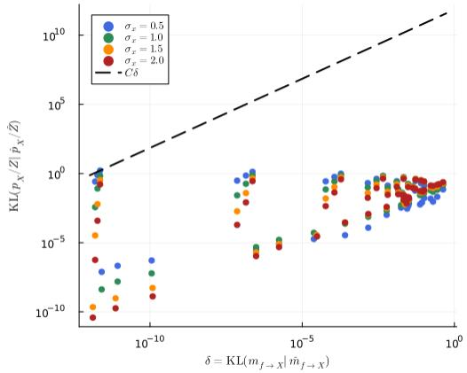

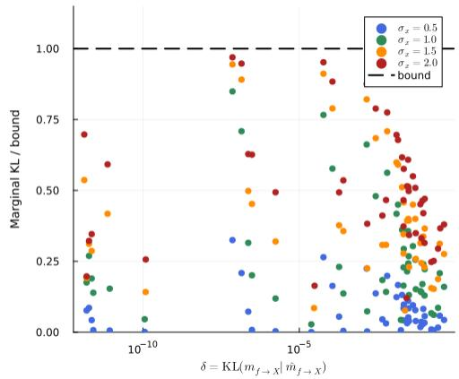  
Figure 3: Empirical validation of Theorem 2.3 across 192 leaky-ReLU factor configurations. Left: log-log scatter of message error δ versus marginal error; the dashed line Cδ (with $C =$ $\| m _ { X _ { j }  f } \| _ { \infty } / Z )$ lies above every point, confirming O(δ) scaling. $R i g h t \colon$ the marginal KL normalised by its per-configuration bound $\| m _ { X _ { j }  f } \| _ { \infty } / Z \cdot \delta ;$ all 192 ratios lie below the bound line at 1 (maximum ratio $0 . 9 7 )$ , directly certifying the theorem. The bound is tight: the $\| m _ { X _ { j } \to f } \| _ { \infty } / Z$ prefactor evaluates the Gaussian sup-norm, which is largest where the incoming message is most concentrated and the marginal error is therefore small anyway.

## C.2 BOUND TIGHTNESS: PER-PARAMETER SWEEPS

Figure 4 isolates each parameter axis in turn, holding the others fixed, and overlays the actual marginal KL (solid) with the theoretical bound (dashed) to show directly how the gap varies. Three qualitatively different behaviors emerge. Panel $( a ) - S N R \ r \colon$ the bound decreases monotonically, while the actual marginal KL is non-monotone: small at low r (where the DMA moment-match of a near-symmetric message is accurate), peaking at moderate $r \approx 2 \mathrm { - 3 }$ (where the asymmetric kink of the leaky ReLU is hardest to capture), then declining again as both messages concentrate at high r. Panel (b) — leaky slope α: both quantities decrease monotonically as $\alpha  1$ (the factor approaches a linear copy, which is conjugate and has $\delta = 0 )$ and grow as $\alpha  0$ (approaching the improper hard-ReLU limit). Panel (c) — incoming width $\sigma _ { x } \colon$ widening the incoming message at fixed r lets more backward-message approximation error propagate into the marginal, so the actual KL increases; the bound’s prefactor $\| m _ { X _ { j }  f } \| _ { \infty } / Z \propto 1 / \sigma _ { x }$ simultaneously decreases (the Gaussian sup-norm decays as $1 / \sigma _ { x }$ while Z grows more slowly). The bound is therefore most conservative at small $\sigma _ { x } .$ , where the narrow incoming message masks the backward approximation error in the marginal.

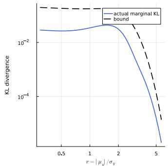

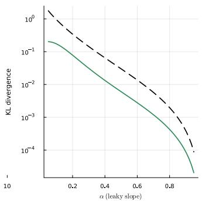

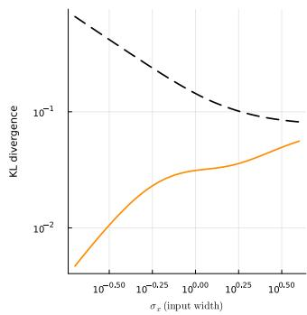  
Figure 4: Actual marginal KL (solid, coloured) versus the theoretical bound $\| m _ { X _ { j }  f } \| _ { \infty } / Z \cdot \delta$ (dashed, black) as each parameter is swept individually (legend shown in panel (a)). (a) Input SNR $r \ ( \alpha = 0 . 3 , \sigma _ { x } = 1 $ fixed): the bound decays monotonically; the actual KL is non-monotone, peaking near $r \approx 2 \mathrm { - 3 }$ where the ReLU kink is hardest to match, and small at both low and high r. (b) Leaky slope α $\mathbf { \Phi } _ { \langle } ( r = 2 , \sigma _ { x } = 1$ fixed): both decrease as $\alpha  1$ (linear factor, $\delta = 0 )$ and grow as $\alpha  0$ (approaching the improper hard-ReLU limit). (c) Input width $\sigma _ { x } ~ ( r = 2 , \alpha = 0 . 3$ fixed): the actual KL increases with $\sigma _ { x }$ (wider incoming message exposes more backward-message error in the marginal), while the bound decreases through its $1 / \sigma _ { x }$ prefactor; the conservatism is greatest at small $\sigma _ { x }$ . In all panels the bound lies strictly above the actual KL, with a maximum ratio of 0.68 across all three sweeps (width sweep, panel (c)).

## C.3 SNR SWEEP: FACTOR-LEVEL APPROXIMATION QUALITY

Setup. For each factor and each SNR value r, we draw $N = 5 0 0 { , } 0 0 0$ samples from the incoming Gaussian messages, propagate them through the factor’s deterministic relation, and weight them by the remaining incoming message to obtain an IS estimate of the true marginal. We then compute $\mathrm { K L } ( p _ { \mathrm { I S } } | | q _ { \mathrm { D M A } } )$ via a normalized weighted histogram with 500 bins covering the 0.1%–99.9% quantile range of the IS distribution. The dashed reference line $C / r ^ { 2 }$ is fitted to the high-SNR region $( r \geq 4 )$ by taking the median of $\mathrm { K L } ( r ) \cdot r ^ { 2 }$ . Figure 5 shows the results for both factors.

## C.4 COPY FACTOR: GAUSSIAN–LOG-NORMAL APPROXIMATION

The product backward message (Proposition 3.2) is derived via two copy-factor steps that bridge the Gaussian and log-normal families. Step 1 (backward): the exact backward message $\mathrm { L N } ( \cdot ; \mu _ { Y } , \sigma _ { Y } ^ { 2 } )$ (log-space parameterised) is approximated by a moment-matched Gaussian $\hat { m } _ { f  X }$ . Step 2 (forward): the Gaussian message $\mathcal { N } ( \cdot ; \mu _ { X } , \sigma _ { X } ^ { 2 } )$ is approximated by a moment-matched log-normal $\mathrm { L N } _ { \mathrm { m } } .$ . Both introduce $O ( 1 / r ^ { 2 } )$ KL error (Lemma B.3); Figure 6 confirms this empirically.

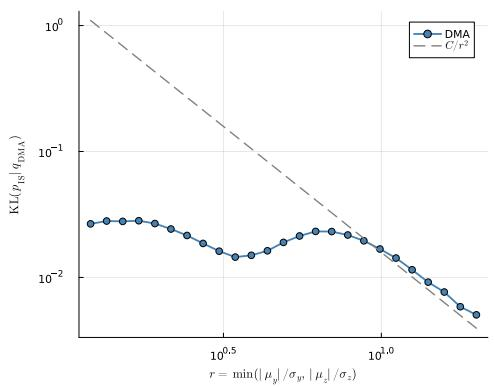

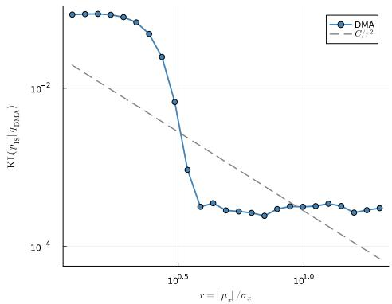  
Figure 5: KL divergence between IS reference marginal and DMA marginal as a function of input SNR $r . \ L e f t { . }$ : product factor backward message to X from $Z = X Y ;$ incoming messages $\bar { Y _ { \mathbf { \alpha } } } \sim$ $\mathcal { N } ( \mu _ { y } , ( \mu _ { y } / r ) ^ { 2 } )$ and $Z \sim \mathcal { N } ( \mu _ { z } , ( \mu _ { z } / r ) ^ { 2 } )$ with $\mu _ { y } = 4 , \mu _ { z } = 1 0$ , and the incoming message from X fixed at $\left. { \mathcal { N } } ( 3 , 1 ) \right.$ ). Right: ReLU backward message to $\dot { \boldsymbol { X } }$ from $Y = \operatorname { r e l u } ( X ; \alpha )$ with $\alpha = 0 . 1$ incoming message $X \sim \mathcal { N } ( \mu _ { x } , ( \mu _ { x } / r ) ^ { 2 } )$ with $\mu _ { x } = 1$ . Both panels show empirical $O ( 1 / r ^ { 2 } )$ decay. The product backward (left) is covered by Theorem 3.3; the leaky-ReLU backward (right, $\alpha { = } 0 . 1$ proper message) is consistent with Theorem 2.3 applied to the message KL.

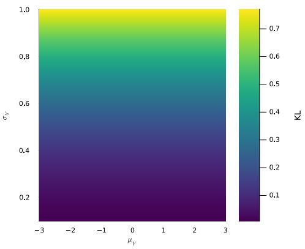

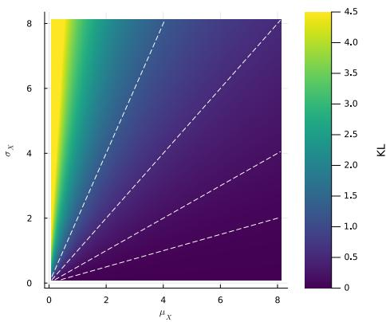  
Figure 6: Copy-factor KL divergence over the 2D parameter space, computed from the closed-form expression in Lemma B.3 (no Monte Carlo). Left: Step 1 error $\mathrm { K L } [ \dot { \mathrm { L N } } ( \cdot ; \mu _ { Y } , \sigma _ { Y } ^ { 2 } ) , \hat { m } _ { f  X } ( \cdot ) ]$ swept over $\left( \mu _ { Y } , \sigma _ { Y } \right)$ Horizontal bands confirm that the KL depends only on the logspace variance $\sigma _ { Y } ^ { 2 }$ , not on $\mu _ { Y } ;$ the analytical rate is ${ \textstyle \frac { 3 } { 4 } } \sigma _ { Y } ^ { 2 } + O ( \sigma _ { Y } ^ { 4 ^ { \bullet } } )$ . $R i g h t \colon$ Step 2 error $\mathrm { K L } [ \mathrm { L N } _ { \mathrm { m } } ( \cdot ; \mu _ { X } , \sigma _ { X } ^ { 2 } )$ $\mathcal { N } ( \cdot ; \mu _ { X } , \sigma _ { X } ^ { 2 } ) ]$ swept over $( \mu _ { X } , \sigma _ { X } )$ . Dashed white lines are level curves of $r = \mu _ { X } / \sigma _ { X }$ ; diagonal banding confirms the KL depends only on r, consistent with the $O ( 1 / r ^ { 2 } )$ rate.

## C.5 PRODUCT FACTOR

The left panel of Figure 5 shows the product backward message (to X given $Z = X Y )$ . This is the case covered by Theorem 3.3: the exact message is improper (non-normalisable), so the IS reference is the true marginal of X rather than the message itself. The theorem predicts $O ( 1 / r ^ { 2 } )$ total KL error; the sweep confirms this rate empirically across two decades of $r . { \mathrm { A t } } r = 2$ (the theorem’s stated threshold for properness of the truncated reference), the KL is already small; at $r ~ = ~ 1 0$ it is several orders of magnitude smaller, tracking the dashed $C / r ^ { 2 }$ reference closely. Figure 7 compares DMA and IS marginals at a nominal and a stress configuration; the forward marginal $( Z )$ is well approximated in both cases, while the backward marginals $( X , Y )$ become increasingly non-Gaussian under stress, illustrating the regime where the $O ( \bar { 1 / { r ^ { 2 } } } )$ bound is most relevant.

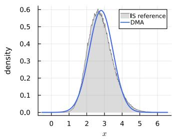

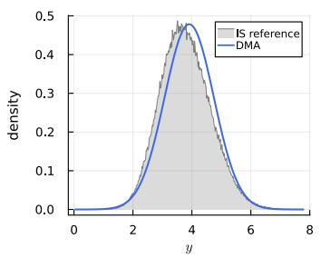

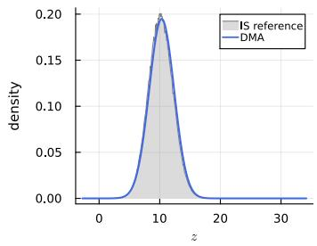

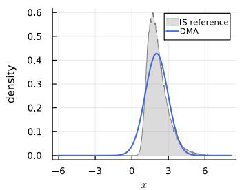

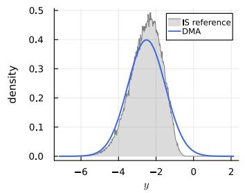

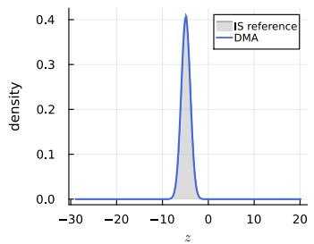  
Figure 7: Product factor $f ( X , Y , Z ) = \delta ( Z - X Y )$ . Each row shows marginals X, Y, Z (left to right). Blue: DMA. Gray: $\mathrm { I S . \ ( a ) \ N o m i n a l } ( \mu _ { X } = 3 , \overset { \cdot } { \sigma } _ { X } ^ { 2 } = 1 , \mu _ { Y } = 4 , \sigma _ { Y } ^ { 2 } = \overset { \cdot } { 1 , } \mu _ { Z } = 1 0 , \sigma _ { Z } ^ { 2 } = 5 )$ : the $Z$ forward marginal is well approximated by the DMA Gaussian; the X and Y backward marginals are already noticeably skewed in the IS reference. (b) Stress $( \mu _ { X } = 1 , \sigma _ { X } ^ { 2 } = 4 , \mu _ { Y } = - 2 . 5 , \sigma _ { Y } ^ { 2 } = 1$ $\mu _ { Z } = - 5 , \bar { \sigma _ { Z } ^ { 2 } } = 1 )$ : Z remains well approximated; the X and $Y$ backward marginals become severely non-Gaussian.

## C.6 RELU FACTOR

The right panel of Figure 5 shows the leaky ReLU backward message $( \alpha = 0 . 1 )$ . Unlike the product factor, the leaky ReLU backward message is always proper (the normalisation correction via the Mills ratio is finite for all $\alpha > 0 )$ , so this case is covered directly by the master theorem. The empirical $O ( 1 / r ^ { 2 } )$ decay is consistent with the general $\mathrm { O } ( \delta )$ bound, and the absolute KL values are lower than the product factor at matched $r ,$ reflecting the smoother shape of the leaky ReLU factor compared to the ratio $X = Z / Y$ The standard ReLU $( \alpha = 0 )$ backward message is improper; that case is analogous to the product factor and is not shown. Figure 8 shows DMA versus IS at a nominal input: the backward marginal IS reference is non-Gaussian (sharp, asymmetric), and the forward marginal IS has a point mass at $y = 0$ from the leaky branch; the DMA Gaussian captures the bulk location but cannot represent these non-Gaussian features.

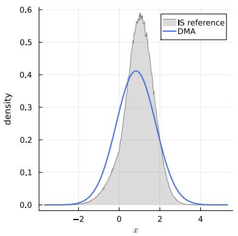

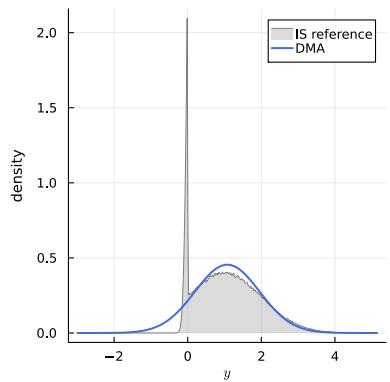  
Figure 8: ReLU / Leaky-ReLU factor $( \alpha = 0 . 1 )$ , nominal scenario $( \mu _ { X } = 1 , \sigma _ { X } ^ { 2 } = 1 )$ . Left: backward marginal X. Right: forward marginal Y. Blue: DMA, Gray: IS reference

## D INFERENCE ALGORITHM

Algorithm 1 gives the complete DMA BNN training procedure. We write $( \mu _ { i j } ^ { ( l ) } , \sigma _ { i j } ^ { 2 , ( l ) } )$ for the mean and variance of ${ { q } _ { W _ { i j } ^ { \left( l \right) } } }$

Scalar decomposition. The matrix-vector product $\begin{array} { r } { z _ { i } ^ { ( l ) } = \sum _ { j = 1 } ^ { d _ { l - 1 } } W _ { i j } ^ { ( l ) } x _ { j } ^ { ( l - 1 ) } } \end{array}$ decomposes into $d _ { l - 1 }$ product factors $z _ { i j } ^ { ( l ) } = W _ { i j } ^ { ( l ) } x _ { j } ^ { ( l - 1 ) }$ and one linear sum factor per output unit i. Forward messages are summed exactly under independence (means and variances add). The backward message to $\bar { z } _ { i j } ^ { ( l ) }$ subtracts the total forward mean $\mu _ { z _ { i } } ^ { ( l ) }$ and re-adds $\mu _ { z _ { i j } } ^ { ( l ) }$ ; the backward variance adds $\sigma _ { z _ { i } } ^ { 2 , ( l ) }$ and subtracts $\sigma _ { z _ { i j } } ^ { 2 , ( l ) }$ (Gaussian deconvolution: exact for linear factors). The backward message to $x _ { j } ^ { ( l - 1 ) }$ is accumulated in precision form $( \tau , \rho )$ over all output units i before conversion to moments.

Mini-batch EP structure. The N training examples are split into B mini-batches of size $N / B$ Each mini-batch b has one stored outgoing weight message $m _ { l , i j } ^ { ( b ) }$ , representing the combined likelihood contribution of that batch. Before processing batch $b ,$ its previous message is divided out of the current weight marginal to form the incoming belief ${ q } _ { W _ { i + } ^ { ( l ) } } ^ { - b }$ (the product of the prior and all other batches’ messages). After processing all examples in the batch, the new outgoing message is extracted as $m _ { \mathrm { n e w } } ^ { ( b ) } = q _ { W } / q _ { W } ^ { - b }$ . Setting $B = N$ (one example per batch) recovers per-example EP.

Prior, likelihood, and convergence. Prior factors $\mathcal { N } ( \mu _ { i j } ^ { ( l ) } , \sigma _ { 0 } ^ { 2 } )$ with He-style random means $\mu _ { i j } ^ { ( l ) } \sim \mathcal { N } ( 0 , 1 / d _ { l - 1 } )$ , the Gaussian likelihood $\mathcal { N } ( y _ { n } ; z ^ { ( L ) } , \beta ^ { 2 } )$ , and the optional activation prior factors $\mathcal { N } ( 0 , \sigma _ { \mathrm { a c t } , l } ^ { 2 } )$ on each pre-activation $z _ { i } ^ { ( l ) }$ all contribute exact messages $( \delta \ = \ 0 ) ;$ ; in the paper experiments all $\sigma _ { \mathrm { a c t } , l } ^ { 2 } = \infty$ (uniform, no prior). The observed input $x _ { n }$ enters as a point mass $( \sigma ^ { 2 } = 0 )$ . Convergence is checked after each full epoch via the normalised average log-likelihood $\begin{array} { r } { \mathcal { L } _ { e } = \frac { 1 } { N } \sum _ { n } \log \breve { p } ( y _ { n } \mid x _ { n } ) } \end{array}$ : training stops when $\lceil \mathcal { L } _ { e } - \mathcal { L } _ { e - 1 } \rceil /$ max(ϵfloor, |Le−1|) < ε, where ϵfl is a small numerical constant. Per-example cost: $O ( \sum _ { l } d _ { l } d _ { l - 1 } )$

Remark D.1. On the first pass every $m ^ { ( b ) }$ is uniform (zero precision), so the initial division leaves the marginal unchanged. After convergence the weight marginal satisfies ${ q _ { W _ { i j } ^ { ( l ) } } \propto \mathcal { N } ( \mu _ { i j } ^ { ( l ) } , \sigma _ { 0 } ^ { 2 } ) }$

$\textstyle \prod _ { b = 1 } ^ { B } m _ { l , i j } ^ { ( b ) }$ : the prior message times one stored factor message per mini-batch. The forward pass uses the full current belief ${ { q } _ { W _ { i i } ^ { ( l ) } } }$ (not a cavity), so within a batch each example conditions on the beliefs accumulated from the prior and all other batches without requiring a per-example cavity state. The convergence threshold ε controls only the outer epoch loop; it does not appear in any per-factor message computation and is not a learning rate.

Algorithm 1: DMA BNN Training (1/2: initialisation and forward sweep)   
Input: Data $\{ ( x _ { n } , y _ { n } ) \} _ { n = 1 } ^ { N } ;$ widths $d _ { 0 } , \ldots , d _ { L } ;$ ; leaky-ReLU slopes $\alpha _ { 1 } , \ldots , \alpha _ { L - 1 } ;$   
mini-batches $B ; \sigma _ { 0 } ^ { 2 }$ (prior var.); $\beta ^ { 2 }$ (noise var.); $\sigma _ { \mathrm { a c t } , l } ^ { 2 } , l { \stackrel { \cdot } { = } } 1 , \ldots , L$ (act. prior var.; ∞ =   
no prior); ε (conv. threshold); E (max epochs).   
Output: Weight beliefs $\{ q _ { W _ { i j } ^ { ( l ) } } \} _ { l , i , j } .$   
$/ / \ m _ { l , i j } ^ { ( b ) } :$ stored outgoing msg from mini-batch b to $W _ { i j } ^ { ( l ) } .$ ; all   
initialised to uniform   
$\mu _ { i j } ^ { ( l ) } \sim \mathcal { N } ( 0 , 1 / d _ { l - 1 } ) ;$   
$q _ { W _ { i j } ^ { ( l ) } } \gets \mathcal { N } ( \mu _ { i j } ^ { ( l ) } , \sigma _ { 0 } ^ { 2 } )$ for all $l , i \leq d _ { l } , j \leq d _ { l - 1 }$   
(b)   
ml,ij ← uniform for all $b \leq B , l , i \leq d _ { l } , j \leq d _ { l - 1 }$   
for ${ \dot { e } } = 1 , \dots , E$ do   
for $b = 1 , \dots , B$ (mini-batch $B _ { b } , | B _ { b } | = N / B )$ do   
$q _ { W _ { i j } ^ { ( l ) } } ^ { - b }  q _ { W _ { i j } ^ { ( l ) } } \div m _ { l , i j } ^ { ( b ) } ;$   
$q _ { W _ { i j } ^ { ( l ) } }  q _ { W _ { i j } ^ { ( l ) } } ^ { - b }$ for all $l , i \le d _ { l } , j \le d _ { l - 1 } \quad \quad / /$ divide out old batch msg   
for each n $\in \boldsymbol { B } _ { b }$ do   
$\mu _ { j } ^ { ( 0 ) }  x _ { n , j } ,$   
$\sigma _ { j } ^ { \bar { 2 } , ( 0 ) } \gets 0$ for $j = 1 , \ldots , d _ { 0 }$ // point-mass input, $\delta = 0$   
for $l = 1$ to L do   
for $i = 1 , \ldots , d _ { l }$ do   
for $j = 1 , \dots , d _ { l - 1 }$ do   
$\overline { { \mu _ { z _ { i j } } ^ { ( l ) } } }  \mu _ { i j } ^ { ( l ) } \ : \mu _ { j } ^ { ( l - 1 ) }$ // product factor (Prop. 3.1)   
$\sigma _ { z _ { i j } } ^ { 2 , ( l ) }  \sigma _ { i j } ^ { 2 , ( l ) } ( \mu _ { j } ^ { ( l - 1 ) } ) ^ { 2 } + \sigma _ { j } ^ { 2 , ( l - 1 ) } ( \mu _ { i j } ^ { ( l ) } ) ^ { 2 } + \sigma _ { i j } ^ { 2 , ( l ) } \sigma _ { j } ^ { 2 , ( l - 1 ) }$   
end   
$\begin{array} { r } { \mu _ { z _ { i } } ^ { ( l ) }  \sum _ { j } \mu _ { z _ { i j } } ^ { ( l ) } ; } \end{array}$   
$\begin{array} { r } { \sigma _ { z _ { i } } ^ { 2 , ( l ) } \gets \sum _ { j } \sigma _ { z _ { i j } } ^ { 2 , ( l ) } } \end{array}$ $/ /$ sum factor   
$/ /$ Act. prior $\mathcal { N } ( 0 , \sigma _ { \mathrm { a c t } , l } ^ { 2 } )$ : zero mean $\Rightarrow \ \tau _ { z _ { i } } ^ { ( l ) }$   
unchanged; $\sigma _ { \mathrm { a c t } , l } ^ { 2 } = \infty \ = \ \mathrm { n o - o p }$   
$\tau _ { z _ { i } } ^ { ( l ) }  \mu _ { z _ { i } } ^ { ( l ) } / \sigma _ { z _ { i } } ^ { 2 , ( l ) } ;$   
$\rho _ { z _ { i } } ^ { ( \bar { l } ) }  \mathrm { \ i } / \sigma _ { z _ { i } } ^ { 2 , ( \bar { l } ) } + 1 / \sigma _ { \mathrm { a c t } , l } ^ { 2 } \qquad \mu _ { z _ { i } } ^ { ( l ) }  \tau _ { z _ { i } } ^ { ( l ) } / \rho _ { z _ { i } } ^ { ( l ) } ;$   
$\sigma _ { z _ { i } } ^ { 2 , ( l ) } \gets 1 / \rho _ { z _ { i } } ^ { ( l ) }$   
$\mathbf { i f } l < L$ then $( \mu _ { i } ^ { ( l ) } , \sigma _ { i } ^ { 2 , ( l ) } ) \gets \mathrm { R e L U F w d } ( \mu _ { z _ { i } } ^ { ( l ) } , \sigma _ { z _ { i } } ^ { 2 , ( l ) } , \alpha _ { l } )$ // ReLU   
factor (Prop. 3.4)   
end   
end   
$( \mu _ { i } ^ { \mathrm { b w d } , ( L ) } , \sigma _ { i } ^ { 2 , \mathrm { b w d } , ( L ) } ) \gets ( y _ { n , i } , \beta ^ { 2 } )$ for $i = 1 , \ldots , d _ { L }$ // likelihood   
backward to $z ^ { ( L ) }$ $\delta = 0$   
end   
$m _ { l , i j } ^ { ( b ) }  q _ { W _ { i j } ^ { ( l ) } } \div q _ { W _ { i j } ^ { ( l ) } } ^ { - b }$ for all $l , i \leq d _ { l } , j \leq d _ { l - 1 }$ // extract new batch msg   
end   
end

Algorithm 1: DMA BNN Training (2/2: backward sweep and convergence check)   
// (per example $n \in B _ { b } .$ , mini-batch $b ,$ epoch e:)   
// --- Backward sweep: directly update q (no per-example   
cavity) ---   
for $l = L$ to 1 do   
$\tau _ { j } ^ { x } \gets 0 ,$   
$\rho _ { j } ^ { x } \gets 0$ for $j = 1 , \dots , d _ { l - 1 }$   
for $i = 1 , \ldots , d _ { l }$ do   
for $j = 1 , \dots , d _ { l - 1 }$ do   
// Sum-factor backward $\begin{array} { r l } { \mathrm { t } \circ } & { { } z _ { i j } ^ { ( l ) } } \end{array}$ : Gaussian deconvolution   
(exact)   
$\mu _ { i j } ^ { \mathrm { c a v } }  \mu _ { i } ^ { \mathrm { b w d } , ( l ) } - \mu _ { z _ { i } } ^ { ( l ) } + \mu _ { z _ { i j } } ^ { ( l ) }$   
$\sigma _ { i j } ^ { 2 , \mathrm { { c a v } } }  \sigma _ { i } ^ { 2 , \mathrm { { b w d } } , ( l ) } + \sigma _ { z _ { i } } ^ { 2 , ( l ) } \bar { \mathbf { \Sigma } } - \sigma _ { z _ { i j } } ^ { 2 , ( l ) }$   
$/ /$ Product backward to $W _ { i j } ^ { ( l ) }$ (Prop. 3.2): compute and   
apply   
$m _ { l , i j } ^ { \mathrm { n e w } } $ ProdBwd ${ _ W } \big ( \mu _ { i j } ^ { \mathrm { c a v } } , \sigma _ { i j } ^ { 2 , \mathrm { c a v } } , \mu _ { j } ^ { ( l - 1 ) } , \sigma _ { j } ^ { 2 , ( l - 1 ) } \big )$   
$q _ { W _ { i j } ^ { ( l ) } } \gets q _ { W _ { i j } ^ { ( l ) } } \times m _ { l , i j } ^ { \mathrm { n e w } }$   
// Product backward to $x _ { j } ^ { ( l - 1 ) }$ (Prop. 3.2, W↔x)   
$( \Delta \tau _ { j } , \Delta \rho _ { j } )$ ← ProdBwdX $\cdot ( \mu _ { i j } ^ { \mathrm { c a v } } , \bar { \sigma } _ { i j } ^ { \mathrm { 2 , c a v } } , \mu _ { i j } ^ { ( l ) } , \sigma _ { i j } ^ { 2 , ( l ) } )$   
$\tau _ { j } ^ { x } \mathrel { + } = \Delta \tau _ { j } ;$   
$\rho _ { j } ^ { x } \ + = \Delta \rho _ { j }$ // accumulate backward precision to $x _ { j } ^ { ( l - 1 ) }$ over i   
end   
end   
// Convert accumulated backward msgs at $x ^ { ( l - 1 ) }$ to moment form   
$( \mu _ { j } ^ { \mathrm { b w d } , x , ( l - 1 ) } , \sigma _ { j } ^ { 2 , \mathrm { b w d } , x , ( l - 1 ) } ) \gets ( \tau _ { j } ^ { x } / \rho _ { j } ^ { x } , 1 / \rho _ { j } ^ { x } )$ for $j = 1 , \dots , d _ { l - 1 }$   
if $l > 1$ then $( \mu _ { i } ^ { \mathrm { { \bar { b w d } } , ( \it l - 1 ) } } , \sigma _ { i } ^ { 2 , \mathrm { b w d , ( \it l - 1 ) } } ) \stackrel { \cdot } {  }$   
ReLUBwd(µbwd,x,(l−1)i , σi 2,bwd,x,(l−1) µ(l−1)z , σ2,(l−1)z , αl−1) for $i \leq d _ { l - 1 }$ // ReLU   
backward to $z ^ { ( l - 1 ) }$ (Prop. 3.5)   
end   
// --- Convergence check (once per full epoch, after all   
mini-batches complete) ---   
$\begin{array} { r } { \mathcal { L } _ { e }  \frac { 1 } { N } \sum _ { n = 1 } ^ { N } } \end{array}$ log p(yn | xn) // normalised average log-likelihood under   
current beliefs   
if $| \mathcal { L } _ { e } - \mathcal { L } _ { e - 1 } | \ /$ max(ϵfloor, $| { \mathcal { L } } _ { e - 1 } | ) < \varepsilon$ then return $\{ q _ { W _ { i j } ^ { ( l ) } } \}$   
// (repeat for next epoch e + 1; after E epochs:)   
return $\{ q _ { W _ { i j } ^ { ( l ) } } \}$

## E EXPERIMENTAL DETAILS AND EXTENDED RESULTS

## E.1 1D REGRESSION: FEATURE MAP AND ARCHITECTURE

The fixed feature map prepended to the learnable network is $\varphi \colon \mathbb { R }  \mathbb { R } ^ { 7 } \colon$

$$
\varphi ( x ) = \left[ x , e ^ { - ( x + 2 ) ^ { 2 } } , e ^ { - ( x + 1 ) ^ { 2 } } , e ^ { - x ^ { 2 } } , e ^ { - ( x - 1 ) ^ { 2 } } , e ^ { - ( x - 2 ) ^ { 2 } } , \sin ( x ) \right] ^ { \top } .
$$

Output channels are standardised to zero mean and unit variance over $[ - 5 , 5 ]$ and a constant bias is appended, giving an 8-dimensional input to the learnable layers. The learnable network has two hidden layers of widths $d _ { 1 } = 6$ and $d _ { 2 } = 5$ with leaky-ReLU activations $( \alpha _ { 1 } = 0 . 4 , \alpha _ { 2 } = 0 . 8 )$ and a scalar output layer; the observation model is Gaussian with $\beta = 0 . 2$ . Training runs for up to 200 epochs with 10 mini-batches of 20 examples each, stopping when the relative change in normalised log-likelihood falls below 0.1.

Weight initialisation uses He-style fan-in scaling throughout. For each weight $W _ { i j } ^ { ( l ) }$ the prior mean is drawn independently from $\mathcal { N } ( 0 , 1 / d _ { l - 1 } )$ , giving a per-weight prior ${ q _ { W _ { i j } ^ { ( l ) } } = \mathcal { N } ( \mu _ { i j } ^ { ( l ) } , \sigma _ { 0 } ^ { 2 } ) }$ with $\mu _ { i j } ^ { ( l ) } \sim \mathcal { N } ( 0 , 1 / d _ { l - 1 } )$ and $\sigma _ { 0 } ^ { 2 } = 1 / \big ( ( L - 1 ) d _ { l - 1 } \big )$ , where $L = 4$ counts all layers including the fixed feature map. The marginal prior on each weight (integrating out the random mean) is $\mathcal { N } ( 0 , L / ( L -$ $1 ) d _ { l - 1 } ) ,$ ), which for ${ \cal L } = 4 \mathrm { i s } { \mathcal N } ( 0 , 4 / ( 3 d _ { l - 1 } ) )$ . For the three learnable layers this gives marginal standard deviations of 0.47, 0.47, 0.52 (fan-in 8, 6, 5 respectively). The data-generating weights are drawn from the same per-layer prior (random mean drawn first, weight sampled from that Gaussian), so the model is correctly specified.

## E.2 COMPARISON WITH ADAM

Setup. We compare DMA against Adam (Kingma & Ba, 2015) on the same task $( N = 2 0 0 , \beta =$ 0.2, architecture and priors as in Section 4.3). DMA stops when the relative change in normalised log-likelihood falls below 0.1; Adam is run at four learning rates $\eta \in \{ 1 0 ^ { - 3 } , 1 0 ^ { - 2 } , 1 0 ^ { - 1 } , 1 \}$ for 200 epochs. Extrapolation quality is assessed on 60 test points in $[ - 4 , \dot { - } 2 . 5 ] \cup [ 1 . 5 , 3 ]$ against the true data-generating function.

Results. Figure 9 summarises both comparisons. Left: DMA (solid black) stops automatically at epoch 17 at NLL ≈ −0.16; Adam’s trajectories fan out over three orders of magnitude depending on η, with $\eta = 1 0 ^ { - 3 }$ still far from convergence at epoch 200 and $\eta = 1 0 ^ { - 1 }$ reaching the best level but only after ∼80 epochs. Right: after training, Adam $( \eta = 0 . 1 )$ produces a point estimate with no uncertainty quantification, yielding an extrapolation NLL of 6.6 nats/example; DMA’s predictive variance grows outside [−2.5, 1.5] (see also Figure 2), giving an extrapolation NLL of 0.54.

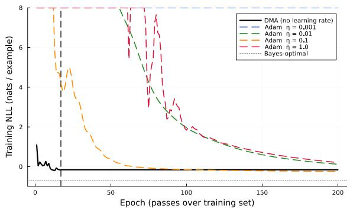

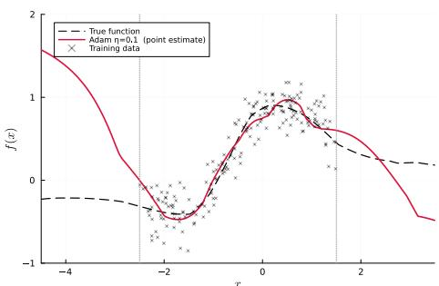  
Figure 9: Left: Training negative log-likelihood $\begin{array} { r } { ( \mathrm { N L L } = - \frac { 1 } { N } \sum _ { i } \log p ( y _ { i } \mid x _ { i } ) } \end{array}$ , nats/example) versus epoch for DMA (solid black) and Adam at four learning rates (dashed). DMA’s outer updates stop automatically at epoch 17; Adam’s speed and final NLL depend critically on η. Values above 8 are clipped to 8 for display. Right: Adam $( \eta = 0 . 1 )$ point prediction outside the training range [−2.5, 1.5] (dotted verticals); the true function (dashed) can deviate arbitrarily from the point estimate, with no uncertainty quantification available. Compare with the widening DMA posterior in Figure 2. DMA’s per-epoch cost is 0.80 ms versus 0.45 ms for Adam on this architecture $( 1 . 8 \times )$ but DMA’s early stopping at epoch 17 versus Adam’s ∼80 gives an overall ∼5× reduction in total training time.

Discussion. DMA requires no learning-rate tuning: the stopping criterion fires automatically when beliefs stop changing, requiring no learning-rate search. Adam’s final NLL and convergence speed depend critically on η; finding the right rate requires a full training run per candidate. Outside the training region Adam’s uncertainty is fixed at $\beta ,$ because a point estimate has no mechanism to express ignorance; DMA’s predictive variance $\mathrm { V a r } [ f ( x ) ] + \beta ^ { 2 }$ grows structurally wherever the factor graph receives no backward messages that sharpen the weight beliefs (Corollary 2.4).

## E.3 COMPARISON WITH ADAMW

AdamW (Loshchilov & Hutter, 2019) decouples weight decay from the adaptive gradient update, making it the closest gradient-based analogue to MAP inference with a Gaussian prior: a weight decay λ corresponds to a prior $\mathcal { N } ( 0 , 1 / \bar { \lambda ) }$ per weight when the NLL is averaged over N examples. We compare DMA against AdamW on the same 83-weight 1D regression task as $\mathsf { A p - }$ pendix E.2, fixing the learning rate at $\eta = 0 . 1$ (the best Adam rate) and sweeping weight decay $\lambda \in \{ 0 . 0 1 , 0 . 1 , 1 . 0 , 1 0 . 0 \}$ . The DMA prior has $\sigma _ { 0 } ^ { 2 } \approx 1 / d _ { l - 1 }$ (He-style fan-in scaling; Section E.1), so the prior-matched $\lambda \approx \stackrel { \cdot } { d } _ { l - 1 } \approx 6 - 8 ;$ the sweep brackets this range.

Results. Figure 10 (left) shows training NLL versus epoch for an illustrative run. Across all weight decay values AdamW converges to a similar training NLL as plain Adam; weight decay regularises the weights but does not accelerate or substantially change convergence speed. Table 3 reports median extrapolation NLL and interquartile range over 20 independently drawn datasets and true functions, giving a statistically robust picture. DMA achieves a median extrapolation NLL of 0.80 (IQR 1.95), substantially better than every AdamW configuration (best: median 4.05, IQR 10.81 fo $\eta = 0 . 0 1 , \lambda = 1 . 0 )$ . The large IQRs for AdamW reveal high variance across problem instances: individual seeds can land near the Bayes-optimal value when the weight-decay prior happens to match the true function well, but there is no reliable way to identify such seeds without exhaustive search. The dotted curves in Figure 10 further show that $\eta = 0 . 0 1$ converges slowly and $\eta = 1 . 0$ diverges even at the prior-matched $\lambda = 1 . 0$ , while $\lambda = 0 . 0 1$ fails at $\eta = 0 . 1$ ; DMA achieves its result without any learning-rate or weight-decay search. More importantly, AdamW remains a point estimate: it extrapolates without uncertainty quantification, so the predictive band is fixed at ±2β regardless of distance from the training region; calibrated widening intervals are unavailable.

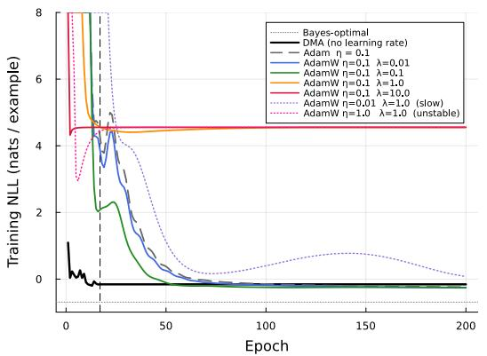

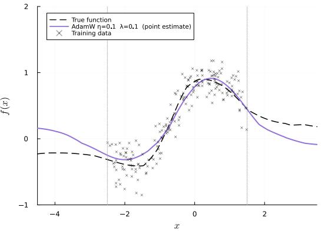  
Figure 10: $L e f t { \mathrm { : } }$ Training NLL vs. epoch for DMA (solid black), Adam $\eta = 0 . 1$ (dashed grey), AdamW $\eta ~ = ~ 0 . 1$ at four weight decay values (solid coloured), and two poorly-tuned AdamW configurations $( \eta = 0 . 0 1$ and $\eta = 1 . 0$ , both $\lambda = 1 . 0$ , dotted) illustrating hyperparameter sensitivity. Right: AdamW $\eta = 0 . 1 , \lambda = 0 . 1$ (best weight decay on this seed) point prediction outside the training range $[ - 2 . 5 , 1 . 5 ]$ (dotted verticals); the true function (dashed) is tracked well on this seed but no uncertainty quantification is available.

## E.4 WHY EP IS NOT A VIABLE BASELINE

Expectation Propagation (EP) (Minka, 2001) is the closest algorithmic ancestor of DMA and the method against which DMA is most naturally compared. We therefore considered EP as a direct experimental baseline. However, standard Gaussian EP is not reliably applicable to the BNN factor graph considered here.

EP updates a global Gaussian approximation by locally matching moments and then recovering the factor-to-variable site message by dividing the projected marginal by the cavity message. For a Gaussian approximation, this recovery requires the resulting site to remain a proper distribution. In particular, if the projected marginal is wider than the cavity, the recovered Gaussian site has negative precision and is therefore not a valid Gaussian factor. This failure mode is especially relevant for the nonlinear product and ReLU factors in our network: both can project a marginal that is wider than the incoming cavity, and both are identified as sources of negative-precision sites in Appendix $\mathrm { A } -$ indeed, it is one of the structural pathologies that motivates DMA (Definition 2.1).

Table 3: Extrapolation NLL (↓ better) on the 83-weight 1D regression task, averaged over 20 seeds (median [IQR]). Bayes-optimal ≈ −0.69 nats.
<table><tr><td rowspan="2">Method</td><td rowspan="2">Epochs</td><td colspan="2">Extrapolation NLL</td></tr><tr><td>Median</td><td>IQR</td></tr><tr><td>DMA (posterior predictive)</td><td>16</td><td>0.80</td><td>1.95</td></tr><tr><td>Adam  $\eta = 0 . 1$ </td><td>200</td><td>12.09</td><td>11.52</td></tr><tr><td> $\mathrm { A d a m W } \eta = 0 . 1 , \lambda = 0 . 0 1$ </td><td>200</td><td>8.05</td><td>10.73</td></tr><tr><td> $\mathrm { A d a m w } \eta = 0 . 1 , \lambda = 0 . 1$ </td><td>200</td><td>5.52</td><td>9.86</td></tr><tr><td> $\mathrm { A d a m W } \eta = 0 . 1 , \lambda = 1 . 0$ </td><td>200</td><td>4.07</td><td>10.47</td></tr><tr><td> $\mathrm { A d a m W } \eta = 0 . 1 , \lambda = 1 0 . 0$ </td><td>200</td><td>4.08</td><td>8.59</td></tr><tr><td> $\mathrm { A d a m W } \eta = 0 . 0 1 , \lambda = 1 . 0$ </td><td>200</td><td>4.05</td><td>10.81</td></tr><tr><td> $\mathbf { B a y e s - o p t i m a l }$ </td><td>一</td><td>-0.69</td><td></td></tr></table>

One can attempt to stabilise $\mathrm { E P }$ via damping, precision clipping, or related heuristics, but these introduce additional algorithmic hyperparameters and can materially change the behavior of the approximation. Stabilised EP is therefore not a well-defined baseline without specifying a particular heuristic and tuning protocol. The need for such stabilisation in challenging approximate-inference settings is well-documented (Jylanki et al.¨ , 2011).

We consequently do not report a single EP number as a direct baseline: doing so would require selecting and tuning an implementation-specific stabilisation scheme rather than comparing against standard EP itself. Instead, we analyse $\mathrm { E P ^ { \circ } s }$ failure mode explicitly and show that DMA removes the problematic cavity division altogether. As discussed in Section 2.1, DMA approximates the outgoing message directly from the joint factor, so its Gaussian message construction cannot produce the negative-precision site that arises in standard Gaussian EP. We refer to the theoretical comparison in Table 1 (Appendix A) and the discussion in Section ${ \mathrm { A } } . 3$ for a precise characterisation of the differences.

## E.5 COMPARISON WITH IVON

IVON (Shen et al., 2024) is a state-of-the-art variational inference optimizer for Bayesian deep learning. It maintains a diagonal Gaussian variational posterior $q ( w ) = \dot { \mathcal { N } } ( \mu , \mathrm { d i a g } ( \sigma ^ { 2 } ) )$ ) and updates $\mu$ via a natural-gradient step scaled by an exponential moving average of squared gradients, with $\sigma ^ { 2 }$ set in closed form from the curvature estimate. It requires three hyperparameters: learning rate $\eta ,$ EMA coefficient $\beta _ { 2 }$ , and curvature damping δ.

We apply IVON to the same 83-weight network and training set used throughout Section 4 $( N { = } 2 0 0 , \ \beta { = } 0 . 2 ,$ , no mini-batching). To ensure fair comparison we do not fix hyperparameters by hand: we sweep all three IVON hyperparameters over an $8 \times 4 \times 4 = 1 2 8 .$ -configuration grid $( \dot { \eta } \in \{ 1 0 ^ { - 3 } , 3 \times 1 0 ^ { - 3 } , 1 0 ^ { - 2 } , 3 \times 1 0 ^ { - 2 } , \dot { 1 } 0 ^ { - 1 } , 3 \times 1 0 ^ { - 1 } , 6 \times 1 0 ^ { - 1 } , 1 \} , \beta _ { 2 } \in \{ 0 . 9 , 0 . 9 9 , 0 . \dot { 9 } 9 9 , 0 . 9 9 \} )$ $\mathring { \delta } \in \{ \mathring { 1 } 0 ^ { - 4 } , 1 0 ^ { - 3 } , 1 0 ^ { - 2 } , 1 0 ^ { - 1 } , 5 \times 1 0 ^ { - 1 } \} \mathrm { { ) } }$ , training each for 500 epochs. Figure 11 shows the minimum training NLL achieved across the grid. Only 26 of 160 configurations reach a final NLL below 1.0 at epoch 500; all require $\delta \geq 0 . 1$

Convergence curves. Figure 12 shows training NLL over 500 epochs (log scale) for three representative learning rates $\eta \in \{ 0 . 0 0 1 , 0 . 0 1 , 0 . 1 \}$ (each paired with the best $\beta _ { 2 }$ and δ from the sweep), alongside DMA. DMA converges at epoch 17 without any learning rate. For IVON, $\eta { = } 0 . 0 0 1$ descends slowly but remains far from convergence after 500 epochs; $\scriptstyle \eta = 0 . 0 1$ converges to $\mathrm { N L L } \approx 0 . 2 6$ with $\delta { = } 0 . 5 ; \eta { = } 0 . \dot { . }$ 1 converges near the Bayes-optimal with persistent oscillations. The log scale makes the three qualitatively different failure modes simultaneously visible.

Robustness across problem instances. To test whether the best sweep configuration generalises, we fix $\eta { = } 0 . 6 , \beta _ { 2 } { = } 0 . 9 9 9 9 , \delta { = } 0 . 1$ and run 500 epochs on 20 independently drawn datasets and true functions (matching the protocol of Appendix E.6). IVON diverges (NaN posterior) on 14 of 20 seeds — a 70% failure rate even with the hyperparameters selected by exhaustive search. On the 6 finite seeds the extrapolation NLL has median 2.11 and IQR 5.27, reflecting high variance across instances. DMA is always finite; its median extrapolation NLL over the same 20 seeds is 0.79 (IQR 1.28), consistent with the AdamW and Laplace comparisons (Appendices E.3–E.6). The comparison is therefore not a single-run gap but a reliability gap: DMA produces a bounded posterior on every seed, while IVON fails on 14 of 20.

Discussion. This comparison illustrates two complementary advantages of DMA. First, DMA eliminates a learning-rate axis entirely: the stopping criterion fires automatically at epoch 17, with no hyperparameter search. Second, even after an exhaustive 160-configuration sweep, IVON diverges on 70% of problem instances with the best found configuration; on the 30% where it converges, extrapolation NLL is highly variable (median 2.11, IQR 5.27) and worse than DMA’s median of 0.79 on the same seeds. DMA requires no tuning and produces a bounded posterior on every seed.

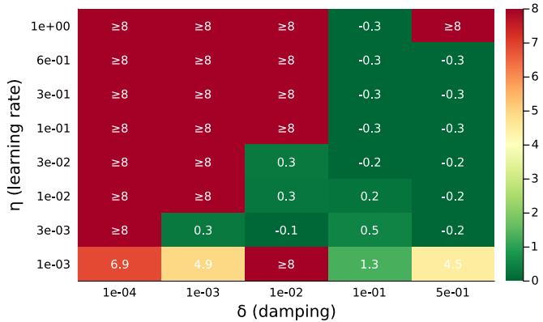  
Figure 11: Hyperparameter sweep: minimum training NLL achieved over 500 epochs for each of 160 IVON configurations $( 8 \times 4 \times 5$ grid over $\eta , \beta _ { 2 } , \delta )$ on the 83-weight BNN $( N { = } 2 0 0 , \beta { = } 0 . 2 ) .$ Only 26 of 160 configurations reach a final NLL below 1.0, concentrated in the $\delta { = } 0 . 1$ and $\delta { = } 0 . 5$ columns. DMA training NLL at convergence: −0.16 (epoch 17, no hyperparameter search); best $\mathrm { I V O N } \mathrm { : - 0 . 3 1 }$ (epoch 500, requires δ=0.1 and extensive tuning).

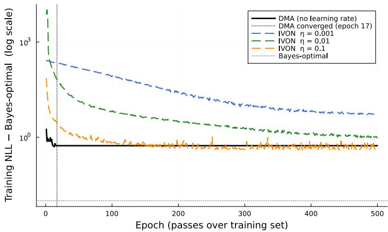  
Figure 12: Training NLL minus Bayes-optimal (log scale) vs. epoch for IVON at three learning rates (best β /δ per η from the sweep) and DMA, on the 83-weight BNN $( N { = } 2 0 0 , \beta { = } 0 . 2 )$ . DMA converges at epoch 17; $\scriptstyle \eta = 0 . 0 0 1$ descends slowly but does not converge within 500 epochs; η=0.01 converges to NLL ≈0.26 with $\delta { = } 0 . 5 ; \eta { = } 0 . 1$ oscillates near the Bayes-optimal line.

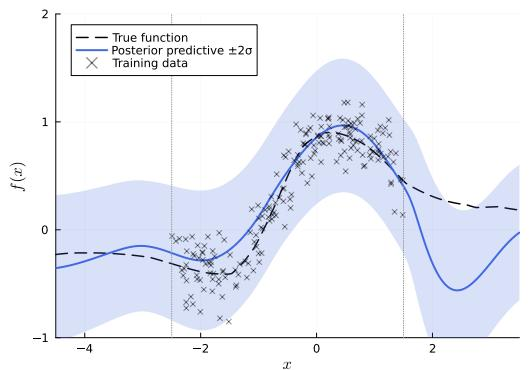

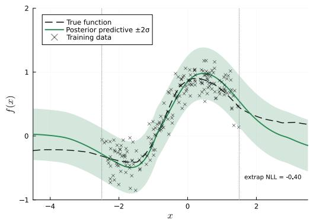  
Figure 13: Left: DMA posterior predictive (identical to Figure 2). Right: IVON predictive with the best sweep configuration $( \eta { = } 0 . 6 , \beta _ { 2 } { = } 0 . 9 9 9 9 , \delta { = } 0 . 1 )$ after 2000 epochs. Training range [−2.5, 1.5] marked by dotted verticals. DMA extrapolation NLL: 0.54; IVON on this seed: −0.40. Across 20 seeds IVON diverges on 14/20; median extrap NLL on finite seeds is 2.11 (IQR 5.27) vs. DMA median 0.79 (IQR 1.28).

## E.6 COMPARISON WITH THE DIAGONAL LAPLACE APPROXIMATION

Unlike IVON, the diagonal Laplace approximation avoids iterative variational inference altogether by separating the two subproblems it must solve. MAP estimation is handled by standard Adam, which operates on deterministic gradients without any stochastic weight sampling; the curvature estimate is then computed once at the fixed MAP point by extracting the diagonal of the exact Hessian. Because no Monte Carlo noise enters either step, the method does not suffer from the gradient-variance instability that prevents IVON from converging in the full-batch regime. The price of this decoupling is that the Laplace posterior is anchored at the MAP and cannot account for weight-space curvature far from that point, which limits its extrapolation quality. DMA avoids both limitations: it propagates a full distributional belief through the factor graph without any MAP anchor and without any stochastic sampling step.

Setup. The diagonal Laplace approximation (MacKay, 1992) is the principal alternative Bayesian baseline that, like DMA, maintains a full weight posterior. We apply it to the same 1D regression task $( N ~ = ~ 2 0 0 , \beta ~ = ~ 0 . 2 .$ , architecture as above) using the same He-init prior as DMA: $\sigma _ { l } ^ { 2 } ~ = ~ 2 / \mathrm { f a n } . \mathrm { i n } _ { l }$ , giving $\sigma _ { 1 } ^ { 2 } { = } 0 . 2 5 , ~ \sigma _ { 2 } ^ { 2 } { \approx } 0 . 3 3 , ~ \sigma _ { 3 } ^ { 2 } { = } 0 . 4 0$ for layers 1–3. We first find the MAP weight vector $\mathbf { w } ^ { * }$ by running Adam $( \eta = 0 . 1$ , 200 epochs) on the joint negative log-likelihood $- \log p ( \mathcal { D } \mid \mathbf { w } ) - \log p ( \mathbf { w } )$ with per-layer $L _ { 2 }$ weight decay $\lambda _ { l } = 1 / ( N \sigma _ { l } ^ { 2 } )$ . The diagonal Laplace posterior is $\begin{array} { r } { q ( \mathbf { w } ) = \prod _ { j } \mathcal { N } ( w _ { j } ; w _ { j } ^ { * } , [ \nabla ^ { 2 } ( - \log p ( \mathbf { w } ^ { * } , \mathcal { D } ) ) ] _ { j j } ^ { - 1 } ) } \end{array}$ , where the diagonal is extracted from the exact Hessian computed via forward-mode automatic differentiation over the 83-parameter network. The predictive distribution is approximated by drawing K = 1000 weight samples from $q ( \mathbf { w } )$ and averaging forward passes.

Results. Figure 14 compares DMA and diagonal Laplace predictive distributions on a single representative seed. Both methods track the true function inside the training region. On this seed DMA achieves an extrapolation NLL of 0.54 nats/example and diagonal Laplace achieves 0.37 nats/example (Bayes-optimal: log $\beta + { \textstyle \frac { 1 } { 2 } } \log 2 \pi \approx - 0 . 6 9 )$ . A comprehensive 20-seed comparison including calibration is in Table 4 (Appendix E.7); with matched priors the two methods are broadly comparable on NLL and calibration error, and the key differentiator is computational cost.

## E.7 CALIBRATION

The predictive intervals shown in Figures 2 and 14 are visually wide in the extrapolation region for DMA and narrow for Laplace, but visual inspection cannot distinguish genuine calibration from a lucky choice of seed or test region. We quantify calibration via coverage curves: for each confidence level $\alpha \in [ 0 , 1 ]$ , the coverage is the empirical fraction of true values that fall inside the α-central predictive interval, $\operatorname* { P r } \bigl ( | y - \mu ( x ) | \leq z _ { \alpha } \sigma ( x ) \bigr )$ , where $z _ { \alpha } = \Phi ^ { - 1 } \big ( ( 1 + \alpha ) / 2 \big )$ . A perfectly calibrated model traces the diagonal (coverage = α). We evaluate on $N _ { \mathrm { c a l } } = 5 0 0$ equally-spaced points in the in-distribution region [−2.5, 1.5] and 500 points in the extrapolation region $[ - 4 , - 2 . 5 ] \cup [ 1 . 5 , 3 ] ;$ true values come from the same data-generating function used for training.

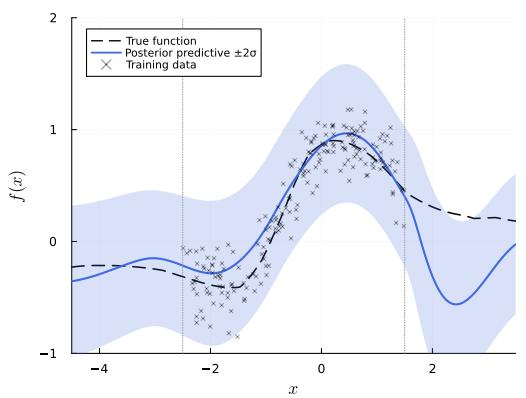

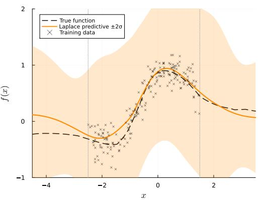  
Figure 14: Left: DMA posterior predictive (same as Figure 2). Right: Diagonal Laplace predictive with He-init prior (MAP via Adam with per-layer $L _ { 2 }$ decay, diagonal of exact Hessian, $\bar { K } = 1 0 0 0$ MC samples). Training range [−2.5, 1.5] marked by dotted verticals.

Results. Figure 15 shows the coverage curves. We summarise calibration error as $\Delta \quad =$ coverage − α (mean signed deviation from the diagonal; $\Delta > 0$ conservative, $\Delta < 0$ overconfident).

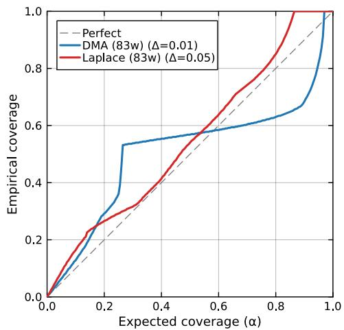  
Figure 15: Extrapolation calibration curves for the 83-weight network, test points in $[ - 4 , - 2 . 5 ] \cup$ [1.5, 3]. ∆ = coverage − α: 0 = perfect, > 0 = conservative, $< 0 =$ overconfident. On this seed, DMA (blue, $\Delta = + 0 . 0 1 )$ and diagonal Laplace (red, $\Delta = + 0 . 0 5 ) ; \Delta$ is the mean signed deviation — DMA’s smaller |∆| reflects cancellation of over- and under-coverage rather than a uniformly tighter fit to the diagonal. Over 20 seeds both methods are comparable (median $- 0 . 0 9 \mathrm { v s . } - 0 . 1 0 )$ .

Figure 15 shows the extrapolation calibration curves for the illustrative seed. Over 20 seeds (Table 4), DMA and diagonal Laplace (both He-prior) achieve nearly identical median calibration error $( \Delta = - 0 . 0 9 \mathrm { v s } - 0 . \bar { 1 0 } )$ and comparable extrapolation NLL (0.82 vs 0.77): with matched priors the two methods perform similarly on these small-scale metrics. Calibration at the 1932-weight scale is reported in Appendix G.3.

Discussion. In the considered setup, diagonal Laplace achieves competitive extrapolation NLL and calibration at the 83-weight scale. The fundamental limitation of diagonal Laplace is computational: with P the number of parameters, the exact Hessian costs $\mathcal { O } ( N P ^ { 2 } )$ time and $\mathcal { O } ( P ^ { 2 } )$ memory.

Table 4: Extrapolation NLL and calibration error $\Delta$ on the 83-weight 1D regression task, over 20 independently drawn datasets and true functions (median [IQR]). $\bar { \Delta } > 0 :$ conservative; $\Delta < 0 :$ overconfident; $\Delta = 0 \colon$ perfect.
<table><tr><td>Method</td><td>Extrap NLL</td><td> $\Delta$  (extrap)</td></tr><tr><td>DMA</td><td>0.82 [1.96]</td><td>-0.09 [0.44]</td></tr><tr><td>Diagonal Laplace</td><td>0.77 [1.91]</td><td>-0.10 [0.35]</td></tr><tr><td>Bayes-optimal</td><td>-0.69</td><td>0</td></tr></table>

For the 83-parameter toy network this is trivial; for a network with $P = 1 0 ^ { 6 }$ parameters it requires $\mathcal { O } ( 1 0 ^ { 1 2 } )$ operations and terabytes of memory, making the method impractical at any realistic scale. DMA’s cost is $\mathcal { O } ( N P$ ·sweeps) — linear in $\dot { P }$ — and it propagates a full distributional belief through the factor graph without any MAP anchor or stochastic sampling step.

## F MODEL MISMATCH: DMA VS. ADAM

## F.1 SETUP

This experiment tests DMA under model mismatch: the data-generating network and the inference network have different architectures, so no setting of the model weights can exactly recover the true function.

Data network. The ground-truth function is a draw from a wider network with the same feature map $\varphi$ as the main experiment (Appendix E.1) but two hidden layers of widths $d = 1 2$ and $d = 1 0$ (versus the model’s d = 6 and $d = 5 )$ , each with leaky-ReLU activations $( \alpha = 0 . 4$ and $\alpha = 0 . 8$ respectively) and Gaussian priors. Weights are drawn from the prior in the same way as the correctlyspecified experiment (He-style initialisation; same random seed offset).

Model network and training. Both DMA and Adam use the identical two-hidden-layer model network from Appendix E.1 $( d = 6 , 5 ; \beta = 0 . 2 )$ . N = 200 observations are drawn uniformly from [−5.0, 5.0] with the same Gaussian noise $( \beta = 0 . 2 )$ . DMA runs for up to 200 epochs with 10 mini-batches of 20 examples and stopping tolerance 0.1; Adam (learning rate $\eta = 0 . 1 )$ runs for a fixed 200 epochs. In 4 of 20 seeds the belief updates continued to oscillate between two high-quality modes, so the change-based stopping criterion did not trigger within the 200-epoch budget; these runs nevertheless achieved good solutions and are included in the reported statistics.

Extrapolation evaluation. Extrapolation NLL is measured on 60 test points sampled uniformly from the two flanking regions $[ - 6 . 5 , - 5 . 0 ]$ and [5.0, 6.5], against the noiseless true-function values. Note that training NLL is measured against noisy observations (Bayes-optimal floor ≈ −0.19 nats at $\beta = 0 . 2 )$ , while extrapolation NLL is against noiseless targets (Bayes-optimal floor $\approx - 0 . 6 9$ nats); the two quantities are on different scales by construction and should not be compared directly.

## F.2 RESULTS

Results (Table 5). Table 5 reports extrapolation NLLs over 20 independent random seeds (varying data realisation, DMA initialisation, and optimiser initialisation). We include AdamW (Loshchilov & Hutter, 2019) at $\lambda = 0 . 1$ (the weight decay that minimises median extrapolation NLL over the sweep λ ∈ {0.01, 0.1, 1.0, 10.0} at $\eta ~ = ~ 0 . 1 )$ DMA achieves a median extrapolation NLL of 0.01 (IQR 0.44) versus 0.50 (IQR 2.23) for Adam. The well-regularised AdamW achieves a better median NLL of −0.36 (IQR 0.73), comparable to the Bayes-optimal −0.69, because the $\ell _ { 2 }$ prior acts as implicit regularisation that prevents extreme extrapolation. Crucially, both Adam and AdamW are point estimates: their predictive band is fixed at ±2β regardless of distance from the training region. DMA’s IQR (0.44) is the tightest of all three methods, and unlike the optimisers it provides calibrated widening intervals outside the training range (Figure 16), which is the core purpose of Bayesian inference under mismatch.

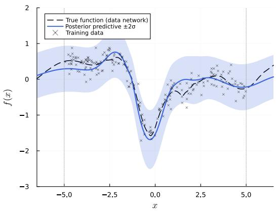

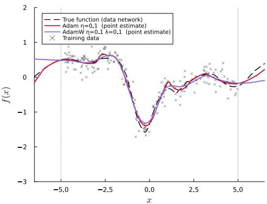  
Figure 16: Model mismatch experiment $( N = 2 0 0 $ , training range $[ - 5 , 5 ] , \beta = 0 . 2 )$ . The datagenerating network has two wider hidden layers $( d = 1 2 , 1 0 )$ ; both methods learn with the twohidden-layer model network $( d = 6 , 5 )$ . Left: DMA posterior predictive mean (solid) and ±2σ intervals (shaded) versus the true function (dashed). Training points are shown as crosses; dotted vertical lines mark the training boundaries $x = \pm 5$ . Right: Adam $( \eta = 0 . 1$ , red) and AdamW $( \eta = 0 . 1 , \lambda = 0 . 1$ , purple) point predictions; neither carries uncertainty quantification.

Table 5: Extrapolation NLL over 20 independent seeds (↓ better; IQR = interquartile range). Bayesoptimal ≈ −0.69 nats. AdamW uses $\eta = 0 . 1 , \lambda = 0 . 1$ (best of $\lambda \in \{ \bar { 0 . 0 1 } , 0 . 1 , 1 . \bar { 0 } , 1 0 . 0 \}$ by median).
<table><tr><td>Method</td><td>Median</td><td>Mean</td><td>IQR</td></tr><tr><td>DMA (posterior predictive)</td><td>0.01</td><td>0.29</td><td>0.44</td></tr><tr><td>Adam  $( \eta = 0 . 1 )$  AdamW</td><td>0.50 -0.36</td><td>2.21</td><td>2.23 0.73</td></tr><tr><td> $( \eta = 0 . 1 , \lambda = 0 . 1 )$ </td><td></td><td>-0.11</td><td></td></tr><tr><td>Bayes-optimal</td><td>-0.69</td><td>一</td><td>一</td></tr></table>

Discussion. The contrast between DMA and the gradient-based methods is not primarily about median NLL under mismatch: a well-regularised AdamW can match or exceed DMA’s pointestimate accuracy because $\ell _ { 2 }$ regularisation acts as a Gaussian prior and prevents the worst extrapolation failures. The key distinction is what the methods provide: DMA propagates residual weight uncertainty into the predictive distribution, yielding intervals that widen structurally outside the training range; Adam and AdamW output a point estimate with a fixed ±2β ribbon that conveys no information about epistemic uncertainty. The median versus IQR comparison captures this reliability difference: DMA has the tightest IQR (0.44) of the three methods, while Adam’s large IQR (2.23) and high mean (2.21) reveal catastrophic failures on seeds where the point estimate extrapolates in the wrong direction. AdamW suppresses some of these failures through regularisation (IQR 0.73), but it requires knowing the right $\lambda ,$ and it provides no mechanism to signal when extrapolation is unreliable.

## G LARGER-SCALE BNN EXPERIMENT

The experiment in Section 4.3 and Appendix E uses a small architecture (83 weights, $N = 2 0 0 )$ to keep the presentation tractable. This appendix demonstrates that DMA scales to a substantially larger network without any algorithmic changes.

Baseline choice. At 1932 weights the three Bayesian baselines used for the small network cease to be applicable, leaving Adam as the only practical comparison.

Diagonal Laplace requires a diagonal Hessian evaluation at the MAP point. Computing it via forward-mode AD over the gradient costs $\mathcal { O } ( N _ { W } ^ { 2 } \times N )$ scalar operations — roughly 720 M for $N _ { W } { = } 1 9 0 0$ and $N { = } 1 5 0 0$ , already slow — while the full Hessian used for the 83-weight case (via

ForwardDiff.hessian) scales as $\mathcal { O } ( N _ { W } ^ { 3 } \times N )$ , requiring ≈ $1 0 ^ { 1 2 }$ operations and ∼ 29 MB for the full matrix. Beyond the cost, the diagonal approximation discards all inter-layer weight correlations that are structurally important in deeper networks, and the MAP loss surface at this scale contains many saddle directions where the diagonal Hessian is negative — requiring ad-hoc clamping that grows less defensible as the network widens.

IVON (Shen et al., 2024) requires a single-sample MC gradient per step to maintain the curvature EMA. As shown in Appendix E.5, even for the 83-weight network a 54-configuration hyperparameter sweep found only one configuration that converges, and only after 2000 epochs. At 1932 weights the MC gradient is higher-variance still, and no evidence suggests the instability improves with scale.

Expectation Propagation is excluded for the same reasons given in Appendix E.4: cavity division yields negative-precision messages on product and ReLU factors, and the failure rate grows with network depth and width.

DMA avoids all three failure modes: it replaces the Hessian with linear-cost message passing $( { \mathcal { O } } ( N _ { W } \times N )$ per sweep), removes the MC sampling step entirely, and eliminates cavity division by construction. Adam is therefore the sole comparison below.

## G.1 SETUP

Architecture. We keep the same 1D input and standardised five-component feature map $\varphi : \mathbb { R } $ $\mathbb { R } ^ { 5 } ( x , e ^ { - ( x + 1 ) ^ { 2 } } , e ^ { - x ^ { 2 } } , \overset { \cdot } { e } ^ { - ( x - 1 ) ^ { 2 } }$ , sin x, standardised over $[ - 5 , 5 ]$ and augmented with a constant bias to give a six-dimensional learnable input), but replace the two hidden layers of widths (6, 5) with four hidden layers of widths (6, 12, 48, 24) and expand the output from one real-valued channel to four. The layer structure is

$$
6  6  1 2  4 8  2 4  4
$$

C with leaky-ReLU activations $( \alpha = 0 . 5 , 0 . 5 , 0 . 8 , 0 . 1$ per layer) and a four-dimensional real-valued output $( \beta = 0 . 1$ per channel). Total learnable weights: $6 \times 6 + 6 \times 1 2 + 1 2 \times 4 8 + 4 8 \times 2 4 + 2 4 \times 4 =$ $3 6 + 7 2 + 5 7 6 + 1 1 5 2 + 9 6 = 1 9 3 2$ , a factor of $\mathbf { 2 3 \times }$ more than the baseline 83-weight network.

Data. N = 1500 training inputs are drawn uniformly from $[ - 4 , 4 ]$ and the four output channels are generated from the same network (correctly specified model); random seed fixed for reproducibility.

Training. 100 mini-batches (15 examples per batch), at most 100 epochs, tolerance 0.1. No hyperparameter tuning beyond the defaults in Appendix E.1.

## G.2 RESULTS

Table 6: DMA training summary: small baseline vs. large network. NLL is the per-example peroutput training log-likelihood $\begin{array} { r } { \frac { \mathrm { ~ i ~ ~ } } { N K } \sum _ { i , k } \log p ( y _ { i k } \mid x _ { i } ) } \end{array}$ at the final epoch (lower / more negative is better). Per-epoch time excludes the first epoch (JIT warm-up).
<table><tr><td>Architecture</td><td>Weights</td><td>N</td><td>Out</td><td>Epochs</td><td>NLL</td><td>Per-epoch</td></tr><tr><td> $8 {  } 6 {  } 5 {  } 1$ </td><td>83</td><td>200</td><td>1</td><td>17</td><td>-0.16</td><td>0.8 ms</td></tr><tr><td> $6 {  } 6 {  } 1 2 {  } 4 8 {  } 2 4 {  } 4$ </td><td>1932</td><td>1500</td><td>4</td><td>3</td><td>-0.73</td><td>67 ms</td></tr></table>

Results. Training converges at epoch 3 with NLL −0.73 nats/ex per output, compared to −0.16 nats/ex for the small baseline and a Bayes-optimal of −1.38 nats/ex (at $\beta = \stackrel { - } { 0 . 1 } )$ . Figures 17 and 18 show the posterior predictive for DMA and the best-converged Adam run $( \eta = 0 . 0 1$ , 100 epochs) across all four output channels. DMA’s uncertainty bands widen outside the training range; Adam’s fixed ±2β band does not adapt. Figure 19 shows the Hinton diagram of posterior weight means, and Figure 20 shows the NLL convergence trajectories. No numerical failures occur throughout DMA training, confirming Corollary 2.6 at this scale.

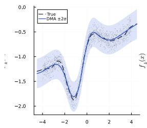

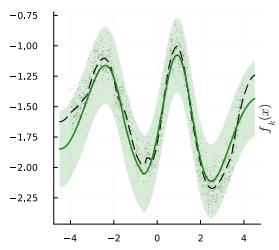

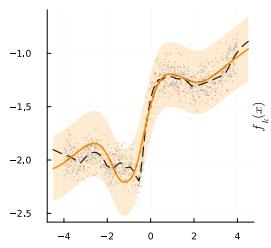

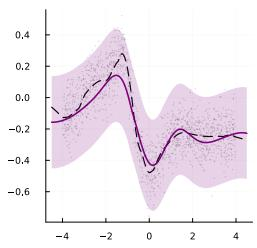  
Figure 17: DMA posterior predictive $( 6 {  } 6 {  } 1 2 {  } 4 8 {  } 2 4 {  } 4 .$ , 1932 weights, $N = 1 5 0 0 , 3$ epochs, $0 . { \bar { 7 } } 2 \mathrm { s } \ \mathrm { t o t a l } )$ . Each panel shows one of the four output channels: posterior predictive mean (solid) with ±2σ bands against the true function (dashed); training points as faint dots.

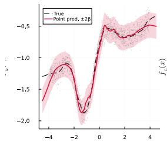

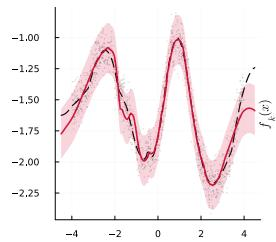

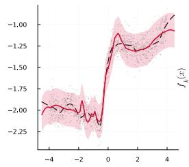

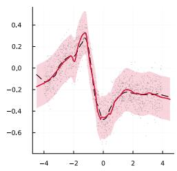  
Figure 18: Adam $( \eta = 0 . 0 1$ , 100 epochs, 1.7 s total) point predictions with fixed $\pm 2 \beta$ bands on the same four output channels. The confidence interval is constant across the input range because a point estimate carries no epistemic uncertainty.

Runtime. DMA trains in 0.72 s (3 epochs, 67 ms/epoch steady-state); Adam with $\eta ~ = ~ 0 . 0 1$ takes 1.7 s for 100 epochs (17 ms/epoch); AdamW $( \eta = 0 . 1 , \lambda = 0 . 1 )$ takes 2.4 s for 100 epochs (24 ms/epoch), slightly slower than Adam due to the additional weight-decay step. The DMA perepoch ratio of ≈4× over Adam reflects heavier message-passing bookkeeping relative to a plain forward–backward pass; because DMA converges in far fewer epochs the total wall-clock time is less than half that of Adam or AdamW at this scale. The DMA per-epoch cost of 67 ms is 84× that of the small network (0.8 ms), consistent with the 23× weight and 7.5× data scale-up.

## G.3 CALIBRATION

Figure 21 shows the extrapolation calibration curve for DMA on the 1932-weight network (test points in $[ - 6 , - 4 ] \cup [ 4 , 6 ]$ , i.e. beyond the training support [−4, 4]). The calibration error $\Delta =$ $+ 0 . 0 2 6$ is close to the $\Delta \stackrel { - } { = } + 0 . 0 1$ obtained on the 83-weight network (Appendix E.7), despite a 23× increase in parameters and 7.5× increase in training data. Diagonal Laplace is omitted here because it does not scale to this network size (Appendix G, introductory paragraph).

Remark G.1. The tolerance-based stopping criterion used herefires when the relative NLL change falls below 0.1. Naturally, a maximum number of epochs can also be set. In this context, as oscillating likelihoods can occur, a patience-based alternative (i.e. halt when the NLL has not improved over the best seen in the last P epochs) can also be used.

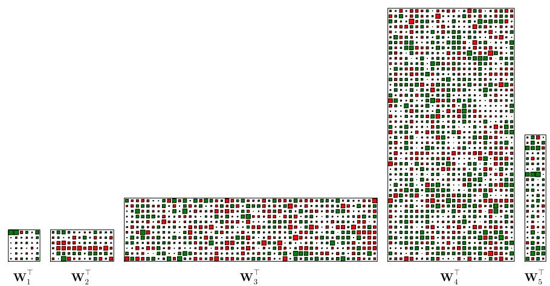  
Figure 19: Hinton diagram of DMA posterior weight means after 3 epochs. Each block corresponds to one weight matrix; square size encodes $| \mu _ { w } |$ , colour encodes sign.

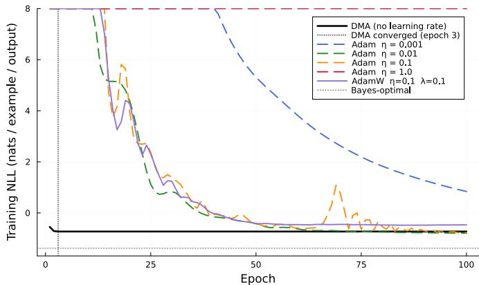  
Figure 20: Training NLL (per example per output) vs. epoch. DMA (solid black) converges at epoch 3 with no learning-rate tuning. Adam with $\eta = 0 . 0 1$ reaches NLL −0.79 after 100 epochs; $\eta = 0 . 0 0 1$ has not converged $( \mathrm { N L L } + 0 . 8 4 ) ; \eta = 1 . 0$ diverges. Values above 8 are clipped to 8 for display. AdamW $\eta = 0 . 1 , \lambda = 0 . 1$ (solid purple) reaches $\mathrm { N L L - 0 . 4 7 } \colon$ weight decay regularises the trajectory but the chosen η does not reach the same final NLL as the best-tuned Adam.

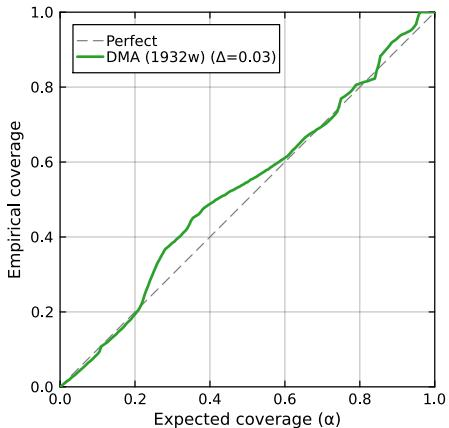  
Figure 21: Extrapolation calibration curve for DMA on the 1932-weight network $( N \mathrm { ~ = ~ } 1 5 0 0 )$ averaged across all four output channels. Test points in $[ - 6 , - 4 ] \cup [ 4 , { \overline { { 6 } } } ] . \ \Delta = + 0 . 0 2 6$ (slightly conservative); the 83-weight result has a 20-seed median $\Delta = - 0 . 0 9 ( \mathrm { A p p e n d i x } \mathrm { E } . 7 )$