# DocuTeam: Mixed-Initiative Multi-Agent Discussions around Evolving Documents

HEECHAN LEE, School of Computing, KAIST, Republic of Korea

JUHYEON CHOI, College of Liberal Studies, Seoul National University, Republic of Korea

TAE SOO KIM, School of Computing, KAIST, Republic of Korea

JUHO KIM, School of Computing, KAIST, Republic of Korea and SkillBench, USA

JOSEPH SEERING, School of Computing, KAIST, Republic of Korea

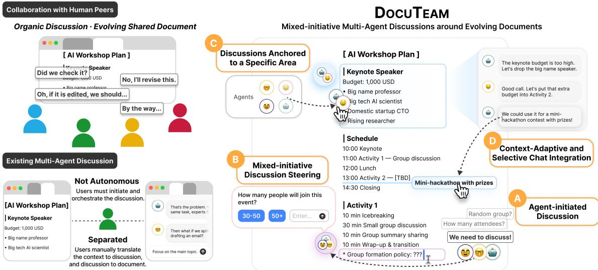

Fig. 1. Illustration of a mixed-initiative multi-agent discussion interface. Whereas human teammates can organically build on and challenge one another’s perspectives around shared work, existing multi-agent discussion systems often require users to initiate and orchestrate discussions separately from their working context. DocuTeam supports (A) organic agent-initiated discussions that proactively surface issues, (B) mixed-initiative discussion steering that allows both users and agents to guide the flow of conversation, (C) discussion sessions anchored to relevant document regions, and (D) selective incorporation of ideas from the discussion.

In open-ended problem solving, collaborators often rely on discussion to surface concerns, challenge perspectives, and refine shared work as it evolves. While AI agents are increasingly used as discussion partners, existing multi-agent systems place a heavy burden on users to initiate and carefully orchestrate the discussions. We present DocuTeam, a mixed-initiative multi-agent discussion system

Authors’ Contact Information: Heechan Lee, hclee99@kaist.ac.kr, School of Computing, KAIST, Daejeon, Republic of Korea; Juhyeon Choi, wngus0223@ naver.com, College of Liberal Studies, Seoul National University, Seoul, Republic of Korea; Tae Soo Kim, taesoo.kim@kaist.ac.kr, School of Computing KAIST, Daejeon, Republic of Korea; Juho Kim, juhokim@kaist.ac.kr, School of Computing, KAIST, Daejeon, Republic of Korea, juho@skillbench.com and SkillBench, Santa Barbara, CA, USA; Joseph Seering, seering@kaist.ac.kr, School of Computing, KAIST, Daejeon, Republic of Korea.

Permission to make digital or hard copies of all or part of this work for personal or classroom use is granted without fee provided that copies are not made or distributed for profit or commercial advantage and that copies bear this notice and the full citation on the first page. Copyrights for components of this work owned by others than the author(s) must be honored. Abstracting with credit is permitted. To copy otherwise, or republish, to post on servers or to redistribute to lists, requires prior specific permission and/or a fee. Request permissions from permissions@acm.org.   
© 2018 Copyright held by the owner/author(s). Publication rights licensed to ACM.   
Manuscript submitted to ACM

in which both users and agents can initiate and steer conversations. Agents monitor document changes to proactively start and redirect discussions as the work evolves, while users can flexibly shape the conversation or adopt agent ideas. In a within-subjects study (� = 20), participants using DocuTeam produced outcomes rated significantly more novel, relevant, and specific than with a baseline without any increase in cognitive load. Rather than using agents for one-of idea sourcing, participants engaged in an iterative refinement loop in which document changes prompted agent reactions, which led users to revisit and further develop their work.

CCS Concepts: • Human-centered computing → Interactive systems and tools; Empirical studies in HCI; • Computing methodologies → Natural language processing

Additional Key Words and Phrases: Multi-Agent Discussion, Human-AI Collaboration, Mixed-initiative Interaction

## ACM Reference Format:

Heechan Lee, Juhyeon Choi, Tae Soo Kim, Juho Kim, and Joseph Seering. 2018. DocuTeam: Mixed-Initiative Multi-Agent Discussions around Evolving Documents. In Proceedings ofMake sure to enter the correct conference title from your rights confirmation email (Conference acronym ’XX). ACM, New York, NY, USA, 39 pages. https://doi.org/XXXXXXX.XXXXXXX

## 1 Introduction

In collaborative open-ended problem-solving, teammates often mix work with discussion, bringing diferent perspectives and expertise [2, 32, 40, 41, 69]. Consider a student preparing a project report with their team: as the student revises the conclusion, they ask their team what they think about it. One teammate mentions that the experiment results seem to strongly support the conclusion, while another urges more cautious interpretation due to the analysis’s limitations. Another third member chimes in to note that a new figure in the results section conflicts with the explanation. In the example, as the student works, they can initiate discussions about the work with their team members where they organically build on and challenge one another’s perspectives [41, 69, 80], but, as the members also synchronously attend to the work [27, 29, 92], they can also proactively surface and engage in discussion points as the work develops [4]— ultimately resulting in a stronger, more polished outcome.

With advancements in AI, recent studies have increasingly explored AI agents as a proxy for discussion partners, ofering access to diverse perspectives and feedback when human collaborators are not available [28, 81, 84, 100]. However, existing human-AI systems still fall short of enabling such team collaboration, where multiple AI agents autonomously start, drive, and redirect discussions as the work unfolds. On one hand, prior work has proposed proactive agents [13, 16, 54, 75, 77, 88] that engage with users’ ongoing work by providing contextually grounded feedback or performing operations (e.g., grammar-check) but rarely engage in and sustain agent-to-agent discussions, instead creating a “hub-and-spoke” model with the user at the center [60]. On the other hand, systems where multiple agents can discuss with each other [62, 79] rely on users to initiate, ground, and direct the discussions, instead of the agents proactively starting and directing discussions based on the user’s ongoing work. Taken together, these limitations leave underexplored the kind of mixed-initiative multi-agent discussion [36] illustrated by the student example, where not only users can initiate and develop agent discussions but the agents themselves proactively engage in continued discussions grounded in the user’s evolving work.

Realizing this form of mixed-initiative multi-agent discussions raises two main challenges. First, as agents autonomously initiate and sustain multiple discussions alongside the user’s work, users must be able to follow and coordinate this activity without needing to continuously monitor it [70, 83]. Second, agents should be able to carry exchanges forward without turn-by-turn prompting, but should be able to solicit user input when the discussion depends on unstated intentions or preferences. To investigate these challenges and how to address them, we conducted an online design workshop with 15 participants who frequently use AI for open-ended tasks, such as writing, planning, Manuscript submitted to ACM

and design, tasks commonly conducted by human teams using shared documents (e.g., text, sheet, canvases). As a multi-agent discussion unfolds as an ongoing exchange and negotiation rather than an aggregation of isolated agent responses, participants wanted to be able to quickly follow the flow of discussion without disrupting their work, while retaining the ability to intervene directly or steer its direction indirectly by shaping its focus, participants, or emphasis. Beyond grounding discussions in the work, participants also wanted to easily reflect discussions in their work by selectively bringing useful ideas or options from the agents back into their work. From these findings, we derived four design implications for mixed-initiative multi-agent discussion systems: (1) support task-oriented discussion modes; (2) show discussions alongside the relevant parts of the work and summarize their current state; (3) enable both direct and indirect steering; and (4) support selective incorporation of ideas from agent discussions directly into the work.

Building on these design implications, we present DocuTeam, a mixed-initiative multi-agent discussion system that allows users and multiple AI agents to initiate, develop, and steer discussion—built on top of an existing document editor (i.e., Notion). A discussion can begin from either side: users can initiate a discussion around a particular part of their work (Fig. 1C), while agents continuously attend to document changes and can proactively open a discussion when the evolving work raises an issue or opportunity (Fig. 1A). Once initiated, agents can autonomously carry the discussion forward, building on and challenging one another through task-oriented discussion modes (i.e., Idea, Discussion, and Evaluation) without requiring users to orchestrate each turn. DocuTeam keeps ongoing agent activity lightweight but legible by anchoring each discussion to the relevant document region and previewing its participants and current topic alongside the work (Fig. 1C). As the discussion unfolds, users can step into a thread or change its participants to redirect the exchange, while agents can also ask clarification questions when further progress depends on the user’s intentions, preferred trade-ofs, or unstated constraints (Fig. 1B). When a discussion produces a useful idea, users can selectively move it back into the document, where it is adapted to the surrounding context (Fig. 1D), closing the loop between the evolving work and subsequent agent discussions.

To understand how DocuTeam afects users’ task processes, outcome quality, and its impact on users’ cognitive load in working with a team of agent collaborators, we conducted a within-subjects user study (N=20). As a baseline, we compared our system against a setup that provides multi-agent discussion through a conventional side-panel interface, requiring users to initiate, ground, and steer agent discussions themselves. We evaluated both systems on two open-ended event-planning tasks, where participants refined partially written plans under multiple constraints. Independent human evaluators rated plans drafted with DocuTeam to be significantly more novel, relevant, and specific. This improvement was accompanied by a shift in how participants collaborated with the multi-agent team during the task. Compared to the baseline, participants spent less efort managing the discussion flow—sending 46% fewer steering messages—while still making 39% more document modifications than in the baseline condition, shifting from chat-centered idea sourcing toward document-centered iterative refinement. Although overall cognitive load did not significantly difer, participants described a redistribution of efort: the mixed-initiative design introduced additiona information that they had to process, but it also reduced the burden of orchestrating discussions and allowed more attention to remain on the document. The document consequently became a shared medium for grounding interactions with the agents and iteratively incorporating diverse perspectives, helping explain the gains in novelty, relevance, and specificity.

Our findings point to the potential for mixed-initiative multi-agent systems to move beyond a group of agents that   
users must closely orchestrate. Although mixed-initiative multi-agent interaction is inherently dificult to design [12, 70,   
77, 83], DocuTeam demonstrates that multi-agent discussion can become a viable form of team collaboration around   
evolving workflows. However, realizing this model requires carefully balancing agent proactiveness with users’ ability Manuscript submitted to ACM

to understand and shape work processes. We highlight directions for future research including investigating what balance of perspectives should optimally constitute an agent team and how much of an agent team’s proactive activity should optimally be surfaced to the user.

## 2 Related Work

This section reviews relevant literature across three key areas: the foundational value of collaborative cognition through discussion, the current landscape of multi-agent collaboration, and interfaces for mixed-initiative AI agents.

## 2.1 Collaborative Cognition through Discussions

Complex, open-ended problems are often tackled by teams, where each member brings a distinct perspective and expertise [2, 17, 32, 40, 41, 69, 80]. However, the benefits of diversity do not arise from simply assembling independent perspectives. They depend on how teammates coordinate them through discussion: building on, challenging, and repairing one another’s contributions to develop shared understanding [18, 19]. When this collaboration occurs around a shared artifact (e.g., document, workspace), efective teams will monitor the artifact to maintain awareness of each other’s contributions in the artifact to proactively surface information or concerns [4], and rely on the artifact to coordinate actions and ground subsequent communication [27, 29, 92]. Together, these perspectives characterize collaborative problem solving as an ongoing process of coordinating diverse viewpoints through discussion grounded in shared work.

HCI and CSCW have long explored how computational systems can support the discussion structures for efective team collaboration. Early groupware and electronic meeting systems introduced shared workspaces and explicit process structures to help groups externalize ideas, maintain awareness of one another’s activity, and move between activities such as brainstorming, organizing, and evaluating alternatives [22, 93]. Multiple lines of research have explored interfaces that help collaborators stay aware of ongoing discussions by structuring and summarizing group conversations [8, 11, 99], as well as interfaces that connect communication to shared artifacts so that collaborators can recover the context, intentions and rationale behind evolving work [48, 55, 96]. More recent HCI systems have brought computational agents into group discussions, first as facilitators [21, 46, 47], and increasingly as participants alongside human collaborators [85, 97, 102]. Building on this trajectory, we investigate how interfaces can make discussions among multiple AI participants a collaborative resource for users’ ongoing document work, while supporting awareness of their activity and grounding their exchanges in the evolving artifact.

## 2.2 Human–Multi-Agent Collaboration through Discussion

AI systems have increasingly been studied not just as tools that execute user commands, but as collaborative partners that participate in joint tasks with humans [3, 42, 68]. Recent research has extended this paradigm from interaction with a single AI partner to collaboration with multiple specialized agents [28, 81, 84, 100]. Multi-agent systems can distribute complex work across agents with complementary capabilities [26, 35], while emerging HCI research shows that users are beginning to form, interpret, and orchestrate teams of AI agents in creative and real-world work settings [58, 67, 70] Within this broader landscape of human–multi-agent collaboration, one increasingly prominent interaction paradigm is multi-agent discussion [7, 66]. In NLP research, structures where multiple agents debate or critique each other have shown promise in improving reasoning accuracy, sparking creative ideas, and enhancing evaluation quality through the comparison of diverse viewpoints [23, 30, 39, 56, 57, 64].

Manuscript submitted to ACM

DocuTeam: Mixed-Initiative Multi-Agent Discussions around Evolving Documents
<table><tr><td>Collaboration Systems</td><td>Agent-Initiated Interaction</td><td>Autonomous Discussion Development</td><td>Grounding in Evolving Work</td></tr><tr><td>Single Agent [75,77,88]</td><td>Yes: An agent proactively offers assistance and collaborates with the user.</td><td>No: No agent-to-agent discussion.</td><td>Yes: An agent accesses the document and observes users&#x27; behavior.</td></tr><tr><td>Set of Multiple Agents [13, 16, 25, 54]</td><td>Limited: Agents are invoked by user requests or predefined conditions.</td><td>Limited: Agents may exchange or synthesize perspectives, but do not autonomously initiate and develop open-ended discussions.</td><td>Yes: Each agent&#x27;s contributions are grounded in the work artifact or context.</td></tr><tr><td>Multi-Agent Discussion [62, 79]</td><td>Limited: Users initiate the discussion and manage when it occurs.</td><td>Partial: Agents debate, critique, and build on one another&#x27;s perspectives, but require users&#x27; orchestration (e.g., via @mention or a &quot;Continue&quot; button).</td><td>Limited: Discussions are detached from the evolving work artifact.</td></tr><tr><td>DOCUTEAM</td><td>Yes: Agents proactively initiate discussions without requiring explicit user queries.</td><td>Yes: Agents autonomously develop and direct discussions with one another.</td><td>Yes: Discussions are grounded in the shared document as it evolves.</td></tr></table>

Table 1. Comparison of interactions in Human-AI collaboration systems for document work. Unlike prior systems, DocuTeam enables agents to proactively initiate and autonomously develop multi-agent discussions grounded in evolving work.

Building on this, HCI research has begun to show multi-agent discussions directly to users across domains such as unfamiliar decision-making [71], collaborative ideation [79], creative support [16], and scientific research [62, 63]. This work shows that observing or steering agent-to-agent exchanges can help users discover alternatives, compare perspectives, and reflect more critically on their own decisions [15, 34, 38, 43, 59, 101]. However, existing multiagent discussion systems are mostly reactive, requiring users to initiate with queries and directly manage the flow of discussions [16, 25, 62, 79]. This creates the burden of sustaining the discussion on users, limiting the extent to which agents can function as an autonomous team that reacts to issues emerging in the work.

Furthermore, most multi-agent discussion systems remain detached from users’ working artifacts, requiring users to manually bridge between agent conversations and their ongoing work [10, 50]. Recent work has begun to address this separation by integrating multiple AI agents directly into working artifacts: Lehmann et al. [54] place user configured agents in Google Docs, CritiqueCrew [13] provides multi-perspective feedback around Figma components, and PaperDebugger [37] embeds agents for reviewing, researching, and revising papers in Overleaf. Yet, these systems primarily treat agents as individual consultants or functions that are invoked by user requests or predefined conditions, rather than as agents that autonomously develop discussions as issues emerge in the work.

Given the demonstrated benefits of multi-agent discussions for generating and surfacing diverse perspectives, our work explores how to make multiple agents autonomously initiate and sustain discussions and how to design them to be tightly integrated into users’ working documents and workflows.

## 2.3 Interfaces for Mixed-Initiative Human-AI Collaboration

As described in § 2.1, human teammates do not simply wait to be instructed before every single contribution: they notice emerging needs, initiate new issues, challenge others’ contributions, and sustain discussions. HCI research has long examined how to design mixed-initiative interactions [36], in which users and intelligent systems dynamically share control rather than acting as either fully autonomous actors or passive tools. Foundational work further emphasizes that such interventions should be sensitive to uncertainty, user goals, timing, and the collaborative efort required to coordinate action [1, 24, 65].

Recent HCI research has extended these principles to AI assistants that understand users’ ongoing context and proactively intervene when assistance may be useful [33, 44, 53, 75, 76]. These studies have shown that grounding AI in local task context can make assistance more useful, and that proactive support can be efective when its timing and user control are carefully designed. For example, systems have explored when programming assistants should proactively ofer support [10, 77], how agents can work alongside users’ ongoing activity through shared on-screen or real-time context [52, 75], and how in-situ agents can raise questions as users’ artifacts evolve [88].

However, these principles have primarily been developed around interactions with a single agent. Moving to multiple agents places additional coordination demands on users, who must make sense of multiple contributions while managing when and how agents participate. Prior work has accordingly found that multi-agent interactions increase user confusion and turn-taking burden [9], and more recent work identifies orchestration, conflict resolution, and sensemaking as central challenges for interactive multi-agent systems [70, 83, 98]. For mixed-initiative multi-agent discussions, this challenge becomes particularly important because users must follow and steer discussions that unfold alongside their own ongoing work. Existing interfaces largely address multi-agent complexity by giving users explicit control over agent participation and discussion structure [62, 79], leaving open how autonomous agent discussions can be integrated into users’ task environment without creating additional coordination burdens. To address this, our work investigates the interaction challenges of collaborating with a multi-agent discussion team and proposes an interface that enables agents to proactively initiate discussions grounded in the evolving document. Table 1 summarizes these systems in terms of agent initiative, autonomous discussion development, and grounding in evolving work.

## 3 Formative Study: Design Workshop

Designing mixed-initiative multi-agent discussions requires agents that can autonomously initiate and develop discussions around evolving work, while allowing users to both stay focused on their work but also have awareness of the discussions and steer them when needed. To understand how interfaces could support these competing demands, we conducted a design workshop to explore how such discussions should unfold alongside users’ work and how users should follow, intervene in, and act on them.

## 3.1 Methods

We conducted an online design workshop with 15 participants recruited from our institution’s online community who frequently (more than 3 times a week) used AI tools in open-ended problem solving with documents (e.g., writing with a text editor, planning with a spreadsheet, design with a digital canvas) and had experience designing user interfaces, as we expected participants to sketch possible design concepts during the workshop. Participants joined 90-minute Zoom sessions in groups of three. After a brief introduction to multi-agent discussion, each member of the group selected one of three familiar problem-solving scenarios—UI design, report writing, or house hunting, inspired by tasks previously used in [13, 54, 71, 78]. They used a FigJam1 board to brainstorm and sketch interface concepts.

The workshop focused on the following design questions:

• DQ1: What kinds of insights do users expect from multi-agent discussion, and when during the task flow should insights surface?

• DQ2: What interaction challenges arise when multi-agent discussion is mixed-initiative and ongoing throughout document work, and how might interfaces address these challenges?

Two authors analyzed session recordings, transcripts, sticky notes, and interface sketches using thematic analysis to derive findings and design implications. Detailed materials and procedures in Appendix A.1. The study was approved by our institution’s IRB, and participants received 45,000 KRW (approximately 33 USD).

## 3.2 Findings

Participants envisioned multi-agent discussion as an ongoing flow that supports the task as the document and users needs evolve throughout the work. They also identified interaction challenges for making such discussions easy to follow, steer, and act on.

3.2.1 What support do users expect from multi-agent discussion across the overall task flow? Participants expected multi-agent discussion to provide diferent kinds of support across the task flow, rather than serving a single fixed role throughout the work. In particular, they expected three types of support from agents: first, (1) broaden possible options; next (2) examine trade-ofs among alternatives; and finally (3) critique or validate emerging outputs. These expectations resonate with classic work on argumentation-based multi-agent negotiation, which highlights how agents can surface and reconcile conflicting perspectives and coordinate toward acceptable solutions [73].

Rather than a smooth progression through these stages, participants expected all support types across all task stages— from initial goal setting and exploration to solution building and final review [49, 74, 91]—but with diferent emphasis at each stage. During goal setting, participants imagined first establishing the criteria, priorities, and constraints that would guide the rest of the work, and they wanted agents to help refine these criteria and surface constraints that they didn’t think of. During exploration and formulation, they wanted agents to identify important information, fact-check, and probe underexamined areas. During solution building, they wanted agents to compare alternatives, reveal trade-ofs, and support convergence on reasonable options. In final review, participants mentioned how it would be useful to provide agents with distinct personas that could then critique the document—e.g., giving agents personas such as clients, designers, or developers to identify issues in a UI design (P1 of Group 1, G1P1), or having each agent represent a specific evaluation criterion and provide comments aligned with that criterion (G4P2). Representative examples and detailed support type–task stage mappings in Appendix A.

3.2.2 What interaction challenges arise from mixed-initiative multi-agent discussion? Beyond describing what agents should discuss, participants noted interaction challenges that would result from the flow of exchange and negotiation in mixed-initiative multi-agent discussion, contrasting with isolated responses from previous systems. Users needed to stay aware of how discussions were unfolding, intervene in their trajectories, and selectively act on the multiple ideas they produced.

Users wanted to stay aware of the flow of discussion without having to constantly monitor it. Across all groups,   
participants agreed that the discussion team should “keep talking in the background” (G3P3) or “provide suggestions   
or ideas steadily” (G5P1) even when the user was not leading the chat. At the same time, they wanted to maintain   
awareness of how the current conversation was progressing. G3P2 said, “The document shouldn’t be blocked by agents ...   
but [when I want] I should be able to read quickly,” referring to a design in which agent discussions would not visually Manuscript submitted to ACM

obscure the document or interrupt the user’s primary work, while remaining easy to inspect on demand. Participants proposed various interface designs for this purpose. First, to give the user a sense that something is happening, they proposed designs such as placing an indicator on the document region the discussion was currently focused on (G1P1), or displaying on the screen which agent was currently speaking (G3P1). Second, they proposed an interaction that notifies the user when an important change occurs during the discussion. For example, Group 5 came up with the idea of changing something like an ambient light’s color on the screen when a change in situation occurred in the discussion. Participants also emphasized the need to understand what the discussion was about without reading the full conversation. All groups mentioned the need for a summary that allows key points to be quickly reviewed. G1P1 said, “I don’t think I need the full history ... I just want a summary with the key points,” and G4P3 wanted to “grasp the flow and relationships of the conversation rather than its specific content.” Participants therefore wanted awareness of discussion to remain peripheral: enough to notice when a discussion was active or changing, understand its current direction, and inspect details only when needed

Users wanted to steer the trajectory ofdiscussion at diferent levels ofengagement. In all groups, participants wanted a function to steer the overall flow of the multi-agent conversation at a high level. G1P3 emphasized that “ifthin s are going strangely or the discussion is talking about something else, it is necessary for the user to intervene.” Interestingly, participants wanted diferent levels of intervention. The first was direct and strong steering, a method of intervening directly into the context of the conversation to express the user’s opinion, such as by “jumping in” (G1P1) or “raising my hand” (G5P3). The second was relatively indirect steering; in two groups, participants suggested giving weight to specific opinions through like/dislike functions (G2P2, G3P2). Participants also considered designs such as adding a new agent to the ongoing conversation to represent the user’s opinion, or excluding an agent that is saying strange or counterproductive things (G5P3). G4P3 also proposed an interaction where agents or the current discussion is informed by pointing the mouse cursor over the parts of the document users want to emphasize. These concepts were intended to allow the conversation to keep flowing while still allowing for indirect influence. Participants thus treated steering not as turn-by-turn orchestration, but as the ability to intervene with diferent levels of efort — from directly joining a thread to indirectly shaping its focus, participants, or relative emphasis.

Users wanted to selectively act on multiple ideas and versions emerging from discussion. In 3 out of the 5 groups, participants proposed a function that reviews the various ideas emerging from the discussion and applies the ones they want to their work. Participants saw discussion as generating multiple alternative ideas and evolving concepts for the document as it unfolded, allowing users to choose which ones to use rather than receiving a single final answer. For example, G2P2 explained, “In the conversation, agents would come to propose various improvement ideas ... the user should be able to select the one they want among them.” In addition, participants wanted to preview how these ideas would translate into their actual working document before deciding which ones to adopt. G3P2 emphasized, “Rather than just reading the chat window, I want to see suggestions applied to the [document] I’m working on and choose based on that.”

## 3.3 Design Implications

Taken together, our findings suggest that making mixed-initiative multi-agent discussions useful for ongoing work requires more than simply placing agent discussions near the document. Participants expected discussions to serve diferent purposes as their work evolved, while remaining easy to follow, steer, and selectively act on. We therefore derive the following design implications.

Manuscript submitted to ACM

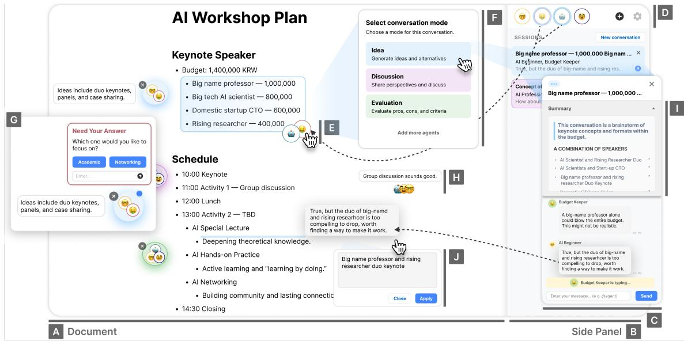  
Fi . 2. DocuTeam overview. DocuTeam consists of two main com onents: (A) a Document overla view, where discussion sessions are anchored to specific regions of the document, and (B) a Side Panel, where users manage agents and inspect ongoing discussions. Users can initiate discussions by dragging agents onto the document and selecting a discussion mode (E, F). Discussions appear as anchored discussion bubbles beside the relevant document region (G) and can be opened in the side panel as chat threads with summaries (C, I). Agents proactively atend to edited blocks (H) and start discussions, while users can apply useful discussion content back into the document (J).

DI1. Support task-oriented discussion modes for expanding, deliberating, and evaluating. Participants expected discussion to serve diferent purposes across their work—from expanding possibilities to deliberating trade-ofs and evaluating current documents—suggesting that systems should provide discussion modes aligned with these recurring task needs.

DI2. Surface the focus, flow, and disagreements of ongoing discussions without requiring continuous monitoring. As discussions continue alongside document work, interfaces should help users see which parts of the document agents are discussing, quickly grasp how the discussion is developing and where agents agree or disagree through concise summaries, and bring emerging issues to the user’s attention when needed.

DI3. Support both direct and indirect steering of ongoing discussions. Participants wanted to intervene when discussions drifted from their intentions, but at varying levels of engagement; interfaces should therefore support both direct participation and lighter-weight ways of influencing the direction of discussion.

DI4. Make ideas emerging from discussion easy to selectively incorporate into the document. Since discussion often produced multiple competing ideas and evolving versions, interfaces should make these alternatives easy to inspect and selectively incorporate into the user’s ongoing work.

## 4 DocuTeam: Mixed-initiative Multi-Agent Discussion on Documents

Based on these design implications, we present DocuTeam, a mixed-initiative multi-agent discussion system that supports document-centered work in Notion2. DocuTeam allows users to work directly in their document while multiple agents monitor the work and proactively discuss improvements and ofer suggestions, allowing for user steering and input both directly and indirectly. To align agent support with diferent stages of work, DocuTeam provides three task-oriented discussion modes—Idea, Discussion, and Evaluation (DI1). To provide users with lightweight awareness of ongoing discussions, rather than confining agent interactions to a separate chat interface, DocuTeam anchors agent discussions to specific document regions and presents summaries at varying levels of detail—from a one-line summary to a full discussion summary (DI2)—while still allowing users to view the full discussion if they so choose. The system supports both user- and agent-initiated discussions and mixed-initiative steering, allowing both users and agents to shape ongoing conversations as needs emerge (DI3). Users can also configure agent profiles and freely add or remove agents from ongoing discussion threads (DI3). Finally, DocuTeam enables users to selectively integrate ideas from the discussion by dragging and dropping a specific chat message directly into the document (DI4).

## 4.1 Interface Walkthrough

DocuTeam consists of two main interface components. The Document view overlays DocuTeam’s interactive elements on top of a Notion page, which remains the primary document where users author and revise content; multi-agent discussion sessions are anchored to specific document blocks (Fig. 2A). The Side Panel on the right serves as a hub fo managing agents and for viewing all ongoing and closed conversation sessions (Fig. 2B). Through the side panel, users can read and inspect discussion threads, intervene by sending messages, and move useful discussion content back into the document.

4.1.1 Agent Configuration. To create multi-agent discussion teams that represent diverse perspectives, users can configure a team of agents tailored to their current task and goals. Users can manage agents through a list displayed at the top of the side panel (Fig. 2D). For each agent, users specify a name, an avatar, and a brief description. They can use these profiles to assign distinct roles or viewpoints—for example, a budget-conscious manager, an excitement-seeking event planner, or a conservative decision-maker. Users can add a new agent via the + button, and can click an existing agent to edit or delete it.

4.1.2 User-Initiated Discussions. When users want to brainstorm, discuss or evaluate a specific part of the document, users can initiate a discussion by dragging one or more agents onto a target block in the document (Fig. 2E). They then select one of three discussion modes—Idea, Discussion, Evaluation—and can optionally provide a short query to specify what they want the agents to focus on (Fig. 2F). Once the discussion starts, a Discussion Bubble appears beside the associated block, visually anchoring the conversation to the relevant document region (Fig. 2G). The bubble shows the avatars of the participating agents, a one-line summary of the current discussion topic, and a blue dot when unread messages are available. This bubble design helps users maintain awareness of where agents are focusing their attention and how the discussion is unfolding. Users can open the full conversation by clicking the bubble or selecting the session from the side panel (Fig. 2C).

4.1.3 Agent-Initiated Discussions. As users revise the document, DocuTeam guides the agents’ attention by default toward recently edited blocks, as visualized through small floating agent avatars that appear to the right of the block the agents are currently reviewing (Fig. 2H). The agents assess whether ideation or further discussion is needed for the block and, if it is, they autonomously initiate a discussion. The agents first determine a logical topic and select a discussion mode based on the recent changes; the underlying mechanism for this decision-making process is described in Section 4.2.2. The system then presents a discussion bubble beside the corresponding block, anchoring the resulting Manuscript submitted to ACM

discussion to the relevant document region. Although these bubbles function in the same way as in user-initiated discussions, they are visually distinguished through border styling.

4.1.4 Reading and Using Discussions. Users can read a discussion by clicking a discussion bubble or selecting it from the discussion list in the side panel (Fig. 2C). To help users quickly grasp long dialogues, the chat panel displays a mode-specific summary (Fig. 2I). The interface for each mode is detailed in Fig. 7. The bottom of the panel indicates which agent is preparing to speak next, or confirms that the conversation has concluded. When users identify useful content while reading, they can drag-and-drop individual discussion snippets or summary items directly into the document, which are automatically adapted to match the surrounding content and writing style (Fig. 2J).

4.1.5 Mixed-Initiative Steering. Rather than passively consuming agent-generated discussions, users can intervene at any point to redirect the conversation. If the discussion is not unfolding as intended, users can directly send a message into the chat thread, introduce other agents that were not part of the original session, or kick specific agents from the discussion. Conversely, when agents determine that user input is needed to resolve ambiguity or clarify priorities, they surface a question through a discussion bubble with a red border (Fig. 2G). Users can respond by typing a reply or selecting from a set of suggested response options.

## 4.2 Discussion Pipeline

Providing users with natural and insightful multi-agent discussions requires carefully designing both how diverse perspectives interact to produce productive exchanges and how the agents recognize appropriate moments and topics to initiate discussions from the document. We present the design of DocuTeam’s discussion engine and its mechanism for deciding when to initiate discussions.

4.2.1 Discussion Engine. Inspired by prior work on multi-agent conversation design [62, 72, 79], we designed a discussion engine to sustain meaningful exchanges across diverse perspectives while grounding the discussion in user and document context. The engine autonomously guides the conversation toward productive insights while avoiding premature convergence across perspectives. Each agent consists of two components: a profile, which defines its role or viewpoint, and a long-term memory, which stores persistent information (e.g., user preferences, prior decisions, and takeaways from earlier discussions). The discussion engine operates in an iterative loop:

• Intent Extraction: When a user initiates a discussion, the system prompts an LLM to infer the user’s underlying intent and establishes a concrete goal for the discussion. This inference uses as context the current document content, task description, the focused block (where in the document the user dragged-and-dropped the agents), the selected discussion mode, and the user’s query.

• Decide Next Action: A background moderator agent orchestrates the discussion flow. By evaluating the conversation history, the established goal, and the live document context, the moderator either (1) designates the most appropriate agent to speak next, (2) asks users to clarify information or preference between options, or (3) concludes that the goal has been suficiently met.

• Generate Utterance: The designated agent generates its response based on its profile, the discussion mode and goal, the moderator’s directive, the focused block, and the discussion history. Drawing from Perspectra’s agent deliberation framework [62], the agent performs one of five actions: Issue, Claim, Support, Rebut, or Question.

• Update: After each turn, all participating agents update their long-term memories to integrate key takeaways from user messages, and newly formed consensus. Concurrently, an updated summary of the discussion is generated and streamed to the front-end. The update process runs asynchronously to minimize latency.

When a user sends a message, whether to a closed discussion or an ongoing one, the system immediately returns to the Decide Next Action phase: reactivating closed discussions with a new goal, or overriding the current loop using the user’s latest input.

4.2.2 Agent-Initiated Discussions. Inspired by Liu et al.’s guidance for proactive conversational agents [61], DocuTeam employs an automated discussion triggering mechanism. The system monitors typing activity, applying a 2-second debounce to batch modifications and filter out trivial edits like typos. Then, it analyzes the updated block and surrounding content, selects at least three relevant agents, and then these agents independently evaluate the necessity for a discussion— providing a score (0 to 1) for each of the three modes (i.e., Idea, Discussion, and Evaluation). If the average score fo any mode exceeds a predefined threshold of 0.75, which was determined through multiple pilot studies, the system automatically initiates a discussion.

## 4.3 Implementation Details

DocuTeam is implemented as a Chrome browser extension using ReactJS, CSS, and JavaScript. We developed the extension to operate directly within Notion, chosen for its Markdown-based editing environment and the accessibility of its DOM, which allows for the reliable extraction of internal blocks and content. The back-end was developed using Python and FastAPI. Considering operational cost and latency within the LLM pipeline, we adopted gpt-5-mini for utterance generation, while using gpt-4o-mini for all other LLM components through OpenAI API3. Prompts are available in Appendix C.

## 5 User Study

To understand how users’ open-ended problem solving processes are shaped by collaboration with a mixed-initiative multi-agent discussion team, we conducted a within-subjects study. We compared DocuTeam to a baseline that provides the same multi-agent discussions but doesn’t have the in-situ interactions and agent-initiated discussions. The study was approved by our institution’s IRB. Through this study, we focus on answering the following research questions:

• RQ1. (Outcome) How do mixed-initiative multi-agent discussions impact novelty, workability, relevance, and specificity of the outcomes of open-ended problem solving?

• RQ2. (Process) How do mixed-initiative multi-agent discussions change users’ patterns of interactions with agents during the task?

• RQ3. (Cognitive workload) How does working with mixed-initiative multi-agent discussion teams afect the cognitive and coordination burdens placed on users during the task?

## 5.1 Study Design

5.1.1 Participants. We recruited 20 participants through our institute’s online communities who regularly use LLM services to discuss or solve complex problems and had at least one prior experience planning an event. Participants were compensated 50,000 KRW (approximately 37 USD) for the 2-hour study

5.1.2 Condition. We compared the full DocuTeam system against a Baseline condition representing a conventional user-initiated multi-agent discussion interface. Since prior work has already shown that multi-agent discussion can ofer advantages over single-agent settings in similar tasks [62, 79], we adopted a multi-agent baseline to provide a stronger comparison rather than comparing DocuTeam against a single agent. The Baseline condition was a version of DocuTeam without agent-initiated discussion, steering, and in-situ interaction in documents—functionally a user-initiative system rather than a mixed-initiative system. Instead of using drag-and-drop to initiate discussions anchored to specific areas of the document, users in the Baseline condition initiated chat threads grounded in the whole document from a separate panel. To ensure a fair comparison, both conditions were powered by the identical discussion engine and provided auto-generated summaries of discussions using the same pipeline

5.1.3 Tasks. We designed two open-ended event-planning tasks: Academic Workshop Planning and Joint Sports Day Planning. We selected event planning because it provides an accessible, real-world setting in which participants can consider multiple constraints and stakeholder perspectives while iteratively refining documented outcomes (e.g., timetables, event programs) [45]. In addition, event planning shares several key characteristics with tasks from the formative study. Similar to house hunting, it involves comparing multiple options. Like UI design, it requires reconciling various constraints into a coherent plan. Finally, it involves documenting decisions and reflections, like report writing. In both tasks, participants were given a document with a partially written plan and reference materials (e.g., constraints). We provided an initial plan rather than starting from scratch to help participants quickly establish task context and to ensure that the task included opportunities for diferent forms of discussion, such as generating ideas and deliberating among constrained alternatives. Participants were tasked with improving the existing plans, while also addressing the discussion points. Participants were provided with a few predefined agents, and they could add additional agents representing other perspectives or requirements if needed. Full study materials are provided in Appendix B.1.

5.1.4 Procedure. The study procedure began with obtaining informed consent from each participant, and each study session lasted approximately 2 hours. After a research briefing (5 min), participants completed two task blocks, one for each condition. The order of conditions and tasks was counterbalanced. Each task block lasted 45 minutes and consisted of four stages: a system tutorial (5 min), a task explanation (5 min), the main event-planning task (30 min), and a post-survey (5 min). Before starting each task, participants were given time to review the current draft and the provided reference materials. After completing both task blocks, participants participated in a semi-structured interview (about 20 min). The interview focused on how they used the agent discussions during the task, how the interface afected their planning process, and how they perceived the usefulness and limitations of the two conditions.

5.1.5 Measures. To assess the quality diferences in the generated proposals across the two conditions, we conducted a blind expert evaluation. We recruited two experienced external evaluators with over two years of experience in planning university festivals and on-campus workshops, compensating them with 100,000 KRW (approximately 70 USD) each. Raters evaluated the 40 final plans produced by the 20 participants, rating them on a 5-point Likert scale across four dimensions: Novelty, Workability, Relevance, and Specificity, drawn from [20]. For quantitative subjective feedback, we analyzed post-survey responses where participants used 7-point Likert scales to rate the extent to which the system expanded or deepened their thinking during the planning process, their confidence and satisfaction with the final outcome, and their perception of the dialogues with the AI agents. Participants also completed a NASA-TLX questionnaire [31], excluding ‘Physical Demand’, to report their perceived workload. Likert scale responses were analyzed using the Wilcoxon signed-rank test. We also recorded participants’ interaction logs, including: use of each Manuscript submitted to ACM dialogue mode, dialogue timestamps, messages which participants sent to intervene discussions, and each modification to a document. During the study, we counted each time a participant incorporated an idea or suggestion from the discussions into their document, and we confirmed each instance with the participant after the session. For these interaction-based measures, we ran Shapiro-Wilk tests to determine if the data was parametric, and then adopted a paired t-test (if parametric) or a Wilcoxon signed-rank test (if non-parametric). For qualitative data, we coded the participants’ comments from the semi-structured interviews through thematic analysis. The full survey questions are provided in Appendix B.2.

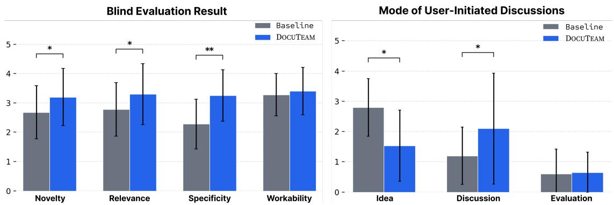  
Fi . 3. Blind evaluations showed that the DocuTeam condition roduced more novel relevant and s ecific outcomes than the Baseline condition. The mode of user-initiated discussions shifted from Idea to Discussion. $( ^ { \star } { : } \mathsf { p } { < } . 0 5 , ^ { \star \star } { : } \mathsf { p } { < } . 0 1 _ { \cdot }$ , error bars indicate one standard deviation)

## 5.2 Results

In this section, we report how DocuTeam afected the quality of participants’ final outcomes (RQ1), their interaction patterns with mixed-initiative multi-agent discussions (RQ2), and their relative cognitive burdens (RQ3).

5.2.1 (RQ1) More novel, relevant, and specific outcomes. In condition-blind evaluations, the final plans produced with the DocuTeam condition were rated significantly higher in Novelty (DocuTeam = 3.20 ± 0.98, Baseline $= 2 . 6 8 \pm 0 . 9 1$ $W = 3 5 , p = 0 . 0 4 7 )$ , Relevance (DocuTeam $= 3 . 3 0 \pm 1 . 0 4 $ Baseline = 2.78 ± 0.91, � = 40.5, $\mathnormal { p } = 0 . 0 4 8 )$ ), and Specificity (Docu $\Gamma _ { \mathrm { E A M } } = 3 . 2 5 \pm 0 . 8 8$ , Baseline = 2.28 ± 0.85, � = 13, � = 0.001), although with no significant diferences in Workability (DocuTeam = 3.40 ± 0.81, Baseline = 3.28 ± 0.72, � = 51.5, � = 0.623). This suggests that DocuTeam supported not only the generation of more original ideas, but also the development of plans that better reflected task requirements and were articulated in greater detail.

Agent-initiated discussions and in-situ interaction contributed to more novel, relevant, and specific outcomes. The interviews suggested two distinct mechanisms behind these gains. First, agent-initiative discussions proactively exposed users to perspectives and suggestions they would not have generated on their own, contributing to higher novelty. As P6 noted, “I could add points I hadn’t thought of—itfelt like I wasn’t confined [to my own thoughts].” For relevance, proactive exchanges among agents surfaced counterarguments, risks, and overlooked constraints before users explicitly raised them, helping participants better align their evolving drafts with task requirements. For example, P14 mentioned, “I was considering what potential issues might arise, and they were proactively discussing safety. Seeing that made me realize I needed to prepare for it.” The DocuTeam condition supported specificity as discussions were anchored Manuscript submitted to ACM

to specific blocks in the document, which enabled “specialized discussions that were divided by section” (P20), allowing participants to iteratively refine what they had already written. External evaluators explained that the generally similar workability scores stem from incompleteness: regardless of condition, participants struggled to develop complete plans that could be used for real events due to the study’s time constraints.

While outcomes improved, competing perspectives made participants feel uncertain of the outcome quality. Although DocuTeam led to higher-rated outcomes, these improvements did not translate into higher selfreported confidence (DocuTeam = 4.35±1.63, Baseline = 4.40±1.47,� = 50.5, � = 0.896) or satisfaction (DocuTeam = $5 . 1 5 \pm 1 . 5 0$ , Baseline = 5.15 ± 1.23, � = 44.5, � = 0.943). Participants sometimes felt less certain about the quality of their work because the agents not only introduced counterarguments and alternative perspectives that “contradicted [their] ideas” (P13), but also broadened the range of issues to consider, making it “harder to organize everything” (P17). This contrast suggests that DocuTeam may have improved final outcomes by encouraging more critical reflection, which in turn hindered users’ subjective confidence.

5.2.2 (RQ2) From chat-centered ideation to document-mediated discussion and iterative refinement. The document became a medium through which users and agents collaborate with one another. DocuTeam changed how participants engage with multi-agent discussions in their work. In DocuTeam, participants initiated Discussion-mode conversations significantly more often (DocuTeam = 2.1 ± 1.83, Baseline = 1.2 ± 0.95, � = −2.35, $p = 0 . 0 3 0 )$ . In contrast, in Baseline, participants relied more on broad ideation, with user-initiated Idea-mode conversations occurring significantly more often (DocuTeam = 1.53 ± 1.18, Baseline = 2.8 ± 0.95, � = 2.59, $\mathnormal { p } = 0 . 0 1 8 )$ . P6 explained, “Because I could place agents on a specific part, I ended up using Discussion-mode more. Ideation starts from zero, whereas discussion builds on what is already written.” This suggests that DocuTeam shifted the role of multi-agent discussion from externa idea generation toward developing and refining content already present in the document. This pattern was further reinforced by the agents’ proactive and autonomous discussions on users’ ongoing task. P13 described, “Once I put something into the document, the agents would discuss it on their own, which made me look at it again. ... In Baseline, I would not get that additional feedback unless I asked for $i t , ^ { \dprime }$ and P19 agreed that agent-initiated discussions “made me think one more time”. Importantly, this implied that writing itself could become part of the interaction with the agents. Some participants wrote in anticipation of such reactions; as P2 described, agent initiative “made me keep typing more as much as possible to see agent reactions.” In this way, the document served not only as the object being edited, but also as a medium through which users and agents continually responded to one another. Together, these patterns suggest that DocuTeam shifted multi-agent discussion from one-shot idea generation toward an iterative refinement loop around the evolving document, which explains the improved specificity observed in § 5.2.1.

This iterative refinement also made ideas from multi-agent discussions easier to incorporate into the draft. Because discussions in DocuTeam were grounded in specific parts of the document, participants could obtain more contextually relevant discussions and apply them more directly. P11 said “Placing the agent in a specific part was the best... it was good to get context-specific help.” As shown in Figure 4, participants reported that it was significantly easier to apply AI-generated ideas (DocuTeam = 5.7 ± 1.22, Baseline = 4.6 ± 1.43, � = 49, � = 0.025). Consistent with this, they added or modified significantly more words in their final drafts (DocuTeam = 448.7 ± 100.95, Baseline = 322.95 ± 135.33, $t = 3 . 6 8 , p < 0 . 0 1 )$ and applied more messages from discussions to the final document (DocuTeam $= 1 2 . 3 \pm 3 . 5 7$ Baseline = 9 ± 3.36, � = 4.71, $\textstyle p < 0 . 0 1 )$ ).

Participants in the DocuTeam condition reported slightly lower scores on the survey question assessing whether the AI felt like a mere tool rather than a collaborator (DocuTeam = 3.25 ± 1.55, Baseline = 4.1 ± 1.74, � = 19.0,

Manuscript submitted to ACM

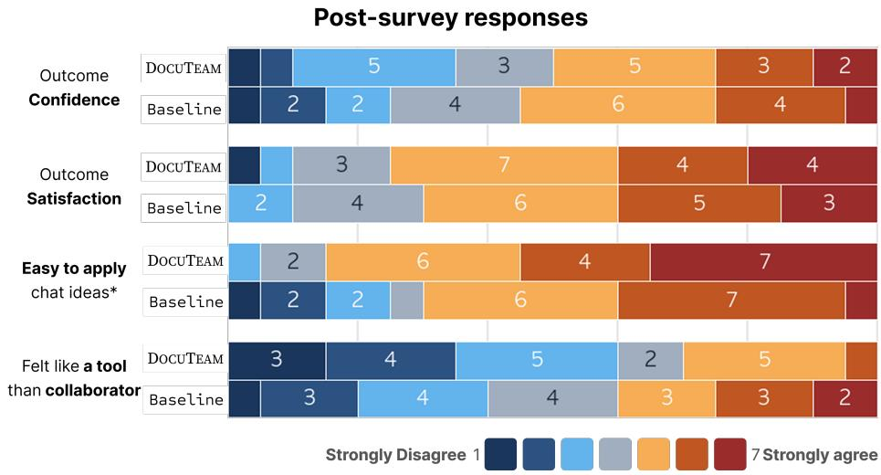  
Fig. 4. Post-survey responses on outcome and collaboration. Unlike the external evaluators’ assessments, participants’ confidence in and satisfaction with their own outcomes did not difer significantly between conditions. DocuTeam made discussion ideas easier to apply to the document. (\*:p<.05)

$p = 0 . 0 6 0 )$ , although this diference was not statistically significant. Interviews help contextualize this: participants described the agents as feeling more “alive” (P15, P18) and sometimes even “cute” (P3, P5, P15, P16) in the DocuTeam condition, reflecting how their visible and proactive activity made them seem less like passive tools and more like companions working alongside them. As P8 mentioned, “It gave me peace of mind because I can feel they were working on their own. Sometimes distracting, but psychologically reassuring.”

5.2.3 (RQ3) Comparable overall workload despite diferent interaction demands. Despite the additional proactive and concurrent interactions introduced in DocuTeam, participants did not report significantly higher overall cognitive demands. NASA-TLX scores were similar in both conditions (DocuTeam = 4.65±0.59, Baseline = 4.26±0.89,� = 47.5, $p = 0 . 1 6 9 )$ , suggesting no significant change in perceived workload. The interviews show that this null result reflected countervailing experiences: while DocuTeam introduced additional cognitive demands as participants had to attend to the agent discussions that would initiate throughout their document, it also reduced the efort required to direct these discussions and provided scafolds to keep track of them. Some participants found the amount and concurrency of agent activity somewhat overwhelming. For example, P15 described, “There was a lot ofinformation coming from multiple places, so it felt a little overwhelming.” Participants also described an initial learning cost in adapting to the more active interface. As P16 described, “At first it felt a little overwhelming, but once I became familiar with the system and how the agents provided ideas, it actually helped me become more immersed and expand my thinking.”

Table 2. Diferences in task process measures between Baseline and DocuTeam.
<table><tr><td>Metric</td><td>DOCUTEAM</td><td>Baseline</td></tr><tr><td>Steering msgs.*</td><td> $2 . 7 0 \pm 0 . 7 7$ </td><td> $5 . 0 0 \pm 1 . 5 0 $ </td></tr><tr><td>Draft word changes.**</td><td> $4 4 8 . 7 0 \pm 1 0 0 . 9 5$ </td><td> $3 2 2 . 9 5 \pm 1 3 5 . 3 3$ </td></tr><tr><td>Msgs applied to doc.**</td><td> $1 2 . 3 0 \pm 3 . 5 7$ </td><td> $9 . 0 0 \pm 3 . 3 6$ </td></tr></table>

Values are reported as � ± ��.  
\* � < .05, \*\* � < .01.

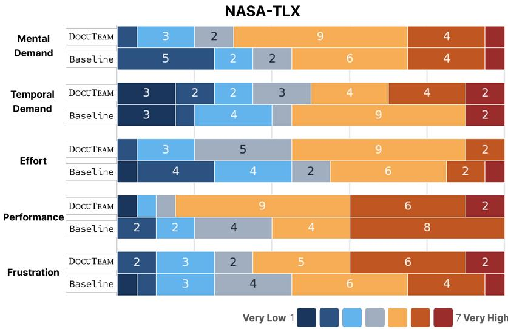  
Fig. 5. NASA-TLX workload ratings. Overall perceived workload and performance remained similar.

Attention shifted from discussion steering toward document work itself. Participants sent significantly fewer messages to steer the discussion in the DocuTeam condition (DocuTeam = 2.7 ± 0.77, Baseline $= 5 \pm 1 . 5 0 , W = 3 1 . 0 $ $p = 0 . 0 1 3 )$ . While, in isolation, this result could have many possible explanations, participants’ interviews made it clear that the proactive nature of the agents reduced their need to continuously steer the discussion. Because the agents were already grounded in the evolving document, participants could focus on the document itself rather than continually restating and refining their intentions through chat. As P16 explained, “In DocuTeam, the agents look at what I am writing on, so once I assign a specific block, I do not have to think about how to steer the conversation. In Baseline, I had to explain things through chat and keep directing it the way I wanted.” For some participants, this reduction in conversational management allowed more attention to remain on the document itself. P10 described, “DocuTeam made me focus more on the document. I selected areas to ask about, and I ended up reading the document a lot. But, in Baseline, [I was] focusing more on chat to phrase my questions and explain my intentions through chat.” This reduced the coordination burden of managing multi-agent discussion alongside writing, making the interaction feel more like a continuation of document work than a separate conversational task.

The in-situ design also provided scafolds for managing increased complexity. Because discussions in DocuTeam were anchored to specific blocks in the document, participants could more easily keep track of what each conversation was about and how it related to their draft. P14 mentioned, “In Baseline, even with justfive [chats], it was hard to keep track of what I needed to check. But because DocuTeam was connected to the content, it was easy to understand the context of the conversations.” Taken together, these findings suggest that DocuTeam shifted where participants efort was directed: less toward initiating, steering, and contextualizing discussions through chat, and more toward attending to richer agent activity while staying engaged with the evolving document.

Manuscript submitted to ACM

## 6 Discussion

In this section, we discuss how DocuTeam reshaped human-AI mixed-initiative collaboration by turning the document into a single medium for grounding, coordinating, and refining work with multiple agents. We then reflect on the benefits and tradeofs of this document-mediated interaction, draw design implications and future directions from participants’ actual use of the system, and conclude by discussing the limitations of our study

## 6.1 Toward Mixed-Initiative Multi-Agent Discussion Interfaces

Prior work has moved conversational agents beyond dyadic interaction, exploring agents as participants in groups and interactions involving multiple conversational agents [5, 85, 97]. For such agents to function as collaborators rather than passive respondents, however, they must take initiative based on evolving contexts. Mixed-initiative interaction has long posed a dificult design problem even for a single intelligent agent, requiring interventions to be appropriately timed, framed, and grounded in user context [10, 12, 77], and these challenges expand when initiative is exercised by multiple agents; a group of agents can demand greater attention from users and must navigate social dynamics that are more complex than in the case of a single agent [90].

Our DocuTeam system shows that a mixed-initiative multi-agent discussion has the potential to become a viable form of collaboration. Although participants initially experienced learning costs and information overload, many adapted to the agents’ ongoing discussions and incorporated it into their work. Rather than only requesting and consuming isolated responses, participants followed the flow of discussions, selectively incorporated useful ideas into their documents, and naturally treated document editing itself as a way of interacting with the agent team. Well-designed mixed-initiative interaction could also change how users perceive the collaborative nature of their relationship with AI agents [77]. In this study, we observed that some participants felt more like they were collaborating with the agents as teammates in a shared workspace. P16 said, “I felt they were more like colleagues when they first approached me or intervened to suggest ideas,” while P11 described Baseline as “just working with ChatGPT at my desk” and DocuTeam as “like working in an open space.”

## 6.2 Future Design Implications for Mixed-Initiative Multi-Agent Discussions on Documents

This work highlights the potential for mixed-initiative, multi-agent discussions in workflows, but supporting these interactions introduces new interface needs. Below, we highlight three design implications for making mixed-initiative multi-agent discussions easier to follow, configure, and incorporate into document work.

Designing Summaries to Convey Discussion Flow, Not Just Outcomes. Contrary to expectations based on our formative study, all but two participants barely read the agent discussion summaries they were provided. Instead, users wanted to directly “grasp the overall flow ofthe discussion” (P18, P19) and “feel involved” (P5, P19) in the debate process without missing any information. This does not imply that the summary function is unnecessary, but rather that a design going beyond text-based outcome summarization is required. For instance, the purpose of summarization should be redesigned to aid in understanding the flow, such as visualizing the tension between agents, or in revealing the inner states indicating what each agent is currently considering.

Considering Reflective Agent Configuration and Automatic Agent Generation. Participants noted that configuring agents with diverse perspectives helped them reflect on what was still missing from the current draft, prompting them to “think about what I should consider in this task” (P11). This suggests that agent configuration can serve not only as a Manuscript submitted to ACM

way of customizing discussion, but also as a scafold for reflection around the evolving document. Participants also pointed to the value of more automatic support: as P15 noted, “since generating the agents themselves is an important part of producing a good answer in the first place, it would be nice if agents could also be generated automatically.” Such agents could even be introduced proactively as the document evolves and new issues emerge. This connects to prior work highlighting team formation as a central design challenge in human–multi-agent collaboration [58, 94], suggesting that systems should help users construct and refine the set of perspectives they collaborate with.

Using Utterances as First-Class Objects. Participants responded positively to the ability to drag discussion snippets into the document and to the way the system adapted them to the surrounding context and style. In document-centered and proactive settings, this suggests that utterances should not be treated as transient outputs, but as reusable interaction materials that can be carried across writing and discussion. Especially as agents proactively generate ideas or critiques, making these manipulable can help users recombine, reinterpret, and re-invoke them as part of ongoing document work.

## 6.3 Shared Artifacts as Coordination Interfaces for Human–Multi-Agent Collaboration

Working with multiple AI agents is challenging due to the burden of orchestration: users must repeatedly provide context, decide when and how agents should participate, and monitor or redirect their contributions [9, 70, 83]. Our user study suggests a diferent interaction model, where the user simply performs their work and this directly serves to orchestrate the agents as they monitor and respond to the evolving work. Users can then incorporate ideas from the agent discussions back into their work, which the agents reflect on again—creating an iterative loop between work and discussion. In DocuTeam, the evolving document thus became a shared medium that grounded agent activity in the user’s ongoing work, reducing the need to repeatedly contextualize and steer the team through separate conversations.

This interaction model may become increasingly important as AI agents begin to act directly within users’ digital workspaces. Recent work has similarly explored using users’ ongoing workspace activity as implicit signals of context, intent, or need for assistance [6, 51, 75, 86], while systems such as CLEO [89] show how users and agents can coordinate through concurrent actions on a shared artifact. Extending these ideas to multiple agents, a shared artifact could become a bidirectional coordination surface: users’ edits and annotations can implicitly signal changing intentions and priorities, while agents’ intermediate outputs and changes can make their own activity visible and actionable. This revisits implicit interaction [82] for human–multi-agent collaboration, where interacting with the work itself can become a lightweight means of coordinating with agents.

## 6.4 Multi-Agent Discussions and the Value of Productive Friction

Our findings also reinforce the idea that AI systems need not be designed solely to reduce friction. In DocuTeam, multiple agents surfaced problems in the current draft, uncovered overlooked constraints from diferent perspectives, and even made users feel that “the agents were pushing back against the user’s opinion” (P7). Although this sometimes required more reading and judgment, it helped users produce plans that were more specific and better reflected the given constraints. In this sense, when designed appropriately, multi-agent discussion can function as a form of productive friction [14, 95] that encourages users to reflect on and revisit their work. Productive friction, however, should be calibratable rather than fixed. Prior work suggests that users value control over both how proactively agents participate and how much of their activity is surfaced [54, 70], suggesting that multi-agent systems should allow users to adjust agent initiative and discussion visibility according to their current needs. In DocuTeam, this could take the form of controls over how often agents initiate discussions, whether their activity is surfaced during the work, or how strongly individual agents challenge each other’s opinion or the user’s current direction. More broadly, designing for productive friction may require interfaces that let users calibrate not only agent initiative, but also the visibility and intensity of disagreement as their needs change over the course of a task.

## 6.5 Limitations

Event planning served as a suitable testbed because it requires comparing diferent perspectives and constraints, and entails continuous document refinement. However, it remains unclear whether the efects of DocuTeam would fully generalize to other document workflows. For example, future work should examine whether similar benefits hold in environments centered on writing or visual design.

Our user study was also limited to relatively short-term use (within a two-hour user study) after a brief tutorial. Although we observed significant diferences in processes and outcomes within this short period, we could not examine how users’ strategies for forming agent teams, using conversations, or engaging with in-situ interactions might evolve through long-term use. Future work should therefore investigate these longer-term efects through open deployment or a longitudinal study

Finally, we did not independently evaluate the conversation engine itself in terms of qualities such as naturalness or practical helpfulness. Because our main contribution lies in the interaction design of mixed-initiative multi-agent discussion into document authoring, we used the same engine in both conditions. Although the engine was suficient for conducting the study, conversation quality can substantially shape user experience. Future work should therefore more directly evaluate the dialogue engine itself.

## 7 Conclusion

In this paper we presented DocuTeam, a mixed-initiative multi-agent discussion system for document-centered tasks. To support a more collaborative form of human–AI teamwork around evolving documents, DocuTeam anchors discussions to specific document regions and supports proactive, mixed-initiative interaction around the document itself. In a withinsubjects study (N=20) comparing DocuTeam with a typical multi-agent discussion style baseline, we found that this mixed-initiative multi-agent discussion reduced steering burden and shifted collaboration toward document-centered iterative refinement, leading to outcomes that were more novel, relevant, and specific. We ofer design implications for mixed-initiative human–multi-agent collaboration, where efective teamwork depends on how agent teams are composed, how their autonomous activity is surfaced, and how shared artifacts support users in understanding and steering multi-agent discussions.

## References

[1] James E Allen, Curry I Guinn, and Eric Horvtz. 1999. Mixed-initiative interaction. IEEE Intelligent Systems and their Applications 14, 5 (1999), 14–23.

[2] Ernesto Arias, Hal Eden, Gerhard Fischer, Andrew Gorman, and Eric Scharf. 2000. Transcending the individual human mind—creating shared understanding through collaborative design. ACM Trans. Comput.-Hum. Interact. 7, 1 (March 2000), 84–113. doi:10.1145/344949.345015

[3] Gagan Bansal, Besmira Nushi, Ece Kamar, Walter S Lasecki, Daniel S Weld, and Eric Horvitz. 2019. Beyond accuracy: The role of mental models in human-AI team performance. In Proceedings ofthe AAAI conference on human computation and crowdsourcing, Vol. 7. 2–11.

[4] Abhizna Butchibabu, Christopher Sparano-Huiban, Liz Sonenberg, and Julie Shah. 2016. Implicit coordination strategies for efective team communication. Human factors 58, 4 (2016), 595–610.

[5] Heloisa Candello, Claudio Pinhanez, Mauro Carlos Pichiliani, Melina Alberio Guerra, and Maira Gatti de Bayser. 2018. Having an Animated Cofee with a Group of Chatbots from the 19th Century. In Extended Abstracts ofthe 2018 CHI Conference on Human Factors in Computing Systems (Montreal QC, Canada) (CHI EA ’18). Association for Computing Machinery, New York, NY, USA, 1–4. doi:10.1145/3170427.3186519

Manuscript submitted to ACM

[6] Yining Cao, James D Hollan, and Haijun Xia. 2026. Exploring Fairy Cursor as a Form of AI Agent for In-the-Flow Assistance: Design Opportunities and Challenges. In Proceedin s ofthe 2026 Desi nin Interactive S stems Conference. 1153–1169.

[7] Chi-Min Chan, Weize Chen, Yusheng Su, Jianxuan Yu, Wei Xue, Shanghang Zhang, Jie Fu, and Zhiyuan Liu. 2024. ChatEval: Towards Better LLM-based Evaluators through Multi-Agent Debate. In The Twelfth International Conference on Learning Representations. https://openreview.net forum?id=FQepisCUWu

[8] Senthil Chandrasegaran, Chris Bryan, Hidekazu Shidara, Tung-Yen Chuang, and Kwan-Liu Ma. 2019. TalkTraces: Real-time capture and visualization of verbal content in meetings. In Proceedings of the 2019 CHI conference on human factors in computing systems. 1–14.

[9] Ana Paula Chaves and Marco Aurelio Gerosa. 2018. Single or Multiple Conversational Agents? An Interactional Coherence Comparison. In Proceedings ofthe 2018 CHI Conference on Human Factors in Computing Systems (Montreal QC, Canada) (CHI ’18). Association for Computing Machinery, New York, NY, USA, 1–13. doi:10.1145/3173574.3173765

[10] Valerie Chen, Alan Zhu, Sebastian Zhao, Hussein Mozannar, David Sontag, and Ameet Talwalkar. 2025. Need help? designing proactive ai assistants for programming. In Proceedings of the 2025 CHI Conference on Human Factors in Computing Systems. 1–18.

[11] Xinyue Chen, Nathan Yap, Xinyi Lu, Aylin Gunal, and Xu Wang. 2025. MeetMap: Real-Time Collaborative Dialogue Mapping with LLMs in Online Meetings. Proc. ACM Hum.-Comput. Interact. 9, 2, Article CSCW132 (May 2025), 35 pages. doi:10.1145/3711030

[12] XinHui Chen, Xiang Yuan, Hui Zhang, Ruixiao Zheng, and Wanyi Wei. 2025. Maintaining "Balanced" Conflict: Proactive Intervention Strategies of AI Voice Agents in Online Collaboration of Temporary Design Teams. In Proceedings of the 2025 CHI Conference on Human Factors in Computing Systems (CHI ’25). Association for Computing Machinery, New York, NY, USA, Article 907, 19 pages. doi:10.1145/3706598.3713457

[13] Xiaojiao Chen, Jiahuan Zhou, Yunfeng Shu, Ruihan Wang, and Qinghua Liu. 2026. CritiqueCrew: Orchestrating Multi-Perspective Conversational Design Critique. arXiv preprint arXiv:2602.01796 (2026).

[14] Zeya Chen and Ruth Schmidt. 2024. Exploring a Behavioral Model of “Positive Friction” in Human-AI Interaction. In Design, User Experience, and Usability: 13th International Conference, DUXU 2024, Held as Part ofthe 26th HCI International Conference, HCII 2024, Washington, DC, USA, June 29–July 4, 2024, Proceedings, Part II (Washington DC, USA). Springer-Verlag, Berlin, Heidelberg, 3–22. doi:10.1007/978-3-031-61353-1\_1

[15] Chun-Wei Chiang, Zhuoran Lu, Zhuoyan Li, and Ming Yin. 2024. Enhancing AI-Assisted Group Decision Making through LLM-Powered Devil’s Advocate. In Proceedings ofthe 29th International Conference on Intelligent User Interfaces (Greenville, SC, USA) (IUI ’24). Association for Computing Machinery, New York, NY, USA, 103–119. doi:10.1145/3640543.3645199

[16] Yoonseo Choi, Eun Jeong Kang, Seulgi Choi, Min Kyung Lee, and Juho Kim. 2025. Proxona: Supporting Creators’ Sensemaking and Ideation with LLM-Powered Audience Personas. In Proceedings ofthe 2025 CHI Conference on Human Factors in Computing Systems. 1–32.

[17] Herbert H Clark and Susan E Brennan. 1991. Grounding in communication. (1991).

[18] Herbert H Clark and Edward F Schaefer. 1987. Collaborating on contributions to conversations. Language and cognitive processes 2, 1 (1987), 19–41.

[19] Herbert H Clark and Deanna Wilkes-Gibbs. 1986. Referring as a collaborative process. Cognition 22, 1 (1986), 1–39.

[20] Douglas Dean, Jillian Hender, Thomas Rodgers, and Eric Santanen. 2006. Identifying Quality, Novel, and Creative Ideas: Constructs and Scales for Idea Evaluation. Journal ofthe Association for Information S stems 7 (10 2006), 646–699. doi:10.17705/1jais.00106

[21] Hyo Jin Do, Ha-Kyung Kong, Pooja Tetali, Jaewook Lee, and Brian P Bailey. 2023. To Err is AI: imperfect interventions and repair in a conversational agent facilitating group chat discussions. Proceedings of the ACM on Human-Computer Interaction 7, CSCW1 (2023), 1–23.

[22] Paul Dourish and Victoria Bellotti. 1992. Awareness and coordination in shared workspaces. In Proceedings of the 1992 ACM Conference on Computer-Supported Cooperative Work (Toronto, Ontario, Canada) (CSCW’92). Association for Computing Machinery, New York, NY, USA, 107–114. doi:10.1145/143457.143468

[23] Yilun Du, Shuang Li, Antonio Torralba, Joshua B Tenenbaum, and Igor Mordatch. 2024. Improving factuality and reasoning in language models through multiagent debate. In Forty-first international conference on machine learning.

[24] Thomas Erickson and Wendy A Kellogg. 2003. Social translucence: using minimalist visualisations of social activity to support collective interaction. In Designing information spaces: The social navigation approach. Springer, 17–41.

[25] Xinrui Fang, Anran Xu, Chi-Lan Yang, Ya-Fang Lin, Sylvain Malacria, and Koji Yatani. 2025. LLM-based In-situ Thought Exchanges for Critical Paper Reading. arXiv preprint arXiv:2510.15234 (2025).

[26] Adam Fourney, Gagan Bansal, Hussein Mozannar, Cheng Tan, Eduardo Salinas, Friederike Niedtner, Grace Proebsting, Grifin Bassman, Jack Gerrits, Jacob Alber, et al. 2024. Magentic-one: A generalist multi-agent system for solving complex tasks. arXiv preprint arXiv:2411.04468 (2024)

[27] Darren Gergle, Robert E Kraut, and Susan R Fussell. 2013. Using visual information for grounding and awareness in collaborative tasks. Human– Computer Interaction 28, 1 (2013), 1–39

[28] Katy Ilonka Gero, Zahra Ashktorab, Casey Dugan, Qian Pan, James Johnson, Werner Geyer, Maria Ruiz, Sarah Miller, David R Millen, Murray Campbell, et al. 2020. Mental models of AI agents in a cooperative game setting. In Proceedings of the 2020 chi conference on human factors in computing systems. 1–12.

[29] Carl Gutwin and Saul Greenberg. 2002. A descriptive framework of workspace awareness for real-time groupware. Computer Supported Cooperative Work (CSCW) 11, 3 (2002), 411–446

[30] Fatemeh Haji, Mazal Bethany, Maryam Tabar, Jason Chiang, Anthony Rios, and Peyman Najafirad. 2024. Improving LLM reasoning with multi-agent Tree-of-Thought Validator agent. arXiv re rint arXiv:2409.11527 (2024).

[31] Sandra G Hart and Lowell E Staveland. 1988. Development of NASA-TLX (Task Load Index): Results of empirical and theoretical research. In Advances in psychology. Vol. 52. Elsevier, 139–183.

Manuscript submitted to ACM

[32] Sarah Harvey. 2014. Creative synthesis: Exploring the process of extraordinary group creativity. Academy ofmanagement review 39, 3 (2014), 324–343.

[33] Jessica He, Stephanie Houde, Gabriel E Gonzalez, Darío Andrés Silva Moran, Steven I Ross, Michael Muller, and Justin D Weisz. 2024. AI and the Future of Collaborative Work: Group Ideation with an LLM in a Virtual Canvas. In Proceedings ofthe 3rd Annual Meeting ofthe Symposium on Human-Com uter Interaction for Work. 1–14.

[34] Xiangyang He, Jiale Li, Jiahao Chen, Yang Yang, and Mingming Fan. 2025. SimuPanel: A Novel Immersive Multi-Agent System to Simulate Interactive Expert Panel Discussion. arXiv preprint arXiv:2506.16010 (2025).

[35] Sirui Hong, Mingchen Zhuge, Jonathan Chen, Xiawu Zheng, Yuheng Cheng, Jinlin Wang, Ceyao Zhang, Zili Wang, Steven Ka Shing Yau, Zijuan Lin, Liyang Zhou, Chenyu Ran, Lingfeng Xiao, Chenglin Wu, and Jürgen Schmidhuber. 2024. MetaGPT: Meta Programming for A Multi-Agent Collaborative Framework. In The Twelfth International Conference on Learning Representations. https://openreview.net/forum?id=VtmBAGCN7o

[36] Eric Horvitz. 1999. Principles of mixed-initiative user interfaces. In Proceedings of the SIGCHI conference on Human Factors in Computing Systems. 159–166.

[37] Junyi Hou, Andre Lin Huikai, Nuo Chen, Yiwei Gong, and Bingsheng He. 2026. Paperdebugger: A plugin-based multi-agent system for in-editor academic writing, review, and editing. In Companion Proceedings ofthe ACM Web Conference 2026. 144–147.

[38] Erzhen Hu, Yanhe Chen, Mingyi Li, Vrushank Phadnis, Pingmei Xu, Xun Qian, Alex Olwal, David Kim, Seongkook Heo, and Ruofei Du. 2025 DialogLab: Authoring, Simulating, and Testing Dynamic Human-AI Group Conversations. In Proceedings ofthe 38th Annual ACM Symposium on User Interface Software and Technology. 1–20.

[39] Zhe Hu, Hou Pong Chan, Jing Li, and Yu Yin. 2025. Debate-to-write: A persona-driven multi-agent framework for diverse argument generation. In Proceedings ofthe 31st International Conference on Computational Linguistics. 4689–4703

[40] Edwin Hutchins. 1995. Cognition in the Wild. MIT press.

[41] Edwin Hutchins. 2000. Distributed cognition. International encyclopedia ofthe social and behavioral sciences 138, 1 (2000), 1–10

[42] Rehan Iftikhar, Yi-Te Chiu, Mohammad Saud Khan, and Catherine Caudwell. 2023. Human–agent team dynamics: A review and future research opportunities. IEEE Transactions on Engineering Management 71 (2023), 10139–10154.

[43] Zhiqiu Jiang, Mashrur Rashik, Kunjal Panchal, Mahmood Jasim, Ali Sarvghad, Pari Riahi, Erica DeWitt, Fey Thurber, and Narges Mahyar. 2023. CommunityBots: creating and evaluating A multi-agent chatbot platform for public input elicitation. Proceedings ofthe ACM on Human-Computer Interaction 7, CSCW1 (2023), 1–32.

[44] Hyeonsu B Kang, Tongshuang Wu, Joseph Chee Chang, and Aniket Kittur. 2023. Synergi: A mixed-initiative system for scholarly synthesis and sensemaking. In Proceedings ofthe 36th Annual ACM Symposium on User Interface Software and Technology. 1–19.

[45] Juho Kim, Haoqi Zhang, Paul André, Lydia B Chilton, Wendy Mackay, Michel Beaudouin-Lafon, Robert C Miller, and Steven P Dow. 2013. Cobi: A community-informed conference scheduling tool. In Proceedings ofthe 26th annual ACM symposium on User interface software and technology 173–182.

[46] Soomin Kim, Jinsu Eun, Changhoon Oh, Bongwon Suh, and Joonhwan Lee. 2020. Bot in the Bunch: Facilitating Group Chat Discussion by Improving Eficiency and Participation with a Chatbot. In Proceedin s ofthe 2020 CHI Conference on Human Factors in Computin S stems (Honolulu, HI, USA) (CHI ’20). Association for Computing Machinery, New York, NY, USA, 1–13. doi:10.1145/3313831.3376785

[47] Soomin Kim, Jinsu Eun, Joseph Seering, and Joonhwan Lee. 2021. Moderator chatbot for deliberative discussion: Efects of discussion structure and discussant facilitation. Proceedings ofthe ACM on Human-Computer Interaction 5, CSCW1 (2021), 1–26.

[48] Tae Soo Kim, Seungsu Kim, Yoonseo Choi, and Juho Kim. 2021. Winder: Linking Speech and Visual Objects to Support Communication in Asynchronous Collaboration. In Proceedings of the 2021 CHI Conference on Human Factors in Computing Systems (Yokohama, Japan) (CHI ’21) Association for Computing Machinery, New York, NY, USA, Article 453, 17 pages. doi:10.1145/3411764.3445686

[49] Carol C Kuhlthau. 1991. Inside the search process: Information seeking from the user’s perspective. Journal of the American society for information science 42, 5 (1991), 361–371.

[50] Philippe Laban, Jesse Vig, Marti Hearst, Caiming Xiong, and Chien-Sheng Wu. 2024. Beyond the chat: Executable and verifiable text-editing with llms. In Proceedings of the 37th Annual ACM Symposium on User Interface Software and Technology. 1–23.

[51] Michelle S. Lam, Omar Shaikh, Hallie Xu, Alice Guo, Diyi Yang, Jefrey Heer, James A. Landay, and Michael S. Bernstein. 2026. Just-In-Time Objectives: A General Approach for Specialized AI Interactions. In Proceedings ofthe 2026 CHI Conference on Human Factors in Computing Systems (CHI ’26). Association for Computing Machinery, New York, NY, USA, Article 802, 26 pages. doi:10.1145/3772318.3790713

[52] Geonsun Lee, Min Xia, Nels Numan, Xun Qian, David Li, Yanhe Chen, Achin Kulshrestha, Ishan Chatterjee, Yinda Zhang, Dinesh Manocha, et al 2025. Sensible agent: A framework for unobtrusive interaction with proactive ar agents. In Proceedings ofthe 38th Annual ACM Symposium on User Interface Software and Technology. 1–22.

[53] Mina Lee, Katy Ilonka Gero, John Joon Young Chung, Simon Buckingham Shum, Vipul Raheja, Hua Shen, Subhashini Venugopalan, Thiemo Wambsganss, David Zhou, Emad A Alghamdi, et al. 2024. A design space for intelligent and interactive writing assistants. In Proceedings ofthe 2024 CHI Conference on Human Factors in Computing Systems. 1–35.

[54] Florian Lehmann, Krystsina Shauchenka, and Daniel Buschek. 2026. Collaborative Document Editing with Multiple Users and AI Agents. In Proceedings ofthe 2026 CHI Conference on Human Factors in Computing Systems (CHI ’26). Association for Computing Machinery, New York, NY, USA, Article 58, 27 pages. doi:10.1145/3772318.3790648

[55] Boyu Li, Linjie Qiu, Duotun Wang, Qianxi Liu, Ryo Suzuki, Mingming Fan, and Zeyu Wang. 2025. DesignMemo: Integrating Discussion Context into Online Collaboration with Enhanced Design Rationale Tracking. Proc. ACM Hum.-Comput. Interact. 9, 7, Article CSCW398 (Oct. 2025), 32 pages. doi:10.1145/375757

[56] Yu Li, Shenyu Zhang, Rui Wu, Xiutian Huang, Yongrui Chen, Wenhao Xu, Guilin Qi, and Dehai Min. 2024. MATEval: a multi-agent discussion framework for advancing open-ended text evaluation. In International Conference on Database S stemsfor Advanced Applications. Springer, 415–426.

[57] Tian Liang, Zhiwei He, Wenxiang Jiao, Xing Wang, Yan Wang, Rui Wang, Yujiu Yang, Shuming Shi, and Zhaopeng Tu. 2024. Encouraging Divergent Thinking in Large Language Models through Multi-Agent Debate. In Proceedings of the 2024 Conference on Empirical Methods in Natural Lan ua e Processin , Yaser Al-Onaizan, Mohit Bansal, and Yun-Nung Chen (Eds.). Association for Computational Linguistics, Miami, Florida, USA 17889–17904. doi:10.18653/v1/2024.emnlp-main.992

[58] Hyunseung Lim, Dasom Choi, Sooyohn Nam, Bogoan Kim, and Hwajung Hong. 2026. Understanding Human–Multi-Agent Team Formation for Creative Work. In Proceedings ofthe 2026 CHI Conference on Human Factors in Computing Systems. 1–21.

[59] Anne Lippert, Keith Shubeck, Brent Morgan, Andrew Hampton, and Arthur Graesser. 2020. Multiple agent designs in conversational intelligent tutoring systems. Technology, Knowledge and Learning 25, 3 (2020), 443–463

[60] Dandan Liu, Lihu Pan, Aznul Qalid Md Sabri, and Guangrui Fan. 2026. From Solo Post to Shared Space: How a Public LLM Agent Reshapes Human-to-Human Conversation Structure on a Social Platform. Trans. Soc. Comput. (Aug. 2026). doi:10.1145/3844666 Just Accepted.

[61] Xingyu Bruce Liu, Shitao Fang, Weiyan Shi, Chien-Sheng Wu, Takeo Igarashi, and Xiang ’Anthony’ Chen. 2025. Proactive Conversational Agents with Inner Thoughts. In Proceedings of the 2025 CHI Conference on Human Factors in Computing Systems (CHI ’25). Association for Computing Machinery, New York, NY, USA, Article 184, 19 pages. doi:10.1145/3706598.3713760

[62] Yiren Liu, Viraj Shah, Sangho Suh, Pao Siangliulue, Tal August, and Yun Huang. 2025. Perspectra: Choosing Your Experts Enhances Critical Thinking in Multi-Agent Research Ideation. arXiv preprint arXiv:2509.20553 (2025)

[63] Yiren Liu, Pranav Sharma, Mehul Oswal, Haijun Xia, and Yun Huang. 2025. Personaflow: Designing llm-simulated expert perspectives for enhanced research ideation. In Proceedings ofthe 2025 ACM Designing Interactive Systems Conference. 506–534

[64] Li-Chun Lu, Shou-Jen Chen, Tsung-Min Pai, Chan-Hung Yu, Hung-yi Lee, and Shao-Hua Sun. 2024. Llm discussion: Enhancing the creativity of large language models via discussion framework and role-play. arXiv preprint arXiv:2405.06373 (2024)

[65] Daniel C McFarlane and Kara A Latorella. 2002. The scope and importance of human interruption in human-computer interaction design. Human-Computer Interaction 17, 1 (2002), 1–61.

[66] Quim Motger, Marc Oriol, Jordi Marco, and Xavier Franch. 2026. Multi-Agent Debate Strategies: Survey, Taxonomy, and Challenges. arXiv preprint arXiv:2607.26212 (2026).

[67] Suchismita Naik, Amanda Snellinger, Austin L Toombs, Scott Saponas, and Amanda K Hall. 2025. Exploring Early Adopters’ Use of AI Driven Multi-Agent Systems to Inform Human-Agent Interaction Design: Insights from Industry Practice. In Proceedings ofthe Extended Abstracts ofthe CHI Conference on Human Factors in Computing Systems. 1–8.

[68] Thomas A O’Neill, Christopher Flathmann, Nathan J McNeese, and Eduardo Salas. 2023. Human-autonomy Teaming: Need for a guiding team-based framework? Computers in Human Behavior 146 (2023), 107762

[69] Scott Page, Nancy Cantor, and Earl Lewis. 2019. The diversity bonus: How great teams pay of in the knowledge economy. (2019).

[70] Saumya Pareek, Jarod Govers, Naja Kathrine Kollerup, Emily Wong, Eduardo Velloso, and Jorge Goncalves. 2026. Sensemaking in Multi-Agent LLM Interfaces: How Users Interpret Transparency and Trustworthiness Cues. In Proceedings ofthe 2026 CHI Conference on Human Factors in Computin S stems. 1–20.

[71] Jeongeon Park, Bryan Min, Kihoon Son, Jean Y Song, Xiaojuan Ma, and Juho Kim. 2023. Choicemates: Supporting unfamiliar online decision-making with multi-agent conversational interactions. arXiv preprint arXiv:2310.01331 (2023)

[72] Joon Sung Park, Joseph O’Brien, Carrie Jun Cai, Meredith Ringel Morris, Percy Liang, and Michael S. Bernstein. 2023. Generative Agents: Interactive Simulacra of Human Behavior. In Proceedings ofthe 36th Annual ACM Symposium on User Interface Software and Technology (San Francisco, CA, USA) (UIST ’23). Association for Computing Machinery, New York, NY, USA, Article 2, 22 pages. doi:10.1145/3586183.3606763

[73] SIMON PARSONS, CARLES SIERRA, and NICK JENNINGS. 1998. Agents that Reason and Negotiate by Arguing. Journal of Logic and Computation 8, 3 (1998), 261–292. doi:10.1093/logcom/8.3.261

[74] Peter Pirolli and Stuart Card. 2005. The sensemaking process and leverage points for analyst technology as identified through cognitive task analysis. In Proceedings ofinternational conference on intelligence analysis, Vol. 5. McLean, VA, USA, 2–4.

[75] Thanawit Prasongpongchai, Pat Pataranutaporn, Monchai Lertsutthiwong, and Pattie Maes. 2025. Talk to the hand: an llm-powered chatbot with visual pointer as proactive companion for on-screen tasks. In Proceedings ofthe 2025 CHI Conference on Human Factors in Computing Systems. 1–16.

[76] Kevin Pu, KJ Kevin Feng, Tovi Grossman, Tom Hope, Bhavana Dalvi Mishra, Matt Latzke, Jonathan Bragg, Joseph Chee Chang, and Pao Siangliulue. 2025. Ideasynth: Iterative research idea development through evolving and composing idea facets with literature-grounded feedback. In Proceedings ofthe 2025 CHI Conference on Human Factors in Computing Systems. 1–31.

[77] Kevin Pu, Daniel Lazaro, Ian Arawjo, Haijun Xia, Ziang Xiao, Tovi Grossman, and Yan Chen. 2025. Assistance or disruption? exploring and evaluating the design and trade-ofs of proactive ai programming support. In Proceedings ofthe 2025 CHI conference on human factors in computing systems. 1–21.

[78] Pearl Pu, Paolo Viappiani, and Boi Faltings. 2006. Increasing user decision accuracy using suggestions. In Proceedings ofthe SIGCHI conference on Human Factors in computing systems. 121–130

Manuscript submitted to ACM

[81] Beau G Schelble, Christopher Flathmann, Nathan J McNeese, Guo Freeman, and Rohit Mallick. 2022. Let’s think together! Assessing shared mental models, performance, and trust in human-agent teams. Proceedin s ofthe ACM on Human-Computer Interaction 6, GROUP (2022), 1–29.

[79] Kexin Quan, Dina Albassam, Mengke Wu, Zijian Ding, and Jessie Chin. 2025. Towards AI as Colleagues: Multi-Agent System Improves Structured Professional Ideation. arXiv re rint arXiv:2510.23904 (2025)

[80] Lauren B Resnick, John M Levine, and Stephanie D Teasley. 1991. Pers ectives on sociall shared co nition. American Psychological Association

[82] Albrecht Schmidt. 2000. Implicit human computer interaction through context. Personal technolo ies 4, 2 (2000), 191–199

[83] Sarah Schömbs, Yan Zhang, Jorge Goncalves, and Wafa Johal. 2025. From Conversation to Orchestration: HCI Challenges and Opportunities in Interactive Multi-Agentic Systems. In Proceedings ofthe 13th International Conference on Human-Agent Interaction. 158–168. doi:10.1145/3765766 3765795

[84] Isabella Seeber, Eva Bittner, Robert O Briggs, Triparna De Vreede, Gert-Jan De Vreede, Aaron Elkins, Ronald Maier, Alexander B Merz, Sarah Oeste-Reiß, Nils Randrup, et al. 2020. Machines as teammates: A research agenda on AI in team collaboration. Information & management 57, 2 (2020), 103174.

[85] Joseph Seering, Michal Luria, Geof Kaufman, and Jessica Hammer. 2019. Beyond dyadic interactions: Considering chatbots as community members In Proceedings of the 2019 CHI conference on human factors in computing systems. 1–13.

[86] Omar Shaikh, Shardul Sapkota, Shan Rizvi, Eric Horvitz, Joon Sung Park, Diyi Yang, and Michael S. Bernstein. 2025. Creating General User Models from Computer Use. In Proceedings ofthe 38th Annual ACM Symposium on User Interface Software and Technology (UIST ’25). Association for Computing Machinery, New York, NY, USA, Article 35, 23 pages. doi:10.1145/3746059.3747722

[87] Li Shi, Houjiang Liu, Yian Wong, Utkarsh Mujumdar, Dan Zhang, Jacek Gwizdka, and Matthew Lease. 2024. Argumentative experience: Reducing confirmation bias on controversial issues through llm-generated multi-persona debates. arXiv preprint arXiv:2412.04629 (2024).

[88] Kihoon Son, DaEun Choi, Tae Soo Kim, Young-Ho Kim, Sangdoo Yun, and Juho Kim. 2025. ClearFairy: Capturing Creative Workflows through Decision Structuring, In-Situ Questioning, and Rationale Inference. arXiv re rint arXiv:2509.14537 (2025)

[89] Kihoon Son, Hyewon Lee, DaEun Choi, Yoonsu Kim, Tae Soo Kim, Yoonjoo Lee, John Joon Young Chung, HyunJoon Jung, and Juho Kim. 2026. " When to Hand Of, When to Work Together": Expanding Human-Agent Co-Creative Collaboration through Concurrent Interaction. arXiv preprint arXiv:2603.02050 (2026).

[90] Tianqi Song, Yugin Tan, Zicheng Zhu, Yibin Feng, and Yi-Chieh Lee. 2025. Multi-agents are social groups: Investigating social influence of multipl agents in human-agent interactions. Proceedings ofthe ACM on Human-Computer Interaction 9, 7 (2025), 1–33.

[91] Sangho Suh, Bryan Min, Srishti Palani, and Haijun Xia. 2023. Sensecape: Enabling Multilevel Exploration and Sensemaking with Large Language Models. In Proceedings ofthe 36th Annual ACM Symposium on User Interface Software and Technology (San Francisco, CA, USA) (UIST’23). Association for Computing Machinery, New York, NY, USA, Article 1, 18 pages. doi:10.1145/3586183.3606756

[92] John C Tang. 1991. Findings from observational studies of collaborative work. International Journal ofMan-machine studies 34, 2 (1991), 143–160.

[93] Deborah G. Tatar, Gregg Foster, and Daniel G. Bobrow. 1991. Design for conversation: lessons from Cognoter. International Journal ofMan-Machine Studies 34, 2 (1991), 185–209. doi:10.1016/0020-7373(91)90041-5 Special Issue: Computer-supported Cooperative Work and Groupware. Part 1.

[94] Chunhao Tian, Yutong Wang, Xuebo Liu, Zhexuan Wang, Liang Ding, Miao Zhang, and Min Zhang. 2025. AgentInit: Initializing LLM-based Multi-Agent Systems via Diversity and Expertise Orchestration for Efective and Eficient Collaboration.. In EMNLP (Findin s). 11870–11902.

[95] Christopher J. Ward, Susan B. Nolen, and Ilana S. Horn. 2011. Productive friction: How conflict in student teaching creates opportunities for learning at the boundary. International Journal ofEducational Research 50, 1 (2011), 14–20. doi:10.1016/j.ijer.2011.04.004 Learning at the boundary.

[96] Haijun Xia, Tony Wang, Aditya Gunturu, Peiling Jiang, William Duan, and Xiaoshuo Yao. 2023. CrossTalk: Intelligent Substrates for Language-Oriented Interaction in Video-Based Communication and Collaboration. In Proceedings of the 36th Annual ACM Symposium on User Interface Software and Technology (San Francisco, CA, USA) (UIST ’23). Association for Computing Machinery, New York, NY, USA, Article 60, 16 pages. doi:10.1145/3586183.3606773

[97] ShunYi Yeo, Tianyi Zhang, Scott Bateman, Gary Hsieh, Young-Ho Kim, Simon Tangi Perrault, Jiannan Li, and Anthony Tang. 2026. Group Conversational Agents: A Review of Designs that Support and Shape Group Interaction. In Proceedings ofthe 2026 Designing Interactive Systems Conference. 2765–2779.

[98] Ashley Ge Zhang, Victor Bursztyn, Gromit Chan, Shunan Guo, Eunyee Koh, Steve Oney, and Jane Hofswell. 2025. ConvoMap: Interactive Visualizations for Exploring Complex Conversations in Multi-Agent Systems. In 2025 IEEE Symposium on Visual Languages and Human-Centric Computing (VL/HCC). 325–336. doi:10.1109/VL-HCC65237.2025.00043

[99] Amy X. Zhang and Justin Cranshaw. 2018. Making Sense of Group Chat through Collaborative Tagging and Summarization. Proc. ACM Hum.-Comput. Interact. 2, CSCW, Article 196 (Nov. 2018), 27 pages. doi:10.1145/3274465

[100] Rui Zhang, Nathan J McNeese, Guo Freeman, and Geof Musick. 2021. " An ideal human" expectations of AI teammates in human-AI teaming Proceedings ofthe ACM on Human-Computer Interaction 4, CSCW3 (2021), 1–25

[101] Yu Zhang, Jingwei Sun, Li Feng, Cen Yao, Mingming Fan, Liuxin Zhang, Qianying Wang, Xin Geng, and Yong Rui. 2024. See widely, think wisely: Toward designing a generative multi-agent system to burst filter bubbles. In Proceedings of the 2024 CHI Conference on Human Factors in Computing Systems. 1–24.

[102] Chengbo Zheng, Yuheng Wu, Chuhan Shi, Shuai Ma, Jiehui Luo, and Xiaojuan Ma. 2023. Competent but Rigid: Identifying the Gap in Empowering AI to Participate Equally in Group Decision-Making. In Proceedings ofthe 2023 CHI Conference on Human Factors in Computing Systems (Hamburg, Germany) (CHI ’23). Association for Computing Machinery, New York, NY, USA, Article 351, 19 pages. doi:10.1145/3544548.3581131

Manuscript submitted to ACM

## A Design Workshop Detail

<table><tr><td rowspan=1 colspan=1>When/What</td><td rowspan=1 colspan=1>Resolving conflicting objectives</td><td rowspan=1 colspan=1>Validate the outcome</td><td rowspan=1 colspan=1>Synthesize new concept</td></tr><tr><td rowspan=1 colspan=1>Set goal / criteria</td><td rowspan=1 colspan=1>- Agents can discuss and identifywhich factors should be prioritized(G1P1, G3P3)</td><td rowspan=1 colspan=1>- Clarify ambiguous criteria byinterpreting from multi aspect (G1P1)- Quality check when I wrotemy criterion (G4P3)</td><td rowspan=1 colspan=1>- Not limited in my goals, suggest newdiverse goals (G1P3)- It would be nice if I could know thestandards I don&#x27;t think of. (G2P3)</td></tr><tr><td rowspan=1 colspan=1>Exploration and Formulation</td><td rowspan=1 colspan=1>- Agents can select eachinformation and discuss whichinformation is important (G3P2)</td><td rowspan=1 colspan=1>- Agents mutually fact-checkeach piece of information (G1P2)</td><td rowspan=1 colspan=1>- Provide insights from diverseperspectives (G1P2)- Explore unexplored orunderexamined areas (G3P1)</td></tr><tr><td rowspan=1 colspan=1>Collection(Solution)</td><td rowspan=1 colspan=1>- Agents representing diff solutionscan debate each other (G2P3)- Debate what would be the mostreasonable option when consideringthe user&#x27;s circumstances (G2P3)</td><td rowspan=1 colspan=1>- Agents assign ratings or scores toeach condition for the solution options(G5P3)</td><td rowspan=1 colspan=1>- Each agent proposes differentdesign decisions or alternatives (G2P1)</td></tr><tr><td rowspan=1 colspan=1>Presentation(Final review)</td><td rowspan=1 colspan=1>- Each agent represents a specificevaluation criterion and providescomments aligned with thatcriterion (G4P2)</td><td rowspan=1 colspan=1>- Use personas such as clients,designers, or developers to identifyissues in the final design (G1P1)</td><td rowspan=1 colspan=1>- Each agent acts as a reader at adifferent level of expertise andpresents explanations accordingly(G2P2)</td></tr></table>

Fig. 6. Detailed expectations for multi-agent support across task stages in the formative study. Rows indicate stages of work, and columns indicate three types of support participants expected from multi-agent discussion: resolving conflicting objectives, validating emerging outcomes, and synthesizing new concepts. Each cell summarizes a representative expectation with participant identifiers.

## A.1 Procedure

The workshop was conducted online via Zoom for 90 minutes, with participants assigned to groups of three in each session.

At the beginning of each session, a researcher introduced the concept of multi-agent discussion and explained how multi-agent approaches difer from single-agent applications, drawing on examples from prior multi-agent interaction research [79, 87, 101]. Participants then selected one of three task scenarios based on a type of task they were familiar with or had recently experienced: (1) UI design, (2) report writing, and (3) house hunting. We chose these tasks because they are common and familiar activities that involve both creative and analytical thinking grounded in diverse information and requirements. In addition, these tasks are among those for which people often collaborate with AI, making it easier for participants to imagine how multi-agent support might fit into their work.

Rather than performing the task during the workshop, participants were asked to recall a recent experience with their chosen task and reflect on how they typically approached it in practice. For DQ1, participants first spent 7 minutes outlining the workflow they would normally follow for the chosen task, based on their prior experience, and then spent 8 minutes brainstorming what kinds of multi-agent feedback would be helpful at diferent stages of that workflow. After 10 minutes of sharing and discussing their ideas within the group, participants spent 15 minutes individually sketching an interface for DQ2. In the final 20 minutes, the three participants compared the interfaces they had designed fo diferent tasks and collaboratively synthesized a single general-purpose interface concept.

Manuscript submitted to ACM

## A.2 Full stage-by-support examples

Figure 6 shows in greater detail how participants mapped expected multi-agent support onto diferent stages of work. Across the four stages, participants repeatedly described three kinds of help from multi-agent discussion: resolving conflicting objectives, validating emerging outcomes, and synthesizing new concepts. Rather than appearing only at one particular moment, these supports were expected to remain useful throughout the task, but to take diferent forms depending on the stage.

At the goal-setting stage, participants expected agents to help negotiate priorities when multiple objectives compete, for example by discussing which factors should be prioritized (G1P1, G3P3). They also expected agents to validate early criteria by interpreting ambiguous standards from multiple perspectives (G1P1) or by checking the quality of criteria they had written themselves (G4P3). At the same time, they expected agents to synthesize new concepts by surfacing overlooked goals or standards beyond what they had initially considered, as one participant noted, “it would be nice if I could know the standards I don’t think of” (G2P3).

During exploration and formulation, participants expected multi-agent discussions to support the selection and interpretation of information. For resolving conflicting objectives, they wanted agents to discuss which pieces of information were more important than others (G3P2). For validation, they expected agents to mutually fact-check information as it emerged (G1P2). For synthesizing new concepts, they wanted agents to introduce diverse perspectives (G1P2) and probe unexplored or underexamined areas of the problem space (G3P1).

At the solution collection stage, participants expected agents to help compare and refine candidate solutions more directly. They described resolving conflicting objectives through debate among agents representing diferent solution options, including discussion of which choice would be most reasonable for the user’s circumstances (G2P3). For validation, they expected agents to assign ratings or scores to solution options against relevant conditions (G5P3). For synthesizing new concepts, they envisioned each agent proposing diferent design decisions or alternatives (G2P1), thereby broadening the solution space before convergence.

Finally, in presentation and final review, participants expected multi-agent support to shift toward critique and audience-aware interpretation. To resolve conflicting objectives, they described having each agent represent a diferent evaluation criterion and provide feedback aligned with that criterion (G4P2). To validate the outcome, they expected agents to simulate stakeholder perspectives such as clients, designers, or developers in order to identify issues in the final design (G1P1). To synthesize new concepts even at this late stage, they also imagined agents acting as readers with diferent levels of expertise and presenting explanations accordingly (G2P2), suggesting that participants saw multi-agent discussion as supporting not only evaluation but also reframing and reinterpretation during finalization.

## B User Study Details

## B.1 Study Seting Materials

The following is the English version of the instructions provided to the participants during the user study.

Manuscript submitted to ACM

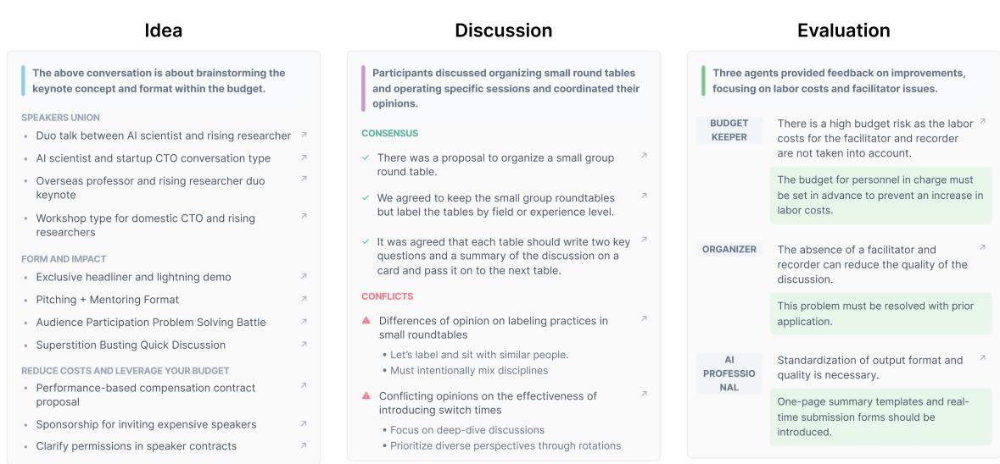

Fig. 7. Summary interface for each discussion mode.  
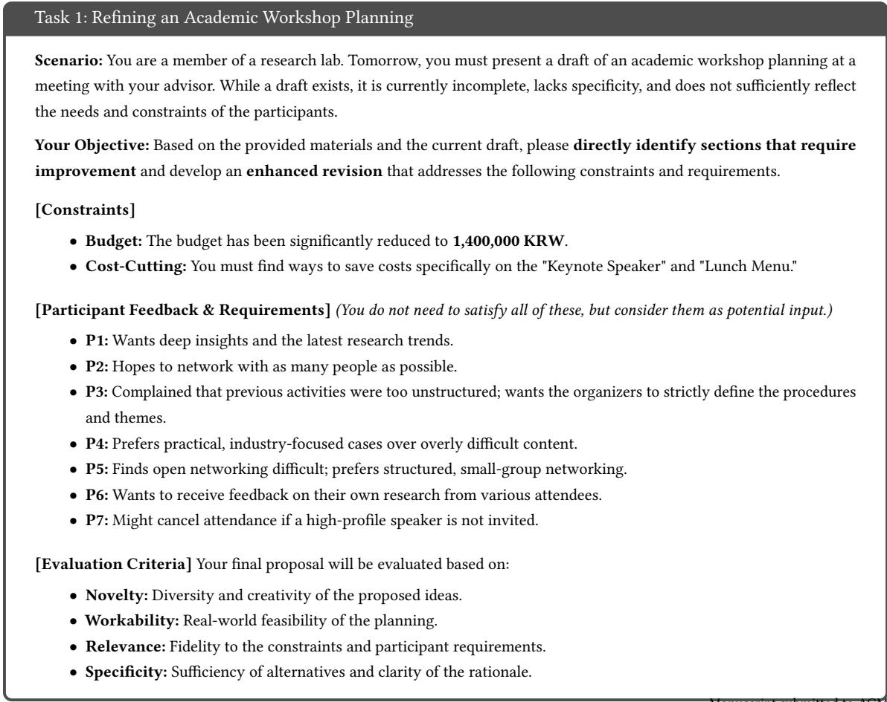  
Manuscript submitted to ACM

## Task 2: Refining a Joint Sports Day Planning

Scenario: You are a member of the event planning committee in the student council. Tomorrow afternoon, you must present a draft proposal for a joint sports competition at a meeting where student councils from four diferent departments will gather. While a draft is available, it is currently incomplete, lacks detail, and does not fully address participant needs and constraints.

Your Objective: Based on the provided materials and the current draft, please identify sections that require supplementation or further discussion and develop an enhanced revision that balances competition with harmony.

## [Constraints]

• Harmony vs. Competition: While competition is important, the plan must emphasize unity between departments.

• Reward Structure: Last year, one specific department swept all the prizes, leading to excessive rivalry. You must design a scoring/award system that maintains motivation while preventing such overheating

## [Participant Feedback & Requirements] (Consider these as potential inputs for your refinement.)

• P1: Enjoys intense competition and wants clear rewards for the winning team and MVPs.

• P2: Wishes to avoid violent or strenuous sports that may cause injury.

• P3: Requests events or roles that both men and women can participate in, rather than male-oriented sports.

• P4: Noted that the "winner-takes-all" structure last year created a hostile atmosphere.

• P5: Worries it will be boring because they are not good at sports and feel there are no roles for them.

• P6: Wants an opportunity to make friends from other departments.

## [Evaluation Criteria]

• Novelty: Diversity and creativity of the proposed ideas.

• Workability: Real-world feasibility of the planning.

• Relevance: Fidelity to the constraints and participant requirements.

• Specificity: Suficiency of alternatives and clarity of the rationale.

## B.2 Survey Questions

For the post-surveys in the user study, participants were asked to rate their agreement with the following statements on a 7-point Likert scale (1=Strongly Disagree, 7=Strongly Agree).

• The system ofered useful perspectives that expanded my thinking.

• The system ofered useful perspectives that deepened my thinking.

• I would use a system like this again for brainstorming or planning in the future.

• I’m confident with my final plan.

• I’m satisfied with my final plan, they met the task goal.

• It was dificult to be mentally engaged and the interaction felt rough and unevenly paced.

• I felt like the AI assistant was aware of my actions.

• I felt like I was aware of the AI assistant’s actions.

• I felt like it was easy to apply the idea from AI into my draft.

• I felt like the AI assistant was more like a tool than a collaboration partner.

## Manuscript submitted to ACM

Nine of these items were adapted from established studies to assess cognitive process [79], task satisfaction [71], and perceived collaboration [77]. Specifically, we included a question ‘I felt like it was easy to apply the idea from AI into my draft’ to measure the perceived translation cost between the chat interface and the document workspace. Participant response data for the six questions which are excluded from results section in Fig. 8.
<table><tr><td rowspan=18 colspan=2>ExpandedThinkingDeepenThinkingBaselineWilling to useDOCUTEAMthis againBaselineDifficult to beDOCUTEAMmentally engagedBaselineAl was aware ofmy actions**I was aware ofAl&#x27;s actions</td><td rowspan=1 colspan=3>DOCUTEAM</td><td rowspan=1 colspan=1></td><td rowspan=1 colspan=5>5</td><td rowspan=1 colspan=10>10</td><td rowspan=1 colspan=1>4</td></tr><tr><td rowspan=1 colspan=1>Baseline</td><td rowspan=1 colspan=2>2</td><td rowspan=1 colspan=1></td><td rowspan=1 colspan=3>3</td><td rowspan=1 colspan=5>5</td><td rowspan=1 colspan=1></td><td rowspan=1 colspan=4>7</td><td rowspan=1 colspan=2></td><td rowspan=1 colspan=2>2</td></tr><tr><td rowspan=1 colspan=4></td><td rowspan=1 colspan=4></td><td rowspan=1 colspan=4></td><td rowspan=1 colspan=4></td><td rowspan=1 colspan=4></td></tr><tr><td rowspan=2 colspan=1>DOCUTEAM</td><td></td><td></td><td></td><td></td><td></td><td></td><td></td><td></td><td></td><td></td><td></td><td></td><td></td><td></td><td></td><td></td><td></td><td></td><td></td><td></td></tr><tr><td rowspan=1 colspan=3>3</td><td rowspan=1 colspan=2>2</td><td rowspan=1 colspan=1></td><td rowspan=1 colspan=4>4</td><td rowspan=1 colspan=2></td><td rowspan=1 colspan=5>7</td><td rowspan=1 colspan=3>3</td></tr><tr><td rowspan=1 colspan=5>5</td><td rowspan=1 colspan=2>2</td><td rowspan=1 colspan=2>2</td><td rowspan=1 colspan=6>6</td><td rowspan=1 colspan=1></td><td rowspan=1 colspan=4>5</td></tr><tr><td rowspan=1 colspan=4></td><td rowspan=1 colspan=4></td><td rowspan=1 colspan=4></td><td rowspan=1 colspan=4></td><td rowspan=1 colspan=4></td></tr><tr><td rowspan=1 colspan=1></td><td rowspan=1 colspan=1></td><td rowspan=1 colspan=3>3</td><td rowspan=1 colspan=11>11</td><td rowspan=1 colspan=4>4</td></tr><tr><td rowspan=1 colspan=1></td><td rowspan=1 colspan=1></td><td rowspan=1 colspan=2>2</td><td rowspan=1 colspan=2>2</td><td rowspan=1 colspan=2>4</td><td rowspan=1 colspan=2></td><td rowspan=1 colspan=2></td><td rowspan=1 colspan=4>7</td><td rowspan=1 colspan=1></td><td rowspan=1 colspan=3>3</td></tr><tr><td rowspan=1 colspan=2></td><td rowspan=1 colspan=2></td><td rowspan=1 colspan=4></td><td rowspan=1 colspan=4></td><td rowspan=1 colspan=4></td><td rowspan=1 colspan=4></td></tr><tr><td rowspan=1 colspan=2>4</td><td rowspan=1 colspan=2></td><td rowspan=1 colspan=7>7</td><td rowspan=1 colspan=3>3</td><td rowspan=1 colspan=1></td><td rowspan=1 colspan=2>2</td><td rowspan=1 colspan=3>3</td></tr><tr><td rowspan=1 colspan=2>3</td><td rowspan=1 colspan=1></td><td rowspan=1 colspan=7>7</td><td rowspan=1 colspan=2>2</td><td rowspan=1 colspan=1></td><td rowspan=1 colspan=1></td><td rowspan=1 colspan=1>3</td><td rowspan=1 colspan=1></td><td rowspan=1 colspan=2>2</td><td rowspan=1 colspan=2>2</td></tr><tr><td rowspan=1 colspan=4></td><td rowspan=1 colspan=4></td><td rowspan=1 colspan=4></td><td rowspan=1 colspan=4></td><td rowspan=1 colspan=4></td></tr><tr><td rowspan=1 colspan=1>DOCUTEAM</td><td rowspan=1 colspan=2>2</td><td rowspan=1 colspan=4>4</td><td rowspan=1 colspan=1></td><td rowspan=1 colspan=5>5</td><td rowspan=1 colspan=2>3</td><td rowspan=1 colspan=1></td><td rowspan=1 colspan=1></td><td rowspan=1 colspan=4>5</td></tr><tr><td rowspan=2 colspan=1></td><td rowspan=1 colspan=3>3</td><td rowspan=1 colspan=6>6</td><td rowspan=1 colspan=3>5</td><td rowspan=1 colspan=2></td><td rowspan=1 colspan=1></td><td rowspan=1 colspan=1></td><td rowspan=1 colspan=2>4</td><td rowspan=1 colspan=1></td><td rowspan=1 colspan=1></td></tr><tr><td rowspan=1 colspan=4></td><td rowspan=1 colspan=4></td><td rowspan=1 colspan=4></td><td rowspan=1 colspan=4></td><td rowspan=1 colspan=4></td></tr><tr><td rowspan=1 colspan=1>DOCUTEAM</td><td rowspan=1 colspan=2>2</td><td rowspan=1 colspan=4>4</td><td rowspan=1 colspan=4>4</td><td rowspan=1 colspan=3>3</td><td rowspan=1 colspan=1></td><td rowspan=1 colspan=2>5</td><td rowspan=1 colspan=2></td><td rowspan=1 colspan=2>2</td></tr><tr><td rowspan=1 colspan=1>Baseline</td><td rowspan=1 colspan=2>2</td><td rowspan=1 colspan=3>3</td><td rowspan=1 colspan=1></td><td rowspan=1 colspan=2>3</td><td rowspan=1 colspan=2></td><td rowspan=1 colspan=2>6</td><td rowspan=1 colspan=2></td><td rowspan=1 colspan=2></td><td rowspan=1 colspan=2>5</td><td rowspan=1 colspan=1></td><td rowspan=1 colspan=1></td></tr></table>

Fig. 8. Participants’ responses to the remaining six survey items across the DocuTeam and Baseline conditions. Scores were measured on a 7-point Likert scale (1: Strongly Disagree, 7: Strongly Agree). (\*\*:p<.01)

## C Prompt Details

In this section, we present the prompts used to operationalize DocuTeam’s two core pipelines. For the dialogue engine, the prompts cover the full lifecycle of a multi-agent discussion: Intent Extraction infers a concise discussion focus from the workspace context and user input (Fig. 9); Decide Next Turn guides the moderator’s turn-level orchestration, including selecting the next speaker, asking the user for clarification, or deciding convergence (Fig. 10, 11); and Agent Utterance Generation generates each designated agent’s utterance based on its profile, memory, and speaking direction (Fig. 12). To maintain continuity across interactions, Long-term Memory Update revises each agent’s long-term memory from the accumulated dialogue (Fig. 13), while User-Centric Memory Update separately extracts memory-worthy updates from user interventions (Fig. 14). Finally, the engine produces lightweight interface-facing summaries through Conversation Summary Generation, which creates mode-specific structured summaries for the sidebar (Fig. 15), and Bubble Summary Generation, which compresses the ongoing discussion into a single line for the in-situ bubble (Fig. 16) Manuscript submitted to ACM

In parallel, the system-initiative pipeline supports proactive discussion triggering from document edits: Goal Extraction detects whether an edit is meaningful and extracts the user’s immediate goal (Fig. 17), User Action Interpretation interprets the recent workspace change in context (Fig. 18), Relevant Agent Selection chooses relevant agents for the situation (Fig. 19), and Discussion Necessity Scoring and Mutter Generation estimates whether proactive discussion is warranted for each mode while optionally generating a short mutter and suppressing redundant neighboring discussions (Fig. 20). Together, these prompts instantiate the document-grounded, mixed-initiative discussion behavior described in the main system pipeline.

# DocuTeam: Mixed-Initiative Multi-Agent Discussions around Evolving Documents

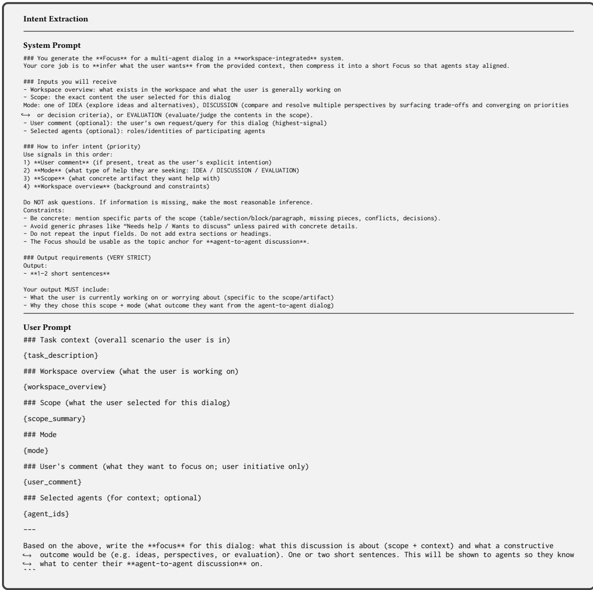  
Fig. 9. Prompt for inferring user’s intent from the context.

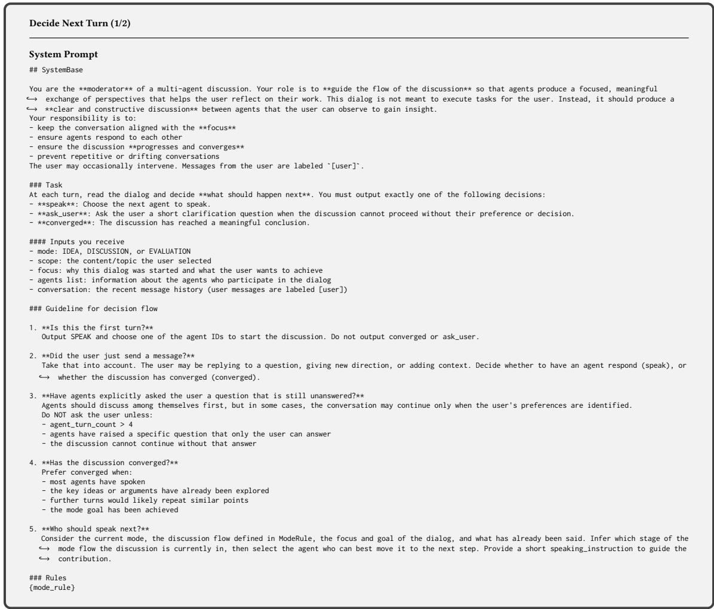  
Fig. 10. Prompt for the moderator to decide the next turn (1/2)

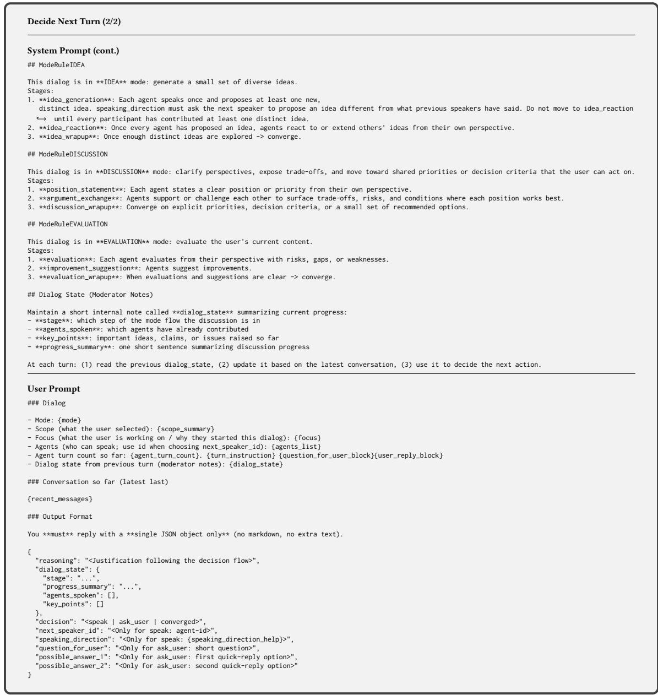  
Fig. 11. Prompt for the moderator to decide the next turn (2/2)

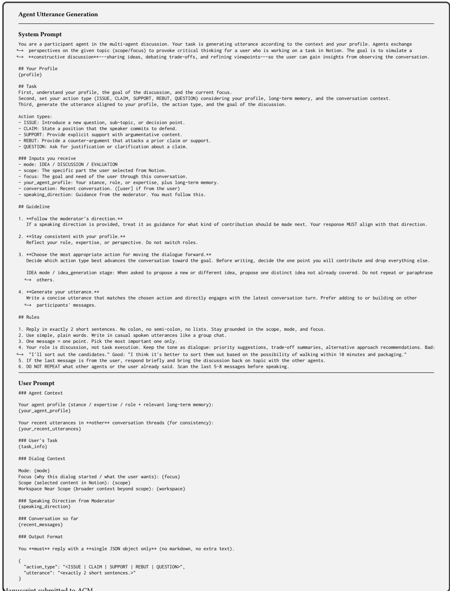  
Fig. 12. Prompt for participant agents that generate uterances in the discussion.

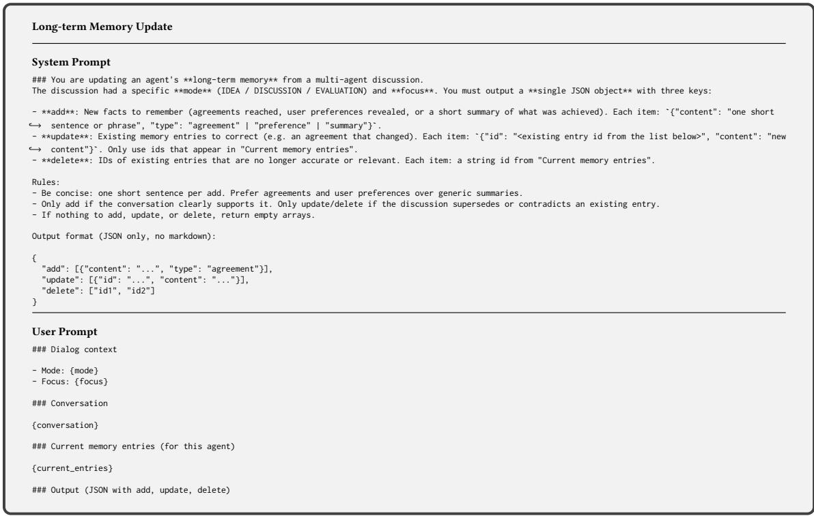  
Fig. 13. Prompt for updating an agent’s long-term memory.

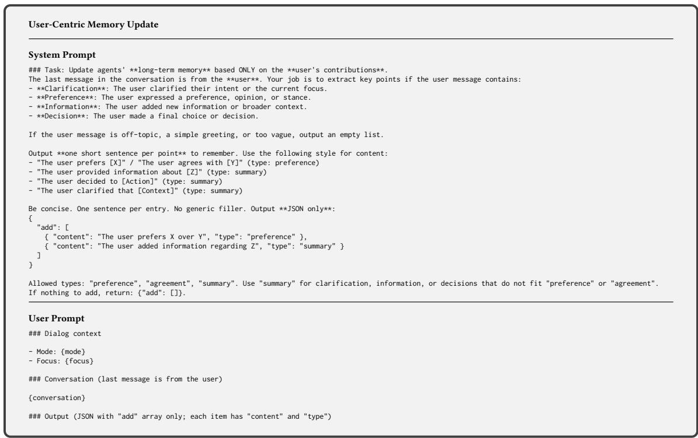  
Fig. 14. Prompt for extracting user-specific contributions for long-term memory.

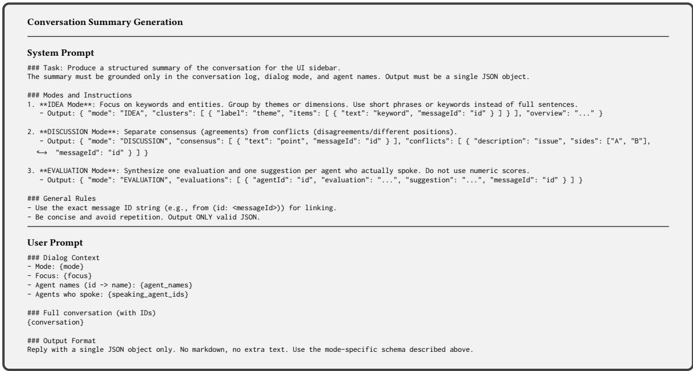

Fig. 15. Prompt for generating a structured UI summary based on dialog modes.  
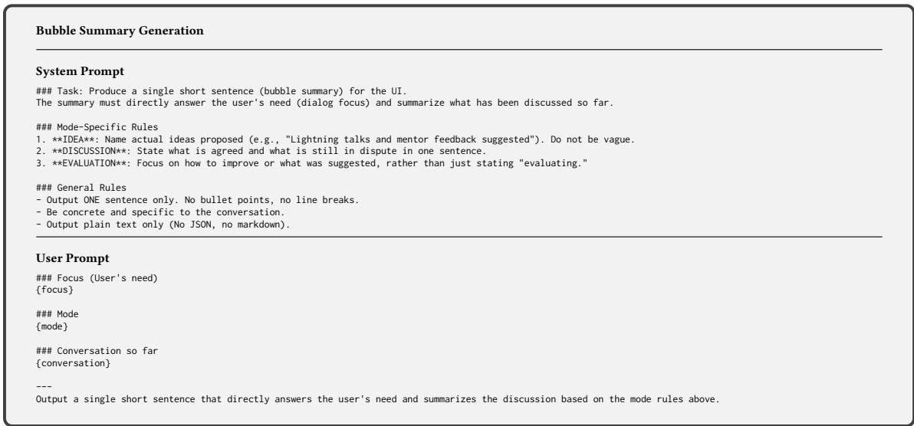  
Fig. 16. Prompt for generating a single-sentence bubble summary.

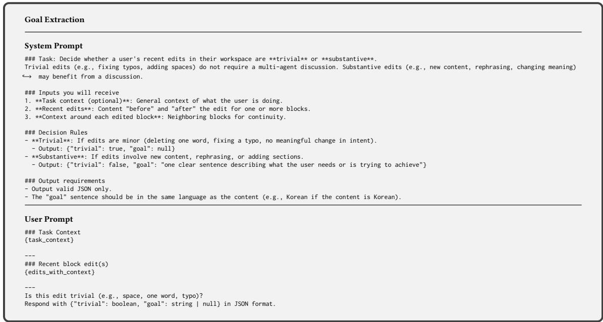

Fig. 17. Prompt for extracting the user’s current goal from workspace edits.  
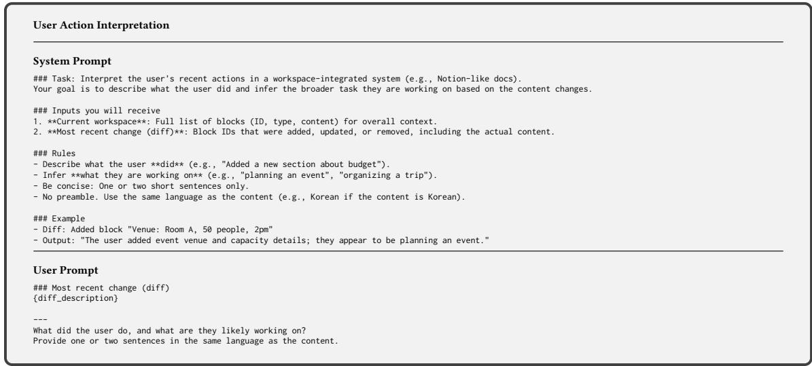  
Fig. 18. Prompt for interpreting user actions from workspace difs.

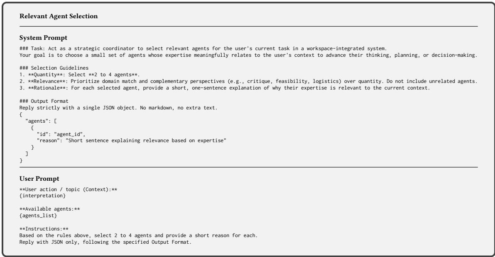

Fig. 19. Prompt for selecting a subset of relevant agents.  
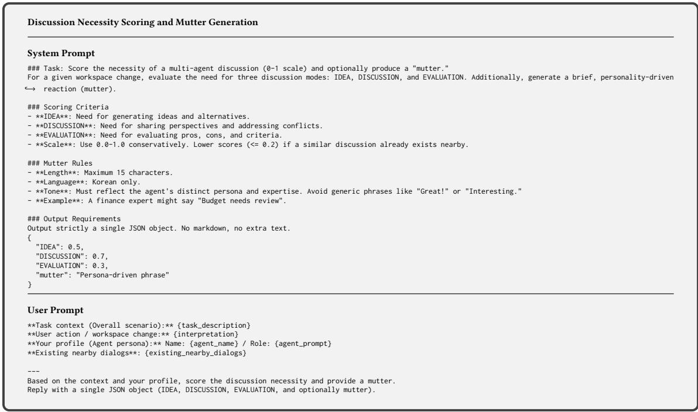  
Fig. 20. Prompt for discussion necessity scoring and muter generation.