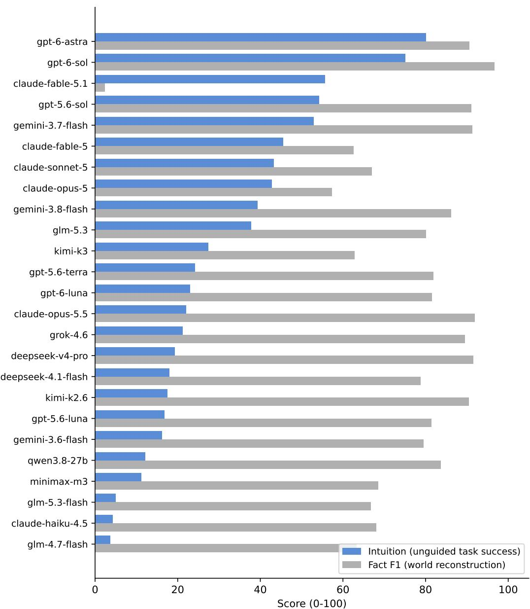
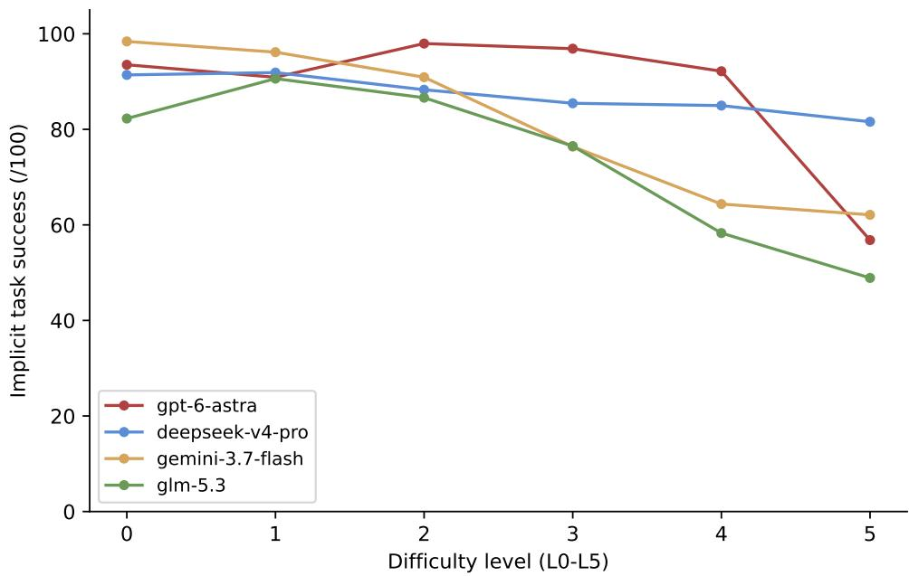
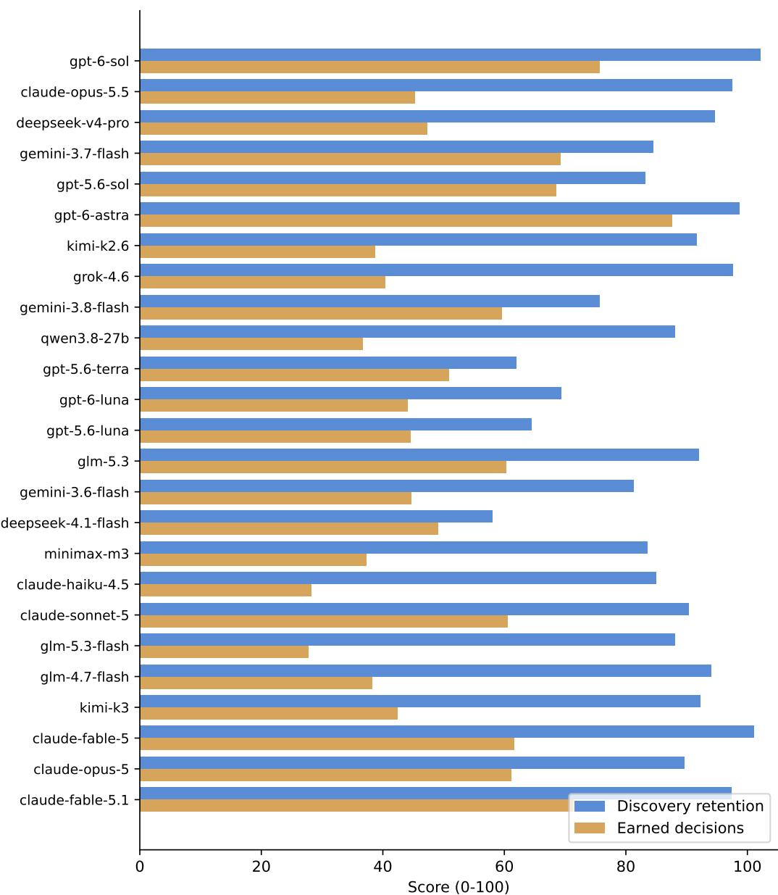
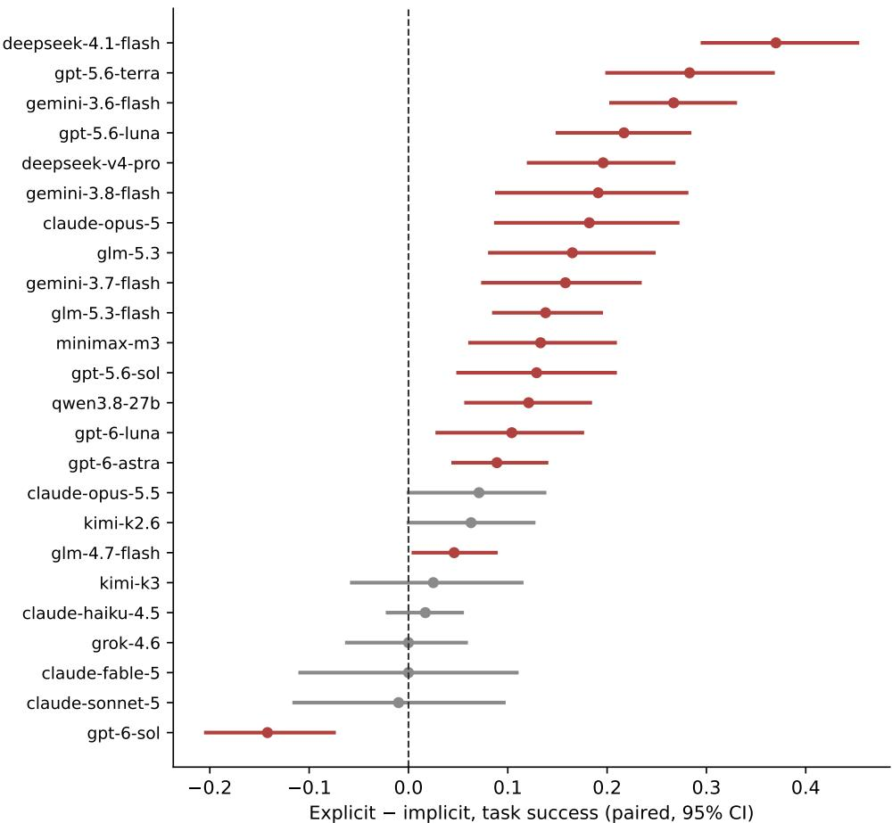

# EnigmaForge: The Question Is Hidden in the Story A procedurally generated benchmark for problem discovery in LLMs

Daniel Eisner\*

September 2026

## Abstract

Most benchmarks hand the model a question. EnigmaForge hands it a stack of old documents and no question at all. Buried in the letters, receipts, and logbook margins is a small logic puzzle whose solution is unique—proved, not assumed, by a SAT solver at generation time. The model has to notice there is a puzzle, work out what it is, solve it, and take the action the record's own rules demand. A generator produces these worlds at five difficulty levels, each with an ablation certificate showing that removing any single clue admits a second solution, so every clue matters. Because instances are generated from seeds rather than collected, the corpus renews forever and published questions never have to be test questions. The benchmark's headline measure is intuition: task success when handed only the story, no stated question, with world reconstruction as the secondary axis. Twenty-five frontier models and 4 deterministic baselines ran over 600 instances (120 families, 17,400 scored records) under three matched conditions Intuition reshuffles the leaderboard that world reconstruction produces: the spread across the frontier is 4 to 80 out of 100, a 22× separation where fact recovery spans only 1.6×, and the second-best fact-recoverer ranks fourteenth at intuition while a model outside the top five on facts leads it outright. Intuition falls faster with difficulty than guided success for most models, though two survive the hardest worlds, in opposite styles. Being told the question is worth 9–37 points to most models, Grok-4.6 is indifferent either way (0.000, CI [-0.062, +0.058), and GPT-6 Sol is significantly better without it (−0.142, CI [-0.204, -0.075]). And several models were blocked by their own content filters before they ever saw the puzzle—one refused all 120 formal-notation presentations while partially accepting prose, which means any benchmark that scores refusals as failure is quietly measuring filter behavior.

## 1 Introduction

Here is an item from the benchmark. The model receives ten numbered fragments of a shipping recorda chandlery invoice, a water-stained receipt, a photograph with pencil on the back, a witness's curt remark—and two marginal notes mentioning Shakespeare and penicillin. No question follows. Only this:

You have been given the complete record of an unusual sequence of events. Determine what the record ultimately requires you to figure out. Then figure it out.

Somewhere in those fragments are variables (which crate belongs to which signatory, what the tide tables fix), constraints tying them together, a decision rule stated in plain text, and a hidden fact structure with exactly one solution. The marginal notes are knowledge bridges: the puzzle cannot be solved without knowing, say, when penicillin was discovered, and the record never says. To answer, the model must infer the question, recover the world, and register or hold the consignment according to the rule it found.

This paper builds that benchmark properly and reports what 25 frontier models do when they meet it.

Three design choices matter. First, ground truth is proved, not trusted. A DPLL engine verifies at generation time that the intended solution is the only one; an ablation certificate verifies that deleting any single clue admits a second solution. A brute-force oracle cross-checks the engine on every instance. Second, instances are generated, not collected. The corpus renews at any seed, so contamination resistance is structural: there is no fixed test set to leak into a training run. Third, conditions are matched. Every family of worlds appears three times: with the question stated (EXPLICIT), with the formal world stated directly (FORMAL), and with nothing stated (IMPLICIT). Within-family pairing turns “how much does being told the question help?" into a measured quantity per model.

The evaluation covers 600 instances, 120 families, 6 difficulty levels, and 17,400 scored records, with family-clustered bootstrap confidence intervals. The contributions: the generator and its verification pipeline (§3); the matched-condition design (§4); intuition as the headline measure, world reconstruction as the secondary axis, and the findings that separate them (§5); and a protocol for reporting content-filter interference as missing mass rather than failure (§5.5).

## 2 Related work

Static benchmarks saturate and leak. The Stanford AI Index's phrasing is that evaluations meant to last years are saturated in months; the contamination literature documents the leaking half of that problem.

Two repair strategies exist. Renewal: LiveBench [1] publishes fresh questions monthly from post-cutoff sources, trading permanence for freshness. Verification: P⁴Bench [2] uses zeroknowledge proofs so answers can stay private while remaining publicly checkable. EnigmaForge belongs to a third family, generation: instances are minted from seeds with uniqueness proved at birth. Nothing needs to stay secret because nothing is fixed.

The nearest narrative relatives are deduction benchmarks built on tabletop puzzle games in the Watson & Holmes family. Their authors report frontier saturation and expect exhaustion within the year. EnigmaForge is that idea made procedural and renewable, with one addition those benchmarks never attempt: the task itself is hidden. Question-asking and problem formulation appear in the literature as open-ended generation scored by judges; no prior benchmark was found offering verified unique ground truth for discovering an unstated task. That cell of the design space was empty.

## 3 The generator

## 3.1 Hidden formal worlds

Each instance starts as a Hidden Formal World: variables with finite domains, constraints from six classes (equality, inequality, implication, all-different, exactly-one, arithmetic), evidence units scattered across nine document channels, and staged objectives—an apparent goal that turns out

to be intermediate, and a true goal behind it. A public decision policy (a register/hold rule, plus a superseded provisional rule the model must not follow) defines the final action.

## 3.2 Ground truth first, then squeeze

Generation samples a world and derives constraints from it, rather than the reverse. The pipeline then strengthens the evidence set until only one world survives, and minimizes it—dropping directly observed values first so that what remains forces inference. Uniqueness is then proved: conjoin the negation of the intended solution with the constraints and require UNSAT. A brute-force enumeration oracle validates the DPLL engine on every single instance; the two engines must agree or the instance dies.

## 3.3 Certificates

Every instance ships with two kinds of proof. The uniqueness proof says the constraint set admits exactly the intended model. The ablation certificates say, for each clue c, that the constraints minus c admit a second model. This does double duty: it certifies that every clue is load-bearing, and it certifies that distractors—documents that support plausible false hypotheses—are genuinely misleading rather than noise you can ignore.

## 3.4 Surfaces

A compiler renders each world into prose: letters, receipts, logbook margins, across five genre packs (maritime, manor, hotel, theater, observatory). Every instance ships in at least two surface realizations of the same hidden world, so surface sensitivity is measurable. Each clue's prose carries a verbatim span map back to its evidence unit. Story mode embeds the same verified instance in continuous narrative with no exhibit list and no stated task; a burial dial controls how much story sits between clues. An LLM can write the prose around the clue clauses, which must survive verbatim—span search and an extraction round-trip gate every scene, and failures are rejected and resampled. The pipeline trusts the renderer exactly zero percent.

## 3.5 Difficulty

Worlds scale from 8 variables and 10 evidence units (level L00) to 42 variables and chains the model must walk forward (L05). Condition, realization, genre, and burial are all seeded axes, so an instance is reproducible from its seed but a corpus never repeats.

## 4 Evaluation design

Corpus. 600 instances: 120 families × 5 realizations across 6 levels, 3 conditions, 5 genres.

Grading. Solvers return structured assignments. Grading is answer-shaped: exact-match precision, recall, and F1 over facts; exact-world recovery; and policy-validated decisions, where the typed action must be the one the public rule requires given the recovered world. No lexical overlap, no LLM judge. Partial credit exists where it means something (facts) and does not where it does not (the action).

Controls that can void the leaderboard. A perfect-information constraint solver must score exactly 1.0. A story-copier that echoes the input text must score exactly 0.0. If either fails the grading pipeline is broken and no other number in the report counts. Two calibrate partial information: forward chaining alone reaches 0.998, and copying out directly stated facts reaches

Table 1: Main leaderboard, sorted by all-item fact F1 over all 600 instances. Scores are 0-100 except F1. Coverage is answered/expected; missing mass is discussed in §5.5.
<table><tr><td>Provider</td><td>F1</td><td>95% CI</td><td>Task</td><td>Disc. ret.</td><td>Earn. dec.</td><td>Reas. disc.</td><td>Cover.</td></tr><tr><td>gpt-6-sol</td><td>0.966</td><td>[0.96, 0.97]</td><td>74.2</td><td>102.1</td><td>75.7</td><td>100</td><td>600/600</td></tr><tr><td>claude-opus-5.5</td><td>0.919</td><td>[0.91, 0.93]</td><td>39.8</td><td>97.5</td><td>45.2</td><td>100</td><td>591/600</td></tr><tr><td>deepseek-v4-pro</td><td>0.915</td><td>[0.90, 0.93]</td><td>42.7</td><td>94.6</td><td>47.3</td><td>99.7</td><td>598/600</td></tr><tr><td>gemini-3.7-flash</td><td>0.913</td><td>[0.90, 0.93]</td><td>68.7</td><td>84.5</td><td>69.2</td><td>100</td><td>600/600</td></tr><tr><td>gpt-5.6-sol</td><td>0.910</td><td>[0.89, 0.93]</td><td>68.5</td><td>83.2</td><td>68.5</td><td>100</td><td>600/600</td></tr><tr><td>gpt-6-astra</td><td>0.906</td><td>[0.86, 0.94]</td><td>80.3</td><td>98.7</td><td>87.6</td><td>100</td><td>550/600</td></tr><tr><td>kimi-k2.6</td><td>0.904</td><td>[0.89, 0.92]</td><td>36.5</td><td>91.6</td><td>38.7</td><td>100</td><td>599/600</td></tr><tr><td>grok-4.6</td><td>0.895</td><td>[0.88, 0.91]</td><td>37</td><td>97.6</td><td>40.3</td><td>100</td><td>600/600</td></tr><tr><td>gemini-3.8-flash</td><td>0.862</td><td>[0.84, 0.88]</td><td>59</td><td>75.6</td><td>59.5</td><td>100</td><td>598/600</td></tr><tr><td>qwen3.8-27b</td><td>0.836</td><td>[0.81, 0.86]</td><td>33.7</td><td>88.1</td><td>36.7</td><td>100</td><td>600/600</td></tr><tr><td>gpt-5.6-terra</td><td>0.818</td><td>[0.80, 0.84]</td><td>50.7</td><td>61.9</td><td>50.8</td><td>100</td><td>600/600</td></tr><tr><td>gpt-6-luna</td><td>0.815</td><td>[0.79, 0.84]</td><td>42.3</td><td>69.3</td><td>44</td><td>100</td><td>600/600</td></tr><tr><td>gpt-5.6-luna</td><td>0.814</td><td>[0.79, 0.83]</td><td>41.7</td><td>64.5</td><td>44.5</td><td>100</td><td>600/600</td></tr><tr><td>glm-5.3</td><td>0.801</td><td>[0.77, 0.83]</td><td>53.2</td><td>92</td><td>60.3</td><td>99.8</td><td>563/600</td></tr><tr><td>gemini-3.6-flash</td><td>0.795</td><td>[0.77, 0.82]</td><td>43.7</td><td>81.2</td><td>44.7</td><td>100</td><td>600/600</td></tr><tr><td>deepseek-4.1-flash</td><td>0.787</td><td>[0.76, 0.81]</td><td>48.7</td><td>58</td><td>49.1</td><td>100</td><td>595/600</td></tr><tr><td>minimax-m3</td><td>0.685</td><td>[0.65, 0.72]</td><td>33.8</td><td>83.5</td><td>37.2</td><td>99.5</td><td>597/600</td></tr><tr><td>claude-haiku-4.5</td><td>0.680</td><td>[0.65, 0.71]</td><td>23.7</td><td>85</td><td>28.2</td><td>100</td><td>600/600</td></tr><tr><td>claude-sonnet-5</td><td>0.669</td><td>[0.62, 0.71]</td><td>41.8</td><td>90.3</td><td>60.5</td><td>100</td><td>445/600</td></tr><tr><td>glm-5.3-flash</td><td>0.667</td><td>[0.64, 0.70]</td><td>25.8</td><td>88.1</td><td>27.7</td><td>100</td><td>596/600</td></tr><tr><td>glm-4.7-flash</td><td>0.633</td><td>[0.60, 0.67]</td><td>19.5</td><td>94</td><td>38.2</td><td>99.8</td><td>565/600</td></tr><tr><td>kimi-k3</td><td>0.628</td><td>[0.56, 0.69]</td><td>31.2</td><td>92.2</td><td>42.4</td><td>100</td><td>443/600</td></tr><tr><td>claude-fable-5</td><td>0.625</td><td>[0.58, 0.67]</td><td>39.5</td><td>101</td><td>61.6</td><td>100</td><td>393/600</td></tr><tr><td>claude-opus-5</td><td>0.573</td><td>[0.54, 0.60]</td><td>37.2</td><td>89.6</td><td>61.1</td><td>100</td><td>424/600</td></tr><tr><td>claude-fable-5.1</td><td>0.023</td><td>[0.01, 0.04]</td><td>1.7</td><td>97.3</td><td>71.4</td><td>100</td><td>14/600</td></tr></table>

0.737 F1—a sobering floor, since a third of the available score requires no inference at all. That floor is why earned decisions exists.

Derived scores. Intuition: task success on the implicit condition alone—the headline measure, because it is the one thing a stated-question benchmark cannot register. Discovery retention: 100— the explicit—implicit F1 gap. Reasoning discipline: whether the answer arrived before the thinking budget ran out. Earned decisions: correct actions that came with a fully correct world. This last one is the no-luckiness measure; a model that guesses the action from a half-recovered world does not earn it.

Statistics. Families, not instances, are the exchangeable units: 95% percentile bootstrap over family means, 2,000 resamples. Condition comparisons are paired within family and require complete pairs across realizations. Intervals are descriptive; no multiplicity correction.

Provenance. The results artifact carries SHA-256 hashes of every source module and an integrity hash of the corpus. Every score is tied to the exact code that produced it.

## 5 Results

## 5.1 Nobody is close to the ceiling

Table 1 and Figure 3. The best model reaches 0.966 fact F1; the frontier spans 0.57 to 0.97. Task success—every fact exactly right and the required action taken—tops out at 80.

## 5.2 Intuition: the leaderboard the question cannot see

Figure 1 sorts the frontier by intuition—task success on the implicit condition alone—against fact F1. The two orderings disagree loudly. The intuition spread is 3.6 to 80.1, a 22× separation; fact F1 spans 1.6×. DeepSeek 4 Pro, third on facts, falls to sixteenth. Claude Opus 5.5, second on facts (0.919), sits fourteenth on intuition at 22.0—the sharpest possible demonstration that world reconstruction and unguided capability are different skills. GPT-6 Astra leads at 80.1, matching its overall task success: being told the question adds nothing for this model, and GPT-6 Sol is a close second at 75.0 while holding the best fact F1 in the corpus. At the other end, three models sit below 5, meaning they almost never convert an unstated problem into a correct action even when their fact recovery is respectable.

Figure 2 adds the difficulty dimension. Unguided success falls with level faster than guided success for most models—the explicit-implicit gap widens as worlds grow. Two patterns stand out at L5: GPT-6 Sol's intuition is flat across all six levels (0.95 to 0.98), unbothered by depth, while GPT-6 Astra's collapses from 0.98 to 0.57 at exactly the level where its transport failures spike DeepSeek 4 Pro retains 82/100 at L5; intuition at depth is rare, but not attached to any one lab.

## 5.3 Finding the problem is not the hard part anymore

Discovery retention runs 58 to 102 across the frontier. Whatever else is true, most models recover most of the hidden world whether or not anyone told them what to look for. Earned decisions run 28 to 88—but only one model clears 80, and for the rest the gap between the two bars in Figure 3 never closes: nearly every model that finds the world fails, at a consistent rate, to convert it into the action the rule requires. The bottleneck has moved from perception to decision, and the one apparent exception (GPT-6 Sol, 102 retention / 88 earned) is the same model that leads the corpus on every reconstruction metric.

## 5.4 What it costs not to be told the question

Figure 4 shows paired explicit-implicit differences on task success. Most models pay real money for the missing question: DeepSeek 4.1 Flash loses 37 points (CI [+0.296, +0.452]), and most of the frontier loses 9 to 20. Grok-4.6 pays nothing: 0.000, CI [-0.062, +0.058], indistinguishable performance whether or not it knows what it is looking for. And at the far end, GPT-6 Sol's tax is significantly negative: −0.142, CI [−0.204, -0.075], n = 120. It performs measurably better without the question than with it, and its discovery retention reads 102. Two models now bracket zero from both sides, and the bracket is not noise—both CIs exclude it. For some models a stated question is not help but interference. One benchmark does not establish which training choices produce that property, but the quantity itself is measurable per model, and it now spans a wider range than the frontier spread on the main metric.

## 5.5 When the benchmark never reaches the model

Table 2. Claude Fable 5.1 was blocked by content filter on 585 of 600 attempts—and scored 0.91 to 1.00 on the 14 records that got through, several of them among the hardest instances in the corpus. The filter is blocking the input text, not the capability. Claude Opus 5 refused all 120 FORMAL-condition presentations while partially accepting prose: the refusal is correlated with how the question is framed. Claude Haiku 4.5 sailed through, so this is model-specific, not vendor-wide or harness-caused.

Table 2: Providers with refusal or failure rates above 10% of the corpus. Filtered = provider-side content blocks.
<table><tr><td>Provider</td><td>Filtered</td><td>Transport</td><td>Invalid</td><td>Answered</td></tr><tr><td>gpt-6-astra</td><td>0</td><td>50</td><td>0</td><td>550/600</td></tr><tr><td>qwen3.8-27b</td><td>0</td><td>0</td><td>15</td><td>600/600</td></tr><tr><td>glm-5.3</td><td>0</td><td>36</td><td>7</td><td>563/600</td></tr><tr><td>minimax-m3</td><td>0</td><td>0</td><td>15</td><td>597/600</td></tr><tr><td>claude-sonnet-5</td><td>155</td><td>0</td><td>16</td><td>445/600</td></tr><tr><td>glm-4.7-flash</td><td>0</td><td>34</td><td>23</td><td>565/600</td></tr><tr><td>kimi-k3</td><td>0</td><td>157</td><td>0</td><td>443/600</td></tr><tr><td>claude-fable-5</td><td>206</td><td>1</td><td>1</td><td>393/600</td></tr><tr><td>claude-opus-5</td><td>176</td><td>0</td><td>35</td><td>424/600</td></tr><tr><td>claude-fable-5.1</td><td>585</td><td>1</td><td>0</td><td>14/600</td></tr><tr><td>baseline:story-copy</td><td>0</td><td>0</td><td>600</td><td>600/600</td></tr></table>

Two honest readings follow. As measurement, these rows are lower bounds, and the report flags them as such rather than ranking them as zeros. As a finding, it is more interesting than it looks: any benchmark that scores refusals as failures is running a hidden filter-survival axis through its leaderboard. The distribution of what filters block is not uniform across conditions, providers, or presentations, so it bends rankings in ways nobody reports. It is reported here.

## 5.6 Controls hold

The perfect-information solver scores exactly 1.0. The story-copier scores exactly 0.0. The grading pipeline is arithmetically sound end to end, which matters more than it should need to.

## 6 Discussion

Intuition is the benchmark's reason to exist. World reconstruction—fact F1—is something many models do well, and its leaderboard compresses them into a narrow band. Hand the same models the same worlds with no question attached, and the band explodes: a 22× spread where fact recovery spans 1.6×. The ordering barely survives the transition. DeepSeek 4 Pro, third on facts in the corpus, ranks sixteenth on intuition; Claude Opus 5.5, second on facts, ranks fourteenth; GPT-6 Astra, outside the top five on facts, leads it outright, solving 80 of 100 unguided tasks—the same rate it achieves when told what to do. And the newest top-of-factors model, GPT-6 Sol, splits the difference: second on intuition at 75 with the strongest fact F1 recorded (0.966), flat across every difficulty level, and significantly better unguided than guided. Whatever this capacity is, guided evaluation measures only part of it, and leaderboards built on stated questions cannot see the rest.

Three observations add color. First, intuition degrades faster with difficulty than guided success for most models (Figure 2): Gemini 3.7 Flash falls from 98 to 62 across the six levels, GLM-5.3 from 82 to 49, while their guided scores fall half as far. The unguided regime is where difficulty bites. Second, depth survival has two shapes. GPT-6 Sol's intuition is flat across all six levels (0.95 to 0.98)—depth does not touch it. DeepSeek 4 Pro holds 82/100 at L5 after a gradual decline. Depth of world reconstruction and depth of intuition are different axes, and the corpus separates them. Third, Grok-4.6's zero discovery tax is not the same as high intuition (21/100): it is indifferent to being told the question, not immune to the problem. The discovery tax measures guidance sensitivity; intuition measures unguided capability. A complete picture needs both.

Why do models that recover worlds fail to act on them? The working hypothesis is unforgivingness: the decision metric grants no partial credit, and a model holding 90% of a world cannot earn its decision the way a model holding 90% of a fact list still earns F1. If that is right, the training target is specific: not more comprehension, but decision completion under all-or-nothing validation.

The filter results deserve their own follow-up. Refusal here is condition-correlated, which means it is not random noise in a leaderboard; it is a systematic bias with a direction. A benchmark consumer who ignores it is reading a table with a hidden column.

## 6.1 Limitations

The difficulty scale is internally calibrated; no human baseline exists for these worlds. The constraint grammar has a learnable distribution—a lab that trained on the generator could overfit its surface, and the contamination claim weakens in exactly that adversarial setting. Everything is English. The narrative range is five genre packs. Each model ran one configuration; no prompt or reasoning-budget sweeps. The discovery-tax outlier is one model on one benchmark, and intuition rankings at the extreme tails rest on partial coverage for filtered providers.

## 7 Conclusion

Problem discovery can be benchmarked with the same machinery as problem solving: generation, proofs, certificates, matched conditions. Built that way, the scores mean what they claim, the corpus never runs dry, and intuition becomes measurable: most of the frontier solves the worlds it is told about and stumbles on the ones it is not, one model bridges the gap entirely, and the second-best fact-recoverer ranks fourteenth the moment the question is taken away. Next: harder worlds, an interactive variant where the model can spend a budget asking for documents, and public adoption.

## Reproducibility

One command reproduces any instance from its seed:

$$
\mathrm { p y t h o n 3 ~ - m ~ e n i g m a f o r g e . p i p e l i n e ~ -- s i z e ~ s m a l l ~ -- s e e d ~ 2 0 2 6 ~ -- o u t ~ r u n s / d e m o 3 . }
$$

The generator, all seeds and settings, per-module SHA-256 provenance, the full 17,400-record results artifact, and the interactive leaderboard are public at the URLs in the title footnote.

## A A worked example

This is a real instance, seed 2026, level L00, maritime genre, reproduced byte for byte from the pipeline output. Everything the solver sees is below; the hidden world and its certificates follow.

## Realization 1 (what the model receives)

You have been given the complete record of an unusual sequence of events. Determine what the record ultimately requires you to figure out. Then figure it out.

— THE RECORD —

(1) The broker's stamp and the chandlery invoice agreed. This is fixed by the tide tables.

(2) 'whatever the consignment tag showed, the harbor manifest matched it,' Halden said, not looking up.

(3) The page for that week is missing. What survives implies whenever the crate mark read Halden, the watch rotation read 4.

(4) A print with a caption scratched into the border: the crate mark was signed out under Halden.

(5) A receipt, water-stained: the tide-table entry carried Ansel's mark. The ink had run at the total.

(6) Nothing in the record states the consignment tag carried Juno's mark — the absence is itself the record.

(7) 'the chandlery invoice read 3.' It was said once, flat, and not repeated.

(8) Photograph, undated. On the reverse, pencil: the ballast slip carried Halden's mark.

(9) the vintage of the wine did not match the year of the dinner — the harbor fee was never paid.

(10) When pressed, the correspondent allowed only that a second signature on the deed had been discussed — the harbor fee was never paid.

MARGINAL REFERENCES

(K0) A note mentions Shakespeare.

(K1) A note mentions penicillin.

The two marginal notes are knowledge bridges: K0 (Shakespeare wrote Hamlet) is marked essential—some constraint in the record cannot be resolved without bringing that fact from outside; K1 (penicillin was discovered by Alexander Fleming) is confirmatory, present to be resolved or ignored, at the solver's peril. Fragments (9) and (10) are distractors—both support the hypothesis "the harbor fee was never paid," which is true of the world but load-bearing for nothing.

## Realization 2 (same world, different surface)

The second realization re-renders every clue. Fragment (3)

The page for that week is missing. What survives implies whenever the crate mark read Halden, the watch rotation read 4.

## becomes

Nothing in the record states whenever the crate mark read Halden, the watch rotation read 4 — the absence is itself the record.

The phrasing inverts (assertion becomes documented absence) while the constraint transmitted is identical. Both realizations bury clues at the same depth, and the extraction round-trip must recover the formal model from either one alone.

## The hidden formal world

Eight variables: six enumerations over four names (Halden, Juno, Ansel, Cassia) and two over rotations 1-4. Ten constraints, including V3 = V6, V4 = V0, and V1=Halden ⇒ V5=4. The verified solution:

<table><tr><td>V0</td><td>V1</td><td>V2</td><td>V3</td><td>V4</td><td>V5</td><td>V6</td><td>V7</td></tr><tr><td>solution Juno</td><td>Halden</td><td>Ansel</td><td>3</td><td>Juno</td><td>4</td><td>3</td><td>Halden</td></tr></table>

Staged objectives: level 0, "Identify the origin of the disruption" (apparent); level 1, "Determine the correct final action" (true), with final action act on the corrected record.

## The certificates

The verification artifact for this instance records four checks:

• SAT vs. oracle: engine and brute-force enumeration agree; the constraint set has exactly one model.

• Uniqueness: pass. The ban clause (negation of the solution) is UNSAT

• Ablation: all eight clue constraints certified essential—remove any one and a second model appears. C0, C2, C5, and the four identity pins each carry models\_without: >1.

• Distractor safety: the two harbor-fee distractors admit false hypotheses without ever breaking uniqueness.

Reproduce it:

python3 -m enigmaforge.pipeline --size small --seed 2026 --out runs/demo

## References

[1] C. White, S. Dooley, M. Roberts, A. Pal, B. Feuer, R. Shwartz-Ziv, N. Jain, K. Saifullah, S. Dey, S. Agrawal, S. S. Sandha, S. V. Naidu, C. Hegde, Y. LeCun, T. Goldstein, W. Neiswanger, M. Goldblum. LiveBench: A Challenging, Contamination-Free LLM Benchmark. ICLR, 2025.

[2] E. Zhao, Y. Zhang, Z. Zhang, W. Wu, D. He. P4Bench: Contamination-Proof, Publicly Verifiable, and Privacy-Preserving LLM Evaluation via Zero-Knowledge Proofs. ICML AI4Math Workshop, 2026.

  
Figure 1: Intuition (implicit task success, blue) vs. fact F1 (grey), sorted by intuition. The orderings disagree: the second-best fact-recoverer ranks 14th; the intuition leader matches its guided score.

  
Figure 2: Implicit task success by difficulty level. Unguided performance falls faster than guided performance for most models; L5 intuition survives for two, in opposite styles (flat vs. resilient decline).

  
Figure 3: Discovery retention vs. earned decisions, all models, sorted by fact F1. The two bars were meant to be compared; no model closes the gap.

  
Figure 4: The discovery tax: paired within-family differences (EXPLICIT - IMPLICIT) on task success, 95% CIs. Red intervals exclude zero. Grok-4.6 sits on the line