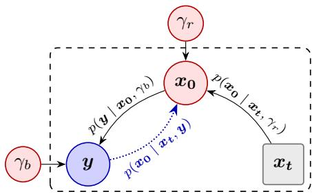
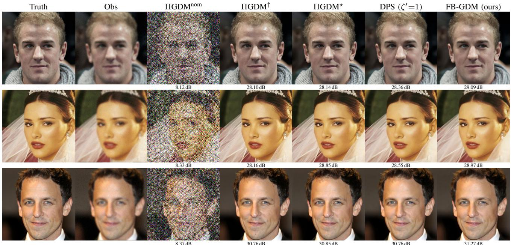
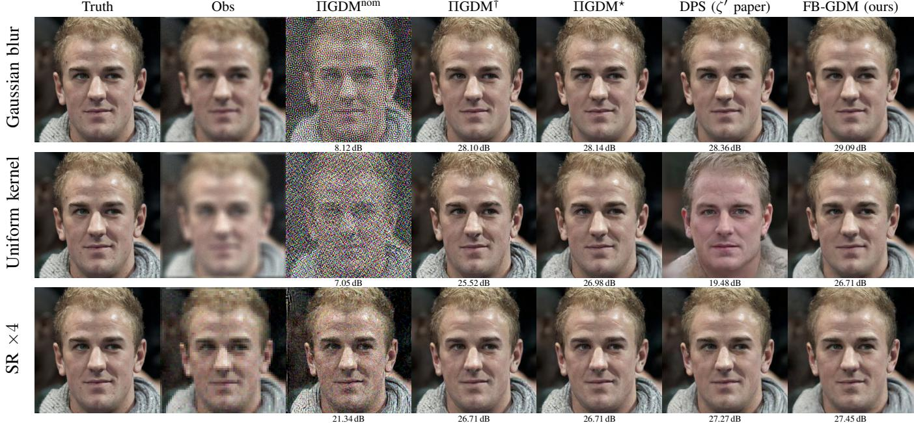
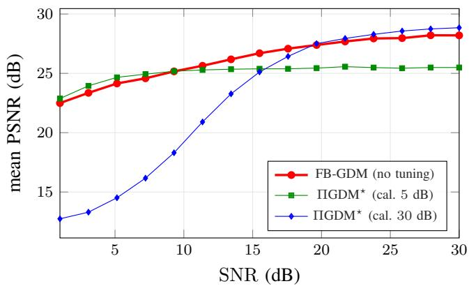
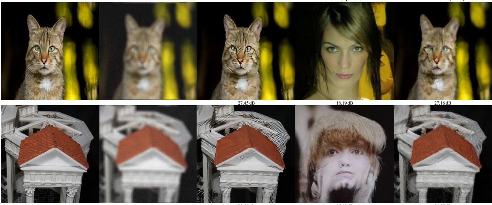
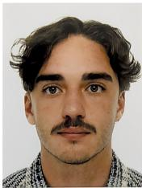

# FB-GDM: Fully-Bayesian Guided Diffusion Models for High-Dimensional Linear Inverse Problems via Unsupervised Variational Inference

Gatien Seguy and Thomas Rodet ´

Abstract—Diffusion models are powerful priors for linear inverse problems, but the reference guidance methods, Diffusion Posterior Sampling (DPS) and Pseudoinverse-Guided Diffusion Models (ΠGDM), rely on scalar hyperparameters tuned per task, usually against the ground truth. We introduce FB-GDM, a fully-Bayesian guided diffusion method that removes this calibration step. Starting from the Gaussian approximation of ΠGDM, we derive a closed-form conditional score that depends on two precision parameters (inverse variances), one associated with the denoising approximation and one with the observation likelihood, and treat them as latent variables inferred by variational inference at each reverse step. A separable factorization makes each update scale linearly with the number of pixels, so the inference stays tractable at full image resolution, at a cost comparable to one ΠGDM run. FB-GDM requires neither the noise level nor the ground truth: its only inputs are the observation and the forward operator. Experiments on CelebA-HQ inverse problems establish two results. (i) The precision parameters, inferred from the observation alone, allow FB-GDM to outperform ΠGDM at its nominal setting, even when the latter is given the true noise level, by up to 14 dB depending on the operator, and to match the ground-truth-calibrated ΠGDM oracle within 0.1 dB. (ii) FB-GDM is robust when the forward operator, the noise level, or the image distribution changes: it stays close to a per-problem ΠGDM oracle throughout and does not exhibit the hallucinations observed with DPS, whereas DPS substantially degrades at a fixed scale and ΠGDM stays competitive only if it is re-tuned against the ground truth for each new problem. When the prior is applied to images outside its training set, this re-balancing between data and prior keeps FB-GDM faithful where a fixed face-prior guidance can otherwise hallucinate.

Index Terms—High-dimensional linear inverse problems, diffusion models, score-based generative models, Bayesian inference, variational inference, image reconstruction, unsupervised hyperparameter estimation, out-of-distribution robustness.

## I. INTRODUCTION

D IFFUSION models have established themselves as pow- erful unconditional image generators [1], [2]. They define a noise chain allowing them to progressively move from natural images to an image containing only additive white Gaussian noise, then learn to reverse this chain by estimating the score $\nabla _ { \pmb { x } _ { t } } \log p ( \pmb { x } _ { t } )$ through a denoising loss [3]–[6]. Generation is then performed by numerically integrating the associated reverse stochastic differential equation [6], [7]. More precisely, a neural network is trained to predict the noise added to the image at each step, starting from a training set of natural images to which noise is gradually added. This diffusion model has made it possible to generate images of a quality previously out of reach for earlier generative models (Gaussian mixtures, GANs, variational autoencoders). Diffusion models now underpin the leading text-to-image systems [1], [8]–[10] and their multimodal extensions to video [11] and audio [12].

The same ability to model complex image distributions motivates a second, more demanding use: as a prior in a linear inverse problem. The central question is then the tradeoff between the information carried by the data, through the likelihood, and the information learned from training, through the prior; the goal is to set this trade-off automatically, from the observation alone. Diffusion priors have already been deployed across scientific imaging modalities, such as accelerated MRI [13]–[15] or astronomical imaging [16], [17]. These diffusion-based inversion methods, called conditional approaches, require the conditional score. This score has no exact expression, and several methods approximate it [16], [18]–[25]. DPS [18] and ΠGDM [19] have recently established themselves as two reference approaches.

However, both methods share a practical limitation. Their performance depends critically on scalar hyperparameters tuned case by case: DPS introduces $\zeta ^ { \prime } ,$ ΠGDM the pair $( \sigma _ { b } ^ { 2 } , w )$ . These settings vary with the task, the noise level and the data, with no calibration procedure in the absence of ground truth, a point raised by several works [16], [18], [19], [26].

In the scientific settings that motivate these priors, such as medical or astronomical imaging, the ground truth is often unavailable and the noise level is rarely known in advance: a method tuned against them cannot be deployed there. A principled alternative evaluates the diffusion prior exactly through the probability-flow ODE [16]: it is robust out of distribution, but each evaluation requires an ODE solve, which restricts the approach to low-dimensional problems.

Tuning hyperparameters without ground truth is, however, not a new problem. Classical inverse problems offer several possible approaches to estimate their hyperparameters: the L-curve [27], the generalized cross-validation [28], [29], or the maximization of the marginal likelihood [30], [31]. More recently, fully Bayesian approaches [32]–[37] treat the hyperparameters as random variables and estimate them jointly with the target. The joint posterior distribution then has no explicit form. It must therefore be approximated. Bayesian variational inference is one of these approximations [38], and fast variants exist [39], [40].

For solving linear inverse problems, data-driven approaches yield excellent results but are difficult to interpret in terms of information. Classical Bayesian inversion provides theoretical guarantees, but its priors are too generic to encode complex image structure. Conditional diffusion models offer the best of both worlds. We propose FB-GDM (Fully-Bayesian Guided Diffusion Models), a generalization of ΠGDM [19], one of the strongest and most widely used guidance methods for linear inverse problems. Its hyperparameters can be interpreted as precisions attached to the Gaussian denoising approximation and to the Gaussian guidance likelihood. FB-GDM treats these two precision parameters (the inverse variances of the denoising approximation and of the observation likelihood) as unknown random variables, and estimates them at each reverse step with the fast variational inference of [40], instead of fixing them by hand.

We aim for guidance that needs no task-specific tuning. For this, we establish a new closed-form expression of the posterior score. At each reverse step, the Gaussian denoising approximation and the Gaussian observation likelihood define two local sources of information: one coming from the learned diffusion prior through $\hat { \pmb { x } } _ { \mathbf { 0 } } ( \pmb { x } _ { t } )$ , and one coming from the measurements through y. FB-GDM automatically balances these two sources by estimating both precisions from the data, with no value set by hand. The resulting procedure requires no task-specific tuning: the user provides y and A, nothing else, and needs no expertise in variational inference.

Moreover, unlike exact-prior evaluation [16], this approach scales to high-dimensional images: a separable factorization (Section III-D) makes the cost of each variational update grow only linearly with the number of pixels, so one FB-GDM run costs about as much as a single ΠGDM run at fixed parameters.

Finally, the automatic balance between the data and the contribution of the prior limits hallucinations in cases outside the training distribution.

The rest of the paper is organized as follows. Section II provides background on inverse problems, diffusion models and their conditional use, including ΠGDM. Section III develops the proposed method: the closed-form expression of the conditional score, followed by its variational Bayesian estimation. Section IV reports the experiments and shows that the method stays close to a ΠGDM oracle tuned on the ground truth in distribution, while remaining robust to changes of operator, noise level, and image distribution.

## II. BACKGROUND

## A. Inverse problems

We consider a linear inverse problem corrupted by additive white Gaussian noise. Therefore, we have

$$
\begin{array} { r } { \pmb { y } = \pmb { A } \pmb { x _ { 0 } } + \pmb { b } , \qquad \pmb { b } \sim \pmb { \mathcal { N } } ( 0 , \sigma _ { b } ^ { 2 } \pmb { I } ) , } \end{array}\tag{1}
$$

with $\textbf { \textit { A } } \in \mathbb { R } ^ { m \times n }$ known. The scalar $\sigma _ { b } ^ { 2 }$ denotes the true observation noise variance. Reconstructing $\scriptstyle { \mathbf { x _ { 0 } } }$ is ill-posed and requires a prior, through $p ( \pmb { x _ { 0 } } \mid \pmb { y } ) \propto p ( \pmb { y } \mid \pmb { x _ { 0 } } ) p ( \pmb { x _ { 0 } } )$ Classical priors (total variation, sparsity) are not very expressive. We instead learn $p ( \pmb { x _ { 0 } } )$ with a generative model.

Diffusion models dominate this approach and serve here as the prior.

## B. Diffusion models

A diffusion model transforms a distribution that is easy to sample from, a standard Gaussian, into the complex distribution of natural images [6]. In continuous time, a forward stochastic differential equation (SDE) gradually adds noise to an image $\scriptstyle { \mathbf { { \vec { x } } } } _ { \mathbf { 0 } }$ from t = 0 to t = T:

$$
\mathrm { d } \pmb { x _ { t } } = f ( \pmb { x _ { t } } , t ) \mathrm { d } t + g ( t ) \mathrm { d } \pmb { w } ,\tag{2}
$$

where $f$ is the drift, g the diffusion coefficient and w a standard Wiener process. The distribution $p _ { T }$ is a standard Gaussian. DDPM [5] is the variance preserving (VP) discretization of (2): the forward process becomes a Markov chain of Gaussian steps. After marginalisation we can express $\mathbf { \Delta } \mathbf { x } _ { t }$ with respect to $\scriptstyle { \mathbf { x _ { 0 } } }$

$$
\begin{array} { r } { \pmb { x } _ { t } = \sqrt { \bar { \alpha } _ { t } } \pmb { x } _ { \mathbf { 0 } } + \sqrt { 1 - \bar { \alpha } _ { t } } \varepsilon , \quad \varepsilon \sim \mathcal { N } ( 0 , I ) , } \end{array}\tag{3}
$$

with $\bar { \alpha } _ { t }$ decreasing from 1 to 0.

A network $\varepsilon _ { \boldsymbol { \theta } } ( \mathbf { \boldsymbol { x } } _ { t } , t )$ predicts the noise added at each diffusion step and gives the score [5], [6]:

$$
\nabla _ { x _ { t } } \log { p _ { t } ( x _ { t } ) } = - \varepsilon _ { \theta } ( x _ { t } , t ) / \sqrt { 1 - \bar { \alpha } _ { t } } .\tag{4}
$$

Tweedie’s formula provides the posterior mean

$$
\hat { x } _ { 0 } ( x _ { t } ) = \mathbb { E } _ { x _ { 0 } | x _ { t } } [ x _ { 0 } ] = \frac { x _ { t } - \sqrt { 1 - \bar { \alpha } _ { t } } \varepsilon _ { \theta } ( x _ { t } , t ) } { \sqrt { \bar { \alpha } _ { t } } } .\tag{5}
$$

Generation amounts to traversing time backward. Anderson’s reverse SDE [41] brings out the score as the only datadependent term:

$$
\mathrm { d } x _ { t } = \left[ f ( x _ { t } , t ) - g ( t ) ^ { 2 } \nabla _ { x _ { t } } \log p _ { t } ( x _ { t } ) \right] \mathrm { d } t + g ( t ) \mathrm { d } { \bar { w } } ,\tag{6}
$$

where w¯ is a standard Wiener process in reversed time. Its VP discretization, starting from $x _ { T } \sim \mathcal { N } ( 0 , I )$ , gives the DDPM reverse step. We first write it using the score:

$$
\mathbf { x _ { t - 1 } } = \frac { 1 } { \sqrt { \alpha _ { t } } } \Big ( \mathbf { \mathscr { x } } _ { t } + \beta _ { t } \nabla _ { \mathbf { \mathscr { x } } _ { t } } \log p _ { t } ( \mathbf { \mathscr { x } } _ { t } ) \Big ) + \sqrt { \tilde { \beta } _ { t } } z , \quad z \sim \mathcal { N } ( 0 , I ) ,\tag{7}
$$

then, by injecting (4):

$$
\mathbf { x _ { t - 1 } } = \frac { \sqrt { \bar { \alpha } _ { t - 1 } } \beta _ { t } } { 1 - \bar { \alpha } _ { t } } \hat { { \pmb x } } _ { \mathbf { 0 } } + \frac { \sqrt { \alpha _ { t } } \left( 1 - \bar { \alpha } _ { t - 1 } \right) } { 1 - \bar { \alpha } _ { t } } { \pmb x } _ { t } + \sqrt { \tilde { \beta } _ { t } } { \pmb z } ,\tag{8}
$$

with αt = ¯αt/α¯t−1, βt = 1 − αt, β˜t = 1−α¯t−11−α¯ βt, z ∼ $\mathcal { N } ( 0 , \pmb { I } )$

## C. Conditional diffusion models

Generating according to $p ( \pmb { x _ { 0 } } \mid \pmb { y } )$ amounts to replacing the score (4) with the conditional score in the reverse step (7):

$$
\mathbf { x _ { t - 1 } } = \frac { 1 } { \sqrt { \alpha _ { t } } } \Big ( x _ { t } + \beta _ { t } \nabla _ { x _ { t } } \log p _ { t } ( x _ { t } \mid y ) \Big ) + \sqrt { \tilde { \beta } _ { t } } z ,\tag{9}
$$

with $z \sim \mathcal { N } ( 0 , I )$ . Bayes’ rule decomposes this score into two terms:

$$
\begin{array} { r } { \nabla _ { \pmb { x } _ { t } } \log p _ { t } ( \pmb { x } _ { t } \mid \pmb { y } ) = \underbrace { \nabla _ { \pmb { x } _ { t } } \log p _ { t } ( \pmb { x } _ { t } ) } _ { \mathrm { p r i o r ~ s c o r e } } + \underbrace { \nabla _ { \pmb { x } _ { t } } \log p _ { t } ( \pmb { y } \mid \pmb { x } _ { t } ) } _ { \mathrm { m e a s u r e m e n t ~ t e r m } } . } \end{array}\tag{10}
$$

The first term, the prior score, is provided by the network through (4). The second, the measurement term, has no exact expression: it involves

$$
p _ { t } ( \pmb { y } \mid \pmb { x _ { t } } ) = \int p ( \pmb { y } \mid \pmb { x _ { 0 } } ) p _ { t } ( \pmb { x _ { 0 } } \mid \pmb { x _ { t } } ) d \boldsymbol { x _ { 0 } } ,\tag{11}
$$

intractable because the distribution $p _ { t } ( \pmb { x _ { 0 } } \mid \pmb { x _ { t } } )$ is unknown. Methods differ in their approximation of $p _ { t } ( \pmb { x _ { 0 } } \mid \pmb { x _ { t } } )$ , hence of this measurement term.

1) DPS: DPS [18] takes $p _ { t } ( \pmb { x _ { 0 } } \ | \ \pmb { x _ { t } } ) \approx \delta ( \pmb { x _ { 0 } } - \hat { \pmb { x } } _ { \mathbf { 0 } } ( \pmb { x _ { t } } ) )$ hence $p _ { t } ( { \pmb y } \mid { \pmb x } _ { t } ) \approx p ( { \pmb y } \mid \hat { { \pmb x } } _ { \mathbf { 0 } } ( { \pmb x } _ { t } ) )$ and

$$
\nabla _ { \pmb { x } _ { t } } \log p _ { t } ( \pmb { y } \mid \pmb { x _ { t } } , \zeta ^ { \prime } ) \approx - \zeta ^ { \prime } \nabla _ { \pmb { x _ { t } } } \| \pmb { y } - \pmb { A } \hat { \pmb { x } } _ { \mathbf { 0 } } ( \pmb { x _ { t } } ) \| ^ { 2 } .\tag{12}
$$

The scale factor $\zeta ^ { \prime } ,$ which absorbs the noise level, is tuned per task and per noise level.

2) ΠGDM: ΠGDM [19] relies on two Gaussian approximations, each carrying a variance that is a hyperparameter.

The denoising approximation: The inverse distribution $p _ { t } ( \pmb { x _ { 0 } } \mid \pmb { x _ { t } } )$ is replaced by an isotropic Gaussian centered on the Tweedie estimate (5):

$$
p _ { t } ( \pmb { x _ { 0 } } \mid \pmb { x _ { t } } , r _ { t } ^ { 2 } ) \approx \mathcal { N } \big ( \hat { \pmb { x } } _ { \mathbf { 0 } } ( \pmb { x _ { t } } ) , r _ { t } ^ { 2 } \pmb { I } \big ) .\tag{13}
$$

The variance $r _ { t } ^ { 2 }$ measures the assumed dispersion of $\scriptstyle { \mathbf { { \mathit { x } } } } _ { \mathbf { { 0 } } }$ around $\scriptstyle { \hat { \mathbf { x } } } _ { \mathbf { 0 } }$

Observation model: In the linear Gaussian inverseproblem setting of (1), the true observation likelihood is Gaussian, with noise variance $\sigma _ { b } ^ { 2 }$ . In ΠGDM, the same Gaussian likelihood is used for guidance, with $\sigma _ { b } ^ { 2 }$ assumed to be known. In practice, it is chosen by the user or tuned on a ground-truth criterion. With (13), the Gaussian marginalization of (11) is closed and brings out the two hyperparameters:

$$
p _ { t } ( { \pmb y } \mid x _ { t } , \sigma _ { b } ^ { 2 } , r _ { t } ^ { 2 } ) \approx \mathcal { N } \big ( { \pmb A } \hat { { \boldsymbol x } } _ { \mathbf { 0 } } , \sigma _ { b } ^ { 2 } { \pmb I } + r _ { t } ^ { 2 } { \pmb A } { \pmb A } ^ { \top } \big ) .\tag{14}
$$

The measurement term follows in pseudo-inverse form:

$$
\begin{array} { r l } & { \nabla _ { \pmb { x } _ { t } } \log p _ { t } ( \pmb { y } \mid \pmb { x } _ { t } , \sigma _ { b } ^ { 2 } , r _ { t } ^ { 2 } ) \approx } \\ & { \left( ( \pmb { y } - \pmb { A } \hat { \pmb { x } } _ { \mathbf { 0 } } ) ^ { \top } ( r _ { t } ^ { 2 } \pmb { A } \pmb { A } ^ { \top } + \sigma _ { b } ^ { 2 } \pmb { I } ) ^ { - 1 } \pmb { A } \frac { \partial \hat { \pmb { x } } _ { \mathbf { 0 } } } { \partial \pmb { x } _ { t } } \right) ^ { \top } , } \end{array}\tag{15}
$$

evaluated as a Jacobian-vector product by backpropagation through $\hat { \pmb { x } } _ { \mathbf { 0 } } .$ . The pseudo-inverse term requires solving the system $\left( r _ { t } ^ { 2 } A A ^ { \top } + \sigma _ { b } ^ { 2 } I \right) u = y - A \hat { x } _ { 0 } ,$ by conjugate gradient for example.

Guidance weighting and update: The prior score $\nabla _ { \pmb { x } _ { t } } \log p _ { t } ( \pmb { x } _ { t } )$ is given by the network through (4). The measurement term (15) is not added as is. Following classifier guidance [1], ΠGDM weights it by three factors: the adaptive weight $r _ { t } ^ { 2 }$ (Section 3.3 of [19]), the factor $\sqrt { \bar { \alpha } _ { t } }$ specific to the VP parameterization, and a scalar scale $w \ ( w = 1$ nominal, tuned per task, up to the grid search of [26]). This weighted correction is added in sample space to an unconditional step, a DDIM step in the original formulation (eq. 10 of [19]). We work in the DDPM sampler, used throughout the article, whose unconditional step is (7). The conditional update then keeps the form of (9), with the conditional score identified as:

$$
\begin{array} { c c } { \nabla _ { \pmb { x } _ { t } } \log p _ { t } ( \pmb { x _ { t } } \mid \pmb { y } ) = \frac { w \sqrt { \alpha _ { t } \bar { \alpha _ { t } } } r _ { t } ^ { 2 } } { \beta _ { t } } \nabla _ { \pmb { x } _ { t } } \log p _ { t } ( \pmb { y } \mid \pmb { x _ { t } } , \sigma _ { b } ^ { 2 } , r _ { t } ^ { 2 } ) } \\ { + \nabla _ { \pmb { x _ { t } } } \log p _ { t } ( \pmb { x _ { t } } ) . } & { ( 1 6 ) } \end{array}
$$

With ΠGDM’s choice $r _ { t } ^ { 2 } = 1 - \bar { \alpha } _ { t } .$ , this weighting coefficient equals w $\sqrt { \alpha _ { t } \bar { \alpha } _ { t } } \left( 1 - \bar { \alpha } _ { t } \right) / \beta _ { t }$

Algorithm 1 details one such reverse step. These three scalars

Algorithm 1 ΠGDM [19], one reverse step in the DDPM   
sampler   
Require: $x _ { t } , y , A ,$ network $\varepsilon _ { \theta } , { \bar { \alpha } } _ { t } ;$ hyperparameters $\sigma _ { b } ^ { 2 } ,$ w   
1: ▷ Score computation   
2: $r _ { t } ^ { 2 } \gets 1 - \bar { \alpha } _ { t }$   
3: $\varepsilon _ { \theta } \gets \varepsilon _ { \theta } ( \pmb { x } _ { t } , t )$ {network}   
4: $\hat { x } _ { 0 } \gets ( x _ { t } - \sqrt { 1 - { \bar { \alpha } } _ { t } } \varepsilon _ { \theta } ) / \sqrt { { \bar { \alpha } } _ { t } }$ {Tweedie, (5)}   
5: score $\mathit { \Omega } ( \mathbf { x } _ { t } ) \gets - \varepsilon _ { \theta } / \sqrt { 1 - \bar { \alpha } _ { t } } \ \{ ( 4 ) \}$   
6: score $\begin{array} { r } { \langle \pmb { y } \mid \pmb { x } _ { t } \rangle  \nabla _ { \pmb { x } _ { t } } \log p _ { t } ( \pmb { y } \mid \pmb { x } _ { t } , \sigma _ { b } ^ { 2 } , r _ { t } ^ { 2 } ) } \end{array}$ {(15) via   
(14)}   
7: score $\begin{array} { r } { ( x _ { t } \mid y )  \operatorname { s c o r e } ( x _ { t } ) + \frac { w \sqrt { \alpha _ { t } \bar { \alpha } _ { t } } r _ { t } ^ { 2 } } { \beta _ { t } } \operatorname { s c o r e } ( y \mid x _ { t } ) } \end{array}$   
8: ▷ DDPM reverse step   
$9 \colon z \sim { \mathcal { N } } ( 0 , I )$   
10: $\begin{array} { r } { \pmb { x } _ { t - 1 }  \frac { 1 } { \sqrt { \alpha _ { t } } } \Big ( \pmb { x } _ { t } + \beta _ { t } \operatorname { s c o r e } ( \pmb { x } _ { t } \mid \pmb { y } ) \Big ) + \sqrt { \tilde { \beta } _ { t } } \pmb { z } } \end{array}$   
11: return $\underline { { \boldsymbol { { \mathbf { x } } } _ { t - 1 } } }$   
$( r _ { t } ^ { 2 } , \sigma _ { b } ^ { 2 } , w )$ control the ΠGDM guidance. ΠGDM sets $r _ { t } ^ { 2 } =$   
$1 - \bar { \alpha } _ { t } .$ a data-agnostic heuristic (Appendix A.3 of [19]), while   
$\sigma _ { b } ^ { 2 }$ and w are chosen per task.

## III. METHOD

The goal is to express $\nabla _ { x _ { t } } \log { p _ { t } ( \pmb { x } _ { t } \mid \pmb { y } ) }$ in closed form and to estimate its uncertainty parameters by variational Bayesian inference. At each reverse step, inference is carried out at fixed $\mathbf { \mathcal { x } } _ { t } \colon \mathbf { \mathcal { x } } _ { t }$ acts only as a conditioning variable and is never inferred. The inferred precisions adapt the balance between the measurements and the Tweedie prediction within the posterior mean, while the deterministic VP-dependent scale of the score correction is retained.

## A. Closed form conditional score

We first express the conditional score from the Gaussian approximation of the denoising. We denote by $\hat { \pmb { x } } _ { \mathbf { 0 } } ( \pmb { x } _ { t } )$ the Tweedie estimate (5), and we reuse the Gaussian approximation (13) of ΠGDM [19], denoted (H1):

$$
\left( \boldsymbol { x } _ { 0 } \mid \boldsymbol { x } _ { t } , \boldsymbol { r } _ { t } ^ { 2 } \right) \sim \mathcal { N } \big ( \hat { \boldsymbol { x } } _ { 0 } ( \boldsymbol { x } _ { t } ) , \boldsymbol { r } _ { t } ^ { 2 } \boldsymbol { I } \big ) .\tag{H1}
$$

The Markov chain ${ \pmb x } _ { t }  { \pmb x } _ { 0 }  { \pmb y }$ in Figure 1 entails the conditional independence $\pmb { y } \perp \perp \pmb { x } _ { t } \mid \pmb { x } _ { \mathbf { 0 } }$

Proposition 1 (General conditional score). Under assumption (H1) and the conditional independence y ⊥⊥ $\mathbf { x } _ { t } ~ \mid ~ \mathbf { x _ { 0 } } ,$ , the conditional score reads

$$
\begin{array} { l } { \displaystyle \nabla _ { \boldsymbol { x } _ { t } } \log p _ { t } ( \boldsymbol { x } _ { t } \mid \boldsymbol { y } ) = \frac { 1 } { r _ { t } ^ { 2 } } \Big ( \frac { \partial \hat { \boldsymbol x } _ { 0 } } { \partial x _ { t } } \Big ) ^ { \top } \big ( \mathbb { E } _ { \boldsymbol { x } _ { 0 } \mid \boldsymbol { x } _ { t } , \boldsymbol { y } } [ \boldsymbol { x } _ { 0 } ] - \hat { \boldsymbol x } _ { 0 } ( \boldsymbol { x } _ { t } ) \big ) } \\ { \displaystyle \qquad + \nabla _ { \boldsymbol { x } _ { t } } \log p _ { t } ( \boldsymbol { x } _ { t } ) . } \end{array}\tag{17}
$$

Proof. See Appendix A-A.

The first term is the measurement term: the gap $\mathbb { E } _ { { \pmb x } _ { 0 } | { \pmb x } _ { t } , { \pmb y } } [ { \pmb x } _ { 0 } ] ~ - ~ \hat { { \pmb x } } _ { 0 }$ between the posterior mean and the denoiser estimate, transported into the space of $\mathbf { \Delta } \mathbf { x } _ { t }$ by $\partial \hat { \pmb x } _ { \mathbf { 0 } } / \partial x _ { t }$ . The problem reduces to computing the posterior mean $\mathbb { E } _ { { \pmb x } _ { 0 } | { \pmb x } _ { t } , { \pmb y } } [ { \pmb x } _ { 0 } ]$ . The second is the prior score (4), provided by the network.

Corollary 1 (Gaussian closed form). For a Gaussian observation likelihood with working variance $\sigma _ { b } ^ { 2 } ,$ , and under the denoising approximation (H1), the posterior distribution $p _ { t } ( \pmb { x _ { 0 } } \mid \pmb { x _ { t } } , \pmb { y } )$ is Gaussian,

$$
( \boldsymbol { x } _ { 0 } \mid \boldsymbol { x } _ { t } , \boldsymbol { y } ) \sim \mathcal { N } ( \mu _ { p o s t } , \boldsymbol { \Sigma } _ { p o s t } ) ,\tag{18}
$$

$$
\Sigma _ { p o s t } = \left( \frac { { \cal A } ^ { \top } { \cal A } } { \sigma _ { b } ^ { 2 } } + \frac { \cal I } { r _ { t } ^ { 2 } } \right) ^ { - 1 } ,\tag{19}
$$

$$
\pmb { \mu } _ { p o s t } = \pmb { \Sigma } _ { p o s t } \bigg ( \frac { \pmb { A } ^ { \top } \pmb { y } } { \sigma _ { b } ^ { 2 } } + \frac { \hat { \pmb { x } } _ { \mathbf { 0 } } ( \pmb { x } _ { t } ) } { r _ { t } ^ { 2 } } \bigg ) ,\tag{20}
$$

and the conditional score (17) admits the closed form

$$
\begin{array} { l } { \displaystyle \nabla _ { x _ { t } } \log p _ { t } ( { \boldsymbol x } _ { t } \mid { \boldsymbol y } ) = \frac { 1 } { r _ { t } ^ { 2 } } \Big ( \frac { \partial \hat { { \boldsymbol x } } _ { 0 } } { \partial { \boldsymbol x } _ { t } } \Big ) ^ { \top } \big ( \mu _ { p o s t } - \hat { { \boldsymbol x } } _ { 0 } ( { \boldsymbol x } _ { t } ) \big ) } \\ { \displaystyle \qquad + \nabla _ { { \boldsymbol x } _ { t } } \log p _ { t } ( { \boldsymbol x } _ { t } ) } \end{array}\tag{21}
$$

Proof. See Appendix A-B.

$\mu _ { \mathrm { p o s t } }$ is a weighted trade-off between $\boldsymbol { A } ^ { \top } \boldsymbol { y } / \sigma _ { b } ^ { 2 }$ (consistency with the measurements) and $\hat { \pmb { x } } _ { \mathbf { 0 } } ( \pmb { x } _ { t } ) / r _ { t } ^ { 2 }$ (prediction of the denoiser). When $\sigma _ { b }  0$ and $A ^ { \top } A$ invertible, $\mu _ { \mathrm { p o s t } } $ $( A ^ { \top } A ) ^ { - 1 } A ^ { \top } { \pmb y }$ , the least-squares solution. When $r _ { t } \ \to \ 0$ $\mu _ { \mathrm { p o s t } } \to \hat { \pmb x } _ { \mathbf { 0 } }$ . In FB-GDM, the inferred precisions determine $\mu _ { \mathrm { p o s t } }$ and therefore the balance between the Tweedie prediction and the measurements. Only in (21), the outer factor $r _ { t } ^ { - 2 }$ is replaced by $( 1 - \bar { \alpha } _ { t } ) ^ { - 1 }$ , preserving the VP time scaling without introducing an additional guidance weight.

Substituting (21) into the DDPM reverse update (9) yields a step identical to the unconditional one, with the prior score corrected by the measurement term. The structure recalls ΠGDM’s guidance (16), but without the scalar scale w: the inferred precisions determine the posterior mean, while the outer VP-dependent factor remains fixed. This connection is made precise in Appendix B.

## B. Hierarchical Bayesian model

Expressions (19)–(20) depend on the working variances $r _ { t } ^ { 2 }$ and $\sigma _ { b } ^ { 2 } .$ . In FB-GDM, neither of them is fixed from the true noise level nor tuned from the ground truth. Instead, we treat the corresponding precisions as unknown random variables and infer them at each reverse diffusion step to determine the

posterior mean.

The Gamma family is conjugate to the Gaussians for the precision, not for the variance. We therefore parameterize:

$$
\gamma _ { r } : = 1 / r _ { t } ^ { 2 } , \qquad \gamma _ { b } : = 1 / \sigma _ { b } ^ { 2 } .\tag{22}
$$

The variables to infer form the vector $\mathbf { v } = ( { x } _ { 0 } , \gamma _ { r } , \gamma _ { b } ) ;$ xt remains a conditioning, which enters only through $\hat { \pmb { x } } _ { \mathbf { 0 } } ( \pmb { x } _ { t } )$ . At

  
Fig. 1. Graphical model at fixed ${ \bf { \sigma } } _ { \bf { { x } } } _ { t } .$ . Red circles: inferred variables $( { \pmb x _ { 0 } } , \gamma _ { r } , \gamma _ { b } )$ ; blue circle: observation $_ { \boldsymbol { y } ; }$ square: fixed conditioning ${ \pmb x } _ { t } .$ . Solid line: tractable generative factors. Blue dashed line: posterior $p ( \pmb { x _ { 0 } } \mid \pmb { x _ { t } } , \pmb { y } )$ intractable, the target of inference.

fixed ${ \mathbf { } } x _ { t } ,$ the independences of the model (Figure 1) factorize the joint distribution, from general to particular:

$$
p _ { t } ( \mathbf { v } , \pmb { y } \mid x _ { t } ) = p ( \pmb { y } \mid x _ { \mathbf { 0 } } , \gamma _ { b } ) p ( \pmb { x _ { 0 } } \mid \gamma _ { r } , \pmb { x _ { t } } ) p ( \gamma _ { r } ) p ( \gamma _ { b } ) ,\tag{23}
$$

whose factors are:

$$
\mathbf { \boldsymbol { x } _ { 0 } } \mid \gamma _ { r } , \mathbf { \boldsymbol { x } _ { t } } \sim \mathcal { N } \big ( \hat { \mathbf { \boldsymbol { x } } } _ { 0 } ( \mathbf { \boldsymbol { x } _ { t } } ) , \gamma _ { r } ^ { - 1 } \mathbf { \boldsymbol { I } } \big ) ,\tag{M1}
$$

$$
{ \pmb y } \mid { \pmb x _ { 0 } } , \gamma _ { b } \sim \mathcal { N } \big ( { \pmb A } { \pmb x _ { 0 } } , \gamma _ { b } ^ { - 1 } { \pmb I } \big ) ,
$$

$$
p ( \gamma _ { r } ) \propto \gamma _ { r } ^ { - 1 } ,\tag{M2}
$$

$$
p ( \gamma _ { b } ) \propto \gamma _ { b } ^ { - 1 } .\tag{M3}
$$

(M4)

The factors (M1) and (M2) correspond respectively to the denoising approximation (H1) and to a Gaussian working likelihood built from the forward model in (1); their precisions are now treated as random variables. The priors (M3) and (M4) are the Jeffreys priors of the scale parameters [42]: non-informative, improper, and with no parameter to tune. Expanding each factor of (23) and keeping only the terms which depend on v:

$$
\begin{array} { r l } & { \log p _ { t } ( \mathbf { v } , \pmb { y } \mid \pmb { x _ { t } } ) = \left( \frac { m } { 2 } - 1 \right) \log \gamma _ { b } } \\ & { - \frac { 1 } { 2 } \| \pmb { y } - \pmb { A x _ { 0 } } \| ^ { 2 } \gamma _ { b } + \left( \frac { n } { 2 } - 1 \right) \log \gamma _ { r } } \\ & { - \frac { 1 } { 2 } \| \pmb { x _ { 0 } } - \hat { \pmb { x _ { 0 } } } ( \pmb { x _ { t } } ) \| ^ { 2 } \gamma _ { r } + \mathrm { c o n s t . } } \end{array}\tag{24}
$$

The structure, quadratic in $\scriptstyle { \mathbf { { \vec { x } } } } _ { \mathbf { 0 } }$ and linear in γb, log $\gamma _ { b } , \gamma _ { r } , \log \gamma _ { r }$ , guarantees Gaussian and Gamma conjugacy.

## C. Variational Bayesian inference

The posterior distribution $p _ { t } ( \textbf { v } | \textbf { \em y } , \pmb { x } _ { t } )$ involves the normalization constant $p _ { t } ( \pmb { y } \mid \pmb { x } _ { t } )$ , an intractable integral over v. We approximate it by a density $q ( \mathbf { v } )$ that maximizes the free energy

$$
\mathcal { F } ( q ) = \int q ( \mathbf { v } ) \log \frac { p _ { t } ( \mathbf { v } , \pmb { y } \mid \mathbf { x } _ { t } ) } { q ( \mathbf { v } ) } d \mathbf { v } ,\tag{25}
$$

a lower bound of log $p _ { t } ( \pmb { y } \rvert \pmb { x } _ { t } )$ . This is equivalent to minimizing $\mathrm { K L } [ q \parallel p _ { t } ( \cdot \mid y , x _ { t } ) ] \ [ 3 8 ]$ , [43].

We factorize the approximating distribution $q$ into three blocks:

$$
q ( \mathbf { v } ) = q ( { \pmb x } _ { \mathbf { 0 } } ) q ( \gamma _ { r } ) q ( \gamma _ { b } ) ,\tag{26}
$$

with $q ( { \pmb x } _ { \bf 0 } ) = \mathcal { N } ( { \pmb \mu } , { \pmb \Sigma } ) , q ( \gamma _ { r } ) = \mathcal { G } ( \tilde { a } _ { r } , \tilde { b } _ { r } )$ and $q ( \gamma _ { b } ) =$ $\mathcal { G } ( \tilde { a } _ { b } , \tilde { b } _ { b } )$ , where $\begin{array} { r } { \mathcal { G } ( x ; a , b ) = x ^ { a - 1 } \frac { { b } ^ { a } e ^ { - b x } } { \Gamma ( a ) } } \end{array}$

Proposition 2 (Conjugate variational inference). Under (M1)– (M4) and the factorization (26), the fixed point of the updates is

$$
\pmb { \Sigma } = \left( \left. \gamma _ { b } \right. \pmb { A } ^ { \top } \pmb { A } + \left. \gamma _ { r } \right. \pmb { I } \right) ^ { - 1 } ,\tag{27}
$$

$$
\pmb { \mu } = \pmb { \Sigma } \Big ( \langle \gamma _ { b } \rangle \pmb { A } ^ { \top } \pmb { y } + \langle \gamma _ { r } \rangle \hat { \pmb { x } } _ { \mathbf { 0 } } ( \pmb { x } _ { t } ) \Big ) ,\tag{28}
$$

that is (19)–(20) where the unknown precisions are replaced by their posterior expectations.

Coordinate Ascent Variational Inference [43] maximizes (25) by updating each block in turn, the others held fixed:

$$
q _ { j } ^ { r } ( v _ { j } ) \propto \exp \Bigl [ \left. \log p _ { t } ( \mathbf { v } , \pmb { y } \mid x _ { t } ) \right. _ { \prod _ { l \neq j } q _ { l } } \Bigr ] .\tag{29}
$$

The structure of (24) guarantees by conjugacy that each block stays in its family. The expectation of (24) under $q ( \gamma _ { r } ) q ( \gamma _ { b } )$ is quadratic in $\scriptstyle { \mathbf { x _ { 0 } } }$ , hence (27)–(28). The expectation under $q ( { \pmb x } _ { \mathbf 0 } )$ , with $\langle \| { \pmb y } - { \pmb A } { \pmb x } _ { 0 } \| ^ { 2 } \rangle = \| { \pmb y } - { \pmb A } { \pmb \mu } \| _ { 2 } ^ { 2 } + \operatorname { t r } ( { \pmb A } ^ { \top } { \pmb A } { \pmb \Sigma } )$ gives

$$
\begin{array} { r } { \tilde { a } _ { b } = \frac { m } { 2 } , } \end{array}\tag{30}
$$

$$
\begin{array} { r } { \tilde { b } _ { b } = \frac { 1 } { 2 } \left( \| \pmb { y } - \pmb { A } \pmb { \mu } \| _ { 2 } ^ { 2 } + \mathrm { t r } ( \pmb { A } ^ { \top } \pmb { A } \pmb { \Sigma } ) \right) , } \end{array}\tag{31}
$$

and similarly

$$
\begin{array} { r } { \tilde { a } _ { r } = \frac { n } { 2 } , } \end{array}\tag{32}
$$

$$
\begin{array} { r } { \tilde { b } _ { r } = \frac { 1 } { 2 } \big ( \| \pmb { \mu } - \pmb { \hat { x } _ { 0 } } \| _ { 2 } ^ { 2 } + \mathrm { t r } ( \pmb { \Sigma } ) \big ) . } \end{array}\tag{33}
$$

For $X \sim { \mathcal { G } } ( a , b ) , \mathbb { E } [ X ] = a / b ,$ hence

$$
\mathbb { E } _ { q } [ \gamma _ { b } ] = \left. \gamma _ { b } \right. = \frac { \tilde { a } _ { b } } { \tilde { b } _ { b } } , \qquad \mathbb { E } _ { q } [ \gamma _ { r } ] = \left. \gamma _ { r } \right. = \frac { \tilde { a } _ { r } } { \tilde { b } _ { r } } .\tag{34}
$$

Alternating these three updates increases $\mathcal { F }$ at each step [43].

## D. Separable factorization and fast updates

Update (27) requires inverting an n×n matrix, with n on the order of $2 \times 1 0 ^ { 5 }$ for a $2 5 6 \times 2 5 6$ color image, at each iteration of each reverse step. This cost is prohibitive. We therefore factorize $q ( { \pmb x } _ { \mathbf 0 } )$ into independent components, as in variational super-resolution [44]:

$$
q ( \mathbf { v } ) = \left( \prod _ { i = 1 } ^ { n } q _ { i } ( x _ { 0 , i } ) \right) q ( \gamma _ { r } ) q ( \gamma _ { b } ) , \quad q _ { i } ( x _ { 0 , i } ) = \mathcal { N } ( \mu _ { i } , \sigma _ { i } ^ { 2 } ) .\tag{35}
$$

Corollary 2 (Separable updates). Under (35), the covariance of $q ( { \pmb x } _ { \mathbf 0 } )$ is diagonal. Collecting the per-component variances in the vector $\bar { \pmb { \sigma } } ^ { 2 } = ( \sigma _ { 1 } ^ { 2 } , \ldots , \bar { \sigma } _ { n } ^ { 2 } )$ , we have $\Sigma = \mathrm { d i a g } ( \sigma ^ { 2 } ) $

The per-component mean-field target is Gaussian, $\begin{array} { r l } { q _ { i } ^ { r } } & { { } = } \end{array}$ $\mathcal { N } ( \mu _ { i } ^ { r } , ( \sigma _ { i } ^ { r } ) ^ { 2 } )$ , and reads [40]

$$
\begin{array} { r } { ( ( \sigma _ { i } ^ { r } ) ^ { 2 } ) ^ { - 1 } = \langle \gamma _ { b } \rangle ( \pmb { A } ^ { \top } \pmb { A } ) _ { i i } + \langle \gamma _ { r } \rangle , } \end{array}\tag{36}
$$

$$
\mu _ { i } ^ { r } = ( \sigma _ { i } ^ { r } ) ^ { 2 } \Big ( \langle \gamma _ { b } \rangle \big [ ( \pmb { A } ^ { \top } \pmb { y } ) _ { i } - ( \pmb { A } ^ { \top } \pmb { A } \pmb { \mu } _ { - i } ) _ { i } \big ] + \langle \gamma _ { r } \rangle ( \pmb { \hat { x } _ { 0 } } ) _ { i } \Big ) ,\tag{37}
$$

where $\pmb { \mu } _ { - i }$ is $\pmb { \mu }$ with the i-th component set to zero.

Coordinate Ascent Variational Inference would treat the n components one by one, a sequential sweep impractical at this dimension. We adopt the scheme of Fraysse et al. [39], [40], which updates them simultaneously, hence (36)–(37). Writing $\mu ^ { ( k ) }$ and $\sigma ^ { 2 , ( k ) }$ for the parameters of $\cdot _ { q ( x _ { 0 } ) }$ at inner iteration k, and $\pmb { \mu } ^ { \mathrm { r } } , \pmb { \sigma } ^ { 2 , \mathrm { r } } = \big ( \big ( \sigma _ { 1 } ^ { r } \big ) ^ { 2 } , \ldots , \big ( \sigma _ { n } ^ { r } \big ) ^ { 2 } \big )$ for the mean-field target (36)–(37), the update is a relaxed step

$$
\pmb { \mu } ^ { ( k + 1 ) } = \left( 1 - s _ { k } \right) \pmb { \mu } ^ { ( k ) } + s _ { k } \pmb { \mu } ^ { \mathrm { r } } ,\tag{38}
$$

$$
\pmb { \sigma } ^ { 2 , ( k + 1 ) } = \left( 1 - s _ { k } \right) \pmb { \sigma } ^ { 2 , ( k ) } + s _ { k } \pmb { \sigma } ^ { 2 , \mathrm { r } } ,\tag{39}
$$

where the step size $s _ { k }$ maximizes the free energy $\mathcal { F }$ and admits a closed form [39]. After K iterations, $\mu _ { \mathrm { p o s t } } = \mu ^ { ( K ) }$

By conjugacy, the expectation of (24) under $q ( x _ { 0 } )$ keeps $q ( \gamma _ { b } )$ and $q ( \gamma _ { r } )$ in the Gamma family, with parameters

$$
\tilde { a } _ { b } = \frac { m } { 2 } ,\tag{40}
$$

$$
\tilde { b } _ { b } = \frac { 1 } { 2 } \Big ( \| y - A \mu \| _ { 2 } ^ { 2 } + \sum _ { i = 1 } ^ { n } ( A ^ { \top } A ) _ { i i } \sigma _ { i } ^ { 2 } \Big ) ,\tag{41}
$$

and similarly

$$
\tilde { a } _ { r } = \frac { n } { 2 } ,\tag{42}
$$

$$
\tilde { b } _ { r } = \frac { 1 } { 2 } \Big ( \| \pmb { \mu } - \hat { \pmb { x } } _ { \mathbf { 0 } } \| _ { 2 } ^ { 2 } + \sum _ { i = 1 } ^ { n } \sigma _ { i } ^ { 2 } \Big ) ,\tag{43}
$$

with expectations $\left. \gamma _ { b } \right. = \tilde { a } _ { b } / \tilde { b } _ { b }$ and $\langle \gamma _ { r } \rangle = \tilde { a } _ { r } / \tilde { b } _ { r }$ . The relaxed update of $q ( { \pmb x } _ { \mathbf 0 } )$ and the two Gamma updates are alternated within each reverse step; Algorithm 2 collects them.

## E. Algorithm

Algorithm 2 details one reverse step, organized like Algorithm 1, without guidance weighting. All components not explicitly modified in Algorithm 2 are kept strictly identical to those of ΠGDM. The initialization $\Sigma  ( 1 - \bar { \alpha } _ { t } )$ I reuses ΠGDM’s heuristic $r _ { t } ^ { 2 } = 1 { - } \bar { \alpha } _ { t } \colon \mathrm { F B - G D M }$ starts from ΠGDM’s setting, then refines it.

## IV. EXPERIMENTS

## A. Protocol

1) Setup: The prior is an unconditional DDPM [5] pretrained on CelebA-HQ at $2 5 6 \times 2 5 6 ~ [ 4 5 ] ^ { 1 2 }$ and never finetuned. The sampler is the ancestral DDPM with ${ \cal T } { = } 1 0 0 0$ steps. Except for the noise-robustness study, the measurement signal-to-noise ratio is fixed at SNR = 20 dB. FB-GDM runs with K=100 inner iterations of the variational inference at each reverse step. It receives only the observation y and the operator A: neither the noise level nor the ground truth, and no hyperparameter is adjusted from one experiment to the next.

  
Fig. 2. Visual results for Gaussian deblurring (9 × 9, FWHM = 3.5 px) at fixed measurement SNR=20 dB. From left to right: ground truth, degraded observation, nominal ΠGDM, one-dimensional ΠGDM oracle, two-dimensional ΠGDM oracle, DPS, and FB-GDM. PSNR values are reported below eac reconstruction.

Algorithm 2 FB-GDM, one reverse step in the DDPM sampler   
Require: ${ \bf { x } } _ { t } , ~ { \bf { y } } , ~ { \bf { A } } , ~ { \varepsilon _ { \theta } } , ~ { { { \bar { \alpha } } _ { t } } } , ~ { \cal K }$   
1: ▷ Score computation   
2: $\varepsilon _ { \theta } \gets \varepsilon _ { \theta } ( \pmb { x } _ { t } , t )$ {network}   
3: $\hat { x } _ { 0 } \gets \left( x _ { t } - \sqrt { 1 - { \bar { \alpha } } _ { t } } \varepsilon _ { \theta } \right) \Big / \sqrt { { \bar { \alpha } } _ { t } }$ {Tweedie, (5)}   
4: $\mu  \hat { x } _ { 0 } , \quad \quad \Sigma  ( 1 - \bar { \alpha } _ { t } ) I$ {initialization}   
5: $q ( \gamma _ { b } ) \gets \mathcal { G } ( \tilde { a } _ { b } , \tilde { b } _ { b } ) , \langle \gamma _ { b } \rangle \gets \tilde { a } _ { b } / \tilde { b } _ { b } \ \{ ( 4 0 ) , ( 4 1 ) , ( 3 4 ) \}$   
6: $q ( \gamma _ { r } ) \gets \mathcal { G } ( \tilde { a } _ { r } , \tilde { b } _ { r } ) , \langle \gamma _ { r } \rangle \gets \tilde { a } _ { r } / \tilde { b } _ { r } \left\{ ( 4 2 ) , ( 4 3 ) , ( 3 4 ) \right\}$   
7: for $k = 1 , \ldots , K$ do   
8: $\begin{array} { r } { q ^ { r } ( \pmb { x _ { 0 } } ) = \mathcal { N } ( \pmb { \mu ^ { r } } , \pmb { \Sigma ^ { r } } ) } \end{array}$ {(36),(37)}   
9: ${ \underset { \ r { q } } { q } } ( { \pmb x _ { 0 } } ) = \mathcal { N } ( { \pmb \mu } , { \pmb \Sigma } ) \ \{ ( 3 8 ) , ( 3 9 ) \}$   
10: $q ( \gamma _ { b } ) \gets \mathcal { G } ( \tilde { a } _ { b } , \tilde { b } _ { b } ) , \langle \gamma _ { b } \rangle \gets \tilde { a } _ { b } / \tilde { b } _ { b } \left\{ ( 4 0 ) , ( 4 1 ) \right\}$   
11: $q ( \gamma _ { r } )  \mathcal { G } ( \tilde { a } _ { r } , \tilde { b } _ { r } ) , \langle \gamma _ { r } \rangle  \tilde { a } _ { r } / \tilde { b } _ { r }$ {(42),(43)}   
12: end for   
13: $\mu _ { \mathrm { p o s t } }  \mu$   
14: score $( { \pmb y } \mid { \pmb x } _ { t } )  ( \partial \hat { { \pmb x } } _ { 0 } / \partial { \pmb x } _ { t } ) ^ { \top } ( { \pmb \mu } _ { \mathrm { p o s t } } - \hat { { \pmb x } } _ { 0 } ) / ( 1 - \bar { \alpha } _ { t } )$   
15: score $( x _ { t } )  - \varepsilon _ { \theta } / \sqrt { 1 - \bar { \alpha } _ { t } } \ \{ ( 4 ) \}$   
16: score $( x _ { t } \mid y )  \operatorname { s c o r e } ( x _ { t } ) + \operatorname { s c o r e } ( y \mid x _ { t } )$ {(21)}   
17: ▷ DDPM reverse step   
18: $z \sim \mathcal { N } ( 0 , I )$   
19: $\pmb { x } _ { t - 1 }  \frac { 1 } { \sqrt { \alpha _ { t } } } \Big ( \pmb { x } _ { t } + \beta _ { t } \operatorname { s c o r e } ( \pmb { x } _ { t } \mid \pmb { y } ) \Big ) + \sqrt { \tilde { \beta } _ { t } } z \ \{ ( 9 ) \}$   
20: return $\pmb { x } _ { t - 1 }$

We measure reconstruction quality with PSNR and SSIM [46].

2) Comparison with the state of the art: We compare FB-GDM (Algorithm 2) with ΠGDM (Algorithm 1) [19] and DPS [18]. Both are run in the setup of Section IV-A1: same pretrained prior, same DDPM sampler, same degraded observations and the same noise seed for the initialization x of the reverse trajectory. Only the conditional score changes from one method to the next. We run ΠGDM under three settings that use more and more information about the problem. ΠGDMnom is the nominal setting: w = 1 and $\sigma _ { b } ^ { 2 }$ fixed at the simulated value, with no search. ΠGDM† searches only the guidance weight w over {0.01, 0.05, 0.1, 0.5, 1, 2} and keeps $\sigma _ { b } ^ { 2 }$ fixed at the simulated value. Both settings therefore consider the noise level known. ΠGDM⋆ is the oracle: it jointly searches w and the value of $\sigma _ { b } ^ { 2 }$ used by the guidance on the 2D grid $\{ 0 . 0 1 , 0 . 0 5 , 0 . 1 , 0 . 5 , \overset { \circ } { 1 , } 2 \} \times \{ 1 , 2 . 5 , 5 , 1 0 \} \times 1 0 ^ { - 3 }$ , so that the guidance variance is no longer tied to the simulated value. For ΠGDM† and ΠGDM⋆, the candidates are ranked on PSNR against the ground truth. We run DPS with its single hyperparameter $\zeta ^ { \prime }$ set to the values recommended per operator in [18].

## B. First experiment: Gaussian deblurring

The operator is a $9 \times 9$ Gaussian blur with a full width at half maximum (FWHM) of 3.5 pixels, and the measurement signal-to-noise ratio is fixed at SNR = 20 dB. We evaluate on $N _ { \mathrm { i m g } } = 3 0 \ \mathrm { C e l e b A – H Q }$ validation images, with the same noise seed for the initialization $x _ { T }$ for every method so that all reconstructions see the same observation.

Table I shows that FB-GDM achieves the highest mean PSNR and SSIM, with 28.86 dB and 0.822, respectively, without using the noise level, the ground truth, or task-specific calibration. Figure 2 shows clean reconstructions that remain visually faithful to the ground truth.

At its nominal setting, ΠGDMnom degrades to 15.28 dB despite being given the true noise level, because the unit weight amplifies noise along the near-singular directions of the blur. Searching over w raises ΠGDM† to 28.75 dB, while the additional search over the effective guidance variance brings only a marginal gain, with ΠGDM⋆ reaching 28.85 dB. These

ΠGDM†

Truth

Obs  
  
Fig. 3. Visual results for operator robustness at fixed measurement SNR=20 dB. Each row corresponds to a different forward operator: Gaussian blur, uniform kernel and super-resolution ×4. From left to right: ground truth, degraded observation, nominal ΠGDM, one-dimensional ΠGDM oracle, two-dimensional ΠGDM oracle, DPS, and FB-GDM. PSNR values are reported below each reconstruction.

settings require six and twenty-four generations, respectively, and use the ground truth for selection. DPS reaches 28.79 dB at ζ′=1. Visually, FB-GDM, DPS, and ΠGDM⋆ are nearly indistinguishable in Figure 2, whereas ΠGDMnom is dominated by noise.

TABLE I  
GAUSSIAN DEBLURRING (9 × 9, FWHM = 3.5 PX) ON CELEBA-HQ AT FIXED MEASUREMENT SNR = 20 DB. PSNR AND SSIM ARE AVERAGED OVER $N _ { \mathrm { I M G } } = 3 0$ VALIDATION IMAGES.
<table><tr><td rowspan="2">Method</td><td colspan="2">PSNR</td><td colspan="2">SSIM</td></tr><tr><td>Mean</td><td>Std</td><td>Mean</td><td>Std</td></tr><tr><td>FB-GDM (ours)</td><td>28.86</td><td>2.29</td><td>0.822</td><td>0.059</td></tr><tr><td>DPS (ζ′ = 1)</td><td>28.79</td><td>2.31</td><td>0.818</td><td>0.060</td></tr><tr><td>IIGDMnom</td><td>15.28</td><td>6.48</td><td>0.342</td><td>0.313</td></tr><tr><td>ⅡIGDM†</td><td>28.75</td><td>2.33</td><td>0.819</td><td>0.059</td></tr><tr><td>IIGDM*</td><td>28.85</td><td>2.23</td><td>0.818</td><td>0.057</td></tr></table>

TABLE II

## C. Second experiment: robustness to the operator

We now leave FB-GDM untouched and change only the forward operator A of (1). We test three operators at the same measurement SNR of 20 dB. The first is the Gaussian blur of the first experiment. The second is a 13 × 13 uniform square kernel with constant coefficients. The third is superresolution ×4: a 9 × 9 Gaussian anti-aliasing kernel with a full width at half maximum (FWHM) of 3.5 pixels, followed by a decimation of factor 4. All operators are implemented as circular convolutions.

Tables II and III, and Figure 3 show that FB-GDM is robust to the change of operator: it stays between 26.76 and 28.86 dB, with no failure case, without access to the ground truth and without any operator-specific retuning.

For the Gaussian blur, FB-GDM attains the best PSNR of the comparison, within 0.01 dB of ΠGDM⋆, without tuning. DPS achieves a comparable PSNR at its recommended scale. In contrast, ΠGDMnom degrades to 15.28 dB, even though it

OPERATOR ROBUSTNESS AT FIXED MEASUREMENT SNR = 20 DB. PSNRVALUES ARE REPORTED AS MEAN AND STANDARD DEVIATION OVER THETEST IMAGES. BOLD INDICATES THE BEST METHOD FOR EACH OPERATOR.

<table><tr><td>PSNR</td><td colspan="2">Gaussian</td><td colspan="2">Uniform kernel</td><td colspan="2">SR ×4</td></tr><tr><td>Method</td><td>Mean</td><td>Std</td><td>Mean</td><td>Std</td><td>Mean</td><td>Std</td></tr><tr><td>FB-GDM (ours)</td><td>28.86</td><td>2.29</td><td>26.76</td><td>2.06 1</td><td>27.23</td><td>2.09</td></tr><tr><td>DPS</td><td>28.79</td><td>2.31</td><td>19.53</td><td>1.53</td><td>27.82</td><td>2.16</td></tr><tr><td>∏IGDMⁿom</td><td>15.28</td><td>6.48</td><td>17.02</td><td>7.65</td><td>20.53</td><td>1.36</td></tr><tr><td>IIGDM†</td><td>28.75</td><td>2.33</td><td>26.83</td><td>2.16</td><td>27.58</td><td>2.07</td></tr><tr><td>IIGDM*</td><td>28.85</td><td>2.23</td><td>27.48</td><td>2.02</td><td>27.58</td><td>2.07</td></tr></table>

TABLE III

OPERATOR ROBUSTNESS AT FIXED MEASUREMENT SNR = 20 DB. SSIMVALUES ARE REPORTED AS MEAN AND STANDARD DEVIATION OVER THETEST IMAGES. BOLD INDICATES THE BEST METHOD FOR EACH OPERATOR.
<table><tr><td>SSIM</td><td colspan="2">Gaussian</td><td colspan="2">Uniform kernel</td><td colspan="2">SR ×4</td></tr><tr><td>Method</td><td>Mean</td><td>Std</td><td>Mean</td><td>Std</td><td>Mean</td><td>Std</td></tr><tr><td>FB-GDM (ours)</td><td>0.822</td><td>0.059</td><td>0.752</td><td>0.070</td><td>0.769</td><td>0.065</td></tr><tr><td>DPS</td><td>0.818</td><td>0.060</td><td>0.532</td><td>0.097</td><td>0.787</td><td>0.063</td></tr><tr><td>ΠIGDMnom</td><td>0.342</td><td>0.313</td><td>0.419</td><td>0.313</td><td>0.417</td><td>0.079</td></tr><tr><td>IIGDM†</td><td>0.819</td><td>0.059</td><td>0.759</td><td>0.067</td><td>0.780</td><td>0.062</td></tr><tr><td>IIGDM*</td><td>0.818</td><td>0.057</td><td>0.769</td><td>0.065</td><td>0.780</td><td>0.062</td></tr></table>

is given the true noise level, because its fixed unit weight is not suited to the operator.

For super-resolution ×4, FB-GDM stays within 0.4 dB of both oracles ΠGDM† and ΠGDM⋆ without tuning, while the tuned DPS attains the best scores (27.82 dB, 0.787 SSIM) and ΠGDMnom reaches only 20.53 dB. This again shows that the nominal guidance scale is not robust across operators.

On the uniform kernel, FB-GDM reaches 26.76 dB and 0.752 SSIM without tuning, close to ΠGDM† (26.83 dB, 0.759 SSIM). The fully tuned oracle ΠGDM⋆ performs best (27.48 dB, 0.769 SSIM), but the gain over FB-GDM remains moderate: 0.72 dB and 0.017 SSIM. By contrast, fixed-scale methods degrade strongly: ΠGDMnom falls to 17.02 dB and 0.419 SSIM, while DPS reconstruction drops to 19.53 dB and 0.532 SSIM and visually replaces the observed identity by a hallucinated face unsupported by the measurements.

The gain of ΠGDM⋆ comes from a costly calibration: for this operator, both the guidance weight and the effective guidance variance must be re-adjusted, with the selected variance differing from the true noise variance by about a factor of three. Finding this setting required an enlarged twodimensional ground-truth grid with more than 130 evaluations. FB-GDM therefore remains close to the best per-operator oracle from a single unsupervised pass, without access to the noise level or the ground truth.

## D. Third experiment: robustness to the noise level

We now fix the operator, here super-resolution $\times 4 ,$ and vary the signal-to-noise ratio over a wide range, 15 values linearly spaced from 1 to 30 dB. FB-GDM is again left untouched: it re-infers its precisions at every reverse step, without the true noise as input.

To measure how much tuning ΠGDM needs when the noise changes, we use frozen oracles. We calibrate ΠGDM⋆, the full 2D grid over w and $\sigma _ { b } ^ { 2 } ,$ at two reference SNR levels, $\mathrm { S N R } \ \in \ \{ 5 , 3 0 \}$ dB. We then freeze each best setting and sweep the whole noise range without re-tuning it. This isolates one effect: the price of a fixed hyperparameter when the true observation noise drifts away from the level it was tuned for.

Figure 4 shows that FB-GDM is robust to the noise level: it degrades smoothly as the SNR decreases, as expected when the measurement carries less information, and stays within 0.7 dB of the best frozen oracle at every SNR, without the true noise variance as input and re-inferring its precisions at each reverse step.

The two frozen ΠGDM⋆ curves show the two failure modes of a fixed calibration. The blue curve, calibrated at 30 dB, weights the data strongly: it slightly exceeds FB-GDM at high SNR, but collapses below 13 dB at SNR = 1 dB, more than 9 dB under FB-GDM. The green curve, calibrated at 5 dB, makes the opposite trade-off: it leads marginally at low SNR, but saturates near 25.5 dB at high SNR, about 3 dB below FB-GDM. Each frozen curve crosses FB-GDM once and lies above it only in the SNR regime for which that curve was tuned. FB-GDM follows the upper envelope of both, recovering by inference what each oracle reaches only through a ground-truth search at one noise level.

## E. Fourth experiment: out-of-distribution generalization and hallucinations

We now change the image distribution itself. The operator is a $9 \times 9$ uniform square kernel with constant coefficients at SNR=20 dB, and the prior remains the CelebA-HQ face model; we apply them to $N _ { \mathrm { i m g } } { = } 3 0$ ImageNet images3, which the prior never saw. The averaging kernel suppresses most of the high-frequency content, increasing the influence of the prior and making hallucinations a potential failure mode out of distribution. As before, FB-GDM is left unchanged and still receives neither the noise level nor the ground truth.

  
Fig. 4. Robustness to the signal-to-noise ratio on super-resolution ×4, SNR swept from 1 to 30 dB. FB-GDM uses no tuning; each ΠGDM⋆ curve is calibrated on the ground truth at a single SNR, then frozen.

Figure 5 shows that FB-GDM is robust to this change of image distribution. Its reconstructions remain consistent with the degraded observations and preserve the main structures of the non-face images, without introducing face-like artifacts. In contrast, DPS exhibits hallucinated structures that are not supported by the measurements: facial features appear on the cat image, while the roof and surrounding textures of the cabin are altered into face-like patterns. The transferred ΠGDM⋆ calibration also produces visually consistent reconstructions, but relies on a calibration obtained in distribution, whereas FB-GDM requires no calibration transfer or retuning.

## F. Computational cost

We measure the cost of the three methods at a fixed operator, here super-resolution ×4, on a single GeForce RTX 3070 at 256 × 256, with T=1000 DDPM steps for all methods. Table IV reports per-run times averaged over the reconstructions of the noise-robustness study. One FB-GDM reconstruction takes 165s, against 122s for ΠGDM and 116s for DPS. The 35% overhead per run is the price of the K=100 variational updates. Each update is linear in n, so this cost is stable across operators, whereas that of ΠGDM is driven by the conjugategradient solver, hence by the conditioning of A. The relevant comparison is the total cost of a calibrated result. A single FB-GDM pass suffices: under 3 minutes. ΠGDM† and ΠGDM⋆ require 6 and 24 generations per calibration, about 12 and 49 minutes here, repeated at every change of operator or noise level, and both rank their candidates on the ground truth. The single run of DPS does not reflect the per-task tuning of $\zeta ^ { \prime }$ performed offline by its authors, and this fixed setting fails on the uniform kernel, as reported in the operator-robustness experiment. The Bayesian inference thus replaces the grid search at the cost of a single run.

## V. CONCLUSION AND DISCUSSION

We introduced FB-GDM, a fully Bayesian guidance method for diffusion models applied to high-dimensional linear in-

17.40 dB

23.67 dB

Truth  
Obs  
ΠGDM⋆  
DPS (ζ′=1)  
FB-GDM (ours)  
  
Fig. 5. Visual results for out-of-distribution robustness. A CelebA-HQ face prior is applied to ImageNet images using a $9 \times 9$ uniform averaging kernel at SNR=20 dB. From left to right: ground truth, observation, transferred ΠGDM⋆, DPS $( \zeta ^ { \prime } { = } 1 ) .$ , and FB-GDM. DPS hallucinates face-like structures that are unsupported by the observations, whereas FB-GDM remains faithful to the measurements while preserving the scene content.

TABLE IV  
COMPUTATIONAL COST ON SUPER-RESOLUTION ×4 AT 256 × 256, T =1000 DDPM STEPS FOR ALL METHODS. PER-RUN TIMES ARE AVERAGED OVER THE RECONSTRUCTIONS OF THE NOISE-ROBUSTNESS STUDY (SECTION IV-D).
<table><tr><td>Method</td><td>Time per run (s)</td><td>Runs</td><td>Total (min)</td></tr><tr><td>FB-GDM (ours)</td><td> $1 6 5 \pm 6$ </td><td>1</td><td>2.8</td></tr><tr><td>DPS</td><td> $1 1 6 \pm 1$ </td><td>1</td><td>1.9</td></tr><tr><td>IIGDMnom</td><td>122 ± 1</td><td>1</td><td>2.0</td></tr><tr><td>IIGDM†</td><td> $^ { 1 2 2 } _ { 1 2 2 } \pm 1$ </td><td>6</td><td>12.2</td></tr><tr><td>IIGDM*</td><td></td><td>24</td><td>48.9</td></tr></table>

verse problems. Starting from the Gaussian approximation of ΠGDM, we derived a closed-form conditional score and replaced its tuned hyperparameters with the precisions of the denoising approximation and of the observation likelihood, inferred at each reverse step by variational inference. A separable factorization keeps every update linear in the image dimension, so the method requires only the observation and the forward operator and runs at a cost comparable to a single ΠGDM pass.

FB-GDM matches ground-truth ΠGDM oracles in distribution and stays close to a per-problem oracle under changes of operator, of noise level, and of image distribution, where fixed calibrations degrade or hallucinate; the inferred precision adapts to each new observation without supervision.

Overall, FB-GDM requires no task-specific tuning and has a computational cost comparable to a single ΠGDM run, making it applicable to a broad range of linear inverse problems.

Future work will investigate scientific imaging problems that admit a linear or locally linearized forward model, including accelerated MRI, X-ray computed tomography, and radio-interferometric or deconvolution-based reconstruction in astronomy, where ground-truth images are typically unavailable.

## ACKNOWLEDGMENT

The authors thank the SIEN Department of Ecole Normale´ Superieure Paris-Saclay for providing access to the NVIDIA´ RTX 3070 workstations used in the experiments, and Dominique Lesselier for his careful reading of the manuscript and valuable comments.

## APPENDIX A

## PROOF OF THE CLOSED-FORM CONDITIONAL SCORE

## A. General conditional score

We derive the conditional score $\nabla _ { \pmb { x } _ { t } }$ log $p ( \pmb { x } _ { t } \ \mid \ \pmb { y } )$ under the model assumptions. We denote $r _ { t } ^ { 2 } ~ = ~ 1 - \bar { \alpha } _ { t }$ . Working likelihood and denoising approximation. We use a Gaussian observation likelihood with working variance $\sigma _ { b } ^ { 2 } ,$ , together with the Gaussian denoising approximation:

$$
{ \pmb y } \parallel { \pmb x _ { 0 } } \sim \mathcal { N } ( { \pmb A } { \pmb x _ { 0 } } , \sigma _ { b } ^ { 2 } { \pmb I } ) ,\tag{44}
$$

$$
\mathbf { \boldsymbol { x } } _ { 0 } \mid \mathbf { \boldsymbol { x } } _ { t } \sim \mathcal { N } ( \hat { \mathbf { \boldsymbol { x } } } _ { 0 } ( \mathbf { \boldsymbol { x } } _ { t } ) , r _ { t } ^ { 2 } I ) .\tag{45}
$$

The Markov chain ${ \bf { x } } _ { t }  { \bf { x _ { 0 } } }  { \bf { y } }$ of Figure 1 gives the conditional independence $\pmb { y } \perp \pmb { x } _ { t } \perp \pmb { x } _ { \mathbf { 0 } }$ , that is $p ( \pmb { y } \mid \pmb { x _ { 0 } } , \pmb { x _ { t } } ) =$ $p ( \pmb { y } \mid \pmb { x } _ { \mathbf { 0 } } )$

Two gradient identities: For the prior distribution,

$$
\nabla _ { x _ { t } } p ( \pmb { x _ { t } } ) = p ( \pmb { x _ { t } } ) \nabla _ { x _ { t } } \log p ( \pmb { x _ { t } } ) .\tag{46}
$$

For (45), Gaussian in $\scriptstyle { \mathbf { { \vec { x } } } } _ { \mathbf { 0 } }$ , we have log $\begin{array} { r l r l } { p ( { \pmb x } _ { 0 } } & { { } | } & { { \pmb x } _ { t } ) } & { = } & { { } } \end{array}$ $\begin{array} { r } { - \frac { 1 } { 2 r _ { t } ^ { 2 } } \| \pmb { x _ { 0 } } - \hat { \pmb x } _ { \mathbf { 0 } } ( \pmb { x _ { t } } ) \| ^ { 2 } + } \end{array}$ const., where the constant does not depend on $\mathbf { \Delta } \mathbf { x } _ { t }$ . Since $\begin{array} { r } { \nabla _ { x _ { t } } \| { x _ { 0 } } - \hat { x } _ { 0 } ( { x _ { t } } ) \| ^ { 2 } = - 2 \frac { \partial \hat { x } _ { 0 } } { \partial x _ { t } } ^ { \top } \big ( { x _ { 0 } } - } \end{array}$ $\hat { \pmb { x } } _ { \mathbf { 0 } } ( { \pmb x } _ { t } ) )$ , it follows that

$$
\nabla _ { \pmb { x } _ { t } } \log { p ( \pmb { x _ { 0 } } \mid \pmb { x _ { t } } ) } = \frac { 1 } { r _ { t } ^ { 2 } } \frac { \partial \hat { \pmb { x _ { 0 } } } ^ { \top } } { \partial \pmb { x _ { t } } } \big ( \pmb { x _ { 0 } } - \hat { \pmb { x } } _ { \mathbf { 0 } } ( x _ { t } ) \big ) ,\tag{47}
$$

and therefore

$$
\nabla _ { \pmb { x } _ { t } } p ( \pmb { x _ { 0 } } \mid \pmb { x _ { t } } ) = p ( \pmb { x _ { 0 } } \mid \pmb { x _ { t } } ) \frac { 1 } { r _ { t } ^ { 2 } } \frac { \partial \hat { \pmb { x _ { 0 } } } ^ { \top } } { \partial \pmb { x _ { t } } } \left( \pmb { x _ { 0 } } - \hat { \pmb { x } } _ { 0 } ( \pmb { x _ { t } } ) \right) .\tag{48}
$$

Joint distribution: By the chain and the conditional independence,

$$
\begin{array} { c l l } { p ( \pmb { x } _ { t } , \pmb { y } ) = p ( \pmb { x } _ { t } ) \underbrace { \displaystyle \int p ( \pmb { y } \mid \pmb { x _ { 0 } } ) p ( \pmb { x _ { 0 } } \mid \pmb { x _ { t } } ) d \pmb { x _ { 0 } } } _ { = p ( \pmb { y } \mid \pmb { x _ { t } } ) } } \\ { = p ( \pmb { x _ { t } } ) p ( \pmb { y } \mid \pmb { x _ { t } } ) . } \end{array}\tag{49}
$$

Gradient of the joint distribution: Only $p ( \pmb { x _ { 0 } } \ | \ \pmb { x _ { t } } )$ and $p ( { \boldsymbol { x } } _ { t } )$ depend on $\scriptstyle { \mathbf { { \mathit { x } } } } _ { t } .$ , hence

$$
\begin{array} { l } { \nabla _ { \pmb { x } _ { t } } p ( \pmb { x } _ { t } , \pmb { y } ) = p ( \pmb { x } _ { t } ) \displaystyle \int p ( \pmb { y } \mid \pmb { x _ { 0 } } ) \nabla _ { \pmb { x } _ { t } } p ( \pmb { x _ { 0 } } \mid \pmb { x _ { t } } ) d \pmb { x _ { 0 } } } \\ { + \nabla _ { \pmb { x } _ { t } } p ( \pmb { x _ { t } } ) \displaystyle \int p ( \pmb { y } \mid \pmb { x _ { 0 } } ) p ( \pmb { x _ { 0 } } \mid \pmb { x _ { t } } ) d \pmb { x _ { 0 } } . } \end{array}\tag{50}
$$

The second integral equals $p ( \pmb { y } \mid \pmb { x } _ { t } ) ;$ by (46), the second term equals $p ( \pmb { x } _ { t } ) p ( \pmb { y } \mid \pmb { x } _ { t } ) \nabla _ { \pmb { x } _ { t } } \log p ( \pmb { x } _ { t } )$ . For the first, we inject (48):

$$
\frac { p ( { \pmb x } _ { t } ) } { r _ { t } ^ { 2 } } \frac { \partial \hat { { \pmb x } } _ { 0 } } { \partial { \pmb x } _ { t } } ^ { \top } \int p ( { \pmb y } \mid { \pmb x } _ { 0 } ) p ( { \pmb x } _ { 0 } \mid { \pmb x } _ { t } ) \left( { \pmb x } _ { 0 } - \hat { { \pmb x } } _ { 0 } \right) d { \pmb x } _ { 0 } .\tag{51}
$$

Bayes’ rule at fixed $\mathbf { \Delta } \mathbf { x } _ { t }$ gives $p ( \pmb { y } \mid \pmb { x _ { 0 } } ) p ( \pmb { x _ { 0 } } \mid \pmb { x _ { t } } ) = p ( \pmb { y }$ ${ \pmb x } _ { t } ) p ( { \pmb x } _ { 0 } \mid { \pmb x } _ { t } , { \pmb y } )$ , hence

$$
\begin{array} { r l } & { \int p ( \pmb { y } \mid x _ { 0 } ) p ( x _ { 0 } \mid x _ { t } ) \left( x _ { 0 } - \hat { x } _ { 0 } \right) d x _ { 0 } } \\ & { \quad = p ( \pmb { y } \mid x _ { t } ) \bigg / \mathstrut p ( x _ { 0 } \mid x _ { t } , \pmb { y } ) \left( x _ { 0 } - \hat { x } _ { 0 } \right) d x _ { 0 } } \\ & { \quad = p ( \pmb { y } \mid x _ { t } ) \left( \mathbb { E } _ { \pmb { x } _ { 0 } \mid x _ { t } , \pmb { y } } [ x _ { 0 } ] - \hat { x } _ { 0 } \right) . } \end{array}\tag{52}
$$

Collecting (50)–(52),

$$
\begin{array} { r l } { \nabla _ { \pmb { x } _ { t } } p ( \pmb { x } _ { t } , \pmb { y } ) = p ( \pmb { x } _ { t } ) p ( \pmb { y } \mid \pmb { x _ { t } } ) \Big [ \frac { 1 } { r _ { t } ^ { 2 } } \frac { \partial \hat { \pmb { x _ { 0 } } } ^ { \top } } { \partial \pmb { x _ { t } } } \left( \mathbb { E } _ { \pmb { x _ { 0 } } \mid \pmb { x _ { t } } , \pmb { y } } [ \pmb { x _ { 0 } } ] - \hat { \pmb { x _ { 0 } } } \right) } & { } \\ { + \nabla _ { \pmb { x _ { t } } } \log p ( \pmb { x _ { t } } ) \Big ] . \qquad } & { ( 5 3 ) } \end{array}
$$

Conclusion: Since $p ( \pmb { y } )$ does not depend on ${ \mathbf { } } x _ { t } ,$ we have $\begin{array} { r l r } { \nabla _ { \pmb { x } _ { t } } \log p ( \pmb { x } _ { t } } & { { } | \quad \pmb { y } ) } & { = } & { \nabla _ { \pmb { x } _ { t } } \log p ( \pmb { x } _ { t } , \pmb { y } ) \quad = } \end{array}$ $\nabla _ { x _ { t } } p ( x _ { t } , y ) / p ( x _ { t } , y )$ . Dividing (53) by (49):

$$
\begin{array} { l } { \displaystyle \nabla _ { \boldsymbol { x } _ { t } } \log p ( \boldsymbol { x } _ { t } \mid \boldsymbol { y } ) = \frac { 1 } { r _ { t } ^ { 2 } } \Big ( \frac { \partial \hat { \boldsymbol x } _ { 0 } } { \partial \boldsymbol x _ { t } } \Big ) ^ { \top } \left( \mathbb { E } _ { \boldsymbol { x } _ { 0 } \mid \boldsymbol { x } _ { t } , \boldsymbol { y } } [ \boldsymbol { x } _ { 0 } ] - \hat { \boldsymbol x } _ { 0 } ( \boldsymbol { x } _ { t } ) \right) } \\ { \displaystyle ~ + \nabla _ { \boldsymbol { x } _ { t } } \log p ( \boldsymbol { x } _ { t } ) . } \end{array}\tag{54}
$$

This establishes Proposition 1.

## B. Gaussian closed form

Under the Gaussian assumptions (44)–(45), the posterior distribution $p ( \pmb { x _ { 0 } } \mid \mathbf { x } _ { t } , \pmb { y } )$ is Gaussian and its expectation admits the closed form $\mathbb { E } _ { { \pmb x } _ { 0 } | { \pmb x } _ { t } , { \pmb y } } [ { \pmb x } _ { 0 } ] = \pmb { \mu } _ { \mathrm { p o s t } }$ , given by (20). The score (54) then reads

$$
\begin{array} { l } { \nabla _ { \pmb { x } _ { t } } \log p ( \pmb { x _ { t } } \mid \pmb { y } ) = \cfrac { 1 } { r _ { t } ^ { 2 } } \Big ( \cfrac { \partial \hat { \pmb { x } } _ { \mathbf { 0 } } } { \partial \pmb { x } _ { t } } \Big ) ^ { \top } \big ( \pmb { \mu } _ { \mathrm { p o s t } } - \hat { \pmb { x } } _ { \mathbf { 0 } } ( \pmb { x } _ { t } ) \big ) } \\ { + \nabla _ { \pmb { x } _ { t } } \log p ( \pmb { x } _ { t } ) . } \end{array}\tag{55}
$$

We recover Corollary 1.

## APPENDIX B CONNECTION WITH ΠGDM

To compare FB-GDM with ΠGDM, let us fix the precisions instead of inferring them. We replace the Jeffreys priors (M3)- (M4) by Dirac priors, centered on the settings of ΠGDM:

$$
\begin{array} { r } { p ( \gamma _ { r } ) = \delta \Big ( \gamma _ { r } - \frac { 1 } { r _ { t } ^ { 2 } } \Big ) , \qquad p ( \gamma _ { b } ) = \delta \Big ( \gamma _ { b } - \frac { 1 } { \sigma _ { b } ^ { 2 } } \Big ) . } \end{array}\tag{56}
$$

Proposition 3 (Connection with ΠGDM). Under the Dirac priors (56), the conditional score of FB-GDM reads

$$
\begin{array} { r l } & { \nabla _ { \pmb { x } _ { t } } \log p _ { t } ( \pmb { x } _ { t } \mid \pmb { y } ) = \nabla _ { \pmb { x } _ { t } } \log p _ { t } ( \pmb { x } _ { t } ) } \\ & { + \left( \frac { \partial \hat { \pmb { x } } _ { 0 } } { \partial \pmb { x } _ { t } } \right) ^ { \top } \pmb { A } ^ { \top } \left( \sigma _ { b } ^ { 2 } \pmb { I } + r _ { t } ^ { 2 } \pmb { A } \pmb { A } ^ { \top } \right) ^ { - 1 } ( \pmb { y } - \pmb { A } \hat { \pmb { x } } _ { 0 } ) , } \end{array}\tag{57}
$$

while that of ΠGDM (16) reads

$$
\begin{array} { r l } & { \nabla _ { x _ { t } } \log p _ { t } ( x _ { t } \mid y ) = \nabla _ { x _ { t } } \log p _ { t } ( x _ { t } ) } \\ & { + \frac { w \sqrt { \alpha _ { t } \bar { \alpha } _ { t } } r _ { t } ^ { 2 } } { \beta _ { t } } \Big ( \frac { \partial \hat { x } _ { 0 } } { \partial x _ { t } } \Big ) ^ { \top } A ^ { \top } \big ( \sigma _ { b } ^ { 2 } I + r _ { t } ^ { 2 } A A ^ { \top } \big ) ^ { - 1 } ( y - A \hat { x } _ { 0 } ) . } \end{array}\tag{58}
$$

Both scores share the same measurement term $\begin{array} { r l r } { \big ( \frac { \partial \hat { x } _ { 0 } } { \partial { x } _ { t } } \big ) ^ { \top } A ^ { \top } ( \sigma _ { b } ^ { 2 } I } & { { } + } & { r _ { t } ^ { 2 } A A ^ { \top } ) ^ { - 1 } ( { y } \mathrm { ~ - ~ } A \hat { x } _ { 0 } ) } \end{array}$ . They differ only by the scalar scale that weights it: exactly 1 for FB-GDM, fixed by the Bayesian inference, against $w \sqrt { \alpha _ { t } \bar { \alpha } _ { t } } r _ { t } ^ { 2 } / \beta _ { t }$ for ΠGDM, whose weight w is tuned per task.

Proof. Under these priors, $\langle \gamma _ { r } \rangle = 1 / r _ { t } ^ { 2 }$ and $\langle \gamma _ { b } \rangle ~ = ~ 1 / \sigma _ { b } ^ { 2 }$ Rewriting $\mu _ { \mathrm { p o s t } } \ ( 2 8 )$ with the matrix inversion lemma, the measurement term $\begin{array} { r } { \frac { 1 } { r _ { t } ^ { 2 } } ( \mu _ { \mathrm { p o s t } } - \hat { { \pmb x } } _ { \mathbf { 0 } } ) } \end{array}$ of (21) becomes

$$
\frac { 1 } { r _ { t } ^ { 2 } } \big ( \pmb { \mu } _ { \mathrm { p o s t } } - \hat { \pmb x } _ { \mathbf 0 } \big ) = \pmb { A } ^ { \top } \big ( \sigma _ { b } ^ { 2 } \pmb { I } + r _ { t } ^ { 2 } \pmb { A } \pmb { A } ^ { \top } \big ) ^ { - 1 } ( \pmb { y } - \pmb { A } \hat { \pmb x } _ { \mathbf 0 } ) ,\tag{59}
$$

hence (57). For ΠGDM, (16) weights the measurement term (15) by the factor $w \sqrt { \alpha _ { t } \bar { \alpha } _ { t } } r _ { t } ^ { 2 } / \beta _ { t } .$ , which gives (58). ■

## REFERENCES

[1] P. Dhariwal and A. Nichol, “Diffusion models beat GANs on image synthesis,” in Advances in Neural Information Processing Systems (NeurIPS), Virtual, Dec. 2021, pp. 8780–8794.

[2] M. Chen, S. Mei, J. Fan, and M. Wang, “An overview of diffusion models: Applications, guided generation, statistical rates and optimization,” arXiv preprint arXiv:2404.07771, 2024.

[3] A. Hyvarinen and P. Dayan, “Estimation of non-normalized statistical¨ models by score matching,” Journal of Machine Learning Research, vol. 6, no. 4, 2005.

[4] P. Vincent, “A connection between score matching and denoising autoencoders,” Neural Computation, vol. 23, no. 7, pp. 1661–1674, 2011.

[5] J. Ho, A. Jain, and P. Abbeel, “Denoising diffusion probabilistic models,” in Advances in Neural Information Processing Systems (NeurIPS), Virtual, Dec. 2020, pp. 6840–6851.

[6] Y. Song, J. Sohl-Dickstein, D. P. Kingma, A. Kumar, S. Ermon, and B. Poole, “Score-based generative modeling through stochastic differential equations,” in International Conference on Learning Representations (ICLR), Virtual, May 2021.

[7] T. Karras, M. Aittala, T. Aila, and S. Laine, “Elucidating the design space of diffusion-based generative models,” in Advances in Neural Information Processing Systems (NeurIPS), New Orleans, LA, USA, Nov. 2022.

[8] R. Rombach, A. Blattmann, D. Lorenz, P. Esser, and B. Ommer, “Highresolution image synthesis with latent diffusion models,” in IEEE/CVF Conference on Computer Vision and Pattern Recognition (CVPR), New Orleans, LA, USA, Jun. 2022.

[9] A. Ramesh, P. Dhariwal, A. Nichol, C. Chu, and M. Chen, “Hierarchical text-conditional image generation with CLIP latents,” 2022.

[10] C. Saharia, W. Chan, S. Saxena, L. Li, J. Whang et al., “Photorealistic text-to-image diffusion models with deep language understanding,” in Advances in Neural Information Processing Systems (NeurIPS), New Orleans, LA, USA, Nov. 2022.

[11] J. Ho, T. Salimans, A. Gritsenko, W. Chan, M. Norouzi, and D. J. Fleet, “Video diffusion models,” in Advances in Neural Information Processing Systems (NeurIPS), New Orleans, LA, USA, Nov. 2022.

[12] Z. Kong, W. Ping, J. Huang, K. Zhao, and B. Catanzaro, “Diffwave: A versatile diffusion model for audio synthesis,” in International Conference on Learning Representations (ICLR), Virtual, May 2021.

[13] A. Jalal, M. Arvinte, G. Daras, E. Price, A. G. Dimakis, and J. I. Tamir, “Robust compressed sensing MRI with deep generative priors,” in Advances in Neural Information Processing Systems (NeurIPS), Virtual, Dec. 2021.

[14] H. Chung and J. C. Ye, “Score-based diffusion models for accelerated MRI,” Medical Image Analysis, vol. 80, p. 102479, 2022.

[15] Y. Song, L. Shen, L. Xing, and S. Ermon, “Solving inverse problems in medical imaging with score-based generative models,” in International Conference on Learning Representations (ICLR), Virtual, Apr. 2022.

[16] B. T. Feng, J. Smith, M. Rubinstein, H. Chang, K. L. Bouman, and W. T. Freeman, “Score-based diffusion models as principled priors for inverse imaging,” in International Conference on Computer Vision (ICCV), Paris, France, Oct. 2023, pp. 10 520–10 531.

[17] H. Sun and K. L. Bouman, “Deep probabilistic imaging: Uncertainty quantification and multi-modal solution characterization for computational imaging,” in AAAI Conference on Artificial Intelligence, Virtual, Feb. 2021.

[18] H. Chung, J. Kim, M. T. McCann, M. L. Klasky, and J. C. Ye, “Diffusion posterior sampling for general noisy inverse problems,” in International Conference on Learning Representations (ICLR), Kigali, Rwanda, May 2023.

[19] J. Song, A. Vahdat, M. Mardani, and J. Kautz, “Pseudoinverse-guided diffusion models for inverse problems,” in International Conference on Learning Representations (ICLR), Kigali, Rwanda, May 2023.

[20] B. Kawar, M. Elad, S. Ermon, and J. Song, “Denoising diffusion restoration models,” in Advances in Neural Information Processing Systems (NeurIPS), New Orleans, LA, USA, Nov. 2022.

[21] Y. Wang, J. Yu, and J. Zhang, “Zero-shot image restoration using denoising diffusion null-space model,” in International Conference on Learning Representations (ICLR), Kigali, Rwanda, May 2023.

[22] Y. Zhu, K. Zhang, J. Liang, J. Cao, B. Wen, R. Timofte, and L. Van Gool, “Denoising diffusion models for plug-and-play image restoration,” in IEEE/CVF Conference on Computer Vision and Pattern Recognition Workshops, Vancouver, BC, Canada, Jun. 2023.

[23] M. Mardani, J. Song, J. Kautz, and A. Vahdat, “A variational perspective on solving inverse problems with diffusion models,” in International Conference on Learning Representations (ICLR), Vienna, Austria, May 2024.

[24] H. Chung, B. Sim, D. Ryu, and J. C. Ye, “Improving diffusion models for inverse problems using manifold constraints,” in Advances in Neural Information Processing Systems (NeurIPS), New Orleans, LA, USA, Nov. 2022.

[25] L. Rout, N. Raoof, G. Daras, C. Caramanis, A. G. Dimakis, and S. Shakkottai, “Solving linear inverse problems provably via posterior sampling with latent diffusion models,” in Advances in Neural Information Processing Systems (NeurIPS), New Orleans, LA, USA, Dec. 2023.

[26] K. Pandey, J. Pathak, Y. Xu, S. Mandt, M. Pritchard, M. Mardani, and A. Vahdat, “Fast samplers for inverse problems in iterative refinement models,” in Advances in Neural Information Processing Systems (NeurIPS), Vancouver, BC, Canada, Dec. 2024.

[27] P. C. Hansen, “Analysis of discrete ill-posed problems by means of the L-curve,” SIAM Review, vol. 34, no. 4, pp. 561–580, 1992.

[28] G. H. Golub, M. Heath, and G. Wahba, “Generalized cross-validation as a method for choosing a good ridge parameter,” Technometrics, vol. 21, no. 2, pp. 215–223, 1979.

[29] G. H. Golub and U. Von Matt, “Generalized cross-validation for largescale problems,” Journal of Computational and Graphical Statistics, vol. 6, no. 1, pp. 1–34, 1997.

[30] D. J. C. MacKay, “Bayesian interpolation,” Neural Computation, vol. 4, no. 3, pp. 415–447, 1992.

[31] R. Molina, A. K. Katsaggelos, and J. Mateos, “Bayesian and regularization methods for hyperparameter estimation in image restoration,” IEEE Transactions on Image Processing, vol. 8, no. 2, pp. 231–246, 1999.

[32] J.-F. Giovannelli, “Unsupervised Bayesian convex deconvolution based on a field with an explicit partition function,” IEEE Transactions on Image Processing, vol. 17, no. 1, pp. 16–26, 2007.

[33] A. Mohammad-Djafari, “A full Bayesian approach for inverse problems,” in Maximum Entropy and Bayesian Methods. Santa Fe, NM, USA: Springer, 1996, pp. 135–144.

[34] L. Chaari, J.-C. Pesquet, J.-Y. Tourneret, and P. Ciuciu, “Parameter estimation for hybrid wavelet-total variation regularization,” in IEEE Statistical Signal Processing Workshop (SSP). Nice, France: IEEE, Jun. 2011, pp. 461–464.

[35] E. Chouzenoux and V. Elvira, “Sparse graphical linear dynamical systems,” Journal of Machine Learning Research, vol. 25, no. 223, pp. 1–53, 2024.

[36] N. Dobigeon, S. Moussaoui, M. Coulon, J.-Y. Tourneret, and A. O. Hero, “Joint Bayesian endmember extraction and linear unmixing for hyperspectral imagery,” IEEE Transactions on Signal Processing, vol. 57, no. 11, pp. 4355–4368, 2009.

[37] A. D. Woodbury and T. J. Ulrych, “A full-Bayesian approach to the groundwater inverse problem for steady state flow,” Water Resources Research, vol. 36, no. 8, pp. 2081–2093, 2000.

[38] V. Smˇ ´ıdl and A. Quinn, “On-line inference of time-invariant parameters,” in The Variational Bayes Method in Signal Processing, ser. Signals and Communication Technology. Berlin, Heidelberg: Springer, 2006, pp. 109–144.

[39] A. Fraysse and T. Rodet, “A measure-theoretic variational Bayesian algorithm for large dimensional problems,” SIAM Journal on Imaging Sciences, vol. 7, no. 4, pp. 2591–2622, 2014.

[40] Y. Zheng, A. Fraysse, and T. Rodet, “Efficient variational Bayesian approximation method based on subspace optimization,” IEEE Transactions on Image Processing, vol. 24, no. 2, pp. 681–693, 2015.

[41] B. D. O. Anderson, “Reverse-time diffusion equation models,” Stochastic Processes and their Applications, vol. 12, no. 3, pp. 313–326, 1982.

[42] H. Jeffreys, “An invariant form for the prior probability in estimation problems,” Proceedings of the Royal Society of London. Series A, vol. 186, no. 1007, pp. 453–461, 1946.

[43] M. J. Beal, “Variational algorithms for approximate Bayesian inference,” Ph.D. dissertation, Gatsby Computational Neuroscience Unit, University College London, 2003.

[44] S. D. Babacan, R. Molina, and A. K. Katsaggelos, “Variational Bayesian super resolution,” IEEE Transactions on Image Processing, vol. 20, no. 4, pp. 984–999, 2011.

[45] T. Karras, T. Aila, S. Laine, and J. Lehtinen, “Progressive growing of GANs for improved quality, stability, and variation,” in International Conference on Learning Representations (ICLR), Vancouver, BC, Canada, Apr. 2018.

[46] Z. Wang, A. C. Bovik, H. R. Sheikh, and E. P. Simoncelli, “Image quality assessment: from error visibility to structural similarity,” IEEE Transactions on Image Processing, vol. 13, no. 4, pp. 600–612, 2004.

  
Gatien Seguy´ was born in Rochefort, France, in 2002. He is currently pursuing the M.Sc. degree at the Ecole Normale Sup´ erieure Paris-Saclay, Univer-´ site Paris-Saclay, Saclay, France.´

Thomas Rodet was born in Lyon, France, in 1976. He received the Ph.D. degree from the Institut National Polytechnique de Grenoble, Grenoble, France, in 2002. He was an Assistant Professor with the University of Paris-Sud, Orsay, France, and a Researcher with the Laboratoire des Signaux et Systemes (CNRS-Supelec-UPS), Gif-sur-Yvette,\` France, from 2003 to 2013. He is currently a Professor with the Ecole Normale Sup´ erieure Paris-´ Saclay, Saclay, France. His main research interests are tomography methods and Bayesian methods for inverse problems in astrophysical problems (inversion of data taken from space observatory: Spitzer, Herschel, SoHO, and STEREO).