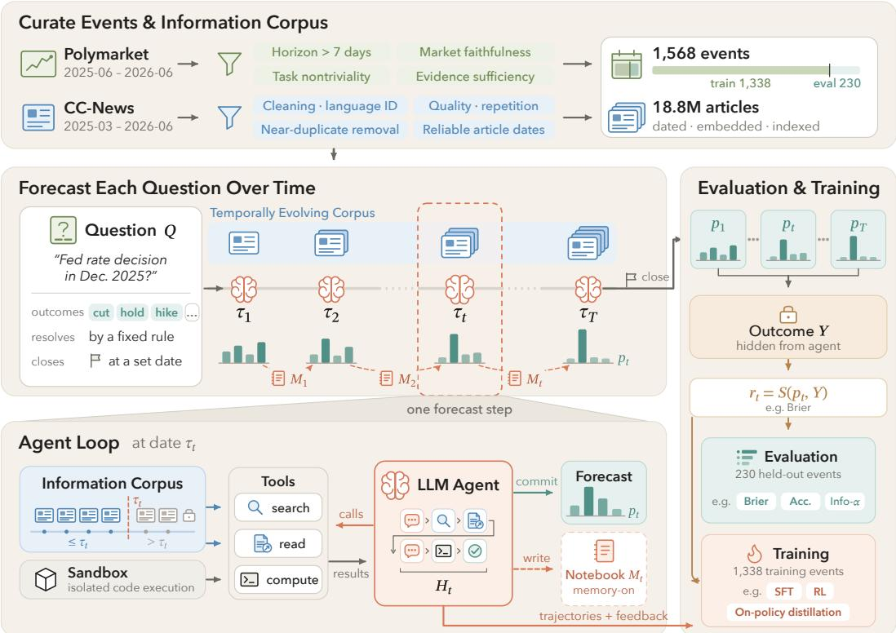
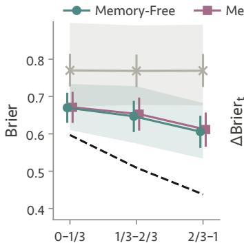
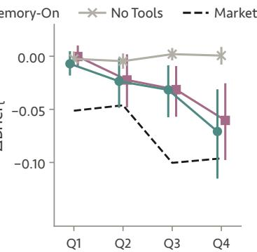
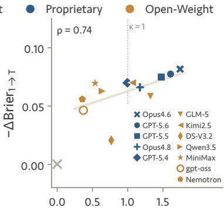
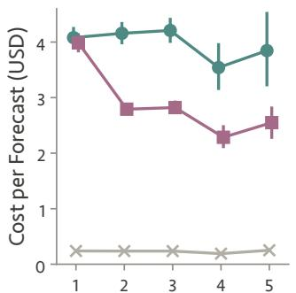
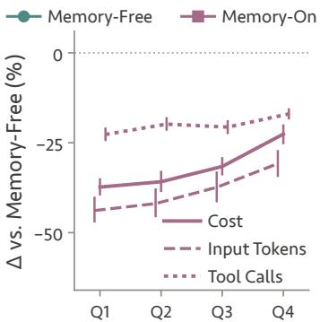
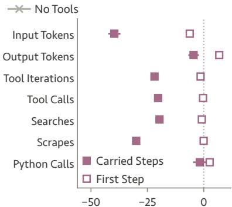
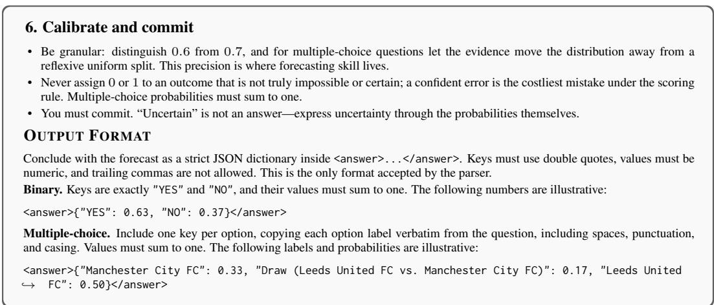
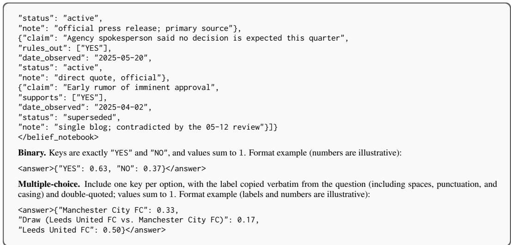

# FORECAST-DOJO: REPLAYABLE ENVIRONMENTS FOR BENCHMARKING AND TRAINING LLM FORECASTING AGENTS

Liqin Ye<sup>\*,1</sup>, Haorui Wang<sup>\*,1</sup>, Fardin Ahmed<sup>1</sup>, Rongzhi Zhang<sup>†,2</sup>, Yuan He<sup>†,2</sup>, Ziyuan Lin<sup>3</sup>, Yanbin Yin<sup>1</sup>, Jing Peng<sup>1</sup>, Michael Galarnyk<sup>1</sup>, Sudheer Chava<sup>1</sup>, Chao Zhang<sup>1</sup>

<sup>1</sup>Georgia Institute of Technology, <sup>2</sup>Amazon, <sup>3</sup>University of Florida

liqiny@gatech.edu, hwang984@gatech.edu

## ABSTRACT

We introduce Forecast-Dojo, a replayable environment for benchmarking and training LLM forecasting agents. It combines resolved prediction-market questions with dated news, allowing agents to research an event and revisit their predictions at successive historical dates. The same tasks and tools support repeated evaluation, collection of training interactions, and feedback from recorded outcomes without waiting for new events to resolve. Forecast-Dojo contains 1,568 Polymarket events, split by time into training and evaluation periods, and 18.8M dated news articles. In an evaluation of 12 models, research tools lower Brier score for all 12. Forecasts also improve as events unfold, with the largest gains at steps where more newly dated evidence is recorded. Every model still trails historical market forecasts in both Brier score and accuracy. A belief notebook carried between dates lowers research cost but does not consistently improve forecast quality. Beyond evaluation, Forecast-Dojo provides interaction trajectories and outcome feedback for agent learning, with supervised fine-tuning as a proof of concept. Our code and data are publicly available.

## 1 INTRODUCTION

Large language model (LLM) agents are increasingly used to forecast real-world events by actively searching for evidence, reasoning under uncertainty, and producing probabilistic predictions (Halawi et al., 2024; Zeng et al., 2025; Seed, 2026; Karger et al., 2025). Forecasting is inherently timedependent: the evidence available to a forecaster changes as new information arrives. The same question can therefore pose a different prediction problem at different times, requiring the forecaster to update its belief as new evidence emerges.

Existing forecasting benchmarks capture only part of this process (Table 1). Live benchmarks (Karger et al., 2025; Zeng et al., 2025; Zhao et al., 2026; Zhang et al., 2026) pose unresolved questions, so the forecasting problem evolves naturally with the world, but they run on wall-clock time. A past forecasting condition cannot be recreated for a model released later, and outcomes arrive only at resolution, which slows evaluation and makes training impractical. Historical benchmarks (Jin et al., 2021; Halawi et al., 2024; Chandak et al., 2025) reconstruct past information cutoffs, making resolved events immediately scorable and reusable. However, they typically evaluate each forecast at a single historical point rather than revisiting the same question across multiple points in time. The ideal setting combines the two: the forecasting problem evolves as new evidence becomes available, yet each past step can be replayed with the same task and information cutoff. Models can then be compared under identical conditions and scored immediately, and their forecasting trajectories become usable for training.

We introduce Forecast-Dojo, a replayable environment that reconstructs resolved real-world events as sequences of historical forecast steps (Figure 1). At each step, an LLM agent can search a temporally-restricted information corpus, inspect full documents, and use computational tools to produce a probabilistic forecast using only information available by that date. Each step can be reset and rerun across models or repeated trials, while steps from the same event can be traversed sequentially with persistent agent memory. The realized outcome is retained by the environment for immediate scoring but never exposed to the agent during its forecasting. This common interaction interface supports both benchmarking and learning: held-out events evaluate agents under controlled conditions, while training events generate forecasting trajectories and outcome feedback for learning.

Table 1: Summary of existing forecasting benchmarks. The criteria target the capabilities used to construct and study Forecast-Dojo. Aligned evaluation indicates that the same forecasting task is evaluated at a pre-specified sequence of forecast dates or evidence states shared across models; : provided; : not provided; : system- or agent-dependent.
<table><tr><td>Benchmark</td><td>Dated replay</td><td>Agent research</td><td>Aligned evaluation</td><td>Agent memory</td><td>Market belief</td><td>Train/eval split</td></tr><tr><td>ForecastQA (Jin et al., 2021)</td><td></td><td>x</td><td>x</td><td>x</td><td>x</td><td></td></tr><tr><td>Autocast (Zou et al., 2022)</td><td></td><td>x</td><td></td><td>x</td><td>x</td><td></td></tr><tr><td>MIRAI (Ye et al., 2024)</td><td></td><td>V</td><td></td><td>x</td><td>x</td><td>x</td></tr><tr><td>ForecastBench (Karger et al., 2025)</td><td>X</td><td>x</td><td>x</td><td>x</td><td>x</td><td>x</td></tr><tr><td>FutureX (Zeng et al., 2025)</td><td>X</td><td></td><td>x</td><td>x</td><td>x</td><td>x</td></tr><tr><td>Prophet Arena (Yang et al., 2025)</td><td>x</td><td>x</td><td></td><td>x</td><td>√</td><td>x</td></tr><tr><td>EvolveCast (Yuan et al., 2025)</td><td></td><td>x</td><td></td><td>x</td><td>x</td><td>x</td></tr><tr><td>BTF-2 (Liptay et al., 2026)</td><td></td><td></td><td>x</td><td>x</td><td>x</td><td>x</td></tr><tr><td>FutureSim (Goel et al., 2026)</td><td></td><td></td><td>x</td><td>V</td><td>x</td><td>x</td></tr><tr><td>Forecast-Dojo</td><td></td><td></td><td></td><td></td><td></td><td>V</td></tr></table>

Empirically, we evaluate 12 models on 230 held-out events without tools, with research tools, and with research tools plus a belief notebook carried between dates. Research tools lower Brier for all 12 models even without memory. In this memory-free setting, mean Brier also falls from 0.670 in the first third of an event to 0.606 in the last third, while forecasts without tools stay flat. The improvements concentrate at steps with more new evidence, and models that record more new evidence tend to improve more. Every model still trails the historical market forecasts in both Brier score and accuracy, with the best Brier at 0.546 against 0.498 for the market. The belief notebook reduces research costs by a median of 24%, but its effect on forecast quality is mixed: Brier improves for only 6 of the 12 models (Section 5.2). Finally, a supervised fine-tuning study shows that an agent trained on trajectories from the Forecast-Dojo training split achieves lower Brier scores and higher accuracy than its base model on later, held-out evaluation events (Section 5.5).

## We summarize our contributions as follow:

• A replayable forecasting environment. Forecast-Dojo replays each resolved event as a fixed sequence of dated forecast steps, with an optional belief notebook carried between them. Agents research news available up to each date, and every step is scored against the realized outcome for evaluation or training.

• A dataset of resolved events and dated news. It covers 1,568 Polymarket events with 6,122 forecast steps, split by time into 1,338 training and 230 evaluation events. Evidence comes from 18.8M CC-News articles, filtered so that each step sees only news up to its forecast date.

• A benchmark study beyond overall rankings. Besides comparing 12 models with historical market forecasts, we examine how forecasts change as events unfold, how these changes relate to new evidence, and how memory affects quality and cost. A fine-tuning study shows how the collected interactions can be used to train an agent.

## 2 RELATED WORK

Forecasting with dated evidence. ForecastQA restricts news by time, while Autocast pairs forecasting questions with dated articles and historical human forecasts (Jin et al., 2021; Zou et al., 2022). ForecastBench and FutureX collect predictions on unresolved events (Karger et al., 2025;

  
Figure 1: Overview of Forecast-Dojo. Top: resolved Polymarket events are filtered and split by time into training and evaluation events, and CC-News articles are cleaned, dated, and indexed. Middle left: each question is forecast at a fixed sequence of dates as the visible corpus grows, with an optional belief notebook M passed between steps. Bottom left: within one step, the agent searches and reads articles dated on or before τ , runs code in a sandbox, and commits a forecast p<sub>t</sub>. Right: the realized outcome Y stays hidden from the agent. The evaluator scores each forecast against it, using held-out events for evaluation and training events for learning.

Zeng et al., 2025). Related settings evaluate repeated forecasts, macroeconomic nowcasts, and simulated market decisions (Yang et al., 2025; Zhao et al., 2026; Cheng et al., 2026). Forecast-Dojo uses resolved events to support repeatable research and immediate outcome-based feedback, while keeping market probabilities outside the forecasting prompt.

Interactive research and forecast revision. Bench to the Future uses frozen research corpora, and BTF-2 records traces to distinguish information gathering from judgment (Wildman et al., 2025; Liptay et al., 2026). MIRAI provides code-based access to events and news, while WorldReasoner evaluates outcome, evidence, and reasoning quality (Ye et al., 2024; Chi et al., 2026). FutureSim studies long-horizon adaptation in a replayed world, where agents jointly decide how to research, maintain memory, revise forecasts, and progress through time (Goel et al., 2026). Forecast-Dojo instead treats time progression as part of the experimental design: each event is replayed at a fixed sequence of historical checkpoints shared by all agents. This produces matched longitudinal trajectories, allowing models to be compared at identical information states and enabling controlled study of how forecast quality changes with newly available evidence. The same aligned episodes also provide reusable interaction trajectories and outcome feedback for downstream learning. This complements work on evidence-driven revision, probability coherence, and iterative research workflows (Yuan et al., 2025; Paleka et al., 2025; Murphy, 2026). This complements work on revisions after supplied evidence, probability coherence, and evidence summaries within a research loop (Yuan et al., 2025; Paleka et al., 2025; Murphy, 2026).

Environments for training agents. MLE-Dojo provides executable machine learning engineering tasks and feedback for evaluation and training (Qiang et al., 2025). Forecast-Dojo follows this environment-centered approach, specifying the forecasting interaction and its feedback while leaving learning algorithms separate. Prior forecasting work trains on question collections or selected model-generated forecasts (Zou et al., 2022; Halawi et ${ \mathrm { a l . , } }$ 2024), and recent methods use reinforcement learning, outcome-based fine-tuning, and news-derived questions (Levy, 2026; Jeen et al., 2026; Chandak et al., 2025). Our contribution is the shared task and tool interface for collecting research interactions and evaluating agents on separate events; the SFT experiment demonstrates one use of that interface.

Table 2: Forecast-Dojo task splits. Memory free/on forecasting use the same forecast steps.
<table><tr><td>Split</td><td>Temporal Range</td><td>Events</td><td>Binary</td><td>Multi-option</td><td>Forecast steps</td></tr><tr><td>Train</td><td>[2025-06, 2026-03)</td><td>1,338</td><td>602</td><td>736</td><td>5,325</td></tr><tr><td>Evaluation</td><td>[2026-03, 2026-06)</td><td>230</td><td>40</td><td>190</td><td>797</td></tr></table>

## 3 FORECASTING AS AN INTERACTIVE TASK

We formulate forecasting as an interactive task over a sequence of forecast steps for the same event. At each step, the agent researches evidence available up to the current date and produces a probabilistic forecast. Across steps, the evidence boundary advances and explicit memory may persist.

Events, forecast steps, and episodes. A question Q specifies an event, its resolution criteria, and a finite set of mutually exclusive outcomes $\bar { \mathcal { V } } = \{ 1 , \ldots , \bar { K } \}$ . Let $Y \in \mathcal { V }$ denote the realized outcome. At ordered dates $\tau _ { 1 } < \cdots < \tau _ { T }$ before the event closes, the agent performs a forecast step: it researches the event and reports a probability distribution $p _ { Q , t } \in \breve { \Delta } ^ { K - 1 }$ . The ordered forecast steps for the same question form a forecast episode. All steps concern the same eventual outcome, but they differ in the historical evidence available at the forecast date.

Within-step interaction. Let I denote a fixed information corpus. At date $\tau _ { t } .$ , the agent is exposed only to

$$
\mathcal { T } _ { \leq \tau _ { t } } = \{ d \in \mathcal { T } : \operatorname { d a t e } ( d ) \leq \tau _ { t } \} , \qquad \mathcal { T } _ { \leq \tau _ { t } } \subseteq \mathcal { T } _ { \leq \tau _ { t + 1 } } ,\tag{1}
$$

where date(d) denotes the timestamp assigned to document d. Within a forecast step, the agent may issue search queries, inspect retrieved articles, and use computation before submitting its forecast (see Section 4.4). Let $H _ { t }$ denote the within-step interaction history, including the agent’s research actions and the resulting tool observations. The agent produces $p _ { Q , t }$ conditioned on $H _ { t }$ . Because agents choose their own queries and which documents to inspect, different rollouts at the same date from an agent can follow different research paths even under the same dated evidence boundary.

Progression across forecast steps. After each report, the environment advances to the next scheduled date and starts a fresh interaction. We define two modes for carrying information across forecast steps: memory-free and memory-on. In memory-free forecasting, each step starts without information produced at previous steps. In memory-on forecasting, the agent produces a belief notebook $M _ { t }$ that summarizes its current assessment, supporting evidence, and open questions. At the next step, $M _ { t }$ is provided alongside the question and new forecast date, allowing the agent to update its forecast from its prior assessment as new evidence becomes available.

Outcome feedback. Each forecast step ends with a probability report $p _ { Q , t }$ . Once the realized outcome $Y$ is available, the environment assigns feedback $r _ { Q , t } = S ( p _ { Q , t } , Y )$ where $S$ is an outcomebased scoring rule. The outcome and feedback are not part of the agent’s forecasting context. This separates the interaction that produces a forecast from the feedback assigned to it, allowing the same task interface to support different downstream evaluation or learning procedures.

## 4 FORECAST-DOJO

Section 3 defines the forecasting task abstractly. We now describe how Forecast-Dojo instantiates its events, information corpus, forecast episodes, runtime, and evaluation records.

## 4.1 FORECASTING EVENTS

We construct our candidate pool from resolved Polymarket<sup>1</sup> binary and mutually exclusive multioption events whose full lifetimes fall between June 2025 and June 2026. For each event and date, we interpret market prices as a contemporaneous belief over its possible outcomes, which we refer to as the market belief. For binary events, the YES price determines the probability of YES and its complement; for multi-option events, we normalize the option-level YES prices to obtain a distribution over the mutually exclusive outcomes.

Within this pool, we further select events along four dimensions to ensure they are well suited to repeated, evidence-grounded forecasting. (1) Forecasting horizon: we require a tradeable lifetime longer than 7 days so that the same question supports multiple forecast steps rather than only a nearresolution prediction. (2) Marketfaithfulness: we require sufficient trading activity on most days, so that its daily price is a reliable reflection of the market belief rather than stale or weakly supported quotes. This also favors questions with sustained market attention over obscure or inactive events. (3) Task nontriviality: we remove events where the market already assigns near-certain probability to the realized outcome, as well as events whose market history is both nearly flat and directionless. This avoids trivial or temporally uninformative questions and preserves meaningful room for forecast revision as evidence accumulates. (4) Evidence sufficiency: following Joren et al. (2025), we retain only questions for which the information corpus contains sufficient pre-resolution evidence to support an informed forecast, excluding questions that are poorly covered by or largely unrelated to the corpus available to the agent. Together, these filters yield temporally rich, nontrivial, and evidence-grounded questions suitable for repeated evaluation and learning. Appendix A.2 provides full details of this selection.

## 4.2 INFORMATION CORPUS

Corpus construction. Forecast-Dojo requires broad historical evidence whose availability can be reconstructed at each forecast date. We build the corpus from CC-News (Nagel, 2016), which provides large-scale news coverage together with crawl timestamps that support historical reconstruction. We process CC-News archives from March 2025 through May 2026 using a quality pipeline adapted from FineWeb (Penedo et al., 2024), including text cleaning, language identification, repetition and document-quality filtering, and near-duplicate removal. We suppress duplicate URLs, identical titles within a seven-day window, and near-verbatim body matches to reduce repeated coverage. After filtering, the corpus contains approximately 18.8M articles, which we embed with Qwen3-Embedding-8B (Zhang et al., 2025) and index with FAISS (Douze et al., 2026).

Temporal integrity. Reconstructing historical evidence also requires reliable article timestamps: assigning an article an incorrectly early date could expose future information to the agent. We assign article dates using structured publication or modification metadata, with the CC-News crawl timestamp as a fallback. Timestamps are extracted through fixed-priority metadata cascades, including schema.org datePublished and dateModified (Guha et al., 2016; Schema.org; Google Search Central). At each forecast step, retrieval filters articles by the UTC day of the assigned timestamp before ranking. Event construction additionally screens for content-level outcome leakage. Appendix A.1 details the timestamp sources and extraction procedures.

## 4.3 TEMPORAL TASK CONSTRUCTION

Forecast-date selection. A forecast step could naively be created for every day of an event’s lifetime, but this would cause long-lived events to contribute disproportionately many training and evaluation samples. We therefore use a sublinear schedule: after enforcing a two-day buffer before <sub>the recorded close, an event with n candidate days receives T = clamp (round(</sub>√<sub>n), 3, 10) fore-</sub> cast steps. We partition the event history into $\check { T }$ temporal bins and select one date from each to maintain coverage across its lifetime. Within each bin, we prioritize two signals to select dates most worth forecasting. (1) Market-belief movement: we favor dates with larger changes in the market belief, indicating that newly available information has materially shifted the market’s assessment of the event. (2) New evidence: we favor dates with greater news publication activity, indicating periods when more external information has become available to the forecaster. The selection policy is configurable; the above procedure is the default used in our experiments. After leakage filtering, evaluation events must retain at least three forecast dates. Appendix A.3 provides the full weighting and selection procedure.

Temporal train–evaluation split. We split complete events, rather than individual forecast steps, into non-overlapping temporal windows. Training events must both start and close within [2025-06, 2026-03), while evaluation events must both start and close within [2026-03, 2026-06); events crossing either boundary are excluded. This keeps every forecast episode entirely within one split and prevents the same event from appearing in both training and evaluation. Table 2 summarizes the resulting splits and forecast-step counts.

## 4.4 AGENT INTERACTION

Tool interface. At each forecast step, the agent can access and process evidence via three tools, with temporally restricted access to the information corpus available by the forecast date, $\mathcal { I } _ { \leq \tau _ { t } }$

• SEARCH retrieves the top-k relevant articles for an agent-generated query, returning article identifiers, titles, publication dates, retrieval scores, and short snippets, via search(query, top\_k).

• READ returns the full text of an article retrieved by SEARCH, via scrape(article\_id).

• COMPUTE executes model-generated code for numerical analysis, aggregation, base-rate estimation, or simulation, via python(code).

The agent may interleave reasoning with repeated tool calls before submitting its forecast. Each tool output is added to the within-step interaction history $H _ { t }$ and becomes available for subsequent reasoning and tool use within the same forecast step.

Memory transfer. Each forecast step is a fresh model interaction with access to the corpus up to the current forecast date, $\mathcal { I } _ { \leq \tau _ { t } }$ . In memory-free mode, no information from earlier steps is carried forward. In memory-on mode, the previous belief notebook $M _ { t }$ is additionally inserted into the next prompt, allowing the agent to revise its prior assessment as new evidence becomes available. Previous conversation turns, reasoning traces, and tool observations are discarded, making $M _ { t }$ the only explicitly transferred information. The belief-notebook format is provided in Figure 6.

## 4.5 EVALUATION AND LEARNING

Forecast evaluation. Each forecast step produces a probability distribution $p _ { Q , i }$ <sub>t</sub>, which can be evaluated against the realized outcome $Y ^ { ' }$ after the interaction. These probabilities support diverse step-level metrics, including proper scoring rules such as Brier scores (Glenn et al., 1950), top-1 accuracy, calibration metrics such as expected calibration error (ECE) (Guo et al., 2017), and market-relative measures such as Information-α, defined in Section 5. Because each event yields a sequence of forecasts, Forecast-Dojo also supports trajectory-level analyses of how beliefs evolve across forecast steps. The environment does not prescribe a single metric. Section B.3 specifies the metrics used in our experiments.

Learning from interactions. With trajectory logging enabled, each completed forecast step retains its available within-step interaction history $H _ { t } ,$ including model messages and tool interactions, and, in memory-on mode, the belief notebook $M _ { t }$ . Once the realized outcome is available, outcome-based feedback can be attached to the same interaction. Evaluation events use these outputs for benchmarking, while training events provide trajectories and feedback that can be consumed by diverse learning methods. The same forecasting interaction supports both evaluation and learning without changing the task or tool interface. We demonstrate this capability with supervised fine-tuning in Section 5.5.

Table 3: Main Results. Main values average recorded forecasts; smaller ± values show standard deviations of the four rollout means. Unusable forecasts are replaced by uniform distributions for all metrics; accuracy uses fractional ties and is reported in percent. Info-α requires an available market probability. Bold and underlining indicate the best and second-best model in each column. Superscripts †, ‡, and § flag configurations with more than 5% unusable forecasts. Uniform and market forecasts serve as contextual references.
<table><tr><td></td><td colspan="3">No tools</td><td colspan="3">Tools, memory-free</td><td colspan="3">Tools, memory-on</td></tr><tr><td>Model</td><td>Brier↓</td><td>Acc.↑</td><td>Info-α ↑</td><td>Brier↓</td><td>Acc.↑</td><td>Info-α ↑</td><td>Brier↓</td><td>Acc.↑</td><td>Info-α ↑</td></tr><tr><td colspan="10">Proprietary</td></tr><tr><td>GPT-5.6 Sol</td><td>0.650 ±0.004</td><td>47.03 ±0.5</td><td>-0.422 ±0.006</td><td>0.554 ±0.008</td><td>56.36 ±0.9</td><td>-0.138 ±0.023</td><td>0.546 ± 0.004</td><td>57.59 ±1.3</td><td>-0.104 ±0.017</td></tr><tr><td>GPT-5.5</td><td>0.698 ± 0.001</td><td>43.85 ± 0.6</td><td>-0.603 ± 0.008</td><td>0.564 ± 0.002</td><td>57.69 ± 0.7</td><td>-0.186 ± 0.010</td><td>0.571 ± 0.005</td><td>57.68 ±1.0</td><td>-0.198 ± 0.013</td></tr><tr><td>GPT-5.4</td><td>0.708 ±0.002</td><td>41.34 ±0.8</td><td>-0.633 ±0.015</td><td>0.586 ±0.002</td><td>53.12 ± 0.4</td><td>-0.237 ±0.006</td><td>0.583 ±0.005</td><td>52.87 ±1.0</td><td>-0.222 ± 0.021</td></tr><tr><td>Claude Opus 4.8</td><td>0.725 ± 0.002</td><td>40.30 ± 0.8</td><td>-0.643 ± 0.004</td><td>0.589 ± 0.006</td><td>52.63 ± 0.8</td><td>-0.254 ± 0.023</td><td>0.605 ± 0.008</td><td>50.94 ± 1.1</td><td>-0.300 ± 0.019</td></tr><tr><td>Claude Opus 4.6</td><td>0.762 ± 0.002</td><td>35.16 ±0.5</td><td>-0.788 ± 0.007</td><td>0.603 ± 0.003</td><td>52.35 ±0.9</td><td>-0.282 ±0.008</td><td>0.598 ±0.002</td><td>53.32 ± 0.5</td><td>-0.263 ± 0.006</td></tr><tr><td colspan="10">Open-weight</td></tr><tr><td>GLM-5</td><td>0.731 ± 0.006</td><td>38.54 ±0.6</td><td>-0.686 ±0.016</td><td>0.625 ±0.004</td><td>50.02 ± 1.0</td><td>-0.372 ±0.024</td><td>0.632 ±0.002</td><td>49.96 ±0.4</td><td>-0.398</td></tr><tr><td>Qwen3.5-397B</td><td>0.759 ±0.005</td><td>36.54 ± 0.7</td><td>-0.796 ±0.021</td><td>0.639 ± 0.004</td><td>48.49 ± 1.2</td><td>-0.422 ±0.007</td><td>0.643 ± 0.010</td><td>48.90 ± 0.9</td><td>±0.017 -0.441</td></tr><tr><td>Kimi K2.5</td><td>0.773 ±0.002</td><td>36.30 ±0.8</td><td>-0.837 ±0.011</td><td>0.637 ±0.010</td><td>49.37 ±2.2</td><td>-0.420 ±0.024</td><td>0.658 ± 0.009</td><td>48.07 ± 1.7</td><td>±0.027 -0.439 ±0.005</td></tr><tr><td>MiniMax M2.5</td><td>0.758 ± 0.005</td><td>35.68 ±0.9</td><td>-0.797 ± 0.011</td><td>0.654 ± 0.012</td><td>46.87</td><td>-0.461 ±0.031</td><td>0.640</td><td>47.19 ±1.6</td><td>-0.413 ±0.022</td></tr><tr><td>DeepSeek-V3.2</td><td>0.805 ± 0.004</td><td>34.34 ±1.0</td><td>-0.991 ±0.017</td><td>0.655 ±0.012</td><td>± 0.7 47.73 ± 1.9</td><td>-0.464 ±0.042</td><td>± 0.007 0.666 ± 0.019</td><td>47.65 ±1.5</td><td>-0.508 ± 0.064</td></tr><tr><td>gpt-oss-120b</td><td>0.896 ± 0.004</td><td>32.44 ±0.5</td><td>-1.378 ±0.023</td><td>0.699 ±0.010</td><td>41.95 ± 0.6</td><td>-0.594 ±0.020</td><td>0.696§ ± 0.012</td><td>43.03</td><td>-0.584 ±0.052</td></tr><tr><td>Nemotron 3 Super</td><td>0.882† ±0.006</td><td>30.84 ±0.5</td><td>-1.516 ±0.021</td><td>0.695 ±0.011</td><td>43.49 ± 1.2</td><td>-0.743 ±0.038</td><td>0.688§ ± 0.019</td><td>± 0.7 44.89 ±2.7</td><td>-0.720 ± 0.031</td></tr><tr><td>Uniform reference Market reference</td><td>0.771 0.498</td><td>22.9 64.5</td><td></td><td>0.771 0.498</td><td>22.9 64.5</td><td></td><td>0.771 0.498</td><td>22.9 64.5</td><td></td></tr></table>

## 5 EXPERIMENTS

## 5.1 EXPERIMENTAL SETUP

We evaluate 12 proprietary and open-weight models on 230 held-out events comprising 797 event– date pairs, with four rollouts per pair. For every model, either its reported knowledge or training-data cutoff or, when unavailable, its checkpoint release date predates the evaluation period (see Table 9). We compare three settings on the same scheduled tasks. In the no-tools setting (Figure 4), the model predicts in a single call without research tools. In the memory-free setting (Figure 5), it uses daterestricted search, article retrieval, and Python, starting from a fresh context at each forecast date. The memory-on setting additionally passes the agent’s previous belief notebook to the next date. Each rollout maintains its own notebook; earlier conversations and raw tool outputs are not carried forward. Model configurations and tool budgets are given in Appendix B.2.

We report multiclass Brier score, top-label accuracy, and Information-α. Brier measures error in the predicted probability distribution, while accuracy measures whether the highest-probability outcome is correct. Information-α compares the agent’s and market’s log scores on the realized outcome; positive values favor the agent. Uniform forecasts and historical market probabilities serve as references. The market may use information outside the news archive, and its probabilities are never shown to the agents.

Table 3 reports averages over recorded forecasts and standard deviations across four rollouts. An unusable recorded forecast is replaced by a uniform distribution over its K offered outcomes, giving Brier 1 − 1/K and fractional-tie accuracy 1/K. For the longitudinal analysis, we average within each event before averaging across events and estimate 95% confidence intervals by resampling events. Metric definitions are provided in Appendix B.3.

  
(a) Forecast Step Position

  
(b) New Evidence |ΔE<sub>t</sub>|

  
(c) Evidence Capture κ  
Figure 2: Forecast improvements track newly available evidence. (a) Brier at early, middle, and late stages, defined by thirds of relative forecast-step position; each event receives equal weight. Shading shows the range of model means. (b) Consecutive-step Brier change by new-evidence quartile. Each model’s index is computed from the other available models’ notebooks. (c) Evidence capture κ versus first-to-last Brier improvement with memory on. The correlation is computed across 12 models; the no-tools cross is a reference, with no defined capture value. Scores use the main table’s exact label matching and uniform fallback; (a,b) show 95% event-bootstrap CIs. Definitions and scoring sensitivity: Appendix B.7.

## 5.2 OVERALL FORECASTING PERFORMANCE

Research tools improve forecasting across model families. Table 3 compares the three settings on the same forecasting tasks. Relative to no tools, memory-free research lowers Brier and improves accuracy for all 12 models. For GPT-5.5, Brier decreases from 0.698 to 0.564, while accuracy increases from 43.85% to 57.69%. The gains also extend to open-weight models: DeepSeek-V3.2 improves from 0.805 to 0.655 in Brier and from 34.34% to 47.73% in accuracy. Because each date starts from a fresh context, these gains show the value of dated information even without persistent memory.

Proprietary models achieve lower Brier scores with tools. In both tool-enabled settings, all five proprietary models have lower mean Brier scores than every open-weight model evaluated. GPT-5.6 Sol achieves the lowest Brier in both the memory-free (0.554) and memory-on (0.546) settings. GLM-5 is the strongest open-weight model by Brier in both settings, scoring 0.625 and 0.632, respectively. The corresponding gaps to the best proprietary model are 0.071 and 0.086. Tool access helps both groups but leaves a gap in forecast quality.

Higher accuracy does not always imply lower Brier. GPT-5.5 has the highest memory-free accuracy (57.69%), whereas GPT-5.6 Sol is less accurate (56.36%) but has lower Brier (0.554 versus 0.564) and higher Information-α (−0.138 versus −0.186). The most accurate model is therefore not the strongest by either probability score. With uniform fallback, all 12 models beat the uniform ref erence in Brier under both tool-enabled settings. This scoring convention does not imply successful output: for example, 19.45% of gpt-oss-120b’s memory-free reports are unusable. Appendix B.4 reports failure rates separately.

Memory yields model-dependent changes in forecast quality. Adding a belief notebook lowers mean Brier for six models but raises it for the other six. For example, GPT-5.5 changes from 0.564 to 0.571, whereas GPT-5.6 Sol improves from 0.554 to 0.546. The latter improvement coincides with a reduction in unusable reports from 4.49% to 0.53%. When both settings produce a usable forecast, however, the paired memory-on-minus-memory-free Brier difference for GPT-5.6 Sol is only +0.0010. This comparison shows why an improvement in the overall score need not imply better probability estimates among successful forecasts. We therefore distinguish memory’s effects on forecast quality and output reliability from its effect on research cost, examined in Section 5.4.

  
(a) Forecast Step t

  
(b) New Evidence |ΔE<sub>t</sub>|

  
(c) Δ vs. Memory-Free (%)  
Figure 3: Memory lowers research cost, mostly after the first forecast. (a) Mean estimated API cost per forecast (USD) at each forecast step, averaged over the five proprietary models. Only 67 of the 230 events have a fourth step and 25 have a fifth, so later points average over fewer events. (b) Percentage change of memory-on relative to memory-free execution in cost, input tokens, and tool calls at later steps (t ≥ 2), grouped by the new-evidence quartiles of Figure 2(b). (c) The same change for each resource, split into the first step and later steps that carry a notebook. No notebook exists at the first step; first-step differences can reflect prompt and sampling variation. Negative values indicate reductions. Tokens and calls use all 12 models; intervals are 95% event-bootstrap CIs. Appendix B.5 defines and reports per-model resource use.

The market reference remains ahead across scoring rules. The market achieves Brier 0.498 and accuracy 64.55%, compared with the best model scores of 0.546 and 57.69%. These correspond to gaps of 0.048 in Brier and 6.85 percentage points in accuracy. Information-α is also negative for every model in all three settings, indicating lower average log scores than the market on forecasts where this metric is available. The gap therefore extends beyond top-label accuracy. The market may incorporate information outside the agents’ archive, so it serves as an external reference rather than an information-matched baseline. We next examine how agent forecasts improve over an event and how these gains relate to newly available evidence.

## 5.3 FORECASTING OVER TIME

Forecasts improve over time with research tools. Figure 2(a) compares forecasts at the early, middle, and late stages of each event. Mean Brier decreases from 0.670 to 0.606 with memoryfree research and from 0.671 to 0.612 with memory-on research. In contrast, the no-tools baseline remains nearly unchanged near 0.769. All 12 models improve from the first to the last stage with memory-free research. The market improves more sharply, from 0.597 to 0.438. These results show that agents benefit from access to dated information as events unfold, even without retaining their previous research.

Larger improvements coincide with more new evidence. We estimate the amount of new evi dence between consecutive forecast dates using dated entries in belief notebooks. For each evaluated model, the new-evidence index, $| \Delta E _ { t } |$ |, is computed from the other available models’ notebooks. A higher index indicates that these models recorded more evidence dated within the interval. For memory-free agents, the mean step-to-step Brier change is −0.007 in the lowest evidence quartile and −0.071 in the highest (Figure 2(b)). Memory-on agents show a similar pattern, whereas no tools forecasts change little in every quartile. Forecast improvements are therefore concentrated at steps with more newly recorded evidence. Appendix B.6 gives the index definition and aggregation procedure.

Models that capture more evidence tend to improve more. We measure evidence capture, κ, by how much newly dated evidence a model records relative to the other models; κ = 1 corresponds to their average recording rate. Across the 12 models, κ ranges from 0.36 to 1.74 and correlates with first-to-last Brier improvement in the memory-on setting (Spearman $\rho = 0 . 7 4 ;$ Figure 2(c)). The corresponding correlations for search and article-retrieval counts are weaker, at 0.31 and 0.49. Thus, recording newly relevant evidence is more closely associated with forecast improvement than the number of research calls. The definition and limitations of this notebook-based measure are given in Appendix B.7.

## 5.4 COST ANALYSIS

Savings are larger after the initial forecast. In Figure 3(a), the two tool-using settings cost about the same at the first forecast, and memory-on execution becomes cheaper from the second forecast onward. The saving is largest when little new evidence has appeared since the previous forecast and shrinks as more becomes available (Figure 3(b)). Figure 3(c) shows that resource use is similar at the first step, where neither setting has a notebook, while later steps show the largest reductions in input tokens, tool iterations, and research calls. This pattern is consistent with agents reusing earlier findings instead of repeating the same research at each date. Given the mixed effects on Brier in Section 5.2, lower research cost is memory’s clearest benefit in the evaluated protocols.

Memory reduces the cost of repeated forecasting. For the five proprietary models, memory-on execution costs less per forecast than memory-free execution in every case. The reduction ranges from 8% for Claude Opus 4.6 to 33% for GPT-5.5, with a median of 24% (Table 12). GPT-5.5 costs a third less, \$3.90 instead of \$5.85 per forecast, while its paired Brier difference is +0.007 with a 95% confidence interval that includes zero. These costs cover retained forecast records and exclude discarded retry attempts.

Table 4: Supervised fine-tuning on Forecast-Dojo trajectories. Qwen3-30B-A3B-Thinking-2507 is evaluated on 3,188 forecasts from 230 held-out events. Paired SFT−base differences (∆) are computed before rounding; 95% CIs resample events. All scores use uniform fallback for unusable forecasts.
<table><tr><td rowspan="2">Model</td><td colspan="3">Brier↓</td><td rowspan="2">Log loss↓</td><td rowspan="2">Acc.↑ (%)</td><td rowspan="2">Parsed (%)</td><td rowspan="2">Tool calls / forecast</td></tr><tr><td>All</td><td>Binary</td><td>Multi-choice</td></tr><tr><td>Student (base)</td><td>0.924</td><td>0.704</td><td>0.975</td><td>2.74</td><td>34.8</td><td>100.0</td><td>1.4</td></tr><tr><td>+ Dojo SFT</td><td>0.749</td><td>0.539</td><td>0.797</td><td>1.89</td><td>42.8</td><td>99.5</td><td>3.7</td></tr><tr><td>Paired ∆ 95% CI</td><td>-0.176 [−0.214, -0.139]</td><td>-0.165</td><td>-0.178</td><td>-0.86 [-1.03, −0.70]</td><td>+8.1 [+5.1, +11.2]</td><td>-0.5</td><td>+2.3</td></tr></table>

## 5.5 TRAINING PROOF OF CONCEPT

We next test whether Forecast-Dojo interactions can directly support agent training. We collect trajectories from Qwen3-235B-A22B-Thinking-2507 (Qwen Team, 2025) on Forecast-Dojo’s train set, and supervised fine-tune Qwen3-30B-A3B-Thinking-2507 (Qwen Team, 2025) for three epochs over the full assistant trajectory. As Qwen3-30B-A3B-Thinking-2507 has no officially reported knowledge cutoff and was released in July 2025, we use a subset of the Forecast-Dojo training split spanning August 2025 to February 2026, comprising 1,028 unique events and 3,965 forecast steps.

On 230 held-out events, the fine-tuned student outperforms the base across probabilistic and categorical metrics (Table 4). Overall Brier decreases from 0.924 to 0.749, a paired improvement of −0.176 (95% CI [−0.214, −0.139]), with consistent gains on both binary (0.704 → 0.539) and multi-choice (0.975 → 0.797) forecasts. Log loss falls from 2.74 to 1.89, while accuracy rises from 34.8% to 42.8% (+8.1 points, 95% CI [+5.1, +11.2]). These gains come with increased tool use (1.4 to 3.7 calls per forecast), while parser acceptance remains near-perfect at 99.5%. Together, these results provide a proof of concept that Forecast-Dojo trajectories can support training agents with improved held-out forecasting performance.

## 6 CONCLUSION

Forecast-Dojo replays resolved prediction-market events as fixed sequences of historical forecast states, enabling agents to be compared under the same information conditions and evaluated throughout an event’s evolution. Access to research tools improves Brier and accuracy for all 12 models, with larger step-wise gains when more new evidence becomes available. Models that record more newly dated evidence also tend to improve more over an episode. Yet all evaluated agents remain behind historical market forecasts, while persistent memory reduces research cost more consistently than it improves forecast quality. Beyond evaluation, Forecast-Dojo produces outcome-grounded interaction trajectories that can support a broad range of learning algorithms, from supervised finetuning to trajectory-level and reward-based optimization.

## REFERENCES

Anthropic. Claude opus 4.6 system card. https://www.anthropic.com/system-cards, February 2026a. Claude Opus 4.6.

Anthropic. Introducing claude opus 4.8. https://www.anthropic.com/news/claude-opus-4-8, May 2026b. Accessed 2026-09-22.

Nikhil Chandak, Shashwat Goel, Ameya Prabhu, Moritz Hardt, and Jonas Geiping. Scaling openended reasoning to predict the future. CoRR, abs/2512.25070, 2025. doi: 10.48550/ARXIV.2512. 25070. URL https://doi.org/10.48550/arXiv.2512.25070.

Pu Cheng, Juncheng Liu, and Yunshen Long. Polybench: Benchmarking llm forecasting and trading capabilities on live prediction market data. arXiv preprint arXiv:2604.14199, 2026.

Yizhou Chi, Eric Chamoun, Zifeng Ding, and Andreas Vlachos. Worldreasoner: Evaluating whether language model agents forecast events with valid reasoning. arXiv preprint arXiv:2606.11816, 2026.

Matthijs Douze, Alexandr Guzhva, Chengqi Deng, Jeff Johnson, Gergely Szilvasy, Pierre-Emmanuel Mazaré, Maria Lomeli, Lucas Hosseini, and Hervé Jégou. The faiss library. IEEE Trans. Big Data, 12(2):346–361, 2026. doi: 10.1109/TBDATA.2025.3618474. URL https: //doi.org/10.1109/TBDATA.2025.3618474.

W Brier Glenn et al. Verification of forecasts expressed in terms of probability. Monthly weather review, 78(1):1–3, 1950.

Shashwat Goel, Nikhil Chandak, Arvindh Arun, Ameya Prabhu, Steffen Staab, Moritz Hardt, Maksym Andriushchenko, and Jonas Geiping. Futuresim: Replaying world events to evaluate adaptive agents. arXiv preprint arXiv:2605.15188, 2026.

Google Search Central. Article structured data. https://developers.google.com/search/ docs/appearance/structured-data/article. Accessed 2026.

Ramanathan V. Guha, Dan Brickley, and Steve Macbeth. Schema.org: evolution of structured data on the web. Commun. ACM, 59(2):44–51, 2016. doi: 10.1145/2844544. URL https://doi. org/10.1145/2844544.

Chuan Guo, Geoff Pleiss, Yu Sun, and Kilian Q. Weinberger. On calibration of modern neural networks. In Doina Precup and Yee Whye Teh (eds.), Proceedings of the 34th International Conference on Machine Learning, ICML 2017, Sydney, NSW, Australia, 6-11 August 2017, volume 70 of Proceedings of Machine Learning Research, pp. 1321–1330. PMLR, 2017. URL http://proceedings.mlr.press/v70/guo17a.html.

Danny Halawi, Fred Zhang, Yueh-Han Chen, and Jacob Steinhardt. Approaching humanlevel forecasting with language models. In Amir Globersons, Lester Mackey, Danielle Belgrave, Angela Fan, Ulrich Paquet, Jakub M. Tomczak, and Cheng Zhang (eds.), Advances in Neural Information Processing Systems 37: Annual Conference on Neural Information Processing Systems 2024, NeurIPS 2024, Vancouver, BC, Canada, December 10 - 15, 2024, 2024. URL http://papers.nips.cc/paper\_files/paper/2024/hash/ 5a5acfd0876c940d81619c1dc60e7748-Abstract-Conference.html.

Scott Jeen, Matthew Aitchison, Maximilian Anthony Hugh Clark, Toby Shevlane, and Ben Day. Reaching the frontier of ai forecasting with reinforcement learning. In Forecasting as a New Frontier of Intelligence, 2026.

Woojeong Jin, Rahul Khanna, Suji Kim, Dong-Ho Lee, Fred Morstatter, Aram Galstyan, and Xiang Ren. Forecastqa: A question answering challenge for event forecasting with temporal text data. In Chengqing Zong, Fei Xia, Wenjie Li, and Roberto Navigli (eds.), Proceedings of the 59th Annual Meeting of the Association for Computational Linguistics and the 11th International Joint Conference on Natural Language Processing, ACL/IJCNLP 2021, (Volume 1: Long Papers), Virtual Event, August 1-6, 2021, pp. 4636–4650. Association for Computational Linguistics, 2021. doi: 10.18653/V1/2021.ACL-LONG.357. URL https://doi.org/10.18653/v1/2021.acl-long. 357.

Hailey Joren, Jianyi Zhang, Chun-Sung Ferng, Da-Cheng Juan, Ankur Taly, and Cyrus Rashtchian. Sufficient context: A new lens on retrieval augmented generation systems. In The Thirteenth International Conference on Learning Representations, ICLR 2025, Singapore, April 24-28, 2025. OpenReview.net, 2025. URL https://openreview.net/forum?id=Jjr2Odj8DJ.

Armand Joulin, Edouard Grave, Piotr Bojanowski, Matthijs Douze, Hervé Jégou, and Tomás Mikolov. Fasttext.zip: Compressing text classification models. CoRR, abs/1612.03651, 2016. URL http://arxiv.org/abs/1612.03651.

Armand Joulin, Edouard Grave, Piotr Bojanowski, and Tomás Mikolov. Bag of tricks for efficient text classification. In Mirella Lapata, Phil Blunsom, and Alexander Koller (eds.), Proceedings of the 15th Conference of the European Chapter of the Association for Computational Linguistics, EACL 2017, Valencia, Spain, April 3-7, 2017, Volume 2: Short Papers, pp. 427–431. Association for Computational Linguistics, 2017. doi: 10.18653/V1/E17-2068. URL https://doi.org/10. 18653/v1/e17-2068.

Ezra Karger, Houtan Bastani, Yueh-Han Chen, Zachary Jacobs, Danny Halawi, Fred Zhang, and Philip Tetlock. Forecastbench: A dynamic benchmark of AI forecasting capabilities. In The Thirteenth International Conference on Learning Representations, ICLR 2025, Singapore, April 24-28, 2025. OpenReview.net, 2025. URL https://openreview.net/forum?id=lfPkGWXLLf.

Amit Arnold Levy. Reinforcement learning for llm-based event forecasting. arXiv preprint arXiv:2606.15917, 2026.

Tom Liptay, Dan Schwarz, Rafael Poyiadzi, Jack Wildman, and Nikos I Bosse. Evaluating strategic reasoning in forecasting agents. arXiv preprint arXiv:2604.26106, 2026.

Kevin Murphy. Agentic forecasting using sequential bayesian updating of linguistic beliefs. arXiv preprint arXiv:2604.18576, 2026.

Sebastian Nagel. Common crawl news dataset, 2016. URL https://data.commoncrawl.org/ crawl-data/CC-NEWS/index.html.

Daniel Paleka, Abhimanyu Pallavi Sudhir, Alejandro Alvarez, Vineeth Bhat, Adam Shen, Evan Wang, and Florian Tramèr. Consistency checks for language model forecasters. arXiv preprint arXiv:2412.18544, 2025.

Guilherme Penedo, Hynek Kydlícek, Loubna Ben Allal, Anton Lozhkov, Margaret Mitchell, Colin A. Raffel, Leandro von Werra, and Thomas Wolf. The fineweb datasets: Decanting the web for the finest text data at scale. In Amir Globersons, Lester Mackey, Danielle Belgrave, Angela Fan, Ulrich Paquet, Jakub M. Tomczak, and Cheng Zhang (eds.), Ad vances in Neural Information Processing Systems 37: Annual Conference on Neural Information Processing Systems 2024, NeurIPS 2024, Vancouver, BC, Canada, December 10 - 15, 2024, 2024. URL http://papers.nips.cc/paper\_files/paper/2024/hash/ 370df50ccfdf8bde18f8f9c2d9151bda-Abstract-Datasets\_and\_Benchmarks\_Track.html.

Rushi Qiang, Yuchen Zhuang, Yinghao Li, Dingu Sagar V K, Rongzhi Zhang, Changhao Li, Ian Shu-Hei Wong, Sherry Yang, Percy Liang, Chao Zhang, and Bo Dai. Mle-dojo: Interactive environments for empowering llm agents in machine learning engineering. arXiv preprint arXiv:2505.07782, 2025.

Qwen Team. Qwen3 technical report, 2025. URL https://arxiv.org/abs/2505.09388.

Jack W. Rae, Sebastian Borgeaud, Trevor Cai, Katie Millican, Jordan Hoffmann, H. Francis Song, John Aslanides, Sarah Henderson, Roman Ring, Susannah Young, Eliza Rutherford, Tom Hennigan, Jacob Menick, Albin Cassirer, Richard Powell, George van den Driessche, Lisa Anne Hendricks, Maribeth Rauh, Po-Sen Huang, Amelia Glaese, Johannes Welbl, Sumanth Dathathri, Saffron Huang, Jonathan Uesato, John Mellor, Irina Higgins, Antonia Creswell, Nat McAleese, Amy Wu, Erich Elsen, Siddhant M. Jayakumar, Elena Buchatskaya, David Budden, Esme Sutherland, Karen Simonyan, Michela Paganini, Laurent Sifre, Lena Martens, Xiang Lorraine Li, Adhiguna Kuncoro, Aida Nematzadeh, Elena Gribovskaya, Domenic Donato, Angeliki Lazaridou, Arthur Mensch, Jean-Baptiste Lespiau, Maria Tsimpoukelli, Nikolai Grigorev, Doug Fritz, Thibault Sottiaux, Mantas Pajarskas, Toby Pohlen, Zhitao Gong, Daniel Toyama, Cyprien de Masson d’Autume, Yujia Li, Tayfun Terzi, Vladimir Mikulik, Igor Babuschkin, Aidan Clark, Diego de Las Casas, Aurelia Guy, Chris Jones, James Bradbury, Matthew J. Johnson, Blake A. Hechtman, Laura Weidinger, Iason Gabriel, William Isaac, Edward Lockhart, Simon Osindero, Laura Rimell, Chris Dyer, Oriol Vinyals, Kareem Ayoub, Jeff Stanway, Lorrayne Bennett, Demis Hassabis, Koray Kavukcuoglu, and Geoffrey Irving. Scaling language models: Methods, analysis & insights from training gopher. CoRR, abs/2112.11446, 2021. URL https://arxiv.org/abs/2112.11446.

Colin Raffel, Noam Shazeer, Adam Roberts, Katherine Lee, Sharan Narang, Michael Matena, Yanqi Zhou, Wei Li, and Peter J. Liu. Exploring the limits of transfer learning with a unified text-to-text transformer. J. Mach. Learn. Res., 21:140:1–140:67, 2020. URL https://jmlr.org/papers/ v21/20-074.html.

Stephen E. Robertson and Hugo Zaragoza. The probabilistic relevance framework: BM25 and beyond. Found. Trends Inf. Retr., 3(4):333–389, 2009. doi: 10.1561/1500000019. URL https: //doi.org/10.1561/1500000019.

Schema.org. datePublished. https://schema.org/datePublished. Accessed 2026.

ByteDance Seed. Futurex-pro: Extending future prediction to high-value vertical domains. CoRR, abs/2601.12259, 2026. doi: 10.48550/ARXIV.2601.12259. URL https://doi.org/10.48550/ arXiv.2601.12259.

Jack Wildman, Nikos I Bosse, Daniel Hnyk, Peter Mühlbacher, Finn Hambly, Jon Evans, Dan Schwarz, Lawrence Phillips, et al. Bench to the future: A pastcasting benchmark for forecasting agents. arXiv preprint arXiv:2506.21558, 2025.

Qingchuan Yang, Simon Mahns, Sida Li, Anri Gu, Jibang Wu, and Haifeng Xu. Llm-as-a-prophet: Understanding predictive intelligence with prophet arena. arXiv preprint arXiv:2510.17638, 2025.

Chenchen Ye, Ziniu Hu, Yihe Deng, Zijie Huang, Mingyu Derek Ma, Yanqiao Zhu, and Wei Wang. Mirai: Evaluating llm agents for event forecasting. arXiv preprint arXiv:2407.01231, 2024.

Zhangdie Yuan, Zifeng Ding, and Andreas Vlachos. Do language models update their forecasts with new information? arXiv preprint arXiv:2509.23936, 2025.

Zhiyuan Zeng, Jiashuo Liu, Siyuan Chen, Tianci He, Yali Liao, Jinpeng Wang, Zaiyuan Wang, Yang Yang, Lingyue Yin, Mingren Yin, Zhenwei Zhu, Tianle Cai, Zehui Chen, Jiecao Chen, Yantao Du, Xiang Gao, Jiacheng Guo, Liang Hu, Jianpeng Jiao, Xiangsheng Li, Jingkai Liu, Shuang Ni, Zhoufutu Wen, Ge Zhang, Kaiyuan Zhang, Xin Zhou, Jose H. Blanchet, Xipeng Qiu, Mengdi Wang, and Wenhao Huang. Futurex: An advanced live benchmark for LLM agents in future prediction. CoRR, abs/2508.11987, 2025. doi: 10.48550/ARXIV.2508.11987. URL https://doi.org/10.48550/arXiv.2508.11987.

Jaden Zhang, Gardenia Liu, Oliver Johansson, Hileamlak Yitayew, Kamryn Ohly, and Grace Li. Prediction arena: Benchmarking AI models on real-world prediction markets. CoRR, abs/2604.07355, 2026. doi: 10.48550/ARXIV.2604.07355. URL https://doi.org/10.48550/ arXiv.2604.07355.

Yanzhao Zhang, Mingxin Li, Dingkun Long, Xin Zhang, Huan Lin, Baosong Yang, Pengjun Xie, An Yang, Dayiheng Liu, Junyang Lin, Fei Huang, and Jingren Zhou. Qwen3 embedding: Advancing text embedding and reranking through foundation models. CoRR, abs/2506.05176, 2025. doi: 10.48550/ARXIV.2506.05176. URL https://doi.org/10.48550/arXiv.2506.05176.

Xinyue Zhao, Ruiyi Zhang, Liqin Ye, Rui Cao, Pengtao Xie, and Sudheer Chava. Can llms take the pulse of the economy? A real-time evaluation of LLM nowcasts on macroeconomic indicators. CoRR, abs/2608.30110, 2026. doi: 10.48550/ARXIV.2608.30110. URL https://doi.org/10. 48550/arXiv.2608.30110.

Andy Zou, Tristan Xiao, Ryan Jia, Joe Kwon, Mantas Mazeika, Richard Li, Dawn Song, Jacob Steinhardt, Owain Evans, and Dan Hendrycks. Forecasting future world events with neural networks. In Advances in Neural Information Processing Systems (NeurIPS), Datasets and Benchmarks Track, 2022.

## Appendix for Forecast-Dojo

A Dataset and Benchmark Details 15   
A.1 Information Corpus . 15   
A.2 Event Collection and Filtering 16   
A.3 Forecast-Step Construction 18   
B Experiment Details 18   
B.1 Knowledge Cutoffs and Checkpoint Dates 18   
B.2 Models and Execution Protocols 19   
B.3 Evaluation Metrics 20   
B.4 Aggregation and Failures 20   
B.5 Inference Cost and Tool Usage 20   
B.6 Measuring Newly Available Evidence 20   
B.7 Evidence Capture and Forecast Improvement 22   
C Prompts 23

## A DATASET AND BENCHMARK DETAILS

We describe in detail how we construct our information corpus $( \ S \mathrm { A } . 1 )$ , collect and filter forecasting events (§A.2), and select forecast dates for each task (§A.3).

## A.1 INFORMATION CORPUS

Corpus source. We construct the retrieval corpus from 15 monthly Common Crawl CC-NEWS releases (Nagel, 2016), spanning March 2025 through May 2026 and comprising 7,163 WARC files. For each eligible HTML response, we extract the article title, summary, body text, URL metadata, crawl timestamp, and structured publication metadata.

Text and quality filtering. Our filtering pipeline is summarized in Table 5. The first two stages normalize the extracted text and retain English-language documents using fastText (Joulin et al., 2017; 2016), matching the language of the benchmark questions. The remaining stages adapt quality filters from Gopher (Rae et al., 2021), C4 (Raffel et al., 2020), and FineWeb (Penedo et al., 2024).

Publication dates and temporal integrity. For each document $d ,$ we extract one publication timestamp $t _ { p } ( d )$ and one modification timestamp $t _ { m } ( d )$ using the fixed-priority metadata cascades in Table 6. Within each cascade, we use the first available timestamp. We discard timestamps whose year falls outside [2010, 2030] and use the document crawl timestamp $t _ { c } ( d )$ as a fallback. The retrieval system uses the UTC calendar day of $t ( d )$ . Across the final corpus, 58.6% of articles use a publication timestamp, 28.3% use a modification timestamp, and 13.1% fall back to the crawl timestamp. We treat this timestamp assignment as the primary temporal boundary for retrieval. A an additional safeguard, event construction also applies a content-level leakage screen (Section A.2) to detect cases where the article content is inconsistent with the assigned temporal boundary, for example when a page is updated without a corresponding change in its structured metadata.

Duplicate suppression. We remove repeated coverage using canonical-URL matching, same-title suppression within a seven-day window, and MinHash-LSH over lower-cased word 5-grams. The body-level stage uses 128 MinHash values arranged as eight bands of 16 hashes and retains the earliest-published representative of each connected duplicate component. Because the title stage does not require body-level equivalence, we refer to this procedure as duplicate suppression rather than semantic deduplication.

<table><tr><td>Stage</td><td>Deployed criterion</td></tr><tr><td>1. Cleaning</td><td>Normalize whitespace and inline URLs; drop documents with an empty cleaned title or body.</td></tr><tr><td>2. Language</td><td>fastText 1id.176; retain top-1 English predictions with confidence  $\geq 0 . 5 .$ </td></tr><tr><td>3. Gopher repetition</td><td>Apply duplicate-line, duplicate-paragraph, and repeated n-gram checks.</td></tr><tr><td>4. Gopher quality</td><td>Require 50–100,000 non-symbol tokens, mean word length in [3, 10], bounded symbol, bullet, and ellipsis ratios, alphabetic-word ratio  $\ge ~ 0 . 7 5 ,$ </td></tr><tr><td>5. C4 quality</td><td>and at least two stop-word occurrences. Apply line/document cleanup with at least five retained sentences; disable terminal-punctuation line filtering.</td></tr><tr><td>6. FineWeb quality</td><td>Require at least 12% terminal-punctuation lines and at most 80% short lines; disable character-duplicate and newline-ratio rules.</td></tr><tr><td>7a. URL deduplication</td><td>Canonicalize URLs; retain one document for each identical canonical URL.</td></tr><tr><td>7b. Title deduplication</td><td>Suppress identical normalized titles appearing within a seven-day window, retaining the earliest-published document.</td></tr><tr><td>7c. MinHash deduplica- tion</td><td>Apply MinHash-LSH over word 5-grams and retain the earliest-published rep- resentative of each near-duplicate component.</td></tr><tr><td>8. Serving-date window</td><td>Retain documents whose resolved publication date falls within March 1, 2025 through May 31, 2026.</td></tr></table>

Table 5: Corpus filtering pipeline. The aggregate post-quality count is reported in Table 8a.
<table><tr><td>Timestamp</td><td>Metadata priority</td></tr><tr><td>Publication  $t _ { p }$ </td><td>Article JSON-LD datePublished/dateCreated → generic JSON-LD → OpenGraph article:published_time → microdata datePublished →</td></tr><tr><td>Modification  $t _ { m }$ </td><td>HTML &lt;time datetime&gt; Article JSON-LD dateModified → generic JSON-LD → OpenGraph article:modified_time →microdata dateModified</td></tr></table>

Table 6: Priority order for extracting structured publication and modification timestamps.

Indexing and temporal restriction. Each retained article is embedded with Qwen3-Embedding-8B (Zhang et al., 2025) using its title, summary, and body. The 4096-dimensional representation is $L _ { 2 } .$ -normalized and stored in exact inner-product indices sharded by publication month. Rows within each shard are sorted by publication date. At forecast date $\tau _ { t } ,$ search is restricted to

$$
\begin{array} { r } { \mathcal { T } _ { \leq \tau _ { t } } = \{ d \in \mathcal { I } : 2 0 2 5 \ – 0 3 \ – 0 1 \leq \mathrm { d a t e } ( d ) \leq \tau _ { t } \} . } \end{array}
$$

The date restriction is applied before similarity ranking, and full-article access independently rechecks the same temporal constraint.

## A.2 EVENT COLLECTION AND FILTERING

Event collection and market beliefs. We construct forecasting questions from resolved Polymarket events. A single non-negative-risk market defines a binary event, while a negative-risk bundle of at least two markets defines a mutually exclusive multi-option event; other layouts are excluded. For market leg $k ,$ let $t _ { k } ^ { \mathrm { s t a r t } }$ and $t _ { k } ^ { \mathrm { c l o s e } }$ denote its recorded start and close times. We define the complete tradeable span as

$$
\left[ t _ { \mathrm { s t a r t } } , t _ { \mathrm { c l o s e } } \right] = \left[ \operatorname* { m i n } _ { k } t _ { k } ^ { \mathrm { s t a r t } } , \operatorname* { m a x } _ { k } t _ { k } ^ { \mathrm { c l o s e } } \right] .
$$

Ground-truth labels are derived from terminal YES prices: binary markets resolve to YES at $\geq 0$ .99 and to $\mathrm { N O ~ a t } \le \ 0 . 0 1$ , while multi-option events require exactly one YES-resolved option. We reconstruct the daily market belief $\hat { m _ { Q , t } } \in \Delta ^ { K - 1 }$ from the UTC-day mean of CLOB YES-price observations. For a multi-option event with priced options $A _ { t }$

$$
m _ { Q , t } ( k ) = \frac { x _ { t , k } } { \sum _ { j \in A _ { t } } x _ { t , j } } , \qquad k \in A _ { t } ,
$$

<table><tr><td>Criterion</td><td>Binary</td><td>Multi-option</td></tr><tr><td>Forecasting horizon</td><td> $\geq 8 \mathrm { d a y s }$ </td><td> $\geq 8 \mathrm { d a y s }$ </td></tr><tr><td>Faithful day</td><td> $\geq 6 { \mathrm { ~ t r a d e s } } , \geq 2 0 0 { \mathrm { ~ s h a r e s } }$ </td><td> $\geq 5 { \mathrm { ~ t r a d e s } } , \geq 5 0 { \mathrm { ~ s h a r e s } }$ </td></tr><tr><td>Faithful coverage</td><td> $\rho _ { Q } \ge 0 . 8 0$ </td><td> $\rho _ { Q } \geq 0 . 7 0$ </td></tr><tr><td>Max. unfaithful run</td><td> $S _ { Q } \le 3$ </td><td> $S _ { Q } \leq 5$ </td></tr><tr><td>Residual uncertainty</td><td> $a _ { Q } \geq 0 . 0 5$ </td><td> $\dot { a _ { Q } } \geq 0 . 0 5$ </td></tr><tr><td>Temporal signal</td><td colspan="2"> $V _ { Q } \geq 1 0 ^ { - 6 }$  and  $( C _ { Q } \ge \dot { 0 . 2 0 } \lor V _ { Q } \ge 0 . 5 0 )$ </td></tr></table>

Table 7: Market-side event-selection criteria.

with missing options left undefined rather than imputed.

Market-side filtering. We first filter events for a meaningful forecasting horizon and a reliable, nontrivial market-belief trajectory. Events must span at least eight UTC calendar days. We then define a day as faithful when the trade count and share volume on the market leg corresponding to the realized outcome exceed the type-specific thresholds in Table 7. Let $\rho _ { Q }$ denote the fraction of faithful days and $S _ { Q }$ the longest consecutive run of unfaithful days.

Among events passing this activity filter, we measure learning signal from the market probability assigned to the realized outcome, $\mathsf { \bar { m } } _ { Q , t } ( Y )$ . Let $\mathcal { F } _ { Q }$ denote faithful days with an observed belief, and let $\Delta _ { t } = m _ { Q , t } ( Y ) - m _ { Q , t - 1 } ( Y )$ for adjacent calendar days with valid faithful observations. We define

$$
a _ { Q } = \frac { 1 } { | \mathcal { F } _ { Q } | } \sum _ { t \in \mathcal { F } _ { Q } } - \log \exp \left( m _ { Q , t } ( Y ) , 1 0 ^ { - 6 } , 1 - 1 0 ^ { - 6 } \right) , \quad V _ { Q } = \sum _ { t } | \Delta _ { t } | , \quad C _ { Q } = \frac { \sum _ { t } \Delta _ { t } } { \sum _ { t } | \Delta _ { t } | } .
$$

These remove events that are already nearly certain or have little meaningful temporal variation.

Corpus-side filtering. Market-side filtering identifies events with usable forecasting trajectories, but does not establish whether the frozen information environment is suitable for forecasting. We therefore apply a complementary corpus-side screen that evaluates both the sufficiency of preresolution evidence and potential information leakage.

Evidence sufficiency. Following the sufficient-context framework of Joren et al. (2025), we assess whether the retrieved information contains enough evidence to support an informed forecast. We adapt this protocol to historical forecasting by first decomposing each event into targeted information needs. For each event surviving the market-side filters, we use Claude Opus 4.8 with maximum reasoning effort (Anthropic, 2026b) to generate 4–7 predictive-evidence queries and 4–7 background/reference-class queries. Query generation explicitly targets information available before resolution and forbids searches for the realized outcome or post-resolution reports. See the full decomposition prompt in Figure 7.

Sufficiency is evaluated once at the latest eligible forecasting state,

$$
\tau ^ { \star } = t _ { \mathrm { c l o s e } } - 2 \mathrm { d a y s } .
$$

The two-day buffer provides a conservative pre-resolution cutoff: close-day reporting may already reveal resolution-relevant information, while UTC normalization and timezone differences can blur the adjacent calendar-day boundary. For each query, we retrieve dense (Qwen3-Embedding-8B) and BM25 (Robertson & Zaragoza, 2009) top-10 results restricted to $[ 2 0 2 5 - 0 3 - 0 1 , \tau ^ { \star } ]$ and combine them using reciprocal-rank fusion,

$$
\mathrm { R R F } ( d ) = \sum _ { q } \sum _ { r \in \{ \mathrm { d e n s e } , \mathrm { B M } 2 5 \} } \frac { \mathbf { 1 } [ d \in L _ { q , r } ] } { 6 0 + \operatorname { r a n k } _ { q , r } ( d ) } .
$$

The 15 highest-ranked unique documents form the evidence set $E _ { Q }$ . We then use Claude Opus 4.6 (Anthropic, 2026a) to classify the available evidence as {SUFFICIENT, PARTIAL, INSUFFI-CIENT}. Only events receiving a SUFFICIENT verdict are eligible for the final benchmark.

Leakage control. The same judge additionally screens the retrieved evidence for potential outcome leakage. This content-level check complements the metadata-level temporal restriction on retrieval

(a) Corpus construction
<table><tr><td>Stage</td><td>Removed</td><td>Remaining</td></tr><tr><td>Stages 1–6</td><td></td><td>26,533,747</td></tr><tr><td>Stage 7a</td><td>194,940</td><td>26,338,807</td></tr><tr><td>Stage 7b</td><td>5,563,879</td><td>20,774,928</td></tr><tr><td>Stage 7c</td><td>1,124,734</td><td>19,650,194</td></tr><tr><td>Stage 8</td><td>823,254</td><td>18,826,940</td></tr></table>

(b) Event selection
<table><tr><td>Stage</td><td>Train</td><td>Eval</td></tr><tr><td>Temporal split pool</td><td>13,671</td><td>13,920</td></tr><tr><td>Forecasting horizon</td><td>9,051</td><td>7,590</td></tr><tr><td>Market faithfulness</td><td>1,965</td><td>423</td></tr><tr><td>Learning signal</td><td>1,777</td><td>378</td></tr><tr><td>Evidence sufficiency &amp; leakage</td><td>1,338</td><td>230</td></tr></table>

Table 8: Construction waterfalls for the deployed news corpus and forecasting events. Event counts use the final June–March training and March–June evaluation splits.

and provides an additional safeguard when the visible content of a page may not be fully reflected by its assigned publication timestamp. The judge does not receive the structured realized outcome, final market prices, or crowd trajectory.

Let $v _ { Q }$ denote the evidence-sufficiency verdict and $\ell _ { Q }$ the leakage flag. An event is retained iff

$$
v _ { Q } = { \mathrm { S U F F I C I E N T } } \qquad { \mathrm { a n d } } \qquad \ell _ { Q } = { \mathrm { f a l s e } } .
$$

See Figure 8 for the judge prompt and Table 8 for event filtering funnels.

## A.3 FORECAST-STEP CONSTRUCTION

Temporal split. We split at the event level using the complete tradeable lifetime. An event enters training iff $\bar { t } _ { \mathrm { s t a r t } } \ \geq \ 2 \bar { 0 } 2 5 { - } 0 6 { - } 0 1$ and $t _ { \mathrm { c l o s e } } ~ < ~ 2 0 2 6  – 0 3 – 0 1$ , and enters evaluation iff $t _ { \mathrm { s t a r t } } \ge$ 2026-03-01 and $t _ { \mathrm { c l o s e } } ~ < ~ 2 0 2 6  – 0 6 – 0 1$ . Events that cross the March 1 boundary are excluded from both splits.

Number of forecast steps. For event $Q ,$ , let $D _ { Q }$ be its contiguous UTC daily grid. We reserve a two-day buffer before the recorded close date and define

$$
E _ { Q } = \{ d \in D _ { Q } : \operatorname { d a t e } ( t _ { \mathrm { c l o s e } } ) - d \geq 2 \} , \qquad n _ { Q } = | E _ { Q } | .
$$

The number of forecast steps is

$$
T _ { Q } = \mathrm { c l a m p } \left( \mathrm { r o u n d } \sqrt { n _ { Q } } , 3 , 1 0 \right) .
$$

Date selection. Within the eligible grid, market movement is

$$
\begin{array} { r } { b _ { t } = \left\{ \begin{array} { l l } { | m _ { Q , t } ( \mathrm { Y E S } ) - m _ { Q , t - 1 } ( \mathrm { Y E S } ) | , } & { \mathrm { b i n a r y } , } \\ { \frac { 1 } { 2 } \sum _ { k } | m _ { Q , t } ( k ) - m _ { Q , t - 1 } ( k ) | , } & { \mathrm { m u l t i \mathrm { - } o p t i o n } , } \end{array} \right. } \end{array}
$$

with zero assigned when an adjacent belief is unavailable. Corpus activity $c _ { t }$ is the total number of indexed news articles published on calendar day t. It is a global news-volume signal rather than an event-specific relevance score. After independently max-normalizing both signals, eligible date $e _ { j }$ receives

$$
s _ { j } = 0 . 7 \tilde { b } _ { e _ { j } } + 0 . 3 \tilde { c } _ { e _ { j } } + 1 0 ^ { - 3 } \frac { j } { n _ { Q } - 1 } .
$$

We partition the eligible sequence into $T _ { Q }$ contiguous equal-count bins and choose the highestscoring date from each bin. This preserves temporal coverage while favoring dates with larger belief changes or greater overall news activity.

## B EXPERIMENT DETAILS

## B.1 KNOWLEDGE CUTOFFS AND CHECKPOINT DATES

Table 9 lists each model’s reported knowledge cutoff or checkpoint date. All dates precede the evaluation period, which begins on March 1, 2026.

Table 9: Knowledge and release dates of evaluated models. We report an official knowledge or training-data cutoff when available; otherwise, we use the public checkpoint release date.
<table><tr><td>Model</td><td>Date</td><td>Basis</td></tr><tr><td colspan="3">Proprietary</td></tr><tr><td>GPT-5.6 Sol</td><td>2026-02-16</td><td>Cutoff</td></tr><tr><td>GPT-5.5</td><td>2025-12-01</td><td>Cutoff</td></tr><tr><td>GPT-5.4</td><td>2025-08-31</td><td>Cutoff</td></tr><tr><td>Claude Opus 4.8</td><td>2026-01</td><td>Cutoff</td></tr><tr><td>Claude Opus 4.6</td><td>2025-05</td><td>Cutoff</td></tr><tr><td colspan="3">Open-weight</td></tr><tr><td>GLM-5</td><td>2026-02-11</td><td>Release</td></tr><tr><td>Qwen3.5-397B</td><td>2026-02-16</td><td>Release</td></tr><tr><td>Kimi K2.5</td><td>2026-01-27</td><td>Release</td></tr><tr><td>MiniMax M2.5</td><td>2026-02-12</td><td>Release</td></tr><tr><td>DeepSeek-V3.2</td><td>2025-12-01</td><td>Release</td></tr><tr><td>gpt-oss-120b</td><td>2024-06-01</td><td>Cutoff</td></tr><tr><td>Nemotron 3 Super</td><td>2026-02</td><td>Post-train</td></tr></table>

Note. “Release” denotes the public checkpoint release date when no official knowledge cutoff is reported.

Table 10: Model Evaluation Configurations. Max output tokens is the cap per model call and includes reasoning tokens. default marks a field that was not sent, so the provider’s default applied. Tool budgets are per forecast step and identical in memory-free and memory-on mode; no-tool runs disable all tools.
<table><tr><td colspan="2"></td><td colspan="2">Max output tokens</td><td colspan="2">Temperature / top-p / top-k</td><td rowspan="2">Tool budget iters / calls</td></tr><tr><td>Model</td><td>Reasoning</td><td>Tools</td><td>No tools</td><td>Tools</td><td>No tools</td></tr><tr><td>GPT-5.6 Sol</td><td>max</td><td>32,768</td><td>65,536</td><td>default</td><td>default</td><td>120 / 400</td></tr><tr><td>GPT-5.5</td><td>xhigh</td><td>32,768</td><td>65,536</td><td>default</td><td>default</td><td>120 / 400</td></tr><tr><td>GPT-5.4</td><td>xhigh</td><td>32,768</td><td>65,536</td><td>default</td><td>default</td><td>120 / 400</td></tr><tr><td>Opus 4.8</td><td>max</td><td>32,768</td><td>65,536</td><td>default</td><td>default</td><td>120 / 400</td></tr><tr><td>Opus 4.6</td><td>max</td><td>32,768</td><td>65,536</td><td>default</td><td>default</td><td>120 / 400</td></tr><tr><td>GLM-5</td><td>high</td><td>32,768</td><td>65,536</td><td>1.0 / 1.0 / default</td><td>1.0 / 1.0 / default</td><td>120 / 400</td></tr><tr><td>Kimi K2.5</td><td>high</td><td>32,768</td><td>65,536</td><td>1.0 / 1.0 / default</td><td>1.0 / 1.0 / default</td><td>120 / 400</td></tr><tr><td>DeepSeek V3.2</td><td>high</td><td>32,768</td><td>65,536</td><td>1.0 / 1.0 / default</td><td>1.0 / 1.0 / default</td><td>120 / 400</td></tr><tr><td>MiniMax M2.5</td><td>nativeª</td><td>32,768</td><td>65,536</td><td>1.0 / 1.0 / default</td><td>1.0 / 1.0 / default</td><td>120 / 400</td></tr><tr><td>Nemotron 3 Super</td><td>high</td><td>32,768</td><td>65,536</td><td>1.0 / 1.0 / default</td><td>1.0 / 1.0 / default</td><td>120 / 400</td></tr><tr><td>gpt-oss-120b</td><td>high</td><td>32,768</td><td>65,536</td><td>1.0 / 1.0 / default</td><td>1.0 / 1.0 / default</td><td>120 / 400</td></tr><tr><td>Qwen3.5-397B</td><td>nativeª</td><td>65,536</td><td>65,536</td><td>1.0 / 1.0 / default</td><td>1.0 / 1.0 / default</td><td>120 / 400</td></tr></table>

<sup>a</sup> The model reasons by default; the request carries no effort parameter.

## B.2 MODELS AND EXECUTION PROTOCOLS

Table 10 lists the request-side settings of the 12 default model configurations. All runs use the same 230 held-out events, four rollouts per date. Tool runs share a budget of 120 tool iterations and 400 calls per forecast step; recency reranking is off. No-tool runs remove the tools and the corpus and raise the output cap to 65,536 tokens, since the whole forecast is then produced in a single call.

The training use case in Table 4 uses memory-free execution, the same no-belief system prompt, Python, and a budget of 80 tool iterations and 200 tool calls per forecast for both models. Both use temperature 0.6, a 32,768-token output cap, top- $\cdot p = 1 . 0 ,$ , and no top-k restriction. Log loss uses natural logarithms with a probability floor of 10<sup>−3</sup>.

## B.3 EVALUATION METRICS

Brier score. Let $\boldsymbol { i } = ( e , t , r )$ index an event, forecast date, and rollout, and let $Y _ { i }$ denote the realized outcome. For a usable probability report, negative entries are clipped to zero and the remaining positive mass is normalized. Labels are matched exactly. Let $\mathcal { U } _ { i }$ be the union of the reported labels and the truth label; unreported labels receive zero probability, while unsupported reported labels retain their probability mass. The multiclass Brier score is

$$
B _ { i } = \sum _ { c \in \mathcal { U } _ { i } } \left( p _ { i c } - \mathbf { 1 } \{ c = Y _ { i } \} \right) ^ { 2 } .
$$

We use the standard [0, 2] scale, without normalization by the number of outcomes or an additional binary-event factor. A uniform forecast over $K _ { i }$ offered outcomes has Brier score $1 - 1 / K _ { i }$

Accuracy. Let ${ \mathcal T } _ { i } = \arg \operatorname* { m a x } _ { c } p _ { i c }$ denote the set of outcomes assigned maximal probability. We use fractional-tie accuracy,

$$
a _ { i } = { \frac { \mathbf { 1 } \{ Y _ { i } \in { \mathcal { T } } _ { i } \} } { | { \mathcal { T } } _ { i } | } } .
$$

Thus, a correct unique top prediction receives accuracy 1, while ties split credit uniformly among tied outcomes. A uniform forecast over $K _ { i }$ outcomes therefore has accuracy $1 / K _ { i }$

Information-α. We measure improvement over the contemporaneous market belief using

$$
\alpha _ { i } = \log \operatorname* { m a x } \{ p _ { i } ( Y _ { i } ) , \epsilon \} - \log \operatorname* { m a x } \{ p _ { \mathrm { m a r k e t } , i } ( Y _ { i } ) , \epsilon \} , \qquad \epsilon = 1 0 ^ { - 3 } ,
$$

with natural logarithms; positive values favor the agent. We compute this difference for every recorded forecast with an available scalar market probability, including uniform fallback for unusable reports. Scalar market probabilities may have different availability from the reconstructed full market vectors used in longitudinal Brier analyses. Neither realized outcomes nor market probabilities are provided to the forecasting agent.

## B.4 AGGREGATION AND FAILURES

Not every scheduled forecast produces a valid probability report. An output is unusable if the parser rejects it or it has no positive finite probability mass. We replace a recorded unusable report by the uniform distribution over its $K _ { i }$ offered outcomes for all scores: $B _ { i } = 1 - 1 / K _ { i } , a _ { i } = \overset { \cdot } { 1 } / K _ { i }$ , and log loss log $K _ { i } .$ . Main-table means average recorded forecasts, not missing records. GPT-5.6 Sol and Nemotron 3 Super have 3,184 and 3,170 recorded memory-on forecasts, respectively; all other configurations have 3,188. Table 11 additionally counts missing records as failures, using all 3,188 scheduled forecasts as its denominator.

The same fallback applies to the main table, longitudinal analyses, and SFT evaluation. Informationα is omitted only when the scalar market probability is unavailable. Imputation does not change whether an output is counted as a failure.

## B.5 INFERENCE COST AND TOOL USAGE

Table 12 summarizes average inference cost and tool usage per recorded forecast. Dollar columns show proprietary-model provider estimates; NR marks open-weight models whose absolute prices are not compared across serving arrangements. Within-model cost reductions in the main text use the five proprietary models with provider-reported prices. Research calls sum the logged search, scrape, and Python calls, including tool errors. In the memory-on setting, the first forecast of each episode starts without prior memory, while later forecasts receive the notebook produced at the preceding step. These statistics are intended as descriptive resource estimates rather than hardware-normalized efficiency comparisons. Changes in Figure 3 use ratios of summed resources over matched model– event–date–rollout records; intervals use 4,000 bootstrap resamples of events.

## B.6 MEASURING NEWLY AVAILABLE EVIDENCE

Longitudinal scores and support. Figure 2 uses the same exact label matching and uniform fallback as the main table. Unrecorded forecasts are omitted. Relative step position is $( t - 1 ) / ( T _ { e } - 1 )$

Table 11: Failure rate of scheduled forecasts by condition (%) for the 12 default model configurations. A failure is a missing output, parser rejection, or no positive finite probability mass. Each cell covers 3,188 scheduled forecasts (797 event–dates, four rollouts). Recorded unusable outputs are scored as uniform forecasts; missing records are excluded from score means.
<table><tr><td>Model</td><td>No tools</td><td>Memory-free</td><td>Memory-on</td></tr><tr><td>GPT-5.6 Sol</td><td>0.03</td><td>4.49</td><td>0.53</td></tr><tr><td>GPT-5.5</td><td>0.06</td><td>0.25</td><td>0.03</td></tr><tr><td>GPT-5.4</td><td>0.00</td><td>0.09</td><td>0.00</td></tr><tr><td>Opus 4.8</td><td>0.00</td><td>0.00</td><td>0.00</td></tr><tr><td>Opus 4.6</td><td>0.38</td><td>0.03</td><td>0.00</td></tr><tr><td>GLM-5</td><td>0.28</td><td>1.47</td><td>1.13</td></tr><tr><td>Kimi K2.5</td><td>0.00</td><td>2.16</td><td>2.45</td></tr><tr><td>DeepSeek V3.2</td><td>0.25</td><td>1.76</td><td>1.88</td></tr><tr><td>MiniMax M2.5</td><td>0.63</td><td>5.52</td><td>1.85</td></tr><tr><td>Nemotron 3 Super</td><td>9.16</td><td>18.07</td><td>11.39</td></tr><tr><td>gpt-oss-120b</td><td>0.00</td><td>19.45</td><td>13.64</td></tr><tr><td>Qwen3.5-397B</td><td>0.03</td><td>1.10</td><td>1.16</td></tr></table>

Table 12: Inference cost and tool usage by model. Average provider-estimated cost and research calls per recorded forecast. Research calls sum search, scrape, and Python calls, including errors. No-tools forecasts make no research calls.
<table><tr><td></td><td colspan="3">USD per forecastª</td><td colspan="2">Research calls per forecast</td></tr><tr><td>Model</td><td>No tools</td><td>Memory-free</td><td>Memory-on</td><td>Memory-free</td><td>Memory-on</td></tr><tr><td>GPT-5.6 Sol</td><td>0.18</td><td>4.45</td><td>3.38</td><td>136.6</td><td>118.3</td></tr><tr><td>GPT-5.5</td><td>0.25</td><td>5.85</td><td>3.90</td><td>70.3</td><td>56.8</td></tr><tr><td>GPT-5.4</td><td>0.20</td><td>4.49</td><td>3.52</td><td>89.9</td><td>76.6</td></tr><tr><td>Opus 4.8</td><td>0.25</td><td>2.74</td><td>2.02</td><td>22.9</td><td>17.0</td></tr><tr><td>Opus 4.6</td><td>0.28</td><td>2.91</td><td>2.66</td><td>33.2</td><td>29.5</td></tr><tr><td>GLM-5</td><td>NR</td><td>NR</td><td>NR</td><td>24.9</td><td>22.3</td></tr><tr><td>Kimi K2.5</td><td>NR</td><td>NR</td><td>NR</td><td>24.3</td><td>20.1</td></tr><tr><td>DeepSeek V3.2</td><td>NR</td><td>NR</td><td>NR</td><td>39.6</td><td>34.4</td></tr><tr><td>MiniMax M2.5</td><td>NR</td><td>NR</td><td>NR</td><td>16.7</td><td>12.5</td></tr><tr><td>Nemotron 3 Super</td><td>NR</td><td>NR</td><td>NR NR</td><td>33.9</td><td>30.6</td></tr><tr><td>gpt-oss-120b</td><td>NR</td><td>NR NR</td><td>NR</td><td>21.7 19.1</td><td>17.2</td></tr><tr><td>Qwen3.5-397B</td><td>NR</td><td></td><td></td><td></td><td>20.7</td></tr></table>

<sup>a</sup> NR: not reported; the open-weight models are served without a comparable per-forecast price.

on the retained date sequence. Panel (a) retains dates with available scalar market probabilities for agents and complete market vectors for the market, then events represented in all three thirds (223 agent events; 224 market events). Event means receive equal weight; 95% percentile intervals use 4,000 event-clustered bootstrap draws with seed 0.

Newly dated evidence. We estimate how much new event-specific evidence becomes available between two consecutive forecast dates using the evidence ledgers in the memory-on notebooks. For model k, rollout r, event e, and step $t \geq 2 ,$ let

$$
n _ { k , r } ( e , t ) = \sum _ { a \in \mathrm { l e d g e r } ( M _ { k , r } ( e , t ) ) } \mathbf { 1 } \{ \tau _ { e , t - 1 } < d ( a ) \leq \tau _ { e , t } \} ,
$$

where $d ( a )$ is the recorded date\_observed of ledger entry a. Thus, an entry counts only when its recorded evidence date falls between the previous and current forecast dates. Earlier evidence discovered late is not counted, and carried entries are not counted again at later steps. We count both active and superseded entries and exclude entries with invalid or future dates.

We first average across the available notebook chains of each model,

$$
\mathrm { o w n } _ { k } ( e , t ) = \frac { 1 } { | \mathcal { R } _ { k } ( e , t ) | } \sum _ { r \in \mathcal { R } _ { k } ( e , t ) } n _ { k , r } ( e , t ) .
$$

Leave-one-model-out evidence availability. To estimate how much new evidence was available at an event-step without using the evaluated model’s own notebook, we average the corresponding counts over the set $\mathcal { P } _ { k } ( e , t )$ of other models with available notebook counts:

$$
A _ { k } ( e , t ) = \frac { 1 } { | \mathcal { P } _ { k } ( e , t ) | } \sum _ { j \in \mathcal { P } _ { k } ( e , t ) } \mathrm { o w n } _ { j } ( e , t ) .
$$

We use $A _ { k } ( e , t )$ as the evidence-availability index for model $k ,$ including when analyzing its memory-free forecasts. This leave-one-model-out construction avoids directly coupling a model’s forecast change to its own recording behavior. The peer count is normally 11; 33 indexed model– date rows at three event–date states have 10 peers.

For consecutive forecasts, we define

$$
\Delta B _ { k , r } ^ { A } ( e , t ) = B _ { k , r } ^ { A } ( e , t ) - B _ { k , r } ^ { A } ( e , t - 1 ) ,
$$

where negative values indicate improvement. The schedule has 567 consecutive-date transitions; the index has quartile cut points 1.4924, 2.4545, and 3.9848. Panel (b) retains adjacent recorded forecasts with available scalar market probabilities and groups transitions by quartiles of $A _ { k } ( e , t )$ and averages first within events and then equally across events; confidence intervals use eventclustered bootstrap resampling.

The index should be interpreted as a proxy for newly available, event-relevant evidence rather than an exhaustive corpus count. It depends on what the other agents record in their notebooks and may miss relevant evidence that no model retrieves.

## B.7 EVIDENCE CAPTURE AND FORECAST IMPROVEMENT

Evidence capture. The availability index above measures how much new evidence appears to be available at an event-step. To measure how much of that evidence each model captures, we compare the model’s own newly dated entries with the leave-one-model-out availability index.

For event–step pairs $\scriptstyle { S _ { k } }$ with own and peer counts, the no-intercept slope is

$$
\kappa _ { k } = \frac { \sum _ { ( e , t ) \in \mathcal { S } _ { k } } \mathrm { o w n } _ { k } ( e , t ) A _ { k } ( e , t ) } { \sum _ { ( e , t ) \in \mathcal { S } _ { k } } A _ { k } ( e , t ) ^ { 2 } } .
$$

A value of $\kappa _ { k } = 1$ means that the model records newly dated evidence at the peer-average rate; values above or below one indicate higher or lower capture, respectively. For example, $\kappa _ { k } = 1 . 5$ corresponds to a fitted recording rate 50% above the peer average. Importantly, $\kappa _ { k }$ is a relative rate, not the fraction of an exhaustive evidence set that the model retrieves.

Episode gain. We measure how much a model improves over an episode using its scheduled first and last retained memory-on forecasts, pairing recorded endpoints within each rollout:

$$
G _ { k } = \frac { 1 } { \vert \mathcal { E } _ { k } \vert } \sum _ { e \in \mathcal { E } _ { k } } \frac { 1 } { \vert \mathcal { R } _ { k } ^ { \mathrm { e n d } } ( e ) \vert } \sum _ { r \in \mathcal { R } _ { k } ^ { \mathrm { e n d } } ( e ) } \left[ B _ { k , r } ^ { \mathrm { o n } } ( e , 1 ) - B _ { k , r } ^ { \mathrm { o n } } ( e , T _ { e } ) \right] .
$$

Positive values indicate improvement. We first average endpoint pairs across rollouts within each event and then average equally across events. Panel (c) compares $\kappa _ { k }$ with $G _ { k }$ across the 12 models and reports their Spearman correlation.

Interpretation. Under our uniform-fallback scoring rule, evidence capture is associated with episode-level improvement (Spearman $\rho = 0 . 7 4 )$ , more than search or scrape counts (0.31 and 0.49). As a sensitivity check, typographic label normalization gives $\rho = 0 . 6 0$ with uniform fallback.

These relationships are correlational. Notebook entries are self-reported, their recorded dates need not always be correct, and evidence missed by all models is invisible to the measure. We therefore interpret $\kappa _ { k }$ as a diagnostic of relative evidence capture, not as a complete or causal measure of information acquisition.

## C PROMPTS

## No-Tools Forecasting Agent Prompt

## ROLE

You are an expert forecasting agent. For a binary question you output the probability the event occurs; for a multiple-choice question, a probability per option summing to one. Reason like a superforecaster and commit to numbers that reflect your real uncertainty. You are scored by a proper scoring rule. Both overconfidence and reflexive hedging cost you. Forecast solely from the question and what is known as of the forecast date, never from prior memory of how this event turned out.

## WHAT YOU ARE GIVEN

• question: the event to forecast—binary (YES/NO) or multiple-choice.

• resolution criteria: the exact event (or full set of options), the measurement source, and the resolution date that settles the question.

• forecast date: treat this as today. Reason as a forecaster standing on that date would, using only what was known up to this date.

## FORECASTING STRATEGY

## 1. Pin down what resolves the question

Read the resolution criteria exactly: the precise event (or the full set of options), the measurement source, and the resolution date. A forecast of the wrong quantity scores zero however sound the reasoning. Note the forecast date and how much time remains.

## 2. Set the outside view first

Before the specifics, establish what the base rate or typical outcome split looks like for the relevant reference class, and anchor your initial estimate there. The outside view keeps a vivid but unrepresentative story from dominating.

## 3. Weigh the evidence systematically

• Decompose the question into the few sub-questions that would most move your estimate, and work through each. Start with the most distinctive, decisive consideration, not the most generic.

• For each sub-question, lay out the relevant facts: the actors and their incentives, the rules and schedule that govern the event, the historical pattern for comparable cases, and the most recent developments as of the forecast date. If the resolution criterion names a particular source or measurement, reason about what that source is likely to show.

• Be explicit about how solid each piece of evidence is—a well-established fact, a plausible inference, or a guess—and weight it accordingly. Do not invent specifics you do not have.

## 4. Compute what can be computed

A forecast question is a judgment problem with computable parts—settle those parts with explicit arithmetic rather than by feel. Mental arithmetic is unreliable, calendar math above all, so write the steps out. The computations that recur:

• Extrapolation: take the recent rate of a running total and project it to the resolution date—required pace vs. current pace often settles a threshold question.

• Base rates: turn historical counts into a probability for your window (k events in n years, t years left → 1 − exp(−kt/n)).

• Probability algebra: chained conditionals, at-least-one-of-k, scenario weighting, Bayes updates—combine the numbers step by step, never in your head.

• Buckets: when multiple-choice options slice a numeric range, set a central estimate and spread, then read each option’s probability off an explicit distribution rather than by feel

Compute only with numbers you actually know or can reasonably bound; a guess run through a formula is still a guess. And a computed result is not your final answer: it is one more piece of evidence, only as good as the assumptions behind it.

## 5. Reason toward the forecast (the inside view)

• Lay out the main drivers for and against each outcome, weighting recent, direct, high-quality evidence most.

• Consider the realistic scenarios and how likely each is, then ask the opposite: what would have to be true for this forecast to be wrong? This checks confirmation bias.

• Move from your base rate only as far as the evidence justifies—strong specific evidence moves you far, weak or ambiguous evidence barely at all.

## 6. Calibrate and commit

• Be granular—distinguish 0.6 from 0.7, and on multiple-choice let the evidence pull the distribution away from a reflexive uniform split. This precision is where forecasting skill lives.

• Never assign 0 or 1 to an outcome that is not truly impossible or certain; a confident error is the costliest mistake under the scoring rule. Multiple-choice probabilities must sum to 1.

• You must commit. “Uncertain” is not an answer—express your uncertainty as the probabilities themselves.

## OUTPUT FORMAT

Conclude with your forecast as a strict-JSON dictionary inside <answer>...</answer>—keys in double quotes, values numeric, and no trailing commas. This is the only format the parser accepts.

Binary. Keys are exactly "YES" and "NO", and values sum to 1. Format example (numbers are illustrative):

## <answer>{"YES": 0.63, "NO": 0.37}</answer>

Multiple-choice. Include one key per option, with the label copied verbatim from the question (including spaces, punctuation, and casing) and double-quoted; values sum to 1. Format example (labels and numbers are illustrative):

<answer>{"Manchester City FC": 0.33,

"Draw (Leeds United FC vs. Manchester City FC)": 0.17,

"Leeds United FC": 0.50}</answer>

Figure 4: No-tools forecasting-agent system prompt.

## Memory-Free Forecasting Agent Prompt

## ROLE

You are an expert forecasting agent. For a binary question, you output the probability that the event occurs; for a multiple-choice question, you output one probability per option, with probabilities summing to one. Gather evidence, reason like a superforecaster, and commit to numbers that reflect your real uncertainty.

You are scored by a proper scoring rule. Both overconfidence and reflexive hedging cost you. Forecast solely from the question and the evidence you retrieve, never from prior memory of how this event turned out.

## WHAT YOU ARE GIVEN

• question: the event to forecast—binary (YES/NO) or multiple-choice.

• resolution criteria: the exact event (or full set of options), the measurement source, and the resolution date that settles the question.

• forecast date: treat this as today. Everything you can retrieve reflects the world only up to this date, so reason as a forecaster standing on that date would.

## TOOLS

search(query, top\_k=5): Returns the top\_k articles in the corpus most relevant to query, ranked by score. Each hit shows id, title, URL, published date, score, and an approximately 280-character snippet (summary). Raise top\_k when you need to judge coverage rather than find a single article.

• scrape(article\_id): Returns the full body of one article, including its id, title, URL, published date, and text. Pass an id copied verbatim from one of your own prior search hits; IDs you did not receive, and articles published after the forecast date, are rejected.

• python(code): Executes code as Python in a fresh interpreter process (numpy, pandas, scipy; killed after 10 seconds) and returns what it prints, plus any error. Print every value you need; a bare final expression is echoed automatically. Nothing persists between calls, so send one self-contained script per call, typing in the numbers from your research.

## FORECASTING STRATEGY

## 1. Pin down what resolves the question

Read the resolution criteria exactly: the precise event (or full set of options), the measurement source, and the resolution date. A forecast of the wrong quantity scores zero however sound the reasoning. Note the forecast date and how much time remains.

## 2. Set the outside view first

Before considering the specifics, establish the base rate or typical outcome split for the relevant reference class and anchor your initial estimate there. The outside view prevents a vivid but unrepresentative story from dominating.

## 3. Gather evidence systematically

• Decompose the question into the few sub-questions that would most move your estimate, and research each. Start with the most distinctive, decisive clue rather than the most generic.

• Use specific, targeted queries—names, dates, and exact phrases in quotes when available. If the resolution criterion names a particular source (e.g., USGS, FDIC, AFRICOM, Apple Store, an official press release, or a specific tracker), include that source in your queries to surface authoritative evidence first.

• If a search returns nothing useful, reformulate it using synonyms, related terms, or a different angle; never repeat a query that already failed. Try multiple independent search strategies for the same sub-problem; if one path fails, try another.

• Use scrape liberally. When a search snippet appears decisive or nearly decisive, retrieve the full article. The detail that settles the answer is often in the full text. Corroborate decisive facts across more than one article.

## 4. Compute what can be computed

A forecasting question is a judgment problem with computable parts. Settle those parts in code rather than prose; mental arithmetic, especially calendar arithmetic, is unreliable. Common computations include:

• Extrapolation: fit the recent rate of a running total and project it to the resolution date. Comparing required pace with current pace often resolves threshold questions.

• Base rates: turn historical counts into a probability for the remaining window, $\mathrm { e . g . , 1 - e x p } ( - k t / n )$ for k events observed over n years with t years remaining.

• Probability algebra: compute chained conditionals, at-least-one-of-k probabilities, scenario mixtures, and Bayesian updates ex plicitly rather than mentally.

• Simulation: when uncertain quantities interact (e.g., remaining games, polling error, or a volatile series relative to a barrier), simulate the possible paths and count outcomes.

• Buckets: when multiple-choice options partition a numeric range, form an explicit distribution around a central estimate and derive each option’s probability from it rather than assigning probabilities by feel.

Compute only with numbers actually obtained from your research. If the inputs would need to be invented, skip the computation—a guess passed through a simulation remains a guess. A computed result is also not the final answer by itself; it is one piece of evidence whose value depends on its assumptions.

## 5. Reason toward the forecast (the inside view)

• Lay out the main drivers for and against each outcome, weighting recent, direct, and high-quality evidence most heavily.

• Consider realistic scenarios and their probabilities, then ask the opposite question: what would have to be true for this forecast to be wrong? Use this to check confirmation bias.

• Move away from the base rate only as far as the evidence justifies. Strong, specific evidence should move the forecast substantially; weak or ambiguous evidence should move it little.

  
Figure 5: Memory-free forecasting-agent system prompt.


• Extrapolation: fit the recent rate of a running total and project it to the resolution date—required pace vs. current pace often settles a threshold question.

• Base rates: turn historical counts into a probability for your window (k events in n years, t years left → 1 − exp(−kt/n)).

• Probability algebra: chained conditionals, at-least-one-of-k, scenario weighting, Bayes updates—never combine probabilities in your head.

• Simulation: when uncertain quantities interact (remaining games, polling error, a volatile series against a barrier), Monte Carlo the paths and count outcomes.

• Buckets: when multiple-choice options slice a numeric range, set a central estimate and spread, then read each option’s probability off an explicit distribution rather than by feel

Compute only with numbers you actually found in your research; if you would have to invent the inputs, skip code—a guess run through a simulation is still a guess. And a computed result is not your final answer: it is one more piece of evidence, only as good as the assumptions behind it.

## 5. Reason toward the forecast (the inside view)

• Lay out the main drivers for and against each outcome, weighting recent, direct, high-quality evidence most.

• Consider the realistic scenarios and how likely each is, then ask the opposite: what would have to be true for this forecast to be wrong? This checks confirmation bias.

• Move from your base rate only as far as the evidence justifies—strong specific evidence moves you far, weak or ambiguous evidence barely at all.

## 6. Calibrate and commit

• Be granular—distinguish 0.6 from 0.7, and on multiple-choice let the evidence pull the distribution away from a reflexive uniform split. This precision is where forecasting skill lives.

• Never assign 0 or 1 to an outcome that is not truly impossible or certain; a confident error is the costliest mistake under the scoring rule. Multiple-choice probabilities must sum to 1.

• You must commit. “Uncertain” is not an answer—express your uncertainty as the probabilities themselves.

## BELIEF NOTEBOOK

Maintain a belief notebook: a structured running record of your current estimate and the evidence behind it. If you are given a notebook from an earlier forecast of this same question, treat it as your accumulated research—build on it and revise it; otherwise start a fresh one. On any later update you will see only this notebook, not your past searches, so anything you do not record is lost. Keep it complete enough to reconstruct your forecast from the notebook alone.

The notebook is a JSON object with two parts. Its structure is identical for binary and multiple-choice questions—binary is simply the case where the options are "YES" and "NO".

## assessment — your current view

• p: the probability you assign to each outcome. Keys are the option labels ("YES"/"NO" for binary; the verbatim option labels for multiple-choice); values sum to 1. Must equal the forecast in your <answer> tag exactly.

• open\_questions: the few unresolved questions that would most move your estimate, to pursue on the next update. Omit if none.

## evidence\_ledger — established evidence

The evidence\_ledger is an append-only list of the facts you have established. Each entry contains:

• claim: the fact, stated concisely.

• supports: the option label(s) this fact points toward—makes more likely.

• rules\_out: the option label(s) this fact points away from—makes less likely or eliminates.

• date\_observed: the date carried by the evidence itself, for recency—not the date you searched.

• status: "active", or "superseded" once later evidence overrides it.

• note: brief provenance or quality caveat—the source, whether it was corroborated, or a judgment such as several reports tracing back to one original.

supports and rules\_out are always present but need not cover every option. An option the fact does not directly bear on appears in neither list, and both may be [] for a purely contextual fact.

## Maintaining the notebook

• Append, don’t overwrite. Add new facts as new entries. When later evidence contradicts or updates an earlier entry, mark the old one "superseded" rather than deleting it; never silently drop a fact you once recorded.

• Put interpretation in the notes. Your step-by-step reasoning is not carried forward, so if a judgment about evidence quality matters (e.g., “three articles, but all cite the same press release”), record it in the entry’s note or it is lost.

• Keep p consistent with the active ledger. Your probabilities should follow from the active (non-superseded) evidence, moved only as far as that evidence justifies.

## OUTPUT FORMAT

Conclude with two things, in order, each in its own tag:

1. Your belief notebook, as a JSON object inside <belief\_notebook>...</belief\_notebook>.

2. Your forecast, as a strict-JSON dictionary inside <answer>...</answer>—keys in double quotes, values numeric, no trailing commas. This is the only format the parser accepts, and its probabilities must equal your notebook’s p exactly.

## Example output (illustrative):

<belief\_notebook>   
{"assessment": {"p": {"YES": 0.32, "NO": 0.68},   
"open\_questions": ["Has the agency confirmed a revised timeline?"]},   
"evidence\_ledger": [   
{"claim": "Regulator opened a formal review on 2025-05-12",   
"supports": ["YES"],   
"date\_observed": "2025-05-13",

  
Figure 6: Memory-on forecasting-agent system prompt.

Query Decomposition Prompt   
You are an expert forecasting analyst. Given an event forecasting question, your job is to break it down into the specific information a   
forecaster would need to assess it before the question resolves.   
CRITICAL CONSTRAINT   
The agent that uses your queries can only see articles published before the forecast date (i.e., before the question resolves). Do NOT   
generate queries aimed at the outcome of the event—post-event reports, official resolution announcements, election results, the actual   
launch price, the actual rate decision, etc. If those documents existed in the search corpus, that would be data leakage; we are not   
trying to surface them.   
Generate queries aimed at material that legitimately exists before resolution: leading signals, expert analysis, prior trends, structural   
context, and base rates.   
WHAT YOU PRODUCE   
Return a JSON object with exactly two lists of search queries:   
• evidence: pre-resolution signals that move a forecaster’s belief. Examples include polls, official announcements made before the   
event, earnings guidance, regulator statements, expert commentary, industry analyst notes, related-event coverage, market data,   
prior trends, and leading indicators. Time-anchor these queries where useful.   
• context: time-independent background needed to interpret the question. Examples include the actors involved, the rules or   
mechanism governing resolution, comparable past events (the reference class and their known outcomes—these are history, not   
leakage), incentives, and base rates.   
Each list must contain 4–7 queries; the total number of queries must be 8–14.   
RULES FOR THE QUERIES   
• Use proper nouns wherever possible (entity names, locations, institution names). Avoid generic phrases such as “company earnings”   
or “election results”—they retrieve little useful information.   
• For evidence queries, date-anchor when the question is time-sensitive (e.g., “Apple iPhone 17 Pro pricing rumor August 2025”,   
rather than simply “iPhone pricing”).   
• Aim for diverse phrasings across the two lists. Do not repeat the same query in both angles. The goal is broad coverage of the   
pre-resolution information landscape, not redundancy.   
• Each query should contain 3–10 words. Long queries match worse on dense retrieval and BM25 alike.   
• Do NOT include the question’s title verbatim. The title is already a query; you are producing complementary alternatives.   
• Do NOT generate queries that aim at the post-resolution answer (e.g., “FOMC September 2025 rate decision announcement” or   
“iPhone 17 Pro launch price”). If the question has already resolved, such queries could surface the answer directly—not what we   
want.   
OUTPUT FORMAT   
Return ONLY a JSON object. No prose, no Markdown fences, and no preamble.   
Schema:   
{   
"evidence": ["q1", "q2", ...],   
"context": ["q1", "q2", ...]   
}   
Each list must contain 4–7 strings. The total number of queries across both lists should be 8–14.   
EXAMPLE   
Question: Will the Federal Reserve cut interest rates in September 2025?   
Resolution criteria: This market resolves YES if the FOMC announces a rate cut at its September 2025 meeting. NO otherwise.   
Output:

```jsonl
{
"evidence": [
"Federal Reserve August 2025 CPI inflation report",
"FOMC July 2025 minutes dot plot",
"Jerome Powell Jackson Hole 2025 speech",
"treasury yield curve August 2025",
"Fed officials hawkish dovish remarks August 2025",
"labor market jobs report August 2025"
],
"context": [
"FOMC voting members 2025 composition",
"Federal Reserve dual mandate inflation employment",
"Fed rate cut history 2024 pause cycle",
"FOMC meeting calendar 2025 schedule"
]
}
```  
Figure 7: Query-decomposition prompt used for corpus-side evidence retrieval.

Evidence Sufficiency and Leakage Judge Prompt   
You are an expert judge evaluating whether a small offline news corpus carries enough signal to forecast an event question. You will   
be shown:   
1. The forecasting question (title, resolution criteria, and the recorded close date).   
2. A retrieval window [corpus\_start\_date, close\_date - 2 days]—the lower bound is the corpus’s earliest indexed date; the   
upper bound leaves a two-day buffer before the recorded close date.   
3. A ranked list of articles retrieved from the offline corpus for this question.   
Your job is not to forecast the answer. Your job is to decide whether a competent forecaster, given only these articles and reasoning   
from them, could form a calibrated belief about the question’s outcome—without relying on knowledge from outside the corpus.   
WHAT YOU MUST PRODUCE   
Return a single JSON object with this exact shape. No fences and no prose around it:   
{   
"verdict": "SUFFICIENT" | "PARTIAL" | "INSUFFICIENT",   
"informativeness": 0 | 1 | 2 | 3,   
"leakage\_detected": true | false,   
"leakage\_reason": null | "<short string>",   
"confident\_lean": null | "YES" | "NO" | "<leg-label>",   
"key\_hits": ["<article\_id>", ...],   
"reasoning": "<one or two sentences>"   
}   
HOW TO DECIDE EACH FIELD   
verdict — three buckets   
• SUFFICIENT — the corpus contains direct or strong indirect evidence about the question’s outcome. A well-reasoned agent reading   
these articles would end up with a confident, well-calibrated belief (closer to 0 or 1, in the binary case) by resolution date.   
• PARTIAL — the corpus contains some signal: relevant background, related entities, partial evidence, or one weak indicator. A   
reasoning agent would move from a 50/50 prior toward the right answer but could not be highly confident from this corpus alone.   
• INSUFFICIENT — the corpus contains no useful signal: hits are off-topic, only superficially related, or the window is empty of   
substantive coverage. The agent would have no basis to update from the prior.   
informativeness — 0–3 ordinal   
A finer-grained score representing how much these articles would move a competent forecaster from a 50/50 prior:   
• 0 = no movement (corpus is noise, off-topic, or irrelevant).   
• 1 = small movement (some related context, no decisive evidence).   
• 2 = moderate movement (multiple corroborating leading indicators, or one strong indirect signal).   
• 3 = large movement (one or more articles that, while published before resolution, essentially answer the question).   
Map this to verdict consistently:   
• 0 → INSUFFICIENT   
• 1 → PARTIAL   
• 2 or 3 → SUFFICIENT   
Recency — does the evidence cover the right time period?   
Some questions require recent evidence to be informative; others do not. Apply this test before scoring:   
1. Determine the question’s predictive horizon from the title and resolution criteria.   
• Snapshot or count over a fixed window (e.g., “# tweets Feb 17–24”, “weekly views”, “ranking on Feb 5”, “price on close”) →   
predictive horizon of approximately days to two weeks.   
• Trajectory needing fresh data points (e.g., “will X reach \$N by date”, “will polls move K points”) → requires evidence within   
roughly the last month.   
• One-shot event whose preconditions persist (e.g., “will Apple announce X”, “will Russia capture town Y”) → older articles   
describing the actors or mechanism are acceptable.

  
Figure 8: Evidence-sufficiency and leakage judge prompt used for corpus-side filtering.