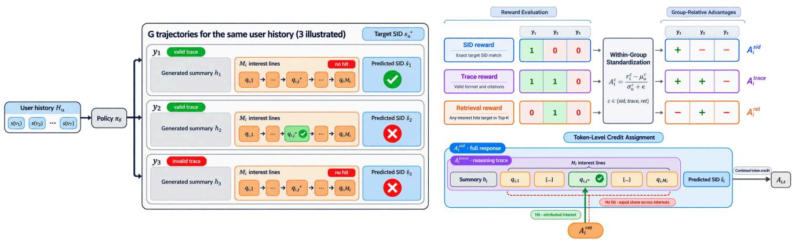
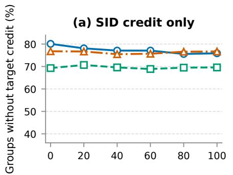
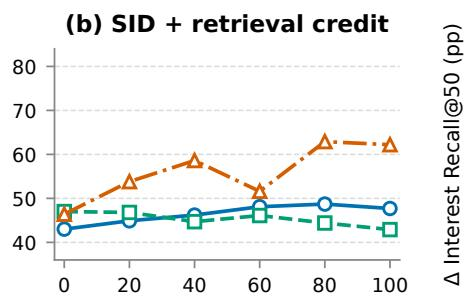
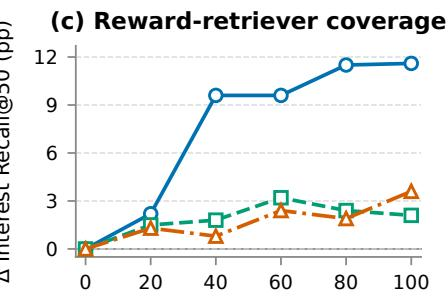
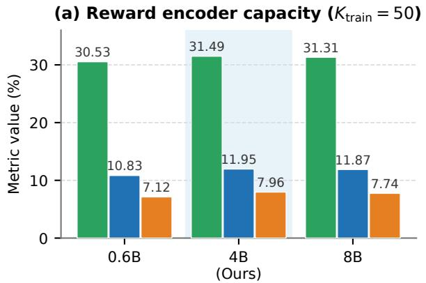
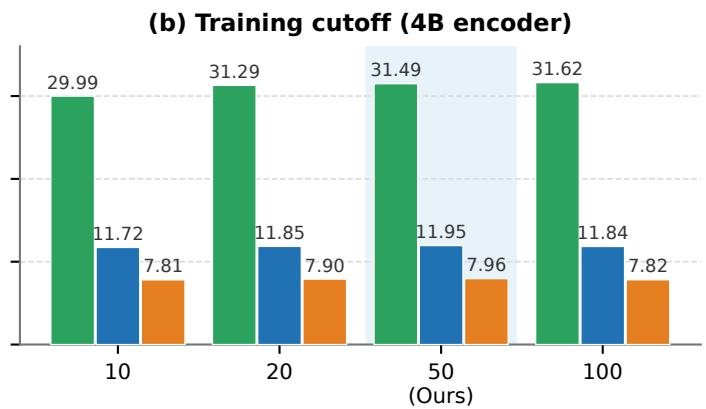
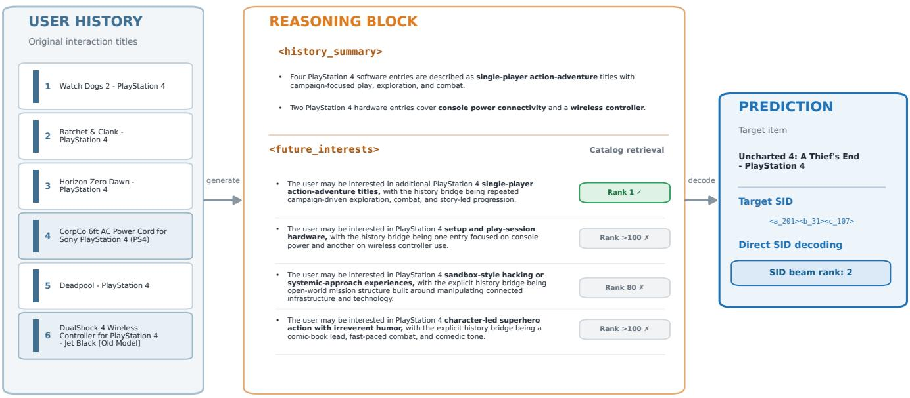
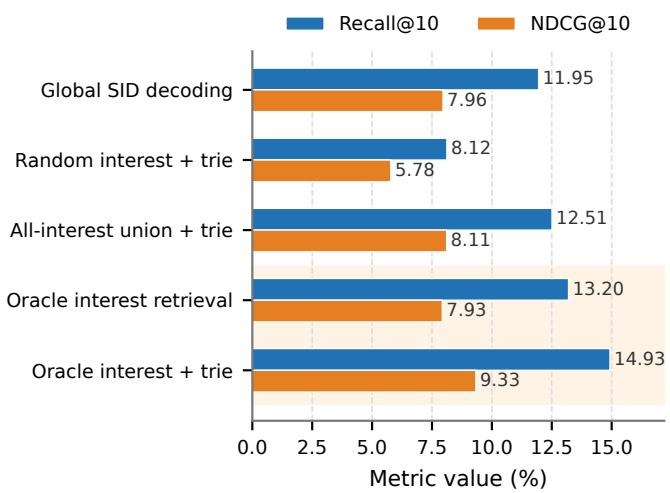

# From Interests to Semantic IDs: Retrieval-Grounded Credit Assignment for Generative Recommendation

Mengdan Zhu   
Emory University   
Atlanta, GA, USA   
mengdan.zhu@emory.edu

Sophie Di Cornell University Ithaca, NY, USA szd5@cornell.edu

Yufan Zhao   
Microsoft   
Redmond, WA, USA   
yufzhao@microsoft.com   
Tao Di   
Microsoft   
Redmond, WA, USA   
taodi@microsoft.com   
Sridhar Iyer   
Microsoft   
Redmond, WA, USA   
sridhariyer@microsoft.com   
Yao Zhao   
Microsoft   
Redmond, WA, USA   
yaozhao2@microsoft.com   
Yulan Yan   
Microsoft   
Redmond, WA, USA   
yulanyan@microsoft.com   
Liang Zhao   
Emory University   
Atlanta, GA, USA   
liang.zhao@emory.edu

## Abstract

Semantic IDs (SIDs) encode each catalog item as a short token sequence, enabling generative recommenders to predict the next item autoregressively. Reasoning-enhanced variants, an increasingly common extension, first generate a textual trace and then decode a next-item SID by beam search. Such recommenders are commonly trained with group-relative policy optimization under an exact-match SID reward, which is sparse in large catalogs. Two failure modes follow. When all rollouts in a group miss the target, the group yields zero advantage and no learning signal. Rollouts sharing the same SID reward receive identical advantages, however much their traces difer. In both cases the reward reflects only the decoded SID, never the reasoning that produced it. This creates a credit-assignment gap.

We address this gap with retrieval-grounded query attribution. Each trace is structured into a history summary, a set of interest hypotheses, and a final SID. A frozen retriever executes every hypothesis as a catalog query, so that each hypothesis becomes independently verifiable rather than judged only through the fi nal SID. A rollout is rewarded when any of its queries retrieves the target within the top-�, and per-query hit indicators localize that reward to individual hypotheses. Credit is thus assigned at the span level: only hypotheses that individually hit receive positive retrieval advantage, while the retrieval channel never updates the final SID span. Rollouts that share a SID reward can therefore receive diferent updates. Across experiments on three Amazon Reviews datasets, this yields consistent improvements in SID rec ommendation. On Video Games, an oracle analysis further reveals the potential of interest-conditioned SID decoding: selecting the target-relevant query among generated interests improves both recall and ranking.1

## CCS Concepts

• Information systems → Recommender systems.

Keywords Generative Recommendation, Semantic IDs, Credit Assignment, User Interest Retrieval, Reinforcement Learning

## 1 Introduction

Sequential recommendation predicts the next item a user will interact with from their interaction history. Generative recommenders cast this task as autoregressive decoding, which requires an item representation that a language model can emit directly. Semantic ID provides one: each catalog item is represented as a short sequence of discrete tokens obtained by quantizing its content embedding, so that semantically related items share prefixes [15, 22]. This representation allows LLM-based recommenders to generate items within the same autoregressive interface used for language. Recent work first produces a natural-language reasoning trace and then predicts an item [26, 34]; in SID-based methods, the trace precedes autoregressive decoding of a next-item SID [6, 9, 12]. A single roll out therefore spans two heterogeneous segments: the trace, for which no ground-truth target exists, and a discrete item action, for which the held-out item supplies exact supervision. Once reinforcement learning is applied to the joint rollout, the central question is how final recommendation feedback should assign credit to the trace.

A common group-relative objective scores each sampled rollout through its generated SID, using exact item correctness or prefixlevel matching. These rewards appropriately supervise item decoding but provide weak feedback for the intermediate tokens. Such an objective can separate two rollouts only when the reward assigns them diferent values, and exact match rarely does so in a large catalog: with a finite rollout group, every sampled SID may miss the held-out item [12, 30], leaving the reward constant within the group so that normalization produces zero SID-derived advantage. Even when SID rewards do vary, rollouts sharing a reward value receive identical SID-derived credit, and their traces are treated as equivalent. Prefix-level matching yields a graded score and therefore mitigates the constant-reward case, but it remains defined over decoded item tokens and still does not evaluate the trace itself.

We require the model to state future interests in a fixed format and run each interest as a query against a frozen catalog retriever. Consider a rollout with four interest lines that ends in the wrong SID. If only the second query retrieves the held-out target, perquery evidence records the second line as the only hit. We route positive retrieval advantage to that line, not to the other three lines or the wrong SID. For a non-covering rollout in the same group, no query has positive evidence, so its negative relative advantage is shared across its valid interest lines.

The response contains a history summary and several interest queries, followed by a valid SID. A binary rollout reward is one when any query retrieves the held-out target within the top-�; a separate indicator retains the outcome of every query for attribution. Generated queries and personas have previously served as retrieval inputs [1, 20]; we use retrieval during training to score the model’s own interest queries. The reward measures target retrieval under the fixed retriever. We initialize SID–language alignment and supervised reasoning activation from [6], adapting the activation trace to our structured interest–SID response, and then apply group relative RL. During rollout, a prefix trie restricts generated SIDs to valid catalog items. The objective separately normalizes three rewards within each rollout group: a structural reward for format and history citations, a retrieval reward for generated interests, and an exact-match SID reward. The retrieval advantage is then routed with the per-query indicators: hitting interest lines receive the positive signal, while the valid interest lines of a non-covering rollout share its negative signal. It is always zero over the final SID span. If all SID rewards in a group are zero but the retrieval rewards difer, the model can still update the interest lines. If the retrieval rewards are also constant, this additional signal is zero.

The generated interests also provide an auxiliary recall interface. We run them against the frozen retriever to form a recall pool. Optionally, the SIDs in this pool define a candidate-specific trie, and the same policy performs beam search with probabilities normalized over that trie. The interests therefore restrict the candidate space, while the SID decoder produces the final recommendation.

We summarize our contributions as follows:

● We identify a structural limit of item-level rewards in common sequential recommendation methods: a reward computed from the decoded item can become finer only within the SID span, while every token of the preceding trace still receives one rollout-level advantage.

● We therefore propose a process reward on the trace itself. Interests are emitted in a fixed format and executed as queries against a frozen retriever; per-query outcomes route retrieval advantage only to the interest spans whose queries retrieve the target, leaving the final SID span under item correctness. The same queries supply candidates at inference.

● Empirically, the proposed method improves SID recommendation across three Amazon Reviews datasets. We also quantify how often the retrieval channel reactivates SIDinactive groups with constant exact-match rewards, and use an oracle analysis to demonstrate the potential of interestconditioned SID decoding when the target-relevant query is selected from the generated interests.

## 2 Related Work

## 2.1 Semantic-ID Generative Recommendation

Generative recommendation predicts item identifiers rather than scoring the full catalog. TIGER [15] represents each item by a short sequence of codes obtained by quantizing its content embedding, and generates this Semantic ID autoregressively. Later work improves how these identifiers are learned or augments them with collaborative signals. VQ-Rec [10] learns vector-quantized representations for transferable recommendation; LETTER [22] trains the tokenizer with recommendation supervision. EAGER [23] models semantic and behavioral signals in separate streams. LC-Rec [32] and EAGER-LLM [8] further align item tokens with pretrained language models.

SIDs have also been used beyond standard next-item prediction. Penha et al. [14] study a shared SID space for search and recommendation, while SIGMA [27] uses hybrid item tokens for several instruction-conditioned tasks. Zeng et al. [28] mine latent interests with multimodal LLMs and use them in SID construction and reward design. Quantization, however, does not preserve every property of the original item embedding: Wang et al. [21] report substantial changes in fine-grained neighborhoods after discretization. We retain the tokenizer and SID space of the base recommender, and instead focus on retrieval supervision during reinforcement learning optimization.

## 2.2 Reasoning for Generative Recommendation

Recent work adds either explicit or latent reasoning to recommendation. R2ec [26] uses separate heads for language and recommendation, and optimizes them jointly with reinforcement learning. OneRec-Think [12] grounds item tokens in text, activates in-text reasoning, and then refines the model with a recommendation reward. GREAM [9] combines semantic alignment, a reasoning curriculum, and group policy optimization. SIDReasoner [6] strengthens SID– language alignment before optimizing reasoning trajectories with the final recommendation outcome. OneReason [19] organizes reasoning around item perception and user-interest cognition, while TwiSTAR [2] learns when slower reasoning is worth its inference cost.

Other methods perform the extra computation in latent space. S2GR [4] inserts a supervised thinking token before each SID token. PauseRec [5] instead uses learned pause tokens, motivated by the observation that free-form rationales can be sensitive to rationale quality and to the mismatch between text and SID embeddings. These studies also expose a limitation of explicit reasoning: readable text alone does not establish that the trace is useful. Existing methods usually judge a trace through its final recommendation; we additionally test whether its stated interests can retrieve the target item.

## 2.3 Process Supervision

An exact-match SID reward is sparse because an error in an early SID token can move all sampled trajectories to the wrong catalog branch. PROMISE [3] trains a process reward model over intermediate SID paths and uses it to guide beam search. HCGRec [30] addresses all-zero rollout groups by supplying a minimal targetprefix hint and assigning diferent credit to the hinted prefix and sampled sufix. SAPO [33] pairs each reasoning block with one SID token and computes step-aligned match advantages to localize SID token errors. These methods provide finer supervision along the SID generation path. Our method instead verifies each generated language interest through catalog retrieval and uses per-query hit evidence to route the auxiliary advantage to the corresponding hitting interest line rather than the complete interest block.

## 2.4 Language-Based Retrieval

Another line of work uses generated language as the retrieval input. GLoSS [1] produces textual queries from interaction histories and retrieves items with dense semantic search. Wang et al. [20] generate multiple interest personas that serve as an online retrieval source in a large-scale video platform. Such systems use language as the recall interface, whereas SID reasoners directly generate item tokens.

Our method connects these two interfaces in one generative policy. The model generates future-interest statements grounded in the interaction history, followed by a catalog-constrained SID. We reward both the structure of the trace and whether its interest statements retrieve the held-out item. At inference time, the same policy can provide queries for candidate recall or directly decode the final SID.

## 3 Methodology

Training uses two pre-RL stages adapted from SIDReasoner [6], followed by retrieval-grounded policy optimization. Stage 1 aligns newly added SID tokens with item language and sequential behavior. Stage 2 teaches the model to produce a structured reasoning trace with a history summary and future-interest statements before generating the final SID. Stage 3 samples these trajectories and applies group-relative RL. Each domain uses one fixed SID tokenizer across all stages. Each checkpoint initializes the next stage.

Stage 3 supplies feedback at three resolutions. Exact SID match scores the final recommendation, a rule-based trace reward verifies the structure of the reasoning trace and its citations to the interaction history, and a frozen dense retriever evaluates whether the generated interests retrieve the target from the item catalog. We normalize these rewards separately and apply their advantages to the full response, the reasoning trace, and individual interest lines, respectively. For the retrieval channel, query-attributed span routing sends positive advantage only to interest lines whose queries hit the target. At inference time, the generated interests form an auxiliary recall pool that can optionally define the trie for candidateconstrained SID decoding.

## 3.1 Problem Definition

Let � be the item catalog, and let $\boldsymbol { s } ( \boldsymbol { v } ) = \left( s _ { 1 } ( v ) , \ldots , s _ { L } ( v ) \right)$ denote the fixed �-token SID of $v \in I .$ For a user history $H _ { u } = \left( v _ { 1 } , \ldots , v _ { T } \right)$ , the input $x _ { u }$ consists of a fixed instruction followed by the concatenated history SIDs $s ( v _ { 1 } ) , \ldots , s ( v _ { T } ) ; s _ { u } ^ { * }$ denotes the SID of the held-out next item. Following SIDReasoner [6], we reuse the domain-specific

Table 1: Stage-1 SID alignment streams.
<table><tr><td>Training stream</td><td>Purpose and loss</td></tr><tr><td>Title ↔ SID translation</td><td>Bidirectional grounding (SFT)</td></tr><tr><td>SID history → next SID</td><td>SID-space recommendation (SFT)</td></tr><tr><td>SID history → next-item title</td><td>SID-to-title recommendation (SFT)</td></tr><tr><td>Title history → next-item title</td><td>Title-space recommendation (SFT)</td></tr><tr><td>Title history → next SID</td><td>Title-to-SID recommendation (SFT)</td></tr><tr><td>Item-level SID-text interleaving</td><td>Item grounding (full LM)</td></tr><tr><td>Sequence-level SID-text interleaving Sequence grounding (full LM)</td><td></td></tr><tr><td>General reasoning</td><td>General-ability retention (SFT)</td></tr></table>

SID tokenizers and item-to-SID mappings produced by its threelevel RQ-VAE. Accordingly, � = 3, and each of the three codebooks contains 256 entries. The codebooks and item-to-SID mappings remain fixed throughout all training stages. The SID tokens are added to the language model vocabulary alongside the existing text tokens, allowing the same autoregressive policy to generate both the reasoning trace and the final SID.

During Stage 3, the policy samples structured trajectories. The �-th trajectory contains a reasoning trace with a history summary $h _ { i }$ and a future-interest block $f _ { i } ,$ followed by a predicted SID �ˆ�:

$$
y _ { i } = [ h _ { i } ; f _ { i } ; { \hat { s } } _ { i } ] , \qquad y _ { i } \sim \pi _ { \theta } ( { \cdot } \mid x _ { u } ) .\tag{1}
$$

Let $q _ { i , 1 } , . . . , q _ { i , M _ { i } }$ be the queries in $f _ { i } ,$ and let $R _ { K } ( q )$ be the top-� items returned by a fixed catalog retriever. We assess each trajectory along three dimensions. Its reasoning trace is valid when it satisfies the prescribed format and history-citation rules. The SID path succeeds when $\hat { s } _ { i } = s _ { u } ^ { * }$ . The interest path succeeds when at least one retrieved item has $\operatorname { S I D } { s _ { u } ^ { * } }$

## 3.2 Pre-RL Initialization

We reuse SIDReasoner’s Stage-1 alignment data [6]. We then con struct new GPT-4o supervision for Stage 2, adapting the reasoning format to expose retrieval queries.

Stage 1: SID Alignment. We train the domain-specific SID tokens using the eight streams in Table 1.

The first five rows and general reasoning use chat-formatted, completion-only SFT with loss on the assistant response. The two interleaving streams use full-sequence language modeling to place SIDs in item- and sequence-level text. All streams jointly update the model, including the newly added SID-token embeddings.

Stage 2: Structured Reasoning Activation. Each completion target has the following form:

<think>   
<history\_summary>   
- SID(s) => factual observation   
</history\_summary>   
<future\_interests>   
- SID(s) => ��,1   
</future\_interests>   
</think>   
target SID

The ellipses denote additional entries in each block.

  
Figure 1: Grouped trajectory generation, separately standardized reward signals, and token-level credit assignment.

Trace fields. A summary line pairs cited history SIDs with a factual observation. A future-interest line states a plausible next interest grounded in its cited history SIDs. For line $j , q _ { i , j }$ is the text after => and is the only part sent to the retriever. The tags locate its line-level token mask in Stage 3.

Stage-2 data. Following SIDReasoner, we use an LLM teacher to generate the SFT traces. For each training instance, the teacher receives the interaction history and item metadata together with the held-out next-item metadata, and generates a reasoning trace in the schema above. We pair the trace with the target SID to form the assistant completion. Stage 2 uses completion-only SFT for one epoch, and its checkpoint initializes Stage 3.

## 3.3 Retrieval-Grounded Policy Optimization

Stage 3 assigns credit at two levels. Across the � trajectories sampled for the same user history, separately normalized SID, trace, and retrieval rewards determine the relative credit of each trajectory. Within a trajectory, per-query retrieval evidence attributes retrieval credit to individual interest lines. We combine both levels into token advantages: SID credit applies to the full response, trace credit to the reasoning trace, and retrieval credit only to attributed interest lines.

3.3.1 Catalog-Constrained Rollouts. Each trajectory first generates the two text blocks and the closing </think> marker, then samples its �-token SID autoregressively. We build a prefix trie from the catalog SIDs so every sampled sequence completes to a catalog SID. Let � denote the generated text trace, and suppress the trajectory index in this subsection. At SID position �, let $\hat { s } _ { < l }$ be the current prefix, let $\mathcal { V } ( \hat { s } _ { < l } )$ be its valid next tokens, and let $\boldsymbol { c } _ { l } = \left[ x _ { u } ; r ; \hat { s } _ { < l } \right]$ be the full autoregressive context. The sampling distribution is

$$
\pi _ { \theta } ^ { \mathrm { t r i e } } ( a \mid c _ { l } ) = \frac { \exp z _ { \theta } ( a \mid c _ { l } ) } { \sum _ { a ^ { \prime } \in \mathcal { V } ( \hat { s } _ { < l } ) } \exp z _ { \theta } ( a ^ { \prime } \mid c _ { l } ) } , \quad a \in \mathcal { V } ( \hat { s } _ { < l } ) .\tag{2}
$$

Tokens outside $\mathcal { V } ( \hat { s } _ { < l } )$ have probability zero. This is the standard language-model softmax restricted to the outgoing edges of the current trie node.

3.3.2 Reward Signals. Each trajectory produces three binary rolloutlevel rewards. The retrieval channel additionally retains per-query hit indicators for subsequent within-trajectory attribution.

SID exact-match reward. The SID reward records exact agreement between the sampled and target SIDs: $r _ { i } ^ { \mathrm { s i d } } = 1 \big [ \hat { s } _ { i } = s _ { u } ^ { * } \big ]$

Trace-validity reward. The trace reward is one when the response contains exactly one summary block followed by one interest block and every cited SID occurs in the input history. We write this reward as $r _ { i } ^ { \mathrm { t r a c e } } = 1 |$ (︀valid trace⌋︀.

Interest-retrieval reward. A frozen catalog retriever ranks items for each parsed interest query. For a query �, let rank $\operatorname { \dot { } } ( s \mid q )$ be the best rank of any catalog item whose SID is �, or +∞ if no such item is retrieved. For cutof �, we define the query-level evidence and rollout-level retrieval reward as

$$
\begin{array} { l } { z _ { i , j } ^ { \mathrm { r e t } } = \mathbf { 1 } \big [ \mathrm { i n t e r e s t ~ b l o c k ~ i s ~ v a l i d } \big ] \mathbf { 1 } \big [ \mathrm { r a n k } ( s _ { u } ^ { * } \mid q _ { i , j } ) \leq K \big ] , } \\ { r _ { i } ^ { \mathrm { r e t } } = \mathbf { 1 } \Bigg [ \displaystyle \sum _ { j = 1 } ^ { M _ { i } } z _ { i , j } ^ { \mathrm { r e t } } > 0 \Bigg ] . } \end{array}\tag{3}
$$

Thus, $r _ { i } ^ { \mathrm { r e t } } = 1$ if at least one query retrieves the target within the top- $\cdot K ;$ it is zero when no valid query is parsed. We retain each $z _ { i , j } ^ { \mathrm { r e t } }$ for line-level routing. We use a top-� event rather than the raw retrieval score because the desired behavior is candidate coverage, not score calibration.

3.3.3 Across-TrajectoryCredit. The rollout rewards determine which trajectories receive positive or negative relative credit within the group sampled for one user history. For each reward � ∈ {sid, trace, ret}, we compute

$$
\begin{array} { l } { \displaystyle \mu _ { u } ^ { c } = \frac { 1 } { G } \sum _ { i = 1 } ^ { G } { r _ { i } ^ { c } } , } \\ { \displaystyle \sigma _ { u } ^ { c } = \sqrt { \frac { 1 } { G - 1 } \sum _ { i = 1 } ^ { G } ( r _ { i } ^ { c } - \mu _ { u } ^ { c } ) ^ { 2 } } , } \\ { \displaystyle A _ { i } ^ { c } = \frac { r _ { i } ^ { c } - \mu _ { u } ^ { c } } { \sigma _ { u } ^ { c } + \epsilon } . } \end{array}\tag{4}
$$

Table 2: Reward channels and token-level credit scopes.
<table><tr><td>Reward</td><td>Criterion</td><td>Credit scope</td></tr><tr><td>SID</td><td>Exact match</td><td>Full response</td></tr><tr><td>Trace</td><td>Valid structure</td><td>Reasoning trace</td></tr><tr><td></td><td>Retrieval Target coverage</td><td>Attributed interest lines</td></tr></table>

The denominator � − 1 matches the sample standard deviation used in the implementation. Following group-relative optimization [16], we standardize rewards within each rollout group. We apply this operation separately to the SID, trace, and retrieval rewards. Whenever a reward varies within a group, its normalized advantages have a comparable scale before weighting. If a reward is constant within a group, it contributes zero advantage.

3.3.4 Token-Level Credit Assignment. The three rewards assign credit to diferent parts of a trajectory. As the final outcome signal, the SID advantage applies to the full response; the trace advantage applies to the reasoning trace; and the retrieval advantage is attributed to interest lines using query-level retrieval evidence.

Query-level routing. The trajectory-level advantage $A _ { i } ^ { \mathrm { r e t } }$ determines the sign and relative magnitude of retrieval credit, while $w _ { i , j }$ determines which interest lines receive it. For a retrieval-positive trajectory, the binary hit indicators divide the credit equally among the hitting interest lines. For a retrieval-negative trajectory in a mixed group, no query provides positive evidence, so the negative credit is divided equally among all parsed interest lines. We define

$$
w _ { i , j } = \left\{ \begin{array} { l l } { \displaystyle \frac { z _ { i , j } ^ { \mathrm { r e t } } } { \sum _ { \ell = 1 } ^ { M _ { i } } z _ { i , \ell } ^ { \mathrm { r e t } } } , } & { \displaystyle r _ { i } ^ { \mathrm { r e t } } = 1 , } \\ { \displaystyle \frac { 1 } { M _ { i } } , } & { \displaystyle r _ { i } ^ { \mathrm { r e t } } = 0 , \ M _ { i } > 0 , } \\ { 0 , } & { \displaystyle M _ { i } = 0 . } \end{array} \right.\tag{5}
$$

For $M _ { i } > 0 ;$ , the line weights sum to one. Positive trajectories select the hitting interest lines, whereas negative trajectories select all parsed interest lines.

Token-level composition. For token � in trajectory $i , m _ { i , j , t } ^ { \mathrm { l i n e } }$ indicates whether it belongs to the �-th interest line, and $m _ { i , t } ^ { \mathrm { t r a c e } }$ indicates whether it belongs to the reasoning trace. These masks localize the retrieval and trace advantages to their corresponding spans. If an interest line cannot be located unambiguously, its mask is zero.

The retriever evaluates only the query text, while the routed retrieval advantage is applied to the corresponding interest line. Combining these credit scopes gives the token-level advantage:

$$
A _ { i , t } = A _ { i } ^ { \mathrm { s i d } } + \lambda _ { \mathrm { { t r a c e } } } m _ { i , t } ^ { \mathrm { t r a c e } } A _ { i } ^ { \mathrm { t r a c e } } + \lambda _ { \mathrm { { r e t } } } \left( \sum _ { j = 1 } ^ { M _ { i } } w _ { i , j } m _ { i , j , t } ^ { \mathrm { { l i n e } } } \right) A _ { i } ^ { \mathrm { { r e t } } } .\tag{6}
$$

The retrieval advantage is divided across the attributed interest lines through �� � and applied uniformly to their tokens. Positions in the final SID span receive only $A _ { i } ^ { \mathrm { s i d } }$

Table 2 summarizes the resulting token-level credit scopes.

3.3.5 SID-Inactive Groups. A rollout group is SID-inactive when its SID exact-match rewards are constant, which gives $A _ { i } ^ { \mathrm { s i d } } = 0$ for every trajectory. The common all-zero case occurs when none of the sampled SIDs matches the target. If retrieval rewards vary within such a group, the retrieval channel can still assign nonzero credit to attributed interest lines and distinguish trajectories whose queries retrieve the target from those whose queries do not.

Table 3: Dataset statistics after preprocessing.
<table><tr><td>Category</td><td>Users Items</td><td>Train Val.</td><td>Test Avg. len.</td></tr><tr><td></td><td></td><td>Video Games 6,142 3,858 49,133 6,142 6,142</td><td>6.45</td></tr><tr><td>Office</td><td></td><td>4,866 3,459 38,924 4,866 4,866</td><td>5.97</td></tr><tr><td>Industrial</td><td></td><td>4,5333,68636,2594,5324,533</td><td>5.96</td></tr></table>

3.3.6 Policy Optimization. Let $\rho _ { i , t }$ be the current-to-old probability ratio for response token �. Both its numerator and denominator use standard language-model probabilities on reasoning tokens and the trie-restricted distribution in Eq. (2) on final SID tokens, thereby matching the rollout action space. Let $d _ { i , t } ^ { \mathrm { K L } }$ denote the token-level KL divergence from the frozen pre-RL policy, evaluated over the same action space. With $\begin{array} { r } { N = \sum _ { i = 1 } ^ { \bar { G } } \left| y _ { i } \right| } \end{array}$ and coeficient $\beta _ { \mathrm { K L } } \ge 0 ,$ we optimize

$$
\mathcal { L } _ { \mathrm { a c t o r } } = - \frac { 1 } { N } \sum _ { i = 1 } ^ { G } \sum _ { t = 1 } ^ { | y _ { i } | } \Bigl [ \ell _ { \mathrm { P P O } } \bigl ( \rho _ { i , t } , A _ { i , t } \bigr ) - \beta _ { \mathrm { K L } } d _ { i , t } ^ { \mathrm { K L } } \Bigr ] .\tag{7}
$$

Here ℓPPO is the dual-clip PPO surrogate [25].

## 3.4 SID Decoding with Auxiliary Interest Recall

SID decoding. Our primary inference mechanism is SID decoding. Given a user history, the policy first generates a structured trace. Conditioned on the history and this trace, catalog-constrained beam search returns a ranked list $C _ { \mathrm { s i d } }$ of valid SID candidates, which serves as the direct recommendation output.

Auxiliary interest recall. The retrieval-supervised interests additionally provide an auxiliary recall interface. We issue each generated interest query to the frozen catalog retriever used during training, merge the per-query top-� results, and remove duplicate SIDs to obtain a recall pool $C _ { \mathrm { { r e t } } }$ . This pool exposes catalog coverage captured by the generated interests.

Optional candidate-constrained SID decoding. The recall pool can also define a candidate-specific SID trie. We build this trie from the SIDs in $C _ { \mathrm { { r e t } } }$ and, conditioned on the same history and trace, perform beam search with probabilities normalized over the candidate trie. This returns a ranked list $C _ { \mathrm { r c d } }$ through candidate-constrained generation rather than reranking candidates by their full-catalog SID probabilities.

## 4 Experiments

## 4.1 Experimental Setup

Datasets and protocol. We use the Video Games, Ofice Products, and Industrial and Scientific categories of the Amazon Reviews corpus [13]. Following the processed data used by SIDReasoner [6], we retain interactions from October 2016 through November 2018, apply 5-core filtering, sort each user’s interactions chronologically, and truncate histories to the most recent 10 items. The last interaction of each user is held out for test, the second-to-last for validation, and earlier interactions form sliding-window training pairs. Table 3 summarizes the resulting data.

Table 4: Overall recommendation performance. The best result in each column is shown in bold. The SID-plus-trace control and our method report means over three training seeds; their maximum standard deviations across all columns are 0.0053 and 0.0039, respectively. An asterisk (\*) indicates a statistically significant improvement over the SID-plus-trace-validity control under a paired two-sided �-test over test users (� < 0.05).
<table><tr><td></td><td colspan="4">Video Games</td><td colspan="4">Office Products</td><td colspan="4">Industrial and Scientific</td></tr><tr><td>Method</td><td>Recall@5</td><td>NDCG@5</td><td>Recall@10</td><td>NDCG@10</td><td>Recall@5</td><td>NDCG@5</td><td>Recall@10</td><td>NDCG@10</td><td>Recall@5</td><td>NDCG@5</td><td>Recall@10</td><td>NDCG@10</td></tr><tr><td>Traditional sequential recommenders</td><td></td><td></td><td></td><td></td><td></td><td></td><td></td><td></td><td></td><td></td><td></td><td></td></tr><tr><td>GRU4Rec</td><td>0.0329</td><td>0.0219</td><td>0.0599</td><td>0.0305</td><td>0.0682</td><td>0.0480</td><td>0.0974</td><td>0.0574</td><td>0.0788</td><td>0.0578</td><td>0.1030</td><td>0.0649</td></tr><tr><td>SASRec</td><td>0.0501</td><td>0.0345</td><td>0.0723</td><td>0.0416</td><td>0.1019</td><td>0.0824</td><td>0.1167</td><td>0.0871</td><td>0.0807</td><td>0.0647</td><td>0.0964</td><td>0.0697</td></tr><tr><td>Caser</td><td>0.0376</td><td>0.0241</td><td>0.0659</td><td>0.0332</td><td>0.0880</td><td>0.0663</td><td>0.1114</td><td>0.0738</td><td>0.0664</td><td>0.0528</td><td>0.0852</td><td>0.0588</td></tr><tr><td>Generative recommenders without reasoning</td><td></td><td></td><td></td><td></td><td></td><td></td><td></td><td></td><td></td><td></td><td></td><td></td></tr><tr><td>TIGER</td><td>0.0489</td><td>0.0300</td><td>0.0763</td><td>0.0402</td><td>0.1270</td><td>0.1037</td><td>0.1429</td><td>0.1121</td><td>0.1003</td><td>0.0823</td><td>0.1325</td><td>0.0924</td></tr><tr><td>HSTU</td><td>0.0539</td><td>0.0396</td><td>0.0746</td><td>0.0462</td><td>0.1204</td><td>0.1069</td><td>0.1323</td><td>0.1107</td><td>0.1008</td><td>0.0898</td><td>0.1138</td><td>0.0940</td></tr><tr><td>LETTER LCRec</td><td>0.0445</td><td>0.0294</td><td>0.0709</td><td>0.0378</td><td>0.1315</td><td>0.1074</td><td>0.1520</td><td>0.1139</td><td>0.1080</td><td>0.0850</td><td>0.1389</td><td>0.0950</td></tr><tr><td></td><td>0.0441</td><td>0.0274</td><td>0.0876</td><td>0.0412</td><td>0.0964</td><td>0.0699</td><td>0.1487</td><td>0.0867</td><td>0.0805</td><td>0.0520</td><td>0.1330</td><td>0.0687</td></tr><tr><td>Reasoning-based recommenders ReaRec</td><td></td><td></td><td></td><td></td><td></td><td></td><td></td><td>0.1057</td><td></td><td></td><td></td><td></td></tr><tr><td>R2ec</td><td>0.0568</td><td>0.0381 0.0399</td><td>0.0843</td><td>0.0470</td><td>0.1173</td><td>0.0988</td><td>0.1385</td><td>0.1004</td><td>0.0973</td><td>0.0796</td><td>0.1205</td><td>0.0870</td></tr><tr><td>SIDReasoner</td><td>0.0655 0.0710</td><td>0.0460</td><td>0.0931 0.1031</td><td>0.0525 0.0563</td><td>0.1147 0.1373</td><td>0.0894 0.1119</td><td>0.1486 0.1648</td><td>0.1208</td><td>0.0880</td><td>0.0774</td><td>0.1253</td><td>0.0774</td></tr><tr><td></td><td></td><td></td><td></td><td></td><td></td><td></td><td></td><td></td><td>0.1109</td><td>0.0905</td><td>0.1438</td><td>0.1010</td></tr><tr><td>Controlled Stage-3 RL ablations</td><td></td><td></td><td></td><td></td><td></td><td></td><td></td><td></td><td></td><td></td><td></td><td></td></tr><tr><td>Stage-2 SFT checkpoint (no RL)</td><td>0.0591 0.0583</td><td>0.0407 0.0399</td><td>0.0858 0.0861</td><td>0.0493</td><td>0.1297 0.1281</td><td>0.1074</td><td>0.1506 0.1505</td><td>0.1142 0.1119</td><td>0.1125 0.1098</td><td>0.0893 0.0856</td><td>0.1370 0.1371</td><td>0.0972</td></tr><tr><td>Stage-3 RL: SID exact-match reward</td><td>0.0591</td><td>0.0404</td><td>0.0856</td><td>0.0489 0.0493</td><td>0.1272</td><td>0.1046 0.1051</td><td>0.1512</td><td>0.1124</td><td>0.1116</td><td>0.0868</td><td>0.1387</td><td>0.0944 0.0953</td></tr><tr><td>+ Trace-validity reward</td><td>0.0879*</td><td>0.0694*</td><td>0.1195*</td><td>0.0796</td><td>0.1515</td><td>0.1251</td><td>0.1765*</td><td>0.1332*</td><td>0.1291</td><td>0.1043</td><td>0.1602*</td><td>0.1144*</td></tr><tr><td>+ Query-attributed retrieval reward (Ours)</td><td>+0.0288</td><td>+0.0290</td><td>+0.0339</td><td>+0.0303</td><td>+0.0243</td><td>+0.0200</td><td>+0.0253</td><td>+0.0208</td><td>+0.0175</td><td>+0.0175</td><td>+0.0215</td><td>+0.0191</td></tr><tr><td>Absolute ∆ vs. SID+trace</td><td></td><td></td><td></td><td></td><td></td><td></td><td></td><td></td><td></td><td></td><td></td><td></td></tr></table>

Evaluation metrics. We use the SIDReasoner evaluator. Table 4 includes its reported baselines [6]. For each test instance, the evaluator performs catalog-constrained beam search using a trie containing all catalog SIDs and returns a ranked beam of ten valid SIDs. Evalu ation uses no sampled negatives. We report Recall and NDCG at cutofs 5 and 10. For interest retrieval, Interest Recall@50 (I-R@50) is the fraction of examples for which at least one generated interest retrieves the held-out target within the frozen retriever’s top 50 results. Our model generates three to four interests per instance, with an average of 3.8.

Baselines. We compare against three families of recommenders:

● Traditional sequential recommenders: GRU4Rec [7], SASRec [11], and Caser [18], which rank items directly from the interaction sequence.

● Generative recommenders without reasoning: TIGER [15], HSTU [29], LETTER [22], and LCRec [32].

● Reasoning-based methods: ReaRec [17], R2ec [26], and SIDReasoner [6].

Implementation details. Based on Qwen3-1.7B [24], we fine-tune all parameters in every stage, paired with the same domain-specific three-level RQ-VAE tokenizer. Stage 1 uses AdamW for up to five epochs with a learning rate of $2 \times { 1 0 } ^ { - 5 }$ . Stage 2 uses AdamW for one epoch with a learning rate of $1 \times { 1 0 } ^ { - 5 }$

Stage 3 samples 16 trajectories per prompt with temperature 1.0 and top-� = 1.0. We use a global batch of 256 prompts, maximum prompt and response lengths of 1,024 tokens each, an actor learning rate of $7 \times \dot { 1 0 } ^ { - 7 }$ , and dual-clip PPO with a clip ratio of 0.2 and dual-clip constant 3.0. Training runs for at most 10 epochs, with checkpoint selection by validation NDCG@10. The default configuration omits KL regularization because a Video Games sensitivity check found no material efect on recommendation performance.

The trace-validity and retrieval rewards are each weighted by 0.1. Each catalog document contains labeled title, optional brand, and description lines. Their Qwen3-Embedding-4B embeddings [31] are precomputed and frozen; each generated interest is encoded online and matched by exact cosine search. We use � = 50 by default and report sensitivity across � ∈ {10, 20, 50, 100}.

All hyperparameters, checkpoint selection, and reward cutofs are selected using validation data. The test set is evaluated once after the experimental protocol is frozen. Across all three domains, the SID-plus-trace control and our method report the mean and standard deviation over three Stage-3 seeds to quantify training variability.

## 4.2 Overall Recommendation Performance

RQ1 asks whether retrieval-grounded credit improves direct full catalog SID recommendation. Table 4 compares Stage-2 SFT with three incremental RL variants. The matched no-retrieval control is the SID-exact-match-plus-trace-validity variant. All three RL variants start from the same Stage-2 checkpoint and use the same data order, training budget, SID action space, and KL configuration.

Retrieval-grounded credit consistently improves direct SID recommendation. Relative to the matched no-retrieval control, our method improves Recall@10 by 15.5%–39.6% and NDCG@10 by 18.5%–61.5% across the three domains. The gains are largest on Video Games and more moderate on Ofice Products and Industrial and Scientific. R2ec shows a similar cross-domain pattern, suggesting that the benefit of explicit reasoning may depend on how well item metadata aligns with semantic knowledge available to the language model. Improvements also hold at cutof 5. In contrast, SID exact-match and trace-validity optimization remain close to the Stage-2 checkpoint. This pattern is consistent with the gain not being explained by RL or structural supervision alone. Section 4.3 examines the additional learning signal supplied by retrieval.

Across all baselines in Table 4, our method achieves the best result on all 12 metrics.

$$
\begin{array} { r l } { - \Omega - \mathrm { ~ V i d e o ~ G a m e s ~ } } & { { } - \Omega - \mathrm { ~ O f f i c e ~ P r o d u c t s ~ } \quad - \triangle - \mathrm { ~ I n d u s t r i a l ~ } \& \leq \mathrm { ~ S c i e n t i f i c e ~ } } \end{array}
$$

  
Stage-3 training progress (%)  
Figure 2: Stage-3 no-signal and retrieval-reactivation dynamics. (a) SID no-signal rate: the percentage of groups with constant binary SID exact-match rewards. (b) Joint no-signal rate: the percentage with both constant SID and constant retrieval rewards. (c) Validation Interest Recall@50 diference, in percentage points, between our method and the matched SID-plus-trace control under the reward retriever.

## 4.3 Retrieval Credit and Routing

RQ2 examines two questions: how often retrieval feedback supplies a nonzero advantage when the SID reward is constant, and whether assigning this advantage to queries that produce a retrieval hit improves recommendation over coarser credit scopes. We analyze the SID and retrieval channels because both provide target-dependent feedback. The trace-validity reward is nearly always constant within a group and therefore usually produces zero group-relative advantage.

Let $\mathcal { G } _ { t }$ be the rollout groups in training window �, with � trajectories in each group. A reward channel produces zero group-relative advantage when its rewards are constant across the group. For � ∈ {sid, ret}, let $u _ { g } ^ { c }$ indicate this no-signal condition for channel � in group $g .$ The no-signal and conditional reactivation rates are

$$
\begin{array} { r l r } { \displaystyle { u _ { g } ^ { c } = 1 \bigg [ \operatorname* { m a x } _ { i } r _ { g , i } ^ { c } = \operatorname* { m i n } _ { i } r _ { g , i } ^ { c } \bigg ] } , } & \\ { \mathcal { Z } _ { \mathrm { s i d } } ( t ) = \frac { 1 } { \left| \mathcal { G } _ { t } \right| } \displaystyle { \sum _ { g \in \mathcal { G } _ { t } } u _ { g } ^ { \mathrm { s i d } } } , } & \\ { \mathcal { Z } _ { \mathrm { s i d + r e t } } ( t ) = \frac { 1 } { \left| \mathcal { G } _ { t } \right| } \displaystyle { \sum _ { g \in \mathcal { G } _ { t } } u _ { g } ^ { \mathrm { s i d } } u _ { g } ^ { \mathrm { r e t } } } , } & \\ { \mathcal { R } _ { \mathrm { r e a c t } } ( t ) = 1 - \frac { \mathcal { Z } _ { \mathrm { s i d + r e t } } ( t ) } { \mathcal { Z } _ { \mathrm { s i d } } ( t ) } , } & { \quad \mathcal { Z } _ { \mathrm { s i d } } ( t ) > 0 . } \end{array}\tag{8}
$$

$\mathcal { Z } _ { \mathrm { s i d } }$ is the fraction of groups with no SID-derived advantage, while $\mathcal { Z } _ { \mathrm { s i d + r e t } }$ is the fraction for which both SID and retrieval produce zero group-relative advantage. Their relative reduction, $\mathcal { R } _ { \mathrm { r e a c t } }$ , is the fraction of SID-inactive groups reactivated by retrieval. Because both rewards are binary, a no-signal group can be all zero or all one; both cases produce zero group-relative advantage. The reported rates therefore characterize optimization signal, not exact-match sparsity alone.

Figure 2 plots these quantities over training. Panels (a) and (b) aggregate all logged groups from the same run of our method. Each point uses a 5%-wide window centered at the displayed progress, computed as completed Stage-3 updates divided by total updates. Panel (c) evaluates the corresponding checkpoints on a fixed validation set and reports the Interest Recall@50 diference, in percentage points (pp), between our method and the matched SID-plus-trace control.

Training dynamics. The SID channel produces zero group-relative advantage in 69.1%–80.8% of groups across the displayed domains and training windows. $\mathrm { B y }$ construction, $\mathcal { Z } _ { \mathrm { s i d + r e t } } \leq \mathcal { Z } _ { \mathrm { s i d } } ;$ empirically, the gap never falls below 27.8 pp on Games, 22.5 pp on Ofice, or 14.7 pp on Industrial. In the last displayed training window, $\mathcal { R } _ { \mathrm { r e a c t } }$ is 37.8% on Games, 37.7% on Ofice, and 19.6% on Industrial.

Panel (c) evaluates the generated interests with the same retriever used to compute the training reward. At the final displayed checkpoint, our method improves Interest Recall@50 over the SIDplus-trace control by 11.0 pp on Video Games, 2.2 pp on Ofice Products, and 3.6 pp on Industrial and Scientific. The retrieval reward has its largest measured efect on Video Games. Because training and evaluation use the same retriever, this panel measures learning progress rather than independent generalization.

Credit-routing ablations. Table 5 compares five Stage-3 variants in all three domains. Each result averages three seeds. Within a domain, the variants share the Stage-2 checkpoint and training configuration, and all retain the SID exact-match and trace-validity rewards. The SID-prefix variant adds the partial reward used by SIDReasoner [6]. Let $m _ { i }$ be the length of the longest correct prefix between the predicted and target SIDs. The reward is

$$
r _ { i } ^ { \mathrm { p r e f i x } } = \frac { 1 } { 2 ^ { L - m _ { i } } } ,\tag{9}
$$

which increases toward one as more leading SID tokens match and equals one for an exact match. After within-group normalization, its advantage is applied to the full response, matching the scope of the exact-match SID advantage.

  
Figure 3: Reward-design sensitivity on Video Games. Bars report absolute Interest Recall@50, Recall@10, and NDCG@10 in percent. Panel (a) varies reward-encoder capacity at a fixed $K _ { \mathrm { t r a i n } } = 5 0 ;$ panel (b) varies the training cutof with the 4B encoder. Shaded groups mark our selected 4B encoder and $K _ { \mathrm { t r a i n } } = 5 0$ cutof.

Table 5: Credit-routing ablations across three domains, averaged over three seeds.
<table><tr><td></td><td colspan="2">Games</td><td colspan="2">Office</td><td colspan="2">Industrial</td></tr><tr><td>Variant</td><td>R@10</td><td>N@10</td><td>R@10</td><td>N@10</td><td>R@10</td><td>N@10</td></tr><tr><td>SID exact + trace</td><td>0.0856</td><td>0.0493</td><td>0.1512</td><td>0.1124</td><td>0.1387</td><td>0.0953</td></tr><tr><td>SID-prefix</td><td>0.0996</td><td>0.0569</td><td>0.1587</td><td>0.1209</td><td>0.1498</td><td>0.1001</td></tr><tr><td>Full broadcast</td><td>0.0953</td><td>0.0559</td><td>0.1644</td><td>0.1171</td><td>0.1442</td><td>0.1039</td></tr><tr><td>Interest block</td><td>0.1073</td><td>0.0610</td><td>0.1662</td><td>0.1256</td><td>0.1541</td><td>0.1082</td></tr><tr><td>Hit query (Ours)</td><td>0.1195</td><td>0.0796</td><td>0.1765</td><td>0.1332</td><td>0.1602</td><td>0.1144</td></tr></table>

The remaining variants use the same retrieval reward and difer only in where its advantage is applied. Broadcast applies it to the full response, while block routing confines it to the future-interest block. Hit-aware routing further uses the indicators in Eq. (5): on a positive rollout, only queries that retrieve the target receive retrieval credit. These controls separate the efect of denser SID supervision from the efects of retrieval feedback and query-level attribution.

All four auxiliary variants improve on the SID-plus-trace control for every domain and metric. Routing retrieval advantage to the interest block consistently beats broadcasting it to the full response. Hit-query routing performs best on all six metrics. Compared with block routing, its Recall@10 and NDCG@10 gains are 11.4% and 30.5% on Video Games, 6.2% and 6.1% on Ofice Products, and 4.0% and 5.7% on Industrial and Scientific. This consistent ordering supports assigning retrieval credit to the queries responsible for target coverage.

## 4.4 Reward Validity and Interest Utility

Interest–SID alignment. Table 6 cross-tabulates Interest Recall@50 and SID Recall@10 on Video Games. SID Recall@10 is 27.56% when the interests retrieve the target and 4.78% otherwise. This 22.78 percentage points gap has a 95% bootstrap CI of [20.70, 24.88]. The odds ratio is 7.58 (95% bootstrap CI [6.40, 9.06]).

The overlap is partial. Among targets absent from the SID beam, 25.91% are still retrieved by a generated interest. Retrieval success thus tracks SID accuracy while exposing target coverage that the final SID outcome does not capture.

Table 6: Overlap between interest retrieval at 50 and direct SID decoding at 10 for our model on Video Games. Percentages are over all 6,142 test instances.
<table><tr><td></td><td>SID hit@10</td><td>SID miss@10</td><td>Total</td></tr><tr><td>Interest hit@50</td><td>533 (8.68%)</td><td>1,401 (22.81%)</td><td>1,934 (31.49%)</td></tr><tr><td>Interest miss@50</td><td>201 (3.27%)</td><td>4,007 (65.24%)</td><td>4,208 (68.51%)</td></tr><tr><td>Total</td><td>734 (11.95%)</td><td>5,408 (88.05%)</td><td>6,142</td></tr></table>

Potential of interest conditioned SID decoding. Figure 5 compares direct SID decoding with candidate-constrained variants on Video Games. A trie stores candidate SIDs by prefix. At each decoding step, the model can choose only a token that continues one of these candidate SIDs.

The random variant selects one generated interest and builds a trie from its top-50 candidates. The all-interest variant merges and deduplicates the top-50 candidates from every generated interest. The oracle uses the held-out target rank to choose the best interest already produced by the model. We evaluate its cosine-ranked top 10 directly, then use its top-50 candidates to constrain SID beam search.

A random interest performs substantially worse than global SID decoding. Merging all interests recovers this loss and slightly exceeds global SID decoding on both metrics, showing that the generated interests provide complementary candidate coverage despite difering in individual utility. Oracle retrieval improves recall, while SID decoding over the oracle trie gives the strongest recall and ranking. The random and oracle variants use the same pool size, so their gap comes from which interest is selected. This upper bound shows the potential of interest conditioned SID decoding. Selecting an interest without the target remains a promising direction for future work.

Figure 4: A Video Games case where both paths find the target. The action-adventure interest retrieves it at rank 1, while the other interests miss at the training cutof. The SID beam ranks it second. History SIDs are shown as item titles, line-level citations are omitted, and bold text highlights each statement’s key phrase.  
  
Figure 5: Interest-conditioned SID decoding on Video Games. Each interest retrieves its top-50 candidates. The all-interest variant merges and deduplicates candidates from all generated queries. The oracle uses the target rank to select the best generated query and therefore represents an upper bound.

## 4.5 Sensitivity to Reward Encoder and Cutof

Figure 3 varies the Qwen3-Embedding encoder size at $K _ { \mathrm { t r a i n } } \ =$ 50 and the training cutof with the 4B encoder. All runs share the same Stage-2 initialization and Stage-3 configuration, and all are evaluated at I-R@50. The 4B encoder improves over 0.6B and matches 8B while using half the online encoder capacity. This suggests that reward quality saturates before the largest encoder.

Recommendation accuracy changes little across cutofs. Interest Recall increases with $K _ { \mathrm { t r a i n } } ,$ while the SID metrics are highest at 50 in this sweep. The divergence shows that maximizing retrieval coverage does not necessarily provide the best signal for SID learning. A larger cutof accepts more distant matches under the same binary reward, whereas a smaller cutof is more selective. We use $K _ { \mathrm { t r a i n } } = 5 0$ as the middle ground and retain the 4B encoder.

## 4.6 Qualitative Case Study

Figure 4 shows one Video Games test case in which both paths find the target. Only the action-adventure interest retrieves Uncharted 4: A Thief’s End, at rank 1. The other interests miss, while the direct SID beam ranks the target second.

## 5 Conclusion

We studied credit assignment in reasoning-enhanced SID recommendation, where a common issue is that the reward computed from the decoded item can be refined only within the SID span: it cannot separate rollouts that receive the same reward, and it carries no information when that reward is constant within a group. We proposed retrieval-grounded query attribution, which executes the generated interests against a frozen catalog retriever and routes retrieval advantage only to the interest spans that retrieve the target, leaving the final SID positions under item correctness.

Across three Amazon Reviews datasets, the proposed method improves SID recommendation over a matched SID-and-trace control and restores group-relative learning signals in many SID-inactive groups. Ablations show that hit-aware routing outperforms coarser credit scopes, and the generated queries complement direct SID beam search. More broadly, these results show that intermediate predictions, once made executable, can supply localized supervision without a separate process reward model.

## 6 Ethical Considerations

Our experiments use the public Amazon Reviews benchmark and do not collect new user data. Nevertheless, methods that infer future interests from interaction histories may expose sensitive preferences if deployed on identifiable logs. Generated interests may also reproduce popularity and representation biases in catalog metadata and the retriever, which can narrow user exposure and reinforce filter bubbles. The generated trace is optimized for retrieval utility, not verified as a faithful explanation of model behavior, and should not be presented to users without further validation. A deployment should therefore restrict access to histories, avoid storing generated queries, and audit retrieval rewards across user and item groups.

## References

[1] Krishna Acharya, Aleksandr V Petrov, and Juba Ziani. 2025. Gloss: Generative language models with semantic search for sequential recommendation. arXiv preprint arXiv:2506.01910 (2025).

[2] Shiteng Cao, Kaian Jiang, Yunlong Gong, and Zhiheng Li. 2026. TwiSTAR: Think Fast, Think Slow, Then Act, Generative Recommendation with Adaptive Reasoning. arXiv preprint arXiv:2605.11553 (2026).

[3] Chengcheng Guo, Kuo Cai, Yu Zhou, Qiang Luo, Ruiming Tang, Han Li, Kun Gai, and Guorui Zhou. 2026. PROMISE: Process Reward Models Unlock Test-Time Scaling Laws in Generative Recommendations. arXiv preprint arXiv:2601.04674 (2026).

[4] Zihao Guo, Jian Wang, Ruxin Zhou, Youhua Liu, Jiawei Guo, Jun Zhao, Xiaoxiao Xu, Yongqi Liu, and Kaiqiao Zhan. 2026. S2GR: Stepwise Semantic-Guided Reasoning in Latent Space for Generative Recommendation. In Proceedings of the 32nd ACM SIGKDD Conference on Knowledge Discovery and Data Mining V. 2. 1498–1507.

[5] Yinhan He, Liam Collins, Bhuvesh Kumar, Jundong Li, Neil Shah, and Donald Loveland. 2026. Implicit Reasoning for Large Language Model-based Generative Recommendation. arXiv preprint arXiv:2606.14142 (2026).

[6] Yingzhi He, Yan Sun, Junfei Tan, Yuxin Chen, Xiaoyu Kong, Chunxu Shen, Xiang Wang, An Zhang, and Tat-Seng Chua. 2026. Reasoning over semantic ids enhances generative recommendation. In Proceedings of the 32nd ACM SIGKDD Conference on Knowledge Discovery and Data Mining V. 2. 1638–1649.

[7] Balázs Hidasi, Alexandros Karatzoglou, Linas Baltrunas, and Domonkos Tikk. 2015. Session-based recommendations with recurrent neural networks. arXiv preprint arXiv:1511.06939 (2015).

[8] Minjie Hong, Yan Xia, Zehan Wang, Jieming Zhu, Ye Wang, Sihang Cai, Xiaoda Yang, Quanyu Dai, Zhenhua Dong, Zhimeng Zhang, et al. 2025. Eager-llm: Enhancing large language models as recommenders through exogenous behavior semantic integration. In Proceedings ofthe ACM on Web Conference 2025. 2754– 2762.

[9] Minjie Hong, Zetong Zhou, Zirun Guo, Ziang Zhang, Ruofan Hu, Weinan Gan, Jieming Zhu, and Zhou Zhao. 2025. Generative reasoning recommendation via llms. arXiv preprint arXiv:2510.20815 (2025).

[10] Yupeng Hou, Zhankui He, Julian McAuley, and Wayne Xin Zhao. 2023. Learning vector-quantized item representation for transferable sequential recommenders. In Proceedings of the ACM Web Conference 2023. 1162–1171.

[11] Wang-Cheng Kang and Julian McAuley. 2018. Self-attentive sequential recommendation. In 2018 IEEE international conference on data mining (ICDM). IEEE, 197–206.

[12] Zhanyu Liu, Shiyao Wang, Xingmei Wang, Rongzhou Zhang, Jiaxin Deng, Honghui Bao, Jinghao Zhang, Wuchao Li, Pengfei Zheng, Xiangyu Wu, et al. 2025. Onerec-think: In-text reasoning for generative recommendation. arXiv preprint arXiv:2510.11639 (2025).

[13] Jianmo Ni, Jiacheng Li, and Julian McAuley. 2019. Justifying recommendations using distantly-labeled reviews and fine-grained aspects. In Proceedings ofthe 2019 conference on empirical methods in natural language processing and the 9th international joint conference on natural language processing (EMNLP-IJCNLP). 188–197.

[14] Gustavo Penha, Edoardo D’Amico, Marco De Nadai, Enrico Palumbo, Alexandre Tamborrino, Ali Vardasbi, Max Lefarov, Shawn Lin, Timothy Heath, Francesco

Fabbri, et al. 2025. Semantic ids for joint generative search and recommendation. In Proceedings ofthe Nineteenth ACM Conference on Recommender Systems. 1296– 1301.

[15] Shashank Rajput, Nikhil Mehta, Anima Singh, Raghunandan Hulikal Keshavan, Trung Vu, Lukasz Heldt, Lichan Hong, Yi Tay, Vinh Tran, Jonah Samost, et al. 2023. Recommender systems with generative retrieval. Advances in Neural Information Processing Systems 36 (2023), 10299–10315.

[16] Zhihong Shao, Peiyi Wang, Qihao Zhu, Runxin Xu, Junxiao Song, Xiao Bi, Haowei Zhang, Mingchuan Zhang, YK Li, Yang Wu, et al. 2024. Deepseekmath: Pushing the limits of mathematical reasoning in open language models. arXiv preprint arXiv:2402.03300 (2024).

[17] Jiakai Tang, Sunhao Dai, Teng Shi, Jun Xu, Xu Chen, Wen Chen, Jian Wu, and Yuning Jiang. 2026. Think before recommend: Unleashing the latent reasoning power for sequential recommendation. IEEE Transactions on Knowledge and Data Engineering (2026).

[18] Jiaxi Tang and Ke Wang. 2018. Personalized top-n sequential recommenda tion via convolutional sequence embedding. In Proceedings ofthe eleventh ACM international conference on web search and data mining. 565–573.

[19] OneRec Team, Biao Yang, Boyang Ding, Chenglong Chu, Dunju Zang, Fei Pan, Han Li, Hao Jiang, Honghui Bao, Huanjie Wang, et al. 2026. OneReason Technical Report. arXiv preprint arXiv:2606.06260 (2026).

[20] Haoting Wang, Haokai Lu, Zheyun Feng,Jenny Huang, Yifat Amir, Gregory Hinkson, Ben Most, Zelong Zhao, Yixin Kelly Cui, Rein Zhang, et al. 2026. LLM-Based User Personas for Recommendations at Scale. arXiv preprint arXiv:2606.12198 (2026).

[21] Junting Wang, Xinrui He, Yunzhe Li, and Hari Sundaram. 2026. Understanding Semantic IDs: From Item Representation to Item Selection in Generative Recommendation. arXiv preprint arXiv:2607.24995 (2026).

[22] Wenjie Wang, Honghui Bao, Xinyu Lin, Jizhi Zhang, Yongqi Li, Fuli Feng, See-Kiong Ng, and Tat-Seng Chua. 2024. Learnable item tokenization for generative recommendation. In Proceedings of the 33rd ACM International Conference on Information and Knowledge Management. 2400–2409.

[23] Ye Wang, Jiahao Xun, Minjie Hong, Jieming Zhu, Tao Jin, Wang Lin, Haoyuan Li, Linjun Li, Yan Xia, Zhou Zhao, et al. 2024. Eager: Two-stream generative recommender with behavior-semantic collaboration. In Proceedings ofthe 30th ACM SIGKDD Conference on Knowledge Discovery and Data Mining. 3245–3254.

[24] An Yang, Anfeng Li, Baosong Yang, Beichen Zhang, Binyuan Hui, Bo Zheng, Bowen Yu, Chang Gao, Chengen Huang, Chenxu Lv, et al. 2025. Qwen3 technical report. arXiv preprint arXiv:2505.09388 (2025).

[25] Deheng Ye, Zhao Liu, Mingfei Sun, Bei Shi, Peilin Zhao, Hao Wu, Hongsheng Yu, Shaojie Yang, Xipeng Wu, Qingwei Guo, et al. 2020. Mastering complex control in moba games with deep reinforcement learning. In Proceedings ofthe AAAI conference on artificial intelligence, Vol. 34. 6672–6679.

[26] Runyang You, Yongqi Li, Xinyu Lin, Xin Zhang, Wenjie Wang, Wenjie Li, and Liqiang Nie. 2026. R2ec: Towards Large Recommender Models with Reasoning. Advances in Neural Information Processing Systems 38 (2026), 62376–62405.

[27] Yang Yu, Lei Kou, Huaikuan Yi, Bin Chen, Yayu Cao, Lei Shen, Chao Zhang, Bing Wang, and Xiaoyi Zeng. 2026. SIGMA: A Semantic-Grounded Instruction-Driven Generative Multi-Task Recommender at AliExpress. arXiv preprint arXiv:2602.22913 (2026).

[28] Yangchen Zeng, Zhenyu Yu, Zhiyuan Hu, Wenxin Zhang, Jinze Wang, and Rongfeng Guo. 2026. DeepInterestGR: Mining Deep Multi-Interest Using Multi Modal LLMs for Generative Recommendation. arXiv preprint arXiv:2602.18907 (2026).

[29] Jiaqi Zhai, Lucy Liao, Xing Liu, Yueming Wang, Rui Li, Xuan Cao, Leon Gao, Zhaojie Gong, Fangda Gu, Michael He, et al. 2024. Actions speak louder than words: Trillion-parameter sequential transducers for generative recommenda tions. arXiv preprint arXiv:2402.17152 (2024).

[30] Kangning Zhang, Haotian Fang, Xukun Luo, Hao Yin, Yang Gao, Peng Yan, Weiwen Liu, Weinan Zhang, and Yong Yu. 2026. HCGRec: Hint-Conditioned Generative Recommendation with Semantic IDs. arXiv preprint arXiv:2608.11980 (2026).

[31] Yanzhao Zhang, Mingxin Li, Dingkun Long, Xin Zhang, Huan Lin, Baosong Yang, Pengjun Xie, An Yang, Dayiheng Liu, Junyang Lin, et al. 2025. Qwen3 embedding: Advancing text embedding and reranking through foundation models. arXiv preprint arXiv:2506.05176 (2025).

[32] Bowen Zheng, Yupeng Hou, Hongyu Lu, Yu Chen, Wayne Xin Zhao, Ming Chen, and Ji-Rong Wen. 2024. Adapting large language models by integrating collaborative semantics for recommendation. In 2024 IEEE 40th International Conference on Data Engineering (ICDE). IEEE, 1435–1448.

[33] Zaiyi Zheng, Liang Wu, Guanghui Min, Yaochen Zhu, Liangjie Hong, Chen Chen, and Jundong Li. 2026. SAPO: Step-Aligned Policy Optimization for Reasoning Based Generative Recommendation. arXiv preprint arXiv:2605.17648 (2026).

[34] Mengdan Zhu, Yufan Zhao, Tao Di, Yulan Yan, and Liang Zhao. 2026. Learning User Interests via Reasoning and Distillation for Cross-Domain News Recommendation. arXiv preprint arXiv:2602.15005 (2026).