# From Static Personal Values to Contextualized Personalization: Bayesian Personalized Value Alignment for LLMs

Hanze Guo1\*, Aixuan Song1\*, Jing Yao2\*, Xiangxu Zhang1, Xiaoyuan Yi2, Xing Xie2, Xiao Zhou1,3,4†

1Gaoling School of Artificial Intelligence, Renmin University of China 2Microsoft Research Asia

3Beijing Key Laboratory of Research on Large Models and Intelligent Governance 4Engineering Research Center of Next-Generation Intelligent Search and Recommendation, MOE {ghz,songaix,xiaozhou}@ruc.edu.cn, jingyao@microsoft.com

## Abstract

Personalized value alignment has become increasingly important as large language models (LLMs) are expected to accommodate diverse user preferences. However, existing methods typically align model outputs with a static value profile across prompts, overlooking that the salience of value dimensions varies substantially across contexts. Inspired by Lewin’s Field Theory, which views human behavior as jointly shaped by personal dispositions and situational constraints, we model personal values as priors and context-dependent preferences as posteriors. We propose BaCVA, an inference-time Bayesian Context-aware personalized Value Alignment method that approximates posterior personalized preferences by integrating static personal values with scenariospecific value salience. BaCVA first estimates contextual value salience from generally normative responses, and then employs a dualview personalization module to infer posterior preferences from complementary personalvalue and scenario-driven perspectives. This Bayesian formulation enables more accurate and adaptive personalized value alignment while improving data efficiency via prior values. Extensive experiments on benchmarks demonstrate its superiority over strong baselines.

## 1 Introduction

The widespread deployment of Large Language Models (LLMs) (Achiam et al., 2023; Touvron et al., 2023; Guo et al., 2025a; Yang et al., 2025; Zhang et al., 2026a; Li et al., 2025b; Zhu et al., 2026; Zhang et al., 2026b; Yong et al., 2025b,a, 2026) has made aligning LLMs with human values a central research challenge (Wang et al., 2023; Shen et al., 2023; Yao et al., 2023b; Wang et al.,

2024b; Guo et al., 2026b; Zhang et al., 2026c). While prominent methods focus on promoting universal but monolithic values, such as HHH (helpful, harmless, honest) (Bai et al., 2022a; Ouyang et al., 2022; Hendrycks et al., 2020), they struggle to accommodate the substantial diversity of individual user values. Consequently, personalized value alignment emerges as a more practical objective (Zhou et al., 2025; Guo et al., 2025b, 2026a; Zhang et al., 2026d).

Existing work on personalized value alignment falls into two categories. Training-time methods fine-tune personalized reward models and adapters using user-specific interaction data (Poddar et al., 2024; Zhao et al., 2025). Nevertheless, these methods typically rely on extensive personal value data and might degrade in data-scarce or cold-start scenarios (Padurean et al.˘ , 2025; Poddar et al., 2024). Inference-time methods offer greater flexibility, which steer model outputs by personal value prompts (Padurean et al.˘ , 2025; Ryan et al., 2025; Chen et al., 2025b), activating value-related model parameters (Zhu et al., 2024; Zhang et al., 2025b) or modifying token distributions during decoding (Chen et al., 2024; Shi et al., 2024; Zhang et al., 2025a). However, most inference-time methodsface a common limitation: they conceptualize personalized value alignment as adapting model outputs to a static personal value profile to capture users’ overall value orientations. Although these methods condition response generation on the input question, they typically use the same user value profile for every question, without explicitly estimating which value dimensions become more or less important in the current context.

Drawing from well-established psychological theories (Mischel, 2013; Epstein and O’Brien, 1985), stable internal dispositions alone are insufficient to explain human behaviors across varying contexts. Notably, Lewin’s Field Theory (Heidbreder, 1937) posits that observed behavior is jointly shaped by personal values and situational constraints. As illustrated in Fig.1 (a), an individual who inherently prioritizes ‘Self-Direction’ over ‘Conformity’ may nonetheless suppress selfdirection actions in scenarios governed by other values. This suggests that each scenario may selectively activate or suppress different value dimensions according to broadly shared social norms (Cialdini et al., 1990; Burnes\*, 2004), which can be formalized as a context-aware value salience distribution. Together, inherent personal values and context-aware value salience ultimately shape behavior. This is also supported by empirical results in Fig. 1 (b) that combining both leads to more accurate preference prediction. From a Bayesian lens, inherent personal values and contextual value salience serve as complementary priors, while the posterior values inferred from observed behaviors reflect final context-aware personal preferences.

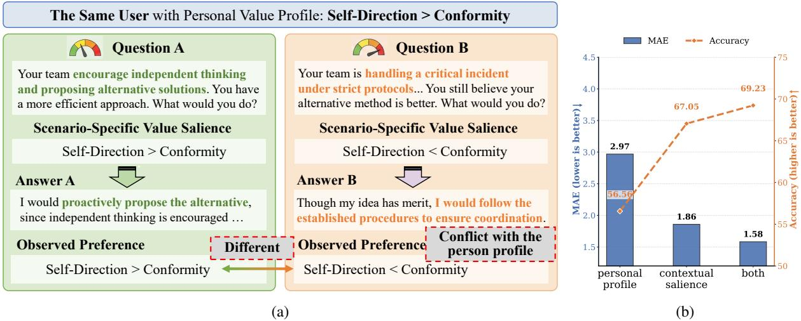

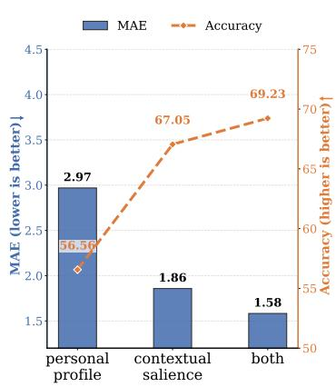  
Figure 1: (a) An example showing that a user a stable personal value profile may exhibit different value preferences across contexts, which are jointly shaped by personal values and situational constraints. (b) Empirical results show that only personal values or scenario value salience achieve weaker personalization than their combination.

Inspired by this formulation, we propose BaCVA, an inference-time Bayesian Contextaware personalized Value Alignment method. It achieves personalization by dynamically approximating the posterior personalized values based on both static personal values and context-specific value salience. Specifically, BaCVA consists of two components: (i) a scenario value estimator that predicts the context-aware value salience; (ii) a dual-view personalization module that approximates posterior personal values from complementary personal value-driven and scenario-driven perspectives. The whole framework is optimized toward a variational inference objective (Tzikas et al., 2008; Blei et al., 2017). By framing personalization as context-aware posterior inference, BaCVA offers two advantages: (i) fine-grained adaptability, capturing nuanced value shifts from priors across diverse scenarios; and (ii) data efficiency, enabling personalization with fewer training samples and seamless generalization to new users. Extensive experiments on multiple benchmarks showcase the superiority of our framework.

The main contributions are summarized below. (1) We theoretically and empirically identify a key limitation in current personalized alignment methods: they typically reuse a fixed personal value profile across prompts without explicitly modeling question-specific changes in value salience. (2) We propose BaCVA, an inference-time Bayesian personalized alignment framework. It achieves dynamic personalization by inferring context-aware posterior preferences conditioned on prior personal values and contextual value salience. (3) Extensive experiments show that BaCVA achieves more accurate and adaptive personalized value alignment, as well as improved data efficiency and generalization.

## 2 Related Work

General Value Alignment of LLMs General (non-personalized) value alignment aims to align LLM outputs with population-level human preferences like HHH (helpfulness, harmlessness and honesty) (Wang et al., 2023; Shen et al., 2023;

Yao et al., 2023b). Prominent methods include supervised fine-tuning (SFT) (Zhang et al., 2023; Han et al., 2025), reinforcement learning from human feedback (RLHF) (Ouyang et al., 2022; Bai et al., 2022a), direct preference optimization (DPO) (Rafailov et al., 2023; Ethayarajh et al., 2024; Meng et al., 2024) and variants. Besides, inference-time methods like retrieval-augmented generation (RAG)(Lewis et al., 2020; Zhao et al., 2024; Gao et al., 2023) and principle-based prompting(Bai et al., 2022b) steer model output without parameter updates.

These methods inherently struggle to accommodate the diversity of individual user values, motivating the need for personalized value alignment.

Personalized Value Alignment of LLMs Existing methods fall into two categories. Training-time personalization incorporates user preferences via model optimization (Chen et al., 2025a; Choi et al., 2025). VPL (Poddar et al., 2024) and RLPA (Zhao et al., 2025) learn user-specific reward models or adapters from individual interaction data. P-RLHF (Li et al., 2024) learns user embeddings for personalization. Despite these methods implicitly fit to observed posterior preferences, they rely on extensive per-user data and degrade in cold-start or sparse-data settings (Padurean et al.˘ , 2025).

In contrast, inference-time personalization steers model behaviors by manipulating prompts (Chen et al., 2025b; Jin et al., 2025) or decoding (Thonet et al., 2025; Zhu et al., 2024), without modifying parameters. ValuePrompt (Kang et al., 2024) and COUPLE (Guo et al., 2026b) condition generation on explicit user value descriptions. Other approaches summarize or retrieve value-aware content from user histories, like ValuesRAG (Ryan et al., 2025; Seo et al., 2025). Decoding-based methods (Zhang et al., 2025a) like MOD (Shi et al., 2024) and PAD (Chen et al., 2024) reshape token distributions to adapt general outputs to fixed individual preferences. These inference-time approaches mainly reuse the same personal value profile across situations, without explicitly modeling question-specific changes in the salience of individual value dimensions. We address this limitation in this paper.

Bayesian Modeling and Applications Bayesian modeling (Zhang and Poole, 1996; Bishop and Tipping, 2013; Grossman and Domingos, 2004; Lauritzen and Spiegelhalter, 1990; Heckerman et al., 2015) offers a principled lens for updating prior beliefs with observed evidence and reasoning with uncertainty (Gao et al., 2024). Recent work (Gupta et al., 2025; Longjohn et al., 2025; Wang et al., 2024a) has explored LLMs alignment from a Bayesian perspective. BIRD (Feng et al., 2025) frames decision alignment as a Bayesian decision process. Dellma (Liu et al., 2024) applies decision theory to address uncertainty.

This paper formulates personalized value alignment as Bayesian posterior inference, optimized through Variational Inference (Tzikas et al., 2008; Blei et al., 2017; Ganguly and Earp, 2021).

## 3 Methodology

## 3.1 Task Definition

Let $\mathcal { U } = \{ u _ { i } \} _ { i = 1 } ^ { N }$ denote a population of diverse users, each user $u _ { i }$ is associated with a self-written summary of personal values $c _ { u _ { i } }$ and a small set of preference annotations $\mathcal { D } _ { u _ { i } } = \{ ( x , y _ { c } , y _ { r } ) \}$ , where $x$ denotes a prompt or question, $y _ { c }$ and $y _ { r }$ mean the preferred and dispreferred responses respectively. To make the open-ended value summary $c _ { u _ { i } }$ more actionable and unified, we follow (Yao et al., 2023a; Guo et al., 2026b) to convert it into a structured, multi-dimensional value profile $\pmb { v } _ { u _ { i } } = [ ( v _ { 1 } , s _ { 1 } ) , \ldots , ( v _ { d } , s _ { d } ) ] . \ ( v _ { 1 } , \ldots , v _ { d } )$ are finite pre-defined value dimensions (e.g., care, authority) from a well-established value framework $\left( \mathrm { e . g } \right.$ ., Schwartz’s Basic Values (Schwartz, 2012)). $s _ { j } \in \{ 1 , 2 , 3 , 4 , 5 \}$ indicates the priority assigned to $v _ { j }$ on a 5-point Likert scale from ‘not important at all $( l ) ^ { \prime }$ to ‘very important (5)’.

Since training a dedicated model for each user is less practical in low-data (small $\mathcal { D } _ { u _ { i } } )$ and cold-start cases, we focus on inference-time personalized alignment in this paper. With a single shared model $p _ { \psi } ( \mathbf { y } | \mathbf { x } , \mathbf { v } _ { u _ { i } , \pmb { x } } )$ that can generate the response y aligned with the given personalized values $\mathbf { v } _ { u _ { i } , \pmb { x } }$ toward the question x, our goal is to infer the concrete personalized values $\mathbf { v } _ { u _ { i } , x } \sim p _ { \theta } ( \mathbf { v } | \mathbf { v } _ { u _ { i } } , \mathbf { x } )$ the user would exhibit to guide response generation under the specific context x.

For evaluation on test samples $\{ ( u _ { i } , x , y _ { c } , y _ { r } ) \}$ we extract the values reflected in two responses as $v _ { y _ { c } } , v _ { y _ { r } }$ , then compare inferred personalized values $\mathbf { \Delta } \mathbf { v } _ { u _ { i } , x }$ with them using two metrics: (i) the distance between $\mathbf { \Delta } v _ { u _ { i } , x }$ and $v _ { y _ { c } }$ like MAE and (ii) the accuracy whether $\boldsymbol { v } _ { u _ { i } , x }$ is closer to $v _ { y _ { c } }$ than to $v _ { y _ { r } }$ . Furthermore, we evaluate the effectiveness of BaCVA in guiding downstream personalized response generation. We compare the responses generated from the inferred value $\mathbf { \Delta } \mathbf { v } _ { u _ { i } , x }$ against $y _ { c }$ and $y _ { r }$ .

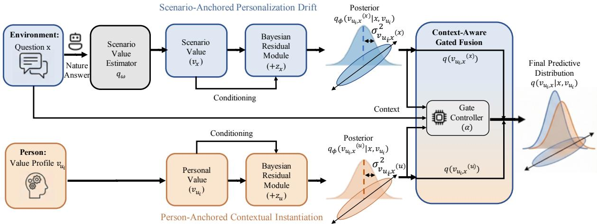  
Figure 2: Overview of the proposed Bayesian question-specific value modeling framework. A question x provides a decision context, while a user-level value profile $v _ { u _ { i } }$ modulates how semantics are personalized. We learn a Bayesian residual (semantic delta) from two complementary views, and fuse the two views via a context-based gated fusion mechanism to predict a personalized, context-aware answer.

## 3.2 The BaCVA Framework

As discussed in Sec.1, existing inference-time personalization methods employ the overall user profile ${ \pmb v } _ { u _ { i } }$ or that summarized from the preference data $\mathbf { \Delta } v _ { u _ { i } , \mathcal { D } _ { i } }$ to instantiate $\mathbf { v } _ { u _ { i } , x }$ and keep it fixed across prompts x, thereby limiting their ability to explicitly model question-specific shifts in the salience of individual value dimensions, as illustrated in Fig. 1 (a).

Inspired by Lewin’s field theory (Heidbreder, 1937) that observed behaviors emerge from the interaction between the personal value profile $\mathbf { v } _ { u _ { i } }$ and the situation $\mathbf { x } ,$ and Cognitive Appraisal Theory (Lazarus and Folkman, 1984) that situations modulate the expression of internal values to form final actions, we formalize the contextual factor as a scenario-specific value salience distribution. By treating both the personal value profile and specific context value salience as priors (prior to behavioral execution), we propose BaCVA, a Bayesian framework that dynamically estimates the contextual personalized values $\mathbf { v } _ { u _ { i } , x }$ via posterior inference. Given the data $\mathcal { D } _ { u _ { i } } = \{ ( x , y _ { c } , y _ { r } ) \}$ , we model observed user preferences $y _ { c } \succ y _ { r }$ as the likelihood and the posterior distribution of the target $\mathbf { v } _ { u _ { i } , x }$ is formalized as a calibration from the prior value distribution $p _ { \theta } ( \mathbf { v } _ { u _ { i } , x } | \mathbf { v } _ { u _ { i } } , \mathbf { x } )$ by the likelihood:

$$
\begin{array} { r l } & { p _ { \theta } ( \mathbf { v } _ { u _ { i } , x } \vert \mathbf { v } _ { u _ { i } } , \mathbf { x } , y _ { c } \succ y _ { r } ) } \\ & { ~ \propto p _ { \theta } ( y _ { c } \succ y _ { r } \vert \mathbf { v } _ { u _ { i } , x } ) \times p _ { \theta } ( \mathbf { v } _ { u _ { i } , x } \vert \mathbf { v } _ { u _ { i } } , \mathbf { x } ) . } \end{array}\tag{1}
$$

This formalization yields two advantages: (1)

more adaptive personalization by enabling finegrained calibration from informative priors, and (2) training efficiency by introducing high-quality priors. Moreover, BaCVA does not rely on finetuning user-specific adapters but personal value profiles, thus easily extended to cold-start users.

Since direct computation of the posterior value distribution is intractable, we refer to Variational Inference (VI) (Blei et al., 2017) and introduce a variational posterior $q _ { \phi } ( \mathbf { v } _ { u _ { i } , x } | \mathbf { v } _ { u _ { i } } , \mathbf { x } )$ implemented by LLMs. As shown in Fig.2, the architecture consists of two modules: (i) a scenario value estimator to predict contextual value salience; and (ii) a dual-view personalization module that approximates the posterior distribution from both personal value-driven and scenario-driven perspectives. Then, we optimize the model by minimizing the divergence between the variational posterior and the true posterior, which is equivalent to maximizing the evidence lower bound (ELBO) below, with full derivation in Appendix A.1.

$$
\begin{array} { r } { \mathcal { L } = - \mathbb { E } _ { q _ { \phi } ( \mathbf { v } _ { u _ { i } , x } ) } [ \log p _ { \theta } ( y _ { c } \succ y _ { r } \mid \mathbf { v } _ { u _ { i } , x } , x ) ] ( 2 ) } \\ { + \mathrm { K L } ( q _ { \phi } ( \mathbf { v } _ { u _ { i } , x } \mid \mathbf { v } _ { u _ { i } } , \mathbf { x } ) \parallel p _ { \theta } ( \mathbf { v } _ { u _ { i } , x } \mid \mathbf { v } _ { u _ { i } } , \mathbf { x } ) ) } \end{array}
$$

Each module is detailed in the next subsections.

## 3.3 Estimation of Scenario Value Salience

As illustrated in Fig. 1, different value dimensions are not equally salient across scenarios, instead, a specific question x usually activates only a subset of dimensions. Typically, the salience distribution over these dimensions are shaped by universal social norms, encouraging some values while rendering others less acceptable.

Inspired by this, we estimate the scenario value salience distribution ${ \bf v } _ { x }$ based on population-level aligned response. Concretely, for a question x, we leverage LLMs that have gone through great human alignment as a proxy to obtain the universal response, denoted as $\mathbf { y } _ { \mathrm { h u m a n } }$ . Then, we employ a prompt-based value estimator $q _ { \omega }$ to infer ${ \bf v } _ { x }$

$$
\begin{array} { r } { \mathbf { v } _ { x } \sim q _ { \omega } ( \cdot | \mathbf { x } , \mathbf { y } _ { \mathrm { h u m a n } } ) . } \end{array}\tag{3}
$$

In our primary implementation, we leverage GPT-5-nano to generate the universal response and estimate the value salience through in-context learning. We also replace it with other LLMs to validate the robustness in Appendix C. Detailed prompts are provided in Appendix A.3.2.

## 3.4 Dual-View Personalized Value Inference

Lewin’s field theory states that behavior arises from the interaction between the person and the environment. Thus, the concrete values reflected in final behaviors can be explained from two complementary perspectives: (1) Scenario-anchored personalization drift, where shared norms under the specific scenario largely determine the behavior while personal values introduce slight but meaningful deviation; (2) Person-anchored contextual instantiation, which assumes that personalization is primarily rooted in the user’s inherent value profile while the scenario modulates how salient each value is. Motivated by this, we design a dual-view personalization module to approximate the posterior distribution over $\mathbf { v } _ { u _ { i } , x }$ . Specifically, it includes a scenario-driven component and a person-driven component to infer the posterior respectively:

$$
\begin{array} { r } { q _ { \phi } ( \mathbf { v } _ { u _ { i } , x } ^ { ( \mathbf { x } ) } | \mathbf { v } _ { x } , \mathbf { v } _ { u _ { i } } ) , \quad q _ { \phi } ( \mathbf { v } _ { u _ { i } , x } ^ { ( \mathbf { u } ) } | \mathbf { v } _ { u _ { i } } , \mathbf { v } _ { x } ) . } \end{array}\tag{4}
$$

Then, the final variational posterior is calculated as a gated composition of the two perspectives:

$$
\begin{array} { r } { q _ { \phi } ( \mathbf { v } _ { u _ { i } , x } \vert \mathbf { v } _ { u _ { i } } , \mathbf { x } ) = \alpha q _ { \phi } ( \mathbf { v } _ { u _ { i } , x } ^ { ( \mathbf { x } ) } \vert \mathbf { v } _ { x } , \mathbf { v } _ { u _ { i } } ) } \\ { + ( 1 - \alpha ) q _ { \phi } ( \mathbf { v } _ { u _ { i } , x } ^ { ( \mathbf { u } ) } \vert \mathbf { v } _ { u _ { i } } , \mathbf { v } _ { x } ) , } \end{array}\tag{5}
$$

where α is produced through a context-aware gate.

View 1: Scenario-Anchored Personalization Drift Conditioned on the scenario-based value salience prior $q _ { \omega } ( \mathbf { v } _ { x } )$ , this view models personalization as adding a personal residual to the scenario

anchor in logit space:

$$
q _ { \phi } ( \mathbf { v } _ { u _ { i } , x } ^ { ( x ) } \mid \mathbf { v } _ { x } , \mathbf { v } _ { u _ { i } } ) = \mathrm { S o f t m a x } ( \mathbf { s } _ { x } + z _ { u } ) ,\tag{6}
$$

$$
\begin{array} { r } { \mathbf { s } _ { x } = \operatorname { L o g i t } ( q _ { \omega } ( \mathbf { v } _ { x } ) ) , } \end{array}\tag{7}
$$

where $z _ { u }$ is the personal residual logit vector. Intuitively, this view is effective when most individuals follow the scenario-level consensus with slight personalized divergence.

View 2: Person-Anchored Contextual Instantiation This view starts from the personal value prior $q _ { \phi } ( \mathbf { v } _ { u } )$ and instantiates it under the current scenario by adding a context residual in logit space:

$$
q _ { \phi } ( \mathbf { v } _ { u _ { i } , x } ^ { ( u ) } \mid \mathbf { v } _ { u _ { i } } , \mathbf { v } _ { x } ) = \mathrm { S o f t m a x } ( \mathbf { s } _ { u } + z _ { x } ) ,\tag{8}
$$

$$
\mathbf { s } _ { u } = \operatorname { L o g i t } ( q _ { \phi } ( \mathbf { v } _ { u } ) ) ,\tag{9}
$$

where $z _ { x }$ is the context residual logit vector. This perspective emphasizes personal value-driven behaviors where scenario-level expectations provide only weak constraints.

In practice, we employ open-sourced LLMs to represent these distributions by prompting them with appropriate instructions and extracting the generation probability of each value. More details about the prompts are provided in Appendix A.3.2.

Context-Aware Gated Fusion The above dualview posterior values are complementary and capture dominant information suited for different scenarios. Rather than equally combining them across all contexts, it would be more effective to dynamically consider their relative dominance. Consequently, we introduce a context-aware fusion mechanism to compute the gate score $\alpha \in [ 0 , 1 ]$ as:

$$
\begin{array} { r } { \alpha = \mathcal { G } ( \pmb { x } , q ( \mathbf { v } _ { u _ { i } , \pmb { x } } ^ { ( \mathbf { x } ) } ) , q ( \mathbf { v } _ { u _ { i } , \pmb { x } } ^ { ( \mathbf { u } ) } ) , \sigma _ { \mathbf { v } _ { u _ { i } , \pmb { x } } ^ { ( \mathbf { x } ) } } ^ { 2 } , \sigma _ { \mathbf { v } _ { u _ { i } , \pmb { x } } ^ { ( \mathbf { u } ) } } ^ { 2 } ) . } \end{array}\tag{10}
$$

$q ( \mathbf { v } _ { u _ { i } , \pmb { x } } ^ { ( \mathbf { x } ) } )$ is the abbreviation of $q ( \mathbf { v } _ { u _ { i } , \pmb { x } } ^ { ( \mathbf { x } ) } | \mathbf { v } _ { x } , \mathbf { v } _ { u _ { i } } )$ $\sigma _ { \mathbf { v } _ { u _ { i } , x } ^ { ( \mathbf { x } ) } } ^ { 2 }$ and $\sigma _ { \mathbf { v } _ { u _ { i } , x } ^ { ( \mathbf { u } ) } } ^ { 2 }$ are variances to measure the uncertainty of posterior inference in the two views. In practice, the gate function $\mathcal { G }$ corresponds to an LLM, which jointly reasons over the inputs and outputs a continuous context-aware fusion weight by normalizing the logits of tokens 0 and 1, rather than making a hard binary decision. Specific implementation details are given in Appendix A.3.2.

Variational Inference Optimization We use the same value extractor in Subsec. 3.3 to analyze the value reflected by the preferred response $v _ { y _ { c } }$ , used as the supervision during training. Besides, we approximate the expectation term in Eq.(2) with a single-pass amortized estimate, getting the predicted posterior value as $\hat { v } _ { u _ { i } , x } .$ . Then, the Variational Inference loss in our dual-view personalization model is:

$$
\begin{array} { r } { \mathcal { L } = \| \hat { v } _ { u _ { i } , x } - v _ { y _ { c } } \| _ { 2 } ^ { 2 } + \lambda _ { 1 } \sum _ { k \in \{ \mathrm { u } , \mathrm { x } \} } \mathrm { K L } ( q _ { \phi } ^ { ( k ) } \| p _ { \theta } ^ { ( k ) } ) . } \end{array}\tag{11}
$$

## 4 Experiments

## 4.1 Experiment Setting

Datasets We evaluate BaCVA on PRISM (Kirk et al., 2024) and GOOD (Wang et al., 2019), both of which provide personal value profiles and user behaviors across diverse scenarios. PRISM contains open-ended questions with preferred/dispreferred candidate responses, while GOOD contains persuasion dialogues with value annotations and user-generated responses. After preprocessing, they contain 2, 131 and 2, 696 instances, respectively, and are split 80/20 for training and testing. Additional results on other datasets are provided in Appendix C.1.

Evaluation Metrics As formalized in Sec. 3.1, we represent value orientation as a multidimensional value vector. First, we report Mean Absolute Error (MAE) between the predicted user value preferences and the value of preferred answers. Second, we compute Spearman’s rank correlation coefficient (Correlation) to measure the consistency of value priorities. Third, we report the Accuracy that the preferred responses are ranked higher than dispreferred responses. Detailed dataset construction, statistics, and metric definitions are provided in Appendix B.

Baselines We compare BaCVA with baselines spanning non-personalized and inference-time personalized alignment. DirectAnswer directly generates responses using the generally aligned backbone model. For personalized value alignment, we mainly consider inference-time approaches that incorporate static user value profiles to steer answer generation, including four groups: (1) Value Prompt (Kang et al., 2024) prompts the value profile to steer outputs, COUPLE (Guo et al., 2026b) conducts counterfactual reasoning, and MetaAligner (Yang et al., 2024) rewrites model outputs to align them with target values; (2) PAD (Chen et al., 2024) and MOD (Shi et al., 2024) learn value-aware reward models to steer decodingtime token distribution towards personal values; (3)

ValuesRAG (Seo et al., 2025) retrieves historical data under similar scenarios and value profiles as example for decision-making; and (4) PersonValue is implemented by us that directly compares the static value profiles with values extracted from the preferred respones. To further compare BaCVA with training-time alignment approaches, we additionally evaluate RLHF (Christiano et al., 2017) and MORLHF (Li et al., 2020) under the same backbone, data splits, and input information, with full implementation details and results provided in Appendix C.2.

BaCVA dynamically estimates personalized values across varying contexts via posterior inference.

Implementation details. We use Qwen3-8B as the backbone model across all comparable methods and control input as only personal value profile and question to ensure fair comparisons. The model for value extraction in both our model and evaluation is GPT-5-nano, whose consistency with humans has been verified, achieving a score > 90. Unless otherwise specified, we use the 10 Schwartz Basic value dimensions to represent value profiles in the main experiments. Additional experiments on other value systems to validate the robustness are provided in Appendix C.1. All models are trained using the Adam optimizer. All experiments are conducted using NVIDIA A100 GPUs. Full implementation details, hyperparameters, and more experimental settings are in Appendix B.

## 4.2 Personalized Alignment Performance

Tab. 1 presents the results comparing BaCVA with baselines on personalized value alignment across PRISM and GOOD, with three key findings.

First, incorporating personalization is crucial for LLM value alignment. Across both benchmarks, personalized alignment methods such as Value Prompt, MOD and ValuesRAG substantially outperform the non-personalized baseline DirectAnswer. This observation demonstrates that personal value-agnostic alignment fails to capture the diversity of individual preferences. Second, static personal value profiles lead to sub-optimal personalized alignment. In particular, the PersonValue baseline, which enforces adherence to static personal values across varying prompts, achieves merely 56.56% accuracy on PRISM. This highlights a fundamental limitation that static personal values cannot faithfully represent users’ contextdependent preferences across diverse scenarios.

<table><tr><td rowspan="2">Category</td><td rowspan="2">Method</td><td colspan="3">PRISM</td><td colspan="2">GOOD</td></tr><tr><td>MAE↓</td><td>Correlation ↑</td><td>Accuracy ↑</td><td>MAE↓</td><td>Correlation ↑</td></tr><tr><td>Non-personalized Alignment</td><td>DirectAnswer</td><td>1.858</td><td>0.485</td><td>67.05</td><td>3.302</td><td>0.517</td></tr><tr><td rowspan="8">Inference-time Personalized Alignment</td><td>PersonValue</td><td>2.969</td><td>0.411</td><td>56.56</td><td>3.698</td><td>0.189</td></tr><tr><td>Value Prompt</td><td>1.790</td><td>0.568</td><td>72.95</td><td>3.062</td><td>0.579</td></tr><tr><td>MetaAligner</td><td>1.955</td><td>0.509</td><td>69.00</td><td>3.231</td><td>0.480</td></tr><tr><td>COUPLE</td><td>1.819</td><td>0.588</td><td>65.98</td><td>3.089</td><td>0.347</td></tr><tr><td>PAD</td><td>1.733</td><td>0.607</td><td>66.67</td><td>3.236</td><td>0.360</td></tr><tr><td>MOD</td><td>1.620</td><td>0.595</td><td>66.37</td><td>3.120</td><td>0.410</td></tr><tr><td>ValuesRAG</td><td>0.952</td><td>0.638</td><td>71.68</td><td>2.261</td><td>0.589</td></tr><tr><td>BaCVA (Ours)</td><td>0.728*</td><td>0.700*</td><td>81.72*</td><td>1.118*</td><td>0.769*</td></tr></table>

Table 1: Main results on PRISM and GOOD. The best results are bold and second-best results are underlined. ∗ indicates statistically significant improvement over all baselines $( p < 0 . 0 5 )$ . Accuracy is not applicable to GOOD that has only a ground truth answer but not preferred and dispreferred response pairs.

  
Figure 3: Performance of human evaluation

Third, BaCVA, which explicitly integrates personal value profiles with scenario-specific value salience and optimizes toward posterior personalized preferences, achieves the best personalization result across both benchmarks. On PRISM, BaCVA attains the lowest MAE and the highest accuracy, while on GOOD it significantly improves both MAE and correlation. These consistent gains strongly validate our motivation in this paper and the effectiveness of our proposed method. Additionally, BaCVA also consistently outperforms the training-time alignment baselines reported in Appendix C.2.

Human Evaluation Beyond automatic evaluation, we conduct a human study on 50 samples corresponding to 50 distinct user profiles, with each sample independently assessed by two evaluators, who compare how closely the contextual personalized values predicted by BaCVA and ValuesRAG mirror the values of the preferred answer. As shown in Fig. 3, BaCVA wins in 46.0% and loses in only 22.0% of cases, outperforming ValuesRAG. Details are provided in Appendix B.4.

## 4.3 Ablation Study

To systematically investigate the contribution of each component in BaCVA, we conduct an ablation study by removing or modifying key modules. (1) w/o Scenario-View and w/o Person-View approximate the posterior value preferences from only one of the dual perspectives. (2) w/o Gated Fusion replaces the adaptive gating mechanism with an averaged fusion of the two views across all contexts. (3) w/o Prior Constraint removes the KL divergence terms in Eq.(11). Tab. 2 reports the ablation results on PRISM and GOOD.

<table><tr><td rowspan="2">Method</td><td colspan="3">PRISM</td><td colspan="2">GOOD</td></tr><tr><td>MAE↓</td><td>Corr ↑</td><td>Accuracy ↑</td><td>MAE↓</td><td>Corr ↑</td></tr><tr><td>BaCVA</td><td>0.728</td><td>0.700</td><td>81.72</td><td>1.118</td><td>0.769</td></tr><tr><td>w/o Scenario-View</td><td>0.819</td><td>0.645</td><td>76.32</td><td>1.325</td><td>0.724</td></tr><tr><td>w/o Person-View</td><td>0.798</td><td>0.607</td><td>77.06</td><td>1.297</td><td>0.730</td></tr><tr><td>w/o Gated Fusion</td><td>0.762</td><td>0.671</td><td>79.44</td><td>1.163</td><td>0.754</td></tr><tr><td>w/o Prior Constraint</td><td>0.800</td><td>0.639</td><td>78.18</td><td>1.203</td><td>0.746</td></tr></table>

Table 2: Ablation study on PRISM and GOOD.

Results Analysis Using merely a single view (i.e., w/o Scenario-View and w/o Person-View) consistently results in degraded performance on both benchmarks. This confirms that both views capture effective and complementary aspects for personalized alignment. Besides, removing the adaptive gating mechanism (w/o Gated Fusion) causes a performance drop. This demonstrates that the interaction between the two views is highly context-dependent rather than simply additive. The gated fusion is essential to distinguish their relative importance across different scenarios. Finally, the prior constraints of both personal values and scenario-specific value salience are also critical for personalized alignment by avoiding collapsed prediction. This also validates that both views provide meaningful prior knowledge.

## 4.4 Analysis Experiments

Fine-grained Adaptability Analysis We examine whether BaCVA captures fine-grained shifts from priors by grouping test samples according to the distance between the true preferred response value $v _ { y _ { c } }$ and two priors: the personal prior $v _ { u }$ and the scenario prior $v _ { x } .$ . A larger distance means that the final contextual preference deviates more from the corresponding prior, making the sample more challenging for conventional methods that simply follow the prior. As shown in Fig. 4(a), ValuesRAG performs well only when $v _ { y _ { c } }$ is close to $v _ { u } ,$ but degrades sharply as the distance increases, indicating its strong dependence on static personal values. In contrast, BaCVA remains stable across different distances from both priors. These results suggest that BaCVA can capture nuanced preference shifts to infer posterior preferences even when the context heavily conflicts with priors. Moreover, a complementary conflict-level analysis further shows that BaCVA reduces MAE by 17.8% relative to Values-RAG on the high-conflict subset, where answerlevel values deviate substantially from the global user profile (Appendix C.9).

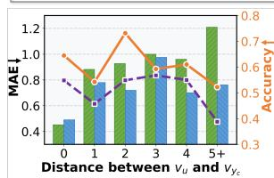  
(a)

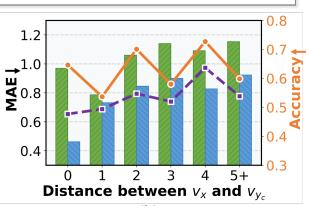  
(b)

Figure 4: Fine-grained personalization on PRISM.  
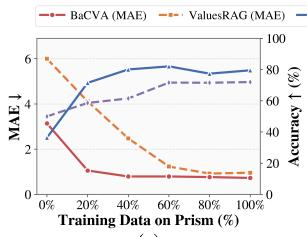  
(a)

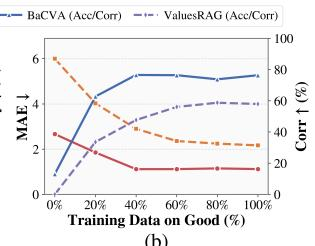  
(b)  
Figure 5: Training efficiency analysis across datasets.

A cluster-level analysis on PRISM further confirms BaCVA’s domain-level robustness, with consistent MAE reductions across the five largest semantic clusters (Appendix C.3).

Training Data Efficiency We evaluate data efficiency by training BaCVA with different proportions of PRISM and GOOD data. As shown in Fig. 5, BaCVA achieves strong performance with limited supervision and improves steadily as more data is used, whereas ValuesRAG converges more slowly and to a weaker final result. This indicates that BaCVA can learn effective value-alignment patterns in low-data regimes.

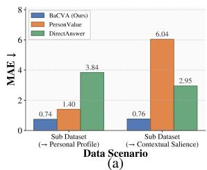

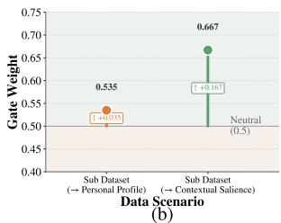  
Figure 6: Effects of the gated fusion on PRISM.

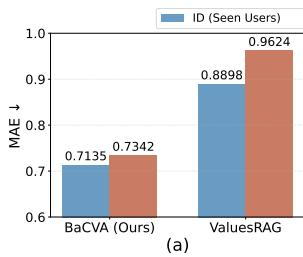

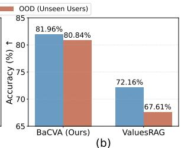  
Figure 7: Generalizability evaluation on PRISM.

Generalization to Cold-Start Users We further evaluate generalization to unseen users by splitting the PRISM test set into seen users and 20% coldstart users absent from training. As shown in Fig. 7, BaCVA shows a much smaller performance drop than ValuesRAG, demonstrating stronger robustness to unseen users.

Gated Fusion Analysis. BaCVA fuses the person-view and scenario-view through a contextaware gate. To verify whether the gate correctly identifies the more informative view across varying contexts, we split PRISM into personal-dominant cases, where $v _ { y _ { c } }$ is closer to $v _ { u }$ than to $v _ { x }$ , and scenario-dominant cases. Fig. 6(a) shows that PersonValue performs competitively in personaldominant settings but fails catastrophically when situational shifts occur, whereas DirectAnswer is opposite. BaCVA consistently performs best on both. Fig. 6(b) further shows that the gate assigns larger weights to the corresponding dominant view.

Cross-Extractor Robustness Cross-extractor evaluation using independently constructed Gemini-3-Flash and Qwen3-235B-A22B test targets confirms that BaCVA’s gains are not tied to GPT-5-nano, yielding 21.2% lower MAE and 9.56 percentage points higher accuracy than ValuesRAG on average (Appendix C.6).

## 4.5 Hyper-parameter Analysis

We provide a sensitivity analysis of the KLdivergence weight λ in Appendix C.1. Besides, we further examine the robustness of BaCVA under different backbone LLMs as the value salience estimator, prompt designs, and value representations. Specifically, we evaluate BaCVA with value profiles represented by the 5-dim Moral Foundations Theory and the 301-dim value system from Daily-Dilemma. The consistent gains across these settings show that BaCVA is robust to both implementation choices and value-system variations. Meanwhile, to evaluate BaCVA’s generalizability across backbone models, we further implement it with Llama3-8B under the same experimental setting, where it reduces MAE by 37.9% and improves accuracy by 19.06 percentage points over ValuesRAG in Appendix C.8. To evaluate robustness across scenario-prior estimators, we compare GPT-5-nano, Gemini-3-Flash, and Qwen3-235B-A22B, obtaining an average within-one agreement of 89.15% and a standard deviation of only 0.027 in downstream PRISM MAE in Appendix C.7. To assess whether BaCVA training degrades generalpurpose capabilities, we evaluate the original backbone and BaCVA on four standard benchmarks, obtaining comparable average performance of 77.69% and 78.74%, respectively (Appendix C.10).

## 4.6 Downstream Application

Furthermore, we evaluate the effectiveness of our inferred posterior values in guiding downstream personalized response generation using the PRISM dataset. We implement two variants for generation: (1) BaCVA (Two-stage) applies the posterior personalized values estimated by BaCVA as the input and trains a downstream response generator. (2) BaCVA-E2E jointly optimizes the BaCVA for posterior value inference with subsequent response generator. Here, MAE, Spearman correlation, and pairwise ranking accuracy are computed under the answer-level protocol detailed in Appendix C.5. As shown in Tab. 3, BaCVA-E2E achieves the best overall performance, slightly outperforming the two-stage BaCVA.

Moreover, qualitative cases in Appendix C.5 further show that BaCVA-E2E can generate coherent value-grounded responses, whereas ValuePrompt often fails.

<table><tr><td>Method</td><td>MAE↓</td><td>Acc ↑</td><td>Spearman ↑</td></tr><tr><td>DirectAnswer</td><td>1.1794</td><td>0.3226</td><td>0.2483</td></tr><tr><td>ValuePrompt</td><td>0.9897</td><td>0.4892</td><td>0.3121</td></tr><tr><td>COUPLE</td><td>0.5596</td><td>0.6434</td><td>0.4432</td></tr><tr><td>MetaAligner</td><td>0.7787</td><td>0.5125</td><td>0.4010</td></tr><tr><td>PAD</td><td>0.6444</td><td>0.5341</td><td>0.4463</td></tr><tr><td>MOD</td><td>0.6707</td><td>0.5448</td><td>0.4013</td></tr><tr><td>ValuesRAG</td><td>0.6229</td><td>0.5529</td><td>0.4596</td></tr><tr><td>BaCVA (Two-stage)</td><td>0.3835</td><td>0.7975</td><td>0.4782</td></tr><tr><td>BaCVA-E2E</td><td>0.3776</td><td>0.7996</td><td>0.4812</td></tr></table>

Table 3: Results of downstream personalized response generation on PRISM. Bold indicates the best results.

## 5 Conclusion

To overcome the limitation that current personalized value alignment relies on static user value profiles, BaCVA treats personal values and contextspecific value salience as priors and infers posterior personalized values at inference time. Experiments validate improved personalization accuracy, adaptability, data efficiency, and generalization.

## Limitations

Although BaCVA achieves promising performance on personalized value alignment across two benchmarks, this work still has several limitations.

First, the evaluation method may introduce noise, as it relies on user preferences annotated over a limited set of candidate responses, which may not fully capture the faithful user values but only compromised preferences. Moreover, our experiments are primarily conducted on offline datasets; although human evaluation is included, the approach lacks validation through large-scale real-world or online deployment. Second, the cross-dataset generalization of our model remains an important aspect to be further validated. Third, the datasets we used for evaluation contain users’ self-reported value profiles, which may be noisy as users may consciously or unconsciously curate, simplify, or embellish their profiles. Last, the estimator remains an aligned-LLM approximation of population-level value salience, which future work may improve with more diverse models, alignment strategies, and cultural assumptions.

In future work, we plan to address these limitations by exploring more realistic and comprehensive evaluation settings, investigating cross-dataset generalization, and developing more robust mechanisms to model and mitigate noise in user-provided

information.

## Ethical Considerations

This work aims to improve personalized value alignment in large language models; however, the inferred “value preferences” reflect latent patterns captured from observed interactions and annotations, and should be viewed as approximate rather than complete representations of human values. It should not be used to directly judge individuals or replace human ethical decision-making. Personalized value modeling may also involve privacy and bias risks. Therefore, any real-world deployment should strictly follow data protection regulations, avoid manipulative or unethical uses, and be continuously evaluated within a responsible AI framework.

## Acknowledgments

This work was supported by the Beijing Nova Program (Grant No. 202604841294).

## References

Josh Achiam, Steven Adler, Sandhini Agarwal, Lama Ahmad, Ilge Akkaya, Florencia Leoni Aleman, Diogo Almeida, Janko Altenschmidt, Sam Altman, Shyamal Anadkat, and 1 others. 2023. Gpt-4 technical report. arXiv preprint arXiv:2303.08774.

Yuntao Bai, Andy Jones, Kamal Ndousse, Amanda Askell, Anna Chen, Nova DasSarma, Dawn Drain, Stanislav Fort, Deep Ganguli, Tom Henighan, and 1 others. 2022a. Training a helpful and harmless assistant with reinforcement learning from human feedback. arXiv preprint arXiv:2204.05862.

Yuntao Bai, Saurav Kadavath, Sandipan Kundu, Amanda Askell, Jackson Kernion, Andy Jones, Anna Chen, Anna Goldie, Azalia Mirhoseini, Cameron McKinnon, and 1 others. 2022b. Constitutional ai: Harmlessness from ai feedback. arXiv preprint arXiv:2212.08073.

Christopher M. Bishop and Michael Tipping. 2013. Variational relevance vector machines. Preprint, arXiv:1301.3838.

David M Blei, Alp Kucukelbir, and Jon D McAuliffe. 2017. Variational inference: A review for statisticians. Journal of the American statistical Association, 112(518):859–877.

Bernard Burnes\*. 2004. Kurt lewin and complexity theories: back to the future? Journal of change management, 4(4):309–325.

Daiwei Chen, Yi Chen, Aniket Rege, Zhi Wang, and Ramya Korlakai Vinayak. 2025a. Pal: Sampleefficient personalized reward modeling for pluralistic alignment. In The Thirteenth International Conference on Learning Representations.

Ruizhe Chen, Xiaotian Zhang, Meng Luo, Wenhao Chai, and Zuozhu Liu. 2024. Pad: Personalized alignment of llms at decoding-time. arXiv preprint arXiv:2410.04070.

Yizhuo Chen, Xin Liu, Ruijie Wang, Zheng Li, Pei Chen, Changlong Yu, Priyanka Nigam, Meng Jiang, and Bing Yin. 2025b. Popi: Personalizing llms via optimized natural language preference inference. arXiv preprint arXiv:2510.17881.

Yu Ying Chiu, Liwei Jiang, and Yejin Choi. 2024. Dailydilemmas: Revealing value preferences of llms with quandaries of daily life. arXiv preprint arXiv:2410.02683.

Youngbin Choi, Seunghyuk Cho, Minjong Lee, Moon-Jeong Park, Yesong Ko, Jungseul Ok, and Dongwoo Kim. 2025. Copl: Collaborative preference learning for personalizing llms. arXiv preprint arXiv:2503.01658.

Paul F Christiano, Jan Leike, Tom Brown, Miljan Martic, Shane Legg, and Dario Amodei. 2017. Deep reinforcement learning from human preferences. Advances in neural information processing systems, 30.

Robert B Cialdini, Raymond R Reno, and Carl A Kallgren. 1990. A focus theory of normative conduct: Recycling the concept of norms to reduce littering in public places. Journal ofpersonality and social psychology, 58(6):1015.

Christopher Clark, Kenton Lee, Ming-Wei Chang, Tom Kwiatkowski, Michael Collins, and Kristina Toutanova. 2019. Boolq: Exploring the surprising difficulty of natural yes/no questions. In Proceedings ofthe 2019 Conference ofthe North American Chapter of the Association for Computational Linguistics: Human Language Technologies, Volume 1 (Long and Short Papers), pages 2924–2936.

Peter Clark, Isaac Cowhey, Oren Etzioni, Tushar Khot, Ashish Sabharwal, Carissa Schoenick, and Oyvind Tafjord. 2018. Think you have solved question answering? try arc, the ai2 reasoning challenge. arXiv preprint arXiv:1803.05457.

Seymour Epstein and Edward J O’Brien. 1985. The person–situation debate in historical and current perspective. Psychological bulletin, 98(3):513.

Kawin Ethayarajh, Winnie Xu, Niklas Muennighoff, Dan Jurafsky, and Douwe Kiela. 2024. Kto: Model alignment as prospect theoretic optimization. arXiv preprint arXiv:2402.01306.

Yu Feng, Ben Zhou, Weidong Lin, and Dan Roth. 2025. Bird: A trustworthy bayesian inference framework for large language models. Preprint, arXiv:2404.12494.

Ankush Ganguly and Samuel WF Earp. 2021. An introduction to variational inference. arXiv preprint arXiv:2108.13083.

Yicheng Gao, Gonghan Xu, Zhe Wang, and Arman Cohan. 2024. Bayesian calibration of win rate estimation with llm evaluators. In Proceedings of the 2024 Conference on Empirical Methods in Natural Language Processing, page 4757–4769. Association for Computational Linguistics.

Yunfan Gao, Yun Xiong, Xinyu Gao, Kangxiang Jia, Jinliu Pan, Yuxi Bi, Yixin Dai, Jiawei Sun, Haofen Wang, and Haofen Wang. 2023. Retrieval-augmented generation for large language models: A survey. arXiv preprint arXiv:2312.10997, 2(1).

Daniel Grossman and Pedro M. Domingos. 2004. Learning bayesian network classifiers by maximizing conditional likelihood. Proceedings of the twenty-first international conference on Machine learning.

Daya Guo, Dejian Yang, Haowei Zhang, Junxiao Song, Ruoyu Zhang, Runxin Xu, Qihao Zhu, Shirong Ma, Peiyi Wang, Xiao Bi, and 1 others. 2025a. Deepseek-r1: Incentivizing reasoning capability in llms via reinforcement learning. arXiv preprint arXiv:2501.12948.

Hanze Guo, Jianxun Lian, and Xiao Zhou. 2026a. Why not collaborative filtering in dual view? bridging sparse and dense models. ACM Transactions on Information Systems, 44(3):1–24.

Hanze Guo, Yijun Ma, and Xiao Zhou. 2025b. Sorex: Towards self-explainable social recommendation with relevant ego-path extraction. ACM Transactions on Information Systems, 44(2):1–27.

Hanze Guo, Jing Yao, Xiao Zhou, Xiaoyuan Yi, and Xing Xie. 2026b. Counterfactual reasoning for steerable pluralistic value alignment of large language models. Advances in Neural Information Processing Systems, 38:122128–122169.

Ritwik Gupta, Rodolfo Corona, Jiaxin Ge, Eric Wang, Dan Klein, Trevor Darrell, and David M. Chan. 2025. Enough coin flips can make llms act bayesian. Preprint, arXiv:2503.04722.

Xudong Han, Junjie Yang, Tianyang Wang, Ziqian Bi, Xinyuan Song, Junfeng Hao, and Junhao Song. 2025. Towards alignment-centric paradigm: A survey of instruction tuning in large language models. arXiv preprint arXiv:2508.17184.

David Heckerman, Dan Geiger, and David Maxwell Chickering. 2015. Learning bayesian networks: The combination of knowledge and statistical data. Preprint, arXiv:1302.6815.

Edna Heidbreder. 1937. Lewin’s principles of topological psychology.

Dan Hendrycks, Collin Burns, Steven Basart, Andrew Critch, Jerry Li, Dawn Song, and Jacob Steinhardt. 2020. Aligning ai with shared human values. arXiv preprint arXiv:2008.02275.

Xisen Jin, Zheng Li, Zhenwei Dai, Hui Liu, Xianfeng Tang, Chen Luo, Rahul Goutam, Xiang Ren, and Qi He. 2025. In-context personalized alignment with feedback history under counterfactual evaluation. In 2nd Workshop on Models ofHuman Feedbackfor AI Alignment.

Yipeng Kang, Junqi Wang, Yexin Li, Fangwei Zhong, Xue Feng, Mengmeng Wang, Wenming Tu, Quansen Wang, Hengli Li, and Zilong Zheng. 2024. Causal graph guided steering of llm values via prompts and sparse autoencoders. arXiv preprint arXiv:2501.00581.

Hannah Rose Kirk, Alexander Whitefield, Paul Rottger, Andrew M Bean, Katerina Margatina, Rafael Mosquera-Gomez, Juan Ciro, Max Bartolo, Adina Williams, He He, and 1 others. 2024. The prism alignment dataset: What participatory, representative and individualised human feedback reveals about the subjective and multicultural alignment of large language models. Advances in Neural Information Processing Systems, 37:105236–105344.

Steffen L. Lauritzen and David J. Spiegelhalter. 1990. Local computations with probabilities on graphical structures and their application to expert systems. Journal of the royal statistical society series b-methodological, 50:415–448.

Richard S Lazarus and Susan Folkman. 1984. Stress, appraisal, and coping. Springer publishing company.

Patrick Lewis, Ethan Perez, Aleksandra Piktus, Fabio Petroni, Vladimir Karpukhin, Naman Goyal, Heinrich Küttler, Mike Lewis, Wen-tau Yih, Tim Rocktäschel, and 1 others. 2020. Retrieval-augmented generation for knowledge-intensive nlp tasks. Advances in neural information processing systems, 33:9459– 9474.

Jia-Nan Li, Jian Guan, Songhao Wu, Wei Wu, and Rui Yan. 2025a. From 1,000,000 users to every user: Scaling up personalized preference for user-level alignment. arXiv preprint arXiv:2503.15463.

Kaiwen Li, Tao Zhang, and Rui Wang. 2020. Deep reinforcement learning for multiobjective optimization. IEEE transactions on cybernetics, 51(6):3103–3114.

Lei Li, Xiangxu Zhang, Xiao Zhou, and Zheng Liu. 2025b. AutoMIR: Effective zero-shot medical information retrieval without relevance labels. In Findings ofthe Associationfor Computational Linguistics: EMNLP 2025, pages 24028–24047, Suzhou, China. Association for Computational Linguistics.

Xinyu Li, Ruiyang Zhou, Zachary C Lipton, and Liu Leqi. 2024. Personalized language modeling from personalized human feedback. arXiv preprint arXiv:2402.05133.

Ollie Liu, Deqing Fu, Dani Yogatama, and Willie Neiswanger. 2024. Dellma: Decision making under uncertainty with large language models. arXiv preprint arXiv:2402.02392.

Rachel Longjohn, Shang Wu, Saatvik Kher, Catarina Belém, and Padhraic Smyth. 2025. Bayesian evaluation of large language model behavior. arXiv preprint arXiv:2511.10661.

Yu Meng, Mengzhou Xia, and Danqi Chen. 2024. Simpo: Simple preference optimization with a reference-free reward. Advances in Neural Information Processing Systems, 37:124198–124235.

Walter Mischel. 2013. Personality and assessment. Psychology Press.

Long Ouyang, Jeffrey Wu, Xu Jiang, Diogo Almeida, Carroll Wainwright, Pamela Mishkin, Chong Zhang, Sandhini Agarwal, Katarina Slama, Alex Ray, and 1 others. 2022. Training language models to follow instructions with human feedback. Advances in neural information processing systems, 35:27730–27744.

Victor-Alexandru Padurean, Parameswaran Ka- ˘ malaruban, Nachiket Kotalwar, Alkis Gotovos, and Adish Singla. 2025. Inference-time personalized alignment with a few user preference queries. arXiv preprint arXiv:2511.02966.

Sriyash Poddar, Yanming Wan, Hamish Ivison, Abhishek Gupta, and Natasha Jaques. 2024. Personalizing reinforcement learning from human feedback with variational preference learning. Advances in Neural Information Processing Systems, 37:52516– 52544.

Rafael Rafailov, Archit Sharma, Eric Mitchell, Christopher D Manning, Stefano Ermon, and Chelsea Finn. 2023. Direct preference optimization: Your language model is secretly a reward model. Advances in Neural Information Processing Systems, 36:53728– 53741.

Michael J Ryan, Omar Shaikh, Aditri Bhagirath, Daniel Frees, William Barr Held, and Diyi Yang. 2025. Synthesizeme! inducing persona-guided prompts for personalized reward models in llms. In Proceedings of the 63rd Annual Meeting of the Association for Computational Linguistics (Volume 1: Long Papers), pages 8045–8078.

Keisuke Sakaguchi, Ronan Le Bras, Chandra Bhagavatula, and Yejin Choi. 2021. Winogrande: An adversarial winograd schema challenge at scale. Communications ofthe ACM, 64(9):99–106.

Shalom H Schwartz. 2012. An overview of the schwartz theory of basic values. Online readings in Psychology and Culture, 2(1):11.

Wonduk Seo, Zonghao Yuan, and Yi Bu. 2025. Valuesrag: Enhancing cultural alignment through retrieval-augmented contextual learning. Preprint, arXiv:2501.01031.

Tianhao Shen, Renren Jin, Yufei Huang, Chuang Liu, Weilong Dong, Zishan Guo, Xinwei Wu, Yan Liu, and Deyi Xiong. 2023. Large language model alignment: A survey. arXiv preprint arXiv:2309.15025.

Ruizhe Shi, Yifang Chen, Yushi Hu, Alisa Liu, Hanna Hajishirzi, Noah A Smith, and Simon S Du. 2024. Decoding-time language model alignment with multiple objectives. Advances in Neural Information Processing Systems, 37:48875–48920.

Thibaut Thonet, Germán Kruszewski, Jos Rozen, Pierre Erbacher, and Marc Dymetman. 2025. Fast: Featureaware sampling and tuning for personalized preference alignment with limited data. In Proceedings of the 2025 Conference on Empirical Methods in Natural Language Processing, pages 9352–9381.

Hugo Touvron, Thibaut Lavril, Gautier Izacard, Xavier Martinet, Marie-Anne Lachaux, Timothée Lacroix, Baptiste Rozière, Naman Goyal, Eric Hambro, Faisal Azhar, and 1 others. 2023. Llama: Open and efficient foundation language models. arXiv preprint arXiv:2302.13971.

Dimitris G Tzikas, Aristidis C Likas, and Nikolaos P Galatsanos. 2008. The variational approximation for bayesian inference. IEEE Signal Processing Magazine, 25(6):131–146.

Jiashuo Wang, Haozhao Wang, Shichao Sun, and Wenjie Li. 2024a. Aligning language models with human preferences via a bayesian approach. Preprint, arXiv:2310.05782.

Xinpeng Wang, Shitong Duan, Xiaoyuan Yi, Jing Yao, Shanlin Zhou, Zhihua Wei, Peng Zhang, Dongkuan Xu, Maosong Sun, and Xing Xie. 2024b. On the essence and prospect: An investigation of alignment approaches for big models. arXiv preprint arXiv:2403.04204.

Xuewei Wang, Weiyan Shi, Richard Kim, Yoojung Oh, Sijia Yang, Jingwen Zhang, and Zhou Yu. 2019. Persuasion for good: Towards a personalized persuasive dialogue system for social good. In Proceedings of the 57th Annual Meeting ofthe Associationfor Computational Linguistics, pages 5635–5649, Florence, Italy. Association for Computational Linguistics.

Yufei Wang, Wanjun Zhong, Liangyou Li, Fei Mi, Xingshan Zeng, Wenyong Huang, Lifeng Shang, Xin Jiang, and Qun Liu. 2023. Aligning large language models with human: A survey. arXiv preprint arXiv:2307.12966.

An Yang, Anfeng Li, Baosong Yang, Beichen Zhang, Binyuan Hui, Bo Zheng, Bowen Yu, Chang Gao, Chengen Huang, Chenxu Lv, and 1 others. 2025. Qwen3 technical report. arXiv preprint arXiv:2505.09388.

Kailai Yang, Zhiwei Liu, Qianqian Xie, Jimin Huang, Tianlin Zhang, and Sophia Ananiadou. 2024. Metaaligner: Towards generalizable multi-objective alignment of language models. arXiv preprint arXiv:2403.17141.

Jing Yao, Xiaoyuan Yi, Xiting Wang, Yifan Gong, and Xing Xie. 2023a. Value fulcra: Mapping large language models to the multidimensional spectrum of basic human values. arXiv preprint arXiv:2311.10766.

Jing Yao, Xiaoyuan Yi, Xiting Wang, Jindong Wang, and Xing Xie. 2023b. From instructions to intrinsic human values–a survey of alignment goals for big models. arXiv preprint arXiv:2308.12014.

Xixian Yong, Jianxun Lian, Xiaoyuan Yi, Xiao Zhou, and Xing Xie. 2025a. Motivebench: How far are we from human-like motivational reasoning in large language models? In Findings of the Association for Computational Linguistics, ACL 2025, Vienna, Austria, July 27 - August 1, 2025, volume ACL 2025 of Findings ofACL, pages 20059–20089. Association for Computational Linguistics.

Xixian Yong, Peilin Sun, Zihe Wang, and Xiao Zhou. 2026. Intelli-planner: Towards customized urban planning via large language model empowered reinforcement learning. In Proceedings of the ACM Web Conference 2026, WWW 2026, Dubai, United Arab Emirates, originally scheduledfor April 13-17, 2026, rescheduledfor June 29 - July 3, 2026, pages 9385–9396. ACM.

Xixian Yong, Xiao Zhou, Yingying Zhang, Jinlin Li, Yefeng Zheng, and Xian Wu. 2025b. Think or not? exploring thinking efficiency in large reasoning models via an information-theoretic lens. In Advances in Neural Information Processing Systems 38: Annual Conference on Neural Information Processing Systems 2025, NeurIPS 2025, San Diego, CA, USA, December 2-7, 2025 / Mexico City, Mexico, November 30 - December 5, 2025.

Rowan Zellers, Ari Holtzman, Yonatan Bisk, Ali Farhadi, and Yejin Choi. 2019. Hellaswag: Can a machine really finish your sentence? In Proceedings ofthe 57th annual meeting ofthe associationfor computational linguistics, pages 4791–4800.

N. L. Zhang and D. Poole. 1996. Exploiting causal independence in bayesian network inference. Preprint, arXiv:cs/9612101.

Shengyu Zhang, Linfeng Dong, Xiaoya Li, Sen Zhang, Xiaofei Sun, Shuhe Wang, Jiwei Li, Runyi Hu, Tianwei Zhang, Guoyin Wang, and 1 others. 2023. Instruction tuning for large language models: A survey. ACM Computing Surveys.

Xiangxu Zhang, Lei Li, Xiao Zhou, and Zheng Liu. 2026a. R2med: A benchmark for reasoning-driven medical retrieval. Preprint, arXiv:2505.14558.

Xiangxu Zhang, Lei Li, Yanyun Zhou, Xiao Zhou, Yingying Zhang, and Xian Wu. 2026b. Inflated excellence or true performance? rethinking medical diagnostic benchmarks with dynamic evaluation. In Proceedings of the 64th Annual Meeting of the Associationfor Computational Linguistics (Volume 1:

Long Papers), pages 26454–26493, San Diego, California, United States. Association for Computational Linguistics.

Xiangxu Zhang, Jiamin Wang, Qinlin Zhao, Hanze Guo, Linzhuo Li, Jing Yao, Xiao Zhou, Xiaoyuan Yi, and Xing Xie. 2026c. Human values matter: Investigating how misalignment shapes collective behaviors in llm agent communities. Preprint, arXiv:2604.05339.

Xiangxu Zhang, Xiao Zhou, Hongteng Xu, and Jianxun Lian. 2026d. Hypemed: Enhancing medication recommendations with hypergraph-based patient relationships. ACM Trans. Inf. Syst., 44(4).

Xiaotian Zhang, Ruizhe Chen, Yang Feng, and Zuozhu Liu. 2025a. Persona-judge: Personalized alignment of large language models via token-level selfjudgment. arXiv preprint arXiv:2504.12663.

Yijing Zhang, Dyah Adila, Changho Shin, and Frederic Sala. 2025b. Personalize your llm: Fake it then align it. arXiv preprint arXiv:2503.01048.

Penghao Zhao, Hailin Zhang, Qinhan Yu, Zhengren Wang, Yunteng Geng, Fangcheng Fu, Ling Yang, Wentao Zhang, Jie Jiang, and Bin Cui. 2024. Retrieval-augmented generation for ai-generated content: A survey. arXiv preprint arXiv:2402.19473.

Weixiang Zhao, Xingyu Sui, Yulin Hu, Jiahe Guo, Haixiao Liu, Biye Li, Yanyan Zhao, Bing Qin, and Ting Liu. 2025. Teaching language models to evolve with users: Dynamic profile modeling for personalized alignment. arXiv preprint arXiv:2505.15456.

Xiao Zhou, Zhongxiang Zhao, and Hanze Guo. 2025. Tricolore: Multi-behavior user profiling for enhanced candidate generation in recommender systems. IEEE Transactions on Knowledge and Data Engineering, 37(7):4349–4360.

Minjun Zhu, Yixuan Weng, Linyi Yang, and Yue Zhang. 2024. Personality alignment of large language models. arXiv preprint arXiv:2408.11779.

Yanxu Zhu, Shitong Duan, Xiangxu Zhang, Jitao Sang, Peng Zhang, Tun Lu, Xiao Zhou, Jing Yao, Xiaoyuan Yi, and Xing Xie. 2026. Mohobench: Assessing honesty of multimodal large language models via unanswerable visual questions. In Proceedings of the AAAI Conference on Artificial Intelligence, volume 40, pages 29205–29213.

## A Method Details

## A.1 Generic ELBO for Personalized Value Inference

Setup For a user u and a question (scenario) x, let $\mathbf { v } _ { u }$ denote the user-level value profile, and let $\mathbf { v } _ { u , x }$ denote the latent question-specific personalized values. Given a preference triple $( x , y _ { c } , y _ { r } )$ we denote the observed preference event as

$$
o : = ( y _ { c } \succ y _ { r } ) ,\tag{12}
$$

i.e., response $y _ { c }$ is preferred over $y _ { r }$ under scenario x.

Bayesian formulation We define a prior conditioned on both the user and scenario:

$$
p _ { \theta } ( \mathbf { v } _ { u , x } \mid \mathbf { v } _ { u } , x ) ,\tag{13}
$$

and a preference likelihood

$$
p _ { \theta } ( o \mid \mathbf { v } _ { u , x } , x ) = p _ { \theta } ( y _ { c } \succ y _ { r } \mid \mathbf { v } _ { u , x } , x ) .\tag{14}
$$

By Bayes’ rule, the posterior is

$$
p _ { \theta } ( \mathbf { v } _ { u , x } \mid \mathbf { v } _ { u } , x , o ) = { \frac { p _ { \theta } ( o \mid \mathbf { v } _ { u , x } ) p _ { \theta } ( \mathbf { v } _ { u , x } \mid \mathbf { v } _ { u } , x ) } { p _ { \theta } ( o ) } } ,\tag{15}
$$

which matches Eq. (1) in the main paper.

Marginal likelihood The likelihood $o : = ( y _ { c } \succ$ $y _ { r } )$ marginalizes over the latent personalized values $\mathbf { v } _ { u , x } $

$$
p _ { \theta } ( o ) = \int p _ { \theta } ( o \mid \mathbf { v } _ { u , x } , x )\tag{16}
$$

$$
\times p _ { \theta } ( \mathbf { v } _ { u , x } \mid \mathbf { v } _ { u } , x ) d \mathbf { v } _ { u , x } .\tag{17}
$$

In our setting, computing Eq. (16) is intractable. Since $\mathbf { v } _ { u , x }$ is a multi-dimensional value vector and each dimension corresponds to a 5-point Likert score, exact marginalization would require an exponential-time summation and is prohibitively expensive. This motivates us to employ variational inference to obtain a tractable lower bound for optimization.

Variational posterior and ELBO. We introduce a variational posterior $q _ { \phi } ( \mathbf { v } _ { u , x } \mid \mathbf { v } _ { u } , x )$ to approximate the true posterior $p _ { \theta } ( \mathbf { v } _ { u , x } \mid \mathbf { v } _ { u } , \mathbf { x } , o )$ . Thus, we solve the optimization problem as:

$$
\begin{array} { r } { \hat { \phi } = \underset { \phi } { \arg \operatorname* { m i n } } ~ \mathrm { K L } \Big ( q _ { \phi } ( \mathbf { v } _ { u , x } \mid \mathbf { v } _ { u } , x ) } \\ { \Big \| \mathbf { \omega } p _ { \theta } ( \mathbf { v } _ { u , x } \mid \mathbf { v } _ { u } , x , o ) \Big ) . } \end{array}\tag{18}
$$

In the following derivation, let $\textbf { z } : = \textbf { v } _ { u , x }$ and use the abbreviations

$$
\begin{array} { r } { q _ { \phi } ( \mathbf { z } ) : = q _ { \phi } ( \mathbf { z } \mid \mathbf { v } _ { u } , x ) , } \\ { p _ { \theta } ( \mathbf { z } ) : = p _ { \theta } ( \mathbf { z } \mid \mathbf { v } _ { u } , x ) . } \end{array}
$$

For brevity, we suppress the conditioning on $( \mathbf { v } _ { u } , x )$ below.

$$
\begin{array} { r l } & { \mathrm { K L } \Big ( q _ { \phi } ( \mathbf { z } ) \Big | \Big | p _ { \theta } ( \mathbf { z } \ | \ o ) \Big ) } \\ & { = \int q _ { \phi } ( \mathbf { z } ) \log \frac { q _ { \phi } ( \mathbf { z } ) } { p _ { \phi } ( \mathbf { z } ) } \ d \mathbf { z } } \\ & { = \int q _ { \phi } ( \mathbf { z } ) \Big [ \log q _ { \phi } ( \mathbf { z } ) - \log p _ { \theta } ( \mathbf { z } \ | \ o ) \Big ] \ d \mathbf { z } } \\ & { = \int q _ { \phi } ( \mathbf { z } ) \Big [ \log q _ { \phi } ( \mathbf { z } ) - \log p _ { \theta } ( \mathbf { z } , \ o ) \Big ] \ d \mathbf { z } } \\ & { \quad + \ \log p _ { \theta } ( \ o ) } \\ & { = \log p _ { \theta } ( \theta ) } \\ & { \quad - \int q _ { \phi } ( \mathbf { z } ) \Big [ \log p _ { \theta } ( \mathbf { z } , \ o ) - \log q _ { \phi } ( \mathbf { z } ) \Big ] \ d \mathbf { z } . } \end{array}\tag{19}
$$

We use $\mathcal { L } ( q _ { \phi } )$ to represent the following term as:

$$
\begin{array} { l } { \displaystyle \mathcal { L } ( q _ { \phi } ) = \int q _ { \phi } \big [ \log p _ { \theta } ( { \mathbf v } _ { u , x } , o ) } \\ { \displaystyle - \log q _ { \phi } ( { \mathbf v } _ { u , x } ) \big ] d { \mathbf v } _ { u , x } } \\ { \displaystyle = \mathbb { E } _ { q _ { \phi } } \big [ \log p _ { \theta } ( { \mathbf v } _ { u , x } , o ) } \\ { \displaystyle - \log q _ { \phi } ( { \mathbf v } _ { u , x } ) \big ] . } \end{array}\tag{20}
$$

Based on $\operatorname { E q . } ( 1 9 )$ and Eq.(20), we then obtain

$$
\begin{array} { r } { \mathrm { K L } ( q _ { \phi } ( \mathbf { v } _ { u , x } ) | | p _ { \theta } ( \mathbf { v } _ { u , x } \mid o ) ) = \log p _ { \theta } ( o ) - \mathcal { L } ( q _ { \phi } ) } \end{array}\tag{21}
$$

$$
\log p _ { \theta } ( o ) = \mathcal { L } ( q _ { \phi } ) + \mathrm { K L } ( q _ { \phi } ( \mathbf { v } _ { u , x } ) | | p _ { \theta } ( \mathbf { v } _ { u , x } \mid\tag{o)).}
$$

(22)

Since log $p _ { \theta } ( o )$ is fixed on the observed data, minimizing the KL divergence in Eq.(19) is equivalent to maximizing $\mathcal { L } ( q _ { \phi } )$ , which is the evidence lower bound (ELBO) of log $p _ { \theta } ( o )$

$$
\begin{array} { r l } & { \mathcal { L } ( q _ { \phi } ) = \mathbb { E } _ { q _ { \phi } } \left[ \log p _ { \theta } ( \mathbf { v } _ { u , x } , o ) \right. } \\ & { \qquad \left. - \log q _ { \phi } ( \mathbf { v } _ { u , x } ) \right] } \\ & { \qquad = \mathbb { E } _ { q _ { \phi } } \left[ \log p _ { \theta } ( o | v _ { u , x } ) + \log p _ { \theta } ( v _ { u , x } ) \right. } \\ & { \qquad \left. - \log q _ { \phi } ( \mathbf { v } _ { u , x } ) \right] } \\ & { \qquad = \mathbb { E } _ { q _ { \phi } } \left[ \log p _ { \theta } ( o | v _ { u , x } ) \right] } \\ & { \qquad - \mathbb { E } _ { q _ { \phi } } \left[ \log q _ { \phi } ( \mathbf { v } _ { u , x } ) - \log p _ { \theta } ( v _ { u , x } ) \right] } \\ & { \qquad = \mathbb { E } _ { q _ { \phi } } \left[ \log p _ { \theta } ( o | v _ { u , x } ) \right] } \\ & { \qquad - \mathrm { K L } \left( q _ { \phi } ( \mathbf { v } _ { u , x } ) \right) \lVert p _ { \theta } ( v _ { u , x } ) \rVert . } \end{array}
$$

Converting to the training loss, we need to minimize the loss $\mathcal { L }$ as follows:

$$
\begin{array} { r l } & { \mathcal { L } = - \mathbb { E } _ { q _ { \phi } } \left[ \log p _ { \theta } ( o | v _ { u , x } ) \right] } \\ & { \quad \quad \quad + \mathbf { K L } \big ( q _ { \phi } ( \mathbf { v } _ { u , x } ) | | p _ { \theta } ( v _ { u , x } ) \big ) , } \end{array}\tag{24}
$$

which is Eq.(2) in the main paper.

## A.2 Concrete Formulation

Setup. For a user u and a question $x ,$ let $\mathbf { v } _ { u }$ be the user-level value profile (Sec. 3.1), ${ \bf v } _ { x }$ be the scenario value-salience variable estimated from $( x , y _ { \mathrm { h u m a n } } )$ (Sec. 3.3), and $\mathbf { v } _ { u , x }$ be the questionspecific personalized values. Given a preference triple $( x , y _ { c } , y _ { r } )$ , we extract the value vector reflected by both the preferred and dispreferred responses as $v _ { y _ { c } } , v _ { y _ { r } }$

Generative model (hierarchical prior). We use the estimated value salience distribution $p _ { \omega } ( \mathbf { v } _ { x }$ | $x , y _ { \mathrm { h u m a n } } )$ and a user-conditioned prior $p _ { \theta } ( \mathbf { v } _ { u , x }$ $\mathbf { v } _ { u } , \mathbf { v } _ { x } )$ . We further introduce a (single-point) observation model for the extracted value embedding:

$$
p _ { \theta } ( \mathbf { v } _ { y _ { c } } \mid \mathbf { v } _ { u , x } ) .\tag{25}
$$

The resulting marginal likelihood is

$$
\begin{array} { r l } { \log p ( \mathbf { v } _ { y _ { c } } \mid \mathbf { v } _ { u } , x ) = \log \displaystyle \sum _ { \mathbf { v } _ { x } } \sum _ { \mathbf { v } _ { u , x } } p _ { \theta } ( \mathbf { v } _ { y _ { c } } \mid \mathbf { v } _ { u , x } ) } & { } \\ { \cdot p _ { \theta } ( \mathbf { v } _ { u , x } \mid \mathbf { v } _ { u } , \mathbf { v } _ { x } ) } & { } \\ { \mathbf { \nabla } \cdot p _ { \omega } ( \mathbf { v } _ { x } \mid x , y _ { \mathrm { h u m a n } } ) . } \end{array}\tag{26}
$$

## A.3 Prompt Template

We present below the prompts used in this paper, including the data preprocessing prompt, the method prompt, and the evaluation prompt.

## A.3.1 Preprocessing Prompt

This stage involves four preprocessing prompts: (1) extracting the user value profile in Fig. 8, (2) determining whether a given question involves valuerelated considerations in Fig. 9, (3) identifying which values are implicated by the question in Fig. 10, and (4) extracting value-related representations from candidate answers in Fig. 11.

## A.3.2 Methods Prompt

View-Specific Residual Inference Prompts To instantiate the residual distributions $q ( \mathbf { z } _ { \mathbf { u } } )$ and $q ( \mathbf { z } _ { \mathbf { x } } )$ in Eq. (6) and Eq. (8), we implicitly estimate the residual corrections conditioned on the triplet $( x , \mathbf { v } _ { x } , \mathbf { v } _ { u _ { i } } )$ . Rather than explicitly sampling z, we adopt a prompt-based inference strategy in Fig. 12 to enable the model to capture how contextual semantics modulate value deviations.

Specifically, we first construct a structured prompt that instructs the language model to analyze the input question x from the perspective of Schwartz’s ten basic human values. This prompt is designed to emphasize value salience under the given scenario, allowing the model to encode context-sensitive value implications. The resulting hidden representation is extracted as a contextual embedding $\mathbf { e } _ { x } ,$ which serves as a semantic anchor for residual estimation.

Conditioned on $\mathbf { e } _ { x }$ and the corresponding prior (either ${ \bf v } _ { x }$ for the scenario-anchored view or $\mathbf { v } _ { u _ { i } }$ for the person-anchored view), a lightweight projection network produces a logit-level correction that implicitly instantiates the residual variable z. This correction is defined in the same value space as the prior distribution and is subsequently used to refine the posterior value inference. In this way, the effect of x is captured through semantic prompting rather than explicit stochastic modeling.

Gating Prompt for View Composition To compute the adaptive fusion weight α in Eq. (10), we employ a prompt-based gating mechanism. Given the input question x and the predictions from both views, we construct a concise comparison prompt in Figure 13 that presents the value-wise predictions and their associated confidence signals. The prompt instructs the language model to decide which view provides a more reliable assessment under the current context.

The gating model outputs logits corresponding to two discrete choices (scenario-anchored vs. personanchored). We extract the logits associated with tokens 0 and 1, and normalize them to obtain the scalar gating coefficient $\alpha \in ( 0 , 1 )$ . This value is then used to interpolate between the two inferred posteriors, enabling context-aware view composition without introducing additional heuristic rules.

## A.3.3 Evaluation Prompt

The prompt in Fig. 11 is also used to evaluate responses generated by some baseline models, as described in Appendix B.2.

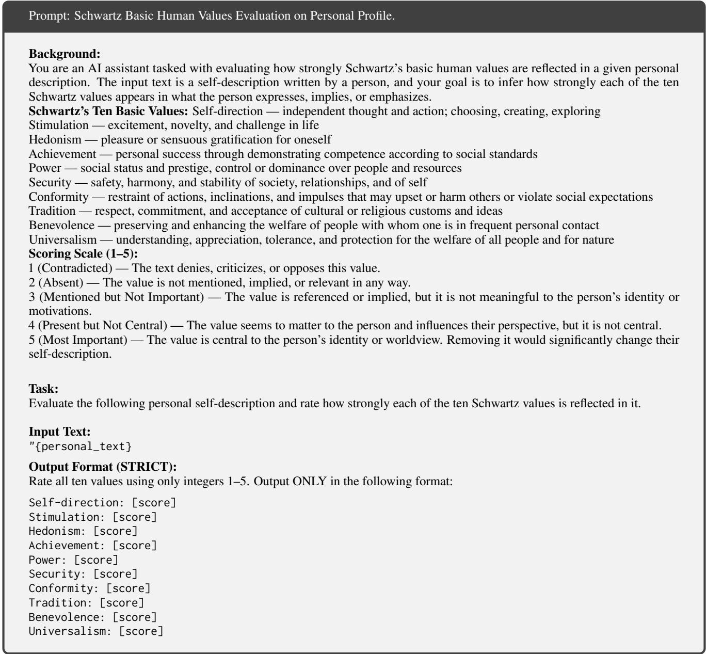  
Figure 8: Schwartz basic human values evaluation on personal profile prompt.

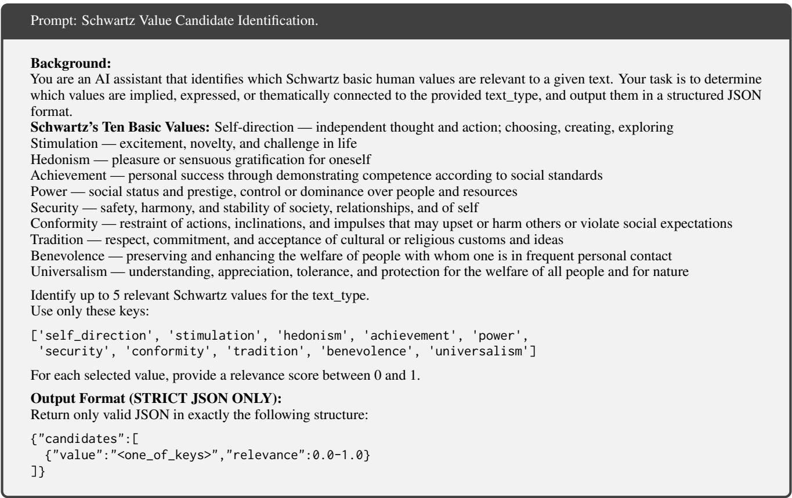  
Figure 9: Prompt for Schwartz value candidate identification of question.

## B Additional Experimental Details

## B.1 Datasets and Preprocessing

PRISM. We use the PRISM dataset (Kirk et al., 2024) to evaluate value-conditioned personalization and value alignment in open-ended user–model interactions. Each instance is organized turn-byturn, containing (i) a user query and its conversation context, (ii) a set of candidate responses provided by the dataset (including the chosen response and up to three unselected responses), and (iii) userside survey metadata (e.g., self\_description) when available. In our formulation, x denotes the full user query context (the user message concatenated with the opening\_prompt for the first turn), and $v _ { u }$ denotes the user value profile derived from survey text (details below).

GOOD (P4G-derived). Our GOOD dataset is constructed from the PersuasionForGood (P4G) corpus (Wang et al., 2019), a persuasion dialogue benchmark collected via Amazon Mechanical Turk. Each dialogue involves a Persuader and a Persuadee, where the Persuader aims to persuade the Persuadee to donate to a charity (e.g., Save the Children). The original corpus contains 1,017 complete dialogues and rich participant metadata including Schwartz values (10 dimensions), Big-Five personality traits, and Moral Foundations.

## B.1.1 Value Extraction and Alignment Scoring

To quantify the alignment between user values and model responses on PRISM (Kirk et al., 2024), we develop a pipeline that produces value scores for (i) the user profile $v _ { u }$ and (ii) model responses $v _ { y _ { c } }$

Selection and relevance filtering. We focus on the values guided subset, where models are explicitly prompted to engage with valueladen topics. To ensure value salience and data quality, we first retain only conversations with high value relevance, specifically those with choice\_attributes.values scores of at least 80. We then perform turn-level processing, handling each conversation sequentially. Finally, we keep only users who provide survey text in self\_description, which enables extraction of the user value profile $v _ { u }$

LLM-based value extraction. We use an LLM as an evaluator to quantify the 10 basic human values (Self-direction, Stimulation, Hedonism,

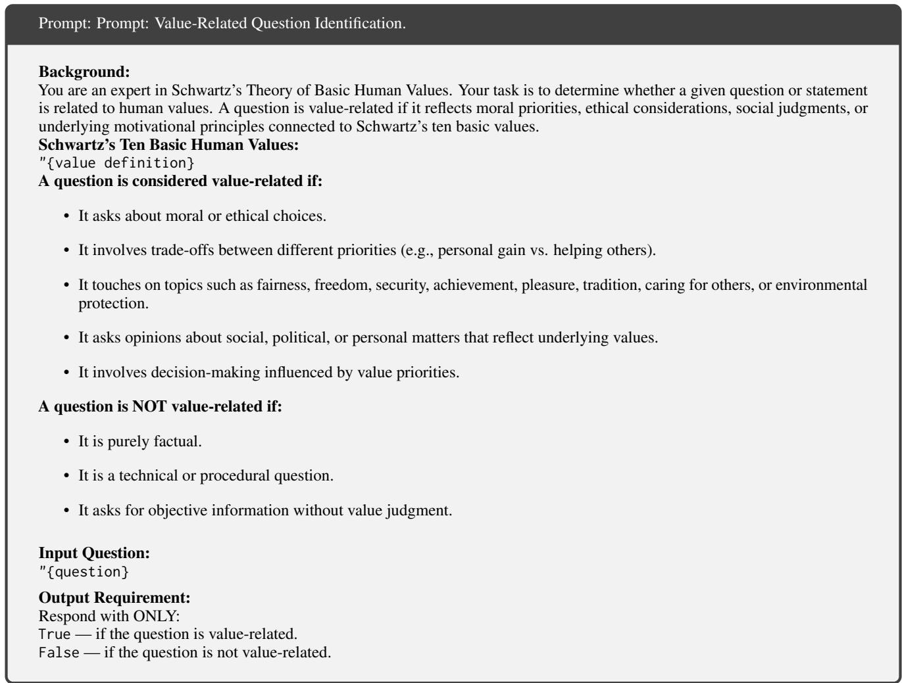  
Figure 10: Prompt for value-related question identification.

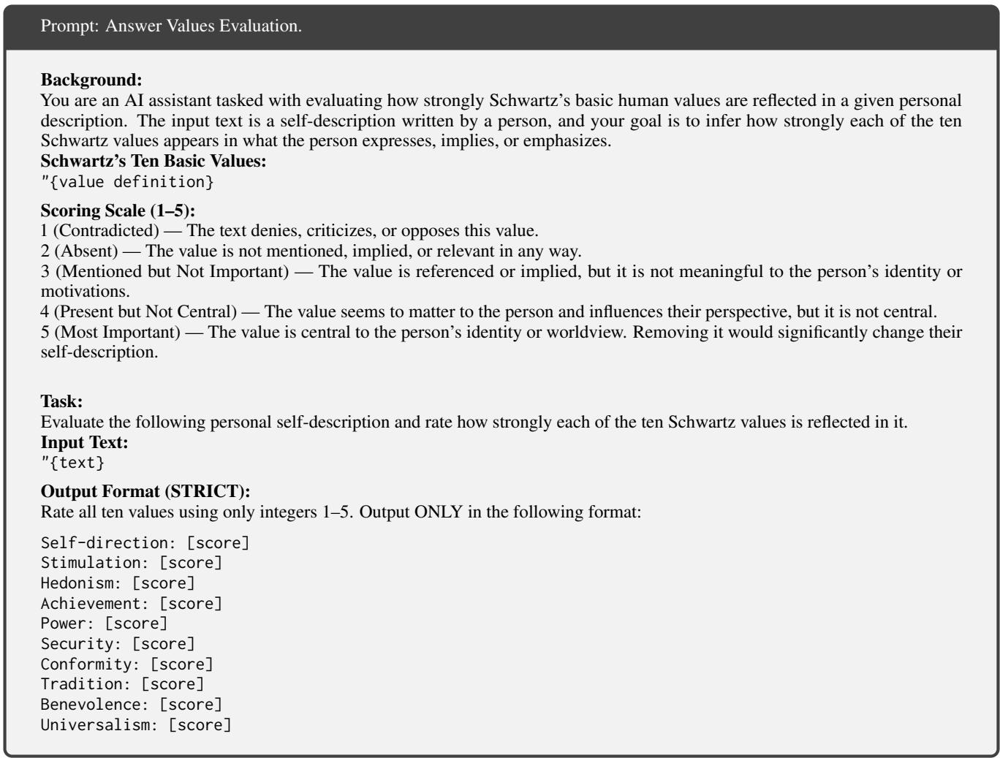  
Figure 11: Prompt for answer value evaluation.

  
Figure 12: Prompt for Schwartz value-dimension analysis of question.

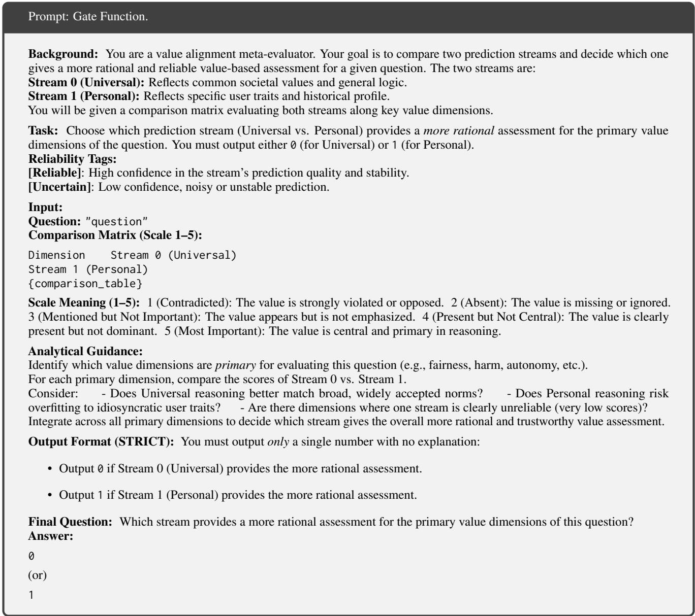  
Figure 13: Prompt for gate function.

Achievement, Power, Security, Conformity, Tradition, Benevolence, Universalism). For each turn:

1. Relevance classification: classify whether the query is value-related; discard nonrelevant turns.

2. Candidate dimension identification: select up to 5 value dimensions most pertinent to the query.

3. Value scoring (user vs. model):

• User profile $( v _ { u } ) \colon$ score each dimension (1–5) from self\_description.

• Chosen answer $( v _ { y _ { c } } )$ : score the model’s chosen response across all 10 dimensions.

• Unselected answers: score up to 3 unselected candidate responses to serve as comparison baselines.

## B.1.2 Evaluation Metrics

We compute three metrics. Since the GOOD dataset does not contain negative samples, accuracy is only reported for PRISM.

• MAE (value intensity mismatch): for each candidate dimension d, $\mathrm { M A E } _ { d } = | \hat { v } _ { u _ { i } , x } ^ { d } - $ $v _ { y _ { c } } ^ { d } |$ |.

• Spearman’s rank correlation coefficient (Correlation): we use spearman correlation metric:

$$
\rho = 1 - \frac { 6 \sum _ { i = 1 } ^ { n } d _ { i } ^ { 2 } } { n ( n ^ { 2 } - 1 ) } ,\tag{27}
$$

• Accuracy: Given one positive candidate and one or more negative candidates, this metric measures whether the predicted alignment is closer to the positive sample than to the negative samples. Formally, let $\hat { v } _ { u _ { i } , x }$ denote the predicted alignment vector, $v _ { y _ { c } }$ the alignment vector of the positive sample, and $v _ { y _ { r } }$ that of a negative sample. The prediction is considered correct if

$$
\lVert \hat { v } _ { u _ { i } , x } - v _ { y _ { c } } \rVert < \lVert \hat { v } _ { u _ { i } , x } - v _ { y _ { r } } \rVert .\tag{28}
$$

## B.2 Baselines

We compare our method with a diverse set of baselines covering both non-personalized and personalized value alignment paradigms. All personalized baselines incorporate user value information at inference time, while non-personalized baselines do not utilize any user-specific value signals.

Non-personalized Baselines. These methods generate responses without explicitly incorporating user value profiles.

DirectAnswer directly generates responses by conditioning the language model on the user query and conversational context x, without considering any user-specific value information. This baseline represents general value alignment learned during pretraining.

Personalized Baselines. These methods leverage user value information to produce personalized, value-aligned responses.

Value Prompt explicitly injects the user value profile $v _ { u }$ into the system prompt, steering generation toward user-aligned value expression.

MetaAligner performs meta-level alignment by rewriting or steering generated responses toward preferred values inferred from the user value profile and contextual information.

COUPLE employs explicit preference modeling and counterfactual reasoning to encourage consistency between generated responses and the user value profile.

PAD and MOD apply preference-aware decoding and modulation strategies to bias token selection toward user-aligned values during inference.

ValuesRAG retrieves historical user cases with similar scenarios and value profiles as examples to support personalized decision-making.

PersonValue is implemented by us and compares the static user value profile $v _ { u }$ with values extracted from candidate responses, serving as a static personalization baseline without scenarioaware inference.

As many baseline methods produce answers as their final outputs, we evaluate value alignment by extracting value representations from the generated responses. The specific prompts used for value extraction are detailed in the Appendix.

## B.3 Implementation Details

Backbone and Training. We adopt the Qwen3- 8B model as the backbone and fine-tune it using Q-LoRA for parameter-efficient training. The model is optimized with Adam using a learning rate of $5 \times 1 0 ^ { - 3 }$ and a batch size of 16. Training is conducted for two epochs with a fixed random seed of 42 to ensure reproducibility. During the second epoch, all parameters except the gating module are frozen, allowing the training process to focus on optimizing the α parameters.

Hyperparameters. We introduce a hyperparameter $\lambda _ { 1 }$ to weight the KL-divergence term in our objective. $\lambda _ { 1 }$ is searched within the range [0, 1], and the final value is selected based on validation performance. Meanwhile, the gate coefficient α is initialized to 0.5 to provide a balanced prior contribution at the beginning of training.

## B.4 Human Evaluation

In this section, we present the details of the human evaluation. We conducted two rounds of human evaluation: the first was to verify the effectiveness of the evaluator used in $f _ { e v a l }$ , and the second was to validate the performance of our proposed method.

Evaluator Validation. We conduct a human evaluation to examine whether the evaluator employed in $f _ { \mathrm { e v a l } }$ is consistent with human judgments. To this end, we design two independent annotation settings. In the first setting, annotators are provided with a user profile derived from a survey and are asked to label the underlying values reflected in the profile. In the second setting, annotators are given a question–answer pair and are asked to annotate the values expressed in the answer. The evaluator-generated scores are then compared with these human annotations. This annotation interface is shown in Fig. 14.

As summarized in Tab. 4, the evaluator demonstrates a high level of agreement with human judgments across both settings, achieving low mean absolute error (MAE), high Spearman correlation, and strong agreement rates. These results are consistent with prior findings reported in COU-PLE (Guo et al., 2026b), indicating that large language model–based evaluators can reliably extract human values and serve as an effective proxy for human evaluation.

<table><tr><td>Setting</td><td>MAE</td><td>Corr r</td><td>Acc. (≤1)</td><td>Exact Match</td></tr><tr><td>Survey-level</td><td>0.056</td><td>0.986</td><td>100.0%</td><td>94.4%</td></tr><tr><td>Answer-level</td><td>0.120</td><td>0.936</td><td>98.4%</td><td>89.6%</td></tr></table>

Table 4: Agreement between the automatic evaluator and human annotations under survey-level and answerlevel evaluation settings.

Model Performance Evaluation. The second human evaluation is conducted to assess the effectiveness of our proposed method in predicting context-specific personalized values. We sample 50 instances corresponding to 50 distinct surveyderived user profiles, with each profile appearing in exactly one instance. The complete evaluation set is independently assessed by two human evaluators, both of whom review all 50 samples under identical instructions. For each sample, annotators are presented with the survey-derived user profile, the question, the target answer, and the anonymized value-dimension assessments produced by BaCVA and ValuesRAG. Following the same five-level rubric, they determine which assessment more accurately reflects the values expressed in the target answer. When both evaluators prefer the same method, the sample is counted as a win or loss for BaCVA; when they disagree, it is counted as a tie. The annotation examples are shown in Tab. 5.

Annotator Details. All annotation procedures were approved by the relevant Institutional Review Board (IRB) and conducted in accordance with established ethical research guidelines. Annotators were informed about the task scope and voluntarily consented to participate. All annotators were compensated at a rate of at least \$7 per hour, which substantially exceeds the prevailing local hourly wage levels in the countries where they were employed. The annotation tasks did not involve any personal, private, or sensitive information. To ensure independence and avoid potential bias, the two human evaluation tasks were conducted with two separate groups of annotators, with no overlap between the annotators involved in each task. All annotators had a background in psychology, received training on Schwartz’s theory of basic human values, and were proficient in English reading comprehension.

## B.5 Licenses for Existing Assets

We use two existing datasets in our work: PRISM and GOOD. More information about the source datasets and their licenses is provided below.

• PRISM (Kirk et al., 2024): Human-written texts (including prompts) in the PRISM dataset are licensed under the Creative Commons Attribution 4.0 International License (CC-BY-4.0). Model responses are licensed under the Creative Commons Attribution– NonCommercial 4.0 International License (CC-BY-NC-4.0). Use of model responses must also comply with the original licenses of the corresponding model providers.

• GOOD (P4G-derived) (Wang et al., 2019): The GOOD dataset used in this work is derived from the PersuasionForGood (P4G) corpus, which is released under the Apache License 2.0. All derived data retain the original license of the P4G dataset, and appropriate attribution to the original source is required.

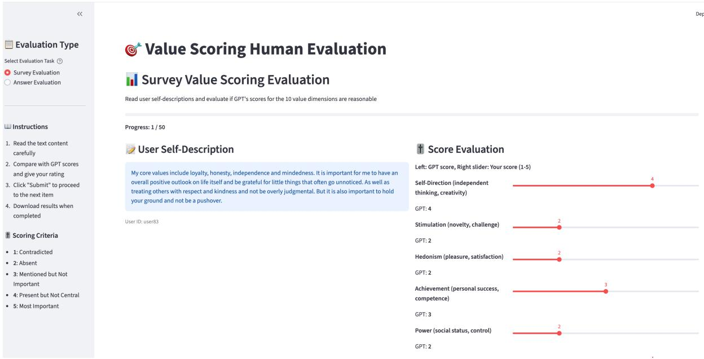

Figure 14: Human annotation interfaces used in the first human evaluation. Annotators independently label values based on a given user profile derived from a survey or a given question–answer pair.
<table><tr><td>Question</td><td>Answer</td><td></td><td></td><td>#Dims Security Conformity Benevolence Chosen</td><td></td><td></td></tr><tr><td>opinions?</td><td>What to do if If your mum remains dead-set on her opinions, mum remains it&#x27;s important to approach the situation with em- dead-set on her pathy and understanding. Here are a few sug- gestions: acknowledge her concerns, offer com- promise, seek support from a nutritionist, and</td><td>3</td><td>4.0 / 4.0</td><td>4.0 / 4.0</td><td>5.0 / 4.0</td><td>A or B</td></tr></table>

Table 5: Example results of blind value dimension analysis. Scores are reported as Model A / Model B for each value dimension, and Chosen indicates the model preferred by human annotators.

All source datasets used in our benchmark retain their original licenses, as specified by their respective creators.

## C Additional Experiments

## C.1 Hyperparameter Sensitivity Analysis

We analyze the sensitivity of BaCVA to key design choices by conducting hyperparameter studies.

Effect of KL Weight $\lambda _ { 1 } .$ . We further study the effect of the KL-divergence weight $\lambda _ { 1 }$ , which controls the regularization strength between the variational posterior and the personalized prior. Tab. 6 reports the sensitivity results on PRISM and GOOD. Overall, a moderate KL weight improves performance over removing the KL term, suggesting that the personalized prior provides useful regularization. However, overly large values of $\lambda _ { 1 }$ lead to clear degradation, as the posterior is over-regularized toward the prior and becomes less adaptive to the current scenario. These results show that BaCVA is robust within a moderate range of $\lambda _ { 1 }$ , while very strong KL regularization is harmful.

Table 6: Sensitivity analysis of the KL-divergence weight $\lambda _ { 1 }$ on PRISM and GOOD. Lower MAE is better, while higher correlation and accuracy are better.
<table><tr><td colspan="4">PRISM</td><td colspan="3">GOOD</td></tr><tr><td> $\lambda _ { 1 }$ </td><td>MAE↓</td><td>Corr. ↑</td><td>Accuracy ↑</td><td> $\lambda _ { 1 }$ </td><td>MAE↓</td><td>Corr. ↑</td></tr><tr><td>0</td><td>0.7848</td><td>0.672</td><td>80.26%</td><td>0</td><td>1.3064</td><td>0.718</td></tr><tr><td>1e-2</td><td>0.7572</td><td>0.678</td><td>80.59%</td><td>1e-2</td><td>1.2537</td><td>0.732</td></tr><tr><td>3e-2</td><td>0.7548</td><td>0.696</td><td>81.68%</td><td>3e-2</td><td>1.1723</td><td>0.749</td></tr><tr><td>1e-1</td><td>0.7344</td><td>0.703</td><td>81.39%</td><td>1e-1</td><td>1.1230</td><td>0.765</td></tr><tr><td>3e-1</td><td>0.7809</td><td>0.601</td><td>77.44%</td><td>3e-1</td><td>1.1429</td><td>0.756</td></tr><tr><td>1</td><td>0.9405</td><td>0.523</td><td>76.30%</td><td>1</td><td>1.3885</td><td>0.683</td></tr></table>

<table><tr><td>Method</td><td>MAE↓</td><td>Corr. ↑</td><td>Accuracy ↑</td></tr><tr><td>RLHF</td><td>2.969</td><td>0.312</td><td>48.92%</td></tr><tr><td>MORLHF</td><td>1.933</td><td>0.446</td><td>53.41%</td></tr><tr><td>MetaAligner</td><td>1.955</td><td>0.509</td><td>69.00%</td></tr><tr><td>BaCVA</td><td>0.728</td><td>0.700</td><td>81.72%</td></tr></table>

Table 7: Comparison with training-time alignment methods on PRISM.

Table 8: Prompt sensitivity analysis of the universal response estimator. Agreement is computed with the default Origin prompt as reference.
<table><tr><td>Estimator Prompt</td><td>Agreement Corr.</td><td>Final MAE ↓</td></tr><tr><td>Origin</td><td>1.000</td><td>0.728</td></tr><tr><td>More Natural</td><td>0.806</td><td>0.715</td></tr><tr><td>Structural</td><td>0.738</td><td>0.743</td></tr></table>

## C.2 Comparison with Training-Time Alignment Methods

To further compare BaCVA with training-time alignment methods, we include RLHF and MORLHF as additional baselines. All methods use the same backbone, data splits, preference samples, and input information for a controlled comparison. Standard RLHF learns a unified preference objective from the pooled preference data, whereas MORLHF performs multi-objective optimization over value-related preference signals. The detailed training configurations follow the same experimental budget used for the main baselines.

As shown in Tab. 7, BaCVA achieves the best performance across all three metrics. Compared with the strongest baseline for each metric, BaCVA reduces MAE by 62.3% relative to MORLHF, while improving correlation by 0.191 and accuracy by 12.72 percentage points over MetaAligner.

Effect of Prompt Designs. We further examine whether the estimation of the scenario-based prior is sensitive to prompt formulation. Specifically, we compare three prompting strategies for generating the universal response: Origin, which directly answers the input question; More Natural, which encourages fluent and conversational responses; and Structural, which produces structured, point-by-point narratives. As shown in Tab. 8, although different prompts lead to moderate variations in inter-prompt agreement, the final downstream MAE remains stable across prompt designs. Notably, the more natural prompt even slightly improves MAE from 0.728 to 0.715, while the structural prompt only introduces a minor degradation to 0.743. These results indicate that our estimator does not rely on a specific response style, and the extracted scenario-based prior remains robust under different prompt formulations.

Table 9: Additional results on AlignX. Best results are in bold.
<table><tr><td>Method</td><td>MAE↓</td><td>Corr ↑</td><td>Acc ↑</td></tr><tr><td>Value Prompt</td><td>2.682</td><td>0.297</td><td>61.96%</td></tr><tr><td>COUPLE</td><td>2.577</td><td>0.356</td><td>59.89%</td></tr><tr><td>MOD</td><td>2.406</td><td>0.544</td><td>64.26%</td></tr><tr><td>MetaAligner</td><td>2.442</td><td>0.370</td><td>61.29%</td></tr><tr><td>PAD</td><td>2.535</td><td>0.348</td><td>60.07%</td></tr><tr><td>ValuesRAG</td><td>2.184</td><td>0.587</td><td>64.40%</td></tr><tr><td>BaCVA</td><td>1.872</td><td>0.683</td><td>68.92%</td></tr></table>

Additional Evaluation on AlignX. To further address the concern regarding dataset sufficiency, we conduct additional experiments on a third dataset, AlignX (Li et al., 2025a). AlignX provides diverse contextual scenarios, allowing us to evaluate the effectiveness of different methods beyond the original evaluation datasets. As shown in Tab. 9, BaCVA consistently outperforms all baselines on AlignX, achieving the lowest MAE and the highest correlation and accuracy. Compared with the strongest baseline, ValuesRAG, BaCVA reduces MAE from 2.184 to 1.872, improves correlation from 0.587 to 0.683, and increases accuracy from 64.40% to 68.92%. These results further confirm the effectiveness of BaCVA on an additional dataset and strengthen the empirical support for our method.

Robustness across Value Systems We further evaluate BaCVA on PRISM under an alternative value representation based on the five-dimensional Moral Foundations taxonomy. Compared with the strongest baseline, ValuesRAG, our method consistently achieves performance improvements across evaluation metrics. This consistent gain demonstrates that BaCVA effectively generalizes across different value systems and is capable of robustly modeling personalized alignment signals beyond a specific value taxonomy.

Application to Fine-Grained Value Dimensions. To further examine whether BaCVA is limited by the granularity of the underlying value taxonomy, we conduct an additional experiment on PRISM using the value system from the Daily-Dilemma dataset (Chiu et al., 2024), which contains 301 finegrained value dimensions, such as trust, fairness, and patience. This setting directly tests whether the proposed framework can capture more contextual and nuanced value signals beyond coarse-grained taxonomies.

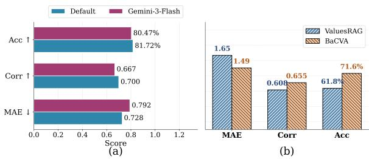  
Figure 15: Hyperparameter analysis on universalresponse model selection and value-system generalization.

Table 10: Results on PRISM under the fine-grained value system from Daily-Dilemma.
<table><tr><td>Method</td><td>MAE↓</td><td>Corr. ↑</td><td>Accuracy ↑</td></tr><tr><td>PersonValue</td><td>1.325</td><td>0.109</td><td>55.74%</td></tr><tr><td>ValuesRAG</td><td>0.717</td><td>0.167</td><td>62.63%</td></tr><tr><td>BaCVA</td><td>0.365</td><td>0.471</td><td>78.69%</td></tr></table>

As shown in Tab. 10, BaCVA substantially outperforms both PersonValue and ValuesRAG under the fine-grained value system. These results suggest that BaCVA is not constrained to a fixed coarse-grained taxonomy, but can also adapt to more detailed value dimensions and better capture contextual nuances in personalized value alignment.

## C.3 Cluster-level adaptability analysis

Tab. 11 compares BaCVA with two prior-only variants, where $\mathrm { P r i o r } { - } v _ { u }$ uses only the static user value prior and $\mathrm { P r i o r } { - } v _ { x }$ uses only the scenario-level value prior. Across all five major clusters, BaCVA consistently achieves the lowest MAE, indicating that its posterior value estimation can adapt to diverse contextual topics rather than relying on either user- or scenario-level priors alone.

## C.4 Case Study

We conduct a case study on the PRISM dataset to qualitatively examine whether our model can achieve both scenario alignment and personalization alignment. As illustrated in Fig. 16, our model is able to generate responses that are consistent with individual user preferences while simultaneously adapting to different contextual scenarios.

<table><tr><td>Cluster / Topic</td><td>Main Value Dims.</td><td>Prior-vu MAE ↓</td><td>Prior-vx MAE ↓</td><td>BaCVA MAE ↓</td></tr><tr><td>C1 / Social Values</td><td>Self-Dir., Benev.</td><td>1.539</td><td>1.986</td><td>0.777</td></tr><tr><td>C2 / Life Advice</td><td>Self-Direction</td><td>1.536</td><td>2.205</td><td>0.741</td></tr><tr><td>C3 / Politics/Civic</td><td>Power, Achievement</td><td>2.367</td><td>2.106</td><td>1.158</td></tr><tr><td>C4 / Religion/Tradition</td><td>Security, Tradition</td><td>1.887</td><td>2.100</td><td>0.774</td></tr><tr><td>C5 / Relationships</td><td>Benevolence, Security</td><td>1.380</td><td>1.890</td><td>0.672</td></tr></table>

Table 11: Cluster-level adaptability analysis on PRISM.

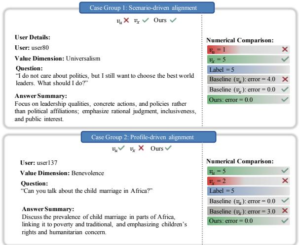  
Figure 16: Case study on the PRISM dataset. The proposed model generates responses that are aligned with both user-specific preferences and contextual scenarios, demonstrating its ability to achieve Contextualized Personalization Alignment.

This demonstrates that the proposed approach effectively integrates contextual understanding with personalized modeling, achieving Contextualized Personalization Alignment.

## C.5 Downstream detail analysis

Framework Formulation. We extend the twostage BaCVA framework by coupling contextual value inference with response generation. Following the standard notation, each training instance consists of a user u, a question x, a user profile $\mathbf { v } _ { u } ,$ question-level universal values $\mathbf { v } _ { x } .$ , and questionspecific personalized values $\mathbf { v } _ { u , x } .$ The dataset is augmented with preference triples $( x , y _ { c } , y _ { r } )$ where $y _ { c }$ and $y _ { r }$ denote the human-preferred and dispreferred responses, respectively. In the baseline Two-stage BaCVA, the inferrer predicts $\hat { \mathbf { v } } _ { u , x }$ via dual-stream gating, and a decoupled generator subsequently conditions on a discrete text description of $\hat { \mathbf { v } } _ { u , x }$ . In our proposed BaCVA-E2E, we interface these modules via continuous soft prompts. A linear projector maps the inferred vector $\hat { \mathbf { v } } _ { u , x } ~ \in ~ [ 1 , 5 ] ^ { 1 0 }$ to k prefix embeddings $\mathbf { e } _ { v } \in \mathbb { R } ^ { k \times d }$ , which are prepended to the token embeddings of [x, y]. The joint training objective is formulated as $\begin{array} { r } { \mathcal { L } _ { \mathrm { E 2 E } } = \mathcal { L } _ { \mathrm { v a l u e } } + \lambda \mathcal { L } _ { \mathrm { g e n } } , } \end{array}$ where ${ \mathcal { L } } _ { \mathrm { v a l u e } }$ is the masked value-regression loss from the vanilla BaCVA, and $\mathcal { L } _ { \mathrm { g e n } }$ is the preference alignment loss. This continuous path enables response-quality feedback to backpropagate directly into the inferrer.

Preference Alignment Loss. Conditioned on the soft prompts $\mathbf { e } _ { v }$ , we optimize the generator πθ using a DPO-style objective with multi-line alignment:

$$
\begin{array} { r } { \mathcal { L } _ { \mathrm { g e n } } = - \mathbb { E } _ { ( x , y _ { c } , y _ { r } ) } \Big [ \log \sigma \big ( \beta [ \Delta \log \pi ( y _ { c } ) - } \\ { \Delta \log \pi ( y _ { r } ) ] \big ) \Big ] , } \end{array}\tag{29}
$$

where the likelihood margin for response $y \in$ $\{ y _ { c } , y _ { r } \}$ is defined as:

$$
\Delta \log \pi ( y ) = \log \frac { \pi _ { \theta } ( y \mid \mathbf { e } _ { v } , x ) } { \pi _ { \mathrm { r e f } } ( y \mid \mathbf { e } _ { v } , x ) } .\tag{30}
$$

and $\beta$ scales the preference margin. Likelihood computations are restricted to answer tokens, masking out prefix and question tokens. We set the reference policy log $\pi _ { \mathrm { r e f } } \equiv 0 , \lambda = 1 . 0$ , and $\beta = 0 . 1$ across all experiments.

Conditioning Protocol. During training, value vectors are injected as continuous soft prompts $( k = 8 )$ prepended to the LM input, and the generator is fine-tuned via LoRA. Conversely, during inference, to isolate the performance gains attributable to improved value inference rather than a modified decoding interface, BaCVA-E2E adopts the exact same discrete text prompting as the two-stage baseline. The E2E-trained inferrer outputs $\hat { \mathbf { v } } _ { u , x }$ , which is converted into natural language value levels and inserted into the system prompt (e.g., Achievement: high (4.2)). The E2E generator LoRA weights are disabled at test time, and preprocessing follows the stage-1 implementation.

Dataset and Preprocessing. We utilize the PRISM dataset (Kirk et al., 2024) with an 80/20 user-level train/test split (using random seed 42), resulting in a test set of $N = 4 2 0$ . The groundtruth vector ${ \bf v } _ { y _ { c } }$ is derived directly from the 10- dimensional annotation of the human-chosen answer.

Evaluation Metrics. To comprehensively assess our framework, we evaluate performance across three metrics, each computed exclusively over the answer-specific active dimensions:

• MAE: Quantifies the absolute intensity mismatch between the predicted $\hat { v } _ { u , x } ^ { d }$ and groundtruth $v _ { y _ { c } } ^ { d }$ across relevant dimensions, formulated as $\mathbf { \bar { M A E } } = \mathbb { E } _ { d } [ | \hat { v } _ { u , x } ^ { d } - v _ { y _ { c } } ^ { d } | ]$

• Spearman’s $\rho \colon$ Measures the rank correlation between $\hat { \mathbf { v } } _ { u , x }$ and $\mathbf { v } _ { y _ { c } }$ pooled across the entire test set to capture ordinal consistency.

• Accuracy (Pairwise Ranking): Evaluates whether the predicted vector is closer to the chosen response than the rejected alternative in terms of $L _ { 1 }$ distance, defined as $\Vert \hat { \mathbf { v } } _ { u , x } -$ $\mathbf { v } _ { y _ { c } } \| _ { 1 } < \| \hat { \mathbf { v } } _ { u , x } - \mathbf { v } _ { y _ { r } } \| _ { 1 }$ . Ties are scored as 0.5.

Baseline Configurations. We compare our proposed framework against two major categories of alignment methods, all sharing the same backbone LM and utilizing greedy decoding (max\_new\_tokens = 256). The first category consists of non-personalized baselines, represented by DirectAnswer, which generates responses directly from the user query without any value conditioning. The second category comprises personalized baselines, including:

• ValuePrompt, which hard-codes the static user profile into the system prompt;

• COUPLE, which leverages counterfactual prompting to highlight conflicts between $\mathbf { v } _ { u }$ and $\mathbf { v } _ { x }$ ;

• MetaAligner, which employs a critique-andrewrite mechanism to align a draft response with user values;

• PAD and MOD, which implement contrastive decoding via token-level logit manipulation;

• ValuesRAG, which augments the generation context with few-shot exemplars retrieved from historically similar profiles.

Hyperparameters and Ablations. The complete hyperparameter configuration for training BaCVA-E2E is detailed in Tab. 12. For ablation analysis, we maintain the identical pipeline but evaluate under two restricted settings: w/o gradient to inferrer, where $\hat { \mathbf { v } } _ { u , x }$ is detached before soft-prompt projection to isolate decoupled training behavior, and w/o $\mathcal { L } _ { \nu a l u e }$ , which completely removes the explicit value-regression constraints on the inferrer submodule.

Tab. 13 presents the performance of $\mathbf { B a C V A } \mathbf { . }$ E2E and its ablation variants on the PRISM test set. The results show that both gradient feedback to the value inferrer and the value supervision objective contribute positively to the final alignment performance.

Component Setting   
Backbone LM Qwen3-1.7B (bfloat16)   
BaCVA Submodule LoRA (r=16, α=32), warm  
started   
Generator Module Attention Projection LoRA   
(r=16, α=32)   
Soft Prompts k=8 tokens, Linear Projector +   
LayerNorm   
Optimizer AdamW (weight decay = 0.01)   
Learning Rate $5 \times 1 0 ^ { - 5 }$ (Inferrer); $2 \times 1 0 ^ { - 4 }$   
(Generator + Projector)   
Training Layout 3 epochs, batch size 1, gradient   
accumulation 8   
Loss Scalers $( \lambda , \beta )$ 1.0, 0.1   
Seed 42

Table 12: Hyperparameter settings for BaCVA-E2E training.
<table><tr><td>Method</td><td>MAE↓</td><td>Acc ↑</td><td>Spearman ↑</td></tr><tr><td>Proposed Framework</td><td></td><td></td><td></td></tr><tr><td>BaCVA (Two-stage)</td><td>0.3835</td><td>0.7975</td><td>0.4782</td></tr><tr><td>BaCVA-E2E</td><td>0.3776</td><td>0.7996</td><td>0.4812</td></tr><tr><td>Ablations</td><td></td><td></td><td></td></tr><tr><td>w/o grad. to inferrer</td><td>0.3853</td><td>0.7957</td><td>0.4794</td></tr><tr><td>w/o  ${ \mathcal { L } } _ { \mathrm { v a l u e } }$ </td><td>0.3841</td><td>0.7258</td><td>0.4757</td></tr></table>

Table 13: Ablation results on the PRISM test set $( N =$ 420).

Qualitative Case Studies. Fig. 17 presents two cases where the situational value $\hat { \mathbf { v } } _ { u , x }$ diverges from the static profile $\mathbf { v } _ { u } .$ . In Case A, Value-Prompt frames the response around the user’s self-direction-dominant $\mathbf { v } _ { u } ,$ missing the empathetic tone the situation requires; BaCVA-E2E correctly infers a Benevolence-dominant $\hat { \mathbf { v } } _ { u , x }$ and responds accordingly. In Case B, PAD anchors advice to the user’s Conformity-dominant ${ \bf v } _ { u }$ and treats the situation as a discipline problem; BaCVA-E2E infers that the family context elevates Benevolence and produces empathy-first guidance instead.

## C.6 Cross-Extractor Evaluation

The main experiments use GPT-5-nano to construct both training and test value targets. Although its agreement with human annotations is validated in Appendix B.4, using the same extractor throughout the pipeline may introduce extractor-specific evaluation bias. We therefore evaluate whether BaCVA’s improvements transfer to independently constructed value targets from different model families.

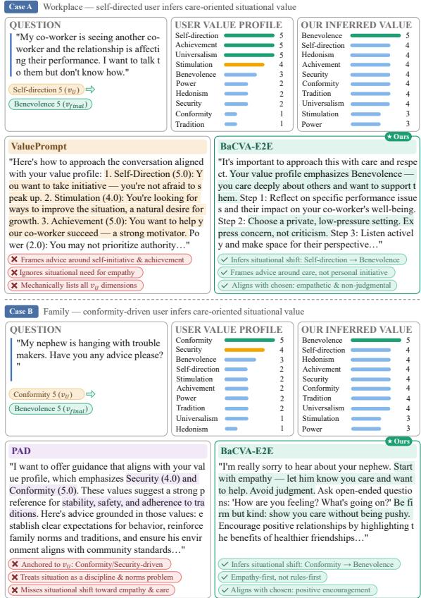

Figure 17: Qualitative comparison of BaCVA-E2E against representative baselines on two PRISM test instances where the situational value $\hat { \mathbf { v } } _ { u , x }$ diverges from the static user profile $\mathbf { v } _ { u } .$
<table><tr><td>Extractor</td><td>Profile MAE ↓</td><td>Profile Corr. ↑</td><td>Answer MAE ↓</td><td>Answer Corr. ↑</td></tr><tr><td>GPT-5-nano</td><td>0.056</td><td>0.986</td><td>0.120</td><td>0.936</td></tr><tr><td>Gemini-3-Flash</td><td>0.172</td><td>0.930</td><td>0.166</td><td>0.880</td></tr><tr><td>Qwen3-235B-A22B</td><td>0.164</td><td>0.932</td><td>0.171</td><td>0.878</td></tr></table>

Table 14: Human validation of value extractors.

Human Validation of Value Extractors We first compare GPT-5-nano, Gemini-3-Flash, and Qwen3-235B-A22B against the same humanannotated value assessments. As shown in Tab. 14, all three extractors achieve strong agreement with human annotations at both the profile and answer levels.

Evaluation with Mismatched Training and Test Extractors We retain GPT-5-nano targets for training, but independently reconstruct the test targets using Gemini-3-Flash and Qwen3-235B-A22B. Neither test extractor is used during training or scenario-prior construction. For each extractor, the values of both preferred and dispreferred test responses are reconstructed before computing MAE, correlation, and pairwise ranking accuracy.

As shown in Tab. 15, BaCVA consistently outperforms ValuesRAG under both matched and mismatched evaluation. Across the two mismatched settings, BaCVA reduces MAE by 21.2% on average and improves accuracy by 9.56 percentage points over ValuesRAG, while also achieving higher correlation.

<table><tr><td>Training Extractor</td><td>Test Extractor</td><td>Method</td><td>MAE↓</td><td>Corr. ↑</td><td>Accuracy ↑</td></tr><tr><td>GPT-5-nano</td><td>GPT-5-nano</td><td>ValuesRAG</td><td>0.952</td><td>0.638</td><td>71.68%</td></tr><tr><td>GPT-5-nano</td><td>GPT-5-nano</td><td>BaCVA</td><td>0.728</td><td>0.700</td><td>81.72%</td></tr><tr><td>GPT-5-nano</td><td>Gemini-3-Flash</td><td>ValuesRAG</td><td>1.052</td><td>0.605</td><td>69.02%</td></tr><tr><td>GPT-5-nano</td><td>Gemini-3-Flash</td><td>BaCVA</td><td>0.826</td><td>0.665</td><td>78.55%</td></tr><tr><td>GPT-5-nano</td><td>Qwen3-235B-A22B</td><td>ValuesRAG</td><td>1.066</td><td>0.598</td><td>68.37%</td></tr><tr><td>GPT-5-nano</td><td>Qwen3-235B-A22B</td><td>BaCVA</td><td>0.842</td><td>0.657</td><td>77.96%</td></tr></table>

Table 15: Cross-extractor evaluation with mismatched training and test value targets.

## C.7 Robustness across Scenario-Prior Estimators

To evaluate whether BaCVA depends on a particular model for constructing the scenario prior ${ \mathbf { v } } _ { x } .$ we compare three aligned LLMs from different model families: GPT-5-nano, Gemini-3-Flash, and Qwen3-235B-A22B. These models are used as operational proxies for population-level scenario salience rather than definitive representations of universal human values.

We measure the consistency of the extracted scenario priors using within-one agreement. For each question and value dimension, two estimators are considered consistent when their scores differ by at most one point on the 1–5 scale. The agreement reported for each estimator is its average pairwise agreement with the other two estimators over the same PRISM questions.

As shown in Tab. 16, the three estimators achieve an average within-one agreement of 89.15%. The downstream PRISM MAE has a standard deviation of only 0.027, indicating that BaCVA maintains stable absolute-error performance across different scenario-prior estimators, although some variation remains in correlation and pairwise accuracy.

## C.8 Generalization across Alignment Backbones

To evaluate whether the improvements of BaCVA generalize beyond the default Qwen3-8B backbone, we additionally implement BaCVA and representative personalized baselines using Llama3-8B. All methods use the same datasets, data splits, value extractor, input information, and baseline configurations.

As shown in Tab. 17, BaCVA consistently outperforms ValuePrompt and ValuesRAG under both backbone models. With Llama3-8B, BaCVA reduces MAE by 37.9%, improves correlation by 0.125, and increases accuracy by 19.06 percentage points relative to ValuesRAG. These results support the generalizability of BaCVA across alignment backbone families.

## C.9 Profile–Answer Conflict Analysis

To examine when contextual value inference is most beneficial, we measure the conflict between the global user profile $\mathbf { v } _ { u }$ and the values expressed in the preferred answer $\mathbf { v } _ { y _ { c } }$ . For each sample, the profile–answer distance is computed as

$$
d _ { \mathrm { c o n f i c t } } = \frac { 1 } { D } \sum _ { j = 1 } ^ { D } \left| v _ { u } ^ { ( j ) } - v _ { y _ { c } } ^ { ( j ) } \right| ,\tag{31}
$$

where D is the number of value dimensions. We divide the PRISM test samples into low-, medium-, and high-conflict subsets according to this distance.

As shown in Tab. 18, the performance gap between BaCVA and profile-based methods becomes more pronounced as profile–answer conflict increases. On the high-conflict subset, BaCVA reduces MAE by 17.8% relative to ValuesRAG. Its absolute improvement over ValuesRAG is also larger in the medium- and high-conflict subsets than in the low-conflict subset, indicating that explicit contextual value inference is particularly useful when answer-level values diverge from the global user profile.

## C.10 General-Purpose Capabilities

To assess whether personalized value-alignment training degrades capabilities outside the target task, we evaluate the original Qwen3-8B backbone and BaCVA on four general-purpose benchmarks: BoolQ, ARC-Easy, HellaSwag, and Wino-Grande (Clark et al., 2019, 2018; Zellers et al.,

<table><tr><td>Scenario-Prior Estimator Prior Agreement ↑</td><td></td><td>MAE↓</td><td>Corr. ↑</td><td>Accuracy ↑</td></tr><tr><td>GPT-5-nano</td><td>90.20%</td><td>0.728</td><td>0.700</td><td>81.72%</td></tr><tr><td>Gemini-3-Flash</td><td>89.89%</td><td>0.792</td><td>0.667</td><td>80.47%</td></tr><tr><td>Qwen3-235B-A22B</td><td>87.35%</td><td>0.749</td><td>0.746</td><td>79.81%</td></tr><tr><td> $\mathbf { M e a n } \pm \mathbf { S t d } .$ </td><td> $8 9 . 1 5 \% \pm 1 . 2 8 \%$ </td><td> $0 . 7 5 6 \pm 0 . 0 2 7$ </td><td> $0 . 7 0 4 \pm 0 . 0 3 2$ </td><td> $8 0 . 6 7 \% \pm 0 . 7 9 \%$ </td></tr></table>

Table 16: Robustness to the model used for constructing the scenario prior on PRISM. Prior agreement denotes average pairwise within-one agreement on the 1–5 value scale.

<table><tr><td>Backbone</td><td>Method</td><td>MAE↓</td><td>Corr. ↑</td><td>Accuracy ↑</td></tr><tr><td rowspan="3">Qwen3-8B</td><td>ValuePrompt</td><td>1.790</td><td>0.568</td><td>72.95%</td></tr><tr><td>ValuesRAG</td><td>0.952</td><td>0.638</td><td>71.68%</td></tr><tr><td>BaCVA</td><td>0.728</td><td>0.700</td><td>81.72%</td></tr><tr><td rowspan="3">Llama3-8B</td><td>ValuePrompt</td><td>2.969</td><td>0.312</td><td>42.29%</td></tr><tr><td>ValuesRAG</td><td>1.524</td><td>0.369</td><td>63.02%</td></tr><tr><td>BaCVA</td><td>0.947</td><td>0.494</td><td>82.08%</td></tr></table>

Table 17: Personalized value alignment results across backbone models on PRISM.

<table><tr><td>Conflict Level</td><td>#Samples</td><td>ValuePrompt</td><td>ValuesRAG</td><td>BaCVA</td></tr><tr><td>Low</td><td>136</td><td>1.471</td><td>0.801</td><td>0.640</td></tr><tr><td>Medium</td><td>149</td><td>1.705</td><td>0.899</td><td>0.678</td></tr><tr><td>High</td><td>135</td><td>2.059</td><td>1.163</td><td>0.956</td></tr></table>

Table 18: MAE on PRISM under different degrees of profile–answer conflict.

2019; Sakaguchi et al., 2021). These benchmarks cover reading comprehension, science reasoning, commonsense completion, and commonsense reasoning.

As shown in Tab. 19, BaCVA maintains performance comparable to the original backbone across all four benchmarks. Its average performance is 78.74%, compared with 77.69% for the original backbone, indicating that BaCVA training does not substantially degrade general-purpose capabilities.

<table><tr><td>Benchmark</td><td>Backbone</td><td>BaCVA</td></tr><tr><td>BoolQ</td><td>86.70%</td><td>86.45%</td></tr><tr><td>ARC-Easy</td><td>81.06%</td><td>83.59%</td></tr><tr><td>HellaSwag</td><td>74.96%</td><td>76.87%</td></tr><tr><td>WinoGrande</td><td>68.03%</td><td>68.03%</td></tr><tr><td>Average</td><td>77.69%</td><td>78.74%</td></tr></table>

Table 19: General-purpose performance of the original Qwen3-8B backbone and BaCVA after personalized value-alignment training.

## C.11 Comparison with Explicit Stochastic Approximation

To examine the accuracy–efficiency trade-off of the practical posterior implementation, we compare BaCVA with an explicit stochastic approximation that draws 10 Monte Carlo samples for each input. The two implementations use the same backbone, test set, and evaluation protocol.

As shown in Tab. 20, the amortized implementation reduces MAE by 7.4%, improves correlation by 0.021, and increases accuracy by 3.97 percentage points relative to the 10-sample Monte Carlo approximation. Its inference latency is 7.3% higher but remains comparable under the same evaluation setting. These results support the use of deterministic amortized inference as a practical approximation rather than exact stochastic posterior computation.

<table><tr><td>Implementation</td><td>MAE↓</td><td>Corr. ↑</td><td>Accuracy ↑</td><td>Time ↓</td></tr><tr><td>10-sample Monte Carlo</td><td>0.786</td><td>0.679</td><td>77.75%</td><td>148.0 ms</td></tr><tr><td>Amortized BaCVA</td><td>0.728</td><td>0.700</td><td>81.72%</td><td>158.8 ms</td></tr></table>

Table 20: Accuracy–efficiency comparison of posterior implementations on PRISM. Inference time is reported per sample.

## D Generative Assistance

Generative AI tools were used to assist with language polishing and improving the clarity of presentation in this paper. All technical content, experimental design, results, and conclusions were developed and verified by the authors.