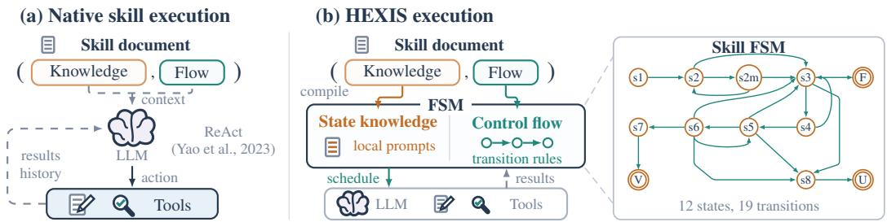
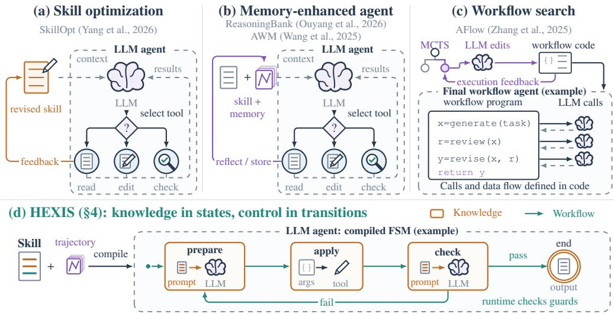
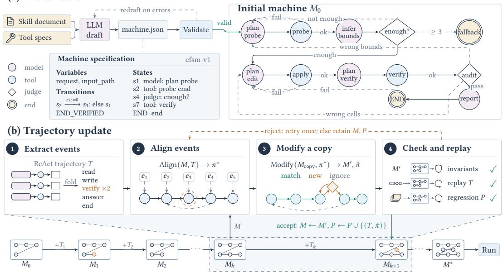
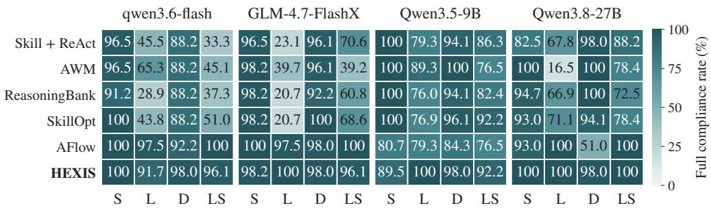
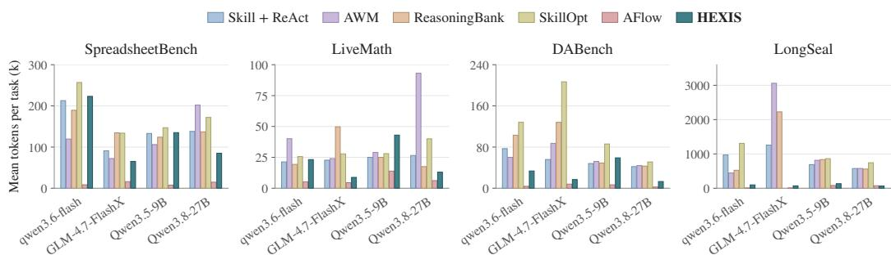
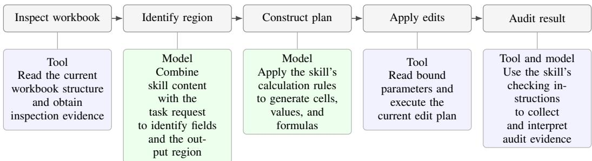
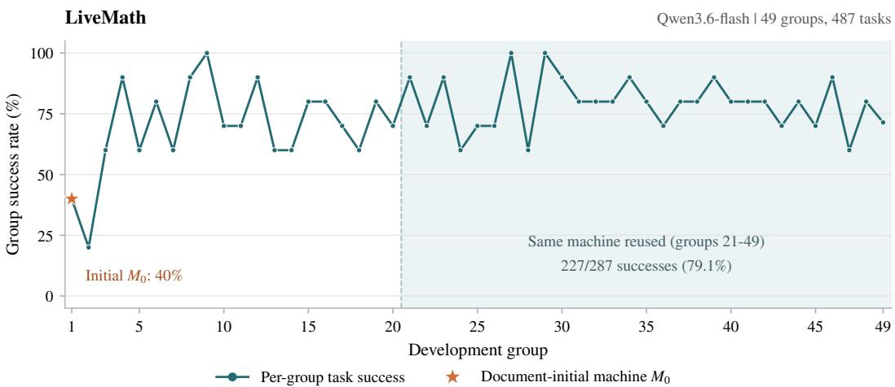

# HEXIS: COMPILING AGENT SKILLS INTO EXTENDED FINITE STATE MACHINES

WorldBuilder013 worldbuilder013@126.com

Minghao Li liminghao0914@gmail.com

## ABSTRACT

Agent skills provide instructions and reusable knowledge, yet agents have to frequently infer which action to take next. This skill’s execution paradigm combines task reasoning with control decisions, which could cause the agent to act improperly or omit necessary steps. To improve agent compliance for skills, we introduce HEXIS, which compiles agent skills into extended finite state machines (FSM) that separate knowledge from control flow. Skill knowledge is incorporated into local instructions that guide reasoning and generation within states. The machine records execution progress and intermediate results, while explicit transition conditions determine subsequent operations. Our incremental compiler first maps skill clauses and tool interfaces to state operations, local instructions, data bindings, and transitions. It then aligns development traces with existing states to identify missing operations and dependencies. These are incorporated by adding or reusing states and refining their connections. Updates are accepted only after static checks and replay of the current and all previously accepted traces. Across four benchmarks and four executors, HEXIS improves success over Skill + ReAct by 16.1 percentage points on average. Qwen3.8-27B reduces execution tokens by 38.4–88.9% across benchmarks.

## 1 INTRODUCTION

Agent skills (Agent Skills, 2026) package domain knowledge, instructions, and resources for reuse across tasks. A skill can combine explanations and worked examples with instructions for using scripts, reference materials, and templates. Agents load these materials when needed and use them to guide reasoning and tool use. SkillsBench (Li et al., 2026) reports that curated skills increase the average pass rate from 33.9% to 50.5% on 87 tasks spanning eight domains, illustrating the value of making specialized knowledge available during execution.

A central challenge in skill execution is that agents do not reliably follow skill requirements throughout a task (Li et al., 2025). In common practice, the skill document is supplied as context, and the model infers which actions to take from the instructions and interaction history. Even when the skill requires a particular operation, the model must infer when to perform it (Wu et al., 2024). For example, a model may report a failed check without carrying out the revision required by the skill. AgentIF documents difficulties in following complex conditional requirements and tool specifications (Qi et al., 2025), and SOPBench finds particularly poor procedural compliance among smaller models (Li et al., 2025). In longer tasks, the growing interaction history may further complicate the use of relevant instructions, given models’ limitations in using long contexts (Liu et al., 2024). Consequently, requirements that are clearly stated in a skill can still be omitted or incorrectly applied during execution.

Existing research has pursued three relevant directions. First, skill optimization improves the doc uments available to agents. SkillOpt (Yang et al., 2026) revises skill documents using execution feedback and retains changes that improve validation performance. Second, reflection and memory help models infer appropriate actions from prior experience. Reflexion (Shinn et al., 2023) supplies feedback from earlier attempts, while Agent Workflow Memory (Wang et al., 2025) provides workflow descriptions extracted from experience. Third, programs organize the execution of models and tools. StateFlow (Wu et al., 2024) represents task stages and their transitions with a state machine, while Formal Skill (Zhang et al., 2026) uses a program to track progress and restrict available actions. Other methods construct executable workflows from different sources. AFlow (Zhang et al.,

  
Figure 1: Separating knowledge from control flow. Existing works interprets the whole skill as context or memory. HEXIS separates knowledge and flow within an FSM that controls execution. The detail of the FSM with guards omitted is shown as Appendix F.

2025) searches for workflows using execution feedback, TraceCompiler (Yadouni & Li, 2026) derives programs from execution records, and Compile Then Page (Yu et al., 2026) compiles structured procedural requirements into programs.

Skill optimization improves the instructions available to the model, but the model must still determine which operation should follow from the skill and the current execution state. Reflection and memory provide additional experience, yet they likewise leave progress tracking and subsequent operation selection to model inference. StateFlow uses a state machine to organize task execution. The machine directs models and tools to perform the work assigned to the current stage, then determines the next stage from the results (Wu et al., 2024). This design reduces the need for the mode to repeatedly infer the next step from instructions and interaction history. It does not address the preceding problem of constructing such an executable representation from an existing agent skill. This compilation problem is nontrivial because a skill document interleaves task knowledge with procedural requirements over operation order, data dependencies, branching, repetition, and termination. A compiler must therefore determine which content should remain available to the model fo task-dependent reasoning and which execution relations can be represented explicitly and enforced by the runtime.

We introduce HEXIS, which compiles existing skills into extended finite state machines that execute tasks using language models and tools. Each machine records the current stage, executes its assigned operation, and applies transition conditions to determine the next stage. Models perform the reasoning and generation needed within each stage. This reduces the need for the model to repeatedly infer subsequent steps from the skill and interaction history, helping agents follow skill requirements more reliably throughout execution. HEXIS constructs these machines from skill documents and execution traces by specifying operations, data dependencies, and conditions for branching, repetition, and termination, while retaining the skill’s knowledge and instructions in model prompts.

Our contributions are: (i) HEXIS, which compiles agent skills into extended finite state machines that execute prescribed operations from recorded progress and transition conditions while retaining skill knowledge and instructions for in-state reasoning; (ii) a trace-guided incremental compilation algorithm that initializes a machine from the skill document, aligns execution traces to reuse or add actions and transitions, checks data dependencies and declared requirements on necessary steps and ordering, and commits an update only when replay reproduces the new and all previously accepted traces; and (iii) an evaluation on four benchmarks and four execution models in which machines compiled from qwen3.6-flash executions, transferred unchanged to the other backbones, improve on direct skill execution in 15 of 16 settings and lead or tie in 11, reduce Qwen3.8-27B token use by 38.4–88.9%, and reach 84.2% success on SpreadsheetBench when combined with SkillOpt.

## 2 RELATED WORK

Prior work improves skills by revising text, adding past experience, or using explicit control. SkillOpt (Yang et al., 2026) edits skill text with feedback from runs. Reflexion (Shinn et al., 2023), AWM (Wang et al., 2025), and ReasoningBank (Ouyang et al., 2026) provide reflections, workflows, or lessons for later use. StateFlow (Wu et al., 2024) organizes execution with predefined task-domain state machines, whereas HEXIS automatically derives reusable state machines from skills and execution traces. Formal Skill (Zhang et al., 2026) tracks progress and constrains actions with code. AFlow (Zhang et al., 2025) searches for workflows with execution feedback, TraceCompiler (Yadouni & Li, 2026) turns traces into programs, and Compile Then Page (Yu et al., 2026) compiles structured procedural rules into code. HEXIS compiles skill text into machines that keep operation prompts and data dependencies. It then aligns traces and validates updates, while models still reason within states. SkillOpt can also improve the text fed to our compiler, as shown when we combine skill optimization with state machine execution.

  
Figure 2: Separating knowledge from workflow. In panel (d), HEXIS retains task knowledge and local operations in orange FSM states, while green transitions define the workflow. Panels (a) and (b) provide revised skills or memory as context for the LLM to select tools and control execution. Panel (c) sketches an AFlow program that composes LLM calls.

## 3 MOTIVATION AND PROBLEM FORMULATION

## 3.1 MOTIVATION

Sources of deviation in native skill execution. A skill document D conveys knowledge $\kappa _ { D }$ about how to perform operations and control requirements $\mathcal { R } _ { D }$ about their order, dependencies, branching, repetition, and termination. These components can be interleaved in natural language. Native execution supplies both as context, together with task input x and history $h _ { t } ,$ , and the model selects an operation $a _ { t }$ and its inputs through

$$
a _ { t } \sim \pi _ { \theta } ( \cdot \mid D , x , h _ { t } ) ,\tag{1}
$$

where $\pi _ { \theta }$ includes the executor’s decoding rule. As panel (a) of Figure 1 illustrates, each decision couples applying task knowledge with recovering progress, identifying the applicable control requirements, and choosing the next operation. Supplying the requirements as context influences this choice but does not enforce it.

Let $\mathcal { A } _ { t } = \mathcal { A } _ { D } ( x , h _ { t } )$ denote the operations and inputs permitted by the skill’s applicable requirements. This is a semantic reference, not an action filter assumed available to the executor. The local deviation probability is

$$
\epsilon _ { t } ( h _ { t } ) = \operatorname* { P r } ( a _ { t } \notin \mathcal { A } _ { t } \mid D , x , h _ { t } ) .\tag{2}
$$

For example, after correctly identifying a failed check, the model may report instead of carrying out the required revision. Correct evidence alone does not ensure $\epsilon _ { t } ( h _ { t } ) = 0 ;$ applying the control requirement remains a model decision, even with deterministic decoding.

For a fixed horizon $K ,$ , let $S _ { t }$ mean that the first t decisions respect the applicable requirements, with $S _ { 0 }$ certain and permitted termination treated as an absorbing compliant outcome. Define $\bar { \epsilon } _ { t } =$ $\mathrm { P r } ( S _ { t } ^ { c } \mid S _ { t - 1 } , D , x )$ over histories that remain compliant. The chain rule gives

$$
F _ { K } = \operatorname* { P r } ( S _ { K } ^ { c } \mid D , x ) = 1 - \prod _ { t = 1 } ^ { K } ( 1 - { \bar { \epsilon } } _ { t } )\tag{3}
$$

where $S _ { t } ^ { c }$ denotes the complement event where at least one deviation occurs within the first t steps. Accordingly, $S _ { K }$ indicates full compliance throughout the horizon $K .$ , and $F _ { K }$ represents the cumulative deviation probability.

Separating knowledge execution from control. Panel (b) of Figure 1 illustrates how HEXIS retains the relevant $\kappa _ { D }$ in state-specific prompts and resource references and compiles them $\mathcal { R } _ { D }$ into states, guarded transitions, and termination rules. Models and tools perform local operations; typed variables store their inputs and results. Let $q _ { t }$ be the current state, $a _ { q _ { t } }$ its assigned operation, and $\nu _ { t } ^ { + }$ the values after that operation. Following a successful nonterminal operation, the runtime selects the first enabled outgoing edge

$$
a _ { t } = a _ { q _ { t } } , \qquad j ^ { * } = \operatorname* { m i n } \{ j : g _ { j } ( \nu _ { t } ^ { + } ) = \mathrm { t r u e } \} , \qquad q _ { t + 1 } = q _ { j ^ { * } } ^ { \prime } ,\tag{4}
$$

where $g _ { j }$ and $q _ { j } ^ { \prime }$ are the condition and destination of edge j. A model may use the skill’s checking criteria to write a verdict, while the runtime routes a failed verdict to revision. When the requirement is faithfully encoded and its condition correctly established, the prescribed continuation no longer requires another model decision. This removes an opportunity for control deviation at that boundary, targeting the repeated risks in Eq. (3).

## 3.2 PROBLEM FORMULATION

Given a skill document D, tool specifications, a task input schema, and development traces, skill compilation constructs an executable extended finite state machine M. Skill knowledge guides operations within states, and control relations are expressed as conditional transitions. We focus on whether the machine provides sufficient information to determine how the skill permits execution to continue. For task input $x$ and prior execution history $h ,$ let $B _ { D } ( x , h )$ denote the set of continuations permitted by the skill. Each continuation includes operations, their inputs and outputs, and how execution terminates. The machine configuration is denoted by $Z _ { M } = \left( q , \nu \right)$ , where $q$ is the current state and ν contains the variable values. For each candidate machine, the mapping from task input and history to configuration is fixed before evaluation.

For a fixed skill $D$ and a common distribution $\mu$ over contexts, let $B \ = \ B _ { D } ( x , h )$ and assume that B is a discrete random variable with finite entropy. Let M denote the family of candidate machines satisfying structural and interface requirements and predefined context storage specifications. The representational objective of compilation is to find a machine in this family that minimizes information loss:

$$
\operatorname* { m i n } _ { M \in \mathfrak { M } } \mathcal { L } _ { \mathrm { i n f o } } ( M ) , \qquad \mathcal { L } _ { \mathrm { i n f o } } ( M ) = H _ { \mu } ( B \mid Z _ { M } ) ,\tag{5}
$$

where ${ \mathcal { L } } _ { \mathrm { { i n f o } } }$ is the information loss of the representation. The conditional entropy $H _ { \mu } ( B \mid Z _ { M } )$ measures the remaining uncertainty about the continuations permitted by the skill, given configuration $Z _ { M }$ under distribution $\mu .$ A smaller loss indicates that the configuration better distinguishes these execution semantics. This equation specifies the representational objective; the compilation procedure uses static checks and trace replay to decide whether to accept an update.

## 4 METHOD

To reduce the representation loss defined in the preceding section, HEXIS uses states to record execution stages and variables to store data needed by subsequent operations. The compiler constructs an initial machine from the skill document, then uses development traces to add missing operations and dependencies. The model applies skill knowledge through local instructions within states, while the runtime selects transitions using variable values.

## 4.1 STATE MACHINE REPRESENTATION

The extended finite state machine is represented as:

$$
M = ( Q , q _ { 0 } , V , a , E , F , \tau ) ,\tag{6}
$$

where Q is the finite state set, $q _ { 0 }$ is the initial state, and V is the set of typed variables. The mapping a specifies each state’s operation and its configuration, E specifies its ordered outgoing edges, $\bar { F }$ is the set of terminal states, and τ specifies terminal outcome categories. An operation’s configuration includes its invocation interface, required instructions, and read and write declarations. Each outgoing edge specifies a condition and a destination state.

For a model generation state $q , p _ { q }$ denotes its local instructions, and $R _ { q }$ and $W _ { q }$ are the sets of variable names it reads and writes. Let ν denote the current variable values and $\nu | _ { R _ { q } }$ their restriction to $R _ { q } .$ . The notation $\mathcal { L } _ { \theta }$ denotes the execution model with parameters θ together with its output parsing. State execution and variable updates are given by

$$
y _ { q } = \mathcal { L } _ { \theta } ( p _ { q } , \nu | _ { R _ { q } } ) , \qquad \nu ^ { + } = \nu [ W _ { q }  y _ { q } ] ,\tag{7}
$$

where $y _ { q }$ is the structured output and $\nu ^ { + }$ contains the variable values after the write. The assignment $\nu [ \hat { W } _ { q }  y _ { q } ]$ writes output fields to their corresponding variables and leaves all other values unchanged. Tool states invoke tools through argument templates and store the returned results.

After an operation at a nonterminal state completes normally, the runtime checks outgoing edges in a fixed order. Let j index these edges, $g _ { j }$ denote an edge’s Boolean condition, and $q _ { j } ^ { \prime }$ its destination state. If at least one condition holds, the selection rule is

$$
j ^ { * } = \operatorname * { m i n } \{ j : g _ { j } ( \nu ^ { + } ) = \mathrm { t r u e } \} , \qquad q _ { \mathrm { n e x t } } = q _ { j ^ { * } } ^ { \prime } .\tag{8}
$$

The symbol true denotes a satisfied condition, and min selects the smallest index. Thus, $j ^ { * }$ identifies the first enabled edge and $q _ { \mathrm { n e x t } }$ is the next state. Unconditional edges are treated as always true and placed last. Loop counters are updated after edge selection. Reaching a terminal state ends execution and records the outcome category.

## 4.2 INITIAL COMPILATION

The compiler organizes skill document D into numbered clauses according to its document structure and retains the full text. If skill rules are not supplied, the construction model extracts event labels, required operations, ordering requirements, prohibited behaviors, and termination conditions from the document, with a source quotation for each entry. The program removes entries whose quotations cannot be found in the document or that refer to unknown tools or labels.

The construction model receives the full text, clause table, rules, tool interfaces, and task input fields, and generates states, variables, and outgoing edges in the machine format. The prompt requires each retained clause to appear as a state or local instruction. For a generation state $q ,$ the construction model writes local instructions $p _ { q }$ containing the skill knowledge needed by the operation and declares the read set $R _ { q }$ and write set $W _ { q }$ . These instructions specify the required result and require its output fields to match $W _ { q } .$ . Variable references pass task inputs and earlier results to subsequent operations. A preceding model state generates tool arguments that vary across tasks.

Transition conditions use computable predicates over variables. When semantic judgment is required, the construction model writes the judgment criteria into a judge state’s instructions, requires it to output a predefined label, and connects successor states according to the label value. The prompt also requires default edges, loop counter limits and exits, and the specified evidence on paths to terminal states.

The program checks the candidate’s fields and types, condition syntax, graph structure, clause identifiers, and tool declarations. If a check fails, the candidate and error list are returned to the model for revision within a fixed retry limit. The first passing candidate is normalized, then checked for variable dependencies, terminal evidence, and declared constraints. A passing machine becomes $M _ { 0 }$ , where the subscript 0 indicates that no trajectory updates have occurred. Initialization fails if retries are exhausted or the final check fails.

## 4.3 TRAJECTORY UPDATES

Round k processes one development trace, with k starting at 0 and $M _ { k }$ denoting the current machine. The compiler extracts tool calls, delivered outputs, and termination events, retaining inputs, outputs, and reasoning text that explains operation intent. It then aligns these events with the machine in order. The program first filters states by compatible operation types; tool events also require matching tool names and invocation phases. The construction model then uses operation intent, inputs and outputs, and skill content to determine whether an existing state can perform the operation. Reachable states are preferred for reuse. When reusing a state elsewhere, the compiler checks whether the new connection bypasses required states shared by the existing paths.

The compiler modifies a copy of the machine according to the alignment results, producing candidate $M _ { k } ^ { \prime }$ . Unmatched operations become new states whose local instructions are written from the event purpose and relevant skill clauses. Variable bindings and transitions supply missing data transfers and execution connections. If the same condition leads to different successors, a judge state is inserted to produce a branch label. Loops are assigned counter limits and exits.

  
Figure 3: Skill compilation consists of initialization and trajectory updates. Initialization generates and validates an initial machine from the skill document and tool specifications; updates extract events, align states, modify a copy, and check and replay it to obtain the final machine for execution.

Let $r _ { k }$ contain the filtered trace record from the current round and its correspondence between events and states, and let $\mathcal { P } _ { k }$ be the set of previously accepted records. The initial archive is $\mathcal { P } _ { 0 } = \varnothing$ , where ∅ denotes the empty set. The acceptance condition is

$$
A _ { k } = \mathrm { C h e c k } ( M _ { k } ^ { \prime } ) \wedge \bigwedge _ { r \in \mathcal { P } _ { k } \cup \{ r _ { k } \} } \mathrm { R e p l a y } ( M _ { k } ^ { \prime } , r ) ,\tag{9}
$$

where the Boolean $A _ { k }$ is the acceptance result. The operator Check checks structure, variable dependencies, terminal evidence, and declared constraints, while Replay checks whether a given record can be replayed. The union ∪ adds the current record to the archive, r ranges over the resulting records, $\Lambda$ requires every replay to pass, and ∧ also requires the static checks to pass. Replay uses recorded tool outputs and abstract outputs for model operations, following the actual transition rules to check operations, tools, success or failure, and terminal identifiers.

On acceptance, $M _ { k + 1 } = M _ { k } ^ { \prime }$ and the archive is updated to $\mathcal { P } _ { k + 1 } = \mathcal { P } _ { k } \cup \{ r _ { k } \}$ . If the first candidate fails, state reuse is restricted to compatible, reachable states, and one further attempt is made. If that attempt fails or the trace is excluded, the machine and archive remain unchanged.

## 5 EXPERIMENTS

This section describes the benchmarks, baselines, and compilation protocol, and reports the comparison results. It then examines execution cost and the combination with skill optimization.

## 5.1 BENCHMARKS AND SKILLS

We evaluate HEXIS on four benchmarks, each paired with one skill document. Every task is scored as a success or a failure, and we report the success rate on held-out test tasks. The last three benchmarks are split approximately 80/20 with random seed 2026. Appendix I lists the sources of all benchmarks and skills.

Spreadsheet manipulation. The 107 verified cell-manipulation tasks of SpreadsheetBench (Ma et al., 2024) ask the agent to produce an edited workbook from a natural-language instruction. We use the SigLeak spreadsheet skill (Geng et al., 2026) and split the tasks 50/57 into development and test.

Mathematical reasoning. LiveMathematicianBench (He et al., 2026) (LiveMath) poses mathematician-level problems with answer options, which we shuffle with a fixed seed. Its SigLeak skill is compiled on 487 development tasks and tested on 121, stratified by month.

Data analysis. The 257-question InfiAgent-DABench release (Hu et al., 2024) asks questions about data files that are answered by writing and running code. It uses the Pandas Pro skill (Jeffallan, 2026) and a 206/51 split stratified by difficulty.

Long-context question answering. LongSeal from SealQA (Pham et al., 2026) asks questions whose evidence is spread over long collections of webpages. We run it offline with only the supplied webpages, use its SigLeak skill, and split the questions 203/51.

## 5.2 BASELINES

We compare against five methods that run the same executor and tools as HEXIS but supply the skill in a different form: as the document itself, as induced experience, as revised text, or as a searched workflow. The baseline methods include:

Skill + ReAct (Yao et al., 2023) supplies the skill document as context, and the model selects every tool call during interleaved reasoning and acting. It is the native execution that HEXIS replaces.

AWM (Wang et al., 2025) induces reusable workflows from successful development trajectories and adds them to the context of later runs.

ReasoningBank (Ouyang et al., 2026) distills lessons from both successful and failed trajectories and retrieves the relevant ones for each new task.

SkillOpt (Yang et al., 2026) revises the skill document under execution feedback and selects the revision to execute natively, testing whether better skill text alone closes the gap.

AFlow (Zhang et al., 2025) searches for a workflow of model calls using execution feedback and executes the searched workflow in place of the document.

Settings. Execution models are hosted qwen3.6-flash (Alibaba Cloud, 2026) and GLM-4.7- FlashX, and locally deployed Qwen3.5-9B and Qwen3.8-27B (vLLM (Kwon et al., 2023), FP16). Within each comparison, methods share the backbone and OpenCode shell/file tools (Anomaly, 2026). Claude Fable 5.1 (Anthropic, 2026) performs compilation, skill optimization, and memory induction. Machines are compiled and refined solely from the skill document and all qwen3.6-flash train trajectories, successful or failed, including observed intermediate results. One machine per skill is then transferred directly to GLM-4.7-FlashX, Qwen3.5-9B, and Qwen3.8- 27B, retaining its states, prompts, data bindings, and transitions without target-model recompilation or adaptation. HEXIS is shown in bold in every table.

Metric. We measure request-level full compliance, the fraction of executions satisfying every applicable, mechanically verifiable request requirement. Let A be an evaluated method, X its test set, and $r _ { A } ( x )$ the execution trace and artifacts for task x. The nonempty set $C _ { A } ( \boldsymbol { x } )$ contains the checks applicable to the request and interface supplied to A; each check c returns 1 if satisfied and 0 otherwise. The metric is

$$
\operatorname { R F C } ( A ) = { \frac { 1 } { | { \mathcal { X } } | } } \sum _ { x \in { \mathcal { X } } } \prod _ { c \in C _ { A } ( x ) } c { \big ( } r _ { A } ( x ) { \big ) } .\tag{10}
$$

Here, |X| is the number of tasks, and the product is one only when all applicable checks pass. Figure 4 reports percentages. Checks cover file delivery, output format, and tool-use requirements independently of answer correctness. Local-model LiveMath results use uniform escaping normalization.

## 5.3 MAIN RESULTS

Compiled execution improves skill following across tasks. Table 1 reports success rates. HEXIS improves on native skill execution in 15 of 16 settings and achieves the best or tied-best success in 11. The gains span mathematical reasoning, spreadsheet editing, data analysis, and longcontext question answering. The same approach to representing skill knowledge, contextual dependencies, and permitted continuations thus benefits tasks with different reasoning processes and output requirements.

Table 1: Success rates (%) on four benchmarks using four execution models. Bold and underline mark the best and second-best result for each benchmark and model.
<table><tr><td>Benchmark</td><td>Method</td><td>Qwen3.6-flash</td><td>GLM-4.7-FlashX</td><td>Qwen3.5-9B</td><td>Qwen3.8-27B</td></tr><tr><td rowspan="6">Spreadsheet Bench</td><td>Skill + ReAct</td><td>45.6%</td><td>22.8%</td><td>33.3%</td><td>56.1%</td></tr><tr><td>AWM</td><td>61.4%</td><td>31.6%</td><td>35.1%</td><td>59.6%</td></tr><tr><td>ReasoningBank</td><td>43.9%</td><td>15.7%</td><td>33.3%</td><td>63.2%</td></tr><tr><td>SkillOpt</td><td>59.6%</td><td>40.4%</td><td>47.4%</td><td>66.7%</td></tr><tr><td>AFlow</td><td>36.8%</td><td>22.8%</td><td>38.6%</td><td>73.7%</td></tr><tr><td>HEXIS</td><td>75.4%</td><td>47.4%</td><td>38.6%</td><td>71.9%</td></tr><tr><td rowspan="6">LiveMath</td><td>Skill + ReAct</td><td>45.0%</td><td>12.4%</td><td>40.5%</td><td>33.9%</td></tr><tr><td>AWM</td><td>32.5%</td><td>14.8%</td><td>38.0%</td><td>13.2%</td></tr><tr><td>ReasoningBank</td><td>37.5%</td><td>8.3%</td><td>39.7%</td><td>41.3%</td></tr><tr><td>SkillOpt</td><td>38.3%</td><td>12.4%</td><td>37.2%</td><td>37.2%</td></tr><tr><td>AFlow</td><td>58.7%</td><td>34.7%</td><td>41.3%</td><td>43.8%</td></tr><tr><td>HEXIS</td><td>76.7%</td><td>48.7%</td><td>71.9%</td><td>71.9%</td></tr><tr><td rowspan="6">DABench</td><td>Skill + ReAct</td><td>78.4%</td><td>78.4%</td><td>82.4%</td><td>86.3%</td></tr><tr><td>AWM</td><td>74.5%</td><td>78.4%</td><td>82.4%</td><td>86.3%</td></tr><tr><td>ReasoningBank</td><td>80.4%</td><td>74.5%</td><td>78.4%</td><td>82.4%</td></tr><tr><td>SkillOpt</td><td>88.2%</td><td>82.4%</td><td>84.3%</td><td>86.3%</td></tr><tr><td>AFlow</td><td>80.4%</td><td>78.4%</td><td>51.0%</td><td>15.7%</td></tr><tr><td>HEXIS</td><td>82.4%</td><td>82.4%</td><td>86.3%</td><td>88.2%</td></tr><tr><td rowspan="6">LongSeal</td><td>Skill + ReAct</td><td>7.8%</td><td>7.8%</td><td>23.5%</td><td>17.6%</td></tr><tr><td>AWM</td><td>11.8%</td><td>9.8%</td><td>19.6%</td><td>23.5%</td></tr><tr><td>ReasoningBank</td><td>7.8%</td><td>7.8%</td><td>23.5%</td><td>23.5%</td></tr><tr><td>SkillOpt</td><td>13.7%</td><td>19.6%</td><td>27.5%</td><td>25.5%</td></tr><tr><td>AFlow</td><td>13.7%</td><td>9.8%</td><td>19.6%</td><td>33.3%</td></tr><tr><td>HEXIS</td><td>21.6%</td><td>19.6%</td><td>23.5%</td><td>23.5%</td></tr></table>

Across four LiveMath executors, HEXIS gains 31.4–38.0 points and outperforms every baseline; experience augmentation and skill-text optimization yield no similarly consistent improvement. The machine combines local skill instructions with explicit option analysis, selection, and completeness checking, returning to selection after failed checks. Models make mathematical judgments within states; the machine retains decisions and controls checking and revision. Appendices F and H show this procedure and its incremental refinement. SpreadsheetBench improves across executors by carrying output-region information between operations and checking saved workbooks against skill requirements. On DABench, HEXIS improves all four executors from 78.4–86.3% native success and leads or ties on three, complementing an already effective skill. LongSeal gains on three executors extend the evidence to long-context question answering, where machines retain taskrelevant intermediate results. These results support organizing reasoning and data dependencies. Compiled solely from qwen3.6-flash executions, the machines improve 11 of 12 target-model settings with unchanged states, local prompts, data bindings, and transitions. Large LiveMath gains persist across hosted and local executors despite different native success rates. One compilation thus provides reusable execution structure across backbones without target-specific traces or repeated refinement, while models reason within states. SkillOpt leads in a few settings, motivating the combination in Table 2.

Low compliance indicates failures to execute explicit task requirements. Across the four models on LiveMath, HEXIS reaches 91.7–100% compliance in Figure 4 and improves success over Skill + ReAct by 31.4–38.0 percentage points in Table 1. These joint gains are consistent with explicit transitions reducing execution failures. At high compliance, explaining performance differences also requires examining skill knowledge extraction, representation, and use. With qwen3.6-flash on SpreadsheetBench, SkillOpt and HEXIS both achieve 100% compliance, yet their success rates are 59.6% and 75.4%, respectively.

Token cost depends on the executor. Figure 5 shows the mean execution tokens per task. With qwen3.6-flash, HEXIS reduces tokens by 56.5% on DABench and 90.0% on LongSeal, but increases them by 4.9% on SpreadsheetBench and 8.9% on LiveMath. Qwen3.8-27B achieves the lowest costs with HEXIS on all four benchmarks, using 38.4–88.9% fewer tokens than Skill + ReAct. Qwen3.5-9B instead uses more tokens on three benchmarks; its saving on LongSeal is 80.8%. GLM costs fall by 28.4–94.5%. Thus, compiled execution can reduce context overhead, while additional reasoning and checking make efficiency depend on the task and model. Appendix E reports execution diagnostics.

  
S = SpreadsheetBench L = LiveMath D = DABench LS = LongSeal  
Figure 4: Full compliance rates (%) across four models and benchmarks.

  
Figure 5: Reported mean execution tokens per task (k), including input and output tokens. Each benchmark uses its own axis scale.

Content optimization and execution structure are complementary. On Spreadsheet-Bench, we compile the original and the SkillOpt-optimized documents and compare each with native Skill + ReAct execution. Table 2 shows that SkillOpt with HEXIS reaches 84.2% success at 69k tokens per task, a 24.6- point gain and a 73.2% token reduction over native execution of the optimized skill. SkillOpt refines the guidance provided by the skill document, while HEXIS organizes its applica-

Table 2: Combining skill optimization with state machine execution on SpreadsheetBench. Tokens are mean total execution tokens per task.
<table><tr><td>Skill document</td><td>Execution</td><td>Success (%)</td><td>Tokens (k)</td></tr><tr><td>Original</td><td>Skill + ReAct</td><td>45.6%</td><td>213</td></tr><tr><td>Original</td><td>HEXIS</td><td>75.4%</td><td>223</td></tr><tr><td>SkillOpt</td><td>Skill + ReAct</td><td>59.6%</td><td>257</td></tr><tr><td>SkillOpt</td><td>HEXIS</td><td>84.2%</td><td>69</td></tr></table>

tion through explicit operations, data dependencies, and transitions. The additional 8.8-point gain over HEXIS compiled from the original skill suggests that improvements to skill content remain beneficial after compilation.

## 6 CONCLUSION

Limitation. HEXIS depends on the quality and coverage of skill documents and development traces, so requirements or branches that they never express may be missing from the machine. Static checks and trace replay validate recorded execution paths but do not guarantee correct in-state reasoning or coverage of unseen situations. Targeted trace collection and stronger in-state verification are promising directions for future work.

Conclusion. HEXIS compiles skills into extended finite state machines with explicit control and data dependencies, retaining in-state reasoning and refining machines through trace alignment, validation, and replay. Across four benchmarks and four executors, it improves native execution in 15 of 16 settings and leads or ties in 11. Source-model compilation supports cross-model reuse without target-model recompilation, while retaining the selected executor’s reasoning within each state.

## AI USE STATEMENT

We used generative AI tools to assist with research execution, including writing analysis scripts and interpreting experimental results. We also used these tools to draft and revise parts of the manuscript, improve readability, and assist with translation. The authors take full responsibility for the accuracy, originality, and integrity of the final content.

## ETHICS STATEMENT

This work aims to improve the reliability and transparency of LLM-based skill execution, with evaluations conducted on existing benchmarks. Since the framework can invoke tools and modify artifacts, practical deployment should respect user authorization, apply appropriate access controls, and retain human oversight for consequential actions. Benchmark data, third-party skills, and model services should be used according to their applicable licenses and terms.

## REPRODUCIBILITY STATEMENT

The method section and appendices describe state-machine construction, trace-guided refinement, validation, and execution, together with the assumptions underlying the theoretical analysis. The experimental setup specifies the benchmarks, baselines, execution models, compilation and transfer protocol, and evaluation metrics. The appendices also provide execution statistics and a concrete state-machine example. Code and supporting experimental artifacts will be released at https: //anonymous.4open.science/r/HEXIS-575F/.

## REFERENCES

Agent Skills. Agent Skills Specification. Online specification, 2026. URL https:// agentskills.io/specification. Version accessed September 9, 2026.

Alibaba Cloud. qwen3.6-flash. Alibaba Cloud Model Studio documentation, 2026. URL https: //www.alibabacloud.com/help/en/model-studio/qwen3-6-flash. Accessed September 10, 2026.

Anomaly. OpenCode: The Open Source AI Coding Agent. Software repository, 2026. URL https://github.com/anomalyco/opencode. Accessed September 10, 2026.

Anthropic. Claude Fable 5.1 and Mythos 5.1, September 2026. URL https:// www.anthropic.com/claude-fable-and-mythos-5-1.

Jianing Geng, Ruiqi He, Zekun Fei, Biao Yi, Xuansheng Wu, Ruijie Wang, Zheli Liu, Xia Hu, and Qingkai Zeng. Agent Skills Matter: Inferring Proprietary Skills from Execution Trajectories. arXiv preprint arXiv:2607.25560, 2026. doi: 10.48550/arXiv.2607.25560. URL https:// arxiv.org/abs/2607.25560v2.

Linyang He, Qiyao Yu, Hanze Dong, Baohao Liao, Xinxing Xu, Micah Goldblum, Jiang Bian, and Nima Mesgarani. LiveMathematicianBench: A Live Benchmark for Mathematician-Level Reasoning with Proof Sketches. arXiv preprint arXiv:2604.01754, 2026. doi: 10.48550/ arXiv.2604.01754. URL https://arxiv.org/abs/2604.01754.

Xueyu Hu, Ziyu Zhao, Shuang Wei, Ziwei Chai, Qianli Ma, Guoyin Wang, Xuwu Wang, Jing Su, Jingjing Xu, Ming Zhu, Yao Cheng, Jianbo Yuan, Jiwei Li, Kun Kuang, Yang Yang, Hongxia Yang, and Fei Wu. InfiAgent-DABench: Evaluating Agents on Data Analysis Tasks. In Proceedings of the 41st International Conference on Machine Learning, volume 235 of Proceedings of Machine Learning Research, pp. 19544–19572. PMLR, 2024. URL https: //proceedings.mlr.press/v235/hu24s.html.

Jeffallan. Pandas Pro. Claude Skills repository, 2026. URL https://github.com/jeffallan/claude-skills/tree/ 882ef55e377dbf9a4dbe496bb41ac6ccd0e555cf/skills/pandas-pro. Version 1.1.0.

Woosuk Kwon, Zhuohan Li, Siyuan Zhuang, Ying Sheng, Lianmin Zheng, Cody Hao Yu, Joseph E. Gonzalez, Hao Zhang, and Ion Stoica. Efficient memory management for large language model serving with PagedAttention. In Proceedings ofthe 29th Symposium on Operating Systems Principles, pp. 611–626. Association for Computing Machinery, 2023. doi: 10.1145/3600006.3613165. URL https://doi.org/10.1145/3600006.3613165.

Xiangyi Li, Yimin Liu, Wenbo Chen, Bingran You, Zonglin Di, Yifeng He, Shenghan Zheng, Kyoung Whan Choe, Jiankai Sun, Shuyi Wang, Chujun Tao, Binxu Li, Xuandong Zhao, Hejia Geng, Xiaojun Wu, Junwei Zhou, Xiaokun Chen, Hanwen Xing, Yubo Li, Qunhong Zeng, Di Wang, Yuanli Wang, Roey Ben Chaim, Penghao Jiang, Haotian Shen, Luyang Kong, Xinyi Liu, Runhui Wang, Xuanqing Liu, Jiachen Li, Xin Lan, Yueqian Lin, Wengao Ye, Junwei He, Songlin Li, Yue Zhang, Yipeng Gao, Yijiang Li, Ze Ma, Liqiang Jing, Tianyu Wang, Kaixin Li, Yiq Xue, Haoran Lyu, Yizhuo He, Yuchen Tian, Shutong Wu, Bowei Wang, Yixuan Gao, Bo Chen, Litong Liu, Sikai Cheng, Jiajun Bao, Shuaicheng Tong, Shuwen Xu, Terry Yue Zhuo, Tinghan Ye, Qi Qi, Miao Li, Longtai Liao, Zelin Tan, Chang Shi, Xilin Tang, Srinath Tankasala, Boqin Yuan, Yaoyao Qian, Jianhong Tu, Chenguang Wang, Yizhou Sun, Wei Wang, Aaron Taylor, Ziyue Yang, Changkun Guan, Zhikang Dong, Xinyu Zhang, Steven Dillmann, Han-chung Lee, and Dawn Song. SkillsBench: Benchmarking How Well Agent Skills Work Across Diverse Tasks. arXiv preprint arXiv:2602.12670, 2026. doi: 10.48550/arXiv.2602.12670. URL https://arxiv.org/abs/2602.12670v4.

Zekun Li, Shinda Huang, Jiangtian Wang, Nathan Zhang, Antonis Antoniades, Wenyue Hua, Kaijie Zhu, Sirui Zeng, Chi Wang, William Yang Wang, and Xifeng Yan. SOPBench: Evaluating Language Agents at Following Standard Operating Procedures and Constraints. arXiv preprint arXiv:2503.08669, 2025. doi: 10.48550/arXiv.2503.08669. URL https://arxiv.org/ abs/2503.08669v2.

Nelson F. Liu, Kevin Lin, John Hewitt, Ashwin Paranjape, Michele Bevilacqua, Fabio Petroni, and Percy Liang. Lost in the Middle: How Language Models Use Long Contexts. Transactions ofthe Associationfor Computational Linguistics, 12:157–173, 2024. doi: 10.1162/tacl\_a\_00638. URL https://aclanthology.org/2024.tacl-1.9/.

Zeyao Ma, Bohan Zhang, Jing Zhang, Jifan Yu, Xiaokang Zhang, Xiaohan Zhang, Sijia Luo, Xi Wang, and Jie Tang. SpreadsheetBench: Towards Challenging Real World Spreadsheet Manipulation. In Advances in Neural Information Processing Systems, volume 37, 2024. doi: 10.52202/ 079017-3007. URL https://proceedings.neurips.cc/paper\_files/paper/ 2024/hash/ac840df270ac537dd74530a15c332684-Abstract-Datasets\_ and\_Benchmarks\_Track.html.

Siru Ouyang, Jun Yan, I-Hung Hsu, Yanfei Chen, Ke Jiang, Zifeng Wang, Rujun Han, Long Le, Samira Daruki, Xiangru Tang, Vishy Tirumalashetty, George Lee, Mahsan Rofouei, Hangfei Lin, Jiawei Han, Chen-Yu Lee, and Tomas Pfister. ReasoningBank: Scaling Agent Self-Evolving with Reasoning Memory. In The Fourteenth International Conference on Learning Representations, 2026. URL https://openreview.net/forum?id=jL7fwchScm.

Thinh Pham, Nguyen Nguyen, Pratibha Zunjare, Weiyuan Chen, Yu-Min Tseng, and Tu Vu. SealQA: Raising the Bar for Reasoning in Search-Augmented Language Models. In The Fourteenth International Conference on Learning Representations, 2026. URL https://proceedings.iclr.cc/paper\_files/paper/2026/hash/ a0e0f9c39b7f6d07a266a3326216ec40-Abstract-Conference.html.

Yury Polyanskiy and Yihong Wu. Lecture notes on information theory. MIT Open-CourseWare, 6.441, Spring 2016, 2016. URL https://ocw.mit.edu/courses/ 6-441-information-theory-spring-2016/pages/lecture-notes/. Chapters 2–3: mutual information, conditioning, and sufficient statistics.

Yunjia Qi, Hao Peng, Xiaozhi Wang, Amy Xin, Youfeng Liu, Bin Xu, Lei Hou, and Juanzi Li. AGENTIF: Benchmarking large language models instruction following ability in agentic scenarios. In Advances in Neural Information Processing Systems, volume 38. Curran Associates, Inc., 2025. doi: 10.52202/085713-1892. URL https://proceedings.neurips.cc/paper\_files/paper/2025/

hash/51bb3a8a33610a25aae074bfc51b1b1f-Abstract-Datasets\_and\_ Benchmarks\_Track.html.

Noah Shinn, Federico Cassano, Ashwin Gopinath, Karthik Narasimhan, and Shunyu Yao. Reflexion: Language Agents with Verbal Reinforcement Learning. In Advances in Neural Information Processing Systems, volume 36, pp. 8634–8652. Curran Associates, Inc., 2023. doi: 10.52202/075280-0377. URL https://proceedings.neurips.cc/paper\_files/paper/2023/hash/ 1b44b878bb782e6954cd888628510e90-Abstract-Conference.html.

Zora Zhiruo Wang, Jiayuan Mao, Daniel Fried, and Graham Neubig. Agent Workflow Memory. In Proceedings of the 42nd International Conference on Machine Learning, volume 267 of Proceedings ofMachine Learning Research, pp. 63897–63911. PMLR, 2025. URL https: //proceedings.mlr.press/v267/wang25bx.html.

Yiran Wu, Tianwei Yue, Shaokun Zhang, Chi Wang, and Qingyun Wu. StateFlow: Enhancing LLM Task-Solving through State-Driven Workflows. arXiv preprint arXiv:2403.11322, 2024. doi: 10.48550/arXiv.2403.11322. URL https://arxiv.org/abs/2403.11322v5.

Salma El Yadouni and Guanyi Li. TraceCompiler: Skill-Guided Mining and Compilation of LLM Agent Traces into Mostly Deterministic Workflows. arXiv preprint arXiv:2608.02680, 2026. doi: 10.48550/arXiv.2608.02680. URL https://arxiv.org/abs/2608.02680v1.

Yifan Yang, Ziyang Gong, Weiquan Huang, Qihao Yang, Ziwei Zhou, Zisu Huang, Yan Li, Xuemei Gao, Qi Dai, Bei Liu, Kai Qiu, Yuqing Yang, Dongdong Chen, Xue Yang, and Chong Luo. SkillOpt: Executive Strategy for Self-Evolving Agent Skills. arXiv preprint arXiv:2605.23904, 2026. doi: 10.48550/arXiv.2605.23904. URL https://arxiv.org/abs/2605.23904v2.

Shunyu Yao, Jeffrey Zhao, Dian Yu, Nan Du, Izhak Shafran, Karthik Narasimhan, and Yuan Cao. ReAct: Synergizing Reasoning and Acting in Language Models. In The Eleventh International Conference on Learning Representations, 2023. URL https://openreview.net/forum? id=WE\_vluYUL-X.

Chenglin Yu, Li Yin, Qingxin Fan, Ying Yu, RunyangRay Zhong, and Ming Li. Compile, Then Page: Executable SOP Programs and a Capability-Gated Runtime for Procedural LLM Agents. arXiv preprint arXiv:2607.11346, 2026. doi: 10.48550/arXiv.2607.11346. URL https:// arxiv.org/abs/2607.11346v3.

Jiayi Zhang, Jinyu Xiang, Zhaoyang Yu, Fengwei Teng, Xionghui Chen, Jiaqi Chen, Mingchen Zhuge, Xin Cheng, Sirui Hong, Jinlin Wang, Bingnan Zheng, Bang Liu, Yuyu Luo, and Chenglin Wu. AFlow: Automating Agentic Workflow Generation. In The Thirteenth International Conference on Learning Representations, 2025. URL https://openreview.net/forum?id= z5uVAKwmjf.

Xi Zhang, Meijun Gao, Yuntian Zhao, Xinyu Tan, Yilun Yao, Feiyu Wang, Yanshu Wang, Dingsiyi, and Tong Yang. Formal Skill: Programmable Runtime Skills for Efficient and Accurate LLM Agents. arXiv preprint arXiv:2605.19604, 2026. doi: 10.48550/arXiv.2605.19604. URL https://arxiv.org/abs/2605.19604v1.

## A WHY COMPILE SKILLS INTO STATE MACHINES, AND WHY ARE LANGUAGE MODELS STILL NEEDED?

Skill compilation organizes a skill’s knowledge and instructions, the data needed for execution, and the relationships among operations into an executable state machine representation. The model uses the skill content in the current state for reasoning and generation, while the state machine organizes subsequent execution according to stored results, reducing repeated inference of prescribed steps.

## A.1 HOW A STATE MACHINE REPRESENTS A SKILL

A skill document D guides task execution through knowledge and instructions. For task input x and existing history $h ,$ this content jointly determines which continuations satisfy the skill, denoted by $B _ { D } ( x , \bar { h } )$ in the main text. These execution semantics concern operations, their inputs and outputs, and how the task ends. Skill compilation aims to construct a state machine that sufficiently represents these semantics, enabling the skill content in the document to be used during task execution.

In state machine M, the current state $q$ determines the operation $a _ { q }$ to invoke. Its definition includes the relevant skill instructions or tool interface, along with the variables it reads and writes. Variable values $\nu$ store task inputs and intermediate results; transition conditions read these results to determine the next state. The skill representation therefore consists of both the content within states and the connections between them: the former supplies the knowledge and instructions needed to understand the task, make judgments, and generate results, while the latter organizes when and how these capabilities participate in execution.

The main text uses configuration $Z _ { M } = \left( q , \nu \right)$ to represent the machine’s position and data in the current context. Given machine M, this configuration connects the corresponding operation, skill content, and subsequent transitions to the current task. The same state can use different variable values in different tasks and thereby produce different concrete results. Assessing the sufficiency of a representation requires examining how much of the original skill’s execution semantics can be determined from M and $Z _ { M }$

## A.2 WHY IS A MODEL NEEDED ONCE THE NEXT OPERATION IS DETERMINED?

Determining which operation to perform and carrying out that operation for the current task are two connected processes. The state machine may specify that the current operation should form a plan, interpret results, or make a judgment; the concrete content of these operations still depends on the task input and previously obtained evidence. Within the corresponding state, the model reads local skill content and relevant data, applying general knowledge and instructions to the current task. For model state $q ,$ this process is written as

$$
y _ { q } = \mathcal { L } _ { \theta } \big ( \mathrm { p r o m p t } _ { q } , \nu | _ { R _ { q } } \big ) .
$$

Here, promp $\mathrm { t } _ { q }$ contains the skill content needed by the operation, $R _ { q }$ specifies the variables it reads, and $y _ { q }$ is the generated result written back to variables. Specifying state $q$ determines the current operation’s role and the information it uses; the model uses these to produce content appropriate to the current task. Tool states then invoke tools with the bound parameters and supply their results to subsequent states.

Consider filling an existing output column with net sales. The skill can provide calculation rules, knowledge of workbook handling, and instructions for checking results. A tool first reads the workbook structure. The model uses this information to identify the relevant fields and output region, then applies the skill’s calculation rules to generate a concrete edit plan. Tools execute the plan and produce audit evidence, which subsequent model operations interpret. Figure A.1 shows how skill content, model reasoning, tool calls, and stage order jointly accomplish this process.

If one workbook’s output region is D2:D20 and another’s is H2:H8, both executions can use the same “apply edits” state; the actual write locations and content are determined by the regions and plans stored in their respective variables. The same state machine can thus reuse operation roles and execution relationships while adapting to different tasks through model reasoning and variable values.

The state machine organizes stage order using stored results  
  
Skill use and operations within each state  
Stored variables ν: task request, inspection evidence, target ranges, edit plan, and audit results  
Figure A.1: The state machine completes tasks through the skill content and operations within its states, connecting execution stages according to stored results. The diagram shows the main progres sion; a complete machine can also include repair branches, repeated execution, and fallback paths.

## A.3 HOW THIS DIVISION OF WORK REDUCES SKILL DEVIATION

Section 3.1 addresses the following issue: even when the skill and available results determine the next operation, the model may overlook the relevant instruction or fail to connect it to the current result. Continuing to supply the skill and history as model context still requires the model to establish this connection again. Compilation writes conditions that can be evaluated from stored values into transition rules, and connects the selected transitions to states that execute the prescribed operations, allowing available results to determine subsequent execution directly.

For the instruction “execute b when condition c holds,” the machine evaluates c after storing the results and follows the compiled transition rules to enter the state that executes b. The model focuses on the understanding, judgment, and generation required by the current operation, while the runtime connects available results to the prescribed operation. Skill knowledge thus continues to participate in task processing, and established execution relationships can be reused across tasks, reducing deviations caused by repeatedly inferring those relationships.

This division of work distinguishes the connection between execution steps from the correctness of their results. If a transition condition uses a model-generated judgment label, the program can accurately select the corresponding state from that label, while the correctness of the label still depends on the model’s understanding of the task and evidence. Reasoning quality within states and execution control between states therefore jointly determine final task performance.

## A.4 WHEN ORDINARY CODE IS SUFFICIENT

If reliable code already performs every operation, generates the necessary parameters from the task, and evaluates all relevant conditions, then that code can complete the entire task. Spreadsheet tasks with fixed input formats and complete transformation rules can use such an implementation. Whether a language model is needed depends on whether each operation already has a complete and reliable programmatic implementation.

The skill documents studied here provide knowledge and guidance that must still be applied to concrete requests and intermediate results during execution. HEXIS assigns the parts suited to condition evaluation and tool calls to the program, organizes the parts requiring understanding, judgment, and generation as model states, and connects them through variables and transitions. Skill compilation thereby provides a reusable execution approach: it uses the document’s knowledge to handle different tasks while having the program connect prescribed operations according to the represented conditions.

## B HOW SKILL STATE MACHINES ARE CONSTRUCTED, UPDATED, AND EXECUTED

This appendix expands the method in Section 4. Initialization organizes skill content into states, operations, variables, and transitions. Trajectory updates compare development executions with the

current machine, supplement its representation in a copy, and use checks and replay to determine whether to commit the changes. Execution uses the final machine to complete new tasks. We first define the machine shared by these steps, then specify the rules for each stage.

## B.1 SKILL CONTENT, DATA, AND EXECUTION RULES IN THE STATE MACHINE

Equation (6) denotes the state machine by $M = ( Q , q _ { 0 } , V , a , E , F , \tau )$ , where $q _ { 0 } \in Q$ and variables $V$ are initialized from constants or task input fields X. Each state’s operation $a _ { q }$ declares read and write sets $R _ { q } , W _ { q } \subseteq V$ , input and output bindings, a local prompt, and resource references. The local prompt supplies the skill knowledge and instructions used by the current operation, variables supply task data and stored results, and transitions specify how subsequent execution proceeds. For a given machine, the current state and variable values jointly form the configuration $Z _ { M } = \left( q , \nu \right)$

The operation type is $\mathrm { t y p e } ( a _ { q } ) \in$ {tool, model, branch, user, end}, denoting a tool call, model generation, branch decision, user interaction, or termination, respectively. Tool operations also declare an argument template $P _ { q } ,$ an output binding $\beta _ { q } ,$ and a base phase phase $( a _ { q } ) \in$ {probe, apply, verify, other}, distinguishing calls for probing, modification, verification, and other purposes.

A model call is written as $y = \mathcal { L } _ { \vartheta } ( h ; \xi )$ , where h is the prompt and context and ξ is sampling randomness; its output is parsed according to the declared structure. Compilation and alignment use parameters $\theta _ { \mathrm { c } } ,$ while execution within states uses parameters $\theta ;$ these may differ. We subsequently omit the notation for sampling randomness and include deterministic decoding as a special case. Model state q calls $y _ { q } = \mathcal L _ { \theta } ( \mathrm { p r o m p t } _ { q } , \nu | _ { R _ { q } } )$ and writes the result to $W _ { q } .$ . A decision state’s output belongs to a fixed set of branch labels that includes abstention. Tool states read variables through their argument templates and store returned results through their output bindings.

Each ordered outgoing edge $( q , g _ { j } , q _ { i } ^ { \prime } , c _ { j } ) \in E$ contains a guard $g _ { j }$ , a destination state $q _ { j } ^ { \prime } .$ , and an optional integer counter $c _ { j } \in V \cup \{ \bar { \alpha } \}$ . Counters must be initialized before use, and unconditional edges come last. For a nonterminal configuration $( q , \nu )$ whose values respect their types, if the operation returns normally and at least one outgoing guard holds, the runtime first stores the operation’s result and then selects the first enabled edge in the declared order:

$$
\begin{array} { l l l } { \nu ^ { + } = \operatorname { E x e c } ( a _ { q } , \nu ) , } & { j ^ { * } = \operatorname* { m i n } \{ j : g _ { j } ( \nu ^ { + } ) = \mathrm { t r u e } \} , } \\ { \quad q ^ { \prime } = q _ { j ^ { * } } ^ { \prime } , } & { \nu ^ { \prime } = \left\{ \begin{array} { l l } { \nu ^ { + } [ c _ { j ^ { * } } \mapsto \nu ^ { + } ( c _ { j ^ { * } } ) + 1 ] , } & { c _ { j ^ { * } } \neq \emptyset , } \\ { \nu ^ { + } , } & { c _ { j ^ { * } } = \emptyset . } \end{array} \right. } \end{array}\tag{B.1}
$$

Exec updates only the variables declared as writes by the operation, leaving other variables unchanged; model and environment responses may be stochastic. Transition counters increment after guard evaluation, so edge selection uses their values before the increment. Terminal states ${ \textbf { \textsf { F } } } \subseteq Q$ store exact outcome identifiers $\lambda ( q )$ , whose categories are $\tau ( q ) \ = \ \operatorname { k i n d } ( \lambda ( q ) ) \ \in$ {verified, unverified, fallback}. Different identifiers may share a category. After executing a terminal operation, the runtime returns the result and category directly, without selecting an outgoing edge.

Tool states, user states, terminal states, and model states explicitly marked as observable form $Q _ { \mathrm { o b s } }$ Alignment and replay record event positions for these states. The remaining states execute between observable events without occupying an event position and are therefore called zero-width states. They can still call models, update variables, and incur computational cost.

## B.2 INITIALIZATION: GENERATING AND CHECKING A MACHINE FROM THE SKILL DOCUMENT

The construction model receives the skill document D, tool specifications Π, and task input schema X. It determines each state’s role, local skill content, and read and write interfaces, then generates a machine draft. Draft checks cover format, structure, guard syntax, interface declarations, and clause reference identifiers. Detected issues are supplied as feedback together with the previous draft for regeneration:

$$
\begin{array} { r l } & { \widehat { M } ^ { ( 0 ) } = \mathcal { L } _ { \boldsymbol { \theta } _ { \mathrm { c } } } ( D , \Pi , X , \infty ) , } \\ & { \widehat { M } ^ { ( r + 1 ) } = \mathcal { L } _ { \boldsymbol { \theta } _ { \mathrm { c } } } \big ( D , \Pi , X , \widehat { M } ^ { ( r ) } , \varepsilon ^ { ( r ) } \big ) , } \\ & { \qquad \varepsilon ^ { ( r ) } = \mathrm { E r r o r s } \big ( \widehat { M } ^ { ( r ) } \big ) , } \end{array}\tag{B.2}
$$

Here, Errors returns check feedback, InitCheck indicates that a draft passes its checks, and $R \geq 1$ bounds the number of drafts generated. The first passing draft is normalized by PrepareMachine and then undergoes final checks:

$$
\begin{array} { r l } & { \boldsymbol { r } ^ { * } = \operatorname* { m i n } \bigr \{ \boldsymbol { r } \in \{ 0 , \ldots , R - 1 \} : \mathrm { I n i t C h e c k } ( \widehat { \boldsymbol { M } } ^ { ( r ) } ) \bigr \} , } \\ & { \boldsymbol { \bar { M } } = \mathrm { P r e p a r e M a c h i n e } ( \widehat { \boldsymbol { M } } ^ { ( r ^ { * } ) } ) , \qquad \boldsymbol { M } _ { 0 } = \biggl \{ \overset { \bar { M } } { \bot } , \quad \mathrm { C h e c k } ( \bar { \boldsymbol { M } } ) , } \end{array}\tag{B.3}
$$

The final Check verifies variable dependencies, terminal evidence, and declared workflow constraints. These include whether data required by subsequent operations can be obtained, whether terminal categories have supporting evidence, and whether new connections violate declared execution constraints. Passing yields the initial machine $M _ { 0 }$ . If no draft passes the preliminary checks, or if the normalized draft fails the final checks, initialization returns ⊥ and ends.

## B.3 TRAJECTORY UPDATES: EXTRACTION, ALIGNMENT, MODIFICATION, AND VALIDATION

Before processing trajectory $T _ { k }$ , the current machine is $M _ { k }$ and the archive of accepted records is $\mathcal { P } _ { k }$ , with $\mathcal { P } _ { 0 } = \varnothing$ . Event extraction produces the normalized record $S _ { k }$ ; alignment returns the filtered record $S _ { k } ^ { \prime }$ and selected decisions $\pi _ { k } ^ { * } ;$ modifying a copy produces the candidate machine $M _ { k } ^ { \prime }$ and the event-to-state correspondence $\widetilde { \pi } _ { k }$ used for replay. When the candidate meets the acceptance condition in Eq. (9), the machine and archive are updated together:

$$
( M _ { k + 1 } , \mathcal { P } _ { k + 1 } ) = \left\{ \begin{array} { l l } { \big ( M _ { k } ^ { \prime } , ~ \mathcal { P } _ { k } \cup \{ ( S _ { k } ^ { \prime } , \widetilde { \pi } _ { k } ) \} \big ) , } & { \mathrm { A c c e p t } _ { k } ( M _ { k } ^ { \prime } ) , } \\ { ( M _ { k } , ~ \mathcal { P } _ { k } ) , } & { \mathrm { o t h e r w i s e } , } \end{array} \right.\tag{B.4}
$$

Each trajectory receives at most two attempts. If validation fails on the first attempt, the second alignment restricts state reuse while still allowing new states. The first candidate that passes validation is committed. The machine and archive remain unchanged if alignment fails, both attempts fail, or the trajectory is excluded. The following four steps specify candidate generation and acceptance checks.

## B.3.1 STEP 1: EXTRACT OBSERVABLE EVENTS AND EXECUTION EVIDENCE

A normalized record S contains an event sequence $\langle e _ { 1 } , \ldots , e _ { m } \rangle$ . Each event records its kind $\kappa _ { i }$ tool $u _ { i } ,$ base phase $\phi _ { i }$ , label set $\Lambda _ { i } ,$ merged calls $C _ { i } ,$ the last call’s outcome $b _ { i } ,$ and intent $\iota _ { i } ;$ the tool field is empty for non-tool events. Events retain input and output payloads, roles, and observability. Record S also stores the task input and the trajectory’s declared terminal identifier. Tool calls, delivered outputs, and termination constitute observable events, while related model generations and decisions supply intent and context. Framework management calls are removed, and consecutive attempts with the same tool and phase are merged.

The terminal outcome is determined from evidence that remains valid at the end of the trajectory. For ordered conditional terminal identifiers $\lambda _ { 1 } , \ldots , \lambda _ { J }$ and a default identifier $\lambda _ { \mathrm { d e f } }$ , Evidence ${ } _ { D , j } ( S )$ determines whether the required evidence exists and has not been invalidated by later events. The terminal identifier supported by the evidence and its category are

$$
\begin{array} { r l } & { \mathcal { I } _ { D } ( S ) = \{ j \in \{ 1 , \ldots , J \} : \mathrm { E v i d e n c e } _ { D , j } ( S ) \} , } \\ & { \quad \lambda ^ { * } ( S ) = \left\{ \begin{array} { l l } { \lambda _ { \operatorname* { m i n } } \mathcal { I } _ { D } ( S ) , } & { \mathcal { I } _ { D } ( S ) \neq \emptyset , } \\ { \lambda _ { \mathrm { d e f } } , } & { \mathcal { I } _ { D } ( S ) = \emptyset , } \end{array} \right. \quad \tau ^ { * } ( S ) = \mathrm { k i n d } ( \lambda ^ { * } ( S ) ) . } \end{array}\tag{B.5}
$$

Eligible(S) checks whether event types are supported, whether any declared requirements or prohibitions are violated, and whether conditional terminal identifiers have supporting evidence. After removing events unrelated to the skill, labels, evidence, and termination decisions that depend on event order are recomputed. Derived labels are stored as sets, so the verification-label test is written as verify $\ r \in \Lambda _ { i }$

## B.3.2 STEP 2: ALIGN EVENTS WITH EXISTING STATES

Alignment proceeds in event order. For event $e _ { i }$ , let $p$ be the previous observable state and b its outcome. The procedure first constructs two candidate tiers based on reachability and operation interfaces. The first tier prioritizes compatible states currently reachable from $p .$ The second considers compatible states elsewhere in the machine and checks whether connecting to them would

skip required steps.

$$
\begin{array} { r l r } & { } & { C _ { 1 } ( p , b ) = \{ q \in Q _ { \mathrm { o b s } } : p \sim _ { b } q \} , \qquad \widehat C _ { 1 } = \{ q \in C _ { 1 } : \mathrm { C o m p a t } ( e _ { i } , q ) \} , } \\ & { } & { C _ { 2 } = \{ q \in Q _ { \mathrm { o b s } } \setminus C _ { 1 } : \mathrm { C o m p a t } ( e _ { i } , q ) \wedge - \mathrm { S k i p } _ { M } ( p , q ) \} , } \end{array}\tag{B.6}
$$

Compatibility first checks the operation type. Tool events additionally require matching tool names and base phases; terminal events require matching exact outcome identifiers:

$$
\mathrm { C o m p a t } ( e _ { i } , q ) = [ \kappa _ { i } = \mathrm { t y p e } ( a _ { q } ) ] \wedge \left\{ \begin{array} { l l } { [ u _ { i } = u _ { q } ] \wedge [ \phi _ { i } = \mathrm { p h a s e } ( a _ { q } ) ] , } & { e _ { i } \mathrm { ~ i s ~ a ~ t o o l ~ s t e p } , } \\ { [ q \in F \wedge \lambda ( q ) = \lambda ^ { * } ( S ) ] , } & { e _ { i } \mathrm { ~ i s ~ a ~ t e r m i n a l ~ s t e p } , } \\ { \mathrm { t r u e } , } & { \mathrm { o t h e r w i s e } , } \end{array} \right.\tag{B.7}
$$

The second tier uses the following skip check: if paths from p to q already exist and a required state occurs on all of them, adding a direct connection from $p$ to q would bypass that state.

$$
\mathrm { S k i p } _ { M } ( p , q ) \Longleftrightarrow \mathcal L _ { M } ( p , q ) \neq \emptyset \land \exists r \in Q _ { \mathrm { r e q } } \setminus \{ p , q \} , \forall \pi \in \mathcal L _ { M } ( p , q ) : r \in \pi ,\tag{B.8}
$$

Here, $p \sim  _ { b } q$ denotes conservative reachability through zero-width states, with the first edge compatible with outcome $b ;$ paths remain potentially feasible when guard inputs are unknown. Initial candidates are observable states reachable from the machine entry. The first tier is empty when the predecessor is a placeholder for a new state. When there is no existing predecessor, we set $\mathrm { S k i } \bar { \mathrm { p } } _ { M } ( p , q ) = \mathrm { f a l s e }$ . The set ${ \mathcal { L } } _ { M } ( p , q )$ contains paths from $p$ to $q ,$ and $Q _ { \mathrm { r e q } }$ consists of nonterminal states grounded in document clauses referenced by declared requirements. Square brackets in the equations denote predicates.

The construction model then calls $d _ { i } = \mathcal { L } _ { \theta _ { \mathrm { c } } } ( e _ { i } , \widehat { C } _ { 1 } , C _ { 2 } , D , X , \chi _ { i } )$ , where $\chi _ { i }$ includes the previous state and its outcome. Using event intent, task context, and relevant skill instructions, the model determines whether a candidate state serves the same role. Its decision is to match, add, ignore, or exclude. Matching an existing state advances the current correspondence and registers a missing connection for a second-tier match. Adding registers an operation for insertion; ignoring removes the event and recomputes related constraints; excluding stops using the entire trajectory. The second attempt allows matches only within $\widehat { C } _ { 1 }$ , while retaining the option to add new states.

## B.3.3 STEP 3: SUPPLEMENT THE REPRESENTATION IN A COPY OF THE MACHINE

The compiler modifies a copy of $M _ { k }$ according to the selected decisions, inserting new states, adding missing transitions, and establishing the required variable bindings. Local instructions for new model states combine event purposes, tool definitions, and relevant passages from the skill document. Each such state thereby receives both a defined operational role and the skill content needed to perform it. Tool arguments are bound to task inputs wherever possible; arguments that must be generated for the current task are supplied by a preceding model state.

When the previous tool’s success predicate is available, a new transition uses that predicate or its negation. Otherwise, an unconditional transition may be proposed for subsequent checks and replay. Conflicting guards lead to the insertion of a decision state whose output selects the branch. Repeated execution is represented by loops, with a proposed back-edge counter threshold $K _ { q } ^ { \mathrm { p r o p } } \stackrel { > } { = } \lceil 1 . 5 \operatorname* { m a x } \{ 1 , N _ { q } \} \rceil$ , where $N _ { q }$ counts visits to $q$ along the candidate replay path with counter limits disabled. Existing thresholds are retained or increased. This threshold bounds traversals of the corresponding back edge, so an exit must also be configured for when it is reached. Modification produces $\breve { M } _ { k } ^ { \prime }$ and state anchors $\widetilde { \pi } _ { k }$ for the observable events.

## B.3.4 STEP 4: CHECK THE CANDIDATE AND REPLAY NEW AND ARCHIVED TRAJECTORIES

The candidate first undergoes static checks of structure, variable dependencies, terminal evidence, and declared workflow constraints. Replay Replay $( M , S , { \tilde { \pi } } )$ then uses recorded tool outputs and placeholder model and user results that connect the target path. It advances variables and applies the ordered transition rules used by the actual runtime. The sequence $\widetilde { \pi } = \langle \bar { q } _ { 1 } , \dots , \bar { q } _ { m _ { \mathrm { o b s } } } \rangle$ assigns a state anchor to each observable event; the complete replay path ρ may also pass through zero-width states.

Replay checks each observable event’s operation type, tool name, success or failure, and terminal identifier. Events are represented as

$$
\begin{array} { r } { o ( e _ { i } ) = \left\{ \begin{array} { l l } { ( \mathrm { t o o l } , u _ { i } , b _ { i } ) , } & { \kappa _ { i } = \mathrm { t o o l } , } \\ { ( \kappa _ { i } , \emptyset , 1 ) , } & { \kappa _ { i } \in \{ \mathrm { m o d e l } , \mathrm { u s e r } \} , } \\ { ( \mathrm { e n d } , \lambda ^ { * } ( S ) , 1 ) , } & { \kappa _ { i } = \mathrm { e n d } . } \end{array} \right. } \end{array}\tag{B.9}
$$

The constant 1 in model, user, and terminal events is an event marker. Replay requires that the machine’s visited observable states match the anchor sequence, that the terminal event is reached, and that the following equality holds:

$$
\operatorname { O b s } ( \rho ; S ) = \operatorname { O b s } ( S ) = \langle o ( e _ { i } ) : e _ { i } { \mathrm { ~ i s ~ o b s e r v a b l e ~ i n ~ } } S \rangle .\tag{B.10}
$$

The projection on the left combines the machine’s actual operation types, tool names, and terminal identifiers with outputs supplied by S, comparing them with the recorded events one by one. The archive stores complete accepted trajectories and their anchor correspondences. A candidate is com mitted according to Eq. (B.4) only when static checks, replay of the current trajectory, and replay of every archived trajectory all pass. Thus, provided that complete records remain archived and are replayed before each update is committed, checked event paths remain replayable in subsequent machines. Replay uses recorded and placeholder results without calling models or tools live. This guarantee concerns the checked event paths; Appendix C analyzes the objective of representing complete execution semantics.

## B.4 EXECUTION: OPERATIONS, ERROR HANDLING, AND FALLBACK

After updates from the development trajectories, the final machine is $M ^ { * } = M _ { K }$ . Execution starts at the initial state with the task input written to variables. Model states use local skill content to process the current task, and tool states perform actual calls. Results are then stored and the next state selected according to Eq. (B.1). Upon reaching a terminal state, the machine returns the result and its corresponding category.

Retries are bounded by the runtime configuration, with the retry procedure selected according to the error type; a retry may restart from a preceding tool-input state. If no outgoing edge is enabled or guard evaluation fails, execution terminates with a stuck or state-error outcome. When interpretive fallback is enabled and a configured handoff state is reached, Interpret(D, history, ν) passes the skill, history, and current variables to the model for continued interpretive execution, recording the fallback category. User interactions can be represented and replayed in the machine; unattended execution does not perform live user interactions.

## B.5 EVALUATING SKILL REPRESENTATION AND TASK EXECUTION SEPARATELY

The quantity ${ \mathcal { L } } _ { \mathrm { i n f o } } ( M ) = H _ { \mu } ( B \mid Z _ { M } )$ in Eq. (C.1) measures the uncertainty remaining about the original skill’s execution semantics given the machine configuration. Evaluation of task execution instead concerns whether the resulting behavior conforms to the skill. Let $\mathcal { C } _ { D } ( x )$ denote the set of complete executions that conform to skill D under input x. For task input ${ \sf X } \sim p _ { \mathrm { t a s k } }$ , let $T _ { M , \theta } ( { \mathsf { X } } )$ be the trajectory actually produced by the machine and execution model. Its probability of violating the skill is

$$
\mathcal { L } _ { \mathrm { e x e c } } ( M ) = \mathrm { P r } [ T _ { M , \theta } ( { \sf X } ) \notin { \mathcal C } _ { D } ( { \sf X } ) ] .\tag{B.11}
$$

This probability includes model and environment randomness, as well as termination modes disallowed by the skill. Information loss evaluates whether the state machine sufficiently represents the skill’s semantics; execution loss evaluates whether models, tools, and transitions use that information correctly on specific tasks. Complete representation and correct execution therefore correspond to the objectives of compilation and execution, respectively.

## C INCREMENTAL REPRESENTATION OF SKILL INFORMATION FROM EXECUTION TRACES

When new traces continue to provide evidence that distinguishes skill semantics, and the compiler correctly incorporates and retains this information, the amount of skill information represented by the machine progressively increases and approaches the full information content of the original skill’s execution semantics.

## C.1 WHAT EACH COMPILATION ROUND ADDS TO THE MACHINE

Following the main text, $B = B _ { D } ( x , h )$ ) denotes the continuations permitted by the skill given the current task and history. Fix a reference distribution $\mu$ and assume that B is discrete with $\bar { H } ( B ) <$ $\infty .$ . Here, $H ( B )$ measures the semantic information in the original skill across execution contexts. Write $R _ { n } \ = \ ( { \bf \dot { M } } _ { n } , Z _ { n } )$ for the machine and its configuration after round $n .$ . The configuration encoder is fixed once the machine is fixed, and reference contexts are sampled independently of development traces and compiler randomness. The skill information represented by the machine and the representation loss in the main text then satisfy

$$
I ( B ; R _ { n } ) = H ( B ) - \mathbb { E } [ { \mathcal { L } } _ { \operatorname { i n f o } } ( M _ { n } ) ] , \qquad { \mathcal { L } } _ { \operatorname { i n f o } } ( M ) = H _ { \mu } ( B \mid Z _ { M } ) .\tag{C.1}
$$

Initialization organizes skill knowledge and instructions into the initial machine $M _ { 0 }$ . Each subsequent round extracts operations, results, and their context from a trace, then aligns them with the current machine to locate operations or execution relationships that are not yet represented. The compiler writes this new information into a copy of the machine by adding states, local skill instructions, variable bindings, and transitions; it commits the update after checks and archived replay pass. Traces thus turn observed uses of the skill in specific contexts into incremental additions to the existing representation.

## C.2 THE INFORMATION GAINED IN EACH UPDATE

To analyze accumulation across rounds, assume that updates preserve semantic distinctions already represented: the old representation can be recovered from the new one. Specifically, there is a deterministic mapping $g _ { n }$ such that $R _ { n } = g _ { n } ( R _ { n + 1 } )$ almost surely. By the chain rule for mutual information (Polyanskiy & Wu, 2016), the information gained in each round is

$$
\begin{array} { c } { \Delta _ { n } = I ( B ; R _ { n + 1 } ) - I ( B ; R _ { n } ) } \\ { = I ( B ; R _ { n + 1 } \mid R _ { n } ) \ge 0 . } \end{array}\tag{C.2}
$$

When an update distinguishes previously unresolved skill semantics on contexts of positive probability, $\Delta _ { n } > 0 ;$ ; if a new trace supplies only information already available, the gain can be zero. By Eq. (C.1), the increase in mutual information exactly equals the decrease in expected representation loss. Semantic preservation is an assumption of this analysis; the implemented checks and replay directly maintain the replayability of accepted event paths.

## C.3 WHY MORE TRACES APPROACH A COMPLETE REPRESENTATION

Convergence requires new traces to keep supplying information that remains unresolved. Specifically, assume a finite family of $N \geq \bar { 2 }$ candidate skill interpretations that state machines can faithfully represent, including the original skill semantics. Traces and their validation feedback are always consistent with the original skill. For each surviving interpretation that differs from the original skill on contexts of positive µ-probability, the next round eliminates it with probability at least a fixed $\gamma > 0 ,$ , where $\gamma \leq 1$ , conditional on all preceding evidence. The compiler retains the constraints imposed by earlier evidence, selects an interpretation consistent with all evidence in each round, and makes that interpretation recoverable from the machine and its configuration through a decoder fixed by the representation language. Rounds here count evidence actually used for updating; the distinguishing condition must continue to hold after trace filtering.

Under these conditions, any incorrect interpretation survives n rounds with probability at most $( 1 -$ $\gamma ) ^ { n }$ . There are at most $\dot { N } - 1$ incorrect interpretations, so the probability $p _ { n }$ that an incorrect interpretation remains satisfies

$$
p _ { n } \leq ( N - 1 ) ( 1 - \gamma ) ^ { n } \leq ( N - 1 ) e ^ { - \gamma n } .\tag{C.3}
$$

Once all incorrect interpretations have been eliminated, the selected interpretation agrees with the original skill almost everywhere under $\mu ,$ and faithful compilation gives the resulting machine zero representation loss. In the remaining cases, the conditional entropy for any fixed machine is at most $\bar { H ( B ) }$ . Taking the expectation over compilation outcomes gives

$$
\begin{array} { r } { 0 \leq \mathbb { E } [ \mathcal { L } _ { \mathrm { i n f o } } ( M _ { n } ) ] \leq p _ { n } H ( B ) \qquad } \\ { \leq ( N - 1 ) e ^ { - \gamma n } H ( B ) \longrightarrow 0 , } \\ { I ( B ; R _ { n } ) \longrightarrow H ( B ) . \qquad } \end{array}\tag{C.4}
$$

Thus, continually obtaining distinguishing execution evidence and correctly accumulating it in the state machine drives the unrepresented skill information to zero. Since the original skill semantics are realizable within the candidate representations, zero loss is also the optimum of the main text’s objective. For any $\varepsilon > 0 .$ , the expected loss after sufficiently many update rounds is therefore within ε of the optimum.

## D EFFECT OF THE COMPILATION MODEL

To examine whether the gains depend on Fable 5.1 as the compiler, we compile state machines with Sonnet 5 using the low setting and execute them with qwen3.6-flash. Table 3 compares their success rates with Skill + ReAct and the Fable-compiled machines reported in Table 1.

<table><tr><td>Benchmark</td><td>Skill + ReAct</td><td>HEXIS Fable 5.1</td><td>HEXIS Sonnet 5 low</td></tr><tr><td>SpreadsheetBench</td><td>45.6%</td><td>75.4%</td><td>71.9%</td></tr><tr><td>LiveMath</td><td>45.0%</td><td>76.7%</td><td>72.7%</td></tr><tr><td>DABench</td><td>78.4%</td><td>82.4%</td><td>80.4%</td></tr><tr><td>LongSeal</td><td>7.8%</td><td>21.6%</td><td>19.6%</td></tr></table>

Table 3: Success rates with qwen3.6-flash execution. State machines are compiled by Fable 5.1 or Sonnet 5 with the low setting.

Sonnet-compiled machines outperform Skill + ReAct on all four benchmarks and score only 2.0–4.0 percentage points below the Fable-compiled machines. The gains persist across compilers, consistent with the benefit of separating control flow from model reasoning. Explicit state transitions carry out prescribed operations and reduce repeated inference of the next step, without requiring Fable 5.1 as the compiler.

## E MACHINE SIZE AND EXECUTION DIAGNOSTICS

We analyze the size and execution behavior of the compiled state machines using qwen3.6-flash as the executor. The statistics are computed from 279 task trajectories: 57 from SpreadsheetBench, 120 from LiveMath, 51 from DABench, and 51 from LongSeal. Each task contributes one execution trajectory. Table 4 summarizes the results.

Definitions. We count all serialized states, including terminal states and the fallback placeholder, and every ordered transition once. A recovery task visits the fallback/retry mechanism at least once. Interpretive fallback starts only when execution actually continues by interpreting the full skill. A runtime retry is an explicitly logged retry action at the hub; it differs from an ordinary transition that revisits a state for refinement or verification. Machine steps exclude retry records and interpretive fallback steps. A state revisit is a non-fallback state visit after its first occurrence; it can reflect either a compiled loop or work repeated after a runtime retry. All rates below use the number of retained task trajectories as the denominator.

<table><tr><td>Benchmark</td><td>N</td><td>States</td><td>Edges</td><td>Recovery (tasks)</td><td>Fallback (tasks)</td><td>Retry events (total)</td><td>Steps (mean)</td><td>Revisits (mean)</td></tr><tr><td>SpreadsheetBench</td><td>57</td><td>17</td><td>35</td><td>0 (0.0%)</td><td>0 (0.0%)</td><td>0</td><td>24.56</td><td>10.60</td></tr><tr><td>LiveMath</td><td>120</td><td>12</td><td>19</td><td>3 (2.5%)</td><td>1 (0.8%)</td><td>3</td><td>9.04</td><td>0.11</td></tr><tr><td>DABench</td><td>51</td><td>15</td><td>29</td><td>0 (0.0%)</td><td>0 (0.0%)</td><td>0</td><td>13.57</td><td>1.57</td></tr><tr><td>LongSeal</td><td>51</td><td>16</td><td>30</td><td>1 (2.0%)</td><td>1 (2.0%)</td><td>1</td><td>30.20</td><td>17.31</td></tr></table>

Table 4: Sizes and execution diagnostics of compiled state machines using qwen3.6-flash. Retry events count runtime recovery actions, while revisits count repeated visits to non-fallback machine states.

Graph size and repeated execution. The machines contain 12–17 states and 19–35 transitions. Compact graphs can nevertheless support substantial repeated execution: SpreadsheetBench revisits a state in 27/57 trajectories, with a mean of 10.60 repeated visits and up to 67 machine steps. The corresponding revisit frequencies are 12/120 for LiveMath, 22/51 for DABench, and 44/51 for LongSeal. These repetitions include re-analysis, tool execution, and output checking; they should not all be labeled error retries. In particular, SpreadsheetBench has no logged hub retry despite its frequent state revisits.

Fallback and recovery. LiveMath records 3 runtime retries across 3 tasks, and LongSeal records 1 across 1 task. Only 1 LiveMath task and 1 LongSeal task enter interpretive fallback; Spreadsheet-Bench and DABench record none. Thus entry into the recovery hub does not imply that the full skill is reinterpreted. Most trajectories remain within compiled execution; one SpreadsheetBench run reaches its step limit. The retry counts also exclude uninstrumented transport retries or repetitions inside generated tool code.

All three LiveMath recovery tasks enter from s1. Two resume compiled execution after one retry; the third (lm\_202512\_013) uses one retry followed by three interpretive steps. In LongSeal task sq\_013, the calculation counter reaches its limit at s5; the hub resets that counter and retries from s6. A second counter-limit event leads to two interpretive steps. Both benchmarks use at most one runtime retry per task (means 0.025 and 0.020).

## F AN EXECUTED STATE-MACHINE EXAMPLE

We illustrate HEXIS with the frozen LiveMathematicianBench machine used in the main experiments, machine\_v11.json. It contains 12 stored states, 19 explicit transitions, and 18 typed variables. The states comprise five model actions, two judge actions, two tool actions, two ordinary terminal states, and the designated fallback state. The initial state is s1; the artifact declares a 40- step execution limit. Table 5 summarizes the state operations and reproduces the complete ordered transition structure. Model-prompt descriptions are condensed for readability; no state or explicit edge is omitted.

The integer counters m, w, and r denote meta\_count, s3\_count, and repair\_count, respectively, and all start at zero. The variable c is the most recent tool’s returncode; n and v are verify\_note and verify\_verdict. We write ⊥ for the stored abstention label. The two task inputs are request and output\_path. Other string variables hold analysis, answer\_letter, justification, write\_cmd, edit\_log, file\_content, result, stdout, and stderr; ok is Boolean. Together with n, v, c, and the three counters, these are all 18 declared variables. The initial values of edit\_log, file\_content, and n are the string none.

How the guards organize execution. The selection stage can be revisited once through the explicit s2m→s2 edge. Writing is followed by reading and a consistency check before reaching V. Here, verified means that the delivered file agrees with the machine’s selected letter; it does not certify that the mathematical answer is correct. The two judges also have different abstention behavior: s2m continues to s3 on ⊥, whereas s6 requests another read while r < 2 and otherwise routes to the unverified-report state. These are the actual artifact’s rules. Fallback handoff and runtime recovery attempts are implemented by the execution harness, separately from the 19 stored edges and the three machine counters.

A recorded execution. For held-out task lm\_202511\_026, the qwen3.6-flash trace records the following path:

$$
\begin{array} { c } { { { \textrm s 1 } \to { \textrm s } 2 \to { \textrm s } 2 { \textrm m } \xrightarrow { { \textrm n = { \textrm i n c o m p l e t e } , { \textrm m \gets 1 } } } { \textrm s } 2 \to { \textrm s } 3 } } \\ { { \to { \textrm s } 4 \xrightarrow { { \textrm c = 0 } } { \textrm s } 5 \xrightarrow { { \textrm c = 0 } } { \textrm s } 6 \xrightarrow { { \textrm v = { \textrm p a s s } } } { \textrm s } 7 \to V . } } \end{array}
$$

The second visit to s2 receives the stored incomplete feedback and proceeds directly to s3 because m = 1. Both tool calls return zero, and the read-back judge returns pass. The trace contains 10 state records, seven model calls (including both judges), and two tool calls; w = r = 0 throughout. The result log records 25,894 total tokens, 89.41 seconds, zero runtime retries, and no interpretive fallback. Thus, the repeated selection step is a programmed semantic revision, not a fallback recovery attempt. The task’s answer and generated reasoning are omitted here because the control path, labels, and counters suffice to reproduce this execution account.

## G EXECUTING COMPILED SKILLS AS PROMPTS OR STATE MACHINES

To assess the contribution of program-controlled execution, we compare Skill + ReAct, Prompt-only, and HEXIS with qwen3.6-flash. Skill + ReAct uses the original skill document. Prompt-only mechanically renders the compiled machine as a skill document containing local instructions, tool templates, variable declarations and bindings, ordered transition conditions, and termination rules. The model follows these descriptions to track variables and select subsequent operations. HEXIS executes the machine through its runtime. Table 6 reports success and request-level full compliance.

Table 5: The actual LiveMath v11 machine. Outgoing rules are evaluated from top to bottom after the state’s operation; “else” is the stored unconditional edge. Counter increments occur only when the corresponding edge is taken. V, U, and F abbreviate END\_VERIFIED, END\_UNVERIFIED, and FALLBACK.
<table><tr><td>State</td><td>Assigned operation</td><td>Ordered outgoing rules</td></tr><tr><td>s1</td><td>Model: analyze the question, hypotheses, option support, and relative strength; write analysis.</td><td>Always → s2</td></tr><tr><td>s2</td><td>Model: select an option using request, analysis, and n; write answer_letter and justification.</td><td>m  $\cdot \geq 1  s 3 ;$  else → s2m</td></tr><tr><td>s2m</td><td>Judge: check whether the selected option covers the stated conclusion; write</td><td>n = incomplete ∧ m &lt; 1 → s2, m ← m + 1;</td></tr><tr><td>s3</td><td>n ∈ {complete, incomplete, ⊥}. Model: generate write_cmd to write the selected letter in the required boxed format to output_path, using edit_log when</td><td>else → s3 w ≥ 4 → F;  $w < 4 \land r \ge 2 \to \mathrm { s } 8 ;$  else → s 4</td></tr><tr><td>s4</td><td>available. Tool: execute bash with command=write_cmd; bind the returned</td><td>c = 0 → s 5; else → s3, w ← w + 1</td></tr><tr><td>s5</td><td>stdout to edit_log. Tool: execute read with filePath=output_path; bind the returned</td><td>r ≥ 2 → s8; r &lt; 2 ∧ c = 0 → s 6;</td></tr><tr><td>s6</td><td>stdout to file_content. Judge: compare file_content with answer_letter;write v ∈ {pass, wrong_content, ⊥}.</td><td>else → s3, w ← w + 1 v = pass → s7; v = wrong_content ∧ r &lt; 2 → s3, r ← r + 1;</td></tr><tr><td>s7</td><td>Model: report the file&#x27;s content, selected letter,</td><td>→ s5, r ← r + 1; else → s8 Always → V</td></tr><tr><td>s8</td><td>and justification in result. Model: report the intended answer and observed file status in result, explicitly marking it</td><td>Always → U</td></tr><tr><td>V</td><td>unverified. End action with terminal kind verified;</td><td>No stored outgoing edges</td></tr><tr><td>U</td><td>return result. End action with terminal kind unverified;</td><td>No stored outgoing edges</td></tr><tr><td>F</td><td>return result. Designated fallback state, stored as an end placeholder with terminal kind fallback;</td><td>No stored outgoing edges</td></tr></table>

Table 6: Success and request-level full compliance with qwen3.6-flash. Both metrics are reported as percentages.
<table><tr><td rowspan="2">Benchmark</td><td colspan="3">Success</td><td colspan="3">Full compliance</td></tr><tr><td>Skill + ReAct</td><td>Prompt-only</td><td>HEXIS</td><td>Skill + ReAct</td><td>Prompt-only</td><td>HEXIS</td></tr><tr><td>SpreadsheetBench</td><td>45.6%</td><td>63.2%</td><td>75.4%</td><td>96.5%</td><td>75.4%</td><td>100.0%</td></tr><tr><td>LiveMath</td><td>45.0%</td><td>33.9%</td><td>76.7%</td><td>45.5%</td><td>82.6%</td><td>91.7%</td></tr><tr><td>DABench</td><td>78.4%</td><td>80.4%</td><td>82.4%</td><td>88.2%</td><td>96.1%</td><td>98.0%</td></tr><tr><td>LongSeal</td><td>7.8%</td><td>11.8%</td><td>21.6%</td><td>33.3%</td><td>19.6%</td><td>96.1%</td></tr></table>

Prompt-only explicitly describes the control flow, but leaves transition selection and progress tracking to the model. It therefore provides no programmatic enforcement of the prescribed procedure. Its success rate is lower than HEXIS on all four benchmarks and even falls below native Skill + ReAct on LiveMath, at 33.9% versus 45.0%. Executing the machine with HEXIS improves success and full compliance over Prompt-only by 16.7 and 28.0 percentage points on average. These results show that explicit state machine execution contributes to the gains, which cannot be explained by textual optimization alone.

## H INCREMENTAL COMPILATION ON LIVEMATH

We use LiveMath to illustrate incremental compilation with qwen3.6-flash, following all 487 development tasks across 49 successive groups. The first group uses the machine $M _ { 0 }$ initialized from the skill document; subsequent groups use the machine available after processing earlier groups. Both successful and failed trajectories inform refinement, and the same machine may be retained across groups. Each group contains ten tasks, except the final group of seven; success rates use the actual group size. Figure H.1 shows the per-group success.

  
Figure H.1: Per-group success during incremental compilation on LiveMath with Qwen3.6-flash. The star marks the document-initialized machine $M _ { 0 }$ . The shaded region denotes groups 21–49, which reuse the same refined machine. All development groups are shown without smoothing or repeated evaluation of previously processed tasks. Groups contain different tasks, so fluctuations also reflect task composition.

From feedback to executable checks. The initial machine succeeds on 40% of the first group; success reaches 90% on group 4 and 100% on group 9. The compilation record shows how execution feedback enriches the representation: early updates make option support and conclusion coverage explicit, while later feedback adds a completeness check and a transition back to option selection. These refinements encode requirements revealed by execution into state instructions and control flow, allowing subsequent tasks to use the accumulated checks and revision steps.

Reuse after refinement. After the update following group 20, the machine is retained for the remaining 29 groups, succeeding on 227/287 tasks (79.1%). This sustained reuse is a central benefit of compilation: the accumulated execution knowledge remains available across subsequent tasks without further machine updates. Together, the refinement record and the later execution groups illustrate how trace feedback is consolidated into a reusable skill representation.

## I LICENSES

Table 7 lists the licenses and URLs of the benchmarks, skills, baselines, models, and serving software used in this work. SigLeak releases its skills through an anonymous repository, and the hosted models are used under their providers’ terms of service.

Table 7: Resource licenses and URLs.
<table><tr><td>Resource</td><td>License</td><td>URL</td></tr><tr><td>SpreadsheetBench (Ma et al., 2024)</td><td>CC BY-SA 4.0</td><td>https://huggingface. co/datasets/KAKA22/</td></tr><tr><td>LiveMathematicianBench (He et al., 2026) Available online</td><td></td><td>SpreadsheetBench https://huggingface. co/datasets/</td></tr><tr><td>InfiAgent-DABench (Hu et al., 2024)</td><td>Apache 2.0</td><td>LiveMathematicianBench/ https://github.com/InfiAgent/ InfiAgent</td></tr><tr><td>SealQA (Pham et al., 2026)</td><td>Apache 2.0</td><td>https://huggingface.co/ datasets/vtllms/sealqa</td></tr><tr><td>SigLeak skills (Geng et al., 2026)</td><td>Available online</td><td>https://anonymous.4open. science/r/SigLeak-D1DB</td></tr><tr><td>Pandas Pro (Jeffallan, 2026)</td><td>MIT</td><td>https://github.com/jeffallan/ claude-skills</td></tr><tr><td>AWM (Wang et al., 2025)</td><td>Apache 2.0</td><td>https://github.com/zorazrw/</td></tr><tr><td>ReasoningBank (Ouyang et al., 2026)</td><td>Apache 2.0</td><td>agent-workflow-memory https://github.com/</td></tr><tr><td>SkillOpt (Yang et al., 2026)</td><td>MIT</td><td>google-research/reasoning-bank https://github.com/microsoft/</td></tr><tr><td>AFlow (Zhang et al., 2025)</td><td>MIT</td><td>SkillOpt https://github.com/ FoundationAgents/AFlow</td></tr><tr><td>Qwen3.5-9B</td><td>Apache 2.0</td><td>https://huggingface.co/Qwen/ Qwen3.5-9B</td></tr><tr><td>Qwen3.8-27B (FP8)</td><td>Apache 2.0</td><td>https://huggingface.co/Qwen/ Qwen3.8-27B-FP8</td></tr><tr><td>qwen3. 6-flash (Alibaba Cloud, 2026) Terms of service</td><td></td><td>https://www.alibabacloud.com/ help/en/model-studio/</td></tr><tr><td>Claude Fable 5.1 (Anthropic, 2026)</td><td>Terms of service</td><td>https://www.anthropic.com/ claude-fable-and-mythos-5-1</td></tr><tr><td>OpenCode (Anomaly, 2026)</td><td>MIT</td><td>https://github.com/anomalyco/</td></tr><tr><td>vLLM (Kwon et al., 2023)</td><td>Apache 2.0</td><td>opencode https://github.com/</td></tr></table>