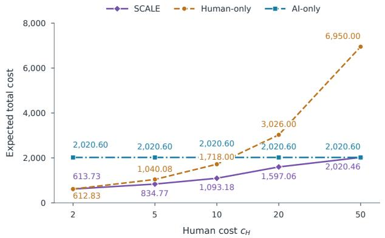
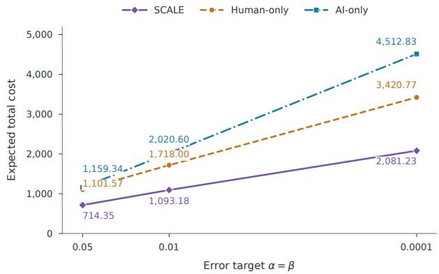
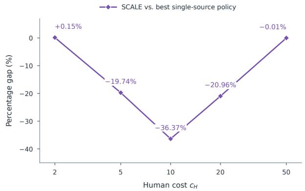
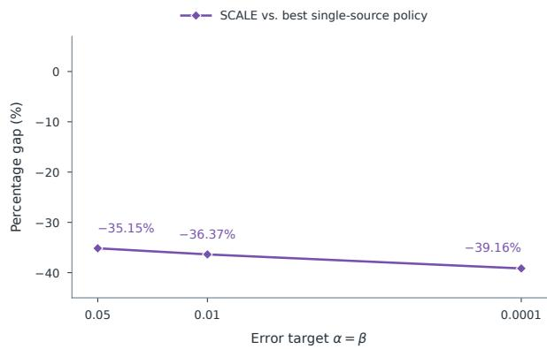

# Human–AI-Powered Hypothesis Testing: Cost-Aware Selective AI Scoring and Sequential Human Escalation

Dae Woong Ham

University of Michigan, Ann Arbor, MI 48109, USA,

daewoong@umich.edu

Xuejun Zhao

University of North Carolina at Charlotte, Charlotte, NC 28223, USA,

xzhao19@charlotte.edu

Stefanus Jasin, Fenghua Yang

University of Michigan, Ann Arbor, MI 48109, USA,

sjasin@umich.edu, yfenghua@umich.edu

Large language models are increasingly used as inexpensive judges to evaluate outputs, label data, and assess whether a system meets a desired quality standard. Yet using AI judgments for formal statistical inference is fundamentally diferent from simply treating them as ground-truth labels: AI evaluations can be biased or noisy, and rigorous hypothesis testing requires explicit control of type-I and type-II errors. We study how to use AI judgments, together with selective human verification, to conduct a valid hypothesis test at minimum cost. We consider a population of items with hidden binary labels. After choosing a fixed pool of items, the decision maker can selectively query AI, send an item directly to a human, escalate an AI-scored item to a human after observing the AI report, or stop once suficient evidence has accumulated. We derive an information-theoretic lower bound that captures the minimum cost of achieving prescribed testing errors and characterizes the value of AI information and human verification through a report-dependent information frontier. Motivated by this characterization, we develop SCALE, a sequential cost-aware policy that combines selective AI scoring with adaptive human escalation. SCALE is valid at finite sample sizes and matches the lower bound to first order as the target error probabilities vanish. We further extend the framework to an unknown AI-output model using paired AI–human pilot data. Numerically, SCALE approaches Human-only or AI-only testing when one source clearly dominates, while achieving its largest savings when inexpensive AI judgments and selective human verification are both valuable.

## 1. Introduction

Large language models are increasingly being used not only to generate content, but also to evaluate it. This is particularly attractive in settings where the ultimate goal is to make a populationlevel quality statement from many individual evaluations. Three application domains illustrate this opportunity particularly clearly.

First, consider software reliability. A company deploying an AI coding assistant may want to certify that the fraction of generated programs that are semantically correct exceeds a prescribed reliability threshold. When exhaustive test cases are unavailable, expert human review provides a natural gold-standard assessment, but conducting such review at scale can be costly. A growing literature therefore studies LLMs themselves as code judges. Tong and Zhang (2024) develop Code-Judge, which uses LLMs to assess the semantic correctness of generated code without requiring test cases. Zhao et al. (2025) introduce CodeJudge-Eval, which asks LLMs to determine whether submitted code solutions are correct across diferent error types and compilation issues. More recently, Jiang et al. (2026) benchmark 26 LLM judges across code generation, code repair, and unit-test generation. Their results also illustrate why a statistical treatment is needed: LLM code judges can be sensitive to seemingly irrelevant changes such as response ordering, variable names, and misleading comments. Thus, an LLM judge can provide an inexpensive and scalable signal of code correctness, but its judgment cannot automatically be treated as ground truth.

Second, similar ideas are already being used to screen large collections of clinical documents. A health system may, for example, want to assess whether the prevalence of biased or stigmatizing language in its clinical notes exceeds an acceptable level. Manual review by clinical experts provides the natural reference standard but is dificult to perform at the scale of a large electronic-healthrecord system. Apakama et al. (2025) apply GPT-4 to 50,000 emergency-department medical and nursing notes to identify several categories of biased language and use human reviewers to verify the model’s detections. Zhang et al. (2025) compare ChatGPT-4 with human expert annotations for identifying stigmatizing language in electronic health records and find that performance varies across categories and is sensitive to prompt design. Sethi et al. (2026) study LLM-based detection of stigmatizing language using more than 77,000 ICU notes and externally validate the approach on a substantially larger health-system data set. These studies demonstrate both sides of the opportunity: AI can make large-scale screening feasible, while expert human labels remain important for establishing what is actually present in the underlying records.

Third, automated judging has become central to AI safety and content moderation. An AI provider may want to certify that the fraction of model responses violating a safety policy remains below a prescribed threshold. Reviewing every generated response by hand is prohibitively expensive, so large-scale safety evaluations increasingly rely on automated judges or moderation classifiers. Mazeika et al. (2024) develop HarmBench, a standardized framework for large-scale evaluation of harmful model behavior that uses automated evaluation classifiers calibrated against humanlabeled examples. Movva et al. (2024) directly compare GPT-4 safety annotations with human judgments of conversational safety. Chen and Goldfarb-Tarrant (2025) evaluate 11 LLM judges used to assess the safety of generated content and show that seemingly superficial artifacts, including apologetic and verbose phrasing, can substantially change the resulting verdicts. Here again, automated evaluation is valuable precisely because it is scalable, but its errors become consequentia when the objective is to make a formal statement about an underlying safety rate.

Across these applications, the same basic structure emerges: there is a population of items with latent ground-truth labels, an AI system provides inexpensive but imperfect assessments of those labels, and human review provides costly ground truth. Much of the emerging literature focuses on improving the quality of the AI judge itself. Researchers develop more efective judging procedures, richer evaluation rubrics, better prompting and reasoning mechanisms, specialized evaluation models, robustness benchmarks, and aggregation schemes intended to bring automated judgments closer to human ground truth. Related work in clinical applications similarly evaluates and refines AI screening procedures by comparing their outputs with expert human annotations. These eforts are important: a better AI judge can clearly reduce the amount of expensive human review that is needed. However, improving the judge does not eliminate the underlying statistical problem. Even a highly accurate and carefully calibrated AI evaluator remains an imperfect measurement of the ground truth, and high average agreement with humans does not by itself guarantee valid type-I and type-II error control for a population-level hypothesis test. If the ultimate goal is rigorous population-level statistical inference, then building a better AI judge is not enough: its residual errors must be incorporated into a formal inferential procedure with explicit statistical guarantees, so that conclusions about the underlying population are scientifically defensible rather than merely reflections of the judge’s average agreement with humans.

One natural approach is to combine inexpensive AI judgments with selective human verification. Rather than treating AI as a complete substitute for human evaluation, a decision maker can use AI as a cheap source of preliminary information and purchase a human ground-truth label only when the additional information is worth its cost. This idea is related to prediction-powered inference (PPI), which combines machine predictions with a smaller number of gold-standard labels to obtain valid statistical inference (Angelopoulos et al. 2023). Our setting adds an explicitly operational dimension: rather than taking AI predictions and human labels as given, we jointly decide how each acquired item should be evaluated and when suficient evidence has been collected to stop the test. This leads to the central question of the paper: How should AI and human evaluations be combined to reach a statistically valid conclusion at minimum cost?

We study this question in a simple hypothesis-testing model for a population proportion. Each acquired item has an unobserved binary ground-truth label $X _ { i } \in \{ 0 , 1 \}$ , and the objective is to distinguish

$$
H _ { 0 } : p = p _ { 0 } \qquad \mathrm { f r o m } \qquad H _ { 1 } : p = p _ { 1 } , \qquad 0 < p _ { 0 } < p _ { 1 } < 1 ,
$$

where $p$ is the population fraction of positive labels. A human query reveals the true label, whereas an AI query returns a potentially noisy finite-valued report that may contain a predicted label, confidence score, or other metadata. Acquiring an item, querying the AI, and querying a human all carry potentially diferent costs. The policy chooses a fixed pool of items in advance, but information acquisition within that pool is adaptive: it may query AI, query a human directly, query a human after observing an AI report on the same item, or stop and decide. We minimize worst-case expected total cost subject to prescribed type-I and type-II error guarantees.

Two features are central. First, AI scoring itself is selective: the decision maker need not run AI on every acquired item. When direct human information is suficiently valuable, it may be preferable to skip the AI and query a human immediately. Conversely, when AI information is inexpensive and suficiently informative, an AI report may by itself provide useful statistical evidence. Second, human review after an AI report is a nested information action. Once report r has been observed, a subsequent human label provides only the residual information in the ground truth conditiona on that report, and this residual value can vary substantially across reports. Some AI reports may already be highly informative, whereas others may leave considerable uncertainty and therefore be particularly valuable to verify. Moreover, because the test is sequential, the desirable mix of AI and human information also depends on the likelihood evidence accumulated across previous items. The policy and our paper therefore study the joint decision of when AI is worth querying, when an AI judgment is worth verifying, and when the test should stop.

Contributions and main results. Our first contribution is a lower bound on the minimum cost that any valid human–AI testing policy must incur. The basic idea is simple: to control type-I and type-II errors, every policy must collect enough statistical evidence to distinguish the two hypotheses. We use KL-divergence arguments to quantify how much evidence can be obtained from an AI judgment, from a human label, and from a human label obtained after an AI judgment has already been observed. We also account for the fact that the number of items must be chosen in advance. Combining these requirements gives a computable lower bound on the best possible cost of any policy; this lower bound is developed in Section 4.

Our second contribution is SCALE, the Sequential Cost-Aware Likelihood-Guided Escalation policy. SCALE builds on the basic logic of the classical sequential probability ratio test (SPRT) (Wald 1945): it continually tracks the likelihood ratio between the two hypotheses and stops once the accumulated evidence is suficiently strong. The key diference is that, in a classical SPRT, each new observation is drawn from a fixed information source. In our setting, the policy must also decide how to obtain the next piece of evidence. SCALE therefore chooses whether the next item should be evaluated by AI only, by a human directly, or by AI first followed by selective human verification based on the observed AI report. In this sense, SCALE extends the SPRT from a stopping rule with a fixed observation channel to a joint sensing-and-stopping rule for a human–AI system. Because the number of items is acquired in advance, SCALE also includes a pre-specified fallback test in case the pool is exhausted before either likelihood-ratio boundary is reached, which guarantees the desired type-I and type-II errors at every finite sample size. Our main theoretical result shows that, as the target error probabilities become small, SCALE achieves the lower bound to first order. In other words, no other valid adaptive policy can have a meaningfully lower leading-order cost. Section 5 develops the policy and proves this result.

Our third contribution considers the practically important case in which the AI judge’s error behavior is not known in advance. In practice, one typically has to learn how the AI’s judgments relate to ground truth from a calibration sample. We therefore collect a paired pilot sample in which each item is evaluated by both the AI and a human, use it to estimate the AI-output model, and then run a guarded plug-in version of SCALE. The guardrails account for the fact that the estimated AI model is itself uncertain, so that this estimation error does not undermine the statistical guarantees of the test. We show that, when the pilot is suficiently informative, the resulting procedure achieves the same first-order cost as if the AI model were known from the outset. We also characterize when the additional cost of collecting a fresh pilot is small enough not to change this first-order benchmark.

Finally, our numerical experiments show when combining AI and human judgments is most valuable. When human review is inexpensive, SCALE behaves almost like Human-only testing; when human review is very expensive, it approaches AI-only testing. The largest gains arise in the intermediate regime, where AI provides useful low-cost information but selective human verification is still worth purchasing. This is precisely the regime in which committing in advance to either a Human-only or an AI-only architecture is most costly. In our benchmark instance, SCALE reduces cost by as much as 36.37% relative to the cheaper single-source baseline as the human-review cost varies, and its savings reach 39.16% as the testing requirements become more stringent. These results illustrate the main operational value of the hybrid design: AI is useful not only because it can replace some human review, but because it helps determine which items still warrant costly human verification. Section 5.4 reports the full numerical results.

Relation to existing approaches. Our paper is most closely related to prediction-powered inference (PPI), two-phase sampling with selective gold-standard verification, and active hypothesis testing; Section 2 provides a detailed review. The connection to prediction-powered inference is especially close: both settings combine inexpensive machine-generated information with a smaller amount of costly ground truth to obtain valid statistical inference (Angelopoulos et al. 2023). Our main distinction is operational. AI and human information are not taken as given; the policy decides how each item should be evaluated, whether an AI-scored item should be escalated to a human, and when to stop. Our nested AI-then-human structure is also related to classical two-phase sampling, where a cheap first-stage measurement is followed by selective gold-standard verification (Tenenbein 1970, Begg and Greenes 1983). In our setting, however, the first-stage AI measurement is itself optional and the verification decision depends on both the observed AI report and the accumulated evidence. Finally, SCALE is related to active hypothesis testing and controlled sensing, which adaptively choose among information sources as evidence accumulates (Chernof 1959, Naghshvar and Javidi 2013a, Nitinawarat et al. 2013). The distinctive feature here is that querying AI creates a report-dependent option to reveal the same item’s ground-truth label through human verification. This nested action structure is central to both our lower bound and our policy.

Organization of the paper. The remainder of the paper is organized as follows. Section 2 reviews the related literature in greater detail. Section 3 introduces the model, policy class, cost objective, and information quantities. Section 4 derives the lower bound on the optimal cost. Section 5 develops SCALE, establishes its finite-sample feasibility and first-order optimality, and contains the numerical experiments in Section 5.4. Section 6 develops the pilot-calibrated procedure for an unknown AI-output model. Section 7 concludes the paper.

## 2. Literature Review

Our paper lies at the intersection of three statistical literature. The first uses machine predictions to economize on expensive gold-standard labels while preserving valid inference. The second studies two-phase designs that combine broadly available but fallible measurements with selectively acquired exact outcomes. The third studies active hypothesis testing, in which observation channels and stopping decisions are chosen as evidence accumulates. At an architectural level, selective prediction and learning to defer also motivate endogenous human escalation, but those models primarily optimize item-level prediction or delegation loss (Madras et al. 2018, Mozannar and Sontag 2020); our terminal decision concerns a population hypothesis. We therefore organize the review around the three statistical streams that map most directly to our inferential target, nested observation structure, and adaptive policy.

## 2.1. Prediction-Powered and Active Statistical Inference

A growing statistical literature uses machine predictions to reduce the need for expensive labels while retaining inferential validity. Angelopoulos et al. (2023) introduce prediction-powered inference (PPI), which combines abundant machine predictions with a smaller labeled sample to correct prediction error. Kossen et al. (2021) select which test examples to label for sample-eficient model evaluation, while Zrnic and Cand\`es (2024) assign observation-dependent labeling probabilities and construct valid confidence intervals and hypothesis tests. Recent work learns data-adaptive labeling policies or develops anytime-valid and sequential prediction-assisted tests (Ma and Cand\`es 2026,

Csillag et al. 2025, Tenzer et al. 2026). Most closely related operationally, Angelopoulos et al. (2025) derive cost-aware allocations between a cheap weak rater and an expensive strong rater to estimate the mean strong rating accurately under an annotation budget.

The main distinction is our objective and action space. Most work in this stream evaluates estimator variance, confidence-interval width, or testing power under a labeling or annotation budget. We instead study a simple population hypothesis test in which AI scoring is itself optional and costly, direct human review is an alternative sensing action, and the acquired pool is chosen jointly with the within-pool policy. A non-escalated AI report remains direct likelihood evidence, whereas a human label obtained after that report contributes only report-conditional residua information. Furthermore, in the PPI literature there is no action to further escalate a machine prediction to a “human” label as we explicitly model. We minimize worst-case expected data, AI, and human cost subject to separate type-I and type-II error constraints. Consequently, labeling decisions depend on both the global likelihood-ratio direction and direction-specific residual KL information, rather than only on predictive uncertainty, influence, or conditional squared error.

## 2.2. Two-Phase Sampling and Selective Gold-Standard Verification

A longstanding literature studies two-phase or double-sampling designs in which an inexpensive but fallible measurement is collected broadly and an expensive gold-standard outcome is obtained for a validation subsample. Tenenbein (1970) estimate a binomial proportion using a fallible classifier on a first-stage sample and an exact classifier on a subsample, explicitly optimizing the two sample sizes against cost and precision. Begg and Greenes (1983) show that selective verification based on the initial screen must be incorporated into inference to avoid verification bias. Subsequent work develops eficient prevalence-survey designs and inference or tests under partial validation (Shrout and Newman 1989, McNamee 2003, Pepe 1992, Alonzo et al. 2003, Tang et al. 2012). Design-oriented contributions choose second-phase sampling fractions using relative costs, pilot information, or semiparametric eficiency criteria (Reilly 1996, Tao et al. 2020); recent work similarly targets expensive manual chart review using noisy electronic-health-record phenotypes and covariates (Marks-Anglin et al. 2025).

This literature provides the closest static analogue to our nested AI-then-human observation structure. However, conventional two-phase designs generally collect the phase-one measurement for the full cohort and choose a validation sample through prespecified strata or observationdependent sampling probabilities, with the goal of correcting bias or improving estimation precision. In our model, even the phase-one AI measurement is optional: an acquired item may receive direct human review, AI scoring alone, AI scoring followed by human verification, or no query. Moreover, the follow-up rule changes with the accumulated likelihood ratio and values a human label by its directional residual KL information. Thus the validation design is not merely tailored to an estimand; it is embedded in an adaptive hypothesis test. This additional history dependence leads to the active-testing literature discussed next.

## 2.3. Active Hypothesis Testing and Controlled Sensing

Active hypothesis testing and controlled sensing study how a decision maker should choose among observation channels while learning which hypothesis is true. Wald’s sequential probability ratio test endogenizes stopping under a fixed observation channel (Wald 1945), whereas Chernof (1959) allows the experiment itself to be selected adaptively from past observations. Naghshvar and Javidi (2013a) derive information-acquisition bounds and asymptotically optimal sensing policies under sampling costs and wrong-decision penalties; companion work separates the gains from sequential stopping and adaptive experiment selection (Naghshvar and Javidi 2013b). Nitinawarat et al. (2013) analyze controlled sensing in both fixed-sample and sequential multihypothesis testing, deriving error-exponent bounds and Chernof-type policies under decision-risk constraints. Kartik et al. (2022) study fixed-horizon active tests with adaptive experiment selection and the option of an inconclusive decision. Extensions allow controlled Markovian observations and nonuniform contro costs (Nitinawarat and Veeravalli 2015); more recently, Vershinin et al. (2026) study heterogeneous action costs and show that the relevant eficiency criterion is expected information gain divided by expected cost.

These studies generally model each action as selecting an experiment-level observation law. In the standard binary fixed-sample model, a stationary open-loop control can already attain the optimal error exponent (Nitinawarat et al. 2013); the value of adaptivity in our setting instead comes from sequential stopping, direction-dependent cost eficiency, and report-contingent followup. Our model has a hybrid fixed-pool and sequential structure: the number of items is chosen and paid for in advance, but sensing and stopping within that pool remain adaptive. The sensing technologies are also nested within an item. An AI query first generates a noisy report, after which the policy may purchase an exact human label on the same item. The current likelihood ratio selects a direction-specific mixture of direct-human and AI-first sensing, while the realized AI report determines human follow-up through a direction-specific residual-information frontier. We minimize worst-case expected acquisition, AI, and human cost subject to separate type-I and type-II error constraints. This structure creates a full-label pool-size floor and a capacity-aware transcript-KL lower bound, and it supports a finite-sample-valid policy that matches the lower bound to first order.

## 3. Model Setup

We study a hypothesis testing problem in which each data item i carries a binary label $X _ { i } \in \{ 0 , 1 \}$ with population mean $p .$ Although the binary label assumption may appear restrictive, it covers a wide range of practically important settings. A binary label naturally captures any pass/fail, accept/reject, or present/absent decision, which are among the most common output types in AI-assisted workflows. Examples include automated correctness checking of documents, code, and mathematical proofs (Kry´sci´nski et al. 2020, Tong and Zhang 2024, Dekoninck et al. 2026), AIassisted legal adjudication of decisions such as “guilty” or “innocent” (Imai et al. 2023), and medical screening of patient records for a binary health outcome.

Formally, we test the simple hypotheses

$$
H _ { 0 } : p = p _ { 0 } , \qquad H _ { 1 } : p = p _ { 1 } , \qquad 0 < p _ { 0 } < p _ { 1 } < 1 .\tag{1}
$$

The ordering $p _ { 0 } < p _ { 1 }$ is adopted for concreteness; the case $p _ { 1 } < p _ { 0 }$ is symmetric and can be analyzed analogously. To fix ideas, consider a company that wants to assess whether an AI coding assistant produces correct code more than $p _ { 0 }$ fraction of the time. The company can collect a batch of code submissions but even collecting each submission carries a cost (e.g., compute time, storage, or API fees), and the correct label $X _ { i } \in \{ 0 , 1 \}$ of each submission is not immediately known. To obtain a label, the company can either ask an AI checker to review the submission (fast and cheap, but potentially inaccurate) or hire a human expert to verify it (slow and expensive, but exact). The central question is: can we design a policy that intelligently mixes AI and human queries (e.g., escalating to a human only when the AI evidence is insuficient) and still retain the same statistical guarantees as full human labeling, but at a fraction of the cost?

To make this precise, for any positive integer m we write $[ m ] : = \{ 1 , 2 , \dots , m \}$ . A policy π first acquires $N ^ { \pi }$ i.i.d. items. Each item $i \in [ N ^ { \pi } ]$ has a hidden binary label $X _ { i } \in \{ 0 , 1 \}$ ; under $H _ { h }$ the labels are distributed as $X _ { i }$ ∼ Bernoulli $\left( { p } _ { h } \right)$ , but they are not observed unless the policy explicitly queries a human on item i. A cost $c _ { \mathrm { d a t a } } > 0$ is incurred for each acquired item regardless of whether it is subsequently queried. Importantly, we focus on a fixed-sample design: the number of acquired items $N ^ { \pi }$ is chosen in advance and does not depend on the data, in contrast to sequential testing where the sample size is itself an adaptive stopping decision. Given the fixed pool of $N ^ { \pi }$ items, the policy may then query the AI, query a human, both, or neither on each item. The central decision is therefore how to jointly choose $N ^ { \pi }$ and how to allocate AI and human queries across the acquired items, so as to minimize total cost while meeting the target type-I and type-II error constraints (to be specified below). We formalize the AI output model next.

## 3.1. AI Outputs

If the policy queries the AI on item $i ,$ it receives a report $R _ { i }$ , which may encode a predicted label, a confidence score, or any other finite metadata. For example, in the code correctness setting, a typical AI response might be $R _ { i } = ( 1 , 0 . 9 9 )$ , indicating that the AI predicts $X _ { i } = 1$ (correct) with 99% confidence. We allow $R _ { i }$ to be as flexible as the practitioner requires; the only constraint is that its range is finite. Formally, let R be the finite set of all possible AI outputs. Conditional on $X _ { i } = x$ , the report takes value $r \in \mathcal { R }$ with probability

$$
f _ { x } ( r ) : = \mathbb { P } ( R _ { i } = r | X _ { i } = x ) , \qquad r \in \mathcal { R } , \quad x \in \{ 0 , 1 \} .
$$

We assume throughout the main analysis (relaxed later in Section 6) that these conditional distributions are known:

Assumption 1 (Known strictly positive finite-alphabet AI-output model). The conditional probability mass functions $f _ { 0 }$ and $f _ { 1 }$ are known. They satisfy $f _ { x } ( r ) > 0 , \forall r \in \mathcal { R } , x \in \{ 0 , 1 \}$ , and $\begin{array} { r } { \sum _ { r \in \mathcal { R } } f _ { x } ( r ) = 1 , \forall x \in \{ 0 , 1 \} } \end{array}$

The strict positivity condition $f _ { x } ( r ) > 0$ rules out report values that are structurally impossible under one of the labels, which simplifies the analysis without materially restricting the model. In the simplest case where $R _ { i }$ is just a predicted label $\hat { X } _ { i } \in \{ 0 , 1 \}$ , Assumption 1 reduces to knowing the AI’s confusion matrix: the probability of predicting 1 when the true label is 1, and the probability of predicting 0 when the true label is 0. More generally, knowing $f _ { x } ( r )$ means knowing the full conditional distribution of the AI output given the true label, which characterizes how informative and reliable the AI is.

The known-f assumption provides a useful benchmark for understanding how AI and human information should be combined when the AI’s accuracy profile is known. In practice, however, $f _ { 0 }$ and $f _ { 1 }$ generally must be estimated from data for which both the AI report and the human-verified label are observed (e.g., using pilot data). For completeness, we return to this issue in Section 6, where we relax the known-f assumption, estimate $f _ { 0 }$ and $f _ { 1 }$ from an independent paired pilot sample, and study how estimation uncertainty afects both statistical validity and cost.

In addition to Assumption 1, we also impose the standard assumption that items are independent and identically distributed (i.i.d.).

Assumption 2 (Independent items). Under each hypothesis $H _ { h }$ , the pairs $( X _ { 1 } , R _ { 1 } ) , \dots , ( X _ { N }$ ， $R _ { N } )$ are independent and identically distributed.

Let $\mathbb { P } _ { h }$ denote the joint distribution of $( X _ { i } , R _ { i } )$ under $H _ { h }$ . The marginal probability that the AI report takes value r under $H _ { h }$ is

$$
\begin{array} { r } { g _ { h } ( r ) : = \mathbb { P } _ { h } ( R _ { i } = r ) = p _ { h } f _ { 1 } ( r ) + ( 1 - p _ { h } ) f _ { 0 } ( r ) , \qquad r \in \mathcal { R } , } \end{array}\tag{2}
$$

where the second equality follows by the law of total probability, conditioning on $X _ { i } \in \{ 0 , 1 \}$ . By Assumption 1 and $p _ { h } \in ( 0 , 1 )$ , we have $g _ { h } ( r ) > 0$ for every $r \in \mathcal { R }$ and both $h \in \{ 0 , 1 \}$

After observing the AI report $R _ { i } = r$ , the posterior probability that the hidden label equals one under $H _ { h }$ follows from Bayes’ rule:

$$
q _ { h } ( r ) : = \mathbb { P } _ { h } ( X _ { i } = 1 \mid R _ { i } = r ) = { \frac { p _ { h } f _ { 1 } ( r ) } { p _ { h } f _ { 1 } ( r ) + ( 1 - p _ { h } ) f _ { 0 } ( r ) } } = { \frac { p _ { h } f _ { 1 } ( r ) } { g _ { h } ( r ) } } .\tag{3}
$$

Conditional on the AI report $R _ { i } = r$ , a subsequently revealed human label $X _ { i }$ is therefore Bernoulli with success probability $q _ { h } ( r )$ , with mass function

$$
\rho _ { h } ( x \mid r ) : = q _ { h } ( r ) ^ { x } ( 1 - q _ { h } ( r ) ) ^ { 1 - x } , \qquad x \in \{ 0 , 1 \} , \quad r \in \mathcal { R } .\tag{4}
$$

Throughout the paper, all quantities carrying a subscript h depend on whether the true proportion is $p _ { 0 }$ or $p _ { 1 }$ , and our analysis proceeds under each hypothesis separately.

## 3.2. Feasible Policy

We consider a general setting where a policy can be a dynamic, data-dependent, and possibly randomized decision rule. At each time step $t = 1 , 2 , \dots$ , the policy observes the history of past actions and outcomes, and chooses the next action, stopping at some time $t \leq 2 N ^ { \pi } + 1$ . The upper bound $2 N ^ { \pi } + 1$ arises as follows. Each of the $N ^ { \pi }$ acquired items can be queried at most once by the AI and at most once by a human, giving at most $2 N ^ { \pi }$ paid queries in total. The additional +1 accounts for the final stopping decision, at which the policy rejects or accepts $H _ { 0 }$ . The policy is free to stop at any time and act on the items in any order: for instance, it may query the AI on item $i = 3$ at $t = 1$ , then query a human on item $i = 1$ at $t = 2$ , and stop and decide at $t = 3$ without ever querying the remaining items. We now formalize this.

Given $N ^ { \pi }$ acquired items, at each time step t the policy chooses one of three actions:

(i) query the AI on item $i \in [ N ^ { \pi } ]$ , denoted $A _ { t } = \mathrm { A I } ( i )$ , which returns the AI report $O _ { t } = R _ { i } \in \mathcal { R }$ ; (ii) query a human evaluator on item $i \in [ N ^ { \pi } ]$ , denoted $A _ { t } = \mathrm { H } ( i )$ , which reveals the exact label $O _ { t } = X _ { i } \in \{ 0 , 1 \}$ ;

(iii) stop, denoted $A _ { t } = \mathrm { S T O P }$ , and emit a final decision $\delta ^ { \pi } \in \{ 0 , 1 \}$ , where $\delta ^ { \pi } = 1$ means reject $H _ { 0 }$

Each item may be AI-queried at most once and human-queried at most once. The policy may query the AI on item i before or after querying a human on the same item. However, once the human reveals the exact label $X _ { i }$ , any subsequent AI query on item i yields no additional information about the hypothesis and wastes cost $c _ { \mathrm { A I } }$ . As we show formally in Section 4, such queries contribute zero statistical evidence and are therefore never used by an optimal policy.

To formalize the information available to the policy at each time step, let

$$
\mathcal { H } _ { t } : = \sigma ( A _ { 1 } , O _ { 1 } , \ldots , A _ { t } , O _ { t } )
$$

be the filtration generated by the actions and observations up to the end of epoch $t ,$ with $\mathcal { H } _ { 0 } = \emptyset$ This filtration is defined for all t such that $A _ { t ^ { \prime } } \neq \mathrm { S T O P }$ for all $t ^ { \prime } \leq t .$ To allow for randomized policies, let $U = ( U _ { t } ) _ { t = 1 } ^ { 2 N ^ { \pi } + 1 }$ be a vector of i.i.d. random seeds, independent of $( X _ { i } , R _ { i } ) _ { i = 1 } ^ { N ^ { \pi } }$ under both hypotheses, with common law $\mu$ that does not depend on the hypothesis. The seed $U _ { t }$ is used at epoch t to randomize the policy’s action.

At each epoch t, the set of actions available to the policy is

$$
\begin{array} { r l } & { \mathcal { A } _ { t } ( \mathcal { H } _ { t - 1 } ) : = \{ \mathrm { A I } ( i ) : i \in [ N ^ { \pi } ] , i \mathrm { ~ n o t ~ y e t ~ A I \mathrm { - } q u e r i e d } \} } \\ & { \qquad \cup \ \{ \mathrm { H } ( i ) : i \in [ N ^ { \pi } ] , i \mathrm { ~ n o t ~ y e t ~ h u m a n \mathrm { - } q u e r i e d } \} } \\ & { \qquad \cup \ \{ \mathrm { S T O P } \} , } \end{array}
$$

which encodes the constraint that each item may be AI-queried at most once and human-queried at most once. We now formally define an admissible policy.

Definition 1 (Admissible policy). An admissible policy is a sequence of measurable functions $\pi = ( \pi _ { 1 } , \pi _ { 2 } , . . . )$ such that $A _ { t } = \mathrm { S T O P }$ for some $t \in [ 2 N ^ { \pi } + 1 ]$ , and

$$
\pi _ { t } : \mathcal { H } _ { t - 1 } \times U _ { t } \to A _ { t } \in \mathcal { A } _ { t } ( \mathcal { H } _ { t - 1 } ) , \quad \mathrm { i f ~ } A _ { t ^ { \prime } } \not = \mathrm { S T O P ~ f o r ~ a l l ~ } t ^ { \prime } < t ,
$$

$$
\pi _ { t } : \mathcal { H } _ { t - 1 } \times U _ { t } \to \delta ^ { \pi } \in \{ 0 , 1 \} , \quad \mathrm { i f ~ } A _ { t } = \mathrm { S T O P } .
$$

Definition 1 captures the key requirements of a valid policy: actions are chosen based only on the observed history and the current random seed, the policy is guaranteed to stop within $2 N ^ { \pi } + 1$ steps, and upon stopping it emits a binary decision to reject or accept $H _ { 0 }$

Not all admissible policies have good statistical properties. We restrict attention to policies that simultaneously control both type-I and type-II errors at prescribed levels. Let $T _ { \mathrm { s t o p } } ^ { \pi } { : = } \operatorname* { m i n } \{ t : A _ { t } =$ STOP} be the stopping time of the policy, and let $\mathbb { P } _ { h } ^ { \pi }$ and $\mathbb { E } _ { h } ^ { \pi }$ denote probability and expectation under hypothesis $H _ { h }$ and policy π.

Definition 2 (Feasible policy). A policy π is feasible for target errors $( \alpha , \beta )$ with $0 < \alpha < 1$ $0 < \beta < 1$ , and $\alpha + \beta < 1$ , if it is admissible and satisfies

$$
\underbrace { \mathbb { P } _ { 0 } ^ { \pi } ( \delta ^ { \pi } = 1 ) } _ { \mathrm { t y p e - I ~ e r r o r } } \leq \alpha , \qquad \underbrace { \mathbb { P } _ { 1 } ^ { \pi } ( \delta ^ { \pi } = 0 ) } _ { \mathrm { t y p e - I I ~ e r r o r } } \leq \beta .\tag{5}
$$

We let $\mathcal { F } ( \alpha , \beta )$ denote the class of all feasible policies for target errors $( \alpha , \beta )$

By restricting to $\mathcal { F } ( \alpha , \beta )$ , we ensure that the policies we consider provide meaningful statistical guarantees, and our goal is to find the one among them that minimizes cost.

## 3.3. Optimal Cost

There are three cost components: a data acquisition cost $c _ { \mathrm { d a t a } } > 0$ per acquired item, an AI query cost $c _ { \mathrm { A I } } > 0$ per AI query, and a human query cost $c _ { \mathrm { H } } > 0$ per human query. While in most practical settings we have $c _ { \mathrm { H } } \gg c _ { \mathrm { A I } } .$ , we do not impose this ordering in our analysis; our results hold for any positive cost parameters. Let

$$
N _ { \mathrm { A I } } ^ { \mathrm { t o t } } : = \sum _ { t = 1 } ^ { 2 N ^ { \pi } + 1 } \mathbf { 1 } \{ A _ { t } = \mathrm { A I } ( i ) { \mathrm { ~ f o r ~ s o m e ~ } } i \in [ N ^ { \pi } ] \}
$$

be the total number of AI queries, and

$$
N _ { \mathrm { H } } ^ { \mathrm { t o t } } : = \sum _ { t = 1 } ^ { 2 N ^ { \pi } + 1 } { \bf 1 } \{ A _ { t } = \mathrm { H } ( i ) \ \mathrm { f o r } \ \mathrm { s o m e } \ i \in [ N ^ { \pi } ] \}
$$

be the total number of human queries. The total cost incurred by policy $\pi$ is

$$
C ^ { \pi } : = c _ { \mathrm { { d a t a } } } N ^ { \pi } + c _ { \mathrm { { A I } } } N _ { \mathrm { A I } } ^ { \mathrm { t o t } } + c _ { \mathrm { { H } } } N _ { \mathrm { H } } ^ { \mathrm { t o t } } .
$$

Since the true hypothesis is unknown, we evaluate a policy by its worst-case expected cost over the two hypotheses as typically done in the hypothesis testing literature (Wald 1945, Baraud 2002). Specifically, the optimal cost is

$$
C ^ { * } ( \alpha , \beta ) : = \operatorname* { i n f } _ { \pi \in { \mathcal { F } } ( \alpha , \beta ) } \operatorname* { m a x } \big \{ \mathbb { E } _ { 0 } ^ { \pi } [ C ^ { \pi } ] , \mathbb { E } _ { 1 } ^ { \pi } [ C ^ { \pi } ] \big \} .\tag{6}
$$

An exact closed-form solution of (6) is generally intractable. Thus, we will study the asymptotic regime in which the target errors α and $\beta$ vanish. This regime is practically relevant because in many high-stakes applications (such as medical diagnosis, legal adjudication, or quality control) decision makers often require stringent error guarantees, and it is precisely in this low-error regime that the structure of the optimal policy becomes clear and analytically tractable. In this regime, we seek a policy that is asymptotically optimal, i.e., a feasible policy $\pi \in { \mathcal { F } } ( \alpha , \beta )$ satisfying

$$
\frac { \operatorname* { m a x } \{ \mathbb { E } _ { 0 } ^ { \pi } [ C ^ { \pi } ] , \mathbb { E } _ { 1 } ^ { \pi } [ C ^ { \pi } ] \} } { C ^ { * } ( \alpha , \beta ) } \to 1 \qquad \mathrm { a s ~ } \alpha , \beta \to 0 .
$$

In other words, the policy achieves the same leading-order cost as the best possible feasible policy, with only lower-order terms left unmatched.

We construct such a policy in Section 5. To guide its construction and to certify its optimality, we first derive in Section 4 a lower bound on $C ^ { * } ( \alpha , \beta )$ that any feasible policy must satisfy.

## 4. Lower Bound on the Optimal Cost

In this section, we derive a lower bound on the optimal cost $C ^ { * } ( \alpha , \beta )$ defined in (6). The analysis of the lower bound has two components. First, in Section 4.1, we show that any feasible policy must acquire at least $N _ { \mathrm { f i x e d , H } } ( \alpha , \beta )$ items, the minimum number of items needed to test (1) even with full access to all labels. Second, in Sections 4.2 and 4.4, we use information-theoretic arguments to show that any feasible policy must spend enough on AI and human queries to accumulate suficient statistical evidence to distinguish $H _ { 0 }$ from $H _ { 1 }$ . Each item can contribute evidence in one of three informative ways: through an AI query alone, through a human query alone, or through both an AI query and a human query on the same item. Each of these contributes a quantifiable amount of statistical evidence at a certain cost, and the lower bound captures the minimum cost of assembling enough evidence to meet the error constraints. Together, these two components yield the lower bound $\operatorname { L B } ( \alpha , \beta )$ , which we show in Section 5 is achievable to first order by our proposed policy.

## 4.1. Lower Bound on Number of Acquired Samples

We begin by establishing a fundamental lower bound on the number of items any feasible policy must acquire. The benchmark is $N _ { \mathrm { f i x e d , H } } ( \alpha , \beta )$ , the minimum number of items needed to test (1) even in the idealized setting where all labels are observed directly, with no AI or human query costs. Any feasible policy in our setting, which has access to strictly less information per item than the full label, cannot possibly require fewer items.

Definition 3 (Full-label fixed-sample-size benchmark). For $0 < \alpha < 1$ and $0 < \beta < 1$ let $N _ { \mathrm { f i x e d , H } } \ \left( \alpha , \beta \right)$ be the smallest integer $N \in  { \mathbb { N } }$ for which there exists a randomized test $\phi _ { N } :$ $\{ 0 , 1 \} ^ { N } \to [ 0 , 1 ]$ satisfying

$$
\begin{array} { r } { { \mathbb E } _ { 0 } [ \phi _ { N } ( X _ { 1 } , \ldots , X _ { N } ) ] \leq \alpha , \qquad { \mathbb E } _ { 1 } [ 1 - \phi _ { N } ( X _ { 1 } , \ldots , X _ { N } ) ] \leq \beta , } \end{array}
$$

where $\phi _ { N } ( x ) \in [ 0 , 1 ]$ is the probability of rejecting $H _ { 0 }$ upon observing the full label vector $x \in$ $\{ 0 , 1 \} ^ { N }$ , and $\mathbb { E } _ { h }$ denotes expectation under $H _ { h }$

We first show that any feasible policy $\pi \in { \mathcal { F } } ( \alpha , \beta )$ must acquire at least $N _ { \mathrm { f i x e d , H } } ( \alpha , \beta )$ items.

Lemma 1 (Full-label data-pool lower bound). Suppose Assumptions 1 and 2 hold. If a feasible policy $\pi \in { \mathcal { F } } ( \alpha , \beta )$ acquires N items, then $N \geq N _ { \mathrm { f i x e d , H } } ( \alpha , \beta )$

The intuition behind Lemma 1 is straightforward. Even if a policy could somehow observe all N true labels at no cost, it would still need at least $N _ { \mathrm { f i x e d , H } } ( \alpha , \beta )$ items to meet the error constraints. A policy in our setting, which must pay for each label it observes and receives only noisy AI reports on some items, has access to no more information than the full-label benchmark. It therefore cannot satisfy the same error constraints with fewer items.

We now describe how to compute $N _ { \mathrm { f i x e d , H } } ( \alpha , \beta )$ explicitly. This construction is also needed for the fallback test in Section 5. By the Neyman–Pearson lemma (Neyman and Pearson 1933), for any fixed sample size $N$ , the most powerful test at type-I level α is the likelihood-ratio test. Since the likelihood ratio is strictly increasing in the label sum $\begin{array} { r } { L _ { N } : = \sum _ { i = 1 } ^ { N } X _ { i } } \end{array}$ (as we show below), this reduces to a simple threshold test on $L _ { N }$ . We can therefore compute $N _ { \mathrm { f i x e d , H } } ( \alpha , \beta )$ by increasing N from 1 upward and checking whether the threshold test meets the type-II target $\beta .$

Fix $N \in \mathbb N$ and suppose the full label vector $X = ( X _ { 1 } , \ldots , X _ { N } )$ is observed. Under $H _ { h } , L _ { N }$ has a binomial distribution with parameters $N$ and $p _ { h }$ . The likelihood ratio under $H _ { 1 }$ versus $H _ { 0 }$ is

$$
\Lambda _ { N } ( X ) = \prod _ { i = 1 } ^ { N } \frac { p _ { 1 } ^ { X _ { i } } ( 1 - p _ { 1 } ) ^ { 1 - X _ { i } } } { p _ { 0 } ^ { X _ { i } } ( 1 - p _ { 0 } ) ^ { 1 - X _ { i } } } = \left( \frac { p _ { 1 } } { p _ { 0 } } \right) ^ { L _ { N } } \left( \frac { 1 - p _ { 1 } } { 1 - p _ { 0 } } \right) ^ { N - L _ { N } } .
$$

Since $p _ { 1 } > p _ { 0 }$ , the log-likelihood ratio

$$
\log \Lambda _ { N } ( X ) = L _ { N } \log \frac { p _ { 1 } } { p _ { 0 } } + ( N - L _ { N } ) \log \frac { 1 - p _ { 1 } } { 1 - p _ { 0 } }
$$

has a strictly positive coeficient on $L _ { N }$ , so $\Lambda _ { N } ( X )$ is strictly increasing in $L _ { N }$ . The optimal test therefore rejects $H _ { 0 }$ when $L _ { N }$ is large.

For a target type-I level $\alpha ,$ define $c _ { N }$ to be the smallest integer in $\{ 0 , 1 , \ldots , N \}$ such that $\mathbb { P } _ { 0 } ( L _ { N } >$ $c _ { N } ) \leq \alpha$ , and set

$$
\gamma _ { N } : = \frac { \alpha - \mathbb { P } _ { 0 } ( L _ { N } > c _ { N } ) } { \mathbb { P } _ { 0 } ( L _ { N } = c _ { N } ) } .
$$

The denominator is positive because $0 < p _ { 0 } < 1$ , and $\gamma _ { N } \in [ 0 , 1 ]$ by the definition of $c _ { N }$ . This gives rise to the following test.

Definition 4 (Neyman–Pearson test (Casella and Berger 2024)). The randomized threshold test

$$
\phi _ { N } ^ { * } ( x ) = \left\{ \begin{array} { l l } { 1 , } & { \sum _ { i = 1 } ^ { N } x _ { i } > c _ { N } , } \\ { \gamma _ { N } , } & { \sum _ { i = 1 } ^ { N } x _ { i } = c _ { N } , } \\ { 0 , } & { \sum _ { i = 1 } ^ { N } x _ { i } < c _ { N } , } \end{array} \right.
$$

where $x = ( x _ { 1 } , \ldots , x _ { N } ) \in \{ 0 , 1 \} ^ { N }$ , is called the Neyman–Pearson test.

By construction, $\phi _ { N } ^ { * }$ meets the type-I constraint exactly: $\mathbb { E } _ { 0 } [ \phi _ { N } ^ { * } ( X ) ] = \alpha$ . Its type-II error is

$$
\begin{array} { r } { \mathbb { E } _ { 1 } [ 1 - \phi _ { N } ^ { * } ( X ) ] = \mathbb { P } _ { 1 } ( L _ { N } < c _ { N } ) + ( 1 - \gamma _ { N } ) \mathbb { P } _ { 1 } ( L _ { N } = c _ { N } ) . } \end{array}\tag{7}
$$

The Neyman–Pearson lemma guarantees that this test is optimal, which we state formally below.

Lemma 2 (Neyman–Pearson lemma (Neyman and Pearson 1933)). The test $\phi _ { N } ^ { * } ( X )$ has the smallest type-II error among all tests $\phi ( X )$ satisfying $\mathbb { E } _ { 0 } [ \phi ( X ) ] \leq \alpha$ . That is, $\phi _ { N } ^ { * }$ is the most powerful test at significance level α.

It follows that $N _ { \mathrm { f i x e d , H } } ( \alpha , \beta )$ can be computed exactly by increasing N from 1 upward and checking whether (7) is at most $\beta .$ . The logic follows from the Neyman–Pearson lemma: at each $N$ $\phi _ { N } ^ { * }$ has the smallest type-II error of any test with type-I error at most $\alpha .$ So if $\phi _ { N } ^ { * }$ fails to meet the type-II target $\beta _ { i }$ , no test at that sample size can. Conversely, if $\phi _ { N } ^ { * }$ does meet $\beta _ { i }$ , it is itself a valid test meeting both error targets. The first N at which (7) is at most $\beta$ is therefore $N _ { \mathrm { f i x e d , H } } ( \alpha , \beta )$

## 4.2. Information Quantities

At its core, any feasible policy must accumulate enough statistical evidence to reliably distinguish $H _ { 0 }$ from $H _ { 1 }$ . The fundamental currency of this evidence is KL divergence: it quantifies how distinguishable the distribution of observations is under $H _ { 1 }$ versus $H _ { 0 }$ , and therefore measures how much each query contributes toward meeting the error constraints. We now define the KL-divergence quantities associated with each possible query type.

We use two standard KL-divergence quantities throughout. For $a , b \in ( 0 , 1 )$ , the Bernoulli KL divergence is given by

$$
\operatorname { k l } ( a \| b ) : = a \log { \frac { a } { b } } + ( 1 - a ) \log { \frac { 1 - a } { 1 - b } } .
$$

For probability mass functions P and $Q$ on a common finite set $S ,$ the KL divergence is

$$
D ( P \| Q ) : = \sum _ { s \in S } P ( s ) \log { \frac { P ( s ) } { Q ( s ) } } ,
$$

with conventions $0 \log ( 0 / q ) = 0$ and $p \log ( p / 0 ) = + \infty$ for $p > 0$

AI query only. When the policy queries only the AI on item $i ,$ it observes the report $R _ { i }$ with marginal distribution $G _ { h }$ (with probability mass function $g _ { h } )$ under $H _ { h }$ . Since the two error constraints (5) are asymmetric (one applies when $H _ { 0 }$ is true and the other when $H _ { 1 }$ is true) we need to track the discriminating power of an AI query under each hypothesis separately. Specifically, $I _ { R } ^ { ( 1 ) }$ measures how informative the AI report is for distinguishing $H _ { 1 }$ from $H _ { 0 }$ when $H _ { 1 }$ is the true hypothesis, and $I _ { R } ^ { ( 0 ) }$ measures the same when $H _ { 0 }$ is true:

$$
I _ { R } ^ { ( 1 ) } : = D ( G _ { 1 } \| G _ { 0 } ) = \sum _ { r \in \mathcal { R } } g _ { 1 } ( r ) \log \frac { g _ { 1 } ( r ) } { g _ { 0 } ( r ) } ,\tag{8}
$$

$$
I _ { R } ^ { ( 0 ) } : = D ( G _ { 0 } \| G _ { 1 } ) = \sum _ { r \in \mathcal { R } } g _ { 0 } ( r ) \log \frac { g _ { 0 } ( r ) } { g _ { 1 } ( r ) } .\tag{9}
$$

In general $I _ { R } ^ { ( 1 ) } \neq I _ { R } ^ { ( 0 ) }$ , reflecting the fact that the AI report may be more informative under one hypothesis than the other.

Human query only. If the policy queries a human on item i with no prior AI query, the revealed label $X _ { i }$ is distributed as Bernoulli $\left( { p } _ { h } \right)$ under $H _ { h }$ . By the same reasoning as above, we track the discriminating power of a human query under each hypothesis separately. Specifically, $J _ { X } ^ { ( 1 ) }$ measures how informative a directly revealed label is for distinguishing $H _ { 1 }$ from $H _ { 0 }$ when $H _ { 1 }$ is true, and $J _ { X } ^ { ( 0 ) }$ measures the same when $H _ { 0 }$ is true:

$$
J _ { X } ^ { ( 1 ) } : = \mathrm { k l } ( p _ { 1 } \| p _ { 0 } ) , \qquad J _ { X } ^ { ( 0 ) } : = \mathrm { k l } ( p _ { 0 } \| p _ { 1 } ) ,\tag{10}
$$

both of which are strictly positive because $0 < p _ { 0 } < p _ { 1 } < 1$ . Note that $J _ { X } ^ { ( 1 ) } \neq J _ { X } ^ { ( 0 ) }$ in general, for the same reason as above.

Human query followed by AI query. If item i is first queried by a human, revealing the exact label $X _ { i } ,$ , and is then queried by the AI, the AI report $R _ { i }$ carries no additional information: the true label $X _ { i }$ is already known, so the AI output is redundant. This query ordering therefore contributes zero additional KL divergence and is never used by an optimal policy.

AI query followed by human query. If the policy first queries the AI on item $i ,$ receiving report $R _ { i } = r$ , and then queries a human on the same item, the human reveals the exact label $X _ { i }$ . Conditional on $R _ { i } = r .$ , the label $X _ { i }$ is distributed as Bernoulli $\left( q _ { h } ( r ) \right)$ under $H _ { h }$ by (4). The information this human label carries for discriminating $H _ { 1 }$ from $H _ { 0 }$ , beyond what the AI report r already provided, depends on which hypothesis is true. When $H _ { 1 }$ is true, the additional information is

$$
d ^ { ( 1 ) } ( r ) : = D ( \rho _ { 1 } ( \cdot \mid r ) \| \rho _ { 0 } ( \cdot \mid r ) ) = \mathrm { k l } ( q _ { 1 } ( r ) \| q _ { 0 } ( r ) ) ,\tag{11}
$$

and when $H _ { 0 }$ is true it is

$$
d ^ { ( 0 ) } ( r ) : = D ( \rho _ { 0 } ( \cdot \mid r ) \| \rho _ { 1 } ( \cdot \mid r ) ) = \mathrm { k l } ( q _ { 0 } ( r ) \| q _ { 1 } ( r ) ) .\tag{12}
$$

Note that $d ^ { ( h ) } ( r )$ depends on the AI report r: a more informative AI report leaves less residual uncertainty about $X _ { i }$ , and hence contributes less additional information when the human is subsequently queried.

## 4.3. Supporting Results for the Lower Bound

To derive a lower bound on $C ^ { * } ( \alpha , \beta )$ , we need to understand how much statistical evidence any admissible policy can accumulate, and at what cost. The key insight is that any feasible policy must accumulate enough statistical evidence to distinguish $H _ { 0 }$ from $H _ { 1 }$ , and this evidence can only be obtained by paying for AI queries, human queries, or both. We formalize this by measuring the statistical evidence in terms of KL divergence between the distributions of the policy’s actions and observations under the two hypotheses.

For a policy π with stopping time $T _ { \mathrm { s t o p } } ^ { \pi }$ , we call the realized sequence

$$
( A _ { 1 } , O _ { 1 } , \dots , A _ { T _ { \mathrm { s t o p } } ^ { \pi } - 1 } , O _ { T _ { \mathrm { s t o p } } ^ { \pi } - 1 } , A _ { T _ { \mathrm { s t o p } } ^ { \pi } } , \delta ^ { \pi } )
$$

the transcript of the policy. Let $P _ { h } ^ { \pi }$ denote the distribution of the transcript under $H _ { h }$ . The KL divergence $D ( P _ { 1 } ^ { \pi } \| P _ { 0 } ^ { \pi } )$ is the expected log-likelihood ratio of the transcript distribution under $H _ { 1 }$ measuring how much $P _ { 1 } ^ { \pi }$ favors $H _ { 1 }$ over $H _ { 0 }$ . Similarly, $D ( P _ { 0 } ^ { \pi } \| P _ { 1 } ^ { \pi } )$ is the expected log-likelihood ratio under $H _ { 0 } ,$ , measuring how much $P _ { 0 } ^ { \pi }$ favors $H _ { 0 }$ over $H _ { 1 }$ . Both must be large enough for the policy to reliably distinguish the two hypotheses and meet the error constraints (5).

Lemma 3 (Testing errors imply transcript KL requirements). Every feasible policy $\pi \in$ $\mathcal { F } ( \alpha , \beta )$ satisfies

$$
\begin{array} { r } { D ( P _ { 1 } ^ { \pi } \| P _ { 0 } ^ { \pi } ) \ge A , \qquad D ( P _ { 0 } ^ { \pi } \| P _ { 1 } ^ { \pi } ) \ge B , } \end{array}
$$

where

$$
A : = \mathrm { k l } ( 1 - \beta \| \alpha ) , \qquad B : = \mathrm { k l } ( 1 - \alpha \| \beta ) .
$$

Lemma 3 says that meeting the error constraints forces the transcript distributions $P _ { 1 } ^ { \pi }$ and $P _ { 0 } ^ { \pi }$ to be suficiently separated: $P _ { 1 } ^ { \pi }$ must be at least A units of KL divergence away from $P _ { 0 } ^ { \pi }$ , and $P _ { 0 } ^ { \pi }$ must be at least $B$ units away from $P _ { 1 } ^ { \pi }$ . We next characterize exactly how this total KL information accumulates across the policy’s query decisions.

For a policy $\pi ,$ let $\mathcal { T } _ { \mathrm { A I } } ^ { \pi }$ be the set of items whose first query is an AI query (which may or may not be followed by a human query), $\mathcal { T } _ { \mathrm { H } } ^ { \pi }$ the set of items whose first query is a human query with no preceding AI query, and $\mathcal { T } _ { \mathrm { A I H } } ^ { \pi }$ the set of items that are human-queried after their AI report has been observed. Let $N _ { \mathrm { A I } } ^ { \mathrm { d i r } , \pi } : = | \mathcal { T } _ { \mathrm { A I } } ^ { \pi } | , N _ { \mathrm { H } } ^ { \mathrm { d i r } , \pi } : = | \mathcal { T } _ { \mathrm { H } } ^ { \pi } |$ , and $N _ { \mathrm { A I H } } ^ { \pi } : = | \mathcal { T } _ { \mathrm { A I H } } ^ { \pi } |$ be the corresponding random counts. Note that these counts are random and their expectations under $H _ { 0 }$ and $H _ { 1 }$ difer in general. An AI query on an item that has already received a human query contributes zero KL information, since the report law $f _ { x }$ does not depend on the hypothesis once the label x is known.

Theorem 1 (Adaptive KL decomposition). Suppose Assumptions 1 and 2 hold. For every admissible policy π using $N ^ { \pi }$ items,

$$
D ( P _ { 1 } ^ { \pi } \| P _ { 0 } ^ { \pi } ) = \mathbb { E } _ { 1 } ^ { \pi } \left[ N _ { \mathrm { A I } } ^ { \mathrm { d i r } , \pi } I _ { R } ^ { ( 1 ) } + N _ { \mathrm { H } } ^ { \mathrm { d i r } , \pi } J _ { X } ^ { ( 1 ) } + \sum _ { i \in \mathcal { I } _ { \mathrm { A I H } } ^ { \pi } } d ^ { ( 1 ) } ( R _ { i } ) \right] ,\tag{13}
$$

$$
D ( P _ { 0 } ^ { \pi } \| P _ { 1 } ^ { \pi } ) = \mathbb { E } _ { 0 } ^ { \pi } \left[ N _ { \mathrm { A I } } ^ { \mathrm { d i r } , \pi } I _ { R } ^ { ( 0 ) } + N _ { \mathrm { H } } ^ { \mathrm { d i r } , \pi } J _ { X } ^ { ( 0 ) } + \sum _ { i \in \cal { Z } _ { \mathrm { A I H } } ^ { \pi } } d ^ { ( 0 ) } ( R _ { i } ) \right] .\tag{14}
$$

Theorem 1 shows that the transcript KL divergence decomposes exactly into three per-item contributions: each AI-first item contributes $I _ { R } ^ { ( h ) }$ , each human-first item contributes $J _ { X } ^ { ( h ) }$ , and each AI-first item that is subsequently human-queried contributes an additional $d ^ { ( h ) } ( R _ { i } )$ depending on its realized report $R _ { i }$ . The escalation term $\textstyle \sum _ { i \in \mathbb { Z } _ { \mathrm { A I H } } ^ { \pi } } d ^ { ( h ) } ( R _ { i } )$ depends on the realized reports, making it dificult to work with directly. We therefore define, for $s \in [ 0 , 1 ]$

$$
\Psi _ { h } ( s ) : = \operatorname* { i n f } _ { \lambda \geq 0 } \left\{ \lambda s + \sum _ { r \in \mathcal { R } } g _ { h } ( r ) \big [ d ^ { ( h ) } ( r ) - \lambda \big ] _ { + } \right\} ,\tag{15}
$$

which provides a deterministic upper bound on the expected escalation term, as shown in Lemma 5 below. The following lemma establishes the key properties of $\Psi _ { h } .$ , including a dual representation that gives $\Psi _ { h } ( s )$ a natural interpretation.

Lemma 4 (Properties of the follow-up frontier). For each $h \in \{ 0 , 1 \} , \Psi _ { h }$ is nondecreasing, concave, and continuous on [0, 1]. By linear programming duality, it admits the equivalent dual representation

$$
\Psi _ { h } ( s ) = \operatorname* { m a x } _ { \eta : \mathcal { R } \to [ 0 , 1 ] } \left\{ \sum _ { r \in \mathcal { R } } g _ { h } ( r ) \eta ( r ) d ^ { ( h ) } ( r ) : \sum _ { r \in \mathcal { R } } g _ { h } ( r ) \eta ( r ) \leq s \right\} .\tag{16}
$$

Moreover,

$$
\Psi _ { h } ( 1 ) = J _ { X } ^ { ( h ) } - I _ { R } ^ { ( h ) } .\tag{17}
$$

The dual representation (16) reveals the interpretation of $\Psi _ { h } ( s )$ . The variable $\eta ( r ) \in [ 0 , 1 ]$ can be interpreted as the probability of querying a human on an AI-first item with report r. Under $H _ { h }$ , the report equals r with probability $g _ { h } ( r )$ , so the expected KL information gained from human followup queries under rule η is $\begin{array} { r } { \sum _ { r \in \mathcal { R } } g _ { h } ( r ) \eta ( r ) d ^ { ( h ) } ( r ) } \end{array}$ , and the expected number of follow-up queries per AI-first item is $\begin{array} { r } { \sum _ { r \in \mathcal { R } } g _ { h } ( r ) \eta ( r ) } \end{array}$ . Thus $\Psi _ { h } ( s )$ is the maximum expected KL information extractable per AI-first item, over all report-dependent follow-up rules, when the expected follow-up rate is at most s. Setting $s = 0$ forbids any human follow-up and gives $\Psi _ { h } ( 0 ) = 0 ;$ setting s = 1 permits following up every AI-first item.

Identity (17) then has a clean interpretation: when every AI-first item is also followed up by a human $( s = 1 )$ , the policy observes both the AI report and the true label. The total KL information from observing both equals $J _ { X } ^ { ( h ) }$ by the KL chain rule, of which $I _ { R } ^ { ( h ) }$ was already contributed by the AI report alone. The remaining $J _ { X } ^ { ( h ) } - I _ { R } ^ { ( h ) }$ is the additional information the human follow-up provides, which is exactly $\Psi _ { h } ( 1 )$ .

It is worth noting here that the optimal $\eta ( r )$ achieving $\Psi _ { h } ( s )$ provides an implementable reportdependent escalation rule that we actually use to construct the matching policy in Section 5.

Specifically, to construct the frontier optimizer, without loss of generality we can order the reports as $r _ { 1 } ^ { ( h ) } , \ldots , r _ { | \mathcal { R } | } ^ { ( h ) }$ so that

$$
d ^ { ( h ) } ( r _ { 1 } ^ { ( h ) } ) \geq d ^ { ( h ) } ( r _ { 2 } ^ { ( h ) } ) \geq \cdots \geq d ^ { ( h ) } ( r _ { | \mathcal { R } | } ^ { ( h ) } ) ,
$$

with deterministic tie-breaking. Let

$$
W _ { 0 } ^ { ( h ) } : = 0 , \qquad W _ { j } ^ { ( h ) } : = \sum _ { \ell = 1 } ^ { j } g _ { h } ( r _ { \ell } ^ { ( h ) } ) , \qquad j = 1 , \ldots , | \mathcal { R } | .
$$

Then the optimal solution to (16) is to escalate reports in decreasing order of conditional information and then randomize only at the marginal report value, given by Proposition 1 below.

Proposition 1. For every $s \in [ 0 , 1 ]$ , let

$$
\eta _ { h } ^ { * } ( r _ { j } ^ { ( h ) } ; s ) : = \left\{ \begin{array} { l l } { 1 , } & { W _ { j } ^ { ( h ) } \le s , } \\ { \frac { s - W _ { j - 1 } ^ { ( h ) } } { g _ { h } ( r _ { j } ^ { ( h ) } ) } , } & { W _ { j - 1 } ^ { ( h ) } < s < W _ { j } ^ { ( h ) } , } \\ { 0 , } & { W _ { j - 1 } ^ { ( h ) } \ge s . } \end{array} \right.\tag{18}
$$

Then $\{ \eta _ { h } ^ { \ast } ( r ; s ) \} _ { r \in \mathcal { R } }$ is an optimal solution to (16) under direction $h$

We can now bound the expected escalation term in Theorem 1 by a deterministic quantity.

Lemma 5 (Selective escalation information bound). Suppose Assumption 2 holds. Fix $h \in$ {0, 1}. For any admissible policy $\pi ,$ , we have:

$$
\mathbb { E } _ { h } ^ { \pi } \left[ \sum _ { i \in \mathcal { T } _ { \mathrm { A I H } } ^ { \pi } } d ^ { ( h ) } ( R _ { i } ) \right] \leq \mathbb { E } _ { h } ^ { \pi } [ N _ { \mathrm { A I } } ^ { \mathrm { d i r } , \pi } ] \Psi _ { h } \left( \frac { \mathbb { E } _ { h } ^ { \pi } [ N _ { \mathrm { A I H } } ^ { \pi } ] } { \mathbb { E } _ { h } ^ { \pi } [ N _ { \mathrm { A I } } ^ { \mathrm { d i r } , \pi } ] } \right) .\tag{19}
$$

$I f \mathbb { E } _ { h } ^ { \pi } [ N _ { \mathrm { A I } } ^ { \mathrm { d i r } , \pi } ] = 0$ , then $\mathbb { E } _ { h } ^ { \pi } [ N _ { \mathrm { A I H } } ^ { \pi } ] = 0$ and the right side is defined as 0.

With all the above results in hand, we are ready to derive the lower bound. Lemma 3 tells us that any feasible policy must achieve KL divergences of at least A and B in the two directions; Theorem 1 decomposes these KL divergences exactly into per-item contributions from AI queries, human queries, and human follow-up queries; Lemma 5 then bounds the human follow-up contribution by a deterministic quantity involving $\Psi _ { h }$ . Combining Lemma 3, Theorem 1, and Lemma 5, any feasible policy $\pi \in { \mathcal { F } } ( \alpha , \beta )$ satisfies, for each $h \in \{ 0 , 1 \}$ ,

$$
T _ { h } \le D ( P _ { h } ^ { \pi } \| P _ { 1 - h } ^ { \pi } ) \le \mathbb { E } _ { h } ^ { \pi } [ N _ { \mathrm { H } } ^ { \mathrm { d i r } , \pi } ] J _ { X } ^ { ( h ) } + \mathbb { E } _ { h } ^ { \pi } [ N _ { \mathrm { A I } } ^ { \mathrm { d i r } , \pi } ] I _ { R } ^ { ( h ) } + \mathbb { E } _ { h } ^ { \pi } [ N _ { \mathrm { A I } } ^ { \mathrm { d i r } , \pi } ] \Psi _ { h } \left( \frac { \mathbb { E } _ { h } ^ { \pi } [ N _ { \mathrm { A I H } } ^ { \pi } ] } { \mathbb { E } _ { h } ^ { \pi } [ N _ { \mathrm { A I } } ^ { \mathrm { d i r } , \pi } ] } \right) ,\tag{20}
$$

where $T _ { 1 } : = A$ and $T _ { 0 } : = B$ . Crucially, the right-hand side depends only on the expected query counts, reducing a stochastic constraint on the policy to a deterministic feasibility condition, which we exploit in the next subsection to derive the lower bound $\operatorname { L B } ( \alpha , \beta )$

## 4.4. Information-Theoretic Lower Bound

We are now ready to derive the lower bound on $C ^ { * } ( \alpha , \beta )$ . The three results in Section 4.3 together imply that any feasible policy must incur a minimum cost to generate enough KL information to distinguish $H _ { 0 }$ from $H _ { 1 }$ . We formalize this as a cost minimization program.

For $h \in \{ 0 , 1 \} , T \geq 0$ , and integer $N \geq 1$ , define

$$
\begin{array} { r l } { \Gamma _ { h } ( T , N ) : = \underset { n _ { \mathrm { H } } , n _ { \mathrm { A I } } , n _ { \mathrm { e s c } } \geq 0 } { \mathrm { m i n } } } & { c _ { \mathrm { H } } n _ { \mathrm { H } } + c _ { \mathrm { A I } } n _ { \mathrm { A I } } + c _ { \mathrm { H } } n _ { \mathrm { e s c } } } \\ { \mathrm { s u b j e c t ~ t o } } & { n _ { \mathrm { H } } + n _ { \mathrm { A I } } \leq N , } \\ & { 0 \leq n _ { \mathrm { e s c } } \leq n _ { \mathrm { A I } } , } \\ & { n _ { \mathrm { H } } J _ { x } ^ { ( h ) } + n _ { \mathrm { A I } } I _ { R } ^ { ( h ) } + n _ { \mathrm { A I } } \Psi _ { h } ( n _ { \mathrm { e s c } } / n _ { \mathrm { A I } } ) \geq T . } \end{array}\tag{21}
$$

Here $n _ { \mathrm { H } } , n _ { \mathrm { A I } }$ , and $n _ { \mathrm { e s c } }$ are continuous optimization variables representing, respectively, the expected number of human-first items, AI-first items, and human follow-up (escalation) queries in direction $h .$ The objective is the total expected cost: $c _ { \mathrm { H } }$ per human-first item, cA per AI-first item, and $c _ { \mathrm { H } }$ per human follow-up query. The first constraint reflects that human-first and AI-first items are drawn from the same pool of N acquired items. The second constraint ensures that human follow-up queries can only be applied to AI-first items. The information constraint, justified by (20), requires the total KL information from all three query types to meet the target T, where $T$ will be set to A when $h = 1$ and to B when $h = 0$ in the lower bound (22) below.

Problem (21) can be interpreted as follows: given a pool of N items and a KL information target T, what is the cheapest mix of human-first items, AI-first items, and human follow-up queries that meets the target? The answer depends on the relative costs $c _ { \mathrm { H } } , ~ c _ { \mathrm { A I } }$ , and the information yields $J _ { X } ^ { ( h ) } , I _ { R } ^ { ( h ) } , \Psi _ { h }$ . For example, if AI queries are cheap and informative, the optimizer will favor AIfirst items over human-first items. The minimum in (21) is attained whenever the feasible set is nonempty, since all variables are bounded to $[ 0 , N ]$ and the objective is continuous and bounded below by zero. If no feasible triple satisfies the information constraint, we set $\Gamma _ { h } ( T , N ) = + \infty$

By Theorem 1, Lemma $5 ,$ and Lemma 3, the expected query counts of any feasible policy π under $H _ { h }$ satisfy all constraints of (21) with $T = A$ when $h = 1$ and $T = B$ when $h = 0$ . Since $\Gamma _ { h } ( T , N ^ { \pi } )$ is the minimum cost over all such feasible triples, the expected cost of π under $H _ { h }$ satisfies

$$
\mathbb { E } _ { h } ^ { \pi } [ C ^ { \pi } ] \geq N ^ { \pi } c _ { \mathrm { d a t a } } + \Gamma _ { h } ( T , N ^ { \pi } ) .
$$

Since we minimize the worst-case expected cost over both hypotheses, we take the maximum of the two direction-wise lower bounds. Combining with the sample size floor from Lemma 1, we get

$$
\mathrm { L B } ( \alpha , \beta ) : = \operatorname* { m i n } _ { N \ge N _ { \mathrm { f i x e d , H } } ( \alpha , \beta ) } \left\{ N c _ { \mathrm { d a t a } } + \operatorname* { m a x } \{ \Gamma _ { 1 } ( A , N ) , \Gamma _ { 0 } ( B , N ) \} \right\} .\tag{22}
$$

The outer minimum searches over all integers $N \geq N _ { \mathrm { f i x e d , H } } ( \alpha , \beta )$ . The minimum in (22) is attained because only finitely many sample sizes need to be checked: once a finite value $V _ { 0 }$ is achieved at some $N _ { 0 }$ , every $N > V _ { 0 } / c _ { \mathrm { d a t a } }$ has objective value at least $N c _ { \mathrm { d a t a } } > V _ { 0 }$ and cannot be optimal. Moreover, $\operatorname { L B } ( \alpha , \beta )$ is computationally tractable, since each inner program $\Gamma _ { h } ( T , N )$ is convex.

Proposition 2. For each $h \in \{ 0 , 1 \} , T \geq 0$ , and integer $N \geq 1$ , the optimization (21) is convex in $( n _ { \mathrm { H } } , n _ { \mathrm { A I } } , n _ { \mathrm { e s c } } )$ . Thus, $\operatorname { L B } ( \alpha , \beta )$ can be computed by solving a finite sequence of convex programs.

The following theorem formalizes the validity of $\operatorname { L B } ( \alpha , \beta )$ as a lower bound on the optimal cost.

Theorem 2 (Selective-scoring cost lower bound). Under Assumptions 1 and 2, we have $C ^ { * } ( \alpha , \beta ) \geq \mathrm { L B } ( \alpha , \beta )$

The lower bound $\operatorname { L B } ( \alpha , \beta )$ serves as the benchmark for our proposed policy. We show in Section 5 that our policy achieves $\operatorname { L B } ( \alpha , \beta )$ to first order as $\alpha , \beta \to 0$ , establishing its asymptotic optimality. The gap between $\operatorname { L B } ( \alpha , \beta )$ and $C ^ { * } ( \alpha , \beta )$ at finite $( \alpha , \beta )$ arises from the information-theoretic relaxation in Lemma 3, and vanishes asymptotically.

## 5. A Sequential Cost-Aware Policy

Section 4 established that any feasible policy must incur cost at least $\operatorname { L B } ( \alpha , \beta )$ . We now construct a policy, which we call SCALE (Sequential Cost-Aware Likelihood-Guided Escalation) policy, that matches this lower bound asymptotically. Specifically, we consider a sequence of problem instances indexed by $k = 1 , 2 , . . . ,$ with type-I and type-II error levels $\alpha _ { k } \downarrow 0$ and $\beta _ { k } \downarrow 0$ as $k \to \infty$ (we refer to this as first-order asymptotics). For each $k ,$ our proposed policy, which we refer to as $\pi _ { k } ,$ is constructed with respect to $( \alpha _ { k } , \beta _ { k } )$ . We describe $\pi _ { k }$ at a high level in Section 5.1. In Section 5.2, we give its formal construction without specifying the values for the tuning parameters and show that the policy is feasible regardless of those values. In Section 5.3, we discuss the choice of tuning parameters and establish the asymptotics of $\pi _ { k }$ with those choices. For interested readers, we lay out the main technical arguments in Appendix EC.3.1.

## 5.1. High Level Description of SCALE

The policy proceeds in two stages. The first is the sequential main stage. In this stage, the policy maintains a running log-likelihood-ratio statistic and uses a Wald-style sequential probability ratio test (Wald 1945) whose increments are generated by the three types of queries introduced in Section 4. At the beginning of each epoch of the main stage, the policy uses the running statistic to determine a sensing rule, which in turn specifies the probability of querying a human versus an $\mathrm { A I }$ , and the probability of escalating an AI-scored item to human review. The main stage stops as soon as the statistic crosses $+ a _ { k }$ (decide $H _ { 1 } )$ $\mathrm { o r } - b _ { k }$ $\mathrm { ( d e c i d e } \ H _ { 0 } )$ . If the main stage ends without a crossing, the policy enters the second stage, a fallback stage that employs a fixed-sample-size test using either full human labels or full AI labels, depending on a comparison of the two tests’ costs.

## 5.2. Policy Construction

We now formalize the two-stage procedure described in Section 5.1. To start, we split the type-I and type-II budgets into two parts: one for the sequential main stage, and one for the fallback. Let $f _ { \mathrm { f b } , k } \in ( 0 , 1 )$ be the fraction of type-I and type-II budgets allocated to the fallback. As classically done through the union bound, the type-I and type-II budgets allocated to sequential main stage and fallback are:

$$
\alpha _ { 1 , k } : = ( 1 - f _ { \mathrm { f b } , k } ) \alpha _ { k } , \qquad \alpha _ { 2 , k } : = f _ { \mathrm { f b } , k } \alpha _ { k } ,\tag{23}
$$

$$
\beta _ { 1 , k } : = ( 1 - f _ { \mathrm { f b } , k } ) \beta _ { k } , \qquad \beta _ { 2 , k } : = f _ { \mathrm { f b } , k } \beta _ { k } .\tag{24}
$$

Then $\alpha _ { 1 , k } + \alpha _ { 2 , k } = \alpha _ { k }$ and $\beta _ { 1 , k } + \beta _ { 2 , k } = \beta _ { k }$ , and the likelihood-ratio boundaries for the main stage sequential test are

$$
a _ { k } : = \log \frac { 1 } { \alpha _ { 1 , k } } , \qquad b _ { k } : = \log \frac { 1 } { \beta _ { 1 , k } } .\tag{25}
$$

Additionally, we also acquire $N _ { \mathrm { m a i n } , k }$ data items. As the fallback test revisits a fixed-sample-size test with type-I and type-II guarantees $\alpha _ { 2 , k }$ and $\beta _ { 2 , k } ,$ we require $N _ { \mathrm { m a i n } , k } \geq N _ { \mathrm { f i x e d , H } } ( \alpha _ { 2 , k } , \beta _ { 2 , k } )$ to make sure we have enough data items for finite-sample feasibility. In other words, the condition $N _ { \mathrm { m a i n } , k } \geq N _ { \mathrm { f i x e d , H } } ( \alpha _ { 2 , k } , \beta _ { 2 , k } )$ is only required so that our fallback stage has the proper type-I and type-II error guarantees while the main sequential stage immediately guarantees the right $\alpha _ { 1 , k } , \beta _ { 1 , k }$ errors through the sequential boundaries $a _ { k } , b _ { k }$

Sequential main stage. This main stage processes the fixed pool in order $1 , 2 , \ldots , N _ { \mathrm { m a i n } , k }$ Items are sensed one at a time, in this order, until a boundary is crossed or the pool is exhausted. In other words, the number of sensed items is a stopping time determined by the likelihood-ratio path. The running statistic starts at $S _ { 0 } = 0$ . At the beginning of each epoch during the sequential main stage, we compare the running statistic with the boundary $z _ { k }$ and $- z _ { k }$ to determine the sensing rule for that epoch. We refer to $z _ { k }$ as the “hypothesis boundary” as these determine whether we focus on $H _ { 0 }$ or $H _ { 1 }$ . Specifically, for item $i ,$ let $S _ { i - 1 }$ be the statistic before item i is sensed and set

$$
J _ { i } : = \left\{ \begin{array} { l l } { 1 , } & { S _ { i - 1 } > z _ { k } , } \\ { 0 , } & { S _ { i - 1 } < - z _ { k } , } \\ { * , } & { \left| S _ { i - 1 } \right| \leq z _ { k } . } \end{array} \right.\tag{26}
$$

Then we end up with three types of sensing rules for each item i: one favoring $H _ { 0 } \ ( \mathrm { i . e . } \ J _ { i } = 0 )$ one favoring $H _ { 1 } ~ ( \mathrm { i . e . } ~ J _ { i } = 1 )$ , and another undecided $\left( \mathrm { i . e . } ~ J _ { i } = * \right)$ . We note that $J _ { i }$ is only used to determine which hypothesis direction $h = 0 ,$ 1 to focus on. As shown in Sections 4.3-4.4, many important quantities relevant for our policy $( \mathrm { e . g . } , \Psi _ { h } ( s ) , \eta _ { h } ^ { \ast } ( r _ { j } ^ { ( h ) } ; s ) )$ ) difer according to the null $h = 0$ or the alternative $h = 1$ . Hence $J _ { i }$ aims to determine which h-direction to focus on sequentially.

Based on the sensing rule $J _ { i } = j \in \{ 0 , 1 , * \}$ , we choose to query human, query AI, or escalate the item to human after querying AI. With $J _ { i } = j$ , the policy directly queries a human with probability $\eta _ { j , k } ^ { \mathrm { H } } \in [ 0 , 1 ] $ ; otherwise it queries the AI with probability $1 - \eta _ { j , k } ^ { \mathrm { H } }$ , observes the report $R _ { i }$ , and escalates with probability $\eta _ { j , k } ^ { \mathrm { e s c } } ( R _ { i } ) \in [ 0 , 1 ]$ . At this point, we emphasize that $z _ { k } , \ : \eta _ { h , k } ^ { \mathrm { H } }$ and $\eta _ { h , k } ^ { \mathrm { e s c } }$ are all tuning parameters that do not afect the feasibility and can be tuned to improve the finite sample and asymptotic performance of the algorithm. We will discuss the choice of these tuning parameters in Section 5.3.

After each AI or human query, we update our running statistic. If a human is queried directly, before any AI query on the same item, we increment the running statistic by the single-observation log-likelihood ratio for the observed label $X = x$ under $H _ { 1 }$ versus $H _ { 0 }$

$$
\ell _ { X } ( x ) : = \log { \frac { p _ { 1 } ^ { x } ( 1 - p _ { 1 } ) ^ { 1 - x } } { p _ { 0 } ^ { x } ( 1 - p _ { 0 } ) ^ { 1 - x } } } , \qquad x \in \{ 0 , 1 \} .\tag{27}
$$

After a direct AI query with $R = r .$ , we increment the running statistic by the single-observation log-likelihood ratio of $R = r$ under $H _ { 1 }$ versus $H _ { 0 }$ :

$$
\ell _ { R } ( r ) : = \log \frac { g _ { 1 } ( r ) } { g _ { 0 } ( r ) } , \qquad r \in \mathcal { R } ,\tag{28}
$$

If the query is a human query preceded by an AI query on the same item, we increment the running statistic by the conditional log-likelihood ratio of $X = x$ given the previously observed AI report $R = r$ under $H _ { 1 }$ versus $H _ { 0 }$

$$
\ell _ { H } ( x , r ) : = \log \frac { \rho _ { 1 } ( x \mid r ) } { \rho _ { 0 } ( x \mid r ) } , \qquad x \in \{ 0 , 1 \} , \ r \in \mathcal { R } .\tag{29}
$$

Thus $\ell _ { X } ( x )$ and $\ell _ { R } ( r )$ capture the evidence provided by a human label and AI label respectively, and $\ell _ { H } ( x , r )$ captures the additional evidence provided by the human label beyond the evidence already contained in the AI report. After each increment, the policy stops and rejects $H _ { 0 }$ if $S _ { i } \geq a _ { k }$ and stops and accepts $H _ { 0 }$ if $S _ { i } \le - b _ { k }$

Fallback benchmarks. The main sequential stage does not guarantee that we reach a terminal decision to reject or accept the null hypothesis $( \mathrm { i . e . } ,$ , we may never cross either $a _ { k } { \mathrm { ~ o r ~ } } - b _ { k } )$ . The fallback stage guarantees, with potentially more queries, that we conclude our hypothesis test with a rejection/acceptance decision. The human fallback uses the exact full-label fixed-sample-size benchmark $N _ { \mathrm { f i x e d , H } }$ from Definition 3. The AI fallback uses the analogous exact benchmark $N _ { \mathrm { f i x e d , A I } }$ for i.i.d. AI reports.

Definition 5 (Exact AI-report sample-size benchmark). For $0 < \alpha < 1$ and $0 < \beta < 1$ ， we define $N _ { \mathrm { f i x e d , A I } } ( \alpha , \beta )$ as the smallest $N \in \mathbb N$ for which there exists a randomized test $\psi _ { N } : \mathcal { R } ^ { N } $ [0, 1] satisfying

$$
\mathbb { E } _ { 0 } [ \psi _ { N } ( R _ { 1 } , \dots , R _ { N } ) ] \le \alpha , \qquad \mathbb { E } _ { 1 } [ 1 - \psi _ { N } ( R _ { 1 } , \dots , R _ { N } ) ] \le \beta ,
$$

where, under $H _ { h }$ , the reports $R _ { 1 } , \ldots , R _ { N }$ are i.i.d. with mass function $g _ { h }$ . If no finite N exists, set $N _ { \mathrm { f i x e d , A I } } ( \alpha , \beta ) = + \infty$

If $G _ { 0 } \neq G _ { 1 }$ , the Neyman–Pearson lemma applied to the report likelihood ratio gives a finite $N _ { \mathrm { f i x e d , A I } } ( \alpha , \beta )$ . If $G _ { 0 } = G _ { 1 }$ and $\alpha + \beta < 1$ , report-only observations have the same law under the two hypotheses, so no report-only test can satisfy both error constraints and $N _ { \mathrm { f i x e d , A I } } ( \alpha , \beta ) = + \infty$ . As the computation of $N _ { \mathrm { f i x e d , A I } } ( \alpha , \beta )$ follows similarly as that of $N _ { \mathrm { f i x e d , H } } ( \alpha , \beta )$ according to Neyman-Pearson lemma, we refer the readers to Appendix EC.2.1 for more details on computation of $N _ { \mathrm { f i x e d , A I } } ( \alpha , \beta )$

Pre-committed fallback. If no boundary is crossed by the time the pool is exhausted, the policy uses a single fallback completion chosen before any data are observed. The choice is made by computing a non-data dependent deterministic cost of running only AI-based or only human-based Neyman Pearson tests. Formally, the human-only completion cost upper bound is

$$
\overline { { C } } _ { \mathrm { H } , k } : = c _ { \mathrm { H } } N _ { \mathrm { f i x e d , H } } ( \alpha _ { 2 , k } , \beta _ { 2 , k } ) .
$$

The AI-only completion is available only if $N _ { \mathrm { f i x e d , A I } } ( \alpha _ { 2 , k } , \beta _ { 2 , k } ) < + \infty$ and $N _ { \mathrm { f i x e d , A I } } ( \alpha _ { 2 , k } , \beta _ { 2 , k } ) \le$ $N _ { \mathrm { m a i n } , k }$ , because this section keeps the fixed-pool convention. If it is available, its primitive cost upper bound is

$$
\overline { { C } } _ { \mathrm { A I } , k } : = c _ { \mathrm { A I } } N _ { \mathrm { f i x e d , A I } } ( \alpha _ { 2 , k } , \beta _ { 2 , k } ) .
$$

If $N _ { \mathrm { f i x e d , A I } } ( \alpha _ { 2 , k } , \beta _ { 2 , k } ) = + \infty$ or $N _ { \mathrm { f i x e d , A I } } ( \alpha _ { 2 , k } , \beta _ { 2 , k } ) > N _ { \mathrm { m a i n } , k }$ , set $\overline { { C } } _ { \mathrm { A I } , k } : = + \infty$ . The pre-committed fallback mode is

$$
\begin{array} { r } { \mathsf { F } _ { k } : = \left\{ \begin{array} { l l } { \mathrm { H } , } & { \overline { { C } } _ { \mathrm { H } , k } \leq \overline { { C } } _ { \mathrm { A I } , k } , } \\ { \mathrm { A I } , } & { \overline { { C } } _ { \mathrm { A I } , k } < \overline { { C } } _ { \mathrm { H } , k } . } \end{array} \right. } \end{array}\tag{30}
$$

The value of $\mathsf { F } _ { k }$ is a deterministic function of the primitives, error targets, costs, and precomputed sample sizes. It is not a function of any realized label, AI report, randomization seed, stopping event, or terminal statistic, thus can be computed before collecting any data.

$\mathrm { I f } \ \mathsf { F } _ { k } = \mathrm { H }$ , the fallback uses the fixed index set

$$
\mathcal { I } _ { \mathrm { H } , k } : = \{ 1 , 2 , \dotsc , N _ { \mathrm { f i x e d , H } } ( \alpha _ { 2 , k } , \beta _ { 2 , k } ) \} .
$$

It queries a human on every item in $\mathcal { I } _ { \mathrm { H } , k }$ whose label has not already been revealed by human, and then applies a Neyman–Pearson full-label test $\phi _ { N _ { \mathrm { f i x e d , H } } ( \alpha _ { 2 , k } , \beta _ { 2 , k } ) } ^ { * }$ satisfying

$$
\mathbb { E } _ { 0 } ^ { \pi _ { k } } [ \phi _ { N _ { \mathrm { f i x e d } , \mathrm { H } } ( \alpha _ { 2 , k } , \beta _ { 2 , k } ) } ^ { * } ] \leq \alpha _ { 2 , k } , \qquad \mathbb { E } _ { 1 } ^ { \pi _ { k } } [ 1 - \phi _ { N _ { \mathrm { f i x e d } , \mathrm { H } } ( \alpha _ { 2 , k } , \beta _ { 2 , k } ) } ^ { * } ] \leq \beta _ { 2 , k } .\tag{31}
$$

The test is applied to $( X _ { i } ) _ { i \in { \mathcal { I } } _ { \mathrm { H } , k } }$ . The set is fixed in advance, so these labels are i.i.d. Bernoulli under each hypothesis. If $\mathsf { F } _ { k } = \mathrm { A I }$ , by design, we must have $N _ { \mathrm { f i x e d , A I } } ( \alpha _ { 2 , k } , \beta _ { 2 , k } ) \le N _ { \mathrm { m a i n } , k }$ . The fallback uses the fixed report set $\big \{ R _ { 1 } , \underline { { \boldsymbol { \cdot } } } \cdot \cdot , R _ { N _ { \mathrm { f i x e d } , \mathrm { A I } } ( \alpha _ { 2 , k } , \beta _ { 2 , k } ) } \big \}$ , querying any missing reports in that set, and applies a Neyman–Pearson report test $\psi _ { N _ { \mathrm { f i x e d , A I } } ( \alpha _ { 2 , k } , \beta _ { 2 , k } ) } ^ { * }$ satisfying

$$
\mathbb { E } _ { 0 } ^ { \pi _ { k } } [ \psi _ { N _ { \mathrm { f i x e d } , \mathrm { A I } } ( \alpha _ { 2 , k } , \beta _ { 2 , k } ) } ^ { * } ] \leq \alpha _ { 2 , k } , \qquad \mathbb { E } _ { 1 } ^ { \pi _ { k } } [ 1 - \psi _ { N _ { \mathrm { f i x e d } , \mathrm { A I } } ( \alpha _ { 2 , k } , \beta _ { 2 , k } ) } ^ { * } ] \leq \beta _ { 2 , k } .\tag{32}
$$

Again the set is fixed in advance, so the reports are i.i.d. with mass $G _ { h }$ under $H _ { h }$ . The full description of SCALE is summarized in Algorithm 1.

Feasibility. We show in Theorem 3 that $\pi _ { k }$ remains feasible regardless of the choice of the tuning parameters. We give the proof of Theorem 3 in Appendix EC.2.2.

Theorem 3 (Feasibility of SCALE). Suppose Assumptions 1 and 2 hold. SCALE (formally presented as policy $\pi _ { k }$ in Algorithm 1) is feasible for every k:

$$
\mathbb { P } _ { 0 } ^ { \pi _ { k } } ( \delta ^ { \pi _ { k } } = 1 ) \le \alpha _ { k } , \qquad \mathbb { P } _ { 1 } ^ { \pi _ { k } } ( \delta ^ { \pi _ { k } } = 0 ) \le \beta _ { k } .
$$

Feasibility follows from a two-step argument. The policy terminates either by crossing a boundary during the sequential main stage or by invoking the fallback test. Let $E _ { + }$ and $E _ { - }$ denote the events of stopping at the upper and lower boundaries respectively, and $E _ { \mathrm { f b } }$ the event of reaching fallback stage. Analogous to Wald’s sequential hypothesis testing, we show that $\mathbb { P } _ { 0 } ^ { \pi _ { k } } ( E _ { + } ) \le \alpha _ { 1 , k }$ and $\mathbb { P } _ { 1 } ^ { \pi _ { k } } ( E _ { - } ) \le \beta _ { 1 , k }$ , while the fallback test either satisfies (31) or satisfies (32), so

$$
\begin{array} { r } { \mathbb { P } _ { 0 } ^ { \pi _ { k } } \left( E _ { \mathrm { f b } } \cap \{ \mathrm { f a l l b a c k ~ r e j e c t s } \} \right) \leq \alpha _ { 2 , k } , \qquad \mathbb { P } _ { 1 } ^ { \pi _ { k } } \left( E _ { \mathrm { f b } } \cap \{ \mathrm { f a l l b a c k ~ a c c e p t s } \} \right) \leq \beta _ { 2 , k } . } \end{array}
$$

Since these routes are mutually exclusive and exhaustive, $\mathbb { P } _ { 0 } ^ { \pi _ { k } } ( \delta ^ { \pi _ { k } } = 1 ) \leq \alpha _ { k }$ and $\mathbb { P } _ { 1 } ^ { \pi _ { k } } ( \delta ^ { \pi _ { k } } = 0 ) \le \beta _ { k }$

Theorem 3 implies that we can choose the values of the tuning parameters to improve its finite sample and asymptotic performance of $\pi _ { k }$ without afecting its feasibility. In the next section, we discuss one specific choice of the tuning parameters which leads to asymptotic optimality of $\pi _ { k }$

## 5.3. Discussion on Tuning Parameters with Asymptotics Analysis

In the previous subsection we construct a feasible algorithm without giving details about the specific choice of the parameters. In this subsection, we suggest a particular set of parameter choices that guarantees the first order asymptotics of $\pi _ { k }$ . Recall our policy $\pi _ { k }$ is indexed by $k = 1 , 2 , . . . ,$ with type-I and type-II error levels $\alpha _ { k } \downarrow 0$ and $\beta _ { k } \downarrow 0$ as $k \to \infty$ . We tune the parameters to guarantee

$$
\frac { \operatorname* { m a x } \{ \mathbb { E } _ { 0 } ^ { \pi _ { k } } [ C ^ { \pi _ { k } } ] , \mathbb { E } _ { 1 } ^ { \pi _ { k } } [ C ^ { \pi _ { k } } ] \} } { \mathrm { L B } ( \alpha _ { k } , \beta _ { k } ) } \to 1 \qquad \mathrm { a s ~ } k \to \infty ,
$$

and consequently

$$
\frac { \operatorname* { m a x } \{ \mathbb { E } _ { 0 } ^ { \pi _ { k } } [ C ^ { \pi _ { k } } ] , \mathbb { E } _ { 1 } ^ { \pi _ { k } } [ C ^ { \pi _ { k } } ] \} } { C ^ { * } ( \alpha _ { k } , \beta _ { k } ) } \to 1 \qquad \mathrm { a s ~ } k \to \infty .
$$

In particular, define:

$$
L _ { k } : = \operatorname* { m a x } \left\{ \log \frac { 1 } { \alpha _ { k } } , \log \frac { 1 } { \beta _ { k } } \right\} .
$$

We will show in Theorem 4 that the lower bound $\mathrm { L B } _ { k } : = \mathrm { L B } ( \alpha _ { k } , \beta _ { k } )$ scales as $\mathrm { L B } _ { k } = \Theta ( L _ { k } )$ , so first-order optimality is equivalent to matching $\mathrm { L B } _ { k }$ up to an $o ( L _ { k } )$ additive term. Throughout the asymptotic analysis that follows, we impose the balanced small-error regime given by the following assumption.

Algorithm 1: SCALE — Sequential Cost-Aware Likelihood-Guided Escalation $\left( \pi _ { k } \right)$   
Input: Primitives $( p _ { 0 } , p _ { 1 } , f _ { 0 } , f _ { \mathrm { 1 } } , c _ { \mathrm { d a t a } } , c _ { \mathrm { A I } } , c _ { \mathrm { H } } )$ , error targets $( \alpha _ { k } , \beta _ { k } )$ , and tuning parameters   
$( f _ { \mathrm { f b } , k } , z _ { k } , N _ { \operatorname* { m i n } , k } \left( \geq N _ { \mathrm { f i x e d } , \mathrm { H } } ( \alpha _ { 2 , k } , \beta _ { 2 , k } ) \right) , \{ \eta _ { h , k } ^ { \mathrm { H } } \} _ { h \in \{ 0 , 1 , * \} } , \{ \eta _ { h , k } ^ { \mathrm { e s c } } \} _ { h \in \{ 0 , 1 , * \} } )$   
1 Compute the split (23)–(24) and boundaries (25).   
2 Pre-commit to $\mathsf { F } _ { k } \in \{ \mathrm { H } , \mathrm { A I } \}$ , by (30).   
3 Acquire $N _ { \mathrm { m a i n } , k }$ items and set $S  0 .$   
4 for $i = 1$ to $N _ { \mathrm { m a i n } , k }$ do   
5 Set $J \gets 1$ if $S > z _ { k }$ , J ← 0 if $S < - z _ { k }$ , and $J  * \mathrm { i f } \ | S | \leq z _ { k }$   
6 Draw $U _ { i } \sim$ Uniform[0, 1].   
7 if $U _ { i } \leq \eta _ { J , k } ^ { \mathrm { H } }$ then   
8 Query a human on item $i ,$ observe $X _ { i } ,$ and set $S \gets S + \ell _ { X } ( X _ { i } )$   
9 if $S \geq a _ { k }$ then   
10 reject $H _ { 0 }$ and stop.   
11 if $S \le - b _ { k }$ then   
12 accept $H _ { 0 }$ and stop.   
13 else   
14 Query the AI on item $i ,$ observe $R _ { i } ,$ and set $S \gets S + \ell _ { R } ( R _ { i } )$   
15 if $S \geq a _ { k }$ then   
16 reject $H _ { 0 }$ and stop.   
17 if $S \le - b _ { k }$ then   
18 accept $H _ { 0 }$ and stop.   
19 Draw $V _ { i } \sim$ Uniform[0, 1].   
20 if $V _ { i } \leq \eta _ { J , k } ^ { \mathrm { e s c } } ( R _ { i } )$ then   
21 Query a human on item $i ,$ observe $X _ { i } ,$ and set $S \gets S + \ell _ { H } ( X _ { i } , R _ { i } )$   
22 if $S \geq a _ { k }$ then   
23 reject $H _ { 0 }$ and stop.   
24 if $S \le - b _ { k }$ then   
25 accept $H _ { 0 }$ and stop.   
26 If no boundary has been crossed, execute the pre-committed fallback mode $\mathsf { F } _ { k }$ and output   
the corresponding fallback test decision.

Assumption 3 (Balanced small-error regime). log $\left( 1 / \alpha _ { k } \right) = \Theta ( L _ { k } )$ and log $( 1 / \beta _ { k } ) = \Theta ( L _ { k } )$

Assumption 3 requires the logarithmic type-I and type-II error levels, $\log ( 1 / \alpha _ { k } )$ and $\log ( 1 / \beta _ { k } )$ , to be of the same order. In particular, it does not require $\alpha _ { k }$ and $\beta _ { k }$ to be of the same order. For example, $\alpha _ { k } = e ^ { - k }$ and $\beta _ { k } = e ^ { - 2 k }$ satisfy the assumption, even though $\beta _ { k } / \alpha _ { k }  0$ . More generally, the assumption allows $\beta _ { k } = \alpha _ { k } ^ { q }$ for any fixed $q > 0$ . Thus, it accommodates a broad range of asymmetric sequences of vanishing type-I and type-II error levels.

Recall that the policy is equipped with the following set of tunable parameter sequences: (i) a fixed pool size $N _ { \mathrm { m a i n } , k }$ as the total number of items to acquire, (ii) direction-specific sensing rules $\eta _ { h , k } ^ { \mathrm { H } } \in [ 0 , 1 ]$ , the probability to query human, and $\eta _ { h , k } ^ { \mathrm { e s c } } \in [ 0 , 1 ]$ , the probability to escalate the item to the human given that the item has already been AI-queried before under direction h, (iii) a fallback-budget fraction $f _ { \mathrm { f b } , k }$ that is bounded away from zero and one, and (iv) the hypothesis boundary $z _ { k }$ . In what follows, we pick specific values for these parameters.

Fixed pool size. We choose $N _ { \mathrm { m a i n } , k }$ to be the minimum number of samples required to meet some information targets $( T _ { 1 , k } , T _ { 0 , k } )$ , and $N _ { \mathrm { m a i n } , k }$ is inspired by (22) with $( T _ { 1 , k } , T _ { 0 , k } )$ . Specifically, let $T _ { 1 , k } : = a _ { k } + \Delta _ { k }$ and $T _ { 0 , k } : = b _ { k } + \Delta _ { k }$ be the bufered direction targets where $\Delta _ { k }$ is the bufer with which we inflate the boundary on the sequential main stage to calculate the pool size. By inflating the boundary by $\Delta _ { k }$ , we ensure that, failure to cross the boundary is a large-deviation event that occurs with vanishing probability. The fallback test therefore contributes only $o ( L _ { k } )$ to the expected cost and does not afect first-order optimality.

For integer N, define the bufered design value

$$
F _ { k } ^ { \Delta } ( N ) : = N c _ { \mathrm { d a t a } } + \operatorname* { m a x } \{ \Gamma _ { 1 } ( T _ { 1 , k } , N ) , \Gamma _ { 0 } ( T _ { 0 , k } , N ) \} .\tag{33}
$$

Choose

$$
\overline { { N } } _ { \mathrm { m a i n } , k } \in \mathop { \mathrm { a r g m i n } } _ { N \in \mathbb { Z } _ { + } , N \geq N _ { \mathrm { f l x e d } , \mathrm { H } } ( \alpha _ { 2 , k } , \beta _ { 2 , k } ) } F _ { k } ^ { \Delta } ( N ) .\tag{34}
$$

We then take the fixed pool size as

$$
N _ { \mathrm { m a i n } , k } : = \overline { { N } } _ { \mathrm { m a i n } , k } + 1 .\tag{35}
$$

In the above, we add an additive one-item cushion. We explain the reason of doing so subsequently.

Direction-specific sensing rules. Given $N _ { \mathrm { m a i n } , k }$ , we now choose the human-query and escalation probabilities $( \eta _ { h , k } ^ { \mathrm { H } } , \eta _ { h , k } ^ { \mathrm { e s c } } )$ to match the minimal cost plan identified by the cost minimization problem (21). For each direction $h \in \{ 0 , 1 \}$ , choose an optimizer

$$
\begin{array} { r l } { ( n _ { \mathrm { H } , h , k } ^ { * } , n _ { \mathrm { A I } , h , k } ^ { * } , n _ { \mathrm { e s c } , h , k } ^ { * } ) \in \underset { n _ { \mathrm { H } } , n _ { \mathrm { A I } } , n _ { \mathrm { e s c } } \geq 0 } { \mathrm { a r g } \operatorname* { m i n } } } & { c _ { \mathrm { H } } n _ { \mathrm { H } } + c _ { \mathrm { A I } } n _ { \mathrm { A I } } + c _ { \mathrm { H } } n _ { \mathrm { e s c } } } \\ { \mathrm { s u b j e c t ~ t o } } & { n _ { \mathrm { H } } + n _ { \mathrm { A I } } \leq \overline { { N } } _ { \mathrm { m a i n } , k } , } \\ & { 0 \leq n _ { \mathrm { e s c } } \leq n _ { \mathrm { A I } } , } \\ & { n _ { \mathrm { H } } J _ { X } ^ { ( h ) } + n _ { \mathrm { A I } } I _ { R } ^ { ( h ) } + n _ { \mathrm { A I } } \Psi _ { h } ( n _ { \mathrm { e s c } } / n _ { \mathrm { A I } } ) \geq T _ { h , k } . } \end{array}\tag{36}
$$

The variables are named to match the interpretation of the program $\Gamma _ { h } \colon n _ { \mathrm { H } , h , k } ^ { \ast }$ is the direct-human count, $n _ { \mathrm { A I } , h , k } ^ { * }$ is the AI-scored count, and $n _ { \mathrm { e s c } , h , k } ^ { * }$ is the escalation count among AI-scored items.

Because $n _ { \mathrm { H } , h , k } ^ { * } + n _ { \mathrm { A I } , h , k } ^ { * } \le \overline { { N } } _ { \mathrm { m a i n } , k }$ in the program $\Gamma _ { h }$ , and since $\lceil x \rceil + \lceil y \rceil \leq \lceil x + y \rceil + 1$ for any reals $x , y \geq 0$ , the cushion in (35) gives

$$
\begin{array} { r } { \left[ n _ { \mathrm { H } , h , k } ^ { * } \right] + \left[ n _ { \mathrm { A I } , h , k } ^ { * } \right] \leq \left[ n _ { \mathrm { H } , h , k } ^ { * } + n _ { \mathrm { A I } , h , k } ^ { * } \right] + 1 \leq \left[ \overline { N } _ { \operatorname* { m a i n } , k } \right] + 1 = { N } _ { \operatorname* { m a i n } , k } , } \end{array}\tag{37}
$$

which ensures we have acquired enough items to make $\lceil n _ { \mathrm { H } , h , k } ^ { * } \rceil$ human queries and $\lceil n _ { \mathrm { A I } , h , k } ^ { * } \rceil$ AI queries for the sequential main stage.

The direct-human fraction of the direction-h rule is

$$
\begin{array} { r } { \eta _ { h , k } ^ { \mathrm { H } } : = \left\{ \begin{array} { l l } { \lceil n _ { \mathrm { H } , h , k } ^ { * } \rceil / ( \lceil n _ { \mathrm { H } , h , k } ^ { * } \rceil + \lceil n _ { \mathrm { A I } , h , k } ^ { * } \rceil ) , } & { \lceil n _ { \mathrm { H } , h , k } ^ { * } \rceil + \lceil n _ { \mathrm { A I } , h , k } ^ { * } \rceil > 0 , } \\ { 0 , } & { \lceil n _ { \mathrm { H } , h , k } ^ { * } \rceil + \lceil n _ { \mathrm { A I } , h , k } ^ { * } \rceil = 0 . } \end{array} \right. } \end{array}\tag{38}
$$

For all large $k , \lceil n _ { \mathrm { H } , h , k } ^ { * } \rceil + \lceil n _ { \mathrm { A I } , h , k } ^ { * } \rceil > 0$ because $T _ { h , k } > 0$ and no zero-item rule can supply positive information.

If $n _ { \mathrm { A I } , h , k } ^ { * } > 0$ , define the planned escalation rate $s _ { h , k } : = n _ { \mathrm { e s c } , h , k } ^ { * } / n _ { \mathrm { A I } , h , k } ^ { * } \in [ 0 , 1 ]$ . If $n _ { \mathrm { A I } , h , k } ^ { * } = 0$ , set $s _ { h , k } : = 0$ . To construct the frontier optimizer, following Proposition 1 we define $\eta _ { h , k } ^ { \mathrm { e s c } } : \mathcal { R }  [ 0 , 1 ]$ by

$$
\eta _ { h , k } ^ { \mathrm { e s c } } ( r _ { j } ^ { ( h ) } ) : = \left\{ \begin{array} { l l } { 1 , } & { W _ { j } ^ { ( h ) } \le s _ { h , k } , } \\ { \frac { s _ { h , k } - W _ { j - 1 } ^ { ( h ) } } { g _ { h } \bigl ( r _ { j } ^ { ( h ) } \bigr ) } , } & { W _ { j - 1 } ^ { ( h ) } < s _ { h , k } < W _ { j } ^ { ( h ) } , } \\ { 0 , } & { W _ { j - 1 } ^ { ( h ) } \ge s _ { h , k } . } \end{array} \right.\tag{39}
$$

Then $\eta _ { h , k } ^ { \mathrm { e s c } }$ is the optimal solution of (16) with $s = s _ { h , k }$

In the dead-zone $[ - z _ { k } , z _ { k } ]$ the sign of the likelihood-ratio statistic is ambiguous. The policy therefore uses the averaged dead-zone rule

$$
\eta _ { * , k } ^ { \mathrm { H } } : = \frac { \eta _ { 0 , k } ^ { \mathrm { H } } + \eta _ { 1 , k } ^ { \mathrm { H } } } { 2 } , \qquad \eta _ { * , k } ^ { \mathrm { e s c } } ( r ) : = \frac { \eta _ { 0 , k } ^ { \mathrm { e s c } } ( r ) + \eta _ { 1 , k } ^ { \mathrm { e s c } } ( r ) } { 2 } , \quad r \in \mathcal { R } .\tag{40}
$$

The average of two numbers in [0, 1] again lies in $[ 0 , 1 ]$ , so the rule is a valid randomized sensing rule. The specific values of $\eta _ { * , k } ^ { \mathrm { H } }$ and $\eta _ { * , k } ^ { \mathrm { e s c } } ( r ) , r \in \mathcal { R }$ will not afect the asymptotics of $\pi _ { k } ;$ therefore, we choose the averaged rule here for simplicity.

Fallback-budget fraction $f _ { \mathrm { f b } , k }$ . According to Theorem 4 below, $f _ { \mathrm { f b } , k }$ only afects the cost of $\pi _ { k }$ up to some constant, so we can choose $f _ { \mathrm { f b } , k }$ to be any constant that is bounded away from 0 and 1; for example, we can let $f _ { \mathrm { f b } , k } = 1 / 2$

Bufer $\Delta _ { k }$ and hypothesis boundary $z _ { k }$ . Additionally, to ensure that policy $\pi _ { k }$ has asymptotically converging cost to $\mathrm { L B } _ { k }$ , we require that the remaining parameters $( z _ { k } , \Delta _ { k } )$ to satisfy the following conditions:

(i)

$$
\Delta _ { k } \to \infty , \Delta _ { k } = o ( L _ { k } ) , \mathrm { ~ a n d ~ } \frac { \Delta _ { k } ^ { 2 } } { L _ { k } } \to \infty ;\tag{41}
$$

Table 1 Tuning parameters of the policy $\pi _ { k }$ in Algorithm 1.
<table><tr><td>Tuning parameter Meaning</td><td></td><td>Choice</td></tr><tr><td> $\overline { { f _ { \mathrm { f b } , k } } }$ </td><td>Fallback-budget fraction</td><td>Any constant in (0, 1) bounded away from 0 and 1</td></tr><tr><td> $z _ { k }$ </td><td>Hypothesis boundary</td><td> $\mathrm { A n y } \ z _ { k } \geq 0$  with  $( z _ { k } + 1 ) / \Delta _ { k } \to 0$  (see  $( 4 2 ) )$  where  $\Delta _ { k }$  satisfies  $\Delta _ { k }  \infty , \Delta _ { k } = o ( L _ { k } )$  , and  $\Delta _ { k } ^ { 2 } / L _ { k } \to \infty$  (see (41))</td></tr><tr><td> $N _ { \mathrm { m a i n } , k }$ </td><td>Fixed pool size</td><td> $N _ { \mathrm { m a i n } , k } = \overline { { N } } _ { \mathrm { m a i n } , k } + 1$  , where  ${ \overline { N } } _ { \mathrm { m a i n } , k } \in \arg \operatorname* { m i n } \big \{ F _ { k } ^ { \Delta } ( N )$   $N \in \mathbb { Z } _ { + } , N \geq N _ { \mathrm { f i x e d , H } } ( \alpha _ { 2 , k } , \beta _ { 2 , k } ) \big \}$  and  $F _ { k } ^ { \Delta } ( N ) = N c _ { \mathrm { d a t a } } + \operatorname* { m a x } \{ \Gamma _ { 1 } ( T _ { 1 , k } , N ) , \Gamma _ { 0 } ( T _ { 0 , k } , N ) \}$  (see  $\left( 3 3 \right) - ( 3 5 ) )$ </td></tr><tr><td> $\eta _ { h , k } ^ { \mathrm { H } } , h \in \{ 0 , 1 \}$ </td><td>The probability to directly query human</td><td> $\dot { \eta } _ { h , k } ^ { \mathrm { H } } = \big [ n _ { \mathrm { H } , h , k } ^ { \ast } \big ] / \big ( \big \lceil n _ { \mathrm { H } , h , k } ^ { \ast } \big \rceil + \big \lceil n _ { \mathrm { A I } , h , k } ^ { \ast } \big \rceil \big )$  , and 0 if the denominator vanishes</td></tr><tr><td> $\eta _ { h , k } ^ { \mathrm { e s c } } ( \cdot ) , h \in \{ 0 , 1 \}$ </td><td>The probability to escalate to human given that the item has already been AI-queried before</td><td>Optimal solution of (16) with  $s = s _ { h , k }$  (see (39))</td></tr><tr><td> $\eta _ { * , k } ^ { \mathrm { H } } , \eta _ { * , k } ^ { \mathrm { e s c } } ( \cdot )$ </td><td>Dead-zone sensing rule</td><td> $\eta _ { \ast , k } ^ { \mathrm { H } } = ( \eta _ { 0 , k } ^ { \mathrm { H } } + \eta _ { 1 , k } ^ { \mathrm { H } } ) / 2$  and  $\eta _ { \ast , k } ^ { \mathrm { e s c } } ( r ) = ( \eta _ { 0 , k } ^ { \mathrm { e s c } } ( r ) + \eta _ { 1 , k } ^ { \mathrm { e s c } } ( r ) ) / 2 ,$   $r \in \mathcal { R } \ ( \mathrm { s e e } \ ( 4 0 ) )$ </td></tr></table>

(ii)

$$
z _ { k } \ge 0 \ \mathrm { a n d } \ \frac { z _ { k } + 1 } { \Delta _ { k } }  0 .\tag{42}
$$

Intuitively, the accumulated likelihood-ratio statistic has variance of order $L _ { k }$ , and hence fluctuations of order $\sqrt { L _ { k } }$ . Thus, $\Delta _ { k } ^ { 2 } / L _ { k } \to \infty$ ensures that the bufer dominates these fluctuations and makes the probability of reaching fallback vanish, while $\Delta _ { k } = o ( L _ { k } )$ keeps the cost of this bufer lower order. The condition $( z _ { k } + 1 ) / \Delta _ { k } \to 0$ similarly ensures that the additional cost incurred while the statistic lies in the ambiguous region $[ - z _ { k } , z _ { k } ]$ is negligible. We summarize the tuning parameters and their choices in Table 1.

Following the above choices of $N _ { \mathrm { m a i n } , k } , ( \eta _ { h , k } ^ { \mathrm { H } } , \eta _ { h , k } ^ { \mathrm { e s c } } ) , f _ { \mathrm { f b } , k } , z _ { k }$ and $\Delta _ { k }$ , we now establish first-order asymptotic optimality of $\pi _ { k }$ in Theorem 4. Before stating the theorem, we remark that all choices of tuning parameters introduced in this section are neither unique nor finite-sample optimal. They should be viewed as reasonable suficient conditions to ensure theoretical first order optimality as shown by the subsequent theorem. For practical implementation, we recommend practitioners to computationally tune these parameters for their own applications.

Theorem 4 (Parameterized ratio upper bound). Suppose Assumptions 1-3 hold. The $f o l -$ lowing hold:

(i) $\mathrm { L B } _ { k } = \Theta ( L _ { k } )$ ;

(ii) Suppose $N _ { \mathrm { m a i n } , k }$ is given by (35), $( \eta _ { h , k } ^ { \mathrm { H } } , \eta _ { h , k } ^ { \mathrm { e s c } } )$ is given by (38) and (39), and $( \eta _ { * , k } ^ { \mathrm { H } } , \eta _ { * , k } ^ { \mathrm { e s c } } )$ is given by (40). Suppose $\Delta _ { k } , z _ { k }$ satisfy (41) and (42) and $f _ { \mathrm { f b } , k }$ is any constant bounded away from 0 and 1. Then for all large $k _ { i }$

$$
\frac { \operatorname* { m a x } \{ \mathbb { E } _ { 0 } ^ { \pi _ { k } } [ C ^ { \pi _ { k } } ] , \mathbb { E } _ { 1 } ^ { \pi _ { k } } [ C ^ { \pi _ { k } } ] \} } { \mathrm { L B } _ { k } } = 1 + o ( 1 ) .\tag{43}
$$

As specified in (41)–(42), we impose only rate conditions on these tuning parameters. To state explicit convergence rates, let $\nu _ { h } ^ { * }$ denote the least active-item consumption among the costminimizing unit-information plans in direction h:

$$
\nu _ { h } ^ { * } : = \operatorname* { m i n } _ { ( n _ { \mathrm { H } } , n _ { \mathrm { A I } } , n _ { \mathrm { e s c } } ) \in \mathcal { M } _ { h } } ( n _ { \mathrm { H } } + n _ { \mathrm { A I } } ) .\tag{44}
$$

where $\mathcal { M } _ { h }$ denotes the set of minimizers of $\begin{array} { r } { \operatorname* { m i n } _ { n _ { \mathrm { H } } , n _ { \mathrm { A I } } , n _ { \mathrm { e s c } } \geq 0 } \{ c _ { \mathrm { H } } n _ { \mathrm { H } } + c _ { \mathrm { A I } } n _ { \mathrm { A I } } + c _ { \mathrm { H } } n _ { \mathrm { e s c } } : n _ { \mathrm { H } } J _ { X } ^ { ( h ) } + } \end{array}$ $n _ { \mathrm { A I } } I _ { R } ^ { ( h ) } + n _ { \mathrm { A I } } \Psi _ { h } ( n _ { \mathrm { e s c } } / n _ { \mathrm { A I } } ) \geq 1 , 0 \leq n _ { \mathrm { e s c } } \leq n _ { \mathrm { A I } } \}$ , which computes the minimum sensing cost required to generate one unit of information in direction h. Define

$$
G _ { k } : = N _ { \mathrm { f i x e d , H } } ( \alpha _ { k } , \beta _ { k } ) - \operatorname* { m a x } \{ \nu _ { 1 } ^ { * } a _ { k } , \nu _ { 0 } ^ { * } b _ { k } \} ,\tag{45}
$$

and write $G _ { k } ^ { + } : = [ G _ { k } ] _ { + }$ . Thus, $G _ { k } ^ { + }$ measures the unused item reserve supplied by the mandatory fulllabel fallback floor. Corollary 1 provides explicit convergence rates with exact parameter choices.

Corollary 1 (Parameter choices and rates). Suppose Assumptions 1-3 hold. Let $f _ { \mathrm { f b } , k } =$ $1 / 2$ and $z _ { k } = 1$ , let the optimizer in (36) be selected with least active-item consumption $n _ { \mathrm { H } , h , k } ^ { * } +$ $n _ { \mathrm { A I } , h , k } ^ { * }$ among the cost minimizers $( c f . ~ ( 4 4 ) )$ . Then the following hold for all large k:

(i) (Baseline, no condition on the reserve.) Letting $\Delta _ { k } = \kappa \sqrt { L _ { k } }$ log $\overline { { L _ { k } } }$ for a suficiently large constant κ depending only on the primitives, then regardless of the value of $G _ { k }$ ,

$$
\frac { \operatorname* { m a x } _ { h } \mathbb { E } _ { h } ^ { \pi _ { k } } [ C ^ { \pi _ { k } } ] } { \mathrm { L B } _ { k } } \leq 1 + \widetilde O ( L _ { k } ^ { - 1 / 2 } ) .
$$

(ii) (Improvement when the reserve is generous.) If $G _ { k } ^ { + } \geq C \sqrt { L _ { k } \log L _ { k } }$ for a suficiently large primitive constant $C _ { i }$ , taking $\Delta _ { k }$ polylogarithmic sharpens part (i) to

$$
\frac { \operatorname* { m a x } _ { h } \mathbb { E } _ { h } ^ { \pi _ { k } } [ C ^ { \pi _ { k } } ] } { \mathrm { L B } _ { k } } \leq 1 + \widetilde O ( 1 / L _ { k } ) .
$$

## 5.4. Numerical Simulations

We evaluate the finite-sample cost performance of SCALE under the known AI-output model. The experiments examine how the benefit of combining AI queries with selective human verification changes with the human query cost and the required testing accuracy. We compare SCALE with implementable Human-only and AI-only policies under the same error constraints and cost accounting. We consider independent labels $X _ { i } \sim \mathrm { B e r n o u l l i } ( p _ { h } )$ under $H _ { h }$ , with $p _ { 0 } = 0 . 1 0$ and $p _ { 1 } = 0 . 2 0$ Human queries reveal $X _ { i }$ exactly, whereas the AI returns a binary report $R _ { i } \in \{ 0 , 1 \}$ with known sensitivity and specificity $\mathbb { P } ( R _ { i } = 1 \mid X _ { i } = 1 ) = \mathbb { P } ( R _ { i } = 0 \mid X _ { i } = 0 ) = 0 . 8 0$ . We set $c _ { \mathrm { d a t a } } = c _ { \mathrm { A I } } = 1$ Each policy pays for its entire sample pool upfront, including items that remain unqueried when the sequential test stops. Reported costs include data acquisition and all AI and human queries, including those required by fallback.

Our preliminary numerical exploration suggested that total cost was relatively insensitive to the parameters z and $f _ { \mathrm { f b } }$ over the ranges considered. We therefore use a coarse tuning scheme for these two parameters: at each setting, we fix $z = 1$ and search over $f _ { \mathrm { f b } } \in \{ 0 . 2 , 0 . 5 , 0 . 8 \}$ . We tune the integer pool size $N _ { \mathrm { m a i n } }$ in unit increments over

$$
N _ { \mathrm { f i x e d , H } } ( f _ { \mathrm { f b } } \alpha , f _ { \mathrm { f b } } \beta ) \le N _ { \mathrm { m a i n } } \le N _ { \mathrm { m a x } } ,
$$

where $N _ { \mathrm { m a x } }$ is the upper bound derived from the single-source policy. We also tune the three direct-human probabilities $\eta _ { j } ^ { \mathrm { H } } \in [ 0 , 1 ]$ and the six escalation probabilities $\eta _ { j } ^ { \mathrm { e s c } } ( r ) \in [ 0 , 1 ] , j \in \{ 0 , 1 , * \}$ and $r \in \{ 0 , 1 \}$ , using a grid search with steps of 0.1. We retain SCALE’s pre-committed fallback rule. No separate bufer $\Delta$ is introduced, since $N _ { \mathrm { m a i n } }$ and the escalation probabilities are tuned directly. Parameters are selected using a simulation-based cost criterion, without a claim of global optimality.

The Human-only and AI-only baselines use a truncated sequential probability ratio test (SPRT), followed, if no boundary is crossed, by a same-source Neyman–Pearson (NP) test. Each baseline uses its designated source in both stages. For a fixed $f _ { \mathrm { f b } }$ , its pool size is set to $N _ { s } = N _ { \mathrm { f i x e d } , s } ( f _ { \mathrm { f b } } \alpha , f _ { \mathrm { f b } } \beta )$ $s \in \{ \mathrm { H } , \mathrm { A I } \}$ , computed using the exact randomized binomial NP test. This pool size is analytically optimal within the baseline class for the given $f _ { \mathrm { f b } } { \mathrm { : } }$ a larger pool increases the upfront acquisition cost without reducing the expected number of sequential queries. If fallback is reached, all observations required by the terminal NP test have already been queried, so the terminal decision incurs no additional acquisition or query cost. For each baseline, $f _ { \mathrm { f b } }$ is selected over the same three-point grid by exact expected-cost evaluation.

After all parameters are fixed, we evaluate each policy using $M = 1 0 ^ { 6 }$ independent Monte Carlo trajectories under each hypothesis, independently of the tuning simulations. The plotted absolute cost is the estimated worst-case expected cost

$$
\widehat { \mathcal { C } } _ { \pi } : = \operatorname* { m a x } _ { h \in \{ 0 , 1 \} } \frac { 1 } { M } \sum _ { m = 1 } ^ { M } C _ { h , m } ^ { \pi } ,
$$

where $C _ { h , m } ^ { \pi }$ is the total cost in replication m under $H _ { h }$ . To quantify relative performance, we report

$$
\mathrm { G a p } ( \mathcal { Y } _ { 0 } ) : = 1 0 0 \left[ \frac { \widehat { \mathcal { C } } _ { \mathrm { S C A L E } } } { \operatorname* { m i n } \{ \widehat { \mathcal { C } } _ { \mathrm { H } } , \widehat { \mathcal { C } } _ { \mathrm { A I } } \} } - 1 \right] .\tag{46}
$$

A negative gap indicates a cost saving relative to the cheaper of the two evaluated single-source baselines.

We conduct two parameter sweeps. The first varies $c _ { \mathrm { H } } \in \{ 2 , 5 , 1 0 , 2 0 , 5 0 \}$ with $\alpha = \beta = 0 . 0 1$ . The second varies $\alpha = \beta \in \{ 0 . 0 5 , 0 . 0 1 , 0 . 0 0 0 1 \}$ with $c _ { \mathrm { H } } = 1 0 $ . Figures 1 and 2 report the absolute costs and percentage gaps, respectively. Both horizontal axes use logarithmic spacing, and the error targets decrease from left to right.

  
(A) Varying cH; $\alpha = \beta = 0 . 0 1$

  
(B) Varying α = β; $c _ { \mathrm { H } } = 1 0 .$  
Figure 1 Worst-case expected total costs of SCALE, Human-only, and AI-only. Each point is the maximum of the two estimated hypothesis-specific mean costs, based on ${ 1 0 } ^ { 6 }$ Monte Carlo trajectories per hypothesis. Costs include the full upfront acquisition cost and all subsequent queries.

As the human query cost increases, both Human-only and SCALE become more expensive, while AI-only remains constant at 2020.60 (Figure 1A). The percentage gap exhibits a U-shaped pattern across the evaluated human costs (Figure 2A). At $c _ { \mathrm { H } } = 2 ,$ , SCALE costs 613.73, compared with 612.83 for Human-only, giving a small positive gap of 0.15%. At $c _ { \mathrm { H } } = 5$ , 10, and 20, SCALE reduces cost relative to the cheaper baseline by 19.74%, 36.37%, and 20.96%, respectively. The largest observed saving occurs at $c _ { \mathrm { H } } = 1 0 \colon \mathrm { S C A L E }$ costs 1, 093.18, compared with 1, 718.00 for Human-only and 2, 020.60 for AI-only, saving 624.82 cost units relative to the cheaper baseline. At $c _ { \mathrm { H } } = 5 0 $ SCALE costs 2, 020.46 and essentially matches AI-only; the estimated gap of −0.01% is smaller than the Monte Carlo uncertainty.

This pattern is consistent with the selected routing policies. SCALE relies predominantly on direct human queries when human queries are inexpensive, uses AI queries with selective human escalation at intermediate costs, and becomes nearly AI-only when human queries are expensive. At $c _ { \mathrm { H } } = 5 0 $ , the selected pool contains 1324 items and supports an AI-only terminal NP test. Thus, the largest observed gains arise at intermediate human costs, where selective verification ofers the greatest advantage over committing to a single source.

Tighter error targets increase the absolute costs of all three policies (Figure 1B). As $\alpha = \beta$ decreases from 0.05 to 0.01 and then to 0.0001, SCALE’s cost increases from 714.35 to 1, 093.18 and 2, 081.23, while its selected pool size increases from 269 to 410 and 835. Human-only remains the cheaper single-source baseline throughout this sweep, with corresponding costs of 1, 101.57, 1, 718.00, and 3, 420.77. SCALE’s relative savings increase from 35.15% to 36.37% and 39.16% (Figure 2B). At the most stringent target, SCALE saves 1, 339.54 cost units relative to Humanonly. Across these three error targets, stronger error control therefore requires greater expenditure while increasing the relative benefit of combining AI queries with selective human verification.

  
(A) Varying cH; $\alpha = \beta = 0 . 0 1$

  
(B) Varying α = β; $c _ { \mathrm { H } } = 1 0 .$  
Figure 2 SCALE’s percentage cost gap relative to the cheaper evaluated Human-only or AI-only policy, as defined in (46). Negative values indicate cost savings. Panel A shows a U-shaped pattern across human query costs; Panel B shows increasing relative savings as the error targets become more stringent.

## 6. Pilot-Calibrated Design with Unknown AI Accuracy

So far, our results have assumed that the conditional AI-output laws $f _ { 0 }$ and $f _ { 1 }$ are known, as stated in Assumption 1. This assumption can be reasonable in settings where the same AI system has been repeatedly evaluated on a stable population and its performance has been estimated from a large historical labeled data set. In such cases, the AI-output model may be treated as a known characteristic of the deployed system. Moreover, when $f _ { 0 }$ and $f _ { 1 }$ are known, an analyst can in principle test $H _ { 0 }$ versus $H _ { 1 }$ using AI reports alone, because the systematic error in the AI output can be accounted for statistically, although doing so need not be cost optimal.

In other settings, however, the AI system may be new, the target population may difer from the population on which it was previously evaluated, or suficiently reliable labeled calibration data may simply be unavailable. In these cases, $f _ { 0 }$ and $f _ { 1 }$ must be estimated from observations containing both the AI report and the human-verified label. Accordingly, in this section we estimate $f _ { 0 }$ and $f _ { 1 }$ from an independent paired pilot sample and construct a plug-in policy based on $\hat { f } _ { 0 }$ and $\hat { f } _ { 1 }$ . We add guardrail terms that account for estimation error and preserve finite-sample type-I and type-II error control. We then show that, when the pilot sample is suficiently large, the resulting policy retains the first-order asymptotic optimality established in Theorem 4.

## 6.1. Pilot Sample and Smoothed Plug-In Model

In order to estimate $f _ { 0 } , f _ { 1 }$ , we first need to obtain both pilot samples with $X _ { i } ^ { \mathrm { p i l o t } } = 0$ labels and $X _ { i } ^ { \mathrm { p i l o t } } = 1$ labels. With a slight buase of notation, let m be a positive integer, the minimal number of samples for both $X _ { i } ^ { \mathrm { p i l o t } } = 0$ and $X _ { i } ^ { \mathrm { p i l o t } } = 1$ labels we target to obtain. A suficiently large m ensures we have accurate estimates for $f _ { 0 }$ and $f _ { 1 }$ . In order to obtain enough samples for both labels, we consider the following pilot sampling procedure: we sample each pilot item and reveal its true label using a human query sequentially; we stop sampling after we have collected m samples for both labels. Writing $\begin{array} { r } { C _ { x } ( n ) : = \sum _ { i = 1 } ^ { n } \mathbf { 1 } \{ X _ { i } ^ { \mathrm { p i l o t } } = x \} } \end{array}$ for the number of label-x samples among the first $n _ { \mathrm { : } }$ the total number of random samples we get is the stopping time $M _ { \mathrm { t o t } } : = \operatorname* { m i n } \{ n \geq 1$ $\begin{array} { r } { \operatorname* { m i n } _ { x \in \{ 0 , 1 \} } C _ { x } ( n ) \geq m \} } \end{array}$ . The random numbers of $X _ { i } ^ { \mathrm { p i l o t } } = 0$ and $X _ { i } ^ { \mathrm { p i l o t } } = 1$ samples are respectively $M _ { 0 } : = C _ { 0 } ( M _ { \mathrm { t o t } } )$ and $M _ { 1 } : = C _ { 1 } ( M _ { \mathrm { t o t } } )$ , and we have $M _ { 0 } + M _ { 1 } = M _ { \mathrm { t o t } } \geq  { \mathrm { : } }$ 2m and min $\{ M _ { 0 } , M _ { 1 } \} = m$

For each pilot sample $X _ { i } ^ { \mathrm { p i l o t } }$ , we also obtain its AI report $R _ { i } ^ { \mathrm { { p i l o t } } }$ , generated by the same AI system on the same population as in the main stage; this is what makes the pilot informative about $f _ { 0 }$ and $f _ { 1 }$ . We assume that, conditional on the pilot labels, the AI reports are independent across samples and are drawn from $f _ { x }$ within the label-x stratum. We summarize this formally below:

Assumption 4 (Independent pilot). Under $H _ { h }$ , the pilot pairs $( X _ { i } ^ { \mathrm { p i l o t } } , R _ { i } ^ { \mathrm { p i l o t } } ) _ { i \geq 1 }$ are $i . i . d .$ with $\mathbb { P } _ { h } ( X _ { i } ^ { \mathrm { p i l o t } } = x ) = p _ { h } ^ { x } ( 1 - p _ { h } ) ^ { 1 - x }$ and $\mathbb { P } _ { h } ( R _ { i } ^ { \mathrm { p i l o t } } = r | X _ { i } ^ { \mathrm { p i l o t } } = x ) = f _ { x } ( r )$ , for $x \in \{ 0 , 1 \} , r \in \mathcal { R }$ . The entire pilot stream is independent of the main-stage items and policy randomization.

We denote the full pilot sample as:

$$
\begin{array} { r } { \mathcal { D } _ { m } : = \{ ( 0 , R _ { 0 , j } ^ { \mathrm { p i l o t } } ) : 1 \leq j \leq M _ { 0 } \} \cup \{ ( 1 , R _ { 1 , j } ^ { \mathrm { p i l o t } } ) : 1 \leq j \leq M _ { 1 } \} . } \end{array}
$$

Next, we use a smoothed empirical distribution to estimate $f _ { 0 } , f _ { 1 }$ . For $x \in \{ 0 , 1 \}$ and $r \in \mathcal { R }$ , define

$$
M _ { x } ( r ) : = \sum _ { j = 1 } ^ { M _ { x } } \mathbf { 1 } \{ R _ { x , j } ^ { \mathrm { p i l o t } } = r \} , \qquad \hat { f } _ { x } ( r ) : = \frac { M _ { x } ( r ) + \lambda _ { m } } { M _ { x } + | \mathcal { R } | \lambda _ { m } } , \qquad \lambda _ { m } : = m ^ { - 2 } .\tag{47}
$$

Here $M _ { x } ( r )$ counts how many pilot reports in the label-x stratum equal r, so the natural estimate of $f _ { x } ( r )$ is the empirical frequency $M _ { x } ( r ) / M _ { x }$ , which is well defined because $M _ { x } \ge m \ge 1$ . We add the smoothing term $\lambda _ { m }$ to avoid the edge case $M _ { x } ( r ) = 0$ , which would make the plug-in increments (see (52)) infinite. The resulting estimate satisfies $\hat { f } _ { x } ( r ) > 0$ and $\begin{array} { r } { \sum _ { r \in \mathcal { R } } \hat { f } _ { x } ( r ) = 1 } \end{array}$ . The choice $\lambda _ { m } = m ^ { - 2 }$ makes the smoothing displace the empirical frequency by at most $| \mathcal { R } | \lambda _ { m } / M _ { x } \leq | \mathcal { R } | m ^ { - 3 }$ , which is negligible relative to the sampling error of order $m ^ { - 1 / 2 }$ recorded in $r _ { m }$ below; the correction therefore does not afect first-order asymptotic optimality.

Next, we aim to control the error of our estimates $\hat { f } _ { x } ( r )$ . Let $\delta _ { m } : = m ^ { - 2 }$ be a target failure probability, and set

$$
t _ { m } : = \sqrt { \frac { 1 } { 2 m } \log \left( \frac { 4 | \mathcal { R } | } { \delta _ { m } } \right) } , \qquad r _ { m } : = \operatorname* { m i n } \left\{ 1 , t _ { m } + \frac { | \mathcal { R } | \lambda _ { m } } { m } \right\} .
$$

We then define the “good pilot event”

$$
\mathcal { E } _ { \mathrm { p i l o t } , m } : = \left\{ \operatorname* { m a x } _ { \substack { x \in \{ 0 , 1 \} , r \in \mathcal { R } } } | \hat { f } _ { x } ( r ) - f _ { x } ( r ) | \leq r _ { m } \right\} ,\tag{48}
$$

on which every plug-in report probability is within $r _ { m }$ of its true value, uniformly in x and r. In Appendix EC.4.1 we show that $\mathbb { P } _ { h } ( \mathcal { E } _ { \mathrm { p i l o t } , m } ) \ge 1 - \delta _ { m }$ for $h \in \{ 0 , 1 \}$

Once we have $\hat { f } _ { 0 } , \hat { f } _ { 1 }$ , we form the plug-in analogue of every object in Sections 3–5 that depends on the report channel, by substituting ${ \hat { f } } _ { x } $ for $f _ { x }$ wherever $f _ { x }$ appears and leaving all quantities that depend only on the known primitives $( p _ { 0 } , p _ { 1 } , c _ { \mathrm { d a t a } } , c _ { \mathrm { A I } } , c _ { \mathrm { H } } )$ unchanged:

$$
\begin{array} { r l r } { \hat { g } _ { h } ( r ) : = p _ { h } \hat { f } _ { 1 } ( r ) + ( 1 - p _ { h } ) \hat { f } _ { 0 } ( r ) , } & { \quad \hat { q } _ { h } ( r ) : = \displaystyle \frac { p _ { h } \hat { f } _ { 1 } ( r ) } { \hat { g } _ { h } ( r ) } , } & { \quad \hat { \rho } _ { h } ( x \mid r ) : = \hat { q } _ { h } ( r ) ^ { x } \big ( 1 - \hat { q } _ { h } ( r ) \big ) ^ { 1 - x } , } \\ { \hat { d } ^ { ( h ) } ( r ) : = \mathrm { k l } ( \hat { q } _ { h } ( r ) \big ) \big \vert \hat { q } _ { 1 - h } ( r ) \big ) , } & { \quad \hat { I } _ { R } ^ { ( h ) } : = \displaystyle \sum _ { r \in \mathcal { R } } \hat { g } _ { h } ( r ) \log \frac { \hat { g } _ { h } ( r ) } { \hat { g } _ { 1 - h } ( r ) } . } \end{array}\tag{49}
$$

The full-label information $J _ { X } ^ { ( h ) }$ is unchanged because $p _ { 0 } , p _ { 1 }$ remain known. For $s \in [ 0 , 1 ]$ , let

$$
\begin{array} { r l } { \hat { \Psi } _ { h } ( s ) : = \underset { \eta : \mathcal R \to [ 0 , 1 ] } { \operatorname* { m a x } } } & { \displaystyle \sum _ { r \in \mathcal R } \hat { g } _ { h } ( r ) \eta ( r ) \hat { d } ^ { ( h ) } ( r ) } \\ { \mathrm { s . t . } } & { \displaystyle \sum _ { r \in \mathcal R } \hat { g } _ { h } ( r ) \eta ( r ) \leq s , } \end{array}\tag{50}
$$

and define the plug-in sensing program

$$
\begin{array} { r l } { \hat { \Gamma } _ { h } ( T , N ) : = \underset { n _ { \mathrm { H } } , n _ { \mathrm { A I } } , n _ { \mathrm { e s c } } \geq 0 } { \operatorname* { m i n } } } & { c _ { \mathrm { H } } n _ { \mathrm { H } } + c _ { \mathrm { A I } } n _ { \mathrm { A I } } + c _ { \mathrm { H } } n _ { \mathrm { e s c } } } \\ { \mathrm { s . t . } } & { n _ { \mathrm { H } } + n _ { \mathrm { A I } } \leq N , \qquad 0 \leq n _ { \mathrm { e s c } } \leq n _ { \mathrm { A I } } , } \\ & { n _ { \mathrm { H } } J _ { X } ^ { ( h ) } + n _ { \mathrm { A I } } \hat { I } _ { R } ^ { ( h ) } + n _ { \mathrm { A I } } \hat { \Psi } _ { h } ( n _ { \mathrm { e s c } } / n _ { \mathrm { A I } } ) \geq T , } \end{array}\tag{51}
$$

with the same the convention as in (21) (i.e. $\hat { \Psi } _ { h } ( n _ { \mathrm { e s c } } / n _ { \mathrm { A I } } ) = 0$ whenever $n _ { \mathrm { A I } } = n _ { \mathrm { e s c } } = 0 )$ . The plug-in increments are

$$
\hat { \ell } _ { R } ( r ) : = \log \frac { \hat { g } _ { 1 } ( r ) } { \hat { g } _ { 0 } ( r ) } , \qquad \hat { \ell } _ { H } ( x , r ) : = \log \frac { \hat { \rho } _ { 1 } ( x \mid r ) } { \hat { \rho } _ { 0 } ( x \mid r ) } .\tag{52}
$$

## 6.2. The Guarded Plug-In Policy

Section 6.1 estimates $f _ { 0 } , f _ { 1 }$ and replaces all relevant known-f objects with their plug-in versions, $\mathrm { e . g . , } \hat { \Psi } _ { h } ( s ) , \hat { \Gamma } _ { h } ( T , N )$ , etc. Running Algorithm 1 on these objects alone, however, would not be valid, since the statistic built from the plug-in increments (52) is not the exact log-likelihood ratio, and the plug-in sensing program may overstate the information an allocation delivers. To finish defining our policy, we therefore add two guardrail terms, calibrated to the estimation error $r _ { m }$ and hence valid on $\mathcal { E } _ { \mathrm { p i l o t } , m } \colon$ one inflates the information targets, the other widens the stopping boundaries.

The first guard is an information-target guardrail, where instead of solving $\Gamma _ { h } ( T , N )$ at $T = T _ { h , k }$ k we add an extra bufer because the plug-in expected drift of the log-likelihood statistic may be overstated by the randomness in our estimates. Specifically, we use the following guarded informationtarget:

$$
\begin{array} { r } { \widehat { T } _ { h , m , k } ^ { \mathrm { p i l o t } } ( N ) : = T _ { h , k } + ( N + 1 ) \varepsilon _ { m } ^ { \mathrm { d r } } , } \end{array}\tag{53}
$$

where $\varepsilon _ { m } ^ { \mathrm { d r } } : = 3 | \mathcal { R } | B _ { \ell } r _ { m }$ , with $B _ { \ell } : = \operatorname* { m a x } \{ \log ( p _ { 1 } / p _ { 0 } ) , \log ( ( 1 - p _ { 0 } ) / ( 1 - p _ { 1 } ) ) \}$ , is the upper bound on the deviation between the true-channel and plug-in-channel expected one-item drift of the plug-in log-likelihood statistic conditional on the pilot good event $\mathcal { E } _ { \mathrm { p i l o t } , m }$ (see details in Appendix EC.6.1).

The guarded analogue of the bufered design value (33) is then

$$
\widehat F _ { m , k } ^ { \mathrm { p i l o t } } ( N ) : = N c _ { \mathrm { d a t a } } + \operatorname* { m a x } _ { h \in \{ 0 , 1 \} } \hat { \Gamma } _ { h } ( \widehat T _ { h , m , k } ^ { \mathrm { p i l o t } } ( N ) , N ) .\tag{54}
$$

Call an integer $N \geq N _ { \mathrm { f i x e d , H } } ( \alpha _ { 2 , k } , \beta _ { 2 , k } )$ admissible if $\hat { \Gamma } _ { h } \big ( \widehat { T } _ { h , m , k } ^ { \mathrm { p i l o t } } ( N ) , N \big ) < \infty$ for both $h \in \{ 0 , 1 \}$ , that is, if some allocation within a pool of size N meets both guarded targets. If at least one admissible N exists, choose

$$
\widehat { \widetilde { N } } _ { \mathrm { m a i n } , m , k } \in \mathop { \mathrm { a r g m i n } } _ { N \in \mathbb { Z } _ { + } , N \geq N _ { \mathrm { f a x e d } , \mathrm { H } } ( \alpha _ { 2 , k } , \beta _ { 2 , k } ) } \widehat { F } _ { m , k } ^ { \mathrm { p i l o t } } ( N ) .\tag{55}
$$

and let $\widehat { N } _ { \mathrm { m a i n } , m , k } : = \widehat { \overline { N } } _ { \mathrm { m a i n } , m , k } + 1$ . The remainder of the procedure is structurally identical to Algorithm 1, with plug-in quantities and the guardrails. Formally, for each $h ,$ choose an optimizer $\big ( \hat { n } _ { \mathrm { H } , h , m , k } ^ { * } , \hat { n } _ { \mathrm { A I } , h , m , k } ^ { * } , \hat { n } _ { \mathrm { e s c } , h , m , k } ^ { * } \big )$ of problem (51) at $N = \widehat { \overline { { N } } } _ { \mathrm { m a i n } , m , k }$ and $T = \widehat { T } _ { h , m , k } ^ { \mathrm { p i l o t } } ( \widehat { \overline { { N } } } _ { \mathrm { m a i n } , m , k } )$ . Set

$$
\begin{array} { r } { \hat { \eta } _ { h , m , k } ^ { \mathrm { H } } : = \left\{ \begin{array} { l l } { \lceil \hat { n } _ { \mathrm { H } , h , m , k } ^ { * } \rceil / ( \lceil \hat { n } _ { \mathrm { H } , h , m , k } ^ { * } \rceil + \lceil \hat { n } _ { \mathrm { A I } , h , m , k } ^ { * } \rceil ) , } & { \lceil \hat { n } _ { \mathrm { H } , h , m , k } ^ { * } \rceil + \lceil \hat { n } _ { \mathrm { A I } , h , m , k } ^ { * } \rceil > 0 , } \\ { 0 , } & { \lceil \hat { n } _ { \mathrm { H } , h , m , k } ^ { * } \rceil + \lceil \hat { n } _ { \mathrm { A I } , h , m , k } ^ { * } \rceil = 0 , } \end{array} \right. } \end{array}\tag{56}
$$

and

$$
\begin{array} { r } { \hat { s } _ { h , m , k } : = \left\{ \begin{array} { l l } { \hat { n } _ { \mathrm { e s c } , h , m , k } ^ { * } / \hat { n } _ { \mathrm { A I } , h , m , k } ^ { * } , } & { \hat { n } _ { \mathrm { A I } , h , m , k } ^ { * } > 0 , } \\ { 0 , } & { \hat { n } _ { \mathrm { A I } , h , m , k } ^ { * } = 0 . } \end{array} \right. } \end{array}
$$

Choose $\hat { \eta } _ { h , m , k } ^ { \mathrm { e s c } }$ to be any optimizer of (50) at $s = \hat { s } _ { h , m , k } ;$ equivalently, sort the reports by $\hat { d } ^ { ( h ) } ( \boldsymbol { r } )$ and use the fractional-knapsack rule of Proposition 1. In the dead zone, use

$$
\hat { \eta } _ { * , m , k } ^ { \mathrm { H } } : = \frac { \hat { \eta } _ { 0 , m , k } ^ { \mathrm { H } } + \hat { \eta } _ { 1 , m , k } ^ { \mathrm { H } } } { 2 } , \qquad \hat { \eta } _ { * , m , k } ^ { \mathrm { e s c } } ( r ) : = \frac { \hat { \eta } _ { 0 , m , k } ^ { \mathrm { e s c } } ( r ) + \hat { \eta } _ { 1 , m , k } ^ { \mathrm { e s c } } ( r ) } { 2 } .
$$

If no admissible N exists, so that the guarded outer problem (55) is infeasible, we fall back on the safe default $\widehat { N } _ { \mathrm { m a i n } , m , k } : = N _ { \mathrm { f i x e d , H } } ( \alpha _ { 2 , k } , \beta _ { 2 , k } )$ to query a human on every item.

Next, we define the second guardrail, on the crossing boundaries $a _ { k }$ and − $\boldsymbol { \cdot } \boldsymbol { b } _ { k }$ . The policy now accumulates ${ \hat { S } } ,$ , built from the plug-in increments (52), rather than the exact log-likelihood ratio $S _ { t } ,$ so crossing $a _ { k }$ no longer certifies the level $\alpha _ { 1 , k } ;$ we therefore widen the boundaries by enough to cover the gap $| \hat { S } - S |$ . To that end, let $\varepsilon _ { m } ^ { \mathrm { L R } }$ defined in Appendix EC.5.1 (EC.91) be an upper bound on $| \hat { \ell } _ { R } ( r ) - \ell _ { R } ( r ) |$ on $\mathcal { E } _ { \mathrm { p i l o t } , m }$ (see details in Appendix EC.5.1). If the guarded plug-in programs are feasible then we set the guardrail $\omega _ { m , k } : = \widehat { N } _ { \mathrm { m a i n } , m , k } \varepsilon _ { m } ^ { \mathrm { L R } }$ , and the two stopping boundaries are given by

Table 2 Parameters of the guarded plug-in policy $\hat { \pi } _ { m , k }$ in Algorithm 2.
<table><tr><td>Parameter</td><td>Meaning</td><td>Value</td></tr><tr><td> $\overline { { f _ { \mathrm { f b } , k } , \ z _ { k } } }$ </td><td>Fallback-budget fraction Same as in Table 1 and hypothesis</td><td></td></tr><tr><td> $\widehat { N } _ { \mathrm { m a i n } , m , k }$ </td><td>boundary Fixed pool size</td><td> $\widehat { N } _ { \mathrm { m a i n } , m , k } = \widehat { \overline { { N } } } _ { \mathrm { m a i n } , m , k } + 1$   $\widehat { N } _ { \mathrm { m a i n } , m , k } \in$  , where arg min  $\{ \widehat { F } _ { m , k } ^ { \mathrm { p i l o t } } ( N ) : N \in \mathbb { Z } _ { + } , N \geq N _ { \mathrm { f i x e d , H } } ( \alpha _ { 2 , k } , \beta _ { 2 , k } ) \}$  and</td></tr><tr><td></td><td></td><td> $\begin{array} { r } { \widehat { F } _ { m , k } ^ { \mathrm { p i l o t } } ( \dot { N } ) = N c _ { \mathrm { d a t a } } + \operatorname* { m a x } _ { h } \widehat { \Gamma } _ { h } ( \widehat { T } _ { h , m , k } ^ { \mathrm { p i l o t } } ( N ) , N ) } \end{array}$  (see  $( 5 3 ) - ( 5 5 ) )$  ; if problem (55) is not feasible, let  $\widehat { N } _ { \mathrm { m a i n } , m , k } = N _ { \mathrm { f i x e d , H } } ( \alpha _ { 2 , k } , \beta _ { 2 , k } )$  See</td></tr><tr><td> $a _ { k } + \omega _ { m , k } , b _ { k } + \omega _ { m , k }$   $\hat { \eta } _ { h , m , k } ^ { \mathrm { H } } , h \in \{ 0 , 1 \}$ </td><td>Guarded stopping boundaries The probability to</td><td> $a _ { k } , b _ { k }$  in  $( 2 5 ) ; \omega _ { m , k } = \widehat { N } _ { \mathrm { m a i n } , m , k } \varepsilon _ { m } ^ { \mathrm { L R } }$  when problem (55) is feasible, and  $\omega _ { m , k } = 0$  otherwise See (56) if problem (55) is feasible; otherwise let  $\hat { \eta } _ { h , m , k } ^ { \mathrm { H } } = 1$ </td></tr><tr><td> $\hat { \eta } _ { h , m , k } ^ { \mathrm { e s c } } ( \cdot ) , h \in \{ 0 , 1 \}$ </td><td>directly query human The probability to escalate to human given</td><td>Optimal solution of (50) with  $\hat { s } _ { h , m , k } = \hat { n } _ { \mathrm { e s c } , h , m , k } ^ { * } / \hat { n } _ { \mathrm { A I } , h , m , k } ^ { * }$  if problem (55) is feasible; otherwise let  $\hat { \eta } _ { h , m , k } ^ { \mathrm { e s c } } ( \cdot ) = 0$ </td></tr><tr><td></td><td>that the item has already been AI-queried before</td><td></td></tr><tr><td> $\hat { \underline { { \eta } } } _ { \ast , m , k } ^ { \mathrm { H } } , \ \hat { \eta } _ { \ast , m , k } ^ { \mathrm { e s c } } ( \cdot )$ </td><td>Dead-zone rule</td><td>Averages of the  $h = 0$  and h = 1 rules, as in (40)</td></tr></table>

$$
a _ { k } + \omega _ { m , k } ~ \mathrm { a n d } ~ - ( b _ { k } + \omega _ { m , k } ) .
$$

If the guarded plug-in programs are infeasible we set the guardrail $\omega _ { m , k } = 0$ , since the human-only safe default accumulates the exact increments $\ell _ { X }$ , which depend only on the known $p _ { 0 } , p _ { 1 }$ . If neither boundary is reached, we use a fallback stage and reveal every still-unknown label in the fixed set

$$
\hat { \mathcal { I } } _ { \mathrm { H } , k } : = \{ 1 , \ldots , N _ { \mathrm { f i x e d , H } } ( \alpha _ { 2 , k } , \beta _ { 2 , k } ) \}
$$

and apply the exact randomized full-label Neyman–Pearson test at levels $( \alpha _ { 2 , k } , \beta _ { 2 , k } )$ . Denote the resulting policy by $\hat { \pi } _ { m , k }$ corresponding to m.

We summarize the calculations of parameters needed for policy $\hat { \pi } _ { m , k }$ in Table 2, and give the policy for estimated $f _ { 0 } , f _ { 1 }$ in Algorithm 2. We then show the feasibility and first-order optimality, both conditional on the good pilot event $\mathcal { E } _ { \mathrm { p i l o t } , m }$

Theorem 5 (Pilot-conditional exact validity). Suppose Assumptions 2 and 4 hold. For every $m \geq 2$ , every $k \geq 1$ , and every choice of the admissible parameters $\left( \Delta _ { k } , f _ { \mathrm { f b } , k } , z _ { k } \right)$ , the following hold almost surely on $\mathcal { E } _ { \mathrm { p i l o t } , m }$ :

$$
\begin{array} { r } { \mathbb { P } _ { 0 } ^ { \hat { \pi } _ { m , k } } \big ( \delta ^ { \hat { \pi } _ { m , k } } = 1 | \mathcal D _ { m } \big ) \leq \alpha _ { k } , \qquad \mathbb { P } _ { 1 } ^ { \hat { \pi } _ { m , k } } \big ( \delta ^ { \hat { \pi } _ { m , k } } = 0 | \mathcal D _ { m } \big ) \leq \beta _ { k } . } \end{array}
$$

Algorithm 2: Pilot-Calibrated Guarded Plug-In Policy $\left( \hat { \pi } _ { m , k } \right)$   
Input: Primitives $( p _ { 0 } , p _ { 1 } , c _ { \mathrm { d a t a } } , c _ { \mathrm { A I } } , c _ { \mathrm { H } } )$ , error targets $( \alpha _ { k } , \beta _ { k } )$ , admissible parameters $\left( \Delta _ { k } , f _ { \mathrm { f b } , k } , z _ { k } \right)$   
and pilot data $\mathcal { D } _ { m } .$   
1 Compute the error-budget split (23)–(24), boundaries $\left( a _ { k } , b _ { k } \right)$ in (25), and bufered targets   
$\left( T _ { 1 , k } , T _ { 0 , k } \right) = \left( a _ { k } + \Delta _ { k } , b _ { k } + \Delta _ { k } \right)$   
2 Compute $\hat { f } _ { 0 } , \hat { f } _ { 1 }$ , all plug-in quantities in (49)–(52), and $r _ { m } , \varepsilon _ { m } ^ { \mathrm { L R } } , \varepsilon _ { m } ^ { \mathrm { d r } } .$   
3 Form the guarded targets and outer objective in (53)–(54).   
4 if the guarded outer problem (55) is feasible then   
5 Solve (55) for $\widehat { N } _ { \mathrm { m a i n } , m , k }$ and set $\widehat { N } _ { \mathrm { m a i n } , m , k } \gets \widehat { \overline { { N } } } _ { \mathrm { m a i n } , m , k } + 1 ;$ compute $\hat { \eta } _ { h , m , k } ^ { \mathrm { H } } , \ : \hat { \eta } _ { h , m , k } ^ { \mathrm { e s c } }$ , and their   
dead-zone averages; set $\omega _ { m , k } \gets \widehat { N } _ { \mathrm { m a i n } , m , k } \varepsilon _ { m } ^ { \mathrm { L R } }$   
6 else   
7 Set $\widehat { N } _ { \mathrm { m a i n } , m , k } \gets N _ { \mathrm { f i x e d , H } } ( \alpha _ { 2 , k } , \beta _ { 2 , k } )$ and $\omega _ { m , k } \gets 0 .$   
8 For every $j \in \{ 0 , 1 , * \}$ and $r \in { \mathcal { R } } ,$ , set $\hat { \eta } _ { j , m , k } ^ { \mathrm { H } } \gets 1$ and $\hat { \eta } _ { j , m , k } ^ { \mathrm { e s c } } ( r ) \gets 0 .$   
9 Set the guarded boundaries to $a _ { k } + \omega _ { m , k }$ and $- ( b _ { k } + \omega _ { m , k } )$   
10 Acquire $\widehat { N } _ { \mathrm { m a i n } , m , k }$ items and initialize $\hat { S }  0 .$   
11 for $i = 1$ to $\widehat { N } _ { \mathrm { m a i n } , m , k }$ do   
12 Set $J \gets 1$ if $\hat { S } > z _ { k } , J \gets 0$ if $\hat { S } < - z _ { k }$ , and $J \gets *$ otherwise.   
13 With probability $\hat { \eta } _ { J , m , k } ^ { \mathrm { H } } ,$ query a human and add $\ell _ { X } ( X _ { i } )$ to ${ \hat { S } } .$   
14 Otherwise query the AI and add $\hat { \ell } _ { R } ( R _ { i } )$ ; then, with probability $\hat { \eta } _ { J , m , k } ^ { \mathrm { e s c } } ( R _ { i } )$ , query a human and   
add $\hat { \ell } _ { H } ( X _ { i } , R _ { i } )$   
15 After every update, reject if $\hat { S } \ge a _ { k } + \omega _ { m , k }$ and accept if $\hat { S } \le - ( b _ { k } + \omega _ { m , k } )$   
16 If neither boundary is crossed, execute the fixed-set full-label fallback on $\hat { \mathcal { I } } _ { \mathrm { H } , k }$

Theorem 5 is the plug-in counterpart of Theorem 3: the error targets are met exactly, at every pilot size and without any rate condition, provided the pilot realization is good. Averaging over pilot realizations removes the conditioning at the cost of the failure probability of $\mathcal { E } _ { \mathrm { p i l o t } , m }$

Corollary 2 (Unconditional validity). Suppose Assumptions $\mathcal { Q }$ and 4 hold. For every m $\geq$ 2 and $k \geq 1$ , and every choice of the admissible parameters $\left( \Delta _ { k } , f _ { \mathrm { f b } , k } , z _ { k } \right)$

$$
\begin{array} { r } { \mathbb { P } _ { 0 } ^ { \hat { \pi } _ { m , k } } \big ( \delta ^ { \hat { \pi } _ { m , k } } = 1 \big ) \leq \alpha _ { k } + \delta _ { m } , \qquad \mathbb { P } _ { 1 } ^ { \hat { \pi } _ { m , k } } \big ( \delta ^ { \hat { \pi } _ { m , k } } = 0 \big ) \leq \beta _ { k } + \delta _ { m } . } \end{array}
$$

For first-order cost optimality of the policy, we focus on the balanced logarithmic regime under Assumption 3. Under this regime, min $\{ T _ { 0 , k } , T _ { 1 , k } \} = \Theta ( L _ { k } )$ , so factors of min $\{ T _ { 0 , k } , T _ { 1 , k } \} / L _ { k }$ are absorbed into primitive constants below. Theorem 6 then states the convergence rate of $\hat { \pi } _ { m , k }$

Theorem 6 (First-order optimality with pilot-estimated AI accuracy). Suppose Assumptions 2-4 hold, $f _ { \mathrm { f b } , k }$ is bounded away from zero and one, and $( \Delta _ { k } , z _ { k } )$ satisfy (41) and (42). Let $m = m _ { \mathrm { p i l o t } , k } \to \infty$ satisfy

$$
L _ { k } r _ { m _ { \mathrm { p i l o t } , k } } = o ( \Delta _ { k } ) .\tag{57}
$$

Then, on $\mathcal { E } _ { \mathrm { p i l o t } , m _ { \mathrm { p i l o t } , k } }$ and for all suficiently large $k ,$

$$
\frac { \operatorname* { m a x } _ { h } \mathbb { E } _ { h } ^ { \hat { \pi } _ { m _ { \mathrm { p i l o t } , k } , k } } [ C ^ { \hat { \pi } _ { m _ { \mathrm { p i l o t } , k } , k } } | \mathcal { D } _ { m _ { \mathrm { p i l o t } , k } } ] } { \mathrm { L B } _ { k } } = 1 + o ( 1 ) .
$$

In words, not knowing $f _ { 0 } , f _ { 1 }$ does not impact our first-order asymptotic optimality once the pilot is large enough relative to $L _ { k }$ , though the cost of collecting that pilot is not yet charged; we return to it in Section 6.3.

## 6.3. Pilot-Size Tradeofs and Calibration Cost

In this subsection, we further unpack Theorem 6 and condition (57). By construction, $r _ { m } =$ $O ( \sqrt { \log { ( m ) / m } } )$ , and thus condition (57) is implied by

$$
{ \frac { m _ { \mathrm { p i l o t } , k } } { \log m _ { \mathrm { p i l o t } , k } } } \left( { \frac { \Delta _ { k } } { L _ { k } } } \right) ^ { 2 } \longrightarrow \infty .\tag{58}
$$

Therefore, there is a tradeof between pilot size and a larger statistical bufer. We summarize this and give specific conditions on tuning parameters to maintain the first-order optimality in Theorem 6 in the following corollary:

Corollary 3 (Concrete pilot and bufer rates). Suppose Assumptions ${ 2 - 4 }$ hold. Assume $f _ { \mathrm { f b } , k } = 1 / 2$ and $z _ { k } = 1$ . Let $\Delta _ { k } = L _ { k } ^ { 2 / 3 }$ and $m _ { \mathrm { p i l o t } , k } = \lceil L _ { k } ^ { 2 / 3 } ( \log L _ { k } ) ^ { 2 } \rceil$ . Then we have that $m _ { \mathrm { p i l o t } , k } / \log m _ { \mathrm { p i l o t } , k } \gg L _ { k } ^ { 2 / 3 }$ , and on $\mathcal { E } _ { \mathrm { p i l o t } , m _ { \mathrm { p i l o t } , k } }$ and for all suficiently large $k$

$$
\frac { \operatorname* { m a x } _ { h } \mathbb { E } _ { h } ^ { \hat { \pi } _ { m _ { \mathrm { p i l o t } , k } , k } } [ C ^ { \hat { \pi } _ { m _ { \mathrm { p i l o t } , k } , k } } \mid \mathcal { D } _ { m _ { \mathrm { p i l o t } , k } } ] } { \mathrm { L B } _ { k } } \leq 1 + O ( L _ { k } ^ { - 1 / 3 } ) .
$$

Corollary 3 does not account for the cost for the pilot items. If, instead, a fresh paired pilot is collected solely for the kth test, its acquisition cost must also be charged to that test. Since each pilot item is acquired and labeled by both the AI and the human, it has a total cost of $c _ { \mathrm { d a t a } } + c _ { \mathrm { A I } } + c _ { \mathrm { H } }$ To obtain a minimum of m pilot samples for both labels, recall we need $M _ { \mathrm { t o t } }$ total pilot samples. Thus the total cost for pilot samples is $C _ { m } ^ { \mathrm { p i l o t } } : = M _ { \mathrm { t o t } } ( c _ { \mathrm { d a t a } } + c _ { \mathrm { A I } } + c _ { \mathrm { H } } )$ . The maximum expected cost including the pilot data collection cost over two hypotheses is max $\boldsymbol { \mathbf { \ell } } _ { h } \mathbb { E } _ { h } ^ { \hat { \pi } _ { m , k } } [ C _ { m } ^ { \mathrm { p i l o t } } + C ^ { \hat { \pi } _ { m , k } } ]$ Corollary 4 verifies this total cost under the choice of $\Delta _ { k }$ given by Corollary 3.

Corollary 4 (Charging the one-time pilot). Suppose Assumptions ${ 2 - 4 }$ hold, and let $f _ { \mathrm { f b } , k } = 1 / 2$ and $z _ { k } = 1$ . Then the choice in Corollary 3 satisfies $L _ { k } r _ { m _ { \mathrm { p i l o t } , k } } = o ( \Delta _ { k } )$ and $m _ { \mathrm { p i l o t } , k } =$ $o ( L _ { k } )$ , and gives that for all suficiently large $k _ { i }$

$$
\frac { \operatorname* { m a x } _ { h } \mathbb { E } _ { h } ^ { \hat { \pi } _ { m _ { \mathrm { p i l o t } , k } , k } } [ C _ { m _ { \mathrm { p i l o t } , k } } ^ { \mathrm { p i l o t } } + C ^ { \hat { \pi } _ { m _ { \mathrm { p i l o t } , k } , k } } ] } { \mathrm { L B } _ { k } } \leq 1 + \widetilde O ( L _ { k } ^ { - 1 / 3 } ) .
$$

Corollary 4 closes the gap between the statistical and operational costs of learning the AI-output model. It tells us that even when the paired pilot must be collected specifically for the current test and its full data, AI, and human costs are charged to the procedure, the resulting total cost remains first-order optimal. Thus the known-f benchmark is asymptotically attainable without assuming that calibration data are available for free.

## 7. Conclusion

This paper studies how to combine inexpensive but imperfect AI information with costly human verification when the goal is to conduct a statistically valid hypothesis test at minimum cost. The key operational feature is selectivity: after acquiring a fixed pool of items, the decision maker can choose whether to query the AI, query a human directly, escalate an AI-scored item to a human, or stop once suficient evidence has accumulated. This creates a joint statistical and operational design problem in which the value of a query depends not only on its cost and information content, but also on the information already collected.

We derive an information-theoretic lower bound that captures the minimum cost required to satisfy the testing errors while accounting for data acquisition, AI scoring, direct human review, and selective escalation. We then develop SCALE, a sequential cost-aware policy that dynamically combines these actions as evidence accumulates. SCALE is finite-sample valid and matches the lower bound to first order as the target errors vanish. We also extend the analysis to the practically important case in which the AI-output model is unknown and must be estimated from paired AI–human pilot data. A guarded plug-in version of SCALE remains first-order optimal when the pilot is suficiently accurate.

Several directions remain open. We have focused on a binary label, two simple hypotheses, a single AI source, and a finite AI-report alphabet. Extending the framework to composite hypotheses, multiple AI systems with heterogeneous costs and accuracies, and richer or continuous report spaces would broaden its applicability. Another natural direction is to learn the AI-output model during the main experiment rather than through a separate pilot, thereby jointly deciding when information should be used for calibration and when it should be used for the hypothesis test itself. More broadly, the analysis suggests that the relevant question in human–AI inference is not simply whether AI should replace human judgment. Rather, the operational value of AI comes from deciding when inexpensive machine information is suficient and when the remaining uncertainty is valuable enough to justify human verification.

## References

Alonzo, Todd A., Margaret Sullivan Pepe, Thomas Lumley. 2003. Estimating disease prevalence in two-phase studies. Biostatistics 4(2) 313–326. doi:10.1093/biostatistics/4.2.313.

Angelopoulos, Anastasios N., Stephen Bates, Clara Fannjiang, Michael I. Jordan, Tijana Zrnic. 2023. Prediction-powered inference. Science 382(6671) 669–674. doi:10.1126/science.adi6000.

Angelopoulos, Anastasios N., Jacob Eisenstein, Jonathan Berant, Alekh Agarwal, Adam Fisch. 2025. Costoptimal active AI model evaluation. doi:10.48550/arXiv.2506.07949.

Apakama, Donald U., Kim-Anh-Nhi Nguyen, Daphnee Hyppolite, Shelly Sofer, Aya Mudrik, Emilia Ling, Akini Moses, Ivanka Temnycky, Allison Glasser, Rebecca Anderson, Prathamesh Parchure, Evajoyce Woullard, Masoud Edalati, Lili Chan, Clair Kronk, Robert Freeman, Arash Kia, Prem Timsina, Matthew A. Levin, Rohan Khera, Patricia Kovatch, Alexander W. Charney, Brendan G. Carr, Lynne D. Richardson, Carol R. Horowitz, Eyal Klang, Girish N. Nadkarni. 2025. Identifying bias at scale in clinical notes using large language models. Mayo Clinic Proceedings: Digital Health 3(4) 100296. doi: 10.1016/j.mcpdig.2025.100296.

Baraud, Yannick. 2002. Non-asymptotic minimax rates of testing in signal detection. Bernoulli 8(5) 577–606.

Begg, Colin B., Robert A. Greenes. 1983. Assessment of diagnostic tests when disease verification is subject to selection bias. Biometrics 39(1) 207–215. doi:10.2307/2530820.

Bertsimas, Dimitris, John N Tsitsiklis. 1997. Introduction to linear optimization, vol. 6. Athena scientific Belmont, MA.

Boyd, Stephen, Lieven Vandenberghe. 2004. Convex optimization. Cambridge university press.

Casella, George, Roger Berger. 2024. Statistical inference. Chapman and Hall/CRC.

Chen, Hongyu, Seraphina Goldfarb-Tarrant. 2025. Safer or luckier? LLMs as safety evaluators are not robust to artifacts. Proceedings of the 63rd Annual Meeting of the Association for Computational Linguistics (Volume 1: Long Papers). Association for Computational Linguistics, Vienna, Austria, 19750–19766. doi:10.18653/v1/2025.acl-long.970.

Chernof, Herman. 1959. Sequential design of experiments. The Annals of Mathematical Statistics 30(3) 755–770. doi:10.1214/aoms/1177706205.

Cover, Thomas M., Joy A. Thomas. 2006. Elements of Information Theory. 2nd ed. John Wiley & Sons, Hoboken, NJ. doi:10.1002/047174882X.

Csillag, Daniel, Claudio Jose Struchiner, Guilherme Tegoni Goedert. 2025. Prediction-powered e-values. Proceedings of the 42nd International Conference on Machine Learning, Proceedings of Machine Learning Research, vol. 267. PMLR, 11493–11514.

Dekoninck, Jasper, Ivo Petrov, Kristian Minchev, Miroslav Marinov, Maria Drencheva, Lyuba Konova, Milen Shumanov, Kaloyan Tsvetkov, Nikolay Drenchev, Lazar Todorov, et al. 2026. The open proof corpus: A large-scale study of llm-generated mathematical proofs. International Conference on Learning Representations, vol. 2026. 22214–22244.

Freedman, David A. 1975. On tail probabilities for martingales. The Annals of Probability 3(1) 100–118.

Imai, Kosuke, Zhichao Jiang, D James Greiner, Ryan Halen, Sooahn Shin. 2023. Experimental evaluation of algorithm-assisted human decision-making: application to pretrial public safety assessment\*. Journal of the Royal Statistical Society Series A: Statistics in Society 186(2) 167–189. doi:10.1093/jrsssa/qnad010. URL https://doi.org/10.1093/jrsssa/qnad010.

Jiang, Hongchao, Yiming Chen, Yushi Cao, Hung-yi Lee, Robby T. Tan. 2026. CodeJudgeBench: Bench marking LLM-as-a-judge for coding tasks. Proceedings of the 64th Annual Meeting of the Association for Computational Linguistics (Volume 1: Long Papers). Association for Computational Linguistics, San Diego, California, United States, 19416–19448. doi:10.18653/v1/2026.acl-long.888.

Kartik, Dhruva, Ashutosh Nayyar, Urbashi Mitra. 2022. Fixed-horizon active hypothesis testing. IEEE Transactions on Automatic Control 67(4) 1882–1897. doi:10.1109/TAC.2021.3090742.

Kossen, Jannik, Sebastian Farquhar, Yarin Gal, Tom Rainforth. 2021. Active testing: Sample-eficient model evaluation. Proceedings of the 38th International Conference on Machine Learning, Proceedings of Machine Learning Research, vol. 139. PMLR, 5753–5763.

Kry´sci´nski, Wojciech, Bryan McCann, Caiming Xiong, Richard Socher. 2020. Evaluating the factual consistency of abstractive text summarization. Proceedings of the 2020 conference on empirical methods in natural language processing (EMNLP). 9332–9346.

Ma, Virginia L., Emmanuel J. Cand\`es. 2026. Optimized labeling resource allocation for prediction-assisted inference via OPAL. doi:10.48550/arXiv.2606.03211.

Madras, David, Toniann Pitassi, Richard Zemel. 2018. Predict responsibly: Improving fairness and accuracy by learning to defer. Advances in Neural Information Processing Systems, vol. 31. Curran Associates, Inc.

Marks-Anglin, Arielle, Jianmin Chen, Chongliang Luo, Rebecca Hubbard, Yong Chen. 2025. Optimal surrogate-assisted sampling for cost-eficient validation of electronic health record outcomes. Statistics in Medicine 44(10–12) e70095. doi:10.1002/sim.70095.

Mazeika, Mantas, Long Phan, Xuwang Yin, Andy Zou, Zifan Wang, Norman Mu, Elham Sakhaee, Nathaniel Li, Steven Basart, Bo Li, David Forsyth, Dan Hendrycks. 2024. HarmBench: A standardized evaluation framework for automated red teaming and robust refusal. Proceedings of the 41st International Conference on Machine Learning, Proceedings of Machine Learning Research, vol. 235. PMLR, 35181–35224.

McNamee, Roseanne. 2003. Eficiency of two-phase designs for prevalence estimation. International Journal of Epidemiology 32(6) 1072–1078. doi:10.1093/ije/dyg230.

Movva, Rajiv, Pang Wei Koh, Emma Pierson. 2024. Annotation alignment: Comparing LLM and human annotations of conversational safety. Proceedings of the 2024 Conference on Empirical Methods in Natural Language Processing. Association for Computational Linguistics, Miami, Florida, USA, 9048– 9062. doi:10.18653/v1/2024.emnlp-main.511.

Mozannar, Hussein, David Sontag. 2020. Consistent estimators for learning to defer to an expert. Proceedings of the 37th International Conference on Machine Learning, Proceedings of Machine Learning Research, vol. 119. PMLR, 7076–7087.

Naghshvar, Mohammad, Tara Javidi. 2013a. Active sequential hypothesis testing. The Annals of Statistics 41(6) 2703–2738. doi:10.1214/13-AOS1144.

Naghshvar, Mohammad, Tara Javidi. 2013b. Sequentiality and adaptivity gains in active hypothesis testing. IEEE Journal of Selected Topics in Signal Processing 7(5) 768–782. doi:10.1109/JSTSP.2013.2261279.

Neyman, Jerzy, Egon Sharpe Pearson. 1933. Ix. on the problem of the most eficient tests of statistical hypotheses. Philosophical Transactions of the Royal Society of London. Series A, Containing Papers of a Mathematical or Physical Character 231(694-706) 289–337.

Nitinawarat, Sirin, George K. Atia, Venugopal V. Veeravalli. 2013. Controlled sensing for multihypothesis testing. IEEE Transactions on Automatic Control 58(10) 2451–2464. doi:10.1109/TAC.2013.2261188.

Nitinawarat, Sirin, Venugopal V. Veeravalli. 2015. Controlled sensing for sequential multihypothesis testing with controlled markovian observations and non-uniform control cost. Sequential Analysis 34(1) 1–24. doi:10.1080/07474946.2014.961864.

Pepe, Margaret Sullivan. 1992. Inference using surrogate outcome data and a validation sample. Biometrika 79(2) 355–365. doi:10.1093/biomet/79.2.355.

Reilly, Marie. 1996. Optimal sampling strategies for two-stage studies. American Journal of Epidemiology 143(1) 92–100. doi:10.1093/oxfordjournals.aje.a008662.

Sethi, Rohan, John Caskey, Yanjun Gao, Matthew M. Churpek, Timothy A. Miller, Anoop Mayampurath, Elizabeth Salisbury-Afshar, Majid Afshar, Dmitry Dligach. 2026. Detecting stigmatizing language in clinical notes with large language models for addiction care. npj Health Systems 3 15. doi:10.1038/s4 4401-026-00069-0.

Shrout, Patrick E, Stephen C Newman. 1989. Design of two-phase prevalence surveys of rare disorders. Biometrics 549–555.

Tang, Man-Lai, Shi-Fang Qiu, Wai-Yin Poon, Nian-Sheng Tang. 2012. Test procedures for disease prevalence with partially validated data. Journal of Biopharmaceutical Statistics 22(2) 368–386. doi:10.1080/10 543406.2010.544527.

Tao, Ran, Donglin Zeng, Dan-Yu Lin. 2020. Optimal designs of two-phase studies. Journal of the American Statistical Association 115(532) 1946–1959. doi:10.1080/01621459.2019.1671200.

Tenenbein, Aaron. 1970. A double sampling scheme for estimating from binomial data with misclassifications. Journal of the American Statistical Association 65(331) 1350–1361. doi:10.1080/01621459.1970.1048 1170.

Tenzer, Yaniv, Elad Tolochinsky, Yaniv Romano. 2026. Semi-supervised hypothesis testing by betting on predictions. doi:10.48550/arXiv.2605.28533.

Tong, Weixi, Tianyi Zhang. 2024. CodeJudge: Evaluating code generation with large language models. Proceedings of the 2024 Conference on Empirical Methods in Natural Language Processing. Association for Computational Linguistics, Miami, Florida, USA, 20032–20051. doi:10.18653/v1/2024.emnlp-mai n.1118.

Vershinin, George, Asaf Cohen, Omer Gurewitz. 2026. Active sequential hypothesis testing with nonhomogeneous costs. 2026 IEEE International Conference on Acoustics, Speech and Signal Processing (ICASSP). IEEE. doi:10.1109/ICASSP55912.2026.11463839.

Wald, Abraham. 1945. Sequential tests of statistical hypotheses. Annals of Mathematical Statistics 16 256–298. URL https://api.semanticscholar.org/CorpusID:222593486.

Zhang, Zhihong, Jihye Kim Scroggins, Sarah Harkins, Ismael Ibrahim Hulchafo, Hans Moen, Michele Tadiello, Veronica Barcelona, Maxim Topaz. 2025. Toward equitable documentation: Evaluating ChatGPT’s role in identifying and rephrasing stigmatizing language in electronic health records. Nursing Outlook 73(4) 102472. doi:10.1016/j.outlook.2025.102472.

Zhao, Yuwei, Ziyang Luo, Yuchen Tian, Hongzhan Lin, Weixiang Yan, Annan Li, Jing Ma. 2025. CodeJudge-Eval: Can large language models be good judges in code understanding? Proceedings of the 31st International Conference on Computational Linguistics. Association for Computational Linguistics, Abu Dhabi, UAE, 73–95.

Zrnic, Tijana, Emmanuel Cand\`es. 2024. Active statistical inference. Proceedings of the 41st International Conference on Machine Learning, Proceedings of Machine Learning Research, vol. 235. PMLR, 62993– 63010.

## EC.1. Additional Materials for Section 4

## EC.1.1. Proof of Lemma 1

Proof of Lemma 1 Suppose, for a contradiction, that there exists a feasible policy $\pi \in { \mathcal { F } } ( \alpha , \beta )$ using $N < N _ { \mathrm { f i x e d , H } } ( \alpha , \beta )$ acquired items. We will construct a randomized full-label test $\bar { \phi } : \{ 0 , 1 \} ^ { N } \to$ [0, 1] with the same type-I and type-II error probabilities as π. Here $\bar { \phi } ( x )$ denotes the probability of rejecting $H _ { 0 }$ given the full label vector x. This will contradict the definition of $N _ { \mathrm { f i x e d , H } } ( \alpha , \beta )$ as the minimum sample size for a full-label randomized test satisfying the target errors.

Represent any policy randomization by a seed U independent of the data and with the same law under both hypotheses. Conditional on $U = u$ , the policy is deterministic. Given a full label vector $x \in \{ 0 , 1 \} ^ { N }$ , a potential report vector $\boldsymbol { r } \in \mathcal { R } ^ { N }$ , and a seed $u ,$ simulate the policy as follows. Whenever the simulated policy queries the AI on item $i ,$ reveal $r _ { i }$ to the simulation. Whenever it queries a human on item $i ,$ reveal $x _ { i }$ . Continue until the simulated policy stops, and let $\tilde { \phi } ( x , r , u ) \in \{ 0 , 1 \}$ be the resulting decision. Thus each item is AI-queried at most once and human-queried at most once, so the simulation reveals each $r _ { i }$ and each $x _ { i }$ at most once.

Under the actual experiment, $\tilde { \phi } ( X , R , U ) = \delta ^ { \pi }$ almost surely, because the simulation reveals exactly the observations that the policy would receive. Hence

$$
\mathbb { P } _ { 0 } ^ { \pi } \big ( \tilde { \phi } ( X , R , U ) = 1 \big ) \le \alpha , \qquad \mathbb { P } _ { 1 } ^ { \pi } \big ( \tilde { \phi } ( X , R , U ) = 0 \big ) \le \beta .\tag{EC.1}
$$

Conditional on $X = x .$ , the potential reports $R _ { 1 } , \ldots , R _ { N }$ have product law $\prod _ { i } f _ { x _ { i } } ( r _ { i } )$ by Assumption 2. This conditional law does not depend on whether $H _ { 0 }$ or $H _ { 1 }$ is true. The seed law also does not depend on the hypothesis. Define

$$
\bar { \phi } ( x ) : = \mathbb { E } [ \tilde { \phi } ( x , R , U ) \mid X = x ] , \qquad x \in \{ 0 , 1 \} ^ { N } ,
$$

where the expectation is taken over the common conditional law of $( R , U )$ given $X = x .$ . Because $\tilde { \phi } \in \{ 0 , 1 \}$ , its conditional expectation satisfies $\bar { \phi } ( x ) \in [ 0 , 1 ]$ ; thus $\bar { \phi }$ is a valid randomized full-label test. By the tower property of conditional expectation,

$$
\mathbb { E } _ { h } [ \bar { \phi } ( \boldsymbol { X } ) ] = \mathbb { E } _ { h } [ \mathbb { E } [ \tilde { \phi } ( \boldsymbol { X } , \boldsymbol { R } , U ) \mid \boldsymbol { X } ] ] = \mathbb { E } _ { h } [ \tilde { \phi } ( \boldsymbol { X } , \boldsymbol { R } , U ) ] , \qquad h \in \{ 0 , 1 \} .
$$

Together with (EC.1), this implies

$$
\mathbb { E } _ { 0 } \bar { \left[ \phi ( X ) \right] } \leq \alpha , \qquad \mathbb { E } _ { 1 } [ 1 - \bar { \tilde { \phi } } ( X ) ] \leq \beta .
$$

We have therefore constructed a full-label randomized test satisfying the target errors with only $N < N _ { \mathrm { f i x e d , H } } ( \alpha , \beta )$ labels. This contradicts the minimality in Definition 3. Hence every feasible policy must satisfy $N \geq N _ { \mathrm { f i x e d , H } } ( \alpha , \beta )$ □

## EC.1.2. Transcript Distributions

In this section we formally define the transcript and derive the transcript distribution, which will be used in the proof of subsequent results.

Recall that a (full) transcript is the realization of a sequence of actions and observations up to stopping time, concatenated with the final decision $\begin{array} { r l r } { \delta \colon \mathrm { ~  ~ { ~ \mathcal ~ { ~ T ~ } ~ } ~ } } & { = } & { ( A _ { 1 } , O _ { 1 } , A _ { 2 } , O _ { 2 } , \ldots , A _ { T _ { \mathrm { s t o p } } ^ { \pi } - 1 } , O _ { T _ { \mathrm { s t o p } } ^ { \pi } - 1 } , A _ { T _ { \mathrm { s t o p } } ^ { \pi } } , \delta ) } \end{array}$ Also let τ = $( a _ { 1 } , o _ { 1 } , a _ { 2 } , o _ { 2 } , \ldots , a _ { t _ { \mathrm { s t o p } } ^ { \pi } - 1 } , o _ { t _ { \mathrm { s t o p } } ^ { \pi } - 1 } , a _ { t _ { \mathrm { s t o p } } ^ { \pi } } , \tilde { \delta } )$ be the realization of $\tau _ { \mathrm { { \ell } } }$ , with $t _ { \mathrm { s t o p } } ^ { \pi } , \ \tilde { \delta } , \ a _ { t } , \ o _ { t }$ being the realizations of $T _ { \mathrm { s t o p } } ^ { \pi } , \delta , A _ { t }$ and $O _ { t }$ for each t, respectively. We also define the partial transcript $\mathcal { T } _ { t }$ as the realization of a sequence of actions and observations at some $t < T _ { \mathrm { s t o p } } ^ { \pi } \mathrm { . }$

$$
\mathcal { T } _ { t } = ( A _ { 1 } , O _ { 1 } , A _ { 2 } , O _ { 2 } , \ldots , A _ { t } , O _ { t } ) .\tag{EC.2}
$$

Its realization is denoted as $\tau _ { t } = ( a _ { 1 } , o _ { 1 } , a _ { 2 } , o _ { 2 } , \ldots , a _ { t } , o _ { t } )$ . We let $\tau _ { 0 } = \emptyset$ . In other words, $\tau _ { t }$ is the realization of history $\mathcal { H } _ { t }$

Let ${ \mathfrak { T } } _ { N }$ be the set of valid transcripts induced by an admissible policy π. Specifically, $\mathfrak { T } _ { N } : = \{ \tau : a _ { t } \in \mathcal { A } _ { t } ( \tau _ { t - 1 } )$ for all $t \in [ t _ { \mathrm { s t o p } } ^ { \pi } ] , o _ { t } \in \mathcal { R } \mathrm { ~ i f ~ } a _ { t } = \mathrm { A I } ( i )$ for some $i \in [ N ^ { \pi } ] , o _ { t } \in \{ 0 , 1 \}$ if $a _ { t } =$ H(i) for some $i \in [ N ^ { \pi } ]$ , and $a _ { t } = \mathrm { S T O P }$ if and only if $t = t _ { \mathrm { s t o p } } ^ { \pi } \}$ . We note that ${ \mathfrak { T } } _ { N }$ has finite cardinality, as each $a _ { t } , o _ { t }$ and $\tilde { \delta }$ takes only finite values, and $t _ { \mathrm { s t o p } } ^ { \pi } \leq 2 N ^ { \pi } + 1$ . We let $P _ { h } ^ { \pi }$ be the distribution of transcript under $H _ { h }$ , and $P _ { h } ^ { \pi } ( \tau ) = \mathbb { P } _ { h } ^ { \pi } ( \tau = \tau )$ is the transcript PMF (Probability Mass Function) at τ. We have that for a feasible $\pi \in { \mathcal { F } } ( \alpha , \beta )$ , the support of $P _ { h } ^ { \pi }$ has: $\mathrm { s u p p } ( P _ { h } ^ { \pi } ) \subseteq { \mathfrak { T } } _ { N }$ for $h \in \{ 0 , 1 \}$

We let $\varphi _ { h } \big ( o _ { t } | a _ { t } , \tau _ { t - 1 } \big ) = \mathbb { P } _ { h } ^ { \pi } \big ( O _ { t } = o _ { t } | A _ { t } = a _ { t } , \mathcal { T } _ { t - 1 } = \tau _ { t - 1 } \big )$ be the conditional probability mass of observing $o _ { t }$ at epoch t, given the partial transcript $\tau _ { t - 1 }$ and the action $a _ { t }$ . Then we have that

$$
\begin{array} { r l } & { \varphi _ { h } ( \sigma _ { t } | a _ { t } , \tau _ { t - 1 } ) } \\ & { = \left\{ \begin{array} { l l } { g _ { h } ( \sigma _ { t } ) , } & { \sigma _ { t } \in \mathcal { R } , a _ { t } = \mathrm { A I } ( i ) , i \mathrm { ~ h a s ~ n o t ~ b e e n ~ h u m a n - q u e r i e d ~ b e f o r e ~ } t , } \\ { f _ { x } ( \sigma _ { t } ) , } & { \sigma _ { t } \in \mathcal { R } , a _ { t } = \mathrm { A I } ( i ) , i \mathrm { ~ h a s ~ b e e n ~ h u m a n - q u e r i e d ~ b e f o r e ~ } t \mathrm { ~ w i t h ~ o b s e r v a t i o n ~ } x , } \\ { p _ { h } ^ { \varphi _ { t } } ( 1 - p _ { h } ) ^ { 1 - \sigma _ { t } } , } & { \sigma _ { t } \in \{ 0 , 1 \} , a _ { t } = \mathrm { H } ( i ) , i \mathrm { ~ h a s ~ n o t ~ b e e n ~ A I - q u e r i e d ~ b e f o r e ~ } t , } \\ { \rho _ { h } ( \sigma _ { t } | r ) , } & { \sigma _ { t } \in \{ 0 , 1 \} , a _ { t } = \mathrm { H } ( i ) , i \mathrm { ~ h a s ~ b e e n ~ A I - q u e r i e d ~ b e f o r e ~ } t \mathrm { ~ w i t h ~ o b s e r v a t i o n ~ } r , } \\ { 0 , } & { \mathrm { o t h e r w i s e } . } \end{array} \right. } \end{array}\tag{EC.3}
$$

We let $\chi ^ { \pi } ( \tau )$ represent the common policy-kernel factor of transcript τ. Specifically, let $\chi ^ { \pi } ( \tau ) =$ $\begin{array} { r } { \prod _ { t = 1 } ^ { t _ { \mathrm { s t o p } } ^ { \pi } } \mathbb { P } _ { h } ^ { \pi } ( A _ { t } = a _ { t } | \mathcal { T } _ { t - 1 } = \tau _ { t - 1 } ) \mathbb { P } _ { h } ^ { \pi } ( \delta ^ { \pi } = \tilde { \delta } | \mathcal { T } _ { t _ { \mathrm { s t o p } } ^ { \pi } - 1 } = \tau _ { t _ { \mathrm { s t o p } } ^ { \pi } - 1 } , A _ { t _ { \mathrm { s t o p } } ^ { \pi } } = \mathrm { S T O P } ) } \end{array}$ . Because the policy and its randomization law are hypothesis-independent, the conditional distributions of the action and of the terminal decision, given the same realized history, are identical under $H _ { 0 }$ and $H _ { 1 }$ . That is, $\mathbb { P } _ { 0 } ^ { \pi } \left( A _ { t } = a _ { t } | \mathcal { T } _ { t - 1 } = \tau _ { t - 1 } \right) = \mathbb { P } _ { 1 } ^ { \pi } \left( A _ { t } = a _ { t } | \mathcal { T } _ { t - 1 } = \tau _ { t - 1 } \right)$ for all $t ,$ and that $\chi ^ { \pi } ( \tau )$ is the same across $H _ { 0 }$ and $H _ { 1 }$ . We are now ready to characterize the transcript distribution.

Lemma EC.1 (Transcript probability mass). For every admissible policy π, every $h \in$ {0, 1}, and every $\tau \in \mathfrak { T } _ { N }$ ,

$$
P _ { h } ^ { \pi } ( \tau ) = \chi ^ { \pi } ( \tau ) \prod _ { t = 1 } ^ { t _ { s t o p } ^ { \pi } - 1 } \varphi _ { h } ( o _ { t } \mid a _ { t } , \tau _ { t - 1 } ) .\tag{EC.4}
$$

Additionally, supp $( P _ { 1 } ^ { \pi } ) = s u p p ( P _ { 0 } ^ { \pi } )$ , and that for $\tau \in s u p p ( P _ { h } ^ { \pi } )$ ,

$$
\log \frac { P _ { 1 } ^ { \pi } ( \tau ) } { P _ { 0 } ^ { \pi } ( \tau ) } = \sum _ { t = 1 } ^ { t _ { s t o p } ^ { \pi } - 1 } \log \frac { \varphi _ { 1 } ( o _ { t } \vert a _ { t } , \tau _ { t - 1 } ) } { \varphi _ { 0 } ( o _ { t } \vert a _ { t } , \tau _ { t - 1 } ) } .\tag{EC.5}
$$

Proof of Lemma EC.1 (EC.4) follows from the chain rule for joint probability mass functions:

$$
\begin{array} { r l } & { P _ { h } ^ { \pi } ( \tau ) = \left( \displaystyle \prod _ { t = 1 } ^ { t _ { \mathrm { s t o p } } ^ { \pi } - 1 } \mathbb { P } _ { h } ^ { \pi } ( O _ { t } = o _ { t } | A _ { t } = a _ { t } , { \mathcal T } _ { t - 1 } = \tau _ { t - 1 } ) \right) \left( \displaystyle \prod _ { t = 1 } ^ { t _ { \mathrm { s t o p } } ^ { \pi } } \mathbb { P } _ { h } ^ { \pi } ( A _ { t } = a _ { t } | { \mathcal T } _ { t - 1 } = \tau _ { t - 1 } ) \right) } \\ & { \qquad \cdot \mathbb { P } _ { h } ^ { \pi } ( \delta ^ { \pi } = \tilde { \delta } | { \mathcal T } _ { t _ { \mathrm { s t o p } } ^ { \pi } - 1 } = \tau _ { t _ { \mathrm { s t o p } } ^ { \pi } - 1 } , A _ { t _ { \mathrm { s t o p } } ^ { \pi } } = \mathrm { S T O P } ) } \\ & { \qquad \quad \times \chi ^ { \pi } ( \tau ) \displaystyle \prod _ { t = 1 } ^ { t _ { \mathrm { s t o p } } ^ { \pi } - 1 } \varphi _ { h } ( o _ { t } | a _ { t } , \tau _ { t - 1 } ) , \forall \tau \in \mathfrak { T } _ { N } , } \end{array}
$$

and $P _ { h } ^ { \pi } ( \tau ) = 0 \mathrm { i f } \ \tau \notin \mathfrak { T } _ { N }$

Now we verify that for any $\tau , \ P _ { 0 } ^ { \pi } ( \tau ) > 0$ if and only if $P _ { 1 } ^ { \pi } ( \tau ) > 0$ . In particular, $\chi ^ { \pi } ( \tau )$ is the same across $H _ { 0 }$ and $H _ { 1 }$ , and by definition of $\varphi _ { h } \big ( o _ { t } \vert a _ { t } , \tau _ { t - 1 } \big ) , \ \varphi _ { 0 } \big ( o _ { t } \vert a _ { t } , \tau _ { t - 1 } \big ) > 0$ if and only if $\varphi _ { 1 } \big ( o _ { t } | a _ { t } , \tau _ { t - 1 } \big ) > 0$ . Then (EC.5) is well defined and follows straightforwardly from (EC.4). □

## EC.1.3. Proof of Lemma 3

To prove Lemma 3, we need auxiliary Lemmas EC.2-EC.4.

Lemma EC.2 (Theorem 2.5.3 of Cover and Thomas (2006)). Let $( Y , Z )$ take values in a finite or countably infinite set. Under probability laws P and Q, let $P _ { Y , Z }$ and $Q _ { Y , Z }$ denote the joint laws of (Y, Z), let $P _ { Y }$ and $Q _ { Y }$ denote the marginal laws of $Y$ , and let $P _ { Z | Y = y }$ and $Q _ { Z | Y = y }$ denote the conditional laws of Z given $Y = y$ , respectively. Then

$$
D ( P _ { Y , Z } \| Q _ { Y , Z } ) = D ( P _ { Y } \| Q _ { Y } ) + \sum _ { y \in \mathcal { Y } } P _ { Y } ( y ) D ( P _ { Z | Y = y } \| Q _ { Z | Y = y } ) ,\tag{EC.6}
$$

with the usual extended-value convention. In particular, forgetting Z cannot increase KL divergence:

$$
D ( P _ { Y } \| Q _ { Y } ) \leq D ( P _ { Y , Z } \| Q _ { Y , Z } ) .\tag{EC.7}
$$

Lemma EC.3 (Binary coarsening). Let P and Q be probability mass functions on the same finite or countably infinite set S, and let $E \subseteq S$ . Then

$$
D ( P \| Q ) \geq \operatorname { k l } ( P ( E ) \| Q ( E ) ) .\tag{EC.8}
$$

Proof of Lemma EC.3 Let $Z$ denote the original S-valued random outcome and define $Y : =$ $\mathbf { 1 } \{ Z \in E \}$ . Since Y is a deterministic function of $Z ,$ , the joint variable $( Y , Z )$ contains exactly the same information as $Z ,$ , and therefore $D ( P _ { Y , Z } \| Q _ { Y , Z } ) = D ( P \| Q )$ . The marginal law of Y under P is Bernoulli with success probability $P ( E )$ , and the marginal law of Y under Q is Bernoulli with success probability $Q ( E )$ . Applying Lemma EC.2 and then forgetting Z gives

$$
D ( P \| Q ) = D ( P _ { Y , Z } \| Q _ { Y , Z } ) \geq D ( P _ { Y } \| Q _ { Y } ) = \ker ( P ( E ) \| Q ( E ) ) ,
$$

which proves (EC.8). □

Lemma EC.4 (Monotonicity of Bernoulli KL in the testing region). If $0 < b < a < 1$ then $\operatorname { k l } ( a \| b )$ is increasing in a for fixed b and decreasing in b for fixed a.

Proof of Lemma EC.4 Expanding the logarithms in the definition of $\operatorname { k l } ( a \| b )$ 2

$$
\operatorname { k l } ( a \| b ) = a \log a - a \log b + ( 1 - a ) \log ( 1 - a ) - ( 1 - a ) \log ( 1 - b ) .
$$

Derivative in a. Diferentiating term by term with respect to $^ { a , }$ with b held fixed:

$$
\begin{array} { r } { \frac { \partial } { \partial a } [ a \log a ] = \log a + 1 } \end{array}
$$

(product rule),

$$
\begin{array} { r } { \frac { \partial } { \partial a } [ - a \log b ] = - \log b , } \end{array}
$$

$$
\begin{array} { r } { \frac { \partial } { \partial a } [ ( 1 - a ) \log ( 1 - a ) ] = - \log ( 1 - a ) - 1 } \end{array}
$$

(product and chain rules),

$$
\begin{array} { r } { \frac { \partial } { \partial a } [ - ( 1 - a ) \log ( 1 - b ) ] = \log ( 1 - b ) . } \end{array}
$$

Summing the four lines, the constants +1 and −1 cancel, leaving

$$
\begin{array} { r } { \frac { \partial } { \partial a } \operatorname { k l } ( a \| b ) = \log a - \log b - \log ( 1 - a ) + \log ( 1 - b ) = \log \frac { a ( 1 - b ) } { b ( 1 - a ) } . } \end{array}
$$

Since $a > b ,$ , we have $a ( 1 - b ) > b ( 1 - a )$ (equivalent to $a > b$ after expanding), so the argument of the logarithm exceeds one and the derivative is strictly positive. Hence $\operatorname { k l } ( a \| b )$ is strictly increasing in a on the region $a > b$

Derivative in b. Diferentiating term by term with respect to $b ,$ with a held fixed:

$$
\begin{array} { c } { { \displaystyle \frac { \partial } { \partial b } [ a \log a ] = 0 , } } \\ { { \displaystyle \frac { \partial } { \partial b } [ - a \log b ] = - \frac { a } { b } , } } \\ { { \displaystyle \frac { \partial } { \partial b } [ ( 1 - a ) \log ( 1 - a ) ] = 0 , } } \\ { { \displaystyle \frac { \partial } { \partial b } [ - ( 1 - a ) \log ( 1 - b ) ] = \frac { 1 - a } { 1 - b } } } \end{array}
$$

(chain rule).

Summing,

$$
{ \frac { \partial } { \partial b } } \operatorname { k l } ( a \| b ) = - { \frac { a } { b } } + { \frac { 1 - a } { 1 - b } } = { \frac { - a ( 1 - b ) + b ( 1 - a ) } { b ( 1 - b ) } } = { \frac { b - a } { b ( 1 - b ) } } .
$$

Since $a > b$ and $b ( 1 - b ) > 0$ , the numerator is negative and the denominator is positive, so the derivative is strictly negative. Hence $\operatorname { k l } ( a \| b )$ is strictly decreasing in b on the region $a > b$ □

Proof of Lemma 3 Let $E = \{ \tau : \tilde { \delta } = 1 \}$ be the set of rejection transcripts. By Lemma EC.3,

$$
D ( P _ { 1 } ^ { \pi } \| P _ { 0 } ^ { \pi } ) \geq \mathrm { k l } ( P _ { 1 } ^ { \pi } ( E ) \| P _ { 0 } ^ { \pi } ( E ) ) .
$$

The type-II constraint gives $P _ { 1 } ^ { \pi } ( E ) = \mathbb { P } _ { 1 } ^ { \pi } ( \delta ^ { \pi } = 1 ) \geq 1 - \beta .$ and the type-I constraint gives $P _ { 0 } ^ { \pi } ( E ) =$ $\mathbb { P } _ { 0 } ^ { \pi } ( \delta ^ { \pi } = 1 ) \leq \alpha .$ . Since $\alpha + \beta < 1$ , we have $1 - \beta > \alpha$ . By Lemma EC.1, $P _ { 0 } ^ { \pi }$ and $P _ { 1 } ^ { \pi }$ have common support; together with the error constraints, this implies $0 < P _ { 0 } ^ { \pi } ( E ) < P _ { 1 } ^ { \pi } ( E ) < 1$ . Lemma EC.4 gives

$$
\ker ( P _ { 1 } ^ { \pi } ( E ) \lVert P _ { 0 } ^ { \pi } ( E ) ) \geq \ker ( 1 - \beta \lVert \alpha ) = A .
$$

This proves the forward KL requirement.

For the reverse direction, let $F = \{ \tau : \tilde { \delta } = 0 \}$ be the set of acceptance transcripts. Lemma EC.3 gives

$$
\begin{array} { r } { D ( P _ { 0 } ^ { \pi } \| P _ { 1 } ^ { \pi } ) \ge \mathrm { k l } ( P _ { 0 } ^ { \pi } ( F ) \| P _ { 1 } ^ { \pi } ( F ) ) . } \end{array}
$$

The type-I constraint gives $P _ { 0 } ^ { \pi } ( F ) \geq 1 - \alpha$ , and the type-II constraint gives $P _ { 1 } ^ { \pi } ( F ) \leq \beta$ . Since $1 - \alpha > \beta$ , Lemma EC.4 gives

$$
\begin{array} { r } { \mathrm { k l } ( P _ { 0 } ^ { \pi } ( F ) \| P _ { 1 } ^ { \pi } ( F ) ) \geq \mathrm { k l } ( 1 - \alpha \| \beta ) = B . } \end{array}
$$

□

## EC.1.4. Proof of Theorem 1

Proof of Theorem 1 We prove (13). The proof of (14) is obtained by interchanging the roles of $H _ { 0 }$ and $H _ { 1 }$

According to Lemma EC.1, $P _ { 0 } ^ { \pi }$ and $P _ { 1 } ^ { \pi }$ have common support, and

$$
\log \frac { P _ { 1 } ^ { \pi } ( \tau ) } { P _ { 0 } ^ { \pi } ( \tau ) } = \sum _ { t = 1 } ^ { t _ { \mathrm { s t o p } } ^ { \pi } - 1 } \log \frac { \varphi _ { 1 } ( o _ { t } \vert a _ { t } , \tau _ { t - 1 } ) } { \varphi _ { 0 } ( o _ { t } \vert a _ { t } , \tau _ { t - 1 } ) } .
$$

Define the one-step log-likelihood-ratio increment

$$
L _ { t } : = \left\{ \begin{array} { l l } { \log \frac { \varphi _ { 1 } ( O _ { t } \mid A _ { t } , \mathcal { T } _ { t - 1 } ) } { \varphi _ { 0 } ( O _ { t } \mid A _ { t } , \mathcal { T } _ { t - 1 } ) } , } & { t < T _ { \mathrm { s t o p } } ^ { \pi } , } \\ { 0 , } & { t \geq T _ { \mathrm { s t o p } } ^ { \pi } , } \end{array} \right.
$$

Then, since $T _ { \mathrm { s t o p } } ^ { \pi } \leq 2 N ^ { \pi } + 1$ almost surely, we have that

$$
D ( P _ { 1 } ^ { \pi } \| P _ { 0 } ^ { \pi } ) = \mathbb { E } _ { 1 } ^ { \pi } \left[ \log { \frac { P _ { 1 } ^ { \pi } ( { \cal T } ) } { P _ { 0 } ^ { \pi } ( { \cal T } ) } } \right] = \mathbb { E } _ { 1 } ^ { \pi } \left[ \sum _ { t = 1 } ^ { \pi _ { \operatorname { t o p } } ^ { \pi } - 1 } \log { \frac { \varphi _ { 1 } ( { \cal O } _ { t } \mid A _ { t } , { \mathcal T } _ { t - 1 } ) } { \varphi _ { 0 } ( { \cal O } _ { t } \mid A _ { t } , { \mathcal T } _ { t - 1 } ) } } \right] = \sum _ { t = 1 } ^ { 2 N ^ { \pi } } \mathbb { E } _ { 1 } ^ { \pi } [ L _ { t } ] .\tag{EC.9}
$$

It remains to evaluate $\mathbb { E } _ { 1 } ^ { \pi } [ L _ { t } ]$ . Let

$$
\mathcal { F } _ { t } = \sigma ( A _ { 1 } , O _ { 1 } , \cdot \cdot \cdot , A _ { t - 1 } , O _ { t - 1 } , A _ { t } )
$$

be the filtration generated by the history $\mathcal { H } _ { t - 1 } = \sigma ( A _ { 1 } , O _ { 1 } , \cdot \cdot \cdot , A _ { t - 1 } , O _ { t - 1 } )$ and action $A _ { t }$ . Then $\{ t < T _ { \mathrm { s t o p } } ^ { \pi } \} \in \mathcal { F } _ { t }$ . By law of iterated expectation,

$$
D ( P _ { 1 } ^ { \pi } \| P _ { 0 } ^ { \pi } ) = \sum _ { t = 1 } ^ { 2 N ^ { \pi } } \mathbb { E } _ { 1 } ^ { \pi } [ L _ { t } ] = \sum _ { t = 1 } ^ { 2 N ^ { \pi } } \mathbb { E } _ { 1 } ^ { \pi } [ \mathbb { E } _ { 1 } ^ { \pi } [ L _ { t } | \mathcal { F } _ { t } ] ] = \sum _ { t = 1 } ^ { 2 N ^ { \pi } } \mathbb { E } _ { 1 } ^ { \pi } [ \mathbf { 1 } \{ t < T _ { \mathrm { s t o p } } ^ { \pi } \} \mathbb { E } _ { 1 } ^ { \pi } [ L _ { t } | \mathcal { F } _ { t } ] ] ,
$$

where the third equality follows from definition of $L _ { t }$ and that $\{ t < T _ { \mathrm { s t o p } } ^ { \pi } \} \in \mathcal { F } _ { t }$

We now compute $\mathbb { E } _ { 1 } ^ { \pi } [ L _ { t } \mid \mathcal { F } _ { t } ]$ for $t < T _ { \mathrm { s t o p } } ^ { \pi }$ . By definition of an admissible policy, for all $t < T _ { \mathrm { s t o p } } ^ { \pi }$ we have that $\textstyle \sum _ { s = 1 } ^ { t } \mathbf { 1 } \{ A _ { s } = \operatorname { A I } ( i ) \} \leq 1$ and $\textstyle \sum _ { s = 1 } ^ { t } \mathbf { 1 } \{ A _ { s } = \mathrm { H } ( i ) \} \leq 1$ for all i. Thus we have four cases of the filtration $\mathcal { F } _ { t }$

Case 1: AI query not preceded by a human query. On the event $\{ t < T _ { \mathrm { s t o p } } ^ { \pi } \} \cap \{ A _ { t } =$ $\begin{array} { r } { \mathrm { A I } ( i ) , \sum _ { s = 1 } ^ { t - 1 } \mathbf { 1 } \{ A _ { s } = \mathrm { H } ( i ) \} = 0 \} } \end{array}$

$$
\mathbb { E } _ { 1 } ^ { \pi } [ L _ { t } | \mathcal { F } _ { t } ] = \sum _ { r \in \mathcal { R } } g _ { 1 } ( r ) \log \frac { g _ { 1 } ( r ) } { g _ { 0 } ( r ) } = D ( G _ { 1 } \| G _ { 0 } ) = I _ { R } ^ { ( 1 ) } ,
$$

by the definition of KL divergence and the definition (8) of $I _ { R } ^ { ( 1 ) }$

Case 2: direct human query. On the event $\begin{array} { r } { \left\{ t < T _ { \mathrm { s t o p } } ^ { \pi } \right\} \cap \{ A _ { t } = \mathrm { H } ( i ) , \sum _ { s = 1 } ^ { t - 1 } \mathbf { 1 } \{ A _ { s } = \mathrm { A I } ( i ) \} = 0 \} } \end{array}$

$$
\mathbb { E } _ { 1 } ^ { \pi } [ L _ { t } \mid \mathcal { F } _ { t } ] = p _ { 1 } \log \frac { p _ { 1 } } { p _ { 0 } } + ( 1 - p _ { 1 } ) \log \frac { 1 - p _ { 1 } } { 1 - p _ { 0 } } = \mathrm { k l } ( p _ { 1 } \| p _ { 0 } ) = J _ { X } ^ { ( 1 ) } .
$$

Case 3: human query after an AI report. On the event $\{ t < T _ { \mathrm { s t o p } } ^ { \pi } \} \cap \{ A _ { t } = \mathrm { H } ( i ) , \sum _ { s = 1 } ^ { t - 1 } { \bf 1 } \{ A _ { s } =$ $\mathrm { A I } ( i ) \} = 1 \}$ . We have for each $o _ { t } \in \{ 0 , 1 \}$

$$
\log \frac { \rho _ { 1 } ( o _ { t } \mid r ) } { \rho _ { 0 } ( o _ { t } \mid r ) } = o _ { t } \log \frac { q _ { 1 } ( r ) } { q _ { 0 } ( r ) } + ( 1 - o _ { t } ) \log \frac { 1 - q _ { 1 } ( r ) } { 1 - q _ { 0 } ( r ) } ,
$$

and $\mathbb { E } _ { 1 } ^ { \pi } [ O _ { t } \mid { \mathcal { F } } _ { t } ] = q _ { 1 } ( R _ { i } )$ on this event, so

$$
\mathbb { E } _ { 1 } ^ { \pi } [ L _ { t } \mid \mathcal { F } _ { t } ] = q _ { 1 } ( R _ { i } ) \log \frac { q _ { 1 } ( R _ { i } ) } { q _ { 0 } ( R _ { i } ) } + ( 1 - q _ { 1 } ( R _ { i } ) ) \log \frac { 1 - q _ { 1 } ( R _ { i } ) } { 1 - q _ { 0 } ( R _ { i } ) } = \mathrm { k l } ( q _ { 1 } ( R _ { i } ) \| q _ { 0 } ( R _ { i } ) ) = d ^ { ( 1 ) } ( R _ { i } ) .
$$

Case $\it 4 \cdot A I$ query after the item’s human label has been revealed. On the event $\{ t < T _ { \mathrm { s t o p } } ^ { \pi } \} \cap \{ A _ { t } =$ $\begin{array} { r } { \mathrm { A I } ( i ) , \sum _ { s = 1 } ^ { t - 1 } \mathbf { 1 } \{ A _ { s } = \mathrm { H } ( i ) \} = 1 \} } \end{array}$ , for $O _ { t } = r \in \mathcal { R }$ and $X _ { i } = x , \varphi _ { 1 } ( O _ { t } | A _ { t } , { \mathcal { T } } _ { t - 1 } ) = \varphi _ { 0 } ( O _ { t } | A _ { t } , { \mathcal { T } } _ { t - 1 } ) = f _ { x } ( r )$ almost surely, and thus $\mathbb { E } _ { 1 } ^ { \pi } [ L _ { t } \mid \mathcal { F } _ { t } ] = 0$

Combining the above four cases, we have that

$$
\begin{array} { r l } {  { D ( P _ { 1 } ^ { \pi } \| P _ { 0 } ^ { \pi } ) = \sum _ { t = 1 } ^ { 2 N ^ { \pi } } \mathbb { E } _ { 1 } ^ { \pi } [ { \mathbf 1 } \{ t < T _ { \mathrm { s t o p } } ^ { \pi } \} \mathbb { E } _ { 1 } ^ { \pi } [ L _ { t } | \mathcal { F } _ { t } ] ] } } \\ & { = \sum _ { t = 1 } ^ { 2 N ^ { \pi } } \mathbb { E } _ { 1 } ^ { \pi } \Big [ \sum _ { i = 1 } ^ { N ^ { \pi } } { \mathbf 1 } \{ t < T _ { \mathrm { s t o p } } ^ { \pi } , A _ { t } = \mathrm { A I } ( i ) , \sum _ { s = 1 } ^ { t - 1 } { \mathbf 1 } \{ A _ { s } = \mathrm { H } ( i ) \} } = 0 \} \mathbb { E } _ { 1 } ^ { \pi } [ L _ { t } | \mathcal { F } _ { t } ] \Big ]  \\ & { \qquad + \sum _ { t = 1 } ^ { 2 N ^ { \pi } } \mathbb { E } _ { 1 } ^ { \pi } \Big [ \sum _ { i = 1 } ^ { N ^ { \pi } } { \mathbf 1 } \{ t < T _ { \mathrm { s t o p } } ^ { \pi } , A _ { t } = \mathrm { H } ( i ) , \sum _ { s = 1 } ^ { t - 1 } { \mathbf 1 } \{ A _ { s } = \mathrm { A I } ( i ) \} } = 0 \} \mathbb { E } _ { 1 } ^ { \pi } [ L _ { t } | \mathcal { F } _ { t } ] \Big ]  \end{array}
$$

$$
\begin{array} { r l } & { \quad + \displaystyle \sum _ { \zeta = 1 } ^ { 2 \nu } \mathbb { E } \Bigg [ \displaystyle \sum _ { i = 1 } ^ { 2 \nu } \mathbb { I } \{ c | \zeta ^ { T } \} _ { \alpha \in \mathcal { N } _ { \Psi _ { i } } } A _ { i \alpha } = \mathrm { I d } ( \zeta ) \displaystyle \sum _ { \zeta = 1 } ^ { i - 1 } \mathbb { I } \{ A _ { i , \zeta } = \mathrm { A } ( \zeta ( \zeta ) ) = 1 \} \mathbb { E } _ { \zeta } [ \mathcal { L } _ { \alpha } \mathcal { L } ] \Bigg ] } \\ & { \quad + \displaystyle \sum _ { \zeta = 1 } ^ { \nu } \mathbb { E } \Bigg [ \displaystyle \sum _ { \zeta = 1 } ^ { \nu } \mathbb { I } \{ c | \zeta ^ { T } \} _ { \alpha \in \mathcal { N } _ { \Psi _ { i } } } A _ { i \alpha } = \mathrm { I d } ( \zeta ) \displaystyle \sum _ { \zeta = 1 } ^ { i - 1 } \mathbb { I } \{ A _ { i , \zeta } = \mathrm { R } ( \zeta ) \} = 1 \mathbb { E } _ { \zeta } [ \mathcal { L } _ { \alpha } ] \mathbb { Z } _ { \zeta } ] \Bigg ] } \\ & { = \displaystyle \sum _ { \zeta = 1 } ^ { \nu } \mathbb { E } \Bigg [ \displaystyle \sum _ { \zeta = 1 } ^ { \nu } \mathbb { I } \{ c < T _ { \Psi _ { i } } ^ { \tau } , A _ { i \alpha } = \mathrm { A } [ \{ \zeta ( \zeta ) , \displaystyle \sum _ { \zeta = 1 } ^ { i - 1 } \} \} A _ { i } = \mathrm { R } ( \zeta ) \mathbb { I } _ { \zeta } [ \mathcal { L } _ { \alpha } ] \Bigg ] } \\ &  \qquad + \displaystyle \sum _ { \zeta = 1 } ^ { \nu } \mathbb { I } \Bigg [ \displaystyle \sum _ { \zeta = 1 } ^ { \nu } \mathbb { I } \{ c < T _ { \Psi _ { i } } ^ { \tau } , A _ { i \alpha } = \mathrm { I d } ( \zeta ) , \displaystyle \sum _ { \zeta = 1 } ^ { \nu - 1 } \} \{ A _ { i } = \mathrm { R } ( \zeta ) \} = 1 \mathbb { I } _ { \zeta } [ \mathcal { L } _  \end{array}
$$

where the last equality follows by the definition of $N _ { \mathrm { A I } } ^ { \mathrm { d i r } , \pi } , N _ { \mathrm { H } } ^ { \mathrm { d i r } , \pi }$ and $\mathcal { T } _ { \mathrm { A I H } } ^ { \pi }$ . Then (14) follows by interchanging the roles of $H _ { 0 }$ and $H _ { 1 }$ . □

## EC.1.5. Proof of Lemma 4

Proof of Lemma $\it 4$ We first prove the dual representation (16). We start by deriving the dual program of (16), and show that the dual of (16) is (15). Then, according to Theorem 4.1 of Bertsimas and Tsitsiklis (1997), which states that for linear programming problem, the dual of dual is the primal, we conclude that (16) is the dual of (15).

Let $\lambda \geq 0$ be the dual variable for the constraint $\begin{array} { r } { \sum _ { r } g _ { h } ( r ) \eta ( r ) \le s } \end{array}$ , and for each $r \in \mathcal { R }$ , let $\mu ( r ) \geq 0$ be the dual variable for the constraint $\eta ( r ) \leq 1$ . Following the recipe in Section 4.2 of Bertsimas and Tsitsiklis (1997), the linear programming (LP) dual problem for (16) is:

$$
\begin{array} { r l } { \underset { \lambda \geq 0 , \mu } { \operatorname* { m i n } } } & { \lambda s + \displaystyle \sum _ { r \in \mathcal { R } } \mu ( r ) } \\ { \mathrm { s . t . } } & { \lambda g _ { h } ( r ) + \mu ( r ) \geq g _ { h } ( r ) d ^ { ( h ) } ( r ) , \qquad \forall r \in \mathcal { R } , } \\ & { \mu ( r ) \geq 0 , \qquad \forall r \in \mathcal { R } . } \end{array}\tag{EC.10}
$$

For each fixed $\lambda \geq 0$ , the constraint $\mu ( r ) \geq g _ { h } ( r ) ( d ^ { ( h ) } ( r ) - \lambda ) $ together with $\mu ( r ) \geq 0$ implies that

$$
\mu ( r ) = g _ { h } ( r ) \left[ d ^ { ( h ) } ( r ) - \lambda \right] _ { + }
$$

minimizes the objective in (EC.10). Substituting $\mu ( r ) = g _ { h } ( r ) \left[ d ^ { ( h ) } ( r ) - \lambda \right] _ { + }$ into the dual objective gives $\begin{array} { r } { \lambda s + \sum _ { r } g _ { h } ( r ) \left[ d ^ { ( h ) } ( r ) - \lambda \right] _ { + } } \end{array}$ . Additionally, since the LP problem (16) is feasible and bounded above, strong LP duality (Theorem 4.4 of Bertsimas and Tsitsiklis (1997)) gives

$$
\Psi _ { h } ( s ) = \operatorname* { i n f } _ { \lambda \geq 0 } \left\{ \lambda s + \sum _ { r \in \mathcal { R } } g _ { h } ( r ) \big [ d ^ { ( h ) } ( r ) - \lambda \big ] _ { + } \right\} ,
$$

which is (15).

Fix $h \in \{ 0 , 1 \}$ . The maximization in (16) is a finite-dimensional linear program in the variables $\{ \eta ( r ) \} _ { r \in \mathcal { R } }$ , parameterized by s. Its feasible region is nonempty $( \eta \equiv 0$ is feasible) and bounded $( 0 \leq \eta ( r ) \leq 1 )$ , so the maximum is attained for every $s \in [ 0 , 1 ]$ . Monotonicity of $\Psi _ { h } ( s )$ in s follows because increasing s enlarges the feasible set. According to Section 5.2 of Bertsimas and Tsitsiklis (1997), $\Psi _ { h } ( s )$ is concave and piecewise linear in s, hence continuous on [0, 1].

It remains to prove (17). At $s = 1 , \eta ( r ) = 1$ for every $r \in \mathcal { R }$ is feasible (because $\begin{array} { r } { \sum _ { r \in \mathcal { R } } g _ { h } ( r ) = 1 ) } \end{array}$ and optimal (because $d ^ { ( h ) } ( r ) \geq 0$ for all $r \in \mathcal { R } )$ for (16). Thus

$$
\Psi _ { h } ( 1 ) = \sum _ { r \in \mathcal { R } } g _ { h } ( r ) d ^ { ( h ) } ( r ) .
$$

For $h \in \{ 0 , 1 \}$ , let $P _ { h } ^ { X , R }$ denote the joint pmf of $( X _ { i } , R _ { i } )$ under $H _ { h }$ , with $P _ { h } ^ { X , R } ( x , r ) = p _ { h } ^ { x } ( 1 -$ $p _ { h } ) ^ { 1 - x } f _ { x } ( r )$ . For $h = 1$ , we compute $D ( P _ { 1 } ^ { X , R } \| P _ { 0 } ^ { X , R } )$ in two diferent ways and equate the two expressions.

On one hand, we have that

$$
\begin{array} { l } { \displaystyle { { \cal D } \big ( P _ { 1 } ^ { X , R } \big \| P _ { 0 } ^ { X , R } \big ) = \displaystyle \sum _ { x \in \{ 0 , 1 \} } \displaystyle \sum _ { r \in { \mathbb R } } P _ { 1 } ^ { X , R } ( x , r ) \log \frac { P _ { 1 } ^ { X , R } ( x , r ) } { P _ { 0 } ^ { X , R } ( x , r ) } } } \\ { \displaystyle ~ = \displaystyle \sum _ { x \in \{ 0 , 1 \} } \displaystyle \sum _ { r \in { \mathbb R } } p _ { 1 } ^ { x } ( 1 - p _ { 1 } ) ^ { 1 - x } f _ { x } ( r ) \log \frac { p _ { 1 } ^ { x } ( 1 - p _ { 1 } ) ^ { 1 - x } } { p _ { 0 } ^ { x } ( 1 - p _ { 0 } ) ^ { 1 - x } } } \\ { \displaystyle ~ = \displaystyle \sum _ { x \in \{ 0 , 1 \} } p _ { 1 } ^ { x } ( 1 - p _ { 1 } ) ^ { 1 - x } \log \frac { p _ { 1 } ^ { x } ( 1 - p _ { 1 } ) ^ { 1 - x } } { p _ { 0 } ^ { x } ( 1 - p _ { 0 } ) ^ { 1 - x } } } \\ { \displaystyle ~ = \mathrm { k l } \big ( p _ { 1 } \big \| p _ { 0 } \big ) } \\ { \displaystyle ~ = \displaystyle \mathrm { { \cal J } } _ { x } ^ { ( 1 ) } . } \end{array}
$$

In the above equations, the second equality follows from the definition of $P _ { h } ^ { X , R } ( x , r )$ , and the third follows since $\begin{array} { r } { \sum _ { r } P _ { 1 } ^ { X , R } ( x , r ) = p _ { 1 } ^ { x } ( 1 - p _ { 1 } ) ^ { 1 - x } } \end{array}$ . Moreover, Lemma EC.2 gives

$$
D ( P _ { 1 } ^ { X , R } \| P _ { 0 } ^ { X , R } ) = D ( G _ { 1 } \| G _ { 0 } ) + \sum _ { r \in \mathcal { R } } g _ { 1 } ( r ) D ( \rho _ { 1 } ( \cdot \| r ) \| \rho _ { 0 } ( \cdot \| r ) ) = I _ { R } ^ { ( 1 ) } + \sum _ { r \in \mathcal { R } } g _ { 1 } ( r ) d ^ { ( 1 ) } ( r ) ,
$$

where the second equality uses (8) and (11).

Equating the two expressions for $D ( P _ { 1 } ^ { X , R } \| P _ { 0 } ^ { X , R } )$ gives

$$
J _ { X } ^ { ( 1 ) } = I _ { R } ^ { ( 1 ) } + \sum _ { r \in \mathcal { R } } g _ { 1 } ( r ) d ^ { ( 1 ) } ( r ) = I _ { R } ^ { ( 1 ) } + \Psi _ { 1 } ( 1 ) .
$$

The proof for $h = 0$ is identical. □

## EC.1.6. Proof of Proposition 1

Proof of Proposition 1 Fix $h \in \{ 0 , 1 \}$ and $s \in [ 0 , 1 ]$ , and abbreviate

$$
g _ { j } : = g _ { h } ( r _ { j } ^ { ( h ) } ) , \qquad d _ { j } : = d ^ { ( h ) } ( r _ { j } ^ { ( h ) } ) , \qquad W _ { j } : = W _ { j } ^ { ( h ) } .
$$

By Assumption 1, $g _ { j } > 0$ for every $j ,$ and by construction,

$$
d _ { 1 } \geq d _ { 2 } \geq \cdots \geq d _ { | \mathcal { R } | } \geq 0 , \qquad W _ { j } = \sum _ { \ell = 1 } ^ { j } g _ { \ell } , \qquad W _ { | \mathcal { R } | } = 1 .
$$

We first verify feasibility. If $s = 0$ , the rule in (18) sets every component equal to zero. If $s \in ( 0 , 1 ]$ let $q : = \operatorname* { m i n } \{ j \in [ | \mathcal { R } | ] : W _ { j } \geq s \}$ . Then the same rule sets

$$
\eta _ { h } ^ { * } ( r _ { j } ^ { ( h ) } ; s ) = \left\{ \begin{array} { l l } { 1 , } & { j < q , } \\ { ( s - W _ { q - 1 } ) / g _ { q } , } & { j = q , } \\ { 0 , } & { j > q . } \end{array} \right.
$$

This representation also covers $s = W _ { q }$ , in which case the middle component equals one. Since $W _ { q - 1 } < s \leq W _ { q } = W _ { q - 1 } + g _ { q }$ , every component belongs to [0, 1], and

$$
\sum _ { j = 1 } ^ { | \mathcal { R } | } g _ { j } \eta _ { h } ^ { * } \big ( r _ { j } ^ { ( h ) } ; s \big ) = W _ { q - 1 } + g _ { q } \frac { s - W _ { q - 1 } } { g _ { q } } = s .
$$

Thus $\eta _ { h } ^ { * } : = \{ \eta _ { h } ^ { * } ( r _ { j } ^ { ( h ) } ; s ) \} _ { j \in [ | \mathcal { R } | ] }$ is feasible for (16).

It remains to prove optimality. The case $s = 0$ is immediate because strict positivity of the $g _ { j } \mathrm { ^ { * } s }$ forces every feasible component to be zero. Suppose $s \in ( 0 , 1 ]$ , let q be as above, and consider any feasible rule $\eta ( \cdot ; s ) : \mathscr { R } \to [ 0 , 1 ]$ . Using $\begin{array} { r } { \sum _ { j } g _ { j } \eta ( r _ { j } ^ { ( h ) } ; s ) \le s = \sum _ { j } g _ { j } \eta _ { h } ^ { \ast } ( r _ { j } ^ { ( h ) } ; s ) } \end{array}$ , we obtain

$$
\begin{array} { l } { \displaystyle \sum _ { j = 1 } ^ { | \mathcal { R } | } g _ { j } d _ { j } \big ( \eta ( r _ { j } ^ { ( h ) } ; s ) - \eta _ { h } ^ { * } ( r _ { j } ^ { ( h ) } ; s ) \big ) } \\ { \displaystyle \quad = \sum _ { j = 1 } ^ { | \mathcal { R } | } g _ { j } \big ( d _ { j } - d _ { q } \big ) \big ( \eta ( r _ { j } ^ { ( h ) } ; s ) - \eta _ { h } ^ { * } ( r _ { j } ^ { ( h ) } ; s ) \big ) + d _ { q } \sum _ { j = 1 } ^ { | \mathcal { R } | } g _ { j } \big ( \eta ( r _ { j } ^ { ( h ) } ; s ) - \eta _ { h } ^ { * } ( r _ { j } ^ { ( h ) } ; s ) \big ) \leq 0 . } \end{array}
$$

Indeed, the last sum is nonpositive and $d _ { q } \geq 0$ . For $j < q , d _ { j } - d _ { q } \geq 0$ while $\eta ( r _ { j } ^ { ( h ) } ; s ) - \eta _ { h } ^ { * } ( r _ { j } ^ { ( h ) } ; s ) =$ $\eta ( r _ { j } ^ { ( h ) } ; s ) - 1 \le 0$ . For $j > q , d _ { j } - d _ { q } \leq 0$ while $\eta ( r _ { j } ^ { ( h ) } ; s ) - \eta _ { h } ^ { * } ( r _ { j } ^ { ( h ) } ; s ) = \eta ( r _ { j } ^ { ( h ) } ; s ) \ge 0$ . The $j = q$ term vanishes because $d _ { j } - d _ { q } = 0$ . Hence every feasible η has objective value no larger than that of $\eta _ { h } ^ { * }$ proving that $\eta _ { h } ^ { * }$ is optimal for (16). □

## EC.1.7. Proof of Lemma 5

Proof of Lemma 5 By definition, $\mathcal { T } _ { \mathrm { A I H } } ^ { \pi } \subseteq \mathcal { T } _ { \mathrm { A I } } ^ { \pi }$ , and in particular $N _ { \mathrm { A I H } } ^ { \pi } \leq N _ { \mathrm { A I } } ^ { \mathrm { d i r } , \pi }$ on every sample path. If $\mathbb { E } _ { h } ^ { \pi } [ N _ { \mathrm { A I } } ^ { \mathrm { d i r } , \pi } ] = 0$ , then $N _ { \mathrm { A I } } ^ { \mathrm { d i r } , \pi } = 0$ almost surely, since $N _ { \mathrm { A I } } ^ { \mathrm { d i r } , \pi }$ is a nonnegative integer with

zero mean. By $N _ { \mathrm { A I H } } ^ { \pi } \leq N _ { \mathrm { A I } } ^ { \mathrm { d i r } , \pi }$ , also $N _ { \mathrm { A I H } } ^ { \pi } = 0$ almost surely, so both sides of (19) are zero. Assume $\mathbb { E } _ { h } ^ { \pi } [ N _ { \mathrm { A I } } ^ { \mathrm { d i r } , \pi } ] > 0$ for the remainder.

For each item $i \in [ N ^ { \pi } ]$ , let

Bi := 1{item i is AI-queried before any human query on it},

equivalently, that item i’s first paid action is an AI query, and let

$E _ { i } : = \mathbf { 1 }$ {item i is human-queried after its AI report is observed}.

Then $\begin{array} { r } { N _ { \mathrm { A I } } ^ { \mathrm { d i r } , \pi } = \sum _ { i = 1 } ^ { N ^ { \pi } } B _ { i } } \end{array}$ and $\begin{array} { r } { N _ { \mathrm { A I H } } ^ { \pi } = \sum _ { i = 1 } ^ { N ^ { \pi } } E _ { i } } \end{array}$ , so $\begin{array} { r } { \mathbb E _ { h } ^ { \pi } [ N _ { \mathrm { A I } } ^ { \mathrm { d i r } , \pi } ] = \sum _ { i } \mathbb E _ { h } ^ { \pi } [ B _ { i } ] } \end{array}$ and $\begin{array} { r } { \mathbb { E } _ { h } ^ { \pi } [ N _ { \mathrm { A I H } } ^ { \pi } ] = \sum _ { i } \mathbb { E } _ { h } ^ { \pi } [ E _ { i } ] } \end{array}$ Since $\mathcal { T } _ { \mathrm { A I H } } ^ { \pi } \subseteq \mathcal { T } _ { \mathrm { A I } } ^ { \pi } , \ E _ { i } = 1$ implies $B _ { i } = 1$ , so $0 \leq E _ { i } \leq B _ { i } \leq 1$ . Since $\mathcal { T } _ { \mathrm { A I H } } ^ { \pi } = \{ i : E _ { i } = 1 \}$ ,

$$
\sum _ { i \in \mathcal { T } _ { \mathrm { A I H } } ^ { \pi } } d ^ { ( h ) } ( R _ { i } ) = \sum _ { i = 1 } ^ { N ^ { \pi } } E _ { i } d ^ { ( h ) } ( R _ { i } ) .
$$

Fix $\lambda \geq 0$ . For every item $i ,$

$$
E _ { i } d ^ { ( h ) } ( R _ { i } ) \leq \lambda E _ { i } + E _ { i } \left[ d ^ { ( h ) } ( R _ { i } ) - \lambda \right] _ { + } \leq \lambda E _ { i } + B _ { i } \left[ d ^ { ( h ) } ( R _ { i } ) - \lambda \right] _ { + } .\tag{EC.11}
$$

Summing (EC.11) over $i ,$ taking expectation under $H _ { h }$ , and using $\begin{array} { r } { \sum _ { i } \mathbb { E } _ { h } ^ { \pi } [ E _ { i } ] = \mathbb { E } _ { h } ^ { \pi } [ N _ { \mathrm { A I H } } ^ { \pi } ] } \end{array}$

$$
\mathbb { E } _ { h } ^ { \pi } \left[ \sum _ { i = 1 } ^ { N ^ { \pi } } E _ { i } d ^ { ( h ) } ( R _ { i } ) \right] \leq \lambda \mathbb { E } _ { h } ^ { \pi } [ N _ { \mathrm { A I H } } ^ { \pi } ] + \sum _ { i = 1 } ^ { N ^ { \pi } } \mathbb { E } _ { h } ^ { \pi } \left[ B _ { i } \left[ d ^ { ( h ) } ( R _ { i } ) - \lambda \right] _ { + } \right] .\tag{EC.12}
$$

We claim $B _ { i }$ is independent of $R _ { i }$ under $H _ { h }$ . The indicator $B _ { i }$ records whether item i’s first paid action is an AI query. That decision is made from the history available just before item i is first queried, and at that moment neither $R _ { i }$ (revealed only by an AI query on i) nor $X _ { i }$ (revealed only by a human query on $i )$ has been observed. Hence $B _ { i }$ is a function of the randomization seed and the other items’ variables $\{ ( X _ { j } , R _ { j } ) : j \neq i \}$ alone. By Assumption 2 the family $\{ ( X _ { j } , R _ { j } ) : j \neq i \}$ is independent of $R _ { i }$ , and the seed is independent of all data; therefore $B _ { i } \perp R _ { i }$ under $H _ { h }$ . The product rule for independent random variables gives the first equality below, and the marginal law $R _ { i } \sim g _ { h }$ under $H _ { h }$ (by (2)) gives the second:

$$
\mathbb { E } _ { h } ^ { \pi } \left[ B _ { i } \left[ d ^ { ( h ) } ( R _ { i } ) - \lambda \right] _ { + } \right] = \mathbb { E } _ { h } ^ { \pi } [ B _ { i } ] \mathbb { E } _ { h } ^ { \pi } \left[ \left[ d ^ { ( h ) } ( R _ { i } ) - \lambda \right] _ { + } \right] = \mathbb { E } _ { h } ^ { \pi } [ B _ { i } ] \sum _ { r \in \mathcal { R } } g _ { h } ( r ) \left[ d ^ { ( h ) } ( r ) - \lambda \right] _ { + } .
$$

Summing over i and using $\begin{array} { r } { \sum _ { i } \mathbb { E } _ { h } ^ { \pi } [ B _ { i } ] = \mathbb { E } _ { h } ^ { \pi } [ N _ { \mathrm { A I } } ^ { \mathrm { d i r } , \pi } ] } \end{array}$ ，

$$
\sum _ { i = 1 } ^ { N ^ { \pi } } \mathbb { E } _ { h } ^ { \pi } \left[ B _ { i } \left[ d ^ { ( h ) } ( R _ { i } ) - \lambda \right] _ { + } \right] = \mathbb { E } _ { h } ^ { \pi } [ N _ { \mathrm { A I } } ^ { \mathrm { d i r } , \pi } ] \sum _ { r \in \mathcal { R } } g _ { h } ( r ) \left[ d ^ { ( h ) } ( r ) - \lambda \right] _ { + } .
$$

Substituting into (EC.12) and factoring out $\mathbb { E } _ { h } ^ { \pi } [ N _ { \mathrm { A I } } ^ { \mathrm { d i r } , \pi } ] > 0$

$$
\mathbb { E } _ { h } ^ { \pi } \left[ \sum _ { i = 1 } ^ { N ^ { \pi } } E _ { i } d ^ { ( h ) } ( R _ { i } ) \right] \leq \mathbb { E } _ { h } ^ { \pi } [ N _ { \mathrm { A I } } ^ { \mathrm { d i r } , \pi } ] \left[ \lambda \frac { \mathbb { E } _ { h } ^ { \pi } [ N _ { \mathrm { A I H } } ^ { \pi } ] } { \mathbb { E } _ { h } ^ { \pi } [ N _ { \mathrm { A I } } ^ { \mathrm { d i r } , \pi } ] } + \sum _ { r \in \mathcal { R } } g _ { h } ( r ) \left[ d ^ { ( h ) } ( r ) - \lambda \right] _ { + } \right] .
$$

The left side does not depend on $\lambda ,$ so the inequality holds with the right side replaced by its infimum over $\lambda \geq 0$ . Write $s : = \mathbb { E } _ { h } ^ { \pi } [ N _ { \mathrm { A I H } } ^ { \pi } ] / \mathbb { E } _ { h } ^ { \pi } [ N _ { \mathrm { A I } } ^ { \mathrm { d i r } , \pi } ]$ ; then $s \in [ 0 , 1 ]$ because $0 \le \mathbb { E } _ { h } ^ { \pi } [ N _ { \mathrm { A I H } } ^ { \pi } ] \le \mathbb { E } _ { h } ^ { \pi } [ N _ { \mathrm { A I } } ^ { \mathrm { d i r } , \pi } ]$ By (15),

$$
\operatorname* { i n f } _ { \lambda \geq 0 } \left\{ \lambda s + \sum _ { r \in \mathcal { R } } g _ { h } ( r ) \left[ d ^ { ( h ) } ( r ) - \lambda \right] _ { + } \right\} = \Psi _ { h } ( s ) .
$$

Combining the last two displays with the identity $\begin{array} { r } { \sum _ { i \in \mathcal { T } _ { \mathrm { A I H } } ^ { \pi } } d ^ { ( h ) } ( R _ { i } ) = \sum _ { i } E _ { i } d ^ { ( h ) } ( R _ { i } ) } \end{array}$ yields

$$
\mathbb { E } _ { h } ^ { \pi } \left[ \sum _ { i \in \mathcal { T } _ { \mathrm { A I H } } ^ { \pi } } d ^ { ( h ) } ( R _ { i } ) \right] \leq \mathbb { E } _ { h } ^ { \pi } [ N _ { \mathrm { A I } } ^ { \mathrm { d i r } , \pi } ] \Psi _ { h } \left( \frac { \mathbb { E } _ { h } ^ { \pi } [ N _ { \mathrm { A I H } } ^ { \pi } ] } { \mathbb { E } _ { h } ^ { \pi } [ N _ { \mathrm { A I } } ^ { \mathrm { d i r } , \pi } ] } \right) ,
$$

which is (19). □

## EC.1.8. Proof of Proposition 2

Proof of Proposition $\mathcal { Q }$ We show that Problem (21) is a convex optimization problem. We first notice that the first and second constraints of (21) are linear constraints in the decision variables $( n _ { \mathrm { H } } , n _ { \mathrm { A I } } , n _ { \mathrm { e s c } } )$ . The third constraint involves nonlinear function $n _ { \mathrm { A I } } \Psi _ { h } ( n _ { \mathrm { e s c } } / n _ { \mathrm { A I } } )$ ; we show that it is jointly concave in $( n _ { \mathrm { A I } } , n _ { \mathrm { e s c } } )$ . Notice that $\Psi _ { h } ( s )$ is concave in s (see Theorem 5.1 of Bertsimas and Tsitsiklis (1997)). Additionally, $\Psi _ { h } ^ { \mathrm { p e r s p } } ( n _ { \mathrm { A I } } , n _ { \mathrm { e s c } } ) : = n _ { \mathrm { A I } } \Psi _ { h } ( n _ { \mathrm { e s c } } / n _ { \mathrm { A I } } )$ is the perspective function of $\Psi _ { h }$ with domain $\{ ( n _ { \mathrm { A I } } , n _ { \mathrm { e s c } } ) : 0 \leq n _ { \mathrm { e s c } } \leq n _ { \mathrm { A I } } \}$ and therefore is also concave (Section 3.2.6 of Boyd and Vandenberghe (2004)). Finally the feasible set of (21) is a superlevel set of a concave function intersected with half-spaces formed by linear inequalities. Thus the feasible set is convex. The objective is linear. Therefore (21) is a convex optimization problem. □

## EC.1.9. Proof of Theorem 2

Proof of Theorem 2 Fix any feasible policy π using $N ^ { \pi }$ items. We first show that $\mathbb { E } _ { 1 } ^ { \pi } [ C ^ { \pi } ] \geq$ $N ^ { \pi } c _ { \mathrm { d a t a } } + \Gamma _ { 1 } ( A , N ^ { \pi } )$ , and that $\mathbb { E } _ { 0 } ^ { \pi } [ C ^ { \pi } ] \ge N ^ { \pi } c _ { \mathrm { d a t a } } + \Gamma _ { 0 } ( B , N ^ { \pi } )$ can be derived analogously. Recall

$$
\begin{array} { r } { \mathbb { E } _ { 1 } ^ { \pi } [ C ^ { \pi } ] = c _ { \mathrm { d a t a } } N ^ { \pi } + \mathbb { E } _ { 1 } ^ { \pi } [ c _ { \mathrm { A I } } N _ { \mathrm { A I } } ^ { \mathrm { t o t } } + c _ { \mathrm { H } } N _ { \mathrm { H } } ^ { \mathrm { t o t } } ] \ge c _ { \mathrm { d a t a } } N ^ { \pi } + c _ { \mathrm { A I } } \mathbb { E } _ { 1 } ^ { \pi } [ N _ { \mathrm { A I } } ^ { \mathrm { d i r } , \pi } ] + c _ { \mathrm { H } } ( \mathbb { E } _ { 1 } ^ { \pi } [ N _ { \mathrm { H } } ^ { \mathrm { d i r } , \pi } ] + \mathbb { E } _ { 1 } ^ { \pi } [ N _ { \mathrm { A I H } } ^ { \pi } ] ) , } \end{array}
$$

where the inequality follows since each item counted by $N _ { \mathrm { A I } } ^ { \mathrm { d i r } , \pi }$ is AI-queried once, so $N _ { \mathrm { A I } } ^ { \mathrm { d i r } , \pi } \leq N _ { \mathrm { A I } } ^ { \mathrm { t o t } }$ 2 and every direct human query and every AI-after-report human escalation is a human query, so $N _ { \mathrm { H } } ^ { \mathrm { d i r } , \pi } + N _ { \mathrm { A I H } } ^ { \pi } \le N _ { \mathrm { H } } ^ { \mathrm { t o t } }$ . Thus it is suficient to show that $c _ { \mathrm { A I } } \mathbb { E } _ { 1 } ^ { \pi } [ N _ { \mathrm { A I } } ^ { \mathrm { d i r } , \pi } ] + c _ { \mathrm { H } } \big ( \mathbb { E } _ { 1 } ^ { \pi } [ N _ { \mathrm { H } } ^ { \mathrm { d i r } , \pi } ] + \mathbb { E } _ { 1 } ^ { \pi } [ N _ { \mathrm { A I H } } ^ { \pi } ] \big ) \ge$ $\Gamma _ { 1 } ( A , N ^ { \pi } )$

We show $\begin{array} { r l r } { c _ { \mathrm { A I } } \mathbb { E } _ { 1 } ^ { \pi } [ N _ { \mathrm { A I } } ^ { \mathrm { d i r } , \pi } ] } & { + } & { c _ { \mathrm { H } } \big ( \mathbb { E } _ { 1 } ^ { \pi } [ N _ { \mathrm { H } } ^ { \mathrm { d i r } , \pi } ] ~ + ~ \mathbb { E } _ { 1 } ^ { \pi } [ N _ { \mathrm { A I H } } ^ { \pi } ] \big ) ~ \ge ~ \Gamma _ { 1 } \big ( A , N ^ { \pi } \big ) } \end{array}$ by noting that $( \mathbb { E } _ { 1 } ^ { \pi } [ N _ { \mathrm { H } } ^ { \mathrm { d i r } , \pi } ] , \mathbb { E } _ { 1 } ^ { \pi } [ N _ { \mathrm { A I } } ^ { \mathrm { d i r } , \pi } ] , \mathbb { E } _ { 1 } ^ { \pi } [ N _ { \mathrm { A I H } } ^ { \pi } ] )$ is feasible for $\Gamma _ { 1 } ( A , N ^ { \pi } )$ . Specifically, by Lemma 3 and Theorem 1,

$$
A \leq \mathbb { E } _ { 1 } ^ { \pi } \left[ N _ { \mathrm { A I } } ^ { \mathrm { d i r } , \pi } I _ { R } ^ { ( 1 ) } + N _ { \mathrm { H } } ^ { \mathrm { d i r } , \pi } J _ { X } ^ { ( 1 ) } + \sum _ { i \in \mathcal { T } _ { \mathrm { A I H } } ^ { \pi } } d ^ { ( 1 ) } ( R _ { i } ) \right] .
$$

Since an item cannot be both direct-human-before-AI and AI-before-human, we have $N _ { \mathrm { H } } ^ { \mathrm { d i r } , \pi } +$ $N _ { \mathrm { A I } } ^ { \mathrm { d i r } , \pi } \leq N ^ { \pi }$ on every sample path. Thus $\mathbb { E } _ { 1 } ^ { \pi } [ N _ { \mathrm { H } } ^ { \mathrm { d i r } , \pi } ] + \mathbb { E } _ { 1 } ^ { \pi } [ N _ { \mathrm { A I } } ^ { \mathrm { d i r } , \pi } ] \le N ^ { \pi }$ . Also $0 \leq \mathbb { E } _ { 1 } ^ { \pi } [ N _ { \mathrm { A I H } } ^ { \pi } ] \leq$ $\mathbb { E } _ { 1 } ^ { \pi } [ N _ { \mathrm { A I } } ^ { \mathrm { d i r } , \pi } ]$ . By Lemma $5 ,$

$$
\mathbb { E } _ { 1 } ^ { \pi } \left[ \sum _ { i \in \mathcal { T } _ { \mathrm { A I H } } ^ { \pi } } d ^ { ( 1 ) } ( R _ { i } ) \right] \leq \mathbb { E } _ { 1 } ^ { \pi } [ N _ { \mathrm { A I } } ^ { \mathrm { d i r } , \pi } ] \Psi _ { 1 } \big ( \mathbb { E } _ { 1 } ^ { \pi } [ N _ { \mathrm { A I H } } ^ { \pi } ] / \mathbb { E } _ { 1 } ^ { \pi } [ N _ { \mathrm { A I } } ^ { \mathrm { d i r } , \pi } ] \big ) ,
$$

where $\mathbb { E } _ { 1 } ^ { \pi } [ N _ { \mathrm { A I } } ^ { \mathrm { d i r } , \pi } ] \Psi _ { 1 } ( \mathbb { E } _ { 1 } ^ { \pi } [ N _ { \mathrm { A I H } } ^ { \pi } ] / \mathbb { E } _ { 1 } ^ { \pi } [ N _ { \mathrm { A I } } ^ { \mathrm { d i r } , \pi } ] ) = 0$ when $\mathbb { E } _ { 1 } ^ { \pi } [ N _ { \mathrm { A I } } ^ { \mathrm { d i r } , \pi } ] = 0$ , as in (21). Therefore

$$
\mathbb { E } _ { 1 } ^ { \pi } \big [ N _ { \mathrm { H } } ^ { \mathrm { d i r } , \pi } \big ] J _ { X } ^ { ( 1 ) } + \mathbb { E } _ { 1 } ^ { \pi } \big [ N _ { \mathrm { A I } } ^ { \mathrm { d i r } , \pi } \big ] I _ { R } ^ { ( 1 ) } + \mathbb { E } _ { 1 } ^ { \pi } \big [ N _ { \mathrm { A I } } ^ { \mathrm { d i r } , \pi } \big ] \Psi _ { 1 } \big ( \mathbb { E } _ { 1 } ^ { \pi } \big [ N _ { \mathrm { A I H } } ^ { \pi } \big ] / \mathbb { E } _ { 1 } ^ { \pi } \big [ N _ { \mathrm { A I } } ^ { \mathrm { d i r } , \pi } \big ] \big ) \ge A .
$$

So $( \mathbb { E } _ { 1 } ^ { \pi } [ N _ { \mathrm { H } } ^ { \mathrm { d i r } , \pi } ] , \mathbb { E } _ { 1 } ^ { \pi } [ N _ { \mathrm { A I } } ^ { \mathrm { d i r } , \pi } ] , \mathbb { E } _ { 1 } ^ { \pi } [ N _ { \mathrm { A I H } } ^ { \pi } ] )$ is feasible for $\Gamma _ { 1 } ( A , N ^ { \pi } )$ , and we have that

$$
\begin{array} { r } { c _ { \mathrm { A I } } \mathbb { E } _ { 1 } ^ { \pi } [ N _ { \mathrm { A I } } ^ { \mathrm { d i r } , \pi } ] + c _ { \mathrm { H } } ( \mathbb { E } _ { 1 } ^ { \pi } [ N _ { \mathrm { H } } ^ { \mathrm { d i r } , \pi } ] + \mathbb { E } _ { 1 } ^ { \pi } [ N _ { \mathrm { A I H } } ^ { \pi } ] ) \ge \Gamma _ { 1 } ( A , N ^ { \pi } ) , } \end{array}
$$

and therefore

$$
\mathbb { E } _ { 1 } ^ { \pi } [ C ^ { \pi } ] \geq N ^ { \pi } c _ { \mathrm { d a t a } } + \Gamma _ { 1 } ( A , N ^ { \pi } ) .\tag{EC.13}
$$

By similar arguments, we have that

$$
\mathbb { E } _ { 0 } ^ { \pi } [ C ^ { \pi } ] \ge N ^ { \pi } c _ { \mathrm { d a t a } } + \Gamma _ { 0 } ( B , N ^ { \pi } )\tag{EC.14}
$$

Combining (EC.13) and (EC.14),

$$
\begin{array} { r } { \operatorname* { m a x } \{ \mathbb { E } _ { 0 } ^ { \pi } [ C ^ { \pi } ] , \mathbb { E } _ { 1 } ^ { \pi } [ C ^ { \pi } ] \} \geq N ^ { \pi } c _ { \mathrm { d a t a } } + \operatorname* { m a x } \{ \Gamma _ { 1 } ( A , N ^ { \pi } ) , \Gamma _ { 0 } ( B , N ^ { \pi } ) \} . } \end{array}
$$

Since $N ^ { \pi } \geq N _ { \mathrm { f i x e d , H } } ( \alpha , \beta )$ by Lemma 1, the right side is at least its minimum over integers $N \geq$ $N _ { \mathrm { f i x e d , H } } ( \alpha , \beta )$ , which is $\operatorname { L B } ( \alpha , \beta )$ . Taking the infimum over all feasible policies proves

$$
C ^ { * } ( \alpha , \beta ) \geq \mathrm { L B } ( \alpha , \beta ) .
$$

□

## EC.2. Additional Materials for Section 5.2

## EC.2.1. Computation of $N _ { \mathrm { f i x e d , A I } } ( \alpha , \beta )$

We now describe how to compute $N _ { \mathrm { f i x e d , A I } } ( \alpha , \beta )$ , together with the cutof and randomization of the associated report test, mirroring the computation of $N _ { \mathrm { f i x e d , H } } ( \alpha , \beta )$ in Section 4.1. As in Definition $5 ,$ all expectations and probabilities below refer to the i.i.d. report model: under $H _ { h }$ the reports $R _ { 1 } , \ldots , R _ { N }$ are i.i.d. with mass function $g _ { h }$ . By the Neyman–Pearson lemma (Neyman and Pearson 1933), for any fixed sample size N the most powerful report test at type-I level α is the likelihoodratio test. In the full-label case the likelihood ratio is strictly increasing in the label sum, which reduces the test to a count threshold; for a general report alphabet $\mathcal { R }$ no scalar count is suficient, so the test thresholds the log-likelihood-ratio statistic itself.

Fix $N \in  { \mathbb { N } }$ and suppose the report vector $R = ( R _ { 1 } , \ldots , R _ { N } )$ is observed. For $t = 1 , \ldots , N$ , the running log-likelihood ratio under $H _ { 1 }$ versus $H _ { 0 }$ is, by (28),

$$
\mathcal { L } _ { t } ^ { \mathrm { s e q } } ( R _ { 1 : t } ) : = \log \prod _ { i = 1 } ^ { t } \frac { g _ { 1 } ( R _ { i } ) } { g _ { 0 } ( R _ { i } ) } = \sum _ { i = 1 } ^ { t } \ell _ { R } ( R _ { i } ) .\tag{EC.15}
$$

Since $\mathcal { R }$ is finite, the terminal statistic $\mathcal { L } _ { N } ^ { \mathrm { s e q } }$ takes finitely many values: writing $n _ { r } : = | \{ i \leq N : R _ { i } =$ $r \}$ for the report counts, $\begin{array} { r } { \mathcal { L } _ { N } ^ { \mathrm { s e q } } = \sum _ { r \in \mathcal { R } } n _ { r } \ell _ { R } ( r ) } \end{array}$ , and $( n _ { r } ) _ { r \in \mathcal { R } }$ is multinomial with parameters $( N , g _ { h } )$ under $H _ { h }$ . The distribution of $\mathcal { L } _ { N } ^ { \mathrm { s e q } }$ under each hypothesis is therefore computable exactly. Let $ { \boldsymbol { S } } _ { N }$ denote the finite set of values of $\mathcal { L } _ { N } ^ { \mathrm { s e q } }$ ; since $g _ { h } ( r ) > 0$ for every $r \in \mathcal { R }$ and both $h \in \{ 0 , 1 \}$ , every point of $ { \boldsymbol { S } } _ { N }$ has positive probability under both hypotheses.

For a target type-I level $\alpha ,$ define the cutof $c _ { N } ^ { \mathrm { A I } }$ to be the smallest point of $ { \boldsymbol { S } } _ { N }$ such that $\mathbb { P } _ { 0 } ( \mathcal { L } _ { N } ^ { \mathrm { s e q } } >$ $c _ { N } ^ { \mathrm { A I } } ) \leq \alpha$ , and set

$$
\gamma _ { N } ^ { \mathrm { A I } } : = \frac { \alpha - \mathbb { P } _ { 0 } ( \mathcal { L } _ { N } ^ { \mathrm { s e q } } > c _ { N } ^ { \mathrm { A I } } ) } { \mathbb { P } _ { 0 } ( \mathcal { L } _ { N } ^ { \mathrm { s e q } } = c _ { N } ^ { \mathrm { A I } } ) } ,\tag{EC.16}
$$

with $\gamma _ { N } ^ { \mathrm { A I } } = 0 \ \mathrm { i f } \ \mathbb { P } _ { 0 } ( \mathcal { L } _ { N } ^ { \mathrm { s e q } } > c _ { N } ^ { \mathrm { A I } } ) = \alpha$ . The denominator is positive because $c _ { N } ^ { \mathrm { A I } } \in S _ { N }$ , and $\gamma _ { N } ^ { \mathrm { A I } } \in [ 0 , 1 ]$ by the choice of $c _ { N } ^ { \mathrm { A I } }$ . The Neyman–Pearson report test is the randomized threshold test

$$
\psi _ { N } ^ { * } ( R ) = \left\{ \begin{array} { l l } { 1 , } & { \mathcal { L } _ { N } ^ { \mathrm { s e q } } ( R _ { 1 : N } ) > c _ { N } ^ { \mathrm { A I } } , } \\ { \gamma _ { N } ^ { \mathrm { A I } } , } & { \mathcal { L } _ { N } ^ { \mathrm { s e q } } ( R _ { 1 : N } ) = c _ { N } ^ { \mathrm { A I } } , } \\ { 0 , } & { \mathcal { L } _ { N } ^ { \mathrm { s e q } } ( R _ { 1 : N } ) < c _ { N } ^ { \mathrm { A I } } . } \end{array} \right.\tag{EC.17}
$$

By construction, $\psi _ { N } ^ { * }$ meets the type-I constraint exactly: $\mathbb { E } _ { 0 } [ \psi _ { N } ^ { * } ( R ) ] = \alpha$ . Its type-II error is

$$
\begin{array} { r } { \mathbb { E } _ { 1 } [ 1 - \psi _ { N } ^ { * } ( R ) ] = \mathbb { P } _ { 1 } ( \mathcal { L } _ { N } ^ { \mathrm { s e q } } < c _ { N } ^ { \mathrm { A I } } ) + ( 1 - \gamma _ { N } ^ { \mathrm { A I } } ) \mathbb { P } _ { 1 } ( \mathcal { L } _ { N } ^ { \mathrm { s e q } } = c _ { N } ^ { \mathrm { A I } } ) . } \end{array}\tag{EC.18}
$$

It follows, exactly as for $N _ { \mathrm { f i x e d , H } } ( \alpha , \beta )$ in Section 4.1, that $N _ { \mathrm { f i x e d , A I } } ( \alpha , \beta )$ can be computed by increasing N from 1 upward and checking whether (EC.18) is at most $\beta \colon$ if $\psi _ { N } ^ { * }$ fails the type-II target, no report test on N reports can meet it; if it succeeds, it is itself a valid test meeting both error targets. The first N at which (EC.18) is at most $\beta$ is therefore $N _ { \mathrm { f i x e d , A I } } ( \alpha , \beta )$ .

## EC.2.2. Proof of Theorem 3

To prove Theorem 3, we need auxiliary Lemmas EC.5 and EC.6. We present the proof of Theorem 3 in the end of this subsection. We let $E _ { + }$ be the event that Algorithm 1 stops before fallback by crossing the upper boundary $a _ { k }$ , and let $E _ { - }$ be the event that it stops before fallback by crossing the lower boundary $- b _ { k }$

Lemma EC.5 (Boundary-route error control). $\mathbb { P } _ { 0 } ^ { \pi _ { k } } ( E _ { + } ) \le \alpha _ { 1 , k }$ and $\mathbb { P } _ { 1 } ^ { \pi _ { k } } ( E _ { - } ) \le \beta _ { 1 , k }$

Proof of Lemma EC.5 Index the likelihood-ratio updates by $t = 1 , 2 , \ldots$ , where each update corresponds to one paid observation revealed by Algorithm 1: a direct-human label, an AI report, or a post-report escalation label. Recall $\mathcal { H } _ { t } : = \sigma ( A _ { 1 } , O _ { 1 } , \ldots , A _ { t } , O _ { t } )$ (with $\mathcal { H } _ { 0 }$ the trivial σ-algebra $\{ \varnothing , \Omega \} )$ is the filtration generated by the actions and observations up to and including update t. Let $\xi _ { t }$ be the exact $H _ { \mathrm { 1 ^ { - V e r s u s - } } } H _ { 0 }$ log-likelihood increment contributed by the observation at update t:

$$
\xi _ { t } : = \left\{ \begin{array} { l l } { \ell _ { X } ( X _ { i } ) , } & { A _ { t } = \mathrm { H } ( i ) \mathrm { ~ w i t h ~ i t e m ~ } i \mathrm { ~ n o t ~ p r e v i o u s l y ~ A I \mathrm { - q u e r i e d } , } } \\ { \ell _ { R } ( R _ { i } ) , } & { A _ { t } = \mathrm { A I } ( i ) , } \\ { \ell _ { H } ( X _ { i } , R _ { i } ) , } & { A _ { t } = \mathrm { H } ( i ) \mathrm { ~ w i t h ~ r e p o r t ~ } R _ { i } \mathrm { ~ a l r e a d y ~ o b s e r v e d } , } \end{array} \right.\tag{EC.19}
$$

where $\ell _ { X } , \ell _ { R } , \ell _ { H }$ are the increments (27)–(29). The running statistic and its exponential are

$$
S _ { t } : = \sum _ { s = 1 } ^ { t } \xi _ { s } , \qquad \Lambda _ { t } : = \exp ( S _ { t } ) = \prod _ { s = 1 } ^ { t } e ^ { \xi _ { s } } , \qquad \Lambda _ { 0 } : = 1 .\tag{EC.20}
$$

The primitives $p _ { 0 } , p _ { 1 } , f _ { 0 } , f _ { 1 }$ do not depend on k: $p _ { 0 } , p _ { 1 } \in ( 0 , 1 )$ are fixed constants by (1), and $f _ { 0 } , f _ { 1 }$ are strictly positive on the finite set $\mathcal { R }$ by Assumption 1. Hence all four primitives are bounded away from 0 and 1, so the increments $\xi _ { t }$ are uniformly bounded; since the number of updates is at most $2 N _ { \mathrm { m a i n } , k }$ , each $\Lambda _ { t }$ is bounded and hence integrable. Next we show that $( \Lambda _ { t } ) _ { t \geq 0 }$ is a nonnegative $( \mathcal { H } _ { t } )$ -martingale under $H _ { 0 }$ with $\mathbb { E } _ { 0 } ^ { \pi _ { k } } [ \Lambda _ { t } ] = \Lambda _ { 0 } = 1$

Martingale property under $H _ { 0 }$ . Fix an update time t and condition on the pair $( \mathcal { H } _ { t - 1 } , A _ { t } )$ . The action $A _ { t }$ is a measurable function of $\mathcal { H } _ { t - 1 }$ and of a fresh randomization seed whose law does not depend on the hypothesis and which is independent of the not-yet-revealed observation $O _ { t } ;$ conditioning on $A _ { t }$ therefore leaves the $H _ { 0 } .$ -law of $O _ { t }$ unchanged. We evaluate $\mathbb { E } _ { 0 } ^ { \pi _ { k } } [ e ^ { \xi _ { t } } \mid \mathcal { H } _ { t - 1 } , A _ { t } ]$ in each case.

If $A _ { t } = \mathrm { H } ( i )$ with item i not previously queried, then under $H _ { 0 }$ the label $X _ { i } \sim \mathrm { B e r n o u l l i } ( p _ { 0 } )$ is independent of $\mathcal { H } _ { t - 1 }$ , so by (27)

$$
{ \mathbb E } _ { 0 } ^ { \pi _ { k } } \left[ e ^ { \xi _ { t } } \big | \mathcal H _ { t - 1 } , A _ { t } \right] = \sum _ { x \in \{ 0 , 1 \} } p _ { 0 } ^ { x } ( 1 - p _ { 0 } ) ^ { 1 - x } \frac { p _ { 1 } ^ { x } ( 1 - p _ { 1 } ) ^ { 1 - x } } { p _ { 0 } ^ { x } ( 1 - p _ { 0 } ) ^ { 1 - x } } = \sum _ { x \in \{ 0 , 1 \} } p _ { 1 } ^ { x } ( 1 - p _ { 1 } ) ^ { 1 - x } = 1 .\tag{EC.21}
$$

If $A _ { t } = \mathrm { A I } ( i )$ , then under $H _ { 0 }$ the report $R _ { i } \sim G _ { 0 }$ is independent of $\mathcal { H } _ { t - 1 }$ , so by (28)

$$
\mathbb { E } _ { 0 } ^ { \pi _ { k } } \left[ e ^ { \xi _ { t } } \mid \mathcal { H } _ { t - 1 } , A _ { t } \right] = \sum _ { r \in \mathcal { R } } g _ { 0 } ( r ) \frac { g _ { 1 } ( r ) } { g _ { 0 } ( r ) } = \sum _ { r \in \mathcal { R } } g _ { 1 } ( r ) = 1 .\tag{EC.22}
$$

If $A _ { t } = \mathrm { H } ( i )$ with report $R _ { i } = r$ already observed (so $R _ { i }$ is $\mathcal { H } _ { t - 1 } \mathrm { - m e a s u r a b l e ) }$ , then under $H _ { 0 }$ the escalated label has conditional mass $\rho _ { 0 } ( \cdot | \boldsymbol { r } )$ by (4), so by (29)

$$
\mathbb { E } _ { 0 } ^ { \pi _ { k } } \left[ e ^ { \xi _ { t } } \big \vert \mathcal { H } _ { t - 1 } , A _ { t } \right] = \sum _ { x \in \{ 0 , 1 \} } \rho _ { 0 } ( x \mid r ) \frac { \rho _ { 1 } ( x \mid r ) } { \rho _ { 0 } ( x \mid r ) } = \sum _ { x \in \{ 0 , 1 \} } \rho _ { 1 } ( x \mid r ) = 1 .\tag{EC.23}
$$

In every case $\mathbb { E } _ { 0 } ^ { \pi _ { k } } [ e ^ { \xi _ { t } } \mid \mathcal { H } _ { t - 1 } , A _ { t } ] = 1$ . Averaging over the $\mathscr { H } _ { t - 1 } \mathrm { - c o n d i t i o n a l }$ law of $A _ { t }$ gives $\mathbb { E } _ { 0 } ^ { \pi _ { k } } [ e ^ { \xi _ { t } } \mid$ $\mathcal { H } _ { t - 1 } \big ] = 1$ , and since $\Lambda _ { t - 1 }$ is $\mathcal { H } _ { t - 1 }$ -measurable,

$$
\mathbb { E } _ { 0 } ^ { \pi _ { k } } [ \Lambda _ { t } \mid \mathcal { H } _ { t - 1 } ] = \Lambda _ { t - 1 } \mathbb { E } _ { 0 } ^ { \pi _ { k } } \left[ e ^ { \xi _ { t } } \mid \mathcal { H } _ { t - 1 } \right] = \Lambda _ { t - 1 } .\tag{EC.24}
$$

Hence $( \Lambda _ { t } ) _ { t \geq 0 }$ is a nonnegative $( \mathcal { H } _ { t } )$ -martingale under $H _ { 0 }$ with $\mathbb { E } _ { 0 } ^ { \pi _ { k } } [ \Lambda _ { t } ] = \Lambda _ { 0 } = 1$

Let $\tau _ { \mathrm { b } }$ be the index of the last paid update in the main stage: the update at which a boundary is first crossed, or, if no crossing occurs, the last paid update before entering fallback. Then $\tau _ { \mathrm { b } } \leq$ $2 N _ { \mathrm { m a i n } , k }$ . The optional stopping theorem gives

$$
\mathbb { E } _ { 0 } ^ { \pi _ { k } } [ \Lambda _ { \tau _ { \mathrm { b } } } ] = \mathbb { E } _ { 0 } ^ { \pi _ { k } } [ \Lambda _ { 0 } ] = 1 .
$$

On $E _ { + } , S _ { \tau _ { \mathrm { b } } } \geq a _ { k }$ , hence $\Lambda _ { \tau _ { \mathrm { b } } } \geq e ^ { a _ { k } } = 1 / \alpha _ { 1 , k }$ . Thus

$$
\begin{array} { r } { \mathbb { P } _ { 0 } ^ { \pi _ { k } } \big ( E _ { + } \big ) = \mathbb { E } _ { 0 } ^ { \pi _ { k } } \big [ \mathbf { 1 } _ { E _ { + } } \big ] \leq \alpha _ { 1 , k } \mathbb { E } _ { 0 } ^ { \pi _ { k } } \big [ \Lambda _ { \tau _ { \mathrm { b } } } \mathbf { 1 } _ { E _ { + } } \big ] \leq \alpha _ { 1 , k } \mathbb { E } _ { 0 } ^ { \pi _ { k } } \big [ \Lambda _ { \tau _ { \mathrm { b } } } \big ] = \alpha _ { 1 , k } \mathbb { E } _ { 0 } ^ { \pi _ { k } } \big [ \Lambda _ { 0 } \big ] \leq \alpha _ { 1 , k } . } \end{array}
$$

The lower-boundary statement follows from the identical argument applied under $H _ { 1 }$ to $\Lambda _ { t } ^ { - 1 } : =$ $\exp ( - S _ { t } )$ , with the roles of $( p _ { 0 } , p _ { 1 } ) , ( g _ { 0 } , g _ { 1 } )$ , and $( \rho _ { 0 } ( \cdot \mid r ) , \rho _ { 1 } ( \cdot \mid r ) )$ interchanged in each of the three cases above: the same computation shows $\mathbb { E } _ { 1 } ^ { \pi _ { k } } [ e ^ { - \xi _ { t } } \mid \mathcal { H } _ { t - 1 } , A _ { t } ] = 1$ in every case, so $( \Lambda _ { t } ^ { - 1 } ) _ { t \geq 0 }$ is a nonnegative $\left( \mathcal { H } _ { t } \right)$ -martingale under $H _ { 1 }$ with $\mathbb { E } _ { 1 } ^ { \pi _ { k } } [ \Lambda _ { t } ^ { - 1 } ] = \Lambda _ { 0 } ^ { - 1 } = 1$ . Bounded optional stopping applied to $\tau _ { \mathrm { b } }$ under $H _ { 1 }$ gives $\mathbb { E } _ { 1 } ^ { \pi _ { k } } [ \Lambda _ { \tau _ { \mathrm { b } } } ^ { - 1 } ] = 1$ . On $E _ { - } , S _ { \tau _ { \mathrm { b } } } \leq - b _ { k }$ , hence $\Lambda _ { \tau _ { \mathrm { b } } } ^ { - 1 } \geq e ^ { b _ { k } } = 1 / \beta _ { 1 , k }$ , and

$$
\begin{array} { r } { \mathbb { P } _ { 1 } ^ { \pi _ { k } } ( E _ { - } ) \leq \beta _ { 1 , k } \mathbb { E } _ { 1 } ^ { \pi _ { k } } [ \Lambda _ { \tau _ { \mathrm { b } } } ^ { - 1 } \mathbf { 1 } _ { E _ { - } } ] \leq \beta _ { 1 , k } \mathbb { E } _ { 1 } ^ { \pi _ { k } } [ \Lambda _ { \tau _ { \mathrm { b } } } ^ { - 1 } ] = \beta _ { 1 , k } . } \end{array}
$$

□

Let $E _ { \mathrm { f b } }$ be the event that no boundary is crossed before the fixed pool is exhausted. Lemma EC.6 bounds the fallback probabilities.

Lemma EC.6 (Fallback-route error control).

$$
\mathbb { P } _ { 0 } ^ { \pi _ { k } } \big ( E _ { \mathrm { f b } } \cap \{ f a l l b a c k ~ r e j e c t s ~ H _ { 0 } \} \big ) \leq \alpha _ { 2 , k } , \qquad \mathbb { P } _ { 1 } ^ { \pi _ { k } } \big ( E _ { \mathrm { f b } } \cap \{ f a l l b a c k ~ a c c e p t s ~ H _ { 0 } \} \big ) \leq \beta _ { 2 , k } .
$$

Proof of Lemma EC.6 There are two cases, according to the deterministic value of $\mathsf { F } _ { k }$

If $\mathsf { F } _ { k } = \mathrm { H }$ , write $N _ { H } : = N _ { \mathrm { f i x e d , H } } ( \alpha _ { 2 , k } , \beta _ { 2 , k } )$ . The fallback test is the full-label test $\phi _ { N _ { H } } ^ { * }$ on the fixed index set $\mathcal { T } _ { \mathrm { H } , k } . \mathrm { B y } \ ( 3 1 )$ , its unconditional type-I error is at most $\alpha _ { 2 , k }$ . Then

$$
\begin{array} { r } { \mathbb { P } _ { 0 } ^ { \pi _ { k } } \big ( E _ { \mathrm { f b } } \cap \{ \mathrm { f a l l b a c k ~ r e j e c t s } \} \big ) \leq \mathbb { P } _ { 0 } ^ { \pi _ { k } } \big ( \{ \mathrm { f a l l b a c k ~ r e j e c t s } \} \big ) = \mathbb { E } _ { 0 } ^ { \pi _ { k } } \big [ \phi _ { N _ { H } } ^ { * } \big ] \leq \alpha _ { 2 , k } . } \end{array}
$$

The type-II statement follows the same way:

$$
\mathbb { P } _ { 1 } ^ { \pi _ { k } } \big ( E _ { \mathrm { f b } } \cap \{ \mathrm { f a l l b a c k ~ a c c e p t s } \} \big ) \leq \mathbb { P } _ { 1 } ^ { \pi _ { k } } \big ( \{ \mathrm { f a l l b a c k ~ a c c e p t s } \} \big ) = \mathbb { E } _ { 1 } ^ { \pi _ { k } } \big [ 1 - \phi _ { N _ { H } } ^ { * } \big ] \leq \beta _ { 2 , k } .
$$

If $\mathsf { F } _ { k } = \mathrm { A I }$ , write $\mathcal { T } _ { \mathrm { A I } , k } : = \{ 1 , \dots , N _ { \mathrm { f i x e d } , \mathrm { A I } } ( \alpha _ { 2 , k } , \beta _ { 2 , k } ) \}$ , so the fallback test is the report test $\psi _ { N _ { \mathrm { f i x e d , A I } } ( \alpha _ { 2 , k } , \beta _ { 2 , k } ) } ^ { * }$ applied to the fixed reports $\{ R _ { i } : i \in \mathcal { I } _ { \mathrm { A I } , k } \}$ . Then (32) and $\mathbf { 1 } _ { E _ { \mathrm { f b } } } \le 1$ , gives

$$
\mathbb { P } _ { 0 } ^ { \pi _ { k } } \big ( E _ { \mathrm { f b } } \cap \{ \mathrm { f a l l b a c k ~ r e j e c t s } \} \big ) \leq \mathbb { E } _ { 0 } ^ { \pi _ { k } } \big [ \psi _ { N _ { \mathrm { f i x e d } , \mathrm { A I } } ( \alpha _ { 2 , k } , \beta _ { 2 , k } ) } ^ { * } \big ] \leq \alpha _ { 2 , k } ,
$$

and

$$
\mathbb { P } _ { 1 } ^ { \pi _ { k } } ( E _ { \mathrm { f b } } \cap \{ \mathrm { f a l l b a c k ~ a c c e p t s } \} ) \leq \mathbb { E } _ { 1 } ^ { \pi _ { k } } [ 1 - \psi _ { N _ { \mathrm { f i x e d } , \mathrm { A I } } ( \alpha _ { 2 , k } , \beta _ { 2 , k } ) } ^ { * } ] \leq \beta _ { 2 , k } .
$$

□

Proof of Theorem 3 By construction, Algorithm 1 terminates through exactly one of three mutually exclusive routes: it crosses the upper boundary (event $E _ { + } )$ , crosses the lower boundary (event $E _ { - } )$ , or reaches the end of the fixed pool without crossing either boundary and executes the pre-committed fallback (event $ { E _ { \mathrm { f b } } } )$ ; in particular $E _ { \mathrm { + } } , E _ { \mathrm { - } } , E _ { \mathrm { f b } }$ are pairwise disjoint.

Consequently the event that the policy rejects $H _ { 0 }$ is the disjoint union of the upper boundary event $E _ { + }$ and the fallback-rejection event $E _ { \mathrm { f b } } \cap$ {fallback rejects} $\subseteq E _ { \mathrm { f b } }$ , so by countable additivity of probability over disjoint events,

$$
\begin{array} { r } { \mathbb { P } _ { 0 } ^ { \pi _ { k } } ( \delta ^ { \pi _ { k } } = 1 ) = \mathbb { P } _ { 0 } ^ { \pi _ { k } } ( E _ { + } ) + \mathbb { P } _ { 0 } ^ { \pi _ { k } } \left( E _ { \mathrm { f b } } \cap \{ \mathrm { f a l l b a c k ~ r e j e c t s } \} \right) . } \end{array}
$$

By Lemmas EC.5 and EC.6, the two terms on the right are at most $\alpha _ { 1 , k }$ and $\alpha _ { 2 , k }$ respectively, so

$$
\begin{array} { r } { \mathbb { P } _ { 0 } ^ { \pi _ { k } } ( \delta ^ { \pi _ { k } } = 1 ) \le \alpha _ { 1 , k } + \alpha _ { 2 , k } = \alpha _ { k } , } \end{array}
$$

where the equality is the budget identity following (23).

Likewise, the event that the policy accepts $H _ { 0 }$ under $H _ { 1 }$ is the disjoint union of the lower boundary event $E _ { - }$ and the fallback-acceptance event $E _ { \mathrm { f b } } \cap$ {fallback accepts}, so

$$
\mathbb { P } _ { 1 } ^ { \pi _ { k } } ( \delta ^ { \pi _ { k } } = 0 ) = \mathbb { P } _ { 1 } ^ { \pi _ { k } } ( E _ { - } ) + \mathbb { P } _ { 1 } ^ { \pi _ { k } } \left( E _ { \mathrm { f b } } \cap \{ \mathrm { f a l l b a c k ~ a c c e p t s } \} \right) .
$$

The same two lemmas and (24) give

$$
\mathbb { P } _ { 1 } ^ { \pi _ { k } } ( \delta ^ { \pi _ { k } } = 0 ) \le \beta _ { 1 , k } + \beta _ { 2 , k } = \beta _ { k } .
$$

□

## EC.3. Additional Materials for Sections 5.3

Throughout, we let $T _ { 1 , k } ^ { \prime } : = \mathrm { k l } ( 1 - \beta _ { k } | | \alpha _ { k } ) , \ T _ { 0 , k } ^ { \prime } : = \mathrm { k l } ( 1 - \alpha _ { k } | | \beta _ { k } )$ for the information thresholds. Recall that $\begin{array} { r } { T _ { 1 , k } = a _ { k } + \Delta _ { k } } \end{array}$ and $T _ { 0 , k } = b _ { k } + \Delta _ { k }$ where $a _ { k } = \log ( 1 / ( ( 1 - f _ { \mathrm { f b } , k } ) \alpha _ { k } ) )$ and $b _ { k } = \log ( 1 / ( ( 1 -$ $f _ { \mathrm { f b } , k } ) \beta _ { k } ) )$ .

## EC.3.1. Proof of Theorem 4

To prove Theorem 4(i), we first state an auxiliary Lemma EC.7 together with its proof.

Lemma EC.7 (Binary-KL thresholds are logarithmic). Under Assumption 3, as $k  \infty ,$

$$
T _ { 1 , k } ^ { \prime } = \log \frac { 1 } { \alpha _ { k } } + o ( 1 ) , \qquad T _ { 0 , k } ^ { \prime } = \log \frac { 1 } { \beta _ { k } } + o ( 1 ) .
$$

Consequently, since $a _ { k } = \log ( 1 / \alpha _ { 1 , k } ) = \log ( 1 / \alpha _ { k } ) + \log ( 1 / ( 1 - f _ { \mathrm { f b } , k } ) )$ and $b _ { k } = \log ( 1 / \beta _ { 1 , k } ) =$ $\log ( 1 / \beta _ { k } ) + \log ( 1 / ( 1 - f _ { \mathrm { f b } , k } ) )$ by (23)–(24),

$$
a _ { k } = T _ { 1 , k } ^ { \prime } + \log ( 1 / ( 1 - f _ { \mathrm { f b } , k } ) ) + o ( 1 ) , \qquad b _ { k } = T _ { 0 , k } ^ { \prime } + \log ( 1 / ( 1 - f _ { \mathrm { f b } , k } ) ) + o ( 1 ) .
$$

Proof of Lemma EC.7 We prove the expansion for $T _ { 1 , k } ^ { \prime } ;$ the proof for $T _ { 0 , k } ^ { \prime }$ is symmetric. By the definition of Bernoulli KL divergence,

$$
\begin{array} { l } { { \displaystyle T _ { 1 , k } ^ { \prime } = \left( 1 - \beta _ { k } \right) \log \frac { 1 - \beta _ { k } } { \alpha _ { k } } + \beta _ { k } \log \frac { \beta _ { k } } { 1 - \alpha _ { k } } } } \\ { { \displaystyle \quad = \log \frac { 1 } { \alpha _ { k } } - \beta _ { k } \log \frac { 1 } { \alpha _ { k } } + \left( 1 - \beta _ { k } \right) \log ( 1 - \beta _ { k } ) + \beta _ { k } \log \beta _ { k } - \beta _ { k } \log ( 1 - \alpha _ { k } ) . } } \end{array}\tag{EC.25}
$$

Every correction term is bounded in absolute value by a primitive constant multiple of $\beta _ { k } L _ { k } \colon$ the first directly; the second because $\left( 1 - \beta _ { k } \right) \log ( 1 - \beta _ { k } ) = O ( \beta _ { k } )$ ; the third because $| \beta _ { k }$ log $\beta _ { k } | \le \beta _ { k } L _ { k }$ ; and the fourth because $- \beta _ { k } \log ( 1 - \alpha _ { k } ) = O ( \alpha _ { k } \beta _ { k } )$ . Under Assumption 3,

$$
\operatorname* { m i n } \biggl \{ \log \frac { 1 } { \alpha _ { k } } , \log \frac { 1 } { \beta _ { k } } \biggr \} = \Theta ( L _ { k } ) ,
$$

so $\beta _ { k } \le e ^ { - \Theta ( L _ { k } ) }$ and therefore $\beta _ { k } L _ { k } \to 0$ . It follows that $T _ { 1 , k } ^ { \prime } = \log ( 1 / \alpha _ { k } ) + o ( 1 )$ . Interchanging $\alpha _ { k }$ and $\beta _ { k }$ gives $T _ { 0 , k } ^ { \prime } = \log ( 1 / \beta _ { k } ) + o ( 1 )$ . The final two relations follow straightforwardly. □

Proof of Theorem $\it 4$ Part (i). We first show that $\mathrm { L B } _ { k } = { \cal O } ( L _ { k } )$ and then $\mathrm { L B } _ { k } = \Omega ( L _ { k } )$

Step $\begin{array} { r } { \boldsymbol { { \mathit { 1 } } } \colon \operatorname { L B } _ { k } = { \cal { O } } ( L _ { k } ) } \end{array}$ . By definition of $\mathrm { L B } _ { k }$ , we have that

$$
\mathrm { L B } _ { k } = \operatorname* { m i n } _ { \substack { N \geq N _ { \mathrm { f i x e d , H } } ( \alpha _ { k } , \beta _ { k } ) } } N c _ { \mathrm { d a t a } } + \operatorname* { m a x } \{ \Gamma _ { 1 } ( T _ { 1 , k } ^ { \prime } , N ) , \Gamma _ { 0 } ( T _ { 0 , k } ^ { \prime } , N ) \} .
$$

To show $\mathrm { L B } _ { k } = { \cal O } ( L _ { k } )$ , it sufices to find an integer solution $N _ { k } ^ { 1 }$ to (22) that satisfies $N _ { k } ^ { 1 } \ge$ $N _ { \mathrm { f i x e d , H } } ( \alpha _ { k } , \beta _ { k } )$ and that $N _ { k } ^ { 1 } c _ { \mathrm { d a t a } } + \operatorname* { m a x } \{ \Gamma _ { 1 } ( T _ { 1 , k } ^ { \prime } , N _ { k } ^ { 1 } ) , \Gamma _ { 0 } ( T _ { 0 , k } ^ { \prime } , N _ { k } ^ { 1 } ) \} = O ( L _ { k } )$

Bounding the floor. We first show $N _ { \mathrm { f i x e d , H } } ( \alpha _ { k } , \beta _ { k } )$ is $O ( L _ { k } )$ by exhibiting a cheap full-label test. Consider the sample-mean test that rejects $H _ { 0 }$ if $\bar { X } _ { N } \geq \bar { p } .$ where $\begin{array} { r } { \bar { X } _ { N } : = N ^ { - 1 } \sum _ { i = 1 } ^ { N } X _ { i } } \end{array}$ and $\bar { p } : =$ $( p _ { 0 } + p _ { 1 } ) / 2$ . Under $H _ { h }$ the labels are i.i.d. Bernoulli(ph) by Assumption 2, with mean $p _ { 0 } < \bar { p }$ under $H _ { 0 }$ and $p _ { 1 } > p$ under $H _ { 1 }$ . Writing $c _ { \mathrm { H f d } } : = ( ( p _ { 1 } - p _ { 0 } ) / 2 ) ^ { 2 } > 0$ , Hoefding’s inequality gives

$$
\mathbb { P } _ { 0 } ^ { \pi _ { k } } \big ( \bar { X } _ { N } \ge \bar { p } \big ) \le e ^ { - 2 N c _ { \mathrm { H f d } } } , \qquad \mathbb { P } _ { 1 } ^ { \pi _ { k } } \big ( \bar { X } _ { N } < \bar { p } \big ) \le e ^ { - 2 N c _ { \mathrm { H f d } } } .
$$

At $N _ { k } ^ { 0 } : = \lceil L _ { k } / ( 2 c _ { \mathrm { H f d } } ) \rceil$ , we have $\mathbb { P } _ { 0 } ^ { \pi _ { k } } ( \bar { X } _ { N _ { k } ^ { 0 } } \ge \bar { p } ) \le \alpha _ { k }$ and $\mathbb { P } _ { 1 } ^ { \pi _ { k } } ( \bar { X } _ { N _ { k } ^ { 0 } } < \bar { p } ) \le \beta _ { k }$ . It follows by Definik   
tion 3 that $N _ { \mathrm { f i x e d , H } } ( \alpha _ { k } , \beta _ { k } ) \leq N _ { k } ^ { 0 } = O ( L _ { k } )$

Choosing the evaluation point. We now choose the sample size $N _ { k } ^ { 1 }$ as:

$$
N _ { k } ^ { 1 } : = \operatorname * { m a x } \Bigl \{ N _ { k } ^ { 0 } , \lceil T _ { 1 , k } ^ { \prime } / J _ { X } ^ { ( 1 ) } \rceil , \lceil T _ { 0 , k } ^ { \prime } / J _ { X } ^ { ( 0 ) } \rceil \Bigr \} .
$$

In particular, $N _ { k } ^ { 1 } \geq N _ { k } ^ { 0 }$ ensures that $N _ { k } ^ { 1 } \geq N _ { \mathrm { f i x e d , H } } ( \alpha _ { k } , \beta _ { k } ) ; N _ { k } ^ { 1 } \geq \lceil T _ { 1 , k } ^ { \prime } / J _ { X } ^ { ( 1 ) } \rceil$ and $N _ { k } ^ { 1 } \ge \lceil T _ { 0 , k } ^ { \prime } / J _ { X } ^ { ( 0 ) } \rceil$ ensure that $N _ { k } ^ { 1 }$ direct-human queries supply $T _ { 1 , k } ^ { \prime }$ and $T _ { 0 , k } ^ { \prime }$ units of information under direction $h = 1$ and $h = 0$ , respectively, since each direct-human query supply $J _ { X } ^ { ( h ) }$ information.

Bounding the objective at $N _ { k } ^ { 1 }$ . We now show that $N _ { k } ^ { 1 } c _ { \mathrm { d a t a } } + \operatorname* { m a x } \{ \Gamma _ { 1 } ( T _ { 1 , k } ^ { \prime } , N _ { k } ^ { 1 } ) , \Gamma _ { 0 } ( T _ { 0 , k } ^ { \prime } , N _ { k } ^ { 1 } ) \} =$ $O ( L _ { k } )$ . First notice $N _ { k } ^ { 1 } = O ( L _ { k } ) \colon N _ { k } ^ { 0 } = O ( L _ { k } )$ , and ${ T _ { 1 , k } ^ { \prime } , T _ { 0 , k } ^ { \prime } = O ( L _ { k } ) }$ by Lemma EC.7 with $J _ { X } ^ { ( 0 ) } , J _ { X } ^ { ( 1 ) }$ constant.

Additionally, for each direction $h ,$ the all-direct-human triple $( n _ { \mathrm { H } } , n _ { \mathrm { A I } } , n _ { \mathrm { e s c } } ) : = ( \lceil T _ { h , k } ^ { \prime } / J _ { X } ^ { ( h ) } \rceil , 0 , 0 )$ is feasible for (21) at $T = T _ { h , k } ^ { \prime } , N = N _ { k } ^ { 1 }$ : its item count $\lceil T _ { h , k } ^ { \prime } / J _ { X } ^ { ( h ) } \rceil \leq N _ { k } ^ { 1 }$ satisfies the capacity constraint by the choice of $N _ { k } ^ { 1 }$ ; its escalation term is zero by the $n _ { \mathrm { A I } } = 0$ convention; and its informa tion $\lceil T _ { h , k } ^ { \prime } / J _ { X } ^ { ( h ) } \rceil J _ { X } ^ { ( h ) } \geq T _ { h , k } ^ { \prime }$ meets the information constraint. Its objective value is $c _ { \mathrm { H } } [ T _ { h , k } ^ { \prime } / J _ { X } ^ { ( h ) } ] =$ $O ( L _ { k } )$ , so $\Gamma _ { h } ( T _ { h , k } ^ { \prime } , N _ { k } ^ { 1 } ) = O ( L _ { k } )$ for each h. Therefore

$$
\mathrm { L B } _ { k } \leq N _ { k } ^ { 1 } c _ { \mathrm { d a t a } } + \operatorname* { m a x } \{ \Gamma _ { 1 } ( T _ { 1 , k } ^ { \prime } , N _ { k } ^ { 1 } ) , \Gamma _ { 0 } ( T _ { 0 , k } ^ { \prime } , N _ { k } ^ { 1 } ) \} = O ( L _ { k } ) .
$$

Step 2: $\mathrm { L B } _ { k } = \Omega ( L _ { k } )$ . It sufices to show $N _ { \mathrm { f i x e d , H } } ( \alpha _ { k } , \beta _ { k } ) = \Omega ( L _ { k } )$ , and the argument follows by noting that any feasible solution N to (22) must satisfy $N \geq N _ { \mathrm { f i x e d , H } } ( \alpha _ { k } , \beta _ { k } )$ and therefore must have cost $\mathrm { L B } _ { k } \geq N _ { \mathrm { f i x e d , H } } ( \alpha _ { k } , \beta _ { k } ) c _ { \mathrm { d a t a } } = \Omega ( L _ { k } )$ . Let $\pi _ { f }$ be a feasible full-label test using $N _ { f } : =$ $N _ { \mathrm { f i x e d , H } } ( \alpha _ { k } , \beta _ { k } )$ labels (for example we can let $\pi _ { f }$ be the Neyman-Pearson test $\phi _ { N _ { f } } ^ { * } ;$ see the details in Section 4.1); its transcript is the label vector $( X _ { 1 } , \ldots , X _ { N _ { f } } )$ with no AI queries, and under $H _ { h }$ these labels are i.i.d. Bernoulli $\left( { p } _ { h } \right)$ by Assumption 2. Applying the finite chain rule (Lemma EC.2) inductively across the $N _ { f }$ independent coordinates, each conditional term reduces to the per-label divergence $\operatorname { k l } ( p _ { 1 } \| p _ { 0 } )$ , so

$$
\begin{array} { r } { D ( P _ { 1 } ^ { { \pi _ { f } } } \| P _ { 0 } ^ { { \pi _ { f } } } ) = N _ { f } \operatorname { k l } ( p _ { 1 } \| p _ { 0 } ) = N _ { f } J _ { X } ^ { ( 1 ) } , } \end{array}
$$

the last equality by the definition (10) of $J _ { X } ^ { ( 1 ) }$ . Since $\pi _ { f }$ is feasible, Lemma 3 gives $D ( P _ { 1 } ^ { \pi _ { f } } \| P _ { 0 } ^ { \pi _ { f } } ) \geq$ $T _ { 1 , k } ^ { \prime } \mathrm { : }$ , so $N _ { f } \geq T _ { 1 , k } ^ { \prime } / J _ { X } ^ { ( 1 ) }$ . By Lemma EC.7, $T _ { 1 , k } ^ { \prime } = \log ( 1 / \alpha _ { k } ) + o ( 1 )$ , hence $N _ { f } = \Omega ( \log ( 1 / \alpha _ { k } ) )$ . The same argument in the reverse direction, with $D ( P _ { 0 } ^ { \pi _ { f } } \| P _ { 1 } ^ { \pi _ { f } } ) = N _ { f } J _ { X } ^ { ( 0 ) } \geq T _ { 0 , k } ^ { \prime }$ and $T _ { 0 , k } ^ { \prime } = \log ( 1 / \beta _ { k } ) +$ $o ( 1 )$ , and thus $N _ { f } = \Omega ( \log ( 1 / \beta _ { k } ) )$ . Taking the larger, $N _ { f } = \Omega ( \operatorname* { m a x } \{ \log ( 1 / \alpha _ { k } ) , \log ( 1 / \beta _ { k } ) \} ) = \Omega ( L _ { k } )$ Combining Step 1 and Step 2 gives $\mathrm { L B } _ { k } = \Theta ( L _ { k } )$

Part (ii). Fix a suficiently large k. Under $H _ { h }$ , the cost decomposes as

$$
\mathbb { E } _ { h } ^ { \pi _ { k } } [ C ^ { \pi _ { k } } ] = c _ { \mathrm { d a t a } } N _ { \mathrm { m a i n } , k } + \mathbb { E } _ { h } ^ { \pi _ { k } } [ C _ { k } ^ { \mathrm { m a i n } } ] + \mathbb { E } _ { h } ^ { \pi _ { k } } [ C _ { k } ^ { \mathrm { f b } } ] ,
$$

where $C _ { k } ^ { \mathrm { m a i n } }$ is the sensing cost incurred during the sequential main stage and $C _ { k } ^ { \mathrm { f b } }$ is the additional cost of the pre-committed fallback, equal to zero when the main stage stops at a boundary.

We first control how often the policy uses a rule other than the one corresponding to the true hypothesis. The following lemma bounds the expected number of items processed with the wrongdirection or dead-zone rule.

Lemma EC.8 (Direction tracking). Let $W _ { 1 , k }$ be the number of sensed items processed while $S _ { i - 1 } \leq z _ { k }$ under $H _ { 1 }$ , before the policy stops or exhausts the pool. Let $W _ { 0 , k }$ be the number of sensed items processed while $S _ { i - 1 } \geq - z _ { k }$ under $H _ { 0 }$ . Then there is a constant $C _ { W } < \infty$ such that

$$
\mathbb { E } _ { 1 } ^ { \pi _ { k } } [ W _ { 1 , k } ] + \mathbb { E } _ { 0 } ^ { \pi _ { k } } [ W _ { 0 , k } ] \leq C _ { W } ( z _ { k } + 1 ) .\tag{EC.26}
$$

The proof of Lemma EC.8 is given in Appendix EC.3.3. Since the sensing cost of each item is bounded by a primitive constant, this result limits the expected cost of wrong-direction and deadzone items to $O ( z _ { k } + 1 )$

We next bound the main-stage cost. For items processed with the correct direction rule, the planned sensing cost and information yield are linked by the optimizer of $\Gamma _ { h }$ . The bounded likelihood-ratio overshoot then bounds their expected total cost by $\Gamma _ { h } ( T _ { h , k } , \overline { { N } } _ { \mathrm { m a i n } , k } ) + O ( 1 )$ . Combining this bound with Lemma EC.8 gives the following result.

Lemma EC.9 (Main-stage sensing cost). There is a constant $C _ { M } < \infty$ such that, for $h =$ 0, 1,

$$
\begin{array} { r } { \mathbb { E } _ { h } ^ { \pi _ { k } } [ C _ { k } ^ { \operatorname* { m a i n } } ] \leq \Gamma _ { h } ( T _ { h , k } , \overline { { N } } _ { \operatorname* { m a i n } , k } ) + C _ { M } ( z _ { k } + 1 ) . } \end{array}\tag{EC.27}
$$

The proof of Lemma EC.9 is given in Appendix EC.3.4.

To control the expected fallback cost, we next bound the probability that the main stage exhausts the pool without crossing a boundary.

Lemma EC.10 (Fallback probability). Let $E _ { \mathrm { f b } }$ be the event that the fixed pool is exhausted before either boundary is crossed. There are constants $C _ { \mathrm { f b } } < \infty$ and $c _ { \mathrm { f b } } > 0$ such that, for $h = 0 ,$ 1 and all large k,

$$
\mathbb { P } _ { h } ^ { \pi _ { k } } ( E _ { \mathrm { f b } } ) \le C _ { \mathrm { f b } } \frac { z _ { k } + 1 } { \Delta _ { k } } + C _ { \mathrm { f b } } \exp \left\{ - c _ { \mathrm { f b } } \frac { \Delta _ { k } ^ { 2 } } { L _ { k } } \right\} .\tag{EC.28}
$$

The proof of Lemma EC.10 is given in Appendix EC.3.5.

The pre-committed fallback requires at most $O ( L _ { k } )$ additional cost whenever it is invoked, since $N _ { \mathrm { m a i n } , k } = O ( L _ { k } )$ by Lemma EC.14 and either completion mode queries at most $N _ { \mathrm { m a i n } , k }$ items. Multiplying this deterministic cost bound by the probability in Lemma EC.10 yields the next lemma.

Lemma EC.11 (Fallback expected cost). There is a constant $C _ { F } < \infty$ such that, for $h = 0 , 1$

$$
{ \mathbb E } _ { h } ^ { \pi _ { k } } [ C _ { k } ^ { \mathrm { f b } } ] \le C _ { F } L _ { k } \left[ \frac { z _ { k } + 1 } { \Delta _ { k } } + \exp \left\{ - c _ { \mathrm { f b } } \frac { \Delta _ { k } ^ { 2 } } { L _ { k } } \right\} \right] .\tag{EC.29}
$$

The proof of Lemma EC.11 is given in Appendix EC.3.6.

It remains to compare the acquisition cost and the bufered sensing plan with the lower bound $\mathrm { L B } _ { k }$ . The following perturbation result bounds the cost of increasing the information targets and imposing the fallback sample-size floor.

Lemma EC.12 (Perturbation from the bufered design to the lower bound). There is a constant $C _ { P } < \infty$ such that

$$
N _ { \operatorname* { m a i n } , k } c _ { \mathrm { d a t a } } + \operatorname* { m a x } _ { h } \Gamma _ { h } ( T _ { h , k } , \overline { { N } } _ { \operatorname* { m a i n } , k } ) \leq \mathrm { L B } _ { k } + C _ { P } \Delta _ { k } + O \left( \log L _ { k } + \log \left( \frac { 1 } { f _ { \mathrm { f b } , k } } \right) + \log \left( \frac { 1 } { 1 - f _ { \mathrm { f b } , k } } \right) \right) .\tag{EC.30}
$$

The proof of Lemma EC.12 is given in Appendix EC.3.2.

Combining the cost decomposition with Lemmas EC.9, EC.11, and EC.12, we obtain

$$
\begin{array} { r l } & { \underset { h } { \operatorname* { m a x } } \mathbb { E } _ { h } ^ { \pi _ { k } } \big [ C ^ { \pi _ { k } } \big ] \leq \mathrm { L B } _ { k } + C _ { P } \Delta _ { k } + C _ { M } \big ( z _ { k } + 1 \big ) + C _ { F } L _ { k } \left[ \frac { z _ { k } + 1 } { \Delta _ { k } } + \exp \left\{ - c _ { \mathrm { f b } } \frac { \Delta _ { k } ^ { 2 } } { L _ { k } } \right\} \right] } \\ & { \qquad + O \left( \log L _ { k } + \log \frac { 1 } { f _ { \mathrm { f b } , k } } + \log \frac { 1 } { 1 - f _ { \mathrm { f b } , k } } \right) . } \end{array}
$$

Since $\Delta _ { k } = o ( L _ { k } )$ , the term $C _ { M } ( z _ { k } + 1 )$ can be absorbed into a constant multiple of $L _ { k } ( z _ { k } + 1 ) / \Delta _ { k }$ for all large k. Consequently, there are primitive constants $c > 0$ and $C _ { 1 } , C _ { 2 } , C _ { 3 } , C _ { 4 } < \infty$ such that

$$
\begin{array} { r l } & { \displaystyle \operatorname* { m a x } _ { h } \mathbb { E } _ { h } ^ { \pi _ { k } } \big [ C ^ { \pi _ { k } } \big ] \leq \mathrm { L B } _ { k } + C _ { 1 } \Delta _ { k } + C _ { 2 } \frac { \big ( z _ { k } + 1 \big ) L _ { k } } { \Delta _ { k } } + C _ { 3 } L _ { k } \exp \left\{ - c \frac { \Delta _ { k } ^ { 2 } } { L _ { k } } \right\} } \\ & { \quad \quad \quad \quad \quad \quad \quad \quad \quad \quad \quad + C _ { 4 } \left( \log L _ { k } + \log \frac { 1 } { f _ { \mathrm { f b } , k } } + \log \frac { 1 } { 1 - f _ { \mathrm { f b } , k } } \right) . } \end{array}\tag{EC.31}
$$

By part (i), $\mathrm { L B } _ { k } = \Theta ( L _ { k } )$ . Dividing (EC.31) by $\mathrm { L B } _ { k } .$ , the conditions (41) and (42) give

$$
\frac { \Delta _ { k } } { L _ { k } }  0 , \qquad \frac { z _ { k } + 1 } { \Delta _ { k } }  0 , \qquad \exp \{ - c \frac { \Delta _ { k } ^ { 2 } } { L _ { k } } \}  0 .
$$

The remaining logarithmic contribution also vanishes because $f _ { \mathrm { f b } , k }$ is bounded away from zero and one. Hence

$$
\frac { \operatorname* { m a x } _ { h } \mathbb { E } _ { h } ^ { \pi _ { k } } [ C ^ { \pi _ { k } } ] } { \mathrm { L B } _ { k } } \leq 1 + o ( 1 ) .
$$

Finally, feasibility of $\pi _ { k }$ and Theorem 2 imply max ${ } _ { ! } \mathbb { E } _ { h } ^ { \pi _ { k } } [ C ^ { \pi _ { k } } ] \geq C ^ { * } ( \alpha _ { k } , \beta _ { k } ) \geq \mathrm { L B } _ { k }$ . The two bounds together prove part (ii). □

## EC.3.2. Proof of Lemma EC.12

We advance the proof of Lemma EC.12 as the proofs of Lemmas EC.8-EC.11 rely on the conclusions from Lemma EC.12, while the proof of Lemma EC.12 does not rely on the conclusions from Lemmas EC.8-EC.11.

To prove Lemma EC.12, we need auxiliary Lemma EC.13. We relegate the proof of Lemma EC.13 to Appendix EC.3.2.1.

Lemma EC.13 (Safe-floor stability at first order). (i) $N _ { \mathrm { f i x e d , H } } ( \alpha _ { k } , \beta _ { k } ) = O ( L _ { k } )$

(ii)

$$
0 \leq N _ { \mathrm { f i x e d , H } } ( \alpha _ { 2 , k } , \beta _ { 2 , k } ) - N _ { \mathrm { f i x e d , H } } ( \alpha _ { k } , \beta _ { k } ) = O \left( \log L _ { k } + \log \left( \frac { 1 } { f _ { \mathrm { f b } , k } } \right) \right) .\tag{EC.32}
$$

We are now ready to prove Lemma EC.12.

Proof of Lemma EC.12 To show (EC.30) holds, we find an integer $\tilde { N } _ { k }$ with $\tilde { N } _ { k } \ \geq$ $N _ { \mathrm { f i x e d , H } } ( \alpha _ { 2 , k } , \beta _ { 2 , k } )$ and $F _ { k } ^ { \Delta } ( \tilde { N } _ { k } ) \leq \mathrm { L B } _ { k } + C _ { P } \Delta _ { k } + O ( \log L _ { k } + \log ( 1 / f _ { \mathrm { f b } , k } ) + \log ( 1 / ( 1 - f _ { \mathrm { f b } , k } ) ) )$ , and thus by construction of $\overline { { N } } _ { \mathrm { m a i n } , k }$ , we have that $F _ { k } ^ { \Delta } ( \overline { { N } } _ { \mathrm { m a i n } , k } ) \leq F _ { k } ^ { \Delta } ( \tilde { N } _ { k } ) \leq \mathrm { L B } _ { k } + C _ { P } \Delta _ { k } + O ( \log L _ { k } +$ $\log ( 1 / f _ { \mathrm { f b } , k } ) + \log ( 1 / ( 1 - f _ { \mathrm { f b } , k } ) ) )$

Step 1: Construction of $\tilde { N } _ { k }$ . Let $N _ { k } ^ { * }$ be an optimizer in (22) for $( \alpha _ { k } , \beta _ { k } )$ . That is,

$$
N _ { k } ^ { * } \in \arg \operatorname* { m i n } _ { N \geq N _ { \mathrm { f i x e d } , \mathrm { H } } ( \alpha _ { k } , \beta _ { k } ) } N c _ { \mathrm { d a t a } } + \operatorname* { m a x } \{ \Gamma _ { 1 } ( T _ { 1 , k } ^ { \prime } , N ) , \Gamma _ { 0 } ( T _ { 0 , k } ^ { \prime } , N ) \} .
$$

Thus $\mathrm { L B } _ { k } = N _ { k } ^ { * } c _ { \mathrm { d a t a } } + \operatorname* { m a x } _ { h } \Gamma _ { h } ( T _ { h , k } ^ { \prime } , N _ { k } ^ { * } )$ . Also define the reserve

$$
R _ { k } : = \left\lceil \frac { \left[ a _ { k } + \Delta _ { k } - T _ { 1 , k } ^ { \prime } \right] _ { + } } { J _ { X } ^ { ( 1 ) } } + \frac { \left[ b _ { k } + \Delta _ { k } - T _ { 0 , k } ^ { \prime } \right] _ { + } } { J _ { X } ^ { ( 0 ) } } + N _ { \mathrm { f r e e d , H } } ( \alpha _ { 2 , k } , \beta _ { 2 , k } ) - N _ { \mathrm { f r e e d , H } } ( \alpha _ { k } , \beta _ { k } ) \right\rceil .\tag{EC.33}
$$

Let

$$
\tilde { N } _ { k } : = \lceil N _ { k } ^ { * } + R _ { k } \rceil .
$$

Step 2: show that $F _ { k } ^ { \Delta } ( { \tilde { N } } _ { k } ) \leq \mathrm { L B } _ { k } + C _ { P } \Delta _ { k } + O ( \log L _ { k } + \log ( 1 / f _ { \mathrm { f b } , k } ) + \log ( 1 / ( 1 - f _ { \mathrm { f b } , k } ) ) )$ We first notice that $\tilde { N } _ { k } \geq N _ { k } ^ { * } + R _ { k } \geq N _ { \mathrm { f i x e d , H } } ( \alpha _ { k } , \beta _ { k } ) + N _ { \mathrm { f i x e d , H } } ( \alpha _ { 2 , k } , \beta _ { 2 , k } ) - N _ { \mathrm { f i x e d , H } } ( \alpha _ { k } , \beta _ { k } ) =$ $N _ { \mathrm { f i x e d , H } } ( \alpha _ { 2 , k } , \beta _ { 2 , k } )$ , using $N _ { k } ^ { * } \geq N _ { \mathrm { f i x e d , H } } ( \alpha _ { k } , \beta _ { k } ) { \mathrm { ~ ( S t e p ~ 1 ) } }$ . We now bound $F _ { k } ^ { \Delta } ( N _ { k } ^ { * } + R _ { k } )$ from above. Fix $h \in \{ 0 , 1 \}$ . Since $\mathrm { L B } _ { k } < \infty$ , we also have that $\Gamma _ { h } ( T _ { h , k } ^ { \prime } , N _ { k } ^ { * } ) < \infty$ for $h \in \{ 0 , 1 \}$ , so there is an optimal triple $( n _ { \mathrm { H } } ^ { * } , n _ { \mathrm { A I } } ^ { * } , n _ { \mathrm { e s c } } ^ { * } )$ for $\Gamma _ { h } ( T _ { h , k } ^ { \prime } , N _ { k } ^ { * } )$ ; being feasible, $( n _ { \mathrm { H } } ^ { * } , n _ { \mathrm { A I } } ^ { * } , n _ { \mathrm { e s c } } ^ { * } )$ for $\Gamma _ { h } ( T _ { h , k } ^ { \prime } , N _ { k } ^ { * } )$ satisfies: $n _ { \mathrm { H } } ^ { * } + n _ { \mathrm { A I } } ^ { * } \le N _ { k } ^ { * } , 0 \le n _ { \mathrm { e s c } } ^ { * } \le n _ { \mathrm { A I } } ^ { * }$ and that $n _ { \mathrm { H } } ^ { * } J _ { X } ^ { ( h ) } + n _ { \mathrm { A I } } ^ { * } I _ { R } ^ { ( h ) } + n _ { \mathrm { A I } } ^ { * } \Psi _ { h } ( n _ { \mathrm { e s c } } ^ { * } / n _ { \mathrm { A I } } ^ { * } ) \geq T _ { h , k } ^ { \prime }$ . We construct the perturbed triple $\left( \hat { n } _ { \mathrm { H } } , \hat { n } _ { \mathrm { A I } } , \hat { n } _ { \mathrm { e s c } } \right) : = \left( n _ { \mathrm { H } } ^ { \ast } + R _ { k } , n _ { \mathrm { A I } } ^ { \ast } , n _ { \mathrm { e s c } } ^ { \ast } \right)$ , which adds $R _ { k }$ direct-human items. We check it is feasible for (21) with $T = T _ { h , k }$ and $N = \tilde { N } _ { k }$

$\mathrm { ~  ~ \hat { ~ } { \Lambda } ~ } _ { \mathrm { H } } + \hat { n } _ { \mathrm { A I } } = \left( n _ { \mathrm { H } } ^ { \ast } + R _ { k } \right) + n _ { \mathrm { A I } } ^ { \ast } \leq N _ { k } ^ { \ast } + R _ { k } = \tilde { N } _ { k } ,$ , since $n _ { \mathrm { H } } ^ { * } + n _ { \mathrm { A I } } ^ { * } \le N _ { k } ^ { * }$

$\hat { n } _ { \mathrm { A I } } = n _ { \mathrm { A I } } ^ { * } , \hat { n } _ { \mathrm { e s c } } = n _ { \mathrm { e s c } } ^ { * }$ , so $0 \leq \hat { n } _ { \mathrm { e s c } } \leq \hat { n } _ { \mathrm { A I } }$ holds since $0 \leq n _ { \mathrm { e s c } } ^ { * } \leq n _ { \mathrm { A I } } ^ { * }$

$$
\bullet \widehat { n } _ { \mathrm { H } } J _ { X } ^ { ( h ) } + \widehat { n } _ { \mathrm { A I } } I _ { R } ^ { ( h ) } + \widehat { n } _ { \mathrm { A I } } \Psi _ { h } ( \widehat { n } _ { \mathrm { e s c } } / \widehat { n } _ { \mathrm { M } } ) = ( n _ { \mathrm { H } } ^ { * } + R _ { k } ) J _ { X } ^ { ( h ) } + n _ { \mathrm { A I } } ^ { * } I _ { R } ^ { ( h ) } + n _ { \mathrm { A I } } ^ { * } \Psi _ { h } ( n _ { \mathrm { e s c } } ^ { * } / n _ { \mathrm { A I } } ^ { * } ) \geq T _ { h , k } ^ { \prime } + R _ { k } J _ { X } ^ { ( h ) } .
$$

By (EC.33), $R _ { k } \ge [ T _ { h , k } - T _ { h , k } ^ { \prime } ] _ { + } / J _ { X } ^ { ( h ) }$ for all $h \in \{ 0 , 1 \}$ , so $R _ { k } J _ { X } ^ { ( h ) } \geq \left[ T _ { h , k } - T _ { h , k } ^ { \prime } \right] _ { + }$ . Thus nˆHJ(h)X + ˆnAII(h)R + ˆnAIΨh(ˆnesc/nˆAI) ≥ T′h,k + -Th,k − T′h,k+ ≥ Th,k.

Then, since $\left( \hat { n } _ { \mathrm { H } } , \hat { n } _ { \mathrm { A I } } , \hat { n } _ { \mathrm { e s c } } \right)$ is feasible for (21) with $T = T _ { h , k }$ and $N = \tilde { N } _ { k }$ , we have that

$$
\begin{array} { r l } & { \Gamma _ { h } ( T _ { h , k } , \tilde { N } _ { k } ) \leq c _ { \mathrm { H } } \hat { n } _ { \mathrm { H } } + c _ { \mathrm { A I } } \hat { n } _ { \mathrm { A I } } + c _ { \mathrm { H } } \hat { n } _ { \mathrm { e s c } } } \\ & { \qquad = c _ { \mathrm { H } } ( n _ { \mathrm { H } } ^ { * } + R _ { k } ) + c _ { \mathrm { A I } } n _ { \mathrm { A I } } ^ { * } + c _ { \mathrm { H } } n _ { \mathrm { e s c } } ^ { * } } \\ & { \qquad \leq \Gamma _ { h } ( T _ { h , k } ^ { \prime } , N _ { k } ^ { * } ) + c _ { \mathrm { H } } R _ { k } . } \end{array}
$$

Thus

$$
\begin{array} { r l } & { F _ { k } ^ { \Delta } ( { { { \tilde { N } } } _ { k } } ) = \lceil { { N _ { k } ^ { * } } + { R _ { k } } } \rceil { c _ { \mathrm { d a t a } } } + \operatorname* { m a x } \{ \Gamma _ { 1 } ( { T _ { 1 , k } } , { { { \tilde { N } } } _ { k } } ) , \Gamma _ { 0 } ( { T _ { 0 , k } } , { { { \tilde { N } } } _ { k } } ) \} } \\ & { \qquad \leq \Big ( { N _ { k } ^ { * } { c _ { \mathrm { d a t a } } } + \operatorname* { m a x } \{ { T _ { h } ( { T _ { h , k } ^ { \prime } } , { N _ { k } ^ { * } } ) } \Big ) } + { R _ { k } } ( { c _ { \mathrm { d a t a } } } + { c _ { \mathrm { H } } } ) + { c _ { \mathrm { d a t a } } } } \\ & { \qquad = \mathrm { L } \mathrm { B } _ { k } + { R _ { k } } ( { c _ { \mathrm { d a t a } } } + { c _ { \mathrm { H } } } ) + { c _ { \mathrm { d a t a } } } , } \end{array}
$$

where the last equality uses $\mathrm { L B } _ { k } = N _ { k } ^ { * } c _ { \mathrm { d a t a } } + \operatorname* { m a x } _ { h } \Gamma _ { h } ( T _ { h , k } ^ { \prime } , N _ { k } ^ { * } )$ from Step 1. It remains to bound $R _ { k } ( c _ { \mathrm { d a t a } } + c _ { \mathrm { H } } )$ . By Lemma EC.7, $\left[ a _ { k } - T _ { 1 , k } ^ { \prime } \right] _ { + } = \log ( 1 / ( 1 - f _ { \mathrm { f b } , k } ) ) + o ( 1 )$ and $\left[ b _ { k } - T _ { 0 , k } ^ { \prime } \right] _ { + } = \log ( 1 / ( 1 -$ $f _ { \mathrm { f b } , k } ) ) + o ( 1 )$ , hence $\left[ a _ { k } + \Delta _ { k } - T _ { 1 , k } ^ { \prime } \right] _ { + } \leq \Delta _ { k } + \log ( 1 / ( 1 - f _ { \mathrm { f b } , k } ) ) + o ( 1 )$ and likewise for the b-term; and by Lemma EC.13, $N _ { \mathrm { f i x e d , H } } ( \alpha _ { 2 , k } , \beta _ { 2 , k } ) - N _ { \mathrm { f i x e d , H } } ( \alpha _ { k } , \beta _ { k } ) = O ( \log L _ { k } + \log ( 1 / f _ { \mathrm { f b } , k } ) )$ . Substituting these estimates into (EC.33) (the +1 from the ceiling is O(1)) gives

$$
R _ { k } \le ( 1 / J _ { X } ^ { ( 1 ) } + 1 / J _ { X } ^ { ( 0 ) } ) \Delta _ { k } + O ( \log L _ { k } + \log ( 1 / f _ { \mathrm { f b } , k } ) + \log ( 1 / ( 1 - f _ { \mathrm { f b } , k } ) ) ) .
$$

Therefore, setting $C _ { P } : = \left( c _ { \mathrm { d a t a } } + c _ { \mathrm { H } } \right) \left( 1 / J _ { X } ^ { ( 1 ) } + 1 / J _ { X } ^ { ( 0 ) } \right)$

$$
F _ { k } ^ { \Delta } \left( \tilde { N } _ { k } \right) \leq \mathrm { L B } _ { k } + R _ { k } ( c _ { \mathrm { d a t a } } + c _ { \mathrm { H } } ) + c _ { \mathrm { d a t a } } \leq \mathrm { L B } _ { k } + C _ { P } \Delta _ { k } + O ( \log L _ { k } + \log ( 1 / f _ { \mathrm { f b , { k } } } ) + \log ( 1 / ( 1 - f _ { \mathrm { f b , { k } } } ) ) ) .
$$

Finally, since $\overline { { N } } _ { \mathrm { m a i n } , k }$ minimizes $F _ { k } ^ { \Delta }$ over $\begin{array} { l l l } { N } & { \geq } & { N _ { \mathrm { f i x e d , H } } ( \alpha _ { 2 , k } , \beta _ { 2 , k } ) } \end{array}$ and $\tilde { N } _ { k } \quad \geq$ $N _ { \mathrm { f i x e d , H } } ( \alpha _ { 2 , k } , \beta _ { 2 , k } )$ lies in its feasible range, $F _ { k } ^ { \Delta } ( \overline { { N } } _ { \mathrm { m a i n } , k } ) \ \leq \ F _ { k } ^ { \Delta } ( \tilde { N } _ { k } ) \ \leq \ \mathrm { L B } _ { k } \ + \ C _ { P } \Delta _ { k } \ + $ $O ( \log L _ { k } + \log ( 1 / f _ { \mathrm { f b } , k } ) + \log ( 1 / ( 1 - f _ { \mathrm { f b } , k } ) ) )$ □

Lemma EC.14 is an immediate consequence of Lemma EC.12.

Lemma EC.14. ${ \overline { { N } } } _ { \mathrm { m a i n } , k } = O ( L _ { k } )$ and $N _ { \mathrm { m a i n } , k } = O ( L _ { k } )$

Proof of Lemma EC.14 From the proof of Lemma EC.12 we have shown that $F _ { k } ^ { \Delta } ( \overline { { N } } _ { \mathrm { m a i n } , k } ) \leq$ $F _ { k } ^ { \Delta } ( \tilde { N } _ { k } ) \leq \mathrm { L B } _ { k } + C _ { P } \Delta _ { k } + O ( \log L _ { k } + \log ( 1 / f _ { \mathrm { f b } , k } ) + \log ( 1 / ( 1 - f _ { \mathrm { f b } , k } ) ) ) = O ( L _ { k } )$ . In the meanwhile, since $F _ { k } ^ { \Delta } ( \overline { { N } } _ { \mathrm { m a i n } , k } ) \geq \overline { { N } } _ { \mathrm { m a i n } , k } c _ { \mathrm { d a t a } } ,$ we get ${ \overline { { N } } } _ { \mathrm { m a i n } , k } = O ( L _ { k } )$ , and $N _ { \operatorname* { m a i n } , k } = \overline { { N } } _ { \operatorname* { m a i n } , k } + 1 = O ( L _ { k } )$ □

EC.3.2.1. Proof of Lemma EC.13 In this subsection, we prove Lemma EC.13. We first present an auxiliary Lemma EC.15, and then present the proof of Lemma EC.13 at the end of this subsection.

To introduce Lemma EC.15, we motivate the quantity $V ( u , v )$ that will appear in Lemma EC.15. Consider the family of threshold tests that reject $H _ { 0 }$ when ${ \bar { X } } _ { n } : = n ^ { - 1 } \sum _ { i = 1 } ^ { n } X _ { i } \geq \vartheta$ for some $\vartheta \in \left( p _ { 0 } , p _ { 1 } \right)$ . For $p \in ( 0 , 1 )$ , let $\mathbb { P } _ { p }$ denote the probability law under which $X _ { 1 } , X _ { 2 } , . . .$ . are i.i.d. Bernoulli(p), and let $\mathbb { E } _ { p }$ denote expectation with respect to $\mathbb { P } _ { p } .$ By the Chernof bound for Bernoulli sums,

$$
\begin{array} { r } { \mathbb { P } _ { p _ { 0 } } \big ( \bar { X } _ { n } \ge \vartheta \big ) \le e ^ { - n D _ { 0 } ( \vartheta ) } , \qquad \mathbb { P } _ { p _ { 1 } } \big ( \bar { X } _ { n } \le \vartheta \big ) \le e ^ { - n D _ { 1 } ( \vartheta ) } , } \end{array}
$$

where $D _ { 0 } ( \vartheta ) : = \mathrm { k l } ( \vartheta \| p _ { 0 } )$ and $D _ { 1 } ( \vartheta ) : = \mathrm { k l } ( \vartheta \| p _ { 1 } )$ . Let $u _ { k } : = \log ( 1 / \alpha _ { k } ) , v _ { k } : = \log ( 1 / \beta _ { k } )$ . To satisfy the type-I error target $e ^ { - u _ { k } } = \alpha _ { k }$ , it sufices that $n D _ { 0 } ( \vartheta ) \geq u _ { k } , \mathrm { i . e . , } n \geq u _ { k } / D _ { 0 } ( \vartheta )$ . Symmetrically, the type-II error target $e ^ { - v _ { k } } = \beta _ { k }$ requires $n \geq v _ { k } / D _ { 1 } ( \vartheta )$ . For a fixed threshold $\vartheta ,$ the smallest sample size at which both Chernof bounds simultaneously deliver the target errors is therefore

$$
\operatorname* { m a x } \left\{ \frac { u _ { k } } { D _ { 0 } ( \vartheta ) } , \frac { v _ { k } } { D _ { 1 } ( \vartheta ) } \right\} ,
$$

and optimizing over $\vartheta \in \left( p _ { 0 } , p _ { 1 } \right)$ yields the quantity

$$
V ( u , v ) : = \operatorname* { i n f } _ { \vartheta \in ( p _ { 0 } , p _ { 1 } ) } \operatorname* { m a x } \left\{ \frac { u } { D _ { 0 } ( \vartheta ) } , \frac { v } { D _ { 1 } ( \vartheta ) } \right\} .\tag{EC.34}
$$

This construction immediately gives the upper bound $N _ { \mathrm { f i x e d , H } } ( \alpha _ { k } , \beta _ { k } ) \leq V ( u _ { k } , v _ { k } ) + 1$ by exhibiting an explicit feasible test. The next lemma asserts that this Chernof-style bound is in fact firstorder tight: no test on i.i.d. Bernoulli labels can achieve the target errors with substantially fewer samples. Recall that $L _ { k } : = \operatorname* { m a x } \{ u _ { k } , v _ { k } \}$

Lemma EC.15 (First-order sample-size identity for the full-label benchmark). Let $\alpha _ { k } , \beta _ { k } \downarrow 0$ satisfy Assumption 3. Then $V ( u _ { k } , v _ { k } ) = \Theta ( L _ { k } )$ and

$$
V ( u _ { k } , v _ { k } ) - O ( \log L _ { k } ) \leq N _ { \mathrm { f i x e d , H } } ( e ^ { - u _ { k } } , e ^ { - v _ { k } } ) \leq V ( u _ { k } , v _ { k } ) + 1 .\tag{EC.35}
$$

Proof of Lemma EC.15 The proof proceeds in five steps. Step 1 establishes the monotonicity of $D _ { 0 }$ and $D _ { 1 }$ and shows that $V ( u _ { k } , v _ { k } ) = \Theta ( L _ { k } )$ . Step 2 applies Chernof bounds to an optimally chosen sample-mean threshold test, yielding $N _ { \mathrm { f i x e d , H } } \leq V ( u _ { k } , v _ { k } ) + 1$ . Step 3 derives a lower bound on Bernoulli type-class probabilities $\begin{array} { r } { \mathbb { P } _ { p } \big ( \sum _ { i = 1 } ^ { n } X _ { i } = j \big ) } \end{array}$ . Step 4 shows that, for any feasible test, no type class can have probability exceeding the respective error levels under both hypotheses. Step 5 combines Steps 3–4 to show that a sample size below $V ( u _ { k } - \delta _ { k } , v _ { k } - \delta _ { k } )$ , where $\delta _ { k } = { \cal O } ( \log L _ { k } )$ ， would violate this incompatibility. Assumption 3 then gives $N _ { \mathrm { f i x e d , H } } \geq V ( u _ { k } , v _ { k } ) - O ( \log L _ { k } )$ .

Step 1: properties of $D _ { 0 } , D _ { 1 } , V$ . Diferentiating gives, for $\vartheta \in ( 0 , 1 )$

$$
D _ { 0 } ^ { \prime } ( \vartheta ) = \log \frac { \vartheta ( 1 - p _ { 0 } ) } { p _ { 0 } ( 1 - \vartheta ) } , \qquad D _ { 1 } ^ { \prime } ( \vartheta ) = \log \frac { \vartheta ( 1 - p _ { 1 } ) } { p _ { 1 } ( 1 - \vartheta ) } .
$$

Hence on $( p _ { 0 } , p _ { 1 } ) , D _ { 0 }$ is strictly increasing and $D _ { 1 }$ is strictly decreasing, so

$$
0 < D _ { 0 } ( \vartheta ) < D _ { 0 } ( p _ { 1 } ) = J _ { X } ^ { ( 1 ) } , \qquad 0 < D _ { 1 } ( \vartheta ) < D _ { 1 } ( p _ { 0 } ) = J _ { X } ^ { ( 0 ) } ,
$$

where $J _ { X } ^ { ( 1 ) } = \mathrm { k l } ( p _ { 1 } \| p _ { 0 } ) > 0$ and $J _ { X } ^ { ( 0 ) } = \mathrm { k l } ( p _ { 0 } \| p _ { 1 } ) > 0$

Taking $\bar { \vartheta } : = ( p _ { 0 } + p _ { 1 } ) / 2 \in ( p _ { 0 } , p _ { 1 } )$ , both $D _ { 0 } ( \bar { \vartheta } ) , D _ { 1 } ( \bar { \vartheta } )$ are positive constants, so

$$
V ( u , v ) \leq \operatorname* { m a x } \Biggl \{ \frac { u } { D _ { 0 } ( \bar { \vartheta } ) } , \frac { v } { D _ { 1 } ( \bar { \vartheta } ) } \Biggr \} \leq C _ { V } \operatorname* { m a x } \{ u , v \}\tag{EC.36}
$$

for a finite constant $C _ { V }$ depending only on $p _ { 0 } , p _ { 1 }$ . Also,

$$
V ( u , v ) \geq \operatorname* { m a x } \left\{ \frac { u } { J _ { X } ^ { ( 1 ) } } , \frac { v } { J _ { X } ^ { ( 0 ) } } \right\} ,\tag{EC.37}
$$

because $D _ { 0 } ( \vartheta ) \leq J _ { X } ^ { ( 1 ) }$ and $D _ { 1 } ( \vartheta ) \leq J _ { X } ^ { ( 0 ) }$ on $( p _ { 0 } , p _ { 1 } )$ . Together, (EC.36) and (EC.37) imply $V ( u _ { k } , v _ { k } ) =$ $\Theta ( L _ { k } )$ since $L _ { k } = \operatorname* { m a x } \{ u _ { k } , v _ { k } \}  \infty$

Step 2: Chernof upper bound. We prove the bound

$$
N _ { \mathrm { f i x e d , H } } ( e ^ { - u _ { k } } , e ^ { - v _ { k } } ) \leq V ( u _ { k } , v _ { k } ) + 1 .\tag{EC.38}
$$

For $\vartheta \in \left( p _ { 0 } , p _ { 1 } \right)$ , Chernof’s bound for Bernoulli sums gives

$$
\begin{array} { r } { \mathbb { P } _ { p _ { 0 } } \big ( \bar { X } _ { n } \geq \vartheta \big ) \leq e ^ { - n D _ { 0 } ( \vartheta ) } , \qquad \mathbb { P } _ { p _ { 1 } } \big ( \bar { X } _ { n } \leq \vartheta \big ) \leq e ^ { - n D _ { 1 } ( \vartheta ) } . } \end{array}\tag{EC.39}
$$

The infimum defining $V ( u _ { k } , v _ { k } )$ in (EC.34) is attained. Indeed, $f ( \vartheta ) : = \mathrm { m a x } \{ u _ { k } / D _ { 0 } ( \vartheta ) , v _ { k } / D _ { 1 } ( \vartheta ) \}$ is continuous on $( p _ { 0 } , p _ { 1 } )$ ; as $\vartheta \downarrow p _ { 0 }$ we have $D _ { 0 } ( \vartheta ) \dag 0$ , and as $\vartheta \uparrow p _ { 1 }$ we have $D _ { 1 } ( \vartheta ) \downarrow 0 , \mathrm { s o } f ( \vartheta )  + \infty$ at both endpoints. Extending f by $+ \infty$ to the endpoints makes it lower semicontinuous and coercive on the compact interval $[ p _ { 0 } , p _ { 1 } ] ;$ ; it therefore attains its minimum, necessarily at an interior point $\vartheta ^ { \star } \in \left( p _ { 0 } , p _ { 1 } \right)$ , and that minimum value is $V ( u _ { k } , v _ { k } )$ by (EC.34).

Define $n _ { k } : = \lceil V ( u _ { k } , v _ { k } ) \rceil$ . Then $n _ { k } \ge V ( u _ { k } , v _ { k } ) \ge u _ { k } / D _ { 0 } ( \vartheta ^ { \star } )$ and $n _ { k } \ge V ( u _ { k } , v _ { k } ) \ge v _ { k } / D _ { 1 } ( \vartheta ^ { \star } )$ , so $n _ { k } D _ { 0 } ( \vartheta ^ { \star } ) \geq u _ { k }$ and $n _ { k } D _ { 1 } ( \vartheta ^ { \star } ) \geq v _ { k }$

By the definition of $N _ { \mathrm { f i x e d , H } }$ (the smallest sample size at which some test on i.i.d. Bernoulli labels achieves the target errors), to prove $N _ { \mathrm { f i x e d , H } } ( \alpha _ { k } , \beta _ { k } ) \leq n _ { k }$ it sufices to exhibit one feasible test on $n _ { k }$ labels. We use the sample-mean test that rejects $H _ { 0 }$ when $\bar { X } _ { n _ { k } } \ge \vartheta ^ { \star }$ . By (EC.39),

$$
\mathbb { P } _ { p _ { 0 } } \mathopen { } \mathclose \bgroup \left( \bar { X } _ { n _ { k } } \geq \vartheta ^ { \star } \aftergroup \egroup \right) \leq e ^ { - n _ { k } D _ { 0 } \mathopen { } \mathclose \bgroup \left( \vartheta ^ { \star } \aftergroup \egroup \right) } \leq e ^ { - u _ { k } } = \alpha _ { k } ,
$$

$$
\mathbb { P } _ { p _ { 1 } } ( \bar { X } _ { n _ { k } } \le \vartheta ^ { \star } ) \le e ^ { - n _ { k } D _ { 1 } ( \vartheta ^ { \star } ) } \le e ^ { - v _ { k } } = \beta _ { k } .
$$

This test is feasible at $( \alpha _ { k } , \beta _ { k } )$ , so

$$
N _ { \mathrm { f i x e d , H } } ( \alpha _ { k } , \beta _ { k } ) \leq n _ { k } = \lceil V ( u _ { k } , v _ { k } ) \rceil \leq V ( u _ { k } , v _ { k } ) + 1 .
$$

Step 3: type-class point-mass lower bound. We prove the elementary inequality: For $j \in \{ 0 , \ldots , n \}$

$$
\mathbb { P } _ { p } ( \sum _ { i = 1 } ^ { n } X _ { i } = j ) \geq { \frac { 1 } { n + 1 } } \exp \{ - n \operatorname { k l } ( j / n \| p ) \} .\tag{EC.40}
$$

Let $h ( \vartheta ) : = - \vartheta \log \vartheta - ( 1 - \vartheta ) \log ( 1 - \vartheta )$ (binary entropy, with 0 log $0 = 0 )$ . It sufices to prove

$$
{ \binom { n } { j } } \geq { \frac { 1 } { n + 1 } } e ^ { n h ( j / n ) } .\tag{EC.41}
$$

Indeed, multiplying (EC.41) by $p ^ { j } ( 1 - p ) ^ { n - j }$ gives

$$
\mathbb { P } _ { p } \big ( \sum _ { i = 1 } ^ { n } X _ { i } = j \big ) = \binom { n } { j } p ^ { j } ( 1 - p ) ^ { n - j } \ge \frac { 1 } { n + 1 } \exp \big \{ n h ( j / n ) + j \log p + ( n - j ) \log ( 1 - p ) \big \} .
$$

Writing $\vartheta : = j / n$ , the exponent inside the braces becomes $n [ h ( \vartheta ) + \vartheta \log p + ( 1 - \vartheta ) \log ( 1 - p ) ]$ and a direct expansion of $\mathrm { k l } ( \vartheta \| p ) = \vartheta \log ( \vartheta / p ) + ( 1 - \vartheta ) \log ( ( 1 - \vartheta ) / ( 1 - p ) )$ gives the identity $h ( \vartheta ) + \vartheta \log p + ( 1 - \vartheta ) \log ( 1 - p ) = - \mathrm { k l } ( \vartheta \| p )$ . Substituting this yields (EC.40).

The proof of (EC.41) uses an auxiliary Bernoulli computation with parameter $\vartheta : = j / n$ . Let $Y _ { 1 } , \dots , Y _ { n }$ be i.i.d. Bernoulli(ϑ), and let $\begin{array} { r } { T _ { n } : = \sum _ { i } Y _ { i } } \end{array}$ , so $T _ { n } \sim \mathrm { B i n o m i a l } ( n , \vartheta )$ . We will show that $\mathbb { P } ( T _ { n } = j ) \ge 1 / ( n + 1 )$ , and then rearrange this to get (EC.41).

Mode at $j .$ . The ratio of consecutive binomial masses is

$$
{ \frac { \mathbb { P } ( T _ { n } = r + 1 ) } { \mathbb { P } ( T _ { n } = r ) } } = { \frac { n - r } { r + 1 } } \cdot { \frac { \vartheta } { 1 - \vartheta } } , \qquad r \in \{ 0 , 1 , \ldots , n - 1 \} .
$$

Solving $( n - r ) \vartheta \geq ( r + 1 ) ( 1 - \vartheta )$ gives $r \leq \vartheta ( n + 1 ) - 1$ , and with $\vartheta = j / n$ , the bound becomes $r \leq j - 1 + j / n$ . For integer r and $j \in \left\{ 1 , \ldots , n - 1 \right\}$ , this is equivalent to $r \le j - 1$ . Hence the masses are nondecreasing as r goes from 0 to $j ,$ and strictly decreasing as r goes from $j$ to n. So P $( T _ { n } = j )$ is the maximum of the $n + 1$ masses $\mathbb { P } ( T _ { n } = 0 ) , \dots , \mathbb { P } ( T _ { n } = n )$

Lower bound on the mode. The $n + 1$ binomial masses are nonnegative and sum to 1. The maximum of $n + 1$ nonnegative numbers summing to 1 is at least $1 / ( n + 1 )$ , so

$$
\mathbb { P } ( T _ { n } = j ) = { \binom { n } { j } } \vartheta ^ { j } ( 1 - \vartheta ) ^ { n - j } \geq \frac { 1 } { n + 1 } .
$$

Rearrangement. Using the identity $\vartheta ^ { j } ( 1 - \vartheta ) ^ { n - j } = \exp \{ j \log \vartheta + ( n - j ) \log ( 1 - \vartheta ) \} = \exp \{ - n h ( \vartheta ) \}$ (valid for $\vartheta = j / n$ by direct expansion of $h )$ , the previous display gives

$$
{ \binom { n } { j } } \geq { \frac { 1 } { n + 1 } } \cdot \exp \{ n h ( \vartheta ) \} ,
$$

which is (EC.41).

Step 4: type-class incompatibility for feasible tests. We prove the following fact, used in Step 5 to derive the lower bound on $N _ { \mathrm { f i x e d , H } } { : }$ if there exists a test on n Bernoulli labels with type-I error at most $e ^ { - u }$ and type-II error at most $e ^ { - v }$ , then for every $j \in \{ 0 , \ldots , n \}$

$$
\mathbb { P } _ { p _ { 0 } } \big ( \sum _ { i = 1 } ^ { n } X _ { i } = j \big ) \leq 2 e ^ { - u } \quad \mathrm { o r } \quad \mathbb { P } _ { p _ { 1 } } \big ( \sum _ { i = 1 } ^ { n } X _ { i } = j \big ) \leq 2 e ^ { - v } .\tag{EC.42}
$$

Fix $n , u , v$ and suppose there is a (possibly randomized) test $\phi : \{ 0 , 1 \} ^ { n } \to [ 0 , 1 ]$ , where $\phi ( x )$ denotes the conditional probability of rejecting $H _ { 0 }$ given the observation x, with type-I error at most $e ^ { - u }$ under $\mathrm { B e r n o u l l i } ( p _ { 0 } )$ and type-II error at most $e ^ { - v }$ under Bernoulli(p1). For each $j \in \{ 0 , \ldots , n \}$ , define

$$
{ \bar { \phi } } ( j ) : = { \frac { 1 } { { \binom { n } { j } } } } \sum _ { x : \sum _ { i } x _ { i } = j } \phi ( x ) ,
$$

the average of $\phi ( x )$ over the type class $\textstyle { \left\{ x \in \{ 0 , 1 \} ^ { n } : \sum _ { i } x _ { i } = j \right\} }$

Conditional on $\textstyle \sum _ { i = 1 } ^ { n } X _ { i } = j$ , the label vector $( X _ { 1 } , \ldots , X _ { n } )$ is uniform on the type class under either Bernoulli law. Indeed, $\mathbb { P } _ { p } ( X _ { 1 } = x _ { 1 } , \ldots , X _ { n } = x _ { n } ) = p ^ { j } ( 1 - p ) ^ { n - j }$ for every $x \in \{ 0 , 1 \} ^ { n }$ with $\textstyle \sum _ { i } x _ { i } = j$ , so all such x are equiprobable. Since $\bar { \phi } ( j )$ is the average of $\phi ( x )$ over the type class,

$$
\mathbb { E } _ { p } [ \phi ( X ) \mid \sum _ { i = 1 } ^ { n } X _ { i } = j ] = { \bar { \phi } } ( j ) \qquad { \mathrm { u n d e r ~ e i t h e r ~ } } p \in \{ p _ { 0 } , p _ { 1 } \} .
$$

By the tower property,

$$
\mathbb { E } _ { p _ { 0 } } [ \phi ( X ) ] = \mathbb { E } _ { p _ { 0 } } \left[ \mathbb { E } _ { p _ { 0 } } [ \phi ( X ) \mid \sum _ { i = 1 } ^ { n } X _ { i } ] \right] = \mathbb { E } _ { p _ { 0 } } [ \bar { \phi } ( \sum _ { i = 1 } ^ { n } X _ { i } ) ] = \sum _ { j = 0 } ^ { n } \mathbb { P } _ { p _ { 0 } } ( \sum _ { i = 1 } ^ { n } X _ { i } = j ) \bar { \phi } ( j ) ,
$$

and similarly

$$
\mathbb { E } _ { p _ { 1 } } [ 1 - \phi ( X ) ] = \sum _ { j = 0 } ^ { n } \mathbb { P } _ { p _ { 1 } } \big ( \sum _ { i = 1 } ^ { n } X _ { i } = j ) ( 1 - \bar { \phi } ( j ) ) .
$$

Since $\bar { \phi } ( j ) \in [ 0 , 1 ]$ , each summand in these two sums is nonnegative. The type-I error bound $\mathbb { E } _ { p _ { 0 } } [ \phi ( X ) ] \le e ^ { - u }$ then forces each individual summand to be at most $e ^ { - u }$ :

$$
\mathbb { P } _ { p _ { 0 } } ( \sum _ { i = 1 } ^ { n } X _ { i } = j ) { \bar { \phi } } ( j ) \leq e ^ { - u } \qquad { \mathrm { ~ f o r ~ e v e r y ~ } } j \in \{ 0 , \ldots , n \} .
$$

Similarly, $\begin{array} { r } { \mathbb { P } _ { p _ { 1 } } ( \sum _ { i = 1 } ^ { n } X _ { i } = j ) ( 1 - \bar { \phi } ( j ) ) \le e ^ { - v } } \end{array}$ for every j. Now suppose, for some $j ,$ , both $\begin{array} { r } { \mathbb { P } _ { p _ { 0 } } ( \sum _ { i = 1 } ^ { n } X _ { i } = j ) > 2 e ^ { - u } } \end{array}$ and $\begin{array} { r } { \mathbb { P } _ { p _ { 1 } } ( \sum _ { i = 1 } ^ { n } X _ { i } = j ) > 2 e ^ { - v } } \end{array}$ . Then the displayed bounds force

$$
\bar { \phi } ( j ) < \frac { e ^ { - u } } { 2 e ^ { - u } } = \frac 1 2 , \qquad 1 - \bar { \phi } ( j ) < \frac { e ^ { - v } } { 2 e ^ { - v } } = \frac 1 2 ,
$$

which together give $\bar { \phi } ( j ) + ( 1 - \bar { \phi } ( j ) ) < 1$ , a contradiction. Hence every feasible test satisfies, for every $j ,$

$$
\mathbb { P } _ { p _ { 0 } } \big ( \sum _ { i = 1 } ^ { n } X _ { i } = j \big ) \le 2 e ^ { - u } \quad \mathrm { o r } \quad \mathbb { P } _ { p _ { 1 } } \big ( \sum _ { i = 1 } ^ { n } X _ { i } = j \big ) \le 2 e ^ { - v } .\tag{EC.43}
$$

Step 5: lower bound via an η-free shifted estimate. Let $n _ { k } : = N _ { \mathrm { f i x e d , H } } ( e ^ { - u _ { k } } , e ^ { - v _ { k } } )$ . By Step 2 and $( \mathrm { E C . 3 6 } ) , n _ { k } = { \cal O } ( L _ { k } )$ , so there is a constant $C _ { N }$ with $n _ { k } \le C _ { N } L _ { k }$ for all large k. We prove

$$
n _ { k } \ge V ( u _ { k } , v _ { k } ) - O ( \log L _ { k } ) \quad \mathrm { a s ~ } k \to \infty .\tag{EC.44}
$$

Let $m _ { k } : = \operatorname* { m i n } \{ u _ { k } , v _ { k } \}$ . Then $m _ { k } = \Theta ( L _ { k } )$ by Assumption 3.

Setup. Let $I : = [ p _ { 0 } / 2 , ( 1 + p _ { 1 } ) / 2 ] \subset ( 0 , 1 )$ . Since $D _ { 0 } , D _ { 1 }$ are continuously diferentiable on the interior of [0, 1], their derivatives are bounded on $I ;$ let $B _ { D } < \infty$ satisfy $| D _ { 0 } ^ { \prime } ( \vartheta ) | \leq B _ { D }$ and $| D _ { 1 } ^ { \prime } ( \vartheta ) | \leq$ $B _ { D }$ for all $\vartheta \in I$ . For each k set

$$
\delta _ { k } : = B _ { D } + 1 + \log \{ 2 ( n _ { k } + 1 ) \} .
$$

Since $n _ { k } \le C _ { N } L _ { k } , \delta _ { k } = O ( \log L _ { k } )$ . Since $m _ { k } = \Theta ( L _ { k } ) , \delta _ { k } / m _ { k } = { \cal O } ( ( \log L _ { k } ) / L _ { k } ) \to 0$ , so $\delta _ { k } < m _ { k } =$ min $\{ u _ { k } , v _ { k } \}$ for all large $k ;$ in particular $u _ { k } - \delta _ { k } > 0$ and $v _ { k } - \delta _ { k } > 0$ . We also note that $n _ { k } \to \infty \colon$ by Lemma 3 applied to a feasible test on $n _ { k }$ labels, $n _ { k } J _ { X } ^ { ( 1 ) } \geq \mathrm { k l } ( 1 - \beta _ { k } \| \alpha _ { k } )$ , and the right-hand side tends to infinity as $\alpha _ { k } , \beta _ { k }  0 ;$ this makes the grid spacing $1 / ( 2 n _ { k } )  0$ used in the Discretizing paragraph below.

An η-free shifted lower bound. The core estimate is

$$
n _ { k } \geq V \big ( u _ { k } - \delta _ { k } , v _ { k } - \delta _ { k } \big ) \qquad \mathrm { f o r ~ a l l ~ s u f f i e n t l y ~ l a r g e ~ } k .\tag{EC.45}
$$

We prove (EC.45) by contradiction: suppose it fails along an infinite subsequence $\{ k _ { \ell } \} _ { \ell \ge 1 }$ , so that

$$
n _ { k _ { \ell } } < V ( u _ { k _ { \ell } } - \delta _ { k _ { \ell } } , v _ { k _ { \ell } } - \delta _ { k _ { \ell } } ) .\tag{EC.46}
$$

We will derive a contradiction by exhibiting, for each ℓ large, a type class $j _ { k _ { \ell } } \in \{ 0 , 1 , \ldots , n _ { k _ { \ell } } \}$ for which $\begin{array} { r } { \mathbb { P } _ { p _ { 0 } } ( \sum _ { i = 1 } ^ { n _ { k _ { \ell } } } X _ { i } = j _ { k _ { \ell } } ) > 2 e ^ { - u _ { k _ { \ell } } } } \end{array}$ and $\begin{array} { r } { \mathbb { P } _ { p _ { 1 } } ( \sum _ { i = 1 } ^ { n _ { k _ { \ell } } } X _ { i } = j _ { k _ { \ell } } ) > 2 e ^ { - v _ { k _ { \ell } } } } \end{array}$ , violating the type-class incompatibility (EC.42).

Finding a good $\vartheta _ { k _ { \ell } } \in \left( p _ { 0 } , p _ { 1 } \right)$ . We claim that (EC.46) implies the existence of $\vartheta _ { k _ { \ell } } \in \left( p _ { 0 } , p _ { 1 } \right)$ with

$$
n _ { k _ { \ell } } D _ { 0 } ( \vartheta _ { k _ { \ell } } ) < u _ { k _ { \ell } } - \delta _ { k _ { \ell } } , \qquad n _ { k _ { \ell } } D _ { 1 } ( \vartheta _ { k _ { \ell } } ) < v _ { k _ { \ell } } - \delta _ { k _ { \ell } } .\tag{EC.47}
$$

The strategy is to define two open subsets of $( p _ { 0 } , p _ { 1 } )$ , one where the first inequality of (EC.47) holds and one where the second holds, show that they cover $( p _ { 0 } , p _ { 1 } )$ , and use connectedness to conclude they must overlap.

By the definition of V as an infimum, $n _ { k _ { \ell } } < V ( u _ { k _ { \ell } } - \delta _ { k _ { \ell } } , v _ { k _ { \ell } } - \delta _ { k _ { \ell } } )$ means: for every $\vartheta \in \left( p _ { 0 } , p _ { 1 } \right)$

$$
\operatorname* { m a x } \biggl \{ \frac { u _ { k _ { \ell } } - \delta _ { k _ { \ell } } } { D _ { 0 } ( \vartheta ) } , \frac { v _ { k _ { \ell } } - \delta _ { k _ { \ell } } } { D _ { 1 } ( \vartheta ) } \biggr \} > n _ { k _ { \ell } } .
$$

This is equivalent to: for every $\vartheta \in ( p _ { 0 } , p _ { 1 } ) , \ D _ { 0 } ( \vartheta ) < ( u _ { k _ { \ell } } - \delta _ { k _ { \ell } } ) / n _ { k _ { \ell } } \ \mathrm { o r } \ D _ { 1 } ( \vartheta ) < ( v _ { k _ { \ell } } - \delta _ { k _ { \ell } } ) / n _ { k _ { \ell } }$ Define the two sets

$$
U : = \left\{ \vartheta \in ( p _ { 0 } , p _ { 1 } ) : D _ { 0 } ( \vartheta ) < \frac { u _ { k _ { \ell } } - \delta _ { k _ { \ell } } } { n _ { k _ { \ell } } } \right\} ,
$$

$$
V ^ { \prime } : = \left\{ \vartheta \in ( p _ { 0 } , p _ { 1 } ) : D _ { 1 } ( \vartheta ) < \frac { v _ { k _ { \ell } } - \delta _ { k _ { \ell } } } { n _ { k _ { \ell } } } \right\} .
$$

The displayed equivalence above says exactly $U \cup V ^ { \prime } = ( p _ { 0 } , p _ { 1 } )$ . Any point $\vartheta _ { k _ { \ell } } \in U \cap V ^ { \prime }$ satisfies both inequalities in (EC.47); we now show $U \cap V ^ { \prime } \neq \emptyset$

The set U is open in $( p _ { 0 } , p _ { 1 } )$ because $D _ { 0 }$ is continuous; it contains a right-neighborhood of $p _ { 0 }$ because $D _ { 0 } ( p _ { 0 } ) = 0 < ( u _ { k _ { \ell } } - \delta _ { k _ { \ell } } ) / n _ { k _ { \ell } }$ and $D _ { 0 }$ is continuous at $p _ { 0 } ,$ so $D _ { 0 } ( \vartheta ) < ( u _ { k _ { \ell } } - \delta _ { k _ { \ell } } ) / n _ { k _ { \ell } }$ for $\vartheta$ suficiently close to $p _ { 0 }$ . In particular, U is nonempty. Similarly, $V ^ { \prime }$ is open and contains a left-neighborhood of $p _ { 1 }$ (since $D _ { 1 } ( p _ { 1 } ) = 0 )$ , so $V ^ { \prime }$ is nonempty.

If $U \cap V ^ { \prime } = \emptyset$ , then U and $V ^ { \prime }$ would be two disjoint nonempty open subsets of $( p _ { 0 } , p _ { 1 } )$ whose union is $( p _ { 0 } , p _ { 1 } )$ . This contradicts connectedness of the interval $( p _ { 0 } , p _ { 1 } )$ . Hence $U \cap V ^ { \prime } \neq \emptyset ;$ any $\vartheta _ { k _ { \ell } } \in U \cap V ^ { \prime }$ satisfies (EC.47).

Discretizing. The point-mass lower bound (EC.40) is stated for binomial point masses at integer values $j .$ . To apply it, we replace $\vartheta _ { k _ { \ell } }$ by a nearby grid point of the form $j / n _ { k _ { \ell } }$

Choose $j _ { k _ { \ell } } \in \{ 0 , 1 , \ldots , n _ { k _ { \ell } } \}$ with $| j _ { k _ { \ell } } / n _ { k _ { \ell } } - \vartheta _ { k _ { \ell } } | \leq 1 / ( 2 n _ { k _ { \ell } } )$ (rounding $\vartheta _ { k _ { \ell } } \cdot n _ { k _ { \ell } }$ to the nearest integer), and write $\widetilde { \vartheta } _ { k _ { \ell } } : = j _ { k _ { \ell } } / n _ { k _ { \ell } }$ . Since $\vartheta _ { k _ { \ell } } \in \left( p _ { 0 } , p _ { 1 } \right)$ , its distance to the boundary of $I \left( \mathrm { a t } p _ { 0 } / 2 \right)$ and $( 1 + p _ { 1 } ) / 2 )$ is bounded below by the positive constant min $\{ p _ { 0 } / 2 , ( 1 - p _ { 1 } ) / 2 \}$ . Since $1 / ( 2 n _ { k _ { \ell } } ) \to 0$ (because $n _ { k _ { \ell } } \to \infty )$ , for all ℓ large, $| \widetilde { \vartheta } _ { k _ { \ell } } - \vartheta _ { k _ { \ell } } | < \mathrm { m i n } \{ p _ { 0 } / 2 , ( 1 - p _ { 1 } ) / 2 \}$ , so both $\vartheta _ { k _ { \ell } }$ and $\widetilde { \vartheta } _ { k _ { \ell } }$ lie in I.

By the mean value theorem applied to $D _ { h }$ on I and the derivative bound $| D _ { h } ^ { \prime } ( \vartheta ) | \leq B _ { D }$ for $\vartheta \in I .$

$$
| D _ { h } ( \widetilde { \vartheta } _ { k _ { \ell } } ) - D _ { h } ( \vartheta _ { k _ { \ell } } ) | \leq B _ { D } \cdot | \widetilde { \vartheta } _ { k _ { \ell } } - \vartheta _ { k _ { \ell } } | \leq \frac { B _ { D } } { 2 n _ { k _ { \ell } } } , \qquad h \in \{ 0 , 1 \} .
$$

Multiplying by $n _ { k _ { \ell } }$ gives $n _ { k _ { \ell } } | D _ { h } ( \widetilde { \vartheta } _ { k _ { \ell } } ) - D _ { h } ( \vartheta _ { k _ { \ell } } ) | \leq B _ { D } / 2 ,$ , so $n _ { k _ { \ell } } D _ { h } ( \widetilde { \vartheta } _ { k _ { \ell } } ) \leq n _ { k _ { \ell } } D _ { h } ( \vartheta _ { k _ { \ell } } ) + B _ { D } / 2$ Combining with the strict inequalities in (EC.47) and substituting $\delta _ { k _ { \ell } } = B _ { D } + 1 + \log \{ 2 ( n _ { k _ { \ell } } + 1 ) \}$ },

$$
\begin{array} { r l } {  { n _ { k _ { \ell } } D _ { 0 } \bigl ( \widetilde { \vartheta } _ { k _ { \ell } } \bigr ) < u _ { k _ { \ell } } - \delta _ { k _ { \ell } } + \frac { B _ { D } } { 2 } } } \\ & { = u _ { k _ { \ell } } - \bigl ( B _ { D } + 1 + \log \{ 2 \bigl ( n _ { k _ { \ell } } + 1 \bigr ) \} \bigr ) + \frac { B _ { D } } { 2 } } \\ & { = u _ { k _ { \ell } } - \log \{ 2 \bigl ( n _ { k _ { \ell } } + 1 \bigr ) \} - 1 - \frac { B _ { D } } { 2 } } \\ & { < u _ { k _ { \ell } } - \log \{ 2 \bigl ( n _ { k _ { \ell } } + 1 \bigr ) \} , } \end{array}
$$

where the last strict inequality uses $- 1 - B _ { D } / 2 < 0$ (since $B _ { D } \geq 0 )$ . Symmetrically,

$$
n _ { k _ { \ell } } D _ { 1 } ( \widetilde { \vartheta } _ { k _ { \ell } } ) < v _ { k _ { \ell } } - \log \{ 2 ( n _ { k _ { \ell } } + 1 ) \} .
$$

Contradiction. By the point-mass bound (EC.40) applied with $p = p _ { 0 } , n = n _ { k _ { \ell } } , j = j _ { k _ { \ell } }$ 2

$$
\mathbb { P } _ { p _ { 0 } } \big ( \sum _ { i = 1 } ^ { n _ { k _ { \ell } } } X _ { i } = j _ { k _ { \ell } } \big ) \geq \frac { 1 } { n _ { k _ { \ell } } + 1 } e ^ { - n _ { k _ { \ell } } D _ { 0 } ( \widetilde { \vartheta } _ { k _ { \ell } } ) } .
$$

The strict inequality $n _ { k _ { \ell } } D _ { 0 } ( \widetilde { \vartheta } _ { k _ { \ell } } ) < u _ { k _ { \ell } } - \log \{ 2 ( n _ { k _ { \ell } } + 1 ) \}$ from the Discretizing paragraph gives, after negation, $- n _ { k _ { \ell } } D _ { 0 } ( \widetilde { \vartheta } _ { k _ { \ell } } ) > - u _ { k _ { \ell } } + \log \{ 2 ( n _ { k _ { \ell } } + 1 ) \}$ . Exponentiating,

$$
e ^ { - n _ { k _ { \ell } } D _ { 0 } ( \widetilde { \vartheta } _ { k _ { \ell } } ) } > e ^ { - u _ { k _ { \ell } } + \log \{ 2 ( n _ { k _ { \ell } } + 1 ) \} } = 2 ( n _ { k _ { \ell } } + 1 ) e ^ { - u _ { k _ { \ell } } } .
$$

Dividing by $n _ { k _ { \ell } } + 1$

$$
\frac { 1 } { n _ { k _ { \ell } } + 1 } e ^ { - n _ { k _ { \ell } } D _ { 0 } ( \widetilde { \vartheta } _ { k _ { \ell } } ) } > 2 e ^ { - u _ { k _ { \ell } } } .
$$

Combining with the point-mass bound, $\begin{array} { r } { \mathbb { P } _ { p _ { 0 } } ( \sum _ { i = 1 } ^ { n _ { k _ { \ell } } } X _ { i } = j _ { k _ { \ell } } ) > 2 e ^ { - u _ { k _ { \ell } } } } \end{array}$ . Symmetrically, $\begin{array} { r } { \mathbb { P } _ { p _ { 1 } } ( \sum _ { i = 1 } ^ { n _ { k _ { \ell } } } X _ { i } = } \end{array}$ $j _ { k _ { \ell } } ) > 2 e ^ { - v _ { k _ { \ell } } }$

By the definition of $n _ { k _ { \ell } } = N _ { \mathrm { f i x e d , H } } ( e ^ { - u _ { k _ { \ell } } } , e ^ { - v _ { k _ { \ell } } } )$ , some test on $n _ { k _ { \ell } }$ Bernoulli labels achieves errors at most $( e ^ { - u _ { k _ { \ell } } } , e ^ { - v _ { k _ { \ell } } } )$ . Applying the type-class incompatibility (EC.42) to this test at $j = j _ { k _ { \ell } }$ yields either $\begin{array} { r } { \mathbb { P } _ { p _ { 0 } } ( \sum _ { i = 1 } ^ { n _ { k _ { \ell } } } X _ { i } = j _ { k _ { \ell } } ) \le 2 e ^ { - u _ { k _ { \ell } } } \mathrm { o r } \mathbb { P } _ { p _ { 1 } } ( \sum _ { i = 1 } ^ { n _ { k _ { \ell } } } X _ { i } = j _ { k _ { \ell } } ) \le 2 e ^ { - v _ { k _ { \ell } } } } \end{array}$ , contradicting both strict inequalities we just derived. The contradiction shows the contradiction hypothesis was false, so (EC.45) holds.

From the shifted bound to (EC.44). We have $\delta _ { k } < m _ { k }$ and $u _ { k } , v _ { k } \ge m _ { k }$ , so

$$
u _ { k } - \delta _ { k } \geq \Big ( 1 - \frac { \delta _ { k } } { m _ { k } } \Big ) u _ { k } , \qquad v _ { k } - \delta _ { k } \geq \Big ( 1 - \frac { \delta _ { k } } { m _ { k } } \Big ) v _ { k } .
$$

By the positive homogeneity $V ( c u , c v ) = c V ( u , v )$ and coordinatewise monotonicity of $V .$

$$
V \big ( u _ { k } - \delta _ { k } , v _ { k } - \delta _ { k } \big ) \geq \Big ( 1 - \frac { \delta _ { k } } { m _ { k } } \Big ) V \big ( u _ { k } , v _ { k } \big ) ,
$$

so, using $V ( u _ { k } , v _ { k } ) \leq C _ { V } L _ { k }$ from (EC.36),

$$
0 \leq V ( u _ { k } , v _ { k } ) - V ( u _ { k } - \delta _ { k } , v _ { k } - \delta _ { k } ) \leq \frac { \delta _ { k } } { m _ { k } } V ( u _ { k } , v _ { k } ) \leq \frac { \delta _ { k } } { m _ { k } } C _ { V } L _ { k } .
$$

Combining with (EC.45),

$$
n _ { k } \ge V \big ( u _ { k } - \delta _ { k } , v _ { k } - \delta _ { k } \big ) \ge V \big ( u _ { k } , v _ { k } \big ) - \frac { \delta _ { k } } { m _ { k } } C _ { V } L _ { k } .
$$

Since $\delta _ { k } = { \cal O } ( \log L _ { k } )$ and $m _ { k } = \Theta ( L _ { k } )$ , the last term is $O ( ( \log L _ { k } ) L _ { k } / L _ { k } ) = O ( \log L _ { k } )$ . This proves (EC.44), which together with the upper bound (EC.38) proves (EC.35). □

Proof of Lemma EC.13 Part (i) directly follows from the proof of Theorem 4(i). We thus omit its proof. We prove Part (ii) now. Let $\alpha _ { k } , \beta _ { k } \downarrow 0$ with $u _ { k } , v _ { k } , L _ { k }$ as in Lemma EC.15, and write $m _ { k } : =$ min $\{ u _ { k } , v _ { k } \} = \Theta ( L _ { k } )$ . Let $c _ { k } : = \log ( 1 / f _ { \mathrm { f b } , k } ) \geq 0$ , so $\alpha _ { 2 , k } = e ^ { - ( u _ { k } + c _ { k } ) }$ and $\beta _ { 2 , k } = e ^ { - ( v _ { k } + c _ { k } ) }$ . Adding the common shift $c _ { k }$ to both coordinates preserves balance: min $\left\{ u _ { k } + c _ { k } , v _ { k } + c _ { k } \right\} = m _ { k } + c _ { k } = \Theta ( L _ { k } + c _ { k } )$ so the strengthened Lemma EC.15 (the O(log ·) form (EC.35)) applies at both levels:

$$
N _ { \mathrm { f i x e d , H } } ( \alpha _ { k } , \beta _ { k } ) = V ( u _ { k } , v _ { k } ) + O ( \log L _ { k } ) ,\tag{EC.48}
$$

$$
N _ { \mathrm { f i x e d , H } } ( \alpha _ { 2 , k } , \beta _ { 2 , k } ) = V ( u _ { k } + c _ { k } , v _ { k } + c _ { k } ) + O ( \log ( L _ { k } + c _ { k } ) ) .\tag{EC.49}
$$

Subtracting,

$$
N _ { \mathrm { f i x e d , H } } ( \alpha _ { 2 , k } , \beta _ { 2 , k } ) - N _ { \mathrm { f i x e d , H } } ( \alpha _ { k } , \beta _ { k } ) = \left[ V ( u _ { k } + c _ { k } , v _ { k } + c _ { k } ) - V ( u _ { k } , v _ { k } ) \right] + O ( \log ( L _ { k } + c _ { k } ) ) .
$$

Frontier shift. For every $\vartheta \in \left( p _ { 0 } , p _ { 1 } \right)$ , using $u _ { k } \ge m _ { k }$ and $v _ { k } \ge m _ { k }$ ，

$$
u _ { k } + c _ { k } \leq \left( 1 + \frac { c _ { k } } { m _ { k } } \right) u _ { k } , \qquad v _ { k } + c _ { k } \leq \left( 1 + \frac { c _ { k } } { m _ { k } } \right) v _ { k } .
$$

Dividing by $D _ { 0 } ( \vartheta ) > 0$ and $D _ { 1 } ( \vartheta ) > 0$ , taking the maximum, and then the infimum over $\vartheta \in \left( p _ { 0 } , p _ { 1 } \right)$ (the positive factor $1 + c _ { k } / m _ { k }$ pulls out of the infimum),

$$
V ( u _ { k } + c _ { k } , v _ { k } + c _ { k } ) \leq \left( 1 + { \frac { c _ { k } } { m _ { k } } } \right) V ( u _ { k } , v _ { k } ) .
$$

By coordinatewise monotonicity of V (immediate from (EC.34), since $u _ { k } + c _ { k } \ge u _ { k }$ and $v _ { k } + c _ { k } \ge v _ { k } )$ $V ( u _ { k } + c _ { k } , v _ { k } + c _ { k } ) \geq V ( u _ { k } , v _ { k } )$ . Combining,

$$
0 \leq V ( u _ { k } + c _ { k } , v _ { k } + c _ { k } ) - V ( u _ { k } , v _ { k } ) \leq \frac { c _ { k } } { m _ { k } } V ( u _ { k } , v _ { k } ) .\tag{EC.50}
$$

Conclusion. By Lemma EC.15, $V ( u _ { k } , v _ { k } ) = \Theta ( L _ { k } )$ ; hence the right-hand side of (EC.50) is $\begin{array} { r } { \frac { c _ { k } } { m _ { k } } V \big ( u _ { k } , v _ { k } \big ) = O ( c _ { k } ) = O ( \log ( 1 / f _ { \mathrm { f b } , k } ) ) } \end{array}$ . Combining with the subtraction display and $O ( \log ( L _ { k } +$ $c _ { k } ) ) = O ( \log L _ { k } + \log ( 1 / f _ { \mathrm { f b } , k } ) )$ 2

$$
0 \leq N _ { \mathrm { f i x e d , H } } ( \alpha _ { 2 , k } , \beta _ { 2 , k } ) - N _ { \mathrm { f i x e d , H } } ( \alpha _ { k } , \beta _ { k } ) \leq \frac { \log ( 1 / f _ { \mathrm { f _ { \mathrm { f _ { \mathrm { b } } , k } } } } ) } { m _ { k } } V ( u _ { k } , v _ { k } ) + O ( \log L _ { k } ) = O \biggl ( \log L _ { k } + \log \left( \frac { 1 } { f _ { \mathrm { f _ { \mathrm { f _ { \mathrm { b } , k } } } } } } \right) \biggr )
$$

which is (EC.32). The lower bound holds because $N _ { \mathrm { f i x e d , H } }$ is nonincreasing in each error budget and $\alpha _ { 2 , k } = f _ { \mathrm { f b } , k } \alpha _ { k } < \alpha _ { k } , \beta _ { 2 , k } = f _ { \mathrm { f b } , k } \beta _ { k } < \beta _ { k }$ □

## EC.3.3. Proof of Lemma EC.8

We define some notations that will be used throughout Appendices EC.3.3 - EC.3.7. Let $Z _ { j , k }$ denote the one-item $H _ { \mathrm { 1 ^ { - V e r s u s - } } } H _ { \mathrm { 0 } }$ log-likelihood increment produced by rule $j \in \{ 0 , 1 , * \}$ on a fresh item before boundary stopping. According to Algorithm 1, under rule $j ,$ the item is first sent to a human with probability $\eta _ { j , k } ^ { \mathrm { H } }$ and otherwise sent to the AI, after which it is escalated to a human with probability $\eta _ { j , k } ^ { \mathrm { e s c } } ( R )$ . Writing U, V ∼ Uniform[0, 1] for the two independent randomization seeds, the increment is

$$
Z _ { j , k } : = \mathbf 1 \{ U \leq \eta _ { j , k } ^ { \mathrm { H } } \} \ell _ { X } ( X ) + \mathbf 1 \{ U > \eta _ { j , k } ^ { \mathrm { H } } \} \Bigl ( \ell _ { R } ( R ) + \mathbf 1 \{ V \leq \eta _ { j , k } ^ { \mathrm { e x c } } ( R ) \} \ell _ { H } ( X , R ) \Bigr ) ,\tag{EC.51}
$$

where $\ell _ { X } , \ell _ { R } , \ell _ { H }$ are the increments (27)–(29). Write $\sigma _ { 1 } : = + 1$ and $\sigma _ { 0 } : = - 1$ , so the signed drift under $H _ { h }$ is $\mathbb { E } _ { h } ^ { \pi _ { k } } \left[ \sigma _ { h } Z _ { j , k } \right]$

Throughout Appendices EC.3.3 - EC.3.6, we index the process at item-completion times. Work with the completed-item continuation on which the fresh tuple $( X _ { i } , R _ { i } , U _ { i } , V _ { i } )$ is generated for every acquired item and each AI-first item is completed according to the escalation rule selected at its start; if the actual policy has already stopped, this continuation is only counterfactual. With some abuse of notations we let $\mathcal { H } _ { 0 }$ be the trivial sigma-field and let $\mathcal { H } _ { i }$ be the sigma-field generated by the sensing decisions, randomization seeds, and observations through the completion of item $i .$ Set $S _ { 0 } : = 0$ and recursively choose $J _ { i }$ from $S _ { i - 1 }$ by (26), and define

$$
\begin{array} { r } { Y _ { i } : = \mathbf { 1 } \{ U _ { i } \leq \eta _ { J _ { i } , k } ^ { \mathrm { H } } \} \ell _ { X } ( X _ { i } ) + \mathbf { 1 } \{ U _ { i } > \eta _ { J _ { i } , k } ^ { \mathrm { H } } \} \Bigl ( \ell _ { R } ( R _ { i } ) + \mathbf { 1 } \{ V _ { i } \leq \eta _ { J _ { i } , k } ^ { \mathrm { e s c } } ( R _ { i } ) \} \ell _ { H } ( X _ { i } , R _ { i } ) \Bigr ) . } \end{array}
$$

Note that the conditional law of $Y _ { i }$ given $\mathcal { H } _ { i - 1 }$ is exactly the unconditional law of the single-item increment $Z _ { J _ { i } , k }$ under the (now fixed) rule $J _ { i }$ . With some abuse of notations we let $\textstyle S _ { i } : = \sum _ { \ell = 1 } ^ { i } Y _ { \ell }$ denote the cumulative log-likelihood statistic after completing the first i items. Because $J _ { i }$ is $\mathcal { H } _ { i - 1 ^ { - } }$ measurable and the tuple for item i is fresh, the conditional law of $Y _ { i }$ given $\mathcal { H } _ { i - 1 }$ is the law of the generic increment $Z _ { J _ { i } , k }$ . In particular, $S _ { i }$ is the cumulative log-likelihood ratio at the end of item $i ,$ while $S _ { i - 1 }$ and $J _ { i }$ are $\mathcal { H } _ { i - 1 }$ -measurable. Under $H _ { 0 }$ we apply the same item-level construction to the reflected increments $- Y _ { i }$ and the reflected statistic $- { \cal { S } } _ { i }$

To prove Lemma EC.8, we need auxiliary Lemma EC.16, and we present the proof of Lemma EC.8 in the end of this subsection.

Lemma EC.16 (Finite-alphabet increment control and target-scale drift). There are primitive constants $B _ { \mathrm { i n c } } < \infty , c _ { \times } > 0 , \mu _ { 0 } > 0$ , and $C _ { V } < \infty$ such that the following statements hold. (i) For every $k , j \in \{ 0 , 1 , * \}$ , and $h \in \{ 0 , 1 \}$ ,

$$
| Z _ { j , k } | \le B _ { \mathrm { i n c } } .\tag{EC.52}
$$

(ii) For every $k , h \in \{ 0 , 1 \}$ , and $j \in \{ 0 , 1 , * \}$

$$
\begin{array} { r } { \mathbb { E } _ { h } ^ { \pi _ { k } } [ \sigma _ { h } Z _ { j , k } ] \ge c _ { \times } \mathbb { E } _ { 1 - h } ^ { \pi _ { k } } [ \sigma _ { 1 - h } Z _ { j , k } ] . } \end{array}\tag{EC.53}
$$

(iii) For all suficiently large $k ,$

$$
\begin{array} { r } { { \mathbb { E } } _ { h } ^ { \pi _ { k } } [ \sigma _ { h } Z _ { j , k } ] \geq \mu _ { 0 } \qquad ( h \in \{ 0 , 1 \} , ~ j \in \{ 0 , 1 , * \} ) . } \end{array}\tag{EC.54}
$$

(iv) For all suficiently large k, $h \in \{ 0 , 1 \}$ , and $j \in \{ 0 , 1 , * \}$

$$
\begin{array} { r } { \operatorname { V a r } _ { h } ( Z _ { j , k } ) \leq C _ { V } \mathbb { E } _ { h } ^ { \pi _ { k } } [ \sigma _ { h } Z _ { j , k } ] . } \end{array}\tag{EC.55}
$$

Proof of Lemma EC.16 (i) We notice that $\ell _ { X } ( X ) , \ell _ { R } ( R ) , \ell _ { H } ( X , R )$ all have bounded absolute values since the support sets are finite and common under the two hypotheses, $p _ { 0 } , p _ { 1 } \in ( 0 , 1 )$ , and $g _ { 1 }$ and $g _ { 0 }$ are strictly positive on $\mathcal { R }$ . This proves (EC.52).

(ii) We establish the reverse comparison (EC.53), starting with a term-by-term derivation of the one-item signed expectation. Taking expectations in (EC.51) termwise gives, for $h = 1$ 2

$$
\mathbb { E } _ { 1 } ^ { \pi _ { k } } [ Z _ { j , k } ] = \eta _ { j , k } ^ { \mathtt { H } } \mathbb { E } _ { 1 } ^ { \pi _ { k } } [ \ell _ { X } ( X ) ] + ( 1 - \eta _ { j , k } ^ { \mathtt { H } } ) \mathbb { E } _ { 1 } ^ { \pi _ { k } } [ \ell _ { R } ( R ) ] + ( 1 - \eta _ { j , k } ^ { \mathtt { H } } ) \sum _ { r \in \mathcal { R } } g _ { 1 } ( r ) \eta _ { j , k } ^ { \mathtt { e x c } } ( r ) \mathbb { E } _ { 1 } ^ { \pi _ { k } } [ \ell _ { H } ( X , r ) \mid R = r ] ,
$$

and, by the identical computation with $H _ { 0 }$ in place of $H _ { 1 }$

$$
\mathbb { E } _ { 0 } ^ { \pi _ { k } } [ Z _ { j , k } ] = \eta _ { j , k } ^ { \mathtt { H } } \mathbb { E } _ { 0 } ^ { \pi _ { k } } [ \ell _ { X } ( X ) ] + ( 1 - \eta _ { j , k } ^ { \mathtt { H } } ) \mathbb { E } _ { 0 } ^ { \pi _ { k } } [ \ell _ { R } ( R ) ] + ( 1 - \eta _ { j , k } ^ { \mathtt { H } } ) \sum _ { r \in \mathcal { R } } g _ { 0 } ( r ) \eta _ { j , k } ^ { \mathtt { e x c } } ( r ) \mathbb { E } _ { 0 } ^ { \pi _ { k } } [ \ell _ { H } ( X , r ) \mid R = r ] .
$$

By (27) and (10), $\mathbb { E } _ { 1 } ^ { \pi _ { k } } [ \ell _ { X } ( X ) ] = J _ { X } ^ { ( 1 ) }$ and $\mathbb { E } _ { 0 } ^ { \pi _ { k } } [ \ell _ { X } ( X ) ] = - J _ { X } ^ { ( 0 ) }$ ; by (28) and $\begin{array} { r } { ( 8 ) { - } ( 9 ) , \mathbb { E } _ { 1 } ^ { \pi _ { k } } [ \ell _ { R } ( R ) ] = I _ { R } ^ { ( 1 ) } } \end{array}$ and $\mathbb { E } _ { 0 } ^ { \pi _ { k } } [ \ell _ { R } ( R ) ] = - I _ { R } ^ { ( 0 ) }$ ; and by (29) and $( 1 1 ) \ – ( 1 2 ) , \mathbb { E } _ { 1 } ^ { \pi _ { k } } [ \ell _ { H } ( X , r ) \mid R = r ] = d ^ { ( 1 ) } ( r )$ and $\mathbb { E } _ { 0 } ^ { \pi _ { k } } [ \ell _ { H } ( X , r ) \mid$ $R = r ] = - d ^ { ( 0 ) } ( r )$ . Substituting into the two displays above and using $\sigma _ { 1 } = 1$ and $\sigma _ { 0 } = - 1$ , the one-item signed expectation of rule $j$ under $H _ { h }$ is

$$
\mathbb { E } _ { h } ^ { \pi _ { k } } \big [ \sigma _ { h } Z _ { j , k } \big ] = \eta _ { j , k } ^ { \mathrm { H } } J _ { X } ^ { ( h ) } + \big ( 1 - \eta _ { j , k } ^ { \mathrm { H } } \big ) I _ { R } ^ { ( h ) } + \big ( 1 - \eta _ { j , k } ^ { \mathrm { H } } \big ) \sum _ { r \in \mathcal { R } } g _ { h } \big ( r \big ) \eta _ { j , k } ^ { \mathrm { e x c } } \big ( r \big ) d ^ { ( h ) } \big ( r \big ) , \qquad h \in \{ 0 , 1 \} , \ j \in \{ 0 , 1 , * \} .\tag{EC.56}
$$

The human probability $\eta _ { j , k } ^ { \mathrm { H } }$ and the escalation rule $\eta _ { j , k } ^ { \mathrm { e s c } }$ are fixed numbers that do not depend on the hypothesis, so $\mathbb { E } _ { h } ^ { \pi _ { k } } \lbrack \sigma _ { h } \boldsymbol { Z } _ { j , k } \rbrack$ and $\mathbb { E } _ { 1 - h } ^ { \pi _ { k } } [ \sigma _ { 1 - h } Z _ { j , k } ]$ difer only through the information coeficients and the report weights $g _ { h } ( r )$

We compare (EC.56) for h against $1 - h$ termwise. Because the primitives $( p _ { 0 } , p _ { 1 } , f _ { 0 } , f _ { 1 } )$ are fixed, there are only finitely many component KL pairs: the direct-label pair $( J _ { X } ^ { ( 1 ) } , J _ { X } ^ { ( 0 ) } )$ , the report pair $( I _ { R } ^ { ( 1 ) } , I _ { R } ^ { ( 0 ) } )$ , and the |R| escalation pairs $( d ^ { ( 1 ) } ( r ) , d ^ { ( 0 ) } ( r ) )$ . For any two laws $P , Q$ on a common finite support, $D ( P \| Q ) = 0$ if and only if $P = Q$ , in which case $D ( Q \| P ) = 0$ as well; otherwise both are strictly positive. Hence each component pair is either zero in both directions or strictly positive in both, and

$$
\begin{array} { r } { c _ { \mathrm { c m p } } : = \operatorname* { m i n } \Bigl \{ \frac { J _ { X } ^ { ( h ) } } { J _ { X } ^ { ( 1 - h ) } } , \frac { I _ { R } ^ { ( h ) } } { I _ { R } ^ { ( 1 - h ) } } , \frac { d ^ { ( h ) } ( r ) } { d ^ { ( 1 - h ) } ( r ) } \ ; \ h \in \{ 0 , 1 \} , \ r \in { \mathcal R } , \ J _ { X } ^ { ( 1 - h ) } , I _ { R } ^ { ( 1 - h ) } , d ^ { ( 1 - h ) } ( r ) > 0 \Bigr \} } \end{array}
$$

is a strictly positive constant depending only on the primitives, and every component obeys the two-sided bound

$$
J _ { X } ^ { ( h ) } \geq c _ { \mathrm { c m p } } J _ { X } ^ { ( 1 - h ) } , \quad I _ { R } ^ { ( h ) } \geq c _ { \mathrm { c m p } } I _ { R } ^ { ( 1 - h ) } , \quad d ^ { ( h ) } ( r ) \geq c _ { \mathrm { c m p } } d ^ { ( 1 - h ) } ( r ) , \quad \forall h \in \{ 0 , 1 \} , r \in \mathcal { R } ,\tag{EC.57}
$$

where each inequality is trivial when its right-hand side vanishes.

The escalation term additionally carries the report weight $g _ { h } ( r )$ , which difers across hypotheses. Since $g _ { 0 }$ and $g _ { 1 }$ are fixed and strictly positive on the finite set R (by (2) and Assumption 1), their likelihood ratio is bounded: $\begin{array} { r } { m _ { g } : = \operatorname* { m i n } _ { r \in { \mathcal R } , \ h \in \{ 0 , 1 \} } { \frac { g _ { h } ( r ) } { g _ { 1 - h } ( r ) } } \in ( 0 , \infty ) } \end{array}$

Combining $g _ { h } ( r ) \geq m _ { g } g _ { 1 - h } ( r ) \geq 0$ with the escalation bound in (EC.57), and multiplying the two nonnegative-termed inequalities together, for every $r \in \mathcal { R }$

$$
g _ { h } ( r ) d ^ { ( h ) } ( r ) \geq m _ { g } c _ { \mathrm { c m p } } g _ { 1 - h } ( r ) d ^ { ( 1 - h ) } ( r ) ;
$$

multiplying by $\eta _ { j , k } ^ { \mathrm { e s c } } ( r ) \in [ 0 , 1 ]$ , summing over r (both operations preserve the inequality, since they act identically on both sides), and then multiplying by the nonnegative weight $( 1 - \eta _ { j , k } ^ { \mathrm { H } } )$ gives

$$
( 1 - \eta _ { j , k } ^ { \mathrm { H } } ) \sum _ { r \in \mathcal { R } } g _ { h } ( r ) \eta _ { j , k } ^ { \mathrm { e s c } } ( r ) d ^ { ( h ) } ( r ) \geq m _ { g } c _ { \mathrm { c m p } } \left( 1 - \eta _ { j , k } ^ { \mathrm { H } } \right) \sum _ { r \in \mathcal { R } } g _ { 1 - h } ( r ) \eta _ { j , k } ^ { \mathrm { e s c } } ( r ) d ^ { ( 1 - h ) } ( r ) .
$$

Additionally, multiplying (EC.57) $\eta _ { j , k } ^ { \mathrm { H } }$ and $1 - \eta _ { j , k } ^ { \mathrm { H } }$ on both sides gives

$$
\eta _ { j , k } ^ { \mathrm { H } } J _ { X } ^ { ( h ) } \ge c _ { \mathrm { c m p } } \eta _ { j , k } ^ { \mathrm { H } } J _ { X } ^ { ( 1 - h ) } , \qquad ( 1 - \eta _ { j , k } ^ { \mathrm { H } } ) I _ { R } ^ { ( h ) } \ge c _ { \mathrm { c m p } } \left( 1 - \eta _ { j , k } ^ { \mathrm { H } } \right) I _ { R } ^ { ( 1 - h ) } .
$$

Set $c _ { \times } : = c _ { \mathrm { c m p } } \operatorname* { m i n } \{ 1 , m _ { g } \} > 0$ . Then we have

$$
\begin{array} { l } { \mathbb { E } _ { h } ^ { \pi _ { k } } [ \sigma _ { h } Z _ { j , k } ] \ge c _ { \times } \Big [ \eta _ { j , k } ^ { \mathrm { H } } J _ { X } ^ { ( 1 - h ) } + ( 1 - \eta _ { j , k } ^ { \mathrm { H } } ) I _ { R } ^ { ( 1 - h ) } \qquad } \\ { \qquad + ( 1 - \eta _ { j , k } ^ { \mathrm { H } } ) \displaystyle \sum _ { r \in \mathcal { R } } g _ { 1 - h } ( r ) \eta _ { j , k } ^ { \mathrm { e s c } } ( r ) d ^ { ( 1 - h ) } ( r ) \Big ] } \\ { \quad = c _ { \times } \mathbb { E } _ { 1 - h } ^ { \pi _ { k } } [ \sigma _ { 1 - h } Z _ { j , k } ] . } \end{array}
$$

for $h \in \{ 0 , 1 \} , \ j \in \{ 0 , 1 , * \}$ , which is (EC.53). The argument applies verbatim to the dead-zone rule $j = *$ , since (EC.56) holds for its parameters $( \eta _ { * , k } ^ { \mathrm { H } } , \eta _ { * , k } ^ { \mathrm { e s c } } )$ as well; the constant $c _ { \times }$ depends only on the primitives and not on the rule.

(iii) We have that $\begin{array} { r } { \mathbb { E } _ { h } ^ { \pi _ { k } } [ \sigma _ { h } Z _ { j , k } ] = \eta _ { j , k } ^ { \mathrm { H } } J _ { X } ^ { ( h ) } + ( 1 - \eta _ { j , k } ^ { \mathrm { H } } ) I _ { R } ^ { ( h ) } + ( 1 - \eta _ { j , k } ^ { \mathrm { H } } ) \sum _ { r \in \mathcal { R } } g _ { h } ( r ) \eta _ { j , k } ^ { \mathrm { e s c } } ( r ) d ^ { ( h ) } ( r ) . } \end{array}$

Correct rule $j = h$ . By construction (39), the escalation rule $\eta _ { h , k } ^ { \mathrm { e s c } }$ is the fractional-knapsack maximizer in the dual (16) at budget $s _ { h , k }$ , so it attains the frontier exactly:

$$
\sum _ { r \in { \mathcal R } } g _ { h } ( r ) \eta _ { h , k } ^ { \mathrm { e s c } } ( r ) = s _ { h , k } , \qquad \sum _ { r \in { \mathcal R } } g _ { h } ( r ) \eta _ { h , k } ^ { \mathrm { e s c } } ( r ) d ^ { ( h ) } ( r ) = \Psi _ { h } ( s _ { h , k } ) .\tag{EC.58}
$$

Multiplying the drift expansion by $\lceil n _ { \mathrm { H } , h , k } ^ { * } \rceil + \lceil n _ { \mathrm { A I } , h , k } ^ { * } \rceil$ and using $\eta _ { h , k } ^ { \mathrm { H } } = \big \lceil n _ { \mathrm { H } , h , k } ^ { * } \big \rceil / ( \big \lceil n _ { \mathrm { H } , h , k } ^ { * } \big \rceil +$ $\lceil n _ { \mathrm { A I } , h , k } ^ { * } \rceil ) , 1 - \eta _ { h , k } ^ { \mathrm { H } } = \lceil n _ { \mathrm { A I } , h , k } ^ { * } \rceil / ( \lceil n _ { \mathrm { H } , h , k } ^ { * } \rceil + \lceil n _ { \mathrm { A I } , h , k } ^ { * } \rceil )$ from (38), together with (EC.58),

$$
\begin{array} { r } { ( \lceil n _ { \mathrm { H } , h , k } ^ { * } \rceil + \lceil n _ { \mathrm { A I } , h , k } ^ { * } \rceil ) \mathbb { E } _ { h } ^ { \pi _ { k } } [ \sigma _ { h } Z _ { h , k } ] = \lceil n _ { \mathrm { H } , h , k } ^ { * } \rceil J _ { X } ^ { ( h ) } + \lceil n _ { \mathrm { A I } , h , k } ^ { * } \rceil I _ { R } ^ { ( h ) } + \lceil n _ { \mathrm { A I } , h , k } ^ { * } \rceil \Psi _ { h } ( s _ { h , k } ) . } \end{array}
$$

Given $\lceil n _ { \mathrm { H } , h , k } ^ { * } \rceil \geq n _ { \mathrm { H } , h , k } ^ { * }$ and $\lceil n _ { \mathrm { A I } , h , k } ^ { * } \rceil \geq n _ { \mathrm { A I } , h , k } ^ { * }$ , and $\Psi _ { h } \geq 0$ , so the right-hand side is at least

$$
\begin{array} { r } { n _ { \mathrm { H } , h , k } ^ { * } J _ { X } ^ { ( h ) } + n _ { \mathrm { A I } , h , k } ^ { * } I _ { R } ^ { ( h ) } + n _ { \mathrm { A I } , h , k } ^ { * } \Psi _ { h } \Big ( \frac { n _ { \mathrm { e s c } , h , k } ^ { * } } { n _ { \mathrm { A I } , h , k } ^ { * } } \Big ) \geq T _ { h , k } , } \end{array}
$$

the last inequality being the information constraint of $\Gamma _ { h }$ in (21), met by the optimizer (36) (if $n _ { \mathrm { A I } , h , k } ^ { * } = 0$ then $\begin{array} { r } { s _ { h , k } = 0 , \Psi _ { h } ( 0 ) = 0 } \end{array}$ , and the escalation term vanishes on both sides). Hence

$$
\begin{array} { r } { \big ( \lceil n _ { \mathrm { H } , h , k } ^ { * } \rceil + \lceil n _ { \mathrm { A I } , h , k } ^ { * } \rceil \big ) \mathbb { E } _ { h } ^ { \pi _ { k } } [ \sigma _ { h } Z _ { h , k } ] \geq T _ { h , k } . } \end{array}\tag{EC.59}
$$

By construction, $\lceil n _ { \mathrm { H } , h , k } ^ { * } \rceil + \lceil n _ { \mathrm { A I } , h , k } ^ { * } \rceil \leq \lceil n _ { \mathrm { H } , h , k } ^ { * } + n _ { \mathrm { A I } , h , k } ^ { * } \rceil + 1 \leq N _ { \operatorname* { m a i n } , k } = O ( L _ { k } )$ . Additionally, $T _ { h , k } =$ $\Theta ( L _ { k } )$ . It thus follows there is a primitive constant $c _ { \mathrm { d r i f t } } > 0$ such that, for all suficiently large $k ,$

$$
\mathbb { E } _ { h } ^ { \pi _ { k } } [ \sigma _ { h } Z _ { h , k } ] \ge \frac { T _ { h , k } } { \lceil n _ { \mathrm { H } , h , k } ^ { * } \rceil + \lceil n _ { \mathrm { A I } , h , k } ^ { * } \rceil } \ge c _ { \mathrm { d r i f t } } .\tag{EC.60}
$$

Wrong rule $j = 1 - h$ . The reverse comparison (EC.53) gives $\mathbb { E } _ { h } ^ { \pi _ { k } } [ \sigma _ { h } Z _ { 1 - h , k } ] \ge c _ { \times } \mathbb { E } _ { 1 - h } ^ { \pi _ { k } } [ \sigma _ { 1 - h } Z _ { 1 - h , k } ]$ and (EC.60) applied to direction $1 - h$ gives $\begin{array} { r } { \mathbb { E } _ { 1 - h } ^ { \pi _ { k } } \big [ \sigma _ { 1 - h } Z _ { 1 - h , k } \big ] \geq c _ { \mathrm { d r i f t } } } \end{array}$ . Therefore $\mathbb { E } _ { h } ^ { \pi _ { k } } [ \sigma _ { h } Z _ { 1 - h , k } ] \ge$ $c _ { \times } c _ { \mathrm { d r i f t } }$

Dead-zone rule $j = *$ . Its parameters (40) are $\eta _ { \ast , k } ^ { \mathrm { H } } = \frac { 1 } { 2 } ( \eta _ { 0 , k } ^ { \mathrm { H } } + \eta _ { 1 , k } ^ { \mathrm { H } } )$ and $\eta _ { * , k } ^ { \mathrm { e s c } } = \frac { 1 } { 2 } ( \eta _ { 0 , k } ^ { \mathrm { e s c } } + \eta _ { 1 , k } ^ { \mathrm { e s c } } )$ , hence

$$
\begin{array} { r } { \eta _ { * , k } ^ { \mathrm { H } } \geq \frac { 1 } { 2 } \eta _ { h , k } ^ { \mathrm { H } } , \qquad 1 - \eta _ { * , k } ^ { \mathrm { H } } \geq \frac { 1 } { 2 } ( 1 - \eta _ { h , k } ^ { \mathrm { H } } ) , \qquad \eta _ { * , k } ^ { \mathrm { e s c } } ( r ) \geq \frac { 1 } { 2 } \eta _ { h , k } ^ { \mathrm { e s c } } ( r ) . } \end{array}
$$

Substituting these inequalities into the nonnegative terms of the drift expansion for $\mathbb { E } _ { h } ^ { \pi _ { k } } \left[ \sigma _ { h } Z _ { * , k } \right]$ 2

$$
\mathbb { E } _ { h } ^ { \pi _ { k } } [ \sigma _ { h } \boldsymbol { Z } _ { * , k } ] \ge \frac { 1 } { 2 } \eta _ { h , k } ^ { \mathrm { H } } J _ { X } ^ { ( h ) } + \frac { 1 } { 2 } \big ( 1 - \eta _ { h , k } ^ { \mathrm { H } } \big ) I _ { R } ^ { ( h ) } + \frac { 1 } { 4 } \big ( 1 - \eta _ { h , k } ^ { \mathrm { H } } \big ) \sum _ { r \in \mathcal { R } } g _ { h } \big ( r \big ) \eta _ { h , k } ^ { \mathrm { e s c } } ( r ) d ^ { ( h ) } ( r ) ,
$$

where the escalation factor $\textstyle { \frac { 1 } { 4 } }$ uses $( 1 - \eta _ { * , k } ^ { \mathrm { H } } ) \eta _ { * , k } ^ { \mathrm { e s c } } ( r ) \geq \frac { 1 } { 4 } ( 1 - \eta _ { h , k } ^ { \mathrm { H } } ) \eta _ { h , k } ^ { \mathrm { e s c } } ( r )$ (the product of the two nonnegative-termed bounds above). Since $\textstyle { \frac { 1 } { 2 } } \geq { \frac { 1 } { 4 } }$ , the first two coeficients may be further weakened to ${ \begin{array} { l } { { \frac { 1 } { 4 } } ; } \end{array} }$ , so comparing with the expansion (EC.56) for $\mathbb { E } _ { h } ^ { \pi _ { k } } [ \sigma _ { h } Z _ { h , k } ]$ 2

$$
\mathbb { E } _ { h } ^ { \pi _ { k } } [ \sigma _ { h } \mathcal { Z } _ { * , k } ] \geq \frac { 1 } { 4 } \Big [ \eta _ { h , k } ^ { \mathrm { H } } J _ { X } ^ { ( h ) } + ( 1 - \eta _ { h , k } ^ { \mathrm { H } } ) I _ { R } ^ { ( h ) } + ( 1 - \eta _ { h , k } ^ { \mathrm { H } } ) \sum _ { r \in \mathbb { R } } g _ { h } ( r ) \eta _ { h , k } ^ { \mathrm { e s c } } ( r ) d ^ { ( h ) } ( r ) \Big ] = \frac { 1 } { 4 } \mathbb { E } _ { h } ^ { \pi _ { k } } [ \sigma _ { h } \mathcal { Z } _ { h , k } ] .
$$

With (EC.60) this gives $\mathbb { E } _ { h } ^ { \pi _ { k } } [ \sigma _ { h } Z _ { * , k } ] \ge c _ { \mathrm { d r i f t } } / 4$

Taking $\mu _ { 0 } : = \operatorname* { m i n } \{ c _ { \mathrm { d r i f t } } , c _ { \times } c _ { \mathrm { d r i f t } } , c _ { \mathrm { d r i f t } } / 4 \} > 0$ proves (EC.54).

(iv) By parts (i) and (iii), for all suficiently large $k ,$

$$
\operatorname { V a r } _ { h } ( Z _ { j , k } ) \leq \mathbb { E } _ { h } ^ { \pi _ { k } } [ Z _ { j , k } ^ { 2 } ] \leq B _ { \mathrm { i n c } } ^ { 2 } \leq \frac { B _ { \mathrm { i n c } } ^ { 2 } } { \mu _ { 0 } } \mathbb { E } _ { h } ^ { \pi _ { k } } [ \sigma _ { h } Z _ { j , k } ] .
$$

Thus (EC.55) holds with $C _ { V } : = B _ { \mathrm { i n c } } ^ { 2 } / \mu _ { 0 }$ , which depends only on the primitives. □

Proof of Lemma EC.8 Fix a suficiently large k. We prove the bound for $W _ { 1 , k }$ under $H _ { 1 } ;$ ; the bound for $W _ { 0 , k }$ under $H _ { 0 }$ follows by applying the same argument to the reflected statistic $- { \cal { S } } _ { i }$ since by Lemma EC.16(iii) every deployed rule also has drift at least $\mu _ { 0 }$ toward the correct lower boundary under $H _ { 0 }$

Use the item-level process $\left( { { Y } _ { i } } , { { \mathcal { H } } _ { i } } , { { S } _ { i } } \right)$ defined at the beginning of this subsection. The rule $J _ { i }$ is $\mathscr { H } _ { i - 1 } { \mathrm { - m e a s u r a b l e } }$ , being determined by the sign test (26) applied to $S _ { i - 1 }$ . Conditionally on $\mathcal { H } _ { i - 1 }$ item i is a fresh item: its report, label, and randomization seeds are drawn independently of the past, so the conditional law of $Y _ { i }$ given $\mathcal { H } _ { i - 1 }$ is exactly the unconditional law of the single-item increment $Z _ { J _ { i } , k }$ under the (now fixed) rule $J _ { i }$ . This gives, for every $i ,$ that the following inequalities hold almost surely:

$$
\mathbb { E } _ { 1 } ^ { \pi _ { k } } [ Y _ { i } \mid { \mathcal H } _ { i - 1 } ] \ge \mu _ { 0 } , \qquad | Y _ { i } | \le B _ { \mathrm { i n c } } , \qquad \mathrm { V a r } _ { 1 } ( Y _ { i } \mid { \mathcal H } _ { i - 1 } ) \le C _ { V } \mathbb { E } _ { 1 } ^ { \pi _ { k } } [ Y _ { i } \mid { \mathcal H } _ { i - 1 } ] ,\tag{EC.61}
$$

where the third bound is the conditional form of (EC.55): $\operatorname { V a r } _ { 1 } ( Y _ { i } \mid { \mathcal { H } } _ { i - 1 } ) = \operatorname { V a r } _ { 1 } ( Z _ { J _ { i } , k } ) \leq$ $\begin{array} { r } { C _ { V } \mathbb { E } _ { 1 } ^ { \pi _ { k } } [ Z _ { J _ { i } , k } ] = C _ { V } \mathbb { E } _ { 1 } ^ { \pi _ { k } } [ Y _ { i } \mid \mathcal { H } _ { i - 1 } ] } \end{array}$ . Since $Y _ { i } \le B _ { \mathrm { i n c } }$ gives $\mathbb { E } _ { 1 } ^ { \pi _ { k } } [ Y _ { i } \mid \mathcal { H } _ { i - 1 } ] \leq B _ { \mathrm { i n c } }$ , (EC.61) yields the drift-controlled second moment

$$
\mathbb { E } _ { 1 } ^ { \pi _ { k } } [ Y _ { i } ^ { 2 } \mid \mathcal { H } _ { i - 1 } ] = \operatorname { V a r } _ { 1 } ( Y _ { i } \mid \mathcal { H } _ { i - 1 } ) + \left( \mathbb { E } _ { 1 } ^ { \pi _ { k } } [ Y _ { i } \mid \mathcal { H } _ { i - 1 } ] \right) ^ { 2 } \leq \left( C _ { V } + B _ { \mathrm { i n c } } \right) \mathbb { E } _ { 1 } ^ { \pi _ { k } } [ Y _ { i } \mid \mathcal { H } _ { i - 1 } ] .\tag{EC.62}
$$

Since $S _ { 0 } = 0 \le z _ { k }$ , let $\tau _ { \mathrm { t r k } , k } : = \operatorname* { m i n } \{ i : S _ { i } \geq a _ { k } \} \wedge N _ { \operatorname* { m a i n } , k } \leq N _ { \operatorname* { m a i n } , k }$ . Then $\begin{array} { r } { W _ { 1 , k } \leq \sum _ { i = 1 } ^ { \tau _ { \mathrm { t r k } , k } } \mathbf { 1 } \{ S _ { i - 1 } \leq } \end{array}$ $z _ { k } \}$ , so it sufices to bound ${ \textstyle \sum } _ { i = 1 } ^ { \tau _ { \mathrm { t r k } , k } } \mathbf { 1 } \{ S _ { i - 1 } \leq z _ { k } \}$

To obtain this bound, we introduce a smooth potential Φ whose conditional one-step change is uniformly negative whenever $S _ { i - 1 } \leq z _ { k }$ and nonpositive otherwise. Summing this drift inequality up to $\tau _ { \mathrm { t r k } , k }$ and telescoping the stopped process will then convert the total decrease of $\Phi ( S _ { i } )$ into an upper bound on the expected number of indices for which $S _ { i - 1 } \leq z _ { k }$

A smooth potential. Set $\theta : = \frac { 1 } { e ( C _ { V } + B _ { \mathrm { i n c } } ) } > 0$ , so that $\theta ( C _ { V } + B _ { \mathrm { i n c } } ) = 1 / e$ and $\theta B _ { \mathrm { i n c } } \leq 1 / e$ , and define

$$
\Phi ( s ) : = { \left\{ \begin{array} { l l } { z _ { k } - s , } & { s \leq z _ { k } , } \\ { \displaystyle - { \frac { 1 } { \theta } } { \big ( } 1 - e ^ { - \theta ( s - z _ { k } ) } { \big ) } , } & { s \geq z _ { k } . } \end{array} \right. }\tag{EC.63}
$$

$\Phi$ is convex, non-increasing, and 1-Lipschitz. On the linear branch $s < z _ { k }$ it has $\Phi ^ { \prime } ( s ) = - 1$ and $\Phi ^ { \prime \prime } ( s ) = 0 ;$ ; on the curved branch $s > z _ { k }$

$$
\Phi ^ { \prime } ( s ) = - e ^ { - \theta ( s - z _ { k } ) } , \qquad \Phi ^ { \prime \prime } ( s ) = \theta e ^ { - \theta ( s - z _ { k } ) } \in ( 0 , \theta ] .
$$

The two one-sided values agree at $z _ { k } ~ ( \Phi ( z _ { k } ^ { \pm } ) = 0$ and $\Phi ^ { \prime } ( z _ { k } ^ { \pm } ) = - 1 )$ , so $\Phi \in C ^ { 1 }$ , and the curvature is uniformly bounded:

$$
\operatorname* { s u p } _ { s \in \mathbb { R } } \Phi ^ { \prime \prime } ( s ) = \theta = \frac { 1 } { e ( C _ { V } + B _ { \mathrm { i n c } } ) } ,\tag{EC.64}
$$

the supremum being attained as s $\downarrow z _ { k }$ . Finally $\Phi ( s ) = z _ { k } - s \to + \infty { \mathrm { ~ a s ~ } } s \to - \infty$ , while $\Phi ( s ) \to - 1 / \theta$ as $s \to + \infty$ , so $\Phi$ is unbounded above but bounded below, with

$$
\Phi ( S _ { 0 } ) = \Phi ( 0 ) = z _ { k } , \qquad \operatorname * { i n f } _ { s \in \mathbb { R } } \Phi ( s ) = - { \frac { 1 } { \theta } } = - e ( C _ { V } + B _ { \operatorname { i n c } } ) .\tag{EC.65}
$$

One-step drift inequality. We claim that for every $i ,$

$$
\begin{array} { r } { \mathbb { E } _ { 1 } ^ { \pi _ { k } } [ \Phi ( S _ { i } ) \vert \mathcal { H } _ { i - 1 } ] - \Phi ( S _ { i - 1 } ) \le - \frac { \mu _ { 0 } } { 2 } \mathbf { 1 } \{ S _ { i - 1 } \le z _ { k } \} . } \end{array}\tag{EC.66}
$$

Since $\Phi \in C ^ { 1 }$ with $\Phi ^ { \prime \prime } \leq M$ everywhere, the second-order Taylor inequality

$$
\begin{array} { r l r } { \Phi ( \boldsymbol { y } ) \le \Phi ( \boldsymbol { x } ) + \Phi ^ { \prime } ( \boldsymbol { x } ) ( \boldsymbol { y } - \boldsymbol { x } ) + \frac { 1 } { 2 } M _ { \boldsymbol { x } , \boldsymbol { y } } ( \boldsymbol { y } - \boldsymbol { x } ) ^ { 2 } , } & { } & { M _ { \boldsymbol { x } , \boldsymbol { y } } : = \underset { [ \boldsymbol { x } \wedge \boldsymbol { y } , \boldsymbol { x } \vee \boldsymbol { y } ] } { \operatorname* { s u p } } \Phi ^ { \prime \prime } \le \theta , } \end{array}\tag{EC.67}
$$

holds for all $x , y$ (this extends the usual Taylor bound to our piecewise- $C ^ { 2 }$ Φ because $\Phi ^ { \prime }$ is absolutely continuous, being continuous with matching one-sided derivatives at the single kink $z _ { k } )$ . Applying it with $x = S _ { i - 1 } , y = S _ { i }$ : note that $M _ { x , y }$ as written here depends on the random $S _ { i } { \mathrm { ; } }$ since $| Y _ { i } | \le B _ { \mathrm { i n c } }$ 2 the interval $[ x \land y , x \lor y ]$ is always contained in $[ S _ { i - 1 } - B _ { \mathrm { i n c } } , S _ { i - 1 } + B _ { \mathrm { i n c } } ]$ , so $M _ { x , y } \leq \theta$ almost surely, for every possible realization of $Y _ { i } .$ . With $y - x = Y _ { i }$ , taking $\mathbb { E } _ { 1 } ^ { \pi _ { k } } [ \cdot \mid \mathcal { H } _ { i - 1 } ]$ , and using the second-moment bound (EC.62),

$$
\begin{array} { r } { \mathbb { E } _ { 1 } ^ { \pi _ { k } } [ \Phi ( S _ { i } ) \vert \mathcal { H } _ { i - 1 } ] - \Phi ( S _ { i - 1 } ) \leq \Phi ^ { \prime } ( S _ { i - 1 } ) \mathbb { E } _ { 1 } ^ { \pi _ { k } } [ Y _ { i } \vert \mathcal { H } _ { i - 1 } ] + \frac { 1 } { 2 } \mathbb { E } _ { 1 } ^ { \pi _ { k } } [ M _ { x , y } Y _ { i } ^ { 2 } \vert \mathcal { H } _ { i - 1 } ] . } \end{array}\tag{EC.68}
$$

Low steps $( S _ { i - 1 } \leq z _ { k }$ , so $\Phi ^ { \prime } ( S _ { i - 1 } ) = - 1 )$ . Using (EC.62), $M _ { x , y } \leq \theta$ in (EC.68) and $\theta ( C _ { V } + B _ { \mathrm { i n c } } ) =$ $1 / e$

$$
\begin{array} { r l r l } & { \mathbb { E } _ { 1 } ^ { \pi _ { k } } \big [ \Phi ( S _ { i } ) \big \vert \mathcal { H } _ { i - 1 } \big ] - \Phi ( S _ { i - 1 } ) } \\ & { \leq \Big [ - 1 + \frac { 1 } { 2 } \theta ( C _ { V } + B _ { \mathrm { i n c } } ) \Big ] \mathbb { E } _ { 1 } ^ { \pi _ { k } } \big [ Y _ { i } \big \vert \mathcal { H } _ { i - 1 } \big ] } & & { \big [ ( \mathrm { E C } . 6 2 ) , ( \mathrm { E C } . 6 8 ) , \Phi ^ { \prime } ( S _ { i - 1 } ) = - 1 , M _ { x , y } \leq \theta \big ] } \\ & { = \Big [ - 1 + \frac { 1 } { 2 e } \Big ] \mathbb { E } _ { 1 } ^ { \pi _ { k } } \big [ Y _ { i } \big \vert \mathcal { H } _ { i - 1 } \big ] } & & { \big [ \theta ( C _ { V } + B _ { \mathrm { i n c } } ) = 1 / e \big ] } \\ & { \leq - \frac { 1 } { 2 } \mathbb { E } _ { 1 } ^ { \pi _ { k } } \big [ Y _ { i } \big \vert \mathcal { H } _ { i - 1 } \big ] } & & { \big [ 1 - \frac { 1 } { 2 e } \geq \frac { 1 } { 2 } \big ] } \\ & { \leq - \frac { \mu _ { 0 } } { 2 } } & & { \big [ ( \mathrm { E C } . 6 1 ) \big ] . } \end{array}
$$

High steps $( S _ { i - 1 } > z _ { k }$ , so $\Phi ^ { \prime } ( S _ { i - 1 } ) = - \alpha$ with $\alpha : = e ^ { - \theta ( S _ { i - 1 } - z _ { k } ) } \in ( 0 , 1 ) )$ . The step interval $[ S _ { i - 1 } \wedge$ $S _ { i } , S _ { i - 1 } \lor S _ { i } ]$ lies in $[ S _ { i - 1 } - B _ { \mathrm { i n c } } , \infty )$ ; since $\Phi ^ { \prime \prime }$ is non-increasing on the curved branch and vanishes below $z _ { k }$

$$
M _ { x , y } \leq \operatorname* { s u p } _ { s \geq S _ { i - 1 } - B _ { \mathrm { i n c } } } \Phi ^ { \prime \prime } ( s ) \leq \theta e ^ { - \theta ( S _ { i - 1 } - B _ { \mathrm { i n c } } - z _ { k } ) } = \theta \alpha e ^ { \theta B _ { \mathrm { i n c } } } .
$$

Substituting into (EC.68),

$$
\begin{array} { r l r l } & { \mathbb { E } _ { 1 } ^ { \pi _ { k } } [ \Phi ( S _ { i } ) \mid \mathcal { H } _ { i - 1 } ] - \Phi ( S _ { i - 1 } ) } \\ & { \leq \alpha \Big [ - 1 + \frac { 1 } { 2 } \theta e ^ { \theta B _ { \mathrm { i n c } } } ( C _ { V } + B _ { \mathrm { i n c } } ) \Big ] \mathbb { E } _ { 1 } ^ { \pi _ { k } } [ Y _ { i } \mid \mathcal { H } _ { i - 1 } ] } & & { [ ( \mathrm { E C } . 6 2 ) , ( \mathrm { E C } . 6 8 ) , \Phi ^ { \prime } ( S _ { i - 1 } ) = - \alpha ] } \\ & { = \alpha \Big [ - 1 + \frac { e ^ { \theta B _ { \mathrm { i n c } } } } { 2 e } \Big ] \mathbb { E } _ { 1 } ^ { \pi _ { k } } [ Y _ { i } \mid \mathcal { H } _ { i - 1 } ] } & & { [ \theta ( C _ { V } + B _ { \mathrm { i n c } } ) = 1 / e ] } \\ & { \leq - \frac { \alpha } { 2 } \mathbb { E } _ { 1 } ^ { \pi _ { k } } [ Y _ { i } \mid \mathcal { H } _ { i - 1 } ] \ \leq \ 0 } & & { [ e ^ { \theta B _ { \mathrm { i n c } } } \leq e ^ { 1 / \epsilon } \leq e ] . } \end{array}
$$

The extra factor $1 / e$ in the definition of θ is exactly what keeps this coeficient negative: with the alternative choice $\theta = 1 / ( C _ { V } + B _ { \mathrm { i n c } } )$ the same computation gives $- 1 + { \textstyle { \frac { 1 } { 2 } } } e ^ { \theta B _ { \mathrm { i n c } } }$ , which can be positive (up to $- 1 + \textstyle { \frac { e } { 2 } } > 0$ when $\theta B _ { \mathrm { i n c } }$ is close to 1), so the descent property would fail on high steps. Note also that the linear gain $- \alpha \mathbb { E } _ { 1 } ^ { \pi _ { k } } [ Y _ { i } \mid \mathcal { H } _ { i - 1 } ]$ and the curvature cost both carry the factor $\alpha ,$ so the gain dominates uniformly in the height $S _ { i - 1 } - z _ { k } \geq 0 \colon$ : a down-crossing of $z _ { k }$ raises $\Phi _ { i }$ , but the next-step positive drift lowers $\mathbb { E } _ { 1 } ^ { \pi _ { k } } [ \Phi ( S _ { i } ) \mid \mathcal { H } _ { i - 1 } ]$ by at least as much, leaving no recharge term. The two cases together establish (EC.66).

Stopping-time telescoping. Because $\tau _ { \mathrm { t r k } , k } \le N _ { \mathrm { m a i n } , k }$ is a bounded stopping time, ${ \bf 1 } \{ i \le \tau _ { \mathrm { t r k } , k } \}$ is $\mathscr { H } _ { i - 1 } { \mathrm { - m e a s u r a b l e } }$ . Hence the tower property and (EC.66) give

$$
\begin{array} { r l } & { \mathbb { E } _ { 1 } ^ { \pi _ { k } } \big [ \Phi \big ( S _ { \tau _ { \mathrm { t r k } , k } } \big ) \big ] - \Phi \big ( S _ { 0 } \big ) = \displaystyle \sum _ { i = 1 } ^ { N _ { \operatorname* { m a i n } , k } } \mathbb { E } _ { 1 } ^ { \pi _ { k } } \big [ { \mathbf 1 } \big \{ i \leq \tau _ { \mathrm { t r k } , k } \big \} \Big ( \Phi \big ( S _ { i } \big ) - \Phi \big ( S _ { i - 1 } \big ) \Big ) \big ] } \\ & { \qquad = \displaystyle \sum _ { i = 1 } ^ { N _ { \operatorname* { m a i n } , k } } \mathbb { E } _ { 1 } ^ { \pi _ { k } } \big [ { \mathbf 1 } \big \{ i \leq \tau _ { \mathrm { t r k } , k } \big \} \big ( \mathbb { E } _ { 1 } ^ { \pi _ { k } } [ \Phi \big ( S _ { i } \big ) \big | \mathcal { H } _ { i - 1 } ] - \Phi \big ( S _ { i - 1 } \big ) \big ) \big ] } \\ & { \qquad \leq - \frac { \mu _ { 0 } } { 2 } \mathbb { E } _ { 1 } ^ { \pi _ { k } } \bigg [ \displaystyle \sum _ { i = 1 } ^ { \tau _ { \mathrm { t r k } , k } } { \mathbf 1 } \big \{ S _ { i - 1 } \leq z _ { k } \big \} \bigg ] \leq - \frac { \mu _ { 0 } } { 2 } \mathbb { E } _ { 1 } ^ { \pi _ { k } } [ W _ { 1 , k } ] . } \end{array}
$$

Additionally, we have $\Phi ( S _ { \mathrm { \small { \tau _ { t r k , { k } } } } } ) \geq \operatorname* { i n f } \Phi = - e ( C _ { V } + B _ { \mathrm { \operatorname* { i n c } } } )$ from (EC.65). Combining with $\Phi ( S _ { 0 } ) = z _ { k }$ gives

$$
\begin{array} { r } { - e ( C _ { V } + B _ { \mathrm { i n c } } ) - z _ { k } \ \le \ \mathbb { E } _ { 1 } ^ { \pi _ { k } } [ \Phi ( S _ { \tau _ { \mathrm { t r k } , k } } ) ] - \Phi ( S _ { 0 } ) \ \le \ - \frac { \mu _ { 0 } } { 2 } \mathbb { E } _ { 1 } ^ { \pi _ { k } } [ W _ { 1 , k } ] . } \end{array}
$$

Rearranging the outer inequality,

$$
\mathbb { E } _ { 1 } ^ { \pi _ { k } } [ W _ { 1 , k } ] \leq \frac { 2 \big ( z _ { k } + e ( C _ { V } + B _ { \mathrm { i n c } } ) \big ) } { \mu _ { 0 } } \leq \frac { 2 \big ( e ( C _ { V } + B _ { \mathrm { i n c } } ) + 1 \big ) ( z _ { k } + 1 ) } { \mu _ { 0 } } ,
$$

which is the $H _ { 1 }$ part of (EC.26) with $C _ { W } : = 4 \big ( e ( C _ { V } + B _ { \mathrm { i n c } } ) + 1 \big ) / \mu _ { 0 }$ . The $H _ { 0 }$ part is identical with $S _ { i }$ replaced by $- { \cal { S } } _ { i } .$ , giving the same constant by the symmetric application of Lemma EC.16(iii) noted at the start of the proof, so this single $C _ { W }$ covers both terms in (EC.26). □

## EC.3.4. Proof of Lemma EC.9

Proof of Lemma EC.9 Fix a suficiently large k. We prove the result under $H _ { 1 }$ , for which the correct rule is the direction-1 rule and the relevant boundary is $a _ { k }$ . The $H _ { 0 }$ result follows by applying the same argument to $- S$ , with $a _ { k } , T _ { 1 , k }$ , and the direction-1 rule replaced by $b _ { k } , T _ { 0 , k }$ , and the direction-0 rule.

Cost decomposition. For $i = 1 , \ldots , N _ { \mathrm { m a i n } , k }$ , let $I _ { i }$ indicate that the main stage starts item $i ,$ and define

$$
\tau _ { \mathrm { m a i n } , k } : = \sum _ { i = 1 } ^ { N _ { \mathrm { m a i n } , k } } I _ { i } .
$$

Thus $I _ { i } = \mathbf { 1 } \{ i \leq \tau _ { \operatorname* { m a i n } , k } \}$ is $\mathscr { H } _ { i - 1 } { \mathrm { - m e a s u r a b l e } }$ . On a boundary-crossing path, item $\tau _ { \mathrm { m a i n } , k }$ is the terminal item and may be only partially processed; on $E _ { \mathrm { f b } }$ , all items are completed and $\tau _ { \mathrm { m a i n } , k } =$ $N _ { \mathrm { m a i n } , k }$ . Recall that $( Y _ { i } , S _ { i } )$ is the completed-item continuation defined at the beginning of this subsection. Classify the started items by the predictable sign test

$$
\begin{array} { r } { \mathscr { C } : = \{ i : I _ { i } = 1 , ~ S _ { i - 1 } > z _ { k } \} , \qquad \mathscr { W } : = \{ i : I _ { i } = 1 , ~ S _ { i - 1 } \leq z _ { k } \} , } \end{array}
$$

and write $N _ { c } : = | \mathcal { C } |$ , so that $| \mathcal { W } | = W _ { 1 , k }$ . Define the sensing cost of fully completing item i on this continuation by

$$
C _ { i } ^ { \mathrm { i t e m } } : = \mathbf { 1 } \{ U _ { i } \leq \eta _ { J _ { i } , k } ^ { \mathrm { H } } \} c _ { \mathrm { H } } + \mathbf { 1 } \{ U _ { i } > \eta _ { J _ { i } , k } ^ { \mathrm { H } } \} \Bigl ( c _ { \mathrm { A I } } + \mathbf { 1 } \{ V _ { i } \leq \eta _ { J _ { i } , k } ^ { \mathrm { e s c } } ( R _ { i } ) \} c _ { \mathrm { H } } \Bigr ) .
$$

Let $\begin{array} { r } { C _ { k } ^ { \mathcal { C } } : = \sum _ { i \in \mathcal { C } } C _ { i } ^ { \mathrm { i t e m } } , C _ { k } ^ { \mathcal { W } } : = \sum _ { i \in \mathcal { W } } C _ { i } ^ { \mathrm { i t e m } } } \end{array}$ , and we have $C _ { k } ^ { \mathrm { m a i n } } \le C _ { k } ^ { \mathcal { C } } + C _ { k } ^ { \mathcal { W } }$

Set $c _ { \mathrm { m a x } } : = c _ { \mathrm { H } } + c _ { \mathrm { A I } } + c _ { \mathrm { H } }$ , a primitive upper bound on the sensing cost of a completed item. Taking expectations gives

$$
\mathbb { E } _ { 1 } ^ { \pi _ { k } } [ C _ { k } ^ { \mathrm { m a i n } } ] \leq \underbrace { \mathbb { E } _ { 1 } ^ { \pi _ { k } } [ C _ { k } ^ { \mathcal { W } } ] } _ { \mathrm { C o s t ~ 1 : ~ w r o n g / d e a d - z o n e } } + \underbrace { \mathbb { E } _ { 1 } ^ { \pi _ { k } } [ C _ { k } ^ { \mathcal { C } } ] } _ { \mathrm { C o s t ~ 2 : ~ c o r r e c t } } .\tag{EC.69}
$$

We bound these two terms in turn.

Cost 1: wrong and dead-zone items. Each completed-item sensing cost is at most $c _ { \mathrm { m a x } }$ . Hence Lemma EC.8 gives

$$
\begin{array} { r } { \mathbb { E } _ { 1 } ^ { \pi _ { k } } [ C _ { k } ^ { \mathcal { W } } ] \leq c _ { \operatorname* { m a x } } \mathbb { E } _ { 1 } ^ { \pi _ { k } } [ W _ { 1 , k } ] \leq c _ { \operatorname* { m a x } } C _ { W } ( z _ { k } + 1 ) . } \end{array}\tag{EC.70}
$$

Cost 2: correct items. Let $N _ { 1 , k } ^ { \mathrm { p l a n } } : = \lceil n _ { \mathrm { H } , 1 , k } ^ { \ast } \rceil + \lceil n _ { \mathrm { A I } , 1 , k } ^ { \ast } \rceil$ . If the first $N _ { 1 , k } ^ { \mathrm { p l a n } }$ sensed items were all processed with the direction-1 rule, their expected sensing cost would be $\lceil n _ { \mathrm { H } , 1 , k } ^ { \ast } \rceil c _ { \mathrm { H } } + \lceil n _ { \mathrm { A I } , 1 , k } ^ { \ast } \rceil c _ { \mathrm { A I } } +$ $\lceil n _ { \mathrm { A I } , 1 , k } ^ { * } \rceil s _ { 1 , k } c _ { \mathrm { H } }$ . Rounding changes this by at most a primitive constant, so the planned block cost is at most $\Gamma _ { 1 } ( T _ { 1 , k } , \overline { { N } } _ { \mathrm { m a i n } , k } ) + O ( 1 )$ . A direction-1 item has planned per-item cost

$$
c _ { \mathrm { p l a n n e d } } : = \mathbb { E } _ { 1 } ^ { \pi _ { k } } [ C _ { i } ^ { \mathrm { i t e m } } ] = \eta _ { 1 , k } ^ { \mathrm { H } } c _ { \mathrm { H } } + ( 1 - \eta _ { 1 , k } ^ { \mathrm { H } } ) \big ( c _ { \mathrm { A I } } + s _ { 1 , k } c _ { \mathrm { H } } \big ) \leq \frac { \Gamma _ { 1 } ( T _ { 1 , k } , \overline { { N } } _ { \operatorname* { m a n } , k } ) + O ( 1 ) } { N _ { 1 , k } ^ { \mathrm { p l a n } } } .\tag{EC.71}
$$

Since all items in C apply the direction-1 rule, the tower property gives

$$
\mathbb { R } _ { 1 } ^ { \pi _ { k } } [ C _ { k } ^ { \mathcal C } ] = \sum _ { i = 1 } ^ { N _ { \operatorname* { m a n } , k } } \mathbb { E } _ { 1 } ^ { \pi _ { k } } [ I _ { i } { \mathbf 1 } \{ S _ { i - 1 } > z _ { k } \} C _ { i } ^ { \mathrm { i t e m } } ] = c _ { \mathrm { p l a n e d } } \sum _ { i = 1 } ^ { N _ { \operatorname* { m a n } , k } } \mathbb { E } _ { 1 } ^ { \pi _ { k } } [ I _ { i } { \mathbf 1 } \{ S _ { i - 1 } > z _ { k } \} ] = c _ { \mathrm { p l a n e d } } \mathbb { E } _ { 1 } ^ { \pi _ { k } } [ N _ { c } ] .
$$

Likewise,

$$
\mathbb { E } _ { 1 } ^ { \pi _ { k } } [ S _ { \tau _ { \mathrm { m a i n } , k } } ] = \mathbb { E } _ { 1 } ^ { \pi _ { k } } \left[ \sum _ { i = 1 } ^ { N _ { \operatorname* { m a i n } , k } } I _ { i } \mathbb { E } _ { 1 } ^ { \pi _ { k } } [ Y _ { i } | \mathcal { H } _ { i - 1 } ] \right] ,
$$

and splitting the sum over C and W yields

$$
\mathbb { E } _ { 1 } ^ { \pi _ { k } } [ Z _ { 1 , k } ] \mathbb { E } _ { 1 } ^ { \pi _ { k } } [ N _ { c } ] = \mathbb { E } _ { 1 } ^ { \pi _ { k } } [ S _ { \tau _ { \operatorname* { m a i n } , k } } ] - \mathbb { E } _ { 1 } ^ { \pi _ { k } } \left[ \sum _ { i \in \mathcal { W } } \mathbb { E } _ { 1 } ^ { \pi _ { k } } [ Y _ { i } \mid \mathcal { H } _ { i - 1 } ] \right] .
$$

Every deployed rule has conditional drift at least $\mu _ { 0 } > 0$ by Lemma EC.16(iii), so the second term on the right is nonnegative. Moreover, $S _ { \tau _ { \mathrm { m a i n } , k } } \leq a _ { k } + B _ { \mathrm { i n c } }$ pathwise: before a terminal boundarycrossing item is started, $S _ { \tau _ { \mathrm { m a i n } , k } - 1 } < a _ { k }$ , and its completed continuation satisfies $Y _ { \tau _ { \mathrm { m a i n } , k } } \le B _ { \mathrm { i n c } }$ ; on pool exhaustion, $S _ { \tau _ { \mathrm { m a i n } , k } } < a _ { k }$ . Thus

$$
\mathbb { E } _ { 1 } ^ { \pi _ { k } } \big [ Z _ { 1 , k } \big ] \mathbb { E } _ { 1 } ^ { \pi _ { k } } \big [ N _ { c } \big ] \leq a _ { k } + B _ { \mathrm { i n c } } .
$$

Combining this bound with the cost identity, (EC.71), and $N _ { 1 , k } ^ { \mathrm { p l a n } } \mathbb { E } _ { 1 } ^ { \pi _ { k } } [ Z _ { 1 , k } ] \ge a _ { k } + \Delta _ { k }$ from (EC.59), we obtain

$$
\begin{array} { r l } & { \mathbb { E } _ { 1 } ^ { \pi _ { k } } [ C _ { k } ^ { \mathcal C } ] \leq \big ( \Gamma _ { 1 } ( T _ { 1 , k } , \overline { N } _ { \mathrm { m a i n } , k } ) + O ( 1 ) \big ) \frac { a _ { k } + B _ { \mathrm { i n c } } } { a _ { k } + \Delta _ { k } } } \\ & { \qquad \leq \Gamma _ { 1 } ( T _ { 1 , k } , \overline { N } _ { \mathrm { m a i n } , k } ) + O ( 1 ) , } \end{array}
$$

where the last inequality holds for all large k, since $\Delta _ { k } \geq B _ { \mathrm { i n c } }$

Combine. Substituting the bounds from Costs 1 and 2 into the decomposition (EC.69) gives

$$
\mathbb { E } _ { 1 } ^ { \pi _ { k } } [ C _ { k } ^ { \mathrm { m a i n } } ] \leq \Gamma _ { 1 } ( T _ { 1 , k } , \overline { { N } } _ { \mathrm { m a i n } , k } ) + C _ { M } ( z _ { k } + 1 ) .\tag{EC.72}
$$

This is (EC.27) under $H _ { 1 } ;$ ; the reflected argument at the beginning gives the result under $H _ { 0 }$ . □

## EC.3.5. Proof of Lemma EC.10

Proof of Lemma EC.10 Fix a suficiently large k. For $h \in \{ 0 , 1 \}$ , let

$$
N _ { h , k } ^ { \mathrm { p l a n } } : = \lceil n _ { \mathrm { H } , h , k } ^ { * } \rceil + \lceil n _ { \mathrm { A I } , h , k } ^ { * } \rceil
$$

be the rounded direction-h count. We prove the claim under $H _ { 1 } ;$ the $H _ { 0 }$ proof is identical with S replaced by −S, the lower boundary $- b _ { k }$ , and $N _ { 0 , k } ^ { \mathrm { p l a n } } , b _ { k } , T _ { 0 , k }$ in place of $N _ { 1 , k } ^ { \mathrm { p l a n } } , a _ { k } , T _ { 1 , k }$ . Throughout, use the item-level process $\left( { { Y } _ { i } } , { { \mathcal { H } } _ { i } } , { { S } _ { i } } \right)$ defined at the beginning of the proof of Lemma EC.8. By the proof of Lemma EC.8, for every i the following inequalities hold almost surely:

$$
\begin{array} { r } { \mathbb { E } _ { 1 } ^ { \pi _ { k } } [ Y _ { i } \mid \mathcal { H } _ { i - 1 } ] \geq \mu _ { 0 } , \qquad | Y _ { i } | \leq B _ { \mathrm { i n c } } , \qquad \mathrm { V a r } _ { 1 } ( Y _ { i } \mid \mathcal { H } _ { i - 1 } ) \leq C _ { V } \mathbb { E } _ { 1 } ^ { \pi _ { k } } [ Y _ { i } \mid \mathcal { H } _ { i - 1 } ] \leq C _ { V } B _ { \mathrm { i n c } } . } \end{array}\tag{EC.73}
$$

By (37), $N _ { 1 , k } ^ { \mathrm { p l a n } } \leq N _ { \mathrm { m a i n } , k }$ , and by the proof of Lemma EC.16(iii) (the inequality $N _ { 1 , k } ^ { \mathrm { p l a n } } \mathbb { E } _ { 1 } ^ { \pi _ { k } } [ Z _ { 1 , k } ] \geq T _ { 1 , k }$ together with $N _ { 1 , k } ^ { \mathrm { p l a n } } = O ( L _ { k } ) )$ ,

$$
N _ { 1 , k } ^ { \mathrm { p l a n } } \mathbb { E } _ { 1 } ^ { \pi _ { k } } [ Z _ { 1 , k } ] \geq T _ { 1 , k } = a _ { k } + \Delta _ { k } , \qquad N _ { 1 , k } ^ { \mathrm { p l a n } } \leq C _ { 1 } L _ { k }\tag{EC.74}
$$

for a primitive constant $C _ { 1 }$ , where $\mathbb { E } _ { 1 } ^ { \pi _ { k } } [ Z _ { 1 , k } ] = \mathbb { E } _ { 1 } ^ { \pi _ { k } } [ Y _ { i } \mid { \mathcal { H } } _ { i - 1 } ]$ on a direction-1 item is the per-item direction-1 drift.

Step 1: on $E _ { \mathrm { f b } }$ the statistic stays below $a _ { k }$ at item $N _ { 1 , k } ^ { \mathrm { p l a n } }$ . On $E _ { \mathrm { f b } }$ no boundary is crossed in the whole pool, so in particular the upper boundary is not crossed by item $N _ { 1 , k } ^ { \mathrm { p l a n } } \le N _ { \mathrm { m a i n } , k } ;$ hence

$$
E _ { \mathrm { f b } } \subseteq \{ S _ { N _ { 1 , k } ^ { \mathrm { p l a n } } } < a _ { k } \} .\tag{EC.75}
$$

Step 2: drift accumulated by item $N _ { 1 , k } ^ { \mathrm { p l a n } }$ on the small-occupation event. On $E _ { \mathrm { f b } }$ , the policy processes at least the first $N _ { 1 , k } ^ { \mathrm { p l a n } }$ items. Let $\mathcal { T } _ { k } : = \left\{ 1 \leq i \leq N _ { 1 , k } ^ { \mathrm { p l a n } } : S _ { i - 1 } \leq z _ { k } \right\}$ be the set of items in this planned block that do not use the direction-1 rule. Since $W _ { 1 , k }$ counts all such items processed before pool exhaustion, $| \mathcal { T } _ { k } | \le W _ { 1 , k }$ on $E _ { \mathrm { f b } }$ . For $i \notin \mathcal { T } _ { k }$ , the policy uses the direction-1 rule and hence $\mathbb { E } _ { 1 } ^ { \pi _ { k } } [ Y _ { i } \mid { \mathcal { H } } _ { i - 1 } ] = \mathbb { E } _ { 1 } ^ { \pi _ { k } } [ Z _ { 1 , k } ]$ ; for $i \in \mathcal { T } _ { k }$ , we have $\mathbb { E } _ { 1 } ^ { \pi _ { k } } [ Y _ { i } \mid \mathcal { H } _ { i - 1 } ] \geq 0$ . Therefore, on $E _ { \mathrm { f b } }$

$$
\begin{array} { r l } {  { \sum _ { i = 1 } ^ { N _ { 1 , k } ^ { \mathrm { p l a n } } } \mathbb { E } _ { 1 } ^ { \pi _ { k } } [ Y _ { i } \mid \mathcal { H } _ { i - 1 } ] = \big ( N _ { 1 , k } ^ { \mathrm { p l a n } } - | \mathcal { T } _ { k } | \big ) \mathbb { E } _ { 1 } ^ { \pi _ { k } } [ Z _ { 1 , k } ] + \sum _ { i \in \mathcal { T } _ { k } } \mathbb { E } _ { 1 } ^ { \pi _ { k } } [ Y _ { i } \mid \mathcal { H } _ { i - 1 } ] } } \\ & { \ge N _ { 1 , k } ^ { \mathrm { p l a n } } \mathbb { E } _ { 1 } ^ { \pi _ { k } } [ Z _ { 1 , k } ] - | \mathcal { T } _ { k } | \mathbb { E } _ { 1 } ^ { \pi _ { k } } [ Z _ { 1 , k } ] } \\ & { \ge N _ { 1 , k } ^ { \mathrm { p l a n } } \mathbb { E } _ { 1 } ^ { \pi _ { k } } [ Z _ { 1 , k } ] - B _ { \mathrm { i n c } } W _ { 1 , k } } \\ & { \ge ( a _ { k } + \Delta _ { k } ) - B _ { \mathrm { i n c } } W _ { 1 , k } , } \end{array}
$$

where the second inequality uses $| \mathcal { T } _ { k } | \le W _ { 1 , k }$ and $\begin{array} { r l } { \mathbb { E } _ { 1 } ^ { \pi _ { k } } [ Z _ { 1 , k } ] \le B _ { \mathrm { i n c } } } \end{array}$ , and the last uses (EC.74). Consequently, on $E _ { \mathrm { f b } }$ and the small-occupation event

$$
\begin{array} { r } { \Big \{ W _ { 1 , k } \leq \frac { \Delta _ { k } } { 4 B _ { \mathrm { i n c } } } \Big \} , } \end{array}\tag{EC.76}
$$

the accumulated drift satisfies

$$
\begin{array} { r l } & { \displaystyle \sum _ { i = 1 } ^ { N _ { 1 , k } ^ { \mathrm { p l a n } } } \mathbb { E } _ { 1 } ^ { \pi _ { k } } [ Y _ { i } | \mathcal { H } _ { i - 1 } ] \geq a _ { k } + \Delta _ { k } - B _ { \mathrm { i n c } } \cdot \frac { \Delta _ { k } } { 4 B _ { \mathrm { i n c } } } = a _ { k } + \frac { 3 \Delta _ { k } } { 4 } . } \end{array}\tag{EC.77}
$$

Step 3: martingale tail bound (EC.80). Decompose the statistic at item $N _ { 1 , k } ^ { \mathrm { p l a n } }$ into its predictable (drift) part and a fluctuation part,

$$
S _ { N _ { 1 , k } ^ { \mathrm { p l a n } } } = \sum _ { i = 1 } ^ { N _ { 1 , k } ^ { \mathrm { p l a n } } } \mathbb { E } _ { 1 } ^ { \pi _ { k } } [ Y _ { i } \mid { \mathcal { H } } _ { i - 1 } ] + M _ { N _ { 1 , k } ^ { \mathrm { p l a n } } } , \qquad M _ { n } : = \sum _ { i = 1 } ^ { n } \Bigl ( Y _ { i } - \mathbb { E } _ { 1 } ^ { \pi _ { k } } [ Y _ { i } \mid { \mathcal { H } } _ { i - 1 } ] \Bigr ) .
$$

(i) $M _ { n }$ is a martingale. Each $\mathbb { E } _ { 1 } ^ { \pi _ { k } } [ Y _ { i } \mid \mathcal { H } _ { i - 1 } ]$ is $\mathcal { H } _ { i - 1 }$ -measurable, and the increments are bounded by (EC.73), hence integrable. The centred increment has zero conditional mean,

$$
\mathbb { E } _ { 1 } ^ { \pi _ { k } } \Big [ Y _ { i } - \mathbb { E } _ { 1 } ^ { \pi _ { k } } [ Y _ { i } | \mathcal { H } _ { i - 1 } ] \Big | \mathcal { H } _ { i - 1 } \Big ] = 0 ,
$$

so $\mathbb { E } _ { 1 } ^ { \pi _ { k } } [ M _ { n } \mid \mathcal { H } _ { n - 1 } ] = M _ { n - 1 } ;$ thus $( M _ { n } ) _ { n \geq 0 }$ is a martingale with $M _ { 0 } = 0$ with respect to $( \mathcal { H } _ { n } )$ . Its increments are bounded:

$$
\begin{array} { r } { \vert Y _ { i } - \mathbb { E } _ { 1 } ^ { \pi _ { k } } [ Y _ { i } \vert \mathcal { H } _ { i - 1 } ] \vert \leq \vert Y _ { i } \vert + \mathbb { E } _ { 1 } ^ { \pi _ { k } } [ Y _ { i } \vert \mathcal { H } _ { i - 1 } ] \leq 2 B _ { \mathrm { i n c } } . } \end{array}\tag{EC.78}
$$

(ii) Accumulated predictable variance. Since the increments of $M _ { n }$ are martingale diferences, their conditional second moment equals the conditional variance of $Y _ { i }$ . We write the accumulated predictable variance as

$$
V _ { n } : = \sum _ { i = 1 } ^ { n } \mathbb { E } _ { 1 } ^ { \pi _ { k } } \left[ \left( Y _ { i } - \mathbb { E } _ { 1 } ^ { \pi _ { k } } [ Y _ { i } \left| \mathcal { H } _ { i - 1 } \right| ) ^ { 2 } \right| \mathcal { H } _ { i - 1 } \right] = \sum _ { i = 1 } ^ { n } \mathrm { V a r } _ { 1 } ( Y _ { i } \left| \mathcal { H } _ { i - 1 } \right) .
$$

By the variance bound in (EC.73) and then (EC.74), $\mathrm { V a r } _ { 1 } ( Y _ { i } \mid \mathcal { H } _ { i - 1 } ) \le C _ { V } B _ { \mathrm { i n c } }$ holds a.s., and thus:

$$
V _ { N _ { 1 , k } ^ { \mathrm { p l a n } } } = \sum _ { i = 1 } ^ { N _ { 1 , k } ^ { \mathrm { p l a n } } } \mathrm { V a r } _ { 1 } ( Y _ { i } \mid \mathcal { H } _ { i - 1 } ) \leq \sum _ { i = 1 } ^ { N _ { 1 , k } ^ { \mathrm { p l a n } } } C _ { V } B _ { \mathrm { i n c } } = C _ { V } B _ { \mathrm { i n c } } N _ { 1 , k } ^ { \mathrm { p l a n } } \leq C _ { 1 } C _ { V } B _ { \mathrm { i n c } } L _ { k } .\tag{EC.79}
$$

(iii) Reduction to a martingale lower tail. On the event $\begin{array} { r } { E _ { \mathrm { f b } } \cap \left\{ W _ { 1 , k } \leq \frac { \Delta _ { k } } { 4 B _ { \mathrm { i n c } } } \right\} } \end{array}$ we have $S _ { N _ { 1 , k } ^ { \mathrm { p l a n } } } < a _ { k }$ by (EC.75) and $\begin{array} { r } { \sum _ { i \le N _ { 1 , k } ^ { \mathrm { p l a n } } } \mathbb { E } _ { 1 } ^ { \pi _ { k } } [ Y _ { i } \mid \mathcal { H } _ { i - 1 } ] \ge a _ { k } + \frac { 3 \Delta _ { k } } { 4 } } \end{array}$ by (EC.77), hence

$$
\begin{array} { r l } & { M _ { N _ { 1 , k } ^ { \mathrm { p l a n } } } = S _ { N _ { 1 , k } ^ { \mathrm { p l a n } } } - \displaystyle \sum _ { i = 1 } ^ { N _ { 1 , k } ^ { \mathrm { p l a n } } } \mathbb { E } _ { 1 } ^ { \pi _ { k } } [ Y _ { i } \mid \mathcal { H } _ { i - 1 } ] < a _ { k } - \left( a _ { k } + \frac { 3 \Delta _ { k } } { 4 } \right) = - \frac { 3 \Delta _ { k } } { 4 } . } \end{array}
$$

(On $E _ { \mathrm { f b } }$ the pool is exhausted without stopping, so $N _ { 1 , k } ^ { \mathrm { p l a n } } \leq N _ { \mathrm { m a i n } , k }$ and the martingale is defined through item $N _ { 1 , k } ^ { \mathrm { p l a n } } . )$ Therefore $\begin{array} { r } { E _ { \mathrm { f b } } \cap \left\{ W _ { 1 , k } \leq \frac { \Delta _ { k } } { 4 B _ { \mathrm { i n c } } } \right\} \subseteq \{ M _ { N _ { 1 , k } ^ { \mathrm { p l a n } } } \leq - \frac { 3 \Delta _ { k } } { 4 } \} } \end{array}$

(iv) Freedman’s inequality. We use the following form (Freedman 1975): if $\left( M _ { n } \right)$ is a martingale with $M _ { 0 } = 0$ whose increments satisfy $M _ { i } - M _ { i - 1 } \leq R$ for all i, and $\begin{array} { r } { V _ { n } : = \sum _ { i = 1 } ^ { n } { \mathbb { E } } [ ( M _ { i } - M _ { i - 1 } ) ^ { 2 } \ | \ { \mathcal { H } } _ { i - 1 } ] } \end{array}$ is its accumulated predictable variance, then for all $\lambda > 0$ and $v > 0$ 2

$$
\mathbb { P } \big ( \exists n : \ M _ { n } \geq \lambda \ \mathrm { a n d } \ V _ { n } \leq v \big ) \leq \exp \left\{ - \frac { \lambda ^ { 2 } } { 2 ( v + R \lambda ) } \right\} .
$$

Apply this to the martingale $- M _ { n }$ , whose increments $\mathbb { E } _ { 1 } ^ { \pi _ { k } } [ Y _ { i } \mid \mathcal { H } _ { i - 1 } ] - Y _ { i } \leq 2 B _ { \mathrm { i n c } }$ are bounded above by $2 B _ { \mathrm { i n c } }$ (by (EC.73)). Its accumulated predictable variance also equals $V _ { n } ;$ since $V _ { N _ { 1 . k } ^ { \mathrm { p l a n } } } \leq$ $C _ { 1 } C _ { V } B _ { \mathrm { i n c } } L _ { k }$ holds surely by (EC.79) (not merely with high probability), the event $\{ V _ { N _ { 1 , k } ^ { \mathrm { p l a n } } } \leq$ $C _ { 1 } C _ { V } B _ { \mathrm { i n c } } L _ { k } \}$ has probability 1, so intersecting with it does not change any probability below, and the single time point $n = N _ { 1 , k } ^ { \mathrm { p l a n } }$ is in particular one instance of the $\ " \exists n \ "$ event. With $\begin{array} { r } { \lambda = \frac { 3 \Delta _ { k } } { 4 } } \end{array}$ and $v = C _ { V } B _ { \mathrm { i n c } } N _ { \mathrm { m a i n } , k }$

$$
\mathbb { P } _ { 1 } ^ { \pi _ { k } } \left( E _ { \mathrm { f b } } \cap \{ W _ { 1 , k } \leq \frac { \Delta _ { k } } { 4 B _ { \mathrm { i n c } } } \} \right) \leq \mathbb { P } _ { 1 } ^ { \pi _ { k } } \left( M _ { N _ { 1 , k } ^ { \mathrm { p l a n } } } \leq - \frac { 3 \Delta _ { k } } { 4 } \right) \leq \exp \left\{ - \frac { ( 3 \Delta _ { k } / 4 ) ^ { 2 } } { 2 \left( C _ { 1 } C _ { V } B _ { \mathrm { i n c } } L _ { k } + 2 B _ { \mathrm { i n c } } \cdot \frac { 3 \Delta _ { k } } { 4 } \right) } \right\} .\tag{EC.80}
$$

The denominator equals $2 C _ { 1 } C _ { V } B _ { \mathrm { i n c } } L _ { k } + 3 B _ { \mathrm { i n c } } \Delta _ { k } \leq 2 C _ { 1 } C _ { V } B _ { \mathrm { i n c } } L _ { k } + 3 B _ { \mathrm { i n c } } L _ { k }$ (using $\Delta _ { k } \leq L _ { k } )$ , which is at most $C _ { 2 } ( C _ { V } B _ { \mathrm { i n c } } + B _ { \mathrm { i n c } } ^ { 2 } ) L _ { k }$ for a primitive constant $C _ { 2 } ;$ the numerator is $\textstyle { \frac { 9 } { 1 6 } } \Delta _ { k } ^ { 2 }$ . Hence (EC.80) has the stated form C exp{− $- c _ { \mathrm { f b } } \Delta _ { k } ^ { 2 } / L _ { k } \}$ with $c _ { \mathrm { f b } } = c / ( B _ { \mathrm { i n c } } ^ { 2 } + C _ { V } B _ { \mathrm { i n c } } )$

Step 4: the complementary event. By Markov’s inequality and the occupation bound of Lemma EC.8,

$$
\mathbb { P } _ { 1 } ^ { \pi _ { k } } \Big ( W _ { 1 , k } > \frac { \Delta _ { k } } { 4 B _ { \mathrm { i n c } } } \Big ) \leq \frac { 4 B _ { \mathrm { i n c } } \mathbb { E } _ { 1 } ^ { \pi _ { k } } [ W _ { 1 , k } ] } { \Delta _ { k } } \leq \frac { 4 B _ { \mathrm { i n c } } } { \Delta _ { k } } \cdot C _ { W } ( z _ { k } + 1 ) = C \frac { z _ { k } + 1 } { \Delta _ { k } } .
$$

Conclusion. Splitting $E _ { \mathrm { f b } }$ according to (EC.76),

$$
\begin{array} { r } { \mathbb { P } _ { 1 } ^ { \pi _ { k } } ( E _ { \mathrm { f b } } ) \le \mathbb { P } _ { 1 } ^ { \pi _ { k } } \big ( E _ { \mathrm { f b } } \cap \{ W _ { 1 , k } \le \frac { \Delta _ { k } } { 4 B _ { \mathrm { i n c } } } \} \big ) + \mathbb { P } _ { 1 } ^ { \pi _ { k } } \Big ( W _ { 1 , k } > \frac { \Delta _ { k } } { 4 B _ { \mathrm { i n c } } } \Big ) , } \end{array}
$$

and Steps 3–4 bound the two terms by the two terms of (EC.28). This proves the bound under $H _ { 1 }$ , and the $H _ { 0 }$ case follows symmetrically. □

## EC.3.6. Proof of Lemma EC.11

Proof of Lemma EC.11 Fix a suficiently large k. The human fallback completion cost is at most $c _ { \mathrm { H } } N _ { \mathrm { f i x e d , H } } ( \alpha _ { 2 , k } , \beta _ { 2 , k } ) = O ( L _ { k } )$ from Lemma EC.13. If the AI fallback is unavailable, it is never selected. If it is selected, then $N _ { \mathrm { f i x e d , A I } } ( \alpha _ { 2 , k } , \beta _ { 2 , k } ) \leq N _ { \mathrm { m a i n } , k } = O ( L _ { k } )$ by the definition of availability in the pre-commitment rule, so its completion cost is also $O ( L _ { k } )$ . Hence the pre-committed fallback cost is deterministically at most $C L _ { k }$ for a primitive constant $C ,$ on both the human and AI branches. Since $C _ { k } ^ { \mathrm { f b } } = 0$ on $E _ { \mathrm { f b } } ^ { c }$ and ${ C } _ { k } ^ { \mathrm { f b } } \le { C } L _ { k }$ on $E _ { \mathrm { f b } } .$ , we have the pointwise bound ${ C } _ { k } ^ { \mathrm { f b } } \le { C } L _ { k } { \bf 1 } _ { E _ { \mathrm { f b } } }$ taking $\mathbb { E } _ { h } ^ { \pi _ { k } } [ \cdot ]$ of both sides,

$$
\mathbb { E } _ { h } ^ { \pi _ { k } } [ C _ { k } ^ { \mathrm { f b } } ] \le C L _ { k } \mathbb { P } _ { h } ^ { \pi _ { k } } ( E _ { \mathrm { f b } } ) ,
$$

and substituting the probability estimate of Lemma EC.10 proves (EC.29) with $C _ { F } : = C C _ { \mathrm { f b } }$ □

## EC.3.7. Proof of Corollary 1

Proof of Corollary 1 To prove Corollary 1 we first show that, for every $\Delta _ { k }$ with $\Delta _ { k } $ ∞ and $\Delta _ { k } = o ( L _ { k } )$ , there are primitive constants $C _ { 0 } < \infty , c _ { 0 } > 0$ , and $c _ { G } > 0$ such that, for all large $k ,$ the fallback probability satisfies

$$
\mathbb { P } _ { h } ^ { \pi _ { k } } ( E _ { \mathrm { f b } } ) \leq C _ { 0 } \exp \left\{ - c _ { 0 } \frac { ( \Delta _ { k } + c _ { G } G _ { k } ^ { + } ) ^ { 2 } } { L _ { k } } \right\} ,\tag{EC.81}
$$

and consequently

$$
\frac { \operatorname* { m a x } _ { h } \mathbb { E } _ { h } ^ { \pi _ { k } } [ C ^ { \pi _ { k } } ] } { \mathrm { L B } _ { k } } \leq 1 + O \left( \frac { \Delta _ { k } } { L _ { k } } + \exp \left\{ - c _ { 0 } \frac { ( \Delta _ { k } + c _ { G } G _ { k } ^ { + } ) ^ { 2 } } { L _ { k } } \right\} + \frac { \log L _ { k } } { L _ { k } } \right) .\tag{EC.82}
$$

Then, parts (i) and (ii) can be obtained by directly plugging in the values $\Delta _ { k }$

For $h \in \{ 0 , 1 \}$ , let $\rho _ { h } ^ { * }$ be the value of

$$
\begin{array} { r l } & { \rho _ { h } ^ { * } : = \underset { a , b , e \geq 0 } { \operatorname* { m i n } } c _ { \mathrm { H } } a + c _ { \mathrm { A I } } b + c _ { \mathrm { H } } e } \\ & { \qquad \mathrm { s . t . } a J _ { X } ^ { ( h ) } + b I _ { R } ^ { ( h ) } + b \Psi _ { h } ( e / b ) \geq 1 , } \\ & { \qquad 0 \leq e \leq b , } \end{array}\tag{EC.83}
$$

where $\Psi _ { h } ( e / b = 0 )$ when $b = e = 0$ . Recall $\mathcal { M } _ { h }$ is the set of minimizers of (EC.83). Define the unbufered sensing item scale

$$
N _ { \mathrm { s e n s e } , k } : = \operatorname* { m a x } \{ \nu _ { 1 } ^ { * } a _ { k } , \nu _ { 0 } ^ { * } b _ { k } \} .\tag{EC.84}
$$

We also use the notations assembled in the proof of Lemma EC.10: the item-level increments $Y _ { i }$ with conditional expectations $\mathbb { E } _ { 1 } ^ { \pi _ { k } } [ Y _ { i } \mid \mathcal { H } _ { i - 1 } ]$ for every $i \le N _ { \mathrm { m a i n } , k } ;$ thus (EC.73) holds. The rounded direction-1 block size

$$
N _ { 1 , k } ^ { \mathrm { p l a n } } : = \lceil n _ { \mathrm { H } , 1 , k } ^ { * } \rceil + \lceil n _ { \mathrm { A I } , 1 , k } ^ { * } \rceil
$$

satisfies $N _ { 1 , k } ^ { \mathrm { p l a n } } \leq N _ { \mathrm { m a i n } , k }$ and $N _ { 1 , k } ^ { \mathrm { p l a n } } \mathbb { E } _ { 1 } ^ { \pi _ { k } } [ Z _ { 1 , k } ] \geq T _ { 1 , k } = a _ { k } + \Delta _ { k }$ ((EC.74) and (37)); the occupation count $W _ { 1 , k }$ of Lemma EC.8; and the martingale $\begin{array} { r } { M _ { n } : = \sum _ { i = 1 } ^ { n } \bigl ( Y _ { i } - \mathbb { E } _ { 1 } ^ { \pi _ { k } } [ Y _ { i } \mid \mathcal { H } _ { i - 1 } ] \bigr ) } \end{array}$ , whose increments are bounded by $2 B _ { \mathrm { i n c } }$ and whose accumulated predictable variance satisfies $V _ { n } \leq C _ { V } B _ { \mathrm { i n c } } n \leq$ $C _ { V } B _ { \mathrm { i n c } } N _ { \mathrm { m a i n } , k }$ surely. Finally, Lemma EC.16(iii) gives a primitive constant $\mu _ { 0 } > 0$ such that

$$
\mathbb { E } _ { 1 } ^ { \pi _ { k } } [ Y _ { i } | \mathcal { H } _ { i - 1 } ] \ge \mu _ { 0 } \qquad \mathrm { f o r ~ e v e r y ~ } i \le N _ { \mathrm { m a i n } , k } \mathrm { ~ a n d ~ a l l ~ l a r g e ~ } k .\tag{EC.85}
$$

Step 1: reserve inventory. We claim that, beyond the planned block, the pool contains at least

$$
R _ { k } : = N _ { \operatorname* { m a i n } , k } - N _ { 1 , k } ^ { \mathrm { p l a n } } ~ \geq ~ \left[ G _ { k } ^ { + } - \nu _ { 1 } ^ { * } \Delta _ { k } - 2 \right] _ { + }\tag{EC.86}
$$

items. First, the program $\Gamma _ { 1 } ( T , N )$ is positively homogeneous in $( T ; n _ { \mathrm { H } } , n _ { \mathrm { A I } } , n _ { \mathrm { e s c } } )$ . Consequently, when $\overline { { N } } _ { \mathrm { m a i n } , k } \geq \nu _ { 1 } ^ { * } T _ { 1 , k }$ , the minimizers in $\mathcal { M } _ { h }$ scaled by $T _ { 1 , k }$ is feasible for $\Gamma _ { 1 } ( T _ { 1 , k } , \overline { { N } } _ { \mathrm { m a i n } , k } )$ , attains the unconstrained optimal cost $\rho _ { 1 } ^ { * } T _ { 1 , k }$ , and consumes $\nu _ { 1 } ^ { * } T _ { 1 , k }$ active items, so the least-consumption selection satisfies $n _ { \mathrm { H } , 1 , k } ^ { * } + n _ { \mathrm { A I } , 1 , k } ^ { * } \le \nu _ { 1 } ^ { * } T _ { 1 , k } ;$ ; when $\overline { { N } } _ { \mathrm { m a i n } , k } < \nu _ { 1 } ^ { * } T _ { 1 , k } .$ , the same inequality holds trivially because the capacity constraint forces $n _ { \mathrm { H } , 1 , k } ^ { * } + n _ { \mathrm { A I } , 1 , k } ^ { * } \le \overline { N } _ { \mathrm { m a i n } , k }$ . Hence

$$
N _ { 1 , k } ^ { \mathrm { p l a n } } \leq n _ { \mathrm { H } , 1 , k } ^ { * } + n _ { \mathrm { A I } , 1 , k } ^ { * } + 2 \leq \nu _ { 1 } ^ { * } ( a _ { k } + \Delta _ { k } ) + 2 .
$$

Second, by (34)–(35) the pool size dominates the fallback floor, which dominates the unsplit floor because $N _ { \mathrm { f i x e d , H } }$ is nonincreasing in both budgets (Lemma EC.13); by (45) and (EC.84),

$$
N _ { \mathrm { m a i n } , k } \ \geq \ N _ { \mathrm { f i x e d } , \mathrm { H } } ( \alpha _ { 2 , k } , \beta _ { 2 , k } ) \ \geq \ N _ { \mathrm { f i x e d } , \mathrm { H } } ( \alpha _ { k } , \beta _ { k } ) \ = \ N _ { \mathrm { s e n s e } , k } + G _ { k } \ \geq \ \nu _ { 1 } ^ { * } a _ { k } + G _ { k } .
$$

Subtracting the two displays gives $R _ { k } \ge G _ { k } - \nu _ { 1 } ^ { * } \Delta _ { k } - 2 ;$ since also $R _ { k } \geq 0$ and $G _ { k } \leq G _ { k } ^ { + }$ , the claim (EC.86) follows.

Step 2: drift accumulated over the whole pool. On $E _ { \mathrm { f b } }$ no boundary is crossed, so all $N _ { \mathrm { m a i n } , k }$ items are sensed and $S _ { N _ { \mathrm { m a i n } , k } } < a _ { k }$ . Split the predictable sum at $N _ { 1 , k } ^ { \mathrm { p l a n } }$ . Among the first $N _ { 1 , k } ^ { \mathrm { p l a n } }$ items, those with $S _ { i - 1 } > z _ { k }$ use the direction-1 rule and contribute $\mathbb { E } _ { 1 } ^ { \pi _ { k } } [ Y _ { i } | \mathcal { H } _ { i - 1 } ] = \mathbb { E } _ { 1 } ^ { \pi _ { k } } [ Z _ { 1 , k } ]$ ; the remaining ones number at most $W _ { 1 , k }$ and contribute $\mathbb { E } _ { 1 } ^ { \pi _ { k } } [ Y _ { i } \mid \mathcal { H } _ { i - 1 } ] \geq 0$ , a loss of at most $\mathbb { E } _ { 1 } ^ { \pi _ { k } } [ Z _ { 1 , k } ] \le B _ { \mathrm { i n c } }$ each. By (EC.74),

$$
\sum _ { i = 1 } ^ { N _ { 1 , k } ^ { \mathrm { p l a n } } } \mathbb { E } _ { 1 } ^ { \pi _ { k } } [ Y _ { i } | \mathcal { H } _ { i - 1 } ] \ \ge \ N _ { 1 , k } ^ { \mathrm { p l a n } } \mathbb { E } _ { 1 } ^ { \pi _ { k } } [ Z _ { 1 , k } ] - B _ { \mathrm { i n c } } W _ { 1 , k } \ \ge \ a _ { k } + \Delta _ { k } - B _ { \mathrm { i n c } } W _ { 1 , k } .
$$

Every item beyond the block contributes $\mathbb { E } _ { 1 } ^ { \pi _ { k } } [ Y _ { i } \mid \mathcal { H } _ { i - 1 } ] \geq \mu _ { 0 }$ by (EC.85), regardless of which rule the sign test selects. Define the enlarged bufer $\widetilde { \Delta } _ { k } : = \Delta _ { k } + \mu _ { 0 } R _ { k }$ . Therefore

$$
\begin{array} { r } { \displaystyle \sum _ { i = 1 } ^ { N _ { \operatorname* { m a i n } , k } } \mathbb { E } _ { 1 } ^ { \pi _ { k } } [ Y _ { i } | \mathcal { H } _ { i - 1 } ] \ge a _ { k } + \Delta _ { k } + \mu _ { 0 } R _ { k } - B _ { \mathrm { i n c } } W _ { 1 , k } = a _ { k } + \widetilde { \Delta } _ { k } - B _ { \mathrm { i n c } } W _ { 1 , k } . } \end{array}\tag{EC.87}
$$

Step 3: two martingale tails. Set $t _ { k } : = \widetilde { \Delta } _ { k } / ( 4 B _ { \mathrm { i n c } } )$ and split $E _ { \mathrm { f b } }$ along $\{ W _ { 1 , k } \leq t _ { k } \}$

(a) On $E _ { \mathrm { f b } } \cap \{ W _ { 1 , k } \leq t _ { k } \}$ , combining $S _ { N _ { \mathrm { m a i n } , k } } < a _ { k }$ with (EC.87),

$$
M _ { N _ { \mathrm { m a i n } , k } } = S _ { N _ { \mathrm { m a i n } , k } } - \sum _ { i = 1 } ^ { N _ { \mathrm { m a i n } , k } } \mathbb { E } _ { 1 } ^ { \pi _ { k } } [ \mathcal { H } _ { i - 1 } ] < a _ { k } - \big ( a _ { k } + \widetilde { \Delta } _ { k } - B _ { \mathrm { i n c } } t _ { k } \big ) \ = \ - \frac { 3 } { 4 } \widetilde { \Delta } _ { k } .
$$

Freedman’s inequality (Freedman 1975), in the form quoted before (EC.80) and applied to $- M _ { N _ { \mathrm { m a i n } , k } }$ with increment bound $2 B _ { \mathrm { i n c } }$ and predictable variance at most $C _ { V } B _ { \mathrm { i n c } } N _ { \mathrm { m a i n } , k }$ surely, gives

$$
\mathbb { P } _ { 1 } ^ { \pi _ { k } } \left( E _ { \mathrm { f b } } \cap \left\{ W _ { 1 , k } \leq t _ { k } \right\} \right) \leq \exp \left\{ - \frac { ( 3 \widetilde { \Delta } _ { k } / 4 ) ^ { 2 } } { 2 \left( C _ { V } B _ { \mathrm { i n c } } N _ { \mathrm { m a i n } , k } + 2 B _ { \mathrm { i n c } } \cdot \frac { 3 } { 4 } \widetilde { \Delta } _ { k } \right) } \right\} \leq \exp \left\{ - c _ { a } \frac { \widetilde { \Delta } _ { k } ^ { 2 } } { L _ { k } } \right\} ,
$$

where the last step uses $\widetilde { \Delta } _ { k } \le \Delta _ { k } + \mu _ { 0 } N _ { \operatorname* { m a i n } , k } = O ( L _ { k } )$ (recall $\mu _ { 0 } \leq B _ { \mathrm { i n c } } )$ , so that the denominator is at most a primitive multiple of $L _ { k }$

(b) For the occupation event we replace the Markov step of Lemma EC.10 by a second application of the same tail bound. Suppose $W _ { 1 , k } > t _ { k }$ and let n be the index of the $\lceil t _ { k } \rceil \mathrm { - t h }$ sensed item with $S _ { i - 1 } \leq z _ { k } ;$ then $n \geq \lceil t _ { k } \rceil$ and,

$$
M _ { n - 1 } = S _ { n - 1 } - \sum _ { i = 1 } ^ { n - 1 } \mathbb { E } _ { 1 } ^ { \pi _ { k } } [ \mathcal { H } _ { i - 1 } ] \ \leq \ z _ { k } - \mu _ { 0 } ( \lceil t _ { k } \rceil - 1 ) \ \leq \ - \frac { \mu _ { 0 } } { 2 } t _ { k }
$$

for all large k, because $t _ { k } \ge \Delta _ { k } / ( 4 B _ { \mathrm { i n c } } )  \infty$ and $z _ { k } = 1$ . Hence writing $n ^ { \prime } : = n - 1$ gives

$$
\begin{array} { r } { \{ W _ { 1 , k } > t _ { k } \} \subseteq \{ \exists n ^ { \prime } \leq N _ { \operatorname* { m a i n } , k } - 1 : - M _ { n ^ { \prime } } \geq \mu _ { 0 } t _ { k } / 2 \} . } \end{array}
$$

Since $V _ { n ^ { \prime } } \le C _ { V } B _ { \mathrm { i n c } } N _ { \mathrm { m a i n } , k }$ surely for every $n ^ { \prime } \le N _ { \mathrm { m a i n } , k }$ , the same maximal Freedman inequality yields

$$
\mathbb { P } _ { 1 } ^ { \pi _ { k } } \left( W _ { 1 , k } > t _ { k } \right) \leq \exp \left\{ - \frac { ( \mu _ { 0 } t _ { k } / 2 ) ^ { 2 } } { 2 \left( C _ { V } B _ { \mathrm { i n c } } N _ { \mathrm { m a i n } , k } + 2 B _ { \mathrm { i n c } } \cdot \mu _ { 0 } t _ { k } / 2 \right) } \right\} \leq \exp \left\{ - c _ { b } \frac { \widetilde { \Delta } _ { k } ^ { 2 } } { L _ { k } } \right\} ,
$$

using $t _ { k } = \widetilde { \Delta } _ { k } / ( 4 B _ { \mathrm { i n c } } )$ and $C _ { V } B _ { \mathrm { i n c } } N _ { \mathrm { m a i n } , k } \ \leq \ C _ { 1 } L _ { k }$ again. Adding (a) and (b), $\mathbb { P } _ { 1 } ^ { \pi _ { k } } ( E _ { \mathrm { f b } } ) \leq$ $2 \exp \{ - c ^ { \prime } \widetilde { \Delta } _ { k } ^ { 2 } / L _ { k } \}$ with $c ^ { \prime } : = \operatorname* { m i n } \{ c _ { a } , c _ { b } \}$

It remains to replace $\widetilde { \Delta } _ { k } = \Delta _ { k } + \mu _ { 0 } R _ { k }$ by $\Delta _ { k } + c _ { G } G _ { k } ^ { + }$ . Set $\bar { \nu } : = \operatorname* { m a x } \{ \nu _ { 1 } ^ { * } , \nu _ { 0 } ^ { * } \}$ and $c _ { G } : =$ min $\{ \mu _ { 0 } / 2 , 1 / ( 2 \bar { \nu } ) , 1 / 2 \}$ . If $G _ { k } ^ { + } \ge 2 ( \bar { \nu } \Delta _ { k } + 2 )$ , then (EC.86) gives $R _ { k } \ge G _ { k } ^ { + } / 2$ , so $\widetilde { \Delta } _ { k } \geq \Delta _ { k } +$ $( \mu _ { 0 } / 2 ) G _ { k } ^ { + } \geq \Delta _ { k } + c _ { G } G _ { k } ^ { + }$ . Otherwise $G _ { k } ^ { + } < 2 \bar { \nu } \Delta _ { k } + 4$ , so $\Delta _ { k } + c _ { G } G _ { k } ^ { + } \le ( 1 + 2 c _ { G } \bar { \nu } ) \Delta _ { k } + 4 c _ { G } \le 2 \Delta _ { k } + 2 \le$ $2 \widetilde { \Delta } _ { k } + 2$ . In both cases $\begin{array} { r } { \widetilde { \Delta } _ { k } \geq \frac { 1 } { 2 } \big ( \Delta _ { k } + c _ { G } G _ { k } ^ { + } \big ) - 1 } \end{array}$ , and since $\Delta _ { k } \to \infty$ , for all large k we have $\widetilde { \Delta } _ { k } ^ { 2 } \geq$ $\begin{array} { r } { \frac { 1 } { 8 } ( \Delta _ { k } + c _ { G } G _ { k } ^ { + } ) ^ { 2 } } \end{array}$ . This proves (EC.81) with $c _ { 0 } : = c ^ { \prime } / 8$ and $C _ { 0 } : = 2$

Step $\it 4 .$ assembly, and parts $( i ) \ – ( i i )$ . Write $C ^ { \pi _ { k } } = c _ { \mathrm { d a t a } } N _ { \mathrm { m a i n } , k } + C _ { k } ^ { \mathrm { m a i n } } + C _ { k } ^ { \mathrm { f b } }$ as in the proof of Theorem 4. Costs 1 and 2 in the proof of Lemma EC.9 bound the boundary-crossing runs by $\Gamma _ { h } ( T _ { h , k } , \overline { { N } } _ { \mathrm { m a i n } , k } ) + O ( 1 ) + c _ { \mathrm { m a x } } C _ { W } ( z _ { k } + 1 )$ , where the occupation term is O(1) because $z _ { k } = 1$ . The proof of Lemma EC.11 gives $\mathbb { E } _ { h } ^ { \pi _ { k } } [ C _ { k } ^ { \mathrm { f b } } ] \le C L _ { k } \mathbb { P } _ { h } ^ { \pi _ { k } } ( E _ { \mathrm { f b } } )$ . Since $N _ { \mathrm { m a i n } , k } = O ( L _ { k } )$ , collecting terms, taking the maximum over $h ,$ and applying Lemma EC.12 with $f _ { \mathrm { f b } , k } = 1 / 2$ and (EC.81),

$$
\operatorname* { m a x } _ { h } \mathbb { E } _ { h } ^ { \pi _ { k } } [ C ^ { \pi _ { k } } ] \leq \mathrm { L B } _ { k } + C _ { P } \Delta _ { k } + O ( \log L _ { k } ) + C L _ { k } \exp \left\{ - c _ { 0 } \frac { ( \Delta _ { k } + c _ { G } G _ { k } ^ { + } ) ^ { 2 } } { L _ { k } } \right\} .
$$

Dividing by $\mathrm { L B } _ { k } = \Theta ( L _ { k } )$ yields (EC.82).

For part (i), take $\Delta _ { k } = \kappa \sqrt { L _ { k } \log L _ { k } }$ . Using only $( \Delta _ { k } + c _ { G } G _ { k } ^ { + } ) ^ { 2 } \ge \Delta _ { k } ^ { 2 } = \kappa ^ { 2 } L _ { k }$ log $L _ { k }$ , the exponential term in (EC.82) is at most $L _ { k } ^ { - c _ { 0 } \kappa ^ { 2 } } = o ( L _ { k } ^ { - 1 / 2 } )$ , because $c _ { 0 } \kappa ^ { 2 } > 1 / 2$ by the choice $\kappa > 1 / \sqrt { 2 c _ { 0 } }$ while $\Delta _ { k } / L _ { k } = \kappa \sqrt { \log L _ { k } / L _ { k } } = \widetilde O ( L _ { k } ^ { - 1 / 2 } )$ dominates log $L _ { k } / L _ { k }$ . The ratio is therefore $1 + \widetilde O ( L _ { k } ^ { - 1 / 2 } )$ with no condition on $G _ { k }$

For part (ii), suppose $G _ { k } ^ { + } \geq C \sqrt { L _ { k } \log L _ { k } }$ and take $\Delta _ { k }$ polylogarithmic with $\Delta _ { k } \to \infty$ . Then $( \Delta _ { k } + c _ { G } G _ { k } ^ { + } ) ^ { 2 } \ge c _ { G } ^ { 2 } C ^ { 2 } L _ { k }$ log $L _ { k } ,$ , so the exponential term in (EC.82) is at most $L _ { k } ^ { - c _ { 0 } c _ { G } ^ { 2 } C ^ { 2 } }$ , which is $O ( L _ { k } ^ { - x } )$ for any preassigned fixed x once the primitive constant $C$ is large enough, while $\Delta _ { k } / L _ { k }$ and log $L _ { k } / L _ { k }$ are $\widetilde { O } ( 1 / L _ { k } )$ . The ratio is therefore $1 + \widetilde { O } ( 1 / L _ { k } )$ , sharpening part (i). □

## EC.4. Additional Materials for Section 6.1

## EC.4.1. Pilot Concentration

Lemma EC.17 (Pilot concentration). Under Assumption 4, $\mathbb { P } _ { h } ( \mathcal { E } _ { \mathrm { p i l o t } , m } ) \ge 1 - \delta _ { m }$ for $h \in$ {0, 1}.

Proof of Lemma EC.17 The proof proceeds in three steps: a Hoefding bound on the empirical frequencies $M _ { x } ( r ) / M _ { x }$ , a deterministic bound on $| \hat { f } _ { x } ( r ) - M _ { x } ( r ) / M _ { x } |$ , and a combination of the two that also yields the rate.

Step 1: concentration of the empirical frequencies. Fix $h \in \{ 0 , 1 \} , \ x \in \{ 0 , 1 \}$ and $r \in \mathcal { R }$ Under Assumption 4, conditional on $M _ { x }$ the indicators $\mathbf { 1 } \{ R _ { x , j } ^ { \mathrm { p i l o t } } = r \} , \ 1 \leq j \leq M _ { x }$ , are i.i.d. Bernoull $( f _ { x } ( r ) )$ , and $M _ { x } ( r )$ is their sum. Then $\mathbb { E } [ M _ { x } ( r ) / M _ { x } | M _ { x } ] = f _ { x } ( r )$ . Hoefding’s inequality for sums of independent [0, 1]-valued random variables gives, for every $t > 0$

$$
\mathbb { P } _ { h } \left( \bigg | \frac { M _ { x } ( r ) } { M _ { x } } - f _ { x } ( r ) \bigg | > t \bigg | M _ { x } \right) \le 2 e ^ { - 2 M x t ^ { 2 } } \le 2 e ^ { - 2 m t ^ { 2 } } \mathrm { ~ a l m o s t ~ s u r e l y } .
$$

Then using the law of iterated expectation we have

$$
\mathbb { P } _ { h } \bigg ( \bigg | \frac { M _ { x } ( r ) } { M _ { x } } - f _ { x } ( r ) \bigg | > t \bigg ) \le 2 e ^ { - 2 m t ^ { 2 } } .
$$

Evaluating the bound at $t = t _ { m }$ , we obtain

$$
\mathbb { P } _ { h } \left( \left| \frac { M _ { x } ( r ) } { M _ { x } } - f _ { x } ( r ) \right| > t _ { m } \right) \le 2 e ^ { - 2 m t _ { m } ^ { 2 } } = 2 \exp \left( - \log \frac { 4 | \mathcal { R } | } { \delta _ { m } } \right) = \frac { \delta _ { m } } { 2 | \mathcal { R } | } .
$$

Since there are exactly $2 | \mathcal { R } |$ pairs $( x , r )$ , a union bound gives

$$
\mathbb { P } _ { h } \big ( \mathcal E _ { \mathrm { e m p } } \big ) \geq 1 - 2 | \mathcal R | \cdot \frac { \delta _ { m } } { 2 | \mathcal R | } = 1 - \delta _ { m } , \qquad \mathrm { w h e r e } \quad \mathcal E _ { \mathrm { e m p } } : = \left\{ \operatorname* { m a x } _ { x \in \{ 0 , 1 \} , r \in \mathcal R } \left| \frac { M _ { x } ( r ) } { M _ { x } } - f _ { x } ( r ) \right| \leq t _ { m } \right\} .
$$

Step 2: upper bound on $| \hat { f } _ { x } ( r ) - M _ { x } ( r ) / M _ { x } |$ . Notice that

$$
\hat { f } _ { x } ( r ) = \frac { M _ { x } ( r ) + \lambda _ { m } } { M _ { x } + | \mathcal { R } | \lambda _ { m } } = ( 1 - w _ { x } ) \frac { M _ { x } ( r ) } { M _ { x } } + w _ { x } \cdot \frac { 1 } { | \mathcal { R } | } , \qquad w _ { x } : = \frac { | \mathcal { R } | \lambda _ { m } } { M _ { x } + | \mathcal { R } | \lambda _ { m } } \in ( 0 , 1 ) ,
$$

so the smoothed estimate (47) is a convex combination of the empirical frequency and the uniform mass function. Consequently, for every x and $r .$

$$
\bigg | \hat { f } _ { x } ( r ) - \frac { M _ { x } ( r ) } { M _ { x } } \bigg | = w _ { x } \bigg | \frac { 1 } { | \mathcal { R } | } - \frac { M _ { x } ( r ) } { M _ { x } } \bigg | \leq w _ { x } \leq \frac { | \mathcal { R } | \lambda _ { m } } { M _ { x } } \leq \frac { | \mathcal { R } | \lambda _ { m } } { m } ,
$$

where the first inequality holds because $1 / | \mathcal { R } |$ and $M _ { x } ( r ) / M _ { x }$ both lie in [0, 1], and the last two inequalities use $M _ { x } + | \mathcal { R } | \lambda _ { m } \geq M _ { x } \geq m$

Step 3: combination and rate. On $\mathcal { E } _ { \mathrm { e m p } }$ the triangle inequality yields, for all x and $r ,$

$$
| \hat { f } _ { x } ( r ) - f _ { x } ( r ) | \leq \left| \hat { f } _ { x } ( r ) - \frac { M _ { x } ( r ) } { M _ { x } } \right| + \left| \frac { M _ { x } ( r ) } { M _ { x } } - f _ { x } ( r ) \right| \leq t _ { m } + \frac { | \mathcal { R } | \lambda _ { m } } { m } .
$$

Because $\hat { f } _ { x } ( r )$ and $f _ { x } ( r )$ are both probabilities in [0, 1], we always have $| \hat { f } _ { x } ( r ) - f _ { x } ( r ) | \le 1$ , so on ${ \mathcal E } _ { \mathrm { e m p } }$

$$
\operatorname* { m a x } _ { x \in \{ 0 , 1 \} , r \in { \mathcal R } } | \hat { f } _ { x } ( r ) - f _ { x } ( r ) | \leq \operatorname* { m i n } \left\{ 1 , t _ { m } + \frac { | { \mathcal R } | \lambda _ { m } } { m } \right\} = r _ { m } .
$$

Hence $\mathcal { E } _ { \mathrm { e m p } } \subseteq \mathcal { E } _ { \mathrm { p i l o t } , m }$ and $\mathbb { P } _ { h } ( \mathcal { E } _ { \mathrm { p i l o t } , m } ) \ge \mathbb { P } _ { h } ( \mathcal { E } _ { \mathrm { e m p } } ) \ge 1 - \delta _ { m }$ □

## EC.5. Additional Materials for Section 6.2 on Feasibility

Throughout this section, channel-derived quantities without hats are evaluated at the true channel $\textstyle f = \left( f _ { 0 } , f _ { 1 } \right)$ , whereas hatted quantities are evaluated at the plug-in channel $\hat { f } = \left( \hat { f } _ { 0 } , \hat { f } _ { 1 } \right)$ . Conditional on $\mathcal { D } _ { m }$ , let $\mathbb { E } _ { h } ^ { \hat { \pi } _ { m , k } }$ denote expectation under $H _ { h }$ for the process induced by the plug-in policy $\hat { \pi } _ { m , k }$ and the true report channel $f ,$ and let $\mathbb { E } _ { h , \hat { f } } ^ { \hat { \pi } _ { m , k } }$ denote the corresponding expectation when $f$ is replaced by ${ \hat { f } } ,$ with the label law $X \sim \mathrm { B e r n o u l l i } ( p _ { h } )$ unchanged.

We index the main-stage likelihood-ratio updates by $t = 1 , 2 , . . .$ . and recall $\mathcal { H } _ { t } : =$ $\sigma ( A _ { 1 } , O _ { 1 } , \dots , A _ { t } , O _ { t } )$ (with $\mathcal { H } _ { 0 }$ the trivial σ-algebra $\{ \varnothing , \Omega \} )$ is the filtration generated by the actions and observations up to and including update t. Let $\mathcal { H } _ { t } ^ { m } : = \sigma ( \mathcal { D } _ { m } ) \vee \mathcal { H } _ { t }$ be its pilot-augmented version. Also let $\xi _ { t }$ be the exact log-likelihood increment (EC.19) of the observation revealed by $\hat { \pi } _ { m , k }$ at update $t ,$ and $\begin{array} { r } { S _ { t } : = \sum _ { s \leq t } \xi _ { s } } \end{array}$ . Since $f _ { 0 } , f _ { 1 }$ are unknown, $S _ { t }$ is also unobservable by the policy $\hat { \pi } _ { m , k }$ Let

$$
\begin{array} { r } { \hat { \xi } _ { t } : = \left\{ \begin{array} { l l } { \ell _ { X } ( X _ { i } ) , } & { A _ { t } = \mathrm { H } ( i ) \mathrm { ~ w i t h ~ i t e m ~ } i \mathrm { ~ n o t ~ p r e v i o u s l y ~ A I \mathrm { - q u e r i e d } , } } \\ { \hat { \ell } _ { R } ( R _ { i } ) , } & { A _ { t } = \mathrm { A I } ( i ) , } \\ { \hat { \ell } _ { H } ( X _ { i } , R _ { i } ) , } & { A _ { t } = \mathrm { H } ( i ) \mathrm { ~ w i t h ~ r e p o r t ~ } R _ { i } \mathrm { ~ a l r e a d y ~ o b s e r v e d } . } \end{array} \right. } \end{array}\tag{EC.88}
$$

Then $\begin{array} { r } { \hat { S } _ { t } : = \sum _ { s < t } \hat { \xi } _ { s } } \end{array}$ is the statistic used in $\hat { \pi } _ { m , k }$

We first present an auxiliary Lemma EC.18 in Appendix EC.5.1, and then in Appendix EC.5.2 we present the proofs of Theorem 5 and Corollary 2.

## EC.5.1. Likelihood Ratio Bound

Define

$$
\underline { { w } } _ { m } ( r ) : = \frac { \underline { { f } } _ { 1 , m } ( r ) } { \underline { { f } } _ { 1 , m } ( r ) + \overline { { f } } _ { 0 , m } ( r ) } , \qquad \overline { { w } } _ { m } ( r ) : = \frac { \overline { { f } } _ { 1 , m } ( r ) } { \overline { { f } } _ { 1 , m } ( r ) + \underline { { f } } _ { 0 , m } ( r ) } ,\tag{EC.89}
$$

where $\underline { { { f } } } _ { x , m } ( r ) : = [ \hat { f } _ { x } ( r ) - r _ { m } ] .$ + and $\overline { { f } } _ { x , m } ( r ) : = \operatorname* { m i n } \{ 1 , \hat { f } _ { x } ( r ) + r _ { m } \}$ are the lower and upper bound on $f _ { x } ( r )$ on the pilot good event $\mathcal { E } _ { \mathrm { p i l o t } , m }$ . Let

$$
\phi _ { \mathrm { r e p } } ( w ) : = \log \frac { ( 1 - p _ { 1 } ) ( 1 - w ) + p _ { 1 } w } { ( 1 - p _ { 0 } ) ( 1 - w ) + p _ { 0 } w } , \qquad 0 \le w \le 1 .\tag{EC.90}
$$

Then we have that $\phi _ { \mathrm { r e p } } ( w ( r ) ) = \ell _ { R } ( r )$ with $\begin{array} { r } { w ( r ) : = \frac { f _ { 1 } ( r ) } { f _ { 0 } ( r ) + f _ { 1 } ( r ) } } \end{array}$ , and $\phi _ { \mathrm { r e p } } ( \hat { w } ( r ) ) = \hat { \ell } _ { R } ( r )$ with $\hat { w } ( r ) : =$ $\frac { { \hat { f } } _ { 1 } ( r ) } { { \hat { f } } _ { 0 } ( r ) + { \hat { f } } _ { 1 } ( r ) }$ for all $r \in \mathcal { R }$ . Finally we let $\varepsilon _ { m } ^ { \mathrm { L R } }$ be an upper bound on $| \hat { \ell } _ { R } ( r ) - \ell _ { R } ( r ) |$ on $\mathcal { E } _ { \mathrm { p i l o t } , m }$ :

$$
\varepsilon _ { m } ^ { \mathrm { L R } } : = \operatorname* { m a x } _ { r \in { \mathcal R } } \operatorname* { m a x } \left\{ \hat { \ell } _ { R } ( r ) - \phi _ { \mathrm { r e p } } ( \underline { { w } } _ { m } ( r ) ) , \phi _ { \mathrm { r e p } } ( \overline { { w } } _ { m } ( r ) ) - \hat { \ell } _ { R } ( r ) \right\} .\tag{EC.91}
$$

Lemma EC.18 (Likelihood ratio bound). (i) For every $x \in \{ 0 , 1 \}$ and $r \in \mathcal { R }$

$$
\ell _ { R } ( r ) + \ell _ { H } ( x , r ) = \ell _ { X } ( x ) , \qquad { \hat { \ell } } _ { R } ( r ) + { \hat { \ell } } _ { H } ( x , r ) = \ell _ { X } ( x ) .\tag{EC.92}
$$

In particular, $| \ell _ { X } | , | \ell _ { R } | , | \hat { \ell } _ { R } | \leq B _ { \ell }$ and $| \ell _ { H } | , | \hat { \ell } _ { H } | \leq 2 B _ { \ell }$

(ii) On $\mathcal { E } _ { \mathrm { p i l o t } , m }$

$$
| \hat { \ell } _ { R } ( r ) - \ell _ { R } ( r ) | \leq \varepsilon _ { m } ^ { \mathrm { L R } } \quad ( r \in \mathcal { R } ) ,\tag{EC.93}
$$

and, on every realized transcript involving at most N items, $| \hat { S } _ { t } - S _ { t } | \leq N \varepsilon _ { m } ^ { \mathrm { L R } }$ at every update time.

Proof of Lemma EC.18 Throughout, recall that $f _ { x } ( r ) > 0$ for all $x , r$ (Assumption 1; Section 6 relaxes only the knowledge of $f _ { 0 } , f _ { 1 }$ , not their positivity), and that $\hat { f } _ { x } ( r ) > 0$ and $\begin{array} { r } { \sum _ { r } \hat { f } _ { x } ( r ) = 1 } \end{array}$ by the smoothing in (47). Hence all objects below are well-defined for both the true channel $\boldsymbol { f } = \left( f _ { 0 } , f _ { 1 } \right)$ and the plug-in channel $\hat { f } = \left( \hat { f } _ { 0 } , \hat { f } _ { 1 } \right)$

Part (i). We prove the two identities in (EC.92) in turn.

For the first identity, fix $x \in \{ 0 , 1 \}$ and $r \in \mathcal { R } . \mathrm { ~ B y ~ } ( 3 ) , q _ { h } ( r ) = p _ { h } f _ { 1 } ( r ) / g _ { h } ( r )$ , hence $1 - q _ { h } ( r ) =$ $( g _ { h } ( r ) - p _ { h } f _ { 1 } ( r ) ) / g _ { h } ( r ) = ( 1 - p _ { h } ) f _ { 0 } ( r ) / g _ { h } ( r )$ , and the conditional-label mass function (4) can be written as

$$
\rho _ { h } ( x \mid r ) = { \frac { p _ { h } ^ { x } ( 1 - p _ { h } ) ^ { 1 - x } f _ { x } ( r ) } { g _ { h } ( r ) } } , \qquad h \in \{ 0 , 1 \} .
$$

In the ratio of the two hypotheses the factor $f _ { x } ( r )$ is common to the numerator and the denominator and cancels:

$$
\frac { \rho _ { 1 } ( x \mid r ) } { \rho _ { 0 } ( x \mid r ) } = \frac { p _ { 1 } ^ { x } ( 1 - p _ { 1 } ) ^ { 1 - x } } { p _ { 0 } ^ { x } ( 1 - p _ { 0 } ) ^ { 1 - x } } \cdot \frac { g _ { 0 } ( r ) } { g _ { 1 } ( r ) } = e ^ { \ell _ { X } ( x ) } \frac { g _ { 0 } ( r ) } { g _ { 1 } ( r ) } .
$$

Taking logarithms and adding $\ell _ { R } ( r ) = \log ( g _ { 1 } ( r ) / g _ { 0 } ( r ) )$ on both sides gives $\ell _ { R } ( r ) + \ell _ { H } ( x , r ) = \ell _ { X } ( x )$

For the second identity, the plug-in objects obey the same algebra: by $( 4 9 ) , \hat { q } _ { h } ( r ) = p _ { h } \hat { f } _ { 1 } ( r ) / \hat { g } _ { h } ( r )$ hence $1 - \hat { q } _ { h } ( r ) = ( \hat { g } _ { h } ( r ) - p _ { h } \hat { f } _ { 1 } ( r ) ) / \hat { g } _ { h } ( r ) = ( 1 - p _ { h } ) \hat { f } _ { 0 } ( r ) / \hat { g } _ { h } ( r )$ , and (49) gives

$$
\hat { \rho } _ { h } ( x \mid r ) = \frac { p _ { h } ^ { x } ( 1 - p _ { h } ) ^ { 1 - x } \hat { f } _ { x } ( r ) } { \hat { g } _ { h } ( r ) } .
$$

Repeating the computation above with $\hat { f } _ { x } , \hat { g } _ { h } , \hat { \rho } _ { h }$ in place of $f _ { x } , g _ { h } , \rho _ { h }$ (the factor $\hat { f } _ { x } ( r )$ now cancels in the ratio) yields $\hat { \ell } _ { R } ( r ) + \hat { \ell } _ { H } ( x , r ) = \ell _ { X } ( x )$ . The right-hand side is the true $\ell _ { X }$ because $p _ { 0 } , p _ { 1 }$ are known and enter ${ \hat { g } } _ { h } , { \hat { q } } _ { h }$ unchanged.

For the increment bounds, use the normalized weights defined above. Since

$$
( 1 - p _ { h } ) ( 1 - w ( r ) ) + p _ { h } w ( r ) = \frac { ( 1 - p _ { h } ) f _ { 0 } ( r ) + p _ { h } f _ { 1 } ( r ) } { f _ { 0 } ( r ) + f _ { 1 } ( r ) } = \frac { g _ { h } ( r ) } { f _ { 0 } ( r ) + f _ { 1 } ( r ) } ,
$$

the normalizer $f _ { 0 } ( r ) + f _ { 1 } ( r )$ cancels in the ratio defining $\phi _ { \mathrm { r e p } }$ in (EC.90), and $\ell _ { R } ( r ) = \phi _ { \mathrm { r e p } } ( w ( r ) )$ the same computation with $\hat { f }$ in place of f gives $\hat { \ell } _ { R } ( r ) = \phi _ { \mathrm { r e p } } ( \hat { w } ( r ) )$ . Because $\phi _ { \mathrm { r e p } }$ is increasing with $\begin{array} { r } { \phi _ { \mathrm { r e p } } ( 0 ) = \log { \frac { 1 - p _ { 1 } } { 1 - p _ { 0 } } } = \ell _ { X } ( 0 ) } \end{array}$ and $\begin{array} { r } { \phi _ { \mathrm { r e p } } ( 1 ) = \log \frac { p _ { 1 } } { p _ { 0 } } = \ell _ { X } ( 1 ) } \end{array}$ , both $\ell _ { R }$ and $\hat { \ell } _ { R }$ take values in $\left[ \ell _ { X } ( 0 ) , \ell _ { X } ( 1 ) \right] \subseteq \left[ - B _ { \ell } , B _ { \ell } \right]$ . Finally, (EC.92) and the triangle inequality give $| \ell _ { H } | = | \ell _ { X } - \ell _ { R } | \leq 2 B _ { \ell }$ and likewise $| \hat { \ell } _ { H } | \leq 2 B _ { \ell }$

Part (ii). First, direct diferentiation gives

$$
\phi _ { \mathrm { r e p } } ^ { \prime } ( w ) = \frac { p _ { 1 } - p _ { 0 } } { \{ ( 1 - p _ { 1 } ) ( 1 - w ) + p _ { 1 } w \} \{ ( 1 - p _ { 0 } ) ( 1 - w ) + p _ { 0 } w \} } > 0 ,
$$

so $\phi _ { \mathrm { r e p } }$ is increasing. On $\mathcal { E } _ { \mathrm { p i l o t } , m }$ we have $| \hat { f } _ { x } ( r ) - f _ { x } ( r ) | \le r _ { m }$ , so $f _ { x } ( r ) \geq \operatorname* { m a x } \{ \hat { f } _ { x } ( r ) - r _ { m } , 0 \} =$ $\underline { { f } } _ { x , m } ( r )$ and $f _ { x } ( r ) \leq \operatorname* { m i n } \{ 1 , \hat { f } _ { x } ( r ) + r _ { m } \} = \overline { { f } } _ { x , m } ( r )$ ; deterministically also $\hat { f } _ { x } ( r ) \in [ \underline { { f } } _ { x . m } ( r ) , \overline { { f } } _ { x , m } ( r ) ]$ The denominators in (EC.89) are positive because $\underline { { f } } _ { 1 , m } ( r ) + \overline { { f } } _ { 0 , m } ( r ) \geq \overline { { f } } _ { 0 , m } ( r ) \geq \hat { f } _ { 0 } ( r ) > 0$ and $\overline { { f } } _ { 1 , m } ( r ) + \underline { { f } } _ { 0 , m } ( r ) \geq \overline { { f } } _ { 1 , m } ( r ) \geq \hat { f } _ { 1 } ( r ) > 0$ . The map $( a , b ) \mapsto a / ( a + b )$ is nondecreasing in $a \geq 0$ and nonincreasing in $b \geq 0$ on $\{ a + b > 0 \}$ , so both $w ( r )$ and $\hat { w } ( r )$ defined above lie in $[ \underline { w } _ { m } ( r ) , \overline { w } _ { m } ( r ) ]$ By the representation established in part $( \mathrm { i } ) , \ell _ { R } ( r ) = \phi _ { \mathrm { r e p } } ( w ( r ) )$ and $\hat { \ell } _ { R } ( r ) = \phi _ { \mathrm { r e p } } ( \hat { w } ( r ) )$ , and $\phi _ { \mathrm { r e p } }$ is increasing, so both lie in the interval $[ \phi _ { \mathrm { r e p } } ( \underline { { w } } _ { m } ( r ) ) , \phi _ { \mathrm { r e p } } ( \overline { { w } } _ { m } ( r ) ) ]$ ]. Two numbers in a common interval difer by at most the distance from either of them to the farther endpoint; hence

$$
| \hat { \ell } _ { R } ( r ) - \ell _ { R } ( r ) | \leq \operatorname* { m a x } \Big \{ \hat { \ell } _ { R } ( r ) - \phi _ { \mathrm { r e p } } ( \underline { { w } } _ { m } ( r ) ) , \phi _ { \mathrm { r e p } } ( \overline { { w } } _ { m } ( r ) ) - \hat { \ell } _ { R } ( r ) \Big \} \leq \varepsilon _ { m } ^ { \mathrm { L R } } ,
$$

proving (EC.93).

Moreover, $\hat { S } _ { t } - S _ { t } = \textstyle \sum _ { i }$ : AI-scored, label not yet $\mathrm { r e v e a l e d } \left( \hat { \ell } _ { R } ( R _ { i } ) - \ell _ { R } ( R _ { i } ) \right)$ according to part (i). Therefore we have $| \hat { S } _ { t } - S _ { t } | \leq N \varepsilon _ { m } ^ { \mathrm { L R } } . \quad \bigsqcup$

## EC.5.2. Proofs of Theorem 5 and Corollary 2

Proof of Theorem 5 Fix a realized pilot in $\mathcal { E } _ { \mathrm { p i l o t } , m }$ and condition on $\mathcal { D } _ { m }$ throughout; all plug-in quantities and design coeficients $( \hat { f } _ { x } , \hat { \ell } _ { R } , \hat { \ell } _ { H } , \widehat { N } _ { \mathrm { m a i n } , m , k } , \hat { \eta } _ { J , m , k } ^ { \mathrm { H } } , \hat { \eta } _ { J , m , k } ^ { \mathrm { e s c } } ;$ , and $\omega _ { m , k } )$ are then deterministic.

If the guarded outer problem (55) is infeasible, the safe-default policy queries a human on every item. Hence every observed increment equals the exact direct-label increment $\ell _ { X } .$ , so $\hat { \xi } _ { t } = \xi _ { t }$ and, pathwise, $\hat { S } _ { t } = S _ { t }$ for every t. Therefore, the boundary-route argument below applies directly with $\omega _ { m , k } = 0$ . It remains to consider the guarded branch, in which $\omega _ { m , k } = \widehat { N } _ { \mathrm { m a i n } , m , k } \varepsilon _ { m } ^ { \mathrm { L R } }$

Step 1: conditional martingale property of the true likelihood process. The policy selects each sensing action using the plug-in statistic $\hat { S } _ { t - 1 }$ , and that action depends only on the fixed pilot, the revealed history, and a fresh hypothesis-independent randomization seed; it does not depend on the not-yet-revealed observation $O _ { t }$ . Moreover, the main sample and the policy randomization are independent of $\mathcal { D } _ { m }$ by Assumption 4. Thus, conditionally on $( \mathcal { H } _ { t - 1 } ^ { m } , A _ { t } )$ , the observation $O _ { t }$ retains its true model law, and the one-step likelihood-ratio identities (EC.21)–(EC.23), followed by averaging over $A _ { t } .$ give

$$
\mathbb { E } _ { 0 } ^ { \hat { \pi } _ { m , k } } [ e ^ { \xi _ { t } } \mid \mathcal { H } _ { t - 1 } ^ { m } ] = 1 , \qquad \mathbb { E } _ { 1 } ^ { \hat { \pi } _ { m , k } } [ e ^ { - \xi _ { t } } \mid \mathcal { H } _ { t - 1 } ^ { m } ] = 1 .
$$

Consequently, $e ^ { S _ { t } }$ is a nonnegative $( \mathcal { H } _ { t } ^ { m } )$ -martingale under $\mathbb { P } _ { 0 } ^ { \hat { \pi } _ { m , k } } ( \cdot | \mathcal { D } _ { m } )$ , and $e ^ { - S _ { t } }$ is one under $\mathbb { P } _ { 1 } ^ { \hat { \pi } _ { m , k } } ( \cdot | \mathcal { D } _ { m } )$ , both with initial value 1.

Step 2: boundary routes. Let $\tau _ { \mathrm { b } }$ be the index of the last paid update in the main stage: the update at which a boundary is first crossed, or, if no crossing occurs, the last paid update before entering fallback. Let $\hat { E } _ { + } : = \left\{ \hat { S } _ { \tau _ { \mathrm { b } } } \geq a _ { k } + \omega _ { m , k } \right.$ and policy stops before fallback	 and $\hat { E } _ { - } : = \left\{ \hat { S } _ { \tau _ { \mathrm { b } } } \leq \right.$ $- ( b _ { k } + \omega _ { m , k } )$ and policy stops before fallback	.

Given ${ \mathcal { D } } _ { m } ,$ the main-stage horizon is fixed and each item contributes at most two updates; hence $\tau _ { \mathrm { b } }$ is an $( \mathcal { H } _ { t } ^ { m } )$ -stopping time bounded by $2 \widehat { N } _ { \mathrm { m a i n } , m , k } . \mathrm { S t e p }$ 1 and bounded optional stopping therefore give

$$
\mathbb { E } _ { 0 } ^ { \hat { \pi } _ { m , k } } [ e ^ { S _ { \tau _ { \mathrm { b } } } } \ \vert \ \mathcal { D } _ { m } ] = 1 , \qquad \mathbb { E } _ { 1 } ^ { \hat { \pi } _ { m , k } } [ e ^ { - S _ { \tau _ { \mathrm { b } } } } \ \vert \ \mathcal { D } _ { m } ] = 1 .
$$

On $\hat { E } _ { + }$ , Lemma EC.18(ii) and the guard definition of $\omega _ { m , k }$ imply $S _ { \tau _ { \mathrm { b } } } ~ \geq ~ \widehat { S } _ { \tau _ { \mathrm { b } } } - \widehat { N } _ { \mathrm { m a i n } , m , k } \varepsilon _ { m } ^ { \mathrm { L R } } ~ =$ $\hat { S } _ { \tau _ { \mathrm { b } } } - \omega _ { m , k } \ \geq \ a _ { k }$ , and hence

$$
\begin{array} { r } { \mathbb { P } _ { 0 } ^ { \hat { \pi } _ { m , k } } \big ( \hat { E } _ { + } \mid \mathcal { D } _ { m } \big ) \leq \alpha _ { 1 , k } \mathbb { E } _ { 0 } ^ { \hat { \pi } _ { m , k } } \big [ e ^ { S _ { \tau _ { \mathrm { b } } } } \mathbf { 1 } _ { \hat { E } _ { + } } \mid \mathcal { D } _ { m } \big ] \leq \alpha _ { 1 , k } \mathbb { E } _ { 0 } ^ { \hat { \pi } _ { m , k } } \big [ e ^ { S _ { \tau _ { \mathrm { b } } } } \mid \mathcal { D } _ { m } \big ] = \alpha _ { 1 , k } . } \end{array}
$$

Similarly, on $\hat { E } _ { - } , S _ { \tau _ { \mathrm { b } } } \leq \hat { S } _ { \tau _ { \mathrm { b } } } + \omega _ { m , k } \leq - b _ { k } , \mathrm { s o } \mathbb { P } _ { 1 } ^ { \hat { \pi } _ { m , k } } ( \hat { E } _ { - } \mid \mathcal { D } _ { m } ) \leq \beta _ { 1 , k } .$

Step 3: fallback route. On the complement $\hat { E } _ { \mathrm { f b } } : = ( \hat { E } _ { + } \cup \hat { E } _ { - } ) ^ { c }$ , the policy reveals all labels in the fixed set $\hat { \mathcal { I } } _ { \mathrm { H } , k }$ and applies the exact randomized full-label Neyman–Pearson test at levels $( \alpha _ { 2 , k } , \beta _ { 2 , k } )$ The set is available because $\widehat { N } _ { \mathrm { m a i n } , m , k } \geq N _ { \mathrm { f i x e d , H } } ( \alpha _ { 2 , k } , \beta _ { 2 , k } )$ in both branches of the policy. Its labels and the test randomization are independent of $\mathcal { D } _ { m }$ , so the test retains these levels conditionally on $\mathcal { D } _ { m }$ . Finally, intersecting a test-error event with $\hat { E } _ { \mathrm { f b } }$ can only reduce its probability (equivalently, $\mathbf { 1 } _ { \hat { E } _ { \mathrm { f b } } } \leq 1 )$ . Thus Lemma EC.6 gives

$$
\begin{array} { r } { \mathbb { P } _ { 0 } ^ { \hat { \pi } _ { m , k } ^ { n _ { m , k } } } \left( \hat { E } _ { \mathrm { f b } } \cap \{ \mathrm { f a l l b a c k ~ r e j e c t s } \} \mid \mathcal { D } _ { m } \right) \leq \alpha _ { 2 , k } , \qquad \mathbb { P } _ { 1 } ^ { \hat { \pi } _ { m , k } ^ { n _ { m , k } } } \left( \hat { E } _ { \mathrm { f b } } \cap \{ \mathrm { f a l l b a c k ~ a c c e p t s } \} \mid \mathcal { D } _ { m } \right) \leq \beta _ { 2 , k } . } \end{array}
$$

Step $\it 4 .$ route decomposition. The events $\hat { E } _ { + } , \hat { E } _ { - } , \hat { E } _ { \mathrm { f b } }$ are disjoint and exhaustive (at the first exit time $\hat { S } _ { \tau _ { \mathrm { b } } }$ cannot be simultaneously $\geq a _ { k } + \omega _ { m , k } > 0$ and $\leq - ( b _ { k } + \omega _ { m , k } ) < 0 )$ , and the policy rejects through exactly one of two disjoint routes:

$$
\{ \delta ^ { \hat { \pi } _ { m , k } } = 1 \} = \hat { E } _ { + } \cup \big ( \hat { E } _ { \mathrm { f b } } \cap \{ \mathrm { f a l l b a c k ~ r e j e c t s } \} \big ) ,
$$

a disjoint union. Steps 2 and 3 and the budget split $\alpha _ { 1 , k } + \alpha _ { 2 , k } = \alpha _ { k }$ of (23) give

$$
\begin{array} { r } { \mathbb { P } _ { 0 } ^ { \hat { \pi } _ { m , k } } \big ( \delta ^ { \hat { \pi } _ { m , k } } = 1 | \mathcal D _ { m } \big ) \leq \alpha _ { 1 , k } + \alpha _ { 2 , k } = \alpha _ { k } . } \end{array}
$$

Similarly we have $\begin{array} { r } { \mathbb { P } _ { 1 } ^ { \hat { \pi } _ { m , k } } ( \delta ^ { \hat { \pi } _ { m , k } } = 0 | \mathcal { D } _ { m } ) \le \beta _ { 1 , k } + \beta _ { 2 , k } = \beta _ { k } } \end{array}$ . This proves Theorem 5. □

Proof of Corollary 2 The event $\mathcal { E } _ { \mathrm { p i l o t } , m }$ is $\sigma ( \mathcal { D } _ { m } )$ )-measurable: in $( 4 8 ) , \hat { f } _ { x }$ is computed from $\mathcal { D } _ { m }$ while $f _ { x }$ and $r _ { m }$ are deterministic. By the tower property,

$$
\begin{array} { r } { \Vert \mathbb { P } _ { 0 } ^ { \hat { \pi } _ { m , k } } \bigl ( \delta ^ { \hat { \pi } _ { m , k } } = 1 \bigr ) = \mathbb { E } _ { 0 } \big [ \mathbb { P } _ { 0 } ^ { \hat { \pi } _ { m , k } } \bigl ( \delta ^ { \hat { \pi } _ { m , k } } = 1 \mid \mathcal { D } _ { m } \bigr ) \big ] \leq \alpha _ { k } \mathbb { P } _ { 0 } \bigl ( \mathcal { E } _ { \mathrm { p i o t } , m } \bigr ) + \mathbb { P } _ { 0 } \bigl ( \mathcal { E } _ { \mathrm { p i o t } , m } ^ { c } \bigr ) \leq \alpha _ { k } + \delta _ { m } , } \end{array}
$$

where the expectation $\mathbb { E } _ { 0 }$ is with respect to the pilot data $\mathcal { D } _ { m }$ under $H _ { 0 }$ , the first inequality applies Theorem 5 on $\mathcal { E } _ { \mathrm { p i l o t } , m }$ and bounds the conditional probability by 1 on the complement, and the second uses $\mathbb { P } _ { 0 } ( \mathcal { E } _ { \mathrm { p i l o t } , m } ^ { c } ) \le \delta _ { m }$ from Lemma EC.17. The type-II bound follows in the same way under $\mathbb { P } _ { 1 } ^ { \hat { \pi } _ { m , k } }$ applied to $\{ \delta ^ { \hat { \pi } _ { m , k } } = 0 \}$ with $\beta _ { k }$ in place of $\alpha _ { k }$ , proving Corollary 2. □

## EC.6. Additional Materials for Section 6.2 on First-order Cost Optimality

Conditional on $\mathcal { D } _ { m }$ , let $\mathbb { E } _ { h } ^ { \hat { \pi } _ { m , k } }$ denote expectation under $H _ { h }$ for the process induced by the plug-in policy $\hat { \pi } _ { m , k }$ and the true report channel $f ,$ and let $\mathbb { E } _ { h , \hat { f } } ^ { \hat { \pi } _ { m , k } }$ denote the corresponding expectation when $f$ is replaced by ${ \hat { f } } ,$ with the label law $X \sim \mathrm { B e r n o u l l i } ( p _ { h } )$ unchanged.

Throughout this section, we index the main-stage items by $i = 1 , \ldots , \widehat { N } _ { \mathrm { m a i n } , m , k } ,$ let $\mathcal { H } _ { i - 1 } ^ { m }$ 1 be the pilot-augmented filtration generated by $\mathcal { D } _ { m }$ and the first $i - 1$ processed items, let $J _ { i } \in \{ 0 , 1 , * \}$ be the regime of item i (determined from $\hat { S } _ { i - 1 }$ and the dead zone $\pm z _ { k }$ in Algorithm 2, hence $\mathcal { H } _ { i - 1 } ^ { m } -$ measurable). Write $U _ { i } , V _ { i }$ for the fresh randomization seeds of item $i ,$ and define its plug-in-statistic increment and sensing cost by

$$
\begin{array} { r l } & { \hat { Z } _ { i } ^ { \mathrm { t e m } } ( \eta ) : = \mathbf { 1 } \{ U _ { i } \leq \eta ^ { \mathrm { H } } \} \ell _ { X } ( X _ { i } ) + \mathbf { 1 } \{ U _ { i } > \eta ^ { \mathrm { H } } \} \Big ( \hat { \ell } _ { R } ( R _ { i } ) + \mathbf { 1 } \{ V _ { i } \leq \eta ^ { \mathrm { e x c } } ( R _ { i } ) \} \hat { \ell } _ { H } ( X _ { i } , R _ { i } ) \Big ) , } \\ & { C _ { i } ^ { \mathrm { i t e m } } ( \eta ) : = \mathbf { 1 } \{ U _ { i } \leq \eta ^ { \mathrm { H } } \} c _ { \mathrm { H } } + \mathbf { 1 } \{ U _ { i } > \eta ^ { \mathrm { H } } \} \Big ( c _ { \mathrm { A I } } + \mathbf { 1 } \{ V _ { i } \leq \eta ^ { \mathrm { e x c } } ( R _ { i } ) \} c _ { \mathrm { H } } \Big ) . } \end{array}\tag{EC.94}
$$

Then, for $j \in \{ 0 , 1 , * \} , \hat { Z } _ { i } ^ { \mathrm { i t e m } } \bigl ( \hat { \eta } _ { j , m , k } \bigr )$ is the one-item plug-in-statistic increment produced by the rule $\hat { \eta } _ { j , m , k } : = ( \hat { \eta } _ { j , m , k } ^ { \mathrm { H } } , \hat { \eta } _ { j , m , k } ^ { \mathrm { e s c } } )$ on a fresh item. Let $\begin{array} { r } { \hat { S } _ { i } = \sum _ { \ell \leq i } \hat { Z } _ { \ell } ^ { \mathrm { i t e m } } \big ( \hat { \eta } _ { J _ { \ell } , m , k } \big ) } \end{array}$ denote the cumulative plug-in log-likelihood statistic after completing the first i items, where $J _ { \ell }$ is the sensing rule used by item ℓ. For the item-level analysis below, we use a completed-item continuation. We generate $( X _ { i } , R _ { i } , U _ { i } , V _ { i } )$ for every acquired item and recursively define $J _ { i }$ from $\hat { S } _ { i - 1 }$ and $\hat { S } _ { i } = \hat { S } _ { i - 1 } + \hat { Z } _ { i } ^ { \mathrm { i t e m } } \bigl ( \hat { \eta } _ { J _ { i } , m , k } \bigr )$ . If the actual policy stops during or before item i, we counterfactually complete that item and continue the recursion for the remaining items. This continuation is used only for the proof and does not represent additional queries or costs incurred by the actual policy.

In Appendix EC.6.1, we present auxiliary Lemma EC.19 to prove Theorem 6. Then in Appendices EC.6.2–EC.6.5, we present the proof of Theorem 6 and other lemmas.

## EC.6.1. Uniform Pilot Perturbation

Let

$$
f _ { \star } : = \operatorname* { m i n } _ { x \in \{ 0 , 1 \} , r \in { \mathcal R } } f _ { x } ( r )\tag{EC.95}
$$

denote the smallest true channel mass, which is strictly positive by Assumption 1. Recall $B _ { \ell } =$ max $\begin{array} { r } { \left\{ \log \frac { p _ { 1 } } { p _ { 0 } } , \log \frac { 1 - p _ { 0 } } { 1 - p _ { 1 } } \right\} } \end{array}$ . We also let $\varepsilon _ { m } ^ { \mathrm { c o s t } } : = c _ { \mathrm { H } } | \mathcal { R } | r _ { m }$ be an upper bound (conditional on $\mathcal { E } _ { \mathrm { p i l o t } , m } )$ on the deviation between the true-channel and plug-in-channel expected one-item sensing cost.

For a count triple $( n _ { \mathrm { H } } , n _ { \mathrm { A I } } , n _ { \mathrm { e s c } } )$ with $n _ { \mathrm { H } } , n _ { \mathrm { A I } } \geq 0$ and $0 \leq n _ { \mathrm { e s c } } \leq n _ { \mathrm { A I } }$ , define its true and plug-in information values by

$$
\begin{array} { r } { I _ { \mathrm { p l a n } } ^ { ( h ) } : = n _ { \mathrm { H } } J _ { X } ^ { ( h ) } + n _ { \mathrm { A I } } I _ { R } ^ { ( h ) } + n _ { \mathrm { A I } } \Psi _ { h } ( n _ { \mathrm { e s c } } / n _ { \mathrm { A I } } ) , } \\ { \hat { I } _ { \mathrm { p l a n } } ^ { ( h ) } : = n _ { \mathrm { H } } J _ { X } ^ { ( h ) } + n _ { \mathrm { A I } } \hat { I } _ { R } ^ { ( h ) } + n _ { \mathrm { A I } } \hat { \Psi } _ { h } ( n _ { \mathrm { e s c } } / n _ { \mathrm { A I } } ) , } \end{array}\tag{EC.96}
$$

where $\hat { \Psi } _ { h } ( n _ { \mathrm { e s c } } / n _ { \mathrm { A I } } )$ when $n _ { \mathrm { A I } } = n _ { \mathrm { e s c } } = 0$

Lemma EC.19 (Uniform pilot perturbation). (i) On $\mathcal { E } _ { \mathrm { p i l o t } , m }$ , for every $h \in \{ 0 , 1 \}$ and every one-item randomized sensing rule,

$$
\begin{array} { r l } & { \left. \mathbb { E } _ { h } ^ { \hat { \pi } _ { m , k } } [ \hat { Z } _ { i } ^ { \mathrm { i t e m } } ( \eta ) \vert \mathcal { D } _ { m } ] - \mathbb { E } _ { h , \hat { f } } ^ { \hat { \pi } _ { m , k } } [ \hat { Z } _ { i } ^ { \mathrm { i t e m } } ( \eta ) \vert \mathcal { D } _ { m } ] \right. \leq \varepsilon _ { m } ^ { \mathrm { d r } } , } \\ & { \left. \mathbb { E } _ { h } ^ { \hat { \pi } _ { m , k } } [ C _ { i } ^ { \mathrm { i t e m } } ( \eta ) \vert \mathcal { D } _ { m } ] - \mathbb { E } _ { h , \hat { f } } ^ { \hat { \pi } _ { m , k } } [ C _ { i } ^ { \mathrm { i t e m } } ( \eta ) \vert \mathcal { D } _ { m } ] \right. \leq \varepsilon _ { m } ^ { \mathrm { c o s t } } . } \end{array}\tag{EC.97}
$$

(ii) There is a primitive constant $L _ { \mathrm { l o c } } < \infty$ such that, on $\mathcal { E } _ { \mathrm { p i l o t } , m }$ and whenever $r _ { m } \le f _ { \star } / 4 , \hat { q } _ { h } , 1 - \hat { q } _ { h }$ and ${ \hat { g } } _ { h }$ are lower bounded by a constant that only depends on the primitives, and moreover,

$$
\varepsilon _ { m } ^ { \mathrm { L R } } + \operatorname* { m a x } _ { h } | \hat { I } _ { { R } } ^ { ( h ) } - I _ { { R } } ^ { ( h ) } | + \operatorname* { m a x } _ { h , r } | \hat { d } ^ { ( h ) } ( r ) - d ^ { ( h ) } ( r ) | + \operatorname* { m a x } _ { h } \operatorname* { s u p } _ { s \in [ 0 , 1 ] } | \hat { \Psi } _ { h } ( s ) - \Psi _ { h } ( s ) | \leq L _ { \mathrm { l o c } } r _ { m } .\tag{EC.98}
$$

(iii) On $\mathcal { E } _ { \mathrm { p i l o t } , m }$ and whenever $r _ { m } \leq f _ { \star } / 4 .$ , for every $N \geq 1$ and every count triple $( n _ { \mathrm { H } } , n _ { \mathrm { A I } } , n _ { \mathrm { e s c } } )$ as in (EC.96) with $n _ { \mathrm { H } } + n _ { \mathrm { A I } } \leq N$ 2

$$
\operatorname* { m a x } _ { h \in \{ 0 , 1 \} } \left. I _ { \mathrm { p l a n } } ^ { ( h ) } - \hat { I } _ { \mathrm { p l a n } } ^ { ( h ) } \right. \leq L _ { \mathrm { l o c } } N r _ { m } .\tag{EC.99}
$$

Proof of Lemma EC.19 Throughout, recall that $f _ { x } ( r ) > 0$ for all x, r (Assumption 1), and that $\hat { f } _ { x } ( r ) > 0$ and $\begin{array} { r } { \sum _ { r } \hat { f } _ { x } ( r ) = 1 } \end{array}$ by the smoothing in (47). Hence all objects below are well-defined for both the true channel $\boldsymbol { f } = \left( f _ { 0 } , f _ { 1 } \right)$ and the plug-in channel $\hat { f } = \left( \hat { f } _ { 0 } , \hat { f } _ { 1 } \right)$

Part (i). Fix $h \in \{ 0 , 1 \}$ , fix a one-item randomized sensing rule $( \eta ^ { \mathrm { H } } , \eta ^ { \mathrm { e s c } } )$ , and work on $\mathcal { E } _ { \mathrm { p i l o t } , m } ;$ the bounds obtained below are uniform in $h$ and in the rule. Write $P _ { h } ( x , r ) : = p _ { h } ^ { x } ( 1 - p _ { h } ) ^ { 1 - x } f _ { x } ( r )$ and $\hat { P } _ { h } ( x , r ) : = p _ { h } ^ { x } ( 1 - p _ { h } ) ^ { 1 - x } \hat { f } _ { x } ( r )$ for the joint mass functions of $( X , R )$ under the true and plug-in report channels, respectively. For every $r ,$

$$
| \hat { g } _ { h } ( r ) - g _ { h } ( r ) | \leq p _ { h } | \hat { f } _ { 1 } ( r ) - f _ { 1 } ( r ) | + ( 1 - p _ { h } ) | \hat { f } _ { 0 } ( r ) - f _ { 0 } ( r ) | \leq r _ { m } ,
$$

so $\| g _ { h } - \hat { g } _ { h } \| _ { 1 } \leq | \mathcal { R } | r _ { m }$ . The same computation for the joint laws $P _ { h }$ and $\hat { P } _ { h }$ gives

$$
\sum _ { x , r } | P _ { h } - \hat { P } _ { h } | ( x , r ) = \sum _ { r } \bigl [ p _ { h } | \hat { f } _ { 1 } - f _ { 1 } | ( r ) + ( 1 - p _ { h } ) | \hat { f } _ { 0 } - f _ { 0 } | ( r ) \bigr ] \leq | \mathcal { R } | r _ { m } .
$$

Drift. Write $F ( x , r ) : = \hat { \ell } _ { R } ( r ) + \eta ^ { \mathrm { e s c } } ( r ) \hat { \ell } _ { H } ( x , r )$ . The direct-human contributions to the two expectations are identical, so

$$
\mathbb { E } _ { h } ^ { \hat { \pi } _ { m , k } } [ \hat { Z } _ { i } ^ { \mathrm { i t e m } } ( \eta ) \mid \mathcal { D } _ { m } ] - \mathbb { E } _ { h , \hat { f } } ^ { \hat { \pi } _ { m , k } } [ \hat { Z } _ { i } ^ { \mathrm { i t e m } } ( \eta ) \mid \mathcal { D } _ { m } ] = ( 1 - \eta ^ { \mathrm { H } } ) \sum _ { x , r } \bigl ( P _ { h } - \hat { P } _ { h } \bigr ) ( x , r ) F ( x , r ) .
$$

Lemma EC.18(i) gives $\vert F \vert \le B _ { \ell } + 2 B _ { \ell } = 3 B _ { \ell } ,$ , so

$$
\Big | \mathbb { E } _ { h } ^ { \hat { x } _ { m , k } } \big [ \hat { Z } _ { i } ^ { \mathrm { i t e m } } ( \eta ) \big | \mathcal { D } _ { m } \big ] - \mathbb { E } _ { h , \hat { f } } ^ { \hat { x } _ { m , k } } \big [ \hat { Z } _ { i } ^ { \mathrm { i t e m } } ( \eta ) \big | \mathcal { D } _ { m } \big ] \Big | \leq ( 1 - \eta ^ { \mathrm { H } } ) \cdot 3 B _ { \ell } \sum _ { x , r } \big | P _ { h } - \hat { P } _ { h } \big | ( x , r ) \leq 3 \big | \mathcal { R } \big | B _ { \ell } r _ { m } = \varepsilon _ { m } ^ { \mathrm { d r } } .
$$

Cost. The terms $\eta ^ { \mathrm { H } } c _ { \mathrm { H } } + ( 1 - \eta ^ { \mathrm { H } } ) c _ { \mathrm { A I } }$ are common to the two expected costs, so they cancel in the diference, leaving

$$
\begin{array} { r l } & { \Bigl | \mathbb { E } _ { h } ^ { \hat { \pi } _ { m , k } } \bigl [ C _ { i } ^ { \mathrm { i t e m } } ( \eta ) \mid \mathcal { D } _ { m } \bigr ] - \mathbb { E } _ { h , \hat { f } } ^ { \hat { \pi } _ { m , k } } \bigl [ C _ { i } ^ { \mathrm { i t e m } } ( \eta ) \mid \mathcal { D } _ { m } \bigr ] \Bigr | } \\ & { \quad = ( 1 - \eta ^ { \mathrm { H } } ) c _ { \mathrm { H } } \left| \displaystyle \sum _ { r } \bigl ( g _ { h } ( r ) - \hat { g } _ { h } ( r ) \bigr ) \eta ^ { \mathrm { e s c } } ( r ) \right| \le c _ { \mathrm { H } } \| g _ { h } - \hat { g } _ { h } \| _ { 1 } \le c _ { \mathrm { H } } \vert \mathcal { R } \vert r _ { m } = \varepsilon _ { m } ^ { \mathrm { c o s t } } . } \end{array}
$$

This and the drift bound prove (EC.97).

Part (ii). Work on $\mathcal { E } _ { \mathrm { p i l o t } , m }$ and assume $r _ { m } \leq f _ { \star } / 4$ . For all $x , r , \hat { f } _ { x } ( r ) \ge f _ { x } ( r ) - r _ { m } \ge$ $f _ { \star } - f _ { \star } / 4 = 3 f _ { \star } / 4$ and $\underline { { f } } _ { x , m } ( r ) \geq \hat { f } _ { x } ( r ) - r _ { m } \geq f _ { \star } / 2$ , while ${ \hat { f } } _ { x } ( r ) \leq { \overline { { f } } } _ { x , m } ( r ) \leq 1$ . Thus all of $f _ { x } ( \boldsymbol { r } ) , \hat { f } _ { x } ( \boldsymbol { r } ) , \underline { { f } } _ { x . m } ( \boldsymbol { r } ) , \overline { { f } } _ { x , m } ( \boldsymbol { r } )$ lie in $[ f _ { \star } / 2 , 1 ]$

(a) Show that max $\begin{array} { r } { { \bf \Phi } _ { h , r } \left| \hat { d } ^ { ( h ) } ( r ) - d ^ { ( h ) } ( r ) \right| + \operatorname* { m a x } _ { h } \left| \hat { I } _ { R } ^ { ( h ) } - I _ { R } ^ { ( h ) } \right| \leq C _ { 1 } r _ { m } = O ( r _ { m } ) } \end{array}$ . Since $g _ { h } ( r )$ and ${ \hat { g } } _ { h } ( r )$ are convex combinations of $f _ { 0 } ( r ) , f _ { 1 } ( r )$ and of $\hat { f } _ { 0 } ( r ) , \hat { f } _ { 1 } ( r )$ respectively,

$$
1 \geq g _ { h } ( r ) \geq \operatorname* { m i n } \{ f _ { 0 } ( r ) , f _ { 1 } ( r ) \} \geq f _ { \star } , \qquad 1 \geq \hat { g } _ { h } ( r ) \geq \operatorname* { m i n } \{ \hat { f } _ { 0 } ( r ) , \hat { f } _ { 1 } ( r ) \} \geq \frac { 3 f _ { \star } } { 4 } ,
$$

and the posteriors satisfy $q _ { h } ( r ) = p _ { h } f _ { 1 } ( r ) / g _ { h } ( r ) \geq p _ { 0 } f _ { \star } , 1 - q _ { h } ( r ) = ( 1 - p _ { h } ) f _ { 0 } ( r ) / g _ { h } ( r ) \geq ( 1 - p _ { 1 } ) f _ { \star }$ and likewise $\hat { q } _ { h } ( r ) \ge p _ { 0 } \cdot 3 f _ { \star } / 4$ and $1 - \hat { q } _ { h } ( \boldsymbol { r } ) \geq ( 1 - p _ { 1 } ) \cdot 3 f _ { \star } / 4$ . Hence all of $q _ { h } ( r ) , \hat { q } _ { h } ( r )$ lie in $[ c _ { \mathrm { p o s t } } , 1 - c _ { \mathrm { p o s t } } ]$ , where $\begin{array} { r } { c _ { \mathrm { p o s t } } : = \frac { 1 } { 2 } \operatorname* { m i n } \{ p _ { 0 } , 1 - p _ { 1 } \} f _ { \star } } \end{array}$ . Next, writing

$$
\frac { \hat { f } _ { 1 } ( r ) } { \hat { g } _ { h } ( r ) } - \frac { f _ { 1 } ( r ) } { g _ { h } ( r ) } = \frac { \left( \hat { f } _ { 1 } ( r ) - f _ { 1 } ( r ) \right) g _ { h } ( r ) + f _ { 1 } ( r ) \left( g _ { h } ( r ) - \hat { g } _ { h } ( r ) \right) } { g _ { h } ( r ) \hat { g } _ { h } ( r ) }
$$

and using $| \hat { f } _ { x } ( r ) - f _ { x } ( r ) | \le r _ { m }$ together with $| \hat { g } _ { h } ( r ) - g _ { h } ( r ) | \le r _ { m }$ (proof of part (i)),

$$
\left| { \hat { q } } _ { h } ( r ) - q _ { h } ( r ) \right| \leq p _ { h } \frac { r _ { m } \cdot 1 + 1 \cdot r _ { m } } { f _ { \star } \cdot ( 3 f _ { \star } / 4 ) } = \frac { 8 p _ { h } r _ { m } } { 3 f _ { \star } ^ { 2 } } \leq \frac { 8 r _ { m } } { 3 f _ { \star } ^ { 2 } } .
$$

The map $\operatorname { k l } ( \cdot \| \cdot )$ is continuously diferentiable, hence Lipschitz, on the compact square $[ c _ { \mathrm { p o s t } } , 1 -$ $c _ { \mathrm { p o s t } } ] ^ { 2 }$ , with constant depending only on $c _ { \mathrm { p o s t } } ;$ since both $( q _ { h } ( r ) , q _ { 1 - h } ( r ) )$ and $( \hat { q } _ { h } ( \boldsymbol { r } ) , \hat { q } _ { 1 - h } ( \boldsymbol { r } ) )$ lie in this square,

$$
| \hat { d } ^ { ( h ) } ( r ) - d ^ { ( h ) } ( r ) | \leq C \big ( | \hat { q } _ { h } ( r ) - q _ { h } ( r ) | + | \hat { q } _ { 1 - h } ( r ) - q _ { 1 - h } ( r ) | \big ) = O ( r _ { m } ) .
$$

Similarly, log is Lipschitz on $[ 3 f _ { \star } / 4 , 1 ]$ with constant $4 / ( 3 f _ { \star } )$ , and $| \log ( \hat { g } _ { h } ( \boldsymbol { r } ) / \hat { g } _ { 1 - h } ( \boldsymbol { r } ) ) | \ \le$ $\log ( 4 / ( 3 f _ { \star } ) )$ , so

$$
\begin{array} { r } { \vert \hat { I } _ { R } ^ { ( h ) } - I _ { R } ^ { ( h ) } \vert \le \displaystyle \sum _ { r } \vert \hat { g } _ { h } ( r ) - g _ { h } ( r ) \vert \left. \log \frac { \hat { g } _ { h } ( r ) } { \hat { g } _ { 1 - h } ( r ) } \right. + \displaystyle \sum _ { r } g _ { h } ( r ) \left. \log \hat { g } _ { h } ( r ) - \log g _ { h } ( r ) \right. } \\ { + \displaystyle \sum _ { r } g _ { h } ( r ) \left. \log \hat { g } _ { 1 - h } ( r ) - \log g _ { 1 - h } ( r ) \right. \le \vert { \mathcal R } \vert r _ { m } \log \frac { 4 } { 3 f _ { \star } } + \frac { 8 r _ { m } } { 3 f _ { \star } } . } \end{array}
$$

Collecting terms yields a primitive constant $C _ { 1 }$ , depending only on $p _ { 0 } , p _ { 1 } , f _ { \star } , | \mathcal { R } |$ , with

$$
\operatorname* { m a x } _ { h , r } | \hat { d } ^ { ( h ) } ( r ) - d ^ { ( h ) } ( r ) | + \operatorname* { m a x } _ { h } | \hat { I } _ { R } ^ { ( h ) } - I _ { R } ^ { ( h ) } | \leq C _ { 1 } r _ { m } .
$$

(b) Show that $\varepsilon _ { m } ^ { \mathrm { L R } } = { \cal O } ( r _ { m } )$ . Fix $r \in \mathcal { R }$ . Recall by construction (EC.90) of $\phi _ { \mathrm { r e p } } , \hat { \ell } _ { R } ( r ) = \phi _ { \mathrm { r e p } } ( \hat { w } ( r ) )$ with $\begin{array} { r } { \hat { w } ( r ) = \frac { \hat { f } _ { 1 } ( r ) } { \hat { f } _ { 0 } ( r ) + \hat { f } _ { 1 } ( r ) } \in [ \underline { { w } } _ { m } ( r ) , \overline { { w } } _ { m } ( r ) ] . \ \phi _ { \mathrm { r e p } } } \end{array}$ is increasing, so

$$
\phi _ { \mathrm { r e p } } ( \underline { { w } } _ { m } ( r ) ) \leq \hat { \ell } _ { R } ( r ) \leq \phi _ { \mathrm { r e p } } ( \overline { { w } } _ { m } ( r ) ) .
$$

Consequently both terms inside the inner maximum in the definition (EC.91) of $\varepsilon _ { m } ^ { \mathrm { L R } }$ are at most $\phi _ { \mathrm { r e p } } ( \overline { { w } } _ { m } ( r ) ) - \phi _ { \mathrm { r e p } } ( \underline { { w } } _ { m } ( r ) )$ , whence

$$
\varepsilon _ { m } ^ { \mathrm { L R } } \leq \operatorname* { m a x } _ { r \in \mathcal { R } } \big \{ \phi _ { \mathrm { r e p } } ( \overline { { w } } _ { m } ( r ) ) - \phi _ { \mathrm { r e p } } ( \underline { { w } } _ { m } ( r ) ) \big \} .
$$

We bound the right-hand side in two steps: a uniform bound on $\phi _ { \mathrm { r e p } } ^ { \prime }$ , and a bound on the width $\overline { { w } } _ { m } ( r ) - \underline { { w } } _ { m } ( r )$

First, we have that

$$
\operatorname* { s u p } _ { w \in [ 0 , 1 ] } \phi _ { \mathrm { r e p } } ^ { \prime } ( w ) \leq C _ { \phi } : = \frac { p _ { 1 } - p _ { 0 } } { \operatorname* { m i n } \{ p _ { 0 } , 1 - p _ { 0 } \} \operatorname* { m i n } \{ p _ { 1 } , 1 - p _ { 1 } \} } ,
$$

and the mean-value theorem gives $\phi _ { \mathrm { r e p } } ( { \overline { { w } } } _ { m } ( r ) ) - \phi _ { \mathrm { r e p } } ( \underline { { w } } _ { m } ( r ) ) \leq C _ { \phi } \big ( { \overline { { w } } } _ { m } ( r ) - \underline { { w } } _ { m } ( r ) \big )$

Second, write $W ( a , b ) : = a / ( a + b )$ , so that, by (EC.89),

$$
\begin{array} { r } { \underline { { w } } _ { m } ( r ) = W ( \underline { { f } } _ { 1 , m } ( r ) , \overline { { f } } _ { 0 , m } ( r ) ) , \qquad \overline { { w } } _ { m } ( r ) = W ( \overline { { f } } _ { 1 , m } ( r ) , \underline { { f } } _ { 0 , m } ( r ) ) , \qquad \hat { w } ( r ) = W ( \hat { f } _ { 1 } ( r ) , \hat { f } _ { 0 } ( r ) ) , } \end{array}
$$

where all three argument pairs lie in the box $[ f _ { \star } / 2 , 1 ] ^ { 2 }$ , on which the partial derivatives

$$
{ \frac { \partial W } { \partial a } } = { \frac { b } { ( a + b ) ^ { 2 } } } , \qquad { \frac { \partial W } { \partial b } } = - { \frac { a } { ( a + b ) ^ { 2 } } }
$$

are bounded in absolute value by $1 / ( a + b ) \leq 1 / f _ { \star }$ . Moreover, $r _ { m } \leq f _ { \star } / 4 < \hat { f } _ { x } ( r )$ makes the positivepart clip in $\underline { { { f } } } _ { x , m } ( r ) = [ \hat { f } _ { x } ( r ) - r _ { m } ] .$ inactive, so

$$
| \hat { f } _ { 1 } ( \boldsymbol { r } ) - \underline { { f } } _ { 1 , m } ( \boldsymbol { r } ) | = r _ { m } , \qquad | \overline { { f } } _ { 0 , m } ( \boldsymbol { r } ) - \hat { f } _ { 0 } ( \boldsymbol { r } ) | \le r _ { m } ,
$$

and likewise $| \overline { { f } } _ { 1 , m } ( r ) - \hat { f } _ { 1 } ( r ) | \leq r _ { m }$ and $| \hat { f } _ { 0 } ( r ) - \underline { { f } } _ { 0 , m } ( r ) | = r _ { m }$ . The box is convex, so the segments joining $( \hat { f } _ { 1 } ( r ) , \hat { f } _ { 0 } ( r ) )$ to $( \underline { { f } } _ { 1 , m } ( r ) , \overline { { f } } _ { 0 , m } ( r ) )$ and to $( \overline { { f } } _ { 1 , m } ( r ) , \underline { { f } } _ { 0 , m } ( r ) )$ stay inside it, and the mean-value theorem yields

$$
\hat { w } ( r ) - \underline { { w } } _ { m } ( r ) \leq \frac { | \hat { f } _ { 1 } ( r ) - \underline { { f } } _ { 1 , m } ( r ) | + | \overline { { f } } _ { 0 , m } ( r ) - \hat { f } _ { 0 } ( r ) | } { f _ { \star } } \leq \frac { 2 r _ { m } } { f _ { \star } } , \qquad \overline { { w } } _ { m } ( r ) - \hat { w } ( r ) \leq \frac { 2 r _ { m } } { f _ { \star } } ,
$$

so $\overline { { w } } _ { m } ( r ) - \underline { { w } } _ { m } ( r ) \leq 4 r _ { m } / f _ { \star }$ . Combining the two steps,

$$
\varepsilon _ { m } ^ { \mathrm { L R } } \leq C _ { \phi } \cdot \frac { 4 r _ { m } } { f _ { \star } } = \frac { 4 C _ { \phi } r _ { m } } { f _ { \star } } .
$$

(c) Show that ma $\begin{array} { r } { \mathrm { x } _ { h } \mathrm { s u p } _ { s \in [ 0 , 1 ] } | \hat { \Psi } _ { h } ( s ) - \Psi _ { h } ( s ) | = O ( r _ { m } ) } \end{array}$ . The true frontier $\Psi _ { h }$ is defined by the inf-representation (15), and the dual-representation part of the proof of Lemma 4 (a finite linear programming duality argument) uses only that the report marginal is a strictly positive mass function and that the follow-up gains are nonnegative and finite, which $\hat { g } _ { h } > 0$ and $0 \leq \hat { d } ^ { ( h ) } < \infty$ satisfy. Hence the plug-in frontier (50) admits the same representation. Writing

$$
\Phi _ { h } ( \lambda , s ) : = \lambda s + \sum _ { r \in { \mathcal R } } g _ { h } ( r ) \big [ d ^ { ( h ) } ( r ) - \lambda \big ] _ { + } , \qquad \hat { \Phi } _ { h } ( \lambda , s ) : = \lambda s + \sum _ { r \in { \mathcal R } } \hat { g } _ { h } ( r ) \Big [ \hat { d } ^ { ( h ) } ( r ) - \lambda \Big ] _ { + } ,
$$

we therefore have $\Psi _ { h } ( s ) = \operatorname* { i n f } _ { \lambda \geq 0 } \Phi _ { h } ( \lambda , s )$ and $\begin{array} { r } { \hat { \Psi } _ { h } ( s ) = \operatorname* { i n f } _ { \lambda \geq 0 } \hat { \Phi } _ { h } ( \lambda , s ) } \end{array}$

First we restrict both infima to a common compact interval. Set $d _ { \mathrm { m a x } } : =$ maxh,r max $\{ d ^ { ( h ) } ( \boldsymbol { r } ) , \hat { d } ^ { ( h ) } ( \boldsymbol { r } ) \}$ ; since by step (a) all posteriors $q _ { h } ( r ) , \hat { q } _ { h } ( r )$ lie in $[ c _ { \mathrm { p o s t } } , 1 - c _ { \mathrm { p o s t } } ]$ , and $\operatorname { k l } ( \cdot \| \cdot )$ is bounded on the compact square $[ c _ { \mathrm { p o s t } } , 1 - c _ { \mathrm { p o s t } } ] ^ { 2 }$ by a constant depending only on $c _ { \mathrm { p o s t } }$ we have $d _ { \mathrm { m a x } } \leq C _ { 2 }$ for a primitive constant $C _ { 2 }$ on the present event. For $\lambda \geq d _ { \mathrm { m a x } }$ every positive part vanishes, so $\Phi _ { h } ( \lambda , s ) = \lambda s \geq d _ { \operatorname* { m a x } } s = \Phi _ { h } ( d _ { \operatorname* { m a x } } , s )$ , and likewise for $\hat { \Phi } _ { h } ;$ the infima over $\lambda \geq d _ { \mathrm { m a x } }$ are thus attained at $\lambda = d _ { \mathrm { m a x } }$ , and

$$
\Psi _ { h } ( s ) = \operatorname* { i n f } _ { 0 \leq \lambda \leq d _ { \operatorname* { m a x } } } \Phi _ { h } ( \lambda , s ) , \qquad \hat { \Psi } _ { h } ( s ) = \operatorname* { i n f } _ { 0 \leq \lambda \leq d _ { \operatorname* { m a x } } } \hat { \Phi } _ { h } ( \lambda , s ) .
$$

Next we show that the two objectives are uniformly close on this common domain. Fix $\lambda \in$ $[ 0 , d _ { \mathrm { m a x } } ]$ and $s \in [ 0 , 1 ]$ . The λs terms coincide, and adding and subtracting $\begin{array} { r } { \sum _ { r } \hat { g } _ { h } ( r ) \left[ d ^ { ( h ) } ( r ) - \lambda \right] _ { + } } \end{array}$ splits the remainder into two sums:

$$
\Phi _ { h } ( \lambda , s ) - \hat { \Phi } _ { h } ( \lambda , s ) = \sum _ { r } \left( g _ { h } ( r ) - \hat { g } _ { h } ( r ) \right) \big [ d ^ { ( h ) } ( r ) - \lambda \big ] _ { + } + \sum _ { r } \hat { g } _ { h } ( r ) \big ( \big [ d ^ { ( h ) } ( r ) - \lambda \big ] _ { + } - \Big [ \hat { d } ^ { ( h ) } ( r ) - \lambda \Big ] _ { + } \big ) .
$$

In the first sum, $0 \le \left[ d ^ { ( h ) } ( r ) - \lambda \right] _ { + } \le d ^ { ( h ) } ( r ) \le d _ { \operatorname* { m a x } } \le C _ { 2 }$ for every r, so its absolute value is at most $C _ { 2 } \| g _ { h } - \hat { g } _ { h } \| _ { 1 } \leq C _ { 2 } | \mathcal { R } | r _ { m } ,$ using $\| g _ { h } - \hat { g } _ { h } \| _ { 1 } \leq | \mathcal { R } | r _ { m }$ from the proof of part (i). In the second sum, the Lipschitz property $| \left[ a \right] _ { + } - \left[ b \right] _ { + } | \leq | a - b |$ gives $| \left[ d ^ { ( h ) } ( r ) - \lambda \right] _ { + } - \left[ \hat { d } ^ { ( h ) } ( r ) - \lambda \right] _ { \perp } | \leq | \hat { d } ^ { ( h ) } ( r ) - d ^ { ( h ) } ( r ) |$ so, since $\begin{array} { r } { \sum _ { r } \hat { g } _ { h } ( r ) = 1 } \end{array}$ , its absolute value is at most maxr $| \hat { d } ^ { ( h ) } ( r ) - d ^ { ( h ) } ( r ) \dot { | } \le C _ { 1 } r _ { m }$ by step (a). Hence, setting $\delta _ { \Psi } : = ( C _ { 2 } | \mathcal { R } | + C _ { 1 } ) r _ { m }$

$$
\left| \Phi _ { h } ( \lambda , s ) - \hat { \Phi } _ { h } ( \lambda , s ) \right| \le \delta _ { \Psi } \qquad \mathrm { f o r ~ a l l ~ } \lambda \in [ 0 , d _ { \operatorname* { m a x } } ] , \ s \in [ 0 , 1 ] , \ h \in \{ 0 , 1 \} .
$$

Finally we pass from the objectives to their infima. Fix $s \in [ 0 , 1 ]$ . For every $\lambda \in [ 0 , d _ { \operatorname* { m a x } } ]$ the previous display gives $\Phi _ { h } ( \lambda , s ) \leq \hat { \Phi } _ { h } ( \lambda , s ) + \delta _ { \Psi } \mathfrak { z }$ ; taking the infimum over $\lambda \in [ 0 , d _ { \operatorname* { m a x } } ]$ on both sides and using the truncated representations above,

$$
\Psi _ { h } ( s ) = \operatorname* { i n f } _ { 0 \leq \lambda \leq d _ { \operatorname* { m a x } } } \Phi _ { h } ( \lambda , s ) \leq \operatorname* { i n f } _ { 0 \leq \lambda \leq d _ { \operatorname* { m a x } } } \left\{ \hat { \Phi } _ { h } ( \lambda , s ) + \delta _ { \Psi } \right\} = \hat { \Psi } _ { h } ( s ) + \delta _ { \Psi } .
$$

Exchanging the roles of $\Phi _ { h }$ and $\hat { \Phi } _ { h }$ gives $\hat { \Psi } _ { h } ( s ) \leq \Psi _ { h } ( s ) + \delta _ { \Psi }$ , whence $| \hat { \Psi } _ { h } ( s ) - \Psi _ { h } ( s ) | \leq \delta _ { \Psi }$ . Since $\delta _ { \Psi }$ depends on neither s nor $h$

$$
\operatorname* { m a x } _ { h } \operatorname* { s u p } _ { s \in [ 0 , 1 ] } | \hat { \Psi } _ { h } ( s ) - \Psi _ { h } ( s ) | \leq \delta _ { \Psi } = \big ( C _ { 2 } | \mathcal { R } | + C _ { 1 } \big ) r _ { m } .
$$

Summing the bounds of $\mathrm { ( a ) , ~ ( b ) }$ , and (c) proves (EC.98) with $L _ { \mathrm { l o c } } : = 4 C _ { \phi } / f _ { \star } + 2 C _ { 1 } + C _ { 2 } | \mathcal { R } |$ , a primitive constant depending only on $p _ { 0 } , p _ { 1 } , f _ { \star } , | \mathcal { R } |$

Part (iii). If $n _ { \mathrm { A I } } = 0$ , both perspective terms vanish and $I _ { \mathrm { p l a n } } ^ { ( h ) } = \hat { I } _ { \mathrm { p l a n } } ^ { ( h ) }$ , so the bound is trivial. Otherwise, the $n _ { \mathrm { H } } J _ { X } ^ { ( h ) }$ terms in (EC.96) coincide because $p _ { 0 } , p _ { 1 }$ are known, so, for each $h ,$

$$
\big | I _ { \mathrm { p l a n } } ^ { ( h ) } - \hat { I } _ { \mathrm { p l a n } } ^ { ( h ) } \big | \le n _ { \mathrm { A I } } \left( | \hat { I } _ { R } ^ { ( h ) } - I _ { R } ^ { ( h ) } | + \operatorname* { s u p } _ { s \in [ 0 , 1 ] } | \hat { \Psi } _ { h } ( s ) - \Psi _ { h } ( s ) | \right) \le N L _ { \mathrm { l o c } } r _ { m } ,
$$

using (EC.98) and $n _ { \mathrm { A I } } \leq N$ . This proves (EC.99). □

## EC.6.2. Proof of Theorem 6

Proof of Theorem 6 To prove Theorem 6, we show that on $\mathcal { E } _ { \mathrm { p i l o t } , m _ { \mathrm { p i l o t } , k } }$ and for all suficiently large k, there exist primitive constants $c > 0$ and $C _ { 1 } , \ldots , C _ { 5 } < \infty$ such that

$$
\begin{array} { r l } & { \frac { \operatorname* { m a x } _ { h } \mathbb { E } _ { h } ^ { \hat { \pi } _ { m _ { \mathrm { p l o t } , k } , k } } [ C ^ { \hat { \pi } _ { m _ { \mathrm { p l o t } , k } , k } } | \mathcal { D } _ { m _ { \mathrm { p l o t } , k } } ] } { \mathrm { L B } _ { k } } } \\ & { \quad \leq 1 + C _ { 1 } \frac { \Delta _ { k } } { L _ { k } } + C _ { 2 } r _ { m _ { \mathrm { p l o t } , k } } + C _ { 3 } \frac { z _ { k } + 1 } { \Delta _ { m _ { \mathrm { p l o t } , k } , k } ^ { \mathrm { e f f } } } + C _ { 4 } \exp \left\{ - c \frac { ( \Delta _ { m _ { \mathrm { p l o t } , k } , k } ^ { \mathrm { e f f } } ) ^ { 2 } } { L _ { k } } \right\} + C _ { 5 } \frac { \log L _ { k } } { L _ { k } } , } \end{array}\tag{EC.100}
$$

where

$$
\Delta _ { m , k } ^ { \mathrm { e f f } } : = \Delta _ { k } - \omega _ { m , k } .\tag{EC.101}
$$

In the proof of Theorem 6, we always assume that the conditions of Theorem 6 hold. That is, Assumption 3 holds, $f _ { \mathrm { f b } , k }$ is bounded away from zero and one, $( \Delta _ { k } , z _ { k } )$ satisfy (41) and (42), and $m _ { \mathrm { p i l o t } , k }  \infty$ and $L _ { k } r _ { m _ { \mathrm { p i l o t } , k } } = o ( \Delta _ { k } )$ . For brevity, we state the auxiliary lemmas without explicitly rewriting those assumptions.

The proof of Theorem 6 has an analogous roadmap to the proof of Theorem 4. The conditional expected cost of policy $\hat { \pi } _ { m , k }$ conditional on $\mathcal { D } _ { m } , \mathbb { E } _ { h } ^ { \hat { \pi } _ { m , k } } [ C ^ { \hat { \pi } _ { m , k } } | \mathcal { D } _ { m } ]$ , has three parts: the data acquisition cost $c _ { \mathrm { d a t a } } \widehat { N } _ { \mathrm { m a i n } , m , k } ,$ the conditional expected main-stage sensing cost $\mathbb { E } _ { h } ^ { \hat { \pi } _ { m , k } } [ \widehat { C } ^ { \operatorname* { m a i n } } | \mathcal { D } _ { m } ]$ before fallback, and the conditional expected fallback test cost $\mathbb { E } _ { h } ^ { \hat { \pi } _ { m , k } } [ \widehat { C } ^ { \mathrm { f b } } | \mathcal { D } _ { m } ] \colon \mathbb { E } _ { h } ^ { \hat { \pi } _ { m , k } } [ C ^ { \hat { \pi } _ { m , k } } | \mathcal { D } _ { m } ] =$ $c _ { \mathrm { d a t a } } \widehat { N } _ { \mathrm { m a i n } , m , k } + \mathbb { E } _ { h } ^ { \widehat { \pi } _ { m , k } } [ \widehat { C } ^ { \mathrm { m a i n } } | \mathcal { D } _ { m } ] + \mathbb { E } _ { h } ^ { \widehat { \pi } _ { m , k } } [ \widehat { C } ^ { \mathrm { f b } } | \mathcal { D } _ { m } ]$

Lemma EC.20 below bounds the main-stage cost. Proof of Lemma EC.20 is in Appendix EC.6.5.

Lemma EC.20 (Main-stage cost). There exists a constant $C < \infty$ such that for every $h \in$ {0, 1} and for all suficiently large $m , k ,$ on $\mathcal { E } _ { \mathrm { p i l o t } , m . }$

$$
\begin{array} { r } { \mathbb { E } _ { h } ^ { \widehat { \pi } _ { m , k } } [ \widehat { C } ^ { \operatorname* { m a i n } } \mid \mathcal { D } _ { m } ] \leq \widehat { \Gamma } _ { h } ( \widehat { T } _ { h , m , k } ^ { \mathrm { p i o t } } ( \widehat { \widetilde { N } } _ { \operatorname* { m a i n } , m , k } ) , \widehat { \widetilde { N } } _ { \operatorname* { m a i n } , m , k } ) + C L _ { k } r _ { m } + C ( z _ { k } + 1 ) . } \end{array}
$$

Let $\hat { E } _ { \mathrm { f b } }$ be the guarded fallback event, as in the proof of Theorem 5. Lemma EC.21 below bounds the fallback probability $\mathbb { P } _ { h } ^ { \hat { \pi } _ { m , k } } ( \hat { E } _ { \mathrm { f b } } \mid \mathcal { D } _ { m } )$ . Given that $\widehat { N } _ { \mathrm { m a i n } , m , k } = O ( L _ { k } )$ (see Lemma EC.23 in Appendix EC.6.3), the expected fallback cost is therefore $O ( L _ { k } [ ( z _ { k } + 1 ) / \Delta _ { m , k } ^ { \mathrm { e f f } } +$ ex $\mathrm { . 9 } \{ - c ( \Delta _ { m , k } ^ { \mathrm { e f f } } ) ^ { 2 } / L _ { k } \} \big ] \big )$ . Proof of Lemma EC.21 is in Appendix EC.6.4.

Lemma EC.21 (Fallback probability). Assume $\Delta _ { m , k } ^ { \mathrm { e f f } } \ge 4 B _ { \ell }$ . There are primitive constants $C , c > 0$ such that for every $h \in \{ 0 , 1 \}$ and for suficiently large $m , k ,$ on $\mathcal { E } _ { \mathrm { p i l o t } , m }$

$$
\mathbb { P } _ { h } ^ { \hat { \pi } _ { m , k } } ( \hat { E } _ { \mathrm { f b } } | \mathcal { D } _ { m } ) \leq C \frac { z _ { k } + 1 } { \Delta _ { m , k } ^ { \mathrm { e f f } } } + C \exp \left\{ - c \frac { ( \Delta _ { m , k } ^ { \mathrm { e f f } } ) ^ { 2 } } { L _ { k } } \right\} .\tag{EC.102}
$$

Combining Lemmas EC.20 and EC.21 gives

$$
\begin{array} { r l r } & { } & { { \mathbb { E } } _ { h } ^ { \hat { \pi } _ { m , k } } \big [ C ^ { \hat { \pi } _ { m , k } } \big | \mathcal { D } _ { m } \big ] \leq \widehat { N } _ { \operatorname* { m a n } , m , k } c _ { \mathrm { d a t a } } + \hat { \Gamma } _ { h } \Big ( \widehat { T } _ { h , m , k } ^ { \mathrm { p l o t } } \big ( \widehat { { N } } _ { \operatorname* { m a n } , m , k } \big ) , \widehat { { N } } _ { \operatorname* { m a i n } , m , k } \Big ) + C L _ { k } r _ { m } + C ( z _ { k } + 1 ) } \\ & { } & { + C L _ { k } \left[ \frac { z _ { k } + 1 } { \Delta _ { m , k } ^ { \mathrm { e f f } } } + \exp \left\{ - c \frac { ( \Delta _ { m , k } ^ { \mathrm { e f f } } ) ^ { 2 } } { L _ { k } } \right\} \right] . \quad \quad \quad \quad \quad \quad ( \mathrm { E C } . } \end{array}\tag{103}
$$

The final lemma connects $\mathbb { E } _ { h } ^ { \hat { \pi } _ { m , k } } [ C ^ { \hat { \pi } _ { m , k } } ]$ to $\mathrm { L B } _ { k }$

Lemma EC.22 (Pilot outer stability). On $\mathcal { E } _ { \mathrm { p i l o t } , m } ,$ for all suficiently large $m , k ,$ the guarded outer problem (55) is feasible and

$$
\begin{array} { r l } & { \widehat { N } _ { \operatorname* { m a i n } , m , k } c _ { \mathrm { d a t a } } + \underset { h } { \operatorname* { m a x } } \widehat { \Gamma } _ { h } \Big ( \widehat { T } _ { h , m , k } ^ { \mathrm { p i l o t } } ( \widehat { \widetilde { N } } _ { \operatorname* { m a i n } , m , k } ) , \widehat { \widetilde { N } } _ { \operatorname* { m a i n } , m , k } \Big ) } \\ & { \qquad \underset { N \in \mathbb { Z } _ { + } , N \geq { N _ { \mathrm { f i x e d } , \mathrm { H } } ( \alpha _ { 2 , k } , \beta _ { 2 , k } ) } } { \operatorname* { m i n } } \Big \{ N c _ { \mathrm { d a t a } } + \underset { h } { \operatorname* { m a x } } \Gamma _ { h } ( T _ { h , k } , N ) \Big \} + O ( L _ { k } r _ { m } + 1 ) . } \end{array}\tag{EC.104}
$$

Proof of Lemma EC.22 is in Appendix EC.6.3. Finally, Lemma EC.23 in Appendix EC.6.3 gives $\omega _ { m _ { \mathrm { p i l o t } , k } , k } = O ( L _ { k } r _ { m _ { \mathrm { p i l o t } , k } } ) = o ( \Delta _ { k } )$ , so $\Delta _ { m _ { \mathrm { p i l o t } , k } , k } ^ { \mathrm { e f f } } = \Delta _ { k } \{ 1 - o ( 1 ) \}$ . Combine (EC.104) and (EC.103), and then applying Lemma EC.12 gives the desired argument. □

## EC.6.3. Proof of Lemma EC.22

Proof of Lemma EC.22 Since $r _ { m } \to 0$ as $m \to \infty$ , we have $r _ { m } \leq f _ { \star } / 4$ for all suficiently large m, so Lemma EC.19(ii) applies; moreover $\varepsilon _ { m } ^ { \mathrm { d r } } = 3 | \mathcal { R } | B _ { \ell } r _ { m }  0$ and, by the first term of (EC.98), $\varepsilon _ { m } ^ { \mathrm { L R } } \leq L _ { \mathrm { l o c } } r _ { m }$ . Asymptotic statements are understood along any pilot-size sequence $m = m _ { k }  \infty$ satisfying (57), and “for all suficiently large $m , k ^ { \dprime }$ refers to such sequences.

In order to prove Lemma EC.22, we construct $N ^ { \prime } \in \mathbb { Z } _ { + }$ such that

$$
\hat { F } _ { m , k } ^ { \mathrm { p i o t } } ( N ^ { \prime } ) \leq \operatorname* { m i n } _ { \substack { N \in \mathbb { Z } _ { + } , N \geq N _ { \mathrm { f i s e d } , \mathrm { H } } ( \alpha _ { 2 , k } , \beta _ { 2 , k } ) } } \left\{ N c _ { \mathrm { d a t a } } + \operatorname* { m a x } _ { h } \Gamma _ { h } ( T _ { h , k } , N ) \right\} + O ( L _ { k } r _ { m } + 1 ) .
$$

Then, the argument follows given that $\hat { F } _ { m , k } ^ { \mathrm { p i l o t } } ( \widehat { \overline { N } } _ { \mathrm { m a i n } , m , k } ) \leq \hat { F } _ { m , k } ^ { \mathrm { p i l o t } } ( N ^ { \prime } )$ . Recall from (34) that ${ \overline { { N } } } _ { \mathrm { m a i n } , k } \in$ arg min $N { \geq } N _ { \mathrm { f i x e d , H } } ( \alpha _ { 2 , k } , \beta _ { 2 , k } ) F _ { k } ^ { \Delta } ( N )$ and that according to Lemma EC.14, ${ \overline { { N } } } _ { \mathrm { m a i n } , k } = O ( L _ { k } )$

For each $h ,$ let $( n _ { \mathrm { H } , h } ^ { * } , n _ { \mathrm { A I } , h } ^ { * } , n _ { \mathrm { e s c } , h } ^ { * } )$ be a $\Gamma _ { h } \mathrm { - o p t i m i z e r }$ at $( T _ { h , k } , \overline { { N } } _ { \mathrm { m a i n } , k } )$ ; its true information value $I _ { \mathrm { p l a n } } ^ { ( h ) }$ is at least $T _ { h , k }$ by feasibility. By (EC.99) with $N = \overline { { N } } _ { \mathrm { m a i n } , k } .$ the plug-in value of $( n _ { \mathrm { H } , h } ^ { * } , n _ { \mathrm { A I } , h } ^ { * } , n _ { \mathrm { e s c } , h } ^ { * } )$ satisfies $\hat { I } _ { \mathrm { p l a n } } ^ { ( h ) } \geq I _ { \mathrm { p l a n } } ^ { ( h ) } - L _ { \mathrm { l o c } } \overline { { N } } _ { \mathrm { m a i n } , k } r _ { m } \geq T _ { h , k } - L _ { \mathrm { l o c } } \overline { { N } } _ { \mathrm { m a i n } , k } r _ { m }$ . Append

$$
R _ { k } : = \left\lceil \frac { L _ { \mathrm { l o c } } \overline { { N } } _ { \mathrm { m a i n } , k } r _ { m } + ( \overline { { N } } _ { \mathrm { m a i n } , k } + 1 ) \varepsilon _ { m } ^ { \mathrm { d r } } } { J _ { \mathrm { m i n } } - \varepsilon _ { m } ^ { \mathrm { d r } } } \right\rceil , \qquad J _ { \mathrm { m i n } } : = \operatorname* { m i n } _ { h } J _ { X } ^ { ( h ) } ,
$$

direct-human items; the denominator is positive for all large m because $\varepsilon _ { m } ^ { \mathrm { d r } } \to 0$ while $J _ { \operatorname* { m i n } } > 0$ is a primitive constant. Let $N ^ { \prime } : = \overline { { N } } _ { \mathrm { m a i n } , k } + R _ { k }$ . We now verify that $( n _ { \mathrm { H } , h } ^ { * } + R _ { k } , n _ { \mathrm { A I } , h } ^ { * } , n _ { \mathrm { e s c } , h } ^ { * } )$ is feasible to (51) at $T = \widehat { T } _ { h , m , k } ^ { \mathrm { p i l o t } } ( N ^ { \prime } )$ and $N = N ^ { \prime }$ . First, by construction $n _ { \mathrm { e s c } , h } ^ { * } \leq n _ { \mathrm { A I } , h } ^ { * }$ and

$$
n _ { \mathrm { H } , h } ^ { * } + R _ { k } + n _ { \mathrm { A I } , h } ^ { * } \le \overline { N } _ { \mathrm { m a i n } , k } + R _ { k } = N ^ { \prime } .
$$

Additionally, the plug-in information value provided by the triple under $H _ { h }$ satisfies

$$
\begin{array} { r l } & { \quad ( n _ { \mathrm { H } , h } ^ { * } + R _ { k } ) J _ { X } ^ { ( h ) } + n _ { \mathrm { A L } , h } ^ { * } \hat { I } _ { R } ^ { ( h ) } + n _ { \mathrm { A L } , h } ^ { * } \hat { \Psi } _ { h } ( n _ { \mathrm { e s c } , h } ^ { * } / n _ { \mathrm { A L } , h } ^ { * } ) } \\ & { \geq n _ { \mathrm { H } , h } ^ { * } J _ { X } ^ { ( h ) } + R _ { k } J _ { \operatorname* { m i n } } + n _ { \mathrm { A L } , h } ^ { * } \hat { I } _ { R } ^ { ( h ) } + n _ { \mathrm { A L } , h } ^ { * } \hat { \Psi } _ { h } ( n _ { \mathrm { e s c } , h } ^ { * } / n _ { \mathrm { A L } , h } ^ { * } ) } \\ & { \geq \hat { I } _ { \mathrm { p l a n } } ^ { ( h ) } + R _ { k } J _ { \operatorname* { m i n } } } \\ & { \geq  { T _ { h , k } } - L _ { \mathrm { l o c } } \overline { { \mathcal { N } } } _ { \operatorname* { m a i n } , k } r _ { m } + R _ { k } \big ( J _ { \operatorname* { m i n } } - \varepsilon _ { m } ^ { \mathrm { d r } } \big ) + R _ { k } \varepsilon _ { m } ^ { \mathrm { d r } } } \\ & { \geq  { T _ { h , k } } + ( N ^ { \prime } + 1 ) \varepsilon _ { m } ^ { \mathrm { d r } } } \\ & { = \hat { T } _ { k , m , k } ^ { \mathrm { p l a g . } } ( N ^ { \prime } ) . } \end{array}
$$

Since $N ^ { \prime } \geq \overline { { N } } _ { \mathrm { m a i n } , k } \geq N _ { \mathrm { f i x e d , H } } ( \alpha _ { 2 , k } , \beta _ { 2 , k } )$ , N′ is feasible to (55). Moreover, since the objectives of $\Gamma _ { h }$ and ${ \hat { \Gamma } } _ { h }$ share the channel-free cost coeficients $\left( c _ { \mathrm { H } } , c _ { \mathrm { A I } } , c _ { \mathrm { H } } \right)$ , the repaired triple costs $\Gamma _ { h } ( T _ { h , k } , \overline { { N } } _ { \mathrm { m a i n } , k } ) + R _ { k } c _ { \mathrm { H } }$ in the plug-in program, so

$$
\widehat { F } _ { m , k } ^ { \mathrm { p i o t } } ( N ^ { \prime } ) \leq N ^ { \prime } c _ { \mathrm { d a t a } } + \operatorname* { m a x } _ { h } \Gamma _ { h } ( T _ { h , k } , \overline { { N } } _ { \operatorname* { m a i n } , k } ) + R _ { k } c _ { \mathrm { H } } = F _ { k } ^ { \Delta } ( \overline { { N } } _ { \operatorname* { m a i n } , k } ) + R _ { k } ( c _ { \mathrm { d a t a } } + c _ { \mathrm { H } } ) .
$$

The left-hand side of (EC.104) equals $\widehat { F } _ { m , k } ^ { \mathrm { p i l o t } } ( \widehat { \overline { N } } _ { \mathrm { m a i n } , m , k } ) + c _ { \mathrm { d a t a } } \leq \widehat { F } _ { m , k } ^ { \mathrm { p i l o t } } ( N ^ { \prime } ) + c _ { \mathrm { d a t a } }$ by (55). Since ${ \overline { { N } } _ { \mathrm { m a i n } , k } } = O ( L _ { k } )$ and $\varepsilon _ { m } ^ { \mathrm { { d r } } } = O ( r _ { m } )$ , the numerator of $R _ { k }$ is $O ( L _ { k } r _ { m } )$ , so $R _ { k } = O ( L _ { k } r _ { m } + 1 )$ , and (EC.104) follows. □

Lemma EC.23 is an immediate consequence of Lemma EC.22.

Lemma EC.23. On $\mathcal { E } _ { \mathrm { p i l o t } , m }$ and for all suficiently large m, k, $\widehat { N } _ { \mathrm { m a i n } , m , k } = O ( L _ { k } )$ and $\omega _ { m , k } =$ $O ( L _ { k } r _ { m } ) = o ( \Delta _ { k } )$

Proof of Lemma EC.23 According to Lemma EC.22, $\widehat { N } _ { \mathrm { m a i n } , m , k } c _ { \mathrm { d a t a } } \leq F _ { k } ^ { \Delta } ( \overline { { N } } _ { \mathrm { m a i n } , k } ) + O ( L _ { k } r _ { m } +$ $1 ) = O ( L _ { k } )$ by Lemma EC.14 and $L _ { k } r _ { m } = o ( \Delta _ { k } ) = o ( L _ { k } )$ . Hence $\widehat { N } _ { \mathrm { m a i n } , m , k } = O ( L _ { k } )$ , and, by the first term of (EC.98) with $L _ { \mathrm { l o c } }$ the constant of Lemma EC.19(ii), $\omega _ { m , k } = \widehat { N } _ { \mathrm { m a i n } , m , k } \varepsilon _ { m } ^ { \mathrm { L R } } \leq$ $\widehat { N } _ { \mathrm { m a i n } , m , k } L _ { \mathrm { l o c } } r _ { m } = O ( L _ { k } r _ { m } ) = o ( \Delta _ { k } )$ □

## EC.6.4. Proof of Lemma EC.21

We first provide an auxiliary Lemma EC.24 together with its proof, and then prove Lemma EC.21 at the end of this section.

Write $\sigma _ { 1 } : = 1$ and $\sigma _ { 0 } : = - 1$ . The signed one-item means under the true and plug-in channels are, respectively, $\mathbb { E } _ { h } ^ { \hat { \pi } _ { m , k } } [ \sigma _ { h } \hat { Z } _ { i } ^ { \mathrm { i t e m } } ( \hat { \eta } _ { j , m , k } ) \mid \mathcal { D } _ { m } ]$ and $\mathbb { E } _ { h , \hat { f } } ^ { \hat { \pi } _ { m , k } } [ \sigma _ { h } \hat { Z } _ { i } ^ { \mathrm { i t e m } } ( \hat { \eta } _ { j , m , k } ) \mid \mathcal { D } _ { m } ]$

According to (EC.97) applied with $\boldsymbol { \eta } = \hat { \eta } _ { j , m , k }$ , on $\mathcal { E } _ { \mathrm { p i l o t } , m } ,$ we have

$$
\begin{array} { r } { \left. \mathbb { E } _ { h } ^ { \hat { \pi } _ { m , k } } [ \sigma _ { h } \hat { Z } _ { i } ^ { \mathrm { i t e m } } ( \hat { \eta } _ { j , m , k } ) \mid \mathcal { D } _ { m } ] - \mathbb { E } _ { h , \hat { f } } ^ { \hat { \pi } _ { m , k } } [ \sigma _ { h } \hat { Z } _ { i } ^ { \mathrm { i t e m } } ( \hat { \eta } _ { j , m , k } ) \mid \mathcal { D } _ { m } ] \right. \leq \varepsilon _ { m } ^ { \mathrm { d r } } . } \end{array}\tag{EC.105}
$$

Lemma EC.24 (Uniform pilot increment conditions). Let $\begin{array} { r l r } { \widehat { N } _ { h , m , k } ^ { \mathrm { p l a n } } } & { { } : = } & { \left\lceil \widehat { n } _ { \mathrm { H } , h , m , k } ^ { \ast } \right\rceil \quad + } \end{array}$ $\lceil \hat { n } _ { \mathrm { A I } , h , m , k } ^ { * } \rceil$ . For $h \in \{ 0 , 1 \}$ , the correct-direction rounded block also satisfies

$$
\begin{array} { r } { \widehat { N } _ { h , m , k } ^ { \mathrm { p l a n } } \mathbb { E } _ { h } ^ { \hat { \pi } _ { m , k } } [ \sigma _ { h } \hat { Z } _ { i } ^ { \mathrm { i t e m } } ( \hat { \eta } _ { h , m , k } ) \mid \mathcal { D } _ { m } ] \geq T _ { h , k } . } \end{array}\tag{EC.106}
$$

Moreover, there are primitive constants $c _ { \mu } > 0$ and $C _ { V } < \infty$ such that, on $\mathcal { E } _ { \mathrm { p i l o t } , m }$ and for every $j \in \{ 0 , 1 , * \}$ and all suficiently large $m , k$ , the following inequalities hold almost surely,

$$
\begin{array} { r } { | \hat { Z } _ { i } ^ { \mathrm { i t e m } } ( \hat { \eta } _ { j , m , k } ) | \leq 2 B _ { \ell } , \qquad { \mathbb { E } _ { h } ^ { \hat { \pi } _ { m , k } } } [ \sigma _ { h } \hat { Z } _ { i } ^ { \mathrm { i t e m } } ( \hat { \eta } _ { j , m , k } ) | \mathcal { D } _ { m } ] \geq c _ { \mu } , } \end{array}\tag{EC.107}
$$

$$
\begin{array} { r } { \mathrm { V a r } _ { h } \big ( \hat { Z } _ { i } ^ { \mathrm { i t e m } } \big ( \hat { \eta } _ { j , m , k } \big ) \mid \mathcal D _ { m } \big ) \leq C _ { V } { \mathbb E } _ { h } ^ { \hat { \pi } _ { m , k } } \big [ \sigma _ { h } \hat { Z } _ { i } ^ { \mathrm { i t e m } } \big ( \hat { \eta } _ { j , m , k } \big ) \mid \mathcal D _ { m } \big ] . } \end{array}
$$

Proof of Lemma EC.24 Work on $\mathcal { E } _ { \mathrm { p i l o t } , m }$ for all suficiently large m, k, such that the guarded outer problem (55) is feasible, $\widehat { N } _ { \operatorname* { m a i n } , m , k } = O ( L _ { k } ) , r _ { m } \leq f _ { \star } / 4$ and $\varepsilon _ { m } ^ { \mathrm { { d r } } } = 3 | \mathcal { R } | B _ { \ell } r _ { m } \to 0$ . We have that

$$
\mathbb { E } _ { h , \hat { f } } ^ { \hat { \pi } _ { m , k } } \left[ \sigma _ { h } \hat { Z } _ { i } ^ { \mathrm { i t e m } } ( \hat { \eta } _ { j , m , k } ) \mid \mathcal { D } _ { m } \right] = \hat { \eta } _ { j , m , k } ^ { \mathrm { H } } J _ { X } ^ { ( h ) } + ( 1 - \hat { \eta } _ { j , m , k } ^ { \mathrm { H } } ) \Big ( \hat { I } _ { R } ^ { ( h ) } + \sum _ { r \in \mathcal { R } } \hat { g } _ { h } \big ( r \big ) \hat { \eta } _ { j , m , k } ^ { \mathrm { e s c } } ( r ) \hat { d } ^ { ( h ) } ( r ) \Big ) .
$$

Step 1: show that $\widehat { N } _ { h , m , k } ^ { \mathrm { p l a n } } \mathbb { E } _ { h } ^ { \hat { \pi } _ { m , k } } [ \sigma _ { h } \hat { Z } _ { i } ^ { \mathrm { i t e m } } ( \hat { \eta } _ { h , m , k } ) \mid \mathcal { D } _ { m } ] \geq T _ { h , k }$ . Repeating the derivation of (EC.59) for the plug-in program gives

$$
\begin{array} { r } { \widehat { N } _ { h , m , k } ^ { \mathrm { p l a n } } \mathbb { E } _ { h , \widehat { f } } ^ { \widehat { \pi } _ { m , k } } [ \sigma _ { h } \widehat { Z } _ { i } ^ { \mathrm { i t e m } } ( \widehat { \eta } _ { h , m , k } ) \mid \mathcal { D } _ { m } ] \geq \widehat { T } _ { h , m , k } ^ { \mathrm { p i o t } } ( \widehat { \overline { { N } } } _ { \mathrm { m a i n } , m , k } ) = T _ { h , k } + \widehat { N } _ { \mathrm { m a i n } , m , k } \varepsilon _ { m } ^ { \mathrm { d r } } , } \end{array}
$$

using $\widehat { N } _ { \mathrm { m a i n } , m , k } = \widehat { \overline { { N } } } _ { \mathrm { m a i n } , m , k } + 1$ in (53). Combining the above display with (EC.105) and $\widehat { N } _ { h , m , k } ^ { \mathrm { p l a n } } \leq$ $\widehat { N } _ { \mathrm { m a i n } , m , k }$ (which follows since $\widehat { N } _ { h , m , k } ^ { \mathrm { p l a n } } \leq \bigl [ \widehat { n } _ { \mathrm { H } , h , m , k } ^ { * } + \widehat { n } _ { \mathrm { A I } , h , m , k } ^ { * } \bigr ] + 1 \leq \bigl [ \widehat { \overline { { N } } } _ { \mathrm { m a i n } , m , k } \bigr ] + 1 = \widehat { N } _ { \mathrm { m a i n } , m , k } \bigr )$ gives

$$
\begin{array} { r l } & { \widehat { N } _ { h , m , k } ^ { \mathrm { p l a n } } \mathbb { E } _ { h } ^ { \hat { \pi } _ { m , k } } [ \sigma _ { h } \hat { Z } _ { i } ^ { \mathrm { t t e m } } ( \hat { \eta } _ { h , m , k } ) \mid \mathcal { D } _ { m } ] \geq \widehat { N } _ { h , m , k } ^ { \mathrm { p l a n } } \mathbb { E } _ { h , \hat { f } } ^ { \hat { \pi } _ { m , k } } [ \sigma _ { h } \hat { Z } _ { i } ^ { \mathrm { t t e m } } ( \hat { \eta } _ { h , m , k } ) \mid \mathcal { D } _ { m } ] - \widehat { N } _ { h , m , k } ^ { \mathrm { p l a n } } \varepsilon _ { m } ^ { \mathrm { d r } } } \\ & { \qquad \geq T _ { h , k } + \left( \widehat { N } _ { \mathrm { m a i n } , m , k } - \widehat { N } _ { h , m , k } ^ { \mathrm { p l a n } } \right) \varepsilon _ { m } ^ { \mathrm { d r } } } \\ & { \qquad \geq T _ { h , k } , } \end{array}
$$

which is (EC.106).

Step 2: show that $\mathbb { E } _ { h } ^ { \hat { \pi } _ { m , k } } [ \sigma _ { h } \hat { Z } _ { i } ^ { \mathrm { i t e m } } ( \hat { \eta } _ { h , m , k } ) \mid \mathcal { D } _ { m } ] \geq c _ { \mathrm { p l a n } }$ for a primitive $c _ { \mathrm { p l a n } } > 0$ for the correct rule. According to Step 1, $\mathbb { E } _ { h } ^ { \hat { \pi } _ { m , k } } [ \sigma _ { h } \hat { Z } _ { i } ^ { \mathrm { i t e m } } ( \hat { \eta } _ { h , m , k } ) \mid \mathcal { D } _ { m } ] \geq T _ { h , k } / \widehat { N } _ { h , m , k } ^ { \mathrm { p l a n } } \geq T _ { h , k } / \widehat { N } _ { \mathrm { m a i n } , m , k }$ (note that $\widehat { N } _ { h , m , k } ^ { \mathrm { p l a n } } \geq 1$ because $\widehat { T } _ { h , m , k } ^ { \mathrm { p i l o t } } ( \widehat { \overline { { N } } } _ { \mathrm { m a i n } , m , k } ) > 0$ forces a nonzero optimizer $\big ( \hat { n } _ { \mathrm { H } , h , m , k } ^ { * } , \hat { n } _ { \mathrm { A I } , h , m , k } ^ { * } , \hat { n } _ { \mathrm { e s c } , h , m , k } ^ { * } \big ) \neq$ $( 0 , 0 , 0 )$ . Using that $T _ { h , k } \ge \operatorname* { m i n } \{ a _ { k } , b _ { k } \} \ge \operatorname* { m i n } \{ \log ( 1 / \alpha _ { 1 , k } ) , \log ( 1 / \beta _ { 1 , k } ) \} \ge c _ { T } L _ { k }$ for a primitive $c _ { T } > 0$ and all large k and that $\widehat { N } _ { \mathrm { m a i n } , m , k } = O ( L _ { k } )$ , the correct rule satisfies $\begin{array} { r } { \mathbb { E } _ { h } ^ { \hat { \pi } _ { m , k } } \bigl [ \sigma _ { h } \hat { Z } _ { i } ^ { \mathrm { i t e m } } \bigl ( \hat { \eta } _ { h , m , k } \bigr ) \bigr | \mathcal { D } _ { m } \bigr ] \geq } \end{array}$ $T _ { h , k } / \widehat { N } _ { \mathrm { m a i n } , m , k } \geq c _ { \mathrm { p l a n } }$ for a primitive $c _ { \mathrm { p l a n } } > 0$ with the correct sensing rule $\hat { \eta } _ { h , m , k }$ under $H _ { h }$

Step 3: show that $\mathbb { E } _ { h } ^ { \hat { \pi } _ { m , k } } [ \sigma _ { h } \hat { Z } _ { i } ^ { \mathrm { i t e m } } ( \hat { \eta } _ { j , m , k } ) \mid \mathcal { D } _ { m } ] \geq c _ { \mu }$ for a primitive constant $c _ { \mu }$ for every $h \in \{ 0 , 1 \}$ and $j \in \{ 0 , 1 , * \}$

We first show that $\begin{array} { r } { \mathbb { E } _ { h , \hat { f } } ^ { \hat { \pi } _ { m , k } } [ \sigma _ { h } \hat { Z } _ { i } ^ { \mathrm { i t e m } } ( \hat { \eta } _ { j , m , k } ) \mid \mathcal { D } _ { m } ] \geq c _ { \times } ^ { 0 } \mathbb { E } _ { 1 - h , \hat { f } } ^ { \hat { \pi } _ { m , k } } [ \sigma _ { 1 - h } \hat { Z } _ { i } ^ { \mathrm { i t e m } } ( \hat { \eta } _ { j , m , k } ) \mid \mathcal { D } _ { m } ] } \end{array}$ for a primitive constant $c _ { \times } ^ { 0 }$ . Analogous to the proof of Lemma EC.16(ii), it sufices to show that there exists a constant $c _ { \mathrm { c m p } } > 0$ such that for both h and every r,

$$
J _ { X } ^ { ( h ) } \geq c _ { \mathrm { c m p } } J _ { X } ^ { ( 1 - h ) } , \qquad \hat { I } _ { R } ^ { ( h ) } \geq c _ { \mathrm { c m p } } \hat { I } _ { R } ^ { ( 1 - h ) } , \qquad \hat { d } ^ { ( h ) } ( r ) \geq c _ { \mathrm { c m p } } \hat { d } ^ { ( 1 - h ) } ( r )
$$

and

$$
m _ { g } : = \operatorname* { m i n } _ { h , r } { \frac { { \hat { g } } _ { h } ( r ) } { { \hat { g } } _ { 1 - h } ( r ) } } > 0 .
$$

To verify these bounds uniformly over the realized pilot, work on $\mathcal { E } _ { \mathrm { p i l o t } , m }$ and take m suficiently large that $r _ { m } \leq f _ { \star } / 4$ . By Lemma EC.19(ii), all coordinates of the plug-in report laws ${ \hat { g } } _ { h }$ and the plug-in conditional-label laws $\hat { \rho } _ { h } ( \cdot \mid r )$ are bounded below by some primitive constant, let it be $q _ { \star }$ The same is true of the fixed direct-label laws because $0 < p _ { 0 } < p _ { 1 } < 1$

If two probability vectors $P , Q$ on a common finite alphabet have all coordinates at least $q _ { \star }$ , then Pinsker’s inequality and the chi-square upper bound give

$$
D ( P \| Q ) \geq \frac { 1 } { 2 } \| P - Q \| _ { 1 } ^ { 2 } \geq \frac { 1 } { 2 } \| P - Q \| _ { 2 } ^ { 2 } , \qquad D ( Q \| P ) \leq \sum _ { x } \frac { ( Q ( x ) - P ( x ) ) ^ { 2 } } { P ( x ) } \leq q _ { \star } ^ { - 1 } \| P - Q \| _ { 2 } ^ { 2 } .
$$

Consequently,

$$
D ( P \| Q ) \geq { \frac { q _ { \star } } { 2 } } D ( Q \| P ) .
$$

This inequality also holds when $P = Q$ , since then both divergences are zero. Applying it to the direct-label pair, the plug-in report pair, and each plug-in conditional-label pair proves the three component comparisons above with $c _ { \mathrm { c m p } } : = q _ { \star } / 2$ . Moreover, ${ \hat { g } } _ { h } ( r ) \geq q ,$ and $\hat { g } _ { 1 - h } ( r ) \leq 1$ imply $m _ { g } \geq$ $q _ { \star } > 0$ . Thus for $j \in \{ 0 , 1 , * \}$ , we have $\begin{array} { r } { \mathbb { E } _ { h , \hat { f } } ^ { \hat { \pi } _ { m , k } } [ \sigma _ { h } \hat { Z } _ { i } ^ { \mathrm { i t e m } } ( \hat { \eta } _ { j , m , k } ) \mid \mathcal { D } _ { m } ] \geq c _ { \times } ^ { 0 } \mathbb { E } _ { 1 - h , \hat { f } } ^ { \hat { \pi } _ { m , k } } [ \sigma _ { 1 - h } \hat { Z } _ { i } ^ { \mathrm { i t e m } } ( \hat { \eta } _ { j , m , k } ) \mid \mathcal { D } _ { m } ] } \end{array}$ where $c _ { \times } ^ { 0 } : = c _ { \mathrm { c m p } }$ min $\{ 1 , m _ { g } \} > 0$ is a primitive constant that does not depend on m or k.

Now, analogous to the proof of Lemma EC.16(iii), we have that $\mathbb { E } _ { h , \hat { f } } ^ { \hat { \pi } _ { m , k } } [ \sigma _ { h } \hat { Z } _ { i } ^ { \mathrm { i t e m } } ( \hat { \eta } _ { h , m , k } ) \mid \mathcal { D } _ { m } ] \ge$ $T _ { h , k } / \widehat { N } _ { \mathrm { m a i n } , m , k } \geq c _ { \mathrm { p l a r } }$ for a primitive $c _ { \mathrm { p l a n } } > 0$ for $h \in \{ 0 , 1 \}$ . Hence the preceding comparison gives $\begin{array} { r } { \mathbb { E } _ { h , \hat { f } } ^ { \hat { \pi } _ { m , k } } [ \sigma _ { h } \hat { Z } _ { i } ^ { \mathrm { i t e m } } ( \hat { \eta } _ { 1 - h , m , k } ) \mid \mathcal { D } _ { m } ] \geq c _ { \times } ^ { 0 } c _ { \mathrm { p l a n } } } \end{array}$ for the wrong rule, while the dead-zone averaging rule gives $\mathbb { E } _ { h , \hat { f } } ^ { \hat { \pi } _ { m , k } } [ \sigma _ { h } \hat { Z } _ { i } ^ { \mathrm { i t e m } } ( \hat { \eta } _ { * , m , k } ) \mid \mathcal { D } _ { m } ] \geq c _ { \mathrm { p l a n } } / 4$ . Let $c _ { \mathrm { p l u g } } : = \operatorname* { m i n } \{ c _ { \mathrm { p l a n } } , c _ { \times } ^ { 0 } c _ { \mathrm { p l a n } } , c _ { \mathrm { p l a n } } / 4 \} > 0$ . Then $\begin{array} { r } { \mathbb { E } _ { h , \hat { f } } ^ { \hat { \pi } _ { m , k } } [ \sigma _ { h } \hat { Z } _ { i } ^ { \mathrm { i t e m } } ( \hat { \eta } _ { j , m , k } ) \mid \mathcal { D } _ { m } ] \geq c _ { \mathrm { p l u g } } } \end{array}$ for every h and $j \in \{ 0 , 1 , * \}$ . By (EC.105), uniformly over these six choices,

$$
\begin{array} { r } { \mathbb { E } _ { h } ^ { \hat { \pi } _ { m , k } } \big [ \sigma _ { h } \hat { Z } _ { i } ^ { \mathrm { i t e m } } \big ( \hat { \eta } _ { j , m , k } \big ) \big | \mathcal D _ { m } \big ] \geq \mathbb { E } _ { h , \hat { f } } ^ { \hat { \pi } _ { m , k } } \big [ \sigma _ { h } \hat { Z } _ { i } ^ { \mathrm { i t e m } } \big ( \hat { \eta } _ { j , m , k } \big ) \big | \mathcal D _ { m } \big ] - \varepsilon _ { m } ^ { \mathrm { d r } } . } \end{array}
$$

Since $\varepsilon _ { m } ^ { \mathrm { d r } } \to 0$ , it is at most $c _ { \mathrm { p l u g } } / 2$ for all suficiently large m. Thus

$$
\begin{array} { r } { \big \lVert \overline { { \mathbb { E } } } _ { h } ^ { \hat { \pi } _ { m , k } } \big [ \sigma _ { h } \hat { Z } _ { i } ^ { \mathrm { i t e m } } \big ( \hat { \eta } _ { j , m , k } \big ) \big | \mathcal { D } _ { m } \big ] \geq c _ { \mathrm { p l u g } } / 2 = : c _ { \mu } > 0 , } \end{array}
$$

which proves the mean bound in (EC.107).

Step 4: show that $| \hat { Z } _ { i } ^ { \mathrm { i t e m } } ( \hat { \eta } _ { j , m , k } ) | \leq 2 B _ { \ell }$ and $\begin{array} { r } { \mathrm { V a r } _ { h } \big ( \hat { Z } _ { i } ^ { \mathrm { i t e m } } \big ( \hat { \eta } _ { j , m , k } \big ) \mid \mathcal D _ { m } \big ) \leq C _ { V } \mathbb E _ { h } ^ { \hat { \pi } _ { m , k } } \big [ \sigma _ { h } \hat { Z } _ { i } ^ { \mathrm { i t e m } } \big ( \hat { \eta } _ { j , m , k } \big ) \mid } \end{array}$ $\mathcal { D } _ { m } ]$ . The inequality $| \hat { Z } _ { i } ^ { \mathrm { i t e m } } ( \hat { \eta } _ { j , m , k } ) | \leq 2 B _ { \ell }$ follows straightforwardly from the definition of $\hat { Z } _ { i } ^ { \mathrm { i t e m } } ( \hat { \eta } _ { j , m , k } )$ and Lemma EC.18(i). Additionally

$$
\mathrm { V a r } _ { h } \big ( \hat { Z } _ { i } ^ { \mathrm { i t e m } } ( \hat { \eta } _ { j , m , k } ) \mid \mathcal { D } _ { m } \big ) \leq \mathbb { E } _ { h } ^ { \hat { \pi } _ { m , k } } \big [ \hat { Z } _ { i } ^ { \mathrm { i t e m } } ( \hat { \eta } _ { j , m , k } ) ^ { 2 } \mid \mathcal { D } _ { m } \big ] \leq 4 B _ { \ell } ^ { 2 } \leq \frac { 4 B _ { \ell } ^ { 2 } } { c _ { \mu } } \mathbb { E } _ { h } ^ { \hat { \pi } _ { m , k } } \big [ \sigma _ { h } \hat { Z } _ { i } ^ { \mathrm { i t e m } } ( \hat { \eta } _ { j , m , k } ) \mid \mathcal { D } _ { m } \big ] .
$$

Taking $C _ { V } : = 4 B _ { \ell } ^ { 2 } / c _ { \mu }$ proves the remaining assertion of (EC.107). □

Proof of Lemma EC.21 We prove the claims under $H _ { 1 }$ . The $H _ { 0 }$ proof is identical after applying the argument to the reflected process $\big ( - \hat { S } _ { i } , - \hat { Z } _ { i } ^ { \mathrm { i t e m } } \big ( \hat { \eta } _ { j , m , k } \big ) \big )$ , interchanging the indices 0 and 1, and replacing $a _ { k }$ by $b _ { k }$ ; the upper guarded boundary then becomes the reflection of the lower guarded boundary, and the direction-1 rule becomes the direction-0 rule. Work under $\mathbb { P } _ { 1 } ^ { \hat { \pi } _ { m , k } } ( \cdot | \mathcal { D } _ { m } )$ for a realized pilot in $\mathcal { E } _ { \mathrm { p i l o t } , m } .$ , for all suficiently large $m ,$ k as in Lemma EC.24.

Conditionally on $\mathcal { D } _ { m } .$ , item i is fresh: its label and report are drawn independently of the previous items by Assumption 2, its randomization seeds are fresh by construction, and all of these are independent of $\mathcal { D } _ { m }$ by Assumption 4. Since $J _ { i }$ is $\mathcal { H } _ { i - } ^ { m }$ 1-measurable,

$$
\begin{array} { r } { \mathbb { E } _ { 1 } ^ { \hat { \pi } _ { m , k } } \big [ \hat { Z } _ { i } ^ { \mathrm { i t e m } } \big ( \hat { \eta } _ { J _ { i } , m , k } \big ) \big | \mathcal { H } _ { i - 1 } ^ { m } \big ] = \mathbb { E } _ { 1 } ^ { \hat { \pi } _ { m , k } } \big [ \hat { Z } _ { i } ^ { \mathrm { i t e m } } \big ( \hat { \eta } _ { J _ { i } , m , k } \big ) \big | \mathcal { D } _ { m } , J _ { i } \big ] , } \end{array}
$$

and

$$
\mathrm { V a r } _ { 1 } \big ( \hat { Z } _ { i } ^ { \mathrm { i t e m } } \big ( \hat { \eta } _ { J _ { i } , m , k } \big ) \big | \mathcal { H } _ { i - 1 } ^ { m } \big ) = \mathrm { V a r } _ { 1 } \big ( \hat { Z } _ { i } ^ { \mathrm { i t e m } } \big ( \hat { \eta } _ { J _ { i } , m , k } \big ) \big | \mathcal { D } _ { m } , J _ { i } \big ) .
$$

Since the inequalities in (EC.107) hold for all $j \in \{ 0 , 1 , * \}$ , the following holds almost surely:

$$
\begin{array} { r } { \mathbb { E } _ { 1 } ^ { \hat { \pi } _ { m , k } } \big [ \hat { Z } _ { i } ^ { \mathrm { i t e m } } \big ( \hat { \eta } _ { J _ { i } , m , k } \big ) \big | \mathcal { H } _ { i - 1 } ^ { m } \big ] \geq c _ { \mu } , \qquad \big | \hat { Z } _ { i } ^ { \mathrm { i t e m } } \big ( \hat { \eta } _ { J _ { i } , m , k } \big ) \big | \leq 2 B _ { \ell } , } \end{array}
$$

$$
\mathrm { V a r } _ { 1 } ( \hat { Z } _ { i } ^ { \mathrm { i t e m } } ( \hat { \eta } _ { J _ { i } , m , k } ) \mid \mathcal { H } _ { i - 1 } ^ { m } ) \leq C _ { V } \mathbb { E } _ { 1 } ^ { \hat { \pi } _ { m , k } } [ \hat { Z } _ { i } ^ { \mathrm { i t e m } } ( \hat { \eta } _ { J _ { i } , m , k } ) \mid \mathcal { H } _ { i - 1 } ^ { m } ] .
$$

Step 1: direction tracking. The preceding display is exactly the bounded-increment, positivedrift, and variance–drift input (EC.61) of Lemma EC.8, with $c _ { \mu }$ playing the role of the drift lower bound $\mu _ { 0 }$ there, now verified for $( \hat { S } _ { i } , \hat { Z } _ { i } ^ { \mathrm { i t e m } } ( \hat { \eta } _ { J _ { i } , m , k } ) )$ under the conditional measure. The proof of that lemma uses only these abstract hypotheses and the predictability of the regime selection, which holds here because $J _ { i }$ is determined from $\hat { S } _ { i - 1 }$ . It therefore shows that the number $W _ { 1 , m , i }$ k of items processed against the true direction under $H _ { 1 }$ (the analogue of $W _ { 1 , k }$ there) satisfies

$$
\mathbb { E } _ { 1 } ^ { \hat { \pi } _ { m , k } } [ W _ { 1 , m , k } \mid { \mathcal { D } } _ { m } ] \leq C ( z _ { k } + 1 ) ,
$$

where the primitive constant absorbs the factor $1 / c _ { \mu }$

Step 2: fallback probability. The increment conditions above also give the abstract input (EC.73) of Lemma EC.10. Its planned-block input (EC.74) is supplied by Lemma EC.24: by (EC.106),

$$
\begin{array} { r } { \widehat { N } _ { 1 , m , k } ^ { \mathrm { p l a n } } \mathbb { E } _ { 1 } ^ { \hat { \pi } _ { m , k } } [ \hat { Z } _ { i } ^ { \mathrm { i t e m } } ( \hat { \eta } _ { 1 , m , k } ) | \mathcal { D } _ { m } ] \geq T _ { 1 , k } = a _ { k } + \Delta _ { k } , } \end{array}
$$

while $\widehat { N } _ { 1 , m , k } ^ { \mathrm { p l a n } } \le \widehat { N } _ { \mathrm { m a i n } , m , k }$ and $\widehat { N } _ { \mathrm { m a i n } , m , k } = O ( L _ { k } )$ by Lemma EC.23. The guarded policy stops at the boundary $a _ { k } + \omega _ { m , k } ~ ( \mathrm { r e s p . } ~ - ( b _ { k } + \omega _ { m , k } ) )$ , so the margin between the planned block drift and the stopping boundary is

$$
\begin{array} { r } { ( a _ { k } + \Delta _ { k } ) - ( a _ { k } + \omega _ { m , k } ) = \Delta _ { k } - \omega _ { m , k } = \Delta _ { m , k } ^ { \mathrm { e f f } } > 0 , } \end{array}
$$

which replaces $\Delta _ { k }$ throughout: the Freedman margin becomes $3 \Delta _ { m , k } ^ { \mathrm { e f f } } / 4$ and the occupation threshold $\Delta _ { m , k } ^ { \mathrm { e f f } } / ( 8 B _ { \ell } )$ , exactly as in the proof of Lemma EC.10. Running the proof of Lemma EC.10 with the boundary $a _ { k } + \omega _ { m , k }$ and margin $\Delta _ { m , k } ^ { \mathrm { e f f } }$ in place of $a _ { k }$ and $\Delta _ { k }$ — the accumulated predictable variance at the end of the block is at most $2 C _ { V } B _ { \ell } \widehat { N } _ { 1 , m , k } ^ { \mathrm { p l a n } } = O ( L _ { k } )$ as in its display (EC.79), so the Freedman exponent becomes $( \Delta _ { m , k } ^ { \mathrm { e f f } } ) ^ { 2 } / L _ { k } \mathrm { ~ - ~ }$ yields (EC.102). □

## EC.6.5. Proof of Lemma EC.20

Proof of Lemma EC.20 We prove the claims under $H _ { 1 }$ . The $H _ { 0 }$ proof is identical after applying the argument to the reflected process $\left( - \hat { S } _ { i } , - \hat { Z } _ { i } ^ { \mathrm { i t e m } } ( \hat { \eta } _ { J _ { i } , m , k } ) \right)$ , interchanging the indices 0 and 1, and replacing $a _ { k }$ by $b _ { k } \mathrm { ; }$ ; the upper guarded boundary then becomes the reflection of the lower guarded boundary, and the direction-1 rule becomes the direction-0 rule.

Recall $\widehat { C } ^ { \mathrm { { m a i n } } }$ is the sensing cost incurred during the main stage, before the fallback completion is executed. We follow the proof of Lemma EC.9. Let $I _ { i }$ indicate that item i is started and write $\begin{array} { r } { \widehat { \tau } _ { \operatorname* { m a i n } , m , k } : = \sum _ { i = 1 } ^ { \widehat { N } _ { \operatorname* { m a i n } , m , k } } I _ { i } \smallskip } \end{array}$ , so $I _ { i } = { \bf 1 } \{ i \leq \hat { \tau } _ { \mathrm { m a i n } , m , k } \}$ is $\mathcal { H } _ { i - 1 } ^ { m }$ -measurable. Define $\hat { \mathcal { C } } : = \{ i : I _ { i } = 1 , \hat { S } _ { i - 1 } >$ $z _ { k } \} , \hat { \mathcal { W } } : = \{ i : I _ { i } = 1 , \hat { S } _ { i - 1 } \leq z _ { k } \}$ , and $\hat { N } _ { c } : = | \hat { \mathcal { C } } | ;$ then $| \hat { \mathcal { W } } | = W _ { 1 , m , k }$

For the completed-item continuation, recall that $C _ { i } ^ { \mathrm { i t e m } } ( \hat { \eta } _ { J _ { i } , m , k } )$ corresponds to the cost when item i uses sensing rule $\hat { \eta } _ { J _ { i } , m , k }$ . Set $c _ { \mathrm { m a x } } : = c _ { \mathrm { H } } + c _ { \mathrm { A I } } + c _ { \mathrm { H } }$ . Analogous to the cost decomposition (EC.69),

$$
\mathbb { E } _ { 1 } ^ { \hat { \pi } _ { m , k } } [ \widehat { C } ^ { \operatorname* { m a i n } } \mid \mathcal { D } _ { m } ] \leq \mathbb { E } _ { 1 } ^ { \hat { \pi } _ { m , k } } \left[ \sum _ { i \in \hat { \mathcal { W } } } C _ { i } ^ { \mathrm { i t e m } } ( \hat { \eta } _ { J _ { i } , m , k } ) \mid \mathcal { D } _ { m } \right] + \mathbb { E } _ { 1 } ^ { \hat { \pi } _ { m , k } } \left[ \sum _ { i \in \hat { \mathcal { C } } } C _ { i } ^ { \mathrm { i t e m } } ( \hat { \eta } _ { J _ { i } , m , k } ) \mid \mathcal { D } _ { m } \right] .
$$

Cost 1: wrong and dead-zone items. Analogous to Cost 1 in the proof of Lemma EC.9,

$$
\mathbb { E } _ { 1 } ^ { \hat { \pi } _ { m , k } } [ \sum _ { i \in \hat { \mathcal { W } } } C _ { i } ^ { \mathrm { i t e m } } ( \hat { \eta } _ { J _ { i } , m , k } ) \mid \mathcal { D } _ { m } ] \leq c _ { \operatorname* { m a x } } \mathbb { E } _ { 1 } ^ { \hat { \pi } _ { m , k } } [ W _ { 1 , m , k } \mid \mathcal { D } _ { m } ] \leq C ( z _ { k } + 1 ) .
$$

Cost 2: correct items. Under the correct sensing rule $\hat { \eta } _ { 1 , m , k } .$ , the cost of item i is $C _ { i } ^ { \mathrm { i t e m } } ( \hat { \eta } _ { 1 , m , k } ) =$ $\mathbf { 1 } \{ U _ { i } \leq \hat { \eta } _ { 1 , m , k } ^ { \mathrm { H } } \} c _ { \mathrm { H } } + \mathbf { 1 } \{ U _ { i } > \hat { \eta } _ { 1 , m , k } ^ { \mathrm { H } } \} \Bigl ( c _ { \mathrm { A I } } + \mathbf { 1 } \{ V _ { i } \leq \hat { \eta } _ { 1 , m , k } ^ { \mathrm { e s c } } ( R _ { i } ) \} c _ { \mathrm { H } } \Bigr )$ . Conditional on the realized pilot, its plug-in-channel and true-channel expected costs are, respectively,

$$
\begin{array} { r l r } & { } & { \hat { \mathcal { \alpha } } _ { 1 , m , k } ^ { \mathrm { l t e m } } : = \mathbb { E } _ { 1 , \hat { f } } ^ { \hat { \pi } _ { m , k } } [ C _ { i } ^ { \mathrm { i t e m } } ( \hat { \eta } _ { 1 , m , k } ) \mid \mathcal { D } _ { m } ] = \hat { \eta } _ { 1 , m , k } ^ { \mathrm { H } } c _ { \mathrm { H } } + ( 1 - \hat { \eta } _ { 1 , m , k } ^ { \mathrm { H } } ) \left( c _ { \mathrm { A I } } + c _ { \mathrm { H } } \underset { r \in \mathcal { R } } { \sum } \hat { g } _ { 1 } ( r ) \hat { \eta } _ { 1 , m , k } ^ { \mathrm { s e c } } ( r ) \right) , } \\ & { } & { \dot { c } _ { 1 , m , k } ^ { \mathrm { l t e m } } : = \mathbb { E } _ { 1 } ^ { \hat { \pi } _ { m , k } } [ C _ { i } ^ { \mathrm { i t e m } } ( \hat { \eta } _ { 1 , m , k } ) \mid \mathcal { D } _ { m } ] = \hat { \eta } _ { 1 , m , k } ^ { \mathrm { H } } c _ { \mathrm { H } } + ( 1 - \hat { \eta } _ { 1 , m , k } ^ { \mathrm { H } } ) \left( c _ { \mathrm { A I } } + c _ { \mathrm { H } } \underset { r \in \mathcal { R } } { \sum } g _ { 1 } ( r ) \hat { \eta } _ { 1 , m , k } ^ { \mathrm { s e c } } ( r ) \right) . } \end{array}\tag{EC.108}
$$

The rounded-block calculation gives

$$
\widehat { c } _ { 1 , m , k } ^ { \mathrm { i t e m } } \leq \frac { \widehat { \Gamma } _ { 1 } ( \widehat { T } _ { 1 , m , k } ^ { \mathrm { p i l o t } } ( \widehat { \widetilde { N } } _ { \operatorname* { m a i n } , m , k } ) , \widehat { \widetilde { N } } _ { \operatorname* { m a i n } , m , k } ) + O ( 1 ) } { \widehat { N } _ { 1 , m , k } ^ { \mathrm { p l a n } } } .
$$

Moreover, (EC.108) makes the channel perturbation explicit:

$$
\begin{array} { r l } & { \Bigl | c _ { 1 , m , k } ^ { \mathrm { i t e m } } - \widehat { c } _ { 1 , m , k } ^ { \mathrm { i t e m } } \Bigr | = ( 1 - \widehat { \eta } _ { 1 , m , k } ^ { \mathrm { H } } ) c _ { \mathrm { H } } \Biggl | \displaystyle \sum _ { r \in \mathcal { R } } \bigl ( g _ { 1 } ( r ) - \widehat { g } _ { 1 } ( r ) \bigr ) \widehat { \eta } _ { 1 , m , k } ^ { \mathrm { e s c } } ( r ) \Biggr | } \\ & { \qquad \leq \varepsilon _ { m } ^ { \mathrm { c o s t } } = c _ { \mathrm { H } } | \mathcal { R } | r _ { m } . } \end{array}
$$

Thus $c _ { 1 , m , k } ^ { \mathrm { i t e m } } \leq \widehat { c } _ { 1 , m , k } ^ { \mathrm { i t e m } } + \varepsilon _ { m } ^ { \mathrm { c o s t } }$ . Since membership in $\hat { \mathcal { C } }$ is predictable, by the tower property,

$$
\begin{array} { r l } & { \quad \mathbb { E } _ { 1 } ^ { \hat { \pi } _ { m , k } } [ \displaystyle \sum _ { i \in \hat { \mathcal { C } } } C _ { i } ^ { \mathrm { i t e m } } ( \hat { \eta } _ { J _ { i } , m , k } ) \mid \mathcal { D } _ { m } ] } \\ & { = c _ { 1 , m , k } ^ { \mathrm { i t e m } } \mathbb { E } _ { 1 } ^ { \hat { \pi } _ { m , k } } [ \hat { N } _ { c } \mid \mathcal { D } _ { m } ] } \\ & { \leq \frac { \hat { \Gamma } _ { 1 } ( \hat { T } _ { 1 , m , k } ^ { \mathrm { p i o t } } ( \widehat { N } _ { \mathrm { m a i n } , m , k } ) , \widehat { N } _ { \mathrm { m a i n } , m , k } ) + O ( 1 ) } { \hat { N } _ { 1 , m , k } ^ { \mathrm { p l a n } } } \mathbb { E } _ { 1 } ^ { \hat { \pi } _ { m , k } } [ \hat { N } _ { c } \mid \mathcal { D } _ { m } ] + \varepsilon _ { m } ^ { \mathrm { c o s t } } \widehat { N } _ { \mathrm { m a i n } , m , k } , } \end{array}
$$

where the last term is $O ( L _ { k } r _ { m } )$ because $\widehat { N } _ { \mathrm { m a i n } , m , k } = O ( L _ { k } )$

The predictable drift calculation in Cost 2 of the proof of Lemma EC.9 applies with $S _ { i }$ replaced by $\hat { S } _ { i }$ . The complementary items have nonnegative conditional drift, and the completed continuation satisfies $\hat { S } _ { \hat { \tau } _ { \operatorname* { m a i n } , m , k } } \leq a _ { k } + \omega _ { m , k } + 2 B _ { \ell }$ . Hence

$$
\begin{array} { r } { \mathbb { E } _ { 1 } ^ { \hat { \pi } _ { m , k } } \big [ \hat { Z } _ { i } ^ { \mathrm { i t e m } } \big ( \hat { \eta } _ { 1 , m , k } \big ) \big | \mathcal { D } _ { m } \big ] \mathbb { E } _ { 1 } ^ { \hat { \pi } _ { m , k } } \big [ \hat { N } _ { c } \big | \mathcal { D } _ { m } \big ] \leq a _ { k } + \omega _ { m , k } + 2 B _ { \ell } . } \end{array}
$$

Combining the last two displays with $\widehat { N } _ { 1 , m , k } ^ { \mathrm { p l a n } } \mathbb { E } _ { 1 } ^ { \hat { \pi } _ { m , k } } [ \hat { Z } _ { i } ^ { \mathrm { i t e m } } ( \hat { \eta } _ { 1 , m , k } ) \mid \mathcal { D } _ { m } ] \geq a _ { k } + \Delta _ { k }$ from (EC.106), analogously to the end of Cost 2 in that proof,

$$
\mathbb { E } _ { 1 } ^ { \hat { x } _ { m , k } ^ { i _ { m , k } } } [ \sum _ { i \in \mathcal { C } } C _ { i } ^ { \mathrm { i t e m } } ( \hat { \eta } _ { i _ { 1 } , m , k } ) \mid \mathcal { D } _ { m } ] \leq ( \hat { \Gamma } _ { 1 } ( \widehat { T } _ { 1 , m , k } ^ { \mathrm { p i a t } } ( \widehat { \widetilde { N } } _ { \mathrm { m a i n } , m , k } ) , \widehat { \widetilde { N } } _ { \mathrm { m a i n } , m , k } ) + O ( 1 ) ) \frac { a _ { k } + \omega _ { m , k } + 2 B _ { \ell } } { a _ { k } + \Delta _ { k } } + O ( L _ { k } r _ { m } )
$$

$$
\leq \hat { \Gamma } _ { 1 } ( \widehat { T } _ { 1 , m , k } ^ { \mathrm { p i l o t } } ( \widehat { \overline { { N } } } _ { \mathrm { m a i n } , m , k } ) , \widehat { \overline { { N } } } _ { \mathrm { m a i n } , m , k } ) + O ( 1 ) + O ( L _ { k } r _ { m } ) ,
$$

because $\Delta _ { m , k } ^ { \mathrm { e f f } } = \Delta _ { k } - \omega _ { m , k } \geq 4 B _ { \ell }$

Combining Costs 1–2,

$$
\begin{array} { r } { \mathbb { E } _ { 1 } ^ { \widehat { \pi } _ { m , k } } [ \widehat { C } ^ { \operatorname* { m a i n } } \mid \mathcal { D } _ { m } ] \leq \widehat { \Gamma } _ { 1 } ( \widehat { T } _ { 1 , m , k } ^ { \mathrm { p i o t } } ( \widehat { \widetilde { N } } _ { \operatorname* { m a i n } , m , k } ) , \widehat { \widetilde { N } } _ { \operatorname* { m a i n } , m , k } ) + C L _ { k } r _ { m } + C ( z _ { k } + 1 ) , } \end{array}
$$

where $O ( 1 )$ is absorbed into $C ( z _ { k } + 1 )$ □

## EC.7. Additional Materials for Section 6.3 EC.7.1. Proof of Corollary 4

Proof of Corollary 4 To prove Corollary 4, we show that there exist primitive constants $c > 0$ and $C _ { 1 } , \cdots , C _ { 5 } , C _ { 6 } , C _ { 7 } < \infty$ such that for all suficiently large k,

$$
\begin{array} { r l } & { \frac { \operatorname* { m a x } _ { h } \mathbb { E } _ { h } ^ { \hat { \pi } _ { m _ { \mathrm { p i l o t } , k } , k } } [ C _ { m _ { \mathrm { p i l o t } , k } } ^ { \mathrm { p i l o t } } + C ^ { \hat { \pi } _ { m _ { \mathrm { p i l o t } , k } , k } } ] } { \mathrm { L B } _ { k } } \leq 1 + C _ { 1 } \frac { \Delta _ { k } } { L _ { k } } + C _ { 2 } r _ { m _ { \mathrm { p i l o t } , k } } + C _ { 3 } \frac { z _ { k } + 1 } { \Delta _ { k } } } \\ & { \qquad + C _ { 4 } \exp \left\{ - c \frac { ( \Delta _ { k } ) ^ { 2 } } { L _ { k } } \right\} + C _ { 5 } \frac { \log L _ { k } } { L _ { k } } + C _ { 6 } \frac { m _ { \mathrm { p i l o t } , k } } { L _ { k } } + C _ { 7 } m _ { \mathrm { p i l o t } , k } ^ { - 2 } . } \end{array}\tag{EC.109}
$$

Then the argument follows by plugging in the values of $\Delta _ { k }$

Step 1: the expected pilot charge. To prove (EC.109), we first show that $\mathbb { E } _ { h } [ M _ { \mathrm { t o t } } ] = \Theta ( m _ { \mathrm { p i l o t } , k } )$ . By construction, $\begin{array} { r } { M _ { \mathrm { t o t } } = \operatorname* { m i n } \{ n \geq 1 : \operatorname* { m i n } _ { x \in \{ 0 , 1 \} } \sum _ { i = 1 } ^ { n } \mathbf { 1 } \{ X _ { i } ^ { \mathrm { p i l o t } } = x \} \geq m \} } \end{array}$ . Thus $M _ { \mathrm { t o t } } \geq 2 m = 2 m _ { \mathrm { p i l o t } , k }$ almost surely. To calculate the expectation, let $B _ { h } \sim \mathrm { B i n } ( 2 m _ { \mathrm { p i l o t } , k } , p _ { h } )$ be the number of labelone observations among the first $2 m _ { \mathrm { p i l o t } , k }$ pilot items. If $B _ { h } < m _ { \mathrm { p i l o t } , k }$ , then the label-zero quota has already been reached and $m _ { \mathrm { p i l o t } , k } - B _ { h }$ additional label-one observations are required, with conditional expected waiting time $( m _ { \mathrm { p i l o t } , k } - B _ { h } ) / p _ { h }$ . Similarly, if $B _ { h } > m _ { \mathrm { p i l o t } , k }$ , then $B _ { h } - m _ { \mathrm { p i l o t } , k }$ additional label-zero observations are required, with conditional expected waiting time $( B _ { h } \mathrm { ~ - ~ }$ $m _ { \mathrm { p i l o t } , k } \big ) / ( 1 - p _ { h } )$ . Hence

$$
\mathbb { E } _ { h } [ M _ { \mathrm { t o t } } ] = 2 m _ { \mathrm { p i l o t } , k } + \frac { \mathbb { E } _ { h } [ ( m _ { \mathrm { p i l o t } , k } - B _ { h } ) _ { + } ] } { p _ { h } } + \frac { \mathbb { E } _ { h } [ ( B _ { h } - m _ { \mathrm { p i l o t } , k } ) _ { + } ] } { 1 - p _ { h } } .\tag{EC.110}
$$

Suppose first that $p _ { h } < 1 / 2$ . Since $\mathbb { E } _ { h } [ ( B _ { h } - m _ { \mathrm { p i l o t } , k } ) _ { + } ] - \mathbb { E } _ { h } [ ( m _ { \mathrm { p i l o t } , k } - B _ { h } ) _ { + } ] = \mathbb { E } _ { h } [ B _ { h } - m _ { \mathrm { p i l o t } , k } ] =$ $m _ { \mathrm { p i l o t } , k } ( 2 p _ { h } - 1 )$ , equation (EC.110) can be rewritten as

$$
\mathbb { E } _ { h } [ M _ { \mathrm { t o t } } ] = \frac { m _ { \mathrm { p i l o t } , k } } { p _ { h } } + \frac { \mathbb { E } _ { h } [ ( B _ { h } - m _ { \mathrm { p i l o t } , k } ) _ { + } ] } { p _ { h } ( 1 - p _ { h } ) } .
$$

A binomial Chernof bound gives $\mathbb { P } _ { h } ( B _ { h } \geq m _ { \mathrm { p i l o t } , k } ) \leq e ^ { - c _ { h } m _ { \mathrm { p i l o t } , k } }$ for some $c _ { h } > 0$ . Since $( B _ { h } \mathrm { ~ - ~ }$ $m _ { \mathrm { p i l o t } , k } \big ) _ { + } \leq m _ { \mathrm { p i l o t } , k } .$ it follows that

$$
\mathbb { E } _ { h } [ M _ { \mathrm { t o t } } ] = \frac { m _ { \mathrm { p i l o t } , k } } { p _ { h } } + O \left( m _ { \mathrm { p i l o t } , k } e ^ { - c _ { h } m _ { \mathrm { p i l o t } , k } } \right) .
$$

The case $p _ { h } > 1 / 2$ is symmetric. Thus, whenever $p _ { h } \neq 1 / 2$

$$
\mathbb { E } _ { h } [ M _ { \mathrm { t o t } } ] = \frac { m _ { \mathrm { p i l o t } , k } } { \operatorname* { m i n } \{ p _ { h } , 1 - p _ { h } \} } + O \big ( m _ { \mathrm { p i l o t } , k } e ^ { - c _ { h } m _ { \mathrm { p i l o t } , k } } \big ) .\tag{EC.111}
$$

If $p _ { h } = 1 / 2$ , a direct calculation using the symmetry of $B _ { h } \sim \mathrm { B i n } ( 2 m _ { \mathrm { p i l o t } , k } , 1 / 2 )$ gives

$$
\mathbb { E } _ { h } [ M _ { \mathrm { t o t } } ] = 2 m _ { \mathrm { p i o t } , k } + 2 m _ { \mathrm { p i o t } , k } \frac { \binom { 2 m _ { \mathrm { p i o t } , k } } { m _ { \mathrm { p i l o t } , k } } } { 4 ^ { m _ { \mathrm { p i l o t } , k } } } = 2 m _ { \mathrm { p i o t } , k } + 2 \sqrt { \frac { m _ { \mathrm { p i l o t } , k } } { \pi } } + O ( m _ { \mathrm { p i o t } , k } ^ { - 1 / 2 } ) .
$$

Because $p _ { 0 } < p _ { 1 }$ , we have $\mathrm { m i n } _ { h \in \{ 0 , 1 \} }$ min $\{ p _ { h } , 1 - p _ { h } \} = \operatorname* { m i n } \{ p _ { 0 } , 1 - p _ { 1 } \} = : p _ { \star }$ , and the preceding two displays combine into

$$
\operatorname* { m a x } _ { h \in \{ 0 , 1 \} } \mathbb { E } _ { h } [ M _ { \mathrm { t o t } } ] = \frac { m _ { \mathrm { p i l o t } , k } } { p _ { \star } } \{ 1 + o ( 1 ) \} , \qquad 2 m _ { \mathrm { p i l o t } , k } \leq \operatorname* { m a x } _ { h \in \{ 0 , 1 \} } \mathbb { E } _ { h } [ M _ { \mathrm { t o t } } ] = O ( m _ { \mathrm { p i l o t } , k } ) .\tag{EC.112}
$$

Since every pilot item is acquired and labeled by both the AI and the human, $C _ { m _ { \mathrm { p i l o t } , k } } ^ { \mathrm { p i l o t } } = ( c _ { \mathrm { d a t a } } +$ $c _ { \mathrm { A I } } + c _ { \mathrm { H } } ) M _ { \mathrm { t o t } }$ , and therefore

$$
\operatorname* { m a x } _ { h \in \{ 0 , 1 \} } \mathbb { E } _ { h } [ C _ { m _ { \mathrm { p i l o t } , k } } ^ { \mathrm { p i l o t } } ] = \frac { c _ { \mathrm { d a t a } } + c _ { \mathrm { A I } } + c _ { \mathrm { H } } } { p _ { \star } } m _ { \mathrm { p i l o t } , k } \{ 1 + o ( 1 ) \} = \Theta ( m _ { \mathrm { p i l o t } , k } ) .\tag{EC.113}
$$

Step 2: the unconditional main-stage cost. Let $\mathcal { E } _ { k } : = \mathcal { E } _ { \mathrm { p i l o t } , m _ { \mathrm { p i l o t } , k } } .$ . By the pilot concentration result, $\mathbb { P } _ { h } ( \mathcal { E } _ { k } ^ { c } ) \le m _ { \mathrm { p i l o t } , k } ^ { - 2 }$ for $h \in \{ 0 , 1 \}$ . On $\mathcal { E } _ { k }$ , when (57) holds, we have that $\Delta _ { m , k } ^ { \mathrm { e f f } } = \Delta _ { k } - \omega _ { m , k } =$ $\Delta _ { k } ( 1 - o ( 1 ) )$ (see Lemma EC.23). Additionally, Theorem 6 bounds the expected cost conditional on the pilot data $\mathcal { D } _ { m _ { \mathrm { p i l o t } , k } } ;$ ; averaging that bound over pilot realizations in $\mathcal { E } _ { k }$ gives, for primitive constants $C < \infty$ and $c > 0$ ，

$$
\begin{array} { r } { \mathbb { E } _ { h } ^ { \hat { \pi } _ { m _ { \mathrm { p i l o t } , k } , k } } \left[ C ^ { \hat { \pi } _ { m _ { \mathrm { p i l o t } , k } , k } } \left| \mathcal { E } _ { k } \right. \right] \leq \mathrm { L B } _ { k } \left( 1 + C \Xi _ { k } \right) , } \end{array}\tag{EC.114}
$$

where

$$
\Xi _ { k } : = \frac { \Delta _ { k } } { L _ { k } } + r _ { m _ { \mathrm { p i l o t } , k } } + \frac { z _ { k } + 1 } { \Delta _ { k } } + \exp \left\{ - c \frac { ( \Delta _ { k } ) ^ { 2 } } { L _ { k } } \right\} + \frac { \log L _ { k } } { L _ { k } } .
$$

On the complement $\mathcal { E } _ { k } ^ { c } ,$ , in the worst case we may have to query both the AI and human on all $\widehat { N } _ { \mathrm { m a i n } , m _ { \mathrm { p i l o t } , k } , k }$ items. We now show that $\widehat { N } _ { \mathrm { m a i n } , m _ { \mathrm { p i l o t } , k } , k } = O ( L _ { k } )$ holds uniformly over all pilot realizations. Let $J _ { \operatorname* { m i n } } : = \operatorname* { m i n } _ { h } J _ { X } ^ { ( h ) } > 0$ and recall that $\varepsilon _ { m } ^ { \mathrm { d r } } = 3 | \mathcal { R } | B _ { \ell } r _ { m }$ is deterministic with $\varepsilon _ { m } ^ { \mathrm { d r } } \to 0$ so $\varepsilon _ { m } ^ { \mathrm { d r } } < J _ { \operatorname* { m i n } } / 2$ for all large k. Consider the human-only candidate

$$
N _ { H , k } : = \operatorname* { m a x } \left\{ N _ { \mathrm { f i x e d , H } } ( \alpha _ { 2 , k } , \beta _ { 2 , k } ) , \left\lceil \operatorname* { m a x } _ { h \in \{ 0 , 1 \} } \frac { T _ { h , k } + \varepsilon _ { m } ^ { \mathrm { d r } } } { J _ { X } ^ { ( h ) } - \varepsilon _ { m } ^ { \mathrm { d r } } } \right\rceil \right\} .
$$

For every h, $N _ { H , k } J _ { X } ^ { ( h ) } \geq T _ { h , k } + ( N _ { H , k } + 1 ) \varepsilon _ { m } ^ { \mathrm { d r } }$ , and this constraint involves only the known information rate $J _ { X } ^ { ( h ) }$ and the deterministic guard $\varepsilon _ { m } ^ { \mathrm { d r } } .$ , so the all-human plan $( n _ { \mathrm { H } } , n _ { \mathrm { A I } } , n _ { \mathrm { e s c } } ) = ( N _ { H , k } , 0 , 0 )$ is feasible for the guarded plug-in program at $N = N _ { H , k }$ regardless of the realized pilot; in particular the guarded outer problem (55) is feasible for all large k. By optimality of $\widehat { N } _ { \mathrm { m a i n } , m , k }$ 2

$$
c _ { \mathrm { d a t a } } \widehat { \widetilde { N } } _ { \mathrm { m a i n } , m , k } \leq \widehat { F } _ { m , k } ^ { \mathrm { p i l o t } } \bigl ( \widehat { \widetilde { N } } _ { \mathrm { m a i n } , m , k } \bigr ) \leq \widehat { F } _ { m , k } ^ { \mathrm { p i l o t } } \bigl ( N _ { H , k } \bigr ) \leq \bigl ( c _ { \mathrm { d a t a } } + c _ { \mathrm { H } } \bigr ) N _ { H , k } .
$$

Since $T _ { h , k } \ = \ O ( L _ { k } )$ and $N _ { \mathrm { f i x e d , H } } ( \alpha _ { 2 , k } , \beta _ { 2 , k } ) = O ( L _ { k } )$ , we have $N _ { H , k } \ = \ O ( L _ { k } )$ and hence $\widehat { N } _ { \mathrm { m a i n } , m , k } = O ( L _ { k } )$ ; if the guarded outer problem is infeasible, the safe default gives $\widehat { N } _ { \mathrm { m a i n } , m , k } =$ $N _ { \mathrm { f i x e d , H } } ( \alpha _ { 2 , k } , \beta _ { 2 , k } ) = O ( L _ { k } )$ directly.

It thus follows from the previous argument that on $\mathcal { E } _ { k } ^ { c }$ the worst-case cost is at most $O ( L _ { k } )$ Combining the two events,

$$
\begin{array} { r l } & { \mathbb { E } _ { h } ^ { \hat { \pi } _ { m _ { \mathrm { p l i o t } , k } , k } } \big [ C ^ { \hat { \pi } _ { m _ { \mathrm { p l i o t } , k } , k } } \big ] = \mathbb { P } _ { h } ( \mathcal { E } _ { k } ) \mathbb { E } _ { h } ^ { \hat { \pi } _ { m _ { \mathrm { p l i o t } , k } , k } } \big [ C ^ { \hat { \pi } _ { m _ { \mathrm { p l i o t } , k } , k } } \big \vert \mathcal { E } _ { k } \big ] + \mathbb { P } _ { h } ( \mathcal { E } _ { k } ^ { c } ) \mathbb { E } _ { h } ^ { \hat { \pi } _ { m _ { \mathrm { p l i o t } , k } , k } } \big [ C ^ { \hat { \pi } _ { m _ { \mathrm { p l i o t } , k } , k } } \big \vert \mathcal { E } _ { k } ^ { c } \big ] } \\ & { \qquad \leq \mathrm { L B } _ { k } \big ( 1 + C \Xi _ { k } \big ) + O \big ( L _ { k } m _ { \mathrm { p l i o t } , k } ^ { - 2 } \big ) . } \end{array}\tag{EC.115}
$$

Adding (EC.115) to (EC.113), and dividing by $\mathrm { L B } _ { k } = \Theta ( L _ { k } )$ (Theorem 4(i)) yields (EC.109). Step 3: Plug in $\Delta _ { k } = L _ { k } ^ { 2 / 3 }$ . For the choice in Corollary $3 , \Delta _ { k } = L _ { k } ^ { 2 / 3 }$ and $m _ { \mathrm { p i l o t } , k } = \left\lceil L _ { k } ^ { 2 / 3 } ( \log L _ { k } ) ^ { 2 } \right\rceil$ In this case,

$$
r _ { m _ { \mathrm { p i l o t } , k } } = O \left( L _ { k } ^ { - 1 / 3 } ( \log L _ { k } ) ^ { - 1 / 2 } \right) , \qquad L _ { k } r _ { m _ { \mathrm { p i l o t } , k } } = o ( \Delta _ { k } ) ,
$$

and, for $z _ { k } = 1$ , substituting into (EC.109) therefore gives

$$
\frac { \operatorname* { m a x } _ { h } \mathbb { E } _ { h } [ C _ { m _ { \mathrm { p i l o t } , k } } ^ { \mathrm { p i l o t } } + C ^ { \hat { \pi } _ { m _ { \mathrm { p i l o t } , k } , k } } ] } { \mathrm { L B } _ { k } } \leq 1 + O \Big ( L _ { k } ^ { - 1 / 3 } ( \log L _ { k } ) ^ { 2 } \Big ) = 1 + \widetilde O \big ( L _ { k } ^ { - 1 / 3 } \big ) .
$$

□