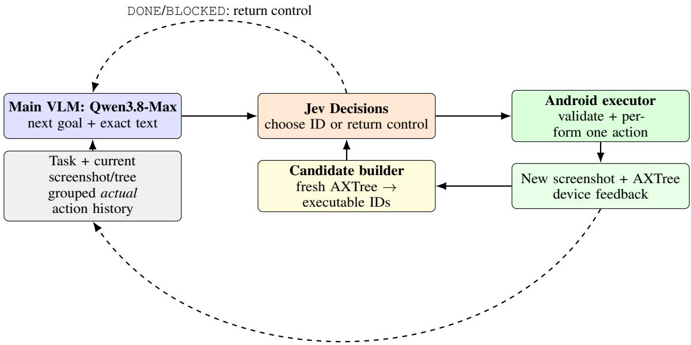

# Jev-Mobile: Jev as an Executor for Mobile GUI Agents

Linghua Zhang

lz101@rice.edu

## Abstract

Vision–language models (VLMs) have become a common foundation for autonomous mobile GUI agents, but most existing systems rely on the VLM for both planning and action grounding at nearly every interaction step, leading to substantial latency and model-serving cost. We introduce Jev-Mobile, which shifts this paradigm to low-frequency VLM planning and high-frequency lightweight execution: the VLM specifies local goals, the accessibility tree defines a structured executable action space, and Jev, a fast typed decision model, repeatedly selects actions within this space. This design allows multiple GUI actions to be executed under a single VLM decision, reducing expensive VLM inference while preserving adaptive interaction. On the full AndroidWorld task suite, Jev-Mobile achieves 79% task success, compared with 78% for SeeAct-V and 84% for a Step-wise VLM baseline. Among successful trajectories, it reduces mean end-to-end execution time by 32.7% and mean model API cost by 73.4% relative to Step-wise VLM. These results show that decoupling high-level VLM reasoning from low-level action execution can substantially improve mobile GUI agent efficiency while maintaining competitive task performance.

## 1 Introduction

A mobile agent may need to read a note, enter a date in Calendar, and verify that the event was saved, even as the interface changes after each touch. MoTIF, META-GUI, and AndroidEnv established task, dialogue, and interactive control settings (Burns et al., 2021; Sun et al., 2022; Toyama et al., 2021). AndroidInTheWild and AndroidControl provide demonstrations, while GUIOdyssey emphasizes cross-app navigation (Rawles et al., 2023; Li et al., 2024; Lu et al., 2025). Mobile-Bench, MobileAgentBench, AndroidArena, AndroidWorld, and AndroidLab evaluate execution (Deng et al., 2024; Wang et al., 2024c; Xing et al., 2024; Rawles et al., 2025; Xu et al., 2025b); Mobile-Bench-v2, SPA-Bench, A3, and Mobile-World extend evaluation to noise, resources, essential states, and longer workflows (Xu et al., 2025a; Chen et al., 2025; Chai et al., 2026; Kong et al., 2026). These settings require agents to ground actions and verify outcomes.

Prior agents use app exploration, reusable procedures, UI structure, or multimodal history (Zhang et al., 2025; Lee et al., 2024; Wen et al., 2024; Lin et al., 2025; Wang et al., 2024b; Ma et al., 2024). Mobile-Agent-v2, Mobile-Agent-E, Mobile-Agent-RAG, and the GUI-Owl line distribute control or reuse knowledge (Wang et al., 2024a, 2025; Zhou et al., 2026; Ye et al., 2025; Xu et al., 2026); Hi-Agent and EcoAgent study high/low-level or cloud/device division (Wu et al., 2025; Yi et al., 2026). Visual grounding models offer another path from screens to actions (Hong et al., 2024; You et al., 2024; Cheng et al., 2024; Wu et al., 2024; Gou et al., 2025; Xu et al., 2025c; Qin et al., 2025). This work asks whether a separate decision service can carry out several grounded actions after a VLM specifies a local goal.

Screenshots can show icons absent from an accessibility tree; trees can expose field state. Neither determines when a local controller should return control. We therefore measure candidate coverage and handoff separately from success.

In Jev-Mobile, a VLM reads the task, current screen/tree, and grouped history of actual actions, then specifies a local goal and exact input text, without generating a post-delegation summary. A program enumerates actions from the current tree. Jev, a remote typed Decisions service, chooses an ID or returns DONE/BLOCKED; after each action, the executor re-observes and rebuilds candidates. Local describes decision scope, not on-device inference. Jev requests and observations may offset fewer VLM calls.

We distinguish coverage (is an acceptable candidate available?), selection (does Jev choose it?), and handoff (does control return appropriately?). Our AndroidWorld comparison uses a step-wise VLM and SeeAct-V with UI-TARS grounding. The systems share a general VLM but retain their own execution mechanisms, so their outcomes characterize complete systems rather than the isolated effect of Jev.

We contribute (1) an implemented VLM–Jev loop with observation-bound Android candidates and no generated post-delegation summary, and (2) an evaluation of typed decision-model execution on the full AndroidWorld task suite. The reported success rate is close to that of SeeAct-V, while successful Jev-Mobile trajectories have lower mean latency and model API cost than both comparators.

## 2 Problem Setup

A task is specified by instruction $u .$ After action $a _ { t }$ , the Android device yields an observation $o _ { t } ~ = ~ ( I _ { t } , T _ { t } , z _ { t } )$ containing a screenshot, accessibility tree, and observable device context. The VLM can inspect the screenshot and tree; Jev receives only a textual tree, its current local goal, prior actions in the delegation, and executable candidate descriptions. Neither role sees hidden task parameters or the evaluator’s answer. The runner evaluates the terminal device state separately with AndroidWorld (Rawles et al., 2025).

The method chooses when to hand control from the VLM to Jev and which actions Jev may select at each observation. Its first version uses deterministic candidates from the raw tree. It does not infer missing visual coordinates, repair the UI hierarchy, or compile semantic field-completion rules; those omissions are measured as candidate-coverage or handoff failures.

## 3 Jev-Mobile Method

## 3.1 Delegation state and control flow

At delegation $k ,$ the VLM reads $u ,$ the current screenshot and tree, and a program-built history of actions actually submitted to the device, grouped by earlier local goals. One call emits $d _ { k } \in$ {delegate, finish, blocked}, a local goal $g _ { k }$ when delegating, and optional exact text values $v _ { k }$ . It does not produce a post-delegation summary. Jev may execute several atomic actions under $g _ { k }$ without another VLM call. Its DONE returns control for the next goal; BLOCKED requests interpretation or reports insufficient actions. Neither establishes overall task success, which the independent evaluator judges after the VLM finishes. Figure 1 shows this control loop.

For illustration, consider a request to copy a meeting time from a note into Calendar. The VLM may need to interpret the note and provide the exact time string. Jev can then navigate labeled controls and choose a field or Save button from candidates on successive screens. If the note is represented only as an image, or a required control is absent from the tree, Jev returns BLOCKED. The VLM may revise the goal or text values, but the first version cannot synthesize a coordinate action from the image. This example describes control flow, not a measured task outcome.

## 3.2 Candidates from the current accessibility tree

Let $C _ { t } = f ( T _ { t } , z _ { t } , v _ { k } )$ be the deterministic candidate set. The program traverses raw tree nodes, including clickable parents. Visible, enabled nodes with valid bounds can yield click, long-press, scroll, or focus actions according to their explicit flags. Exact text explicitly supplied in $v _ { k }$ may yield an input action for a focused field; the VLM can copy a string from u into $v _ { k }$ . Back, Home, Enter, and Open app are added when supported by observable device state and the shared action contract. Missing flags remain unknown; invisible, disabled, or invalid-bound nodes do not yield actions. The current input tool rejects unsupported non-ASCII text.

A candidate binds one local ID to an action, node or region, and arguments. Its short label uses the first available textual node attribute (text, description, hint, resource name, or class) plus the node index; the complete raw tree supplies other metadata. Before execution, the program checks the candidate against a fresh observation. After one action it observes again and constructs $C _ { t + 1 }$ , invalidating old IDs and coordinates. An ambiguous response to a non-idempotent action triggers inspection, not blind resubmission.

The raw tree is not compressed into a learned semantic graph. Jev receives it alongside the candidate descriptions, so long or noisy trees remain a possible failure mode. The method’s guarantee is narrower: a selected candidate is an executable action derived from a particular observation. Reobservation prevents a candidate selected on one screen from silently binding to a similar-looking node after the interface changes.

  
Figure 1: Jev-Mobile’s action-history handoff. One VLM decision delegates a local goal; Jev can select multiple actions, but each is grounded in a newly observed accessibility tree. The program records only actions submitted to the device. When Jev returns control, the VLM uses the current observation and grouped action history to decide the next goal or finish; it generates no post-delegation summary. Independent AndroidWorld scoring follows a VLM finish decision.

## 3.3 Typed local decision and event history

Each Jev request is one typed choice: its criteria map current candidate IDs, DONE, and BLOCKED to descriptions. Its state contains g , the observation ID and textual tree, and the current delegation’s action history. The adapter validates type and ID before execution. The output space is constrained, but correctness is not guaranteed. Each submitted step records the chosen ID, actual action parameters, execution status, before/after observation IDs, and a deterministic change description. At handoff, the VLM receives the current screenshot/tree and grouped, task-local action history, not old screenshots, old raw trees, predicted actions, or model-written summaries. A stale selection rejected before submission is absent from that action history. If older entries exceed the configured character limit, the program replaces them with goal, step count, and handoff reason, and records any omitted groups. No learned router or cross-task memory is used.

## 3.4 Budgets, failures, and implementation boundary

Wall time, actions, calls, waits, and retries share an episode budget; invalid outputs, stale IDs, overflows, and API errors remain in the event ledger. If a visual target has no executable tree candidate, the VLM can reinterpret the goal but this first version still may not reach the target: it has no coordinateproducing visual fallback. The method requires no new training, hierarchy repair, semantic field binding, or structured completion predicate.

## 4 Related Work

Data and evaluation. MoTIF, META-GUI, and AndroidEnv establish task feasibility, dialogue, and interactive control settings (Burns et al., 2021; Sun et al., 2022; Toyama et al., 2021). AndroidInTheWild, AndroidControl, and GUIOdyssey supply demonstrations or cross-app trajectories (Rawles et al., 2023; Li et al., 2024; Lu et al., 2025). Mobile-Bench, MobileAgentBench, AndroidArena, and Mobile-Bench-v2 evaluate mobile tasks, including noisy instructions (Deng et al., 2024; Wang et al., 2024c; Xing et al., 2024; Xu et al., 2025a). AndroidWorld, AndroidLab, SPA-Bench, LlamaTouch, A3, and MobileWorld address interactive, resource, state, or long-workflow evaluation (Rawles et al., 2025; Xu et al., 2025b; Chen et al., 2025; Zhang et al., 2024; Chai et al., 2026; Kong et al., 2026). We use AndroidWorld’s independent terminal score; trace labels diagnose failures without replacing it.

Structure, memory, and state. AppAgent and MobileGPT use exploration or reusable procedures; AutoDroid and UICompass exploit app structure or maps (Zhang et al., 2025; Lee et al., 2024; Wen et al., 2024; Lin et al., 2025). CoCo-Agent uses multimodal history, while Agent-SAMA tracks execution states (Ma et al., 2024; Guo et al., 2026). Jev-Mobile regenerates candidates from the live tree without a persistent map. Missing tree targets are therefore coverage failures, distinct from wrong choices among present candidates.

Planning and delegated execution. Mobile-Agent uses visual tools; v2 distributes planning, decision, and reflection; Mobile-Agent-E and Mobile-Agent-RAG reuse experience or retrieved knowledge (Wang et al., 2024b,a, 2025; Zhou et al., 2026). The v3/v3.5 GUI-Owl line, DigiRL, Hi-Agent, and EcoAgent study trained control, reinforcement learning, hierarchy, or device–cloud division (Ye et al., 2025; Xu et al., 2026; Bai et al., 2024; Wu et al., 2025; Yi et al., 2026). LAMO also pairs a lightweight GUI policy executor with a stronger planner (Wang et al., 2026). Thus hierarchy or lightweight execution alone is not our novelty claim; we examine typed, per-screen choices over program-generated IDs with explicit VLM handoff.

Visual grounding. CogAgent, Ferret-UI, SeeClick, and OS-Atlas study screenshot-based GUI control or grounding (Hong et al., 2024; You et al., 2024; Cheng et al., 2024; Wu et al., 2024). SeeAct separates planning and grounding; UGround evaluates SeeAct-V with a visual grounder, while UI-TARS and Aguvis develop visual GUI agents (Zheng et al., 2024; Gou et al., 2025; Qin et al., 2025; Xu et al., 2025c). Our SeeAct-V implementation uses UI-TARS-1.5-7B in place of UGround; this substitution is disclosed in the experiment design. Jev-Mobile cannot execute tree-missing visual targets through its current candidate interface.

Decision-model execution. The studies above use VLMs, trained GUI policies, or visual grounders to produce actions. To our knowledge, peer-reviewed GUI-agent work has not systematically studied whether a typed decision model such as Jev can serve as the execution model for GUI tasks. We examine that question on AndroidWorld through task success, execution time, and model cost; our claim concerns this executor design, not the broader idea of hierarchical GUI control.

## 5 Experimental Design

## 5.1 Benchmark and compared systems

We evaluate on the full AndroidWorld task suite using its task initialization and terminal evaluators (Rawles et al., 2025). The comparison contains only three systems. Step-wise VLM asks the shared general VLM to choose each action from the current observation and interaction history. SeeAct-V uses the same general VLM for stepwise decisions and UI-TARS-1.5-7B to ground the selected target; this substitution for UGround makes it an adaptation of the published controller (Gou et al., 2025; Qin et al., 2025). Jev-Mobile uses the general VLM to specify local goals, then Jev to select current accessibility-tree candidates until control returns. Its handoff mode is jev action history, without a generated post-delegation summary.

All general VLM roles use Qwen3.8-Max (Open-Router ID qwen/qwen3.8-max-0902); Jev and UI-TARS remain specialized execution models. The systems differ in observation and action interfaces, and SeeAct-V’s grounder is not its original UGround configuration. We keep AndroidWorld’s hidden task state and terminal reward outside all online model prompts.

## 5.2 Metrics and accounting

Let D be the evaluated AndroidWorld task instances and $S _ { i }$ the terminal success indicator returned by the evaluator. We report full-task success rate as

$$
\mathrm { S R } = | { \mathcal { D } } | ^ { - 1 } \sum _ { i \in { \mathcal { D } } } S _ { i } .\tag{1}
$$

The remaining metrics are conditional on successful trajectories ${ \mathcal { D } } ^ { + } = \{ i : S _ { i } = 1 \}$ . Total time per success averages each successful episode’s online wall time, including planning, executionmodel requests, device interaction, waits, and retries. Execution-model time per success averages the API time of the action-selecting model: Qwen for Step-wise VLM, UI-TARS for SeeAct-V, and Jev for Jev-Mobile.

We distinguish two cost quantities. Executionmodel cost is the sum of that model’s API charges over successful trajectories, $\sum _ { i \in { D ^ { + } } } C _ { i } ^ { \mathrm { { e x e c } } }$ ; it is a cohort total, not a per-trajectory price. Model cost per success averages the API charges of all model roles over the same successful trajectories, $\begin{array} { r } { | \mathcal { D } ^ { + } | ^ { - 1 } \sum _ { i \in \mathcal { D } ^ { + } } C _ { i } ^ { \mathrm { m o d e l s } } } \end{array}$ . We use the latter for pertrajectory model-cost comparisons.

## 6 Results

Table 1 reports aggregate results on the full AndroidWorld task suite. Success rate uses all evaluated task instances; timing and dollar figures use the successful-trajectory subset defined in Section 5.

<table><tr><td colspan="3">Step-wise Metric</td><td rowspan="2">Jev- Mobile</td></tr><tr><td></td><td>VLM</td><td>SeeAct-V</td></tr><tr><td>Full-task success rate</td><td>0.84</td><td>0.78</td><td>0.79</td></tr><tr><td>Mean total time per suc- cess (s)</td><td>197.21</td><td>162.63</td><td>132.67</td></tr><tr><td>Mean executor time per success (s)</td><td>94.30</td><td>12.37</td><td>5.16</td></tr><tr><td>Executor cost, success- 0.694774 ful trajectories summed</td><td></td><td>0.030579</td><td>0.013091</td></tr><tr><td>(USD) Mean model API cost 0.273694 per success (USD)</td><td></td><td>0.193207</td><td>0.072744</td></tr></table>

Table 1: Full AndroidWorld suite. Time and cost rows use successful trajectories. Executor cost is a cohort sum; the final row averages all model-role charges per success.

Jev-Mobile completes 0.79 of the evaluated tasks, versus 0.78 for SeeAct-V and 0.84 for Stepwise VLM. Its success rate is close to SeeAct-V’s and five percentage points below Step-wise VLM’s.

Among successful trajectories, Jev-Mobile’s mean total online time is 132.67 seconds, 18.4% lower than SeeAct-V’s 162.63 seconds and 32.7% lower than Step-wise VLM’s 197.21 seconds. The mean time spent in the execution model is 5.16 seconds, versus 12.37 seconds for UI-TARS and 94.30 seconds for the step-wise Qwen executor. Mean model API cost per successful trajectory is \$0.072744 for Jev-Mobile, compared with \$0.193207 and \$0.273694, respectively.

## 7 Analysis and Discussion

A decision model as an executor. The 0.79 fulltask success rate shows that a typed decision model can select actions within a VLM-guided mobile GUI agent and complete a substantial fraction of

AndroidWorld tasks. It is close to SeeAct-V’s 0.78, while Step-wise VLM reaches 0.84. Jev-Mobile therefore demonstrates the practical use of a typed decision model as a mobile GUI executor.

Execution efficiency. Compared with Step-wise VLM, Jev-Mobile reduces mean total time on successful trajectories from 197.21 to 132.67 seconds (32.7%), execution-model time from 94.30 to 5.16 seconds (94.5%), and mean all-model API cost from \$0.273694 to \$0.072744 (73.4%). It also has lower mean total time, execution-model time, and model API cost than SeeAct-V. Jev-Mobile lets Jev select several actions under one VLM-provided local goal, while the candidate builder refreshes executable choices after each action. This division of labor is consistent with the short execution-model time observed in the experiment.

## 8 Limitations

Our evaluation concerns mobile tasks in Android-World only. It does not test web interfaces, whose DOM structure, page dynamics, and interaction patterns may place different demands on a decisionmodel executor. We compare with two baselines, Step-wise VLM and SeeAct-V, but have not tested the Jev-Mobile workflow with Jev replaced by a small VLM; that comparison would clarify whether the observed behavior depends on typed decisionmodel execution or on the delegated workflow more generally. Jev-Mobile also depends on the Android accessibility tree: a visually apparent target absent from the tree cannot be turned into an executable candidate by the current controller. Its present input path supports printable ASCII text, and long action histories may require compaction.

## 9 Conclusion

We introduced Jev-Mobile, which delegates current-tree action selection to a typed decision model while retaining a VLM for task interpretation and local-goal setting. On the reported full AndroidWorld suite, it achieves 0.79 task success with lower observed mean successful-trajectory time and model API cost than Step-wise VLM and SeeAct-V. Its success is close to SeeAct-V’s 0.78 and below Step-wise VLM’s 0.84. These results support Jev as a viable mobile GUI execution model. Future work can test web interfaces and compare Jev with a small VLM inside the same delegated controller.

## References

Hao Bai, Yifei Zhou, Mert Cemri, Jiayi Pan, Alane Suhr, Sergey Levine, and Aviral Kumar. 2024. DigiRL: Training in-the-wild device-control agents with autonomous reinforcement learning. In Advances in Neural Information Processing Systems, volume 37.

Andrea Burns, Deniz Arsan, Sanjna Agrawal, Ranjitha Kumar, Kate Saenko, and Bryan A. Plummer. 2021. Mobile app tasks with iterative feedback (MoTIF): Addressing task feasibility in interactive visual environments. arXiv preprint arXiv:2104.08560.

Yuxiang Chai, Shunye Tang, Han Xiao, Weifeng Lin, Hanhao Li, Jiayu Zhang, Liang Liu, Pengxiang Zhao, Guangyi Liu, Guozhi Wang, Shuai Ren, Rongduo Han, Haining Zhang, Siyuan Huang, and Hongsheng Li. 2026. A3: Android agent arena for mobile GUI agents with essential-state procedural evaluation. In Findings of the Association for Computational Linguistics: ACL 2026, pages 3774–3789. Association for Computational Linguistics.

Jingxuan Chen, Derek Yuen, Bin Xie, Yuhao Yang, Gongwei Chen, Zhihao Wu, Yixing Li, Xurui Zhou, Weiwen Liu, Shuai Wang, Kaiwen Zhou, Rui Shao, Liqiang Nie, Yasheng Wang, Jianye Hao, Jun Wang, and Kun Shao. 2025. SPA-Bench: A comprehensive benchmark for smartphone agent evaluation. In International Conference on Learning Representations.

Kanzhi Cheng, Qiushi Sun, Yougang Chu, Fangzhi Xu, YanTao Li, Jianbing Zhang, and Zhiyong Wu. 2024. SeeClick: Harnessing GUI grounding for advanced visual GUI agents. In Proceedings of the 62nd Annual Meeting ofthe Associationfor Computational Linguistics (Volume 1: Long Papers), pages 9313– 9332. Association for Computational Linguistics.

Shihan Deng, Weikai Xu, Hongda Sun, Wei Liu, Tao Tan, Jianfeng Liu, Ang Li, Jian Luan, Bin Wang, Rui Yan, and Shuo Shang. 2024. Mobile-Bench: An evaluation benchmark for LLM-based mobile agents. In Proceedings of the 62nd Annual Meeting of the Association for Computational Linguistics (Volume 1: Long Papers), pages 8813–8831. Association for Computational Linguistics.

Boyu Gou, Demi Ruohan Wang, Boyuan Zheng, Yanan Xie, Cheng Chang, Yiheng Shu, Huan Sun, and Yu Su. 2025. Navigating the digital world as humans do: Universal visual grounding for GUI agents. In International Conference on Learning Representations, pages 30851–30883.

Linqiang Guo, Wei Liu, Yi Wen Heng, Tse-Hsun Chen, and Yang Wang. 2026. Agent-SAMA: State-aware mobile assistant. Proceedings of the AAAI Conference on Artificial Intelligence, 40(35):29459–29467.

Wenyi Hong, Weihan Wang, Qingsong Lv, Jiazheng Xu, Wenmeng Yu, Junhui Ji, Yan Wang, Zihan Wang, Yuxiao Dong, Ming Ding, and Jie Tang. 2024. CogAgent: A visual language model for GUI agents. In

Proceedings ofthe IEEE/CVF Conference on Computer Vision and Pattern Recognition, pages 14281– 14290.

Quyu Kong, Xu Zhang, Zhenyu Yang, Nolan Gao, Chen Liu, Panrong Tong, Chenglin Cai, Hanzhang Zhou, Jianan Zhang, Liangyu Chen, Zhidan Liu, Steven Hoi, and Yue Wang. 2026. MobileWorld: Benchmarking autonomous mobile agents in agent-user interactive and MCP-augmented environments. In Proceedings of the 64th Annual Meeting of the Association for Computational Linguistics (Volume 1: Long Papers), pages 6142–6167. Association for Computational Linguistics.

Sunjae Lee, Junyoung Choi, Jungjae Lee, Munim Hasan Wasi, Hojun Choi, Steven Y. Ko, Sangeun Oh, and Insik Shin. 2024. MobileGPT: Augmenting LLM with human-like app memory for mobile task automation. In Proceedings ofthe 30th Annual International Conference on Mobile Computing and Networking, pages 1119–1133. ACM.

Wei Li, William Bishop, Alice Li, Chris Rawles, Folawiyo Campbell-Ajala, Divya Tyamagundlu, and Oriana Riva. 2024. On the effects of data scale on UI control agents. In Advances in Neural Information Processing Systems, volume 37.

Yuanzhang Lin, Zhe Zhang, He Rui, Qingao Dong, Mingyi Zhou, Jing Zhang, Xiang Gao, and Hailong Sun. 2025. UICOMPASS: UI map guided mobile task automation via adaptive action generation. In Proceedings of the 2025 Conference on Empirical Methods in Natural Language Processing, pages 26486–26506. Association for Computational Linguistics.

Quanfeng Lu, Wenqi Shao, Zitao Liu, Lingxiao Du, Fanqing Meng, Boxuan Li, Botong Chen, Siyuan Huang, Kaipeng Zhang, and Ping Luo. 2025. GUIOdyssey: A comprehensive dataset for cross-app GUI navigation on mobile devices. In Proceedings of the IEEE/CVF International Conference on Computer Vision, pages 22404–22414.

Xinbei Ma, Zhuosheng Zhang, and Hai Zhao. 2024. CoCo-Agent: A comprehensive cognitive MLLM agent for smartphone GUI automation. In Findings of the Associationfor Computational Linguistics: ACL 2024, pages 9097–9110. Association for Computational Linguistics.

Yujia Qin, Yining Ye, Junjie Fang, Haoming Wang, Shihao Liang, Shizuo Tian, Junda Zhang, Jiahao Li, Yunxin Li, Shijue Huang, et al. 2025. UI-TARS: Pioneering automated GUI interaction with native agents. arXiv preprint arXiv:2501.12326.

Chris Rawles, Sarah Clinckemaillie, Yifan Chang, Jonathan Waltz, Gabrielle Lau, Marybeth Fair, Alice Li, William Bishop, Wei Li, Folawiyo Campbell-Ajala, Daniel Toyama, Robert Berry, Divya Tyamagundlu, Timothy Lillicrap, and Oriana Riva. 2025.

AndroidWorld: A dynamic benchmarking environment for autonomous agents. In International Conference on Learning Representations, pages 406– 441.

Christopher Rawles, Alice Li, Daniel Rodriguez, Oriana Riva, and Timothy Lillicrap. 2023. AndroidInTheWild: A large-scale dataset for android device control. In Advances in Neural Information Processing Systems, volume 36, pages 59708–59728.

Liangtai Sun, Xingyu Chen, Lu Chen, Tianle Dai, Zichen Zhu, and Kai Yu. 2022. META-GUI: Towards multi-modal conversational agents on mobile GUI. In Proceedings of the 2022 Conference on Empirical Methods in Natural Language Processing, pages 6699–6712. Association for Computational Linguistics.

Daniel Toyama, Philippe Hamel, Anita Gergely, Gheorghe Comanici, Amelia Glaese, Zafarali Ahmed, Tyler Jackson, Shibl Mourad, and Doina Precup. 2021. AndroidEnv: A reinforcement learning platform for Android. arXiv preprint arXiv:2105.13231.

Junyang Wang, Haiyang Xu, Haitao Jia, Xi Zhang, Ming Yan, Weizhou Shen, Ji Zhang, Fei Huang, and Jitao Sang. 2024a. Mobile-Agent-v2: Mobile device operation assistant with effective navigation via multi-agent collaboration. In Advances in Neural Information Processing Systems, volume 37, pages 2686–2710.

Junyang Wang, Haiyang Xu, Jiabo Ye, Ming Yan, Weizhou Shen, Ji Zhang, Fei Huang, and Jitao Sang. 2024b. Mobile-Agent: Autonomous multi-modal mobile device agent with visual perception. arXiv preprint arXiv:2401.16158.

Luyuan Wang, Yongyu Deng, Yiwei Zha, Guodong Mao, Qinmin Wang, Tianchen Min, Wei Chen, and Shoufa Chen. 2024c. MobileAgentBench: An efficient and user-friendly benchmark for mobile LLM agents. arXiv preprint arXiv:2406.08184.

Zhenhailong Wang, Haiyang Xu, Junyang Wang, Xi Zhang, Ming Yan, Ji Zhang, Fei Huang, and Heng Ji. 2025. Mobile-Agent-E: Self-evolving mobile assistant for complex tasks. arXiv preprint arXiv:2501.11733.

Ziwei Wang, Junjie Zheng, Leyang Yang, Sheng Zhou, Xiaoxuan Tang, Fang Zhouhua, Zhiwei Liu, Dajun Chen, Yong Li, and Jiajun Bu. 2026. Towards scalable lightweight GUI agents via multi-role orchestration. In Findings of the Association for Computational Linguistics: ACL 2026, pages 22359–22388. Association for Computational Linguistics.

Hao Wen, Yuanchun Li, Guohong Liu, Shanhui Zhao, Tao Yu, Toby Jia-Jun Li, Shiqi Jiang, Yunhao Liu, Yaqin Zhang, and Yunxin Liu. 2024. AutoDroid: LLM-powered task automation in Android. In Proceedings of the 30th Annual International Conference on Mobile Computing and Networking, pages 543– 557. ACM.

Zhe Wu, Hongjin Lu, Junliang Xing, Changhao Zhang, Yuxuan Li, Yin Zhu, Yuhao Yang, Yuheng Jing, Kai Li, Kun Shao, Jianye Hao, Jun Wang, and Yuanchun Shi. 2025. Hi-Agent: Hierarchical vision-language agents for mobile device control. arXiv preprint arXiv:2510.14388.

Zhiyong Wu, Zhenyu Wu, Fangzhi Xu, Yian Wang, Qiushi Sun, Chengyou Jia, Kanzhi Cheng, Zichen Ding, Liheng Chen, Paul Pu Liang, and Yu Qiao. 2024. OS-ATLAS: A foundation action model for generalist GUI agents. arXiv preprint arXiv:2410.23218.

Mingzhe Xing, Rongkai Zhang, Hui Xue, Qi Chen, Fan Yang, and Zhen Xiao. 2024. Understanding the weakness of large language model agents within a complex Android environment. arXiv preprint arXiv:2402.06596.

Haiyang Xu, Xi Zhang, Haowei Liu, Junyang Wang, Zhaozai Zhu, Shengjie Zhou, Xuhao Hu, Feiyu Gao, Junjie Cao, Zihua Wang, Zhiyuan Chen, Jitong Liao, Qi Zheng, Jiahui Zeng, Ze Xu, Shuai Bai, Junyang Lin, Jingren Zhou, and Ming Yan. 2026. Mobile-Agent-v3.5: Multi-platform fundamental GUI agents. arXiv preprint arXiv:2602.16855.

Weikai Xu, Zhizheng Jiang, Yuxuan Liu, Pengzhi Gao, Wei Liu, Jian Luan, Yuanchun Li, Yunxin Liu, Bin Wang, and Bo An. 2025a. Mobile-Benchv2: A more realistic and comprehensive benchmark for VLM-based mobile agents. arXiv preprint arXiv:2505.11891.

Yifan Xu, Xiao Liu, Xueqiao Sun, Siyi Cheng, Hao Yu, Hanyu Lai, Shudan Zhang, Dan Zhang, Jie Tang, and Yuxiao Dong. 2025b. AndroidLab: Training and systematic benchmarking of android autonomous agents. In Proceedings of the 63rd Annual Meeting of the Association for Computational Linguistics (Volume 1: Long Papers), pages 2144–2166. Association for Computational Linguistics.

Yiheng Xu, Zekun Wang, Junli Wang, Dunjie Lu, Tianbao Xie, Amrita Saha, Doyen Sahoo, Tao Yu, and Caiming Xiong. 2025c. Aguvis: Unified pure vision agents for autonomous GUI interaction. In Proceedings of the 42nd International Conference on Machine Learning, volume 267 of Proceedings of Machine Learning Research, pages 69772–69805. PMLR.

Jiabo Ye, Xi Zhang, Haiyang Xu, Haowei Liu, Junyang Wang, Zhaoqing Zhu, Ziwei Zheng, Feiyu Gao, Junjie Cao, Zhengxi Lu, Jitong Liao, Qi Zheng, Fei Huang, Jingren Zhou, and Ming Yan. 2025. Mobile-Agent-v3: Fundamental agents for GUI automation. arXiv preprint arXiv:2508.15144.

Biao Yi, Xueyu Hu, Yurun Chen, Shengyu Zhang, Hongxia Yang, and Fan Wu. 2026. EcoAgent: An efficient device-cloud collaborative multi-agent framework for mobile automation. Proceedings of the AAAI Conference on Artificial Intelligence, 40(35):29838–29846.

Keen You, Haotian Zhang, Eldon Schoop, Floris Weers, Amanda Swearngin, Jeffrey Nichols, Yinfei Yang, and Zhe Gan. 2024. Ferret-UI: Grounded mobile UI understanding with multimodal LLMs. In European Conference on Computer Vision.

Chi Zhang, Zhao Yang, Jiaxuan Liu, Yanda Li, Yucheng Han, Xin Chen, Zebiao Huang, Bin Fu, and Gang Yu. 2025. AppAgent: Multimodal agents as smartphone users. In Proceedings ofthe 2025 CHI Conference on Human Factors in Computing Systems.

Li Zhang, Shihe Wang, Xianqing Jia, Zhihan Zheng, Yunhe Yan, Longxi Gao, Yuanchun Li, and Mengwei Xu. 2024. LlamaTouch: A faithful and scalable testbed for mobile UI task automation. In Proceedings of the 37th Annual ACM Symposium on User Interface Software and Technology.

Boyuan Zheng, Boyu Gou, Jihyung Kil, Huan Sun, and Yu Su. 2024. GPT-4V(ision) is a Generalist Web Agent, if Grounded. In Proceedings ofthe 41st International Conference on Machine Learning, volume 235 of Proceedings of Machine Learning Research, pages 61349–61385. PMLR.

Yuxiang Zhou, Jichang Li, Yanhao Zhang, Haonan Lu, and Guanbin Li. 2026. Mobile-Agent-RAG: Driving smart multi-agent coordination with contextual knowledge empowerment for long-horizon mobile automation. Proceedings ofthe AAAI Conference on Artificial Intelligence, 40(35):29939–29947.