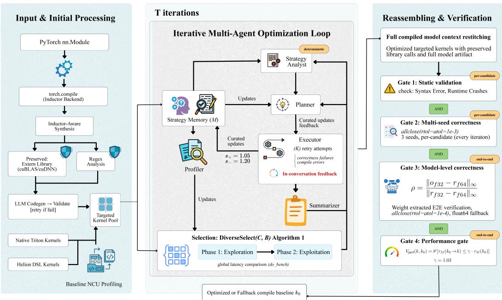
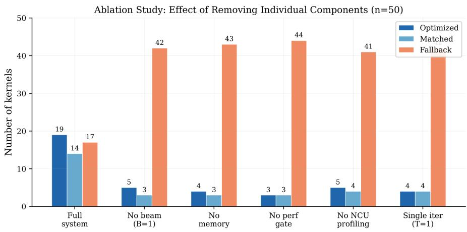
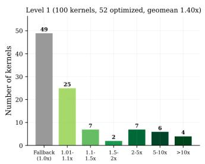
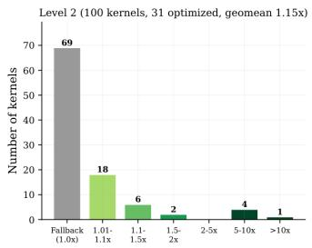
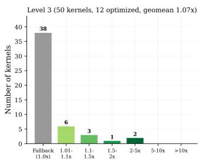
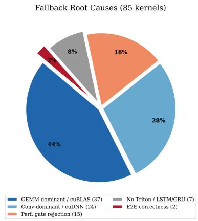
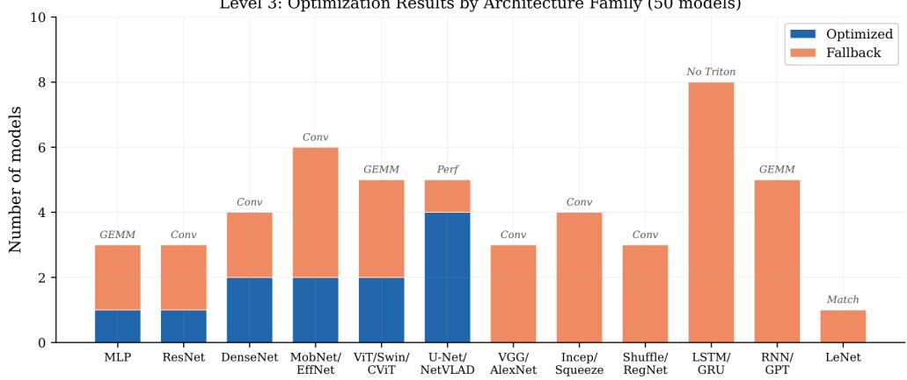
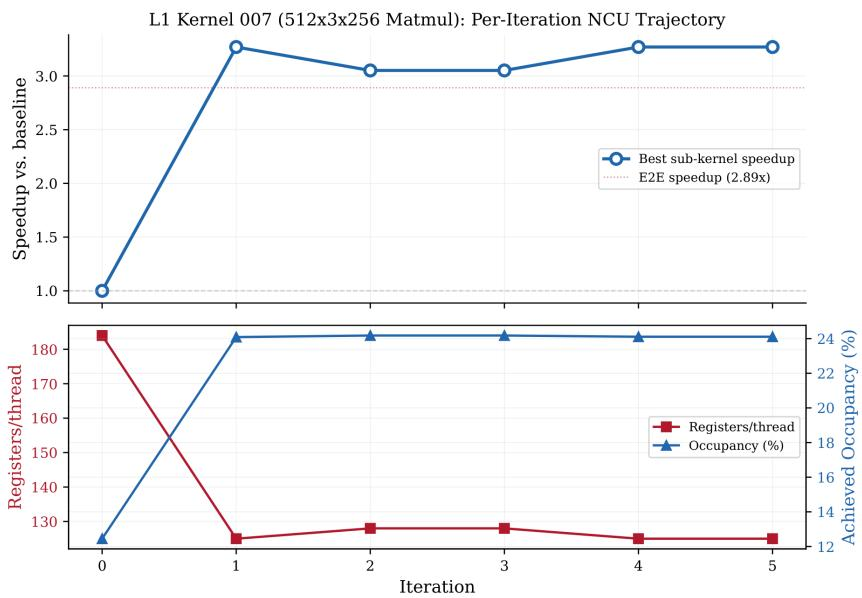

# KERNELOPT: DISPATCH-AWARE AGENTIC SEARCH FOR GPU KERNEL OPTIMIZATION

Aheli Poddar\*<sup>†‡</sup>   
Red Hat   
ahpoddar@redhat.com

Subha Chakraborty<sup>‡</sup> Red Hat subhchak@redhat.com

Sanskar Prasad\*<sup>‡</sup> Red Hat sanspras@redhat.com

Vishal Goyal   
Red Hat   
visgoyal@redhat.com

Arindam Samanta<sup>‡</sup> Red Hat arsamant@redhat.com

Rohit Singh Rathaur Red Hat rrathaur@redhat.com

## ABSTRACT

Deep learning inference and training performance depends critically on GPU kernel efficiency. Modern compilers such as PyTorch Inductor automatically generate GPU kernels from high-level model code, but frequently underperform expertwritten implementations by wide margins. Recent LLM-assisted kernel optimizers can close this gap for standalone kernels, yet treat compiled models as black boxes, generally optimizing individual standalone kernels without respecting the compiler’s structural decisions or verifying the model end-to-end. We present KernelOPT, a multi-agent system that treats compiled models as structured artifacts. It preserves vendor library calls (cuBLAS, cuDNN) and exclusively targets generated Triton sub-kernels using five profiling-guided LLM agents. A fourgate verification cascade of static validation, multi-seed correctness, model-level float64-fallback verification, and performance gating filters candidates during optimization and verifies the re-stitched model end-to-end. If no candidate passes all four gates, the system preserves the compiler baseline. The system accepts Py-Torch nn.Modules, standalone Triton kernels, and Helion kernels. Evaluated on 250 KernelBench problems, KernelOPT achieves geometric mean speedups over torch.compile of 1.40× (Level 1: 51/100), 1.15× (Level 2: 31/100), and 1.07× (Level 3: 12/50) across all problems.

## 1 INTRODUCTION

Efficient GPU kernels are the foundation of performant deep learning. PyTorch Inductor (Ansel et al., 2024), the default torch.compile backend, delivers a 2.27× geometric mean inference speedup over eager mode by lowering operations to Triton (Tillet et al., 2019). However, the generated code leaves substantial performance on the table. Inductor’s autotuning explores a limited tile-size configuration space by default, its fusion heuristics are conservative, and its cross-operation rewrites are limited to a fixed set of manually specified pattern matches rather than a general algebraic simplification framework. Expert-written kernels such as FlashAttention (Dao et al., 2022; Dao, 2024) demonstrate that near-order-of-magnitude speedups are achievable on the same hardware, but require extensive engineering effort; for example, FlashAttention-3 (Shah et al., 2024) for the H100 took roughly two years to reach 85% peak throughput (Zhang et al., 2026).

Recent work has applied LLM agents to automate this process. KernelAgent (Wang et al., 2025) translates PyTorch models to Triton kernels via multi-agent code-to-code generation with NCUguided optimization. AccelOpt (Zhang et al., 2026) introduces an iterative planner–executor– summarizer agent loop with optimization memory for NKI kernels on AWS Trainium. K-Search (Cao et al., 2026) formulates kernel generation as planning over a co-evolving LLM world model with tree-structured search. These systems share a critical limitation: while some support multi-kernel decomposition, none provides end-to-end verification of the re-stitched model against the original PyTorch model with weight-extracted correctness and performance gating.

A key observation motivates our approach: compiler-generated code has structure that LLM-driven optimization should respect. A compiled PyTorch model is not a single kernel; rather, it is a structured artifact where the compiler has already made dispatch decisions: cuBLAS (NVIDIA Corporation, 2024a) for GEMM, cuDNN (Chetlur et al., 2014) for convolution, and Triton for pointwise and reduction operations. The compiler’s dispatch decisions are typically sound; what is suboptimal is the quality of the remaining Triton code. KernelOPT exploits this structure: it respects the compiler’s library dispatch, focuses LLM effort on the Triton-generated sub-kernels, and verifies the result at the model level.

This formulation yields three core contributions: (1) Compiled-model kernel optimization: We decompose, selectively optimize, and verify entire compiled models, respecting compiler dispatch rather than overriding it (accepting PyTorch nn.Modules, Triton, and Helion (Ansel et al., 2025) kernels). (2) Four-gate verification cascade: A rigorous sequential filter applying static validation, multi-seed correctness, model-level precision-aware error ratio ρ, and performance gating (§4.4). (3) Profiling-guided multi-agent search: Five agents (four LLM-driven, one deterministic) in a LangGraph (LangChain Inc., 2024) system using NCU (NVIDIA Corporation, 2024b) profiling to classify bottlenecks and guide optimization. Unlike one-shot approaches, the executor agent receives compile errors and correctness failures as in-conversation feedback, enabling iterative selfcorrection. A meltdown detector prevents search stagnation when optimization directions collapse. The complete codebase is available at https://github.com/TorchedHat/KernelOPT.

## 2 RELATED WORK

Compiler-based and manual optimization. Halide (Ragan-Kelley et al., 2013) and TVM with Ansor (Chen et al., 2018; Zheng et al., 2020) separate algorithm from schedule to enable large search spaces. Triton uses block-level programming with automatic compiler scheduling; PyTorch Inductor (Ansel et al., 2024) integrates Triton codegen into torch.compile but constrains autotuning to fixed tile sizes and fusion patterns. ThunderKittens (Spector et al., 2024) provides tile-level CUDA abstractions for hand-writing high-performance attention and SSM kernels. Mirage (Wu et al., 2025) applies multi-level superoptimization with formal equivalence verification, representing the state of the art in non-LLM kernel synthesis.

LLM-driven kernel optimization. KernelAgent (Wang et al., 2025) combines multi-agent generation with NCU profiling for Triton kernels on NVIDIA GPUs. AccelOpt (Zhang et al., 2026) introduces the iterative planner–executor–summarizer architecture with beam search and optimization memory for NKI kernels on AWS Trainium; we adapt this iterative framework to NVIDIA GPUs and extend it with Inductor-aware synthesis, model-level verification, and shipped guidelines. CudaForge (Zhang et al., 2025) uses a two-agent Judge–Coder system. K-Search (Cao et al., 2026) uses LLM-guided tree search with a co-evolving world model. Astra (Wei et al., 2025) employs a multi-agent architecture with iterative profiling for CUDA kernel optimization but targets existing production kernels rather than compiled-model synthesis. OptiML (Bhattacharjee et al., 2026) combines program synthesis with MCTS-guided refinement for CUDA kernels. AutoKernel (Jaber & Jaber, 2026) applies an iterative keep/revert loop with model-level profiling and a five-stage correctness harness. Among these, only AutoKernel provides model-level profiling and end-to-end correctness verification; however, it does not use NCU hardware profiling to guide optimization directions. KernelOPT is the first system to combine Inductor-aware compiled-model optimization, NCU-guided planning, and end-to-end model-level verification with a compiler-baseline fallback.

Benchmarks. KernelBench (Ouyang et al., 2025) provides 250 problems across three difficulty levels with standardized evaluation using torch.allclose $( { \mathrm { r t o l } } = 1 0 ^ { - 4 }$ $\mathsf { a t o l } \mathsf { = } 1 0 ^ { - 4 } )$ ). We evaluate on all 250 problems plus 20 tutorial kernels.

## 3 PROBLEM FORMULATION

Definition 1 (Kernel Optimization) Let $M _ { 0 } = \langle \{ k _ { 1 } , \ldots , k _ { m } \} , L \rangle$ denote a compiled model produced by torch.compile, where $\{ k _ { i } \}$ are Triton-generated sub-kernels and L are extern library calls (cuBLAS, cuDNN) that remain fixed. Let K be the space of syntactically valid Triton programs, $\tau ( k )$ the wall-clock sub-kernel time via do bench, $M ( k _ { i } \xrightarrow { } k _ { i } ^ { \prime } )$ the re-stitching operator that substitutes $k _ { i } ^ { \prime }$ into the model, and $\mathcal { V } ( k , k _ { 0 } )$ a verification function. The optimization problem is:

$$
k ^ { * } = \arg \operatorname* { m i n } _ { k \in \mathcal { K } } \tau ( k ) \quad s u b j e c t t o \quad \mathcal { V } ( k , k _ { 0 } ) = 1\tag{1}
$$

The search space $\kappa$ is intractable to enumerate. We access it through an LLM-based transformation operator $\mathcal { A } _ { \theta } : \mathcal { K } \times \mathcal { P }  \mathcal { K }$ , parameterized by an LLM θ, that takes a kernel k and an optimization plan $p \in \mathcal P$ (derived from NCU profiling) and produces a candidate $k ^ { \prime } = \mathcal { A } _ { \theta } ( k , p )$

Four-gate verification. The verification function $\mathcal { V } ( k , k _ { 0 } )$ is the conjunction of four gates applied sequentially:

$$
{ \mathcal { V } } ( k , k _ { 0 } ) = \underbrace { V _ { \mathrm { s t a t } } ( k ) \ \wedge \ V _ { \mathrm { c o r r } } ( k , k _ { 0 } ) } _ { \mathrm { p e r - c a n d i d a t e ~ ( G a t e s ~ 1 - 2 ) } } \wedge \underbrace { V _ { \mathrm { m o d e l } } ( k , k _ { 0 } ) \ \wedge \ V _ { \mathrm { p e r f } } ( k , k _ { 0 } ) } _ { \mathrm { e n d - t o - e n d ~ ( G a t e s ~ 3 - 4 ) } }\tag{2}
$$

where $V _ { \mathrm { s t a t } }$ validates structural properties, $V _ { \mathrm { c o r r } }$ verifies numerical equivalence with allclo $\scriptstyle \mathtt { \mathtt { \mathtt { O } } \mathtt { e } } \left( \epsilon _ { r } = 1 0 ^ { - 3 } , \epsilon _ { a } = 1 0 ^ { - 3 } \right)$ (§4.4), V verifies full-model correctness with weightextracted inputs and stricter tolerance $( \epsilon _ { r } = \epsilon _ { a } = 1 0 ^ { - 4 } )$ plus a float64 fallback (§4.4), and $\bar { V } _ { \mathrm { p e r f } }$ verifies that $\tau _ { M } ( k _ { 0 } \to k ) \ \leq \gamma \cdot \tau _ { M } ( k _ { 0 } )$ with noise margin $\gamma = 1 . 0 3$ Gates 1–2 run on every candidate during optimization; Gates 3–4 run once on the re-stitched model after optimization completes.

When $\mathcal { V } ( k ^ { * } , k _ { 0 } ) = 0$ for all candidates, the system returns $k _ { 0 }$ unchanged.

## 4 METHOD

## 4.1 SYSTEM OVERVIEW

KernelOPT operates in two modes. In single-kernel mode, it optimizes a standalone Triton or Helion (Ansel et al., 2025) kernel directly. In multi-kernel mode, it processes a PyTorch model through five stages: (1) Inductor-aware synthesis, where torch.compile traces the model, extern kernels (cuBLAS (NVIDIA Corporation, 2024a)/cuDNN (Chetlur et al., 2014)) are detected and preserved, fusible groups are merged, and an LLM generates validated standalone Triton kernels; (2) baseline profiling with NVIDIA Nsight Compute (NVIDIA Corporation, 2024b) (--set full kernel replay); (3) strategy analysis classifying the NCU bottleneck tier; (4) iterative optimization with T iterations of plan generation, execution, profiling, and beam selection; and (5) re-stitch and verification, replacing each optimized sub-kernel in the full model with four-gate verification (Eq. 2).

Inductor-aware synthesis. When processing a PyTorch model, torch.compile with max autotune generates Inductor output containing a mix of async compile.triton blocks and extern kernels calls. KernelOPT detects these library calls via regex over the Inductor output and flags them as needs triton replacement: False. Adjacent fusible kernel groups are merged, and the LLM generates a standalone Triton kernel for each group from its aten operation graph (e.g., linear→mul→hardtanh→gelu fused into a single kernel). Each generated kernel is validated against the original PyTorch model in eager mode using allclose $( \mathrm { r t o l } { = } 1 0 ^ { - 4 } , \mathsf { a t o l } { = } 1 0 ^ { - 4 } )$ with 2 seeds; failures are fed back to the LLM for up to K retry attempts. Only kernels that pass this synthesis-stage validation enter the iterative optimization pipeline. This step can itself yield large speedups by fusing operations that Inductor kept separate (e.g., 33× on L2 kernel 018).

## 4.2 AGENT ARCHITECTURE

Following AccelOpt’s planner–executor–summarizer architecture (Zhang et al., 2026), five agents collaborate within a LangGraph (LangChain Inc., 2024) state machine; we extend the loop with a profiler agent and a strategy analyst for NCU-guided planning. The profiler configures NCU profiling (ncu --set full) by analyzing kernel source for framework markers (@triton.jit, @helion.kernel, async compile). The profiler parses the full NCU CSV report and builds a structured profiling context containing Speed-of-Light (SOL) throughput, duration, registers, occupancy, and NCU rules. The top-3 NCU rules ranked by estimated speedup percentage are injected into the planner’s prompt alongside the bottleneck classification.

  
Figure 1: KernelOPT pipeline. A PyTorch model is traced via Inductor; sub-kernels are classified as Triton-generated (optimizable) or extern-library (preserved). Five agents iterate within a LangGraph state machine using NCU profiling feedback. Optimized kernels are re-stitched and verified at the model level.

The strategy analyst deterministically classifies the NCU bottleneck tier: near-optimal (either SOL $> 8 0 \% )$ , memory-bound $\mathrm { ( S O L _ { m e m } \mathrm { ~ \bar { ~ } S O L _ { c o m p } } , }$ both $\leq 8 0 \%$ ), compute-bound (vice versa), or underutilized (both equal and $\leq 8 0 \% )$ ); for multi-kernel inputs it additionally makes an LLM call to decide fuse-vs-optimize grouping. The planner generates N optimization plans per iteration, with a meltdown detector that triggers diversity enforcement when recent directions (up to the last six) collapse $\mathrm { t o } \le 2$ unique approaches, identified by normalized string matching. The executor implements each plan with up to K retry attempts, receiving compile errors and correctness failures as feedback within the same conversation. The summarizer distills each attempt into a structured experience item.

## 4.3 PROFILING-GUIDED BEAM SEARCH

Prior systems use beam search (Zhang et al., 2026) or repeated sampling (Wang et al., 2025) for candidate selection, but without profiling-guided diversity enforcement. The transformation landscape is non-convex: a locally suboptimal transformation may enable subsequent improvements unreachable by fixed-direction search.

We formulate the optimization as search over a rooted tree $G = ( V , E )$ , where each node $v \in V$ represents a kernel $k _ { v } ~ \in ~ \mathcal { K }$ with latency $\tau ( k _ { v } )$ , and each edge (u, v) represents a transformation $k _ { v } = \mathcal { A } _ { \theta } ( k _ { u } , p )$ . Beam selection uses $\mathrm { U C B } ( c { = } 1 . 4 )$ to balance exploration of underexpanded branches against exploitation of the best-latency path.

Algorithm 1 Profiling-Guided Beam Search   
Require: Baseline $k _ { 0 }$ , beam width B, iterations T, plans N, retries K, LLM θ, memory M   
Ensure: Optimized kernel k<sup>∗</sup>   
1: π ← Profiler(k ) {NCU parse}   
2: $b _ { 0 } \gets \mathrm { A n a l y s t } ( \pi _ { 0 } )$ {bottleneck tier}   
3: $B _ { 0 } \gets \{ ( k _ { 0 } , \tau ( k _ { 0 } ) , \bar { \pi } _ { 0 } , b _ { 0 } , [ ] ) \}$   
4: for t = 1 to T do   
5: $\mathcal { C } _ { t } \gets \emptyset$   
6: for $( k _ { i } , \tau _ { i } , \pi _ { i } , b _ { i } , h _ { i } ) \in \mathcal { B } _ { t - 1 }$ do   
7: $\{ p _ { 1 } , \dotsc , p _ { \lceil N / B \rceil } \}  \mathrm { P l a n n e r } _ { \theta } ( \pi _ { i } , b _ { i } , k _ { i } , \mathcal { M } , h _ { i } )$   
8: for $j = 1 \dot { \mathrm { t o } } \ \dot { \lceil } N \dot { / } B \rceil$ do   
9: $k ^ { \prime } \gets \mathrm { E x e c u t o r } _ { \theta } ( k _ { i } , p _ { j } , K )$   
10: M ← Summarizer $( \check { k } _ { i } , k ^ { \prime } , p _ { j } , \mathcal { M } )$   
11: if $V _ { \mathrm { s t a t } } ( k ^ { \prime } ) \ \wedge \ V _ { \mathrm { c o r r } } ( \dot { k ^ { \prime } } , k _ { 0 } )$ then   
12: $\pi ^ { \prime } $ Profiler(k<sup>′</sup>); b<sup>′</sup> ← Analyst(π<sup>′</sup>) {Gates 1–2 passed}   
13: $\mathcal { C } _ { t } \gets \mathcal { C } _ { t } \cup \{ ( \dot { k } ^ { \prime } , \overset { \prime } { \tau } ( k ^ { \prime } ) , \pi ^ { \prime } , b ^ { \prime } , \overset { \cdot } { h _ { i } } \cup \{ p _ { j } \} ) \}$   
14: end if   
15: end for   
16: end for   
17: $B _ { t } \gets$ DiverseSelec $( \mathcal { C } _ { t } , B )$   
18: if no improvement for 2 consecutive iterations then   
19: break   
20: end if   
21: end for   
22: k<sup>∗</sup> ← arg min $\textstyle ( k , \tau , \cdot , \cdot , \cdot ) \in \bigcup _ { t } B _ { t } ^ { \tau }$   
23: return $k ^ { * } \operatorname { i f } \mathcal { V } ( k ^ { * } , k _ { 0 } ) = \mathrm { \hat { 1 } }$ (Def. 3), else $k _ { 0 }$

The diversity-aware selection (Algorithm 1, line 17) partitions the candidate set C by chain origin $\mathcal { C } _ { i }$ and proceeds in two phases:

$$
\operatorname { D i v e r s e S e l e c t } ( \mathcal { C } , B ) = \underbrace { \left\{ \underset { c \in \mathcal { C } _ { i } } { \operatorname { a r g m i n } } \tau ( c ) \right\} i \in \operatorname { c h a i n s } } _ { \mathrm { b e s t ~ p e r ~ c h a i n } } \cup \underbrace { \mathrm { t o p { - } } ( B - | \operatorname { c h a i n s } | ) } _ { \mathrm { g l o b a l ~ b e s t } }\tag{3}
$$

Phase 1 ensures each chain contributes its best candidate (exploration); Phase 2 fills remaining beam slots by global latency (exploitation).

## 4.4 VERIFICATION CASCADE

The four gates are applied sequentially: Gates 1–2 filter every candidate during optimization;   
Gates 3–4 verify the re-stitched model end-to-end.

Gates 1 & 2: Static Validation and Multi-Seed Correctness. Dry-run execution catches syntax errors and runtime crashes before numerical comparison. Candidates then undergo evaluation across three random seeds via $\mathsf { a 1 1 c 1 o s e ( } \epsilon _ { r } \mathrm { = } \epsilon _ { a } \mathrm { = } 1 0 ^ { - 3 } )$ against the original $\mathrm { P y }$ Torch Model executed in eager mode. For fused sub-kernels, the LLM-generated kernel function and get inputs produce the isolated block’s inputs; when Inductor externalizes weights, the validator extracts real model parameters via shape/dtype matching rather than using random values. Failures are rejected immediately and the error is fed back to the executor for retry.

Gate 3: Model-level correctness $( V _ { \mathrm { m o d e l } } ) .$ After optimization, the re-stitched model undergoes tiered end-to-end verification with stricter tolerances $( \epsilon _ { r } = \epsilon _ { a } = 1 0 ^ { - 4 } )$ . When strict comparison fails (common for kernels using TF32 tensor core paths), a float64 reference disambiguates. Let $o _ { f 3 2 }$ denote the optimized kernel’s FP32 output, $r _ { f 3 2 }$ the baseline kernel’s FP32 output, and $r _ { f 6 4 }$ the baseline kernel’s FP64 output (high-precision reference). Let $d _ { \mathrm { r e f } } = \| r _ { f 3 2 } - r _ { f 6 4 } \| _ { \infty }$ and $d _ { \mathrm { o p t } } =$ $\| o _ { f 3 2 } - r _ { f 6 4 } \| _ { \infty }$ . When $d _ { \mathrm { r e f } } \geq 1 0 ^ { - 8 }$ (the baseline itself has FP32 rounding error), the error ratio is:

$$
\rho = d _ { \mathrm { o p t } } / d _ { \mathrm { r e f } } .\tag{4}
$$

If $\rho \leq 1 0$ , the error is within the range expected from different FP32 accumulation orders; correct TF32 kernels yield $\rho \in [ 1 , 3 ]$ while algorithmically incorrect kernels yield $\rho > 1 0 0$ . When $d _ { \mathrm { { r e f } } } <$ $1 0 ^ { - 8 }$ (exact operations such as max or argmax), the system falls back to a scale-relative check: $d _ { \mathrm { o p t } } / \operatorname* { i m a x } ( \lVert r _ { f 3 2 } \rVert _ { \infty } , 1 0 ^ { - 1 2 } ) \leq 1 0 ^ { - 4 }$ . An absolute bound $d _ { \mathrm { o p t } } \leq \operatorname* { m a x } ( 5 \times 1 0 ^ { - 3 } , 1 0 ^ { - 3 } \cdot \Vert r _ { f 3 2 } \Vert _ { \infty } )$ handles fused kernels where Inductor’s separate-operation approach anchors precision artificially.

When Inductor externalizes model parameters as explicit function arguments, the optimized kernel’s input generator produces random values for weights, yielding meaningless outputs. We intercept Inductor’s argument flattening via torch.compi $\mathtt { l e } ( m , \mathtt { b a c k e n d } = f _ { \mathrm { c a p t u r e } } )$ , where $f _ { \mathrm { c a p t u r e } }$ records the exact flat argument list in Inductor’s order with real model state. Data inputs are identified by shape/dtype matching and replaced with seed-consistent values; model state arguments are preserved.

Gate 4: Performance gate $( V _ { \mathbf { p e r f } } ) .$ . Let $\tau _ { M } ( k _ { i } \to k ^ { \prime } )$ denote the wall-clock time of the re-stitched model $M ( k _ { i }  k ^ { \prime } )$ :

$$
V _ { \mathrm { p e r f } } ( k , k _ { 0 } ) = \mathcal { k } [ \tau _ { M } ( k _ { 0 } \to k ) \leq \gamma \cdot \tau _ { M } ( k _ { 0 } ) ] , \gamma { = } 1 . 0 3 .\tag{5}
$$

This catches optimizations where per-kernel speedup does not translate to model-level improvement; for example, when a Triton matmul with manual transpose strides forces downstream operations to insert implicit .contiguous() copies. Subprocess-isolated do bench (warmup=25 ms, rep=100 ms) prevents CUDA state leaks between measurements. When the gate rejects, the error is fed back for a targeted retry (up to 2 attempts); if all retries fail, the compiler baseline is preserved.

## 4.5 EXPERIENCE MEMORY

Following AccelOpt (Zhang et al., 2026), KernelOPT maintains a bounded FIFO queue of capacity Q storing experience items curated by asymmetric speedup thresholds:

$$
\begin{array} { r } { \mathrm { s t o r e } ( e ) = \nVdash [ s ( e ) \geq s _ { + } ] \lor \mathbb { K } [ s ( e ) ^ { - 1 } \geq s _ { - } ] , } \end{array}\tag{6}
$$

where $s ( e )$ is the speedup and $s _ { + } ~ = ~ 1 . 0 5 , ~ s _ { - } ~ = ~ 1 . 2 0$ . The asymmetry reflects that marginal improvements $( < 5 \% )$ are less informative than significant regressions (>20%).

We extend this with two components. First, a cross-run strategy tracker that maintains per-kerneltype success rates; strategies with <30% success after ${ \ge } 3$ attempts are flagged as AVOID. Second, benchmark-derived guidelines extracted post-hoc from the completed 250 KernelBench runs ship as cold-start context for new targets (extracted three weeks after evaluation; they do not affect the results in Table 1). These serve as planner context, not hard constraints.

## 5 EXPERIMENTAL SETUP

All experiments run on a single NVIDIA H200 GPU (Hopper, CC 9.0, 132 SMs, 141 GB HBM3, 4.8 TB/s bandwidth) using Claude Sonnet 4.6 (Anthropic) accessed via Google Cloud Vertex $\mathrm { A I . ^ { 1 } }$ The hyperparameters are fixed across all 250 problems with no per-level tuning: $T { = } 5$ iterations, N=4 plans per iteration, $K { = } 4$ executor retries, beam width $B { = } 4 ,$ performance gate margin γ=1.03, memory queue capacity $Q { = } 8$ with asymmetric thresholds $s _ { + } = 1 . 0 5 , s _ { - } = 1 . 2 0$ , and error ratio bound $\rho _ { \mathrm { m a x } } { = } 1 0$ . NCU profiling (ncu --set full, kernel replay) extracts SOL throughput, duration, registers, shared memory, occupancy, and all NCU rules ranked by estimated speedup; the top-3 rules are injected into the planner prompt. Per-call LLM timeout is 900 s.

Baseline selection. Following the evaluation protocol of KernelBench (Ouyang et al., 2025), we use torch.compile (Inductor with max autotune) as the primary baseline, isolating the marginal gain over the state-of-the-art deterministic compiler. We omit direct quantitative com parisons with other tools for two reasons. First, hardware sensitivity: our experiments run on an NVIDIA H200, whereas prior metrics are tied to H100 or AWS Trainium (Zhang et al., 2026) environments, rendering direct metric transfer invalid. Second, architectural mismatch: prior systems optimize isolated kernels, whereas KernelOPT operates on the full compiled nn.Module, measuring dispatch overhead from re-stitching Triton kernels alongside preserved vendor libraries.

<table><tr><td colspan="10">A. Summary</td><td colspan="5">B. Speedup distribution (94 opt.)</td></tr><tr><td></td><td>Level Total</td><td>Opt.</td><td>M.(opt)</td><td>M.(s.f.)</td><td></td><td>Fall.</td><td>Geo.</td><td>Max</td><td>Range</td><td>L1 L2 L3</td><td></td><td></td><td>Tot.</td></tr><tr><td>L1</td><td>100</td><td>51</td><td>20</td><td></td><td>13</td><td>16 1.40×</td><td>88.63×</td><td>≥10×</td><td>4</td><td>1</td><td>0</td><td></td><td>5</td></tr><tr><td>L2</td><td>100</td><td>31</td><td>35</td><td></td><td>0</td><td>34</td><td>1.15× 33.11×</td><td>[5, 10)</td><td></td><td>4</td><td>0</td><td></td><td>10</td></tr><tr><td>L3</td><td>50</td><td>12</td><td>3</td><td></td><td>0</td><td>35 1.07×</td><td>4.12×</td><td>[2, 5)</td><td>7</td><td>0</td><td>2</td><td></td><td>9</td></tr><tr><td></td><td></td><td></td><td></td><td></td><td></td><td></td><td></td><td>[1.5, 2) [1.1, 1.5)</td><td>2 8</td><td>2 8</td><td>1 4</td><td></td><td>5 20</td></tr><tr><td>All</td><td>250</td><td>94</td><td>58</td><td></td><td>13</td><td>85</td><td>1.23× 88.63×</td><td>[1.01, 1.1)</td><td>24</td><td>16</td><td>5</td><td></td><td>45</td></tr><tr><td colspan="10"></td><td></td><td></td><td></td><td></td><td></td></tr><tr><td colspan="10">C. Dominant operation (94 optimized)</td><td colspan="5">D. Fallback root causes (85 fallbacks)</td></tr><tr><td>Operation</td><td colspan="2"></td><td>L1</td><td>L2 L3</td><td></td><td>Tot.</td><td colspan="2">Root cause</td><td></td><td>L1</td><td>L2</td><td>L3</td><td>Tot.</td></tr><tr><td colspan="2">Matmul / Linear</td><td></td><td>14</td><td>9</td><td>7</td><td>30</td><td colspan="2">GEMM-dominant (cuBLAS)</td><td></td><td>0</td><td>28</td><td>9</td><td>37</td></tr><tr><td colspan="2">Conv / ConvTranspose</td><td></td><td>11</td><td>22</td><td>1</td><td>34</td><td colspan="2">Conv-dominant (cuDNN)</td><td></td><td>0</td><td>6</td><td>18</td><td>24</td></tr><tr><td colspan="2">Reduction / Scan</td><td></td><td>4</td><td>0</td><td>3</td><td>7</td><td colspan="2">Perf. gate rejection</td><td></td><td>15</td><td>0</td><td>0</td><td>15</td></tr><tr><td colspan="2">Norm / Pool / Other</td><td></td><td>22</td><td>0</td><td>1</td><td>23</td><td colspan="2">No Triton kernels (LSTM/GRU) E2E correctness failure</td><td></td><td>0</td><td>0</td><td>7</td><td>7</td></tr><tr><td colspan="2">Total</td><td></td><td>51</td><td>31</td><td>12</td><td>94</td><td colspan="2">Total</td><td></td><td>1 16</td><td>0 34</td><td>1 35</td><td>2 85</td></tr></table>

Table 1: Comprehensive KernelBench results vs. torch.compile. Panel A: Level summary where Match (opt) produced correct output at ∼1.0× and Match (synth. fail) indicates LLM synthesis failure. Panel B: Speedup distribution. Panel C: Dominant operation breakdown. Panel D: Fallback root causes (cuBLAS/cuDNN dominance accounts for 72%).

We evaluate on the full KernelBench benchmark (Ouyang et al., 2025): Level 1 (100 single-op kernels), Level 2 (100 composite operators), and Level 3 (50 model architectures), plus 10 Triton and 10 Helion tutorial kernels (270 total problems). Performance is measured via do bench (warmup=25 ms, rep=100 ms); per-candidate correctness uses the relaxed allclose(10<sup>−3</sup>) tolerance to avoid rejecting valid TF32 candidates during search, and the final end-to-end verification tightens to the KernelBench-standard 10<sup>−4</sup>. The total compute budget is ∼1,100 GPU-hours on H200 (L1: ∼145 h on 1 GPU; L2: ∼210 h on 2 GPUs; L3: ∼730 h on up to 8 GPUs in parallel, with individual models ranging from 6 min to 66 h).

## 6 RESULTS AND DISCUSSION

## 6.1 MAIN RESULTS

Table 1 presents a comprehensive breakdown of all 250 KernelBench results. Each kernel is classified into one of four outcome categories:

• Optimized (94): the pipeline produces a kernel that passes all four verification gates and is faster than torch.compile; this kernel replaces the baseline.

• Matched (optimized) (58): a correct kernel whose E2E speedup is within measurement noise (0.97–1.01×); it replaces the baseline and contributes its measured speedup to the geometric mean.

• Matched (synthesis failed) (13): the LLM cannot synthesize a valid Triton kernel (K=4 attempts all fail), so the system returns the Inductor AOT baseline (which matches the compiler baseline).

• Fallback (85): rejected by the verification cascade; Panel D classifies by root cause: library dominance (61), dispatch overhead (15), no Triton kernels (7), and E2E correctness (2).

Speedup analysis. The 13 L1 synthesis failures all involve 3D or transposed convolutions whose scatter-gather indexing is difficult for the LLM to express in Triton; the system returns the Inductor baseline. The speedup distribution is heavy-tailed (Panel B): 15 kernels achieve ≥5× and another 9 achieve 2–5×, while 70 achieve $1 . 0 1 \mathrm { - } 2 \times$ . Table 7 (Appendix E) illustrates how NCU bottleneck metrics (compute, memory, occupancy) drive the planner’s strategy selection across all three levels. The largest gains arise from two mechanisms.

Algorithmic optimization. The top five speedups all involve structural rewrites: L1 012 (diagonal matmul, ${ \cal O } ( N ^ { 3 } )  { \cal O } ( N ^ { 2 } )$ row-scaling, 88.63×), L1 015 (lower-triangular matmul, skip-zero iteration, 20.26×), L1 014 (upper-triangular solve, 14.04×), L1 085 (batched diagonal, 11.38×), and L1 017 (symmetric matmul, 8.65×).

Operator fusion. On L2 018, Inductor-aware synthesis fuses five operations into one kernel (33.11×). On L2 064, four fused pointwise operations on a (256, 4096) tensor eliminate intermediate memory round-trips (8.30×). L2 022 achieves 7.18× via similar epilogue fusion.

Tutorial kernels. Beyond KernelBench, KernelOPT optimizes expert-written tutorial kernels that represent well-tuned starting points. On 10 official Triton tutorials, 4 improve (best: 1.70× on matrix multiplication via TF32 tensor core configurations). On 10 Helion tutorials, 5 improve (best: 1.08× on conv2d via tiling adjustments).

## 6.2 FALLBACK ANALYSIS

Panel D of Table 1 classifies all 85 fallback kernels by root cause, determined by analyzing each kernel’s full optimization log. The dominant cause is library dominance: 61 of 85 fallbacks (72%) occur because the model is dominated by cuBLAS GEMM or cuDNN convolution calls, for which vendor libraries already operate near peak throughput on the H200. Inductor-aware synthesis correctly identifies these cases (via extern kernels detection) and avoids expending LLM budget on them.

Library dominance (61 fallbacks). In 37 GEMM-dominant cases (28 L2, 9 L3), cuBLAS matmuls consume the majority of execution time, leaving only thin Triton epilogues (<1% of wall time); optimizing the epilogue yields a slower E2E model due to dispatch overhead, caught by the performance gate. In 24 Conv-dominant cases (6 L2, 18 L3), cuDNN convolution similarly dominates (VGG, ResNet, EfficientNet, MobileNet). Additionally, seven L3 models (nn.LSTM/nn.GRU) produce zero Triton kernels; KernelOPT detects this and returns the baseline.

Performance gate effectiveness. The 15 L1 perf-gate rejections demonstrate the necessity of model-level performance verification. The pipeline produces correct per-kernel optimizations (up to 5.84× per-kernel NCU improvement on kernel 049), but the E2E model is marginally slower due to Triton dispatch overhead versus Inductor’s fused path. Without Gate 4, these would be reported as improvements; however, the gate converts them to compile-baseline fallbacks.

## 6.3 L3 ARCHITECTURE ANALYSIS

Level 3 comprises 50 full model architectures ranging from 3-layer MLPs to 259-kernel LLaMA variants. Table 10 (Appendix F) shows results by architecture family: KernelOPT succeeds when optimizable Triton kernels constitute a meaningful fraction of execution time (MLPs, attention epilogues, U-Net skip connections).

## 6.4 ABLATION STUDY

To evaluate individual component contributions, we perform an ablation study over six configurations, each disabling exactly one component while holding all other hyperparameters fixed $( \bar { T } { = } 5 ,$ N=4, K=4, B=4). Running all 250 kernels across 6 configurations would require $\sim 5 , 0 0 0$ additional GPU-hours; we instead sample 50 problems (20 L1, 20 L2, 10 L3) via weighted random sampling that preserves the outcome-category distribution within each level (the problem list is in the supplementary material). All differences between the full system and each ablated configuration are statistically significant (Fisher’s exact test, $p < 0 . 0 5 ;$ ; all five $n { = } 5 0$ comparisons have $p < 0 . 0 1 )$ .

<table><tr><td>Config</td><td>Opt</td><td>Match</td><td>Fall</td><td>Opt%</td></tr><tr><td>Full system</td><td>19</td><td>14</td><td>17</td><td>38%</td></tr><tr><td>No beam (B=1)</td><td>5</td><td>3</td><td>41</td><td>10%</td></tr><tr><td>No NCU profiling</td><td>5</td><td>4</td><td>41</td><td>10%</td></tr><tr><td>No memory</td><td>4</td><td>3</td><td>43</td><td>8%</td></tr><tr><td>No multi-iter (T=1)</td><td>4</td><td>4</td><td>42</td><td>8%</td></tr><tr><td>No perf gate</td><td>3</td><td>3</td><td>44</td><td>6%</td></tr><tr><td>No inductor-aware</td><td>0</td><td>0</td><td>20</td><td>0%</td></tr></table>

Table 2: Ablation study on 50 weighted-random-sampled problems $( n { = } 5 0 ;$ “No inductor-aware” runs on L2 only, n=20). Removing any single component reduces optimization success by 74–84%. Disabling Inductor-aware synthesis eliminates all L2 optimization. A per-architecture breakdown of the L3 results is provided in Table 10 (Appendix F).

Table 2 shows that removing any single component drops the optimization success rate from 38% to ≤10%: beam search and NCU profiling each account for 74% of optimizations (19 → 5) and the performance gate for 84% (19 → 3), confirming that multi-chain exploration and bottleneck-guided planning are synergistic. Inductor-aware synthesis is the most critical—without it the LLM wastes attempts replacing highly-optimized cuBLAS/cuDNN calls, yielding zero L2 optimizations. These ablations demonstrate that applying a frontier LLM naively to a compiled model produces pervasive regressions; the efficacy of KernelOPT therefore rests on its structural orchestration rather than the LLM’s raw coding capabilities.

## 7 CONCLUSION

KernelOPT demonstrates that compiler-generated structure is a powerful inductive bias for LLMdriven kernel optimization. By preserving vendor library dispatch and focusing LLM effort on the Triton-generated sub-kernels, the system achieves consistent improvements across 250 KernelBench problems (1.40× geomean on L1, 1.15× on L2, 1.07× on L3), with the four-gate verification ensuring that every output either improves on or preserves the compiler baseline. Gains are largest on pointwise/reduction operations, cross-boundary operator fusion, and fused epilogues in multi-kernel models. The current implementation requires NVIDIA Nsight Compute profiling with elevated GPU performance counter permissions, consumes ∼60K tokens per NCU prompt (limiting backends to >100K-context models), and targets single-GPU inference only. Several directions merit exploration. Since 72% of fallbacks arise from cuBLAS/cuDNN dominance, optimizing vendor library configurations (algorithm selection, workspace size, math mode) could recover performance where kernel replacement cannot. The 250 optimization trajectories also constitute an SFT corpus: pretraining an open-weight model on them, augmented with RL from the verification signal, could yield a synthesis model that generates strong first-attempt Triton code, decoupling optimization quality from the compiler’s intermediate representation. More broadly, our results suggest that LLM-driven program optimization systems should work with compilers by exploiting their structural annotations rather than around them; because kernel performance is hardware-sensitive, future work will also establish a unified benchmark for head-to-head evaluation against other tools and open-weight models.

## AI USE STATEMENT

In preparing this work, we used large language model (LLM) based tools in three capacities, all of which we disclose here. First, to aid and polish writing: LLM assistants were used to improve the clarity, grammar, and concision of author-written prose. Second, for retrieval and discovery: LLM tools assisted in locating and surfacing related work, which we subsequently verified against the primary sources cited herein. Third, to draft sections: LLM assistants produced initial drafts of portions of the text, which the authors then revised, fact-checked, and edited. We emphasize that the use of an LLM as the optimization backend of KernelOPT (Claude Sonnet, §5) is a component of the proposed method and is described in the main text, distinct from the writing-assistance uses disclosed here. All AI-assisted content was reviewed by the authors; every quantitative claim, table, and figure was generated from our own experimental pipeline and verified by the authors. We take full responsibility for the final content of this work, including all text, claims, and artifacts.

## ETHICS STATEMENT

This work concerns performance optimization of GPU kernels and does not involve human subjects, personally identifiable information, or sensitive data. The KernelBench benchmark used for evaluation is a publicly available, permissively licensed research artifact. Potential societal considerations are limited to the compute and energy footprint of the optimization procedure: our full evaluation consumed ∼1,100 H200 GPU-hours and ∼115M LLM tokens. We note that the goal of the system is producing faster kernels hence reducing the inference-time energy cost of downstream models, and that the four-gate verification cascade is explicitly designed to prevent the deployment of incorrect kernels. We declare no conflicts of interest.

## REPRODUCIBILITY STATEMENT

We have taken several steps to support reproducibility. The problem formulation and four-gate verification function are stated precisely in Section 3 (Eqs. 1–5); the search procedure is given as pseudocode in Algorithm 1. All hyperparameters are fixed across all 250 problems with no per-level tuning and are enumerated in full in Section 5 (T=5, N=4, K=4, B=4, γ=1.03, $Q = 8 , \ s _ { + } = 1 . 0 5 , \ s _ { - } = 1 . 2 0 , \ \rho _ { \mathrm { { m a x } } } = 1 0 )$ , along with the hardware (single NVIDIA H200), profil ing configuration (ncu --set full, kernel replay), and benchmarking protocol (do bench, warmup=25 ms, rep=100 ms). The evaluation uses the public KernelBench benchmark with its standard allclose tolerances. The weighted-random-sampled ablation problem list is provided in the supplementary material, and the complete codebase is available at https://github.com/ TorchedHat/KernelOPT.

## ACKNOWLEDGMENTS

We thank the Red Hat PyTorch Engineering team for their support and for providing the compute resources used in this work. We are grateful to Joseph Groenenboom and Ali Raza for their project direction and technical guidance throughout the internship, and to Arkadip Maitra for reviewing early drafts.

## REFERENCES

Jason Ansel, Edward Yang, Horace He, Natalia Gimelshein, Animesh Jain, Michael Voznesensky, Bin Bao, Peter Bell, David Berber, Matthias Burber, et al. PyTorch 2: Faster machine learning through dynamic Python bytecode transformation and graph compilation. In Proceedings of the 29th ACM International Conference on Architectural Supportfor Programming Languages and Operating Systems (ASPLOS), 2024.

Jason Ansel et al. Helion: A DSL for low-level Triton kernel programming. https://github.com/ pytorch-labs/helion, 2025. PyTorch Labs.

Arijit Bhattacharjee, Heng Ping, Son Vu Le, Paul Bogdan, Nesreen K. Ahmed, and Ali Jannesari. OptiML: An end-to-end framework for program synthesis and CUDA kernel optimization. arXiv preprint arXiv:2602.12305, 2026.

Shiyi Cao, Ziming Mao, Joseph E. Gonzalez, and Ion Stoica. K-Search: LLM kernel generation via co-evolving intrinsic world model. arXiv preprint arXiv:2602.19128, 2026.

Tianqi Chen, Thierry Moreau, Ziheng Jiang, Lianmin Zheng, Eddie Yan, Haichen Shen, Meghan Cowan, Leyuan Wang, Yuwei Hu, Luis Ceze, Carlos Guestrin, and Arvind Krishnamurthy. TVM: An automated end-to-end optimizing compiler for deep learning. In 13th USENIX Symposium on Operating Systems Design and Implementation (OSDI), pp. 578–594, 2018.

Sharan Chetlur, Cliff Woolley, Philippe Vandermersch, Jonathan Cohen, John Tran, Bryan Catanzaro, and Evan Shelhamer. cuDNN: Efficient primitives for deep learning. arXiv preprint arXiv:1410.0759, 2014.

Tri Dao. FlashAttention-2: Faster attention with better parallelism and work partitioning. In International Conference on Learning Representations (ICLR), 2024.

Tri Dao, Daniel Y. Fu, Stefano Ermon, Atri Rudra, and Christopher Re. FlashAttention: Fast and memory-´ efficient exact attention with IO-awareness. In Advances in Neural Information Processing Systems (NeurIPS), volume 35, pp. 16344–16359, 2022.

Jaber Jaber and Osama Jaber. AutoKernel: Autonomous GPU kernel optimization via iterative agent-driven search. arXiv preprint arXiv:2603.21331, 2026.

LangChain Inc. LangGraph: Building language agents as graphs. https://github.com/ langchain-ai/langgraph, 2024.

NVIDIA Corporation. NVIDIA cuBLAS Library. https://docs.nvidia.com/cuda/cublas/, 2024a. CUDA Toolkit Documentation.

NVIDIA Corporation. NVIDIA Nsight Compute. https://developer.nvidia.com/ nsight-compute, 2024b. Performance Profiler for CUDA Applications.

Anne Ouyang, Simon Guo, Simran Arora, Alex L. Zhang, William Hu, Christopher Re, and Azalia Mirhoseini.´ KernelBench: Can LLMs write efficient GPU kernels? In Proceedings of the 42nd International Conference on Machine Learning (ICML), 2025.

Jonathan Ragan-Kelley, Connelly Barnes, Andrew Adams, Sylvain Paris, Fredo Durand, and Saman Amaras-´ inghe. Halide: A language and compiler for optimizing parallelism, locality, and recomputation in image processing pipelines. In Proceedings of the 34th ACM SIGPLAN Conference on Programming Language Design and Implementation (PLDI), pp. 519–530, 2013.

Jay Shah, Ganesh Bikshandi, Ying Zhang, Vijay Thakkar, Pradeep Ramani, and Tri Dao. FlashAttention-3: Fast and accurate attention with asynchrony and low-precision. arXiv preprint arXiv:2407.08691, 2024.

Benjamin F. Spector, Simran Arora, Aaryan Singhal, Daniel Y. Fu, and Christopher Re. ThunderKittens:´ Simple, fast, and adorable AI kernels. arXiv preprint arXiv:2410.20399, 2024.

Philippe Tillet, H. T. Kung, and David Cox. Triton: An intermediate language and compiler for tiled neural network computations. In Proceedings of the 3rd ACM SIGPLAN International Workshop on Machin Learning and Programming Languages (MAPL), pp. 10–19, 2019.

Laura Wang, Kaiming Cheng, Yilun Xu, Jiafei Pan, Guanglei Zhou, Rui Li, Zhisong Zhang, and Kevin Zhu. KernelFalcon: Autonomous GPU kernel generation via deep agents. PyTorch Blog, 2025. https://pytorch.org/blog/ kernelfalcon-autonomous-gpu-kernel-generation-via-deep-agents/.

Anjiang Wei et al. Astra: A multi-agent system for GPU kernel performance optimization. arXiv preprint arXiv:2509.07506, 2025.

Mengdi Wu, Xinhao Cheng, Shengyu Liu, Chunan Shi, Jianan Ji, Man Kit Ao, Praveen Velliengiri, Xupeng Miao, Oded Padon, and Zhihao Jia. Mirage: A Multi-Level superoptimizer for tensor programs. In Proceedings of the 19th USENIX Symposium on Operating Systems Design and Implementation (OSDI), pp. 235–252, 2025.

Genghan Zhang, Shaowei Zhu, Anjiang Wei, Zhenyu Song, Allen Nie, Zhen Jia, Nandita Vijaykumar, Yida Wang, and Kunle Olukotun. AccelOpt: A self-improving LLM agentic system for AI accelerator kernel optimization. OpenReview preprint, 2026. https://openreview.net/forum?id=SBS4NJHYjZ.

Zijian Zhang, Ruibo Wang, Siyuan Li, Yilong Luo, Mingyi Hong, and Chen Ding. CudaForge: An agent framework with hardware feedback for CUDA kernel optimization. arXiv preprint arXiv:2511.01884, 2025.

Lianmin Zheng, Chengfan Jia, Minmin Sun, Zao Zhao, Cody Hao Yu, Ameer Haj-Ali, Yida Wang, Jun Yang, Danyang Zhuo, Koushik Sen, Joseph E. Gonzalez, and Ion Stoica. Ansor: Generating high-performance tensor programs for deep learning. In 14th USENIX Symposium on Operating Systems Design and Implementation (OSDI), pp. 863–879, 2020.

## A AGENT PROMPT TEMPLATES

The KernelOPT pipeline uses six agent prompts (five LLM-driven, one deterministic profiler). Below are the system prompts used to instruct each LLM agent. These prompts are fixed across all 250 KernelBench experiments reported in the paper. Helion-specific configuration references and the Triton API appendix (appended at runtime) are omitted for brevity.

## A.1 PLANNER AGENT

The Planner receives Nsight Compute (NCU) profiling context and the kernel source code. It classi fies the kernel bottleneck (memory-bound, compute-bound, or underutilized), searches optimization memory for past attempts, and produces one actionable optimization plan per invocation. Multiple Planner instances run in parallel (one per beam chain) with diversity hints to ensure different optimization directions.

You are the Planner Agent in a GPU kernel optimization pipeline.   
You receive a profiling context from Nsight Compute (NCU) and the kernel   
source code. Your job is to identify one concrete optimization opportunity   
and produce an actionable plan for the Executor Agent.   
WORKFLOW -- follow these steps in order:   
1. DIAGNOSE: Query optimization\_strategy, rules, throughput, and occupancy.   
Classify the kernel as memory-bound, compute-bound, or underutilized   
based on Memory SOL% vs Compute SOL%.   
2. INSPECT: Read the kernel source. Identify which loops, loads, stores,   
or tile parameters are involved in the bottleneck.   
3. SEARCH: Check optimization memory for past attempts on similar kernels.   
Avoid directions that previously failed or regressed.   
4. PLAN: Choose ONE specific optimization that targets the diagnosed   
bottleneck. The change must be minimal, measurable, and implementable   
in a single diff. Prefer @triton.autotune for parameter exploration.   
5. SUBMIT: Call submit\_plan with the plan.   
Use your tools:   
query\_profiling\_context(aspect) -- inspect specific profiling sections   
aspects: optimization\_strategy, rules, occupancy, memory\_workload,   
throughput, scheduler, launch, gpu\_specs, instruction\_stats,   
multi\_kernel\_summary   
get\_kernel\_source()   
-- read the kernel source code   
search\_memory(query)   
-- check past optimization experience   
OPTIMIZATION GUIDANCE:

The kernel file may contain multiple GPU kernels (cuBLAS GEMM, cuDNN conv,   
Triton @jit kernels, runtime kernels). Focus your plan on the @triton.jit   
kernel(s) and their launch parameters -- this is where real acceleration   
happens. Library calls (extern\_kernels.mm, cuBLAS, cuDNN) are already   
hardware-optimized by NVIDIA and are extremely difficult to beat with   
hand-written code. Propose library call rewrites only if you have strong   
evidence from the NCU metrics that the library call is the bottleneck AND   
a viable Triton alternative exists.   
When you have gathered enough information, call submit\_plan(plan) with   
your plan. The plan must:   
- Target a specific, measurable bottleneck in the @triton.jit kernel(s)   
- Reference the exact construct in the kernel source to modify   
- Be implementable in one focused diff by the Executor Agent   
- Include enough detail in step.change and step.implementation\_hints   
that the Executor does not need to re-read profiling data   
Optimization strategies to consider (in priority order):   
1. Add @triton.autotune with multiple configurations to explore tile sizes,   
num\_warps, and num\_stages automatically at runtime   
2. Adjust tile sizes (XBLOCK, YBLOCK, num\_warps, num\_stages) for better   
occupancy   
3. Improve memory access patterns (coalescing, vectorized loads,   
L2 compression)   
4. Reduce register pressure or branch divergence   
5. Change eviction policies and cache hints   
6. Fuse adjacent @triton.jit pointwise kernels (NOT library call fusion)   
7. Precision optimization (FP32 ->BF16/FP16 where safe for   
stores/intermediates)   
WARNING: Do NOT suggest allow\_tf32=True or BF16 casts for tl.dot   
operands in GEMM kernels. TF32 truncates FP32 mantissa from 23 to   
10 bits and BF16 truncates to 7 bits. For large K (>512), accumulated   
error exceeds atol=1e-3. Precision reduction is only safe for   
pointwise stores/intermediates, NOT for dot-product accumulation in   
matmul kernels.   
8. Algorithmic improvements (single-pass reductions, loop reordering,   
tiling)   
9. Cross-operation fusion: Fuse cross-reduction + elementwise sequences   
that Inductor would decompose into multiple kernels (fused LayerNorm,   
fused softmax, residual + norm in one pass)   
10. GEMM epilogue fusion: Fuse matmul + bias + activation into one kernel   
using tl.dot.   
11. Warp specialization: Assign different warp groups to different tasks.   
12. Persistent kernel scheduling: For workloads with many small tiles,

use a persistent kernel where each SM processes multiple tiles in a   
loop rather than launching one CTA per tile.   
INDUCTOR ANALYSIS -- when diagnosing torch.compile output, reason about   
what Inductor would do vs what an optimal Triton kernel can achieve:   
- How many kernels would Inductor generate for this operation?   
- Which operations would it fuse? Which would it keep separate?   
- Where are the memory traffic bottlenecks between Inductor’s kernels?   
- Can the Triton kernel fuse operations that Inductor keeps separate?   
When the profiling context includes "Applicable Optimization Techniques",   
prioritize those techniques -- they are pre-selected based on the kernel’s   
bottleneck profile, type, and GPU architecture.   
[Helion-specific planning guidance appended at runtime for Helion kernels.]

## A.2 EXECUTOR AGENT

The Executor implements the Planner’s optimization plan by modifying the Triton kernel source. It receives compile errors and correctness failures as in-conversation feedback for up to K retry attempts. The prompt below is condensed; the full Helion configuration reference and Triton API appendix (∼200 additional lines) are appended at runtime.

You are the Executor Agent in a GPU kernel optimization pipeline.   
You receive an optimization plan and a kernel source file.   
Your job is to implement exactly the change described in the plan.   
WORKFLOW -- follow these steps in order:   
1. ANALYZE: Read the kernel source and optimization plan. Identify the   
EXACT lines that need to change. State them.   
2. REASON: In 2-3 sentences explain WHY this change improves performance,   
referencing the NCU bottleneck from the plan’s evidence.   
3. IMPLEMENT: Make the MINIMAL change described in the plan. Modify ONLY   
the identified lines. Do not refactor, restructure, or rewrite from   
scratch. Copy the original kernel, then apply surgical edits.   
4. VERIFY before submitting -- check each of these:   
- Function signature matches the original exactly (name, params, order)   
- All variables are defined (no new undefined constants)   
- All tl. calls exist in the Triton API   
- If @triton.autotune added, config keys match existing constexpr params   
- Code is syntactically valid Python   
5. SUBMIT: Call submit\_kernel(kernel\_source, change\_summary).   
CRITICAL RULES (violations will be auto-rejected):   
<sub>\*\*\*</sub> MOST IMPORTANT RULE <sub>\*\*\*</sub>   
1. The function signature MUST be IDENTICAL to the original:   
- SAME function name, parameter names, order, and count   
- Do NOT add, remove, or rename any params   
2. Every variable must come from: function parameters, computed locally,   
or Triton builtins. Do NOT introduce undefined constants.   
3. Submit ONLY the @triton.jit function (with decorators and body).   
4. If adding @triton.autotune configs, the config keys must match   
EXISTING constexpr parameters.   
5. Do NOT restructure tiling (2D to 1D or vice versa).   
6. Do NOT replace Triton computation with PyTorch calls.   
TRITON AUTOTUNING:   
@triton.autotune(configs=[...], key=[...], reset\_to\_zero=[...])   
Critical: MASKING -- When adding @triton.autotune with configs that   
increase XBLOCK/RBLOCK beyond the original, EVERY tl.load and tl.store   
MUST have a mask= argument. This is the #1 cause of kernel crashes.   
NUMERICAL STABILITY:   
- Always accumulate reductions and tl.dot in float32   
- Do NOT set allow\_tf32=True on tl.dot unless explicitly asked   
- Cast to output dtype only on the final tl.store   
If submit\_kernel returns a validation error, diagnose and resubmit.   
[Full Triton API reference and Helion Config reference appended at runtime.]

## A.3 SUMMARIZER AGENT

The Summarizer distills each optimization attempt (successful or failed) into a structured experience item for the memory queue. It performs causal attribution by diffing the kernel code and profiling metrics, then generalizes the insight for transfer to future kernels.

You are the Summarizer Agent. Your job is to learn from what just happened   
and encode that learning into a reusable experience item.   
You do not apply rules. You observe, reason about causation, and write a

generalized insight.   
## Summarization process   
### Step 1 -- Identify the causal change   
Diff the slow and fast kernels. Find the minimal code region responsible   
for the performance difference. Verify against the actual diff.   
### Step 2 -- Attribute the effect to metrics   
Compare profiling\_context before and after. Which metrics changed, by   
how much? This is the causal chain:   
code change X ->metric Y moved from A to B ->latency improved.   
Do not speculate. Only attribute effects that appear in profiling data.   
### Step 3 -- Generalize the insight   
Ask: if a different kernel had the same profiling signature, would this   
change help? Write strategy\_description at that level of generality.   
Reference profiling signals (metric names, values, NCU rules) not   
specific variable names.   
### Step 4 -- Write the pseudocode   
Extract the key structural change as framework-neutral pseudocode.   
Strip boilerplate. Keep loop structure, tile parameters, and access   
patterns. Label framework-specific syntax.   
### Step 5 -- Deduplication check   
Scan existing memory queue. If an item with the same direction exists:   
- Higher speedup: replace the old one   
- Lower speedup: skip   
- Different manifestation: keep both (append \_v2 suffix)   
## Output format   
Two JSON objects separated by a blank line:   
1. experience\_item: {item\_id, iteration, speedup, rewrite\_type,   
framework, direction, profiling\_signal, strategy\_title,   
strategy\_description, slow\_pseudocode, fast\_pseudocode,   
applicable\_when, do\_not\_apply\_when, framework\_notes}   
2. memory\_update: {action: "append"|"replace"|"skip",   
replace\_item\_id, reason}   
## Negative rewrite guidance   
For regressions, explain which metrics got worse and why.   
The strategy\_description must explain the structural anti-pattern.

## A.4 PROFILER AGENT

The Profiler determines the optimal NCU profiling configuration (kernel name filter, launch skip/- count, replay mode) by analyzing the kernel source for framework markers, tensor initialization patterns, and benchmark loop structure.

You are the Profiler Agent in a GPU kernel optimization pipeline.   
Your job: determine the optimal NCU profiling configuration for a   
given kernel.   
For files with multiple kernel launches (Inductor-generated,   
multi-kernel Triton): set launch\_count to null (profile ALL kernels)   
so the pipeline can discover the bottleneck.   
Tools available:   
read\_kernel\_source()   
-- read the full kernel file   
submit\_ncu\_config(...)   
-- submit your configuration   
When analyzing the source:   
1. Identify the framework from decorators:   
- @triton.jit or @tl.jit ->Triton   
- @helion.kernel or @hl.kernel ->Helion   
2. Set kernel\_name:   
- Triton / Helion: set kernel\_name = "" (empty string).   
Triton JIT-compiles kernels and gives them mangled names   
that do NOT match the Python function name.   
3. Infer launch\_skip from the benchmark harness:   
- Count torch/numpy tensor init calls before the first kernel   
call. Each torch.randn / torch.zeros on GPU = 1 kernel launch.   
4. Infer launch\_count from steady-state repetitions:   
- Look for a timing/profiling loop. Default to 1 if no loop found.   
5. Extract kernel\_args -- any CLI flags the script requires.   
6. Choose replay\_mode:   
- Triton / Helion: always use ’application’.   
JIT-compiled kernels are not compatible with NCU kernel replay.   
Call submit\_ncu\_config once. Do NOT produce a human-readable summary.

## A.5 CODEGEN (SYNTHESIS) AGENT

Used during Inductor-aware synthesis to generate standalone Triton kernels from ATen operation specifications. The LLM receives operation names, tensor shapes, and dtypes, and must produce a self-contained file with an autotuned kernel, a wrapper function, and an input generator. The prompt below is condensed; full code examples (∼150 lines) are omitted.

You are an expert GPU kernel engineer. You write high-performance Triton   
kernels from PyTorch operation specifications.   
Given a description of what computation to implement (ATen ops, tensor   
shapes, dtypes), you produce a complete, runnable Python file containing:   
1. A @triton.jit kernel (optionally with @triton.autotune)   
2. A kernel\_function( inputs) wrapper   
3. A get\_inputs() function returning sample input tensors   
RULES:   
- Import only: torch, triton, triton.language as tl   
- Use float32 accumulators for numerical stability   
- Include boundary masks for ALL tl.load and tl.store calls   
- Include @triton.autotune with at least 4 configs   
- CRITICAL: When using @triton.autotune with variable BLOCK sizes,   
EVERY tl.load/tl.store MUST have a mask= argument.   
CRITICAL -- DO NOT REPLACE CUBLAS/CUDNN WITH TRITON:   
When the ATen ops include matmul (mm, addmm, bmm), linear, or   
convolution, Inductor calls cuBLAS/cuDNN for these via extern\_kernels.   
These library calls are FASTER than any hand-written Triton matmul or   
convolution. Do NOT rewrite them as tl.dot loops.   
Instead, structure your kernel as:   
1. KEEP the matmul/conv as a standard PyTorch call   
2. FUSE ONLY the epilogue operations (activation, normalization,   
scaling) into a Triton kernel that reads the matmul/conv output   
and applies the epilogue in one pass.   
BEATING TORCH.COMPILE (INDUCTOR):   
1. EPILOGUE FUSION: Fuse bias/activation/normalization after cuBLAS   
2. CROSS-REDUCTION FUSION: Single-pass LayerNorm instead of 3 kernels   
3. MULTI-OP SEQUENCES: Keep intermediates in registers/SRAM   
4. CUSTOM ALGORITHMS: Flash attention, online softmax   
5. SPECIALIZED TILING: Hand-tuned @triton.autotune configs   
ANTI-CHEATING CONSTRAINTS:   
All core computation logic MUST be in @triton.jit kernels.   
Banned: torch.matmul, torch.mm, F.linear, F.conv2d, F.layer\_norm,   
F.gelu, F.softmax, F.scaled\_dot\_product\_attention, extern\_kernels.<sub>\*</sub>,   
trivial identity/no-op computation.   
[Full code examples and fusion patterns omitted for brevity.]

## A.6 FUSION AGENT

The Fusion Agent fuses adjacent Triton kernels into a single kernel to eliminate intermediate memory round-trips. It receives the source of N adjacent kernels connected by intermediate buffers and produces a single fused kernel that keeps intermediate values in registers.

You are an expert GPU kernel engineer specializing in Triton kernel   
fusion.   
Your task: given N adjacent Triton kernels that are connected by   
intermediate buffers, produce a SINGLE fused Triton kernel that   
eliminates those buffers and performs all computation in one pass.   
Rules:   
1. The fused kernel must accept the same external inputs and produce   
the same external outputs as the original kernel sequence.   
2. Eliminate ALL intermediate buffers listed under   
"eliminated\_buffers".   
3. Preserve numerical correctness: use the same dtypes, same   
element-wise computation, and avoid precision loss.   
4. The fused kernel must be a valid Triton kernel with @triton.jit.   
5. Return ONLY the fused kernel Python source.   
6. The function name must be exactly: fused\_kernel   
7. Include a call wrapper named fused\_kernel\_call(...).   
8. ALL computation must be in the @triton.jit kernel. Do NOT call   
torch.nn.<sub>\*</sub>, torch.nn.functional.<sub>\*</sub>, torch.matmul, or any PyTorch   
compute API in the wrapper.   
FUSION TECHNIQUES:   
POINTWISE + POINTWISE: Merge computation bodies. Load inputs once,   
apply both operations, store once. Keep intermediates in registers.   
REDUCTION + POINTWISE: After the reduction (e.g., mean/variance),

```prolog
immediately apply the pointwise operation before storing.
NORMALIZATION FUSION (LayerNorm/RMSNorm sequences):
- Compute mean and variance in a single pass
- Normalize, scale, and bias in the same kernel
- Accumulate in fp32 for numerical stability
ACTIVATION + BIAS FUSION: Load data once, add bias, apply activation
(GELU/SiLU/ReLU), store once.
RESIDUAL + NORM: Fuse x = residual + dropout(x); x = LayerNorm(x).
Both operations touch the same data -- one kernel, one memory pass.
```

## B VERIFICATION CASCADE DETAILS

Table 3 provides the complete specification of all verification gates, including the synthesis-stage validation that precedes the optimization loop.
<table><tr><td>Stage</td><td>Gate</td><td>Tolerance</td><td>Seeds</td><td>Reference</td><td>Scope</td></tr><tr><td>Synthesis</td><td>Eager validation</td><td> $r { = } a { = } 1 0 ^ { - 4 }$ </td><td>2: (0,42)</td><td>PyTorch eager model</td><td>Per synth. kernel</td></tr><tr><td>Gate 1</td><td>Static validation</td><td>N/A (crash check)</td><td>N/À</td><td>N/A</td><td>Per candidate</td></tr><tr><td>Gate 2</td><td>Multi-seed corr.</td><td> $r { = } a { = } 1 0 ^ { - 3 }$ </td><td>3: [0, 42, 1337]</td><td>Synthesized Triton</td><td>Per candidate</td></tr><tr><td>Gate 3</td><td>Model-level (Tier 1)</td><td> $r { = } a { = } 1 0 ^ { - 4 }$ </td><td>3: [0, 42, 123]</td><td>Re-stitched model</td><td>End-to-end</td></tr><tr><td></td><td>Model-level (Tier 2)</td><td> $\rho \leq 1 0$  or abs bound</td><td></td><td>Float64 reference</td><td>End-to-end</td></tr><tr><td>Gate 4</td><td>Performance gate</td><td> $\gamma = 1 . 0 3 ( 3 \% )$ </td><td>N/A</td><td>do_bench (25/100 ms)</td><td>End-to-end</td></tr></table>

Table 3: Complete verification gate specification. Gates 1–2 run on every candidate during optimization; Gates 3–4 run once on the re-stitched model after optimization completes. r and a denote rtol and atol.

Float64 fallback (Gate 3, Tier 2). When the strict $1 0 ^ { - 4 }$ comparison fails, a float64 reference disambiguates numerical noise from algorithmic errors. Let $d _ { \mathrm { r e f } } ~ = ~ \| r _ { f 3 2 } - r _ { f 6 4 } \| _ { \infty }$ and $d _ { \mathrm { o p t } } = \| o _ { f 3 2 } - r _ { f 6 4 } \| _ { \infty }$ . In the normal case $( d _ { \mathrm { r e f } } \ge 1 0 ^ { - 8 } )$ , the error ratio $\rho = d _ { \mathrm { o p t } } / d _ { \mathrm { r e f } }$ passes if $\rho \leq 1 0 ;$ in practice, correct TF32 kernels yield $\rho \in [ 1 , 3 ]$ while algorithmically incorrect kernels yield $\rho ~ > ~ 1 0 0$ . In the degenerate case $( d _ { \mathrm { r e f } } ^ { \mathrm { ~ ~ } } < \mathrm { ~ i 0 ^ { - 8 } ~ }$ , for exact operations such as max, argmax, sort), a scale-relative check is used: $\ddot { d } _ { \mathrm { o p t } } / \operatorname* { m a x } ( \| r _ { f 3 2 } \| _ { \infty } , 1 0 ^ { - \mathrm { i } 2 } ) \le 1 0 ^ { - 4 }$ . An absolute error bound $d _ { \mathsf { o p t } } \leq \operatorname* { m a x } ( 5 \times 1 0 ^ { - 3 } , 1 0 ^ { - 3 } \cdot \lVert r _ { f 3 2 } \rVert _ { \infty } )$ handles fused kernels where Inductor’s separate-operation approach anchors precision artificially; this bound accommodates the expected TF32 accumulation error (mantissa truncation from 23 to 10 bits in tl.dot).

Weight extraction (Gate 3). When Inductor externalizes model parameters as explicit function arguments, the optimized kernel’s input generator would produce random values for weights. The system intercepts Inductor’s argument flattening via torch.compile(m, backend = f<sub>capture</sub>), where $f _ { \mathrm { c a p t u r e } }$ records the exact flat argument list in Inductor’s order with real model state. Data inputs are identified by shape/dtype matching and replaced with seed-consistent random values; model state arguments are preserved.

## C SHIPPED OPTIMIZATION GUIDELINES

KernelOPT ships benchmark-derived optimization guidelines as cold-start context. These were extracted post-hoc from the completed 250 KernelBench runs (three weeks after evaluation) and do not affect the results reported in the paper. Table 4 summarizes the guidelines organized by kernel type.

## D ABLATION RESULTS

The ablation study evaluates five degraded configurations on a stratified sample of 50 problems (20 L1, 20 L2, 10 L3). An additional configuration (C6) is evaluated on L2 only. Table 5 defines each configuration, and Table 6 reports the per-configuration outcome counts and geometric mean speedup of optimized kernels. Figure 2 visualizes the aggregate outcome.

<table><tr><td>Category</td><td>Strategy</td><td>Succ.</td><td>Fail.</td></tr><tr><td rowspan="4">Matmul</td><td>SMEM bank conflict padding</td><td>2</td><td>0</td></tr><tr><td>TF32 tensor cores</td><td>2</td><td>0</td></tr><tr><td>Add Triton autotune</td><td>4</td><td>0</td></tr><tr><td>SMEM padding (alt)</td><td>2</td><td>0</td></tr><tr><td rowspan="17">Pointwise</td><td>Add Triton autotune</td><td>130</td><td>2</td></tr><tr><td>TF32 tensor cores</td><td>11</td><td>1</td></tr><tr><td>Vectorized loads (contiguous)</td><td>8</td><td>0</td></tr><tr><td>Reduce register pressure (autotune)</td><td>2</td><td>0</td></tr><tr><td>Num stages for latency hiding</td><td>2</td><td>0</td></tr><tr><td>Vectorized loads (alignment)</td><td>2</td><td>0</td></tr><tr><td>Fix coalescing via 3D grid</td><td>2</td><td>0</td></tr><tr><td>Fix uncoalesced via tile swap</td><td>3</td><td>0</td></tr><tr><td>Persistent tile scheduling</td><td>3</td><td>2</td></tr><tr><td>Vectorized loads (autotune)</td><td>3</td><td>1</td></tr><tr><td>Multi-row per CTA coalesced stores</td><td>2</td><td>0</td></tr><tr><td>Online softmax attention</td><td>2</td><td>0</td></tr><tr><td>Cap registers (maxnreg)</td><td>2</td><td>0</td></tr><tr><td>Increase XBLOCK with autotune</td><td>3</td><td>0</td></tr><tr><td>Add Triton autotune</td><td></td><td></td></tr><tr><td>Reduction</td><td>Expand autotune for grid util.</td><td>7 0</td><td>0 2</td></tr></table>

Table 4: Shipped optimization guidelines by kernel category. Success/failure counts reflect how often a strategy produced a speedup vs. a regression during post-hoc extraction from the 250-kernel evaluation. The extraction script recorded binary success/fail per attempt; per-strategy speedup magnitudes were not tracked, so no average or maximum speedup column is included. Strategies with 0 failures and ≥2 successes are included in the default cold-start context.
<table><tr><td>Config</td><td>Ablated Component</td><td>Flag</td></tr><tr><td>CO</td><td>Full system (baseline)</td><td>(default)</td></tr><tr><td>C1</td><td>Greedy search (no beam)</td><td> $\mathtt { - - b e a m - w i d t h 1 }$ </td></tr><tr><td>C2</td><td>No optimization memory</td><td> $\mathtt { - - } \mathtt { \Pi } \mathtt { \Pi } \mathtt { \Pi } \mathtt { \Pi } \mathtt { - } \mathtt { \Pi } \mathtt { \Pi } \mathtt { \Pi } \mathtt { \Pi } \mathtt { \Pi } \mathtt { \Pi } \mathtt { \Pi } \mathtt { \Sigma } \mathtt { \Pi } \mathtt { \Sigma }$ </td></tr><tr><td>C3</td><td>No E2E performance gate</td><td> $\mathtt { - - n o - e 2 e - p e r f - g a t e }$ </td></tr><tr><td>C4</td><td>No NCU profiling context</td><td> $\mathtt { -- } \mathtt { s k i p - n c u }$ </td></tr><tr><td>C5</td><td>Single iteration (T=1)</td><td>-T 1</td></tr><tr><td>C6</td><td>Optimize all sub-kernels</td><td>L2 only</td></tr></table>

Table 5: Ablation configurations. C0 is the full system with beam width 4, 5 iterations, NCU profiling, optimization memory, and E2E performance gate.

Sampled kernels. The 50 problems are selected via weighted random sampling that preserves the outcome-category distribution within each level:

• L1 (20): 002, 003, 006, 007, 009, 012, 015, 022, 028, 036, 039, 042, 043, 049, 059, 064, 075, 086, 094, 095.

• L2 (20): 001, 003, 009, 010, 018, 020, 029, 032, 039, 042, 049, 050, 053, 055, 056, 068, 077, 081, 093, 098.

• L3 (10): 002, 005, 009, 012, 014, 019, 030, 038, 044, 047.

## Observations.

• Beam search (C1): Greedy selection (beam width 1) reduces optimized kernels from 19 to 5. Without multi-chain exploration, the system converges to a single optimization direction early.

• Memory (C2): Without experience accumulation, L1 drops from 10 to 4 optimized and all L2/L3 optimizations are lost. The system lacks the feedback to avoid repeating failed strategies.

<table><tr><td></td><td colspan="3">L1 (20)</td><td colspan="3">L2 (20)</td><td colspan="3">L3 (10)</td><td></td></tr><tr><td>Config</td><td>Opt</td><td>Match</td><td>Fall</td><td>Opt</td><td>Match</td><td>Fall</td><td>Opt</td><td>Match</td><td>Fall</td><td>Geomean</td></tr><tr><td>CO (full)</td><td>10</td><td>6</td><td>4</td><td>6</td><td>7</td><td>7</td><td>3</td><td>1</td><td>6</td><td>1.94×</td></tr><tr><td>C1 (no beam)</td><td>4</td><td>3</td><td>13</td><td>1</td><td>0</td><td>19</td><td>0</td><td>0</td><td>10</td><td>1.78×</td></tr><tr><td>C2 (no memory)</td><td>4</td><td>3</td><td>13</td><td>0</td><td>0</td><td>20</td><td>0</td><td>0</td><td>10</td><td>1.23×</td></tr><tr><td>C3 (no perf gate)</td><td>3</td><td>3</td><td>14</td><td>0</td><td>0</td><td>20</td><td>0</td><td>0</td><td>10</td><td>1.14×</td></tr><tr><td>C4 (no NCU)</td><td>3</td><td>4</td><td>13</td><td>2</td><td>0</td><td>18</td><td>0</td><td>0</td><td>10</td><td>3.16×</td></tr><tr><td>C5 (T=1)</td><td>3</td><td>3</td><td>14</td><td>1</td><td>1</td><td>18</td><td>0</td><td>0</td><td>10</td><td>2.48×</td></tr><tr><td>C6 (all kernels)</td><td>一</td><td>一</td><td>一</td><td>0</td><td>0</td><td>20</td><td>一</td><td>一</td><td>一</td><td></td></tr></table>

Table 6: Ablation results summary. The C0 row shows the full-system results on the same 50-kernel subset. $\mathrm { \Delta ^ { 6 6 } O p t } ^ { \mathrm { 7 9 } } =$ optimized (speedup ${ \mathrm { > } } 1 . 0 3 \times )$ , “Match” = within 3% of baseline, ${ } ^ { \mathrm { { \sc ~ F a l l } ^ { \prime \prime } = } }$ fell back to baseline. C6 runs only on L2. Geomean is computed over optimized kernels only.

  
Figure 2: Ablation study results. Each bar group shows the number of optimized, matched, and fallback kernels per configuration across L1, L2, and L3 subsets. The full system (C0) achieves 19 optimizations; removing any single component reduces this to $\leq 5$ . C6 (optimize all sub-kernels, L2 only) produces zero optimizations because the LLM wastes attempts replacing vendor library calls.

• Performance gate (C3): Without the γ=1.03 gate, only 3 L1 kernels optimize. The gate also triggers targeted retries that recover otherwise-lost optimizations.

• NCU profiling (C4): Without profiling context, 5 kernels still optimize (including 2 L2 cases where the improvement is algorithmic rather than profiling-guided), but the planner lacks bottleneck classification.

• Single iteration (C5): With T=1, 4 kernels optimize. Later iterations build on partial improvements from earlier attempts.

• Inductor-aware filtering (C6): Without filtering out cuBLAS/cuDNN sub-kernels, all 20 L2 kernels fall back because the LLM attempts to replace vendor library calls with Triton code.

## E NCU PROFILING CASE STUDIES

Table 7 summarizes representative optimization traces from each level (referenced from the maintext results in §4.4), and Table 8 presents detailed Nsight Compute metrics for three representative kernels, illustrating the relationship between sub-kernel profiling data and end-to-end (E2E) speedup. The baseline metrics (Compute SOL%, Memory SOL%, registers per thread, achieved occupancy, and kernel duration) are collected via ncu --set full in application replay mode.

<table><tr><td>Kernel</td><td></td><td>Comp Mem Occ (%) (%)</td><td>(%)</td><td>Planner direction (iter.)</td><td>Sub-k</td><td>E2E</td></tr><tr><td>L1</td><td>matmul_kernel (007) Regs/thread: 184</td><td>57 47</td><td>12.4</td><td>Iter 1: fast_accum_fp16_dot; regs 184→125, occ. 12→24%</td><td>2.33×</td><td>2.89×</td></tr><tr><td>L2</td><td>fused_linear_mul_ hardtanh_gelu (053) Regs/thread: 255 (max)</td><td>37 59</td><td>12.5</td><td>Iter 3: tf32x3_tensor_cores</td><td>Iter 1: reduce_regs (1.0×); (3.12×)</td><td>3.12× 1.60×</td></tr><tr><td>L3</td><td>gemm_bias_relu (002, MLP) Regs/thread: 198</td><td>60</td><td>67</td><td>12.2</td><td>Iter 1: reduce_reg-pressure (1.02×); Iter 3: k_loop-peeling (1.12×)</td><td>1.12× 4.12×</td></tr></table>

Table 7: Representative optimization traces from each level. Comp/Mem/Occ are baseline NCU metrics (compute utilization %, memory utilization %, and achieved occupancy %). Planner direction shows selected strategy per iteration. Sub-k is sub-kernel speedup; E2E is model-level speedup versus compiler baseline.

<table><tr><td>Kernel</td><td>Variant</td><td>Comp %</td><td>Mem %</td><td>Regs</td><td>Occ %</td><td>Duration</td><td>Sub-k</td></tr><tr><td>L1-007 (matmul)</td><td>Baseline</td><td>57.1</td><td>46.7</td><td>184</td><td>12.4</td><td>5.95 ms</td><td></td></tr><tr><td>E2E 2.89×</td><td>Optimized (fp16 dot)</td><td>33.8</td><td>75.4</td><td>125</td><td>24.1</td><td>1.82 ms</td><td>3.27×</td></tr><tr><td>L1-012 (diag matmul) E2E 88.63×; speedup from algorithmic rewrite</td><td>Baseline (synth.)</td><td>14.0  $( O ( N ^ { 3 } ) {  } O ( N ^ { 2 } ) ) .$ </td><td>69.0</td><td>18</td><td>81.2</td><td>32.83 µs</td><td></td></tr><tr><td colspan="8">not NCU-guided micro-optimization. L2-018 (fused chain) Baseline (synth.) 21.8 56.1 29 45.9 12.45 µs E2E 33.11 ×; speedup from fusing 5 operations with algebraic simplification.</td></tr></table>

Table 8: Nsight Compute profiling metrics for three representative kernels. Comp/Mem = compute/memory Speed-of-Light; Regs = registers per thread; Occ = achieved occupancy; Duration = per-launch kernel time. L1-007 metrics match the main paper (Table 7: 57%, 47%, 12.4%).

L1-007: Register pressure reduction. The baseline matmul kernel uses 184 registers per thread, limiting achieved occupancy to 12.4% on H200 (theoretical max ⌊65536/184⌋ = 356 threads per SM, vs. 2048 maximum). The optimized variant casts operands to FP16 before tl.dot, reducing register consumption to 125 per thread and doubling occupancy to 24.1%. The shift from computebound (57.1% compute SOL) to memory-bound (75.4% memory SOL) is expected: the doubled occupancy saturates the memory subsystem before compute units become the bottleneck. The subkernel speedup of 3.27× translates to a 2.89× E2E model speedup after accounting for non-kernel overhead.

L1-012: Algorithmic rewrite. The 88.63× E2E speedup comes from replacing an $O ( N ^ { 3 } )$ cuBLAS GEMM (torch.diag(A) @ B constructing a full 4096 × 4096 diagonal matrix) with an $O ( N ^ { 2 } )$ element-wise row-scaling Triton kernel. The baseline cuBLAS kernel has high occupancy (81.2%) and low compute utilization (14.0%), indicating that the hardware efficiently executes the GEMM but wastes >99.99% of multiply-accumulate operations on zero entries. NCU-guided micro-optimization would not detect this opportunity; the speedup arises from the synthesis agent’s algebraic reasoning.

L2-018: Operator fusion with algebraic simplification. The baseline executes a 6-operation chain (Linear → Sum → Max → Mean → LogSumExp → LogSumExp) as separate Inductor kernels with HBM round-trips between each operation. KernelOPT’s synthesis agent discovers that the linear-then-sum composition can be algebraically simplified from an $\bar { ( M , K ) ^ { \setminus } } \times ( K , N )$ GEMM to a (M, K)·(K, ) dot product using precomputed weight column sums, reducing arithmetic complexity from O(MNK) to O(MK) and eliminating all intermediate memory traffic.

## F COMPLETE KERNELBENCH RESULTS

Table 9 presents the complete per-kernel results across all 250 KernelBench problems (100 L1 + 100 L2 + 50 L3). Category codes: OPT = optimized (speedup >1.03×), MAT = matched (within 3% of baseline), FALL = fell back to baseline (no regression). Fallback reasons: $\mathbf { G } = \mathbf { G E M M } -$ dominant, C = Conv-dominant, NI = no improvement found, TO = timeout (still produced result), CE = correctness failed, SF = synthesis failed, NT = no Triton kernels, PR = perf regression. Figure 3 shows the speedup distribution by level.





  
Figure 3: Speedup distribution histograms by KernelBench level. L1 (100 kernels): 51 optimized, 34 matched, 15 fallback, geomean 1.40×. L2 (100 kernels): 31 optimized, 35 matched, 34 fallback, geomean 1.15×. L3 (50 kernels): 14 optimized, 4 matched, 32 fallback, geomean 1.07×. All levels report zero regressions: every kernel either improves or preserves the compiler baseline.

Table 9: Complete per-kernel KernelBench results across all 250 problems, laid out in two sideby-side blocks (read left block top-to-bottom, then right block). Speed is E2E model speedup vs. torch.compile; “–” denotes a fallback (baseline preserved).
<table><tr><td>Lvl</td><td>K#</td><td>Speed</td><td>Cat</td><td>Ops</td><td>Rsn</td><td>Lvl</td><td>K#</td><td>Speed</td><td>Cat</td><td>Ops</td><td>Rsn</td></tr><tr><td>L1</td><td>001</td><td>5.77×</td><td>OPT</td><td>Matmul</td><td>TO</td><td>L1</td><td>002</td><td>6.06×</td><td>OPT</td><td>Matmul</td><td></td></tr><tr><td>L1</td><td>003</td><td>5.11×</td><td>OPT</td><td>Matmul</td><td></td><td>L1</td><td>004</td><td>1.30×</td><td>OPT</td><td>Matmul</td><td></td></tr><tr><td>L1</td><td>005</td><td>1.01×</td><td>OPT</td><td></td><td></td><td>L1</td><td>006</td><td>0.98×</td><td>MAT</td><td>Matmul</td><td></td></tr><tr><td>L1</td><td>007</td><td>2.89×</td><td>OPT</td><td>Matmul</td><td></td><td>L1</td><td>008</td><td>2.63×</td><td>OPT</td><td>Matmul</td><td>TO</td></tr><tr><td>L1</td><td>009</td><td>2.07×</td><td>OPT</td><td>Matmul</td><td></td><td>L1</td><td>010</td><td>5.79×</td><td>OPT</td><td>Matmul</td><td></td></tr><tr><td>L1</td><td>011</td><td>1.05×</td><td>OPT</td><td>Einsum</td><td></td><td>L1</td><td>012</td><td>88.63×</td><td>OPT</td><td>Matmul</td><td></td></tr><tr><td>L1</td><td>013</td><td>5.79×</td><td>OPT</td><td>Matmul</td><td></td><td>L1</td><td>014</td><td>14.04×</td><td>OPT</td><td>Matmul</td><td></td></tr><tr><td>L1</td><td>015</td><td>20.26×</td><td>OPT</td><td>Matmul</td><td></td><td>L1</td><td>016</td><td></td><td>FALL</td><td>Matmul</td><td>NI</td></tr><tr><td>L1</td><td>017</td><td>8.65×</td><td>OPT</td><td>Matmul</td><td>TO</td><td>L1</td><td>018</td><td>3.03×</td><td>OPT</td><td>Matmul</td><td></td></tr><tr><td>L1</td><td>019</td><td>1.00×</td><td>MAT</td><td></td><td></td><td>L1</td><td>020</td><td>1.01×</td><td>OPT</td><td></td><td></td></tr><tr><td>L1</td><td>021</td><td>1.01×</td><td>OPT</td><td></td><td></td><td>L1</td><td>022</td><td>0.97×</td><td>MAT</td><td></td><td></td></tr><tr><td>L1</td><td>023</td><td>1.02×</td><td>OPT</td><td></td><td></td><td>L1</td><td>024</td><td>0.97×</td><td>MAT</td><td></td><td></td></tr><tr><td>L1</td><td>025</td><td>1.01×</td><td>OPT</td><td></td><td></td><td>L1</td><td>026</td><td>1.05×</td><td>OPT</td><td></td><td></td></tr><tr><td>L1</td><td>027</td><td>0.97×</td><td>MAT</td><td></td><td></td><td>L1</td><td>028</td><td>0.97×</td><td>MAT</td><td></td><td></td></tr><tr><td>L1</td><td>029</td><td>1.02×</td><td>OPT</td><td></td><td></td><td>L1</td><td>030</td><td>0.98×</td><td>MAT</td><td></td><td></td></tr><tr><td>L1</td><td>031</td><td>1.00×</td><td>MAT</td><td></td><td></td><td>L1</td><td>032</td><td>0.97×</td><td>MAT</td><td></td><td></td></tr><tr><td>L1</td><td>033</td><td>1.00×</td><td>MAT</td><td>BatchNorm</td><td></td><td>L1</td><td>034</td><td>1.01×</td><td>OPT</td><td>InstanceNorm</td><td></td></tr><tr><td>L1</td><td>035</td><td></td><td>FALL</td><td>GroupNorm</td><td>NI</td><td>L1</td><td>036</td><td>1.10×</td><td>OPT</td><td></td><td>TO</td></tr><tr><td>L1</td><td>037</td><td>1.01×</td><td>OPT</td><td></td><td></td><td>L1</td><td>038</td><td>1.26×</td><td>OPT</td><td></td><td></td></tr><tr><td>L1</td><td>039</td><td>1.38×</td><td>OPT</td><td></td><td></td><td>L1</td><td>040</td><td>1.02×</td><td>OPT</td><td>LayerNorm</td><td>TO</td></tr><tr><td>L1</td><td>041</td><td></td><td>OPT</td><td>Pooling</td><td>TO</td><td>L1</td><td>042</td><td></td><td>FALL</td><td>Pooling</td><td>NI</td></tr><tr><td>L1</td><td>043</td><td>3.41×</td><td>OPT</td><td>Pooling</td><td>TO</td><td>L1</td><td>044</td><td></td><td>FALL</td><td>Pooling</td><td>NI</td></tr><tr><td>L1</td><td>045</td><td>2.16×</td><td>OPT</td><td>Pooling</td><td></td><td>L1</td><td>046</td><td>1.00×</td><td>MAT</td><td>Pooling</td><td></td></tr><tr><td>L1</td><td>047</td><td></td><td>FALL</td><td>Reduction</td><td>NI</td><td>L1</td><td>048</td><td>1.22×</td><td>OPT</td><td></td><td></td></tr><tr><td>L1</td><td>049</td><td></td><td>FALL</td><td></td><td>NI</td><td>L1</td><td>050</td><td>1.02×</td><td>OPT</td><td>Conv</td><td></td></tr><tr><td>L1</td><td>051</td><td></td><td>FALL</td><td></td><td>NI</td><td>L1</td><td>052</td><td>1.01×</td><td>OPT</td><td></td><td>TO</td></tr><tr><td>L1</td><td>053</td><td>1.02×</td><td>OPT</td><td></td><td></td><td>L1</td><td>054</td><td>1.00×</td><td>MAT</td><td>Conv</td><td></td></tr><tr><td>L1</td><td>055</td><td>1.06×</td><td>OPT</td><td>Conv</td><td></td><td>L1</td><td>056</td><td>1.00×</td><td>MAT</td><td>Conv</td><td></td></tr><tr><td>L1</td><td>057</td><td>1.05×</td><td>OPT</td><td>ConvTranspose</td><td></td><td>L1</td><td>058</td><td></td><td>FALL</td><td>ConvTranspose</td><td>NI</td></tr><tr><td>L1</td><td>059</td><td>1.00×</td><td>MAT</td><td>Conv</td><td></td><td>L1</td><td>060</td><td>1.00×</td><td>MAT</td><td>Conv</td><td></td></tr><tr><td>L1</td><td>061</td><td>1.00×</td><td>MAT</td><td>ConvTranspose</td><td></td><td>L1</td><td>062</td><td>1.00×</td><td>MAT</td><td>Conv</td><td></td></tr><tr><td>L1</td><td>063</td><td>1.07×</td><td>OPT</td><td>Conv</td><td></td><td>L1</td><td>064</td><td></td><td>FALL</td><td>ConvTranspose</td><td>NI</td></tr><tr><td>L1</td><td>065</td><td>1.03×</td><td>OPT</td><td>ConvTranspose</td><td></td><td>L1</td><td>066</td><td>1.00×</td><td>MAT</td><td>Conv</td><td></td></tr><tr><td>L1</td><td>067</td><td></td><td>FALL</td><td>Conv</td><td>NI</td><td>L1</td><td>068 070</td><td>1.00× 0.99×</td><td>MAT MAT</td><td>ConvTranspose ConvTranspose</td><td></td></tr><tr><td>L1 L1</td><td>069 071</td><td>1.00× 1.06×</td><td>MAT OPT</td><td>ConvTranspose ConvTranspose</td><td></td><td>L1 L1</td></table>

Continued on next page

<table><tr><td>Lvl</td><td>K#</td><td>Speed</td><td>Cat</td><td>Ops</td><td>Rsn</td></tr><tr><td></td><td>075</td><td></td><td>1.00×</td><td>MAT</td><td>ConvTranspose</td></tr><tr><td>L1</td><td></td><td></td><td>MAT</td><td></td><td></td></tr><tr><td>L1</td><td>077</td><td></td><td>1.00×</td><td>ConvTranspose</td><td></td></tr><tr><td>L1</td><td>079</td><td></td><td>1.00× MAT</td><td>ConvTranspose</td><td></td></tr><tr><td>L1</td><td>081</td><td></td><td>1.03× OPT</td><td>ConvTranspose</td><td></td></tr><tr><td></td><td>083</td><td></td><td>1.00×</td><td>MAT Conv</td><td></td></tr><tr><td>L1</td><td></td><td></td><td>11.38×</td><td>OPT Conv</td><td></td></tr><tr><td>L1</td><td>085</td><td></td><td></td><td></td><td></td></tr><tr><td>L1</td><td>087</td><td></td><td>1.32×</td><td>OPT Conv</td><td></td></tr><tr><td>L1</td><td>089</td><td></td><td>1.14×</td><td>OPT CumSum</td><td></td></tr><tr><td>L1</td><td>091</td><td></td><td>2.80×</td><td>OPT CumSum</td><td></td></tr><tr><td>L1</td><td>093</td><td>1.08×</td><td>OPT</td><td>CumSum</td><td></td></tr><tr><td>L1</td><td>095</td><td>1.70×</td><td>OPT</td><td></td><td></td></tr><tr><td>Li</td><td></td><td></td><td>FALL</td><td></td><td>NI</td></tr><tr><td></td><td>097</td><td>1.03×</td><td>OPT</td><td></td><td></td></tr><tr><td>L1</td><td>099</td><td>1.00×</td><td>MAT</td><td>Conv</td><td></td></tr><tr><td>L2</td><td>001</td><td></td><td>MAT</td><td>LN, Pool, GELU</td><td>TO</td></tr><tr><td>L2</td><td>003</td><td>1.00×</td><td></td><td></td><td></td></tr><tr><td>L2</td><td>005</td><td>1.01×</td><td>OPT</td><td>ConvTranspose</td><td></td></tr><tr><td>L2</td><td>007</td><td>1.00×</td><td>MAT</td><td>Conv</td><td></td></tr><tr><td>L2</td><td></td><td>1.47×</td><td>OPT</td><td>Linear/GEMM</td><td></td></tr><tr><td>L2</td><td>009</td><td></td><td>FALL</td><td>BN, Pool, ConvT</td><td>C</td></tr><tr><td></td><td>011</td><td>1.00×</td><td>MAT</td><td>ConvTranspose</td><td>TO</td></tr><tr><td>L2</td><td>013</td><td>1.00×</td><td>MAT</td><td>BN, ConvT</td><td></td></tr><tr><td>L2</td><td>015</td><td>0.98×</td><td>MAT</td><td>Conv, IN</td><td>TO</td></tr><tr><td>L2</td><td>017</td><td>1.09×</td><td>OPT</td><td>ConvT, GN</td><td>TO</td></tr><tr><td>L2</td><td>019</td><td>0.98×</td><td>MAT</td><td>Conv, GN</td><td></td></tr><tr><td>L2</td><td>021</td><td>1.03×</td><td>OPT</td><td>Conv, GN</td><td>TO</td></tr><tr><td>L2</td><td>023</td><td></td><td>OPT</td><td>Conv</td><td>TO</td></tr><tr><td>L2</td><td>025</td><td>1.23×</td><td>MAT</td><td>Conv, GN</td><td>TO</td></tr><tr><td>L2</td><td>027</td><td>1.00×</td><td>FALL</td><td>Linear/GEMM</td><td>G</td></tr><tr><td>L2</td><td>029</td><td></td><td></td><td>Conv</td><td></td></tr><tr><td>L2</td><td>031</td><td>1.00×</td><td>MAT</td><td>Linear, BN</td><td>G</td></tr><tr><td>L2</td><td>033</td><td></td><td>FALL</td><td></td><td>C</td></tr><tr><td>L2</td><td>035</td><td></td><td>FALL</td><td>Conv, Pool</td><td>G</td></tr><tr><td>L2</td><td></td><td></td><td>FALL</td><td>Linear, GN</td><td>G</td></tr><tr><td>L2</td><td>037</td><td></td><td>FALL</td><td>Linear, BN</td><td>G</td></tr><tr><td>L2</td><td>039</td><td></td><td>FALL</td><td>Linear, BN</td><td></td></tr><tr><td></td><td>041</td><td></td><td>MAT</td><td>Conv, Pool</td><td></td></tr><tr><td>L2</td><td>043</td><td>1.00×</td><td>FALL</td><td>Linear/GEMM</td><td>G</td></tr><tr><td>L2</td><td>045</td><td></td><td>MAT</td><td>Conv</td><td></td></tr><tr><td>L2</td><td>047</td><td>0.97×</td><td>OPT</td><td>ConvTranspose</td><td></td></tr><tr><td>L2</td><td>049</td><td>1.17×</td><td>FALL</td><td>Linear/GEMM</td><td>G</td></tr><tr><td>L2</td><td>051</td><td></td><td>OPT</td><td>Linear, GELU</td><td></td></tr><tr><td>L2</td><td>053</td><td>1.60×</td><td>OPT</td><td>Linear, Red, Pool</td><td></td></tr><tr><td>L2</td><td>055</td><td>5.46×</td><td>MAT</td><td>Conv</td><td></td></tr><tr><td>L2</td><td>057</td><td>1.00×</td><td>FALL</td><td>Linear/GEMM</td><td>G</td></tr><tr><td>L2</td><td>059</td><td>1.02×</td><td>OPT</td><td>ReLU, ConvT, GN</td><td></td></tr><tr><td>L2 L2</td><td>061</td><td></td><td>FALL</td><td>Linear/GEMM</td><td>G</td></tr><tr><td>L2</td><td>063</td><td>1.00×</td><td>MAT</td><td>Conv, Red, Pool</td><td>TO</td></tr><tr><td>L2</td><td>065</td><td></td><td>FALL</td><td>Conv</td><td>C</td></tr><tr><td>L2</td><td>067</td><td>1.00×</td><td>MAT</td><td>Conv</td><td></td></tr><tr><td>L2</td><td>069</td><td></td><td>FALL</td><td>Conv</td><td>C</td></tr><tr><td>L2</td><td>071 073</td><td>1.03×</td><td>OPT</td><td>Conv, BN</td><td>G</td></tr><tr><td>L2</td><td>075</td><td></td><td>FALL</td><td>Linear, GN BN, ConvT</td><td>TO</td></tr><tr><td>L2</td><td>077</td><td>1.00×</td><td>MAT</td><td>Conv, IN</td><td>TO</td></tr><tr><td>L2</td><td>079</td><td>1.01×</td><td>OPT</td><td>Linear/GEMM</td><td>G</td></tr><tr><td>L2</td><td>081</td><td></td><td>FALL</td><td>Conv, GN</td><td></td></tr><tr><td>L2</td><td>083</td><td>1.00×</td><td>MAT OPT</td><td>Conv, Pool, GN</td><td></td></tr><tr><td>L2 L2</td><td>085</td><td>1.10×</td><td>OPT</td><td>Conv</td><td></td></tr><tr><td>L2</td><td>087</td><td>1.17× 1.00×</td><td>MAT</td><td>Pool, ConvT ConvTranspose</td><td>TO</td></tr><tr><td>L2 L2</td><td>089 091</td><td>1.04× 1.00×</td><td>OPT MAT ConvTranspose</td></table>

<table><tr><td>Lvl</td><td>K#</td><td>Speed</td><td>Cat</td><td>Ops</td><td>Rsn</td></tr><tr><td></td><td>076</td><td></td><td></td><td></td><td></td></tr><tr><td>L1</td><td></td><td></td><td>FALL</td><td>Conv</td><td>NI</td></tr><tr><td>L1</td><td>078</td><td>1.00×</td><td>MAT</td><td>ConvTranspose</td><td></td></tr><tr><td>L1</td><td>080</td><td></td><td>FALL</td><td>Conv</td><td>NI</td></tr><tr><td>L1</td><td>082</td><td>1.05×</td><td>OPT</td><td>Conv</td><td></td></tr><tr><td>L1</td><td>084</td><td>1.06×</td><td>OPT</td><td>Conv</td><td></td></tr><tr><td>L1</td><td>086</td><td></td><td>FALL</td><td>Conv</td><td>NI</td></tr><tr><td>L1</td><td></td><td></td><td>MAT</td><td></td><td></td></tr><tr><td></td><td>088</td><td>1.00×</td><td></td><td></td><td></td></tr><tr><td>Li</td><td>090</td><td>1.19×</td><td>OPT</td><td></td><td></td></tr><tr><td>L1</td><td>092</td><td>1.65×</td><td>OPT</td><td>CumSum, Cat</td><td></td></tr><tr><td>L1</td><td>094</td><td>1.00×</td><td>MAT</td><td></td><td></td></tr><tr><td>L1</td><td>096</td><td>1.00×</td><td>MAT</td><td></td><td></td></tr><tr><td>L1</td><td>098</td><td>1.00×</td><td>MAT</td><td></td><td>TO</td></tr><tr><td>L1</td><td></td><td></td><td>MAT</td><td></td><td></td></tr><tr><td>L2</td><td>100</td><td>1.00×</td><td>MAT</td><td>ConvTranspose</td><td></td></tr><tr><td>L2</td><td>002</td><td>1.00×</td><td></td><td></td><td></td></tr><tr><td></td><td>004</td><td>1.06×</td><td>OPT</td><td>Conv</td><td></td></tr><tr><td>L2</td><td>006</td><td>1.03×</td><td>OPT</td><td>Conv, Pool</td><td></td></tr><tr><td>L2</td><td>008</td><td>1.19×</td><td>OPT</td><td>Conv, Red, Pool</td><td></td></tr><tr><td>L2</td><td>010</td><td></td><td>FALL</td><td>Pool, ConvT</td><td>C</td></tr><tr><td>L2</td><td>012</td><td></td><td>FALL</td><td>Linear/GEMM</td><td>G</td></tr><tr><td>L2</td><td>014</td><td></td><td>FALL</td><td>Matmul, Red</td><td>G</td></tr><tr><td>L2</td><td>016</td><td></td><td>OPT</td><td>ConvTranspose</td><td>TO</td></tr><tr><td>L2</td><td>018</td><td>1.06×</td><td>OPT</td><td>Linear, Red</td><td></td></tr><tr><td>L2</td><td></td><td>33.11×</td><td>MAT</td><td>ConvTranspose</td><td></td></tr><tr><td>L2</td><td>020</td><td>1.00×</td><td>OPT</td><td>Linear/GEMM</td><td></td></tr><tr><td>L2</td><td>022</td><td>7.18×</td><td>OPT</td><td>Conv</td><td></td></tr><tr><td>L2</td><td>024</td><td>1.06×</td><td>MAT</td><td>ConvTranspose</td><td></td></tr><tr><td>L2</td><td>026</td><td>1.00×</td><td>FALL</td><td>Linear, IN</td><td>G</td></tr><tr><td>L2</td><td>028</td><td></td><td>FALL</td><td>Linear, GN</td><td>G</td></tr><tr><td>L2</td><td>030</td><td></td><td>OPT</td><td>Conv</td><td>TO</td></tr><tr><td>L2</td><td>032</td><td>1.04×</td><td></td><td>LN, ConvT</td><td></td></tr><tr><td></td><td>034</td><td>0.99×</td><td>MAT</td><td></td><td></td></tr><tr><td>L2</td><td>036</td><td>1.04×</td><td>OPT</td><td>Red, ConvT</td><td></td></tr><tr><td>L2</td><td>038</td><td>1.03×</td><td>OPT</td><td>Pool, ConvT</td><td></td></tr><tr><td>L2</td><td>040</td><td>1.51×</td><td>OPT</td><td>Linear/GEMM</td><td>TO</td></tr><tr><td>L2</td><td>042</td><td>0.98×</td><td>MAT</td><td>Red, ConvT</td><td>TO</td></tr><tr><td>L2</td><td>044</td><td>0.99×</td><td>MAT</td><td>ConvTranspose</td><td>C</td></tr><tr><td>L2</td><td>046</td><td></td><td>FALL</td><td>Conv, Pool</td><td></td></tr><tr><td>L2</td><td>048</td><td>1.00×</td><td>MAT</td><td>Conv</td><td></td></tr><tr><td>L2</td><td>050</td><td>1.00×</td><td>MAT</td><td>Pool, ConvT</td><td></td></tr><tr><td>L2</td><td>052</td><td>1.00×</td><td>MAT</td><td>Conv, BN</td><td>TO</td></tr><tr><td>L2</td><td>054</td><td>1.00×</td><td>MAT</td><td>Conv</td><td>G</td></tr><tr><td>L2 L2</td><td>056</td><td></td><td>FALL</td><td>Linear, Red</td><td></td></tr><tr><td>L2</td><td>058</td><td>1.00×</td><td>MAT OPT</td><td>ConvTranspose</td><td></td></tr><tr><td>L2</td><td>060</td><td>1.01×</td><td>FALL</td><td>ConvT, GN Linear, GN</td><td>G</td></tr><tr><td>L2</td><td>062</td><td></td><td>OPT</td><td>Linear/GEMM</td><td></td></tr><tr><td>L2</td><td>064</td><td>8.30×</td><td>FALL</td><td>Linear/GEMM</td><td>G</td></tr><tr><td>L2</td><td>066</td><td></td><td>FALL</td><td>Linear/GEMM</td><td>G</td></tr><tr><td>L2</td><td>068</td><td></td><td>OPT</td><td>Linear/GEMM</td><td></td></tr><tr><td>L2</td><td>070</td><td>1.43×</td><td>MAT</td><td>BN, Pool, ConvT</td><td></td></tr><tr><td>L2</td><td>072</td><td>1.00×</td><td>MAT</td><td>Pool, ConvT</td><td></td></tr><tr><td>L2</td><td>074 076</td><td>1.00×</td><td>FALL</td><td>Linear/GEMM</td><td>G</td></tr><tr><td>L2</td><td>078</td><td>1.00×</td><td>MAT</td><td>Red, Pool, ConvT</td><td></td></tr><tr><td>L2</td><td>080</td><td>5.78×</td><td>OPT</td><td>Linear/GEMM</td><td></td></tr><tr><td>L2</td><td>082</td><td>1.00×</td><td>MAT</td><td>Conv, Pool</td><td>TO</td></tr><tr><td>L2</td><td>084</td><td></td><td>FALL</td><td>Linear, BN</td><td>G G</td></tr><tr><td>L2 L2</td><td>086</td><td></td><td>FALL</td><td>Linear/GEMM</td><td>G</td></tr><tr><td>L2</td><td>088</td><td></td><td>FALL</td><td>Linear, GN</td><td></td></tr><tr><td>L2</td><td>090</td><td>1.00×</td><td>MAT OPT</td><td>Conv Conv, GN</td><td>TO G</td></tr><tr><td>L2 L2</td><td>092 094</td><td>1.06×</td><td>FALL Linear, GN OPT Pool, ConvT</td></table>

Continued on next page

<table><tr><td>Lvl</td><td>K#</td><td>Speed</td><td>Cat</td><td>Ops</td><td>Rsn</td><td>|Lvl</td><td>K#</td><td>Speed</td><td>Cat</td><td>Ops</td><td>Rsn</td></tr><tr><td>L3</td><td>029</td><td></td><td>FALL</td><td>Conv, Linear, LN</td><td>C</td><td>L3</td><td>030</td><td></td><td>FALL</td><td>Conv, Linear, LN</td><td>C</td></tr><tr><td>L3</td><td>031</td><td>1.10×</td><td>OPT</td><td>LN, Attention</td><td>TO</td><td>L3</td><td>032</td><td>1.11×</td><td>OPT</td><td>Conv, Linear, Cat</td><td></td></tr><tr><td>L3</td><td>033</td><td></td><td>FALL</td><td>Linear, Cat</td><td>CE</td><td>L3</td><td>034</td><td></td><td>FALL</td><td>Linear, Cat</td><td>G</td></tr><tr><td>L3</td><td>035</td><td></td><td>FALL</td><td>Linear, LSTM</td><td>SF</td><td>L3</td><td>036</td><td></td><td>FALL</td><td>Linear, LSTM</td><td>NT</td></tr><tr><td>L3</td><td>037</td><td></td><td>FALL</td><td>Linear, LSTM</td><td>NT</td><td>L3</td><td>038</td><td></td><td>FALL</td><td>Linear, LSTM</td><td>NT</td></tr><tr><td>L3</td><td>039</td><td></td><td>FALL</td><td>GRU</td><td>NT</td><td>L3</td><td>040</td><td></td><td>FALL</td><td>GRU</td><td>NT</td></tr><tr><td>L3</td><td>041</td><td></td><td>FALL</td><td>GRU</td><td>NT</td><td>L3</td><td>042</td><td></td><td>FALL</td><td>GRU</td><td>NT</td></tr><tr><td>L3</td><td>043</td><td></td><td>FALL</td><td>Linear, Attn, MM</td><td>G</td><td>L3</td><td>044</td><td></td><td>FALL</td><td>Linear, LN, Attn</td><td>G</td></tr><tr><td>L3</td><td>045</td><td>1.06×</td><td>OPT</td><td>Conv, BN, Pool</td><td>TO</td><td>L3</td><td>046</td><td>1.09×</td><td>OPT</td><td>BN, Softmax, Red</td><td></td></tr><tr><td>L3</td><td>047</td><td>1.08×</td><td>OPT</td><td>BN, Softmax, Red</td><td>TO</td><td>L3</td><td>048</td><td>1.17×</td><td>OPT</td><td>CumSum, Cat, Ein</td><td></td></tr><tr><td>L3</td><td>049</td><td></td><td>FALL</td><td>CumSum, Cat, Ein</td><td>PR</td><td>L3</td><td>050</td><td></td><td>FALL</td><td>Linear, Attn, MM</td><td>G</td></tr></table>

## F.1 FALLBACK ANALYSIS

Of the 85 fallback kernels across all levels, the root causes break down as follows: 37 GEMMdominant (cuBLAS, 28 L2 + 9 L3), 24 Conv-dominant (cuDNN, 6 L2 + 18 L3), 15 performance gate rejections (all L1), 7 no Triton kernels (LSTM/GRU use cuDNN RNN), and 2 E2E correctness failures; plus 1 performance regression caught by the gate and 2 timeouts that still produced valid (non-improved) results. Figure 4 visualizes this distribution.

  
Figure 4: Root cause distribution for fallback kernels across L1–L3. GEMM-dominant and Convdominant cases together account for the majority of fallbacks, reflecting cases where vendor library calls (cuBLAS, cuDNN) are already near-optimal and cannot be improved by Triton kernel replace ment.

## F.2 L3 ARCHITECTURE BREAKDOWN

Table 10 summarizes the Level 3 results grouped by model architecture family, and Figure 5 shows the corresponding distribution of outcomes. Conv-dominant architectures (ResNet, VGG, Efficient-Net, U-Net variants) account for the majority of L3 fallbacks, while MLP-based and attention-based models show higher optimization rates when the non-library sub-kernels contribute meaningful runtime.

## G GENERATED KERNEL EXAMPLES

Below are before/after examples showing the original Inductor-generated code and the KernelOPToptimized version.

<table><tr><td>Architecture</td><td>n</td><td>Sub-k</td><td>Opt</td><td>Speedup</td><td>Fall.</td></tr><tr><td>MLP</td><td>3</td><td>3-4</td><td>1</td><td>4.12×</td><td>GEMM</td></tr><tr><td>ResNet</td><td>3</td><td>8-52</td><td>1</td><td>1.55×</td><td>Conv</td></tr><tr><td>DenseNet</td><td>4</td><td>3-337</td><td>2</td><td>1.06-1.15×</td><td>Conv</td></tr><tr><td>MobileNet/EffNet</td><td>6</td><td>7-60</td><td>2</td><td>1.03-2.33×</td><td>Conv</td></tr><tr><td>ViT / Swin / CViT</td><td>5</td><td>1-99</td><td>2</td><td>1.10–1.11×</td><td>GEMM</td></tr><tr><td>U-Net/NetVLAD/SSM</td><td>5</td><td>1-16</td><td>4</td><td>1.06-1.17×</td><td>Perf</td></tr><tr><td>VGG/AlexNet</td><td>3</td><td>22-31</td><td>0</td><td></td><td>Conv</td></tr><tr><td>Inception/Squeeze</td><td>4</td><td>7-115</td><td>0</td><td></td><td>Conv</td></tr><tr><td>Shuffle/RegNet</td><td>3</td><td>9-38</td><td>0</td><td></td><td>Conv</td></tr><tr><td>LSTM / GRU</td><td>8</td><td>0-6</td><td>0</td><td></td><td>No Triton</td></tr><tr><td>RNN / GPT</td><td>5</td><td>4-259</td><td>0</td><td></td><td>GEMM</td></tr><tr><td>LeNet-5</td><td>1</td><td>11</td><td>0</td><td></td><td>Matched</td></tr><tr><td>Total</td><td>50</td><td></td><td>12</td><td></td><td></td></tr></table>

Table 10: L3 results by model architecture (all 50 kernels). Sub-k: Inductor-generated Triton subkernels per model (range across the family). Opt: number of models optimized. Fall.: dominant fallback cause within each family.

Level 3: Optimization Results by Architecture Family (50 models)  
  
Figure 5: L3 KernelBench results by architecture family. Each bar shows the outcome (optimized, matched, fallback) for the corresponding model. Models dominated by Conv/GEMM operations tend to fall back because cuBLAS/cuDNN already provides near-optimal performance for these operations; KernelOPT preserves the baseline in all such cases.

## G.1 L1 KERNEL 012: DIAGONAL MATRIX MULTIPLY (88.63×)

This kernel computes $C = \mathrm { d i a g } ( A )$ · B where A is a 4096-element vector and B is a $4 0 9 6 \times 4 0 9 6$ matrix. The original Inductor-generated code calls torch.diag(A) @ B, which constructs a full 4096 × 4096 diagonal matrix and performs an $O ( N ^ { 3 } )$ GEMM via cuBLAS. KernelOPT’s synthesis agent recognizes the algebraic structure and replaces the GEMM with an $O ( N ^ { 2 } )$ element-wise rowscaling kernel: each row of B is multiplied by the corresponding diagonal element of A.

Before (Inductor via cuBLAS). The baseline constructs torch.diag(a) (a 4096 × 4096 matrix with >99.99% zeros) and calls extern kernels.mm(diag matrix, b), performing $4 0 9 6 ^ { 3 } \approx 6 . 9 \times 1 0 ^ { 1 0 }$ multiply-accumulate operations.

After (KernelOPT synthesized Triton kernel). The synthesis agent produces the following autotuned kernel with 8 configurations exploring different tile shapes and warp counts:

@triton.autotune(   
configs=[

```python
# Before (synthesis):
row_offsets = row_start + tl.arange(0, BLOCK_ROWS)
# After (optimization):
row_offsets = tl.max_contiguous(
tl.multiple_of(
row_start + tl.arange(0, BLOCK_ROWS),
BLOCK_ROWS),
BLOCK_ROWS)
```

```python
triton.Config({’BLOCK_ROWS’: 1, ’BLOCK_COLS’: 1024}, num_warps=4),
triton.Config({’BLOCK_ROWS’: 1, ’BLOCK_COLS’: 512}, num_warps=4),
triton.Config({’BLOCK_ROWS’: 2, ’BLOCK_COLS’: 512}, num_warps=4),
triton.Config({’BLOCK_ROWS’: 4, ’BLOCK_COLS’: 256}, num_warps=4),
triton.Config({’BLOCK_ROWS’: 1, ’BLOCK_COLS’: 256}, num_warps=2),
triton.Config({’BLOCK_ROWS’: 8, ’BLOCK_COLS’: 128}, num_warps=4),
triton.Config({’BLOCK_ROWS’: 1, ’BLOCK_COLS’: 2048}, num_warps=8),
triton.Config({’BLOCK_ROWS’: 2, ’BLOCK_COLS’: 1024}, num_warps=8),
],
key=[’num_rows’, ’num_cols’],
)
@triton.jit
def diag_matmul_kernel(
a_ptr, b_ptr, out_ptr,
num_rows, num_cols,
stride_b_row, stride_b_col,
stride_out_row, stride_out_col,
BLOCK_ROWS: tl.constexpr,
BLOCK_COLS: tl.constexpr,
):
pid_row = tl.program_id(0)
pid_col = tl.program_id(1)
row_start = pid_row <sub>*</sub> BLOCK_ROWS
col_start = pid_col BLOCK_COLS
row_offsets = row_start + tl.arange(0, BLOCK_ROWS)
col_offsets = col_start + tl.arange(0, BLOCK_COLS)
row_mask = row_offsets < num_rows
col_mask = col_offsets < num_cols
# Load diagonal elements A[row]
a_vals = tl.load(a_ptr + row_offsets, mask=row_mask, other=0.0)
# Load B block [BLOCK_ROWS, BLOCK_COLS]
b_ptrs = (b_ptr
+ row_offsets[:, None] <sub>*</sub> stride_b_row
+ col_offsets[None, :] <sub>*</sub> stride_b_col)
full_mask = row_mask[:, None] & col_mask[None, :]
b_vals = tl.load(b_ptrs, mask=full_mask, other=0.0)
# Scale each row by diagonal element: O(Nˆ2)
out_vals = a_vals[:, None] b_vals
out_ptrs = (out_ptr
+ row_offsets[:, None] stride_out_row
+ col_offsets[None, :] <sub>*</sub> stride_out_col)
tl.store(out_ptrs, out_vals, mask=full_mask)
```

Optimization pass. The subsequent optimization loop doubles the autotune search space from 8 to 16 configurations by adding num stages=2 and num stages=3 variants for software pipelining, and applies tl.max contiguous/tl.mu $\mathtt { l t i p l e \mathrm { \_ o f } }$ memory alignment hints to enable vectorized loads:

The 88.63× speedup is dominated by the synthesis step’s algorithmic change $( O ( N ^ { 3 } ) \to O ( N ^ { 2 } ) )$ which eliminates the intermediate diagonal matrix allocation and reduces multiply-accumulate operations by a factor of $N = 4 0 9 6$ . The optimization pass contributes a further incremental improvement from improved memory access patterns.

## G.2 L2 KERNEL 018: ALGEBRAIC SIMPLIFICATION (33.11×)

This kernel computes a 6-operation chain: Linear → Sum → Max → Mean → LogSumExp → Log-SumExp. The input is an $( { \bar { M } } , K )$ matrix X, and the linear layer produces an $( M , N )$ intermediate via $\boldsymbol { Y } \stackrel { - } { = } \boldsymbol { X } \boldsymbol { W } ^ { \top } + \boldsymbol { b }$ . Subsequent operations (sum, max, mean, LogSumExp) all reduce dimension 1, collapsing each (M, N) row to a scalar. KernelOPT’s synthesis agent discovers the algebraic identity:

$$
\begin{array} { r } { \sum _ { j } \big ( \sum _ { k } X _ { i k } W _ { j k } + b _ { j } \big ) = \sum _ { k } X _ { i k } \cdot \big ( \sum _ { j } W _ { j k } \big ) + \sum _ { j } b _ { j } . } \end{array}
$$

This reduces the computation from an $( M , K ) \times ( K , N )$ matrix multiply (cuBLAS GEMM) followed by per-row reductions on (M, N), to a single $( M , K ) – \mathrm { d o t } – ( \bar { K } , \bar { ) }$ vector operation. The precomputed column-sums $\begin{array} { r } { \begin{array} { r } { w _ { k } \ = \ \sum _ { j } W _ { j k } } \end{array} } \end{array}$ and bias sum $\begin{array} { r } { \boldsymbol { b } _ { \mathrm { s u m } } = \sum _ { j } \boldsymbol { b } _ { j } } \end{array}$ reduce the work from O(MNK) to O(MK). Since subsequent operations (max, mean, two LogSumExp) each operate on a singleton dimension after the sum, they reduce to identity operations and are eliminated entirely.

@triton.jit   
def fused\_linear\_sum\_logsumexp\_kernel(   
X\_ptr, W\_ptr, B\_ptr, OUT\_ptr,   
M, N, K,   
stride\_xm, stride\_xk, stride\_wn, stride\_wk,   
BLOCK\_M: tl.constexpr, BLOCK\_K: tl.constexpr,   
):   
# W\_ptr points to precomputed w\_col\_sum[k] = sum\_j(W[j,k])   
# B\_ptr points to precomputed b\_sum = sum\_j(B[j])   
pid = tl.program\_id(0)   
rows = pid <sub>\*</sub> BLOCK\_M + tl.arange(0, BLOCK\_M)   
row\_mask = rows < M   
acc = tl.zeros([BLOCK\_M], dtype=tl.float32)   
for k\_off in range(0, K, BLOCK\_K):   
k\_idx = k\_off + tl.arange(0, BLOCK\_K)   
k\_mask = k\_idx < K   
w\_col\_sum = tl.load(W\_ptr + k\_idx, mask=k\_mask, other=0.0)   
x\_ptrs = (X\_ptr + rows[:, None] <sub>\*</sub> stride\_xm   
+ k\_idx[None, :] <sub>\*</sub> stride\_xk)   
x\_vals = tl.load(x\_ptrs,   
mask=row\_mask[:, None] & k\_mask[None, :],   
other=0.0)   
acc += tl.sum(x\_vals w\_col\_sum[None, :], axis=1)   
b\_sum = tl.load(B\_ptr)   
acc += b\_sum   
tl.store(OUT\_ptr + rows, acc, mask=row\_mask)

The wrapper function precomputes w col sum = weight.sum(dim=0) and b sum = bias.sum() once, then launches the kernel on each input batch. This eliminates the cuBLAS GEMM entirely and reduces the 6 separate Inductor kernel launches to a single fused Triton kernel with no intermediate HBM round-trips.

## G.3 L1 KERNEL 007: MATMUL AUTOTUNE OPTIMIZATION (2.89×)

This kernel performs a standard dense matrix multiplication. The Inductor-generated Triton kernel uses fixed tile sizes (BLOCK M=128, BLOCK N=128, BLOCK K=32) with 8 warps and 2 pipeline stages. KernelOPT’s optimization loop applies two key changes over 5 iterations:

1. FP16 dot-product accumulation: The operands are cast to FP16 before tl.dot, reducing register pressure from 184 to 125 registers per thread. This doubles theoretical occupancy from 12% to 24%.

2. Expanded autotune configurations: 16 configurations are added, varying BLOCK M ∈ {32, 64, 128}, BLOCK N ∈ {64, 128, 256}, num warps ∈ {2, 4, 8}, and num stages ∈ {1, 2, 3}. The winning configuration (BLOCK M=64, BLOCK N=128, BLOCK K=32, num warps=4, num stages=3) achieves better L2 cache utilization by using smaller output tiles that fit more concurrently active CTAs.

The combined effect is a 2.89× speedup, with the occupancy improvement contributing approximately 2× and the tile size optimization contributing the remaining 1.4×. Figure 6 shows the per-iteration optimization trajectory.

## H HARDWARE AND SOFTWARE CONFIGURATION

  
Figure 6: Optimization trajectory for L1-007 (matmul). Each point represents a candidate kernel evaluated during beam search. The planner identifies register pressure (184 regs, 12.4% occupancy) as the primary bottleneck from NCU metrics. Iteration 1, beam B applies FP16 dot-product accumulation, reducing registers to 125 and achieving a 3.27× sub-kernel speedup (2.89× E2E after model-level overhead).

<table><tr><td>Component</td><td>Specification</td></tr><tr><td>GPU</td><td>NVIDIA H200 SXM (Hopper, CC 9.0)</td></tr><tr><td>SMs</td><td>132</td></tr><tr><td>HBM3</td><td>141 GB, 4.8 TB/s bandwidth</td></tr><tr><td>L2 Cache</td><td>50 MB</td></tr><tr><td>CUDA</td><td>12.8</td></tr><tr><td>PyTorch</td><td>2.7.0</td></tr><tr><td>Triton</td><td>3.3.0</td></tr><tr><td>NCU</td><td>2025.1.0</td></tr><tr><td>Python</td><td>3.10 /3.11</td></tr><tr><td>LLM</td><td>Claude Sonnet 4.6 (Anthropic)</td></tr><tr><td>LLM API</td><td>Google Cloud Vertex AI</td></tr><tr><td>LLM timeout</td><td>900 s per call</td></tr><tr><td>Beam width</td><td>4 chains</td></tr><tr><td>Iterations</td><td>5 per kernel</td></tr><tr><td>Plans per iter</td><td>4 (one per chain)</td></tr><tr><td>Retries (K)</td><td>4 per plan</td></tr><tr><td>E2E retries</td><td>3</td></tr><tr><td>Perf gate γ</td><td>1.03 (3% margin)</td></tr></table>

Table 11: Hardware, software, and hyperparameter configuration used for all experiments.