# Minimally Invasive Steering of Language Models

Taha Entesari, Jingyu Zhang, Daniel Khashabi, Mahyar Fazlyab Johns Hopkins University

## Abstract

Pre-logit steering adapts a frozen language model to a test-time reward by adding vectors to its final hidden states. Unregularized reward optimization can substantially alter the output distribution and degrade generation quality. We propose Minimally Invasive Steering Vector Optimization (MISVO), which penalizes interventions using the local KL geometry of the induced token distribution. The resulting Fisher quadratic measures distributional sensitivity and admits an analytic gradient computed through matrix–vector products with the frozen language-model head. We derive an exact decomposition of the sequence-level KL gradient into an analytic Fisher term and a suffix score-function term. For a fixed generation horizon, we show that the suffix term is second order in the steering magnitude and that three Fisher surrogates agree with the full KL gradient to first order. MISVO uses the frozen-reference surrogate to optimize position-specific interventions without updating model parameters. Across preference and code-generation tasks on models with approximately 1B–14B parameters, MISVO achieves the highest mean reward in six of seven model–task settings, with diversity and coherence scores close to those of Best-of-N.

## 1 Introduction

Post-training methods, such as reinforcement learning from human feedback [34], align large language models (LLMs) by updating their parameters. At deployment, however, the target reward may depend on the user or context, change over time, or be available only through a black-box evaluator. Test-time alignment addresses these settings by adapting generation to the available reward while keeping model parameters fixed [21, 33, 22, 19, 45].

One approach to test-time alignment is activation steering, which modifies generation through additive interventions, or steering vectors, in the model’s hidden representations [38, 40]. These interventions can be fixed in advance or adapted during inference to the current prompt and target objective [22, 19]. In this paper, we focus on pre-logit steering, which applies interventions immediately before the language-model head [19]. This parameterization permits reward optimization without backpropagation through the transformer body. However, without sufficient regularization, optimization can push residual states far from the reachable manifold [32], leading to oversteering that degrades coherence or diversity. Optimizing an imperfect reward can also amplify these effects by favoring outputs that exploit the evaluator [16, 24].

To mitigate oversteering, we propose minimally invasive steering, which optimizes steering vectors at inference to balance reward improvement against deviation from the reference policy. Kullback– Leibler (KL) divergence naturally measures this deviation by comparing the induced output distributions [34, 23, 18]. However, differentiating the sequence-level KL requires accounting for how steering changes the prefix distribution, introducing a score-function term whose Monte Carlo estimation can have high variance. This motivates a quadratic surrogate with an analytic gradient. An isotropic penalty on the squared Euclidean norm is computationally simple but ignores distributional sensitivity: equal-norm steering vectors can induce substantially different changes in token probabilities. We instead derive the quadratic penalty from the local KL geometry, yielding a

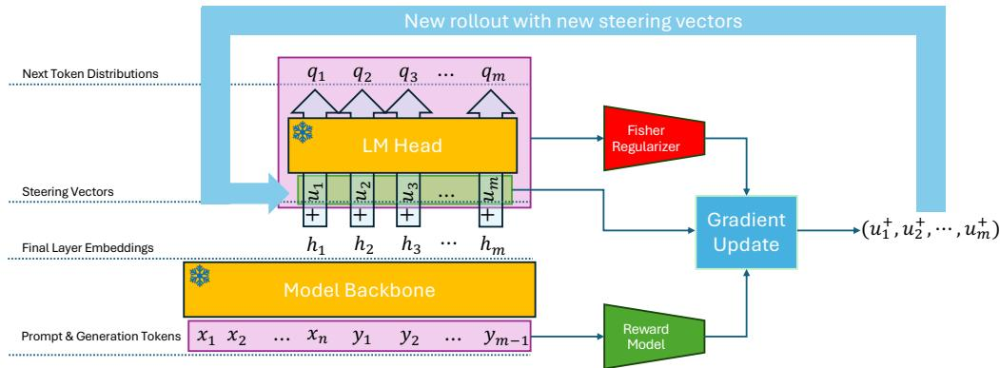  
Figure 1: Minimally invasive test-time steering. MISVO adds a position-specific vector $u _ { t }$ to the hidden state $h _ { t }$ entering the frozen LM head $( \bar { W } , b )$ . The vectors are optimized for reward with a Fisher-quadratic penalty that locally approximates KL divergence from the reference policy.

Fisher-information cost matrix that captures the distributional sensitivity of each steering direction. Its gradient is computed through matrix–vector products with the frozen language-model head. We relate this gradient to the full sequence-level KL gradient, including the omitted score-function term, and establish first-order agreement near zero steering for a fixed generation horizon. The resulting algorithm, Minimally Invasive Steering Vector Optimization (MISVO), combines reward-gradient esti mates with an analytic regularizer gradient and reuses a reference-policy Fisher estimate throughout test-time optimization. In summary, we make the following contributions:

• Distribution-sensitive steering. We formulate pre-logit steering as reward maximization with a quadratic effort penalty and derive the cost matrix from token-level KL geometry (Proposition 1). The associated quadratic form equals the variance of the induced logit perturbation.

• Sequence-level gradient analysis. We decompose the exact KL gradient into an analytic Fisher term and a suffix score-function term (Theorem 1). We bound the differences between three Fisher surrogates (Theorem 2) and establish that the suffix term is second order for a fixed horizon (Proposition 2). Thus, the frozen-Fisher gradient approximates the full KL gradient with error $\operatorname { \dot { O } } ( \| \dot { u } \| ^ { 2 } )$ near the origin.

• Algorithm and evaluation. MISVO combines a score-function reward estimator with an analytic regularizer gradient (Algorithm 1). Experiments on SHP and MBPP+ evaluate reward, generation quality, distributional deviation, runtime, and memory across four frozen models with approximately 1B–14B parameters.

## 2 Problem Setup

Fix a prompt x and a generation horizon T. Let $y = ( y _ { 1 } , \dots , y _ { T } )$ denote a response over a vocabulary of size V, and let $h _ { t } = h _ { t } ( x , y _ { < t } ) \in \mathbb R ^ { d }$ be the frozen model’s hidden state immediately before the language-model (LM) head. With head parameters $W \in \mathbb { R } ^ { V \times d }$ and $b \in \mathbb { R } ^ { V }$ , the reference policy is

$$
\pi _ { \mathrm { r e f } } ( \cdot \mid x , y _ { < t } ) = \mathrm { s o f t m a x } ( W h _ { t } + b ) , \qquad \pi _ { \mathrm { r e f } } ( y \mid x ) = \prod _ { t = 1 } ^ { T } \pi _ { \mathrm { r e f } } ( y _ { t } \mid x , y _ { < t } ) .
$$

An external evaluator assigns a terminal reward $R ( x , y ) \in \mathbb { R }$ , which need not be differentiable.

Pre-logit steering. For each prompt, we optimize position-specific vectors $u = ( u _ { 1 } , \dotsc , u _ { T } ) \in$ $\mathbb { R } ^ { d \times T }$ , shared across responses sampled under the current policy. The steered policy is

$$
\pi _ { u } ( \cdot  { \mid } x , y _ { < t } ) = \mathrm { s o f t m a x } \big ( W ( h _ { t } + u _ { t } ) + b \big ) , \qquad \pi _ { u } ( y  { \mid } x ) = \prod _ { t = 1 } ^ { T } \pi _ { u } ( y _ { t }  { \mid } x , y _ { < t } ) .
$$

All model parameters remain fixed, and $\pi _ { 0 } = \pi _ { \mathrm { r e f } } .$ . For a fixed prefix, $h _ { t } ( x , y _ { < t } )$ is independent of $u ,$ and steering changes the logits by $W u _ { t }$ . Gradients with respect to the steering vectors therefore

require no backpropagation through the transformer body, although steering changes the distribution of sampled prefixes.

KL-regularized alignment. A standard test-time alignment objective is [23, 22]

$$
\operatorname* { m a x } _ { q ( \cdot | x ) } \mathbb { E } _ { y \sim q } [ R ( x , y ) ] - \lambda { \mathrm { ~ K L } } \big ( q ( \cdot \mid x ) \| \pi _ { \mathrm { r e f } } ( \cdot \mid x ) \big ) , \qquad \lambda > 0 ,
$$

where the maximization is over response distributions and λ controls the reward–deviation trade-off. Its unique optimizer is the ideal reward-tilted distribution

$$
q ^ { \star } ( y \mid x ) = \frac { \pi _ { \mathrm { r e f } } ( y \mid x ) \exp ( R ( x , y ) / \lambda ) } { \sum _ { y ^ { \prime } } \pi _ { \mathrm { r e f } } ( y ^ { \prime } \mid x ) \exp ( R ( x , y ^ { \prime } ) / \lambda ) } .
$$

Our goal is to approximate sampling from $q ^ { \star }$ through pre-logit steering, while keeping all model parameters fixed.

## 3 Proposed Method: Minimally Invasive Steering

The ideal distribution $q ^ { \star }$ need not be representable by position-specific pre-logit interventions. Restricting the KL-regularized objective to the steering policy class gives

$$
\operatorname* { m a x } _ { u \in \mathbb { R } ^ { d \times T } } \mathbb { E } _ { y \sim \pi _ { u } ( \cdot \vert x ) } [ R ( x , y ) ] - \lambda \operatorname { K L } \bigl ( \pi _ { u } ( \cdot \vert x ) \Vert \pi _ { \mathrm { r e f } } ( \cdot \vert x ) \bigr ) .\tag{1}
$$

Equivalently, this problem minimizes $\operatorname { K L } ( \pi _ { u } ( \cdot \mid x ) \parallel q ^ { \star } ( \cdot \mid x ) )$ ) over the steering policy class. By the autoregressive chain rule, the sequence-level KL decomposes into expected token-level divergences:

$$
\begin{array} { l } { \displaystyle \mathcal E _ { \mathrm { K L } } ( u ) : = \mathrm { K L } \big ( \pi _ { u } ( \cdot \mid x ) \| \pi _ { \mathrm { r e f } } ( \cdot \mid x ) \big ) } \\ { \displaystyle \qquad = \sum _ { t = 1 } ^ { T } \mathbb E _ { y _ { < t } \sim \pi _ { u } } \big [ \mathrm { K L } \big ( \pi _ { u } ( \cdot \mid x , y _ { < t } ) \| \pi _ { \mathrm { r e f } } ( \cdot \mid x , y _ { < t } ) \big ) \big ] . } \end{array}\tag{2}
$$

A derivation is provided in Appendix B.2. Although each token-level divergence can be evaluated directly, the prefix distribution also depends on u. Differentiating this distribution contributes a score-function term whose Monte Carlo estimation can have high variance, motivating an alterntive regularizer.

Quadratic regularization. We replace the KL penalty with a quadratic surrogate:

$$
\operatorname* { m a x } _ { u \in \mathbb { R } ^ { d \times T } } \quad J ( u ) : = \mathbb { E } _ { y \sim \pi _ { u } ( \cdot | x ) } [ R ( x , y ) ] - \lambda \mathcal { E } _ { \Sigma } ( u ) , \qquad \mathcal { E } _ { \Sigma } ( u ) : = \frac { 1 } { 2 } \sum _ { t = 1 } ^ { T } u _ { t } ^ { \top } \Sigma _ { t } u _ { t } ,\tag{3}
$$

where $\Sigma _ { t } \in \mathbb { R } ^ { d \times d }$ are fixed symmetric positive semidefinite cost matrices. This gives the analytic gradient $\nabla _ { u _ { t } } \mathcal { E } _ { \Sigma } ( u ) = \Sigma _ { t } u _ { t }$ . We first present the resulting optimization algorithm, then derive a Fisher-based choice of $\Sigma _ { t }$ from the local KL geometry in Section 4.

## 3.1 Algorithm

We optimize (3) by stochastic gradient ascent. At each iteration, we sample $K > 1$ independent responses $y ^ { ( i ) } \sim \pi _ { u } ( \cdot \mid x )$ and evaluate their rewards $R _ { i } = R ( x , y ^ { ( i ) } )$ . The update direction at position t is

$$
\begin{array} { r l r } & { } & { g _ { t } ^ { R } : = \displaystyle \frac { 1 } { K } \sum _ { i = 1 } ^ { K } ( R _ { i } - \bar { R } _ { i } ) W ^ { \top } \big ( e _ { y _ { t } ^ { ( i ) } } - p _ { t } ^ { ( i ) } \big ) , } \\ & { } & { d _ { t } : = g _ { t } ^ { R } - \lambda \Sigma _ { t } u _ { t } , \qquad u _ { t } ^ { + } : = u _ { t } + \eta d _ { t } , } \end{array}\tag{4}
$$

where $p _ { t } ^ { ( i ) } = \pi _ { u } ( \cdot \ | \ x , y _ { < t } ^ { ( i ) } )$ and $e _ { \boldsymbol { u } ^ { ( i ) } } \in \mathbb { R } ^ { V }$ is the corresponding one-hot vector. The leavey   
one-out baseline ${ \bar { R } } _ { i } = ( K - 1 ) ^ { - 1 } \dot { \sum _ { j \neq i } { R _ { j } } }$ reduces variance without biasing the reward-gradient estimator [3]. All positions are updated using rollouts and token probabilities from the same policy iterate. Algorithm 1 summarizes the procedure. It returns the final steered policy and the highestreward response sampled during optimization.

Algorithm 1 Minimally Invasive Steering Vector Optimization (MISVO)   
1: Input: frozen model $\pi _ { \mathrm { r e f } }$ with LM head (W, b), prompt x, reward R, horizon $T ,$ cost matrices   
$\{ \bar { \Sigma _ { t } } \} _ { t = 1 } ^ { T }$ , regularization weight λ, learning rate η, rollouts per step $K > 1$ , iterations N   
2: Initialize $u _ { t } \gets 0$ for $t = 1 , \ldots , T$   
3: for $n = 1 , \ldots , N$ do   
4: Sample $y ^ { ( i , n ) } \sim \pi _ { u } ( \cdot \mid x )$ independently for $i = 1 , \ldots , K$   
5: Store $p _ { t } ^ { ( i ) }  \pi _ { u } ( \cdot \mid x , y _ { < t } ^ { ( i , n ) } )$ for all $i , t$   
6: Compute $R _ { i } \gets R ( x , y ^ { ( i , n ) } )$ and $\begin{array} { r } { \bar { R } _ { i } \gets ( K - 1 ) ^ { - 1 } \sum _ { j \neq i } R _ { j } } \end{array}$ for all i   
7: for $t = 1 , \dots , T$ do   
8: $\begin{array} { r } { g _ { t } ^ { R } \gets \frac { 1 } { K } \sum _ { i = 1 } ^ { K } ( R _ { i } - \bar { R } _ { i } ) W ^ { \top } ( e _ { y _ { t } ^ { ( i , n ) } } - p _ { t } ^ { ( i ) } ) } \end{array}$   
9: $u _ { t } ^ { + }  u _ { t } + \eta ( g _ { t } ^ { R } - \lambda \Sigma _ { t } u _ { t } )$   
10: end for   
11: $u  u ^ { + }$   
12: end for   
13: Output: policy $\pi _ { u }$ and a response attaining ma $\mathrm { x } _ { i , n } R ( x , y ^ { ( i , n ) } )$

## 4 Fisher Cost Matrices

In this section, we derive the cost matrices $\Sigma _ { t }$ defined in (3) from the local geometry of KL divergence and quantify how closely the resulting regularizer gradient approximates the full sequence-level KL gradient.

## 4.1 From token-level KL to a quadratic penalty

Setting $\Sigma _ { t } ~ = ~ I$ gives the isotropic penalty $\begin{array} { r } { \mathcal { E } _ { \Sigma } ( u ) = \frac { 1 } { 2 } \sum _ { t } \Vert u _ { t } \Vert _ { 2 } ^ { 2 } } \end{array}$ , which measures hidden-state displacement without accounting for its effect on token probabilities. To capture this distributional sensitivity, we use the classical information-geometric result that the Fisher information determines the second-order expansion of KL divergence [6, 7]. We then specialize this relation to additive pre-logit interventions to construct a quadratic steering penalty.

Specifically, fix a position t and prefix $y _ { < t }$ . Write $z = W h _ { t } + b$ for the reference logits, $\delta = W u _ { t }$ for the steering-induced perturbation, and $\pi _ { u } ^ { t } = \pi _ { u } ( \cdot \mid x , y _ { < t } )$ . The log-partition function $A ( z ) =$ log $\textstyle \sum _ { i = 1 } ^ { V } e ^ { z _ { i } }$ gives

$$
\mathrm { K L } ( \pi _ { u } ^ { t } \| \pi _ { \mathrm { r e f } } ^ { t } ) = A ( z ) - A ( z + \delta ) + \langle \pi _ { u } ^ { t } , \delta \rangle .\tag{5}
$$

Moreover, its Hessian is given by

$$
\begin{array} { r } { \nabla ^ { 2 } A ( z ) = \mathrm { d i a g } ( \pi _ { \mathrm { r e f } } ^ { t } ) - \pi _ { \mathrm { r e f } } ^ { t } ( \pi _ { \mathrm { r e f } } ^ { t } ) ^ { \top } = : C _ { \pi _ { \mathrm { r e f } } ^ { t } } . } \end{array}\tag{6}
$$

We now expand this expression around $u _ { t } = 0$ to identify the desired quadratic form.

Proposition 1 (Token-level KL approximation with Fisher information matrix). For a fixed prefix,

$$
\mathrm { K L } ( \pi _ { u } ^ { t } | | \pi _ { r e f } ^ { t } ) = \frac { 1 } { 2 } u _ { t } ^ { \top } F _ { t } ( 0 ) u _ { t } + O ( \| u _ { t } \| _ { 2 } ^ { 3 } ) ,\tag{7}
$$

as $u _ { t } \to 0 ,$ , where

$$
\boldsymbol { F } _ { t } ( \boldsymbol { u } _ { t } ) : = \boldsymbol { W } ^ { \top } \big ( \mathrm { d i a g } ( \pi _ { \boldsymbol { u } } ^ { t } ) - \pi _ { \boldsymbol { u } } ^ { t } ( \pi _ { \boldsymbol { u } } ^ { t } ) ^ { \top } \big ) \boldsymbol { W }\tag{8}
$$

is the Fisher information matrix with respect to $u _ { t }$

## The proof is given in Appendix B.3.

Since the token distribution depends on the prefix, the resulting Fisher matrix is prefix-dependent. To obtain fixed cost matrices required by (3), we average the Fisher matrix over reference-policy prefixes:

$$
\bar { F } _ { t } : = \mathbb { E } _ { y _ {< t } \sim \pi _ { \mathrm { r e f } } } [ F _ { t } ( 0 ) ] , \qquad \mathcal { E } _ { \bar { F } } ( u ) : = \frac 1 2 \sum _ { t = 1 } ^ { T } u _ { t } ^ { \top } \bar { F } _ { t } u _ { t } .\tag{9}
$$

Our proposed algorithm (MISVO) uses $\Sigma _ { t } = \bar { F } _ { t }$ . This choice makes two approximations to the KL penalty in (2): replacing each token-level KL by its quadratic expansion and replacing the steered prefix distribution by the reference distribution. We quantify their effects below.

Remark 1 (Variance interpretation). The Fisher quadratic satisfies

$$
\begin{array} { r } { u _ { t } ^ { \top } F _ { t } ( 0 ) u _ { t } = \mathrm { V a r } _ { i \sim \pi _ { \mathrm { r e f } } ^ { t } } \big [ ( W u _ { t } ) _ { i } \big ] . } \end{array}\tag{10}
$$

Thus, the leading term of the token-level KL is one half of the variance of the logit perturbation. Unlike an isotropic penalty, this quadratic weights interventions by their effect on relative logits under the reference distribution. In particular, a constant shift of all logits incurs zero cost and leaves token probabilities unchanged.

We note that the approximation is local: neither the KL nor its Fisher quadratic globally bounds the other. Both are bounded above by $\begin{array} { r } { \frac 1 2 \| W u _ { t } \| _ { 2 } ^ { 2 } \le \frac 1 2 \sigma _ { \operatorname* { m a x } } ( W ) ^ { 2 } \| u _ { t } \| _ { 2 } ^ { 2 } } \end{array}$ (Appendix B.4).

## 4.2 Sequence-level KL gradient

To characterize the terms omitted by the quadratic surrogate, let $K ( u ) : = \mathcal { E } _ { \mathrm { K L } } ( u )$ and define the suffix log-ratio

$$
\ell _ { > t } ( y ; u ) : = \sum _ { \tau = t + 1 } ^ { T } \log \frac { \pi _ { u } ( y _ { \tau } \mid x , y _ { < \tau } ) } { \pi _ { \mathrm { r e f } } ( y _ { \tau } \mid x , y _ { < \tau } ) } .
$$

Theorem 1 (Sequence-level KL gradient decomposition). For every position $t ,$

$$
\begin{array} { r l } & { \nabla _ { u _ { t } } K ( u ) = g _ { t } ^ { \mathrm { a n } } ( u ) + g _ { t } ^ { \mathrm { s u f f i x } } ( u ) , } \\ & { \quad g _ { t } ^ { \mathrm { a n } } ( u ) : = \mathbb { E } _ { y _ { < t } \sim \pi _ { u } } [ F _ { t } ( u _ { t } ) ] u _ { t } , } \\ & { \quad g _ { t } ^ { \mathrm { s u f f i x } } ( u ) : = \mathbb { E } _ { y \sim \pi _ { u } } [ \nabla _ { u _ { t } } \log \pi _ { u } ( y _ { t } \mid x , y _ { < t } ) \ell _ { > t } ( y ; u ) ] . } \end{array}\tag{11}
$$

The proof is given in Appendix B.5. The decomposition separates the direct effect of $u _ { t }$ on the current token distribution from its effect on future prefixes. At a fixed prefix, the token-level KL gradient is exactly $F _ { t } ( u _ { t } ) u _ { t } ;$ averaging over steered prefixes gives $g _ { t } ^ { \mathrm { a n } } ( u )$ . The suffix term captures the resulting change in future KL contributions through the prefix distribution.

Comparing (11) with the surrogate gradient $\bar { F } _ { t } u _ { t }$ reveals two sources of approximation error: replacing the iterate-dependent matrix $\mathbb { E } _ { y _ { < t } \sim \pi _ { u } } [ F _ { t } ( u _ { t } ) ]$ ] by the fixed reference matrix $\bar { F } _ { t }$ , and omitting the suffix score-function term. The next subsection bounds both errors to establish when the quadratic surrogate accurately approximates the full KL gradient.

## 4.3 Accuracy of the Fisher surrogates

Consider the three cost matrices

$$
\tilde { F } _ { t } ^ { u } : = \mathbb { E } _ { y _ { < t } \sim \pi _ { u } } [ F _ { t } ( u _ { t } ) ] ,\tag{12}
$$

$$
\begin{array} { r } { \bar { F } _ { t } ^ { u } : = \mathbb E _ { y _ { < t } \sim \pi _ { u } } [ F _ { t } ( 0 ) ] , } \end{array}\tag{13}
$$

$$
\begin{array} { r } { \bar { F } _ { t } : = \mathbb { E } _ { y _ { < t } \sim \pi _ { \mathrm { r e f } } } [ F _ { t } ( 0 ) ] . } \end{array}\tag{14}
$$

The first gives the exact analytic term $g _ { t } ^ { \mathrm { a n } } ( u ) = \tilde { F } _ { t } ^ { u } u _ { t }$ . The second evaluates the token Fisher at zero steering while retaining steered prefixes. The third also replaces the prefix distribution by the reference law.

Theorem 2 (Bounds on the Fisher approximations). Let $\begin{array} { l c l } { { C _ { 1 } } } & { { = } } & { { 3 \sigma _ { \mathrm { m a x } } ( W ) ^ { 3 } } } \end{array}$ and $\begin{array} { r l } { C _ { 2 } } & { { } = } \end{array}$ $\sqrt { V } \sigma _ { \operatorname* { m a x } } ( W ) ^ { 3 }$ . For all u and every position $t ,$

$$
\begin{array} { r l } & { \| \tilde { F } _ { t } ^ { u } - \bar { F } _ { t } ^ { u } \| _ { 2 } \leq C _ { 1 } \| u _ { t } \| _ { 2 } , } \\ & { \| \bar { F } _ { t } ^ { u } - \bar { F } _ { t } \| _ { 2 } \leq C _ { 2 } \displaystyle \sum _ { \tau < t } \| u _ { \tau } \| _ { 2 } . } \end{array}\tag{15}
$$

The proof is given in Appendix B.6. The first bound controls the change in the token Fisher, and the second controls the change in the prefix distribution. After multiplication by $u _ { t } .$ , both yield gradient errors of order $O ( \| \dot { u } \| ^ { 2 } )$ near the origin, where $\lVert u \rVert$ denotes the Euclidean norm of the stacked steering vectors.

The remaining discrepancy is the omitted suffix term.

Proposition 2 (Local bound on the suffix term). For afixed horizon T and every $t \leq T$

$$
g _ { t } ^ { \mathrm { s u f f i x } } ( u ) = O ( \Vert u \Vert ^ { 2 } ) \qquad a s u  0 .
$$

Combining these results gives

$$
\bar { F } _ { t } u _ { t } = \bar { F } _ { t } ^ { u } u _ { t } + O ( \Vert u \Vert ^ { 2 } ) = \tilde { F } _ { t } ^ { u } u _ { t } + O ( \Vert u \Vert ^ { 2 } ) = \nabla _ { u _ { t } } K ( u ) + O ( \Vert u \Vert ^ { 2 } ) .\tag{16}
$$

A proof of the proposition and (16) is provided in Appendix B.7. Thus, the frozen-Fisher regularizer gradient agrees with the full sequence-level KL gradient to first order. This is a local statement for fixed T; it does not guarantee accuracy for large interventions or bound accumulated error along an optimization trajectory.

Among the three matrices in (14), only $\bar { F } _ { t }$ is independent of the current iterate. Since MISVO initializes $u = 0 ,$ , the first K rollouts follow the reference policy and provide an unbiased estimate

$$
\widehat { F } _ { t } = \frac { 1 } { K } \sum _ { i = 1 } ^ { K } F _ { t } \Big ( 0 ; x , y _ { < t } ^ { ( i , 1 ) } \Big ) ,
$$

where the prefix dependence is shown explicitly. We reuse this estimate throughout optimization, so Fisher estimation requires no additional generations. The guarantees above concern the population matrices; the empirical gradient also contains the sampling error $( \widehat { F } _ { t } - \bar { F } _ { t } ) u _ { t }$

## 4.4 Computational overhead

Over N iterations with K rollouts each, MISVO uses NK generations and reward evaluations, matching the candidate budget of the BoN baseline. Its additional work includes reward-gradient estimation, Fisher estimation, and steering updates. The reward-gradient projections in (4) cost $O ( N K T V d )$ in a direct implementation. We consider two ways to compute the regularizer gradient.

Explicit Fisher matrices. Forming $F _ { t } = W ^ { \top } C _ { \pi ^ { t } } W$ costs $O ( V d ^ { 2 } )$ per position and reference sample. Constructing all $\widehat { F } _ { t }$ from the initial K rollouts therefore costs $O ( K T V d ^ { 2 } )$ and requires ${ \cal O } ( { \bar { T } } d ^ { 2 } )$ ) storage. Subsequent matrix–vector products cost $O ( N T d ^ { 2 } )$ , giving a total of $O ( K T { \dot { V } } d ^ { 2 } \cdot$ + $N \dot { T } d ^ { 2 } )$ . Reconstructing an iterate-dependent Fisher at every step would instead incur $O ( \dot { N } K T V d ^ { 2 } )$ construction cost.

Matrix-free Fisher products. The matrices need not be formed explicitly. For a token distribution p and $v = W u _ { t }$

$$
\begin{array} { r } { F _ { t } \boldsymbol { u } _ { t } = \boldsymbol { W } ^ { \top } \boldsymbol { C } _ { p } \boldsymbol { v } , \qquad \boldsymbol { C } _ { p } \boldsymbol { v } = p \odot \boldsymbol { v } - p ( p ^ { \top } \boldsymbol { v } ) . } \end{array}
$$

Each product costs $O ( V d )$ . Retaining S reference hidden states per position permits reconstruction of the corresponding token probabilities and averaging of these products, with total cost $O ( N T S V d )$ and retained-state storage ${ \bf \hat { \phi } } { \cal O } ( T S d )$ . Our implementation uses this approach with $S = K$ initial rollouts. Vocabulary-sized intermediates require additional working memory; measured runtime and peak memory are reported in Appendix C.2.

## 5 Experiments

We evaluate MISVO on preference-based generation and code generation across four frozen models with approximately 1B–14B parameters. We compare reward at matched generation budgets, assess diversity and coherence, and measure distributional deviation on reference-policy prefixes.

## 5.1 Setup

Models. We use four open-weight instruction-tuned base models with different architectures, hidden sizes, and parameter counts: LFM2.5-1.2B-Instruct [4], Gemma3-4B-IT [39], Llama-3-8B-Instruct [5], and Phi-4 (14B) [1]. All four models are kept frozen throughout: only the per-token steering vectors $u _ { 1 : T }$ are optimized, and the LM head (W, b) is reused both for the forward pass and for the matrix-free Fisher–vector products in (8).

Table 1: Results on SHP across model scales. We sample 500 prompts and score with Skywork-Reward-V2-Qwen3-0.6B. Reward (best-so-far over the optimization trace) is the primary metric, reported as mean ± std over 3 seeds (42, 1340, 2026); bold indicates the best per model. MISVO uses the established Fisher-quadratic in (9) $\bar { F } _ { t }$ . All methods see a matched per-prompt rollout budget of K · N samples.
<table><tr><td>Model</td><td>Method</td><td>Reward ↑</td><td>Diversity ↑</td><td>Coherence ↑</td></tr><tr><td rowspan="3">LFM2.5 1.2B</td><td>BoN (top-p)</td><td> $8 . 7 0 \pm 0 . 1 1$ </td><td> $0 . 6 8 8 \pm 0 . 0 0 4$ </td><td> $0 . 6 7 1 \pm 0 . 0 0 4$ </td></tr><tr><td>AISP</td><td> $9 . 0 9 \pm 0 . 0 3$ </td><td> $0 . 7 2 6 \pm 0 . 0 1 5$ </td><td> $0 . 6 6 3 \pm 0 . 0 0 9$ </td></tr><tr><td>MISVO</td><td> ${ \bf 9 . 2 9 \pm 0 . 0 4 }$ </td><td> $0 . 7 1 9 \pm 0 . 0 0 2$ </td><td> $0 . 6 5 4 \pm 0 . 0 0 5$ </td></tr><tr><td rowspan="3">Gemma3 4B</td><td>BoN (top-p)</td><td> $9 . 1 0 \pm 0 . 1 1$ </td><td> $0 . 7 2 1 \pm 0 . 0 0 2$ </td><td> $0 . 6 3 2 \pm 0 . 0 0 6$ </td></tr><tr><td>AISP</td><td> $9 . 2 7 \pm 0 . 0 4$ </td><td> $0 . 7 4 1 \pm 0 . 0 0 5$ </td><td> $0 . 6 3 1 \pm 0 . 0 0 5$ </td></tr><tr><td>MISVO</td><td> ${ \bf 9 . 5 6 \pm 0 . 0 4 }$ </td><td> $0 . 7 2 8 \pm 0 . 0 0 5$ </td><td> $0 . 6 3 2 \pm 0 . 0 0 3$ </td></tr><tr><td rowspan="3">Llama3 8B Instruct</td><td>BoN (top-p)</td><td> $9 . 7 8 \pm 0 . 0 8$ </td><td> $0 . 7 0 0 \pm 0 . 0 0 2$ </td><td> $0 . 6 7 1 \pm 0 . 0 0 3$ </td></tr><tr><td>AISP</td><td> ${ \bf 1 1 . 0 7 \pm 0 . 0 6 }$ </td><td> $0 . 7 5 7 \pm 0 . 0 0 2$ </td><td> $0 . 6 6 5 \pm 0 . 0 0 1$ </td></tr><tr><td>MISVO</td><td> $1 0 . 8 0 \pm 0 . 3 5$ </td><td> $0 . 7 1 6 \pm 0 . 0 1 0$ </td><td> $0 . 6 7 2 \pm 0 . 0 0 3$ </td></tr><tr><td rowspan="3">Phi 4 (14B)</td><td>BoN (top-p)</td><td> $9 . 8 1 \pm 0 . 0 8$ </td><td> $0 . 7 1 8 \pm 0 . 0 0 4$ </td><td> $0 . 6 3 6 \pm 0 . 0 0 5$ </td></tr><tr><td>AISP</td><td> $1 0 . 0 0 \pm 0 . 0 8$ </td><td> $0 . 7 6 9 \pm 0 . 0 0 2$ </td><td> $0 . 6 3 4 \pm 0 . 0 0 5$ </td></tr><tr><td>MISVO</td><td> ${ \bf 1 0 . 2 5 \pm 0 . 1 4 }$ </td><td> $0 . 7 3 5 \pm 0 . 0 0 8$ </td><td> $0 . 6 3 6 \pm 0 . 0 0 1$ </td></tr></table>

Tasks. We consider two complementary alignment settings. (a) SHP [14]: open-ended preferencestyle generation. We sample 500 prompts uniformly at random from the Stanford Human Preferences test set and score each generation with Skywork-Reward-V2-Qwen3-0.6B [28], a publicly released 0.6B-parameter preference reward model. We evaluate all four base models on this task. (b) MBPP+ [29]: program synthesis with an executable verifier. We use the first set of 120 problems and reward each generation by the fraction of held-out unit tests it passes (in [0, 1]); this provides a black-box, non-differentiable reward. We evaluate the three smaller models (LFM2.5-1.2B, Gemma3-4B, Llama-3-8B) on MBPP+. For both tasks, we cap generation at 512 new tokens.

Best-so-far reporting. Our primary metric is the highest reward among all KN generations, where K is the number of rollouts per step and N is the number of optimization steps. MISVO and AISP generate candidates iteratively; Best-of-N samples all candidates from the reference policy. This metric evaluates the response selected after search. We also report within-step mean and maximum rewards to assess the evolving steered policy.

Baselines. Best-of-N (top-p) draws K · N candidate completions from the reference policy πref under the shared sampler and returns the highest-reward one; the budget is matched exactly to the total number of rollouts drawn by MISVO and AISP. AISP [19] performs sampling-based optimal control in pre-logit space using the importance-weighted update. We set $\sigma ^ { 2 } = 0 . 5$ and $\alpha = 0 . 9 9 9$ for their method. In line with the experimental results in [19], experiments with RE-Control [22] yielded inferior results, and due to computational limitations, we did not include it in our comparisons.

Our method. MISVO uses the frozen-reference Fisher $\bar { F } _ { t }$ in (9). We estimate it from the first-step rollouts, for which $u = 0 ,$ , and reuse the estimate throughout optimization. These rollouts are included in the KN budget.

Metrics. We average all metrics over prompts. Reward is the Skywork score on SHP and the unit-test pass fraction on MBPP+, reported for the best response found during search. Diversity is $\textstyle \prod _ { n \in \{ 2 , 3 , 4 \} } ( 1 - \operatorname { r e p } _ { n } )$ , where $\mathrm { r e p } _ { n }$ is the fraction of repeated n-grams within a response [19]. Coherence is the cosine similarity between SimCSE embeddings of the prompt and response [17]. The latter two metrics measure repetition and semantic relatedness; they do not establish distributional proximity, factual accuracy, or absence of reward exploitation.

Implementation details. For each (model, task) pair we use the same MISVO and AISP hyperparameters across all prompts in the split. On both datasets we use K = 16, N = 16 for LFM2.5-1.2B and Gemma3-4B, and $\dot { K } = 3 2 , \dot { N } = 3 2$ for Llama-3-8B and Phi-4; the learning rate is 0.1 and the regularization trade-off is $\lambda = 1$ . All runs use the Hugging Face transformers stack, fp16 weights for Llama-3 and bfloat16 for the others, and run on H200 GPUs. We report results as mean ± standard deviation across 3 seeds.

Table 2: Results on MBPP+ across model scales. Metric is the pass rate (fraction of unit tests passed), reported as mean $\pm \mathrm { \ s t d }$ over 3 seeds (42, 1340, 2026); bold indicates the best per model. AISP is shown at two guidance strengths $\lambda \in \{ 0 . 1 , 1 . 0 \}$ . MISVO uses the established Fisher-quadratic in (9) $\bar { F } _ { t }$
<table><tr><td>Model</td><td>Method</td><td>Pass rate ↑</td><td>Diversity ↑</td><td>Coherence ↑</td></tr><tr><td rowspan="4">LFM2.5 1.2B</td><td>BoN (top-p)</td><td> $0 . 7 0 3 \pm 0 . 0 1 3$ </td><td> $0 . 6 1 3 \pm 0 . 0 1 8$ </td><td> $0 . 6 0 5 \pm 0 . 0 1 0$ </td></tr><tr><td>AISP (λ=0.1)</td><td> $0 . 6 7 5 \pm 0 . 0 1 4$ </td><td> $0 . 6 0 3 \pm 0 . 0 2 3$ </td><td> $0 . 6 7 7 \pm 0 . 0 0 6$ </td></tr><tr><td>AISP (λ=1)</td><td> $0 . 6 6 9 \pm 0 . 0 1 7$ </td><td> $0 . 6 0 1 \pm 0 . 0 1 5$ </td><td> $0 . 6 7 9 \pm 0 . 0 0 4$ </td></tr><tr><td>MISVO</td><td> ${ \bf 0 . 7 3 9 \pm 0 . 0 2 7 }$ </td><td> $0 . 5 8 8 \pm 0 . 0 0 8$ </td><td> $0 . 6 8 0 \pm 0 . 0 0 7$ </td></tr><tr><td rowspan="4">Gemma3 4B</td><td>BoN (top-p)</td><td> $0 . 7 3 9 \pm 0 . 0 1 0$ </td><td> $0 . 5 9 6 \pm 0 . 0 3 1$ </td><td> $0 . 5 9 4 \pm 0 . 0 0 5$ </td></tr><tr><td>AISP (λ=0.1)</td><td> $0 . 7 4 2 \pm 0 . 0 0 8$ </td><td> $0 . 6 1 0 \pm 0 . 0 1 6$ </td><td> $0 . 5 9 3 \pm 0 . 0 0 4$ </td></tr><tr><td>AISP (λ=1)</td><td> $0 . 7 3 3 \pm 0 . 0 0 8$ </td><td> $0 . 6 1 6 \pm 0 . 0 1 3$ </td><td> $0 . 5 9 1 \pm 0 . 0 0 4$ </td></tr><tr><td>MISVO</td><td> $\mathbf { 0 . 7 6 1 \pm 0 . 0 2 1 }$ </td><td> $0 . 5 9 6 \pm 0 . 0 0 2$ </td><td> $0 . 5 8 6 \pm 0 . 0 0 9$ </td></tr><tr><td rowspan="4">Llama3 8B Instruct</td><td>BoN (top-p)</td><td> $\mathbf { 0 . 7 3 3 \pm 0 . 0 1 4 }$ </td><td> $0 . 5 8 4 \pm 0 . 0 1 5$ </td><td> $0 . 5 9 8 \pm 0 . 0 1 0$ </td></tr><tr><td>AISP (λ=0.1)</td><td> $0 . 7 0 8 \pm 0 . 0 2 5$ </td><td> $0 . 6 3 7 \pm 0 . 0 1 4$ </td><td> $0 . 5 9 8 \pm 0 . 0 0 5$ </td></tr><tr><td>AISP (λ=1)</td><td> $0 . 7 0 0 \pm 0 . 0 0 8$ </td><td> $0 . 6 4 5 \pm 0 . 0 2 2$ </td><td> $0 . 5 9 7 \pm 0 . 0 0 2$ </td></tr><tr><td>MISVO</td><td> $\mathbf { 0 . 7 3 3 \pm 0 . 0 1 4 }$ </td><td> $0 . 5 6 8 \pm 0 . 0 3 3$ </td><td> $0 . 6 0 1 \pm 0 . 0 1 3$ </td></tr></table>

## 5.2 Main results

Across both tasks (Tables 1 and 2), MISVO achieves the highest reported mean reward in six of the seven model–task settings. On SHP it improves over both BoN and AISP on three of the four models; the single exception is Llama-3-8B, where MISVO still improves over BoN but is overtaken by AISP. On MBPP+ MISVO leads on all three models, with the largest gain on the smallest.

Diversity and coherence scores remain close to those of BoN. These diagnostics suggest that reward gains are not accompanied by substantial deterioration in the measured properties, but do not establish proximity to $\pi _ { \mathrm { r e f } } .$ . Section 5.3 evaluates token-distribution deviation directly.

Reward trajectories. Figure 2 reports the within-step mean reward, within-step maximum reward, and cumulative best reward for LFM2.5-1.2B on SHP. Within-step statistics use the K rollouts from each iteration; the horizontal axis gives cumulative generations. Curves show means over three seeds, with shading indicating one standard deviation. Corresponding results for the other SHP models appear in Figures 3, 4, and 5. MISVO’s increasing within-step mean supports improvement in its sampling policy. AISP’s declining mean at later iterations is consistent with oversteering, although this metric alone does not identify the cause.

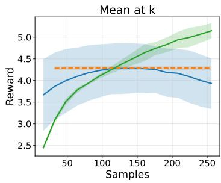

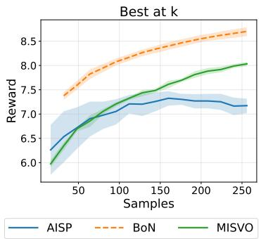

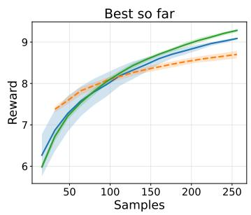  
Figure 2: Reward trajectory for LFM2.5-1.2B/SHP as a function of the cumulative number of sampled completions. Left: mean reward within each step. Middle: maximum reward within each step. Right: cumulative maximum reward.

## 5.3 Direct measurement of policy deviation

To assess distributional deviation beyond generation-level diagnostics, we measure token-level KL on reference-policy prefixes. Given K reference rollouts, define

$$
\widehat { \mathbf { K L } } _ { \mathrm { r e f } } ( u ) \ = \ \frac { 1 } { K } \sum _ { i = 1 } ^ { K } \sum _ { t } \mathrm { K L } \Big ( \pi _ { u } ( \cdot \ | \ x , y _ { < t } ^ { ( i ) } ) \ \big | \ \big | \ \pi _ { \mathrm { r e f } } ( \cdot \ | \ x , y _ { < t } ^ { ( i ) } ) \Big ) \ , \quad y ^ { ( i ) } \sim \pi _ { \mathrm { r e f } } ( \cdot \ | \ x , y _ { < t } ^ { ( i ) } ) \ .\tag{17}
$$

where each token-level KL is computed over the full vocabulary. This estimates the sum of expected token KLs under reference-policy prefixes. It is distinct from the sequence-level KL in (2), whose expectations use steered-policy prefixes. The diagnostic measures deviation on reference contexts and does not capture all changes in prefix visitation induced by steering.

Table 3: Measured policy deviation on SHP with LFM2.5-1.2B. KL is $\widehat { K L } _ { \mathrm { r e f } } ( u )$ from (17); ± denotes variation across prompts.
<table><tr><td>Method / regularizer</td><td>Reward ↑</td><td>Final|u||</td><td>Final KL ↓</td></tr><tr><td>MISVO</td><td> ${ \bf 9 . 6 0 \pm 3 . 3 8 }$ </td><td> $3 3 9 . 9 \pm 2 2 . 4$ </td><td> $4 7 . 5 \pm 1 2 . 9$ </td></tr><tr><td>AISP</td><td> $9 . 2 8 \pm 3 . 1 0$ </td><td> $2 6 3 1 . 7 \pm 8 6 . 3$ </td><td> $3 0 3 . 9 \pm 6 1 . 6$ </td></tr><tr><td>Unregularized steering</td><td> $9 . 3 1 \pm 3 . 3 0$ </td><td> $4 7 4 . 6 \pm 2 4 . 9$ </td><td> $1 6 2 . 2 \pm 3 8 . 3$ </td></tr><tr><td>Direct KL regularizer</td><td> $8 . 4 9 \pm 3 . 0 7$ </td><td> $4 5 9 . 3 \pm 2 9 . 1$ </td><td> $1 2 0 . 1 \pm 2 9 . 7$ </td></tr><tr><td>Hidden-space  $\ell _ { 2 }$ </td><td> $8 . 3 9 \pm 2 . 8 6$ </td><td> $4 8 . 3 \pm 2 0 . 4$ </td><td> $0 . 9 2 \pm 1 . 1$ </td></tr><tr><td>BoN (N = 256)</td><td> $8 . 8 9 \pm 2 . 6 9$ </td><td>n/a</td><td>n/a</td></tr></table>

Table 3 reports results over 100 sampled prompts. MISVO attains the highest reported reward and lower reference-prefix KL than $\mathrm { A I S P }$ and unregularized steering. The remaining regularizers do not exceed BoN in reward in this comparison. The direct-KL variant also has lower reward and higher reference-prefix KL than MISVO. These results describe the evaluated configurations; they do not establish a global reward–KL frontier or identify the cause of the direct-KL variant’s performance.

## 6 Conclusion

We introduced MISVO, which optimizes pre-logit interventions using a Fisher-quadratic penalty derived from local KL geometry. An exact sequence-level gradient decomposition and local error bounds establish first-order agreement between the frozen-Fisher gradient and the full KL gradient. Across seven model–task settings, MISVO achieves the highest reported mean reward in six, with diversity and coherence scores close to those of BoN.

Limitations. The approximation is local and does not guarantee small sequence-level KL after large interventions. The empirical deviation metric uses reference-policy prefixes and therefore does not directly measure sequence-level KL. On SHP, the same reward model is used for optimization and primary evaluation, limiting conclusions about independent preference quality. MISVO also incurs iterative optimization overhead and, in our implementation, higher peak memory than the baselines. Its integration into high-throughput inference systems and the effects of more memory-efficient Fisher products remain directions for future work.

## Acknowledgment

This work was supported in part by the JHU Provost Discovery Award (2025–2027). MF was also supported in part by the National Science Foundation (NSF) under Grant 2515978. D.K. was also supported in part by the Defense Advanced Research Projects Agency (DARPA) under Contract No. HR001125C0304 and by the Office of Naval Research (ONR) under Grant No. N0001424-1-2089. Any opinions, findings, conclusions, or recommendations expressed in this material are those of the authors and do not necessarily reflect the views of DARPA. We acknowledge the computational resources provided by the Johns Hopkins Data Science and AI Institute (DSAI) cluster. We thank Benjamin Van Durme and Gillian Hadfield for helpful discussions.

## References

[1] Marah Abdin, Jyoti Aneja, Harkirat Behl, Sébastien Bubeck, Ronen Eldan, Suriya Gunasekar, Michael Harrison, Russell J. Hewett, Mojan Javaheripi, Piero Kauffmann, James R. Lee, Yin Tat Lee, Yuanzhi Li, Weishung Liu, Caio C. T. Mendes, Anh Nguyen, Eric Price, Gustavo de Rosa, Olli Saarikivi, Adil Salim, Shital Shah, Xin Wang, Rachel Ward, Yue Wu, Dingli Yu, Cyril Zhang, and Yi Zhang. Phi-4 technical report, 2024.

[2] Laziz U Abdullaev, Noelle YL Wong, Ryan TZ Lee, Shiqi Jiang, Khoi NM Nguyen, and Tan M Nguyen. Concept heterogeneity-aware representation steering. arXiv preprint arXiv:2603.02237, 2026.

[3] Arash Ahmadian, Chris Cremer, Matthias Gallé, Marzieh Fadaee, Julia Kreutzer, Olivier Pietquin, Ahmet Üstün, and Sara Hooker. Back to basics: Revisiting reinforce-style optimization for learning from human feedback in llms. In Proceedings ofthe 62nd Annual Meeting ofthe Associationfor Computational Linguistics (Volume 1: Long Papers), pages 12248–12267, 2024.

[4] Liquid AI. Lfm2 technical report. arXiv preprint arXiv:2511.23404, 2025.

[5] AI@Meta. Llama 3 model card. 2024.

[6] Shun-Ichi Amari. Natural gradient works efficiently in learning. Neural computation, 10(2):251– 276, 1998.

[7] Shun-ichi Amari and Hiroshi Nagaoka. Methods ofinformation geometry, volume 191. American Mathematical Soc., 2000.

[8] Mohammad Gheshlaghi Azar, Zhaohan Daniel Guo, Bilal Piot, Remi Munos, Mark Rowland, Michal Valko, and Daniele Calandriello. A general theoretical paradigm to understand learning from human preferences. In International Conference on Artificial Intelligence and Statistics, pages 4447–4455. PMLR, 2024.

[9] Yuntao Bai, Saurav Kadavath, Sandipan Kundu, Amanda Askell, Jackson Kernion, Andy Jones, Anna Chen, Anna Goldie, Azalia Mirhoseini, Cameron McKinnon, et al. Constitutional ai: Harmlessness from ai feedback. arXiv preprint arXiv:2212.08073, 2022.

[10] Ahmad Beirami, Alekh Agarwal, Jonathan Berant, Alexander D’Amour, Jacob Eisenstein, Chirag Nagpal, and Ananda Theertha Suresh. Theoretical guarantees on the best-of-n alignment policy, 2024.

[11] Tom Brown, Benjamin Mann, Nick Ryder, Melanie Subbiah, Jared D Kaplan, Prafulla Dhariwal, Arvind Neelakantan, Pranav Shyam, Girish Sastry, Amanda Askell, et al. Language models are few-shot learners. Advances in Neural Information Processing Systems (NeurIPS), 2020.

[12] Paul F Christiano, Jan Leike, Tom Brown, Miljan Martic, Shane Legg, and Dario Amodei. Deep reinforcement learning from human preferences. Advances in neural information processing systems, 30, 2017.

[13] Qingxiu Dong, Lei Li, Damai Dai, Ce Zheng, Jingyuan Ma, Rui Li, Heming Xia, Jingjing Xu, Zhiyong Wu, Baobao Chang, et al. A survey on in-context learning. In Proceedings of the 2024 conference on empirical methods in natural language processing, pages 1107–1128, 2024.

[14] Kawin Ethayarajh, Yejin Choi, and Swabha Swayamdipta. Understanding dataset difficulty with V-usable information. In Kamalika Chaudhuri, Stefanie Jegelka, Le Song, Csaba Szepesvari, Gang Niu, and Sivan Sabato, editors, Proceedings of the 39th International Conference on Machine Learning, volume 162 of Proceedings ofMachine Learning Research, pages 5988– 6008. PMLR, 17–23 Jul 2022.

[15] Kawin Ethayarajh, Winnie Xu, Niklas Muennighoff, Dan Jurafsky, and Douwe Kiela. Kto: Model alignment as prospect theoretic optimization. arXiv preprint arXiv:2402.01306, 2024.

[16] Leo Gao, John Schulman, and Jacob Hilton. Scaling laws for reward model overoptimization. arXiv preprint arXiv:2210.10760, 2022.

[17] Tianyu Gao, Xingcheng Yao, and Danqi Chen. Simcse: Simple contrastive learning of sentence embeddings. arXiv preprint arXiv:2104.08821, 2021.

[18] Dongyoung Go, Tomasz Korbak, Germán Kruszewski, Jos Rozen, Nahyeon Ryu, and Marc Dymetman. Aligning language models with preferences through f-divergence minimization. arXiv preprint arXiv:2302.08215, 2023.

[19] Sekitoshi Kanai, Tsukasa Yoshida, Hiroshi Takahashi, Haru Kuroki, and Kazumune Hashimoto. Test-time alignment of llms via sampling-based optimal control in pre-logit space. arXiv preprint arXiv:2510.26219, 2025.

[20] Sathwik Karnik and Somil Bansal. Preemptive detection and steering of llm misalignment via latent reachability. arXiv preprint arXiv:2509.21528, 2025.

[21] Maxim Khanov, Jirayu Burapacheep, and Yixuan Li. ARGS: Alignment as reward-guided search. In The Twelfth International Conference on Learning Representations (ICLR), 2024.

[22] Lingkai Kong, Haorui Wang, Wenhao Mu, Yuanqi Du, Yuchen Zhuang, Yifei Zhou, Yue Song, Rongzhi Zhang, Kai Wang, and Chao Zhang. Aligning large language models with representation editing: A control perspective. In Advances in Neural Information Processing Systems (NeurIPS), 2024.

[23] Tomasz Korbak, Ethan Perez, and Christopher Buckley. Rl with kl penalties is better viewed as bayesian inference. In Findings of the Association for Computational Linguistics: EMNLP 2022, pages 1083–1091, 2022.

[24] Victoria Krakovna, Jonathan Uesato, Vladimir Mikulik, Matthew Rahtz, Tom Everitt, Ramana Kumar, Zac Kenton, Jan Leike, and Shane Legg. Specification gaming: the flip side of ai ingenuity. DeepMind Blog, 3:40–53, 2020.

[25] Ben Krause, Akhilesh Deepak Gotmare, Bryan McCann, Nitish Shirish Keskar, Shafiq Joty, Richard Socher, and Nazneen Fatema Rajani. GeDi: Generative discriminator guided sequence generation. In Conference on Empirical Methods in Natural Language Processing (EMNLP) - Findings, pages 4929–4952, 2021.

[26] Kenneth Li, Oam Patel, Fernanda Viégas, Hanspeter Pfister, and Martin Wattenberg. Inferencetime intervention: Eliciting truthful answers from a language model. In Thirty-seventh Conference on Neural Information Processing Systems, 2023.

[27] Alisa Liu, Maarten Sap, Ximing Lu, Swabha Swayamdipta, Chandra Bhagavatula, Noah A. Smith, and Yejin Choi. DExperts: Decoding-time controlled text generation with experts and anti-experts. In Proceedings ofthe 59th Annual Meeting ofthe Associationfor Computational Linguistics and the 11th International Joint Conference on Natural Language Processing (ACL-IJCNLP), pages 6691–6706, 2021.

[28] Chris Yuhao Liu, Liang Zeng, Yuzhen Xiao, Jujie He, Jiacai Liu, Chaojie Wang, Rui Yan, Wei Shen, Fuxiang Zhang, Jiacheng Xu, Yang Liu, and Yahui Zhou. Skywork-reward-v2: Scaling preference data curation via human-ai synergy. arXiv preprint arXiv:2507.01352, 2025.

[29] Jiawei Liu, Chunqiu Steven Xia, Yuyao Wang, and Lingming Zhang. Is your code generated by chatGPT really correct? rigorous evaluation of large language models for code generation. In Thirty-seventh Conference on Neural Information Processing Systems, 2023.

[30] Aman Madaan, Niket Tandon, Prakhar Gupta, Skyler Hallinan, Luyu Gao, Sarah Wiegreffe, Uri Alon, Nouha Dziri, Shrimai Prabhumoye, Yiming Yang, et al. Self-refine: Iterative refinement with self-feedback. arXiv preprint arXiv:2303.17651, 2023.

[31] Yu Meng, Mengzhou Xia, and Danqi Chen. Simpo: Simple preference optimization with a reference-free reward. Advances in Neural Information Processing Systems, 37:124198–124235, 2024.

[32] Aayush Mishra, Daniel Khashabi, and Anqi Liu. Steered llm activations are non-surjective. arXiv preprint arXiv:2604.09443, 2026.

[33] Sidharth Mudgal, Jong Lee, Harish Ganapathy, YaGuang Li, Tao Wang, Yanping Huang, Zhifeng Chen, Heng-Tze Cheng, Michael Collins, Trevor Strohman, Jilin Chen, Alex Beutel, and Ahmad Beirami. Controlled decoding from language models. In Proceedings of the 41st International Conference on Machine Learning (ICML), 2024.

[34] Long Ouyang, Jeff Wu, Xu Jiang, Diogo Almeida, Carroll L Wainwright, Pamela Mishkin, Chong Zhang, Sandhini Agarwal, Katarina Slama, Alex Ray, et al. Training Language Models to Follow Instructions with Human Feedback. In Advances in Neural Information Processing Systems (NeurIPS), 2022.

[35] Rafael Rafailov, Archit Sharma, Eric Mitchell, Christopher D Manning, Stefano Ermon, and Chelsea Finn. Direct preference optimization: Your language model is secretly a reward model. Advances in Neural Information Processing Systems (NeurIPS), 36, 2024.

[36] Nina Rimsky, Nick Gabrieli, Julian Schulz, Meg Tong, Evan Hubinger, and Alexander Matt Turner. Steering llama 2 via contrastive activation addition. In Proceedings ofthe 62nd Annual Meeting of the Association for Computational Linguistics (Volume 1: Long Papers), pages 15504–15522, 2024.

[37] Nisan Stiennon, Long Ouyang, Jeffrey Wu, Daniel M. Ziegler, Ryan Lowe, Chelsea Voss, Alec Radford, Dario Amodei, and Paul F. Christiano. Learning to summarize with human feedback. In Advances in Neural Information Processing Systems, volume 33, pages 3008–3021, 2020.

[38] Nishant Subramani, Nivedita Suresh, and Matthew E Peters. Extracting latent steering vectors from pretrained language models. In Findings of the Association for Computational Linguistics: ACL 2022, pages 566–581, 2022.

[39] Gemma Team, Aishwarya Kamath, Johan Ferret, Shreya Pathak, Nino Vieillard, Ramona Merhej, Sarah Perrin, Tatiana Matejovicova, Alexandre Ramé, Morgane Rivière, Louis Rouillard, Thomas Mesnard, Geoffrey Cideron, Jean bastien Grill, Sabela Ramos, Edouard Yvinec, Michelle Casbon, Etienne Pot, Ivo Penchev, Gaël Liu, Francesco Visin, Kathleen Kenealy, Lucas Beyer, Xiaohai Zhai, Anton Tsitsulin, Robert Busa-Fekete, Alex Feng, Noveen Sachdeva, Benjamin Coleman, Yi Gao, Basil Mustafa, Iain Barr, Emilio Parisotto, David Tian, Matan Eyal, Colin Cherry, Jan-Thorsten Peter, Danila Sinopalnikov, Surya Bhupatiraju, Rishabh Agarwal, Mehran Kazemi, Dan Malkin, Ravin Kumar, David Vilar, Idan Brusilovsky, Jiaming Luo, Andreas Steiner, Abe Friesen, Abhanshu Sharma, Abheesht Sharma, Adi Mayrav Gilady, Adrian Goedeckemeyer, Alaa Saade, Alex Feng, Alexander Kolesnikov, Alexei Bendebury, Alvin Abdagic, Amit Vadi, András György, André Susano Pinto, Anil Das, Ankur Bapna, Antoine Miech, Antoine Yang, Antonia Paterson, Ashish Shenoy, Ayan Chakrabarti, Bilal Piot, Bo Wu, Bobak Shahriari, Bryce Petrini, Charlie Chen, Charline Le Lan, Christopher A. Choquette-Choo, CJ Carey, Cormac Brick, Daniel Deutsch, Danielle Eisenbud, Dee Cattle, Derek Cheng, Dimitris Paparas, Divyashree Shivakumar Sreepathihalli, Doug Reid, Dustin Tran, Dustin Zelle, Eric Noland, Erwin Huizenga, Eugene Kharitonov, Frederick Liu, Gagik Amirkhanyan, Glenn Cameron, Hadi Hashemi, Hanna Klimczak-Plucinska, Harman Singh,´ Harsh Mehta, Harshal Tushar Lehri, Hussein Hazimeh, Ian Ballantyne, Idan Szpektor, Ivan Nardini, Jean Pouget-Abadie, Jetha Chan, Joe Stanton, John Wieting, Jonathan Lai, Jordi Orbay, Joseph Fernandez, Josh Newlan, Ju yeong Ji, Jyotinder Singh, Kat Black, Kathy Yu, Kevin Hui, Kiran Vodrahalli, Klaus Greff, Linhai Qiu, Marcella Valentine, Marina Coelho, Marvin Ritter, Matt Hoffman, Matthew Watson, Mayank Chaturvedi, Michael Moynihan, Min Ma, Nabila Babar, Natasha Noy, Nathan Byrd, Nick Roy, Nikola Momchev, Nilay Chauhan, Noveen Sachdeva, Oskar Bunyan, Pankil Botarda, Paul Caron, Paul Kishan Rubenstein, Phil Culliton, Philipp Schmid, Pier Giuseppe Sessa, Pingmei Xu, Piotr Stanczyk, Pouya Tafti, Rakesh Shivanna, Renjie Wu, Renke Pan, Reza Rokni, Rob Willoughby, Rohith Vallu, Ryan Mullins, Sammy Jerome, Sara Smoot, Sertan Girgin, Shariq Iqbal, Shashir Reddy, Shruti Sheth, Siim Põder, Sijal Bhatnagar, Sindhu Raghuram Panyam, Sivan Eiger, Susan Zhang, Tianqi Liu, Trevor Yacovone, Tyler Liechty, Uday Kalra, Utku Evci, Vedant Misra, Vincent Roseberry, Vlad Feinberg, Vlad Kolesnikov, Woohyun Han, Woosuk Kwon, Xi Chen, Yinlam Chow, Yuvein Zhu, Zichuan Wei, Zoltan Egyed, Victor Cotruta, Minh Giang, Phoebe Kirk, Anand Rao, Kat Black, Nabila Babar, Jessica Lo, Erica Moreira, Luiz Gustavo Martins, Omar Sanseviero, Lucas Gonzalez, Zach Gleicher, Tris Warkentin, Vahab Mirrokni, Evan Senter, Eli Collins, Joelle Barral, Zoubin Ghahramani, Raia Hadsell, Yossi Matias, D. Sculley, Slav Petrov, Noah Fiedel, Noam Shazeer, Oriol Vinyals, Jeff Dean, Demis Hassabis, Koray Kavukcuoglu, Clement Farabet, Elena Buchatskaya, Jean-Baptiste Alayrac, Rohan Anil, Dmitry, Lepikhin, Sebastian Borgeaud, Olivier Bachem, Armand Joulin, Alek Andreev, Cassidy Hardin, Robert Dadashi, and Léonard Hussenot. Gemma 3 technical report, 2025.

[40] Alexander Matt Turner, Lisa Thiergart, Gavin Leech, David Udell, Juan J Vazquez, Ulisse Mini, and Monte MacDiarmid. Steering language models with activation engineering. arXiv preprint arXiv:2308.10248, 2023.

[41] Xuezhi Wang, Jason Wei, Dale Schuurmans, Quoc Le, Ed Chi, Sharan Narang, Aakanksha Chowdhery, and Denny Zhou. Self-consistency improves chain of thought reasoning in language models. arXiv preprint arXiv:2203.11171, 2022.

[42] Jason Wei, Xuezhi Wang, Dale Schuurmans, Maarten Bosma, Fei Xia, Ed Chi, Quoc V Le, Denny Zhou, et al. Chain-of-thought prompting elicits reasoning in large language models. Advances in Neural Information Processing Systems (NeurIPS), 35:24824–24837, 2022.

[43] Yuancheng Xu, Udari Madhushani Sehwag, Alec Koppel, Sicheng Zhu, Bang An, Furong Huang, and Sumitra Ganesh. Genarm: Reward guided generation with autoregressive reward model for test-time alignment. arXiv preprint arXiv:2410.08193, 2024.

[44] Kevin Yang and Dan Klein. FUDGE: Controlled text generation with future discriminators. In Proceedings ofthe 2021 Conference ofthe North American Chapter ofthe Associationfor Computational Linguistics: Human Language Technologies (NAACL-HLT), pages 3511–3535, 2021.

[45] Jingyu Zhang, Ahmed Elgohary, Ahmed Magooda, Daniel Khashabi, and Benjamin Van Durme. Controllable safety alignment: Inference-time adaptation to diverse safety requirements. In International Conference on Learning Representations (iclr), 2025.

[46] Andy Zou, Long Phan, Sarah Chen, James Campbell, Phillip Guo, Richard Ren, Alexander Pan, Xuwang Yin, Mantas Mazeika, Ann-Kathrin Dombrowski, Shashwat Goel, Nathaniel Li, Michael J. Byun, Zifan Wang, Alex Mallen, Steven Basart, Sanmi Koyejo, Dawn Song, Matt Fredrikson, J. Zico Kolter, and Dan Hendrycks. Representation engineering: A top-down approach to AI transparency, 2023.

## A Related Work

Training-time alignment. RLHF optimizes model parameters using preference-derived rewards [12, 34, 37]. DPO expresses a KL-regularized preference objective as a classification loss [35]; other approaches modify the preference loss or feedback source [8, 15, 31, 9]. These methods produce model weights for deployment. MISVO instead optimizes interventions for the reward available at inference.

Prompt-based control. Instructions, demonstrations, chain-of-thought prompting, and selfrefinement guide generation through token inputs [11, 13, 42, 41, 30]. Their effectiveness depends on the model’s response to the supplied context. MISVO directly modifies the pre-logit representation and explicitly regularizes the resulting distributional change.

Output-level test-time alignment. Best-of-N selects the highest-reward completion among reference-policy samples [37, 10]. Guided decoding modifies token probabilities using reward models, value functions, or auxiliary scorers [21, 33, 25, 27, 44, 43]. MISVO instead optimizes a sequence of hidden-space interventions using a terminal reward.

Representation-level test-time alignment. RE-Control uses a learned value function to guide hidden-state interventions [22]. AISP formulates pre-logit steering as sampling-based control and updates perturbations through importance-weighted reward evaluations [19]. BRT-Align uses latent backward reachability and a learned safety value function to determine when to intervene [20]. Static activation-steering methods estimate directions from offline data [38, 40, 36, 26, 46]; input-dependent variants also use optimal transport [2]. MISVO optimizes position-specific interventions against a runtime reward and regularizes them using the Fisher geometry of the output distribution. Its regularizer requires no auxiliary network, and its gradient agrees locally with the full sequence-level KL gradient to first order.

## B Theoretical Results

## B.1 Preliminary lemmas

Lemma 1 (Softmax log-partition identities). For any $z \in \mathbb { R } ^ { V } , \nabla A ( z ) = \operatorname { s o f t m a x } ( z ) a n d \nabla ^ { 2 } A ( z ) =$ $C _ { \mathrm { s o f t m a x } ( z ) }$

Proof. Directly, $\begin{array} { r c l } { { \partial _ { i } A ( z ) } } & { { = } } & { { e ^ { z _ { i } } / \sum _ { i } e ^ { z _ { j } } = \mathrm { \ s o f t m a x } ( z ) _ { i } } } \end{array}$ Differentiating once more gives $\partial _ { j } \operatorname { s o f t m a x } ( z ) _ { i } = \operatorname { s o f t m a x } ( z ) _ { i } ( \mathbf { 1 } _ { i = j } - \operatorname { s o f t m a x } ( z ) _ { j } )$ , which is $C _ { \mathrm { s o f t m a x } ( z ) }$ in matrix form. □

Lemma 2 (Properties of $C _ { p } )$ . For any probability vector $p \in \mathbb { R } ^ { V } , C _ { p } \succeq 0 , C _ { p } \mathbf { 1 } = 0 , \| C _ { p } \| _ { 2 } \leq 1$ and $\operatorname { t r } ( C _ { p } ) = 1 - \| p \| _ { 2 } ^ { 2 } .$

Proof. $C _ { p }$ is the covariance of a categorical random variable X taking value $e _ { i }$ with probability $p _ { i } .$ , hence PSD. The identity $C _ { p } \mathbf { 1 } = p - p ( \mathbf { 1 } ^ { \top } p ) = p - p = 0$ follows from $\mathbf { 1 } ^ { \top } p = 1$ . For any unit $\begin{array} { r } { v , v ^ { \top } C _ { p } v = \mathrm { V a r } ( v ^ { \top } X ) \stackrel { } { \leq } \mathbb { E } [ ( v ^ { \top } X ) ^ { 2 } ] = \sum _ { i } p _ { i } v _ { i } ^ { 2 } \leq \| v \| _ { \infty } ^ { 2 } \leq 1 , \operatorname { s o } \lambda _ { \operatorname* { m a x } } ( C _ { p } ) \leq 1 } \end{array}$ . Finally $\operatorname { t r } ( C _ { p } ) = \operatorname { t r } ( \operatorname { d i a g } ( p ) ) - \operatorname { t r } ( p p ^ { \top } ) = 1 - \| p \| _ { 2 } ^ { 2 }$ □

Lemma 3 (Softmax Lipschitz). $F o r a n y z , z ^ { \prime } \in \mathbb { R } ^ { V }$ , ∥ softmax $( z ^ { \prime } ) - \mathrm { s o f t m a x } ( z ) \| _ { 1 } \leq \| z ^ { \prime } - z \| _ { 2 } \cdot \sqrt { V }$ $a n d \| \operatorname { s o f t m a x } ( z ^ { \prime } ) - \operatorname { \dot { s o f t m a x } } ( z ) \| _ { 2 } \leq \| z ^ { \prime } - z \| _ { 2 } .$

Proof. Define $\gamma ( t ) = \mathrm { s o f t m a x } ( z + t ( z ^ { \prime } - z ) )$ . Then $\gamma ^ { \prime } ( t ) = C _ { \gamma ( t ) } ( z ^ { \prime } - z )$ , so

$$
\mathrm { s o f t m a x } ( z ^ { \prime } ) - \mathrm { s o f t m a x } ( z ) = \int _ { 0 } ^ { 1 } C _ { \gamma ( t ) } ( z ^ { \prime } - z ) d t .
$$

Taking $\ell _ { 2 }$ norms and using $\| C _ { \gamma ( t ) } \| _ { 2 } \ \leq \ 1$ (Lemma 2) gives the $\ell _ { 2 }$ bound. For $\ell _ { 1 }$ , use $\Vert \boldsymbol { v } \Vert _ { 1 } ~ \leq$ ${ \sqrt { V } } \| v \| _ { 2 }$ □

Lemma 4 (Covariance-map Lipschitz). For any probability vectors $p , q \in \mathbb { R } ^ { V } , \| C _ { p } - C _ { q } \| _ { 2 } \leq$ $3 \| p - q \| _ { 2 }$

Proof. $C _ { p } - C _ { q } = \mathrm { { d i a g } } ( p - q ) - ( p p ^ { \top } - q q ^ { \top } )$ . For the diagonal piece, ∥ dia $\mathrm { g } ( p - q ) \lVert _ { 2 } = \lVert p - q \rVert _ { \infty } \leq$ $\| p - q \| _ { 2 }$ . For the rank-2 piece, write $p p ^ { \top } - q q ^ { \top } = ( p - q ) p ^ { \top } + q ( p - q ) ^ { \top }$ , so

$$
\begin{array} { r } { \| p p ^ { \top } - q q ^ { \top } \| _ { 2 } \ \leq \ \| p - q \| _ { 2 } ( \| p \| _ { 2 } + \| q \| _ { 2 } ) \ \leq \ 2 \| p - q \| _ { 2 } , } \end{array}
$$

using $\| p \| _ { 2 } , \| q \| _ { 2 } \leq 1$ . Combining yields $\| C _ { p } - C _ { q } \| _ { 2 } \leq 3 \| p - q \| _ { 2 }$

Lemma 5 (Matrix-valued distance bound). Let $\mu _ { 1 } , \mu _ { 2 }$ be probability measures on a finite (or countable) set Y, and let $M : \mathcal { V } \to \mathbb { R } ^ { n _ { 1 } \times n _ { 2 } }$ satisfy $\| M ( y ) \| _ { 2 } \overset { \ l ^ { \prime } } { \leq } B$ for all $y \in \mathcal { V }$ . We have

$$
\left\| \mathbb { E } _ { \mu _ { 1 } } [ M ] - \mathbb { E } _ { \mu _ { 2 } } [ M ] \right\| _ { 2 } \leq B \| \mu _ { 1 } - \mu _ { 2 } \| _ { 1 } .
$$

Proof. Set $\delta ( y ) : = \mu _ { 1 } ( y ) - \mu _ { 2 } ( y )$ , so that $\begin{array} { r } { \mathbb { E } _ { \mu _ { 1 } } [ M ] - \mathbb { E } _ { \mu _ { 2 } } [ M ] = \sum _ { y \in \mathcal { Y } } M ( y ) \delta ( y ) } \end{array}$ . Applying the triangle inequality on the spectral norm,

$$
\Big \| \sum _ { y \in \mathcal { Y } } M ( y ) \delta ( y ) \Big \| _ { 2 } \ \le \ \sum _ { y \in \mathcal { Y } } \| M ( y ) \| _ { 2 } | \delta ( y ) | \ \le \ B \sum _ { y \in \mathcal { Y } } | \delta ( y ) | \ = \ B \| \mu _ { 1 } - \mu _ { 2 } \| _ { 1 } .
$$

## B.2 Proof of the autoregressive chain rule

Proposition $3 \left( \mathrm { E q . } \left( 2 \right) \right)$ . For any two autoregressive policies $\pi _ { u } , \pi _ { r e f }$ over responses $y = ( y _ { 1 } , \dots , y _ { T } )$ given prompt x,

$$
{ \mathrm { K L } } \bigl ( \pi _ { u } ( \cdot \mid x ) \parallel \pi _ { r e f } ( \cdot \mid x ) \bigr ) = \sum _ { t = 1 } ^ { T } \mathbb { E } _ { y _ { < t } \sim \pi _ { u } } \Bigl [ { \mathrm { K L } } \bigl ( \pi _ { u } ( \cdot \mid x , y _ { < t } ) \parallel \pi _ { r e f } ( \cdot \mid x , y _ { < t } ) \bigr ) \Bigr ] .\tag{18}
$$

Proof. By the autoregressive factorization, log $\begin{array} { r } { \pi _ { u } ( y \mid x ) = \sum _ { t = 1 } ^ { T } \log \pi _ { u } ( y _ { t } \mid x , y _ { < t } ) } \end{array}$ and similarly for $\pi _ { \mathrm { r e f } }$ . Therefore

$$
\begin{array} { r l r } {  { \mathrm { K L } \big ( \pi _ { u } ( \cdot \mid x ) \big \| \pi _ { \mathrm { r e f } } ( \cdot \mid x ) \big ) = \sum _ { y } \pi _ { u } ( y \mid x ) \log \frac { \pi _ { u } ( y \mid x ) } { \pi _ { \mathrm { r e f } } ( y \mid x ) } = \sum _ { y } \pi _ { u } ( y \mid x ) \sum _ { t = 1 } ^ { T } \log \frac { \pi _ { u } ( y _ { t } \mid x , y _ { < t } ) } { \pi _ { \mathrm { r e f } } ( y _ { t } \mid x , y _ { < t } ) } } } \\ & { } & { = \sum _ { t = 1 } ^ { T } \sum _ { y } \pi _ { u } ( y \mid x ) \log \frac { \pi _ { u } ( y _ { t } \mid x , y _ { < t } ) } { \pi _ { \mathrm { r e f } } ( y _ { t } \mid x , y _ { < t } ) } . \qquad ( 1 9 ) } \end{array}
$$

The t-th summand depends on y only through $y _ { 1 : t }$ . Marginalizing $y _ { t + 1 : T }$ and using $\pi _ { u } ( y _ { 1 : t } \mid x ) =$ $\pi _ { u } ( y _ { < t } \mid x ) \pi _ { u } ( y _ { t } \mid x , y _ { < t } )$

$$
\sum _ { y } \pi _ { u } ( y \mid x ) \log { \frac { \pi _ { u } ( y _ { t } \mid x , y _ { < t } ) } { \pi _ { \mathrm { r e f } } ( y _ { t } \mid x , y _ { < t } ) } } = \sum _ { y _ { < t } } \pi _ { u } ( y _ { < t } ) \sum _ { y _ { t } } \pi _ { u } ( y _ { t } \mid y _ { < t } ) \log { \frac { \pi _ { u } ( y _ { t } \mid y _ { < t } ) } { \pi _ { \mathrm { r e f } } ( y _ { t } \mid y _ { < t } ) } }
$$

where we have suppressed the conditioning on x for brevity. Summing over t yields (18). □

## B.3 Proof of Proposition 1

Fix two steering vectors $u , v$ at position t (suppressing throughout this proof both the position subscript on the steering vectors and the position superscript on the per-position distributions, so we write $u , v$ for $u _ { t } , v _ { t }$ and $\pi _ { u } , \pi _ { v }$ for $\pi _ { u } ^ { t } , \bar { \pi } _ { v } ^ { t } )$ , let $z _ { u } , z _ { v }$ denote the corresponding pre-softmax logits, and define $\delta : = z _ { u } - z _ { v } = W ( u - v )$ . Consider the affine path

$$
z _ { \tau } : = z _ { v } + \tau \delta , \qquad \pi _ { \tau } : = \mathrm { s o f t m a x } ( z _ { \tau } ) , \qquad \tau \in [ 0 , 1 ] ,
$$

so that $\pi _ { 0 } = \pi _ { v }$ and $\pi _ { 1 } = \pi _ { u }$ . Define

$$
\begin{array} { r } { g ( \tau ) \ : = \ \mathrm { K L } ( \pi _ { \tau } \parallel \pi _ { v } ) , } \end{array}
$$

which satisfies $g ( 0 ) = 0$ and $g ( 1 ) = \mathrm { K L } ( \pi _ { u } \| \pi _ { v } )$ . Using log $\pi _ { \tau } ( i ) - \log \pi _ { v } ( i ) = \tau \delta _ { i } - [ A ( z _ { \tau } ) -$ $A ( z _ { v } ) ]$ ,

$$
g ( \tau ) = \tau \langle \pi _ { \tau } , \delta \rangle - A ( z _ { \tau } ) + A ( z _ { v } ) .\tag{20}
$$

Differentiating, with $\nabla A ( z _ { \tau } ) = \pi _ { \tau }$ and $\begin{array} { r } { \frac { d \pi _ { \tau } } { d \tau } = C _ { \pi _ { \tau } } \delta } \end{array}$ (Lemma 1),

$$
g ^ { \prime } ( \tau ) = \langle \pi _ { \tau } , \delta \rangle + \tau \delta ^ { \top } C _ { \pi _ { \tau } } \delta - \langle \pi _ { \tau } , \delta \rangle = \tau \delta ^ { \top } C _ { \pi _ { \tau } } \delta .
$$

By the fundamental theorem of calculus,

$$
\mathrm { K L } ( \pi _ { u } \| \pi _ { v } ) = g ( 1 ) - g ( 0 ) = \int _ { 0 } ^ { 1 } \tau \delta ^ { \top } C _ { \pi _ { \tau } } \delta d \tau .\tag{21}
$$

Write $C _ { \pi _ { \tau } } = C _ { \pi _ { v } } + ( C _ { \pi _ { \tau } } - C _ { \pi _ { v } } )$ . The first part gives the leading term:

$$
\int _ { 0 } ^ { 1 } \tau \delta ^ { \top } C _ { \pi _ { v } } \delta d \tau \ = \ \frac 1 2 \delta ^ { \top } C _ { \pi _ { v } } \delta \ = \ \frac 1 2 ( u - v ) ^ { \top } F _ { t } ( v ) ( u - v ) ,
$$

using $\delta = W ( u - v )$ and $F _ { t } ( v ) = W ^ { \top } C _ { \pi _ { v } } W$ . The second gives a remainder R with

$$
| R | = \Big | \int _ { 0 } ^ { 1 } \tau \delta ^ { \top } ( C _ { \pi _ { \tau } } - C _ { \pi _ { v } } ) \delta d \tau \Big | \leq \| \delta \| _ { 2 } ^ { 2 } \int _ { 0 } ^ { 1 } \tau \| C _ { \pi _ { \tau } } - C _ { \pi _ { v } } \| _ { 2 } d \tau .
$$

By Lemma 4, $\lVert C _ { \pi _ { \tau } } - C _ { \pi _ { v } } \rVert _ { 2 } \leq 3 \lVert \pi _ { \tau } - \pi _ { v } \rVert _ { 2 } \leq 3 \tau \lVert \delta \rVert _ { 2 }$ 2 (Lemma 3). Hence

$$
| R | \leq 3 \| \delta \| _ { 2 } ^ { 3 } \int _ { 0 } ^ { 1 } \tau ^ { 2 } d \tau = \| \delta \| _ { 2 } ^ { 3 } \leq \sigma _ { \operatorname* { m a x } } ( W ) ^ { 3 } \| u - v \| _ { 2 } ^ { 3 } .
$$

Thus, for arbitrary steering vectors $u , v ,$

$$
\begin{array} { r } { \mathrm { K L } ( \pi _ { u } \| \pi _ { v } ) ~ = ~ \frac { 1 } { 2 } ( u - v ) ^ { \top } F _ { t } ( v ) ( u - v ) ~ + ~ { \cal O } ( \| u - v \| ^ { 3 } ) . } \end{array}
$$

Specializing to $v = 0$ yields $\pi _ { v } = \pi _ { \mathrm { r e f } }$ and $F _ { t } ( 0 ) = W ^ { \top } C _ { \pi _ { \mathrm { r e f } } } W$ , proving Proposition 1.

## B.4 Proof of the non-asymptotic KL bound

We establish the global upper bound used in Section 4.1.

Proposition 4. For any $u _ { t } \in \mathbb { R } ^ { d } ,$

$$
\begin{array} { r } { { \mathrm { K L } } \big ( \pi _ { u } ( \cdot  { | } x , y _ { < t } ) \| \pi _ { r e f } ( \cdot  { | } x , y _ { < t } ) \big ) \leq \frac { 1 } { 2 } \| W u _ { t } \| _ { 2 } ^ { 2 } \leq \frac { 1 } { 2 } \sigma _ { \operatorname* { m a x } } ( W ) ^ { 2 } \| u _ { t } \| _ { 2 } ^ { 2 } . } \end{array}\tag{22}
$$

Proof. By (21), $\begin{array} { r } { \mathrm { K L } ( \pi _ { u } ^ { t } \parallel \pi _ { \mathrm { r e f } } ^ { t } ) = \int _ { 0 } ^ { 1 } \tau \delta ^ { \top } C _ { \pi } } \end{array}$ δ dτ . Since $C _ { \pi _ { \tau } } \preceq I _ { V }$ (Lemma 2), $\delta ^ { \top } C _ { \pi _ { \tau } } \delta \leq \| \delta \| _ { 2 } ^ { 2 }$ Therefore

$$
\begin{array} { r } { \mathrm { K L } ( \pi _ { u } ^ { t } \| \pi _ { \mathrm { r e f } } ^ { t } ) \le \| \delta \| _ { 2 } ^ { 2 } \displaystyle \int _ { 0 } ^ { 1 } \tau d \tau = \frac { 1 } { 2 } \| \delta \| _ { 2 } ^ { 2 } , } \end{array}
$$

and $\lVert \delta \rVert _ { 2 } = \lVert W u _ { t } \rVert _ { 2 } \leq \sigma _ { \operatorname* { m a x } } ( W ) \lVert u _ { t } \rVert _ { 2 } .$

Relation to the Fisher quadratic. Both $\mathrm { K L } ( \pi _ { u } ^ { t } \parallel \pi _ { \mathrm { r e f } } ^ { t } )$ and $\begin{array} { r } { \frac { 1 } { 2 } u _ { t } ^ { \top } F _ { t } ( 0 ) u _ { t } } \end{array}$ are bounded above by $\frac { 1 } { 2 } \lVert \delta \rVert _ { 2 } ^ { 2 }$ , since $\begin{array} { r } { u _ { t } ^ { \top } F _ { t } ( 0 ) u _ { t } = \delta ^ { \top } C _ { \pi _ { r \circ t } ^ { t } } \delta \leq \| \delta \| _ { 2 } ^ { 2 } } \end{array}$ . The Fisher quadratic is a local second-order proxy for the KL (Appendix B.3) but does not dominate it globally; the simpler $\frac { 1 } { 2 } \Vert W u _ { t } \Vert ^ { 2 }$ upper bound in (22) is the global surrogate.

## B.5 Proof of Theorem 1

Proof. Let $\begin{array} { r } { \ell ( y ) : = \sum _ { \tau = 1 } ^ { T } \log \frac { \pi _ { u } ( y _ { \tau } | y _ { < \tau } ) } { \pi _ { \mathrm { r e f } } ( y _ { \tau } | y _ { < \tau } ) } } \end{array}$ and $\mathcal { K } ( u ) : = \mathbb { E } _ { y \sim \pi _ { u } } [ \ell ( y ) ]$ . We derive (11) by combining the autoregressive chain rule with direct differentiation of the per-token $\mathrm { K L }$ .

Step 1: autoregressive decomposition. By the chain rule (Appendix B.2),

$$
\begin{array} { r l r } { \displaystyle \mathcal { K } ( u ) } & { = } & { \displaystyle \sum _ { \tau = 1 } ^ { T } \mathbb { E } _ { y _ { < \tau } \sim \pi _ { u } } \big [ \mathcal { K } _ { \tau } ( u _ { \tau } ; y _ { < \tau } ) \big ] , } \\ { \displaystyle \mathcal { K } _ { \tau } ( u _ { \tau } ; y _ { < \tau } ) } & { : = } & { \mathrm { K L } \big ( \pi _ { u } ( \cdot \mid y _ { < \tau } ) \big \| \pi _ { \mathrm { r e f } } ( \cdot \mid y _ { < \tau } ) \big ) . } \end{array}\tag{23}
$$

The per-token $\mathrm { K L } { \cal K } _ { \tau } ( u _ { \tau } ; y _ { < \tau } )$ depends on $u _ { t }$ only when $\tau = t$ (through the steering vector $u _ { t }$ itself); for $\tau \neq t , \kappa _ { \tau }$ depends on $u _ { \tau }$ and the context, not on $u _ { t } .$ . The outer expectation, however, is taken under $\pi _ { u } ,$ which depends on the entire prefix $u _ { < \tau }$

Step 2: differentiating (23) in $u _ { t }$ . Using the log-derivative identity $\nabla _ { u _ { t } } \pi _ { u } ( y _ { < \tau } \mid x ) = \pi _ { u } ( y _ { < \tau } \mid$ x) $\bar { \nabla } _ { u _ { t } } \log \pi _ { u } ( y _ { < \tau } \mid x ) \bar { : }$

$$
\begin{array} { l } { \displaystyle \nabla _ { u _ { t } } K ( u ) = \sum _ { \tau = 1 } ^ { T } \mathbb { E } _ { y _ { < \tau } \sim \pi _ { u } } \big [ \nabla _ { u _ { t } } K _ { \tau } ( u _ { \tau } ; y _ { < \tau } ) \big ] } \\ { \displaystyle \qquad + \sum _ { \tau = 1 } ^ { T } \mathbb { E } _ { y _ { < \tau } \sim \pi _ { u } } \big [ \big ( \nabla _ { u _ { t } } \log \pi _ { u } ( y _ { < \tau } \mid x ) \big ) K _ { \tau } ( u _ { \tau } ; y _ { < \tau } ) \big ] . } \end{array}\tag{24}
$$

The first piece collects the explicit-dependence contributions: by Step 1, only $\tau = t$ contributes, and for $\tau = t$ the inner gradient $\bar { \nabla } _ { u _ { t } } \mathcal { K } _ { t }$ is computed at fixed context (treating $y _ { < t }$ as non-random). The second piece collects the trajectory contributions from $\pi _ { u }$ depending on $u _ { t }$

Step 3: the explicit-dependence term equals $F _ { t } ( u _ { t } ) u _ { t }$ . At fixed $y _ { < t }$ , the closed form (5) reads $\overset { \vartriangle } { \boldsymbol { \mathcal { K } } _ { t } } = \boldsymbol { A } ( \boldsymbol { z } _ { t } ) - \bar { \boldsymbol { A } } ( \boldsymbol { z } _ { t } + \bar { \boldsymbol { \delta _ { t } } } ) + \langle \boldsymbol { \pi } _ { u } ^ { t } , \boldsymbol { \delta _ { t } } \rangle$ with $\delta _ { t } = W u _ { t }$ . Differentiating using $\nabla A ( z _ { t } + \delta _ { t } ) = \pi _ { u } ^ { t }$ and $\nabla _ { \delta _ { t } } \pi _ { u } ^ { t } = \dot { C } _ { \pi _ { u } ^ { t } }$ (Lemma 1),

$$
\nabla _ { \delta _ { t } } K _ { t } = - \pi _ { u } ^ { t } + \pi _ { u } ^ { t } + C _ { { \pi } _ { u } ^ { t } } \delta _ { t } = C _ { { \pi } _ { u } ^ { t } } \delta _ { t } , \qquad \nabla _ { u _ { t } } K _ { t } = W ^ { \top } C _ { { \pi } _ { u } ^ { t } } W u _ { t } = F _ { t } ( u _ { t } ) u _ { t } ,
$$

where the cancellation in the first equation comes from the product rule on $\langle \pi _ { u } ^ { t } , \delta _ { t } \rangle$ and the identification $F _ { t } ( u _ { t } ) : = W ^ { \top } C _ { \pi _ { \eta } ^ { t } } W$ matches (8). The relation

$$
\nabla _ { u _ { t } } \mathcal { K } _ { t } ( u _ { t } ; y _ { < t } ) \ : = \ : F _ { t } ( u _ { t } ) u _ { t }\tag{25}
$$

holds exactly (no truncation error), since the per-position KL is a Bregman divergence whose gradient is the Hessian of $A \mathrm { a t } z + \delta$ applied to δ. Taking expectation over $y _ { < t } \sim \pi _ { u }$ gives the analytic term in (11).

Step 4: the trajectory term is the suffix score-function term. We show that the second line of (24), which we abbreviate as

$$
\mathcal { T } ( u ) \ : = \ \sum _ { \tau = 1 } ^ { T } \mathbb { E } _ { y _ { < \tau } \sim \pi _ { u } ( \cdot | x ) } \Bigl [ \left( \nabla _ { u _ { t } } \log \pi _ { u } ( y _ { < \tau } \mid x ) \right) \mathcal { K } _ { \tau } ( u _ { \tau } ; y _ { < \tau } ) \Bigr ] ,\tag{26}
$$

equals the suffix score-function term $\mathbb { E } _ { y \sim \pi _ { u } ( \cdot | x ) } \big [ \big ( \nabla _ { u _ { t } } \log \pi _ { u } ( y _ { t } ~ | ~ x , y _ { < t } ) \big ) \ell _ { > t } ( y ) \big ]$ in (11). The argument has three parts: (a) the trajectory score collapses to a single position-t contribution that vanishes for $\tau \leq t ; ( \boldsymbol { \mathsf { b } } )$ the score factors out of the inner conditional expectation; and (c) the remaining inner sum is exactly the conditional sequence-KL of the suffix.

(a) Reducing the trajectory score to position t. By the autoregressive factorization of $\pi _ { u } ( \cdot \mid x )$

$$
\log \pi _ { u } ( y _ { < \tau } \mid x ) = \sum _ { t ^ { \prime } < \tau } \log \pi _ { u } ( y _ { t ^ { \prime } } \mid x , y _ { < t ^ { \prime } } ) ,
$$

hence

$$
\nabla _ { u _ { t } } \log \pi _ { u } ( y _ { < \tau } \mid x ) = \sum _ { t ^ { \prime } < \tau } \nabla _ { u _ { t } } \log \pi _ { u } ( y _ { t ^ { \prime } } \mid x , y _ { < t ^ { \prime } } ) .
$$

Each per-token log-probability admits the explicit form

$$
\log \pi _ { u } ( y _ { t ^ { \prime } } \mid x , y _ { < t ^ { \prime } } ) = \big ( W ( h _ { t ^ { \prime } } + u _ { t ^ { \prime } } ) + b \big ) _ { y _ { t ^ { \prime } } } - A \big ( W ( h _ { t ^ { \prime } } + u _ { t ^ { \prime } } ) + b \big ) ,
$$

where $h _ { t ^ { \prime } } = h _ { t ^ { \prime } } ( x , y _ { < t ^ { \prime } } )$ is the frozen base-model hidden state. Because steering is applied only at the pre-logit stage, $h _ { t ^ { \prime } }$ does not depend on $u ;$ therefore $\log \pi _ { u } ( y _ { t ^ { \prime } } \mid x , y _ { < t ^ { \prime } } )$ depends on $u _ { t }$ if and only if the term $u _ { t ^ { \prime } }$ appearing inside W $\left( h _ { t ^ { \prime } } + u _ { t ^ { \prime } } \right)$ is $u _ { t } , \mathrm { i . e . }$ , if and only if $t ^ { \prime } = t$ . Consequently

$$
\nabla _ { u _ { t } } \log \pi _ { u } ( y _ { t ^ { \prime } } \mid x , y _ { < t ^ { \prime } } ) = \left\{ { \nabla _ { u _ { t } } \log \pi _ { u } ( y _ { t } \mid x , y _ { < t } ) , } t ^ { \prime } = t , \right. \mathrm { ~ }
$$

and substituting into the expansion above,

$$
\nabla _ { u _ { t } } \log \pi _ { u } ( y _ { < \tau } \mid x ) = \nabla _ { u _ { t } } \log \pi _ { u } ( y _ { t } \mid x , y _ { < t } ) \cdot { \bf 1 } [ \tau > t ] .\tag{27}
$$

Every summand in (26) with $\tau \leq t$ vanishes, and the trajectory term reduces to

$$
\mathcal { T } ( u ) ~ = ~ \sum _ { \tau > t } \mathbb { E } _ { y _ { < \tau } \sim \pi _ { u } ( \cdot | x ) } \Big [ \big ( \nabla _ { u _ { t } } \log \pi _ { u } ( y _ { t } \mid x , y _ { < t } ) \big ) \mathcal { K } _ { \tau } ( u _ { \tau } ; y _ { < \tau } ) \Big ] .\tag{28}
$$

(b) Factoring the score out of the inner expectation. The score $\nabla _ { u _ { t } } \log \pi _ { u } ( y _ { t } \mid x , y _ { < t } )$ is a function of $( x , y _ { \leq t } )$ alone. We separate the $\tau = t + 1$ summand of (28), for which $y _ { < \tau } = y _ { \leq t }$ and no further integration over the suffix is required, from the remaining summands with $\tau \geq t + 2$ , for which $y _ { < \tau } = ( y _ { \leq t } , y _ { t + 1 : \tau - 1 } )$ contains nontrivial random suffix tokens $y _ { t + 1 : \tau - 1 } \colon$

$$
\begin{array} { r l } & { \mathcal { T } ( u ) \ = \mathbb { E } _ { y _ { \leq t } \sim \pi _ { u } ( \cdot \vert x ) } \Big [ \big ( \nabla _ { u _ { t } } \log \pi _ { u } ( y _ { t } \mid x , y _ { < t } ) \big ) \mathcal { K } _ { t + 1 } ( u _ { t + 1 } ; y _ { \leq t } ) \Big ] } \\ & { \quad \quad \quad + \displaystyle \sum _ { \tau = t + 2 } ^ { T } \mathbb { E } _ { y _ { < \tau } \sim \pi _ { u } ( \cdot \vert x ) } \Big [ \big ( \nabla _ { u _ { t } } \log \pi _ { u } ( y _ { t } \mid x , y _ { < t } ) \big ) \mathcal { K } _ { \tau } ( u _ { \tau } ; y _ { < \tau } ) \Big ] . } \end{array}
$$

For each $\tau \geq t + 2$ , splitting the expectation over $y _ { < \tau }$ under $\pi _ { u } ( \cdot \mid x )$ into an outer expectation over $y { \le } t$ and an inner conditional expectation over $y _ { t + 1 : \tau - 1 } \ { \mathrm { g i v e n } } \ y _ { \leq t } ,$ and using that the score is measurable with respect to $y { \le } t$ to factor it out of the inner expectation,

$$
\begin{array} { r l r } { \mathbb { E } _ { y _ { < \tau } \sim \pi _ { u } ( \cdot | x ) } \Big [ \left( \nabla _ { u _ { t } } \log \pi _ { u } ( y _ { t } \mid x , y _ { < t } ) \right) K _ { \tau } ( u _ { \tau } ; y _ { < \tau } ) \Big ] } & { = } & \\ & { } & { \mathbb { E } _ { y _ { \leq t } \sim \pi _ { u } ( \cdot | x ) } \Big [ \left( \nabla _ { u _ { t } } \log \pi _ { u } ( y _ { t } \mid x , y _ { < t } ) \right) } \\ & { } & { \times \mathbb { E } _ { y _ { t + 1 : \tau - 1 } \sim \pi _ { u } ( \cdot | x , y _ { \leq t } ) } \big [ K _ { \tau } ( u _ { \tau } ; y _ { < \tau } ) \big ] \Big ] . } \end{array}
$$

Summing over $\tau \geq t + 2$ , combining with the $\tau = t + 1$ term, and exchanging the finite sum with the outer expectation,

$$
\begin{array} { r } { \mathcal { T } ( u ) \ = \ \mathbb { E } _ { y \leq t \sim \pi _ { u } ( \cdot \vert x ) } \Big [ \left( \nabla _ { u _ { t } } \log \pi _ { u } ( y _ { t } \vert x , y _ { < t } ) \right) S ( y _ { \leq t } ; u ) \Big ] , } \end{array}\tag{29}
$$

where we have introduced the auxiliary quantity

$$
S ( y _ { \le t } ; u ) : = K _ { t + 1 } ( u _ { t + 1 } ; y _ { < t + 1 } ) + \sum _ { \tau = t + 2 } ^ { T } \mathbb { E } _ { y _ { t + 1 : \tau - 1 } \sim \pi _ { u } ( \cdot | x , y _ { \le t } ) } \bigl [ K _ { \tau } ( u _ { \tau } ; y _ { < \tau } ) \bigr ] .\tag{30}
$$

(c) Identifying $S ( y _ { < t } ; u )$ as the conditional suffix KL. Fix $y { \le } t$ and apply the autoregressive chain rule of Appendix B.2 to the conditional sequence laws $\pi _ { u } ( \cdot \ | \ x , y _ { \leq t } )$ and $\pi _ { \mathrm { r e f } } ( \cdot \mid x , y _ { \leq t } )$ over the suffix variable $y _ { > t } = ( y _ { t + 1 } , \dotsc , y _ { T } )$ . The first chain-rule term (corresponding to the absolute position $\tau = t + 1 )$ is the per-position KL at position t + 1 given $y { \le } t$ , with no further conditional averaging; the remaining terms $( \tau \geq t + 2 )$ involve genuine conditional expectations over intermediate suffix tokens. We have

$$
\begin{array} { r l } { \mathrm { K L } \big ( \pi _ { u } ( \cdot \ \vert \ x , y _ { \le t } ) \ \vert \ \vert \ \pi _ { \mathrm { r e f } } ( \cdot \ \vert \ x , y _ { \le t } ) \big ) = K _ { t + 1 } ( u _ { t + 1 } ; y _ { < t + 1 } ) } & { } \\ & { \phantom { { = } } + \displaystyle \sum _ { \tau = t + 2 } ^ { T } \mathbb { E } _ { y _ { t + 1 : \tau - 1 } \sim \pi _ { u } ( \cdot \vert x , y _ { \le t } ) } \big [ K _ { \tau } ( u _ { \tau } ; y _ { < \tau } ) \big ] } \\ & { = \ S ( y _ { \le t } ; u ) . } \end{array}\tag{31}
$$

On the other hand, expanding the same conditional KL directly as an expectation of a sum of log-ratios under $\pi _ { u } ( \cdot \mid x , y _ { \leq t } )$

$$
\begin{array} { r l } { \mathrm { K L } \big ( \pi _ { u } ( \cdot \ \vert \ x , y _ { \le t } ) \| \pi _ { \mathrm { r e f } } ( \cdot \ \vert \ x , y _ { \le t } ) \big ) } & { = \mathbb { E } _ { y _ { > t } \sim \pi _ { u } ( \cdot \vert x , y _ { \le t } ) } \Big [ \displaystyle \sum _ { \tau > t } \log \frac { \pi _ { u } ( y _ { \tau } \vert x , y _ { < \tau } ) } { \pi _ { \mathrm { r e f } } ( y _ { \tau } \vert x , y _ { < \tau } ) } \Big ] } \\ & { = \mathbb { E } _ { y _ { > t } \sim \pi _ { u } ( \cdot \vert x , y _ { \le t } ) } \big [ \ell _ { > t } ( y ) \big ] , } \end{array}\tag{32}
$$

where the last equality uses $\begin{array} { r } { \ell _ { > t } ( y ) = \sum _ { \tau > t } \log \frac { \pi _ { u } \left( y _ { \tau } | x , y _ { < \tau } \right) } { \pi _ { \mathrm { r e f } } \left( y _ { \tau } | x , y _ { < \tau } \right) } } \end{array}$ (and note that $\ell _ { > t } ( y )$ depends on y only through its suffix $y { > } t$ once $y { \le } t$ is fixed). Combining (31) and (32),

$$
S ( y _ { \le t } ; u ) = \mathbb { E } _ { y _ { > t } \sim \pi _ { u } ( \cdot | x , y _ { \le t } ) } [ \ell _ { > t } ( y ) ] .\tag{33}
$$

Combining the pieces. Substituting (33) into (29) and merging the outer expectation over $y _ { \le t } \sim$ $\pi _ { u } ( \cdot \mid x )$ with the inner expectation over $y _ { > t } \mid y _ { \le t }$ into a single expectation over $y \sim \pi _ { u } ( \cdot \mid x )$ , we have

$$
\mathcal { T } ( u ) \ = \ \mathbb { E } _ { y \sim \pi _ { u } ( \cdot \vert x ) } \Big [ \left( \nabla _ { u _ { t } } \log \pi _ { u } ( y _ { t } \mid x , y _ { < t } ) \right) \ell _ { > t } ( y ) \Big ] .\tag{34}
$$

This is the suffix score-function term in Theorem 1. Combining (34) with the analytic term established in Step 3 yields (11) and completes the proof. □

## B.6 Proof of Theorem 2

Proof. Step 1: bounding $\lVert F _ { t } ( u _ { t } ) - F _ { t } ( 0 ) \rVert _ { 2 }$ pointwise in $y _ { < t }$ . By definition $F _ { t } ( u _ { t } ) - F _ { t } ( 0 ) =$ $W ^ { \top } ( C _ { \pi _ { u } ^ { t } } - C _ { \pi _ { \mathrm { r e f } } ^ { t } } ) W$ , so

$$
\begin{array} { r } { \| F _ { t } ( u _ { t } ) - F _ { t } ( 0 ) \| _ { 2 } \le \sigma _ { \operatorname* { m a x } } ( W ) ^ { 2 } \| C _ { \pi _ { u } ^ { t } } - C _ { \pi _ { \mathrm { r e f } } ^ { t } } \| _ { 2 } \le 3 \sigma _ { \operatorname* { m a x } } ( W ) ^ { 2 } \| \pi _ { u } ^ { t } - \pi _ { \mathrm { r e f } } ^ { t } \| _ { 2 } , } \end{array}\tag{35}
$$

using Lemma 4. By Lemma $3 , \| \pi _ { u } ^ { t } - \pi _ { \mathrm { r e f } } ^ { t } \| _ { 2 } \leq \| \delta \| _ { 2 } = \| W u _ { t } \| _ { 2 } \leq \sigma _ { \operatorname* { m a x } } ( W ) \| u _ { t } \| _ { 2 }$ . Substituting,

$$
\begin{array} { r } { \| F _ { t } ( u _ { t } ) - F _ { t } ( 0 ) \| _ { 2 } \le 3 \sigma _ { \operatorname* { m a x } } ( W ) ^ { 3 } \| u _ { t } \| _ { 2 } = : C _ { 1 } \| u _ { t } \| _ { 2 } , } \end{array}\tag{36}
$$

with $C _ { 1 } = 3 \sigma _ { \mathrm { m a x } } ( W ) ^ { 3 }$ . This bound is uniform in $y _ { < t }$

Step 2: bounding trajectory drift. Define the (random) matrix $M ( y _ { < t } ) : = F _ { t } ( 0 )$ as a function of the context $y _ { < t }$ (through $h _ { t } )$ . We bound

$$
\big \| \bar { F } _ { t } ^ { u } - \bar { F } _ { t } \big \| _ { 2 } = \big \| \mathbb { E } _ { y < t \sim \pi _ { u } } [ M ] - \mathbb { E } _ { y < t \sim \pi _ { \mathrm { r e f } } } [ M ] \big \| _ { 2 } .\tag{37}
$$

We first bound $\| M ( y _ { < t } ) \| _ { 2 } \le \sigma _ { \operatorname* { m a x } } ( W ) ^ { 2 }$ uniformly, since $\| C _ { p } \| _ { 2 } \leq 1$ (Lemma 2). Next, by Lemma 5, we have

$$
\begin{array} { r } { \left\| \mathbb { E } _ { \mu _ { 1 } } [ M ] - \mathbb { E } _ { \mu _ { 2 } } [ M ] \right\| _ { 2 } \leq \sigma _ { \operatorname* { m a x } } ( W ) ^ { 2 } \| \mu _ { 1 } - \mu _ { 2 } \| _ { 1 } . } \end{array}\tag{38}
$$

It remains to bound $\| \pi _ { u } ( \cdot \mid x ) - \pi _ { \mathrm { r e f } } ( \cdot \mid x ) \| .$ restricted to the first $t - 1$ coordinates (the trajectory law governing $y _ { < t } )$ . We use the following sequential coupling argument.

Lemma 6. The trajectory laws of $\cdot _ { \pi _ { u } }$ and $\pi _ { r e f }$ restricted to $y _ { < t }$ satisfy

$$
\bigl \| \pi _ { u } ( y _ { < t } \mid x ) - \pi _ { r e f } ( y _ { < t } \mid x ) \bigr \| _ { 1 } \le L _ { \mathrm { t r a j } } \sum _ { \tau < t } \| u _ { \tau } \| _ { 2 } , \qquad L _ { \mathrm { t r a j } } = \sqrt { V } \sigma _ { \mathrm { m a x } } ( W ) .
$$

Proof. The proof has two parts: we first establish a sequential decomposition of the $\ell _ { 1 }$ distance for autoregressive laws, and then apply it to $\mu = \pi _ { u } ( \cdot \mid x )$ and $\nu = \pi _ { \mathrm { r e f } } ( \cdot \mid x )$ restricted to $y _ { < t }$

Step A: For any two autoregressive laws $\mu , \nu$ on $y _ { < t } = \left( y _ { 1 } , \ldots , y _ { t - 1 } \right)$

$$
\| \mu - \nu \| _ { 1 } ~ \leq ~ \sum _ { \tau < t } \mathbb { E } _ { y < \tau } { \sim } \mu \Big [ \| \mu ( \cdot ~ | ~ y _ { < \tau } ) - \nu ( \cdot ~ | ~ y _ { < \tau } ) \| _ { 1 } \Big ] .\tag{39}
$$

The idea is to interpolate from ν to $\mu$ by switching one conditional factor at a time. Define, for $0 \leq \tau \leq t - 1$ , the intermediate distribution

$$
P _ { \tau } ( y _ { < t } ) : = \prod _ { r = 1 } ^ { \tau } \mu ( y _ { r } \mid y _ { < r } ) \prod _ { r = \tau + 1 } ^ { t - 1 } \nu ( y _ { r } \mid y _ { < r } ) ,
$$

with the convention that empty products equal 1. Then $P _ { 0 } = \nu , P _ { t - 1 } = \mu$ , and

$$
\mu - \nu = P _ { t - 1 } - P _ { 0 } = \sum _ { \tau = 1 } ^ { t - 1 } ( P _ { \tau } - P _ { \tau - 1 } ) .
$$

For each $1 \leq \tau \leq t - 1$ , only the τ-th factor differs between $P _ { \tau }$ and $P _ { \tau - 1 }$ , so

$$
P _ { \tau } ( y _ { < t } ) - P _ { \tau - 1 } ( y _ { < t } ) \ = \ \mu ( y _ { < \tau } ) \left[ \mu ( y _ { \tau } \mid y _ { < \tau } ) - \nu ( y _ { \tau } \mid y _ { < \tau } ) \right] \prod _ { r = \tau + 1 } ^ { t - 1 } \nu ( y _ { r } \mid y _ { < r } ) ,
$$

where $\begin{array} { r } { \mu ( y _ { < \tau } ) : = \prod _ { r = 1 } ^ { \tau - 1 } \mu ( y _ { r } \mid y _ { < r } ) } \end{array}$ is the marginal of $\mu$ on the first $\tau - 1$ coordinates. Taking absolute values and summing over $y _ { < t } ,$ the leading µ-product and trailing ν-product are non-negative and the trailing one marginalizes to 1 for any fixed $y _ { < \tau + 1 }$ (since $\begin{array} { r } { \sum _ { y _ { \tau + 1 : t - 1 } } \prod _ { r = \tau + 1 } ^ { t - 1 } \nu ( y _ { r } \mid y _ { < r } ) = 1 ) } \end{array}$ . Hence

$$
\begin{array} { r l } {  { \| P _ { \tau } - P _ { \tau - 1 } \| _ { 1 } = \sum _ { y < \tau } \mu ( y _ { < \tau } ) \sum _ { y _ { \tau } } | \mu ( y _ { \tau } \mid y _ { < \tau } ) - \nu ( y _ { \tau } \mid y _ { < \tau } ) | } } \\ & { = \mathbb { E } _ { y _ { < \tau } \sim \mu } \Bigl [ \| \mu ( \cdot \mid y _ { < \tau } ) - \nu ( \cdot \mid y _ { < \tau } ) \| _ { 1 } \Bigr ] . } \end{array}
$$

Applying the triangle inequality to $\| \mu - \nu \| _ { 2 }$ 1,

$$
\| \mu - \nu \| _ { 1 } \leq \sum _ { \tau = 1 } ^ { t - 1 } \| P _ { \tau } - P _ { \tau - 1 } \| _ { 1 } = \sum _ { \tau < t } \mathbb { E } _ { y < \tau \sim \mu } \Big [ \| \mu ( \cdot \mid y _ { < \tau } ) - \nu ( \cdot \mid y _ { < \tau } ) \| _ { 1 } \Big ] ,
$$

which is (39).

Step B: application to $\pi _ { u }$ and $\pi _ { \mathbf { r e f } } .$ . Apply (39) with $\mu = \pi _ { u } ( \cdot \mid x )$ and $\nu = \pi _ { \mathrm { r e f } } ( \cdot \mid x )$ . At each position $\tau < t .$ , since steering is applied only at the pre-logit stage, $\pi _ { u } ( \cdot \mid x , y _ { < \tau } )$ and $\pi _ { \mathrm { r e f } } ( \cdot \mid x , y _ { < \tau } )$ share the same hidden state $h _ { \tau } = h _ { \tau } ( x , y _ { < \tau } )$ , and the per-step logit perturbation is $\delta _ { \tau } = W u _ { \tau }$ . By Lemma 3, we have

$$
\begin{array} { r } { \| \pi _ { u } ( \cdot \vert x , y _ { < \tau } ) - \pi _ { \mathrm { r e f } } ( \cdot \vert x , y _ { < \tau } ) \| _ { 1 } \le \sqrt { V } \| W u _ { \tau } \| _ { 2 } \le \sqrt { V } \sigma _ { \operatorname* { m a x } } ( W ) \| u _ { \tau } \| _ { 2 } . } \end{array}
$$

This bound is uniform in $y _ { < \tau }$ , so taking the expectation under $\pi _ { u }$ does not enlarge it. Substituting into (39),

$$
\left\| \pi _ { u } ( y _ { < t } \mid x ) - \pi _ { \mathrm { r e f } } ( y _ { < t } \mid x ) \right\| _ { 1 } \le \sum _ { \tau < t } \sqrt { V } \sigma _ { \mathrm { m a x } } ( W ) \| u _ { \tau } \| _ { 2 } = \sqrt { V } \sigma _ { \mathrm { m a x } } ( W ) \sum _ { \tau < t } \| u _ { \tau } \| _ { 2 } ,
$$

which is the claim with $L _ { \mathrm { t r a j } } = \sqrt { V } \sigma _ { \mathrm { m a x } } ( W )$

Combining (38) with Lemma 6:

$$
\| \bar { F } _ { t } ^ { u } - \bar { F } _ { t } \| _ { 2 } \leq \sigma _ { \operatorname* { m a x } } ( W ) ^ { 2 } \cdot L _ { \mathrm { t r a j } } \sum _ { \tau < t } \| u _ { \tau } \| _ { 2 } = : C _ { 2 } \sum _ { \tau < t } \| u _ { \tau } \| _ { 2 } ,\tag{40}
$$

with $C _ { 2 } = \sqrt { V } \sigma _ { \mathrm { m a x } } ( W ) ^ { 3 }$

Step 3: bounding $\| \tilde { F } _ { t } ^ { u } - \bar { F } _ { t } ^ { u } \| _ { 2 } .$ By definition,

$$
\tilde { F } _ { t } ^ { u } - \bar { F } _ { t } ^ { u } = \mathbb { E } _ { y < t } { \sim } { \pi } _ { u } \big [ F _ { t } ( u _ { t } ) - F _ { t } ( 0 ) \big ] ,
$$

and Step 1 gives $\| F _ { t } ( u _ { t } ) - F _ { t } ( 0 ) \| _ { 2 } \le C _ { 1 } \| u _ { t } \|$ ∥2 pointwise in $y _ { < t }$ . Using Jensen’s inequality $( \| \mathbb { E } [ X ] \| _ { 2 } \leq \mathbb { E } \| X \| _ { 2 } )$ we get

$$
\| \tilde { F } _ { t } ^ { u } - \bar { F } _ { t } ^ { u } \| _ { 2 } \leq C _ { 1 } \| u _ { t } \| _ { 2 } .\tag{41}
$$

Step 4: gradient equivalence. Considering the norm of the gradient differences of the regularizers, using (40) and (41), we have:

$$
\| \bar { F } _ { t } ^ { u } u _ { t } - \bar { F } _ { t } u _ { t } \| _ { 2 } \leq C _ { 2 } \| u _ { t } \| _ { 2 } \sum _ { \tau < t } \| u _ { \tau } \| _ { 2 } = O ( \| u \| ^ { 2 } ) ,\tag{42}
$$

$$
\| \tilde { F } _ { t } ^ { u } u _ { t } - \bar { F } _ { t } ^ { u } u _ { t } \| _ { 2 } \leq C _ { 1 } \| u _ { t } \| _ { 2 } ^ { 2 } = O ( \| u \| ^ { 2 } ) .\tag{43}
$$

By the triangle inequality, $\| \tilde { F } _ { t } ^ { u } u _ { t } - \bar { F } _ { t } u _ { t } \| _ { 2 } = O ( \| u \| ^ { 2 } )$ as well.

## B.7 Proof of Proposition 2

In this proof, $\mathcal { K } ( u ) = K ( u )$ , and u is identified with its vectorization in $\mathbb { R } ^ { T d }$

Proof. Step 1: the sequence score is block separable and collapses to position t. Applying (27) with $\tau = T + 1$ (so that $y _ { < \tau } = y )$ gives $\nabla _ { u _ { t } } \log \pi _ { u } ( y \mid x ) = \nabla _ { u _ { t } } \log \pi _ { u } ( y _ { t } \mid x , y _ { < t } ) \colon$ only the position-t factor of the autoregressive product depends on $u _ { t } ,$ because steering enters at the pre-logit stage and the hidden states $h _ { \tau } ( x , y _ { < \tau } )$ are u-independent. Differentiating the explicit per-token form log $\pi _ { u } ( y _ { t } \mid x , y _ { < t } ) = { \big ( } W ( h _ { t } + u _ { t } ) + b { \big ) } _ { u _ { * } } - A { \big ( } W ( h _ { t } + u _ { t } ) + b { \big ) }$ and using $\nabla A ( z _ { t } + \delta _ { t } ) = \pi _ { u } ^ { t }$ 9t   
(Lemma 1),

$$
\nabla _ { u _ { t } } \log \pi _ { u } ( y \mid x ) = W ^ { \top } ( e _ { y _ { t } } - \pi _ { u } ^ { t } ) \in \mathbb { R } ^ { d } ,\tag{44}
$$

where $e _ { y _ { t } } \in \mathbb { R } ^ { V }$ is the one-hot vector at $y _ { t }$ . Stacking the T blocks (44), define for each sequence $y \in [ V ] ^ { \bar { T } }$ the stacked score

$$
\begin{array} { r l } & { \boldsymbol { S } ( \boldsymbol { y } ; \boldsymbol { u } ) : = \nabla _ { \boldsymbol { u } } \log \pi _ { \boldsymbol { u } } ( \boldsymbol { y } \mid \boldsymbol { x } ) ~ = ~ \big ( S _ { 1 } ( \boldsymbol { y } ; \boldsymbol { u } ) , \dots , S _ { T } ( \boldsymbol { y } ; \boldsymbol { u } ) \big ) ~ \in ~ \mathbb { R } ^ { T d } , } \\ & { \boldsymbol { S } _ { t } ( \boldsymbol { y } ; \boldsymbol { u } ) : = \boldsymbol { W } ^ { \top } \big ( e _ { \boldsymbol { y } _ { t } } - \pi _ { \boldsymbol { u } } ^ { t } \big ) , } \end{array}\tag{45}
$$

and abbreviate its value at the origin by $S ( y ) : = S ( y ; 0 )$ , with blocks $S _ { t } ( y ) = W ^ { \top } ( e _ { y _ { t } } - \pi _ { \mathrm { r e f } } ^ { t } )$ . We suppress the argument y when no confusion arises and write $S , S _ { t }$

Step 2: $\nabla { \boldsymbol { \mathcal { K } } } ( 0 ) = 0$ and $\nabla ^ { 2 } \mathcal { K } ( 0 ) = \mathbb { E } _ { \pi _ { \mathrm { r e f } } } [ S S ^ { \top } ]$ . Since $\kappa \geq 0$ with $\mathcal { K } ( 0 ) = 0$ , the origin is a global minimizer of $\kappa ,$ so $\nabla { \boldsymbol { \mathcal { K } } } ( 0 ) = 0$

For the Hessian, write $\begin{array} { r } { K ( u ) = \sum _ { y \in [ V ] ^ { T } } \pi _ { u } ( y \mid x ) \ell ( y ; u ) } \end{array}$ with $\begin{array} { r } { \ell ( y ; u ) : = \log \frac { \pi _ { u } ( y | x ) } { \pi _ { \mathrm { r e f } } ( y | x ) } } \end{array}$ ; the sum has $V ^ { T }$ terms, each smooth in $u ,$ so we may differentiate termwise. Two elementary facts drive the computation. First, since only the numerator of ℓ depends on u, definition (45) gives, for every fixed y,

$$
\nabla _ { u } \ell ( y ; u ) = \nabla _ { u } \log \pi _ { u } ( y \mid x ) = S ( y ; u ) .\tag{46}
$$

Second, the log-derivative identity applied to the scalar $\pi _ { u } ( y \mid x )$ at fixed y reads

$$
\nabla _ { u } \pi _ { u } ( y \mid x ) ~ = ~ \pi _ { u } ( y \mid x ) ~ S ( y ; u ) ~ \in ~ \mathbb { R } ^ { T d } , ~ \mathrm { s o } ~ \nabla _ { u } \pi _ { u } ( y \mid x ) \big | _ { u = 0 } ~ = ~ \pi _ { \mathrm { r e f } } ( y \mid x ) ~ S ( y ) .\tag{47}
$$

Differentiating K once by the product rule and using (46)–(47),

$$
\nabla K ( u ) \ = \ \sum _ { y } \left[ \nabla _ { u } \pi _ { u } ( y \mid x ) \right] \ell ( y ; u ) \ + \ \sum _ { y } \pi _ { u } ( y \mid x ) S ( y ; u ) ,
$$

and the second sum vanishes identically in u: by (47) it equals $\begin{array} { r } { \sum _ { y } \nabla _ { u } \pi _ { u } ( y \mid x ) = \nabla _ { u } \big ( \sum _ { y } \pi _ { u } ( y \mid } \end{array}$ $x ) ) = \nabla _ { u } 1 = 0$ . Differentiating the surviving sum once more,

$$
\nabla ^ { 2 } K ( u ) \ = \underbrace { \sum _ { y } \left[ \nabla _ { u } ^ { 2 } \pi _ { u } ( y \mid x ) \right] \ell ( y ; u ) } _ { \mathrm { ( I ) } } + \underbrace { \sum _ { y } \left[ \nabla _ { u } \pi _ { u } ( y \mid x ) \right] \left[ \nabla _ { u } \ell ( y ; u ) \right] ^ { \intercal } } _ { \mathrm { ( I I ) } } ,
$$

where each summand of (I) is a $T d \times T d$ matrix and each summand of (II) is the outer product of two vectors in $\mathbb { R } ^ { T d }$ . Evaluate at $u = 0$ . Every scalar coefficient in (I) satisfies $\ell ( y ; 0 ) = \log 1 = 0$ and the matrices $\nabla _ { u } ^ { 2 } \pi _ { u } ( y \mid x ) \big | _ { u = 0 }$ are finite, so $( \mathrm { I } ) \big | _ { u = 0 } = 0$ . In (II), substituting (47) for the left factor and (46) for the right factor,

$$
\nabla ^ { 2 } K ( 0 ) \ = \ \sum _ { y } \pi _ { \mathrm { r e f } } ( y \mid x ) S ( y ) S ( y ) ^ { \top } \ = \ \mathbb { E } _ { y \sim \pi _ { \mathrm { r e f } } ( \cdot \mid x ) } \bigl [ S S ^ { \top } \bigr ] ,\tag{48}
$$

whose $( t , \tau )$ block is $\mathbb { E } _ { \pi _ { \mathrm { r e f } } } [ S _ { t } S _ { \tau } ^ { \top } ] \in \mathbb { R } ^ { d \times d }$

Step 3: the off-diagonal blocks of (48) vanish. Fix $t < \tau .$ The block $S _ { t }$ is a function of $( x , y < _ { t } )$ alone, and $y _ { \leq t } \subseteq y _ { < \tau }$ , so $S _ { t }$ is measurable with respect to $y _ { < \tau }$ . Since $\mathbb { E } _ { \pi _ { \mathrm { r e f } } } [ e _ { y _ { \tau } } \ | \ y _ { < \tau } ] = \pi _ { \mathrm { r e f } } ^ { \tau } .$ , we have

$$
\mathbb { E } _ { \pi _ { \mathrm { r e f } } } [ S _ { \tau } \mid y _ { < \tau } ] \ = \ W ^ { \top } \big ( \pi _ { \mathrm { r e f } } ^ { \tau } - \pi _ { \mathrm { r e f } } ^ { \tau } \big ) \ = \ 0 .
$$

The tower property then gives $\mathbb { E } _ { \pi _ { \mathrm { r e f } } } [ S _ { t } S _ { \tau } ^ { \top } ] = \mathbb { E } _ { \pi _ { \mathrm { r e f } } } \left[ S _ { t } \mathbb { E } _ { \pi _ { \mathrm { r e f } } } [ S _ { \tau } \mid y _ { < \tau } ] ^ { \top } \right] = 0$ , and symmetrically for $t > \tau$

Step 4: the diagonal blocks are the frozen Fishers $\bar { F } _ { \tau }$ . Conditioned on $y _ { < \tau }$ , the vector $e _ { y _ { 1 } }$ has mean $\pi _ { \mathrm { r e f } } ^ { \tau }$ and covariance $C _ { \pi _ { \mathrm { r e f } } ^ { \tau } }$ , so

$$
\mathbb { E } _ { \pi _ { \mathrm { r e f } } } [ S _ { \tau } S _ { \tau } ^ { \top } \mid y _ { < \tau } ] \ = \ W ^ { \top } C _ { \pi _ { \mathrm { r e f } } ^ { \tau } } W \ = \ F _ { \tau } ( 0 ) ,
$$

by the definition (8) of $F _ { \tau } ( \cdot )$ . Taking the outer expectation over $y _ { < \tau } \sim \pi _ { \mathrm { r e f } }$ and invoking (9),

$$
\mathbb { E } _ { \pi _ { \mathrm { r e f } } } [ S _ { \tau } S _ { \tau } ^ { \top } ] \ = \ \mathbb { E } _ { y _ { < \tau } \sim \pi _ { \mathrm { r e f } } } [ F _ { \tau } ( 0 ) ] \ = \ \bar { F } _ { \tau } ,
$$

which is exactly the initial Fisher regularizer. Combining with Step 3,

$$
\nabla ^ { 2 } { \cal K } ( 0 ) = \mathrm { b l k d i a g } \big ( \bar { F } _ { 1 } , \dots , \bar { F } _ { T } \big ) .\tag{49}
$$

Step 5: Taylor expansion and subtraction. Since $\nabla { \boldsymbol { \mathcal { K } } } ( 0 ) = 0$ and $\nabla ^ { 2 } K$ is Lipschitz near the origin, Taylor’s theorem with the associated remainder bound and (49) yield, blockwise,

$$
\nabla _ { u _ { t } } K ( u ) = \bar { F } _ { t } u _ { t } + O ( \| u \| ^ { 2 } ) , \qquad t = 1 , \ldots , T .\tag{50}
$$

Crucially, (50) expands the complete gradient (11), suffix term included. Theorem 2 establishes the same first-order expansion for the analytic part alone, $g _ { t } ^ { \mathrm { a n } } ( u ) = \bar { F } _ { t } u _ { t } + O ( \lVert u \rVert ^ { 2 } )$ . Subtracting the two expansions and using the decomposition $\nabla _ { u _ { t } } { K } ( u ) = g _ { t } ^ { \mathrm { a n } } ( u ) + g _ { t } ^ { \mathrm { s u f f x } } ( u )$ of Theorem 1 delivers $g _ { t } ^ { \mathrm { s u f f i x } } ( \dot { u } ) = O ( \lVert u \rVert ^ { 2 } )$ . Chaining (50) with (42) and (43) gives (16). □

## C Further Experimental Results

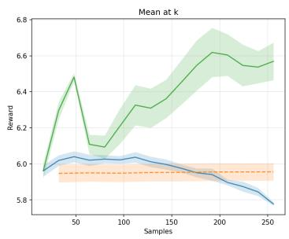

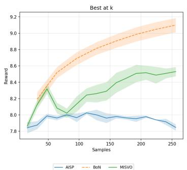

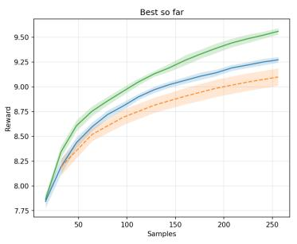

Figure 3: Reward trajectory for Gemma 3 4B/SHP as a function of the cumulative number of sampled completions. Left: mean reward within each step. Middle: maximum reward within each step. Right: cumulative maximum reward.  
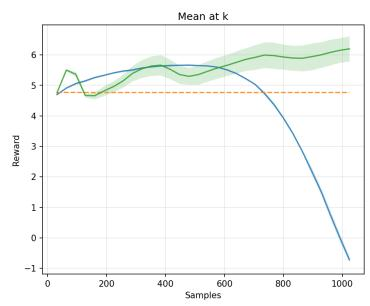

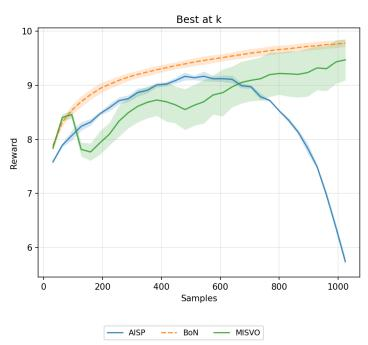

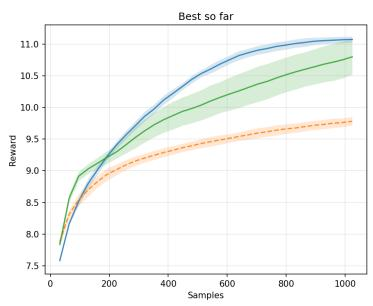

Figure 4: Reward trajectory for Llama 3 8B Instruct/SHP as a function of the cumulative number of sampled completions. Left: mean reward within each step. Middle: maximum reward within each step. Right: cumulative maximum reward.  
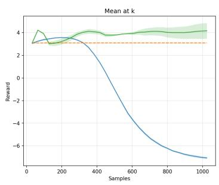

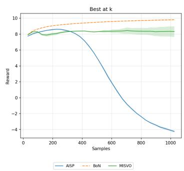

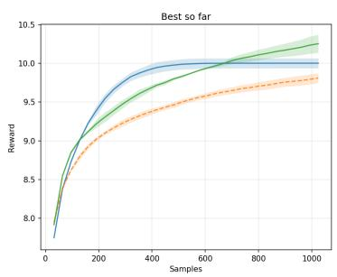  
Figure 5: Reward trajectory for Phi 4/SHP as a function of the cumulative number of sampled completions. Left: mean reward within each step. Middle: maximum reward within each step. Right: cumulative maximum reward.

## C.1 Ablation: Fisher surrogates

We compare the Fisher surrogates $\{ \bar { F } _ { t } , \bar { F } _ { t } ^ { u } , \tilde { F } _ { t } ^ { u } \}$ and a KL-regularized variant on LFM2.5-1.2B with SHP, holding the remaining hyperparameters at their main-experiment values.

Table 4: Regularizer ablation on SHP with LFM2.5-1.2B. Settings: $K = N = 1 6 , \eta = 0 . 1 , \lambda = 1 . 0 ,$ seed 42, 500 prompts. The three Fisher surrogates lie within close values of each other (Theorem 2).
<table><tr><td>Regularizer</td><td>Reward ↑</td><td>Diversity ↑</td><td>Coherence ↑</td></tr><tr><td rowspan="2">off-policy rollouts, off-policy Fisher  $\bar { F } _ { t }$  on-policy rollouts, off-policy Fisher  $\hat { F } _ { t } ^ { u }$ </td><td>9.26</td><td>0.723</td><td>0.661</td></tr><tr><td>9.06</td><td>0.721</td><td>0.659</td></tr><tr><td rowspan="2">on-policy rollouts, on-policy Fisher  $\tilde { F } _ { t } ^ { u }$  KL</td><td>8.92</td><td>0.710</td><td>0.656</td></tr><tr><td>8.35</td><td>0.725</td><td>0.660</td></tr></table>

Table 5: Per-prompt runtime, generation throughput, and peak GPU memory for each test-time alignment method on the SHP prompt set. Numbers are means over 10 timed prompts (after 5 warmup) on a single NVIDIA H200 NVL, max\_new\_tokens=512, mean prompt length 131 tokens, no cross-prompt batching. AISP uses $K { = } 1 6$ Gaussian perturbations per iteration over $N { = } 1 6$ iterations; MISVO uses $\bar { K } { = } 1 6$ trajectories over $N { = } 1 6$ gradient steps with frozen-Fisher regularization; BoN draws N=256 top-p samples.
<table><tr><td></td><td></td><td colspan="3">LFM2.5-1.2B</td><td colspan="3">Gemma3-4B-IT</td></tr><tr><td>Method</td><td>Hyperparams</td><td>Time (s)</td><td>Tok/s</td><td>Peak (GB)</td><td>Time (s)</td><td>Tok/s</td><td>Peak (GB)</td></tr><tr><td>BoN</td><td>N=256</td><td>24.4</td><td>5385</td><td>3.7</td><td>79.1</td><td>1658</td><td>12.2</td></tr><tr><td>AISP</td><td> $K { = } 1 6 , N { = } 1 6$ </td><td>43.3</td><td>3053</td><td>3.5</td><td>195.7</td><td>670</td><td>10.5</td></tr><tr><td>MISVO</td><td> $K { = } 1 6 , N { = } 1 6$ </td><td>49.3</td><td>2666</td><td>10.7</td><td>167.1</td><td>784</td><td>38.8</td></tr></table>

Table 4 reports reward differences of at most 0.34 and diversity/coherence differences of at most 0.013 among the Fisher variants. The frozen-reference surrogate has the highest reported reward in this setting. The variants’ similar performance is compatible with their local first-order equivalence, but does not establish that the experiments remain in the asymptotic regime. The KL-regularized variant has lower reported reward.

## C.2 Runtime and memory

We profile each method on two models using one NVIDIA H200 NVL. After loading the language and reward models, we process five warmup prompts followed by ten timed prompts, sequentially. CUDA events bracket each per-prompt invocation, including sampling, reward scoring, optimization, and response selection. Table 5 reports per-prompt latency, generation throughput, and peak GPU memory on SHP with a 512-token generation cap. BoN is fastest on both models; AISP and MISVO interleave generation with scoring and updates.

MISVO retains reference hidden states from the initial rollouts and uses vocabulary-sized intermediates for Fisher–vector products. These contribute to its higher peak memory. Chunked products may reduce working memory, but we do not evaluate them here.

The measurements use single-prompt batches: K rollouts per iteration for AISP/MISVO and KN candidates for BoN. Cross-prompt batching may change throughput and is outside this profiling protocol.

## D Relation to per-prompt adapter fitting

Per-prompt low-rank adaptation (LoRA) offers another form of test-time reward optimization. Its cost depends on adapter rank, placement, and the gradients required for the adapted modules. Pre-logit steering confines optimization to additive interventions at the frozen LM head and retains a shared set of model weights.

Our experiments compare candidate selection and pre-logit steering at matched rollout counts. This isolates performance at a common sampling budget but does not equalize wall-clock cost or memory. A comparison with per-prompt LoRA under both rollout and runtime budgets would broaden the evaluation. We leave this comparison to future work and make no claim that steering is preferable to adapter fitting.